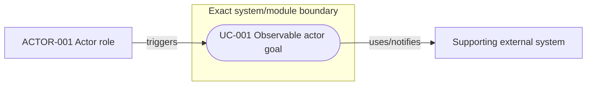
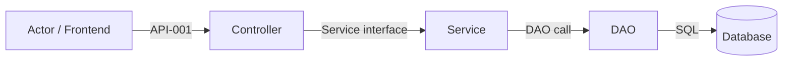
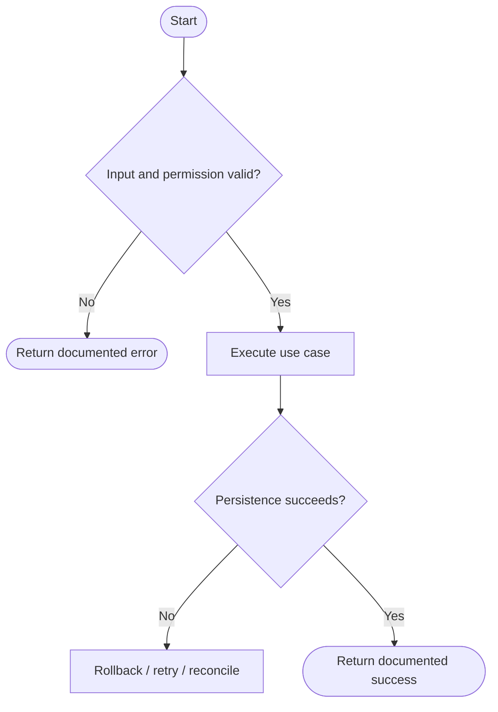
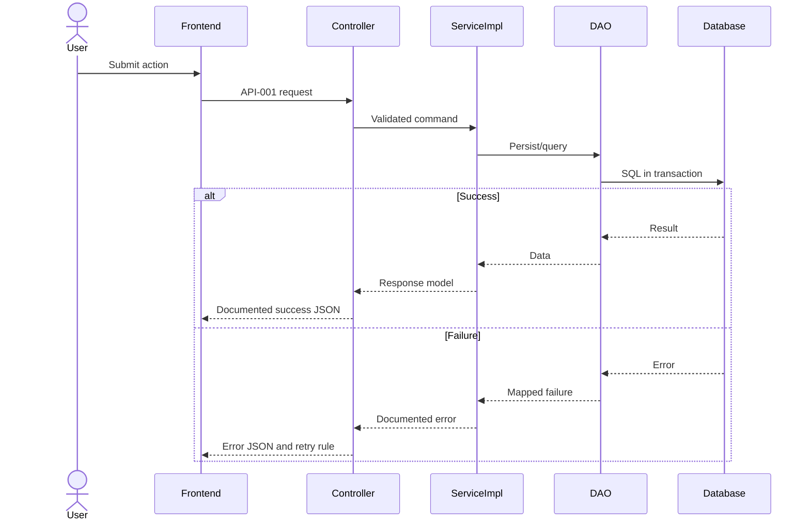
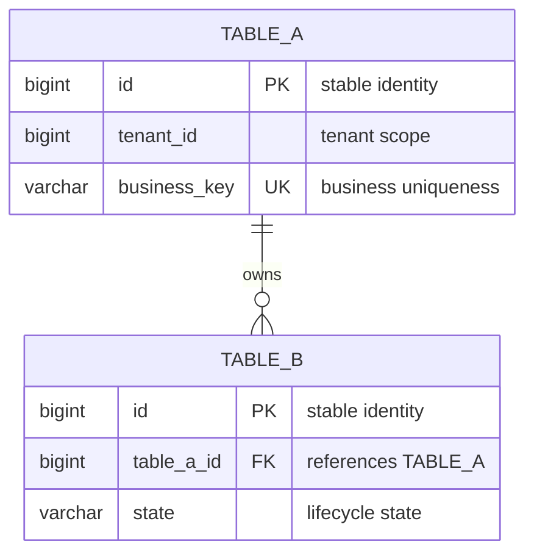

# <Specification title>

| Field | Value |
| --- | --- |
| Document | `YYYY-MM-DD-HH-MM-abstract.md` |
| Template Version | `7` |
| Status | `Draft` |
| Type | `Feature / Refactor / Bugfix / Architecture` |
| Complexity | `Simple / Complex` |
| Complexity Drivers | `<material interaction and decision-risk drivers, or None>` |
| Created | `YYYY-MM-DD HH:mm ZONE` |
| Updated | `YYYY-MM-DD HH:mm ZONE` |
| Owner | `<decision owner>` |
| Repository | `<repository>` |
| Scope | `<modules or bounded context>` |
| Change Surface | `<exact files/layers/behaviors that change>` |
| Affected Chapters | `<comma-separated §7 through §18 chapters receiving Affected detail>` |
| Source Requirement | `<user request / issue / ticket / brief>` |
| Baseline Revision | `<commit and branch, or explicit dirty-worktree snapshot>` |
| Amends | `None` |
| Supersedes | `None` |
| Depends On | `None` |
| Related Specs | `None` |
| Related Plans | `None` |

## 1. Summary

In one to three paragraphs, state the problem, selected direction, affected scope, and intended result. This section must independently answer why the change is needed, what will change, and what success looks like.

## 2. Background and Current State

### 2.1 Business and user context

### 2.2 Repository evidence

Name exact modules, paths, packages, symbols, call chains, consumers, contracts, tables, pages, configuration, tests, and predecessor Specs. Classify every material statement so an inference or stale runtime observation cannot masquerade as a current repository fact.

| Evidence ID | Classification | Exact path/symbol/decision/command | Observed fact | Design significance | Verification limit/freshness |
| --- | --- | --- | --- | --- | --- |
| `EVD-001` | Static repository / User decision / Inference / Runtime evidence | `<path:line, symbol, wording, or command>` | `<one observed fact>` | `<requirement/decision it constrains>` | `<what this does not prove, environment/date if runtime>` |

### 2.3 Problem statement and gap

Describe current behavior, desired behavior, the gap, and its impact. Separate static repository proof from runtime claims that were not verified.

### 2.4 Evidence and current-chain map

For a Complex Spec, trace every material entry/trigger through consumers, data, external dependencies, and side effects. For a Simple Spec, provide the smaller chain needed to prove the design.

| Entry/trigger | Current call chain | Data read/written | External dependency | Consumers | Evidence |
| --- | --- | --- | --- | --- | --- |
| `<entry>` | `<symbols in order>` | `<stores>` | `<system or None>` | `<callers>` | `<paths/symbols>` |

## 3. Goals and Non-goals

### 3.1 Goals

### 3.2 Non-goals

Define explicit exclusions so scope cannot silently expand during planning or implementation.

### 3.3 Change Surface and Design Depth

Read `references/change-surface-and-proportional-depth.md`. Complexity and change surface are independent: `Simple`/`Complex` controls analysis depth, while the dispositions below control design breadth. Include every materially relevant area needed to locate the change and prove where it stops.

| Area/layer | Disposition | Exact repository evidence | Changed or preserved behavior/contract | Required Spec treatment | Chapter(s) |
| --- | --- | --- | --- | --- | --- |
| `<DAO/Mapper query>` | Affected / Context-only / Unchanged / Not applicable | `<path:symbol>` | `<exact delta or preserved invariant>` | `<full design / concise boundary evidence / unchanged record / N/A>` | `§7, §8, §14` |

Use exactly these dispositions:

- `Affected` — fully design the changed code, contract, data/schema semantics, configuration, runtime behavior, or test responsibility.
- `Context-only` — write only the evidence, relied-upon invariant, reason no modification is needed, and focused verification.
- `Unchanged` — the area exists but is outside the change; write one concise unchanged record and no target design.
- `Not applicable` — the area does not exist or is irrelevant; write evidence-backed `N/A`.

The Header's `Affected Chapters` must equal the distinct chapter numbers carried by `Affected` rows. Keep all top-level chapters, but remove optional deep subsections and example tables/diagrams for areas not marked `Affected`. Do not treat reading or citing a layer as evidence that it changes.

## 4. Requirements and Acceptance Criteria

| ID | Atomic requirement | Priority | Observable acceptance criteria | Source |
| --- | --- | --- | --- | --- |
| `REQ-001` | `<one verifiable behavior or constraint>` | Must | `<observable result>` | `<original user wording or decision>` |

Avoid requirements that say only “support,” “optimize,” or “improve.” Each item must be independently testable.

### 4.1 Scenario matrix

Required for a Complex Spec. Include main, alternative, failure, retry, duplicate, timeout, permission, empty-data, concurrency, rollback, and recovery scenarios when applicable. For a Simple Spec, use a short matrix only when it adds design information.

| Scenario | Actor/trigger | Preconditions | Main path | Alternative/failure path | Data/state change | Observable result | Requirements |
| --- | --- | --- | --- | --- | --- | --- | --- |
| `<scenario>` | `<actor>` | `<conditions>` | `<flow>` | `<failure/recovery>` | `<changes>` | `<result>` | `REQ-001` |

For Complex Specs, the minimum-depth validator expects two evidence/current-chain rows, three materially distinct scenario rows, three quality/constraint rows, and two conclusion chains. When the repository genuinely contains fewer real elements, write `Depth exception:` in the affected subsection and cite the exact evidence; never use it merely for brevity.

### 4.2 Use-case analysis

Read `references/requirements-use-case-analysis.md`. Identify real external roles/systems, then express actor goals with stable `ACTOR-*` and `UC-*` IDs. Use either a complete use-case table or a Mermaid `flowchart`; for complex or multi-actor behavior, prefer the visual system-boundary view plus concise detail. Do not draw Controller/Service/DAO calls as use cases.

#### 4.2.1 Actor inventory

| Actor ID | Actor/role | Goal and responsibility | Entry/channel | Permission/tenant context | Evidence |
| --- | --- | --- | --- | --- | --- |
| `ACTOR-001` | `<role/system>` | `<goal>` | `<page/API/event/job>` | `<context>` | `<path/symbol/user wording>` |

#### 4.2.2 Use-case artifact

Table form:

| ID | Use case/goal | Primary actor | Supporting actors/systems | Trigger | Preconditions | Main success outcome | Alternatives/failures | Postconditions | Requirements | Interfaces/pages | Tests |
| --- | --- | --- | --- | --- | --- | --- | --- | --- | --- | --- | --- |
| `UC-001` | `<action and goal>` | `ACTOR-001` | `<actors/systems>` | `<event>` | `<conditions>` | `<observable outcome>` | `<named branches>` | `<success/failure state>` | `REQ-001` | `API-001 / <page>` | `TEST-001` |

Mermaid form, when it communicates actors and boundaries more clearly:



Whichever form is selected, define the actor, trigger, preconditions, main success result, material alternative/failure outcomes, success/failure postconditions, and forward links to requirements, contracts/pages, models/tables, and tests. Add one `#### 4.2.x UC-NNN — Name` detail block when the chosen artifact cannot hold those semantics clearly.

## 5. Constraints, Assumptions, and Decisions

### 5.1 Confirmed constraints

### 5.2 Small-gap assumptions

| ID | Inference | Repository evidence | Why locally reversible | Impact if wrong |
| --- | --- | --- | --- | --- |
| `ASM-001` | `<minimal inference>` | `<path/convention>` | `<reason>` | `<impact>` |

### 5.3 Resolved decisions

| ID | Decision | Decision owner | Evidence and rationale | Requirements |
| --- | --- | --- | --- | --- |
| `DEC-001` | `<confirmed choice>` | `<owner>` | `<evidence>` | `REQ-001` |

### 5.4 Open major decisions

| ID | Question and options | Recommendation, not decision | Impact | Owner | Status |
| --- | --- | --- | --- | --- | --- |
| `DEC-002` | `<blocking choice>` | `<recommended option and why>` | `<scope/contract/data impact>` | User | Open |

## 6. Project Technology Context

Document only the repository technologies and instructions that constrain the affected work or prove a stopping boundary: relevant languages/versions, frameworks, build tools, module/package style, persistence/migration mechanism, test tools, and deployment facts. Do not inventory the entire repository stack for a focused change.

| Concern | Current choice | Repository evidence | Constraint on design |
| --- | --- | --- | --- |
| Language/runtime | `<...>` | `<manifest/path>` | `<...>` |

### 6.1 Java architecture profile and capability baseline

Read `references/java-spring-egon-coding-standards.md`. Select exactly one allowed profile from current repository evidence: Traditional Three-Layer, or the exact selected `egon-cola-archetype` Light/Service/Web family and variant. If neither matches, record a blocking decision; do not create a hybrid structure.

| Architecture profile | Archetype/template or base package | Exact evidence and verifier | Existing deviations | Design action |
| --- | --- | --- | --- | --- |
| Traditional Three-Layer / Egon-COLA Light / Service / Web / Open variant | `<template path or base package>` | `<POM/tree/ArchUnit/generated verifier/DEC-*>` | `<None or exact deviations>` | `<preserve profile / block and ask user>` |

Record the reuse/capability ledger before proposing a dependency or custom implementation:

| Need | Spring/JDK candidate | Spring Boot Starter candidate | Egon-COLA/module candidate | Proven gap | Decision/dependency impact |
| --- | --- | --- | --- | --- | --- |
| `<capability>` | `<API or None>` | `<starter or None>` | `<path/component or None>` | `<evidence or None>` | `<reuse / approved addition / blocker>` |

### 6.2 User-mandated Java rule compliance

Read `references/user-mandated-java-rules.md`. Keep one independent row for every original rule number; do not merge, renumber, paraphrase away, or downgrade a mandatory rule. For non-Java work, retain all rows and use evidence-backed `N/A`.

| Literal rule | Affected? | Repository evidence | Exact design decision | Files/types/interfaces | Validation/test evidence | Status/blocker |
| --- | --- | --- | --- | --- | --- | --- |
| Rule 1 | Yes / No | `<all new/changed Java types and nearby conventions>` | `<mandatory semantic suffix decisions>` | `<exact paths/types>` | `<naming inventory/static review>` | PASS / N/A / BLOCKED |
| Rule 2 | Yes / No | `<every affected layer handoff>` | `<constraints/groups/ValidationUtils/libphonenumber>` | `<boundary types/methods>` | `<positive/negative/group tests>` | PASS / N/A / BLOCKED |
| Rule 3 | Yes / No | `<affected data objects and BaseConverter>` | `<record/@Value/complete complex Lombok baseline/MapStruct>` | `<models/converters>` | `<constructor/mapping tests>` | PASS / N/A / BLOCKED |
| Rule 4 | Yes / No | `<business classes/Beans/lombok.config>` | `<@Slf4j/named Bean/@RequiredArgsConstructor/@Qualifier>` | `<business classes/config>` | `<wiring/logging tests or static gate>` | PASS / N/A / BLOCKED |
| Rule 5 | Yes / No | `<imports/dependencies/existing helpers>` | `<closed utility allowlist>` | `<affected utility call sites>` | `<dependency/import search>` | PASS / N/A / BLOCKED |
| Rule 6 | Yes / No | `<external JSON contracts>` | `<Jackson annotations/default proof>` | `<DTO/VO/Request/Response/etc.>` | `<serialization/compatibility tests>` | PASS / N/A / BLOCKED |
| Rule 7 | Yes / No | `<all environment profiles>` | `<identical key structure; values may differ>` | `<profile files/properties class>` | `<key-parity/config binding tests>` | PASS / N/A / BLOCKED |
| Rule 9 | Yes / No | `<business-complexity classification>` | `<mandatory pattern for Complex logic>` | `<participants/files>` | `<variation/branch/pattern tests>` | PASS / N/A / BLOCKED |
| Rule 10 | Yes / No | `<all affected time fields/APIs>` | `<java.time types and boundary semantics>` | `<exact paths/fields>` | `<time/serialization/persistence tests>` | PASS / N/A / BLOCKED |
| Rule 11 | Yes / No | `<current tree/archetype/verifier>` | `<traditional or exact Archetype only>` | `<target package/file tree>` | `<architecture verifier/static gate>` | PASS / N/A / BLOCKED |

## 7. Architecture Design

Allocate this chapter using §3.3. Fully design affected collaboration and the minimum surrounding boundary needed for coherence. For a focused change, cite unchanged system/high-level context rather than redesigning every layer.

### 7.0 Minimum-design baseline and element-necessity audit

Read `references/minimal-design-and-interface-necessity.md`. Start from the repository-consistent direct/reuse/no-new-element option. Inventory every new or materially expanded element and reject complexity that has no current requirement-backed advantage.

| Proposed element | Change | Requirements | Existing/direct alternative | Concrete inadequacy of alternative | Added calls/state/coupling/failures/migration/operations | Verdict |
| --- | --- | --- | --- | --- | --- | --- |
| `<API/class/table/cache/job/layer/dependency/frontend store>` | New / Expand / Keep / Remove | `REQ-001` | `<reuse/derive/direct path>` | `<evidence-backed gap or None>` | `<costs>` | Add / Keep / Merge / Remove |

Record the critical-path interaction comparison:

| Path | Network calls | Client states | Server contracts/state | Failure and TOCTOU points | Additional user/business value |
| --- | --- | --- | --- | --- | --- |
| Direct baseline | `<count>` | `<states>` | `<elements>` | `<points>` | `<outcome>` |
| Selected design | `<count>` | `<states>` | `<elements>` | `<points>` | `<why added complexity is required>` |

The selected design must have the fewest moving parts among options satisfying the approved requirements. A Complex classification increases analysis depth, not architecture size.

### 7.1 System Architecture Design

Define only the affected system context and the adjacent current boundaries needed to prove coherence: relevant actors, modules/services, data stores, external systems, trust/deployment boundaries, ownership, and dependency direction. Do not convert an unchanged surrounding system into target architecture work.

For the traditional profile, preserve dependency rules among `biz.controller`, `biz.service`, `biz.service.impl`, `biz.dao`, `biz.config`, `biz.utils`, and `biz.domain`. For an Egon-COLA profile, preserve the exact selected Archetype modules/packages and generated dependency verifier. Include only affected and boundary-proving components. Never mix `biz.*` with an Archetype COLA module tree or invent a new layer.

#### 7.1.1 Architecture Mermaid view

For a Complex Spec, use a Mermaid `flowchart` with real component/store/system names and direction-labelled edges. Show trust, deployment, or ownership boundaries with subgraphs when applicable. A focused Simple Spec omits this view when it adds no information and writes the matching `Context-only`, `Unchanged`, or evidence-backed `N/A` scope record instead.



#### 7.1.2 Boundary and responsibility table

| Module/component | Capability and data owned | Inputs/outputs | Allowed dependencies | Forbidden responsibility | Requirements |
| --- | --- | --- | --- | --- | --- |
| `<name>` | `<ownership>` | `<contracts>` | `<dependencies>` | `<must not know/do>` | `REQ-001` |

### 7.2 High-Level Design

Summarize key use cases, selected collaboration model, main data/control flow, state ownership, source of truth, major design decisions, and alternative/failure outcomes. Keep this level understandable without class-by-class implementation detail.

#### 7.2.1 Critical business/control flowchart

For a Complex Spec, provide a separate Mermaid `flowchart` for the critical use case. Include decisions, validation/permission failures, retries, partial failures, rollback/recovery, and terminal outcomes as applicable.



#### 7.2.2 High-level decision and quality matrix

| Concern/use case | Required behavior | Selected mechanism | Failure/degradation behavior | Trade-off | Verification | Requirements |
| --- | --- | --- | --- | --- | --- | --- |
| `<concern>` | `<behavior/SLO>` | `<design>` | `<failure behavior>` | `<cost>` | `<test/evidence>` | `REQ-001` |

### 7.3 Detailed Design

Describe component/class responsibilities, exact collaboration and data transformations, validation/order of operations, state transitions, transaction boundaries, concurrency/idempotency, cache/external calls, failure/recovery, and observability. Cross-reference Chapters 8-14 instead of contradicting or duplicating them.

#### 7.3.1 Detailed component collaboration

| Step | Caller -> callee | Contract/symbol | Input/output mapping | State/data effect | Failure behavior | Requirements |
| --- | --- | --- | --- | --- | --- | --- |
| `1` | `<caller -> callee>` | `<API/service/DAO>` | `<mapping>` | `<effect>` | `<error/recovery>` | `REQ-001` |

#### 7.3.2 Critical-path Mermaid swimlane

For a Complex Spec, use a Mermaid `sequenceDiagram` as the swimlane. Include actor/frontend/controller/service/DAO/database/external participants as applicable, plus important validation, failure, retry, timeout, rollback, or asynchronous behavior.



#### 7.3.3 Transactions, consistency, concurrency, and idempotency

| Concern/state change | Owner and boundary | Mechanism/isolation/lock | Concurrent or duplicate behavior | Commit/visibility point | Failure result | Requirements/tests |
| --- | --- | --- | --- | --- | --- | --- |
| `<mutable fact>` | `<Service/transaction/store>` | `<transaction/version/key>` | `<race/duplicate rule>` | `<when authoritative>` | `<rollback/conflict/unknown>` | `REQ-001 / TEST-001` |

State who opens and joins each transaction, which writes are atomic, which external effects are not, how lost updates and duplicate requests are detected, and what the caller observes after a conflict or unknown outcome. “Transactional,” “eventually consistent,” and “idempotent” require exact boundaries and identities.

#### 7.3.4 Failure semantics, recovery, and reconciliation

| Failure point | Detection | Immediate control flow | Data/transaction state | Retry and idempotency | Caller/frontend result | Recovery/reconciliation owner | Verification |
| --- | --- | --- | --- | --- | --- | --- | --- |
| `<failure>` | `<exception/code/timeout/metric>` | `<reject/rollback/degrade>` | `<none/partial/committed/unknown>` | `<who, what, key, limit>` | `<interface outcome/UI action>` | `<automatic/job/operator>` | `TEST-001 / <runtime evidence>` |

Include each external boundary, asynchronous handoff, partial write, rollback failure, response loss after commit, retry exhaustion, stale cache/projection, and operator repair path that materially applies. Never use one generic “log and throw” row for unrelated failures.

#### 7.3.5 Observability and operational boundaries

| Signal/runbook | Emitting owner and point | Fields/dimensions | Sensitive-data rule | Success/failure threshold | Alert/dashboard/operator action | Verification boundary |
| --- | --- | --- | --- | --- | --- | --- |
| `<log/metric/trace/audit>` | `<component and lifecycle point>` | `<stable IDs, result, latency>` | `<mask/omit>` | `<expected or SLO>` | `<action and owner>` | `<static/integration/runtime>` |

Define correlation propagation, stable operation/result/error dimensions, metric cardinality controls, audit ownership, alert conditions, reconciliation visibility, and what can only be verified after deployment. Logging an exception without an actionable identity or owner is not an operational design.

#### 7.3.6 Conclusion evidence chain

For each material Complex-Spec conclusion, record `Evidence -> Constraint/Requirement -> Decision -> Consequence/Trade-off -> Verification`. If any link depends on an unresolved major assumption, move it to §5.4 and use a blocked verdict.

| Conclusion | Repository/user evidence | Constraint or requirement | Design decision | Consequence and trade-off | Verification and acceptance evidence |
| --- | --- | --- | --- | --- | --- |
| `<conclusion>` | `<path/symbol/decision>` | `REQ-001 / <constraint>` | `<selected design>` | `<benefit and cost>` | `TEST-001 / <observable evidence>` |

A Complex Spec normally needs at least two rows covering different decision classes, for example ownership/contract and consistency/failure handling. Do not split one conclusion into cosmetic duplicates merely to satisfy the row count.

## 8. Package Structure and Code File Tree

### 8.1 Current relevant tree

```text
<only repository paths relevant to this design>
```

### 8.2 Target tree

For a focused Spec, show only exact affected files plus the minimum parent/context paths needed to locate them. Use the full skeleton below only when those layers are actually `Affected`; delete unused branches rather than documenting them as target work.

```text
<base-package>/biz
├── controller
├── service
│   └── impl
├── dao
├── config
├── utils
└── domain
    └── <only justified POJO role packages and files>
```

Expand only the affected subtree into exact CREATE / MODIFY / DELETE file paths and packages; do not put implementation order here. `impl` must remain nested under `service` when Service implementation work is affected. Never retain Controller, Service, DAO, Config, Utils, domain, frontend, or migration branches merely because the template shows them.

### 8.3 Package and file responsibilities

| Operation | Path/package | Symbols | Responsibility | Dependencies | Requirements |
| --- | --- | --- | --- | --- | --- |
| Create / Modify / Delete | `<exact path>` | `<class/function/component>` | `<single responsibility>` | `<existing/new dependencies>` | `REQ-001` |

Explain moves or deletions, generated-file handling, registration/wiring ownership, and consumer impact. The target tree must be complete enough for a Plan to derive ordered file steps without inventing architecture.

## 9. Interface Definitions

When §9 is `Affected`, read `references/interface-contract-design.md`, inventory every changed HTTP/RPC/event/message/CLI/scheduled-job/internal Service operation, and expand each contract completely. If any external REST or GraphQL API is affected, also read `references/api-rest-cqrs-graphql-openapi.md` completely and retain §§9.0–9.4. When §9 is `Context-only` or `Unchanged`, remove §§9.0–9.4 and write only the exact existing route/symbol, consumers, preserved request/response/error/documentation invariant, stopping reason, and focused regression evidence. Do not reproduce full JSON, OpenAPI annotations, or GraphQL SDL for an unchanged boundary.

### 9.0 API protocol and documentation governance

Required when an external API is affected. Use repository and accepted-Spec evidence; do not choose REST, GraphQL, CQRS depth, springdoc, or documentation exposure from generic preference.

| Concern | Decision/evidence |
| --- | --- |
| Protocol selection | `<REST, GraphQL, or justified coexistence; named consumers/use cases and why the direct existing protocol is insufficient>` |
| CQRS application level | `<L0/L1/L2/L3 from the API reference; Query/Command/Subscription ownership; why this is the smallest sufficient level>` |
| REST source of truth | `<Code-first mappings/types/validation/Jackson/annotations, Contract-first document, or N/A with evidence>` |
| GraphQL source of truth | `<SDL paths, resolver and consumer operation paths, or N/A with evidence>` |
| Springdoc/OpenAPI compatibility | `<Spring Boot generation, MVC/WebFlux, managed starter/version source, OAS 3.0/3.1 compatibility, or N/A>` |
| Legacy Swagger/Springfox status | `<absent, compatibility-only boundary, or separately approved migration; exact dependency/config evidence>` |
| Security and documentation exposure | `<scheme names, permissions/tenant, docs/UI/introspection environment and access policy>` |
| Contract publication and drift gate | `<generated OpenAPI/schema/operation artifact, owner, exact test/validation/diff path>` |

### 9.1 Interface Inventory

Required only when §9 is `Affected`. Use one ID per atomic REST Method + URL, GraphQL root-field operation contract, or other protocol operation. Split collection/detail/create/update/delete/status endpoints into separate IDs even when they share models or rules. A GraphQL row must identify both the transport and exact `Query.field`, `Mutation.field`, or `Subscription.field`; `/graphql` alone is not an operation.

| ID | Change/necessity verdict | Name/purpose | Kind | API style/CQRS role | Consumer | Owner | Method + URL / GraphQL field / symbol / topic | Operation ID/schema source | Input | Output | Auth/tenant | Error model | Idempotency/version | Requirements |
| --- | --- | --- | --- | --- | --- | --- | --- | --- | --- | --- | --- | --- | --- | --- |
| `API-001` | Existing/Keep or New/Add after necessity audit | `<purpose>` | HTTP | REST Query / REST Command | `<frontend/page>` | `<module>` | `POST /exact/path` | `<explicit lowerCamelCase operationId>` | `<Command/Query/Request>` | `<actual wrapper>` | `<rules>` | `<model>` | `<rules>` | `REQ-001` |
| `API-002` | Existing/Keep or New/Add after necessity audit | `<purpose>` | GraphQL | GraphQL Query / GraphQL Mutation / GraphQL Subscription | `<frontend/page>` | `<module>` | `POST /graphql :: Query.exactField` | `<SDL path + field + named operation document>` | `<variables/input>` | `<selection/payload>` | `<rules>` | `<GraphQL errors/extensions>` | `<rules>` | `REQ-002` |

### 9.2 Per-interface Detailed Contracts

Repeat §9.2.x for every inventory ID. Inventory and detail items must be one-to-one.

#### 9.2.1 API-001 — <Interface name>

##### Necessity and interaction-cost decision

| Concern | Decision |
| --- | --- |
| Change classification | Existing / Modify / New / Remove |
| Independent consumer goal | `<observable goal; not “frontend needs a parameter”>` |
| Parameter ownership and derivation | `<true owner; what target derives from identity/context/resource/config>` |
| Direct/no-new-interface alternative | `<reuse/merge/target extension/local data and why sufficient or insufficient>` |
| Caller use of result | `<display/selection/branch/cache, or unchanged forwarding>` |
| Round trips and failure points | `<before/after call count, client states, cache, retry, TOCTOU>` |
| Verdict | Add / Keep / Merge / Remove, with requirement/evidence |

Default to `Merge`, `Reuse`, or `Remove` when this interface only returns values copied unchanged into another request or values the target backend can safely derive. A separate selector/discovery contract requires an independent user-visible choice, shared dynamic catalog, or protocol-negotiation use case plus command-time revalidation.

##### API style and CQRS semantics

Required for every external `API-*`; omit for a non-HTTP protocol contract.

| Concern | Decision/evidence |
| --- | --- |
| Protocol style | `REST Query / REST Command / GraphQL Query / GraphQL Mutation / GraphQL Subscription` |
| CQRS role | `<Query is read-only; Command task/change; Subscription stream; exact owner>` |
| Resource/task semantics | `<REST resource URI and method semantics, or GraphQL field/task semantics>` |
| Read/write and side effects | `<authoritative reads, writes, events/audit; prove a Query has no business mutation>` |
| Consistency and idempotency | `<transaction, concurrency, duplicate, retry, stale-read and eventual-consistency behavior>` |
| Why this style | `<consumer/use-case evidence and why the simpler existing protocol/level is insufficient>` |

##### Identity and purpose

| Concern | Definition |
| --- | --- |
| Purpose/owner/consumer | `<business purpose, module, frontend page or caller>` |
| Protocol and endpoint | `HTTP POST /verified/application/path` or `HTTP POST /graphql :: Query.field` |
| Content type/version | `application/json; <version>` or verified GraphQL request/response media types |
| Auth/permission/tenant | `<exact sources and rules>` |
| Timeout/retry/rate limit | `<rules>` |
| Idempotency/concurrency | `<key, duplicate and concurrent behavior>` |

##### Request parameters

Document Path, Query, Header, Cookie, Multipart, and Body separately. Omit a location only with `None`.

| Name | Location | Type/format | Required/null | Default | Validation/range/enum | Meaning | Example | Source |
| --- | --- | --- | --- | --- | --- | --- | --- | --- |
| `<name>` | Path / Query / Header / Body | `<type>` | `<rules>` | `<value>` | `<exact rules>` | `<meaning>` | `<example>` | `<request/context>` |

If a Request Body exists, show its complete nested documentation shape. Every field key needs a line-end comment; real wire JSON does not contain comments.

```jsonc
{
  "field": "value", // Required. Exact meaning, validation rule, and relevant default/null semantics.
  "nested": { // Required/optional. Meaning of the nested object.
    "child": 1 // Required. Exact child-field meaning and allowed range.
  }
}
```

For GraphQL, also include the complete affected SDL fragment, named consumer operation document, and variable rules. Expand every affected referenced input/output type; do not treat the generic `/graphql` JSON envelope as the business schema.

```graphql
mutation ExactCommand($input: ExactCommandInput!) {
  exactCommand(input: $input) {
    resultId
    status
  }
}
```

##### Success response

State the HTTP/protocol status and response headers, then show the actual repository wrapper and full nested payload. Do not use a class name or `...` as the response. Every field key needs a line-end comment.

```jsonc
{
  "code": "SUCCESS", // Stable application result code from the actual response wrapper.
  "message": "ok", // Result message and localization semantics.
  "data": { // Successful payload and its nullability.
    "id": 1001, // Stable resource identifier and frontend use.
    "status": "ACTIVE" // Current status; define all values and frontend meaning.
  }
}
```

| Field path | Type/format | Required/null/default | Validation/enum/precision | Meaning and source | Frontend use |
| --- | --- | --- | --- | --- | --- |
| `data.id` | `<type>` | `<rules>` | `<rules>` | `<source/meaning>` | `<display/state use>` |

##### Error responses

| Condition | HTTP/protocol status | Business code | Response shape | Retryable | Frontend handling |
| --- | --- | --- | --- | --- | --- |
| `<condition>` | `<status>` | `<code>` | `<wrapper>` | Yes / No | `<display/retry/refresh>` |

```jsonc
{
  "code": "ERROR_CODE", // Stable business error code and triggering condition.
  "message": "Readable message", // Display/logging semantics and localization behavior.
  "data": null // Error payload nullability or structured validation details.
}
```

##### Interface logic for frontend and consumers

1. `<precondition and authoritative context>`
2. `<validation and permission order>`
3. `<main query/calculation/state transition>`
4. `<database/cache/external calls and transaction boundary>`
5. `<side effects/events/audit/derived fields>`
6. `<duplicate/concurrency/timeout/failure/rollback behavior>`
7. `<frontend loading, confirmation, refresh/navigation, cache, retry, error, or polling behavior>`

For GraphQL Query/nested fields, explicitly cover selection/fetch ownership, pagination, batching/DataLoader, N+1 prevention, null/partial-data behavior, depth/complexity/cost limits, and field authorization. For Mutation, cover the same command-time validation, transaction, idempotency, state, side-effect, and retry semantics expected of a REST Command.

##### Documentation contract

Required for every external `API-*`.

| Concern | Decision/evidence |
| --- | --- |
| Documentation authority | `<REST Code-first/Contract-first or GraphQL SDL; exact path/symbol>` |
| REST OpenAPI operation / GraphQL SDL operation | `<operationId and Method + URL, or type.field and named operation>` |
| Annotation/mapping ownership | `<Controller/existing API interface and OpenAPI annotations, or Spring GraphQL resolver mappings>` |
| Generated schema elements | `<parameters/requestBody/responses/security/schemas, or SDL/input/output/null/error contract>` |
| Compatibility and drift proof | `<generation/schema check, diff/contract tests, owner and exact feasible command/path>` |

For REST, add the per-target annotation plan. Use only `io.swagger.v3.oas.annotations.*`; do not add Springfox/Swagger 2 annotations.

| Target | Required annotation/configuration | Exact values/source | Generated OAS effect | Verification |
| --- | --- | --- | --- | --- |
| `<Controller#method>` | `@Operation`, `@ApiResponses`, `@SecurityRequirement` as applicable | `<summary/description/operationId/status/scheme from contract>` | `<exact path operation>` | `<generated document assertion>` |
| `<Request/Response field>` | `@Schema` only for missing/non-obvious wire semantics; Bean Validation/Jackson remain runtime authority | `<description/example/format/enum/access>` | `<component schema>` | `<schema/serialization/validation assertion>` |

For GraphQL, replace the annotation table with this artifact/mapping table. Swagger annotations are `N/A` for GraphQL field documentation.

| GraphQL artifact | Exact path/symbol | Contract content | Spring mapping | Verification |
| --- | --- | --- | --- | --- |
| SDL | `<src/main/resources/graphql/**.graphqls>` | `<type.field, inputs, outputs, nullability, enums/scalars>` | `<@QueryMapping/@MutationMapping/@SchemaMapping/@BatchMapping>` | `<schema and resolver test>` |
| Consumer operation | `<src/test/resources/graphql-test/**.graphql or frontend path>` | `<named operation, variables, selection>` | `<GraphQlTester/consumer>` | `<response/error/partial-data test>` |

##### Compatibility and verification

Name consumers, version/deprecation behavior, compatibility constraints, contract/validation/permission/error tests, generated OpenAPI or GraphQL schema/operation checks, and frontend fixtures/mocks. For non-HTTP contracts, replace URL/JSON-specific fields with the exact RPC/event/job/CLI protocol details while preserving the same design depth.

### 9.3 OpenAPI 3 and springdoc annotation plan

Required when an external API is affected. For every affected REST target, state annotation/configuration ownership and the exact generated OAS effect. For a GraphQL-only change, keep one evidence-backed `N/A` row explaining why SDL and operation documents—not Swagger annotations—are authoritative.

| Target | Required annotation/configuration | Exact values/source | Generated OAS effect | Verification |
| --- | --- | --- | --- | --- |
| `<OpenAPI metadata/security config>` | `@OpenAPIDefinition`, `@SecurityScheme`, `GroupedOpenApi`, properties, or N/A | `<verified repository values>` | `<info/tags/securitySchemes/groups/docs paths>` | `<config/document/security check>` |
| `<API-001 Controller#method or functional route>` | `@Operation`, `@Parameter`, OpenAPI `@RequestBody`, `@ApiResponse`, `@Content`, `@Schema`, `@ArraySchema`, `@SecurityRequirement`, `@Hidden`; springdoc `@ParameterObject`/`@RouterOperation` only as applicable | `<exact contract values>` | `<path/operation/components/security>` | `<generated OAS assertions>` |
| `<GraphQL-only>` | `N/A — SDL and named operation documents are authoritative` | `<SDL/resolver/consumer evidence>` | `N/A` | `<schema/GraphQlTester checks>` |

State the Spring Boot/springdoc compatibility source, managed starter, OAS version, MVC/WebFlux choice, legacy Springfox boundary, document/UI exposure per environment, Security path rules, proxy/gateway behavior, and any aggregation failure/collision semantics. Do not hardcode a dependency version without current project evidence.

### 9.4 API contract generation and blocking gate

Required when an external API is affected. Execute every row manually against the repository-backed design. `PASS` means the Spec contains an exact coherent decision and feasible proof; it does not claim unexecuted implementation/runtime validation. `N/A` requires concrete evidence that the named protocol is absent. Any other status blocks the final PASS verdict and must be reflected in Chapter 20.

| Gate ID | Applicability | Status | Evidence | Finding | Required action/exception |
| --- | --- | --- | --- | --- | --- |
| `API-GATE-001` | Applicable | PASS / FAIL / BLOCKED | `<necessity and atomic inventory evidence>` | `<independent goal; no fetch-then-forward>` | `None / exact action` |
| `API-GATE-002` | Applicable | PASS / FAIL / BLOCKED | `<protocol/CQRS table and repository evidence>` | `<smallest sufficient style and CQRS level>` | `None / exact action` |
| `API-GATE-003` | Applicable / Not applicable | PASS / N/A / FAIL / BLOCKED | `<all affected REST details or absence evidence>` | `<resource/method/status/header/idempotency/pagination/compatibility result>` | `None / exact action` |
| `API-GATE-004` | Applicable / Not applicable | PASS / N/A / FAIL / BLOCKED | `<all affected GraphQL details or absence evidence>` | `<SDL/operation/null/resolver/batching/cost/security/error result>` | `None / exact action` |
| `API-GATE-005` | Applicable | PASS / FAIL / BLOCKED | `<validation/Jackson/coercion/schema/examples evidence>` | `<wire and runtime constraint consistency>` | `None / exact action` |
| `API-GATE-006` | Applicable | PASS / FAIL / BLOCKED | `<security/tenant/errors/exposure evidence>` | `<access, disclosure, rate/cost and docs policy>` | `None / exact action` |
| `API-GATE-007` | Applicable / Not applicable | PASS / N/A / FAIL / BLOCKED | `<springdoc/annotation/legacy evidence or no REST evidence>` | `<OpenAPI generation ownership and compatibility>` | `None / exact action` |
| `API-GATE-008` | Applicable | PASS / FAIL / BLOCKED | `<exact generated-contract/schema/test/diff path or commands>` | `<feasible drift and contract proof>` | `None / exact action` |
| `API-GATE-009` | Applicable | PASS / FAIL / BLOCKED | `<traceability and cross-chapter comparison>` | `<field/outcome consistency>` | `None / exact action` |

## 10. POJO and Data Model Design

When §10 is `Affected`, design only changed/new types, fields, mappings, lifecycle, or reuse decisions. When it is `Context-only` or `Unchanged`, remove §§10.1–10.7 and cite only the exact existing type/mapping and preserved invariant. Do not inventory every POJO role in the module.

### 10.1 POJO role classification and class necessity

Classify every proposed Java object by its repository-defined semantic role. State the exact local meaning of ambiguous `DO`, `VO`, or `Entity` terms. `POJO` is an umbrella term, DAO is an access component rather than a data carrier, and `VO` means View Object in this profile.

| Object/path | Selected role | Owner/boundary and consumers | Why a distinct class is necessary or reuse is safe | Mapping owner | Requirements |
| --- | --- | --- | --- | --- | --- |
| `<Type>` | PO / DTO / View Object / BO / ORM Entity / Query / Command / Event / Request / Response / PageQuery / PageResult | `<owner and crossings>` | `<concrete semantic difference or safe reuse evidence>` | `<MapStruct/MapStructPlus converter or None>` | `REQ-001` |

Do not introduce new ambiguous `DO`, `Data`, `Info`, `Param`, or `Bean` carriers. Do not create parallel PO/Entity/BO/DTO/VO/Request/Response types merely because architectural layers exist. Add a class only for a real ownership, contract, validation/exposure, lifecycle/invariant, persistence, projection, pagination, or independent-versioning boundary. Do not expose a persistence object as a public contract merely to reduce the class count.

### 10.2 Persistence objects, ORM entities, and business data objects

| Model | Kind | Ownership/lifecycle | Validation and state rules | Persistence | Requirements |
| --- | --- | --- | --- | --- | --- |
| `<name>` | PO / ORM Entity / BO / Other justified role | `<owner>` | `<rules>` | `<table/none>` | `REQ-001` |

Do not introduce Aggregate, Domain Service, Repository Port, or DDD Value Object concepts in the current traditional three-layer profile.

### 10.3 Field design

| Model.field | Type | Required/null/default | Validation and semantics | Source/mapping | Requirements |
| --- | --- | --- | --- | --- | --- |
| `<Type.field>` | `<language type>` | `<rules>` | `<meaning>` | `<DTO/PO/column>` | `REQ-001` |

### 10.3.1 Representation, construction, and validation

| Type | Record / class / immutable class | Lombok annotations or compact constructor | Validation annotations/groups | Normalization | Framework/ORM reason | Tests |
| --- | --- | --- | --- | --- | --- | --- |
| `<Type>` | `<representation>` | `<record compact constructor / @Value / complete complex-class baseline>` | `<Jakarta constraints and groups>` | `<named boundary/helper/library>` | `<reason or blocking constructor conflict>` | `TEST-001` |

Simple objects use records; immutable non-record objects use `@Value`; complex objects use a normal class with the complete `@Data`, protected `@NoArgsConstructor`, `@AllArgsConstructor`, `@RequiredArgsConstructor`, `@Builder`, and `@Accessors(chain = true)` baseline. Calculate generated constructor signatures. Any duplicate signature or framework conflict is blocking and cannot be resolved by silently deleting an annotation.

### 10.4 Object flow and mapping relationships

Define mappings only between semantically distinct types. Use MapStruct or MapStructPlus, and require every new affected Converter to implement/inherit the Egon `BaseConverter<S,T>` system. Name its exact generic types, Bean, generated implementation, sensitive/derived/defaulted fields, normalization, enum/time handling, and null rules. If the contract cannot represent the conversion, block for user decision; do not bypass it. Avoid no-op mapper chains, manual Service `set/get`, `BeanUtils.copyProperties`, reflection copying, and JSON round trips. When data crosses three or more roles, include an object-flow diagram or complete field-mapping table.

### 10.5 Reuse, inheritance, and composition decisions

For PO or ORM Entity inheritance, document the `is-a` or common-lifecycle reason, inherited fields and state rules, ORM table/discriminator/proxy behavior, identity and equality, serialization, migration, compatibility, and tests. Persistence inheritance is allowed but not mandatory; prefer composition when no substitutable persistence relationship exists.

Concrete classes under `biz.service.impl` must use composition and delegation by default. Do not introduce a business `BaseService` or Service inheritance tree merely for code reuse. Any framework-mandated or existing Template Method exception must explain why composition is insufficient and how substitutability and testability remain safe.

### 10.6 State transitions and lifecycle

Define allowed transitions, guards, side effects, invalid transitions, and concurrency/version rules.

### 10.7 Relational model consistency

When relational persistence applies, map persistence objects/ORM entities and relationship fields to the exact Chapter 11 ER entities/tables and keys. Confirm cardinality, optionality, tenant scope, ownership, lifecycle, and cascade/orphan behavior agree with the Mermaid ER diagram and per-table constraints. If no relational model exists, write evidence-backed `N/A`.

## 11. Database Design

When database schema, data semantics, constraints, indexes, migrations, transaction/locking behavior, or authoritative persistence ownership is `Affected`, read `references/database-design.md` and use the repository's actual dialect, migration mechanism, naming, and access layer. For a DAO query-only change with unchanged schema, remove §§11.1–11.3 and record the exact query/access path, relevant columns and existing index evidence, preserved schema/relationship invariant, and focused verification. If no database is relevant, write evidence-backed `N/A`.

### 11.1 Table Inventory

| Table | Existing/new | Purpose and owner | Read/write paths | Change | Migration | Requirements |
| --- | --- | --- | --- | --- | --- | --- |
| `<schema.table>` | Existing / New | `<purpose/owner>` | `<DAO/mapper/query>` | Create / Alter / Read-only | `<new path or None>` | `REQ-001` |

### 11.2 Per-table Detailed Design

Repeat §11.2.x for every inventory table.

#### 11.2.1 <schema.table_name>

##### Purpose, ownership, and lifecycle

Define owning module and authoritative writer, readers, lifecycle/retention, tenant partitioning, sensitive/audit classification, expected row count, and growth.

##### Complete column design

| Column | Native type | Length/precision | Null | Default | Generated | PK/FK/unique/check | Meaning | Source/mapping | Example |
| --- | --- | --- | --- | --- | --- | --- | --- | --- | --- |
| `<column>` | `<dialect type>` | `<length>` | Yes / No | `<value>` | `<rule>` | `<constraint>` | `<meaning>` | `<PO/interface>` | `<example>` |

Explain missing/`NULL`/empty/zero semantics, enums/states, money rounding, time zone/clock, ID generation, immutability, tenant/audit/version fields, relationships, cascades, and data-object/interface mapping as applicable.

##### Keys, relationships, and constraints

##### Index inventory and per-index justification

| Index | Type/unique | Ordered columns/expressions | Predicate/include | Query and operation | Cardinality/selectivity | Sort/coverage role | Write/storage cost | Decision |
| --- | --- | --- | --- | --- | --- | --- | --- | --- |
| `<index>` | `<btree/unique/...>` | `<ordered keys>` | `<details>` | `<exact DAO/SQL access>` | `<evidence>` | `<role>` | `<cost>` | Add / Retain / Change / Remove |

For every index, explain its exact dialect definition, real filter/join/order/page query, column order, uniqueness/tenant/soft-delete/`NULL` behavior, selectivity, overlap/redundancy, write/build/lock cost, and `EXPLAIN` or test plan. Reject an index without an identified query.

##### Access patterns and SQL shape

| Operation | Caller | Predicate/join/order | Expected rows | Index/constraint | Lock/isolation | Failure/idempotency |
| --- | --- | --- | --- | --- | --- | --- |

##### Migration and historical-data handling

Define the exact new migration path/version, ordered DDL/data pseudocode, data profiling, backfill/default/nullability sequence, batching/restart, compatibility window, index build/locking, verification SQL, rollback limits, and forward-fix. Never modify an existing immutable migration.

##### Transaction, consistency, and recovery

Define transaction owner, isolation/locks, concurrent writes, idempotency/deduplication, cache invalidation, event/outbox relationship, partial failure, audit, and reconciliation/repair.

### 11.3 Entity-relationship diagram

State `Relational model change: Yes` or `Relational model change: No — <exact evidence>`. An affected relational data model or relationship requires `Yes` and a Mermaid `erDiagram`. Include every affected table from §11.1 and any directly related existing neighbor needed to explain ownership/cardinality. Show actual relationships and material PK/FK/UK fields; do not invent an FK because columns share a name. Index-only, query-only, or transaction-only work may use evidence-backed `No` and omit the diagram. The diagram complements rather than replaces §11.2 when model design is affected.

| ER entity | Physical table | Scope/change | Authoritative owner | Notes |
| --- | --- | --- | --- | --- |
| `TABLE_A` | `<schema.table_a>` | Existing / New / Alter / Read-only neighbor | `<module>` | `<tenant/lifecycle/enforcement>` |



State whether each depicted relationship is enforced by a database FK/constraint or by application logic, including optionality, tenant-key participation, update/delete behavior, and orphan handling. If Chapter 11 has no relational tables, write `N/A` with repository evidence instead of leaving a placeholder diagram.

## 12. Frontend Page Design

If frontend code/contract-visible behavior is `Affected`, define the following. If a frontend exists but remains unchanged, remove §§12.1–12.5 and write one evidence-backed `Unchanged` record. Use `N/A` only when no frontend concern exists.

- route, navigation/menu entry, page ownership, permissions, tenant scope, and deep-link behavior;
- page layout and component tree, responsive behavior, accessibility, focus/keyboard rules, and key copy;
- user flows, form fields, client/server validation, confirmations, destructive-action protection, and success feedback;
- API mapping, state ownership, caching, invalidation, optimistic/pessimistic updates, and refresh behavior;
- initial, loading, skeleton, empty, populated, partial, error, retry, disabled, read-only, and permission-denied states.

### 12.1 Route, navigation, permission, and page ownership

| Page | Route/deep link | Navigation entry | Owner | Permission/tenant guard | Unauthorized/missing behavior | Requirements |
| --- | --- | --- | --- | --- | --- | --- |
| `<page>` | `/exact/route` | `<menu/source page>` | `<frontend module>` | `<guard and context source>` | `<redirect/denied/not-found>` | `REQ-001` |

### 12.2 Layout and component tree

```text
<Page>
├── <Header / breadcrumb / actions>
├── <Filter or Form>
├── <Content / table / details>
└── <Feedback / dialog / toast>
```

Name component ownership, props/events, local versus shared state, reuse of repository components, modal/drawer ownership, and which elements remain mounted across loading/error transitions. Do not invent a new design system.

### 12.3 User flows, forms, and validation

| Flow/action | Preconditions | Ordered interaction | Client validation | Server outcome | Success behavior | Failure/recovery behavior | Contract |
| --- | --- | --- | --- | --- | --- | --- | --- |
| `<action>` | `<state/permission>` | `<click -> confirm -> request>` | `<field/cross-field rules>` | `<codes/states>` | `<refresh/navigation/focus>` | `<preserve/retry/error mapping>` | `API-001` |

For every field, align label/copy, source, control type, required/default, validation trigger, trim/null/empty semantics, dependencies, disabled/read-only rule, sensitive display, submitted field, and server error mapping with Chapter 9.

### 12.4 UI state and API/data mapping

| Page/component | Route/entry | User action | API/contract | State/error behavior | Permission | Requirements |
| --- | --- | --- | --- | --- | --- | --- |
| `<name>` | `/...` | `<action>` | `API-001` | `<states>` | `<permission>` | `REQ-001` |

| UI state | Entry condition | Visible components/copy | Enabled actions | Data/cache state | Exit transition | Test |
| --- | --- | --- | --- | --- | --- | --- |
| Initial / Loading / Empty / Populated / Partial / Validation error / Dependency error / Denied / Disabled | `<condition>` | `<exact behavior>` | `<actions>` | `<query/cache>` | `<next state>` | `TEST-001` |

Map each displayed/submitted field to an exact interface field and state its formatting, enum label, null fallback, precision/timezone behavior, sort/filter semantics, cache key, invalidation trigger, stale-data behavior, and optimistic/pessimistic update rule.

### 12.5 Accessibility, responsiveness, and interaction safety

Define keyboard order/shortcuts, focus placement and restoration, accessible names/descriptions, validation announcement, table/form semantics, contrast/status communication, screen-size behavior, overflow, long text, localization expansion, double-submit prevention, confirmation for destructive actions, and unsaved-change behavior as applicable. Map each rule to a component test or explicitly identified manual verification boundary.

## 13. Design Patterns and Architecture Principles

Apply this chapter only to affected variation points and dependency choices. For a direct DAO-only change with no new abstraction, record the rejected unnecessary patterns and the affected dependency invariant concisely; do not restate every project-wide principle.

### 13.1 Selected patterns

| Pattern/principle | Concrete variation point or problem | Placement | Why direct code is insufficient | Repository alignment |
| --- | --- | --- | --- | --- |
| `<pattern>` | `<real problem>` | `<paths/types>` | `<reason>` | `<existing precedent>` |

### 13.2 Rejected patterns and simpler alternative

Record why Strategy, Template Method, Factory, Adapter, Facade, State, Observer, Command, Specification, or another candidate is unnecessary when direct design is clearer.

### 13.3 Architecture principles

Explain applicable choices around cohesion, coupling, information hiding, SOLID, YAGNI, testability, and maintainability. Show the selected traditional or exact Archetype COLA dependency direction explicitly. Show how the model avoids class explosion, reuses Spring/Egon capability, and uses composition over inheritance. For complex variation, name and justify Strategy/Template Method/Factory/Chain/State/Specification/Domain Event or the repository pattern; for simple logic, reject unnecessary abstraction. Do not claim a principle without paths, dependencies, and tests.

## 14. Test Design

Design tests for affected behavior plus the smallest caller/contract regression needed to prove each `Context-only` or `Unchanged` boundary. Do not create full-stack test coverage merely because the architecture has more layers.

### 14.1 Unit tests

Define isolated behavior and invariant tests for concrete production symbols. State fixtures, action, assertions, boundaries, invalid input, state transitions, exceptions, concurrency decisions, and mocks/fakes only where unavoidable.

### 14.2 Integration, contract, persistence, component, and end-to-end tests

Separate these responsibilities from unit tests and use the repository's actual tools.

### 14.3 Test cases and data

| ID | Level | Target | Scenario/input | Expected assertion | Test double/data | Tool/path | Requirements |
| --- | --- | --- | --- | --- | --- | --- | --- |
| `TEST-001` | Unit | `<symbol>` | `<case>` | `<observable assertion>` | `<fixture>` | `<framework/path>` | `REQ-001` |

Cover happy paths, boundaries, invalid input, permissions, tenancy, retries/timeouts, concurrency, partial failure, rollback, compatibility, and regression cases as applicable.

## 15. Non-functional and Cross-cutting Design

Address only materially affected security, authorization, tenancy, privacy, performance, capacity, latency, caching, availability, audit, observability, operability, accessibility, and maintainability concerns. For considered but unchanged concerns, cite the preserved invariant and verification boundary; use `N/A` only when not applicable.

## 16. Compatibility, Migration, Rollout, and Rollback

Define only compatibility, migration, rollout, and rollback consequences created by the affected surface. A focused internal change should state which public/internal contracts, schema, callers, and deployment order remain unchanged, plus its focused rollback or revert boundary; do not invent a multi-stage rollout.

## 17. Alternatives and Decisions

Compare alternatives only for the affected decision. For a focused Simple change, one direct option and one genuinely viable alternative are enough when an alternative adds decision information; otherwise state why no material alternative exists.

| Option | New elements and interactions | Advantages | Disadvantages/risks | Repository fit | Decision and rationale |
| --- | --- | --- | --- | --- | --- |
| A — direct/reuse baseline | `<contracts/calls/state>` | `<...>` | `<...>` | `<...>` | Selected / Rejected |
| B | `<contracts/calls/state>` | `<...>` | `<...>` | `<...>` | Selected / Rejected |

Record why the chosen design is preferable. If a more complex option is selected, identify the approved requirement the direct baseline cannot meet. Do not add alternatives merely to fill the table.

## 18. Risks and Open Questions

| ID | Risk/question | Probability | Impact | Mitigation or decision owner | Status |
| --- | --- | --- | --- | --- | --- |
| `RISK-001` | `<...>` | Low / Medium / High | `<...>` | `<...>` | Open / Closed |

## 19. Traceability Matrix

| Requirement | Use case | Affected area/chapter | Context-only or unchanged boundary | Interface/model/database/frontend | Tests | Acceptance evidence |
| --- | --- | --- | --- | --- | --- | --- | --- |
| `REQ-001` | `UC-001` | `<DAO query / §7, §8, §14>` | `<Service/API/schema invariant>` | `<affected element, Unchanged, or N/A>` | `TEST-001` | `§4 criterion` |

Every `REQ-*` must map to design, tests, and acceptance. Every proposed contract, model, file, page, migration, and test must map back to a requirement or documented necessary infrastructure rationale.

## 20. Review and Acceptance

### 20.1 Original-request fidelity

Confirm every explicit request is represented by a `REQ-*` or explicit non-goal and that no requested outcome was weakened.

### 20.2 Repository and technical fidelity

Confirm paths, symbols, consumers, commands, language/framework choices, migration policy, and test tools against the current baseline.

### 20.3 Cross-section consistency

Confirm architecture, file tree, interfaces, fields, POJO/entity state, schema, page flows, failure semantics, security, compatibility, tests, and traceability describe one design.

For a Complex Spec, confirm the evidence map, scenario matrix, architecture/high-level/detailed sections, Mermaid architecture/flow/swimlane diagrams, and conclusion chains cover the same critical paths and failure semantics.

Confirm every interface inventory ID has one detailed contract with complete request rules, full commented success/error payloads, frontend logic, and field consistency. For affected external APIs, confirm the protocol/CQRS role, REST semantics or GraphQL SDL/operation/resolver semantics, OpenAPI/springdoc or schema documentation, security/exposure, generated-contract verification, and all `API-GATE-*` rows. Confirm every database inventory table and index is expanded and tied to real models, queries, migrations, and tests.

Confirm every proposed element has a necessity verdict, the direct/no-new-element baseline was evaluated first, and no fetch-then-forward interface exists solely to return parameters for another request. Confirm each retained selector/discovery operation has independent consumer value and command-time stale-selection revalidation.

Confirm requirements analysis contains evidenced actors and `UC-*` goals in a complete table or Mermaid use-case view, and that use-case conditions/outcomes agree with scenarios, interfaces, data effects, frontend states, and tests. When the relational model/relationships are affected, confirm the Mermaid `erDiagram` covers every affected inventory table and agrees with physical names, PK/FK/UK fields, cardinalities, optionality, and enforcement rules; otherwise confirm the unchanged-model evidence.

Confirm the Header and §3.3 name the same affected chapters; every detailed target element belongs to an `Affected` row; every `Context-only` or `Unchanged` area contains only evidence, a preserved invariant, stopping reason, and focused verification; and no existing unchanged layer is mislabeled `N/A`.

### 20.4 Relationship and effective-design review

Confirm all predecessor links and exact sections, amendment/supersession scope, status, and unchanged effective content.

### 20.5 Blocking Manual Check

Read `references/user-mandated-java-rules.md` and `references/java-spring-egon-coding-standards.md`, plus `references/api-rest-cqrs-graphql-openapi.md` when an external API is affected, then execute every row individually. `PASS` means the design and repository evidence prove the literal rule without weakening it. `N/A` requires concrete evidence that the rule is not applicable. Any other status or missing evidence blocks the final PASS verdict. When APIs are affected, relevant rows must cite the Chapter 9 `API-GATE-*` results rather than merely saying “Swagger/GraphQL checked.”

| Check ID | Applicability | Status | Evidence | Finding | Required action/exception |
| --- | --- | --- | --- | --- | --- |
| `MC-ARCH-001` | Applicable | PASS / FAIL / BLOCKED | `<tree/archetype/verifier evidence>` | `<selected allowed profile>` | `None / action` |
| `MC-REUSE-001` | Applicable | PASS / FAIL / BLOCKED | `<reuse ledger and paths, including springdoc/Spring GraphQL/API infrastructure when affected>` | `<Spring/Egon/module capabilities inspected>` | `None / action` |
| `MC-DEP-001` | Applicable / Not applicable | PASS / N/A / FAIL / BLOCKED | `<dependency/gap/version compatibility evidence; no Springfox/springdoc duplication>` | `<reuse or justified addition>` | `None / action` |
| `MC-NAME-001` | Applicable / Not applicable | PASS / N/A / FAIL / BLOCKED | `<affected type inventory>` | `<semantic suffix result>` | `None / action` |
| `MC-VALID-001` | Applicable / Not applicable | PASS / N/A / FAIL / BLOCKED | `<REST/GraphQL/layer boundary, group, normalization and error design>` | `<validation result>` | `None / action` |
| `MC-MODEL-001` | Applicable / Not applicable | PASS / N/A / FAIL / BLOCKED | `<record/class/Lombok table>` | `<construction result>` | `None / action` |
| `MC-CONVERT-001` | Applicable / Not applicable | PASS / N/A / FAIL / BLOCKED | `<converter/BaseConverter evidence>` | `<mapping result>` | `None / action` |
| `MC-LOG-001` | Applicable / Not applicable | PASS / N/A / FAIL / BLOCKED | `<business class design>` | `<Slf4j/logging result>` | `None / action` |
| `MC-BEAN-001` | Applicable / Not applicable | PASS / N/A / FAIL / BLOCKED | `<Bean names/Qualifier/lombok.config>` | `<injection result>` | `None / action` |
| `MC-UTIL-001` | Applicable / Not applicable | PASS / N/A / FAIL / BLOCKED | `<utility/dependency evidence>` | `<approved utility result>` | `None / action` |
| `MC-JSON-001` | Applicable / Not applicable | PASS / N/A / FAIL / BLOCKED | `<contract/Jackson/OpenAPI/GraphQL wire evidence>` | `<JSON/schema result>` | `None / action` |
| `MC-TIME-001` | Applicable / Not applicable | PASS / N/A / FAIL / BLOCKED | `<time fields/mapping evidence>` | `<java.time result>` | `None / action` |
| `MC-CONFIG-001` | Applicable / Not applicable | PASS / N/A / FAIL / BLOCKED | `<all-profile key comparison, including docs/GraphQL exposure when affected>` | `<configuration parity result>` | `None / action` |
| `MC-PATTERN-001` | Applicable / Not applicable | PASS / N/A / FAIL / BLOCKED | `<complexity classification/pattern evidence>` | `<mandatory Complex pattern or Simple direct result>` | `None / action` |
| `MC-SCOPE-001` | Applicable | PASS / FAIL / BLOCKED | `<change surface and touched-code evidence>` | `<scope compliance>` | `None / action` |
| `MC-TEST-001` | Applicable | PASS / FAIL / BLOCKED | `<test design and gates, including generated OpenAPI/GraphQL schema/operation checks when affected>` | `<standards proof>` | `None / action` |
| `MC-BLOCKER-001` | Applicable | PASS / FAIL / BLOCKED | `<all blocker/manual/API-GATE rows>` | `<no unresolved item>` | `None / action` |

### 20.6 Final verdict

Use exactly one:

- `PASS — Ready for user review`
- `BLOCKED — User decision required`
- `REVISE — Internal inconsistency found`
