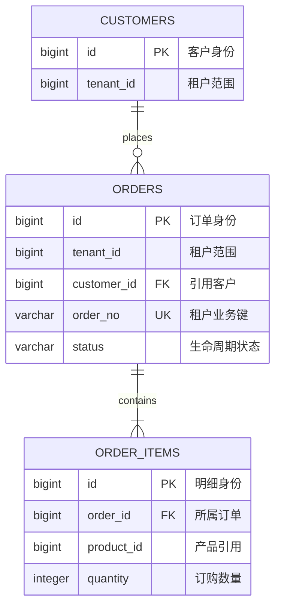
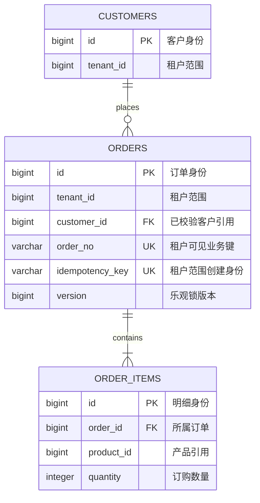

# 逐表逐索引数据库设计

> 本文件是 `database-design.md` 的全中文审核镜像。第 11 章修改持久化数据，或正确性依赖现有表时必须读取。必须使用仓库真实数据库方言、迁移框架、命名规范和访问技术。

## 目录

- [数据库范围与清单](#数据库范围与清单)
- [必需 Mermaid 实体关系图](#必需-mermaid-实体关系图)
- [每张表必需结构](#每张表必需结构)
- [数据库编写顺序](#数据库编写顺序)
- [完整逐表示例](#完整逐表示例)
- [Migration 决策模式](#migration-决策模式)
- [深度与一致性门禁](#深度与一致性门禁)
- [数据库复核失败条件](#数据库复核失败条件)

## 数据库范围与清单

先说明数据库/Schema、所有者、迁移目录、当前版本序列、访问层，以及证据仅来自源码还是已经对真实 Schema 验证。

列出所有新建、修改、读取或写入的表：

| 表 | 已有/新增 | 用途与所有者 | 读写路径 | 变更 | Migration | 需求 |
| --- | --- | --- | --- | --- | --- | --- |

清单中的每张表都必须有独立详细章节。没有数据库影响时保留第 11 章，并写有证据的 `N/A`。

## 必需 Mermaid 实体关系图

读取、新建或修改一张及以上关系型表时，第 11 章必须包含 Mermaid `erDiagram`。ER 图是结构总览，不能替代表清单、完整字段、约束、访问路径、索引、Migration 或事务分析。

ER 图必须：

- 包含第 11 章清单中的每张表，以及解释基数或所有权所需的直接关联现有表；
- 使用稳定 Mermaid Entity 名称；名称与真实物理 `schema.table` 不同时提供映射；
- 展示关系基数和准确业务关系标签；
- 展示主键、外键和重要唯一键/业务键；
- 包含驱动关系及设计相关字段，全部非关系字段仍放在完整字段表中；
- 在相邻正文或映射表区分“现有未修改邻表”和“本次新建/修改表”；
- 与 FK/应用强制关系、可选性、租户范围、生命周期、删除/孤儿行为一致；
- 不得仅根据同名字段猜测并画出关系。

Schema 限定名称或渲染安全名称不同时使用映射表：

| ER Entity | 物理表 | 范围/变更 | 权威所有者 | 说明 |
| --- | --- | --- | --- | --- |
| `ORDERS` | `biz.orders` | 已有 / 修改 | Order 模块 | `<租户/生命周期说明>` |

以下只说明语法：



真实 Spec 必须说明 `CUSTOMERS -> ORDERS` 和 `ORDERS -> ORDER_ITEMS` 是数据库 FK 还是应用强制关系，包括租户 Key 和删除行为。Mermaid 中标记 `FK` 不代表数据库已经存在该约束。

没有关系型持久化时保留 ER 小节，并根据仓库证据写 `N/A`。文档、图、键值或事件存储只有在确实增加信息时才使用最准确的 Mermaid 模型，不能伪装成关系 ER 图。

## 每张表必需结构

### 1. 用途、所有权与生命周期

说明准确 Schema/表名、业务用途、所属模块、权威写入方、读取方、创建/更新/归档/删除生命周期、保留策略、租户分区、预期数据量/增长和敏感/审计分类。

### 2. 完整字段设计

| 字段 | 数据库原生类型 | 长度/精度 | 可空 | 默认值 | 生成方式 | 主键/外键/唯一/Check | 含义 | 来源/映射 | 示例 |
| --- | --- | --- | --- | --- | --- | --- | --- | --- | --- |

说明设计涉及的每个已有字段和每个新增字段。使用数据库原生类型，不能只写 Java 类型。按需定义：

- 缺失、`NULL`、空值和零值的区别；
- 枚举/状态值和非法状态；
- 金额/数量精度与舍入；
- 日期时间格式、时区和时钟来源；
- ID 生成、不可变性、租户/审计/版本字段；
- 外键目标及更新/删除行为；
- 唯一/Check 约束及其保障的业务规则；
- PO/ORM Entity 和接口字段映射。

### 3. 键、关系与约束

说明主键、候选键、业务键、一对一/一对多关系、所有权、可选性、Cascade/Restrict、孤儿处理，以及引用完整性由数据库还是应用保证。增加外键或级联前必须核对仓库规范与现有数据质量。

### 4. 索引清单与逐项论证

记录所有保留、新增、修改或删除的索引：

| 索引 | 类型/唯一 | 有序字段/表达式 | Predicate/Include | 对应查询与操作 | 基数/选择性 | 排序/覆盖作用 | 写入/存储成本 | 决策 |
| --- | --- | --- | --- | --- | --- | --- | --- | --- |

每个索引必须说明：

- 准确名称和数据库方言定义；
- 服务的查询、Mapper/Repository 方法，包括过滤、Join、排序、分组和分页；
- 等值字段、范围/排序字段的先后顺序及其与真实访问模式的适配理由；
- 唯一性语义，包括 `NULL`、租户范围、软删除或部分索引行为；
- 预期选择性/基数和数据量证据；
- 是否覆盖查询、已有前缀索引是否冗余；
- 写放大、存储、锁/构建时长，以及是否支持 Online/Concurrent 创建；
- 验证方式，例如生成 SQL 检查、`EXPLAIN`、Migration 测试或代表性集成测试。

没有明确查询的猜测性索引必须拒绝；关键查询没有可信访问路径也必须拒绝。

### 5. 访问模式与 SQL 形态

列出准确调用者和事务归属的读写操作：

| 操作 | 调用者 | 条件/Join/排序 | 预期行数 | 索引/约束 | 锁/隔离 | 失败/幂等 |
| --- | --- | --- | --- | --- | --- | --- |

按需说明分页稳定性、批量大小、N+1 风险、乐观/悲观锁、Upsert、重复处理和影响行数预期。

### 6. Migration 与历史数据

遵循仓库规范。Flyway Migration 不可变时，一个数据库变更必须新增且只新增一个下一版本文件；不得修改、重命名、重排、格式化或 Repair 已有 Migration。

说明：

- 准确的新 Migration 路径/版本和方言；
- 按执行顺序编写 DDL/数据变更伪代码；
- 发布前置条件和现有数据画像；
- 默认值/回填/可空性调整顺序，以及批量/重启行为；
- 新旧应用版本兼容窗口；
- 索引构建与锁风险；
- 验证 SQL 和预期结果；
- 回滚可行性；破坏性回滚不安全时，说明 Forward Fix 和应用回滚边界。

### 7. 事务、一致性与恢复

说明事务所有者、隔离/锁、并发写入、幂等/去重、缓存失效、Outbox/事件关系、部分失败、审计链和对账/修复路径。

## 数据库编写顺序

从证据向外完成数据库设计，不能先想表名或索引名。

1. **建立持久化基线**——识别数据库方言/版本、Schema、Migration 工具/路径/版本惯例、ORM/Mapper 技术、命名/类型惯例、事务管理器、软删除/租户/审计惯例，以及是否核对真实 Schema。
2. **追踪数据所有权**——识别权威写入方、读取方、接口/模型字段、生命周期/状态变化、保留策略、预期数据量/增长和敏感/审计分类。
3. **检查现有 DDL 与访问路径**——读取不可变 Migration/Schema、PO/Entity Mapping、Mapper/DAO SQL、生成查询方法、批处理、报表和已有索引/约束。源码定义与真实 Schema 可能不同，必须标注边界。
4. **绘制并验证 ER 结构**——把物理表映射到渲染安全 Entity，绘制真实基数和重要 PK/FK/UK 字段，再对齐数据库/应用强制关系、可选性、租户范围和生命周期。
5. **设计字段与约束**——使用原生类型，准确说明缺失、默认、精度、时间、枚举、租户、审计、身份、唯一、关系和兼容语义。
6. **从查询设计索引**——先写真实查询形态，包括等值/范围/Join/排序/分组/分页；然后才选择或拒绝索引，并说明有序字段、选择性、覆盖、重叠和写入/构建成本。
7. **设计 Migration 与运行时共存**——分析现有数据，安排 Expand/回填/验证/Contract 顺序，说明新旧应用兼容、锁时长、批次/重启、验证、回滚边界和 Forward Fix。
8. **交叉检查与测试**——把每个接口/模型字段映射到列或明确派生来源；对齐 ER 图、事务、错误、缓存/事件、前端行为、测试和追踪。

选择 DDL 前先使用证据账本：

| 关注点 | 仓库/运行时证据 | 已确认基线 | 设计影响 | 验证限制 |
| --- | --- | --- | --- | --- |
| 方言/版本 | 构建/配置/容器/Migration 语法 | PostgreSQL `<version>` | 使用原生时间/索引语法 | 配置为静态证据，真实版本未验证 |
| 表定义 | Migration `V...__create_orders.sql` | `orders` 存在且字段已知 | 新增 Migration，绝不修改前置文件 | 未检查线上漂移 |
| 写路径 | `OrderServiceImpl#create` -> `OrderDao#insert` | 一个本地事务 | Service 继续承担事务 | 未测量运行时隔离级别 |
| 查询路径 | `OrderDao#findPage` SQL | 租户/状态过滤 + 创建时间/ID 排序 | 索引必须匹配该顺序 | 代表数据 `EXPLAIN` 待验证 |

## 完整逐表示例

本示例只说明文档深度，使用虚构的类 PostgreSQL 命名。必须替换为仓库真实方言、Schema、字段、约束、查询和 Migration 规范。

### 示例表清单

| 表 | 已有/新增 | 用途与所有者 | 读写路径 | 变更 | Migration | 需求 |
| --- | --- | --- | --- | --- | --- | --- |
| `biz.orders` | 已有 | Order 模块所有的权威订单头 | `OrderDao#insert`、`OrderDao#findById`、`OrderDao#findPage` | 增加幂等身份与乐观版本 | `classpath:db/V42__extend_orders_idempotency.sql` | `REQ-007`、`REQ-008` |
| `biz.order_items` | 已有 | Order 模块所有的权威订单明细 | `OrderItemDao#batchInsert`、详情查询 | 读写关系验证；示例中无字段变更 | 只有约束/索引变化时使用同一 Migration，否则 `None` | `REQ-007` |

### 示例 ER 图与物理映射

| ER Entity | 物理表 | 范围/变更 | 权威所有者 | 说明 |
| --- | --- | --- | --- | --- |
| `CUSTOMERS` | `crm.customers` | 现有未修改邻表 | Customer 模块 | 用于说明租户范围客户所有权 |
| `ORDERS` | `biz.orders` | 已有/修改 | Order 模块 | 下方展开的清单表 |
| `ORDER_ITEMS` | `biz.order_items` | 已有/读写依赖 | Order 模块 | 生产 Spec 中必须拥有逐表详情的清单表 |



本参考完整展开 `biz.orders`，用于展示逐表结构。生产 Spec 必须对 `biz.order_items` 重复相同的七段详情；清单行和 ER 节点不能替代逐表设计。

### `biz.orders`

#### 用途、所有权与生命周期

- **用途**：保存一个租户订单的权威头信息和稳定创建结果；明细保存在需要单独完整设计的 `biz.order_items`。
- **写入方**：只有 Order 模块的 `OrderServiceImpl`；DAO 执行持久化，不拥有状态转换策略。
- **读取方**：创建重试查询、详情/列表、履约集成和仓库中明确找到的审计/报表 Job。
- **生命周期**：只创建一次，状态只能按已定义转换修改；保留/审计义务期间不物理删除；归档遵循仓库现有策略。
- **租户/安全**：全部业务 Key 和查询限定租户；跨租户 ID 返回仓库规定的不泄露结果。
- **容量**：已验证时记录真实行数，否则只能用业务证据估算；说明日增长、保留、热数据窗口和最大租户，不能编造数字。
- **证据边界**：源码检查只能证明预期 Schema/访问；行数、倾斜、膨胀和执行计划需要真实数据/运行时证据。

#### 完整字段设计

| 字段 | 原生类型 | 长度/精度 | 可空 | 默认值 | 生成方式 | 主键/外键/唯一/Check | 含义 | 来源/映射 | 示例 |
| --- | --- | --- | --- | --- | --- | --- | --- | --- | --- |
| `id` | `bigint` | 64 位 | 否 | 无 | 仓库 ID 生成器 | PK | 不可变内部订单 ID | `OrderPO.id` -> `data.orderId` | `810001` |
| `tenant_id` | `bigint` | 64 位 | 否 | 无 | 写入时安全上下文 | 纳入业务唯一和全部访问路径 | 所属租户，不能由请求 Body 提供 | `TenantContext` -> `OrderPO.tenantId` | `2001` |
| `order_no` | `varchar(32)` | 32 字符 | 否 | 无 | 订单号生成器 | 租户内由 `uk_orders_tenant_order_no` 唯一 | 不可变用户可见订单号 | `OrderPO.orderNo` -> Response | `O202608170001` |
| `customer_id` | `bigint` | 64 位 | 否 | 无 | 请求经租户校验后 | 仓库不使用 FK 时由应用保证引用 | 租户可见客户身份 | Request -> `OrderPO.customerId` | `12001` |
| `status` | `varchar(24)` | 24 字符 | 否 | 只有证明新旧版本兼容时才用 `'CREATED'`，否则无 DDL 默认 | Service | Check/枚举遵循仓库规范 | 当前生命周期状态，列出全部允许转换 | `OrderStatus` | `CREATED` |
| `currency` | `char(3)` | 类 ISO Code | 否 | 无 | 已校验请求 | 仓库一致使用 Check 时才增加 | 全部订单金额币种 | Request -> PO -> Response | `CNY` |
| `total_amount` | `numeric(19,2)` | 精度 19，Scale 2 | 否 | 无 | Service 计算 | 仓库策略/数据允许时 Check `>= 0` | 货币单位的权威总额 | `BigDecimal`；JSON 字符串 | `39.80` |
| `idempotency_key` | `varchar(64)` | 64 ASCII 字符 | Expand/回填期间可空；新行目标非空 | 无 | 请求 Header | 数据验证后租户范围唯一 | 一次创建意图的稳定身份 | Header -> PO；禁止原文日志 | `01J5...K9` |
| `request_hash` | `char(64)` | SHA-256 Hex 长度 | 与 Key 相同发布语义 | 无 | 标准化请求 Hash | 单独不设约束 | 检测同 Key 不同载荷；不是安全签名 | Service 派生 | `a4e...` |
| `version` | `bigint` | 64 位 | 否 | 与当前 ORM 兼容时为 `0` | ORM/Service 递增 | 乐观锁条件 | 防止并发状态静默覆盖 | `OrderPO.version` | `3` |
| `created_at` | `timestamptz` | 方言规定微秒精度 | 否 | 仓库时钟策略 | 沿用服务器/应用惯例 | 无 | 无歧义 Offset 语义的创建瞬间 | PO -> ISO Response | `2026-08-17T02:15:30Z` |
| `updated_at` | `timestamptz` | 同 `created_at` | 否 | 仓库时钟策略 | 每次成功修改更新 | 无 | 最后提交修改时间 | `OrderPO.updatedAt` | `2026-08-17T02:20:00Z` |

字段表还必须补充：

- 兼容窗口中缺失 `idempotency_key` 与空白不同；新值绝不能是空白；
- 示例中 `total_amount` 按货币单位 Scale 2 保存；仓库使用分或可变币种 Scale 时，数据库/Java/JSON/前端规则必须一起修改；
- 状态值、合法转换、终态和未知历史值行为在模型/状态章节定义；
- 时间字段表示瞬间；序列化时区和前端本地化属于接口语义，不另存本地时间；
- 租户、审计和版本字段只沿用一种仓库惯例；持久化继承已提供时不能重复添加基类字段。

#### 键、关系与约束

| Key/关系 | 定义 | 业务规则 | 删除/更新行为 | 强制方式与证据 |
| --- | --- | --- | --- | --- |
| 主键 | `pk_orders(id)` | 稳定内部身份 | 不可变 | 数据库 PK，仓库现有惯例 |
| 业务键 | `(tenant_id, order_no)` | 订单号在租户内唯一 | 不可变 | 唯一索引/约束；冲突映射成已定义错误 |
| 幂等键 | 非空活动 Key 的 `(tenant_id, idempotency_key)` | 每租户/Key 对应一次创建意图 | 保留/过期策略不能允许不安全重放 | Partial/Full 唯一方案取决于方言和兼容数据 |
| 客户引用 | `(tenant_id, customer_id)` 逻辑关系 | 客户属于租户 | 订单保留不能级联删除 | 只有仓库规范和数据质量允许才用 FK，否则应用校验 + 审计 |
| 明细 | `orders.id` -> `order_items.order_id` 一对多 | 头拥有明细生命周期 | 不得出现孤儿；删除/归档遵循策略 | 约束/Cascade 必须符合现有 Schema/Migration 证据 |

#### 索引清单与逐项论证

| 索引 | 类型/唯一 | 有序字段/表达式 | Predicate/Include | 对应查询与操作 | 基数/选择性 | 排序/覆盖作用 | 写入/存储成本 | 决策 |
| --- | --- | --- | --- | --- | --- | --- | --- | --- |
| `pk_orders` | btree 唯一 | `(id)` | 无 | 按 ID 详情/更新，同时做租户 Guard | ID 高选择性 | Lookup；仍需校验租户 | 已有必要 PK | 保留 |
| `uk_orders_tenant_order_no` | btree 唯一 | `(tenant_id, order_no)` | 无 | 租户内按订单号详情 | 组合唯一 | 完整查找 | 每次写入一次唯一校验 | 只有证据支持时保留/新增 |
| `uk_orders_tenant_idempotency` | btree 唯一 | `(tenant_id, idempotency_key)` | 方言/数据窗口需要时 `WHERE idempotency_key IS NOT NULL` | 创建重试与冲突查询 | 租户 + Key 预期唯一 | 完整查找，不负责排序 | 增加写入校验/存储，评估 Concurrent Build | 重复数据画像后新增 |
| `idx_orders_tenant_status_created` | btree | `(tenant_id, status, created_at DESC, id DESC)` | 只有方言与测量收益支持时 Include | `findPage`：租户等值、可选精确状态、最新优先、稳定 ID Tie-breaker | 必须分析租户/状态选择性 | 对匹配 Query 避免排序并稳定分页 | 每次插入/状态更新增加写放大 | 检查可选状态 Query 和已有前缀后新增/修改/拒绝 |

逐索引论证必须包含查询形态：

```sql
-- 仅用于文档；真实 Spec 使用实际 Mapper/DAO SQL 和方言。
SELECT id, order_no, status, currency, total_amount, created_at
FROM biz.orders
WHERE tenant_id = :tenantId
  AND status = :status
  AND (created_at, id) < (:cursorCreatedAt, :cursorId)
ORDER BY created_at DESC, id DESC
LIMIT :limit;
```

`tenant_id`、`status` 是等值字段，位于范围/排序字段之前；`id` 是确定性 Tie-breaker。`status` 可选且生成 SQL 省略它时，必须证明同一索引是否仍有效，或是否需要第二访问路径/已有前缀，不能假设。新增前检查已有索引是否冗余。

#### 访问模式与 SQL 形态

| 操作 | 调用者 | 条件/Join/排序 | 预期行数 | 索引/约束 | 锁/隔离 | 失败/幂等 |
| --- | --- | --- | --- | --- | --- | --- |
| 创建 | `OrderServiceImpl#create` | 插入一条头 + N 条明细 | 1 条头 | PK、业务键、幂等唯一 | 一个本地事务；沿用仓库隔离 | 按约束身份映射重复；全部写入一起回滚 |
| 重试查询 | `OrderServiceImpl#create` | 租户 + 幂等 Key | 0 或 1 | `uk_orders_tenant_idempotency` | 定义插入竞争处理 | 同 Hash 返回旧结果，不同 Hash 冲突 |
| 详情 | `OrderServiceImpl#get` | 租户 + ID | 0 或 1 | PK + 租户条件 | 读取策略 | 需要防泄露时跨租户与不存在使用相同结果 |
| 分页 | `OrderServiceImpl#page` | 租户 + 可选状态 + 稳定排序/Cursor | 0 到 Page Size | 分页索引或已证明替代路径 | 说明读取一致性 | 按 Cursor 规则，并发新增只在刷新后的后续遍历出现 |
| 状态更新 | `OrderServiceImpl#transition` | ID + 租户 + 预期版本/状态 | 影响 1 行 | PK；版本/状态条件 | 乐观锁 | 影响 0 行时安全区分不存在或冲突 |

使用真实仓库行为说明批大小、明细插入策略、N+1、Count Query、Cursor/Page 稳定性、锁顺序、事务时长和影响行数断言。

#### Migration 与历史数据处理

以下是示例 Expand-First 顺序，必须按仓库规范与数据画像调整：

1. 确认下一不可变 Migration 版本，本次数据库变更只创建一个新文件；
2. DDL 前分析重复/空候选值和已有索引重叠；
3. 先增加可空字段或其他向后兼容结构；
4. 发布写入新字段且能安全读取历史行的应用；
5. 用有界、可重启批次回填历史行，记录确定性进度并限流；
6. 验证行数、空值、重复、Hash、约束和查询结果；
7. 必要时使用方言支持的低锁方式创建/验证索引；
8. 旧写入方全部退出且验证安全后，才强制 `NOT NULL` 或 Check；
9. 只有后续单独批准的变更才 Contract/删除旧字段。

真实 Spec 必须写出准确 Migration 路径、SQL/DDL 伪代码、发布前后验证 SQL 与预期值、来自证据的锁/构建风险、新旧应用矩阵、批任务所有者/重启标记、监控、回滚点和 Forward Fix。新增数据后即使 DDL 是 Additive，应用回滚也可能不安全，必须明确说明。

#### 事务、一致性与恢复

- `OrderServiceImpl` 为幂等身份、订单头和明细开启一个事务；DAO 参与事务，不自行创建业务事务。
- 多进程下并发同 Key 创建依赖数据库唯一边界与确定性冲突查询；内存锁不充分。
- 状态更新包含预期 Version/当前状态，使 Lost Update 变成已定义冲突而不是静默覆盖。
- Cache、事件、搜索索引或下游投影只通过仓库已证明的 After-Commit 机制更新，否则明确排除；不能声称跨未验证外部边界原子。
- 客户端未知结果通过同 Key 重试解决；只有仓库和范围确实包含外部副作用时才设计 Outbox/对账。
- 审计/修复记录租户、订单、操作、稳定关联/幂等身份、旧/新状态、结果和操作人，不记录禁止的载荷原文。

## Migration 决策模式

| 场景 | 安全设计方向 | 必需证据 | 常见不安全捷径 |
| --- | --- | --- | --- |
| 新代码读取新可空字段 | Expand Schema、兼容读取、再写入 | 新旧版本兼容和空值语义 | 在有数据表上立即 `NOT NULL` |
| 新必填字段可从历史推导 | 可空/Additive -> 回填 -> 验证 -> 强制 | 确定性推导、批次重启、零非法查询 | 在 Migration 中一次无界 Update，不估算锁 |
| 新唯一键 | 分析重复 -> 定义冲突规则 -> 修复 -> 创建唯一约束 | 重复数和所有者批准的合并/拒绝规则 | 直接加唯一并假设生产数据干净 |
| 大索引 | 证明 Query -> 检查重叠 -> 方言支持时 Online/Concurrent Build | 数据量、方言、锁/构建行为、回滚 | 给每种可能过滤组合加索引 |
| 破坏性类型/字段变更 | 通过兼容版本 Expand-and-Contract | 转换正确性、双读写或切换、回滚边界 | 旧代码仍运行时单版本 Rename/Drop |
| 旧 Flyway Migration 错误 | 增加下一修正 Migration | 当前版本/Checksum 与前向转换 | 编辑或 Repair 已应用 Migration |

## 深度与一致性门禁

接受一张表的详情前，确认：

- 七个必需子章节按顺序存在，并写出准确 Schema/表名；
- 第 11 章包含一个覆盖所有清单表、准确物理名称映射、真实基数/关系标签和重要 PK/FK/UK 字段的 Mermaid `erDiagram`；
- 受影响的已有字段和全部新增字段包含原生类型、精度/长度、可空、默认、生成、约束、含义、映射和示例；
- 主键/业务键/外键关系说明所有权、可选、租户范围、更新/删除/孤儿行为和强制方式；
- 每个索引包含准确 Query/调用者、有序 Key、选择性证据、排序/覆盖、重叠、写入/存储/构建/锁成本和验证；
- 每条访问路径说明条件/Join/排序/分页、行数预期、索引/约束、锁/隔离、失败、幂等和影响行数语义；
- Migration 包含数据画像、准确新版本/路径、有序 DDL/回填、批次/重启、新旧共存、锁、验证、回滚限制和 Forward Fix；
- 事务/恢复与 Service 编排、API 错误/重试、缓存/事件、审计、测试和发布一致；
- 静态检查绝不能被描述为真实 Schema、数据分布、锁时长或执行计划结果。

行数不能替代这些检查。基于已证明稳定表的只读查询可能文字较少；高数据量已填充表只改一个字段也可能需要大量 Migration 与兼容设计。

## 数据库复核失败条件

存在以下任一问题时返回 `REVISE`：

- 表在清单中却没有展开，或字段缺少类型/可空/默认值/含义；
- 存在关系型表但缺少 ER 图、ER 图遗漏清单表、虚构关系，或与详细设计中的 Key/基数/可选性矛盾；
- 接口/模型字段无法映射到列或明确的非持久化来源；
- 索引没有真实查询和字段顺序依据；
- 唯一性、软删除、租户、时间、金额或 `NULL` 语义含糊；
- 缺少 Migration、回填、兼容、锁或回滚设计；
- 方案修改已有不可变 Migration；
- 把源码检查结果当成真实 Schema 或执行计划证明。
