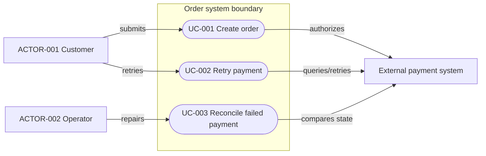
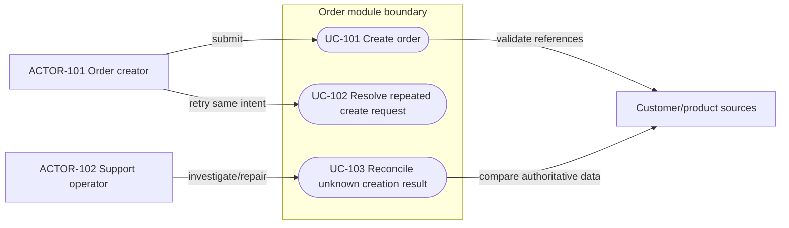

# Requirements and Use-case Analysis

Read this reference before finalizing Chapter 4. Every Spec must express the observable user/system use cases that justify the design. A requirement list states obligations; a use case shows who triggers a goal, under what conditions, through which main and alternative outcomes.

## Contents

- [Required output](#required-output)
- [Analysis sequence](#analysis-sequence)
- [Use-case table form](#use-case-table-form)
- [Mermaid use-case view](#mermaid-use-case-view)
- [Per-use-case detail](#per-use-case-detail)
- [Complete worked example](#complete-worked-example)
- [Traceability and quality gate](#traceability-and-quality-gate)

## Required output

Assign stable IDs such as `ACTOR-001` and `UC-001`. Chapter 4 must contain at least one of these two reviewable forms:

1. **Use-case table** — best for a Simple Spec or a small number of actors; include actor, trigger, preconditions, main outcome, alternatives/failures, postconditions, and traceability.
2. **Mermaid use-case view** — best when actors, system boundaries, or use-case relationships are easier to understand visually; use Mermaid `flowchart`, then add enough adjacent detail to define conditions and outcomes that the diagram cannot carry safely.

A Complex or multi-actor Spec should normally provide the Mermaid view plus concise per-use-case details. A complete table remains acceptable when it communicates the same information more clearly. Do not create a decorative diagram that merely repeats use-case names.

Non-functional requirements such as latency or audit may support several use cases rather than define a separate actor goal. Map them to the affected use cases and quality design. For a purely internal refactor, define the operational/developer use case and preserved behavior; do not write `N/A` merely because there is no end-user page.

## Analysis sequence

### 1. Identify real actors

An actor is an external role or system that initiates, supplies, observes, administers, or receives the outcome. Use role names rather than individual people or implementation classes.

| Actor ID | Actor/role | Goal and responsibility | Entry/channel | Permission/tenant context | Evidence |
| --- | --- | --- | --- | --- | --- |
| `ACTOR-001` | `<role/system>` | `<goal>` | `<page/API/event/job>` | `<context>` | `<path/symbol/user wording>` |

Consider primary users, administrators/operators, scheduled jobs, external systems, event producers/consumers, and support/recovery actors. Do not invent an actor because a component appears in an architecture diagram.

### 2. Derive use cases from goals

Each use case represents one externally observable goal or result, not one Controller method or CRUD verb by default. Split use cases when actors, permissions, preconditions, state changes, success outcomes, or recovery responsibilities differ materially.

Good use-case names use an action and business object/outcome: “Create order,” “Retry failed settlement,” “Review denied access.” Weak names such as “Use API,” “Process data,” or “Manage module” hide the goal.

### 3. Establish system boundary and scope

State what is inside the designed system/module and which actors/systems remain outside. A supporting system is not automatically an internal component. Keep non-goals outside the boundary and show integrations only when the use case depends on them.

### 4. Write success, alternative, and failure outcomes

For each use case define:

- trigger and authoritative inputs/context;
- preconditions and permission/tenant requirements;
- numbered main success flow at business-observable level;
- validation, permission, empty/not-found, duplicate, concurrent, timeout, partial-failure, cancellation, and recovery paths that apply;
- state/data postconditions on success and failure;
- user/system-visible result;
- requirements, interfaces/pages, models/tables, and tests.

Do not copy class-by-class implementation into the use case. Chapter 7 explains collaboration; Chapter 9 explains exact wire contracts; Chapter 11 explains persistence.

## Use-case table form

Use this form when a table is the clearer artifact:

| ID | Use case/goal | Primary actor | Supporting actors/systems | Trigger | Preconditions | Main success outcome | Alternatives/failures | Postconditions | Requirements | Interfaces/pages | Tests |
| --- | --- | --- | --- | --- | --- | --- | --- | --- | --- | --- | --- |
| `UC-001` | `<action and goal>` | `ACTOR-001` | `<actors/systems>` | `<event>` | `<conditions>` | `<observable outcome>` | `<named branches>` | `<success/failure state>` | `REQ-001` | `API-001 / <page>` | `TEST-001` |

If several branches need more than a short cell, reference the per-use-case detail below rather than compressing important failure semantics into “handle error.”

## Mermaid use-case view

Use Mermaid `flowchart` for reliable rendering. Represent actors outside a system-boundary subgraph and use-case goals inside it. Label edges with trigger/support/notification semantics where useful.

Rules:

- use stable `UC-*` labels in every goal node;
- name the actual scope rather than “System”; use nested subgraphs only for real boundaries;
- show actor-to-goal relationships, not Controller/Service/DAO calls;
- show supporting/external systems only when they participate in the use case;
- do not use unlabeled arrows to imply unclear include/extend semantics; explain shared or conditional behavior in prose;
- keep permission variants as separate use cases only when their goal/outcome differs; otherwise describe permission failure in the same use case.

## Per-use-case detail

Use one detail block when the inventory row or diagram cannot hold the necessary semantics.

### UC-001 — `<Use-case name>`

| Concern | Definition |
| --- | --- |
| Goal and value | `<observable result and why the actor needs it>` |
| Primary/supporting actors | `<ACTOR-* and systems>` |
| Trigger | `<user action/event/schedule>` |
| Preconditions | `<state, permission, tenant, dependency>` |
| Success postconditions | `<authoritative state and visible result>` |
| Failure postconditions | `<unchanged/rolled back/pending/recoverable state>` |
| Requirements/contracts/tests | `<REQ-*, API/RPC/EVENT, TEST-*>` |

Main flow:

1. `<actor initiates the goal>`
2. `<system verifies context and business preconditions>`
3. `<system performs the business outcome>`
4. `<system commits/emits the authoritative result>`
5. `<actor or supporting system observes the result>`

Alternative and failure flows:

| Branch | Entry condition | Behavior | State/postcondition | Actor-visible result | Recovery/next action |
| --- | --- | --- | --- | --- | --- |
| `UC-001-A1` | `<condition>` | `<behavior>` | `<state>` | `<result>` | `<retry/correct/stop/operator>` |

## Complete worked example

The following is illustrative only and must be replaced by repository-specific actors, goals, permissions, contracts, and states.

### Actor inventory

| Actor ID | Actor/role | Goal and responsibility | Entry/channel | Permission/tenant context | Evidence |
| --- | --- | --- | --- | --- | --- |
| `ACTOR-101` | Order creator | Submit one valid order and receive a stable result | Order creation page | Authenticated tenant member with `order:create` | Frontend route, client, controller, user requirement |
| `ACTOR-102` | Support operator | Diagnose and reconcile an unknown creation result | Admin support page/job | Privileged tenant-scoped support permission | Existing operation tooling or explicit approved requirement |

### Use-case inventory

| ID | Use case/goal | Primary actor | Supporting actors/systems | Trigger | Preconditions | Main success outcome | Alternatives/failures | Postconditions | Requirements | Interfaces/pages | Tests |
| --- | --- | --- | --- | --- | --- | --- | --- | --- | --- | --- | --- |
| `UC-101` | Create order | `ACTOR-101` | Customer/product data sources | Confirmed form submit | Authenticated, permitted, valid tenant-visible references | One order is committed and its stable result returned | Validation, forbidden, missing reference, duplicate key, write failure, response loss | Success: order exists once; failure: no partial order or documented unknown outcome | `REQ-007`, `REQ-008` | `API-021`, create page | `TEST-021`-`TEST-026` |
| `UC-102` | Resolve repeated create request | `ACTOR-101` | Idempotency store | Retry after timeout/network loss | Same tenant, key, and normalized payload | Previously committed result returned without duplicate order | Same key with different payload; expired key; unresolved transaction | No additional order; conflict or recoverable status is observable | `REQ-008` | `API-021` | duplicate/concurrency tests |
| `UC-103` | Reconcile unknown creation result | `ACTOR-102` | Audit/database/metrics | Alert or support investigation | Privileged operator and correlation/idempotency identity | Authoritative state identified and safe action recorded | Missing audit, partial external effect, irreconcilable mismatch | State repaired or explicit escalation retained with audit | operational requirement | support operation | reconciliation test/runbook evidence |

### Use-case view

This view shows actor goals and scope. It deliberately does not show Controller, Service, DAO, database calls, or transaction details; those belong to architecture and detailed design.

## Traceability and quality gate

Before accepting Chapter 4, verify:

- every primary/supporting actor is evidenced by the repository, user decision, or approved predecessor;
- every material behavioral `REQ-*` maps to at least one `UC-*`; non-functional requirements map to the affected use cases;
- each `UC-*` states goal, actor, trigger, preconditions, success outcome, alternative/failure outcomes, and success/failure postconditions;
- use cases describe observable behavior rather than class or endpoint implementation;
- use-case branches agree with the scenario matrix, interface errors, state transitions, database effects, frontend states, and tests;
- the Mermaid view, when used, has a named system boundary, stable IDs, real actor-to-goal links, and no invented implementation shortcuts;
- every use case maps forward to design/contracts/models/tables/pages/tests, and every major feature path maps back to a use case or explicit non-behavioral requirement.

Return `REVISE` for a list of generic CRUD verbs without actor goals, a diagram containing only components, a use case with no failure/postcondition, or a behavioral requirement absent from use-case analysis.
