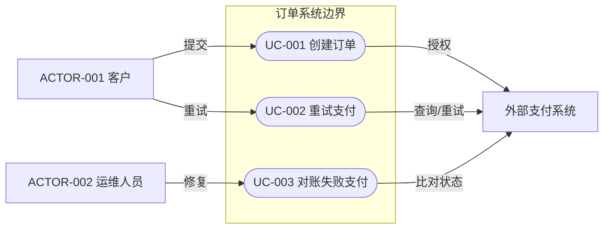
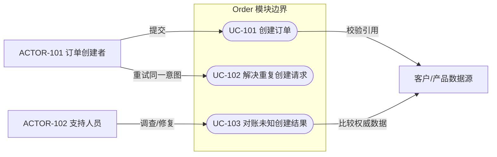

# 需求与用例分析

> 本文件是 `references/requirements-use-case-analysis.md` 的全中文审核镜像。第 4 章定案前必须读取。每份 Spec 都必须表达支撑设计的可观察用户/系统用例。需求清单说明义务；用例说明谁在什么条件下触发目标，以及成功、分支和失败结果。

## 目录

- [必需产物](#必需产物)
- [分析顺序](#分析顺序)
- [用例表形式](#用例表形式)
- [Mermaid 用例视图](#mermaid-用例视图)
- [逐用例详情](#逐用例详情)
- [完整示例](#完整示例)
- [追踪与质量门禁](#追踪与质量门禁)

## 必需产物

使用稳定 ID，例如 `ACTOR-001` 和 `UC-001`。第 4 章至少包含以下一种可审核形式：

1. **用例表**——适合 Simple Spec 或参与者较少的场景；写清参与者、触发、前置条件、主要结果、分支/失败、后置条件和追踪。
2. **Mermaid 用例视图**——适合用图更容易表达参与者、系统边界或用例关系的场景；使用 Mermaid `flowchart`，并在图旁补充图中无法安全承载的条件和结果详情。

Complex 或多参与者 Spec 通常应提供 Mermaid 视图和简洁逐用例详情。如果完整表格表达得更清楚，也可以只用表格。不得绘制只重复用例名称的装饰图。

延迟、审计等非功能需求可能约束多个用例，不必强行创建独立参与者目标；应映射到受影响用例和质量设计。纯内部重构也应说明运维/开发用例及被保持的行为，不能仅因没有最终用户页面就写 `N/A`。

## 分析顺序

### 1. 识别真实参与者

参与者是发起、提供、观察、管理或接收结果的外部角色或系统。使用角色名，不使用个人姓名或实现类名。

| 参与者 ID | 参与者/角色 | 目标与职责 | 入口/渠道 | 权限/租户上下文 | 证据 |
| --- | --- | --- | --- | --- | --- |
| `ACTOR-001` | `<角色/系统>` | `<目标>` | `<页面/API/事件/Job>` | `<上下文>` | `<路径/符号/用户原文>` |

按需考虑主要用户、管理员/运维人员、定时 Job、外部系统、事件生产者/消费者和支持/恢复角色。不能因为架构图里出现一个组件就虚构参与者。

### 2. 从目标推导用例

每个用例表示一个外部可观察目标或结果，不能默认把一个 Controller 方法或 CRUD 动词当成一个用例。参与者、权限、前置条件、状态变化、成功结果或恢复职责实质不同时，应拆分用例。

好的用例名称使用动作和业务对象/结果，例如“创建订单”“重试失败结算”“复核被拒访问”。“使用 API”“处理数据”“管理模块”等名称隐藏了真实目标。

### 3. 确定系统边界和范围

说明哪些内容在本次设计的系统/模块内，哪些参与者/系统在边界外。支持系统不自动等于内部组件。非目标留在边界外；只有用例确实依赖时才展示集成。

### 4. 编写成功、分支与失败结果

每个用例说明：

- 触发器和权威入参/上下文；
- 前置条件以及权限/租户要求；
- 业务可观察层面的编号主成功流程；
- 实际适用的校验、权限、空/不存在、重复、并发、超时、部分失败、取消和恢复路径；
- 成功与失败时的数据/状态后置条件；
- 用户/系统可见结果；
- 需求、接口/页面、模型/表和测试。

不能把逐类实现复制到用例中。第 7 章说明协作，第 9 章说明准确传输契约，第 11 章说明持久化。

## 用例表形式

表格更清晰时使用：

| ID | 用例/目标 | 主要参与者 | 支持参与者/系统 | 触发 | 前置条件 | 主成功结果 | 分支/失败 | 后置条件 | 需求 | 接口/页面 | 测试 |
| --- | --- | --- | --- | --- | --- | --- | --- | --- | --- | --- | --- |
| `UC-001` | `<动作与目标>` | `ACTOR-001` | `<参与者/系统>` | `<事件>` | `<条件>` | `<可观察结果>` | `<已命名分支>` | `<成功/失败状态>` | `REQ-001` | `API-001 / <页面>` | `TEST-001` |

多个分支无法在一个短单元格中说清时，引用下方逐用例详情，不能压缩成“处理异常”。

## Mermaid 用例视图

使用 Mermaid `flowchart` 保证稳定渲染。参与者放在系统边界 Subgraph 外，用例目标放在边界内；必要时给边标注触发、支持或通知语义。

规则：

- 每个目标节点使用稳定 `UC-*` 标签；
- 使用真实范围名称，不能只写“System”；只有真实边界才使用嵌套 Subgraph；
- 展示参与者到目标的关系，不展示 Controller/Service/DAO 调用；
- 只有参与用例时才展示支持/外部系统；
- 不用无标签箭头暗示含糊的 Include/Extend 语义；共享或条件行为写在正文；
- 只有目标/结果不同时才为权限变体拆用例，否则在同一用例中描述权限失败。

## 逐用例详情

清单行或图无法承载必要语义时，为用例编写一个详情块。

### UC-001 — `<用例名称>`

| 关注点 | 定义 |
| --- | --- |
| 目标与价值 | `<可观察结果及参与者为什么需要>` |
| 主要/支持参与者 | `<ACTOR-* 与系统>` |
| 触发 | `<用户动作/事件/调度>` |
| 前置条件 | `<状态、权限、租户、依赖>` |
| 成功后置条件 | `<权威状态与可见结果>` |
| 失败后置条件 | `<不变/回滚/待处理/可恢复状态>` |
| 需求/契约/测试 | `<REQ-*、API/RPC/EVENT、TEST-*>` |

主流程：

1. `<参与者发起目标>`
2. `<系统校验上下文与业务前置条件>`
3. `<系统完成业务结果>`
4. `<系统提交/发出权威结果>`
5. `<参与者或支持系统观察结果>`

分支与失败流程：

| 分支 | 进入条件 | 行为 | 状态/后置条件 | 参与者可见结果 | 恢复/下一步 |
| --- | --- | --- | --- | --- | --- |
| `UC-001-A1` | `<条件>` | `<行为>` | `<状态>` | `<结果>` | `<重试/修正/停止/运维>` |

## 完整示例

以下只说明写法，必须替换为仓库真实参与者、目标、权限、契约和状态。

### 参与者清单

| 参与者 ID | 参与者/角色 | 目标与职责 | 入口/渠道 | 权限/租户上下文 | 证据 |
| --- | --- | --- | --- | --- | --- |
| `ACTOR-101` | 订单创建者 | 提交一笔合法订单并获得稳定结果 | 订单创建页 | 已认证且具有 `order:create` 的租户成员 | 前端路由、Client、Controller、用户需求 |
| `ACTOR-102` | 支持人员 | 诊断并修复结果未知的创建操作 | 管理支持页/Job | 租户范围的特权支持权限 | 现有运维工具或已批准需求 |

### 用例清单

| ID | 用例/目标 | 主要参与者 | 支持参与者/系统 | 触发 | 前置条件 | 主成功结果 | 分支/失败 | 后置条件 | 需求 | 接口/页面 | 测试 |
| --- | --- | --- | --- | --- | --- | --- | --- | --- | --- | --- | --- |
| `UC-101` | 创建订单 | `ACTOR-101` | 客户/产品数据源 | 确认提交表单 | 已认证、有权限、租户可见引用合法 | 一笔订单被提交并返回稳定结果 | 校验、拒绝、引用不存在、重复 Key、写失败、响应丢失 | 成功：订单只存在一次；失败：无部分订单或进入已定义未知结果 | `REQ-007`、`REQ-008` | `API-021`、创建页 | `TEST-021`-`TEST-026` |
| `UC-102` | 解决重复创建请求 | `ACTOR-101` | 幂等存储 | 超时/网络失败后重试 | 同租户、Key 和标准化载荷 | 返回已提交结果且不重复创建 | 同 Key 不同载荷、Key 过期、事务未决 | 不增加订单；冲突或可恢复状态可观察 | `REQ-008` | `API-021` | 重复/并发测试 |
| `UC-103` | 对账未知创建结果 | `ACTOR-102` | 审计/数据库/指标 | 告警或支持调查 | 特权人员及关联/幂等身份 | 识别权威状态并记录安全处理 | 审计缺失、外部部分副作用、无法对齐 | 状态修复或保留明确升级与审计 | 运维需求 | 支持操作 | 对账测试/Runbook 证据 |

### 用例视图

该图只展示参与者目标与范围，刻意不展示 Controller、Service、DAO、数据库调用或事务细节；这些属于架构与详细设计。

## 追踪与质量门禁

接受第 4 章前确认：

- 每个主要/支持参与者都来自仓库、用户决策或已批准前置文档；
- 每个重要行为 `REQ-*` 至少映射一个 `UC-*`；非功能需求映射到受影响用例；
- 每个 `UC-*` 都说明目标、参与者、触发、前置条件、成功结果、分支/失败和成功/失败后置条件；
- 用例描述可观察行为，不描述类或端点实现；
- 用例分支与场景矩阵、接口错误、状态转换、数据库影响、前端状态和测试一致；
- 使用 Mermaid 时，图中包含命名系统边界、稳定 ID、真实参与者到目标关系，且没有虚构实现捷径；
- 每个用例向后映射到设计/契约/模型/表/页面/测试，每条主要功能路径反向映射到用例或明确的非行为需求。

以下情况返回 `REVISE`：只有泛化 CRUD 动词没有参与者目标、图中只有组件、用例没有失败/后置条件，或行为需求未出现在用例分析中。
