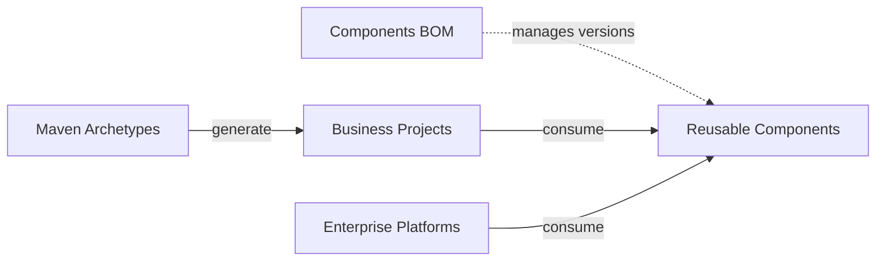

# Egon-COLA

[English](README.md) | [中文](README.zh-CN.md)

Egon-COLA is a Java 21 Maven multi-module repository that provides cleanly layered project scaffolding, reusable Spring Boot components, and independently deployable enterprise platforms, including AI-agent building blocks. It fixes the engineering direction — module layout, dependency edges, and runtime boundaries — while leaving business rules, domain models, and deployment decisions to the consuming application.

[](https://github.com/AllenDEricDAlexander/Egon-COLA/actions/workflows/ci.yaml)
[](https://github.com/AllenDEricDAlexander/Egon-COLA/actions/workflows/ci_java_compatibility.yaml)
[](https://openjdk.org/projects/jdk/21/)
[](https://spring.io/projects/spring-boot)
[](https://central.sonatype.com/artifact/top.egon/egon-cola-components-bom)
[](#license)

## Contents

- [Features](#features)
- [Modules at a Glance](#modules-at-a-glance)
- [Architecture](#architecture)
- [Requirements](#requirements)
- [Quick Start](#quick-start)
- [Maven Dependency](#maven-dependency)
- [Configuration](#configuration)
- [Usage](#usage)
- [Core Concepts](#core-concepts)
- [Extension Points](#extension-points)
- [Project Structure](#project-structure)
- [Deployment](#deployment)
- [Compatibility](#compatibility)
- [FAQ](#faq)
- [Roadmap](#roadmap)
- [Contributing](#contributing)
- [Changelog](#changelog)
- [License](#license)

## Features

- **Project scaffolding**: Generate the native component/platform-backed family (`light`, `service`, `web`, `agent`) or the public-stack `-open` family with Maven Archetypes.
- **Layering conventions**: Provide explicit boundaries for the `common`, `facade`, `domain`, `application`, `infrastructure`, `adapter`, and `starter` layers.
- **Reusable components**: Offer common contracts, IDs, tracing, caching, persistence extensions, dynamic thread pools, RPC, rule engines, access governance, method extension, transactional outbox, and bytecode tooling.
- **AI-agent capabilities**: Provide the Agent Flow and RAG starters on Spring AI plus Google ADK, and an `agent` archetype that generates a Deep Research and knowledge-base service.
- **Enterprise platforms**: Include Tianshu (Dynamic Config Center), Yuheng, Tianquan-Shoubing (Unified Identity Provider), and Tianquan-Jianshen permission platform, plus a Wujie-based Admin Portal.
- **Architecture verification**: Support build-time architecture rules, baselines, reports, and optional runtime bytecode enhancements.
- **Compatibility verification**: Run Maven builds, generated-project verification, Docker-backed tests, and multi-JDK checks in CI.

## Modules at a Glance

| Kind | Module | Primary use |
|---|---|---|
| Component | [Common](egon-cola-components/egon-cola-component-common/README.md) | Shared results, exceptions, POJOs, trace, ID, crypto, data desensitization, cache, and MyBatis-Plus/ShardingSphere extensions. |
| Component | [Dynamic Thread Pool](egon-cola-components/egon-cola-component-dynamic-thread-pool/README.md) | Executor registration, Redis config changes, dynamic resizing, virtual-thread limits, and trace propagation. |
| Component | [RPC](egon-cola-components/egon-cola-component-rpc/README.md) | Protobuf/gRPC provider and consumer, Tianshu registration and discovery, and Yuheng channel. |
| Component | [Rule Engine](egon-cola-components/egon-cola-component-rule-engine-starter/README.md) | Java rule chains, responsibility chains, rule trees, trace, limits, and listeners. |
| Component | [Access Guard](egon-cola-components/egon-cola-component-access-guard-starter/README.md) | Method-level allow/deny lists, rate limiting, timeouts, and rejection governance. |
| Component | [Method Extension](egon-cola-components/egon-cola-component-method-extension/README.md) | Insert AOP or Agent business-decision handlers before annotated method execution. |
| Component | [Transactional Outbox](egon-cola-components/egon-cola-component-transactional-outbox-starter/README.md) | At-least-once PostgreSQL/JDBC delivery over HTTP, RabbitMQ, or custom handlers. |
| Component | [Agent Flow](egon-cola-components/egon-cola-component-agent-flow-starter/README.md) | Configuration-driven flow compilation on Spring AI and Google ADK, in-memory sessions, sync and streamed execution. |
| Component | [RAG](egon-cola-components/egon-cola-component-rag-starter/README.md) | Document extraction, chunking, embedding, and similarity retrieval mechanics; the host supplies the `EmbeddingModel` and `VectorStore` beans. |
| Component | [Bytecode](egon-cola-components/egon-cola-component-bytecode/README.md) | Build-time architecture checks plus optional Executor, observability, Method Extension, and Access Guard enhancement. |
| Component | [Code Generator](egon-cola-components/egon-cola-component-code-generator/README.md) | Offline development tool that generates backend CRUD from PostgreSQL DDL; never starts Spring or touches the target POM. |
| Platform | [Tianshu (Dynamic Config Center)](egon-cola-xingyuan/egon-cola-tianshu/README.md) | Dynamic configuration, Redis leases, service registration, synchronized publication, and a standalone control plane. |
| Platform | [Yuheng](egon-cola-xingyuan/egon-cola-yuheng/README.md) | HTTP/RPC data plane, rule publication, provider discovery, security, observability, and deployment assets. |
| Platform | [Tianquan-Shoubing](egon-cola-xingyuan/egon-cola-tianquan-shoubing/README.md) | OAuth/OIDC authentication and unified identity server capabilities. |
| Platform | [Tianquan-Jianshen](egon-cola-xingyuan/egon-cola-tianquan-jianshen/README.md) | Resource authorization, role permissions, policy snapshots, Yuheng adapter, and admin control plane. |

## Architecture

The repository is organized into three Maven reactors:

| Reactor | Responsibility | Typical consumer |
|---|---|---|
| `egon-cola-archetypes` | Project templates and generated-project fixtures. | New business projects. |
| `egon-cola-components` | Reusable libraries, Spring Boot starters, BOM, and component tests. | Business applications and platform services. |
| `egon-cola-xingyuan` | Independently deployable infrastructure systems and control planes. | Platform operators and enterprise services. |

The intended dependency direction is:



Generated business projects use the following layered direction:

```text
adapter -> application -> domain
adapter -> facade
infrastructure -> domain
starter -> application / domain / infrastructure
common is shared by the layers where the generated project contract allows it
```

The exact rules differ per archetype:

- `light` targets a single-module project for lightweight work and fast validation.
- `service` focuses on backend services with Dubbo 3 Triple RPC and MQ, and exposes no HTTP controller by default.
- `web` generates a multi-module business project with HTTP `adapter`, `facade`, `application`, `domain`, and `infrastructure` layers.
- `agent` generates a six-module Deep Research plus knowledge-base service on PostgreSQL `vector`, with one SSE run endpoint and no broker, RPC, GraphQL, or UI surface.

The native family follows Egon-COLA components and platforms; the `-open` family is the currently consumable public-stack baseline. Platforms and components also have a hard boundary: the Components BOM manages public component artifacts only and never re-exports platform artifacts, while each platform owns its own deployment, configuration, and external dependencies. Read the architecture documents under [`egon-cola-archetypes`](egon-cola-archetypes/) and [`egon-cola-components`](egon-cola-components/) before extending a generated project.

## Requirements

- JDK 21 or a later JDK. Java 21 is the project source baseline.
- Maven 3.9.14 through the included Maven Wrapper (`./mvnw`).
- Git for source checkout and contribution workflows.
- Docker for Docker-backed integration tests and platform image builds.
- Node.js 24 for the platform web workflows (Yuheng, Tianshu, Tianquan-Shoubing, Tianquan-Jianshen admin apps and the Admin Portal). Java-only builds do not require Node.js.
- Redis, PostgreSQL, RabbitMQ, or other external services only when running the corresponding component or platform integration flow. See the module README for the exact topology.

## Quick Start

Clone the repository and run the root reactor build:

```bash
git clone https://github.com/AllenDEricDAlexander/Egon-COLA.git
cd Egon-COLA
./mvnw -V --no-transfer-progress clean install
```

Run a focused RPC contract verification when iterating on the RPC component:

```bash
./mvnw -B -ntp \
  -pl :egon-cola-component-rpc-test-contract \
  -am test
```

Build and verify the editable source projects, then generate the complete Archetype reactor:

```bash
./mvnw -B -ntp -f egon-cola-archetypes/source-projects/pom.xml clean install
./scripts/generate_archetypes.sh generate
./scripts/generate_archetypes.sh check
./mvnw -B -ntp -f egon-cola-archetypes/pom.xml \
  -Pgenerated-archetypes clean install
```

The default Archetypes reactor contains only the four published facade modules. The generated
children are included explicitly with `-Pgenerated-archetypes`, so a fresh checkout does not require
the ignored `.generated` directory until the second stage is requested.

Verify the generated-project contracts:

```bash
./mvnw -B -ntp -f egon-cola-archetypes/pom.xml \
  -Pgenerated-archetypes clean verify
```

For a complete host-local identity, Tianshu, Yuheng, Tianquan-Jianshen, RPC, and MCP topology, use the [unified identity and MCP local runbook](docs/operations/unified-identity-mcp-local-runbook.md).

## Maven Dependency

Import the Components BOM to keep public component versions aligned. The current repository version is `5.4.1`, which is also the latest release on Maven Central.

```xml
<properties>
    <egon-cola.version>5.4.1</egon-cola.version>
</properties>

<dependencyManagement>
    <dependencies>
        <dependency>
            <groupId>top.egon</groupId>
            <artifactId>egon-cola-components-bom</artifactId>
            <version>${egon-cola.version}</version>
            <type>pom</type>
            <scope>import</scope>
        </dependency>
    </dependencies>
</dependencyManagement>
```

Add only the component entry points required by the business application:

```xml
<dependencies>
    <dependency>
        <groupId>top.egon</groupId>
        <artifactId>egon-cola-component-common-core</artifactId>
    </dependency>
    <dependency>
        <groupId>top.egon</groupId>
        <artifactId>egon-cola-component-common-id-starter</artifactId>
    </dependency>
    <dependency>
        <groupId>top.egon</groupId>
        <artifactId>egon-cola-component-rpc-starter</artifactId>
    </dependency>
</dependencies>
```

The BOM manages these public entry points: `common-core`, `common-trace`, `common-id-starter`, `common-crypto`, the data-desensitization, cache, and MyBatis-Plus/ShardingSphere extension starters, `dynamic-thread-pool-starter`, `common-trace-spring-boot-starter`, `rpc-starter`, `rpc-tianshu-adapter`, `rule-engine-starter`, `agent-flow-starter`, `rag-starter`, `access-guard-starter`, `method-extension-starter`, `transactional-outbox-starter`, and the bytecode `api`/`bridge`/`runtime`/`agent`/`starter` artifacts. It does not export platform artifacts, test modules, admin applications, the code generator, or frontend packages. See the [Components BOM README](egon-cola-components/egon-cola-components-bom/README.md) for the authoritative export list.

If a component version is not available in the remote Maven repository, install the current reactor locally before consuming it from another project:

```bash
./mvnw -V --no-transfer-progress clean install
```

## Configuration

The root project is a library, template, and platform reactor; it does not define one application-wide runtime configuration file. Configuration belongs to the selected component or deployable platform.

Common configuration conventions are:

| Capability | Configuration namespace | Notes |
|---|---|---|
| Snowflake IDs | `egon.cola.component.id` | `machine-id` is explicit and required when the starter is enabled. |
| Dynamic thread pool | `egon.cola.component.dtp` | Configure executor registration, Redis, reporting, and trace propagation. |
| RPC | `egon.cola.component.rpc` | Configure provider/consumer roles, TLS, deadlines, and metadata. |
| Tianshu integration | `egon.cola.component.tianshu` | Configure bootstrap targets, Redis, registry leases, and credentials. |
| Transactional outbox | `egon.cola.component.transactional-outbox` | Configure PostgreSQL/JDBC storage, polling, retry, lease, and delivery channels. |
| Agent Flow | `egon.cola.component.agent-flow` | Disabled by default; binds flow names to host-owned model and agent beans. |
| Persistence extensions | `egon.cola.component.mybatis-plus` | Configure the PostgreSQL DDL runner and verified manual SQL manifest. |

For example, a Spring Boot application using the ID starter must provide an explicit machine ID:

```yaml
egon:
  cola:
    component:
      id:
        enabled: true
        machine-id: 17
        max-clock-backward: 5ms
```

Configuration rules that hold across components:

1. `machine-id` is never inferred from IP, MAC, hostname, port, process ID, randomness, or a hash.
2. RPC provider, consumer, Yuheng, and Tianshu are distinct runtime roles; do not copy one role's configuration onto another.
3. Redis, PostgreSQL, TLS keys, OIDC credentials, and Tianshu registration credentials come from the deployment environment, not from repository defaults.
4. Outbox and DDL table ownership, migration executors, and schema targets must be agreed between the business application and the platform in advance.

Read the component documentation before copying configuration between environments. The [Yuheng and Tianshu integration guide](egon-cola-xingyuan/egon-cola-yuheng/docs/developer-integration.md) documents the multi-process configuration boundary.

## Usage

### Generate a business project

Egon-COLA publishes two parallel archetype families. The original artifact IDs remain available and are not redirected; choose an `-open` artifact when you want the public Spring ecosystem baseline while the Egon-COLA component/platform family continues to evolve.

| Family | Light | Service | Web | Agent |
|---|---|---|---|---|
| Native | `egon-cola-archetype-light` | `egon-cola-archetype-service` | `egon-cola-archetype-web` | `egon-cola-archetype-agent` |
| Open | `egon-cola-archetype-light-open` | `egon-cola-archetype-service-open` | `egon-cola-archetype-web-open` | — |

The Open family uses Spring Boot 3.5.16, Spring Cloud 2025.0.3, Spring Cloud Alibaba 2025.0.0.0, Nacos 3.0.3, MyBatis-Plus 3.5.16, ShardingSphere 5.5.3, the Common ID generator, and the Dynamic Thread Pool. Service and Web additionally use Dubbo 3.3.6 plus gRPC/Protobuf 1.73.0; Light intentionally has no RPC or Yuheng dependency. Light and Web use Springdoc where HTTP APIs exist. The family forbids Spring Data JPA, Flyway/Liquibase, and an embedded Yuheng. IDs are `Long` internally, `int64` in Proto, and decimal strings at HTTP/GraphQL boundaries. Database DDL is supplied as manual SQL under each generated project's runbook.

Maintainers edit the matching normal project under `egon-cola-archetypes/source-projects`,
not a generated directory. `definitions` owns only the seven packaging contracts. Run
`scripts/generate_archetypes.sh generate` followed by `scripts/generate_archetypes.sh check` before
building with `-Pgenerated-archetypes`.

Example:

```bash
mvn -B archetype:generate \
  -DgroupId=top.egon \
  -DartifactId=order-service \
  -Dversion=1.0.0-SNAPSHOT \
  -Dpackage=top.egon.orders \
  -DarchetypeGroupId=top.egon \
  -DarchetypeArtifactId=egon-cola-archetype-web-open \
  -DarchetypeVersion=5.4.1 \
  -DinteractiveMode=false
```

To generate from the locally built archetype catalog, add `-DarchetypeCatalog=local` after installing the repository with `./mvnw clean install`.

See the [Open archetype architecture overview](egon-cola-archetypes/open-source-archetype-architecture.md) and [Open archetype code style](egon-cola-archetypes/open-source-archetype-code-style.md) for module ownership, protocol boundaries, manual SQL, and live-infrastructure limits.

### Add a component

Business applications normally integrate as "BOM plus the specific starter or pure JAR":

1. Import `egon-cola-components-bom` so no dependency carries a hand-maintained version.
2. Pick the documented entry point, for example `...-starter`, `common-core`, or `rpc-tianshu-adapter`.
3. Fill in configuration for the runtime role actually being started, and confirm whether Redis, PostgreSQL, Tianshu, or Yuheng is required.
4. Run module-level tests first, then the root reactor build when the change crosses module boundaries.

### Run a platform

Platforms are deployed as independent applications rather than started by the root project. Start the required platform modules and backing services according to their runbooks:

- [Tianshu (Dynamic Config Center)](egon-cola-xingyuan/egon-cola-tianshu/README.md)
- [Yuheng](egon-cola-xingyuan/egon-cola-yuheng/README.md)
- [Tianquan-Shoubing (Unified Identity Provider)](egon-cola-xingyuan/egon-cola-tianquan-shoubing/README.md)
- [Tianquan-Jianshen Permission Platform](egon-cola-xingyuan/egon-cola-tianquan-jianshen/README.md)

## Core Concepts

- **Archetype**: A template for creating a new business project. It defines the initial module layout and dependency direction but does not implement the consuming application's business domain.
- **Component**: A reusable library or Spring Boot starter. Runtime components expose contracts and auto-configuration; test and admin modules remain development or deployment concerns.
- **Platform**: A separately deployable enterprise capability such as Tianshu, Yuheng, Tianquan-Shoubing, or Tianquan-Jianshen. Platforms may consume components, while business applications consume the platform contracts or platform-facing starters required by their topology.
- **Starter boundary**: A starter is the normal business-application entry point for a runtime component. It owns auto-configuration and should not depend back on admin, test, or UI modules.
- **Contract versus runtime**: API, contract, and descriptor modules define stable integration surfaces; runtime, engine, admin, and adapter modules implement specific deployment responsibilities.
- **BOM ownership**: The Components BOM centralizes versions for public component consumption. Platform versioning and deployment are managed by the platform reactors and their documentation.
- **Static versus runtime verification**: Module tests, the root build, and architecture scans prove only the source and build behavior they cover. They do not replace real Redis, PostgreSQL, DNS, credential, multi-process, or high-availability validation.
- **Naming**: `egon-cola-xingyuan` is the reactor and directory name for the deployable platform tier. Prose in both languages calls it a "platform"; only paths and artifact IDs use the `xingyuan` spelling.

## Extension Points

The repository provides extension points at several boundaries:

- Add or tailor generated project conventions through the Maven Archetype templates.
- Replace default Spring Boot beans with application-owned beans where a starter documents conditional back-off behavior.
- Register rules, listeners, policies, access decisions, and method-extension handlers in the corresponding component APIs.
- Define Protobuf contracts and choose RPC provider, consumer, Tianshu, or Yuheng integration modes.
- Supply transactional-outbox delivery handlers for custom destinations or use the built-in HTTP and RabbitMQ adapters.
- Provide Agent Flow and RAG hosts that supply model, vector-store, tool, and persistence beans to the configuration-driven mechanics.
- Provide bytecode architecture rules, baselines, report writers, or optional runtime agents when the bytecode component is enabled.

Extension points are module-local contracts, not a promise that every module is wired into every platform. Confirm the registration path, lifecycle, threading model, and failure semantics in the relevant README before relying on an extension in production.

## Project Structure

```text
Egon-COLA/
├── .github/                         # GitHub Actions workflows
├── .mvn/wrapper/                    # Maven Wrapper configuration
├── docs/                            # Operations runbooks and project documents
├── egon-cola-archetypes/            # Maven Archetypes and generated-project fixtures
│   ├── source-projects/             # Editable normal Maven source projects
│   │   ├── egon-cola-source-light/
│   │   ├── egon-cola-source-light-open/
│   │   ├── egon-cola-source-service/
│   │   ├── egon-cola-source-service-open/
│   │   ├── egon-cola-source-web/
│   │   ├── egon-cola-source-web-open/
│   │   └── egon-cola-source-agent/
│   ├── definitions/                 # Packaging manifests and curated contracts
│   └── .generated/                  # Ignored generated publishing reactor
├── egon-cola-components/            # Reusable components, starters, BOM, and tests
│   ├── egon-cola-components-bom/
│   ├── egon-cola-component-common/
│   ├── egon-cola-component-dynamic-thread-pool/
│   ├── egon-cola-component-rpc/
│   ├── egon-cola-component-rule-engine-starter/
│   ├── egon-cola-component-agent-flow-starter/
│   ├── egon-cola-component-access-guard-starter/
│   ├── egon-cola-component-method-extension/
│   ├── egon-cola-component-transactional-outbox-starter/
│   ├── egon-cola-component-rag-starter/
│   ├── egon-cola-component-bytecode/
│   └── egon-cola-component-code-generator/
├── egon-cola-xingyuan/              # Deployable enterprise platforms
│   ├── egon-cola-tianshu/
│   ├── egon-cola-yuheng/
│   ├── egon-cola-tianquan-shoubing/
│   ├── egon-cola-tianquan-jianshen/
│   ├── egon-cola-xingyuan-admin-portal/      # Wujie-aggregated admin shell
│   └── egon-cola-xingyuan-admin-web-shared/  # Shared admin web layout and SDK
├── scripts/                           # Release and repository helper scripts
├── mvnw
├── mvnw.cmd
└── pom.xml                            # Root aggregation parent, version 5.4.1
```

Useful documentation entry points include the [component architecture guide](egon-cola-components/egon-cola-components-architecture.md), [original archetype architecture diagrams](egon-cola-archetypes/architecture-mermaid-diagrams.md), [Open archetype architecture overview](egon-cola-archetypes/open-source-archetype-architecture.md), [Open archetype code style](egon-cola-archetypes/open-source-archetype-code-style.md), [unified identity local runbook](docs/runbooks/unified-identity-local.md), and [Maven deployment guide](scripts/maven-deploy.md).

## Deployment

Components are normally consumed as Maven dependencies. The Tianshu, Yuheng, Tianquan-Shoubing, and Tianquan-Jianshen modules are platform applications with their own runtime configuration, Docker/deployment assets, backing services, and operational boundaries.

For Maven Central publication, the root reactor should be verified and deployed as one dependency-aware graph:

```bash
./scripts/maven-deploy.sh --dry-run
./scripts/maven-deploy.sh all --publish
```

Use [scripts/maven-deploy.md](scripts/maven-deploy.md) for release prerequisites and credential setup. For local platform deployment, start only the platform modules and external services required by the chosen topology; the root build does not start them automatically.

The repository also provides a safe target-listing and verification wrapper:

```bash
scripts/maven-deploy.sh list
scripts/maven-deploy.sh archetypes --dry-run
```

`--publish` is required for a real Maven deploy. The wrapper publishes only Maven reactors; it never starts generated applications or executes database SQL.

## Compatibility

| Item | Supported baseline or current value |
|---|---|
| Project version | `5.4.1` |
| Java | 21 baseline; CI verifies JDK 21 and JDK 25 |
| Maven Wrapper | 3.9.14 |
| Spring Boot | 3.5.16 in the component, platform, and archetype reactors |
| Spring AI / Google ADK | 1.1.8 / 0.7.0 in the Agent Flow component |
| Open Spring Cloud / Alibaba | 2025.0.3 / 2025.0.0.0 |
| Open persistence | MyBatis-Plus 3.5.16 and ShardingSphere 5.5.3 |
| Open service discovery | Nacos 3.0.3 container image |
| Frontend runtime | Node.js 24, React 19 and Ant Design 6 for the platform admin apps |
| CI container | Rocky Linux 10 for the main Java compatibility workflows |

The Java source baseline is 21 even though CI also checks a newer JDK. Frontend modules have their own package manifests and lockfiles; do not infer frontend compatibility from the Java reactor alone.

## FAQ

### Is Egon-COLA a complete business framework?

No. It is an engineering foundation: scaffolding, reusable components, platform capabilities, and boundary checks. The consuming project owns its business model, workflows, persistence decisions, and domain rules.

### Should a business application depend on a parent or an admin module?

Usually not. Import the Components BOM and depend on the component's documented starter or pure-JAR entry point. Admin and test modules are intended for platform operation or component verification.

### Does the Components BOM include Tianshu, Yuheng, Tianquan-Shoubing, or Tianquan-Jianshen?

No. The BOM manages public reusable component artifacts. Platform artifacts have separate module boundaries and deployment documentation.

### Which entry point should a component use?

Prefer the starter or pure-JAR entry point named by the component README. Do not depend on an aggregation parent POM, a test module, or an admin application; if you need to replace a default bean, integrate Tianshu or Yuheng, or supply a custom handler, confirm the extension contract first.

### Do Maven tests prove a production topology?

No. Unit, module, and Docker-backed tests prove the behavior covered by those tests. They do not by themselves prove production Redis/PostgreSQL availability, DNS or VIP routing, credentials, multi-process deployment, or high-availability behavior.

### Does the Open archetype include Yuheng or automatic database migration?

No. Yuheng is an external Spring Cloud Gateway deployment concern. Open templates provide reviewed manual PostgreSQL SQL under generated Infrastructure `src/main/resources/db/manual/postgresql`; they do not use Spring Data JPA, Flyway, Liquibase, or automatic schema updates.

### Where should configuration questions be answered?

Start with the README for the exact component or platform, then follow its runbook for external services, credentials, TLS, and deployment topology. Avoid copying a development configuration into production without reviewing those boundaries.

## Roadmap

The current roadmap direction is:

- Keep the Java 21 baseline and cross-JDK compatibility verification healthy.
- Continue aligning Tianshu, Yuheng, Unified Identity, and Tianquan-Jianshen contracts with their local runbooks.
- Grow the Agent Flow, RAG, and `agent` archetype line as the Spring AI and Google ADK baselines move.
- Expand archetype generation examples and architecture checks without forcing unnecessary framework conventions on business projects.
- Improve operational documentation for local and production-like platform topologies.
- Maintain the Components BOM and Maven Central release workflow as the public consumption surface evolves.

This list is directional. Approved design documents, issues, and release decisions are the authority for committed scope and dates.

## Contributing

1. Read the README for the component, platform, or archetype being changed.
2. Keep the change scoped to the requested behavior and preserve unrelated worktree changes.
3. Run the smallest relevant verification first, then the root build when the change crosses module boundaries.
4. Update the affected documentation and tests together when contracts or configuration change.
5. Open a pull request with the motivation, changed modules, validation commands, and any runtime-validation boundary.

The default repository verification is:

```bash
./mvnw -B -ntp clean install
```

For generated projects, also run the archetype verification and integration-test commands from [Quick Start](#quick-start). Platform frontend and live-topology checks are documented in their platform-specific workflows and runbooks.

## Changelog

The current Maven project version is `5.4.1`, as declared by the root `pom.xml` and published to Maven Central. There is no standalone `CHANGELOG.md` in the repository; release history is maintained through Git history and the [GitHub Releases page](https://github.com/AllenDEricDAlexander/Egon-COLA/releases). Module READMEs document the current contracts, configuration, and validation boundaries for each feature.

## License

Egon-COLA is dual-licensed. You may use the project under either:

- [MIT License](LICENSE-MIT)
- [GNU Lesser General Public License v2.1](LICENSE-LGPL-2.1)
