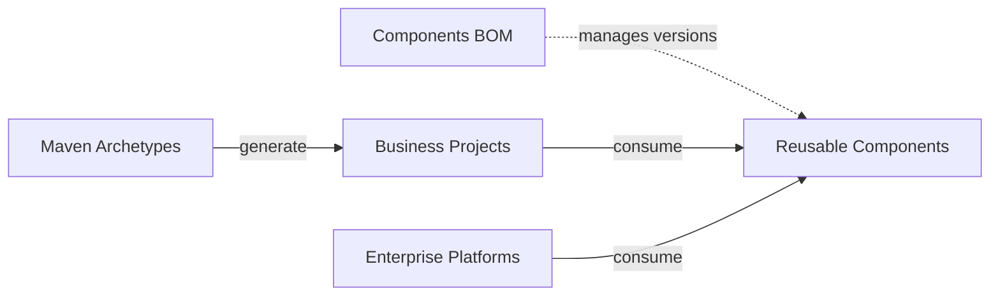

# Egon-COLA

[English](README.md) | [中文](README.zh-CN.md)

Egon-COLA is a Java 21 Maven multi-module project that provides cleanly layered project scaffolding, reusable Spring Boot components, and deployable enterprise platform capabilities. It gives business teams a consistent engineering direction while leaving business rules and domain details in the consuming application.

[](https://github.com/AllenDEricDAlexander/Egon-COLA/actions/workflows/ci.yaml)
[](https://github.com/AllenDEricDAlexander/Egon-COLA/actions/workflows/ci_java_compatibility.yaml)
[](https://openjdk.org/projects/jdk/21/)
[](https://spring.io/projects/spring-boot)
[](#license)

## Features

- **Project scaffolding**: Generate light, service, and web business projects with Maven Archetypes.
- **Layering conventions**: Provide explicit boundaries for `common`, `facade`, `domain`, `application`, `infrastructure`, `adapter`, and `starter` layers.
- **Reusable components**: Offer common contracts, IDs, tracing, dynamic thread pools, RPC, rule engines, access governance, method extension, transactional outbox, and bytecode tooling.
- **Enterprise platforms**: Include Dynamic Config Center, Gateway, Unified Identity Provider, and RBAC3 permission platform modules.
- **Architecture verification**: Support build-time architecture rules, baselines, reports, and optional runtime bytecode enhancements.
- **Compatibility verification**: Run Maven builds, generated-project verification, Docker-backed tests, and Java compatibility checks in CI.

## Architecture

The repository is organized into three Maven reactors:

| Reactor | Responsibility | Typical consumer |
|---|---|---|
| `egon-cola-archetypes` | Project templates and generated-project fixtures. | New business projects. |
| `egon-cola-components` | Reusable libraries, Spring Boot starters, BOM, and component tests. | Business applications and platform services. |
| `egon-cola-platforms` | Independently deployable infrastructure systems and control planes. | Platform operators and enterprise services. |

The intended dependency direction is:



Generated business projects use the following layered direction:

```text
adapter -> application -> domain
adapter -> facade
infrastructure -> domain
starter -> application / domain / infrastructure
common is shared by the layers where the generated project contract allows it
```

The exact rules differ between the light, service, and web archetypes. See the architecture documents under [`egon-cola-archetypes`](egon-cola-archetypes/) and [`egon-cola-components`](egon-cola-components/) before extending a generated project.

## Requirements

- JDK 21 or a later JDK. Java 21 is the project baseline.
- Maven 3.9.14 through the included Maven Wrapper (`./mvnw`).
- Git for source checkout and contribution workflows.
- Docker for Docker-backed integration tests and platform image builds.
- Node.js 24 for the Gateway Admin Web and RBAC3 web workflows. Java-only builds do not require Node.js.
- Redis, PostgreSQL, or other external services only when running the corresponding component or platform integration flow. See the module README for the exact topology.

## Quick Start

Clone the repository and run the root reactor build:

```bash
git clone https://github.com/AllenDEricDAlexander/Egon-COLA.git
cd Egon-COLA
./mvnw -V --no-transfer-progress clean install
```

Run a focused RPC contract verification when iterating on the RPC component:

```bash
./mvnw -B -ntp \
  -pl :egon-cola-component-rpc-test-contract \
  -am test
```

Verify all three archetypes and their generated projects:

```bash
./mvnw -B -ntp \
  -pl egon-cola-archetypes/egon-cola-archetype-light,egon-cola-archetypes/egon-cola-archetype-service,egon-cola-archetypes/egon-cola-archetype-web \
  -am clean integration-test
```

For a complete host-local identity, DDC, Gateway, RBAC3, RPC, and MCP topology, use the [unified identity and MCP local runbook](docs/operations/unified-identity-mcp-local-runbook.md).

## Maven Dependency

Import the Components BOM to keep public component versions aligned. The current repository version is `5.3.3`.

```xml
<properties>
    <egon-cola.version>5.3.3</egon-cola.version>
</properties>

<dependencyManagement>
    <dependencies>
        <dependency>
            <groupId>top.egon</groupId>
            <artifactId>egon-cola-components-bom</artifactId>
            <version>${egon-cola.version}</version>
            <type>pom</type>
            <scope>import</scope>
        </dependency>
    </dependencies>
</dependencyManagement>
```

Add only the component entry points required by the business application:

```xml
<dependencies>
    <dependency>
        <groupId>top.egon</groupId>
        <artifactId>egon-cola-component-common-core</artifactId>
    </dependency>
    <dependency>
        <groupId>top.egon</groupId>
        <artifactId>egon-cola-component-common-id-starter</artifactId>
    </dependency>
    <dependency>
        <groupId>top.egon</groupId>
        <artifactId>egon-cola-component-rpc-starter</artifactId>
    </dependency>
</dependencies>
```

The BOM manages the public component artifacts, including common, tracing, dynamic thread pool, RPC/DDC adapter, rule engine, access guard, method extension, transactional outbox, and bytecode artifacts. It does not export platform artifacts, test modules, admin applications, or frontend packages. See the [Components BOM README](egon-cola-components/egon-cola-components-bom/README.md) for the authoritative export list.

If a component version is not available in the remote Maven repository, install the current reactor locally before consuming it from another project:

```bash
./mvnw -V --no-transfer-progress clean install
```

## Configuration

The root project is a library, template, and platform reactor; it does not define one application-wide runtime configuration file. Configuration belongs to the selected component or deployable platform.

Common configuration conventions are:

| Capability | Configuration namespace | Notes |
|---|---|---|
| Snowflake IDs | `egon.cola.component.id` | `machine-id` is explicit and required when the starter is enabled. |
| Dynamic thread pool | `egon.cola.component.dtp` | Configure executor registration, Redis, reporting, and trace propagation. |
| RPC | `egon.cola.component.rpc` | Configure provider/consumer roles, TLS, deadlines, and metadata. |
| DDC integration | `egon.cola.component.ddc` | Configure bootstrap targets, Redis, registry leases, and credentials. |
| Transactional outbox | `egon.cola.component.transactional-outbox` | Configure PostgreSQL/JDBC storage, polling, retry, lease, and delivery channels. |

For example, a Spring Boot application using the ID starter must provide an explicit machine ID:

```yaml
egon:
  cola:
    component:
      id:
        enabled: true
        machine-id: 17
        max-clock-backward: 5ms
```

Read the component documentation before copying configuration between environments. In particular, credentials, TLS settings, DDC registry settings, Redis topology, and outbox schema ownership are deployment-specific. The [Gateway and DDC integration guide](egon-cola-platforms/egon-cola-platform-gateway/docs/developer-integration.md) documents the multi-process configuration boundary.

## Usage

### Generate a business project

Egon-COLA provides three Maven Archetypes:

| Archetype | Use case |
|---|---|
| `egon-cola-archetype-light` | Lightweight single-module project for small services, component tests, and quick verification. |
| `egon-cola-archetype-service` | Backend service focused on Dubbo3 Triple RPC and MQ without HTTP Controllers. |
| `egon-cola-archetype-web` | Multi-module web service with HTTP adapters, facades, application, domain, and infrastructure layers. |

Example:

```bash
mvn -B archetype:generate \
  -DgroupId=top.egon \
  -DartifactId=order-service \
  -Dversion=1.0.0-SNAPSHOT \
  -Dpackage=top.egon.orders \
  -DarchetypeGroupId=top.egon \
  -DarchetypeArtifactId=egon-cola-archetype-web \
  -DarchetypeVersion=5.3.3 \
  -DinteractiveMode=false
```

To generate from the locally built archetype catalog, add `-DarchetypeCatalog=local` after installing the repository with `./mvnw clean install`.

### Add a component

Import the BOM, select the component's `starter` or pure-JAR entry point, and configure only the capabilities required by the application. Component-specific usage examples are maintained in the linked module READMEs.

### Run a platform

Platforms are deployed as independent applications rather than started by the root project. Start the required platform modules and backing services according to their runbooks:

- [Dynamic Config Center](egon-cola-platforms/egon-cola-platform-dynamic-config-center/README.md)
- [Gateway](egon-cola-platforms/egon-cola-platform-gateway/README.md)
- [Unified Identity Provider](egon-cola-platforms/egon-cola-platform-idp/README.md)
- [RBAC3 Permission Platform](egon-cola-platforms/egon-cola-platform-rbac3/README.md)

## Core Concepts

- **Archetype**: A template for creating a new business project. It defines the initial module layout and dependency direction but does not implement the consuming application's business domain.
- **Component**: A reusable library or Spring Boot starter. Runtime components expose contracts and auto-configuration; test and admin modules remain development or deployment concerns.
- **Platform**: A separately deployable enterprise capability such as DDC, Gateway, IDP, or RBAC3. Platforms may consume components, while business applications consume the platform contracts or platform-facing starters required by their topology.
- **Starter boundary**: A starter is the normal business-application entry point for a runtime component. It owns auto-configuration and should not depend back on admin, test, or UI modules.
- **Contract versus runtime**: API, contract, and descriptor modules define stable integration surfaces; runtime, engine, admin, and adapter modules implement specific deployment responsibilities.
- **BOM ownership**: The Components BOM centralizes versions for public component consumption. Platform versioning and platform deployment are managed by the platform reactors and their documentation.

## Extension Points

The repository provides extension points at several boundaries:

- Add or tailor generated project conventions through the Maven Archetype templates.
- Replace default Spring Boot beans with application-owned beans where a starter documents conditional back-off behavior.
- Register rules, listeners, policies, access decisions, and method-extension handlers in the corresponding component APIs.
- Define Protobuf contracts and choose RPC provider, consumer, DDC, or Gateway integration modes.
- Supply transactional-outbox delivery handlers for custom destinations or use the built-in HTTP and RabbitMQ adapters.
- Provide bytecode architecture rules, baselines, report writers, or optional runtime agents when the bytecode component is enabled.

Extension points are module-local contracts, not a promise that every module is wired into every platform. Confirm the registration path and lifecycle in the relevant README before relying on an extension in production.

## Project Structure

```text
Egon-COLA/
├── .github/                         # GitHub Actions workflows
├── .mvn/wrapper/                    # Maven Wrapper configuration
├── docs/                            # Operations runbooks and project documents
├── egon-cola-archetypes/            # Maven Archetypes and generated-project fixtures
│   ├── egon-cola-archetype-light/
│   ├── egon-cola-archetype-service/
│   ├── egon-cola-archetype-web/
│   ├── egon-cola-evaluation-facade/
│   └── egon-cola-organization-facade/
├── egon-cola-components/             # Reusable components, starters, BOM, and tests
│   ├── egon-cola-components-bom/
│   ├── egon-cola-component-common/
│   ├── egon-cola-component-dynamic-thread-pool/
│   ├── egon-cola-component-rpc/
│   ├── egon-cola-component-rule-engine-starter/
│   ├── egon-cola-component-access-guard-starter/
│   ├── egon-cola-component-method-extension/
│   ├── egon-cola-component-transactional-outbox-starter/
│   └── egon-cola-component-bytecode/
├── egon-cola-platforms/              # Deployable infrastructure platforms
│   ├── egon-cola-platform-dynamic-config-center/
│   ├── egon-cola-platform-gateway/
│   ├── egon-cola-platform-idp/
│   └── egon-cola-platform-rbac3/
├── scripts/                          # Release and repository helper scripts
├── mvnw
├── mvnw.cmd
└── pom.xml                           # Root aggregation parent, version 5.3.3
```

Useful documentation entry points include the [component architecture guide](egon-cola-components/egon-cola-components-architecture.md), [archetype architecture diagrams](egon-cola-archetypes/architecture-mermaid-diagrams.md), and [Maven deployment guide](scripts/maven-deploy.md).

## Deployment

Components are normally consumed as Maven dependencies. The DDC, Gateway, IDP, and RBAC3 modules are platform applications with their own runtime configuration, Docker/deployment assets, backing services, and operational boundaries.

For Maven Central publication, the root reactor should be verified and deployed as one dependency-aware graph:

```bash
./mvnw -B -ntp -Prelease -DskipTests verify
./mvnw -B -ntp -Prelease -DskipTests clean deploy
```

Use [scripts/maven-deploy.md](scripts/maven-deploy.md) for release prerequisites and credential setup. For local platform deployment, start only the platform modules and external services required by the chosen topology; the root build does not start them automatically.

## Compatibility

| Item | Supported baseline or current value |
|---|---|
| Project version | `5.3.3` |
| Java | 21 baseline; CI verifies JDK 21 and JDK 25 |
| Maven Wrapper | 3.9.14 |
| Spring Boot | 3.5.16 in the component and archetype reactors |
| Frontend runtime | Node.js 24 for the Gateway Admin Web and RBAC3 web workflows |
| CI container | Rocky Linux 10 for the main Java compatibility workflows |

The Java source baseline is 21 even though CI also checks a newer JDK. Frontend modules have their own package manifests and lockfiles; do not infer frontend compatibility from the Java reactor alone.

## FAQ

### Is Egon-COLA a complete business framework?

No. It is an engineering foundation: scaffolding, reusable components, platform capabilities, and boundary checks. The consuming project owns its business model, workflows, persistence decisions, and domain rules.

### Should a business application depend on a parent or an admin module?

Usually not. Import the Components BOM and depend on the component's documented starter or pure-JAR entry point. Admin and test modules are intended for platform operation or component verification.

### Does the Components BOM include DDC, Gateway, IDP, or RBAC3?

No. The BOM manages public reusable component artifacts. Platform artifacts have separate module boundaries and deployment documentation.

### Do Maven tests prove a production topology?

No. Unit, module, and Docker-backed tests prove the behavior covered by those tests. They do not by themselves prove production Redis/PostgreSQL availability, DNS or VIP routing, credentials, multi-process deployment, or high-availability behavior.

### Where should configuration questions be answered?

Start with the README for the exact component or platform, then follow its runbook for external services, credentials, TLS, and deployment topology. Avoid copying a development configuration into production without reviewing those boundaries.

## Roadmap

The current roadmap direction is:

- Keep the Java 21 baseline and cross-JDK compatibility verification healthy.
- Continue aligning DDC, Gateway, Unified Identity, and RBAC3 contracts with their local runbooks.
- Expand archetype generation examples and architecture checks without forcing unnecessary framework conventions on business projects.
- Improve operational documentation for local and production-like platform topologies.
- Maintain the Components BOM and Maven Central release workflow as the public consumption surface evolves.

This list is directional. Approved design documents, issues, and release decisions are the authority for committed scope and dates.

## Contributing

1. Read the README for the component, platform, or archetype being changed.
2. Keep the change scoped to the requested behavior and preserve unrelated worktree changes.
3. Run the smallest relevant verification first, then the root build when the change crosses module boundaries.
4. Update the affected documentation and tests together when contracts or configuration change.
5. Open a pull request with the motivation, changed modules, validation commands, and any runtime-validation boundary.

The default repository verification is:

```bash
./mvnw -B -ntp clean install
```

For generated projects, also run the archetype integration-test command from [Quick Start](#quick-start). Platform frontend and live-topology checks are documented in their platform-specific workflows and runbooks.

## Changelog

The current Maven project version is `5.3.3`, as declared by the root `pom.xml`. There is no standalone `CHANGELOG.md` in the repository; release history is maintained through Git history and the [GitHub Releases page](https://github.com/AllenDEricDAlexander/Egon-COLA/releases). Module READMEs document the current contracts, configuration, and validation boundaries for each feature.

## License

Egon-COLA is dual-licensed. You may use the project under either:

- [MIT License](LICENSE-MIT)
- [GNU Lesser General Public License v2.1](LICENSE-LGPL-2.1)
