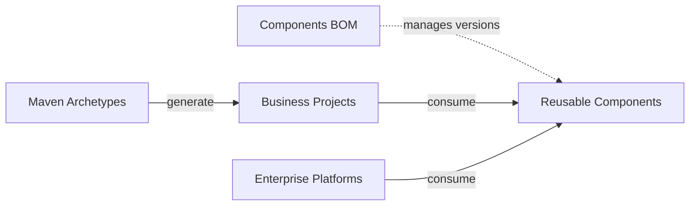

# Egon-COLA

[English](README.md) | [中文](README.zh-CN.md)

Egon-COLA is a Java 21 Maven multi-module repository that provides cleanly layered project scaffolding, reusable Spring Boot components, and independently deployable enterprise platforms, including AI-agent building blocks. It fixes the engineering direction — module layout, dependency edges, and runtime boundaries — while leaving business rules, domain models, and deployment decisions to the consuming application.

[](https://github.com/AllenDEricDAlexander/Egon-COLA/actions/workflows/ci-backend.yml)
[](https://github.com/AllenDEricDAlexander/Egon-COLA/actions/workflows/ci-frontend.yml)
[](https://openjdk.org/projects/jdk/21/)
[](https://spring.io/projects/spring-boot)
[](https://central.sonatype.com/artifact/top.egon/egon-cola-components-bom)
[](#license)

## Contents

- [Origin](#origin)
- [Features](#features)
- [Modules at a Glance](#modules-at-a-glance)
- [Architecture](#architecture)
- [Requirements](#requirements)
- [Quick Start](#quick-start)
- [Maven Dependency](#maven-dependency)
- [Configuration](#configuration)
- [Usage](#usage)
- [Core Concepts](#core-concepts)
- [Extension Points](#extension-points)
- [Project Structure](#project-structure)
- [Deployment](#deployment)
- [Compatibility](#compatibility)
- [FAQ](#faq)
- [Roadmap](#roadmap)
- [Contributing](#contributing)
- [Changelog](#changelog)
- [License](#license)

## Origin

Egon-COLA began as Alibaba's open-source [COLA v5](https://github.com/alibaba/COLA) (Clean Object-oriented and Layered Architecture) taken into this repository as a starting point rather than as an external dependency. The initial commit (2025-08-17) imported COLA's root POM `com.alibaba.cola:cola-dummy-aggregation-parent`, its `cola-components` set (`cola-component-dto`, `cola-component-exception`, `cola-component-extension-starter`, `cola-component-statemachine`, `cola-component-ruleengine`, `cola-components-bom`, …), and the `cola-archetypes` light/service/web templates.

| Dimension | Status |
|---|---|
| Retained | The COLA layer direction (`common`, `facade`, `adapter`, `application`, `domain`, `infrastructure`, `starter`), the Archetype + Component + BOM organization, and the 5.x version line — the current release is `5.4.1`. |
| Renamed | On 2026-07-01 every coordinate moved from `com.alibaba.cola` to `top.egon`, and every artifact from `cola-*` to `egon-cola-*`. |
| Re-implemented | No upstream artifact is consumed at build or runtime. `CoreBoundaryTest` and `SourceBoundaryAssert` fail the build if a single `com.alibaba.cola` import reappears. |
| Extended | RPC, dynamic thread pools, access governance, method extension, transactional outbox, two-level cache, the MyBatis-Plus/ShardingSphere repository layer, Agent Flow and RAG, bytecode governance, and an independently deployable platform tier (Tianshu, Yuheng, Tianquan-Shoubing, Tianquan-Jianshen) that COLA never shipped. |

Read this as a lineage, not a distribution: Egon-COLA keeps COLA's architectural vocabulary and grows an engineering foundation of its own on top of it.

## Features

**Scaffolding and layering**

- Seven Maven Archetypes in two families: the native `light`, `service`, `web`, and `agent` family wired to Egon-COLA components and platforms, and the public-stack `-open` family (`light-open`, `service-open`, `web-open`) pinned to a reviewed Spring ecosystem baseline.
- Explicit layer ownership in every generated project: `common`, `facade`, `adapter`, `application`, `domain`, `infrastructure`, and `starter`, with `light` deliberately collapsed into one module and `agent` expanded into six.
- Peer RPC contracts published as ordinary libraries (`...-service-facade`, `...-web-facade`, and their `-open` twins) so sibling generated projects can call each other without sharing sources.
- Build-time architecture rules, baselines, and reports that keep the generated dependency direction intact as the business project grows.

**Application building blocks (Components)**

- Stable contracts, Spring-free: `Result`/`PageResult`/`PageQuery`/`SortQuery`, `ErrorStatus`/`BusinessException`/`CommonException`, `TreeBuilder`, `BaseConverter`, and the `EgonEnum` persistence contract.
- Cross-cutting runtime: W3C `traceparent`/`tracestate` context with MDC projection and task decorators, Servlet/WebFlux/WebClient/Reactor auto-configuration, Snowflake `BIGINT` IDs behind an explicit `machine-id`, digests/HMAC/Base64/Hex, and `@Sensitive` masking on Jackson responses and Logback messages.
- Data access: a two-level Guava (L1) + Redisson `RMapCache` (L2) cache with tenant-scoped keys and penetration/breakdown/avalanche guards, plus a MyBatis-Plus 3.5.16 + ShardingSphere-JDBC 5.5.3 + PostgreSQL layer that publishes one logical `DataSource`, an `EgonModel` ActiveRecord contract, tenant and optimistic-lock interceptors, batch commands, and a checksum-verified DDL runner.
- Async capacity and governance: dynamic thread pools (including bounded virtual-thread executors) resized through Redis with snapshot reporting and metrics; method-level deny/allow lists, penalty box, rate limits, and time limits; pre-invocation method-extension handlers behind an AOP or bytecode-Agent engine; and a PostgreSQL transactional outbox delivering at-least-once over HTTP, RabbitMQ, or a custom handler.
- Pure-Java rule engine: rule chains, responsibility chains, and rule trees with execution trace and listeners. It deliberately ships no expression language and no rule-management backend.
- Development tooling: an offline generator that turns PostgreSQL DDL or a persistence manifest into the layered CRUD code of a generated project, without starting Spring or editing the target POM.

**AI-agent building blocks**

- Agent Flow compiles a YAML flow tree into Spring AI 1.1.8 and Google ADK 0.7.0 `LlmAgent`, `SequentialAgent`, `ParallelAgent`, and `LoopAgent` graphs with strict startup validation, synchronous and streamed execution, and process-local sessions.
- RAG supplies the mechanics — extraction, chunking, storage, embedding, and filtered similarity retrieval — while the host owns the `EmbeddingModel` and `VectorStore` beans; it is not a knowledge base product.
- The `agent` archetype generates a six-module Deep Research plus knowledge-base service on PostgreSQL `vector`, exposing a single SSE run endpoint and no MQ, RPC, GraphQL, or UI surface.

**Enterprise platforms**

- Tianshu (Dynamic Config Center): one-YAML ConfigData loading, `@DdcValue` with selective refresh, Redis leases for configuration clients and RPC providers, synchronous `SYNC_ALL_ACK` publication, and a standalone control plane with its own console.
- Yuheng: an HTTP/RPC data plane plus control plane — release-based routing, OpenAI-compatible transparent streaming, WebSocket and multipart transport, MCP endpoints, provider discovery and health, mTLS, and W3C trace propagation.
- Tianquan-Shoubing: the unified identity provider for OAuth/OIDC, browser SSO, multi-tenant membership, and single-audience resource-bound tokens.
- Tianquan-Jianshen: resource and role authorization with immutable manifest activation, fail-closed fencing, atomic policy snapshots, and a gateway adapter for the Yuheng hot path.
- A Wujie-based Admin Portal plus one React console per platform, sharing layout, theming, HTTP/OAuth clients, and i18n through `@egon-cola/xingyuan-admin-web-shared`.

**Verification**

- CI verifies the Maven backend and the platform frontends, generated projects are compiled and tested from the archetype catalog, Docker-backed integration tests cover cross-process flows, and the compatibility matrix is checked on more than one JDK.

## Modules at a Glance

The tables below list every artifact a consumer can depend on. `★` marks an entry point whose version the Components BOM manages; `◆` marks an artifact that is importable but deliberately outside the BOM (platform library, build plugin, or development tool). Aggregator POMs and `*-test`, `*-admin`, `*-core`, and `*-benchmark` modules are build, verification, or deployment units — never business dependencies.

### Components

| Component | Entry point | What it gives a consumer | Requires |
|---|---|---|---|
| [Common](egon-cola-components/egon-cola-component-common/README.md) | ★ `egon-cola-component-common-core` | `Result`/`PageResult`/`PageQuery`/`SortQuery`, `ErrorStatus`/`BusinessException`/`CommonException`, `TreeBuilder`, `BaseConverter`, `EgonEnum` — Spring-free | — |
| | ★ `egon-cola-component-common-trace` | Pure JDK + SLF4J `TraceContext`, full MDC projection, W3C `traceparent`/`tracestate` parsing, trace-propagating `Runnable`/`Callable`/`Supplier` | — |
| | ★ `egon-cola-component-common-trace-spring-boot-starter` | Trace auto-wiring for Servlet, WebFlux, `RestClient`, `WebClient`, and Reactor context projection | — |
| | ★ `egon-cola-component-common-id-starter` | Snowflake `BIGINT` ids, statically callable without Spring, explicit `machine-id` 0–1023, clock-backward tolerance | — |
| | ★ `egon-cola-component-common-crypto` | `Digests` (SHA-256), `Hmacs`, `Base64s`, `Hexes` | — |
| | ★ `egon-cola-component-common-data-desensitize-spring-boot-starter` | `@Sensitive` Jackson response masking plus Logback `%sensitiveMsg`, shared `SensitiveStrategy`, selectable `RESPONSE`/`LOG` scenes | — |
| | ★ `egon-cola-component-common-cache-spring-boot-starter` | Two-level cache: Guava L1 + Redisson `RMapCache` L2, tenant-scoped keys, penetration/breakdown/avalanche guards, post-commit eviction | Redis (host `RedissonClient`) + `@EnableCaching` |
| | ★ `egon-cola-component-common-mybatis-plus-sharding-jdbc-ext-spring-boot-starter` | One logical sharded `DataSource` from a single YAML, `EgonModel` ActiveRecord, `EgonColaRepository` guarded commands, tenant and optimistic-lock interceptors, batching, `EgonColaPostgreDdlRunner` | PostgreSQL |
| [Dynamic Thread Pool](egon-cola-components/egon-cola-component-dynamic-thread-pool/README.md) | ★ `egon-cola-component-dynamic-thread-pool-starter` | Registers `ThreadPoolExecutor`, `ThreadPoolTaskExecutor`, and `BoundedVirtualThreadExecutor`; remote resize and virtual-thread limits, snapshot reporting, Micrometer metrics, trace decorators | Redis |
| [RPC](egon-cola-components/egon-cola-component-rpc/README.md) | ★ `egon-cola-component-rpc-starter` | Transport-neutral gRPC 1.75 / Protobuf 4.32 unary provider and consumer: `@EgonRpcService`, `@EgonRpcMethod`, `@EgonRpcProvider`, `@EgonRpcReference` (`DIRECT` or `GATEWAY`) | — |
| | ★ `egon-cola-component-rpc-tianshu-adapter` | The above plus Tianshu ConfigData, lease registration, discovery, HMAC auth metadata, and mTLS wiring — the entry point for an app that needs Tianshu | Tianshu + Redis |
| [Rule Engine](egon-cola-components/egon-cola-component-rule-engine-starter/README.md) | ★ `egon-cola-component-rule-engine-starter` | `RuleChain`/`ChainHandler`, `AbstractSingletonRuleLink`, `RuleTree` with `RouteDecision`, `RuleTrace`, `RuleExecutionListener`, async execution | — |
| [Access Guard](egon-cola-components/egon-cola-component-access-guard-starter/README.md) | ★ `egon-cola-component-access-guard-starter` | `@AccessGuard`/`@RateLimitGuard`/`@AllowListGuard`/`@TimeLimitGuard` in the fixed order Deny → Allow → PenaltyBox → RateLimit → TimeLimit, programmatic `AccessGuardClient`, async and reactive lifecycle, fail-open/closed policies, Actuator endpoint | Redis only with `storage: REDISSON`; HMAC secret whenever a rule exists |
| [Method Extension](egon-cola-components/egon-cola-component-method-extension/README.md) | ★ `egon-cola-component-method-extension-starter` | `@MethodExtension` handlers that decide before the annotated method runs; `engine: AOP`, `AGENT`, or `DISABLED`; `not-ready-policy: PROCEED/REJECT/FAIL` | `AGENT` mode needs the bytecode Agent |
| [Transactional Outbox](egon-cola-components/egon-cola-component-transactional-outbox-starter/README.md) | ★ `egon-cola-component-transactional-outbox-starter` | Enqueue inside the caller's transaction, `FOR UPDATE SKIP LOCKED` polling, retry/dead-letter/retention, `messageId` as idempotency key, HTTP and RabbitMQ channels plus a custom `DeliveryHandler` SPI | PostgreSQL (table is not auto-created) |
| [Agent Flow](egon-cola-components/egon-cola-component-agent-flow-starter/README.md) | ★ `egon-cola-component-agent-flow-starter` | YAML flow tree compiled to Spring AI 1.1.8 + Google ADK 0.7.0 `LlmAgent`/`SequentialAgent`/`ParallelAgent`/`LoopAgent`, strict startup validation, `execute` and `executeStream`, process-local sessions | Host-owned named `ChatModel` beans |
| [RAG](egon-cola-components/egon-cola-component-rag-starter/README.md) | ★ `egon-cola-component-rag-starter` | `RagDocumentExtractor`, `RagChunkingStrategy` (`TOKEN`/`MARKDOWN_HEADING`/`RECURSIVE`), `RagDocumentStorage`, embedding registry, forced collection and model filters, idempotent chunk ids | Host-owned `EmbeddingModel` + `VectorStore` |
| [Bytecode](egon-cola-components/egon-cola-component-bytecode/README.md) | ★ `egon-cola-component-bytecode-api` / `-bridge` / `-runtime` / `-agent` / `-starter` | Public capability contracts, Agent↔runtime bridge, enhancement with sinks and failure isolation, shaded `premain` Agent (`executor`, `observation`, `method-extension`), Spring Boot starter plus `/actuator/egonbytecode` | `-javaagent` for Agent features |
| | ◆ `egon-cola-component-bytecode-architecture-maven-plugin` | Build-time `check`, `check-reactor`, and `generate-baseline` goals with 10 architecture rules and Text/JSON/HTML reports | Declared in `<build><plugins>`, not in `<dependencies>` |
| [Code Generator](egon-cola-components/egon-cola-component-code-generator/README.md) | ◆ `egon-cola-component-code-generator` | Offline development tool: PostgreSQL DDL or a persistence manifest in, layered CRUD out, with `plan`/`check`/`apply`/`recover` and a fingerprint guard that never overwrites hand edits | Development time only; never starts Spring |

### Platforms

| Platform | Runnable applications | Artifacts a consumer imports | Backing services |
|---|---|---|---|
| [Tianshu (Dynamic Config Center)](egon-cola-xingyuan/egon-cola-tianshu/README.md) | `egon-cola-tianshu-admin`, `egon-cola-tianshu-admin-web` | ◆ `egon-cola-tianshu-starter` (ConfigData, `@DdcValue`, selective refresh, ACK, leases), ◆ `egon-cola-tianshu-http-registration-starter`, ★ `egon-cola-component-rpc-tianshu-adapter` | PostgreSQL + Redis (`SINGLE`/`SENTINEL`/`CLUSTER`) |
| [Yuheng](egon-cola-xingyuan/egon-cola-yuheng/README.md) | `yuheng-biz-gateway` (data plane), `yuheng-admin`, `yuheng-admin-web` | ◆ `yuheng-starter`, ◆ `yuheng-contract`, ◆ `yuheng-starter-openapi` with `-webmvc` / `-webflux` variants | Tianshu + Redis + PostgreSQL; Kafka optional |
| [Tianquan-Shoubing](egon-cola-xingyuan/egon-cola-tianquan-shoubing/README.md) | `egon-cola-tianquan-shoubing-admin`, `egon-cola-tianquan-shoubing-admin-web` | ◆ `egon-cola-tianquan-shoubing-starter` (token and global-user verification), ◆ `-rpc-contract`, ◆ `-gateway-adapter` (Yuheng-side only) | PostgreSQL + Redis; Tianshu |
| [Tianquan-Jianshen](egon-cola-xingyuan/egon-cola-tianquan-jianshen/README.md) | `egon-cola-tianquan-jianshen-admin`, `egon-cola-tianquan-jianshen-admin-web` | ◆ `egon-cola-tianquan-jianshen-starter` (policy enforcement point), ◆ `-contract`, ◆ `-gateway-adapter` (Yuheng hot path), npm `@egon-cola/tianquan-jianshen-react-sdk` | Tianshu + Yuheng + Redis + PostgreSQL + Tianquan-Shoubing |

### Shared admin frontend

`egon-cola-xingyuan-admin-portal` is the private Wujie micro-frontend shell that aggregates the four platform consoles, and `egon-cola-xingyuan-admin-web-shared` (`@egon-cola/xingyuan-admin-web-shared`) is the npm library they share: `EnterpriseLayout`, `AdminThemeProvider` and design tokens, `createHttpClient`/`createOAuthClient`/`createTokenStore`, i18n, and page-state components. Neither is a Maven module; both need Node.js 24.

## Architecture

The repository is organized into three Maven reactors:

| Reactor | Responsibility | Typical consumer |
|---|---|---|
| `egon-cola-archetypes` | Project templates and generated-project fixtures. | New business projects. |
| `egon-cola-components` | Reusable libraries, Spring Boot starters, BOM, and component tests. | Business applications and platform services. |
| `egon-cola-xingyuan` | Independently deployable infrastructure systems and control planes. | Platform operators and enterprise services. |

The intended dependency direction is:



Generated business projects use the following layered direction:

```text
adapter -> application -> domain
adapter -> facade
infrastructure -> domain
starter -> application / domain / infrastructure
common is shared by the layers where the generated project contract allows it
```

The exact rules differ per archetype:

- `light` targets a single-module project for lightweight work and fast validation.
- `service` focuses on backend services with Dubbo 3 Triple RPC and MQ, and exposes no HTTP controller by default.
- `web` generates a multi-module business project with HTTP `adapter`, `facade`, `application`, `domain`, and `infrastructure` layers.
- `agent` generates a six-module Deep Research plus knowledge-base service on PostgreSQL `vector`, with one SSE run endpoint and no broker, RPC, GraphQL, or UI surface.

The native family follows Egon-COLA components and platforms; the `-open` family is the currently consumable public-stack baseline. Platforms and components also have a hard boundary: the Components BOM manages public component artifacts only and never re-exports platform artifacts, while each platform owns its own deployment, configuration, and external dependencies. Read the architecture documents under [`egon-cola-archetypes`](egon-cola-archetypes/) and [`egon-cola-components`](egon-cola-components/) before extending a generated project.

## Requirements

- JDK 21 or a later JDK. Java 21 is the project source baseline.
- Maven 3.9.14 through the included Maven Wrapper (`./mvnw`).
- Git for source checkout and contribution workflows.
- Docker for Docker-backed integration tests and platform image builds.
- Node.js 24 for the platform web workflows (Yuheng, Tianshu, Tianquan-Shoubing, Tianquan-Jianshen admin apps and the Admin Portal). Java-only builds do not require Node.js.
- Redis, PostgreSQL, RabbitMQ, or other external services only when running the corresponding component or platform integration flow. See the module README for the exact topology.

## Quick Start

Clone the repository and run the root reactor build:

```bash
git clone https://github.com/AllenDEricDAlexander/Egon-COLA.git
cd Egon-COLA
./mvnw -V --no-transfer-progress clean install
```

Run a focused RPC contract verification when iterating on the RPC component:

```bash
./mvnw -B -ntp \
  -pl :egon-cola-component-rpc-test-contract \
  -am test
```

Build and verify the editable source projects, then generate the complete Archetype reactor:

```bash
./mvnw -B -ntp -f egon-cola-archetypes/source-projects/pom.xml clean install
./scripts/generate_archetypes.sh generate
./scripts/generate_archetypes.sh check
./mvnw -B -ntp -f egon-cola-archetypes/pom.xml \
  -Pgenerated-archetypes clean install
```

The default Archetypes reactor contains only the four published facade modules. The generated
children are included explicitly with `-Pgenerated-archetypes`, so a fresh checkout does not require
the ignored `.generated` directory until the second stage is requested.

Verify the generated-project contracts:

```bash
./mvnw -B -ntp -f egon-cola-archetypes/pom.xml \
  -Pgenerated-archetypes clean verify
```

For a complete host-local identity, Tianshu, Yuheng, Tianquan-Jianshen, RPC, and MCP topology, use the [unified identity and MCP local runbook](docs/operations/unified-identity-mcp-local-runbook.md).

## Maven Dependency

Import the Components BOM to keep public component versions aligned. The current repository version is `5.4.1`, which is also the latest release on Maven Central.

```xml
<properties>
    <egon-cola.version>5.4.1</egon-cola.version>
</properties>

<dependencyManagement>
    <dependencies>
        <dependency>
            <groupId>top.egon</groupId>
            <artifactId>egon-cola-components-bom</artifactId>
            <version>${egon-cola.version}</version>
            <type>pom</type>
            <scope>import</scope>
        </dependency>
    </dependencies>
</dependencyManagement>
```

Add only the component entry points required by the business application:

```xml
<dependencies>
    <dependency>
        <groupId>top.egon</groupId>
        <artifactId>egon-cola-component-common-core</artifactId>
    </dependency>
    <dependency>
        <groupId>top.egon</groupId>
        <artifactId>egon-cola-component-common-id-starter</artifactId>
    </dependency>
    <dependency>
        <groupId>top.egon</groupId>
        <artifactId>egon-cola-component-rpc-starter</artifactId>
    </dependency>
</dependencies>
```

The BOM manages 22 public entry points: `common-core`, `common-trace`, `common-id-starter`, `common-crypto`, the data-desensitization, cache, and MyBatis-Plus/ShardingSphere extension starters, `dynamic-thread-pool-starter`, `common-trace-spring-boot-starter`, `rpc-starter`, `rpc-tianshu-adapter`, `rule-engine-starter`, `agent-flow-starter`, `rag-starter`, `access-guard-starter`, `method-extension-starter`, `transactional-outbox-starter`, and the bytecode `api`/`bridge`/`runtime`/`agent`/`starter` artifacts — every `★` row in [Project Structure](#project-structure). It does not export platform artifacts, test modules, admin applications, the code generator, or frontend packages; the `◆` rows are published but declare their own version. See the [Components BOM README](egon-cola-components/egon-cola-components-bom/README.md) for the authoritative export list.

If a component version is not available in the remote Maven repository, install the current reactor locally before consuming it from another project:

```bash
./mvnw -V --no-transfer-progress clean install
```

## Configuration

The root project is a library, template, and platform reactor; it does not define one application-wide runtime configuration file. Configuration belongs to the selected component or deployable platform.

Common configuration conventions are:

| Capability | Configuration namespace | Notes |
|---|---|---|
| Snowflake IDs | `egon.cola.component.id` | `machine-id` is explicit and required when the starter is enabled. |
| Dynamic thread pool | `egon.cola.component.dtp` | Configure executor registration, Redis, reporting, and trace propagation. |
| RPC | `egon.cola.component.rpc` | Configure provider/consumer roles, TLS, deadlines, and metadata. |
| Tianshu integration | `egon.cola.component.tianshu` | Configure bootstrap targets, Redis, registry leases, and credentials. |
| Transactional outbox | `egon.cola.component.transactional-outbox` | Configure PostgreSQL/JDBC storage, polling, retry, lease, and delivery channels. |
| Agent Flow | `egon.cola.component.agent-flow` | Disabled by default; binds flow names to host-owned model and agent beans. |
| Persistence extensions | `egon.cola.component.mybatis-plus` | Configure the PostgreSQL DDL runner and verified manual SQL manifest. |

For example, a Spring Boot application using the ID starter must provide an explicit machine ID:

```yaml
egon:
  cola:
    component:
      id:
        enabled: true
        machine-id: 17
        max-clock-backward: 5ms
```

Configuration rules that hold across components:

1. `machine-id` is never inferred from IP, MAC, hostname, port, process ID, randomness, or a hash.
2. RPC provider, consumer, Yuheng, and Tianshu are distinct runtime roles; do not copy one role's configuration onto another.
3. Redis, PostgreSQL, TLS keys, OIDC credentials, and Tianshu registration credentials come from the deployment environment, not from repository defaults.
4. Outbox and DDL table ownership, migration executors, and schema targets must be agreed between the business application and the platform in advance.

Read the component documentation before copying configuration between environments. The [Yuheng and Tianshu integration guide](egon-cola-xingyuan/egon-cola-yuheng/docs/developer-integration.md) documents the multi-process configuration boundary.

## Usage

### Generate a business project

Egon-COLA publishes two parallel archetype families. The original artifact IDs remain available and are not redirected; choose an `-open` artifact when you want the public Spring ecosystem baseline while the Egon-COLA component/platform family continues to evolve.

| Family | Light | Service | Web | Agent |
|---|---|---|---|---|
| Native | `egon-cola-archetype-light` | `egon-cola-archetype-service` | `egon-cola-archetype-web` | `egon-cola-archetype-agent` |
| Open | `egon-cola-archetype-light-open` | `egon-cola-archetype-service-open` | `egon-cola-archetype-web-open` | — |

The Open family uses Spring Boot 3.5.16, Spring Cloud 2025.0.3, Spring Cloud Alibaba 2025.0.0.0, Nacos 3.0.3, MyBatis-Plus 3.5.16, ShardingSphere 5.5.3, the Common ID generator, and the Dynamic Thread Pool. Service and Web additionally use Dubbo 3.3.6 plus gRPC/Protobuf 1.73.0; Light intentionally has no RPC or Yuheng dependency. Light and Web use Springdoc where HTTP APIs exist. The family forbids Spring Data JPA, Flyway/Liquibase, and an embedded Yuheng. IDs are `Long` internally, `int64` in Proto, and decimal strings at HTTP/GraphQL boundaries. Database DDL is supplied as manual SQL under each generated project's runbook.

Maintainers edit the matching normal project under `egon-cola-archetypes/source-projects`,
not a generated directory. `definitions` owns only the seven packaging contracts. Run
`scripts/generate_archetypes.sh generate` followed by `scripts/generate_archetypes.sh check` before
building with `-Pgenerated-archetypes`.

Example:

```bash
mvn -B archetype:generate \
  -DgroupId=top.egon \
  -DartifactId=order-service \
  -Dversion=1.0.0-SNAPSHOT \
  -Dpackage=top.egon.orders \
  -DarchetypeGroupId=top.egon \
  -DarchetypeArtifactId=egon-cola-archetype-web-open \
  -DarchetypeVersion=5.4.1 \
  -DinteractiveMode=false
```

To generate from the locally built archetype catalog, add `-DarchetypeCatalog=local` after installing the repository with `./mvnw clean install`.

See the [Open archetype architecture overview](egon-cola-archetypes/open-source-archetype-architecture.md) and [Open archetype code style](egon-cola-archetypes/open-source-archetype-code-style.md) for module ownership, protocol boundaries, manual SQL, and live-infrastructure limits.

### Add a component

Business applications normally integrate as "BOM plus the specific starter or pure JAR":

1. Import `egon-cola-components-bom` so no dependency carries a hand-maintained version.
2. Pick the documented entry point, for example `...-starter`, `common-core`, or `rpc-tianshu-adapter`.
3. Fill in configuration for the runtime role actually being started, and confirm whether Redis, PostgreSQL, Tianshu, or Yuheng is required.
4. Run module-level tests first, then the root reactor build when the change crosses module boundaries.

### Run a platform

Platforms are deployed as independent applications rather than started by the root project. Start the required platform modules and backing services according to their runbooks:

- [Tianshu (Dynamic Config Center)](egon-cola-xingyuan/egon-cola-tianshu/README.md)
- [Yuheng](egon-cola-xingyuan/egon-cola-yuheng/README.md)
- [Tianquan-Shoubing (Unified Identity Provider)](egon-cola-xingyuan/egon-cola-tianquan-shoubing/README.md)
- [Tianquan-Jianshen Permission Platform](egon-cola-xingyuan/egon-cola-tianquan-jianshen/README.md)

## Core Concepts

- **Archetype**: A template for creating a new business project. It defines the initial module layout and dependency direction but does not implement the consuming application's business domain.
- **Component**: A reusable library or Spring Boot starter. Runtime components expose contracts and auto-configuration; test and admin modules remain development or deployment concerns.
- **Platform**: A separately deployable enterprise capability such as Tianshu, Yuheng, Tianquan-Shoubing, or Tianquan-Jianshen. Platforms may consume components, while business applications consume the platform contracts or platform-facing starters required by their topology.
- **Starter boundary**: A starter is the normal business-application entry point for a runtime component. It owns auto-configuration and should not depend back on admin, test, or UI modules.
- **Contract versus runtime**: API, contract, and descriptor modules define stable integration surfaces; runtime, engine, admin, and adapter modules implement specific deployment responsibilities.
- **BOM ownership**: The Components BOM centralizes versions for public component consumption. Platform versioning and deployment are managed by the platform reactors and their documentation.
- **Static versus runtime verification**: Module tests, the root build, and architecture scans prove only the source and build behavior they cover. They do not replace real Redis, PostgreSQL, DNS, credential, multi-process, or high-availability validation.
- **Naming**: `egon-cola-xingyuan` is the reactor and directory name for the deployable platform tier. Prose in both languages calls it a "platform"; only paths and artifact IDs use the `xingyuan` spelling.

## Extension Points

The repository provides extension points at several boundaries:

- Add or tailor generated project conventions through the Maven Archetype templates.
- Replace default Spring Boot beans with application-owned beans where a starter documents conditional back-off behavior.
- Register rules, listeners, policies, access decisions, and method-extension handlers in the corresponding component APIs.
- Define Protobuf contracts and choose RPC provider, consumer, Tianshu, or Yuheng integration modes.
- Supply transactional-outbox delivery handlers for custom destinations or use the built-in HTTP and RabbitMQ adapters.
- Provide Agent Flow and RAG hosts that supply model, vector-store, tool, and persistence beans to the configuration-driven mechanics.
- Provide bytecode architecture rules, baselines, report writers, or optional runtime agents when the bytecode component is enabled.

Extension points are module-local contracts, not a promise that every module is wired into every platform. Confirm the registration path, lifecycle, threading model, and failure semantics in the relevant README before relying on an extension in production.

## Project Structure

Every line is annotated, and every artifact a consumer can depend on appears here. `★` = managed by the Components BOM (import the BOM, then omit `<version>`). `◆` = importable, but outside the Components BOM: platform libraries, the architecture Maven plugin, and development tools carry their own version. Everything else is an aggregator POM, a runnable application, or a verification module — not a business dependency.

```text
Egon-COLA/  # Three-tier reactor root: archetypes, components, and platforms
├── .github/workflows/                                # ci-backend.yml (Maven), ci-frontend.yml (npm), publish-maven-central.yml (Central release)
├── .mvn/wrapper/                                     # Maven Wrapper, pinned to Maven 3.9.14
├── docs/                                             # Project documentation: egon/ (spec, plan, review, reports, codegen), runbooks/, operations/, superpowers/
├── egon-cola-archetypes/                             # Archetype tier; parent artifactId egon-cola-archetypes-parent
│   ├── pom.xml                                       # Default reactor publishes the 4 peer facades only; -Pgenerated-archetypes adds the 7 archetypes
│   ├── source-projects/                              # The only editable archetype sources; maintainers never edit .generated
│   │   ├── pom.xml                                   # Source reactor parent that installs every project below in dependency order
│   │   ├── egon-cola-source-light/                   # Single-module Spring Boot project → archetype egon-cola-archetype-light
│   │   ├── egon-cola-source-light-open/              # Single module on the public stack → archetype egon-cola-archetype-light-open
│   │   ├── egon-cola-source-service/                 # adapter/application/domain/facade/infrastructure/common/starter; RPC + MQ, no HTTP controller by default → egon-cola-archetype-service
│   │   │   └── egon-cola-source-service-facade/      # ◆ published peer Protobuf contract, consumed by the web family
│   │   ├── egon-cola-source-service-open/            # Same shape on the public stack → egon-cola-archetype-service-open
│   │   │   └── egon-cola-source-service-open-facade/ # ◆ published peer Protobuf contract, consumed by web-open
│   │   ├── egon-cola-source-web/                     # adapter/application/domain/facade/infrastructure/common/starter → egon-cola-archetype-web
│   │   │   └── egon-cola-source-web-facade/          # ◆ published peer Protobuf contract, consumed by the service family
│   │   ├── egon-cola-source-web-open/                # Same shape on the public stack → egon-cola-archetype-web-open
│   │   │   └── egon-cola-source-web-open-facade/     # ◆ published peer Protobuf contract, consumed by service-open
│   │   └── egon-cola-source-agent/                   # Six-module Deep Research + knowledge-base service on PostgreSQL vector → egon-cola-archetype-agent
│   ├── definitions/                                  # 7 packaging contracts (manifest, packaging POM, META-INF, ITs); not Maven modules
│   └── .generated/                                   # Ignored derived publishing reactor; regenerate with scripts/generate_archetypes.sh, never hand-edit
├── egon-cola-components/                             # Reusable component tier; parent artifactId egon-cola-components-parent
│   ├── pom.xml                                       # Aggregator and build configuration only — never a business dependency
│   ├── egon-cola-components-architecture.md          # Cross-component layering and dependency-edge rules
│   ├── egon-cola-components-bom/                     # ★ The version authority: import once in dependencyManagement, then every ★ line below needs no version
│   ├── egon-cola-component-common/                   # Aggregator POM — depend on the sub-artifacts, never on this one
│   │   ├── egon-cola-component-common-core           # ★ Result/PageResult/PageQuery/SortQuery, ErrorStatus/BusinessException, TreeBuilder, BaseConverter, EgonEnum
│   │   ├── egon-cola-component-common-trace          # ★ Pure JDK+SLF4J TraceContext, MDC projection, W3C traceparent parsing, trace-propagating tasks
│   │   ├── egon-cola-component-common-trace-spring-boot-starter # ★ Trace wiring for Servlet, WebFlux, RestClient, WebClient, Reactor
│   │   ├── egon-cola-component-common-id-starter     # ★ Snowflake BIGINT ids; machine-id is explicit and never inferred
│   │   ├── egon-cola-component-common-crypto         # ★ Digests, Hmacs, Base64s, Hexes
│   │   ├── egon-cola-component-common-data-desensitize-spring-boot-starter # ★ @Sensitive Jackson response and Logback message masking
│   │   ├── egon-cola-component-common-cache-spring-boot-starter # ★ Guava L1 + Redisson RMapCache L2, tenant-scoped keys, penetration/breakdown/avalanche guards
│   │   ├── egon-cola-component-common-mybatis-plus-sharding-jdbc-ext-spring-boot-starter # ★ Sharded logical DataSource, EgonModel, tenant/optimistic-lock interceptors, batch, DDL runner
│   │   └── egon-cola-component-common-test           # Internal SourceBoundaryAssert used by component verification
│   ├── egon-cola-component-dynamic-thread-pool/      # Aggregator POM
│   │   ├── egon-cola-component-dynamic-thread-pool-starter # ★ Executor registry, Redis-driven resize, virtual-thread limits, snapshot reporting, Micrometer, trace decorators
│   │   ├── egon-cola-component-dynamic-thread-pool-admin # Runnable DTP console application — deploy it, do not depend on it
│   │   └── egon-cola-component-dynamic-thread-pool-test # Samples and behavior verification
│   ├── egon-cola-component-rpc/                      # Aggregator POM
│   │   ├── egon-cola-component-rpc-starter           # ★ gRPC/Protobuf provider and consumer, DIRECT or GATEWAY, no registry baked in
│   │   ├── egon-cola-component-rpc-tianshu-adapter   # ★ rpc-starter plus Tianshu ConfigData, lease registration, discovery, HMAC and mTLS wiring
│   │   └── egon-cola-component-rpc-test              # Contract, provider, and consumer verification fixtures
│   ├── egon-cola-component-rule-engine-starter       # ★ RuleChain, responsibility chains, RuleTree, trace, listeners; module and artifact are one
│   ├── egon-cola-component-access-guard-starter      # ★ Deny→Allow→PenaltyBox→RateLimit→TimeLimit, HMAC keys, fail-open/closed, Actuator
│   ├── egon-cola-component-method-extension/         # Aggregator POM
│   │   └── egon-cola-component-method-extension-starter # ★ @MethodExtension decisions with engine AOP, AGENT, or DISABLED
│   ├── egon-cola-component-transactional-outbox-starter # ★ Enqueue in the caller transaction, SKIP LOCKED polling, HTTP/RabbitMQ/custom handler, dead letter
│   ├── egon-cola-component-agent-flow-starter        # ★ YAML flow tree to Spring AI + Google ADK graphs, sync and streamed, process-local sessions
│   ├── egon-cola-component-rag-starter               # ★ Extraction, chunking, storage, embedding and retrieval SPIs over host-owned model and store
│   ├── egon-cola-component-bytecode/                 # Aggregator POM
│   │   ├── egon-cola-component-bytecode-api          # ★ JDK-only capability contracts, runtime events, ContextCarrier
│   │   ├── egon-cola-component-bytecode-bridge       # ★ Bridge between transformed code and the runtime
│   │   ├── egon-cola-component-bytecode-runtime      # ★ Enhancement, sinks, metrics, failure isolation
│   │   ├── egon-cola-component-bytecode-agent        # ★ Shaded premain javaagent: executor, observation, method-extension
│   │   ├── egon-cola-component-bytecode-starter      # ★ Spring Boot wiring plus /actuator/egonbytecode
│   │   ├── egon-cola-component-bytecode-architecture-maven-plugin # ◆ Build-time check, check-reactor, generate-baseline with 10 architecture rules
│   │   ├── egon-cola-component-bytecode-core         # Internal ASM transformation and rule engine, shaded into -agent and used by the plugin
│   │   ├── egon-cola-component-bytecode-test         # Architecture and agent integration fixtures
│   │   └── egon-cola-component-bytecode-benchmark    # JMH measurements
│   └── egon-cola-component-code-generator            # ◆ Offline CRUD generator with plan/check/apply/recover; development tool, never a runtime dependency
├── egon-cola-xingyuan/                               # Deployable platform tier; parent artifactId egon-cola-xingyuan-parent
│   ├── pom.xml                                       # Platform aggregator and version alignment for platform libraries (not the Components BOM)
│   ├── egon-cola-tianshu/                            # Dynamic Config Center; aggregator POM
│   │   ├── egon-cola-tianshu-starter                 # ◆ ConfigData SDK, @DdcValue and selective refresh, ACK, client and provider leases
│   │   ├── egon-cola-tianshu-http-registration-starter # ◆ Registers a Spring HTTP service with Tianshu and keeps its lease alive
│   │   ├── egon-cola-tianshu-admin                   # Runnable control plane: gRPC facades, REST admin, SYNC_ALL_ACK publication
│   │   ├── egon-cola-tianshu-admin-web               # React console, Node project outside the Maven reactor
│   │   └── egon-cola-tianshu-test                    # Starter samples and lease/identity acceptance tests
│   ├── egon-cola-yuheng/                             # Internal gateway platform; aggregator POM
│   │   ├── yuheng-starter                            # ◆ Business-side composition entry that includes Tianshu HTTP registration
│   │   ├── yuheng-contract                           # ◆ Stable contracts shared between gateway modules and consumers
│   │   ├── yuheng-starter-openapi                    # ◆ OpenAI-compatible API surface, transport-neutral
│   │   ├── yuheng-starter-openapi-webmvc             # ◆ Servlet stack variant of the OpenAI-compatible surface
│   │   ├── yuheng-starter-openapi-webflux            # ◆ Reactive stack variant of the OpenAI-compatible surface
│   │   ├── yuheng-biz-gateway                        # Runnable Reactor Netty data plane: routing, streaming, mTLS, trace
│   │   ├── yuheng-admin                              # Runnable control plane: releases, rules, provider and OpenAPI management
│   │   ├── yuheng-core / yuheng-runtime-core         # Gateway internals — not consumer entry points
│   │   ├── yuheng-mcp-core / yuheng-mcp-gateway      # Experimental MCP endpoints — gateway internals
│   │   ├── yuheng-admin-web                          # React console, Node project outside the Maven reactor
│   │   ├── yuheng-test                               # HTTP, RPC, MCP, and identity providers plus the acceptance suite
│   │   └── deployment / docs / performance           # Images, runbooks, integration guides, and benchmark assets
│   ├── egon-cola-tianquan-shoubing/                  # Unified identity provider (OAuth/OIDC); aggregator POM
│   │   ├── egon-cola-tianquan-shoubing-starter       # ◆ Downstream token verification and global-user resolution
│   │   ├── egon-cola-tianquan-shoubing-rpc-contract  # ◆ Identity RPC contracts
│   │   ├── egon-cola-tianquan-shoubing-gateway-adapter # ◆ Yuheng-side identity capability, not a business-app dependency
│   │   ├── egon-cola-tianquan-shoubing-core          # Pure identity domain model without Spring or I/O
│   │   ├── egon-cola-tianquan-shoubing-admin         # Runnable identity server control plane: clients, tenants, keys, audit
│   │   └── egon-cola-tianquan-shoubing-admin-web     # React console, Node project outside the Maven reactor
│   ├── egon-cola-tianquan-jianshen/                  # Permission platform; aggregator POM
│   │   ├── egon-cola-tianquan-jianshen-starter       # ◆ Business-service policy enforcement: JWT validation and snapshot reads
│   │   ├── egon-cola-tianquan-jianshen-contract      # ◆ Resource, role, and policy contracts
│   │   ├── egon-cola-tianquan-jianshen-gateway-adapter # ◆ Authorization hook for the Yuheng hot path
│   │   ├── egon-cola-tianquan-jianshen-core          # Role DAG, activation algebra, and constraints without I/O
│   │   ├── egon-cola-tianquan-jianshen-admin         # Runnable control plane: manifest activation, fencing, projections
│   │   ├── egon-cola-tianquan-jianshen-admin-web     # React console in the platform frontend workspace
│   │   └── egon-cola-tianquan-jianshen-react-sdk     # npm client SDK for the admin frontend
│   ├── egon-cola-xingyuan-admin-portal/              # Private Wujie micro-frontend shell aggregating the four consoles
│   ├── egon-cola-xingyuan-admin-web-shared/          # npm @egon-cola/xingyuan-admin-web-shared: layout, theming, HTTP/OAuth clients, i18n
│   └── docs/                                         # Platform-tier design specs and plans (superpowers workspace)
├── scripts/                                          # Release and repository helpers
│   ├── README.md                                     # Script index and placement rules
│   ├── maven-deploy.sh                               # Maven Central publish wrapper; --publish is required, list and archetypes are read-only
│   ├── maven-deploy.md                               # Release prerequisites, signing, and credential setup
│   ├── bump_cola_version.sh                          # Repaints the 5.x version across reactors, READMEs, and archetype templates
│   ├── generate_archetypes.sh                        # generate | check: derive .generated from source-projects and verify it
│   ├── egon-codegen.sh                               # Wrapper for the offline code generator
│   ├── unified-identity-local.sh                     # Local identity, Tianshu, Yuheng, and Jianshen topology launcher
│   ├── unified-xingyuan/                             # Platform-stack helpers: local stack prepare/start/status, tenant migration
│   ├── checks/                                       # Architecture and boundary ownership checks for the three tiers
│   └── regression/                                   # Release-shape regression suites for archetypes and generated projects
├── mvnw / mvnw.cmd                                   # Maven Wrapper entry points
└── pom.xml                                           # Root aggregation parent egon-cola-aggregation-parent, version 5.4.1
```

Recommended reading order:

- [Component architecture guide](egon-cola-components/egon-cola-components-architecture.md)
- [Archetype architecture Mermaid diagrams](egon-cola-archetypes/architecture-mermaid-diagrams.md)
- [Open archetype architecture overview](egon-cola-archetypes/open-source-archetype-architecture.md)
- [Open archetype code style](egon-cola-archetypes/open-source-archetype-code-style.md)
- [Unified identity local runbook](docs/runbooks/unified-identity-local.md)
- [Maven deployment guide](scripts/maven-deploy.md)
- [Unified identity and MCP local runbook](docs/operations/unified-identity-mcp-local-runbook.md)

## Deployment

Components are normally consumed as Maven dependencies. The Tianshu, Yuheng, Tianquan-Shoubing, and Tianquan-Jianshen modules are platform applications with their own runtime configuration, Docker/deployment assets, backing services, and operational boundaries.

For Maven Central publication, the root reactor should be verified and deployed as one dependency-aware graph:

```bash
./scripts/maven-deploy.sh --dry-run
./scripts/maven-deploy.sh all --publish
```

Use [scripts/maven-deploy.md](scripts/maven-deploy.md) for release prerequisites and credential setup. For local platform deployment, start only the platform modules and external services required by the chosen topology; the root build does not start them automatically.

The repository also provides a safe target-listing and verification wrapper:

```bash
scripts/maven-deploy.sh list
scripts/maven-deploy.sh archetypes --dry-run
```

`--publish` is required for a real Maven deploy. The wrapper publishes only Maven reactors; it never starts generated applications or executes database SQL.

## Compatibility

| Item | Supported baseline or current value |
|---|---|
| Project version | `5.4.1` |
| Java | 21 baseline; CI verifies JDK 21 and JDK 25 |
| Maven Wrapper | 3.9.14 |
| Spring Boot | 3.5.16 in the component, platform, and archetype reactors |
| Spring AI / Google ADK | 1.1.8 / 0.7.0 in the Agent Flow component |
| Open Spring Cloud / Alibaba | 2025.0.3 / 2025.0.0.0 |
| Open persistence | MyBatis-Plus 3.5.16 and ShardingSphere 5.5.3 |
| Open service discovery | Nacos 3.0.3 container image |
| Frontend runtime | Node.js 24, React 19 and Ant Design 6 for the platform admin apps |
| CI container | Rocky Linux 10 for the main Java compatibility workflows |

The Java source baseline is 21 even though CI also checks a newer JDK. Frontend modules have their own package manifests and lockfiles; do not infer frontend compatibility from the Java reactor alone.

## FAQ

### Is Egon-COLA a complete business framework?

No. It is an engineering foundation: scaffolding, reusable components, platform capabilities, and boundary checks. The consuming project owns its business model, workflows, persistence decisions, and domain rules.

### Should a business application depend on a parent or an admin module?

Usually not. Import the Components BOM and depend on the component's documented starter or pure-JAR entry point. Admin and test modules are intended for platform operation or component verification.

### Does the Components BOM include Tianshu, Yuheng, Tianquan-Shoubing, or Tianquan-Jianshen?

No. The BOM manages public reusable component artifacts. Platform artifacts have separate module boundaries and deployment documentation.

### Which entry point should a component use?

Prefer the starter or pure-JAR entry point named by the component README. Do not depend on an aggregation parent POM, a test module, or an admin application; if you need to replace a default bean, integrate Tianshu or Yuheng, or supply a custom handler, confirm the extension contract first.

### Do Maven tests prove a production topology?

No. Unit, module, and Docker-backed tests prove the behavior covered by those tests. They do not by themselves prove production Redis/PostgreSQL availability, DNS or VIP routing, credentials, multi-process deployment, or high-availability behavior.

### Does the Open archetype include Yuheng or automatic database migration?

No. Yuheng is an external Spring Cloud Gateway deployment concern. Open templates provide reviewed manual PostgreSQL SQL under generated Infrastructure `src/main/resources/db/manual/postgresql`; they do not use Spring Data JPA, Flyway, Liquibase, or automatic schema updates.

### Where should configuration questions be answered?

Start with the README for the exact component or platform, then follow its runbook for external services, credentials, TLS, and deployment topology. Avoid copying a development configuration into production without reviewing those boundaries.

## Roadmap

The current roadmap direction is:

- Keep the Java 21 baseline and cross-JDK compatibility verification healthy.
- Continue aligning Tianshu, Yuheng, Unified Identity, and Tianquan-Jianshen contracts with their local runbooks.
- Grow the Agent Flow, RAG, and `agent` archetype line as the Spring AI and Google ADK baselines move.
- Expand archetype generation examples and architecture checks without forcing unnecessary framework conventions on business projects.
- Improve operational documentation for local and production-like platform topologies.
- Maintain the Components BOM and Maven Central release workflow as the public consumption surface evolves.

This list is directional. Approved design documents, issues, and release decisions are the authority for committed scope and dates.

## Contributing

1. Read the README for the component, platform, or archetype being changed.
2. Keep the change scoped to the requested behavior and preserve unrelated worktree changes.
3. Run the smallest relevant verification first, then the root build when the change crosses module boundaries.
4. Update the affected documentation and tests together when contracts or configuration change.
5. Open a pull request with the motivation, changed modules, validation commands, and any runtime-validation boundary.

The default repository verification is:

```bash
./mvnw -B -ntp clean install
```

For generated projects, also run the archetype verification and integration-test commands from [Quick Start](#quick-start). Platform frontend and live-topology checks are documented in their platform-specific workflows and runbooks.

## Changelog

The current Maven project version is `5.4.1`, as declared by the root `pom.xml` and published to Maven Central. There is no standalone `CHANGELOG.md` in the repository; release history is maintained through Git history and the [GitHub Releases page](https://github.com/AllenDEricDAlexander/Egon-COLA/releases). Module READMEs document the current contracts, configuration, and validation boundaries for each feature.

## License

Egon-COLA is dual-licensed. You may use the project under either:

- [MIT License](LICENSE-MIT)
- [GNU Lesser General Public License v2.1](LICENSE-LGPL-2.1)
