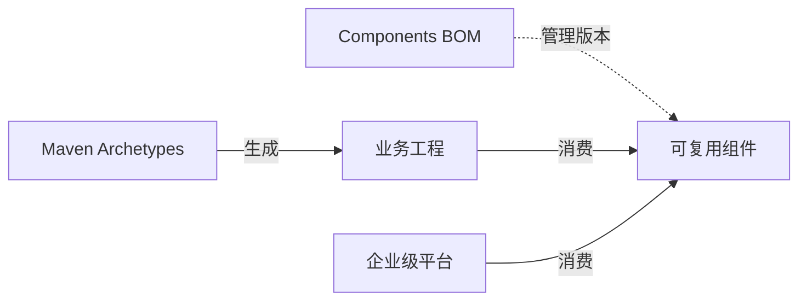

# Egon-COLA

[English](README.md) | 中文

Egon-COLA 是一个基于 Java 21 的 Maven 多模块工程，提供清晰分层的业务工程脚手架、可复用的 Spring Boot 组件，以及可以独立部署的企业级基础设施平台。它负责把工程结构、依赖方向和运行边界立住，业务系统仍然拥有业务规则、领域模型和具体部署决策的所有权。

[](https://github.com/AllenDEricDAlexander/Egon-COLA/actions/workflows/ci.yaml)
[](https://github.com/AllenDEricDAlexander/Egon-COLA/actions/workflows/ci_java_compatibility.yaml)
[](https://openjdk.org/projects/jdk/21/)
[](https://spring.io/projects/spring-boot)
[](#license)

## Features

- **工程脚手架**：通过 Maven Archetype 生成 light、service、web 三类业务工程。
- **分层约束**：明确 `common`、`facade`、`domain`、`application`、`infrastructure`、`adapter`、`starter` 等层之间的职责和依赖方向。
- **可复用组件**：覆盖通用契约、ID、Trace、动态线程池、RPC、规则引擎、访问治理、方法扩展、事务 Outbox 和字节码工具。
- **企业级平台**：包含 Dynamic Config Center、Gateway、统一身份提供方 IDP 和 RBAC3 权限平台。
- **架构验证**：支持构建期架构规则、基线、报告，以及可选的运行时字节码增强。
- **持续兼容性验证**：在 CI 中执行 Maven 构建、Archetype 生成工程验证、Docker 集成验证和多 JDK 兼容性验证。

### 组件与平台概览

| 类别 | 模块 | 主要用途 |
|---|---|---|
| Component | [Common](egon-cola-components/egon-cola-component-common/README.zh-CN.md) | 通用结果、异常、POJO、Trace、ID、加密和脱敏能力。 |
| Component | [Dynamic Thread Pool](egon-cola-components/egon-cola-component-dynamic-thread-pool/README.zh-CN.md) | 执行器注册、Redis 配置变更、动态扩缩容、虚拟线程限制和 Trace 传播。 |
| Component | [RPC](egon-cola-components/egon-cola-component-rpc/README.zh-CN.md) | Protobuf/gRPC Provider、Consumer、DDC 注册发现及 Gateway 通道。 |
| Component | [Rule Engine](egon-cola-components/egon-cola-component-rule-engine-starter/README.zh-CN.md) | Java 规则链、责任链、规则树、Trace、限制和监听器。 |
| Component | [Access Guard](egon-cola-components/egon-cola-component-access-guard-starter/README.zh-CN.md) | 方法级白名单、黑名单、限流、超时和拒绝治理。 |
| Component | [Method Extension](egon-cola-components/egon-cola-component-method-extension/README.zh-CN.md) | 在注解方法执行前插入 AOP 或 Agent 业务决策 Handler。 |
| Component | [Transactional Outbox](egon-cola-components/egon-cola-component-transactional-outbox-starter/README.zh-CN.md) | 基于 PostgreSQL/JDBC 的至少一次 HTTP、RabbitMQ 或自定义 Handler 投递。 |
| Component | [Bytecode](egon-cola-components/egon-cola-component-bytecode/README.zh-CN.md) | 构建期架构检查，以及可选的 Executor、观测、Method Extension 和 Access Guard 增强。 |
| Platform | [Dynamic Config Center](egon-cola-platforms/egon-cola-platform-dynamic-config-center/README.zh-CN.md) | 动态配置、Redis 租约、服务注册、同步发布和独立控制面。 |
| Platform | [Gateway](egon-cola-platforms/egon-cola-platform-gateway/README.zh-CN.md) | HTTP/RPC 数据面、规则发布、Provider 发现、安全、可观测和部署资产。 |
| Platform | [Unified Identity Provider](egon-cola-platforms/egon-cola-platform-idp/README.md) | OAuth/OIDC 身份认证和统一身份相关的服务端能力。 |
| Platform | [RBAC3](egon-cola-platforms/egon-cola-platform-rbac3/README.zh-CN.md) | 资源授权、角色权限、策略快照、Gateway 适配和管理控制面。 |

## Architecture

仓库由三个 Maven Reactor 组成：

| Reactor | 职责 | 典型使用方 |
|---|---|---|
| `egon-cola-archetypes` | 业务工程模板和生成工程测试夹具。 | 新建业务工程。 |
| `egon-cola-components` | 可复用库、Spring Boot Starter、Components BOM 和组件测试。 | 业务应用及平台服务。 |
| `egon-cola-platforms` | 可以独立部署的基础设施系统和控制面。 | 平台运维和企业级服务。 |

推荐的依赖关系如下：



生成的业务工程通常遵循以下分层方向：

```text
adapter -> application -> domain
adapter -> facade
infrastructure -> domain
starter -> application / domain / infrastructure
common 在生成工程约定允许的范围内被各层共享
```

不同 Archetype 的具体规则并不完全相同：

- `light` 适合轻量单模块工程和快速验证。
- `service` 侧重后端服务、Dubbo3 Triple RPC 和 MQ，不默认暴露 HTTP Controller。
- `web` 提供包含 HTTP adapter、facade、application、domain、infrastructure 的多模块业务工程。

平台和组件也有明确边界：Components BOM 只管理公共组件消费 Artifact，不反向导出 DDC、Gateway、IDP 或 RBAC3 平台 Artifact；平台可以消费组件，但平台的部署、配置和外部依赖由各自文档负责。

## Requirements

- JDK 21 或更高版本，Java 21 是项目源码基线。
- Maven 3.9.14，推荐使用仓库内置的 Maven Wrapper：`./mvnw`。
- Git，用于获取源码和参与协作。
- Docker，用于 Docker-backed 集成测试和平台镜像构建。
- Node.js 24，用于 Gateway Admin Web 和 RBAC3 Web 工作流；纯 Java Maven 构建不要求 Node.js。
- Redis、PostgreSQL 等外部服务只在运行对应组件或平台的集成流程时需要，具体拓扑以模块 README 和 Runbook 为准。

## Quick Start

克隆仓库并执行根 Reactor 构建：

```bash
git clone https://github.com/AllenDEricDAlexander/Egon-COLA.git
cd Egon-COLA
./mvnw -V --no-transfer-progress clean install
```

迭代 RPC 组件时，可以先运行聚焦的 RPC 契约验证：

```bash
./mvnw -B -ntp \
  -pl :egon-cola-component-rpc-test-contract \
  -am test
```

验证三类 Archetype 及其生成工程：

```bash
./mvnw -B -ntp \
  -pl egon-cola-archetypes/egon-cola-archetype-light,egon-cola-archetypes/egon-cola-archetype-service,egon-cola-archetypes/egon-cola-archetype-web \
  -am clean integration-test
```

如果需要验证统一身份、DDC、Gateway、RBAC3、RPC 和 MCP 的完整本地拓扑，请参考[统一身份与 MCP 本地运行手册](docs/operations/unified-identity-mcp-local-runbook.md)。

## Maven Dependency

业务工程应优先导入 Components BOM，统一管理公共组件版本。当前根工程版本为 `5.3.3`。

```xml
<properties>
    <egon-cola.version>5.3.3</egon-cola.version>
</properties>

<dependencyManagement>
    <dependencies>
        <dependency>
            <groupId>top.egon</groupId>
            <artifactId>egon-cola-components-bom</artifactId>
            <version>${egon-cola.version}</version>
            <type>pom</type>
            <scope>import</scope>
        </dependency>
    </dependencies>
</dependencyManagement>
```

按需添加组件入口，不要把测试模块、Admin 应用或聚合父 POM 当作业务依赖：

```xml
<dependencies>
    <dependency>
        <groupId>top.egon</groupId>
        <artifactId>egon-cola-component-common-core</artifactId>
    </dependency>
    <dependency>
        <groupId>top.egon</groupId>
        <artifactId>egon-cola-component-common-id-starter</artifactId>
    </dependency>
    <dependency>
        <groupId>top.egon</groupId>
        <artifactId>egon-cola-component-rpc-starter</artifactId>
    </dependency>
</dependencies>
```

当前 BOM 管理的公共组件包括：

- Common：`common-core`、`common-trace`、`common-id-starter`、`common-crypto`、数据脱敏 Starter。
- Runtime Starter：动态线程池、Trace Spring Boot Starter、RPC Starter、RPC DDC Adapter、规则引擎、Access Guard、Method Extension、Transactional Outbox。
- Bytecode：API、Bridge、Runtime、Agent、Starter。

BOM 不导出平台 Artifact、测试模块、Admin 应用或前端 npm 包。完整导出列表以 [Components BOM 中文 README](egon-cola-components/egon-cola-components-bom/README.zh-CN.md) 为准。

如果某个组件版本尚未出现在远程 Maven 仓库，可以先在本仓库安装当前 Reactor：

```bash
./mvnw -V --no-transfer-progress clean install
```

## Configuration

根工程本身不是一个需要启动的业务应用，因此没有统一的全局 `application.yml`。配置应当归属于具体组件或可部署平台，并根据环境分别管理。

常用配置命名空间如下：

| 能力 | 配置命名空间 | 说明 |
|---|---|---|
| Snowflake ID | `egon.cola.component.id` | Starter 启用时必须显式提供 `machine-id`。 |
| 动态线程池 | `egon.cola.component.dtp` | 配置执行器注册、Redis、快照上报和 Trace 传播。 |
| RPC | `egon.cola.component.rpc` | 配置 Provider/Consumer 角色、TLS、Deadline 和 Metadata。 |
| DDC 集成 | `egon.cola.component.ddc` | 配置启动目标、Redis、注册租约和凭据。 |
| Transactional Outbox | `egon.cola.component.transactional-outbox` | 配置 PostgreSQL/JDBC 存储、轮询、重试、租约和投递通道。 |

例如，使用 ID Starter 的 Spring Boot 应用必须提供明确的机器 ID：

```yaml
egon:
  cola:
    component:
      id:
        enabled: true
        machine-id: 17
        max-clock-backward: 5ms
```

配置时需要注意：

1. `machine-id` 不会从 IP、MAC、主机名、端口、进程 ID、随机数或哈希值推断。
2. RPC 的 Provider、Consumer、Gateway 和 DDC 是不同运行角色，不应把一个角色的配置直接复制到另一个角色。
3. Redis、PostgreSQL、TLS 密钥、OIDC 凭据和 DDC 注册凭据必须由部署环境提供，不应写入 README 示例之外的源码默认值。
4. Outbox 的数据库表结构、迁移执行者和 Schema 所有权需要在业务应用与平台之间提前约定。

具体属性表和完整示例请查看对应模块 README。Gateway 与 DDC 的多进程配置边界见 [Gateway 与 DDC 开发集成指南](egon-cola-platforms/egon-cola-platform-gateway/docs/developer-integration.zh-CN.md)。

## Usage

### 生成业务工程

Egon-COLA 当前提供三类 Maven Archetype：

| Archetype | 适用场景 |
|---|---|
| `egon-cola-archetype-light` | 轻量单模块工程，适合小型服务、组件测试和快速验证。 |
| `egon-cola-archetype-service` | 纯后端服务，侧重 Dubbo3 Triple RPC 和 MQ，不默认暴露 HTTP Controller。 |
| `egon-cola-archetype-web` | 包含 HTTP adapter、facade、application、domain、infrastructure 的完整 Web 业务工程。 |

下面以 Web Archetype 为例：

```bash
mvn -B archetype:generate \
  -DgroupId=top.egon \
  -DartifactId=order-service \
  -Dversion=1.0.0-SNAPSHOT \
  -Dpackage=top.egon.orders \
  -DarchetypeGroupId=top.egon \
  -DarchetypeArtifactId=egon-cola-archetype-web \
  -DarchetypeVersion=5.3.3 \
  -DinteractiveMode=false
```

生成完成后，把目标目录作为新项目根目录，使用 IDEA 打开生成工程的 `pom.xml`。如果要使用本地构建的 Archetype，先执行 `./mvnw clean install`，再在命令中增加 `-DarchetypeCatalog=local`。

### 引入组件

业务应用通常按“BOM + 具体 Starter 或纯 JAR”的方式接入：

1. 导入 `egon-cola-components-bom`，避免每个依赖单独维护版本。
2. 根据组件 README 选择直接消费入口，例如 `...-starter`、`common-core` 或 `rpc-ddc-adapter`。
3. 根据当前运行角色填写配置，并确认是否需要 Redis、PostgreSQL、DDC 或 Gateway。
4. 先执行模块级测试，再根据变更范围执行根 Reactor 构建。

### 运行平台

平台模块是独立应用，不会因为执行根工程 Maven 构建而自动启动。请根据拓扑启动所需平台和外部服务：

- [Dynamic Config Center](egon-cola-platforms/egon-cola-platform-dynamic-config-center/README.zh-CN.md)
- [Gateway](egon-cola-platforms/egon-cola-platform-gateway/README.zh-CN.md)
- [统一身份 Provider](egon-cola-platforms/egon-cola-platform-idp/README.md)
- [RBAC3 权限平台](egon-cola-platforms/egon-cola-platform-rbac3/README.zh-CN.md)

## Core Concepts

- **Archetype**：创建新业务工程的模板，负责初始模块布局和依赖方向，不负责实现业务领域。
- **Component**：可复用库或 Spring Boot Starter。运行时组件提供契约和自动配置，测试与 Admin 模块属于验证或部署边界。
- **Platform**：可以独立部署的企业级能力，例如 DDC、Gateway、IDP、RBAC3。平台可以消费组件，业务应用则根据拓扑消费对应契约或 Starter。
- **Starter 边界**：Starter 是业务应用接入运行时组件的常规入口，负责自动配置，不应反向依赖 Admin、Test 或 UI。
- **Contract 与 Runtime**：API、Contract、Descriptor 模块定义集成面；Runtime、Engine、Admin、Adapter 模块实现具体运行职责。
- **BOM 版本所有权**：Components BOM 集中管理公共组件版本；平台版本和平台部署由各平台 Reactor 与平台文档负责。
- **静态验证与运行时验证**：模块测试、根构建和架构扫描只能证明覆盖到的源码/构建行为，不能替代真实 Redis、PostgreSQL、DNS、凭据、多进程和生产高可用验证。

## Extension Points

仓库在多个边界提供扩展点：

- 通过 Maven Archetype 模板扩展生成工程的目录、依赖和默认文档。
- 在 Starter 明确支持条件回退的地方，使用业务应用自有 Bean 替换默认 Spring Boot Bean。
- 在规则引擎、Access Guard 和 Method Extension 中注册规则、监听器、策略、访问决策和业务 Handler。
- 定义 Protobuf 契约，并选择 RPC Provider、Consumer、DDC 或 Gateway 集成模式。
- 为 Transactional Outbox 提供自定义 `DeliveryHandler`，或使用内置 HTTP/RabbitMQ Adapter。
- 为 Bytecode 组件提供架构规则、基线、报告 Writer，或启用可选 Runtime Agent。

这些扩展点是模块级契约，并不意味着所有模块会自动接入所有平台。正式使用前，应阅读对应 README，确认 Bean/Service 注册方式、生命周期、线程模型、失败语义和运行时边界。

## Project Structure

```text
Egon-COLA/
├── .github/                         # GitHub Actions 工作流
├── .mvn/wrapper/                    # Maven Wrapper 配置
├── docs/                            # 运维 Runbook 和项目文档
├── egon-cola-archetypes/            # Maven Archetype 与生成工程夹具
│   ├── egon-cola-archetype-light/
│   ├── egon-cola-archetype-service/
│   ├── egon-cola-archetype-web/
│   ├── egon-cola-evaluation-facade/
│   └── egon-cola-organization-facade/
├── egon-cola-components/             # 可复用组件、Starter、BOM 和测试
│   ├── egon-cola-components-bom/
│   ├── egon-cola-component-common/
│   ├── egon-cola-component-dynamic-thread-pool/
│   ├── egon-cola-component-rpc/
│   ├── egon-cola-component-rule-engine-starter/
│   ├── egon-cola-component-access-guard-starter/
│   ├── egon-cola-component-method-extension/
│   ├── egon-cola-component-transactional-outbox-starter/
│   └── egon-cola-component-bytecode/
├── egon-cola-platforms/              # 可部署的企业级基础设施平台
│   ├── egon-cola-platform-dynamic-config-center/
│   ├── egon-cola-platform-gateway/
│   ├── egon-cola-platform-idp/
│   └── egon-cola-platform-rbac3/
├── scripts/                          # 发布和仓库辅助脚本
├── mvnw
├── mvnw.cmd
└── pom.xml                           # 根聚合父 POM，版本 5.3.3
```

推荐先阅读：

- [组件架构指南](egon-cola-components/egon-cola-components-architecture.md)
- [Archetype 架构 Mermaid 图](egon-cola-archetypes/architecture-mermaid-diagrams.md)
- [Maven 发布指南](scripts/maven-deploy.md)
- [统一身份与 MCP 本地 Runbook](docs/operations/unified-identity-mcp-local-runbook.md)

## Deployment

组件通常作为 Maven 依赖被业务应用消费；DDC、Gateway、IDP、RBAC3 则是具有独立运行配置、Docker/部署资产、外部服务和运维边界的平台应用。

Maven Central 发布时，应将根 Reactor 作为一个依赖有序的整体执行验证和部署：

```bash
./mvnw -B -ntp -Prelease -DskipTests verify
./mvnw -B -ntp -Prelease -DskipTests clean deploy
```

发布前置条件、签名、凭据和 Sonatype Central Portal 配置见 [scripts/maven-deploy.md](scripts/maven-deploy.md)。本地平台部署则按目标拓扑启动平台和外部依赖，根工程构建不会自动启动这些进程。

## Compatibility

| 项目 | 当前基线或值 |
|---|---|
| 工程版本 | `5.3.3` |
| Java | 21 基线；CI 验证 JDK 21 和 JDK 25 |
| Maven Wrapper | 3.9.14 |
| Spring Boot | Component 和 Archetype Reactor 使用 3.5.16 |
| 前端运行时 | Gateway Admin Web 和 RBAC3 Web 工作流使用 Node.js 24 |
| CI 容器 | 主 Java 兼容性工作流使用 Rocky Linux 10 |

Java 源码基线是 21，CI 额外验证 JDK 25 不代表业务项目必须立即升级到 JDK 25。前端模块拥有独立的 `package.json`、锁文件和构建流程，不能仅凭 Java Reactor 的结果判断前端兼容性。

## FAQ

### Egon-COLA 是完整的业务框架吗？

不是。它是工程底座，提供脚手架、可复用组件、平台能力和边界检查；业务工程仍然负责业务模型、流程、持久化决策和领域规则。

### 业务应用应该依赖父 POM 或 Admin 模块吗？

通常不应该。建议导入 Components BOM，然后依赖组件文档中明确的 Starter 或纯 JAR 入口。Admin 和 Test 模块分别服务于平台运行和组件验证。

### Components BOM 是否包含 DDC、Gateway、IDP、RBAC3？

不包含。BOM 只管理公共可复用组件 Artifact；平台 Artifact 具有独立的模块边界、版本关系和部署文档。

### Maven 测试是否等于生产拓扑验证？

不等于。单元测试、模块测试和 Docker-backed 测试只能证明对应测试覆盖的行为，不能单独证明生产 Redis/PostgreSQL、DNS/VIP 路由、凭据、多进程部署或高可用行为。

### 组件应该使用哪个入口？

优先使用组件 README 标出的 Starter 或纯 JAR 入口。不要直接依赖聚合父 POM、测试模块或 Admin 应用；如果需要替换默认 Bean、接入 DDC/Gateway 或使用自定义 Handler，应先确认对应扩展契约。

### 配置问题应该去哪里查？

先查具体组件或平台 README，再查对应 Runbook 中关于外部服务、凭据、TLS 和部署拓扑的说明。开发环境配置不能未经审查直接复制到生产环境。

## Roadmap

当前路线方向包括：

- 保持 Java 21 基线，并持续维护 JDK 21/25 兼容性验证。
- 持续对齐 DDC、Gateway、统一身份和 RBAC3 的契约、适配器与本地 Runbook。
- 扩展 Archetype 生成示例和架构检查能力，同时避免给业务项目强加不必要的框架约束。
- 补充本地及类生产平台拓扑的运维文档、故障边界和验证证据。
- 持续维护 Components BOM 和 Maven Central 发布流程，保证公共消费面稳定演进。

以上是方向性路线，不代表已经承诺的版本日期。具体范围以已批准的设计文档、Issue 和发布决策为准。

## Contributing

1. 先阅读要修改的组件、平台或 Archetype README。
2. 保持变更范围最小，不覆盖无关的工作区修改。
3. 先运行最小相关验证；如果变更跨越模块边界，再执行根 Reactor 构建。
4. 契约、配置发生变化时，同时更新受影响的文档和测试。
5. 提交 Pull Request 时说明变更动机、涉及模块、验证命令，以及哪些内容仍需要真实运行时验证。

默认仓库验证命令：

```bash
./mvnw -B -ntp clean install
```

生成工程还应执行 [Quick Start](#quick-start) 中的 Archetype integration-test 命令。平台前端、Docker 拓扑和真实外部服务验证，以平台专属工作流和 Runbook 为准。

## Changelog

根 `pom.xml` 当前声明的工程版本为 `5.3.3`。仓库没有独立的 `CHANGELOG.md`；版本历史通过 Git 历史和 [GitHub Releases](https://github.com/AllenDEricDAlexander/Egon-COLA/releases) 维护。各模块 README 负责说明当前契约、配置、使用方式和验证边界。

## License

Egon-COLA 采用双许可证发布，可以选择以下任一许可证：

- [MIT License](LICENSE-MIT)
- [GNU Lesser General Public License v2.1](LICENSE-LGPL-2.1)
