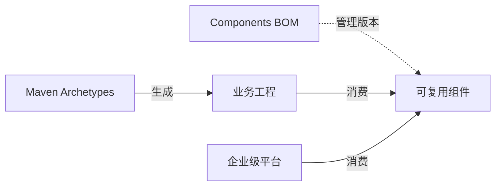

# Egon-COLA

[English](README.md) | [中文](README.zh-CN.md)

Egon-COLA 是一个基于 Java 21 的 Maven 多模块工程，提供清晰分层的业务工程脚手架、可复用的 Spring Boot 组件，以及可以独立部署的企业级平台能力，其中包含 AI Agent 相关构件。它负责把工程结构、依赖方向和运行边界立住，业务系统仍然拥有业务规则、领域模型和具体部署决策的所有权。

[](https://github.com/AllenDEricDAlexander/Egon-COLA/actions/workflows/ci-backend.yml)
[](https://github.com/AllenDEricDAlexander/Egon-COLA/actions/workflows/ci-frontend.yml)
[](https://openjdk.org/projects/jdk/21/)
[](https://spring.io/projects/spring-boot)
[](https://central.sonatype.com/artifact/top.egon/egon-cola-components-bom)
[](#许可证)

## 目录

- [源起](#源起)
- [核心能力](#核心能力)
- [组件与平台概览](#组件与平台概览)
- [架构](#架构)
- [环境要求](#环境要求)
- [快速开始](#快速开始)
- [Maven 依赖](#maven-依赖)
- [配置](#配置)
- [使用方式](#使用方式)
- [核心概念](#核心概念)
- [扩展点](#扩展点)
- [工程结构](#工程结构)
- [部署](#部署)
- [兼容性](#兼容性)
- [常见问题](#常见问题)
- [路线图](#路线图)
- [贡献指南](#贡献指南)
- [版本变更](#版本变更)
- [许可证](#许可证)

## 源起

Egon-COLA 源起于阿里巴巴开源的 [COLA v5](https://github.com/alibaba/COLA)（Clean Object-oriented and Layered Architecture，整洁面向对象分层架构）。仓库初始提交（2025-08-17）把 COLA v5 作为起点整体引入：根 POM 是 `com.alibaba.cola:cola-dummy-aggregation-parent`，`cola-components` 下是 `cola-component-dto`、`cola-component-exception`、`cola-component-extension-starter`、`cola-component-statemachine`、`cola-component-ruleengine`、`cola-components-bom` 等上游组件，`cola-archetypes` 提供 light/service/web 脚手架。

| 维度 | 状态 |
|---|---|
| 继承 | COLA 的分层方向（`common`、`facade`、`adapter`、`application`、`domain`、`infrastructure`、`starter`），Archetype + Component + BOM 的组织方式，以及 5.x 版本主线——当前发布版本 `5.4.1`。 |
| 更名 | 2026-07-01 全部坐标从 `com.alibaba.cola` 迁移到 `top.egon`，全部 Artifact 从 `cola-*` 改为 `egon-cola-*`。 |
| 重写 | 构建和运行时都不再消费任何上游 Artifact。哪怕出现一行 `com.alibaba.cola` import，`CoreBoundaryTest` 与 `SourceBoundaryAssert` 也会让构建失败。 |
| 扩展 | RPC、动态线程池、访问治理、方法扩展、事务 Outbox、两级缓存、MyBatis-Plus/ShardingSphere 持久化层、Agent Flow 与 RAG、字节码治理，以及 COLA 从未提供、可独立部署的平台层（Tianshu、Yuheng、Tianquan-Shoubing、Tianquan-Jianshen）。 |

因此 Egon-COLA 是 COLA 谱系上的工程底座，而不是 COLA 的发行版：它沿用 COLA 的架构语汇，并在其上长出自己的组件、平台与治理体系。

## 核心能力

**脚手架与分层**

- 两族共七个 Maven Archetype：跟随 Egon 组件/平台的原始族 `light`、`service`、`web`、`agent`，以及锁定在已审阅公开 Spring 生态基线上的 `-open` 族（`light-open`、`service-open`、`web-open`）。
- 生成工程分层职责明确：`common`、`facade`、`adapter`、`application`、`domain`、`infrastructure`、`starter`；`light` 刻意收敛为单模块，`agent` 展开为六模块。
- 对端 RPC 契约以普通库形式发布（`...-service-facade`、`...-web-facade` 及其 `-open` 版本），使同族生成工程可以互相调用而不共享源码。
- 构建期架构规则、基线和报告，保证业务工程长大后依赖方向依然不被破坏。

**应用构件（组件）**

- 稳定契约、不依赖 Spring：`Result`/`PageResult`/`PageQuery`/`SortQuery`、`ErrorStatus`/`BusinessException`/`CommonException`、`TreeBuilder`、`BaseConverter` 以及 `EgonEnum` 持久化契约。
- 横切运行能力：W3C `traceparent`/`tracestate` 上下文 + MDC 投影 + 任务装饰器，Servlet/WebFlux/WebClient/Reactor 自动装配，需要显式 `machine-id` 的 Snowflake `BIGINT` ID，摘要/HMAC/Base64/Hex，以及作用于 Jackson 响应和 Logback 日志的 `@Sensitive` 脱敏。
- 数据访问：Guava（L1）+ Redisson `RMapCache`（L2）两级缓存，带租户维度 Key 和穿透/击穿/雪崩防护；MyBatis-Plus 3.5.16 + ShardingSphere-JDBC 5.5.3 + PostgreSQL 层用一份 YAML 发布单个逻辑 `DataSource`，提供 `EgonModel` ActiveRecord 契约、租户与乐观锁拦截器、批量命令和带校验和的 DDL Runner。
- 异步容量与治理：经 Redis 动态改配、含虚拟线程受限执行器的动态线程池（快照上报 + 指标）；方法级黑名单、白名单、惩罚箱、限流和超时；在 AOP 或字节码 Agent 引擎前插入的方法扩展 Handler；PostgreSQL 事务 Outbox 以至少一次语义经 HTTP、RabbitMQ 或自定义 Handler 投递。
- 纯 Java 规则引擎：规则链、责任链、带路由决策的规则树、执行 Trace 和监听器；刻意不提供表达式语言，也不提供规则管理后端。
- 开发期工具：离线代码生成器把 PostgreSQL DDL 或持久化清单转成生成工程的分层 CRUD，不启动 Spring，也不修改目标 POM。

**AI Agent 构件**

- Agent Flow 把 YAML Flow 树编译为 Spring AI 1.1.8 + Google ADK 0.7.0 的 `LlmAgent`/`SequentialAgent`/`ParallelAgent`/`LoopAgent` 图，启动期严格校验，支持同步与流式执行，Session 为进程内。
- RAG 只提供机制——抽取、分块、存储、向量化和带强制过滤的相似度检索——`EmbeddingModel` 与 `VectorStore` Bean 由宿主提供；它不是知识库产品。
- `agent` 脚手架生成六模块的 Deep Research 与知识库服务，向量检索落在 PostgreSQL `vector`，只暴露一个 SSE 运行端点，不引入 MQ、RPC、GraphQL 或 UI。

**企业级平台**

- Tianshu（动态配置中心）：单 YAML ConfigData 加载、`@DdcValue` 与选择性刷新、配置客户端和 RPC Provider 的 Redis 租约、`SYNC_ALL_ACK` 同步发布，以及独立部署的控制面与配套控制台。
- Yuheng：HTTP/RPC 数据面加控制面——按 Release 路由、OpenAI 兼容透传流式、WebSocket 与 multipart 通道、MCP 端点、Provider 发现与健康检查、mTLS、W3C Trace 传播。
- Tianquan-Shoubing：统一身份提供方，负责 OAuth/OIDC、浏览器 SSO、多租户成员关系和单 Audience 的 Resource 绑定 Token。
- Tianquan-Jianshen：资源与角色权限，提供不可变 Manifest 激活、fail-closed Fence、原子策略快照，以及作用于 Yuheng 热路径的网关适配。
- 基于 Wujie 的统一管理 Portal 加每个平台一个 React 控制台，通过 `@egon-cola/xingyuan-admin-web-shared` 共享布局、主题、HTTP/OAuth 客户端和 i18n。

**验证**

- CI 分别验证 Java 后端与平台前端，生成工程会从 Archetype 目录真实生成并编译测试，跨进程流程有 Docker-backed 集成测试，兼容性矩阵在多个 JDK 上校验。

## 组件与平台概览

下表列出所有可被使用方依赖的 Artifact。`★` 表示 Components BOM 管理版本的入口；`◆` 表示可以引入但刻意不进入 BOM 的 Artifact（平台库、构建插件、开发期工具）。聚合 POM 以及 `*-test`、`*-admin`、`*-core`、`*-benchmark` 模块属于构建、验证或部署单元，永远不是业务依赖。

### 组件

| 组件 | 消费入口 | 提供给使用方的能力 | 依赖的外部条件 |
|---|---|---|---|
| [Common](egon-cola-components/egon-cola-component-common/README.zh-CN.md) | ★ `egon-cola-component-common-core` | `Result`/`PageResult`/`PageQuery`/`SortQuery`、`ErrorStatus`/`BusinessException`/`CommonException`、`TreeBuilder`、`BaseConverter`、`EgonEnum`——不依赖 Spring | 无 |
| | ★ `egon-cola-component-common-trace` | 纯 JDK + SLF4J 的 `TraceContext`、完整 MDC 投影、W3C `traceparent`/`tracestate` 解析、可传播 Trace 的 `Runnable`/`Callable`/`Supplier` | 无 |
| | ★ `egon-cola-component-common-trace-spring-boot-starter` | Servlet、WebFlux、`RestClient`、`WebClient` 与 Reactor 上下文投影的 Trace 自动装配 | 无 |
| | ★ `egon-cola-component-common-id-starter` | Snowflake `BIGINT` ID，不依赖 Spring 也可静态调用，`machine-id` 必须显式给出（0–1023），支持时钟回拨容忍 | 无 |
| | ★ `egon-cola-component-common-crypto` | `Digests`（SHA-256）、`Hmacs`、`Base64s`、`Hexes` | 无 |
| | ★ `egon-cola-component-common-data-desensitize-spring-boot-starter` | `@Sensitive` 的 Jackson 响应脱敏与 Logback `%sensitiveMsg`，共享 `SensitiveStrategy`，`RESPONSE`/`LOG` 场景可选 | 无 |
| | ★ `egon-cola-component-common-cache-spring-boot-starter` | 两级缓存：Guava L1 + Redisson `RMapCache` L2，租户维度 Key，穿透/击穿/雪崩防护，提交后再写或失效 | Redis（宿主 `RedissonClient`）+ `@EnableCaching` |
| | ★ `egon-cola-component-common-mybatis-plus-sharding-jdbc-ext-spring-boot-starter` | 一份 YAML 发布单个逻辑分片 `DataSource`、`EgonModel` ActiveRecord、`EgonColaRepository` 受保护命令、租户与乐观锁拦截器、批量、`EgonColaPostgreDdlRunner` | PostgreSQL |
| [Dynamic Thread Pool](egon-cola-components/egon-cola-component-dynamic-thread-pool/README.zh-CN.md) | ★ `egon-cola-component-dynamic-thread-pool-starter` | 纳管 `ThreadPoolExecutor`、`ThreadPoolTaskExecutor` 与 `BoundedVirtualThreadExecutor`；远程改配与虚拟线程上限、快照上报、Micrometer 指标、Trace 装饰器 | Redis |
| [RPC](egon-cola-components/egon-cola-component-rpc/README.zh-CN.md) | ★ `egon-cola-component-rpc-starter` | 与技术栈无关的 gRPC 1.75 / Protobuf 4.32 unary Provider 与 Consumer：`@EgonRpcService`、`@EgonRpcMethod`、`@EgonRpcProvider`、`@EgonRpcReference`（`DIRECT` 或 `GATEWAY`） | 无 |
| | ★ `egon-cola-component-rpc-tianshu-adapter` | 在上述之上叠加 Tianshu ConfigData、租约注册、服务发现、HMAC 认证元数据与 mTLS 装配——需要 Tianshu 的应用由此接入 | Tianshu + Redis |
| [Rule Engine](egon-cola-components/egon-cola-component-rule-engine-starter/README.zh-CN.md) | ★ `egon-cola-component-rule-engine-starter` | `RuleChain`/`ChainHandler`、`AbstractSingletonRuleLink`、带 `RouteDecision` 的 `RuleTree`、`RuleTrace`、`RuleExecutionListener`、异步执行 | 无 |
| [Access Guard](egon-cola-components/egon-cola-component-access-guard-starter/README.zh-CN.md) | ★ `egon-cola-component-access-guard-starter` | `@AccessGuard`/`@RateLimitGuard`/`@AllowListGuard`/`@TimeLimitGuard`，固定顺序 Deny → Allow → PenaltyBox → RateLimit → TimeLimit；编程式 `AccessGuardClient`、异步与响应式生命周期、fail-open/closed 策略、Actuator 端点 | 仅 `storage: REDISSON` 时需要 Redis；只要存在规则就必须提供 HMAC 密钥 |
| [Method Extension](egon-cola-components/egon-cola-component-method-extension/README.zh-CN.md) | ★ `egon-cola-component-method-extension-starter` | `@MethodExtension` Handler 在被注解方法执行前给出决策；`engine` 取 `AOP`、`AGENT` 或 `DISABLED`；`not-ready-policy` 取 `PROCEED/REJECT/FAIL` | `AGENT` 模式需要字节码 Agent |
| [Transactional Outbox](egon-cola-components/egon-cola-component-transactional-outbox-starter/README.zh-CN.md) | ★ `egon-cola-component-transactional-outbox-starter` | 在调用方事务内入队、`FOR UPDATE SKIP LOCKED` 轮询、重试/死信/保留期、以 `messageId` 作幂等键、HTTP 与 RabbitMQ 通道以及自定义 `DeliveryHandler` SPI | PostgreSQL（表不会自动创建） |
| [Agent Flow](egon-cola-components/egon-cola-component-agent-flow-starter/README.zh-CN.md) | ★ `egon-cola-component-agent-flow-starter` | YAML Flow 树编译为 Spring AI 1.1.8 + Google ADK 0.7.0 的 `LlmAgent`/`SequentialAgent`/`ParallelAgent`/`LoopAgent`，启动期严格校验，`execute` 与 `executeStream`，Session 为进程内 | 宿主提供具名 `ChatModel` Bean |
| [RAG](egon-cola-components/egon-cola-component-rag-starter/README.zh-CN.md) | ★ `egon-cola-component-rag-starter` | `RagDocumentExtractor`、`RagChunkingStrategy`（`TOKEN`/`MARKDOWN_HEADING`/`RECURSIVE`）、`RagDocumentStorage`、向量化注册表、强制的 collection 与 model 过滤、幂等分块 ID | 宿主提供 `EmbeddingModel` + `VectorStore` |
| [Bytecode](egon-cola-components/egon-cola-component-bytecode/README.zh-CN.md) | ★ `egon-cola-component-bytecode-api` / `-bridge` / `-runtime` / `-agent` / `-starter` | 公共能力契约、Agent↔运行时桥接、带 sink 与故障隔离的增强、shade 后的 `premain` Agent（`executor`、`observation`、`method-extension`）、Spring Boot Starter 与 `/actuator/egonbytecode` | Agent 能力需 `-javaagent` |
| | ◆ `egon-cola-component-bytecode-architecture-maven-plugin` | 构建期 `check`、`check-reactor`、`generate-baseline`，10 条架构规则与 Text/JSON/HTML 报告 | 声明在 `<build><plugins>`，不是 `<dependencies>` |
| [Code Generator](egon-cola-components/egon-cola-component-code-generator/README.zh-CN.md) | ◆ `egon-cola-component-code-generator` | 离线开发工具：输入 PostgreSQL DDL 或持久化清单，输出分层 CRUD，`plan`/`check`/`apply`/`recover` 流程，指纹校验保证不覆盖手工修改 | 仅开发期；不启动 Spring |

### 平台

| 平台 | 可运行应用 | 使用方引入的 Artifact | 后端服务 |
|---|---|---|---|
| [Tianshu (Dynamic Config Center)](egon-cola-xingyuan/egon-cola-tianshu/README.zh-CN.md) | `egon-cola-tianshu-admin`、`egon-cola-tianshu-admin-web` | ◆ `egon-cola-tianshu-starter`（ConfigData、`@DdcValue`、选择性刷新、ACK、租约）、◆ `egon-cola-tianshu-http-registration-starter`、★ `egon-cola-component-rpc-tianshu-adapter` | PostgreSQL + Redis（`SINGLE`/`SENTINEL`/`CLUSTER`） |
| [Yuheng](egon-cola-xingyuan/egon-cola-yuheng/README.zh-CN.md) | `yuheng-biz-gateway`（数据面）、`yuheng-admin`、`yuheng-admin-web` | ◆ `yuheng-starter`、◆ `yuheng-contract`、◆ `yuheng-starter-openapi` 及 `-webmvc` / `-webflux` 变体 | Tianshu + Redis + PostgreSQL；Kafka 可选 |
| [Tianquan-Shoubing](egon-cola-xingyuan/egon-cola-tianquan-shoubing/README.md) | `egon-cola-tianquan-shoubing-admin`、`egon-cola-tianquan-shoubing-admin-web` | ◆ `egon-cola-tianquan-shoubing-starter`（Token 校验与全局用户解析）、◆ `-rpc-contract`、◆ `-gateway-adapter`（仅供 Yuheng 侧） | PostgreSQL + Redis；Tianshu |
| [Tianquan-Jianshen](egon-cola-xingyuan/egon-cola-tianquan-jianshen/README.zh-CN.md) | `egon-cola-tianquan-jianshen-admin`、`egon-cola-tianquan-jianshen-admin-web` | ◆ `egon-cola-tianquan-jianshen-starter`（业务侧决策执行点）、◆ `-contract`、◆ `-gateway-adapter`（Yuheng 热路径）、npm `@egon-cola/tianquan-jianshen-react-sdk` | Tianshu + Yuheng + Redis + PostgreSQL + Tianquan-Shoubing |

### 共享 Admin 前端

`egon-cola-xingyuan-admin-portal` 是私有的 Wujie 微前端壳，负责聚合四个平台控制台；`egon-cola-xingyuan-admin-web-shared`（npm `@egon-cola/xingyuan-admin-web-shared`）是它们共享的库：`EnterpriseLayout`、`AdminThemeProvider` 与设计令牌、`createHttpClient`/`createOAuthClient`/`createTokenStore`、i18n 以及页面状态组件。两者都不是 Maven 模块，都需要 Node.js 24。

## 架构

仓库由三个 Maven Reactor 组成：

| Reactor | 职责 | 典型使用方 |
|---|---|---|
| `egon-cola-archetypes` | 业务工程模板和生成工程测试夹具。 | 新建业务工程。 |
| `egon-cola-components` | 可复用库、Spring Boot Starter、Components BOM 和组件测试。 | 业务应用及平台服务。 |
| `egon-cola-xingyuan` | 可以独立部署的基础设施系统和控制面。 | 平台运维和企业级服务。 |

推荐的依赖关系如下：



生成的业务工程通常遵循以下分层方向：

```text
adapter -> application -> domain
adapter -> facade
infrastructure -> domain
starter -> application / domain / infrastructure
common 在生成工程约定允许的范围内被各层共享
```

不同 Archetype 的具体规则并不完全相同：

- `light` 适合轻量单模块工程和快速验证。
- `service` 侧重后端服务、Dubbo3 Triple RPC 和 MQ，不默认暴露 HTTP Controller。
- `web` 提供包含 HTTP adapter、facade、application、domain、infrastructure 的多模块业务工程。
- `agent` 生成六模块的 Deep Research 与知识库服务，向量检索落在 PostgreSQL `vector`，只有一个 SSE 运行端点，不引入 MQ、RPC、GraphQL 或 UI。

原始族跟随 Egon-COLA components/平台迭代；`-open` 族是当前可以直接使用的开源技术栈基线。平台与组件之间也有明确边界：Components BOM 只管理公共组件消费 Artifact，不反向导出 Tianshu、Yuheng、Tianquan-Shoubing 或 Tianquan-Jianshen 平台 Artifact；平台可以消费组件，但平台的部署、配置和外部依赖由各自文档负责。扩展生成工程前，请先阅读 `egon-cola-archetypes` 与 `egon-cola-components` 下的架构文档。

## 环境要求

- JDK 21 或更高版本，Java 21 是项目源码基线。
- Maven 3.9.14，推荐使用仓库内置的 Maven Wrapper：`./mvnw`。
- Git，用于获取源码和参与协作。
- Docker，用于 Docker-backed 集成测试和平台镜像构建。
- Node.js 24，用于各平台 Admin Web（Yuheng、Tianshu、Tianquan-Shoubing、Tianquan-Jianshen）和统一 Portal 前端工作流；纯 Java Maven 构建不要求 Node.js。
- Redis、PostgreSQL、RabbitMQ 等外部服务只在运行对应组件或平台的集成流程时需要，具体拓扑以模块 README 和 Runbook 为准。

## 快速开始

克隆仓库并执行根 Reactor 构建：

```bash
git clone https://github.com/AllenDEricDAlexander/Egon-COLA.git
cd Egon-COLA
./mvnw -V --no-transfer-progress clean install
```

迭代 RPC 组件时，可以先运行聚焦的 RPC 契约验证：

```bash
./mvnw -B -ntp \
  -pl :egon-cola-component-rpc-test-contract \
  -am test
```

先构建可编辑的正常源码，再生成并验证完整的 Archetype Reactor：

```bash
./mvnw -B -ntp -f egon-cola-archetypes/source-projects/pom.xml clean install
./scripts/generate_archetypes.sh generate
./scripts/generate_archetypes.sh check
./mvnw -B -ntp -f egon-cola-archetypes/pom.xml \
  -Pgenerated-archetypes clean install
```

默认 Archetypes Reactor 只包含四个对外发布的 facade 模块。忽略的 `.generated` 目录只有在显式
启用 `-Pgenerated-archetypes` 的第二阶段才需要，fresh checkout 不依赖它。

验证生成工程契约：

```bash
./mvnw -B -ntp -f egon-cola-archetypes/pom.xml \
  -Pgenerated-archetypes clean verify
```

如果需要验证统一身份、Tianshu、Yuheng、Tianquan-Jianshen、RPC 和 MCP 的完整本地拓扑，请参考[统一身份与 MCP 本地运行手册](docs/operations/unified-identity-mcp-local-runbook.md)。

## Maven 依赖

业务工程应优先导入 Components BOM，统一管理公共组件版本。当前根工程版本为 `5.4.1`，这也是 Maven Central 上的最新发布版本。

```xml
<properties>
    <egon-cola.version>5.4.1</egon-cola.version>
</properties>

<dependencyManagement>
    <dependencies>
        <dependency>
            <groupId>top.egon</groupId>
            <artifactId>egon-cola-components-bom</artifactId>
            <version>${egon-cola.version}</version>
            <type>pom</type>
            <scope>import</scope>
        </dependency>
    </dependencies>
</dependencyManagement>
```

按需添加组件入口，不要把测试模块、Admin 应用或聚合父 POM 当作业务依赖：

```xml
<dependencies>
    <dependency>
        <groupId>top.egon</groupId>
        <artifactId>egon-cola-component-common-core</artifactId>
    </dependency>
    <dependency>
        <groupId>top.egon</groupId>
        <artifactId>egon-cola-component-common-id-starter</artifactId>
    </dependency>
    <dependency>
        <groupId>top.egon</groupId>
        <artifactId>egon-cola-component-rpc-starter</artifactId>
    </dependency>
</dependencies>
```

BOM 管理的公共入口共 22 个：`common-core`、`common-trace`、`common-id-starter`、`common-crypto`，数据脱敏、缓存和 MyBatis-Plus/ShardingSphere 扩展 Starter，`dynamic-thread-pool-starter`、`common-trace-spring-boot-starter`、`rpc-starter`、`rpc-tianshu-adapter`、`rule-engine-starter`、`agent-flow-starter`、`rag-starter`、`access-guard-starter`、`method-extension-starter`、`transactional-outbox-starter`，以及字节码的 `api`/`bridge`/`runtime`/`agent`/`starter`——即[工程结构](#工程结构)中每一个 `★` 行。

BOM 不导出平台 Artifact、测试模块、Admin 应用、Code Generator 或前端 npm 包；`◆` 行的 Artifact 会随 Reactor 发布，但版本需要自行声明。完整导出列表以 [Components BOM 中文 README](egon-cola-components/egon-cola-components-bom/README.zh-CN.md) 为准。

如果某个组件版本尚未出现在远程 Maven 仓库，可以先在本仓库安装当前 Reactor：

```bash
./mvnw -V --no-transfer-progress clean install
```

## 配置

根工程本身不是一个需要启动的业务应用，因此没有统一的全局 `application.yml`。配置应当归属于具体组件或可部署平台，并根据环境分别管理。

常用配置命名空间如下：

| 能力 | 配置命名空间 | 说明 |
|---|---|---|
| Snowflake ID | `egon.cola.component.id` | Starter 启用时必须显式提供 `machine-id`。 |
| 动态线程池 | `egon.cola.component.dtp` | 配置执行器注册、Redis、快照上报和 Trace 传播。 |
| RPC | `egon.cola.component.rpc` | 配置 Provider/Consumer 角色、TLS、Deadline 和 Metadata。 |
| Tianshu 集成 | `egon.cola.component.tianshu` | 配置启动目标、Redis、注册租约和凭据。 |
| Transactional Outbox | `egon.cola.component.transactional-outbox` | 配置 PostgreSQL/JDBC 存储、轮询、重试、租约和投递通道。 |
| Agent Flow | `egon.cola.component.agent-flow` | 默认关闭；把 Flow 名称绑定到宿主提供的模型与 Agent Bean。 |
| 持久化扩展 | `egon.cola.component.mybatis-plus` | 配置 PostgreSQL DDL Runner 与经过校验的手工 SQL Manifest。 |

例如，使用 ID Starter 的 Spring Boot 应用必须提供明确的机器 ID：

```yaml
egon:
  cola:
    component:
      id:
        enabled: true
        machine-id: 17
        max-clock-backward: 5ms
```

配置时需要注意：

1. `machine-id` 不会从 IP、MAC、主机名、端口、进程 ID、随机数或哈希值推断。
2. RPC 的 Provider、Consumer、Yuheng 和 Tianshu 是不同运行角色，不应把一个角色的配置直接复制到另一个角色。
3. Redis、PostgreSQL、TLS 密钥、OIDC 凭据和 Tianshu 注册凭据必须由部署环境提供，不应写入 README 示例之外的源码默认值。
4. Outbox 与 DDL 的表结构、迁移执行者和 Schema 所有权需要在业务应用与平台之间提前约定。

具体属性表和完整示例请查看对应模块 README。Yuheng 与 Tianshu 的多进程配置边界见 [Yuheng 与 Tianshu 开发集成指南](egon-cola-xingyuan/egon-cola-yuheng/docs/developer-integration.zh-CN.md)。

## 使用方式

### 生成业务工程

Egon-COLA 并行发布两族 Maven Archetype。原始 Artifact ID 继续保留且不会重定向；如果希望使用公开 Spring 生态基线，请选择带 `-open` 后缀的 Artifact。

| 族 | Light | Service | Web | Agent |
|---|---|---|---|---|
| 原始 | `egon-cola-archetype-light` | `egon-cola-archetype-service` | `egon-cola-archetype-web` | `egon-cola-archetype-agent` |
| Open | `egon-cola-archetype-light-open` | `egon-cola-archetype-service-open` | `egon-cola-archetype-web-open` | — |

Open 脚手架固定使用 Spring Boot 3.5.16、Spring Cloud 2025.0.3、Spring Cloud Alibaba 2025.0.0.0、Nacos 3.0.3、MyBatis-Plus 3.5.16、ShardingSphere 5.5.3，以及 Common ID 生成器和 Dynamic Thread Pool；Service/Web 额外使用 Dubbo 3.3.6 和 gRPC/Protobuf 1.73.0，Light 刻意不引入 RPC 或 Yuheng。Light/Web 的 HTTP API 使用 Springdoc。Open 族禁止 Spring Data JPA、Flyway/Liquibase 和内置 Yuheng。内部 ID 为 `Long`，Proto 使用 `int64`，HTTP/GraphQL 边界使用十进制字符串；数据库 DDL 位于生成工程的手工 SQL Runbook 中。

维护者只修改 `egon-cola-archetypes/source-projects` 下对应的正常 Maven 工程，不直接编辑
生成目录。`definitions` 只负责七个 Archetype 的打包合同；修改源码后先运行
`scripts/generate_archetypes.sh generate` 和 `scripts/generate_archetypes.sh check`，再用
`-Pgenerated-archetypes` 构建。

下面以 Web Archetype 为例：

```bash
mvn -B archetype:generate \
  -DgroupId=top.egon \
  -DartifactId=order-service \
  -Dversion=1.0.0-SNAPSHOT \
  -Dpackage=top.egon.orders \
  -DarchetypeGroupId=top.egon \
  -DarchetypeArtifactId=egon-cola-archetype-web-open \
  -DarchetypeVersion=5.4.1 \
  -DinteractiveMode=false
```

生成完成后，把目标目录作为新项目根目录，使用 IDEA 打开生成工程的 `pom.xml`。如果要使用本地构建的 Archetype，先执行 `./mvnw clean install`，再在命令中增加 `-DarchetypeCatalog=local`。

请参阅 [Open 脚手架架构总览](egon-cola-archetypes/open-source-archetype-architecture.md) 和 [Open 脚手架代码规范](egon-cola-archetypes/open-source-archetype-code-style.md)，了解模块责任、协议边界、手工 SQL 和真实基础设施验证边界。

### 引入组件

业务应用通常按“BOM + 具体 Starter 或纯 JAR”的方式接入：

1. 导入 `egon-cola-components-bom`，避免每个依赖单独维护版本。
2. 根据组件 README 选择直接消费入口，例如 `...-starter`、`common-core` 或 `rpc-tianshu-adapter`。
3. 根据当前运行角色填写配置，并确认是否需要 Redis、PostgreSQL、Tianshu 或 Yuheng。
4. 先执行模块级测试，再根据变更范围执行根 Reactor 构建。

### 运行平台

平台模块是独立应用，不会因为执行根工程 Maven 构建而自动启动。请根据拓扑启动所需平台和外部服务：

- [Tianshu (Dynamic Config Center)](egon-cola-xingyuan/egon-cola-tianshu/README.zh-CN.md)
- [Yuheng](egon-cola-xingyuan/egon-cola-yuheng/README.zh-CN.md)
- [统一身份 Provider](egon-cola-xingyuan/egon-cola-tianquan-shoubing/README.md)
- [Tianquan-Jianshen 权限平台](egon-cola-xingyuan/egon-cola-tianquan-jianshen/README.zh-CN.md)

## 核心概念

- **Archetype**：创建新业务工程的模板，负责初始模块布局和依赖方向，不负责实现业务领域。
- **Component**：可复用库或 Spring Boot Starter。运行时组件提供契约和自动配置，测试与 Admin 模块属于验证或部署边界。
- **Platform**：可以独立部署的企业级能力，例如 Tianshu、Yuheng、Tianquan-Shoubing、Tianquan-Jianshen。平台可以消费组件，业务应用则根据拓扑消费对应契约或 Starter。
- **Starter 边界**：Starter 是业务应用接入运行时组件的常规入口，负责自动配置，不应反向依赖 Admin、Test 或 UI。
- **Contract 与 Runtime**：API、Contract、Descriptor 模块定义集成面；Runtime、Engine、Admin、Adapter 模块实现具体运行职责。
- **BOM 版本所有权**：Components BOM 集中管理公共组件版本；平台版本和平台部署由各平台 Reactor 与平台文档负责。
- **静态验证与运行时验证**：模块测试、根构建和架构扫描只能证明覆盖到的源码/构建行为，不能替代真实 Redis、PostgreSQL、DNS、凭据、多进程和生产高可用验证。
- **命名约定**：`egon-cola-xingyuan` 是可部署平台层的 Reactor 与目录名。正文中英两种语言都称其为“平台/Platform”，只有路径和 Artifact ID 使用 `xingyuan` 拼写。

## 扩展点

仓库在多个边界提供扩展点：

- 通过 Maven Archetype 模板扩展生成工程的目录、依赖和默认文档。
- 在 Starter 明确支持条件回退的地方，使用业务应用自有 Bean 替换默认 Spring Boot Bean。
- 在规则引擎、Access Guard 和 Method Extension 中注册规则、监听器、策略、访问决策和业务 Handler。
- 定义 Protobuf 契约，并选择 RPC Provider、Consumer、Tianshu 或 Yuheng 集成模式。
- 为 Transactional Outbox 提供自定义 `DeliveryHandler`，或使用内置 HTTP/RabbitMQ Adapter。
- 作为 Agent Flow / RAG 宿主提供模型、向量存储、工具和持久化 Bean，组件只负责配置驱动的机制部分。
- 为 Bytecode 组件提供架构规则、基线、报告 Writer，或启用可选 Runtime Agent。

这些扩展点是模块级契约，并不意味着所有模块会自动接入所有平台。正式使用前，应阅读对应 README，确认 Bean/Service 注册方式、生命周期、线程模型、失败语义和运行时边界。

## 工程结构

每一行都有注释说明，且所有可被使用方依赖的 Artifact 都会出现在这里。`★` = 由 Components BOM 管理版本（导入 BOM 后可省略 `<version>`）。`◆` = 可以引入但在 Components BOM 之外：平台库、架构 Maven 插件和开发期工具需要自带版本。其余都是聚合 POM、可运行应用或验证模块——不是业务依赖。

```text
Egon-COLA/  # 三层 Reactor 根目录：脚手架、组件与平台
├── .github/workflows/                                # ci-backend.yml（Java 后端）、ci-frontend.yml（前端）、publish-maven-central.yml（Central 发布）
├── .mvn/wrapper/                                     # Maven Wrapper，锁定 Maven 3.9.14
├── docs/                                             # 项目文档：egon/（spec、plan、review、reports、codegen）、runbooks/、operations/、superpowers/
├── egon-cola-archetypes/                             # 脚手架层；父 Artifact ID 为 egon-cola-archetypes-parent
│   ├── pom.xml                                       # 默认 Reactor 只发布 4 个对端 facade；-Pgenerated-archetypes 才加入 7 个 Archetype
│   ├── source-projects/                              # 唯一可编辑的脚手架源码；维护者从不修改 .generated
│   │   ├── pom.xml                                   # 源码 Reactor 父 POM，按依赖顺序安装下面的每个工程
│   │   ├── egon-cola-source-light/                   # 单模块 Spring Boot 工程 → Archetype egon-cola-archetype-light
│   │   ├── egon-cola-source-light-open/              # 公开技术栈基线的单模块工程 → egon-cola-archetype-light-open
│   │   ├── egon-cola-source-service/                 # adapter/application/domain/facade/infrastructure/common/starter；RPC + MQ，默认无 HTTP Controller → egon-cola-archetype-service
│   │   │   └── egon-cola-source-service-facade/      # ◆ 发布的对端 Protobuf 契约，供 web 族消费
│   │   ├── egon-cola-source-service-open/            # 同构，落在公开技术栈基线 → egon-cola-archetype-service-open
│   │   │   └── egon-cola-source-service-open-facade/ # ◆ 发布的对端 Protobuf 契约，供 web-open 消费
│   │   ├── egon-cola-source-web/                     # adapter/application/domain/facade/infrastructure/common/starter → egon-cola-archetype-web
│   │   │   └── egon-cola-source-web-facade/          # ◆ 发布的对端 Protobuf 契约，供 service 族消费
│   │   ├── egon-cola-source-web-open/                # 同构，落在公开技术栈基线 → egon-cola-archetype-web-open
│   │   │   └── egon-cola-source-web-open-facade/     # ◆ 发布的对端 Protobuf 契约，供 service-open 消费
│   │   └── egon-cola-source-agent/                   # 六模块 Deep Research + 知识库服务，向量检索用 PostgreSQL vector → egon-cola-archetype-agent
│   ├── definitions/                                  # 7 个打包合同（manifest、打包 POM、META-INF、IT）；不是 Maven 模块
│   └── .generated/                                   # 被忽略的派生发布 Reactor；用 scripts/generate_archetypes.sh 重生成，禁止手改
├── egon-cola-components/                             # 可复用组件层；父 Artifact ID 为 egon-cola-components-parent
│   ├── pom.xml                                       # 只是聚合与构建配置——永远不是业务依赖
│   ├── egon-cola-components-architecture.md          # 组件间分层与依赖方向规则
│   ├── egon-cola-components-bom/                     # ★ 版本唯一来源：在 dependencyManagement 导入一次，下面每个 ★ 行都无需写版本
│   ├── egon-cola-component-common/                   # 聚合 POM——依赖子 Artifact，不要依赖它本身
│   │   ├── egon-cola-component-common-core           # ★ Result/PageResult/PageQuery/SortQuery、ErrorStatus/BusinessException、TreeBuilder、BaseConverter、EgonEnum
│   │   ├── egon-cola-component-common-trace          # ★ 纯 JDK+SLF4J 的 TraceContext、MDC 投影、W3C traceparent 解析、可传播 Trace 的任务包装
│   │   ├── egon-cola-component-common-trace-spring-boot-starter # ★ Servlet、WebFlux、RestClient、WebClient、Reactor 的 Trace 装配
│   │   ├── egon-cola-component-common-id-starter     # ★ Snowflake BIGINT ID；machine-id 必须显式给出，绝不推断
│   │   ├── egon-cola-component-common-crypto         # ★ Digests、Hmacs、Base64s、Hexes
│   │   ├── egon-cola-component-common-data-desensitize-spring-boot-starter # ★ @Sensitive 的 Jackson 响应与 Logback 日志脱敏
│   │   ├── egon-cola-component-common-cache-spring-boot-starter # ★ Guava L1 + Redisson RMapCache L2，租户维度 Key，穿透/击穿/雪崩防护
│   │   ├── egon-cola-component-common-mybatis-plus-sharding-jdbc-ext-spring-boot-starter # ★ 分片逻辑 DataSource、EgonModel、租户与乐观锁拦截器、批量、DDL Runner
│   │   └── egon-cola-component-common-test           # 组件验证内部使用的 SourceBoundaryAssert
│   ├── egon-cola-component-dynamic-thread-pool/      # 聚合 POM
│   │   ├── egon-cola-component-dynamic-thread-pool-starter # ★ 执行器纳管、Redis 驱动改配、虚拟线程上限、快照上报、Micrometer、Trace 装饰器
│   │   ├── egon-cola-component-dynamic-thread-pool-admin # 可运行的 DTP 控制台应用——部署它，不要依赖它
│   │   └── egon-cola-component-dynamic-thread-pool-test # 示例与行为验证
│   ├── egon-cola-component-rpc/                      # 聚合 POM
│   │   ├── egon-cola-component-rpc-starter           # ★ gRPC/Protobuf Provider 与 Consumer，DIRECT 或 GATEWAY，不内置注册中心
│   │   ├── egon-cola-component-rpc-tianshu-adapter   # ★ rpc-starter 加 Tianshu ConfigData、租约注册、发现、HMAC 与 mTLS 装配
│   │   └── egon-cola-component-rpc-test              # 契约、Provider、Consumer 验证夹具
│   ├── egon-cola-component-rule-engine-starter       # ★ RuleChain、责任链、RuleTree、Trace、监听器；模块即 Artifact
│   ├── egon-cola-component-access-guard-starter      # ★ Deny→Allow→PenaltyBox→RateLimit→TimeLimit、HMAC 密钥、fail-open/closed、Actuator
│   ├── egon-cola-component-method-extension/         # 聚合 POM
│   │   └── egon-cola-component-method-extension-starter # ★ @MethodExtension 决策，engine 为 AOP、AGENT 或 DISABLED
│   ├── egon-cola-component-transactional-outbox-starter # ★ 调用方事务内入队、SKIP LOCKED 轮询、HTTP/RabbitMQ/自定义 Handler、死信
│   ├── egon-cola-component-agent-flow-starter        # ★ YAML Flow 树到 Spring AI + Google ADK 图，同步与流式，Session 进程内
│   ├── egon-cola-component-rag-starter               # ★ 抽取、分块、存储、向量化与检索 SPI，模型与向量库由宿主提供
│   ├── egon-cola-component-bytecode/                 # 聚合 POM
│   │   ├── egon-cola-component-bytecode-api          # ★ 仅依赖 JDK 的能力契约、运行时事件、ContextCarrier
│   │   ├── egon-cola-component-bytecode-bridge       # ★ 被增强代码与运行时之间的桥
│   │   ├── egon-cola-component-bytecode-runtime      # ★ 增强、sink、指标与故障隔离
│   │   ├── egon-cola-component-bytecode-agent        # ★ shade 后的 premain javaagent：executor、observation、method-extension
│   │   ├── egon-cola-component-bytecode-starter      # ★ Spring Boot 装配加 /actuator/egonbytecode
│   │   ├── egon-cola-component-bytecode-architecture-maven-plugin # ◆ 构建期 check、check-reactor、generate-baseline，含 10 条架构规则
│   │   ├── egon-cola-component-bytecode-core         # 内部 ASM 转换与规则引擎，shade 进 -agent 并被插件使用
│   │   ├── egon-cola-component-bytecode-test         # 架构与 Agent 集成夹具
│   │   └── egon-cola-component-bytecode-benchmark    # JMH 度量
│   └── egon-cola-component-code-generator            # ◆ 离线 CRUD 生成器，plan/check/apply/recover；开发期工具，永远不是运行时依赖
├── egon-cola-xingyuan/                               # 可独立部署的平台层；父 Artifact ID 为 egon-cola-xingyuan-parent
│   ├── pom.xml                                       # 平台聚合 POM，同时为平台库对齐版本（不是 Components BOM）
│   ├── egon-cola-tianshu/                            # 动态配置中心；聚合 POM
│   │   ├── egon-cola-tianshu-starter                 # ◆ ConfigData SDK、@DdcValue 与选择性刷新、ACK、客户端与 Provider 租约
│   │   ├── egon-cola-tianshu-http-registration-starter # ◆ 把 Spring HTTP 服务注册到 Tianshu 并维持租约
│   │   ├── egon-cola-tianshu-admin                   # 可运行的控制面：gRPC facade、REST 管理、SYNC_ALL_ACK 发布
│   │   ├── egon-cola-tianshu-admin-web               # React 控制台，Maven Reactor 之外的 Node 工程
│   │   └── egon-cola-tianshu-test                    # Starter 示例与租约/身份生命周期验收测试
│   ├── egon-cola-yuheng/                             # 内部网关平台；聚合 POM
│   │   ├── yuheng-starter                            # ◆ 业务侧组合入口，内含 Tianshu HTTP 注册
│   │   ├── yuheng-contract                           # ◆ 网关模块与消费方共享的稳定契约
│   │   ├── yuheng-starter-openapi                    # ◆ OpenAI 兼容 API 面，与技术栈无关
│   │   ├── yuheng-starter-openapi-webmvc             # ◆ OpenAI 兼容 API 面的 Servlet 栈变体
│   │   ├── yuheng-starter-openapi-webflux            # ◆ OpenAI 兼容 API 面的响应式栈变体
│   │   ├── yuheng-biz-gateway                        # 可运行的 Reactor Netty 数据面：路由、流式、mTLS、Trace
│   │   ├── yuheng-admin                              # 可运行的控制面：Release、规则、Provider 与 OpenAPI 管理
│   │   ├── yuheng-core / yuheng-runtime-core         # 网关内部实现——不是使用方入口
│   │   ├── yuheng-mcp-core / yuheng-mcp-gateway      # 实验性 MCP 端点——网关内部实现
│   │   ├── yuheng-admin-web                          # React 控制台，Maven Reactor 之外的 Node 工程
│   │   ├── yuheng-test                               # HTTP、RPC、MCP 与身份 Provider 及验收套件
│   │   └── deployment / docs / performance           # 镜像、Runbook、集成指南与压测资产
│   ├── egon-cola-tianquan-shoubing/                  # 统一身份提供方（OAuth/OIDC）；聚合 POM
│   │   ├── egon-cola-tianquan-shoubing-starter       # ◆ 下游 Token 校验与全局用户解析
│   │   ├── egon-cola-tianquan-shoubing-rpc-contract  # ◆ 身份相关 RPC 契约
│   │   ├── egon-cola-tianquan-shoubing-gateway-adapter # ◆ Yuheng 侧身份能力，不是业务应用依赖
│   │   ├── egon-cola-tianquan-shoubing-core          # 不依赖 Spring 与 I/O 的纯身份领域模型
│   │   ├── egon-cola-tianquan-shoubing-admin         # 可运行的身份服务端控制面：客户端、租户、密钥、审计
│   │   └── egon-cola-tianquan-shoubing-admin-web     # React 控制台，Maven Reactor 之外的 Node 工程
│   ├── egon-cola-tianquan-jianshen/                  # 权限平台；聚合 POM
│   │   ├── egon-cola-tianquan-jianshen-starter       # ◆ 业务服务的权限决策执行：JWT 校验与快照读取
│   │   ├── egon-cola-tianquan-jianshen-contract      # ◆ 资源、角色与策略契约
│   │   ├── egon-cola-tianquan-jianshen-gateway-adapter # ◆ 挂在 Yuheng 热路径上的鉴权钩子
│   │   ├── egon-cola-tianquan-jianshen-core          # 不依赖 I/O 的角色 DAG、激活代数与约束
│   │   ├── egon-cola-tianquan-jianshen-admin         # 可运行的控制面：Manifest 激活、Fence、投影
│   │   ├── egon-cola-tianquan-jianshen-admin-web     # 平台前端工作区内的 React 控制台
│   │   └── egon-cola-tianquan-jianshen-react-sdk     # Admin 前端的 npm SDK
│   ├── egon-cola-xingyuan-admin-portal/              # 私有的 Wujie 微前端壳，聚合四个控制台
│   ├── egon-cola-xingyuan-admin-web-shared/          # npm @egon-cola/xingyuan-admin-web-shared：布局、主题、HTTP/OAuth 客户端、i18n
│   └── docs/                                         # 平台层设计规格与方案（superpowers 工作区）
├── scripts/                                          # 发布与仓库辅助脚本
│   ├── README.md                                     # 脚本索引与落位规则
│   ├── maven-deploy.sh                               # Maven Central 发布包装脚本；真实发布必须 --publish，list 与 archetypes 只读
│   ├── maven-deploy.md                               # 发布前置条件、签名与凭据配置
│   ├── bump_cola_version.sh                          # 统一改写各 Reactor、README 与脚手架模板里的 5.x 版本
│   ├── generate_archetypes.sh                        # generate | check：从 source-projects 派生 .generated 并校验
│   ├── egon-codegen.sh                               # 离线代码生成器的包装脚本
│   ├── unified-identity-local.sh                     # 本地统一身份、Tianshu、Yuheng、Jianshen 拓扑启动器
│   ├── unified-xingyuan/                             # 平台栈辅助脚本：本地栈 prepare/start/status、租户迁移
│   ├── checks/                                       # 三层的架构与边界归属检查
│   └── regression/                                   # 脚手架与生成工程的发布形态回归套件
├── mvnw / mvnw.cmd                                   # Maven Wrapper 入口
└── pom.xml                                           # 根聚合父 POM egon-cola-aggregation-parent，版本 5.4.1
```

推荐先阅读：

- [组件架构指南](egon-cola-components/egon-cola-components-architecture.md)
- [Archetype 架构 Mermaid 图](egon-cola-archetypes/architecture-mermaid-diagrams.md)
- [Open 脚手架架构总览](egon-cola-archetypes/open-source-archetype-architecture.md)
- [Open 脚手架代码规范](egon-cola-archetypes/open-source-archetype-code-style.md)
- [统一身份本地 Runbook](docs/runbooks/unified-identity-local.md)
- [Maven 发布指南](scripts/maven-deploy.md)
- [统一身份与 MCP 本地 Runbook](docs/operations/unified-identity-mcp-local-runbook.md)

## 部署

组件通常作为 Maven 依赖被业务应用消费；Tianshu、Yuheng、Tianquan-Shoubing、Tianquan-Jianshen 则是具有独立运行配置、Docker/部署资产、外部服务和运维边界的平台应用。

Maven Central 发布时，应将根 Reactor 作为一个依赖有序的整体执行验证和部署：

```bash
./scripts/maven-deploy.sh --dry-run
./scripts/maven-deploy.sh all --publish
```

发布前置条件、签名、凭据和 Sonatype Central Portal 配置见 [scripts/maven-deploy.md](scripts/maven-deploy.md)。本地平台部署则按目标拓扑启动平台和外部依赖，根工程构建不会自动启动这些进程。

仓库同时提供安全的目标列表和验证包装脚本：

```bash
scripts/maven-deploy.sh list
scripts/maven-deploy.sh archetypes --dry-run
```

真实 Maven 发布必须显式传入 `--publish`。该脚本只发布 Maven Reactor，不启动生成的业务应用，也不执行数据库 SQL。

## 兼容性

| 项目 | 当前基线或值 |
|---|---|
| 工程版本 | `5.4.1` |
| Java | 21 基线；CI 验证 JDK 21 和 JDK 25 |
| Maven Wrapper | 3.9.14 |
| Spring Boot | Component、平台和 Archetype Reactor 使用 3.5.16 |
| Spring AI / Google ADK | Agent Flow 组件使用 1.1.8 / 0.7.0 |
| Open Spring Cloud / Alibaba | 2025.0.3 / 2025.0.0.0 |
| Open 持久化 | MyBatis-Plus 3.5.16 和 ShardingSphere 5.5.3 |
| Open 服务发现 | Nacos 3.0.3 容器镜像 |
| 前端运行时 | 平台 Admin Web 与 Portal 使用 Node.js 24、React 19、Ant Design 6 |
| CI 容器 | 主 Java 兼容性工作流使用 Rocky Linux 10 |

Java 源码基线是 21，CI 额外验证 JDK 25 不代表业务项目必须立即升级到 JDK 25。前端模块拥有独立的 `package.json`、锁文件和构建流程，不能仅凭 Java Reactor 的结果判断前端兼容性。

## 常见问题

### Egon-COLA 是完整的业务框架吗？

不是。它是工程底座，提供脚手架、可复用组件、平台能力和边界检查；业务工程仍然负责业务模型、流程、持久化决策和领域规则。

### 业务应用应该依赖父 POM 或 Admin 模块吗？

通常不应该。建议导入 Components BOM，然后依赖组件文档中明确的 Starter 或纯 JAR 入口。Admin 和 Test 模块分别服务于平台运行和组件验证。

### Components BOM 是否包含 Tianshu、Yuheng、Tianquan-Shoubing、Tianquan-Jianshen？

不包含。BOM 只管理公共可复用组件 Artifact；平台 Artifact 具有独立的模块边界、版本关系和部署文档。

### 组件应该使用哪个入口？

优先使用组件 README 标出的 Starter 或纯 JAR 入口。不要直接依赖聚合父 POM、测试模块或 Admin 应用；如果需要替换默认 Bean、接入 Tianshu/Yuheng 或使用自定义 Handler，应先确认对应扩展契约。

### Maven 测试是否等于生产拓扑验证？

不等于。单元测试、模块测试和 Docker-backed 测试只能证明对应测试覆盖的行为，不能单独证明生产 Redis/PostgreSQL、DNS/VIP 路由、凭据、多进程部署或高可用行为。

### Open 脚手架是否内置 Yuheng 或自动更新数据库？

不内置。Yuheng 属于外部 Spring Cloud Gateway 部署；Open 模板在生成项目 Infrastructure 的 `src/main/resources/db/manual/postgresql` 提供经过测试的 PostgreSQL 手工 SQL，不使用 Spring Data JPA、Flyway、Liquibase，也不会自动刷表。

### 配置问题应该去哪里查？

先查具体组件或平台 README，再查对应 Runbook 中关于外部服务、凭据、TLS 和部署拓扑的说明。开发环境配置不能未经审查直接复制到生产环境。

## 路线图

当前路线方向包括：

- 保持 Java 21 基线，并持续维护 JDK 21/25 兼容性验证。
- 持续对齐 Tianshu、Yuheng、统一身份和 Tianquan-Jianshen 的契约、适配器与本地 Runbook。
- 跟随 Spring AI 与 Google ADK 基线演进，完善 Agent Flow、RAG 组件和 `agent` 脚手架。
- 扩展 Archetype 生成示例和架构检查能力，同时避免给业务项目强加不必要的框架约束。
- 补充本地及类生产平台拓扑的运维文档、故障边界和验证证据。
- 持续维护 Components BOM 和 Maven Central 发布流程，保证公共消费面稳定演进。

以上是方向性路线，不代表已经承诺的版本日期。具体范围以已批准的设计文档、Issue 和发布决策为准。

## 贡献指南

1. 先阅读要修改的组件、平台或 Archetype README。
2. 保持变更范围最小，不覆盖无关的工作区修改。
3. 先运行最小相关验证；如果变更跨越模块边界，再执行根 Reactor 构建。
4. 契约、配置发生变化时，同时更新受影响的文档和测试。
5. 提交 Pull Request 时说明变更动机、涉及模块、验证命令，以及哪些内容仍需要真实运行时验证。

默认仓库验证命令：

```bash
./mvnw -B -ntp clean install
```

生成工程还应执行[快速开始](#快速开始)中的 Archetype 校验与 integration-test 命令。平台前端、Docker 拓扑和真实外部服务验证，以平台专属工作流和 Runbook 为准。

## 版本变更

根 `pom.xml` 当前声明的工程版本为 `5.4.1`，并已发布到 Maven Central。仓库没有独立的 `CHANGELOG.md`；版本历史通过 Git 历史和 [GitHub Releases](https://github.com/AllenDEricDAlexander/Egon-COLA/releases) 维护。各模块 README 负责说明当前契约、配置、使用方式和验证边界。

## 许可证

Egon-COLA 采用双许可证发布，可以选择以下任一许可证：

- [MIT License](LICENSE-MIT)
- [GNU Lesser General Public License v2.1](LICENSE-LGPL-2.1)
