# 大型单体轻量领域分层架构 Mermaid 图集

> 本文用于补充《大型单体轻量领域分层架构 Code Style》中的架构图。  
> 所有图均使用 Mermaid 编写，可直接复制到支持 Mermaid 的 Markdown 编辑器、GitLab、GitHub、语雀、Typora、Obsidian 或文档平台中渲染。

---

## 1. 总体分层依赖图

```mermaid
flowchart TD
    STARTER["starter<br/>启动装配层"]
    ADAPTER["adapter<br/>入站适配层"]
    APPLICATION["application<br/>应用编排层"]
    DOMAIN["domain<br/>领域核心层"]
    INFRA["infrastructure<br/>基础设施层"]
    FACADE["facade<br/>对外契约层<br/>自包含 dto / enums / exceptions / utils"]
    COMMON["common<br/>通用基础层"]
    STARTER --> ADAPTER
    STARTER --> INFRA
    ADAPTER --> APPLICATION
    ADAPTER --> FACADE
    APPLICATION --> DOMAIN
    DOMAIN --> COMMON
    INFRA --> APPLICATION
    FACADE -. " 不依赖 common " . - FACADE 
 COMMON - . " 不依赖其他模块 " . - COMMON
```

---

## 2. 禁止依赖关系图

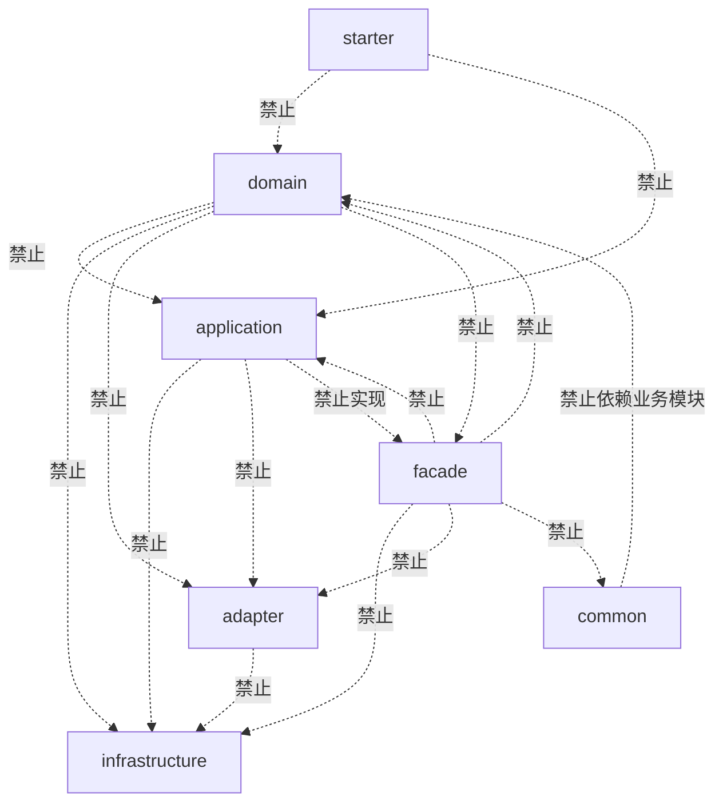

---

## 3. 标准调用方向图

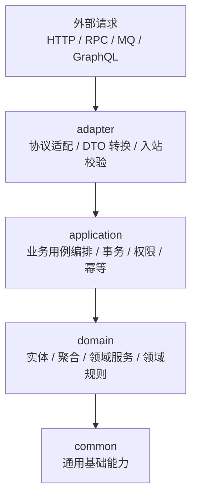

---

## 4. Adapter 入站适配图

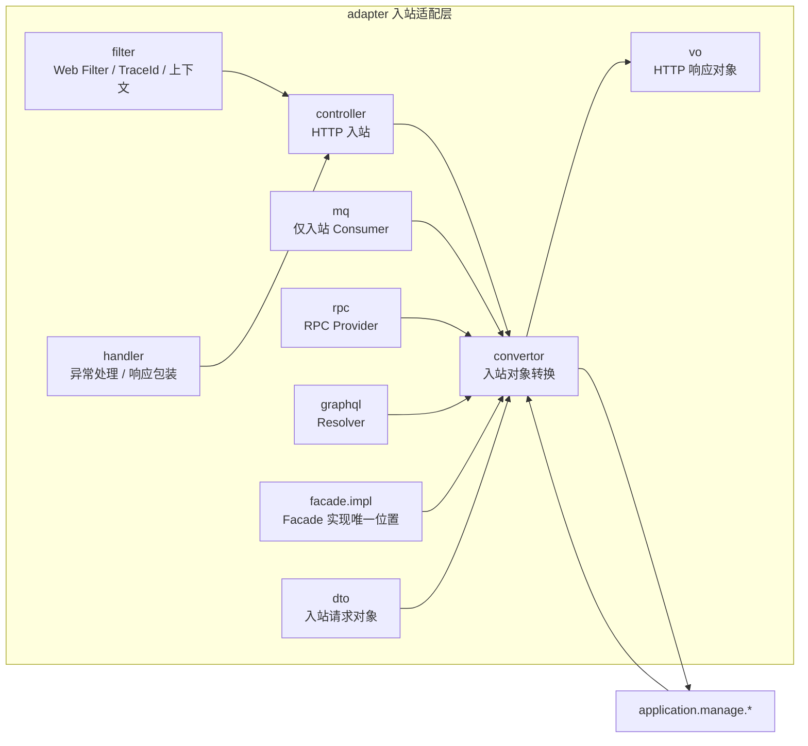

---

## 5. Facade 契约层图

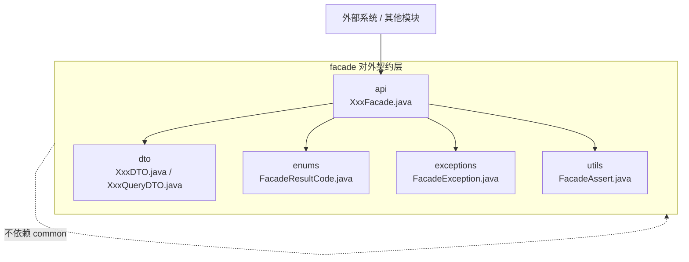

---

## 6. Application 业务编排图

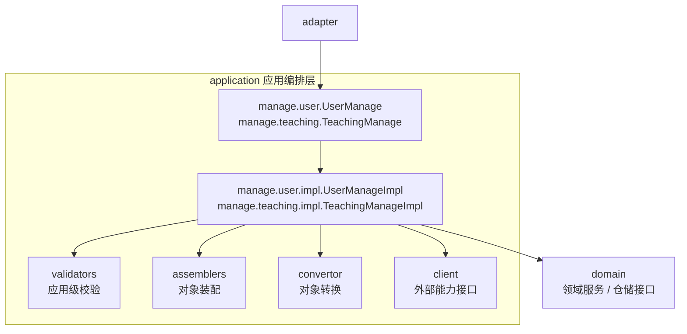

---

## 7. Domain 领域核心图

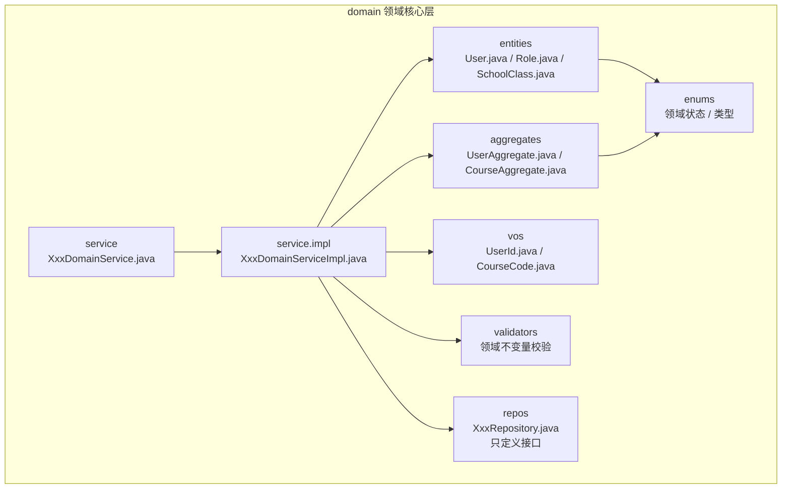

---

## 8. Infrastructure 基础设施图

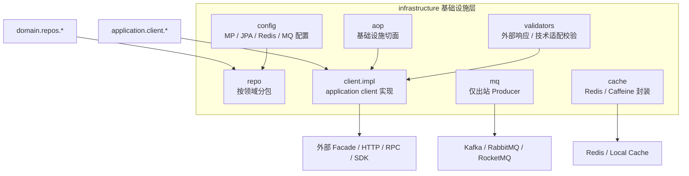

---

## 9. Repository 调用链路图

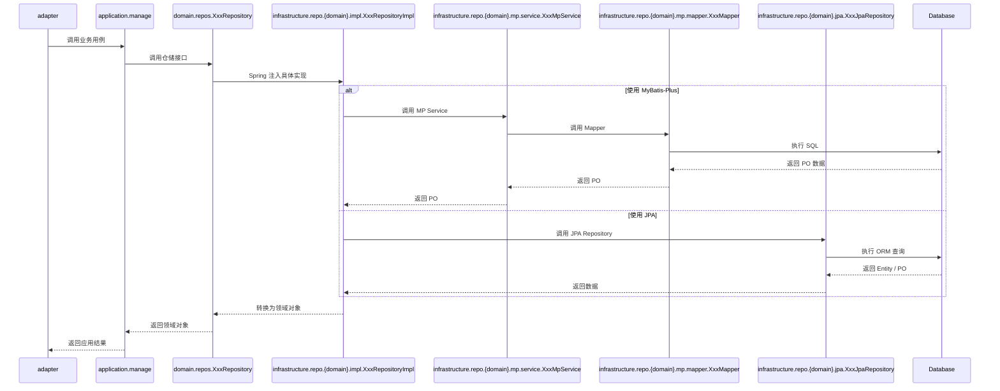

---

## 10. MyBatis-Plus 仓储实现链路图

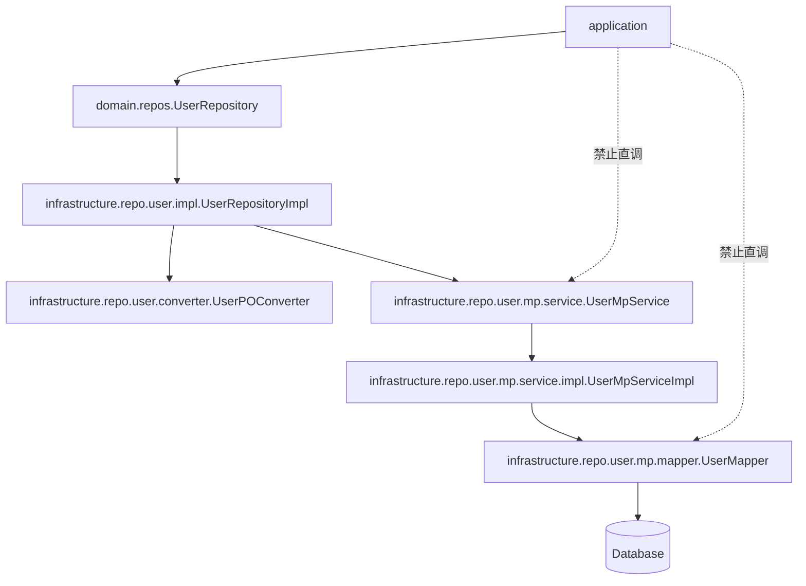

---

## 11. JPA 仓储实现链路图

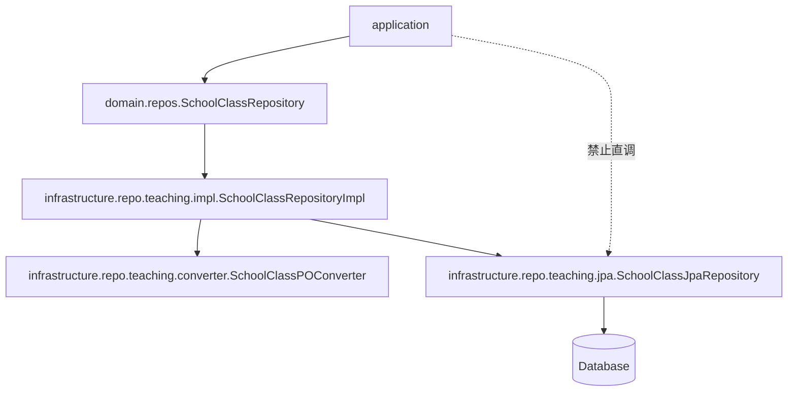

---

## 12. 外部 Client 防腐层图

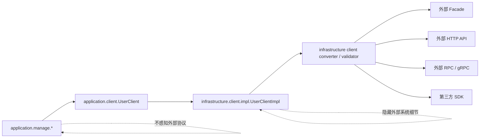

---

## 13. MQ 入站与出站隔离图

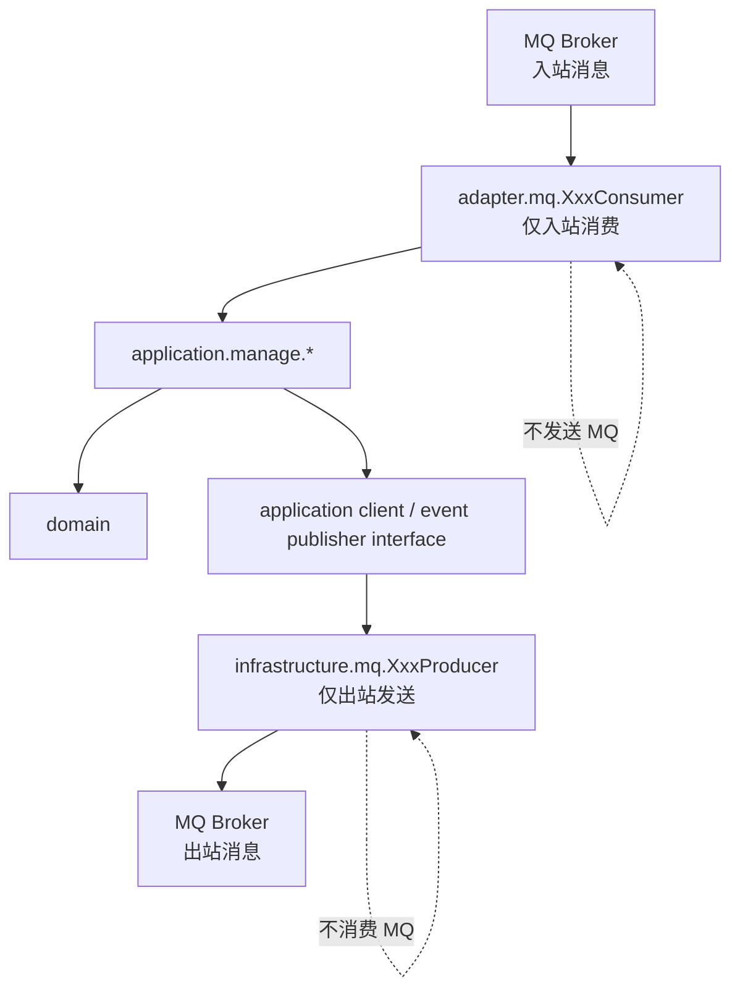

---

## 14. Validator 分层职责图

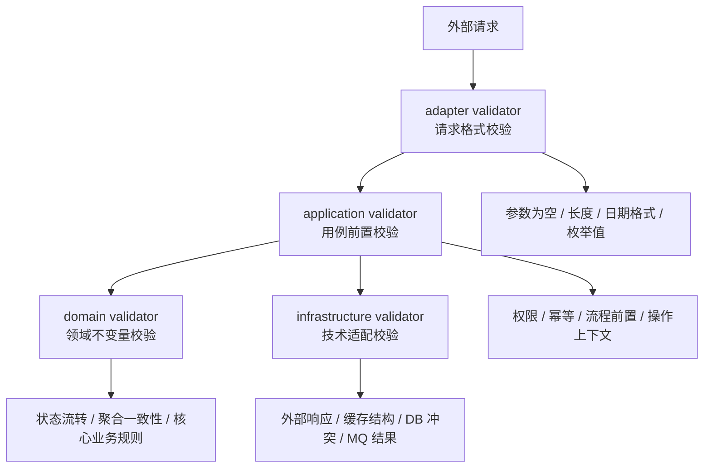

---

## 15. 单体内两个领域示例图

```mermaid
flowchart TD
    subgraph PROJECT["student-management 单体工程"]
        subgraph USER["user 领域"]
            USER_ENTITY["User / Role / Permission"]
            USER_SERVICE["UserDomainService"]
            USER_REPO["UserRepository"]
        end

        subgraph TEACHING["teaching 领域"]
            TEACHING_ENTITY["SchoolClass / Course"]
            TEACHING_SERVICE["SchoolClassDomainService / CourseDomainService"]
            TEACHING_REPO["SchoolClassRepository / CourseRepository"]
        end

        APP["application<br/>跨领域业务编排"]
    end

    APP --> USER_SERVICE
    APP --> TEACHING_SERVICE
    USER_SERVICE --> USER_ENTITY
    TEACHING_SERVICE --> TEACHING_ENTITY
    USER_SERVICE --> USER_REPO
    TEACHING_SERVICE --> TEACHING_REPO
    USER -. " 领域之间不直接依赖 " . - TEACHING 
```

---

## 16. 典型 HTTP 请求时序图

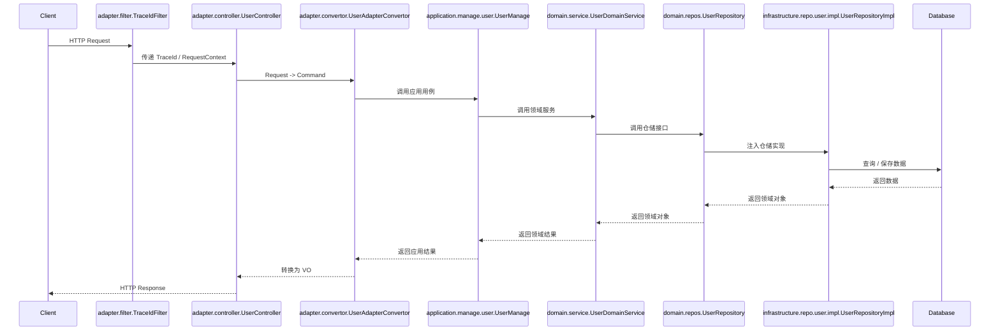

---

## 17. 典型 RPC 请求时序图

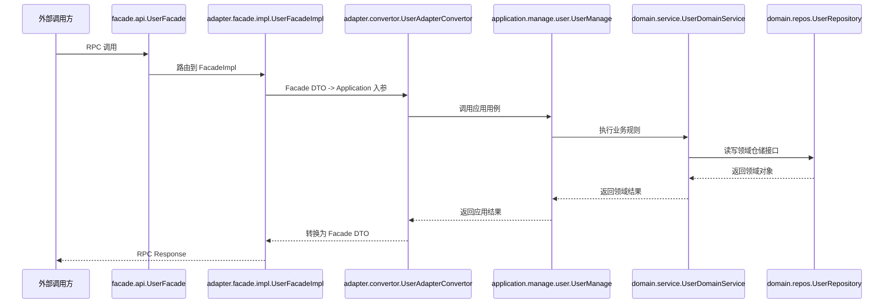

---

## 18. 典型 MQ 入站时序图

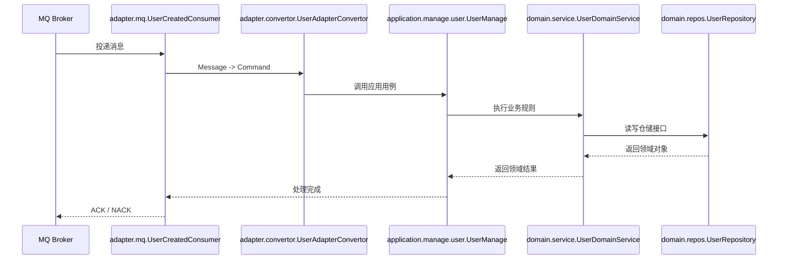

---

## 19. 包结构关系图

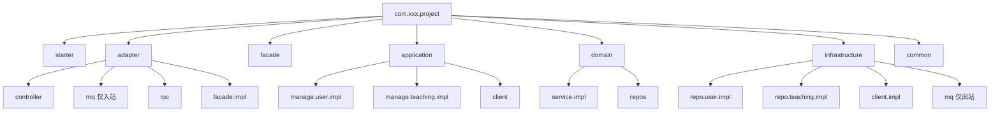

---

## 20. 架构边界总览图

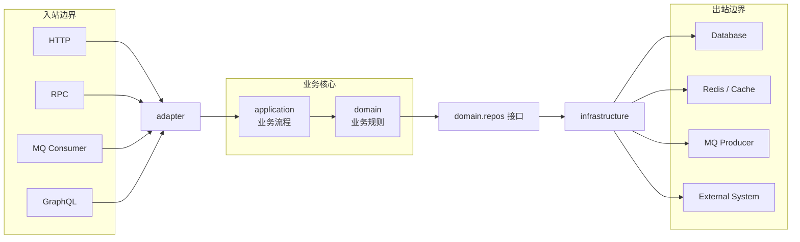
