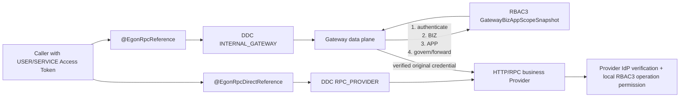

# Gateway 流量层 BIZ/APP 范围校验与 DDC 直连 RPC 双链路规格

| Field              | Value                                                                                                                                                                                                                                                                                                                                                                                                                                                                                                                                                                                                                             |
|--------------------|-----------------------------------------------------------------------------------------------------------------------------------------------------------------------------------------------------------------------------------------------------------------------------------------------------------------------------------------------------------------------------------------------------------------------------------------------------------------------------------------------------------------------------------------------------------------------------------------------------------------------------------|
| Document           | `2026-08-15-16-57-gateway-biz-app-scope-direct-rpc-design.md`                                                                                                                                                                                                                                                                                                                                                                                                                                                                                                                                                                     |
| Status             | `Review`                                                                                                                                                                                                                                                                                                                                                                                                                                                                                                                                                                                                                          |
| Type               | `Architecture`                                                                                                                                                                                                                                                                                                                                                                                                                                                                                                                                                                                                                    |
| Created            | `2026-08-15 16:57 CST`                                                                                                                                                                                                                                                                                                                                                                                                                                                                                                                                                                                                            |
| Updated            | `2026-08-15 16:57 CST`                                                                                                                                                                                                                                                                                                                                                                                                                                                                                                                                                                                                            |
| Owner              | `Egon-COLA platform owner / User`                                                                                                                                                                                                                                                                                                                                                                                                                                                                                                                                                                                                 |
| Repository         | `/Users/mario/SelfProject/Egon-COLA`                                                                                                                                                                                                                                                                                                                                                                                                                                                                                                                                                                                              |
| Scope              | `Gateway HTTP/RPC data plane, RPC Starter/DDC adapter, RBAC3 Gateway scope projection, IdP RPC credential relay`                                                                                                                                                                                                                                                                                                                                                                                                                                                                                                                  |
| Source Requirement | `2026-08-15 user request: Gateway forwarding checks BIZ then APP only; downstream owns operation permission; RPC supports Gateway and DDC-direct annotations; direct RPC may omit Gateway docs; every RPC provider registers with DDC`                                                                                                                                                                                                                                                                                                                                                                                            |
| Baseline Revision  | `main@8a64b586634d8d1fc94ffcc101e9add00c2e7730; clean worktree before this Spec`                                                                                                                                                                                                                                                                                                                                                                                                                                                                                                                                                  |
| Amends             | [GWS-08 §4.2, §9, §15](../../superpowers/specs/2026-07-25-gateway-security-extension-design.md#42-执行顺序); [GWS-04 §2.1, §7.2, §16](../../superpowers/specs/2026-07-25-gateway-engine-rpc-design.md#21-rpc-consumer--rpc-provider); [GWS-10 §2.2, §6, §16](../../superpowers/specs/2026-07-25-gateway-starter-interface-reporting-design.md#22-rpc); [RBAC3/DDC/Gateway §17.6](../../superpowers/specs/2026-08-01-rbac3-ddc-gateway-integration-design.md#17-安全边界); [统一身份 §10.3, §11.3, §15.2, §19.3, §20.5/§20.9](../../superpowers/specs/2026-08-13-unified-identity-stateless-jwt-session-removal-design.md#103-gateway-安全链扩展方式) |
| Supersedes         | `None`                                                                                                                                                                                                                                                                                                                                                                                                                                                                                                                                                                                                                            |
| Depends On         | `None`                                                                                                                                                                                                                                                                                                                                                                                                                                                                                                                                                                                                                            |
| Related Specs      | [RBAC3 IAM §2.4 Business -> Application 边界（Draft，非本 Spec 的批准依赖）](../../../egon-cola-platforms/egon-cola-platform-rbac3/docs/iam-package-aggregation-migration-spec.md#24-business---application-的主数据与授权边界); [Gateway 总体设计](../../superpowers/specs/2026-07-24-gateway-component-design.md)                                                                                                                                                                                                                                                                                                                                        |
| Related Plans      | [Gateway BIZ/APP 范围鉴权与 DDC 直连 RPC 实施计划](../plan/2026-08-15-17-23-gateway-biz-app-direct-rpc-implementation.md)                                                                                                                                                                                                                                                                                                                                                                                                                                                                                                                    |

## 1. Summary

本规格把 Gateway 流量层的职责收敛为“认证、入口/暴露规则、BIZ 范围、APP 范围和流量治理”。对 `BUSINESS_PROTECTED` 请求，Gateway
必须从服务端已编译 Route 取得目标 `bizCode + appCode`，先判断当前 USER 是否具有有效 BIZ 访问范围，再判断该 BIZ 下是否具有有效
APP 访问范围；不得读取 Operation-to-Permission Mapping，不得判断具体接口权限。HTTP、RPC 以及 HTTP→RPC 的最终接口权限均由目标服务重新验证原始
Access Token 后自行判断。Gateway Admin 管理应用作为普通业务系统继续保留自己的 IdP/RBAC3 本地校验，本规格不削弱其管理面权限。

RPC 调用从单一 Gateway 路径扩展为两种显式注入模式：现有 `@EgonRpcReference` 保持“通过 `INTERNAL_GATEWAY`”的兼容语义；新增
`@EgonRpcDirectReference`，使用精确的 `bizCode + appCode + env + serviceName + group + version + grpc` 从 DDC 订阅
`RPC_PROVIDER`，直接选择业务 Provider。一个应用可同时使用两种注解，甚至可为同一契约注入两个不同字段；同一字段同时标两种注解属于配置冲突并在启动期拒绝。

接口定义上报与实例注册继续分离。所有 `@EgonRpcProvider` 服务都经 `rpc-ddc-adapter` 注册 DDC，与是否安装 Gateway
Starter、是否存在 `@GatewayInterfaceGroup/@GatewayOperation` 无关。直连专用 RPC 可以完全不配置 Gateway Interface
Definition/OpenAPI-style 文档，因此不会形成新的 Gateway Operation/Route；若历史上已有已发布 Route，必须先显式下线旧
Release，不能把“改 Consumer 注解”误认为会修改 Gateway 管理数据。

## 2. Background and Current State

### 2.1 Business and user context

当前 Gateway 同时具备 API Gateway 与 RPC 中继能力。用户要求保留 Gateway 作为外部入口、协议转换和治理层，但不让它成为接口级业务授权的唯一
PEP：Gateway 只判断用户能否进入目标 BIZ、以及能否进入该 BIZ 下的 APP；接口、数据、字段等细粒度权限由真正拥有业务语义的下游系统判断。

RPC 的微服务内部调用还需要恢复“Consumer 从注册中心发现 Provider 并直连”的常规链路。Gateway
路径仍用于显式需要统一入口、跨协议转换或集中治理的调用，但不得成为所有 RPC 的强制中转点。两条链路由调用点注解明确选择，不通过运行时猜测协议或隐式降级。

### 2.2 Repository evidence

以下证据均来自本 Spec 基线的静态源码；未启动 Gateway、DDC、Redis、PostgreSQL 或业务服务，因此不表示真实运行环境已经联通。

| Evidence                                                                                                     | Current responsibility or behavior                                                                               | Design significance                                    |
|--------------------------------------------------------------------------------------------------------------|------------------------------------------------------------------------------------------------------------------|--------------------------------------------------------|
| `gateway-engine/.../http/RuleBackedHttpGatewaySecurityProcessor.java:214-234`                                | HTTP Route 同时生成 `idp.biz-code/idp.app-code/idp.env` 与 `rbac3.application-code/definition-set-id/mapping-version` | HTTP 流量层存在接口映射授权所需的专用输入，必须删除后三类输入                      |
| `gateway-engine/.../rpc/RuleBackedRpcGatewaySecurityProcessor.java:194-200`                                  | RPC Route 已只生成目标 `bizCode/appCode/env`                                                                           | RPC Route 的目标身份模型可直接复用为 BIZ/APP 判断输入                   |
| `gateway-engine/.../security/GatewaySecurityChain.java:398-458`                                              | Chain 遍历 `authorizationProviderIds` 并对 DENY/ERROR Fail Closed                                                    | 保留责任链，只替换授权 Provider 的判断粒度，不新建第二套安全框架                  |
| `rbac3-gateway-adapter/.../Rbac3GatewayRuntimeSnapshotReader.java:52-108`                                    | 读取 definition set、mapping version、operation ID、permission code，并检查 `AppAuthorizationContext.permissions`         | 这是需要从 Gateway 转发热路径移除的接口级权限逻辑                          |
| `rbac3-gateway-adapter/.../Rbac3PermissionAuthorizationProvider.java:27`                                     | Provider ID 为 `rbac3-permission`                                                                                 | 新范围 Provider 需要新 ID，旧 ID 仅可作为受控迁移兼容，不得继续读取接口映射         |
| `gateway-engine/pom.xml:33-48` 与 `IdpAdapterRuntimeClasspathTest.java:10-18`                                 | 可执行 Engine 包含 IdP Gateway Adapter，却刻意不包含 RBAC3 Gateway Adapter                                                   | 当前打包无法提供真实 BIZ/APP 范围 Provider；目标依赖必须显式改变              |
| `scripts/unified-identity-local.sh:1347-1393`                                                                | `BUSINESS_PROTECTED` 发布 `authorizationProviderIds=["rbac3-permission"]`                                          | 本地发布脚本仍固化接口权限 Provider，必须迁移                            |
| `rbac3-contract/.../UserAuthorizationSnapshot.java:10-20` 与 `AppAuthorizationContext.java:10-20`             | 全量用户快照只有 APP 上下文和权限，没有独立 BIZ→APP 轻量范围投影                                                                          | Gateway 不应继续读取全量权限快照；需要同版本、最小化的范围投影                    |
| `rbac3-admin/.../RoleEligibilityService.java:43-70`                                                          | APP 有效性已要求本地 APP、用户 Business grant、DDC APP、DDC Business 和父子关系同时有效                                                | BIZ/APP 范围事实已存在，设计应复用而不是重新计算另一套规则                      |
| `rpc-starter/.../EgonRpcAutoConfig.java:167-225`                                                             | 标准 Consumer 只装配 `RpcConsumerGatewayManager` 和 Gateway Channel Provider                                           | 当前 `@EgonRpcReference` 必然先发现 `INTERNAL_GATEWAY`        |
| `rpc-starter/.../EgonRpcReferenceBeanPostProcessor.java:21-42`                                               | 只扫描 `@EgonRpcReference`，且只使用 Gateway 绑定的 Proxy Factory                                                           | 需要第二种字段注解和第二个 Channel Strategy                         |
| `rpc-ddc-adapter/.../DdcRpcGatewayDirectory.java:31-54`                                                      | Consumer 查询 DDC `INTERNAL_GATEWAY`                                                                               | Gateway 模式的精确现状，应保持兼容                                  |
| `rpc-ddc-adapter/.../DdcRpcProviderRegistry.java:121-127`                                                    | Provider 以 `RPC_PROVIDER` 和完整服务键注册 DDC                                                                           | 直连发现已有权威注册数据，不应复用 Gateway Slot                         |
| `rpc-ddc-adapter/.../DdcRpcAutoConfiguration.java:182-204`                                                   | 已装配 Provider Registry 与 Gateway Directory，但没有 Provider Directory                                                 | DDC Adapter 缺少从 `RPC_PROVIDER` 到 RPC Consumer 的读侧桥接    |
| `gateway-starter/.../RpcGatewayDefinitionContributor.java:75-82`                                             | 没有 `@GatewayInterfaceGroup` 的 RPC Contract 会被跳过                                                                  | 直连 RPC 已具备“不上报 Gateway 文档”的正确 opt-in 边界                |
| `gateway-starter/.../RpcGatewayDefinitionContributor.java:83-117,158-252`                                    | 一旦 Contract 有 Group，Contributor 会报告该 Contract 的全部 Unary 方法；`@GatewayOperation` 只补描述/暴露语义                         | 文档选择是 Provider Contract 维度，不应由 Consumer 注解反向控制         |
| `rpc-starter/.../RpcConsumerClientInterceptor.java:51-75` 与 `RpcProviderServerInterceptor.java:24-49`        | 只传播服务身份、Invocation 与 Trace，没有 Authorization                                                                      | “下游自行鉴权”要可执行，必须增加凭证中继但不能在 Consumer 做权限决策               |
| `gateway-engine/.../rpc/RpcGatewayForwarder.java:1283-1325`                                                  | RPC→RPC 出站只复制白名单身份/Trace，不复制原始 Bearer                                                                            | Gateway RPC 路径当前不能让 Provider 按原始调用者凭证二次校验              |
| `gateway-engine/.../http/DefaultGatewayHttpDataPlaneHandler.java:1445-1475,1679-1700`                        | HTTP→RPC 时把 `forwardHttpCredential` 设为 false；Bridge 本身已支持 Authorization Metadata                                 | HTTP→RPC 只需在已验证且 Policy 允许时恢复原始 Bearer，不应复制未验证请求头      |
| `idp-starter/.../VerifiedUserTokenCarrier.java:19-37`                                                        | 已验证 USER Token 目前只在 Servlet Request Scope 可取                                                                     | RPC Client/Server 需要 gRPC Context 适配，不能从任意 Header 重建信任 |
| `gateway-admin/.../GatewayAdminSecurityConfiguration.java:29-102` 与 `GatewayAuthBootstrapController.java:59` | Admin 使用独立 IdP/RBAC3 Filter Chain、Method Security 和 `gateway:read` 权限                                            | Admin 管理面的本地权限链与数据面 Provider 是不同边界，本规格保持不变             |
| `gateway-engine/.../mcp/security/Rbac3McpAuthorizationAdapter.java`                                          | MCP 有独立 Tool 权限适配器                                                                                               | MCP Tool 列表/调用授权不等同于 Route 的接口权限 Provider，本规格不改 MCP    |

### 2.3 Problem statement and gap

当前实现与目标存在四个明确偏差：

1. HTTP 数据面把 Operation Mapping 元数据送进 RBAC3 Gateway Adapter，后者直接判断具体 Permission；这与“下游拥有接口权限”的边界冲突。
2. Engine 可执行包又没有携带该 RBAC3 Adapter，脚本却发布 `rbac3-permission`，形成“规则声明存在、打包 Capability 缺失”的静态不一致。
3. RPC 标准注入只有 Gateway Directory，没有 `RPC_PROVIDER` Directory；业务服务即使已向 DDC 注册，也不能通过注解直接发现并调用。
4. HTTP 和 RPC 下游二次校验依赖原始已验证 Token。HTTP→HTTP 已能受控恢复 Bearer，但 RPC→RPC 与 HTTP→RPC 尚未形成同等凭证中继契约。

影响是：Gateway 承担了不应拥有的接口权限语义；RPC 被强制中心化；直连服务发现缺失；如果简单删除 Gateway
权限检查而不补凭证中继，下游又无法可靠完成用户权限校验。

## 3. Goals and Non-goals

### 3.1 Goals

- 将 `BUSINESS_PROTECTED` USER 流量的 Gateway 授权固定为 BIZ 后 APP 的两级范围判断。
- 从 HTTP/RPC Route 热路径删除 definition set、mapping version、operation permission 的读取和判定。
- 保留 Gateway 身份认证、Token 恢复、外部暴露、Header/Metadata 清洗、流量治理和 Fail Closed。
- 保持 Gateway Admin 自身的 IdP/RBAC3 本地接口权限校验。
- 为 RPC Starter 增加显式 DDC 直连注解，同时保持现有 Gateway 注解兼容。
- 让一个应用可同时使用 Gateway 与直连 RPC，且不存在隐式 fallback。
- 保证所有 RPC Provider 注册 DDC，与 Gateway 文档/路由暴露解耦。
- 让 HTTP→HTTP、RPC→RPC、HTTP→RPC 的下游都能收到受控中继的原始已验证调用者凭证，并由下游做接口权限判断。

### 3.2 Non-goals

- 不修改 Gateway Admin 管理页面、菜单、管理 API 业务能力或其本地权限模型。
- 不取消 `PUBLIC_PROTOCOL`、`IDENTITY_PROTECTED`、`BUSINESS_PROTECTED` 三类 Route，也不取消 `externalAccessible` 检查。
- 不让 Gateway 自动授予 BIZ/APP，不从请求自报 Header 接受目标范围。
- 不把 DDC 变成用户权限系统；DDC 仍只提供 Business/Application 主数据与服务实例事实。
- 不改变 RPC Wire Contract、Protobuf Descriptor、`@EgonRpcService/@EgonRpcMethod/@EgonRpcProvider` 的职责。
- 不支持 RPC Streaming；仍只处理现有 Unary Contract。
- 不在 Consumer 查询 RBAC3 Permission，不在 Consumer 判断 `@RequiresPermission`。
- 不让 Consumer 在 Gateway 不可用时自动降级直连，也不让直连在 Provider 不可用时自动改走 Gateway。
- 不在本规格实现新的 RPC 重试、Fallback 或全部 LoadBalance 策略；直连首期使用确定性 Round Robin，单次调用重试语义保持现状。
- 不改变 MCP Tool 的独立权限过滤、Tool Listing 或 MCP Session 语义。
- 不新增数据库表、不修改既有 Flyway migration、不改前端。

## 4. Requirements and Acceptance Criteria

| ID        | Atomic requirement                                              | Priority | Observable acceptance criteria                                                                                     | Source                                      |
|-----------|-----------------------------------------------------------------|----------|--------------------------------------------------------------------------------------------------------------------|---------------------------------------------|
| `REQ-001` | `BUSINESS_PROTECTED` USER 请求必须先校验 Route 目标 BIZ，再校验该 BIZ 下目标 APP | Must     | BIZ 不存在/无访问时不执行 APP 判断并返回 403；BIZ 允许但 APP 不允许时返回 403；两者允许才进入治理/转发                                                  | “先判断biz，再判断app，因为app是在biz下面的”               |
| `REQ-002` | Gateway HTTP/RPC 转发链不得判断具体 Operation Permission                 | Must     | 数据面不读取 `rbac3.definition-set-id`、`rbac3.mapping-version`、Operation Mapping 或 `permissions`；删除/替换现有 Reader 测试       | “不需要判断接口的具体权限，由下游自行校验”                      |
| `REQ-003` | Gateway 仍必须认证身份、执行 Route 暴露规则与 BIZ/APP 范围 Fail Closed           | Must     | 无效 Token 为 401；BIZ/APP 拒绝为 403；RBAC3 Runtime 不可用为 503；`externalAccessible=false` 的 PUBLIC 请求仍隐藏为未找到                | 用户仅要求移除具体接口权限，不要求移除安全边界                     |
| `REQ-004` | Gateway Admin 管理应用必须保留其本地接口权限校验                                 | Must     | `GatewayAdminSecurityConfiguration`、RBAC3 Filter/Method Security 和现有 `@RequiresPermission` 行为不被数据面改造删除或旁路          | “gateway的admin管理平台，依然需要校验权限，同业务系统”          |
| `REQ-005` | 现有 `@EgonRpcReference` 必须继续表示通过 Gateway 的 RPC 引用                | Must     | 既有源码无需改注解；其 DDC 查询仍为 `INTERNAL_GATEWAY`                                                                            | “starter支持两种注解，一种走gateway”                  |
| `REQ-006` | 新增 `@EgonRpcDirectReference`，按精确 DDC 服务键发现 `RPC_PROVIDER` 并直连   | Must     | 注入代理的 Channel 不连接 `INTERNAL_GATEWAY`；DDC 查询键含目标 BIZ/APP/env/service/group/version/grpc                             | “补充注解，不走gateway的链路”                         |
| `REQ-007` | 同一应用必须能同时配置 Gateway 与直连引用                                       | Must     | 两个不同字段可分别注入并调用；同一契约也允许双字段双路径；同一字段标双注解启动失败                                                                          | “也支持同时配置两种注解”                               |
| `REQ-008` | 两种 RPC 路径不得相互自动 fallback                                        | Must     | Gateway 缺失返回 `RPC_GATEWAY_UNAVAILABLE`；直连 Provider 缺失返回 `RPC_PROVIDER_UNAVAILABLE`；日志/测试无跨路径选择                     | 显式链路边界与微服务直连诉求                              |
| `REQ-009` | 所有已导出的 RPC Provider 必须注册 DDC `RPC_PROVIDER`，不受 Gateway 文档影响     | Must     | 有/无 Gateway Starter、Group 或 Operation 注解时，Provider Registry 都生成相同服务租约                                              | “但是都会注册到ddc中”                               |
| `REQ-010` | 直连专用 RPC 必须可以不配置 Gateway Interface Definition 文档                | Must     | 无 `@GatewayInterfaceGroup` 的 Contract 不进入报告；Provider 仍注册；无 Definition/Release 时 Gateway 无该 Route                   | “支持不配置gateway openapi规范doc上报，不被gateway代理流量” |
| `REQ-011` | RPC Consumer 不得主动做用户接口权限判断                                      | Must     | Consumer 不依赖 RBAC3 Permission API/快照；只做发现、选择、Deadline、Trace 和凭证中继                                                  | “rpc的权限一样，由下游校验。consumer不主动校验”              |
| `REQ-012` | 下游 RPC Provider 必须能取得并验证受控中继的调用者 Access Token                   | Must     | 有效 USER Token 在 Gateway/直连链路到达 Provider；伪造/非法 Token 不建立安全上下文；下游 `@RequiresPermission` 或 AuthorizationService 可自行判断 | 下游校验成立所必需；统一身份 Spec §11.3                   |
| `REQ-013` | BIZ/APP 范围投影必须与全量用户权限快照使用同一授权版本和发布 Fence                        | Must     | 两个投影的 tenant/subject/authVersion/policyVersion/expiry 一致；缺失、过期、Fence 或版本冲突均 Fail Closed                            | 防止两套授权事实漂移                                  |
| `REQ-014` | 从已发布 Gateway RPC 切换为“仅直连”时必须显式撤销旧 Gateway Route/Release         | Must     | 发布检查能证明旧 Operation 不在 Active Release；仅替换 Consumer 注解不被视为下线完成                                                       | Gateway Definition 与 Consumer 注解分属不同应用和事实源  |

## 5. Constraints, Assumptions, and Decisions

### 5.1 Confirmed constraints

- BIZ 是 DDC Business/Biz，APP 是该 BIZ 下的 DDC Application；目标父子关系不能由客户端 Header 声明。
- RBAC3 是用户 BIZ/APP 授权范围权威；DDC 是 BIZ/APP 主数据和启停/归属权威。
- 具体接口权限属于下游业务系统，包括 Gateway Admin 自身。
- Gateway Definition Report、DDC Provider Lease 与调用流量是三条独立链路。
- RPC Contract 保持部署中立；目标 BIZ/APP 属于 Consumer 调用点，不进入 `@EgonRpcService`。
- 用户明确要求写 Spec；本轮不写实施 Plan、不改生产代码、不启动服务。

### 5.2 Small-gap assumptions

| ID        | Inference                                                             | Repository evidence                                                     | Why locally reversible | Impact if wrong                                  |
|-----------|-----------------------------------------------------------------------|-------------------------------------------------------------------------|------------------------|--------------------------------------------------|
| `ASM-001` | BIZ/APP 范围只应用于 `BUSINESS_PROTECTED` USER Route；PUBLIC 与 IDENTITY 语义不变 | 统一身份 Spec §15.2 与 `GatewaySecurityPolicy` 三类不变量                         | 只影响 Policy 选择与测试，可局部调整 | 若用户要求所有 Route 都判断范围，需要重新定义登录/JWK 等公开协议           |
| `ASM-002` | APP 范围沿用当前“有效且已激活的 APP 授权上下文”，不是只要 DDC APP 存在就允许                      | `UserAuthorizationSnapshotProjector` 只投影 active/effective role contexts | 可在范围投影生成器中替换 APP 判定来源  | 若 APP 访问应独立于角色激活，需补独立 UserApplicationAccess 授权事实 |
| `ASM-003` | “同时配置两种注解”表示同一应用/同一契约可在不同字段使用两种注解；同一字段双注解没有可执行的唯一路径                   | 当前注入点是字段，且一个字段只能设置一个代理对象                                                | 冲突校验可局部放宽，但无合理收益       | 若用户要求同一字段运行时动态切换，需要新的路由策略注解和失败语义                 |
| `ASM-004` | 直连注解名为 `@EgonRpcDirectReference`，现有 `@EgonRpcReference` 不重命名          | 现有注解是已发布源码契约                                                            | 新注解名称可在 Review 前调整     | 若要求显式 `@EgonRpcGatewayReference`，会增加兼容别名和弃用周期    |
| `ASM-005` | MCP 独立 Tool 权限不属于本次“Route 转发接口权限”删除范围                                 | MCP 使用独立 `Rbac3McpAuthorizationAdapter`，不走 `rbac3-permission` Provider  | 可用后续 MCP 专项 Spec 调整    | 若一并删除，将改变 Tool 可见性与 MCP 风险控制，需单独审核               |

### 5.3 Resolved decisions

| ID        | Decision                                                                    | Decision owner                      | Evidence and rationale                                                      | Requirements                  |
|-----------|-----------------------------------------------------------------------------|-------------------------------------|-----------------------------------------------------------------------------|-------------------------------|
| `DEC-001` | 保留 `GatewaySecurityChain`，用 `rbac3-biz-app-scope` 替换接口权限 Provider           | User + Spec                         | 用户只改变判断粒度；现有责任链已经提供超时、Fail Closed 和协议统一                                     | `REQ-001`–`REQ-003`           |
| `DEC-002` | RBAC3 发布独立轻量 `GatewayBizAppScopeSnapshot`，Gateway 不读取全量 Permission Snapshot | Spec                                | 最小权限、避免 Gateway 继续依赖 permissions；同一 publisher 可保证版本一致                       | `REQ-001`,`REQ-002`,`REQ-013` |
| `DEC-003` | 现有 `@EgonRpcReference` 保持 Gateway；新增 `@EgonRpcDirectReference`              | User + Spec                         | 最小破坏且让调用点显式选择                                                               | `REQ-005`–`REQ-008`           |
| `DEC-004` | 直连查询 DDC `RPC_PROVIDER`，禁止查询 Gateway Slot 或运行时 fallback                     | User                                | 对齐服务注册事实与微服务调用边界                                                            | `REQ-006`,`REQ-008`,`REQ-009` |
| `DEC-005` | Gateway 文档由 Provider Contract opt-in；Consumer 注解不控制文档                       | Spec                                | `RpcGatewayDefinitionContributor` 已以 `@GatewayInterfaceGroup` 为入口，避免跨应用反向耦合 | `REQ-009`,`REQ-010`,`REQ-014` |
| `DEC-006` | Consumer 只中继已验证凭证；Provider 的 IdP/RBAC3 Chain 执行认证与接口权限                      | User + unified identity predecessor | 中继不是授权决策；这使“下游自行校验”真实可执行                                                    | `REQ-011`,`REQ-012`           |

### 5.4 Open major decisions

N/A。当前 Review 版本没有阻塞实施计划的重大产品决策；`ASM-*` 均为保持现有语义的局部、可逆推断，用户可在审核时修改。

## 6. Project Technology Context

| Concern                 | Current choice                                       | Repository evidence                                                       | Constraint on design                                                            |
|-------------------------|------------------------------------------------------|---------------------------------------------------------------------------|---------------------------------------------------------------------------------|
| Language/runtime        | Java 21                                              | `egon-cola-platforms/pom.xml:62-67`; `egon-cola-components/pom.xml:68-70` | 使用 Java record、Spring Lifecycle；不引入其他运行时                                        |
| Framework               | Spring Boot 3.5.16, Spring Security                  | `egon-cola-platforms/pom.xml:67`; IdP/RBAC3/Gateway POM                   | 新能力通过现有 AutoConfiguration、Bean SPI 装配                                           |
| RPC                     | gRPC 1.75.0, Protobuf 4.32.0, Unary                  | `egon-cola-platforms/pom.xml:76-79`; `@EgonRpcMethod`; GWS-04             | 不改 Wire Descriptor，不引入 Dubbo/Streaming                                          |
| Registry/config         | DDC Service Registry + Redis subscription            | `DdcRpcAutoConfiguration`, `DdcServiceRegistryClient`                     | Direct Directory 必须适配中立 RPC SPI，不让 rpc-starter 依赖 DDC                           |
| RBAC runtime            | Redis immutable projection + version/fence           | `Rbac3RuntimeKeyFactory`; `RedisAuthorizationRuntimeRepository`           | 新范围快照与现有 pointer/version/fence 同步发布                                             |
| Architecture            | Core SPI + Adapter + Spring Boot Starter             | Gateway security provider、RPC Directory、DDC Adapter                       | 依赖方向保持 `rpc-starter <- rpc-ddc-adapter`、`gateway-core <- rbac3-gateway-adapter` |
| Persistence             | PostgreSQL/JPA/Flyway 已存在，但本改造不改表                    | `rbac3-admin` 与 Gateway Admin POM；现有 Business/Application 授权实体            | 本 Spec 只有 Redis 投影形状变化，无 Flyway                                                 |
| Tests                   | JUnit Jupiter 5.12.2, Spring Boot Test, Reactor Test | 两个父 POM与现有测试目录                                                            | 单测优先，模块测试后再做本地栈验收；本轮不启动服务                                                       |
| Repository instructions | 用户提供的 Main Agent/AGENTS 规则；仓库内未发现额外 `AGENTS.md`      | `rg --files -g AGENTS.md` 无结果                                             | 最小安全改动、保留现有风格、不得改旧 migration、实施时按任务提交                                           |
| Worktree                | 基线检查时 clean                                          | `git status --short` 无输出                                                  | Spec 只新增文档，不混入生产改动                                                              |

## 7. Architecture Design

### 7.1 Architecture overview

目标架构把“范围准入”和“业务授权”拆成两层 PEP：Gateway 是入口 PEP，只认证并判断目标 BIZ/APP 范围；Provider 是业务 PEP，重新验
Token 并按自己的接口、数据和字段规则授权。RPC 的 Gateway/Direct 只是两种 Transport Strategy，不改变 Provider 端安全责任。



HTTP 外部入口仍先经过 Gateway；HTTP Route 的上游既可以是 HTTP Provider，也可以是 RPC Provider。两种情况下，只有通过 Gateway
身份验证并允许转发的原始 Bearer 才能恢复到下游请求。直连 RPC 则从调用线程中的“已验证 Token Carrier”产生 gRPC
Authorization Metadata；Consumer 不解析权限、不读取 RBAC3。

### 7.2 Module boundaries and responsibilities

| Module/component                   | Responsibility                                                           | Inputs/outputs                                           | Dependencies                                             | Requirements                  |
|------------------------------------|--------------------------------------------------------------------------|----------------------------------------------------------|----------------------------------------------------------|-------------------------------|
| `gateway-engine`                   | Route 身份、认证、BIZ/APP Scope、治理、HTTP/RPC 转发                                 | compiled Route + credential -> selected Provider request | gateway-core, idp-gateway-adapter, rbac3-gateway-adapter | `REQ-001`–`REQ-003`,`REQ-012` |
| `rbac3-gateway-adapter`            | 只读取版本一致的 BIZ/APP Scope Snapshot并返回 Gateway AuthorizationDecision         | tenant/sub + Route BIZ/APP -> ALLOW/DENY/ERROR           | rbac3 contract/core, gateway-core, Redis                 | `REQ-001`–`REQ-003`,`REQ-013` |
| `rbac3-admin` runtime projector    | 从 User Business grant、active/effective APP scope 和 DDC Catalog 生成同版本范围投影 | authorization facts -> full snapshot + scope snapshot    | existing IAM/DDC read port                               | `REQ-001`,`REQ-013`           |
| `rpc-starter`                      | 注解扫描、Gateway/Direct Channel Strategy、typed proxy、Trace/Deadline          | field annotation -> proxy                                | neutral Directory SPI only                               | `REQ-005`–`REQ-008`,`REQ-011` |
| `rpc-ddc-adapter`                  | 把 DDC `INTERNAL_GATEWAY`/`RPC_PROVIDER` 分别适配为两个 RPC Directory            | DDC snapshots -> neutral endpoints                       | DDC starter + rpc-starter                                | `REQ-006`,`REQ-008`,`REQ-009` |
| `idp-starter` RPC security adapter | 中继当前已验证 Token；Provider 侧验证 Token 并建立请求 SecurityContext                   | opaque Bearer metadata -> IdP principal/context          | existing idp verifier + rpc interceptor SPI              | `REQ-011`,`REQ-012`           |
| `gateway-starter`                  | 仅在 Provider Contract 显式 opt-in 时上报 Gateway Definition                    | RPC catalog -> report                                    | optional rpc-starter                                     | `REQ-009`,`REQ-010`,`REQ-014` |
| `gateway-admin`                    | 管理面本地认证/接口权限；Definition/Release 权威                                       | Admin request -> control-plane decision                  | idp/rbac3 starter                                        | `REQ-004`,`REQ-014`           |

### 7.3 Call chain, control flow, and data flow

**Gateway 保护业务流量：**

1. Listener 固定 Access Zone，Route Matcher 选择 Operation 和服务端目标 `ProviderServiceKey`。
2. `IdpIdentityAuthenticationProvider` 验证 USER Access Token；缺失/过期按既有 Recovery 规则处理。
3. `Rbac3BizAppScopeAuthorizationProvider` 用 `tenantId + subject` 读取 Pointer、版本、Fence 和
   `GatewayBizAppScopeSnapshot`。
4. 从 Route 的 `idp.biz-code` 查 BIZ；查不到立即 DENY，不继续 APP。
5. 只在已匹配 BIZ 的 `applications` 中按 `idp.app-code` 查 APP；查不到 DENY。
6. ALLOW 后执行限流、熔断、Provider 选择与转发；不访问 Operation Mapping 或 Permission Set。
7. 下游验证原始 USER AT，再执行本地 `@RequiresPermission`/AuthorizationService。

**Gateway RPC 引用：**

1. `@EgonRpcReference` 注册 Gateway demand。
2. `RpcConsumerGatewayManager` 订阅 `INTERNAL_GATEWAY`，构建 Gateway Channel。
3. IdP RPC Client Interceptor 只在当前上下文已有已验证 Token 时附加 Authorization。
4. Gateway 执行同一 BIZ→APP Scope Chain，受控中继 Token 到目标 RPC Provider。
5. Provider 本地验证并授权。

**DDC 直连 RPC 引用：**

1. `@EgonRpcDirectReference` 解析契约 serviceName，以及注解中的目标 BIZ/APP/env/group/version。
2. `RpcConsumerProviderManager` 通过 `RpcProviderDirectory` 订阅精确 `RPC_PROVIDER` key。
3. Manager 对当前有效租约做稳定排序和 Round Robin；租约消失/过期时 Drain Channel。
4. Typed Proxy 直接调用所选 Provider，不创建或查询 Gateway Channel。
5. IdP RPC Interceptor 中继已验证 Token；Provider 本地验证并授权。

### 7.4 Transaction, consistency, concurrency, and idempotency

- RBAC3 范围投影与全量快照由同一个 `UserAuthorizationSnapshotProjector` 结果产生，使用相同
  `authVersion/policyVersion/generatedAt/expiresAt`。
- Redis 发布顺序为：创建/保留 publication guard → 写 full snapshot → 写 gateway scope snapshot → 写 auth/policy version →
  最后写 current user pointer并删除 guard。Reader 在 Fence 存在或任一版本/对象不一致时拒绝。
- 不要求 Redis 多键事务；现有 Fence + immutable versioned key 是一致性屏障。失败时 LKG key 可以保留，但新 Pointer
  不得指向不完整投影。
- DDC Directory Snapshot 按 revision 接收；Manager 在单一 monitor 内 reconcile。相同 `instanceId + leaseId` 复用
  Channel，新租约建立新 Channel，旧 Channel grace drain。
- Consumer 字段注入每个 Bean 只执行一次；同一 Direct Query 在 Manager 内去重订阅并共享 Channel Set。
- 本改造不自动修改 Gateway Definition/Release，因此没有跨 Admin/DDC 的伪事务。

### 7.5 Failure semantics and recovery

| Failure                                   | Boundary behavior                                                           | Retry/recovery               |
|-------------------------------------------|-----------------------------------------------------------------------------|------------------------------|
| USER Token 无效                             | Gateway/Provider 返回 401 或 gRPC `UNAUTHENTICATED`                            | 非过期非法 Token 不自动刷新            |
| Gateway BIZ 无权                            | 403 / `PERMISSION_DENIED`; internal reason `RBAC3_BUSINESS_SCOPE_DENIED`    | 不执行 APP 或 Provider 调用        |
| Gateway APP 无权                            | 403 / `PERMISSION_DENIED`; internal reason `RBAC3_APPLICATION_SCOPE_DENIED` | 不执行 Provider 调用              |
| Scope snapshot 缺失、Fence、过期、版本冲突、Redis 错误  | 503 / `UNAVAILABLE`                                                         | Fail Closed；不回退接口权限或匿名       |
| Gateway Directory 无实例                     | `RPC_GATEWAY_UNAVAILABLE`                                                   | 不直连 fallback                 |
| Direct Provider Directory 无实例             | `RPC_PROVIDER_UNAVAILABLE`                                                  | 不走 Gateway fallback          |
| DDC snapshot 移除租约                         | 新调用不再选择；旧 Channel drain                                                     | 后续快照可恢复                      |
| 同一字段双注解/目标字段非法                            | Spring 启动失败，错误包含 Bean/field/annotation                                      | 修复配置后重启                      |
| Direct-only Contract 无 Gateway Definition | Gateway route not found/unimplemented                                       | 需要 Gateway 暴露时显式加文档并发布       |
| 历史 Gateway Release 未下线                    | Gateway 仍可能按旧规则代理                                                           | 迁移 Gate 必须显式撤销旧 Route，不能自动猜测 |

### 7.6 Observability and operational boundaries

- Gateway 安全指标区分 `business_scope_denied`、`application_scope_denied`、`scope_runtime_unavailable`，不以
  tenant、user、token、bizCode/appCode 作为无界指标标签。
- RPC Consumer 指标区分 `route=gateway|direct`、Directory 状态、active endpoint count、channel create/drain、discovery
  latency。
- Trace/Request ID 在两条 RPC 路径保持现有语义；Authorization 永不进入日志、异常、Metric、DDC Metadata 或 Gateway Call
  Event。
- Gateway Admin 状态应能区分“Definition 存在/Release 激活/Provider 租约存在”，但本规格不增加页面。
- 运行态联调由用户启动服务后执行；Spec/Plan 阶段只做源码与测试验证。

## 8. Package Structure and Code File Tree

### 8.1 Current relevant tree

```text
egon-cola-components/egon-cola-component-rpc/
├── egon-cola-component-rpc-starter/.../rpc/
│   ├── annotation/EgonRpcReference.java
│   ├── config/EgonRpcAutoConfig.java
│   ├── consumer/gateway/{RpcConsumerGatewayManager,RpcGatewayDirectory,...}.java
│   ├── consumer/proxy/{EgonRpcReferenceBeanPostProcessor,RpcConsumerProxyFactory}.java
│   └── provider/{lifecycle,registration,server}/...
└── egon-cola-component-rpc-ddc-adapter/.../rpc/ddc/
    ├── autoconfigure/DdcRpcAutoConfiguration.java
    └── registry/{DdcRpcGatewayDirectory,DdcRpcProviderRegistry}.java

egon-cola-platforms/
├── egon-cola-platform-gateway/
│   ├── egon-cola-platform-gateway-engine/.../{http,rpc,security}/...
│   └── egon-cola-platform-gateway-starter/.../RpcGatewayDefinitionContributor.java
├── egon-cola-platform-rbac3/
│   ├── egon-cola-platform-rbac3-contract/.../authorization/...
│   ├── egon-cola-platform-rbac3-admin/.../runtime/...
│   └── egon-cola-platform-rbac3-gateway-adapter/.../{runtime,security}/...
└── egon-cola-platform-idp/egon-cola-platform-idp-starter/.../security/...
```

### 8.2 Target tree

```text
egon-cola-components/egon-cola-component-rpc/egon-cola-component-rpc-starter/
├── src/main/java/top/egon/cola/component/rpc/
│   ├── annotation/
│   │   └── CREATE EgonRpcDirectReference.java
│   ├── config/
│   │   ├── MODIFY EgonRpcAutoConfig.java
│   │   └── MODIFY EgonRpcProperties.java
│   ├── consumer/
│   │   ├── channel/
│   │   │   ├── CREATE RpcEndpoint.java
│   │   │   └── MODIFY RpcConsumerChannelFactory.java
│   │   ├── gateway/
│   │   │   ├── MODIFY RpcConsumerGatewayManager.java
│   │   │   └── MODIFY RpcGatewayEndpoint.java
│   │   ├── provider/
│   │   │   ├── CREATE ProviderRpcInvocationChannelProvider.java
│   │   │   ├── CREATE RpcConsumerProviderManager.java
│   │   │   ├── CREATE RpcProviderDirectory.java
│   │   │   ├── CREATE RpcProviderEndpoint.java
│   │   │   ├── CREATE RpcProviderQuery.java
│   │   │   ├── CREATE RpcProviderSnapshot.java
│   │   │   └── CREATE RpcProviderSubscription.java
│   │   └── proxy/
│   │       ├── MODIFY EgonRpcReferenceBeanPostProcessor.java
│   │       └── CREATE RpcDirectReferenceProxyFactory.java
│   └── context/invocation/
│       └── MODIFY RpcMetadataKeys.java
└── src/test/java/top/egon/cola/component/rpc/
    ├── config/
    │   ├── CREATE EgonRpcAutoConfigTest.java
    │   └── MODIFY EgonRpcPropertiesTest.java
    ├── consumer/gateway/
    │   └── MODIFY RpcConsumerGatewayManagerTest.java
    ├── consumer/provider/
    │   └── CREATE RpcConsumerProviderManagerTest.java
    └── consumer/proxy/
        └── CREATE EgonRpcReferenceBeanPostProcessorTest.java

egon-cola-components/egon-cola-component-rpc/egon-cola-component-rpc-ddc-adapter/
├── src/main/java/top/egon/cola/component/rpc/ddc/
│   ├── autoconfigure/
│   │   └── MODIFY DdcRpcAutoConfiguration.java
│   └── registry/
│       └── CREATE DdcRpcProviderDirectory.java
└── src/test/java/top/egon/cola/component/rpc/ddc/
    ├── autoconfigure/
    │   └── MODIFY DdcRpcAutoConfigurationTest.java
    └── registry/
        ├── CREATE DdcRpcProviderDirectoryTest.java
        └── MODIFY DdcRpcProviderRegistryTest.java

egon-cola-platforms/egon-cola-platform-rbac3/
├── egon-cola-platform-rbac3-contract/
│   ├── src/main/java/top/egon/cola/platform/rbac3/contract/authorization/
│   │   ├── CREATE ApplicationAccessScope.java
│   │   ├── CREATE BusinessAccessScope.java
│   │   └── CREATE GatewayBizAppScopeSnapshot.java
│   └── src/test/java/top/egon/cola/platform/rbac3/contract/
│       └── MODIFY ContractSerializationTest.java
├── egon-cola-platform-rbac3-core/src/main/java/top/egon/cola/platform/rbac3/core/runtime/
│   └── MODIFY Rbac3RuntimeKeyFactory.java
├── egon-cola-platform-rbac3-admin/
│   ├── src/main/java/top/egon/cola/platform/rbac3/admin/
│   │   ├── iam/role/service/
│   │   │   ├── CREATE EffectiveApplicationScope.java
│   │   │   └── MODIFY RoleEligibilityService.java
│   │   └── runtime/
│   │       ├── domain/vo/
│   │       │   └── MODIFY UserSnapshotProjectionVO.java
│   │       ├── repository/redis/
│   │       │   └── MODIFY RedisAuthorizationRuntimeRepository.java
│   │       └── service/
│   │           └── MODIFY UserAuthorizationSnapshotProjector.java
│   └── src/test/java/top/egon/cola/platform/rbac3/admin/
│       ├── iam/role/service/
│       │   └── MODIFY RoleEligibilityServiceTest.java
│       └── runtime/
│           ├── CREATE RedisAuthorizationRuntimeRepositoryTest.java
│           └── MODIFY UserAuthorizationSnapshotProjectorTest.java
└── egon-cola-platform-rbac3-gateway-adapter/
    ├── src/main/java/top/egon/cola/platform/rbac3/gateway/
    │   ├── autoconfigure/
    │   │   └── MODIFY Rbac3GatewayAdapterAutoConfiguration.java
    │   ├── runtime/
    │   │   ├── DELETE Rbac3GatewayRuntimeSnapshotReader.java
    │   │   └── CREATE Rbac3GatewayScopeSnapshotReader.java
    │   └── security/
    │       ├── CREATE Rbac3BizAppScopeAuthorizationProvider.java
    │       └── DELETE Rbac3PermissionAuthorizationProvider.java
    └── src/test/java/top/egon/cola/platform/rbac3/gateway/
        ├── autoconfigure/
        │   └── MODIFY Rbac3GatewayAdapterAutoConfigurationTest.java
        ├── performance/
        │   └── MODIFY GatewayHotPathBudgetTest.java
        ├── runtime/
        │   ├── DELETE Rbac3GatewayRuntimeSnapshotReaderTest.java
        │   └── CREATE Rbac3GatewayScopeSnapshotReaderTest.java
        └── security/
            └── MODIFY GatewayFailClosedSecurityMatrixTest.java

egon-cola-platforms/egon-cola-platform-gateway/
├── egon-cola-platform-gateway-engine/
│   ├── MODIFY pom.xml
│   ├── src/main/resources/
│   │   └── MODIFY application.yml
│   ├── src/main/java/top/egon/cola/component/gateway/engine/
│   │   ├── http/
│   │   │   ├── MODIFY DefaultGatewayHttpDataPlaneHandler.java
│   │   │   └── MODIFY RuleBackedHttpGatewaySecurityProcessor.java
│   │   └── rpc/
│   │       ├── MODIFY GatewayRpcSecurityProcessor.java
│   │       ├── MODIFY RpcGatewayForwarder.java
│   │       └── MODIFY RuleBackedRpcGatewaySecurityProcessor.java
│   └── src/test/java/top/egon/cola/component/gateway/engine/
│       ├── MODIFY IdpAdapterRuntimeClasspathTest.java
│       ├── http/
│       │   ├── MODIFY DefaultGatewayHttpDataPlaneHandlerCredentialForwardingTest.java
│       │   └── MODIFY RuleBackedHttpGatewaySecurityProcessorTest.java
│       └── rpc/
│           ├── MODIFY HttpRpcUpstreamAdapterTest.java
│           ├── CREATE RpcGatewayCredentialForwardingTest.java
│           └── MODIFY RuleBackedRpcGatewaySecurityProcessorTest.java
└── egon-cola-platform-gateway-starter/src/test/java/top/egon/cola/component/gateway/starter/discovery/
    └── MODIFY RpcGatewayDefinitionContributorTest.java

egon-cola-platforms/egon-cola-platform-idp/egon-cola-platform-idp-starter/
├── src/main/java/top/egon/cola/platform/idp/starter/
│   ├── autoconfigure/
│   │   └── MODIFY IdpStarterAutoConfiguration.java
│   └── security/
│       ├── MODIFY VerifiedUserTokenCarrier.java
│       └── rpc/
│           ├── CREATE IdpRpcBearerServerInterceptor.java
│           ├── CREATE IdpRpcClientCredentialInterceptorFactory.java
│           └── CREATE IdpRpcSecurityContext.java
└── src/test/java/top/egon/cola/platform/idp/starter/
    ├── autoconfigure/
    │   └── MODIFY IdpStarterAutoConfigurationTest.java
    └── security/rpc/
        ├── CREATE IdpRpcBearerServerInterceptorTest.java
        └── CREATE IdpRpcClientCredentialInterceptorFactoryTest.java

MODIFY scripts/unified-identity-local.sh
```

### 8.3 Package and file responsibilities

| Operation     | Path/package                                          | Symbols                                                 | Responsibility                                               | Dependencies                        | Requirements                  |
|---------------|-------------------------------------------------------|---------------------------------------------------------|--------------------------------------------------------------|-------------------------------------|-------------------------------|
| Create        | `rpc-starter/.../annotation`                          | `EgonRpcDirectReference`                                | 声明目标 BIZ/APP/env 与 service group/version/timeout 的直连调用点      | RPC annotations only                | `REQ-006`,`REQ-007`           |
| Create        | `rpc-starter/.../consumer/provider`                   | Directory contracts + Manager + Channel Provider        | 管理多个精确 Provider Query 的订阅、租约、Round Robin 和 Channel drain     | neutral RPC interfaces              | `REQ-006`–`REQ-008`           |
| Modify        | `RpcConsumerChannelFactory`, `RpcGatewayEndpoint`     | `RpcEndpoint`                                           | 让 Gateway/Provider Endpoint 共享传输建链，不复制 TLS 逻辑                | rpc-starter                         | `REQ-005`,`REQ-006`           |
| Modify        | `EgonRpcReferenceBeanPostProcessor`                   | dual annotation scanner                                 | 注入两类 Proxy；拒绝同字段冲突；登记对应 discovery demand                     | two proxy factories                 | `REQ-005`–`REQ-008`           |
| Modify        | `EgonRpcAutoConfig`                                   | conditional managers/factories                          | 没有 Gateway 引用时不强制 Gateway discovery；两类引用可并存                  | Spring Boot                         | `REQ-005`–`REQ-008`           |
| Create        | `rpc-ddc-adapter/.../DdcRpcProviderDirectory`         | DDC adapter                                             | 只查询 `RPC_PROVIDER` 精确键并映射有效租约                                | DDC client                          | `REQ-006`,`REQ-009`           |
| Create        | `rbac3-contract/.../authorization`                    | three scope records                                     | 表达 USER 的有效 BIZ→APP 层级，不携带 permissions/resources/data scopes | immutable records                   | `REQ-001`,`REQ-002`,`REQ-013` |
| Modify        | `RoleEligibilityService`, Projector, Redis Repository | effective scope + dual projection                       | 复用已存在 Business grant/DDC validity并同版本发布                      | existing IAM/DDC ports              | `REQ-001`,`REQ-013`           |
| Delete/Create | `rbac3-gateway-adapter/.../runtime,security`          | old permission reader/provider -> scope reader/provider | 从 Gateway 物理移除 Operation Mapping/Permission 判断               | Gateway SPI + Redis                 | `REQ-001`–`REQ-003`           |
| Modify        | `RuleBackedHttpGatewaySecurityProcessor`              | `securityAttributes`                                    | 仅产生服务端目标 BIZ/APP/env，不再复制 RBAC3 Operation Mapping metadata   | compiled route                      | `REQ-001`,`REQ-002`           |
| Modify        | RPC/HTTP forwarders                                   | security outcome + outbound metadata                    | 仅在已验证、Policy 允许时中继原始 Bearer                                  | existing sanitizer/credential model | `REQ-012`                     |
| Create/Modify | `idp-starter/.../security/rpc`                        | RPC client/server interceptors and context              | 中继已验证 token，Provider 验 token并建立上下文；不做接口权限                    | IdP verifier + RPC interceptor SPI  | `REQ-011`,`REQ-012`           |
| Modify        | Engine POM/config/classpath test/script               | runtime wiring and provider ID                          | 让真实 Engine 具备 scope Capability并发布正确策略                        | existing modules                    | `REQ-001`–`REQ-003`           |
| Test only     | `gateway-starter` contributor test                    | no-group case                                           | 固化无 Gateway Group 就不上报、但与 DDC registry 无关                    | existing contributor                | `REQ-009`,`REQ-010`           |

删除只发生在 `rbac3-gateway-adapter` 的接口权限 Reader/Provider；RBAC3 Admin/Starter 的 Operation
Mapping、Permission、数据权限和字段权限模型全部保留，继续供下游业务授权。生成的 Protobuf Java 文件不手改，本规格不改变
`.proto`。

## 9. Interface Definitions

| ID          | Kind/layer            | Method, route, topic, or symbol                                                   | Input                                                                      | Output                                       | Error/status                                                          | Auth/tenant                            | Idempotency/version                | Requirements                  |
|-------------|-----------------------|-----------------------------------------------------------------------------------|----------------------------------------------------------------------------|----------------------------------------------|-----------------------------------------------------------------------|----------------------------------------|------------------------------------|-------------------------------|
| `ANN-001`   | Java annotation       | `@EgonRpcReference`                                                               | existing timeout/retry/group/version fields                                | Gateway-backed typed proxy                   | invalid field/startup error; Gateway absent `RPC_GATEWAY_UNAVAILABLE` | credential relay only                  | source compatible                  | `REQ-005`,`REQ-007`,`REQ-008` |
| `ANN-002`   | Java annotation       | `@EgonRpcDirectReference`                                                         | required `bizCode`,`appCode`; optional `env`,`group`,`version`,`timeoutMs` | DDC-direct typed proxy                       | invalid target/startup error; no provider `RPC_PROVIDER_UNAVAILABLE`  | no permission lookup                   | v1 annotation                      | `REQ-006`–`REQ-008`,`REQ-011` |
| `SPI-001`   | Internal RPC SPI      | `RpcProviderDirectory.subscribe(RpcProviderQuery, Consumer<RpcProviderSnapshot>)` | exact query                                                                | closeable subscription + immutable snapshots | subscribe failure -> provider unavailable                             | no user credential                     | snapshot revision ordered by DDC   | `REQ-006`,`REQ-008`           |
| `DDC-001`   | DDC registry key      | `DdcServiceKey(..., RPC_PROVIDER, serviceName, group, version, grpc)`             | BIZ/APP/env/service identity                                               | active Provider leases                       | empty/expired -> no candidate                                         | DDC admission remains provider-side    | lease/revision semantics unchanged | `REQ-006`,`REQ-009`           |
| `SEC-001`   | Gateway auth provider | provider ID `rbac3-biz-app-scope`                                                 | authenticated USER + Route attributes                                      | ALLOW/DENY/ERROR                             | 403/503 mapping                                                       | signed tenant/sub; server route target | snapshot auth/policy version       | `REQ-001`–`REQ-003`,`REQ-013` |
| `META-001`  | gRPC metadata         | `authorization: Bearer <access-token>`                                            | opaque verified current token                                              | Provider IdP principal context               | invalid -> `UNAUTHENTICATED`                                          | sensitive; never logged                | per invocation; no storage         | `REQ-011`,`REQ-012`           |
| `REDIS-001` | Versioned projection  | `rbac3:{tenant}:gateway-scope:{identitySub}:{authVersion}`                        | `GatewayBizAppScopeSnapshot` JSON                                          | immutable BIZ→APP scope                      | missing/stale/fenced -> unavailable                                   | tenant/subject exact match             | same version/TTL as full snapshot  | `REQ-001`,`REQ-013`           |

`@EgonRpcDirectReference` 的规范签名为：

```java

@Target(ElementType.FIELD)
@Retention(RetentionPolicy.RUNTIME)
public @interface EgonRpcDirectReference {
    String bizCode();

    String appCode();

    String env() default "";       // blank -> current RpcProcessIdentity.env

    String group() default "";     // blank -> @EgonRpcService.group

    String version() default "";   // blank -> @EgonRpcService.version

    long timeoutMs() default -1;    // <= 0 -> existing consumer default ceiling
}
```

约束：

- `bizCode/appCode` 必填、trim 后非空，必须满足 DDC safe segment 约束。
- Contract type 必须是带 `@EgonRpcService` 的 interface；serviceName 从验证后的 Contract 派生。
- `env` 为空时使用 Consumer 当前环境，禁止跨环境模糊查询。
- `timeoutMs` 只能缩短全局默认 Deadline，不得放大。
- 同一字段出现 `@EgonRpcReference` 与 `@EgonRpcDirectReference` 时抛出包含 Bean name 和 field name 的
  `IllegalStateException`，不得按注解扫描顺序覆盖。
- 不在直连注解增加 `permission`、`role`、`gatewayOperationId` 或 `externalAccessible`。

`RpcProviderQuery` 字段全部 required：

| Field         | Type     | Validation/default                | Sensitive | Mapping             |
|---------------|----------|-----------------------------------|-----------|---------------------|
| `bizCode`     | `String` | 1..128 safe segment               | No        | annotation          |
| `appCode`     | `String` | 1..128 safe segment               | No        | annotation          |
| `env`         | `String` | annotation or current process env | No        | annotation/process  |
| `serviceName` | `String` | validated RPC Contract            | No        | `@EgonRpcService`   |
| `group`       | `String` | annotation or Contract            | No        | annotation/Contract |
| `version`     | `String` | annotation or Contract            | No        | annotation/Contract |
| `protocol`    | constant | `grpc`                            | No        | adapter constant    |

Authorization Metadata 只接受恰好一个 ASCII `Bearer` 值，最大长度沿用 IdP Token 上限。Client Interceptor 只能从
`VerifiedUserTokenCarrier`/受信 RPC Context 或显式服务凭证供应器读取，不能从业务方法参数、任意 ThreadLocal 或用户自报
`x-egon-*` Header 拼装。Provider Server Interceptor 在进入业务 Handler 前验证 Token；无 Token
时建立匿名上下文，具体方法是否要求身份由下游安全配置决定；有 Token 但非法时立即 `UNAUTHENTICATED`。

## 10. Entity and Domain Model Design

### 10.1 Aggregates, entities, value objects, and invariants

| Model                         | Kind                 | Ownership/lifecycle                                  | Invariants                                                          | Persistence          | Requirements        |
|-------------------------------|----------------------|------------------------------------------------------|---------------------------------------------------------------------|----------------------|---------------------|
| `GatewayBizAppScopeSnapshot`  | Immutable projection | RBAC3 runtime publisher; one tenant/user/authVersion | exact tenant/sub/version/expiry; BIZ code unique                    | versioned Redis JSON | `REQ-001`,`REQ-013` |
| `BusinessAccessScope`         | Value Object         | nested in scope snapshot                             | businessId/code required; applications unique by code               | nested JSON          | `REQ-001`           |
| `ApplicationAccessScope`      | Value Object         | nested under exactly one Business                    | applicationId/code required                                         | nested JSON          | `REQ-001`           |
| `EffectiveApplicationScope`   | Internal VO          | transient projection calculation                     | local App、Business grant、DDC App/Business、parent relation all valid | none                 | `REQ-001`,`REQ-013` |
| `RpcProviderQuery`            | Value Object         | direct reference lifetime                            | complete exact DDC identity; no wildcard                            | in memory            | `REQ-006`,`REQ-008` |
| `RpcProviderEndpoint`         | Value Object         | one DDC lease revision                               | routable host, valid port, instance/lease ID, future expiry         | in memory            | `REQ-006`           |
| `DirectReferenceRegistration` | Internal state       | one unique query, ref-counted by fields              | one subscription/channel set per query                              | in memory            | `REQ-006`,`REQ-007` |

### 10.2 Field design

| Model.field                            | Type                           | Required/null/default   | Validation and semantics                                                       | Source/mapping                     | Requirements |
|----------------------------------------|--------------------------------|-------------------------|--------------------------------------------------------------------------------|------------------------------------|--------------|
| `GatewayBizAppScopeSnapshot.tenantId`  | `String`                       | required                | exact signed principal tenant                                                  | projection command                 | `REQ-013`    |
| `.identitySub`                         | `String`                       | required                | exact USER subject                                                             | projection command                 | `REQ-013`    |
| `.rbacUserId`                          | `String`                       | required                | matches current publication pointer                                            | RBAC user                          | `REQ-013`    |
| `.authVersion/.policyVersion`          | `long`                         | non-negative            | equal full snapshot/current pointer                                            | projection command                 | `REQ-013`    |
| `.businesses`                          | `List<BusinessAccessScope>`    | non-null, empty allowed | sorted by `businessCode`, unique                                               | effective UserBusinessAccess + DDC | `REQ-001`    |
| `.checksum`                            | `String`                       | required                | canonical scope payload hash, not copied blindly from full permission checksum | canonical serializer               | `REQ-013`    |
| `.generatedAt/.expiresAt`              | `Instant`                      | required                | expiry after generatedAt; same as full snapshot                                | projection command                 | `REQ-013`    |
| `BusinessAccessScope.businessId`       | `String`                       | required                | DDC Business ID                                                                | `BusinessCatalogEntry`             | `REQ-001`    |
| `.businessCode`                        | `String`                       | required                | DDC BIZ code                                                                   | `BusinessCatalogEntry.bizCode`     | `REQ-001`    |
| `.applications`                        | `List<ApplicationAccessScope>` | non-null                | sorted/unique; only effective active APP contexts under this Business          | role eligibility                   | `REQ-001`    |
| `ApplicationAccessScope.applicationId` | `String`                       | required                | DDC Application ID                                                             | `ApplicationCatalogEntry`          | `REQ-001`    |
| `.applicationCode`                     | `String`                       | required                | DDC APP code, exact parent Business                                            | `ApplicationCatalogEntry.appCode`  | `REQ-001`    |
| `RpcProviderEndpoint.leaseExpireAt`    | `Instant`                      | required                | must be after selection time                                                   | DDC snapshot                       | `REQ-006`    |

### 10.3 DTO, Command, Query, VO, PO, and mapper relationships

`ProjectionCommandDTO` 和现有授权事实不增加 Gateway 字段。`RoleEligibilityService` 把现有 `UserBusinessAccessRepository`
、本地 `ApplicationPO` 与 `DdcCatalogGateway` 的结果收敛成 `EffectiveApplicationScope`。
`UserAuthorizationSnapshotProjector` 一次生成：

```text
ProjectionCommandDTO
  -> existing UserAuthorizationSnapshot (full downstream permissions)
  -> new GatewayBizAppScopeSnapshot (BIZ/APP only)
  -> UserSnapshotProjectionVO(user, snapshot, gatewayScope)
  -> RedisAuthorizationRuntimeRepository dual publish under one fence
```

不修改 JPA PO、数据库 Mapper 或 DDC Proto。`DdcRpcProviderDirectory` 只把现有 `DdcServiceSnapshot` 映射为中立 RPC
Endpoint。

### 10.4 State transitions and lifecycle

**Scope publication：** `FENCED -> BOTH_SNAPSHOTS_WRITTEN -> POINTER_VISIBLE -> UNFENCED`。任何中间失败保持 Fence；不得进入“只有
full snapshot 可见但 Gateway scope 被当作有效”的状态。

**Direct query：** `REGISTERED -> SUBSCRIBING -> READY | UNAVAILABLE -> DRAINING -> STOPPED`。收到相同 lease 保持
Channel；新 lease 建新 Channel；删除/过期 lease 从候选集移除并 drain。应用关闭时先关闭订阅，再关闭/强停 Channel。

## 11. Database Design

N/A。本规格复用已存在的 `UserBusinessAccessPO`、本地 `ApplicationPO.ddcApplicationId/ddcBusinessId` 和 DDC
Business/Application Catalog；不增加关系型实体、列、索引或查询。变化仅是 Redis 的新 versioned projection key，Redis 不是
Flyway 管理的关系型 Schema。因此不得新增或修改 Flyway migration。

| Table                 | Change | Columns | Constraints/indexes | Access pattern                  | Migration path | Requirements        |
|-----------------------|--------|---------|---------------------|---------------------------------|----------------|---------------------|
| All PostgreSQL tables | None   | None    | None                | Existing repositories unchanged | N/A            | `REQ-004`,`REQ-013` |

## 12. Frontend Page Design

N/A。用户明确排除 Gateway 管理平台改造；`gateway-admin-web`、RBAC3 Admin Web、DDC Admin Web 均不在本规格修改范围。历史
Gateway Route 下线使用现有 Admin API/UI 完成，不新增页面或前端状态。

## 13. Design Patterns and Architecture Principles

### 13.1 Selected patterns

| Pattern/principle       | Concrete variation point or problem                      | Placement                                                                                | Why direct code is insufficient      | Repository alignment                                                          |
|-------------------------|----------------------------------------------------------|------------------------------------------------------------------------------------------|--------------------------------------|-------------------------------------------------------------------------------|
| Strategy                | 同一 typed RPC Proxy 需要 Gateway Channel 或 Provider Channel | `RpcInvocationChannelProvider` 的 Gateway/Provider 实现                                     | 在 InvocationHandler 里判断注解会混合发现、选择和调用 | 已有 `GatewayRpcInvocationChannelProvider`、`DirectRpcInvocationChannelProvider` |
| Adapter                 | DDC Snapshot、RBAC Redis 投影、IdP Token 需适配中立 SPI           | `DdcRpcProviderDirectory`, `Rbac3BizAppScopeAuthorizationProvider`, IdP RPC interceptors | Core 不应依赖 DDC/RBAC3/IdP 实现           | 现有 DDC RPC adapter、IdP Gateway adapter                                        |
| Chain of Responsibility | Gateway 仍需有序执行 extract/authenticate/scope/map            | existing `GatewaySecurityChain`                                                          | 拆成另一个固定 Handler 会重复 HTTP/RPC 失败语义    | GWS-08 与现有实现                                                                  |
| Immutable Snapshot      | Gateway 热路径需要一致且最小的 BIZ→APP 事实                           | `GatewayBizAppScopeSnapshot` + versioned Redis key                                       | 每请求跨 DDC/RBAC DB 查询会增加耦合和不一致窗口       | 现有 `UserAuthorizationSnapshot`/Fence                                          |
| Ports and Adapters      | RPC Starter 不应知道 DDC                                     | `RpcProviderDirectory` port + DDC adapter                                                | 直接在 Starter 构造 `DdcServiceKey` 会反转依赖 | 现有 `RpcGatewayDirectory` 模式                                                   |

### 13.2 Rejected patterns and simpler alternative

- 拒绝新建第二套 Gateway Security Pipeline：现有 Chain 已覆盖超时、Decision 与 Fail Closed，替换 Provider 即可。
- 拒绝把 Gateway/Direct 做成一个 `mode` 枚举注解：用户要求两种注解，且两个字段并存比运行时分支更清楚。
- 拒绝自动 fallback/Chain of Responsibility 调用路径：会掩盖 Gateway 或 Provider 故障，并重新把直连变成隐式 ESB 策略。
- 拒绝让 Provider 注解声明“只允许直连”：Provider 可同时服务 Gateway 和 Direct Consumer，暴露权威仍是 Definition + Release。
- 拒绝把 BIZ/APP 字段塞进全量 `AppAuthorizationContext`：独立最小快照避免破坏下游完整权限 JSON 契约，也保证 Gateway 不接触
  Permission。
- 拒绝新增统一 LoadBalancer 框架：直连首期稳定 Round Robin 足够；现有注解中尚未落地的重试/Fallback/多算法不是本需求的必要条件。

### 13.3 Architecture principles

- **Single Responsibility**：Gateway Scope Provider 只判断 BIZ/APP；下游 AuthorizationService 只判断业务权限；DDC
  只管实例/目录事实。
- **Dependency Inversion**：RPC Starter 依赖 `RpcProviderDirectory`，DDC Adapter 依赖并实现它；Gateway Core 依赖安全
  SPI，RBAC Adapter 实现。
- **Information Hiding/Least Privilege**：Gateway 读取不含 permissions 的轻量快照；Token 仅在受信 Context 与 Metadata
  中短暂存在。
- **No hidden coupling**：Consumer 注解不写 Gateway Admin，不控制 Provider DDC Lease；每个事实源有唯一 Owner。
- **YAGNI**：不借机实现 Streaming、全部 LoadBalance、Admin UI 或新的数据库模型。

## 14. Test Design

### 14.1 Unit tests

- `Rbac3GatewayScopeSnapshotReaderTest`：未认证、非 USER、缺 BIZ、缺 APP、BIZ/APP 允许、Fence、缺 key、过期、版本冲突、Redis 异常。
- `Rbac3BizAppScopeAuthorizationProviderTest`：Decision Source ALLOW/DENY/异常到 ERROR 的映射和 boundedElastic 边界。
- `UserAuthorizationSnapshotProjectorTest`：Business grant 与 DDC 状态决定 BIZ；APP 必须属于该 BIZ且有效；结果稳定排序；full
  snapshot 权限不变。
- `RedisAuthorizationRuntimeRepositoryTest`：两个 snapshot 在 pointer 可见前写入，Fence 保护不完整发布，TTL/版本一致。
- `RuleBackedHttpGatewaySecurityProcessorTest`：attributes 只含 `idp.biz-code/app-code/env`。
- `EgonRpcReferenceBeanPostProcessorTest`：Gateway、Direct、同应用双字段、同契约双字段、同字段冲突、非法类型。
- `RpcConsumerProviderManagerTest`：订阅、Round Robin、lease replace/expire、channel drain、无实例、停止。
- `DdcRpcProviderDirectoryTest`：精确 `RPC_PROVIDER` key，绝不查询 `INTERNAL_GATEWAY`。
- IdP RPC interceptor tests：有效 USER、非法/重复 Authorization、无 Token、gRPC Context 传播、结束清理、不记录 Token。

### 14.2 Integration, contract, persistence, component, and end-to-end tests

- Spring `ApplicationContextRunner`：direct-only Consumer 不要求可用 Gateway；gateway-only 保持现状；双模式同时装配；缺
  Provider Directory 时 Direct annotation 给出稳定启动错误。
- RPC component test：启动两个真实 Unary Provider、fake Directory 发布两个 lease，验证 Direct 调用不经过 fake
  Gateway，租约切换后继续调用。
- Gateway Engine test：RPC→RPC 与 HTTP→RPC 均只中继经认证恢复的 Bearer；未经验证的原始 Authorization 被 sanitizer 删除。
- Provider component test：下游 IdP Server Interceptor 建立 USER SecurityContext，`@RequiresPermission`/fake
  AuthorizationService 在 Provider 执行；Consumer 侧没有 RBAC 调用。
- Gateway Starter contract test：无 `@GatewayInterfaceGroup` 时 RPC 不上报；同 Provider 的 DDC registration test 仍通过。
- Runtime E2E 只在用户启动本地栈后执行：分别观察 `Consumer -> Gateway -> Provider` 与 `Consumer -> DDC -> Provider`
  的连接地址、Trace 和授权结果。

### 14.3 Test cases and data

| ID         | Level       | Target                     | Scenario/input                      | Expected assertion                       | Test double/data                  | Tool/path                 | Requirements        |
|------------|-------------|----------------------------|-------------------------------------|------------------------------------------|-----------------------------------|---------------------------|---------------------|
| `TEST-001` | Unit        | Scope reader               | USER 无目标 BIZ                        | DENY business；APP lookup counter=0       | in-memory Redis/fake clock        | JUnit/RBAC adapter        | `REQ-001`           |
| `TEST-002` | Unit        | Scope reader               | BIZ 有，APP 无                         | DENY application                         | scope fixture                     | JUnit/RBAC adapter        | `REQ-001`           |
| `TEST-003` | Unit        | Scope reader               | Route 带 operation mapping metadata  | Reader 完全忽略且不读取 mapping key              | strict fake Redis                 | JUnit/RBAC adapter        | `REQ-002`           |
| `TEST-004` | Unit        | HTTP security attrs        | Route metadata 含 definition/mapping | 结果仅三个 IdP target attrs                   | compiled route                    | JUnit/Gateway Engine      | `REQ-002`           |
| `TEST-005` | Regression  | Admin security             | 未认证/无 `gateway:read`                | 保持 401/403 与 Method Security             | MockMvc                           | Gateway Admin test        | `REQ-004`           |
| `TEST-006` | Unit        | BPP                        | 两个字段分别使用两种注解                        | 两个 Proxy 的 Channel Strategy 不同           | fake factories                    | RPC starter               | `REQ-005`–`REQ-007` |
| `TEST-007` | Unit        | BPP                        | 同字段双注解                              | 启动异常含 bean/field                         | fixture bean                      | RPC starter               | `REQ-007`           |
| `TEST-008` | Unit        | DDC Provider Directory     | direct query                        | DDC key kind=`RPC_PROVIDER` 且字段精确        | capturing DDC client              | RPC DDC adapter           | `REQ-006`,`REQ-008` |
| `TEST-009` | Component   | Direct Manager             | 两个 lease + 一个过期                     | 只在有效两个中 Round Robin；过期后 drain            | real gRPC channels/fake directory | RPC component test        | `REQ-006`           |
| `TEST-010` | Unit        | Provider Registry          | Contract 无 Gateway 注解               | DDC registration 仍发生                     | capturing registry                | RPC starter/DDC adapter   | `REQ-009`           |
| `TEST-011` | Unit        | RPC Definition Contributor | Contract 无 Group                    | report 不含 RPC group                      | catalog fixture                   | Gateway Starter           | `REQ-010`           |
| `TEST-012` | Static/Unit | Consumer dependencies      | direct invocation                   | 没有 RBAC client/read调用                    | strict fake/Arch test             | RPC starter               | `REQ-011`           |
| `TEST-013` | Component   | RPC credential relay       | verified USER token direct call     | Provider 验证成功并在本地权限 guard 决策             | test JWT/JWK                      | IdP/RPC modules           | `REQ-012`           |
| `TEST-014` | Security    | RPC credential relay       | forged/duplicate Bearer             | `UNAUTHENTICATED`，handler 未调用，日志无 token  | malformed metadata                | IdP starter               | `REQ-012`           |
| `TEST-015` | Unit        | Redis publisher            | scope write失败                       | Pointer 不可用或 Fence 保留；Reader fail closed | failing Redisson fake             | RBAC Admin                | `REQ-013`           |
| `TEST-016` | Contract    | Gateway release migration  | historical active RPC Operation     | 切 direct 前检查失败；撤销后通过                     | release fixture                   | Gateway Admin/integration | `REQ-014`           |

实施阶段的建议验证命令（Plan 可按实际改动进一步缩小）：

```bash
mvn -f egon-cola-components/pom.xml \
  -pl egon-cola-component-rpc/egon-cola-component-rpc-starter,egon-cola-component-rpc/egon-cola-component-rpc-ddc-adapter \
  -am test

mvn -f egon-cola-platforms/pom.xml \
  -pl egon-cola-platform-rbac3/egon-cola-platform-rbac3-gateway-adapter,egon-cola-platform-rbac3/egon-cola-platform-rbac3-admin,egon-cola-platform-gateway/egon-cola-platform-gateway-engine,egon-cola-platform-gateway/egon-cola-platform-gateway-starter,egon-cola-platform-idp/egon-cola-platform-idp-starter \
  -am test
```

## 15. Non-functional and Cross-cutting Design

- **Security**：Gateway 的目标 BIZ/APP 只来自 compiled Route；tenant/sub 只来自已验证
  Principal。直连目标来自编译期注解配置。Authorization 不写日志、DDC、事件或错误。
- **Authorization**：Gateway Scope 与下游 Permission 是 AND 关系；删除前者的接口粒度不代表下游可选。Provider
  没有本地权限链时属于业务服务配置缺陷，不由 Gateway补救。
- **Tenancy**：Scope key、Principal、snapshot、BIZ/APP 全部使用同一 tenant；任何 mismatch Fail Closed。
- **Performance**：Gateway 每请求仍只做固定数量 Redis key 读取，不读取 Operation Mapping；scope payload 小于全量 permission
  snapshot。Direct RPC 去掉一跳 Gateway，但新增每服务 query 的 DDC subscription和 Channel set。
- **Capacity**：Direct Manager 按唯一 `RpcProviderQuery` 共享订阅，避免每字段一个 DDC Subscription；Channel 数受服务实例租约数约束。
- **Availability**：两条路径故障域独立且不自动互相 fallback。Scope Runtime 不可用拒绝业务保护流量。
- **Tracing**：保留 W3C traceparent/tracestate、request ID、invocation ID；Gateway/Direct 路径必须在 span attributes
  中可区分，但不把 Token 加入 baggage。
- **Audit**：Gateway 记录范围拒绝类别和 Route/Operation ID；具体 Permission 拒绝只由下游审计。禁止在两层重复记录 Token。
- **Privacy/secrets**：Token、Redis password、DDC credentials 均不进入配置报告。BIZ/APP code 可出现在受控 debug log，但不作为高基数
  metric tag。
- **Rate limiting/circuit breaking**：Gateway 路径保持现有治理；Direct 路径首期只复用 RPC Deadline/Channel 可用性，不承诺
  Gateway 级限流熔断。需要同等治理的调用应继续选 Gateway 或后续增加 RPC Client Governance Spec。
- **Internationalization/accessibility**：N/A，无用户界面或新文案 API。

## 16. Compatibility, Migration, Rollout, and Rollback

### 16.1 Compatibility

- `@EgonRpcReference` 源码与默认行为不变；不引入强制重命名。
- 新注解是 additive API。RPC Starter/Adapter 应同步发布同一平台版本，旧 Consumer 不受影响。
- Provider 的 DDC key/schema 不变；所有现有 Provider Lease 继续可被 Gateway 和 Direct Directory 分别读取。
- 全量 `UserAuthorizationSnapshot/AppAuthorizationContext` JSON 不改形状；新增独立 Scope Snapshot，降低旧下游兼容风险。
- Security Policy Provider ID 从 `rbac3-permission` 迁移为 `rbac3-biz-app-scope`，需要受控发布。

### 16.2 Rollout order

1. 发布 RBAC3 Admin：生成并双写 `GatewayBizAppScopeSnapshot`，但旧 Gateway 仍不读它；触发所有活跃用户授权版本重投影。
2. 验证所有活跃 Pointer 都有同版本 scope key，Fence 清空；缺失用户不进入下一步。
3. 发布 RBAC3 Gateway Adapter 与 Engine 依赖/config，使 Engine 同时具备新 Provider Capability。迁移窗口可保留旧 Provider
   Bean，但旧 ID 不得被改造成新的接口读取；新 Route 只引用新 ID。
4. 发布新的 `BUSINESS_PROTECTED` Policy，`authorizationProviderIds=["rbac3-biz-app-scope"]`，验证 Engine LKG/Capability
   一致。
5. 确认没有 Active Release 引用 `rbac3-permission` 后，删除旧 Reader/Provider 与 HTTP Operation Mapping attributes。
6. 发布 RPC Starter + DDC Adapter；先在单一内部 Consumer 使用 `@EgonRpcDirectReference`，验证 DDC endpoint、Trace、Token
   relay、Provider 本地权限。
7. 逐调用点迁移。只有确认为直连专用且已撤销历史 Gateway Route 的 Contract 才可移除 Gateway 文档配置/依赖。

### 16.3 Rollback

- Gateway Scope 发布前可直接回滚，因为旧 Gateway 忽略新 Redis key。
- 新 Engine 启用后若范围判断异常，回滚到上一 Engine/Policy；不得临时清空 `authorizationProviderIds` 放行。
- RPC Direct 调用点可源码回改 `@EgonRpcReference`，前提是对应 Gateway Definition/Release仍存在；禁止运行时自动 fallback。
- 新 scope Redis keys 可留存到 TTL 自然过期，无需破坏性删除。
- 已显式撤销的 Gateway Route 不因 Consumer 回滚自动恢复；恢复需走正常 Release。
- 数据库无变更，数据库 rollback N/A。

### 16.4 Pre/post deployment gates

- Pre：新 Scope key 覆盖率、Engine Capability、新旧 Policy 引用、历史 RPC Route 清单、Provider DDC Lease。
- Post：BIZ denied/APP denied/runtime unavailable 指标，Gateway/Direct endpoint 地址，Provider 本地权限拒绝，Token
  日志扫描，Channel drain。

## 17. Alternatives and Decisions

| Option                                     | Advantages              | Disadvantages/risks                     | Repository fit          | Decision and rationale |
|--------------------------------------------|-------------------------|-----------------------------------------|-------------------------|------------------------|
| A. Gateway 继续做接口 Permission + 下游再做         | 双层权限                    | Gateway耦合 Operation Mapping，违背用户边界，重复决策 | 当前部分实现                  | Rejected               |
| B. Gateway 完全不做授权，只认证                      | 最简单                     | 无 BIZ/APP入口隔离，不满足明确需求                   | `IDENTITY_PROTECTED` 已有 | Rejected               |
| C. Gateway 只读 BIZ/APP 轻量投影，下游做 Permission  | 清晰分层、最小权限、可 Fail Closed | 新增 Redis projection和 rollout            | 对齐现有 snapshot/fence     | Selected               |
| D. 现有 RPC 永远走 Gateway                      | 集中治理                    | 额外跳数、Gateway故障域、ESB 化                   | 当前实现                    | Rejected               |
| E. Consumer 直接读 DDC `RPC_PROVIDER`，显式注解选路径 | 微服务直连且不破坏 Gateway场景     | 需 Direct Directory/Channel lifecycle    | 对齐已存在 Provider Registry | Selected               |
| F. 一个注解加 `mode=GATEWAY/DIRECT/AUTO`        | 类型少                     | AUTO 引入隐式 fallback；不符合“两种注解”            | 不符合用户措辞                 | Rejected               |
| G. Consumer 注解自动删除/创建 Gateway Definition   | 看似自动                    | 跨应用写管理面、破坏事实源、不可审计                      | 与 Starter边界冲突           | Rejected               |

## 18. Risks and Open Questions

| ID         | Risk/question                                                | Probability | Impact            | Mitigation or decision owner                          | Status                     |
|------------|--------------------------------------------------------------|-------------|-------------------|-------------------------------------------------------|----------------------------|
| `RISK-001` | Scope 双写与 Pointer 发布顺序错误造成短暂 503                             | Medium      | 业务保护流量不可用         | Fence、同版本校验、失败测试、分阶段覆盖率 Gate                          | Closed by design           |
| `RISK-002` | Engine 当前不打包 RBAC3 Gateway Adapter，启用新 Policy前 Capability 缺失 | High        | Release 拒绝或运行 503 | 先发布依赖/config并验证 Capability，再发布 Policy                 | Closed by rollout          |
| `RISK-003` | 历史 RPC Route 在改为 direct-only 后仍 Active                       | Medium      | 仍可被 Gateway代理     | `REQ-014` pre-deploy Gate，显式撤销 Release                | Closed by process          |
| `RISK-004` | Direct RPC 绕过 Gateway 后失去集中限流/熔断                             | High        | 过载保护差异            | 文档明确；需要集中治理的调用继续 Gateway；另立 Client Governance Spec    | Accepted                   |
| `RISK-005` | RPC Token relay 在异步线程丢失 Context                              | Medium      | 下游 401 或错误匿名      | gRPC Context + listener scope tests，不依赖普通 ThreadLocal | Closed by design           |
| `RISK-006` | 业务 Provider 未启用本地 IdP/RBAC3                                  | Medium      | 接口权限没有执行          | Starter context test、部署 Gate、Provider安全回归；Gateway不代偿  | Open operational           |
| `RISK-007` | appCode 在不同 BIZ 下重复                                          | Medium      | 仅按 appCode 可能越权   | scope层级先匹配 BIZ，再在其 children 中匹配 APP                   | Closed by design           |
| `RISK-008` | MCP 权限是否也要移除                                                 | Low         | Tool可见性/风险模型变化    | 本规格明确不改；若用户要求另立 MCP Security Spec                     | Open product, non-blocking |

## 19. Traceability Matrix

| Requirement | Architecture/packages                      | Interface                             | Model/database                 | Frontend | Tests                     | Acceptance evidence             |
|-------------|--------------------------------------------|---------------------------------------|--------------------------------|----------|---------------------------|---------------------------------|
| `REQ-001`   | §7 Gateway Scope；§8 RBAC adapter/projector | `SEC-001`,`REDIS-001`                 | §10 scope records；DB N/A       | N/A      | `TEST-001`,`TEST-002`     | BIZ先于APP，双允许才转发                 |
| `REQ-002`   | §7/§8 delete permission reader             | `SEC-001`                             | lightweight scope only         | N/A      | `TEST-003`,`TEST-004`     | 无 mapping/permission Redis read |
| `REQ-003`   | existing Security Chain                    | Gateway policy errors                 | scope snapshot                 | N/A      | scope/security regression | 401/403/503/exposure语义保持        |
| `REQ-004`   | Gateway Admin unchanged                    | existing Admin filter/method security | DB unchanged                   | N/A      | `TEST-005`                | Admin仍本地校验接口权限                  |
| `REQ-005`   | RPC Gateway Strategy                       | `ANN-001`                             | N/A                            | N/A      | `TEST-006`                | 既有注解仍查 INTERNAL_GATEWAY         |
| `REQ-006`   | RPC Provider Strategy + DDC adapter        | `ANN-002`,`SPI-001`,`DDC-001`         | provider query/endpoint        | N/A      | `TEST-008`,`TEST-009`     | 直连 RPC_PROVIDER                 |
| `REQ-007`   | dual BPP/factories                         | `ANN-001`,`ANN-002`                   | registration state             | N/A      | `TEST-006`,`TEST-007`     | 同应用双模式；同字段拒绝                    |
| `REQ-008`   | separate managers                          | two annotations/error codes           | N/A                            | N/A      | `TEST-008`,`TEST-009`     | 无自动 fallback                    |
| `REQ-009`   | Provider lifecycle unchanged               | `DDC-001`                             | DDC lease                      | N/A      | `TEST-010`                | 文档无关注册                          |
| `REQ-010`   | Gateway Starter opt-in                     | existing contributor                  | N/A                            | N/A      | `TEST-011`                | 无 Group无报告/Route                |
| `REQ-011`   | IdP relay + RPC core only                  | `META-001`                            | N/A                            | N/A      | `TEST-012`                | Consumer无 RBAC调用                |
| `REQ-012`   | Gateway/Direct relay + Provider IdP        | `META-001`                            | sensitive context only         | N/A      | `TEST-013`,`TEST-014`     | Provider可本地授权                   |
| `REQ-013`   | dual projector/publisher                   | `REDIS-001`                           | versioned Redis; DB N/A        | N/A      | `TEST-015`                | 同版本/Fence/TTL                   |
| `REQ-014`   | rollout Gate                               | existing Definition/Release           | no data mutation by annotation | N/A      | `TEST-016`                | 历史 Route显式撤销                    |

## 20. Review and Acceptance

### 20.1 Original-request fidelity

用户提出的流量层 BIZ→APP、移除 Gateway 接口权限、Admin权限不变、RPC双注解、同应用并存、直连不依赖 Gateway文档、所有
Provider注册DDC、Provider下游权限与Consumer不主动权限判断，已分别映射到 `REQ-001`–`REQ-014`。没有把“接口权限下沉”弱化成“完全不鉴权”，也没有把
Direct RPC 偷换为 Gateway fallback。

### 20.2 Repository and technical fidelity

路径、类、调用链、POM、Java/Spring/gRPC版本、现有 Directory/Provider Registry、RBAC snapshot/fence、Gateway Starter opt-in 和
Admin Security Chain均按 `main@8a64b586` 核对。当前只完成静态源码审计和 Spec，不声称运行态通过。

### 20.3 Cross-section consistency

Architecture、target tree、annotations、DDC key、scope records、Redis lifecycle、credential metadata、failure
semantics、tests与rollout描述同一设计：Gateway只做范围，Provider做Permission；Gateway/Direct只改变Channel
Strategy；Definition与Lease独立。

### 20.4 Relationship and effective-design review

- 本 Spec 只修订 GWS-08 的 Authorization 粒度；Access Zone、externalAccessible、sanitizer、Fail Closed 与通用 SPI继续有效。
- 本 Spec 修订 GWS-04 “所有 Consumer 只连接唯一 Gateway”与“不传任意 Authorization”的绝对表述：Gateway模式仍如此；Direct模式查
  RPC_PROVIDER；Authorization 仅可在已验证、Policy允许时中继。
- 本 Spec 修订 GWS-10 的 RPC覆盖语义为“有 `@GatewayInterfaceGroup` 才参与上报”；其完整批次、HMAC、rolling
  deployment与Starter不注册Provider继续有效。
- 本 Spec 修订 RBAC3/DDC/Gateway §17.6 和统一身份 §10.3/§15.2/§19.3/§20：Gateway RBAC3从接口Permission变为BIZ/APP
  Scope；目标服务二次验Token与接口Permission继续有效且成为唯一具体接口授权。
- RBAC3 IAM Draft §2.4仅作为当前代码方向与术语参考，不被本 Spec提升为已批准依赖；本 Spec 的事实基础是当前
  `RoleEligibilityService`、Catalog Port与用户明确决策。
- MCP 独立权限内容未被修订，仍按其现有 Spec/实现生效。

### 20.5 Final verdict

PASS — Ready for user review
