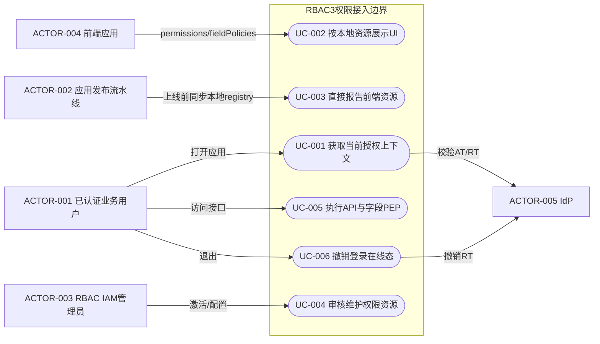
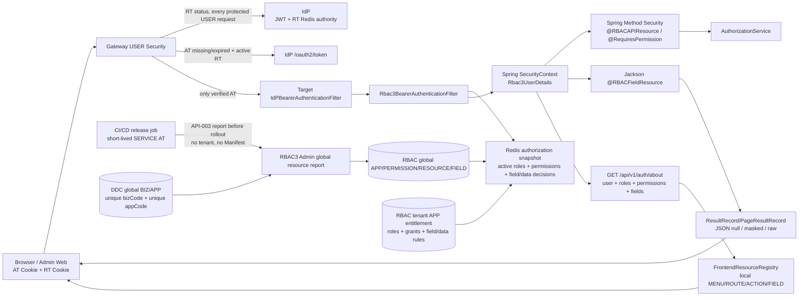
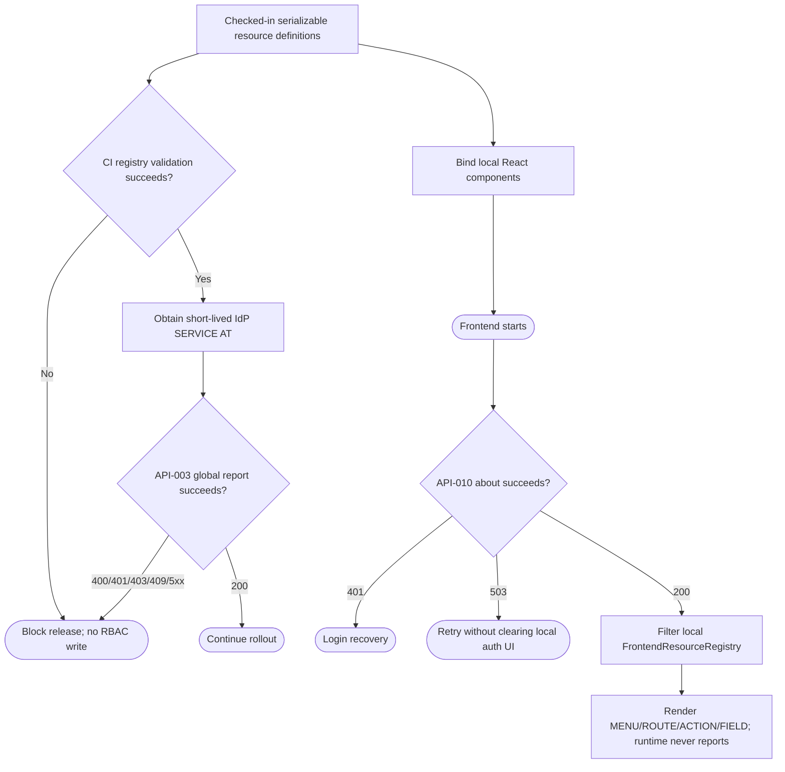
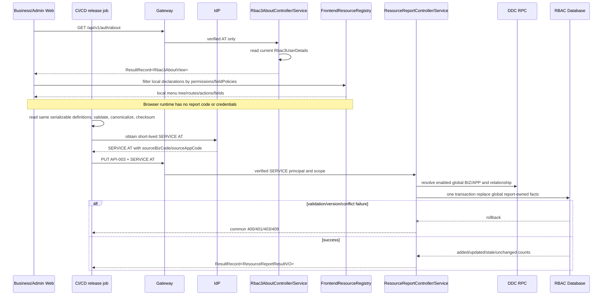
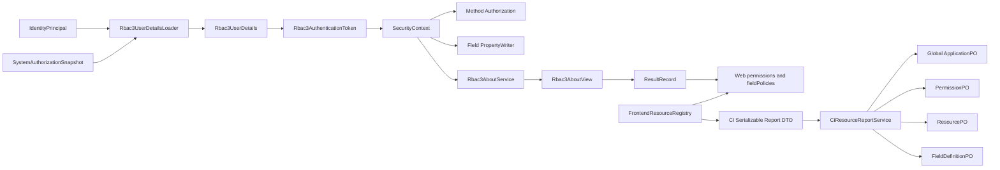
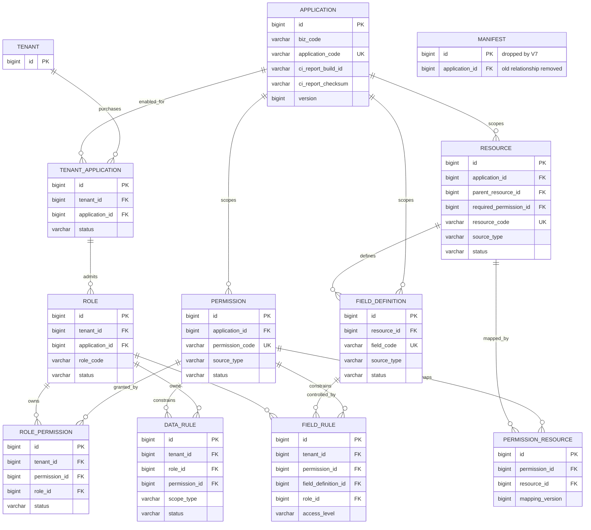

# RBAC3 注解化权限、UserDetails、字段权限与 RT 在线态改造规格

| Field | Value |
| --- | --- |
| Document | `docs/egon/spec/2026-08-17-09-37-rbac3-annotation-userdetails-field-authorization.md` |
| Template Version | `2` |
| Status | `Accepted` |
| Type | `Architecture` |
| Complexity | `Complex` |
| Complexity Drivers | `Gateway/IdP/RBAC3多模块认证授权链、CI全局资源目录上报、租户授权与资源定义解耦、角色激活缓存一致性、字段序列化安全、破坏式HTTP与数据库契约替换` |
| Created | `2026-08-17 09:37 CST` |
| Updated | `2026-08-17 15:07 CST` |
| Owner | `Mario / Egon-COLA` |
| Repository | `Egon-COLA` |
| Scope | `Gateway USER认证链、IdP RT在线校验、RBAC3 Contract/Starter/Gateway Adapter/Admin/React SDK/Admin Web、Admin Web Shared递归导航、前端本地资源注册与CI上报、全局资源目录与租户授权拆分、components/common HTTP返回契约、DDC BIZ/APP全局唯一性` |
| Source Requirement | `2026-08-17 用户确认的JWT/Spring Security/RBAC注解/UserDetails/字段权限/IAM/DDC决策，以及“前端本地知道全部资源、CI上线前只上报一次；资源目录不属于租户；bizCode/appCode各自全局唯一；不限制1MiB、不限流；不采用Manifest”的最新修订` |
| Baseline Revision | `main@a2cde2749a9b；仅本Spec为未跟踪文件（2026-08-17 15:07 CST静态扫描）` |
| Amends | [统一身份无 Session JWT 与 Gateway 自动刷新改造规格](../../superpowers/specs/2026-08-13-unified-identity-stateless-jwt-session-removal-design.md) §3 `SJ-19`、`SJ-32`、`SJ-33`，§10.1–§10.3，§12.2–§12.4，§13.1–§13.2，§17，§19.3–§19.6；[RBAC3 企业级权限平台设计](../../superpowers/specs/2026-07-30-rbac3-permission-platform-design.md) §8.3，§10.1，§15–§17，§22.1.2–§22.1.3，§26.3–§26.4，§28.3–§28.5，§30.1、§30.5–§30.6，§32 `AC-22`–`AC-25`、`AC-31`–`AC-32`；[RBAC3 Admin IAM 聚合迁移 Spec](../../../egon-cola-platforms/egon-cola-platform-rbac3/docs/iam-package-aggregation-migration-spec.md) §4.3–§4.4、§5.5–§5.6、§6.1–§6.3、§7 |
| Supersedes | `None` |
| Depends On | [统一身份无 Session JWT 与 Gateway 自动刷新改造规格](../../superpowers/specs/2026-08-13-unified-identity-stateless-jwt-session-removal-design.md) §7–§9、§11、§12.1、§12.5、§15；[RBAC3 Admin IAM 聚合迁移 Spec](../../../egon-cola-platforms/egon-cola-platform-rbac3/docs/iam-package-aggregation-migration-spec.md) §2.4、§3–§5.4 |
| Related Specs | [Gateway BIZ/APP Scope Direct RPC Design](2026-08-15-16-57-gateway-biz-app-scope-direct-rpc-design.md) |
| Related Plans | [RBAC3 注解权限、全局资源目录与无状态认证实施计划](../plan/2026-08-17-15-07-rbac3-annotation-resource-catalog-implementation.md) |

## 1. Summary

当前代码已经形成“IdP验证身份JWT，RBAC3加载授权快照，`AuthorizationService`作最终权限决定”的两段式安全链，但仍存在六个断点：Gateway只在AT缺失/过期时使用RT，撤销RT不能立刻使仍有效的Gateway请求失去登录态；RBAC3认证主体仍是`IdentityPrincipal`，Admin又二次转换为`CurrentRbac3Principal`；接口权限同时存在Starter Aspect与Admin `@PreAuthorize`两套实现；字段策略尚未成为响应序列化执行点，也缺少完整字段定义/规则CRUD页面；现有Bootstrap仍携带`apps/menus/routes/actions`，但前端自己的`FeatureRouteDescriptor`本来已经掌握route、permission、componentKey和顺序，后端重复下发资源目录没有必要；RBAC Admin仍使用自有`ApiEnvelopeVO/DirectoryPageVO`，没有复用components/common统一返回契约。

本规格选择用户确认的方案A：保留Spring Security 6 stateless Security Chain、`SecurityContext`与现有`AuthorizationService`；新增`@RBACAPIResource(code, permission, name)`并保留通用`@RequiresPermission`；RBAC3把已验证IdP身份与Redis授权快照组装为`Rbac3UserDetails`，只装入当前有效且已激活角色及权限；`@RBACFieldResource`与Jackson在响应序列化时执行`null/脱敏/原值`。前端以同一份本地`FrontendResourceRegistry`作为MENU/ROUTE/ACTION/FIELD运行展示和资源声明来源；CI/CD在上线前使用IdP签发的短期SERVICE AT，经Gateway把该应用的完整声明上报到RBAC全局资源目录。浏览器不具备上报入口，报告代码和凭据不进入Web bundle；不生成Manifest文件、不新增Manifest Processor/Starter/Node Plugin。运行时`GET /api/v1/auth/about`只返回当前用户、激活角色、权限字符、字段决策和版本，前端用这些决定过滤本地资源，不接收后端全量资源树。RBAC3 JSON HTTP接口统一使用components/common的`ResultRecord<T>`、`PageResultRecord<T>`与`PageQuery`。

资源目录和租户授权明确分层：DDC拥有全局BIZ/APP主数据，`bizCode`与`appCode`分别全局唯一；RBAC的APP/PERMISSION/RESOURCE/FIELD定义是全局服务能力，不含`tenantId`；租户是否购买/启用APP由新的`rbac3_tenant_application`事实表达，用户业务域访问、角色、角色权限和字段/数据规则仍属于租户。资源上报不会创建租户授权、角色或角色权限，也不会把`tenantId`纳入唯一键或幂等键。

Gateway 对每个“保护身份/保护业务”的 USER 请求在线调用 IdP 校验 RT；RT 缺失、过期、无效或被撤销时按未登录返回 401。AT 缺失/过期且 RT 有效时仍由 Gateway 向 IdP 刷新，AT 非过期类非法时不刷新。RT 永不转发给业务服务。该状态是 IdP 的 RT 撤销登记，不是 HTTP Session，也不新增第三种人员 Token。

## 2. Background and Current State

### 2.1 Business and user context

权限目录固定为 `USER -> ROLE -> PERMISSION`，资源层级为 `BIZ -> APP -> MENU -> ROUTE -> ACTION/API -> FIELD`。DDC 拥有 BIZ/APP 主数据；RBAC3 拥有用户的 Business 访问、Application 授权范围、角色、权限字符及 APP 内资源授权。用户需要摆脱 URL 动态规则对业务代码的约束，用方法注解表达 API 和通用方法权限，用字段注解表达响应字段权限，同时继续使用 Spring Security Chain、`SecurityContext` 和 `AuthorizationService`。

用户提供的 [RuoYi 权限源码分析](https://allendericdalexander.github.io/2026/08/16/java/ruoyi-permission-source-analysis/) 仅用于理解经典“权限字符 + 方法注解 + DataScope”的思路，不是本仓库规范依据；本规格的 Filter、Snapshot、DDC边界与字段模型均以当前 Egon-COLA 源码为准。

登录模型只有 USER AT 与 RT。AT 为 5 分钟 JWS，不包含角色、权限、数据范围或字段策略；RT 为 IdP 签发的 JWT，IdP Redis 保存摘要和有效状态。用户明确要求 Gateway 每次确认 RT 在线态，因此“撤销 RT 后 Gateway 仍放行最长 5 分钟”的旧规则在 Gateway 主链上被本规格修订；可信网络绕过 Gateway 的目标服务仍只见 AT，保留最多到 AT `exp` 的边界。

### 2.2 Repository evidence

| Evidence ID | Classification | Exact path/symbol/decision | Observed fact | Design significance | Verification limit/freshness |
| --- | --- | --- | --- | --- | --- |
| `EVD-001` | Static repository | `idp-starter/.../IdpBearerAuthenticationFilter`、`idp-core/.../IdentityPrincipal` | IdP Filter验证Bearer JWT并产出仅含身份claims的principal | JWT继续只承载非权限身份；权限由RBAC快照加载 | 源码静态证据，未启动服务 |
| `EVD-002` | Static repository | `idp-gateway-adapter/.../IdpUserCredentialRecoveryProvider` | 仅AT `MISSING/EXPIRED`时读取RT并刷新 | 有效AT请求尚未确认RT撤销状态 | 源码静态证据 |
| `EVD-003` | Static repository | `RefreshTokenStore.findValid`、`TokenSigner.verifyRefresh`、`OAuthTokenController` | IdP已拥有RT JWT验证、Redis有效态、刷新与撤销入口 | 在线RT状态校验复用IdP权威且不引入Session | 未连接Redis、未验证部署延迟 |
| `EVD-004` | Static repository | `Rbac3BearerAuthenticationFilter`、`Rbac3AuthenticationToken`、`SystemAuthorizationSnapshot` | RBAC Filter加载快照，但最终principal仍是`IdentityPrincipal` | UserDetails迁移点和缓存入口已确定 | 源码静态证据 |
| `EVD-005` | Static repository | `AuthorizationSnapshotCache`、`RedisAuthorizationSnapshotCache`、`SingleFlightSnapshotLoader` | 快照使用Redis、最长5秒JVM near-cache和single-flight | 不再创建第二套UserDetails Redis模型 | 未压测、未验证现网容量 |
| `EVD-006` | Static repository | Starter `RequiresPermission/Rbac3MethodAuthorizationAspect`；Admin `RequiresRbac3Permission/Rbac3MethodAuthorization` | 当前存在两套方法权限实现和两种USER principal投影 | 方法授权必须收敛到一个Spring Method Security决策入口 | 源码静态证据 |
| `EVD-007` | Static repository | `rbac3-admin-web/src/features/*.routes.tsx`、`RouteDescriptor.ts` | 前端route descriptor已经保存key/path/title/permission/componentKey/component/order | 前端本地代码已经知道ROUTE及展示所需事实，无需后端回传全量ROUTE | 目前MENU/ACTION/FIELD仍需扩展同一registry |
| `EVD-008` | Static repository | `rbac3-admin-web/src/app/navigation.ts` | 现有导航已经用`bootstrap.permissions`过滤本地route descriptor | 目标应补强本地递归registry，而不是反转为后端资源树驱动 | 源码静态证据 |
| `EVD-009` | Static repository | `BootstrapView`、`AuthorizationBootstrapService.current()` | Bootstrap声明apps/menus/routes/actions，但Starter当前全部填空；user/permissions/version已经存在 | 将其收敛为about最小授权上下文比补全重复资源树更直接 | 源码静态证据；IdP/RBAC消费者均需同步改名 |
| `EVD-010` | Static repository | `ResourceManifest`、`Rbac3ManifestContributor/Reporter`、`iam/resource/manifest/**` | 仓库已有Manifest contract、运行Reporter、Admin存储/激活流程 | 最新用户决定要求移除这套生命周期和三个拟新增模块 | 源码静态证据，不代表已有流程运行时已接通 |
| `EVD-011` | Static repository | `V1__create_rbac3_schema.sql` `rbac3_resource_manifest`及相关FK/trigger | Schema把application/resource/field_definition与Manifest强关联 | 无Manifest设计需要一个新的V7解除FK/列/trigger并改为直接报告来源 | 未连接PostgreSQL，真实数据量/锁耗时未知；用户允许不迁旧数据 |
| `EVD-012` | Static repository | 同一V1 `rbac3_resource`、`rbac3_permission`、`rbac3_field_definition`、`rbac3_field_rule` | 已有资源、权限、字段定义和字段规则事实表 | CI报告可在V7全局化后复用这些表，不新建报告/清单表 | 源码静态证据 |
| `EVD-013` | Static repository | `FieldGuard.tsx`、`types.ts`、`SensitiveStrategyRegistry` | 前端已有fieldPolicies消费，common已有Jackson脱敏策略 | 字段显示继续由本地field code+about决策，后端序列化复用现有策略 | 源码静态证据 |
| `EVD-014` | Static repository | common core `ResultRecord`、`PageResultRecord`、`PageQuery` | 公共成功/分页/trace契约已经存在 | RBAC不得保留平行ApiEnvelope/Page VO | 源码静态证据 |
| `EVD-015` | Static repository | RBAC `ApiEnvelopeVO`、`DirectoryPageVO`、`Rbac3ErrorResponse` | RBAC仍有重复HTTP封装 | 破坏式更新一次迁移到common types | 源码静态证据 |
| `EVD-016` | Static repository | DDC `DdcBizController/DdcAppController`与IAM迁移Spec | BIZ/APP主数据由DDC管理，RBAC只持授权范围 | CI报告只能引用已存在且启用的APP，不能创建BIZ/APP | 源码与前置Spec静态证据 |
| `EVD-017` | User decision | “前端不需要知道总共有哪些；前端自己代码里写的路由；前端只需要上报” | 本地前端registry是运行展示的资源权威，about不回传MENU/ROUTE/ACTION目录 | 直接替换先前后端树投影结论 | 适用于前端资源；API方法仍由后端注解声明 |
| `EVD-018` | User decision | “manifest我不喜欢，弄一个about接口” | 不创建Manifest Processor/Registration Starter/Node Plugin；运行端点改为about | 删除Manifest生命周期和相关页面/API/表 | 破坏式更新已被用户允许 |
| `EVD-019` | Static repository | DDC V5 `uk_ddc_biz_code`、V7 `uk_ddc_app_biz_code`、`DdcAppService.save()` | `biz_code`已经全局唯一；`app_code`当前只在`(biz_code,app_code)`内唯一，Service也按组合判断 | 新DDC V9必须恢复`app_code`单列唯一并同步Repository/Service校验 | 未连接PostgreSQL/SQLite；以迁移和源码静态证据为准 |
| `EVD-020` | Static repository | RBAC V1 `rbac3_application/resource/permission/field_definition`及V6 APP scope迁移 | 当前资源目录事实全部带`tenant_id`，V6又将Application定义为`(tenant_id,ddc_application_id)` | 只改HTTP参数无法满足全局目录；V7必须拆出租户APP授权并把目录事实全局化 | 用户允许破坏式空数据迁移；未证明生产数据量 |
| `EVD-021` | User decision | “资源上报和tenantId没什么关系；不同租户统一服务，只是租户买没买；唯一索引不加tenantId” | 资源定义是平台全局事实，租户只持购买/启用和角色授权 | 覆盖先前浏览器USER+tenant report设计 | 明确决策，无待确认项 |
| `EVD-022` | User decision | “不考虑1mb；不需要限流；上线之前在流水线中发布维护” | 报告由CI/CD SERVICE身份显式执行；不设总体payload字节上限或应用限流 | 移除浏览器同步按钮、1MiB限制、6次/分钟限制 | 常规网关/服务器基础防护仍适用，不是本业务接口特设策略 |
| `EVD-023` | User decision | “bizcode、appcode一般唯一；加单独唯一约束，重复就换code加前后缀” | `biz_code`和`app_code`各自建立数据库单列唯一约束 | DDC APP查询和创建校验从组合唯一改为全局唯一 | 破坏式更新，不兼容重复历史code |

以上是源代码和配置静态证据；本次未启动服务、未连接 Redis/PostgreSQL、未证明现网拓扑。

### 2.3 Problem statement and gap

1. 撤销 RT 后，有效 AT 通过 Gateway 仍会被当成已登录，和用户最新“RT 决定登录在线态”的规则不一致。
2. `SecurityContext` 的最终 principal 不是 UserDetails，Admin 又创建第三种 principal，导致角色/权限装配、当前用户读取和 Controller 签名分散。
3. API 资源声明、通用方法权限、资源注册互相耦合；当前两个方法授权实现容易产生覆盖差异。
4. 现有Manifest把“代码资源发现、提交历史、审核激活、运行展示”绑在一套较重生命周期中；用户现在要求CI/CD在发布前直接报告前端本地定义，不生成或保存Manifest。
5. FIELD 有持久模型和 Bootstrap 决策，但服务响应仍可能输出未经字段权限处理的值；Admin Web也没有完整 CRUD。
6. 数据规则存在，但用户尚未确认查询改写语义，不能借字段改造顺便引入 `@DataScope`。
7. 前端已经知道ROUTE和permission，却被设计成等待后端回传资源树；正确缺口是把本地声明扩展为MENU/ROUTE/ACTION/FIELD统一registry，并只从about取得当前用户权限。
8. RBAC成功、分页、错误返回仍使用自有包装，前端 client也只理解 `ApiEnvelope.data`，与 components/common的公共契约重复。
9. 当前RBAC Application/Permission/Resource/FieldDefinition均按tenant复制，既不符合“统一服务目录”的业务语义，也让资源上报错误依赖tenant；租户购买/启用APP缺少独立事实表。
10. DDC `biz_code`已全局唯一，但V7把`app_code`放宽为业务域内唯一，和本次全局唯一约束不一致。

### 2.4 Evidence and current-chain map

| Entry/trigger | Current call chain | Data read/written | External dependency | Consumers | Evidence |
| --- | --- | --- | --- | --- | --- |
| 登录后前端初始化 | `Rbac3ApiClient.getBootstrap -> GET /api/v1/auth/bootstrap -> AuthorizationBootstrapService.current` | 读SecurityContext/授权快照；当前资源/字段返回空 | Gateway/IdP/RBAC snapshot | IdP Admin Web、RBAC Admin Web、React SDK | `EVD-004`,`EVD-009` |
| 当前前端导航 | `applicationRouteDescriptors -> visibleNavigation -> permissions.includes` | 读前端静态descriptor和Bootstrap permission | None | `router.tsx`、EnterpriseLayout | `EVD-007`,`EVD-008` |
| 当前Manifest提交/激活 | `ManifestController -> ManifestFacade -> JpaResourceManifestRepository` | 写`rbac3_resource_manifest/resource/permission_resource/field_definition` | DDC/Gateway校验 | ManifestDetailPage、Admin API client | `EVD-010`–`EVD-012` |
| 目标CI资源报告 | `FrontendResourceRegistry JSON -> CI report script -> Gateway SERVICE auth -> ResourceReportController/Service/Repository` | 直接事务写全局application/resource/permission/field_definition；不写Manifest或tenant授权 | Gateway认证、IdP SERVICE AT、DDC BIZ/APP只读校验 | 发布流水线 | `EVD-007`,`EVD-016`–`EVD-023` |
| 目标运行展示 | `GET /api/v1/auth/about -> Rbac3AboutService -> permissions/fieldPolicies -> local registry filters` | 只读SecurityContext与授权快照；不读取/返回资源总表 | Gateway/IdP/RBAC snapshot | 每个接入RBAC React前端 | `EVD-004`,`EVD-007`–`EVD-009`,`EVD-017` |

## 3. Goals and Non-goals

### 3.1 Goals

- 让 Gateway 对每个受保护 USER 请求确认 RT 的 IdP 在线状态，并保持 AT 自动刷新、RT 不下传和服务侧 AT 二次校验。
- 用一个 `Rbac3UserDetails` 统一可信身份、最小 RBAC User、有效激活角色、权限与授权版本，存入 Spring `SecurityContext`。
- 收敛为 `@RBACAPIResource` 与 `@RequiresPermission` 两种方法级声明，共用一个 Spring Method Security 决策器和现有 `AuthorizationService`。
- 用 `@RBACFieldResource` + Jackson 实现响应字段 `null/脱敏/原值`，并给 React 提供 `getField(code)` 列控制。
- 补齐 Permission、Resource、FieldDefinition、FieldRule 的后端 CRUD、管理前端与权限字符。
- 以一个前端本地`FrontendResourceRegistry`统一声明MENU/ROUTE/ACTION/FIELD；运行时用about权限过滤本地树、路由、按钮和字段，未授权深链路fail closed。
- 统一 RBAC3 HTTP接口的成功、分页与错误返回体，复用 components/common 的 `ResultRecord<T>`、`PageResultRecord<T>`、`PageQuery`和 `PageMetaRecord`。
- CI/CD在上线前向RBAC报告同一registry的资源定义；报告经过SERVICE认证、专用scope、BIZ/APP身份绑定、版本/checksum校验，且绝不自动修改租户购买、角色或角色权限。
- 删除Manifest contract、存储、激活、页面和拟新增Processor/Registration Starter/Node Plugin，以直接报告替代。
- 保持 DDC BIZ/APP 主数据与 RBAC 授权事实的既定所有权；`bizCode`和`appCode`分别全局唯一。
- 把RBAC全局资源定义和租户购买/启用、角色授权明确拆分；资源上报及目录唯一键不含`tenantId`。

### 3.2 Non-goals

- 不新增 Session、SSO Session、第三种 USER Token、权限 JWT或业务域 JWT。
- 不把角色、权限、数据或字段策略写入 AT/RT。
- 不开发账号冻结或完整用户中台；不把密码和核心用户资料搬回 RBAC。
- 不实现 `@DataScope`、SQL/JPA/MyBatis 查询改写、写数据行过滤、导出范围或行级策略自动执行。
- 字段权限不处理请求反序列化、写字段校验、查询条件、排序、导出和数据库加密。
- 不让 RBAC 接管 DDC BIZ/APP CRUD，也不从 RBAC 直接访问 DDC 数据库。
- 不用动态 URL 规则替代方法注解；Gateway 的外围 Route/API 策略仍保留，但服务方法注解是最终 PEP。
- 不建立通用规则引擎、工作流审批或新的 DDD/COLA 包迁移。
- 不从后端下发MENU/ROUTE/ACTION资源树、可执行JavaScript、远程组件URL或任意动态import；路由/component只来自前端本地registry。
- 不让浏览器或普通USER报告资源，不提供前端同步按钮，不把SERVICE凭据或报告实现打入Web bundle。
- 不为报告接口增加1MiB总体请求体上限或业务限流；仍执行结构、字符串长度、code唯一、引用关系和checksum等正确性校验。

## 4. Requirements and Acceptance Criteria

| ID | Atomic requirement | Priority | Observable acceptance criteria | Source |
| --- | --- | --- | --- | --- |
| `REQ-001` | Gateway 在线校验每个受保护 USER 请求的 RT | Must | AT 有效但 RT 缺失/过期/撤销/主体不一致时返回 401并清认证 Cookie；IdP 收到一次状态校验 | “gateway 校验rt，如果idp撤销了rt就默认未登录” |
| `REQ-002` | 保持 AT 自动刷新状态机 | Must | AT 缺失/过期且 RT 有效时同一原请求刷新、验证新 AT、继续路由；非过期非法 AT不刷新 | 已确认 JWT/Gateway 方案 |
| `REQ-003` | 开放协议和 SERVICE 请求不错误要求 USER RT | Must | 登录、刷新、撤销、退出、JWKS/元数据按精确策略开放；SERVICE AT链不读 USER RT | 用户确认 IdP 登录/刷新开放及机器边界 |
| `REQ-004` | API 注解和通用权限注解采用方案 A | Must | `@RBACAPIResource(code,permission,name)` 只声明 API；`@RequiresPermission` 可用于 Controller/Service方法/类型；二者均返回一致 403 | “一种是给API，一种通用的。方案A” |
| `REQ-005` | 保留 Spring Security Chain 与 AuthorizationService | Must | IdP Filter先验签，RBAC Filter后装配，Spring Method Security调用 `AuthorizationService`；不存在 Controller URL 动态权限表驱动 Filter | 原始需求确认 |
| `REQ-006` | 将 USER principal 迁移到 UserDetails并复用 Redis授权缓存 | Must | `SecurityContext.getAuthentication().getPrincipal()` 是 `Rbac3UserDetails`；包含身份、RBAC user、激活角色、权限、版本；缓存键仍为 `(systemCode,tenantId,identitySub)` | “迁移到 userdetails吧，弄个redis缓存…权限组装好” |
| `REQ-007` | 只有当前有效且已激活角色进入 UserDetails/快照 | Must | 未激活、禁用、过期、越权 BIZ/APP角色及权限均不可见；激活变更使缓存失效 | 用户对 active role 的既定说明 |
| `REQ-008` | USER Controller 不显式注入 Principal | Must | 本次涉及的 IdP/RBAC USER Controller 方法参数中无 `@AuthenticationPrincipal IdentityPrincipal/CurrentRbac3Principal/Rbac3UserDetails`；Service通过当前用户访问器取得 actor/tenant；内部机器 Controller 的 `ServiceIdentityPrincipal` 不受影响 | “不要在controller 入参数显示注入” |
| `REQ-009` | 字段权限只在响应序列化和前端列展示执行 | Must | `NONE/未定义` 输出 JSON `null`；`MASKED_READ` 输出脱敏值；`READ/WRITE` 输出原值；请求反序列化不受影响 | 用户第4项确认 |
| `REQ-010` | 提供字段定义与字段规则 CRUD | Must | 后端有完整list/detail/create/update/delete/status；Admin Web可维护MANUAL/CI_REPORT来源，报告不得覆盖已配置的敏感级别和脱敏策略 | “字段权限的crud控制也要有” |
| `REQ-011` | 前端可按 field code 控制列/字段展示 | Must | SDK `getField(code)`/hook返回访问级别；`NONE` 隐藏列，`MASKED_READ` 保留列且显示服务端脱敏值 | 用户第4项确认 |
| `REQ-012` | DataRule 保留 CRUD和决策契约但不自动执行 | Must | 数据规则可管理并进入 snapshot/`decideDataScope`；仓库不存在新 `@DataScope` 或查询改写器 | 用户第5项确认 |
| `REQ-013` | 前端本地registry是MENU/ROUTE/ACTION/FIELD展示的唯一资源来源 | Must | 同一registry同时生成递归导航、React routes、ActionGuard和FieldGuard输入；运行时不读取后端资源目录 | “前端自己代码里写的路由，自己不知道有多少吗” |
| `REQ-014` | CI/CD直接报告本地资源定义且不使用Manifest | Must | 发布流水线使用短期SERVICE AT把当前APP registry通过一个HTTP请求报告给RBAC；浏览器无报告入口；没有Manifest文件、表、版本激活页或三个新增模块 | “前端只需要上报”“上线之前在流水线中发布维护”“manifest我不喜欢” |
| `REQ-015` | 资源报告防越权、全局幂等且不自动赋权 | Must | Gateway验证SERVICE AT/scope；principal中的sourceBizCode/sourceAppCode匹配path并经DDC确认；同app+buildId+checksum重复成功且无二次写；新permission/resource/field待校验；租户授权及`rbac3_role_permission`零变化 | “资源上报和tenantId没关系”及既定“不自动授予角色权限” |
| `REQ-016` | DDC/RBAC BIZ/APP边界保持 | Must | DDC CRUD全局主数据；RBAC RPC只读；RBAC分别维护全局APP资源目录、UserBusinessAccess、TenantApplication购买/启用与APP内租户角色权限 | 用户第7项确认及最新全局目录决策 |
| `REQ-017` | RBAC User保持最小，IdP信息只读补全，Department为 OrgUnit(DEPT) | Must | RBAC不新增密码/profile列；列表通过 IdP只读契约补显示；部门不建第二张实体表 | 用户第8项确认及既定模型 |
| `REQ-018` | 退出只撤销 RT且 Gateway主链立即失去登录态 | Must | `/oauth2/logout`/revoke后下一个 Gateway受保护请求 401；绕过 Gateway 的有效 AT只到原 `exp`；无 Session记录 | 最新规则与无状态目标 |
| `REQ-019` | RBAC管理端补齐权限资源基础 CRUD并统一 IAM URL/页面 | Must | Permission、Resource、FieldDefinition、FieldRule及角色绑定权限均走 `/api/rbac3/v1/iam/**`；Admin Web走 `/iam/**`且无旧路由 fallback | 已批准 IAM迁移 + 当前大需求 |
| `REQ-020` | About只返回当前用户授权上下文，不返回资源总表 | Must | `GET /api/v1/auth/about`返回user、currentApplication、activeRoles、permissions、fieldPolicies、landingRouteCode、authVersion/policyVersion；JSON中不存在apps/menus/routes/actions/navigationTree | “弄一个about接口”“前端不需要知道总共有哪些” |
| `REQ-021` | 前端按本地MENU/ROUTE声明和about permission控制导航、路由和深链路 | Must | MENU递归保留至少一个可见后代；ROUTE permission存在才注册/访问；hidden route不进菜单但授权深链可访问；未授权本地route进入403 | “前端如何实现ROUTE、MENU是否展示”+最新本地资源决定 |
| `REQ-022` | 前端按本地ACTION/FIELD声明和about决策控制展示 | Must | ACTION声明permission不在about permissions时不渲染；FIELD未知/NONE隐藏，MASKED_READ展示服务端脱敏值；后端API/字段PEP独立执行 | “前端如何实现ACTION、FIELD是否展示”+最新本地资源决定 |
| `REQ-023` | RBAC3 HTTP接口统一复用 components/common返回与分页类型 | Must | RBAC3 JSON REST的单体/有限列表使用 `ResultRecord<T>`，分页列表使用 `PageResultRecord<T>`并接收 `PageQuery`；删除 `ApiEnvelopeVO/DirectoryPageVO/Rbac3ErrorResponse`及前端旧解析；OAuth协议与 RPC消息保持各自标准 | “所有接口返回的Result和PageResult，使用components下的 common组件下的内容” |
| `REQ-024` | 破坏式移除现有Manifest能力 | Must | `ResourceManifest` contract、Starter Contributor/Reporter、Admin manifest包/API、ManifestDetailPage/route和`rbac3_resource_manifest`表均不存在；V1–V6不修改，只新增一个V7 | “manifest我不喜欢”+允许破坏式更新 |
| `REQ-025` | `bizCode`与`appCode`分别全局唯一 | Must | DDC数据库分别存在`biz_code`和`app_code`单列唯一约束；创建/更新/查询不再允许不同BIZ复用同一appCode；冲突返回稳定409 | “对bizcode和appcode加单独唯一约束；重复就换code” |
| `REQ-026` | 全局资源目录与租户授权解耦 | Must | RBAC application/permission/resource/field_definition及其报告幂等键不含tenantId；新`rbac3_tenant_application`唯一键为`(tenant_id,application_id)`；角色授权前必须校验租户已启用该APP | “资源上报和tenantId没关系；租户买没买，我给租户对应权限” |

### 4.1 Scenario matrix

| Scenario | Actor/trigger | Preconditions | Main path | Alternative/failure path | Data/state change | Observable result | Requirements |
| --- | --- | --- | --- | --- | --- | --- | --- |
| 普通用户初始化前端 | USER打开已接入RBAC的Web | AT/RT有效，当前APP有激活角色 | Gateway校验RT/AT -> about -> 前端以permissions/fieldPolicies过滤本地registry | 无权限时返回空权限集合；RT失效401；RBAC不可用503 | 只读快照/cache | 只显示本地且获权MENU/ROUTE/ACTION/FIELD | `REQ-001`–`REQ-007`,`REQ-013`,`REQ-020`–`REQ-023` |
| 未授权深链访问 | USER直接输入本地ROUTE URL | 本地registry存在该route但about无permission | `RouteAccessGuard`拒绝，不调用页面业务接口 | about尚未完成先保持loading；未知本地URL走404 | 无写入 | 403 denied页面且无受保护内容闪现 | `REQ-021` |
| 字段NONE/MASKED/READ | USER请求带`@RBACFieldResource`响应 | UserDetails有fieldPolicies | Jackson按决策输出null/脱敏/原值；前端按同field code隐藏/展示 | 决策缺失或异常按NONE；脱敏策略异常不回退原值 | 无业务数据写入 | 网络响应和UI均不泄漏禁止字段 | `REQ-009`–`REQ-011`,`REQ-022` |
| CI/CD上线前报告资源 | 发布流水线完成前端声明校验并取得短期SERVICE AT | registry有效；DDC BIZ/APP存在启用；principal source codes与目标一致 | CI规范化registry -> checksum -> Gateway -> RBAC单事务replace全局report-owned facts | scope/source code/DDC/graph/checksum不符整体拒绝；MANUAL冲突不覆盖 | 全局application/resource/permission/field_definition及映射更新 | ResultRecord返回added/updated/stale/unchanged；无Manifest、无tenant写入 | `REQ-013`–`REQ-016`,`REQ-024`–`REQ-026` |
| 浏览器USER或伪造SERVICE报告 | USER调用报告端点或SERVICE冒充其他APP | AT类型/scope/source APP不满足 | Gateway/Method Security先拒绝，再进入业务写入前终止 | 未认证401；错误主体/scope/source APP 403；checksum/shape无效400 | 零写入 | 稳定common错误且不泄漏其他APP目录 | `REQ-014`,`REQ-015`,`REQ-023`,`REQ-026` |
| 重复/并发报告 | 同一全局APP、同buildId/checksum重复或两个流水线并发 | SERVICE报告身份有效 | 相同checksum返回幂等成功；不同checksum按全局application行/version串行 | 同buildId不同checksum或expectedVersion竞争返回409 | 最多一个全局目录版本可见；无重复resource key | 可安全重试，不产生TenantApplication或RolePermission写入 | `REQ-015`,`REQ-023`,`REQ-026` |
| 管理员审核报告结果 | IAM管理员打开Resource/Field CRUD | 有resource/permission/field管理权限 | 查看CI_REPORT来源PENDING项，补字段安全配置并激活/禁用 | 版本冲突409；非法父链/permission拒绝 | 单资源/字段状态和版本变化，触发授权快照失效 | 后续about权限/fieldPolicies按新版本刷新 | `REQ-010`,`REQ-019`,`REQ-024` |
| 退出/RT撤销 | USER退出或管理员撤销RT | RT仍在IdP registry | IdP撤销RT；下次Gateway保护请求在线校验失败 | IdP不可用返回503且不伪装退出 | 仅RT有效态变化 | 下次请求401；直连服务AT最多到exp | `REQ-001`–`REQ-003`,`REQ-018` |

### 4.2 Use-case analysis

#### 4.2.1 Actor inventory

| Actor ID | Actor/role | Goal and responsibility | Entry/channel | Permission/tenant context | Evidence |
| --- | --- | --- | --- | --- | --- |
| `ACTOR-001` | 已认证业务用户 | 访问本人获权页面、操作和字段 | Gateway后的业务/Admin Web | USER AT+RT；当前tenant/app；激活角色 | `EVD-001`–`EVD-005`,`EVD-009` |
| `ACTOR-002` | 应用发布流水线 | 上线前将当前前端本地registry同步到RBAC全局目录 | CI脚本经Gateway调用报告API | IdP短期SERVICE AT；scope=`rbac3:resource-catalog:report`；sourceBizCode/sourceAppCode绑定目标 | 用户最新决定`EVD-017`–`EVD-023` |
| `ACTOR-003` | RBAC IAM管理员 | 审核、补充和维护Permission/Resource/FieldRule | RBAC Admin Web `/iam/**` | 对应`system:*`管理权限与tenant | 现有IAM Controller/Web页面 |
| `ACTOR-004` | 前端应用 | 持有本地MENU/ROUTE/ACTION/FIELD声明并执行UX过滤 | React SDK/本地registry | 不拥有授权；只消费about | `EVD-007`,`EVD-008`,`EVD-017` |
| `ACTOR-005` | IdP | 签发/验证AT和维护RT在线态 | Gateway内部状态/刷新调用 | IdP权威identity/token store | `EVD-001`–`EVD-003` |

#### 4.2.2 Use-case artifact



| ID | Use case/goal | Primary actor | Trigger/preconditions | Main success outcome | Alternatives/failures | Postconditions | Requirements | Interfaces/pages | Tests |
| --- | --- | --- | --- | --- | --- | --- | --- | --- | --- |
| `UC-001` | 获取当前授权上下文 | `ACTOR-001` | 应用初始化；AT/RT有效；当前app已接RBAC | about返回用户、激活角色、permission、fieldPolicies和版本，不返回资源目录 | 401登录恢复；403无基础访问；503可重试 | 无写入；前端得到一次一致权限视图 | `REQ-001`–`REQ-008`,`REQ-020`,`REQ-023` | `API-010` | `TEST-001`–`TEST-006`,`TEST-020` |
| `UC-002` | 按本地资源展示UI | `ACTOR-004` | about READY；本地registry通过静态校验 | 本地递归MENU/ROUTE、ACTION和FIELD按权限正确展示 | 无permission/未知field隐藏；未授权深链403 | 不改变RBAC状态 | `REQ-011`,`REQ-013`,`REQ-021`,`REQ-022` | RuntimeNavigation/Guards | `TEST-009`,`TEST-016`–`TEST-018` |
| `UC-003` | CI直接报告前端资源 | `ACTOR-002` | SERVICE scope/source BIZ+APP、DDC状态与build/checksum有效 | 一个事务replace全局报告来源资源并返回差异统计 | USER主体/无scope/冒充APP/非法树/并发版本冲突均零写入 | 全局目录更新；TenantApplication/RolePermission不变 | `REQ-013`–`REQ-016`,`REQ-024`–`REQ-026` | `API-003` | `TEST-011`–`TEST-013`,`TEST-019`,`TEST-022` |
| `UC-004` | 审核维护权限资源 | `ACTOR-003` | 管理权限和tenant/app上下文有效 | 管理员补全field安全属性、激活或禁用报告项、绑定role permission | MANUAL/REPORT来源冲突、版本冲突和非法状态被拒绝 | 目录/规则版本推进并失效授权快照 | `REQ-010`,`REQ-019`,`REQ-023`,`REQ-024` | IAM CRUD（Depends On）+ `API-003`、`API-011`、`/iam/**` | `TEST-008`,`TEST-015`,`TEST-019` |
| `UC-005` | 执行API与字段PEP | `ACTOR-001` | 目标方法/字段有注解且SecurityContext可用 | Method Security通过`AuthorizationService`决定；Jackson按field decision输出 | 未认证401；无权限403；字段异常null fail closed | 无未授权方法执行或字段泄漏 | `REQ-004`–`REQ-012`,`REQ-022` | annotations/internal contracts | `TEST-004`–`TEST-010` |
| `UC-006` | 撤销登录在线态 | `ACTOR-001` | RT存在或已撤销 | IdP删除/撤销RT，Gateway下次保护请求拒绝 | IdP故障503且不清Cookie | 无Session；直连AT仅到exp | `REQ-001`–`REQ-003`,`REQ-018` | logout/revoke/RT validate | `TEST-001`–`TEST-003` |

## 5. Constraints, Assumptions, and Decisions

### 5.1 Confirmed constraints

- USER Token 固定只有 AT 与 RT；AT 5分钟；IdP 为唯一签发、验证和撤销权威。
- Gateway/业务服务不保存人员 Session；RT 只在 Gateway/IdP边界流转，业务服务只接收 AT。
- 权限事实不进入 JWT；RBAC3按系统、租户、主体加载授权快照。
- 破坏式更新允许不兼容旧 URL/旧缓存/旧 DTO，但现有 Flyway V1–V6不可修改。
- DDC拥有 BIZ/APP主数据；RBAC拥有授权。
- FIELD独立于 `ResourceTypeEnum`；Department继续使用 `OrgUnit.unitType=DEPT`。
- MENU/ROUTE树由前端本地registry的`parentCode/order`组装；RBAC数据库只保存上报目录供管理和绑定，不作为运行时前端导航源。
- 用户所称 `Result`、`PageResult`以仓库真实公共类型 `top.egon.cola.component.common.core.pojo.ResultRecord`、`PageResultRecord`为准，不新建同名别名。
- 资源报告只由CI/CD使用短期SERVICE AT发起；浏览器不包含报告入口、报告代码、SERVICE凭据、AT/RT明文或其他secret。
- 全局资源目录不属于tenant；租户购买/启用APP和角色授权单独建模。报告请求、目录唯一键和报告幂等键均不含`tenantId`。
- `bizCode`、`appCode`分别全局唯一；不同团队发生code冲突时通过业务可读前缀/后缀改code，不放宽唯一性。
- 报告接口不设置1MiB总体payload上限和业务限流；它是上线前低频维护动作，不在服务启动或浏览器运行时批量触发。

### 5.2 Small-gap assumptions

| ID | Inference | Repository evidence | Why locally reversible | Impact if wrong |
| --- | --- | --- | --- | --- |
| `ASM-001` | “每次校验 RT”只适用于 Gateway分类为保护身份/保护业务的 USER请求 | 现有精确 `IdpEndpointAuthenticationPolicy` 与 predecessor `SJ-43` | 仅策略映射，不改 Token契约 | 若用户要求登录/JWKS也带 RT，会造成认证死锁 |
| `ASM-002` | IdP RT校验超时/5xx返回 503且不清 Cookie；确定无效才返回 401并清 Cookie | 当前 Gateway 区分 credential failure 与 provider failure | 可调整错误映射，不改持久模型 | 若一律401，IdP故障会造成大规模假退出 |
| `ASM-003` | Redis缓存的是不可变授权快照，`Rbac3UserDetails`每请求由已验证 IdentityPrincipal + 快照组装 | 已有 Snapshot Cache包含版本/过期；AT `jti/exp/acr`逐请求不同 | 内部组装方式，可替换 | 直接缓存 UserDetails会带入旧 AT身份上下文 |
| `ASM-004` | “Controller不显式注入”覆盖本次 IdP/RBAC USER主体；内部 SERVICE端点可继续注入 `ServiceIdentityPrincipal` | UserDetails迁移只针对 USER；机器主体不是人员角色权限 | 仅 Controller签名范围 | 若也禁止 SERVICE注入，需另增机器访问器但不改变权限模型 |
| `ASM-005` | CI通过既有IdP Client Credentials流程取得短期SERVICE AT，凭据只以流水线secret/environment注入报告进程 | Gateway/IdP已有SERVICE principal及`sourceBizCode/sourceAppCode`；前端bundle不能安全保存机器凭据 | CI取token步骤可适配具体平台，不改变RBAC报告契约 | 若某流水线无法取得SERVICE AT，只阻塞发布前上报，不得降级为浏览器USER上报 |
| `ASM-006` | “所有接口使用 Result/PageResult”覆盖本规格内 RBAC3 JSON REST与 IdP内部 JSON端点；标准 OAuth token/error、RPC protobuf和未来二进制/流式响应不套业务 envelope | `/oauth2/token`已有 OAuth响应，IdentityDirectory为 protobuf；强行包装会破坏协议消费者 | 仅明确 allowlist边界，不改变业务模型 | 若用户要求连 OAuth也包装，将不再兼容标准 token endpoint |
| `ASM-007` | ROUTE允许以ROUTE为父形成嵌套路由；ACTION通过`routeCode`关联ROUTE；FIELD由本地field code关联about fieldPolicies | 用户明确“路由可能是tree状”；前端descriptor可扩展parent/children | 本地schema校验可收紧，无后端公共契约变化 | 若ROUTE不得嵌套，只需调整registry validator |

### 5.3 Resolved decisions

| ID | Decision | Decision owner | Evidence and rationale | Requirements |
| --- | --- | --- | --- | --- |
| `DEC-001` | Gateway对保护 USER请求无正向 RT状态缓存，逐请求在线校验 IdP | User | 只有这样撤销才能在下一请求生效 | `REQ-001`,`REQ-018` |
| `DEC-002` | 采用两注解方案 A，统一落到 Spring Method Security + AuthorizationService | User | API目录声明与通用方法授权职责不同，但决定引擎应唯一 | `REQ-004`,`REQ-005` |
| `DEC-003` | 最终 USER principal 为 `Rbac3UserDetails`；不采用 DAO密码认证，也不把 UserDetails写入 Redis | User + 本规格 | JWT已认证身份；Redis只缓存授权事实更安全 | `REQ-006`–`REQ-008` |
| `DEC-004` | 字段权限只做响应/前端展示；默认 fail closed为 JSON null | User | 避免未决的数据查询/写入语义扩大 | `REQ-009`–`REQ-012` |
| `DEC-005` | 不创建Manifest Processor、Registration Starter或Node Plugin；本地registry导出可序列化定义，由独立CI脚本直接构造报告请求 | User | 前端已经知道本地资源，额外生成sidecar和模块没有运行价值；CI脚本不进入bundle | `REQ-013`,`REQ-014`,`REQ-024` |
| `DEC-006` | CI报告的新permission/resource/field进入待校验状态，永不修改TenantApplication/RolePermission；已激活报告来源只允许安全元数据replace | User +既定安全决策 | 即使流水线payload错误也不能直接给租户或角色赋权 | `REQ-014`,`REQ-015`,`REQ-026` |
| `DEC-007` | BIZ/APP主数据继续由 DDC管理；RBAC保存全局APP资源目录，并把租户APP购买/启用与APP内角色权限分开保存 | User | 符合“统一服务目录、租户只决定买没买和给什么权限” | `REQ-016`,`REQ-026` |
| `DEC-008` | 不新增 Department实体；RBAC User继续最小字段，IdP只读补全 | User | 避免身份双写和组织模型重复 | `REQ-017` |
| `DEC-009` | `BootstrapView`破坏式改名/收敛为`Rbac3AboutView`，不再包含apps/menus/routes/actions | User | 前端本地registry知道资源；后端只需返回当前用户授权事实 | `REQ-020`–`REQ-022` |
| `DEC-010` | 前端展示只使用“本地资源声明 + about permissions/fieldPolicies” | User | 消除同一资源在后端树与本地route表的双重运行来源 | `REQ-013`,`REQ-020`–`REQ-022` |
| `DEC-011` | RBAC自有 HTTP envelope/page/error类型一次性删除，common core为唯一 JSON envelope权威 | User | 破坏式更新已允许；并行保留会继续造成客户端分支 | `REQ-023` |
| `DEC-012` | Manifest contract/API/page/table整体由直接报告替换 | User | 最新明确“不喜欢Manifest”；允许破坏式更新且无需保旧数据 | `REQ-014`,`REQ-024` |
| `DEC-013` | `bizCode`与`appCode`分别采用全局单列唯一约束 | User | code冲突通过前后缀解决；不以BIZ或tenant放宽唯一性 | `REQ-025` |
| `DEC-014` | CI报告不带tenant，不设1MiB总体大小限制和业务限流 | User | 报告是上线前低频维护动作；结构和引用校验足以保证业务正确性 | `REQ-014`,`REQ-015`,`REQ-026` |

### 5.4 Open major decisions

N/A。用户已经批量确认本规格所需的认证、注解、UserDetails、字段、数据权限、注册安全、DDC所有权和用户模型决策；实现细节均受现有仓库约束，可在 Plan中拆解而不改变外部语义。

## 6. Project Technology Context

| Concern | Current choice | Repository evidence | Constraint on design |
| --- | --- | --- | --- |
| Language/runtime | Java 21 | `egon-cola-platforms/pom.xml` `java.version=21` | 可使用 record/sealed等现有语法，不改变版本 |
| Framework | Spring Boot 3.5.16 / Spring Security 6 | platform BOM与各 starter Security配置 | 使用 `AuthorizationManagerBeforeMethodInterceptor`/`@EnableMethodSecurity`，保持 stateless chain |
| Build | Maven多模块；Web使用Vite | `rbac3/pom.xml`、Admin Web `package.json` | 不新增资源注册模块或构建插件；流水线调用Web包内独立Node脚本，脚本和secret不进入Vite入口图 |
| Persistence | Spring Data JPA/Hibernate + PostgreSQL | `rbac3-admin/pom.xml`、PO/Repository | 复用现有 PO与事务服务，不新增第二 ORM模型 |
| Migration | Flyway；RBAC现有V1–V6，DDC现有V1–V8且PostgreSQL/SQLite双方言 | 两模块migration目录 | RBAC只新增V7；DDC新增同版本号V9的PostgreSQL/SQLite方言脚本；不能修改历史脚本 |
| Cache | Redisson/Redis + JVM near-cache | Starter Cache类与 pom | UserDetails组装复用快照缓存；RT状态不在 Gateway缓存 |
| Frontend | React 19.2.8、TypeScript 6.0.3、Vite 8.1.5 | Admin Web/React SDK package.json | 扩展现有route descriptors为本地统一registry；浏览器不实现报告client，CI脚本读同一可序列化声明 |
| Frontend tests | Vitest 4.1.10；现有 Playwright配置 | package.json、`e2e/` | 覆盖 SDK/页面/component与外部准备登录态的 E2E |
| HTTP result model | components/common `ResultRecord`、`PageResultRecord`、`PageQuery`；Gateway区分 deny/unavailable | `egon-cola-component-common-core/.../pojo`、现有 DDC Admin用法 | RBAC3不得再定义平行 envelope；401/403/503仍由 HTTP status与 common code/status区分 |

### 6.1 Java three-layer applicability

| Architecture profile | Base package | Evidence or explicit decision | Existing deviations | Design action |
| --- | --- | --- | --- | --- |
| Existing custom/domain-first modular structure | `top.egon.cola.platform.rbac3.admin.iam.<domain>` 与各 Starter功能包 | IAM聚合迁移已经落地；当前 Controller/Service/Repository按领域垂直组织 | 不使用本 skill默认的单一 `biz.controller/service/dao`树 | 保留现有结构，不在权限改造中再次迁包；Controller仍只依赖 Service，Service编排 Repository/Adapter |

本规格没有提出结构迁移，因此不会静默套用传统三层目录。对于新增 Admin CRUD，严格复用 `iam.<resource|permission|policy>.controller/domain/repository/service`；实现类延续当前同包服务约定，不创建 `BaseService`继承层。Starter/Contract本身是技术模块，不适用业务三层树。

## 7. Architecture Design

### 7.1 System Architecture Design

系统保持三层 PEP：Gateway做 RT在线态、AT身份与外围 BIZ/APP/Route/API检查；目标服务的 IdP Filter本地再次验 AT；RBAC3 Filter组装 UserDetails，Method Security/字段序列化执行最终权限。中心事实仍由 IdP和 RBAC3分别拥有。

#### 7.1.1 Architecture Mermaid view



#### 7.1.2 Boundary and responsibility table

| Module/component | Capability and data owned | Inputs/outputs | Allowed dependencies | Forbidden responsibility | Requirements |
| --- | --- | --- | --- | --- | --- |
| IdP Core/Admin | RT JWT、Redis有效态、刷新和撤销 | raw RT -> active identity/无效 | TokenSigner、RefreshTokenStore | 不存RBAC权限或前端资源 | `REQ-001`–`REQ-003`,`REQ-018` |
| IdP Starter | AT验签与CurrentIdentity访问 | AT -> IdentityPrincipal | Spring Security | 不决定RBAC permission | `REQ-003`,`REQ-008` |
| IdP Gateway Adapter | Gateway USER在线态和AT恢复 | Cookie AT/RT -> verified AT | IdP status/refresh client | 不把RT下传业务服务 | `REQ-001`–`REQ-003` |
| RBAC3 Contract | Snapshot、About、ActiveRole和Field决策稳定DTO | Java records | Java标准库 | 不再定义ResourceManifest或前端资源树 | `REQ-006`,`REQ-007`,`REQ-009`,`REQ-020`,`REQ-024` |
| RBAC3 Starter | UserDetails、Method Security、About组装、Jackson Field PEP | Identity+Snapshot -> SecurityContext/About/JSON | IdP Starter、Spring Security、Jackson、Redis cache | 不扫描/上传/保存资源定义 | `REQ-004`–`REQ-012`,`REQ-020` |
| RBAC3 Admin | IAM CRUD、CI资源报告、全局目录、租户APP授权、快照发布、IdP/DDC adapters | common HTTP -> JPA/Redis | DDC RPC、JPA、common core | 不决定前端运行导航；不创建BIZ/APP；报告不创建租户授权 | `REQ-010`,`REQ-014`–`REQ-017`,`REQ-019`,`REQ-023`–`REQ-026` |
| FrontendResourceRegistry | 本应用MENU/ROUTE/ACTION/FIELD声明、组件绑定和排序 | local descriptors -> UI；serializable definitions -> CI | React/React Router | 不拥有用户授权决定或secret | `REQ-013`,`REQ-014`,`REQ-021`,`REQ-022` |
| CI report script | 上线前读取serializable definitions并调用报告API | registry JSON + SERVICE AT env -> report request | Gateway HTTP、Node运行时 | 不进入Vite browser graph；不持久化secret；不在应用启动时运行 | `REQ-014`,`REQ-015`,`REQ-024`–`REQ-026` |
| React SDK/Admin Web | About消费、local registry过滤和IAM页面 | About/registry -> guards/pages | Gateway HTTP、local registry | 不从后端下载运行资源树；不包含报告client/SERVICE credential | `REQ-010`,`REQ-011`,`REQ-013`,`REQ-019`–`REQ-023` |
| Admin Web Shared | 递归渲染本地过滤后的导航树 | `EnterpriseNavigationItem.children` | React Router、Ant Design | 不查询RBAC或决定permission | `REQ-021` |
| DDC | 全局BIZ/APP主数据，bizCode/appCode分别唯一 | catalog CRUD/query | DDC DB/RPC | 不维护角色/permission/resource report或tenant entitlement | `REQ-016`,`REQ-025` |

### 7.2 High-Level Design

运行展示与资源登记是两条不同链：about只传当前用户授权事实；本地registry负责UI资源；CI report仅在上线前维护RBAC全局目录，报告结果不会反向驱动当前前端，也不依赖任何tenant。

#### 7.2.1 Critical business/control flowchart



#### 7.2.2 High-level decision and quality matrix

| Concern/use case | Required behavior | Selected mechanism | Failure/degradation behavior | Trade-off | Verification | Requirements |
| --- | --- | --- | --- | --- | --- | --- |
| 运行导航一致性 | 前端不等待/依赖后端资源总表 | 单一本地registry + about permission | about失败不渲染受保护内容；本地声明仍可诊断 | 后端不能动态改变页面结构 | Registry/guard组件测试 | `REQ-013`,`REQ-020`–`REQ-022` |
| 报告安全 | USER、错误scope和冒充APP的SERVICE请求零写入 | SERVICE认证+scope+principal source BIZ/APP+DDC校验 | 401/403/400，事务前拒绝 | 流水线需先取得短期SERVICE AT | Controller/security/source identity测试 | `REQ-014`,`REQ-015` |
| 报告一致性 | 一批全局资源全成或全败，可安全重试 | global application version + buildId/checksum + 单事务replace | 409要求读取当前版本；失败零部分写 | 同全局APP并发报告串行 | JPA并发/重复集成测试 | `REQ-015`,`REQ-026` |
| 目录/租户分层 | 一个APP定义只保存一次，租户购买和角色授权独立 | global catalog + `rbac3_tenant_application` | 无tenant entitlement时角色授予拒绝 | V7破坏式重建空图 | Migration/role service测试 | `REQ-016`,`REQ-026` |
| 字段保密 | 任何决策缺失不得泄漏原值 | Jackson fail closed + about fieldPolicies | null并记录低基数指标 | 误配置会隐藏而非泄漏 | Serializer/前端field guard测试 | `REQ-009`–`REQ-011`,`REQ-022` |
| 简化资源生命周期 | 无Manifest文件/表/激活页 | 直接报告来源字段+现有CRUD状态 | V7失败阻止新版本启动 | 失去Manifest历史快照；用audit/version诊断 | Migration/source absence测试 | `REQ-014`,`REQ-024` |

### 7.3 Detailed Design

#### 7.3.1 Detailed component collaboration

| Step | Caller -> callee | Contract/symbol | Input/output mapping | State/data effect | Failure behavior | Requirements |
| --- | --- | --- | --- | --- | --- | --- |
| `1` | Web -> Gateway/IdP | protected request | AT/RT Cookies -> verified AT | RT status只读 | 401/503 | `REQ-001`–`REQ-003` |
| `2` | IdP Filter -> RBAC Filter | SecurityContext chain | IdentityPrincipal+snapshot -> Rbac3UserDetails | cache read | unavailable fail closed | `REQ-005`–`REQ-008` |
| `3` | Web -> About Controller/Service | `API-010` | current UserDetails -> Rbac3AboutView | 无写入 | 401/403/503 common error | `REQ-020`,`REQ-023` |
| `4` | Web registry -> guards/layout | local registry + about | permission/field code -> visible local nodes | 前端内存状态 | unknown/denied隐藏或403 | `REQ-013`,`REQ-021`,`REQ-022` |
| `5` | CI script -> Gateway -> ResourceReportController/Service | `API-003` | registry serializable projection + SERVICE principal -> report command | 单事务replace全局report-owned rows | 400/401/403/409、零部分写 | `REQ-014`,`REQ-015`,`REQ-024`–`REQ-026` |
| `6` | Method/Jackson PEP -> AuthorizationService | annotations/current UserDetails | permission/field key -> decision/output | 无权限事实写入 | 403或field null | `REQ-004`,`REQ-009`,`REQ-022` |

#### 7.3.2 Critical-path Mermaid swimlane — protected USER request

```mermaid
sequenceDiagram
    participant U as Browser
    participant G as Gateway
    participant I as IdP
    participant R as Gateway RBAC PEP
    participant S as Target Service
    participant A as Service AuthorizationService

    U->>G: request + AT cookie + RT cookie
    G->>G: classify route and locally verify AT shape/signature
    alt AT invalid for non-expiry reason
        G-->>U: 401, no refresh
    else protected USER route
        G->>I: POST /internal/v1/oauth2/refresh-token/validate (SERVICE AT + RT)
        alt RT missing/invalid/expired/revoked or sub/tid mismatch
            I-->>G: 401 generic inactive
            G-->>U: 401 + expire AT/RT cookies
        else IdP unavailable
            I--xG: timeout/5xx
            G-->>U: 503, keep cookies
        else RT active
            I-->>G: active sub/tid/expiresAt
            alt AT missing or expired
                G->>I: POST /oauth2/token, grant_type=refresh_token
                I-->>G: new AT cookie
                G->>G: verify new AT and compare sub/tid
            end
            G->>R: BIZ/APP/Route/API perimeter decision
            alt denied
                R-->>U: 403
            else allowed
                G->>S: verified AT only; strip RT/Cookie/trusted spoof headers
                S->>S: IdP Filter verifies AT again
                S->>A: RBAC snapshot -> UserDetails -> method decision
                A-->>U: response after field serialization
            end
        end
    end
```

公开 `/oauth2/login`、`/oauth2/token`、`/oauth2/revoke`、`/oauth2/logout`、JWKS/metadata不进入上述前置 RT检查，避免递归；它们在 IdP端按自身凭据校验。SERVICE路由只校验 SERVICE AT。

#### 7.3.3 UserDetails与方法权限

1. `IdpBearerAuthenticationFilter`产出 `IdpAuthenticationToken(IdentityPrincipal)`。
2. `Rbac3BearerAuthenticationFilter`按 `(systemCode, tenantId, identitySub)`调用 `Rbac3UserDetailsLoader`。
3. Loader通过现有 `SingleFlightSnapshotLoader`读 Redis/HTTP快照，校验 system/tenant/subject/version/expiry。
4. Snapshot只包含有效激活角色族；Loader将当前 `IdentityPrincipal`与快照组装为不可变 `Rbac3UserDetails`。
5. `Rbac3AuthenticationToken` principal改为 UserDetails，仍实现 `Rbac3ContextAuthentication`，写入 `SecurityContextHolder`。
6. Spring Method Security拦截 `@RBACAPIResource`/`@RequiresPermission`，统一向 `AuthorizationService.requirePermission`请求决定。
7. RBAC Service需要 actor/tenant时注入 `CurrentRbac3User`，IdP认证协议/管理 Service使用 `CurrentIdentity`；Controller不显式传递 USER principal。

注解合并规则：方法与类型上的 `@RequiresPermission`取并集并执行 AND；API注解的 `permission`也加入 AND；重复 code只判断一次；任何 blank/非法 permission在启动验证时失败；Spring proxy self-invocation不会触发拦截，测试和文档必须明确禁止用 self-invocation作为安全边界。

#### 7.3.4 字段权限

`Rbac3FieldPropertyWriter`先从当前 `Rbac3UserDetails`的 FieldPolicy读取 `(applicationCode, resourceCode, permissionCode, fieldCode)`：无上下文、未定义、`NONE`均输出属性名和 `null`；`MASKED_READ`调用既有 `SensitiveStrategyRegistry`；`READ/WRITE`输出原值。若字段同时有现有 `@Sensitive`，执行“更严格者优先”：RBAC先决定是否可见，允许原值后现有静态脱敏仍可继续生效，禁止因 RBAC `READ`绕过静态敏感标记。

#### 7.3.5 FrontendResourceRegistry、About与CI报告



`FrontendResourceRegistry`不是服务端Manifest或下载契约。每个应用把纯数据声明保存为浏览器与Node都能读取的serializable definitions；浏览器侧在本地绑定React component，MENU/ROUTE形成typed递归树，ACTION按`routeCode`归属ROUTE，FIELD按`resourceCode + fieldCode`归属页面/接口；CI脚本只读取纯数据并计算报告投影。`scripts/report-rbac-resources.mjs`不被`src/main.tsx`、router或任何浏览器模块import，构建产物守卫必须证明它和SERVICE scope/token配置未进入dist。

本地校验规则：所有code在application内按类型唯一；父链不能循环且最大深度20；允许`APP -> MENU|ROUTE`、`MENU -> MENU|ROUTE`、`ROUTE -> ROUTE`；ROUTE必须有绝对path、componentKey和非空permission；ACTION必须有routeCode和permission；FIELD必须有resourceCode、fieldCode和jsonPath/dataType提示。校验失败在开发/测试构建中直接失败，生产运行中对应异常节点fail closed且不上报。

`Rbac3AboutView`只从当前`Rbac3UserDetails/SystemAuthorizationSnapshot`组装：user、currentApplication、activeRoles、permissions、fieldPolicies、landingRouteCode、authVersion、policyVersion。它不查询`rbac3_resource`，JSON中不存在apps/menus/routes/actions/navigationTree/componentKey/path。没有有效激活角色时返回现有`ROLE_ACTIVATION_REQUIRED`错误；空permissions是合法结果但只展示无权限空态。

前端展示规则：

1. MENU不是独立授权事实；递归过滤后至少有一个可见MENU/ROUTE后代才展示。MENU可配置自身permission作为额外AND条件。
2. ROUTE只按本地声明permission检查about permissions；`hidden=true`不进入导航但有权限时仍可深链；父节点不可见时不提升子节点。
3. ACTION通过`ActionGuard(permission)`检查about permissions，不依赖服务端action列表。
4. FIELD通过`getField/useFieldAccess/FieldGuard/FieldColumnGuard`读取about fieldPolicies；未知/缺失/NONE隐藏，MASKED_READ展示服务端脱敏值，READ/WRITE展示服务端已处理值。
5. 所有UI隐藏只是UX；业务API继续由`@RBACAPIResource/@RequiresPermission`执行，响应字段继续由Jackson PEP执行。

CI报告规则：报告只在registry完整校验后生成；请求不接收`tenantId`。Gateway验证SERVICE AT及`rbac3:resource-catalog:report` scope，RBAC从`ServiceIdentityPrincipal`取得`sourceBizCode/sourceAppCode`并与path逐项相等，再经DDC RPC确认两个code存在、启用且APP属于BIZ。`sourceType=CI_REPORT`的行由整批replace管理，MANUAL行不覆盖。幂等身份为`(globalApplicationId, buildId, checksum)`；同buildId不同checksum拒绝409；并发不同报告使用全局application乐观version，失败方409。新Permission/Resource/FieldDefinition为`PENDING_VALIDATION`；既有ACTIVE报告来源只更新name/order/path/component等机械/展示事实，不改变TenantApplication、RolePermission、FieldRule、敏感级别、maskingStrategy、writable/exportable。报告成功后推进全局目录版本并审计service subject/source codes/build/checksum/counts；前端运行展示不等待报告完成，也不读取报告结果作为导航来源。

接口不设置1MiB总体请求大小限制和每分钟业务限流，也不在应用启动时自动调用。仍保留单字段长度、数组元素数量、code唯一、父图无环、引用存在、枚举和checksum重算等确定性校验；这些是数据正确性约束，不是流量防护。流水线必须在部署前显式调用，失败即阻止该版本继续发布。

#### 7.3.7 Transactions, consistency, concurrency, and idempotency

| Concern/state change | Owner and boundary | Mechanism/isolation/lock | Concurrent or duplicate behavior | Commit/visibility point | Failure result | Requirements/tests |
| --- | --- | --- | --- | --- | --- | --- |
| RT在线态 | IdP Redis；Gateway只读 | token digest + JWT claim/record一致性；Gateway无正向缓存 | 每保护请求独立校验 | IdP status响应 | 401确定无效；503依赖失败 | `REQ-001`–`REQ-003`/`TEST-001`–`TEST-003` |
| USER授权快照 | RBAC snapshot/cache | 版本化Redis key、最长5秒near-cache、single-flight | 旧版本失效事件单调推进 | 新snapshot完成校验并写SecurityContext | 503且不无限旧态放行 | `REQ-006`,`REQ-007`/`TEST-005`,`TEST-006` |
| CI全局资源报告 | `ResourceReportService`一个PostgreSQL事务 | 全局application乐观version；normalize+checksum；report-owned replace | 同app/build/checksum幂等；不同并发仅一个提交，另一方409 | global application/resource/permission/field/mapping一起commit | 任一validation/DAO失败整体rollback | `REQ-014`,`REQ-015`,`REQ-026`/`TEST-011`,`TEST-019` |
| TenantApplication/RolePermission | IAM租户授权与角色服务独占 | 报告事务禁止访问/写`rbac3_tenant_application`、`rbac3_role_permission` | 报告并发不影响购买或角色赋权 | 独立租户授权/角色绑定事务 | 报告成功也不新增租户或用户权限 | `REQ-015`,`REQ-026`/`TEST-011`,`TEST-022` |
| FieldRule CRUD | IAM policy service | existing optimistic version/effective window | version冲突409 | 事务commit后推进policyVersion | rollback并保持旧决策 | `REQ-009`,`REQ-010`/`TEST-008` |

#### 7.3.8 Failure semantics, recovery, and reconciliation

| Failure point | Detection | Immediate control flow | Data/transaction state | Retry and idempotency | Caller/frontend result | Recovery/reconciliation owner | Verification |
| --- | --- | --- | --- | --- | --- | --- | --- |
| RT缺失/过期/撤销/subject不符 | IdP status 401 | Gateway清认证Cookie并终止 | RT无效；业务无写入 | 重新登录，不刷新非法AT | 401 common/OAuth边界结果 | USER/IdP | `TEST-001`,`TEST-002` |
| IdP status超时/5xx | timeout/5xx | Gateway fail closed但不清Cookie | 未改变token状态 | 前端受控退避；无正向缓存 | 503身份依赖不可用 | IdP/Gateway operator | `TEST-003` |
| RBAC快照不可用 | loader unavailable/expiry | 不创建UserDetails | 无业务写入 | 可按现有client策略重试 | 503，不降级为空或无限旧态 | RBAC operator | `TEST-005` |
| registry静态非法 | validator error | 开发测试和CI失败；生产异常节点隐藏 | RBAC零写入 | 修复代码后重新构建 | 发布阻断；本地安全空态/诊断日志 | 前端owner | `TEST-016`–`TEST-018` |
| about无permission/field decision | Set/Map miss | 本地route/action/field fail closed | 无写入 | 权限版本更新后重新about | 隐藏或403；字段null | IAM管理员 | `TEST-009`,`TEST-017`,`TEST-020` |
| 报告为USER、无scope或冒充BIZ/APP | Gateway/Method Security/principal/DDC校验 | 事务前拒绝 | 零写入 | 修正流水线SERVICE身份后新请求 | 401/403 ResultRecord | pipeline/IAM管理员 | `TEST-011`,`TEST-013` |
| 报告校验/并发冲突 | DTO validator/version affected rows 0 | rollback | 零部分写；旧目录保持 | 同checksum可重试；409先刷新version | 400/409含traceId | reporter | `TEST-011`,`TEST-019` |
| Field serializer异常 | resolver/strategy exception | 输出属性null并记录指标 | 业务事务不受影响 | 不自动重试原值 | 200中字段null，无泄漏 | 服务owner/IAM管理员 | `TEST-007` |
| V7迁移失败 | Flyway启动失败 | RBAC Admin不启动 | 事务DDL按PostgreSQL/Flyway结果；不声称自动rollback全部DDL外效应 | 修正新V7并forward-fix；不改V1–V6 | 服务不可用而非混合schema运行 | DB/operator | migration test/verification SQL |

#### 7.3.9 Observability and operational boundaries

| Signal/runbook | Emitting owner and point | Fields/dimensions | Sensitive-data rule | Success/failure threshold | Alert/dashboard/operator action | Verification boundary |
| --- | --- | --- | --- | --- | --- | --- | --- |
| `idp_rt_status_requests_total/latency` | IdP/Gateway status调用结束 | result、routeClass | 不记录raw RT；仅fingerprint前8位 | p95目标20ms；错误率阈值部署压测后定 | IdP/Gateway dashboard | 指标接线需运行环境验证 |
| `rbac3_userdetails_load_total` | Starter loader完成 | source、result、systemCode低基数 | 不记录permission全集/identity profile | cache unavailable立即告警策略沿现有运维 | RBAC dashboard | 集成+运行验证 |
| `rbac3_field_decisions_total` | Jackson property decision | accessLevel、result | 不记录字段原值/脱敏前值 | 任意fallback-to-raw禁止；resolver error可告警 | 服务owner定位field code hash | 单元可验证无泄漏，阈值运行定 |
| `rbac3_ci_resource_reports_total` | Report Service事务结束 | sourceBizCode、sourceAppCode、result、added/updated/stale数量 | 不记录完整payload或token | 发布失败直接阻断；403/409供流水线诊断 | CI日志/IAM resource report dashboard | 集成验证；告警运行验证 |
| `rbac3_frontend_registry_validation_total` | React SDK registry初始化 | applicationCode、reason | 不含component源码/用户数据 | production出现invalid应为0 | 前端遥测/发布阻断 | Vitest +部署遥测 |
| Audit | RBAC Admin报告/激活/FieldRule提交后 | actorType、serviceSub/sourceBizCode/sourceAppCode或tenant user、buildId、checksum、diff counts、traceId | token和field value禁止 | 每次成功/拒绝报告均有安全审计 | IAM管理员按trace/build诊断 | JPA集成；运行留存策略另验 |

Trace贯穿Gateway -> IdP status/refresh -> RBAC snapshot -> target service/report endpoint，但token不得进入baggage。readiness不因单个snapshot miss失败；V7/schema不兼容则RBAC Admin启动失败，禁止部分能力降级运行。

#### 7.3.6 Conclusion evidence chain

| Conclusion | Repository/user evidence | Constraint or requirement | Design decision | Consequence and trade-off | Verification and acceptance evidence |
| --- | --- | --- | --- | --- | --- |
| 运行前端不接收资源总表 | `EVD-007`–`EVD-009`,`EVD-017` | `REQ-013`,`REQ-020`–`REQ-022` | about只返回授权事实；本地registry构造UI | 消除后端树/本地route双源；后端不能动态改变页面结构 | `TEST-016`–`TEST-018`,`TEST-020`验证JSON无资源字段和本地过滤 |
| Manifest由直接报告替换 | `EVD-010`–`EVD-012`,`EVD-018` | `REQ-014`,`REQ-015`,`REQ-024` | 删除Manifest contract/API/table；前端USER权限报告直接replace事实表 | 架构更简单但不保留不可变Manifest历史；依赖audit/version | V7迁移测试、source absence guard、重复/并发报告IT |
| 报告不能成为赋权入口 | 用户既定防黑客/不自动赋权要求、现有RolePermission独立表 | `REQ-015` | 专用permission、APP范围、PENDING和事务禁止写RolePermission | 管理员仍需审核/角色绑定；攻击面收敛 | 零RolePermission变化断言、401/403/跨APP测试 |

## 8. Package Structure and Code File Tree

### 8.1 Current relevant tree

```text
egon-cola-platforms/
├── egon-cola-platform-dynamic-config-center/
│   └── egon-cola-platform-dynamic-config-center-admin/
│       ├── .../service/metadata/DdcAppService.java
│       ├── .../repository/DdcAppRepository.java
│       └── src/main/resources/db/{postgresql,sqlite}/V7__add_namespace_env_app_visibility.sql
├── egon-cola-platform-gateway/
│   ├── egon-cola-platform-gateway-core/.../security/GatewayCredentialRecoveryProvider.java
│   └── egon-cola-platform-gateway-engine/.../security/GatewaySecurityChain.java
├── egon-cola-platform-idp/
│   ├── egon-cola-platform-idp-core/.../TokenFacade.java, RefreshTokenStore.java
│   ├── egon-cola-platform-idp-admin/.../OAuthTokenController.java
│   ├── egon-cola-platform-idp-starter/.../IdpBearerAuthenticationFilter.java
│   └── egon-cola-platform-idp-gateway-adapter/.../IdpUserCredentialRecoveryProvider.java
└── egon-cola-platform-rbac3/
    ├── egon-cola-platform-rbac3-contract/.../authorization/SystemAuthorizationSnapshot.java
    ├── egon-cola-platform-rbac3-starter/
    │   └── .../{security,authorization,cache,manifest,autoconfigure}
    ├── egon-cola-platform-rbac3-admin/
    │   └── .../admin/{config/security,iam/*}
    ├── egon-cola-platform-rbac3-react-sdk/src/{guards,hooks,provider,types.ts}
    └── egon-cola-platform-rbac3-admin-web/src/features/*
```

### 8.2 Target tree

```text
egon-cola-platforms/
├── egon-cola-platform-dynamic-config-center/egon-cola-platform-dynamic-config-center-admin/
│   ├── src/main/java/.../ddc/admin/repository/DdcAppRepository.java                MODIFY GLOBAL APP CODE LOOKUP
│   ├── src/main/java/.../ddc/admin/service/metadata/DdcAppService.java             MODIFY GLOBAL UNIQUE VALIDATION
│   ├── src/main/resources/db/postgresql/V9__enforce_global_biz_app_codes.sql       CREATE
│   ├── src/main/resources/db/sqlite/V9__enforce_global_biz_app_codes.sql           CREATE DIALECT VARIANT
│   └── src/test/.../{DdcAppService,PostgresqlMigration,SqliteMigration}*Test.java   MODIFY
├── egon-cola-platform-gateway/
│   ├── egon-cola-platform-gateway-core/.../security/
│   │   ├── GatewayCredentialRecoveryProvider.java                                  MODIFY ONLINE VALIDATION HOOK
│   │   └── GatewayCredentialOnlineStateResult.java                                 CREATE
│   └── egon-cola-platform-gateway-engine/.../security/
│       ├── GatewaySecurityChain.java                                                MODIFY AFTER USER AUTH
│       └── GatewaySecurityChainTest.java                                            MODIFY
├── egon-cola-platform-idp/
│   ├── egon-cola-platform-idp-admin/pom.xml                                         MODIFY COMMON CORE DEPENDENCY
│   ├── egon-cola-platform-idp-core/.../token/{TokenFacade,RefreshTokenStatus}.java    MODIFY/CREATE
│   ├── egon-cola-platform-idp-admin/.../oauth/controller/InternalRefreshTokenController.java CREATE
│   ├── egon-cola-platform-idp-admin/.../support/security/
│   │   ├── IdpAuthBootstrapController.java                                          DELETE
│   │   └── IdpAuthAboutController.java                                              CREATE
│   ├── egon-cola-platform-idp-admin/.../{oauth,identity,resource,token,audit}/controller/*.java MODIFY USER methods
│   ├── egon-cola-platform-idp-rpc-contract/src/main/proto/identity_directory.proto   CREATE
│   ├── egon-cola-platform-idp-starter/.../security/CurrentIdentity.java              CREATE
│   └── egon-cola-platform-idp-gateway-adapter/.../security/
│       ├── IdpRefreshTokenStatusClient.java                                         CREATE
│       ├── ReactorNettyIdpRefreshTokenStatusClient.java                             CREATE
│       └── IdpUserOnlineStateProvider.java                                          CREATE
├── egon-cola-platform-rbac3/
    ├── pom.xml, egon-cola-platform-rbac3-{admin,starter}/pom.xml                    MODIFY COMMON CORE DEPENDENCY
    ├── egon-cola-platform-rbac3-contract/.../
    │   ├── authorization/ActiveRoleDescriptor.java                                  CREATE
    │   ├── authorization/{SystemAuthorizationSnapshot,AppAuthorizationContext}.java MODIFY
    │   ├── auth/BootstrapView.java                                                   DELETE
    │   ├── auth/Rbac3AboutView.java                                                  CREATE
    │   ├── error/Rbac3ErrorResponse.java                                             DELETE
    │   └── manifest/{ResourceManifest,ManifestResource}.java                         DELETE
    ├── egon-cola-platform-rbac3-starter/.../starter/
    │   ├── authorization/AuthorizationBootstrapService.java                          DELETE
    │   ├── authorization/Rbac3AboutService.java                                      CREATE
    │   ├── security/{RBACAPIResource,RequiresPermission,Rbac3UserDetails,
    │   │   Rbac3UserDetailsLoader,CurrentRbac3User,Rbac3MethodAuthorizationManager,
    │   │   Rbac3AuthenticationToken,Rbac3BearerAuthenticationFilter}.java          CREATE/MODIFY
    │   ├── field/{RBACFieldResource,Rbac3FieldJacksonModule,
    │   │   Rbac3FieldSerializerModifier,Rbac3FieldPropertyWriter}.java             CREATE
    │   ├── web/Rbac3AuthorizationExceptionHandler.java                              MODIFY COMMON ERROR
    │   ├── autoconfigure/{Rbac3StarterAutoConfiguration,Rbac3StarterProperties}.java MODIFY
    │   └── manifest/{Rbac3ManifestContributor,Rbac3ManifestReporter,package-info}.java DELETE
    ├── egon-cola-platform-rbac3-core/.../core/
    │   ├── activation/{AuthorizationRuleFacts,ActivationAuthorizationSnapshot}.java MODIFY REMOVE RESOURCE FACTS
    │   └── decision/UserAuthorizationSnapshotBuilder.java                           MODIFY REMOVE RESOURCE CODES
    ├── egon-cola-platform-rbac3-admin/.../admin/
    │   ├── config/security/{Rbac3AdminPrincipalFilter,Rbac3AdminAuthenticationToken,
    │   │   CurrentRbac3Principal,RequiresRbac3Permission,Rbac3MethodAuthorization}.java DELETE
    │   ├── bootstrap/controller/Rbac3AuthBootstrapController.java                   DELETE
    │   ├── bootstrap/controller/Rbac3AuthAboutController.java                       CREATE
    │   ├── bootstrap/{service/BootstrapQueryService,repository/BootstrapSnapshotRepository,
    │   │   repository/jpa/JpaBootstrapSnapshotRepository}.java                    DELETE UNUSED PARALLEL PATH
    │   ├── runtime/service/UserAuthorizationSnapshotProjector.java                  MODIFY REMOVE RESOURCES
    │   ├── iam/role/activation/repository/jpa/JpaRoleActivationFactRepository.java MODIFY REMOVE RESOURCE FACT QUERY
    │   ├── shared/domain/vo/ApiEnvelopeVO.java                                      DELETE
    │   ├── audit/domain/vo/AuditQueryPageVO.java                                    DELETE
    │   ├── runtime/domain/vo/AuthorizationMutationPageVO.java                       DELETE
    │   └── iam/
    │       ├── application/{domain,repository,service}/...                         MODIFY GLOBAL CATALOG
    │       ├── application/tenant/{controller,domain,repository,service}/...       CREATE TENANT APP ENTITLEMENT
    │       ├── permission/{controller,domain,repository,service}/...                 CREATE/MODIFY
    │       ├── resource/manifest/**                                                  DELETE
    │       ├── resource/report/
    │       │   ├── controller/CiResourceReportController.java                       CREATE SERVICE ENDPOINT
    │       │   ├── service/CiResourceReportService.java                             CREATE
    │       │   ├── repository/{CiResourceReportRepository,
    │       │   │   jpa/JpaCiResourceReportRepository}.java                        CREATE
    │       │   └── domain/{dto/CiResourceReportRequestDTO,
    │       │       vo/CiResourceReportResultVO}.java                               CREATE
    │       ├── resource/{controller,domain,repository,service}/...                   MODIFY CRUD/TREE/STATUS
    │       ├── organization/domain/vo/DirectoryPageVO.java                          DELETE
    │       └── policy/{controller,domain,repository,service}/...                     MODIFY
    ├── egon-cola-platform-rbac3-admin/src/main/resources/db/migration/
    │   └── V7__globalize_resource_catalog_and_remove_manifest.sql                   CREATE
    ├── egon-cola-platform-rbac3-react-sdk/src/
    │   ├── types.ts                                                                 MODIFY ABOUT/REGISTRY/RESULT TYPES
    │   ├── client/Rbac3ApiClient.ts                                                 MODIFY RESULT/PAGE PARSING
    │   ├── registry/{FrontendResourceRegistry,createFrontendResourceRegistry,
    │   │   validateFrontendResourceRegistry}.ts                                   CREATE
    │   ├── hooks/{useFieldAccess,getField,useNavigationTree,useAction}.ts           CREATE/MODIFY LOCAL REGISTRY
    │   └── guards/{RouteAccessGuard,ActionGuard,FieldGuard,FieldColumnGuard}.tsx     MODIFY/CREATE
    ├── egon-cola-platform-rbac3-admin-web/src/
    │   ├── api/adminApiClient.ts                                                    MODIFY COMMON RESULT/PAGE
    │   ├── app/{navigation.ts,router.tsx,resourceDefinitions.json,resourceRegistry.ts} MODIFY/CREATE
    │   ├── scripts/report-rbac-resources.mjs                                       CREATE CI-ONLY
    │   ├── scripts/verify-browser-bundle.mjs                                       CREATE/EXTEND BUNDLE GUARD
    │   ├── features/shared/RouteDescriptor.ts                                       DELETE/MERGE INTO REGISTRY
    │   ├── features/application/{ManifestDetailPage.tsx,application.api.ts}         DELETE/MODIFY REMOVE MANIFEST
    │   ├── features/application/ResourceCatalogPage.tsx                             MODIFY GLOBAL READ/CRUD; NO SYNC BUTTON
    │   └── features/iam/
    │       ├── permission/*                                                         CREATE/MOVE
    │       ├── resource/*                                                           CREATE/MOVE
    │       └── policy/field-rule/*                                                   CREATE/MOVE
└── egon-cola-platform-admin-web-shared/src/layout/
    ├── types.ts                                                                     MODIFY OPTIONAL CHILDREN
    └── EnterpriseHeader.tsx                                                         MODIFY RECURSIVE MENU
```

### 8.3 Package and file responsibilities

| Operation | Path/package | Symbols | Responsibility | Dependencies | Requirements |
| --- | --- | --- | --- | --- | --- |
| Modify/Create | `idp-core/.../TokenFacade.java`、`RefreshTokenStatus.java` | `validateRefresh(String)` | 在现有 TokenFacade内复用 signer/store，返回最小 active身份；不新增平行 Service | TokenSigner/RefreshTokenStore | `REQ-001` |
| Create | `idp-admin/.../InternalRefreshTokenController.java` | internal validate route | SERVICE认证、no-store、通用401 | IdP security policy | `REQ-001`–`REQ-003` |
| Create/Modify | `idp-starter/.../CurrentIdentity.java` 与 IdP USER Controllers/Services | `current/require` | USER actor由 Service读取，不出现在 Controller签名 | SecurityContextHolder | `REQ-008` |
| Create | `idp-rpc-contract/src/main/proto/identity_directory.proto` 与 IdP Admin provider | `BatchGetIdentityProfiles` | 为 RBAC列表提供最小只读身份展示投影 | existing identity service/repository | `REQ-017` |
| Create | `idp-gateway-adapter/.../IdpUserOnlineStateProvider.java` | Gateway auth provider | 每保护请求在线确认 RT并映射401/503 | status client | `REQ-001`–`REQ-003` |
| Modify | `SystemAuthorizationSnapshot/AppAuthorizationContext` | `activeRoles/permissions/fieldPolicies/landingRouteCode` | 用role descriptor替代纯id并移除只为Bootstrap资源树服务的resources | contract only | `REQ-006`,`REQ-007`,`REQ-020` |
| Delete/Create | `contract/auth/BootstrapView.java` -> `Rbac3AboutView.java` | about record | 返回当前用户授权事实，不携带资源目录 | contract only | `REQ-020`,`REQ-024` |
| Delete | Contract/Starter/Admin/Web全部Manifest symbols | Manifest lifecycle | 完整移除contract、reporter、controller/service/repository/page/test引用 | N/A | `REQ-024` |
| Modify | `AuthorizationRuleFacts`、`ActivationAuthorizationSnapshot`、`UserAuthorizationSnapshotBuilder`、Admin projector/fact repository | remove runtime resource facts | 运行权限快照不再为了前端导航计算resourceCodes | permissions/field decisions | `REQ-013`,`REQ-020`,`REQ-024` |
| Create | `rbac3-starter/.../Rbac3UserDetails.java` | `UserDetails` | 不可变 USER principal，组装有效角色/权限 | Spring Security | `REQ-006`,`REQ-007` |
| Create | `rbac3-starter/.../CurrentRbac3User.java` | `require/current` | 从 SecurityContext读当前用户，隐藏 Controller参数 | SecurityContextHolder | `REQ-008` |
| Create/Modify | `rbac3-starter/.../RBACAPIResource.java`、`RequiresPermission.java`、`Rbac3MethodAuthorizationManager.java` | annotations/manager | 两种声明一个决策实现 | AuthorizationService | `REQ-004`,`REQ-005` |
| Delete | Starter Aspect与 Admin五个重复 security类型 | listed symbols | 删除重复 PEP/principal | 新 manager/UserDetails替代 | `REQ-004`,`REQ-006`,`REQ-008` |
| Create | `rbac3-starter/.../field/*` | annotation/Jackson module/writer | 响应字段 fail-closed | Jackson + desensitize registry | `REQ-009` |
| Modify | DDC App repository/service + PostgreSQL/SQLite V9 | global code constraints | 保留既有bizCode全局唯一，恢复appCode单列全局唯一；Service提前返回稳定冲突 | JPA/Flyway | `REQ-025` |
| Modify/Create | Gateway core/engine online-state hook | `validateAuthenticated`/result + chain integration | USER AT认证成功后仍执行IdP RT在线校验；默认provider兼容非IdP实现 | Reactor/security providers | `REQ-001`–`REQ-003` |
| Create | Admin `iam.resource.report` | CI report controller/service/repository/DTO/VO | 验证SERVICE scope/source BIZ+APP/build/checksum并事务replace全局report-owned事实 | JPA/DDC/common Result | `REQ-014`,`REQ-015`,`REQ-024`–`REQ-026` |
| Modify/Create | Admin `iam.application` + `iam.application.tenant` | global catalog + tenant entitlement | 全局APP只保存一次；租户购买/启用使用`(tenant,application)`事实，角色授予先验证 | JPA/DDC | `REQ-016`,`REQ-026` |
| Modify/Create | Admin `iam.permission/resource/policy` | Controllers/Services/POs | CRUD、报告来源审核/状态、角色绑定和版本失效 | JPA/DDC/IdP adapters | `REQ-010`,`REQ-014`,`REQ-019`,`REQ-024` |
| Delete/Create | Starter/Admin/IdP `*Bootstrap*` -> `*About*` | about service/controllers | 从UserDetails返回最小授权上下文；删除平行Bootstrap repository链 | SecurityContext/common Result | `REQ-020`,`REQ-023`,`REQ-024` |
| Modify/Delete | RBAC所有 Controllers、exception handlers、`ApiEnvelopeVO/DirectoryPageVO/Rbac3ErrorResponse` | common result migration | 单体/分页/异常统一公共契约，删除重复类型 | `egon-cola-component-common-core` | `REQ-023` |
| Modify/Create | React SDK registry/guards与Admin Web resource definitions/CI script | local runtime + CI report | 同一纯数据定义生成本地递归导航/routes/guards和CI可序列化报告；报告脚本不进入browser graph | React Router/Node fetch | `REQ-013`–`REQ-015`,`REQ-020`–`REQ-022`,`REQ-026` |
| Modify | `egon-cola-platform-admin-web-shared/src/layout/*` | recursive navigation | 给所有平台提供兼容的 children渲染/选择 | Ant Design Menu/React Router | `REQ-021` |

不会创建`egon-cola-platform-rbac3-resource-manifest-processor`、`egon-cola-platform-rbac3-resource-registration-starter`或`egon-cola-platform-rbac3-resource-manifest-plugin`。已有`ResourceManifest/ManifestResource`、Starter Reporter、Admin manifest包和前端Manifest页面按`REQ-024`删除。Java方法/字段注解继续保留在生产Starter，因为它们是权限执行元数据，不负责资源报告。浏览器bundle只包含应用本来就公开的route/field机械事实；CI报告脚本、SERVICE scope和token acquisition配置不得被任何`src`模块import，并由dist守卫验证。

## 9. Interface Definitions

### 9.1 Interface Inventory

| ID | Name/purpose | Kind | Consumer | Owner | Method + URL / symbol | Input | Output | Auth/tenant | Error model | Idempotency/version | Requirements |
| --- | --- | --- | --- | --- | --- | --- | --- | --- | --- | --- | --- |
| `API-001` | Validate USER RT online state | HTTP | Gateway | IdP Admin | `POST /internal/v1/oauth2/refresh-token/validate` | form raw token | `ResultRecord<RefreshTokenStatusResponse>` | SERVICE scope；tenant from RT | common 401/503 | read-only/no-store | `REQ-001`–`REQ-003`,`REQ-023` |
| `API-002` | Refresh USER AT | HTTP/OAuth | Gateway/browser | IdP Admin | `POST /oauth2/token` | form grant_type + RT Cookie | `OAuthUserTokenResultVO` + AT Cookie | public route；RT self-auth | OAuth error | stable RT/no rotation | `REQ-002` |
| `API-003` | CI global frontend resource report | HTTP | Release pipeline | RBAC Admin | `PUT /api/rbac3/v1/iam/resource-catalog/businesses/{bizCode}/applications/{appCode}/frontend-resources` | report request | `ResultRecord<CiResourceReportResultVO>` | SERVICE scope+source BIZ/APP；no tenant | common 400/401/403/404/409 | global app/build/checksum/version | `REQ-013`–`REQ-016`,`REQ-023`–`REQ-026` |
| `API-010` | Current authorization about | HTTP | All RBAC Web apps | RBAC Starter/Admin controllers | `GET /api/v1/auth/about` | None | `ResultRecord<Rbac3AboutView>` | current USER+about permission | common 401/403/409/503 | snapshot versions/read-only | `REQ-020`–`REQ-023`,`REQ-024` |
| `API-011` | IAM global resource management tree | HTTP | ResourceCatalogPage | RBAC Admin | `GET /api/rbac3/v1/iam/resource-catalog/applications/{applicationId}/resource-tree` | path + filters | `ResultRecord<List<ResourceManagementTreeNodeVO>>` | USER+resource read；global catalog | common 400/401/403/404 | read-only/global app version | `REQ-019`,`REQ-023`–`REQ-026` |
| `API-012` | Create tenant application entitlement | HTTP | TenantApplicationPage | RBAC Admin | `POST /api/rbac3/v1/iam/tenant-applications` | create command | `ResultRecord<TenantApplicationVO>` | USER+tenant application create+current tenant | common 400/401/403/404/409 | unique tenant+app | `REQ-016`,`REQ-019`,`REQ-023`,`REQ-026` |
| `API-013` | DDC APP create with global-code conflict | HTTP | DDC Admin/RBAC operators | DDC Admin | `POST /api/v1/ddc/apps` | existing DdcAppEntity | `ResultRecord<DdcAppEntity>` | existing DDC admin security | common 400/401/403/409 | appCode global UK | `REQ-016`,`REQ-023`,`REQ-025` |
| `RPC-001` | Batch identity display profiles | RPC | RBAC user list | IdP RPC provider | `IdentityDirectoryRpc.BatchGetIdentityProfiles` | 1-100 subjects | profile list | SERVICE transport identity | RPC invalid/unavailable | read-only/input mapping | `REQ-017` |

RT validate的raw RT是协议敏感值：仅TLS内部连接，禁止query/header、访问日志、trace和重试体日志；最大长度4096，form只能出现`token`一个字段。无效原因不对Gateway细分，避免token oracle。Gateway必须比较返回subject/tenantId与有效/新AT。

About是登录后客户端的一次性授权上下文契约。前端在版本变化、角色激活或显式刷新时重新获取；它不提供资源定义。现有`system:bootstrap:read`破坏式改名为`system:about:read`。

Resource management tree只服务RBAC IAM管理员查看报告后的目录，不是业务前端运行接口；它可包含PENDING/STALE节点。About调用链永不查询该接口。

公共返回规则：单体/mutation/有限selector/tree/list使用`ResultRecord<T>`；可筛选分页使用`PageQuery`与`PageResultRecord<T>`，不得嵌套旧page VO。所有非2xx异常用`ResultRecord<Void>`。标准OAuth token响应和RPC protobuf是显式allowlist。IAM CRUD的原子Method+URL契约以Depends On的IAM迁移Spec及当前Controller为基线，本规格只改变其外层common wrapper和报告来源语义；Plan必须逐Controller列出迁移清单。

### 9.2 Per-interface Detailed Contracts

以下逐项展开§9.1全部接口。IAM Permission/Resource/Field/Data CRUD的原子Method+URL由Depends On的IAM迁移Spec和当前Controller继续定义，本规格仅规定其common wrapper与报告来源变化，实施Plan仍须逐Controller列迁移清单。

#### 9.2.1 API-001 — Validate USER refresh-token online state

##### Identity and purpose

| Concern | Definition |
| --- | --- |
| Purpose/owner/consumer | IdP判断一个raw USER RT的JWT和Redis记录是否仍有效；Gateway每个保护USER请求消费 |
| Protocol and endpoint | `HTTP POST /internal/v1/oauth2/refresh-token/validate` |
| Content type/version | request`application/x-www-form-urlencoded`；response`application/json`；internal v1 |
| Auth/permission/tenant | SERVICE AT且scope`idp:refresh-token:validate`；tenant只从验证后的RT提取 |
| Timeout/retry/rate limit | Gateway connect 300ms/response 800ms初值；5xx/timeout至多受控重试一次且不记录body；IdP按service principal限流 |
| Idempotency/concurrency | read-only；无状态修改；同token并发得到同一时点有效态，撤销commit后的后续读取为inactive |

##### Request parameters

| Name | Location | Type/format | Required/null | Default | Validation/range/enum | Meaning | Example | Source |
| --- | --- | --- | --- | --- | --- | --- | --- | --- |
| `Authorization` | Header | Bearer SERVICE AT | Required | None | IdP SERVICE JWT规则和scope | 调用方机器身份 | `Bearer ***` | Gateway service credential |
| `token` | Form body | raw JWT string | Required/nonblank | None | 1-4096 chars；form中只允许该字段 | 待验证USER RT | redacted | Gateway HttpOnly RT Cookie |

##### Success response

```jsonc
{
  "success": true, // Common successful result marker.
  "code": 10000, // Common ResultCode.SUCCESS numeric code.
  "status": "SUCCESS", // Stable common success status.
  "message": "success", // Common non-branching message.
  "data": { // Minimal active refresh-token identity returned to Gateway.
    "active": true, // Always true in a success body; inactive uses 401 rather than false-200.
    "subject": "01K2ABCDEF1234567890XYZ", // Verified IdP subject bound to the RT record.
    "tenantId": "2001", // Verified tenant bound to the RT record.
    "expiresAt": "2026-08-18T05:33:00Z" // RT expiration instant in ISO-8601 UTC form.
  },
  "traceId": "7fd3c950", // Correlation identifier; raw token is never included.
  "timestamp": 1786935180000 // Response creation epoch milliseconds.
}
```

##### Error responses

| Condition | HTTP/protocol status | Business code/status | Response shape | Retryable | Frontend handling |
| --- | --- | --- | --- | --- | --- |
| malformed/expired/revoked/missing Redis record | 401 | `UNAUTHORIZED` | `ResultRecord<Void>` | No | Gateway clears USER cookies and requires login |
| SERVICE AT missing/invalid/scope absent | 401/403 | common auth status | `ResultRecord<Void>` | credential repair only | Gateway dependency error; no user-token oracle detail |
| Redis/IdP internal unavailable | 503 | remote/middleware error | `ResultRecord<Void>` | Gateway controlled retry once | preserve cookies and return503 |

```jsonc
{
  "success": false, // False for inactive token or dependency/auth failure.
  "code": 401000, // Common UNAUTHORIZED numeric example.
  "status": "UNAUTHORIZED", // Stable status; does not reveal inactive reason.
  "message": "unauthorized", // Generic safe message preventing a token-state oracle.
  "data": null, // No subject, tenant, expiry, or partial token data on failure.
  "traceId": "7fd3c950", // Safe correlation identifier.
  "timestamp": 1786935180000 // Error response epoch milliseconds.
}
```

##### Interface logic for frontend and consumers

1. Gateway classifies the route as protected USER before invoking the internal endpoint.
2. IdP authenticates SERVICE AT/scope and rejects extra form fields/oversized token before cryptographic work.
3. TokenFacade verifies RT signature/type/issuer/audience/expiry and hashes the raw token for store lookup.
4. RefreshTokenStore reads the Redis record and compares subject/tenant/expiry/status; no database or write transaction applies.
5. Success returns minimal identity with no-store headers; audit/logs contain service, result, trace, and token fingerprint only.
6. Inactive results are generic 401; dependency errors are 503; Gateway retries only one dependency failure and never retries definite inactive.
7. Gateway compares returned subject/tenant with current or refreshed AT, clears cookies on mismatch/inactive, and never exposes this internal response directly to Web.

##### Compatibility and verification

New internal endpoint consumed only byGateway adapter; public OAuth routes unchanged. MockMvc/security tests cover SERVICE scope, extra fields, size, every inactive reason, Redis failure, no-store, log redaction and subject/tenant comparison; source inspection does not prove deployed TLS/latency.

#### 9.2.2 API-002 — Refresh USER access token

##### Identity and purpose

| Concern | Definition |
| --- | --- |
| Purpose/owner/consumer | Refresh an expired/missing USER AT from the HttpOnly RT Cookie; IdP Admin owns; Gateway recovery/browser consumes |
| Protocol and endpoint | `HTTP POST /oauth2/token` |
| Content type/version | request`application/x-www-form-urlencoded`；response`application/json`；OAuth-style stable public route |
| Auth/permission/tenant | public endpoint；RT Cookie self-authenticates; tenant/subject come from verified RT |
| Timeout/retry/rate limit | Gateway performs one refresh per original request；4xx never automatically retried；IdP public rate limit applies |
| Idempotency/concurrency | stable RT is not rotated by this design；concurrent valid refreshes may issue separate equivalent-lifetime ATs |

##### Request parameters

| Name | Location | Type/format | Required/null | Default | Validation/range/enum | Meaning | Example | Source |
| --- | --- | --- | --- | --- | --- | --- | --- | --- |
| `grant_type` | Form body | string | Required | None | exactly`refresh_token`；no other form key allowed for USER branch | selects USER refresh flow | `refresh_token` | Gateway/browser |
| refresh cookie | Cookie | raw HttpOnly JWT | Required | None | IdP configured cookie name/path；signature/store validation | refresh credential | hidden | Browser cookie jar |

##### Success response

HTTP200 sets a newHttpOnly AT Cookie and`Cache-Control:no-store`; body deliberately contains no token.

```jsonc
{
  "token_type": "Bearer", // Fixed authorization scheme of the new AT Cookie.
  "expires_in": 300 // Remaining AT lifetime in whole seconds; non-negative and normally five minutes.
}
```

##### Error responses

| Condition | HTTP/protocol status | Business code/status | Response shape | Retryable | Frontend handling |
| --- | --- | --- | --- | --- | --- |
| unsupported/malformed grant | 400 | `unsupported_grant_type` | OAuth error JSON | No | developer/config error |
| RT missing/expired/revoked/invalid | 400/401 | `invalid_grant` | OAuth error JSON | login only | Gateway clears cookies/starts login |
| IdP dependency failure | 5xx | OAuth safe server error | OAuth error JSON | controlled | show unavailable, keep no raw token |

```jsonc
{
  "error": "invalid_grant", // Stable OAuth-style error; exact inactive reason is not disclosed.
  "error_description": "refresh credential is invalid" // Optional safe description; clients branch on error.
}
```

##### Interface logic for frontend and consumers

1. Gateway invokes only for AT MISSING/EXPIRED after RT online validation; direct browser callers use the same Cookie contract.
2. Controller accepts exactly one grant_type field and obtains RT exclusively from the HttpOnly Cookie.
3. TokenFacade verifies RT JWT/store record and derives subject/tenant; request cannot override either.
4. IdP signs one five-minute AT and returns it only through Secure/HttpOnly/SameSite Cookie headers.
5. Response carries no-store/Pragma headers and only token type/lifetime metadata; logs omit both tokens.
6. Non-expiry-invalid AT never enters this flow; invalid RT is terminal login recovery; dependency failure is not disguised as logout.
7. Gateway verifies the new AT and original subject/tenant before replaying the original request once; frontend does not read response token fields.

##### Compatibility and verification

Existingroute/body/VO remain authoritative and are not wrapped inResultRecord because it is an OAuth allowlist. Tests cover response cookie flags, no raw token fields, exact form acceptance, invalid grant, concurrent stable-RT refresh, no-store and original-request single replay.

#### 9.2.3 API-003 — CI global frontend resource report

##### Identity and purpose

| Concern | Definition |
| --- | --- |
| Purpose/owner/consumer | 上线前将当前前端本地registry同步为RBAC全局可管理Permission/Resource/FieldDefinition事实；RBAC Admin拥有；由应用发布流水线调用 |
| Protocol and endpoint | `HTTP PUT /api/rbac3/v1/iam/resource-catalog/businesses/{bizCode}/applications/{appCode}/frontend-resources` |
| Content type/version | request/response `application/json`；path v1；破坏式替代全部Manifest提交/激活接口 |
| Auth/permission/tenant | Gateway验证SERVICE AT；scope=`rbac3:resource-catalog:report`；`sourceBizCode/sourceAppCode`必须等于path；DDC确认BIZ/APP存在、启用且从属正确；无tenant上下文 |
| Timeout/retry/rate limit | 流水线仅在发布前显式调用；网络未知结果可用同buildId/checksum重试；不设置1MiB总体body限制和业务限流 |
| Idempotency/concurrency | `(globalApplicationId,buildId,checksum)`逻辑幂等；`expectedApplicationVersion`乐观并发；同全局APP一次只提交一个replace事务 |

##### Request parameters

| Name | Location | Type/format | Required/null | Default | Validation/range/enum | Meaning | Example | Source |
| --- | --- | --- | --- | --- | --- | --- | --- | --- |
| `bizCode` | Path | UTF-8 string | Required/nonblank | None | trim后1-128；必须等于SERVICE principal sourceBizCode；DDC全局唯一 | DDC business code | `platform` | pipeline application metadata |
| `appCode` | Path | UTF-8 string | Required/nonblank | None | trim后1-128；必须等于SERVICE principal sourceAppCode；DDC全局唯一且属于bizCode | DDC/RBAC application code | `rbac3-admin` | local registry/pipeline metadata |
| `buildId` | Body | UTF-8 string | Required/non-null | None | trim后1-256；同一前端构建稳定 | 报告构建身份 | `web-20260817-a2cde274` | frontend build metadata |
| `checksum` | Body | string | Required/non-null | None | `sha256:`+64个小写hex；服务端重算必须一致 | 规范化资源集合摘要 | `sha256:0123...abcd` | registry serializer |
| `expectedApplicationVersion` | Body | integer | Required | None | `>=0`且等于当前全局application version | 防并发覆盖 | `4` | 先前报告结果或管理查询 |
| `resources` | Body | array | Required/non-null | None | 0-2000；按`type,code`唯一；仅MENU/ROUTE/ACTION | 前端资源机械事实 | see body | local registry |
| `fields` | Body | array | Required/non-null | None | 0-5000；`resourceCode,fieldCode`唯一 | 前端使用字段机械事实 | see body | local registry |

```jsonc
{
  "buildId": "web-20260817-a2cde274", // Required. Stable identifier of this frontend build; 1-256 trimmed characters.
  "checksum": "sha256:0123456789abcdef0123456789abcdef0123456789abcdef0123456789abcdef", // Required. SHA-256 of the server-defined canonical resources/fields projection.
  "expectedApplicationVersion": 4, // Required. Non-negative optimistic version of rbac3_application.
  "resources": [ // Required. Complete local MENU/ROUTE/ACTION set; 0-2000 unique entries.
    {
      "type": "ROUTE", // Required. One of MENU, ROUTE, ACTION.
      "code": "rbac3.roles", // Required. Stable application-local code; 1-128 trimmed characters.
      "name": "角色管理", // Required. Display name; 1-200 trimmed characters.
      "parentCode": "rbac3.iam", // Optional. Existing code in this request; null only for a root node.
      "permissionCode": "system:role:read", // Required for ROUTE/ACTION; optional for MENU as an extra AND guard.
      "path": "/iam/roles", // Required for ROUTE; null for MENU/ACTION; absolute frontend path.
      "componentKey": "rbac3-role-list", // Required for ROUTE; null for MENU/ACTION; local static component key.
      "routeCode": null, // Required only for ACTION; identifies its owning ROUTE code.
      "order": 50, // Optional. Non-negative sibling order; null sorts after explicit values.
      "hidden": false // Required. Hidden ROUTE remains deep-linkable when its permission is granted.
    }
  ],
  "fields": [ // Required. Complete locally declared FIELD usage; 0-5000 unique entries.
    {
      "resourceCode": "rbac3.roles", // Required. Owning local ROUTE/API resource code.
      "fieldCode": "role.riskLevel", // Required. Stable field permission code; 1-128 trimmed characters.
      "jsonPath": "$.riskLevel", // Required. Frontend-observed response path; 1-512 characters.
      "dataType": "STRING" // Required. One of STRING, NUMBER, BOOLEAN, DATE, DATETIME, OBJECT, ARRAY.
    }
  ]
}
```

跨字段规则：父code必须在本次resources中；父链无环且深度不超过20；ACTION的routeCode必须指向本次ROUTE；FIELD的resourceCode必须指向本次资源或已存在的同APP API；服务端按`type/code`稳定排序后重算checksum；未知JSON字段按当前Jackson策略拒绝或由实施前统一配置为拒绝，不能静默进入mechanical facts。

##### Success response

HTTP `200 OK`；重复相同报告也返回200。重放时返回当前目录统计，`idempotentReplay=true`；不为保存第一次diff额外引入Manifest/历史结果表。

```jsonc
{
  "success": true, // Always true for a committed report or an idempotent repeated report.
  "code": 10000, // Common ResultCode.SUCCESS numeric code.
  "status": "SUCCESS", // Common stable success status.
  "message": "success", // Common non-branching success message.
  "data": { // Committed or replayed direct-report outcome.
    "applicationId": "71", // Global RBAC application identity affected by the report.
    "bizCode": "platform", // Globally unique DDC business code verified against SERVICE principal.
    "appCode": "rbac3-admin", // Globally unique DDC application code verified against SERVICE principal.
    "applicationVersion": 5, // Version visible after commit; unchanged for an idempotent repeat.
    "buildId": "web-20260817-a2cde274", // Accepted build identity from the request.
    "checksum": "sha256:0123456789abcdef0123456789abcdef0123456789abcdef0123456789abcdef", // Verified canonical checksum.
    "added": 3, // Count of newly created pending permission/resource/field facts.
    "updated": 8, // Count of existing CI_REPORT facts whose safe mechanical metadata changed.
    "stale": 1, // Count of prior CI_REPORT facts absent from this complete report and marked STALE.
    "unchanged": 20, // Count of identical existing facts.
    "idempotentReplay": false // True when no write occurred because buildId/checksum already committed.
  },
  "traceId": "7fd3c950", // Common trace identifier for report/audit correlation; nullable only when no trace context exists.
  "timestamp": 1786935180000 // Common response creation epoch milliseconds.
}
```

##### Error responses

| Condition | HTTP/protocol status | Business code/status | Response shape | Retryable | Frontend handling |
| --- | --- | --- | --- | --- | --- |
| body/graph/checksum invalid | 400 | `INVALID_PARAMS`/domain reason in message | `ResultRecord<Void>` | No until fixed | 显示同步校验错误，保留本地运行UI |
| SERVICE AT无效/过期 | 401 | `UNAUTHORIZED` | `ResultRecord<Void>` | 重新获取短期AT后 | 流水线失败并重新认证 |
| 非SERVICE、缺scope、source BIZ/APP与path不符 | 403 | `FORBIDDEN` | `ResultRecord<Void>` | No until pipeline identity fixed | 阻断发布且不泄漏目录 |
| DDC BIZ/APP不存在、禁用或从属关系错误 | 404/422 | `NOT_FOUND`/domain validation | `ResultRecord<Void>` | 配置修复后 | 阻断发布 |
| MANUAL身份冲突或application version冲突 | 409 | `CONCURRENCY_ERROR` | `ResultRecord<Void>` | 刷新version/人工处理后 | 重新获取ResourceCatalog再显式重试 |
| DDC/RBAC数据库不可用 | 503/500 | common remote/system status | `ResultRecord<Void>` | 流水线受控重试 | 阻断发布，不宣称同步成功 |

```jsonc
{
  "success": false, // False for every rejected or failed report.
  "code": 409000, // Common CONCURRENCY_ERROR example; actual code follows the mapped failure.
  "status": "CONCURRENCY_ERROR", // Stable common status for programmatic handling.
  "message": "application version changed", // Safe reason without leaking catalog data.
  "data": null, // Report failures expose no partial result because the transaction is rolled back.
  "traceId": "7fd3c950", // Correlation identifier shown in the synchronization error state.
  "timestamp": 1786935180000 // Error response creation epoch milliseconds.
}
```

##### Interface logic for frontend and consumers

1. CI脚本读取纯数据registry，执行与浏览器registry相同的结构校验，构造剥离React component的稳定projection并计算checksum。
2. 流水线先向IdP取得短期SERVICE AT；Gateway和目标服务IdP Filter分别验证SERVICE AT，现有`@RequiresServiceScope("rbac3:resource-catalog:report")`/`ServiceScopeAuthorization`验证主体类型与scope；不复用USER `AuthorizationService`。
3. 该机器Controller可按`REQ-008`例外接收已验证`ServiceIdentityPrincipal`并传给Service；Service取得sourceBizCode/sourceAppCode逐项匹配path，再经DDC确认全局BIZ/APP状态和从属关系；请求不解析principal.tenantId，也不将其写入catalog。
4. Service规范化、重算checksum、校验父图/action/field引用、查询全局application version和MANUAL冲突。
5. 一个JPA事务内replace`CI_REPORT`来源Permission/Resource/FieldDefinition/PermissionResource；缺失旧报告项标STALE；不写TenantApplication/RolePermission/FieldRule。
6. commit后推进目录版本并写SERVICE审计；响应统计来自已提交的当前目录结果。
7. 同app/build/checksum重复直接返回幂等成功；同build不同checksum或version冲突返回409；任何中途异常rollback并阻断流水线发布。

##### Compatibility and verification

这是破坏式替代Manifest submit/validation/impact/activate接口的新v1契约，不提供旧alias。消费者为各应用发布流水线；契约测试覆盖完整JSON、checksum、父图、SERVICE主体/scope/source codes、无tenant字段、DDC禁用/从属错误、重复、并发、MANUAL冲突、rollback、TenantApplication/RolePermission零变化、无1MiB特设限制和无业务限流。

#### 9.2.4 API-010 — Current authorization about

##### Identity and purpose

| Concern | Definition |
| --- | --- |
| Purpose/owner/consumer | 返回当前用户在当前system/app的最小授权上下文；RBAC3 Starter拥有；所有接入RBAC的React前端消费 |
| Protocol and endpoint | `HTTP GET /api/v1/auth/about` |
| Content type/version | response `application/json`；无request body；破坏式替代`GET /api/v1/auth/bootstrap` |
| Auth/permission/tenant | Gateway USER认证、RT在线；principal必须为`Rbac3UserDetails`；`system:about:read`；tenant/app来自SecurityContext |
| Timeout/retry/rate limit | 读当前snapshot/cache；503可受控重试；无前端轮询，版本变化/角色激活/显式刷新时重取 |
| Idempotency/concurrency | read-only；一次响应来自同一snapshot authVersion/policyVersion，不拼接第二次资源查询 |

##### Request parameters

None. Path、Query、Body、Multipart均不存在。认证Cookie由浏览器`credentials:'include'`自动携带；前端不读取或构造AT/RT。`Accept: application/json`可选；trace header沿common组件规则。

##### Success response

```jsonc
{
  "success": true, // Common successful result marker.
  "code": 10000, // Common ResultCode.SUCCESS numeric code.
  "status": "SUCCESS", // Common stable success status.
  "message": "success", // Common non-branching success message.
  "data": { // Non-null current authorization context; never contains the resource catalog.
    "user": { // Minimal current RBAC user bound to the verified IdP subject.
      "userId": "9001", // Current minimal RBAC user identifier.
      "tenantId": "2001", // Tenant from the verified security context.
      "identitySub": "01K2ABCDEF1234567890XYZ", // IdP subject bound to this RBAC user.
      "status": "ACTIVE" // RBAC membership status; ACTIVE is required for this success.
    },
    "currentApplicationCode": "rbac3-admin", // Current system/application authorization scope; not a caller-supplied value.
    "activeRoles": [ // Effective active roles in deterministic order.
      { // One active role descriptor.
        "roleId": "301", // Effective active role identity.
        "roleCode": "ROLE_PLATFORM_ADMIN", // Stable role code for display/diagnostics, not frontend authorization branching.
        "applicationCode": "rbac3-admin" // Application scope of this active role.
      }
    ],
    "permissions": ["system:role:read", "system:resource:read"], // Sorted unique active USER permission codes; SERVICE report scope never appears here.
    "fieldPolicies": { // Canonical policy-key map used by frontend field guards.
      "system:role:read:rbac3-admin:rbac3.roles": { // Decision for one permission/application/resource tuple.
        "decision": "ALLOW", // Field-policy decision for this permission/application/resource key.
        "reasonCode": "FIELD_POLICY_RESOLVED", // Stable decision reason.
        "permissionCode": "system:role:read", // Permission whose field decision was resolved.
        "applicationCode": "rbac3-admin", // Application scope of the decision.
        "resourceCode": "rbac3.roles", // Resource whose fields are controlled.
        "fields": { // Field-code map controlled by this decision.
          "role.riskLevel": { // One field access decision.
            "level": "MASKED_READ", // One of NONE, MASKED_READ, READ, WRITE.
            "maskingStrategy": "DEFAULT" // Optional server masking strategy; null unless level requires one.
          }
        }
      }
    },
    "landingRouteCode": "rbac3.roles", // Optional local ROUTE code; frontend maps it to its own path after permission filtering.
    "authVersion": 12, // Authorization membership/role/permission version used by this response.
    "policyVersion": 7 // Field/data policy version used by this response.
  },
  "traceId": "7fd3c950", // Common correlation identifier.
  "timestamp": 1786935180000 // Common response creation epoch milliseconds.
}
```

禁止字段：响应不得出现`apps`、`menus`、`routes`、`actions`、`navigationTree`、`componentKey`、`path`或全量resource catalog。`permissions`按字典序稳定；activeRoles按applicationCode/roleCode/roleId稳定；fieldPolicies key稳定排序只属于JSON测试要求，不依赖Map实现顺序进行授权。

##### Error responses

| Condition | HTTP/protocol status | Business code/status | Response shape | Retryable | Frontend handling |
| --- | --- | --- | --- | --- | --- |
| AT/RT无效或about principal缺失 | 401 | `UNAUTHORIZED` | `ResultRecord<Void>` | 重新登录后 | 统一登录恢复并清敏感页面状态 |
| 无`system:about:read`或tenant/app不匹配 | 403 | `FORBIDDEN` | `ResultRecord<Void>` | No | denied页面，不显示本地受保护路由 |
| 无有效激活角色 | 409/403 existing mapping | `ROLE_ACTIVATION_REQUIRED` | `ResultRecord<Void>` | 激活角色后 | 导向角色激活流程 |
| Snapshot/Redis/RBAC provider不可用 | 503 | RBAC unavailable status | `ResultRecord<Void>` | Yes, controlled | 保持错误/重试态，不降级成空权限成功 |

```jsonc
{
  "success": false, // False for authentication, permission, activation, or dependency failure.
  "code": 403000, // Common numeric error code; example shows FORBIDDEN.
  "status": "FORBIDDEN", // Stable status used by the frontend instead of message text.
  "message": "permission denied", // Safe non-sensitive error summary.
  "data": null, // About errors never include a partial authorization context.
  "traceId": "7fd3c950", // Correlation identifier displayed by the error page.
  "timestamp": 1786935180000 // Error response creation epoch milliseconds.
}
```

##### Interface logic for frontend and consumers

1. Gateway完成RT在线态和AT验证，业务服务IdP Filter再次验AT，RBAC Filter加载snapshot并创建UserDetails。
2. Method Security验证`system:about:read`；Controller无`@AuthenticationPrincipal`参数，Service通过`CurrentRbac3User.require()`取得上下文。
3. `Rbac3AboutService`从同一UserDetails/snapshot复制user/application/activeRoles/permissions/fieldPolicies/landing/version，不访问resource repository。
4. 操作只读，不开业务写事务、不发布事件；common ResultRecord补trace/timestamp。
5. 任何snapshot缺失/过期/主体不一致fail closed；不拼接旧缓存和新字段版本。
6. 多次读取同版本可得到语义相同结果；无客户端幂等key或自动刷新副作用。
7. 前端loading期间不挂载受保护route；成功后过滤本地registry；401/403/409/503分别进入登录/拒绝/角色激活/重试态。

##### Compatibility and verification

删除`GET /api/v1/auth/bootstrap`，IdP Admin、RBAC Admin、React SDK、E2E route mocks同步迁移，无旧alias。契约测试验证完整ResultRecord、排序、active role、permission、field policy、版本和“禁止资源字段”；前端测试验证about未READY不闪现权限内容及各错误态。

#### 9.2.5 API-011 — IAM resource management tree

##### Identity and purpose

| Concern | Definition |
| --- | --- |
| Purpose/owner/consumer | 查询某APP的完整管理目录和报告来源状态；RBAC Admin拥有；仅ResourceCatalogPage消费，不参与运行导航 |
| Protocol and endpoint | `HTTP GET /api/rbac3/v1/iam/resource-catalog/applications/{applicationId}/resource-tree` |
| Content type/version | response`application/json`；v1；无request body |
| Auth/permission/tenant | USER AT/RT；`system:resource:read`；查询全局catalog，不接收tenant参数 |
| Timeout/retry/rate limit | 一次最多返回2000节点；依赖DB；5xx可手动重试；不轮询 |
| Idempotency/concurrency | read-only；响应包含各node/application version；并发CRUD可能在下一次刷新可见 |

##### Request parameters

| Name | Location | Type/format | Required/null | Default | Validation/range/enum | Meaning | Example | Source |
| --- | --- | --- | --- | --- | --- | --- | --- | --- |
| `applicationId` | Path | decimal ID string | Required | None | 1-19 digits；必须是全局catalog APP | 目标RBAC APP | `71` | ResourceCatalog route state |
| `status` | Query | repeated string enum | Optional | all statuses | unique subset of PENDING_VALIDATION,ACTIVE,STALE,ARCHIVED | 管理状态过滤 | `status=ACTIVE` | filter UI |
| `type` | Query | repeated string enum | Optional | MENU,ROUTE,ACTION | unique subset of APP,MENU,ROUTE,ACTION,API | 类型过滤；父祖先仍为组树补齐 | `type=ROUTE` | filter UI |

##### Success response

```jsonc
{
  "success": true, // Common successful result marker.
  "code": 10000, // Common ResultCode.SUCCESS numeric code.
  "status": "SUCCESS", // Stable common success status.
  "message": "success", // Common non-branching success message.
  "data": [ // Complete filtered management forest; empty array when no resources match.
    { // One MENU or ROUTE management node.
      "id": "501", // Stable RBAC resource identifier used by CRUD routes.
      "code": "rbac3.roles", // Stable application-local resource code.
      "parentCode": "rbac3.iam", // Parent resource code; null for a root node.
      "type": "ROUTE", // One of APP, MENU, ROUTE; ACTION entries are nested in actions.
      "name": "角色管理", // Current server-side management display name.
      "path": "/iam/roles", // Reported route path; null for MENU/APP.
      "componentKey": "rbac3-role-list", // Reported local component key; null for MENU/APP.
      "permissionCode": "system:role:read", // Required permission linked to this resource.
      "status": "ACTIVE", // PENDING_VALIDATION, ACTIVE, STALE, or ARCHIVED.
      "sourceType": "CI_REPORT", // MANUAL or CI_REPORT.
      "sourceBuildId": "web-20260817-a2cde274", // Last report build for report-owned rows; null for MANUAL.
      "version": 3, // Optimistic resource version used by mutations.
      "children": [], // Recursively sorted MENU/ROUTE children; empty array for leaf nodes.
      "actions": [ // ACTION resources directly owned by this ROUTE.
        {
          "id": "502", // Stable ACTION resource identifier.
          "code": "rbac3.role.create", // Stable local ACTION code.
          "name": "新增角色", // ACTION display name.
          "permissionCode": "system:role:create", // Permission required by the local ActionGuard and backend API.
          "status": "PENDING_VALIDATION", // Current management lifecycle state.
          "sourceType": "CI_REPORT", // ACTION ownership source.
          "version": 0 // Optimistic ACTION version.
        }
      ]
    }
  ],
  "traceId": "7fd3c950", // Common trace identifier.
  "timestamp": 1786935180000 // Response creation epoch milliseconds.
}
```

同级按order NULLS LAST、name、code排序；filter为空合法；filter匹配子节点时只补齐结构祖先并标识真实node status，不把该接口结果用于业务Web导航。

##### Error responses

| Condition | HTTP/protocol status | Business code/status | Response shape | Retryable | Frontend handling |
| --- | --- | --- | --- | --- | --- |
| invalid/repeated unknown filter | 400 | `INVALID_PARAMS` | `ResultRecord<Void>` | correction only | 保留filters并标错 |
| unauthenticated/forbidden | 401/403 | common auth status | `ResultRecord<Void>` | login/no | auth recovery/denied |
| global application absent | 404 | `NOT_FOUND` | `ResultRecord<Void>` | No | 返回APP列表 |
| DB unavailable | 500/503 | common system/middleware | `ResultRecord<Void>` | controlled | retry state with traceId |

```jsonc
{
  "success": false, // False for validation, authorization, not-found, or dependency failure.
  "code": 404000, // Common NOT_FOUND numeric example.
  "status": "NOT_FOUND", // Stable status for ResourceCatalog handling.
  "message": "application not found", // Safe global-catalog not-found message.
  "data": null, // No partial tree on failure.
  "traceId": "7fd3c950", // Diagnostic correlation identifier.
  "timestamp": 1786935180000 // Error response epoch milliseconds.
}
```

##### Interface logic for frontend and consumers

1. Gateway/UserDetails and method permission checks run before any application query.
2. Controller validates path and unique enum filters; tenant is never accepted from query/body.
3. Service verifies the global application exists and queries all required flat resources in one bounded call.
4. Repository uses application/status/type access path; Service validates parent graph and assembles deterministic management nodes/actions without N+1.
5. Operation is read-only, opens no write transaction, emits no invalidation, and records only trace/result metrics.
6. Concurrent report/CRUD may produce one committed version per request; malformed persisted graph fails the affected response rather than promoting children.
7. ResourceCatalog shows loading/empty/tree/error states, refreshes after CRUD or page reload, and never feeds these nodes into RuntimeRouter or triggers report.

##### Compatibility and verification

New IAM URL has no old alias. Contract/MockMvc tests cover filters, empty, sorting, parent/action shape, source status, USER permission, absence of tenant parameter, graph corruption and full common wrapper；frontend fixture verifies management-only use and no synchronization control.

#### 9.2.6 API-012 — Tenant application entitlement CRUD

##### Identity and purpose

| Concern | Definition |
| --- | --- |
| Purpose/owner/consumer | 创建当前租户对一个全局APP的购买/启用资格；RBAC IAM拥有；TenantApplicationPage消费 |
| Protocol and endpoint | `HTTP POST /api/rbac3/v1/iam/tenant-applications` |
| Content type/version | request/response `application/json`；v1 |
| Auth/permission/tenant | USER AT/RT；`system:tenant-application:create`；tenant只取`CurrentRbac3User` |
| Idempotency/concurrency | `(tenantId,applicationId)`唯一；重复409；创建没有客户端幂等key |

同一Controller另提供分页`GET /api/rbac3/v1/iam/tenant-applications/page`、更新`PUT /api/rbac3/v1/iam/tenant-applications/{id}`和状态`PUT /api/rbac3/v1/iam/tenant-applications/{id}/status`；它们按统一CRUD规则展开在实现Plan中，不提供按报告自动创建。

##### Request parameters

| Name | Location | Type/format | Required/null | Default | Validation | Meaning | Example |
| --- | --- | --- | --- | --- | --- | --- | --- |
| `applicationId` | Body | decimal string | Required | None | 1-19 digits；global catalog存在且ACTIVE | 购买/启用的全局APP | `71` |
| `status` | Body | enum | Optional | `ACTIVE` | create只允许ACTIVE/SUSPENDED | 初始资格状态 | `ACTIVE` |
| `validFrom` | Body | ISO-8601 instant | Required | None | valid instant | 生效时间 | `2026-08-17T05:33:00Z` |
| `validTo` | Body | ISO-8601 instant | Optional/null | null | 必须晚于validFrom | 失效时间 | null |
| `sourceType` | Body | enum string | Required | None | `MANUAL/PURCHASE/IMPORT` | 资格来源 | `PURCHASE` |
| `sourceId` | Body | string | Required | None | trim 1-128 | 来源业务标识 | `order-1001` |
| `reason/ticketNo` | Body | string | Optional/null | null | max 500/128 | 审计上下文 | `Purchased/OPS-1` |

`tenantId`禁止出现在body/query；未知字段按统一Jackson策略拒绝。

##### Success response

HTTP `200 OK`返回`ResultRecord<TenantApplicationVO>`。VO包含`id/tenantId/applicationId/bizCode/appCode/applicationName/status/validFrom/validTo/sourceType/sourceId/reason/ticketNo/version/createdAt/updatedAt`；其中BIZ/APP字段是只读全局目录投影，不能通过该接口修改。成功后authVersion已推进并发出对应tenant缓存失效。

```jsonc
{
  "success": true, // Common success marker.
  "code": 10000, // Common success code.
  "status": "SUCCESS", // Stable common status.
  "message": "success", // Non-branching success message.
  "data": { // Newly committed tenant entitlement.
    "id": "1701", // TenantApplication identity.
    "tenantId": "2001", // Trusted current tenant.
    "applicationId": "71", // Global application identity.
    "bizCode": "platform", // Read-only global BIZ projection.
    "appCode": "rbac3-admin", // Read-only global APP projection.
    "applicationName": "RBAC3 Admin", // Read-only display name.
    "status": "ACTIVE", // Initial entitlement state.
    "validFrom": "2026-08-17T05:33:00Z", // Inclusive valid-from instant.
    "validTo": null, // Optional exclusive end instant.
    "sourceType": "PURCHASE", // Entitlement source type.
    "sourceId": "order-1001", // External source identity.
    "reason": "Purchased", // Optional audit reason.
    "ticketNo": null, // Optional ticket reference.
    "version": 0, // Optimistic version after create.
    "createdAt": "2026-08-17T05:33:00Z", // Server creation time.
    "updatedAt": "2026-08-17T05:33:00Z" // Server update time.
  },
  "traceId": "7fd3c950", // Common diagnostic trace.
  "timestamp": 1786935180000 // Response epoch milliseconds.
}
```

##### Error responses

| Condition | HTTP/status | Response | Retry |
| --- | --- | --- | --- |
| body/window/status invalid | 400 `INVALID_PARAMS` | `ResultRecord<Void>` | 修正后 |
| unauthenticated/forbidden | 401/403 | `ResultRecord<Void>` | 登录/授权后 |
| global application absent/disabled or DDC disabled | 404/422 | `ResultRecord<Void>` | 目录修复后 |
| duplicate tenant+application or optimistic conflict | 409 `CONCURRENCY_ERROR` | `ResultRecord<Void>` | 查询现状后 |
| DB/DDC unavailable | 500/503 | `ResultRecord<Void>` | 受控重试 |

```jsonc
{
  "success": false, // Rejected create marker.
  "code": 409000, // Common conflict code.
  "status": "CONCURRENCY_ERROR", // Stable conflict status.
  "message": "tenant application already exists", // Safe conflict reason.
  "data": null, // No partial entitlement.
  "traceId": "7fd3c950", // Common diagnostic trace.
  "timestamp": 1786935180000 // Response epoch milliseconds.
}
```

##### Interface logic for frontend and consumers

1. Gateway完成USER AT/RT在线校验，Method Security检查创建权限。
2. Controller只绑定DTO；Service从`CurrentRbac3User`取tenant和actor。
3. Service确认全局application ACTIVE、DDC BIZ/APP启用且UserBusinessAccess满足既有业务域资格。
4. 一个事务写TenantApplication，重复唯一键映射409，commit后推进tenant authVersion并失效Snapshot。
5. 撤销不删除全局目录，但后续角色创建/绑定/激活失败，既有角色权限不再进入Snapshot。
6. 相同tenant+application重复不会被当成成功重放；前端先刷新分页结果再决定状态更新。
7. TenantApplicationPage成功后失效本tenant资格/角色query；失败保留表单并显示common traceId。

##### Compatibility and verification

这是V7新增破坏式资格模型，无旧Application tenant CRUD alias。测试覆盖重复、跨tenant、global APP不存在/禁用、窗口、乐观锁、状态迁移、authVersion失效、角色绑定/激活资格与CI报告前后零自动写入。

#### 9.2.7 API-013 — DDC APP global-code uniqueness

##### Identity and purpose

| Concern | Definition |
| --- | --- |
| Purpose/owner/consumer | 使用现有DDC APP创建接口维护主数据，并把appCode语义收紧为全局唯一 |
| Protocol and endpoint | `HTTP POST /api/v1/ddc/apps` |
| Content type/version | existing JSON/ResultRecord v1；无URL/字段变更 |
| Auth/permission/tenant | existing DDC Admin USER security；DDC目录自身无RBAC tenant目录语义 |
| Idempotency/concurrency | appCode数据库单列UK；并发唯一异常映射409 |

##### Request parameters

沿用`DdcAppEntity`完整请求；以下表按当前实体覆盖与本契约相关的完整HTTP body字段，实施时以实体编译签名复核，不新增tenantId。

| Name | Location | Type/format | Required/null | Default | Validation | Meaning | Example |
| --- | --- | --- | --- | --- | --- | --- | --- |
| `id` | Body | string | Optional/ignored on create | server UUIDv7 | caller value overwritten | APP id | null |
| `bizCode` | Body | string | Required | None | 既有启用BIZ | owning BIZ | `platform` |
| `appCode` | Body | string | Required | None | trim、现有格式、全局唯一 | APP code | `rbac3-admin` |
| `appName` | Body | string | Required | None | existing length | display name | `RBAC3 Admin` |
| `owner` | Body | string | Optional/null | null | current length | owner display | `platform-team` |
| `description` | Body | string | Optional/null | null | current length | description | `RBAC administration` |
| `enabled` | Body | boolean | Optional | true | boolean | availability | true |
| `createdAt/updatedAt` | Body | datetime | Optional/ignored | server time | caller values overwritten | audit timestamps | null |

现有`PUT /api/v1/ddc/apps/{id}`只修改`appName/owner/description`，不允许改变`appCode/bizCode`，因此不新增update唯一预检；需要换code时创建明确的新APP记录并迁移调用方，而不是静默改主键语义。

##### Success response

HTTP 200返回现有`ResultRecord<DdcAppEntity>`；保存的appCode保持调用者明确值，服务不会自动加前后缀。

```jsonc
{
  "success": true, // Common success marker.
  "code": 10000, // Common success code.
  "status": "SUCCESS", // Stable common status.
  "message": "success", // Non-branching success message.
  "data": { // Persisted DDC application.
    "id": "app-71", // Server-assigned UUIDv7 identity.
    "bizCode": "platform", // Owning globally unique BIZ code.
    "appCode": "rbac3-admin", // Newly reserved globally unique APP code.
    "appName": "RBAC3 Admin", // Display name.
    "owner": "platform-team", // Optional owner.
    "description": "RBAC administration", // Optional description.
    "enabled": true, // DDC availability flag.
    "createdAt": "2026-08-17T05:33:00", // Server creation time.
    "updatedAt": "2026-08-17T05:33:00" // Server update time.
  },
  "traceId": "7fd3c950", // Common diagnostic trace.
  "timestamp": 1786935180000 // Response epoch milliseconds.
}
```

##### Error responses

400用于格式/必填错误，401/403沿用DDC Admin安全，404/422用于BIZ不存在/禁用，409用于任意BIZ下appCode已被其他APP占用。所有错误沿用common `ResultRecord<Void>`；DB唯一异常和Service预检返回相同稳定冲突状态。

```jsonc
{
  "success": false, // Rejected create marker.
  "code": 409000, // Common conflict code.
  "status": "CONCURRENCY_ERROR", // Stable conflict status.
  "message": "appCode already exists", // Safe global-code conflict.
  "data": null, // No partial APP record.
  "traceId": "7fd3c950", // Common diagnostic trace.
  "timestamp": 1786935180000 // Response epoch milliseconds.
}
```

##### Interface logic for frontend and consumers

1. Controller保持现有绑定与ResultRecord。
2. Service规范化code、验证BIZ并在create调用全局`existsByAppCode`；现有update不修改code。
3. Repository保存，PostgreSQL/SQLite `uk_ddc_app_code`处理并发兜底。
4. 冲突由调用方显式改为带稳定前缀/后缀的新code后重试，不自动改写。
5. 成功commit后返回持久化实体；该接口不写RBAC catalog或tenant entitlement。
6. 重复请求如果appCode已创建则返回409，不把非幂等create伪装为成功。
7. DDC Admin Web按status/code显示冲突并保留用户输入；改code后显式再次提交。

##### Compatibility and verification

URL/JSON兼容，唯一性语义破坏式收紧。PostgreSQL/SQLite V9、Repository/Service/Controller测试共同覆盖不同BIZ重复、现有update不改code、并发唯一异常和新建前后缀code成功。

#### 9.2.8 RPC-001 — Batch identity display profiles

##### Identity and purpose

IdP owns `IdentityDirectoryRpc.BatchGetIdentityProfiles`; RBAC user list consumes a minimal read-only username/displayName/status projection so RBAC does not persist profile data. Transport uses the repository RPC runtime and SERVICE identity metadata; deadline/retry follow the existing RPC adapter policy.

##### Request parameters

Request message contains`subjects` as 1-100 unique nonblank IdP subject strings; caller preserves requested identity mapping but provider may return results in canonical subject order. Tenant and SERVICE credential travel in verified RPC metadata, not message fields; duplicates or more than100 produceINVALID_ARGUMENT.

##### Success response

Response message contains repeated profiles with`subject`、`username`、`displayName`、`status`、`version`; no password, token, email/phone or RBAC roles. Missing subjects are returned through the protocol-defined missing set or omitted with RBAC marking a partial row; exact proto generated names govern wire compatibility.

##### Error responses

INVALID_ARGUMENT covers empty/duplicate/oversized subjects; UNAUTHENTICATED/PERMISSION_DENIED coverSERVICE metadata; NOT_FOUND is per-subject rather than whole batch where the provider supports it; UNAVAILABLE/DEADLINE_EXCEEDED produce RBAC partial-display state and never block authorization decisions.

##### Interface logic for frontend and consumers

RBAC collects unique subjects from one page, validates the1-100 bound, sends one RPC with SERVICE metadata, maps profiles bysubject, never persists returned profile fields, marks missing/unavailable rows as partial, uses permission facts fromRBAC only, applies bounded retry only toUNAVAILABLE, and renders authorization rows even when identity display enrichment is absent.

##### Compatibility and verification

New RPC contract is additive toIdP RPC package but required by this breaking Admin release. Proto contract tests cover field numbers/types,100-bound, duplicate rejection, SERVICE auth, missing subjects, unavailable partial behavior, no sensitive fields and RBAC no-profile-persistence guard.

### 9.3 Java annotation and service contracts

```java
@Target(ElementType.METHOD)
@Retention(RetentionPolicy.RUNTIME)
public @interface RBACAPIResource {
    String code();       // stable API resource code; equals Gateway operation id
    String permission(); // non-blank permission code
    String name();       // reviewable display name
}

@Target({ElementType.TYPE, ElementType.METHOD})
@Retention(RetentionPolicy.RUNTIME)
public @interface RequiresPermission {
    String value();
}

@Target({ElementType.FIELD, ElementType.METHOD, ElementType.RECORD_COMPONENT})
@Retention(RetentionPolicy.RUNTIME)
public @interface RBACFieldResource {
    String code();
    String name();
    String resourceCode();
    String permission();
    SensitiveType maskingStrategy() default SensitiveType.DEFAULT;
}

public interface Rbac3UserDetailsLoader {
    Rbac3UserDetails load(IdentityPrincipal identity, String systemCode);
}

public record RefreshTokenStatus(
    String subject,
    String tenantId,
    Instant expiresAt
) {}

public record Rbac3AboutView(
    User user,
    String currentApplicationCode,
    List<ActiveRoleDescriptor> activeRoles,
    Set<String> permissions,
    Map<String, FieldPolicyDecision> fieldPolicies,
    String landingRouteCode,
    long authVersion,
    long policyVersion
) {
    public record User(
        String userId,
        String tenantId,
        String identitySub,
        String status
    ) {}
}

public enum FrontendResourceType {
    MENU, ROUTE, ACTION
}

public record CiResourceReportRequestDTO(
    String buildId,
    String checksum,
    long expectedApplicationVersion,
    List<Resource> resources,
    List<Field> fields
) {
    public record Resource(
        FrontendResourceType type,
        String code,
        String name,
        String parentCode,
        String permissionCode,
        String path,
        String componentKey,
        String routeCode,
        Integer order,
        boolean hidden
    ) {}

    public record Field(
        String resourceCode,
        String fieldCode,
        String jsonPath,
        String dataType
    ) {}
}

public record CiResourceReportResultVO(
    String applicationId,
    String bizCode,
    String appCode,
    long applicationVersion,
    String buildId,
    String checksum,
    int added,
    int updated,
    int stale,
    int unchanged,
    boolean idempotentReplay
) {}

public record ResourceManagementActionVO(
    String id,
    String code,
    String name,
    Integer order,
    String status,
    String sourceType
) {}

public record ResourceManagementTreeNodeVO(
    String id,
    String code,
    String parentCode,
    String type,
    String name,
    Integer order,
    String path,
    String componentKey,
    String status,
    String sourceType,
    long version,
    List<ResourceManagementTreeNodeVO> children,
    List<ResourceManagementActionVO> actions
) {}

// Existing AppAuthorizationContext and activation snapshot remove
// resources/resourceCodes; landingRouteCode remains for local route mapping.

// Existing class signature extension (pseudocode):
// TokenFacade#validateRefresh(String rawRefreshToken) -> RefreshTokenStatus

public interface CurrentRbac3User {
    Optional<Rbac3UserDetails> current();
    Rbac3UserDetails require();
}

public interface CurrentIdentity {
    Optional<IdentityPrincipal> current();
    IdentityPrincipal require();
}
```

`CurrentIdentity`必须同时识别 IdP阶段的 `IdentityPrincipal` principal和 RBAC阶段的 `Rbac3UserDetails.identity`，使 IdP开放/保护身份接口与接入 RBAC的管理接口使用同一个访问器；它不能接受请求参数或 trusted header伪造身份。

不实现标准 `UserDetailsService.loadUserByUsername(String)`：JWT链的安全键是 `(systemCode,tenantId,identitySub)`，把它压入 username会丢租户/系统语义并引入密码认证误用。`Rbac3UserDetailsLoader`返回标准 `UserDetails`实现，但使用已验证 `IdentityPrincipal`作为入口；仓库不得装配 `DaoAuthenticationProvider`。

### 9.4 Frontend contracts

```ts
interface ResultRecord<T> {
  success: boolean
  code: number
  status: string | null
  message: string
  data: T | null
  traceId: string | null
  timestamp: number
}

interface PageMetaRecord {
  total: number
  pageNo: number
  pageSize: number
  pages: number
  hasNext: boolean
  hasPrevious: boolean
}

interface PageResultRecord<T> {
  success: boolean
  code: number
  status: string | null
  message: string
  records: readonly T[]
  page: PageMetaRecord
  traceId: string | null
  timestamp: number
}

type FrontendResourceType = 'MENU' | 'ROUTE'

interface FrontendResourceNode {
  code: string
  parentCode: string | null
  type: FrontendResourceType
  name: string
  order: number | null
  path: string | null
  componentKey: string | null
  permission: string | null
  hidden: boolean
  component: ComponentType | null
  children: readonly FrontendResourceNode[]
}

interface FrontendActionDefinition {
  code: string
  routeCode: string
  name: string
  permission: string
}

interface FrontendFieldDefinition {
  resourceCode: string
  fieldCode: string
  jsonPath: string
  dataType: 'STRING' | 'NUMBER' | 'BOOLEAN' | 'DATE' | 'DATETIME' | 'OBJECT' | 'ARRAY'
}

interface FrontendResourceRegistry {
  applicationCode: string
  buildId: string
  navigationTree: readonly FrontendResourceNode[]
  actions: readonly FrontendActionDefinition[]
  fields: readonly FrontendFieldDefinition[]
}

interface Rbac3AboutView {
  user: User
  currentApplicationCode: string
  activeRoles: readonly ActiveRoleDescriptor[]
  permissions: readonly string[]
  fieldPolicies: Readonly<Record<string, FieldPolicyDecision>>
  landingRouteCode: string | null
  authVersion: number
  policyVersion: number
}

interface EnterpriseNavigationItem {
  key: string
  label: string
  path?: string
  children?: readonly EnterpriseNavigationItem[]
  // existing icon/group fields remain optional
}

type FieldAccessLevel = 'NONE' | 'MASKED_READ' | 'READ' | 'WRITE'

interface FieldAccess {
  code: string
  level: FieldAccessLevel
  visible: boolean       // level !== 'NONE'
  masked: boolean        // level === 'MASKED_READ'
  writable: boolean      // false in this release; request enforcement is out of scope
}

getField(code: string, policyKey?: string): FieldAccess
useFieldAccess(code: string, policyKey?: string): FieldAccess
useNavigationTree(registry: FrontendResourceRegistry): readonly FrontendResourceNode[]
useAction(actionCode: string, routeCode?: string): FrontendActionDefinition | null
```

`Rbac3ApiClient.request<T>`只接受 `ResultRecord<T>`并在 `success=false`、`data=null`且契约要求非空、HTTP非2xx时抛出带 `code/status/traceId`的统一错误；`requestPage<T>`只接受 `PageResultRecord<T>`。删除旧 `ApiEnvelope<T>`类型和“从 `data`中再解析 DirectoryPage”的分支。对非2xx `ResultRecord<Void>`，两种 client共享 common prefix错误解析。

`EnterpriseNavigationItem`的扩展对现有平台向后兼容：已有叶子仍提供 `path`且没有 `children`；RBAC MENU可只有 `children`，ROUTE叶子必须有 `path`。`EnterpriseHeader`递归生成 Ant Design Menu items、递归建立 key索引并在所有 ROUTE叶子中做最长路径匹配；点击没有 path的 MENU只展开/收起，不触发 navigate。桌面横向导航与窄屏 Drawer使用同一树，不再各自扁平重组。

About未完成、未知MENU/ROUTE/ACTION/FIELD、permission或field policy缺失全部fail closed。`RouteAccessGuard`读取本地ROUTE.permission与about permissions；`ActionGuard`读取本地ACTION.permission；`FieldGuard/FieldColumnGuard`对NONE不渲染。SDK不在浏览器二次脱敏，不能把null恢复为缓存中的旧原值。React SDK不暴露资源报告方法；CI脚本独立读取serializable definitions、stable sort并计算checksum。

### 9.5 CI report canonicalization contract

报告canonical form只包含`buildId/resources/fields`，不包含`bizCode/appCode` path、React component、用户权限、token、tenant、应用显示信息或字段敏感策略。resources按`type,code`排序；fields按`resourceCode,fieldCode`排序；对象key使用固定顺序；字符串使用trim后的UTF-8值；null与字段缺失按DTO契约统一；对该无checksum字段的canonical JSON计算SHA-256并加`sha256:`前缀。CI脚本和服务端必须使用同一fixture验证checksum；服务端重算不一致返回400且零写入。

## 10. POJO and Data Model Design

### 10.1 POJO role classification and class necessity

| Object/path | Selected role | Owner/boundary and consumers | Why a distinct class is necessary or reuse is safe | Mapping owner | Requirements |
| --- | --- | --- | --- | --- | --- |
| `IdentityPrincipal` | Contract record/DTO | IdP Starter -> RBAC Starter | 复用现有已验证身份，不复制 | IdP verifier | `REQ-006` |
| `Rbac3UserDetails` | Security runtime object | RBAC Starter/SecurityContext | UserDetails生命周期和 authorities不同于纯 Snapshot | `Rbac3UserDetailsLoader` | `REQ-006`–`REQ-008` |
| `ActiveRoleDescriptor` | Contract DTO | Admin snapshot -> Starter | 现有纯 id不足以组装角色上下文 | snapshot builder | `REQ-007` |
| `RefreshTokenStatusResponse` | Internal protocol Response | IdP -> Gateway | 隔离敏感协议与内部 store record | controller | `REQ-001` |
| Existing `ApplicationPO/PermissionPO/ResourcePO/FieldDefinitionPO` | JPA persistence PO | RBAC Admin global catalog | V7移除tenant继承/列并增加CI报告来源字段，不复制第二套catalog PO | Services/assemblers | `REQ-010`,`REQ-014`,`REQ-024`,`REQ-026` |
| `TenantApplicationPO` | JPA persistence PO | RBAC tenant entitlement | 将租户购买/启用与全局Application定义分开；角色授权和快照资格依赖它 | TenantApplication Service | `REQ-016`,`REQ-026` |
| Existing `FieldRulePO/RolePermissionPO/DataRulePO` | JPA persistence PO | RBAC tenant authorization | 保留tenant作用域，FK改为引用全局catalog id并由Service校验同APP | Services/assemblers | `REQ-007`,`REQ-009`,`REQ-012`,`REQ-026` |
| `Rbac3AboutView` | Contract Response/View record | Starter -> all RBAC Web consumers | 与Security runtime对象分离，固定最小外部字段且明确排除资源目录 | `Rbac3AboutService` | `REQ-020`–`REQ-023` |
| `CiResourceReportRequestDTO` | Controller Request DTO | CI -> RBAC Admin | transport validation、完整replace语义和React剥离要求不同于PO；无tenant字段 | Controller/Service | `REQ-014`,`REQ-015`,`REQ-026` |
| `CiResourceReportResultVO` | View Object | RBAC Admin -> pipeline | 组合全局commit版本与差异统计，不对应单表 | Report Service | `REQ-014`,`REQ-015`,`REQ-023` |
| `ResourceManagementTreeNodeVO/ResourceManagementActionVO` | Admin View Object | IAM resource query -> Admin Web | 管理态需id/status/source/version，不能复用本地前端registry | management tree assembler | `REQ-019`,`REQ-024` |
| Existing API response/View types | Response/View Object | Admin -> Web | 不暴露 JPA PO；延续现有 assembler，外层只用 common Result | domain assemblers | `REQ-010`,`REQ-019`,`REQ-023` |
| `ResultRecord/PageResultRecord/PageQuery/PageMetaRecord` | Shared HTTP records | components/common -> RBAC/IdP JSON Controllers/Web clients | 仓库公共权威，直接复用而非复制 | controller/client | `REQ-023` |

不创建 UserPO/DTO/BO/VO的机械平行集合；UserDetails不继承 `UserPO`。只有租户授权PO继续继承`TenantScopedPO`；全局`ApplicationPO/PermissionPO/ResourcePO/FieldDefinitionPO/PermissionResourcePO`改为仅继承审计/版本基类或按现有PO风格内联字段，禁止通过继承重新引入tenant。所有 Service使用组合，不创建 BaseService。

### 10.2 Persistence objects, ORM entities, and business data objects

| Model | Kind | Ownership/lifecycle | Validation and state rules | Persistence | Requirements |
| --- | --- | --- | --- | --- | --- |
| `UserPO` | JPA PO | RBAC最小授权成员 | `(tenantId,identitySub)`唯一；ACTIVE才可组装 | `rbac3_user` | `REQ-017` |
| `ApplicationPO` | JPA PO | 全局APP目录头 | DDC BIZ/APP引用、全局code与最后CI报告版本；无tenant | `rbac3_application` | `REQ-014`–`REQ-016`,`REQ-025`,`REQ-026` |
| `TenantApplicationPO` | JPA PO | 租户购买/启用APP | `(tenantId,applicationId)`唯一；ACTIVE且有效才允许该tenant创建/激活APP角色授权 | `rbac3_tenant_application` | `REQ-016`,`REQ-026` |
| `RolePO` | JPA PO | 租户APP内角色 | ACTIVE、有效且tenant已启用该全局APP；未激活不进入上下文 | `rbac3_role` | `REQ-007`,`REQ-026` |
| `PermissionPO` | JPA PO | 全局权限字符目录 | CI_REPORT新项PENDING不可授予；ACTIVE才进快照；MANUAL身份不被报告覆盖；无tenant | `rbac3_permission` | `REQ-014`,`REQ-015`,`REQ-019`,`REQ-026` |
| `ResourcePO` | JPA PO | 全局APP/MENU/ROUTE/ACTION/API | `MANUAL/CI_REPORT`来源；报告只管理CI_REPORT；parent同APP无环；无tenant | `rbac3_resource` | `REQ-013`–`REQ-015`,`REQ-019`,`REQ-024`,`REQ-026` |
| `FieldDefinitionPO` | JPA PO | 全局Resource字段目录 | FIELD独立；报告只提供code/jsonPath/dataType，新项默认PENDING+NONE，不覆盖敏感/脱敏配置；无tenant | `rbac3_field_definition` | `REQ-009`,`REQ-010`,`REQ-014`,`REQ-026` |
| `FieldRulePO` | JPA PO | Role+Permission+Field决策 | 有效窗口、状态、同 tenant/app | `rbac3_field_rule` | `REQ-009`,`REQ-010` |
| `DataRulePO` | JPA PO | 只提供决策事实 | 不绑定自动查询执行器 | `rbac3_data_rule/ref` | `REQ-012` |
| `OrgUnitPO` | JPA PO | 组织/部门 | `unitType=ORG/DEPT`，不建 DepartmentPO | existing table | `REQ-017` |

### 10.3 Field design

| Model.field | Type | Required/null/default | Validation and semantics | Source/mapping | Requirements |
| --- | --- | --- | --- | --- | --- |
| `Rbac3UserDetails.identity` | `IdentityPrincipal` | required | 当前 AT已验证身份，不缓存旧值 | filter | `REQ-006` |
| `Rbac3UserDetails.rbac3UserId` | `String` | required | RBAC本地主体 id | snapshot | `REQ-006` |
| `Rbac3UserDetails.activeRoles` | `List<ActiveRoleDescriptor>` | non-null immutable | 仅有效激活角色族，stable sort | snapshot | `REQ-007` |
| `Rbac3UserDetails.permissions` | `Set<String>` | non-null immutable | 仅 ACTIVE permission | snapshot | `REQ-006`,`REQ-007` |
| `Rbac3UserDetails.authVersion/policyVersion` | `long` | >=0 | 缓存失效和审计 | snapshot | `REQ-006` |
| `Rbac3UserDetails.password` | empty string | fixed | 不用于认证，不持久化 | UserDetails contract | `REQ-006`,`REQ-017` |
| `Rbac3UserDetails.enabled` | boolean | required | RBAC User ACTIVE；账号登录状态仍由 IdP | UserPO snapshot | `REQ-006` |
| `ActiveRoleDescriptor.applicationCode` | String | required | DDC/RBAC已接纳 APP code | snapshot builder | `REQ-007`,`REQ-016` |
| `ActiveRoleDescriptor.roleId/roleCode` | String | required | roleCode符合现有规则 | RolePO | `REQ-007` |
| `SystemAuthorizationSnapshot.landingRouteCode` | String | nullable | 必须是当前active role解析出的本地ROUTE code；前端再校验permission/registry存在 | selected AppAuthorizationContext | `REQ-020`,`REQ-021` |
| `Rbac3AboutView.permissions` | `Set<String>` | non-null immutable | 仅ACTIVE且来自有效激活角色，字典序序列化 | UserDetails/snapshot | `REQ-007`,`REQ-020`–`REQ-022` |
| `Rbac3AboutView.fieldPolicies` | `Map<String,FieldPolicyDecision>` | non-null immutable | canonical key；缺失由前后端均按NONE | snapshot | `REQ-009`,`REQ-020`,`REQ-022` |
| `ApplicationPO.bizCode/appCode` | String/String | required | 各自全局唯一；DDC id/code交叉验证；不含tenant | V7/DDC RPC | `REQ-016`,`REQ-025`,`REQ-026` |
| `TenantApplicationPO.tenantId/applicationId/status` | long/long/enum | required | unique tenant+global app；ACTIVE/SUSPENDED/REVOKED/EXPIRED | V7/IAM | `REQ-016`,`REQ-026` |
| `PermissionPO.sourceType/sourceBuildId/sourceChecksum` | enum/String/String | required/nullable/nullable | `MANUAL/CI_REPORT`；报告来源build/checksum必填 | V7/report | `REQ-014`,`REQ-015`,`REQ-024` |
| `ResourcePO.sourceType/sourceBuildId/sourceChecksum` | enum/String/String | required/nullable/nullable | 报告replace只匹配CI_REPORT；sourceManifestId删除 | V7/report | `REQ-014`,`REQ-015`,`REQ-024` |
| `FieldDefinitionPO.sourceType/sourceBuildId/sourceChecksum` | enum/String/String | required/nullable/nullable | 新报告字段默认PENDING/NORMAL/NONE且不覆盖管理员安全配置 | V7/report | `REQ-010`,`REQ-014`,`REQ-024` |
| `FieldAccess.level` | enum | required default NONE | fail closed | FieldPolicyDecision | `REQ-009`,`REQ-011` |
| `FrontendResourceRegistry.navigationTree` | TS immutable tree | non-null | MENU/ROUTE本地唯一源；父链无环深度<=20；component仅ROUTE持有 | Web source | `REQ-013`,`REQ-021` |
| `FrontendResourceRegistry.actions/fields` | TS immutable lists | non-null | code唯一；ACTION permission必填；FIELD用about decision | Web source | `REQ-013`,`REQ-022` |
| `ResultRecord.data` | generic nullable | success按接口定义 | 单体/有限列表/tree；失败为null | common factory | `REQ-023` |
| `PageResultRecord.records/page` | list + PageMetaRecord | records non-null | 只承载当前页，禁止再套 DirectoryPageVO | common factory | `REQ-023` |

Authorities保留当前兼容形式 `CAP_<permission>`和 `RBAC3_<permission>`，避免 Gateway/DDC现有 `@PreAuthorize`断裂；角色以 `RBAC3_ROLE_<applicationCode>:<roleCode>`暴露用于诊断，不作为最终授权依据。最终业务判断始终使用 `AuthorizationService`的精确 permission code。

### 10.4 Object flow and mapping relationships



### 10.5 Reuse, inheritance, and composition decisions

- `Rbac3UserDetails`使用组合持有 `IdentityPrincipal`和 Snapshot字段，不继承 IdP principal或 JPA UserPO。
- JPA现有公共基类继承保持不变；新增字段沿用相同审计/乐观锁生命周期。
- `Rbac3MethodAuthorizationManager`组合 `AuthorizationService`与 annotation resolver；不继承 Aspect、不创建 Controller基类。
- Jackson PropertyWriter必须继承 Jackson框架的 `BeanPropertyWriter`扩展点，这是框架要求的 Template Method例外；业务规则仍委托 FieldPolicy resolver与 SensitiveStrategyRegistry。
- `FrontendResourceRegistry`在TypeScript侧组合本地component和可序列化机械事实；report serializer负责剥离component，Java不创建前端树投影类。
- HTTP外层直接使用 common records，不创建 `Rbac3Result`、`IamPageResult`或 TypeScript别名包装；Web只声明与 JSON同构的类型。

### 10.6 State transitions and lifecycle

```text
Permission: PENDING_VALIDATION -> ACTIVE -> DEPRECATED -> ARCHIVED
                              \-> ARCHIVED (reject/obsolete)
Resource:   PENDING_VALIDATION -> ACTIVE -> STALE -> ARCHIVED
FieldDefinition: PENDING_VALIDATION -> ACTIVE -> STALE/DISABLED -> ARCHIVED
FieldRule:  ACTIVE <-> DISABLED; ACTIVE -> EXPIRED
```

PENDING Permission不能被RolePermission引用或进入Snapshot。报告成功时新项进入PENDING_VALIDATION；既有CI_REPORT ACTIVE项只更新安全白名单内的机械/展示事实并保持状态；当前完整报告缺失的旧CI_REPORT项变STALE；MANUAL项不受报告replace影响。管理员通过现有status/CRUD进入ACTIVE或ARCHIVED，FieldRule继续独立生效。TenantApplication独立执行`ACTIVE -> SUSPENDED/REVOKED/EXPIRED`，其状态变化不删除全局目录，只使该租户APP角色与权限失效。

### 10.7 Relational model consistency

`ApplicationPO/PermissionPO/ResourcePO/FieldDefinitionPO`映射全局目录表且不含tenant；`TenantApplicationPO/RolePO/RolePermissionPO/FieldRulePO/DataRulePO`映射租户授权表。resource parent、required permission、field resource使用同一全局application约束；tenant role/rule通过全局application id引用目录，并由Service强制同APP与TenantApplication ACTIVE。报告Request/Result/About均非持久对象，不映射独立表；`rbac3_resource_manifest`及所有source_manifest FK由V7删除。

## 11. Database Design

RBAC PostgreSQL/Flyway只新增`egon-cola-platforms/egon-cola-platform-rbac3/egon-cola-platform-rbac3-admin/src/main/resources/db/migration/V7__globalize_resource_catalog_and_remove_manifest.sql`，绝不修改V1–V6。DDC分别新增PostgreSQL与SQLite同版本`V9__enforce_global_biz_app_codes.sql`方言脚本，绝不修改V1–V8。以下为源码DDL设计；本次未连接live数据库，行数、锁时长和执行计划需实施阶段以空库/代表数据验证。用户允许不兼容旧数据，且V6已要求空legacy authorization graph，因此V7选择先删除所有RBAC授权/目录事实，再按新约束重建，不设计Manifest或tenant资源副本回填。

### 11.1 Table Inventory

| Table | Existing/new | Purpose and owner | Read/write paths | Change | Migration | Requirements |
| --- | --- | --- | --- | --- | --- | --- |
| `public.rbac3_application` | Existing/Alter | 全局APP目录和报告幂等头；RBAC IAM | CI Report read/update；DDC adapter校验 | 删除tenant/current_manifest；保留DDC ids并增加biz/app codes和last CI report identity | V7 | `REQ-014`–`REQ-016`,`REQ-024`–`REQ-026` |
| `public.rbac3_tenant_application` | New | 租户购买/启用全局APP | TenantApplication CRUD；Role/Snapshot资格校验 | 新表，唯一`(tenant_id,application_id)` | V7 | `REQ-016`,`REQ-026` |
| `public.rbac3_resource_manifest` | Existing/Drop | 旧Manifest payload/history | 旧ManifestFacade | 整表删除 | V7 | `REQ-024` |
| `public.rbac3_permission` | Existing/Alter | 全局权限字符目录 | CI Report/Permission CRUD/Snapshot | 删除tenant；增加来源字段和PENDING状态 | V7 | `REQ-014`,`REQ-015`,`REQ-019`,`REQ-026` |
| `public.rbac3_resource` | Existing/Alter | 全局MENU/ROUTE/ACTION/API管理目录 | CI Report/Resource CRUD/tree query | 删除tenant/manifest FK列；增加CI来源/checksum | V7 | `REQ-013`–`REQ-015`,`REQ-019`,`REQ-024`,`REQ-026` |
| `public.rbac3_permission_resource` | Existing/Alter | 全局permission-resource映射 | CI Report/API resource management | 删除tenant；报告事务维护非API映射 | V7 | `REQ-014`,`REQ-015`,`REQ-019`,`REQ-026` |
| `public.rbac3_field_definition` | Existing/Alter | 全局FIELD定义与安全默认值 | CI Report/Field CRUD/Snapshot | 删除tenant/manifest FK列；增加报告来源/checksum/PENDING | V7 | `REQ-009`,`REQ-010`,`REQ-014`,`REQ-024`,`REQ-026` |
| `public.rbac3_field_rule` | Existing/Alter | tenant role/permission/field access decision | FieldRule CRUD/Snapshot | 保留tenant；FK改为租户role+全局permission/field | V7 | `REQ-009`,`REQ-010`,`REQ-015`,`REQ-026` |
| `public.rbac3_role_permission` | Existing/Alter | tenant角色赋权事实 | Role permission CRUD/Snapshot | 保留tenant；FK改为租户role+全局permission | V7 | `REQ-007`,`REQ-015`,`REQ-026` |
| `public.rbac3_role` | Existing/Alter | tenant APP角色 | Role CRUD/activation/snapshot | application与landing route FK改为global id；tenant/app资格由Service校验 | V7 | `REQ-007`,`REQ-016`,`REQ-026` |
| `public.rbac3_data_rule` | Existing/Alter | tenant数据规则定义 | DataRule CRUD/decision | permission FK改为global id；保留tenant/app/role | V7 | `REQ-012`,`REQ-026` |
| `public.rbac3_sod_set`、`rbac3_operation_sod_rule`、`rbac3_business_participation` | Existing/Alter | tenant治理/运行事实 | Governance services | application FK改为global id；保留tenant事实 | V7 | `REQ-026` |
| `public.rbac3_service_principal`、`rbac3_service_permission` | Existing/Alter | tenant机器授权事实 | Service authorization | application/permission FK改为global id；不作为CI身份权威 | V7 | `REQ-003`,`REQ-026` |

V7必须先枚举并删除所有指向旧tenant-scoped catalog组合键的FK，再按“global catalog单列id FK + tenant service校验”重建，不能只改五张目录表。明确受影响的V1/V6消费者包括`rbac3_resource_manifest`（删除）、`resource`、`permission`、`permission_resource`、`role`、`role_permission`、`data_rule`、`field_definition`、`field_rule`、`sod_set`、`operation_sod_rule`、`business_participation`、`service_principal`和`service_permission`。`role_inheritance/role_closure/user_role_assignment/user_active_role`继续通过tenant role复合键间接保持隔离。对所有保留tenant的表，Service写入口统一校验`TenantApplication(tenant_id,application_id)` ACTIVE；数据库不会为了跨表状态创建触发器。

### 11.2 Per-table Detailed Design

#### 11.2.1 `public.rbac3_application`

##### Purpose, ownership, and lifecycle

RBAC IAM拥有全局APP目录引用；DDC仍拥有BIZ/APP主数据。CI Report Service锁定/更新一行作为同APP报告的幂等与并发边界。该表不含`tenant_id`，租户购买/启用由`rbac3_tenant_application`表达；静态DDL无法证明live数据量。

##### Complete column design

| Column | Native type | Length/precision | Null | Default | Generated | PK/FK/unique/check | Meaning | Source/mapping | Example |
| --- | --- | --- | --- | --- | --- | --- | --- | --- | --- |
| `id` | `BIGINT` | 64-bit | No | None | ID component | PK | RBAC global APP identity | catalog lookup | `71` |
| `ddc_business_id/ddc_application_id` | `VARCHAR(64)` | 64 | No | None | DDC RPC sync | application id unique；business id indexed | DDC stable IDs | DDC adapter | `biz-01/app-71` |
| `biz_code` | `VARCHAR(128)` | 128 | No | None | DDC/RBAC sync | non-unique index | globally unique DDC BIZ code snapshot；多个APP可属于同一BIZ | path/principal/DDC cross-check | `platform` |
| `application_code` | `VARCHAR(128)` | 128 | No | None | DDC/RBAC sync | single-column unique | globally unique DDC APP code | path/principal/DDC cross-check | `rbac3-admin` |
| `current_manifest_id` | `BIGINT` | 64-bit | Yes | None | None | 旧FK | 删除 | V7 drop | N/A |
| `current_manifest_version` | `BIGINT` | 64-bit | Yes | None | None | 旧check | 删除 | V7 drop | N/A |
| `ci_report_build_id` | `VARCHAR(256)` | 256 | Yes | None | Report Service | all-null/all-present check | 最后成功CI报告build | request | `web-a2cde274` |
| `ci_report_checksum` | `VARCHAR(128)` | 128 | Yes | None | Report Service | `^sha256:[0-9a-f]{64}$` when non-null | 最后成功canonical checksum | server recompute | `sha256:...` |
| `ci_reported_at` | `TIMESTAMPTZ` | instant | Yes | None | server Clock | all-null/all-present check | 最后成功报告时间 | Report Service | `2026-08-17T05:33:00Z` |
| `version` | `BIGINT` | 64-bit | No | `0` | optimistic increment | check `>=0` | 报告/CRUD并发版本 | JPA `@Version` | `5` |

##### Keys, relationships, and constraints

保留PK，删除全部tenant组合FK/UK、`tenant_id`、`fk_rbac3_application_current_manifest`和manifest version check；为`ddc_application_id`和`application_code`建立单列唯一约束，为`ddc_business_id/biz_code`建立普通索引，因为一个BIZ可包含多个APP。新增check要求三个CI report字段全NULL或全非NULL。`bizCode`自身全局唯一由DDC `ddc_biz`约束，RBAC这里只保存每个APP的BIZ归属快照；不新增跨库FK。

##### Index inventory and per-index justification

| Index | Type/unique | Ordered columns | Predicate/include | Query and operation | Cardinality/selectivity | Sort/coverage role | Write/storage cost | Decision |
| --- | --- | --- | --- | --- | --- | --- | --- | --- |
| `idx_rbac3_application_biz_code` | btree | `(biz_code,status)` | None | 按BIZ列出/校验其APP | 一个BIZ对应多个APP | bounded list/filter | one index write per catalog change | Add |
| `uq_rbac3_application_code` | unique btree | `(application_code)` | None | report按path APP code复核 | 全局唯一 | point lookup | one check per catalog change | Rebuild global |
| PK | unique btree | `(id)` | None | global application lookup/lock | 唯一 | point lookup | existing | Retain |

##### Access patterns and SQL shape

| Operation | Caller | Predicate/join/order | Expected rows | Index/constraint | Lock/isolation | Failure/idempotency |
| --- | --- | --- | --- | --- | --- | --- |
| Begin report | Report Service/DAO | bizCode+applicationCode+expected version | 1 | code UKs | `SELECT ... FOR UPDATE`或等价optimistic update；一个local tx | 0 ->404/409；same build/checksum -> replay |
| Commit report head | Report Service/DAO | id+expected version | affected 1 | PK/version | optimistic update | 0 -> rollback 409 |

##### Migration and historical-data handling

V7在清空依赖图后drop application-manifest FK/check、tenant组合约束、`tenant_id`和两个current_manifest列，随后保留DDC IDs、add `biz_code`及三个nullable CI report字段/check，并重建applicationCode/ddcApplicationId全局唯一键与BIZ普通索引。用户允许丢旧Manifest/tenant目录副本状态；无backfill。验证查询检查无tenant列、applicationCode全局唯一、三字段全NULL/全非NULL和无invalid checksum。旧应用不能与新schema共存，需整组部署。

##### Transaction, consistency, and recovery

Report Service事务锁/更新application行，并在同事务写所有report-owned事实和audit；commit前外部DDC只读校验不参与数据库原子性，DDC失败则不开/回滚写事务。失败由同build/checksum重试或刷新version恢复。

#### 11.2.2 `public.rbac3_tenant_application`

##### Purpose, ownership, and lifecycle

该新表只表达租户是否购买/启用某个全局APP。它不保存BIZ/APP显示信息，不接收CI报告写入；角色创建、角色权限绑定、角色激活和Snapshot投影均要求当前时刻存在ACTIVE记录。

##### Complete column design

| Column | Native type | Length/precision | Null | Default | Generated | PK/FK/unique/check | Meaning | Source/mapping | Example |
| --- | --- | --- | --- | --- | --- | --- | --- | --- | --- |
| `id` | `BIGINT` | 64-bit | No | None | ID component | PK；`(tenant_id,id)` unique | entitlement identity | TenantApplicationPO | `1701` |
| `tenant_id` | `BIGINT` | 64-bit | No | None | CurrentRbac3User/admin context | FK `rbac3_tenant` | tenant owner | security context | `2001` |
| `application_id` | `BIGINT` | 64-bit | No | None | IAM selection | FK global `rbac3_application(id)`；UK `(tenant_id,application_id)` | purchased/enabled APP | catalog selection | `71` |
| `status` | `VARCHAR(32)` | 32 | No | `ACTIVE` | Service | `ACTIVE/SUSPENDED/REVOKED/EXPIRED` | entitlement state | command | `ACTIVE` |
| `valid_from/valid_to` | `TIMESTAMPTZ` | instant | No/Yes | server/null | Service | valid window check | purchase validity | command/server | `2026-08-17T05:33:00Z` |
| `source_type/source_id` | `VARCHAR` | 32/128 | No | None | IAM/integration | nonblank check | purchase/grant source | command | `MANUAL/order-1` |
| `reason/ticket_no` | `VARCHAR` | 500/128 | Yes | NULL | IAM | length check | audit context | command | `Purchased` |
| `version/audit` | existing RBAC types | exact pattern | No | existing | ORM/clock | version check | concurrency/audit | base PO | `0` |

##### Keys, relationships, and constraints

唯一键`(tenant_id,application_id)`直接表达“一租户一APP授权”；application使用global id FK，tenant使用现有tenant FK。窗口和状态check防止非法事实；数据库不使用跨表状态trigger，ACTIVE资格由Service在角色/规则写入口重验。

##### Index inventory and per-index justification

| Index | Type/unique | Ordered columns | Query | Decision |
| --- | --- | --- | --- | --- |
| `uq_rbac3_tenant_application_fact` | unique btree | `(tenant_id,application_id)` | create/point eligibility | Add |
| `idx_rbac3_tenant_application_status` | btree | `(tenant_id,status,valid_from,valid_to)` | Snapshot/role eligibility | Add |
| `idx_rbac3_tenant_application_application` | btree | `(application_id,status)` | global APP impact analysis | Add |

##### Access patterns and SQL shape

| Operation | Caller | Predicate | Expected rows | Lock/failure |
| --- | --- | --- | --- | --- |
| Eligibility lookup | Role/Snapshot Service | tenant+application+ACTIVE+window | 0/1 | read；0=fail closed |
| Create | TenantApplication Service | tenant+application | 0/1 | unique conflict=409 |
| Status update | TenantApplication Service | tenant+id+version | 1 | optimistic；0=404/409 |

CI Report Repository没有该表依赖或写权限。重复grant返回409；suspend/revoke推进authVersion并使该租户Snapshot失效，不改变全局目录。

##### Migration and historical-data handling

V7新建空表，不从旧`rbac3_application`推断购买关系。部署后由IAM或购买系统显式创建；未创建时租户对该APP fail closed。回滚只能回滚整组二进制/schema，不提供旧tenant目录双写。

##### Transaction, consistency, and recovery

创建/状态变更与authVersion推进、失效事件在现有事务/提交后事件边界执行。缓存失效失败按现有outbox/重建策略恢复；数据库事实成功后不因缓存失败回滚为旧资格。CI报告事务与该表完全隔离。

#### 11.2.3 `public.rbac3_resource_manifest`

##### Purpose, ownership, and lifecycle

旧表保存不可变Manifest payload/validation/activation历史；最新设计无读取者或写者，V7整表删除，审计替代其诊断用途。

##### Complete column design

V1中的`id/tenant_id/application_id/schema_version/artifact_version/build_id/manifest_version/checksum/status/definition_set_id/payload/validation_result/received_at/activated_at/version/created_*/updated_*`全部删除，不映射新PO或接口。

| Column | Native type | Length/precision | Null | Default | Generated | PK/FK/unique/check | Meaning | Source/mapping | Example |
| --- | --- | --- | --- | --- | --- | --- | --- | --- | --- |
| all V1 columns | mixed V1 native types | exact V1 definition | mixed | mixed | existing | all table-owned constraints removed | Entire legacy Manifest record is dropped | no target mapping | N/A |

##### Keys, relationships, and constraints

删除前先删除application/resource/field_definition三个外键和`trg_rbac3_resource_manifest_immutable`；随后table的PK、UK、status/version check随表删除。

##### Index inventory and per-index justification

`idx_rbac3_manifest_status_received`及所有table-owned unique indexes随表删除；直接报告不查询Manifest历史，因此无替代索引。

| Index | Type/unique | Ordered columns/expressions | Predicate/include | Query and operation | Cardinality/selectivity | Sort/coverage role | Write/storage cost | Decision |
| --- | --- | --- | --- | --- | --- | --- | --- | --- |
| `idx_rbac3_manifest_status_received` and table UKs | V1 btree/unique | exact V1 definitions | existing | old Manifest read/idempotency | no target query | none after drop | storage/write removed | Remove with table |

##### Access patterns and SQL shape

目标版本无访问路径；ArchUnit/rg和JPA启动验证不得存在`ResourceManifestPO/Repository`或SQL引用。

| Operation | Caller | Predicate/join/order | Expected rows | Index/constraint | Lock/isolation | Failure/idempotency |
| --- | --- | --- | --- | --- | --- | --- |
| Target access | None | no SQL allowed | 0 | no index | N/A | any access is an architecture test failure |

##### Migration and historical-data handling

用户允许不保旧数据，V7直接drop，无导出/回填。V1不可编辑。若生产实际存在需保留的审计历史，部署前必须停止并重新取得用户决策；当前Spec不声称live表为空。

##### Transaction, consistency, and recovery

drop后不可通过应用回滚恢复历史；只允许数据库备份恢复或forward-fix。新旧RBAC Admin不可滚动共存。

#### 11.2.4 `public.rbac3_permission`

##### Purpose, ownership, and lifecycle

RBAC IAM拥有全局权限字符；CI Report Service可创建CI_REPORT PENDING权限，只有管理员可激活，且只有已启用该APP的租户角色可绑定。权限表无tenant，application隔离和审计/version保留。

##### Complete column design

保留V1全部identity/name/risk/description/audit字段并删除`tenant_id`；`status`check加入`PENDING_VALIDATION`；`source_type VARCHAR(32) NOT NULL DEFAULT 'MANUAL'`；`source_build_id VARCHAR(256) NULL`；`source_checksum VARCHAR(128) NULL`。source check：MANUAL两者NULL，CI_REPORT两者非NULL且checksum格式合法。

| Column | Native type | Length/precision | Null | Default | Generated | PK/FK/unique/check | Meaning | Source/mapping | Example |
| --- | --- | --- | --- | --- | --- | --- | --- | --- | --- |
| `id/application_id` | `BIGINT` | 64-bit | No | None | ID/context | PK；global application FK/UK | global identity/scope | PermissionPO | `601/71` |
| `permission_code/name/risk/description` | V1 varchar/text | exact V1 | per V1 | per V1 | Service | existing UK/check | existing permission facts retained | PermissionPO | `system:role:read` |
| `status` | `VARCHAR(32)` | 32 | No | None | Service | check adds PENDING_VALIDATION | permission lifecycle | PermissionPO | `PENDING_VALIDATION` |
| `source_type` | `VARCHAR(32)` | 32 | No | `MANUAL` | Service/report | MANUAL/CI_REPORT check | ownership source | PermissionPO | `CI_REPORT` |
| `source_build_id` | `VARCHAR(256)` | 256 | Yes | NULL | report | source all/null check | accepted build | PermissionPO | `web-a2cde274` |
| `source_checksum` | `VARCHAR(128)` | 128 | Yes | NULL | report | sha256 format/source check | canonical report checksum | PermissionPO | `sha256:0123...abcd` |
| `version/created_*/updated_*` | V1 bigint/timestamptz/varchar | exact V1 | No | existing | ORM/clock | version check retained | concurrency/audit | base PO | `5` |

##### Keys, relationships, and constraints

把`uq_rbac3_permission_code`重建为`(permission_code)`全局唯一，application FK改为`application_id -> rbac3_application(id)`；PENDING不能由RolePermission Service选择/写入，且绑定时必须校验Role.applicationId相等和TenantApplication ACTIVE。不新增Manifest FK。

##### Index inventory and per-index justification

把`idx_rbac3_permission_application_status`重建为`(application_id,status)`服务管理分页/ACTIVE快照；新增`idx_rbac3_permission_report_source(application_id,source_type,source_build_id)`服务report-owned replace。写成本每新增/更新permission维护一项，报告低频；live selectivity待EXPLAIN。

| Index | Type/unique | Ordered columns/expressions | Predicate/include | Query and operation | Cardinality/selectivity | Sort/coverage role | Write/storage cost | Decision |
| --- | --- | --- | --- | --- | --- | --- | --- | --- | --- |
| `uq_rbac3_permission_code` | unique btree | `(permission_code)` | None | report/CRUD point lookup | globally unique | lookup | one check per write | Rebuild global |
| `idx_rbac3_permission_application_status` | btree | `(application_id,status)` | None | ACTIVE snapshot/admin list | app/status bounded | filter prefix | existing shape minus tenant | Rebuild |
| `idx_rbac3_permission_report_source` | btree | `(application_id,source_type,source_build_id)` | None | report replace/stale | report source selective inside app | batch lookup | low-frequency report writes | Add |

##### Access patterns and SQL shape

Report按全局permissionCode point lookup/upsert，按app+sourceType扫描缺失项；Snapshot从租户角色/授权关联到全局ACTIVE permission；RolePermission写前查ACTIVE、同APP及TenantApplication。唯一冲突映射409且整批rollback。

| Operation | Caller | Predicate/join/order | Expected rows | Index/constraint | Lock/isolation | Failure/idempotency |
| --- | --- | --- | --- | --- | --- | --- |
| Report lookup/replace | Report Repository | global app+code/source | 0..reported permissions | code UK/report index | application report tx | MANUAL/conflict -> rollback409 |
| Active snapshot | Snapshot Repository | tenant active roles -> global app/permission ACTIVE | bounded permission set | tenant role indexes + app/status | read in snapshot build | missing entitlement/PENDING excluded |
| Role bind validation | Role Service | tenant+role application + global permission ID/status | 0/1 | PK/status/tenant entitlement | role tx | non-ACTIVE/cross-app/not purchased rejected |

##### Migration and historical-data handling

V7按破坏式策略先清依赖事实，再删除tenant约束/列并重建全局application FK、permission code UK、来源/status约束；不保留旧租户permission副本。验证无MANUAL带source、无CI_REPORT缺source、无PENDING RolePermission引用。

##### Transaction, consistency, and recovery

报告事务可写PENDING/机械name但禁止RolePermission；管理员激活事务推进authVersion并失效cache。并发由permission code UK和application report lock解决。

#### 11.2.5 `public.rbac3_resource`

##### Purpose, ownership, and lifecycle

RBAC全局管理目录存APP内MENU/ROUTE/ACTION/API；业务前端运行不读取该表。CI_REPORT仅拥有MENU/ROUTE/ACTION，API保持MANUAL/后端CRUD。状态PENDING->ACTIVE->STALE->ARCHIVED。

##### Complete column design

保留V1 identity/application/type/code/name/parent/required_permission/status/mechanical_facts/display_metadata/stale/version/audit字段，删除`tenant_id/source_manifest_id`；保留`source_build_id`并新增`source_type VARCHAR(32) NOT NULL DEFAULT 'MANUAL'`和`source_checksum VARCHAR(128) NULL`。MANUAL无build/checksum；CI_REPORT两者必填。`resource_type`仍只含APP/MENU/ROUTE/ACTION/API，CI报告只允许MENU/ROUTE/ACTION。

| Column | Native type | Length/precision | Null | Default | Generated | PK/FK/unique/check | Meaning | Source/mapping | Example |
| --- | --- | --- | --- | --- | --- | --- | --- | --- | --- |
| `id/application_id` | `BIGINT` | 64-bit | No | None | ID/context | PK/global application FK/UK | global identity/scope | ResourcePO | `501/71` |
| `resource_type/code/name` | `VARCHAR` | 32/128/200 | No | None | report/CRUD | type check+app/type/code UK | resource identity/display | ResourcePO | `ROUTE/rbac3.roles` |
| `parent_resource_id` | `BIGINT` | 64-bit | Yes | NULL | report/CRUD | same global app self FK | structural parent | ResourcePO | `500` |
| `required_permission_id` | `BIGINT` | 64-bit | Yes | NULL | report/CRUD | same global app permission FK | visibility/API permission link | ResourcePO | `601` |
| `status` | `VARCHAR(32)` | 32 | No | None | Service | existing PENDING/ACTIVE/STALE/ARCHIVED | lifecycle | ResourcePO | `ACTIVE` |
| `source_manifest_id` | `BIGINT` | 64-bit | Yes | NULL | old | old FK | deleted | V7 drop | N/A |
| `source_type` | `VARCHAR(32)` | 32 | No | `MANUAL` | report/CRUD | MANUAL/CI_REPORT source check | ownership | ResourcePO | `CI_REPORT` |
| `source_build_id/source_checksum` | `VARCHAR` | 256/128 | Yes | NULL | report | paired source/checksum format | last report identity | ResourcePO | `web-a2cde274` |
| `mechanical_facts/display_metadata` | `JSONB` | JSON | No | `{}` | report/CRUD | object validation in Service | path/component/order/hidden facts | ResourcePO | `{"path":"/iam/roles"}` |
| `stale_since/version/audit` | V1 timestamp/bigint/varchar | exact V1 | per V1 | existing | Service/ORM | version check | stale/concurrency/audit | base PO | `5` |

##### Keys, relationships, and constraints

重建application、parent、requiredPermission全局FK和`uq_rbac3_resource_code`，删除所有tenant组合FK及`fk_rbac3_resource_manifest`。重建`trg_rbac3_resource_identity_immutable`只保护application/type/code，不再锁死source_build/mechanical_facts。父和required permission必须同全局APP；Service补类型、环、深度规则。

##### Index inventory and per-index justification

把application/status和required_permission索引重建为无tenant版本；新增`idx_rbac3_resource_report_source(application_id,source_type,source_build_id,status)`服务完整replace/stale。树查询继续由application/status索引取扁平集后O(n)组装。

| Index | Type/unique | Ordered columns/expressions | Predicate/include | Query and operation | Cardinality/selectivity | Sort/coverage role | Write/storage cost | Decision |
| --- | --- | --- | --- | --- | --- | --- | --- | --- | --- |
| `uq_rbac3_resource_code` | unique btree | `(application_id,resource_type,resource_code)` | None | report/CRUD point identity | unique in global APP/type | lookup | one check per write | Rebuild global |
| `idx_rbac3_resource_application_status` | btree | `(application_id,status,resource_type)` | None | management tree/list | app/status/type bounded | filter set before O(n) tree | existing shape minus tenant | Rebuild |
| `idx_rbac3_resource_required_permission` | btree | `(required_permission_id)` | None | permission impact/resource lookup | permission selective | join | low | Rebuild |
| `idx_rbac3_resource_report_source` | btree | `(application_id,source_type,source_build_id,status)` | None | report replace/stale | one app/source/build | batch filter | low-frequency report writes | Add |

##### Access patterns and SQL shape

Report按全局app+type+code批量加载，MANUAL冲突409，CI_REPORT upsert，旧build缺失项STALE；Resource CRUD按app/page/status/type；管理树一次读取<=2000资源，避免N+1。事务由Report/Resource Service拥有。

| Operation | Caller | Predicate/join/order | Expected rows | Index/constraint | Lock/isolation | Failure/idempotency |
| --- | --- | --- | --- | --- | --- | --- |
| Report replace | Report Repository | global app+source/type/code | 0..2000 | code UK/report index | application-locked tx | conflict/invalid parent rollback |
| Management tree | Resource Service | app+status/type | 0..2000 | app/status index | read-only | corrupt graph -> documented error |
| CRUD mutation | Resource Service | id+version | 1 | PK/version | optimistic tx | 0 affected ->404/409 |

##### Migration and historical-data handling

V7按依赖顺序清空旧目录，drop tenant/manifest FK/trigger和`tenant_id/source_manifest_id`，add来源/checksum/check/index并重建全局identity trigger。旧source_manifest数据不保留，下一次CI报告重新发现。

##### Transaction, consistency, and recovery

报告replace与permission/field/mapping同事务；parent引用按先root后child写或两阶段parent update，同一事务可见。失败整体rollback；并发由application行/version串行。

#### 11.2.6 `public.rbac3_permission_resource`

##### Purpose, ownership, and lifecycle

保存全局permission-resource映射；Report Service维护CI报告的非API资源当前映射，API/Gateway operation映射继续由现有管理流程拥有。

##### Complete column design

保留V1 identity/app/permission/resource/type、API专用definition/gateway/security字段、mapping_version/status/version/audit，删除`tenant_id`并重建全局FK。CI非API报告必须使三个API专用字段NULL，status ACTIVE或按现有流程生成。

| Column | Native type | Length/precision | Null | Default | Generated | PK/FK/unique/check | Meaning | Source/mapping | Example |
| --- | --- | --- | --- | --- | --- | --- | --- | --- | --- |
| `id/application_id` | `BIGINT` | 64-bit | No | None | ID/context | PK/global app UK | mapping identity/scope | mapping PO | `701/71` |
| `permission_id/resource_id` | `BIGINT` | 64-bit | No | None | report/CRUD | permission/resource FKs | linked facts | mapping PO | `601/501` |
| `resource_type` | `VARCHAR(32)` | 32 | No | None | resource | FK/check | APP/MENU/ROUTE/ACTION/API type | mapping PO | `ROUTE` |
| `definition_set_id/gateway_operation_id/security_policy_id` | `VARCHAR` | 64/64/128 | Yes | NULL | API management only | API identity check | API/Gateway mapping metadata | mapping PO | NULL for frontend report |
| `mapping_version/version` | `BIGINT` | 64-bit | No | `0` for version | Service/ORM | non-negative/unique mapping | mapping lifecycle/concurrency | mapping PO | `1` |
| `status` | `VARCHAR(32)` | 32 | No | None | Service | ACTIVE/STALE/DISABLED | mapping state | mapping PO | `ACTIVE` |
| audit columns | V1 timestamps/varchars | exact V1 | No | existing | clock/actor | existing | audit | base PO | current actor |

##### Keys, relationships, and constraints

保留permission/resource FK、mapping唯一和API identity check。报告不得创建API映射；不得写RolePermission。

##### Index inventory and per-index justification

保留API operation索引语义并删除tenant前缀；`uq_rbac3_permission_resource_mapping(resource_id,mapping_version)`用于版本映射。报告按resource/permission点查询的访问计划需用重建FK/unique索引在集成库验证；无证据前不新增猜测索引。

| Index | Type/unique | Ordered columns/expressions | Predicate/include | Query and operation | Cardinality/selectivity | Sort/coverage role | Write/storage cost | Decision |
| --- | --- | --- | --- | --- | --- | --- | --- | --- | --- |
| `uq_rbac3_permission_resource_mapping` | unique btree | `(resource_id,mapping_version)` | None | mapping version insert/lookup | unique per global resource/version | lookup | existing shape minus tenant | Rebuild |
| `uk_rbac3_permission_resource_api_operation` | partial unique btree | V1 API identity columns | definition IDs non-null | Gateway API mapping | API operation unique | lookup | existing API writes | Retain |
| `idx_rbac3_permission_resource_operation` | btree | `(gateway_operation_id,definition_set_id,status)` | None | API operation lookup | operation selective | lookup | existing shape minus tenant | Rebuild |

##### Access patterns and SQL shape

Report为每个resource permission关系insert/disable映射，批量<=2000；管理/API决策沿现有查询。重复由unique/mapping version和application report lock处理。

| Operation | Caller | Predicate/join/order | Expected rows | Index/constraint | Lock/isolation | Failure/idempotency |
| --- | --- | --- | --- | --- | --- | --- |
| Non-API report mapping | Report Repository | global resource+permission/current version | 0/1 per resource | mapping UK/FKs | report tx | duplicate normalized; FK error rollback |
| API mapping lookup | Gateway/Admin decision | operation+definition+status | 0/1 | API indexes | read-only | unchanged by CI report |

##### Migration and historical-data handling

V7按破坏式策略清空旧mapping，删除tenant列/组合约束并重建全局FK/索引；删除Manifest materializer后由CI报告或API管理流程重建。

##### Transaction, consistency, and recovery

与Resource报告同事务；任何mapping冲突rollback全部报告。API映射不在CI报告replace集合内。

#### 11.2.7 `public.rbac3_field_definition`

##### Purpose, ownership, and lifecycle

保存全局后端字段权限定义。CI报告只能发现fieldCode/jsonPath/dataType，不可信任其决定sensitivity/defaultAccess/masking/writable/exportable；新字段默认PENDING/NORMAL/NONE/false/false，管理员配置后激活。

##### Complete column design

保留V1 identity/app/resource/field/jsonPath/dataType/security/default/status/version/audit，删除`tenant_id/source_manifest_id`；新增`source_type/source_build_id/source_checksum`，语义同resource；status check加入PENDING_VALIDATION。报告更新既有ACTIVE行时禁止改`sensitivity/default_access/masking_strategy/writable/exportable`。

| Column | Native type | Length/precision | Null | Default | Generated | PK/FK/unique/check | Meaning | Source/mapping | Example |
| --- | --- | --- | --- | --- | --- | --- | --- | --- | --- |
| `id/application_id/resource_id` | `BIGINT` | 64-bit | No | None | ID/context/report | PK/global FKs/UK | global field identity/scope/resource | FieldDefinitionPO | `801/71/501` |
| `field_code/json_path` | `VARCHAR` | 128/512 | No | None | report/CRUD | field code UK | stable field code/response path | FieldDefinitionPO | `role.riskLevel` |
| `data_type` | `VARCHAR(32)` | 32 | No | None | report/CRUD | V1 enum check | response value kind | FieldDefinitionPO | `STRING` |
| `sensitivity/default_access/masking_strategy` | `VARCHAR(32)` | 32 | mixed | NORMAL/NONE/null for new report | admin only | V1 checks | security decision defaults | FieldDefinitionPO | `CONFIDENTIAL/MASKED_READ/DEFAULT` |
| `writable/exportable` | `BOOLEAN` | boolean | No | `FALSE` | admin only | existing | out-of-scope capabilities remain false for report | FieldDefinitionPO | `false` |
| `status` | `VARCHAR(32)` | 32 | No | None | Service | check adds PENDING_VALIDATION | field lifecycle | FieldDefinitionPO | `PENDING_VALIDATION` |
| `source_manifest_id` | `BIGINT` | 64-bit | Yes | NULL | old | old FK | deleted | V7 drop | N/A |
| `source_type/source_build_id/source_checksum` | `VARCHAR` | 32/256/128 | mixed | MANUAL/null | report/CRUD | MANUAL/CI_REPORT paired source/checksum | CI report ownership | FieldDefinitionPO | `CI_REPORT` |
| `version/audit` | V1 bigint/timestamp/varchar | exact V1 | No | existing | ORM/clock | version check | concurrency/audit | base PO | `2` |

##### Keys, relationships, and constraints

重建无tenant的global resource FK和`uq_rbac3_field_definition_code`；删除manifest FK；source check与checksum格式同上。FieldRule以global field_definition FK restrict管理员误删仍被引用定义。

##### Index inventory and per-index justification

把resource/status索引重建为无tenant版本；新增`idx_rbac3_field_definition_report_source(application_id,source_type,source_build_id,status)`服务replace/stale。低频报告写成本可接受，live规模待验证。

| Index | Type/unique | Ordered columns/expressions | Predicate/include | Query and operation | Cardinality/selectivity | Sort/coverage role | Write/storage cost | Decision |
| --- | --- | --- | --- | --- | --- | --- | --- | --- | --- |
| `uq_rbac3_field_definition_code` | unique btree | `(application_id,resource_id,field_code)` | None | report/CRUD field identity | unique in global resource | lookup | existing shape minus tenant | Rebuild |
| `idx_rbac3_field_definition_resource_status` | btree | `(resource_id,status)` | None | field list/snapshot | resource/status bounded | filter | existing shape minus tenant | Rebuild |
| `idx_rbac3_field_definition_report_source` | btree | `(application_id,source_type,source_build_id,status)` | None | report replace/stale | app/build selective | batch filter | low-frequency writes | Add |

##### Access patterns and SQL shape

Report按resource+fieldCode upsert机械事实，CRUD按resource/status分页，snapshot按ACTIVE field/rules读取。MANUAL冲突或ACTIVE安全字段变化请求不会由report覆盖。

| Operation | Caller | Predicate/join/order | Expected rows | Index/constraint | Lock/isolation | Failure/idempotency |
| --- | --- | --- | --- | --- | --- | --- |
| Report field replace | Report Repository | global app+resource+field/source | 0..5000 | field UK/report index | report tx | MANUAL conflict rollback；security fields preserved |
| Field CRUD/list | Field Service | resource+status/page | page size | resource/status index | optimistic tx/read | version409 |
| Snapshot decisions | Snapshot Repository | active definitions joined rules | bounded active set | resource/status+rule index | consistent snapshot build | missing decision ->NONE |

##### Migration and historical-data handling

V7清空旧field/rule依赖后drop tenant/manifest FK和列，重建全局FK/来源/checksum/status check/index。旧MANIFEST行不推断，由下一次CI报告重新发现；管理员必须重新配置新PENDING字段安全属性。

##### Transaction, consistency, and recovery

报告字段与resource同事务；FieldRule不在报告事务中修改。管理员激活/规则更新推进policyVersion；序列化决策缺失期间fail closed为null。

#### 11.2.8 `public.rbac3_field_rule`

##### Purpose, ownership, and lifecycle

FieldRule拥有tenant角色+全局permission+全局field的访问级别和有效窗口；Report Service必须保持其完全不变，只有IAM FieldRule Service写入。

##### Complete column design

| Column | Native type | Length/precision | Null | Default | Generated | PK/FK/unique/check | Meaning | Source/mapping | Example |
| --- | --- | --- | --- | --- | --- | --- | --- | --- | --- |
| `id/tenant_id/application_id` | `BIGINT` | 64-bit | No | None | ID/context | PK/UK | identity/scope | FieldRulePO | `901/2001/71` |
| `role_id/permission_id/field_definition_id` | `BIGINT` | 64-bit | No | None | IAM selection | three FKs+fact UK | decision tuple | FieldRulePO | `301/601/801` |
| `access_level` | `VARCHAR(32)` | 32 | No | None | IAM | NONE/MASKED_READ/READ/WRITE check | effective access | FieldRulePO | `MASKED_READ` |
| `valid_from/valid_to` | `TIMESTAMPTZ` | instant | mixed | None | server/user policy | window check | validity | FieldRulePO | `2026-08-17T05:33:00Z` |
| `status/version/audit` | V1 varchar/bigint/timestamps | exact V1 | No | existing | Service/ORM | status/version checks | lifecycle/concurrency/audit | FieldRulePO | `ACTIVE/2` |

##### Keys, relationships, and constraints

保留tenant/id unique与fact unique；role继续使用`(tenant_id,application_id,role_id)`组合FK，permission和field_definition分别改为全局`id` FK。Service必须验证三者`application_id`相等且TenantApplication ACTIVE；FieldDefinition删除继续受FK restrict。Report Service通过依赖边界和测试禁止写rule，不新增阻断合法IAM的trigger。

##### Index inventory and per-index justification

| Index | Type/unique | Ordered columns/expressions | Predicate/include | Query and operation | Cardinality/selectivity | Sort/coverage role | Write/storage cost | Decision |
| --- | --- | --- | --- | --- | --- | --- | --- | --- | --- |
| field rule fact UK | unique btree | `(tenant_id,role_id,permission_id,field_definition_id,valid_from)` | None | duplicate rule prevention | tuple unique | lookup | existing write check | Retain |
| `idx_rbac3_field_rule_role_permission` | btree | `(tenant_id,role_id,permission_id,status)` | None | snapshot active decisions | role/permission bounded | filter | existing | Retain |

##### Access patterns and SQL shape

| Operation | Caller | Predicate/join/order | Expected rows | Index/constraint | Lock/isolation | Failure/idempotency |
| --- | --- | --- | --- | --- | --- | --- |
| Resolve fields | Snapshot Repository | tenant+active roles+permission+ACTIVE+window | bounded decisions | role/permission index | snapshot read | missing ->NONE |
| CRUD rule | FieldRule Service | tuple+version | 1 | fact UK/PK | optimistic tx | duplicate/version ->409 |

##### Migration and historical-data handling

V7按依赖顺序清空旧FieldRule，随后重建指向global permission/field的FK；列本身保留tenant/application语义。用户允许破坏数据但live profile未验证，实施前仍运行引用检查并记录清理数量。

##### Transaction, consistency, and recovery

报告事务不加入该表；IAM管理员事务独立推进policyVersion。并发报告不能改变字段访问级别；合法Rule写入继续existing optimistic version。

#### 11.2.9 `public.rbac3_role_permission`

##### Purpose, ownership, and lifecycle

RolePermission是tenant角色赋予全局permission的权威，由IAM Role Service写入、Snapshot读取；CI报告绝不访问其DAO写方法。ACTIVE/DISABLED/EXPIRED和valid window沿V1。

##### Complete column design

| Column | Native type | Length/precision | Null | Default | Generated | PK/FK/unique/check | Meaning | Source/mapping | Example |
| --- | --- | --- | --- | --- | --- | --- | --- | --- | --- |
| `id/tenant_id/application_id` | `BIGINT` | 64-bit | No | None | ID/context | PK/UK | identity/scope | RolePermissionPO | `1001/2001/71` |
| `role_id/permission_id` | `BIGINT` | 64-bit | No | None | IAM | role/permission FKs+fact UK | granted permission tuple | RolePermissionPO | `301/601` |
| `valid_from/valid_to` | `TIMESTAMPTZ` | instant | mixed | None | IAM/server | valid window check | grant validity | RolePermissionPO | `2026-08-17T05:33:00Z` |
| `status` | `VARCHAR(32)` | 32 | No | None | IAM | ACTIVE/DISABLED/EXPIRED | grant state | RolePermissionPO | `ACTIVE` |
| `version/audit` | V1 bigint/timestamp/varchar | exact V1 | No | existing | ORM/clock | version check | concurrency/audit | base PO | `3` |

##### Keys, relationships, and constraints

保留tenant/id unique和`(tenant_id,role_id,permission_id,valid_from)`fact unique；role继续使用tenant/application组合FK，permission改为全局`permission_id -> rbac3_permission(id)`。Role Service必须拒绝permission非ACTIVE、permission.applicationId与role不同或TenantApplication非ACTIVE；报告无法绕过此入口。

##### Index inventory and per-index justification

| Index | Type/unique | Ordered columns/expressions | Predicate/include | Query and operation | Cardinality/selectivity | Sort/coverage role | Write/storage cost | Decision |
| --- | --- | --- | --- | --- | --- | --- | --- | --- |
| role permission fact UK | unique btree | `(tenant_id,role_id,permission_id,valid_from)` | None | duplicate grant prevention | tuple unique | lookup | existing | Retain |
| `idx_rbac3_role_permission_role_status` | btree | V1 role/status/window keys | None | snapshot by active roles | role/status bounded | filter | existing | Retain |
| `idx_rbac3_role_permission_permission_status` | btree | V1 permission/status keys | None | impact/reverse lookup | permission bounded | filter | existing | Retain |

##### Access patterns and SQL shape

| Operation | Caller | Predicate/join/order | Expected rows | Index/constraint | Lock/isolation | Failure/idempotency |
| --- | --- | --- | --- | --- | --- | --- |
| Snapshot permissions | Snapshot Repository | tenant+role IDs+ACTIVE+window | bounded grants | role/status index | read | inactive/pending permission excluded |
| Grant/revoke | Role Service | tenant+role+permission+version | 1 | fact UK/PK | optimistic tx | duplicate/version ->409 |
| Report invariant check | Report IT only | before/after count/checksum | identical | N/A | enclosing test tx | any change fails test |

##### Migration and historical-data handling

V7按依赖顺序清空旧RolePermission，再重建指向global permission的FK；tenant/application/role列和索引保留。迁移后验证不存在RolePermission指向PENDING permission、跨APP permission或未启用TenantApplication。

##### Transaction, consistency, and recovery

报告事务禁止写该表；Role Service独立事务推进authVersion并失效snapshot。并发报告只能改变PENDING/目录事实，不能产生任何新grant。

#### 11.2.10 `public.rbac3_role`

##### Purpose, ownership, and lifecycle

Role仍是tenant内、global application下的角色定义；显式active role语义不变，但角色创建、启用、绑定和激活都新增TenantApplication ACTIVE资格。

##### Complete column design

V1的`id/tenant_id/application_id/role_code/name/type/risk/description/landing_route_id/status/valid_from/valid_to/version/audit`均保留。`application_id`从tenant组合目录FK改为global application id；`landing_route_id`改为global resource id且必须与role application相同。

| Column | Native type | Length/precision | Null | Default | Generated | PK/FK/unique/check | Meaning | Source/mapping | Example |
| --- | --- | --- | --- | --- | --- | --- | --- | --- | --- |
| `id/tenant_id/application_id` | `BIGINT` | 64-bit | No | None | ID/context | PK/tenant role UK；global app FK | tenant role in one APP | RolePO | `301/2001/71` |
| `role_code/name/role_type/risk_level` | `VARCHAR` | V1 exact | No | V1 | Service | existing code/type/risk checks | role identity/display | RolePO | `ROLE_ADMIN/Admin/PUBLIC/HIGH` |
| `landing_route_id` | `BIGINT` | 64-bit | Yes | NULL | IAM | global resource FK；Service same-app/ROUTE check | local landing route source | RolePO | `501` |
| `status/valid_from/valid_to` | `VARCHAR/TIMESTAMPTZ` | V1 exact | mixed | V1 | Service | status/window checks | lifecycle | RolePO | `ACTIVE` |
| `version/audit` | V1 native types | exact V1 | No | existing | ORM/clock | version check | concurrency/audit | base PO | `0` |

##### Keys, relationships, and constraints

保留`(tenant_id,application_id,role_code)`唯一和`(tenant_id,application_id,id)`引用键；application FK重建为单列global id，landing route FK重建为单列resource id。数据库不能表达TenantApplication状态，Service强制资格。

##### Index inventory and per-index justification

| Index | Type/unique | Ordered columns/expressions | Predicate/include | Query and operation | Cardinality/selectivity | Sort/coverage role | Write/storage cost | Decision |
| --- | --- | --- | --- | --- | --- | --- | --- | --- | --- |
| `uq_rbac3_role_code` | unique btree | `(tenant_id,application_id,role_code)` | None | create/update role identity | unique per tenant APP | point lookup | existing | Retain |
| `idx_rbac3_role_application_status` | btree | `(tenant_id,application_id,status,valid_from,valid_to)` | None | active role list/snapshot | tenant/app bounded | filter/window | existing | Retain |

##### Access patterns and SQL shape

| Operation | Caller | Predicate/join/order | Expected rows | Index/constraint | Lock/isolation | Failure/idempotency |
| --- | --- | --- | --- | --- | --- | --- |
| Create/update role | Role Service | tenant+application+code/version | 0/1 | role code UK/PK | optimistic tx | duplicate/version ->409 |
| Snapshot roles | Snapshot Repository | tenant+application+active ids/status/window | bounded | application/status index | read | inactive/not entitled excluded |
| Landing validation | Role Service | global resource id+application+type+ACTIVE | 0/1 | resource PK/app index | role tx | invalid/cross-app rejected |

##### Migration and historical-data handling

V7清空旧角色依赖事实，删除旧application/landing route组合FK并重建global id FK；不从旧tenant application副本回填。列和角色业务字段保留。

##### Transaction, consistency, and recovery

Role mutation与资格校验在一个本地事务一致视图内完成；TenantApplication并发撤销以乐观version/最终Snapshot资格再次校验fail closed。成功变更推进authVersion。

#### 11.2.11 `public.rbac3_data_rule`

##### Purpose, ownership, and lifecycle

DataRule继续保存tenant role对global permission的数据范围定义；本规格仍不实现`@DataScope`或查询改写。CI报告禁止写该表。

##### Complete column design

V1全部列保留。`tenant_id/application_id/role_id`继续表达tenant role作用域；`permission_id`改为global permission FK；scope/status/window/directory version/audit语义不变。

| Column | Native type | Length/precision | Null | Default | Generated | PK/FK/unique/check | Meaning | Source/mapping | Example |
| --- | --- | --- | --- | --- | --- | --- | --- | --- | --- |
| `id/tenant_id/application_id/role_id` | `BIGINT` | 64-bit | No | None | ID/context | PK/tenant role FK | rule owner | DataRulePO | `1101/2001/71/301` |
| `permission_id` | `BIGINT` | 64-bit | No | None | IAM | global permission FK；Service same-app check | permission constrained | DataRulePO | `601` |
| `scope_type/directory_snapshot_version` | `VARCHAR/BIGINT` | 32/64-bit | No/Yes | None | IAM | existing scope/version checks | decision scope | DataRulePO | `DEPT_TREE/9` |
| `status/valid_from/valid_to` | `VARCHAR/TIMESTAMPTZ` | V1 exact | mixed | V1 | Service | status/window checks | lifecycle | DataRulePO | `ACTIVE` |
| `version/audit` | V1 native types | exact V1 | No | existing | ORM/clock | version check | concurrency/audit | base PO | `0` |

##### Keys, relationships, and constraints

role保持tenant/application组合FK，permission改为单列global FK；Service验证role.applicationId、permission.applicationId相同、permission ACTIVE、TenantApplication ACTIVE。`data_rule_ref`关系不变。

##### Index inventory and per-index justification

| Index | Type/unique | Ordered columns/expressions | Predicate/include | Query and operation | Cardinality/selectivity | Sort/coverage role | Write/storage cost | Decision |
| --- | --- | --- | --- | --- | --- | --- | --- | --- | --- |
| `idx_rbac3_data_rule_role_permission` | btree | `(tenant_id,role_id,permission_id,status)` | None | active decisions | role/permission bounded | filter | existing | Retain |
| `idx_rbac3_data_rule_ref_lookup` | btree | `(tenant_id,ref_type,ref_id)` | None | custom scope refs | tenant/ref bounded | lookup | existing | Retain |

##### Access patterns and SQL shape

| Operation | Caller | Predicate/join/order | Expected rows | Index/constraint | Lock/isolation | Failure/idempotency |
| --- | --- | --- | --- | --- | --- | --- |
| CRUD rule | DataRule Service | tenant+id+version | 1 | PK/version | optimistic tx | 404/409 |
| Resolve decision | Snapshot Repository | tenant+active roles+permission+status/window | bounded | role/permission index | read | missing -> existing default/fail closed |
| Resolve refs | Snapshot Repository | tenant+rule/ref type | bounded | ref lookup | read | missing refs -> no expansion |

##### Migration and historical-data handling

V7清空旧DataRule/Ref事实或按依赖顺序删除后重建permission global FK；用户允许不保旧数据，不推断跨tenant/global permission映射。

##### Transaction, consistency, and recovery

DataRule CRUD独立事务推进policyVersion；CI报告与该表隔离。缺失、跨APP或TenantApplication非ACTIVE时decision fail closed，不自动扩大为ALL。

### 11.3 Entity-relationship diagram

| ER entity | Physical table | Scope/change | Authoritative owner | Notes |
| --- | --- | --- | --- | --- |
| `APPLICATION` | `public.rbac3_application` | Alter/global | RBAC IAM引用；DDC主数据 | 无tenant；CI报告幂等头 |
| `TENANT_APPLICATION` | `public.rbac3_tenant_application` | New/tenant | RBAC IAM | 购买/启用，不由报告写 |
| `MANIFEST` | `public.rbac3_resource_manifest` | Drop | Removed | V7删除 |
| `PERMISSION` | `public.rbac3_permission` | Alter/global | RBAC IAM | CI report source/PENDING |
| `RESOURCE` | `public.rbac3_resource` | Alter/global | RBAC IAM | CI report source；本地UI不读取 |
| `PERMISSION_RESOURCE` | `public.rbac3_permission_resource` | Alter/global | RBAC IAM | 非API报告映射 |
| `FIELD_DEFINITION` | `public.rbac3_field_definition` | Alter/global | RBAC IAM | CI discovered + admin security config |
| `ROLE` | `public.rbac3_role` | Existing/tenant | RBAC IAM | 需TenantApplication ACTIVE |
| `FIELD_RULE` | `public.rbac3_field_rule` | Alter/tenant | RBAC IAM | 引用global permission/field；report禁止写 |
| `ROLE_PERMISSION` | `public.rbac3_role_permission` | Alter/tenant | RBAC IAM | 引用global permission；report禁止写 |
| `DATA_RULE` | `public.rbac3_data_rule` | Alter/tenant | RBAC IAM | 引用global permission；无自动执行 |



`MANIFEST`以孤立drop节点保留在图中以覆盖inventory；目标schema无指向它的关系。APPLICATION/PERMISSION/RESOURCE/PERMISSION_RESOURCE/FIELD_DEFINITION构成无tenant全局目录；RESOURCE自父关系限制同application。TENANT_APPLICATION、ROLE、ROLE_PERMISSION、FIELD_RULE保留tenant授权语义并引用全局目录；跨APP和购买资格由Service校验。删除/归档继续由Service状态和FK restrict控制，不新增cascade。

### 11.4 DDC BIZ/APP global-code migration

DDC `ddc_biz.biz_code`已有`uk_ddc_biz_code`单列唯一约束，V9保留并用迁移断言验证；`ddc_app`删除V7创建的`uk_ddc_app_biz_code(biz_code,app_code)`，分别保留业务归属索引并新增`uk_ddc_app_code(app_code)`。PostgreSQL和SQLite脚本使用各自DDL语法但保持相同schema结果和Flyway版本号V9。

`DdcAppRepository`新增`existsByAppCode`和全局`findByAppCode`权威查询；`DdcAppService.save`按trim后的appCode执行全局冲突校验，DB唯一冲突仍兜底映射409。现有`update`只修改name/owner/description，不开放code变更。`bizCode`冲突沿现有`DdcBizService`和数据库UK处理。不同BIZ请求相同appCode必须失败；调用方通过创建带稳定、可读前缀或后缀的新code后重试，不允许自动改code或退回组合唯一。

| Constraint | Table | Columns | Expected behavior | Migration/test |
| --- | --- | --- | --- | --- |
| `uk_ddc_biz_code` | `ddc_biz` | `(biz_code)` | 任意BIZ code全局唯一 | V9 assertion + PostgreSQL/SQLite migration test |
| `uk_ddc_app_code` | `ddc_app` | `(app_code)` | 任意APP code全局唯一，与bizCode无关 | V9 create + repository/service conflict test |
| APP membership lookup index | `ddc_app` | `(biz_code,enabled)`或现有等价索引 | 保留BIZ下列表/校验效率，不承担唯一性 | EXPLAIN/Repository integration test |

## 12. Frontend Page Design

### 12.1 Route, navigation, permission, and page ownership

| Page | Route/deep link | Navigation entry | Owner | Permission/tenant guard | Unauthorized/missing behavior | Requirements |
| --- | --- | --- | --- | --- | --- | --- |
| PermissionList/Detail | `/iam/permissions` | IAM本地MENU | RBAC Admin Web | `system:permission:*`；全局catalog | 403；PENDING/CI_REPORT来源badge | `REQ-019`,`REQ-023`–`REQ-026` |
| ResourceCatalog/Tree/Detail | `/iam/resources` | IAM本地MENU | RBAC Admin Web | `system:resource:read`；全局application选择 | 403/404；显示MANUAL/CI_REPORT、PENDING/STALE；无同步按钮 | `REQ-013`–`REQ-015`,`REQ-019`,`REQ-026` |
| TenantApplicationPage | `/iam/tenant-applications` | IAM本地MENU | RBAC Admin Web | `system:tenant-application:*`+tenant | 403；只能选择全局ACTIVE APP | `REQ-016`,`REQ-019`,`REQ-026` |
| FieldDefinitionPanel | Resource详情内 | 子面板 | RBAC Admin Web | `system:field-definition:*` | REPORT新字段先只读安全默认，管理员配置后激活 | `REQ-010`,`REQ-024` |
| FieldRulePage | `/iam/policies/field-rules` | IAM本地MENU | RBAC Admin Web | `system:field-rule:*` | 403；version冲突保留表单 | `REQ-010` |
| DataRulePage | `/iam/policies/data-rules` | IAM本地MENU | RBAC Admin Web | `system:data-rule:*` | 明示“仅定义/决策，不自动过滤” | `REQ-012` |
| Runtime local navigation/router | 每个本地registry route | registry自身 | 各接入Web | MENU/ROUTE本地permission与about permissions | 未授权本地deep link 403；未知URL 404 | `REQ-013`,`REQ-020`,`REQ-021` |
| Action/Field guards | 页面/表格内部 | 无独立route | 各接入Web/SDK | 本地ACTION permission；about fieldPolicies | 缺失/NONE不渲染；MASKED展示服务端值 | `REQ-011`,`REQ-022` |

`/iam/manifests/:id`、ManifestDetailPage和本地manifest route descriptor全部删除，无redirect/fallback。

### 12.2 Layout and component tree

```text
<Rbac3AuthProvider>
├── <AboutQuery API-010>
├── <FrontendResourceRegistryProvider local>
│   ├── <RuntimeNavigation -> EnterpriseLayout recursive items>
│   ├── <RuntimeRouter -> local ROUTE components>
│   ├── <ActionGuard>
│   └── <FieldGuard / FieldColumnGuard>
└── <IAM ResourceCatalogPage>
    ├── <Application selector>
    ├── <Resource tree/table>
    ├── <CI report metadata read-only panel>
    └── <FieldDefinitionPanel>
```

About/query状态由AuthProvider拥有；registry是构建期常量，不写入React Query cache；filtered navigation可由`about.authVersion/policyVersion + registry.buildId` memoize。ResourceCatalog管理数据使用React Query global application key；TenantApplication页面才使用tenant key。CI报告不通过浏览器触发；目录变化由页面刷新或正常query失效读取，不重建运行navigation，因为运行navigation只依赖本地registry和about。

### 12.3 User flows, forms, and validation

| Flow/action | Preconditions | Ordered interaction | Client validation | Server outcome | Success behavior | Failure/recovery behavior | Contract |
| --- | --- | --- | --- | --- | --- | --- | --- |
| 初始化应用 | AuthProvider mounted | about loading -> validate registry -> filter -> render | registry unique/parent/path/permission | 200/401/403/409/503 | 聚焦landing local route或首个可见route | 登录/denied/role activation/retry；不闪现受保护内容 | `API-010` |
| 直接访问route | about READY | path匹配local route -> permission检查 -> mount | path绝对、component存在 | 业务API另行校验 | 正常页面 | permission缺失403，unknown path404 | local guard |
| 配置报告字段 | PENDING field且有edit权限 | 打开drawer -> sensitivity/default/mask -> save -> activate | 枚举/required/masking组合 | common CRUD结果 | 刷新field/rule和about version | 409保留输入；validation聚焦首错 | IAM FieldDefinition/FieldRule CRUD（Depends On） |
| 配置租户APP | tenant admin且全局APP ACTIVE | 选择APP -> status/window/source -> save | 禁止重复tenant+app；窗口合法 | common CRUD结果 | 刷新tenant entitlement和授权版本 | 409保留输入；无全局APP时先修目录/DDC | TenantApplication CRUD |

### 12.4 UI state and API/data mapping

| UI state | Entry condition | Visible components/copy | Enabled actions | Data/cache state | Exit transition | Test |
| --- | --- | --- | --- | --- | --- | --- |
| Initial/Loading | about pending | App shell skeleton；不渲染本地受保护MENU/ROUTE | logout only | no stale permission display | about success/error | `TEST-017`,`TEST-020` |
| Empty permissions | about success且无可见route | “当前激活角色没有可用功能”+角色激活入口 | role activation if permitted | about cached by versions | role change/refetch | `TEST-017` |
| Populated | about+registry有效 | 本地过滤导航和页面 | permitted actions only | memo by build/auth/policy versions | version/refetch | `TEST-017/018` |
| Denied deep link | local route存在但permission缺失 | 403页面，不显示页面组件 | back/navigation | about保留 | navigate permitted route | `TEST-017` |
| About dependency error | API-010 503 | “身份/权限服务暂不可用”+retry | retry/logout | 不把错误变空权限success | retry success | `TEST-020` |
| Catalog report metadata | ResourceCatalog loaded | 只读last build/checksum/time/source | refresh/catalog CRUD按独立权限 | global app query | refresh/query change | `TEST-019` |

字段映射：MENU/ROUTE/ACTION标题、path、component和permission全部来自registry；about只映射permissions/fieldPolicies/landing/version；资源管理页的id/status/source/version来自IAM Resource CRUD（Depends On）和`API-011`，不反向覆盖registry。所有HTTP client读取common`code/status/message/traceId`，分页直接读`records/page`。

### 12.5 Accessibility, responsiveness, and interaction safety

递归MENU支持键盘展开、叶子聚焦和`aria-current`；403/empty/error标题可被读屏识别。ResourceCatalog的CI报告元数据是只读描述，不伪装为可点击同步动作。小屏资源树切换为可折叠列表/抽屉，长code可复制并换行。字段表隐藏列不保留空header；MASKED状态用文本而非颜色单独表达。前端仍`credentials:'include'`且不读AT/RT或SERVICE凭据。

## 13. Design Patterns and Architecture Principles

### 13.1 Selected patterns

| Pattern/principle | Concrete variation point or problem | Placement | Why direct code is insufficient | Repository alignment |
| --- | --- | --- | --- | --- |
| Adapter | IdP RT状态/刷新需适配 Gateway Reactive SPI | IdP Gateway Adapter clients/providers | Gateway不能依赖 IdP Admin实现或阻塞调用 | 现有 `IdpRefreshClient`/verifier模式 |
| Facade | Controller/Service需要当前 USER但不应显式参数传递 | `CurrentRbac3User` | 到处读/强转 SecurityContext会重复且不安全 | 取代 CurrentRbac3Principal投影 |
| Strategy | 字段 MASKED_READ有多种脱敏算法 | existing `SensitiveStrategyRegistry` | if/switch会复制已有策略 | 直接复用 common desensitize |
| Decorator/Template Method | Jackson按属性包裹现有 writer | `Rbac3FieldPropertyWriter` | 必须保留默认序列化器行为并前置授权 | 现有 SensitivePropertyWriter先例 |
| Specification/AuthorizationManager | 两注解、类型/方法合并和 AND规则 | `Rbac3MethodAuthorizationManager` | 两套 Aspect/SpEL易漂移 | Spring Security 6方法授权扩展点 |
| Composite | MENU/ROUTE共享本地节点和递归children | `FrontendResourceRegistry`、shared navigation | 扁平route表无法表达MENU/嵌套ROUTE且会重复报告定义 | 现有RouteDescriptor和Ant Design嵌套Menu扩展 |
| Facade/canonicalizer | 同一纯数据声明需同时用于React运行和CI稳定报告 | registry validator + CI report script | 直接JSON.stringify会包含顺序漂移，checksum不稳定 | 一个serializable source，不增加插件/模块 |

### 13.2 Rejected patterns and simpler alternative

- 不采用动态 URL权限 Filter：只能绑定请求路径，无法覆盖 Service方法、字段序列化和自定义语义；Gateway外围 URL策略继续存在但不是服务最终权限。
- 不采用标准 `UserDetailsService + DaoAuthenticationProvider`：密码和登录在 IdP，标准 username单键不能表达 tenant/system，直接 Loader更清晰。
- 不新增通用权限规则引擎、Factory层、Command Bus或事件溯源：现有 Service/Repository/AuthorizationService足以完成 CRUD与决定。
- 不用 AOP实现 DataScope/Jackson字段：数据范围语义未决；字段序列化使用 Jackson正式扩展点比通用反射 AOP稳定。
- 不采用Manifest/sidecar/Processor/Registration Starter/Vite Plugin：前端已经持有资源声明，额外生命周期和模块不增加运行授权能力。
- 不让后端About回传资源树并与本地registry求交：仍然保留双源和契约漂移；about只给授权事实。
- 不给浏览器SERVICE credential、隐藏上传密钥或USER报告权限：CI使用短期SERVICE AT，source BIZ/APP绑定、PENDING、audit和TenantApplication/RolePermission零写入共同约束错误payload。
- 不根据后端数据执行远程URL、字符串eval或任意dynamic import：component只存在于本地registry。

### 13.3 Architecture principles

Admin Controller只做绑定/transport校验并依赖本领域Service；Report Service组合Repository、DDC adapter、SERVICE principal访问器与audit，拥有全局目录事务；全局Repository禁止tenant谓词，租户授权Repository必须显式tenant范围。Starter保持`filter -> loader/cache -> SecurityContext -> AuthorizationService/About/Jackson`单向依赖。Contract不依赖Spring/JPA。只新增About View、CI Report Request/Result和TenantApplication边界对象，不为每层复制PO/BO/DTO；具体Service使用组合而非BaseService继承。所有权限/字段缺失默认拒绝。现有Admin领域化包结构被保留，不强行迁成skill的传统三层；若未来迁包需单独用户决策。

## 14. Test Design

### 14.1 Unit tests

- `TokenFacadeTest`：`validateRefresh`覆盖合法/过期/撤销/签名错误/记录主体不一致，证明与 refresh/revoke复用同一权威。
- `IdpUserOnlineStateProviderTest`：AT valid/missing/expired/invalid与 RT各种组合、401/503 Cookie行为、公开/SERVICE跳过。
- `Rbac3UserDetailsLoaderTest`：identity与 snapshot不一致拒绝；只装激活角色；authority稳定排序；不缓存 IdentityPrincipal。
- `Rbac3MethodAuthorizationManagerTest`：API/通用/类型+方法/重复/AND/anonymous/self-invocation文档 guard。
- `Rbac3FieldPropertyWriterTest`：NONE/missing/error=null、MASKED、READ、非String masking错误、与 `@Sensitive`最严格组合。
- `Rbac3AboutServiceTest`：user/app/activeRoles/permissions/fieldPolicies/landing/version映射，角色未激活错误，并断言不存在资源目录字段。
- `FrontendResourceRegistryTest`：MENU/ROUTE递归、ROUTE嵌套、稳定排序、hidden、permission过滤、ACTION/FIELD、循环/孤儿/重复/超深fail closed。
- `CiResourceReportServiceTest`：canonical checksum、完整全局replace、SERVICE source code、MANUAL冲突、重复/并发、PENDING默认和TenantApplication/RolePermission/FieldRule零写入。
- `TenantApplicationServiceTest`：重复购买、状态/窗口、无全局APP、跨APP角色绑定和authVersion失效。
- `DdcAppServiceTest`：不同bizCode使用同一appCode创建返回冲突；现有update不修改code；前后缀新code创建可成功。

### 14.2 Integration, contract, persistence, component, and end-to-end tests

- IdP Admin MockMvc/internal security测试证明只有含 scope的 SERVICE AT可检查 RT，响应 no-store且日志无 raw token。
- Gateway adapter与 engine契约测试证明每个保护 USER请求调用 status，公开/SERVICE不调用，refresh无递归。
- RBAC Starter Security Chain测试证明 IdP Filter在前、RBAC Filter在后，principal是 UserDetails，方法403不触发刷新。
- JPA/Flyway PostgreSQL测试验证RBAC V7删除Manifest和global catalog的tenant列/组合FK，创建TenantApplication，增加CI report来源/check/index，PENDING不可授予、报告rollback和租户/角色权限零变化。
- DDC PostgreSQL/SQLite迁移测试验证V9保留bizCode单列唯一、把appCode恢复为单列唯一并删除组合唯一语义。
- Admin Controller/Service测试覆盖FieldDefinition/FieldRule/Permission/Resource CRUD、全局资源管理树、CI_REPORT/MANUAL所有权、SERVICE source BIZ/APP/DDC校验、TenantApplication与版本409；About MockMvc验证common result与禁止资源字段。
- Controller架构测试扫描 RBAC3 JSON endpoints，禁止返回 `ApiEnvelopeVO/DirectoryPageVO/Rbac3ErrorResponse`，分页查询禁止手写 `page/size`替代 `PageQuery`；OAuth/RPC allowlist单独验证。
- React SDK Vitest覆盖common result/page、about、registry validation、`RouteAccessGuard/ActionGuard/getField/FieldColumnGuard`；Admin Web覆盖本地递归导航、深链403、无同步按钮、全局目录/TenantApplication CRUD；Shared覆盖多级Menu/Drawer。
- CI Node测试覆盖definitions canonicalization、checksum、HTTP状态映射和失败阻断。Source/制品守卫检查JAR/TS/dist不含ResourceManifest、ManifestController/Reporter、旧bootstrap route、CI report脚本代码、SERVICE scope/token配置；报告脚本只存在于Web package的`scripts/`发布任务。

### 14.3 Test cases and data

| ID | Level | Target | Scenario/input | Expected assertion | Test double/data | Tool/path | Requirements |
| --- | --- | --- | --- | --- | --- | --- | --- |
| `TEST-001` | Unit | Gateway online state | valid AT + revoked RT | 401、清双 Cookie、无下游调用 | fake status client | JUnit | `REQ-001`,`REQ-018` |
| `TEST-002` | Unit | Gateway recovery | expired AT + active RT | refresh一次、新 AT验证、继续原请求 | fake IdP | JUnit/Reactor | `REQ-002` |
| `TEST-003` | Integration | route policy | login/refresh/SERVICE | 不执行 USER RT前置校验 | MockWebServer | Gateway tests | `REQ-003` |
| `TEST-004` | Unit | method manager | API + generic different permissions | 两者都ALLOW才执行 | fake AuthorizationService | JUnit | `REQ-004`,`REQ-005` |
| `TEST-005` | Integration | SecurityContext | valid identity/snapshot | RBAC principal UserDetails；IdP/RBAC USER Controller无 principal参数；SERVICE参数保留 | MockMvc/reflection guard | idp/rbac starter/admin | `REQ-006`,`REQ-008` |
| `TEST-006` | Unit | active roles | assigned but not activated role | role和permission都缺失 | snapshot fixtures | JUnit | `REQ-007` |
| `TEST-007` | Unit | Jackson field | absent/NONE/MASKED/READ | null/null/masked/raw | DTO fixture | Jackson/JUnit | `REQ-009` |
| `TEST-008` | Component | Field CRUD | MANUAL vs CI_REPORT field | manual可改；report机械字段/安全字段边界正确 | Testcontainers Postgres | Admin IT | `REQ-010`,`REQ-024`,`REQ-026` |
| `TEST-009` | Frontend | field columns | NONE/MASKED | hidden/visible masked | About fixture | Vitest | `REQ-011` |
| `TEST-010` | Architecture | DataScope exclusion | source scan | 无 `@DataScope`/query rewriter新增 | rg/ArchUnit | Maven | `REQ-012` |
| `TEST-011` | Contract/IT | CI global resource report | repeated build/checksum、same build different checksum、invalid graph、MANUAL/conflict/concurrency | idempotent或400/409；整批rollback；tenant_application/role_permission unchanged | DB fixture | JUnit/MockMvc | `REQ-013`–`REQ-015`,`REQ-023`,`REQ-026` |
| `TEST-012` | Architecture/package | Manifest removal/secrets | inspect source/JAR/dist | 无Manifest symbols/routes/table mappings；dist无report script/SERVICE scope/token配置；scripts报告文件存在 | built artifacts | Maven/Node/rg | `REQ-014`,`REQ-015`,`REQ-024` |
| `TEST-013` | Integration | DDC/SERVICE boundary | USER主体、缺scope、source/path不符、unknown/disabled/wrong BIZ APP | 401/403/404/422；零目录/DDC/tenant写入 | fake DDC RPC/principal | Admin IT | `REQ-015`,`REQ-016`,`REQ-026` |
| `TEST-014` | Contract | user list | IdP available/unavailable | enriched/partial marker，无profile持久化 | fake IdP client | MockMvc | `REQ-017` |
| `TEST-015` | Frontend/API | IAM routes | old/new URL | old 404；new CRUD works | API mocks | Vitest/MockMvc | `REQ-019` |
| `TEST-016` | Unit/frontend | local resource registry | nested MENU/ROUTE+ACTION+FIELD、invalid graph | stable local tree/report projection；invalid节点fail closed | registry fixtures | Vitest | `REQ-013`,`REQ-014` |
| `TEST-017` | Frontend | navigation/router/action | local registry+about permissions/hidden/deep link | 递归过滤；hidden可深链；未授权403；action隐藏 | About+registry fixtures | Vitest | `REQ-020`–`REQ-022` |
| `TEST-018` | Component | shared recursive navigation | desktop + Drawer三级树 | parent展开、leaf跳转、最长 path高亮、键盘可达 | layout fixtures | Vitest/Testing Library | `REQ-021` |
| `TEST-019` | Architecture/MockMvc | common HTTP envelopes | single/page/error + source scan | JSON字段与 common record一致；无旧 envelope引用；分页不嵌套 | controller fixtures | ArchUnit/MockMvc/rg | `REQ-023` |
| `TEST-020` | Contract/integration | about | inactive role、permissions、field policy、versions | ResultRecord正确；JSON无apps/menus/routes/actions/tree/path/component | snapshot/repository fakes | Starter/Admin/IdP tests | `REQ-007`,`REQ-020`–`REQ-023` |
| `TEST-021` | Migration | RBAC V7 | migrate clean V1–V6 schema then inspect | Manifest absent；catalog tenant列/组合FK absent；TenantApplication和global report checks/indexes present | PostgreSQL Testcontainers | Flyway IT | `REQ-024`,`REQ-026` |
| `TEST-022` | Integration | tenant application/grant | no/suspended/active entitlement + role permission bind/snapshot | 前两者拒绝/不入快照；ACTIVE且同APP才允许 | DB fixture | Admin/Snapshot IT | `REQ-007`,`REQ-016`,`REQ-026` |
| `TEST-023` | Migration/service | DDC global codes | migrate V1–V9；two BIZ same appCode；biz duplicate | 两方言schema各自单列UK；create稳定409；update不改code；新建前后缀code成功 | PostgreSQL+SQLite fixtures | DDC tests | `REQ-025` |

## 15. Non-functional and Cross-cutting Design

- Security：RT status仅SERVICE AT，raw RT不记录；Gateway删除伪造Authorization/Cookie/trusted headers。CI报告只接受短期SERVICE AT和`rbac3:resource-catalog:report`，source BIZ/APP必须匹配path；不设1MiB总体限制或业务限流，但保留2000 resources、5000 fields、JSON depth/字符串长度、图/checksum校验；报告永不写TenantApplication/RolePermission/FieldRule。前端隐藏不是授权，API/字段PEP继续执行。
- Tenancy：Snapshot、TenantApplication、Role/Rule CRUD以SecurityContext tenant为准；global Application/Permission/Resource/Field CRUD和CI report不接受tenant字段、不拼tenant唯一键。DDC目录id不等于RBAC tenant，不新增跨库FK。
- Performance：RT每请求Redis读成本明确，IdP status p95目标<=20ms、Gateway新增p95<=30ms；无正向缓存。About只读现有snapshot且不查询资源表，避免资源N+1/树组装。Registry过滤O(n)，CI报告O(n)+批量JPA/SQL且上线前低频；不为它增加运行时限流，代表数据计划待实施EXPLAIN。
- Privacy：UserDetails不含密码/profile；字段缺失 fail closed；IdP enrichment只读、短期展示缓存不得写 RBAC表。
- Audit：记录哪个SERVICE subject/sourceBizCode/sourceAppCode报告资源、application/build/checksum/diff/result，以及哪个tenant USER激活/修改TenantApplication/RolePermission/FieldRule；不记token、完整payload、component源码或字段原值。
- Availability：IdP status故障返回503而非旧态放行；RBAC缓存过期/版本错不无限延长；Field异常不泄漏原值。
- Accessibility/i18n：权限名称/字段名称可展示中文，code稳定英文；递归 MENU可用键盘展开、叶子可聚焦并正确 `aria-current`；隐藏列不保留空 header；错误 badge有文本。
- Maintainability：Annotation resolver、UserDetails loader、About service、Field writer、前端registry validator和Report Service各单一职责；无Manifest并行生命周期；HTTP外层只依赖common core。

## 16. Compatibility, Migration, Rollout, and Rollback

本次是破坏式切换，不保留旧Controller URL alias、旧`CurrentRbac3Principal`、`RequiresRbac3Permission`、`/api/v1/auth/bootstrap`、Bootstrap资源字段、Manifest API/page/table、`ApiEnvelopeVO/DirectoryPageVO/Rbac3ErrorResponse`或旧TypeScript解析。稳定不变的是AT/RT claims、公开OAuth endpoint、DDC BIZ/APP所有权和RBAC permission code语义。

部署顺序约束（不是实施 Plan）：

1. 先发布 IdP internal RT status与 Gateway adapter兼容能力；Gateway启用强制 RT前必须确认所有受保护浏览器请求均能携带 Path `/`的 RT Cookie。
2. 先发布DDC V9及DdcApp Service校验，确认PostgreSQL/SQLite都具备bizCode/appCode单列唯一约束；部署前清理或重命名任何重复appCode，当前规格不自动修复。
3. 维护窗口内发布RBAC V7和Admin/Contract：先停旧Admin writer，按依赖顺序清空旧授权/目录图，删除Manifest，把目录表全局化并创建TenantApplication；清理旧Snapshot Redis key。旧Admin不能与V7共存。
4. 同版本发布Starter消费者与IdP/RBAC Admin，切`Rbac3AboutView`、`/about`、UserDetails和common Result/PageResult；删除Manifest/旧envelope代码。
5. 同一个前端发布单元升级React SDK、Admin Web Shared和各Web registry：about client先就绪，再启用本地MENU/ROUTE/ACTION/FIELD过滤；浏览器没有报告动作。旧bootstrap mock/route直接删除。
6. 每个应用流水线在上线前先构建/测试，再取得短期SERVICE AT并调用API-003；报告失败阻断发布。报告成功后IAM管理员审核PENDING permission/resource/field、配置Field安全属性，并按租户购买结果显式创建TenantApplication和角色授权；报告本身不自动赋权。

回滚：Gateway RT强校验可受控回到“只在刷新时校验”但恢复最多5分钟撤销窗口并告警。DDC V9/RBAC V7都是破坏式schema切换，数据库回退只能恢复预部署备份；否则forward-fix。UserDetails/About/common envelope后端与前端必须成组回滚并清Snapshot，单独回滚不兼容。不得恢复Session/第三Token或tenant资源副本。

## 17. Alternatives and Decisions

| Option | Advantages | Disadvantages/risks | Repository fit | Decision and rationale |
| --- | --- | --- | --- | --- |
| A：API注解 + 通用权限注解 | 资源目录与方法授权职责清楚，共用决定引擎 | 两种注解需冲突规则 | 符合用户选择和现有 AuthorizationService | Selected |
| 单一注解同时处理所有资源/方法 | 表面简单 | Service方法被迫填写 URL/API元数据 | 与摆脱 Controller耦合目标冲突 | Rejected |
| URL动态规则进 Security Chain | Gateway统一 | 只能理解 URL，Service/field不适配 | 仅保留外围 PEP | Rejected |
| 标准 UserDetailsService/DAO认证 | Spring常见 | 密码重复、username单键丢 tenant/system | IdP已完成认证 | Rejected |
| Gateway缓存 RT active 5–30秒 | 降低 IdP负载 | 撤销不能下一请求生效 | 违反明确要求 | Rejected |
| Manifest sidecar + Processor/Registration/Plugin | 有不可变提交历史和构建期自动化 | 三模块、表、激活页和双重资源源过重 | 仓库已有半套但用户明确拒绝 | Rejected；REQ-024删除 |
| 前端本地registry + CI SERVICE report + about | 一个资源声明同时服务UI/上报；上线前自动维护；无Manifest；无browser secret | 需要流水线取得短期SERVICE AT；不保留Manifest历史 | 与现有route descriptor、SERVICE principal、RBAC CRUD一致 | Selected |
| 字段过滤交给前端 | 后端简单 | 原值已经泄漏，安全无效 | 不可接受 | Rejected |
| 同期实现 DataScope AOP | 看似完整 | 数据读写/ORM语义尚未决定 | 用户明确延期 | Rejected |
| About/Bootstrap返回后端资源树 | 后端可动态控制结构 | 与前端本地route/component重复，用户明确认为无必要 | 当前Web已本地声明route | Rejected；about只给权限事实 |
| 浏览器嵌入SERVICE credential自动上报 | 无需管理员权限 | secret必泄漏，任何bundle使用者可伪造 | 违反Gateway/IdP信任边界 | Rejected |
| 浏览器USER permission report | 无需CI凭据 | 依赖管理员打开页面、把维护动作放进运行UI、错误绑定tenant | 与最新上线前流水线和全局目录决策冲突 | Rejected |
| tenant维度复制APP/资源目录 | 查询可天然带tenant | 同一服务定义重复N份，上报需虚构tenant，唯一键错误 | 正是当前V1/V6缺陷 | Rejected；全局catalog + TenantApplication |
| 报告接口1MiB限制和业务限流 | 额外流量保护 | 对上线前单次内网维护无必要，可能误阻断完整目录 | 用户明确不需要 | Rejected；保留结构正确性校验 |
| 继续使用 RBAC `ApiEnvelopeVO` | 修改量小 | common与RBAC两套契约长期并存 | 仓库已有公共 Result/PageResult | Rejected；一次切换 common records |

## 18. Risks and Open Questions

| ID | Risk/question | Probability | Impact | Mitigation or decision owner | Status |
| --- | --- | --- | --- | --- | --- |
| `RISK-001` | 每请求 IdP Redis校验增加延迟和依赖放大 | High | IdP抖动影响所有 USER流量 | 连接池、容量压测、503 fail closed；不得擅自正向缓存 | Open operational risk |
| `RISK-002` | CI前端报告只覆盖MENU/ROUTE/ACTION/FIELD，不自动发现后端API注解 | Medium | RBAC API目录与代码可能漂移 | API资源由`@RBACAPIResource`运行PEP和现有API CRUD管理；后端启动扫描/注册不在本轮 | Accepted scope boundary |
| `RISK-003` | `@Sensitive`与 RBAC Jackson writer顺序导致双脱敏/泄漏 | Medium | 数据展示错误或泄漏 | 单一组合模块、最严格优先、序列化集成测试 | Mitigated |
| `RISK-004` | 流水线配置错误或SERVICE凭据被误用于其他APP | Low/Medium | 全局目录机械事实被错误更新 | principal source BIZ/APP与path逐项匹配、DDC从属校验、checksum/类型白名单、PENDING、audit、TenantApplication/RolePermission零写入 | Mitigated |
| `RISK-005` | PENDING permission被现有角色绑定接口误选 | Medium | 未审核权限提前生效 | Service/DB查询只允许 ACTIVE，UI禁选，测试 role_permission不变 | Mitigated |
| `RISK-006` | 移除 Controller principal后 Service漏取 actor | Medium | 审计/租户错误 | `CurrentRbac3User.require()`单一入口和反射/ArchUnit guard | Mitigated |
| `RISK-007` | 本地registry声明错误导致菜单/route缺失 | Medium | 单个前端功能不可见 | 构建/Vitest validator、production fail closed、报告拒绝、发布owner修复 | Mitigated |
| `RISK-008` | Admin Web Shared递归导航改变其他平台布局 | Medium | 其他管理端导航回归 | children/path均为可选兼容扩展；保留现有叶子行为并跑 shared消费者测试 | Mitigated |
| `RISK-009` | common envelope破坏旧前端/API消费者 | High | 解析失败 | 后端/React SDK/Admin Web同版本切换；禁止双写，发布前契约扫描 | Accepted breaking change |
| `RISK-010` | V7删除Manifest表/列后不能应用级回滚 | High | 旧RBAC Admin无法启动且历史丢失 | 用户允许不保旧数据；维护窗口、备份、整组部署、forward-fix | Accepted destructive change |
| `RISK-011` | 流水线未接入或跳过API-003导致目录滞后 | Medium | 新版本已上线但IAM目录未维护 | report作为部署前必过步骤，失败即阻断；ResourceCatalog显示last build/checksum供审计 | Mitigated by release gate |
| `RISK-012` | 既有DDC不同BIZ下存在重复appCode | Medium | DDC V9迁移失败 | 发布前检测并由owner加稳定前后缀；不自动改code、不放宽唯一性 | Accepted destructive precondition |
| `RISK-013` | RBAC V7清空旧tenant目录和授权图 | High | 必须重新建立TenantApplication/角色授权 | 用户允许不保旧数据；维护窗口、备份、初始化清单和发布后资格校验 | Accepted destructive change |

没有阻塞用户决策。上述均为实施/运行风险，不改变已确认业务语义。

## 19. Traceability Matrix

| Requirement | Use case | Architecture/packages | Interface | Model/database | Frontend | Tests | Acceptance evidence |
| --- | --- | --- | --- | --- | --- | --- | --- |
| `REQ-001` | `UC-001/006` | §7.3.2 IdP/Gateway | `API-001` | RT store unchanged | auth error state | `TEST-001` | revoked RT下一请求401 |
| `REQ-002` | `UC-001` | §7.3.2 recovery | `API-002` | N/A | transparent retry | `TEST-002` | expired AT同请求继续 |
| `REQ-003` | `UC-001/006` | §7.3.2 policy | `API-001/002` | N/A | login/logout | `TEST-003` | public/SERVICE无RT前置 |
| `REQ-004` | `UC-005` | §7.3.3/§8 annotations | Java contracts | N/A | N/A | `TEST-004` | 两注解一致403 |
| `REQ-005` | `UC-005` | §7.1/§7.3 | AuthorizationService | Snapshot | N/A | `TEST-004/005` | chain/order/decision可见 |
| `REQ-006` | `UC-001/005` | loader/UserDetails | About/internal | Snapshot activeRoles | about user/roles | `TEST-005` | principal类型和内容 |
| `REQ-007` | `UC-001/005` | snapshot/§10.6 | `API-010` | Role/UserActiveRole | role activation state | `TEST-006/020` | 未激活权限不存在 |
| `REQ-008` | `UC-001/005` | CurrentIdentity/CurrentRbac3User | Java contracts | N/A | N/A | `TEST-005` | USER Controller零显式注入 |
| `REQ-009` | `UC-005` | field annotation/Jackson | Java field contract | FieldDefinition/Rule | FieldGuard | `TEST-007` | null/mask/raw JSON |
| `REQ-010` | `UC-004/005` | IAM field packages | IAM FieldDefinition/FieldRule CRUD（Depends On） | field definition/rule | field pages | `TEST-008` | CRUD和来源/安全边界 |
| `REQ-011` | `UC-002/005` | SDK field hooks | `API-010` | FieldPolicyDecision | FieldColumnGuard | `TEST-009` | 列隐藏/展示脱敏值 |
| `REQ-012` | `UC-004/005` | DataScope non-goal | `AuthorizationService.decideDataScope` + IAM DataRule CRUD（Depends On） | DataRule unchanged | DataRule copy | `TEST-010` | 无自动query rewrite |
| `REQ-013` | `UC-002/003` | Web registry/SDK/CI script | local/CI report projection | no runtime DB read | local recursive registry | `TEST-016/017` | 一份纯数据声明用于UI和CI报告 |
| `REQ-014` | `UC-003` | `iam.resource.report` + Web scripts | `API-003` | V7 CI report source | browser无sync action | `TEST-011/012` | CI报告且无Manifest/browser report |
| `REQ-015` | `UC-003/004` | Report Service transaction/SERVICE security | `API-003` | global catalog；TenantApplication/RolePermission unchanged | read-only report metadata | `TEST-011`–`TEST-013`,`TEST-019` | 冒充零写、重复幂等、无自动赋权 |
| `REQ-016` | `UC-003/004` | DDC adapter + TenantApplication boundary | DDC RPC/`API-003` | global Application + tenant entitlement | global app/tenant app selectors | `TEST-013/022` | RBAC不写DDC且租户购买独立 |
| `REQ-017` | `UC-004` | minimal user/IdP read adapter | `RPC-001` | User/OrgUnit | user partial state | `TEST-014` | 无密码/profile/Department表 |
| `REQ-018` | `UC-006` | §7.3.2/§16 | logout/revoke+`API-001` | only RT registry | next about401 | `TEST-001` | Gateway立即退出、direct AT到exp |
| `REQ-019` | `UC-004` | Admin IAM packages/pages | IAM CRUD（Depends On）+ `API-003`、`API-011` | V7+existing tables | `/iam/**` | `TEST-015` | 新CRUD URL、旧URL404 |
| `REQ-020` | `UC-001/002` | About service/contract | `API-010` | Snapshot only | about provider | `TEST-020` | 响应无资源目录字段 |
| `REQ-021` | `UC-002` | Registry/layout/router guards | `API-010` | N/A | local MENU/ROUTE | `TEST-017/018` | 递归展示与deep-link fail closed |
| `REQ-022` | `UC-002/005` | Action/Field guards+Jackson | `API-010`+field/API PEP | FieldDefinition/Rule | local ACTION/FIELD | `TEST-007/009/017/020` | 按钮/字段正确隐藏/脱敏 |
| `REQ-023` | all | common HTTP migration | JSON APIs | N/A | common clients/page | `TEST-019/020` | RBAC JSON无旧envelope |
| `REQ-024` | `UC-003/004` | delete Manifest symbols+V7 | `API-003` replaces old | drop manifest table/FKs | delete Manifest page/route | `TEST-012/021` | source/schema/UI均无Manifest能力 |
| `REQ-025` | `UC-003/004` | DDC App repository/service/V9 | DDC existing CRUD | `ddc_biz.biz_code` + `ddc_app.app_code` global UKs | DDC/RBAC app selector | `TEST-023` | 不同BIZ也不能复用appCode |
| `REQ-026` | `UC-003/004/005` | global catalog + TenantApplication + role/snapshot | `API-003` + TenantApplication CRUD | catalog无tenant；tenant app/roles/rules有tenant | global catalog and tenant entitlement pages | `TEST-011/013/021/022` | report无tenant且租户资格独立生效 |

## 20. Review and Acceptance

### 20.1 Original-request fidelity

JWT/RT、两注解、UserDetails、字段序列化、DataRule延期、DDC边界、最小User、common Result/PageResult分别保留在`REQ-001`–`REQ-012`、`REQ-016`–`REQ-019`、`REQ-023`。最新“前端自己知道资源、CI上线前上报、about不回目录、不喜欢Manifest、资源目录无tenant、bizCode/appCode各自唯一、不设1MiB与限流”完整落到`REQ-013`–`REQ-016`、`REQ-020`–`REQ-026`。浏览器无report client、按钮或SERVICE凭据；写权只来自绑定source BIZ/APP的短期SERVICE AT。

### 20.2 Repository and technical fidelity

设计基于main`a2cde2749a9b`的实际IdP Filter/TokenFacade/RT Store、Gateway Recovery、RBAC Snapshot Cache/AuthorizationService、Bootstrap flat contract、前端RouteDescriptor/navigation、Manifest contract/Admin包/V1–V6表/FK/trigger、DDC V1–V8双迁移树与App Service组合唯一校验、components/common records和Admin Web Shared扁平导航。沿用Java 21、Spring Boot/Security 6、Maven、JPA/PostgreSQL/Flyway、Redis/Redisson、React/Vite/Vitest；没有启动服务、连接数据库或声称运行验证。

### 20.3 Cross-section consistency

RT在线校验只发生于Gateway保护USER链，业务服务仍只收AT；UserDetails只组装RBAC快照，不改变JWT；方法/字段PEP共享同一授权上下文。运行展示只由本地registry+about授权事实决定；CI report只维护无tenant全局目录且不写TenantApplication/RolePermission/FieldRule；V7完整删除Manifest关系并拆出租户APP资格，DDC V9保证bizCode/appCode单列唯一。接口、POJO、数据库、页面、测试与traceability使用同一CI_REPORT/build/checksum/about字段和common Result/PageResult形状；DataScope明确不执行。

### 20.4 Relationship and effective-design review

本规格修订predecessor的RT撤销窗口、Gateway状态机、细粒度权限、Starter principal、Manifest资源登记、字段执行、MENU/ROUTE/ACTION前端投影、Bootstrap/About和IAM Controller principal/HTTP envelope规则。尤其是前置RBAC3设计§15–§17的Manifest运行/登记和tenant资源副本被替换为本地registry+CI全局report+TenantApplication；未列入Amends的双Token、Cookie、IdP密钥、Session移除和active-role显式激活继续有效，active role还需新增TenantApplication资格。没有整份supersede，也未改写predecessor正文。

### 20.5 Final verdict

`PASS — Ready for user review`
