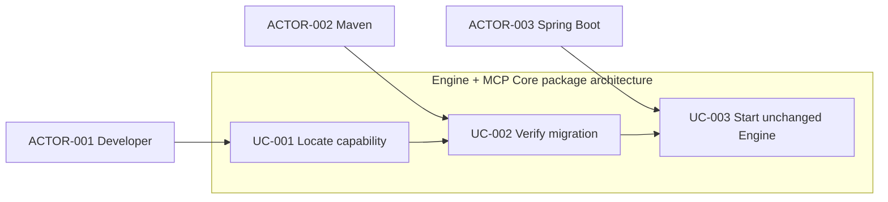
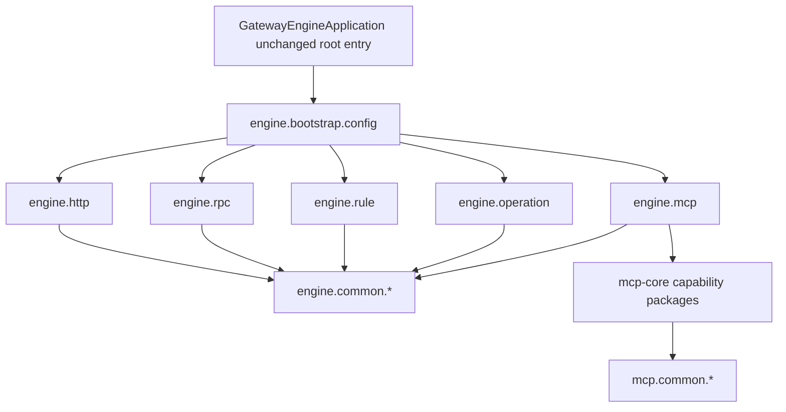
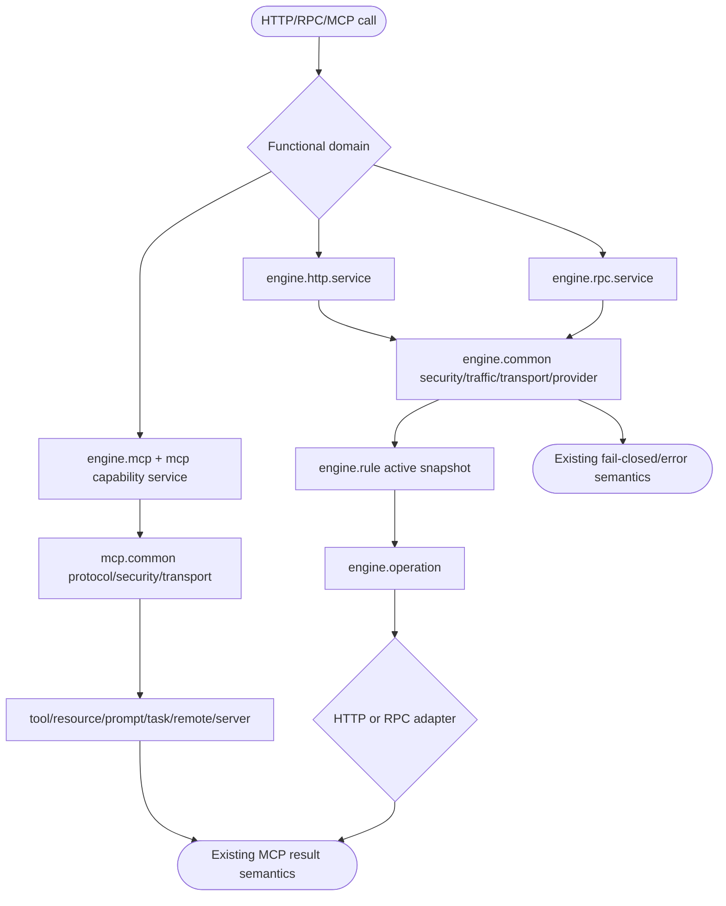
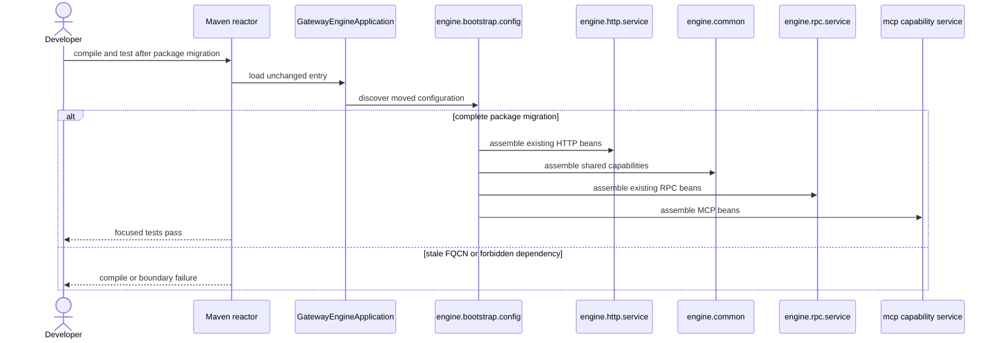

# Gateway Engine 与 MCP Core 功能域分包设计

| Field              | Value                                                                                                                                                                                                                                                                                                                                                                                                    |
|--------------------|----------------------------------------------------------------------------------------------------------------------------------------------------------------------------------------------------------------------------------------------------------------------------------------------------------------------------------------------------------------------------------------------------------|
| Document           | docs/egon/spec/2026-08-19-13-51-gateway-engine-mcp-package-refactor.md                                                                                                                                                                                                                                                                                                                                   |
| Template Version   | 4                                                                                                                                                                                                                                                                                                                                                                                                        |
| Status             | Accepted                                                                                                                                                                                                                                                                                                                                                                                                 |
| Type               | Architecture                                                                                                                                                                                                                                                                                                                                                                                             |
| Complexity         | Complex                                                                                                                                                                                                                                                                                                                                                                                                  |
| Complexity Drivers | 两个运行时模块、284 个生产类、HTTP/RPC/MCP/Provider/Rule/Traffic/Security 多域交叉依赖、Spring 装配入口、108 个测试类和包名兼容影响                                                                                                                                                                                                                                                                                                          |
| Created            | 2026-08-19 13:51 CST                                                                                                                                                                                                                                                                                                                                                                                     |
| Updated            | 2026-08-19 14:28 CST                                                                                                                                                                                                                                                                                                                                                                                     |
| Owner              | Egon-COLA platform owner / User                                                                                                                                                                                                                                                                                                                                                                          |
| Repository         | Egon-COLA                                                                                                                                                                                                                                                                                                                                                                                                |
| Scope              | egon-cola-platform-gateway-engine、egon-cola-platform-gateway-mcp-core，以及包迁移所需的直接测试导入                                                                                                                                                                                                                                                                                                                     |
| Change Surface     | 调整 Java package、import、package-info 和对应测试包路径；新增包边界测试；不改变业务逻辑、运行时协议、数据库、Maven 模块依赖或部署入口                                                                                                                                                                                                                                                                                                                   |
| Affected Chapters  | §7, §8, §13, §14                                                                                                                                                                                                                                                                                                                                                                                         |
| Source Requirement | 用户请求：梳理 Gateway Engine 与 MCP Core，按功能/service domain 和 common/* 深度分包，解决实体类与业务类混杂、难以阅读的问题                                                                                                                                                                                                                                                                                                                 |
| Baseline Revision  | main@26ba1413；工作区另有已暂存的 GatewayContractVersions.java 删除，本 Spec 不处理该变更                                                                                                                                                                                                                                                                                                                                    |
| Amends             | None                                                                                                                                                                                                                                                                                                                                                                                                     |
| Supersedes         | None                                                                                                                                                                                                                                                                                                                                                                                                     |
| Depends On         | None                                                                                                                                                                                                                                                                                                                                                                                                     |
| Related Specs      | [Gateway BIZ/APP 范围与 DDC 直连 RPC 规格](2026-08-15-16-57-gateway-biz-app-scope-direct-rpc-design.md); [Gateway HTTP Core legacy design](../../superpowers/specs/2026-07-25-gateway-engine-http-core-design.md); [Gateway RPC legacy design](../../superpowers/specs/2026-07-25-gateway-engine-rpc-design.md); [Gateway MCP legacy design](../../superpowers/specs/2026-08-02-gateway-complete-mcp-design.md) |
| Related Plans      | [Gateway Engine 与 MCP Core 功能域分包实施计划](../plan/2026-08-19-14-28-gateway-engine-mcp-package-refactor.md)                                                                                                                                                                                                                                                                                                   |

## 1. Summary

当前 Gateway Engine 和 MCP Core 已经具备若干功能包，但主要按技术名平铺。HTTP、RPC、Rule、Traffic、Security、Transport、MCP
包内同时放置了服务编排、运行时状态、配置、协议模型和外部适配器。跨域依赖因此从包名上不可见，阅读一个请求链路需要在多个平级包之间跳转。

本规格采用“功能域优先，功能域内再按 service/domain/adapter/common 分层”的方案。Engine 的 HTTP、RPC、MCP、Rule、Operation
保持为功能域；Provider、Security、Traffic、Transport、Observability 等同时被 HTTP/RPC 使用的能力进入 engine.common 下的独立
capability common 包。MCP Core 保持 MCP capability 分组，把协议、传输、安全、遥测等真正跨能力复用的类型归入 mcp.common。

成功标准是：第一层包能回答“这是什么功能”，第二层能区分“行为、状态模型、技术适配器和公共能力”；Spring Engine 仍能发现全部
Bean，HTTP/RPC/MCP/Rule/Provider/Traffic/Security 的方法、状态、错误和测试语义保持不变；新的跨域依赖能被包边界测试发现。

## 2. Background and Current State

### 2.1 Business and user context

本次是开发者可读性和维护边界重构。不新增业务能力，不改变 Gateway 的 HTTP/RPC/MCP 行为，也不改变
DDC、Provider、Rule、RBAC3、IdP、Redis、PostgreSQL、Kafka 或外部 MCP 的协议契约。

### 2.2 Repository evidence

| Evidence ID | Classification    | Exact path/symbol/decision/command                                                 | Observed fact                                                                                                                  | Design significance                                                     | Verification limit |
|-------------|-------------------|------------------------------------------------------------------------------------|--------------------------------------------------------------------------------------------------------------------------------|-------------------------------------------------------------------------|--------------------|
| EVD-001     | Static repository | gateway-engine/pom.xml:14-17, 19-162                                               | Engine 是可执行 Data Plane，依赖 DDC、IdP、RBAC3、Redis、gRPC、Jackson、Micrometer、Kafka、JDBC 等                                             | 必须区分功能代码和技术适配器，不能用新的模块解决阅读问题                                            | 只证明 Maven 声明       |
| EVD-002     | Static repository | engine/src/main/java 当前包树                                                          | Engine 有 balance、discovery、http、mcp、observability、operation、rpc、rule、security、traffic、transport、websocket，生产类 195、测试类 98       | 当前不是没有功能包，而是域内角色混杂、共享边界不清                                               | 统计基于当前源码           |
| EVD-003     | Static repository | GatewayEngineConfiguration.java:1-160                                              | 一个根配置类导入并装配 Provider、HTTP、MCP、Observability、Operation、RPC、Rule、Security、Traffic、Transport、WebSocket                            | 需要保留 bootstrap/config 装配边界；本次不拆 Bean 方法                                 | 不证明真实启动            |
| EVD-004     | Static repository | GatewayEngineApplication.java:1-20；engine/pom.xml:164-182                          | 应用入口在 engine 根包，默认 Spring Boot 扫描，Jar mainClass 指向该类                                                                           | 入口保留根包，避免改变扫描和启动契约                                                      | 未启动服务              |
| EVD-005     | Static repository | GatewayEngineRuntime.java；ProviderDirectory.java；GatewayRuleActivationApplier.java | Engine 生命周期同时协调 HTTP Server、RPC Server、RPC Slot、Rule Activation 和 Provider Directory                                           | 生命周期编排不能归入单一 HTTP/RPC 功能域                                               | 静态调用关系             |
| EVD-006     | Static repository | engine 内跨包 import 统计                                                               | HTTP 依赖 websocket、traffic、transport、security、discovery、rule、observability；RPC/Rule/Operation 也存在交叉                             | 共享能力应进入 common，协议特有实现留在功能域                                              | 不代表每次请求都执行全部路径     |
| EVD-007     | Static repository | mcp-core/pom.xml:14-17, 19-41                                                      | MCP Core 是共享 protocol/runtime core，生产类 89、测试类 10                                                                               | MCP 应按 capability 分组，并把真正公共的 protocol/transport/security/telemetry 独立出来 | 只证明模块声明            |
| EVD-008     | Static repository | mcp-core 当前包树及 package-info.java                                                   | app、completion、prompt、protocol、remote、resource、rule、security、server、subscription、task、telemetry、tool、transport 已存在，但各包仍混放行为和模型 | 目标以现有 capability 为第一层，避免另造全局大 service 包                                 | 静态源码证据             |
| EVD-009     | Static repository | McpMethodDispatcherTest.java:1-146；MCP 各功能测试                                       | MCP Server、Tool、Resource、Task 等通过 Handler、Driver、Compiled Rule 和 Context 协作                                                    | 包迁移必须保留现有协作与测试边界                                                        | 仅进程内测试证据           |
| EVD-010     | Static repository | Gateway Admin 现有 feature/controller/domain/repository/service 包树                   | 同仓库已有按功能域再分 service/domain 的风格                                                                                                 | 新方案与现有 Gateway 代码风格一致                                                   | Admin 生产逻辑不在本次范围   |

### 2.3 Problem statement and gap

- engine.http 根包混合请求/响应模型、配置、Data Plane Handler、HTTP Server、上游 Adapter、Header/CORS/Security 和 Provider
  Selector。
- engine.discovery 与 engine.balance 实际共同构成 HTTP/RPC 共享的 Provider Directory、健康、筛选和负载均衡能力，却被拆为两个平级技术包。
- engine.security、engine.traffic、engine.transport、engine.observability 都是跨协议能力，但 model、service 和 adapter
  没有进一步分离。
- engine.operation 是跨协议 Operation 编排，却依赖 HTTP/RPC 技术适配器，放在独立平级包中不容易看出其角色。
- mcp-core 的 capability 包已经存在，但 protocol、transport、安全和遥测的公共属性没有统一位置。

### 2.4 Evidence and current-chain map

| Entry/trigger   | Current call chain                                                                                                 | Data/state                                                | External dependency                         | Consumers                | Evidence                                     |
|-----------------|--------------------------------------------------------------------------------------------------------------------|-----------------------------------------------------------|---------------------------------------------|--------------------------|----------------------------------------------|
| Engine startup  | GatewayEngineApplication → GatewayEngineConfiguration → GatewayEngineRuntime                                       | Bean graph、Engine properties、Server/Rule/Provider runtime | Spring、DDC、Redis、PostgreSQL、Kafka、IdP/RBAC3 | Engine executable        | Engine root classes                          |
| HTTP request    | GatewayHttpListener → GatewayHttpExecutionPipeline → Security/Traffic/Route/Provider/Operation → HTTP/RPC upstream | request/response stream、Route、Provider、Observation        | Reactor Netty、Provider、gRPC                 | HTTP client/Provider     | engine/http、operation、common concerns        |
| RPC request     | RpcGatewayServer → RpcGatewayHandlerRegistry → RpcGatewayForwarder → Provider channel                              | fullMethodName、Method Index、raw Protobuf                  | gRPC、DDC Provider registry                  | RPC Consumer/Provider    | engine/rpc                                   |
| Rule activation | GatewayRuleActivationApplier → EngineGatewayRuleCompiler → MCP Rule Compiler/Provider Directory                    | immutable Rule Snapshot、LKG、active index                  | DDC、LKG storage                             | HTTP/RPC/MCP             | engine/rule、mcp-core/rule                    |
| MCP method      | MCP transport → dialect adapter → McpMethodDispatcher → capability Handler                                         | JSON-RPC、session/task/subscription state                  | Reactor、Redis/PostgreSQL、remote MCP         | MCP client/remote server | mcp-core/protocol、server、capability packages |

## 3. Goals and Non-goals

### 3.1 Goals

1. 以功能域作为第一包层级，开发者先按 HTTP、RPC、MCP、Rule、Operation、Provider 定位代码。
2. 功能域内部统一使用 service、domain、adapter；只在确有跨域复用时使用 common/*。
3. 分离实体/状态/策略模型、行为编排和外部技术适配器。
4. 保留 Engine 根应用入口、Spring 扫描范围、Bean 注册、Maven mainClass 和运行时行为。
5. 保留所有 HTTP/RPC/MCP/Rule/Provider 的方法、字段、状态、错误、超时、重试、取消和事件语义。
6. 增加 Engine/MCP Core 包边界测试，阻止根包堆积和 common 反向依赖功能域。

### 3.2 Non-goals

- 不拆分 GatewayEngineConfiguration 的 Bean 方法或业务编排。
- 不重写 HTTP/RPC/MCP Handler，不改 Filter、Strategy、Adapter、Observer、State 的运行逻辑。
- 不新增 Maven module，不合并 engine 与 mcp-core，不修改 POM 依赖。
- 不修改 HTTP、RPC、MCP、DDC、Kafka、Redis、PostgreSQL、IdP、RBAC3 或前端契约。
- 不引入 DDD Aggregate、Domain Service、Repository Port、COLA 四层或新的业务抽象。
- 不借分包重构顺手修复既有功能缺陷。

### 3.3 Change Surface and Design Depth

| Area/layer                   | Disposition    | Exact repository evidence                       | Changed or preserved behavior/contract | Required Spec treatment             | Chapter(s)   |
|------------------------------|----------------|-------------------------------------------------|----------------------------------------|-------------------------------------|--------------|
| Engine production packages   | Affected       | engine/src/main/java                            | package/import 改变，方法和运行语义不变            | detailed target tree and boundaries | §7, §8, §13  |
| MCP Core production packages | Affected       | mcp-core/src/main/java                          | package/import 改变，MCP 语义不变             | detailed target tree and boundaries | §7, §8, §13  |
| Engine/MCP tests             | Affected       | 两模块 src/test/java                               | 测试包/import 跟随移动，断言不变                   | migration and new boundary tests    | §8, §14      |
| Gateway Admin test import    | Context-only   | gateway-admin/src/test 中引用 MCP security utility | 只更新 FQCN，不改 Admin 行为                   | direct consumer record              | §8, §14, §16 |
| GatewayEngineApplication     | Unchanged      | engine/GatewayEngineApplication.java            | 根包、注解、mainClass 不变                     | scan boundary record                | §7, §16      |
| GatewayEngineConfiguration   | Affected       | engine/GatewayEngineConfiguration.java          | 只移动到 bootstrap.config，方法和装配顺序不变        | bootstrap design                    | §7, §8, §14  |
| HTTP/RPC/MCP/Rule contracts  | Unchanged      | gateway-contract、core、现有测试和 legacy Specs        | 协议、字段、错误、状态不变                          | concise compatibility record        | §9, §10, §16 |
| Database/schema/migration    | Not applicable | 本次无 SQL/schema 变更                               | N/A                                    | no migration                        | §11          |
| Frontend                     | Unchanged      | Admin Web 不引用 Java package                      | 页面/API 不变                              | concise record                      | §12          |

## 4. Requirements and Acceptance Criteria

| ID      | Atomic requirement             | Priority | Observable acceptance criteria                                      | Source                       |
|---------|--------------------------------|----------|---------------------------------------------------------------------|------------------------------|
| REQ-001 | Engine 和 MCP Core 按功能域优先分包     | Must     | 生产代码不再把不同功能域的 service、domain、adapter 平铺在同一根包                        | 用户“按照功能/service domain 深度分包” |
| REQ-002 | 功能域内部区分 service/domain/adapter | Must     | 服务编排、状态模型、外部实现可由包名区分                                                | 用户“实体和业务类混杂”                 |
| REQ-003 | common/* 只承载真实跨域公共能力           | Must     | common 不依赖 HTTP/RPC/MCP/Rule 具体功能；共享能力有唯一位置                         | 用户“common/*”                 |
| REQ-004 | 保持行为与边界兼容                      | Must     | focused tests、配置测试和现有协议断言通过；Bean graph/mainClass 不变                 | 现有测试和仓库约束                    |
| REQ-005 | 不引入过度抽象                        | Must     | 不新增全局 service/domain、大量 DTO、Facade、Factory、DDD/COLA 层或 Maven module | 最小设计原则                       |
| REQ-006 | 包边界可持续验证                       | Should   | 架构测试阻止根包堆积和 common 反向依赖功能域                                          | 可维护性目标                       |

### 4.1 Scenario matrix

| Scenario      | Actor/trigger  | Preconditions                   | Main path                         | Failure path                                        | Observable result  | Requirements     |
|---------------|----------------|---------------------------------|-----------------------------------|-----------------------------------------------------|--------------------|------------------|
| 定位 HTTP/RPC 类 | 开发者            | 已知功能目标                          | 进入 feature.service/domain/adapter | 发现共享能力时进入 engine.common                             | 包路径表达功能和角色         | REQ-001, REQ-002 |
| 定位 MCP 类      | 开发者            | 已知 Tool/Resource/Task/Remote 目标 | 进入 mcp capability                 | protocol/transport/security/telemetry 进入 mcp.common | capability 与公共能力分离 | REQ-001, REQ-003 |
| Engine 启动     | Spring Boot    | 入口仍在根包                          | 扫描 moved configuration 并装配原 Bean  | stale FQCN 或 scan 缺失在验证阶段失败                         | 启动契约不变             | REQ-004          |
| 编译和测试         | Maven pipeline | package/import 已更新              | 运行模块 reactor tests                | 编译或 boundary test 失败则停止                             | 既有测试通过             | REQ-004, REQ-006 |

### 4.2 Use-case analysis

#### 4.2.1 Actor inventory

| Actor ID  | Actor/role                 | Goal                     | Entry/channel            | Evidence            |
|-----------|----------------------------|--------------------------|--------------------------|---------------------|
| ACTOR-001 | Gateway developer          | 快速定位和维护一个功能域             | IDE、源码、评审                | 用户请求和模块源码           |
| ACTOR-002 | Maven/build pipeline       | 编译、测试并发现迁移遗漏             | Maven reactor            | 两模块 POM 和 tests     |
| ACTOR-003 | Spring Boot Engine runtime | 以相同 Bean graph 启动 Engine | GatewayEngineApplication | Engine root classes |

#### 4.2.2 Use-case artifact

#### 4.2.3 UC-001 — Locate capability

| Concern               | Definition                                      |
|-----------------------|-------------------------------------------------|
| Goal                  | 从功能域和角色包找到负责行为、状态或适配器的类                         |
| Trigger               | 新需求、缺陷、调用链追踪或评审                                 |
| Preconditions         | 目标在 Engine 或 MCP Core 范围                        |
| Success postcondition | 修改集中在一个功能域及明确的公共依赖                              |
| Failure               | 单域类误入 common、common 反向依赖 feature、模型与 service 同层 |
| Forward links         | REQ-001–REQ-003；TEST-001–TEST-002               |

## 5. Constraints, Assumptions, and Decisions

### 5.1 Confirmed constraints

- 保持当前 Maven module 边界和 Engine 可执行 Jar 入口。
- 保持 Spring Boot、Reactor、gRPC、Jackson、Redis、Kafka、JDBC 和现有测试工具。
- package-info.java 继续使用当前中英文职责说明风格。
- service 表示运行时行为/编排；domain 表示状态/策略/上下文模型，不引入 DDD 语义。
- adapter 表示外部技术/协议实现；common 不是无主类型的收容包。

### 5.2 Small-gap assumptions

| ID      | Inference                                    | Evidence                                                | Reversible reason    | Impact if wrong            |
|---------|----------------------------------------------|---------------------------------------------------------|----------------------|----------------------------|
| ASM-001 | GatewayEngineApplication 保留 engine 根包        | 默认 Spring Boot scan 和 POM mainClass 当前均依赖它              | 只保留入口类，不影响功能域迁移      | 移动入口需另行设计 scanBasePackages |
| ASM-002 | 采用 feature/service/domain/adapter，不迁移到 biz.* | 用户明确要求功能/service domain/common；当前模块是 Runtime/Data Plane | 可只改变 package，不改变架构类型 | 团队若要全局架构迁移需另立 Spec         |
| ASM-003 | 内嵌 record、enum、异常不拆成新文件                      | 当前类普遍包含嵌套状态/请求类型                                        | 避免类爆炸                | 后续独立版本需求可单独提取              |
| ASM-004 | 默认不保留旧包 wrapper                              | README 将 Engine/MCP Core 作为平台内部模块                       | 一次 reactor 源码迁移可回滚   | 外部二进制消费者需触发兼容方案            |

### 5.3 Resolved decisions

| ID      | Decision                                                                        | Rationale                                        | Requirements     |
|---------|---------------------------------------------------------------------------------|--------------------------------------------------|------------------|
| DEC-001 | domain-first；engine.<feature> 和 mcp.<capability> 为第一层                           | 当前 feature 已存在，问题是域内角色混杂；全局 service/domain 会再次混合 | REQ-001, REQ-002 |
| DEC-002 | Provider、Security、Traffic、Transport、Observability 进入 engine.common.<capability> | 这些能力被 HTTP/RPC/Operation/Rule 共同使用               | REQ-003          |
| DEC-003 | protocol、transport、security、telemetry 进入 mcp.common                             | 这些能力被多个 MCP capability 使用                        | REQ-003          |
| DEC-004 | GatewayEngineConfiguration 只移动到 bootstrap.config；不拆方法                           | 配置类是全模块装配边界，行为拆分超出本次目标                           | REQ-004, REQ-005 |

### 5.4 Open major decisions

| ID      | Question and options                                  | Recommendation          | Impact                       | Owner | Status                                                    |
|---------|-------------------------------------------------------|-------------------------|------------------------------|-------|-----------------------------------------------------------|
| DEC-005 | 是否有仓库搜索范围之外的旧 FQCN 外部消费者？A. 无，直接迁移；B. 有，保留一版兼容 facade | 推荐 A；当前模块定位和全仓库结构支持直接迁移 | B 会增加 wrapper、弃用周期和双 Bean 风险 | User  | Closed — 用户于 2026-08-19 回复“确认”，按 A 直接迁移；Plan 追加全仓库静态消费者更新 |

## 6. Project Technology Context

| Concern          | Current choice                                             | Evidence                           | Constraint                        |
|------------------|------------------------------------------------------------|------------------------------------|-----------------------------------|
| Language         | Java 21 baseline                                           | parent/Gateway source              | 不改语言级别                            |
| Runtime          | Spring Boot Engine；MCP Core 为 Reactor shared runtime       | 两模块 POM                            | Spring wiring 留在 Engine bootstrap |
| Transport        | Reactor Netty、gRPC/Protobuf                                | Engine POM 和 HTTP/RPC classes      | 技术类型进入 adapter，不进入通用 domain       |
| External systems | DDC、IdP、RBAC3、Redis、PostgreSQL、Kafka、filesystem、remote MCP | GatewayEngineConfiguration imports | 按 adapter 归属，不放公共模型               |
| Build/test       | Maven reactor、JUnit 5、Spring Boot Test、Reactor Test        | POM 和 src/test                     | 以 focused reactor tests 验证        |

### 6.1 Java package architecture applicability

本次不是传统业务 Controller/Service/DAO 模块，而是 Gateway Data Plane/MCP Runtime。现有代码采用功能域优先的基础设施架构，用户明确要求功能/service
domain/common 深度分包，因此不强制迁移到 biz.controller、biz.service、biz.dao，也不引入 DDD/COLA。

## 7. Architecture Design

### 7.0 Minimum-design baseline and element-necessity audit

| Proposed element                 | Change | Requirements     | Direct alternative  | Inadequacy    | Added cost               | Verdict |
|----------------------------------|--------|------------------|---------------------|---------------|--------------------------|---------|
| Feature-first tree               | Modify | REQ-001, REQ-002 | 保持当前平铺              | 无法区分功能和角色     | package/import migration | Add     |
| engine.common capabilities       | Add    | REQ-003          | 在 HTTP/RPC 各放一份     | 重复实现和边界       | only migration cost      | Add     |
| mcp.common capabilities          | Add    | REQ-003          | 留在各 capability      | 多处协议/安全/传输共享  | only migration cost      | Add     |
| Split GatewayEngineConfiguration | Remove | REQ-005          | 只移动 class           | 会改变 Bean 装配边界 | Bean/test risk           | Remove  |
| Global EngineService/Domain      | Remove | REQ-005          | feature-local roles | 重新形成大包        | coupling                 | Remove  |
| New Facade/Factory               | Remove | REQ-005          | 直接移动现有类             | 没有新的运行时变化点    | extra call layer         | Remove  |

Selected design adds no network call, client state, persistence state, runtime retry or serialization. It changes source
ownership only.

| Path            | Network calls | Client states | Server contracts/state | Failure and TOCTOU points                                           | Additional user/business value                         |
|-----------------|---------------|---------------|------------------------|---------------------------------------------------------------------|--------------------------------------------------------|
| Direct baseline | 0             | 0             | 0                      | package names do not expose role or dependency direction            | no additional maintenance value                        |
| Selected design | 0             | 0             | 0                      | compile/import, Spring scan and boundary-test failures are explicit | feature and lifecycle are visible without runtime cost |

### 7.1 System Architecture Design

| Module/component | Owns                                                                  | Allowed dependencies                                  | Forbidden responsibility                |
|------------------|-----------------------------------------------------------------------|-------------------------------------------------------|-----------------------------------------|
| engine.bootstrap | application/config/whole-engine lifecycle assembly                    | all Engine domains, core, contract, external adapters | HTTP/RPC/MCP business rules             |
| engine.http      | HTTP ingress, proxy, CORS, WebSocket boundary                         | engine.common, operation, core, contract              | generic Provider/Traffic implementation |
| engine.rpc       | RPC server, method index, forwarding, RPC adapter                     | engine.common, rule, core, contract                   | HTTP-only or MCP capability behavior    |
| engine.mcp       | Engine-specific MCP HTTP/storage/security/telemetry adapters          | mcp-core, engine.common, external systems             | generic MCP Tool/Resource/Task behavior |
| engine.rule      | immutable rule compiler/activation/LKG                                | engine.common, mcp-core, core, contract               | protocol request I/O                    |
| engine.common    | shared Provider/Security/Traffic/Transport/Observability capabilities | core, contract, technical libraries                   | concrete feature-domain imports         |
| mcp capability   | one MCP capability service/domain/adapter                             | mcp.common and explicit capability collaborators      | Engine Spring/DB/Redis implementation   |
| mcp.common       | MCP-wide protocol/transport/security/telemetry                        | contract/core/JDK/Reactor                             | Tool/Resource/Task business behavior    |

### 7.2 High-Level Design

#### 7.2.2 High-level decision and quality matrix

| Concern/use case       | Required behavior                             | Selected mechanism                                  | Failure/degradation behavior             | Trade-off                                      | Verification         | Requirements |
|------------------------|-----------------------------------------------|-----------------------------------------------------|------------------------------------------|------------------------------------------------|----------------------|--------------|
| Readability            | feature and lifecycle visible in package path | feature-first plus service/domain/adapter           | boundary test rejects root/common misuse | more directories                               | static package tests | REQ-001/002  |
| Dependency direction   | common cannot know concrete feature           | one-way common capability rule                      | reverse import fails test                | explicit exceptions for bootstrap/operation    | import boundary test | REQ-003      |
| Startup compatibility  | existing Bean graph and mainClass remain      | root Application retained; configuration only moves | stale import/scan fails validation       | root keeps one intentional entry               | configuration tests  | REQ-004      |
| Protocol compatibility | HTTP/RPC/MCP semantics unchanged              | no logic/model/contract changes                     | existing tests remain gate               | package migration does not solve large methods | focused module tests | REQ-004/005  |

### 7.3 Detailed Design

#### 7.3.1 Package grammar

~~~text
top.egon.cola.component.gateway.engine.feature.role[.technical-subdomain]
top.egon.cola.component.gateway.engine.common.capability.role[.technical-subdomain]
~~~

- service：行为、编排、Handler/Driver/SPI、状态转换。
- domain：状态、策略、枚举、上下文、快照、结果；不表示 DDD Domain Service。
- adapter：Spring/Netty/gRPC/JDBC/Redis/Kafka/filesystem/remote 等实现。
- common：至少两个当前功能消费者，且不携带具体 HTTP/RPC/MCP 业务语义。
- bootstrap：模块级入口和装配。

#### 7.3.2 Engine target package tree

~~~text
top.egon.cola.component.gateway.engine
├── GatewayEngineApplication.java                                  KEEP
├── bootstrap
│   ├── config/GatewayEngineConfiguration.java                       MOVE
│   └── lifecycle/GatewayEngineRuntime.java                          MOVE
├── common/config/GatewayEngineRuntimeProperties.java               MOVE
├── common/provider
│   ├── domain   {health policies, selection policies, outcomes, load-balancer enum}
│   ├── service  {ProviderDirectory, selectors, health trackers, monitors, load balancers}
│   └── adapter  {DdcProviderServiceRegistryAdapter, HTTP/RPC health probes}
├── common/security
│   ├── domain   {GatewaySecurityException, GatewaySecurityResult}
│   ├── service  {GatewaySecurityChain, capability registry, policy compiler, identity/address helpers}
│   └── adapter  {GatewayTransportSecurity and endpoint configuration}
├── common/traffic
│   ├── domain   {traffic policies, decisions, contexts, limits, enums}
│   ├── service  {governance, attempt executor, circuit/bulkhead, resource guard, rate limiter}
│   └── adapter  {RedisTokenBucketExecutor, RedissonRedisTokenBucketExecutor}
├── common/transport
│   ├── domain   {commit point, timeout exceptions, stream direction, timeout values}
│   └── service  {GatewayCancellation, CommitGuard, RetryGate, TransportDispatcher}
├── common/observability
│   ├── domain   {GatewayCallObservation}
│   ├── service  {event dispatcher/sink/listeners, GatewayTelemetry}
│   └── adapter  {event serializer, Kafka sink, access logger}
├── http
│   ├── domain   {HTTP properties, request/response, flush mode, size exceptions}
│   ├── service  {data-plane handlers, execution pipeline, security processor, ProviderSelector}
│   ├── adapter  {HTTP listener/server and upstream adapters}
│   ├── security {GatewayHeaderFilter, RuleBackedHttpGatewaySecurityProcessor}
│   ├── cors     {compiler/processor service, RuntimeCorsPolicy domain}
│   ├── proxy   {strategy/coordinator service, proxy context/response domain}
│   ├── websocket {domain, service, Reactor Netty adapter}
│   └── common   {body buffer ownership/pipeline, body logging}
├── rpc
│   ├── domain   {RuntimeRpcRoute, SlotProperties, SubsystemState, channel key, method index}
│   ├── service  {RpcGatewayForwarder, HandlerRegistry, Server, SlotRuntime}
│   ├── adapter  {channel cache, raw marshaller, protobuf descriptor registry}
│   └── security {RPC security processor and RuleBacked implementation}
├── operation
│   ├── service  {EngineGatewayOperationInvoker}
│   └── adapter  {DefaultGatewayOperationTransport and HTTP-to-RPC bridge}
├── rule
│   ├── domain   {CompiledGatewayRules, GatewayRuleRuntimeStatus}
│   ├── service  {compiler, activation applier, registrar, apply stage}
│   ├── repository {chunk store, LKG repository}
│   └── adapter/json {GatewayRuleJsonCodec}
└── mcp
    ├── domain   {McpRuntimeProperties, token supplier contract}
    ├── service  {MCP HTTP handler, identity, health, task worker/executor}
    └── adapter  {artifact, audit, JDBC/Redis, remote, security, telemetry, token implementations}
~~~

Concrete current-package mapping:

| Current package                             | Target                                                        |
|---------------------------------------------|---------------------------------------------------------------|
| balance + discovery                         | engine.common.provider.domain/service/adapter                 |
| security                                    | engine.common.security.domain/service/adapter                 |
| traffic                                     | engine.common.traffic.domain/service/adapter                  |
| transport                                   | engine.common.transport.domain/service                        |
| observability                               | engine.common.observability.domain/service/adapter            |
| http                                        | engine.http.domain/service/adapter/security/cors/proxy/common |
| websocket                                   | engine.http.websocket.domain/service/adapter                  |
| rpc                                         | engine.rpc.domain/service/adapter/security                    |
| operation                                   | engine.operation.service/adapter                              |
| rule                                        | engine.rule.domain/service/repository/adapter                 |
| engine.mcp and its remote/security packages | engine.mcp.domain/service/adapter                             |

WebSocket is moved below HTTP because its current listener and tests are HTTP ingress/transport behavior; the existing
separate WebSocket lifecycle remains separate inside engine.http.websocket.

#### 7.3.3 MCP Core target package tree

~~~text
top.egon.cola.component.gateway.mcp
├── common
│   ├── protocol  {dialect adapters, JSON-RPC codec, protocol exception}
│   ├── transport {McpHttpRequest/Response, session/subscription stores}
│   ├── security  {McpSecurityDigests, McpSecurityGate}
│   └── telemetry {McpTelemetry}
├── app          {domain: security validator; service: app runtime/UI driver}
├── completion   {service: completion handler/provider implementations}
├── prompt       {domain: StrictPromptTemplate; service: prompt drivers/handlers}
├── remote       {domain: endpoint validator; service: pool/sync/router/remote drivers}
├── resource     {domain: URI validator; service: catalog/handlers; adapter: DB/object/static drivers}
├── rule         {domain: CompiledMcpRules; service: McpRuleCompiler}
├── server       {domain: request context/server description; service: dispatcher/handler and lifecycle handlers}
├── subscription {service: subscribe/listen handlers and service}
├── task         {domain: McpTask/StateMachine; service: executor/service/store/handlers}
└── tool         {service: result binder/catalog/call/list handlers}
~~~

Contract-side MCP records remain in gateway-contract. This includes McpJsonRpcRequest/Response/Error, McpErrorCode,
McpProtocolDialect and McpRuntime records. Only mcp-core runtime classes move.

#### 7.3.4 Dependency direction

~~~text
engine.bootstrap -> all Engine domains
engine.http/rpc/operation/rule/mcp -> engine.common + core/contract
engine.common -/-> engine.http/rpc/mcp/rule/operation
mcp capability -> mcp.common + explicit server/rule/capability collaborators
mcp.common -/-> app/tool/resource/prompt/task/remote implementations
~~~

Existing explicit capability dependencies remain visible; they are not hidden in common. A later cycle-removal change
may extract a genuinely shared interface, but this package Spec does not invent one.

#### 7.3.5 Configuration and bootstrap

GatewayEngineApplication remains in the current root package. GatewayEngineConfiguration moves to
engine.bootstrap.config and keeps its Bean names, conditions, method parameters, construction order and lifecycle.
Default component scanning therefore continues to cover all engine subpackages, and the Maven mainClass remains
unchanged. No application property key or auto-configuration metadata changes.

#### Critical-path Mermaid swimlane

#### Consistency and failure

No transaction, lock, cache, retry, idempotency key, Rule revision, Provider lease, MCP task state or persistence
ownership changes. Package errors are compile/configuration failures, not runtime fallback conditions. Existing
HTTP/RPC/MCP error, timeout, cancellation, LKG and recovery semantics remain owned by their current classes.

#### 7.3.6 Conclusion evidence chain

| Conclusion                    | Evidence         | Constraint  | Decision                   | Trade-off                                 | Verification                            |
|-------------------------------|------------------|-------------|----------------------------|-------------------------------------------|-----------------------------------------|
| 功能域优先优于 global service/domain | EVD-002, EVD-010 | REQ-001/002 | feature first, role second | 更多目录，但减少跨域检索                              | package review and boundary tests       |
| 共享能力进入 capability common      | EVD-006          | REQ-003     | engine.common.<capability> | import migration, but no duplicate policy | static dependency test and Engine tests |
| 应用入口留在根包                      | EVD-004          | REQ-004     | only configuration moves   | 根包保留一个入口类                                 | configuration/application tests         |

## 8. Package Structure and Code File Tree

### 8.1 Current relevant tree

~~~text
engine/{balance,cors,discovery,http,mcp,observability,operation,rpc,rule,security,traffic,transport,websocket}
mcp-core/{app,completion,prompt,protocol,remote,resource,rule,security,server,subscription,task,telemetry,tool,transport}
~~~

### 8.2 Target tree

The exact target package tree is in §7.3.2 and §7.3.3. Existing production/test files are MOVE or package/import MODIFY;
no production class is deleted. package-info moves with its package and is rewritten to state the new responsibility.

Tests mirror production targets:

~~~text
engine/src/test/.../engine/{bootstrap,common,http,rpc,operation,rule,mcp}
mcp-core/src/test/.../mcp/{common,app,completion,prompt,remote,resource,rule,server,subscription,task,tool}
~~~

### 8.3 Package and file responsibilities

| Operation | Package                                                | Key symbols                                         | Responsibility                     | Requirements |
|-----------|--------------------------------------------------------|-----------------------------------------------------|------------------------------------|--------------|
| Keep      | engine                                                 | GatewayEngineApplication                            | Spring/main scan anchor            | REQ-004      |
| Move      | engine.bootstrap.config                                | GatewayEngineConfiguration                          | whole-engine assembly only         | REQ-004      |
| Move      | engine.bootstrap.lifecycle                             | GatewayEngineRuntime                                | whole-engine lifecycle coordinator | REQ-004      |
| Move      | engine.common.provider                                 | ProviderDirectory, health, selector, balance        | shared Provider capability         | REQ-003      |
| Move      | engine.common.security/traffic/transport/observability | existing corresponding classes                      | shared cross-protocol capabilities | REQ-003      |
| Move      | engine.http                                            | HTTP handlers, proxy, CORS, WS, HTTP adapters       | HTTP feature boundary              | REQ-001/002  |
| Move      | engine.rpc                                             | RPC server, registry, forwarder, codec/security     | RPC feature boundary               | REQ-001/002  |
| Move      | engine.operation                                       | EngineGatewayOperationInvoker and transport bridges | direct operation composition       | REQ-001/005  |
| Move      | engine.rule                                            | compiler, activation, LKG, JSON codec               | Rule runtime boundary              | REQ-001/002  |
| Move      | engine.mcp                                             | Engine-specific MCP infrastructure                  | Engine/MCP integration boundary    | REQ-001/002  |
| Move      | mcp.common                                             | protocol/transport/security/telemetry               | MCP-wide common boundary           | REQ-003      |
| Move      | mcp capability packages                                | app/tool/resource/prompt/task/remote/server etc.    | capability behavior and state      | REQ-001/002  |
| Create    | Engine test root                                       | GatewayEnginePackageBoundaryTest                    | root/common dependency rules       | REQ-006      |
| Create    | MCP test root                                          | McpCorePackageBoundaryTest                          | root/common capability rules       | REQ-006      |

## 9. Interface Definitions

Scope disposition: Unchanged.

GatewayEngineRuntime, GatewayHttpDataPlaneHandler, GatewayHttpExecutionPipeline, RpcGatewayServer,
RpcGatewayHandlerRegistry, RpcGatewayForwarder, EngineGatewayOperationInvoker.OperationTransport, McpMethodDispatcher,
McpMethodHandler and MCP capability Handler/Driver methods retain their signatures, consumers, errors and lifecycle.
Only Java package names and imports change.

No HTTP Method + URL, gRPC fullMethodName, JSON-RPC method, Kafka event payload, DDC key, Provider Service Key, error
code or configuration property is added, removed or semantically changed. Existing contract evidence remains in
gateway-contract, core and the existing Gateway Specs.

## 10. POJO and Data Model Design

Scope disposition: Unchanged.

No DTO/VO/BO/PO/Entity/Request/Response class is introduced. Existing runtime records, enums, exceptions, context
objects, policy objects, compiled snapshots and nested types retain fields, validation, nullability and lifecycle.
Moving a type to a domain package changes ownership visibility only; no mapper is added.

GatewayRuntimeRoute, RuntimeRpcRoute, GatewayRuleRuntimeStatus, CompiledMcpRules, GatewayHttpProxyContext,
McpRequestContext, GatewayTrafficContext, McpTask and Provider/Security result types remain semantically unchanged.

## 11. Database Design

Relational model change: No. This is a Java package/import refactor. Existing JDBC/Redis adapters and migrations remain
unchanged; no Flyway file is created or modified. Existing transaction, lock, TTL, retention and recovery semantics are
preserved.

## 12. Frontend Page Design

N/A. Admin Web has no Java package dependency and no page/API behavior changes in this request.

## 13. Design Patterns and Architecture Principles

### 13.1 Selected patterns

| Pattern/principle          | Problem                                                 | Placement                                   | Why direct current tree is insufficient | Alignment              |
|----------------------------|---------------------------------------------------------|---------------------------------------------|-----------------------------------------|------------------------|
| Package by feature/domain  | 平级技术包不能表达功能边界                                           | engine.<feature>、mcp.<capability>           | 当前包树已造成跨域检索和角色混杂                        | 与 Gateway Admin 现有风格一致 |
| Common capability boundary | Provider/Traffic/Transport/Security/Observation 被多个协议使用 | engine.common、mcp.common                    | 复制会重复；根 common 会继续混乱                    | 保留既有能力归属               |
| Adapter boundary           | 外部技术依赖混入行为或模型                                           | feature.adapter 或 common capability adapter | 会泄漏 Netty/gRPC/JDBC/Redis 等类型           | 与现有 Adapter 类一致        |

### 13.2 Rejected patterns and simpler alternative

不新增 Strategy、Factory、Facade、DDD Domain Service、Repository Port 或继承层次。已有 HTTP Strategy、RPC Registry、MCP
Handler/Driver、Rule Compiler 足够；本次只做包重组，不制造新的运行时调用层。

### 13.3 Architecture principles

同一功能域保持高内聚；common 只提供共享能力；bootstrap 才能组装所有域；common 不反向依赖具体 feature；具体实现继续组合既有
collaborator；不创建同义 POJO 或无意义 mapper。

## 14. Test Design

### 14.1 Unit tests

现有测试随生产类镜像移动，断言、fixture、Mock、Reactor 流程和测试层级不变。GatewayEngineConfigurationTest 改用
bootstrap.config；Provider、HTTP、RPC、Rule、Traffic、Transport、WebSocket 和 MCP capability tests 改用目标包。

### 14.2 Integration, contract, persistence, component, and end-to-end tests

不新增数据库或跨进程行为。继续使用 Engine/MCP Core focused tests；Gateway live、DDC、Redis、PostgreSQL、Kafka、多 JVM
证据不因静态包迁移自动成立。

### 14.3 Test cases and data

| ID       | Level                | Target                           | Scenario/input                                     | Expected assertion                                         | Tool/path                            | Requirements |
|----------|----------------------|----------------------------------|----------------------------------------------------|------------------------------------------------------------|--------------------------------------|--------------|
| TEST-001 | Static architecture  | GatewayEnginePackageBoundaryTest | 扫描 Engine source                                   | 根包除 Application/package-info 外无业务类；common 不 import feature | JUnit 5                              | REQ-003/006  |
| TEST-002 | Static architecture  | McpCorePackageBoundaryTest       | 扫描 MCP source                                      | 根包无业务类；mcp.common 不 import capability                      | JUnit 5                              | REQ-003/006  |
| TEST-003 | Compile/test         | Engine reactor                   | 所有 Engine package/import 已更新                       | 编译和既有测试通过                                                  | ./mvnw -B -ntp -pl engine -am test   | REQ-004      |
| TEST-004 | Compile/test         | MCP Core reactor                 | 所有 MCP package/import 已更新                          | 既有 10 个测试通过                                                | ./mvnw -B -ntp -pl mcp-core -am test | REQ-004      |
| TEST-005 | Configuration        | Engine configuration tests       | properties/Bean/reflection assertions              | 方法、条件、Bean 语义不变                                            | existing Engine tests                | REQ-004      |
| TEST-006 | Regression           | HTTP/RPC/MCP existing suites     | streams, retry, WS, fullMethodName, JSON-RPC, task | 协议/状态/错误断言不变                                               | existing suites                      | REQ-004      |
| TEST-007 | Static consumer scan | full repo                        | old FQCN/import/string search                      | 只剩预期迁移内容，Admin test import 更新                              | rg + diff check                      | REQ-004/006  |

## 15. Non-functional and Cross-cutting Design

- Startup：保留 GatewayEngineApplication 根包和 POM mainClass，验证默认 component scan。
- Maintainability：每个新 package-info 明确能力、角色和禁止职责。
- Dependency hygiene：boundary tests 拦截 common → feature 反向依赖。
- Performance：不增加网络请求、序列化、锁、重试、分配或运行时调用层。
- Observability：不改 metric、log、trace、event 字段；静态检查不能证明生产拓扑。
- Security：不改认证、授权、租户、凭证、Header、secret 处理逻辑，不复制安全 Adapter。

## 16. Compatibility, Migration, Rollout, and Rollback

这是内部源码级 package migration。类简单名、方法、字段、注解、Bean 名称、协议 payload 和配置 key 保持不变；FQCN 按 §7.3
改变，直接内部消费者在同一 reactor 中更新 import。

默认不创建旧包 wrapper。若 DEC-005 发现外部二进制消费者，必须停止直接删除方案并另立兼容设计，覆盖 bridge、弃用周期和双 Bean
风险。

实施时应一次性移动生产和测试文件、更新 package/import/package-info、增加 boundary tests，然后运行 focused reactor
tests。不得同时拆大方法、改 Bean 构造、改配置 key 或改 migration。

不需要服务 rollout 或数据迁移；回滚是源码包迁移的整体 revert。用户启动服务后的真实 DDC/Redis/Provider/MCP topology 验收不属于本
Spec。

## 17. Alternatives and Decisions

| Option                                                          | Interaction                     | Advantages     | Disadvantages          | Fit          | Decision |
|-----------------------------------------------------------------|---------------------------------|----------------|------------------------|--------------|----------|
| A feature-first + local service/domain/adapter + curated common | package/import + boundary tests | 直接解决可读性，无运行时成本 | 迁移量较大                  | High         | Selected |
| B global engine.service/domain/adapter                          | 全模块共享三层                         | 名称少            | 再次混合 HTTP/RPC/MCP      | Low          | Rejected |
| C 只重命名现有包                                                       | 最小迁移                            | 成本低            | 实体、service、adapter 仍混杂 | Low          | Rejected |
| D 拆更多 Maven modules                                             | artifact 隔离                     | 编译隔离强          | 扩大模块/依赖/发布范围           | Low          | Rejected |
| E 同时拆大类                                                         | 类更小                             | 可能改善方法复杂度      | 混入行为重构和更高回归风险          | Out of scope | Deferred |

## 18. Risks and Open Questions

| ID       | Risk/question                              | Probability | Impact      | Mitigation/owner                            | Status    |
|----------|--------------------------------------------|-------------|-------------|---------------------------------------------|-----------|
| RISK-001 | 未发现的外部旧 FQCN 消费者                           | Medium      | 编译/二进制兼容破坏  | 全仓库 import/string scan；按 DEC-005 决定 wrapper | Open      |
| RISK-002 | 移动入口导致 Spring scan 缺 Bean                  | Low         | Engine 启动失败 | Application 保留根包；配置测试锁定                     | Mitigated |
| RISK-003 | common 重新变成垃圾桶                             | Medium      | 循环依赖、可读性退化  | 至少两个当前消费者；boundary test；评审逐类判断              | Open      |
| RISK-004 | GatewayEngineConfiguration 仍过大             | High        | 配置类继续难读     | 另立 Config decomposition Spec，本次不拆           | Deferred  |
| RISK-005 | staged GatewayContractVersions.java 删除被误纳入 | Medium      | 非相关变更被覆盖    | 路径限定 diff/commit，保留用户 dirty state           | Mitigated |

## 19. Traceability Matrix

| Requirement | Use case       | Affected area/chapter            | Unchanged/context boundary                  | Tests            | Acceptance evidence                           |
|-------------|----------------|----------------------------------|---------------------------------------------|------------------|-----------------------------------------------|
| REQ-001     | UC-001         | target tree §7/§8                | protocols and module dependencies unchanged | TEST-001/002/007 | no root business classes; feature tree review |
| REQ-002     | UC-001         | role grammar §7.3, §8.3          | methods/models unchanged                    | TEST-001/002     | each class has one role                       |
| REQ-003     | UC-001/003     | common direction §7.1/7.3, §13   | HTTP/RPC/MCP contracts unchanged            | TEST-001/002     | no common → feature import                    |
| REQ-004     | UC-002, UC-003 | bootstrap §7.3.5, §16            | DB/UI/contracts unchanged                   | TEST-003–006     | focused reactor/config tests                  |
| REQ-005     | UC-001         | necessity §7.0, alternatives §17 | no behavior refactor                        | TEST-007         | diff review and no new modules                |
| REQ-006     | UC-002         | boundary tests §8/§14            | live topology unclaimed                     | TEST-001/002/007 | strict static checks                          |

## 20. Review and Acceptance

### 20.1 Original-request fidelity

本 Spec 覆盖两个指定模块，按功能域/service/domain/common 深度分包，区分实体、业务和适配器，并明确不把包重构扩大为行为或模块重构。

### 20.2 Repository and technical fidelity

方案基于当前 POM、包树、根配置/应用类、现有测试、跨包 import、Gateway Admin 包风格和 legacy HTTP/RPC/MCP
设计边界。未启动服务，未把静态源码证据表述为真实拓扑验证。

### 20.3 Cross-section consistency

- GatewayEngineApplication 保留根包。
- GatewayEngineConfiguration 只移动到 bootstrap.config，不拆方法。
- runtime model 保持 model，未新增 DTO/mapper。
- HTTP/RPC/MCP/Rule/DB/UI 外部语义保持不变。
- common 不依赖具体 feature。
- 测试迁移和 Admin 直接 import 更新在 change surface 内。

### 20.4 Relationship and effective-design review

这是新的 Review Spec，不修改既有 Gateway 行为 Spec；既有 HTTP/RPC/MCP、安全、Traffic、Provider、Rule 和兼容语义继续有效。

### 20.5 Final verdict

PASS — Ready for user review

This is a design Spec only. No Plan, production code, migration, service start or runtime verification is included.
