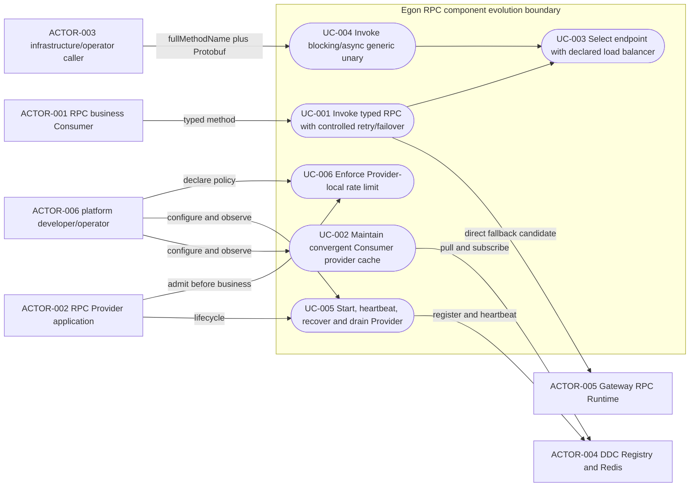
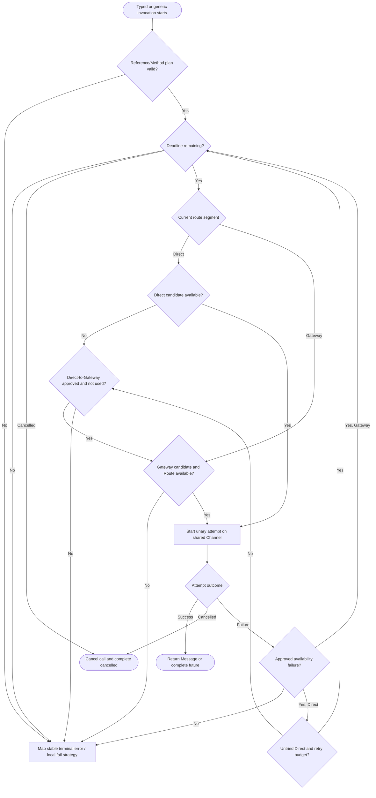

# RPC 运行时治理、调用模型与生命周期演进规格

| Field | Value |
| --- | --- |
| Document | `2026-08-19-15-36-rpc-runtime-governance-evolution.md` |
| Template Version | `4` |
| Status | `Draft` |
| Type | `Architecture` |
| Complexity | `Complex` |
| Complexity Drivers | `RPC 公共 Java API 与兼容性、DDC/Redis 最终一致发现、Direct→Gateway 跨链路切换、重试未知结果、五种负载均衡、一致性 Hash 键、Provider 并发限流、同步/异步双调用、泛化调用、HTTP/2 多路复用、CGLIB 代理、跨生命周期部分失败` |
| Created | `2026-08-19 15:36 CST` |
| Updated | `2026-08-19 15:36 CST` |
| Owner | `Egon-COLA platform owner / User` |
| Repository | `Egon-COLA` |
| Scope | `egon-cola-component-rpc-starter、egon-cola-component-rpc-ddc-adapter、RPC README 与聚焦测试；DDC Registry/Redis 和 Gateway RPC 数据面仅作边界上下文` |
| Change Surface | `两种 Reference 注解及其统一解析/策略、Consumer 调用执行器/发现快照/负载均衡/重试/异步/泛化/CGLIB/共享 Channel、Provider 注解限流与启停状态、配置/异常/文档/测试；不改业务 Protobuf wire、DDC Admin 存储模型、Gateway 路由实现、关系库或前端` |
| Affected Chapters | `§7, §8, §9, §10, §13, §14, §15, §16, §17, §18` |
| Source Requirement | `2026-08-19 用户提出的 11 项 RPC 模块改造需求` |
| Baseline Revision | `main@d611347a749c9f85e723b22a3df6a3788abb33fe；2026-08-19 15:31 CST dirty-worktree snapshot，RPC 范围仅 LoadBalance.java 的 Gateway 包名注释有未提交修改` |
| Amends | `[DDC 单机闭环与轻量 RPC §4.2、§9.3、§11.4、§15.2/§15.3、§17.2、§20.2、§21.2](../../superpowers/specs/2026-07-24-ddc-standalone-rpc-framework-design.md#42-明确不实现)`；`[统一服务模型 §3.4、§4.3、§4.4](../../superpowers/specs/2026-07-26-ddc-rpc-gateway-unified-service-model-design.md#34-策略层servicecallpolicy解决-g3)` |
| Supersedes | `[Gateway BIZ/APP 与 DDC 直连 RPC Spec](./2026-08-15-16-57-gateway-biz-app-scope-direct-rpc-design.md) §1、§3.2、§4 REQ-005–REQ-011、§5 DEC-003–DEC-005、§7.3–§7.5、§8 RPC Consumer 子树、§9 ANN-001/ANN-002、§13.2、§15 Direct 治理、§16–§18 中的 RPC Reference/Direct 行为；其 Gateway BIZ/APP 安全与凭证中继设计不被替换` |
| Depends On | `[DDC 单机闭环与轻量 RPC §8 服务注册中心](../../superpowers/specs/2026-07-24-ddc-standalone-rpc-framework-design.md#8-ddc-服务注册中心)`；`[GWS-04 §5–§13 Gateway RPC 数据面](../../superpowers/specs/2026-07-25-gateway-engine-rpc-design.md#5-动态-grpc-handler)`；`[Gateway BIZ/APP 与 DDC 直连 RPC Spec §7.1–§7.2、§15 Security](./2026-08-15-16-57-gateway-biz-app-scope-direct-rpc-design.md#71-architecture-overview)` |
| Related Specs | `[统一服务模型与管理端优化](../../superpowers/specs/2026-07-26-ddc-rpc-gateway-unified-service-model-design.md)`；`[Gateway Provider 发现与负载均衡](../../superpowers/specs/2026-07-25-gateway-provider-discovery-load-balancing-design.md)` |
| Related Plans | `None` |

## 1. Summary

本规格把当前“两个注解、两个 Proxy Factory、两个 Channel Manager、部分未接线策略字段”的 RPC Consumer，演进为一条统一调用内核：两种 Reference 仍保持源码兼容，但先解析为共同的 `RpcReferencePolicy` 和带模式差异的 `RpcReferenceDefinition`；`RpcReferenceStrategy` 决定 Gateway 或 Direct 主路径，`RpcInvocationExecutor` 统一执行阻塞、异步、重试、Direct 切换、Deadline、终态失败和本地 fallback。Consumer 复用当前 DDC `Redis Topic + 定期 RPC 全量拉取` 订阅，不创建第二套远程缓存；进程内保留按精确服务键的不可变 Provider 快照，并以五种指定算法选点。

Provider 继续主动注册和 heartbeat，心跳间隔仍归 `egon.cola.component.rpc.provider` 配置；DDC 只验证租约身份、续期 TTL、被动过期和发布变更事件，不主动探测 Provider。`@EgonRpcProvider` 从纯标记扩展为本地、每实例的限流声明，支持漏桶、令牌桶、滑动窗口，并与现有可用性门控、租约和 gRPC 优雅排空形成明确顺序。Typed Contract 同时允许 Protobuf 响应和 `CompletionStage<Protobuf响应>`，泛化调用通过原始 Protobuf bytes/Descriptor 调用既有 unary `fullMethodName`，不增加第二套 wire 服务。

本稿尚不能进入 `Review`：Direct “切换另一个”的确切含义与 Gateway Route 前提、限流作用域、异步 Java 形态、泛化载荷形态和一致性 Hash 键均会改变公共行为，必须由用户在 §5.4 审核确认。本文对每项给出推荐方案，并以该推荐展示条件性详细设计；在决策关闭前，这些规则不是已批准实现合同。

## 2. Background and Current State

### 2.1 Business and user context

RPC 组件已经有 Provider 租约、Gateway/Direct 两条引用、DDC Redis 订阅和 unary gRPC 基础链，但能力不完整：Direct 只轮询且单次调用；Gateway 重试只允许幂等且只识别 Gateway-stage `UNAVAILABLE`；注解的 `retries/loadBalance/failStrategy` 大部分未进入执行链；代理是 JDK Proxy；没有异步 Java 方法、泛化客户端、共享 Channel 池或 Provider 自身限流。

用户要求把这些能力作为 RPC 组件的一致运行时能力，而不是继续依赖 Gateway 代偿。业务代码明确承担重试幂等，例如使用唯一单据编号让重复写覆盖；框架因此不能再把 `@EgonRpcMethod.idempotent` 作为是否重试的硬门槛，但仍必须限制可重试故障、总次数和总 Deadline，避免对业务拒绝与参数错误盲目重放。

### 2.2 Repository evidence

以下证据均为当前 dirty-worktree 的静态源码/文档证据；未启动 DDC、Redis、Gateway、Provider 或 Consumer，未证明真实网络吞吐、Redis 丢消息恢复、连接并发或停机排空时间。为保持表格可读，下列别名是规范化的 repository-relative 路径前缀，表内 `别名/剩余路径` 可直接还原为实际文件：

| Path alias | Exact repository-relative prefix |
| --- | --- |
| `RPC_JAVA` | `egon-cola-components/egon-cola-component-rpc/egon-cola-component-rpc-starter/src/main/java/top/egon/cola/component/rpc` |
| `RPC_DDC_JAVA` | `egon-cola-components/egon-cola-component-rpc/egon-cola-component-rpc-ddc-adapter/src/main/java/top/egon/cola/component/rpc/ddc` |
| `DDC_STARTER_JAVA` | `egon-cola-platforms/egon-cola-platform-dynamic-config-center/egon-cola-platform-dynamic-config-center-starter/src/main/java/top/egon/cola/component/ddc` |
| `DDC_ADMIN_JAVA` | `egon-cola-platforms/egon-cola-platform-dynamic-config-center/egon-cola-platform-dynamic-config-center-admin/src/main/java/top/egon/cola/component/ddc/admin` |

| Evidence ID | Classification | Exact path/symbol/decision/command | Observed fact | Design significance | Verification limit/freshness |
| --- | --- | --- | --- | --- | --- |
| `EVD-001` | User decision | 本次需求 1 | 两个 Reference 要抽取公共字段并采用策略；Direct 失败要切换另一路 | 必须统一声明解析与调用编排，并修订旧的“禁止 fallback”规则 | “另一个”的边界仍需 §5.4 确认 |
| `EVD-002` | Static repository | `RPC_JAVA/annotation/EgonRpcReference.java:18-74` | Gateway Reference 已声明 timeout、retries、loadBalance、group、version、fallbackBean、failStrategy | 这些字段是公共策略基线，但当前执行只使用 timeout | 静态声明不证明运行语义 |
| `EVD-003` | Static repository | `RPC_JAVA/annotation/EgonRpcDirectReference.java:16-28` | Direct 只有 bizCode、appCode、env、group、version、timeout | Direct 缺少与 Gateway 一致的 retries/loadBalance/终态策略 | 不证明外部项目的注解使用量 |
| `EVD-004` | Static repository | `RPC_JAVA/consumer/proxy/EgonRpcReferenceBeanPostProcessor.java:39-80,86-129` | 同字段双注解被拒；两个模式分别走两个 Factory；字段必须是接口 | 保留双注解和接口契约，内部改成模式策略比公开合并注解更兼容 | 仅扫描 Spring Bean 字段 |
| `EVD-005` | Static repository | `RPC_JAVA/consumer/proxy/RpcConsumerProxyFactory.java:99-117` | 使用 `java.lang.reflect.Proxy`，每个代理持有 InvocationHandler | 用户要求 CGLIB；可在不开放类契约的情况下让 CGLIB 实现接口 | 未做微基准 |
| `EVD-006` | Static repository | `RPC_JAVA/consumer/proxy/RpcConsumerInvocationHandler.java:73-143` | 每次调用线性查 Method；只阻塞 `blockingUnaryCall`；只有幂等 Gateway-stage UNAVAILABLE 重试 | 需要预编译 Method Plan、同步/异步执行器和新的重试判定 | 未证明当前热路径耗时占比 |
| `EVD-007` | Static repository | `RPC_JAVA/consumer/provider/RpcConsumerProviderManager.java:41-80,201-255` | 每个精确 `RpcProviderQuery` 共享一份订阅和 `activeProviders` 不可变列表 | Consumer 本地缓存已经存在，应扩展而不是再建缓存 | 当前只保留已建 Channel 的端点 |
| `EVD-008` | Static repository | `DDC_STARTER_JAVA/listener/registry/DdcManagedRegistrySubscription.java:77-98,107-143`；`DDC_STARTER_JAVA/listener/registry/DdcInstanceSubscription.java:69-102` | 先监听 Redis Topic，首次全量拉取，事件合并刷新，固定周期全量对账，失败时按租约过期本地摘除 | 已满足“事件监听 + 定期 DDC 拉取”的核心机制 | Redis 实际投递/断线未验证 |
| `EVD-009` | Static repository | `RPC_DDC_JAVA/autoconfigure/DdcRpcAutoConfiguration.java:134-171`；`DDC_STARTER_JAVA/autoconfigure/properties/DdcProperties.java:624-669` | RPC DDC Adapter 复用 `DdcRegistrySubscriptionCoordinator`，默认每 10 秒对账 | 不应复制轮询线程；保持 DDC Adapter 边界 | 当前间隔属于 DDC Registry 配置而非 RPC Consumer 配置 |
| `EVD-010` | Static repository | `DDC_ADMIN_JAVA/repository/DdcServiceRegistryRedisRepository.java:51-75,78-124,255-312,484-492` | 注册/注销/过期发布事件；heartbeat 只续 TTL；查询惰性清理过期租约 | DDC 是被动租约账本，不是主动健康探针 | 未验证生产 Redis 原子性/延迟 |
| `EVD-011` | Static repository | `RPC_JAVA/config/EgonRpcProperties.java:76-86`；`RPC_JAVA/provider/lifecycle/RpcProviderLifecycle.java:220-231` | heartbeat 间隔/lease/优雅关闭均已由 RPC Provider 配置，Provider 定时主动上报 | REQ-007 主要是固化与完善，而不是迁移到 DDC 配置 | 当前使用秒粒度固定延迟 |
| `EVD-012` | Static repository | `RPC_JAVA/provider/lifecycle/RpcProviderLifecycle.java:68-145` | Server 先启动但 Handler 不可用；注册成功后可用；停止先清可用、停恢复/心跳、注销、再 `Server.shutdown/awaitTermination` | 已有优雅启停骨架，可增状态和 Spring callback，不需重写 Server | 无高并发排空实测 |
| `EVD-013` | Static repository | `RPC_JAVA/annotation/LoadBalance.java:19-32`；`RPC_JAVA/consumer/provider/RpcConsumerProviderManager.java:141-163` | 枚举含 RR/SWRR/RANDOM/LEAST_IN_FLIGHT，但 Direct 运行时固定 RR；加权随机和一致性 Hash 不存在 | 必须让声明进入运行链并补两种算法；保留旧值兼容 | `LoadBalance.java` 当前只有用户未提交的 Javadoc 包名调整 |
| `EVD-014` | Static repository | `RPC_JAVA/annotation/EgonRpcService.java:33-39`；`DDC_STARTER_JAVA/format/ServiceInstanceMetaCodec.java:50-54,205-227`；`RPC_DDC_JAVA/registry/{DdcRpcProviderDirectory,DdcRpcGatewayDirectory}.java` | Contract/metadata 有 weight；DDC metadata 可解码 `gateway.weight`，但两个 RPC Directory 都丢弃结果 | Direct Provider 和 Gateway endpoint 的 weighted 算法可复用现有 metadata wire，不改 DDC Proto | 当前 Provider Contract 默认 weight 尚未稳定写入 metadata |
| `EVD-015` | Static repository | `RPC_JAVA/annotation/EgonRpcProvider.java:13-20` | 现有 Javadoc 明确要求 Provider 注解永久无字段 | 新限流字段是对已记录设计的有意修订，必须显式说明 | 只证明源码意图，不代表用户本次仍接受 |
| `EVD-016` | Static repository | `RPC_JAVA/provider/server/RpcServerServiceDefinitionFactory.java:56-99` | Provider 只支持 unary、同步反射调用并先检查 availability | 限流应在认证拦截器之后、业务方法之前；异步 Provider 需要观察 CompletionStage | 当前没有 rate-limit hook |
| `EVD-017` | Static repository | `RPC_JAVA/consumer/channel/RpcConsumerChannelFactory.java:29-49`；`RPC_JAVA/consumer/{gateway/RpcConsumerGatewayManager,provider/RpcConsumerProviderManager}.java` 的 `connect/reconcile/drain` | 每个 Manager/Query 会创建 ManagedChannel；没有跨 Query/模式共享池 | gRPC 本身能在一个 HTTP/2 Channel 多路复用，但当前所有权阻止充分复用 | 未测远端 SETTINGS_MAX_CONCURRENT_STREAMS |
| `EVD-018` | Static repository | `RPC_JAVA/contract/validation/RpcContractValidator.java:84-132`；`RPC_JAVA/contract/descriptor/RpcMethodDescriptor.java:8-15` | Java 方法必须 Message→Message，且已有 Proto MethodDescriptor | 可扩展为 Message 或 CompletionStage<Message>，也可用 descriptor/raw bytes 泛化 | 仍只允许 unary，符合本次范围 |
| `EVD-019` | Static repository | `README.zh-CN.md:240-243,427-434,529-539` | 文档明确直连不重试、Gateway 幂等重试，且把完整策略列为 Roadmap | README 必须与新合同同步更新 | 外部文档不在仓库内不可见 |
| `EVD-020` | Static repository | `docs/egon/spec/2026-08-15-16-57-gateway-biz-app-scope-direct-rpc-design.md §3.2/§4/§16` | 前一 Review Spec 禁止两种路径自动 fallback，并允许 Direct-only RPC 无 Gateway Route | Direct→Gateway 不能对没有 Route 的服务无条件成功 | 该 Spec 为 Review，但代码已实现其 Direct 基线 |
| `EVD-021` | User decision | 本次需求 11 | 重试不判断幂等，业务用唯一业务标识保证重复安全 | 移除框架幂等门控，但保留故障白名单/次数/Deadline | 业务是否真的幂等只能由调用方验收 |

### 2.3 Problem statement and gap

当前实现存在六个结构性缺口：

1. 两种 Reference 的共同策略字段不对称，且已声明字段没有统一解析/运行语义；
2. DDC 发现缓存已存在，但负载均衡仍硬编码轮询，实例 weight 被解码后丢弃，Channel 又按 Query 重复创建；
3. Retry 只服务 Gateway 幂等故障，Direct 不重试也不切换，和用户新的幂等责任决策冲突；
4. Java Contract、Provider 分发和 Consumer 执行均只支持阻塞 Message 返回，没有异步或无接口泛化入口；
5. Provider 生命周期有租约/排空骨架，但没有明确状态模型和注解级限流；
6. JDK Proxy 每次执行仍做反射 Method 查找，无法复用一份预编译调用计划。

### 2.4 Evidence and current-chain map

| Entry/trigger | Current call chain | Data read/written | External dependency | Consumers | Evidence |
| --- | --- | --- | --- | --- | --- |
| Gateway 字段注入与调用 | `BeanPostProcessor -> RpcConsumerProxyFactory -> JDK Proxy -> RpcConsumerInvocationHandler -> GatewayRpcInvocationChannelProvider -> RpcConsumerGatewayManager` | Gateway snapshot、ManagedChannel；无持久写 | DDC subscription、INTERNAL_GATEWAY、Gateway | Spring 业务 Bean | `EVD-002`,`EVD-004`–`EVD-006` |
| Direct 字段注入与调用 | `BeanPostProcessor -> RpcDirectReferenceProxyFactory -> RpcConsumerProviderManager.register -> ProviderRpcInvocationChannelProvider -> fixed RR` | `Registration.activeProviders/revision/sequence` | DDC RPC_PROVIDER、Redis Topic、Provider | Spring 业务 Bean | `EVD-003`,`EVD-007`–`EVD-009`,`EVD-013` |
| Provider 启动与健康 | `RpcProviderLifecycle.start -> Server.start -> leaseManager.prepare/registerAll -> heartbeatAndRecover` | DDC 临时租约、availability set | DDC Admin/Redis | Direct Consumer、Gateway Engine | `EVD-010`–`EVD-012` |
| Provider 请求分发 | `gRPC interceptor chain -> RpcServerServiceDefinitionFactory.invoke -> Method.invoke -> observer` | invocation/trace Context；无框架持久写 | Provider 业务代码 | 所有 RPC Caller | `EVD-016`,`EVD-018` |
| DDC 变更通知 | `register/deregister/expire -> Redis Topic -> DdcManagedRegistrySubscription -> RPC full snapshot pull -> Consumer reconcile` | Redis TTL、revision、进程内 current snapshot | Redis + DDC Registry RPC | Gateway/Provider Directory listener | `EVD-008`–`EVD-010` |

## 3. Goals and Non-goals

### 3.1 Goals

- 保持 `@EgonRpcReference` 和 `@EgonRpcDirectReference` 两个公开入口，同时把共同策略解析为单一内部模型并通过 Strategy 执行。
- Direct 主路径按审核后的故障条件自动切换到另一条可用路径，并保留总 Deadline、调用身份与可观测结果。
- 明确复用 DDC Redis 事件订阅、首次/定期全量拉取和 Consumer 本地不可变快照。
- 在 Consumer 侧实现随机、加权随机、轮询、平滑加权轮询、一致性 Hash；保留既有 `LEAST_IN_FLIGHT` 兼容值。
- 让 Provider 主动 heartbeat，DDC 只做租约接收、TTL/身份验证、过期与事件发布。
- 让 Provider/Consumer 启停具备 READY/DRAINING/STOPPED 边界，停止时拒绝新调用并等待已接受 unary 完成。
- 通过 `@EgonRpcProvider` 配置本地 Provider 限流，支持漏桶、令牌桶、滑动窗口和稳定拒绝语义。
- 支持 typed blocking、typed async、generic blocking、generic async unary 调用，并共享同一执行/失败策略。
- 通过 CGLIB 接口代理、Method Plan 缓存和共享 ManagedChannel 池减少每次调用的反射与连接成本。
- 重试不读取 `idempotent` 作为门槛；框架只控制故障类型/次数/Deadline，业务负责重复安全。

### 3.2 Non-goals

- 不支持 client/server/bidirectional streaming；本规格仍只处理现有 unary Proto Method。
- 不把 DDC 改成主动探活系统，不让 DDC 反向调用 Provider Health RPC。
- 不新增 DDC Proto 方法、Redis Key、数据库表、Flyway migration 或关系型 ER 模型。
- 不在 RPC Starter 内实现跨 Provider 实例的分布式限流；注解限流默认是单 JVM/单 Provider 实例能力。
- 不把 Provider 限流复用成 Gateway 分布式流量治理，也不修改 Gateway 现有规则/限流实现。
- 不自动证明业务幂等，不生成业务去重键，不持久化重试结果，不替业务覆盖重复单据。
- 不增加 Map/Object[] 第二序列化协议，不绕开 Protobuf 作为唯一 wire IDL。
- 不开放 concrete class RPC Contract；CGLIB 只替换代理实现，Contract 仍必须是 `@EgonRpcService` 接口。
- 不引入 Resilience4j、Guava RateLimiter、第三方一致性 Hash/限流依赖或新 Maven 模块。
- 不改 Gateway BIZ/APP 授权、Provider 下游鉴权、凭证中继和接口定义上报职责。
- 不启动项目、DDC、Redis、Gateway 或业务进程；Spec 验证是文档/源码边界。

### 3.3 Change Surface and Design Depth

| Area/layer | Disposition | Exact repository evidence | Changed or preserved behavior/contract | Required Spec treatment | Chapter(s) |
| --- | --- | --- | --- | --- | --- |
| RPC annotations/public Java declaration | `Affected` | `annotation/{EgonRpcReference,EgonRpcDirectReference,EgonRpcProvider,LoadBalance,EgonRpcMethod}.java` | Direct 补公共字段与切换声明；Provider 增限流；LB 补算法；method return shape 扩展 | 完整 Java API、默认值、兼容/校验设计 | `§7, §8, §9, §10, §13, §14, §16, §17, §18` |
| Consumer reference/proxy/invocation | `Affected` | `consumer/proxy/*`、`RpcConsumerInvocationHandler` | 两 Factory/Handler 归一为 Reference Strategy + CGLIB + plan cache + blocking/async executor | 组件、调用、失败、文件和测试详细设计 | `§7, §8, §9, §10, §13, §14, §15, §16, §17, §18` |
| Consumer discovery/LB/channel | `Affected` | `RpcConsumerProviderManager`、`RpcConsumerGatewayManager`、`RpcConsumerChannelFactory` | 保留快照缓存，增加 weight、五算法、共享 multiplex Channel、graceful drain | 状态/并发/算法/资源生命周期详细设计 | `§7, §8, §9, §10, §13, §14, §15, §16, §17, §18` |
| Generic invocation | `Affected` | 当前无生产类型；`RpcContractValidator` 与 Gateway raw forwarding 提供 descriptor/bytes 证据 | 新增无接口 unary blocking/async API，复用同一执行链 | 公共方法、模型、错误/安全/测试完整设计 | `§7, §8, §9, §10, §13, §14, §15, §16, §17, §18` |
| Provider lifecycle/rate limit | `Affected` | `RpcProviderLifecycle`、`RpcServerServiceDefinitionFactory`、`@EgonRpcProvider` | 明确状态、callback stop、三算法限流和 `RESOURCE_EXHAUSTED` | 注解、算法、顺序、排空和测试详细设计 | `§7, §8, §9, §10, §13, §14, §15, §16, §17, §18` |
| RPC properties/errors/docs/tests | `Affected` | `EgonRpcProperties`、`EgonRpcErrorCode`、双语 README、现有 RPC tests | 新默认/上限、错误码、文档和回归矩阵 | 精确字段/兼容/验证设计 | `§8, §9, §10, §14, §15, §16, §17, §18` |
| DDC Registry subscription implementation | `Context-only` | `DdcRegistrySubscriptionCoordinator`、`DdcManagedRegistrySubscription`、`DdcInstanceSubscription` | 保留 Redis Topic + first pull + periodic reconcile；RPC 只消费 | 记录复用边界，不设计第二套实现；聚焦契约测试 | `§7, §14, §15` |
| DDC Admin/Redis registry storage | `Context-only` | `DdcServiceRegistryRedisRepository` | 保留租约/TTL/revision/topic；不主动探活、不改 key | 记录权威/一致性/运行验证边界 | `§7, §11, §15, §16` |
| Gateway RPC data plane | `Context-only` | GWS-04；`RpcGatewayForwarder` | 作为 Direct 切换候选时保持现有 fullMethodName Route、治理和错误 Trailer | 只定义前提与兼容回归，不改 Gateway | `§7, §9, §14, §16, §18` |
| Business Protobuf contracts/providers | `Unchanged` | `@EgonRpcService` + `.proto` + existing generated descriptors | wire service/method/request/response field不变；业务负责幂等 | 一项明确不变量与旧 fixture 回归 | `§9, §10, §14, §16` |
| Relational database/migration | `Not applicable` | RPC registry/runtime state均为 Redis 临时租约或 JVM 内存；本范围无 DAO/Flyway 路径 | N/A，无表、列、索引、迁移 | §11 证据化 N/A | `§11` |
| Frontend | `Not applicable` | RPC Component 无 frontend module/route/page | N/A | §12 证据化 N/A | `§12` |

## 4. Requirements and Acceptance Criteria

| ID | Atomic requirement | Priority | Observable acceptance criteria | Source |
| --- | --- | --- | --- | --- |
| `REQ-001` | 两种 Reference 的 timeout/retries/loadBalance/group/version/fallbackBean/failStrategy 必须解析为一个共同策略模型 | Must | 单元测试对两注解得到字段同义、同默认/覆盖规则的 `RpcReferencePolicy`；模式特有字段不污染共同模型 | 需求 1 |
| `REQ-002` | 既有 `@EgonRpcReference` 源码写法继续编译并默认以 Gateway 为主路径 | Must | 不改既有属性名/类型/默认；无 Direct 选择时仍只查询 INTERNAL_GATEWAY | 需求 1 + compatibility |
| `REQ-003` | Direct 主路径失败时必须按审核决定自动尝试另一条路径，且不得反向循环 | Must | 满足触发条件时记录一次 Direct→Gateway 切换；Gateway 失败后终止，不回 Direct | 需求 1 |
| `REQ-004` | Direct→Gateway 必须明确 Gateway Route/Directory 前提和无 Route 终态 | Must | 没有 Directory/Route 时返回稳定错误并带原始 Direct cause；Direct-only 可按审核后的开关行为运行 | 需求 1 + `EVD-020` |
| `REQ-005` | Consumer 必须按精确服务键缓存一份不可变 Provider 列表，并由 Redis 事件和周期 DDC 拉取更新 | Must | 同 query 只订阅一次；首次快照、事件刷新、周期对账均替换同一缓存；调用不每次访问 DDC | 需求 2 |
| `REQ-006` | Consumer 缓存必须拒绝旧 revision、过滤过期租约并在 DDC/Redis 暂失时仅使用未过期本地实例 | Must | out-of-order snapshot 不回退；过期实例在本地时钟到期后不可选；恢复全量快照可收敛 | 需求 2/3 |
| `REQ-007` | Provider heartbeat 必须由 RPC 侧主动调度，间隔和 lease 在 RPC Provider 配置，DDC 不主动探测 | Must | `provider.heartbeat-interval-seconds < lease-seconds` 启动校验；每周期 Provider 调 heartbeat；DDC 无 Provider probe 调用 | 需求 3 |
| `REQ-008` | Consumer 负载均衡必须支持 RANDOM、WEIGHTED_RANDOM、ROUND_ROBIN、SMOOTH_WEIGHTED_ROUND_ROBIN、CONSISTENT_HASH | Must | 固定候选和种子/序列测试验证分布、权重、轮询顺序与成员变化；旧 LEAST_IN_FLIGHT 仍可用 | 需求 4 |
| `REQ-009` | Weighted 算法必须读取 1–10000 的实例 weight；一致性 Hash 必须有稳定、非敏感 key | Must | 缺 weight 默认 100，非法远程值容错为默认；无 key resolver 的一致性 Hash 在创建计划时失败 | 需求 4 |
| `REQ-010` | Provider 优雅启动必须先绑定不可用 Handler，完成必需租约后才 READY | Must | 注册前调用得到 provider-stage UNAVAILABLE；fail-fast 注册失败不留下 Server/heartbeat/lease；成功后才可调用 | 需求 5 |
| `REQ-011` | Provider 与 Consumer 优雅关闭必须停止新调用、关闭订阅/恢复、注销租约并在超时内排空已开始 unary | Must | Spring stop callback 在排空或强关后执行；无新 Channel 获取；超时后 force close；重复 stop 幂等 | 需求 5 |
| `REQ-012` | `@EgonRpcProvider` 必须可声明 LEAKY_BUCKET、TOKEN_BUCKET、SLIDING_WINDOW 本地限流 | Must | 三算法并发测试不超出各自定义；DISABLED 无限制；非法参数启动失败 | 需求 6 |
| `REQ-013` | Provider 限流拒绝必须在业务方法前返回 `RESOURCE_EXHAUSTED/RPC_RATE_LIMITED`，且不消耗重试幂等判断 | Must | 被拒请求不执行 bean；错误映射稳定；本地 decision 计算有界 retryAfterMs 但不承诺 Gateway wire 透传；日志无 payload/密钥 | 需求 6 |
| `REQ-014` | typed Contract 必须继续支持阻塞 unary 调用 | Must | Message→Message 旧契约零源码修改，仍在 Deadline 内返回/抛稳定异常 | 需求 7 |
| `REQ-015` | typed Contract 必须支持非阻塞 unary 调用并传播取消/Deadline/重试结果 | Must | Message→CompletionStage<Message> 验证通过；调用线程不等待；future cancel 取消 gRPC call；只完成一次 | 需求 7 |
| `REQ-016` | RPC 必须提供不依赖业务 Java Interface 的泛化 unary blocking/async 调用 | Must | 仅凭服务身份、fullMethodName 和合法 Protobuf bytes/Descriptor 可调用；错误与 typed 路径一致 | 需求 8 |
| `REQ-017` | Consumer 必须复用 ManagedChannel 的 HTTP/2 多路复用，并在相同端点间共享连接 | Must | 同 endpoint 不因不同 Reference/query 重复创建 Channel；并发 calls 使用同 Channel；摘除按引用/排空关闭 | 需求 9 |
| `REQ-018` | typed 代理必须基于 Spring CGLIB，代理创建时预编译 Method→InvocationPlan | Must | 代理类是 CGLIB；contract 仍是 interface；调用不线性扫描 method list；Object 方法不发 RPC | 需求 10 |
| `REQ-019` | Framework retry 不得检查 `RpcMethodDescriptor.idempotent` | Must | `idempotent=false` 在配置 retries>0 且故障可重试时也重试；文档警告业务自保 | 需求 11 |
| `REQ-020` | Retry/切换必须受总 Deadline、最大次数、故障白名单和取消控制 | Must | INVALID_ARGUMENT/PERMISSION_DENIED/RATE_LIMITED 不重试；取消立即终止；耗尽返回稳定终态；无无限循环 | 正确性必要条件 |
| `REQ-021` | 本改造不得改变业务 Protobuf wire、DDC Registry Proto、关系库或 Gateway 安全合同 | Must | Descriptor SHA/字段不因 runtime 改造变化；无 proto/db migration/Gateway production diff | 最小变更与前置 Spec |
| `REQ-022` | 双语 README、配置元数据、单元/组件/进程测试必须与新行为一致 | Must | 旧“JDK Proxy/Direct 不重试/限流不在模块”文案消失；测试矩阵和配置绑定通过 | 可交付性 |
| `REQ-023` | Consumer 优雅启动必须先安装全部已声明 Directory subscriptions/共享 Channel runtime，再允许新 invocation；fallback-only 缺端点不得伪装 primary READY | Must | STARTING 时执行器拒绝调用；primary Gateway 保持现有 fail-fast；Direct primary 空集合进入 DEGRADED并可按审核策略 fallback；启动失败清理所有 subscription/pool entry | 需求 5 |

### 4.1 Scenario matrix

| Scenario | Actor/trigger | Preconditions | Main path | Alternative/failure path | Data/state change | Observable result | Requirements |
| --- | --- | --- | --- | --- | --- | --- | --- |
| Typed blocking Gateway | Caller 调接口 | Gateway snapshot READY | CGLIB plan→Gateway LB→blocking unary | 可重试 UNAVAILABLE 选未尝试 Gateway | in-flight 计数；无持久写 | Message 或稳定异常 | `REQ-001`,`REQ-002`,`REQ-014`,`REQ-018`–`REQ-020` |
| Direct 成功 | Direct Caller | Provider cache有有效租约 | 按 LB 选 Provider，共享 Channel 调用 | 首个 Provider UNAVAILABLE 可按 retries 选另一个 | cache只读；attempt 状态 | 不触发 Gateway | `REQ-003`,`REQ-005`–`REQ-009`,`REQ-017` |
| Direct 耗尽后切 Gateway | Direct Caller | Direct candidates失败；Gateway Route/Directory 可用 | 保持 invocation/deadline，切 Gateway 一次 | Gateway 无 Route/不可用→终态，不回 Direct | 本地 attempt/failover 状态 | 成功或 `RPC_FAILOVER_EXHAUSTED` 推荐错误 | `REQ-003`,`REQ-004`,`REQ-019`,`REQ-020` |
| Consumer graceful startup | Spring lifecycle | Reference demand 已在 BeanPostProcessor 阶段登记 | Coordinator 先启动 subscriptions/pool，再 READY/DEGRADED | primary Gateway fail-fast；Direct/fallback-only 空集合按 mode state处理；异常清理 | Consumer runtime state | Application 不在未初始化 discovery 上接受调用 | `REQ-005`,`REQ-011`,`REQ-023` |
| Redis 事件丢失 | Scheduler | 旧缓存未过期，Redis event 未达 | 周期 RPC 全量拉取较新 revision | DDC 暂不可用→只本地过期，不延长旧 lease | immutable snapshot替换或过期收缩 | 最迟一个 reconcile interval 收敛 | `REQ-005`,`REQ-006` |
| Out-of-order refresh | Redis/周期并发触发 | 已接受 revision N | 收到 N-1 丢弃；N 相同且内容同不通知 | 同 revision 内容不同记录告警并以权威全量为准（待实现校验） | 不回退缓存 | 选择集合单调不回旧版本 | `REQ-005`,`REQ-006` |
| Provider 初始注册失败 | Provider startup | registration REQUIRED | Server bound but unavailable→register | failFast=true 清理并启动失败；false 后台 heartbeat/recover | 无有效 lease/availability | 未发布未 Ready 服务 | `REQ-007`,`REQ-010` |
| Provider 心跳失败/恢复 | Heartbeat scheduler | 曾有 lease | 先 unavailable、丢旧 lease、重新 register | DDC 仍不可用保持 unavailable | DDC TTL最终过期；新 lease替换 | Consumer/Gateway摘除后恢复 | `REQ-006`,`REQ-007`,`REQ-010` |
| Provider 优雅关闭 | Spring shutdown | READY 且有 in-flight | DRAINING→不可用→停恢复/heartbeat→deregister→Server.shutdown | 超时→shutdownNow | lease删除；Channel逐步排空 | 已接受调用完成，新调用失败并可重试 | `REQ-011` |
| Provider 限流 | 并发 Caller | 某 fullMethodName 达到配额 | limiter tryAcquire | 拒绝 RESOURCE_EXHAUSTED，不执行业务 | 本地算法状态更新 | `RPC_RATE_LIMITED` + retryAfterMs | `REQ-012`,`REQ-013` |
| Typed async | Caller 调 CompletionStage 方法 | 合法 async contract | futureUnaryCall→CompletionStage | cancel/deadline/重试都异步串联 | in-flight future | 调用线程立即返回，最终只完成一次 | `REQ-015`,`REQ-020` |
| Generic raw call | Operator/framework | 已知服务/方法/Protobuf payload | generic plan→相同策略→raw unary | payload无法被 Provider 解析→INVALID_ARGUMENT | 无新协议状态 | bytes/async bytes 或稳定异常 | `REQ-016`,`REQ-021` |
| 非幂等写重试 | Business Caller | retries>0，首次 UNAVAILABLE 结果未知 | 框架不查 idempotent 再发 | 业务唯一单据号覆盖/去重；若未实现可能重复副作用 | 业务数据由下游决定 | 框架只暴露 attempts/result | `REQ-019`,`REQ-020` |

### 4.2 Use-case analysis

#### 4.2.1 Actor inventory

| Actor ID | Actor/role | Goal and responsibility | Entry/channel | Permission/tenant context | Evidence |
| --- | --- | --- | --- | --- | --- |
| `ACTOR-001` | RPC 业务 Consumer | 以 typed blocking/async 调用获得业务结果，并为重试保证业务幂等 | 两种 Reference 注入字段 | 身份/tenant 继续由现有 Metadata/Token relay 提供 | 用户需求 1/7/11；现有 Reference |
| `ACTOR-002` | RPC Provider 应用 | 注册、heartbeat、限流、处理调用并优雅下线 | `@EgonRpcProvider` + Spring lifecycle | Provider 本地安全拦截器和业务授权不变 | 用户需求 3/5/6；`RpcProviderLifecycle` |
| `ACTOR-003` | 基础设施/运维调用方 | 无业务接口代码时执行 generic 诊断或集成调用 | `RpcGenericInvoker` | 必须使用与 typed 调用相同的 transport/auth metadata；不绕权限 | 用户需求 8 |
| `ACTOR-004` | DDC Registry/Redis | 保存临时服务租约并通知/提供权威快照 | DDC RPC + Redis Topic | Registry HMAC/mTLS 现状不变 | `EVD-008`–`EVD-010` |
| `ACTOR-005` | Gateway RPC Runtime | 在 Direct 切换或 Gateway Reference 时按已有 Route 转发 | INTERNAL_GATEWAY unary | Gateway BIZ/APP/Provider 安全沿用前置 Spec | 用户需求 1；GWS-04 |
| `ACTOR-006` | 平台开发者/运维者 | 配置算法/心跳/限流，观察失败并安全发布/回退 | annotations、application.yml、logs/tests | 配置写权限由应用部署控制 | 用户“仔细审核”与现有 README |

#### 4.2.2 Use-case artifact



#### 4.2.3 Use-case details

| ID | Goal/trigger | Preconditions | Main success outcome | Alternatives/failures | Success/failure postconditions | Requirements/contracts/tests |
| --- | --- | --- | --- | --- | --- | --- |
| `UC-001` | Caller 调 typed method | Contract/Reference 合法，至少一条候选路径 | 在总 Deadline 内返回一次业务结果 | 无 Provider、retryable UNAVAILABLE、Gateway Route 缺失、取消、业务拒绝 | 成功仅完成一次 future/返回；失败无框架持久状态，业务副作用可能未知 | `REQ-001`–`REQ-004`,`REQ-014`,`REQ-015`,`REQ-019`,`REQ-020`; `INTERNAL-001`–`INTERNAL-005` |
| `UC-002` | Reference 注册 exact query并启动 Consumer runtime | DDC Registry + Redis 配置存在或按 mode 允许 DEGRADED | subscriptions/pool 安装；本地不可变列表通过事件快速、周期兜底收敛 | event 丢失、DDC timeout、旧 revision、lease expiry、startup cleanup | STARTING 不接受调用；不使用过期实例；恢复后替换 | `REQ-005`–`REQ-007`,`REQ-011`,`REQ-023`; `TEST-010`–`TEST-015`,`070`–`072` |
| `UC-003` | 每次 invocation 选 endpoint | 有未尝试候选，算法/weight/key 合法 | 算法返回一个 candidate/selection handle | 空候选、非法权重、缺 hash key | 算法状态有界；失败不创建 Channel | `REQ-008`,`REQ-009`,`REQ-017`; `INTERNAL-008`; `TEST-016`–`TEST-025` |
| `UC-004` | Generic caller 指定 method/payload | exact service identity、合法 fullMethodName、bytes/descriptor | 通过同一执行器返回 bytes/CompletionStage | method 不存在、payload 无法解析、权限/限流/timeout | 不新增 Provider generic service；错误与 typed 一致 | `REQ-016`,`REQ-020`,`REQ-021`; `INTERNAL-006`,`INTERNAL-007` |
| `UC-005` | Spring start/stop 或 heartbeat tick | Provider 配置/Contract/Registry 合法 | READY 只在 lease 后；停止排空并注销 | 初始注册失败、丢 lease、DDC outage、排空超时 | 不发布假 READY；失败/停止无恢复线程或残留 lease（TTL 兜底） | `REQ-007`,`REQ-010`,`REQ-011`; `TEST-031`–`TEST-038` |
| `UC-006` | Provider 收到已通过安全拦截的 unary | Provider annotation 限流配置合法 | 获取 permit 后执行业务 | 达限拒绝；算法状态异常 fail closed | 拒绝不执行业务；状态仅本 JVM 且可回收 | `REQ-012`,`REQ-013`; `INTERNAL-003`; `TEST-039`–`TEST-048` |

## 5. Constraints, Assumptions, and Decisions

### 5.1 Confirmed constraints

- Java 21、Spring Boot 3.5.16、gRPC Java 1.75.0、Protobuf 4.32.0 是当前构建基线。
- 两种 Reference 是已有公开源码合同；本规格默认保留，不用单一新注解强制迁移全部调用点。
- 业务 Proto descriptor 是唯一 wire authority；typed/generic 只改变 Java 调用形态，不改变 service/method/field。
- Provider heartbeat/lease interval 归 RPC Provider 配置，DDC 只被动接收和过期。
- 用户明确决定重试不检查框架幂等标记；业务代码保证重复安全。
- Direct→Gateway 要成功，Gateway 必须已有可匹配 `fullMethodName + group + version + target service` 的 active Route；Consumer annotation 不能自动发布 Route。
- Registry、Gateway、Provider、业务授权是独立边界；本 Spec 不把服务发现成功当成业务权限允许。
- 当前模块采用 Core SPI + Adapter + Spring Boot AutoConfiguration 的功能包结构，不迁移为传统三层、DDD 或 COLA 包。

### 5.2 Small-gap assumptions

| ID | Inference | Repository evidence | Why locally reversible | Impact if wrong |
| --- | --- | --- | --- | --- |
| `ASM-001` | `SMOOTH_WEIGHTED_ROUND_ROBIN` 即用户所说“加权轮询”，保留现有名称避免枚举破坏 | `LoadBalance` 与 Gateway 已有相同常量 | 算法实现/文档可局部调整 | 若必须使用 `WEIGHTED_ROUND_ROBIN` 名称，需别名/弃用周期 |
| `ASM-002` | 旧 `LEAST_IN_FLIGHT` 继续保留，但不计入本次必须新增的五种算法 | 已发布 enum 与 Gateway 使用 | 保留值无新默认行为 | 若要求严格只保留五种，删除会破坏源码/配置 |
| `ASM-003` | DDC reconcile interval 继续使用 `egon.cola.component.ddc.registry.reconcile-interval-seconds`，不复制 RPC 属性 | Adapter 当前直接复用 coordinator | 配置归属可在后续调整 | 若必须全部置于 rpc namespace，需要 DDC Adapter 属性优先级迁移 |
| `ASM-004` | CGLIB 通过 `Enhancer.setInterfaces` 代理现有接口，不开放 class Contract | Validator/BeanPostProcessor 都强制 interface | 代理实现可回退而不改业务接口 | 若用户要代理 concrete class，Contract/Provider/测试面显著扩大 |
| `ASM-005` | Programmatic `RpcDirectClientFactory` 的显式基础设施 target 继续独占 handle，不加入业务发现共享池 | README 区分该能力与 DDC Direct Reference | 独立生命周期可局部保留 | 若也要池化，需定义不同 TLS/HMAC profile 的 pool key/ownership |

### 5.3 Resolved decisions

| ID | Decision | Decision owner | Evidence and rationale | Requirements |
| --- | --- | --- | --- | --- |
| `DEC-001` | 保留两个注解，抽取内部 `RpcReferencePolicy`，不新增第三个统一公开注解 | Spec recommendation from compatibility evidence | Java annotation 不能继承属性；公开嵌套 options 会制造双写冲突，内部归一最小 | `REQ-001`,`REQ-002` |
| `DEC-002` | 复用现有 DDC subscription 两层本地状态，不新建远程 cache/job/topic | Repository fact | 已有首次 pull、Redis event、periodic reconcile、expireLocal，新增一套只会增加一致性状态 | `REQ-005`,`REQ-006` |
| `DEC-003` | gRPC 自带 transport retry 继续 `disableRetry()`；所有重试/切换由一个 `RpcInvocationExecutor` 控制 | Existing factory + observability need | 防止应用层和 gRPC service config 双重重试，确保次数/Deadline 可计算 | `REQ-019`,`REQ-020` |
| `DEC-004` | 实例 weight 沿用现有 `gateway.weight` metadata wire，RPC model 增 typed weight，不改 DDC Proto | `EVD-014` | 既有单一 metadata authority 已存在，新增字段会造成双事实源 | `REQ-008`,`REQ-009`,`REQ-021` |
| `DEC-005` | 多路复用通过共享 `ManagedChannel` 池兑现，不新增自定义帧/连接协议 | gRPC HTTP/2 transport | 线协议已原生 multiplex；真正缺口是 Channel 所有权和跨 Query 复用 | `REQ-017`,`REQ-021` |
| `DEC-006` | 限流在 Provider 安全拦截器完成后、business method 前执行；拒绝不排队 | Provider handler boundary | 有 fullMethodName/binding，避免 event-loop 阻塞，也不让未认证请求占业务配额 | `REQ-012`,`REQ-013` |
| `DEC-007` | `idempotent` 字段保留作文档/Gateway/业务提示，但从 Consumer retry gate 移除 | User | 保持 contract compatibility，同时落实业务自保责任 | `REQ-019` |

### 5.4 Open major decisions

| ID | Question and options | Recommendation, not decision | Impact | Owner | Status |
| --- | --- | --- | --- | --- | --- |
| `DEC-008` | “Direct 失败切换另一个”是 A. 只换另一个 Direct Provider；B. Direct→Gateway；C. 先换 Direct Provider、耗尽后再 Gateway？无 Gateway Route 的 Direct-only 服务如何处理？ | 推荐 C：Direct retries 先覆盖不同 Provider，之后最多切 Gateway 一次；`fallbackToGateway` 默认 `true`，Direct-only 显式 `false`。只对 availability 类故障切换 | 决定注解字段、Gateway demand/startup、attempt 数、兼容和终态错误 | User | Open — blocking |
| `DEC-009` | 哪些失败允许 retry/Direct→Gateway：A. 仅 channel acquisition/`UNAVAILABLE`；B. 再含 `DEADLINE_EXCEEDED`；C. 任意异常 | 推荐 A；Deadline 已耗尽无法安全切换，业务状态/权限/限流不应换路径 | 决定重复执行范围、错误语义和测试 | User | Open — blocking |
| `DEC-010` | Provider 注解限流作用域：A. 本实例内每 `provider bean + fullMethodName` 独立；B. 一个 bean 所有方法共享；C. Redis 分布式集群额度 | 推荐 A；对应 RPC 资源、无新依赖、随实例扩缩。C 应另立分布式治理 Spec | 决定算法 key、配额随实例扩容方式和运维含义 | User | Open — blocking |
| `DEC-011` | Async Java Contract：A. 返回 `CompletionStage<Response>`，Provider/Consumer 同一方法形态；B. 另建 `AsyncRpcClient<T>` facade；C. callback 参数 | 推荐 A；类型安全、可取消/组合、无需 ThreadLocal future，wire仍 unary | 改变 Validator、Provider binding、代理返回类型和外部 Contract 写法 | User | Open — blocking |
| `DEC-012` | 泛化载荷：A. `fullMethodName + Protobuf bytes`，可选 Descriptor/DynamicMessage convenience；B. Dubbo 风格 `Map/Object[]`；C. 新建 GenericInvoke Proto 服务 | 推荐 A；不增加第二序列化/Provider endpoint，和 Gateway raw forwarding 一致 | 决定公共 API、schema 来源、安全和 wire compatibility | User | Open — blocking |
| `DEC-013` | 一致性 Hash key：A. 必须提供 `RpcLoadBalanceKeyResolver` Bean；B. 默认 hash 整个 request bytes；C. 使用 invocationId | 推荐 A；业务 affinity 需稳定语义，B 受无关字段影响，C 每次变化不具一致性 | 决定 Reference 创建是否 fail-fast、generic API 是否需显式 affinityKey | User | Open — blocking |
| `DEC-014` | 既有 `FAIL_OPEN` 在非空 Protobuf 返回合同中如何表示“结果缺失”：A. 返回 response default instance/async completed default/zero-length raw bytes；B. 返回 null；C. 禁止 typed/generic 使用 FAIL_OPEN | 推荐 A，并强制 warn/fail-open 标记日志；B 破坏非空不变量，C 让已发布 enum 无运行语义 | 决定 terminal result、调用方分支和契约测试 | User | Open — blocking |

## 6. Project Technology Context

| Concern | Current choice | Repository evidence | Constraint on design |
| --- | --- | --- | --- |
| Language/runtime | Java 21 | `egon-cola-components/pom.xml:68` | 使用 record、sealed-free 简单接口、CompletionStage；不引入新语言/runtime |
| Framework | Spring Boot 3.5.16 / Spring Context | parent BOM；`EgonRpcAutoConfig` | CGLIB 使用 Spring 已携带的 `org.springframework.cglib`，不加依赖 |
| RPC/wire | gRPC Java 1.75.0 + Protobuf 4.32.0，unary | parent POM、`RpcContractValidator` | blocking/async/generic 共享 unary MethodDescriptor，不改 Proto |
| Registry/event | DDC Registry RPC + Redisson Topic | `DdcRpcAutoConfiguration`、DDC subscription classes | Redis event 是提示，full snapshot/revision/lease 是权威 |
| Consumer architecture | neutral Directory SPI + DDC adapter + SmartLifecycle managers | `RpcProviderDirectory`、`RpcGatewayDirectory`、两个 Manager | RPC Starter 不依赖 DDC 实现；Adapter 转换 metadata/快照 |
| Provider architecture | scanner/binding/server/availability/lease lifecycle | `provider/*` | Rate-limit policy 属于 Provider binding/runtime，不进入 Contract wire |
| Test stack | JUnit Jupiter 5.12.2、Spring Boot Test、真实 Netty gRPC fixtures | parent POM、RPC test modules | 单元 + component + process test 分层；无浏览器 |
| Persistence | Redis transient registry；无 RPC relation table | DDC repository + RPC modules | §11 无 Flyway/ER；不改旧 migration |
| Repository state | Dirty worktree，Gateway package refactor 进行中 | `git status`；RPC 仅 `LoadBalance.java` 注释修改 | 后续实施需逐文件避让并 path-limited commit；本 Spec 只新增文档 |

### 6.1 Java three-layer applicability

| Architecture profile | Base package | Evidence or explicit decision | Existing deviations | Design action |
| --- | --- | --- | --- | --- |
| Other — feature-oriented Core SPI + Adapter + AutoConfiguration | `top.egon.cola.component.rpc` | `annotation/config/contract/consumer/provider/context/exception` 当前树；DDC adapter 独立模块 | 不使用 `biz.controller/service/dao`，这是基础设施组件而非三层业务模块 | Preserve current structure；不迁移到传统三层、DDD/COLA |

## 7. Architecture Design

### 7.0 Minimum-design baseline and element-necessity audit

直接基线是继续保留两个 Factory、固定 RR、JDK Proxy、blocking unary 和无 Provider 限流。它不能满足用户明确要求。选中方案仍复用现有 Directory、subscription、lease、Proto、gRPC Channel 和 lifecycle，不增加注册中心、消息协议、数据库或第三方库。

| Proposed element | Change | Requirements | Existing/direct alternative | Concrete inadequacy of alternative | Added calls/state/coupling/failures/migration/operations | Verdict |
| --- | --- | --- | --- | --- | --- | --- |
| `RpcReferencePolicy` | New | `REQ-001` | 两注解分别传参数 | 字段已漂移且 Direct 缺策略 | 一份 immutable object；无网络/迁移 | Add |
| `RpcReferenceStrategy` + Gateway/Direct implementations | New | `REQ-001`–`REQ-004` | BeanPostProcessor if/else + 两 Factory | 无法组合 Direct→Gateway 和统一 attempt | 两策略和一项可选 fallback dependency | Add |
| `RpcInvocationExecutor` | New/merge | `REQ-014`–`REQ-020` | 扩写 InvocationHandler | blocking/async/generic 会复制 retry/deadline | 一处状态机、future/cancel 复杂度 | Add；merge existing handler loop |
| `RpcConsumerMethodInterceptor` | Replace | `REQ-018` | JDK InvocationHandler | 用户要求 CGLIB，且当前每次线性 method lookup | CGLIB runtime class；AOT 风险 | Add/Remove old handler |
| `RpcInvocationPlan` cache | New | `REQ-018` | 每次 `contract.method(method)` | O(method count) 查找且重复解析 policy | 每 Proxy 一张小 immutable map | Add |
| `RpcLoadBalancers` + SPI | New | `REQ-008`,`REQ-009` | Manager 内固定 RR | 缺四种必需运行算法/selection handle | 有界 per-service 算法状态 | Add |
| `RpcLoadBalanceKeyResolver` | New SPI | `REQ-009` | hash 全 payload | 业务 affinity 语义不可由框架可靠猜测 | 一个 Bean 解析调用；缺失 fail-fast | Add，待 `DEC-013` |
| Existing DDC subscription/cache | Keep | `REQ-005`,`REQ-006` | 新建 RPC polling cache | 当前机制已完整，复制会双写/双线程 | 无新增调用；继续每 interval 拉取 | Keep |
| `weight` on neutral/Gateway/Provider endpoint models | Expand | `REQ-008`,`REQ-009` | 所有 weight=100 | 两种 Reference 均无法执行加权算法 | metadata decode 字段；wire不变 | Add default/fields |
| `RpcConsumerChannelPool` | New/merge ownership | `REQ-017` | 每 Query/Manager 独占 Channel | 相同 endpoint 重复连接，复用不足 | ref count/drain/in-flight state | Add |
| Typed async method shape | Expand | `REQ-015` | 业务自行线程池包 blocking call | 占线程、取消/Deadline 不原生 | future bridge + Provider async completion | Add，待 `DEC-011` |
| `RpcGenericInvoker` | New API | `REQ-016` | 为每个调用建接口 | 运维/动态集成无法提前编译接口 | raw payload responsibility；无新 wire | Add，待 `DEC-012` |
| `RpcProviderRateLimitPolicy` + algorithms | New | `REQ-012`,`REQ-013` | Gateway 限流/业务手写 | Direct 绕过 Gateway且实现会漂移 | 每方法本地状态、拒绝语义 | Add，待 `DEC-010` |
| `RpcProviderRuntimeState` | New enum | `REQ-010`,`REQ-011` | boolean running + availability set | 无法表达 STARTING/DRAINING/FAILED | 一个原子状态；无外部存储 | Add |
| `RpcConsumerLifecycleCoordinator/RuntimeState` | New/merge lifecycle ownership | `REQ-011`,`REQ-023` | two Managers independently start/stop | no single gate proves subscriptions/pool ready or blocks new calls during drain | one coordinator/state；reuses managers/pool | Add |
| New DDC Proto/Redis key | Candidate | none | 复用 metadata/snapshot/topic | 无需求证明 | wire/部署/兼容成本高 | Remove |
| New generic envelope RPC service | Candidate | `REQ-016` | raw existing fullMethodName | 增第二 endpoint/权限/路由且非必要 | Proto/Provider/Gateway 全链变更 | Remove，除非 `DEC-012=C` |
| Reuse Access Guard dependency | Candidate | `REQ-012` | RPC-local minimal strategies | Access Guard 仅 token bucket且引入更大策略语义 | 新 module dependency/配置耦合 | Remove |

| Path | Network calls | Client states | Server contracts/state | Failure and TOCTOU points | Additional user/business value |
| --- | --- | --- | --- | --- | --- |
| Current Direct baseline | 每 invocation 1 次 Provider；发现由事件/周期刷新 | one blocking result | fixed RR、per-query Channel | Provider unavailable 直接失败 | 已有直连 |
| Selected Direct success | 同样 1 次 Provider | blocking 或 async | LB state + shared Channel | snapshot may change after selection；lease/Channel二次校验 | 五算法、异步、多路复用 |
| Selected Direct failure | 最多 `1 + retries` Direct，按 `DEC-008` 再 0/1 Gateway route segment | attempts/failover/terminal | one invocation plan | 结果未知重放、Gateway route缺失、deadline耗尽 | 自动容灾，业务承担幂等 |
| Generic selected | 1 次或同一 retry/failover policy | bytes/future bytes | 无新 Provider service | payload/schema mismatch | 无编译期接口调用 |

### 7.1 System Architecture Design

#### 7.1.1 Architecture Mermaid view

```mermaid
flowchart LR
    Business["ACTOR-001 Business Consumer"]
    Generic["ACTOR-003 Generic caller"]
    Operator["ACTOR-006 Operator"]

    subgraph ConsumerJVM["RPC Consumer JVM"]
        Annotation["Two Reference annotations"]
        Resolver["RpcReferenceDefinitionResolver"]
        Proxy["CGLIB proxy and Method Plan cache"]
        Executor["RpcInvocationExecutor"]
        RefStrategy["Gateway or Direct Reference Strategy"]
        Cache["Exact-key immutable endpoint snapshots"]
        LB["RpcLoadBalancers"]
        Pool["Shared multiplexed ManagedChannel pool"]
        GenericInvoker["RpcGenericInvoker"]
    end

    subgraph ControlPlane["Existing control plane boundaries"]
        DDC["DDC Registry RPC"]
        Redis[("Redis leases and registry topics")]
    end

    Gateway["Existing Gateway RPC data plane"]

    subgraph ProviderJVM["RPC Provider JVM"]
        Lifecycle["RpcProviderLifecycle and active lease"]
        Server["gRPC unary server"]
        Rate["Provider local rate-limit strategy"]
        Bean["Business Provider bean"]
    end

    Business --> Annotation --> Resolver --> Proxy --> Executor --> RefStrategy
    Generic --> GenericInvoker --> Executor
    RefStrategy --> Cache --> LB --> Pool
    RefStrategy -->|"Direct fallback candidate"| Gateway
    Pool -->|"HTTP/2 multiplexed unary"| Server
    Gateway -->|"existing routed unary"| Server
    Lifecycle -->|"register and heartbeat"| DDC
    DDC --> Redis
    Redis -->|"topic event"| Cache
    Cache -->|"periodic full pull"| DDC
    Server --> Rate --> Bean
    Operator -->|"annotations and RPC properties"| Resolver
    Operator -->|"provider properties"| Lifecycle
```



#### 7.1.2 Boundary and responsibility table

| Module/component | Capability and data owned | Inputs/outputs | Allowed dependencies | Forbidden responsibility | Requirements |
| --- | --- | --- | --- | --- | --- |
| Annotation resolver | 公共/模式特有声明归一、覆盖校验 | Field+Contract→Definition/Policy | annotation、contract descriptor、properties | 网络、发现、调用 | `REQ-001`,`REQ-002` |
| CGLIB Proxy/plan cache | Java method到预编译执行计划 | Method+request→blocking value/future | validator、executor | DDC/Channel ownership | `REQ-014`,`REQ-015`,`REQ-018` |
| Invocation executor | Deadline、attempt、retry、route switch、terminal fallback | immutable plan/request→outcome | strategies、interceptors、status mapper | 服务目录写入、业务幂等 | `REQ-003`,`REQ-014`–`REQ-020` |
| Provider/Gateway managers | exact query快照、候选过滤、subscription refs | Directory snapshots→candidates | neutral Directory、LB、Channel pool | DDC 实现类型、业务 Route 发布 | `REQ-005`–`REQ-009`,`REQ-017` |
| DDC adapter | DDC key/snapshot/metadata 与 neutral RPC model转换 | DDC models↔RPC endpoints | DDC SDK、RPC SPI | 调用策略/限流/业务授权 | `REQ-005`–`REQ-009`,`REQ-021` |
| DDC Registry | 临时租约、revision、catalog、topic | register/heartbeat/query/event | Redis | 主动调用 Provider 健康检查 | `REQ-005`–`REQ-007` |
| Channel pool | endpoint→shared ManagedChannel 与 drain ownership | acquire/release/in-flight | channel factory | LB、retry、Route 决策 | `REQ-011`,`REQ-017` |
| Consumer lifecycle coordinator | subscriptions/managers/pool/invocation gate state | Spring start/stop + registered demands | managers、generic cache、pool、executor gate | DDC implementation、LB algorithm、business retry | `REQ-005`,`REQ-011`,`REQ-023` |
| Provider lifecycle | Server/lease/heartbeat/runtime state | Spring start/stop | Registry SPI、Server、availability | DDC 主动探活、业务授权 | `REQ-007`,`REQ-010`,`REQ-011` |
| Provider rate limiter | 每 policy key 的本地 admission state | binding+time→allow/reject | clock、annotation policy | 分布式 cluster quota、业务执行 | `REQ-012`,`REQ-013` |
| Gateway | existing Route/security/governance/forwarding | fullMethodName unary | existing Gateway subsystems | Consumer 注解解析、Provider heartbeat | `REQ-003`,`REQ-004`,`REQ-021` |

### 7.2 High-Level Design

#### 7.2.1 Critical business/control flowchart



#### 7.2.2 High-level decision and quality matrix

| Concern/use case | Required behavior | Selected mechanism | Failure/degradation behavior | Trade-off | Verification | Requirements |
| --- | --- | --- | --- | --- | --- | --- |
| Discovery convergence | 事件快速、轮询兜底、无每调用 RPC | keep DDC coordinator + immutable Manager cache | DDC outage只本地过期，不延长 | 最多 reconcile interval 陈旧 | fake clock/event/revision tests + live gap | `REQ-005`,`REQ-006` |
| Direct availability | 多实例重试后可切 Gateway | ordered route segments in one executor | 无 Route/Directory 终态，不循环 | 可能重复业务执行 | failure-stage matrix | `REQ-003`,`REQ-004`,`REQ-019`,`REQ-020` |
| LB correctness | 五算法、weight/hash有定义 | `RpcLoadBalancers` Strategy | 缺 key fail-fast；非法远程 weight default | per-service small mutable state | deterministic/property distribution tests | `REQ-008`,`REQ-009` |
| Async | 无调用线程阻塞且可取消 | `ClientCalls.futureUnaryCall` bridge | cancellation cancels active call；terminal once | Provider async failure callback complexity | virtual executor/latch tests | `REQ-015`,`REQ-020` |
| Generic | 无接口仍用同一安全/路由 | raw MethodDescriptor bytes | invalid payload由 Provider返回 INVALID_ARGUMENT | 调用方失去 compile-time payload检查 | raw/typed parity tests | `REQ-016`,`REQ-021` |
| Multiplexing | 同 endpoint少连接、多并发 streams | ref-counted shared ManagedChannel | endpoint drain后不发新 call；超时强关 | remote stream limit由HTTP/2协商 | channel factory count + concurrent calls | `REQ-011`,`REQ-017` |
| Provider admission | 三算法、业务前拒绝 | local strategy keyed by reviewed scope | limiter state failure fail closed | 配额随实例数线性扩展 | deterministic clock/concurrency | `REQ-012`,`REQ-013` |
| Compatibility | wire/old typed API不破坏 | additive fields/enum/API；interface-only | Direct fallback是有意行为变化 | 需要发布说明/opt-out | old fixture compile and calls | `REQ-002`,`REQ-014`,`REQ-021`,`REQ-022` |

### 7.3 Detailed Design

#### 7.3.1 Detailed component collaboration

| Step | Caller -> callee | Contract/symbol | Input/output mapping | State/data effect | Failure behavior | Requirements |
| --- | --- | --- | --- | --- | --- | --- |
| 1 | BeanPostProcessor→DefinitionResolver | `resolve(Field, ContractDescriptor)` | annotation+properties→ReferenceDefinition | none | conflicting/invalid declaration startup fails | `REQ-001`,`REQ-002` |
| 2 | DefinitionResolver→ReferenceStrategyRegistry | `strategy(mode)` | GATEWAY/DIRECT→strategy | register primary/fallback demand | required Directory absent follows `DEC-008` | `REQ-003`,`REQ-004` |
| 3 | ProxyFactory→CGLIB | `create(contract, definition)` | each Java Method→InvocationPlan | immutable method map | unsupported return/overload invalid contract | `REQ-014`,`REQ-015`,`REQ-018` |
| 4 | CGLIB interceptor→Executor | `executeBlocking/executeAsync(plan, request)` | typed Message or raw bytes→logical invocation | invocation ID、deadline、attempt state | bad request rejected before Channel | `REQ-014`–`REQ-016`,`REQ-020` |
| 5 | Executor→ReferenceStrategy | `nextCandidates(context)` | route segment→candidate view | attempted identities only local call | empty Direct may switch; empty Gateway terminal | `REQ-003`,`REQ-004`,`REQ-020` |
| 6 | Strategy→Manager cache/LB | `select(query, context, excluded)` | immutable endpoints + weight/key→selection | LB sequence/current weights | no valid candidate unavailable | `REQ-005`–`REQ-009` |
| 7 | Manager→ChannelPool | `acquire(endpoint)` | transport key→Channel lease | ref/in-flight increments | pool draining rejects acquisition | `REQ-011`,`REQ-017` |
| 8 | Executor→gRPC ClientCalls | blocking/future unary | request/bytes→response/bytes | one HTTP/2 stream | status classified; lease released exactly once | `REQ-014`–`REQ-017`,`REQ-020` |
| 9 | Provider Lifecycle→DDC | register/heartbeat/deregister | ProviderRegistration→lease/result | Redis TTL/revision/event | lost lease unavailability then recovery | `REQ-007`,`REQ-010`,`REQ-011` |
| 10 | Provider handler→RateLimiter | `tryAcquire(binding, now)` | policy key→decision | local bucket/window state | reject RESOURCE_EXHAUSTED before bean | `REQ-012`,`REQ-013` |
| 11 | Provider handler→bean | sync/async binding invoke | Message→Message/CompletionStage | business-owned side effects | exception mapper/async terminal once | `REQ-014`,`REQ-015`,`REQ-019` |

##### Consumer load-balancing algorithm contracts

候选输入在进入算法前统一处理：过滤 null、expired、shutdown/draining、当前 invocation 已尝试 endpoint；按 `instanceId + leaseId + host + port + secure` stable identity 排序；weight 来自 §10 canonical projection。算法只返回 selection handle，不创建/关闭 Channel。

| Effective algorithm | Exact selection rule | Mutable state and concurrency | Membership/weight change | Retry/exclusion behavior |
| --- | --- | --- | --- | --- |
| `RANDOM` | `ThreadLocalRandom.nextInt(candidateCount)` 均匀选一个 | no shared state | next invocation sees new immutable list | exclude 后在剩余集合重新随机 |
| `WEIGHTED_RANDOM` | 以 `long totalWeight` 计算 `[0,total)`，按 stable order cumulative weight 命中 | no shared state；sum uses overflow-safe add and max `10000 * endpoints` bound | each call uses current weights | exclude 后重算 total；不选 weight<=0（写侧已拒绝，读侧回退100） |
| `ROUND_ROBIN` | per exact service query atomic sequence floorMod list size | one `AtomicLong`; overflow-safe floorMod | list change保留 sequence，不承诺某 endpoint 立即连续公平 | exclude 后对剩余 stable list轮询 |
| `SMOOTH_WEIGHTED_ROUND_ROBIN` | 每轮 `current += weight`，选最大并减 total weight | per service synchronized small map keyed endpoint identity | remove stale keys；retained key保留 current；weight change next round生效 | excluded endpoint本轮不参与 current/total |
| `CONSISTENT_HASH` | SHA-256 affinity key→unsigned 64-bit；clockwise search on ring；每 endpoint `consumer.consistent-hash-virtual-nodes` 个 vnode，默认160，node hash=`endpointIdentity#vnodeIndex` | immutable `NavigableMap` per `(query,revision,endpoint identities)`；atomic replace | snapshot membership/identity变化重建；weight不影响 unweighted ring | attempted node被跳过，继续 clockwise；一圈无候选则 unavailable |
| `LEAST_IN_FLIGHT` | compatibility: choose lowest local in-flight, stable identity tie-break | per endpoint LongAdder + selection handle close | remove counters after endpoint absent and count 0 | excluded candidates omitted |

`CONSISTENT_HASH` deliberately is unweighted；如果未来需要 weighted consistent hash，必须新增独立 enum/Spec，不把 weight 暗中改变 vnode 数。Typed invocation key 由 `INTERNAL-008` 产生一次；generic invocation 使用显式 `affinityKey`。Raw key never enters logs/metrics/metadata。`consumer.consistent-hash-virtual-nodes` valid range 16–4096；a value change rebuilds rings at process restart/config rebind boundary，not mid-call。

#### 7.3.2 Critical-path Mermaid swimlane

```mermaid
sequenceDiagram
    actor Caller as Business/Generic Caller
    participant Proxy as CGLIB Proxy or GenericInvoker
    participant Exec as RpcInvocationExecutor
    participant Cache as Provider Manager Cache
    participant LB as RpcLoadBalancer
    participant Pool as Shared Channel Pool
    participant Provider as RPC Provider
    participant Gateway as Gateway RPC Runtime
    participant DDC as DDC Registry
    participant Redis as Redis Topic/Lease

    par Background discovery
        Redis-->>Cache: DdcRegistryEvent hint
        Cache->>DDC: GetServiceInstances full snapshot
        DDC-->>Cache: revision + leased endpoints
    and Provider liveness
        Provider->>DDC: heartbeat(active lease)
        DDC->>Redis: renew TTL only
    end

    Caller->>Proxy: typed method / generic invocation
    Proxy->>Exec: precompiled plan + request
    Exec->>Cache: current exact-key candidates
    Cache->>LB: immutable candidates + weight/hash key
    LB-->>Cache: selected endpoint
    Cache->>Pool: acquire endpoint channel lease
    Pool-->>Exec: shared ManagedChannel
    Exec->>Provider: unary attempt within remaining deadline
    alt success
        Provider-->>Exec: response
        Exec-->>Proxy: Message/bytes or complete future
        Proxy-->>Caller: result
    else approved availability failure
        Provider-->>Exec: UNAVAILABLE/provider stage
        alt untried Direct candidate and retry budget
            Exec->>Cache: exclude attempted and reselect
        else Direct exhausted and Gateway switch approved
            Exec->>Gateway: same fullMethodName/request, remaining deadline
            Gateway->>Provider: existing routed unary
            Provider-->>Gateway: response/status
            Gateway-->>Exec: response/status
            Exec-->>Caller: result or terminal failure
        else no approved fallback
            Exec-->>Caller: stable terminal failure
        end
    else cancellation/non-retryable/rate-limit
        Provider-->>Exec: CANCELLED/business status/RESOURCE_EXHAUSTED
        Exec-->>Caller: no retry; stable outcome
    end
```

#### 7.3.3 Transactions, consistency, concurrency, and idempotency

| Concern/state change | Owner and boundary | Mechanism/isolation/lock | Concurrent or duplicate behavior | Commit/visibility point | Failure result | Requirements/tests |
| --- | --- | --- | --- | --- | --- | --- |
| Provider endpoint cache | Consumer Manager per exact query | synchronized reconcile + immutable list + monotonic revision | readers lock-free snapshot；old revision dropped | volatile/list replacement | last unexpired snapshot only | `REQ-005`,`REQ-006` / `TEST-010`–`015` |
| LB state | LB instance per service query/algorithm | atomic sequence or synchronized weighted state; ring immutable | each selection linearizable only for its algorithm state | selected candidate returned | empty/no key error | `REQ-008`,`REQ-009` / `TEST-016`–`025` |
| Channel ownership | Channel pool per transport key | concurrent map + ref/in-flight counters | same endpoint converges to one Channel entry | successful acquire | draining/unavailable | `REQ-011`,`REQ-017` / `TEST-026`–`030` |
| Logical retry | InvocationExecutor only | immutable deadline + attempt counters + excluded identity set | same invocation may execute business more than once | first accepted success/terminal completion wins | unknown business outcome documented | `REQ-019`,`REQ-020` / `TEST-049`–`056` |
| Business idempotency | Downstream business code/data store | unique document/order key, upsert/overwrite or business dedupe | framework does not check/store key | business transaction commit | duplicate side effects if business violates contract | `REQ-019` / business acceptance evidence |
| Provider lease | DDC Registry + Provider lease manager | exact service+instance+lease identity, Redis lock/TTL | stale heartbeat/deregister rejected | DDC returns renewed/registered lease | Provider unavailable/re-register | `REQ-007`,`REQ-010`,`REQ-011` |
| Rate-limit state | Provider JVM per reviewed key | monotonic ticker; per-key atomic/synchronized state | concurrent acquire cannot exceed algorithm rule | permit decision | RESOURCE_EXHAUSTED | `REQ-012`,`REQ-013` / `TEST-039`–`048` |
| Async completion | Executor and Provider observer | atomic terminal guard | cancel/response/error races complete once | first terminal CAS | losing completion ignored/logged | `REQ-015`,`REQ-020` / `TEST-057`–`061` |

本框架没有跨服务事务。Retry 可能发生在“Provider 已提交但 Consumer 未收到响应”的未知结果窗口；`idempotent=false` 不会阻止重试。业务实现必须用稳定业务键处理重复，且测试必须证明其业务不变量；框架测试只证明调用次数和失败分类。

#### 7.3.4 Failure semantics, recovery, and reconciliation

| Failure point | Detection | Immediate control flow | Data/transaction state | Retry and idempotency | Caller/frontend result | Recovery/reconciliation owner | Verification |
| --- | --- | --- | --- | --- | --- | --- | --- |
| Reference invalid | startup resolver/validator | abort injection/startup | none | none | `RPC_INVALID_CONTRACT` | developer fixes declaration | contract tests |
| DDC initial pull fails | subscription start exception | primary demand fail-fast；fallback-only按 `DEC-008` | no cache | no business retry | discovery unavailable | DDC/operator | auto-config tests + live gap |
| Redis event lost | no event | periodic reconcile | old cache until interval/lease | none | calls may use still-valid old set | coordinator | fake scheduler test |
| DDC reconcile fails | exception/log | expire locally, keep unexpired | no lease extension | next scheduled reconcile | empty after expiry→unavailable | DDC/operator | subscription tests |
| selected Channel cannot connect | awaitReady/acquire | record failure, next candidate if approved | no business call known | safe transport retry under policy | eventual result/error | Consumer | component test |
| Provider returns UNAVAILABLE | gRPC Status + failure stage | retry/switch per `DEC-008/009` | business outcome may be unknown | business owns duplicates | success or terminal mapped error | Business + Consumer | retry matrix |
| business validation/permission | INVALID_ARGUMENT/PERMISSION_DENIED | terminal | Provider business decides rollback | never retry | stable existing error | business Provider | status tests |
| Provider rate limited | RESOURCE_EXHAUSTED + framework trailer | terminal by recommendation | bean not invoked | never automatic retry | `RPC_RATE_LIMITED` | caller waits/changes load | rate tests |
| Deadline exhausted | remaining nanos<=0/status | cancel active call; terminal | business outcome may be unknown | no further retry | `RPC_DEADLINE_EXCEEDED` | business idempotency/support | deadline tests |
| async caller cancels | CompletionStage/Future cancel | cancel ClientCall, release selection/channel once | Provider may already run | no retry | `RPC_CANCELLED` | caller/business | cancellation test |
| Direct Gateway Route missing | NOT_FOUND/method/service error | no bounce；terminal | Direct attempts may have unknown outcome | no retry of semantic missing route | recommended `RPC_FAILOVER_EXHAUSTED` with suppressed route error | operator publishes route or disables fallback | process fixture |
| Provider heartbeat loses lease | not renewed/exception | availability off, recover register | old TTL expires | registration retry on heartbeat schedule | new calls UNAVAILABLE | Provider lifecycle | lease manager test |
| graceful drain timeout | awaitTermination false | shutdownNow | unfinished calls cancelled | caller may retry per policy | cancelled/unavailable | Provider/Consumer operator | lifecycle test |

#### 7.3.5 Observability and operational boundaries

| Signal/runbook | Emitting owner and point | Fields/dimensions | Sensitive-data rule | Success/failure threshold | Alert/dashboard/operator action | Verification boundary |
| --- | --- | --- | --- | --- | --- | --- |
| invocation structured log | Executor on terminal/failover | service, method, mode, algorithm, attemptCount, switched, errorCode, latency, invocationId | no request/response/Authorization/hash key | warn only on switch/exhaustion；normal success debug/trace | investigate Provider/Route/DDC | source/unit; production aggregation unverified |
| discovery log | Manager on snapshot/reconcile failure | query service identity, old/new revision, endpoint count | no DDC credential/metadata payload | warn on reconcile failure or revision anomaly | check DDC RPC/Redis | source/component; live unverified |
| lease lifecycle log | LeaseManager | service identity, instanceId, leaseId hash/suffix, state/result | no admission ticket/HMAC secret | warn on heartbeat/recovery/deregister failure | check DDC/admission | existing + tests; live unverified |
| rate-limit log | Provider handler on sampled rejection | service, fullMethodName, algorithm, retryAfter bucket, invocationId | no payload/caller token/affinity key | avoid per-request unbounded logs；aggregate via optional observer later | tune annotation/scale instances | unit; no metrics backend added |
| drain log | Provider/Channel pool | component, state, inFlight, timeout, forced | no payload | warn if forced shutdown/inFlight>0 | investigate long calls/deadlines | lifecycle tests |

本规格不新增 Micrometer 依赖。若应用已有观测系统，可通过现有 interceptor/SLF4J 收集；统一指标 SPI 可在实现 Plan 中仅在不新增依赖且不扩大合同的前提下加入，否则另立 Spec。

#### 7.3.6 Conclusion evidence chain

| Conclusion | Repository/user evidence | Constraint or requirement | Design decision | Consequence and trade-off | Verification and acceptance evidence |
| --- | --- | --- | --- | --- | --- |
| 复用 DDC 订阅而非新建 cache | `EVD-007`–`EVD-010` | `REQ-005`,`REQ-006` | 保留 coordinator/current snapshot，扩展 RPC endpoint model/LB | 最少状态；更新延迟受 reconcile interval 约束 | event/poll/revision/expiry tests + live boundary |
| Retry 统一但不做幂等判断 | `EVD-006`,`EVD-019`,`EVD-021` | `REQ-019`,`REQ-020` | executor 按故障白名单/预算/Deadline，不读 idempotent | 满足用户；未知结果可重复副作用 | non-idempotent retry test + 业务幂等验收 |
| CGLIB + plan cache替代JDK handler | `EVD-004`–`EVD-006` | `REQ-018` | interface-only CGLIB、proxy-time Method plan | 少热路径反射；AOT/native 需额外配置且未承诺 | proxy type/cache/object-method tests；benchmark非通过门槛 |
| 多路复用由共享 Channel 所有权兑现 | `EVD-017` + gRPC transport baseline | `REQ-017`,`REQ-021` | endpoint-keyed pool，不造协议 | 降连接数；ref/drain 并发更复杂 | factory create-count、parallel unary、drain tests |
| Provider 限流在业务前、本地每实例 | 用户需求 6、`EVD-015`,`EVD-016` | `REQ-012`,`REQ-013` | annotation policy + Strategy + fail-fast rejection | Direct也受保护；集群总配额随实例变化 | deterministic algorithms + handler non-invocation；待 `DEC-010` |
| Generic 复用 raw unary | `EVD-018`、Gateway raw forwarding先例 | `REQ-016`,`REQ-021` | bytes/descriptor client，不加 generic service | wire兼容；调用方承担 schema正确性 | typed/raw parity + invalid payload tests；待 `DEC-012` |

## 8. Package Structure and Code File Tree

### 8.1 Current relevant tree

```text
egon-cola-components/egon-cola-component-rpc/
├── README.md / README.zh-CN.md
├── egon-cola-component-rpc-starter/src/main/java/top/egon/cola/component/rpc/
│   ├── annotation/{EgonRpcReference,EgonRpcDirectReference,EgonRpcProvider,LoadBalance,EgonRpcMethod}.java
│   ├── config/{EgonRpcAutoConfig,EgonRpcProperties}.java
│   ├── consumer/
│   │   ├── channel/{RpcConsumerChannelFactory,RpcEndpoint,RpcInvocationChannelProvider}.java
│   │   ├── gateway/{RpcConsumerGatewayManager,GatewayRpcInvocationChannelProvider,RpcGatewayDirectory,RpcGatewayEndpoint,RpcGatewaySnapshot}.java
│   │   ├── provider/{RpcConsumerProviderManager,ProviderRpcInvocationChannelProvider,RpcProviderDirectory,RpcProviderEndpoint,RpcProviderSnapshot}.java
│   │   └── proxy/{EgonRpcReferenceBeanPostProcessor,RpcConsumerProxyFactory,RpcDirectReferenceProxyFactory,RpcConsumerInvocationHandler}.java
│   ├── contract/{descriptor,validation,catalog,snapshot}/ (existing exact contract packages)
│   ├── exception/{EgonRpcErrorCode,EgonRpcException,RpcStatusExceptionMapper}.java
│   └── provider/{binding,lifecycle,registration,server}/ (existing exact provider packages)
└── egon-cola-component-rpc-ddc-adapter/src/main/java/top/egon/cola/component/rpc/ddc/
    ├── autoconfigure/DdcRpcAutoConfiguration.java
    └── registry/{DdcRpcProviderDirectory,RpcDdcRegistrySnapshotLoader}.java
```

### 8.2 Target tree

下列是设计目标文件，不代表实施顺序。`package-info.java` 仅在新稳定包实际创建时同步新增；不创建空包。

```text
egon-cola-components/egon-cola-component-rpc/
├── README.md                                                        MODIFY
├── README.zh-CN.md                                                  MODIFY
├── egon-cola-component-rpc-starter/
│   └── src/main/java/top/egon/cola/component/rpc/
│       ├── annotation/
│       │   ├── EgonRpcReference.java                                MODIFY
│       │   ├── EgonRpcDirectReference.java                          MODIFY
│       │   ├── EgonRpcProvider.java                                 MODIFY
│       │   ├── EgonRpcMethod.java                                   MODIFY JavaDoc/return rules
│       │   ├── LoadBalance.java                                     MODIFY
│       │   └── RpcRateLimitAlgorithm.java                           CREATE
│       ├── config/
│       │   ├── EgonRpcAutoConfig.java                               MODIFY
│       │   └── EgonRpcProperties.java                               MODIFY
│       ├── consumer/
│       │   ├── channel/
│       │   │   ├── RpcConsumerChannelFactory.java                   MODIFY
│       │   │   ├── RpcEndpoint.java                                 MODIFY default weight contract
│       │   │   ├── RpcConsumerChannelPool.java                      CREATE
│       │   │   ├── RpcChannelKey.java                               CREATE
│       │   │   └── RpcChannelLease.java                             CREATE
│       │   ├── invocation/
│       │   │   ├── package-info.java                                CREATE
│       │   │   ├── RpcInvocationExecutor.java                       CREATE
│       │   │   ├── RpcInvocationPlan.java                           CREATE
│       │   │   ├── RpcInvocationContext.java                        CREATE
│       │   │   └── RpcInvocationMode.java                           CREATE
│       │   ├── lifecycle/
│       │   │   ├── package-info.java                                CREATE
│       │   │   ├── RpcConsumerLifecycleCoordinator.java             CREATE
│       │   │   └── RpcConsumerRuntimeState.java                     CREATE
│       │   ├── loadbalance/
│       │   │   ├── package-info.java                                CREATE
│       │   │   ├── RpcLoadBalancer.java                             CREATE
│       │   │   ├── RpcLoadBalancers.java                            CREATE (nested concrete strategies)
│       │   │   ├── RpcLoadBalanceContext.java                       CREATE
│       │   │   └── RpcLoadBalanceKeyResolver.java                   CREATE
│       │   ├── reference/
│       │   │   ├── package-info.java                                CREATE
│       │   │   ├── RpcReferenceMode.java                            CREATE
│       │   │   ├── RpcReferencePolicy.java                          CREATE
│       │   │   ├── RpcReferenceDefinition.java                      CREATE
│       │   │   ├── RpcReferenceDefinitionResolver.java              CREATE
│       │   │   ├── RpcReferenceStrategy.java                        CREATE
│       │   │   ├── GatewayRpcReferenceStrategy.java                 CREATE
│       │   │   └── DirectRpcReferenceStrategy.java                  CREATE
│       │   ├── generic/
│       │   │   ├── package-info.java                                CREATE
│       │   │   ├── RpcGenericInvoker.java                           CREATE
│       │   │   ├── RpcGenericTargetCache.java                       CREATE bounded target/plan/subscription cache
│       │   │   └── RpcGenericInvocation.java                        CREATE
│       │   ├── gateway/
│       │   │   ├── RpcConsumerGatewayManager.java                   MODIFY
│       │   │   └── RpcGatewayEndpoint.java                          MODIFY weight
│       │   ├── provider/
│       │   │   ├── RpcConsumerProviderManager.java                  MODIFY
│       │   │   └── RpcProviderEndpoint.java                         MODIFY weight
│       │   └── proxy/
│       │       ├── EgonRpcReferenceBeanPostProcessor.java           MODIFY
│       │       ├── RpcConsumerProxyFactory.java                     MODIFY CGLIB
│       │       ├── RpcConsumerMethodInterceptor.java                CREATE
│       │       ├── RpcDirectReferenceProxyFactory.java              DELETE after merge
│       │       └── RpcConsumerInvocationHandler.java                DELETE after merge
│       ├── contract/
│       │   ├── descriptor/{RpcContractDescriptor,RpcMethodDescriptor}.java MODIFY indexed plan/return mode
│       │   └── validation/RpcContractValidator.java                 MODIFY sync/async shape
│       ├── exception/
│       │   ├── EgonRpcErrorCode.java                                MODIFY
│       │   └── RpcStatusExceptionMapper.java                        MODIFY
│       └── provider/
│           ├── binding/{RpcProviderBinding,RpcProviderMethodBinding}.java MODIFY annotation policy/async binding
│           ├── lifecycle/
│           │   ├── RpcProviderLifecycle.java                        MODIFY
│           │   └── RpcProviderRuntimeState.java                     CREATE
│           ├── ratelimit/
│           │   ├── package-info.java                                CREATE
│           │   ├── RpcProviderRateLimitPolicy.java                  CREATE
│           │   ├── RpcProviderRateLimiter.java                      CREATE
│           │   ├── RpcProviderRateLimiters.java                     CREATE (nested concrete strategies)
│           │   └── RpcRateLimitDecision.java                        CREATE
│           ├── registration/RpcProviderLeaseManager.java            MODIFY weight metadata/lifecycle logs
│           └── server/RpcServerServiceDefinitionFactory.java        MODIFY rate limit + async completion
└── egon-cola-component-rpc-ddc-adapter/
    └── src/main/java/top/egon/cola/component/rpc/ddc/
        └── registry/{DdcRpcProviderDirectory,DdcRpcGatewayDirectory}.java MODIFY weight projection
```

测试在现有对应 `src/test/java` 包内 MODIFY/CREATE；RPC test contract 可增加一个 async Java Contract 和 generic raw fixture，但不新增 `.proto` 方法，优先复用现有 Echo unary descriptor。

### 8.3 Package and file responsibilities

| Operation | Path/package | Symbols | Responsibility | Dependencies | Requirements |
| --- | --- | --- | --- | --- | --- |
| Modify | `annotation/*Reference.java` | two annotations | 保持公开入口，Direct 补共同字段和待审 fallback 开关 | annotation enums only | `REQ-001`–`REQ-004` |
| Modify | `annotation/EgonRpcProvider.java` | rate-limit fields | Provider bean本地 admission 声明 | `RpcRateLimitAlgorithm` | `REQ-012`,`REQ-013` |
| Create | `consumer.reference` | definition/resolver/strategies | 归一声明并选择模式路径 | managers、properties | `REQ-001`–`REQ-004` |
| Create | `consumer.invocation` | executor/plan/context/mode | 一处实现 blocking/async/generic/retry/deadline/terminal | gRPC ClientCalls、status mapper | `REQ-014`–`REQ-020` |
| Create | `consumer.lifecycle` | coordinator/runtime state | 在调用开放前安装 discovery/pool，统一 drain/cleanup gate | managers、executor、generic cache、pool | `REQ-005`,`REQ-011`,`REQ-023` |
| Create | `consumer.loadbalance` | SPI/factory/context/resolver | 五算法和选择生命周期 | endpoint candidate only | `REQ-008`,`REQ-009` |
| Modify/Create | `consumer.channel` | endpoint default weight + pool/key/lease | 为两模式提供 neutral weight；跨 query/mode共享 multiplex Channel并排空 | existing ChannelFactory | `REQ-008`,`REQ-009`,`REQ-011`,`REQ-017` |
| Modify | `consumer.gateway/provider Managers` | cache selection | 保留订阅/快照，改用 LB+pool；提供 primary/fallback demand | neutral Directory | `REQ-003`–`REQ-009`,`REQ-017` |
| Modify/Create/Delete | `consumer.proxy` | CGLIB factory/interceptor | proxy-time plans；移除重复 Factory/Handler | Spring CGLIB、executor | `REQ-018` |
| Create | `consumer.generic` | generic API/models/bounded cache | exact service/fullMethodName raw unary；bounded reuse of discovery/plan state | executor、raw marshaller、Reference Strategy | `REQ-005`,`REQ-016`,`REQ-017` |
| Modify | `contract.validation/descriptor` | return-mode validation/index | 接受 Message或CompletionStage<Message>；O(1) method lookup | generated descriptors | `REQ-014`,`REQ-015`,`REQ-018` |
| Create | `provider.ratelimit` | policy/SPI/factory/decision | 本地三算法、startup validation、retryAfter | monotonic clock | `REQ-012`,`REQ-013` |
| Modify | Provider binding/server/lifecycle | binding policy/async/State | 先限流后业务；async observer；READY/DRAINING | existing registry/server | `REQ-007`,`REQ-010`–`REQ-015` |
| Modify | DDC Provider/Gateway Directories | metadata projection | `ServiceInstanceMetaCodec.decode(...).weight`→neutral endpoint | DDC SDK | `REQ-008`,`REQ-009`,`REQ-021` |
| Modify | README/tests/properties/errors | docs/config/error/tests | 公开合同同步、兼容/验收 | existing build | `REQ-022` |

## 9. Interface Definitions

本章只设计 RPC Component 的受影响 Java API/SPI。业务 `.proto` unary operation、DDC Registry RPC 和 Gateway RPC 入站/转发 operation 均保持 wire 不变，不为它们分配新的受影响接口 ID。

### 9.1 Interface Inventory

| ID | Change/necessity verdict | Name/purpose | Kind | Consumer | Owner | Method + URL / symbol / topic | Input | Output | Auth/tenant | Error model | Idempotency/version | Requirements |
| --- | --- | --- | --- | --- | --- | --- | --- | --- | --- | --- | --- | --- |
| `INTERNAL-001` | Existing/Keep+runtime expansion | Gateway Reference declaration | Java annotation API | Spring business bean field | RPC Starter | `@EgonRpcReference` | shared call-site fields | Gateway-primary typed proxy | existing RPC metadata/auth | startup contract error；runtime stable RPC errors | existing annotation binary/source shape; additive resolver field only | `REQ-001`,`REQ-002`,`REQ-008`,`REQ-018`–`REQ-020` |
| `INTERNAL-002` | Existing/Modify | Direct Reference declaration | Java annotation API | Spring business bean field | RPC Starter | `@EgonRpcDirectReference` | target scope + shared policy + route fallback | Direct-primary typed proxy | existing RPC metadata/auth | discovery/failover/terminal errors | additive fields；fallback behavior pending | `REQ-001`,`REQ-003`,`REQ-004`,`REQ-008`,`REQ-009`,`REQ-019`,`REQ-020` |
| `INTERNAL-003` | Existing/Modify | Provider declaration and rate-limit policy | Java annotation API | RPC Provider bean | RPC Starter | `@EgonRpcProvider` | algorithm/permits/period/capacity | exported bean with admission policy | existing server security runs before handler | invalid startup；RESOURCE_EXHAUSTED at runtime | annotation additive；policy local per reviewed scope | `REQ-012`,`REQ-013` |
| `INTERNAL-004` | Existing/Keep | Typed blocking unary method | Java RPC Contract | business Consumer/Provider | business Contract + RPC Starter | `Response method(Request)` with `@EgonRpcMethod` | one generated Protobuf Message | one generated Protobuf Message | existing metadata/token relay | current Status→EgonRpcException | wire descriptor unchanged | `REQ-014`,`REQ-018`–`REQ-021` |
| `INTERNAL-005` | New/Add after async necessity | Typed async unary method | Java RPC Contract | business Consumer/Provider | business Contract + RPC Starter | `CompletionStage<Response> method(Request)` with `@EgonRpcMethod` | one generated Protobuf Message | CompletionStage of exact generated response | same as blocking | async stable exception/cancel | wire descriptor unchanged；Java shape v2 additive | `REQ-015`,`REQ-018`–`REQ-021` |
| `INTERNAL-006` | New/Add after generic necessity | Generic blocking invocation | Java programmatic API | infrastructure/operator adapter | RPC Starter | `RpcGenericInvoker#invokeBlocking(RpcGenericInvocation)` | exact target/method/options/raw bytes | raw response bytes | same interceptor metadata/auth as typed | stable synchronous EgonRpcException | caller/business owns duplicate safety | `REQ-016`,`REQ-019`–`REQ-021` |
| `INTERNAL-007` | New/Add after generic necessity | Generic async invocation | Java programmatic API | infrastructure/operator adapter | RPC Starter | `RpcGenericInvoker#invokeAsync(RpcGenericInvocation)` | same as INTERNAL-006 | `CompletionStage<byte[]>` | same as typed | future completes exceptionally/cancelled | same logical invocation semantics | `REQ-015`,`REQ-016`,`REQ-019`–`REQ-021` |
| `INTERNAL-008` | New/Add for real variation | Consistent-hash key resolution | Java SPI | typed invocation plan | RPC application | `RpcLoadBalanceKeyResolver#resolve(RpcLoadBalanceContext)` | service/method/request, never credentials | nonblank stable String | caller context already sanitized | invalid/missing key is plan/invocation error | not persisted/logged; resolver version owned by app | `REQ-009` |

### 9.2 Per-interface Detailed Contracts

#### 9.2.1 INTERNAL-001 — `@EgonRpcReference`

##### Necessity and interaction-cost decision

| Concern | Decision |
| --- | --- |
| Change classification | Existing annotation；字段保留，运行语义补齐；按 `DEC-013` 推荐新增 `loadBalanceKeyResolver` |
| Independent consumer goal | 业务字段以 Gateway 为主路径获得 typed proxy |
| Parameter ownership and derivation | serviceName/request/response 从 Contract；group/version 可由调用点覆盖；timeout/retries/LB/terminal policy 属调用点 |
| Direct/no-new-interface alternative | 保留现有注解，不新增 `@EgonRpcGatewayReference`；内部 resolver 提取共同字段 |
| Caller use of result | 直接执行业务，不 fetch-then-forward |
| Round trips and failure points | 成功一条 Gateway unary；重试使用同总 Deadline；不访问 Provider Directory |
| Verdict | Keep/Expand runtime，满足 `REQ-001`,`REQ-002` |

##### Identity and purpose

- Target: `FIELD`，runtime retention；字段类型继续必须是 `@EgonRpcService` interface。
- Mode: `GATEWAY` primary；注册 primary Gateway demand，启动行为保持现有 fail-fast。
- Version: 现有属性不删除/改名/改默认；新增属性只能 additive。

##### Request parameters

| Name | Type | Required/default | Validation/meaning | Resolution/source |
| --- | --- | --- | --- | --- |
| `timeoutMs` | `long` | `-1` inherit | `-1` 或 `>0`；effective 为所有正 deadline ceiling 的最小值 | method/reference/service/consumer config |
| `retries` | `int` | `-1` inherit | `-1` 或 `0..consumer.maxRetries`；表示初始 attempt 之后的次数 | method > reference > service > consumer default |
| `loadBalance` | enum | `INHERIT` | 支持 §4 `REQ-008` 与兼容 `LEAST_IN_FLIGHT` | reference > service > consumer default |
| `group` | String | empty=Contract | trim 后需匹配 safe segment | annotation/Contract |
| `version` | String | empty=Contract | trim 后需匹配 safe segment | annotation/Contract |
| `fallbackBean` | String | empty | 仅 terminal `LOCAL_FALLBACK` 可非空；Bean 必须实现 Contract | ApplicationContext |
| `failStrategy` | enum | `INHERIT` | `FAIL_CLOSED/FAIL_OPEN/LOCAL_FALLBACK`；`FAIL_OPEN` 的非空 Protobuf 表示由 `DEC-014` 决定 | annotation/config |
| `loadBalanceKeyResolver` | String | empty | 只有 effective `CONSISTENT_HASH` 时必须非空且命名 Bean 实现 `INTERNAL-008` | pending `DEC-013` |

##### Success response

注入成功后字段得到 INTERNAL-004/INTERNAL-005 所定义的 CGLIB typed proxy。Reference 自身无网络 response；Proxy 成功结果严格等于业务 Proto response，异步结果只多一层 CompletionStage。

##### Error responses

| Condition | Outcome | Retryable |
| --- | --- | --- |
| 非 interface/无 `@EgonRpcService`/字段冲突 | startup `RPC_INVALID_CONTRACT`，包含 bean+field，不含敏感值 | No |
| primary Gateway Directory 缺失/启动未 READY | `RPC_GATEWAY_UNAVAILABLE` | 仅按 approved availability policy |
| Consistent Hash resolver 缺失/返回 blank | startup 或 invocation `RPC_INVALID_CONTRACT` | No |
| terminal local fallback 配置错误 | startup `RPC_INVALID_CONTRACT` | No |

##### Interface logic for frontend and consumers

1. BeanPostProcessor 检查单一 Reference annotation 和 interface field。
2. Resolver 合并注解、Contract、Method、Consumer defaults，并校验每个 plan。
3. Gateway Strategy 注册 primary demand；CGLIB Factory 预生成 Method Plan。
4. Invocation 通过 Gateway endpoint cache/LB/shared Channel 发出。
5. Retry 只按 §7.3.4 故障白名单，总 Deadline 不重置，不读取 idempotent。
6. remote exhaustion 后才执行 failStrategy；Direct path 永不作为 Gateway primary 的隐式 fallback。
7. RPC Component 无 frontend；Caller 处理返回值/异常/future。

##### Compatibility and verification

- 旧注解源码与二进制属性保持；运行行为变化是原来未接线的 retries/loadBalance/failStrategy 开始生效。
- 测试：旧 fixture 编译、Gateway-only Directory 查询、字段覆盖、CGLIB 类型、Method Plan、每种终态策略。

#### 9.2.2 INTERNAL-002 — `@EgonRpcDirectReference`

##### Necessity and interaction-cost decision

| Concern | Decision |
| --- | --- |
| Change classification | Existing annotation，补共同 call-site 字段与 Direct→Gateway 声明 |
| Independent consumer goal | 业务调用优先直连精确 RPC_PROVIDER，并在审核允许时切 Gateway |
| Parameter ownership and derivation | biz/app/env 是目标部署身份；service 从 Contract；group/version 可覆盖；策略字段与 INTERNAL-001 同义 |
| Direct/no-new-interface alternative | 让调用方注入两个字段并 try/catch 会复制 deadline/status/attempt，不能可靠共享 invocation；Strategy 必要 |
| Caller use of result | 直接消费业务结果；不机械转发参数 |
| Round trips and failure points | 成功 1 RTT；失败最多 Direct attempt budget + 0/1 Gateway segment，受 `DEC-008/009` |
| Verdict | Modify/Add semantics，满足 `REQ-001`,`REQ-003`,`REQ-004` |

##### Identity and purpose

- Target/retention/type rule 与 INTERNAL-001 相同。
- Mode: `DIRECT` primary；exact query=`bizCode/env/appCode/RPC_PROVIDER/service/group/version/grpc`。
- Fallback: 推荐 `fallbackToGateway=true`，Direct-only 服务显式 false；最终取决于 `DEC-008`。

##### Request parameters

| Name | Type | Required/default | Validation/meaning | Resolution/source |
| --- | --- | --- | --- | --- |
| `bizCode` | String | Required | safe segment；目标 Provider 业务域 | annotation |
| `appCode` | String | Required | safe segment；目标 Provider 应用 | annotation |
| `env` | String | empty=caller env | safe segment | annotation/process identity |
| `group/version/timeoutMs` | same as INTERNAL-001 | existing | 与 INTERNAL-001 完全同义 | common policy resolver |
| `retries/loadBalance/fallbackBean/failStrategy/loadBalanceKeyResolver` | same as INTERNAL-001 | additive | 与 INTERNAL-001 完全同义 | common policy resolver |
| `fallbackToGateway` | boolean | recommended `true` | 只允许 Direct→Gateway 一次；false 恢复 Direct-only 终态 | pending `DEC-008` |

##### Success response

与 INTERNAL-004/INTERNAL-005 相同。Direct 成功不调用 Gateway；Gateway fallback 成功对 Caller 透明，但结构化日志必须记录 `switched=true`，不得把 route switch 注入业务 payload。

##### Error responses

| Condition | Stable outcome | Notes |
| --- | --- | --- |
| exact Provider cache empty/expired | `RPC_PROVIDER_UNAVAILABLE` 或进入 approved Gateway switch | 无每调用 DDC pull |
| Direct attempts availability failure后 Gateway成功 | normal response | 同 invocation/remaining deadline |
| Gateway Directory 缺失且 fallback required | recommended startup `RPC_INVALID_CONTRACT` | Direct-only=false path不要求 Gateway |
| Gateway 无 Route/method | recommended terminal `RPC_FAILOVER_EXHAUSTED`，cause 含 service/method not found | 不回 Direct |
| business/rate-limit/permission/deadline/cancel | 对应稳定错误 | 推荐不切换、不重试 |

##### Interface logic for frontend and consumers

1. 解析 exact query、common policy 与 fallback precondition。
2. 注册 Provider subscription；fallback=true 时注册 fallback-only Gateway demand，不让空 Gateway 阻止 Direct healthy startup（待 `DEC-008`）。
3. 每 attempt 从本地 snapshot 过滤有效/未尝试 endpoint，再调用 effective LB。
4. 使用共享 Channel 发 Direct unary；approved failure 记录并排除 candidate。
5. Direct retry budget 耗尽后，若允许且剩余 Deadline>0，切 Gateway segment 一次。
6. Gateway segment 终止后不回 Direct；最后执行 terminal failStrategy。
7. Caller 对业务重复安全负责。

##### Compatibility and verification

- 新属性 additive；但 `fallbackToGateway` 默认 true 会改变旧 Direct failure path，必须在发布说明中突出并由 `DEC-008` 决定。
- 测试覆盖 Direct-only、Direct success、multi-provider retry、Gateway fallback、无 Route、无 Directory、no-bounce 和总 Deadline。

#### 9.2.3 INTERNAL-003 — `@EgonRpcProvider`

##### Necessity and interaction-cost decision

| Concern | Decision |
| --- | --- |
| Change classification | Existing pure marker → marker plus local admission policy |
| Independent consumer goal | Provider owner在导出边界保护 Direct/Gateway 两类入站调用 |
| Parameter ownership and derivation | policy 由 Provider deployment/class owner声明；实际 fullMethodName 从 binding 派生 |
| Direct/no-new-interface alternative | 业务方法手写会复制算法；Gateway limit 对 Direct 无效；Access Guard 只有 token bucket且语义更宽 |
| Caller use of result | 无返回参数；请求被允许或收到稳定拒绝 |
| Round trips and failure points | 无新增网络；每 call 一次本地 acquire |
| Verdict | Modify/Add，明确修订旧 field-free 规则 |

##### Identity and purpose

`@Component`、TYPE target、runtime retention 和“至少实现一个 `@EgonRpcService`”规则保持。Rate policy 是 Provider runtime policy，不是服务身份/Proto metadata，不上报 DDC，也不控制 Consumer retry。

##### Request parameters

```java
RpcRateLimitAlgorithm rateLimitAlgorithm() default RpcRateLimitAlgorithm.DISABLED;
long rateLimitPermits() default -1;
long rateLimitPeriodMs() default 1000;
long rateLimitCapacity() default -1;
```

| Algorithm | permits/period | capacity | Admission semantics | retryAfter calculation |
| --- | --- | --- | --- | --- |
| `DISABLED` | must remain `-1` | must remain `-1` | no limiter state | N/A |
| `LEAKY_BUCKET` | `>0` leak rate | `-1`→permits，or `>0` | continuous water-level meter；add one if not over capacity，never block/queue | time until one unit leaks |
| `TOKEN_BUCKET` | `>0` continuous refill | `-1`→permits，or `>0` | initial full bucket；one token per call；continuous monotonic refill | time until next token |
| `SLIDING_WINDOW` | max calls per window `>0` | must `-1` | exact deque of accepted monotonic timestamps；remove `<= now-period` then admit/reject atomically | oldest accepted timestamp expiry |

启动校验：period `1..3_600_000ms`；漏桶/令牌桶 permits/capacity `1..1_000_000`；滑动窗口 permits `1..100_000` 以限制每 method 最坏时间戳内存；所有乘法/时间换算需溢出安全。范围按 `DEC-010` 推荐为每 `provider bean identity + fullMethodName` 一份状态，同一注解数值分别应用到每个导出 method。

##### Success response

Acquire 成功只表示可进入业务方法，不保证业务成功；permit 不因业务异常、取消或回滚返还。同步/异步 Provider 使用同一 admission 点。

##### Error responses

| Condition | gRPC/status | Framework code | Retry rule |
| --- | --- | --- | --- |
| annotation combination invalid | startup failure | `RPC_INVALID_CONTRACT` | No |
| limit exceeded | `RESOURCE_EXHAUSTED` | `RPC_RATE_LIMITED` | Consumer automatic retry No |
| limiter internal state error | `INTERNAL` by default fail closed | `RPC_INTERNAL` | No automatic retry |

`retryAfterMs` 只作为 Provider 本地 decision/log 字段；当前 Gateway 会重建安全 trailer 并不透传任意 Provider trailer，因此本 Spec 不承诺跨 Gateway 的 retry-after wire 字段，也不扩大 Gateway scope。

##### Interface logic for frontend and consumers

1. Server interceptor 完成现有 trace/identity/security；未通过者不进入 Handler。
2. Handler 检查 service availability/Provider lifecycle READY。
3. 根据 binding 取得编译好的 rate policy/limiter key。
4. acquire 失败立即 `RESOURCE_EXHAUSTED`，业务 bean 调用次数保持 0。
5. acquire 成功调用同步或异步 Provider method。
6. outcome 由现有 exception mapper/observer 处理；permit 不返还。
7. DRAINING 状态优先以 UNAVAILABLE 拒绝，不消耗 rate permit。

##### Compatibility and verification

- 无参数旧注解仍编译且 `DISABLED`；不改变 Component scanning。
- 测试三算法的边界、并发、时钟前进、overflow、非法组合、每方法隔离（待 `DEC-010`）、业务不执行和 async parity。

#### 9.2.4 INTERNAL-004 — Typed blocking unary method

##### Necessity and interaction-cost decision

| Concern | Decision |
| --- | --- |
| Change classification | Existing/Keep |
| Independent consumer goal | 旧业务代码同步取得 Proto response |
| Parameter ownership and derivation | request/response type来自 generated descriptor；policy来自 Reference/Contract/Method/config |
| Direct/no-new-interface alternative | 原合同已满足，不新建 blocking facade |
| Caller use of result | 业务直接使用 response |
| Round trips and failure points | 一次逻辑调用可含受控 attempts；调用线程等待 terminal |
| Verdict | Keep，回归保护 `REQ-014` |

##### Identity and purpose

| Concern | Definition |
| --- | --- |
| Purpose/owner/consumer | Existing typed blocking unary contract used by business Consumer and implemented by Provider |
| Protocol and symbol | Generated gRPC unary `fullMethodName` bound by one `@EgonRpcMethod` Java method |
| Content/version | Protobuf request/response and Contract group/version；wire descriptor unchanged |
| Auth/tenant | Existing framework interceptors and verified metadata/token relay |
| Timeout/retry/rate limit | One total logical deadline；approved retries；Provider rate limit applies before business |
| Idempotency/concurrency | `idempotent` remains metadata only；business owns duplicate safety |

##### Request parameters

- Java signature declares exactly one generated `Message` request matching the Proto input descriptor。
- `null`、zero/multiple parameters、wrong Message descriptor and overloaded Java methods remain invalid contracts。

##### Success response

`ClientCalls.blockingUnaryCall` returns exactly one non-null generated Message matching the Proto output；Provider synchronous method returns that same Message type。

##### Error responses

按照 §7.3.4 映射；总 Deadline 到期抛 `RPC_DEADLINE_EXCEEDED`；Caller interrupt/cancel 不产生额外 retry；业务状态不 retry。`idempotent` 不参与 gate。

##### Interface logic for frontend and consumers

1. CGLIB interceptor O(1) 取 plan；2. validate one Message；3. executor建立逻辑调用；4. 执行 attempts；5. success cast exact response；6. terminal map/fallback；7. 返回/抛出。

##### Compatibility and verification

Existing Echo Contract/Provider/Consumer fixtures must compile and pass without signature changes；JDK Proxy type assertion改为 CGLIB assertion。

#### 9.2.5 INTERNAL-005 — Typed async unary method

##### Necessity and interaction-cost decision

| Concern | Decision |
| --- | --- |
| Change classification | New supported Java method shape；no new wire method |
| Independent consumer goal | 不阻塞调用线程地组合/取消 RPC |
| Parameter ownership and derivation | generic return argument must be exact Proto output；raw CompletionStage禁止 |
| Direct/no-new-interface alternative | 在线程池包 blocking call会浪费线程并破坏 native cancellation/deadline |
| Caller use of result | compose/await/cancel future |
| Round trips and failure points | 与 blocking 相同；attempt callbacks serially advance |
| Verdict | Add，待 `DEC-011` |

##### Identity and purpose

| Concern | Definition |
| --- | --- |
| Purpose/owner/consumer | Typed non-blocking unary contract for business Consumer/Provider |
| Protocol and symbol | Same generated unary `fullMethodName` as its Proto method；Java return shape is CompletionStage |
| Content/version | Generated Protobuf input and exact generic output；no wire version change |
| Auth/tenant | Same interceptor/security path as blocking |
| Timeout/retry/rate limit | Same total deadline、retry classifier and Provider rate limit |
| Idempotency/concurrency | Business owns duplicate safety；framework owns single terminal completion |

##### Request parameters

```java
@EgonRpcMethod(name = "Echo")
CompletionStage<EchoResponse> echo(EchoRequest request);
```

- parameter must be exact generated input Message；generic type must be concrete generated output Message。
- Request must be the exact generated input Message；raw/wildcard/nested CompletionStage declarations are invalid。

##### Success response

- Consumer returns a cancellable `CompletableFuture` view immediately；Provider may return any non-null CompletionStage。
- Stage success contains the exact generated response Message；a null stage or null success value is an INTERNAL contract violation。

##### Error responses

- Transport/status errors complete exceptionally with `EgonRpcException` as blocking parity。
- `cancel(true/false)` cancels active gRPC ClientCall, releases selection/Channel once and prohibits later retry。
- Provider CompletionStage error passes ordered exception mappers；if it also implements `Future`, server cancellation may call cancel；otherwise Provider observes gRPC Context cancellation。

##### Interface logic for frontend and consumers

1. Validator records ASYNC mode/output type；2. CGLIB returns stage without blocking；3. executor starts future unary；4. completion classifies outcome；5. retry/failover chains next attempt only after failure；6. atomic terminal guard completes once；7. cancellation wins races according to first terminal CAS。

##### Compatibility and verification

No existing method changes. Reject raw/wildcard/nested CompletionStage, wrong output, null stage/response. Tests cover immediate return, success, exception, retry, switch, cancel-before/after-send and Provider async completion.

#### 9.2.6 INTERNAL-006 — Generic blocking invocation

##### Necessity and interaction-cost decision

| Concern | Decision |
| --- | --- |
| Change classification | New programmatic API |
| Independent consumer goal | 无业务 Java interface 的诊断、适配或动态集成调用 |
| Parameter ownership and derivation | Caller owns exact service/method and serialized Proto；framework owns discovery/policy/metadata |
| Direct/no-new-interface alternative | 动态生成 Java interface/Proxy不实际可行；新 generic wire service不必要 |
| Caller use of result | 自行按 Descriptor 解析 response bytes |
| Round trips and failure points | 与 typed相同；schema mismatch是显式风险 |
| Verdict | Add，推荐 `DEC-012=A` |

##### Identity and purpose

| Concern | Definition |
| --- | --- |
| Purpose/owner/consumer | Blocking generic unary for infrastructure/operator adapters without a Java Contract interface |
| Protocol and symbol | Existing gRPC unary `fullMethodName`; `RpcGenericInvoker#invokeBlocking` |
| Content/version | Raw Protobuf request/response bytes；service group/version explicit |
| Auth/tenant | Framework-owned identity/security metadata only；caller cannot supply arbitrary headers |
| Timeout/retry/rate limit | Same executor policy and Provider admission as typed calls |
| Idempotency/concurrency | Caller/business owns duplicate safety；method blocks until terminal |

##### Request parameters

推荐签名：

```java
byte[] invokeBlocking(RpcGenericInvocation invocation);
```

`RpcGenericInvocation` 必须包含：mode；Direct 时 required bizCode/appCode/env；serviceName/group/version；规范 `fullMethodName` 且 service segment 与 serviceName 一致；非空 requestPayload，最大值受现有 gRPC inbound 配置；call timeout/retries/loadBalance/fallback flag；CONSISTENT_HASH 时非空 affinityKey。不得允许任意 Metadata、Authorization、Host/port 或 DDC credential 输入。

##### Success response

返回 Provider 原始 unary Protobuf response bytes 的防御性副本；空 Proto message 可为 zero-length bytes，但 Java array 不为 null。框架不猜测 JSON/Map 类型。

##### Error responses

invalid identity/fullMethodName/payload size→`RPC_INVALID_REQUEST/CONTRACT`；service/method missing、permission、rate limit、deadline、cancel、unavailable 与 typed parity；response size由 gRPC配置保护。

##### Interface logic for frontend and consumers

1. validate/normalize target；2. build raw byte MethodDescriptor；3. build generic invocation plan；4. attach only framework-approved metadata/interceptors；5. execute same route/LB/retry/deadline；6. return defensive bytes；7. caller parses using its known descriptor。

##### Compatibility and verification

No Provider/Gateway/Proto changes. Tests compare typed and raw payload bytes for same Echo method, invalid service/method, malformed request, auth interceptor presence and no arbitrary metadata injection.

#### 9.2.7 INTERNAL-007 — Generic async invocation

##### Necessity and interaction-cost decision

| Concern | Decision |
| --- | --- |
| Change classification | New programmatic async API |
| Independent consumer goal | Generic caller composes/cancels an invocation without blocking a thread |
| Parameter ownership and derivation | Same exact target/method/payload ownership as INTERNAL-006 |
| Direct/no-new-interface alternative | Wrapping blocking generic invocation in an executor wastes threads and weakens cancellation |
| Caller use of result | parses response bytes after CompletionStage success |
| Round trips and failure points | same route/attempts as INTERNAL-006，plus async cancellation/completion races |
| Verdict | Add for `REQ-015`,`REQ-016` |

##### Identity and purpose

| Concern | Definition |
| --- | --- |
| Purpose/owner/consumer | Non-blocking generic unary for infrastructure/operator adapters |
| Protocol and symbol | Existing gRPC unary `fullMethodName`; `RpcGenericInvoker#invokeAsync` |
| Content/version | Raw Protobuf bytes；no new wire service/version |
| Auth/tenant | Same framework-owned metadata/security as typed and blocking generic |
| Timeout/retry/rate limit | Same executor policy and Provider admission |
| Idempotency/concurrency | caller/business duplicate safety；single terminal future |

##### Request parameters

```java
CompletionStage<byte[]> invokeAsync(RpcGenericInvocation invocation);
```

Input rules exactly INTERNAL-006；method never blocks for discovery/network response beyond bounded plan validation/local cache access。

##### Success response

Success completes with defensive non-null bytes；method returns before any network response。

##### Error responses

Errors/cancellation and attempts exactly INTERNAL-005/INTERNAL-006 parity；future cancellation cancels active raw gRPC call。

##### Interface logic for frontend and consumers

Validate→create raw plan→start future unary→classify callbacks→retry/switch→single terminal completion→release selection/channel。

##### Compatibility and verification

Additive API. Tests cover raw bytes parity, immediate return, cancellation, retry/failover and terminal exception type.

#### 9.2.8 INTERNAL-008 — `RpcLoadBalanceKeyResolver#resolve`

##### Necessity and interaction-cost decision

| Concern | Decision |
| --- | --- |
| Change classification | New SPI |
| Independent consumer goal | 为 CONSISTENT_HASH 提供业务稳定 affinity key |
| Parameter ownership and derivation | Business application owns which request field is stable；framework supplies sanitized context |
| Direct/no-new-interface alternative | whole request hash会被时间戳/无关字段扰动；invocationId每次不同 |
| Caller use of result | 仅用于本地 endpoint selection，不上线/转发/持久化 |
| Round trips and failure points | no network；one resolver call per logical invocation, not per retry |
| Verdict | Add，待 `DEC-013` |

##### Identity and purpose

| Concern | Definition |
| --- | --- |
| Purpose/owner/consumer | Resolve one business-stable key for a typed CONSISTENT_HASH invocation |
| Protocol and symbol | Internal Java SPI `RpcLoadBalanceKeyResolver#resolve`；no network operation |
| Content/version | read-only service/method/request context；resolver implementation owned by application |
| Auth/tenant | credentials are not exposed；tenant may only be used if already present in safe request/business context |
| Timeout/retry/rate limit | evaluated once before endpoint selection，not per retry |
| Idempotency/concurrency | resolver must be stateless/thread-safe and deterministic for the same business affinity |

##### Request parameters

```java
String resolve(RpcLoadBalanceContext context);
```

Context exposes service identity、fullMethodName、read-only request Message；不暴露 Authorization/DDC secret。

##### Success response

Result trim 后必须 1–512 UTF-8 bytes，不得为空；framework hashes bytes with SHA-256 before ring lookup and never logs raw key。

##### Error responses

Resolver missing/wrong type is startup `RPC_INVALID_CONTRACT`；throw/null/blank/oversized result is invocation `RPC_INVALID_REQUEST` and does not retry/fallback。

##### Interface logic for frontend and consumers

1. Proxy plan resolves the named Bean once；2. each logical invocation calls it once；3. validate and hash result；4. pass only digest to consistent ring；5. retries reuse the digest；6. raw key is discarded；7. no frontend behavior applies。

##### Compatibility and verification

Named Bean selection is additive and only required for CONSISTENT_HASH. Unit tests verify determinism, thread safety, redaction, length and single evaluation across retries。

## 10. POJO and Data Model Design

### 10.1 POJO role classification and class necessity

| Object/path | Selected role | Owner/boundary and consumers | Why a distinct class is necessary or reuse is safe | Mapping owner | Requirements |
| --- | --- | --- | --- | --- | --- |
| `RpcReferencePolicy` | internal immutable policy object | resolver→proxy/executor | 两注解公共语义，避免传 annotation instance 到热路径 | `RpcReferenceDefinitionResolver` | `REQ-001` |
| `RpcReferenceDefinition` | internal immutable definition | resolver→Reference Strategy | mode/Direct target 与 common policy 有不同生命周期，组合优于注解继承 | resolver | `REQ-001`–`REQ-004` |
| `RpcInvocationPlan` | internal compiled plan | CGLIB/generic→executor | method、marshaller、policy、mode预计算，避免每次反射解析 | proxy/generic factory | `REQ-014`–`REQ-018`,`REQ-020` |
| `RpcInvocationContext` | per-call mutable orchestration context | executor only | deadline/attempt/excluded/terminal guard是逻辑调用状态，不能放共享 plan | executor | `REQ-003`,`REQ-015`,`REQ-019`,`REQ-020` |
| `RpcLoadBalanceContext` | read-only SPI context | executor→LB/key resolver | 隐藏 credential/channel internals，typed/generic共用 | executor | `REQ-008`,`REQ-009` |
| `RpcChannelKey` | technical key object | Channel pool | endpoint transport identity需要稳定 equals/hash，不能直接用易变 lease object | manager/pool | `REQ-017` |
| `RpcChannelLease` | lifecycle handle | manager/executor | 把共享 ownership/release 从 raw ManagedChannel 分离，避免误关 | pool | `REQ-011`,`REQ-017` |
| `RpcGenericInvocation` | public command/parameter object | generic caller→invoker | 无 Interface 时必须承载 exact target/method/payload/options；不是持久对象 | caller/invoker validation | `REQ-016`,`REQ-020` |
| `RpcGenericTargetCache` | bounded technical cache | GenericInvoker lifecycle | dynamic targets otherwise retain Manager subscriptions/LB state forever；entry owns closeable reference demand | invoker | `REQ-005`,`REQ-016`,`REQ-017` |
| `RpcProviderRateLimitPolicy` | internal compiled policy | Provider scanner/binding→limiter | annotation需启动期验证/规范化，热路径不读反射注解 | Provider scanner | `REQ-012`,`REQ-013` |
| `RpcRateLimitDecision` | internal result | limiter→handler | allowed/retryAfter是算法统一输出 | limiter | `REQ-013` |
| `RpcProviderRuntimeState` | lifecycle enum | Provider lifecycle/health/logs | boolean无法表达 STARTING/READY/DEGRADED/DRAINING/FAILED | lifecycle | `REQ-010`,`REQ-011` |
| `RpcConsumerRuntimeState` | lifecycle enum | Consumer coordinator/executor | Manager booleans无法表达统一 STARTING/READY/DEGRADED/DRAINING/FAILED gate | coordinator | `REQ-011`,`REQ-023` |
| Existing `RpcProviderSnapshot` | reuse/expand only through endpoint | Directory→Manager | revision/observedAt/list语义已匹配，不新建 cache DTO | DDC adapter | `REQ-005`,`REQ-006` |
| Existing `RpcProviderEndpoint` | neutral endpoint record, add weight | Directory→LB/pool | exact lease/transport already owned；weight是选择必需同生命周期字段 | DDC adapter | `REQ-008`,`REQ-009` |
| Existing `RpcGatewayEndpoint` | neutral endpoint record, add weight | Gateway Directory→LB/pool | Gateway Reference 也公开 loadBalance；必须与 Provider 使用同一 weight 语义 | DDC adapter | `REQ-008`,`REQ-009` |

这些对象均非 PO/ORM Entity/DTO/VO。RPC 模块没有数据库对象；`Command` 只用于说明 `RpcGenericInvocation` 是一次调用意图，不引入传统三层/DDD 类型体系。

### 10.2 Persistence objects, ORM entities, and business data objects

N/A — §3.3 已证明本范围无关系持久化。DDC Redis lease 是 Context-only 的外部临时事实；Consumer cache、LB、Channel、rate-limit state 都是进程内 runtime objects，不创建 PO/Entity。

### 10.3 Field design

| Model.field | Type | Required/null/default | Validation and semantics | Source/mapping | Requirements |
| --- | --- | --- | --- | --- | --- |
| `RpcReferencePolicy.timeoutMs` | long | `>0` resolved | total logical deadline ceiling | annotations/service/config | `REQ-001`,`REQ-020` |
| `.retries` | int | `0..maxRetries` | retry after initial attempt；does not include/does include route switch per `DEC-008` final wording | annotations/service/config | `REQ-019`,`REQ-020` |
| `.loadBalance` | enum | non-INHERIT after resolve | selection algorithm | reference/service/config | `REQ-008` |
| `.fallbackBean/.failStrategy` | String/enum | normalized | terminal local behavior after all remote paths | Reference/config | `REQ-001` |
| `.loadBalanceKeyResolver` | String | required only for consistent hash | named Spring bean | Reference | `REQ-009` |
| `RpcReferenceDefinition.mode` | enum | required | GATEWAY or DIRECT | annotation type | `REQ-002`,`REQ-003` |
| `.bizCode/.appCode/.env` | String | Direct required；Gateway absent | exact target Provider scope | Direct annotation/process | `REQ-003`–`REQ-006` |
| `.fallbackToGateway` | boolean | pending default | only Direct→Gateway once | Direct annotation | `REQ-003`,`REQ-004` |
| `RpcInvocationPlan.fullMethodName` | String | required | canonical `service/method` must match descriptor/target | Contract/generic input | `REQ-014`–`REQ-016` |
| `.requestMarshaller/.responseMarshaller` | gRPC marshaller | required | typed Message or raw byte[] pair | descriptor/factory | `REQ-014`–`REQ-016` |
| `.mode` | enum | BLOCKING/ASYNC | derived from Java return or generic API | Validator/invoker | `REQ-014`,`REQ-015` |
| `RpcInvocationContext.deadlineNanos` | long | required monotonic | one absolute deadline for all attempts | executor ticker | `REQ-020` |
| `.attemptCount` | int | starts 0 | every wire transmission increments | executor | `REQ-019`,`REQ-020` |
| `.gatewaySwitchUsed` | boolean | false | CAS/serial executor ensures at most one | executor | `REQ-003` |
| `.excludedEndpointIds` | Set<String> | empty | no same endpoint twice within configured direct retry pass | executor | `REQ-008`,`REQ-020` |
| `RpcEndpoint.weight` | int | default method returns 100 | custom Registry endpoint不改源码也有兼容默认 | neutral SPI | `REQ-008`,`REQ-009` |
| `RpcProviderEndpoint.weight` / `RpcGatewayEndpoint.weight` | int | default 100 | 1–10000; remote invalid→codec default | DDC metadata `gateway.weight` | `REQ-008`,`REQ-009` |
| `RpcChannelKey.host/port/secure` | String/int/bool | required | routable host, port 1–65535；global business TLS profile implicit | endpoint | `REQ-017` |
| `RpcGenericInvocation.requestPayload` | byte[] | non-null defensive copy | max outbound/inbound limit；zero length allowed for Empty | caller | `REQ-016` |
| `.affinityKey` | String | consistent hash required | 1–512 UTF-8 bytes；raw not logged | caller | `REQ-009`,`REQ-016` |
| `RpcProviderRateLimitPolicy.permits` | long | enabled `>0` | units admitted per period/window | Provider annotation | `REQ-012` |
| `.periodNanos` | long | enabled `>0` | monotonic duration, overflow safe | periodMs conversion | `REQ-012` |
| `.capacity` | long | algorithm-specific | burst/water/token cap；sliding N/A | annotation/default | `REQ-012` |
| `RpcRateLimitDecision.retryAfter` | Duration | nonnegative | local operational hint, not guaranteed through Gateway wire | algorithm | `REQ-013` |

Configuration field design:

| Property under `egon.cola.component.rpc` | Default | Validation | Runtime meaning | Compatibility |
| --- | --- | --- | --- | --- |
| `consumer.max-retries` | `3` | `0..10` | hard cap for annotation/service/method retries | new safety ceiling；values above fail startup |
| `consumer.default-load-balance` | `ROUND_ROBIN` | non-null/non-INHERIT | lowest-priority algorithm for both endpoint modes | preserves current Manager selection |
| `consumer.consistent-hash-virtual-nodes` | `160` | `16..4096` | ring vnode count per endpoint | only used by CONSISTENT_HASH |
| existing `consumer.gateway-max-attempts` | `2` | `1..10` | when retries are fully INHERIT, Gateway mode resolves retries to `gateway-max-attempts - 1`；also caps distinct Gateway endpoint transmissions | preserves current two-Gateway failover count while removing only the idempotent gate |
| existing `consumer.channel-drain-timeout-ms` | `5000` | `>0` | pool/manager drain before force close | existing property reused for graceful Consumer shutdown |
| `consumer.generic-cache-max-entries` | `256` | `1..4096` | LRU cap of normalized generic target+method plans and closeable discovery demands | prevents dynamic target memory/subscription growth |
| `consumer.generic-cache-idle-timeout-ms` | `600000` | `1000..86400000` | idle eviction closes demand and releases pool refs | no effect when generic API unused |
| existing `provider.heartbeat-interval-seconds` | `10` | `>0` and `< lease-seconds` | Provider-owned fixed-delay heartbeat | unchanged, explicitly authoritative for `REQ-007` |
| existing `provider.lease-seconds` | `30` | `> heartbeat interval` | DDC passive lease TTL request | unchanged |
| existing `provider.graceful-shutdown-timeout-ms` | `10000` | `>=0` | wait for accepted Server unary calls before force close | unchanged, extended to callback state semantics |

Logical retry accounting is single-layered：`RpcInvocationExecutor` owns `1 + resolvedRetries` transmissions overall，while `gateway-max-attempts` and distinct candidate count are additional caps，not independent extra loops。When method/reference/service retries are all INHERIT，Gateway mode resolves to `gateway-max-attempts - 1` for backward attempt-count compatibility，Direct mode resolves to `0`。Whether the Direct→Gateway transition consumes one transmission from this budget is part of `DEC-008` and must be fixed before implementation。

### 10.4 Object flow and mapping relationships

```text
Annotation Field + Contract Descriptor + RPC Properties
  -> RpcReferenceDefinitionResolver
  -> RpcReferenceDefinition { mode-specific target + RpcReferencePolicy }
  -> CGLIB ProxyFactory
  -> Map<Java Method, RpcInvocationPlan>
  -> per call RpcInvocationContext
  -> RpcLoadBalanceContext
  -> RpcProviderEndpoint / RpcGatewayEndpoint
  -> RpcChannelLease
  -> gRPC unary request/response

Generic caller
  -> RpcGenericInvocation
  -> raw RpcInvocationPlan
  -> same RpcInvocationContext/LB/Channel/executor
```

No mapper chain is added. DDC adapter remains the single owner of `DdcServiceInstance.metadata -> ServiceInstanceMeta.weight -> RpcProviderEndpoint/RpcGatewayEndpoint.weight` conversion。

Provider registration uses `@EgonRpcService.weight` as the default `gateway.weight` only when `egon.cola.component.rpc.provider.metadata.gateway.weight` is absent；an explicit deployment metadata value therefore overrides the Contract default for that instance。Both values are validated 1–10000 before registration。`DdcRpcProviderDirectory` and `DdcRpcGatewayDirectory` decode the same canonical metadata into their endpoint weight，so Gateway and Direct Reference weighted algorithms have identical semantics without a new wire field。

### 10.5 Reuse, inheritance, and composition decisions

- Annotations cannot inherit common attributes. The design reuses an internal immutable policy rather than introducing annotation inheritance or a nested options annotation that would coexist ambiguously with legacy flat fields.
- CGLIB generated proxy implements the Contract interface; it does not subclass business services and does not change Provider inheritance.
- `RpcReferenceStrategy`、`RpcLoadBalancer`、`RpcProviderRateLimiter` are composition variation points with multiple required implementations. No `BaseStrategy`/`BaseService` hierarchy.
- Concrete algorithms are private/package-private nested classes in `RpcLoadBalancers`/`RpcProviderRateLimiters` following existing Gateway `ProviderLoadBalancers` style, limiting public class count.

### 10.6 State transitions and lifecycle

Provider runtime:

```text
NEW -> STARTING -> READY
                 -> DEGRADED (registration fail-fast false / lease lost)
READY/DEGRADED -> DRAINING -> STOPPED
STARTING -> FAILED -> STOPPED
```

- READY requires Server bound and every required service lease available.
- DEGRADED means Server may exist but unavailable services reject；recovery heartbeat may return READY。
- DRAINING is terminal for that lifecycle instance；no recovery/register/new business admission。
- Repeated start when READY and repeated stop when STOPPED are idempotent；start after STOPPED follows current SmartLifecycle restart support only if all executors/subscriptions can be recreated, otherwise explicitly reject and test。

Consumer pool entry:

```text
CONNECTING -> ACTIVE -> DRAINING -> CLOSED
     |           |
     +-> CLOSED  +-> CLOSED after refs=0 and inFlight=0 or timeout
```

Consumer runtime:

```text
NEW -> STARTING -> READY
                 -> DEGRADED (Direct/fallback-only demand has no endpoint but subscriptions are installed)
READY/DEGRADED -> DRAINING -> STOPPED
STARTING -> FAILED -> STOPPED
```

- STARTING installs registered primary/fallback demands and creates the shared Channel runtime；the executor rejects application calls until the coordinator publishes READY or DEGRADED。
- Existing primary Gateway demand retains fail-fast discovery timeout。Direct primary/fallback-only empty snapshots do not claim READY；they enter DEGRADED and invocation follows the approved Direct/Gateway failure rules。
- DRAINING atomically closes the new-invocation gate，then closes generic cache/demands/subscriptions，then drains Channel pool；new calls fail fast without DDC/Channel work。

### 10.7 Relational model consistency

N/A — no relational persistence/model is affected; no ER mapping exists for runtime records.

## 11. Database Design

Scope disposition: `Not applicable` for relational database/migrations; `Context-only` for DDC Redis registry state.

- Evidence: RPC starter/ddc-adapter have no DAO/ORM/Flyway path for these capabilities；`DdcServiceRegistryRedisRepository` already owns transient instance buckets, sorted lease members, revision counters, catalogs and topics。
- Preserved invariant: no new Redis key/topic/Proto field; heartbeat only renews exact lease TTL，register/deregister/expire publish current event；full snapshot remains authority。
- Relational model change: `No — no RPC relational table or relationship is introduced`。
- Migration: None；no existing migration is edited and no new Flyway file is required。
- Verification: DDC Registry existing repository/subscription tests plus RPC Adapter mapping tests；live Redis TTL/event timing is deployment validation, not proven by this Spec。

## 12. Frontend Page Design

N/A — repository evidence in §8 shows RPC Component consists of Java/Maven modules and bilingual Markdown README only；there is no affected frontend route, page, component, client state or browser flow。

## 13. Design Patterns and Architecture Principles

### 13.1 Selected patterns

| Pattern/principle | Concrete variation point or problem | Placement | Why direct code is insufficient | Repository alignment |
| --- | --- | --- | --- | --- |
| Strategy | Gateway vs Direct route selection and Direct→Gateway transition | `consumer.reference` | if/else across injection/executor cannot encapsulate mode-specific demand/query/fallback | existing `RpcInvocationChannelProvider` already expresses strategy |
| Strategy | 5 required LB algorithms + compatibility algorithm | `consumer.loadbalance.RpcLoadBalancer` | Manager hardcoded RR cannot vary/test independently | Gateway uses `ProviderLoadBalancer/ProviderLoadBalancers` |
| Strategy | 3 Provider rate-limit algorithms | `provider.ratelimit` | algorithm state/equations materially differ | Access Guard/Gateway also separate policy from backend, but no dependency reused |
| Proxy | typed Contract invocation through CGLIB | `consumer.proxy` | user explicitly requires CGLIB and plan interception | Spring runtime already supplies CGLIB |
| Observer | Redis event hint updates subscription cache | existing DDC subscription | polling-only increases staleness；event-only loses recovery | current `DdcManagedRegistrySubscription` kept |
| Adapter | DDC snapshot/metadata to neutral RPC endpoint | `rpc-ddc-adapter` | Starter must remain registry-neutral | current DDC directories |
| State model | Provider and Channel lifecycle states | lifecycle/pool | booleans cannot prove READY/DRAINING/terminal transitions | current Gateway/DDC runtimes use explicit states |

### 13.2 Rejected patterns and simpler alternative

- Reject Abstract Factory hierarchy for each mode×call type×algorithm. One definition resolver, one executor and small Strategy registries are sufficient.
- Reject Template Method/inheritance for reference factories or rate limiters. Composition keeps state ownership explicit and avoids deep call stacks.
- Reject Chain of Responsibility for retry/failover. The order is fixed and correctness-sensitive; an explicit loop/async state machine is clearer.
- Reject Command bus/Event Sourcing. Invocation state is transient and requires no persistence/replay log.
- Reject a second RPC-side DDC cache or polling job. Existing Observer + reconciliation already satisfies the requirement.
- Reject Map/Object[] generic serialization and a new Generic Proto service under the recommended decision; raw Protobuf reuse has fewer contracts/failure points.
- Reject a distributed rate-limit backend in this scope; it introduces Redis availability/key/tenant semantics not requested.

### 13.3 Architecture principles

- Dependency direction remains `rpc-starter` neutral SPI/runtime ← `rpc-ddc-adapter` implementation；Gateway/DDC production modules do not become RPC Starter dependencies。
- Information hiding: business caller sees annotations/typed proxy/generic API, not Redisson、DDC keys、ManagedChannel pool entries or limiter buckets。
- Single responsibility: Directory supplies snapshots；Manager owns current candidate view；LB selects；Pool owns channels；Executor owns logical attempt state；Provider handler owns admission/order。
- Open/Closed is applied only at real variation points (2 modes, 5 LB algorithms, 3 limiter algorithms). No speculative interface for nonexistent streaming/cluster limiter。
- CGLIB Proxy, Provider implementation and business services use composition; no service/base-class inheritance。
- Class count is controlled with records and nested algorithm implementations; no parallel DTO/BO/VO/Entity variants。
- Security remains fail closed and existing metadata/auth pipeline is reused；generic API cannot inject arbitrary headers。

## 14. Test Design

### 14.1 Unit tests

- Reference resolver: common field parity、override/default、invalid combination、fallback requirements、named hash resolver、fallback bean compatibility。
- Contract validator/plan: blocking/async exact Proto types、raw/wildcard CompletionStage rejection、O(1) lookup、Method plan immutable。
- CGLIB proxy: type/classloader、Object methods、one interceptor invocation、blocking/async return。
- Invocation executor: total Deadline、attempt budget、non-idempotent retry、failure whitelist、Direct providers then Gateway、no bounce、terminal strategies、single completion/cancel races。
- LB: deterministic RR/SWRR、seeded statistical RANDOM/WEIGHTED_RANDOM、weight defaults/bounds、consistent ring/key/membership minimal remap、excluded candidates、state cleanup。
- Channel pool: one creation per key、ref count、in-flight、drain/force close、concurrent acquire/release。
- Provider limiters: deterministic monotonic time、burst/window boundaries、high concurrency、overflow、cleanup、policy isolation。
- Provider lifecycle: state transitions、fail-fast/degraded recovery、callback stop、heartbeat ownership、drain timeout。

### 14.2 Integration, contract, persistence, component, and end-to-end tests

- Starter component test uses real in-process Netty Server/Channel for blocking and async typed calls, raw generic parity and concurrent streams on one ManagedChannel。
- DDC Adapter contract test uses fake `DdcServiceRegistryClient`/Redisson coordinator fixtures to prove event + periodic full snapshot and weight mapping；does not start live Redis。
- Existing RPC test-contract reuses Echo Proto；add async Java interface only if `DEC-011=A`，no Proto method added。
- Process IT extends current DDC Admin/Mock Gateway/Provider/Consumer harness for two Providers、lease removal、Direct→Gateway fallback/no Route、graceful drain；this is implementation validation and may be expensive, but no browser/service is started during Spec writing。
- No persistence/migration test is added because §11 is N/A。

### 14.3 Test cases and data

| ID | Level | Target | Scenario/input | Expected assertion | Test double/data | Tool/path | Requirements |
| --- | --- | --- | --- | --- | --- | --- | --- |
| `TEST-001` | Unit | Reference resolver | existing Gateway annotation defaults | mode Gateway；old fields preserved | reflection fixture | starter annotation/reference test | `REQ-001`,`REQ-002` |
| `TEST-002` | Unit | Reference resolver | Direct annotation common fields | same policy semantics + exact target | field fixture | starter test | `REQ-001`,`REQ-003` |
| `TEST-003` | Unit | Resolver | both annotations same field | startup error with bean/field | current fixture | BPP test | `REQ-001` |
| `TEST-004` | Unit | Direct Strategy | Direct success | Gateway never asked | fake managers | reference test | `REQ-003` |
| `TEST-005` | Unit | Direct Strategy | Direct candidates exhausted | switch once per `DEC-008` | fake status stages | reference/executor test | `REQ-003`,`REQ-004` |
| `TEST-006` | Unit | Direct Strategy | Gateway failure | no bounce；terminal contains both path evidence | fake managers | executor test | `REQ-003`,`REQ-004` |
| `TEST-007` | Unit | Direct declaration | fallback true no Directory | exact approved startup/runtime outcome | missing bean | auto-config test | `REQ-004` |
| `TEST-008` | Unit | Gateway Strategy | Gateway primary failure | never implicit Direct | fake Provider manager | reference test | `REQ-002`,`REQ-003` |
| `TEST-009` | Contract | README/public annotations | compile old source fixture | compiles; default behavior documented | Java compiler/test fixture | starter test | `REQ-002`,`REQ-022` |
| `TEST-010` | Unit | Provider Manager | same query twice | one subscription/cache | fake Directory | existing manager test | `REQ-005` |
| `TEST-011` | Unit | DDC subscription | initial start | listener registered before full pull；snapshot published | fake Redisson/loader | DDC starter test | `REQ-005` |
| `TEST-012` | Unit | DDC subscription | relevant event burst | refresh coalesced and full pull | scheduler fake | DDC test | `REQ-005` |
| `TEST-013` | Unit | DDC subscription | event lost | periodic pull converges | fake clock | DDC test | `REQ-005`,`REQ-006` |
| `TEST-014` | Unit | Provider Manager | revision N then N-1 | N-1 ignored | snapshots | manager test | `REQ-006` |
| `TEST-015` | Unit | cache expiry | DDC down past lease expiry | endpoint no longer selectable | fake clock/channel | manager test | `REQ-006` |
| `TEST-016` | Unit | RANDOM | 3 candidates seeded/statistical bound | all selected within tolerance | deterministic RNG seam | LB test | `REQ-008` |
| `TEST-017` | Unit | WEIGHTED_RANDOM | weights 1:3:6 | long-run ratio tolerance and zero invalid | RNG seam | LB test | `REQ-008`,`REQ-009` |
| `TEST-018` | Unit | ROUND_ROBIN | sorted candidates | stable cycle and exclusion | endpoint fixtures | LB test | `REQ-008` |
| `TEST-019` | Unit | SWRR | weights 1:2:3 | every six selects exact distribution | endpoint fixtures | LB test | `REQ-008`,`REQ-009` |
| `TEST-020` | Unit | CONSISTENT_HASH | stable keys/candidates | same key same endpoint | resolver/key fixtures | LB test | `REQ-008`,`REQ-009` |
| `TEST-021` | Unit | CONSISTENT_HASH | add/remove one endpoint | only bounded key subset remaps | 10k fixed keys | LB test | `REQ-008`,`REQ-009` |
| `TEST-022` | Unit | Hash resolver | missing/blank/raw secret-like key | fail/redact；resolver once per invocation | named beans | resolver test | `REQ-009` |
| `TEST-023` | Adapter | weight projection | Provider/Gateway metadata 80/invalid/missing | both endpoint kinds 80/default100/default100 | DDC snapshots | both DDC Directory tests | `REQ-009`,`REQ-021` |
| `TEST-024` | Unit | LEAST_IN_FLIGHT | old enum policy | existing selection preserved | candidates | LB compatibility test | `REQ-008`,`REQ-021` |
| `TEST-025` | Unit | LB registry | all enum values | every supported value resolved，INHERIT rejected after plan | enum loop | LB test | `REQ-008` |
| `TEST-026` | Unit | Channel pool | two queries same endpoint | factory called once | counting factory | channel test | `REQ-017` |
| `TEST-027` | Component | multiplexing | 100 concurrent unary calls | same Channel；all complete；no serialization | in-process server | starter component test | `REQ-017` |
| `TEST-028` | Unit | Channel drain | one ref removed, another retained | Channel active | pool entries | channel test | `REQ-011`,`REQ-017` |
| `TEST-029` | Unit | Channel drain | refs 0, inFlight >0 | waits then closes on completion | latch | channel test | `REQ-011`,`REQ-017` |
| `TEST-030` | Unit | Channel force close | drain timeout | shutdownNow once；callback completes | fake channel | channel test | `REQ-011`,`REQ-017` |
| `TEST-031` | Unit | Provider lifecycle | startup register success | STARTING→READY；availability only after lease | fake Server/Registry | lifecycle test | `REQ-007`,`REQ-010` |
| `TEST-032` | Unit | Provider lifecycle | failFast register fail | FAILED/STOPPED；no heartbeat/server | fake failure | lifecycle test | `REQ-010` |
| `TEST-033` | Unit | Provider lifecycle | non-failFast fail/recover | DEGRADED→READY after active heartbeat register | fake clock/Registry | lifecycle test | `REQ-007`,`REQ-010` |
| `TEST-034` | Unit | heartbeat | interval >= lease | startup rejects | properties | properties/lifecycle test | `REQ-007` |
| `TEST-035` | Unit | DDC boundary | heartbeat | no reverse Provider call/probe type | module boundary/static | DDC/RPC boundary test | `REQ-007`,`REQ-021` |
| `TEST-036` | Unit | Provider stop | READY with in-flight | DRAINING, no new, existing completes, STOPPED | latch/server | lifecycle test | `REQ-011` |
| `TEST-037` | Unit | Provider stop | timeout | shutdownNow and callback once | fake server | lifecycle test | `REQ-011` |
| `TEST-038` | Unit | Consumer stop | active subscriptions/channels | no new invocation；close/drain idempotent | fake managers | lifecycle test | `REQ-011` |
| `TEST-039` | Unit | Token bucket | burst/refill boundaries | exact admits/rejects/retryAfter | fake ticker | rate-limit test | `REQ-012`,`REQ-013` |
| `TEST-040` | Unit | Leaky bucket | burst/leak | water never over capacity | fake ticker | rate-limit test | `REQ-012` |
| `TEST-041` | Unit | Sliding window | boundary just before/after period | exact rolling count | fake ticker | rate-limit test | `REQ-012` |
| `TEST-042` | Concurrency | all limiters | 64 threads acquire | admits never exceed rule | executor/barrier | rate-limit test | `REQ-012` |
| `TEST-043` | Unit | Provider scanner | invalid annotation combinations | startup RPC_INVALID_CONTRACT | annotated fixtures | scanner test | `REQ-012` |
| `TEST-044` | Unit | Handler | rejected call | RESOURCE_EXHAUSTED, bean count 0 | fake limiter/bean | server factory test | `REQ-013` |
| `TEST-045` | Unit | Status mapper | RESOURCE_EXHAUSTED | RPC_RATE_LIMITED; no automatic retry | status fixture | mapper/executor test | `REQ-013`,`REQ-020` |
| `TEST-046` | Unit | Rate-limit scope | two methods same bean | isolation/aggregate per `DEC-010` | bindings | limiter test | `REQ-012` |
| `TEST-047` | Unit | Async Provider | permit success then future fail | permit not refunded；one error | future fixture | server test | `REQ-012`,`REQ-015` |
| `TEST-048` | Unit | Rate state cleanup | many transient keys if applicable | bounded entries/no leak | fake bindings | limiter test | `REQ-012`,`REQ-015` |
| `TEST-049` | Unit | Executor | idempotent=false + retries=1 + UNAVAILABLE | exactly 2 attempts | fake channels | executor test | `REQ-019` |
| `TEST-050` | Unit | Executor | INVALID_ARGUMENT/PERMISSION_DENIED | one attempt | statuses | executor test | `REQ-020` |
| `TEST-051` | Unit | Executor | RESOURCE_EXHAUSTED | one attempt | status | executor test | `REQ-013`,`REQ-020` |
| `TEST-052` | Unit | Executor | total deadline across two attempts | second gets only remaining time | fake ticker | executor test | `REQ-020` |
| `TEST-053` | Unit | Executor | cancel during attempt | call cancelled, no retry | fake ClientCall | executor test | `REQ-015`,`REQ-020` |
| `TEST-054` | Unit | Executor | retry budget max/negative overflow | bounded startup validation | properties/annotations | resolver test | `REQ-020` |
| `TEST-055` | Unit | Invocation identity | retry/switch | same invocation ID; endpoint exclusion | interceptor capture | executor test | `REQ-019`,`REQ-020` |
| `TEST-056` | Unit | terminal failStrategy | fail closed/open/local fallback | exact typed outcome, fallback once | beans | executor test | `REQ-001`,`REQ-020` |
| `TEST-057` | Contract | Validator | Message→Message | BLOCKING plan, descriptor match | Echo contract | validator test | `REQ-014` |
| `TEST-058` | Contract | Validator | Message→CompletionStage<Response> | ASYNC plan, generic type match | async Echo interface | validator test | `REQ-015` |
| `TEST-059` | Unit | Async executor | immediate call | method returns before response latch | fake future call | executor test | `REQ-015` |
| `TEST-060` | Race | Async executor | response/error/cancel race | exactly one terminal/release | barriers | executor test | `REQ-015`,`REQ-020` |
| `TEST-061` | Component | Async Provider/Consumer | async Echo | end-to-end result/cancel | in-process Netty | component test | `REQ-015` |
| `TEST-062` | Component | Generic blocking | typed request bytes | raw response equals typed serialization | Echo descriptor | generic test | `REQ-016`,`REQ-021` |
| `TEST-063` | Component | Generic async | same + cancel | parity and cancellation | Echo descriptor | generic test | `REQ-015`,`REQ-016` |
| `TEST-064` | Security | Generic invoker | attempts arbitrary Authorization/metadata | API has no field/injection path | compile/reflection | generic test | `REQ-016`,`REQ-021` |
| `TEST-065` | Unit | CGLIB proxy | old interface | CGLIB class; Object methods local; Method map O(1) | Echo contract | proxy test | `REQ-018` |
| `TEST-066` | Process | Direct→Gateway | two Providers then Direct outage | switch succeeds if Route active | existing harness | RpcProcessIT | `REQ-003`,`REQ-004`,`REQ-019` |
| `TEST-067` | Process | Direct-only/no Route | outage | approved stable terminal/opt-out behavior | harness | RpcProcessIT | `REQ-004` |
| `TEST-068` | Static/docs | README/config metadata | new fields/behavior | bilingual agreement; old contradictions absent | rg + metadata JSON | module verification | `REQ-022` |
| `TEST-069` | Unit | Generic target cache | exceed max/advance idle timeout/concurrent same target | LRU/idle entries close demand exactly once；same key shares entry | fake strategy/demand handle | generic cache test | `REQ-005`,`REQ-016`,`REQ-017` |
| `TEST-070` | Unit | Consumer lifecycle | registered Gateway primary + Direct/fallback demands | subscriptions/pool start before gate；READY/DEGRADED exact | fake managers/pool | lifecycle coordinator test | `REQ-005`,`REQ-023` |
| `TEST-071` | Unit | Consumer startup failure | primary Gateway discovery throws/times out | FAILED then all opened subscriptions/pool entries close；no invocation accepted | fake failure/latches | lifecycle coordinator test | `REQ-011`,`REQ-023` |
| `TEST-072` | Unit | Consumer draining | in-flight call plus new call | existing drains；new fails immediately；STOPPED callback once | fake executor/pool | lifecycle coordinator test | `REQ-011`,`REQ-023` |

Targeted validation commands for later implementation:

```bash
./mvnw -B -ntp -f egon-cola-components/pom.xml \
  -pl :egon-cola-component-rpc-starter,:egon-cola-component-rpc-ddc-adapter \
  -am test

./mvnw -B -ntp -f egon-cola-components/pom.xml \
  -pl :egon-cola-component-rpc-test-contract -am verify
```

Commands may be further focused by an explicit concrete `-Dtest` class list during a Plan, but a lost/terminated Maven handle is not a pass; capture exit code. No service is started automatically.

## 15. Non-functional and Cross-cutting Design

| Concern | Required behavior/SLO | Current evidence | Design mechanism | Failure/degradation behavior | Verification |
| --- | --- | --- | --- | --- | --- |
| Latency | success path adds no DDC call and no artificial rate-limit wait | current cache/direct call | immutable local snapshot、precompiled plan、shared Channel | retry/failover increases latency only within same deadline | unit timing boundaries；benchmark optional, live P99 unverified |
| Throughput | concurrent unary multiplex without global invocation lock | gRPC ManagedChannel + current per-manager channels | shared pool；LB locks scoped per service/algorithm；limiter atomic | remote HTTP/2 stream cap queues in transport | 100+ concurrent component calls；production capacity unverified |
| Memory | state bounded by active exact queries/endpoints/method policies | current registrations maps never unregister field lifetime | close subscriptions、remove LB/rate state on lifecycle、pool refs | misbehaving dynamic generic targets could grow state | size/cleanup tests；generic target cache must be bounded or non-cached |
| Availability | Redis event loss recovered by poll；DDC outage never extends expired lease | existing coordinator | event hint + full snapshot + local expiry | empty cache produces unavailable/fallback | event/poll/outage tests |
| Correctness | no stale revision rollback；one terminal async completion | current revision field, no async | monotonic checks、atomic terminal guard | anomaly logged and full pull retried | race/revision tests |
| Retry safety | no idempotency gate but bounded duplicate attempts | user decision | status whitelist、attempt cap、total deadline、no bounce | business may duplicate if it violates contract | framework attempt tests + separate business proof |
| Security | generic cannot inject arbitrary metadata；keys/payloads not logged | existing interceptors/metadata allowlist | same interceptor factories、API excludes headers、redaction | invalid resolver/payload fails closed | reflection/security tests |
| Rate-limit fairness | reviewed local scope, monotonic time, no blocking | no current limiter | per-key strategies and exact fullMethodName | instance scaling changes aggregate quota | deterministic/concurrent tests；ops docs |
| Compatibility | old typed Proto and annotations remain | current fixtures | additive fields/enum/API；wire unchanged | Direct failure behavior intentionally changes pending decision | compile/descriptor/process regression |
| Operability | lifecycle/failover/limit logs carry stable low-cardinality dimensions | existing trace/invocation ID | structured SLF4J and existing trace context | no built-in dashboard/alert | source/test only；deployment observability open |
| Maintainability | algorithms/route modes isolated without class explosion | current feature packages/Strategy precedents | nested strategies、records、one executor | complex executor requires exhaustive matrix | unit tests + package boundary tests |

Security/tenancy invariants:

- Direct/Gateway discovery target仍来自 Reference/Contract/server configuration，不从未经验证的 inbound request Header 选择 DDC scope。
- Generic caller cannot choose arbitrary credentials/metadata；existing process identity、trace、token relay/Server security apply。
- Load-balance affinity key and raw payload are sensitive-by-default：不得写日志、metric tag、exception message；hash only lives in invocation memory。
- Provider rate limit happens after authentication/security interceptors and before business method；它不是授权替代品。

## 16. Compatibility, Migration, Rollout, and Rollback

### 16.1 Compatibility contract

- Java source: existing `@EgonRpcReference`、`@EgonRpcDirectReference`、`@EgonRpcProvider` usages compile；new annotation elements have defaults。
- Behavior: Gateway Reference primary remains Gateway；Direct success path remains Direct。Direct failure path changes according to `DEC-008` and must be release-noted。
- Enum: existing LoadBalance constants remain；add `WEIGHTED_RANDOM` and `CONSISTENT_HASH`；`SMOOTH_WEIGHTED_ROUND_ROBIN` is weighted RR；`LEAST_IN_FLIGHT` retained。
- Wire: no business/DDC Proto modification；service/method/request/response descriptor unchanged。Generic call hits existing fullMethodName。
- Status: add `RPC_RATE_LIMITED` and recommended `RPC_FAILOVER_EXHAUSTED`; old error codes remain。RESOURCE_EXHAUSTED mapping is additive。
- Configuration: existing properties remain；fully inherited Gateway calls preserve the current `gateway-max-attempts=2` count but no longer check idempotent，while fully inherited Direct calls preserve zero same-route retries；Direct route fallback default remains pending `DEC-008`。
- Persistence: no migration/data backfill。

### 16.2 Rollout order

1. Close `DEC-008`–`DEC-013` and mark Spec Review/Accepted before Plan。
2. Publish RPC Starter + DDC Adapter together at one component version；DDC Admin/Gateway need no code deployment under selected design。
3. Provider-first is safe for rate limit/async Provider support；old Consumers still use same wire。An async Java Contract module and its Provider/Consumer must upgrade together because Java signature changes, even though Proto does not。
4. Upgrade Consumers with new runtime defaults but keep retries=0 first；verify discovery cache/channel pool/CGLIB without duplicate attempts。
5. Enable retries and Direct fallback per call site after business owner proves duplicate safety and confirms Gateway Route active；Direct-only contracts set fallback disabled if approved。
6. Enable non-default LB；weighted algorithms require observed metadata weight；consistent hash requires resolver and distribution test。
7. Enable Provider rate limit with conservative policy；observe rejection and scale semantics before tightening。

### 16.3 Rollback

- Consumer can roll back to previous Starter because wire/Proto/DDC storage unchanged；new async Java Contract binaries cannot run on an old runtime that rejects return shape, so roll back Contract/Provider/Consumer together for those methods。
- Provider annotation new fields are ignored only by compilation against new API；binary rollback requires rebuilding against old annotation if class loading demands absent elements. Prefer deploy artifact rollback as a unit。
- Direct fallback can be disabled at annotation source and redeployed；no runtime DDC state cleanup beyond normal leases。
- Removing shared Channel pool/LB state requires process restart only；no persisted data rollback。
- Rate-limit rollback is annotation DISABLED/redeploy；no Redis keys to clean。
- If new runtime causes drain issues, revert application artifact；DDC TTL removes abandoned leases even if deregistration failed。

### 16.4 Deployment verification boundary

Static/module tests can prove contracts、algorithms、lifecycle ordering and in-process gRPC. They cannot prove production Redis Pub/Sub loss rate、DDC latency、HTTP/2 negotiated stream caps、real P99、business idempotency、Gateway Route inventory or Kubernetes/systemd termination grace. Those require user-started runtime tests after implementation；the agent must not start services automatically。

## 17. Alternatives and Decisions

| Option | New elements and interactions | Advantages | Disadvantages/risks | Repository fit | Decision and rationale |
| --- | --- | --- | --- | --- | --- |
| A — direct/reuse baseline | keep two factories/JDK/fixed RR/blocking/no rate limit | no change | fails most explicit requirements | current code only | Rejected |
| B — selected unified invocation core | internal common policy、strategies、one executor、existing DDC subscription、shared Channel | smallest coherent design satisfying all 11 items；wire unchanged | executor/lifecycle concurrency complexity；public behavior decisions | aligns existing SPI/Adapter/Strategy | Conditionally selected after open decisions |
| C — one new public `@EgonRpcReference(mode=DIRECT)` | new annotation and migration aliases | one declaration surface | third annotation/deprecation/migration；does not avoid legacy fields now | weak compatibility | Rejected for current scope |
| D — use Gateway for all LB/retry/limit | no Direct governance | centralized | contradicts Consumer/Provider-side requirements and Direct mode | conflicts user | Rejected |
| E — new GenericInvoke Proto service | envelope method/Provider adapter/Gateway route | Map-like UX possible | second protocol、auth/routing/version/size attack surface | conflicts Proto single authority/minimal design | Rejected unless user selects `DEC-012=C` |
| F — distributed Redis Provider limiter | new keys/backend/failure policy | cluster quota | extra dependency/ops/tenancy/Redis outage semantics | scope expansion | Deferred separate Spec |
| G — hash entire request | no resolver SPI | easy default | affinity changes with irrelevant fields; may hash sensitive bytes | technically possible, semantically weak | Rejected recommendation；`DEC-013` open |

Material decision comparisons:

| Decision | Option A | Option B | Recommendation basis |
| --- | --- | --- | --- |
| Direct switch | only another Direct endpoint | Direct endpoints then Gateway once | wording “两个 reference/另一个” + availability，but needs Route/opt-out |
| Rate scope | aggregate bean | per fullMethodName | method is actual gRPC resource and prevents one hot method consuming all |
| Async | CompletionStage Contract | separate async facade | same typed method semantics、native cancellation、no ThreadLocal/facade mapping |
| Generic | bytes/descriptor | Map/Object[] or envelope | existing raw unary precedent and no second serializer |
| Consistent key | resolver | payload/invocationId | business owns affinity semantics |

## 18. Risks and Open Questions

| ID | Risk/question | Probability | Impact | Mitigation or decision owner | Status |
| --- | --- | --- | --- | --- | --- |
| `RISK-001` | Direct fallback targets a service with no active Gateway Definition/Route | High for prior Direct-only services | fallback always terminal | `DEC-008`；explicit opt-out + rollout Route audit | Open/blocking |
| `RISK-002` | User intended “another Direct Provider” rather than Gateway Reference | Medium | wrong public behavior/extra dependency | user decides `DEC-008` | Open/blocking |
| `RISK-003` | Retry after unknown Provider outcome duplicates non-idempotent side effects | High | business correctness/data loss | business unique key/upsert tests before retries>0；attempt cap | Accepted user risk, operational proof required |
| `RISK-004` | Provider local quota scales with instance count | High | cluster traffic exceeds assumed quota | docs state per-instance；choose distributed follow-up if needed | `DEC-010` open |
| `RISK-005` | CGLIB may conflict with native image/AOT/module access | Medium | startup/proxy failure in unsupported deployment | interface-only、Spring CGLIB、AOT non-goal；fixture test | Open non-blocking unless native deployment exists |
| `RISK-006` | Shared Channel key ignores a future distinct TLS/credential profile | Low now | wrong security context reuse | key includes transport profile when profiles become real；programmatic Direct stays isolated | Mitigated by current single business TLS config |
| `RISK-007` | SWRR/consistent ring/subscription state grows for dynamic generic targets | Medium | memory leak | bounded 256-entry/10-minute-idle generic target cache；eviction closes demand；`TEST-069` | Mitigated by design |
| `RISK-008` | Async Provider CompletionStage ignores cancellation | Medium | wasted work after caller leaves | cancel Future when supported + require gRPC Context observation | Open, test/doc |
| `RISK-009` | Exact sliding-window timestamp deque uses O(permits) memory per limited method | Medium | high permit values increase heap/lock time | startup cap 100,000、idle cleanup、capacity tests；use approximate ring only through a later approved semantic change | Mitigated by bounded design |
| `RISK-010` | Gateway strips Provider-specific rate-limit trailer | Confirmed static | retryAfter unavailable via Gateway | do not promise trailer；status/code only；Gateway change separate | Closed by scope |
| `RISK-011` | Current dirty Gateway refactor overlaps `LoadBalance.java` Javadoc path | High | later implementation conflict | preserve user change and path-limited commits；rebase Plan evidence | Open operational |
| `RISK-012` | DDC reconcile interval 10s and lease 30s may be unsuitable for some deployments | Medium | slow change convergence or load | existing configurable DDC property；capacity test before production | Open runtime tuning, not code blocker |
| `RISK-013` | Generic API weakens compile-time request correctness | High by nature | INVALID_ARGUMENT/runtime mistakes | raw-only restricted API、size validation、descriptor convenience、same auth | Accepted if `DEC-012=A` |

Open major questions are exactly `DEC-008`–`DEC-014` in §5.4. No additional placeholder decision is hidden in this Draft；algorithm granularity and cache bounds are implementation details constrained by acceptance tests, not alternative public semantics。

## 19. Traceability Matrix

| Requirement | Use case | Affected area/chapter | Context-only or unchanged boundary | Interface/model/database/frontend | Tests | Acceptance evidence |
| --- | --- | --- | --- | --- | --- | --- |
| `REQ-001` | `UC-001` | reference resolver/proxy `§7–§10,§13–§18` | DDC/Gateway contracts unchanged | `INTERNAL-001`,`INTERNAL-002`; `RpcReferencePolicy` | `TEST-001`–`003`,`056` | both annotations resolve identical common semantics |
| `REQ-002` | `UC-001` | Gateway strategy/proxy | Provider Directory unchanged for Gateway | `INTERNAL-001`,`INTERNAL-004/005` | `TEST-001`,`008`,`009`,`057`,`065` | old source compiles and queries only Gateway |
| `REQ-003` | `UC-001` | Direct strategy/executor | Gateway route implementation context-only | `INTERNAL-002`; invocation context | `TEST-004`–`006`,`066` | one-way approved switch, no bounce |
| `REQ-004` | `UC-001` | fallback preconditions/errors | Gateway Definition ownership preserved | `INTERNAL-002` | `TEST-005`–`007`,`067` | no Route has explicit terminal/opt-out |
| `REQ-005` | `UC-002` | Manager cache/LB integration | existing DDC coordinator kept | existing snapshot models | `TEST-010`–`013`,`069` | one cache/query, event+poll updates；generic demands bounded |
| `REQ-006` | `UC-002` | revision/expiry | DDC Redis storage context | endpoint/snapshot | `TEST-013`–`015` | no old revision/expired endpoint |
| `REQ-007` | `UC-005` | Provider lifecycle/config | DDC no probe | Provider registration/state; DB N/A | `TEST-031`–`035` | RPC-owned heartbeat and validated intervals |
| `REQ-008` | `UC-003` | LB strategies | Gateway LB unchanged | LoadBalance enum/SPI | `TEST-016`–`025` | all five algorithms + compatible least-in-flight |
| `REQ-009` | `UC-003` | weight/hash resolver | DDC metadata wire unchanged | endpoint weight; `INTERNAL-008` | `TEST-017`,`019`–`023` | weighted distribution and stable key |
| `REQ-010` | `UC-005` | Provider state/start order | DDC lease API unchanged | runtime state | `TEST-031`–`033` | READY only after lease, clean failure |
| `REQ-011` | `UC-005` | Provider/Consumer/pool drain | business calls unchanged | lifecycle/channel lease | `TEST-028`–`030`,`036`–`038` | no new calls, in-flight drain/force timeout |
| `REQ-012` | `UC-006` | annotation/rate strategies | cluster limiter N/A | `INTERNAL-003`; rate policy | `TEST-039`–`043`,`046`–`048` | three algorithms and invalid config |
| `REQ-013` | `UC-006` | handler/error mapping | Gateway trailer context preserved | `INTERNAL-003`; error code | `TEST-044`,`045`,`047`,`051` | RESOURCE_EXHAUSTED, bean not invoked, no auto retry |
| `REQ-014` | `UC-001` | validator/proxy/executor | Proto wire unchanged | `INTERNAL-004`; BLOCKING plan | `TEST-057`,`065` + existing Echo tests | old typed call parity |
| `REQ-015` | `UC-001`,`UC-004` | async validator/executor/server | unary wire unchanged | `INTERNAL-005`,`INTERNAL-007`; ASYNC plan | `TEST-047`,`053`,`058`–`061`,`063` | non-blocking/cancellable/single terminal |
| `REQ-016` | `UC-004` | generic API/raw marshaller/cache | no new Generic Proto/Gateway API | `INTERNAL-006`,`INTERNAL-007`; generic invocation/cache | `TEST-062`–`064`,`069` | no interface, same unary result/error/security，bounded target state |
| `REQ-017` | `UC-003` | Channel pool/managers | gRPC HTTP/2 wire unchanged | channel key/lease | `TEST-026`–`030`,`069` | one Channel same endpoint, concurrent streams，eviction releases refs |
| `REQ-018` | `UC-001` | CGLIB/proxy plan | Contract remains interface | proxy/interceptor/plan | `TEST-001`,`057`,`058`,`065` | CGLIB and no per-call linear lookup |
| `REQ-019` | `UC-001` | executor retry gate | business data ownership unchanged | invocation context | `TEST-049`,`055`,`066` | idempotent=false still retries when configured |
| `REQ-020` | `UC-001`,`UC-004` | executor failure/deadline/cancel | business error meanings preserved | all call APIs | `TEST-050`–`056`,`060`,`063` | bounded approved attempts, no semantic retry |
| `REQ-021` | all | compatibility/rollout | Proto/DDC/Gateway/DB unchanged | Interface/model only; DB/frontend N/A | `TEST-023`,`024`,`035`,`057`,`062`,`064` | zero proto/migration/Gateway production change |
| `REQ-022` | `ACTOR-006` operational goal | docs/config/tests | runtime proof remains user-owned | README/config metadata | `TEST-009`,`068` + Maven commands | bilingual docs and focused suite pass |
| `REQ-023` | `UC-002` | Consumer lifecycle/gate `§7,§8,§10,§14–§16` | DDC/Gateway primary semantics preserved | `RpcConsumerLifecycleCoordinator/RuntimeState` | `TEST-070`–`072` | subscriptions/pool precede invocation；failure/drain cleanup complete |

Every proposed file/model/interface in §7.0/§8/§9/§10 maps to one of the requirements above；removed candidates have an explicit `Remove` verdict and do not enter the target interface inventory。

## 20. Review and Acceptance

### 20.1 Original-request fidelity

用户 11 项需求全部映射：Reference/Direct switch=`REQ-001`–`004`；discovery cache=`REQ-005/006`；heartbeat=`REQ-007`；五算法=`REQ-008/009`；Provider/Consumer优雅启停=`REQ-010/011/023`；Provider限流=`REQ-012/013`；阻塞/异步=`REQ-014/015`；泛化=`REQ-016`；多路复用=`REQ-017`；CGLIB=`REQ-018`；业务幂等重试=`REQ-019/020`。`REQ-021/022` 是正确实施所需的兼容与交付约束，没有削弱原需求。

### 20.2 Repository and technical fidelity

- Paths/symbols、Java/gRPC/Protobuf/Spring versions、现有 DDC subscription、Redis lease、Provider/Consumer lifecycle、tests 和 dirty-worktree 均来自本轮静态检查。
- 本设计保留 current custom feature architecture，不套用三层业务包；无 DAO/DB/frontend。
- 未把静态/Mock 证据表述为 live DDC/Redis/gRPC proof。
- `LoadBalance.java` 现有未提交 Javadoc 包名修改属于用户工作，后续实现不得覆盖。

### 20.3 Cross-section consistency

- Architecture、file tree、API、models、failure matrix、tests、rollout 和 traceability 使用同一 Gateway/Direct→Executor→Cache/LB→Pool→Provider 链。
- DDC Event 只触发 full pull；revision/lease full snapshot 是 authority；没有第二 cache/job/topic。
- Blocking/async/generic 都复用同一 invocation plan/executor，只有 marshaller和terminal Java shape不同。
- Provider rate limit happens after security/availability and before business；Gateway trailer不透传的边界已从合同中排除。
- Retry 明确不依赖 idempotent，同时受 fault whitelist、budget、total deadline、cancel 和 no-bounce 约束。
- relational/frontend chapters use evidence-backed N/A，未伪装为 unchanged redesign。

### 20.4 Relationship and effective-design review

本 Spec 显式修订 2026-07-24 的“无 Consumer LB/泛化/限流/重试”边界和 2026-07-26 的“retryOnlyIdempotent/Provider field-free”选择；对 2026-08-15 Spec 只 supersede RPC Reference/Direct/runtime governance 范围，Gateway BIZ/APP security、token relay、definition/registration separation 继续有效。没有修改 predecessor normative text。

### 20.5 Final verdict

`BLOCKED — User decision required`

请用户一次性确认 §5.4 的 `DEC-008`–`DEC-014`：

1. Direct 失败到底只换 Provider、切 Gateway，还是先 Provider 后 Gateway；无 Gateway Route 的 Direct-only 如何配置；
2. retry/切换是否只允许 acquisition/`UNAVAILABLE`；
3. Provider 限流是每 fullMethodName、本 Bean 聚合，还是分布式；
4. async 是否采用 `CompletionStage<Response>` Contract；
5. generic 是否采用 `fullMethodName + Protobuf bytes/Descriptor`；
6. consistent hash 是否强制业务 `RpcLoadBalanceKeyResolver`。
7. `FAIL_OPEN` 在非空 Protobuf 合同中返回 default instance、null，还是禁止使用。

在这些选择关闭前，不写 implementation Plan、不改生产代码、不宣称 Ready/Accepted。
