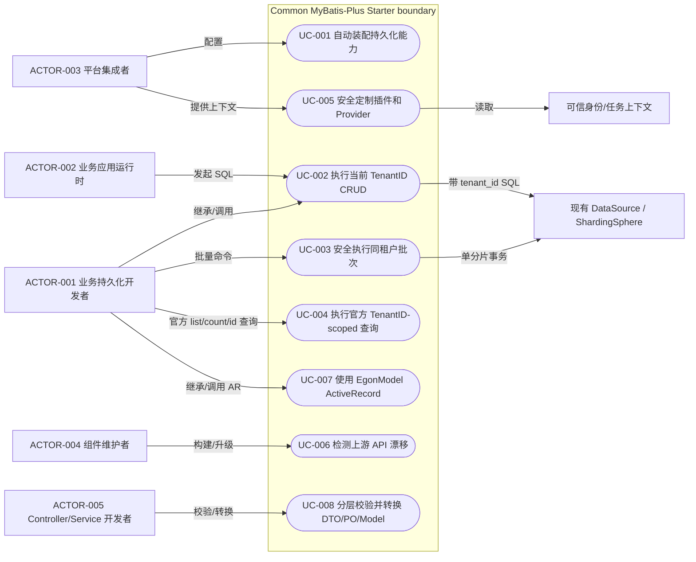
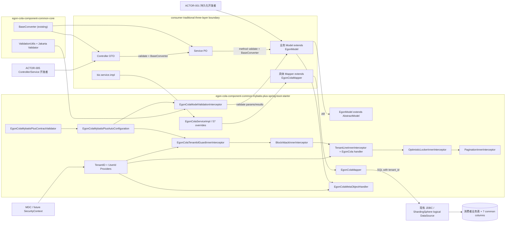
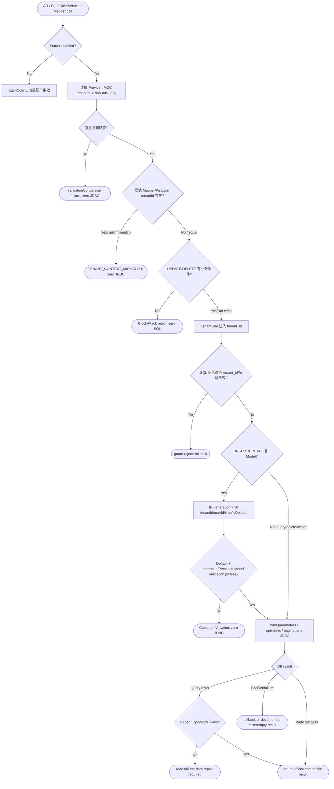

# Egon COLA Common MyBatis-Plus Starter 全量增强设计

| Field | Value |
| --- | --- |
| Document | `2026-08-19-16-11-common-mybatis-plus-starter.md` |
| Template Version | `4` |
| Status | `Accepted` |
| Type | `Feature / Architecture` |
| Complexity | `Complex` |
| Complexity Drivers | `MyBatis-Plus 3.5.16 AbstractModel ActiveRecord、57 个 IService 可见方法重写、Mapper/AR/IService 三入口一致性、DTO/PO/Model 分层校验、Common Core Jakarta Validation 边界修订、TenantID 隔离、元字段生命周期与旧 Plan 失效` |
| Created | `2026-08-19 16:11 CST` |
| Updated | `2026-08-21 14:50 CST` |
| Owner | `Mario / Egon-COLA maintainers` |
| Repository | `Egon-COLA` |
| Scope | `egon-cola-component-common-core 新增通用 Jakarta Validation 工具；egon-cola-component-common 下新增 MyBatis-Plus Starter，交付 EgonModel ActiveRecord、EgonColaMapper/IService/ServiceImpl、校验/转换接入、TenantID 隔离、元字段填充、BOM/文档/模块内测试` |
| Change Surface | `修改 common-core POM/边界测试并新增 ValidationUtils；新增 MyBatis-Plus Starter，直接依赖官方 Boot 3 MyBatis-Plus Starter/JSqlParser、common-core 和 Boot Validation；新增 EgonModel、只扩展 BaseMapper 的 EgonColaMapper、57 方法 IService 套件、MDC TenantID/UserId Provider、MetaObjectHandler、参数/结果自动校验与隔离拦截器；不新增自定义 tenant 查询或 SQL Injector；消费者表和业务 DTO/PO/Model 由采用者迁移，本 Spec 不修改具体业务表或 Archetype` |
| Affected Chapters | `§7, §8, §9, §10, §13, §14, §15, §16, §17, §18` |
| Source Requirement | `2026-08-19 原始 Mapper/IService 全量增强；2026-08-20 Boot3 Starter/MDC 隔离上下文；2026-08-21 EgonModel ActiveRecord 全套、DTO/PO/Model 分层校验、common-core ValidationUtils、BaseConverter 转换、仓储手动/自动校验；删除 businessId 与 create/update user name，只保留 Long tenantId 和 user ID/time，逻辑删除为 isDeleted/is_deleted；最终决定不保留 4 个重复 Service tenant 查询和 3 个 Mapper/Injector 查询，直接增强官方 list/count/getById/getOptById 等方法` |
| Baseline Revision | `main@0b7b9b3a2a4bc71ae4bb3ce127270d00033e8b60；2026-08-21 14:07 CST dirty-worktree snapshot；4ae5419c..0b7b9b3a 仅新增无关 RPC 文档提交，目标 Common 源码未漂移；保留 staged GatewayContractVersions 删除、未跟踪 0 文件及无关 Gateway Spec/Plan、IdP OAuth Spec；本 Spec 与 obsolete MyBatis Plan 仍为未跟踪文件` |
| Amends | `None` |
| Supersedes | `None` |
| Depends On | `[Common enterprise restructure](../../superpowers/specs/2026-07-07-egon-cola-component-common-enterprise-restructure-design.md) §3.3-§4.3、§5.1、§6、§11-§12（保留聚合/BOM/底层依赖方向；由本 Spec 明确修订 common-core 禁止 Jakarta Validation API 与不做业务实体基类的旧范围）` |
| Related Specs | `None` |
| Related Plans | [Current implementation Plan](../plan/2026-08-21-14-23-common-mybatis-plus-implementation.md)（基于本 Accepted revision，状态为 Ready，用户已确认执行）；[Obsolete pre-ActiveRecord implementation Plan](../plan/2026-08-20-15-01-common-mybatis-plus-implementation.md)（基于 2026-08-20 旧 revision，已被新 Plan 取代，不得执行） |

## 1. Summary

本设计在 `common-core` 增加无 Spring 依赖的 Jakarta Validation 门面 `ValidationUtils`，并在 `egon-cola-component-common` 下新增一个业务按需依赖的 `egon-cola-component-common-mybatis-plus-spring-boot-starter`。Starter 交付成套持久化技术合同：`EgonModel<M extends EgonModel<M>>`、只扩展官方 `BaseMapper` 的 `EgonColaMapper<T>`、`EgonColaIService<T>`、`EgonColaServiceImpl<M,T>`、自动填充、TenantID 隔离以及仓储层手动/全局自动校验。租户查询直接增强官方 `list/count/getById/getOptById` 等方法，不新增同义 Service/Mapper API 或自定义 SQL Injector。

MyBatis-Plus 文档仍常见 `User extends Model<User>` 示例，但已锁定的 3.5.16 发布 Jar 实际只包含 `com.baomidou.mybatisplus.extension.activerecord.AbstractModel`，不存在 `Model`。因此 `EgonModel` 继承真实 `AbstractModel` 并保留其 14 个 AR 能力；6 个基础写/删入口使用 final Template Method 增加技术生命周期钩子，`insertOrUpdate` 复用动态分派，不复制上游算法。所有 AR、Mapper、IService SQL 共用同一 TenantID Provider/TenantLine、自动填充与 Model 校验链。

2026-08-21 最新需求删除 `businessId` 概念：公共 Model、Provider、Mapper/Service 方法、SQL 列、配置、测试与文档均不得出现该合同。`EgonModel` 仅保留 non-null `Long tenantId`，它同时是租户/分片隔离键，由 `MetaObjectHandler` 从当前 MDC/SecurityContext Tenant Provider 权威填充，不由 DTO/PO/converter 提供。查询、更新、删除缺少当前 tenantId 均在 JDBC 前失败；TenantLine 对 AR、Mapper、IService 统一追加 `tenant_id`。`MetaObjectHandler` 还权威填充创建/更新用户 ID、创建/更新时间和 `isDeleted`。Controller 校验 DTO、业务 Service 校验 PO、仓储校验 Model；两次真实边界转换均使用现有 `BaseConverter`，复杂业务规则仍归业务 Service。

## 2. Background and Current State

### 2.1 Business and user context

目标使用者是采用 MyBatis-Plus 的 Egon-COLA 业务应用开发者。他们需要一个统一的持久化技术底座：引入一个 Starter 后获得可替换的自动装配、统一 Mapper/Service 扩展、租户/分片键保护、分页、乐观锁、批量写、逻辑删除兼容和审计时间填充；业务模块仍负责自己的表、实体、Mapper 子接口和具体 Service。

用户给出的 FamilyAiButler 文件是实现参考，不是规范指令。参考代码证明了预期能力形状，但其 `String businessId`、`selectByBusinessId(): T`、两个 `MybatisPlusInterceptor` Bean、`extention` 拼写和固定 `Date` 填充不自动成为 Egon-COLA 合同。

### 2.2 Repository evidence

| Evidence ID | Classification | Exact path/symbol/decision/command | Observed fact | Design significance | Verification limit/freshness |
| --- | --- | --- | --- | --- | --- |
| `EVD-001` | Static repository | `egon-cola-components/egon-cola-component-common/pom.xml:14-27` | Common 是 `packaging=pom` 聚合器，当前聚合 7 个具体模块 | 新能力应作为一个具体子模块加入，而不是把运行时依赖放进聚合 POM | 只证明当前源码结构 |
| `EVD-002` | Static repository | `egon-cola-components/egon-cola-components-bom/pom.xml:60-96` | Components BOM 逐个导出可消费 Common Artifact | 新 Starter 必须加入 BOM，业务方不直接依赖聚合器 | 不证明外部消费者版本 |
| `EVD-003` | Static repository | `egon-cola-components/pom.xml:67-128` | 组件父工程为 Java 21、Spring Boot 3.5.16，并集中管理生产依赖版本 | 新模块必须使用 Java 21/Spring Boot 3，不另建版本体系 | 未执行依赖解析 |
| `EVD-004` | Static repository | `common-id-starter/.../IdGeneratorAutoConfiguration.java:15-31`、`.../IdGeneratorAutoConfigurationTest.java:18-124` | Common Starter 使用 `@AutoConfiguration`、`@ConditionalOnMissingBean`、`AutoConfiguration.imports` 与 `ApplicationContextRunner`，测试留在 Starter 内 | 采用单 Starter + 内部测试 + 可覆盖 Bean 的仓库模式 | 只证明 ID Starter 模式，不等于 MyBatis 运行正确 |
| `EVD-005` | Static repository | `egon-cola-component-common/README.md:7-21,237-256,281-285` | Common 强调按需依赖、稳定契约、现有 Starter 与 common reactor 验证命令 | 新模块需更新双语文档并保持按需依赖 | README 可能与外部用户实际用法有差异 |
| `EVD-006` | External reference source | `/Users/mario/SelfProject/FamilyAiButler/.../FamilyMybatisAutoConfiguration.java:28-31`、`MybatisPlusConfig.java:29-57` | 参考实现自动导入分页、乐观锁、防全表和 SQL Injector | 分页/乐观锁/防全表方向可复用；Bean 数量、顺序和条件需重新设计，Injector 已由 `EVD-024` 排除 | 外部 dirty repository；不是 Egon-COLA 规范 |
| `EVD-007` | External reference source | `.../EgonMapper.java:13-24`、`IEgonService.java:15-23`、`IEgonServiceImpl.java:15-25` | 参考实现扩展 `BaseMapper/IService/ServiceImpl`，只新增一个 String `businessId` 单行查询 | 只证明扩展形状；最新需求已明确不采用该字段/方法命名 | 参考文件不是规范指令，不证明查询唯一性或租户安全 |
| `EVD-008` | External reference source | `.../SelectByBusinessId.java:25-56`、`BaseInjector.java:20-34` | 参考 SQL Injector 复用 `SELECT_BY_ID` 模板，把 `business_id` 当单行查找列并保留逻辑删除条件 | 最新用户决定不复制该 Injector；官方 BaseMapper SQL 经 TenantLine 增强即可完成相同 tenant scope | 未执行参考 SQL；外部表约束未知 |
| `EVD-009` | External published source | `https://repo1.maven.org/maven2/com/baomidou/mybatis-plus-extension/maven-metadata.xml`，2026-08-19 查询 | Maven Central 最新发布为 3.5.17；元数据更新时间 2026-07-08 | 必须显式锁版本，不能使用漂移的 latest | 网络快照；未来可变化 |
| `EVD-010` | External published source | MyBatis-Plus tag `v3.5.16` 的 `IService.java` 与 `IRepository.java`；`jar tf` 对比 3.5.16/3.5.17 `mybatis-plus-spring` | 3.5.16 的 `IService` 直接声明 4 个方法并继承 `IRepository` 53 个方法；3.5.17 已移除 `IService/ServiceImpl` | 用户要求“全部重写 IService”与 3.5.17 不兼容；推荐锁 3.5.16 | 静态发布物，不证明与所有数据库组合运行 |
| `EVD-011` | External published source | 3.5.16 `MybatisPlusInnerInterceptorAutoConfiguration` 源码 | 官方自动配置在存在 `InnerInterceptor` Bean 且缺少 `MybatisPlusInterceptor` 时按 Spring 顺序组装列表 | 本 Starter 应声明有序 InnerInterceptor Bean，而不是创建多个外层拦截器 | 自定义外层 Bean 时官方会 back off，需额外验证 |
| `EVD-012` | Static repository | `egon-cola-archetypes/.../shardingsphere-sharding*.yml` 与 `ShardingSphereDataSourceConfiguration` | Archetype 已存在 ShardingSphere 逻辑数据源与多种业务分片列，但当前没有统一 TenantID 约定 | 新 Starter 只保证 SQL 携带 `tenant_id`，不接管分库分表拓扑 | 未启动 Archetype，不证明真实路由 |
| `EVD-013` | Superseded user decision | 2026-08-21 较早一轮 | 曾要求 non-null Long `businessId` 不由 Handler 填充 | 仅解释旧 Plan/Spec 为何包含 businessId | 已被 `EVD-021` 完全取代，不是 effective requirement |
| `EVD-014` | Static repository | `git rev-parse HEAD`、`git status --short`、`git diff 4ae5419c..HEAD -- <target Common paths>` at 2026-08-21 14:07 CST | 基线为 `0b7b9b3a2a4bc71ae4bb3ce127270d00033e8b60`；4ae5419c 后仅新增无关 RPC 文档提交，目标 Common 源码无 diff；dirty worktree 仍含 staged GatewayContractVersions 删除、未跟踪 `0`、无关 Gateway MCP Spec/Plan、IdP OAuth Spec、旧 MyBatis Plan 与本设计文档 | Spec/Plan 阶段仅修改本 Spec 与关系文档；不得覆盖、恢复或提交无关状态 | 状态是时间点快照，实施前必须重查 |
| `EVD-015` | User decision | 2026-08-20 决定 1 | 生产模块使用官方 `com.baomidou:mybatis-plus-spring-boot3-starter:3.5.16`，不直接依赖 `org.mybatis.spring.boot:mybatis-spring-boot-starter`、`org.mybatis:mybatis`、`org.mybatis:mybatis-spring` 或 raw `mybatis-plus`；租户/分页插件仍使用同版本官方 `mybatis-plus-jsqlparser` | POM 依赖边界与 dependency tree 测试必须把原生/底层直接依赖排除 | 传递依赖仍由官方 Starter 自身管理 |
| `EVD-016` | Published artifact + official source | `/Users/mario/maven/repository/com/baomidou/mybatis-plus-extension/3.5.16/mybatis-plus-extension-3.5.16.jar`，`jar tf`/`javap`；官方 tag `v3.5.16` `AbstractModel.java` | 3.5.16 只有 `AbstractModel`，没有 `Model`；公开 14 个 AR 方法；3.5.7/3.4.3.4 发布 Jar 仍含 `Model` | 保持 3.5.16 时 `EgonModel` 必须扩展 `AbstractModel`，文档示例名不能覆盖真实 ABI | 静态发布物；不证明所有方言运行行为 |
| `EVD-017` | Static repository | `common-core/.../converter/BaseConverter.java` 与 `BaseConverterContractTest` | 已有 `BaseConverter<S,T>`、双向单体/列表转换及 MapStruct/MapStruct Plus 兼容测试 | DTO<->PO、PO<->Model 直接复用现有契约，不新增反射式万能转换器 | 不证明具体业务字段映射正确，业务 converter 必须单测 |
| `EVD-018` | Static repository | `common-core/pom.xml`、`CoreBoundaryTest`、`common-test/SourceBoundaryAssert` | common-core 当前没有 Jakarta Validation；边界测试禁止所有 `import jakarta.`；Common README 只承诺无 Spring 运行时依赖 | 新 `ValidationUtils` 需要 `jakarta.validation-api` 并把边界改为“只允许 Jakarta Validation API”，仍禁止 Spring/JPA/Servlet | 这是对 predecessor §6/§11 的明确修订，不允许泛化为任意 Jakarta 依赖 |
| `EVD-019` | Static repository | `common-core/.../OperatorContext.java`、Gateway/RBAC 审计 PO、Archetype `@Valid/@Validated` 与 Validation POM | 现有审计用户/租户多使用 String，审计时间大量使用 `Instant`；Controller DTO 和 Service method validation 已有 Spring/Jakarta 先例 | userId 采用 String、时间采用 Instant；用户最新删除 userName；本组件 tenantId 采用 Long，未来 Security adapter 负责映射 | 仓库命名存在 `createdAt/createTime` 并存；本需求字面采用 `createTime/updateTime` |
| `EVD-020` | Superseded-in-part user decision | 2026-08-21 较早一轮 | `EgonModel`、Mapper、IService、ServiceImpl 必须成套；Handler 曾被要求填创建/更新用户 ID、name、时间、tenantId、deleted，明确不填 businessId | 完整套件、ID/time/tenant 填充仍有效；businessId、name、deleted 命名分别由 `EVD-021`-`023` 取代 | “update”按对称字段 `updateUserId/updateTime` 解释，记录为 `ASM-005` |
| `EVD-021` | User decision | 2026-08-21 最新“都不需要 businessId，有 tenantId 就行了” | 全部删除 businessId 字段及其 Provider/方法/SQL/配置/测试合同；tenantId 是唯一租户/分片键并由 MetaObjectHandler 填充 | 目标只保留 `Long tenantId`、`tenant_id` 与 `EgonColaTenantIdProvider`；PO->Model 不映射任何租户字段 | 这是 effective requirement，再次使旧 Plan 与本 Spec 的 businessId revision 失效 |
| `EVD-022` | User decision | 2026-08-21 最新“name字段不要了，只留ID” | 删除 create/update user name 字段、MDC key、Provider 值、列、配置与测试 | 公共审计身份只有 `createUserId/updateUserId`，UserId Provider 只返回 String ID | effective requirement |
| `EVD-023` | User decision | 2026-08-21 最新“逻辑删除字段叫is_deleted不是deleted” | Java 属性/物理列精确命名为 `isDeleted/is_deleted` | EgonModel annotation、MetaObject fill、DDL 采用合同、SQL/测试必须同步 | effective requirement |
| `EVD-024` | User decision | 2026-08-21 最新“不用保留这四个，用原本的 list 等方法进行增强” | 删除 4 个 current-tenant Service 方法、3 个 Mapper 方法及 SQL Injector；租户读写能力只增强 57 个官方 IService 方法、BaseMapper 和 AR | 直接设计消除 fetch-then-forward 与重复 tenant predicate；EgonColaMapper 只提供受泛型约束的统一继承点 | effective requirement；关闭 Plan 必要性审计 blocker |

### 2.3 Problem statement and gap

Egon-COLA 当前没有 MyBatis-Plus 依赖、公共 AR Model/Mapper/Service、仓储 Model 校验或租户行条件自动装配。DTO/业务参数已有零散 Jakarta Validation 先例，但 common-core 没有可复用的手动校验门面；若各业务分别在 Controller、Service、Mapper 和 AR 方法中写校验、填充和 TenantID 条件，将形成四套容易漂移的规则。

FamilyAiButler 参考实现只覆盖 Mapper/Service/Handler 的一小部分，没有 AR 基类、DTO/PO/Model 分层校验或通用转换边界；其 `String businessId` 合同已被用户明确删除，也不能复制为目标 tenantId。目标需要从“示例扩展”提升到“可发布成套持久化合同”，同时保持复杂业务规则在业务 Service，而不是塞入 AR 实体或通用 Validator。

### 2.4 Evidence and current-chain map

| Entry/trigger | Current call chain | Data read/written | External dependency | Consumers | Evidence |
| --- | --- | --- | --- | --- | --- |
| 业务应用引入 Common 具体能力 | 业务 POM -> Components BOM -> Common 具体 Jar -> `AutoConfiguration.imports` | 无 | Maven/Spring Boot | Egon-COLA 业务应用 | `EVD-001`-`EVD-005` |
| Controller 到仓储的业务对象流 | Controller `@Valid` DTO -> `BaseConverter<DTO,PO>` -> business Service method validation -> `BaseConverter<PO,Model>` -> Mapper/IService/AR | DTO、PO、Model、业务表 | Jakarta Validation/Spring Method Validation/MyBatis | 采用该 Starter 的三层业务模块 | 用户 2026-08-21 + `EVD-017`-`EVD-019`；当前尚无统一 MyBatis 实现 |
| 参考项目单条自定义查询 | `PasswordViewServiceImpl -> IEgonServiceImpl -> EgonMapper.selectByTenantId -> injected SELECT` | `password_view.tenant_id` | MyBatis-Plus 3.5.12 | FamilyAiButler PasswordView | `EVD-006`-`EVD-008` |
| 官方 3.5.16 Service 调用 | `IService -> IRepository default/abstract method -> ServiceImpl/CrudRepository -> BaseMapper` | 消费者业务表 | MyBatis-Plus/MyBatis/JDBC | 所有扩展 Service | `EVD-010` |
| 官方 3.5.16 AR 调用 | `EgonModel -> AbstractModel public method -> SqlSession -> mapped BaseMapper statement` | 消费者 Model/业务表 | MyBatis-Plus `AbstractModel` | 所有 AR 实体 | `EVD-016`；需要对应 BaseMapper 被注册 |
| Archetype 分片 SQL | 业务 DAO/SQL -> ShardingSphere logical DataSource -> physical route | 业务分片表 | ShardingSphere | 生成项目 | `EVD-012`；TenantID 路由尚不存在 |

## 3. Goals and Non-goals

### 3.1 Goals

1. 在 `common-core` 新增只依赖 Jakarta Validation API 的通用 `ValidationUtils`，并新增一个按需引入的 Common MyBatis-Plus Spring Boot Starter。
2. 自动装配一个顺序确定、可验证、可覆盖但不能静默失去 TenantID 保护的插件链。
3. 对 MyBatis-Plus 3.5.16 `IService` 可见的 57 个方法逐一重声明和重写，形成版本冻结与增强语义。
4. 提供继承 3.5.16 `AbstractModel` 的 `EgonModel`，完整保留 14 个 AR 能力，并通过 final 写入模板、生命周期钩子、自动填充、仓储校验和统一隔离链增强 AR。
5. 提供 `EgonColaMapper`、`EgonColaIService` 与 `EgonColaServiceImpl`；租户查询只增强官方 Mapper/IService/AR 方法，不新增同义查询或 SQL Injector。
6. 统一 `EgonModel` 的 `id/tenantId/createUserId/createTime/updateUserId/updateTime/isDeleted` 7 个公共字段、非空持久化状态与 `@TableLogic`；MetaObjectHandler 除 id 外权威填充其余技术字段。
7. 明确 Controller 校验 DTO、业务 Service 校验 PO、Repository 校验 Model；复用 `BaseConverter` 实现 DTO<->PO 与 PO<->Model 显式转换，复杂业务校验仍由 Service 组合完成。
8. 提供分页、乐观锁、防全表更新/删除、批次上限、事务、参数/结果自动校验和启动期合同验证。
9. 用 API parity、Validation、H2/MyBatis AR/Mapper/IService、并发隔离、BoundSql/真实 SQL、自动装配与边界测试证明设计。

### 3.2 Non-goals

- 不在本 Starter 内实现 ShardingSphere、动态数据源、实际分库/分表算法或 DataSource 创建。
- 不新增任何生产 Flyway migration，不修改消费者既有表；采用者负责为 EgonModel 公共列建立 NOT NULL、逻辑删除默认值和真实索引并完成历史数据迁移。
- 不在本 Starter 中猜测 Egon IdP/RBAC 的 String tenantId 到 Long tenantId 的映射策略，也不依赖安全平台模块；未来 SecurityContext TenantId Provider 由消费者实现显式映射。
- 不提供额外静态 Validator/ThreadLocal TenantID Holder；ValidationUtils 通过构造器接收 `Validator`，Provider 默认读 MDC，未来业务可用 SecurityContext Bean 覆盖。
- 不提供公共跨租户读写、`@InterceptorIgnore(tenantLine=true)` 管理 API 或绕过保护的“超级管理员”快捷入口。
- 不生成具体业务 Controller/DTO/PO/Model、Repository Port、DDD Aggregate 或数据库迁移；只定义采用规范和测试 fixture。
- 不在 `EgonModel` 生命周期钩子或 Jakarta ConstraintValidator 中实现跨表查询、权限、状态机、远程调用等复杂业务逻辑。
- 不引入反射式万能 Converter，不修改 `BaseConverter` 的现有双向合同。
- 不修改 FamilyAiButler 参考仓库，不保留其包名、注释模板或 `extention` 拼写。

### 3.3 Change Surface and Design Depth

| Area/layer | Disposition | Exact repository evidence | Changed or preserved behavior/contract | Required Spec treatment | Chapter(s) |
| --- | --- | --- | --- | --- | --- |
| Maven 版本与模块/BOM wiring | Affected | `egon-cola-components/pom.xml`、`common/pom.xml`、`components-bom/pom.xml` | 管理 MyBatis-Plus 版本、聚合并导出一个新 Starter | 精确文件、依赖和兼容设计 | `§7, §8, §16, §17` |
| common-core Validation 契约与边界测试 | Affected | `common-core/pom.xml`、`CoreBoundaryTest`、`common-test/SourceBoundaryAssert`、`EVD-018` | 新增实例式 ValidationUtils；仅放开 `jakarta.validation.*`，继续禁止 Spring/JPA/Servlet | API、依赖、错误、边界和测试详细设计 | `§7, §8, §9, §10, §13, §14, §15, §16, §17, §18` |
| Starter 自动装配与插件链 | Affected | 现有 Common Starter 模式 `EVD-004`；目标模块尚不存在 | 新增有序 InnerInterceptor、MetaObjectHandler、属性和 fail-fast validator；复用官方默认 SQL Injector | 完整架构、失败、配置、测试与运维边界 | `§7, §8, §13, §14, §15, §16, §17, §18` |
| `EgonColaMapper/EgonColaIService/EgonColaServiceImpl` Java API | Affected | 用户要求；MyBatis-Plus 3.5.16 API `EVD-010`；最终决策 `EVD-024` | Mapper 只扩展 BaseMapper；57 个官方 IService 方法全量重声明/重写，不增加同义 Service/Mapper 方法 | 原子内部接口合同、泛型、错误、事务和兼容设计 | `§7, §8, §9, §10, §13, §14, §15, §16, §17, §18` |
| `EgonModel` ActiveRecord/字段/生命周期 | Affected | 用户 2026-08-21 决定；3.5.16 发布物 `EVD-016` | 新增 `EgonModel` 继承 `AbstractModel`，保留 14 AR 方法；统一 7 个公共字段、final 写模板和技术生命周期钩子 | 完整 AR 合同、字段、继承、状态、校验与兼容设计 | `§7, §8, §9, §10, §13, §14, §15, §16, §17, §18` |
| DTO/PO/Model 校验与 BaseConverter 对象流 | Affected | 用户 2026-08-21；`BaseConverter`/Validation evidence `EVD-017`-`EVD-019` | DTO->PO->Model 各在真实边界转换/校验；仓储自动验证继承字段和业务 Model 字段 | 对象角色、转换所有权、手动/自动校验、失败与测试 | `§7, §8, §9, §10, §13, §14, §15, §16, §17, §18` |
| TenantID 模型与租户/分片语义 | Affected | 最新用户决定 `EVD-021` | 只保留 non-null `Long tenantId`，由 TenantId Provider + MetaObjectHandler 权威填充；DTO/PO/converter 不供应租户键；所有 SQL 统一隔离 | 字段、生命周期、并发、失败和安全设计 | `§7, §8, §9, §10, §13, §14, §15, §16, §17, §18` |
| 双语文档与模块验证 | Affected | `README.md/README.zh-CN.md`、现有 Common 验证命令 | 增加模块说明、配置、使用/限制、方法覆盖与验证 | 精确文件和验收边界 | `§8, §14, §16` |
| 消费者业务表/索引/migration | Context-only | 仓库无可代表所有消费者的 MyBatis 业务表；Archetype 分片列不统一 | 不改表；采用表必须提供 7 个公共列的兼容映射/非空约束并自行设计 tenant_id 索引/迁移 | §11 记录采用前置条件和验证界限 | `§11` |
| Archetype ShardingSphere 配置 | Unchanged | `egon-cola-archetypes/**/sharding*.yml` | Starter 不创建/修改路由规则，只让 SQL 暴露 TenantID | 保留边界与后续集成验证 | `§11, §16` |
| `BaseConverter` 与其他 Common API | Context-only | `common-core/.../BaseConverter.java`、`EVD-017` | BaseConverter 签名不改；新增 ValidationUtils 后其他 core/trace/id/crypto/desensitize 语义保持 | 转换映射/边界回归，不重设计 Converter | `§10, §14, §16` |
| HTTP/RPC/Event 接口 | Not applicable | 本请求只有 Java/Mapper 内部合同 | 无网络协议或外部 wire payload | 证据化 N/A | `§9` |
| Frontend | Not applicable | `egon-cola-components/egon-cola-component-common` 无前端模块 | 无页面、路由或交互变化 | 证据化 N/A | `§12` |

## 4. Requirements and Acceptance Criteria

| ID | Atomic requirement | Priority | Observable acceptance criteria | Source |
| --- | --- | --- | --- | --- |
| `REQ-001` | 在 Common 聚合下新增单一 `egon-cola-component-common-mybatis-plus-spring-boot-starter` | Must | Common reactor 能定位并构建该 Jar；无额外 core/test 子模块 | 用户“在这下面新增一个…模块”；仓库单 Starter 先例 |
| `REQ-002` | 新增公共 MyBatis 类型使用 `EgonCola` 前缀，用户明确命名的 `EgonModel`、`ValidationUtils` 除外 | Must | 公共 API 扫描不存在 `Family*`、自定义 Injector 或 `IEgonServiceImpl`；例外仅两类 | 用户原命名约束 + 2026-08-21 明确类名 |
| `REQ-003` | 通过 Boot 3 `AutoConfiguration.imports` 自动装配 | Must | 无 `@ComponentScan` 时加载，关闭属性时不创建 Bean | 用户自动装配要求；`EVD-004` |
| `REQ-004` | 提供 `EgonColaMapper<T extends EgonModel<T>>` 并保留全部 `BaseMapper` 能力 | Must | 消费者 Mapper 只需 extends 即获得官方 MappedStatement、统一 Model 泛型边界和 TenantLine/validation 增强；无新增 Mapper 方法 | 用户自有 Mapper 要求 + `EVD-024` |
| `REQ-005` | 提供 `EgonColaIService<T>` 和 `EgonColaServiceImpl<M,T>` | Must | 业务 Service 接口/实现能以统一泛型继承并执行 | 用户自有 IService 要求 |
| `REQ-006` | 全量重声明/重写 MyBatis-Plus 3.5.16 `IService` 可见 57 个方法 | Must | 反射 parity 测试逐签名比对接口 declared methods 和实现 declared methods，缺一即失败 | 用户“全部都要进行重写，增强” |
| `REQ-007` | 所有 SQL 操作从可替换 `EgonColaTenantIdProvider` 取得 non-null 当前 tenantId；默认读取 MDC `tenantId`，未来改 SecurityContext | Must | 缺失/非法文本在 JDBC 前失败；有效 Long 同时供 TenantLine、显式参数守卫与 MetaObjectHandler fill 使用；无静态上下文 | `EVD-021` |
| `REQ-008` | 唯一租户/分片字段为 Java `Long tenantId`、物理列 `tenant_id`，不限制正负/零但持久状态不允许 null | Must | 任意 Long 通过；write 时由 Handler 权威填充，loaded Model 的 null 被仓储校验拒绝；数据库为 BIGINT NOT NULL | 用户先前 Long 决定 + 最新只留 tenantId `EVD-021` |
| `REQ-009` | TenantID 作为租户/分片键而非单行唯一业务键 | Must | 官方 `list/count` 可返回当前 TenantID 多行/计数；官方 `getById/getOptById` 由 TableId + TenantLine 精确查询；不新增 tenant-named 别名 | 用户“分库分表的租户id” + `EVD-024` |
| `REQ-010` | AR、IService、Mapper、Wrapper、链式和 Mapper 直调都使用同一 tenantId 隔离链 | Must | 写 Model 的 tenantId 由 Handler 覆盖为当前 Provider；显式 Mapper/wrapper tenantId 只允许 non-null 且等于 Provider；TenantLine 统一追加条件；载入 Model 校验与当前 Provider 一致 | 用户“不重复多套增强逻辑” + `EVD-021` |
| `REQ-011` | 批量写在一次方法调用内捕获一个当前 tenantId 快照，并有可配置批次上限 | Must | 初始 context 缺失、Model 业务约束或 oversize 在首条 JDBC 前失败；每 statement 后校验 fill 值等于快照，中途 context changed 在 commit 前抛异常并整批 rollback；合法批次原子提交 | 用户“增强/功能全” + `EVD-021` |
| `REQ-012` | 增加防全表写、乐观锁和分页能力并固定顺序 | Must | 空条件更新/删除先被拒绝；tenant 条件、version、pagination 均在真实 SQL 生效 | 参考配置 + 安全增强 |
| `REQ-013` | 分页默认最大 500、页大小必须为正并可配置 | Must | 越界值在 SQL 前失败或按审核后的明确规则处理 | Common `PageQuery` 最大 500 与分页安全 |
| `REQ-014` | 不新增自定义 SQL Injector 或同义 tenant 查询；保留 MyBatis-Plus 默认 Injector 与全部 BaseMapper statement | Must | Mapper Configuration 只有官方默认 statement inventory；源码/反射扫描不存在 4 个已删除 Service 方法、3 个 Mapper 方法和 Injector 类 | `EVD-024` + minimum-design audit |
| `REQ-015` | MetaObjectHandler 在 insert 填 `tenantId/createUserId/createTime/updateUserId/updateTime/isDeleted`，在 update 填 `tenantId/updateUserId/updateTime`；不填 id | Must | 调用方伪造的 tenantId/用户 ID/时间/isDeleted 被 TenantId/UserId Provider 与 Clock 权威覆盖；全部不含 name 字段 | 用户最新只留 tenantId 与用户 ID |
| `REQ-016` | 允许业务用未来 SecurityContext TenantID/UserId Provider 或自定义外层拦截器覆盖默认 Bean，但不能静默丢失隔离/校验/填充合同 | Must | MDC Provider 可 back off；安全自定义可用；外层插件、校验插件或 Handler 合同缺失时启动失败；不提供自定义 Injector seam | Starter 可扩展性与未来 SecurityContext 决定 + `EVD-024` |
| `REQ-017` | Starter 直接依赖 `mybatis-plus-spring-boot3-starter`、同版 `mybatis-plus-jsqlparser`、common-core 与 `spring-boot-starter-validation`；common-core 仅新增 `jakarta.validation-api`；不直接引原生 MyBatis 底层或其他平台/数据库依赖 | Must | dependency tree、POM 和 source boundary 通过；common-core 仍无 Spring/JPA/Servlet | 用户依赖决定 + ValidationUtils 需求 + `EVD-018` |
| `REQ-018` | 保留逻辑删除、Wrapper、Map/Obj、Kotlin chain 与批量事务等官方兼容语义 | Must | 57 方法分类测试覆盖返回类型、异常和代理事务 | 用户“官方方法全部” |
| `REQ-019` | MyBatis-Plus Boot 3 Starter/JSqlParser 版本固定为 3.5.16 并与 IService 合同一致 | Must | 两个官方 MyBatis-Plus Artifact 同版；3.5.17 或 raw/native direct dependency 不会漂移引入 | `EVD-009`、`EVD-010`、`EVD-015` |
| `REQ-020` | 新增双语 README 与完整使用/限制说明 | Must | 英中模块表、依赖片段、Provider、实体、Service、禁用/覆盖、验证命令同步 | 当前 Common 文档约定 |
| `REQ-021` | 测试全部位于新 Starter 内，不单独创建 test 模块 | Must | `src/test` 覆盖自动装配、API parity、SQL/事务/并发/边界 | 现有 Common Starter 先例 |
| `REQ-022` | 不启动服务或连接真实数据库完成本 Spec 和后续静态/module 验证 | Must | 本阶段仅写 Spec；实现验证使用嵌入式 fixture/构建命令 | AGENTS.md |
| `REQ-023` | 保留当前 dirty worktree 的无关改动 | Must | 设计阶段 diff 只包含本 Spec 与关联 Plan；后续实现限定目标路径与独立提交 | AGENTS.md / `EVD-014` |
| `REQ-024` | 提供 `EgonModel<M extends EgonModel<M>> extends AbstractModel<M>`，保留 3.5.16 全部 14 个 AR 方法并增强基础写/删生命周期 | Must | AR parity 对比 `AbstractModel`；insert/update/delete final 模板与 insertOrUpdate 动态分派测试通过 | 用户 `User extends Model<User>`/EgonModel 要求 + `EVD-016` |
| `REQ-025` | `EgonModel` 统一 7 个公共字段 `id/tenantId/createUserId/createTime/updateUserId/updateTime/isDeleted`，以 Jakarta Validation 表达简单规则，`isDeleted` 使用 `@TableLogic` | Must | 精确 7 字段 metadata/annotations、insert/update/load 验证与 H2 映射通过；公共 API/列/配置中无 name 或 businessId 合同 | 用户公共字段、非空、逻辑删除与最新删减要求 |
| `REQ-026` | common-core 提供实例式 `ValidationUtils` 支持对象、属性、值和 group 手动校验 | Must | 注入 Jakarta Validator 后返回违规集合或抛标准 ConstraintViolationException；无 Spring/static global；边界测试只放行 validation API | 用户通用 ValidationUtils 要求 |
| `REQ-027` | Starter 提供 `EgonColaModelValidationUtils` 和全局 MyBatis 自动校验 | Must | ParameterHandler 在填充后校验写入 Model，ResultSetHandler 校验查询 Model；AR/Mapper/IService 使用同一实现；可手动按操作 group 校验 | 用户仓储校验工具、手动/全局自动校验要求 |
| `REQ-028` | 分层校验固定为 Controller DTO、业务 Service PO、Repository Model | Must | 示例/合同测试证明 DTO `@Valid`、PO Method Validation、Model MyBatis validation；EgonColaIService 明确是持久化技术 Service，不代替业务 Service | 用户明确分层职责 |
| `REQ-029` | DTO<->PO 与 PO<->Model 均复用 `BaseConverter`，每个转换由真实边界所有者实现并测试 | Must | 无新反射 Converter；Controller converter 与 DAO/repository converter 字段映射、null/derived fields、列表转换测试通过 | 用户接入 BaseConverter 要求 + `EVD-017` |
| `REQ-030` | 业务 Model 子类的 Jakarta 简单约束与 EgonModel 继承约束一起自动校验；复杂业务规则留在业务 Service | Must | 业务字段 invalid 时 AR/Mapper/IService 均失败；需要数据库/权限/状态的规则只在 Service test 出现 | 用户业务实体校验与复杂校验边界 |

### 4.1 Scenario matrix

| Scenario | Actor/trigger | Preconditions | Main path | Alternative/failure path | Data/state change | Observable result | Requirements |
| --- | --- | --- | --- | --- | --- | --- | --- |
| Starter 默认装配 | 平台集成者引入依赖 | DataSource、Mapper scan、Jakarta Validator 存在 | Boot 加载 TenantId/UserId MDC Provider、InnerInterceptor、MyBatis validation plugin、handler、validator，并保留官方默认 Injector | 缺 Validator/上下文或自定义插件合同冲突时 fail-fast | 仅 Spring/MyBatis 配置 | 单一可验证隔离/校验/填充链 | `REQ-001`-`REQ-003`,`REQ-016`,`REQ-017`,`REQ-026`,`REQ-027` |
| DTO->PO->Model 正常写 | Controller/业务 Service | DTO/PO/Model converter 已实现；上下文有 tenant/user/business | DTO `@Valid` -> DTO/PO converter -> Service PO validation/complex rules -> PO/Model converter -> IService/Mapper/AR | 任一层约束失败即停在该边界；转换缺字段由下一边界校验发现 | 只在最终仓储事务写 Model | 一次业务动作、三种对象各守自己的约束 | `REQ-028`-`REQ-030` |
| AR insert/update/delete | 业务持久化开发者调用 EgonModel | 对应 BaseMapper 注册；tenant/user context 完整 | final AR template -> lifecycle before hook -> AbstractModel/SqlSession -> TenantLine -> Meta fill tenantId/userId/time/isDeleted -> Parameter validation -> JDBC -> after hook | hook/context/校验/SQL 失败不执行 after-success；insertOrUpdate 动态分派到 insert/update | 当前 tenantId 作用域 0/1 行 | 与 Mapper/IService 相同隔离、填充、校验结果 | `REQ-010`,`REQ-015`,`REQ-024`-`REQ-027` |
| 当前 TenantID 单行写 | EgonColaIService/Mapper | Model 业务字段有效且 tenant/user context 可解析 | guard/block attack -> TenantLine -> Meta fill 权威覆盖 tenantId/userId/time/isDeleted -> Model validation -> optimistic/write | context 缺失/格式错误、Model 业务约束、version 冲突或 DB 失败 | 当前执行上下文作用域 0/1 行 | true/false 或标准异常；传入伪造 tenantId 不产生跨租户写 | `REQ-006`-`REQ-012`,`REQ-025`-`REQ-027` |
| 当前 TenantID 查询 | AR/IService/Mapper query/list/page/chain | Provider 返回 non-null Long | TenantLine 注入 tenant_id -> SQL -> ResultSet Model validation | context 缺失/格式错误、数据库遗留无效 Model、分页越界均失败 | 无写 | 只返回当前 TenantID 且满足 Model 约束的数据 | `REQ-006`-`REQ-010`,`REQ-013`,`REQ-027` |
| 官方 list/count/id 查询 | EgonColaIService/Mapper/AR | 当前 TenantID Provider non-null | 官方 list/count/getById/getOptById/BaseMapper statement -> Guard/TenantLine -> JDBC -> result validation | context 缺失/格式错误或结果 Model 违约时失败；无 custom query fallback | 无写 | List/Count/T/Optional 保持官方形状且只见当前 TenantID | `REQ-004`,`REQ-006`,`REQ-009`,`REQ-010`,`REQ-014`,`REQ-018` |
| TenantID + TableId 精确查询 | EgonColaIService/Mapper | TableId 和当前 TenantID 非 null | custom SQL 同时匹配两列和逻辑删除 | missing/current scope 下无匹配返回 null/Optional.empty；null 参数拒绝 | 无写 | 最多一行 | `REQ-009`,`REQ-014`,`REQ-018` |
| 同一调用批量写 | EgonColaIService batch | 集合非空、size 合法；tenant/user context 完整 | 首条 JDBC 前捕获 tenantId 快照并验证业务约束 -> 单事务分批 -> 每 Model fill 同一 tenantId -> TenantLine -> commit | 任一 Model invalid、context 中途变化或 DB 失败整体 rollback | N 行同一隔离作用域原子变化 | 全部成功，否则零提交 | `REQ-011`,`REQ-018`,`REQ-027`,`REQ-030` |
| 批次实体携带伪造/null tenantId | EgonColaIService batch | 调用者预置技术字段 | 预置值被忽略，每个 statement 在 bind 前覆盖为批次 tenantId 快照 | Provider 上下文变化时 rollback，不使用传入值 | 只写当前 tenantId 作用域 | 伪造值不可影响 SQL 或分片路由 | `REQ-007`,`REQ-010`,`REQ-011`,`REQ-015` |
| 空 Wrapper 宽范围写 | 误用 `update/remove` | wrapper null/无业务谓词 | BlockAttack 在 TenantLine 之前检查原始 SQL | 立即拒绝，即便 tenant 插件本可加条件 | 零写入 | 不允许“全租户批改/删” | `REQ-012` |
| 自定义外层插件 | 高级集成者声明自己的 Bean | 自定义 Bean 存在 | validator 检查 TenantID guard、TenantLine、validation plugin 与分页末位；Injector 保持官方默认 | 缺失/顺序错误启动失败；显式禁用可选能力才允许 | 无业务数据变化 | 不静默 back off，也不扩展 Mapper SQL | `REQ-014`,`REQ-016` |
| 并发不同 MDC | 两个请求线程 | MDC 分别为两个有效 Long 及各自 tenant/user context | 每次操作读取当前线程 MDC，不缓存为单例状态 | 未传播/清理或缺值时对应调用失败，不降级/串租 | 各自解析值独立 | Starter 自身无跨线程缓存 | `REQ-007`,`REQ-010`,`REQ-015`,`REQ-027` |
| 查询遗留无效 Model | Repository 读取旧行 | 行缺公共字段或违反业务 Model 简单约束 | ResultSetHandler 在返回上层前验证 Persisted sequence | 读取失败并给出确定 property path；不返回半合法 Model | 无写 | 调用者/运维定位数据修复，不静默吞掉 | `REQ-025`,`REQ-027`,`REQ-030` |
| MyBatis-Plus 升级 | 维护者修改版本 | API parity 基线存在 | 构建对比 IService 方法签名 | 新增/删除/修改任一方法测试失败，要求新 Spec | 无数据 | 不会静默漏重写 | `REQ-006`,`REQ-019` |

### 4.2 Use-case analysis

#### 4.2.1 Actor inventory

| Actor ID | Actor/role | Goal and responsibility | Entry/channel | Permission/tenant context | Evidence |
| --- | --- | --- | --- | --- | --- |
| `ACTOR-001` | 业务持久化开发者 | 定义 DTO/PO/Model/converter 并用统一 AR/Mapper/IService CRUD | Java inheritance/injection | 业务 Model 不提供可信 tenantId；不自行拼隔离 SQL | 用户 2026-08-21 全套/分层/租户简化要求 |
| `ACTOR-002` | 业务应用运行时 | 在一次请求/任务中执行带 tenantId 条件、审计填充和 Model 校验的 SQL | AR/Spring Service/Mapper proxy | 当前 `tenantId/userId` 必须可取得 | `EVD-021`,`EVD-022` |
| `ACTOR-003` | 平台集成者 | 现在使用默认 MDC TenantId/UserId 来源，未来提供 SecurityContext Providers，并配置全局表例外/覆盖 Bean | Spring Configuration / properties | 默认 keys: `tenantId/userId` | 用户 2026-08-20/21 决定 |
| `ACTOR-004` | 组件维护者 | 发布、升级和验证 Starter 不发生 API/依赖漂移 | Maven/JUnit/source checks | 无业务租户权限 | `EVD-001`-`EVD-005`,`EVD-009`-`EVD-011` |
| `ACTOR-005` | Controller/业务 Service 开发者 | 分别校验 DTO/PO、执行复杂业务规则并显式转换对象 | `@Valid`、Method Validation、`BaseConverter` | Controller/Service 从既有认证上下文工作，不能暴露 Model | 用户分层校验与转换要求；`EVD-017`,`EVD-019` |

#### 4.2.2 Use-case artifact



| ID | Use case/goal | Primary actor | Supporting actors/systems | Trigger | Preconditions | Main success outcome | Alternatives/failures | Postconditions | Requirements | Interfaces/pages | Tests |
| --- | --- | --- | --- | --- | --- | --- | --- | --- | --- | --- | --- |
| `UC-001` | 自动装配持久化能力 | `ACTOR-003` | Spring Boot/MyBatis-Plus/Jakarta Validator | 引入 Starter 启动 Context | DataSource/Validator 存在 | 默认 MDC Providers、有序插件链、validation plugin、Handler 与官方默认 Injector 可用 | 禁用则零 Bean；自定义合同冲突则 fail-fast | 无业务数据变化 | `REQ-001`-`REQ-003`,`REQ-012`,`REQ-016`,`REQ-017`,`REQ-027` | Java auto-config | `TEST-001`-`TEST-008` |
| `UC-002` | 执行当前 TenantID CRUD | `ACTOR-001`,`ACTOR-002` | Provider、JDBC/Shard router | 调用任一官方 EgonColaIService 方法 | TenantId/UserId Providers non-null；Model 业务字段有效 | write 权威填 tenantId/userId/time/isDeleted，SQL 隔离、Model validation 后保持官方返回 | missing/explicit mismatch/invalid、empty wrapper、version/DB failure | 成功提交或零写/标准失败 | `REQ-005`-`REQ-010`,`REQ-012`,`REQ-018`,`REQ-025`-`REQ-027` | `INTERNAL-001`-`INTERNAL-057` | `TEST-009`-`TEST-024` |
| `UC-003` | 执行同一当前值批次 | `ACTOR-001`,`ACTOR-002` | TransactionManager/JDBC | 调用 save/update/remove batch | 非空集合、size 合法、全部 Model 一致 | 校验通过后分批但一个事务提交 | oversize/null/mismatch/invalid/中途失败 rollback | 全部或无 | `REQ-011`,`REQ-018`,`REQ-027`,`REQ-030` | batch contracts | `TEST-025`-`TEST-031` |
| `UC-004` | 执行官方 TenantID-scoped 查询 | `ACTOR-001` | BaseMapper/default Injector、TenantLine | 调用官方 list/count/getById/getOptById 或 AR query | Provider non-null；id/page/wrapper 按官方增强合同有效 | 官方 statement 被统一追加 tenant_id/logic-delete，返回多行、计数、精确行或 Optional | context 缺失、分页越界、逻辑删除、空结果或 loaded Model 违约 | 无写 | `REQ-004`,`REQ-006`,`REQ-009`,`REQ-010`,`REQ-014`,`REQ-018` | `INTERNAL-020`-`INTERNAL-057` + inherited AR queries | `TEST-013`-`TEST-018`,`TEST-032`-`TEST-038` |
| `UC-005` | 定制插件和 Provider | `ACTOR-003` | MDC、Spring bean override | 默认 MDC 或 SecurityContext Providers/ignored tables | 配置合同完整 | 自定义 Provider 覆盖 default，合法插件覆盖生效 | 关键隔离/校验/填充/顺序错误启动失败 | 来源可替换且无静默降级 | `REQ-007`,`REQ-016`,`REQ-017` | `INTERNAL-058`,`INTERNAL-066` | `TEST-039`-`TEST-045` |
| `UC-006` | 检测上游 API 漂移 | `ACTOR-004` | Maven Central/JUnit reflection | 修改 MyBatis-Plus version | 固定 parity fixture | 兼容版本通过 | 3.5.17 类缺失或签名差异阻断构建 | 需新 Spec/迁移决策 | `REQ-006`,`REQ-019`-`REQ-023` | build contract | `TEST-046`-`TEST-052` |
| `UC-007` | 使用 EgonModel ActiveRecord | `ACTOR-001`,`ACTOR-002` | AbstractModel/Mapper/validation/tenant plugins | Model 调用 insert/update/delete/select | 对应 Mapper 已注册，上下文完整 | 14 个 AR 能力可用，写模板触发统一 hooks/校验/填充/隔离 | missing mapper/context、Model invalid、SQL失败 | 与 Mapper/IService 相同结果和数据边界 | `REQ-010`,`REQ-015`,`REQ-024`-`REQ-027` | `INTERNAL-059`-`INTERNAL-064` + inherited AR | `TEST-053`-`TEST-064` |
| `UC-008` | 分层校验并转换 DTO/PO/Model | `ACTOR-005` | Jakarta/Spring Validation、BaseConverter | Controller 收到 DTO 或 Service 处理 PO | 对象角色和 converters 已定义 | 每层只校验本层对象，转换后下层重新校验；复杂规则在 Service | constraint/转换/复杂业务失败停在所属层 | 失败无 SQL；成功 Model进入统一仓储链 | `REQ-026`-`REQ-030` | `INTERNAL-065`,`INTERNAL-067` | `TEST-065`-`TEST-076` |

## 5. Constraints, Assumptions, and Decisions

### 5.1 Confirmed constraints

- Java 21、Spring Boot 3.5.16、Maven 多模块、Boot 3 `AutoConfiguration.imports`。
- 新公共 MyBatis 类型以 `EgonCola` 开头，用户明确的 `EgonModel` 和 common-core `ValidationUtils` 除外；包名使用正确 `extension`。
- TenantID 是唯一 non-null Long 租户/分片键；Java 属性 `tenantId`，数据库列 `tenant_id`；Handler 在 write 时权威填充。
- EgonModel 是仓储 ORM/AR Model；MyBatis `EgonColaIService` 是持久化技术 Service，不替代校验 PO/复杂规则的业务 Service。
- Common 外层继续只做 POM 聚合；业务方只依赖新 Starter Artifact。
- 本阶段只写 Spec；不写 Plan、不改生产代码、不启动服务。

### 5.2 Small-gap assumptions

| ID | Inference | Repository evidence | Why locally reversible | Impact if wrong |
| --- | --- | --- | --- | --- |
| `ASM-001` | Artifact 使用完整标准拼写 `mybatis-plus`，不采用请求中的 `mybati-plus` | MyBatis-Plus 官方 Artifact 与仓库 kebab-case | 只影响新路径，尚无消费者 | 用户若要求字面拼写需统一改模块/BOM/README |
| `ASM-002` | 单 Starter 内同时放公共 API、自动装配和测试 | Common ID/Desensitize Starter 现状 | 新模块尚未发布，可在 Plan 前调整 | 若拆 API/Starter 会增加 Artifact 与 BOM 项 |
| `ASM-003` | 审计字段固定使用用户字面名称 `createUserId/createTime/updateUserId/updateTime`，不再提供字段名 properties | 2026-08-21 字面需求；统一 EgonModel 的价值就是稳定字段 | 新模块尚未发布，命名可在审核时整体改 | 若业务已有 `createdAt/createdBy` 表需显式 migration/converter，不得静默双映射 |
| `ASM-004` | 公共字段类型为 `Long id`、`Long tenantId`、String user id、`Instant` time、`Boolean isDeleted` | 用户 Long 隔离键决定、`OperatorContext`、Gateway/RBAC PO 与 Java 21 时间证据 `EVD-019`,`EVD-021` | 尚无 Starter 消费者，审核时可统一变更 | 类型变化会影响公共 ABI、DDL、MetaObjectHandler 和 Provider，审核后不可局部漂移 |
| `ASM-005` | 用户“还有 update”解释为对称 `updateUserId/updateTime`；默认 MDC keys 只为 `tenantId/userId` | 用户措辞 + common OperatorContext 字段 | keys 可配置且 Provider 可覆盖 | 若实际 key 是 operatorId，默认配置/文档/测试需同步调整 |

### 5.3 Resolved decisions

| ID | Decision | Decision owner | Evidence and rationale | Requirements |
| --- | --- | --- | --- | --- |
| `DEC-001` | 锁定 `com.baomidou:mybatis-plus-spring-boot3-starter:3.5.16` 和同版 `mybatis-plus-jsqlparser`；不直接声明原生 MyBatis Starter/底层组件或 raw `mybatis-plus` | User | 2026-08-20 决定 1；3.5.16 是最后保留 IService/ServiceImpl 的版本，且 Boot 3 Artifact 与仓库相符 | `REQ-006`,`REQ-017`,`REQ-019` |
| `DEC-002` | 唯一租户/分片键是 non-null `Long tenantId`，允许任意 Long 值；write 由 Handler 填充，read 由 TenantLine/loaded validation 保护 | User | 保留用户先前 Long 语义，按最新 `EVD-021` 删除另一隔离字段 | `REQ-007`,`REQ-008`,`REQ-010`,`REQ-025` |
| `DEC-003` | 保留可替换 TenantID Provider SPI；默认读取 MDC `tenantId`，缺失/格式错误 fail-before-SQL，未来 SecurityContext Provider 覆盖 | User + Spec | 隔离当前来源与未来来源；不让 Controller/Model 静态读取 Spring | `REQ-007`,`REQ-010`,`REQ-016` |
| `DEC-004` | `selectByTenantId(): T` 不进入目标；改为当前 TenantID 多行 List/Count 和 `TenantID + TableId` 单行 | 用户语义 + Spec | 租户 ID 不是单行唯一键；避免伪唯一和随机结果 | `REQ-009`,`REQ-014` |
| `DEC-005` | 新增框架限定的 `EgonModel` 持久化实体基类，替代旧 `EgonColaBusinessScoped`；不在 common-core 创建业务实体基类 | User | 用户明确要求 AR inheritance；类型位于 MyBatis Starter，依赖不会污染通用 core | `REQ-008`,`REQ-017`,`REQ-024`,`REQ-025` |
| `DEC-006` | 通过 MyBatis-Plus TenantLine 让 `tenant_id` 进入 SQL，但不依赖 ShardingSphere | Spec | SQL 可供普通 JDBC 过滤，也可供现有 ShardingSphere 路由；避免耦合拓扑 | `REQ-007`,`REQ-010`,`REQ-017` |
| `DEC-007` | BlockAttack 在 TenantLine 之前、Pagination 最后 | Spec | 先检查原始无条件写，避免 tenant 条件把“全租户写”伪装成有 WHERE；分页必须最后改写查询 | `REQ-012`,`REQ-013` |
| `DEC-008` | 3.5.16 下 `EgonModel` 扩展真实 `AbstractModel`，不降级到仍含 `Model` 的旧版本，也不自造兼容别名 | User suite + published ABI | 保留 3.5.16 IService/Boot3 决定；类名变化只体现在父类实现，不改变用户-facing EgonModel | `REQ-019`,`REQ-024` |
| `DEC-009` | ValidationUtils 为 common-core 实例式门面，构造器接收 Jakarta `Validator`；不缓存静态 ValidatorFactory | Spec | 同时支持 Spring 注入/纯 Jakarta 手工构造，避免多 ApplicationContext/global state；只增加 API 依赖 | `REQ-017`,`REQ-026` |
| `DEC-010` | 自动仓储校验由一个 MyBatis Interceptor 同时处理 ParameterHandler 与 ResultSetHandler；MetaObjectHandler 先填充，再验证 Persisted/operation group | Spec | AR/Mapper/IService 汇聚到同一 MyBatis 执行链；避免三套 AOP/实体静态工具；查询也验证数据库返回 Model | `REQ-024`-`REQ-027`,`REQ-030` |
| `DEC-011` | EgonModel final 写/删模板仅提供无副作用 before/after 技术 hooks；复杂业务规则、跨表/远程/权限校验禁止进入 Model | User + three-layer rule | 满足生命周期扩展但避免 ActiveRecord 变成业务 Service | `REQ-024`,`REQ-028`,`REQ-030` |
| `DEC-012` | `BaseConverter` 原样复用两次：Controller-owned DTO<->PO，DAO/repository-owned PO<->Model；不新增通用 Egon converter | User + minimum design | 两个转换跨真实语义边界；PO<->Model converter 只映射业务字段，必须 ignore id/tenantId/audit/isDeleted | `REQ-028`,`REQ-029` |
| `DEC-013` | `EgonColaMetaObjectHandler.insertFill/updateFill` 为 final；自定义 Handler 必须继承它并只扩展 protected `afterInsertFill/afterUpdateFill` | Spec | 任意 `MetaObjectHandler` backoff 无法证明仍填充 6 个 insert/3 个 update 字段；final 模板保留核心合同又允许业务额外技术字段 | `REQ-015`,`REQ-016`,`REQ-025` |
| `DEC-014` | 逻辑删除 Java 属性固定为 `Boolean isDeleted`，物理列固定为 `is_deleted` | User | 用户明确“逻辑删除字段叫 is_deleted 不是 deleted”；Java camelCase 与物理 snake_case 一一对应 | `REQ-015`,`REQ-025` |
| `DEC-015` | 删除 4 个同义 current-tenant Service 方法、3 个显式 tenant Mapper 方法和全部自定义 SQL Injector；只增强官方 57 个 IService 方法、BaseMapper 与 AR | User | 用户明确“不用保留这四个，用原本的 list 等方法进行增强”；TenantLine 已能让官方 statement 获取可信 tenant scope，重复 API/SQL 无独立结果 | `REQ-004`,`REQ-006`,`REQ-009`,`REQ-010`,`REQ-014`,`REQ-018` |

### 5.4 Open major decisions

None — 2026-08-21 用户已明确全套 AR/Mapper/IService/ServiceImpl、只增强官方 list/count/getById 等方法、不保留重复自定义 tenant 查询/Injector、只留 tenantId、只留用户 ID、逻辑删除列 `is_deleted`；`ASM-003`-`005` 是仓库一致、可审核的类型/默认 key，不阻断 Accepted 状态。

## 6. Project Technology Context

| Concern | Current choice | Repository evidence | Constraint on design |
| --- | --- | --- | --- |
| Language/runtime | Java 21 | `egon-cola-components/pom.xml:67-70` | 使用 Java 21 泛型/record 能力但公共 PO 合同保持 JavaBean 兼容 |
| Framework | Spring Boot 3.5.16 | `egon-cola-components/pom.xml:72,120-128` | 使用 Boot 3 Starter 与 AutoConfiguration imports |
| ORM/mapper | `mybatis-plus-spring-boot3-starter:3.5.16` | 用户决定 `EVD-015`；官方发布物 `EVD-009`,`EVD-010` | 只直接声明 Boot 3 Starter，不直接声明 native/raw 底层依赖；API parity 防漂移 |
| SQL parser | `mybatis-plus-jsqlparser:3.5.16` | TenantLine/Pagination/BlockAttack 位于同厂 parser 扩展 | 作为 MyBatis-Plus 插件 Artifact 显式生产依赖，不等同直接引原生 MyBatis |
| ActiveRecord | `AbstractModel` (3.5.16) | `EVD-016` jar/source/javap | EgonModel 扩展实际 ABI；文档中的旧 `Model` 示例不能作为编译目标 |
| Validation API | Jakarta Validation API + Boot Validation runtime | `EVD-018`,`EVD-019` | common-core 仅依赖 API；Starter 提供实现/Bean/MyBatis plugin；不向 core 引 Spring |
| Conversion | `BaseConverter<S,T>` | `EVD-017` | 复用双向/列表合同；具体 DTO/PO/Model 映射留在消费者真实边界 |
| Build | Maven reactor + Components BOM | `components/pom.xml`、BOM POM | 版本放父 dependencyManagement，Starter 放 BOM |
| Tests | JUnit 5、AssertJ、Spring Boot test；新模块增加 H2 test | 当前 parent 与 Starter tests | 不启动服务；使用 ContextRunner 和真实 SqlSession fixture |
| Sharding | Archetype 有 ShardingSphere logical DataSource | `EVD-012` | 本 Starter 只产生带 key SQL，不创建 topology |
| Migration | 各业务模块自行管理 | 本范围无通用业务表 | 不创建生产 migration；H2 schema 仅 test fixture |

### 6.1 Java three-layer applicability

| Architecture profile | Base package | Evidence or explicit decision | Existing deviations | Design action |
| --- | --- | --- | --- | --- |
| Technical Starter + consumer traditional three-layer boundary | `top.egon.cola.component.common.mybatis`；consumer `<base>.biz` | Common Starter 按技术能力分包；用户明确 Controller DTO/Service PO/Repository Model；three-layer skill profile | `EgonColaIService` 是 MyBatis 持久化技术接口，不是 consumer `biz.service` | Starter 保留技术包；采用指南要求 `biz.controller -> biz.service -> biz.service.impl -> biz.dao`，DTO/PO/Model 放 repository-consistent `biz.domain` 子包 |

## 7. Architecture Design

### 7.0 Minimum-design baseline and element-necessity audit

直接基线是业务分别使用官方 MyBatis-Plus、Spring Validation 与已有 BaseConverter。它无法提供统一 EgonModel 字段/AR 生命周期、57 方法重写、AR/Mapper/IService 同一仓储校验、MDC/SecurityContext 可替换上下文和插件顺序。因此选用一个 Starter，并只在 common-core 增加 Jakarta Validation 门面；不增加网络接口、业务表、反射 Converter 或 ShardingSphere 依赖。

| Proposed element | Change | Requirements | Existing/direct alternative | Concrete inadequacy of alternative | Added calls/state/coupling/failures/migration/operations | Verdict |
| --- | --- | --- | --- | --- | --- | --- |
| 单一 MyBatis-Plus Starter Artifact | New | `REQ-001`-`REQ-003` | 各应用复制配置 | 无统一合同/修复/测试 | 一个依赖与发布项；无运行时远程调用 | Add |
| common-core `ValidationUtils` | New | `REQ-026` | 每层直接调用 Validator | 重复 violation 排序/异常/属性和值校验；无统一手动 API | 一个 Jakarta API 依赖；需局部修订边界 allowlist | Add |
| `EgonColaMapper` | New/minimal framework type | `REQ-004`,`REQ-024` | 业务 Mapper 直接扩展 `BaseMapper<T>` | 无法在编译期约束 `T extends EgonModel<T>`，消费者套件泛型可能分叉 | 仅一个无新增方法的继承点；所有 SQL 继续来自官方 BaseMapper/default Injector | Add |
| `EgonColaIService` + `EgonColaServiceImpl` | New | `REQ-005`,`REQ-006`,`REQ-018` | 直接 `IService/ServiceImpl` | 无全量增强和漂移保护 | 57 个显式 override 的维护成本 | Add |
| `EgonModel` | New/framework inheritance | `REQ-024`,`REQ-025` | 每个业务 Model 直接扩展 AbstractModel 并复制字段/hooks | 公共字段、校验组、逻辑删除和生命周期会漂移 | 一个持久化基类；业务表必须采用公共列 | Add |
| TenantID/UserId Provider + MDC defaults | New | `REQ-007`,`REQ-015`,`REQ-016` | Model/Handler 直接读取 MDC | 重复、无法替换 SecurityContext、实体耦合静态上下文 | 两个窄 SPI 和两个 default adapter；缺值 fail-fast | Add |
| TenantLine + TenantID validator/guard | New/compose | `REQ-007`-`REQ-012` | Service/AR 各自手写 wrapper | Mapper/chain/自定义 SQL 可漏；传入参数可伪造租户 | SQL parse/校验成本；write Model 由 Handler 填 tenantId，显式参数由 guard 比对 | Add |
| 自定义 SQL Injector + 3 tenant 方法 | Remove | `REQ-009`,`REQ-014` | 官方 BaseMapper/default Injector + TenantLine | 直接方案已让 list/count/getById 等获得相同 tenant scope，无不足 | 若保留会增加 3 个 MappedStatement、4 个 Service API、重复 tenant predicate 与版本耦合 | Remove by `DEC-015` |
| `EgonColaMetaObjectHandler` | New | `REQ-015`,`REQ-016` | 各应用重复 | tenant/user ID/time/isDeleted 权威填充不一致 | 每写一次 TenantId/UserId Provider + Clock 读取 | Add |
| `EgonColaModelValidationUtils` + MyBatis validation interceptor | New | `REQ-025`-`REQ-027`,`REQ-030` | AR/IService/Mapper 分别 validate | 重复、填充前误判、直接 Mapper 可绕过、查询可能返回无效 Model | 每写/每返回 Model 的 Jakarta validation 成本 | Add |
| DTO/PO/Model 专用 Converter 类型 | Keep consumer-owned | `REQ-029` | 复用 `BaseConverter` | 已足够；公共实现无法知道业务字段 | 每业务边界两个显式 mapper/test | Keep/reuse；不新增 common 类型 |
| `EgonColaMybatisPlusContractValidator` | New | `REQ-006`,`REQ-016`,`REQ-019` | 文档提醒 | 自定义 outer interceptor/Handler 可静默移除保护 | 启动校验成本；错误更早暴露；不检查/扩展 Injector | Add |
| TenantID 专用生产表/migration | Remove | None | 消费者表自有 migration | Common 不拥有通用业务表 | 会错误耦合 schema | Remove |
| ShardingSphere/IdP adapter | Remove | None | Provider/DataSource 边界 | 当前类型和拓扑不统一 | 新跨模块耦合与版本成本 | Remove |

| Path | Network calls | Client states | Server contracts/state | Failure and TOCTOU points | Additional user/business value |
| --- | --- | --- | --- | --- | --- |
| Direct baseline | 0 | None | 官方 AutoConfig + 每应用自定义 Bean | 复制漂移、漏 tenant、顺序错误 | 官方 CRUD |
| Selected design | 0 | None | common ValidationUtils + 1 Starter、EgonModel、2 Providers、1有序 SQL 链、1 validation plugin、官方默认 Injector、57 override | 缺上下文/无效 DTO-PO-Model/配置冲突/SQL parser失败均在边界显式失败；无重复 query API | AR/Mapper/IService 统一隔离、填充、校验与转换规范 |

### 7.1 System Architecture Design

#### 7.1.1 Architecture Mermaid view



#### 7.1.2 Boundary and responsibility table

| Module/component | Capability and data owned | Inputs/outputs | Allowed dependencies | Forbidden responsibility | Requirements |
| --- | --- | --- | --- | --- | --- |
| common-core ValidationUtils | 通用手动 Bean Validation | target/property/value + groups -> violations or ConstraintViolationException | Jakarta Validation API only | Spring Bean lookup、HTTP error mapping、业务规则 | `REQ-026` |
| AutoConfiguration | Bean/属性装配与顺序 | properties/consumer beans -> technical beans | Boot/MyBatis-Plus/Boot Validation/common-core | 业务工作流、DataSource 创建 | `REQ-003`,`REQ-012`,`REQ-016`,`REQ-017`,`REQ-027` |
| TenantID Provider | 当前 non-null Long 隔离键 | 默认 MDC `tenantId` 或未来 SecurityContext -> Long | SLF4J MDC；可选 consumer SecurityContext | 不认证、不缓存；由 MetaHandler 调用并写入 Model | `REQ-007`,`REQ-008`,`REQ-016` |
| UserId Provider/MetaHandler | tenant/user ID/time/isDeleted 技术审计 | TenantId/UserId Providers + Clock -> EgonModel common fields | SLF4J MDC/Clock/MyBatis | 不填 id；不使用 user name；不执行业务规则 | `REQ-015`,`REQ-016`,`REQ-025` |
| Guard/TenantLine | 校验显式 TenantID 参数/列变更并注入 SQL scope | MappedStatement/params -> verified scoped SQL | MyBatis/JSqlParser | 不允许跳过隔离/修改该列；write Model tenantId 由 Handler 负责 | `REQ-007`-`REQ-012` |
| EgonModel | AR ORM Model 与技术生命周期 | 14 AR calls -> BaseMapper mapped statements | MyBatis-Plus AbstractModel | Controller/Service 对象、复杂业务规则、静态容器访问 | `REQ-024`,`REQ-025`,`REQ-030` |
| EgonCola Model validation | 仓储 Model 手动/自动验证 | params/results + operation groups -> valid Model or violation | common ValidationUtils/MyBatis plugin | DTO/PO 校验、业务数据库查询型规则 | `REQ-025`-`REQ-027`,`REQ-030` |
| EgonCola persistence Service | 官方兼容与增强编排 | Model method -> Mapper/transaction result | Mapper/Provider/Transaction | consumer `biz.service` 业务规则/PO validation | `REQ-005`,`REQ-006`,`REQ-018`,`REQ-028` |
| EgonCola Mapper + default Injector | 类型约束与官方 persistence statement | official params -> row/list/count | MyBatis-Plus core/default Injector | 不新增 statement；租户授权、业务决策仍不属于 Mapper | `REQ-004`,`REQ-014`,`REQ-024` |
| Consumer business module | DTO/PO/Model、converters、表、业务 Service/DAO/事务 | DTO -> PO -> Model -> persisted result | common-core + Starter + own schema | 暴露 Model 到 Controller；把复杂规则放 Model/DAO | `REQ-028`-`REQ-030` |
| Sharding/DataSource | 物理路由与数据库访问 | SQL with tenant_id | JDBC/consumer infra | Starter 不配置拓扑 | `REQ-017` |

### 7.2 High-Level Design

AutoConfiguration 声明有序 `InnerInterceptor` Bean、`EgonColaMetaObjectHandler`、Jakarta `ValidationUtils` Bean、MyBatis `EgonColaModelValidationInterceptor` 和合同验证器，并保留 MyBatis-Plus 默认 SQL Injector。官方 `MybatisPlusInnerInterceptorAutoConfiguration` 负责把 InnerInterceptor 列表装入一个外层 `MybatisPlusInterceptor`；MyBatis Boot 把标准 `Interceptor` 装入 ParameterHandler/ResultSetHandler。若消费者自定义外层 Bean 或 Validator，合同验证器检查必需成员/能力，禁止静默降级；本 Starter 不提供自定义 Injector override seam。自定义 `MetaObjectHandler` 只接受 `EgonColaMetaObjectHandler` 子类；其 `insertFill/updateFill` 为 final 并先执行公共权威填充，子类仅能在 protected `afterInsertFill/afterUpdateFill` 增加业务表的其他技术字段。

默认 TenantID Provider 是无状态 MDC adapter：读取 `MDC.get("tenantId")`，缺失/非 Long 文本立即失败，正/零/负 Long 均合法。TenantLineHandler 独立读取同一 Provider 并生成 `LongValue`，为 SELECT/INSERT/UPDATE/DELETE 统一添加/确认 `tenant_id`。默认 UserId Provider 仅读取 `MDC.get("userId")`。MetaObjectHandler 在 insert/update 各获取一次 tenantId、userId 和 `Clock.instant()`，权威覆盖 Model 中对应技术字段；DTO/PO/converter 不供应或决定 tenantId。

Model 自动校验位于 MyBatis 参数/结果边界而不是 AR、Mapper、IService 三处：MyBatis-Plus 在创建 `MybatisParameterHandler` 时先执行 ID 生成和 MetaObjectHandler fill，随后 `EgonColaModelValidationInterceptor` 拦截 `ParameterHandler.setParameters`，按 statement operation 验证 Default + Insert/Update/Delete/Query/Persisted groups；`ResultSetHandler.handleResultSets` 在结果返回上层前验证全部 EgonModel（包括业务子类字段）。因此同一 Model 只通过一个仓储校验实现，AR final templates 只负责 before/after 技术 lifecycle hooks。Controller DTO 和 business Service PO 分别沿用 Spring Bean/Method Validation，复杂业务规则在 `biz.service.impl`。

自动配置使用精确前缀 `egon.cola.component.mybatis-plus`。InnerInterceptor Bean 的强制顺序如下；消费者自定义外层 `MybatisPlusInterceptor` 时 Validator 对类与相对顺序执行同一检查：

| Order | Bean/type | Purpose | Disable rule |
| --- | --- | --- | --- |
| `100` | `EgonColaTenantIdGuardInnerInterceptor` | 要求当前 tenantId non-null；显式 Mapper/Wrapper tenantId 必须相等；拒绝 tenant column SET | Starter enabled 时不可单独禁用；write Model tenantId 由 MetaObjectHandler 权威填充 |
| `200` | `BlockAttackInnerInterceptor` | 在 TenantLine 增加 WHERE 前阻断原始全表/全租户宽写 | `block-attack.enabled=false` 显式关闭；Service 空谓词 guard 仍生效 |
| `300` | `TenantLineInnerInterceptor` | 为隔离表的 SELECT/INSERT/UPDATE/DELETE 注入 non-null `tenant_id` | Starter enabled 时不可单独禁用；global table 用 ignoredTables |
| `400` | `OptimisticLockerInnerInterceptor` | 对 `@Version` update 添加/校验版本 | `optimistic-locker.enabled=false` 可关闭 |
| `500` | `PaginationInnerInterceptor` | 最后生成方言分页 SQL并应用 maxPageSize | `pagination.enabled=false` 可关闭；Service page 参数仍验证 |

#### 7.2.1 Critical business/control flowchart



#### 7.2.2 High-level decision and quality matrix

| Concern/use case | Required behavior | Selected mechanism | Failure/degradation behavior | Trade-off | Verification | Requirements |
| --- | --- | --- | --- | --- | --- | --- |
| Tenant/shard correctness | AR/Mapper/IService 使用 non-null 同一 tenantId | stateless Provider + authoritative Handler fill + explicit-param Guard + TenantLine | missing/format/explicit mismatch 在 JDBC 前失败；载入 Model tenantId 不等于 Provider 时拒绝返回 | 每条 SQL Provider/parse + JSqlParser 成本 | H2 SQL、BoundSql、spoof override、mismatch、并发隔离 | `REQ-007`-`REQ-010` |
| Wide write safety | 禁止全表和全租户无业务条件改删 | BlockAttack before TenantLine + wrapper validation | SQL 前拒绝 | 合法全租户批处理需专用受审流程 | empty/1=1/logic-delete tests | `REQ-012` |
| API completeness | 57 IService 方法 + 14 AR 方法无漏项 | IService interface/impl explicit parity + AbstractModel AR parity | 升级签名漂移时构建失败 | 维护/compatibility 测试增加 | signature fixture | `REQ-006`,`REQ-019`,`REQ-024` |
| Model validation | DTO/PO/Model 在所属边界校验，业务 Model 字段不漏 | standard Bean/Method Validation + one MyBatis parameter/result interceptor | 任一 violation 停在边界；查询遗留坏行显式失败 | 结果集 O(n) validation；采用时需数据清理 | unit + H2 AR/Mapper/IService | `REQ-025`-`REQ-030` |
| Audit correctness | tenantId/userId/time/isDeleted 权威填充 | TenantId/UserId Providers + Clock + MetaObjectHandler | 上下文缺失拒绝；传入伪造值被覆盖；无 user name 合同 | 每写一次 providers/clock/fill | MetaObject/H2 tests | `REQ-015`,`REQ-025` |
| Batch atomicity | 受限大小、一个稳定当前 tenantId、全部或无 | O(n) business Model prevalidation + Spring transaction + per-Model authoritative fill + bounded batch | invalid/context changed/中途失败 rollback | 批前 O(n) validation | transaction integration tests | `REQ-011`,`REQ-018`,`REQ-027` |
| Extensibility safety | 自定义 Bean 不降低保护 | ConditionalOnMissingBean + startup validator | 不兼容自定义配置启动失败 | 更严格的接入门槛 | ContextRunner custom-bean tests | `REQ-016` |
| Portability | 不绑定数据库/分片实现 | Pagination auto dialect；SQL key contract | unsupported SQL fail closed/需 consumer statement test | 不提供拓扑开箱配置 | dependency tree + H2 + generated SQL | `REQ-017` |

### 7.3 Detailed Design

#### 7.3.1 Detailed component collaboration

| Step | Caller -> callee | Contract/symbol | Input/output mapping | State/data effect | Failure behavior | Requirements |
| --- | --- | --- | --- | --- | --- | --- |
| `1` | Controller -> business Service | consumer DTO/PO converters + validation | DTO -> PO；transport constraints -> service constraints | none | DTO/PO/complex business error; zero SQL | `REQ-028`-`REQ-030` |
| `2` | business Service/DAO -> Model | consumer `BaseConverter<PO,Model>` | 仅 PO 业务字段 -> Model 业务字段；ignore id/tenantId/audit/isDeleted | Model built; technical fields await fill | business mapping error becomes Model violation | `REQ-025`,`REQ-029` |
| `3` | caller -> AR / `EgonColaServiceImpl` / Mapper | `INTERNAL-001`-`INTERNAL-064` | 57 个官方 IService/Mapper 能力与 6 个 AR 根变更合同 | lifecycle before hook for AR write | invalid ordinary args before MyBatis | `REQ-004`-`REQ-006`,`REQ-024` |
| `4` | MyBatis -> TenantID Provider/Guard/Tenant | `INTERNAL-058` | context + explicit params -> verified scoped SQL | none | missing/format/explicit mismatch/broad/mutation reject | `REQ-007`-`REQ-012` |
| `5` | MyBatis parameter creation -> MetaObjectHandler | `INTERNAL-058`,`INTERNAL-066` + Clock | authoritative tenantId/userId/time/isDeleted -> Model; id via MP generator | all 7 technical fields complete after insert fill | missing tenantId/userId context fails | `REQ-015`,`REQ-025` |
| `6` | ParameterHandler -> Model Validation | `INTERNAL-065`,`INTERNAL-067` | filled params + statement operation -> group sequence | none | deterministic ConstraintViolationException; zero JDBC | `REQ-026`,`REQ-027`,`REQ-030` |
| `7` | MyBatis -> optimistic/page/JDBC | official interceptors | version/page metadata -> final SQL/result | current shard rows | conflict/DB failure joins transaction rollback | `REQ-012`,`REQ-013`,`REQ-018` |
| `8` | ResultSetHandler -> Model Validation -> caller | `INTERNAL-067` | mapped Model/list -> Default + Persisted validation | none | invalid stored row not returned | `REQ-025`,`REQ-027`,`REQ-030` |

官方默认 Injector 继续注册全部 BaseMapper statement；Starter 不生成额外 tenant SQL。`list/count/getById/getOptById`、Service chain 与 AR query 都在 statement 执行时由同一 Guard/TenantLine 读取 Provider 并追加 `tenant_id = <LongValue>`，再复用 MyBatis-Plus 的逻辑删除、分页和结果映射。调用方无需先取 tenantId 再把它作为 Mapper 参数转发，也不会出现自定义 statement 与 TenantLine 重复 predicate。

#### 7.3.2 Critical-path Mermaid swimlane

```mermaid
sequenceDiagram
    actor Caller as Controller/业务调用者
    participant C as BaseConverter
    participant B as biz.service.impl
    participant E as AR / EgonColaIService / Mapper entry
    participant P as TenantId / UserId Providers
    participant M as EgonColaMapper
    participant G as Guard + BlockAttack
    participant T as TenantLine
    participant F as ID + MetaObjectHandler
    participant V as ModelValidationInterceptor
    participant D as DataSource/Sharding router
    participant DB as Consumer table

    Caller->>C: validated DTO -> PO
    C->>B: PO
    B->>B: Method Validation + complex business rules
    B->>C: PO -> Model (business fields only)
    C->>E: Model via AR/IService/Mapper
    E->>P: currentTenantId()
    alt context missing/malformed
        P-->>Caller: validation/conversion failure; zero JDBC
    else non-null Long resolved
        P-->>E: current tenantId
        E->>M: Model/params; tenant technical field untrusted
        M->>G: MappedStatement + parameters
        alt explicit tenantId mismatch or broad/mutation
            G-->>Caller: reject; zero JDBC
        else valid statement
            G->>T: original guarded SQL
            alt INSERT/UPDATE with Model
                T->>F: guarded SQL + Model
                F->>P: currentTenantId() + currentUserId()
                P-->>F: tenantId + userId
                F->>F: generate id + fill tenantId/userId/time/isDeleted
                F->>V: filled parameter
                alt Model validation fails
                    V-->>Caller: ConstraintViolationException; zero JDBC
                else valid Model
                    V->>D: bind parameters
                end
            else query/delete without fillable Model
                T->>D: guarded SQL containing tenant_id = LongValue
            end
            D->>DB: route and execute
            alt database/optimistic failure
                DB-->>Caller: rollback/error or 0 affected
            else success
                DB-->>V: rows/update count
                alt result contains EgonModel
                    V->>V: validate returned EgonModel(s)
                else scalar/map/update count
                    V->>V: preserve official result shape
                end
                V-->>Caller: official-compatible valid result
            end
        end
    end
```

#### 7.3.3 Transactions, consistency, concurrency, and idempotency

| Concern/state change | Owner and boundary | Mechanism/isolation/lock | Concurrent or duplicate behavior | Commit/visibility point | Failure result | Requirements/tests |
| --- | --- | --- | --- | --- | --- | --- |
| single-row write | concrete Spring Service transaction or method annotation | joins current transaction; optimistic version if annotated | stale version -> 0/conflict semantics | DB commit | rollback/false per method contract | `REQ-012`,`TEST-019` |
| AR write lifecycle | EgonModel final template + caller transaction | before hook -> AbstractModel call -> after-success hook | same instance cannot safely be used concurrently; hooks must be technical/no external side effect | JDBC/outer transaction; after hook does not mean outer commit | validation/SQL exception skips success hook | `REQ-024`,`TEST-053`-`060` |
| batch write | `EgonColaServiceImpl` | `@Transactional(rollbackFor=Exception.class)` + bounded executeBatch | capture one current tenantId; business fields prevalidated; each Model technical tenantId filled before bind | outer transaction commit | context change/validation/DB failure rolls back entire batch | `REQ-011`,`TEST-025`-`031` |
| TenantID context | MDC default/custom Provider | stateless read by Handler/Guard/TenantLine; no singleton/ThreadLocal snapshot cache | concurrent threads/tasks isolated；caller must keep context stable; change against batch snapshot fails | fill/SQL construction point | missing/malformed/explicit mismatch fails before JDBC | `REQ-007`,`TEST-041` |
| Model validity | MyBatis parameter/result boundary | Meta fill then operation group; loaded rows use Default+Persisted | no retry; same Model validated once per repository boundary | before parameter bind / before result return | ConstraintViolationException; write zero JDBC or read result withheld | `REQ-025`-`REQ-027`,`TEST-065`-`072` |
| duplicate save | consumer schema/business | preserves official ID/unique constraint semantics | no generic idempotency key invented | DB constraint/commit | official DB exception | `REQ-018` |
| custom query | consumer DB | tenant_id + optional PK + logic delete | same context sees committed rows per DB isolation | query execution | empty list/null/Optional | `REQ-009`,`TEST-032`-`038` |

#### 7.3.4 Failure semantics, recovery, and reconciliation

| Failure point | Detection | Immediate control flow | Data/transaction state | Retry and idempotency | Caller/frontend result | Recovery/reconciliation owner | Verification |
| --- | --- | --- | --- | --- | --- | --- | --- |
| Default Providers | auto-configuration | register MDC TenantID/UserId Providers when no custom Bean | no data state | custom SecurityContext Beans cause defaults to back off | normal startup | platform integrator | ContextRunner |
| MDC context missing | Provider/Guard/MetaHandler | throw validation/configured context failure before JDBC | no write/no result | correct/propagate context then retry whole business operation | deterministic error without raw context | caller/integrator | missing-key tests |
| MDC TenantID malformed | `Long.valueOf` | throw before mapper/JDBC | no write | correct/clear MDC then retry | NumberFormatException | caller/integrator | unit + integration |
| write Model tenantId spoof/null | MetaHandler | overwrite with current TenantId Provider before final Model validation/bind | no cross-tenant effect; Model now contains trusted tenantId | no retry needed unless context missing | normal write or context error | framework contract | AR/Mapper/IService spoof tests |
| explicit Mapper/wrapper tenantId mismatch | Guard | reject without overwriting explicit input | zero SQL | caller removes explicit tenant input or uses current value | `TENANT_CONTEXT_MISMATCH` | business developer | direct Mapper/wrapper tests |
| tenant/user ID spoof or missing | MetaHandler then Model validator | authoritative fields overwritten; missing Provider value throws `IllegalStateException` before validation/JDBC | zero JDBC | fix TenantId/UserId Provider context | low-cardinality context reason | integrator | fill/validation tests |
| Business Model constraint | Model validation plugin | reject parameter or loaded result | write zero JDBC/read result withheld | correct business input or repair stored row | deterministic constraint violations | Service/repository owner | subclass constraint tests |
| SQL parse/unsupported | TenantLine/guard | fail closed | transaction rolled back | statement must be corrected or table explicitly unscoped | MyBatis persistence exception | mapper owner | custom SQL fixture |
| Wide update/delete | BlockAttack | reject | zero rows | caller must add business predicate | protected-operation exception | business developer | H2 SQL test |
| Optimistic conflict | affected rows/version | preserve boolean/official method contract | no lost update | caller reloads/retries business command | false/conflict mapped by business layer | business service | concurrent update test |
| Batch statement failure | JDBC/transaction | abort remaining and rollback | no committed partial batch inside owned transaction | caller retries only if business idempotent | original translated persistence exception | business service | injected failure test |
| Lifecycle hook failure | EgonModel final template | abort before/after superclass call according to hook phase; success hook not invoked after failure | joins caller transaction | caller fixes technical hook; no automatic retry | original hook exception | Model owner | hook order/failure tests |
| Response lost after commit | outside Starter | no generic replay mechanism | commit may be successful | business command owns idempotency | unknown to generic Service | business module | documented boundary |

#### 7.3.5 Observability and operational boundaries

| Signal/runbook | Emitting owner and point | Fields/dimensions | Sensitive-data rule | Success/failure threshold | Alert/dashboard/operator action | Verification boundary |
| --- | --- | --- | --- | --- | --- | --- |
| startup configuration log | ContractValidator after validation | feature flags, interceptor class order, injector class | 不记录 Provider 值/连接串 | one info on success; error on failure | 修复 Bean/属性 | static/context test |
| guard rejection log | TenantID guard at reject | statementId, operation, reason code | 不输出 raw TenantID、SQL参数或实体 | warning/error rate由业务监控决定 | 检查 context/显式 tenant 参数误用 | unit verifies safe message |
| Model validation rejection | validation interceptor/manual utils | object role, operation group, property path, constraint annotation | 不记录 rejected value、用户名称或 Model payload | any persistent invalid row is actionable | 修复 input/converter/context 或执行数据修复 | unit/H2；生产告警阈值 consumer-owned |
| SQL/latency metrics | consumer/MyBatis/DB observability | existing datasource metrics | TenantID 禁止作为 metric tag | production SLO consumer-owned | existing dashboard/runbook | 本 Spec 不声明 live SLO |
| batch rollback | Spring transaction/JDBC logs | mapper class, operation, batch size | 不记录实体列表 | any failure actionable | inspect root DB error | integration proof only |

#### 7.3.6 Conclusion evidence chain

| Conclusion | Repository/user evidence | Constraint or requirement | Design decision | Consequence and trade-off | Verification and acceptance evidence |
| --- | --- | --- | --- | --- | --- |
| 使用 common Validation 门面 + 单 MyBatis Starter | `EVD-001`-`EVD-005`,`EVD-017`,`EVD-018` | `REQ-001`-`REQ-003`,`REQ-017`,`REQ-021`,`REQ-026` | core 只加 Jakarta API/ValidationUtils；Spring/MyBatis validation 留在 Starter | 多一个轻量 core 依赖例外；不污染 core with Spring | core boundary/unit + reactor/BOM/JAR/import tests |
| 保持 3.5.16 并使用真实 AbstractModel | `EVD-009`,`EVD-010`,`EVD-016` + 用户完整套件 | `REQ-006`,`REQ-019`,`REQ-024` | IService 冻结57方法，EgonModel扩展AbstractModel并做14方法 parity | 文档旧 Model 示例不可照抄；不能无审计升级3.5.17 | IService/AR parity + dependency tree；`DEC-001`,`DEC-008` |
| 只保留 tenantId 并统一填充/隔离 | 用户最新 `EVD-021` | `REQ-007`-`REQ-011`,`REQ-016` | TenantId Provider + MetaObjectHandler + explicit-param Guard + TenantLine | converter 必须 ignore tenantId；write 多一次 Provider fill | missing/format/spoof/explicit mismatch/concurrency/AR/Mapper/IService tests |
| Model 自动校验集中在 MyBatis 边界 | 用户分层/全局要求；`EVD-017`-`EVD-020` | `REQ-025`-`REQ-030` | Meta fill 后 ParameterHandler 校验，ResultSetHandler 校验结果；手工复用同一 utilities | 每行 validation 成本；坏历史数据读取会失败 | DTO/PO/Model unit + MyBatis parameter/result integration |
| BlockAttack 先于 TenantLine | 参考创建两个外层 interceptor；官方 InnerInterceptor 组装 | `REQ-012`,`REQ-016` | 一个有序链，先阻断原始宽写再加 tenant | 合法全租户批操作不走通用 API | order/startup + empty wrapper SQL tests |

## 8. Package Structure and Code File Tree

### 8.1 Current relevant tree

```text
egon-cola-components/
├── pom.xml
├── egon-cola-components-bom/pom.xml
└── egon-cola-component-common/
    ├── pom.xml
    ├── README.md
    ├── README.zh-CN.md
    ├── egon-cola-component-common-core/
    │   ├── pom.xml
    │   └── src/main/.../converter/BaseConverter.java
    ├── egon-cola-component-common-test/
    │   └── src/main/.../SourceBoundaryAssert.java
    ├── egon-cola-component-common-id-starter/
    │   └── src/main/.../autoconfigure/IdGeneratorAutoConfiguration.java
    └── egon-cola-component-common-data-desensitize-spring-boot-starter/
        └── src/main/.../autoconfigure/DataDesensitizeAutoConfiguration.java
```

### 8.2 Target tree

```text
egon-cola-components/
├── pom.xml                                                     # MODIFY: MP version/dependency management
├── egon-cola-components-bom/pom.xml                            # MODIFY: export Starter
└── egon-cola-component-common/
    ├── pom.xml                                                 # MODIFY: aggregate Starter
    ├── README.md                                               # MODIFY: English module/usage
    ├── README.zh-CN.md                                         # MODIFY: Chinese mirror
    ├── egon-cola-component-common-core/
    │   ├── pom.xml                                             # MODIFY: jakarta.validation-api
    │   ├── src/main/java/top/egon/cola/component/common/core/
    │   │   └── validation/ValidationUtils.java                 # CREATE
    │   └── src/test/java/top/egon/cola/component/common/
    │       ├── core/CoreBoundaryTest.java                      # MODIFY: narrow validation allowlist
    │       └── validation/ValidationUtilsTest.java             # CREATE
    ├── egon-cola-component-common-test/
    │   └── src/
    │       ├── main/java/top/egon/cola/component/common/test/SourceBoundaryAssert.java # MODIFY
    │       └── test/java/top/egon/cola/component/common/test/SourceBoundaryAssertTest.java # MODIFY
    └── egon-cola-component-common-mybatis-plus-spring-boot-starter/
        ├── pom.xml                                             # CREATE
        ├── README.md                                           # CREATE
        ├── README.zh-CN.md                                     # CREATE
        └── src/
            ├── main/
            │   ├── java/top/egon/cola/component/common/mybatis/
            │   │   ├── autoconfigure/
            │   │   │   ├── EgonColaMybatisPlusAutoConfiguration.java
            │   │   │   ├── EgonColaMybatisPlusProperties.java
            │   │   │   └── EgonColaMybatisPlusContractValidator.java
            │   │   ├── business/
            │   │   │   ├── EgonColaTenantIdProvider.java
            │   │   │   ├── EgonColaMdcTenantIdProvider.java
            │   │   │   ├── EgonColaUserIdProvider.java
            │   │   │   ├── EgonColaMdcUserIdProvider.java
            │   │   │   └── EgonColaTenantIdTenantLineHandler.java
            │   │   ├── exception/
            │   │   │   └── EgonColaMybatisPlusConfigurationException.java
            │   │   ├── extension/
            │   │   │   ├── EgonColaMapper.java
            │   │   │   ├── EgonColaIService.java
            │   │   │   └── EgonColaServiceImpl.java
            │   │   ├── model/
            │   │   │   ├── EgonModel.java
            │   │   │   ├── EgonColaModelValidationGroups.java
            │   │   │   └── EgonColaModelValidationUtils.java
            │   │   ├── handler/EgonColaMetaObjectHandler.java
            │   │   └── interceptor/
            │   │       ├── EgonColaTenantIdGuardInnerInterceptor.java
            │   │       └── EgonColaModelValidationInterceptor.java
            │   └── resources/META-INF/spring/
            │       └── org.springframework.boot.autoconfigure.AutoConfiguration.imports
            └── test/
                ├── java/top/egon/cola/component/common/mybatis/
                │   ├── autoconfigure/EgonColaMybatisPlusAutoConfigurationTest.java
                │   ├── contract/EgonColaIServiceParityTest.java
                │   ├── contract/EgonModelActiveRecordParityTest.java
                │   ├── model/EgonModelTest.java
                │   ├── extension/EgonColaServiceImplTest.java
                │   ├── integration/EgonColaTenantIdSqlIntegrationTest.java
                │   ├── integration/EgonColaActiveRecordIntegrationTest.java
                │   ├── integration/EgonColaModelValidationIntegrationTest.java
                │   ├── integration/EgonColaBatchTransactionIntegrationTest.java
                │   └── support/
                │       ├── TestBusinessDTO.java
                │       ├── TestBusinessPO.java
                │       ├── TestBusinessModel.java
                │       ├── TestBusinessMapper.java
                │       ├── TestBusinessService.java
                │       ├── TestTenantIdProvider.java
                │       ├── TestUserIdProvider.java
                │       └── TestBusinessConverters.java
                └── resources/schema.sql                       # H2 test fixture only
```

### 8.3 Package and file responsibilities

| Operation | Path/package | Symbols | Responsibility | Dependencies | Requirements |
| --- | --- | --- | --- | --- | --- |
| Modify | `egon-cola-components/pom.xml` | `mybatis-plus.version` + managed deps | 锁定 starter/jsqlparser 同版 | Maven | `REQ-019` |
| Modify | `common/pom.xml`、BOM POM | module/dependency | 聚合并导出新 Jar | Maven | `REQ-001` |
| Modify/Create | `common-core/pom.xml`、`...core/validation/ValidationUtils.java`、tests | ValidationUtils | 通用手动对象/属性/值/group校验；API-only依赖 | Jakarta Validation API | `REQ-017`,`REQ-026` |
| Modify | `common-core/CoreBoundaryTest`、`common-test/SourceBoundaryAssert*` | validation-only allowlist | 仅允许 `jakarta.validation.*`，继续禁止其他 runtime framework | JUnit/JDK | `REQ-017`,`REQ-026` |
| Create | new Starter `pom.xml` | artifact | 生产直接依赖 MP Boot3/JSqlParser、common-core、Boot Validation、slf4j；不直接依赖 native/raw MyBatis；test Boot/H2 | Boot/MP/Validation | `REQ-001`,`REQ-017`,`REQ-019`,`REQ-021` |
| Create | `...autoconfigure` | 3 classes | properties、ValidationUtils/Providers/Handler/plugins 装配、覆盖/顺序/metadata fail-fast | Spring Boot | `REQ-003`,`REQ-012`,`REQ-016`,`REQ-027` |
| Create | `...business` | TenantId/UserId Providers + MDC defaults + TenantLine handler | non-null 租户/用户 ID 上下文、未来 SecurityContext seam | SLF4J/MP/JSqlParser | `REQ-007`-`REQ-010`,`REQ-015`,`REQ-016` |
| Create | `...model` | EgonModel/groups/model validation utils | AR persistence base、公共字段、manual operation validation | MP ActiveRecord/Jakarta | `REQ-024`-`REQ-027`,`REQ-030` |
| Create | `...extension` | Mapper/IService/Impl | 无新增 Mapper 方法的 `T extends EgonModel<T>` 继承点与 57 个官方 IService override；复用默认 Injector | MP Service/Core | `REQ-004`-`REQ-006`,`REQ-009`,`REQ-014`,`REQ-018`,`REQ-024` |
| Create | `...handler/interceptor` | Meta fill + TenantID guard + Parameter/Result validation | tenantId/userId/time/isDeleted 权威填充、显式 tenant 参数/保护列守卫、Model 全局校验 | MyBatis/MP/Jakarta | `REQ-010`,`REQ-015`,`REQ-025`-`REQ-027` |
| Keep consumer-owned | `biz.controller`/`biz.dao` converter types | `BaseConverter<DTO,PO>`、`BaseConverter<PO,Model>` | 真实层边界显式转换，不增加 Common实现 | common-core | `REQ-028`,`REQ-029` |
| Create/Modify | READMEs | bilingual docs | AR全套、字段/DDL采用合同、校验/转换/Provider/限制/升级 | Markdown | `REQ-020`,`REQ-024`-`REQ-030` |
| Create | `src/test` | focused tests | 自动装配、IService/AR parity、validation/converter、SQL/事务/并发/边界 | JUnit/H2 | `REQ-006`,`REQ-021`,`REQ-022`,`REQ-024`-`REQ-030` |


## 9. Interface Definitions

本章只设计 Java/Mapper 内部合同；HTTP/RPC/Event 均为 `N/A`。MyBatis-Plus 3.5.16 下一整套基础能力固定为 `EgonModel + EgonColaMapper + EgonColaIService + EgonColaServiceImpl`：`EgonColaMapper` 只声明 `extends BaseMapper<T>` 的泛型边界而不增加方法；`EgonColaIService` 显式重写 `IService` 4 个直接方法与 `IRepository` 53 个方法，共 57 个且无额外同义查询；`EgonModel` 覆盖 3.5.16 实际发布物中 `AbstractModel` 的 14 个 AR 操作，其中 6 个根变更操作做 final Template Method 增强，`insertOrUpdate` 和 7 个查询能力继承保持官方语义并通过统一拦截链增强。目标共有 67 个编号内部合同；所有操作应用 §9.2.0 共同合同；3.5.17 不属于本 Spec。

### 9.1 Interface Inventory

| ID | Change/necessity verdict | Name/purpose | Kind | Consumer | Owner | Method + URL / symbol / topic | Input | Output | Auth/tenant | Error model | Idempotency/version | Requirements |
| --- | --- | --- | --- | --- | --- | --- | --- | --- | --- | --- | --- | --- |
| `INTERNAL-001` | Existing upstream/Keep+Rewrite | Official IService write: `boolean save(T entity)` | Java internal | Business Service / Mapper | EgonColaIService/Impl | `boolean save(T entity)` | declared args + current TenantID | boolean; true only when one insert is accepted | non-null current TenantID; write Model filled authoritatively; explicit values must match | Tenant/Model validation + Spring/MyBatis persistence errors | MP 3.5.16 signature; transaction/idempotency per §7.3 | `REQ-006`,`REQ-007`,`REQ-010`,`REQ-012`,`REQ-018` |
| `INTERNAL-002` | Existing upstream/Keep+Rewrite | Official IService write: `boolean saveBatch(Collection<T> entityList, int batchSize)` | Java internal | Business Service / Mapper | EgonColaIService/Impl | `boolean saveBatch(Collection<T> entityList, int batchSize)` | collection + optional batchSize + current TenantID | boolean; true only when all chunks complete | non-null current TenantID; write Model filled authoritatively; explicit values must match | Tenant/Model validation + Spring/MyBatis persistence errors | MP 3.5.16 signature; transaction/idempotency per §7.3 | `REQ-006`,`REQ-007`,`REQ-010`,`REQ-011`,`REQ-018` |
| `INTERNAL-003` | Existing upstream/Keep+Rewrite | Official IService write: `boolean saveBatch(Collection<T> entityList)` | Java internal | Business Service / Mapper | EgonColaIService/Impl | `boolean saveBatch(Collection<T> entityList)` | collection + optional batchSize + current TenantID | boolean; delegates to configured default batch size | non-null current TenantID; write Model filled authoritatively; explicit values must match | Tenant/Model validation + Spring/MyBatis persistence errors | MP 3.5.16 signature; transaction/idempotency per §7.3 | `REQ-006`,`REQ-007`,`REQ-010`,`REQ-011`,`REQ-018` |
| `INTERNAL-004` | Existing upstream/Keep+Rewrite | Official IService write: `boolean saveOrUpdateBatch(Collection<T> entityList, int batchSize)` | Java internal | Business Service / Mapper | EgonColaIService/Impl | `boolean saveOrUpdateBatch(Collection<T> entityList, int batchSize)` | collection + optional batchSize + current TenantID | boolean; all entities inserted/updated | non-null current TenantID; write Model filled authoritatively; explicit values must match | Tenant/Model validation + Spring/MyBatis persistence errors | MP 3.5.16 signature; transaction/idempotency per §7.3 | `REQ-006`,`REQ-007`,`REQ-010`,`REQ-011`,`REQ-018` |
| `INTERNAL-005` | Existing upstream/Keep+Rewrite | Official IService write: `boolean saveOrUpdateBatch(Collection<T> entityList)` | Java internal | Business Service / Mapper | EgonColaIService/Impl | `boolean saveOrUpdateBatch(Collection<T> entityList)` | collection + optional batchSize + current TenantID | boolean; configured default batch size | non-null current TenantID; write Model filled authoritatively; explicit values must match | Tenant/Model validation + Spring/MyBatis persistence errors | MP 3.5.16 signature; transaction/idempotency per §7.3 | `REQ-006`,`REQ-007`,`REQ-010`,`REQ-011`,`REQ-018` |
| `INTERNAL-006` | Existing upstream/Keep+Rewrite | Official IService write: `boolean removeBatchByIds(Collection<?> list)` | Java internal | Business Service / Mapper | EgonColaIService/Impl | `boolean removeBatchByIds(Collection<?> list)` | collection + optional batchSize + current TenantID | boolean; same transactional outcome as removeByIds | non-null current TenantID; write Model filled authoritatively; explicit values must match | Tenant/Model validation + Spring/MyBatis persistence errors | MP 3.5.16 signature; transaction/idempotency per §7.3 | `REQ-006`,`REQ-007`,`REQ-010`,`REQ-011`,`REQ-018` |
| `INTERNAL-007` | Existing upstream/Keep+Rewrite | Official IService write: `boolean removeById(Serializable id)` | Java internal | Business Service / Mapper | EgonColaIService/Impl | `boolean removeById(Serializable id)` | declared args + current TenantID | boolean; false when no current-TenantID row | non-null current TenantID; write Model filled authoritatively; explicit values must match | Tenant/Model validation + Spring/MyBatis persistence errors | MP 3.5.16 signature; transaction/idempotency per §7.3 | `REQ-006`,`REQ-007`,`REQ-010`,`REQ-012`,`REQ-018` |
| `INTERNAL-008` | Existing upstream/Keep+Rewrite | Official IService write: `boolean removeById(Serializable id, boolean useFill)` | Java internal | Business Service / Mapper | EgonColaIService/Impl | `boolean removeById(Serializable id, boolean useFill)` | declared args + current TenantID | boolean; fill choice preserved | non-null current TenantID; write Model filled authoritatively; explicit values must match | Tenant/Model validation + Spring/MyBatis persistence errors | MP 3.5.16 signature; transaction/idempotency per §7.3 | `REQ-006`,`REQ-007`,`REQ-010`,`REQ-012`,`REQ-018` |
| `INTERNAL-009` | Existing upstream/Keep+Rewrite | Official IService write: `boolean removeById(T entity)` | Java internal | Business Service / Mapper | EgonColaIService/Impl | `boolean removeById(T entity)` | entity + current TenantID | boolean; entity TableId validated and tenantId authoritatively filled when fill applies | non-null current TenantID; write Model filled authoritatively; explicit values must match | Tenant/Model validation + Spring/MyBatis persistence errors | MP 3.5.16 signature; transaction/idempotency per §7.3 | `REQ-006`,`REQ-007`,`REQ-010`,`REQ-012`,`REQ-018` |
| `INTERNAL-010` | Existing upstream/Keep+Rewrite | Official IService write: `boolean removeByMap(Map<String,Object> columnMap)` | Java internal | Business Service / Mapper | EgonColaIService/Impl | `boolean removeByMap(Map<String,Object> columnMap)` | declared args + current TenantID | boolean; non-empty business predicate required | non-null current TenantID; write Model filled authoritatively; explicit values must match | Tenant/Model validation + Spring/MyBatis persistence errors | MP 3.5.16 signature; transaction/idempotency per §7.3 | `REQ-006`,`REQ-007`,`REQ-010`,`REQ-012`,`REQ-018` |
| `INTERNAL-011` | Existing upstream/Keep+Rewrite | Official IService write: `boolean remove(Wrapper<T> queryWrapper)` | Java internal | Business Service / Mapper | EgonColaIService/Impl | `boolean remove(Wrapper<T> queryWrapper)` | declared args + current TenantID | boolean; non-empty wrapper required | non-null current TenantID; write Model filled authoritatively; explicit values must match | Tenant/Model validation + Spring/MyBatis persistence errors | MP 3.5.16 signature; transaction/idempotency per §7.3 | `REQ-006`,`REQ-007`,`REQ-010`,`REQ-012`,`REQ-018` |
| `INTERNAL-012` | Existing upstream/Keep+Rewrite | Official IService write: `boolean removeByIds(Collection<?> list)` | Java internal | Business Service / Mapper | EgonColaIService/Impl | `boolean removeByIds(Collection<?> list)` | collection + optional batchSize + current TenantID | boolean; empty collection returns false | non-null current TenantID; write Model filled authoritatively; explicit values must match | Tenant/Model validation + Spring/MyBatis persistence errors | MP 3.5.16 signature; transaction/idempotency per §7.3 | `REQ-006`,`REQ-007`,`REQ-010`,`REQ-011`,`REQ-018` |
| `INTERNAL-013` | Existing upstream/Keep+Rewrite | Official IService write: `boolean removeByIds(Collection<?> list, boolean useFill)` | Java internal | Business Service / Mapper | EgonColaIService/Impl | `boolean removeByIds(Collection<?> list, boolean useFill)` | collection + optional batchSize + current TenantID | boolean; fill choice preserved | non-null current TenantID; write Model filled authoritatively; explicit values must match | Tenant/Model validation + Spring/MyBatis persistence errors | MP 3.5.16 signature; transaction/idempotency per §7.3 | `REQ-006`,`REQ-007`,`REQ-010`,`REQ-011`,`REQ-018` |
| `INTERNAL-014` | Existing upstream/Keep+Rewrite | Official IService write: `boolean updateById(T entity)` | Java internal | Business Service / Mapper | EgonColaIService/Impl | `boolean updateById(T entity)` | declared args + current TenantID | boolean; false on absent/optimistic conflict | non-null current TenantID; write Model filled authoritatively; explicit values must match | Tenant/Model validation + Spring/MyBatis persistence errors | MP 3.5.16 signature; transaction/idempotency per §7.3 | `REQ-006`,`REQ-007`,`REQ-010`,`REQ-012`,`REQ-018` |
| `INTERNAL-015` | Existing upstream/Keep+Rewrite | Official IService write: `boolean update(Wrapper<T> updateWrapper)` | Java internal | Business Service / Mapper | EgonColaIService/Impl | `boolean update(Wrapper<T> updateWrapper)` | declared args + current TenantID | boolean; SQL-set wrapper and predicate required | non-null current TenantID; write Model filled authoritatively; explicit values must match | Tenant/Model validation + Spring/MyBatis persistence errors | MP 3.5.16 signature; transaction/idempotency per §7.3 | `REQ-006`,`REQ-007`,`REQ-010`,`REQ-012`,`REQ-018` |
| `INTERNAL-016` | Existing upstream/Keep+Rewrite | Official IService write: `boolean update(T entity, Wrapper<T> updateWrapper)` | Java internal | Business Service / Mapper | EgonColaIService/Impl | `boolean update(T entity, Wrapper<T> updateWrapper)` | entity/wrapper + current TenantID | boolean; entity tenantId authoritatively filled and predicate scoped | non-null current TenantID; write Model filled authoritatively; explicit values must match | Tenant/Model validation + Spring/MyBatis persistence errors | MP 3.5.16 signature; transaction/idempotency per §7.3 | `REQ-006`,`REQ-007`,`REQ-010`,`REQ-012`,`REQ-018` |
| `INTERNAL-017` | Existing upstream/Keep+Rewrite | Official IService write: `boolean updateBatchById(Collection<T> entityList, int batchSize)` | Java internal | Business Service / Mapper | EgonColaIService/Impl | `boolean updateBatchById(Collection<T> entityList, int batchSize)` | collection + optional batchSize + current TenantID | boolean; transactional all-chunk result | non-null current TenantID; write Model filled authoritatively; explicit values must match | Tenant/Model validation + Spring/MyBatis persistence errors | MP 3.5.16 signature; transaction/idempotency per §7.3 | `REQ-006`,`REQ-007`,`REQ-010`,`REQ-011`,`REQ-018` |
| `INTERNAL-018` | Existing upstream/Keep+Rewrite | Official IService write: `boolean updateBatchById(Collection<T> entityList)` | Java internal | Business Service / Mapper | EgonColaIService/Impl | `boolean updateBatchById(Collection<T> entityList)` | collection + optional batchSize + current TenantID | boolean; configured default batch size | non-null current TenantID; write Model filled authoritatively; explicit values must match | Tenant/Model validation + Spring/MyBatis persistence errors | MP 3.5.16 signature; transaction/idempotency per §7.3 | `REQ-006`,`REQ-007`,`REQ-010`,`REQ-011`,`REQ-018` |
| `INTERNAL-019` | Existing upstream/Keep+Rewrite | Official IService write: `boolean saveOrUpdate(T entity)` | Java internal | Business Service / Mapper | EgonColaIService/Impl | `boolean saveOrUpdate(T entity)` | declared args + current TenantID | boolean; TableId decision stays TenantID-scoped | non-null current TenantID; write Model filled authoritatively; explicit values must match | Tenant/Model validation + Spring/MyBatis persistence errors | MP 3.5.16 signature; transaction/idempotency per §7.3 | `REQ-006`,`REQ-007`,`REQ-010`,`REQ-012`,`REQ-018` |
| `INTERNAL-020` | Existing upstream/Keep+Rewrite | Official IService read: `T getById(Serializable id)` | Java internal | Business Service / Mapper | EgonColaIService/Impl | `T getById(Serializable id)` | declared args + current TenantID | T or null; current TenantID only | non-null current TenantID; write Model filled authoritatively; explicit values must match | Tenant/Model validation + Spring/MyBatis persistence errors | MP 3.5.16 signature; transaction/idempotency per §7.3 | `REQ-006`,`REQ-007`,`REQ-010`,`REQ-013`,`REQ-018` |
| `INTERNAL-021` | Existing upstream/Keep+Rewrite | Official IService read: `Optional<T> getOptById(Serializable id)` | Java internal | Business Service / Mapper | EgonColaIService/Impl | `Optional<T> getOptById(Serializable id)` | declared args + current TenantID | Optional.empty or current-TenantID entity | non-null current TenantID; write Model filled authoritatively; explicit values must match | Tenant/Model validation + Spring/MyBatis persistence errors | MP 3.5.16 signature; transaction/idempotency per §7.3 | `REQ-006`,`REQ-007`,`REQ-010`,`REQ-013`,`REQ-018` |
| `INTERNAL-022` | Existing upstream/Keep+Rewrite | Official IService read: `List<T> listByIds(Collection<? extends Serializable> idList)` | Java internal | Business Service / Mapper | EgonColaIService/Impl | `List<T> listByIds(Collection<? extends Serializable> idList)` | declared args + current TenantID | immutable-empty-compatible List for empty input; otherwise scoped rows | non-null current TenantID; write Model filled authoritatively; explicit values must match | Tenant/Model validation + Spring/MyBatis persistence errors | MP 3.5.16 signature; transaction/idempotency per §7.3 | `REQ-006`,`REQ-007`,`REQ-010`,`REQ-013`,`REQ-018` |
| `INTERNAL-023` | Existing upstream/Keep+Rewrite | Official IService read: `List<T> listByMap(Map<String,Object> columnMap)` | Java internal | Business Service / Mapper | EgonColaIService/Impl | `List<T> listByMap(Map<String,Object> columnMap)` | declared args + current TenantID | List scoped by current TenantID | non-null current TenantID; write Model filled authoritatively; explicit values must match | Tenant/Model validation + Spring/MyBatis persistence errors | MP 3.5.16 signature; transaction/idempotency per §7.3 | `REQ-006`,`REQ-007`,`REQ-010`,`REQ-013`,`REQ-018` |
| `INTERNAL-024` | Existing upstream/Keep+Rewrite | Official IService read: `T getOne(Wrapper<T> queryWrapper)` | Java internal | Business Service / Mapper | EgonColaIService/Impl | `T getOne(Wrapper<T> queryWrapper)` | declared args + current TenantID | T/null; multiple rows throw | non-null current TenantID; write Model filled authoritatively; explicit values must match | Tenant/Model validation + Spring/MyBatis persistence errors | MP 3.5.16 signature; transaction/idempotency per §7.3 | `REQ-006`,`REQ-007`,`REQ-010`,`REQ-013`,`REQ-018` |
| `INTERNAL-025` | Existing upstream/Keep+Rewrite | Official IService read: `Optional<T> getOneOpt(Wrapper<T> queryWrapper)` | Java internal | Business Service / Mapper | EgonColaIService/Impl | `Optional<T> getOneOpt(Wrapper<T> queryWrapper)` | declared args + current TenantID | Optional; multiple rows throw | non-null current TenantID; write Model filled authoritatively; explicit values must match | Tenant/Model validation + Spring/MyBatis persistence errors | MP 3.5.16 signature; transaction/idempotency per §7.3 | `REQ-006`,`REQ-007`,`REQ-010`,`REQ-013`,`REQ-018` |
| `INTERNAL-026` | Existing upstream/Keep+Rewrite | Official IService read: `T getOne(Wrapper<T> queryWrapper, boolean throwEx)` | Java internal | Business Service / Mapper | EgonColaIService/Impl | `T getOne(Wrapper<T> queryWrapper, boolean throwEx)` | declared args + current TenantID | T/null; multiple-row behavior follows throwEx | non-null current TenantID; write Model filled authoritatively; explicit values must match | Tenant/Model validation + Spring/MyBatis persistence errors | MP 3.5.16 signature; transaction/idempotency per §7.3 | `REQ-006`,`REQ-007`,`REQ-010`,`REQ-013`,`REQ-018` |
| `INTERNAL-027` | Existing upstream/Keep+Rewrite | Official IService read: `Optional<T> getOneOpt(Wrapper<T> queryWrapper, boolean throwEx)` | Java internal | Business Service / Mapper | EgonColaIService/Impl | `Optional<T> getOneOpt(Wrapper<T> queryWrapper, boolean throwEx)` | declared args + current TenantID | Optional; multiple-row behavior follows throwEx | non-null current TenantID; write Model filled authoritatively; explicit values must match | Tenant/Model validation + Spring/MyBatis persistence errors | MP 3.5.16 signature; transaction/idempotency per §7.3 | `REQ-006`,`REQ-007`,`REQ-010`,`REQ-013`,`REQ-018` |
| `INTERNAL-028` | Existing upstream/Keep+Rewrite | Official IService read: `Map<String,Object> getMap(Wrapper<T> queryWrapper)` | Java internal | Business Service / Mapper | EgonColaIService/Impl | `Map<String,Object> getMap(Wrapper<T> queryWrapper)` | declared args + current TenantID | first map or null under official semantics | non-null current TenantID; write Model filled authoritatively; explicit values must match | Tenant/Model validation + Spring/MyBatis persistence errors | MP 3.5.16 signature; transaction/idempotency per §7.3 | `REQ-006`,`REQ-007`,`REQ-010`,`REQ-013`,`REQ-018` |
| `INTERNAL-029` | Existing upstream/Keep+Rewrite | Official IService read: `<V> V getObj(Wrapper<T> queryWrapper, Function<? super Object,V> mapper)` | Java internal | Business Service / Mapper | EgonColaIService/Impl | `<V> V getObj(Wrapper<T> queryWrapper, Function<? super Object,V> mapper)` | declared args + current TenantID | mapped first column/object or null | non-null current TenantID; write Model filled authoritatively; explicit values must match | Tenant/Model validation + Spring/MyBatis persistence errors | MP 3.5.16 signature; transaction/idempotency per §7.3 | `REQ-006`,`REQ-007`,`REQ-010`,`REQ-013`,`REQ-018` |
| `INTERNAL-030` | Existing upstream/Keep+Rewrite | Official IService read: `boolean exists(Wrapper<T> queryWrapper)` | Java internal | Business Service / Mapper | EgonColaIService/Impl | `boolean exists(Wrapper<T> queryWrapper)` | declared args + current TenantID | boolean within current TenantID | non-null current TenantID; write Model filled authoritatively; explicit values must match | Tenant/Model validation + Spring/MyBatis persistence errors | MP 3.5.16 signature; transaction/idempotency per §7.3 | `REQ-006`,`REQ-007`,`REQ-010`,`REQ-013`,`REQ-018` |
| `INTERNAL-031` | Existing upstream/Keep+Rewrite | Official IService read: `long count()` | Java internal | Business Service / Mapper | EgonColaIService/Impl | `long count()` | declared args + current TenantID | current-TenantID row count | non-null current TenantID; write Model filled authoritatively; explicit values must match | Tenant/Model validation + Spring/MyBatis persistence errors | MP 3.5.16 signature; transaction/idempotency per §7.3 | `REQ-006`,`REQ-007`,`REQ-010`,`REQ-013`,`REQ-018` |
| `INTERNAL-032` | Existing upstream/Keep+Rewrite | Official IService read: `long count(Wrapper<T> queryWrapper)` | Java internal | Business Service / Mapper | EgonColaIService/Impl | `long count(Wrapper<T> queryWrapper)` | declared args + current TenantID | scoped matching row count | non-null current TenantID; write Model filled authoritatively; explicit values must match | Tenant/Model validation + Spring/MyBatis persistence errors | MP 3.5.16 signature; transaction/idempotency per §7.3 | `REQ-006`,`REQ-007`,`REQ-010`,`REQ-013`,`REQ-018` |
| `INTERNAL-033` | Existing upstream/Keep+Rewrite | Official IService read: `List<T> list(Wrapper<T> queryWrapper)` | Java internal | Business Service / Mapper | EgonColaIService/Impl | `List<T> list(Wrapper<T> queryWrapper)` | declared args + current TenantID | non-null scoped List | non-null current TenantID; write Model filled authoritatively; explicit values must match | Tenant/Model validation + Spring/MyBatis persistence errors | MP 3.5.16 signature; transaction/idempotency per §7.3 | `REQ-006`,`REQ-007`,`REQ-010`,`REQ-013`,`REQ-018` |
| `INTERNAL-034` | Existing upstream/Keep+Rewrite | Official IService read: `List<T> list(IPage<T> page, Wrapper<T> queryWrapper)` | Java internal | Business Service / Mapper | EgonColaIService/Impl | `List<T> list(IPage<T> page, Wrapper<T> queryWrapper)` | declared args + current TenantID | page records with max-size guard | non-null current TenantID; write Model filled authoritatively; explicit values must match | Tenant/Model validation + Spring/MyBatis persistence errors | MP 3.5.16 signature; transaction/idempotency per §7.3 | `REQ-006`,`REQ-007`,`REQ-010`,`REQ-013`,`REQ-018` |
| `INTERNAL-035` | Existing upstream/Keep+Rewrite | Official IService read: `List<T> list()` | Java internal | Business Service / Mapper | EgonColaIService/Impl | `List<T> list()` | declared args + current TenantID | all rows for current TenantID only | non-null current TenantID; write Model filled authoritatively; explicit values must match | Tenant/Model validation + Spring/MyBatis persistence errors | MP 3.5.16 signature; transaction/idempotency per §7.3 | `REQ-006`,`REQ-007`,`REQ-010`,`REQ-013`,`REQ-018` |
| `INTERNAL-036` | Existing upstream/Keep+Rewrite | Official IService read: `List<T> list(IPage<T> page)` | Java internal | Business Service / Mapper | EgonColaIService/Impl | `List<T> list(IPage<T> page)` | declared args + current TenantID | current-TenantID page records | non-null current TenantID; write Model filled authoritatively; explicit values must match | Tenant/Model validation + Spring/MyBatis persistence errors | MP 3.5.16 signature; transaction/idempotency per §7.3 | `REQ-006`,`REQ-007`,`REQ-010`,`REQ-013`,`REQ-018` |
| `INTERNAL-037` | Existing upstream/Keep+Rewrite | Official IService read: `<E extends IPage<T>> E page(E page, Wrapper<T> queryWrapper)` | Java internal | Business Service / Mapper | EgonColaIService/Impl | `<E extends IPage<T>> E page(E page, Wrapper<T> queryWrapper)` | declared args + current TenantID | same page instance populated with scoped records/count | non-null current TenantID; write Model filled authoritatively; explicit values must match | Tenant/Model validation + Spring/MyBatis persistence errors | MP 3.5.16 signature; transaction/idempotency per §7.3 | `REQ-006`,`REQ-007`,`REQ-010`,`REQ-013`,`REQ-018` |
| `INTERNAL-038` | Existing upstream/Keep+Rewrite | Official IService read: `<E extends IPage<T>> E page(E page)` | Java internal | Business Service / Mapper | EgonColaIService/Impl | `<E extends IPage<T>> E page(E page)` | declared args + current TenantID | same page instance for current TenantID | non-null current TenantID; write Model filled authoritatively; explicit values must match | Tenant/Model validation + Spring/MyBatis persistence errors | MP 3.5.16 signature; transaction/idempotency per §7.3 | `REQ-006`,`REQ-007`,`REQ-010`,`REQ-013`,`REQ-018` |
| `INTERNAL-039` | Existing upstream/Keep+Rewrite | Official IService read: `List<Map<String,Object>> listMaps(Wrapper<T> queryWrapper)` | Java internal | Business Service / Mapper | EgonColaIService/Impl | `List<Map<String,Object>> listMaps(Wrapper<T> queryWrapper)` | declared args + current TenantID | non-null scoped map list | non-null current TenantID; write Model filled authoritatively; explicit values must match | Tenant/Model validation + Spring/MyBatis persistence errors | MP 3.5.16 signature; transaction/idempotency per §7.3 | `REQ-006`,`REQ-007`,`REQ-010`,`REQ-013`,`REQ-018` |
| `INTERNAL-040` | Existing upstream/Keep+Rewrite | Official IService read: `List<Map<String,Object>> listMaps(IPage<? extends Map<String,Object>> page, Wrapper<T> queryWrapper)` | Java internal | Business Service / Mapper | EgonColaIService/Impl | `List<Map<String,Object>> listMaps(IPage<? extends Map<String,Object>> page, Wrapper<T> queryWrapper)` | declared args + current TenantID | scoped maps with page-size guard | non-null current TenantID; write Model filled authoritatively; explicit values must match | Tenant/Model validation + Spring/MyBatis persistence errors | MP 3.5.16 signature; transaction/idempotency per §7.3 | `REQ-006`,`REQ-007`,`REQ-010`,`REQ-013`,`REQ-018` |
| `INTERNAL-041` | Existing upstream/Keep+Rewrite | Official IService read: `List<Map<String,Object>> listMaps()` | Java internal | Business Service / Mapper | EgonColaIService/Impl | `List<Map<String,Object>> listMaps()` | declared args + current TenantID | all current-TenantID map rows | non-null current TenantID; write Model filled authoritatively; explicit values must match | Tenant/Model validation + Spring/MyBatis persistence errors | MP 3.5.16 signature; transaction/idempotency per §7.3 | `REQ-006`,`REQ-007`,`REQ-010`,`REQ-013`,`REQ-018` |
| `INTERNAL-042` | Existing upstream/Keep+Rewrite | Official IService read: `List<Map<String,Object>> listMaps(IPage<? extends Map<String,Object>> page)` | Java internal | Business Service / Mapper | EgonColaIService/Impl | `List<Map<String,Object>> listMaps(IPage<? extends Map<String,Object>> page)` | declared args + current TenantID | current-TenantID page maps | non-null current TenantID; write Model filled authoritatively; explicit values must match | Tenant/Model validation + Spring/MyBatis persistence errors | MP 3.5.16 signature; transaction/idempotency per §7.3 | `REQ-006`,`REQ-007`,`REQ-010`,`REQ-013`,`REQ-018` |
| `INTERNAL-043` | Existing upstream/Keep+Rewrite | Official IService read: `<E> List<E> listObjs()` | Java internal | Business Service / Mapper | EgonColaIService/Impl | `<E> List<E> listObjs()` | declared args + current TenantID | first-column/object list, null elements filtered per upstream | non-null current TenantID; write Model filled authoritatively; explicit values must match | Tenant/Model validation + Spring/MyBatis persistence errors | MP 3.5.16 signature; transaction/idempotency per §7.3 | `REQ-006`,`REQ-007`,`REQ-010`,`REQ-013`,`REQ-018` |
| `INTERNAL-044` | Existing upstream/Keep+Rewrite | Official IService read: `<V> List<V> listObjs(Function<? super Object,V> mapper)` | Java internal | Business Service / Mapper | EgonColaIService/Impl | `<V> List<V> listObjs(Function<? super Object,V> mapper)` | declared args + current TenantID | mapped non-null current-TenantID values | non-null current TenantID; write Model filled authoritatively; explicit values must match | Tenant/Model validation + Spring/MyBatis persistence errors | MP 3.5.16 signature; transaction/idempotency per §7.3 | `REQ-006`,`REQ-007`,`REQ-010`,`REQ-013`,`REQ-018` |
| `INTERNAL-045` | Existing upstream/Keep+Rewrite | Official IService read: `<E> List<E> listObjs(Wrapper<T> queryWrapper)` | Java internal | Business Service / Mapper | EgonColaIService/Impl | `<E> List<E> listObjs(Wrapper<T> queryWrapper)` | declared args + current TenantID | scoped object values | non-null current TenantID; write Model filled authoritatively; explicit values must match | Tenant/Model validation + Spring/MyBatis persistence errors | MP 3.5.16 signature; transaction/idempotency per §7.3 | `REQ-006`,`REQ-007`,`REQ-010`,`REQ-013`,`REQ-018` |
| `INTERNAL-046` | Existing upstream/Keep+Rewrite | Official IService read: `<V> List<V> listObjs(Wrapper<T> queryWrapper, Function<? super Object,V> mapper)` | Java internal | Business Service / Mapper | EgonColaIService/Impl | `<V> List<V> listObjs(Wrapper<T> queryWrapper, Function<? super Object,V> mapper)` | declared args + current TenantID | scoped mapped values | non-null current TenantID; write Model filled authoritatively; explicit values must match | Tenant/Model validation + Spring/MyBatis persistence errors | MP 3.5.16 signature; transaction/idempotency per §7.3 | `REQ-006`,`REQ-007`,`REQ-010`,`REQ-013`,`REQ-018` |
| `INTERNAL-047` | Existing upstream/Keep+Rewrite | Official IService read: `<E extends IPage<Map<String,Object>>> E pageMaps(E page, Wrapper<T> queryWrapper)` | Java internal | Business Service / Mapper | EgonColaIService/Impl | `<E extends IPage<Map<String,Object>>> E pageMaps(E page, Wrapper<T> queryWrapper)` | declared args + current TenantID | same page instance populated with scoped maps | non-null current TenantID; write Model filled authoritatively; explicit values must match | Tenant/Model validation + Spring/MyBatis persistence errors | MP 3.5.16 signature; transaction/idempotency per §7.3 | `REQ-006`,`REQ-007`,`REQ-010`,`REQ-013`,`REQ-018` |
| `INTERNAL-048` | Existing upstream/Keep+Rewrite | Official IService read: `<E extends IPage<Map<String,Object>>> E pageMaps(E page)` | Java internal | Business Service / Mapper | EgonColaIService/Impl | `<E extends IPage<Map<String,Object>>> E pageMaps(E page)` | declared args + current TenantID | same page instance for current TenantID | non-null current TenantID; write Model filled authoritatively; explicit values must match | Tenant/Model validation + Spring/MyBatis persistence errors | MP 3.5.16 signature; transaction/idempotency per §7.3 | `REQ-006`,`REQ-007`,`REQ-010`,`REQ-013`,`REQ-018` |
| `INTERNAL-049` | Existing upstream/Keep+Rewrite | Official IService metadata: `BaseMapper<T> getBaseMapper()` | Java internal | Business Service / Mapper | EgonColaIService/Impl | `BaseMapper<T> getBaseMapper()`；implementation covariantly returns `M` | declared args + current TenantID | validated EgonColaMapper instance | metadata only; no SQL | Tenant/Model validation + Spring/MyBatis persistence errors | MP 3.5.16 signature; transaction/idempotency per §7.3 | `REQ-006`,`REQ-008`,`REQ-016`,`REQ-018` |
| `INTERNAL-050` | Existing upstream/Keep+Rewrite | Official IService metadata: `Class<T> getEntityClass()` | Java internal | Business Service / Mapper | EgonColaIService/Impl | `Class<T> getEntityClass()` | no business argument | entity class extending `EgonModel<T>` | metadata only; no SQL | illegal generic/entity metadata fails at startup | MP 3.5.16 signature; no database effect | `REQ-006`,`REQ-008`,`REQ-016`,`REQ-018`,`REQ-024` |
| `INTERNAL-051` | Existing upstream/Keep+Rewrite | Official IService chain: `QueryChainWrapper<T> query()` | Java internal | Business Service / Mapper | EgonColaIService/Impl | `QueryChainWrapper<T> query()` | declared args + current TenantID | query chain whose later SQL remains scoped | non-null current TenantID; write Model filled authoritatively; explicit values must match | Tenant/Model validation + Spring/MyBatis persistence errors | MP 3.5.16 signature; transaction/idempotency per §7.3 | `REQ-006`,`REQ-007`,`REQ-010`,`REQ-012`,`REQ-018` |
| `INTERNAL-052` | Existing upstream/Keep+Rewrite | Official IService chain: `LambdaQueryChainWrapper<T> lambdaQuery()` | Java internal | Business Service / Mapper | EgonColaIService/Impl | `LambdaQueryChainWrapper<T> lambdaQuery()` | declared args + current TenantID | lambda query chain scoped at execution | non-null current TenantID; write Model filled authoritatively; explicit values must match | Tenant/Model validation + Spring/MyBatis persistence errors | MP 3.5.16 signature; transaction/idempotency per §7.3 | `REQ-006`,`REQ-007`,`REQ-010`,`REQ-012`,`REQ-018` |
| `INTERNAL-053` | Existing upstream/Keep+Rewrite | Official IService chain: `LambdaQueryChainWrapper<T> lambdaQuery(T entity)` | Java internal | Business Service / Mapper | EgonColaIService/Impl | `LambdaQueryChainWrapper<T> lambdaQuery(T entity)` | declared args + current TenantID | entity-aware lambda chain after TenantID normalization | non-null current TenantID; write Model filled authoritatively; explicit values must match | Tenant/Model validation + Spring/MyBatis persistence errors | MP 3.5.16 signature; transaction/idempotency per §7.3 | `REQ-006`,`REQ-007`,`REQ-010`,`REQ-012`,`REQ-018` |
| `INTERNAL-054` | Existing upstream/Keep+Rewrite | Official IService chain: `KtQueryChainWrapper<T> ktQuery()` | Java internal | Business Service / Mapper | EgonColaIService/Impl | `KtQueryChainWrapper<T> ktQuery()` | declared args + current TenantID | Kotlin query chain scoped at execution | non-null current TenantID; write Model filled authoritatively; explicit values must match | Tenant/Model validation + Spring/MyBatis persistence errors | MP 3.5.16 signature; transaction/idempotency per §7.3 | `REQ-006`,`REQ-007`,`REQ-010`,`REQ-012`,`REQ-018` |
| `INTERNAL-055` | Existing upstream/Keep+Rewrite | Official IService chain: `KtUpdateChainWrapper<T> ktUpdate()` | Java internal | Business Service / Mapper | EgonColaIService/Impl | `KtUpdateChainWrapper<T> ktUpdate()` | declared args + current TenantID | Kotlin update chain with guard at execution | non-null current TenantID; write Model filled authoritatively; explicit values must match | Tenant/Model validation + Spring/MyBatis persistence errors | MP 3.5.16 signature; transaction/idempotency per §7.3 | `REQ-006`,`REQ-007`,`REQ-010`,`REQ-012`,`REQ-018` |
| `INTERNAL-056` | Existing upstream/Keep+Rewrite | Official IService chain: `UpdateChainWrapper<T> update()` | Java internal | Business Service / Mapper | EgonColaIService/Impl | `UpdateChainWrapper<T> update()` | declared args + current TenantID | update chain; empty terminal write remains blocked | non-null current TenantID; write Model filled authoritatively; explicit values must match | Tenant/Model validation + Spring/MyBatis persistence errors | MP 3.5.16 signature; transaction/idempotency per §7.3 | `REQ-006`,`REQ-007`,`REQ-010`,`REQ-012`,`REQ-018` |
| `INTERNAL-057` | Existing upstream/Keep+Rewrite | Official IService chain: `LambdaUpdateChainWrapper<T> lambdaUpdate()` | Java internal | Business Service / Mapper | EgonColaIService/Impl | `LambdaUpdateChainWrapper<T> lambdaUpdate()` | declared args + current TenantID | lambda update chain; TenantID mutation forbidden | non-null current TenantID; write Model filled authoritatively; explicit values must match | Tenant/Model validation + Spring/MyBatis persistence errors | MP 3.5.16 signature; transaction/idempotency per §7.3 | `REQ-006`,`REQ-007`,`REQ-010`,`REQ-012`,`REQ-018` |
| `INTERNAL-058` | New/Add | New TenantID SPI: `Long currentTenantId()` | Java internal | all repository paths | Consumer integration SPI | `Long currentTenantId()` | trusted context | non-null arbitrary `Long` | default MDC now; SecurityContext adapter later | missing/malformed/provider exceptions fail before SQL | one context resolution per guarded operation | `REQ-007`,`REQ-008`,`REQ-016`,`REQ-025` |
| `INTERNAL-059` | Existing upstream/Keep+Enhance | AR insert Template Method | Java internal | Domain/repository caller | EgonModel | `final boolean insert()` | business-valid Model + current contexts | persistence result after hooks/fill/validation | Handler fills tenantId; TenantLine scopes SQL | hook/context/constraint/MyBatis error; no SQL on precondition failure | one insert; MP 3.5.16 AR semantics | `REQ-024`-`REQ-027`,`REQ-030` |
| `INTERNAL-060` | Existing upstream/Keep+Enhance | AR delete by explicit id | Java internal | Domain/repository caller | EgonModel | `final boolean deleteById(Serializable id)` | non-null id + current Model/context | logical-delete result | current Provider appended to SQL | validation/guard/MyBatis error | repeat may return false | `REQ-010`,`REQ-014`,`REQ-024`,`REQ-027` |
| `INTERNAL-061` | Existing upstream/Keep+Enhance | AR delete by own id | Java internal | Domain/repository caller | EgonModel | `final boolean deleteById()` | non-null receiver id + current tenant context | logical-delete result | receiver tenant ignored; Provider condition appended | argument/context/MyBatis error | repeat may return false | `REQ-010`,`REQ-014`,`REQ-024`,`REQ-027` |
| `INTERNAL-062` | Existing upstream/Keep+Enhance | AR conditional delete | Java internal | Domain/repository caller | EgonModel | `final boolean delete(Wrapper<M> queryWrapper)` | non-empty safe wrapper | scoped logical-delete result | Provider condition always appended | empty/wide/mutation/SQL error | caller controls predicate; non-idempotent result flag | `REQ-010`,`REQ-012`,`REQ-014`,`REQ-024` |
| `INTERNAL-063` | Existing upstream/Keep+Enhance | AR update own row | Java internal | Domain/repository caller | EgonModel | `final boolean updateById()` | business-valid Model/id + contexts | update result after fill/validation | Handler fills Model tenantId; SQL SET excludes tenant_id | context/constraint/guard/lock/MyBatis error | optimistic-lock semantics retained | `REQ-010`,`REQ-012`,`REQ-024`-`REQ-027` |
| `INTERNAL-064` | Existing upstream/Keep+Enhance | AR conditional update | Java internal | Domain/repository caller | EgonModel | `final boolean update(Wrapper<M> updateWrapper)` | current Model + safe wrapper | scoped update result | Provider condition; tenant_id SET forbidden | constraint/wide-write/lock/MyBatis error | official update semantics retained | `REQ-010`,`REQ-012`,`REQ-024`-`REQ-027` |
| `INTERNAL-065` | New/Add | Generic manual validation | Java internal | all layers | common-core | `<T> T validate(T target, Class<?>... groups)` | non-null target + optional groups | same valid target | no tenancy responsibility | deterministic `ConstraintViolationException` | pure validation; no side effect | `REQ-026`,`REQ-028`,`REQ-030` |
| `INTERNAL-066` | New/Add | UserId context SPI | Java internal | MetaObjectHandler | Consumer integration SPI | `String currentUserId()` | trusted context | non-blank current user ID | default MDC `userId`; SecurityContext adapter later | missing user ID fails before JDBC | one value read per fill call | `REQ-015`,`REQ-016`,`REQ-025` |
| `INTERNAL-067` | New/Add | Repository operation validation | Java internal | AR/Mapper/IService | starter model validation | `<T extends EgonModel<T>> T validate(T model, Operation operation)` | Model + operation | same valid Model | additionally checks Provider equality | constraint/mismatch error before JDBC | pure validation; no database effect | `REQ-025`-`REQ-027`,`REQ-030` |

### 9.2 Per-interface Detailed Contracts

#### 9.2.0 Shared enhancement contract

以下规则适用于 `INTERNAL-001`-`INTERNAL-067`，每个原子方法的小节只补充其独有输入、输出和控制流：

- 所有 SQL 操作在执行前取得 non-null 当前 TenantID；默认 Provider 读取 MDC `tenantId`，将来可由 SecurityContext Provider 覆盖，metadata-only 方法不需要上下文。TenantID 不限制正负或零，但不接受 null。
- `EgonColaIService<T extends EgonModel<T>>` 与 `EgonColaServiceImpl<M extends EgonColaMapper<T>,T extends EgonModel<T>>` 逐签名显式重写 57 个官方方法；可以委托受控 helper，但不依赖 upstream default/super 绕过增强。
- 所有实体参数均为 `EgonModel`。Write Model 中调用者预置的 `tenantId` 不受信任，MetaObjectHandler 必须覆盖为当前 Provider；显式 Mapper/Wrapper tenantId 必须 non-null 且与 Provider 相等。batch 入口在首条 JDBC 前捕获一个 tenantId 快照并校验全部 Model 的业务约束；每个 statement fill 必须与快照相等，上下文中途变化整批回滚。
- `MetaObjectHandler` 在 insert 权威填充 `tenantId/createUserId/createTime/updateUserId/updateTime/isDeleted`，在 update 填充 `tenantId/updateUserId/updateTime`，唯一不填的公共字段是 `id`。ParameterHandler 在 ID 生成与 MetaObject fill 完成后按操作 group 校验 Model，ResultSetHandler 对载入的 Model 进行 Persisted group 校验并确认 tenantId 等于当前 Provider。
- `EgonModel` 显式 final 覆盖 `insert/deleteById(Serializable)/deleteById()/delete(Wrapper)/updateById()/update(Wrapper)`，用 protected no-op `before/after` 技术钩子扩展；`insertOrUpdate` 通过动态分派复用上述增强，查询 AR 方法由 TenantLine 和 result validation 统一增强。钩子不得承载 Service 层业务规则。
- 查询保留官方 null/Optional/List/Map/IPage/chain 形状；空 ID 集合直接返回空列表；分页 size 为 1..maxPageSize。`tenant_id` 由 TenantLine 加入 AR/Mapper/IService 的 SELECT/INSERT/UPDATE/DELETE SQL，不存在 null 跳过或 `NullValue` 路径。
- 参数、Model 约束与上下文错误在 JDBC 前失败；加载到违约 Model 则在 Mapper 返回前失败。Jakarta 违约稳定排序后抛标准 `ConstraintViolationException`；TenantID/userId context 缺失、格式错误或 mismatch 抛标准 `IllegalStateException`，message 只含低基数 reason code 且 parse 错误保留 cause；输入参数/分页/批次非法抛 `IllegalArgumentException`。数据库异常继续由 MyBatis/Spring 翻译；Starter 不定义业务错误码。

#### 9.2.1 INTERNAL-001 — `boolean save(T entity)`

##### Necessity and interaction-cost decision

| Concern | Decision |
| --- | --- |
| Change classification | Existing MyBatis-Plus operation，显式重写增强 |
| Independent consumer goal | 让业务调用者以该精确签名完成 single write，并获得统一租户保护 |
| Parameter ownership and derivation | TenantID 归可信 Provider；业务参数仍由该签名调用者拥有，Mapper 显式 TenantID 参数必须 non-null 且与当前 Provider 相等，不得被覆盖 |
| Direct/no-new-interface alternative | 直接继承 upstream default/ServiceImpl；不足在于无法证明全量重写、TenantID 与统一输入边界 |
| Caller use of result | boolean; true only when one insert is accepted；调用者直接消费，不作为 fetch-then-forward 参数接口 |
| Round trips and failure points | 不增加网络调用；保留该方法数据库调用数量，新增 SQL 前 context/guard 检查和可观察失败 |
| Verdict | Keep/Rewrite 或 Add，依据 `REQ-006`,`REQ-007`,`REQ-010`,`REQ-012`,`REQ-018` 与 EVD-010/EVD-013 |

##### Identity and purpose

协议为 Java internal method；owner 为 EgonColaIService/EgonColaServiceImpl，consumer 为业务 Service/Mapper。精确 identity 是 `boolean save(T entity)`；无 HTTP URL、序列化 payload 或客户端重试协议。

##### Request parameters

精确签名为 `boolean save(T entity)`。仅校验该精确签名实际存在的必需参数；无参数或可空查询 Wrapper 保持官方语义，真正执行 SQL 时当前 Provider 必须 non-null。 TenantID 不从业务请求参数获取；默认由 MDC Provider 解析，Wrapper/Map 中出现 tenant_id 时必须 non-null 且与当前 Provider 相等，UPDATE set 永远禁止修改该列。

##### Success response

返回合同：boolean; true only when one insert is accepted。除明确的 batch/input 安全规则外，null、Optional、List、Map、boolean、IPage 与 chain wrapper 的形状保持 MyBatis-Plus 3.5.16 同名方法兼容，不增加网络调用。 成功只代表本地 Mapper/transaction outcome，不代表任何外部异步副作用或跨服务业务完成。

##### Error responses

MDC TenantID 缺失或格式错误、显式参数 TenantID null/mismatch、 fill后/加载 Model tenantId 无效、Model 约束、非法 batch/page、宽范围写或 tenant_id 变更在 JDBC 前失败；数据库、乐观锁和多结果行为按本方法成功合同与 Spring/MyBatis 异常模型返回。 这是 Non-JSON error contract；业务层可在其边界映射为自己的错误码，Starter 不吞异常、不暴露 SQL 参数或 raw TenantID。

##### Interface logic for frontend and consumers

1. 解析当前 TenantID。2. 校验参数、实体/集合和写范围。3. 在事务内调用 mapper。4. guard/BlockAttack/TenantLine/乐观锁依序执行。5. 返回 boolean 或回滚异常。 本方法没有前端页面；调用者不得通过重试改变 TenantID，也不得把一次失败自动解释为未提交。

##### Compatibility and verification

签名冻结自 MyBatis-Plus 3.5.16，并由反射 parity 与行为测试保护。INTERNAL-001 必须同时在 EgonColaIService 和 EgonColaServiceImpl declared methods 出现；升级差异阻断构建。 对应测试还必须断言 TenantLine/logic-delete/分页或事务中与该方法实际相关的路径，不以仅能编译替代行为验证。

#### 9.2.2 INTERNAL-002 — `boolean saveBatch(Collection<T> entityList, int batchSize)`

##### Necessity and interaction-cost decision

| Concern | Decision |
| --- | --- |
| Change classification | Existing MyBatis-Plus operation，显式重写增强 |
| Independent consumer goal | 让业务调用者以该精确签名完成 batch write，并获得统一租户保护 |
| Parameter ownership and derivation | TenantID 归可信 Provider；业务参数仍由该签名调用者拥有，Mapper 显式 TenantID 参数必须 non-null 且与当前 Provider 相等，不得被覆盖 |
| Direct/no-new-interface alternative | 直接继承 upstream default/ServiceImpl；不足在于无法证明全量重写、TenantID 与统一输入边界 |
| Caller use of result | boolean; true only when all chunks complete；调用者直接消费，不作为 fetch-then-forward 参数接口 |
| Round trips and failure points | 不增加网络调用；保留该方法数据库调用数量，新增 SQL 前 context/guard 检查和可观察失败 |
| Verdict | Keep/Rewrite 或 Add，依据 `REQ-006`,`REQ-007`,`REQ-010`,`REQ-011`,`REQ-018` 与 EVD-010/EVD-013 |

##### Identity and purpose

协议为 Java internal method；owner 为 EgonColaIService/EgonColaServiceImpl，consumer 为业务 Service/Mapper。精确 identity 是 `boolean saveBatch(Collection<T> entityList, int batchSize)`；无 HTTP URL、序列化 payload 或客户端重试协议。

##### Request parameters

精确签名为 `boolean saveBatch(Collection<T> entityList, int batchSize)`。Collection 必须 non-null；空集合按精确返回类型返回 false 或空 List，不发 SQL。batch 入口捕获一个当前 tenantId 快照并逐项校验 Model 业务约束；write Model tenantId 在每个 statement bind 前权威填充，ID-only 集合由 TenantLine 限定 SQL。显式或配置的有效 batchSize 必须在 1..maxBatchSize。 TenantID 不从业务请求参数获取；默认由 MDC Provider 解析，Wrapper/Map 中出现 tenant_id 时必须 non-null 且与当前 Provider 相等，UPDATE set 永远禁止修改该列。

##### Success response

返回合同：boolean; true only when all chunks complete。除明确的 batch/input 安全规则外，null、Optional、List、Map、boolean、IPage 与 chain wrapper 的形状保持 MyBatis-Plus 3.5.16 同名方法兼容，不增加网络调用。 成功只代表本地 Mapper/transaction outcome，不代表任何外部异步副作用或跨服务业务完成。

##### Error responses

MDC TenantID 缺失或格式错误、显式参数 TenantID null/mismatch、 fill后/加载 Model tenantId 无效、Model 约束、非法 batch/page、宽范围写或 tenant_id 变更在 JDBC 前失败；数据库、乐观锁和多结果行为按本方法成功合同与 Spring/MyBatis 异常模型返回。 这是 Non-JSON error contract；业务层可在其边界映射为自己的错误码，Starter 不吞异常、不暴露 SQL 参数或 raw TenantID。

##### Interface logic for frontend and consumers

1. 解析当前 TenantID。2. 校验参数、实体/集合和写范围。3. 在事务内调用 mapper。4. guard/BlockAttack/TenantLine/乐观锁依序执行。5. 返回 boolean 或回滚异常。 本方法没有前端页面；调用者不得通过重试改变 TenantID，也不得把一次失败自动解释为未提交。

##### Compatibility and verification

签名冻结自 MyBatis-Plus 3.5.16，并由反射 parity 与行为测试保护。INTERNAL-002 必须同时在 EgonColaIService 和 EgonColaServiceImpl declared methods 出现；升级差异阻断构建。 对应测试还必须断言 TenantLine/logic-delete/分页或事务中与该方法实际相关的路径，不以仅能编译替代行为验证。

#### 9.2.3 INTERNAL-003 — `boolean saveBatch(Collection<T> entityList)`

##### Necessity and interaction-cost decision

| Concern | Decision |
| --- | --- |
| Change classification | Existing MyBatis-Plus operation，显式重写增强 |
| Independent consumer goal | 让业务调用者以该精确签名完成 batch write，并获得统一租户保护 |
| Parameter ownership and derivation | TenantID 归可信 Provider；业务参数仍由该签名调用者拥有，Mapper 显式 TenantID 参数必须 non-null 且与当前 Provider 相等，不得被覆盖 |
| Direct/no-new-interface alternative | 直接继承 upstream default/ServiceImpl；不足在于无法证明全量重写、TenantID 与统一输入边界 |
| Caller use of result | boolean; delegates to configured default batch size；调用者直接消费，不作为 fetch-then-forward 参数接口 |
| Round trips and failure points | 不增加网络调用；保留该方法数据库调用数量，新增 SQL 前 context/guard 检查和可观察失败 |
| Verdict | Keep/Rewrite 或 Add，依据 `REQ-006`,`REQ-007`,`REQ-010`,`REQ-011`,`REQ-018` 与 EVD-010/EVD-013 |

##### Identity and purpose

协议为 Java internal method；owner 为 EgonColaIService/EgonColaServiceImpl，consumer 为业务 Service/Mapper。精确 identity 是 `boolean saveBatch(Collection<T> entityList)`；无 HTTP URL、序列化 payload 或客户端重试协议。

##### Request parameters

精确签名为 `boolean saveBatch(Collection<T> entityList)`。Collection 必须 non-null；空集合按精确返回类型返回 false 或空 List，不发 SQL。batch 入口捕获一个当前 tenantId 快照并逐项校验 Model 业务约束；write Model tenantId 在每个 statement bind 前权威填充，ID-only 集合由 TenantLine 限定 SQL。显式或配置的有效 batchSize 必须在 1..maxBatchSize。 TenantID 不从业务请求参数获取；默认由 MDC Provider 解析，Wrapper/Map 中出现 tenant_id 时必须 non-null 且与当前 Provider 相等，UPDATE set 永远禁止修改该列。

##### Success response

返回合同：boolean; delegates to configured default batch size。除明确的 batch/input 安全规则外，null、Optional、List、Map、boolean、IPage 与 chain wrapper 的形状保持 MyBatis-Plus 3.5.16 同名方法兼容，不增加网络调用。 成功只代表本地 Mapper/transaction outcome，不代表任何外部异步副作用或跨服务业务完成。

##### Error responses

MDC TenantID 缺失或格式错误、显式参数 TenantID null/mismatch、 fill后/加载 Model tenantId 无效、Model 约束、非法 batch/page、宽范围写或 tenant_id 变更在 JDBC 前失败；数据库、乐观锁和多结果行为按本方法成功合同与 Spring/MyBatis 异常模型返回。 这是 Non-JSON error contract；业务层可在其边界映射为自己的错误码，Starter 不吞异常、不暴露 SQL 参数或 raw TenantID。

##### Interface logic for frontend and consumers

1. 解析当前 TenantID。2. 校验参数、实体/集合和写范围。3. 在事务内调用 mapper。4. guard/BlockAttack/TenantLine/乐观锁依序执行。5. 返回 boolean 或回滚异常。 本方法没有前端页面；调用者不得通过重试改变 TenantID，也不得把一次失败自动解释为未提交。

##### Compatibility and verification

签名冻结自 MyBatis-Plus 3.5.16，并由反射 parity 与行为测试保护。INTERNAL-003 必须同时在 EgonColaIService 和 EgonColaServiceImpl declared methods 出现；升级差异阻断构建。 对应测试还必须断言 TenantLine/logic-delete/分页或事务中与该方法实际相关的路径，不以仅能编译替代行为验证。

#### 9.2.4 INTERNAL-004 — `boolean saveOrUpdateBatch(Collection<T> entityList, int batchSize)`

##### Necessity and interaction-cost decision

| Concern | Decision |
| --- | --- |
| Change classification | Existing MyBatis-Plus operation，显式重写增强 |
| Independent consumer goal | 让业务调用者以该精确签名完成 batch upsert，并获得统一租户保护 |
| Parameter ownership and derivation | TenantID 归可信 Provider；业务参数仍由该签名调用者拥有，Mapper 显式 TenantID 参数必须 non-null 且与当前 Provider 相等，不得被覆盖 |
| Direct/no-new-interface alternative | 直接继承 upstream default/ServiceImpl；不足在于无法证明全量重写、TenantID 与统一输入边界 |
| Caller use of result | boolean; all entities inserted/updated；调用者直接消费，不作为 fetch-then-forward 参数接口 |
| Round trips and failure points | 不增加网络调用；保留该方法数据库调用数量，新增 SQL 前 context/guard 检查和可观察失败 |
| Verdict | Keep/Rewrite 或 Add，依据 `REQ-006`,`REQ-007`,`REQ-010`,`REQ-011`,`REQ-018` 与 EVD-010/EVD-013 |

##### Identity and purpose

协议为 Java internal method；owner 为 EgonColaIService/EgonColaServiceImpl，consumer 为业务 Service/Mapper。精确 identity 是 `boolean saveOrUpdateBatch(Collection<T> entityList, int batchSize)`；无 HTTP URL、序列化 payload 或客户端重试协议。

##### Request parameters

精确签名为 `boolean saveOrUpdateBatch(Collection<T> entityList, int batchSize)`。Collection 必须 non-null；空集合按精确返回类型返回 false 或空 List，不发 SQL。batch 入口捕获一个当前 tenantId 快照并逐项校验 Model 业务约束；write Model tenantId 在每个 statement bind 前权威填充，ID-only 集合由 TenantLine 限定 SQL。显式或配置的有效 batchSize 必须在 1..maxBatchSize。 TenantID 不从业务请求参数获取；默认由 MDC Provider 解析，Wrapper/Map 中出现 tenant_id 时必须 non-null 且与当前 Provider 相等，UPDATE set 永远禁止修改该列。

##### Success response

返回合同：boolean; all entities inserted/updated。除明确的 batch/input 安全规则外，null、Optional、List、Map、boolean、IPage 与 chain wrapper 的形状保持 MyBatis-Plus 3.5.16 同名方法兼容，不增加网络调用。 成功只代表本地 Mapper/transaction outcome，不代表任何外部异步副作用或跨服务业务完成。

##### Error responses

MDC TenantID 缺失或格式错误、显式参数 TenantID null/mismatch、 fill后/加载 Model tenantId 无效、Model 约束、非法 batch/page、宽范围写或 tenant_id 变更在 JDBC 前失败；数据库、乐观锁和多结果行为按本方法成功合同与 Spring/MyBatis 异常模型返回。 这是 Non-JSON error contract；业务层可在其边界映射为自己的错误码，Starter 不吞异常、不暴露 SQL 参数或 raw TenantID。

##### Interface logic for frontend and consumers

1. 解析当前 TenantID。2. 校验参数、实体/集合和写范围。3. 在事务内调用 mapper。4. guard/BlockAttack/TenantLine/乐观锁依序执行。5. 返回 boolean 或回滚异常。 本方法没有前端页面；调用者不得通过重试改变 TenantID，也不得把一次失败自动解释为未提交。

##### Compatibility and verification

签名冻结自 MyBatis-Plus 3.5.16，并由反射 parity 与行为测试保护。INTERNAL-004 必须同时在 EgonColaIService 和 EgonColaServiceImpl declared methods 出现；升级差异阻断构建。 对应测试还必须断言 TenantLine/logic-delete/分页或事务中与该方法实际相关的路径，不以仅能编译替代行为验证。

#### 9.2.5 INTERNAL-005 — `boolean saveOrUpdateBatch(Collection<T> entityList)`

##### Necessity and interaction-cost decision

| Concern | Decision |
| --- | --- |
| Change classification | Existing MyBatis-Plus operation，显式重写增强 |
| Independent consumer goal | 让业务调用者以该精确签名完成 batch upsert，并获得统一租户保护 |
| Parameter ownership and derivation | TenantID 归可信 Provider；业务参数仍由该签名调用者拥有，Mapper 显式 TenantID 参数必须 non-null 且与当前 Provider 相等，不得被覆盖 |
| Direct/no-new-interface alternative | 直接继承 upstream default/ServiceImpl；不足在于无法证明全量重写、TenantID 与统一输入边界 |
| Caller use of result | boolean; configured default batch size；调用者直接消费，不作为 fetch-then-forward 参数接口 |
| Round trips and failure points | 不增加网络调用；保留该方法数据库调用数量，新增 SQL 前 context/guard 检查和可观察失败 |
| Verdict | Keep/Rewrite 或 Add，依据 `REQ-006`,`REQ-007`,`REQ-010`,`REQ-011`,`REQ-018` 与 EVD-010/EVD-013 |

##### Identity and purpose

协议为 Java internal method；owner 为 EgonColaIService/EgonColaServiceImpl，consumer 为业务 Service/Mapper。精确 identity 是 `boolean saveOrUpdateBatch(Collection<T> entityList)`；无 HTTP URL、序列化 payload 或客户端重试协议。

##### Request parameters

精确签名为 `boolean saveOrUpdateBatch(Collection<T> entityList)`。Collection 必须 non-null；空集合按精确返回类型返回 false 或空 List，不发 SQL。batch 入口捕获一个当前 tenantId 快照并逐项校验 Model 业务约束；write Model tenantId 在每个 statement bind 前权威填充，ID-only 集合由 TenantLine 限定 SQL。显式或配置的有效 batchSize 必须在 1..maxBatchSize。 TenantID 不从业务请求参数获取；默认由 MDC Provider 解析，Wrapper/Map 中出现 tenant_id 时必须 non-null 且与当前 Provider 相等，UPDATE set 永远禁止修改该列。

##### Success response

返回合同：boolean; configured default batch size。除明确的 batch/input 安全规则外，null、Optional、List、Map、boolean、IPage 与 chain wrapper 的形状保持 MyBatis-Plus 3.5.16 同名方法兼容，不增加网络调用。 成功只代表本地 Mapper/transaction outcome，不代表任何外部异步副作用或跨服务业务完成。

##### Error responses

MDC TenantID 缺失或格式错误、显式参数 TenantID null/mismatch、 fill后/加载 Model tenantId 无效、Model 约束、非法 batch/page、宽范围写或 tenant_id 变更在 JDBC 前失败；数据库、乐观锁和多结果行为按本方法成功合同与 Spring/MyBatis 异常模型返回。 这是 Non-JSON error contract；业务层可在其边界映射为自己的错误码，Starter 不吞异常、不暴露 SQL 参数或 raw TenantID。

##### Interface logic for frontend and consumers

1. 解析当前 TenantID。2. 校验参数、实体/集合和写范围。3. 在事务内调用 mapper。4. guard/BlockAttack/TenantLine/乐观锁依序执行。5. 返回 boolean 或回滚异常。 本方法没有前端页面；调用者不得通过重试改变 TenantID，也不得把一次失败自动解释为未提交。

##### Compatibility and verification

签名冻结自 MyBatis-Plus 3.5.16，并由反射 parity 与行为测试保护。INTERNAL-005 必须同时在 EgonColaIService 和 EgonColaServiceImpl declared methods 出现；升级差异阻断构建。 对应测试还必须断言 TenantLine/logic-delete/分页或事务中与该方法实际相关的路径，不以仅能编译替代行为验证。

#### 9.2.6 INTERNAL-006 — `boolean removeBatchByIds(Collection<?> list)`

##### Necessity and interaction-cost decision

| Concern | Decision |
| --- | --- |
| Change classification | Existing MyBatis-Plus operation，显式重写增强 |
| Independent consumer goal | 让业务调用者以该精确签名完成 batch delete，并获得统一租户保护 |
| Parameter ownership and derivation | TenantID 归可信 Provider；业务参数仍由该签名调用者拥有，Mapper 显式 TenantID 参数必须 non-null 且与当前 Provider 相等，不得被覆盖 |
| Direct/no-new-interface alternative | 直接继承 upstream default/ServiceImpl；不足在于无法证明全量重写、TenantID 与统一输入边界 |
| Caller use of result | boolean; same transactional outcome as removeByIds；调用者直接消费，不作为 fetch-then-forward 参数接口 |
| Round trips and failure points | 不增加网络调用；保留该方法数据库调用数量，新增 SQL 前 context/guard 检查和可观察失败 |
| Verdict | Keep/Rewrite 或 Add，依据 `REQ-006`,`REQ-007`,`REQ-010`,`REQ-011`,`REQ-018` 与 EVD-010/EVD-013 |

##### Identity and purpose

协议为 Java internal method；owner 为 EgonColaIService/EgonColaServiceImpl，consumer 为业务 Service/Mapper。精确 identity 是 `boolean removeBatchByIds(Collection<?> list)`；无 HTTP URL、序列化 payload 或客户端重试协议。

##### Request parameters

精确签名为 `boolean removeBatchByIds(Collection<?> list)`。Collection 必须 non-null；空集合按精确返回类型返回 false 或空 List，不发 SQL。batch 入口捕获一个当前 tenantId 快照并逐项校验 Model 业务约束；write Model tenantId 在每个 statement bind 前权威填充，ID-only 集合由 TenantLine 限定 SQL。显式或配置的有效 batchSize 必须在 1..maxBatchSize。 TenantID 不从业务请求参数获取；默认由 MDC Provider 解析，Wrapper/Map 中出现 tenant_id 时必须 non-null 且与当前 Provider 相等，UPDATE set 永远禁止修改该列。

##### Success response

返回合同：boolean; same transactional outcome as removeByIds。除明确的 batch/input 安全规则外，null、Optional、List、Map、boolean、IPage 与 chain wrapper 的形状保持 MyBatis-Plus 3.5.16 同名方法兼容，不增加网络调用。 成功只代表本地 Mapper/transaction outcome，不代表任何外部异步副作用或跨服务业务完成。

##### Error responses

MDC TenantID 缺失或格式错误、显式参数 TenantID null/mismatch、 fill后/加载 Model tenantId 无效、Model 约束、非法 batch/page、宽范围写或 tenant_id 变更在 JDBC 前失败；数据库、乐观锁和多结果行为按本方法成功合同与 Spring/MyBatis 异常模型返回。 这是 Non-JSON error contract；业务层可在其边界映射为自己的错误码，Starter 不吞异常、不暴露 SQL 参数或 raw TenantID。

##### Interface logic for frontend and consumers

1. 解析当前 TenantID。2. 校验参数、实体/集合和写范围。3. 在事务内调用 mapper。4. guard/BlockAttack/TenantLine/乐观锁依序执行。5. 返回 boolean 或回滚异常。 本方法没有前端页面；调用者不得通过重试改变 TenantID，也不得把一次失败自动解释为未提交。

##### Compatibility and verification

签名冻结自 MyBatis-Plus 3.5.16，并由反射 parity 与行为测试保护。INTERNAL-006 必须同时在 EgonColaIService 和 EgonColaServiceImpl declared methods 出现；升级差异阻断构建。 对应测试还必须断言 TenantLine/logic-delete/分页或事务中与该方法实际相关的路径，不以仅能编译替代行为验证。

#### 9.2.7 INTERNAL-007 — `boolean removeById(Serializable id)`

##### Necessity and interaction-cost decision

| Concern | Decision |
| --- | --- |
| Change classification | Existing MyBatis-Plus operation，显式重写增强 |
| Independent consumer goal | 让业务调用者以该精确签名完成 single delete，并获得统一租户保护 |
| Parameter ownership and derivation | TenantID 归可信 Provider；业务参数仍由该签名调用者拥有，Mapper 显式 TenantID 参数必须 non-null 且与当前 Provider 相等，不得被覆盖 |
| Direct/no-new-interface alternative | 直接继承 upstream default/ServiceImpl；不足在于无法证明全量重写、TenantID 与统一输入边界 |
| Caller use of result | boolean; false when no current-TenantID row；调用者直接消费，不作为 fetch-then-forward 参数接口 |
| Round trips and failure points | 不增加网络调用；保留该方法数据库调用数量，新增 SQL 前 context/guard 检查和可观察失败 |
| Verdict | Keep/Rewrite 或 Add，依据 `REQ-006`,`REQ-007`,`REQ-010`,`REQ-012`,`REQ-018` 与 EVD-010/EVD-013 |

##### Identity and purpose

协议为 Java internal method；owner 为 EgonColaIService/EgonColaServiceImpl，consumer 为业务 Service/Mapper。精确 identity 是 `boolean removeById(Serializable id)`；无 HTTP URL、序列化 payload 或客户端重试协议。

##### Request parameters

精确签名为 `boolean removeById(Serializable id)`。仅校验该精确签名实际存在的必需参数；无参数或可空查询 Wrapper 保持官方语义，真正执行 SQL 时当前 Provider 必须 non-null。 TenantID 不从业务请求参数获取；默认由 MDC Provider 解析，Wrapper/Map 中出现 tenant_id 时必须 non-null 且与当前 Provider 相等，UPDATE set 永远禁止修改该列。

##### Success response

返回合同：boolean; false when no current-TenantID row。除明确的 batch/input 安全规则外，null、Optional、List、Map、boolean、IPage 与 chain wrapper 的形状保持 MyBatis-Plus 3.5.16 同名方法兼容，不增加网络调用。 成功只代表本地 Mapper/transaction outcome，不代表任何外部异步副作用或跨服务业务完成。

##### Error responses

MDC TenantID 缺失或格式错误、显式参数 TenantID null/mismatch、 fill后/加载 Model tenantId 无效、Model 约束、非法 batch/page、宽范围写或 tenant_id 变更在 JDBC 前失败；数据库、乐观锁和多结果行为按本方法成功合同与 Spring/MyBatis 异常模型返回。 这是 Non-JSON error contract；业务层可在其边界映射为自己的错误码，Starter 不吞异常、不暴露 SQL 参数或 raw TenantID。

##### Interface logic for frontend and consumers

1. 解析当前 TenantID。2. 校验参数、实体/集合和写范围。3. 在事务内调用 mapper。4. guard/BlockAttack/TenantLine/乐观锁依序执行。5. 返回 boolean 或回滚异常。 本方法没有前端页面；调用者不得通过重试改变 TenantID，也不得把一次失败自动解释为未提交。

##### Compatibility and verification

签名冻结自 MyBatis-Plus 3.5.16，并由反射 parity 与行为测试保护。INTERNAL-007 必须同时在 EgonColaIService 和 EgonColaServiceImpl declared methods 出现；升级差异阻断构建。 对应测试还必须断言 TenantLine/logic-delete/分页或事务中与该方法实际相关的路径，不以仅能编译替代行为验证。

#### 9.2.8 INTERNAL-008 — `boolean removeById(Serializable id, boolean useFill)`

##### Necessity and interaction-cost decision

| Concern | Decision |
| --- | --- |
| Change classification | Existing MyBatis-Plus operation，显式重写增强 |
| Independent consumer goal | 让业务调用者以该精确签名完成 single delete，并获得统一租户保护 |
| Parameter ownership and derivation | TenantID 归可信 Provider；业务参数仍由该签名调用者拥有，Mapper 显式 TenantID 参数必须 non-null 且与当前 Provider 相等，不得被覆盖 |
| Direct/no-new-interface alternative | 直接继承 upstream default/ServiceImpl；不足在于无法证明全量重写、TenantID 与统一输入边界 |
| Caller use of result | boolean; fill choice preserved；调用者直接消费，不作为 fetch-then-forward 参数接口 |
| Round trips and failure points | 不增加网络调用；保留该方法数据库调用数量，新增 SQL 前 context/guard 检查和可观察失败 |
| Verdict | Keep/Rewrite 或 Add，依据 `REQ-006`,`REQ-007`,`REQ-010`,`REQ-012`,`REQ-018` 与 EVD-010/EVD-013 |

##### Identity and purpose

协议为 Java internal method；owner 为 EgonColaIService/EgonColaServiceImpl，consumer 为业务 Service/Mapper。精确 identity 是 `boolean removeById(Serializable id, boolean useFill)`；无 HTTP URL、序列化 payload 或客户端重试协议。

##### Request parameters

精确签名为 `boolean removeById(Serializable id, boolean useFill)`。仅校验该精确签名实际存在的必需参数；无参数或可空查询 Wrapper 保持官方语义，真正执行 SQL 时当前 Provider 必须 non-null。 TenantID 不从业务请求参数获取；默认由 MDC Provider 解析，Wrapper/Map 中出现 tenant_id 时必须 non-null 且与当前 Provider 相等，UPDATE set 永远禁止修改该列。

##### Success response

返回合同：boolean; fill choice preserved。除明确的 batch/input 安全规则外，null、Optional、List、Map、boolean、IPage 与 chain wrapper 的形状保持 MyBatis-Plus 3.5.16 同名方法兼容，不增加网络调用。 成功只代表本地 Mapper/transaction outcome，不代表任何外部异步副作用或跨服务业务完成。

##### Error responses

MDC TenantID 缺失或格式错误、显式参数 TenantID null/mismatch、 fill后/加载 Model tenantId 无效、Model 约束、非法 batch/page、宽范围写或 tenant_id 变更在 JDBC 前失败；数据库、乐观锁和多结果行为按本方法成功合同与 Spring/MyBatis 异常模型返回。 这是 Non-JSON error contract；业务层可在其边界映射为自己的错误码，Starter 不吞异常、不暴露 SQL 参数或 raw TenantID。

##### Interface logic for frontend and consumers

1. 解析当前 TenantID。2. 校验参数、实体/集合和写范围。3. 在事务内调用 mapper。4. guard/BlockAttack/TenantLine/乐观锁依序执行。5. 返回 boolean 或回滚异常。 本方法没有前端页面；调用者不得通过重试改变 TenantID，也不得把一次失败自动解释为未提交。

##### Compatibility and verification

签名冻结自 MyBatis-Plus 3.5.16，并由反射 parity 与行为测试保护。INTERNAL-008 必须同时在 EgonColaIService 和 EgonColaServiceImpl declared methods 出现；升级差异阻断构建。 对应测试还必须断言 TenantLine/logic-delete/分页或事务中与该方法实际相关的路径，不以仅能编译替代行为验证。

#### 9.2.9 INTERNAL-009 — `boolean removeById(T entity)`

##### Necessity and interaction-cost decision

| Concern | Decision |
| --- | --- |
| Change classification | Existing MyBatis-Plus operation，显式重写增强 |
| Independent consumer goal | 让业务调用者以该精确签名完成 single delete，并获得统一租户保护 |
| Parameter ownership and derivation | TenantID 归可信 Provider；业务参数仍由该签名调用者拥有，Mapper 显式 TenantID 参数必须 non-null 且与当前 Provider 相等，不得被覆盖 |
| Direct/no-new-interface alternative | 直接继承 upstream default/ServiceImpl；不足在于无法证明全量重写、TenantID 与统一输入边界 |
| Caller use of result | boolean; entity TableId validated and tenantId filled when applicable；调用者直接消费，不作为 fetch-then-forward 参数接口 |
| Round trips and failure points | 不增加网络调用；保留该方法数据库调用数量，新增 SQL 前 context/guard 检查和可观察失败 |
| Verdict | Keep/Rewrite 或 Add，依据 `REQ-006`,`REQ-007`,`REQ-010`,`REQ-012`,`REQ-018` 与 EVD-010/EVD-013 |

##### Identity and purpose

协议为 Java internal method；owner 为 EgonColaIService/EgonColaServiceImpl，consumer 为业务 Service/Mapper。精确 identity 是 `boolean removeById(T entity)`；无 HTTP URL、序列化 payload 或客户端重试协议。

##### Request parameters

精确签名为 `boolean removeById(T entity)`。仅校验该精确签名实际存在的必需参数；无参数或可空查询 Wrapper 保持官方语义，真正执行 SQL 时当前 Provider 必须 non-null。 TenantID 不从业务请求参数获取；默认由 MDC Provider 解析，Wrapper/Map 中出现 tenant_id 时必须 non-null 且与当前 Provider 相等，UPDATE set 永远禁止修改该列。

##### Success response

返回合同：boolean; entity TableId validated and tenantId filled when applicable。除明确的 batch/input 安全规则外，null、Optional、List、Map、boolean、IPage 与 chain wrapper 的形状保持 MyBatis-Plus 3.5.16 同名方法兼容，不增加网络调用。 成功只代表本地 Mapper/transaction outcome，不代表任何外部异步副作用或跨服务业务完成。

##### Error responses

MDC TenantID 缺失或格式错误、显式参数 TenantID null/mismatch、 fill后/加载 Model tenantId 无效、Model 约束、非法 batch/page、宽范围写或 tenant_id 变更在 JDBC 前失败；数据库、乐观锁和多结果行为按本方法成功合同与 Spring/MyBatis 异常模型返回。 这是 Non-JSON error contract；业务层可在其边界映射为自己的错误码，Starter 不吞异常、不暴露 SQL 参数或 raw TenantID。

##### Interface logic for frontend and consumers

1. 解析当前 TenantID。2. 校验参数、实体/集合和写范围。3. 在事务内调用 mapper。4. guard/BlockAttack/TenantLine/乐观锁依序执行。5. 返回 boolean 或回滚异常。 本方法没有前端页面；调用者不得通过重试改变 TenantID，也不得把一次失败自动解释为未提交。

##### Compatibility and verification

签名冻结自 MyBatis-Plus 3.5.16，并由反射 parity 与行为测试保护。INTERNAL-009 必须同时在 EgonColaIService 和 EgonColaServiceImpl declared methods 出现；升级差异阻断构建。 对应测试还必须断言 TenantLine/logic-delete/分页或事务中与该方法实际相关的路径，不以仅能编译替代行为验证。

#### 9.2.10 INTERNAL-010 — `boolean removeByMap(Map<String,Object> columnMap)`

##### Necessity and interaction-cost decision

| Concern | Decision |
| --- | --- |
| Change classification | Existing MyBatis-Plus operation，显式重写增强 |
| Independent consumer goal | 让业务调用者以该精确签名完成 conditional delete，并获得统一租户保护 |
| Parameter ownership and derivation | TenantID 归可信 Provider；业务参数仍由该签名调用者拥有，Mapper 显式 TenantID 参数必须 non-null 且与当前 Provider 相等，不得被覆盖 |
| Direct/no-new-interface alternative | 直接继承 upstream default/ServiceImpl；不足在于无法证明全量重写、TenantID 与统一输入边界 |
| Caller use of result | boolean; non-empty business predicate required；调用者直接消费，不作为 fetch-then-forward 参数接口 |
| Round trips and failure points | 不增加网络调用；保留该方法数据库调用数量，新增 SQL 前 context/guard 检查和可观察失败 |
| Verdict | Keep/Rewrite 或 Add，依据 `REQ-006`,`REQ-007`,`REQ-010`,`REQ-012`,`REQ-018` 与 EVD-010/EVD-013 |

##### Identity and purpose

协议为 Java internal method；owner 为 EgonColaIService/EgonColaServiceImpl，consumer 为业务 Service/Mapper。精确 identity 是 `boolean removeByMap(Map<String,Object> columnMap)`；无 HTTP URL、序列化 payload 或客户端重试协议。

##### Request parameters

精确签名为 `boolean removeByMap(Map<String,Object> columnMap)`。Wrapper/columnMap 不能形成空业务谓词；禁止在 SET 中写 tenant_id；entity 存在时其 tenantId 不受信任并由 Handler 填充；Wrapper/columnMap 显式 tenant_id 必须与当前 Provider 相等，不存在 0 特例。 TenantID 不从业务请求参数获取；默认由 MDC Provider 解析，Wrapper/Map 中出现 tenant_id 时必须 non-null 且与当前 Provider 相等，UPDATE set 永远禁止修改该列。

##### Success response

返回合同：boolean; non-empty business predicate required。除明确的 batch/input 安全规则外，null、Optional、List、Map、boolean、IPage 与 chain wrapper 的形状保持 MyBatis-Plus 3.5.16 同名方法兼容，不增加网络调用。 成功只代表本地 Mapper/transaction outcome，不代表任何外部异步副作用或跨服务业务完成。

##### Error responses

MDC TenantID 缺失或格式错误、显式参数 TenantID null/mismatch、 fill后/加载 Model tenantId 无效、Model 约束、非法 batch/page、宽范围写或 tenant_id 变更在 JDBC 前失败；数据库、乐观锁和多结果行为按本方法成功合同与 Spring/MyBatis 异常模型返回。 这是 Non-JSON error contract；业务层可在其边界映射为自己的错误码，Starter 不吞异常、不暴露 SQL 参数或 raw TenantID。

##### Interface logic for frontend and consumers

1. 解析当前 TenantID。2. 校验参数、实体/集合和写范围。3. 在事务内调用 mapper。4. guard/BlockAttack/TenantLine/乐观锁依序执行。5. 返回 boolean 或回滚异常。 本方法没有前端页面；调用者不得通过重试改变 TenantID，也不得把一次失败自动解释为未提交。

##### Compatibility and verification

签名冻结自 MyBatis-Plus 3.5.16，并由反射 parity 与行为测试保护。INTERNAL-010 必须同时在 EgonColaIService 和 EgonColaServiceImpl declared methods 出现；升级差异阻断构建。 对应测试还必须断言 TenantLine/logic-delete/分页或事务中与该方法实际相关的路径，不以仅能编译替代行为验证。

#### 9.2.11 INTERNAL-011 — `boolean remove(Wrapper<T> queryWrapper)`

##### Necessity and interaction-cost decision

| Concern | Decision |
| --- | --- |
| Change classification | Existing MyBatis-Plus operation，显式重写增强 |
| Independent consumer goal | 让业务调用者以该精确签名完成 conditional delete，并获得统一租户保护 |
| Parameter ownership and derivation | TenantID 归可信 Provider；业务参数仍由该签名调用者拥有，Mapper 显式 TenantID 参数必须 non-null 且与当前 Provider 相等，不得被覆盖 |
| Direct/no-new-interface alternative | 直接继承 upstream default/ServiceImpl；不足在于无法证明全量重写、TenantID 与统一输入边界 |
| Caller use of result | boolean; non-empty wrapper required；调用者直接消费，不作为 fetch-then-forward 参数接口 |
| Round trips and failure points | 不增加网络调用；保留该方法数据库调用数量，新增 SQL 前 context/guard 检查和可观察失败 |
| Verdict | Keep/Rewrite 或 Add，依据 `REQ-006`,`REQ-007`,`REQ-010`,`REQ-012`,`REQ-018` 与 EVD-010/EVD-013 |

##### Identity and purpose

协议为 Java internal method；owner 为 EgonColaIService/EgonColaServiceImpl，consumer 为业务 Service/Mapper。精确 identity 是 `boolean remove(Wrapper<T> queryWrapper)`；无 HTTP URL、序列化 payload 或客户端重试协议。

##### Request parameters

精确签名为 `boolean remove(Wrapper<T> queryWrapper)`。Wrapper/columnMap 不能形成空业务谓词；禁止在 SET 中写 tenant_id；entity 存在时其 tenantId 不受信任并由 Handler 填充；Wrapper/columnMap 显式 tenant_id 必须与当前 Provider 相等，不存在 0 特例。 TenantID 不从业务请求参数获取；默认由 MDC Provider 解析，Wrapper/Map 中出现 tenant_id 时必须 non-null 且与当前 Provider 相等，UPDATE set 永远禁止修改该列。

##### Success response

返回合同：boolean; non-empty wrapper required。除明确的 batch/input 安全规则外，null、Optional、List、Map、boolean、IPage 与 chain wrapper 的形状保持 MyBatis-Plus 3.5.16 同名方法兼容，不增加网络调用。 成功只代表本地 Mapper/transaction outcome，不代表任何外部异步副作用或跨服务业务完成。

##### Error responses

MDC TenantID 缺失或格式错误、显式参数 TenantID null/mismatch、 fill后/加载 Model tenantId 无效、Model 约束、非法 batch/page、宽范围写或 tenant_id 变更在 JDBC 前失败；数据库、乐观锁和多结果行为按本方法成功合同与 Spring/MyBatis 异常模型返回。 这是 Non-JSON error contract；业务层可在其边界映射为自己的错误码，Starter 不吞异常、不暴露 SQL 参数或 raw TenantID。

##### Interface logic for frontend and consumers

1. 解析当前 TenantID。2. 校验参数、实体/集合和写范围。3. 在事务内调用 mapper。4. guard/BlockAttack/TenantLine/乐观锁依序执行。5. 返回 boolean 或回滚异常。 本方法没有前端页面；调用者不得通过重试改变 TenantID，也不得把一次失败自动解释为未提交。

##### Compatibility and verification

签名冻结自 MyBatis-Plus 3.5.16，并由反射 parity 与行为测试保护。INTERNAL-011 必须同时在 EgonColaIService 和 EgonColaServiceImpl declared methods 出现；升级差异阻断构建。 对应测试还必须断言 TenantLine/logic-delete/分页或事务中与该方法实际相关的路径，不以仅能编译替代行为验证。

#### 9.2.12 INTERNAL-012 — `boolean removeByIds(Collection<?> list)`

##### Necessity and interaction-cost decision

| Concern | Decision |
| --- | --- |
| Change classification | Existing MyBatis-Plus operation，显式重写增强 |
| Independent consumer goal | 让业务调用者以该精确签名完成 batch delete，并获得统一租户保护 |
| Parameter ownership and derivation | TenantID 归可信 Provider；业务参数仍由该签名调用者拥有，Mapper 显式 TenantID 参数必须 non-null 且与当前 Provider 相等，不得被覆盖 |
| Direct/no-new-interface alternative | 直接继承 upstream default/ServiceImpl；不足在于无法证明全量重写、TenantID 与统一输入边界 |
| Caller use of result | boolean; empty collection returns false；调用者直接消费，不作为 fetch-then-forward 参数接口 |
| Round trips and failure points | 不增加网络调用；保留该方法数据库调用数量，新增 SQL 前 context/guard 检查和可观察失败 |
| Verdict | Keep/Rewrite 或 Add，依据 `REQ-006`,`REQ-007`,`REQ-010`,`REQ-011`,`REQ-018` 与 EVD-010/EVD-013 |

##### Identity and purpose

协议为 Java internal method；owner 为 EgonColaIService/EgonColaServiceImpl，consumer 为业务 Service/Mapper。精确 identity 是 `boolean removeByIds(Collection<?> list)`；无 HTTP URL、序列化 payload 或客户端重试协议。

##### Request parameters

精确签名为 `boolean removeByIds(Collection<?> list)`。Collection 必须 non-null；空集合按精确返回类型返回 false 或空 List，不发 SQL。batch 入口捕获一个当前 tenantId 快照并逐项校验 Model 业务约束；write Model tenantId 在每个 statement bind 前权威填充，ID-only 集合由 TenantLine 限定 SQL。显式或配置的有效 batchSize 必须在 1..maxBatchSize。 TenantID 不从业务请求参数获取；默认由 MDC Provider 解析，Wrapper/Map 中出现 tenant_id 时必须 non-null 且与当前 Provider 相等，UPDATE set 永远禁止修改该列。

##### Success response

返回合同：boolean; empty collection returns false。除明确的 batch/input 安全规则外，null、Optional、List、Map、boolean、IPage 与 chain wrapper 的形状保持 MyBatis-Plus 3.5.16 同名方法兼容，不增加网络调用。 成功只代表本地 Mapper/transaction outcome，不代表任何外部异步副作用或跨服务业务完成。

##### Error responses

MDC TenantID 缺失或格式错误、显式参数 TenantID null/mismatch、 fill后/加载 Model tenantId 无效、Model 约束、非法 batch/page、宽范围写或 tenant_id 变更在 JDBC 前失败；数据库、乐观锁和多结果行为按本方法成功合同与 Spring/MyBatis 异常模型返回。 这是 Non-JSON error contract；业务层可在其边界映射为自己的错误码，Starter 不吞异常、不暴露 SQL 参数或 raw TenantID。

##### Interface logic for frontend and consumers

1. 解析当前 TenantID。2. 校验参数、实体/集合和写范围。3. 在事务内调用 mapper。4. guard/BlockAttack/TenantLine/乐观锁依序执行。5. 返回 boolean 或回滚异常。 本方法没有前端页面；调用者不得通过重试改变 TenantID，也不得把一次失败自动解释为未提交。

##### Compatibility and verification

签名冻结自 MyBatis-Plus 3.5.16，并由反射 parity 与行为测试保护。INTERNAL-012 必须同时在 EgonColaIService 和 EgonColaServiceImpl declared methods 出现；升级差异阻断构建。 对应测试还必须断言 TenantLine/logic-delete/分页或事务中与该方法实际相关的路径，不以仅能编译替代行为验证。

#### 9.2.13 INTERNAL-013 — `boolean removeByIds(Collection<?> list, boolean useFill)`

##### Necessity and interaction-cost decision

| Concern | Decision |
| --- | --- |
| Change classification | Existing MyBatis-Plus operation，显式重写增强 |
| Independent consumer goal | 让业务调用者以该精确签名完成 batch delete，并获得统一租户保护 |
| Parameter ownership and derivation | TenantID 归可信 Provider；业务参数仍由该签名调用者拥有，Mapper 显式 TenantID 参数必须 non-null 且与当前 Provider 相等，不得被覆盖 |
| Direct/no-new-interface alternative | 直接继承 upstream default/ServiceImpl；不足在于无法证明全量重写、TenantID 与统一输入边界 |
| Caller use of result | boolean; fill choice preserved；调用者直接消费，不作为 fetch-then-forward 参数接口 |
| Round trips and failure points | 不增加网络调用；保留该方法数据库调用数量，新增 SQL 前 context/guard 检查和可观察失败 |
| Verdict | Keep/Rewrite 或 Add，依据 `REQ-006`,`REQ-007`,`REQ-010`,`REQ-011`,`REQ-018` 与 EVD-010/EVD-013 |

##### Identity and purpose

协议为 Java internal method；owner 为 EgonColaIService/EgonColaServiceImpl，consumer 为业务 Service/Mapper。精确 identity 是 `boolean removeByIds(Collection<?> list, boolean useFill)`；无 HTTP URL、序列化 payload 或客户端重试协议。

##### Request parameters

精确签名为 `boolean removeByIds(Collection<?> list, boolean useFill)`。Collection 必须 non-null；空集合按精确返回类型返回 false 或空 List，不发 SQL。batch 入口捕获一个当前 tenantId 快照并逐项校验 Model 业务约束；write Model tenantId 在每个 statement bind 前权威填充，ID-only 集合由 TenantLine 限定 SQL。显式或配置的有效 batchSize 必须在 1..maxBatchSize。 TenantID 不从业务请求参数获取；默认由 MDC Provider 解析，Wrapper/Map 中出现 tenant_id 时必须 non-null 且与当前 Provider 相等，UPDATE set 永远禁止修改该列。

##### Success response

返回合同：boolean; fill choice preserved。除明确的 batch/input 安全规则外，null、Optional、List、Map、boolean、IPage 与 chain wrapper 的形状保持 MyBatis-Plus 3.5.16 同名方法兼容，不增加网络调用。 成功只代表本地 Mapper/transaction outcome，不代表任何外部异步副作用或跨服务业务完成。

##### Error responses

MDC TenantID 缺失或格式错误、显式参数 TenantID null/mismatch、 fill后/加载 Model tenantId 无效、Model 约束、非法 batch/page、宽范围写或 tenant_id 变更在 JDBC 前失败；数据库、乐观锁和多结果行为按本方法成功合同与 Spring/MyBatis 异常模型返回。 这是 Non-JSON error contract；业务层可在其边界映射为自己的错误码，Starter 不吞异常、不暴露 SQL 参数或 raw TenantID。

##### Interface logic for frontend and consumers

1. 解析当前 TenantID。2. 校验参数、实体/集合和写范围。3. 在事务内调用 mapper。4. guard/BlockAttack/TenantLine/乐观锁依序执行。5. 返回 boolean 或回滚异常。 本方法没有前端页面；调用者不得通过重试改变 TenantID，也不得把一次失败自动解释为未提交。

##### Compatibility and verification

签名冻结自 MyBatis-Plus 3.5.16，并由反射 parity 与行为测试保护。INTERNAL-013 必须同时在 EgonColaIService 和 EgonColaServiceImpl declared methods 出现；升级差异阻断构建。 对应测试还必须断言 TenantLine/logic-delete/分页或事务中与该方法实际相关的路径，不以仅能编译替代行为验证。

#### 9.2.14 INTERNAL-014 — `boolean updateById(T entity)`

##### Necessity and interaction-cost decision

| Concern | Decision |
| --- | --- |
| Change classification | Existing MyBatis-Plus operation，显式重写增强 |
| Independent consumer goal | 让业务调用者以该精确签名完成 single update，并获得统一租户保护 |
| Parameter ownership and derivation | TenantID 归可信 Provider；业务参数仍由该签名调用者拥有，Mapper 显式 TenantID 参数必须 non-null 且与当前 Provider 相等，不得被覆盖 |
| Direct/no-new-interface alternative | 直接继承 upstream default/ServiceImpl；不足在于无法证明全量重写、TenantID 与统一输入边界 |
| Caller use of result | boolean; false on absent/optimistic conflict；调用者直接消费，不作为 fetch-then-forward 参数接口 |
| Round trips and failure points | 不增加网络调用；保留该方法数据库调用数量，新增 SQL 前 context/guard 检查和可观察失败 |
| Verdict | Keep/Rewrite 或 Add，依据 `REQ-006`,`REQ-007`,`REQ-010`,`REQ-012`,`REQ-018` 与 EVD-010/EVD-013 |

##### Identity and purpose

协议为 Java internal method；owner 为 EgonColaIService/EgonColaServiceImpl，consumer 为业务 Service/Mapper。精确 identity 是 `boolean updateById(T entity)`；无 HTTP URL、序列化 payload 或客户端重试协议。

##### Request parameters

精确签名为 `boolean updateById(T entity)`。仅校验该精确签名实际存在的必需参数；无参数或可空查询 Wrapper 保持官方语义，真正执行 SQL 时当前 Provider 必须 non-null。 TenantID 不从业务请求参数获取；默认由 MDC Provider 解析，Wrapper/Map 中出现 tenant_id 时必须 non-null 且与当前 Provider 相等，UPDATE set 永远禁止修改该列。

##### Success response

返回合同：boolean; false on absent/optimistic conflict。除明确的 batch/input 安全规则外，null、Optional、List、Map、boolean、IPage 与 chain wrapper 的形状保持 MyBatis-Plus 3.5.16 同名方法兼容，不增加网络调用。 成功只代表本地 Mapper/transaction outcome，不代表任何外部异步副作用或跨服务业务完成。

##### Error responses

MDC TenantID 缺失或格式错误、显式参数 TenantID null/mismatch、 fill后/加载 Model tenantId 无效、Model 约束、非法 batch/page、宽范围写或 tenant_id 变更在 JDBC 前失败；数据库、乐观锁和多结果行为按本方法成功合同与 Spring/MyBatis 异常模型返回。 这是 Non-JSON error contract；业务层可在其边界映射为自己的错误码，Starter 不吞异常、不暴露 SQL 参数或 raw TenantID。

##### Interface logic for frontend and consumers

1. 解析当前 TenantID。2. 校验参数、实体/集合和写范围。3. 在事务内调用 mapper。4. guard/BlockAttack/TenantLine/乐观锁依序执行。5. 返回 boolean 或回滚异常。 本方法没有前端页面；调用者不得通过重试改变 TenantID，也不得把一次失败自动解释为未提交。

##### Compatibility and verification

签名冻结自 MyBatis-Plus 3.5.16，并由反射 parity 与行为测试保护。INTERNAL-014 必须同时在 EgonColaIService 和 EgonColaServiceImpl declared methods 出现；升级差异阻断构建。 对应测试还必须断言 TenantLine/logic-delete/分页或事务中与该方法实际相关的路径，不以仅能编译替代行为验证。

#### 9.2.15 INTERNAL-015 — `boolean update(Wrapper<T> updateWrapper)`

##### Necessity and interaction-cost decision

| Concern | Decision |
| --- | --- |
| Change classification | Existing MyBatis-Plus operation，显式重写增强 |
| Independent consumer goal | 让业务调用者以该精确签名完成 conditional update，并获得统一租户保护 |
| Parameter ownership and derivation | TenantID 归可信 Provider；业务参数仍由该签名调用者拥有，Mapper 显式 TenantID 参数必须 non-null 且与当前 Provider 相等，不得被覆盖 |
| Direct/no-new-interface alternative | 直接继承 upstream default/ServiceImpl；不足在于无法证明全量重写、TenantID 与统一输入边界 |
| Caller use of result | boolean; SQL-set wrapper and predicate required；调用者直接消费，不作为 fetch-then-forward 参数接口 |
| Round trips and failure points | 不增加网络调用；保留该方法数据库调用数量，新增 SQL 前 context/guard 检查和可观察失败 |
| Verdict | Keep/Rewrite 或 Add，依据 `REQ-006`,`REQ-007`,`REQ-010`,`REQ-012`,`REQ-018` 与 EVD-010/EVD-013 |

##### Identity and purpose

协议为 Java internal method；owner 为 EgonColaIService/EgonColaServiceImpl，consumer 为业务 Service/Mapper。精确 identity 是 `boolean update(Wrapper<T> updateWrapper)`；无 HTTP URL、序列化 payload 或客户端重试协议。

##### Request parameters

精确签名为 `boolean update(Wrapper<T> updateWrapper)`。Wrapper/columnMap 不能形成空业务谓词；禁止在 SET 中写 tenant_id；entity 存在时其 tenantId 不受信任并由 Handler 填充；Wrapper/columnMap 显式 tenant_id 必须与当前 Provider 相等，不存在 0 特例。 TenantID 不从业务请求参数获取；默认由 MDC Provider 解析，Wrapper/Map 中出现 tenant_id 时必须 non-null 且与当前 Provider 相等，UPDATE set 永远禁止修改该列。

##### Success response

返回合同：boolean; SQL-set wrapper and predicate required。除明确的 batch/input 安全规则外，null、Optional、List、Map、boolean、IPage 与 chain wrapper 的形状保持 MyBatis-Plus 3.5.16 同名方法兼容，不增加网络调用。 成功只代表本地 Mapper/transaction outcome，不代表任何外部异步副作用或跨服务业务完成。

##### Error responses

MDC TenantID 缺失或格式错误、显式参数 TenantID null/mismatch、 fill后/加载 Model tenantId 无效、Model 约束、非法 batch/page、宽范围写或 tenant_id 变更在 JDBC 前失败；数据库、乐观锁和多结果行为按本方法成功合同与 Spring/MyBatis 异常模型返回。 这是 Non-JSON error contract；业务层可在其边界映射为自己的错误码，Starter 不吞异常、不暴露 SQL 参数或 raw TenantID。

##### Interface logic for frontend and consumers

1. 解析当前 TenantID。2. 校验参数、实体/集合和写范围。3. 在事务内调用 mapper。4. guard/BlockAttack/TenantLine/乐观锁依序执行。5. 返回 boolean 或回滚异常。 本方法没有前端页面；调用者不得通过重试改变 TenantID，也不得把一次失败自动解释为未提交。

##### Compatibility and verification

签名冻结自 MyBatis-Plus 3.5.16，并由反射 parity 与行为测试保护。INTERNAL-015 必须同时在 EgonColaIService 和 EgonColaServiceImpl declared methods 出现；升级差异阻断构建。 对应测试还必须断言 TenantLine/logic-delete/分页或事务中与该方法实际相关的路径，不以仅能编译替代行为验证。

#### 9.2.16 INTERNAL-016 — `boolean update(T entity, Wrapper<T> updateWrapper)`

##### Necessity and interaction-cost decision

| Concern | Decision |
| --- | --- |
| Change classification | Existing MyBatis-Plus operation，显式重写增强 |
| Independent consumer goal | 让业务调用者以该精确签名完成 conditional update，并获得统一租户保护 |
| Parameter ownership and derivation | TenantID 归可信 Provider；业务参数仍由该签名调用者拥有，Mapper 显式 TenantID 参数必须 non-null 且与当前 Provider 相等，不得被覆盖 |
| Direct/no-new-interface alternative | 直接继承 upstream default/ServiceImpl；不足在于无法证明全量重写、TenantID 与统一输入边界 |
| Caller use of result | boolean; entity predicate validated and tenantId filled authoritatively；调用者直接消费，不作为 fetch-then-forward 参数接口 |
| Round trips and failure points | 不增加网络调用；保留该方法数据库调用数量，新增 SQL 前 context/guard 检查和可观察失败 |
| Verdict | Keep/Rewrite 或 Add，依据 `REQ-006`,`REQ-007`,`REQ-010`,`REQ-012`,`REQ-018` 与 EVD-010/EVD-013 |

##### Identity and purpose

协议为 Java internal method；owner 为 EgonColaIService/EgonColaServiceImpl，consumer 为业务 Service/Mapper。精确 identity 是 `boolean update(T entity, Wrapper<T> updateWrapper)`；无 HTTP URL、序列化 payload 或客户端重试协议。

##### Request parameters

精确签名为 `boolean update(T entity, Wrapper<T> updateWrapper)`。Wrapper/columnMap 不能形成空业务谓词；禁止在 SET 中写 tenant_id；entity 存在时其 tenantId 不受信任并由 Handler 填充；Wrapper/columnMap 显式 tenant_id 必须与当前 Provider 相等，不存在 0 特例。 TenantID 不从业务请求参数获取；默认由 MDC Provider 解析，Wrapper/Map 中出现 tenant_id 时必须 non-null 且与当前 Provider 相等，UPDATE set 永远禁止修改该列。

##### Success response

返回合同：boolean; entity predicate validated and tenantId filled authoritatively。除明确的 batch/input 安全规则外，null、Optional、List、Map、boolean、IPage 与 chain wrapper 的形状保持 MyBatis-Plus 3.5.16 同名方法兼容，不增加网络调用。 成功只代表本地 Mapper/transaction outcome，不代表任何外部异步副作用或跨服务业务完成。

##### Error responses

MDC TenantID 缺失或格式错误、显式参数 TenantID null/mismatch、 fill后/加载 Model tenantId 无效、Model 约束、非法 batch/page、宽范围写或 tenant_id 变更在 JDBC 前失败；数据库、乐观锁和多结果行为按本方法成功合同与 Spring/MyBatis 异常模型返回。 这是 Non-JSON error contract；业务层可在其边界映射为自己的错误码，Starter 不吞异常、不暴露 SQL 参数或 raw TenantID。

##### Interface logic for frontend and consumers

1. 解析当前 TenantID。2. 校验参数、实体/集合和写范围。3. 在事务内调用 mapper。4. guard/BlockAttack/TenantLine/乐观锁依序执行。5. 返回 boolean 或回滚异常。 本方法没有前端页面；调用者不得通过重试改变 TenantID，也不得把一次失败自动解释为未提交。

##### Compatibility and verification

签名冻结自 MyBatis-Plus 3.5.16，并由反射 parity 与行为测试保护。INTERNAL-016 必须同时在 EgonColaIService 和 EgonColaServiceImpl declared methods 出现；升级差异阻断构建。 对应测试还必须断言 TenantLine/logic-delete/分页或事务中与该方法实际相关的路径，不以仅能编译替代行为验证。

#### 9.2.17 INTERNAL-017 — `boolean updateBatchById(Collection<T> entityList, int batchSize)`

##### Necessity and interaction-cost decision

| Concern | Decision |
| --- | --- |
| Change classification | Existing MyBatis-Plus operation，显式重写增强 |
| Independent consumer goal | 让业务调用者以该精确签名完成 batch update，并获得统一租户保护 |
| Parameter ownership and derivation | TenantID 归可信 Provider；业务参数仍由该签名调用者拥有，Mapper 显式 TenantID 参数必须 non-null 且与当前 Provider 相等，不得被覆盖 |
| Direct/no-new-interface alternative | 直接继承 upstream default/ServiceImpl；不足在于无法证明全量重写、TenantID 与统一输入边界 |
| Caller use of result | boolean; transactional all-chunk result；调用者直接消费，不作为 fetch-then-forward 参数接口 |
| Round trips and failure points | 不增加网络调用；保留该方法数据库调用数量，新增 SQL 前 context/guard 检查和可观察失败 |
| Verdict | Keep/Rewrite 或 Add，依据 `REQ-006`,`REQ-007`,`REQ-010`,`REQ-011`,`REQ-018` 与 EVD-010/EVD-013 |

##### Identity and purpose

协议为 Java internal method；owner 为 EgonColaIService/EgonColaServiceImpl，consumer 为业务 Service/Mapper。精确 identity 是 `boolean updateBatchById(Collection<T> entityList, int batchSize)`；无 HTTP URL、序列化 payload 或客户端重试协议。

##### Request parameters

精确签名为 `boolean updateBatchById(Collection<T> entityList, int batchSize)`。Collection 必须 non-null；空集合按精确返回类型返回 false 或空 List，不发 SQL。batch 入口捕获一个当前 tenantId 快照并逐项校验 Model 业务约束；write Model tenantId 在每个 statement bind 前权威填充，ID-only 集合由 TenantLine 限定 SQL。显式或配置的有效 batchSize 必须在 1..maxBatchSize。 TenantID 不从业务请求参数获取；默认由 MDC Provider 解析，Wrapper/Map 中出现 tenant_id 时必须 non-null 且与当前 Provider 相等，UPDATE set 永远禁止修改该列。

##### Success response

返回合同：boolean; transactional all-chunk result。除明确的 batch/input 安全规则外，null、Optional、List、Map、boolean、IPage 与 chain wrapper 的形状保持 MyBatis-Plus 3.5.16 同名方法兼容，不增加网络调用。 成功只代表本地 Mapper/transaction outcome，不代表任何外部异步副作用或跨服务业务完成。

##### Error responses

MDC TenantID 缺失或格式错误、显式参数 TenantID null/mismatch、 fill后/加载 Model tenantId 无效、Model 约束、非法 batch/page、宽范围写或 tenant_id 变更在 JDBC 前失败；数据库、乐观锁和多结果行为按本方法成功合同与 Spring/MyBatis 异常模型返回。 这是 Non-JSON error contract；业务层可在其边界映射为自己的错误码，Starter 不吞异常、不暴露 SQL 参数或 raw TenantID。

##### Interface logic for frontend and consumers

1. 解析当前 TenantID。2. 校验参数、实体/集合和写范围。3. 在事务内调用 mapper。4. guard/BlockAttack/TenantLine/乐观锁依序执行。5. 返回 boolean 或回滚异常。 本方法没有前端页面；调用者不得通过重试改变 TenantID，也不得把一次失败自动解释为未提交。

##### Compatibility and verification

签名冻结自 MyBatis-Plus 3.5.16，并由反射 parity 与行为测试保护。INTERNAL-017 必须同时在 EgonColaIService 和 EgonColaServiceImpl declared methods 出现；升级差异阻断构建。 对应测试还必须断言 TenantLine/logic-delete/分页或事务中与该方法实际相关的路径，不以仅能编译替代行为验证。

#### 9.2.18 INTERNAL-018 — `boolean updateBatchById(Collection<T> entityList)`

##### Necessity and interaction-cost decision

| Concern | Decision |
| --- | --- |
| Change classification | Existing MyBatis-Plus operation，显式重写增强 |
| Independent consumer goal | 让业务调用者以该精确签名完成 batch update，并获得统一租户保护 |
| Parameter ownership and derivation | TenantID 归可信 Provider；业务参数仍由该签名调用者拥有，Mapper 显式 TenantID 参数必须 non-null 且与当前 Provider 相等，不得被覆盖 |
| Direct/no-new-interface alternative | 直接继承 upstream default/ServiceImpl；不足在于无法证明全量重写、TenantID 与统一输入边界 |
| Caller use of result | boolean; configured default batch size；调用者直接消费，不作为 fetch-then-forward 参数接口 |
| Round trips and failure points | 不增加网络调用；保留该方法数据库调用数量，新增 SQL 前 context/guard 检查和可观察失败 |
| Verdict | Keep/Rewrite 或 Add，依据 `REQ-006`,`REQ-007`,`REQ-010`,`REQ-011`,`REQ-018` 与 EVD-010/EVD-013 |

##### Identity and purpose

协议为 Java internal method；owner 为 EgonColaIService/EgonColaServiceImpl，consumer 为业务 Service/Mapper。精确 identity 是 `boolean updateBatchById(Collection<T> entityList)`；无 HTTP URL、序列化 payload 或客户端重试协议。

##### Request parameters

精确签名为 `boolean updateBatchById(Collection<T> entityList)`。Collection 必须 non-null；空集合按精确返回类型返回 false 或空 List，不发 SQL。batch 入口捕获一个当前 tenantId 快照并逐项校验 Model 业务约束；write Model tenantId 在每个 statement bind 前权威填充，ID-only 集合由 TenantLine 限定 SQL。显式或配置的有效 batchSize 必须在 1..maxBatchSize。 TenantID 不从业务请求参数获取；默认由 MDC Provider 解析，Wrapper/Map 中出现 tenant_id 时必须 non-null 且与当前 Provider 相等，UPDATE set 永远禁止修改该列。

##### Success response

返回合同：boolean; configured default batch size。除明确的 batch/input 安全规则外，null、Optional、List、Map、boolean、IPage 与 chain wrapper 的形状保持 MyBatis-Plus 3.5.16 同名方法兼容，不增加网络调用。 成功只代表本地 Mapper/transaction outcome，不代表任何外部异步副作用或跨服务业务完成。

##### Error responses

MDC TenantID 缺失或格式错误、显式参数 TenantID null/mismatch、 fill后/加载 Model tenantId 无效、Model 约束、非法 batch/page、宽范围写或 tenant_id 变更在 JDBC 前失败；数据库、乐观锁和多结果行为按本方法成功合同与 Spring/MyBatis 异常模型返回。 这是 Non-JSON error contract；业务层可在其边界映射为自己的错误码，Starter 不吞异常、不暴露 SQL 参数或 raw TenantID。

##### Interface logic for frontend and consumers

1. 解析当前 TenantID。2. 校验参数、实体/集合和写范围。3. 在事务内调用 mapper。4. guard/BlockAttack/TenantLine/乐观锁依序执行。5. 返回 boolean 或回滚异常。 本方法没有前端页面；调用者不得通过重试改变 TenantID，也不得把一次失败自动解释为未提交。

##### Compatibility and verification

签名冻结自 MyBatis-Plus 3.5.16，并由反射 parity 与行为测试保护。INTERNAL-018 必须同时在 EgonColaIService 和 EgonColaServiceImpl declared methods 出现；升级差异阻断构建。 对应测试还必须断言 TenantLine/logic-delete/分页或事务中与该方法实际相关的路径，不以仅能编译替代行为验证。

#### 9.2.19 INTERNAL-019 — `boolean saveOrUpdate(T entity)`

##### Necessity and interaction-cost decision

| Concern | Decision |
| --- | --- |
| Change classification | Existing MyBatis-Plus operation，显式重写增强 |
| Independent consumer goal | 让业务调用者以该精确签名完成 single upsert，并获得统一租户保护 |
| Parameter ownership and derivation | TenantID 归可信 Provider；业务参数仍由该签名调用者拥有，Mapper 显式 TenantID 参数必须 non-null 且与当前 Provider 相等，不得被覆盖 |
| Direct/no-new-interface alternative | 直接继承 upstream default/ServiceImpl；不足在于无法证明全量重写、TenantID 与统一输入边界 |
| Caller use of result | boolean; TableId decision stays TenantID-scoped；调用者直接消费，不作为 fetch-then-forward 参数接口 |
| Round trips and failure points | 不增加网络调用；保留该方法数据库调用数量，新增 SQL 前 context/guard 检查和可观察失败 |
| Verdict | Keep/Rewrite 或 Add，依据 `REQ-006`,`REQ-007`,`REQ-010`,`REQ-012`,`REQ-018` 与 EVD-010/EVD-013 |

##### Identity and purpose

协议为 Java internal method；owner 为 EgonColaIService/EgonColaServiceImpl，consumer 为业务 Service/Mapper。精确 identity 是 `boolean saveOrUpdate(T entity)`；无 HTTP URL、序列化 payload 或客户端重试协议。

##### Request parameters

精确签名为 `boolean saveOrUpdate(T entity)`。仅校验该精确签名实际存在的必需参数；无参数或可空查询 Wrapper 保持官方语义，真正执行 SQL 时当前 Provider 必须 non-null。 TenantID 不从业务请求参数获取；默认由 MDC Provider 解析，Wrapper/Map 中出现 tenant_id 时必须 non-null 且与当前 Provider 相等，UPDATE set 永远禁止修改该列。

##### Success response

返回合同：boolean; TableId decision stays TenantID-scoped。除明确的 batch/input 安全规则外，null、Optional、List、Map、boolean、IPage 与 chain wrapper 的形状保持 MyBatis-Plus 3.5.16 同名方法兼容，不增加网络调用。 成功只代表本地 Mapper/transaction outcome，不代表任何外部异步副作用或跨服务业务完成。

##### Error responses

MDC TenantID 缺失或格式错误、显式参数 TenantID null/mismatch、 fill后/加载 Model tenantId 无效、Model 约束、非法 batch/page、宽范围写或 tenant_id 变更在 JDBC 前失败；数据库、乐观锁和多结果行为按本方法成功合同与 Spring/MyBatis 异常模型返回。 这是 Non-JSON error contract；业务层可在其边界映射为自己的错误码，Starter 不吞异常、不暴露 SQL 参数或 raw TenantID。

##### Interface logic for frontend and consumers

1. 解析当前 TenantID。2. 校验参数、实体/集合和写范围。3. 在事务内调用 mapper。4. guard/BlockAttack/TenantLine/乐观锁依序执行。5. 返回 boolean 或回滚异常。 本方法没有前端页面；调用者不得通过重试改变 TenantID，也不得把一次失败自动解释为未提交。

##### Compatibility and verification

签名冻结自 MyBatis-Plus 3.5.16，并由反射 parity 与行为测试保护。INTERNAL-019 必须同时在 EgonColaIService 和 EgonColaServiceImpl declared methods 出现；升级差异阻断构建。 对应测试还必须断言 TenantLine/logic-delete/分页或事务中与该方法实际相关的路径，不以仅能编译替代行为验证。

#### 9.2.20 INTERNAL-020 — `T getById(Serializable id)`

##### Necessity and interaction-cost decision

| Concern | Decision |
| --- | --- |
| Change classification | Existing MyBatis-Plus operation，显式重写增强 |
| Independent consumer goal | 让业务调用者以该精确签名完成 id read，并获得统一租户保护 |
| Parameter ownership and derivation | TenantID 归可信 Provider；业务参数仍由该签名调用者拥有，Mapper 显式 TenantID 参数必须 non-null 且与当前 Provider 相等，不得被覆盖 |
| Direct/no-new-interface alternative | 直接继承 upstream default/ServiceImpl；不足在于无法证明全量重写、TenantID 与统一输入边界 |
| Caller use of result | T or null; current TenantID only；调用者直接消费，不作为 fetch-then-forward 参数接口 |
| Round trips and failure points | 不增加网络调用；保留该方法数据库调用数量，新增 SQL 前 context/guard 检查和可观察失败 |
| Verdict | Keep/Rewrite 或 Add，依据 `REQ-006`,`REQ-007`,`REQ-010`,`REQ-013`,`REQ-018` 与 EVD-010/EVD-013 |

##### Identity and purpose

协议为 Java internal method；owner 为 EgonColaIService/EgonColaServiceImpl，consumer 为业务 Service/Mapper。精确 identity 是 `T getById(Serializable id)`；无 HTTP URL、序列化 payload 或客户端重试协议。

##### Request parameters

精确签名为 `T getById(Serializable id)`。仅校验该精确签名实际存在的必需参数；无参数或可空查询 Wrapper 保持官方语义，真正执行 SQL 时当前 Provider 必须 non-null。 TenantID 不从业务请求参数获取；默认由 MDC Provider 解析，Wrapper/Map 中出现 tenant_id 时必须 non-null 且与当前 Provider 相等，UPDATE set 永远禁止修改该列。

##### Success response

返回合同：T or null; current TenantID only。除明确的 batch/input 安全规则外，null、Optional、List、Map、boolean、IPage 与 chain wrapper 的形状保持 MyBatis-Plus 3.5.16 同名方法兼容，不增加网络调用。 成功只代表本地 Mapper/transaction outcome，不代表任何外部异步副作用或跨服务业务完成。

##### Error responses

MDC TenantID 缺失或格式错误、显式参数 TenantID null/mismatch、 fill后/加载 Model tenantId 无效、Model 约束、非法 batch/page、宽范围写或 tenant_id 变更在 JDBC 前失败；数据库、乐观锁和多结果行为按本方法成功合同与 Spring/MyBatis 异常模型返回。 这是 Non-JSON error contract；业务层可在其边界映射为自己的错误码，Starter 不吞异常、不暴露 SQL 参数或 raw TenantID。

##### Interface logic for frontend and consumers

1. 解析当前 TenantID。2. 校验 id/page/wrapper/function。3. 调用 mapper。4. TenantLine 注入 tenant_id，pagination 最后改写。5. 映射为该签名规定结果。 本方法没有前端页面；调用者不得通过重试改变 TenantID，也不得把一次失败自动解释为未提交。

##### Compatibility and verification

签名冻结自 MyBatis-Plus 3.5.16，并由反射 parity 与行为测试保护。INTERNAL-020 必须同时在 EgonColaIService 和 EgonColaServiceImpl declared methods 出现；升级差异阻断构建。 对应测试还必须断言 TenantLine/logic-delete/分页或事务中与该方法实际相关的路径，不以仅能编译替代行为验证。

#### 9.2.21 INTERNAL-021 — `Optional<T> getOptById(Serializable id)`

##### Necessity and interaction-cost decision

| Concern | Decision |
| --- | --- |
| Change classification | Existing MyBatis-Plus operation，显式重写增强 |
| Independent consumer goal | 让业务调用者以该精确签名完成 id read，并获得统一租户保护 |
| Parameter ownership and derivation | TenantID 归可信 Provider；业务参数仍由该签名调用者拥有，Mapper 显式 TenantID 参数必须 non-null 且与当前 Provider 相等，不得被覆盖 |
| Direct/no-new-interface alternative | 直接继承 upstream default/ServiceImpl；不足在于无法证明全量重写、TenantID 与统一输入边界 |
| Caller use of result | Optional.empty or current-TenantID entity；调用者直接消费，不作为 fetch-then-forward 参数接口 |
| Round trips and failure points | 不增加网络调用；保留该方法数据库调用数量，新增 SQL 前 context/guard 检查和可观察失败 |
| Verdict | Keep/Rewrite 或 Add，依据 `REQ-006`,`REQ-007`,`REQ-010`,`REQ-013`,`REQ-018` 与 EVD-010/EVD-013 |

##### Identity and purpose

协议为 Java internal method；owner 为 EgonColaIService/EgonColaServiceImpl，consumer 为业务 Service/Mapper。精确 identity 是 `Optional<T> getOptById(Serializable id)`；无 HTTP URL、序列化 payload 或客户端重试协议。

##### Request parameters

精确签名为 `Optional<T> getOptById(Serializable id)`。仅校验该精确签名实际存在的必需参数；无参数或可空查询 Wrapper 保持官方语义，真正执行 SQL 时当前 Provider 必须 non-null。 TenantID 不从业务请求参数获取；默认由 MDC Provider 解析，Wrapper/Map 中出现 tenant_id 时必须 non-null 且与当前 Provider 相等，UPDATE set 永远禁止修改该列。

##### Success response

返回合同：Optional.empty or current-TenantID entity。除明确的 batch/input 安全规则外，null、Optional、List、Map、boolean、IPage 与 chain wrapper 的形状保持 MyBatis-Plus 3.5.16 同名方法兼容，不增加网络调用。 成功只代表本地 Mapper/transaction outcome，不代表任何外部异步副作用或跨服务业务完成。

##### Error responses

MDC TenantID 缺失或格式错误、显式参数 TenantID null/mismatch、 fill后/加载 Model tenantId 无效、Model 约束、非法 batch/page、宽范围写或 tenant_id 变更在 JDBC 前失败；数据库、乐观锁和多结果行为按本方法成功合同与 Spring/MyBatis 异常模型返回。 这是 Non-JSON error contract；业务层可在其边界映射为自己的错误码，Starter 不吞异常、不暴露 SQL 参数或 raw TenantID。

##### Interface logic for frontend and consumers

1. 解析当前 TenantID。2. 校验 id/page/wrapper/function。3. 调用 mapper。4. TenantLine 注入 tenant_id，pagination 最后改写。5. 映射为该签名规定结果。 本方法没有前端页面；调用者不得通过重试改变 TenantID，也不得把一次失败自动解释为未提交。

##### Compatibility and verification

签名冻结自 MyBatis-Plus 3.5.16，并由反射 parity 与行为测试保护。INTERNAL-021 必须同时在 EgonColaIService 和 EgonColaServiceImpl declared methods 出现；升级差异阻断构建。 对应测试还必须断言 TenantLine/logic-delete/分页或事务中与该方法实际相关的路径，不以仅能编译替代行为验证。

#### 9.2.22 INTERNAL-022 — `List<T> listByIds(Collection<? extends Serializable> idList)`

##### Necessity and interaction-cost decision

| Concern | Decision |
| --- | --- |
| Change classification | Existing MyBatis-Plus operation，显式重写增强 |
| Independent consumer goal | 让业务调用者以该精确签名完成 id list read，并获得统一租户保护 |
| Parameter ownership and derivation | TenantID 归可信 Provider；业务参数仍由该签名调用者拥有，Mapper 显式 TenantID 参数必须 non-null 且与当前 Provider 相等，不得被覆盖 |
| Direct/no-new-interface alternative | 直接继承 upstream default/ServiceImpl；不足在于无法证明全量重写、TenantID 与统一输入边界 |
| Caller use of result | immutable-empty-compatible List for empty input; otherwise scoped rows；调用者直接消费，不作为 fetch-then-forward 参数接口 |
| Round trips and failure points | 不增加网络调用；保留该方法数据库调用数量，新增 SQL 前 context/guard 检查和可观察失败 |
| Verdict | Keep/Rewrite 或 Add，依据 `REQ-006`,`REQ-007`,`REQ-010`,`REQ-013`,`REQ-018` 与 EVD-010/EVD-013 |

##### Identity and purpose

协议为 Java internal method；owner 为 EgonColaIService/EgonColaServiceImpl，consumer 为业务 Service/Mapper。精确 identity 是 `List<T> listByIds(Collection<? extends Serializable> idList)`；无 HTTP URL、序列化 payload 或客户端重试协议。

##### Request parameters

精确签名为 `List<T> listByIds(Collection<? extends Serializable> idList)`。idList 必须 non-null；空集合直接返回空 List 且不发 SQL，非空集合逐项要求 id non-null/类型与 TableId 兼容。本方法无 batchSize，由 TenantLine 对一条 `IN` 查询统一限定当前 TenantID。

##### Success response

返回合同：immutable-empty-compatible List for empty input; otherwise scoped rows。除明确的 batch/input 安全规则外，null、Optional、List、Map、boolean、IPage 与 chain wrapper 的形状保持 MyBatis-Plus 3.5.16 同名方法兼容，不增加网络调用。 成功只代表本地 Mapper/transaction outcome，不代表任何外部异步副作用或跨服务业务完成。

##### Error responses

MDC TenantID 缺失或格式错误、显式参数 TenantID null/mismatch、 fill后/加载 Model tenantId 无效、Model 约束、非法 batch/page、宽范围写或 tenant_id 变更在 JDBC 前失败；数据库、乐观锁和多结果行为按本方法成功合同与 Spring/MyBatis 异常模型返回。 这是 Non-JSON error contract；业务层可在其边界映射为自己的错误码，Starter 不吞异常、不暴露 SQL 参数或 raw TenantID。

##### Interface logic for frontend and consumers

1. 解析当前 TenantID。2. 校验 id/page/wrapper/function。3. 调用 mapper。4. TenantLine 注入 tenant_id，pagination 最后改写。5. 映射为该签名规定结果。 本方法没有前端页面；调用者不得通过重试改变 TenantID，也不得把一次失败自动解释为未提交。

##### Compatibility and verification

签名冻结自 MyBatis-Plus 3.5.16，并由反射 parity 与行为测试保护。INTERNAL-022 必须同时在 EgonColaIService 和 EgonColaServiceImpl declared methods 出现；升级差异阻断构建。 对应测试还必须断言 TenantLine/logic-delete/分页或事务中与该方法实际相关的路径，不以仅能编译替代行为验证。

#### 9.2.23 INTERNAL-023 — `List<T> listByMap(Map<String,Object> columnMap)`

##### Necessity and interaction-cost decision

| Concern | Decision |
| --- | --- |
| Change classification | Existing MyBatis-Plus operation，显式重写增强 |
| Independent consumer goal | 让业务调用者以该精确签名完成 map read，并获得统一租户保护 |
| Parameter ownership and derivation | TenantID 归可信 Provider；业务参数仍由该签名调用者拥有，Mapper 显式 TenantID 参数必须 non-null 且与当前 Provider 相等，不得被覆盖 |
| Direct/no-new-interface alternative | 直接继承 upstream default/ServiceImpl；不足在于无法证明全量重写、TenantID 与统一输入边界 |
| Caller use of result | List scoped by current TenantID；调用者直接消费，不作为 fetch-then-forward 参数接口 |
| Round trips and failure points | 不增加网络调用；保留该方法数据库调用数量，新增 SQL 前 context/guard 检查和可观察失败 |
| Verdict | Keep/Rewrite 或 Add，依据 `REQ-006`,`REQ-007`,`REQ-010`,`REQ-013`,`REQ-018` 与 EVD-010/EVD-013 |

##### Identity and purpose

协议为 Java internal method；owner 为 EgonColaIService/EgonColaServiceImpl，consumer 为业务 Service/Mapper。精确 identity 是 `List<T> listByMap(Map<String,Object> columnMap)`；无 HTTP URL、序列化 payload 或客户端重试协议。

##### Request parameters

精确签名为 `List<T> listByMap(Map<String,Object> columnMap)`。仅校验该精确签名实际存在的必需参数；无参数或可空查询 Wrapper 保持官方语义，真正执行 SQL 时当前 Provider 必须 non-null。 TenantID 不从业务请求参数获取；默认由 MDC Provider 解析，Wrapper/Map 中出现 tenant_id 时必须 non-null 且与当前 Provider 相等，UPDATE set 永远禁止修改该列。

##### Success response

返回合同：List scoped by current TenantID。除明确的 batch/input 安全规则外，null、Optional、List、Map、boolean、IPage 与 chain wrapper 的形状保持 MyBatis-Plus 3.5.16 同名方法兼容，不增加网络调用。 成功只代表本地 Mapper/transaction outcome，不代表任何外部异步副作用或跨服务业务完成。

##### Error responses

MDC TenantID 缺失或格式错误、显式参数 TenantID null/mismatch、 fill后/加载 Model tenantId 无效、Model 约束、非法 batch/page、宽范围写或 tenant_id 变更在 JDBC 前失败；数据库、乐观锁和多结果行为按本方法成功合同与 Spring/MyBatis 异常模型返回。 这是 Non-JSON error contract；业务层可在其边界映射为自己的错误码，Starter 不吞异常、不暴露 SQL 参数或 raw TenantID。

##### Interface logic for frontend and consumers

1. 解析当前 TenantID。2. 校验 id/page/wrapper/function。3. 调用 mapper。4. TenantLine 注入 tenant_id，pagination 最后改写。5. 映射为该签名规定结果。 本方法没有前端页面；调用者不得通过重试改变 TenantID，也不得把一次失败自动解释为未提交。

##### Compatibility and verification

签名冻结自 MyBatis-Plus 3.5.16，并由反射 parity 与行为测试保护。INTERNAL-023 必须同时在 EgonColaIService 和 EgonColaServiceImpl declared methods 出现；升级差异阻断构建。 对应测试还必须断言 TenantLine/logic-delete/分页或事务中与该方法实际相关的路径，不以仅能编译替代行为验证。

#### 9.2.24 INTERNAL-024 — `T getOne(Wrapper<T> queryWrapper)`

##### Necessity and interaction-cost decision

| Concern | Decision |
| --- | --- |
| Change classification | Existing MyBatis-Plus operation，显式重写增强 |
| Independent consumer goal | 让业务调用者以该精确签名完成 one read，并获得统一租户保护 |
| Parameter ownership and derivation | TenantID 归可信 Provider；业务参数仍由该签名调用者拥有，Mapper 显式 TenantID 参数必须 non-null 且与当前 Provider 相等，不得被覆盖 |
| Direct/no-new-interface alternative | 直接继承 upstream default/ServiceImpl；不足在于无法证明全量重写、TenantID 与统一输入边界 |
| Caller use of result | T/null; multiple rows throw；调用者直接消费，不作为 fetch-then-forward 参数接口 |
| Round trips and failure points | 不增加网络调用；保留该方法数据库调用数量，新增 SQL 前 context/guard 检查和可观察失败 |
| Verdict | Keep/Rewrite 或 Add，依据 `REQ-006`,`REQ-007`,`REQ-010`,`REQ-013`,`REQ-018` 与 EVD-010/EVD-013 |

##### Identity and purpose

协议为 Java internal method；owner 为 EgonColaIService/EgonColaServiceImpl，consumer 为业务 Service/Mapper。精确 identity 是 `T getOne(Wrapper<T> queryWrapper)`；无 HTTP URL、序列化 payload 或客户端重试协议。

##### Request parameters

精确签名为 `T getOne(Wrapper<T> queryWrapper)`。仅校验该精确签名实际存在的必需参数；无参数或可空查询 Wrapper 保持官方语义，真正执行 SQL 时当前 Provider 必须 non-null。 TenantID 不从业务请求参数获取；默认由 MDC Provider 解析，Wrapper/Map 中出现 tenant_id 时必须 non-null 且与当前 Provider 相等，UPDATE set 永远禁止修改该列。

##### Success response

返回合同：T/null; multiple rows throw。除明确的 batch/input 安全规则外，null、Optional、List、Map、boolean、IPage 与 chain wrapper 的形状保持 MyBatis-Plus 3.5.16 同名方法兼容，不增加网络调用。 成功只代表本地 Mapper/transaction outcome，不代表任何外部异步副作用或跨服务业务完成。

##### Error responses

MDC TenantID 缺失或格式错误、显式参数 TenantID null/mismatch、 fill后/加载 Model tenantId 无效、Model 约束、非法 batch/page、宽范围写或 tenant_id 变更在 JDBC 前失败；数据库、乐观锁和多结果行为按本方法成功合同与 Spring/MyBatis 异常模型返回。 这是 Non-JSON error contract；业务层可在其边界映射为自己的错误码，Starter 不吞异常、不暴露 SQL 参数或 raw TenantID。

##### Interface logic for frontend and consumers

1. 解析当前 TenantID。2. 校验 id/page/wrapper/function。3. 调用 mapper。4. TenantLine 注入 tenant_id，pagination 最后改写。5. 映射为该签名规定结果。 本方法没有前端页面；调用者不得通过重试改变 TenantID，也不得把一次失败自动解释为未提交。

##### Compatibility and verification

签名冻结自 MyBatis-Plus 3.5.16，并由反射 parity 与行为测试保护。INTERNAL-024 必须同时在 EgonColaIService 和 EgonColaServiceImpl declared methods 出现；升级差异阻断构建。 对应测试还必须断言 TenantLine/logic-delete/分页或事务中与该方法实际相关的路径，不以仅能编译替代行为验证。

#### 9.2.25 INTERNAL-025 — `Optional<T> getOneOpt(Wrapper<T> queryWrapper)`

##### Necessity and interaction-cost decision

| Concern | Decision |
| --- | --- |
| Change classification | Existing MyBatis-Plus operation，显式重写增强 |
| Independent consumer goal | 让业务调用者以该精确签名完成 one read，并获得统一租户保护 |
| Parameter ownership and derivation | TenantID 归可信 Provider；业务参数仍由该签名调用者拥有，Mapper 显式 TenantID 参数必须 non-null 且与当前 Provider 相等，不得被覆盖 |
| Direct/no-new-interface alternative | 直接继承 upstream default/ServiceImpl；不足在于无法证明全量重写、TenantID 与统一输入边界 |
| Caller use of result | Optional; multiple rows throw；调用者直接消费，不作为 fetch-then-forward 参数接口 |
| Round trips and failure points | 不增加网络调用；保留该方法数据库调用数量，新增 SQL 前 context/guard 检查和可观察失败 |
| Verdict | Keep/Rewrite 或 Add，依据 `REQ-006`,`REQ-007`,`REQ-010`,`REQ-013`,`REQ-018` 与 EVD-010/EVD-013 |

##### Identity and purpose

协议为 Java internal method；owner 为 EgonColaIService/EgonColaServiceImpl，consumer 为业务 Service/Mapper。精确 identity 是 `Optional<T> getOneOpt(Wrapper<T> queryWrapper)`；无 HTTP URL、序列化 payload 或客户端重试协议。

##### Request parameters

精确签名为 `Optional<T> getOneOpt(Wrapper<T> queryWrapper)`。仅校验该精确签名实际存在的必需参数；无参数或可空查询 Wrapper 保持官方语义，真正执行 SQL 时当前 Provider 必须 non-null。 TenantID 不从业务请求参数获取；默认由 MDC Provider 解析，Wrapper/Map 中出现 tenant_id 时必须 non-null 且与当前 Provider 相等，UPDATE set 永远禁止修改该列。

##### Success response

返回合同：Optional; multiple rows throw。除明确的 batch/input 安全规则外，null、Optional、List、Map、boolean、IPage 与 chain wrapper 的形状保持 MyBatis-Plus 3.5.16 同名方法兼容，不增加网络调用。 成功只代表本地 Mapper/transaction outcome，不代表任何外部异步副作用或跨服务业务完成。

##### Error responses

MDC TenantID 缺失或格式错误、显式参数 TenantID null/mismatch、 fill后/加载 Model tenantId 无效、Model 约束、非法 batch/page、宽范围写或 tenant_id 变更在 JDBC 前失败；数据库、乐观锁和多结果行为按本方法成功合同与 Spring/MyBatis 异常模型返回。 这是 Non-JSON error contract；业务层可在其边界映射为自己的错误码，Starter 不吞异常、不暴露 SQL 参数或 raw TenantID。

##### Interface logic for frontend and consumers

1. 解析当前 TenantID。2. 校验 id/page/wrapper/function。3. 调用 mapper。4. TenantLine 注入 tenant_id，pagination 最后改写。5. 映射为该签名规定结果。 本方法没有前端页面；调用者不得通过重试改变 TenantID，也不得把一次失败自动解释为未提交。

##### Compatibility and verification

签名冻结自 MyBatis-Plus 3.5.16，并由反射 parity 与行为测试保护。INTERNAL-025 必须同时在 EgonColaIService 和 EgonColaServiceImpl declared methods 出现；升级差异阻断构建。 对应测试还必须断言 TenantLine/logic-delete/分页或事务中与该方法实际相关的路径，不以仅能编译替代行为验证。

#### 9.2.26 INTERNAL-026 — `T getOne(Wrapper<T> queryWrapper, boolean throwEx)`

##### Necessity and interaction-cost decision

| Concern | Decision |
| --- | --- |
| Change classification | Existing MyBatis-Plus operation，显式重写增强 |
| Independent consumer goal | 让业务调用者以该精确签名完成 one read，并获得统一租户保护 |
| Parameter ownership and derivation | TenantID 归可信 Provider；业务参数仍由该签名调用者拥有，Mapper 显式 TenantID 参数必须 non-null 且与当前 Provider 相等，不得被覆盖 |
| Direct/no-new-interface alternative | 直接继承 upstream default/ServiceImpl；不足在于无法证明全量重写、TenantID 与统一输入边界 |
| Caller use of result | T/null; multiple-row behavior follows throwEx；调用者直接消费，不作为 fetch-then-forward 参数接口 |
| Round trips and failure points | 不增加网络调用；保留该方法数据库调用数量，新增 SQL 前 context/guard 检查和可观察失败 |
| Verdict | Keep/Rewrite 或 Add，依据 `REQ-006`,`REQ-007`,`REQ-010`,`REQ-013`,`REQ-018` 与 EVD-010/EVD-013 |

##### Identity and purpose

协议为 Java internal method；owner 为 EgonColaIService/EgonColaServiceImpl，consumer 为业务 Service/Mapper。精确 identity 是 `T getOne(Wrapper<T> queryWrapper, boolean throwEx)`；无 HTTP URL、序列化 payload 或客户端重试协议。

##### Request parameters

精确签名为 `T getOne(Wrapper<T> queryWrapper, boolean throwEx)`。仅校验该精确签名实际存在的必需参数；无参数或可空查询 Wrapper 保持官方语义，真正执行 SQL 时当前 Provider 必须 non-null。 TenantID 不从业务请求参数获取；默认由 MDC Provider 解析，Wrapper/Map 中出现 tenant_id 时必须 non-null 且与当前 Provider 相等，UPDATE set 永远禁止修改该列。

##### Success response

返回合同：T/null; multiple-row behavior follows throwEx。除明确的 batch/input 安全规则外，null、Optional、List、Map、boolean、IPage 与 chain wrapper 的形状保持 MyBatis-Plus 3.5.16 同名方法兼容，不增加网络调用。 成功只代表本地 Mapper/transaction outcome，不代表任何外部异步副作用或跨服务业务完成。

##### Error responses

MDC TenantID 缺失或格式错误、显式参数 TenantID null/mismatch、 fill后/加载 Model tenantId 无效、Model 约束、非法 batch/page、宽范围写或 tenant_id 变更在 JDBC 前失败；数据库、乐观锁和多结果行为按本方法成功合同与 Spring/MyBatis 异常模型返回。 这是 Non-JSON error contract；业务层可在其边界映射为自己的错误码，Starter 不吞异常、不暴露 SQL 参数或 raw TenantID。

##### Interface logic for frontend and consumers

1. 解析当前 TenantID。2. 校验 id/page/wrapper/function。3. 调用 mapper。4. TenantLine 注入 tenant_id，pagination 最后改写。5. 映射为该签名规定结果。 本方法没有前端页面；调用者不得通过重试改变 TenantID，也不得把一次失败自动解释为未提交。

##### Compatibility and verification

签名冻结自 MyBatis-Plus 3.5.16，并由反射 parity 与行为测试保护。INTERNAL-026 必须同时在 EgonColaIService 和 EgonColaServiceImpl declared methods 出现；升级差异阻断构建。 对应测试还必须断言 TenantLine/logic-delete/分页或事务中与该方法实际相关的路径，不以仅能编译替代行为验证。

#### 9.2.27 INTERNAL-027 — `Optional<T> getOneOpt(Wrapper<T> queryWrapper, boolean throwEx)`

##### Necessity and interaction-cost decision

| Concern | Decision |
| --- | --- |
| Change classification | Existing MyBatis-Plus operation，显式重写增强 |
| Independent consumer goal | 让业务调用者以该精确签名完成 one read，并获得统一租户保护 |
| Parameter ownership and derivation | TenantID 归可信 Provider；业务参数仍由该签名调用者拥有，Mapper 显式 TenantID 参数必须 non-null 且与当前 Provider 相等，不得被覆盖 |
| Direct/no-new-interface alternative | 直接继承 upstream default/ServiceImpl；不足在于无法证明全量重写、TenantID 与统一输入边界 |
| Caller use of result | Optional; multiple-row behavior follows throwEx；调用者直接消费，不作为 fetch-then-forward 参数接口 |
| Round trips and failure points | 不增加网络调用；保留该方法数据库调用数量，新增 SQL 前 context/guard 检查和可观察失败 |
| Verdict | Keep/Rewrite 或 Add，依据 `REQ-006`,`REQ-007`,`REQ-010`,`REQ-013`,`REQ-018` 与 EVD-010/EVD-013 |

##### Identity and purpose

协议为 Java internal method；owner 为 EgonColaIService/EgonColaServiceImpl，consumer 为业务 Service/Mapper。精确 identity 是 `Optional<T> getOneOpt(Wrapper<T> queryWrapper, boolean throwEx)`；无 HTTP URL、序列化 payload 或客户端重试协议。

##### Request parameters

精确签名为 `Optional<T> getOneOpt(Wrapper<T> queryWrapper, boolean throwEx)`。仅校验该精确签名实际存在的必需参数；无参数或可空查询 Wrapper 保持官方语义，真正执行 SQL 时当前 Provider 必须 non-null。 TenantID 不从业务请求参数获取；默认由 MDC Provider 解析，Wrapper/Map 中出现 tenant_id 时必须 non-null 且与当前 Provider 相等，UPDATE set 永远禁止修改该列。

##### Success response

返回合同：Optional; multiple-row behavior follows throwEx。除明确的 batch/input 安全规则外，null、Optional、List、Map、boolean、IPage 与 chain wrapper 的形状保持 MyBatis-Plus 3.5.16 同名方法兼容，不增加网络调用。 成功只代表本地 Mapper/transaction outcome，不代表任何外部异步副作用或跨服务业务完成。

##### Error responses

MDC TenantID 缺失或格式错误、显式参数 TenantID null/mismatch、 fill后/加载 Model tenantId 无效、Model 约束、非法 batch/page、宽范围写或 tenant_id 变更在 JDBC 前失败；数据库、乐观锁和多结果行为按本方法成功合同与 Spring/MyBatis 异常模型返回。 这是 Non-JSON error contract；业务层可在其边界映射为自己的错误码，Starter 不吞异常、不暴露 SQL 参数或 raw TenantID。

##### Interface logic for frontend and consumers

1. 解析当前 TenantID。2. 校验 id/page/wrapper/function。3. 调用 mapper。4. TenantLine 注入 tenant_id，pagination 最后改写。5. 映射为该签名规定结果。 本方法没有前端页面；调用者不得通过重试改变 TenantID，也不得把一次失败自动解释为未提交。

##### Compatibility and verification

签名冻结自 MyBatis-Plus 3.5.16，并由反射 parity 与行为测试保护。INTERNAL-027 必须同时在 EgonColaIService 和 EgonColaServiceImpl declared methods 出现；升级差异阻断构建。 对应测试还必须断言 TenantLine/logic-delete/分页或事务中与该方法实际相关的路径，不以仅能编译替代行为验证。

#### 9.2.28 INTERNAL-028 — `Map<String,Object> getMap(Wrapper<T> queryWrapper)`

##### Necessity and interaction-cost decision

| Concern | Decision |
| --- | --- |
| Change classification | Existing MyBatis-Plus operation，显式重写增强 |
| Independent consumer goal | 让业务调用者以该精确签名完成 map projection read，并获得统一租户保护 |
| Parameter ownership and derivation | TenantID 归可信 Provider；业务参数仍由该签名调用者拥有，Mapper 显式 TenantID 参数必须 non-null 且与当前 Provider 相等，不得被覆盖 |
| Direct/no-new-interface alternative | 直接继承 upstream default/ServiceImpl；不足在于无法证明全量重写、TenantID 与统一输入边界 |
| Caller use of result | first map or null under official semantics；调用者直接消费，不作为 fetch-then-forward 参数接口 |
| Round trips and failure points | 不增加网络调用；保留该方法数据库调用数量，新增 SQL 前 context/guard 检查和可观察失败 |
| Verdict | Keep/Rewrite 或 Add，依据 `REQ-006`,`REQ-007`,`REQ-010`,`REQ-013`,`REQ-018` 与 EVD-010/EVD-013 |

##### Identity and purpose

协议为 Java internal method；owner 为 EgonColaIService/EgonColaServiceImpl，consumer 为业务 Service/Mapper。精确 identity 是 `Map<String,Object> getMap(Wrapper<T> queryWrapper)`；无 HTTP URL、序列化 payload 或客户端重试协议。

##### Request parameters

精确签名为 `Map<String,Object> getMap(Wrapper<T> queryWrapper)`。仅校验该精确签名实际存在的必需参数；无参数或可空查询 Wrapper 保持官方语义，真正执行 SQL 时当前 Provider 必须 non-null。 TenantID 不从业务请求参数获取；默认由 MDC Provider 解析，Wrapper/Map 中出现 tenant_id 时必须 non-null 且与当前 Provider 相等，UPDATE set 永远禁止修改该列。

##### Success response

返回合同：first map or null under official semantics。除明确的 batch/input 安全规则外，null、Optional、List、Map、boolean、IPage 与 chain wrapper 的形状保持 MyBatis-Plus 3.5.16 同名方法兼容，不增加网络调用。 成功只代表本地 Mapper/transaction outcome，不代表任何外部异步副作用或跨服务业务完成。

##### Error responses

MDC TenantID 缺失或格式错误、显式参数 TenantID null/mismatch、 fill后/加载 Model tenantId 无效、Model 约束、非法 batch/page、宽范围写或 tenant_id 变更在 JDBC 前失败；数据库、乐观锁和多结果行为按本方法成功合同与 Spring/MyBatis 异常模型返回。 这是 Non-JSON error contract；业务层可在其边界映射为自己的错误码，Starter 不吞异常、不暴露 SQL 参数或 raw TenantID。

##### Interface logic for frontend and consumers

1. 解析当前 TenantID。2. 校验 id/page/wrapper/function。3. 调用 mapper。4. TenantLine 注入 tenant_id，pagination 最后改写。5. 映射为该签名规定结果。 本方法没有前端页面；调用者不得通过重试改变 TenantID，也不得把一次失败自动解释为未提交。

##### Compatibility and verification

签名冻结自 MyBatis-Plus 3.5.16，并由反射 parity 与行为测试保护。INTERNAL-028 必须同时在 EgonColaIService 和 EgonColaServiceImpl declared methods 出现；升级差异阻断构建。 对应测试还必须断言 TenantLine/logic-delete/分页或事务中与该方法实际相关的路径，不以仅能编译替代行为验证。

#### 9.2.29 INTERNAL-029 — `<V> V getObj(Wrapper<T> queryWrapper, Function<? super Object,V> mapper)`

##### Necessity and interaction-cost decision

| Concern | Decision |
| --- | --- |
| Change classification | Existing MyBatis-Plus operation，显式重写增强 |
| Independent consumer goal | 让业务调用者以该精确签名完成 object projection read，并获得统一租户保护 |
| Parameter ownership and derivation | TenantID 归可信 Provider；业务参数仍由该签名调用者拥有，Mapper 显式 TenantID 参数必须 non-null 且与当前 Provider 相等，不得被覆盖 |
| Direct/no-new-interface alternative | 直接继承 upstream default/ServiceImpl；不足在于无法证明全量重写、TenantID 与统一输入边界 |
| Caller use of result | mapped first column/object or null；调用者直接消费，不作为 fetch-then-forward 参数接口 |
| Round trips and failure points | 不增加网络调用；保留该方法数据库调用数量，新增 SQL 前 context/guard 检查和可观察失败 |
| Verdict | Keep/Rewrite 或 Add，依据 `REQ-006`,`REQ-007`,`REQ-010`,`REQ-013`,`REQ-018` 与 EVD-010/EVD-013 |

##### Identity and purpose

协议为 Java internal method；owner 为 EgonColaIService/EgonColaServiceImpl，consumer 为业务 Service/Mapper。精确 identity 是 `<V> V getObj(Wrapper<T> queryWrapper, Function<? super Object,V> mapper)`；无 HTTP URL、序列化 payload 或客户端重试协议。

##### Request parameters

精确签名为 `<V> V getObj(Wrapper<T> queryWrapper, Function<? super Object,V> mapper)`。仅校验该精确签名实际存在的必需参数；无参数或可空查询 Wrapper 保持官方语义，真正执行 SQL 时当前 Provider 必须 non-null。 TenantID 不从业务请求参数获取；默认由 MDC Provider 解析，Wrapper/Map 中出现 tenant_id 时必须 non-null 且与当前 Provider 相等，UPDATE set 永远禁止修改该列。

##### Success response

返回合同：mapped first column/object or null。除明确的 batch/input 安全规则外，null、Optional、List、Map、boolean、IPage 与 chain wrapper 的形状保持 MyBatis-Plus 3.5.16 同名方法兼容，不增加网络调用。 成功只代表本地 Mapper/transaction outcome，不代表任何外部异步副作用或跨服务业务完成。

##### Error responses

MDC TenantID 缺失或格式错误、显式参数 TenantID null/mismatch、 fill后/加载 Model tenantId 无效、Model 约束、非法 batch/page、宽范围写或 tenant_id 变更在 JDBC 前失败；数据库、乐观锁和多结果行为按本方法成功合同与 Spring/MyBatis 异常模型返回。 这是 Non-JSON error contract；业务层可在其边界映射为自己的错误码，Starter 不吞异常、不暴露 SQL 参数或 raw TenantID。

##### Interface logic for frontend and consumers

1. 解析当前 TenantID。2. 校验 id/page/wrapper/function。3. 调用 mapper。4. TenantLine 注入 tenant_id，pagination 最后改写。5. 映射为该签名规定结果。 本方法没有前端页面；调用者不得通过重试改变 TenantID，也不得把一次失败自动解释为未提交。

##### Compatibility and verification

签名冻结自 MyBatis-Plus 3.5.16，并由反射 parity 与行为测试保护。INTERNAL-029 必须同时在 EgonColaIService 和 EgonColaServiceImpl declared methods 出现；升级差异阻断构建。 对应测试还必须断言 TenantLine/logic-delete/分页或事务中与该方法实际相关的路径，不以仅能编译替代行为验证。

#### 9.2.30 INTERNAL-030 — `boolean exists(Wrapper<T> queryWrapper)`

##### Necessity and interaction-cost decision

| Concern | Decision |
| --- | --- |
| Change classification | Existing MyBatis-Plus operation，显式重写增强 |
| Independent consumer goal | 让业务调用者以该精确签名完成 existence read，并获得统一租户保护 |
| Parameter ownership and derivation | TenantID 归可信 Provider；业务参数仍由该签名调用者拥有，Mapper 显式 TenantID 参数必须 non-null 且与当前 Provider 相等，不得被覆盖 |
| Direct/no-new-interface alternative | 直接继承 upstream default/ServiceImpl；不足在于无法证明全量重写、TenantID 与统一输入边界 |
| Caller use of result | boolean within current TenantID；调用者直接消费，不作为 fetch-then-forward 参数接口 |
| Round trips and failure points | 不增加网络调用；保留该方法数据库调用数量，新增 SQL 前 context/guard 检查和可观察失败 |
| Verdict | Keep/Rewrite 或 Add，依据 `REQ-006`,`REQ-007`,`REQ-010`,`REQ-013`,`REQ-018` 与 EVD-010/EVD-013 |

##### Identity and purpose

协议为 Java internal method；owner 为 EgonColaIService/EgonColaServiceImpl，consumer 为业务 Service/Mapper。精确 identity 是 `boolean exists(Wrapper<T> queryWrapper)`；无 HTTP URL、序列化 payload 或客户端重试协议。

##### Request parameters

精确签名为 `boolean exists(Wrapper<T> queryWrapper)`。仅校验该精确签名实际存在的必需参数；无参数或可空查询 Wrapper 保持官方语义，真正执行 SQL 时当前 Provider 必须 non-null。 TenantID 不从业务请求参数获取；默认由 MDC Provider 解析，Wrapper/Map 中出现 tenant_id 时必须 non-null 且与当前 Provider 相等，UPDATE set 永远禁止修改该列。

##### Success response

返回合同：boolean within current TenantID。除明确的 batch/input 安全规则外，null、Optional、List、Map、boolean、IPage 与 chain wrapper 的形状保持 MyBatis-Plus 3.5.16 同名方法兼容，不增加网络调用。 成功只代表本地 Mapper/transaction outcome，不代表任何外部异步副作用或跨服务业务完成。

##### Error responses

MDC TenantID 缺失或格式错误、显式参数 TenantID null/mismatch、 fill后/加载 Model tenantId 无效、Model 约束、非法 batch/page、宽范围写或 tenant_id 变更在 JDBC 前失败；数据库、乐观锁和多结果行为按本方法成功合同与 Spring/MyBatis 异常模型返回。 这是 Non-JSON error contract；业务层可在其边界映射为自己的错误码，Starter 不吞异常、不暴露 SQL 参数或 raw TenantID。

##### Interface logic for frontend and consumers

1. 解析当前 TenantID。2. 校验 id/page/wrapper/function。3. 调用 mapper。4. TenantLine 注入 tenant_id，pagination 最后改写。5. 映射为该签名规定结果。 本方法没有前端页面；调用者不得通过重试改变 TenantID，也不得把一次失败自动解释为未提交。

##### Compatibility and verification

签名冻结自 MyBatis-Plus 3.5.16，并由反射 parity 与行为测试保护。INTERNAL-030 必须同时在 EgonColaIService 和 EgonColaServiceImpl declared methods 出现；升级差异阻断构建。 对应测试还必须断言 TenantLine/logic-delete/分页或事务中与该方法实际相关的路径，不以仅能编译替代行为验证。

#### 9.2.31 INTERNAL-031 — `long count()`

##### Necessity and interaction-cost decision

| Concern | Decision |
| --- | --- |
| Change classification | Existing MyBatis-Plus operation，显式重写增强 |
| Independent consumer goal | 让业务调用者以该精确签名完成 count read，并获得统一租户保护 |
| Parameter ownership and derivation | TenantID 归可信 Provider；业务参数仍由该签名调用者拥有，Mapper 显式 TenantID 参数必须 non-null 且与当前 Provider 相等，不得被覆盖 |
| Direct/no-new-interface alternative | 直接继承 upstream default/ServiceImpl；不足在于无法证明全量重写、TenantID 与统一输入边界 |
| Caller use of result | current-TenantID row count；调用者直接消费，不作为 fetch-then-forward 参数接口 |
| Round trips and failure points | 不增加网络调用；保留该方法数据库调用数量，新增 SQL 前 context/guard 检查和可观察失败 |
| Verdict | Keep/Rewrite 或 Add，依据 `REQ-006`,`REQ-007`,`REQ-010`,`REQ-013`,`REQ-018` 与 EVD-010/EVD-013 |

##### Identity and purpose

协议为 Java internal method；owner 为 EgonColaIService/EgonColaServiceImpl，consumer 为业务 Service/Mapper。精确 identity 是 `long count()`；无 HTTP URL、序列化 payload 或客户端重试协议。

##### Request parameters

精确签名为 `long count()`。仅校验该精确签名实际存在的必需参数；无参数或可空查询 Wrapper 保持官方语义，真正执行 SQL 时当前 Provider 必须 non-null。 TenantID 不从业务请求参数获取；默认由 MDC Provider 解析，Wrapper/Map 中出现 tenant_id 时必须 non-null 且与当前 Provider 相等，UPDATE set 永远禁止修改该列。

##### Success response

返回合同：current-TenantID row count。除明确的 batch/input 安全规则外，null、Optional、List、Map、boolean、IPage 与 chain wrapper 的形状保持 MyBatis-Plus 3.5.16 同名方法兼容，不增加网络调用。 成功只代表本地 Mapper/transaction outcome，不代表任何外部异步副作用或跨服务业务完成。

##### Error responses

MDC TenantID 缺失或格式错误、显式参数 TenantID null/mismatch、 fill后/加载 Model tenantId 无效、Model 约束、非法 batch/page、宽范围写或 tenant_id 变更在 JDBC 前失败；数据库、乐观锁和多结果行为按本方法成功合同与 Spring/MyBatis 异常模型返回。 这是 Non-JSON error contract；业务层可在其边界映射为自己的错误码，Starter 不吞异常、不暴露 SQL 参数或 raw TenantID。

##### Interface logic for frontend and consumers

1. 解析当前 TenantID。2. 校验 id/page/wrapper/function。3. 调用 mapper。4. TenantLine 注入 tenant_id，pagination 最后改写。5. 映射为该签名规定结果。 本方法没有前端页面；调用者不得通过重试改变 TenantID，也不得把一次失败自动解释为未提交。

##### Compatibility and verification

签名冻结自 MyBatis-Plus 3.5.16，并由反射 parity 与行为测试保护。INTERNAL-031 必须同时在 EgonColaIService 和 EgonColaServiceImpl declared methods 出现；升级差异阻断构建。 对应测试还必须断言 TenantLine/logic-delete/分页或事务中与该方法实际相关的路径，不以仅能编译替代行为验证。

#### 9.2.32 INTERNAL-032 — `long count(Wrapper<T> queryWrapper)`

##### Necessity and interaction-cost decision

| Concern | Decision |
| --- | --- |
| Change classification | Existing MyBatis-Plus operation，显式重写增强 |
| Independent consumer goal | 让业务调用者以该精确签名完成 count read，并获得统一租户保护 |
| Parameter ownership and derivation | TenantID 归可信 Provider；业务参数仍由该签名调用者拥有，Mapper 显式 TenantID 参数必须 non-null 且与当前 Provider 相等，不得被覆盖 |
| Direct/no-new-interface alternative | 直接继承 upstream default/ServiceImpl；不足在于无法证明全量重写、TenantID 与统一输入边界 |
| Caller use of result | scoped matching row count；调用者直接消费，不作为 fetch-then-forward 参数接口 |
| Round trips and failure points | 不增加网络调用；保留该方法数据库调用数量，新增 SQL 前 context/guard 检查和可观察失败 |
| Verdict | Keep/Rewrite 或 Add，依据 `REQ-006`,`REQ-007`,`REQ-010`,`REQ-013`,`REQ-018` 与 EVD-010/EVD-013 |

##### Identity and purpose

协议为 Java internal method；owner 为 EgonColaIService/EgonColaServiceImpl，consumer 为业务 Service/Mapper。精确 identity 是 `long count(Wrapper<T> queryWrapper)`；无 HTTP URL、序列化 payload 或客户端重试协议。

##### Request parameters

精确签名为 `long count(Wrapper<T> queryWrapper)`。仅校验该精确签名实际存在的必需参数；无参数或可空查询 Wrapper 保持官方语义，真正执行 SQL 时当前 Provider 必须 non-null。 TenantID 不从业务请求参数获取；默认由 MDC Provider 解析，Wrapper/Map 中出现 tenant_id 时必须 non-null 且与当前 Provider 相等，UPDATE set 永远禁止修改该列。

##### Success response

返回合同：scoped matching row count。除明确的 batch/input 安全规则外，null、Optional、List、Map、boolean、IPage 与 chain wrapper 的形状保持 MyBatis-Plus 3.5.16 同名方法兼容，不增加网络调用。 成功只代表本地 Mapper/transaction outcome，不代表任何外部异步副作用或跨服务业务完成。

##### Error responses

MDC TenantID 缺失或格式错误、显式参数 TenantID null/mismatch、 fill后/加载 Model tenantId 无效、Model 约束、非法 batch/page、宽范围写或 tenant_id 变更在 JDBC 前失败；数据库、乐观锁和多结果行为按本方法成功合同与 Spring/MyBatis 异常模型返回。 这是 Non-JSON error contract；业务层可在其边界映射为自己的错误码，Starter 不吞异常、不暴露 SQL 参数或 raw TenantID。

##### Interface logic for frontend and consumers

1. 解析当前 TenantID。2. 校验 id/page/wrapper/function。3. 调用 mapper。4. TenantLine 注入 tenant_id，pagination 最后改写。5. 映射为该签名规定结果。 本方法没有前端页面；调用者不得通过重试改变 TenantID，也不得把一次失败自动解释为未提交。

##### Compatibility and verification

签名冻结自 MyBatis-Plus 3.5.16，并由反射 parity 与行为测试保护。INTERNAL-032 必须同时在 EgonColaIService 和 EgonColaServiceImpl declared methods 出现；升级差异阻断构建。 对应测试还必须断言 TenantLine/logic-delete/分页或事务中与该方法实际相关的路径，不以仅能编译替代行为验证。

#### 9.2.33 INTERNAL-033 — `List<T> list(Wrapper<T> queryWrapper)`

##### Necessity and interaction-cost decision

| Concern | Decision |
| --- | --- |
| Change classification | Existing MyBatis-Plus operation，显式重写增强 |
| Independent consumer goal | 让业务调用者以该精确签名完成 list read，并获得统一租户保护 |
| Parameter ownership and derivation | TenantID 归可信 Provider；业务参数仍由该签名调用者拥有，Mapper 显式 TenantID 参数必须 non-null 且与当前 Provider 相等，不得被覆盖 |
| Direct/no-new-interface alternative | 直接继承 upstream default/ServiceImpl；不足在于无法证明全量重写、TenantID 与统一输入边界 |
| Caller use of result | non-null scoped List；调用者直接消费，不作为 fetch-then-forward 参数接口 |
| Round trips and failure points | 不增加网络调用；保留该方法数据库调用数量，新增 SQL 前 context/guard 检查和可观察失败 |
| Verdict | Keep/Rewrite 或 Add，依据 `REQ-006`,`REQ-007`,`REQ-010`,`REQ-013`,`REQ-018` 与 EVD-010/EVD-013 |

##### Identity and purpose

协议为 Java internal method；owner 为 EgonColaIService/EgonColaServiceImpl，consumer 为业务 Service/Mapper。精确 identity 是 `List<T> list(Wrapper<T> queryWrapper)`；无 HTTP URL、序列化 payload 或客户端重试协议。

##### Request parameters

精确签名为 `List<T> list(Wrapper<T> queryWrapper)`。仅校验该精确签名实际存在的必需参数；无参数或可空查询 Wrapper 保持官方语义，真正执行 SQL 时当前 Provider 必须 non-null。 TenantID 不从业务请求参数获取；默认由 MDC Provider 解析，Wrapper/Map 中出现 tenant_id 时必须 non-null 且与当前 Provider 相等，UPDATE set 永远禁止修改该列。

##### Success response

返回合同：non-null scoped List。除明确的 batch/input 安全规则外，null、Optional、List、Map、boolean、IPage 与 chain wrapper 的形状保持 MyBatis-Plus 3.5.16 同名方法兼容，不增加网络调用。 成功只代表本地 Mapper/transaction outcome，不代表任何外部异步副作用或跨服务业务完成。

##### Error responses

MDC TenantID 缺失或格式错误、显式参数 TenantID null/mismatch、 fill后/加载 Model tenantId 无效、Model 约束、非法 batch/page、宽范围写或 tenant_id 变更在 JDBC 前失败；数据库、乐观锁和多结果行为按本方法成功合同与 Spring/MyBatis 异常模型返回。 这是 Non-JSON error contract；业务层可在其边界映射为自己的错误码，Starter 不吞异常、不暴露 SQL 参数或 raw TenantID。

##### Interface logic for frontend and consumers

1. 解析当前 TenantID。2. 校验 id/page/wrapper/function。3. 调用 mapper。4. TenantLine 注入 tenant_id，pagination 最后改写。5. 映射为该签名规定结果。 本方法没有前端页面；调用者不得通过重试改变 TenantID，也不得把一次失败自动解释为未提交。

##### Compatibility and verification

签名冻结自 MyBatis-Plus 3.5.16，并由反射 parity 与行为测试保护。INTERNAL-033 必须同时在 EgonColaIService 和 EgonColaServiceImpl declared methods 出现；升级差异阻断构建。 对应测试还必须断言 TenantLine/logic-delete/分页或事务中与该方法实际相关的路径，不以仅能编译替代行为验证。

#### 9.2.34 INTERNAL-034 — `List<T> list(IPage<T> page, Wrapper<T> queryWrapper)`

##### Necessity and interaction-cost decision

| Concern | Decision |
| --- | --- |
| Change classification | Existing MyBatis-Plus operation，显式重写增强 |
| Independent consumer goal | 让业务调用者以该精确签名完成 paged-list read，并获得统一租户保护 |
| Parameter ownership and derivation | TenantID 归可信 Provider；业务参数仍由该签名调用者拥有，Mapper 显式 TenantID 参数必须 non-null 且与当前 Provider 相等，不得被覆盖 |
| Direct/no-new-interface alternative | 直接继承 upstream default/ServiceImpl；不足在于无法证明全量重写、TenantID 与统一输入边界 |
| Caller use of result | page records with max-size guard；调用者直接消费，不作为 fetch-then-forward 参数接口 |
| Round trips and failure points | 不增加网络调用；保留该方法数据库调用数量，新增 SQL 前 context/guard 检查和可观察失败 |
| Verdict | Keep/Rewrite 或 Add，依据 `REQ-006`,`REQ-007`,`REQ-010`,`REQ-013`,`REQ-018` 与 EVD-010/EVD-013 |

##### Identity and purpose

协议为 Java internal method；owner 为 EgonColaIService/EgonColaServiceImpl，consumer 为业务 Service/Mapper。精确 identity 是 `List<T> list(IPage<T> page, Wrapper<T> queryWrapper)`；无 HTTP URL、序列化 payload 或客户端重试协议。

##### Request parameters

精确签名为 `List<T> list(IPage<T> page, Wrapper<T> queryWrapper)`。IPage 不能为 null，size 必须大于 0 且不超过配置 maxPageSize；Wrapper 可空时按官方 emptyWrapper 语义，但仍注入当前 TenantID。 TenantID 不从业务请求参数获取；默认由 MDC Provider 解析，Wrapper/Map 中出现 tenant_id 时必须 non-null 且与当前 Provider 相等，UPDATE set 永远禁止修改该列。

##### Success response

返回合同：page records with max-size guard。除明确的 batch/input 安全规则外，null、Optional、List、Map、boolean、IPage 与 chain wrapper 的形状保持 MyBatis-Plus 3.5.16 同名方法兼容，不增加网络调用。 成功只代表本地 Mapper/transaction outcome，不代表任何外部异步副作用或跨服务业务完成。

##### Error responses

MDC TenantID 缺失或格式错误、显式参数 TenantID null/mismatch、 fill后/加载 Model tenantId 无效、Model 约束、非法 batch/page、宽范围写或 tenant_id 变更在 JDBC 前失败；数据库、乐观锁和多结果行为按本方法成功合同与 Spring/MyBatis 异常模型返回。 这是 Non-JSON error contract；业务层可在其边界映射为自己的错误码，Starter 不吞异常、不暴露 SQL 参数或 raw TenantID。

##### Interface logic for frontend and consumers

1. 解析当前 TenantID。2. 校验 id/page/wrapper/function。3. 调用 mapper。4. TenantLine 注入 tenant_id，pagination 最后改写。5. 映射为该签名规定结果。 本方法没有前端页面；调用者不得通过重试改变 TenantID，也不得把一次失败自动解释为未提交。

##### Compatibility and verification

签名冻结自 MyBatis-Plus 3.5.16，并由反射 parity 与行为测试保护。INTERNAL-034 必须同时在 EgonColaIService 和 EgonColaServiceImpl declared methods 出现；升级差异阻断构建。 对应测试还必须断言 TenantLine/logic-delete/分页或事务中与该方法实际相关的路径，不以仅能编译替代行为验证。

#### 9.2.35 INTERNAL-035 — `List<T> list()`

##### Necessity and interaction-cost decision

| Concern | Decision |
| --- | --- |
| Change classification | Existing MyBatis-Plus operation，显式重写增强 |
| Independent consumer goal | 让业务调用者以该精确签名完成 list read，并获得统一租户保护 |
| Parameter ownership and derivation | TenantID 归可信 Provider；业务参数仍由该签名调用者拥有，Mapper 显式 TenantID 参数必须 non-null 且与当前 Provider 相等，不得被覆盖 |
| Direct/no-new-interface alternative | 直接继承 upstream default/ServiceImpl；不足在于无法证明全量重写、TenantID 与统一输入边界 |
| Caller use of result | all rows for current TenantID only；调用者直接消费，不作为 fetch-then-forward 参数接口 |
| Round trips and failure points | 不增加网络调用；保留该方法数据库调用数量，新增 SQL 前 context/guard 检查和可观察失败 |
| Verdict | Keep/Rewrite 或 Add，依据 `REQ-006`,`REQ-007`,`REQ-010`,`REQ-013`,`REQ-018` 与 EVD-010/EVD-013 |

##### Identity and purpose

协议为 Java internal method；owner 为 EgonColaIService/EgonColaServiceImpl，consumer 为业务 Service/Mapper。精确 identity 是 `List<T> list()`；无 HTTP URL、序列化 payload 或客户端重试协议。

##### Request parameters

精确签名为 `List<T> list()`。仅校验该精确签名实际存在的必需参数；无参数或可空查询 Wrapper 保持官方语义，真正执行 SQL 时当前 Provider 必须 non-null。 TenantID 不从业务请求参数获取；默认由 MDC Provider 解析，Wrapper/Map 中出现 tenant_id 时必须 non-null 且与当前 Provider 相等，UPDATE set 永远禁止修改该列。

##### Success response

返回合同：all rows for current TenantID only。除明确的 batch/input 安全规则外，null、Optional、List、Map、boolean、IPage 与 chain wrapper 的形状保持 MyBatis-Plus 3.5.16 同名方法兼容，不增加网络调用。 成功只代表本地 Mapper/transaction outcome，不代表任何外部异步副作用或跨服务业务完成。

##### Error responses

MDC TenantID 缺失或格式错误、显式参数 TenantID null/mismatch、 fill后/加载 Model tenantId 无效、Model 约束、非法 batch/page、宽范围写或 tenant_id 变更在 JDBC 前失败；数据库、乐观锁和多结果行为按本方法成功合同与 Spring/MyBatis 异常模型返回。 这是 Non-JSON error contract；业务层可在其边界映射为自己的错误码，Starter 不吞异常、不暴露 SQL 参数或 raw TenantID。

##### Interface logic for frontend and consumers

1. 解析当前 TenantID。2. 校验 id/page/wrapper/function。3. 调用 mapper。4. TenantLine 注入 tenant_id，pagination 最后改写。5. 映射为该签名规定结果。 本方法没有前端页面；调用者不得通过重试改变 TenantID，也不得把一次失败自动解释为未提交。

##### Compatibility and verification

签名冻结自 MyBatis-Plus 3.5.16，并由反射 parity 与行为测试保护。INTERNAL-035 必须同时在 EgonColaIService 和 EgonColaServiceImpl declared methods 出现；升级差异阻断构建。 对应测试还必须断言 TenantLine/logic-delete/分页或事务中与该方法实际相关的路径，不以仅能编译替代行为验证。

#### 9.2.36 INTERNAL-036 — `List<T> list(IPage<T> page)`

##### Necessity and interaction-cost decision

| Concern | Decision |
| --- | --- |
| Change classification | Existing MyBatis-Plus operation，显式重写增强 |
| Independent consumer goal | 让业务调用者以该精确签名完成 paged-list read，并获得统一租户保护 |
| Parameter ownership and derivation | TenantID 归可信 Provider；业务参数仍由该签名调用者拥有，Mapper 显式 TenantID 参数必须 non-null 且与当前 Provider 相等，不得被覆盖 |
| Direct/no-new-interface alternative | 直接继承 upstream default/ServiceImpl；不足在于无法证明全量重写、TenantID 与统一输入边界 |
| Caller use of result | current-TenantID page records；调用者直接消费，不作为 fetch-then-forward 参数接口 |
| Round trips and failure points | 不增加网络调用；保留该方法数据库调用数量，新增 SQL 前 context/guard 检查和可观察失败 |
| Verdict | Keep/Rewrite 或 Add，依据 `REQ-006`,`REQ-007`,`REQ-010`,`REQ-013`,`REQ-018` 与 EVD-010/EVD-013 |

##### Identity and purpose

协议为 Java internal method；owner 为 EgonColaIService/EgonColaServiceImpl，consumer 为业务 Service/Mapper。精确 identity 是 `List<T> list(IPage<T> page)`；无 HTTP URL、序列化 payload 或客户端重试协议。

##### Request parameters

精确签名为 `List<T> list(IPage<T> page)`。IPage 不能为 null，size 必须大于 0 且不超过配置 maxPageSize；Wrapper 可空时按官方 emptyWrapper 语义，但仍注入当前 TenantID。 TenantID 不从业务请求参数获取；默认由 MDC Provider 解析，Wrapper/Map 中出现 tenant_id 时必须 non-null 且与当前 Provider 相等，UPDATE set 永远禁止修改该列。

##### Success response

返回合同：current-TenantID page records。除明确的 batch/input 安全规则外，null、Optional、List、Map、boolean、IPage 与 chain wrapper 的形状保持 MyBatis-Plus 3.5.16 同名方法兼容，不增加网络调用。 成功只代表本地 Mapper/transaction outcome，不代表任何外部异步副作用或跨服务业务完成。

##### Error responses

MDC TenantID 缺失或格式错误、显式参数 TenantID null/mismatch、 fill后/加载 Model tenantId 无效、Model 约束、非法 batch/page、宽范围写或 tenant_id 变更在 JDBC 前失败；数据库、乐观锁和多结果行为按本方法成功合同与 Spring/MyBatis 异常模型返回。 这是 Non-JSON error contract；业务层可在其边界映射为自己的错误码，Starter 不吞异常、不暴露 SQL 参数或 raw TenantID。

##### Interface logic for frontend and consumers

1. 解析当前 TenantID。2. 校验 id/page/wrapper/function。3. 调用 mapper。4. TenantLine 注入 tenant_id，pagination 最后改写。5. 映射为该签名规定结果。 本方法没有前端页面；调用者不得通过重试改变 TenantID，也不得把一次失败自动解释为未提交。

##### Compatibility and verification

签名冻结自 MyBatis-Plus 3.5.16，并由反射 parity 与行为测试保护。INTERNAL-036 必须同时在 EgonColaIService 和 EgonColaServiceImpl declared methods 出现；升级差异阻断构建。 对应测试还必须断言 TenantLine/logic-delete/分页或事务中与该方法实际相关的路径，不以仅能编译替代行为验证。

#### 9.2.37 INTERNAL-037 — `<E extends IPage<T>> E page(E page, Wrapper<T> queryWrapper)`

##### Necessity and interaction-cost decision

| Concern | Decision |
| --- | --- |
| Change classification | Existing MyBatis-Plus operation，显式重写增强 |
| Independent consumer goal | 让业务调用者以该精确签名完成 page read，并获得统一租户保护 |
| Parameter ownership and derivation | TenantID 归可信 Provider；业务参数仍由该签名调用者拥有，Mapper 显式 TenantID 参数必须 non-null 且与当前 Provider 相等，不得被覆盖 |
| Direct/no-new-interface alternative | 直接继承 upstream default/ServiceImpl；不足在于无法证明全量重写、TenantID 与统一输入边界 |
| Caller use of result | same page instance populated with scoped records/count；调用者直接消费，不作为 fetch-then-forward 参数接口 |
| Round trips and failure points | 不增加网络调用；保留该方法数据库调用数量，新增 SQL 前 context/guard 检查和可观察失败 |
| Verdict | Keep/Rewrite 或 Add，依据 `REQ-006`,`REQ-007`,`REQ-010`,`REQ-013`,`REQ-018` 与 EVD-010/EVD-013 |

##### Identity and purpose

协议为 Java internal method；owner 为 EgonColaIService/EgonColaServiceImpl，consumer 为业务 Service/Mapper。精确 identity 是 `<E extends IPage<T>> E page(E page, Wrapper<T> queryWrapper)`；无 HTTP URL、序列化 payload 或客户端重试协议。

##### Request parameters

精确签名为 `<E extends IPage<T>> E page(E page, Wrapper<T> queryWrapper)`。IPage 不能为 null，size 必须大于 0 且不超过配置 maxPageSize；Wrapper 可空时按官方 emptyWrapper 语义，但仍注入当前 TenantID。 TenantID 不从业务请求参数获取；默认由 MDC Provider 解析，Wrapper/Map 中出现 tenant_id 时必须 non-null 且与当前 Provider 相等，UPDATE set 永远禁止修改该列。

##### Success response

返回合同：same page instance populated with scoped records/count。除明确的 batch/input 安全规则外，null、Optional、List、Map、boolean、IPage 与 chain wrapper 的形状保持 MyBatis-Plus 3.5.16 同名方法兼容，不增加网络调用。 成功只代表本地 Mapper/transaction outcome，不代表任何外部异步副作用或跨服务业务完成。

##### Error responses

MDC TenantID 缺失或格式错误、显式参数 TenantID null/mismatch、 fill后/加载 Model tenantId 无效、Model 约束、非法 batch/page、宽范围写或 tenant_id 变更在 JDBC 前失败；数据库、乐观锁和多结果行为按本方法成功合同与 Spring/MyBatis 异常模型返回。 这是 Non-JSON error contract；业务层可在其边界映射为自己的错误码，Starter 不吞异常、不暴露 SQL 参数或 raw TenantID。

##### Interface logic for frontend and consumers

1. 解析当前 TenantID。2. 校验 id/page/wrapper/function。3. 调用 mapper。4. TenantLine 注入 tenant_id，pagination 最后改写。5. 映射为该签名规定结果。 本方法没有前端页面；调用者不得通过重试改变 TenantID，也不得把一次失败自动解释为未提交。

##### Compatibility and verification

签名冻结自 MyBatis-Plus 3.5.16，并由反射 parity 与行为测试保护。INTERNAL-037 必须同时在 EgonColaIService 和 EgonColaServiceImpl declared methods 出现；升级差异阻断构建。 对应测试还必须断言 TenantLine/logic-delete/分页或事务中与该方法实际相关的路径，不以仅能编译替代行为验证。

#### 9.2.38 INTERNAL-038 — `<E extends IPage<T>> E page(E page)`

##### Necessity and interaction-cost decision

| Concern | Decision |
| --- | --- |
| Change classification | Existing MyBatis-Plus operation，显式重写增强 |
| Independent consumer goal | 让业务调用者以该精确签名完成 page read，并获得统一租户保护 |
| Parameter ownership and derivation | TenantID 归可信 Provider；业务参数仍由该签名调用者拥有，Mapper 显式 TenantID 参数必须 non-null 且与当前 Provider 相等，不得被覆盖 |
| Direct/no-new-interface alternative | 直接继承 upstream default/ServiceImpl；不足在于无法证明全量重写、TenantID 与统一输入边界 |
| Caller use of result | same page instance for current TenantID；调用者直接消费，不作为 fetch-then-forward 参数接口 |
| Round trips and failure points | 不增加网络调用；保留该方法数据库调用数量，新增 SQL 前 context/guard 检查和可观察失败 |
| Verdict | Keep/Rewrite 或 Add，依据 `REQ-006`,`REQ-007`,`REQ-010`,`REQ-013`,`REQ-018` 与 EVD-010/EVD-013 |

##### Identity and purpose

协议为 Java internal method；owner 为 EgonColaIService/EgonColaServiceImpl，consumer 为业务 Service/Mapper。精确 identity 是 `<E extends IPage<T>> E page(E page)`；无 HTTP URL、序列化 payload 或客户端重试协议。

##### Request parameters

精确签名为 `<E extends IPage<T>> E page(E page)`。IPage 不能为 null，size 必须大于 0 且不超过配置 maxPageSize；Wrapper 可空时按官方 emptyWrapper 语义，但仍注入当前 TenantID。 TenantID 不从业务请求参数获取；默认由 MDC Provider 解析，Wrapper/Map 中出现 tenant_id 时必须 non-null 且与当前 Provider 相等，UPDATE set 永远禁止修改该列。

##### Success response

返回合同：same page instance for current TenantID。除明确的 batch/input 安全规则外，null、Optional、List、Map、boolean、IPage 与 chain wrapper 的形状保持 MyBatis-Plus 3.5.16 同名方法兼容，不增加网络调用。 成功只代表本地 Mapper/transaction outcome，不代表任何外部异步副作用或跨服务业务完成。

##### Error responses

MDC TenantID 缺失或格式错误、显式参数 TenantID null/mismatch、 fill后/加载 Model tenantId 无效、Model 约束、非法 batch/page、宽范围写或 tenant_id 变更在 JDBC 前失败；数据库、乐观锁和多结果行为按本方法成功合同与 Spring/MyBatis 异常模型返回。 这是 Non-JSON error contract；业务层可在其边界映射为自己的错误码，Starter 不吞异常、不暴露 SQL 参数或 raw TenantID。

##### Interface logic for frontend and consumers

1. 解析当前 TenantID。2. 校验 id/page/wrapper/function。3. 调用 mapper。4. TenantLine 注入 tenant_id，pagination 最后改写。5. 映射为该签名规定结果。 本方法没有前端页面；调用者不得通过重试改变 TenantID，也不得把一次失败自动解释为未提交。

##### Compatibility and verification

签名冻结自 MyBatis-Plus 3.5.16，并由反射 parity 与行为测试保护。INTERNAL-038 必须同时在 EgonColaIService 和 EgonColaServiceImpl declared methods 出现；升级差异阻断构建。 对应测试还必须断言 TenantLine/logic-delete/分页或事务中与该方法实际相关的路径，不以仅能编译替代行为验证。

#### 9.2.39 INTERNAL-039 — `List<Map<String,Object>> listMaps(Wrapper<T> queryWrapper)`

##### Necessity and interaction-cost decision

| Concern | Decision |
| --- | --- |
| Change classification | Existing MyBatis-Plus operation，显式重写增强 |
| Independent consumer goal | 让业务调用者以该精确签名完成 map list read，并获得统一租户保护 |
| Parameter ownership and derivation | TenantID 归可信 Provider；业务参数仍由该签名调用者拥有，Mapper 显式 TenantID 参数必须 non-null 且与当前 Provider 相等，不得被覆盖 |
| Direct/no-new-interface alternative | 直接继承 upstream default/ServiceImpl；不足在于无法证明全量重写、TenantID 与统一输入边界 |
| Caller use of result | non-null scoped map list；调用者直接消费，不作为 fetch-then-forward 参数接口 |
| Round trips and failure points | 不增加网络调用；保留该方法数据库调用数量，新增 SQL 前 context/guard 检查和可观察失败 |
| Verdict | Keep/Rewrite 或 Add，依据 `REQ-006`,`REQ-007`,`REQ-010`,`REQ-013`,`REQ-018` 与 EVD-010/EVD-013 |

##### Identity and purpose

协议为 Java internal method；owner 为 EgonColaIService/EgonColaServiceImpl，consumer 为业务 Service/Mapper。精确 identity 是 `List<Map<String,Object>> listMaps(Wrapper<T> queryWrapper)`；无 HTTP URL、序列化 payload 或客户端重试协议。

##### Request parameters

精确签名为 `List<Map<String,Object>> listMaps(Wrapper<T> queryWrapper)`。仅校验该精确签名实际存在的必需参数；无参数或可空查询 Wrapper 保持官方语义，真正执行 SQL 时当前 Provider 必须 non-null。 TenantID 不从业务请求参数获取；默认由 MDC Provider 解析，Wrapper/Map 中出现 tenant_id 时必须 non-null 且与当前 Provider 相等，UPDATE set 永远禁止修改该列。

##### Success response

返回合同：non-null scoped map list。除明确的 batch/input 安全规则外，null、Optional、List、Map、boolean、IPage 与 chain wrapper 的形状保持 MyBatis-Plus 3.5.16 同名方法兼容，不增加网络调用。 成功只代表本地 Mapper/transaction outcome，不代表任何外部异步副作用或跨服务业务完成。

##### Error responses

MDC TenantID 缺失或格式错误、显式参数 TenantID null/mismatch、 fill后/加载 Model tenantId 无效、Model 约束、非法 batch/page、宽范围写或 tenant_id 变更在 JDBC 前失败；数据库、乐观锁和多结果行为按本方法成功合同与 Spring/MyBatis 异常模型返回。 这是 Non-JSON error contract；业务层可在其边界映射为自己的错误码，Starter 不吞异常、不暴露 SQL 参数或 raw TenantID。

##### Interface logic for frontend and consumers

1. 解析当前 TenantID。2. 校验 id/page/wrapper/function。3. 调用 mapper。4. TenantLine 注入 tenant_id，pagination 最后改写。5. 映射为该签名规定结果。 本方法没有前端页面；调用者不得通过重试改变 TenantID，也不得把一次失败自动解释为未提交。

##### Compatibility and verification

签名冻结自 MyBatis-Plus 3.5.16，并由反射 parity 与行为测试保护。INTERNAL-039 必须同时在 EgonColaIService 和 EgonColaServiceImpl declared methods 出现；升级差异阻断构建。 对应测试还必须断言 TenantLine/logic-delete/分页或事务中与该方法实际相关的路径，不以仅能编译替代行为验证。

#### 9.2.40 INTERNAL-040 — `List<Map<String,Object>> listMaps(IPage<? extends Map<String,Object>> page, Wrapper<T> queryWrapper)`

##### Necessity and interaction-cost decision

| Concern | Decision |
| --- | --- |
| Change classification | Existing MyBatis-Plus operation，显式重写增强 |
| Independent consumer goal | 让业务调用者以该精确签名完成 paged map list read，并获得统一租户保护 |
| Parameter ownership and derivation | TenantID 归可信 Provider；业务参数仍由该签名调用者拥有，Mapper 显式 TenantID 参数必须 non-null 且与当前 Provider 相等，不得被覆盖 |
| Direct/no-new-interface alternative | 直接继承 upstream default/ServiceImpl；不足在于无法证明全量重写、TenantID 与统一输入边界 |
| Caller use of result | scoped maps with page-size guard；调用者直接消费，不作为 fetch-then-forward 参数接口 |
| Round trips and failure points | 不增加网络调用；保留该方法数据库调用数量，新增 SQL 前 context/guard 检查和可观察失败 |
| Verdict | Keep/Rewrite 或 Add，依据 `REQ-006`,`REQ-007`,`REQ-010`,`REQ-013`,`REQ-018` 与 EVD-010/EVD-013 |

##### Identity and purpose

协议为 Java internal method；owner 为 EgonColaIService/EgonColaServiceImpl，consumer 为业务 Service/Mapper。精确 identity 是 `List<Map<String,Object>> listMaps(IPage<? extends Map<String,Object>> page, Wrapper<T> queryWrapper)`；无 HTTP URL、序列化 payload 或客户端重试协议。

##### Request parameters

精确签名为 `List<Map<String,Object>> listMaps(IPage<? extends Map<String,Object>> page, Wrapper<T> queryWrapper)`。IPage 不能为 null，size 必须大于 0 且不超过配置 maxPageSize；Wrapper 可空时按官方 emptyWrapper 语义，但仍注入当前 TenantID。 TenantID 不从业务请求参数获取；默认由 MDC Provider 解析，Wrapper/Map 中出现 tenant_id 时必须 non-null 且与当前 Provider 相等，UPDATE set 永远禁止修改该列。

##### Success response

返回合同：scoped maps with page-size guard。除明确的 batch/input 安全规则外，null、Optional、List、Map、boolean、IPage 与 chain wrapper 的形状保持 MyBatis-Plus 3.5.16 同名方法兼容，不增加网络调用。 成功只代表本地 Mapper/transaction outcome，不代表任何外部异步副作用或跨服务业务完成。

##### Error responses

MDC TenantID 缺失或格式错误、显式参数 TenantID null/mismatch、 fill后/加载 Model tenantId 无效、Model 约束、非法 batch/page、宽范围写或 tenant_id 变更在 JDBC 前失败；数据库、乐观锁和多结果行为按本方法成功合同与 Spring/MyBatis 异常模型返回。 这是 Non-JSON error contract；业务层可在其边界映射为自己的错误码，Starter 不吞异常、不暴露 SQL 参数或 raw TenantID。

##### Interface logic for frontend and consumers

1. 解析当前 TenantID。2. 校验 id/page/wrapper/function。3. 调用 mapper。4. TenantLine 注入 tenant_id，pagination 最后改写。5. 映射为该签名规定结果。 本方法没有前端页面；调用者不得通过重试改变 TenantID，也不得把一次失败自动解释为未提交。

##### Compatibility and verification

签名冻结自 MyBatis-Plus 3.5.16，并由反射 parity 与行为测试保护。INTERNAL-040 必须同时在 EgonColaIService 和 EgonColaServiceImpl declared methods 出现；升级差异阻断构建。 对应测试还必须断言 TenantLine/logic-delete/分页或事务中与该方法实际相关的路径，不以仅能编译替代行为验证。

#### 9.2.41 INTERNAL-041 — `List<Map<String,Object>> listMaps()`

##### Necessity and interaction-cost decision

| Concern | Decision |
| --- | --- |
| Change classification | Existing MyBatis-Plus operation，显式重写增强 |
| Independent consumer goal | 让业务调用者以该精确签名完成 map list read，并获得统一租户保护 |
| Parameter ownership and derivation | TenantID 归可信 Provider；业务参数仍由该签名调用者拥有，Mapper 显式 TenantID 参数必须 non-null 且与当前 Provider 相等，不得被覆盖 |
| Direct/no-new-interface alternative | 直接继承 upstream default/ServiceImpl；不足在于无法证明全量重写、TenantID 与统一输入边界 |
| Caller use of result | all current-TenantID map rows；调用者直接消费，不作为 fetch-then-forward 参数接口 |
| Round trips and failure points | 不增加网络调用；保留该方法数据库调用数量，新增 SQL 前 context/guard 检查和可观察失败 |
| Verdict | Keep/Rewrite 或 Add，依据 `REQ-006`,`REQ-007`,`REQ-010`,`REQ-013`,`REQ-018` 与 EVD-010/EVD-013 |

##### Identity and purpose

协议为 Java internal method；owner 为 EgonColaIService/EgonColaServiceImpl，consumer 为业务 Service/Mapper。精确 identity 是 `List<Map<String,Object>> listMaps()`；无 HTTP URL、序列化 payload 或客户端重试协议。

##### Request parameters

精确签名为 `List<Map<String,Object>> listMaps()`。仅校验该精确签名实际存在的必需参数；无参数或可空查询 Wrapper 保持官方语义，真正执行 SQL 时当前 Provider 必须 non-null。 TenantID 不从业务请求参数获取；默认由 MDC Provider 解析，Wrapper/Map 中出现 tenant_id 时必须 non-null 且与当前 Provider 相等，UPDATE set 永远禁止修改该列。

##### Success response

返回合同：all current-TenantID map rows。除明确的 batch/input 安全规则外，null、Optional、List、Map、boolean、IPage 与 chain wrapper 的形状保持 MyBatis-Plus 3.5.16 同名方法兼容，不增加网络调用。 成功只代表本地 Mapper/transaction outcome，不代表任何外部异步副作用或跨服务业务完成。

##### Error responses

MDC TenantID 缺失或格式错误、显式参数 TenantID null/mismatch、 fill后/加载 Model tenantId 无效、Model 约束、非法 batch/page、宽范围写或 tenant_id 变更在 JDBC 前失败；数据库、乐观锁和多结果行为按本方法成功合同与 Spring/MyBatis 异常模型返回。 这是 Non-JSON error contract；业务层可在其边界映射为自己的错误码，Starter 不吞异常、不暴露 SQL 参数或 raw TenantID。

##### Interface logic for frontend and consumers

1. 解析当前 TenantID。2. 校验 id/page/wrapper/function。3. 调用 mapper。4. TenantLine 注入 tenant_id，pagination 最后改写。5. 映射为该签名规定结果。 本方法没有前端页面；调用者不得通过重试改变 TenantID，也不得把一次失败自动解释为未提交。

##### Compatibility and verification

签名冻结自 MyBatis-Plus 3.5.16，并由反射 parity 与行为测试保护。INTERNAL-041 必须同时在 EgonColaIService 和 EgonColaServiceImpl declared methods 出现；升级差异阻断构建。 对应测试还必须断言 TenantLine/logic-delete/分页或事务中与该方法实际相关的路径，不以仅能编译替代行为验证。

#### 9.2.42 INTERNAL-042 — `List<Map<String,Object>> listMaps(IPage<? extends Map<String,Object>> page)`

##### Necessity and interaction-cost decision

| Concern | Decision |
| --- | --- |
| Change classification | Existing MyBatis-Plus operation，显式重写增强 |
| Independent consumer goal | 让业务调用者以该精确签名完成 paged map list read，并获得统一租户保护 |
| Parameter ownership and derivation | TenantID 归可信 Provider；业务参数仍由该签名调用者拥有，Mapper 显式 TenantID 参数必须 non-null 且与当前 Provider 相等，不得被覆盖 |
| Direct/no-new-interface alternative | 直接继承 upstream default/ServiceImpl；不足在于无法证明全量重写、TenantID 与统一输入边界 |
| Caller use of result | current-TenantID page maps；调用者直接消费，不作为 fetch-then-forward 参数接口 |
| Round trips and failure points | 不增加网络调用；保留该方法数据库调用数量，新增 SQL 前 context/guard 检查和可观察失败 |
| Verdict | Keep/Rewrite 或 Add，依据 `REQ-006`,`REQ-007`,`REQ-010`,`REQ-013`,`REQ-018` 与 EVD-010/EVD-013 |

##### Identity and purpose

协议为 Java internal method；owner 为 EgonColaIService/EgonColaServiceImpl，consumer 为业务 Service/Mapper。精确 identity 是 `List<Map<String,Object>> listMaps(IPage<? extends Map<String,Object>> page)`；无 HTTP URL、序列化 payload 或客户端重试协议。

##### Request parameters

精确签名为 `List<Map<String,Object>> listMaps(IPage<? extends Map<String,Object>> page)`。IPage 不能为 null，size 必须大于 0 且不超过配置 maxPageSize；Wrapper 可空时按官方 emptyWrapper 语义，但仍注入当前 TenantID。 TenantID 不从业务请求参数获取；默认由 MDC Provider 解析，Wrapper/Map 中出现 tenant_id 时必须 non-null 且与当前 Provider 相等，UPDATE set 永远禁止修改该列。

##### Success response

返回合同：current-TenantID page maps。除明确的 batch/input 安全规则外，null、Optional、List、Map、boolean、IPage 与 chain wrapper 的形状保持 MyBatis-Plus 3.5.16 同名方法兼容，不增加网络调用。 成功只代表本地 Mapper/transaction outcome，不代表任何外部异步副作用或跨服务业务完成。

##### Error responses

MDC TenantID 缺失或格式错误、显式参数 TenantID null/mismatch、 fill后/加载 Model tenantId 无效、Model 约束、非法 batch/page、宽范围写或 tenant_id 变更在 JDBC 前失败；数据库、乐观锁和多结果行为按本方法成功合同与 Spring/MyBatis 异常模型返回。 这是 Non-JSON error contract；业务层可在其边界映射为自己的错误码，Starter 不吞异常、不暴露 SQL 参数或 raw TenantID。

##### Interface logic for frontend and consumers

1. 解析当前 TenantID。2. 校验 id/page/wrapper/function。3. 调用 mapper。4. TenantLine 注入 tenant_id，pagination 最后改写。5. 映射为该签名规定结果。 本方法没有前端页面；调用者不得通过重试改变 TenantID，也不得把一次失败自动解释为未提交。

##### Compatibility and verification

签名冻结自 MyBatis-Plus 3.5.16，并由反射 parity 与行为测试保护。INTERNAL-042 必须同时在 EgonColaIService 和 EgonColaServiceImpl declared methods 出现；升级差异阻断构建。 对应测试还必须断言 TenantLine/logic-delete/分页或事务中与该方法实际相关的路径，不以仅能编译替代行为验证。

#### 9.2.43 INTERNAL-043 — `<E> List<E> listObjs()`

##### Necessity and interaction-cost decision

| Concern | Decision |
| --- | --- |
| Change classification | Existing MyBatis-Plus operation，显式重写增强 |
| Independent consumer goal | 让业务调用者以该精确签名完成 object list read，并获得统一租户保护 |
| Parameter ownership and derivation | TenantID 归可信 Provider；业务参数仍由该签名调用者拥有，Mapper 显式 TenantID 参数必须 non-null 且与当前 Provider 相等，不得被覆盖 |
| Direct/no-new-interface alternative | 直接继承 upstream default/ServiceImpl；不足在于无法证明全量重写、TenantID 与统一输入边界 |
| Caller use of result | first-column/object list, null elements filtered per upstream；调用者直接消费，不作为 fetch-then-forward 参数接口 |
| Round trips and failure points | 不增加网络调用；保留该方法数据库调用数量，新增 SQL 前 context/guard 检查和可观察失败 |
| Verdict | Keep/Rewrite 或 Add，依据 `REQ-006`,`REQ-007`,`REQ-010`,`REQ-013`,`REQ-018` 与 EVD-010/EVD-013 |

##### Identity and purpose

协议为 Java internal method；owner 为 EgonColaIService/EgonColaServiceImpl，consumer 为业务 Service/Mapper。精确 identity 是 `<E> List<E> listObjs()`；无 HTTP URL、序列化 payload 或客户端重试协议。

##### Request parameters

精确签名为 `<E> List<E> listObjs()`。仅校验该精确签名实际存在的必需参数；无参数或可空查询 Wrapper 保持官方语义，真正执行 SQL 时当前 Provider 必须 non-null。 TenantID 不从业务请求参数获取；默认由 MDC Provider 解析，Wrapper/Map 中出现 tenant_id 时必须 non-null 且与当前 Provider 相等，UPDATE set 永远禁止修改该列。

##### Success response

返回合同：first-column/object list, null elements filtered per upstream。除明确的 batch/input 安全规则外，null、Optional、List、Map、boolean、IPage 与 chain wrapper 的形状保持 MyBatis-Plus 3.5.16 同名方法兼容，不增加网络调用。 成功只代表本地 Mapper/transaction outcome，不代表任何外部异步副作用或跨服务业务完成。

##### Error responses

MDC TenantID 缺失或格式错误、显式参数 TenantID null/mismatch、 fill后/加载 Model tenantId 无效、Model 约束、非法 batch/page、宽范围写或 tenant_id 变更在 JDBC 前失败；数据库、乐观锁和多结果行为按本方法成功合同与 Spring/MyBatis 异常模型返回。 这是 Non-JSON error contract；业务层可在其边界映射为自己的错误码，Starter 不吞异常、不暴露 SQL 参数或 raw TenantID。

##### Interface logic for frontend and consumers

1. 解析当前 TenantID。2. 校验 id/page/wrapper/function。3. 调用 mapper。4. TenantLine 注入 tenant_id，pagination 最后改写。5. 映射为该签名规定结果。 本方法没有前端页面；调用者不得通过重试改变 TenantID，也不得把一次失败自动解释为未提交。

##### Compatibility and verification

签名冻结自 MyBatis-Plus 3.5.16，并由反射 parity 与行为测试保护。INTERNAL-043 必须同时在 EgonColaIService 和 EgonColaServiceImpl declared methods 出现；升级差异阻断构建。 对应测试还必须断言 TenantLine/logic-delete/分页或事务中与该方法实际相关的路径，不以仅能编译替代行为验证。

#### 9.2.44 INTERNAL-044 — `<V> List<V> listObjs(Function<? super Object,V> mapper)`

##### Necessity and interaction-cost decision

| Concern | Decision |
| --- | --- |
| Change classification | Existing MyBatis-Plus operation，显式重写增强 |
| Independent consumer goal | 让业务调用者以该精确签名完成 mapped object list read，并获得统一租户保护 |
| Parameter ownership and derivation | TenantID 归可信 Provider；业务参数仍由该签名调用者拥有，Mapper 显式 TenantID 参数必须 non-null 且与当前 Provider 相等，不得被覆盖 |
| Direct/no-new-interface alternative | 直接继承 upstream default/ServiceImpl；不足在于无法证明全量重写、TenantID 与统一输入边界 |
| Caller use of result | mapped non-null current-TenantID values；调用者直接消费，不作为 fetch-then-forward 参数接口 |
| Round trips and failure points | 不增加网络调用；保留该方法数据库调用数量，新增 SQL 前 context/guard 检查和可观察失败 |
| Verdict | Keep/Rewrite 或 Add，依据 `REQ-006`,`REQ-007`,`REQ-010`,`REQ-013`,`REQ-018` 与 EVD-010/EVD-013 |

##### Identity and purpose

协议为 Java internal method；owner 为 EgonColaIService/EgonColaServiceImpl，consumer 为业务 Service/Mapper。精确 identity 是 `<V> List<V> listObjs(Function<? super Object,V> mapper)`；无 HTTP URL、序列化 payload 或客户端重试协议。

##### Request parameters

精确签名为 `<V> List<V> listObjs(Function<? super Object,V> mapper)`。仅校验该精确签名实际存在的必需参数；无参数或可空查询 Wrapper 保持官方语义，真正执行 SQL 时当前 Provider 必须 non-null。 TenantID 不从业务请求参数获取；默认由 MDC Provider 解析，Wrapper/Map 中出现 tenant_id 时必须 non-null 且与当前 Provider 相等，UPDATE set 永远禁止修改该列。

##### Success response

返回合同：mapped non-null current-TenantID values。除明确的 batch/input 安全规则外，null、Optional、List、Map、boolean、IPage 与 chain wrapper 的形状保持 MyBatis-Plus 3.5.16 同名方法兼容，不增加网络调用。 成功只代表本地 Mapper/transaction outcome，不代表任何外部异步副作用或跨服务业务完成。

##### Error responses

MDC TenantID 缺失或格式错误、显式参数 TenantID null/mismatch、 fill后/加载 Model tenantId 无效、Model 约束、非法 batch/page、宽范围写或 tenant_id 变更在 JDBC 前失败；数据库、乐观锁和多结果行为按本方法成功合同与 Spring/MyBatis 异常模型返回。 这是 Non-JSON error contract；业务层可在其边界映射为自己的错误码，Starter 不吞异常、不暴露 SQL 参数或 raw TenantID。

##### Interface logic for frontend and consumers

1. 解析当前 TenantID。2. 校验 id/page/wrapper/function。3. 调用 mapper。4. TenantLine 注入 tenant_id，pagination 最后改写。5. 映射为该签名规定结果。 本方法没有前端页面；调用者不得通过重试改变 TenantID，也不得把一次失败自动解释为未提交。

##### Compatibility and verification

签名冻结自 MyBatis-Plus 3.5.16，并由反射 parity 与行为测试保护。INTERNAL-044 必须同时在 EgonColaIService 和 EgonColaServiceImpl declared methods 出现；升级差异阻断构建。 对应测试还必须断言 TenantLine/logic-delete/分页或事务中与该方法实际相关的路径，不以仅能编译替代行为验证。

#### 9.2.45 INTERNAL-045 — `<E> List<E> listObjs(Wrapper<T> queryWrapper)`

##### Necessity and interaction-cost decision

| Concern | Decision |
| --- | --- |
| Change classification | Existing MyBatis-Plus operation，显式重写增强 |
| Independent consumer goal | 让业务调用者以该精确签名完成 object list read，并获得统一租户保护 |
| Parameter ownership and derivation | TenantID 归可信 Provider；业务参数仍由该签名调用者拥有，Mapper 显式 TenantID 参数必须 non-null 且与当前 Provider 相等，不得被覆盖 |
| Direct/no-new-interface alternative | 直接继承 upstream default/ServiceImpl；不足在于无法证明全量重写、TenantID 与统一输入边界 |
| Caller use of result | scoped object values；调用者直接消费，不作为 fetch-then-forward 参数接口 |
| Round trips and failure points | 不增加网络调用；保留该方法数据库调用数量，新增 SQL 前 context/guard 检查和可观察失败 |
| Verdict | Keep/Rewrite 或 Add，依据 `REQ-006`,`REQ-007`,`REQ-010`,`REQ-013`,`REQ-018` 与 EVD-010/EVD-013 |

##### Identity and purpose

协议为 Java internal method；owner 为 EgonColaIService/EgonColaServiceImpl，consumer 为业务 Service/Mapper。精确 identity 是 `<E> List<E> listObjs(Wrapper<T> queryWrapper)`；无 HTTP URL、序列化 payload 或客户端重试协议。

##### Request parameters

精确签名为 `<E> List<E> listObjs(Wrapper<T> queryWrapper)`。仅校验该精确签名实际存在的必需参数；无参数或可空查询 Wrapper 保持官方语义，真正执行 SQL 时当前 Provider 必须 non-null。 TenantID 不从业务请求参数获取；默认由 MDC Provider 解析，Wrapper/Map 中出现 tenant_id 时必须 non-null 且与当前 Provider 相等，UPDATE set 永远禁止修改该列。

##### Success response

返回合同：scoped object values。除明确的 batch/input 安全规则外，null、Optional、List、Map、boolean、IPage 与 chain wrapper 的形状保持 MyBatis-Plus 3.5.16 同名方法兼容，不增加网络调用。 成功只代表本地 Mapper/transaction outcome，不代表任何外部异步副作用或跨服务业务完成。

##### Error responses

MDC TenantID 缺失或格式错误、显式参数 TenantID null/mismatch、 fill后/加载 Model tenantId 无效、Model 约束、非法 batch/page、宽范围写或 tenant_id 变更在 JDBC 前失败；数据库、乐观锁和多结果行为按本方法成功合同与 Spring/MyBatis 异常模型返回。 这是 Non-JSON error contract；业务层可在其边界映射为自己的错误码，Starter 不吞异常、不暴露 SQL 参数或 raw TenantID。

##### Interface logic for frontend and consumers

1. 解析当前 TenantID。2. 校验 id/page/wrapper/function。3. 调用 mapper。4. TenantLine 注入 tenant_id，pagination 最后改写。5. 映射为该签名规定结果。 本方法没有前端页面；调用者不得通过重试改变 TenantID，也不得把一次失败自动解释为未提交。

##### Compatibility and verification

签名冻结自 MyBatis-Plus 3.5.16，并由反射 parity 与行为测试保护。INTERNAL-045 必须同时在 EgonColaIService 和 EgonColaServiceImpl declared methods 出现；升级差异阻断构建。 对应测试还必须断言 TenantLine/logic-delete/分页或事务中与该方法实际相关的路径，不以仅能编译替代行为验证。

#### 9.2.46 INTERNAL-046 — `<V> List<V> listObjs(Wrapper<T> queryWrapper, Function<? super Object,V> mapper)`

##### Necessity and interaction-cost decision

| Concern | Decision |
| --- | --- |
| Change classification | Existing MyBatis-Plus operation，显式重写增强 |
| Independent consumer goal | 让业务调用者以该精确签名完成 mapped object list read，并获得统一租户保护 |
| Parameter ownership and derivation | TenantID 归可信 Provider；业务参数仍由该签名调用者拥有，Mapper 显式 TenantID 参数必须 non-null 且与当前 Provider 相等，不得被覆盖 |
| Direct/no-new-interface alternative | 直接继承 upstream default/ServiceImpl；不足在于无法证明全量重写、TenantID 与统一输入边界 |
| Caller use of result | scoped mapped values；调用者直接消费，不作为 fetch-then-forward 参数接口 |
| Round trips and failure points | 不增加网络调用；保留该方法数据库调用数量，新增 SQL 前 context/guard 检查和可观察失败 |
| Verdict | Keep/Rewrite 或 Add，依据 `REQ-006`,`REQ-007`,`REQ-010`,`REQ-013`,`REQ-018` 与 EVD-010/EVD-013 |

##### Identity and purpose

协议为 Java internal method；owner 为 EgonColaIService/EgonColaServiceImpl，consumer 为业务 Service/Mapper。精确 identity 是 `<V> List<V> listObjs(Wrapper<T> queryWrapper, Function<? super Object,V> mapper)`；无 HTTP URL、序列化 payload 或客户端重试协议。

##### Request parameters

精确签名为 `<V> List<V> listObjs(Wrapper<T> queryWrapper, Function<? super Object,V> mapper)`。仅校验该精确签名实际存在的必需参数；无参数或可空查询 Wrapper 保持官方语义，真正执行 SQL 时当前 Provider 必须 non-null。 TenantID 不从业务请求参数获取；默认由 MDC Provider 解析，Wrapper/Map 中出现 tenant_id 时必须 non-null 且与当前 Provider 相等，UPDATE set 永远禁止修改该列。

##### Success response

返回合同：scoped mapped values。除明确的 batch/input 安全规则外，null、Optional、List、Map、boolean、IPage 与 chain wrapper 的形状保持 MyBatis-Plus 3.5.16 同名方法兼容，不增加网络调用。 成功只代表本地 Mapper/transaction outcome，不代表任何外部异步副作用或跨服务业务完成。

##### Error responses

MDC TenantID 缺失或格式错误、显式参数 TenantID null/mismatch、 fill后/加载 Model tenantId 无效、Model 约束、非法 batch/page、宽范围写或 tenant_id 变更在 JDBC 前失败；数据库、乐观锁和多结果行为按本方法成功合同与 Spring/MyBatis 异常模型返回。 这是 Non-JSON error contract；业务层可在其边界映射为自己的错误码，Starter 不吞异常、不暴露 SQL 参数或 raw TenantID。

##### Interface logic for frontend and consumers

1. 解析当前 TenantID。2. 校验 id/page/wrapper/function。3. 调用 mapper。4. TenantLine 注入 tenant_id，pagination 最后改写。5. 映射为该签名规定结果。 本方法没有前端页面；调用者不得通过重试改变 TenantID，也不得把一次失败自动解释为未提交。

##### Compatibility and verification

签名冻结自 MyBatis-Plus 3.5.16，并由反射 parity 与行为测试保护。INTERNAL-046 必须同时在 EgonColaIService 和 EgonColaServiceImpl declared methods 出现；升级差异阻断构建。 对应测试还必须断言 TenantLine/logic-delete/分页或事务中与该方法实际相关的路径，不以仅能编译替代行为验证。

#### 9.2.47 INTERNAL-047 — `<E extends IPage<Map<String,Object>>> E pageMaps(E page, Wrapper<T> queryWrapper)`

##### Necessity and interaction-cost decision

| Concern | Decision |
| --- | --- |
| Change classification | Existing MyBatis-Plus operation，显式重写增强 |
| Independent consumer goal | 让业务调用者以该精确签名完成 map page read，并获得统一租户保护 |
| Parameter ownership and derivation | TenantID 归可信 Provider；业务参数仍由该签名调用者拥有，Mapper 显式 TenantID 参数必须 non-null 且与当前 Provider 相等，不得被覆盖 |
| Direct/no-new-interface alternative | 直接继承 upstream default/ServiceImpl；不足在于无法证明全量重写、TenantID 与统一输入边界 |
| Caller use of result | same page instance populated with scoped maps；调用者直接消费，不作为 fetch-then-forward 参数接口 |
| Round trips and failure points | 不增加网络调用；保留该方法数据库调用数量，新增 SQL 前 context/guard 检查和可观察失败 |
| Verdict | Keep/Rewrite 或 Add，依据 `REQ-006`,`REQ-007`,`REQ-010`,`REQ-013`,`REQ-018` 与 EVD-010/EVD-013 |

##### Identity and purpose

协议为 Java internal method；owner 为 EgonColaIService/EgonColaServiceImpl，consumer 为业务 Service/Mapper。精确 identity 是 `<E extends IPage<Map<String,Object>>> E pageMaps(E page, Wrapper<T> queryWrapper)`；无 HTTP URL、序列化 payload 或客户端重试协议。

##### Request parameters

精确签名为 `<E extends IPage<Map<String,Object>>> E pageMaps(E page, Wrapper<T> queryWrapper)`。IPage 不能为 null，size 必须大于 0 且不超过配置 maxPageSize；Wrapper 可空时按官方 emptyWrapper 语义，但仍注入当前 TenantID。 TenantID 不从业务请求参数获取；默认由 MDC Provider 解析，Wrapper/Map 中出现 tenant_id 时必须 non-null 且与当前 Provider 相等，UPDATE set 永远禁止修改该列。

##### Success response

返回合同：same page instance populated with scoped maps。除明确的 batch/input 安全规则外，null、Optional、List、Map、boolean、IPage 与 chain wrapper 的形状保持 MyBatis-Plus 3.5.16 同名方法兼容，不增加网络调用。 成功只代表本地 Mapper/transaction outcome，不代表任何外部异步副作用或跨服务业务完成。

##### Error responses

MDC TenantID 缺失或格式错误、显式参数 TenantID null/mismatch、 fill后/加载 Model tenantId 无效、Model 约束、非法 batch/page、宽范围写或 tenant_id 变更在 JDBC 前失败；数据库、乐观锁和多结果行为按本方法成功合同与 Spring/MyBatis 异常模型返回。 这是 Non-JSON error contract；业务层可在其边界映射为自己的错误码，Starter 不吞异常、不暴露 SQL 参数或 raw TenantID。

##### Interface logic for frontend and consumers

1. 解析当前 TenantID。2. 校验 id/page/wrapper/function。3. 调用 mapper。4. TenantLine 注入 tenant_id，pagination 最后改写。5. 映射为该签名规定结果。 本方法没有前端页面；调用者不得通过重试改变 TenantID，也不得把一次失败自动解释为未提交。

##### Compatibility and verification

签名冻结自 MyBatis-Plus 3.5.16，并由反射 parity 与行为测试保护。INTERNAL-047 必须同时在 EgonColaIService 和 EgonColaServiceImpl declared methods 出现；升级差异阻断构建。 对应测试还必须断言 TenantLine/logic-delete/分页或事务中与该方法实际相关的路径，不以仅能编译替代行为验证。

#### 9.2.48 INTERNAL-048 — `<E extends IPage<Map<String,Object>>> E pageMaps(E page)`

##### Necessity and interaction-cost decision

| Concern | Decision |
| --- | --- |
| Change classification | Existing MyBatis-Plus operation，显式重写增强 |
| Independent consumer goal | 让业务调用者以该精确签名完成 map page read，并获得统一租户保护 |
| Parameter ownership and derivation | TenantID 归可信 Provider；业务参数仍由该签名调用者拥有，Mapper 显式 TenantID 参数必须 non-null 且与当前 Provider 相等，不得被覆盖 |
| Direct/no-new-interface alternative | 直接继承 upstream default/ServiceImpl；不足在于无法证明全量重写、TenantID 与统一输入边界 |
| Caller use of result | same page instance for current TenantID；调用者直接消费，不作为 fetch-then-forward 参数接口 |
| Round trips and failure points | 不增加网络调用；保留该方法数据库调用数量，新增 SQL 前 context/guard 检查和可观察失败 |
| Verdict | Keep/Rewrite 或 Add，依据 `REQ-006`,`REQ-007`,`REQ-010`,`REQ-013`,`REQ-018` 与 EVD-010/EVD-013 |

##### Identity and purpose

协议为 Java internal method；owner 为 EgonColaIService/EgonColaServiceImpl，consumer 为业务 Service/Mapper。精确 identity 是 `<E extends IPage<Map<String,Object>>> E pageMaps(E page)`；无 HTTP URL、序列化 payload 或客户端重试协议。

##### Request parameters

精确签名为 `<E extends IPage<Map<String,Object>>> E pageMaps(E page)`。IPage 不能为 null，size 必须大于 0 且不超过配置 maxPageSize；Wrapper 可空时按官方 emptyWrapper 语义，但仍注入当前 TenantID。 TenantID 不从业务请求参数获取；默认由 MDC Provider 解析，Wrapper/Map 中出现 tenant_id 时必须 non-null 且与当前 Provider 相等，UPDATE set 永远禁止修改该列。

##### Success response

返回合同：same page instance for current TenantID。除明确的 batch/input 安全规则外，null、Optional、List、Map、boolean、IPage 与 chain wrapper 的形状保持 MyBatis-Plus 3.5.16 同名方法兼容，不增加网络调用。 成功只代表本地 Mapper/transaction outcome，不代表任何外部异步副作用或跨服务业务完成。

##### Error responses

MDC TenantID 缺失或格式错误、显式参数 TenantID null/mismatch、 fill后/加载 Model tenantId 无效、Model 约束、非法 batch/page、宽范围写或 tenant_id 变更在 JDBC 前失败；数据库、乐观锁和多结果行为按本方法成功合同与 Spring/MyBatis 异常模型返回。 这是 Non-JSON error contract；业务层可在其边界映射为自己的错误码，Starter 不吞异常、不暴露 SQL 参数或 raw TenantID。

##### Interface logic for frontend and consumers

1. 解析当前 TenantID。2. 校验 id/page/wrapper/function。3. 调用 mapper。4. TenantLine 注入 tenant_id，pagination 最后改写。5. 映射为该签名规定结果。 本方法没有前端页面；调用者不得通过重试改变 TenantID，也不得把一次失败自动解释为未提交。

##### Compatibility and verification

签名冻结自 MyBatis-Plus 3.5.16，并由反射 parity 与行为测试保护。INTERNAL-048 必须同时在 EgonColaIService 和 EgonColaServiceImpl declared methods 出现；升级差异阻断构建。 对应测试还必须断言 TenantLine/logic-delete/分页或事务中与该方法实际相关的路径，不以仅能编译替代行为验证。

#### 9.2.49 INTERNAL-049 — `BaseMapper<T> getBaseMapper()`

##### Necessity and interaction-cost decision

| Concern | Decision |
| --- | --- |
| Change classification | Existing MyBatis-Plus operation，显式重写增强 |
| Independent consumer goal | 显式保留官方 mapper metadata API，并校验 EgonCola 泛型合同 |
| Parameter ownership and derivation | 无 TenantID 或业务参数；mapper 实例由 Spring/MyBatis 容器提供 |
| Direct/no-new-interface alternative | 直接继承 upstream default/ServiceImpl；不足在于无法证明全量重写、TenantID 与统一输入边界 |
| Caller use of result | validated EgonColaMapper instance；调用者直接消费，不作为 fetch-then-forward 参数接口 |
| Round trips and failure points | 不访问 Provider、网络或数据库；仅 metadata/泛型合同错误 |
| Verdict | Keep/Rewrite 或 Add，依据 `REQ-006`,`REQ-008`,`REQ-016`,`REQ-018` 与 EVD-010/EVD-013 |

##### Identity and purpose

协议为 Java internal method；owner 为 EgonColaIService/EgonColaServiceImpl，consumer 为业务 Service/Mapper。接口精确 identity 是 `BaseMapper<T> getBaseMapper()`；`EgonColaServiceImpl` 允许以 `M extends EgonColaMapper<T>` 协变返回。无 HTTP URL、序列化 payload 或客户端重试协议。

##### Request parameters

接口精确签名为 `BaseMapper<T> getBaseMapper()`，implementation 协变返回 `M`；没有 SQL 输入。容器启动/首次 metadata 解析校验 Mapper 泛型与 `T extends EgonModel<T>`，调用该 metadata-only 方法不读 TenantID/audit Provider。

##### Success response

返回 non-null 当前 mapper proxy；`EgonColaIService` 保留官方 `BaseMapper<T>` 返回类型，`EgonColaServiceImpl` 可协变返回 `M`。该操作不执行 SQL 或触发事务。

##### Error responses

mapper 未注入、泛型不是 `EgonColaMapper<EgonModel>` 或代理与 entity metadata 不一致时抛启动/非法状态异常。TenantID MDC 缺失不影响该 metadata-only 方法。

##### Interface logic for frontend and consumers

1. 从 ServiceImpl 获取 mapper/entity metadata。2. validator 校验 EgonColaMapper 与 EgonModel 泛型边界。3. 缓存不可变 metadata；不访问数据库。 本方法没有前端页面；调用者不得通过重试改变 TenantID，也不得把一次失败自动解释为未提交。

##### Compatibility and verification

签名冻结自 MyBatis-Plus 3.5.16，并由反射 parity 与行为测试保护。`EgonColaIService` 必须重声明官方返回类型，`EgonColaServiceImpl` 必须显式 override 且可协变返回 `M`；升级差异阻断构建。测试还要验证返回实例确为当前 EgonCola Mapper。

#### 9.2.50 INTERNAL-050 — `Class<T> getEntityClass()`

##### Necessity and interaction-cost decision

| Concern | Decision |
| --- | --- |
| Change classification | Existing MyBatis-Plus operation，显式重写增强 |
| Independent consumer goal | 显式保留官方 entity metadata API，并证明 concrete type 继承 EgonModel |
| Parameter ownership and derivation | 无 TenantID 或业务参数；entity class 由 MyBatis-Plus generic metadata 解析 |
| Direct/no-new-interface alternative | 直接继承 upstream default/ServiceImpl；不足在于无法证明全量重写、TenantID 与统一输入边界 |
| Caller use of result | non-null `Class<T>` satisfying `T extends EgonModel<T>` |
| Round trips and failure points | 不访问 Provider、网络或数据库；仅 TableInfo/泛型合同错误 |
| Verdict | Keep/Rewrite 或 Add，依据 `REQ-006`,`REQ-008`,`REQ-016`,`REQ-018` 与 EVD-010/EVD-013 |

##### Identity and purpose

协议为 Java internal method；owner 为 EgonColaIService/EgonColaServiceImpl，consumer 为业务 Service/Mapper。精确 identity 是 `Class<T> getEntityClass()`；无 HTTP URL、序列化 payload 或客户端重试协议。

##### Request parameters

精确签名为 `Class<T> getEntityClass()`，没有 SQL 输入。容器启动/首次 metadata 解析校验返回类是具体 `EgonModel` 子类、具有精确 7 字段映射且 TableInfo 有唯一 TableId；metadata-only 调用不读任何请求上下文。

##### Success response

返回 non-null `Class<T>`，且 T 是具体 EgonModel 子类。返回类仅用于 metadata/validation/Mapper 编排，不触发 SQL 或事务。

##### Error responses

entity class 无法解析、不继承 EgonModel、TableInfo 没有唯一 TableId 或公共字段映射不完整时抛启动/非法状态异常。TenantID/audit MDC 缺失不影响该 metadata-only 方法。

##### Interface logic for frontend and consumers

1. 从 ServiceImpl 获取 mapper/entity metadata。2. validator 校验 EgonColaMapper 与 EgonModel 泛型边界。3. 缓存不可变 metadata；不访问数据库。 本方法没有前端页面；调用者不得通过重试改变 TenantID，也不得把一次失败自动解释为未提交。

##### Compatibility and verification

签名冻结自 MyBatis-Plus 3.5.16，并由反射 parity 与 metadata 行为测试保护。INTERNAL-050 必须同时在 EgonColaIService 和 EgonColaServiceImpl declared methods 出现；测试使用合法/非法泛型 fixture 验证返回类与启动失败。

#### 9.2.51 INTERNAL-051 — `QueryChainWrapper<T> query()`

##### Necessity and interaction-cost decision

| Concern | Decision |
| --- | --- |
| Change classification | Existing MyBatis-Plus operation，显式重写增强 |
| Independent consumer goal | 让业务调用者以该精确签名完成 chain factory，并获得统一租户保护 |
| Parameter ownership and derivation | TenantID 归可信 Provider；业务参数仍由该签名调用者拥有，Mapper 显式 TenantID 参数必须 non-null 且与当前 Provider 相等，不得被覆盖 |
| Direct/no-new-interface alternative | 直接继承 upstream default/ServiceImpl；不足在于无法证明全量重写、TenantID 与统一输入边界 |
| Caller use of result | query chain whose later SQL remains scoped；调用者直接消费，不作为 fetch-then-forward 参数接口 |
| Round trips and failure points | 不增加网络调用；保留该方法数据库调用数量，新增 SQL 前 context/guard 检查和可观察失败 |
| Verdict | Keep/Rewrite 或 Add，依据 `REQ-006`,`REQ-007`,`REQ-010`,`REQ-012`,`REQ-018` 与 EVD-010/EVD-013 |

##### Identity and purpose

协议为 Java internal method；owner 为 EgonColaIService/EgonColaServiceImpl，consumer 为业务 Service/Mapper。精确 identity 是 `QueryChainWrapper<T> query()`；无 HTTP URL、序列化 payload 或客户端重试协议。

##### Request parameters

精确签名为 `QueryChainWrapper<T> query()`。entity 若存在必须继承 EgonModel；链对象创建保持官方惰性语义，终结 Mapper statement 执行时由 guard/TenantLine 使用 non-null 当前 Provider，缺失或显式 tenant 条件 mismatch 拒绝。 TenantID 不从业务请求参数获取；默认由 MDC Provider 解析，Wrapper/Map 中出现 tenant_id 时必须 non-null 且与当前 Provider 相等，UPDATE set 永远禁止修改该列。

##### Success response

返回合同：query chain whose later SQL remains scoped。除明确的 batch/input 安全规则外，null、Optional、List、Map、boolean、IPage 与 chain wrapper 的形状保持 MyBatis-Plus 3.5.16 同名方法兼容，不增加网络调用。 成功只代表本地 Mapper/transaction outcome，不代表任何外部异步副作用或跨服务业务完成。

##### Error responses

MDC TenantID 缺失或格式错误、显式参数 TenantID null/mismatch、 fill后/加载 Model tenantId 无效、Model 约束、非法 batch/page、宽范围写或 tenant_id 变更在 JDBC 前失败；数据库、乐观锁和多结果行为按本方法成功合同与 Spring/MyBatis 异常模型返回。 这是 Non-JSON error contract；业务层可在其边界映射为自己的错误码，Starter 不吞异常、不暴露 SQL 参数或 raw TenantID。

##### Interface logic for frontend and consumers

1. 解析并校验当前 TenantID。2. 创建官方 chain wrapper。3. 调用者添加业务谓词。4. terminal operation 经同一 guard、BlockAttack、TenantLine 与数据库链。 本方法没有前端页面；调用者不得通过重试改变 TenantID，也不得把一次失败自动解释为未提交。

##### Compatibility and verification

签名冻结自 MyBatis-Plus 3.5.16，并由反射 parity 与行为测试保护。INTERNAL-051 必须同时在 EgonColaIService 和 EgonColaServiceImpl declared methods 出现；升级差异阻断构建。 对应测试还必须断言 TenantLine/logic-delete/分页或事务中与该方法实际相关的路径，不以仅能编译替代行为验证。

#### 9.2.52 INTERNAL-052 — `LambdaQueryChainWrapper<T> lambdaQuery()`

##### Necessity and interaction-cost decision

| Concern | Decision |
| --- | --- |
| Change classification | Existing MyBatis-Plus operation，显式重写增强 |
| Independent consumer goal | 让业务调用者以该精确签名完成 chain factory，并获得统一租户保护 |
| Parameter ownership and derivation | TenantID 归可信 Provider；业务参数仍由该签名调用者拥有，Mapper 显式 TenantID 参数必须 non-null 且与当前 Provider 相等，不得被覆盖 |
| Direct/no-new-interface alternative | 直接继承 upstream default/ServiceImpl；不足在于无法证明全量重写、TenantID 与统一输入边界 |
| Caller use of result | lambda query chain scoped at execution；调用者直接消费，不作为 fetch-then-forward 参数接口 |
| Round trips and failure points | 不增加网络调用；保留该方法数据库调用数量，新增 SQL 前 context/guard 检查和可观察失败 |
| Verdict | Keep/Rewrite 或 Add，依据 `REQ-006`,`REQ-007`,`REQ-010`,`REQ-012`,`REQ-018` 与 EVD-010/EVD-013 |

##### Identity and purpose

协议为 Java internal method；owner 为 EgonColaIService/EgonColaServiceImpl，consumer 为业务 Service/Mapper。精确 identity 是 `LambdaQueryChainWrapper<T> lambdaQuery()`；无 HTTP URL、序列化 payload 或客户端重试协议。

##### Request parameters

精确签名为 `LambdaQueryChainWrapper<T> lambdaQuery()`。entity 若存在必须继承 EgonModel；链对象创建保持官方惰性语义，终结 Mapper statement 执行时由 guard/TenantLine 使用 non-null 当前 Provider，缺失或显式 tenant 条件 mismatch 拒绝。 TenantID 不从业务请求参数获取；默认由 MDC Provider 解析，Wrapper/Map 中出现 tenant_id 时必须 non-null 且与当前 Provider 相等，UPDATE set 永远禁止修改该列。

##### Success response

返回合同：lambda query chain scoped at execution。除明确的 batch/input 安全规则外，null、Optional、List、Map、boolean、IPage 与 chain wrapper 的形状保持 MyBatis-Plus 3.5.16 同名方法兼容，不增加网络调用。 成功只代表本地 Mapper/transaction outcome，不代表任何外部异步副作用或跨服务业务完成。

##### Error responses

MDC TenantID 缺失或格式错误、显式参数 TenantID null/mismatch、 fill后/加载 Model tenantId 无效、Model 约束、非法 batch/page、宽范围写或 tenant_id 变更在 JDBC 前失败；数据库、乐观锁和多结果行为按本方法成功合同与 Spring/MyBatis 异常模型返回。 这是 Non-JSON error contract；业务层可在其边界映射为自己的错误码，Starter 不吞异常、不暴露 SQL 参数或 raw TenantID。

##### Interface logic for frontend and consumers

1. 解析并校验当前 TenantID。2. 创建官方 chain wrapper。3. 调用者添加业务谓词。4. terminal operation 经同一 guard、BlockAttack、TenantLine 与数据库链。 本方法没有前端页面；调用者不得通过重试改变 TenantID，也不得把一次失败自动解释为未提交。

##### Compatibility and verification

签名冻结自 MyBatis-Plus 3.5.16，并由反射 parity 与行为测试保护。INTERNAL-052 必须同时在 EgonColaIService 和 EgonColaServiceImpl declared methods 出现；升级差异阻断构建。 对应测试还必须断言 TenantLine/logic-delete/分页或事务中与该方法实际相关的路径，不以仅能编译替代行为验证。

#### 9.2.53 INTERNAL-053 — `LambdaQueryChainWrapper<T> lambdaQuery(T entity)`

##### Necessity and interaction-cost decision

| Concern | Decision |
| --- | --- |
| Change classification | Existing MyBatis-Plus operation，显式重写增强 |
| Independent consumer goal | 让业务调用者以该精确签名完成 chain factory，并获得统一租户保护 |
| Parameter ownership and derivation | TenantID 归可信 Provider；业务参数仍由该签名调用者拥有，Mapper 显式 TenantID 参数必须 non-null 且与当前 Provider 相等，不得被覆盖 |
| Direct/no-new-interface alternative | 直接继承 upstream default/ServiceImpl；不足在于无法证明全量重写、TenantID 与统一输入边界 |
| Caller use of result | entity-aware lambda chain after TenantID normalization；调用者直接消费，不作为 fetch-then-forward 参数接口 |
| Round trips and failure points | 不增加网络调用；保留该方法数据库调用数量，新增 SQL 前 context/guard 检查和可观察失败 |
| Verdict | Keep/Rewrite 或 Add，依据 `REQ-006`,`REQ-007`,`REQ-010`,`REQ-012`,`REQ-018` 与 EVD-010/EVD-013 |

##### Identity and purpose

协议为 Java internal method；owner 为 EgonColaIService/EgonColaServiceImpl，consumer 为业务 Service/Mapper。精确 identity 是 `LambdaQueryChainWrapper<T> lambdaQuery(T entity)`；无 HTTP URL、序列化 payload 或客户端重试协议。

##### Request parameters

精确签名为 `LambdaQueryChainWrapper<T> lambdaQuery(T entity)`。entity 若存在必须继承 EgonModel；链对象创建保持官方惰性语义，终结 Mapper statement 执行时由 guard/TenantLine 使用 non-null 当前 Provider，缺失或显式 tenant 条件 mismatch 拒绝。 TenantID 不从业务请求参数获取；默认由 MDC Provider 解析，Wrapper/Map 中出现 tenant_id 时必须 non-null 且与当前 Provider 相等，UPDATE set 永远禁止修改该列。

##### Success response

返回合同：entity-aware lambda chain after TenantID normalization。除明确的 batch/input 安全规则外，null、Optional、List、Map、boolean、IPage 与 chain wrapper 的形状保持 MyBatis-Plus 3.5.16 同名方法兼容，不增加网络调用。 成功只代表本地 Mapper/transaction outcome，不代表任何外部异步副作用或跨服务业务完成。

##### Error responses

MDC TenantID 缺失或格式错误、显式参数 TenantID null/mismatch、 fill后/加载 Model tenantId 无效、Model 约束、非法 batch/page、宽范围写或 tenant_id 变更在 JDBC 前失败；数据库、乐观锁和多结果行为按本方法成功合同与 Spring/MyBatis 异常模型返回。 这是 Non-JSON error contract；业务层可在其边界映射为自己的错误码，Starter 不吞异常、不暴露 SQL 参数或 raw TenantID。

##### Interface logic for frontend and consumers

1. 解析并校验当前 TenantID。2. 创建官方 chain wrapper。3. 调用者添加业务谓词。4. terminal operation 经同一 guard、BlockAttack、TenantLine 与数据库链。 本方法没有前端页面；调用者不得通过重试改变 TenantID，也不得把一次失败自动解释为未提交。

##### Compatibility and verification

签名冻结自 MyBatis-Plus 3.5.16，并由反射 parity 与行为测试保护。INTERNAL-053 必须同时在 EgonColaIService 和 EgonColaServiceImpl declared methods 出现；升级差异阻断构建。 对应测试还必须断言 TenantLine/logic-delete/分页或事务中与该方法实际相关的路径，不以仅能编译替代行为验证。

#### 9.2.54 INTERNAL-054 — `KtQueryChainWrapper<T> ktQuery()`

##### Necessity and interaction-cost decision

| Concern | Decision |
| --- | --- |
| Change classification | Existing MyBatis-Plus operation，显式重写增强 |
| Independent consumer goal | 让业务调用者以该精确签名完成 chain factory，并获得统一租户保护 |
| Parameter ownership and derivation | TenantID 归可信 Provider；业务参数仍由该签名调用者拥有，Mapper 显式 TenantID 参数必须 non-null 且与当前 Provider 相等，不得被覆盖 |
| Direct/no-new-interface alternative | 直接继承 upstream default/ServiceImpl；不足在于无法证明全量重写、TenantID 与统一输入边界 |
| Caller use of result | Kotlin query chain scoped at execution；调用者直接消费，不作为 fetch-then-forward 参数接口 |
| Round trips and failure points | 不增加网络调用；保留该方法数据库调用数量，新增 SQL 前 context/guard 检查和可观察失败 |
| Verdict | Keep/Rewrite 或 Add，依据 `REQ-006`,`REQ-007`,`REQ-010`,`REQ-012`,`REQ-018` 与 EVD-010/EVD-013 |

##### Identity and purpose

协议为 Java internal method；owner 为 EgonColaIService/EgonColaServiceImpl，consumer 为业务 Service/Mapper。精确 identity 是 `KtQueryChainWrapper<T> ktQuery()`；无 HTTP URL、序列化 payload 或客户端重试协议。

##### Request parameters

精确签名为 `KtQueryChainWrapper<T> ktQuery()`。entity 若存在必须继承 EgonModel；链对象创建保持官方惰性语义，终结 Mapper statement 执行时由 guard/TenantLine 使用 non-null 当前 Provider，缺失或显式 tenant 条件 mismatch 拒绝。 TenantID 不从业务请求参数获取；默认由 MDC Provider 解析，Wrapper/Map 中出现 tenant_id 时必须 non-null 且与当前 Provider 相等，UPDATE set 永远禁止修改该列。

##### Success response

返回合同：Kotlin query chain scoped at execution。除明确的 batch/input 安全规则外，null、Optional、List、Map、boolean、IPage 与 chain wrapper 的形状保持 MyBatis-Plus 3.5.16 同名方法兼容，不增加网络调用。 成功只代表本地 Mapper/transaction outcome，不代表任何外部异步副作用或跨服务业务完成。

##### Error responses

MDC TenantID 缺失或格式错误、显式参数 TenantID null/mismatch、 fill后/加载 Model tenantId 无效、Model 约束、非法 batch/page、宽范围写或 tenant_id 变更在 JDBC 前失败；数据库、乐观锁和多结果行为按本方法成功合同与 Spring/MyBatis 异常模型返回。 这是 Non-JSON error contract；业务层可在其边界映射为自己的错误码，Starter 不吞异常、不暴露 SQL 参数或 raw TenantID。

##### Interface logic for frontend and consumers

1. 解析并校验当前 TenantID。2. 创建官方 chain wrapper。3. 调用者添加业务谓词。4. terminal operation 经同一 guard、BlockAttack、TenantLine 与数据库链。 本方法没有前端页面；调用者不得通过重试改变 TenantID，也不得把一次失败自动解释为未提交。

##### Compatibility and verification

签名冻结自 MyBatis-Plus 3.5.16，并由反射 parity 与行为测试保护。INTERNAL-054 必须同时在 EgonColaIService 和 EgonColaServiceImpl declared methods 出现；升级差异阻断构建。 对应测试还必须断言 TenantLine/logic-delete/分页或事务中与该方法实际相关的路径，不以仅能编译替代行为验证。

#### 9.2.55 INTERNAL-055 — `KtUpdateChainWrapper<T> ktUpdate()`

##### Necessity and interaction-cost decision

| Concern | Decision |
| --- | --- |
| Change classification | Existing MyBatis-Plus operation，显式重写增强 |
| Independent consumer goal | 让业务调用者以该精确签名完成 chain factory，并获得统一租户保护 |
| Parameter ownership and derivation | TenantID 归可信 Provider；业务参数仍由该签名调用者拥有，Mapper 显式 TenantID 参数必须 non-null 且与当前 Provider 相等，不得被覆盖 |
| Direct/no-new-interface alternative | 直接继承 upstream default/ServiceImpl；不足在于无法证明全量重写、TenantID 与统一输入边界 |
| Caller use of result | Kotlin update chain with guard at execution；调用者直接消费，不作为 fetch-then-forward 参数接口 |
| Round trips and failure points | 不增加网络调用；保留该方法数据库调用数量，新增 SQL 前 context/guard 检查和可观察失败 |
| Verdict | Keep/Rewrite 或 Add，依据 `REQ-006`,`REQ-007`,`REQ-010`,`REQ-012`,`REQ-018` 与 EVD-010/EVD-013 |

##### Identity and purpose

协议为 Java internal method；owner 为 EgonColaIService/EgonColaServiceImpl，consumer 为业务 Service/Mapper。精确 identity 是 `KtUpdateChainWrapper<T> ktUpdate()`；无 HTTP URL、序列化 payload 或客户端重试协议。

##### Request parameters

精确签名为 `KtUpdateChainWrapper<T> ktUpdate()`。entity 若存在必须继承 EgonModel；链对象创建保持官方惰性语义，终结 Mapper statement 执行时由 guard/TenantLine 使用 non-null 当前 Provider，缺失或显式 tenant 条件 mismatch 拒绝。 TenantID 不从业务请求参数获取；默认由 MDC Provider 解析，Wrapper/Map 中出现 tenant_id 时必须 non-null 且与当前 Provider 相等，UPDATE set 永远禁止修改该列。

##### Success response

返回合同：Kotlin update chain with guard at execution。除明确的 batch/input 安全规则外，null、Optional、List、Map、boolean、IPage 与 chain wrapper 的形状保持 MyBatis-Plus 3.5.16 同名方法兼容，不增加网络调用。 成功只代表本地 Mapper/transaction outcome，不代表任何外部异步副作用或跨服务业务完成。

##### Error responses

MDC TenantID 缺失或格式错误、显式参数 TenantID null/mismatch、 fill后/加载 Model tenantId 无效、Model 约束、非法 batch/page、宽范围写或 tenant_id 变更在 JDBC 前失败；数据库、乐观锁和多结果行为按本方法成功合同与 Spring/MyBatis 异常模型返回。 这是 Non-JSON error contract；业务层可在其边界映射为自己的错误码，Starter 不吞异常、不暴露 SQL 参数或 raw TenantID。

##### Interface logic for frontend and consumers

1. 解析并校验当前 TenantID。2. 创建官方 chain wrapper。3. 调用者添加业务谓词。4. terminal operation 经同一 guard、BlockAttack、TenantLine 与数据库链。 本方法没有前端页面；调用者不得通过重试改变 TenantID，也不得把一次失败自动解释为未提交。

##### Compatibility and verification

签名冻结自 MyBatis-Plus 3.5.16，并由反射 parity 与行为测试保护。INTERNAL-055 必须同时在 EgonColaIService 和 EgonColaServiceImpl declared methods 出现；升级差异阻断构建。 对应测试还必须断言 TenantLine/logic-delete/分页或事务中与该方法实际相关的路径，不以仅能编译替代行为验证。

#### 9.2.56 INTERNAL-056 — `UpdateChainWrapper<T> update()`

##### Necessity and interaction-cost decision

| Concern | Decision |
| --- | --- |
| Change classification | Existing MyBatis-Plus operation，显式重写增强 |
| Independent consumer goal | 让业务调用者以该精确签名完成 chain factory，并获得统一租户保护 |
| Parameter ownership and derivation | TenantID 归可信 Provider；业务参数仍由该签名调用者拥有，Mapper 显式 TenantID 参数必须 non-null 且与当前 Provider 相等，不得被覆盖 |
| Direct/no-new-interface alternative | 直接继承 upstream default/ServiceImpl；不足在于无法证明全量重写、TenantID 与统一输入边界 |
| Caller use of result | update chain; empty terminal write remains blocked；调用者直接消费，不作为 fetch-then-forward 参数接口 |
| Round trips and failure points | 不增加网络调用；保留该方法数据库调用数量，新增 SQL 前 context/guard 检查和可观察失败 |
| Verdict | Keep/Rewrite 或 Add，依据 `REQ-006`,`REQ-007`,`REQ-010`,`REQ-012`,`REQ-018` 与 EVD-010/EVD-013 |

##### Identity and purpose

协议为 Java internal method；owner 为 EgonColaIService/EgonColaServiceImpl，consumer 为业务 Service/Mapper。精确 identity 是 `UpdateChainWrapper<T> update()`；无 HTTP URL、序列化 payload 或客户端重试协议。

##### Request parameters

精确签名为 `UpdateChainWrapper<T> update()`。entity 若存在必须继承 EgonModel；链对象创建保持官方惰性语义，终结 Mapper statement 执行时由 guard/TenantLine 使用 non-null 当前 Provider，缺失或显式 tenant 条件 mismatch 拒绝。 TenantID 不从业务请求参数获取；默认由 MDC Provider 解析，Wrapper/Map 中出现 tenant_id 时必须 non-null 且与当前 Provider 相等，UPDATE set 永远禁止修改该列。

##### Success response

返回合同：update chain; empty terminal write remains blocked。除明确的 batch/input 安全规则外，null、Optional、List、Map、boolean、IPage 与 chain wrapper 的形状保持 MyBatis-Plus 3.5.16 同名方法兼容，不增加网络调用。 成功只代表本地 Mapper/transaction outcome，不代表任何外部异步副作用或跨服务业务完成。

##### Error responses

MDC TenantID 缺失或格式错误、显式参数 TenantID null/mismatch、 fill后/加载 Model tenantId 无效、Model 约束、非法 batch/page、宽范围写或 tenant_id 变更在 JDBC 前失败；数据库、乐观锁和多结果行为按本方法成功合同与 Spring/MyBatis 异常模型返回。 这是 Non-JSON error contract；业务层可在其边界映射为自己的错误码，Starter 不吞异常、不暴露 SQL 参数或 raw TenantID。

##### Interface logic for frontend and consumers

1. 解析并校验当前 TenantID。2. 创建官方 chain wrapper。3. 调用者添加业务谓词。4. terminal operation 经同一 guard、BlockAttack、TenantLine 与数据库链。 本方法没有前端页面；调用者不得通过重试改变 TenantID，也不得把一次失败自动解释为未提交。

##### Compatibility and verification

签名冻结自 MyBatis-Plus 3.5.16，并由反射 parity 与行为测试保护。INTERNAL-056 必须同时在 EgonColaIService 和 EgonColaServiceImpl declared methods 出现；升级差异阻断构建。 对应测试还必须断言 TenantLine/logic-delete/分页或事务中与该方法实际相关的路径，不以仅能编译替代行为验证。

#### 9.2.57 INTERNAL-057 — `LambdaUpdateChainWrapper<T> lambdaUpdate()`

##### Necessity and interaction-cost decision

| Concern | Decision |
| --- | --- |
| Change classification | Existing MyBatis-Plus operation，显式重写增强 |
| Independent consumer goal | 让业务调用者以该精确签名完成 chain factory，并获得统一租户保护 |
| Parameter ownership and derivation | TenantID 归可信 Provider；业务参数仍由该签名调用者拥有，Mapper 显式 TenantID 参数必须 non-null 且与当前 Provider 相等，不得被覆盖 |
| Direct/no-new-interface alternative | 直接继承 upstream default/ServiceImpl；不足在于无法证明全量重写、TenantID 与统一输入边界 |
| Caller use of result | lambda update chain; TenantID mutation forbidden；调用者直接消费，不作为 fetch-then-forward 参数接口 |
| Round trips and failure points | 不增加网络调用；保留该方法数据库调用数量，新增 SQL 前 context/guard 检查和可观察失败 |
| Verdict | Keep/Rewrite 或 Add，依据 `REQ-006`,`REQ-007`,`REQ-010`,`REQ-012`,`REQ-018` 与 EVD-010/EVD-013 |

##### Identity and purpose

协议为 Java internal method；owner 为 EgonColaIService/EgonColaServiceImpl，consumer 为业务 Service/Mapper。精确 identity 是 `LambdaUpdateChainWrapper<T> lambdaUpdate()`；无 HTTP URL、序列化 payload 或客户端重试协议。

##### Request parameters

精确签名为 `LambdaUpdateChainWrapper<T> lambdaUpdate()`。entity 若存在必须继承 EgonModel；链对象创建保持官方惰性语义，终结 Mapper statement 执行时由 guard/TenantLine 使用 non-null 当前 Provider，缺失或显式 tenant 条件 mismatch 拒绝。 TenantID 不从业务请求参数获取；默认由 MDC Provider 解析，Wrapper/Map 中出现 tenant_id 时必须 non-null 且与当前 Provider 相等，UPDATE set 永远禁止修改该列。

##### Success response

返回合同：lambda update chain; TenantID mutation forbidden。除明确的 batch/input 安全规则外，null、Optional、List、Map、boolean、IPage 与 chain wrapper 的形状保持 MyBatis-Plus 3.5.16 同名方法兼容，不增加网络调用。 成功只代表本地 Mapper/transaction outcome，不代表任何外部异步副作用或跨服务业务完成。

##### Error responses

MDC TenantID 缺失或格式错误、显式参数 TenantID null/mismatch、 fill后/加载 Model tenantId 无效、Model 约束、非法 batch/page、宽范围写或 tenant_id 变更在 JDBC 前失败；数据库、乐观锁和多结果行为按本方法成功合同与 Spring/MyBatis 异常模型返回。 这是 Non-JSON error contract；业务层可在其边界映射为自己的错误码，Starter 不吞异常、不暴露 SQL 参数或 raw TenantID。

##### Interface logic for frontend and consumers

1. 解析并校验当前 TenantID。2. 创建官方 chain wrapper。3. 调用者添加业务谓词。4. terminal operation 经同一 guard、BlockAttack、TenantLine 与数据库链。 本方法没有前端页面；调用者不得通过重试改变 TenantID，也不得把一次失败自动解释为未提交。

##### Compatibility and verification

签名冻结自 MyBatis-Plus 3.5.16，并由反射 parity 与行为测试保护。INTERNAL-057 必须同时在 EgonColaIService 和 EgonColaServiceImpl declared methods 出现；升级差异阻断构建。 对应测试还必须断言 TenantLine/logic-delete/分页或事务中与该方法实际相关的路径，不以仅能编译替代行为验证。

#### 9.2.58 INTERNAL-058 — `Long currentTenantId()`

##### Necessity and interaction-cost decision

| Concern | Decision |
| --- | --- |
| Change classification | New EgonCola operation/SPI |
| Independent consumer goal | 为每次持久化操作提供可信当前 TenantID |
| Parameter ownership and derivation | Provider 独占当前调用上下文的 TenantID 来源，业务输入不能替代它 |
| Direct/no-new-interface alternative | 直接在 Handler 读 MDC 会锁死未来 SecurityContext 切换，因此保留最小 SPI |
| Caller use of result | 返回 non-null 且不限值域的 Long，仅供当前仓储操作做隔离与一致性校验 |
| Round trips and failure points | 无网络和数据库调用；缺失、格式错误或自定义 Provider 异常立即向上传播 |
| Verdict | Add，依据 `REQ-007`,`REQ-008`,`REQ-016`,`REQ-025` 与 EVD-013/EVD-020 |

##### Identity and purpose

协议为 Java internal SPI；owner 为消费端上下文集成，consumer 为 AR/Mapper/IService/TenantLine/guard。精确 identity 是 `Long currentTenantId()`，不将 tenantId 暗藏为静态 ThreadLocal API。

##### Request parameters

无显式业务参数。默认实现从可配置 MDC key `tenantId` 读取文本并执行 `Long.valueOf`；不做正数、零、负数范围限制，但缺失/null 不是成功输入。

##### Success response

返回 non-null `Long`，任意 Long 值（包括 0 和负数）均可作为不透明隔离标识。返回值只在本次调用链中使用，Starter 不缓存、不生成、不改写它。

##### Error responses

默认 Provider Bean 会 back off 给唯一自定义 Provider。MDC key 缺失或值为 null 时抛 `IllegalStateException("TENANT_CONTEXT_MISSING")`；非 Long 文本抛 `IllegalStateException("TENANT_CONTEXT_MALFORMED", cause)`，不包含 raw value。自定义 Provider 返回 null 也由 guard 转为 missing，其他异常保留原因向上传播。

##### Interface logic for frontend and consumers

1. 读取配置 key。2. 缺失则 fail closed。3. 转换为 Long，不限值域。4. 返回值供 MetaObjectHandler 填 write Model、guard 比对显式参数、TenantLine 追加 SQL 以及 loaded Model 一致性校验。5. 自定义 SecurityContext Provider 以 Bean 覆盖默认实现。

##### Compatibility and verification

这是新 SPI；`@ConditionalOnMissingBean(EgonColaTenantIdProvider.class)` 提供 `EgonColaMdcTenantIdProvider`，业务未来可用唯一 SecurityContext Provider 覆盖。ContextRunner 覆盖 default/custom backoff、任意 non-null Long、missing/malformed 和并发 MDC 隔离。

#### 9.2.59 INTERNAL-059 — `final boolean insert()`

##### Necessity and interaction-cost decision

| Concern | Decision |
| --- | --- |
| Change classification | Existing 3.5.16 AR mutation/Keep+Enhance |
| Independent consumer goal | 实体直接插入时与 Mapper/IService 共享同一校验、审计和隔离规则 |
| Parameter ownership and derivation | Model 业务字段由调用者拥有；id/tenantId/userId/time/isDeleted 由 MP/Handler 权威生成或填充 |
| Direct/no-new-interface alternative | 继承不覆盖会缺失显式生命周期钩子，因此在 EgonModel 采用 Template Method |
| Caller use of result | 保留官方 boolean，true 表示当前 TenantID 下完成一次 insert |
| Round trips and failure points | 一次 Mapper insert；before hook、fill 或 validation 失败时不发 JDBC |
| Verdict | Keep+Enhance，依据 `REQ-024`-`REQ-027`,`REQ-030` |

##### Identity and purpose

`EgonModel<M extends EgonModel<M>>` 对 3.5.16 `AbstractModel.insert()` 做 `public final` 覆盖，目的是将 AR 写入纳入与 Mapper/IService 相同的仓储技术约束，而不是在实体内实现业务 Service。

##### Request parameters

无显式参数；`this` 的业务字段必须满足 Default + Insert 约束。调用者预置的 tenantId/userId/time/isDeleted 均不受信任，insert fill 必须覆盖为当前 Providers/Clock 值。

##### Success response

按 `beforeInsert -> AbstractModel.insert -> afterInsert` 返回官方 boolean。ID 生成、MetaObject fill、ParameterHandler 最终校验在 MyBatis 标准写入链中完成。

##### Error responses

hook、tenant/user context、ConstraintViolationException 或 MyBatis/Spring 持久化异常原样传播；任一 pre-JDBC 错误不执行 SQL，after hook 仅在主操作正常返回后执行。

##### Interface logic for frontend and consumers

调用者先通过 `BaseConverter<PO,M>` 仅建立业务字段，再调用 insert。技术钩子只能做本地生命周期扩展，不能查外部服务或承载复杂业务校验。

##### Compatibility and verification

签名和 boolean 语义与 3.5.16 一致；反射 parity 校验 final override，H2 测试校验 fill 后再验证、TenantID SQL 条件、hook 顺序及失败时零 SQL。

#### 9.2.60 INTERNAL-060 — `final boolean deleteById(Serializable id)`

##### Necessity and interaction-cost decision

| Concern | Decision |
| --- | --- |
| Change classification | Existing 3.5.16 AR mutation/Keep+Enhance |
| Independent consumer goal | 按显式主键删除仍必须遵守 TenantID 与逻辑删除 |
| Parameter ownership and derivation | id 由调用者提供，TenantID 只由 Provider 约束 SQL |
| Direct/no-new-interface alternative | 仅依赖官方 AR 不能提供项目 hook 与明确验证证据 |
| Caller use of result | boolean 保留官方语义，无匹配当前 TenantID 行时 false |
| Round trips and failure points | 最多一次 logic-delete SQL，id/context 错误在 JDBC 前失败 |
| Verdict | Keep+Enhance，依据 `REQ-010`,`REQ-014`,`REQ-024`,`REQ-027` |

##### Identity and purpose

这是 `EgonModel` 的 final AR 变更入口，保留 `deleteById(Serializable)` 精确签名，并将显式主键删除纳入 TenantLine、TableLogic 和生命周期钩子。

##### Request parameters

`id` 必须 non-null 且类型可被 TableId 处理；无需从 Model 读取 id，但当前 TenantID Provider 必须成功解析。

##### Success response

返回官方 boolean；只有当主键、当前 TenantID 与未删除条件同时匹配时才执行逻辑删除并可能返回 true。

##### Error responses

null id、缺失/非法 context、before hook 异常、SQL 解析异常或 MyBatis/Spring 异常向上传播；不降级为不带 TenantID 的 delete。

##### Interface logic for frontend and consumers

`beforeDelete -> super.deleteById(id) -> afterDelete`；after hook 接收操作结果，只用于本地技术扩展，不能将 false 转为业务成功。

##### Compatibility and verification

与 3.5.16 AR 签名兼容；测试覆盖当前/其他 TenantID 同 id、已删除行、null id、hook 顺序与反射 final 修饰符。

#### 9.2.61 INTERNAL-061 — `final boolean deleteById()`

##### Necessity and interaction-cost decision

| Concern | Decision |
| --- | --- |
| Change classification | Existing 3.5.16 AR mutation/Keep+Enhance |
| Independent consumer goal | 使用 Model 自身 id 删除时仍通过当前 TenantLine 与逻辑删除 |
| Parameter ownership and derivation | id 来自 Model；tenantId 隔离条件只来自 Provider，不信任 receiver 中的预置值 |
| Direct/no-new-interface alternative | 不增强会让 AR 绕开 repository Model validation |
| Caller use of result | 返回逻辑删除 boolean，不添加业务错误码 |
| Round trips and failure points | 一次 delete；Model/context 错误时零 JDBC |
| Verdict | Keep+Enhance，依据 `REQ-010`,`REQ-014`,`REQ-024`,`REQ-027` |

##### Identity and purpose

这是 `EgonModel.deleteById()` 无参 final 覆盖，使用 `pkVal()` 取得实体 id，并使删除 SQL 强制经过当前 TenantLine 与 TableLogic。

##### Request parameters

无显式参数；只要求 `this.id` non-null/类型与 TableId 兼容且当前 TenantId Provider 可用。receiver 中 tenantId 为 null 或伪造值不用作 SQL 授权来源。

##### Success response

当当前 TenantID 下未删除行被逻辑删除时返回 true；不存在、跨 TenantID 或已删除时按官方行数语义返回 false。

##### Error responses

id 缺失、tenant context 缺失/格式错误、hook 异常或持久化异常均向上传播；失败时 afterDelete 不执行。

##### Interface logic for frontend and consumers

`beforeDelete -> id 轻量检查 -> super.deleteById() -> MyBatis guard/TenantLine -> afterDelete`，有 Model 参数时才由仓储校验链验证它；隔离条件始终由 TenantLine 加入 SQL。

##### Compatibility and verification

反射与 H2 测试覆盖无参签名、`pkVal()`、receiver tenant 伪造值不影响 SQL、当前 tenant 隔离、逻辑删除及 after hook 只在正常返回后执行。

#### 9.2.62 INTERNAL-062 — `final boolean delete(Wrapper<M> queryWrapper)`

##### Necessity and interaction-cost decision

| Concern | Decision |
| --- | --- |
| Change classification | Existing 3.5.16 AR mutation/Keep+Enhance |
| Independent consumer goal | 条件删除时统一禁止宽范围与跨 TenantID 操作 |
| Parameter ownership and derivation | wrapper 由调用者拥有，Provider 条件由 TenantLine 叠加 |
| Direct/no-new-interface alternative | 纯官方 AR 没有项目的 wide-write 入口前置约束 |
| Caller use of result | 保留 boolean，不返回或泄露其他 TenantID 行数 |
| Round trips and failure points | 一次 delete；wrapper/guard/parser 失败在 JDBC 前可观测 |
| Verdict | Keep+Enhance，依据 `REQ-010`,`REQ-012`,`REQ-014`,`REQ-024` |

##### Identity and purpose

`EgonModel.delete(Wrapper<M>)` 作为 final Template Method，在官方 AR 条件删除上叠加 safe-wrapper、BlockAttack、TenantLine 和技术生命周期。

##### Request parameters

`queryWrapper` 必须 non-null 且包含业务谓词；仅由 TenantLine 自动追加的 TenantID 不被视为足以允许全 TenantID 宽范围删除的业务谓词。

##### Success response

返回官方 boolean；SQL 同时包含调用者谓词、`tenant_id = current` 与逻辑删除条件，不会影响其他 TenantID。

##### Error responses

null/空 wrapper、尝试改写隔离列、context 缺失、SQL 不可安全解析或数据库失败均抛异常，绝不降级执行。

##### Interface logic for frontend and consumers

顺序为 beforeDelete、wrapper 安全校验、官方 AR 委托、TenantID/logic-delete SQL 重写、afterDelete；业务规则仍在 Service 层完成。

##### Compatibility and verification

签名与 3.5.16 兼容；测试覆盖 null/空/有效 wrapper、同 id 跨 TenantID 数据、logic delete、BlockAttack 顺序与 hook 行为。

#### 9.2.63 INTERNAL-063 — `final boolean updateById()`

##### Necessity and interaction-cost decision

| Concern | Decision |
| --- | --- |
| Change classification | Existing 3.5.16 AR mutation/Keep+Enhance |
| Independent consumer goal | Model 更新时自动填 tenantId/userId/time、验证且不会修改 DB tenant_id |
| Parameter ownership and derivation | Model 业务字段由调用者拥有，update audit 由 Handler 覆盖 |
| Direct/no-new-interface alternative | 不覆盖无法提供项目级 update hook 和一致的 Model 入口验证 |
| Caller use of result | 保留 optimistic-lock/affected-row 决定的 boolean |
| Round trips and failure points | 一次 update；fill 后验证失败则 JDBC 不执行 |
| Verdict | Keep+Enhance，依据 `REQ-010`,`REQ-012`,`REQ-024`-`REQ-027` |

##### Identity and purpose

`EgonModel.updateById()` 是 final AR 更新入口，对官方方法增加 update lifecycle hook、tenantId/userId/time 权威填充、操作组验证与 tenant_id SET 禁止。

##### Request parameters

`this.id` 必须 non-null；业务 Model Default/Update 约束生效。调用者提供的 tenantId/userId/time/isDeleted 不受信任，Handler 按 update 合同覆盖 tenantId/updateUserId/updateTime。

##### Success response

返回官方 boolean。SQL WHERE 包含 TableId、当前 tenantId、`is_deleted=false` 与可选 optimistic-lock 条件；SET 包含 `updateUserId/updateTime` 而不包含 `tenant_id/is_deleted`。

##### Error responses

Model 违约、tenant/user context 失效、wrapper 尝试修改 `tenant_id/is_deleted`、hook 异常或数据库异常向上传播；乐观锁冲突保持官方 false/异常语义。

##### Interface logic for frontend and consumers

`beforeUpdate -> super.updateById -> MetaObject updateFill -> ParameterHandler validation -> SQL -> afterUpdate`。复杂可变业务规则仍在 biz.service 对 PO 校验。

##### Compatibility and verification

反射 parity 保护签名/final；H2 覆盖 tenant/user/time 权威填充、子类 Model 约束、tenant_id/is_deleted 不进 SET、optimistic lock、逻辑删除行不更新与 hook 顺序。

#### 9.2.64 INTERNAL-064 — `final boolean update(Wrapper<M> updateWrapper)`

##### Necessity and interaction-cost decision

| Concern | Decision |
| --- | --- |
| Change classification | Existing 3.5.16 AR mutation/Keep+Enhance |
| Independent consumer goal | 条件更新时同时保护 Model、wrapper 和隔离列 |
| Parameter ownership and derivation | Model/wrapper 由调用者提供，audit/TenantID context 由 Provider 提供 |
| Direct/no-new-interface alternative | 纯官方 AR 不足以表达项目的 wide-write 与隔离列不可变规则 |
| Caller use of result | 保留 boolean，结果只反映当前 TenantID 下影响行 |
| Round trips and failure points | 一次 update；参数、fill、validation、guard 均可在 JDBC 前失败 |
| Verdict | Keep+Enhance，依据 `REQ-010`,`REQ-012`,`REQ-024`-`REQ-027` |

##### Identity and purpose

`EgonModel.update(Wrapper<M>)` 保留 3.5.16 签名并 final 覆盖，在官方 AR 条件更新上叠加 lifecycle、Model 验证、TenantID 不可变和宽更新防护。

##### Request parameters

`updateWrapper` 必须 non-null 且包含独立业务谓词；wrapper SET 不得包含 `tenant_id/is_deleted`，Model 业务字段必须通过 Update 与 Default 约束，技术字段由 Handler 覆盖。

##### Success response

返回官方 boolean；更新 SQL 仅匹配当前 TenantID、未逻辑删除行和调用者的非空业务谓词，审计字段使用当前 snapshot。

##### Error responses

null/空 wrapper、tenant_id SET、Model 违约、context 失效、SQL parser 或数据库错误均失败并保持原子性，不降级执行。

##### Interface logic for frontend and consumers

执行顺序为 beforeUpdate、wrapper/Model 预校验、官方 AR、MetaObject fill、最终验证、guard/TenantLine、SQL、afterUpdate。

##### Compatibility and verification

反射 parity 与 H2 测试覆盖签名/final、宽更新拒绝、tenant_id SET 拒绝、audit 填充、跨 TenantID 同 id 和回滚。

#### 9.2.65 INTERNAL-065 — `<T> T validate(T target, Class<?>... groups)`

##### Necessity and interaction-cost decision

| Concern | Decision |
| --- | --- |
| Change classification | New common-core utility/Add |
| Independent consumer goal | Controller/Service/Repository 都能以同一 Validator 手动校验本层对象 |
| Parameter ownership and derivation | target/groups 属调用层，Validator 由容器或构造参数注入 |
| Direct/no-new-interface alternative | 每层重复 `Validator.validate` 会产生不一致的空值/排序/异常行为 |
| Caller use of result | 校验成功返回原 target，便于转换/组装链继续使用 |
| Round trips and failure points | 纯 CPU 操作，约束失败抛标准 ConstraintViolationException |
| Verdict | Add，依据 `REQ-026`,`REQ-028`,`REQ-030` |

##### Identity and purpose

`common-core.validation.ValidationUtils` 是构造器注入 `jakarta.validation.Validator` 的实例工具，不持有静态 ValidatorFactory，不依赖 Spring，为手动校验提供一致行为。

##### Request parameters

`target` 必须 non-null；空 groups 表示 `Default`。精确 public 方法族为：`validate(target, groups)` 返原对象并在违约时抛异常；`validateProperty(target, propertyName, groups)` 同样返原对象；`validateValue(beanType, propertyName, value, groups)` 成功无返回；`violations/propertyViolations/valueViolations` 返回不可变且稳定排序的 `Set<ConstraintViolation<T>>`；`isValid(target, groups)` 返回 boolean。所有变体都复用同一 Validator 与排序规则。

##### Success response

`validate` 成功返回原对象；property/value 方法保留 Jakarta Validation 类型语义；`isValid` 返回 boolean，不改写被校验对象。

##### Error responses

target/propertyName/beanType 等必需参数非法时抛稳定参数异常；约束违反按 propertyPath、constraint annotation、message 稳定排序后抛 `ConstraintViolationException`。

##### Interface logic for frontend and consumers

Controller 对 DTO、biz.service 对 PO、repository 对 Model 可显式调用工具；Spring MVC/Method Validation/MyBatis plugin 负责各自自动入口。

##### Compatibility and verification

common-core 仅新增 `jakarta.validation-api` 编译依赖，不增加 validation provider 或 Spring runtime；单元测试覆盖所有方法族、groups、cascade 与稳定违约顺序。

#### 9.2.66 INTERNAL-066 — `String currentUserId()`

##### Necessity and interaction-cost decision

| Concern | Decision |
| --- | --- |
| Change classification | New audit SPI/Add |
| Independent consumer goal | MetaObjectHandler 一次取得当前 user ID 并权威填充 create/update user ID |
| Parameter ownership and derivation | user ID 由可信身份基础设施拥有，Model 不允许决定；tenantId 由独立 Provider 拥有 |
| Direct/no-new-interface alternative | Handler 直读 MDC 会锁死 SecurityContext 切换，因此保留一个单值 SPI |
| Caller use of result | 返回 non-blank String user ID，仅供当前 insert/update fill |
| Round trips and failure points | 无网络/数据库调用，缺失必需字段时 JDBC 前失败 |
| Verdict | Add，依据 `REQ-015`,`REQ-016`,`REQ-025` |

##### Identity and purpose

`EgonColaUserIdProvider.currentUserId()` 是无参 Java internal SPI，只返回当前 user ID。它不返回 name、tenantId 或其他审计对象。

##### Request parameters

无显式参数；默认实现读取可配置 MDC key `userId`。值必须 non-blank String，不做名称查询或格式推测。

##### Success response

返回 non-blank String user ID。MetaObjectHandler 在单次 fill 中将该值复用于 insert 的 create/update user ID，或 update 的 update user ID。

##### Error responses

MDC `userId` 缺失/blank 或自定义 Provider 返回 null/blank 时抛 `IllegalStateException("USER_CONTEXT_MISSING")`，不使用 Model 传入值或空字符串兜底。

##### Interface logic for frontend and consumers

insert fill 各调用 TenantId Provider 与 UserId Provider 一次，写 tenantId、createUserId、updateUserId；update fill 同样各调用一次，写 tenantId 和 updateUserId。

##### Compatibility and verification

`@ConditionalOnMissingBean(EgonColaUserIdProvider.class)` 允许未来 SecurityContext adapter；ContextRunner 和 MetaObject 测试覆盖 MDC 默认、Bean backoff、missing/blank fail closed、无 userName API/配置与每 fill 单次读取。

#### 9.2.67 INTERNAL-067 — `<T extends EgonModel<T>> T validate(T model, Operation operation)`

##### Necessity and interaction-cost decision

| Concern | Decision |
| --- | --- |
| Change classification | New repository validation facade/Add |
| Independent consumer goal | 手动仓储校验与全局 MyBatis 拦截器共享操作组、填充阶段与 tenantId 校验规则 |
| Parameter ownership and derivation | Model/operation 由 repository 调用链提供，Validator 与 Provider 由自动配置注入 |
| Direct/no-new-interface alternative | 在 AR、ServiceImpl、MyBatis plugin 分别复制会造成 group 和 mismatch 语义漂移 |
| Caller use of result | 成功返回原 Model，用于继续 Mapper/AR 执行 |
| Round trips and failure points | 纯 CPU/context 检查，任一违约在 JDBC 前失败 |
| Verdict | Add，依据 `REQ-025`-`REQ-027`,`REQ-030` |

##### Identity and purpose

`EgonColaModelValidationUtils` 是 starter 内的 repository-specific facade，组合 common-core `ValidationUtils`、`EgonColaTenantIdProvider` 和操作组映射，不复制 Jakarta Validator 的通用实现。

##### Request parameters

`model` 与 `operation` 必须 non-null。public 方法族固定为 `validateBusiness(model, operation)` 与 `validate(model, operation)`：前者用 `Default + operation` 做 fill 前业务字段/必需 id 校验，不要求 tenant/audit/isDeleted；后者用 `Default + operation + Persisted` 校验 fill 后写 Model，LOADED 使用 `Default + Persisted`。

##### Success response

`validateBusiness` 在业务约束通过时返回原 Model；`validate` 还要求 7 个持久公共字段 non-null 且 `model.tenantId.equals(currentTenantId)`。两者均不修改 Model。

##### Error responses

Model 字段/业务子类约束（包括 fill/loaded 后 tenantId null）抛标准 `ConstraintViolationException`；fill/loaded 后 TenantID mismatch 抛 `IllegalStateException("TENANT_CONTEXT_MISMATCH")`，消息不包含 raw 隔离值。

##### Interface logic for frontend and consumers

DAO/repository 或构造器注入它的 `EgonColaServiceImpl` 在 batch 前调用 `validateBusiness`；`EgonModel` 本身不从静态容器定位该工具。MyBatis `ParameterHandler.setParameters` 在 fill 后调用 `validate`；`ResultSetHandler.handleResultSets` 对结果 Model/集合/分页递归调用 LOADED 校验。

##### Compatibility and verification

单元测试覆盖每个 operation/group、TenantID mismatch、业务子类约束和零修改；集成测试证明 AR/Mapper/IService 都经过相同全局校验链。

#### 9.2.68 Inherited ActiveRecord parity (context-only)

3.5.16 `AbstractModel` 共 14 个可见 AR 操作。除 `INTERNAL-059`-`INTERNAL-064` 的 6 个 final 根变更入口外，以下 8 个保留继承，不创造重复 API；它们仍受 TenantID SQL 拦截与结果 Model 校验保护。

| Inherited AR method | Why not separately override | Effective enhancement |
| --- | --- | --- |
| `insertOrUpdate()` | 官方内部依据 `pkVal()` 选择 insert/update，动态分派会进入 final `insert`/`updateById` | 不双重调用 hook，仍完成 fill、validation 与隔离 |
| `selectAll()` | 纯查询无实体变更钩子 | TenantLine 限定当前 TenantID，结果逐项校验 |
| `selectById(Serializable)` | 纯查询且官方签名已足够 | id 参数检查、TenantLine、logic-delete、result validation |
| `selectById()` | 通过 `pkVal()` 复用官方语义 | Model/id 预校验与全局 SQL/结果校验 |
| `selectList(Wrapper<M>)` | 查询 wrapper 不需要实体 lifecycle hook | TenantID/logic-delete SQL 改写与集合 Model 校验 |
| `selectOne(Wrapper<M>)` | 保留官方多行异常语义 | 隔离、logic-delete 与单 Model 结果校验 |
| `selectPage(IPage<M>, Wrapper<M>)` | 保留官方分页形状 | maxPageSize、TenantID SQL 条件与 records 校验 |
| `selectCount(Wrapper<M>)` | 标量结果无 Model 可校验 | TenantID/logic-delete 条件仍强制追加 |

## 10. POJO and Data Model Design

### 10.1 POJO role classification and class necessity

| Object/path | Selected role | Owner/boundary and consumers | Why a distinct class is necessary or reuse is safe | Mapping owner | Requirements |
| --- | --- | --- | --- | --- | --- |
| `EgonModel<M extends EgonModel<M>>` | ORM Entity + ActiveRecord Model | repository/DAO -> MyBatis table row | 用户要求的统一 AR 基类；集中公共持久字段、表注解、操作组和 AR lifecycle | MyBatis/MetaObjectHandler | `REQ-024`-`REQ-027`,`REQ-030` |
| `EgonColaMybatisPlusProperties` | Configuration Properties | application.yml -> AutoConfiguration | 多个有默认/约束的技术配置需集中绑定并生成 metadata | Spring Boot Binder | `REQ-003`,`REQ-011`-`REQ-016` |
| 消费者 DTO | Transport object | Controller request/response boundary | 只表达接口输入输出，由 Controller `@Valid`/手动 `ValidationUtils` 校验，不暴露 Model | `BaseConverter<DTO,PO>` | `REQ-028`,`REQ-029` |
| 消费者 PO | Service Process Object | `biz.service` 业务边界 | 本 Spec 中 PO 专指 Service 层的过程/业务输入对象，不是 ORM Entity；复杂业务校验在此层 | `BaseConverter<PO,Model>` | `REQ-028`-`REQ-030` |
| 消费者业务 Model | Concrete ORM Entity | consumer repository/Mapper/table | 继承 `EgonModel`，添加业务列与 Jakarta Validation 约束；由仓储入口手动/自动校验 | consumer DAO/repository | `REQ-024`,`REQ-027`,`REQ-030` |
| `ValidationUtils` | Generic validation facade | common-core -> Controller/Service/Repository | 统一手动对象/property/value/group 校验，不绑定 Spring 或 MyBatis | injected Jakarta Validator | `REQ-026`,`REQ-028` |
| `EgonColaModelValidationUtils` | Repository validation facade | starter -> AR/Mapper/IService | 组合通用校验、操作 group 和 TenantID 一致性 | Starter auto-configuration | `REQ-025`-`REQ-027`,`REQ-030` |
| `EgonColaTenantIdProvider` | Context SPI, behavior interface | trusted context -> Starter | 当前 ID 来源随认证/任务基础设施变化，不能固化 ThreadLocal 或 IdP 依赖 | consumer adapter | `REQ-007`,`REQ-016` |
| `EgonColaUserIdProvider` | Context SPI, behavior interface | trusted context -> MetaObjectHandler | 当前 user ID 来源可从 MDC 切换到 SecurityContext；无 user name/value object | consumer adapter | `REQ-015`,`REQ-016`,`REQ-025` |

`EgonColaMapper`、ServiceImpl、Handler 和 Interceptor 是行为组件，不进入 POJO inventory。Starter 只提供基类/合同，不为每个业务自动生成 DTO、PO、Model 或 converter，也不增加自定义 SQL Injector。

`EgonModel` 的类级合同为：

```java
public abstract class EgonModel<M extends EgonModel<M>>
        extends AbstractModel<M> {
    // 公共字段见 §10.3，根变更 AR 方法见 INTERNAL-059..064

    @Override
    protected Serializable pkVal() {
        return id;
    }
}
```

泛型边界固定为 `EgonColaMapper<T extends EgonModel<T>>`、`EgonColaIService<T extends EgonModel<T>>` 和 `EgonColaServiceImpl<M extends EgonColaMapper<T>, T extends EgonModel<T>>`。业务实体例如 `final class UserModel extends EgonModel<UserModel>`，对应的 `UserMapper extends EgonColaMapper<UserModel>`。

`EgonModel` 声明稳定 `serialVersionUID`，并提供 7 个字段的 public JavaBean getter/setter 以供 MyBatis、Jakarta Validation 和 MapStruct/MapStruct Plus 等 `BaseConverter` 实现使用。基类不实现基于可变持久字段的 `equals/hashCode`，避免 insert 获得 id 或 update audit 刷新后破坏 Set/Map identity；具体业务 Model 若需相等性，必须在本地 Spec 中以稳定 business key 单独设计。

### 10.2 Persistence objects, ORM entities, and business data objects

| Model | Kind | Ownership/lifecycle | Validation and state rules | Persistence | Requirements |
| --- | --- | --- | --- | --- | --- |
| `EgonModel<M>` | abstract ORM/AR entity | starter owns common state and technical lifecycle | 公共持久字段在 Persisted 状态全部 non-null；AR 根变更方法 final，protected hooks 只作技术扩展 | inherited fields map to each consumer table | `REQ-024`-`REQ-027` |
| `UserModel extends EgonModel<UserModel>`（示例） | concrete business ORM entity | consumer DAO/repository owns business fields and table lifecycle | 继承公共约束，对业务字段继续声明 Jakarta Validation；加载后与写入前均验证 | consumer table | `REQ-027`,`REQ-030` |
| consumer Service PO | business/process object | `biz.service` owns one use-case input/output lifecycle | 简单字段约束使用 Jakarta Validation；跨对象、数据库依赖或可变规则由 Service 显式校验 | not persisted directly | `REQ-028`-`REQ-030` |

`EgonModel` 是唯一 ORM 实体基类，不再并行提供 `EgonColaBusinessScoped` 或另一个 BaseEntity。这是有意的单继承取舍：需要 AR 的实体必须继承它；已经继承其他业务基类的旧实体需在消费项目中做明确迁移，不通过多套契约规避。Model 不得直接作为 HTTP DTO 或 Service PO 暴露。

业务 Model 的简单不变条件（如 name 非空、amount 大于零）使用 Jakarta Validation 注解；需要查库、外部服务、状态机或跨聚合判断的复杂规则仍位于 `biz.service`，不放入 Entity 钩子。

### 10.3 Field design

持久列命名是公共基类合同，不做任意 property/column 重命名配置，避免每个消费者形成不同 EgonModel ABI。Java 命名使用 `Id` 而不是 `ID`；因此用户语义中的 create/update user ID 精确落为 `createUserId/updateUserId`。

| `EgonModel` field | Type | Persistence annotation/fill | Validation/nullability | Trusted source and semantics | Requirements |
| --- | --- | --- | --- | --- | --- |
| `id` | `Long` | `@TableId(value="id", type=ASSIGN_ID)` | `@NotNull(Update,Delete,Query,Persisted)`；Insert 在 MP ID generator 前可 null | MyBatis-Plus ID generator 或 consumer 预置；唯一 TableId；`pkVal()` 返回它 | `REQ-024`,`REQ-025` |
| `tenantId` | `Long` | `@TableField(value="tenant_id", fill=INSERT_UPDATE, updateStrategy=NEVER)` | `@NotNull(Persisted)`；fill 前可 null；不限正/负/零 | TenantId Provider authoritative fill；TenantLine 唯一隔离/分片键；entity update 不生成 SET | `REQ-007`-`REQ-010`,`REQ-015`,`REQ-025` |
| `createUserId` | `String` | `@TableField(value="create_user_id", fill=INSERT, updateStrategy=NEVER)` | `@NotBlank(Persisted)` | insert 时 UserId Provider authoritative fill；update 不改 | `REQ-015`,`REQ-025` |
| `createTime` | `Instant` | `@TableField(value="create_time", fill=INSERT, updateStrategy=NEVER)` | `@NotNull(Persisted)` | insert 时从注入 `Clock` 权威生成；update 不改 | `REQ-015`,`REQ-025` |
| `updateUserId` | `String` | `@TableField(value="update_user_id", fill=INSERT_UPDATE)` | `@NotBlank(Persisted)` | insert/update 时 UserId Provider authoritative fill | `REQ-015`,`REQ-025` |
| `updateTime` | `Instant` | `@TableField(value="update_time", fill=INSERT_UPDATE)` | `@NotNull(Persisted)` | insert/update 时从同一 `Clock` 权威生成 | `REQ-015`,`REQ-025` |
| `isDeleted` | `Boolean` | `@TableField(value="is_deleted", fill=INSERT, updateStrategy=NEVER)` + `@TableLogic(value="false", delval="true")` | `@NotNull(Persisted)` | insert 权威填充 `false`；后续仅由 TableLogic 生成的删除 SQL 改为 true | `REQ-014`,`REQ-015`,`REQ-025` |

`Default` 组承载业务 Model 子类的普通约束，Starter 定义 `Insert/Update/Delete/Query/Persisted` marker groups 和 `Operation { INSERT, UPDATE, DELETE, QUERY, LOADED }`。预验证使用 `Default + 当前 operation group`，只要求该时点已应存在的字段；ParameterHandler 在 ASSIGN_ID 与 MetaObject fill 后应用 `Default + operation + Persisted` 作最终验证；ResultSetHandler 对 LOADED 使用 `Default + Persisted`。因此“公共属性持久时全部 non-null”与 MP 自动生成/填充时序不冲突。

“权威填充”意味着 Handler 不接受调用者预置的 tenantId/userId/time/isDeleted 值；实现使用 `setFieldValByName` 设置本操作允许的精确字段，不使用“仅 null 才填”的 `strictInsertFill/strictUpdateFill` 作为安全边界。Insert 一次读取 tenantId、userId 与 `Instant now=clock.instant()`，用同一 now 填 create/update time；Update 另取一次 tenantId/userId/now。`id/create*` 在 update 中绝不改写；tenantId 会刷新 Model 内存值但因 `updateStrategy=NEVER` 不进入 SET，仅供验证与隔离一致性使用。

配置前缀固定为 `egon.cola.component.mybatis-plus`，Spring configuration processor 生成 metadata。有效配置仅包含技术策略，不包含上述公共字段名：

| Property | Type/default | Validation and semantics | Requirements |
| --- | --- | --- | --- |
| `enabled` | `boolean=true` | false 时不创建 EgonCola beans | `REQ-003` |
| `tenant-id.mdc-key` | `String=tenantId` | non-blank；同时用于 TenantLine 与 Meta fill；missing/malformed fail closed | `REQ-007`,`REQ-015`,`REQ-016` |
| `tenant-id.ignored-tables` | empty `Set<String>` | 只用于明确的全局表，大小写不敏感精确表名 | `REQ-016`,`REQ-017` |
| `audit.user-id-mdc-key` | `String=userId` | non-blank；映射 create/update user ID | `REQ-015`,`REQ-016` |
| `pagination.enabled/max-page-size/overflow` | `true/500/false` | size 范围 `1..100000`；超页返空页，不回首页 | `REQ-012`,`REQ-013` |
| `batch.default-size/max-chunk-size/max-collection-size` | `1000/1000/10000` | 分别范围 `1..max`、`1..10000`、`1..1000000`；超限在首条 JDBC 前拒绝 | `REQ-011` |
| `block-attack.enabled` | `boolean=true` | 即使显式关闭，TenantID 列不可变与 context fail-closed 仍不可关闭 | `REQ-012`,`REQ-016` |
| `optimistic-locker.enabled` | `boolean=true` | 对业务 Model 自行声明的 `@Version` 字段生效 | `REQ-012`,`REQ-018` |
| `meta-fill.enabled` | `boolean=true` | consumer 自定义 Handler 时默认 Bean back off；自定义 Bean 必须继承 `EgonColaMetaObjectHandler` 以保留 final 公共 fill 合同 | `REQ-015`,`REQ-016` |

### 10.4 Object flow and mapping relationships

| Source | Target | Field | Conversion owner | Rule |
| --- | --- | --- | --- | --- |
| HTTP/request | DTO | transport fields | Spring MVC + Controller | `@Valid` 自动校验，Controller 需要局部校验时调用 `ValidationUtils` |
| DTO | Service PO | business input/output | consumer `BaseConverter<DTO,PO>` | Controller 边界显式转换；不将 Model 传入 Service API |
| Service PO | validated PO | simple + complex rules | `@Validated`/`ValidationUtils` + biz.service | 字段规则用 Jakarta Validation，查库/状态/跨对象规则由 Service 显式实现 |
| Service PO | business Model | business fields only | consumer `BaseConverter<PO,Model>` in DAO/repository | 必须 ignore `id/tenantId/create*/update*/isDeleted`，这些不是 Service PO 的可信输入 |
| MDC / future SecurityContext | `EgonColaTenantIdProvider` | context value -> non-null `Long` | default MDC adapter / future consumer adapter | missing/malformed fail closed；任意 non-null Long 可用；未来 Bean 覆盖默认实现 |
| Provider + explicit parameters | Guard/TenantLine | `tenantId` | Starter | Provider 值用于 SQL 条件；显式 Mapper/Wrapper tenantId 必须相等，不覆盖显式输入 |
| MDC / future SecurityContext | `EgonColaUserIdProvider` | `userId` | default MDC adapter / future consumer adapter | 只返回 non-blank String user ID，无 name 字段 |
| TenantId/UserId Providers + Clock | Model | tenantId/create/update user ID/time/isDeleted | MetaObjectHandler | insert/update 按 §10.3 精确权威填充；调用者预置值被覆盖 |
| Model | JDBC row | all common + business columns | MyBatis | fill/ID generation 后自动校验，通过后才 setParameters/JDBC |
| JDBC row | Model | SQL columns -> fields | MyBatis + result validation | 加载的公共/业务字段必须满足 Persisted + Default |
| Model | Service PO/DTO | read response | consumer reverse `BaseConverter` pair | repository 先验证 Model，再转 PO；Controller 再转 DTO，不暴露持久注解 |

### 10.5 Reuse, inheritance, and composition decisions

`EgonModel` 继承 3.5.16 发布物的 `AbstractModel<M>`，这是实现 AR 的必要框架继承；不降级 MyBatis-Plus 以获取旧版 `Model<M>` 类，也不创造假的兼容别名。具体业务 Model 必须继承 EgonModel，不同时继承其他业务 BaseEntity。

`EgonColaServiceImpl` 继承 MyBatis-Plus `ServiceImpl` 是 IService 框架扩展所需；它定位为仓储技术 Service，不是 `biz.service` 业务层。它通过 protected 构造器接收 `EgonColaModelValidationUtils` 与批次/分页属性，以便对 batch 在首条 JDBC 前完成整集校验；消费端技术 Service 子类必须以构造器转交依赖，不使用静态 locator。业务 Service 不为了获得 CRUD 而继承技术 ServiceImpl，而是组合 DAO/repository 并对 PO 实施业务规则。

用户提到的“IServiceImpl”按 MyBatis-Plus 整套语义解释为“IService 的通用实现基类”。目标类名选择 `EgonColaServiceImpl`，与官方 `ServiceImpl` 命名和泛型结构对齐；不再创建实现类却以 `I` 开头的 `EgonColaIServiceImpl` 别名，避免两个同义基类。

已有 `BaseConverter<S,T>` 直接复用两次，不增加反射型“万能转换器”：Controller-owned `BaseConverter<DTO,PO>` 与 repository-owned `BaseConverter<PO,Model>`。反向流使用同一对 converter 的 `toSource`。

AR Template Method 只暴露六个 protected no-op hook：`beforeInsert()`、`afterInsert(boolean result)`、`beforeUpdate()`、`afterUpdate(boolean result)`、`beforeDelete()`、`afterDelete(boolean result)`。before hook 在参数/预验证前执行，方便子类完成纯本地技术初始化；after hook 仅在官方主操作正常返回后执行，并接收 true/false 结果。hook 不接收/暴露 SqlSession、Mapper 或上下文 Provider，不允许隐藏额外 SQL/远程副作用。

`EgonModel` 实例不是 Spring Bean，所以 final AR 方法不静态定位 `ValidationUtils/ApplicationContext`。它们只执行 `Objects.requireNonNull`、wrapper 安全和 lifecycle 模板；TenantID guard、fill 后 Jakarta Model validation 与结果 validation 由全局 MyBatis 链完成。调用者需要更早的手动校验时，在注入了 `EgonColaModelValidationUtils` 的 DAO/repository 边界显式调用，不把容器耦合塞入 Model。

SQL statement 直接复用 MyBatis-Plus 默认 Injector；Starter 不声明 `ISqlInjector` Bean、不继承 `DefaultSqlInjector`、不重建官方方法列表。`EgonColaMapper` 只用泛型继承建立统一 Model 边界，所有 CRUD SQL 增强都发生在共享 Guard/TenantLine/validation 链。

### 10.6 State transitions and lifecycle

```text
DTO --Controller @Valid--> validated DTO
    --BaseConverter<DTO,PO>--> PO --biz.service validation/business rules--> validated PO
    --BaseConverter<PO,Model>--> new Model (business fields only; all technical fields await fill)
    --optional repository manual check / AR-Mapper-IService--> business constraints + lightweight args
    --MP ID generation + MetaObjectHandler--> id/tenantId/userId/time/isDeleted populated
    --ParameterHandler validation--> Persisted + Default + operation group
    --TenantLine/guard--> scoped SQL --JDBC--> row
row --MyBatis mapping--> Model --ResultSetHandler validation--> PO --converter--> DTO
```

状态不变式：新建 Model 在 fill 前允许 7 个公共技术字段中除业务预置 id 外的字段暂时为 null，但业务子类 Default 约束必须成立。insert fill 完成后 7 字段全部 non-null；update 刷新 tenantId/updateUserId/updateTime 的 Model 内存值，但 tenant_id 不进入 SET；delete 由 `@TableLogic` 把 DB row 转为 `is_deleted=true`，不允许调用者通过普通 update 修改 `isDeleted`。

批次操作在第一条 JDBC 前对所有 Model 执行业务约束校验并捕获一个 tenantId 快照；每个 statement fill 后再验证 7 个持久字段。Provider 是无状态查询缝隙，调用方在批次/事务中途改变 tenantId 时整批回滚。

### 10.7 Relational model consistency

本模块不拥有具体关系表或 ER 模型，但所有继承 `EgonModel` 的消费表必须具有 §11 列出的 7 个公共列且全部 `NOT NULL`。`id` 是 TableId，`tenant_id` 是唯一租户/分片字段但本身 non-unique，`is_deleted` 是逻辑删除列。实际唯一键与索引仍由消费者按访问路径设计。

## 11. Database Design

Scope disposition: `Context-only`。

Evidence：Egon-COLA 当前 Common 不拥有 MyBatis 业务表；Archetype ShardingSphere 配置使用 `id/course_id/exam_id/...` 等具体分片列，不能由一个公共 migration 改成 TenantID。新 Starter 生产 Jar 不包含 Flyway SQL，因此本节是消费端 adoption contract，不是本模块迁移。

Preserved invariant：每个消费者继续拥有自己的 schema、migration、业务列、version、唯一键、索引和 ShardingSphere topology。但被 `EgonColaMapper` 管理的表必须实现以下公共列合同：

| Java field | Required consumer column | Required database invariant |
| --- | --- | --- |
| `id` | `id BIGINT` | `NOT NULL PRIMARY KEY`；可由 ASSIGN_ID 生成 |
| `tenantId` | `tenant_id BIGINT` | `NOT NULL`；不得单列 UNIQUE |
| `createUserId` | `create_user_id VARCHAR(...)` | `NOT NULL` |
| `createTime` | `create_time` timestamp-with-timezone capable type | `NOT NULL`；需无损表达 Instant |
| `updateUserId` | `update_user_id VARCHAR(...)` | `NOT NULL` |
| `updateTime` | `update_time` timestamp-with-timezone capable type | `NOT NULL`；需无损表达 Instant |
| `isDeleted` | `is_deleted BOOLEAN` | `NOT NULL DEFAULT FALSE`；与 `@TableLogic` 值契约一致 |

一个 TenantID 可对应多行；任何 `(tenant_id,id)` 精确查询最多一行是由 TableId PK 加 TenantID 条件保证，而不是 `tenant_id` 唯一。

Access-path contract：所有 tenant table 的 SELECT/UPDATE/DELETE/INSERT SQL 必须携带 `tenant_id`。高频 `tenant_id + status + create_time + id`、`tenant_id + business key` 或 `tenant_id + id` 查询应由消费者基于真实 SQL、数据分布和方言设计索引；Starter 不猜测统一索引名。全局表要么使用 plain `BaseMapper`，要么加入 `ignoredTables`；不得让缺公共列的表静默进入 EgonCola Service/AR。

Migration：None。本 Spec 不修改任何既有 Flyway 文件，也不创建生产 migration。`src/test/resources/schema.sql` 只创建具有上述 7 个 NOT NULL 公共列、业务 `payload`、可选 `version` 的 H2 `test_business_record`，作为测试 fixture，不是业务 schema 模板。

Relational model change: No — 新模块没有生产表、列、关系、约束或 migration；消费者采纳时必须在自己的 Spec 与“恰好一个新 Flyway 版本”中证明公共列、NOT NULL 历史数据回填、索引、锁与回滚。

Focused verification：H2 集成断言最终 SQL/结果隔离，BoundSql/日志断言含 `tenant_id`，Archetype ShardingSphere 联合验证留给用户启动的生成项目测试；静态测试不能证明生产路由计划、索引选择、数据倾斜或锁时长。

## 12. Frontend Page Design

N/A — `egon-cola-components/egon-cola-component-common` 是 Maven/Java 组件树，本请求不新增或修改前端目录、HTTP contract、路由、页面、权限 guard 或 UI state。Java exception 到前端错误的映射由消费应用现有 Controller/exception handler 负责。

## 13. Design Patterns and Architecture Principles

### 13.1 Selected patterns

| Pattern/principle | Concrete variation point or problem | Placement | Why direct code is insufficient | Repository alignment |
| --- | --- | --- | --- | --- |
| Strategy | 当前 TenantID 可能来自 Web identity、RPC metadata、job scope 或测试 | `EgonColaTenantIdProvider` | 静态 ThreadLocal 固化来源并有线程泄漏，Starter 不能依赖所有安全模块 | 现有 Starter 使用可替换 Bean seam |
| Strategy + immutable snapshot | tenant/user 审计来源现在是 MDC、未来是 SecurityContext，一次 fill 不能混用多次读取 | `EgonColaUserIdProvider` + record | Handler 直读多个 MDC key 会锁死来源并容易得到非原子快照 | 保持可替换 Bean seam，无额外框架 |
| Adapter | MyBatis-Plus `TenantLineHandler` 需要 JSqlParser Expression，而消费者只提供 long | `EgonColaTenantIdTenantLineHandler` | 让业务 Provider 直接依赖 JSqlParser 会泄漏框架细节 | 技术 wiring 留在 autoconfigure/adapter 类 |
| Template Method | AR 根变更需固定校验、super 委托、前后 hook 顺序 | final `EgonModel` mutation methods + protected no-op hooks | 任意 override 会绕过隔离/校验；完全禁止 hook 又无法提供必要技术生命周期 | 只在框架 Entity 基类使用，不建业务继承树 |
| Framework extension | MyBatis-Plus 通过 `ServiceImpl`/`BaseMapper` 扩展 | `EgonColaServiceImpl`、无新增方法的 `EgonColaMapper` | 用户明确要求 IService/Mapper 整套能力，框架泛型/生命周期由父类建立 | 属框架扩展，不是业务模式；默认 Injector 原样复用 |
| Facade | 通用 Jakarta 校验与 repository operation/TenantID 校验的关注点不同 | `ValidationUtils` + `EgonColaModelValidationUtils` | 三个入口各自复制 Validator 调用会造成 group/异常漂移 | common-core 保持通用，starter 仅叠加仓储语义 |
| Fail-fast invariant validation | 自定义 Bean/上游升级可能静默移除 tenant protection | ContractValidator + parity tests | 文档告警不能阻止错误启动/发布 | ID Starter 已有启动属性 validation 先例 |

### 13.2 Rejected patterns and simpler alternative

- 不为 57 个方法创建 57 个 Command/Strategy 类；变化点是统一 guard 和少量方法族，直接显式 override + 私有 helper 更清楚。
- 不用 Decorator 包一层 `IService`，因为业务方需要 MyBatis-Plus 泛型 Mapper 注入和既有 `ServiceImpl` 生命周期；Decorator 反而产生双 Service Bean。
- 不建 Factory 创建 Service/Mapper；Spring/MyBatis 已负责 proxy/bean lifecycle。
- 不用 AOP 拦截所有 Service 方法作为唯一保护；它无法覆盖 Mapper 直调和 SQL statement，SQL 守卫必须在 MyBatis 层。
- 不创建 DDD Repository Port、Domain Service 或 Aggregate；这是持久化技术 Starter，`EgonModel` 是 ORM/AR Model 而不是业务聚合基类。
- 不创建第二套 `BusinessScoped` 接口与 EgonModel 并行；那会让 Mapper/IService/AR 泛型能力产生分叉。
- 不通过降级到旧 MyBatis-Plus 来继承历史 `Model<M>`；3.5.16 实际 ABI 是 `AbstractModel<M>`，注意用户提到的 `User extends Model<User>` 是旧版/文档语法。

### 13.3 Architecture principles

- Single responsibility：TenantID Provider 只解析 ID，UserId Provider 只提供当前用户 ID，Validation facade 只验证，TenantLine 只改 SQL，技术 Service 只持久化编排；默认 Injector 保持上游职责。
- Dependency inversion：Starter 依赖 Provider SPI，不依赖 IdP/RBAC；业务应用适配其可信上下文。
- Information hiding：JSqlParser Expression、statement ID、plugin order 不泄漏进业务 Service API。
- YAGNI：无 ShardingSphere adapter、无网络接口、无生产 schema、无 cross-tenant admin bypass。
- Composition over inheritance：业务规则和 converter 仍组合；继承仅用于 MyBatis-Plus 明确扩展点 `AbstractModel/ServiceImpl/BaseMapper`，不为 SQL 创建多余继承层。
- Class-necessity：DTO/PO/Model 因层边界与安全性而分离；通用层只提供 EgonModel、上下文值、validation facade 和 properties，不生成业务对象。

## 14. Test Design

### 14.1 Unit tests

自动装配测试使用 `ApplicationContextRunner`；Service 方法使用真实/受控 Mapper fake 验证参数和结果。reflection parity 分两组：从 3.5.16 `IService.class.getMethods()` 校验 `EgonColaIService/EgonColaServiceImpl` 显式覆盖 57 个且无额外同义方法；从 3.5.16 `AbstractModel.class.getMethods()` 校验 14 个 AR 能力不丢失、6 个根变更为 final override。`ValidationUtils`、Model groups、Guard、properties、Handler 和 Interceptor 分别做纯单元测试；Mapper/源码负向合同证明无自定义 Injector。

### 14.2 Integration, contract, persistence, component, and end-to-end tests

H2 + Spring Boot/MyBatis Context 执行真实 SQL，验证 AR/Mapper/IService 三路径的逻辑删除、乐观锁、pagination、TenantLine、BlockAttack、官方默认 MappedStatement、fill 后参数校验、查询结果校验与 transaction rollback。测试专用 Mapper statement 只用于显式参数/unsupported SQL 的防护验证，不成为生产 API。两条线程使用独立上下文并发查询，证明 Starter 无 singleton TenantID/audit 状态。测试不启动 HTTP 服务，不连接真实 PostgreSQL/ShardingSphere。

### 14.3 Test cases and data

| ID | Level | Target | Scenario/input | Expected assertion | Test double/data | Tool/path | Requirements |
| --- | --- | --- | --- | --- | --- | --- | --- |
| `TEST-001` | AutoConfig | imports | 无 component scan | 自动发现 AutoConfiguration | ImportCandidates | JUnit | `REQ-003` |
| `TEST-002` | AutoConfig | enabled | enabled=false | 零 EgonCola beans | ContextRunner | JUnit | `REQ-003` |
| `TEST-003` | AutoConfig | Provider | 无 consumer Provider、MDC 缺失 | 创建 default MDC Provider；startup succeeds；首个持久操作 context-missing fail closed | empty context + MDC clear | JUnit | `REQ-007`,`REQ-016` |
| `TEST-004` | AutoConfig | Provider | consumer SecurityContext-style Provider bean | default MDC Provider back off；custom bean 唯一生效 | custom bean | JUnit | `REQ-016` |
| `TEST-005` | Unit | properties | defaults/bounds/blank names | bind/validation 符合 §10.3 | property matrix | JUnit | `REQ-011`-`REQ-016` |
| `TEST-006` | AutoConfig | MetaObjectHandler | consumer 提供 EgonCola 子类/无关 Handler | 子类 backoff 默认且公共 final fill 仍执行；无关 Handler 启动失败 | two custom beans | ContextRunner | `REQ-015`,`REQ-016` |
| `TEST-007` | AutoConfig | outer interceptor | safe custom chain | validator 接受 | exact ordered beans | ContextRunner | `REQ-016` |
| `TEST-008` | AutoConfig | outer interceptor | 缺 guard/错误顺序 | startup fail | unsafe bean | ContextRunner | `REQ-012`,`REQ-016` |
| `TEST-009` | Contract | `EgonColaIService` | official method reflection | exactly 57 upstream signatures redeclared | MP 3.5.16 class | reflection | `REQ-006`,`REQ-019` |
| `TEST-010` | Contract | `EgonColaServiceImpl` | official method reflection | all 57 declared overrides | target class | reflection | `REQ-006` |
| `TEST-011` | Contract | version | resolved dependency | exactly 3.5.16; 3.5.17 drift fails | dependency tree/class fixture | Maven/JUnit | `REQ-019` |
| `TEST-012` | Integration | save | Provider current=11，Model 预置 tenantId 为 11/null/12 | 三种都在 bind 前被覆盖为 11 并只 insert `tenant_id=11`；传入值不影响路由 | H2 rows | Spring test | `REQ-007`,`REQ-010`,`REQ-015`,`REQ-025` |
| `TEST-013` | Integration | getById/Optional | same id across tenant fixtures | only current tenant result | H2 rows | Spring test | `REQ-006`-`REQ-010` |
| `TEST-014` | Integration | list/count | two tenants | rows/count scoped | H2 rows | Spring test | `REQ-006`,`REQ-010` |
| `TEST-015` | Integration | page/list(page) | size 0/501/valid | invalid reject；valid scoped/count | H2 rows | Spring test | `REQ-013` |
| `TEST-016` | Integration | map/obj methods | projections | scoped maps/values, null handling | H2 rows | Spring test | `REQ-018` |
| `TEST-017` | Integration | chain wrappers | query/lambda/Kt/update terminal | terminal SQL scoped；wide write blocked | H2 rows | Spring test | `REQ-010`,`REQ-018` |
| `TEST-018` | Integration | logic delete | `is_deleted=true/false` 与 cross-tenant rows | custom/official reads exclude `is_deleted=true` | H2 rows | Spring test | `REQ-014`,`REQ-018` |
| `TEST-019` | Integration | optimistic lock | stale/current version | stale no overwrite；current updates | H2 version rows | Spring test | `REQ-012` |
| `TEST-020` | Integration | remove empty wrapper | no business predicate | zero rows, BlockAttack exception | H2 rows | Spring test | `REQ-012` |
| `TEST-021` | Integration | update empty wrapper | no business predicate | zero rows, BlockAttack exception | H2 rows | Spring test | `REQ-012` |
| `TEST-022` | Integration | protected columns | wrapper SET `tenant_id`/`is_deleted` | 两者均 reject before JDBC；逻辑删除仅走 TableLogic | H2 rows | Spring test | `REQ-010`,`REQ-014` |
| `TEST-023` | Integration | direct Mapper | 显式 param tenantId 与 Provider 相同/不同/null | 仅相同值执行；mismatch/null 零 JDBC 且参数未被改写 | H2 + counting datasource | Spring test | `REQ-010`,`REQ-025` |
| `TEST-024` | Integration | unsupported SQL | parser cannot safely scope | fail closed | custom statement | Spring test | `REQ-010`,`REQ-017` |
| `TEST-025` | Integration | saveBatch | valid same tenant | all committed/chunked | N fixtures | Spring transaction | `REQ-011` |
| `TEST-026` | Unit | batch | empty collection | false/empty；zero mapper calls | fake mapper | JUnit | `REQ-011` |
| `TEST-027` | Unit | batch | null collection | stable argument failure | fake mapper | JUnit | `REQ-011` |
| `TEST-028` | Unit | batch | invalid batchSize/max | reject before mapper | fake mapper | JUnit | `REQ-011` |
| `TEST-029` | Integration | batch | entities 预置 tenantId 为统一 11/混合 11,12/含 null，Provider=11 | 全部技术值被忽略并填为 11；业务约束有效时整批成功；Provider 中途改变则整批回滚 | H2 + mutable test provider | Spring test | `REQ-011`,`REQ-015`,`REQ-025` |
| `TEST-030` | Integration | updateBatch | injected middle failure | all rows rollback | constraint fixture | Spring test | `REQ-011`,`REQ-018` |
| `TEST-031` | Integration | remove batch | injected middle failure/useFill | all rollback/fill preserved | H2 | Spring test | `REQ-011`,`REQ-018` |
| `TEST-032` | Integration | official `list()` | 3 current + 2 other | list size 3；SQL 只追加一次当前 `tenant_id` 条件 | H2 + SQL capture | Spring test | `REQ-006`,`REQ-009`,`REQ-010`,`REQ-014` |
| `TEST-033` | Integration | official `count()` | same fixture | count 3；无 custom Mapper 调用 | H2 | Spring test | `REQ-006`,`REQ-009`,`REQ-014` |
| `TEST-034` | Integration | official `getById` | current tenant + id | exact current-tenant row；TableId 与 TenantLine 同时生效 | H2 | Spring test | `REQ-006`,`REQ-009`,`REQ-014` |
| `TEST-035` | Integration | official `getOptById` | missing/cross tenant | `Optional.empty` | H2 | Spring test | `REQ-006`,`REQ-009`,`REQ-014`,`REQ-018` |
| `TEST-036` | Integration | official queries | logic-deleted row | list/count/getById/getOptById 均排除 | H2 | Spring test | `REQ-014`,`REQ-018` |
| `TEST-037` | Contract | default Injector | `EgonColaMapper` registered | all BaseMapper default statements present，0 个 EgonCola custom statement | MyBatis Configuration | JUnit | `REQ-004`,`REQ-014` |
| `TEST-038` | Contract | no duplicate query API | Service/Mapper reflection + source tree | 4 个已删除 Service 方法、3 个 Mapper 方法、`injector` package/`ISqlInjector` Bean 全部不存在 | reflection/source scan | JUnit | `REQ-002`,`REQ-014` |
| `TEST-039` | Unit | MetaObjectHandler insert | 预置伪造 tenantId/userId/time/isDeleted，fixed Providers/Clock | 权威填 tenantId、create/update user ID/time、`isDeleted=false`；id 不由 Handler 改写；无 name 字段 | MetaObject + providers | JUnit | `REQ-015`,`REQ-025` |
| `TEST-040` | Unit | MetaObjectHandler update | 预置 create/update/tenantId/isDeleted，fixed Providers/Clock | 权威刷新 tenantId、updateUserId/updateTime；createUserId/createTime/isDeleted/id 不变 | MetaObject fixtures | JUnit | `REQ-015`,`REQ-025` |
| `TEST-041` | Concurrency | Providers/SQL | MDC TenantID 11/22/missing + 不同 audit 并发 | 11/22 线程隔离且 audit 不串；missing 失败且零 SQL | latches + H2 | JUnit | `REQ-007`,`REQ-010`,`REQ-015` |
| `TEST-042` | Integration | ignored table | configured global table | no tenant_id injection | H2 global table | Spring test | `REQ-016`,`REQ-017` |
| `TEST-043` | Unit/AutoConfig | Clock/time fill | custom Clock / system UTC default | `Instant` create/update deterministic；custom Clock accepted；不支持多时间类型形成漂移 ABI | fixed Clock + MetaObject | JUnit | `REQ-015`,`REQ-016` |
| `TEST-044` | Contract | mapper usage boundary | global mapper/plain BaseMapper vs EgonColaMapper | 全局表可 plain BaseMapper；EgonColaMapper 泛型必须 extends EgonModel | compile fixture | JUnit | `REQ-017`,`REQ-024` |
| `TEST-045` | AutoConfig/Contract | default Injector ownership | enabled/disabled/custom outer interceptor contexts | Starter 从不声明 `ISqlInjector` Bean；enabled 时官方 BaseMapper statements 仍注册，outer interceptor 合同独立验证 | ContextRunner + MyBatis Configuration | JUnit | `REQ-014`,`REQ-016` |
| `TEST-046` | Build | dependency boundary | dependency tree + direct POM declarations | direct production deps include MP Boot3 starter 3.5.16 + jsqlparser；不直接声明原生 MyBatis Starter/底层/raw MP；无 ShardingSphere/IdP/RBAC/Flyway/driver | Maven | dependency:tree/source scan | `REQ-017` |
| `TEST-047` | Build | packaged Jar | jar entries | imports、public classes、无 test schema | jar tf | Maven | `REQ-003`,`REQ-021` |
| `TEST-048` | Docs | bilingual README | headings/code symbols | English/Chinese contract synchronized | source scan | JUnit/script | `REQ-020` |
| `TEST-049` | Compile fixture | consumer usage | Model/Mapper/IService/ServiceImpl 整套继承 | `UserModel extends EgonModel<UserModel>`、Mapper/Service 泛型、ServiceImpl 构造器转交与 AR 调用均编译 | test sources | Maven testCompile | `REQ-004`,`REQ-005`,`REQ-024`,`REQ-027` |
| `TEST-050` | Reactor | Common | all common modules | tests pass; no regression | common reactor | Maven | `REQ-001`,`REQ-021` |
| `TEST-051` | Reactor | Components | component parent test | new BOM/module resolves | components reactor | Maven | `REQ-001`,`REQ-019` |
| `TEST-052` | Static | worktree scope | git diff/status | only approved paths; no service process | Git/source scan | shell | `REQ-022`,`REQ-023` |
| `TEST-053` | Contract | `EgonModel` AR parity | `AbstractModel` 3.5.16 public methods | 14 个 AR 能力可见，6 个根变更在 EgonModel declared+final | reflection | JUnit | `REQ-024` |
| `TEST-054` | Unit | AR lifecycle | insert/update/delete success/failure | before/super/after 顺序精确；super/hook 失败不调 after | instrumented Model/Mapper | JUnit | `REQ-024`,`REQ-027` |
| `TEST-055` | Integration | AR `insert` | Model 只有业务字段，技术字段 null/伪造 | ID + tenantId/userId/time/isDeleted fill 后 validation 通过并入库 | H2 | Spring test | `REQ-024`-`REQ-027` |
| `TEST-056` | Integration | AR `insertOrUpdate` | null/existing id | 分别动态分派到增强 insert/update，hook 只执行一次 | H2 + hook counters | Spring test | `REQ-024`,`REQ-025` |
| `TEST-057` | Integration | AR query family | 8 个继承 query/upsert 能力 | query 全部 TenantID scoped，logic-delete 生效，Model 结果校验 | H2 two-tenant fixture | Spring test | `REQ-010`,`REQ-024`,`REQ-027` |
| `TEST-058` | Integration | AR updates/deletes | 6 个根变更路径 | 均不能跨 TenantID，wide wrapper/tenant_id SET 拒绝，audit/logic-delete 正确 | H2 | Spring test | `REQ-010`,`REQ-012`,`REQ-014`,`REQ-024` |
| `TEST-059` | Unit | `ValidationUtils` object | valid/invalid/null/groups/cascade | 返原对象或稳定排序 `ConstraintViolationException` | Hibernate Validator test scope | JUnit | `REQ-026` |
| `TEST-060` | Unit | `ValidationUtils` property/value | valid/invalid property and candidate value | property/value/isValid 方法族与 group 语义一致 | validation fixtures | JUnit | `REQ-026` |
| `TEST-061` | Boundary | common-core validation dep | POM/import scan | 仅 `jakarta.validation-api`；无 provider/Spring；仅 validation package 允许 | ArchUnit/source scan | Maven/JUnit | `REQ-017`,`REQ-026` |
| `TEST-062` | Unit | EgonModel field contract | reflection/annotations | 只有 7 个精确 field/type/column/fill/TableId/TableLogic/validation group 合同；逻辑删除属性/列必须为 `isDeleted/is_deleted`，不存在 `deleted` 物理列；无 name/businessId | reflection | JUnit | `REQ-024`,`REQ-025` |
| `TEST-063` | Unit | Model operation groups | pre-insert/fill-complete/update/delete/loaded | fill 前技术字段可暂缺，Persisted 状态 7 字段全 non-null | Model fixtures | JUnit | `REQ-025`,`REQ-027` |
| `TEST-064` | Unit | business Model constraints | subclass `title @NotBlank` | AR/Mapper/IService 手动与自动路径都触发子类约束 | TestBusinessModel | JUnit | `REQ-027`,`REQ-030` |
| `TEST-065` | Integration | ParameterHandler validation | invalid Model through Mapper/IService/AR | fill 后、JDBC 前抛违约，table 无写入 | counting datasource | Spring test | `REQ-027` |
| `TEST-066` | Integration | ResultSet validation | DB 预置 null/invalid business field | Mapper/IService/AR 均在返回前拒绝违约 Model | direct JDBC fixture | Spring test | `REQ-027`,`REQ-030` |
| `TEST-067` | Unit | recursive parameter/result extraction | entity/list/array/map/page/wrapper | 只校验其中 EgonModel，防循环引用，不误校验标量 | object graph fixtures | JUnit | `REQ-027` |
| `TEST-068` | Unit | TenantId/UserId Providers | default keys/custom Providers/missing values | 各 Provider custom backoff；tenantId 任意 Long，userId non-blank；missing fail closed；无 userName API/key | ContextRunner + MDC | JUnit | `REQ-007`,`REQ-015`,`REQ-016` |
| `TEST-069` | Integration | authoritative technical fill | spoofed tenantId/create/update/isDeleted | insert/update 精确覆盖允许的字段；tenant_id 不进 update SET；`is_deleted` 只由 TableLogic 改 true | H2 | Spring test | `REQ-010`,`REQ-014`,`REQ-015`,`REQ-025` |
| `TEST-070` | Compile/Unit | BaseConverter DTO->PO | concrete converter | `toTarget/toSource/list` 可用，Controller 不见 Model | test converter | JUnit | `REQ-028`,`REQ-029` |
| `TEST-071` | Compile/Unit | BaseConverter PO->Model | concrete converter technical-field ignore | 只映射 Model 业务字段；id/tenantId/create*/update*/isDeleted 不从 PO 复制 | test converter | JUnit | `REQ-028`,`REQ-029` |
| `TEST-072` | Component | Controller validation | invalid DTO | `@Valid` 在 converter/Service 前失败 | MVC slice fixture | Spring test | `REQ-028` |
| `TEST-073` | Component | Service validation | invalid PO + complex rule failure | Method Validation 先处理字段，Service 再处理复杂规则 | service proxy fixture | Spring test | `REQ-028`,`REQ-030` |
| `TEST-074` | Integration | full object flow | valid DTO -> PO -> Model -> row -> Model -> PO -> DTO | 转换边界、三层校验与公共字段无泄漏/丢失 | H2 + converters | Spring test | `REQ-028`-`REQ-030` |
| `TEST-075` | Contract | starter dependencies | dependency tree | MP Boot3 starter + Boot Validation + common-core + JSqlParser；无原生 MyBatis Starter 直接依赖 | Maven | dependency:tree | `REQ-017`,`REQ-019`,`REQ-026` |
| `TEST-076` | Static | stale Plan relationship | Spec/Plan metadata | 旧 Plan 明确 obsolete，不能被 executing skill 误用 | docs scan | script/strict validator | `REQ-023` |

验证命令（实现阶段，均不启动服务）：

```bash
./mvnw -B -ntp -pl :egon-cola-component-common-mybatis-plus-spring-boot-starter -am test
./mvnw -B -ntp -f egon-cola-components/egon-cola-component-common/pom.xml test
./mvnw -B -ntp -f egon-cola-components/pom.xml test
./mvnw -B -ntp -pl :egon-cola-component-common-mybatis-plus-spring-boot-starter dependency:tree
git diff --check
```

## 15. Non-functional and Cross-cutting Design

| Concern | Design |
| --- | --- |
| Security/tenancy | TenantID 的可信值只来自 Provider；MDC missing/malformed 或显式参数 mismatch fail closed；write Model tenantId 由 Handler 权威覆盖；禁止 Wrapper SET `tenant_id/is_deleted`；无公共 bypass |
| Audit integrity | `tenantId/createUserId/createTime/updateUserId/updateTime/isDeleted` 按精确操作由 TenantId/UserId Providers + Clock 权威填充；不信任 DTO/PO/Model 传入值；无 name 字段 |
| Sharding correctness | 到 DataSource 前 SQL 含 `tenant_id = non-null current`；batch 每个 Model 均填同一快照且上下文变化将回滚；Starter 不声称已验证真实 ShardingSphere route |
| Performance | 每 SQL 有 Provider 调用和 JSqlParser tenant rewrite；Model write/result validation 对对象数 O(n)；不增加网络/缓存；pagination max 500、batch default/max 1000；真实 P95/plan 待运行环境 |
| Capacity | collection 在首条 JDBC 前 O(n) 验证；最大 collection 10000/chunk 1000，避免无界 executor batch |
| Availability | 上下文、Model validation 或 SQL parse 失败时拒绝当前操作，不降级到无隔离/无校验 SQL；旧脏数据可能在加载校验中暴露，需消费者迁移处理 |
| Privacy | TenantID 不作为 metric tag；默认日志不记录 raw ID、SQL参数、实体或连接信息 |
| Observability | 启动输出低基数 feature/order/injector/validation 类；拒绝输出 statementId + reason/property path；不输出 raw ID、Model 或 SQL 参数 |
| Maintainability | 57 IService + 14 AR parity、依赖锁、bilingual docs、默认 Injector inventory、无重复 tenant API、精确 field contract；升级必须显式处理 ABI 差异 |
| Compatibility | 新 Artifact additive；消费者 opt-in；一旦采用，3.5.16 是 Java ABI/SPI 合同 |
| Accessibility/frontend | N/A，无 UI |

TenantID/UserId Provider 的线程/异步传播由消费基础设施负责。Starter 每次调用 Provider，不保存自己的 `ThreadLocal`；因此它不主动泄漏，但也不能修复业务线程池未传播上下文。业务使用 DTP/Trace 等异步能力时，必须让自己的 SecurityContext Provider 适配同一任务上下文，并在消费项目复验。

## 16. Compatibility, Migration, Rollout, and Rollback

### Compatibility

- 对当前 Egon-COLA 新增 Starter Artifact/BOM 项，并在 common-core 新增 `ValidationUtils` 公共 API 与 `jakarta.validation-api` 编译依赖；不新增 common-core Spring/runtime provider、不改生产 schema 或现有 Bean。
- common-core 既有“禁止全部 jakarta import”的源码边界要窄化为“仅允许 `jakarta.validation.*`”；Spring、Servlet、JPA 与其他 Jakarta 命名空间仍禁止。这是对 predecessor 的显式 amendment，不是无意例外。
- 对采用者，`EgonModel/EgonColaMapper/EgonColaIService/EgonColaServiceImpl` 源/二进制合同锁到 MyBatis-Plus 3.5.16。当前类继承 `AbstractModel`，不伪装成旧版 `Model`；3.5.17 不是无感升级。
- FamilyAiButler 的 `top.egon.familyaibutler.*`、`String businessId`、`IEgonService` 和 `selectByBusinessId(): T` 不提供兼容 shim；这是只使用 Long tenantId 的新 Egon-COLA API。
- 旧实施 Plan `2026-08-20-15-01-common-mybatis-plus-implementation.md` 基于已删除的 businessId 与无 EgonModel 的旧设计，已在 relationship metadata 中标记 obsolete；本 Spec 获批后必须重写 Plan，不可沿用旧 Step 执行。

### Migration/adoption

1. 消费者为每个采用表单独审核 §11 的 7 个公共列、历史数据回填、NOT NULL、实际分片规则与索引，并在该消费项目的 Spec 中新建恰好一个 Flyway migration；不修改旧 migration。
2. 具体 ORM 实体迁移为 `XxxModel extends EgonModel<XxxModel>`，Mapper/IService/ServiceImpl 切换到 EgonCola 套件；全局表保留 plain `BaseMapper` 或明确 ignored policy。
3. 在 Controller 定义 DTO、在 `biz.service` 定义 PO，并提供两对消费者 `BaseConverter`；PO-to-Model 只复制业务字段，必须 ignore id/tenantId/create*/update*/isDeleted。
4. 当前接入只把 `tenantId/userId` 放入配置的 MDC keys；任一必需值缺失会 fail closed。后续提供 SecurityContext-backed TenantId/UserId Provider Beans 覆盖默认实现。
5. 先清理不符合 Model Persisted 约束的历史行，再运行消费模块 AR/Mapper/IService/transaction/sharding 测试并发布。无需全仓消费者同步迁移。

### Rollout

Starter Artifact 与 BOM/parent/common README 同版本发布；模块自身无数据库部署顺序。消费者采用时必须先部署并验证兼容的公共列/历史数据 migration，再发布继承 EgonModel 的代码。`egon.cola.component.mybatis-plus.enabled=false` 关闭整个 EgonCola 自动装配；需要“有 MyBatis-Plus 但无 TenantID”的应用应直接使用官方 Starter，不可只关闭部分守卫形成半保护状态。

### Rollback

组件回滚是移除/降级 Starter 依赖并恢复消费者原 Model/Mapper/Service 结构；本模块无生产 schema 变更，因此不需 Flyway repair。若消费者已迁移公共列，其表回滚必须遵循消费者 migration Spec，不能修改旧 migration。运行期出现 context/validation/parse 失败时禁止自动回退为无 TenantID 或无 Model 校验 SQL。

## 17. Alternatives and Decisions

| Option | New elements and interactions | Advantages | Disadvantages/risks | Repository fit | Decision and rationale |
| --- | --- | --- | --- | --- | --- |
| A — 仅引官方 Starter | 0 EgonCola API；每应用配置 | 最少代码 | 不满足自有 Service/Mapper、全量重写、TenantID 与 parity | 弱 | Rejected |
| B — 单一 EgonCola Common Starter + common-core validation API | 1 Starter Artifact + EgonModel + Providers + plugin chain + 默认 Injector + 57 overrides；core 新增 ValidationUtils | 整套 AR/Mapper/IService 一致、可测试、按需依赖；无同义 tenant API | API/field/version 维护量大，SQL parse/result validation 有成本 | 与现有 Common Starter/BOM/BaseConverter 高度一致 | Selected by `DEC-001`-`015` |
| C — 拆 API 与 Starter 两个 Artifact | API Jar + autoconfigure Jar | 理论上可脱离 Spring 配置只用 API | IService/Mapper 本身依赖 MyBatis-Plus/Spring transaction，分拆没有独立消费者价值 | 增加 BOM/发布项 | Rejected by minimum design |
| D — 直接采用 MyBatis-Plus 3.5.17 `IRepository` | 新 EgonColaRepository/AbstractRepository | 跟随 latest | 与用户 IService 原话和参考类名不符；全章签名变化 | 技术上可行但需需求改写 | Rejected by `DEC-001` |
| E — 每个 public Service 方法传 TenantID | 57+ overloads/参数 | 路由值显式 | 易把租户授权降为请求参数；调用噪音和跨租户风险高 | 与可信上下文边界冲突 | Rejected recommendation under `DEC-003` |
| F — 内置 ThreadLocal Holder | 一个静态上下文 | 接入快速 | async/thread-pool 泄漏、清理责任和安全模块耦合 | Common 已有多种运行模型 | Rejected；Provider SPI dominates |
| G — 降级 MP 以继承旧 `Model<M>` | 改变已锁版本和全套 API | 与旧文档示例类名一致 | 引入安全/兼容倒退，违反已确认 3.5.16 | 弱 | Rejected；3.5.16 实际类为 `AbstractModel<M>` |
| H — 保留 BusinessScoped 接口与 EgonModel 并行 | 两套 Mapper/Service 泛型边界 | 可兼容旧实体单继承 | AR/Mapper/IService 增强分叉，无法保证公共字段和校验 | 与新需求冲突 | Rejected；EgonModel 是唯一 tenant ORM 契约 |
| I — 只在 AR/Service 方法中校验 Model | 不增 MyBatis plugin | 实现较少 | Mapper 直调、fill 后状态和查询结果仍可绕过 | 不满足全局自动校验 | Rejected；ParameterHandler + ResultSetHandler 是最小闭环 |
| J — 增加 4 个 current-tenant Service 别名 + 3 个 Mapper/Injector 查询 | 7 个公共方法、4 个 Injector 类、3 个 statement | 名称显式 | 与官方 list/count/getById/getOptById + TenantLine 完全同义，形成 Provider fetch-then-forward、重复 predicate 与额外升级面 | 不符合 minimum design；用户已明确删除 | Rejected by `DEC-015` |

## 18. Risks and Open Questions

| ID | Risk/question | Probability | Impact | Mitigation or decision owner | Status |
| --- | --- | --- | --- | --- | --- |
| `RISK-001` | 3.5.16 与 3.5.17 IService 断层 | High | 无意升级会让核心类不存在 | 已由 `DEC-001` 锁 3.5.16；pin + parity + dependency boundary | Mitigated |
| `RISK-002` | TenantID 0/负数可能合法，null 不能路由 | Medium | 过度值域校验会拒绝合法上下文，允许 null 则隔离不确定 | `DEC-002` 明确允许任意 non-null Long，缺失/null fail closed | Closed by decision |
| `RISK-003` | 当前 MDC 与未来 SecurityContext 来源切换 | Medium | 固化上下文来源会导致破坏性重构 | `DEC-003` 保留 Provider SPI；default bean backoff 测试 | Mitigated |
| `RISK-004` | JSqlParser 对复杂/方言 SQL 不支持 | Medium | 合法 statement fail closed | consumer custom SQL integration test；显式 global table policy | Open for adoption |
| `RISK-005` | 自定义 MybatisPlusInterceptor 顺序错误 | Medium | 租户/wide-write/pagination 保护失效 | startup validator + order tests | Mitigated |
| `RISK-006` | 57 个显式 override 带来维护重复 | High | 上游升级成本 | private family helpers + reflection parity；不隐藏漏项 | Accepted trade-off |
| `RISK-007` | Egon IdP tenantId 当前常为 String | High | 不能直接作为 `Long` TenantID | future SecurityContext Provider 明确转换/映射；Starter 不猜 | Open per consumer |
| `RISK-008` | 消费表缺任一 EgonModel 公共列/NOT NULL/索引/历史数据 | High | mapping/validation/SQL 失败、路由广播或慢查询 | consumer schema Spec + one new migration + data backfill + EXPLAIN | Open per consumer |
| `RISK-009` | 当前 worktree 有无关未跟踪 Spec/Plan | Medium | 实施时误覆盖/提交污染 | 路径限界、每 Step 单独 commit、先复查 status | Mitigated by process |
| `RISK-010` | 加载结果自动验证暴露旧脏数据 | High | 原可读请求在 Mapper 返回前失败 | adoption 前扫描/回填；不提供运行时 bypass | Open per consumer |
| `RISK-011` | AR protected hook 被用于外部调用或复杂业务逻辑 | Medium | 事务边界模糊、重试/副作用不可控 | hook 只允许本地技术处理，文档/评审禁止业务 I/O | Mitigated by contract |
| `RISK-012` | common-core 新增 Jakarta Validation API 放宽既有边界 | Medium | 后续可能偷渡 JPA/Servlet/Spring 依赖 | 仅 allowlist `jakarta.validation.*`，dependency/source boundary tests | Mitigated |
| `RISK-013` | update 部分字段语义与 Persisted group 冲突 | Medium | 仅构造部分 Model 会被拒绝 | `updateById` 要求完整 Model；真正 patch 使用 wrapper/DTO+load+merge，不弱化持久不变式 | Accepted explicit contract |
| `RISK-014` | MDC tenantId/userId keys 与消费应用现有命名或类型不一致 | Medium | fill 前 fail closed | 两个 key 可配置；未来优先 SecurityContext Providers；无 name key | Mitigated |

## 19. Traceability Matrix

| Requirement | Use case | Affected area/chapter | Context-only or unchanged boundary | Interface/model/database/frontend | Tests | Acceptance evidence |
| --- | --- | --- | --- | --- | --- | --- |
| `REQ-001` | `UC-001`,`UC-006` | Maven/§7,§8,§16 | existing Common modules unchanged | new Artifact/BOM | `TEST-047`,`TEST-050`,`TEST-051` | Jar/reactor resolves |
| `REQ-002` | `UC-001` | public types/§8 | Family names not copied | all `EgonCola*` | source scan | public API inventory |
| `REQ-003` | `UC-001` | auto-config/§7,§8 | no component scan | AutoConfiguration | `TEST-001`-`TEST-002`,`TEST-047` | imports loads/backoff |
| `REQ-004` | `UC-002`,`UC-004` | Mapper/§8,§9 | BaseMapper/default Injector kept | 无新增 Mapper method；`INTERNAL-001`-`057` 通过 EgonColaMapper 执行 | `TEST-037`,`TEST-038`,`TEST-049` | official statements exist and receive shared enhancement |
| `REQ-005` | `UC-002` | Service/§8,§9 | business Service stays consumer-owned | `INTERNAL-001`-`057` | `TEST-010`,`TEST-049` | compile/runtime fixture |
| `REQ-006` | `UC-002`,`UC-006` | all methods/§9,§14 | MP 3.5.16 source baseline | `INTERNAL-001`-`057` | `TEST-009`,`TEST-010` | exactly 57 parity |
| `REQ-007` | `UC-002`,`UC-005`,`UC-007` | Provider/guard/fill/§7,§9,§15 | identity owner unchanged | `INTERNAL-058` | `TEST-003`,`TEST-012`-`014`,`TEST-041`,`TEST-068` | arbitrary non-null Long scoped；missing fail closed |
| `REQ-008` | `UC-002`,`UC-007` | EgonModel/§10 | consumer schema context | `tenantId/tenant_id` | `TEST-012`,`TEST-039`,`TEST-062`,`TEST-069` | non-null Long authoritative fill and loaded equality |
| `REQ-009` | `UC-004` | official query enhancement/§7,§9,§10 | no tenant_id uniqueness | official list/count/getById/getOptById contracts | `TEST-032`-`036` | multi-row/count/exact/empty results correct without custom APIs |
| `REQ-010` | `UC-002`,`UC-004` | guard/TenantLine/§7,§9,§15 | Sharding topology unchanged | all SQL contracts | `TEST-013`-`024`,`TEST-041` | no cross-tenant path |
| `REQ-011` | `UC-003` | batch/§7,§9,§14 | DB transaction manager context | batch official methods | `TEST-025`-`031` | all-or-none/same captured tenantId |
| `REQ-012` | `UC-002` | plugin order/§7,§15 | business state machine unchanged | write contracts | `TEST-008`,`TEST-019`-`022` | wide write blocked/version works |
| `REQ-013` | `UC-002` | pagination/§9,§10 | Common PageQuery unchanged | page/list methods | `TEST-015` | max 500 and overflow rule |
| `REQ-014` | `UC-001`,`UC-004` | default Injector/§7-§9,§13 | no custom Injector/API | BaseMapper official contracts | `TEST-032`-`038`,`TEST-045` | default statements only; removed methods/classes absent |
| `REQ-015` | `UC-002`,`UC-005`,`UC-007` | Meta handler/§8,§10 | consumer context source | exact 6-insert/3-update fields | `TEST-039`-`043`,`TEST-068`,`TEST-069` | authoritative tenantId/userId/time/isDeleted fill; no names |
| `REQ-016` | `UC-001`,`UC-005` | overrides/§7,§15,§16 | custom owner remains consumer | properties/validator | `TEST-003`-`008`,`TEST-042`-`045` | safe backoff/fail-fast |
| `REQ-017` | `UC-005` | dependency boundary/§7,§11,§15 | schema/Sharding/IdP unchanged | no production table/frontend | `TEST-024`,`TEST-042`,`TEST-044`,`TEST-046` | dependency/source boundary |
| `REQ-018` | `UC-002`,`UC-003` | method semantics/§9 | official signatures preserved | logic delete/chain/batch | `TEST-016`-`019`,`TEST-025`-`031` | behavior regression |
| `REQ-019` | `UC-006` | version/§6,§9,§16 | Boot parent retained | MP 3.5.16 API | `TEST-009`-`011`,`TEST-051` | no dependency drift |
| `REQ-020` | `UC-001`,`UC-006` | docs/§8,§16 | existing docs remain | bilingual README | `TEST-048` | synchronized examples/limits |
| `REQ-021` | `UC-006` | tests/§8,§14 | no test module | Starter src/test | `TEST-047`,`TEST-050` | tests packaged correctly |
| `REQ-022` | `UC-006` | validation/§14 | live DB/runtime unverified | N/A frontend/production schema | `TEST-052` | no service process |
| `REQ-023` | `UC-006` | worktree/§16,§18 | parallel common-core/gateway/rpc changes preserved | path-limited diff | `TEST-052` | status/diff evidence |
| `REQ-024` | `UC-007` | EgonModel/§8-§10 | no downgrade/fake old Model | `INTERNAL-059`-`064` + 8 inherited AR | `TEST-049`,`TEST-053`-`058` | 14 AR parity and six final templates |
| `REQ-025` | `UC-002`,`UC-007` | common fields/fill/groups/§9,§10 | consumer business columns remain owned | 7 EgonModel fields | `TEST-012`,`TEST-039`,`TEST-040`,`TEST-062`,`TEST-063`,`TEST-069` | exact annotations/non-null persisted state; is_deleted |
| `REQ-026` | `UC-008` | common-core validation/§8-§10 | no Spring/runtime provider in core | `INTERNAL-065` | `TEST-059`-`061`,`TEST-075` | manual API/group/boundary pass |
| `REQ-027` | `UC-002`,`UC-007`,`UC-008` | repository validation/§7,§9,§14 | business rules unchanged | `INTERNAL-067` + MyBatis plugin | `TEST-054`-`067` | AR/Mapper/IService write+result validation |
| `REQ-028` | `UC-008` | layer boundaries/§6,§7,§10 | Controller/business Service stay consumer-owned | DTO/PO/Model | `TEST-070`-`074` | automatic/manual validation at each layer |
| `REQ-029` | `UC-008` | conversion/§10 | existing BaseConverter retained | two consumer converter pairs | `TEST-070`,`TEST-071`,`TEST-074` | forward/reverse mapping without reflection facade |
| `REQ-030` | `UC-002`,`UC-007`,`UC-008` | business Model/service rules/§10,§14 | complex domain logic stays Service | subclass constraints | `TEST-064`-`066`,`TEST-073`,`TEST-074` | simple model constraints global; complex rules Service-only |

## 20. Review and Acceptance

### 20.1 Original-request fidelity

用户要求的新增 Common module、自动装配、`EgonModel + EgonColaMapper + EgonColaIService + EgonColaServiceImpl` 整套能力、57 IService 全量重写增强、14 AR 能力、7 个公共非空持久字段、精确 MetaObjectHandler 填充、唯一 Long tenantId 全路径隔离、`isDeleted/is_deleted`、无 user name 字段、DTO/PO/Model 分层校验、common-core/repository 手动与自动校验、BaseConverter 复用、Boot3 Starter 依赖和 MDC -> SecurityContext seam 均映射到 `REQ-001`-`REQ-030`。最终“不保留四个、增强原 list 等方法”的决定由 `EVD-024/DEC-015/REQ-014` 固化；本设计没有把参考文件的实现说明当成用户指令。

### 20.2 Repository and technical fidelity

路径、Common POM/BOM、BaseConverter、common-core boundary tests、Java 21、Boot 3.5.16、AutoConfiguration.imports、Starter 内测试、双语 README 和 common reactor 命令均来自当前仓库。MyBatis-Plus 57 IService 方法与 14 `AbstractModel` AR 方法来自 3.5.16 官方发布物实际 ABI；没有因文档仍显示旧 `Model` 语法而降级依赖。本阶段没有启动 Spring 服务、连接真实数据库或验证生产 ShardingSphere。

### 20.3 Cross-section consistency

架构、文件树、67 个编号内部合同加8个继承 AR 能力、7 个 EgonModel 字段、TenantId/UserId 双 Provider、无生产 schema、默认 Injector、插件顺序、76 个测试、依赖/升级/回滚描述处于同一边界。tenantId 为唯一租户键并在 write 权威填充；公共字段仅 user ID/时间，无 name；逻辑删除为 `isDeleted/is_deleted`；AR/Mapper/IService 共享 SQL 隔离与 Model 校验，且没有同义 tenant 查询 API。§3.3 的 Affected chapters 与 Header 一致。

### 20.4 Relationship and effective-design review

本 Spec 不修改 predecessor normative text；它继续依赖 2026-07-07 Common restructure 的“聚合 POM、按需 concrete Artifact、BOM 导出”规则，但显式 amendment common-core 的 Jakarta 边界：仅新允许 Validation API。现有 Archetype Sharding 配置与消费者 schema 不由本模块直接修改；消费者采用 EgonModel 时另行迁移。旧实施 Plan 已 obsolete，不是 effective design。

### 20.5 Final verdict

`PASS — Ready for user review`

用户决定与本 Spec 推导合同已共同关闭 `DEC-001`-`015`：使用 MyBatis-Plus Boot3 Starter 3.5.16，`EgonModel` 继承实际 `AbstractModel`，唯一租户/分片键为不限值域但持久时 non-null 的 `Long tenantId`，write 由 MetaObjectHandler 从 MDC/SecurityContext Provider 权威填充；审计只留 user ID/时间，逻辑删除固定 `isDeleted/is_deleted`；分层校验/转换边界已固定；官方 list/count/getById 等方法直接增强，不保留重复 Service/Mapper/Injector API。用户已明确确认方案并请求生成 Plan，因此本 Spec 状态为 `Accepted`；新 Plan 仍需单独审核，在 Plan 批准前不得执行生产代码变更。
