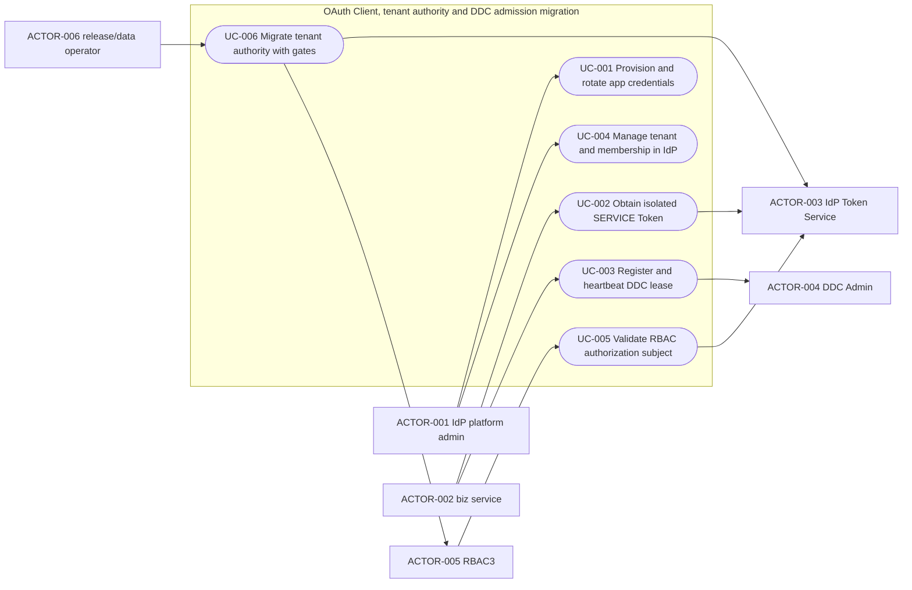
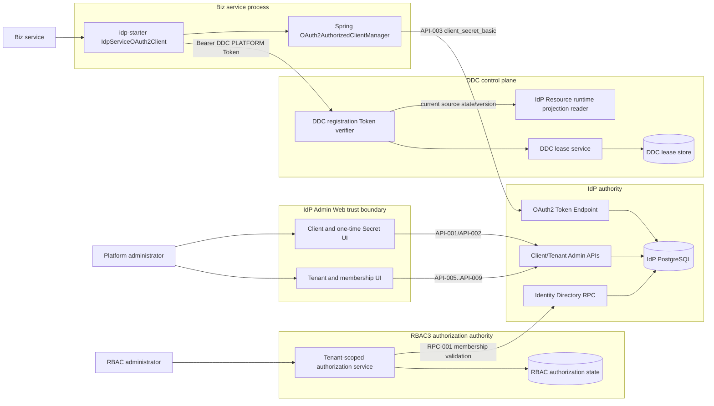
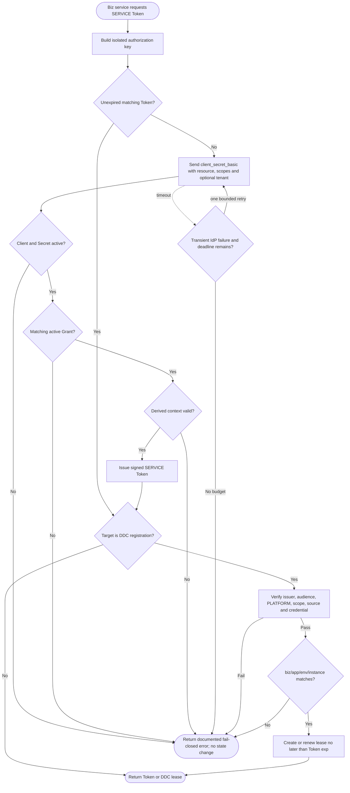
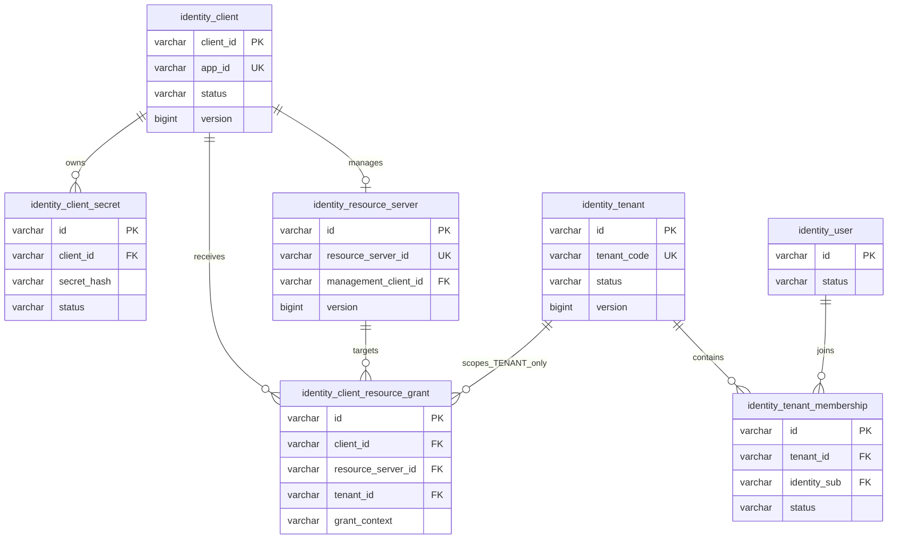
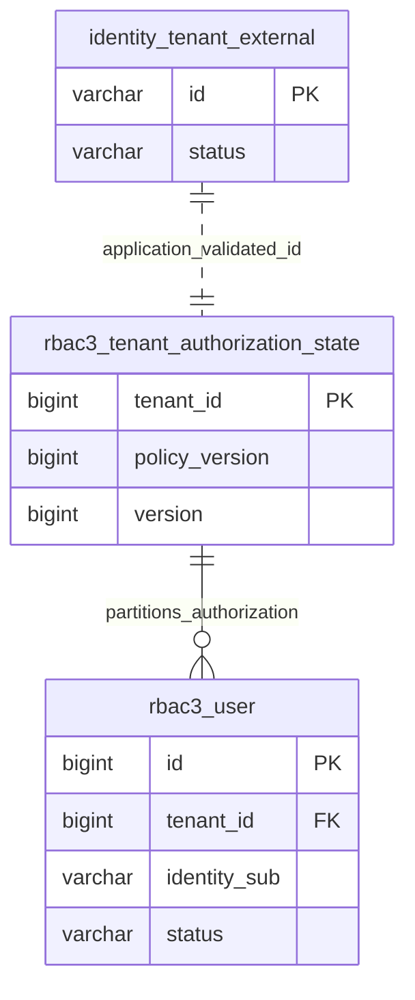
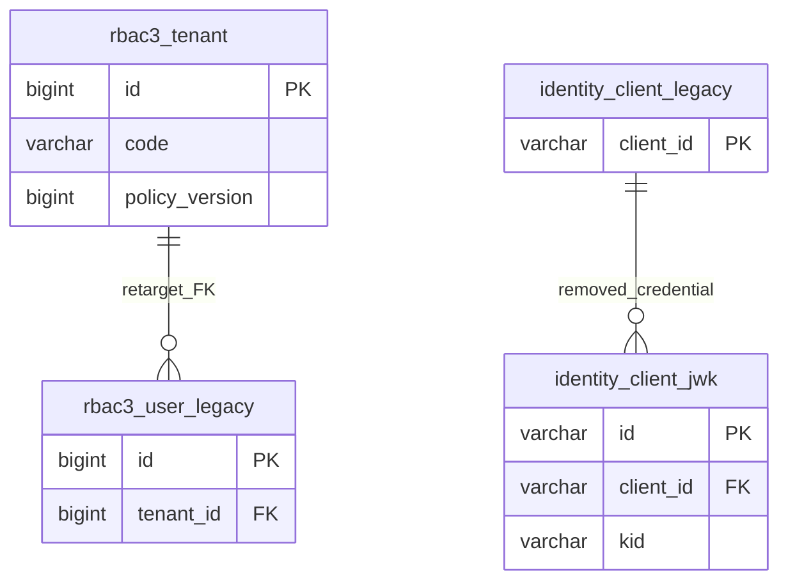

# IdP OAuth2 Client、租户权威与 DDC SERVICE Token 准入迁移规格

| Field              | Value                                                                                                                                                                                                                                                                                                                                                                                                                                                                                                                         |
|--------------------|-------------------------------------------------------------------------------------------------------------------------------------------------------------------------------------------------------------------------------------------------------------------------------------------------------------------------------------------------------------------------------------------------------------------------------------------------------------------------------------------------------------------------------|
| Document           | `2026-08-21-07-51-idp-oauth-client-tenant-ownership.md`                                                                                                                                                                                                                                                                                                                                                                                                                                                                       |
| Template Version   | `4`                                                                                                                                                                                                                                                                                                                                                                                                                                                                                                                           |
| Status             | `Review`                                                                                                                                                                                                                                                                                                                                                                                                                                                                                                                      |
| Type               | `Architecture`                                                                                                                                                                                                                                                                                                                                                                                                                                                                                                                |
| Complexity         | `Complex`                                                                                                                                                                                                                                                                                                                                                                                                                                                                                                                     |
| Complexity Drivers | `机器凭证从 private_key_jwt/JWK 迁移到 client_secret_basic、Spring Security OAuth2 Client 动态资源/租户隔离、IdP 与 RBAC3 跨库租户权威迁移、DDC Admission Ticket 删除但防伪约束保留、PLATFORM/TENANT SERVICE Token 兼容、Web 一次性 Secret 展示与两套 Flyway 发布门禁`                                                                                                                                                                                                                                                                                                             |
| Created            | `2026-08-21 07:51 CST`                                                                                                                                                                                                                                                                                                                                                                                                                                                                                                        |
| Updated            | `2026-08-21 14:54 CST`                                                                                                                                                                                                                                                                                                                                                                                                                                                                                                        |
| Owner              | `Mario / Egon-COLA platform maintainers`                                                                                                                                                                                                                                                                                                                                                                                                                                                                                      |
| Repository         | `Egon-COLA`                                                                                                                                                                                                                                                                                                                                                                                                                                                                                                                   |
| Scope              | `egon-cola-platform-idp 的 admin/core/starter/RPC/Admin Web；egon-cola-platform-rbac3 的 tenant/membership/authorization-state/Admin Web；egon-cola-platform-dynamic-config-center 的注册准入；消费 SERVICE Token 的平台 starter`                                                                                                                                                                                                                                                                                                            |
| Change Surface     | `AppID/App Key/Secret Web 生命周期与数据库模型；OAuth Token Endpoint client_credentials；Spring OAuth2 Client facade；SERVICE Token PLATFORM/TENANT claim；DDC 注册/心跳凭证；IdP tenant/membership 主数据及 RPC；RBAC3 tenant master/member API 删除与 policy-version 拆分；Admin Web 页面、配置、迁移、测试和文档`                                                                                                                                                                                                                                                        |
| Affected Chapters  | `§7, §8, §9, §10, §11, §12, §13, §14, §15, §16, §17, §18`                                                                                                                                                                                                                                                                                                                                                                                                                                                                     |
| Source Requirement | `2026-08-20/21 用户要求 OAuth2 迁移到 Spring Security OAuth2 Client；biz service 预申请 AppID/Key/Secret 并通过 idp-starter 接入；Web 配置并入库、不允许应用自注册；tenant 迁入 IdP；用户确认 1A、2A、以 DDC 定向 PLATFORM SERVICE Token 取代 Admission Ticket 的 3A；2026-08-21 再确认保留既有 OAuth Client 权限码、IdP membership 去除 RBAC 内部用户 ID、RBAC bootstrap 只接受外部 tenantId/identitySub 的 1A/2A/3A`                                                                                                                                                                                |
| Baseline Revision  | `main@0b7b9b3a2a4bc71ae4bb3ce127270d00033e8b60；2026-08-21 14:05 CST dirty-worktree snapshot；自原基线以来仅有 RPC 治理文档/Plan 提交，无本规格相关代码漂移；本规格不吸收已存在的 GatewayContractVersions.java 删除、文件 0 及其他未跟踪 Spec/Plan`                                                                                                                                                                                                                                                                                                                            |
| Amends             | `None`                                                                                                                                                                                                                                                                                                                                                                                                                                                                                                                        |
| Supersedes         | `[统一身份平台设计 §3.1(4)、§4.2 tenant 排除项、§5 IDP-04/05、§7.1 tenant 权威、§9.2、§15.1、§16.3、§18 tenant UI](../../superpowers/specs/2026-08-01-unified-identity-platform-design.md)`；`[OAuth2 Resource Server Admission 设计 §3 RS-01、§7、§10、§11.1、§12.1、§13、§14、§15.1/15.3、§17、§19.2](../../superpowers/specs/2026-08-10-oauth2-resource-server-admission-design.md)`；`[无状态 JWT 与 Session 移除设计中保留旧 SERVICE 凭证/Admission 及 RBAC3 tenant 权威的段落](../../superpowers/specs/2026-08-13-unified-identity-stateless-jwt-session-removal-design.md)` |
| Depends On         | `[统一身份平台设计 §8.1、§9.1、§10.1、§11、§12–§13 的 USER Access Token、Identity User、Resource Server 与 PEP 基础模型](../../superpowers/specs/2026-08-01-unified-identity-platform-design.md)`；`[无状态 JWT 与 Session 移除设计 §6–§11、§13–§15 的 USER JWT、Gateway 链和无 Session 行为](../../superpowers/specs/2026-08-13-unified-identity-stateless-jwt-session-removal-design.md)`                                                                                                                                                                        |
| Related Specs      | `[OAuth2 Resource Server Admission 设计](../../superpowers/specs/2026-08-10-oauth2-resource-server-admission-design.md)`                                                                                                                                                                                                                                                                                                                                                                                                        |
| Related Plans      | [IdP OAuth2 Client、租户权威与 DDC SERVICE Token 迁移实施计划](../plan/2026-08-21-14-14-idp-oauth-client-tenant-migration.md)                                                                                                                                                                                                                                                                                                                                                                                                             |

## 1. Summary

本规格把机器身份统一为 IdP 预配的 OAuth2 Confidential Client：平台管理员在 IdP Admin Web 创建业务应用 Client，`appId`
表示稳定业务应用身份，`clientId` 在产品与配置中称 App Key，Secret 由 IdP 生成、只返回一次且仅保存强哈希。biz service 使用标准
Spring Security OAuth2 Client 的 `client_credentials + client_secret_basic`，经 idp-starter 获取受
audience、scope、tenant/platform context 限制的 SERVICE Access Token；动态客户端注册、客户端 JWK、`private_key_jwt`
和应用自行注册全部删除。

IdP 接管 tenant 主数据与 `identitySub <-> tenant` membership。RBAC3 不再拥有 tenant catalog 或 membership 解析，但继续以外部
`tenant_id` 分区角色、权限、最小授权主体，并把 `policy_version` 拆为 RBAC3 自有的 tenant authorization
state。跨数据库数据搬运由可校验的离线导出/导入步骤完成，Flyway 只改各自数据库 schema。

DDC 不再要求额外 Admission Ticket。注册方直接提交 audience 为 DDC、context 为 `PLATFORM`、scope 最小化的 IdP SERVICE
Token；DDC 验证签名、Client/App/Resource 状态和 biz/app/env 绑定，把认证 Client/App 与 `instanceId` 绑定到租约，并令租约不超过
Token 过期时间。这样删掉重复凭证交换，同时保留旧 Admission 链真正提供的防伪、授权与租约约束。

## 2. Background and Current State

### 2.1 Business and user context

现有机器调用要求业务应用持有私钥、向 IdP 登记 JWK，并在 DDC 注册前再通过 Admission RPC 换取 Ticket。它与 Spring Security 标准
Client 支持存在两套凭证获取路径，配置、轮换和故障面都较大。用户要求改成“开发先在 IdP 申请、应用只消费”的治理方式，并将
AppID/App Key/Secret 与租户管理统一放到 IdP Web。

租户当前由 RBAC3 建模和解析，IdP 登录/令牌链反向调用 RBAC3 获取 memberships，造成身份系统依赖授权系统才能确定登录上下文。目标依赖方向改为
RBAC3 消费 IdP 身份/租户事实，RBAC3 只保留授权事实。

### 2.2 Repository evidence

| Evidence ID | Classification            | Exact path/symbol/decision/command                                                                                                                                                                 | Observed fact                                                                                                         | Design significance                                                                                 | Verification limit/freshness    |
|-------------|---------------------------|----------------------------------------------------------------------------------------------------------------------------------------------------------------------------------------------------|-----------------------------------------------------------------------------------------------------------------------|-----------------------------------------------------------------------------------------------------|---------------------------------|
| `EVD-001`   | Static repository         | `egon-cola-platform-idp-admin/.../oauth/controller/OAuthTokenController.java`；`PrivateKeyJwtAuthenticator.java`                                                                                    | `client_credentials` 当前读取 `client_assertion_type/client_assertion` 并验证客户端 JWK                                         | Token Endpoint 必须替换认证方式和错误/元数据契约                                                                    | 只证明 2026-08-21 源码，不证明已部署环境      |
| `EVD-002`   | Static repository         | `.../oauth/domain/pojo/IdentityClientEntity.java`；IdP `V1`–`V4` migration                                                                                                                          | `identity_client` 无 `app_id`/secret；Confidential Client 注释要求 `private_key_jwt`                                        | 需要 Client 主表增 AppID、独立 Secret 哈希表和新 V5                                                              | 未读取生产数据分布                       |
| `EVD-003`   | Static repository         | `OAuthClientController`、`CreateOAuthClientDTO`、`OAuthClientServiceImpl`、Admin Web `ClientListPage.tsx`                                                                                             | Web 能 CRUD Client，但不创建/轮换 Secret，也没有一次性 Secret 响应                                                                     | 复用现有 Client 管理入口，不新增第二套应用注册中心                                                                       | 静态页面检查不证明浏览器交互                  |
| `EVD-004`   | Static repository         | `ResourceServerController`；Admin Web `ResourceServerListPage.tsx`；`IdentityClientJwkEntity`                                                                                                        | Resource Server 页面/API 当前管理客户端 JWK                                                                                    | 目标删除客户端 JWK UI/API/存储；IdP 自身 Signing Key 页面不受影响                                                     | 不证明外部脚本是否调用旧 API                |
| `EVD-005`   | Static repository         | `egon-cola-platform-idp-starter/pom.xml`；repository-wide `OAuth2AuthorizedClient` search                                                                                                           | starter 有 Resource Server/Jose，尚无 Spring OAuth2 Client manager 使用                                                     | idp-starter 增标准 client 依赖和窄 facade                                                                  | 依赖版本以当前 POM 为准                  |
| `EVD-006`   | Static repository         | `ServiceAccessTokenClaims.java`、`ServiceIdentityPrincipal.java`、`IdpPrincipal#tenantId`                                                                                                            | SERVICE 身份当前假设 `tenantId` 非空，credential 指向 JWK `kid`                                                                  | 需显式 `TENANT/PLATFORM` context，避免以特殊 tenant 模拟控制面                                                    | 影响消费者需在实现计划继续逐个枚举               |
| `EVD-007`   | Static repository         | `DdcAdmissionRequest.java`、`DdcAdmissionTicket.java`、`DdcAdmissionTicketSupplier.java`                                                                                                             | DDC starter 先取 Ticket，再把 Ticket 放入注册请求                                                                                | OAuth Token 可直接成为注册凭证，删除一次交换与缓存                                                                     | Ticket 删除的二方兼容需发布门禁             |
| `EVD-008`   | Static repository         | `IdpJwtDdcAdmissionVerifier.java`、`DdcAdmissionClaims.java`、`DdcConfigLeaseService.java`                                                                                                           | DDC 校验 issuer/audience/scope/source Resource/version/credential，并把 admission expiry 限制租约                              | 这些防伪语义必须迁入 Token 验证而不是随 Ticket 删除                                                                   | 未做在线攻击/渗透验证                     |
| `EVD-009`   | Inference from repository | Admission Ticket 由应用级私钥获取，`instanceId` 仍是注册请求自报值                                                                                                                                                   | 同一应用副本共享凭证，Ticket 不是 per-Pod workload identity                                                                        | 本次不保留重复 Ticket；未来 Pod 身份应另用 mTLS/SPIFFE/K8s identity                                                | 推论，不声称当前部署拓扑                    |
| `EVD-010`   | Static repository         | `TenantMembershipPort.java`；`HttpTenantMembershipAdapter.java`；RBAC3 internal tenant membership controllers                                                                                        | IdP 当前调用 RBAC3 查询/解析 identity tenant membership                                                                       | 目标改为 IdP 本地 JPA membership，删除反向依赖                                                                   | 不证明所有外部消费者清单完整                  |
| `EVD-011`   | Static repository         | RBAC3 `TenantPO.java`；`classpath:db` V1–V7；`JpaRoleRepository`、`JpaConstraintRepository`、`PostgresqlRoleImpactRepository`                                                                          | `rbac3_tenant` 同时承载 catalog/settings 与 RBAC policyVersion；多个 RBAC 表 FK 到它                                             | 不能简单整表搬走；policyVersion 要拆成 RBAC 自有状态                                                                | SQL 执行计划/真实数据未验证                |
| `EVD-012`   | Static repository         | `IdentityDirectoryRpc.java`、IdP `IdentityDirectoryRpcProvider`、RBAC `IdentityProfileDirectory`                                                                                                     | 已有 IdP→RBAC Identity Directory RPC 方向                                                                                 | 扩展 membership 查询比保留 RBAC→IdP HTTP 或新增平行协议更小                                                         | Proto/兼容实现留给 Plan 精确落点          |
| `EVD-013`   | Static repository         | IdP migrations `V1`–`V4`；RBAC3 migrations `V1`–`V7`；各自 DataSource                                                                                                                                  | tenant 跨两个数据库，Flyway 不具备跨库事务/搬运能力                                                                                     | schema migration 与数据转移必须拆开并有校验门禁                                                                    | 未连接目标 PostgreSQL                |
| `EVD-014`   | User decision             | 用户确认 `1A`、`2A`、随后确认修改 Spec                                                                                                                                                                         | `appId=业务应用身份`、`key=client_id`、`secret=client_secret`；IdP 拥有 tenant/membership                                        | 锁定关键公开合同与权威边界                                                                                       | 2026-08-21 当前决定                 |
| `EVD-015`   | User decision             | 用户确认以 SERVICE Token 取代 Admission Ticket                                                                                                                                                            | DDC 直接验证定向 Token，保留准入防伪语义                                                                                             | 锁定 3A，不设计双 Token                                                                                    | 2026-08-21 当前决定                 |
| `EVD-016`   | Static repository         | `egon-cola-platforms/pom.xml`、Admin module POM                                                                                                                                                     | Java 21、Spring Boot 3.5.16、Flyway 11.15.0、PostgreSQL、React/Vite/Ant Design                                            | 设计应复用 Spring Security/JPA/Flyway/现有 Web 栈                                                           | 版本可能在实施前变化，Plan 必须复核            |
| `EVD-017`   | Static repository         | `SpringPasswordHashAdapter.java`；IdP Admin POM `bcprov-jdk18on`                                                                                                                                    | IdP 已使用 `DelegatingPasswordEncoder` + Argon2、BCrypt legacy verify 与 dummy hash                                        | Client Secret 可复用同一受测 Argon2 参数/constant-work pattern，无需新增密码学依赖                                     | 仍需目标硬件 Token Endpoint benchmark |
| `EVD-018`   | Static repository         | `OAuthClientController.java`；Admin Web `ClientListPage.tsx`/`AdminLayout.tsx`；`Rbac3DevelopmentTopology.java`                                                                                      | 现有公开权限合同是 `idp:oauth-client:read/create/update`，且 backend、frontend、bootstrap seed 一致                                  | Client/Secret 新能力必须复用既有权限码，避免无业务价值的 RBAC 权限迁移                                                       | 静态搜索不证明外部自定义角色清单完整              |
| `EVD-019`   | Static repository         | `TenantMembershipPort.java`；repository-wide `UserResourceAccessPolicy`/`UserResourceAccessAuthorizationPort` references                                                                            | 现有 port 暴露 `rbac3UserId`；旧 USER Resource 授权 policy/port 只有测试构造，没有生产装配，而 `TokenFacade` 只需要 tenant/member 状态            | IdP membership contract 可移除 RBAC 内部 ID，并删除已被无状态 USER Token 设计取代的未接线旧路径                              | 搜索证明当前仓库引用，不证明仓库外二进制消费者         |
| `EVD-020`   | Static repository         | `DevelopmentBootstrapPort.java`、`Rbac3PlatformAdminBootstrapCli.java`、`Rbac3DevelopmentBootstrap.java`、`JpaDevelopmentTopologyBootstrapRepository.java`、`JpaPlatformAdminBootstrapRepository.java` | RBAC bootstrap 当前接收 tenantCode、查询或创建 `TenantPO`，再创建授权主体/角色                                                            | tenant master 删除后 bootstrap 必须改收外部 tenantId/identitySub，先验证 IdP ACTIVE membership，再只创建 RBAC 授权状态与事实 | 未执行真实 bootstrap 或连接 IdP RPC     |
| `EVD-021`   | User decision             | 用户于 2026-08-21 回复 `1A 2A 3A`                                                                                                                                                                       | 保留既有 OAuth Client 权限码；IdP membership 去除 `rbac3UserId` 并清理旧未接线路径；RBAC bootstrap 使用外部 tenantId/identitySub + IdP RPC 验证 | 关闭 Plan 前发现的公开权限、端口和部署引导决策缺口                                                                        | 仅适用于本规格范围                       |

### 2.3 Problem statement and gap

当前实现与目标有四个结构性缺口：第一，Confidential Client 是 JWK/private-key 模型而非 App Key/Secret，且 idp-starter 没有标准
OAuth2 Client；第二，SERVICE Token 把所有机器请求强制绑定 tenant，无法表达 DDC 这种平台控制面；第三，Admission Ticket 与
SERVICE Token 重复证明同一应用身份，却不提供独立工作负载身份；第四，tenant catalog/membership 位于 RBAC3，使身份权威依赖授权权威。

因此仅替换一段 Token HTTP 调用会留下错误的权威、缓存和租约模型。本规格覆盖所需最小一致闭环：凭证创建/轮换/哈希校验、Token
claim/context、starter 获取/隔离、DDC 租约、防伪、tenant 数据/接口/UI 迁移，以及 RBAC policyVersion
的保留位置。未运行任何服务，本节没有把静态检查描述为线上验证。

### 2.4 Evidence and current-chain map

| Entry/trigger                | Current call chain                                                                                                                      | Data read/written                                               | External dependency        | Consumers                  | Evidence                      |
|------------------------------|-----------------------------------------------------------------------------------------------------------------------------------------|-----------------------------------------------------------------|----------------------------|----------------------------|-------------------------------|
| biz service 获取 SERVICE Token | custom token supplier → `/oauth2/token` → `PrivateKeyJwtAuthenticator` → `ClientCredentialsTokenService`                                | `identity_client_jwk`、resource grant、JWT signing key；JTI replay | Redis replay store、IdP     | RBAC/Gateway/DDC clients   | `EVD-001`,`EVD-002`,`EVD-005` |
| DDC 注册/心跳                    | `DdcAdmissionTicketSupplier` → IdP Admission RPC → Ticket cache → DDC register → `IdpJwtDdcAdmissionVerifier` → `DdcConfigLeaseService` | Ticket claims、DDC lease/expiry/source identity                  | IdP RPC + DDC RPC          | config client、RPC provider | `EVD-007`–`EVD-009`           |
| USER 登录 tenant 选择            | IdP login/token flow → `TenantMembershipPort` → `HttpTenantMembershipAdapter` → RBAC internal API                                       | `rbac3_tenant`、`rbac3_user`                                     | RBAC3 HTTP + SERVICE Token | IdP USER token issuer      | `EVD-010`,`EVD-011`           |
| RBAC tenant/role 修改          | RBAC Tenant/User/Role controller → service → JPA repository → `TenantPO` lock/version increment                                         | tenant catalog、membership-like user、policyVersion               | PostgreSQL                 | RBAC PEP/Admin Web         | `EVD-011`                     |
| 管理员配置 Client/Resource        | IdP Admin Web → `/api/v1/identity/clients` 或 resource-server key API → service/repository                                               | Client、redirect/resource URI、JWK                                | IdP DB                     | Token Endpoint、operators   | `EVD-003`,`EVD-004`           |

## 3. Goals and Non-goals

### 3.1 Goals

- 让所有 biz service 只使用 IdP 管理员预配的 AppID/App Key/Secret，通过 Spring Security OAuth2 Client 获取 SERVICE Token。
- Secret 只在创建/轮换成功响应中出现一次；数据库只保存强哈希、提示与审计元数据。
- SERVICE Token 明确区分 TENANT 与 PLATFORM context，并隔离 audience、scope、tenant 和缓存键。
- 删除 Client JWK、private_key_jwt、动态/自注册和 Admission Ticket/RPC，不保留双轨长期兼容。
- 用 DDC 定向 PLATFORM Token 完整保留来源应用、环境、instance、scope、lease-expiry 防伪约束。
- 把 tenant catalog 和 identity membership 权威迁到 IdP，把 RBAC3 收敛为 tenant-scoped authorization owner。
- 提供可审核、可校验、有停机门禁和恢复路径的跨库迁移/发布顺序。

### 3.2 Non-goals

- 不改变 USER Authorization Code + PKCE、无状态 USER JWT、IdP 签名密钥或 Resource Server 验签机制。
- 不实现 OAuth Dynamic Client Registration；业务应用无权创建/修改自身 Client、Secret、Grant 或 tenant。
- 不把 Secret 明文存入数据库、DDC、配置中心、日志、审计详情、URL、浏览器存储或可重复读取 API。
- 不把 RBAC3 的角色、权限、约束、授权决策、policyVersion 所有权迁入 IdP。
- 不把 DDC 注册升级为 per-Pod 强身份；mTLS、SPIFFE/SPIRE、Kubernetes projected identity 是后续独立课题。
- 不编辑任何已存在的 Flyway migration；实现时每个受影响数据库各新增一个版本文件。
- 不提供跨 IdP/RBAC3 数据库的分布式事务，也不允许 Flyway 直接连接另一数据库搬数据。
- 不启动 IdP、RBAC3、DDC、Gateway、Redis、PostgreSQL 或 Admin Web；本规格验证仅限文档与静态仓库。

### 3.3 Change Surface and Design Depth

| Area/layer                                 | Disposition    | Exact repository evidence                                                      | Changed or preserved behavior/contract                         | Required Spec treatment         | Chapter(s)                                           |
|--------------------------------------------|----------------|--------------------------------------------------------------------------------|----------------------------------------------------------------|---------------------------------|------------------------------------------------------|
| IdP Client/Secret persistence and services | Affected       | `IdentityClientEntity`、`OAuthClientServiceImpl`、IdP V1–V4                      | 新增 AppID 和 Secret 哈希生命周期；删除 JWK                                | 完整组件、模型、表、迁移、安全、测试设计            | `§7, §8, §9, §10, §11, §13, §14, §15, §16, §17, §18` |
| OAuth Token Endpoint and SERVICE claims    | Affected       | `OAuthTokenController`、`PrivateKeyJwtAuthenticator`、`ServiceAccessTokenClaims` | client_secret_basic；TENANT/PLATFORM；新 App/source claims        | 完整 HTTP/内部合同、状态/错误/兼容设计         | `§7, §8, §9, §10, §13, §14, §15, §16, §17, §18`      |
| idp-starter OAuth2 Client                  | Affected       | starter POM、custom token suppliers                                             | Spring manager + facade；删除私钥/自定义 supplier                      | 完整配置、缓存、并发、API、测试设计             | `§7, §8, §9, §10, §13, §14, §15, §16, §17, §18`      |
| DDC admission and lease                    | Affected       | `DdcAdmission*`、`IdpJwtDdcAdmissionVerifier`、`DdcConfigLeaseService`           | 删除 Ticket/RPC；直接验证 DDC PLATFORM Token                          | 完整控制流、Token/lease 绑定、删除清单与测试    | `§7, §8, §9, §10, §13, §14, §15, §16, §17, §18`      |
| IdP tenant/membership backend and RPC      | Affected       | `TenantMembershipPort`、`HttpTenantMembershipAdapter`、`IdentityDirectoryRpc`    | IdP 本地权威、CRUD/lookup，向 RBAC 暴露 membership                      | 完整三层现状适配、API/RPC、模型/表、测试        | `§7, §8, §9, §10, §11, §13, §14, §15, §16, §17, §18` |
| RBAC3 tenant authority and policy state    | Affected       | `TenantPO`、tenant/internal controllers、role/constraint repositories、V1–V7      | 删除 catalog/member ownership；拆授权 policyVersion state            | 完整数据迁移、接口删除、仓储调整、兼容/回滚          | `§7, §8, §9, §10, §11, §13, §14, §15, §16, §17, §18` |
| IdP/RBAC3 Admin Web                        | Affected       | IdP `ClientListPage`/`ResourceServerListPage`；RBAC `/iam/tenants`              | Secret 一次性 UX；IdP tenant 页面；移除 JWK/RBAC tenant 页面              | 路由、组件、权限、状态、可访问性、测试             | `§7, §8, §9, §10, §12, §13, §14, §15, §16, §17, §18` |
| Flyway and cross-database data operation   | Affected       | IdP/RBAC3 migration roots与独立 DataSource                                        | 各一份新 migration；离线导入导出门禁                                        | 表级设计、顺序、校验、回退                   | `§7, §8, §10, §11, §13, §14, §15, §16, §17, §18`     |
| USER OAuth/session/signing keys            | Unchanged      | 2026-08-13 Spec；SigningKeyPage                                                 | 保留 Authorization Code+PKCE、USER JWT、无 Session、IdP signing keys | 一项不变量与聚焦回归，不展开目标设计              | `§9, §10, §14, §16`                                  |
| Gateway/RBAC PEP authorization policy      | Context-only   | Gateway/RBAC starter authentication/authorization chain                        | 消费新 claims；授权规则与角色权限算法不变                                       | 定义 context/header 边界与回归，不重设授权模型 | `§7, §9, §14, §15, §16`                              |
| DDC relational schema                      | Context-only   | DDC V1–V9；lease/source fields                                                  | 物理表不迁移；现有 source/credential/expiry 列承载新 Token 语义               | 记录语义映射与命名债，不新增 migration        | `§10, §11, §14, §16`                                 |
| Per-workload identity                      | Not applicable | 当前应用级 Client/Secret，无集群工作负载证据                                                  | N/A；不宣称 Token 唯一识别 Pod                                         | §15/§18 风险边界                    | `§15, §18`                                           |

## 4. Requirements and Acceptance Criteria

| ID        | Atomic requirement                                                                          | Priority | Observable acceptance criteria                                                                                                                       | Source                      |
|-----------|---------------------------------------------------------------------------------------------|----------|------------------------------------------------------------------------------------------------------------------------------------------------------|-----------------------------|
| `REQ-001` | Confidential Client 必须由有权限的 IdP Web/API 管理员预配，应用不得自注册                                       | Must     | 无动态注册入口；应用凭证不能调用 Client/Secret 管理 API；审计记录操作者                                                                                                        | 用户原始要求                      |
| `REQ-002` | `appId` 必须表示稳定业务应用身份，App Key 必须等于 OAuth `client_id`，Secret 必须等于 `client_secret`             | Must     | Client 详情/Token claim/配置/文档映射一致；一个 appId 只绑定一个 active Confidential Client                                                                            | 决定 1A                       |
| `REQ-003` | Secret 创建/轮换必须只返回一次明文，持久化仅保存 Argon2id 强哈希、hint、状态和审计字段                                      | Must     | list/detail/日志/数据库均无明文；一次性 modal 关闭后不可恢复；hash 校验通过                                                                                                   | 决定 1A                       |
| `REQ-004` | Token Endpoint 的 client_credentials 必须只接受 `client_secret_basic`                             | Must     | 正确 Basic 成功；body secret、private_key_jwt、缺失/重复凭证均按 OAuth 错误拒绝；metadata 只宣告目标方法                                                                        | 决定 1A                       |
| `REQ-005` | idp-starter 必须基于 Spring Security OAuth2 Client 获取和续期 SERVICE Token                          | Must     | 使用 ClientRegistration/AuthorizedClientManager；biz service 不含签名/JWK/assertion 代码                                                                      | 用户原始要求                      |
| `REQ-006` | Token 缓存/授权键必须隔离 registration、appId、audience、context、tenant 和规范化 scopes                     | Must     | 不同 tenant/resource/scope 的并发请求不复用错误 Token；到期前续期且同 key 聚合并发                                                                                           | 安全正确性                       |
| `REQ-007` | SERVICE Token 必须携带 `app_id`、source Resource/Version、credential id 和 `scope_context`         | Must     | 解码后的 claims 完整；Resource Server 对缺失/矛盾 claim fail closed                                                                                              | 3A 与现有 DDC 防伪               |
| `REQ-008` | TENANT Token 必须有合法 `tid`；PLATFORM Token 必须无 `tid` 且只能由显式 PLATFORM Grant 发行                  | Must     | 客户端不能提交 scope_context；Grant 派生 context；`tid=*` 或混合 context 拒绝                                                                                        | 决定 2A/3A                    |
| `REQ-009` | DDC 注册必须直接验证 audience=DDC、PLATFORM、最小 scope 的 SERVICE Token                                 | Must     | 无 Admission RPC/Ticket；错误 audience/context/scope/source status/version 或缺失 credential id 全部拒绝                                                        | 决定 3A                       |
| `REQ-010` | DDC 必须把认证 app/client 与 biz/app/env/instanceId 绑定到 lease，heartbeat 必须匹配且 lease 不超过 Token exp | Must     | Token 不能跨 app/env/instance/lease 使用；过期前租约到期；不匹配无状态变更                                                                                                 | 决定 3A                       |
| `REQ-011` | IdP 必须成为 tenant catalog 和 identity membership 的唯一权威                                         | Must     | 登录/resolve 只读 IdP DB；IdP 不再调用 RBAC internal membership HTTP                                                                                          | 决定 2A                       |
| `REQ-012` | RBAC3 必须删除 tenant master/member 查询职责但保留 tenant-scoped 授权主体、角色、权限和 policyVersion             | Must     | RBAC 无 tenant CRUD/resolve API/表；授权表仍以外部 tenant_id 分区；policyVersion 在独立状态表                                                                           | 决定 2A                       |
| `REQ-013` | RBAC 创建/启用授权主体前必须验证 IdP 中该 identitySub 是 active tenant member                               | Must     | 扩展既有 Identity Directory RPC；查不到/禁用/超时均 fail closed，不创建孤儿授权主体                                                                                         | 权威一致性                       |
| `REQ-014` | tenant 跨库迁移必须保留 tenant ID/status/settings 和可用 membership，并在删 RBAC 表前完成校验门禁                  | Must     | checksum/count/duplicate/orphan/grant FK 检查全过才进入 RBAC V8；失败可在删除前回退                                                                                   | 数据安全                        |
| `REQ-015` | 实现不得修改既有 Flyway 文件，每个受影响数据库只新增一个下一版本 migration                                              | Must     | IdP 仅新 V5，RBAC3 仅新 V8；checksum 历史不变；DDC 无 migration                                                                                                  | 项目规则                        |
| `REQ-016` | IdP Admin Web 必须提供 Client Secret 与 tenant/member 管理，RBAC Web 必须移除 tenant 页面                 | Must     | 权限、表单、确认、加载/空/错误/拒绝态完整；Secret 不进入 URL/localStorage                                                                                                   | 用户原始要求                      |
| `REQ-017` | USER OAuth/session 和 IdP Signing Key 行为不得因本迁移改变                                             | Must     | Authorization Code+PKCE、USER token/session regression 通过；SigningKeyPage 无生产 diff                                                                     | 最小变更                        |
| `REQ-018` | 旧 private_key_jwt/JWK/Admission 配置与代码必须在切换后删除并提供确定错误，不允许静默双轨                                | Must     | 旧 Token 请求 `invalid_client`；旧 API 404；启动出现旧属性给出迁移错误或绑定失败                                                                                             | 降低长期复杂度                     |
| `REQ-019` | Client/Secret 管理必须保留现有 `idp:oauth-client:read/create/update` 权限合同                           | Must     | list/detail 使用 `read`；创建使用 `create`；更新、轮换和状态变更使用 `update`；不新增 `idp:client:*`                                                                         | 用户确认 1A；`EVD-018`,`EVD-021` |
| `REQ-020` | IdP membership 端口不得携带 `rbac3UserId`，并删除无生产接线的旧 USER Resource 授权 policy/port                 | Must     | `TenantMembershipPort` 仅暴露 identity/tenant/display/status；仓库无 `rbac3UserId`、`UserResourceAccessPolicy`、`UserResourceAccessAuthorizationPort` 生产/测试符号 | 用户确认 2A；`EVD-019`,`EVD-021` |
| `REQ-021` | RBAC bootstrap 必须只接收 IdP 外部 `tenantId + identitySub`，验证 ACTIVE membership 后仅创建授权状态与事实       | Must     | CLI/开发配置不再接受 tenantCode；bootstrap 不查询/创建 `TenantPO`；IdP RPC 缺失、非 ACTIVE 或超时均零写入                                                                      | 用户确认 3A；`EVD-020`,`EVD-021` |

### 4.1 Scenario matrix

| Scenario               | Actor/trigger                         | Preconditions                                 | Main path                                                   | Alternative/failure path                         | Data/state change       | Observable result                    | Requirements                            |
|------------------------|---------------------------------------|-----------------------------------------------|-------------------------------------------------------------|--------------------------------------------------|-------------------------|--------------------------------------|-----------------------------------------|
| 创建 Confidential Client | IdP admin 提交 Web 表单                   | 有 `idp:oauth-client:create`；appId/clientId 唯一 | 事务写 Client+active Secret hash，响应明文一次                        | 唯一冲突/弱输入回滚且不返回 Secret                            | 两表同事务提交                 | modal 展示 AppID/Key/Secret 一次         | `REQ-001`–`REQ-003`,`REQ-016`,`REQ-019` |
| 并发轮换 Secret            | 两个 admin 对同 version 操作                | 当前 active secret/version=N                    | 首个 CAS revoke+insert；第二个 version conflict                   | DB 失败回滚，旧 Secret 保持 active                       | 一 active，多 revoked 历史   | 仅成功请求看到新 Secret                      | `REQ-003`                               |
| 获取 TENANT Token        | biz service 请求 tenant 资源              | TENANT Grant、active membership/grant/client   | Spring Client 加 resource/tenant/scope，Basic 认证，发行 tid Token | 错 secret/grant/member/resource/scope→OAuth error | 不写业务数据；可写安全审计           | 缓存键只服务该 tenant/resource/scope        | `REQ-004`–`REQ-008`                     |
| 获取 PLATFORM Token      | DDC client 请求 DDC audience            | PLATFORM Grant、无 tenant                       | 由 Grant 派生 PLATFORM，发行无 tid Token                           | 客户端提交 tenant/context 或越权 scope→拒绝                | 不写租户状态                  | Token 只能给 DDC 控制面                    | `REQ-007`–`REQ-009`                     |
| DDC 首次注册               | service instance 提交 registrationToken | Token 有 DDC audience/scope，source 与配置匹配       | verifier→Client/source 状态→绑定 app/client/instance→lease      | 任何 claim/status/source 不匹配，无 lease               | 建立受 Token exp 限制的 lease | 返回 leaseId/expiry                    | `REQ-009`,`REQ-010`                     |
| DDC heartbeat 重放/跨实例   | 攻击者复用 Token/lease                     | instanceId 或认证 app/client 不匹配                 | verifier/lease lookup 拒绝                                    | 原 lease 不延长；记录 reason code                       | 无状态变化                   | 稳定 UNAUTHENTICATED/PERMISSION_DENIED | `REQ-010`                               |
| tenant 数据导入            | operator 执行离线迁移                       | RBAC snapshot、维护窗口、IdP V5 已应用                 | checksum export→idempotent import→双向 counts/orphans 校验      | 任一校验失败停止，不应用 RBAC V8                             | IdP 增 tenant/member     | 可重复导入并输出报告                           | `REQ-011`,`REQ-014`,`REQ-015`           |
| RBAC 授权主体创建            | RBAC admin 增用户                        | IdP tenant/member active                      | Identity Directory RPC 校验后写 rbac3_user                      | timeout/not-member/disabled fail closed          | 成功才写授权主体                | 无孤儿 tenant subject                   | `REQ-012`,`REQ-013`                     |
| IdP membership 暂不可用    | 登录或 RBAC 校验触发                         | DB/RPC timeout                                | IdP 登录失败或 RBAC 写拒绝                                          | 不用旧 RBAC membership/cache 猜测                     | 无写或事务回滚                 | 可观测依赖失败，恢复后重试                        | `REQ-011`,`REQ-013`                     |
| 发布后旧客户端调用              | 未迁移 app 使用 assertion/Ticket           | cutover 已完成                                   | Token Endpoint/接口拒绝                                         | 通过回退发布单元恢复旧版本和 DB snapshot，而非双轨                  | 不写新 lease/token state   | 明确错误与迁移日志                            | `REQ-018`                               |

### 4.2 Use-case analysis

#### 4.2.1 Actor inventory

| Actor ID    | Actor/role        | Goal and responsibility              | Entry/channel                     | Permission/tenant context                                        | Evidence                           |
|-------------|-------------------|--------------------------------------|-----------------------------------|------------------------------------------------------------------|------------------------------------|
| `ACTOR-001` | IdP 平台管理员         | 预配 Client/Secret、tenant 和 membership | IdP Admin Web/API                 | `idp:oauth-client:read/create/update` / `idp:tenant:read/manage` | 用户要求；`EVD-003`,`EVD-018`,`EVD-021` |
| `ACTOR-002` | biz service       | 获取最小权限 SERVICE Token 并调用目标资源         | idp-starter facade                | TENANT 或明确 PLATFORM                                              | 用户要求；`EVD-005`                     |
| `ACTOR-003` | IdP Token Service | 校验 Client/Grant/Secret 并签发 Token     | `/oauth2/token`                   | 权威派生 context                                                     | `EVD-001`,`EVD-006`                |
| `ACTOR-004` | DDC Admin         | 验证注册 Token、建立/续约 lease               | DDC RPC/model                     | PLATFORM only                                                    | `EVD-007`,`EVD-008`                |
| `ACTOR-005` | RBAC3             | 消费 IdP tenant/member 事实并管理授权         | Identity Directory RPC + RBAC API | 外部 tenant_id                                                     | `EVD-011`,`EVD-012`                |
| `ACTOR-006` | 发布/数据运维者          | 安全搬运 tenant 数据并执行门禁                  | migration CLI/runbook             | 受控维护权限                                                           | `EVD-013`                          |

#### 4.2.2 Use-case artifact



| ID       | Use case/goal           | Primary actor | Supporting actors/systems | Trigger                                          | Preconditions                           | Main success outcome                           | Alternatives/failures                        | Postconditions                            | Requirements                            | Interfaces/pages         | Tests                            |
|----------|-------------------------|---------------|---------------------------|--------------------------------------------------|-----------------------------------------|------------------------------------------------|----------------------------------------------|-------------------------------------------|-----------------------------------------|--------------------------|----------------------------------|
| `UC-001` | 预配和轮换应用凭证               | `ACTOR-001`   | IdP DB/Web                | 创建/轮换提交                                          | 既有 read/create/update 管理权限、唯一标识/version | 一次返回 Secret，hash 持久化                           | 冲突/DB 失败不泄密                                  | 恰一 active secret                          | `REQ-001`–`REQ-004`,`REQ-019`           | `API-001`,`API-002`      | `TEST-001`–`TEST-004`,`TEST-031` |
| `UC-002` | 获取隔离 SERVICE Token      | `ACTOR-002`   | `ACTOR-003`               | facade authorize                                 | active client/grant                     | 返回正确 audience/context/scope Token              | OAuth error，旧 Token 可用至自身 exp                | 不串 tenant/resource cache                  | `REQ-004`–`REQ-008`                     | `API-003`,`INTERNAL-001` | `TEST-005`–`TEST-009`            |
| `UC-003` | 注册和续约 DDC lease         | `ACTOR-002`   | `ACTOR-004`               | register/heartbeat                               | DDC PLATFORM Token                      | source/instance 绑定 lease                       | 过期/重放/不匹配 fail closed                        | lease≤token exp                           | `REQ-009`,`REQ-010`                     | `INTERNAL-002`           | `TEST-010`–`TEST-013`            |
| `UC-004` | 在 IdP 管理 tenant/member  | `ACTOR-001`   | IdP DB/Web                | tenant/member API                                | tenant 权限/version                       | catalog/member 成为本地权威                          | 冲突/禁用保留历史                                    | 登录读取新权威                                   | `REQ-011`,`REQ-016`                     | `API-005`–`API-009`      | `TEST-014`–`TEST-018`            |
| `UC-005` | 校验 RBAC 授权主体与 bootstrap | `ACTOR-005`   | IdP Directory RPC         | RBAC user write 或 tenantId+identitySub bootstrap | IdP tenant/member active                | 校验后写 tenant-scoped subject/authorization facts | timeout/not-member/malformed tenantId 拒绝且零写入 | 无新孤儿主体或本地 tenant master                   | `REQ-012`,`REQ-013`,`REQ-021`           | `RPC-001`                | `TEST-019`,`TEST-020`,`TEST-033` |
| `UC-006` | 迁移 tenant 权威            | `ACTOR-006`   | IdP/RBAC DB               | 维护窗口 runbook                                     | snapshot/backup/V5                      | 验证后切到 IdP、应用 V8 并用外部 ID bootstrap              | 校验失败停在可回退阶段                                  | RBAC 无 tenant master/tenantCode bootstrap | `REQ-014`,`REQ-015`,`REQ-018`,`REQ-021` | migration CLI/runbook    | `TEST-021`–`TEST-024`,`TEST-033` |

## 5. Constraints, Assumptions, and Decisions

### 5.1 Confirmed constraints

- IdP 管理员预配，biz service 不自注册；Web 是人类管理入口，持久化是 IdP 数据库。
- AppID/App Key/Secret 映射与 tenant 权威、DDC Token 替代 Ticket 均已由用户确认。
- Secret 只展示一次；后续遗失只能轮换，不能找回。
- RBAC3 保留 tenant-scoped authorization，不保留 tenant catalog/membership authority。
- 已存在 Flyway 文件不可修改；DDL 与跨库数据操作必须分离。

### 5.2 Small-gap assumptions

| ID        | Inference                                         | Repository evidence                                          | Why locally reversible                          | Impact if wrong                |
|-----------|---------------------------------------------------|--------------------------------------------------------------|-------------------------------------------------|--------------------------------|
| `ASM-001` | `appId` 与 `clientId` 均由管理员输入；IdP 只生成 Secret       | 现有 CreateOAuthClientDTO 由管理员输入 `clientId`；用户只确定语义未要求服务器生成 ID | 可在 API-001 单点改为服务器生成，不影响 Secret/Token/tenant 架构 | 影响 Web 表单和创建响应，不影响安全边界         |
| `ASM-002` | Secret 轮换立即撤销旧 Secret，不设双 Secret 宽限               | 用户确认 create/rotate；现有系统无 active-secret overlap 模型            | 可在 Secret 表增加 overlap policy，不影响客户端字段           | 若部署不能原子更新 Secret，会增加切换窗口风险     |
| `ASM-003` | tenant ID 继续使用原 RBAC BIGINT 的十进制字符串               | IdP token/grant 已使用 `VARCHAR(64)` tenant；RBAC FK 为 BIGINT    | 保留 ID 可避免授权表全量重键；新 tenant 后续可继续分配数字串            | 若必须 UUID，需要跨所有 RBAC 表重键，范围显著扩大 |
| `ASM-004` | DDC 现有 admission/source/expiry 物理列先保留，仅 Java 语义改名 | DDC 表已有所需 source/credential/expiry 数据                        | 后续可用独立 DDC migration 清理命名，不影响本次行为               | 命名债会短期存在                       |

### 5.3 Resolved decisions

| ID        | Decision                                                                                                            | Decision owner | Evidence and rationale                                                | Requirements                  |
|-----------|---------------------------------------------------------------------------------------------------------------------|----------------|-----------------------------------------------------------------------|-------------------------------|
| `DEC-001` | `appId=业务应用身份`、`App Key=client_id`、`Secret=client_secret`；Secret hash-only                                          | User           | 用户选择 1A；符合标准 client_secret_basic 且便于 Web 治理                           | `REQ-002`–`REQ-004`           |
| `DEC-002` | IdP 拥有 tenant catalog 与 identity membership；RBAC3 只拥有授权状态                                                           | User           | 用户选择 2A；修正身份系统反向依赖授权系统                                                | `REQ-011`–`REQ-014`           |
| `DEC-003` | 删除 Admission Ticket/RPC；DDC 直接验证 DDC audience 的 PLATFORM SERVICE Token                                              | User           | 用户确认修改 Spec；Ticket 未提供独立 workload identity，重复交换没有额外安全价值               | `REQ-007`–`REQ-010`,`REQ-018` |
| `DEC-004` | PLATFORM/TENANT 由服务端 Grant 派生，调用方不得提交 context                                                                       | Spec owner     | 防止 caller 自我提升；现有 grant 是最小权威扩展点                                      | `REQ-008`                     |
| `DEC-005` | 跨库 tenant 数据使用离线导出/导入门禁，不用 Flyway 跨库搬运                                                                              | Spec owner     | 两套 DataSource 无原子事务；这是可恢复的最小安全路径                                      | `REQ-014`,`REQ-015`           |
| `DEC-006` | Client/Secret 管理沿用 `idp:oauth-client:read/create/update`，不迁移为 `idp:client:*`                                        | User           | 用户确认 1A；现有 Controller、Web 和 RBAC seed 已形成一致公开合同，改名只会扩大兼容/授权迁移成本       | `REQ-001`,`REQ-016`,`REQ-019` |
| `DEC-007` | `TenantMembershipPort` 去除 `rbac3UserId`；删除无生产接线的 `UserResourceAccessPolicy` 与 `UserResourceAccessAuthorizationPort` | User           | 用户确认 2A；IdP 不得持有 RBAC 内部主体 ID，旧 policy 已被无状态 USER Token 设计取代且当前只有测试引用 | `REQ-011`,`REQ-017`,`REQ-020` |
| `DEC-008` | RBAC bootstrap 改收外部 `tenantId + identitySub`，RPC 验证 ACTIVE 后只创建 authorization state/subject/role facts              | User           | 用户确认 3A；继续用 tenantCode 查询/创建 `TenantPO` 会重新引入 RBAC tenant catalog 权威  | `REQ-012`,`REQ-013`,`REQ-021` |

### 5.4 Open major decisions

无。`ASM-001`–`ASM-004` 是可在 Plan 前局部调整的小缺口，不改变已确认的安全、权威或迁移方向。

## 6. Project Technology Context

| Concern          | Current choice                                                                                 | Repository evidence                  | Constraint on design                                                   |
|------------------|------------------------------------------------------------------------------------------------|--------------------------------------|------------------------------------------------------------------------|
| Language/runtime | Java 21, Spring Boot 3.5.16                                                                    | `egon-cola-platforms/pom.xml`        | 复用 Spring Security 6 / Boot auto-config，不自建 OAuth client runtime       |
| OAuth/security   | Spring Security Resource Server/Jose；自定义 Token Endpoint                                        | IdP starter/admin POM、oauth package  | Client 侧增 `spring-security-oauth2-client`；签发端保持现有 issuer/signing stack |
| Persistence      | Spring Data JPA + PostgreSQL                                                                   | IdP/RBAC admin repositories and POMs | Secret hash 不能依赖可逆数据库函数；事务边界在各自 DB 内                                   |
| Migration        | Flyway 11.15.0；IdP V1–V4、RBAC V1–V7                                                            | `src/main/resources/db/migration`    | 新版本分别为 V5/V8，历史文件不可编辑                                                  |
| RPC              | 现有 `IdentityDirectoryRpc` 与 Admission RPC                                                      | idp rpc contract/provider            | 扩展 Directory；删除 Admission，不新增平行 HTTP membership client                 |
| Frontend         | React + TypeScript + Vite + Ant Design                                                         | IdP/RBAC Admin Web package manifests | 复用现有 route/page/API client/permission patterns                         |
| Package style    | IdP/RBAC admin 使用 domain controller/service/service.impl/repo/domain；starter 按 feature package | current source tree                  | 保留自定义结构，不强制迁移传统 `biz.*`                                                |
| Validation       | Maven tests/build、frontend test/typecheck/build、Spec validator                                 | repository POM/package scripts       | Plan 必须用聚焦验证并明确 live topology 缺口                                       |

### 6.1 Java three-layer applicability

| Architecture profile | Base package                                                            | Evidence or explicit decision                                      | Existing deviations                                               | Design action                                                                      |
|----------------------|-------------------------------------------------------------------------|--------------------------------------------------------------------|-------------------------------------------------------------------|------------------------------------------------------------------------------------|
| Other                | `top.egon.cola.platform.idp.admin`、`top.egon.cola.platform.rbac3.admin` | `oauth.controller/service/service.impl/repo/domain`、`iam.tenant.*` | 不使用统一 `biz.controller/biz.service/biz.dao`；repository 命名也不是传统 DAO | 保留现有 feature-first 三层变体；Controller 只依赖 Service，ServiceImpl 依赖 Repository；不在本迁移重构全包 |

## 7. Architecture Design

### 7.0 Minimum-design baseline and element-necessity audit

| Proposed element                   | Change | Requirements        | Existing/direct alternative                      | Concrete inadequacy of alternative                     | Added calls/state/coupling/failures/migration/operations | Verdict |
|------------------------------------|--------|---------------------|--------------------------------------------------|--------------------------------------------------------|----------------------------------------------------------|---------|
| `identity_client.app_id`           | Expand | `REQ-002`,`REQ-007` | 复用 client_id 同时表示业务身份                            | Key 轮换/环境命名会污染稳定业务身份，DDC source 绑定不清                   | 一列、唯一约束、claim 映射                                         | Add     |
| `identity_client_secret`           | New    | `REQ-003`,`REQ-004` | 在 client 表放单一 hash                               | 无法保留 credential id、撤销历史和并发轮换 CAS                       | 一表、一事务、hash 成本                                           | Add     |
| `IdpServiceOAuth2Client` facade    | New    | `REQ-005`,`REQ-006` | biz service 直接注入 `OAuth2AuthorizedClientManager` | resource/tenant/scopes 参数与 cache identity 容易被各应用实现不一致  | 一层本地调用，无额外网络；统一失败面                                       | Add     |
| PLATFORM grant/context             | Expand | `REQ-008`,`REQ-009` | 使用特殊 tenant ID                                   | 会伪造 tenant 语义并可能穿透 RBAC header/策略                      | 一 claim、一 grant 列、消费者分支                                  | Add     |
| 第二个 Admission Ticket               | Remove | `REQ-009`,`REQ-018` | OAuth Token 后继续换 Ticket                          | 同 app 凭证、无 workload identity，只增加 RPC/cache/expiry race | 删除网络调用、缓存和第二签发链                                          | Remove  |
| IdP tenant/membership tables       | New    | `REQ-011`,`REQ-014` | 保留 RBAC HTTP membership                          | 身份权威继续依赖授权系统，违背 2A                                     | 两表、IdP JPA、跨库迁移                                          | Add     |
| `rbac3_tenant_authorization_state` | New    | `REQ-012`           | 保留完整 rbac3_tenant                                | 会保留 catalog authority；直接删除又丢 policyVersion lock        | 一小表和 repository 替换                                       | Add     |
| 新 membership HTTP 服务               | Remove | `REQ-013`           | RBAC HTTP 调 IdP                                  | 仓库已有 IdP→RBAC Identity Directory RPC 方向                | 不新增网络协议；扩展现有 RPC                                         | Remove  |
| per-Pod identity subsystem         | Remove | `REQ-010`           | 在 Token 中信任 instanceId                           | App Secret 不能证明 Pod；本需求未要求集群 attestation               | 若新增会引入 CA/sidecar/cluster ops                            | Remove  |

| Path                                         | Network calls                                            | Client states                       | Server contracts/state              | Failure and TOCTOU points      | Additional user/business value |
|----------------------------------------------|----------------------------------------------------------|-------------------------------------|-------------------------------------|--------------------------------|--------------------------------|
| Direct baseline：Spring Client Token 直接注册 DDC | Token miss 时 1 次 IdP + 1 次 DDC；cache hit 仅 DDC           | authorized-client cache + DDC lease | Token Endpoint、DDC verifier/lease   | Token expiry 与 lease；两处        | 标准 OAuth、最小准入闭环                |
| 旧/拒绝方案：Token 后换 Admission Ticket             | Token miss 时 1 次 IdP Token + 1 次 Admission RPC + 1 次 DDC | Token cache + Ticket cache + lease  | 两个签发合同、两个 expiry                    | Token/Ticket/lease 三重过期和中间 RPC | 无独立 workload identity，未增加批准价值  |
| Selected design                              | 与 direct baseline 相同                                     | 按完整授权键的 Token cache + lease         | PLATFORM Grant + DDC Token verifier | 用 lease≤Token exp 消除授权过期窗口     | 满足 1A/2A/3A 且移动部件最少            |

### 7.1 System Architecture Design

#### 7.1.1 Architecture Mermaid view



#### 7.1.2 Boundary and responsibility table

| Module/component    | Capability and data owned                          | Inputs/outputs                               | Allowed dependencies                             | Forbidden responsibility                   | Requirements                                      |
|---------------------|----------------------------------------------------|----------------------------------------------|--------------------------------------------------|--------------------------------------------|---------------------------------------------------|
| IdP Admin           | Client/App/Secret、tenant/member、Grant、Token claims | Admin HTTP、Token HTTP、Directory RPC          | IdP DB、Spring Security/JPA                       | RBAC role/permission 决策；返回持久 Secret        | `REQ-001`–`REQ-004`,`REQ-007`,`REQ-008`,`REQ-011` |
| idp-starter         | 标准 OAuth Client 调用、授权键隔离和续期                        | appId/client config + token request → Bearer | Spring OAuth2 Client、IdP Token Endpoint          | 注册 Client、决定 PLATFORM/TENANT、持久业务 Secret   | `REQ-005`,`REQ-006`                               |
| DDC Admin           | DDC audience Token 验证、source/instance lease        | registrationToken + metadata → lease         | IdP public JWK、既有 Resource Redis 运行态投影、DDC store | 直连 IdP DB、签发第二 Ticket、创建 IdP Client/tenant | `REQ-009`,`REQ-010`                               |
| RBAC3               | tenant-scoped user/role/permission/policyVersion   | external tenantId/identitySub → decision     | Identity Directory RPC、RBAC DB                   | tenant catalog/member 权威                   | `REQ-012`,`REQ-013`                               |
| IdP Admin Web       | 人工凭证与 tenant/member 操作                             | 表单/API response                              | IdP Admin APIs                                   | 存 Secret、调用 Token Endpoint、管理 RBAC policy  | `REQ-001`,`REQ-003`,`REQ-016`                     |
| migration operation | 跨库数据快照/导入/验证编排                                     | export artifact + checksum/report            | 各 DB 的受控 CLI/backup                              | 在一个 Flyway 事务里跨库写入                         | `REQ-014`,`REQ-015`                               |

### 7.2 High-Level Design

Token Endpoint 只从 HTTP Basic 取得 `client_id/client_secret`，用 active Secret hash 校验后读取 Resource Grant；服务端根据
Grant 的 `grant_context` 生成 TENANT 或 PLATFORM claim。TENANT Grant 校验 tenant 存在/active，PLATFORM Grant 要求 tenant
为空且目标 Resource/Scope 被平台策略显式允许。调用方仅能请求 resource、tenant（TENANT 时）和 scopes，不能声明自己的
context/source claims。

idp-starter 用 facade 把业务调用转换为 Spring OAuth2 Client authorize 请求。facade 的逻辑授权键包含
registrationId、appId、resourceUri、context、tenantId 与排序去重后的 scopes，并以该 canonical key 的 SHA-256 作为仅进程内
`ServiceAuthorizationPrincipal#getName()`，使 Spring Authorized Client 存储按完整权限维度隔离且不暴露
tenant/scope；不同键绝不共享 Authorized Client。Token miss/到期时走标准 Token Endpoint，失败不返回过期或其他 tenant 的
Token。

DDC 把 `registrationToken` 作为 OAuth Bearer credential，而非 Ticket。验证完成后，把 Token 的 app/client/source/credential
与请求的 biz/app/env、instanceId 写入 lease identity；heartbeat 必须带同类有效 Token 和匹配 lease identity。Token 只能证明持有应用
Secret，不能证明 Pod 供应链身份，这一边界在日志/文档中明确。

tenant 切换分两阶段：IdP V5 是加法 schema，先导入并切换读链；校验稳定后，RBAC V8 建立 authorization-state、复制
policyVersion、去除 tenant FK/主表/旧 API。跨库切换以发布单元和快照回退，不假设分布式事务。

#### 7.2.1 Critical business/control flowchart



#### 7.2.2 High-level decision and quality matrix

| Concern/use case            | Required behavior         | Selected mechanism                                                    | Failure/degradation behavior                       | Trade-off              | Verification                          | Requirements        |
|-----------------------------|---------------------------|-----------------------------------------------------------------------|----------------------------------------------------|------------------------|---------------------------------------|---------------------|
| Secret confidentiality      | 明文一次、不可恢复                 | 32-byte CSPRNG Base64URL；Argon2id DelegatingPasswordEncoder hash；hint | hash/transaction 失败不创建 Client；响应/日志清理              | 轮换后需人工安全分发             | DB/API/log assertions、hash test       | `REQ-003`           |
| Token isolation             | tenant/resource/scope 不串用 | 完整授权键 + Spring AuthorizedClientManager                                | 无匹配 Token 时重新请求；不得降级到宽 Token                       | cache entry 数增加        | 并发矩阵和 claim decode                    | `REQ-005`,`REQ-006` |
| Control-plane authorization | DDC 不伪装 tenant            | PLATFORM Grant/context + DDC audience/scope                           | 任一矛盾 claim fail closed                             | 消费方需适配 nullable tenant | Token/Resource Server contract tests  | `REQ-007`–`REQ-010` |
| Tenant consistency          | IdP 单一权威且 RBAC 无孤儿主体      | 本地 IdP membership + Directory RPC validation                          | timeout/disabled 拒绝 RBAC 写；不缓存提升                   | 写路径多一次 RPC             | component/timeout/recovery tests      | `REQ-011`–`REQ-013` |
| Migration recoverability    | 删表前可证明导入完整                | checksum/count/orphan gate + backup + staged V5/V8                    | gate 失败停在 V5 additive state；V8 后用 snapshot restore | 需要维护窗口                 | rehearsal report + Flyway validation  | `REQ-014`,`REQ-015` |
| Compatibility               | 不长期维护双轨                   | 原子发布组、明确旧请求错误                                                         | 未迁移 consumer 在 cutover 后失败；由 inventory gate 阻止     | 发布协调要求更高               | consumer inventory and negative tests | `REQ-017`,`REQ-018` |

### 7.3 Detailed Design

#### 7.3.1 Detailed component collaboration

| Step | Caller -> callee                                    | Contract/symbol     | Input/output mapping                                   | State/data effect              | Failure behavior                     | Requirements                  |
|------|-----------------------------------------------------|---------------------|--------------------------------------------------------|--------------------------------|--------------------------------------|-------------------------------|
| `1`  | Admin Web → OAuthClientController                   | `API-001`           | appId/clientId/name/TTLs → Client + generated Secret   | Client/Secret 同事务              | validation/conflict rollback         | `REQ-001`–`REQ-003`           |
| `2`  | Admin Web → ClientSecretService                     | `API-002`           | clientId + expectedVersion → rotated secret            | CAS revoke active + insert new | conflict/DB error 保留旧 active         | `REQ-003`                     |
| `3`  | biz service → IdpServiceOAuth2Client                | `INTERNAL-001`      | resource/tenant/scopes → isolated authorize attributes | cache read/write               | deadline 后 fail closed               | `REQ-005`,`REQ-006`           |
| `4`  | Spring Client → OAuthTokenController                | `API-003`           | Basic credential + form → Token                        | hash verify、grant read、audit   | OAuth `invalid_client/invalid_scope` | `REQ-004`,`REQ-007`,`REQ-008` |
| `5`  | ClientCredentialsTokenService → JWT issuer          | service claims      | Grant/context/app/source → signed claims               | 无持久 Token                      | signing failure 500，无 token          | `REQ-007`,`REQ-008`           |
| `6`  | DDC client → DdcRegistrationCredentialVerifier      | `INTERNAL-002`      | Bearer + biz/app/env/instance → verified identity      | 无写                             | any mismatch reject                  | `REQ-009`,`REQ-010`           |
| `7`  | verifier → DdcConfigLeaseService                    | verified identity   | app/client/instance/exp → lease                        | create/renew lease             | transaction/TTL failure no success   | `REQ-010`                     |
| `8`  | IdP tenant controller → tenant service/repositories | `API-005`–`API-009` | DTO + expectedVersion → catalog/member VO              | IdP transaction                | optimistic conflict/stable errors    | `REQ-011`,`REQ-016`           |
| `9`  | RBAC service → IdentityDirectoryRpc                 | `RPC-001`           | tenantId+identitySub → membership status/version       | IdP read only                  | timeout/not-active rejects write     | `REQ-013`                     |
| `10` | operator → migration tooling                        | staged runbook      | export artifact → import/report → V8 gate              | two DBs sequentially change    | stop/restore according to phase      | `REQ-014`,`REQ-015`           |

#### 7.3.2 Critical-path Mermaid swimlane

```mermaid
sequenceDiagram
    actor Biz as Biz service
    participant Facade as IdpServiceOAuth2Client
    participant Spring as OAuth2AuthorizedClientManager
    participant Token as IdP Token Endpoint
    participant IdpDB as IdP PostgreSQL
    participant DDC as DDC Token Verifier
    participant Projection as IdP Resource Redis projection
    participant Lease as DDC Lease Service

    Biz->>Facade: authorize(resource=ddc, context=PLATFORM, scopes)
    Facade->>Facade: normalize scopes and build full cache key
    Facade->>Spring: authorize(attributes)
    alt matching token is cached and fresh
        Spring-->>Facade: SERVICE Token
    else miss or renewal window
        Spring->>Token: POST /oauth2/token + client_secret_basic
        Token->>IdpDB: load active client, secret hash, grant, source resource
        IdpDB-->>Token: authoritative records
        Token->>Token: verify hash; derive PLATFORM; sign claims
        Token-->>Spring: access_token, expires_in, scope
        Spring-->>Facade: SERVICE Token
    end
    Facade-->>Biz: Bearer Token
    Biz->>DDC: register(registrationToken,biz,app,env,instanceId)
    DDC->>Projection: read resourceServerId current state
    Projection-->>DDC: source tuple/status/version
    DDC->>DDC: verify issuer/aud/context/scope/source/bindings
    alt validation fails
        DDC-->>Biz: UNAUTHENTICATED or PERMISSION_DENIED; no lease
    else validation succeeds
        DDC->>Lease: create identity-bound lease(exp<=token.exp)
        Lease-->>Biz: leaseId and expiresAt
    end
```

#### 7.3.3 Credential and token rules

- Secret 由 `SecureRandom` 生成至少 256 bit 熵的 Base64URL 无填充值；响应层用不可序列化到日志的专用一次性 VO，不复用
  Entity/DTO `toString`。
- hash 复用现有 `PasswordHashPort`/`SpringPasswordHashAdapter` 的 `DelegatingPasswordEncoder`、Argon2 编码前缀、dummy-hash
  恒定工作路径和已受测参数；Client Secret service 只把它当不可逆 `char[]` credential hash port，不复制第二套密码学配置，也不使用
  SHA-256/BCrypt 默认作为新 Secret 的最终方案。
- Basic 按 OAuth 表单编码语义解码 client_id/secret；拒绝多个 Authorization header、非 Basic、空 Secret、body credential 和
  assertion。
- Secret rotation 事务先以 client version/active secret 锁校验，再把旧记录置 REVOKED 并插入新 active；任一步失败整体回滚。它立即阻止旧
  Secret 获取新 Token，但不撤销已经签发且尚未到 `exp` 的 Token。
- Token `credential_id` 指向验证成功的 Secret record id，不再表示 JWK kid；`source_resource_server_id/version` 来自 Client
  的 source binding，不采信表单。
- TENANT Token 的 `tid` 与 Grant tenant 完全相等；PLATFORM Token 不序列化 `tid`。Gateway trusted tenant header 仅对 TENANT
  设置，PLATFORM 不生成空字符串/星号 tenant header。

#### 7.3.4 Tenant ownership and consistency

- `identity_tenant` 是 catalog/status/settings 权威；`identity_tenant_membership` 是 identitySub membership
  权威，DISABLED/CLOSED 都保留审计历史。
- IdP login/tenant resolve 与 RBAC membership validation 使用同一 `TenantMembershipService` 读模型，避免 HTTP 与 RPC
  两套判定。
- `TenantMembershipPort.TenantMembership` 只包含 `identitySub`、`tenantId`、`tenantDisplayName` 与 `MembershipStatus`；不得包含
  `rbac3UserId` 或任何 RBAC 内部主键。`TokenFacade` 继续只消费 tenant/member 状态；无生产装配的 `UserResourceAccessPolicy`
  与 `UserResourceAccessAuthorizationPort` 连同专用测试删除，不建立替代的 IdP→RBAC USER Resource 查询。
- RBAC `rbac3_user.status` 只表示“该授权主体是否可参与 RBAC 决策”，不再解释为 IdP membership；两者均 active 才能授予/使用角色。
- RBAC role/constraint mutation 在 `rbac3_tenant_authorization_state` 上悲观锁并递增 `policy_version`，保持现有缓存失效语义。
- `Rbac3PlatformAdminBootstrapCli` 与 development bootstrap 的公开输入改为 decimal-string `tenantId + identitySub`；删除
  `--tenant-code` 与 `tenant-codes/tenant-code` 配置。bootstrap 在任何本地写入前调用 `RPC-001`，只有 tenant、identity user
  与 membership 均 ACTIVE 才 ensure `rbac3_tenant_authorization_state`、`rbac3_user`、application/role/permission
  facts；missing、inactive、timeout 或 malformed tenantId 均 fail closed 且零写入。
- 跨库没有同步写事务：membership 修改先在 IdP 提交，RBAC 授权主体的后续管理实时查询；已存在 RBAC 主体在 IdP member 禁用后由鉴权入口
  fail closed，不依赖异步删除。

#### 7.3.5 DDC lease state and recovery

| State     | Trigger                                               | Required identity                                             | Next state | Side effect/failure                             |
|-----------|-------------------------------------------------------|---------------------------------------------------------------|------------|-------------------------------------------------|
| `ABSENT`  | valid register                                        | active app/client/source + PLATFORM Token + matching instance | `ACTIVE`   | 写 lease，expiry=min(configured lease, token exp) |
| `ABSENT`  | invalid/expired register                              | any mismatch                                                  | `ABSENT`   | 无写，记录无 Secret/Token 的 reason                    |
| `ACTIVE`  | matching heartbeat                                    | same appId/clientId/instanceId/leaseId + fresh Token          | `ACTIVE`   | 延长但仍不超过新 Token exp                              |
| `ACTIVE`  | mismatched/replayed heartbeat                         | identity 或 lease 不同                                           | `ACTIVE`   | 原 lease 不变，拒绝请求                                 |
| `ACTIVE`  | Token/lease expiry 或 Resource disabled/version change | scheduler、投影事件或 next request                                  | `EXPIRED`  | 从可发现集合移除并发布现有事件                                 |
| `EXPIRED` | fresh valid register                                  | all checks pass                                               | `ACTIVE`   | 新 leaseId；旧 lease 不复活                           |

DDC 复用现有 `IdentityResourceServerStateReader` 读取 IdP 发布到 Redis 的 Resource 运行态投影，验证 source
tuple/status/version，不新增 DDC→IdP 数据库连接。Secret/Client revoke 阻止新 Token，但已签发 Token 按 OAuth 语义可使用到
`exp`；若需立即停止 DDC 准入，管理员必须禁用或升版 Resource 投影，使当前 Token 立即因 status/version 不匹配而失效。投影不可用时
fail closed，任何本地缓存 TTL 不得超过 Token 剩余寿命。物理字段 `admission_expires_at` 在本次先解释为 registration
credential expiry；Plan 应在 Java 模型中改名并留下后续数据库重命名债。

#### 7.3.6 Conclusion evidence chain

| Conclusion                                 | Repository/user premise                                                               | Reasoning chain                                                                      | Design consequence                                                                  | Verification                                                  |
|--------------------------------------------|---------------------------------------------------------------------------------------|--------------------------------------------------------------------------------------|-------------------------------------------------------------------------------------|---------------------------------------------------------------|
| Admission Ticket 应删除而不是叠加在 SERVICE Token 后 | `EVD-007`/`EVD-008` 显示 Ticket 校验 app/source/scope/expiry；`EVD-009` 显示它不证明 Pod；用户确认 3A | 相同应用凭证→相同身份强度；第二签发只增加 RPC/cache/TOCTOU→把全部约束放入 DDC audience Token 可保持安全语义            | 删除 Admission RPC/Ticket，新增 PLATFORM context 与 DDC verifier                          | negative claim/lease/replay tests；无 Admission symbols/config  |
| tenant 权威必须移入 IdP但 policyVersion 必须留在 RBAC | `EVD-010` 显示 IdP 反向查询 membership；`EVD-011` 显示 TenantPO 混合 catalog 与授权 version；用户确认 2A | 身份 membership 属于 IdP→RBAC 只消费外部 tenant；角色/约束 cache version 属于授权→不能随 tenant master 删除 | IdP 新 tenant/member；RBAC 新 authorization-state 并删 tenant master/internal membership | migration reconciliation + repository/component tests         |
| App Secret 必须独立历史表而非 Client 单列             | 用户确认 hash-only/rotate；DDC Token 需要 credential id；并发轮换需一 active                        | 单列无法同时表达旧 credential revoke 审计和 CAS→独立表用 partial unique 约束一 active                   | `identity_client_secret` + immediate rotation transaction                           | concurrent rotation + DB constraint + response/log leak tests |

## 8. Package Structure and Code File Tree

### 8.1 Current relevant tree

```text
egon-cola-platform-idp/
├── egon-cola-platform-idp-admin/.../oauth/{controller,service,repo,domain}
├── egon-cola-platform-idp-admin/.../support/rbac3/HttpTenantMembershipAdapter.java
├── egon-cola-platform-idp-core/.../{token/ServiceAccessTokenClaims.java,port/TenantMembershipPort.java,port/UserResourceAccessAuthorizationPort.java,resource/UserResourceAccessPolicy.java}
├── egon-cola-platform-idp-starter/...
├── egon-cola-platform-idp-rpc-contract/.../IdentityDirectoryRpc.java
└── egon-cola-platform-idp-admin-web/src/...
egon-cola-platform-rbac3/.../iam/tenant/...
egon-cola-platform-rbac3/.../bootstrap/{controller,service,repository}/...
egon-cola-platform-dynamic-config-center/
├── ...-starter/.../model/admission and api/extension
└── ...-admin/.../security/admission and DdcConfigLeaseService.java
```

### 8.2 Target tree

```text
egon-cola-platform-idp/
├── egon-cola-platform-idp-admin/src/main/java/top/egon/cola/platform/idp/admin/
│   ├── oauth/{controller,service,service/impl,repo,domain}/        # appId/secret/basic/context
│   └── tenant/{controller,service,service/impl,repo,domain}/       # new authority
├── egon-cola-platform-idp-admin/src/main/resources/db/migration/
│   └── V5__adopt_client_secrets_and_tenant_authority.sql
├── egon-cola-platform-idp-core/.../token/                          # context and claims
├── egon-cola-platform-idp-starter/.../client/                      # Spring OAuth2 facade
├── egon-cola-platform-idp-rpc-contract/.../IdentityDirectoryRpc.java
└── egon-cola-platform-idp-admin-web/src/.../{clients,tenants,resource-servers}
egon-cola-platform-rbac3/
├── ...-admin/.../iam/{user,role,constraint,authorizationstate}/
├── ...-admin/.../bootstrap/                                      # external tenantId + identitySub only
├── ...-admin/src/main/resources/db/migration/V8__externalize_tenant_authority.sql
└── ...-admin-web/src/...                                           # remove /iam/tenants
egon-cola-platform-dynamic-config-center/
├── ...-starter/.../registration/                                  # OAuth registrationToken
└── ...-admin/.../security/registration/                            # Token verifier
```

删除树：IdP `oauth` 下 Client JWK store/authenticator/replay store，`resource_server_admission.proto` 及
provider/client/policy，starter `PrivateKeyJwtAssertionFactory`、private-key loader、Ticket supplier；IdP core
`UserResourceAccessPolicy`/`UserResourceAccessAuthorizationPort`；DDC `model/admission` 和 `DdcAdmissionTicketSupplier`
；RBAC tenant controller/service/repository/PO、RBAC membership repository/facade/DTO/VO、两组 internal membership
endpoints 和 Admin Web tenant page。RBAC bootstrap 文件保留但改写为外部 tenantId 输入与 RPC fail-closed，不再创建 tenant
master。

### 8.3 Package and file responsibilities

| Package/file group                   | Responsibility                                                | Dependency rule                            | Notes                                                         |
|--------------------------------------|---------------------------------------------------------------|--------------------------------------------|---------------------------------------------------------------|
| `idp.admin.oauth.controller`         | Client/Secret Admin API、Token Endpoint/metadata               | 仅依赖 service interfaces                     | 不接触 repository/hash internals                                 |
| `idp.admin.oauth.service.impl`       | Client/Secret transaction、Basic auth、Grant/context/claims     | repositories、encoder、issuer                | 不返回 Entity，不记录 Secret                                         |
| `idp.admin.tenant.*`                 | tenant/member HTTP、service、JPA model/repository               | 按现有 feature 三层变体                           | login 与 RPC 共用 service，不复制规则                                  |
| `idp.core.port.TenantMembershipPort` | 登录/Token 所需最小 identity-tenant membership                      | IdP 自有抽象，不得引用 RBAC 类型/ID                   | 去除 `rbac3UserId`；旧 USER Resource policy/authorization port 删除 |
| `idp.starter.client`                 | `IdpServiceOAuth2Client` facade、properties、request attributes | Spring OAuth2 Client                       | 不包含私钥/JWT signing                                             |
| `ddc.*.security.registration`        | DDC Token 验证与 verified identity                               | Jose verifier、current client/source lookup | 不签发 Ticket，不注册 IdP Client                                     |
| `rbac3.admin.iam.authorizationstate` | tenant authorization version lock/increment                   | RBAC repository only                       | 名称避免暗示 tenant catalog ownership                               |
| `rbac3.admin.bootstrap.*`            | 用已验证外部 tenantId/identitySub 建立平台管理员与开发授权事实                    | 先调用 `RPC-001`，再进入 RBAC 本地事务                | CLI/config 不接收 tenantCode，不创建/查询 `TenantPO`                   |
| Admin Web pages                      | 人工管理和一次性 Secret UX                                            | typed API client/permission components     | 不持久化 Secret，不管理 Signing Key/JWK 混合概念                          |

## 9. Interface Definitions

### 9.1 Interface Inventory

| ID             | Kind                    | Method / signature                                                         | Owner             | Change                                                             | Consumers                           | Requirements        |
|----------------|-------------------------|----------------------------------------------------------------------------|-------------------|--------------------------------------------------------------------|-------------------------------------|---------------------|
| `API-001`      | HTTP                    | `POST /api/v1/identity/clients`                                            | IdP Admin         | Modified：新增 appId，Confidential 创建返回一次性 Secret                      | IdP Admin Web                       | `REQ-001`–`REQ-003` |
| `API-002`      | HTTP                    | `POST /api/v1/identity/clients/{clientId}/secret-rotations`                | IdP Admin         | New：乐观锁轮换 Secret                                                   | IdP Admin Web/controlled automation | `REQ-003`           |
| `API-003`      | HTTP                    | `POST /oauth2/token`                                                       | IdP Token Service | Modified：client_credentials 仅 client_secret_basic，支持 Grant context | Spring OAuth2 Client                | `REQ-004`–`REQ-008` |
| `API-004`      | HTTP                    | `GET /.well-known/oauth-authorization-server`                              | IdP Token Service | Modified：只宣告 client_secret_basic                                   | OAuth client tooling                | `REQ-004`,`REQ-018` |
| `API-005`      | HTTP                    | `GET /api/v1/identity/tenants`                                             | IdP Admin         | New：分页检索 tenant                                                    | IdP Admin Web                       | `REQ-011`,`REQ-016` |
| `API-006`      | HTTP                    | `POST /api/v1/identity/tenants`                                            | IdP Admin         | New：创建 tenant                                                      | IdP Admin Web                       | `REQ-011`,`REQ-016` |
| `API-007`      | HTTP                    | `PATCH /api/v1/identity/tenants/{tenantId}`                                | IdP Admin         | New：修改名称、settings 和 status，乐观锁                                     | IdP Admin Web                       | `REQ-011`,`REQ-016` |
| `API-008`      | HTTP                    | `GET /api/v1/identity/tenants/{tenantId}/members`                          | IdP Admin         | New：列出 membership                                                  | IdP Admin Web                       | `REQ-011`,`REQ-016` |
| `API-009`      | HTTP                    | `PUT /api/v1/identity/tenants/{tenantId}/members/{identitySub}`            | IdP Admin         | New：幂等创建或修改 membership                                             | IdP Admin Web                       | `REQ-011`,`REQ-016` |
| `RPC-001`      | RPC                     | `IdentityDirectoryRpc.GetTenantMembership(GetTenantMembershipRequest)`     | IdP               | New：RBAC 校验 tenant member                                          | RBAC3 Admin                         | `REQ-013`           |
| `INTERNAL-001` | Java API                | `IdpServiceOAuth2Client#authorize(IdpServiceTokenRequest)`                 | idp-starter       | New facade over Spring OAuth2 Client                               | biz services、platform starters      | `REQ-005`,`REQ-006` |
| `INTERNAL-002` | Java/internal transport | `DdcRegistrationCredentialVerifier#verify(String, DdcRegistrationRequest)` | DDC               | Replaces Admission verifier/Ticket input                           | DDC register/heartbeat services     | `REQ-009`,`REQ-010` |

移除的 HTTP 合同在切换发布后不提供 shim：`POST/DELETE /api/v1/identity/resource-servers/{resourceServerId}/keys[/{kid}]`
；RBAC `GET/POST /api/rbac3/v1/iam/tenants`、`GET /api/rbac3/v1/iam/tenants/{tenantId}`、
`PUT /api/rbac3/v1/iam/tenants/{tenantId}/status`；`GET /internal/v1/identity/{identitySub}/tenants`、
`POST /internal/v1/identity/resolve` 以及 `/internal/v1/iam/users` 下的重复 membership endpoints。移除的 RPC 是
`ResourceServerAdmissionService/IssueAdmission`。Gateway route/resource definition 与客户端 inventory 必须先证明零调用；切换后请求返回
404/UNIMPLEMENTED，而不是代理到旧权威。

### 9.2 Per-interface Detailed Contracts

#### 9.2.1 API-001 — Create identity Client

##### Necessity and interaction-cost decision

| Concern                             | Decision                                                     |
|-------------------------------------|--------------------------------------------------------------|
| Change classification               | 修改现有创建接口，不新建平行“App 注册”接口                                     |
| Independent consumer goal           | 管理员一次创建 Client 并安全领取初始 Secret                                |
| Parameter ownership and derivation  | admin 提供 appId/clientId/name/TTL；服务端生成 Secret/status/version |
| Direct/no-new-interface alternative | 直接复用当前接口；这是选定方案                                              |
| Caller use of result                | Web 展示 Client，Secret 只进入一次性 modal                            |
| Round trips and failure points      | 一次 HTTP、一个本地事务；输入/唯一/hash/DB 可失败                             |
| Verdict                             | Keep and modify existing interface                           |

##### Identity and purpose

`POST /api/v1/identity/clients`

| Concern             | Definition                                                              |
|---------------------|-------------------------------------------------------------------------|
| Owner/authorization | IdP Admin；要求既有 `idp:oauth-client:create`，不得由 Client 自身 SERVICE Token 调用 |
| Purpose/idempotency | 创建人工预配 OAuth Client；非幂等，唯一 appId/clientId 阻止重复                          |
| Transaction         | Client、初始 Secret hash 与审计在同一 IdP DB 事务                                  |

##### Request parameters

| Name                     | Location  | Type     | Required        | Validation/source                               |
|--------------------------|-----------|----------|-----------------|-------------------------------------------------|
| `appId`                  | JSON body | string   | Confidential 必填 | `^[a-z][a-z0-9-]{2,127}$`，trim 后全局唯一            |
| `clientId`               | JSON body | string   | yes             | 现有 OAuth client_id 规则；产品标签 App Key              |
| `clientName`             | JSON body | string   | yes             | 1–200，trim                                      |
| `clientType`             | JSON body | enum     | yes             | `PUBLIC` 或 `CONFIDENTIAL`                       |
| `accessTokenTtlSeconds`  | JSON body | integer  | yes             | 沿用数据库约束 300–1800                                |
| `refreshTokenTtlSeconds` | JSON body | integer  | yes             | 保留 PUBLIC/USER 用途；Confidential 不签 refresh token |
| `redirectUris`           | JSON body | string[] | yes             | Confidential 必须空；PUBLIC 沿用现行验证                  |
| `resourceUris`           | JSON body | string[] | yes             | Confidential 必须空；Grant 单独授权 resource            |

##### Success response

HTTP 201：

```jsonc
{
  "clientId": "orders-service-local", // OAuth client_id / App Key
  "appId": "orders-service", // stable business application identity
  "clientName": "Orders Service Local", // display name
  "clientType": "CONFIDENTIAL", // client classification
  "status": "ACTIVE", // current client status
  "clientSecret": "one-time-value", // plaintext returned only in this response
  "secretHint": "7Kp2", // last four display characters
  "version": 0, // optimistic-lock version
  "createdAt": "2026-08-21T07:51:00+08:00" // audit timestamp
}
```

##### Error responses

400 validation，403 permission，409 appId/clientId conflict，500 hash/persistence failure；失败响应从不包含候选 Secret：

```jsonc
{
  "code": "IDENTITY_CLIENT_CONFLICT", // stable application error code
  "message": "appId or clientId already exists", // safe operator message
  "timestamp": "2026-08-21T07:51:00+08:00" // server timestamp
}
```

##### Interface logic for frontend and consumers

1. Web 先做格式校验但服务端重复全部校验。
2. Controller 检查 `idp:oauth-client:create` 并映射 DTO。
3. Service 规范化 appId/clientId/name 并检查 Client 类型约束。
4. Service 生成 Secret，仅把字符数组/临时值交给 encoder 和一次性 VO。
5. Repository 在一个事务写 Client 与 active Secret hash。
6. 成功后记录不含 Secret/hash 的审计事件并返回 201。
7. Web 打开不可回读 modal；关闭后清空 React state，不写 URL/localStorage。

##### Compatibility and verification

PUBLIC Client 的既有字段与 redirect/resource URI 验证保持兼容；Confidential 响应新增一次性字段，旧 Admin Web 升级前不得调用新后端创建
Confidential Client。用 controller contract、transaction rollback、unique constraint、serialized response/log scan
和浏览器组件测试验证；旧动态注册仍不存在。

#### 9.2.2 API-002 — Rotate Client Secret

##### Necessity and interaction-cost decision

| Concern                             | Decision                                                  |
|-------------------------------------|-----------------------------------------------------------|
| Change classification               | 新增独立命令接口，避免把 Secret 生命周期混入通用 PATCH                        |
| Independent consumer goal           | 管理员在 Secret 泄露/到期时生成新值并立即撤销旧值                             |
| Parameter ownership and derivation  | caller 提供 path clientId/expectedVersion；服务端生成全部 Secret 字段 |
| Direct/no-new-interface alternative | 通用 Client PATCH 无法表达一次性明文与独立审计/确认                         |
| Caller use of result                | Web 只显示新 Secret 一次，自动化可在受控响应通道接收                          |
| Round trips and failure points      | 一次 HTTP、一个 CAS 事务；version/hash/DB 可失败                     |
| Verdict                             | Add one command interface                                 |

##### Identity and purpose

`POST /api/v1/identity/clients/{clientId}/secret-rotations`

| Concern             | Definition                                                 |
|---------------------|------------------------------------------------------------|
| Owner/authorization | IdP Admin，要求既有 `idp:oauth-client:update` 和二次确认             |
| Purpose/idempotency | 立即轮换 Confidential Secret；非幂等，用 expectedVersion 防重复点击       |
| Transaction         | 锁 Client/active Secret、revoke 旧值、insert 新值、递增 version 原子提交 |

##### Request parameters

| Name              | Location  | Type    | Required | Validation/source                 |
|-------------------|-----------|---------|----------|-----------------------------------|
| `clientId`        | path      | string  | yes      | 已存在且 type=CONFIDENTIAL/status 可轮换 |
| `expectedVersion` | JSON body | integer | yes      | 必须等于当前 Client version             |

##### Success response

HTTP 200：

```jsonc
{
  "clientId": "orders-service-local", // rotated OAuth client
  "appId": "orders-service", // stable application identity
  "clientSecret": "new-one-time-value", // new plaintext shown once
  "secretHint": "yQ8m", // display hint for the new credential
  "version": 1, // updated Client version
  "rotatedAt": "2026-08-21T08:00:00+08:00" // effective time; old secret is already revoked
}
```

##### Error responses

400 non-Confidential，403 permission，404 Client，409 version conflict，500 hash/transaction；均不撤销可用旧 Secret：

```jsonc
{
  "code": "IDENTITY_CLIENT_VERSION_CONFLICT", // retry requires reloading Client
  "message": "client version has changed", // safe conflict explanation
  "timestamp": "2026-08-21T08:00:00+08:00" // server timestamp
}
```

##### Interface logic for frontend and consumers

1. Web 展示“旧 Secret 立即失效”的明确确认文本。
2. Web 发送详情页最后读取的 expectedVersion。
3. Service 锁定 Client 与 active Secret 并重验状态/version。
4. Service 生成、hash 新 Secret，旧记录标记 REVOKED。
5. 数据库 partial unique 约束保证最多一个 active Secret。
6. 提交后审计 credential ids/hints，不审计明文/hash。
7. Web 仅在 200 时展示一次性 modal；409 重新加载且不自动重试。

##### Compatibility and verification

轮换采取立即失效，不提供 overlap；发布 runbook 必须先把新 Secret 安全写入部署 secret，再重启/滚动目标 app，否则调用中断。验证包括两个并发
expectedVersion 请求仅一个成功、任意中间异常旧 Secret 仍 active、旧/new Basic 分别失败/成功以及前后端无明文持久化。

#### 9.2.3 API-003 — OAuth2 Token Endpoint client_credentials

##### Necessity and interaction-cost decision

| Concern                             | Decision                                                                           |
|-------------------------------------|------------------------------------------------------------------------------------|
| Change classification               | 修改标准 Token Endpoint 的 client_credentials 分支                                        |
| Independent consumer goal           | Spring OAuth2 Client 用 App Key/Secret 获取受限 SERVICE Token                           |
| Parameter ownership and derivation  | Basic header 提供 credential；caller 请求 resource/tenant/scope；Grant 派生 context/source |
| Direct/no-new-interface alternative | 保持同一标准 endpoint，不新增私有 token RPC                                                    |
| Caller use of result                | AuthorizedClientManager 缓存并把 Bearer 交给目标 Resource Server                           |
| Round trips and failure points      | cache miss 一次 HTTP；认证、grant、tenant、signing 可失败                                     |
| Verdict                             | Keep endpoint and replace authentication branch                                    |

##### Identity and purpose

`POST /oauth2/token`

| Concern        | Definition                                                                                       |
|----------------|--------------------------------------------------------------------------------------------------|
| Protocol       | OAuth2 token endpoint；`application/x-www-form-urlencoded`；client_credentials only in this branch |
| Authentication | 唯一允许 `Authorization: Basic base64(formEncode(clientId):formEncode(secret))`                      |
| Authority      | Client/Secret/Grant/tenant/resource 当前 IdP 数据，所有 context/source claims 服务端派生                     |

##### Request parameters

| Name            | Location | Type                   | Required                             | Validation/source                             |
|-----------------|----------|------------------------|--------------------------------------|-----------------------------------------------|
| `Authorization` | header   | Basic credential       | yes                                  | 单一 header，active Confidential Client/Secret   |
| `grant_type`    | form     | string                 | yes                                  | 必须 `client_credentials`                       |
| `resource`      | form     | absolute URI           | yes                                  | 匹配 active Resource Server 与 Grant             |
| `scope`         | form     | space-delimited string | yes                                  | 非空、去重、全部是 Grant scopes 子集                     |
| `tenant_id`     | form     | string                 | TENANT required / PLATFORM forbidden | TENANT 与 Grant/active tenant 一致；PLATFORM 不得出现 |

明确禁止 form `client_id`、`client_secret`、`client_assertion_type`、`client_assertion`、`scope_context`、`app_id` 和 source
fields。

##### Success response

HTTP 200，`Cache-Control: no-store`、`Pragma: no-cache`：

```jsonc
{
  "access_token": "signed-jwt-value", // IdP SERVICE Access Token
  "token_type": "Bearer", // OAuth token type
  "expires_in": 900, // seconds until expiration
  "scope": "ddc:config-client:register" // normalized granted scopes
}
```

##### Error responses

遵守 OAuth JSON：401 + `WWW-Authenticate: Basic` 用于 `invalid_client`；400 用于
`invalid_request/unsupported_grant_type/invalid_scope`；不泄露 Client 是否存在、hash、Grant 或 tenant 细节：

```jsonc
{
  "error": "invalid_client", // OAuth error code
  "error_description": "client authentication failed" // generic safe description
}
```

##### Interface logic for frontend and consumers

1. Endpoint 强制 form media type、单 Authorization header 和无 body credential。
2. Basic parser 解码 clientId/Secret，长度上限在 hash 前执行。
3. Service 查询 active Confidential Client 和恰一 active Secret，恒定路径验证 hash。
4. Service 查询 resource/client Grant 并校验 requested scopes。
5. Service 从 Grant 派生 TENANT/PLATFORM；TENANT 校验 tenant，PLATFORM 禁止 tenant。
6. Issuer 组装 app/source/credential/context claims，按现有 IdP signing key 签名。
7. Endpoint 返回 no-store 响应；安全审计只记录 clientId/appId/resource/context/result code。

##### Compatibility and verification

Authorization Code/PKCE 分支不变；client_credentials 不再接受 private_key_jwt，因此旧 app 必须在切换前完成 Secret 部署。用
RFC Basic 特殊字符、错误 credential 时间/消息一致性、scope/context 矩阵、JWT claim、metadata、no-store 和 Spring
AuthorizedClientManager 端到端合同测试验证。

#### 9.2.4 API-004 — OAuth authorization-server metadata

##### Necessity and interaction-cost decision

| Concern                             | Decision                                        |
|-------------------------------------|-------------------------------------------------|
| Change classification               | 修改现有 discovery 响应，不新建配置接口                       |
| Independent consumer goal           | 标准 client 自动发现 Token Endpoint 支持的认证方法           |
| Parameter ownership and derivation  | 无 caller 参数；由服务器配置/能力派生                         |
| Direct/no-new-interface alternative | 静态写死 client_secret_basic 会导致配置漂移，保留 metadata 最小 |
| Caller use of result                | Spring/tooling 校验 token endpoint/auth method    |
| Round trips and failure points      | 启动/发现时一次 GET；只有 IdP 可用性失败                       |
| Verdict                             | Keep and update existing metadata               |

##### Identity and purpose

`GET /.well-known/oauth-authorization-server`

| Concern       | Definition                                       |
|---------------|--------------------------------------------------|
| Owner/access  | IdP public metadata，无用户认证，不含 Secret/tenant 数据    |
| Purpose/cache | 宣告 issuer/endpoints/grants/auth methods；可按现有策略缓存 |
| Source        | 只能宣告服务器实际启用并有测试覆盖的能力                             |

##### Request parameters

None. 无 query/body；Host/forwarded issuer 处理保持现有可信代理约束。

##### Success response

HTTP 200：

```jsonc
{
  "issuer": "https://idp.example.internal", // exact JWT issuer
  "authorization_endpoint": "https://idp.example.internal/oauth2/authorize", // USER authorization endpoint
  "token_endpoint": "https://idp.example.internal/oauth2/token", // OAuth token endpoint
  "jwks_uri": "https://idp.example.internal/oauth2/jwks", // IdP signing public keys
  "grant_types_supported": ["authorization_code", "refresh_token", "client_credentials"], // enabled grants
  "token_endpoint_auth_methods_supported": ["client_secret_basic"], // only confidential-client method
  "code_challenge_methods_supported": ["S256"] // USER PKCE method
}
```

##### Error responses

正常只有 500/503，沿用安全错误 wrapper；不得返回半成品/旧 private_key_jwt 列表：

```jsonc
{
  "code": "IDP_METADATA_UNAVAILABLE", // stable platform error
  "message": "authorization server metadata is unavailable", // safe message
  "timestamp": "2026-08-21T08:00:00+08:00" // server timestamp
}
```

##### Interface logic for frontend and consumers

1. Controller 从可信 IdP issuer 配置构造基址。
2. 保留 USER authorization/refresh/PKCE capabilities。
3. 保留 IdP signing `jwks_uri`，不与 Client JWK 混淆。
4. client_credentials capability 只列启用的标准 grant。
5. auth methods 数组只包含 `client_secret_basic`。
6. 响应不按请求方动态变化，不泄露 Client 配置。
7. Contract test 将 metadata 与 Token Endpoint positive/negative cases 双向对齐。

##### Compatibility and verification

删除的是客户端认证 JWK，不是 IdP JWT signing JWK；`jwks_uri` 和 SigningKeyPage 必须保留。旧 client 看到 method
变化会提前暴露不兼容，这是预期。验证 discovery JSON、issuer URL、no private_key_jwt/client_secret_post 与 USER 元数据回归。

#### 9.2.5 API-005 — List tenants

##### Necessity and interaction-cost decision

| Concern                             | Decision                                  |
|-------------------------------------|-------------------------------------------|
| Change classification               | 新增 IdP tenant 查询接口，取代 RBAC tenant list    |
| Independent consumer goal           | 管理员分页搜索身份租户并查看状态/version                  |
| Parameter ownership and derivation  | caller 提供 page/size/query/status；服务端统计/排序 |
| Direct/no-new-interface alternative | 直查数据库不适用于 Web 且绕权限；RBAC API 是错误权威         |
| Caller use of result                | IdP tenant table、筛选、翻页和详情入口               |
| Round trips and failure points      | 每次筛选/翻页一次 GET；权限/DB 可失败                   |
| Verdict                             | Add IdP authority query                   |

##### Identity and purpose

`GET /api/v1/identity/tenants`

| Concern       | Definition                                            |
|---------------|-------------------------------------------------------|
| Authorization | `idp:tenant:read`；平台级管理请求，不使用目标 tenant 自授权            |
| Purpose       | 查询 IdP-owned tenant catalog；不返回 members 或 RBAC policy |
| Ordering      | `updated_at DESC, id ASC` 稳定排序                        |

##### Request parameters

| Name     | Location | Type    | Required | Validation/source                         |
|----------|----------|---------|----------|-------------------------------------------|
| `page`   | query    | integer | no       | default 0，min 0                           |
| `size`   | query    | integer | no       | default 20，1–100                          |
| `query`  | query    | string  | no       | trim，按 code/name escaped contains，max 100 |
| `status` | query    | enum    | no       | INITIALIZING/ACTIVE/SUSPENDED/CLOSED      |

##### Success response

HTTP 200，空结果仍返回空 content：

```jsonc
{
  "content": [{ // current tenant page rows
    "tenantId": "10001", // stable tenant identifier
    "tenantCode": "acme", // unique tenant code
    "tenantName": "Acme", // display name
    "status": "ACTIVE", // identity tenant status
    "settings": {}, // IdP-owned non-secret settings
    "version": 3, // optimistic-lock version
    "updatedAt": "2026-08-21T08:00:00+08:00" // last modification
  }], // current page rows
  "page": 0, // zero-based page
  "size": 20, // requested page size
  "totalElements": 1, // matching tenant count
  "totalPages": 1 // matching page count
}
```

##### Error responses

400 invalid filter，403 permission，500 DB：

```jsonc
{
  "code": "INVALID_TENANT_QUERY", // validation error code
  "message": "tenant query is invalid", // safe message
  "timestamp": "2026-08-21T08:00:00+08:00" // server timestamp
}
```

##### Interface logic for frontend and consumers

1. Web debounce query，并在新筛选时回 page 0。
2. Controller 先鉴权再绑定/限制分页参数。
3. Service 规范化 query/status，不拼接原始 SQL。
4. Repository 使用参数化分页 query 和稳定排序。
5. Entity 映射 VO，settings 做 JSON schema/size 防护。
6. 结果为空返回 200+空 content，不返回 404。
7. Web 显示 loading/empty/error/denied 四态，不从 RBAC fallback。

##### Compatibility and verification

这是 RBAC tenant list 的替代入口但 URL/owner 有意变化，不提供透明代理；Admin Web route 同一发布单元切换。验证权限、escape
search、分页稳定性、空数据和 RBAC 旧 endpoint 404；真实 PostgreSQL 查询计划在实现验证阶段补充。

#### 9.2.6 API-006 — Create tenant

##### Necessity and interaction-cost decision

| Concern                             | Decision                                                  |
|-------------------------------------|-----------------------------------------------------------|
| Change classification               | 在 IdP 新增 tenant command，取代 RBAC create                    |
| Independent consumer goal           | 管理员创建 identity tenant catalog entry                       |
| Parameter ownership and derivation  | admin 提供 code/name/settings；服务端分配 tenantId/status/version |
| Direct/no-new-interface alternative | 复用 Client 或 membership API 无法表达 catalog 生命周期              |
| Caller use of result                | Web 打开详情并后续维护 members                                     |
| Round trips and failure points      | 一次 HTTP/事务；校验/唯一/DB 可失败                                   |
| Verdict                             | Add one catalog command                                   |

##### Identity and purpose

`POST /api/v1/identity/tenants`

| Concern             | Definition                              |
|---------------------|-----------------------------------------|
| Authorization       | `idp:tenant:manage`，记录 operator subject |
| Purpose/idempotency | 创建 tenant；非幂等，以 tenantCode 唯一冲突防重复      |
| Initial state       | `INITIALIZING`，创建后显式 PATCH 到 ACTIVE     |

##### Request parameters

| Name         | Location  | Type   | Required | Validation/source                             |
|--------------|-----------|--------|----------|-----------------------------------------------|
| `tenantCode` | JSON body | string | yes      | `^[a-z][a-z0-9-]{2,63}$`，不可修改                 |
| `tenantName` | JSON body | string | yes      | trim，1–200                                    |
| `settings`   | JSON body | object | no       | default `{}`，受 schema/64 KiB serialized limit |

##### Success response

HTTP 201：

```jsonc
{
  "tenantId": "10002", // server-assigned stable decimal-string id
  "tenantCode": "beta", // immutable unique code
  "tenantName": "Beta", // display name
  "status": "INITIALIZING", // safe initial lifecycle state
  "settings": {}, // IdP-owned settings
  "version": 0, // optimistic-lock version
  "createdAt": "2026-08-21T08:00:00+08:00" // audit timestamp
}
```

##### Error responses

400 validation，403 permission，409 code conflict，500 transaction：

```jsonc
{
  "code": "IDENTITY_TENANT_CODE_CONFLICT", // stable conflict code
  "message": "tenantCode already exists", // safe conflict message
  "timestamp": "2026-08-21T08:00:00+08:00" // server timestamp
}
```

##### Interface logic for frontend and consumers

1. Web 校验 code/name/settings size 并防重复 submit。
2. Controller 检查 manage permission，忽略任何 caller-supplied id/status/version。
3. Service 规范化 immutable tenantCode 并生成保留兼容的数字字符串 ID。
4. Repository 依赖数据库 unique code 和主键约束。
5. 事务写 catalog/audit，不创建默认 RBAC role 或 membership。
6. 成功返回 201；冲突映射 409，不自动重试。
7. Web 跳转 IdP tenant detail，由管理员另行添加 members/激活。

##### Compatibility and verification

不复制 RBAC create 的隐式授权副作用；tenant catalog 创建与 RBAC role 初始化解耦。迁移前后 ID 规则必须一致，避免外部
tenant_id 重键。验证 unique race、initial status、settings limit、审计字段和 RBAC 无双写。

#### 9.2.7 API-007 — Update tenant

##### Necessity and interaction-cost decision

| Concern                             | Decision                                                      |
|-------------------------------------|---------------------------------------------------------------|
| Change classification               | 新 IdP catalog lifecycle command，合并原 RBAC detail/status update |
| Independent consumer goal           | 管理员修改 name/settings 或安全推进 tenant status                       |
| Parameter ownership and derivation  | caller 提供 patch + expectedVersion；id/code/审计服务端拥有             |
| Direct/no-new-interface alternative | 分开 status endpoint 增加合同且无独立价值，PATCH 足够                        |
| Caller use of result                | Web 刷新 detail/version 和状态操作                                   |
| Round trips and failure points      | 一次 HTTP/CAS transaction；状态/version/DB 可失败                     |
| Verdict                             | Add one consolidated update interface                         |

##### Identity and purpose

`PATCH /api/v1/identity/tenants/{tenantId}`

| Concern             | Definition                                                  |
|---------------------|-------------------------------------------------------------|
| Authorization       | `idp:tenant:manage`，平台操作                                    |
| Purpose/idempotency | 乐观锁修改 catalog；相同 expectedVersion 只能成功一次                     |
| Lifecycle           | INITIALIZING→ACTIVE→SUSPENDED↔ACTIVE→CLOSED；CLOSED 终态，不物理删除 |

##### Request parameters

| Name              | Location  | Type    | Required | Validation/source       |
|-------------------|-----------|---------|----------|-------------------------|
| `tenantId`        | path      | string  | yes      | existing tenant         |
| `expectedVersion` | JSON body | integer | yes      | equals current version  |
| `tenantName`      | JSON body | string  | no       | 1–200 when present      |
| `settings`        | JSON body | object  | no       | schema/64 KiB limit     |
| `status`          | JSON body | enum    | no       | only allowed transition |

##### Success response

HTTP 200：

```jsonc
{
  "tenantId": "10001", // stable id
  "tenantCode": "acme", // immutable code
  "tenantName": "Acme China", // updated display name
  "status": "SUSPENDED", // updated lifecycle state
  "settings": {"region": "cn"}, // complete current settings
  "version": 4, // incremented version
  "updatedAt": "2026-08-21T08:00:00+08:00" // audit timestamp
}
```

##### Error responses

400 invalid transition/body，403 permission，404 tenant，409 version，500 DB：

```jsonc
{
  "code": "IDENTITY_TENANT_VERSION_CONFLICT", // optimistic-lock conflict
  "message": "tenant version has changed", // reload-required message
  "timestamp": "2026-08-21T08:00:00+08:00" // server timestamp
}
```

##### Interface logic for frontend and consumers

1. Web 根据当前状态只显示允许的操作并要求危险状态确认。
2. Controller 绑定 path/body，禁止修改 id/code/audit fields。
3. Service 读取并校验 expectedVersion 和状态机。
4. Service 校验/规范化 name/settings 后更新完整 entity。
5. Repository CAS 更新并递增 version，在一个事务提交。
6. CLOSED/SUSPENDED 后 IdP login/token membership checks 立即 fail closed。
7. Web 用返回 VO 替换本地 detail；409 重新加载，不覆盖他人修改。

##### Compatibility and verification

原 RBAC status endpoint 被显式替换，不做双写；RBAC 授权数据保留但 tenant inactive 时不可使用。验证所有允许/拒绝转移、并发
version、membership/token gate 和旧 RBAC endpoint 404；关闭操作的业务恢复只能按状态规则而不是删除数据。

#### 9.2.8 API-008 — List tenant memberships

##### Necessity and interaction-cost decision

| Concern                             | Decision                                              |
|-------------------------------------|-------------------------------------------------------|
| Change classification               | 新增 IdP membership 查询，取代 RBAC internal/public 混合视图     |
| Independent consumer goal           | 管理员查看一个 tenant 的 identity members/status              |
| Parameter ownership and derivation  | caller 给 tenant/page/filter；IdP join identity profile |
| Direct/no-new-interface alternative | 复用 tenant list 会造成无界 nested members；单独分页必要            |
| Caller use of result                | tenant detail members tab/drawer                      |
| Round trips and failure points      | 每页一次 GET；permission/tenant/DB 可失败                     |
| Verdict                             | Add bounded membership query                          |

##### Identity and purpose

`GET /api/v1/identity/tenants/{tenantId}/members`

| Concern       | Definition                                         |
|---------------|----------------------------------------------------|
| Authorization | `idp:tenant:read`；仅 Admin Web，不是登录 resolve 接口      |
| Purpose       | 分页呈现 membership 与最小 identity display fields        |
| Ordering      | `updated_at DESC, identity_sub ASC`，包含 DISABLED 历史 |

##### Request parameters

| Name       | Location | Type    | Required | Validation/source                        |
|------------|----------|---------|----------|------------------------------------------|
| `tenantId` | path     | string  | yes      | existing tenant                          |
| `page`     | query    | integer | no       | default 0，min 0                          |
| `size`     | query    | integer | no       | default 20，1–100                         |
| `status`   | query    | enum    | no       | ACTIVE/DISABLED                          |
| `query`    | query    | string  | no       | identitySub/display field search，max 100 |

##### Success response

HTTP 200：

```jsonc
{
  "content": [{ // current membership page rows
    "identitySub": "01JUSER000000000000000001", // canonical identity subject
    "displayName": "Mario", // non-authoritative display projection
    "status": "ACTIVE", // membership state
    "version": 2, // membership optimistic-lock version
    "updatedAt": "2026-08-21T08:00:00+08:00" // last membership update
  }], // current page rows
  "page": 0, // zero-based page
  "size": 20, // page size
  "totalElements": 1, // matching membership count
  "totalPages": 1 // matching page count
}
```

##### Error responses

400 filter，403 permission，404 tenant，500 DB：

```jsonc
{
  "code": "IDENTITY_TENANT_NOT_FOUND", // missing tenant code
  "message": "tenant was not found", // safe message
  "timestamp": "2026-08-21T08:00:00+08:00" // server timestamp
}
```

##### Interface logic for frontend and consumers

1. Web 进入 members tab 才延迟加载，不把全量嵌入 tenant list。
2. Controller 校验 read permission、tenant path 和分页上限。
3. Service 先验证 tenant 存在，再规范化 filter。
4. Repository 参数化查询 membership 并 left join identity display projection。
5. identity profile 缺失按一致性错误记录，不伪造 active user。
6. 空页返回 200/empty content，包含 DISABLED 需显式筛选。
7. Web 显示 loading/empty/error/denied，刷新后使用返回 version。

##### Compatibility and verification

此管理查询不替代 login resolve 或 RPC-001，避免 Web DTO 成为安全判定合同。验证权限、分页/排序、disabled/empty/orphan
handling 和 query escaping；旧 RBAC membership endpoints 在切换后 404，调用 inventory 必须为零。

#### 9.2.9 API-009 — Upsert tenant membership

##### Necessity and interaction-cost decision

| Concern                             | Decision                                                |
|-------------------------------------|---------------------------------------------------------|
| Change classification               | 新 IdP membership command，以 PUT 表达目标 identity 的唯一成员关系    |
| Independent consumer goal           | 管理员添加 member 或切换 ACTIVE/DISABLED                        |
| Parameter ownership and derivation  | path tenant/subject，body status/version；IdP 校验 identity |
| Direct/no-new-interface alternative | tenant PATCH 嵌 members 会放大并发/审计，独立资源更安全                 |
| Caller use of result                | Web 更新一行并触发登录/RBAC 判定变化                                 |
| Round trips and failure points      | 一次 HTTP/事务；identity/tenant/version/DB 可失败               |
| Verdict                             | Add one idempotent-address command                      |

##### Identity and purpose

`PUT /api/v1/identity/tenants/{tenantId}/members/{identitySub}`

| Concern             | Definition                                                      |
|---------------------|-----------------------------------------------------------------|
| Authorization       | `idp:tenant:manage`，记录 operator                                 |
| Purpose/idempotency | 唯一 `(tenant_id,identity_sub)`；create 或 versioned status replace |
| Delete policy       | 不 DELETE；DISABLED 保留历史，重复同状态返回当前记录                              |

##### Request parameters

| Name              | Location  | Type         | Required | Validation/source                                     |
|-------------------|-----------|--------------|----------|-------------------------------------------------------|
| `tenantId`        | path      | string       | yes      | tenant exists/not CLOSED for activation               |
| `identitySub`     | path      | string       | yes      | canonical existing identity_user subject              |
| `status`          | JSON body | enum         | yes      | ACTIVE or DISABLED                                    |
| `expectedVersion` | JSON body | integer/null | yes      | null only on create；existing row requires exact value |

##### Success response

HTTP 200 for existing/same state，201 for create：

```jsonc
{
  "tenantId": "10001", // owning identity tenant
  "identitySub": "01JUSER000000000000000001", // canonical member subject
  "status": "ACTIVE", // effective membership state
  "version": 0, // create or incremented update version
  "updatedAt": "2026-08-21T08:00:00+08:00" // audit timestamp
}
```

##### Error responses

400 state/version shape，403 permission，404 tenant/identity，409 version/unique race，500 DB：

```jsonc
{
  "code": "IDENTITY_MEMBERSHIP_VERSION_CONFLICT", // optimistic-lock conflict
  "message": "membership version has changed", // caller must reload
  "timestamp": "2026-08-21T08:00:00+08:00" // server timestamp
}
```

##### Interface logic for frontend and consumers

1. Web 通过 identity search 选择 canonical identitySub，不提交 displayName 作为标识。
2. Controller 校验 manage permission/path/body 和 expectedVersion 规则。
3. Service 校验 tenant/identity 当前状态及 activation 条件。
4. Repository 以 unique tenant+subject 查找并 create 或 CAS update。
5. 同 version/同状态可返回当前记录；冲突不自动覆盖。
6. 提交后 login/Token/RPC-001 从同一权威即时看到状态。
7. Web 用响应替换行；禁用需要确认但不级联删除 RBAC assignments。

##### Compatibility and verification

member 禁用不会物理删除 RBAC 授权数据，但鉴权必须同时要求 IdP ACTIVE membership；恢复后可继续使用保留的 assignments。验证
create/update/same-state/concurrent conflict、closed tenant、unknown identity、即时 login/RPC 可见性和旧 RBAC member API
404。

#### 9.2.10 RPC-001 — Get tenant membership

##### Necessity and interaction-cost decision

| Concern                             | Decision                                             |
|-------------------------------------|------------------------------------------------------|
| Change classification               | 扩展既有 IdentityDirectoryRpc，不新增 membership HTTP client |
| Independent consumer goal           | RBAC 写/鉴权前获得 IdP 权威 tenant/member 状态                 |
| Parameter ownership and derivation  | RBAC 提供 tenantId/identitySub；IdP 返回权威 status/version |
| Direct/no-new-interface alternative | RBAC 直连 IdP DB 破坏边界；现有 RPC 没有原子 membership lookup    |
| Caller use of result                | active 才创建/启用授权主体；非 active fail closed               |
| Round trips and failure points      | RBAC 写路径一次 unary RPC；timeout/unavailable/not-found   |
| Verdict                             | Expand existing Directory service with one method    |

##### Identity and purpose

`IdentityDirectoryRpc.GetTenantMembership(GetTenantMembershipRequest)`；保持既有 IdP provider→RBAC consumer 方向，使用平台
SERVICE 身份与专用最小 scope。它只返回身份/租户事实，不返回角色、权限或 RBAC policy。

##### Request parameters

| Name           | Location       | Type   | Required | Validation/source                    |
|----------------|----------------|--------|----------|--------------------------------------|
| `tenant_id`    | protobuf field | string | yes      | canonical IdP tenant id，1–64         |
| `identity_sub` | protobuf field | string | yes      | canonical identity user subject，1–64 |

##### Success response

响应
`TenantMembershipProfile { tenant_id, identity_sub, tenant_status, membership_status, membership_version, identity_status }`
；所有 enum 使用显式 `UNSPECIFIED=0`，未知值不得映射 ACTIVE。找不到 tenant/identity/membership 使用明确 NOT_FOUND 而不是返回伪
DISABLED。

##### Error responses

`INVALID_ARGUMENT` 用于格式；`UNAUTHENTICATED/PERMISSION_DENIED` 用于 SERVICE Token/scope；`NOT_FOUND` 用于任一权威记录缺失；
`UNAVAILABLE/DEADLINE_EXCEEDED` 用于 IdP 依赖。RBAC 对除完整 ACTIVE 组合外全部 fail closed，并保留稳定平台错误映射。

##### Interface logic for frontend and consumers

1. RBAC 仅在需要创建/启用/使用授权主体的安全边界调用。
2. RPC interceptor 先验证 IdP issued PLATFORM SERVICE Token 与 Directory scope。
3. Provider 校验字段长度/格式，不接收 tenant wildcard。
4. TenantMembershipService 在一个 IdP transaction snapshot 读取 tenant/identity/member。
5. Provider 映射完整 enum/version，不派生 RBAC 结论。
6. RBAC 只在 tenant、identity、membership 均 ACTIVE 时继续本地事务。
7. timeout/retry 有总 deadline；失败不写 RBAC user/role 状态。

##### Compatibility and verification

以新增 protobuf method/field number 向后兼容现有 Identity Directory service；旧客户端忽略新方法。删除反向 RBAC membership
HTTP 只有在所有 IdP consumer 已切本地后进行。验证 protobuf compatibility、RPC auth/scope、status
矩阵、timeout/retry、不写副作用和旧方法回归。

#### 9.2.11 INTERNAL-001 — IdP SERVICE OAuth2 Client facade

##### Necessity and interaction-cost decision

| Concern                             | Decision                                                                |
|-------------------------------------|-------------------------------------------------------------------------|
| Change classification               | 新窄 Java facade，内部复用 Spring manager                                      |
| Independent consumer goal           | biz code 用业务参数获得正确 SERVICE Token 而不理解 Spring attribute/cache 细节         |
| Parameter ownership and derivation  | caller 给 resource/tenant/scopes；配置给 registration/appId；Grant 决定 context |
| Direct/no-new-interface alternative | 每个 app 直接用 AuthorizedClientManager 会重复并容易错 cache key/参数                 |
| Caller use of result                | 放入下游 Bearer header；不得解析后扩大权限                                            |
| Round trips and failure points      | 本地一次；cache miss 才一次 Token HTTP；timeout/auth failure                     |
| Verdict                             | Add facade/Adapter boundary                                             |

##### Identity and purpose

`OAuth2AccessToken authorize(IdpServiceTokenRequest request)`；实现类组合 `OAuth2AuthorizedClientManager`，不继承 Spring
类。它是 idp-starter 的唯一推荐机器 Token API，替代 private-key/custom token suppliers。

##### Request parameters

| Name             | Location      | Type        | Required                   | Validation/source                    |
|------------------|---------------|-------------|----------------------------|--------------------------------------|
| `resourceUri`    | request field | URI         | yes                        | exact configured/allowed audience    |
| `tenantId`       | request field | string/null | TENANT yes / PLATFORM null | caller business context；不得 `*`/blank |
| `scopes`         | request field | Set<String> | yes                        | non-empty；trim/sort/dedupe；不得宽化      |
| `registrationId` | properties    | string      | yes                        | Spring ClientRegistration id         |
| `appId`          | properties    | string      | yes                        | must match IdP Client appId claim    |

##### Success response

返回 Spring `OAuth2AccessToken`，其 tokenValue 仅供 Authorization header，包含 `issuedAt/expiresAt/scopes`。facade 不返回
refresh token、不返回 decoded mutable claims、不暴露 Client Secret，也不把 Token 写到日志/指标标签。

##### Error responses

非法参数抛稳定 `IdpServiceTokenRequestException`；Token Endpoint OAuth error 映射 `IdpServiceAuthorizationException`
并保留安全 error code；timeout/unavailable 映射 retryable category。不得返回 stale Token 或另一个授权键的缓存值。

##### Interface logic for frontend and consumers

1. 校验 resource URI、tenant nullability、scope count/length 和总 deadline。
2. 规范化 scopes，结合 registrationId/appId/resource/context/tenant 构造授权键。
3. 把 resource、可选 tenant、scopes 放入 Spring authorize context attributes。
4. 自定义 token request converter 只增加标准扩展 form 参数，不添加 Secret 到 body。
5. AuthorizedClientManager 对同 key 读取/续期；并发 miss 由 bounded single-flight 合并。
6. 校验返回 token scopes/expiry，并在 renewal skew 内视为过期。
7. 返回 access token；异常按 category 传播，消费方不得自行回退到私钥/Ticket。

##### Compatibility and verification

配置迁移到 `spring.security.oauth2.client.registration.*` 与 `egon.cola.platform.idp.service-client.app-id`；旧
private-key/assertion/admission 属性在切换版本应明确绑定失败或发出迁移错误。验证 Spring auto-config、special Basic
encoding、完整授权键并发隔离、renewal、timeout、no-stale fallback 和所有旧 supplier 删除。

#### 9.2.12 INTERNAL-002 — DDC registration credential verification

##### Necessity and interaction-cost decision

| Concern                             | Decision                                                                     |
|-------------------------------------|------------------------------------------------------------------------------|
| Change classification               | 用 OAuth registrationToken verifier 替换 Admission Ticket verifier              |
| Independent consumer goal           | DDC 在创建/续约 lease 前证明调用应用获显式平台授权                                              |
| Parameter ownership and derivation  | Token 给 app/client/source/credential；request 给 biz/app/env/instance；DDC 交叉校验 |
| Direct/no-new-interface alternative | 复用 Resource Server JWT verifier 不含 source/lease binding，需要窄适配                |
| Caller use of result                | Lease service 只接受 immutable verified identity，不再接 raw claims                 |
| Round trips and failure points      | 本地 JWT + 既有 Redis Resource 投影 lookup；签名/status/cache/Redis 可失败               |
| Verdict                             | Replace verifier, remove Ticket issuance path                                |

##### Identity and purpose

`VerifiedDdcRegistrationIdentity verify(String registrationToken, DdcRegistrationRequest request)`；register 和 heartbeat
共用。Token 必须是 IdP issuer、audience 为 DDC canonical resource URI、`scope_context=PLATFORM` 且有操作对应 scope。

##### Request parameters

| Name                | Location           | Type       | Required       | Validation/source                                 |
|---------------------|--------------------|------------|----------------|---------------------------------------------------|
| `registrationToken` | request credential | Bearer JWT | yes            | length bound、IdP signature/issuer/aud/exp/nbf     |
| `biz`               | registration model | string     | yes            | equals authoritative source biz                   |
| `app`               | registration model | string     | yes            | equals appId/source app binding                   |
| `env`               | registration model | string     | yes            | equals source environment binding                 |
| `instanceId`        | registration model | string     | yes            | normalized 1–128，bound to resulting lease         |
| `leaseId`           | heartbeat model    | string     | heartbeat only | must resolve to same app/client/instance identity |

##### Success response

返回 immutable
`VerifiedDdcRegistrationIdentity(appId, clientId, sourceResourceServerId, sourceResourceVersion, credentialId, biz, app, env, instanceId, tokenExpiresAt, scopes)`
。原始 Token 不传入 repository/domain model，lease expiry 取 configured expiry 与 tokenExpiresAt 较小值。

##### Error responses

JWT 缺失/坏签名/过期为 UNAUTHENTICATED；audience/context/scope/source/app/env/instance/lease mismatch、缺失 credential
id、Resource disabled/version mismatch 为 PERMISSION_DENIED；Resource 投影 lookup unavailable 为 UNAVAILABLE 且无 lease
写。错误日志只记录 hash/correlation 和 reason code，不记录 Token/Secret。

##### Interface logic for frontend and consumers

1. transport 层把 `admissionTicket` 字段升级为 `registrationToken` 并做长度上限。
2. verifier 先验 JWT 结构、算法、issuer、time、audience，拒绝 alg/key confusion。
3. verifier 要求 PLATFORM、无 tid、操作对应最小 DDC scope。
4. verifier 经 `IdentityResourceServerStateReader` 查询 current Resource source/status/version，比较 Token claims；不直连
   IdP DB。
5. verifier 把 request biz/app/env 与 authoritative source claims 精确比较。
6. register 生成 identity-bound lease；heartbeat 还比较 instanceId/client/app/leaseId。
7. 任一失败在 repository 写入前终止；成功 lease expiry 不超过 Token expiry。

##### Compatibility and verification

不接受旧 Admission Ticket，即使其 JWT 可验；Admission issuer/audience/type 必须与 SERVICE Token 区分。DDC 数据库现有
source/credential/expiry 列可保留，Java 名称/语义更新。验证算法混淆、claim 矩阵、revocation/version、跨 app/env/instance
replay、expiry boundary、heartbeat 和无 Ticket symbol/RPC/config。

## 10. POJO and Data Model Design

### 10.1 POJO role classification and class necessity

| Model                                                              | Role                         | Change                          | Owner/lifecycle                  | Necessity and constraints                                                    |
|--------------------------------------------------------------------|------------------------------|---------------------------------|----------------------------------|------------------------------------------------------------------------------|
| `IdentityClientEntity`                                             | JPA persistence entity       | add `appId`; remove JWK wording | IdP DB                           | existing Client aggregate root；不含明文 Secret                                   |
| `IdentityClientSecretEntity`                                       | JPA persistence entity       | new                             | IdP DB，ACTIVE→REVOKED            | 独立 credential id/history/CAS；hash/hint only                                  |
| `CreatedOAuthClientVO` / `RotatedClientSecretVO`                   | one-time output VO           | new                             | request-scoped only              | 唯一可携带明文 Secret 的对象；禁 `toString`/cache                                        |
| `ServiceTokenContext`                                              | enum                         | new `TENANT/PLATFORM`           | IdP core/public claim semantic   | 禁止 nullable tenant 隐式表示 context                                              |
| `ServiceAccessTokenClaims`                                         | immutable token model        | expand                          | token lifetime                   | app/source/credential/context 完整且构造校验                                        |
| `IdpServiceTokenRequest`                                           | starter input value          | new                             | one authorize call               | resource/nullable tenant/scopes；constructor normalize/validate               |
| `ServiceAuthorizationKey`                                          | internal immutable cache key | new                             | authorized-client cache lifetime | 包含 registration/app/audience/context/tenant/scopes；不含 Secret                 |
| `IdentityTenantEntity`                                             | JPA entity                   | new                             | IdP catalog lifecycle            | stable decimal-string id，status/settings/version/audit                       |
| `IdentityTenantMembershipEntity`                                   | JPA entity                   | new                             | IdP membership lifecycle         | unique tenant+sub，ACTIVE/DISABLED/version/audit                              |
| `TenantMembershipPort.TenantMembership`                            | IdP core port value          | remove RBAC field               | login/Token read lifetime        | 仅 identitySub/tenantId/tenantDisplayName/status；不得暴露 `rbac3UserId`           |
| tenant DTO/VO/page models                                          | HTTP transport/view          | new                             | per request/response             | 不复用 Entity；settings JSON schema bound                                        |
| `TenantMembershipProfile`                                          | RPC response value           | new                             | one RPC                          | identity/tenant/member statuses + membership version                         |
| `TenantAuthorizationStatePO`                                       | RBAC persistence object      | new                             | RBAC authorization lifecycle     | 只含 tenantId/policyVersion/version/audit，无 catalog fields                     |
| `DevelopmentBootstrapPort` / `PlatformAdminBootstrapService` input | RBAC command contract        | tenantCode→tenantId             | one bootstrap execution          | decimal-string external tenantId + identitySub；RPC ACTIVE gate before writes |
| `VerifiedDdcRegistrationIdentity`                                  | DDC security value           | new/rename                      | one verified request             | raw JWT 转为 immutable trusted fields后才能进 lease service                        |
| `DdcRegistrationRequest`                                           | DDC transport/domain request | modify                          | register/heartbeat call          | `registrationToken` 替代 `admissionTicket`；其余 source/instance fields 保留        |

### 10.2 Persistence objects, ORM entities, and business data objects

Entity 只映射本数据库事实：IdP Client aggregate 组合 Client/Secret/Grant/source binding，tenant aggregate 组合
tenant/membership；RBAC authorization state 不复制 tenant code/name/status/settings。`rbac3_user` 仍是 RBAC 授权主体 PO，其
`tenantId` 是外部 IdP tenant ID 的 BIGINT 表示，`status` 只描述 RBAC subject，不映射 membership status。

Service 层不得返回 JPA Entity。Secret hash 只能在 repository/authenticator 内流动，明文仅从 generator 经过 encoder 到一次性
VO；`ServiceAccessTokenClaims` 不包含 Secret/hash。DDC verifier 接收 raw token，lease service 只接
`VerifiedDdcRegistrationIdentity`，使未验证请求无法误入写路径。

### 10.3 Field design

| Object.field                                     | Type/nullability                       | Source                         | Validation/meaning                                                | Exposure                    |
|--------------------------------------------------|----------------------------------------|--------------------------------|-------------------------------------------------------------------|-----------------------------|
| `IdentityClientEntity.appId`                     | String；PUBLIC 可空，CONFIDENTIAL non-null | admin create/migration mapping | stable business identity，3–128，unique                             | Admin VO + SERVICE `app_id` |
| `IdentityClientSecretEntity.secretHash`          | String non-null                        | Argon2id encoder               | max 512；永不解码                                                      | persistence/auth only       |
| `IdentityClientSecretEntity.secretHint`          | String non-null                        | generated secret last 4        | display hint，不用于认证                                                | Admin detail/audit allowed  |
| `ServiceAccessTokenClaims.scopeContext`          | enum non-null                          | Grant                          | TENANT iff tid non-null；PLATFORM iff tid absent                   | JWT claim `scope_context`   |
| `ServiceAccessTokenClaims.credentialId`          | String non-null                        | active Secret row              | supports revoke/audit/current-state validation                    | JWT claim, safe ID          |
| `ServiceAuthorizationKey.tenantId`               | String nullable                        | request                        | non-null only TENANT；blank/star forbidden                         | memory only                 |
| `IdentityTenantEntity.id`                        | String non-null                        | migration/generator            | 1–64 decimal string under `ASM-003`                               | tenant_id contract          |
| `IdentityTenantMembershipEntity.identitySub`     | String non-null                        | identity_user                  | FK, canonical subject                                             | Admin/RPC                   |
| `TenantMembershipPort.TenantMembership.tenantId` | String non-null                        | `identity_tenant.id`           | decimal string；与 identitySub/status/displayName 同一 IdP read model | IdP core/login only         |
| `TenantAuthorizationStatePO.tenantId`            | Long non-null                          | external IdP id                | PK/FK target for RBAC tenant-scoped tables                        | RBAC internal               |
| `DevelopmentBootstrapPort.tenantId`              | String non-null                        | CLI/config                     | 先校验 decimal/non-zero，再交 RPC 与本地 `Long.valueOf`                    | RBAC bootstrap only         |
| `VerifiedDdcRegistrationIdentity.instanceId`     | String non-null                        | request after verification     | 1–128; exact lease binding，不声称 Pod attestation                    | DDC lease/log-safe hash     |

### 10.4 Object flow and mapping relationships

`CreateOAuthClientDTO → validated command → IdentityClientEntity + generated Secret → IdentityClientSecretEntity(hash/hint) + CreatedOAuthClientVO(plaintext once)`
。Token path 为
`Basic header → authenticated ClientSecret credential → Client/Grant/Tenant/Resource entities → ServiceAccessTokenClaims → signed JWT`
。starter path 为 `IdpServiceTokenRequest → ServiceAuthorizationKey + Spring authorize attributes → OAuth2AccessToken`。

tenant path 为 `Tenant DTO → service command → IdentityTenantEntity/MembershipEntity → VO`；相同 service query 同时映射不含
RBAC ID 的 `TenantMembershipPort.TenantMembership` 与 `TenantMembershipProfile` RPC 值。RBAC 普通写路径和 bootstrap path
都是
`tenantId + identitySub → TenantMembershipProfile ACTIVE → TenantAuthorizationStatePO ensure/lock → rbac3_user/role writes`
；tenantCode 不进入 RBAC。DDC path为 `JWT + DdcRegistrationRequest → VerifiedDdcRegistrationIdentity → lease record`。

### 10.5 Reuse, inheritance, and composition decisions

所有新增模型使用 composition：Client 聚合 Secret history，不让 Secret Entity 继承 Client；`IdpServiceOAuth2Client` 组合
Spring manager；tenant/member 各自生命周期，不用继承用户或 RBAC TenantPO；Verified identity 组合 claims 与 request
的交叉验证结果。HTTP DTO、RPC message、JPA Entity 不相互继承，防止序列化泄漏和 schema 耦合。

### 10.6 State transitions and lifecycle

| Model                    | States                                  | Legal transition                                                      | Illegal/terminal behavior                 |
|--------------------------|-----------------------------------------|-----------------------------------------------------------------------|-------------------------------------------|
| Client Secret            | ACTIVE, REVOKED                         | create→ACTIVE；rotation ACTIVE→REVOKED + new ACTIVE                    | REVOKED 不恢复；每 Client 最多一 ACTIVE           |
| Identity Tenant          | INITIALIZING, ACTIVE, SUSPENDED, CLOSED | INITIALIZING→ACTIVE；ACTIVE↔SUSPENDED；ACTIVE/SUSPENDED→CLOSED          | CLOSED 终态且不删除                             |
| Membership               | ACTIVE, DISABLED                        | create either；ACTIVE↔DISABLED                                         | 不物理删；tenant inactive 时 effective inactive |
| RBAC authorization state | present                                 | ensure after IdP validation；policyVersion monotonic increment         | 不承载 tenant status；有 RBAC references 时不删除  |
| DDC lease                | ABSENT, ACTIVE, EXPIRED                 | valid register→ACTIVE；matching heartbeat→ACTIVE；expiry/revoke→EXPIRED | expired leaseId 不复活                       |

### 10.7 Relational model consistency

IdP 内使用实体 FK 保证 Client→Secret/Grant、tenant→membership、identity_user→membership；TENANT Grant 的 tenant FK 与 check
保证 context/tenant 同构。RBAC 内所有 tenant-scoped FK 从 `rbac3_tenant(id)` 重指
`rbac3_tenant_authorization_state(tenant_id)`，保留本地引用完整性但不复制 catalog。IdP 与 RBAC 跨库只通过 canonical
decimal tenant ID 和 RPC/迁移校验保持一致，无伪造跨库 FK。

## 11. Database Design

### 11.1 Table Inventory

| Table                              | Database        | Change                                      | Ownership/lifecycle                    | Main access                             | Migration               |
|------------------------------------|-----------------|---------------------------------------------|----------------------------------------|-----------------------------------------|-------------------------|
| `identity_client`                  | IdP PostgreSQL  | add `app_id` + unique/check                 | IdP Client catalog                     | Admin/Token/source projection publisher | IdP V5                  |
| `identity_client_secret`           | IdP PostgreSQL  | new                                         | Client credential history              | create/rotate/Basic auth/status lookup  | IdP V5                  |
| `identity_client_jwk`              | IdP PostgreSQL  | drop                                        | removed legacy credential              | none after cutover                      | IdP V5                  |
| `identity_resource_server`         | IdP PostgreSQL  | drop `admission_ticket_ttl_seconds`         | Resource catalog retained              | Admin/Grant/Token/DDC                   | IdP V5                  |
| `identity_client_resource_grant`   | IdP PostgreSQL  | add `grant_context`、tenant FK/check/indexes | Resource authorization Grant           | Token Endpoint/Admin                    | IdP V5                  |
| `identity_tenant`                  | IdP PostgreSQL  | new                                         | tenant catalog authority               | Admin/login/token/RPC                   | IdP V5 + offline import |
| `identity_tenant_membership`       | IdP PostgreSQL  | new                                         | identity membership authority          | Admin/login/token/RPC                   | IdP V5 + offline import |
| `rbac3_tenant_authorization_state` | RBAC PostgreSQL | new                                         | RBAC policy version/referential anchor | role/constraint/auth repositories       | RBAC V8                 |
| `rbac3_tenant`                     | RBAC PostgreSQL | drop after copy/import gate                 | removed legacy mixed authority         | none after cutover                      | RBAC V8                 |

### 11.2 Per-table Detailed Design

#### 11.2.1 `identity_client`

##### Purpose, ownership, and lifecycle

IdP owns OAuth Client catalog. V5 adds stable business `app_id` without changing `client_id` primary key or PUBLIC
Client behavior. Confidential Client must have appId；PUBLIC may remain null until separately
migrated，避免把本次机器凭证改造扩大到浏览器应用。

##### Complete column design

| Column                      | Native type  | Null/default   | Meaning/validation               | Change             |
|-----------------------------|--------------|----------------|----------------------------------|--------------------|
| `client_id`                 | VARCHAR(128) | PK non-null    | OAuth client_id / App Key        | existing           |
| `app_id`                    | VARCHAR(128) | nullable       | Confidential stable app identity | new                |
| `client_name`               | VARCHAR(200) | non-null       | display name                     | existing           |
| `client_type`               | VARCHAR(32)  | non-null       | PUBLIC/CONFIDENTIAL              | existing           |
| `status`                    | VARCHAR(32)  | non-null       | ACTIVE/DISABLED                  | existing           |
| `pkce_required`             | BOOLEAN      | default true   | USER/PUBLIC behavior             | existing unchanged |
| `access_token_ttl_seconds`  | INTEGER      | default 900    | 300–1800 existing check          | existing           |
| `refresh_token_ttl_seconds` | INTEGER      | default 604800 | USER/PUBLIC refresh TTL          | existing           |
| `version`                   | BIGINT       | default 0      | optimistic lock, >=0             | existing           |
| `created_at`,`updated_at`   | TIMESTAMPTZ  | non-null       | audit timestamps                 | existing           |

##### Keys, relationships, and constraints

保留 `client_id` PK；新增 partial unique `app_id WHERE client_type='CONFIDENTIAL'`，新增 check：Confidential
`app_id IS NOT NULL`，PUBLIC 暂允许 null。它被 Secret/Grant/redirect/resource server management Client 引用；禁用 Client
时不级联删除历史。

##### Index inventory and per-index justification

| Index                                    | Type/unique    | Columns/predicate                         | Justification                              |
|------------------------------------------|----------------|-------------------------------------------|--------------------------------------------|
| `identity_client_pkey`                   | unique btree   | `client_id`                               | Basic auth/管理主查                            |
| `uq_identity_client_confidential_app_id` | unique partial | `app_id WHERE client_type='CONFIDENTIAL'` | 一业务 AppID 一机器 Client                       |
| `idx_identity_client_status_type`        | btree          | `status,client_type`                      | Admin filter/credential validation support |

##### Access patterns and SQL shape

| Operation          | Caller        | Predicate/order                   | Expected rows/locking     |
|--------------------|---------------|-----------------------------------|---------------------------|
| Basic authenticate | Token service | `client_id=? AND status='ACTIVE'` | 0/1，随后 Secret lookup      |
| Client create      | Admin service | insert unique ids                 | 1，transaction with Secret |
| Secret rotation    | Admin service | `client_id=? FOR UPDATE`          | 1 row lock/version check  |
| DDC current state  | verifier      | `client_id/app_id/status/version` | 0/1，可 bounded cache       |

##### Migration and historical-data handling

V5 新增 nullable app_id；maintenance import/config manifest 必须为每个现有 Confidential Client 提供唯一 appId，随后添加/验证
Confidential non-null check。PUBLIC 保持 null。没有可靠 mapping 的 Client 禁用而不是猜测 appId。

##### Transaction, consistency, and recovery

创建 Client/Secret同事务；rotation 锁 Client。V5 失败由 Flyway transaction 回滚；已提交后若应用回退到 private_key_jwt 版本会因
JWK 表删除失败，因此必须作为维护窗口发布单元并用 DB snapshot 回退。

#### 11.2.2 `identity_client_secret`

##### Purpose, ownership, and lifecycle

保存 Confidential Client Secret 的不可逆认证材料与撤销历史。明文从不进入表；ACTIVE 经 rotation/revoke 进入
REVOKED，历史记录不复活，用 credential id 支持 Token 与安全审计关联。

##### Complete column design

| Column                    | Native type  | Null/default | Meaning/validation      | Change |
|---------------------------|--------------|--------------|-------------------------|--------|
| `id`                      | VARCHAR(64)  | PK non-null  | credential id           | new    |
| `client_id`               | VARCHAR(128) | non-null     | FK identity_client      | new    |
| `secret_hash`             | VARCHAR(512) | non-null     | Argon2id encoded hash   | new    |
| `secret_hint`             | VARCHAR(8)   | non-null     | last four display chars | new    |
| `status`                  | VARCHAR(32)  | non-null     | ACTIVE/REVOKED          | new    |
| `version`                 | BIGINT       | default 0    | optimistic lock >=0     | new    |
| `created_at`,`updated_at` | TIMESTAMPTZ  | non-null     | audit                   | new    |
| `revoked_at`              | TIMESTAMPTZ  | nullable     | set iff REVOKED         | new    |

##### Keys, relationships, and constraints

PK `id`；FK `client_id` restrict delete；check status/version、ACTIVE 时 revoked_at null、REVOKED 时 non-null。partial unique
`(client_id) WHERE status='ACTIVE'` 是并发安全最终防线；Secret hash/hint 不得建可搜索索引。

##### Index inventory and per-index justification

| Index                                | Type/unique    | Columns/predicate                 | Justification                          |
|--------------------------------------|----------------|-----------------------------------|----------------------------------------|
| `identity_client_secret_pkey`        | unique btree   | `id`                              | Token credential status lookup         |
| `uq_identity_client_active_secret`   | unique partial | `client_id WHERE status='ACTIVE'` | 保证恰至多一 active credential               |
| `idx_identity_client_secret_history` | btree          | `client_id,created_at DESC`       | Admin hint/history/audit bounded query |

##### Access patterns and SQL shape

| Operation                | Caller         | Predicate/order                                | Expected rows/locking             |
|--------------------------|----------------|------------------------------------------------|-----------------------------------|
| Basic auth               | Token service  | `client_id=? AND status='ACTIVE'`              | exactly 1 for active Confidential |
| rotate                   | Secret service | active row `FOR UPDATE`                        | 1；revoke + insert                 |
| credential current check | DDC verifier   | `id=? AND client_id=? AND status='ACTIVE'`     | 0/1                               |
| history display          | Admin          | `client_id=? ORDER BY created_at DESC LIMIT ?` | bounded；hash excluded projection  |

##### Migration and historical-data handling

V5 创建表后，为每个将继续工作的 Confidential Client 通过管理操作生成新 Secret；JWK 私钥无法安全转换成 shared
secret，禁止自动派生。没有 Secret 的 Client 保持 DISABLED，consumer inventory 全迁移后才允许 ACTIVE。

##### Transaction, consistency, and recovery

create/rotation 事务涵盖 Client version与 Secret rows；hash 在事务前可生成，但明文仅在提交成功后装配响应。rollback
后清空临时明文；DB snapshot 是 V5 及凭证切换的恢复基线。

#### 11.2.3 `identity_client_jwk`

##### Purpose, ownership, and lifecycle

这是现有 private_key_jwt Client 公钥表，目标状态删除且没有替代表字段；IdP signing key 表不在此范围。所有
authenticator/repository/UI/API/Admission consumer 必须在同一维护发布单元停止使用。

##### Complete column design

| Column                                       | Native type                | Null/default | Meaning/validation             | Change          |
|----------------------------------------------|----------------------------|--------------|--------------------------------|-----------------|
| `id`                                         | VARCHAR(64)                | PK           | legacy credential id           | drop with table |
| `client_id`                                  | VARCHAR(128)               | FK           | legacy Client owner            | drop with table |
| `kid`,`algorithm`,`public_jwk`               | VARCHAR/JSONB              | non-null     | legacy RS256 public credential | drop with table |
| `valid_from`,`valid_to`,`last_used_at`       | TIMESTAMPTZ                | mixed        | legacy validity/use            | drop with table |
| `status`,`version`,`created_at`,`updated_at` | VARCHAR/BIGINT/TIMESTAMPTZ | non-null     | legacy lifecycle/audit         | drop with table |

##### Keys, relationships, and constraints

现有 PK、`UNIQUE(client_id,kid)`、FK 和 RS256/status/time checks 随表删除。V5 前必须先以只读 inventory 导出
clientId/kid/status 作为审计与 consumer migration 证据；不能把 public JWK 当 Secret。

##### Index inventory and per-index justification

| Index                      | Type/unique    | Columns/predicate | Justification                       |
|----------------------------|----------------|-------------------|-------------------------------------|
| `identity_client_jwk_pkey` | removed unique | `id`              | target has no lookup                |
| existing client/kid unique | removed unique | `client_id,kid`   | target Basic auth uses Secret table |

##### Access patterns and SQL shape

| Operation                    | Caller             | Predicate/order                  | Expected rows/locking    |
|------------------------------|--------------------|----------------------------------|--------------------------|
| pre-cutover inventory export | migration operator | select client_id/kid/status only | read-only snapshot       |
| target authentication        | none               | none                             | zero access；table absent |

##### Migration and historical-data handling

V5 `DROP TABLE identity_client_jwk` 只在 private_key_jwt/Admission consumer inventory 为零、IdP/consumers 停机和 DB
backup 完成后执行。审计导出不含 public_jwk 内容，只保留标识/状态/count/checksum。

##### Transaction, consistency, and recovery

表删除与 IdP V5 同一 PostgreSQL transaction；失败自动回滚。提交后不能用应用级 rollback 恢复旧 authenticator，只能恢复数据库
snapshot 与整组旧应用，或继续向前修复。

#### 11.2.4 `identity_resource_server`

##### Purpose, ownership, and lifecycle

IdP Resource Server catalog 保留 biz/app/environment/source version 和 DDC audience 绑定。仅删除 Ticket 专用 TTL；它不因
Client JWK 删除而变成 Secret 存储，也不允许 DDC 自动创建资源。

##### Complete column design

| Column                                          | Native type           | Null/default    | Meaning/validation                     | Change   |
|-------------------------------------------------|-----------------------|-----------------|----------------------------------------|----------|
| `id`                                            | VARCHAR(64)           | PK              | row id                                 | existing |
| `resource_server_id`,`resource_uri`             | VARCHAR(128/2048)     | unique non-null | stable target/audience                 | existing |
| `biz_code`,`app_code`,`environment`             | VARCHAR(128)          | non-null        | authoritative source scope             | existing |
| `display_name`                                  | VARCHAR(200)          | non-null        | admin display                          | existing |
| `management_client_id`                          | VARCHAR(128)          | FK unique       | owning/source management Client        | existing |
| `rbac_application_code`,`entry_permission_code` | VARCHAR               | non-null        | existing application/security metadata | existing |
| `admission_ticket_ttl_seconds`                  | INTEGER               | non-null        | legacy Ticket TTL                      | drop     |
| `status`,`version`,`created_at`,`updated_at`    | existing native types | non-null        | lifecycle/audit                        | existing |

##### Keys, relationships, and constraints

保留 resource id/URI、biz+app+env、management_client 唯一约束和 status/version checks；删除 Ticket TTL check。PLATFORM Grant
仍通过 `resource_server_id` FK 指向该 catalog；management Client 必须关联唯一 appId。

##### Index inventory and per-index justification

| Index                         | Type/unique  | Columns/predicate                         | Justification                           |
|-------------------------------|--------------|-------------------------------------------|-----------------------------------------|
| existing unique indexes       | unique btree | resource ids/URI/source/management client | audience/source/owner lookup            |
| `idx_identity_resource_scope` | btree        | `biz_code,app_code,environment,status`    | DDC source binding current-state lookup |

##### Access patterns and SQL shape

| Operation             | Caller        | Predicate/order                             | Expected rows/locking |
|-----------------------|---------------|---------------------------------------------|-----------------------|
| Token Grant lookup    | Token service | resource_uri or resource_server_id + status | 0/1                   |
| DDC source validation | verifier      | biz/app/env + status/version                | 0/1                   |
| Admin management      | Admin service | id with optimistic version                  | 0/1                   |

##### Migration and historical-data handling

V5 drops only `admission_ticket_ttl_seconds` after Admission issuer/config removal。旧值没有业务等价物，不迁入 access
token TTL 或 DDC lease；Token TTL 来自 Client，lease TTL 来自 DDC 并受 token exp 上限。

##### Transaction, consistency, and recovery

Resource status/version 更新沿用现有 optimistic transaction；Token/lease verifier 比较 claim version 与当前行。V5 drop
回退规则与 JWK 同属维护发布单元和 DB snapshot。

#### 11.2.5 `identity_client_resource_grant`

##### Purpose, ownership, and lifecycle

IdP owns Client→Resource authorization。V5 为 client_credentials 增加显式 TENANT/PLATFORM context，并让 tenant grant 引用
IdP tenant；USER_DELEGATION 语义保持。调用方不能通过请求提升 context。

##### Complete column design

| Column                                       | Native type           | Null/default | Meaning/validation                     | Change                  |
|----------------------------------------------|-----------------------|--------------|----------------------------------------|-------------------------|
| `id`                                         | VARCHAR(64)           | PK           | grant id                               | existing                |
| `client_id`                                  | VARCHAR(128)          | FK non-null  | authorized Client                      | existing                |
| `resource_server_id`                         | VARCHAR(128)          | FK non-null  | target Resource                        | existing                |
| `grant_type`                                 | VARCHAR(32)           | non-null     | USER_DELEGATION/CLIENT_CREDENTIALS     | existing                |
| `grant_context`                              | VARCHAR(16)           | nullable     | TENANT/PLATFORM for client credentials | new                     |
| `tenant_id`                                  | VARCHAR(64)           | nullable FK  | required only TENANT                   | altered FK/check        |
| `allowed_scopes`                             | JSONB                 | default []   | exact scope array                      | existing/stricter check |
| `status`,`version`,`created_at`,`updated_at` | existing native types | non-null     | lifecycle/audit                        | existing                |

##### Keys, relationships, and constraints

USER_DELEGATION 要求 context/tenant null、scope `[]`；TENANT CLIENT_CREDENTIALS 要求 context TENANT、tenant non-null
FK、non-empty scopes；PLATFORM 要求 context PLATFORM、tenant null、non-empty scopes。新增 check scopes 全为非空字符串且无重复（service
同时校验）。

##### Index inventory and per-index justification

| Index                                | Type/unique    | Columns/predicate                                | Justification                       |
|--------------------------------------|----------------|--------------------------------------------------|-------------------------------------|
| `uq_identity_user_resource_grant`    | unique partial | `client_id,resource_server_id` USER              | preserve USER delegation uniqueness |
| `uq_identity_tenant_service_grant`   | unique partial | `client_id,resource_server_id,tenant_id` TENANT  | 一 tenant resource grant             |
| `uq_identity_platform_service_grant` | unique partial | `client_id,resource_server_id` PLATFORM          | 一 platform resource grant           |
| `idx_identity_resource_grant_lookup` | btree          | `client_id,resource_server_id,grant_type,status` | Token hot lookup                    |

##### Access patterns and SQL shape

| Operation                | Caller        | Predicate/order                                   | Expected rows/locking |
|--------------------------|---------------|---------------------------------------------------|-----------------------|
| Token authorize TENANT   | Token service | client/resource/type/context/tenant/status        | 0/1                   |
| Token authorize PLATFORM | Token service | client/resource/type/context/status + tenant null | 0/1                   |
| Admin grant mutation     | Admin service | id/version                                        | 0/1 optimistic update |
| migration validation     | operator      | tenant orphan/context check queries               | zero violations       |

##### Migration and historical-data handling

现有 CLIENT_CREDENTIALS rows 都有 tenant_id；V5 先为这些 ID seed INITIALIZING tenant placeholder，再 backfill
`grant_context='TENANT'` 并添加 checks/FK。V5 不自动产生 PLATFORM Grant，DDC 所需 PLATFORM Grant 由受控 Admin 操作显式创建；空白或非法
tenant ID 直接阻止 V5。

##### Transaction, consistency, and recovery

Grant 写与 audit 同一 IdP transaction；Token 读取一个一致 snapshot 并在签发前校验关联状态。V5 用 placeholder 使 FK 在同一
transaction 即可验证，真实 tenant import 必须在恢复 IdP 业务流量前完成并证明零 placeholder；V5 失败回滚，发布后回退使用 DB
snapshot。

#### 11.2.6 `identity_tenant`

##### Purpose, ownership, and lifecycle

IdP tenant catalog 单一权威，保存稳定 ID、code/name、身份侧 status/settings 与审计。INITIALIZING 可导入/配置，ACTIVE
可用于登录/Token，SUSPENDED/CLOSED 均使身份 tenant context fail closed；不包含 RBAC policyVersion。

##### Complete column design

| Column                    | Native type  | Null/default | Meaning/validation                      | Change |
|---------------------------|--------------|--------------|-----------------------------------------|--------|
| `id`                      | VARCHAR(64)  | PK non-null  | canonical decimal-string tenant id      | new    |
| `tenant_code`             | VARCHAR(64)  | non-null     | immutable business code                 | new    |
| `tenant_name`             | VARCHAR(200) | non-null     | display name                            | new    |
| `status`                  | VARCHAR(32)  | non-null     | INITIALIZING/ACTIVE/SUSPENDED/CLOSED    | new    |
| `settings`                | JSONB        | default `{}` | IdP identity settings，object/max 64 KiB | new    |
| `version`                 | BIGINT       | default 0    | optimistic lock >=0                     | new    |
| `created_at`,`updated_at` | TIMESTAMPTZ  | non-null     | audit timestamps                        | new    |
| `created_by`,`updated_by` | VARCHAR(128) | non-null     | operator/migration actor                | new    |

##### Keys, relationships, and constraints

PK id；case-insensitive unique lower(tenant_code)；checks status/version/json object。被 membership 以 FK 引用；TENANT Grant
也以 FK 引用。CLOSED 不删除，避免历史 membership/Grant/Token audit 断链。

##### Index inventory and per-index justification

| Index                                | Type/unique       | Columns/predicate           | Justification                           |
|--------------------------------------|-------------------|-----------------------------|-----------------------------------------|
| `identity_tenant_pkey`               | unique btree      | `id`                        | login/token/RPC point lookup            |
| `uq_identity_tenant_code_lower`      | unique expression | `lower(tenant_code)`        | code case-insensitive uniqueness/search |
| `idx_identity_tenant_status_updated` | btree             | `status,updated_at DESC,id` | Admin filter/stable page                |

##### Access patterns and SQL shape

| Operation            | Caller            | Predicate/order                      | Expected rows/locking        |
|----------------------|-------------------|--------------------------------------|------------------------------|
| tenant create/update | Admin service     | id/code/version                      | insert or 0/1 optimistic row |
| login/token gate     | IdP core          | `id=? AND status='ACTIVE'`           | 0/1                          |
| Admin list           | tenant repository | filter + stable order + limit/offset | bounded page                 |
| migration reconcile  | operator          | id/code/status/count checks          | full scan in maintenance     |

##### Migration and historical-data handling

V5 创建表后先从现有 `identity_client_resource_grant.tenant_id` 生成 `migrating-<id>` INITIALIZING placeholder，以便同一
migration 添加/验证 Grant FK；维护窗口随后用已校验 RBAC export 按相同 ID 覆盖全部真实
code/name/status/settings/audit，并断言不存在 placeholder。无 Grant 的 RBAC tenant 由 import 新增。

##### Transaction, consistency, and recovery

单 tenant update 使用 optimistic lock；membership/tenant status 不跨 RBAC transaction。导入是 IdP 本地幂等 transaction
batches，失败可清空本次 migration actor rows并重放；正式切读前必须完成 checksum/count/no-placeholder gate。

#### 11.2.7 `identity_tenant_membership`

##### Purpose, ownership, and lifecycle

IdP owns canonical `identitySub <-> tenant` membership。记录 ACTIVE/DISABLED 和版本/审计，不存 RBAC
role/permission，也不因禁用物理删除，从而支持恢复、审计和迁移核对。

##### Complete column design

| Column                    | Native type  | Null/default | Meaning/validation       | Change |
|---------------------------|--------------|--------------|--------------------------|--------|
| `id`                      | VARCHAR(64)  | PK non-null  | membership row id        | new    |
| `tenant_id`               | VARCHAR(64)  | FK non-null  | identity_tenant          | new    |
| `identity_sub`            | VARCHAR(64)  | FK non-null  | identity_user            | new    |
| `status`                  | VARCHAR(32)  | non-null     | ACTIVE/DISABLED          | new    |
| `version`                 | BIGINT       | default 0    | optimistic lock >=0      | new    |
| `created_at`,`updated_at` | TIMESTAMPTZ  | non-null     | audit timestamps         | new    |
| `created_by`,`updated_by` | VARCHAR(128) | non-null     | operator/migration actor | new    |

##### Keys, relationships, and constraints

PK id；FK tenant/user 均 restrict；unique `(tenant_id,identity_sub)`；status/version checks。effective membership 还要求关联
tenant 与 identity_user ACTIVE，这一跨表规则在 service/queries 中校验，不用易漂移 trigger。

##### Index inventory and per-index justification

| Index                                | Type/unique  | Columns/predicate               | Justification                |
|--------------------------------------|--------------|---------------------------------|------------------------------|
| `identity_tenant_membership_pkey`    | unique btree | `id`                            | detail/audit lookup          |
| `uq_identity_tenant_member`          | unique btree | `tenant_id,identity_sub`        | one canonical relationship   |
| `idx_identity_membership_by_subject` | btree        | `identity_sub,status,tenant_id` | login tenant list/resolve    |
| `idx_identity_membership_by_tenant`  | btree        | `tenant_id,status,identity_sub` | Admin list/RPC point support |

##### Access patterns and SQL shape

| Operation         | Caller        | Predicate/order                      | Expected rows/locking   |
|-------------------|---------------|--------------------------------------|-------------------------|
| login tenant list | IdP core      | subject + ACTIVE joins active tenant | bounded set             |
| point membership  | RPC/Token     | tenant+subject unique                | 0/1 consistent snapshot |
| upsert status     | Admin service | unique pair + expected version       | insert/0/1 CAS          |
| page members      | Admin         | tenant+filter+stable order           | bounded page            |

##### Migration and historical-data handling

export 从 `rbac3_user(tenant_id,identity_sub,status)` 读取；只有有 canonical identity_sub 的 rows 可导入。RBAC ACTIVE 映射
ACTIVE，DISABLED/ARCHIVED/LOCKED/INVITED 默认映射 DISABLED；mapping 报告逐状态计数，缺 identity_user 作为 orphan
阻止切换而非创建假用户。

##### Transaction, consistency, and recovery

每批 import 使用 upsert by unique key 并校验 source checksum，重复执行不增加 rows。Admin update 采用 expectedVersion；IdP
login/RPC 读取提交后状态。跨库回退在 RBAC V8 前可恢复旧 IdP app并保留新增表；V8 后依赖整组 snapshot。

#### 11.2.8 `rbac3_tenant_authorization_state`

##### Purpose, ownership, and lifecycle

RBAC3-owned tenant authorization partition anchor，保存 policyVersion 与本地 optimistic version。它不是 tenant catalog：没有
code/name/status/settings/membership；只有 IdP 已验证的 tenant 才能创建 row，所有 RBAC tenant-scoped FK 重指该表。

##### Complete column design

| Column                    | Native type  | Null/default | Meaning/validation               | Change |
|---------------------------|--------------|--------------|----------------------------------|--------|
| `tenant_id`               | BIGINT       | PK non-null  | external IdP decimal tenant id   | new    |
| `policy_version`          | BIGINT       | default 0    | RBAC policy cache version >=0    | new    |
| `version`                 | BIGINT       | default 0    | row optimistic version >=0       | new    |
| `created_at`,`updated_at` | TIMESTAMPTZ  | non-null     | RBAC audit timestamps            | new    |
| `created_by`,`updated_by` | VARCHAR(128) | non-null     | migration/operator/service actor | new    |

##### Keys, relationships, and constraints

PK tenant_id；checks ids/version non-negative。V8 把所有当前指向 `rbac3_tenant(id)` 的本地 FK 重指该 PK，包括
user、directory snapshot、service principal、tenant application、management policy、idempotency、authorization mutation、audit
等实际 migration inventory；不建立跨库 FK。

##### Index inventory and per-index justification

| Index                                   | Type/unique  | Columns/predicate | Justification                                    |
|-----------------------------------------|--------------|-------------------|--------------------------------------------------|
| `rbac3_tenant_authorization_state_pkey` | unique btree | `tenant_id`       | FK target、policy version lock/read               |
| no secondary index                      | none         | none              | table point-lookup only；额外 updated index 无当前查询价值 |

##### Access patterns and SQL shape

| Operation       | Caller                         | Predicate/order                                              | Expected rows/locking   |
|-----------------|--------------------------------|--------------------------------------------------------------|-------------------------|
| ensure state    | RBAC subject/admin service     | insert tenant_id after RPC validation on conflict do nothing | 0/1                     |
| policy mutation | role/constraint repository     | tenant_id `FOR UPDATE` then increment                        | exactly 1               |
| decision impact | PostgresqlRoleImpactRepository | tenant_id point read                                         | 0/1；missing fail closed |
| migration copy  | V8                             | insert-select id,policy_version,audit from rbac3_tenant      | one per legacy tenant   |

##### Migration and historical-data handling

V8 先 insert-select 保留每个 `rbac3_tenant.id/policy_version/version/audit`，核对 row count/max/sum/checksum，再
drop/recreate/retarget FKs，最后 drop legacy table。未来新 tenant state 只能在 RPC-001 验证 active IdP tenant/member 后建立。

##### Transaction, consistency, and recovery

role/constraint mutation 延续当前悲观 tenant lock，只把锁对象换成本表；policyVersion 单调递增。V8 在单 RBAC DB transaction
执行，但必须有外部“IdP import verified”门禁；提交后应用级回退不安全，使用 RBAC snapshot restore 或 forward fix。

#### 11.2.9 `rbac3_tenant`

##### Purpose, ownership, and lifecycle

当前表混合 tenant catalog/settings/status 与 RBAC policyVersion。目标在已把 catalog/member 导入 IdP、policyVersion 复制到
authorization state、所有本地 FK 重指后删除，以消除双权威。

##### Complete column design

| Column                                              | Native type        | Null/default | Meaning/validation                            | Change                    |
|-----------------------------------------------------|--------------------|--------------|-----------------------------------------------|---------------------------|
| `id`                                                | BIGINT             | PK           | preserved as external tenant id               | copied then table drop    |
| `code`,`name`,`status`,`settings`                   | VARCHAR/JSONB      | non-null     | catalog facts move to IdP                     | exported then table drop  |
| `policy_version`                                    | BIGINT             | default 0    | RBAC fact moves to auth-state                 | copied then table drop    |
| `version`                                           | BIGINT             | default 0    | split by target ownership                     | catalog import/state copy |
| `created_at`,`created_by`,`updated_at`,`updated_by` | audit native types | non-null     | retained in both target records as applicable | copied then table drop    |

##### Keys, relationships, and constraints

现有 PK、lower(code) unique、status/version checks 和所有 inbound tenant FKs 随 V8 重构。FK 不直接删除后放任孤儿，而是用相同
ID 的 `rbac3_tenant_authorization_state` 作为新 local target；catalog uniqueness 转由 IdP table 保证。

##### Index inventory and per-index justification

| Index                        | Type/unique    | Columns/predicate | Justification                        |
|------------------------------|----------------|-------------------|--------------------------------------|
| `rbac3_tenant_pkey`          | removed unique | `id`              | replaced by auth-state PK            |
| `uk_rbac3_tenant_code_lower` | removed unique | `lower(code)`     | moved to IdP catalog                 |
| `idx_rbac3_tenant_status`    | removed btree  | `status`          | RBAC no longer queries tenant status |
| `idx_rbac3_tenant_updated`   | removed btree  | `updated_at`      | IdP Admin owns catalog listing       |

##### Access patterns and SQL shape

| Operation                  | Caller                | Predicate/order                         | Expected rows/locking  |
|----------------------------|-----------------------|-----------------------------------------|------------------------|
| pre-V8 export              | migration operator    | all catalog/audit columns ordered by id | full snapshot/checksum |
| pre-V8 policy copy         | V8                    | insert-select by id                     | exact row count        |
| target catalog/member read | none in RBAC          | none                                    | zero；use IdP/RPC       |
| target policy lock         | role/constraint repos | auth-state by tenant_id                 | exactly 1              |

##### Migration and historical-data handling

导出 artifact 包含 schema version、source timestamp、ordered rows、SHA-256 和每状态 count；敏感 settings 受相同备份权限保护。只有
IdP import report、membership/grant orphan report和 authorization-state copy checks 全通过才允许 V8 drop。

##### Transaction, consistency, and recovery

V8 内 copy/FK retarget/drop 原子提交；外部 gate 防止“schema 成功但 IdP 数据不全”。V8 前回退可恢复旧应用；V8 后必须同时恢复
IdP/RBAC snapshots 与旧应用，不能只 reverse SQL，因为其后写入可能已产生。

### 11.3 Entity-relationship diagram

目标 IdP 关系：



目标 RBAC3 仅保留本地授权锚点；虚线语义由 application/RPC 保证，数据库之间没有 FK：



被移除的 legacy 关系用于完整迁移映射，不属于目标 schema：



## 12. Frontend Page Design

### 12.1 Route, navigation, permission, and page ownership

| Application/route                        | Page/ownership                          | Navigation                       | Permission                            | Change                                                 |
|------------------------------------------|-----------------------------------------|----------------------------------|---------------------------------------|--------------------------------------------------------|
| IdP Admin existing Client route          | `ClientListPage` + Client detail/form   | 保留“OAuth Clients”                | `idp:oauth-client:read/create/update` | 增 AppID、Secret hint/status、一次性创建/轮换；不新增 `idp:client:*` |
| IdP Admin existing Resource Server route | `ResourceServerListPage`                | 保留“Resource Servers”             | existing resource permissions         | 删除 Client JWK panel/actions；保留 catalog/Grant           |
| IdP Admin existing Signing Key route     | `SigningKeyPage`                        | 保留“Signing Keys”                 | existing signing-key permissions      | Unchanged；明确是 IdP JWT signing keys                     |
| IdP Admin `/tenants`                     | `TenantListPage` + `TenantDetailDrawer` | 新增“Tenants”                      | `idp:tenant:read/manage`              | 新 tenant catalog/member 管理                             |
| RBAC Admin `/iam/tenants`                | legacy Tenant page                      | 删除 nav/route/resource definition | legacy tenant permission removed      | 不重定向到代理 API；可由 release note 链到 IdP Admin               |

权限拆分遵循最小权力：read 可看 metadata/hint，不可看 Secret 明文；manage 可 create/rotate/update，但一次性 Secret
只由触发请求获得。前端权限只做 UX gate，后端仍独立鉴权。DDC PLATFORM Grant 的创建/修改继续在受控 Resource Grant UI/权限内，不因
tenant 页面开放给普通 tenant 管理员。

### 12.2 Layout and component tree

```text
ClientListPage
├── ClientFilterAndTable
├── CreateClientDrawer
│   ├── AppIdAndClientIdFields
│   ├── ClientTypeAndTtlFields
│   └── CreateConfirmation
├── ClientDetailDrawer
│   ├── AppIdentityAndStatus
│   ├── SecretHintAndRotationHistory
│   └── RotateSecretButton
└── OneTimeSecretModal
    ├── AppIdKeySecretDescriptions
    ├── CopyButtonsAndWarning
    └── AcknowledgementClose

TenantListPage
├── TenantFilterAndTable
├── CreateTenantDrawer
└── TenantDetailDrawer
    ├── CatalogFormAndStatusActions
    └── TenantMembersTab
        ├── MemberFilterAndTable
        ├── AddMemberModal
        └── MembershipStatusConfirmation
```

`OneTimeSecretModal` 只接本次 response state，不从 query cache/global store 读取。`ResourceServerListPage` 删除 JWK
table/upload/delete modal，但保留 Resource Server status、source scope 和 Grant 管理；`SigningKeyPage` 视觉文案补“IdP token
signing”，防止管理员误以为 Client JWK 仍存在。

### 12.3 User flows, forms, and validation

| Flow                       | Ordered interaction                                | Validation/confirmation                                        | Success                         | Failure/recovery                                 |
|----------------------------|----------------------------------------------------|----------------------------------------------------------------|---------------------------------|--------------------------------------------------|
| Create Confidential Client | open drawer→enter appId/key/name/TTL→submit→modal  | clientId/AppID format；Confidential redirect/resource URI empty | modal 显示三项与 copy，ack close      | field errors inline；500 drawer 保留非 Secret inputs |
| Rotate Secret              | detail→rotate→danger confirm→submit→modal          | 显示“旧值立即失效”；提交 expectedVersion                                  | refresh hint/version，modal 显示新值 | 409 reload detail；不自动 retry                      |
| Create tenant              | tenant page→drawer→code/name/settings→submit       | immutable code、JSON schema/size                                | open INITIALIZING detail        | conflict inline/reload list                      |
| Change tenant status       | detail→allowed action→confirm                      | SUSPENDED/CLOSED 影响登录与 Token 的明确提示                             | VO/version 更新                   | invalid transition/version reload                |
| Manage member              | members tab→search identity→ACTIVE/DISABLED→submit | canonical identitySub、danger confirm on disable                | replace row/version             | conflict reload；not found keeps modal            |

Secret copy 使用 Clipboard API 并有成功/失败可见反馈；不自动下载文件、不把 Secret 拼接进 shell 命令。modal
关闭前要求确认“已安全保存”，关闭后置空 state；浏览器刷新不会恢复。敏感 response 禁止进入 analytics/network error body
capture。

### 12.4 UI state and API/data mapping

| UI area                   | Loading               | Empty                  | Error/denied                       | Data/API mapping                                     | Mutation behavior                                                   |
|---------------------------|-----------------------|------------------------|------------------------------------|------------------------------------------------------|---------------------------------------------------------------------|
| Client table/detail       | skeleton/row spinner  | no Clients action      | safe error + retry / 403 panel     | API-001 existing list/detail VO + appId/hint/version | create/rotate invalidates Client queries after modal state captured |
| One-time Secret modal     | submit button pending | N/A                    | response failure never opens modal | API-001/API-002 exact one-time fields                | Secret held component-local until close/unmount                     |
| Tenant table              | table skeleton        | create CTA when manage | API-safe error/denied              | API-005 page VO                                      | create/update invalidate tenant list/detail                         |
| Members tab               | lazy spinner          | add member CTA         | tenant/member-specific safe error  | API-008/API-009                                      | row update by returned version, conflicts refetch                   |
| Removed RBAC tenant route | N/A                   | N/A                    | route not found / release link     | no old API call                                      | no compatibility state                                              |

TypeScript types mirror complete response contracts，`clientSecret` 只存在 create/rotation response types，不加入
persistent `OAuthClientVO`。API layer 的 error interceptor 不把 sensitive response body 送入 telemetry。所有 filter/page
state 可进 URL，Secret、credentialId 和 member mutation body 不进 URL。

### 12.5 Accessibility, responsiveness, and interaction safety

- Drawer/modal 打开后 focus 进入标题/首字段，关闭后返回触发按钮；Esc 关闭一次性 Secret modal 前显示确认，避免误丢。
- copy button 有可访问名称、键盘操作和 `aria-live` 结果；Secret 默认可见是领取用途，但屏幕录制风险有文案，不使用只靠颜色表达状态。
- tenant/member status 标签同时有文本；危险确认按钮描述确切 tenant/client，不使用通用“确定”。
- 窄屏 table 允许横向滚动，关键 AppID/tenant code/status/actions 保持可见；modal 不把 Secret 截断为不可复制值。
- pending mutation 禁用重复提交；409 不静默覆盖；离开含未领取 Secret 的页面触发 browser in-app guard，但不通过
  `beforeunload` 序列化数据。

## 13. Design Patterns and Architecture Principles

### 13.1 Selected patterns

| Pattern                        | Application                                                                                 | Why it fits / variation point                               | Why direct implementation alone is insufficient    | Consistency                      |
|--------------------------------|---------------------------------------------------------------------------------------------|-------------------------------------------------------------|----------------------------------------------------|----------------------------------|
| Facade + Adapter               | `IdpServiceOAuth2Client` wraps Spring `OAuth2AuthorizedClientManager` and request converter | 隔离 biz API 与 Spring attributes/cache key/resource extension | 各 biz 直用 manager 会重复/漂移 audience、tenant、scope 隔离逻辑 | starter 已承担平台接入边界，使用 composition |
| Specification-like policy      | expand existing `ClientCredentialsAccessPolicy` for TENANT/PLATFORM Grant                   | 集中 context/tenant/resource/scope 的组合不变量                     | 分散在 Controller/issuer 会产生矛盾 claim                  | 沿用现有 access policy 而非新增规则引擎      |
| Aggregate/transaction boundary | Client+Secret rotation；tenant+membership upsert                                             | 并发状态变化需 DB constraint + transaction                         | 仅 service if-check 存在 race                         | JPA service.impl/repository 现有风格 |
| Anti-corruption verified value | `VerifiedDdcRegistrationIdentity`                                                           | raw external JWT/request 必须交叉验证后才能进入 lease domain           | 直接把 claims/map 传 repository 易误信自报字段                | immutable record/value object    |

### 13.2 Rejected patterns and simpler alternative

- 不用 Strategy/Factory 选择多个 Client auth method：目标只有 `client_secret_basic`，多策略会为已删除 private_key_jwt
  留扩展位和误配置面。
- 不用 Saga/Outbox 同步 IdP 与 RBAC tenant：权威只在 IdP，RBAC 写前实时验证；跨库迁移是受控一次性 operation，不是持续双写业务流程。
- 不用 Repository inheritance 或通用 Credential super-entity：User password、Client Secret、Signing Key
  生命周期/泄露边界不同，直接分表/组合更清楚。
- 不用 Admission Ticket Decorator 包 Token：没有新的身份强度，反而增加签发、缓存和 expiry race。

### 13.3 Architecture principles

依赖方向为“授权依赖身份事实”，不可回到 IdP 调 RBAC 解析 membership。令牌发行基于服务器权威
Grant，输入永不决定自身权限。敏感材料最少暴露、最短存活、不可逆持久化。平台控制面通过显式 PLATFORM context 表达，而不是 magic
tenant。每个新元素都对应当前要求，删除旧链而非永久双轨；所有跨库一致性主张都限定为 migration gate/RPC
fail-closed，不声称分布式原子性。

## 14. Test Design

### 14.1 Unit tests

| Test ID    | Target                        | Cases/assertions                                                                          | Requirements        |
|------------|-------------------------------|-------------------------------------------------------------------------------------------|---------------------|
| `TEST-001` | Secret generator/encoder      | >=256-bit Base64URL、Argon2id matches、wrong/empty/oversize constant safe failure           | `REQ-003`           |
| `TEST-002` | Client creation service       | Confidential appId required/unique；transaction rollback无残留/Secret leak                    | `REQ-001`–`REQ-003` |
| `TEST-003` | rotation service              | active→revoked+new active；expectedVersion；mid-failure keeps old                           | `REQ-003`           |
| `TEST-004` | serialization/logging         | list/detail/audit/toString/exception never contain plaintext/hash                         | `REQ-003`           |
| `TEST-005` | Basic parser/authenticator    | RFC form encoding、single header、body credential/assertion rejected、generic invalid_client | `REQ-004`           |
| `TEST-006` | ClientCredentialsAccessPolicy | USER/TENANT/PLATFORM full valid/invalid matrix，caller context ignored/rejected            | `REQ-007`,`REQ-008` |
| `TEST-007` | ServiceAccessTokenClaims      | TENANT iff tid；PLATFORM no tid；app/source/credential required                             | `REQ-007`,`REQ-008` |
| `TEST-008` | authorization key             | scope normalize；tenant/resource/context/app differences produce unequal keys              | `REQ-006`           |
| `TEST-009` | starter request converter     | Basic header only；resource/scope/tenant form exact；no Secret log/body                     | `REQ-004`–`REQ-006` |
| `TEST-010` | DDC JWT verifier              | issuer/algorithm/aud/exp/nbf/context/scope failure matrix                                 | `REQ-009`           |
| `TEST-011` | DDC source binding            | app/client/biz/app/env/Resource status/version mismatch或缺 credential id reject            | `REQ-009`,`REQ-010` |
| `TEST-012` | lease service                 | instance/lease identity binding；expiry=min(config,token exp)；expired cannot renew         | `REQ-010`           |
| `TEST-013` | DDC replay/concurrency        | cross app/env/instance/lease replay no write；concurrent register deterministic            | `REQ-010`           |
| `TEST-014` | tenant lifecycle              | field validation、allowed transitions、CLOSED terminal、optimistic lock                      | `REQ-011`           |
| `TEST-015` | membership service            | create/same/update/conflict；effective status joins tenant/user                            | `REQ-011`           |
| `TEST-016` | local TenantMembershipPort    | list/resolve reads IdP repositories only；empty/disabled fail closed                       | `REQ-011`           |
| `TEST-017` | tenant API mapping            | permission/validation/status/error wrapper/page stable order                              | `REQ-011`,`REQ-016` |
| `TEST-018` | Admin Web components          | modal state cleared、copy/focus/confirm/loading/empty/error/denied                         | `REQ-003`,`REQ-016` |
| `TEST-019` | RPC membership provider       | protobuf status mapping/auth/scope/not-found/timeout                                      | `REQ-013`           |
| `TEST-020` | RBAC subject service          | only all-ACTIVE RPC result writes；timeout/non-active rolls back                           | `REQ-012`,`REQ-013` |

### 14.2 Integration, contract, persistence, component, and end-to-end tests

| Test ID    | Level/environment                     | Setup/action                                                                                    | Required evidence                                                                                           | Requirements                            |
|------------|---------------------------------------|-------------------------------------------------------------------------------------------------|-------------------------------------------------------------------------------------------------------------|-----------------------------------------|
| `TEST-021` | PostgreSQL/Flyway migration rehearsal | clone representative IdP/RBAC schema+data；run export/V5/import/gates/V8                         | Flyway success、counts/checksums、no placeholders/orphans、FKs retargeted                                      | `REQ-014`,`REQ-015`                     |
| `TEST-022` | IdP persistence/integration           | concurrent Client create/rotate、tenant/member/grant mutations                                   | unique/check/FK/CAS behavior，old migrations unchanged                                                       | `REQ-002`,`REQ-003`,`REQ-008`,`REQ-011` |
| `TEST-023` | OAuth contract/component              | real Spring AuthorizedClientManager→IdP Token Endpoint→decode                                   | Basic only、cache isolation/renewal、claim/context/scope/no-store/metadata                                    | `REQ-004`–`REQ-008`                     |
| `TEST-024` | DDC component                         | SERVICE Token→register/heartbeat/Resource disable-or-version-change/expiry with test projection | no Ticket call；identity-bound lease；fail-closed recovery；Secret revoke only blocks new Token                | `REQ-009`,`REQ-010`,`REQ-018`           |
| `TEST-025` | IdP↔RBAC RPC component                | active/disabled/missing membership and IdP unavailable                                          | RBAC write/decision behavior and deadline                                                                   | `REQ-011`–`REQ-013`                     |
| `TEST-026` | Backend Web contracts                 | MockMvc for added deps/controllers plus removed endpoint assertions                             | one-time fields/errors/permissions；old APIs 404                                                             | `REQ-001`,`REQ-016`,`REQ-018`           |
| `TEST-027` | Frontend                              | Vitest/Testing Library/typecheck/build for IdP/RBAC Web                                         | route/nav/API types/forms/accessibility/no persisted Secret                                                 | `REQ-016`                               |
| `TEST-028` | compatibility                         | Authorization Code+PKCE/USER JWT/signing JWK and RBAC decision regression                       | unchanged USER flow/signing key page/policy outputs                                                         | `REQ-017`                               |
| `TEST-029` | static deletion/config                | repository search + config binding tests                                                        | no private_key_jwt/client JWK/Admission RPC/Ticket/old tenant API/supplier symbols                          | `REQ-018`                               |
| `TEST-030` | security/observability                | capture HTTP/log/audit/metrics/error/heap-adjacent serialized objects in test                   | no Secret/Token/hash in prohibited sinks；bounded labels                                                     | `REQ-003`,`REQ-015`                     |
| `TEST-031` | Backend/Frontend permission contract  | Client list/create/rotate/update authorization and UI guards                                    | exact `idp:oauth-client:read/create/update` retained；repository search has no `idp:client:*`                | `REQ-019`                               |
| `TEST-032` | IdP core contract/deletion            | compile TokenFacade against reduced membership value；static symbol deletion                     | no `rbac3UserId` field；no `UserResourceAccessPolicy`/`UserResourceAccessAuthorizationPort` or their tests   | `REQ-017`,`REQ-020`                     |
| `TEST-033` | RBAC bootstrap unit/component         | valid ACTIVE, missing, disabled, timeout, malformed tenantId；CLI/config parsing                 | only ACTIVE creates authorization state/subject/facts；all failures zero-write；no tenantCode/TenantPO access | `REQ-012`,`REQ-013`,`REQ-021`           |

### 14.3 Test cases and data

测试 fixture 至少包含 PUBLIC Client、active/disabled Confidential Client、正确/错误/已撤销 Secret、含特殊 Basic 编码字符的
clientId、TENANT/PLATFORM/USER Grant、两个 tenants、同一 subject 多 tenant memberships、inactive tenant/user/member、DDC
Resource/source version 前后值、两个 app/env/instance、临界 Token/lease expiry。并发测试使用 barrier 而非 sleep，时间测试注入
Clock。

迁移 fixture 覆盖：有/无 Grant tenant、各 tenant/member status、orphan identitySub、重复 code、existing policyVersion 非零、多张
RBAC tenant FK 表。校验失败 fixture 必须证明 V8 未执行；V8 成功 fixture 必须证明所有 inbound FK 的列值不变且新 target
完整。聚焦测试通过不等于线上 Secret manager、真实 DDC/Redis/Gateway/PostgreSQL 拓扑通过，后者保留为发布验证。

## 15. Non-functional and Cross-cutting Design

| Quality/constraint      | Design target                                   | Mechanism                                                                 | Failure/observability                                           | Verification                                |
|-------------------------|-------------------------------------------------|---------------------------------------------------------------------------|-----------------------------------------------------------------|---------------------------------------------|
| Secret security         | 明文一次、hash-only、无旁路泄漏                            | CSPRNG+Argon2id、dedicated VO、redaction、no-store、no analytics              | 任何泄漏测试失败阻止发布；audit reason不含值                                    | `TEST-001`–`TEST-005`,`TEST-030`            |
| Availability/latency    | Token cache hit 无网络；miss 有界；IdP 不可用 fail closed | Spring manager、renewal skew、per-key single-flight、timeouts                | metrics by result/resource/context only；不得 Token/clientId 高基数明文 | `TEST-008`,`TEST-009`,`TEST-023`            |
| Authorization isolation | tenant/resource/scope/context 不串用               | full authorization key、Grant-derived context、claim validators             | mismatch reason code + trace，no fallback to broader Token       | `TEST-006`–`TEST-013`                       |
| Consistency             | Secret一active；tenant/member一权威；policyVersion单调  | DB constraints/locks、IdP local reads、RPC fail closed                      | version conflict/IdP unavailable explicit                       | `TEST-003`,`TEST-015`,`TEST-020`,`TEST-022` |
| Migration safety        | 删表前可证明数据完整且可恢复                                  | maintenance freeze、snapshots、checksums、orphan/placeholder/FK gates        | phase report + abort point；V8后整组 restore                        | `TEST-021`                                  |
| Performance             | Basic hash 防暴力同时不压垮 Token Endpoint              | bounded credential length、Argon2 tuned benchmark、per-client/IP rate limit | auth latency/failure rate；不以降低 hash 强度自动降级                      | benchmark + load/security test              |

安全日志允许 `traceId`、appId/clientId（按现有内部安全策略可
hash）、resourceId、context、tenantId、credentialId、result/reason；禁止 Secret、Secret hash、Authorization header、access
token、client assertion/JWK 内容、完整 settings/member PII payload。审计记录 Client/Secret lifecycle、tenant/member
lifecycle、Grant change 和连续认证失败；读取 Secret 明文没有二次审计事件，因为不存在读取接口。

PLATFORM principal 必须是显式类型分支。依赖 tenant 的业务授权入口遇到 PLATFORM 时拒绝，而不是注入 null/空 tenant
后继续；Gateway 只为 TENANT principal 写 trusted tenant header。DDC 注册只接受 PLATFORM，普通业务 Resource Server 默认只接受
TENANT，除非自身 Spec 明确授权平台 scope。

## 16. Compatibility, Migration, Rollout, and Rollback

### 16.1 Compatibility contract

| Area                            | Compatibility                                 | Required action                                                                            |
|---------------------------------|-----------------------------------------------|--------------------------------------------------------------------------------------------|
| USER OAuth/JWT/signing JWK      | backward compatible/unchanged                 | regression gate，SigningKeyPage/`jwks_uri` retained                                         |
| Confidential Client credentials | intentionally breaking                        | all consumers receive Secret/config and switch to Spring Client before cutover             |
| SERVICE Token claims            | additive plus tenant nullability for PLATFORM | all principal/gateway/resource consumers support explicit context before PLATFORM issuance |
| Admission Ticket/RPC            | intentionally removed                         | DDC starter/admin deploy together；no dual acceptance                                       |
| tenant/member APIs              | ownership/URL breaking                        | IdP Web/backend and IdP login cut together；RBAC callers removed                            |
| tenant IDs/RBAC tables          | values preserved，FK target changed            | decimal-string contract and migration checksum gate                                        |

### 16.2 Configuration migration

目标 biz service 配置：

```yaml
spring:
  security:
    oauth2:
      client:
        registration:
          egon-idp:
            client-id: ${EGON_IDP_APP_KEY}
            client-secret: ${EGON_IDP_APP_SECRET}
            authorization-grant-type: client_credentials
            client-authentication-method: client_secret_basic
        provider:
          egon-idp:
            token-uri: ${EGON_IDP_TOKEN_URI}
egon:
  cola:
    platform:
      idp:
        service-client:
          app-id: ${EGON_IDP_APP_ID}
```

Secret 由部署 Secret Manager/environment 注入，不写 Git、数据库以外的可查配置、DDC 或日志。删除 `private-key-path`、`kid`
、client assertion、JTI replay、Admission RPC/Ticket cache/TTL 配置，以及 IdP→RBAC membership HTTP base-url/service-token
配置。若旧属性存在，starter 在一个过渡版本内以明确迁移异常拒绝启动，下一清理版本删除 binder；不静默忽略。

RBAC bootstrap 配置同步删除 `egon.rbac3.development-bootstrap.tenant-code` 与 `tenant-codes`，改为显式 decimal-string
`egon.rbac3.development-bootstrap.tenant-ids`；平台管理员 CLI 将 `--tenant-code` 改为 `--tenant-id` 并继续要求
`--identity-sub`。这些 tenantId/identitySub 必须先存在于 IdP ACTIVE tenant/membership，bootstrap 不提供 catalog 创建回退。

### 16.3 Data and release sequence

1. 盘点所有 private_key_jwt、Admission、RBAC tenant/internal membership API consumer；结果必须为零遗漏，并冻结
   Client/tenant/member/role 写入窗口。
2. 备份 IdP/RBAC3 数据库；从 RBAC 导出 ordered tenant catalog 和带 identitySub 的 user membership artifact，生成 schema
   version、counts、per-status counts、SHA-256；导出 Client-JWK inventory（不含 key material）。
3. 停止旧 IdP、DDC 注册方与所有 SERVICE Token consumer，避免 V5 drop 后旧代码运行。
4. 应用 IdP `V5__adopt_client_secrets_and_tenant_authority.sql`：创建 tenant/member/Secret，给 legacy Grant tenant 建
   INITIALIZING placeholder并加 FK，backfill TENANT context，新增 appId，删除 Client JWK/Ticket TTL。
5. 幂等导入真实 tenant/member，覆盖 placeholders；校验 source/target tenant counts/IDs/status/settings checksum、membership
   status counts、identity orphans、duplicate code/pair、Grant tenant FK和零 placeholder。
6. 在维护网络内启动新 IdP backend/Admin Web，但不开放业务流量；管理员为每个 Confidential Client 确认 appId、生成
   Secret、建立所需 TENANT Grants 与 DDC PLATFORM Grant，并把 Secret 安全部署到 consumer；未完成 Client 保持 DISABLED。
7. 部署 idp-starter consumers 和 PLATFORM-aware principal/gateway/resource validation；用 API-003/metadata/RPC-001 smoke
   检查，但此时仍不恢复业务流量。
8. 部署 DDC starter/admin 同一兼容单元，直接用 registrationToken register/heartbeat；确认无 Admission RPC/Ticket traffic。
9. 应用 RBAC `V8__externalize_tenant_authority.sql`：copy authorization state、校验、retarget 全部 tenant FKs、drop
   rbac3_tenant；部署 RBAC backend/Web，以 `--tenant-id + --identity-sub` 或 development `tenant-ids` 执行 RPC-gated
   bootstrap，并确认 IdP tenant route、RPC membership validation、失败零写入与 RBAC 无 tenant catalog API。
10. 恢复写入与流量，观察认证失败、Token latency/cache、DDC lease、membership/RPC、policyVersion；保留快照直到稳定窗口结束。

### 16.4 Gates and rollback

| Phase                          | Mandatory gate                                                                                       | Safe abort/rollback                                                                                                     |
|--------------------------------|------------------------------------------------------------------------------------------------------|-------------------------------------------------------------------------------------------------------------------------|
| before V5                      | complete consumer inventory、maintenance freeze、two DB backups tested readable                        | cancel window，无状态改变                                                                                                     |
| after V5 before import/cutover | Flyway success、schema checks、old services remain stopped                                             | restore IdP snapshot + old apps                                                                                         |
| after import before V8         | no placeholder/orphan/duplicate、counts/checksums exact、all Secrets deployed、Token/DDC/RPC smoke pass | restore IdP snapshot or retain additive tenant data and fix forward；old private-key path only via full snapshot restore |
| inside V8                      | auth-state copy exact、all inbound FK inventory retargetable、external gate token/report verified      | transaction rollback before commit                                                                                      |
| after V8                       | IdP/RBAC/DDC versions treated as one release unit                                                    | restore both DB snapshots and all old binaries/config, or forward fix；禁止单服务/单 DB rollback                               |

没有在线双写或长期兼容窗口。回滚需要恢复 Secret 分发前的安全状态：若新 Secret 已暴露或部署，回到旧版本后也必须在再次前进时重新轮换。migration
rehearsal 必须使用与目标大版本一致的 PostgreSQL/Flyway；静态 Spec 校验不证明真实恢复时间。

## 17. Alternatives and Decisions

| Alternative                         | Benefits             | Rejected because                                                | Revisit trigger                             |
|-------------------------------------|----------------------|-----------------------------------------------------------------|---------------------------------------------|
| 保留 private_key_jwt，Web 只管理 JWK      | 非对称凭证，现有实现可复用        | 不满足用户确认的 App Key/Secret 与 Spring Client mode；应用仍需私钥/assertion   | 用户重新选择认证模型并另写 Superseding Spec              |
| Token + Admission Ticket 双层         | 表面上隔离 DDC credential | 同应用凭证、无 Pod attestation；增加一次 RPC/cache/expiry race              | Admission 使用独立 mTLS/workload identity 时重新评估 |
| 特殊 tenant `0/*/platform`            | 少一个 context claim    | 污染 tenant 语义、可能越过 RBAC/header/check constraints                 | 不重访；显式 PLATFORM 已选定                         |
| tenant 继续在 RBAC，IdP 调 internal HTTP | 迁移少                  | 违背 2A，身份权威依赖授权系统                                                | 用户撤销 2A                                     |
| 把 policyVersion 一起迁 IdP             | tenant 数据集中          | policyVersion 是 RBAC role/constraint cache consistency，IdP 不应拥有 | RBAC 授权引擎整体迁入 IdP 的独立架构决策                   |
| IdP/RBAC 持续双写 tenant/member         | 可渐进切流                | 跨库冲突/补偿/双权威复杂，当前可维护窗口更小                                         | 业务证明无法维护窗口且接受独立 CDC/Saga Spec               |
| 立即引入 mTLS/SPIFFE                    | 可证明 workload/Pod     | 超出应用凭证迁移，需要 CA/cluster identity/sidecar/ops                     | 出现 per-workload threat requirement          |

## 18. Risks and Open Questions

### 18.1 Risks and mitigations

| Risk                               | Likelihood/impact | Detection                                        | Mitigation/owner                                                         | Residual boundary                  |
|------------------------------------|-------------------|--------------------------------------------------|--------------------------------------------------------------------------|------------------------------------|
| Secret 分发与立即轮换造成停机                 | medium/high       | invalid_client spikes、preflight per Client       | maintenance ordering、versioned secret deploy、operator checklist          | 无 overlap，需严格协调                    |
| Secret/Client revoke 不会撤销已签发 Token | medium/high       | Token `exp`、DDC lease/runtime projection metrics | 短 Token TTL；立即 DDC revoke 使用 Resource disable/version bump；owner runbook | OAuth bearer token 在 `exp` 前仍可能有效  |
| shared Secret 比私钥更易复制              | medium/high       | audit/rate anomaly、secret scan                   | Secret Manager、hash-only、short Token TTL、rotation/rate limit             | 仍是应用级 shared secret                |
| PLATFORM Token 被业务 endpoint 接受     | low/critical      | context-negative contract tests/security logs    | typed principal、default reject、audience/scope exact                      | consumer inventory 必须完整            |
| DDC instanceId 可自报                 | medium/medium     | cross-instance replay tests/lease audit          | bind to authenticated app/client + lease；明确非 Pod identity                | 不能抵御同应用 Secret 内部滥用                |
| tenant import status mapping错误     | low/critical      | per-status counts、orphan report、rehearsal        | explicit mapping、freeze、manual sample、snapshots                          | 历史 RBAC user status并非严格 membership |
| RBAC inbound FK inventory遗漏        | low/critical      | catalog query against `pg_constraint` before V8  | dynamic gate compares expected/actual; transaction abort                 | 新并发 migrations需 Plan 重扫            |
| Argon2 参数造成 Token latency/DoS      | medium/high       | benchmark/p95/CPU/auth fail metrics              | bounded input、rate limit、capacity benchmark                              | 安全与吞吐需在目标硬件平衡                      |
| predecessor Specs产生冲突              | medium/medium     | relationship/effective-design review             | 本 Spec 精确 Supersedes 列表；Plan 只执行 effective design                        | 未列章节仍保持有效                          |

### 18.2 Open questions

无阻塞公开行为决定。实施 Plan 前只需验证四个小假设：ID 生成器是否能稳定产生数字字符串、部署是否接受立即 Secret 轮换、DDC
物理列命名债是否在本次一起重命名、现网是否实际存在需迁移的 Confidential Client/tenant 数据；若证据推翻并扩大公开行为，必须先把本
Spec 改回 Review 并请求用户决定。

## 19. Traceability Matrix

| Requirement | Use cases                  | Design/contracts/data                                                   | Tests                                       | Acceptance evidence                                                      |
|-------------|----------------------------|-------------------------------------------------------------------------|---------------------------------------------|--------------------------------------------------------------------------|
| `REQ-001`   | `UC-001`                   | §7.1；`API-001`；Client Web                                               | `TEST-002`,`TEST-026`                       | only admin can pre-provision；no dynamic registration                     |
| `REQ-002`   | `UC-001`,`UC-002`          | `identity_client.app_id`；claims                                         | `TEST-002`,`TEST-022`,`TEST-023`            | AppID/Key/Secret mapping consistent                                      |
| `REQ-003`   | `UC-001`                   | `API-001`,`API-002`；Secret table/UI                                     | `TEST-001`–`TEST-004`,`TEST-018`,`TEST-030` | one-time response/hash-only/no leak                                      |
| `REQ-004`   | `UC-001`,`UC-002`          | `API-003`,`API-004`                                                     | `TEST-005`,`TEST-009`,`TEST-023`            | client_secret_basic only                                                 |
| `REQ-005`   | `UC-002`                   | `INTERNAL-001`；starter config                                           | `TEST-009`,`TEST-023`                       | Spring manager path，no custom assertion                                  |
| `REQ-006`   | `UC-002`                   | ServiceAuthorizationKey                                                 | `TEST-008`,`TEST-023`                       | no cross tenant/resource/scope reuse                                     |
| `REQ-007`   | `UC-002`,`UC-003`          | Service claims/context                                                  | `TEST-006`,`TEST-007`,`TEST-010`            | required app/source/credential/context claims                            |
| `REQ-008`   | `UC-002`                   | Grant table/policy/API-003                                              | `TEST-006`,`TEST-007`,`TEST-022`,`TEST-023` | server-derived TENANT/PLATFORM invariants                                |
| `REQ-009`   | `UC-003`                   | `INTERNAL-002`；DDC PLATFORM Grant                                       | `TEST-010`,`TEST-011`,`TEST-024`            | direct DDC Token verification，no Ticket                                  |
| `REQ-010`   | `UC-003`                   | verified identity/lease state                                           | `TEST-012`,`TEST-013`,`TEST-024`            | bound heartbeat/lease≤Token exp                                          |
| `REQ-011`   | `UC-004`,`UC-006`          | tenant/member tables/APIs/local port                                    | `TEST-014`–`TEST-017`,`TEST-021`,`TEST-025` | IdP local sole authority                                                 |
| `REQ-012`   | `UC-005`,`UC-006`          | RBAC auth-state/V8/removed APIs                                         | `TEST-020`,`TEST-021`,`TEST-025`            | no RBAC catalog/member owner，policyVersion retained                      |
| `REQ-013`   | `UC-005`                   | `RPC-001`                                                               | `TEST-019`,`TEST-020`,`TEST-025`            | active IdP membership required before RBAC write                         |
| `REQ-014`   | `UC-006`                   | §11/§16 migration gates                                                 | `TEST-021`                                  | exact checksum/count/orphan gate before V8                               |
| `REQ-015`   | `UC-006`                   | IdP V5/RBAC V8，DDC no migration                                         | `TEST-021`,`TEST-022`                       | historical checksums unchanged；one new file per DB                       |
| `REQ-016`   | `UC-001`,`UC-004`          | §12；API-001/002/005–009                                                 | `TEST-017`,`TEST-018`,`TEST-026`,`TEST-027` | complete secure Admin Web states/routes                                  |
| `REQ-017`   | `UC-002`                   | unchanged USER/signing boundary                                         | `TEST-028`                                  | USER OAuth/JWT/signing behavior unchanged                                |
| `REQ-018`   | `UC-002`,`UC-003`,`UC-006` | removal inventory/§16                                                   | `TEST-024`,`TEST-026`,`TEST-029`            | no private_key/JWK/Ticket/old tenant path                                |
| `REQ-019`   | `UC-001`                   | `DEC-006`；Client API/Web/permission seed                                | `TEST-026`,`TEST-027`,`TEST-031`            | existing read/create/update permission contract retained                 |
| `REQ-020`   | `UC-002`,`UC-004`          | `DEC-007`；reduced `TenantMembershipPort`；old USER Resource path removal | `TEST-016`,`TEST-028`,`TEST-029`,`TEST-032` | IdP membership has no RBAC internal ID or stale policy path              |
| `REQ-021`   | `UC-005`,`UC-006`          | `DEC-008`；RBAC bootstrap CLI/config/repository                          | `TEST-020`,`TEST-025`,`TEST-033`            | external tenantId + identitySub ACTIVE gate；no tenantCode/TenantPO write |

## 20. Review and Acceptance

### 20.1 Original-request fidelity

| Check                                                         | Result | Evidence                                                           |
|---------------------------------------------------------------|--------|--------------------------------------------------------------------|
| Spring Security OAuth2 Client mode                            | Pass   | `REQ-004`–`REQ-006`、`INTERNAL-001`、§16.2                           |
| biz service pre-applies AppID/Key/Secret and uses idp-starter | Pass   | `REQ-001`–`REQ-005`、`API-001/002`                                  |
| Web configuration and DB persistence，no self-registration     | Pass   | §11 Secret hash model、§12 Client UI、`REQ-001/003`                  |
| tenant moves to IdP, not RBAC3                                | Pass   | `REQ-011`–`REQ-014`、IdP tables、RBAC auth-state split               |
| Admission Ticket question resolved                            | Pass   | `DEC-003`、DDC Token verifier/lease constraints，no duplicate Ticket |

### 20.2 Repository and technical fidelity

- Baseline、dirty worktree 和 predecessor Specs 已记录；没有把静态检查当 live topology。
- 当前 controller/service/repository/package style、Spring/JPA/Flyway/React 栈得到保留，不引入第二框架。
- 当前 JWK/Admission/membership/TenantPO/policyVersion 调用链均有具体 symbol evidence；删除项与保留 IdP signing JWK 已区分。
- 数据设计覆盖所有 target/new/alter/drop 表，RBAC tenant inbound FK 在 Plan 还需以 `pg_constraint`/migration 全量清单复核。
- 本文仅是 Spec；没有实现代码、数据库 migration、浏览器操作、服务启动或提交。

### 20.3 Cross-section consistency

| Check                                               | Result | Notes                                                              |
|-----------------------------------------------------|--------|--------------------------------------------------------------------|
| Requirements ↔ interfaces/models/tables/pages/tests | Pass   | §19 对全部 `REQ-001`–`REQ-018` 和 `UC-001`–`UC-006` 建立 forward links   |
| AppID/Key/Secret semantics                          | Pass   | Header、decision、API、DB、Token、UI、config 使用同一映射                      |
| PLATFORM/TENANT invariants                          | Pass   | Grant、claims、principal、Gateway、DDC 与 test matrix 一致                |
| Tenant authority split                              | Pass   | IdP catalog/member vs RBAC policyVersion/authorization subject 无重叠 |
| Migration/rollback                                  | Pass   | V5/import/V8 有明确门禁；V8 后不承诺单边 rollback                              |
| Affected Chapters alignment                         | Pass   | Header 与 §3.3 Affected rows 的 distinct chapters 都是 §7–§18          |

### 20.4 Relationship and effective-design review

本规格只替换 predecessor 中的机器客户端认证、Admission 和 tenant 权威段落；USER Authorization Code+PKCE、无状态 USER
JWT、IdP signing key/JWKS、RBAC role/permission/PEP 其余段落继续有效。不存在向前文档反向编辑要求；实现 Plan 应把本规格作为这些列明段落的
effective design，不能同时实现被替换的 private_key_jwt/Ticket/RBAC tenant authority。

### 20.5 Final verdict

**PASS — Ready for user review**

所有主要安全、权威和迁移决定已由用户确认或在本规格中解析；当前 Status 为 `Review`，等待用户审阅接受后才能使用
`egon-coding-writing-plan` 生成逐文件实施 Plan。四个小假设与 live migration rehearsal 是 Plan/实施验证项，不阻塞本规格评审。
