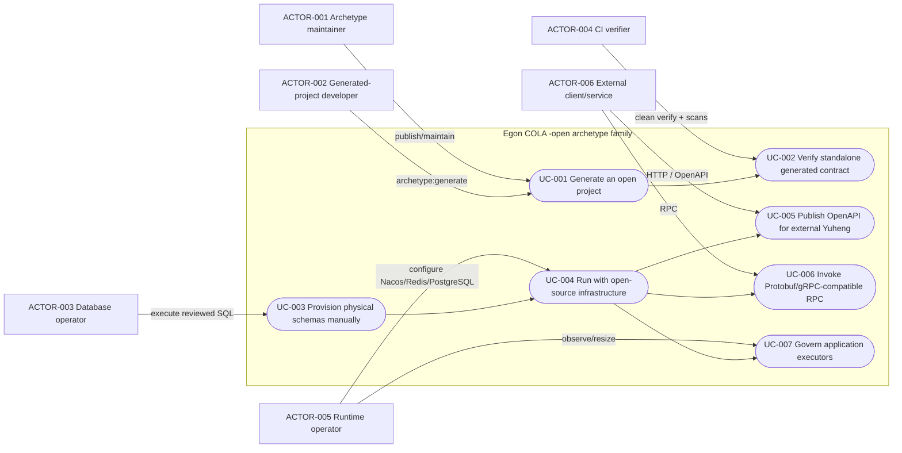
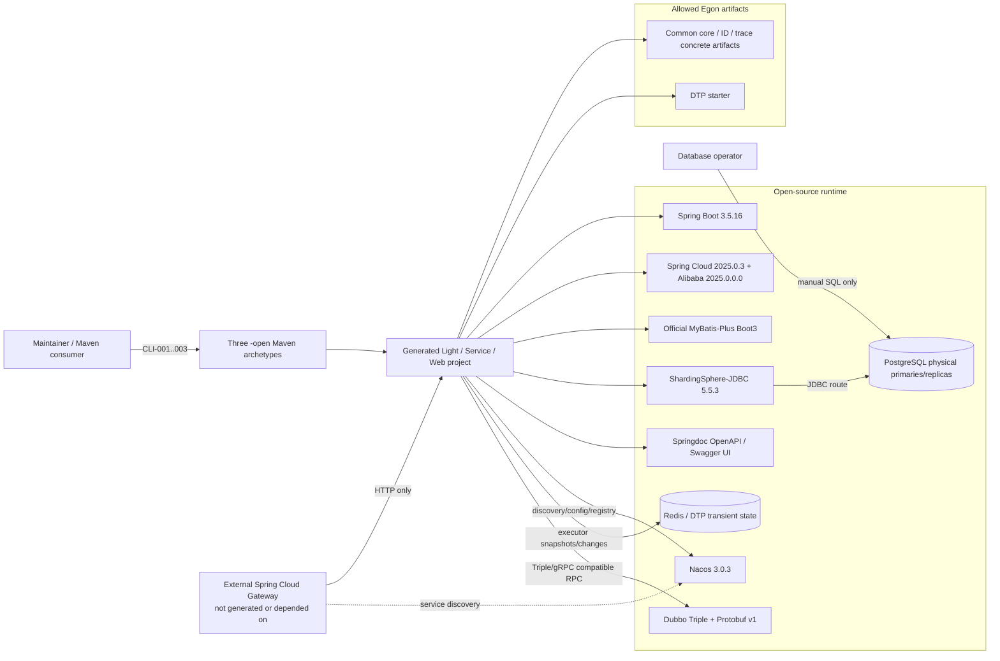
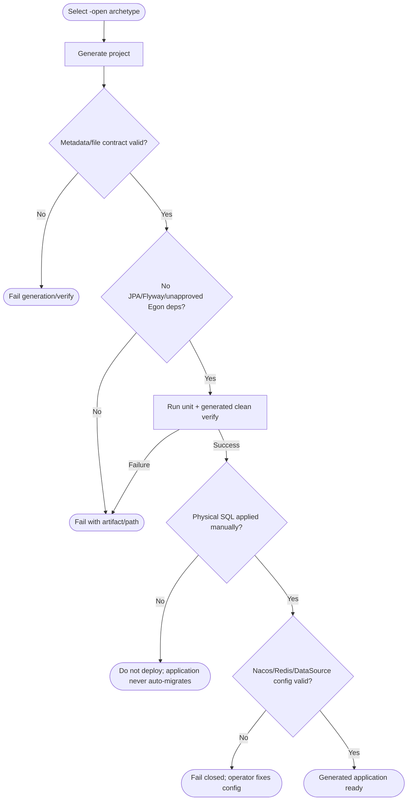
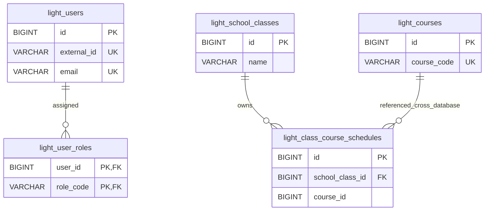
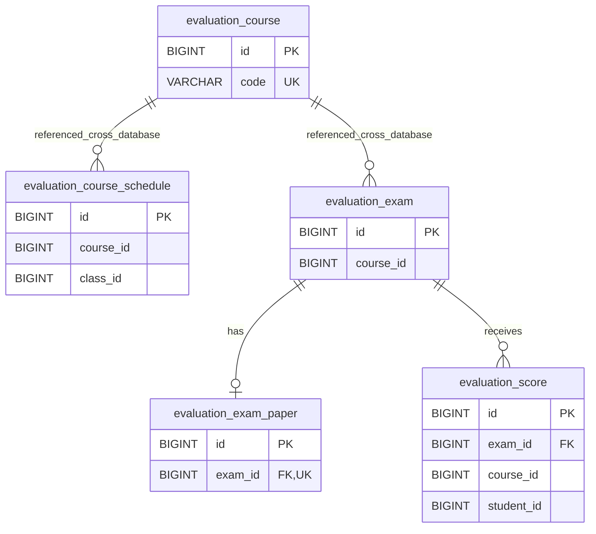
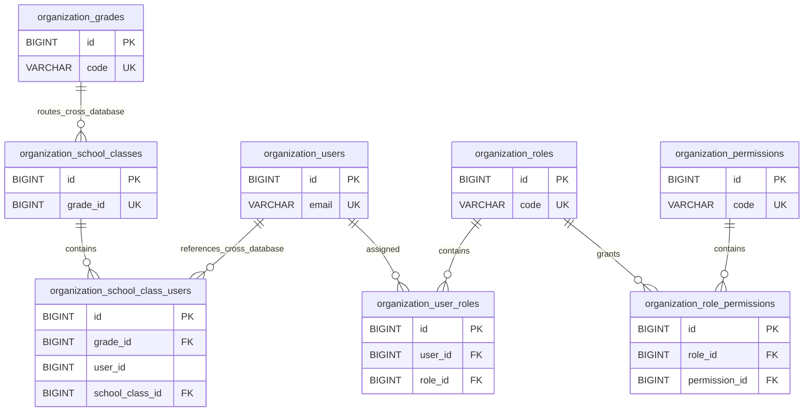

# Egon COLA Open-Source Archetype Family 设计

| Field | Value |
| --- | --- |
| Document | `2026-08-23-16-43-open-source-archetype-family.md` |
| Template Version | `4` |
| Status | `Review` |
| Type | `Feature / Architecture` |
| Complexity | `Complex` |
| Complexity Drivers | `三套 archetype 与 1241 个现有模板文件的并行复制契约、UUID/JPA 到 Snowflake Long/MyBatis-Plus 的全链路替换、Flyway 到纯手工 SQL 的启动边界、ShardingSphere 多物理库、Spring Cloud/Nacos/Dubbo Triple/Protobuf/gRPC 互操作、外置 Yuheng、Springdoc、Egon Common/DTP 白名单及生成项目兼容性` |
| Created | `2026-08-23 16:43 CST` |
| Updated | `2026-08-23 19:42 CST` |
| Owner | `Mario / Egon-COLA maintainers` |
| Repository | `Egon-COLA` |
| Scope | `egon-cola-archetypes 父 reactor；新增 egon-cola-archetype-light-open、egon-cola-archetype-service-open、egon-cola-archetype-web-open；对应生成模板、验证器、CI 与文档` |
| Change Surface | `以三个现有 archetype 为只读基线新增三个 -open sibling；保持现有业务/分层架构，把 UUID/JPA/Flyway 替换为 Common Snowflake Long/MyBatis-Plus/纯手工 SQL，把 canonical facade 下沉为生成项目本地 Protobuf contract module，以 Dubbo Triple 提供标准 gRPC 互操作并用 Springdoc 暴露现有 HTTP API 文档；Spring Cloud Gateway 明确属于外部基础设施且不进入任何生成模块；原三个 archetype、components 与 xingyuan 生产源码不变` |
| Affected Chapters | `§7, §8, §9, §10, §11, §13, §14, §15, §16, §17, §18` |
| Source Requirement | `2026-08-23 用户请求：为 light/service/web 各新增 -open 开源版；内部 components/xingyuan 版暂不做；使用 Spring Boot 3.5、Spring Cloud、Spring Cloud Alibaba、Yuheng、Dubbo、Nacos、gRPC、Protobuf、MyBatis-Plus、ShardingSphere；额外允许/要求 Common 与 Dynamic Thread Pool；禁止 Spring Data JPA 和 Flyway；resources 提供手工 SQL。2026-08-23 用户补充确认：删除 UUID 并使用 components Common ID 生成器；严格 Common/DTP 白名单、本地 facade 与 ArchUnit；Yuheng 选 C、仅外部使用，生成组件内不需要；API 使用 Swagger/OpenAPI 或 Springdoc；RPC 选 Dubbo Triple + Protobuf + 标准 gRPC 互操作` |
| Baseline Revision | `main@772df2b28b4abf29e7fffae6ea1b10fd616397b4；2026-08-23 16:25 CST dirty-worktree snapshot：仅有两个与本 Spec 无关的 Tianquan-Shoubing Spec/Plan 已修改，本设计不得覆盖或回退它们` |
| Amends | `None` |
| Supersedes | `None` |
| Depends On | `[Light living architecture](../../../egon-cola-archetypes/egon-cola-archetype-light/large-monolith-light-domain-architecture.md) §1-§5；[Service living architecture](../../../egon-cola-archetypes/egon-cola-archetype-service/student-management-service-only-rpc-mq-architecture.md) §1-§5；[Web living architecture](../../../egon-cola-archetypes/egon-cola-archetype-web/multi-project-multi-module-architecture.md) §1-§5；[Domain-first package design](../../superpowers/specs/2026-07-13-web-service-archetype-domain-first-package-design.md) §125-§744` |
| Related Specs | `[Common MyBatis-Plus Starter](2026-08-19-16-11-common-mybatis-plus-starter.md) §1、§3.2、§6、§10、§15-§17（DEC-001 的候选依赖及主键/租户冲突证据）；[Current ShardingSphere/Flyway design](../../superpowers/specs/2026-07-23-archetype-shardingsphere-flyway-design.md) §5-§18（仅为原 archetype 的现状/拓扑上下文，-open 不继承其 Flyway 规则）；[Light base design](../../superpowers/specs/2026-07-02-student-management-light-archetype-design.md) §67-§327；[Service base design](../../superpowers/specs/2026-07-02-student-management-evaluation-service-archetype-design.md) §79-§535；[Web base design](../../superpowers/specs/2026-07-02-student-management-organization-web-archetype-design.md) §78-§483` |
| Related Plans | `[Open-Source Archetype Family Implementation Plan](../plan/2026-08-23-19-14-open-source-archetype-implementation.md) §1-§12` |

## 1. Summary

本设计新增三个与现有 archetype 并列发布的开源基础设施版本：
`egon-cola-archetype-light-open`、`egon-cola-archetype-service-open`、
`egon-cola-archetype-web-open`。它们以当前模板为复制基线，保留 Light 的单模块
`start/adapter/facade/application/infrastructure/common/domain` 包结构，以及 Service/Web 的
`common/domain/application/infrastructure/adapter/starter` Maven 模块和 domain-first 包结构；
不修改原三个 archetype，也不提前设计尚在迭代的 components/xingyuan 版本。

开源版必须删除 Spring Data JPA 与 Flyway 的依赖、注解、自动配置、启动编排和测试合同；
持久化改用 MyBatis-Plus，逻辑数据源仍由 ShardingSphere-JDBC 5.5.3 提供。数据库 DDL 作为
`resources/db/manual/postgresql/**` 下的显式手工脚本和运行手册交付，生产代码、Spring Boot、
MyBatis-Plus、ShardingSphere 与测试 profile 均不得自动建表、自动升级或自动执行这些脚本。
生成项目只允许使用用户确认的 Egon Common/DTP concrete artifacts；其余运行时框架来自开源社区。

用户已关闭 `DEC-001`-`DEC-004`。开源版完全删除 UUID 生成与 UUID 业务标识：数据库/Domain/PO/Mapper
技术主键使用 Common ID Starter 的 Snowflake `long/Long` 与 PostgreSQL `BIGINT`；HTTP/GraphQL 的 ID
继续用十进制字符串表示以避免 JavaScript 精度损失，Adapter 负责与正 `long` 互转。MyBatis 使用官方
Boot3 Starter，不采用会额外引入全局 tenant/audit/logical-delete 语义的 Common MyBatis-Plus Starter。

Service/Web 各新增本地 `facade` contract module，Protobuf 是唯一 RPC wire source，Dubbo Triple 是唯一
provider/consumer runtime，并以标准 gRPC client 做互操作测试。Spring Cloud Gateway 由部署环境外置，三个
archetype 均不生成 Yuheng module、dependency、route 或配置。Light/Web 保留并统一 Springdoc OpenAPI/
Swagger UI，Service 因无 HTTP business API 不堆叠文档依赖。本文已达到 `Review`，仍不写 Plan、不改
production/template code、不启动项目。

## 2. Background and Current State

### 2.1 Business and user context

维护者需要长期保留两条 archetype 产品线：一条未来跟随 Egon components/xingyuan 演进，另一条
以社区框架为主要运行时基础。当前只交付第二条，防止内部平台继续变化时反复重写社区版生成契约。
生成项目使用者希望从 Maven archetype 得到可编译、可测试、可容器化的 Light、Service 或 Web 工程，
数据库运维者则必须清楚知道每个物理库需要手工执行哪些 SQL；应用本身不得越权管理 schema。

### 2.2 Repository evidence

| Evidence ID | Classification | Exact path/symbol/decision/command | Observed fact | Design significance | Verification limit/freshness |
| --- | --- | --- | --- | --- | --- |
| `EVD-001` | Static repository | `egon-cola-archetypes/pom.xml:54-61` | 当前 reactor 聚合两个 canonical facade artifact 和 light/service/web 三个 archetype，没有 `-open` 模块 | 三个新模块必须 additive 加入 reactor，不能重命名原模块 | 只证明当前源码 |
| `EVD-002` | Static repository | `git ls-files` 对三个 archetype 的计数 | Light 450、Service 351、Web 440 个 tracked 文件，共 1241 个复制基线文件 | 需要一对一复制规则加少量明确例外，不能靠手工挑文件形成残缺模板 | 计数基于 baseline revision |
| `EVD-003` | Static repository | 三个 template root `pom.xml` | 均为 Java 21、Boot 3.5.16、Cloud 2025.0.3、SCA 2025.0.0.0、Dubbo 3.3.6、ShardingSphere 5.5.3 | 推荐版本先与仓库当前已验证组合对齐 | 尚未解析新组合依赖树 |
| `EVD-004` | Static repository | Light template POM；Service/Web infrastructure POM | 三套模板仍声明 `spring-boot-starter-data-jpa`，PO 使用 `jakarta.persistence`，repo 使用 `JpaRepository` | `REQ-008` 不是 POM 单点替换，21 个 PO、19 个 JPA repository 及 repository impl/test 均受影响 | 未执行 MyBatis 迁移 |
| `EVD-005` | Static repository | `**/PhysicalDataSourceFlywayMigrator.java`、`ShardingDataSourceBootstrapper`、`ShardingTopologyValidator`、SQL 目录 | Flyway 参与“建物理 DataSource -> 每个 primary migrate -> 建逻辑 DataSource”的启动链 | 禁止 Flyway 后必须重写启动顺序和 topology property，而不是只删依赖 | 未启动生成应用 |
| `EVD-006` | Static repository | 三个 `verify.groovy` | Light 明确断言无 MyBatis/DTP；Web 明确禁止 Mapper/MyBatis config；三套断言 JPA/Flyway 文件和依赖 | 新 `-open` 必须有独立 verifier，不能复用原 verifier 的相反断言 | verifier 是静态/生成项目契约，不是 live proof |
| `EVD-007` | Static repository | 六个 `db/migration/sharding/**/V20260726_*.sql` | 当前 DDL 是 PostgreSQL/H2 可用的初始化脚本；Light/Web/Service 均以 UUIDv7 `VARCHAR(36)` 为主键/分片键 | 用户已批准 open edition 改 Long；因此 §10/§11 必须全链展开，不能只换 generator bean | 未连接真实数据库，不证明已应用 schema |
| `EVD-008` | Static repository | `common-mybatis-plus.../EgonModel.java`、auto-configuration/properties | Common MP Starter 默认启用 TenantLine；`EgonModel` 使用 `Long id/tenantId` 和审计、`is_deleted` 字段 | `DEC-001` 明确不用该 Starter，避免把 Long ID 误等同于 tenant/audit/lifecycle adoption | 只证明当前组件合同 |
| `EVD-009` | Static repository | `egon-cola-component-common/pom.xml`、Components BOM | Common 是聚合 POM；可消费的是 `common-core`、`common-id-starter`、`common-trace(-starter)`、`common-mybatis-plus-starter` 等 concrete artifact | 生成 POM 不能依赖 `egon-cola-component-common` 聚合器 | 不证明外部 Central 已发布 5.3.3 |
| `EVD-010` | Static repository | DTP README、Starter POM、`DynamicThreadPoolAutoConfig` | 业务应用应依赖 DTP starter；其默认启用并创建专用 RedissonClient，测试若不显式关闭会尝试连接 Redis | 三套 runnable module 需接入 Starter、executor 和 test-disabled 配置；Admin 不是生成项目子模块 | 未验证 Redis/Nacos live topology |
| `EVD-011` | Static repository | Service/Web root POM、archetypes facade modules | 生成项目当前消费 `top.egon:egon-cola-organization-facade/evaluation-facade`；starter 还执行 Egon bytecode architecture plugin | `DEC-002` 已决定 local facade + ArchUnit；这些 external artifacts 必须从 open copy 删除 | 当前 artifacts 是原产品合同，不是 components/xingyuan |
| `EVD-012` | Static repository | Living architecture documents、domain-first package Spec | 当前架构是自定义 COLA/light-domain 分层，不是本 Skill 的传统 `biz.controller/service/dao` 三层 | 用户已要求架构保持不变；不得迁移到传统三层或 DDD 新结构 | 文档可能滞后，implementation 必须以模板/verifier 双证据复核 |
| `EVD-013` | Static repository | `.github/workflows/ci_java_compatibility.yaml:163-251` | CI 只生成三个原 archetype，且 `clean verify` 依赖 Egon architecture plugin | 新坐标必须进入 CI；open generated verify 改用 ArchUnit，原 CI 路径保持 | CI 未在本阶段运行 |
| `EVD-014` | Static repository | Root README 双语、`scripts/maven-deploy.md` | 公开目录、生成命令、archetype 表只列原三套 | 新产品线需要双语发现/使用文档 | 文档不证明 artifacts 已发布 |
| `EVD-015` | Official source | [Spring Cloud supported versions](https://github.com/spring-cloud/spring-cloud-release/wiki/Supported-Versions) | Spring Cloud 2025.0 对应 Boot 3.5.x，Yuheng 为 4.3.x | Boot/Cloud 大线匹配用户约束 | 官方页面会随支持期变化，实施前复核 |
| `EVD-016` | Official source | [Spring Cloud Alibaba repository](https://github.com/alibaba/spring-cloud-alibaba) | SCA 2025.0.x 对应 Cloud 2025.0.x、Boot 3.5.x、JDK 17+ | 当前版本线合理 | 不证明特定 patch 的所有功能无缺陷 |
| `EVD-017` | Official maintainer evidence | [SCA Nacos version note](https://github.com/alibaba/spring-cloud-alibaba/issues/4098) | SCA 2025.0.0.0 携带 Nacos client 3.0.3；不应跨大版本连接当前模板的 Nacos Server 2.5.1 | `-open` Compose 推荐改为 Nacos Server 3.0.3 | Issue/静态资料，不是本地连通性测试 |
| `EVD-018` | Official source | [Dubbo Triple gRPC interop](https://dubbo.apache.org/en/overview/mannual/java-sdk/tasks/protocols/triple/grpc/)、[Protobuf IDL](https://dubbo.apache.org/en/overview/mannual/java-sdk/tasks/protocols/triple/idl/) | Dubbo Triple 可用 Protobuf IDL，且标准 gRPC client/server 可互操作 | 单 RPC 栈即可满足“Dubbo + gRPC + Protobuf”，避免双 server | §9 已设计 21 个合同，但尚未生成/运行验证 |
| `EVD-019` | Official source | [Spring gRPC requirements](https://docs.spring.io/spring-grpc/reference/system-requirements.html) | 当前稳定 Spring gRPC 1.0.x 面向 Boot 4.0；Boot 3.5 只能选旧/pre-GA 线或 raw grpc-java | Boot 3.5 下不推荐再加第二套 Spring gRPC server | 未来版本可能改变 |
| `EVD-020` | Official source | [Yuheng Server Web MVC starter](https://docs.spring.io/spring-cloud-yuheng/reference/spring-cloud-yuheng-server-webmvc/starter.html) | `spring-cloud-starter-yuheng-server-webmvc` 可嵌入 Servlet/Tomcat 应用，也可配置禁用 | 技术上可嵌入当前 Web，但是否混合 edge/business 是架构决策 | 不证明当前业务 routes |
| `EVD-021` | Official source | [MyBatis-Plus installation](https://baomidou.com/en/getting-started/install/) | Boot 3 使用 `mybatis-plus-spring-boot3-starter`，且不应再直接引入原生 MyBatis starter | 推荐直接 MP 方案的依赖边界 | 官方示例当前显示 3.5.17，未来会变 |
| `EVD-022` | Official source | [ShardingSphere YAML JDBC](https://shardingsphere.apache.org/document/current/en/user-manual/shardingsphere-jdbc/yaml-config/)、[5.5.3 release](https://github.com/apache/shardingsphere/releases) | YAML factory 生成标准 `DataSource`；5.5.3 为当前 release | 去掉 Flyway 后仍可保持现有 logical DataSource 机制 | 未验证现有 YAML 与新 Mapper SQL |

### 2.3 Problem statement and gap

原 archetype 已经大量使用社区依赖，但没有独立的长期社区版坐标；继续原地改造会让未来
components/xingyuan 化与社区化互相覆盖。当前持久化实现又与本请求相反：JPA/Flyway 是 POM、
源码、配置、测试和 verifier 的强合同。另有两个静态不一致：SCA 2025.0.0.0 的 Nacos client 3.0.3
与 Compose 2.5.1 跨大版本；Common MP Starter 的 Long/tenant schema 与 archetype UUIDv7 schema 不同。

目标不能只是复制目录并替换几行依赖。最终 `-open` 生成项目必须在坐标、模块、包、持久化接口、
物理 SQL、ShardingSphere、Nacos、DTP、RPC/Yuheng、测试和文档上形成一个自洽产品；同时原产品线
逐字节保持不变，避免尚未设计的内部版被本任务提前冻结。

### 2.4 Evidence and current-chain map

| Entry/trigger | Current call chain | Data read/written | External dependency | Consumers | Evidence |
| --- | --- | --- | --- | --- | --- |
| Maven 生成 Light | `archetype:generate -> light metadata -> archetype-resources -> post-generate -> generated clean verify -> verify.groovy` | 生成单模块文件树 | Maven Central/local repo | Light application developer、CI | `EVD-001`,`EVD-002`,`EVD-006` |
| Maven 生成 Service/Web | `archetype:generate -> metadata -> 六模块 reactor -> canonical facade fixtures -> generated clean verify` | 生成多模块文件树 | `top.egon` facade artifacts、Dubbo/Nacos | Service/Web developer、CI | `EVD-006`,`EVD-011`,`EVD-013` |
| 当前仓储调用 | `Adapter/Application -> Domain Repository port -> Infrastructure RepositoryImpl -> JpaRepository -> ShardingSphere logical DataSource -> physical PostgreSQL/H2` | 21 种 PO、现有逻辑/物理表 | JPA、ShardingSphere | 现有业务 use cases | `EVD-004`,`EVD-007` |
| 当前 Sharding 启动 | `Configuration -> physical pools -> topology validation/Flyway targets -> Flyway migrate primaries -> YAML logical DataSource` | schema history + physical DDL | Flyway、PostgreSQL/H2 | runnable module | `EVD-005` |
| 目标手工建库 | `DB operator -> db/manual README/order -> psql against each primary -> application creates logical DataSource -> MyBatis Mapper` | 物理 schema；应用只读/写业务数据 | PostgreSQL、ShardingSphere | 运维、生成应用 | 用户决定；当前尚无实现 |
| 目标线程池治理 | `Starter executor bean -> DTP discovery -> ManagedExecutorRegistry -> Redis snapshot/change topic -> optional external DTP Admin` | Redis transient governance state | DTP starter、Redis | 应用/运维 | `EVD-010` |

## 3. Goals and Non-goals

### 3.1 Goals

1. 新增三个独立发布的 `-open` archetype 坐标，不修改原坐标或生成结果。
2. 一对一保留现有业务样例、COLA/light-domain 分层、domain-first 包规则和可观察行为。
3. 用确定的 Boot 3.5/Cloud 2025.0/SCA/Dubbo/Nacos/ShardingSphere/MyBatis-Plus 组合形成社区运行时。
4. 彻底移除 Spring Data JPA 与 Flyway，并用 MyBatis Mapper/PO mapping、手工 SQL 和测试专用显式脚本执行替代。
5. 在每个 runnable 生成模块实际接入 Common concrete artifacts 与 DTP starter/executor，测试不依赖 live Redis。
6. 用本地 Protobuf contract module + Dubbo Triple 形成唯一 RPC 栈，以标准 gRPC 客户端证明互操作；Yuheng 明确外置。
7. 通过独立 `verify.groovy`、生成项目 `clean verify`、forbidden scans、CI matrix 与文档验证产品合同。
8. 删除 open 模板中的 UUID 业务/技术 ID 生成路径，统一使用 Common ID Starter Snowflake，并用 Springdoc 发布现有 HTTP API 文档。

### 3.2 Non-goals

- 不实现、修改或冻结未来“基于 Egon components/xingyuan”的原 archetype 方向。
- 不修改原 light/service/web 模板、六个现有 Flyway SQL、现有 facade artifacts、components 或 xingyuan 生产源码。
- 不在 Spec 阶段写 Plan、复制模板、改 POM、执行 SQL、启动 Spring/Nacos/Redis/RabbitMQ/PostgreSQL 或发布 artifact。
- 不引入 Spring Data JPA、Hibernate ORM、Flyway、Liquibase 或 Spring SQL init 作为替代自动迁移器。
- 不以“等等”无限加入 Seata、Sentinel、RocketMQ、OpenFeign、Spring AI 等未被当前样例消费的框架；新增依赖必须通过 §7.0 必要性审计。
- 不改变业务 use case、授权、事务或表关系；获准的变化仅为 ID 表示、持久化技术与 RPC wire representation。

### 3.3 Change Surface and Design Depth

| Area/layer | Disposition | Exact repository evidence | Changed or preserved behavior/contract | Required Spec treatment | Chapter(s) |
| --- | --- | --- | --- | --- | --- |
| Archetype reactor/coordinates/metadata | Affected | `egon-cola-archetypes/pom.xml`、三套 module POM/metadata | 新增三套 `-open` 坐标和生成契约；旧坐标不变 | 完整模块、CLI、发布与验证设计 | `§7, §8, §9, §14, §16, §17, §18` |
| Template dependency model | Affected | 三个 root POM + Service/Web child POMs | JPA/Flyway/custom xingyuan boundary改为社区 BOM + 允许的 Common/DTP | 完整依赖矩阵与 forbidden contract | `§7, §8, §13, §15, §16, §17, §18` |
| Persistence adapter/PO/Mapper | Affected | 21 个 PO、19 个 `repo.jpa`、RepositoryImpl/tests | JPA annotation/derived query 改 MyBatis-Plus Mapper/XML/Lambda；domain ports不变 | 完整对象角色、映射、分页/复合键/错误设计 | `§7, §8, §10, §11, §13, §14, §15, §16, §17, §18` |
| Schema delivery/Flyway startup | Affected | Flyway classes/config/tests、六个 migration SQL | 删除自动 migration；新增手工 SQL 目录、runbook 和 test-only executor | 完整手工交付、启动、失败、回退设计 | `§7, §8, §11, §14, §15, §16, §17, §18` |
| ShardingSphere topology/routing | Affected | datasource/sharding YAML、`UuidV7BucketShardingAlgorithm`、`ShardingNodeMap`、topology validator | UUID parser/hash 改正 `long` stable-slot hash；None strategy/物理 node-map 保持；移除 Flyway target 维度 | 完整 Long 路由、共置、拒绝非法键与联合测试 | `§7, §10, §11, §14, §15, §16` |
| Common/DTP integration | Affected | Components BOM、Common/DTP POM/README/AutoConfig | 选择 concrete artifacts；runnable module 加 DTP executor/config | 依赖、线程上下文、Redis failure/test 设计 | `§7, §8, §13, §14, §15, §16, §17, §18` |
| RPC/Protobuf | Affected | 现有 Dubbo Java facade、provider/client、无 Proto | 本地 facade module 持有 Proto；21 个业务方法转为 Triple/gRPC contract；移除 external facade artifacts | 完整逐 RPC contract、deadline/error/version/interop 设计 | `§7, §8, §9, §10, §13, §14, §15, §16, §17, §18` |
| External Yuheng + HTTP documentation | Context-only | 当前无 Yuheng；Light/Web 已有 Springdoc | Yuheng 只在外部部署，不进入生成项目；Light/Web 统一 Springdoc 2.8.17，现有 HTTP route/payload 不变 | 负向依赖证明、OpenAPI 生成与外部集成边界 | `§7, §8, §9, §14, §15, §16` |
| Deployment/config/Nacos | Affected | bootstrap/application、18 compose、`.env*` | Nacos Server 2.5.1 -> 3.0.3；增加 DTP/RPC/Snowflake machine-id 配置；无 DB auto-init/Yuheng 配置 | 完整配置/秘密/失败合同 | `§7, §8, §14, §15, §16, §17, §18` |
| Generated-project verification/CI/docs | Affected | 三套 verifier、CI archetype array、README 双语、deploy docs | 新开源产品线必须独立生成、构建、扫描、发布说明 | 完整测试与文档矩阵 | `§8, §14, §16, §18` |
| Original three archetypes | Unchanged | 当前 tracked paths、用户“基于我的这份先不做” | 不修改任何原模板/POM/verifier/SQL | 路径隔离与 diff proof | `§16` |
| Components/xingyuan production code | Unchanged | `egon-cola-components/**`、`egon-cola-xingyuan/**` | 只消费已发布的用户批准 concrete artifacts；不改其实现 | 依赖边界与版本可用性验证 | `§15, §16` |
| Business HTTP/GraphQL/MQ behavior | Context-only | 当前 adapter/application/domain tests | 默认保持现有 route、payload、error/use-case 语义 | 最小回归，不重写完整现有契约 | `§9, §14, §16` |
| Frontend application | Not applicable | 三个 archetype 不含 JS/TS/UI source；DTP Admin 也不生成 UI | N/A，无页面、route component 或浏览器状态 | §12 证据化 N/A | `§12` |

## 4. Requirements and Acceptance Criteria

| ID | Atomic requirement | Priority | Observable acceptance criteria | Source |
| --- | --- | --- | --- | --- |
| `REQ-001` | 新增 `egon-cola-archetype-light-open` | Must | reactor 可生成并 `clean verify` 一个单模块项目；原 light diff 为零 | “light 做两份…命名追加 -open” |
| `REQ-002` | 新增 `egon-cola-archetype-service-open` | Must | reactor 可生成并验证 service 多模块项目；原 service diff 为零 | 同上 |
| `REQ-003` | 新增 `egon-cola-archetype-web-open` | Must | reactor 可生成并验证 web 多模块项目；原 web diff 为零 | 同上 |
| `REQ-004` | 内部 components/xingyuan 版本不在本范围 | Must | 没有原 archetype/components/xingyuan production edit | “基于我的这份先不做” |
| `REQ-005` | 保持当前业务架构与包依赖方向 | Must | ArchUnit + verifier 证明现有 layer/module/domain-first 规则；无传统三层迁移或 internal plugin | “架构还是现在的架构” |
| `REQ-006` | 使用 Boot 3.5 与 Java 21/Maven Wrapper 基线 | Must | effective POM 为 Boot 3.5.16、Java 21；wrapper 3.9.14 | 用户技术栈 + repository baseline |
| `REQ-007` | 使用 Cloud 2025.0、SCA、Nacos discovery/config | Must | BOM/Starter/config 存在；SCA 2025.0.0.0 配 Nacos Server/client 3.0.3 同大版本 | 用户技术栈 + `EVD-015`-`017` |
| `REQ-008` | 使用 MyBatis-Plus 且完全禁止 Spring Data JPA | Must | dependency/source/generated tree 全局无 JPA/Hibernate；Mapper 行为回归通过 | “不允许用 springdatajpa” |
| `REQ-009` | 分库分表仅使用 ShardingSphere-JDBC | Must | 5.5.3 logical DataSource、现有 sharding/readwrite modes/route tests 保持 | “分库分表使用 shardingsphere” |
| `REQ-010` | 完全禁止 Flyway 自动/手工插件路径 | Must | 无 Flyway dependency/import/config/profile/class/test/name/history；source scan 为零 | “不允许使用 flwaydb” |
| `REQ-011` | resources 提供手工 PostgreSQL SQL | Must | 每个拓扑 primary 有顺序明确的 SQL 与 README；生产 classpath 不自动执行 | “resources 下写好 sql，手工更新表结构” |
| `REQ-012` | 使用 Components Common concrete artifacts | Must | 直接允许 Components BOM、`common-core`、`common-id-starter`、DTP starter，并允许它们解析出的 `common-trace`；其余 Common/Egon artifact 禁止 | “需要使用 components 下的 common 模块” + 用户确认 1/2 |
| `REQ-013` | 使用 Dynamic Thread Pool starter | Must | 每个 runnable app 有 DTP starter、受管 executor、dev/prod Redis config、test disabled/isolated test | 用户要求 |
| `REQ-014` | 使用 Dubbo/Nacos RPC 并覆盖 gRPC/Protobuf 目标 | Must | 21 个现有 facade operation 均由本地 Proto v1 定义；Dubbo Triple 是唯一 runtime；标准 gRPC interop、deadline/error/version tests 通过 | 用户技术栈 + 用户确认 4A |
| `REQ-015` | Yuheng 外置且 HTTP API 用 Springdoc | Must | 三个生成项目 dependency/source/config 无 Spring Cloud Gateway；Light/Web 有 Springdoc OpenAPI + Swagger UI，Service 无未消费 Springdoc；文档说明外部 Yuheng 按 Nacos/OpenAPI 集成 | 用户确认 3C + “api 使用 swagger 或 spring doc” |
| `REQ-016` | 梳理最小必须框架，不做无消费依赖堆砌 | Must | §6/§7 对每项给出 Must/Feature-specific/Rejected 和必要性结论 | “需要梳理清楚必须的框架” |
| `REQ-017` | 原有 HTTP/GraphQL/MQ/domain 行为默认兼容 | Must | 现有 API/use-case tests 复制并通过；仅 persistence/RPC representation 的已批准差异可变 | “架构还是现在” |
| `REQ-018` | Open archetype 自身可独立发布和发现 | Must | root README 双语、deploy docs、CI matrix、archetype catalog/metadata 包含三个新坐标 | 隐含发布正确性 |
| `REQ-019` | 生成项目测试不依赖 live Nacos/Redis/PostgreSQL/RabbitMQ | Must | `clean verify` 在现有 archetype IT 环境通过；外部连接由 test profile 关闭/stub | repository verification contract |
| `REQ-020` | 不启动项目或执行数据库 SQL | Must | 本 Spec 只做文档/静态校验；实现阶段也只运行 build/test，不运行应用进程 | AGENTS + Spec-only gate |
| `REQ-021` | 删除 UUID 并使用 Common Snowflake ID | Must | open template 全局无 `UUID`/`UuidV7`/36-char UUID DDL；技术主键/外键为 Long/BIGINT；所有新 ID 调用注入的 `LongIdGenerator`；machine-id 显式且唯一 | 用户补充确认 1 |

### 4.1 Scenario matrix

| Scenario | Actor/trigger | Preconditions | Main path | Alternative/failure path | Data/state change | Observable result | Requirements |
| --- | --- | --- | --- | --- | --- | --- | --- |
| Generate Light Open | 维护者/开发者执行 Maven CLI | `-open` artifact 已安装/发布；参数合法 | 生成单模块并 verify | 缺参数/模板资源缺失则 generation/verify fail | 仅目标目录文件 | 工程结构、POM、tests 完整 | `REQ-001`,`006`,`018` |
| Generate Service/Web Open | 维护者/开发者 | canonical contract 决策已关闭 | 生成多模块 reactor | facade 坐标不可解析则明确构建失败，不静默 stub production | 仅目标目录文件 | 所有 modules compile/verify | `REQ-002`,`003`,`018` |
| Forbidden dependency detected | CI/verifier | 生成项目完成 | 扫 POM/dependency tree/source | 任一 JPA/Flyway/未批准 Egon artifact 出现即 fail | 无 runtime state | 错误包含 artifact/path | `REQ-008`,`010`,`012` |
| Manual schema provision succeeds | DB operator | PostgreSQL physical primaries 可连接；备份/权限就绪 | 按 README 对 master/shards 执行脚本并验证 | 任一步失败停止；修正新脚本/恢复备份，不由应用 repair | schema 被显式改变 | verification SQL 全部满足 | `REQ-009`,`011` |
| Application starts before schema | Operator/deployer | SQL 未执行或执行不完整 | 应用创建 pools/logical DataSource | 首次 readiness/Mapper 访问失败；绝不自动建表 | schema 不变 | 明确 missing-table/schema error | `REQ-010`,`011`,`019` |
| Sharding route | 业务 use case | schema 已手工初始化；sharding key 有效 | Mapper SQL -> logical DS -> expected physical node | 缺 key 被 auditor 拒绝；无广播写/自动修复 | 正常业务事务 | route/rollback test 可观察 | `REQ-008`,`009`,`017` |
| Nacos version match | Runnable app/Compose | SCA client 3.0.3 + Server 3.0.3 | discovery/config 正常连接 | 2.x server 被文档/contract scan 拒绝；连接失败不阻止 test profile | Nacos registry/config | dev/prod 有明确健康/错误 | `REQ-007`,`019` |
| DTP Redis unavailable | Runnable app | dev/prod DTP enabled | 注册 executor/上报 snapshot | Redis 连接失败按 DTP 当前 fail-fast；test profile 必须 disable | 无业务 DB 变化 | startup/test outcome 明确 | `REQ-013`,`019` |
| RPC interoperability | gRPC/Dubbo consumer | Proto v1/version 匹配 | Triple/Protobuf provider/consumer 调用 | deadline、UNAVAILABLE、schema mismatch 映射稳定失败 | 无/业务事务按原 use case | 21-operation contract + standard gRPC interop test | `REQ-014`,`017`,`021` |
| External Yuheng/API documentation | HTTP client/operator | 外部 Yuheng 自行部署；Light/Web 已启动 | Yuheng 根据 Nacos 与受控 route 转发；Springdoc 暴露 OpenAPI/Swagger UI | Yuheng/no-instance 属外部运维；生成项目无 Yuheng fallback | 无业务 DB 直接写 | dependency-negative scan + OpenAPI generation test | `REQ-015` |
| Snowflake ID generation | Application command | `egon.cola.component.id.machine-id` 已显式分配且时钟有效 | 注入 `LongIdGenerator.nextLongId()`；PO/Domain 使用 Long，API 十进制字符串映射 | machine-id 缺失/重复风险、超阈值时钟回拨均 fail closed | 仅业务事务成功后持久化 Long ID | generator/config/mapping/sharding tests | `REQ-012`,`021` |
| Original family regression | Maintainer diff/check | 实施在 `-open` paths | path-limited diff + original IT | 原文件变化即拒绝该 Step | 原文件不变 | 三原 archetype hash/diff invariant | `REQ-004` |

### 4.2 Use-case analysis

#### 4.2.1 Actor inventory

| Actor ID | Actor/role | Goal and responsibility | Entry/channel | Permission/tenant context | Evidence |
| --- | --- | --- | --- | --- | --- |
| `ACTOR-001` | Archetype maintainer | 发布、维护并验证两条独立产品线 | Maven reactor、Git/CI | repository maintainer；不涉及业务 tenant | 用户请求、`EVD-001`,`013` |
| `ACTOR-002` | Generated-project developer | 生成并扩展可构建的 Light/Service/Web 工程 | Maven archetype CLI | 由生成项目自行实现 auth/tenant | 当前 archetype properties/README |
| `ACTOR-003` | Database operator | 在正确物理库按顺序手工执行/验证 SQL | `psql`/受控 DBA 工具 | 数据库权限与环境隔离 | 用户“手工更新” |
| `ACTOR-004` | CI verifier | 阻止残缺模板、禁用依赖和架构漂移 | Maven IT、Groovy、ArchUnit | 无业务权限 | `EVD-006`,`013` |
| `ACTOR-005` | Runtime operator | 配置 Nacos、Redis/DTP、Yuheng、Dubbo 和物理 DataSource | env/Compose/Kubernetes | secret 由部署环境提供 | 当前 deploy templates、`EVD-010`,`017` |
| `ACTOR-006` | External service/client | 通过 HTTP/Yuheng 或 RPC 观察生成应用 | HTTP/Dubbo Triple/gRPC | 由生成项目现有安全合同负责 | 当前 adapter/facade + 用户 RPC/Yuheng 要求 |

#### 4.2.2 Use-case artifact



| ID | Goal/trigger and preconditions | Main success outcome | Alternatives/failures and postconditions | Requirements/contracts/tests |
| --- | --- | --- | --- | --- |
| `UC-001` | 开发者选择一个 `-open` 坐标并提供合法 group/artifact/package | 得到与原架构同形且社区依赖自洽的工程 | 坐标/模板错误时不留下被误判成功的工程 | `REQ-001`-`006`,`CLI-001`-`003`,`TEST-001`-`004` |
| `UC-002` | CI 对生成工程执行 verify；不要求外部服务 | 编译、测试、架构/forbidden scans 全绿 | 任一禁用依赖、模板遗漏、跨层依赖立即失败；无外部状态 | `REQ-008`-`020`,`TEST-005`-`015` |
| `UC-003` | DBA 获得目标拓扑、凭证、备份和脚本顺序 | 每个 primary schema 与 verification query 一致 | 失败停止并由 DBA 恢复/forward-fix；应用不得介入 | `REQ-009`-`011`,`TEST-016`-`018` |
| `UC-004` | SQL 已执行，运行配置/secret 完整 | Nacos/DTP/ShardingSphere/MyBatis 正常装配 | 缺 schema/config/dependency 时 fail closed；不自动修复 | `REQ-007`-`013`,`TEST-019`-`022` |
| `UC-005` | Light/Web 的现有 Controller 与 Springdoc 配置可构建 | 生成 `/v3/api-docs` 与 Swagger UI，供客户端和外部 Yuheng 管理者读取 | 文档生成失败则 verify 失败；Yuheng runtime 故障不归生成项目自动处理 | `REQ-015`,`TEST-023` |
| `UC-006` | Proto v1、Triple provider/consumer 与版本兼容 | Dubbo/标准 gRPC 互操作并保持 use-case 语义 | deadline/transport/schema failure 稳定映射，事务按业务边界回滚 | `REQ-014`,`017`,`021`,`TEST-024` |
| `UC-007` | DTP enabled 且 Redis 可用；executor 已注册 | snapshot/metric/resize 可观察 | Redis 不可用按配置失败；test profile 无连接/无泄漏 | `REQ-013`,`019`,`TEST-025` |

## 5. Constraints, Assumptions, and Decisions

### 5.1 Confirmed constraints

- 本轮只设计社区版，原三套及未来内部版不动。
- 新 archetype artifact/directory 精确追加 `-open`。
- Java 21、Boot 3.5；保持当前 Light 与 Service/Web 架构。
- 必须使用 MyBatis-Plus、ShardingSphere、Common、DTP；禁止 Spring Data JPA 与 Flyway。
- 生产 schema 只由运维手工执行 `resources` SQL，不由应用、Maven plugin 或 startup initializer 更新。
- Spec-only；不实施、不运行项目。

### 5.2 Small-gap assumptions

| ID | Inference | Repository evidence | Why locally reversible | Impact if wrong |
| --- | --- | --- | --- | --- |
| `ASM-001` | `-open` 只固定 archetype artifact/directory；生成项目的 `artifactId/rootArtifactId/package` 仍由调用者给出，不强制追加 | 当前 archetype properties 是用户参数 | 测试 fixture 名可局部调整，不改变发布坐标 | 若用户希望生成工程也强制 suffix，需改 CLI/metadata/README |
| `ASM-002` | 生产数据库方言仍为 PostgreSQL；H2 仅为 test fixture | 六个 DDL、driver、Compose | 与当前生成行为一致，未来可另增方言 Spec | 若目标是 MySQL，SQL、类型、Test、Sharding parser 全需重做 |
| `ASM-003` | 手工 SQL 使用 `NNN__lower_snake_case.sql`，目录本身表达 manual，不使用 Flyway `V` 前缀 | 用户只决定手工；现有脚本已有顺序 | 命名是本地、可在首次实现前调整 | 已交付后命名成为运维合同 |
| `ASM-004` | RabbitMQ、Redis、GraphQL、OpenAPI、MapStruct/Lombok、Prometheus 按现有 archetype 的真实消费保留，但不提升为所有三套的共同 Must | 当前 POM/source/tests | 保留复制语义，避免本任务扩大业务功能 | 若用户希望极简删除，需扩大行为兼容评审 |
| `ASM-005` | DTP 只把 business-side starter 放入生成项目；DTP Admin 保持外部独立服务 | DTP README 模块职责 | 不改变生成项目模块；Admin 可独立部署 | 若要求同时生成 Admin，需新增 runtime/module/deploy scope |
| `ASM-006` | “删除 UUID”指 open 模板不再生成或验证 UUID：业务主键用 Snowflake Long，trace/request/event/message fallback 用同一 Generator 的十进制 `nextId()`；调用方提供的任意幂等键/外部编码仍是字符串 | 用户字面修正 + 当前 header/MQ/string contract | 不改变协议容器类型，同时可用全局 forbidden scan 证明无 UUID | 若外部协议必须固定 UUID 格式，需要单独兼容决策 |

### 5.3 Resolved decisions

| ID | Decision | Decision owner | Evidence and rationale | Requirements |
| --- | --- | --- | --- | --- |
| `DEC-005` | 三个 `-open` 均作为 sibling 新模块，不用一个 archetype 的 Maven profile/flag 同时生成两套 | User + Spec | 用户明确“两份”和 suffix；独立 artifact 避免模板分支组合爆炸 | `REQ-001`-`004` |
| `DEC-006` | 生产 SQL 自动执行器为 `None`；同时设置 `spring.sql.init.mode=never` 并全局禁止 migration tool | User | “手工更新表结构”是操作所有权决定，不是 profile 选择 | `REQ-010`,`011` |
| `DEC-001` | 使用官方 `mybatis-plus-spring-boot3-starter` + Common ID Starter；删除 UUID，所有技术主键/外键迁为 Snowflake `Long/BIGINT`；不使用 Common MP Starter | User + Spec | 用户明确 Common ID；Common MP 会额外强制全局 tenant/audit/is_deleted，非本需求且改变业务语义 | `REQ-008`,`009`,`012`,`017`,`021` |
| `DEC-002` | `top.egon` 运行时/构建白名单仅为批准的 Common/DTP concrete artifacts；Service/Web facade 下沉为生成项目本地 module；内部 bytecode plugin 改 ArchUnit | User | 用户回复“确认”；生成工程除获准组件外独立于 Egon internal facade/plugin | `REQ-005`,`012`,`014`,`018` |
| `DEC-003` | Spring Cloud Gateway 仅外部部署，三个 archetype 内均不生成 module/dependency/config/route；HTTP 文档使用 Springdoc | User | 用户选择 C 并明确“组件内不需要”；现有 Light/Web 已有 Springdoc，统一比再引一套 Swagger library 更小 | `REQ-015`,`016`,`017` |
| `DEC-004` | Dubbo 3.3.6 Triple + Protobuf IDL 是唯一 RPC 栈，以标准 gRPC client 做互操作测试，不另启 native grpc-java server | User | 用户选择 A；单 registry/port/schema/error model 满足 Dubbo、gRPC、Protobuf且避免双栈漂移 | `REQ-014`,`016`,`017` |

### 5.4 Open major decisions

None. `DEC-001`-`DEC-006` 均已关闭；本文仍为 `Review`，只有用户对完整 Spec 的明确接受才能把状态改为
`Accepted` 并允许另行编写 Plan。

## 6. Project Technology Context

| Concern | Target classification/choice | Repository/official evidence | Constraint on design |
| --- | --- | --- | --- |
| Java | **Must** Java 21 | archetypes parent/current templates | 不降级；ArchUnit/Protobuf plugin需支持 21 |
| Build | **Must** Maven Wrapper 3.9.14 | 三套 wrapper properties | 生成/CI 统一 `./mvnw` |
| Spring Boot | **Must** 3.5.16 | current POM、official system requirements | 不引入 Boot 4-only Spring gRPC 1.0 |
| Spring Cloud | **Must** 2025.0.3 | current POM、official 2025.0 -> Boot 3.5 | generated apps use Cloud/SCA contracts；external Yuheng may use managed 4.3.x but is not a dependency |
| Spring Cloud Alibaba | **Must** 2025.0.0.0 | current POM、SCA compatibility | Nacos client/server 对齐 3.0.3；保留 bootstrap path 直到另行迁移 |
| Nacos | **Must** discovery/config + Dubbo registry，Server 3.0.3 | `EVD-017` | Compose 不再使用 2.5.1；test 不连 live server |
| Dubbo | **Must** 3.3.6 Triple | current POM、Dubbo download/Triple docs | RPC registry、deadline、metadata 只有一个权威模型 |
| Protobuf/gRPC | **Must for Service/Web RPC**：Proto3 + Dubbo Triple standard gRPC interoperability | `EVD-018`,`019`,`DEC-004` | facade module codegen；不引 Boot 4 Spring gRPC，不建第二 server |
| Proto codegen | **Must** `org.apache.dubbo:dubbo-maven-plugin:3.3.6` goal `compile`，`dubboGenerateType=tri` | Dubbo 3.3 IDL/plugin docs | only in local facade modules；default `src/main/proto` -> `target/generated-sources/protobuf/java`；no old `protobuf-maven-plugin`/`os-maven-plugin` |
| Yuheng | **External deployment only / generated-project rejected** | user `DEC-003`、`EVD-020` | open POM/source/config 必须无 Yuheng；外部团队可使用 Cloud Yuheng 2025.0 managed 版本 |
| HTTP API docs | **Must for Light/Web** Springdoc 2.8.17；**N/A for Service** | current Light/Web POM/config | 生成 OpenAPI v3 与 Swagger UI；不再并列引 springfox/swagger-core starter |
| Persistence | **Must** official MyBatis-Plus Boot3 3.5.17 | `EVD-008`,`021`,`DEC-001` | 绝不同时引 raw MyBatis starter、Common MP Starter 或 JPA |
| Sharding | **Must** ShardingSphere-JDBC 5.5.3 | current POM、`EVD-022` | logical table name 交给 Mapper；physical topology/keys 保持 |
| Database | **Must** PostgreSQL runtime；H2 test-only | current DDL/POM/Compose | SQL 生产手工；H2 test显式执行 fixture |
| ID | **Must** Common ID Starter Snowflake `LongIdGenerator` | current ID auto-configuration/parser + user `DEC-001` | machine-id explicit；open source/tree/schema 无 UUID；API boundary decimal string |
| Egon dependencies | **Must** Components BOM + approved Common/DTP concrete artifacts only | BOM/Common/DTP POM、`DEC-002` | 不依赖聚合 POM、external facade、internal build plugin；发布可用性是生成前置条件 |
| Architecture governance | **Must** current dependency rules via ArchUnit 1.4.2 | current plugin + living docs、`DEC-002` | 生成项目不消费内部 bytecode plugin；规则作为 JUnit5 tests |
| Existing features | **Feature-specific keep** RabbitMQ、Redis、GraphQL、OpenAPI、MapStruct、Lombok、Micrometer/Prometheus | current source/tests | 只在当前真实消费者模块保留；不是无条件复制到所有层 |
| Migration tools | **Rejected** JPA/Hibernate/Flyway/Liquibase/SQL init | User decision | POM/source/resource/compiled tree 均需 negative proof |

### 6.1 Java three-layer applicability

| Architecture profile | Base package | Evidence or explicit decision | Existing deviations | Design action |
| --- | --- | --- | --- | --- |
| Other — current Egon COLA/light-domain profile | `${package}` | 用户“架构还是现在”；三个 living architecture 文档；当前 templates | 使用 `adapter/facade/application/infrastructure/common/domain/start(er)`，不是 `biz.controller/service/dao` | 原样保留；本 Spec 不应用传统三层 profile，不新增 DDD/COLA 新概念 |

### 6.2 Exact `top.egon` dependency allowlist

| Artifact | Direct placement | Why required | Direct/transitive rule |
| --- | --- | --- | --- |
| `top.egon:egon-cola-components-bom` | generated root POM `dependencyManagement` | align approved Components artifacts | import only，not runtime dependency |
| `top.egon:egon-cola-component-common-core` | Light root；Service/Web `common` | current shared exception/enums/base utilities | direct allowed |
| `top.egon:egon-cola-component-common-id-starter` | Light root；Service/Web `common` | `LongIdGenerator` API + Snowflake auto-configuration | direct allowed |
| `top.egon:egon-cola-component-common-trace` | resolved transitively from Common/DTP | trace API required by approved starters/core | transitive allowed；avoid redundant direct declaration |
| `top.egon:egon-cola-component-dynamic-thread-pool-starter` | runnable Light/Service/Web only | actual governed executor/Redis integration | direct allowed；Admin/Test artifacts forbidden |

All other `top.egon:*` artifacts are forbidden，including Common aggregator、Common MP Starter、Common Trace Boot Starter、RPC/component starters、
external organization/evaluation facade、bytecode architecture plugin、xingyuan artifacts and DTP Admin/Test。Generated
local `${groupId}:*-facade` modules are project-owned coordinates，not `top.egon` dependencies。The effective dependency
tree verifier distinguishes direct and approved transitive entries so a hidden internal artifact cannot pass through a BOM。

Facade modules declare `com.google.protobuf:protobuf-java` for generated messages；`protobuf-java-util` is added only if
an implemented JSON endpoint actually consumes it（current design does not）。Standard-gRPC interoperability uses
test-scoped `grpc-netty-shaded/grpc-protobuf/grpc-stub` and an independent low-level `ManagedChannel` unary call built
from the Proto full method name/message marshallers；it does not add a second server or production grpc-java starter。

## 7. Architecture Design

### 7.0 Minimum-design baseline and element-necessity audit

直接基线是“完整复制三套目录，仅改 artifactId”。它满足产品线隔离，却继续生成 JPA/Flyway、缺少
DTP/Protobuf/Snowflake，并保留 Nacos 跨大版本问题，因此不足。选定方向仍以复制为主，只对用户明确
点名的基础设施切面做 transformation；不重写业务 use case、HTTP/GraphQL/MQ 或 domain model。

| Proposed element | Change | Requirements | Existing/direct alternative | Concrete inadequacy of alternative | Added calls/state/coupling/failures/migration/operations | Verdict |
| --- | --- | --- | --- | --- | --- | --- |
| 三个 sibling archetype | New | `REQ-001`-`004` | 一个 archetype + flag/profile | 两产品线生命周期独立，条件模板会交叉污染 verifier/docs | 3 artifacts、3 verifiers、CI 增量 | Add |
| Boot/Cloud/SCA/Dubbo BOM | Keep/align | `REQ-006`,`007`,`014` | 逐 dependency pin | 无兼容 train/统一 patch 约束 | BOM 冲突审计 | Keep |
| Common concrete artifacts | Keep/expand | `REQ-012`,`021` | 复制通用代码 | 重复且违背用户要求 | 一个 BOM 与已发布版本耦合 | Keep：core/id/trace + DTP exact allowlist |
| DTP starter + one governed executor/app | New | `REQ-013` | 只声明 dependency | 没有 executor 就没有真实治理对象 | Redis client/topic/job、startup failure | Add |
| DTP Admin generated module | New candidate | None | 外部复用现有 Admin | 无独立生成价值 | 第二服务/REST/部署 | Remove |
| Official MyBatis-Plus | New | `REQ-008` | 保持 JPA | JPA被字面禁止 | Mapper/XML、SQL/error差异 | Add |
| Common ID Starter | Keep/expand | `REQ-012`,`021` | UUIDv7 compatibility generator | 用户要求删除 UUID，旧 generator 已 deprecated | machine-id/clock failure/Long API 与部署约束 | Add and replace every generated UUID path |
| Common MP Starter | Candidate | None | Official MP + Common ID | alternative 已满足；Starter 会引入未要求的 tenant/audit/is_deleted | fail-closed tenant context与全表字段 | Remove |
| Manual SQL folder + README | New/replace | `REQ-010`,`011` | `schema.sql`/Flyway | 两者都会被程序自动执行或暗示 migration engine | DBA 操作/顺序/恢复责任 | Add |
| Runtime schema updater | Remove | `REQ-010`,`011` | Flyway/Liquibase/SQL init | 与用户所有权冲突 | 自动 DDL/锁风险 | Remove |
| Sharding logical DataSource without migrator | Modify copy | `REQ-009`-`011` | 用 JDBC Driver 单 YAML | 当前动态 physical topology/node-map/readwrite validator 已存在 | 保留少量自定义 bootstrap code | Keep/modify |
| Local facade modules | New | `REQ-012`,`014`,`018` | 继续 published top.egon facades | strict community whitelist/standalone 不满足 | module/version/proto ownership | Add to Service/Web |
| ArchUnit JUnit5 | New | `REQ-005`,`012` | Egon bytecode plugin | strict whitelist 不允许 plugin | test time、规则需同步 | Add |
| Spring Cloud Gateway dependency/module | Candidate | None | 外部 yuheng docs only | 用户明确组件内不需要 | 无生成项目价值，增加 edge runtime | Remove and forbid |
| Springdoc | Keep/align | `REQ-015`,`017` | 另一 Swagger library | current Light/Web 已真实消费 Springdoc | OpenAPI endpoint/UI，build test | Keep Light/Web only at 2.8.17 |
| Dubbo Triple Protobuf | New/modify | `REQ-014` | Java interface Triple | 无 Protobuf/gRPC wire contract | codegen/schema compatibility | Add to Service/Web RPC |
| Native Spring gRPC 1.0 | New candidate | `REQ-014` | Triple interop | Boot 4-only且职责重复 | second port/server/error/security | Remove for Boot 3.5 |

| Path | Network calls | Client states | Server contracts/state | Failure and TOCTOU points | Additional user/business value |
| --- | --- | --- | --- | --- | --- |
| Copy-only baseline | 与现有相同 | 与现有相同 | JPA/Flyway、无 DTP/Yuheng/Proto | 保留 Nacos 2/3、自动 migration | 只有新坐标，不满足请求 |
| Selected design | 生成应用调用数不增加；外部 Yuheng hop 不由模板拥有；RPC仍 1 hop | Proto/RPC error state 显式化；HTTP API 文档可发现 | MyBatis Mapper、manual SQL、DTP Redis、Snowflake Long、Triple Proto | 手工 schema、machine-id、Nacos/DTP/RPC failure可见 | 独立社区产品线和明确运维所有权 |

### 7.1 System Architecture Design

#### 7.1.1 Architecture Mermaid view



#### 7.1.2 Boundary and responsibility table

| Module/component | Capability and data owned | Inputs/outputs | Allowed dependencies | Forbidden responsibility | Requirements |
| --- | --- | --- | --- | --- | --- |
| `*-open` archetype artifact | Template/metadata/verifier contract | Maven properties -> generated tree | archetypes parent/test fixtures | 运行业务、修改原 archetype | `REQ-001`-`004`,`018` |
| Generated `common` | project-local cross-layer basics | stable common types/config | approved Common concrete artifacts | domain workflow、DB/RPC | `REQ-005`,`012`,`021` |
| Generated `facade`（Service/Web） | local Proto v1 source and generated Triple/gRPC classes | `.proto` -> generated request/response/service stubs | Protobuf/Dubbo codegen only；no other project module | domain/application/persistence、external Egon facade dependency | `REQ-012`,`014`,`018` |
| Generated `domain` | current entities/values/repository/client ports | domain commands/results | local common | MyBatis/Spring Data/Dubbo/Yuheng | `REQ-005`,`017` |
| Generated `application` | use-case orchestration/transaction intent | domain ports/results | domain | Mapper/DataSource/transport details | `REQ-005`,`017` |
| Generated `infrastructure` | MyBatis Mapper/PO、Long sharding config、Triple clients | domain ports <-> persistence/RPC | domain、local facade、MP、ShardingSphere、Dubbo client | public HTTP、business policy、schema update | `REQ-008`-`011`,`014`,`021` |
| Generated `adapter` | HTTP/GraphQL/MQ/Triple provider boundary | string/Proto contract <-> application Long input | application、local facade contract；Light/Web Springdoc annotations/config | direct Mapper/DB access、Yuheng route | `REQ-005`,`014`,`015`,`017`,`021` |
| Generated `start/starter` | executable composition、Nacos、DTP、observability | env/config -> beans/runtime | adapter + infrastructure | business logic、schema DDL execution | `REQ-006`,`007`,`010`,`013` |
| External Yuheng | deployment-owned edge routing，not generated | external HTTP -> discovered service | external xingyuan's Cloud Yuheng/Nacos | any generated-project dependency/config/route、domain/DB | `REQ-015`,`DEC-003` |
| Database operator/manual SQL | physical schema authority | reviewed SQL -> PostgreSQL | DBA tooling | application auto-migration | `REQ-010`,`011` |

### 7.2 High-Level Design

生成行为采用“复制源为只读基线 + open-specific transformation manifest”：每个 tracked source file 要么
一对一出现在 `-open`，要么在 §8 的 Replace/Remove inventory 中有明确归属。这样未来可以比较两个
产品线的共同架构，同时允许依赖/持久化/部署各自演进。任何实现 Step 都只修改 open target 和共享
reactor/CI/docs，不回写 source archetype。

持久化路径保留 domain repository ports 和 RepositoryImpl adapter，只把底层 JPA repository 替换为
MyBatis Mapper；PO 仍是 Infrastructure-owned persistence object，不泄漏给 HTTP/RPC。Domain ID value
objects 包装正 `long`，PO/Mapper 使用 `Long`，Adapter 把 HTTP/GraphQL 十进制字符串或 Proto `int64`
映射为 Domain ID。ShardingSphere 接收逻辑表 SQL并按 Long stable-slot 路由，生产 schema 已由 DBA 预先
准备。缺表不是应用可恢复错误，禁止 fallback 建表。

#### 7.2.1 Critical business/control flowchart



#### 7.2.2 High-level decision and quality matrix

| Concern/use case | Required behavior | Selected mechanism | Failure/degradation behavior | Trade-off | Verification | Requirements |
| --- | --- | --- | --- | --- | --- | --- |
| Product-line isolation | source family immutable | sibling artifacts + path-limited diff | any overlap rejects Step | duplicated template maintenance | manifest/file count/original diff | `REQ-001`-`004` |
| Dependency determinism | compatible fixed versions | Boot parent + Cloud/SCA/Dubbo/MP/Egon BOMs | Enforcer/dependency scan fails conflict | patch upgrades require explicit sweep | effective-pom/dependency tree | `REQ-006`-`008`,`012`,`014`,`015` |
| Persistence correctness | same domain results without JPA | Mapper + explicit SQL + repository adapter | affected rows/query mismatch mapped to current errors | manual SQL/mapping maintenance | repository/integration tests | `REQ-008`,`009`,`017` |
| Schema ownership | app never mutates schema | manual folder/runbook + init disabled | missing schema fails; no repair | operator prerequisite | source scan + explicit test initializer | `REQ-010`,`011` |
| External service independence in CI | verify without live infra | test profile disables Nacos/DTP and uses H2/stubs | accidental socket attempt fails test | live interoperability remains separate gap | generated clean verify | `REQ-019` |
| ID uniqueness/routing | no UUID；stable positive Long | Common `LongIdGenerator` + explicit machine-id + Long hash slot | missing machine-id/clock rollback fails startup/generation；no UUID fallback | deployment must allocate 0..1023 uniquely | generator/mapping/route tests | `REQ-012`,`021`,`DEC-001` |
| RPC minimality | Dubbo+gRPC+Proto without duplicate servers | local Proto + Triple | protocol/deadline errors mapped once | intentional wire representation change | 21-operation + standard gRPC interop test | `REQ-014`,`DEC-004` |
| Yuheng/API docs | generated app owns API, not edge runtime | no Yuheng dependency；Springdoc in Light/Web | external route failure remains external；docs generation fails verify | no bundled edge convenience | negative scan + OpenAPI test | `REQ-015`,`DEC-003` |

### 7.3 Detailed Design

#### 7.3.1 Detailed component collaboration

| Step | Caller -> callee | Contract/symbol | Input/output mapping | State/data effect | Failure behavior | Requirements |
| --- | --- | --- | --- | --- | --- | --- |
| `1` | Maven -> open archetype | `CLI-001/002/003` | properties -> filtered resources | creates generated files only | missing required property/verify failure | `REQ-001`-`003` |
| `2` | Start/Starter -> Spring | `@SpringBootApplication`, `@MapperScan`, feature-specific `@EnableDubbo` | config -> beans；explicit machine-id -> `LongIdGenerator` | no schema write | invalid/missing machine-id or runtime config stops context | `REQ-005`-`010`,`021` |
| `3` | Adapter -> Application | existing API/RPC/MQ methods | DTO -> existing command/result | business transaction intent | existing stable error mapping | `REQ-005`,`017` |
| `4` | Application -> Domain Repository port | existing repository symbols | domain object/query | no framework state | domain exception unchanged | `REQ-017` |
| `5` | RepositoryImpl -> Mapper | `*Mapper`/custom XML methods | PO and query params -> affected rows/list/page | business rows in current transaction | 0/duplicate/SQL errors explicitly mapped | `REQ-008`,`017` |
| `6` | Mapper -> ShardingSphere | `SnowflakeLongShardingAlgorithm` + logical table SQL | positive Long key -> stable slot -> physical node | physical DB business state | null/non-positive/non-integral key rejects before SQL | `REQ-009`,`021` |
| `7` | DBA -> physical DB | manual SQL files/readme | DDL/seed -> schema | schema changes outside app | stop/restore/forward-fix | `REQ-010`,`011` |
| `8` | DTP -> Redis | existing DTP registry/topic contracts | executor snapshots/change messages | transient Redis keys | test disabled; runtime fail per DTP | `REQ-013` |
| `9` | Triple/gRPC -> Adapter | `RPC-001`-`RPC-021` | Proto `int64`/Timestamp -> Domain Long/Instant | no direct persistence | validation/status/deadline mapping | `REQ-014`,`017`,`021` |
| `10` | HTTP client/external Yuheng -> Light/Web Adapter | existing routes + Springdoc | decimal ID strings -> positive Long；OpenAPI describes string pattern | no direct persistence | malformed/out-of-range ID -> current HTTP validation wrapper | `REQ-015`,`017`,`021` |

**Long stable-slot routing contract.** `ShardingNodeMap.routeSlot(long key)` first rejects `key <= 0`，then computes
`hash = Long.hashCode(key)`、`spread = hash ^ (hash >>> 16)`、`slot = spread & (nodeCount - 1)`；`nodeCount` remains
a power of two and `node-map` remains a complete immutable `slot=database:suffix` mapping。Both database and table
algorithms delegate to this same function。It does not decode Snowflake time/machine bits and never stringify the key。
Changing `node-count` would remap existing rows，so it is a separate offline resharding change and is forbidden as a
normal configuration refresh；reordering physical resources without preserving the slot map is likewise rejected。

Exact route keys remain repository-native：Light class `id`，Light schedule `school_class_id`，Evaluation schedule
`course_id`，Evaluation exam `id`，Evaluation paper/score `exam_id`，Organization class/membership `grade_id`。

#### 7.3.2 Critical-path Mermaid swimlane

```mermaid
sequenceDiagram
    actor Dev as Generated-project developer
    participant Maven as Maven Archetype Plugin
    participant Open as *-open template
    participant Verify as verify.groovy / ArchUnit / tests
    actor DBA as Database operator
    participant App as Generated application
    participant SS as ShardingSphere DataSource
    participant DB as PostgreSQL physical nodes

    Dev->>Maven: CLI-001/002/003 + properties
    Maven->>Open: resolve and filter resources
    Open-->>Maven: generated tree
    Maven->>Verify: clean verify + forbidden scans
    alt Template or dependency violation
        Verify-->>Dev: fail with exact path/artifact
    else Generated contract valid
        Verify-->>Dev: build success (no live infra claim)
        DBA->>DB: execute db/manual scripts in documented order
        alt SQL or verification failure
            DB-->>DBA: error; stop/restore/forward-fix
            DBA-->>App: deployment remains blocked
        else Schema ready
            DBA-->>App: deployment gate satisfied
            App->>SS: create logical DataSource, no migration
            SS->>DB: metadata/business SQL
            alt Schema missing or route invalid
                DB-->>SS: SQL error / Sharding audit reject
                SS-->>App: fail closed; never auto-create
            else Valid request
                DB-->>SS: committed result
                SS-->>App: mapped PO/result
            end
        end
    end
```

#### 7.3.3 Transactions, consistency, concurrency, and idempotency

| Concern/state change | Owner and boundary | Mechanism/isolation/lock | Concurrent or duplicate behavior | Commit/visibility point | Failure result | Requirements/tests |
| --- | --- | --- | --- | --- | --- | --- |
| Business writes | existing Application/Repository transaction | Spring transaction + ShardingSphere local JDBC semantics | retain current unique constraints/affected-row checks | DB commit | rollback/current domain error | `REQ-008`,`009`,`017` / `TEST-011`,`019` |
| Snowflake allocation | runnable process/Common ID Starter | CAS-based 41/10/12 generator；machine-id unique per live writer | one instance strict increasing；cross-node trend ordered only；no retry with UUID | successful CAS returns ID；DB commit owns row visibility | bounded rollback waits，larger rollback/interrupt/out-of-range throws | `REQ-021` / `TEST-028`-`030` |
| Manual DDL | DBA maintenance operation | PostgreSQL transaction/lock according to script | one script applied once per target; operator records ledger | DBA verification gate | restore/forward-fix; app remains stopped | `REQ-010`,`011` / `TEST-016`-`018` |
| DTP changes | DTP component/Redis | existing topic + instance/executor identity | component contract owns duplicate/change semantics | Redis publish/listener result | no DB rollback coupling | `REQ-013` / `TEST-025` |
| RPC command retry | existing business operation + Proto v1 method | command deadline 5s/read 3s；caller idempotency remains operation-specific | no generic automatic retry of mutations | business transaction commit | status/metadata expose known failure；response loss may remain unknown | `REQ-014`,`017` / `TEST-024` |

#### 7.3.4 Failure semantics, recovery, and reconciliation

| Failure point | Detection | Immediate control flow | Data/transaction state | Retry and idempotency | Caller/frontend result | Recovery/reconciliation owner | Verification |
| --- | --- | --- | --- | --- | --- | --- | --- |
| Missing Maven artifact/BOM | dependency resolution | stop build | none | retry after publish/config fix | Maven failure | maintainer | `TEST-004`,`006` |
| JPA/Flyway residue | verifier/rg/dependency tree | stop verify | none | no retry until source fixed | exact path/artifact | maintainer | `TEST-007`,`008` |
| Manual SQL partial failure | psql exit + verification SQL | stop rollout | PostgreSQL transaction-dependent; no blanket rollback claim | operator follows script-specific rule | deploy blocked | DBA | `TEST-016`-`018`; live rehearsal gap |
| Missing table at runtime | JDBC SQLState/readiness | reject startup/readiness/operation | schema unchanged; business transaction rolled back | do not retry blindly | service unavailable/error | DBA + app operator | `TEST-019` |
| Sharding key absent | Sharding audit | reject before fan-out write | no intended write | caller corrects request/code | current business/RPC error | application maintainer | route tests |
| Nacos unavailable/mismatch | client health/log | dev/prod discovery/config failure | DB unchanged | bounded client behavior; operator fixes topology | service not ready/degraded per framework | runtime operator | static config + future live test |
| DTP Redis unavailable | Redisson initialization/health | current DTP fail-fast when enabled | no business DB write | operator fixes Redis or explicitly disables feature by policy | app startup failure | runtime operator | ApplicationContext test + live gap |
| Missing/duplicate machine-id | configuration binding/deployment inventory | startup fail when missing/out-of-range；duplicate cannot be inferred locally and blocks rollout by policy | no row should be created before ready | no random/IP/MAC fallback | explicit configuration error | runtime operator | `TEST-028`,`029` + deployment review |
| Clock rollback | Common generator | <=5ms bounded wait；larger rollback/interrupt throws | surrounding business transaction does not write new row | retry only after clock health restored | stable ID generation exception | runtime operator | `TEST-030` |
| External Yuheng no instance/timeout | external Yuheng | external xingyuan owns route/error/retry | generated app has no direct state or fallback | no generated-project retry policy | external yuheng response | yuheng operator | out of generated verification scope；negative dependency `TEST-023` |
| RPC deadline/transport | Triple/gRPC status | map once at infrastructure/adapter | business commit may be unknown after response loss | operation-specific idempotency | stable status + error metadata | service owner | `TEST-024` |

#### 7.3.5 Observability and operational boundaries

| Signal/runbook | Emitting owner and point | Fields/dimensions | Sensitive-data rule | Success/failure threshold | Alert/dashboard/operator action | Verification boundary |
| --- | --- | --- | --- | --- | --- | --- |
| Archetype verify report | Groovy/Maven after generation | archetype id、file/artifact violation | no secret/POM password | any violation fails | CI owner fixes template | static/CI |
| Manual SQL ledger | DBA per target/script | environment、target、script、checksum、operator、time、result | credentials never stored | every required primary exactly once | stop deployment on gap | runbook/static; live ledger external |
| Sharding route/log | generated infrastructure | datasource mode、logical table、route error、trace ID | redact URLs/user/password/SQL params | any broadcast/route audit failure | app/DB operator | tests + runtime dashboard gap |
| DTP metrics | DTP starter | app/instance/executor、pool metrics | no task payload/tenant/user IDs | current component thresholds | DTP Admin/operator | component tests; live Redis gap |
| RPC/OpenAPI metrics | Triple adapter + Light/Web HTTP adapter | service/method or route、status、latency、trace | no token/body/Snowflake ID dimensions | existing actuator thresholds；external Yuheng metrics outside | service/external yuheng owner | component tests；live topology gap |

#### 7.3.6 Conclusion evidence chain

| Conclusion | Repository/user evidence | Constraint or requirement | Design decision | Consequence and trade-off | Verification and acceptance evidence |
| --- | --- | --- | --- | --- | --- |
| 新产品线必须是 sibling artifacts | user“两份/-open”；`EVD-001`,`002` | `REQ-001`-`004` | one-to-one copy + explicit transform manifest | 重复维护但生命周期真正隔离 | file manifest、original diff、三套 IT |
| Flyway 必须从启动链整体删除 | user禁令；`EVD-005`,`006` | `REQ-010`,`011` | remove migrator/targets/deps，manual SQL only | DBA前置步骤和缺表失败显式化 | forbidden scans、manual SQL tests、no init config |
| Nacos Server 必须升级到 3.x matching client | `EVD-003`,`017` | `REQ-007` | select 3.0.3 server/client pair | Compose 行为变化，但消除跨大版本空配置风险 | image/config assertion；live discovery gap disclosed |
| Common MP 不应采用 | `EVD-007`,`008`、用户只要求 Common ID | `REQ-005`,`008`,`012`,`017`,`021` | official MP + Common ID；Long schema 但不引 tenant/audit/is_deleted | 保留业务语义，同时承担显式 ID/Mapper mapping | Long schema、Mapper、tenant-absence tests |
| gRPC 不应形成第二 RPC 栈 | `EVD-018`,`019`、`DEC-004` | `REQ-006`,`014`,`016` | Dubbo Triple Protobuf interop | 单 registry/port/error model；需 21 个 proto contract | Proto breaking check + interop contract test |
| Yuheng 不进入生成组件 | 用户 `DEC-003`、当前无 Yuheng source | `REQ-015`,`016` | dependency/module/config negative contract；Light/Web Springdoc | 外部 edge 团队自行部署，但模板更小且边界清楚 | forbidden scan + OpenAPI generation test |

## 8. Package Structure and Code File Tree

### 8.1 Current relevant tree

```text
egon-cola-archetypes/
├── pom.xml
├── egon-cola-organization-facade/
├── egon-cola-evaluation-facade/
├── egon-cola-archetype-light/       # 450 tracked files
├── egon-cola-archetype-service/     # 351 tracked files
└── egon-cola-archetype-web/         # 440 tracked files
```

Light 生成单模块；Service/Web 当前各生成 `common/domain/application/infrastructure/adapter/starter`
六模块。每套都有 module POM、archetype metadata/post-generate、filtered resources、basic IT properties、
`goal.txt=verify` 和独立 `verify.groovy`。

### 8.2 Target tree

以下为最终目标，不表示实施顺序。`COPY+TRANSFORM` 表示 source directory 只读；target 包含每个 tracked
source file，除非在 Remove/Replace inventory 中明确列出。

```text
egon-cola-archetypes/
├── pom.xml                                             # MODIFY: add 3 modules
├── egon-cola-archetype-light/                         # UNCHANGED
├── egon-cola-archetype-service/                       # UNCHANGED
├── egon-cola-archetype-web/                           # UNCHANGED
├── egon-cola-archetype-light-open/                    # CREATE: COPY+TRANSFORM light
│   ├── pom.xml
│   ├── large-monolith-light-domain-architecture.md
│   └── src/
│       ├── main/resources/META-INF/{archetype-metadata.xml,archetype-post-generate.groovy}
│       ├── main/resources/archetype-resources/
│       │   ├── pom.xml
│       │   ├── README.md + README.zh-CN.md
│       │   ├── src/main/java/{start,adapter,facade,application,infrastructure,common,domain}/**
│       │   ├── src/main/resources/db/manual/postgresql/
│       │   │   ├── README.md
│       │   │   ├── master-data/001__create_light_master_data_schema.sql
│       │   │   └── shard/002__create_light_sharded_schema.sql
│       │   └── src/test/**
│       └── test/resources/projects/basic/{archetype.properties,goal.txt,verify.groovy}
├── egon-cola-archetype-service-open/                  # CREATE: COPY+TRANSFORM service
│   ├── pom.xml
│   ├── student-management-service-only-rpc-mq-architecture.md
│   └── src/main/resources/archetype-resources/
│       ├── pom.xml
│       ├── __rootArtifactId__-{common,facade,domain,application,infrastructure,adapter,starter}/**
│       ├── __rootArtifactId__-facade/src/main/proto/
│       │   ├── evaluation/v1/{course,exam,score}.proto   # provider contracts
│       │   └── organization/v1/{user,teaching}.proto    # consumer copy; parity with Web Open
│       ├── __rootArtifactId__-infrastructure/src/main/resources/db/manual/postgresql/
│       │   ├── README.md
│       │   ├── master-data/001__create_evaluation_master_data_schema.sql
│       │   └── shard/002__create_evaluation_sharded_schema.sql
│       └── __rootArtifactId__-facade/src/test/**       # Proto descriptor/breaking/interop fixtures
├── egon-cola-archetype-web-open/                      # CREATE: COPY+TRANSFORM web
│   ├── pom.xml
│   ├── multi-project-multi-module-architecture.md
│   └── src/main/resources/archetype-resources/
│       ├── pom.xml
│       ├── __rootArtifactId__-{common,facade,domain,application,infrastructure,adapter,starter}/**
│       ├── __rootArtifactId__-facade/src/main/proto/
│       │   ├── organization/v1/{user,teaching}.proto    # provider contracts
│       │   └── evaluation/v1/{course,exam,score}.proto  # consumer copy; parity with Service Open
│       ├── __rootArtifactId__-infrastructure/src/main/resources/db/manual/postgresql/
│       │   ├── README.md
│       │   ├── master-data/001__create_organization_master_data_schema.sql
│       │   └── shard/002__create_organization_sharded_schema.sql
│       └── __rootArtifactId__-facade/src/test/**       # Proto descriptor/breaking/interop fixtures
README.md                                               # MODIFY
README.zh-CN.md                                         # MODIFY
.github/workflows/ci_java_compatibility.yaml            # MODIFY
scripts/maven-deploy.md                                 # MODIFY
egon-cola-archetypes/architecture-mermaid-diagrams-open.md # CREATE
egon-cola-archetypes/code-style-abstract-open.md         # CREATE
```

Open target 内必须不存在的最终路径/symbol：

- `**/repo/jpa/**`、`*JpaRepository`、`JpaTestApplication`、`@EntityScan`、`@EnableJpaRepositories`；
- `**/db/migration/**`、`PhysicalDataSourceFlywayMigrator`、`FlywayMigrationConventionTest`、
  `*FlywayMigrationTest`、`FlywayAutoConfiguration`、`FlywayProperties`；
- `postgres-flyway-verify` profile、`flyway-maven-plugin`、`flyway_schema_history`；
- `spring-boot-starter-data-jpa`、`org.springframework.data.jpa`、`jakarta.persistence`、`org.flywaydb`；
- `java.util.UUID`、`UuidV7`、`UuidV7Generator`、`VARCHAR(36)` ID、`UuidV7BucketShardingAlgorithm`；
- `egon-cola-component-bytecode-architecture-maven-plugin`、external canonical facade artifacts；
- `spring-cloud-starter-yuheng*`、任何 `${rootArtifactId}-yuheng` module、Yuheng route/config/class。

Persistence replacement final paths：

```text
infrastructure/{user,teaching,course,exam}/repo/
├── po/*.java                          # same semantic PO, MyBatis annotations only
├── mapper/*Mapper.java                # replaces repo/jpa/*JpaRepository
├── converter/*                        # existing names/semantics retained
└── impl/*RepositoryImpl.java          # retains Domain Repository port

src/main/resources/mybatis/mapper/{user,teaching,course,exam}/*Mapper.xml
```

ID/routing replacement final paths：

```text
domain/**/vos/{UserId,SchoolClassId,CourseId,ExamId}.java # positive long wrapper
domain/**/entities/**                                   # Long aggregate/foreign IDs
infrastructure/**/repo/po/**                            # Long/BIGINT mapping
infrastructure/config/datasource/SnowflakeLongShardingAlgorithm.java
infrastructure/config/datasource/ShardingNodeMap.java   # routeSlot(long), no UUID parser
start(er)/src/main/resources/application*.yml           # egon.cola.component.id.machine-id
```

### 8.3 Package and file responsibilities

| Operation | Path/package | Symbols | Responsibility | Dependencies | Requirements |
| --- | --- | --- | --- | --- | --- |
| Modify | `egon-cola-archetypes/pom.xml` | Maven `project/modules/module` entries | aggregate new publishable artifacts | archetypes parent | `REQ-001`-`003` |
| Create | `egon-cola-archetype-*-open/pom.xml` | open artifact coordinates | package/publish archetype | source sibling only as design baseline | `REQ-001`-`004`,`018` |
| Create | each open `archetype-metadata.xml` | required properties/fileSets/modules | exact generation inventory | Maven Archetype | `REQ-001`-`003` |
| Create | each open root/template POM | BOMs/dependencies/plugins | deterministic community stack | Maven Central + allowed Egon BOM | `REQ-006`-`016` |
| Create/replace | `repo.mapper` + Mapper XML | 19 mapper replacements | persistence access only | MyBatis-Plus/ShardingSphere | `REQ-008`,`009`,`017` |
| Create/modify | 21 PO files | `*PO/*Po` | physical row mapping with Long technical IDs; no public exposure | MyBatis annotations | `REQ-008`,`017`,`021` |
| Modify copy | datasource config classes/YAML | Bootstrapper/Properties/Loader/Validator | physical pools + rule validation + logical DS, no migration | ShardingSphere/Hikari | `REQ-009`-`011` |
| Create | `db/manual/postgresql/**` | 6 SQL + 3 README | operator-owned BIGINT schema scripts/order/verification | PostgreSQL | `REQ-010`,`011`,`021` |
| Create | runnable config | `*ExecutorConfiguration` | one bounded `ThreadPoolTaskExecutor` with `DtpTaskDecorator` | DTP starter | `REQ-013` |
| Create | Service/Web local facade/proto files | 8 Proto services / 21 RPC operations | only public RPC wire source and generated stubs | Dubbo/Protobuf；no external Egon facade | `REQ-012`,`014`,`018`,`021` |
| Modify copy | Light/Web Springdoc POM/config/tests | OpenAPI v3 + Swagger UI | document existing HTTP interfaces；no Yuheng ownership | Springdoc 2.8.17 | `REQ-015`,`017` |
| Create | three open `verify.groovy` | generated-project assertions | positive + negative product contract | Groovy/Maven | `REQ-018`,`019` |
| Modify | CI/README/deploy docs | archetype arrays/tables/commands | discover and continuously verify open family | GitHub Actions/Maven | `REQ-018`,`019` |

## 9. Interface Definitions

§9 is Affected because三个 Maven generation interfaces are new，且 21 个现有 Java facade method 的 wire source
改为本地 Proto v1。每个 Proto service method 都有独立 `RPC-*` ID；不得把一个 facade 家族压成“RPC CRUD”。
Yuheng 是外部基础设施且不属于本 Spec 的生成接口。Light/Web 的既有 HTTP/GraphQL route、payload、error
wrapper 保持 `Context-only`；Springdoc 只从这些既有接口生成 OpenAPI，并不新增业务 route。

### 9.1 Interface Inventory

| ID | Change/necessity verdict | Name/purpose | Kind | Consumer | Owner | Method + URL / symbol / topic | Input | Output | Auth/tenant | Error model | Idempotency/version | Requirements |
| --- | --- | --- | --- | --- | --- | --- | --- | --- | --- | --- | --- | --- |
| `CLI-001` | New/Add | Generate Light Open | Maven CLI | application developer/CI | light-open archetype | `mvn archetype:generate` + artifact `egon-cola-archetype-light-open` | standard archetype properties | single-module tree | Maven repository auth only | non-zero Maven failure | artifact version exact | `REQ-001`,`006`,`018` |
| `CLI-002` | New/Add | Generate Service Open | Maven CLI | service developer/CI | service-open archetype | same command + service-open artifact | standard + `rootArtifactId` | service module tree | same | non-zero Maven failure | artifact version exact | `REQ-002`,`006`,`018` |
| `CLI-003` | New/Add | Generate Web Open | Maven CLI | web developer/CI | web-open archetype | same command + web-open artifact | standard + `rootArtifactId` | web module tree | same | non-zero Maven failure | artifact version exact | `REQ-003`,`006`,`018` |
| `RPC-001` | Changed/Add | Create course | Proto RPC | external/Web-capable consumer | Service adapter | `egon.evaluation.v1.CourseService/CreateCourse` | code,name,credit | Course | metadata actor/roles/trace；tenant N/A | canonical gRPC status + Egon metadata | command，v1，5s | `REQ-014`,`017`,`021` |
| `RPC-002` | Changed/Add | Schedule course | Proto RPC | external consumer | Service adapter | `egon.evaluation.v1.CourseService/ScheduleCourse` | course_id,class_id,starts_at,ends_at | CourseSchedule | same | same | command，v1，5s | `REQ-014`,`017`,`021` |
| `RPC-003` | Changed/Add | Get course | Proto RPC | Web infrastructure/external | Service adapter | `egon.evaluation.v1.CourseService/GetCourse` | course_id | Course | same | same | read，v1，3s | `REQ-014`,`017`,`021` |
| `RPC-004` | Changed/Add | Page courses | Proto RPC | external consumer | Service adapter | `egon.evaluation.v1.CourseService/PageCourses` | current_page,page_size | PageCourseResponse | same | same | read，v1，3s | `REQ-014`,`017` |
| `RPC-005` | Changed/Add | Create exam | Proto RPC | external consumer | Service adapter | `egon.evaluation.v1.ExamService/CreateExam` | course_id,title,starts_at,ends_at | Exam | same | same | command，v1，5s | `REQ-014`,`017`,`021` |
| `RPC-006` | Changed/Add | Attach exam paper | Proto RPC | external consumer | Service adapter | `egon.evaluation.v1.ExamService/AttachPaper` | exam_id,title,total_points | ExamPaper | same | same | command，v1，5s | `REQ-014`,`017`,`021` |
| `RPC-007` | Changed/Add | Publish exam | Proto RPC | external consumer | Service adapter | `egon.evaluation.v1.ExamService/PublishExam` | exam_id | Exam | same | same | command，v1，5s | `REQ-014`,`017`,`021` |
| `RPC-008` | Changed/Add | Get exam | Proto RPC | Web infrastructure/external | Service adapter | `egon.evaluation.v1.ExamService/GetExam` | exam_id | Exam | same | same | read，v1，3s | `REQ-014`,`017`,`021` |
| `RPC-009` | Changed/Add | Record score | Proto RPC | external consumer | Service adapter | `egon.evaluation.v1.ScoreService/RecordScore` | exam_id,student_id,points | Score | same | same | command，v1，5s | `REQ-014`,`017`,`021` |
| `RPC-010` | Changed/Add | Get score | Proto RPC | Web infrastructure/external | Service adapter | `egon.evaluation.v1.ScoreService/GetScore` | exam_id,score_id | Score | same | same | read，v1，3s | `REQ-014`,`017`,`021` |
| `RPC-011` | Changed/Add | Page scores | Proto RPC | external consumer | Service adapter | `egon.evaluation.v1.ScoreService/PageScores` | exam_id,current_page,page_size | PageScoreResponse | same | same | read，v1，3s | `REQ-014`,`017`,`021` |
| `RPC-012` | Changed/Add | Create user | Proto RPC | external consumer | Web adapter | `egon.organization.v1.UserService/CreateUser` | name,email | User | metadata actor/roles/trace；tenant N/A | canonical gRPC status + Egon metadata | command，v1，5s | `REQ-014`,`017`,`021` |
| `RPC-013` | Changed/Add | Get user | Proto RPC | Service infrastructure/external | Web adapter | `egon.organization.v1.UserService/GetUser` | user_id | User | same | same | read，v1，3s | `REQ-014`,`017`,`021` |
| `RPC-014` | Changed/Add | Assign role | Proto RPC | external consumer | Web adapter | `egon.organization.v1.RoleService/AssignRole` | user_id,role_code | Empty | same | same | idempotent-by-state command，v1，5s | `REQ-014`,`017`,`021` |
| `RPC-015` | Changed/Add | Grant permission | Proto RPC | external consumer | Web adapter | `egon.organization.v1.PermissionService/GrantPermission` | role_code,permission_code | Empty | same | same | idempotent-by-state command，v1，5s | `REQ-014`,`017` |
| `RPC-016` | Changed/Add | Get permission tree | Proto RPC | external consumer | Web adapter | `egon.organization.v1.PermissionService/GetPermissionTree` | user_id | PermissionTree | same | same | read，v1，3s | `REQ-014`,`017`,`021` |
| `RPC-017` | Changed/Add | Create grade | Proto RPC | external consumer | Web adapter | `egon.organization.v1.GradeService/CreateGrade` | code,name | Grade | same | same | command，v1，5s | `REQ-014`,`017`,`021` |
| `RPC-018` | Changed/Add | Get grade | Proto RPC | external consumer | Web adapter | `egon.organization.v1.GradeService/GetGrade` | grade_id | Grade | same | same | read，v1，3s | `REQ-014`,`017`,`021` |
| `RPC-019` | Changed/Add | Create school class | Proto RPC | external consumer | Web adapter | `egon.organization.v1.SchoolClassService/CreateSchoolClass` | name,grade_code | SchoolClass | same | same | command，v1，5s | `REQ-014`,`017`,`021` |
| `RPC-020` | Changed/Add | Get school class | Proto RPC | Service infrastructure/external | Web adapter | `egon.organization.v1.SchoolClassService/GetSchoolClass` | grade_id,school_class_id | SchoolClass | same | same | read，v1，3s | `REQ-014`,`017`,`021` |
| `RPC-021` | Changed/Add | Assign user to class | Proto RPC | external consumer | Web adapter | `egon.organization.v1.SchoolClassService/AssignUser` | grade_id,user_id,school_class_id | Empty | same | same | idempotent-by-state command，v1，5s | `REQ-014`,`017`,`021` |

### 9.2 Per-interface Detailed Contracts

#### 9.2.1 CLI-001 — Generate Light Open

##### Necessity and interaction-cost decision

| Concern | Decision |
| --- | --- |
| Change classification | New archetype coordinate |
| Independent consumer goal | Generate one runnable Light community-stack project |
| Parameter ownership and derivation | caller owns groupId/artifactId/version/package；archetype owns files/stack |
| Direct/no-new-interface alternative | profile on old archetype rejected by DEC-005 |
| Caller use of result | edits/builds generated project; not forwarded mechanically |
| Round trips and failure points | one artifact resolution + generation + verify；repository/unresolved template errors |
| Verdict | Add for `REQ-001` |

##### Identity and purpose

Protocol is Maven Archetype CLI. Exact artifact is
`top.egon:egon-cola-archetype-light-open:${egon-cola.version}`. It generates one Maven `jar` project and does not
contact Nacos/Redis/database during generation.

##### Request parameters

| Name | Location | Type/format | Required/null | Default | Validation | Meaning/example | Source |
| --- | --- | --- | --- | --- | --- | --- | --- |
| `archetypeGroupId` | CLI | Maven group | Required | None | `top.egon` | archetype publisher | caller |
| `archetypeArtifactId` | CLI | artifact | Required | None | exact `egon-cola-archetype-light-open` | product selection | caller |
| `archetypeVersion` | CLI | Maven version | Required | None | released/local installed exact version | template version | caller |
| `groupId` | CLI | Java/Maven group | Required | None | valid Maven group | generated owner | caller |
| `artifactId` | CLI | Maven artifact | Required | None | valid directory/artifact | generated app name | caller |
| `version` | CLI | Maven version | Required | `1.0-SNAPSHOT` only if Maven supplies | valid version | generated app version | caller |
| `package` | CLI | Java package | Required | derived only if archetype metadata says so | valid Java package | base package | caller |
| `interactiveMode` | CLI | boolean | Required for CI | `false` | false in automation | deterministic generation | caller |

##### Success response

Maven exits `0`; output directory contains one root POM, wrapper, deploy/docs/config, expected Java/resources/tests and no
child modules. Post-generation verify succeeds. No network service or schema is claimed ready.

##### Error responses

| Condition | Status | Business code | Response shape | Retryable | Consumer handling |
| --- | --- | --- | --- | --- | --- |
| artifact unavailable | Maven non-zero | `ARCHETYPE_RESOLUTION_FAILED` (documentation label) | Maven diagnostic | after publish/repo fix | do not use partial output |
| invalid/missing property | Maven non-zero | `ARCHETYPE_PARAMETER_INVALID` | parameter diagnostic | after correction | correct command |
| verifier contract fails | Maven non-zero | `GENERATED_CONTRACT_INVALID` | assertion with path | after template fix | maintainer fixes open template |

##### Interface logic for frontend and consumers

1. Resolve exact archetype version. 2. Validate properties. 3. Filter/copy fileSets. 4. Run post-generate normalization.
5. Run generated `verify`. 6. On any failure treat output as invalid. 7. Developer runs wrapper build separately.

##### Compatibility and verification

The coordinate is additive; old light coordinate/output is unchanged. `TEST-001`,`002`,`005` cover identity, tree and
generated verify. Future breaking output changes require normal artifact versioning and a new Spec/amendment.

#### 9.2.2 CLI-002 — Generate Service Open

##### Necessity and interaction-cost decision

| Concern | Decision |
| --- | --- |
| Change classification | New archetype coordinate |
| Independent consumer goal | Generate one pure backend/RPC-MQ community-stack project |
| Parameter ownership and derivation | caller owns groupId/rootArtifactId/version/package；archetype owns module graph and stack |
| Direct/no-new-interface alternative | profile on old service archetype rejected by DEC-005 |
| Caller use of result | develops/deploys the generated service；result is not forwarded into another command |
| Round trips and failure points | one artifact resolution + multi-module generation + verify；facade/module resolution may fail |
| Verdict | Add for `REQ-002` |

##### Identity and purpose

Exact artifact is `top.egon:egon-cola-archetype-service-open:${egon-cola.version}`. It generates seven modules:
`common/facade/domain/application/infrastructure/adapter/starter`。Facade 仅拥有 evaluation Proto v1/codegen，
Service 仍不生成 HTTP business Controller package，也不引 Springdoc 或 Yuheng。

##### Request parameters

CLI-001 parameters apply; `rootArtifactId` is additionally required and is the module prefix. `artifactId` and
`rootArtifactId` must be equal in CI fixtures to keep parent/module paths deterministic.

##### Success response

Maven exits `0`; all declared child module directories/POMs exist exactly once; `clean verify` passes without live
infrastructure; forbidden Web business packages, JPA and Flyway are absent.

##### Error responses

CLI-001 errors apply, plus `GENERATED_MODULE_GRAPH_INVALID` when declared/actual modules or dependency direction differ.

##### Interface logic for frontend and consumers

Resolve -> validate root -> generate parent/children -> normalize executable files -> install/use approved facade
contracts -> verify module graph, architecture, dependencies and tests -> return valid project or fail.

##### Compatibility and verification

Old service coordinate and its canonical facade consumers remain unchanged. `TEST-001`,`003`,`005`,`010`,`014`,`024`
cover the open coordinate、七模块 graph、local Proto contract 与 generated verification。

#### 9.2.3 CLI-003 — Generate Web Open

##### Necessity and interaction-cost decision

| Concern | Decision |
| --- | --- |
| Change classification | New archetype coordinate |
| Independent consumer goal | Generate one organization Web community-stack project with local Proto facade and Springdoc |
| Parameter ownership and derivation | caller owns groupId/rootArtifactId/version/package；archetype owns seven business/contract modules |
| Direct/no-new-interface alternative | profile on old web archetype rejected by DEC-005 |
| Caller use of result | develops/deploys generated business；external Yuheng remains a separate xingyuan concern |
| Round trips and failure points | one artifact resolution + seven-module generation + verify；Proto/module contract may fail |
| Verdict | Add for `REQ-003` |

##### Identity and purpose

Exact artifact is `top.egon:egon-cola-archetype-web-open:${egon-cola.version}`. It generates seven modules:
`common/facade/domain/application/infrastructure/adapter/starter`。Facade 同时持有 organization provider Proto
和 evaluation consumer Proto copy；后者必须与 Service Open descriptor/checksum 相同。没有 Yuheng module。

##### Request parameters

CLI-002 parameters apply. No hidden flag selects original versus open edition；the archetype artifactId is the edition
contract。也没有 `withGateway` 一类开关；外部 Yuheng 不属于生成输出。

##### Success response

Maven exits `0`; seven modules exist；HTTP/GraphQL business adapters retain current contracts；Springdoc、local Proto、
forbidden Yuheng/JPA/Flyway/UUID scans pass；no external services are contacted。

##### Error responses

CLI-002 errors apply，plus `LOCAL_PROTO_CONTRACT_INVALID` when Service/Web evaluation descriptors drift，and
`FORBIDDEN_YUHENG_DEPENDENCY` when any generated POM/source/config introduces Yuheng。

##### Interface logic for frontend and consumers

Resolve -> validate -> generate seven modules -> normalize -> verify dependency graph、Proto parity、Springdoc、
persistence、forbidden dependencies and tests -> return valid project or fail。

##### Compatibility and verification

Old web coordinate/output remains unchanged. `TEST-001`,`004`,`005`,`010`,`015`,`023`,`024` cover identity、tree、
business compatibility、OpenAPI、negative Yuheng boundary and Proto interoperability。

所有 RPC 使用 `proto3`、package `egon.evaluation.v1` 或 `egon.organization.v1`。Dubbo group 保留现状：
Course/Exam/Score services 分别为 `course`/`exam`/`score`，Organization 五个 services 均为
`student-management-organization`；version `1.0.0`，Triple port 默认 `50051` 且可由 `DUBBO_PROTOCOL_PORT`
覆盖。技术 ID 为 positive
`int64`，时间为 `google.protobuf.Timestamp`，void 返回 `google.protobuf.Empty`。调用 metadata 统一为
`x-egon-actor-id`、`x-egon-actor-roles`、`x-egon-trace-id`；业务错误用 canonical gRPC status，稳定业务码与
trace 分别放 trailing metadata `x-egon-error-code`、`x-egon-trace-id`。读 3s、命令 5s；provider 不做
transport retry，consumer 不自动重试 mutation。新增 optional field 允许在 v1 内向后兼容；删除、改号、
改变标量含义或复用 reserved number 必须升级 package/version 并通过 descriptor breaking check。

Every file sets `java_multiple_files=true` and filtered `java_package=${package}.facade.<context>.v1`。Service/Web
archetype resource copies of each shared Proto are byte-identical before Maven filtering；generated-project parity compares
wire descriptors while ignoring language-only `java_package/java_outer_classname` options，so different caller base
packages do not create a false wire break。Generated Java under `target/` is never committed or packaged as template source。

#### 9.2.4 RPC-001 — CourseService/CreateCourse

##### Necessity and interaction-cost decision

| Concern | Decision |
| --- | --- |
| Change classification | Existing Java facade wire method becomes Proto v1 RPC |
| Independent consumer goal | Create one course without depending on an external Egon facade artifact |
| Parameter ownership and derivation | caller owns code/name/credit；provider owns ID/status |
| Direct/no-new-interface alternative | keeping Java serialization would not satisfy Protobuf/gRPC |
| Caller use of result | consumes the created course ID and state |
| Round trips and failure points | one Triple call；validation/conflict/transport/deadline failures |
| Verdict | Add as the only open-edition create-course RPC |

##### Identity and purpose

Unary `egon.evaluation.v1.CourseService/CreateCourse` replaces `CourseFacade#create` on the wire while preserving the
same application use case. Service Open owns provider code；local Proto owns contract identity。

##### Request parameters

| Field | Proto type | Required/validation | Meaning |
| --- | --- | --- | --- |
| `code` | `string` | non-blank，max 96 | unique course code |
| `name` | `string` | non-blank，max 64 | display name |
| `credit` | `int32` | greater than zero | course credit |

##### Success response

Returns `Course { int64 id, string code, string name, int32 credit, string status }`；`id` is generated once through
`LongIdGenerator.nextLongId()` inside the application command and is never accepted from the caller。

##### Error responses

Blank/range violations map to `INVALID_ARGUMENT`；duplicate code maps to `ALREADY_EXISTS`；dependency outages map to
`UNAVAILABLE`；unexpected failures map to sanitized `INTERNAL`。All carry stable Egon error/trace metadata。

##### Interface logic for frontend and consumers

Validate metadata and fields，create the existing command，allocate one Snowflake ID，execute one transaction，map the
domain result to Proto，and return once。A timeout never triggers automatic command replay。

##### Compatibility and verification

This is an intentional open-edition wire change；the original Java facade remains untouched。Descriptor snapshot、
provider mapping、duplicate-code、deadline and standard gRPC client tests cover `RPC-001`。

#### 9.2.5 RPC-002 — CourseService/ScheduleCourse

##### Necessity and interaction-cost decision

| Concern | Decision |
| --- | --- |
| Change classification | Existing Java facade wire method becomes Proto v1 RPC |
| Independent consumer goal | Schedule an existing course for an organization class |
| Parameter ownership and derivation | caller owns course/class IDs and time window；provider owns schedule ID/status |
| Direct/no-new-interface alternative | decorative Proto beside Java facade would create two authorities |
| Caller use of result | stores/displays schedule identity and effective window |
| Round trips and failure points | one Triple call；local course/overlap validation，transport/deadline failures |
| Verdict | Add as the only schedule-course wire contract |

##### Identity and purpose

Unary `egon.evaluation.v1.CourseService/ScheduleCourse` replaces `CourseFacade#scheduleCourse` and preserves the current
course scheduling domain rule。The baseline treats `class_id` as an opaque cross-service identifier and does not add a
new organization-directory round trip。

##### Request parameters

| Field | Proto type | Required/validation | Meaning |
| --- | --- | --- | --- |
| `course_id` | `int64` | positive | Evaluation course ID |
| `class_id` | `int64` | positive | Organization school-class ID |
| `starts_at` | `Timestamp` | present，before end | start instant |
| `ends_at` | `Timestamp` | present，after start | end instant |

##### Success response

Returns `CourseSchedule { int64 id, int64 course_id, int64 class_id, Timestamp starts_at, Timestamp ends_at,
string status }`。Schedule ID is Common Snowflake；the two foreign IDs are not regenerated。

##### Error responses

Malformed IDs/window map to `INVALID_ARGUMENT`；missing course maps to `NOT_FOUND`；overlap maps to
`FAILED_PRECONDITION`；data-source/transport failures map to `UNAVAILABLE` or `DEADLINE_EXCEEDED` with Egon metadata。

##### Interface logic for frontend and consumers

Validate positive IDs and timestamps，load course，treat class ID as the caller-owned opaque reference，check overlap，allocate schedule ID，persist
through the existing transaction，publish existing event semantics，then map the committed result once。

##### Compatibility and verification

Proto `int64` replaces UUID string representation only in open edition。Tests cover timestamp conversion、opaque positive
class ID、overlap、course-ID routing、status metadata and standard gRPC interoperation。

#### 9.2.6 RPC-003 — CourseService/GetCourse

##### Necessity and interaction-cost decision

| Concern | Decision |
| --- | --- |
| Change classification | Existing Java facade read becomes Proto v1 RPC |
| Independent consumer goal | Read a course from Web or another service using an open contract |
| Parameter ownership and derivation | caller provides positive course ID；provider derives all fields |
| Direct/no-new-interface alternative | Web cannot keep the forbidden external Egon facade dependency |
| Caller use of result | maps Course to its consumer-side projection |
| Round trips and failure points | one read call；invalid/not-found/transport/deadline failures |
| Verdict | Add because it is a current cross-archetype consumer path |

##### Identity and purpose

Unary `egon.evaluation.v1.CourseService/GetCourse` replaces `CourseFacade#getCourse` and is the canonical evaluation
course lookup used by Web Open infrastructure。

##### Request parameters

| Field | Proto type | Required/validation | Meaning |
| --- | --- | --- | --- |
| `course_id` | `int64` | positive and present | Snowflake course identifier |

##### Success response

Returns the same `Course` message as `RPC-001` with no generic response wrapper。Absence is an error status，never a
success payload with null/default course fields。

##### Error responses

Non-positive ID maps to `INVALID_ARGUMENT`；absent row maps to `NOT_FOUND`；registry/transport/deadline failures map to
`UNAVAILABLE`/`DEADLINE_EXCEEDED`。Internal exception text is not exposed。

##### Interface logic for frontend and consumers

Validate ID，invoke the existing query，route by the master-data None strategy，map the domain result to Proto，and let
Web infrastructure map it to its local consumer projection。The read has no automatic data repair。

##### Compatibility and verification

Service/Web copies of `evaluation/v1/course.proto` must have identical SHA-256 and descriptor output。Consumer mapping、
not-found、deadline and gRPC interoperability tests prove the local copies do not drift。

#### 9.2.7 RPC-004 — CourseService/PageCourses

##### Necessity and interaction-cost decision

| Concern | Decision |
| --- | --- |
| Change classification | Existing Java paged read becomes Proto v1 RPC |
| Independent consumer goal | Page course master data deterministically |
| Parameter ownership and derivation | caller owns one-based page/page-size；provider derives totals/items |
| Direct/no-new-interface alternative | returning framework Page would leak MyBatis implementation |
| Caller use of result | renders or processes one stable page |
| Round trips and failure points | one read call；invalid page/SQL/deadline failures |
| Verdict | Add to preserve the existing CourseFacade capability |

##### Identity and purpose

Unary `egon.evaluation.v1.CourseService/PageCourses` replaces `CourseFacade#pageCourses` while keeping pagination as an
explicit transport DTO rather than exposing MyBatis-Plus `Page`。

##### Request parameters

| Field | Proto type | Required/validation | Meaning |
| --- | --- | --- | --- |
| `current_page` | `int32` | 1 or greater | one-based page index |
| `page_size` | `int32` | 1..200 | requested page size |

##### Success response

Returns `PageCourseResponse { repeated Course records, int32 current_page, int32 total_pages, int32 page_size,
int64 total_count }`。Records are ordered by the existing deterministic course order plus `id` as final tie-breaker。

##### Error responses

Page validation maps to `INVALID_ARGUMENT`；SQL/data-source failure maps to `UNAVAILABLE`；deadline maps to
`DEADLINE_EXCEEDED`；unexpected mapping failure is sanitized `INTERNAL` with stable metadata。

##### Interface logic for frontend and consumers

Validate page bounds，create an internal MP page only inside infrastructure，execute explicit stable ordering，map PO to
domain and Proto items，and return exact `current_page/total_pages/page_size/total_count` without Mapper types。

##### Compatibility and verification

Fixtures compare item order、empty page、last page、total and page metadata with the original Java facade behavior。
Descriptor checks prevent changing numeric widths or repeated-field numbers within v1。

#### 9.2.8 RPC-005 — ExamService/CreateExam

##### Necessity and interaction-cost decision

| Concern | Decision |
| --- | --- |
| Change classification | Existing Java command becomes Proto v1 RPC |
| Independent consumer goal | Create an exam for an existing course |
| Parameter ownership and derivation | caller owns course/title/window；provider owns exam ID/status |
| Direct/no-new-interface alternative | Java serialization cannot be the Protobuf authority |
| Caller use of result | consumes created exam identity and state |
| Round trips and failure points | one call；course/window/transport/deadline failures |
| Verdict | Add as the sole open-edition create-exam contract |

##### Identity and purpose

Unary `egon.evaluation.v1.ExamService/CreateExam` replaces `ExamFacade#createExam` and preserves the existing evaluation
application/domain transaction boundary。

##### Request parameters

| Field | Proto type | Required/validation | Meaning |
| --- | --- | --- | --- |
| `course_id` | `int64` | positive | owning course |
| `title` | `string` | non-blank，max 128 | exam title |
| `starts_at` | `Timestamp` | present，before end | start instant |
| `ends_at` | `Timestamp` | present，after start | end instant |

##### Success response

Returns `Exam { int64 id, int64 course_id, string title, Timestamp starts_at, Timestamp ends_at, string status }`。
The provider creates the positive Snowflake ID exactly once before persistence。

##### Error responses

Invalid fields/window map to `INVALID_ARGUMENT`；missing course maps to `NOT_FOUND`；business-state conflict maps to
`FAILED_PRECONDITION`；transport/deadline/internal failures follow the shared canonical mapping。

##### Interface logic for frontend and consumers

Validate request，load course，allocate exam ID，invoke existing domain creation，persist on the exam shard selected by
that ID，map the committed state to Proto，and never auto-retry after an ambiguous timeout。

##### Compatibility and verification

Tests cover Timestamp boundaries、positive Long mapping、course absence、shard selection、rollback and standard gRPC
client compatibility。Original evaluation facade artifact and original archetype remain unchanged。

#### 9.2.9 RPC-006 — ExamService/AttachPaper

##### Necessity and interaction-cost decision

| Concern | Decision |
| --- | --- |
| Change classification | Existing Java command becomes Proto v1 RPC |
| Independent consumer goal | Attach the single paper allowed for an exam |
| Parameter ownership and derivation | caller owns exam/title/points；provider owns paper ID/status |
| Direct/no-new-interface alternative | retaining a second Java wire contract would permit drift |
| Caller use of result | consumes attached paper identity and limits |
| Round trips and failure points | one call；missing exam/duplicate paper/validation/deadline |
| Verdict | Add to preserve the current ExamFacade operation |

##### Identity and purpose

Unary `egon.evaluation.v1.ExamService/AttachPaper` replaces `ExamFacade#attachPaper` and keeps exam and paper co-located
by routing on the request `exam_id` rather than the new paper ID。

##### Request parameters

| Field | Proto type | Required/validation | Meaning |
| --- | --- | --- | --- |
| `exam_id` | `int64` | positive | owning/sharding exam ID |
| `title` | `string` | non-blank，max 128 | paper title |
| `total_points` | `int32` | greater than zero | paper maximum score |

##### Success response

Returns `ExamPaper { int64 id, int64 exam_id, string title, int32 total_points, string status }`。Paper ID is a new
Snowflake value；`exam_id` remains the ShardingSphere routing and foreign-key value。

##### Error responses

Invalid fields map to `INVALID_ARGUMENT`；missing exam maps to `NOT_FOUND`；existing paper maps to `ALREADY_EXISTS`；
SQL/transport/deadline/internal failures follow shared status and metadata rules。

##### Interface logic for frontend and consumers

Validate request，route/load the exam by Long ID，check the one-paper invariant，allocate a paper ID，insert in the same
physical suffix transaction，and return the mapped paper。No cross-shard fallback is allowed。

##### Compatibility and verification

Tests assert one-paper uniqueness、exam/paper co-location、Long FK mapping、transaction rollback、status metadata and
Proto descriptor compatibility。The v1 field numbers are reserved once published。

#### 9.2.10 RPC-007 — ExamService/PublishExam

##### Necessity and interaction-cost decision

| Concern | Decision |
| --- | --- |
| Change classification | Existing Java state command becomes Proto v1 RPC |
| Independent consumer goal | Publish an exam after its prerequisites are satisfied |
| Parameter ownership and derivation | caller owns exam ID；provider derives legal transition/result |
| Direct/no-new-interface alternative | generic update RPC would weaken domain state rules |
| Caller use of result | consumes the resulting published exam state |
| Round trips and failure points | one call；not-found/precondition/deadline/ambiguous response |
| Verdict | Add as an explicit domain command |

##### Identity and purpose

Unary `egon.evaluation.v1.ExamService/PublishExam` replaces `ExamFacade#publishExam` and exposes the named state
transition，not a generic mutable resource update。

##### Request parameters

| Field | Proto type | Required/validation | Meaning |
| --- | --- | --- | --- |
| `exam_id` | `int64` | positive | exam to publish and shard route |

##### Success response

Returns the full `Exam` message in its resulting published status。Repeated calls follow the existing domain transition
rule；the transport layer does not invent a separate idempotency token or status。

##### Error responses

Non-positive ID maps to `INVALID_ARGUMENT`；missing exam to `NOT_FOUND`；missing paper/illegal state to
`FAILED_PRECONDITION`；deadline/transport/internal failures use shared status and metadata。

##### Interface logic for frontend and consumers

Validate ID，load co-located exam and paper，invoke the existing state transition，persist in one transaction，publish
existing event semantics after commit policy，and return the final state without transport retry。

##### Compatibility and verification

State-transition fixtures cover draft/published/illegal cases、transaction rollback、event behavior、deadline ambiguity
and standard gRPC interoperability。No generic update field is added to Proto v1。

#### 9.2.11 RPC-008 — ExamService/GetExam

##### Necessity and interaction-cost decision

| Concern | Decision |
| --- | --- |
| Change classification | Existing Java read becomes Proto v1 RPC |
| Independent consumer goal | Let Web and other consumers read an exam |
| Parameter ownership and derivation | caller supplies positive exam ID；provider derives state |
| Direct/no-new-interface alternative | Web cannot consume the forbidden external facade artifact |
| Caller use of result | maps exam to its local projection |
| Round trips and failure points | one read；invalid/not-found/transport/deadline |
| Verdict | Add because current Web infrastructure consumes this lookup |

##### Identity and purpose

Unary `egon.evaluation.v1.ExamService/GetExam` replaces `ExamFacade#getExam` and is the canonical open-edition exam
lookup for Web infrastructure and standard gRPC consumers。

##### Request parameters

| Field | Proto type | Required/validation | Meaning |
| --- | --- | --- | --- |
| `exam_id` | `int64` | positive | Snowflake exam/sharding key |

##### Success response

Returns the same `Exam` message as `RPC-005`。The provider never returns a default-valued message for an absent exam，
so consumers cannot confuse missing data with identifier zero。

##### Error responses

Invalid ID maps to `INVALID_ARGUMENT`；absence maps to `NOT_FOUND`；registry/transport/deadline failures map to
`UNAVAILABLE`/`DEADLINE_EXCEEDED`；unexpected details are sanitized under `INTERNAL`。

##### Interface logic for frontend and consumers

Validate positive ID，route to the exact exam physical node，execute the existing read query，map domain fields and
Timestamp values to Proto，then map in Web infrastructure without exposing generated Proto to Domain。

##### Compatibility and verification

Service/Web `exam.proto` descriptor and checksum must match。Tests cover route、not-found、timestamp mapping、deadline、
consumer projection and a standard gRPC client against the Dubbo Triple provider。

#### 9.2.12 RPC-009 — ScoreService/RecordScore

##### Necessity and interaction-cost decision

| Concern | Decision |
| --- | --- |
| Change classification | Existing Java command becomes Proto v1 RPC |
| Independent consumer goal | Record one student's score for an exam |
| Parameter ownership and derivation | caller owns exam/student/points；provider owns score ID/status/course |
| Direct/no-new-interface alternative | decorative Proto would leave Java serialization authoritative |
| Caller use of result | consumes recorded score identity and state |
| Round trips and failure points | one Triple call；local exam/paper/duplicate/range/deadline failures |
| Verdict | Add as the only record-score wire contract |

##### Identity and purpose

Unary `egon.evaluation.v1.ScoreService/RecordScore` replaces `ScoreFacade#recordScore` and preserves the existing exam、
paper and duplicate-score validation chain。The baseline does not call Organization during score recording，so
`student_id` is a positive caller-owned cross-service reference rather than a new synchronous lookup。

##### Request parameters

| Field | Proto type | Required/validation | Meaning |
| --- | --- | --- | --- |
| `exam_id` | `int64` | positive | owning/sharding exam |
| `student_id` | `int64` | positive | Organization user ID，not a free-form external code |
| `points` | `int32` | 0..100 and no greater than paper limit | recorded points |

##### Success response

Returns `Score { int64 id, int64 exam_id, int64 course_id, int64 student_id, int32 points, string status }`。Score ID
is newly generated；exam/course/student IDs preserve their upstream identity。

##### Error responses

Invalid range/ID maps to `INVALID_ARGUMENT`；missing exam/paper maps to `NOT_FOUND`；duplicate exam-student row
maps to `ALREADY_EXISTS`；illegal exam state maps to `FAILED_PRECONDITION`；transport errors follow shared rules。

##### Interface logic for frontend and consumers

Validate fields，route/load exam and paper，keep student ID as the caller-owned cross-service reference，check uniqueness and limits，
allocate score ID，insert on the exam shard in one transaction，then return the mapped result once。

##### Compatibility and verification

Tests cover student ID Long conversion、points boundaries、duplicate unique key、co-location、rollback、
unknown-timeout behavior、descriptor stability and standard gRPC interoperability。

#### 9.2.13 RPC-010 — ScoreService/GetScore

##### Necessity and interaction-cost decision

| Concern | Decision |
| --- | --- |
| Change classification | Existing Java read becomes Proto v1 RPC |
| Independent consumer goal | Read one score with an explicit exam routing key |
| Parameter ownership and derivation | caller supplies exam and score IDs；provider derives fields |
| Direct/no-new-interface alternative | score ID alone cannot preserve existing shard routing contract |
| Caller use of result | maps Score to its consumer projection |
| Round trips and failure points | one routed read；invalid/not-found/deadline |
| Verdict | Add because Web currently consumes this exact lookup |

##### Identity and purpose

Unary `egon.evaluation.v1.ScoreService/GetScore` replaces `ScoreFacade#getScore`。Both `exam_id` and `score_id` remain
required because exam ID is the authoritative shard key and score ID identifies the row within that route。

##### Request parameters

| Field | Proto type | Required/validation | Meaning |
| --- | --- | --- | --- |
| `exam_id` | `int64` | positive | routing/ownership key |
| `score_id` | `int64` | positive | requested score ID |

##### Success response

Returns the same `Score` message as `RPC-009`。A result whose `exam_id` differs from the request is impossible by query
predicate and is treated as an internal mapping defect rather than normalized silently。

##### Error responses

Invalid IDs map to `INVALID_ARGUMENT`；no row under the exact pair maps to `NOT_FOUND`；transport/deadline failures use
`UNAVAILABLE`/`DEADLINE_EXCEEDED`；mapping invariant failure is sanitized `INTERNAL`。

##### Interface logic for frontend and consumers

Validate both IDs，route only by exam ID，query with both predicates，assert the returned ownership pair，map the row to
domain and Proto，then let Web infrastructure create its local projection。No broadcast query is allowed。

##### Compatibility and verification

Tests prove exact-pair lookup、wrong-exam not-found、no broadcast route、Long mapping、consumer projection、status metadata
and descriptor/checksum parity across Service/Web templates。

#### 9.2.14 RPC-011 — ScoreService/PageScores

##### Necessity and interaction-cost decision

| Concern | Decision |
| --- | --- |
| Change classification | Existing Java paged read becomes Proto v1 RPC |
| Independent consumer goal | Page scores for one exam without leaking MyBatis types |
| Parameter ownership and derivation | caller owns exam/page bounds；provider derives total/items |
| Direct/no-new-interface alternative | generic list omits bounds/total and risks unbounded data |
| Caller use of result | renders/processes one stable exam score page |
| Round trips and failure points | one routed read；validation/SQL/deadline failures |
| Verdict | Add to preserve current ScoreFacade capability |

##### Identity and purpose

Unary `egon.evaluation.v1.ScoreService/PageScores` replaces `ScoreFacade#pageScores` and keeps all reads constrained to
one exam shard with an explicit bounded page contract。

##### Request parameters

| Field | Proto type | Required/validation | Meaning |
| --- | --- | --- | --- |
| `exam_id` | `int64` | positive | routing exam ID |
| `current_page` | `int32` | 1 or greater | one-based page |
| `page_size` | `int32` | 1..200 | bounded size |

##### Success response

Returns `PageScoreResponse { repeated Score records, int32 current_page, int32 total_pages, int32 page_size,
int64 total_count }`。Ordering is the existing `created_at` order with `id` as a deterministic tie-breaker。

##### Error responses

Invalid exam/page fields map to `INVALID_ARGUMENT`；the baseline does not pre-load the exam，so a positive unknown exam ID
returns a successful empty page；data-source/deadline failures map to canonical statuses with Egon metadata。

##### Interface logic for frontend and consumers

Validate exam/page，route directly by exam ID，execute bounded MP pagination with explicit stable order，map
all items without N+1 RPC calls，and return exact `current_page/total_pages/page_size/total_count` fields。

##### Compatibility and verification

Fixtures compare empty/non-empty/last pages、order、total and routing with original behavior。Descriptor tests prevent
changing repeated or pagination field numbers；standard gRPC interop covers the real provider。

#### 9.2.15 RPC-012 — UserService/CreateUser

##### Necessity and interaction-cost decision

| Concern | Decision |
| --- | --- |
| Change classification | Existing Java command becomes Proto v1 RPC |
| Independent consumer goal | Create an organization user through a local open contract |
| Parameter ownership and derivation | caller owns name/email；provider owns ID/status |
| Direct/no-new-interface alternative | external organization facade dependency violates DEC-002 |
| Caller use of result | consumes user ID and state |
| Round trips and failure points | one call；validation/duplicate/deadline failures |
| Verdict | Add as the only open-edition create-user RPC |

##### Identity and purpose

Unary `egon.organization.v1.UserService/CreateUser` replaces `UserFacade#createUser` and maps into the existing Web
application/domain command without moving business logic into generated Proto classes。

##### Request parameters

| Field | Proto type | Required/validation | Meaning |
| --- | --- | --- | --- |
| `name` | `string` | non-blank，max 120 | display name |
| `email` | `string` | valid email，max 160 | unique contact identity |

##### Success response

Returns `User { int64 id, string name, string email, string status, repeated string role_codes }`。The provider allocates
one Snowflake ID；default roles follow existing application behavior rather than a Proto default。

##### Error responses

Invalid name/email maps to `INVALID_ARGUMENT`；duplicate email maps to `ALREADY_EXISTS`；authorization failure maps to
`PERMISSION_DENIED`；transport/deadline/internal failures follow the shared status/metadata policy。

##### Interface logic for frontend and consumers

Build request context from metadata，validate payload，allocate user ID，invoke existing application/domain creation，
persist user/initial relations in the existing transaction boundary，then map committed state to Proto。

##### Compatibility and verification

Original Java facade and HTTP route remain untouched outside open edition。Tests cover metadata context、Long allocation、
duplicate email、roles、rollback、deadline and standard gRPC interoperation。

#### 9.2.16 RPC-013 — UserService/GetUser

##### Necessity and interaction-cost decision

| Concern | Decision |
| --- | --- |
| Change classification | Existing Java read becomes Proto v1 RPC |
| Independent consumer goal | Let Evaluation Service validate/read an organization user |
| Parameter ownership and derivation | caller provides user ID；provider derives user and role state |
| Direct/no-new-interface alternative | Service cannot retain the forbidden organization facade artifact |
| Caller use of result | maps to OrganizationUser consumer projection |
| Round trips and failure points | one read；invalid/not-found/transport/deadline |
| Verdict | Add because Service currently consumes this lookup |

##### Identity and purpose

Unary `egon.organization.v1.UserService/GetUser` replaces `UserFacade#getUser` and is the canonical open-edition
organization directory lookup consumed by Evaluation Service infrastructure。

##### Request parameters

| Field | Proto type | Required/validation | Meaning |
| --- | --- | --- | --- |
| `user_id` | `int64` | positive | Organization Snowflake user ID |

##### Success response

Returns the same `User` message as `RPC-012`，including deterministic role code collection semantics。No persistence PO
or MyBatis page/list type crosses the contract boundary。

##### Error responses

Invalid ID maps to `INVALID_ARGUMENT`；missing user maps to `NOT_FOUND`；authorization maps to `PERMISSION_DENIED`；
registry/transport/deadline failures use canonical shared statuses and metadata。

##### Interface logic for frontend and consumers

Validate metadata and ID，query user plus role codes with bounded explicit Mapper access，map to domain/result and Proto，
then let Service infrastructure map to `OrganizationUser` without importing adapter/facade implementation classes。

##### Compatibility and verification

Service/Web copies of `organization/v1/user.proto` are checked through descriptor fixtures appropriate to each template。
Tests cover roles、not-found、metadata、consumer projection、deadline and gRPC interoperability。

#### 9.2.17 RPC-014 — RoleService/AssignRole

##### Necessity and interaction-cost decision

| Concern | Decision |
| --- | --- |
| Change classification | Existing Java relation command becomes Proto v1 RPC |
| Independent consumer goal | Assign a role code to one user |
| Parameter ownership and derivation | caller owns user ID/role code；provider resolves both records |
| Direct/no-new-interface alternative | generic relation update would weaken validation/authorization |
| Caller use of result | relies on successful state，no response entity needed |
| Round trips and failure points | one call；not-found/forbidden/conflict/deadline |
| Verdict | Add as the named role-assignment command |

##### Identity and purpose

Unary `egon.organization.v1.RoleService/AssignRole` replaces `RoleFacade#assignRole` and returns
`google.protobuf.Empty` only after the current authorization and relation rules succeed。

##### Request parameters

| Field | Proto type | Required/validation | Meaning |
| --- | --- | --- | --- |
| `user_id` | `int64` | positive | target user |
| `role_code` | `string` | non-blank，max 64 | stable role business code |

##### Success response

Returns `google.protobuf.Empty` after the user-role relation exists。Reassigning an existing relation follows existing
idempotent-by-state behavior and must not create duplicate rows or allocate an unused relation ID。

##### Error responses

Invalid input maps to `INVALID_ARGUMENT`；missing user/role maps to `NOT_FOUND`；insufficient actor role maps to
`PERMISSION_DENIED`；database/transport/deadline failures use shared status and metadata rules。

##### Interface logic for frontend and consumers

Build actor context，validate ID/code，load user/role，check authorization and existing relation，insert only when absent，
commit once，then return Empty。No automatic mutation retry occurs after response loss。

##### Compatibility and verification

Tests cover first assignment、duplicate idempotence、missing principals、authorization、unique constraint race、rollback、
deadline ambiguity and standard gRPC client compatibility。

#### 9.2.18 RPC-015 — PermissionService/GrantPermission

##### Necessity and interaction-cost decision

| Concern | Decision |
| --- | --- |
| Change classification | Existing Java relation command becomes Proto v1 RPC |
| Independent consumer goal | Grant a permission code to a role code |
| Parameter ownership and derivation | caller owns business codes；provider resolves IDs and relation |
| Direct/no-new-interface alternative | generic relation mutation would bypass named authorization semantics |
| Caller use of result | relies on successful state，no entity response needed |
| Round trips and failure points | one call；validation/not-found/forbidden/deadline |
| Verdict | Add as the named permission-grant command |

##### Identity and purpose

Unary `egon.organization.v1.PermissionService/GrantPermission` replaces `PermissionFacade#grantPermission` and returns
`google.protobuf.Empty` only after the existing role-permission invariant is satisfied。

##### Request parameters

| Field | Proto type | Required/validation | Meaning |
| --- | --- | --- | --- |
| `role_code` | `string` | non-blank，max 64 | stable role key |
| `permission_code` | `string` | non-blank，max 64 | stable permission key |

##### Success response

Returns `google.protobuf.Empty` after the relation exists。Both inputs remain business strings by design；only the
resolved Web persistence surrogate IDs are Snowflake Long values。

##### Error responses

Invalid code maps to `INVALID_ARGUMENT`；missing role/permission maps to `NOT_FOUND`；authorization maps to
`PERMISSION_DENIED`；SQL/transport/deadline failures use shared canonical mapping and Egon metadata。

##### Interface logic for frontend and consumers

Build actor context，validate codes，resolve role and permission Long IDs，check existing relation，insert once when
absent，commit under the current transaction，and return Empty without transport-level mutation retry。

##### Compatibility and verification

Tests cover existing/missing codes、duplicate idempotence、authorization、unique-race handling、rollback、metadata、
descriptor stability and standard gRPC interoperability。

#### 9.2.19 RPC-016 — PermissionService/GetPermissionTree

##### Necessity and interaction-cost decision

| Concern | Decision |
| --- | --- |
| Change classification | Existing Java aggregate read becomes Proto v1 RPC |
| Independent consumer goal | Read all effective permission codes for one user |
| Parameter ownership and derivation | caller supplies user ID；provider derives role/permission graph |
| Direct/no-new-interface alternative | multiple client-side calls would expose persistence joins and add races |
| Caller use of result | authorizes or displays the returned code set |
| Round trips and failure points | one read；invalid/not-found/authorization/deadline |
| Verdict | Add to preserve one coherent permission-tree snapshot |

##### Identity and purpose

Unary `egon.organization.v1.PermissionService/GetPermissionTree` replaces `PermissionFacade#getPermissionTree` and
keeps role/permission traversal inside the Web application/infrastructure boundary。

##### Request parameters

| Field | Proto type | Required/validation | Meaning |
| --- | --- | --- | --- |
| `user_id` | `int64` | positive | target Organization user |

##### Success response

Returns `PermissionTree { int64 user_id, repeated string permission_codes }`。Codes are distinct and deterministically
ordered according to the existing assembler contract；empty permissions are a valid empty list for an existing user。

##### Error responses

Invalid ID maps to `INVALID_ARGUMENT`；missing user maps to `NOT_FOUND`；authorization maps to `PERMISSION_DENIED`；
database/deadline/internal failures follow shared status/metadata rules。

##### Interface logic for frontend and consumers

Validate context and user ID，confirm user existence，query role and permission relations with explicit Mapper SQL，
deduplicate/order stable codes，map to Proto，and return one snapshot without client-side fan-out。

##### Compatibility and verification

Tests cover no-role/no-permission/multiple-role duplicates、stable order、not-found、authorization、query count、deadline、
descriptor compatibility and a standard gRPC client call。

#### 9.2.20 RPC-017 — GradeService/CreateGrade

##### Necessity and interaction-cost decision

| Concern | Decision |
| --- | --- |
| Change classification | Existing Java command becomes Proto v1 RPC |
| Independent consumer goal | Create one organization grade |
| Parameter ownership and derivation | caller owns code/name；provider owns ID/status |
| Direct/no-new-interface alternative | external facade artifact violates the approved whitelist |
| Caller use of result | consumes grade ID and state |
| Round trips and failure points | one call；validation/duplicate/authorization/deadline |
| Verdict | Add as the sole open-edition create-grade contract |

##### Identity and purpose

Unary `egon.organization.v1.GradeService/CreateGrade` replaces `GradeFacade#createGrade` and invokes the existing Web
grade application/domain path without exposing persistence or HTTP DTOs。

##### Request parameters

| Field | Proto type | Required/validation | Meaning |
| --- | --- | --- | --- |
| `code` | `string` | non-blank，max 160 | unique grade business code |
| `name` | `string` | non-blank，max 120 | display name |

##### Success response

Returns `Grade { int64 id, string code, string name, string status }`。Provider allocates exactly one Common Snowflake
ID；caller-supplied code remains the business key and shard-independent lookup input。

##### Error responses

Invalid code/name maps to `INVALID_ARGUMENT`；duplicate code maps to `ALREADY_EXISTS`；authorization maps to
`PERMISSION_DENIED`；transport/deadline/internal failures follow the shared status/metadata policy。

##### Interface logic for frontend and consumers

Build actor context，validate code/name，allocate grade ID，invoke existing domain creation，persist in master data，
commit once，and map the result to Proto。No Yuheng or HTTP controller is involved in the RPC path。

##### Compatibility and verification

Tests cover Long allocation、duplicate code、authorization、rollback、mapping、metadata、descriptor snapshot and standard
gRPC interoperation。Existing HTTP/GraphQL grade behavior remains separately copied and tested。

#### 9.2.21 RPC-018 — GradeService/GetGrade

##### Necessity and interaction-cost decision

| Concern | Decision |
| --- | --- |
| Change classification | Existing Java read becomes Proto v1 RPC |
| Independent consumer goal | Read one grade by its technical ID |
| Parameter ownership and derivation | caller supplies ID；provider derives current fields |
| Direct/no-new-interface alternative | retaining Java wire contract would create a second authority |
| Caller use of result | consumes grade state or composes other organization operations |
| Round trips and failure points | one read；invalid/not-found/authorization/deadline |
| Verdict | Add to preserve GradeFacade lookup capability |

##### Identity and purpose

Unary `egon.organization.v1.GradeService/GetGrade` replaces `GradeFacade#getGrade` and returns one master-data grade by
positive Snowflake identifier。

##### Request parameters

| Field | Proto type | Required/validation | Meaning |
| --- | --- | --- | --- |
| `grade_id` | `int64` | positive | Organization grade identifier |

##### Success response

Returns the same `Grade` message as `RPC-017`。Absence is represented only by `NOT_FOUND`，never by an empty message with
identifier zero or blank business fields。

##### Error responses

Invalid ID maps to `INVALID_ARGUMENT`；absence maps to `NOT_FOUND`；authorization maps to `PERMISSION_DENIED`；
data-source/transport/deadline/internal failures follow the shared canonical status policy。

##### Interface logic for frontend and consumers

Validate metadata and ID，query the master-data Mapper through the existing repository port，map PO to domain/result and
Proto，and return once。The read never scans sharded school-class nodes。

##### Compatibility and verification

Tests cover positive/invalid/missing IDs、authorization、Long mapping、no shard access、metadata and descriptor/gRPC
compatibility。Original GradeFacade artifact remains unmodified。

#### 9.2.22 RPC-019 — SchoolClassService/CreateSchoolClass

##### Necessity and interaction-cost decision

| Concern | Decision |
| --- | --- |
| Change classification | Existing Java command becomes Proto v1 RPC |
| Independent consumer goal | Create a school class under a grade code |
| Parameter ownership and derivation | caller owns name/grade code；provider derives grade/ID/status |
| Direct/no-new-interface alternative | generic create without grade resolution would break current domain rule |
| Caller use of result | consumes class ID and grade projection |
| Round trips and failure points | one call；grade lookup/duplicate/authorization/deadline |
| Verdict | Add as the sole open-edition class-create contract |

##### Identity and purpose

Unary `egon.organization.v1.SchoolClassService/CreateSchoolClass` replaces `SchoolClassFacade#createSchoolClass` and
preserves grade-code resolution and grade-ID-based sharding。

##### Request parameters

| Field | Proto type | Required/validation | Meaning |
| --- | --- | --- | --- |
| `name` | `string` | non-blank，max 120 | class name |
| `grade_code` | `string` | non-blank，max 160 | master-data grade business key |

##### Success response

Returns `SchoolClass { int64 id, string name, string grade_code, string grade_name, string status,
repeated int64 user_ids }`，matching current facade projection fields。Internally resolved grade ID remains the
ShardingSphere route key and is not added to the response without a consumer need。

##### Error responses

Invalid fields map to `INVALID_ARGUMENT`；missing grade maps to `NOT_FOUND`；duplicate name within grade maps to
`ALREADY_EXISTS`；authorization/transport/deadline/internal failures follow shared mapping。

##### Interface logic for frontend and consumers

Build actor context，validate fields，resolve grade code to Long ID，check name uniqueness on that shard，allocate class
ID，persist by grade route，commit once，and map the result with an empty initial user list。

##### Compatibility and verification

Tests cover grade resolution、Long route/ID、duplicate case-insensitive name、authorization、rollback、Proto mapping、
descriptor stability and standard gRPC client compatibility。

#### 9.2.23 RPC-020 — SchoolClassService/GetSchoolClass

##### Necessity and interaction-cost decision

| Concern | Decision |
| --- | --- |
| Change classification | Existing Java routed read becomes Proto v1 RPC |
| Independent consumer goal | Let Evaluation Service read a class with its grade route key |
| Parameter ownership and derivation | caller supplies grade/class IDs；provider derives projection/members |
| Direct/no-new-interface alternative | class ID alone cannot retain grade-based shard routing |
| Caller use of result | maps to OrganizationSchoolClass consumer projection |
| Round trips and failure points | one routed read；invalid/not-found/transport/deadline |
| Verdict | Add because Service currently consumes this lookup |

##### Identity and purpose

Unary `egon.organization.v1.SchoolClassService/GetSchoolClass` replaces `SchoolClassFacade#getSchoolClass`。Both IDs
remain mandatory because `grade_id` is the route/ownership key and `school_class_id` identifies the row。

##### Request parameters

| Field | Proto type | Required/validation | Meaning |
| --- | --- | --- | --- |
| `grade_id` | `int64` | positive | grade/sharding key |
| `school_class_id` | `int64` | positive | class identifier within the grade route |

##### Success response

Returns the same `SchoolClass` message as `RPC-019` including deterministic `user_ids` ordering。A grade/class mismatch
returns `NOT_FOUND` and never broadcasts to another physical node。

##### Error responses

Invalid IDs map to `INVALID_ARGUMENT`；exact-pair absence maps to `NOT_FOUND`；authorization maps to
`PERMISSION_DENIED`；transport/deadline/internal failures follow shared status/metadata rules。

##### Interface logic for frontend and consumers

Validate metadata and both IDs，route only by grade ID，query class and membership rows with exact predicates，map the
projection to Proto，then let Service infrastructure map to `OrganizationSchoolClass` without Proto leakage to Domain。

##### Compatibility and verification

Tests prove exact pair/no broadcast、membership order、consumer projection、Long mapping、metadata、not-found、deadline、
Service/Web descriptor parity and standard gRPC interoperation。

#### 9.2.24 RPC-021 — SchoolClassService/AssignUser

##### Necessity and interaction-cost decision

| Concern | Decision |
| --- | --- |
| Change classification | Existing Java relation command becomes Proto v1 RPC |
| Independent consumer goal | Assign one organization user to one class under a grade route |
| Parameter ownership and derivation | caller owns grade/user/class IDs；provider resolves and owns relation ID |
| Direct/no-new-interface alternative | generic relation mutation would hide required grade routing |
| Caller use of result | relies on successful membership state，no entity response needed |
| Round trips and failure points | one call；invalid/not-found/duplicate/authorization/deadline |
| Verdict | Add as the named membership command |

##### Identity and purpose

Unary `egon.organization.v1.SchoolClassService/AssignUser` replaces `SchoolClassFacade#assignUser` and returns Empty only
after exact grade/class/user validation and membership persistence。

##### Request parameters

| Field | Proto type | Required/validation | Meaning |
| --- | --- | --- | --- |
| `grade_id` | `int64` | positive | grade/shard route |
| `user_id` | `int64` | positive | master-data user |
| `school_class_id` | `int64` | positive | class within grade route |

##### Success response

Returns `google.protobuf.Empty` after membership exists。A new relation row receives its own Snowflake ID；a repeated
assignment is idempotent-by-state and must not allocate/persist an extra row。

##### Error responses

Invalid IDs map to `INVALID_ARGUMENT`；missing user/grade/class maps to `NOT_FOUND`；authorization maps to
`PERMISSION_DENIED`；unique-race/transport/deadline/internal failures follow the shared policy。

##### Interface logic for frontend and consumers

Build actor context，validate IDs，load user and exact routed class，check membership，allocate relation ID only if absent，
insert on the grade shard in one transaction，then return Empty without mutation retry。

##### Compatibility and verification

Tests cover first/repeated assignment、Long relation ID、exact shard route、missing principals、authorization、unique-race
idempotence、rollback、deadline ambiguity、descriptor stability and standard gRPC compatibility。

## 10. POJO and Data Model Design

`DEC-001` is resolved：open edition uses Common `LongIdGenerator` for every generated identifier and official
MyBatis-Plus for persistence。The migration is semantic-preserving at the use-case level but intentionally changes
technical ID representation from UUID string to Snowflake Long。

### 10.1 POJO role classification and class necessity

| Object set/path | Selected role | Owner/boundary and consumers | Why distinct/reuse is safe | Mapping owner | Requirements |
| --- | --- | --- | --- | --- | --- |
| Light 8 PO under `infrastructure/*/repo/po` | Persistent Object | Infrastructure Mapper/RepositoryImpl only | existing PO already separates domain and DB; reuse class/fields | existing converter | `REQ-008`,`017` |
| Service 5 `*Po` | Persistent Object | Infrastructure only | same | existing converter | `REQ-008`,`017` |
| Web 8 PO | Persistent Object | Infrastructure only | same | existing converter | `REQ-008`,`017` |
| `*Mapper` | DAO/access component, not POJO | RepositoryImpl | replaces JPA repository behavior | None | `REQ-008` |
| Domain ID value objects and aggregate/foreign ID fields | Domain value | Domain/Application own positive `long` identity | Long wrapper preserves type safety without framework inheritance | Adapter/Application converters | `REQ-005`,`017`,`021` |
| Existing HTTP/GraphQL request/VO ID fields | Transport DTO | browser/external HTTP consumer | retain decimal `String` to avoid JS IEEE-754 precision loss | Adapter validates/parses/formats | `REQ-015`,`017`,`021` |
| Generated Proto messages | RPC DTO/codegen | Triple/gRPC provider/consumer only | `int64` is native cross-language Snowflake representation | RPC adapter/client mapper | `REQ-014`,`021` |
| Trace/request/event/message identity fields | Protocol/observability string | HTTP headers、MQ、logs、idempotency | keep String container but generate decimal value via `LongIdGenerator.nextId()` | boundary support/config | `REQ-017`,`021` |
| `EgonModel` inheritance | Rejected ORM base | would add tenant/audit/logical-delete semantics | those semantics are absent and not substitutable with current lifecycle | N/A | `DEC-001`,`REQ-016` |

### 10.2 Persistence objects and table mapping

| Model group | Logical tables | ID mapping | MyBatis rule | Special handling |
| --- | --- | --- | --- | --- |
| Light user | `users`,`roles`,`permissions` | users `Long INPUT`；role/permission code String PK unchanged | `@TableName` + explicit `@TableId(type=INPUT)` where surrogate exists | user ID generated by application；business codes never regenerated |
| Light joins | `user_roles`,`role_permissions` | `user_id Long + role_code`；code/code composite | no fake single ID；custom Mapper XML predicates complete composite key | state-idempotent insert/select；no surrogate invented |
| Light teaching | `courses`,`school_classes`,`class_course_schedules` | every technical ID/FK is `Long INPUT` | logical table names；Long sharding routes physical suffix | schedule routes by `school_class_id`，orders `starts_at,id` |
| Service | `course`,`course_schedule`,`exam`,`exam_paper`,`score` | all technical IDs incl. `class_id/student_id` are `Long INPUT` | logical names + explicit field mapping；no DB auto increment | page uses MP `Page` internally；exam family routes by `exam_id` |
| Web user/teaching | `users`,`roles`,`permissions`,`user_roles`,`role_permissions`,`grades`,`school_classes`,`school_class_users` | all surrogate/FK IDs `Long INPUT` | logical names；grade routes class family | case-insensitive query explicit；relation IDs generated only on insert |

All non-ID PO business fields keep exact Java type、nullability、enum string、timestamp and converter mapping. JPA-only
constructors/proxies/`@EmbeddedId` are removed; PO remains a simple persistence carrier. Mapper XML is required where
derived method names previously encoded order、case-insensitive comparison、overlap predicate、collection `IN`、composite
key or stable page order. Simple primary-key CRUD may use `BaseMapper` directly，but ID is always application-assigned：
no PostgreSQL sequence/identity，no MyBatis `ASSIGN_ID` second generator，no UUID fallback。

### 10.3 Field and state rules

| Concern | Normative rule | Failure/compatibility consequence |
| --- | --- | --- |
| Primary/foreign IDs | Domain/PO `long/Long`；SQL `BIGINT`；positive；created by injected `LongIdGenerator` | zero/negative/malformed input rejected before use case；no UUID coercion |
| HTTP/GraphQL IDs | decimal String matching `^[1-9][0-9]{0,18}$`，parsed with overflow check | existing JSON string shape preserved；OpenAPI documents pattern/example |
| Proto IDs | positive `int64`；never use field zero as a real ID | proto3 default zero fails validation；no ambiguous missing entity |
| Machine identity | `egon.cola.component.id.machine-id` required，0..1023，unique across concurrent writers | missing/out-of-range startup fails；duplicate allocation is deployment error，never auto-derived |
| Clock behavior | Common default max rollback 5ms；bounded wait/typed failure inherited | no random/UUID fallback；operator restores clock before retry |
| Tenant | no new universal tenant field；current authorization/sharding keys remain authoritative | Common MP/TenantLine absent；no hidden fail-closed tenant context |
| Audit/logical delete | existing created/updated timestamps and physical lifecycle preserved | no `EgonModel` audit rename，no `is_deleted` injection |
| Save/update | RepositoryImpl chooses insert/update/upsert and asserts affected rows | duplicate/zero rows map to existing stable business errors |
| Pagination | external/domain/Proto page DTO unchanged in meaning；MP Page stays infrastructure-only | no MyBatis type leaks to Adapter/RPC |

### 10.4 Object flow and mapping relationships

```text
HTTP/GraphQL decimal String ID OR Proto int64 ID
  -> Adapter positive-long validation/conversion
  -> existing Application command/query with Long / Domain ID value
  -> existing Domain object / Repository port
  -> existing Infrastructure converter
  -> Long PO fields with MyBatis annotations
  -> Mapper SQL on ShardingSphere logical table
  -> BIGINT physical row
```

HTTP response conversion formats positive Long back to a decimal String；RPC conversion emits `int64`。No persistence-only
DTO/BO/VO is created。RepositoryImpl owns PO/domain conversion，RPC adapter owns Proto conversion，Mapper never returns
domain entities directly，and PO/generated Proto never crosses into the wrong semantic layer。

### 10.5 Reuse, inheritance, and composition decisions

Persistence inheritance is rejected because `EgonModel<Long>` brings tenant/audit/logical-delete fields not shared by
these tables；direct annotations on the 21 existing PO are clearer。RepositoryImpl keeps composition over Mapper。
`LongIdGenerator` is injected as a Strategy contract；the default Snowflake implementation comes from auto-configuration，
allowing deterministic fake generators in tests without inventing an archetype-local ID abstraction。

### 10.6 State transitions and lifecycle

Business state enums/transitions remain `Unchanged`；only identifier representation、wire mapping and persistence
mechanism change。Insert/update/delete behavior reproduces current repository tests、unique constraints and transaction
outcomes。No generic MP logical delete is enabled。The two existing Web reference seeds use reserved positive IDs `1`
(`STUDENT`) and `2` (`CLASS_READ`)；these decode as epoch/machine-0 sequences and cannot be emitted by a correctly-clocked
post-epoch runtime generator。All runtime-created rows always use Common ID，and static tests reserve/uniquely verify `1/2`。

### 10.7 Relational model consistency

Each PO maps one-to-one to the logical table listed in §11；ShardingSphere supplies physical suffix routing。Cardinality、
optional fields、business unique/check rules and delete behavior remain；every affected primary/foreign/sharding ID is
`BIGINT`。Cross-database references remain application-validated rather than adding impossible PostgreSQL foreign keys。

## 11. Database Design

### 11.0 Affected schema-delivery artifact inventory

- Light/Service/Web each copy two DDL files into `db/manual/postgresql/{master-data,shard}`，rename them to
  `001__create_*_master_data_schema.sql` and `002__create_*_sharded_schema.sql`，and change every UUID technical
  primary/foreign/sharding field to `BIGINT` (`REQ-010`,`011`,`021`).
- Flyway target configuration/history：remove from copied datasource YAML/classes with no replacement runtime history
  store (`REQ-010`).
- Test schema execution：replace Flyway/H2 startup behavior with a test-only explicit helper or `@Sql`; never package an
  automatic initializer in main artifacts (`REQ-011`,`REQ-019`).

`roles/permissions/role_permissions` in Light remain String-code-key tables and therefore are Context-only；all other
logical table families below are Affected。Names prefixed `light_`/`evaluation_`/`organization_` are Spec inventory
identifiers used to disambiguate same physical names across separately generated products；the “Physical table(s)” column
is the exact SQL name。A `_0/_1` family is created identically in every shard primary。

**Manual SQL contract**

1. Production/runtime resources use `db/manual/postgresql/{master-data,shard}`；no `schema.sql`/`data.sql`/`db.migration` name.
2. Each file documents purpose、target role、preconditions、scope、lock/risk、verification and restore/forward-fix；it has no secret/JDBC URL.
3. `README.md` maps every logical primary to exact ordered scripts/checksum。Replicas receive schema only through database replication.
4. Initial files use `001__...` and `002__...`；future changes append `NNN__...`。DBA owns an external ledger；application writes no history table.
5. `spring.sql.init.mode=never`；no bean、Maven plugin or classpath convention executes main resources。
6. Tests may explicitly execute reviewed SQL through a `src/test` helper against isolated H2/Testcontainers；helper is forbidden from main jars.
7. Static parse/parity tests run in build；a representative PostgreSQL manual rehearsal remains a release gate and is not claimed by this Spec。

### 11.1 Table Inventory

| Table | Physical table(s) / database role | Why Affected | Owner/sharding key | Requirements |
| --- | --- | --- | --- | --- |
| `light_users` | `users` / master_data | `id VARCHAR(36) -> BIGINT`，join FK follows | Light user；None | `REQ-008`,`011`,`021` |
| `light_user_roles` | `user_roles` / master_data | `user_id VARCHAR(36) -> BIGINT` | Light user-role；None | same |
| `light_courses` | `courses` / master_data | `id VARCHAR(36) -> BIGINT` | Light teaching；None | same |
| `light_school_classes` | `school_classes_0`,`school_classes_1` / every shard | `id VARCHAR(36) -> BIGINT`，Long routing | Light teaching；`id` | `REQ-009`,`011`,`021` |
| `light_class_course_schedules` | `class_course_schedules_0`,`class_course_schedules_1` / every shard | three IDs become BIGINT | Light teaching；`school_class_id` | same |
| `evaluation_course` | `course` / master_data | `id VARCHAR(36) -> BIGINT` | Evaluation course；None | `REQ-008`,`011`,`021` |
| `evaluation_course_schedule` | `course_schedule_0`,`course_schedule_1` / every shard | `id/course_id/class_id` become BIGINT | Evaluation course；`course_id` | `REQ-009`,`011`,`021` |
| `evaluation_exam` | `exam_0`,`exam_1` / every shard | `id/course_id` become BIGINT | Evaluation exam；`id` | same |
| `evaluation_exam_paper` | `exam_paper_0`,`exam_paper_1` / every shard | `id/exam_id` become BIGINT | Evaluation exam；`exam_id` | same |
| `evaluation_score` | `score_0`,`score_1` / every shard | `id/exam_id/course_id/student_id` become BIGINT | Evaluation exam；`exam_id` | same |
| `organization_users` | `users` / master_data | `id VARCHAR(36) -> BIGINT` | Organization user；None | `REQ-008`,`011`,`021` |
| `organization_roles` | `roles` / master_data | surrogate `id VARCHAR(36) -> BIGINT` | Organization user；None | same |
| `organization_permissions` | `permissions` / master_data | surrogate `id VARCHAR(36) -> BIGINT` | Organization user；None | same |
| `organization_user_roles` | `user_roles` / master_data | `id/user_id/role_id` become BIGINT | Organization user；None | same |
| `organization_role_permissions` | `role_permissions` / master_data | `id/role_id/permission_id` become BIGINT | Organization user；None | same |
| `organization_grades` | `grades` / master_data | `id VARCHAR(36) -> BIGINT` | Organization teaching；None | same |
| `organization_school_classes` | `school_classes_0`,`school_classes_1` / every shard | `id/grade_id` become BIGINT | Organization teaching；`grade_id` | `REQ-009`,`011`,`021` |
| `organization_school_class_users` | `school_class_users_0`,`school_class_users_1` / every shard | all four IDs become BIGINT | Organization teaching；`grade_id` | same |

### 11.2 Per-table Detailed Design

All timestamp columns use PostgreSQL `TIMESTAMP` exactly as the current baseline；enum/status fields remain constrained by
domain code rather than new database enums。There is no historical online conversion because `-open` creates a new schema；
the “Migration” subsection therefore defines manual initial provisioning and explicitly rejects auto-upgrade。

#### 11.2.1 `light_users`

##### Purpose, ownership, and lifecycle

Light master-data user aggregate table；application creates Snowflake IDs，updates business state，and retains current
physical lifecycle。DBA owns schema creation，not row identity generation or runtime mutation。

##### Complete column design

| Column | Native type | Null/default | Meaning/change |
| --- | --- | --- | --- |
| `id` | `BIGINT` | NOT NULL，no default | PK；was `VARCHAR(36)` |
| `external_id` | `VARCHAR(64)` | NOT NULL | external business identity |
| `name` | `VARCHAR(120)` | NOT NULL | display name |
| `email` | `VARCHAR(160)` | NOT NULL | unique email |
| `status` | `VARCHAR(32)` | NOT NULL | current domain status |
| `created_at` | `TIMESTAMP` | NOT NULL | creation time |

##### Keys, relationships, and constraints

PK is `id`；`external_id` and `email` remain separate unique constraints。`light_user_roles.user_id` references this
BIGINT key。No tenant、logical-delete or database-generated identity column is added。

##### Index inventory and per-index justification

| Index | Type/unique | Columns/order | Justification |
| --- | --- | --- | --- |
| `users_pkey` | PK/unique | `id` | point lookup and FK target |
| `uk_users_external_id` | unique | `external_id` | preserve external identity invariant |
| `uk_users_email` | unique | `email` | preserve duplicate-email rejection |

##### Access patterns and SQL shape

| Operation | Caller | Predicate/order | SQL shape |
| --- | --- | --- | --- |
| insert | User RepositoryImpl | generated `id` | explicit-column INSERT |
| find | user query/cache | `id` or unique business field | single-row SELECT |
| update | user command | `id` | affected-row checked UPDATE |

##### Migration and historical-data handling

This is a new open schema：DBA manually runs `001__create_light_master_data_schema.sql` before deployment。There is no
UUID backfill、ALTER conversion、Flyway history or automatic detection of an original schema。

##### Transaction, consistency, and recovery

User plus initial relations follow the existing application transaction；unique violations map to stable business errors。
DDL failure blocks deployment；DBA restores/forward-fixes，and application never repairs the table。

#### 11.2.2 `light_user_roles`

##### Purpose, ownership, and lifecycle

Light master-data association between a user Snowflake ID and role business code。Rows are inserted according to current
role-assignment semantics and physically retained/deleted exactly as the baseline defines。

##### Complete column design

| Column | Native type | Null/default | Meaning/change |
| --- | --- | --- | --- |
| `user_id` | `BIGINT` | NOT NULL | user FK；was `VARCHAR(36)` |
| `role_code` | `VARCHAR(64)` | NOT NULL | unchanged role-code FK |
| `assigned_at` | `TIMESTAMP` | NOT NULL | assignment time |

##### Keys, relationships, and constraints

Composite PK `(user_id,role_code)` remains；FKs reference `light_users.id` and unchanged Light `roles.code`。No surrogate
ID is invented，so duplicate assignment is prevented by the same business key。

##### Index inventory and per-index justification

| Index | Type/unique | Columns/order | Justification |
| --- | --- | --- | --- |
| `user_roles_pkey` | PK/unique | `user_id,role_code` | exact membership and user-role list prefix |

##### Access patterns and SQL shape

| Operation | Caller | Predicate/order | SQL shape |
| --- | --- | --- | --- |
| insert-if-absent | user role command | both key columns | existence check + INSERT/unique-race handling |
| list roles | user query | `user_id` | bounded SELECT joined by role code |

##### Migration and historical-data handling

The new manual master-data script creates BIGINT `user_id` from the outset。No old UUID relation rows are imported；the
script order creates users and roles before this FK table and records checksum externally。

##### Transaction, consistency, and recovery

Relation insertion participates in the user/application transaction。Concurrent duplicates converge through the composite
PK and current idempotent semantics；DDL/constraint failure blocks rollout without application fallback。

#### 11.2.3 `light_courses`

##### Purpose, ownership, and lifecycle

Light master-data course aggregate table。Application assigns a Snowflake ID，while course code remains the stable unique
business key referenced by current use cases and human workflows。

##### Complete column design

| Column | Native type | Null/default | Meaning/change |
| --- | --- | --- | --- |
| `id` | `BIGINT` | NOT NULL，no default | PK；was `VARCHAR(36)` |
| `course_code` | `VARCHAR(64)` | NOT NULL | unique business code |
| `name` | `VARCHAR(120)` | NOT NULL | course name |
| `status` | `VARCHAR(32)` | NOT NULL | domain status |
| `created_at` | `TIMESTAMP` | NOT NULL | creation time |

##### Keys, relationships, and constraints

PK is `id` and unique key is `course_code`。Sharded schedule rows carry `course_id BIGINT` as a logical cross-database
reference；PostgreSQL FK is intentionally absent because the referenced table is in master_data。

##### Index inventory and per-index justification

| Index | Type/unique | Columns/order | Justification |
| --- | --- | --- | --- |
| `courses_pkey` | PK/unique | `id` | point lookup and logical reference target |
| `uk_courses_code` | unique | `course_code` | duplicate course-code prevention |

##### Access patterns and SQL shape

| Operation | Caller | Predicate/order | SQL shape |
| --- | --- | --- | --- |
| insert | course command | generated `id` | explicit INSERT |
| get | query/cache | `id` or `course_code` | single-row SELECT |
| update | course command | `id` | affected-row checked UPDATE |

##### Migration and historical-data handling

DBA creates BIGINT schema through the Light manual master-data script before app deployment。This new-product DDL has no
historical row conversion、sequence reseeding、UUID parsing or runtime migration history。

##### Transaction, consistency, and recovery

Course writes use existing local transaction semantics；unique-code races map to the current conflict error。Cross-database
schedule references are application-validated，and a missing course never triggers DDL/data repair。

#### 11.2.4 `light_school_classes`

##### Purpose, ownership, and lifecycle

Logical Light class table represented by identical `school_classes_0/_1` in every shard primary。Each row owns a positive
Snowflake ID that is also its ShardingSphere database/table route key。

##### Complete column design

| Column | Native type | Null/default | Meaning/change |
| --- | --- | --- | --- |
| `id` | `BIGINT` | NOT NULL，no default | PK and sharding key；was `VARCHAR(36)` |
| `name` | `VARCHAR(120)` | NOT NULL | class name |
| `semester` | `VARCHAR(32)` | NOT NULL | semester value |
| `status` | `VARCHAR(32)` | NOT NULL | domain status |
| `created_at` | `TIMESTAMP` | NOT NULL | creation time |

##### Keys, relationships, and constraints

Each physical table has PK `id`。Schedule tables reference the matching suffix's class ID。`SnowflakeLongShardingAlgorithm`
uses the same stable slot for database/table routing，and null/non-positive keys are rejected。

##### Index inventory and per-index justification

| Index | Type/unique | Columns/order | Justification |
| --- | --- | --- | --- |
| `school_classes_{suffix}_pkey` | PK/unique | `id` | routed point lookup and local FK target |

##### Access patterns and SQL shape

| Operation | Caller | Predicate/order | SQL shape |
| --- | --- | --- | --- |
| insert/get | class repository | `id` | single-node INSERT/SELECT |
| update | class command | `id` | routed affected-row UPDATE |

##### Migration and historical-data handling

DBA runs the same `002__create_light_sharded_schema.sql` on every shard primary；both suffix tables must have column/index
parity。No UUID table is converted and replicas receive DDL only by database replication。

##### Transaction, consistency, and recovery

Class writes route to exactly one node；missing/invalid route fails before broadcast。Schema parity failure blocks readiness
or deployment；operator fixes the exact primary and verifies all nodes before retry。

#### 11.2.5 `light_class_course_schedules`

##### Purpose, ownership, and lifecycle

Logical Light schedule table represented by `class_course_schedules_0/_1` in every shard。Rows are co-located with their
school class through `school_class_id` and receive an independent Snowflake primary ID。

##### Complete column design

| Column | Native type | Null/default | Meaning/change |
| --- | --- | --- | --- |
| `id` | `BIGINT` | NOT NULL，no default | schedule PK；was `VARCHAR(36)` |
| `school_class_id` | `BIGINT` | NOT NULL | sharding/local FK；was `VARCHAR(36)` |
| `course_id` | `BIGINT` | NOT NULL | master-data logical FK；was `VARCHAR(36)` |
| `starts_at` | `TIMESTAMP` | NOT NULL | start instant |
| `ends_at` | `TIMESTAMP` | NOT NULL | end instant |
| `created_at` | `TIMESTAMP` | NOT NULL | creation time |

##### Keys, relationships, and constraints

PK is `id`；unique key `(school_class_id,course_id,starts_at)` remains；local FK references matching
`school_classes_{suffix}.id`。Course relationship remains logical across databases with application validation。

##### Index inventory and per-index justification

| Index | Type/unique | Columns/order | Justification |
| --- | --- | --- | --- |
| `class_course_schedules_{suffix}_pkey` | PK/unique | `id` | row identity |
| `uk_class_course_start_{suffix}` | unique | `school_class_id,course_id,starts_at` | preserve duplicate-start invariant and class prefix lookup |

##### Access patterns and SQL shape

| Operation | Caller | Predicate/order | SQL shape |
| --- | --- | --- | --- |
| insert | schedule command | route `school_class_id` | single-node INSERT |
| list/overlap | teaching query | class/course/time window | routed SELECT ordered `starts_at,id` |

##### Migration and historical-data handling

The Light shard manual script creates both suffixes with BIGINT IDs/FKs on each primary。There is no UUID conversion or
automatic backfill；static SQL tests compare the two physical definitions and target coverage。

##### Transaction, consistency, and recovery

Class existence and schedule insert share one routed database transaction where possible；course existence is validated
through master data before the write。Unique races rollback and map to existing conflict semantics。

#### 11.2.6 `evaluation_course`

##### Purpose, ownership, and lifecycle

Evaluation master-data course aggregate。Service application assigns Snowflake identity and retains existing code、status、
created/updated lifecycle；DBA only provisions the physical schema manually。

##### Complete column design

| Column | Native type | Null/default | Meaning/change |
| --- | --- | --- | --- |
| `id` | `BIGINT` | NOT NULL，no default | PK；was `VARCHAR(36)` |
| `code` | `VARCHAR(96)` | NOT NULL | unique course code |
| `name` | `VARCHAR(128)` | NOT NULL | course name |
| `credit` | `INTEGER` | NOT NULL | positive credit by domain rule |
| `status` | `VARCHAR(32)` | NOT NULL | domain status |
| `created_at` | `TIMESTAMP` | NOT NULL | creation time |
| `updated_at` | `TIMESTAMP` | NOT NULL | last update time |

##### Keys, relationships, and constraints

PK is `id` and unique constraint is `code`。Schedule/exam tables carry `course_id BIGINT` as cross-database logical
references；no PostgreSQL FK crosses master_data and shard databases。

##### Index inventory and per-index justification

| Index | Type/unique | Columns/order | Justification |
| --- | --- | --- | --- |
| `course_pkey` | PK/unique | `id` | point lookup and logical reference target |
| `uk_course_code` | unique | `code` | duplicate-code prevention |

##### Access patterns and SQL shape

| Operation | Caller | Predicate/order | SQL shape |
| --- | --- | --- | --- |
| insert/update | Course RepositoryImpl | `id` | explicit INSERT/affected-row UPDATE |
| get/page | Course query | `id`；stable page order | SELECT；MP Page remains infrastructure-only |

##### Migration and historical-data handling

The Evaluation master-data manual script creates this BIGINT table for a new project。It performs no UUID conversion、
sequence creation、Flyway history write or automatic seed/import from original generated projects。

##### Transaction, consistency, and recovery

Course writes use local transactions and unique-code enforcement。Shard consumers validate course existence before their
own transaction；cross-database atomicity is not invented，and deployment stops on manual DDL failure。

#### 11.2.7 `evaluation_course_schedule`

##### Purpose, ownership, and lifecycle

Logical schedule table represented by `course_schedule_0/_1` per shard。`course_id` remains its Long sharding key；row
ID and organization class ID are separate positive BIGINT values。

##### Complete column design

| Column | Native type | Null/default | Meaning/change |
| --- | --- | --- | --- |
| `id` | `BIGINT` | NOT NULL，no default | schedule PK；was `VARCHAR(36)` |
| `course_id` | `BIGINT` | NOT NULL | Evaluation course and sharding key；was UUID string |
| `class_id` | `BIGINT` | NOT NULL | Organization class；was free-form `VARCHAR(64)` ID |
| `starts_at` | `TIMESTAMP` | NOT NULL | start instant |
| `ends_at` | `TIMESTAMP` | NOT NULL | end instant |
| `status` | `VARCHAR(32)` | NOT NULL | schedule status |
| `created_at` | `TIMESTAMP` | NOT NULL | creation time |
| `updated_at` | `TIMESTAMP` | NOT NULL | last update time |

##### Keys, relationships, and constraints

PK is `id`；check `starts_at < ends_at` remains。`course_id` selects the node and is validated against local master data；
`class_id` is an opaque positive cross-service reference under the current use case，with no new RPC/FK lookup。

##### Index inventory and per-index justification

| Index | Type/unique | Columns/order | Justification |
| --- | --- | --- | --- |
| `course_schedule_{suffix}_pkey` | PK/unique | `id` | routed point access |
| `idx_course_schedule_{suffix}_overlap` | non-unique | `course_id,class_id,starts_at,ends_at` | explicit overlap predicate support |

##### Access patterns and SQL shape

| Operation | Caller | Predicate/order | SQL shape |
| --- | --- | --- | --- |
| insert/get | schedule command/query | route by `course_id` and identify by `id` | single-node INSERT/SELECT |
| overlap | CourseScheduleRepository | course/class and intersecting window | explicit Mapper XML range predicate |

##### Migration and historical-data handling

DBA creates both suffix tables on every shard primary using the Evaluation shard script。No previous String `class_id`
data is coerced；new Proto/application contracts require positive organization class IDs from day one。

##### Transaction, consistency, and recovery

Local course validation and positive class-ID validation complete before insert；schedule row commits on one routed node。
A later remote class change is handled by existing business policy，not a new cross-service FK/RPC transaction。

#### 11.2.8 `evaluation_exam`

##### Purpose, ownership, and lifecycle

Logical exam aggregate table represented by `exam_0/_1` per shard。Exam Snowflake ID is both PK and stable route key；
paper and score rows co-locate through `exam_id`。

##### Complete column design

| Column | Native type | Null/default | Meaning/change |
| --- | --- | --- | --- |
| `id` | `BIGINT` | NOT NULL，no default | PK/sharding key；was `VARCHAR(36)` |
| `course_id` | `BIGINT` | NOT NULL | master course logical FK；was UUID string |
| `title` | `VARCHAR(128)` | NOT NULL | exam title |
| `starts_at` | `TIMESTAMP` | NOT NULL | start instant |
| `ends_at` | `TIMESTAMP` | NOT NULL | end instant |
| `status` | `VARCHAR(32)` | NOT NULL | exam state |
| `created_at` | `TIMESTAMP` | NOT NULL | creation time |
| `updated_at` | `TIMESTAMP` | NOT NULL | last update time |

##### Keys, relationships, and constraints

PK is `id`；check `starts_at < ends_at` remains。Course is a cross-database logical relation；paper/score tables use
matching-suffix local FKs by `exam_id`，enforcing co-location at SQL level。

##### Index inventory and per-index justification

| Index | Type/unique | Columns/order | Justification |
| --- | --- | --- | --- |
| `exam_{suffix}_pkey` | PK/unique | `id` | routed aggregate lookup/local FK target |
| `idx_exam_{suffix}_course_created` | non-unique | `course_id,created_at,id` | stable course exam listing/page |

##### Access patterns and SQL shape

| Operation | Caller | Predicate/order | SQL shape |
| --- | --- | --- | --- |
| create/get/update | Exam RepositoryImpl | route `id` | single-node INSERT/SELECT/UPDATE |
| list by course | exam query | `course_id` order `created_at,id` | bounded query with deliberate multi-route policy if used |

##### Migration and historical-data handling

Evaluation shard manual DDL creates BIGINT exams and matching suffix definitions before runtime。There is no live UUID
conversion or automatic sharding redistribution；new projects begin with the selected Long algorithm。

##### Transaction, consistency, and recovery

Exam state transitions use one local routed transaction。Paper/score FKs protect same-node ownership；cross-database
course validity is checked before write，and any DDL parity gap blocks rollout/readiness。

#### 11.2.9 `evaluation_exam_paper`

##### Purpose, ownership, and lifecycle

Logical one-to-zero-or-one paper table represented by `exam_paper_0/_1`。Rows own Snowflake IDs but route/co-locate by
their `exam_id`，preserving the single-paper aggregate invariant。

##### Complete column design

| Column | Native type | Null/default | Meaning/change |
| --- | --- | --- | --- |
| `id` | `BIGINT` | NOT NULL，no default | paper PK；was `VARCHAR(36)` |
| `exam_id` | `BIGINT` | NOT NULL | sharding/local FK；was UUID string |
| `title` | `VARCHAR(128)` | NOT NULL | paper title |
| `total_points` | `INTEGER` | NOT NULL | positive maximum |
| `status` | `VARCHAR(32)` | NOT NULL | paper status |
| `created_at` | `TIMESTAMP` | NOT NULL | creation time |
| `updated_at` | `TIMESTAMP` | NOT NULL | last update time |

##### Keys, relationships, and constraints

PK is `id`；unique `exam_id` enforces one paper；matching-suffix FK references `exam_{suffix}.id`；check
`total_points > 0` remains。Route key is exam ID，not paper ID。

##### Index inventory and per-index justification

| Index | Type/unique | Columns/order | Justification |
| --- | --- | --- | --- |
| `exam_paper_{suffix}_pkey` | PK/unique | `id` | row identity |
| `uk_exam_paper_{suffix}_exam` | unique | `exam_id` | one-paper invariant and routed lookup |

##### Access patterns and SQL shape

| Operation | Caller | Predicate/order | SQL shape |
| --- | --- | --- | --- |
| attach | Exam application | route/existence by `exam_id` | single-node INSERT |
| get | exam/score use case | `exam_id` | unique single-row SELECT |

##### Migration and historical-data handling

The manual shard script creates both BIGINT suffix tables after the corresponding exam tables。No legacy UUID paper is
translated；static tests assert FK target and schema parity before release。

##### Transaction, consistency, and recovery

Exam check and paper insertion run in one routed local transaction。Concurrent attaches converge through unique `exam_id`；
failure rolls back and maps to the existing duplicate/precondition error without retrying DDL。

#### 11.2.10 `evaluation_score`

##### Purpose, ownership, and lifecycle

Logical score table represented by `score_0/_1`。Scores co-locate with exam by `exam_id`；score、exam、course and
organization student identifiers are all positive BIGINT values in open edition。

##### Complete column design

| Column | Native type | Null/default | Meaning/change |
| --- | --- | --- | --- |
| `id` | `BIGINT` | NOT NULL，no default | score PK；was `VARCHAR(36)` |
| `exam_id` | `BIGINT` | NOT NULL | sharding/local FK；was UUID string |
| `course_id` | `BIGINT` | NOT NULL | course logical FK；was UUID string |
| `student_id` | `BIGINT` | NOT NULL | Organization user ID；was `VARCHAR(64)` |
| `points` | `INTEGER` | NOT NULL | score 0..100 |
| `status` | `VARCHAR(32)` | NOT NULL | score state |
| `created_at` | `TIMESTAMP` | NOT NULL | creation time |
| `updated_at` | `TIMESTAMP` | NOT NULL | last update time |

##### Keys, relationships, and constraints

PK is `id`；unique `(exam_id,student_id)` prevents duplicate score；matching-suffix FK references exam；check points
0..100 remains。Course/student are cross-database/service logical references without local FKs。

##### Index inventory and per-index justification

| Index | Type/unique | Columns/order | Justification |
| --- | --- | --- | --- |
| `score_{suffix}_pkey` | PK/unique | `id` | row identity |
| `uk_score_{suffix}_exam_student` | unique | `exam_id,student_id` | duplicate prevention and exam prefix |
| `idx_score_{suffix}_exam_created` | non-unique | `exam_id,created_at,id` | stable exam pagination |
| `idx_score_{suffix}_course_id` | non-unique | `course_id` | current course lookup |
| `idx_score_{suffix}_student_id` | non-unique | `student_id` | current student lookup |

##### Access patterns and SQL shape

| Operation | Caller | Predicate/order | SQL shape |
| --- | --- | --- | --- |
| record | Score application | route `exam_id`，unique student | single-node INSERT |
| get | score query | `exam_id,id` | exact routed SELECT |
| page | score query | `exam_id` order `created_at,id` | bounded MP page |

##### Migration and historical-data handling

Evaluation shard manual DDL creates BIGINT score columns/indexes on both suffixes in every primary。No free-form student
string or UUID is converted；clients must provide positive Organization user IDs through Proto/application contracts。

##### Transaction, consistency, and recovery

Exam/paper checks and score insert execute within the routed business boundary；student ID remains the caller-owned
positive cross-service reference，matching current behavior。Unique races rollback；partial DDL blocks deployment。

#### 11.2.11 `organization_users`

##### Purpose, ownership, and lifecycle

Organization master-data user aggregate。Web application assigns Snowflake identity and preserves current status、email、
created-time lifecycle；the table is also a logical reference target for sharded memberships and Evaluation RPC。

##### Complete column design

| Column | Native type | Null/default | Meaning/change |
| --- | --- | --- | --- |
| `id` | `BIGINT` | NOT NULL，no default | PK；was `VARCHAR(36)` |
| `name` | `VARCHAR(120)` | NOT NULL | display name |
| `email` | `VARCHAR(160)` | NOT NULL | unique email |
| `status` | `VARCHAR(32)` | NOT NULL | domain status |
| `created_at` | `TIMESTAMP` | NOT NULL | creation time |

##### Keys, relationships, and constraints

PK is `id` and email remains unique。Master `user_roles.user_id` has a local FK；sharded
`school_class_users.user_id` is a cross-database logical reference validated by application/RPC。

##### Index inventory and per-index justification

| Index | Type/unique | Columns/order | Justification |
| --- | --- | --- | --- |
| `users_pkey` | PK/unique | `id` | point lookup and local FK target |
| `users_email_key` | unique | `email` | duplicate-email invariant |

##### Access patterns and SQL shape

| Operation | Caller | Predicate/order | SQL shape |
| --- | --- | --- | --- |
| create/update | User RepositoryImpl | generated/existing `id` | explicit INSERT/UPDATE |
| get | HTTP/RPC/domain query | `id` | user SELECT plus bounded roles query |

##### Migration and historical-data handling

DBA manually creates the BIGINT table in Organization master_data before Web deployment。No UUID row migration or DB
identity sequence exists；new users always receive Common Snowflake IDs in application code。

##### Transaction, consistency, and recovery

User and initial master-data relations follow existing local transaction boundaries。Email uniqueness handles races；
cross-database membership validity is application-owned，and schema failure blocks rollout without auto-repair。

#### 11.2.12 `organization_roles`

##### Purpose, ownership, and lifecycle

Organization master-data role table。It retains stable role code as the public/business key while changing only its
surrogate technical ID from UUID string to Snowflake BIGINT。

##### Complete column design

| Column | Native type | Null/default | Meaning/change |
| --- | --- | --- | --- |
| `id` | `BIGINT` | NOT NULL，no default | surrogate PK；was `VARCHAR(36)` |
| `code` | `VARCHAR(64)` | NOT NULL | unique public role code |
| `name` | `VARCHAR(120)` | NOT NULL | display name |
| `status` | `VARCHAR(32)` | NOT NULL | role state |
| `created_at` | `TIMESTAMP` | NOT NULL | creation time |

##### Keys, relationships, and constraints

PK is `id` and `code` remains unique。`organization_user_roles.role_id` and
`organization_role_permissions.role_id` reference this BIGINT key。No tenant/delete columns are added。

##### Index inventory and per-index justification

| Index | Type/unique | Columns/order | Justification |
| --- | --- | --- | --- |
| `roles_pkey` | PK/unique | `id` | relation FK target and internal lookup |
| `roles_code_key` | unique | `code` | public business lookup and duplicate prevention |

##### Access patterns and SQL shape

| Operation | Caller | Predicate/order | SQL shape |
| --- | --- | --- | --- |
| find | role/permission commands | `code` or `id` | single-row SELECT |
| seed/create | manual SQL/application | explicit positive `id` | explicit-column INSERT |

##### Migration and historical-data handling

The manual master-data script inserts the current `STUDENT` reference role with reserved positive ID `1`；runtime role
creation，if enabled by future code，must use Common ID。No UUID parsing/backfill runs。

##### Transaction, consistency, and recovery

Role relation writes run in local transactions and rely on code/PK uniqueness。Seed insertion is part of the reviewed
manual script；failure stops DBA execution and deployment rather than being retried by application startup。

#### 11.2.13 `organization_permissions`

##### Purpose, ownership, and lifecycle

Organization master-data permission catalog。Public permission code remains stable；surrogate ID changes to Snowflake
BIGINT for local relations without changing permission type/status behavior。

##### Complete column design

| Column | Native type | Null/default | Meaning/change |
| --- | --- | --- | --- |
| `id` | `BIGINT` | NOT NULL，no default | surrogate PK；was `VARCHAR(36)` |
| `code` | `VARCHAR(64)` | NOT NULL | unique public permission code |
| `name` | `VARCHAR(120)` | NOT NULL | display name |
| `type` | `VARCHAR(32)` | NOT NULL | permission category |
| `status` | `VARCHAR(32)` | NOT NULL | permission state |
| `created_at` | `TIMESTAMP` | NOT NULL | creation time |

##### Keys, relationships, and constraints

PK is `id` and `code` remains unique。`organization_role_permissions.permission_id` references this BIGINT key。The
current domain validates type/status；no new database enum or logical-delete flag is introduced。

##### Index inventory and per-index justification

| Index | Type/unique | Columns/order | Justification |
| --- | --- | --- | --- |
| `permissions_pkey` | PK/unique | `id` | relation FK target/internal lookup |
| `permissions_code_key` | unique | `code` | public lookup and duplicate prevention |

##### Access patterns and SQL shape

| Operation | Caller | Predicate/order | SQL shape |
| --- | --- | --- | --- |
| find | permission grant/tree | `code` or `id` | exact SELECT |
| seed/create | manual SQL/application | explicit positive `id` | explicit INSERT |

##### Migration and historical-data handling

The current `CLASS_READ` permission is inserted manually with reserved positive ID `2`。The script contains
no UUID value、runtime generator call、migration history table or automatic application execution。

##### Transaction, consistency, and recovery

Permission and relation access use master-data local transactions。Code uniqueness resolves concurrent creation；manual
seed/DDL failure blocks rollout and is corrected by DBA restore/forward-fix procedures。

#### 11.2.14 `organization_user_roles`

##### Purpose, ownership, and lifecycle

Organization master-data user-role relation。Unlike Light，this baseline has a surrogate relation ID；open edition keeps
that shape but changes relation/user/role IDs to Snowflake BIGINT values。

##### Complete column design

| Column | Native type | Null/default | Meaning/change |
| --- | --- | --- | --- |
| `id` | `BIGINT` | NOT NULL，no default | relation PK；was `VARCHAR(36)` |
| `user_id` | `BIGINT` | NOT NULL | user FK；was UUID string |
| `role_id` | `BIGINT` | NOT NULL | role FK；was UUID string |
| `created_at` | `TIMESTAMP` | NOT NULL | assignment time |

##### Keys, relationships, and constraints

PK is `id`；unique `(user_id,role_id)` remains；both columns retain local master-data FKs。Relation ID is allocated only
after the application determines the pair is absent，avoiding unused IDs on normal repeats。

##### Index inventory and per-index justification

| Index | Type/unique | Columns/order | Justification |
| --- | --- | --- | --- |
| `user_roles_pkey` | PK/unique | `id` | row identity |
| `uk_user_role` | unique | `user_id,role_id` | idempotence and user-role prefix |
| `idx_user_roles_role_id` | non-unique | `role_id` | reverse role membership query |

##### Access patterns and SQL shape

| Operation | Caller | Predicate/order | SQL shape |
| --- | --- | --- | --- |
| assign | Role application | pair existence | SELECT then explicit INSERT with unique-race handling |
| list | user/role query | `user_id` or `role_id` | indexed bounded SELECT |

##### Migration and historical-data handling

Organization master-data manual SQL creates all BIGINT columns/FKs in final form。No old UUID association is converted；
the new table is empty except relations created by explicit business operations or reviewed seed SQL。

##### Transaction, consistency, and recovery

Assignment participates in the existing local transaction。Concurrent duplicate attempts converge through `uk_user_role`
and return idempotent success/current semantics；other failures rollback without retrying migration logic。

#### 11.2.15 `organization_role_permissions`

##### Purpose, ownership, and lifecycle

Organization master-data role-permission relation with its existing surrogate identity。Open edition changes relation、
role and permission technical IDs to BIGINT while retaining code-based RPC inputs and relation semantics。

##### Complete column design

| Column | Native type | Null/default | Meaning/change |
| --- | --- | --- | --- |
| `id` | `BIGINT` | NOT NULL，no default | relation PK；was `VARCHAR(36)` |
| `role_id` | `BIGINT` | NOT NULL | role FK；was UUID string |
| `permission_id` | `BIGINT` | NOT NULL | permission FK；was UUID string |
| `created_at` | `TIMESTAMP` | NOT NULL | grant time |

##### Keys, relationships, and constraints

PK is `id`；unique `(role_id,permission_id)` remains；both FKs target master-data BIGINT PKs。Public RPC still accepts
role/permission codes and resolves these IDs inside the application/infrastructure boundary。

##### Index inventory and per-index justification

| Index | Type/unique | Columns/order | Justification |
| --- | --- | --- | --- |
| `role_permissions_pkey` | PK/unique | `id` | relation identity |
| `uk_role_permission` | unique | `role_id,permission_id` | state idempotence and role prefix |
| `idx_role_permissions_permission_id` | non-unique | `permission_id` | reverse permission lookup |

##### Access patterns and SQL shape

| Operation | Caller | Predicate/order | SQL shape |
| --- | --- | --- | --- |
| grant | Permission application | resolved ID pair | existence SELECT + explicit INSERT |
| permission tree | permission query | role IDs/permission IDs | bounded IN/join Mapper XML |

##### Migration and historical-data handling

The Organization master-data manual script creates final BIGINT relation schema。No UUID conversion or automated seed
grant is inferred；any required reference relation is an explicit reviewed SQL/business operation。

##### Transaction, consistency, and recovery

Grant runs in the current local transaction；unique-pair races converge to idempotent state。Permission-tree reads observe
committed relations only；schema/constraint failure blocks deployment and is DBA-owned。

#### 11.2.16 `organization_grades`

##### Purpose, ownership, and lifecycle

Organization master-data grade aggregate and routing parent for sharded school classes。Grade Snowflake ID becomes the
class-family sharding key，while code remains the stable human/business key。

##### Complete column design

| Column | Native type | Null/default | Meaning/change |
| --- | --- | --- | --- |
| `id` | `BIGINT` | NOT NULL，no default | PK and logical route parent；was `VARCHAR(36)` |
| `code` | `VARCHAR(160)` | NOT NULL | unique grade code |
| `name` | `VARCHAR(120)` | NOT NULL | grade name |
| `status` | `VARCHAR(32)` | NOT NULL | grade state |
| `created_at` | `TIMESTAMP` | NOT NULL | creation time |

##### Keys, relationships, and constraints

PK is `id` and `code` remains unique。Sharded `school_classes.grade_id` logically references this master-data key；no
cross-database PostgreSQL FK is attempted，but application validates grade before class operations。

##### Index inventory and per-index justification

| Index | Type/unique | Columns/order | Justification |
| --- | --- | --- | --- |
| `grades_pkey` | PK/unique | `id` | point lookup and route-parent identity |
| `grades_code_key` | unique | `code` | class creation lookup/duplicate prevention |

##### Access patterns and SQL shape

| Operation | Caller | Predicate/order | SQL shape |
| --- | --- | --- | --- |
| create/get | Grade RepositoryImpl | generated `id` or `code` | explicit INSERT/exact SELECT |
| resolve for class | SchoolClass application | `code` | unique single-row SELECT before shard write |

##### Migration and historical-data handling

DBA creates the BIGINT grade table through the manual Organization master-data script。There is no UUID-to-Long backfill、
sequence or startup initializer；new open projects start on the selected route key type。

##### Transaction, consistency, and recovery

Grade creation uses master-data local transaction and unique-code enforcement。Class creation validates grade first but
cannot be cross-database atomic；existing consistency policy applies and no schema fallback is permitted。

#### 11.2.17 `organization_school_classes`

##### Purpose, ownership, and lifecycle

Logical class table represented by `school_classes_0/_1` per shard。Rows own Snowflake IDs but route by parent
`grade_id`，allowing every class and membership for one grade to remain co-located。

##### Complete column design

| Column | Native type | Null/default | Meaning/change |
| --- | --- | --- | --- |
| `id` | `BIGINT` | NOT NULL，no default | class PK；was `VARCHAR(36)` |
| `name` | `VARCHAR(120)` | NOT NULL | class name |
| `grade_name` | `VARCHAR(120)` | NOT NULL | existing denormalized snapshot |
| `grade_id` | `BIGINT` | NOT NULL | sharding/grade logical FK；was UUID string |
| `status` | `VARCHAR(32)` | NOT NULL | class state |
| `created_at` | `TIMESTAMP` | NOT NULL | creation time |

##### Keys, relationships, and constraints

PK is `id`；unique `(grade_id,name)` and `(grade_id,id)` remain。The latter is the composite local FK target for
membership rows。Grade is a master-data logical relation；route key is always `grade_id`。

##### Index inventory and per-index justification

| Index | Type/unique | Columns/order | Justification |
| --- | --- | --- | --- |
| `school_classes_{suffix}_pkey` | PK/unique | `id` | row identity |
| `uk_school_classes_{suffix}_grade_name` | unique | `grade_id,name` | per-grade name invariant and prefix lookup |
| `uk_school_classes_{suffix}_grade_id` | unique | `grade_id,id` | composite membership FK target |
| `idx_school_classes_{suffix}_grade_id` | non-unique | `grade_id` | retained explicit grade scans/plan stability |

##### Access patterns and SQL shape

| Operation | Caller | Predicate/order | SQL shape |
| --- | --- | --- | --- |
| create | SchoolClass application | route `grade_id`，unique name | single-node INSERT |
| get | HTTP/RPC/domain query | `grade_id,id` | exact routed SELECT，no broadcast |

##### Migration and historical-data handling

DBA applies the Organization shard script on every primary；both suffixes use identical BIGINT definitions。No UUID
repartitioning is performed because this is a fresh open schema；parity/checksum is verified before deployment。

##### Transaction, consistency, and recovery

Class insert/update uses one grade-routed transaction。Unique name races map to conflict；invalid/missing grade blocks the
write。Schema parity or route mismatch fails closed and is reconciled by operator，not the application。

#### 11.2.18 `organization_school_class_users`

##### Purpose, ownership, and lifecycle

Logical class-membership table represented by `school_class_users_0/_1` per shard。Relation ID、grade、user and class
identities are BIGINT；rows co-locate with class using `grade_id`。

##### Complete column design

| Column | Native type | Null/default | Meaning/change |
| --- | --- | --- | --- |
| `id` | `BIGINT` | NOT NULL，no default | relation PK；was `VARCHAR(36)` |
| `grade_id` | `BIGINT` | NOT NULL | sharding/composite FK；was UUID string |
| `user_id` | `BIGINT` | NOT NULL | master user logical FK；was UUID string |
| `school_class_id` | `BIGINT` | NOT NULL | local class FK；was UUID string |
| `created_at` | `TIMESTAMP` | NOT NULL | assignment time |

##### Keys, relationships, and constraints

PK is `id`；unique `(grade_id,school_class_id,user_id)` prevents duplicate membership；composite local FK
`(grade_id,school_class_id)` references matching class suffix。User remains cross-database logical relation。

##### Index inventory and per-index justification

| Index | Type/unique | Columns/order | Justification |
| --- | --- | --- | --- |
| `school_class_users_{suffix}_pkey` | PK/unique | `id` | relation identity |
| `uk_school_class_users_{suffix}` | unique | `grade_id,school_class_id,user_id` | idempotence and class-member lookup |
| `idx_school_class_users_{suffix}_grade_class` | non-unique | `grade_id,school_class_id` | retained membership list plan |

##### Access patterns and SQL shape

| Operation | Caller | Predicate/order | SQL shape |
| --- | --- | --- | --- |
| assign | SchoolClass application | route grade，exact triple | existence SELECT + explicit INSERT |
| list/has | class query/domain | `grade_id,school_class_id[,user_id]` | routed indexed SELECT |

##### Migration and historical-data handling

The Organization shard manual script creates all BIGINT columns/constraints on both suffixes in each primary。No UUID
membership is converted；new assignments allocate relation IDs through Common ID only when absent。

##### Transaction, consistency, and recovery

Class existence and membership insertion run on one grade-routed node；master user validation precedes the write。Unique
races converge to idempotent state；DDL/route failure rolls back and blocks rollout without auto-repair。

### 11.3 Entity-relationship diagram

`Relational model change: Yes — technical key native types change to BIGINT；cardinality and business keys remain.`

The diagrams use inventory identifiers to distinguish generated products；each `_SHARDED` entity represents identical
physical `_0/_1` tables in every configured shard primary。







Sharding topology remains one master_data primary plus shard groups and optional read replicas。`ShardingTopologyValidator`
retains physical group/rule/node-map validation，removes Flyway targets，and asserts Long algorithm type/columns and
co-location rules。Cross-database lines are logical relationships without PostgreSQL FK constraints。

## 12. Frontend Page Design

N/A. Repository evidence：三个 archetype 只生成 Java/Maven/backend/deploy 文件，不生成 React/Vue/HTML application；
DTP component README 也明确 Admin 不含 UI。本任务没有 frontend route、component、form、cache 或 accessibility
surface。Springdoc Swagger UI 是 framework-generated API documentation，external Yuheng 也是部署上下文，二者
都不是本仓库要设计的 frontend application page。

## 13. Design Patterns and Architecture Principles

### 13.1 Selected patterns

| Pattern/principle | Concrete variation point/problem | Placement | Why direct code is insufficient | Repository alignment |
| --- | --- | --- | --- | --- |
| Adapter | JPA implementation替换但 domain ports/use cases必须不变 | Infrastructure RepositoryImpl + Mapper/client | 直接让 Application 调 Mapper 会破坏当前 boundary | current repository/client adapters |
| Facade | project-local public RPC contract ownership | Service/Web local facade module + Proto mapper | 直接暴露 domain/PO 会耦合持久化和 wire | current facade boundary，external artifact removed by DEC-002 |
| Strategy | replaceable Long ID generation and test determinism | injected `LongIdGenerator`，default Snowflake | static UUID/random calls cannot enforce machine/clock policy or deterministic tests | existing Common ID strategy contract |
| Strategy (keep existing) | `SHARDING` vs `SHARDING_READWRITE` topology | `DataSourceMode`/loader/YAML | 条件散落会形成不一致 startup | current datasource design |
| Dependency-rule test | 保留当前 layer/module architecture而不依赖内部 plugin | ArchUnit 1.4.2 generated JUnit tests | verifier 字符串扫描不能证明 bytecode dependency | DEC-002 + ArchUnit official pattern |

### 13.2 Rejected patterns and simpler alternative

- 不建立 `JpaRepository` compatibility adapter；它仍会引入被禁止的 Spring Data JPA。
- 不建立 MyBatis Generic BaseRepository hierarchy；19 个 Mapper + 当前 RepositoryImpl 已是清晰边界。
- 不建立 `MigrationStrategy`/Factory；生产只有 `Manual` 一种选项，任何自动策略均违反需求。
- 不为单一固定 community stack 建 `FrameworkProviderFactory` 或 Maven profile matrix。
- 不建立双 Dubbo/gRPC server；Triple Protobuf 是唯一协议实现，grpc-java 仅作为互操作 test client。
- 不把 DTP Admin、Yuheng Admin 或 Nacos 管理面复制进业务工程。
- 不建立 local `IdGeneratorFactory`；Common `LongIdGenerator` 已是足够的 Strategy seam。
- 不使用 Common MP Starter/TenantLine/EgonModel；官方 MP + direct PO mapping 不改变未要求的 tenant/lifecycle。

### 13.3 Architecture principles

- Dependency direction stays `Adapter -> Application -> Domain` and `Infrastructure -> Domain`; Start/Starter only
  composes. Mapper and framework annotations remain Infrastructure.
- Domain repository/client ports continue information hiding; PO and Proto-generated types never cross inward.
- YAGNI rejects unused “等等” dependencies. Framework inclusion needs a current class/config/test consumer.
- Composition is used for RepositoryImpl->Mapper、DTP executor、RPC client；no service inheritance tree is introduced.
- Copy duplication is accepted at product-family boundary because lifecycle independence is the requirement; within a
  generated project no duplicate facade/model/service family is created without semantic need.

## 14. Test Design

### 14.1 Unit tests

- Mapper custom predicates/ordering/composite keys/page conversion are tested with isolated fixtures.
- RepositoryImpl tests retain current domain assertions while replacing JPA mocks/autowiring with Mapper equivalents.
- Datasource loader/bootstrapper/topology tests remove migration expectations and assert no executor is called.
- Manual SQL convention/parity tests read resources only; test-only explicit execution is separately tested.
- DTP executor config verifies discovery and context decorator without Redis by disabling full auto-configuration or using
  component-provided test seams.
- Common ID tests use deterministic fake `LongIdGenerator` for application mapping，while component contract tests verify
  missing/out-of-range machine ID、clock rollback and generated positive Long behavior。
- Long sharding tests assert the same key maps to one stable slot for database and table，and reject null/zero/negative/
  non-integral values without broadcast。

### 14.2 Integration, contract, persistence, component, and end-to-end tests

- Maven Archetype IT generates all three `-open` projects and invokes their `verify` goal.
- Generated project `clean verify` runs application-context、Mapper/H2、Long Sharding route、ArchUnit and contract tests.
- No browser/computer use and no application process start. Spring test contexts are allowed but live Nacos/Redis/DB/MQ
  are not required.
- CI matrix extends current Java compatibility workflow to new archetypes and packages/Dockerfiles without launching the
  resulting container.

### 14.3 Test cases and data

| ID | Level | Target | Scenario/input | Expected assertion | Test double/data | Tool/path | Requirements |
| --- | --- | --- | --- | --- | --- | --- | --- |
| `TEST-001` | Static | archetypes parent | module list | all 3 open artifacts exactly once | XML | verifier | `REQ-001`-`003` |
| `TEST-002` | Archetype IT | light-open | basic properties | single module generated/verify | fixture | Maven Invoker/Groovy | `REQ-001` |
| `TEST-003` | Archetype IT | service-open | rootArtifactId | seven modules + evaluation Proto generated/verify | local fixture | same | `REQ-002`,`014` |
| `TEST-004` | Archetype IT | web-open | rootArtifactId | seven modules + local Proto/Springdoc，no Yuheng | fixture | same | `REQ-003`,`015` |
| `TEST-005` | Regression | original archetypes | path-limited diff/hash | no production/template source change | Git | `git diff -- egon-cola-archetypes/egon-cola-archetype-light egon-cola-archetypes/egon-cola-archetype-service egon-cola-archetypes/egon-cola-archetype-web` | `REQ-004` |
| `TEST-006` | Build model | generated POMs | effective POM/tree | fixed compatible BOMs；no version leakage | local/temp Maven repo | Maven | `REQ-006`,`007`,`012` |
| `TEST-007` | Forbidden scan | all generated files | JPA tokens/artifacts | zero hits | source/tree | rg + Groovy | `REQ-008` |
| `TEST-008` | Forbidden scan | all generated files | Flyway/Liquibase/sql-init tokens | zero production hits | source/tree | rg + Groovy | `REQ-010`,`011` |
| `TEST-009` | Mapper unit | 19 Mapper contracts | PK/custom predicates/order/IN/composite keys | same rows/order/count as current JPA tests | H2 fixture | JUnit/MyBatis | `REQ-008`,`017` |
| `TEST-010` | Architecture | generated bytecode | all layer/module rules | forbidden dependencies fail | compiled classes | ArchUnit 1.4.2 | `REQ-005`,`012` |
| `TEST-011` | Repository integration | 21 PO/repos | insert/update/query/page | domain results/errors unchanged | H2 + explicit SQL | Spring Test | `REQ-008`,`017` |
| `TEST-012` | Persistence | no implicit init | context without test helper | tables are not created | fresh H2 metadata | JUnit | `REQ-010`,`011` |
| `TEST-013` | Source boundary | main jar | test SQL executor classes | none packaged | jar entries | Maven/Groovy | `REQ-011` |
| `TEST-014` | Service boundary | service-open | package/deps | no HTTP business controllers; RPC/MQ only | source/ArchUnit | tests | `REQ-005`,`017` |
| `TEST-015` | Web boundary | web-open | existing API/GraphQL tests | payload/status/use cases unchanged | MockMvc/GraphQlTester | tests | `REQ-017` |
| `TEST-016` | SQL static | 6 manual SQL | names/header/order/targets/BIGINT IDs | exact script set and runbook coverage | resources | JUnit/Groovy | `REQ-010`,`011`,`021` |
| `TEST-017` | SQL parity | logical vs `_0/_1` | columns/constraints/index parity | same logical schema across shards | SQL parser/text model | JUnit | `REQ-009`,`011` |
| `TEST-018` | Test-only schema | H2 explicit executor | scripts executed by test helper | expected tables only after explicit call | H2 | Spring JDBC Test | `REQ-011`,`019` |
| `TEST-019` | Sharding integration | Mapper -> logical DS | Long/null/zero/negative keys | stable correct route；invalid reject；transaction rollback | H2 physical pools | JUnit | `REQ-008`,`009`,`021` |
| `TEST-020` | Config | Nacos | BOM/image/config | client/server 3.0.3 and test disabled | static config | Groovy | `REQ-007`,`019` |
| `TEST-021` | Config | DTP | each runnable app | starter + governed executor + test disabled | ApplicationContextRunner | JUnit | `REQ-013`,`019` |
| `TEST-022` | Dependency boundary | generated project | Egon group IDs | exact DEC-002 whitelist only | dependency tree | Maven/Groovy | `REQ-012` |
| `TEST-023` | API/Yuheng boundary | all generated projects | Yuheng artifacts/routes absent；Light/Web OpenAPI generated；Service Springdoc absent | exact negative dependency scan + valid docs | MockMvc/OpenAPI fixture | Groovy/JUnit | `REQ-015`,`016` |
| `TEST-024` | RPC contract | Service/Web local facade | `RPC-001`-`021` + standard gRPC interop | descriptor/checksum、status、deadline、provider/consumer parity | Triple provider + standard gRPC client | Dubbo/gRPC test | `REQ-014`,`017`,`021` |
| `TEST-025` | DTP component | managed executor | submit/trace/snapshot/config change | task once、context cleanup、metric/snapshot | fake registry/no live Redis | JUnit | `REQ-013` |
| `TEST-026` | Full reactor | archetypes parent | `clean integration-test` | six archetypes + existing facades pass | Maven local repo | `./mvnw -f egon-cola-archetypes/pom.xml` | `REQ-001`-`019`,`021` |
| `TEST-027` | Hygiene | whole diff | whitespace/unrelated edits | `git diff --check` and scope pass | Git | CLI | `REQ-004`,`020` |
| `TEST-028` | ID source boundary | all generated source/resources | UUID token/type/DDL scan；new ID call sites | zero UUID/36-char ID hits；only injected Long generator | source/tree | rg + Groovy | `REQ-012`,`021` |
| `TEST-029` | ID configuration | runnable modules | missing/out-of-range/valid machine-id | missing and 1024 fail；0/1023 bind；test fake deterministic | ApplicationContextRunner | JUnit | `REQ-019`,`021` |
| `TEST-030` | ID behavior/mapping | command + API/Proto/PO | positive Long、decimal HTTP、int64 Proto、clock rollback | one ID/insert；round-trip exact；typed rollback failure；no fallback | fake generator + Common generator fixture | JUnit | `REQ-014`,`017`,`021` |

## 15. Non-functional and Cross-cutting Design

| Concern | Required behavior/design | Verification boundary |
| --- | --- | --- |
| Security/secrets | Nacos/Redis/PostgreSQL/RabbitMQ credentials only via env/secret；RPC actor/roles/trace metadata validated；external Yuheng trusted-proxy/auth rules remain external | static config/test；production secret manager/Yuheng policy unverified |
| Tenancy | no universal tenant semantics are invented；Common MP/TenantLine absent；current domain authorization/sharding keys stay authoritative | source/tests；live tenant topology not claimed |
| ID uniqueness | machine-id required 0..1023 and unique among concurrent writers；reliable NTP required；no IP/MAC/random derivation or UUID fallback | component/config tests；multi-JVM allocation and severe rollback+restart remain operational proof gaps |
| Correctness | JPA-derived query semantics become explicit Mapper SQL；composite keys/order/page/affected-row rules are tested | H2/contract tests；production plans pending |
| Performance | MyBatis removes ORM session/lazy behavior；external Yuheng hop is outside generated process；DTP executor is bounded；Long indexes replace wider UUID strings | benchmarks/query plans/load tests not part of Spec |
| Availability | missing schema/config/registry fails closed；test profile does not require external systems；no fallback to auto DDL or unsharded DataSource | tests/static；live failover pending |
| Observability | existing trace/logback/actuator/prometheus retained；trace fallback uses decimal Common ID；DTP/RPC dimensions remain low-cardinality and never tag Snowflake IDs | static/component；dashboards/alerts runtime gap |
| Operability | manual SQL target/order/checksum/verification/restore owner explicit；Nacos 3.0.3 image and ports documented | runbook review；DB rehearsal required later |
| Maintainability | open family independent but common architecture compared through manifest; version matrix and forbidden list are verifier contracts | full reactor/CI |
| Supply chain | only Maven Central/repository-approved releases；no snapshot/milestone dependency；all versions pinned/BOM-managed | effective POM/dependency tree |

### 15.1 Runtime configuration contract

| Key/env | Scope/default | Validation and ownership | Test/runtime behavior |
| --- | --- | --- | --- |
| `egon.cola.component.id.enabled` | all runnable，default `true` | open edition may not disable in dev/prod because row IDs require it | test may replace bean but never fall back to UUID |
| `egon.cola.component.id.machine-id` / `EGON_ID_MACHINE_ID` | all runnable，no runtime default | required integer `0..1023`；deployment inventory guarantees uniqueness per concurrent JVM | generated test profile uses explicit `0` or fake bean；local Compose `.env.example` supplies a documented single-instance value |
| `egon.cola.component.id.max-clock-backward` | all runnable，default `5ms` | non-negative Duration；larger rollback must fail rather than switch generator | component/config tests cover wait/failure；operator owns NTP/clock health |
| `spring.sql.init.mode` | all runnable，fixed `never` | verifier rejects profile override or initializer bean | only explicit `src/test` helper executes SQL |
| Nacos discovery/config/registry | dev/prod enabled，test disabled/stubbed | client/server 3.0.3 major match；credentials via secret/env | generated verify opens no Nacos socket |
| DTP/Redis | dev/prod enabled and explicitly configured，test disabled or fake registry | one named bounded business executor per runnable app；no DTP Admin module | missing runtime Redis follows current starter fail-fast；test opens no Redis socket |
| Springdoc | Light/Web enabled；Service absent | `/v3/api-docs` and Swagger UI generated from existing controllers | MockMvc/OpenAPI test；no external Yuheng required |
| Spring Cloud Gateway | absent from every generated config/profile | any property prefix、route、dependency or module is a verifier failure | external deployment is validated by its owner only |

## 16. Compatibility, Migration, Rollout, and Rollback

### Compatibility

- New archetype coordinates are additive. Existing three coordinates、generated projects、facade artifacts、SQL checksum、
  components/xingyuan and consumers remain unchanged.
- Generated `-open` projects are new products；they do not promise source/binary/schema/wire compatibility with a project
  generated from an original archetype。Within open edition，business use cases and HTTP JSON ID-as-string shape are
  preserved，but values are decimal Snowflake strings；Proto v1 intentionally replaces Java facade serialization。
- Java 21/Boot 3.5.16/Cloud 2025.0.3/SCA 2025.0.0.0/Dubbo 3.3.6/ShardingSphere 5.5.3 are the initial frozen matrix；
  dependency upgrades require rerunning all six archetypes.
- Open v1 Proto follows additive-field compatibility；breaking field removal/renumber/type changes require a new package/
  service version。Yuheng remains external and is not part of generated-project compatibility guarantees。

### Migration/adoption

This is template creation, not migration of a live generated application. A consumer chooses the new archetype for a new
project. Database adoption is explicit：DBA reviews/applies manual scripts to every primary, runs verification, then enables
application deployment. The app never detects an old schema and upgrades it.

Nacos Compose changes only in `-open` copies from 2.5.1 to 3.0.3。DTP is disabled in tests and configured against the
existing Redis service in dev/prod。Each deployment assigns a unique ID machine number explicitly；test profile uses a
deterministic fake/known value。No automatic conversion of an original generated project to open is supplied。

### Rollout

After this Spec reaches `Accepted`, a separate implementation Plan must derive file-by-file Steps and validation; per
AGENTS rules each completed Step receives one commit. Publish Common/DTP 5.3.3 (or selected compatible version) before
running open generated-project IT in a clean/temp Maven repository. Publish three archetypes together only after the full
archetypes reactor、21-RPC descriptor/interop、Long schema/routing、OpenAPI and CI generation matrix pass。This paragraph
defines gates，not implementation order；external Yuheng deployment is not a publish prerequisite for artifacts。

### Rollback

Before publication, rollback is deletion/revert of only the new open modules and shared discovery/CI docs. After
publication, do not overwrite an existing version；publish a corrective next version or deprecate the broken coordinate.
No database rollback occurs from reverting archetype source. A generated project's manually applied SQL is owned by that
project/DBA and cannot be undone by removing the archetype artifact.

## 17. Alternatives and Decisions

| Option | New elements/interactions | Advantages | Disadvantages/risks | Repository fit | Decision/rationale |
| --- | --- | --- | --- | --- | --- |
| A — three copied/transformed siblings | 3 artifacts/verifiers + shared CI/docs | exact requested split；architecture stays recognizable | duplicated maintenance | strongest fit | Selected by `DEC-005` |
| B — one archetype with `stack=internal/open` | Velocity condition across 1241 files | fewer artifact coordinates | combinatorial branches、hard verifier、lifecycle coupling | poor | Rejected |
| C — wait for internal stack then fork | no current change | possibly copy final future state | blocks requested open work and imports internal assumptions | poor | Rejected |
| D — official MP + Common ID/core/trace + Long | Mapper conversion、BIGINT schema、explicit ID Strategy | satisfies literal ID requirement without tenant/lifecycle invention | broader ID/schema mapping change | strong | Selected by `DEC-001` |
| E — Common MP Starter adoption | Long tenant/audit/logical-delete model | maximal Common reuse | introduces unrequested tenant/audit/schema semantics | poor for current domain | Rejected by `DEC-001` |
| F — strict Egon whitelist/local facade/ArchUnit | local facade modules + open tests | standalone community project except approved Common/DTP | Service/Web become seven modules | strong literal fit | Selected by `DEC-002` |
| G — keep external facade/plugin artifacts | no extra module | closest copy | community edition still depends on unapproved Egon artifacts | conflicts with user confirmation | Rejected |
| H — generated Yuheng module | second deployable app | edge template convenience | user says component not needed；larger ops/security scope | not requested | Rejected by `DEC-003` |
| I — external Yuheng + Springdoc | no generated edge runtime；document existing APIs | smallest boundary，external xingyuan chooses routes | no bundled edge application | strongest user fit | Selected by `DEC-003` |
| J — Triple + Protobuf + gRPC interop | 21 Proto operations and one RPC stack | meets all named protocols with one port/registry | intentional wire migration/codegen | strong | Selected by `DEC-004` |
| K — Dubbo + native grpc-java dual stack | two providers/clients/ports | explicit separate stacks | duplicated contracts/errors/observability | over-engineered | Rejected |

## 18. Risks and Open Questions

| ID | Risk/question | Probability | Impact | Mitigation or decision owner | Status |
| --- | --- | --- | --- | --- | --- |
| `RISK-001` | Snowflake machine-id 重复或严重时钟回拨造成冲突/停写 | Medium | Critical | deployment inventory、NTP、required config、typed fail-fast、no fallback；runtime operator | Mitigated，live proof pending |
| `RISK-002` | 生成项目误引 external Egon facade/plugin/Common MP | Medium | High | exact `top.egon` allowlist + dependency/source scan + ArchUnit | Mitigated |
| `RISK-003` | 外部 Yuheng 与生成 API 的 auth/header/route 策略不匹配 | Medium | High | Springdoc contract、external runbook；明确不由 archetype伪造 route | External integration gap |
| `RISK-004` | Service/Web duplicated evaluation Proto source发生 wire drift | Medium | High | byte/checksum + descriptor parity + breaking check + interop tests | Mitigated |
| `RISK-005` | SCA 2025.0 Nacos config refresh 的社区已知问题 | Medium | Medium/High | 锁 patch、bootstrap path contract、集成测试；不声称 live refresh | Open |
| `RISK-006` | 手工 SQL 被遗漏或重复执行 | Medium | High | runbook、checksum ledger、verification、deployment gate；无 app fallback | Open |
| `RISK-007` | MyBatis Mapper query与 JPA derived semantics 漂移 | Medium | High | method-by-method query inventory、same fixtures/order/page tests | Open |
| `RISK-008` | DTP default enabled 导致无 Redis 环境 startup failure | High if unconfigured | Medium | test disable；dev/prod explicit config/health；document fail-fast | Open |
| `RISK-009` | 1241-file family长期漂移 | High | Medium | copy manifest、paired architecture tests、full six-archetype reactor | Open |
| `RISK-010` | Static/H2 tests不能证明 PostgreSQL plans/locks、Nacos/Dubbo/live Yuheng topology | High | High | 明确 proof boundary；release前安排 PostgreSQL/Nacos/Triple rehearsal，Gateway由外部团队验收 | Open |
| `RISK-011` | HTTP decimal string 与 Proto int64 mapping发生精度/overflow错误 | Medium | High | positive-long boundary validator、OpenAPI regex、round-trip/property tests | Mitigated |
| `RISK-012` | 手工 fixed BIGINT seed 与运行时 Snowflake冲突 | Low | High | reserve IDs `1/2` at fixed epoch semantics，static duplicate/range checks，post-epoch Common generator only | Mitigated |

## 19. Traceability Matrix

| Requirement | Use case | Affected area/chapter | Context-only or unchanged boundary | Interface/model/database/frontend | Tests | Acceptance evidence |
| --- | --- | --- | --- | --- | --- | --- | --- |
| `REQ-001` | `UC-001`,`002` | Light Open module/§7-§9,§14,§16 | original Light unchanged | `CLI-001` | `TEST-001`,`002`,`026` | Light generation + verify |
| `REQ-002` | `UC-001`,`002` | Service Open module/§7-§9,§14,§16 | original Service unchanged | `CLI-002` | `TEST-001`,`003`,`026` | Service generation + verify |
| `REQ-003` | `UC-001`,`002` | Web Open module/§7-§9,§14,§16 | original Web unchanged | `CLI-003` | `TEST-001`,`004`,`026` | Web generation + verify |
| `REQ-004` | `UC-001` | scope/§8,§16 | originals/components/xingyuan unchanged | N/A | `TEST-005`,`027` | path diff zero |
| `REQ-005` | all runtime UCs | architecture/§7,§8,§13 | current business behavior context | existing domain/ports | `TEST-010`,`014`,`015` | dependency rules |
| `REQ-006` | `UC-001`,`002` | POM/§6-§8,§16 | no Boot4 | CLI contracts | `TEST-006`,`026` | effective POM |
| `REQ-007` | `UC-004` | config/deploy/§7,§8,§15 | test live registry excluded | Nacos config | `TEST-020` | 3.0.3 aligned |
| `REQ-008` | `UC-002`,`004` | persistence/§7,§8,§10,§14 | domain ports/API preserved | 21 PO + 19 Mapper | `TEST-007`,`009`,`011` | no JPA + same results |
| `REQ-009` | `UC-003`,`004` | datasource/§7,§11,§14 | current topology context | logical tables/physical nodes | `TEST-017`,`019` | route/parity |
| `REQ-010` | `UC-003`,`004` | Flyway removal/startup/§7,§8,§11,§16 | original Flyway files unchanged | no migration engine | `TEST-008`,`012`,`013` | no Flyway/auto update |
| `REQ-011` | `UC-003`,`004` | manual SQL/§7,§8,§11,§16 | original Flyway SQL unchanged | 18 affected table families + manual scripts + ER | `TEST-016`-`019` | complete runbook + explicit test execution |
| `REQ-012` | `UC-002`,`004` | deps/§6-§8,§15 | Components implementation unchanged | exact Common/DTP allowlist | `TEST-006`,`022`,`028`-`030` | exact tree and ID strategy |
| `REQ-013` | `UC-007` | DTP/§7,§8,§13-§16 | Admin external | executor/Redis state | `TEST-021`,`025` | governed executor/test isolation |
| `REQ-014` | `UC-006` | RPC/§7-§10,§13-§16 | existing use cases preserved | `RPC-001`-`021`，8 Proto services | `TEST-024`,`030` | descriptor + Triple/gRPC interop |
| `REQ-015` | `UC-005` | API docs/external Yuheng/§6-§9,§14-§16 | external Yuheng runtime context only | existing HTTP + Springdoc；no generated route | `TEST-004`,`023` | OpenAPI valid + Yuheng absent |
| `REQ-016` | all | necessity/§6,§7,§17 | speculative frameworks rejected | dependency classification | `TEST-006`,`022` | no unused must-deps |
| `REQ-017` | `UC-004`-`006` | compatibility/§7,§9,§10,§14,§16 | current HTTP/domain/MQ | existing contracts/PO conversion | `TEST-009`,`011`,`014`,`015`,`024` | same observable results |
| `REQ-018` | `UC-001`,`002` | docs/CI/discovery/§8,§14,§16 | original docs retained with additive entries | CLI + catalog | `TEST-001`-`006`,`026`,`027` | published/discoverable family |
| `REQ-019` | `UC-002` | isolated verification/§14,§15 | no live topology claim | test profiles/stubs | `TEST-020`-`027` | generated verify without external services |
| `REQ-020` | all | governance/§16,§20 | no runtime/data mutation | N/A | Spec validator/diff only | no project start |
| `REQ-021` | `UC-003`,`004`,`006` | ID/schema/routing/§7-§11,§14-§16 | original UUID archetypes unchanged | Long ID model、18 table families、RPC int64、HTTP decimal String | `TEST-016`-`019`,`024`,`028`-`030` | no UUID + exact round-trip + machine policy |

## 20. Review and Acceptance

### 20.1 Original-request fidelity

三套 `-open`、内部版延期、Boot/Cloud/Alibaba/Yuheng/Dubbo/Nacos/gRPC/Protobuf/MyBatis-Plus、Common/DTP、
ShardingSphere、禁止 JPA/Flyway、resources 手工 SQL、删除 UUID/Common Snowflake ID、Springdoc 和现架构保留
均已逐项映射到 `REQ-001`-`021`。
“等等”没有被解释为无限依赖清单；每个依赖必须有真实消费者与测试。

### 20.2 Repository and technical fidelity

模块、1241 文件基线、原六模块结构、JPA/Flyway启动链、21 PO、19 JPA repository、六个 SQL、verifier、
CI、Common ID/MP/DTP 合同、Java/Boot/Cloud/SCA/Dubbo/ShardingSphere/Springdoc 版本均来自当前 baseline。
Service/Web 目标七模块是 `DEC-002` 的明确结果。官方资料只用于
核对版本线与协议能力；没有把网页说明当成本地运行证明。未启动应用、未连接数据库或外部系统。

### 20.3 Cross-section consistency

Change Surface/Header 均指向 `§7,§8,§9,§10,§11,§13,§14,§15,§16,§17,§18`；三张 Mermaid 图、
use cases、failure matrix、file tree、21 个 RPC、18 个表族、manual SQL、tests 和 traceability 使用同一
Long ID/Proto/Yuheng-external 边界。HTTP 仍用 decimal String，Proto 用 int64，PO/SQL 用 Long/BIGINT；
Yuheng negative contract 与 Springdoc positive contract 没有混写成 generated edge runtime。

### 20.4 Relationship and effective-design review

本 Spec 新增 sibling 产品线，不 amends/supersedes 原 archetype Specs。三个 living architecture 与 domain-first
Spec 是 normative structure dependency；旧 ShardingSphere/Flyway Spec 只提供原产品拓扑上下文，其 Flyway
规则不适用于 open。Common MP Spec 是被明确拒绝的冲突证据；本设计只消费 Common ID/core/trace 与 DTP。

### 20.5 Final verdict

`PASS — Ready for user review`

`DEC-001`-`DEC-006` 已关闭，Spec 内部不存在阻塞实现规划的架构选项。当前状态保持 `Review`，不是
`Accepted`：只有用户明确接受完整 Spec 并另行请求 Plan 后，才能使用 `egon-coding-writing-plan`；在此之前
不得复制模板、改 POM/CI/SQL/source、执行数据库脚本或启动项目。
