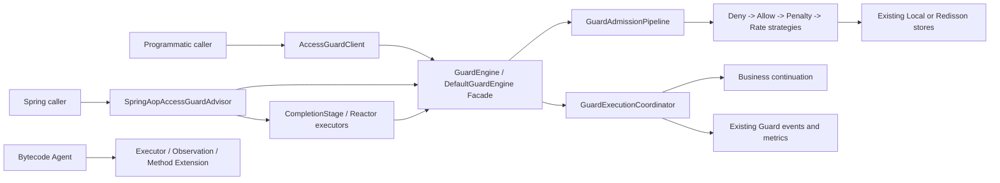
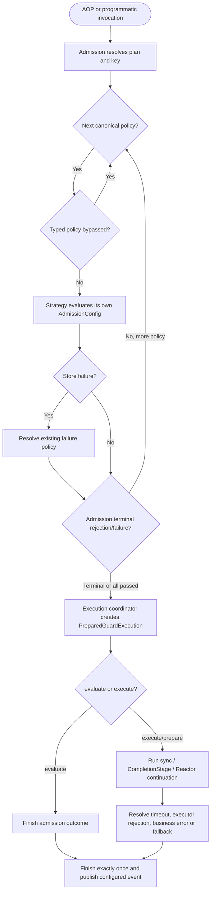
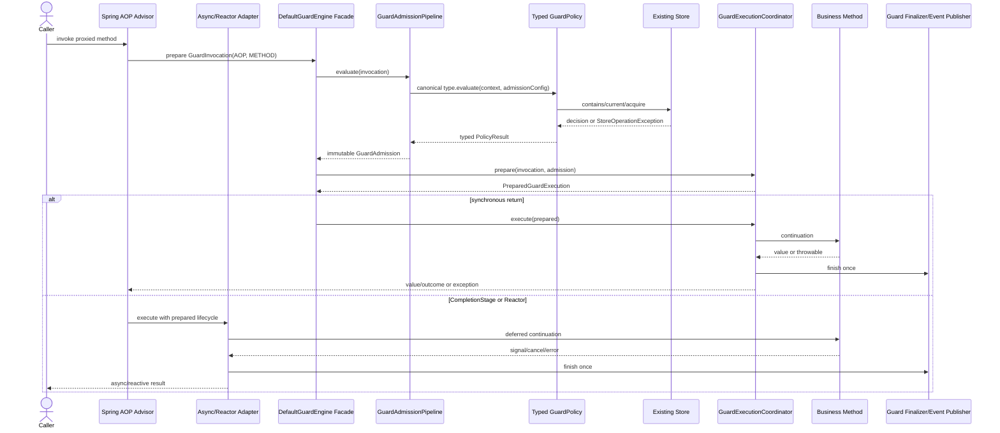

# Access Guard AOP 单入口、Engine 拆分与策略管线重构规格

| Field | Value |
| --- | --- |
| Document | `2026-08-23-16-56-access-guard-aop-engine-strategy-refactor.md` |
| Template Version | `4` |
| Status | `Review` |
| Type | `Architecture` |
| Complexity | `Complex` |
| Complexity Drivers | `删除跨 access-guard/bytecode 的 Agent 公共入口与字节码增强链；收缩注解 target/枚举/Bridge 协议；拆分约 660 行 Guard Engine；把字符串策略 ID、泛型强转和 Engine switch 改为类型化固定策略管线；保持同步、CompletionStage、Reactor、编程式调用、故障策略与观测语义不变` |
| Created | `2026-08-23 16:56 CST` |
| Updated | `2026-08-23 16:56 CST` |
| Owner | `Egon-COLA xingyuan owner / User` |
| Repository | `Egon-COLA` |
| Scope | `egon-cola-component-access-guard-starter；bytecode bridge/core/runtime/agent/starter/test 中仅 Access Guard Agent 能力；两组件中英文 README；聚焦单元、组件和依赖边界测试` |
| Change Surface | `删除 Access Guard Agent 自动引擎、构造器 Guard、Bytecode Access Guard capability/bridge/enhancer/runtime adapter/fixture/依赖；保留 AOP 与 AccessGuardClient；GuardEngine 变为薄门面并拆出 admission/execution 协作者；GuardPolicy 改为类型化策略；不改规则配置语义、存储、限流算法、RPC、其他 Bytecode Agent 能力、数据库、前端` |
| Affected Chapters | `§7, §8, §9, §10, §13, §14, §15, §16` |
| Source Requirement | `2026-08-23 用户决定：“agent入口删除，只保留aop。engine 拆分做一下。策略模式也改一下，文档更新。别的不要动。”` |
| Baseline Revision | `main@772df2b28b4abf29e7fffae6ea1b10fd616397b4；2026-08-23 16:56 CST dirty-worktree snapshot；现有未提交身份迁移 Spec/Plan 改动不属于本规格` |
| Amends | `[Access Guard Component Design §22](../../superpowers/specs/2026-07-08-access-guard-component-design.md#22-设计取舍)`：保留 AOP 单切面和“不引入宽泛工厂层”结论，补充 Engine 内部职责拆分与类型化策略管线 |
| Supersedes | `[Bytecode Enhancement Design](../../superpowers/specs/2026-07-15-bytecode-enhancement-design.md) 中 Access Guard Agent 的 §2.13/§2.14 对应入口与排序、§14、相关测试/验收条款；其他 Bytecode 能力不被替换`；`[Access Guard V2 Remediation Design](../../superpowers/specs/2026-07-29-access-guard-v2-remediation-design.md) 中 Agent/constructor/AGENT engine 设计及 DefaultGuardEngine 内部实现结构；其 AOP、programmatic、rule/store/failure/time/reactive/observability 合同继续有效` |
| Depends On | `[Access Guard V2 Remediation Design §9–§19](../../superpowers/specs/2026-07-29-access-guard-v2-remediation-design.md) 中仍有效的注解/AOP/编程式接口、规则模型、故障策略、执行限制、观测与自动配置合同` |
| Related Specs | `[RPC 运行时治理演进规格](./2026-08-19-15-36-rpc-runtime-governance-evolution.md)：RPC Provider 继续只依赖 Access Guard AOP 与 RateLimitAlgorithmStrategyFactory，不受本次内部策略重构影响` |
| Related Plans | [Access Guard AOP-only implementation Plan](../plan/2026-08-23-17-49-access-guard-aop-engine-implementation.md)；`[历史 Access Guard V2 Remediation Plan](../../superpowers/plans/2026-07-29-access-guard-v2-remediation.md)`；`[历史 Bytecode Access Guard Agent Plan](../../superpowers/plans/2026-07-16-bytecode-access-guard-agent.md)`；后两者只作为现状来源，不是本规格的执行计划 |

## 1. Summary

本规格把 Access Guard 的自动拦截入口收敛为 Spring AOP：`@AccessGuard` 只允许类型和方法，不再允许构造器；`AccessGuardEngine` 删除 `AGENT`，Bytecode 组件删除 `ACCESS_GUARD` capability、Guard bridge、ASM matcher/wrapper、构造器增强、运行时 adapter、自动配置、依赖和专属测试。Bytecode Agent 本身以及 Executor、Observation、Method Extension 三类能力继续保留，不能因本次删除而改变行为。

`AccessGuardClient` 不是第二个自动拦截引擎，而是当前正式的编程式 API，因此继续保留；`DISABLED` 继续表示“不注册 AOP advisor，但仍可编程式调用”。同步 AOP、`CompletionStage`、Reactor 和编程式调用仍共享同一个 `GuardEngine` 合同。

当前 `DefaultGuardEngine` 同时承担规则/Key 解析、固定策略排序、策略 config 分派、存储故障降级、处罚记录、执行超时、拒绝处理和观测收尾。本规格把它收缩为 Facade，新增 `GuardAdmissionPipeline` 与 `GuardExecutionCoordinator` 两个职责明确的协作者，并以 `GuardAdmission` 在两阶段间传递不可变结果。主 admission 策略改为 `GuardPolicyType + GuardPolicy`：策略自己读取对应 `AdmissionConfig`，管线按唯一的类型顺序执行，Engine 不再维护字符串 ID switch、泛型 config switch 或 unchecked cast。限流后端内部的 `RateLimitAlgorithmStrategy/Factory`、Store SPI 和 failure policy 不变。

该稿不实施代码，只给出后续实现和验收所依据的有效设计；内部设计已闭合，状态为 `Review`，等待用户审核后再单独编写 Plan 或实施。

## 2. Background and Current State

### 2.1 Business and user context

Access Guard 最初以 Spring AOP 为默认入口，后续为覆盖 private/static/constructor 等代理盲区增加了 Bytecode Agent。当前项目已明确选择删除 Guard Agent 入口，只保留 AOP 自动治理，希望同步降低 Bytecode 与 Guard 的耦合，并优化 Guard Engine 和策略实现。优化目标不是重新设计规则语义，也不是扩展更多入口，而是收缩能力、显式职责并保持现有 AOP/编程式运行结果。

### 2.2 Repository evidence

以下证据来自当前工作树；静态源码不证明真实 Redis、真实 `-javaagent` 进程或生产负载。为简化路径，表中使用下列 repository-relative 前缀：

| Alias | Exact repository-relative prefix |
| --- | --- |
| `GUARD` | `egon-cola-components/egon-cola-component-access-guard-starter/src/main/java/top/egon/cola/component/accessguard` |
| `GUARD_TEST` | `egon-cola-components/egon-cola-component-access-guard-starter/src/test/java/top/egon/cola/component/accessguard` |
| `BYTECODE` | `egon-cola-components/egon-cola-component-bytecode` |

| Evidence ID | Classification | Exact path/symbol/decision/command | Observed fact | Design significance | Verification limit |
| --- | --- | --- | --- | --- | --- |
| `EVD-001` | User decision | 2026-08-23 当前请求 | 删除 Agent 入口、只保留 AOP，并拆 Engine、调整策略、更新文档；其他不动 | 收缩范围和保持项均为硬约束 | “Agent”按当前 Guard 上下文解释为 Access Guard Agent |
| `EVD-002` | Static repository | `GUARD/autoconfigure/AccessGuardEngine.java`；`AccessGuardProperties#getEngine` | 自动引擎枚举为 `AOP/AGENT/DISABLED`，默认 AOP | 删除 `AGENT`，保留 AOP 默认和 DISABLED programmatic-only 语义 | 不代表外部应用没有配置 AGENT |
| `EVD-003` | Static repository | `GUARD/api/AccessGuard.java`；`GUARD/adapter/aop/GuardBindingResolver.java` | 聚合注解 target 包含 TYPE/METHOD/CONSTRUCTOR；构造器绑定仅服务 Agent | AOP-only 后 constructor target 和 resolver 必须删除，不能留下不可执行声明 | Spring AOP 本身不拦截构造器 |
| `EVD-004` | Static repository | `GUARD/api/AccessGuardAgentIntegration.java`；`GUARD/autoconfigure/AccessGuardStartupValidator.java` | AGENT 模式要求唯一 integration，并扫描/校验 constructor 特殊规则 | Guard starter 暴露了 Bytecode integration seam，删除 Agent 后应整体移除 | 启动扫描范围仅限 Spring bean definitions |
| `EVD-005` | Static repository | `GUARD/api/AccessGuardClient.java`；`GUARD/adapter/programmatic/DefaultAccessGuardClient.java`；`AccessGuardAutoConfigurationTest#disabledEngineKeepsProgrammaticClientWithoutAdvisor` | programmatic 是独立正式入口，`DISABLED` 下仍注册 Client 而不注册 Advisor | “只保留 AOP”应指唯一自动拦截入口，不应误删 Client | 未统计外部 Client 使用量 |
| `EVD-006` | Static repository | `GUARD/core/GuardEngine.java`；`GUARD/adapter/aop/SpringAopAccessGuardAdvisor.java`；`execution/async` 与 `execution/reactive` | 同步调用走 `execute`；CompletionStage/Reactor 先走 `prepare` 再异步完成 | Engine 拆分必须保留三方法和 deferred execution 生命周期 | Reactor 仅在 classpath 存在时启用 |
| `EVD-007` | Static repository | `GUARD/core/DefaultGuardEngine.java` | 约 660 行类同时处理 plan/key/admission/failure/penalty/time limit/rejection/observability；私有 `PlanCapture` 跨阶段传值 | 该类存在真实多职责，拆成 admission 与 execution 两部分有明确边界 | 行数不是唯一质量指标 |
| `EVD-008` | Static repository | `DefaultGuardEngine#BUILT_IN_POLICY_IDS/#configFor/#failurePoint/#evaluatePolicy` | Engine 以字符串固定顺序，两个 switch 找 config/failure point，并以 unchecked 泛型强转执行策略 | 现有 Strategy 名义成立，但类型元数据和分派仍泄漏到 Engine | 固定四策略是安全语义，不应改成任意插件顺序 |
| `EVD-009` | Static repository | `GUARD/policy/{GuardPolicy,PolicyResult,GuardContext}.java`；`core/GuardExecutionState.java` | Strategy 返回字符串 bypass 集合，状态继续传播字符串 ID；只在 `PolicyResult` 内以字符串禁止 bypass deny-list | 字符串拼写错误只能运行时暴露，应改为 `GuardPolicyType` | 外部代码可能引用这些 public Java 类型，迁移需发布说明 |
| `EVD-010` | Static repository | `GUARD/policy/AdmissionPolicies.java`；`AccessGuardCoreAutoConfiguration#accessGuardAdmissionPolicies` | 一个静态 factory 只返回 `List.of(deny,allow,penalty,rate)`；Spring 配置已经承担对象装配 | 不需要 Abstract Factory；应把固定顺序归 admission pipeline | 自定义 `GuardEngine` 仍可通过 missing-bean 替换 |
| `EVD-011` | Static repository | `BYTECODE/egon-cola-component-bytecode-{bridge,core,runtime,agent,starter}` 的 Access Guard 类；`BridgeCapability.ACCESS_GUARD` | Bytecode 从 ASM matcher/wrapper 经 `EgonPolicyBridge`、dispatcher、adapter 调回 GuardEngine，并含 constructor 专用桥 | 删除 Guard Agent 不是只删一个配置枚举，必须删除完整纵向能力切片 | 其他 capability 与同一 bridge/dispatcher 共存 |
| `EVD-012` | Static repository | `BYTECODE/.../BytecodeAutoConfiguration.java`；bytecode starter/test `pom.xml`；`AutoConfiguration.imports` | Bytecode starter 包装 `DefaultBytecodeRuntimeDispatcher` 为 `CombinedPolicyDispatcher`，并可选依赖 Guard starter | 删除 adapter 后应恢复直接 dispatcher，并移除依赖和自动配置导入 | 不能删除 Method Extension evaluator |
| `EVD-013` | Static repository | `BridgeProtocol.java`；`BytecodeRuntimeDispatcher#invokeGuarded/#guardConstructor` | 当前协议为 1.0，删除 dispatcher 方法和 bridge records 是二进制不兼容 | 协调升级时应把 Bridge protocol 提升为 2.0，使混装 fail-fast | 版本号不替代整套 artifacts 同版本发布 |
| `EVD-014` | Static repository | `BYTECODE/.../AgentConfiguration.java`；`EnhancementFeature.java`；`ClassEnhancementPlanner.java` | Agent feature 和 core enhancement feature 都含 Access Guard 分支 | 两处 feature 枚举和 planner/enhancer 分支均须清理 | Executor/Observation/Method Extension 分支必须原样保留 |
| `EVD-015` | Runtime evidence | 2026-08-23 focused Maven：Guard 15 tests、bytecode core Guard 8 tests、bytecode starter Guard 5 tests passed | 当前基线的固定策略、Engine 与 Agent adapter 聚焦测试通过 | 后续变化可用等价 AOP/Engine 测试和“Agent 切片不存在”边界测试对比 | 未运行真实 premain、Redis、全 reactor、全仓测试 |
| `EVD-016` | Legacy design | `docs/superpowers/specs/2026-07-08-access-guard-component-design.md §22`；`2026-07-29-access-guard-v2-remediation-design.md §20` | 既有设计已选 Strategy/Adapter/Facade，并明确拒绝宽泛 Factory hierarchy | 本次应修正 Strategy 落地和 Facade 职责，不反向引入抽象工厂 | 旧文档的 Agent 条款被本规格定向替换 |
| `EVD-017` | Related current design | `docs/egon/spec/2026-08-19-15-36-rpc-runtime-governance-evolution.md` | RPC Provider 依赖 Guard AOP，且限流算法另有 `RateLimitAlgorithmStrategyFactory` | 主 admission 策略重构不得改 RPC 接线或算法工厂 | RPC Spec 尚处 Review，不能视为生产完成 |

### 2.3 Problem statement and gap

当前实现有四个结构性问题：

1. Access Guard 同时提供 AOP、Agent 和 programmatic 路径，Agent 又在独立 Bytecode 组件形成跨五个子模块的纵向耦合；删除配置值而保留 bridge/enhancer 会形成死代码和误导性 API。
2. 构造器注解、constructor invocation kind、fallback/rejection 特判只为 Agent 存在；AOP-only 后它们无法兑现。
3. `DefaultGuardEngine` 同时做 admission 与业务执行/拒绝收尾，测试和变更都需要构造大批无关依赖。
4. 主策略虽有 `GuardPolicy` 接口，但 Engine 仍负责字符串 ID、固定顺序、config 类型匹配、failure point 映射和泛型强转，策略变化没有真正被封装。

### 2.4 Evidence and current-chain map

| Entry/trigger | Current call chain | State/data | Consumers | Gap/evidence |
| --- | --- | --- | --- | --- |
| Spring AOP 同步方法 | `SpringAopAccessGuardAdvisor -> GuardEngine.execute -> DefaultGuardEngine admission -> TimeLimiter/operation -> rejection/finalizer` | Guard plan、key hash、policy stores、outcome/events | `@AccessGuard`/专用注解方法、RPC Provider | 入口正确，但 Engine 职责过宽；`EVD-006`–`EVD-008` |
| Spring AOP CompletionStage/Reactor | `Advisor -> CompletionStageGuardExecutor/ReactiveGuardExecutor -> GuardEngine.prepare -> terminal callbacks` | `PreparedGuardExecution` 保证终态一次完成 | 异步与响应式业务 | 必须保留 prepare 合同；`EVD-006` |
| Programmatic | `AccessGuardClient -> GuardEngine.evaluate/execute` | operation invocation，不依赖 Spring proxy | 手工治理的非代理调用 | 正式入口，不应随 Agent 删除；`EVD-005` |
| Access Guard Agent method | `ASM AccessGuardMatcher/Wrapper -> EgonPolicyBridge.invokeGuarded -> CombinedPolicyDispatcher -> AccessGuardRuntimeAdapter -> GuardEngine` | method metadata、bridge capability、同一 Guard plan/store | private/static/非 Spring 调用 | 整条链本次删除；`EVD-011`–`EVD-014` |
| Access Guard Agent constructor | `ConstructorGuardEnhancer -> EgonPolicyBridge.guardConstructor -> AccessGuardRuntimeAdapter -> GuardEngine` | constructor metadata、特殊 fail hint/decision | constructor annotation | AOP 无替代能力，声明和实现一并删除；`EVD-003`,`EVD-011` |
| Policy admission | `DefaultGuardEngine -> id switch -> configFor -> unchecked evaluate -> failurePoint switch` | 字符串 bypass set、degraded state | 所有入口 | Strategy 元数据未封装；`EVD-008`,`EVD-009` |

## 3. Goals and Non-goals

### 3.1 Goals

- `GOAL-001`：Access Guard 的唯一自动拦截入口为 Spring AOP；彻底删除 Access Guard Agent 和 constructor Guard 能力。
- `GOAL-002`：保留 `AccessGuardClient`、`GuardEngine` 公共行为及 AOP 同步/异步/响应式语义。
- `GOAL-003`：把 admission 与 execution/finalization 从 `DefaultGuardEngine` 拆开，使 Engine 成为薄 Facade。
- `GOAL-004`：以类型化 Strategy 管线取代字符串 ID、Engine config/failure switch 和 unchecked cast，同时保持四策略固定安全顺序。
- `GOAL-005`：同步删除 Bytecode 中 Access Guard 的 bridge/core/runtime/agent/starter/test/dependency 切片，不影响其他 Bytecode 能力。
- `GOAL-006`：更新中英文 README、配置示例、能力矩阵、兼容和迁移说明，使文档不再宣称 Agent/constructor 支持。

### 3.2 Non-goals

- 不删除或改名 `AccessGuardClient`，不把所有调用强制经过 Spring proxy。
- 不删除 `AccessGuardEngine.DISABLED`；它继续关闭 AOP advisor 并保留 programmatic Beans。
- 不改变 deny/allow/penalty/rate-limit 的业务顺序、配置字段、bypass 语义、结果码、failure policy、事件或 metrics。
- 不改变 `RateLimitAlgorithmStrategy`、`RateLimitAlgorithmStrategyFactory`、Local/Redisson Store SPI、Redis key/Lua 或规则动态更新。
- 不新增 Abstract Factory、通用 policy plugin registry、可配置策略顺序或动态装载第三方策略。
- 不改变 RPC Provider、Yuheng、Tianshu、数据库、前端、BOM 以外的组件依赖。
- 不删除 Bytecode Agent；不改变 Executor、Observation、Method Extension 的匹配、增强、bridge、runtime 或配置语义。
- 不编辑历史 Spec/Plan 正文；本规格通过关系元数据声明有效范围。

### 3.3 Change Surface and Design Depth

| Area/layer | Disposition | Exact repository evidence | Changed or preserved behavior/contract | Required Spec treatment | Chapter(s) |
| --- | --- | --- | --- | --- | --- |
| Guard annotation/engine/entry API | Affected | `GUARD/api/AccessGuard.java`；`autoconfigure/AccessGuardEngine.java`；`core/{GuardEntryType,GuardInvocationKind}.java` | 删除 AGENT/CONSTRUCTOR，AOP 为唯一自动入口，programmatic/DISABLED 保留 | 完整 API、兼容、迁移、测试设计 | `§7, §8, §9, §14, §16` |
| Guard core Engine | Affected | `GUARD/core/{GuardEngine,DefaultGuardEngine,PreparedGuardExecution}.java` | 保持三方法行为，默认实现拆为 Facade/admission/execution | 完整协作、接口、POJO、并发、NFR、测试设计 | `§7, §8, §9, §10, §13, §14, §15` |
| Main admission policy | Affected | `GUARD/policy/{GuardPolicy,PolicyResult,GuardContext,AdmissionPolicies}.java`；`core/GuardExecutionState.java` | 字符串/泛型策略改为 typed Strategy，固定顺序与结果语义保留 | 完整策略、字段、不变量、失败和测试设计 | `§7, §8, §9, §10, §13, §14, §15` |
| Bytecode Access Guard vertical slice | Affected | `BYTECODE` 下 `BridgeCapability.ACCESS_GUARD`、`enhance/accessguard`、`starter/accessguard`、Guard fixtures/POM | 删除完整 Guard Agent 能力，bridge protocol 2.0 | 完整模块边界、文件、协议、兼容、测试设计 | `§7, §8, §9, §14, §15, §16` |
| Guard/Bytecode bilingual README | Affected | Guard/Bytecode `README.md` 与 `README.zh-CN.md` 中 Agent/constructor/config 段落 | 删除旧能力宣称，增加 AOP 边界和协调升级说明 | 精确文档合同和静态验收 | `§8, §14, §16` |
| AOP/async/reactive/programmatic adapter behavior | Context-only | `GUARD/adapter/{aop,programmatic}`；`execution/{async,reactive}` | 调用/终态合同不变，仅因内部 wiring 调整测试 | 记录依赖不变量和聚焦 parity 验证；不重新设计 adapter | `N/A` |
| Guard plan/store/failure/time/observability semantics | Context-only | `GUARD/core/{plan,failure}`、`store`、`execution`、`observability` | 配置、状态、key、failure、time、event/metric 语义不变 | 只记录 owner 迁移和回归边界 | `N/A` |
| Bytecode Executor/Observation/Method Extension | Unchanged | `BYTECODE` 的对应 api/bridge/core/runtime/agent/starter 实现与测试 | feature、匹配、增强、runtime、诊断均不变 | 一条保留合同及 retained-feature 验证 | `N/A` |
| Rate-limit algorithm Strategy Factory | Unchanged | `GUARD/policy/ratelimit` 与相关 RPC Spec | backend 算法分派不变 | 不设计；运行既有回归 | `N/A` |
| RPC/Tianshu/Yuheng | Unchanged | `docs/egon/spec/2026-08-19-15-36-rpc-runtime-governance-evolution.md` | 继续只消费 Guard AOP/public outcome；生产代码无 diff | 一条上下文验证，禁止进入 target tree | `N/A` |
| Database | Not applicable | Guard 使用 Local/Redisson key；无 ORM/Flyway 目标 | 无关系模型或 migration 变化 | §11 记录 N/A | `N/A` |
| Frontend | Not applicable | 两组件均为 Java starter/agent，无 UI 目录 | 无 route/page/state 变化 | §12 记录 N/A | `N/A` |

## 4. Requirements and Acceptance Criteria

| ID | Atomic requirement | Priority | Observable acceptance criteria | Source |
| --- | --- | --- | --- | --- |
| `REQ-001` | 删除 Access Guard Agent 入口 | Must | Guard starter 不再存在 `AccessGuardAgentIntegration`、`AccessGuardEngine.AGENT`、`GuardEntryType.AGENT`；Bytecode 不再声明 `ACCESS_GUARD` capability | 用户“agent入口删除” |
| `REQ-002` | 只保留 AOP 自动拦截 | Must | 默认/显式 `engine=AOP` 注册唯一 Advisor；`@AccessGuard` target 仅 TYPE/METHOD；constructor 不可声明 | 用户“只保留aop” |
| `REQ-003` | 保留 programmatic 显式入口 | Must | `AccessGuardClient.evaluate/execute` 与 `GuardEntryType.PROGRAMMATIC`、`GuardInvocationKind.OPERATION` 可用；DISABLED 下无 Advisor 但有 Client | `ASM-001` + 现有公共合同 |
| `REQ-004` | 拆分 Engine | Must | `DefaultGuardEngine` 只依赖 `GuardAdmissionPipeline` 与 `GuardExecutionCoordinator`，三方法仅编排；两个阶段可独立单测 | 用户“engine 拆分做一下” |
| `REQ-005` | 落实类型化 Strategy | Must | `GuardPolicy` 不再暴露泛型 config；每个策略返回 `GuardPolicyType` 并自行读取 `AdmissionConfig`；Engine 无 policy ID/config/failure switch 和 unchecked cast | 用户“策略模式也改一下” |
| `REQ-006` | 保持 admission 安全顺序 | Must | canonical 顺序严格为 DENY_LIST→ALLOW_LIST→PENALTY_BOX→RATE_LIMIT；完整性/重复/type-key mismatch 在 Bean 创建时 fail-fast；DENY_LIST 永不可 bypass | 现有安全合同 `EVD-008/009` |
| `REQ-007` | 保持 Guard 运行语义 | Must | 同一 plan/key/store 输入下，AOP/programmatic 的 outcome、retryAfter、fallback、failure policy、time limit、event terminality 与基线一致 | 用户“别的不要动” |
| `REQ-008` | 删除 Bytecode Guard vertical slice | Must | Guard bridge records/methods、ASM matcher/wrapper/constructor enhancer、runtime evaluator、starter adapter/config/dispatcher、依赖和 Guard Agent fixtures 均不存在 | `REQ-001` 的必要闭环 |
| `REQ-009` | 保持其他 Bytecode Agent 能力 | Must | Executor、Observation、Method Extension 的 feature、planner、bridge、dispatcher 和测试继续通过；`EgonPolicyBridge` 只保留 Method Extension | 用户“别的不要动” |
| `REQ-010` | 更新双语组件文档 | Must | Guard/Bytecode 中英文 README 不再给出 Agent/constructor/`features=access-guard` 用法，并说明 AOP 边界、programmatic 替代和迁移方式 | 用户“文档更新” |
| `REQ-011` | 对删除能力提供 fail-fast 迁移 | Must | `engine=AGENT` 与 `features=access-guard` 配置启动/解析失败而非静默降级；Bridge 协议升为 2.0；同一进程 Bytecode artifacts 必须同版本 | `DEC-009/010` |
| `REQ-012` | 建立聚焦回归证据 | Must | Guard 全模块测试、Bytecode retained-capability 测试、依赖边界/静态零引用检查通过；验证报告不冒充真实 Redis/生产证明 | 项目验证规则 |
| `REQ-013` | 限定变更范围 | Must | 除新 Spec 外，后续实现只触及 §8 target tree 所列文件/目录；RPC、Tianshu、数据库、前端和用户现有未提交文档不改 | 用户“别的不要动” |

### 4.1 Scenario matrix

| Scenario | Actor/trigger | Preconditions | Main path | Alternative/failure path | Data/state change | Observable result | Requirements |
| --- | --- | --- | --- | --- | --- | --- | --- |
| `SCN-001` AOP 同步治理 | `ACTOR-001` 调用 Spring proxied method | AOP engine，rule 有效 | Advisor→Engine Facade→Admission→Execution→method | deny/rate/store/time/business 按现有 resolution | 读取 plan/key/store；可能写限流/处罚状态和 event | 一次 terminal outcome/event，返回或抛错与基线一致 | `REQ-002`,`REQ-004`–`REQ-007` |
| `SCN-002` AOP CompletionStage/Reactor | `ACTOR-001` 调用 async/reactive method | 对应类型/classpath 支持 | Advisor→Engine.prepare→异步 executor→terminal finalizer | cancel、timeout、business error 竞争 | Prepared lifecycle 原子提交首个终态 | first terminal wins；不重复执行 fallback/event | `REQ-002`,`REQ-004`,`REQ-007` |
| `SCN-003` programmatic | `ACTOR-002` 调用 `AccessGuardClient` | Guard Beans enabled；AOP 可为 DISABLED | Client→Engine.evaluate/execute→相同两阶段内核 | operation rejection/fallback/failure | 与 AOP 相同的 plan/store/outcome 状态 | programmatic 行为保留且不需要 proxy | `REQ-003`,`REQ-004`,`REQ-007` |
| `SCN-004` 旧 Guard Agent 配置 | `ACTOR-003` 编译/启动应用 | 配置 `engine=AGENT` 或 constructor annotation 源码 | 配置绑定/编译阶段拒绝 | 不允许自动改成 AOP 或 DISABLED | 无业务或 Guard store 状态变化 | 迁移问题可见且信息可操作 | `REQ-001`,`REQ-002`,`REQ-011` |
| `SCN-005` Bytecode retained features | `ACTOR-003` 启动 Bytecode Agent application | 只配置 executor/observation/method-extension | 原 Agent→bridge→runtime 链继续工作 | 配置 `features=access-guard` 解析失败 | retained metadata/events 保持；无 Guard bridge state | 三类保留能力行为/诊断不变，无 Guard 依赖 | `REQ-008`,`REQ-009`,`REQ-011` |
| `SCN-006` policy backend failure | `ACTOR-001/002` 触发任一 store exception | 对应 failure policy 有效 | type→failure point→既有 resolver | FAIL_OPEN/LOCAL_FALLBACK/FAIL_CLOSED | degraded state 或 terminal outcome；不部分提交业务 | outcome 与原 Engine 一致；local policy 类型匹配 | `REQ-005`–`REQ-007` |

### 4.2 Use-case analysis

#### 4.2.1 Actor inventory

| Actor ID | Actor/role | Goal and responsibility | Entry/channel | Permission/tenant context | Evidence |
| --- | --- | --- | --- | --- | --- |
| `ACTOR-001` | Spring 业务调用方 | 调用受 Guard 保护的 Spring 方法并获得允许/拒绝/降级结果 | Spring AOP proxied method | Guard 不定义业务权限/tenant；沿用调用线程上下文 | `GUARD/adapter/aop/SpringAopAccessGuardAdvisor.java` |
| `ACTOR-002` | 编程式组件调用方 | 对代理外 operation 显式执行治理 | `AccessGuardClient` Java API | 调用方负责业务授权；Guard 只处理规则/key | `GUARD/api/AccessGuardClient.java` |
| `ACTOR-003` | 应用维护/发布人员 | 配置 Guard/Bytecode 并完成版本迁移 | Spring properties、`-javaagent` arguments、classpath | 运维配置权限；无新增 tenant 语义 | 用户请求；`AccessGuardProperties`；`AgentConfiguration` |
| `ACTOR-004` | Guard/Bytecode 组件维护者 | 修改固定策略或 retained Agent 能力并验证边界 | Java SPI/源码/Maven tests | 仓库写权限；不代表业务调用权限 | `GuardPolicy.java`；bytecode module tests |

#### 4.2.2 Use-case artifact

| ID | Use case/goal | Primary actor | Supporting actors/systems | Trigger | Preconditions | Main success outcome | Alternatives/failures | Postconditions | Requirements | Interfaces/pages | Tests |
| --- | --- | --- | --- | --- | --- | --- | --- | --- | --- | --- | --- |
| `UC-001` | 通过 AOP 治理同步/异步方法 | `ACTOR-001` | Spring AOP、existing stores | 调用 proxied method | AOP engine/rule/binding 有效 | 同一两阶段内核返回与基线一致的结果 | reject/store failure/timeout/cancel/business error | business/outcome/event terminal 状态一致 | `REQ-002`,`REQ-004`–`REQ-007` | `@AccessGuard`、`GuardEngine`、`INTERNAL-001`–`003` | `TEST-001`–`012`,`025` |
| `UC-002` | 显式执行 programmatic Guard | `ACTOR-002` | Guard plan/store | 调用 Client evaluate/execute | Client Bean 与 operation 有效 | 无需 AOP/Agent 即得到同语义结果 | invalid input/rejection/fallback/failure | DISABLED 可保留 Client，无 Advisor | `REQ-003`,`REQ-004`,`REQ-007` | `AccessGuardClient`、`GuardEngine` | `TEST-013`–`015` |
| `UC-003` | 从 Guard Agent 迁移到 AOP/programmatic | `ACTOR-003` | build/config binder、Bytecode protocol | 升级 artifacts 并编译/启动 | 已盘点旧 Agent config/调用点 | 只运行 AOP/programmatic Guard，Bytecode 协议 2.0 | 旧 config/source/mixed jars fail-fast | 无静默漏治理；应用完成调用点验收 | `REQ-001`,`REQ-002`,`REQ-008`–`REQ-011` | `@AccessGuard`、removed `INTERNAL-006`–`011` | `TEST-021`–`032` |
| `UC-004` | 维护固定 admission 策略 | `ACTOR-004` | AutoConfiguration、Store SPI | 修改四策略之一 | 仍属于 closed policy set | 策略自取 config，Engine 不变 | duplicate/missing/mismatch/bypass deny fail-fast | canonical order 和 stable outcome ID 保持 | `REQ-005`–`REQ-007`,`REQ-012` | `INTERNAL-001`,`004`,`005` | `TEST-016`–`020` |

#### UC-001：AOP 方法治理

- Primary actor：带 `@AccessGuard` 或专用 Guard 注解的 Spring Bean 调用方。
- Preconditions：目标调用经过 Spring AOP proxy；rule 可解析；AOP engine 启用。
- Trigger：Advisor 命中 most-specific method/type binding。
- Main flow：创建 `GuardInvocation(AOP,METHOD)`；Facade 请求 admission；按固定四策略处理；允许后进入同步/异步/响应式 execution；finalizer 只提交一次终态。
- Alternate/failure：plan/key/store/policy/time/business/rejection resolution 继续使用现有 outcome 和 failure policy；未知异常不能被新层吞掉。
- Postconditions：业务 continuation 至多按现有合同执行一次；terminal event/metrics 与最终 outcome 一致。
- Acceptance：`TEST-001`–`TEST-012` 覆盖允许、拒绝、降级、异步和终态竞争。

#### UC-002：编程式治理

- Primary actor：无法或不希望经过 Spring proxy 的组件代码。
- Preconditions：`AccessGuardClient` Bean 存在；operation/rule 有效。
- Trigger：调用 `evaluate` 或 `execute`。
- Main flow：Client 创建 `PROGRAMMATIC/OPERATION` invocation，调用同一 Facade 和两阶段协作者。
- Failure：沿用相同 admission/rejection/failure 合同；不引入 Agent fallback。
- Postconditions：`engine=DISABLED` 时仍能 programmatic，且不会注册 AOP Advisor。
- Acceptance：`TEST-013`–`TEST-015`。

#### UC-003：从旧 Agent 配置迁移

- Primary actor：使用 Guard Agent 的应用维护者。
- Preconditions：旧配置/依赖/constructor annotation 至少存在一项。
- Trigger：升级到包含本规格实现的新版本并编译/启动。
- Main flow：维护者删除 `features=access-guard` 和 Bytecode→Guard 可选依赖，改为 `engine=AOP` 或默认值；可代理方法使用 AOP，代理外调用按需显式使用 `AccessGuardClient`。
- Failure：旧 enum/config 不接受；constructor/private/static/self-invocation 不会被 AOP 自动覆盖，必须改造调用边界或使用 Client，不能静默漏治理。
- Postconditions：部署只运行 AOP/programmatic Guard；Bytecode artifacts 协调升级到协议 2.0。
- Acceptance：README 迁移章节、配置 fail-fast 和静态零引用测试通过。

#### UC-004：扩展或维护 admission 策略

- Primary actor：Guard 组件维护者。
- Preconditions：变更属于固定四策略之一；若要新增第五类策略，必须另立 Spec。
- Trigger：修改具体 `GuardPolicy` 实现。
- Main flow：策略通过 `type()` 声明类型，通过 `evaluate(context, admission)` 自行读取对应配置并返回 typed bypass；pipeline 统一处理顺序、store failure 和 penalty side effect。
- Failure：重复/缺失策略或 local map type mismatch 在构造时失败；DENY_LIST bypass 在 POJO 构造时失败。
- Postconditions：Engine 不随单个策略的 config 类型变化而修改。
- Acceptance：`TEST-016`–`TEST-024`。

## 5. Constraints, Assumptions, and Decisions

### 5.1 Confirmed constraints

- `CON-001`：仅编写本 Spec；本轮不修改生产代码、测试、README 或 Plan。
- `CON-002`：后续实现删除的是 Access Guard Agent，不是整个 Bytecode Agent。
- `CON-003`：AOP 是唯一自动拦截入口；programmatic 作为显式 API 保留。
- `CON-004`：其他 Guard 规则、存储、失败、执行、观测语义保持不变。
- `CON-005`：不引入 Abstract Factory 或无当前 variation point 支撑的层级。
- `CON-006`：保护当前 dirty worktree 中两份身份迁移文档及其他无关改动。

### 5.2 Small-gap assumptions

| ID | Inference | Repository evidence | Why locally reversible | Impact if wrong |
| --- | --- | --- | --- | --- |
| `ASM-001` | “只保留 AOP”不删除 `AccessGuardClient` 和 `DISABLED` programmatic-only 模式 | `AccessGuardClient.java`；`AccessGuardAutoConfigurationTest#disabledEngineKeepsProgrammaticClientWithoutAdvisor` | 仅影响入口保留范围，可在实施前修订 API/target tree | 若用户要求连 Client 删除，需重写 API、盲区迁移和测试 |
| `ASM-002` | 不保留 `AGENT` deprecated alias | 用户明确“删除”；`AccessGuardEngine.java` 当前仅三值 | alias 删除可在实施前调整，不影响数据/schema | 若需要兼容窗口，配置与版本策略需另立 Spec |
| `ASM-003` | 固定四策略集合不开放第三方注册 | `DefaultGuardEngine#BUILT_IN_POLICY_IDS`；`AdmissionPolicies#builtIns` | closed enum 只影响内部扩展，尚未实施 | 若存在外部自定义策略，需开放排序/failure/bypass 合同并扩大测试 |

### 5.3 Resolved decisions

| ID | Decision | Decision owner | Evidence and rationale | Requirements |
| --- | --- | --- | --- | --- |
| `DEC-001` | 删除完整 Access Guard Agent vertical slice | User | 防止死 API、半删除能力和跨组件耦合残留 | `REQ-001`,`REQ-008` |
| `DEC-002` | `@AccessGuard` target 收缩为 TYPE/METHOD | User + Spec | Spring AOP 无法兑现 constructor 语义 | `REQ-001`,`REQ-002` |
| `DEC-003` | `DefaultGuardEngine` 作为 Facade，仅委托 admission/execution 两个 collaborator | Spec | `DefaultGuardEngine.java` 的真实职责归为 admission 与 execution/finalization 两类，避免按 helper 过拆 | `REQ-004`,`REQ-007` |
| `DEC-004` | 两阶段通过 immutable `GuardAdmission` 传递 outcome/config/start time | Spec | 替代可变私有 `PlanCapture`，不泄漏整个 plan snapshot，也不重复解析 | `REQ-004`,`REQ-007` |
| `DEC-005` | 主策略接口改为非泛型 `type()+evaluate(context, AdmissionConfig)` | User + Spec | 每个策略封装 config 选择，Engine 无 switch/强转 | `REQ-005`–`REQ-007` |
| `DEC-006` | `GuardPolicyType` 承担 stable ID 和 `FailurePoint`，pipeline 持有显式 canonical order | Spec | 类型化 bypass/failure 映射，同时集中固定安全顺序 | `REQ-005`,`REQ-006` |
| `DEC-007` | 不使用 Abstract Factory | Spec | 没有成组产品族；Spring AutoConfiguration 已是 composition root | `REQ-004`,`REQ-005`,`REQ-013` |
| `DEC-008` | 删除 `AdmissionPolicies` | Spec | 该类只是 `List.of` 包装，没有独立创建复杂度 | `REQ-004`–`REQ-006` |
| `DEC-009` | Bytecode bridge protocol 从 1.0 升为 2.0 | Spec | 删除 dispatcher 方法/records 是二进制不兼容，混装应 fail-fast | `REQ-008`,`REQ-009`,`REQ-011` |
| `DEC-010` | 旧 `engine=AGENT`、`features=access-guard` fail-fast | User + Spec | 删除能力不能静默变成无保护或另一入口 | `REQ-001`,`REQ-002`,`REQ-011` |
| `DEC-011` | 保留 `RateLimitAlgorithmStrategyFactory` 不动 | Spec | backend 算法维度与本次 admission policy 维度不同 | `REQ-007`,`REQ-013` |

### 5.4 Open major decisions

无。`ASM-001`–`ASM-003` 均为可从现有 API 和当前请求安全推出的小缺口，不阻断评审。

## 6. Project Technology Context

| Concern | Current choice | Repository evidence | Constraint on design |
| --- | --- | --- | --- |
| Language/runtime | Java 21 | root `pom.xml` compiler properties | 使用 record、switch enum 和 immutable collections；不引入新语言级别 |
| Framework | Spring Boot 3.5.16 / Spring AOP | root `pom.xml`；Guard starter POM/Advisor | AOP Advisor 与 conditional auto-configuration 保持当前方式 |
| Bytecode | ASM 9.9.1 / Java Agent | root POM；bytecode core/agent POM | 只删除 Guard enhancer；保留其他 transformer 和 premain 架构 |
| Storage | Local + Redisson 3.26.0 | Guard store packages；root dependency management | Store/Redis 状态结构不变 |
| Reactive | Optional Reactor integration | Guard POM；`AccessGuardReactiveAutoConfiguration` | 无硬依赖变化；classpath 条件保持 |
| Testing | JUnit 5.12.2, Surefire 3.2.5, Maven Invoker | root POM；bytecode-test POM | 分模块单测、真实 premain/Invoker retained-feature 验证 |
| Version | 5.3.3 baseline | root `<revision>` | 删除 API 和 bridge 2.0 必须在发布说明中标记 breaking change |

本次不新增依赖、代码生成器、持久化技术或外部服务。

### 6.1 Java three-layer applicability

传统 `biz.controller/service/dao` 三层结构不适用：目标是基础设施 starter 和 bytecode runtime，没有业务 Controller、领域 Service 或 DAO。保持现有按 `api/adapter/autoconfigure/core/policy/execution/store/observability` 与 bytecode 子模块分层，避免把框架协作者伪装成业务三层。

| Architecture profile | Base package | Evidence or explicit decision | Existing deviations | Design action |
| --- | --- | --- | --- | --- |
| Other — infrastructure starter/agent | `top.egon.cola.component.accessguard`；`top.egon.cola.component.bytecode` | 现有 package tree；`CON-004/005` | 无 `biz.controller/service/dao`，按 framework capability 分包 | 保持当前结构，只在 `core/policy` 增加必要 collaborator/type |

## 7. Architecture Design

### 7.0 Minimum-design baseline and element-necessity audit

最低可行设计由一个现有 Facade、两个新协作者、一个新 typed enum 和一个新 immutable record 组成；不新增通用 registry/factory/handler hierarchy。

| Proposed element | Change | Requirements | Existing/direct alternative | Concrete inadequacy of alternative | Added calls/state/coupling/failures/migration/operations | Verdict |
| --- | --- | --- | --- | --- | --- | --- |
| `GuardEngine` | Keep | `REQ-003`,`REQ-004`,`REQ-007` | 让各 adapter 直接调用内部阶段 | 会复制编排并破坏 sync/async/programmatic parity | 无新增成本；保留一个现有调用 | Keep |
| `DefaultGuardEngine` | Expand | `REQ-004` | 在当前类内继续提取 private methods | 约 660 行类的依赖和职责仍无法独立测试/替换 | 每次入口增加两次本地 collaborator 调用，无外部状态 | Keep as thin Facade |
| `GuardAdmissionPipeline` | New | `REQ-004`–`REQ-007` | admission 逻辑留在 Engine | plan/key/policy/failure 共同变化并占据大部分 Engine 复杂度 | 一个对象和一次本地调用；无网络/持久状态 | Add |
| `GuardExecutionCoordinator` | New | `REQ-004`,`REQ-007` | execution 逻辑留在 Engine 或下沉 AOP | AOP 下沉会破坏 programmatic/async；留在 Engine 仍多职责 | 一个对象和一次本地调用；复用现有 prepared state | Add |
| `GuardAdmission` | New | `REQ-004`,`REQ-007` | 保留 mutable `PlanCapture` 或传四个裸参数 | capture 可变且私有耦合；裸参数易错配；二次 resolve 会撕裂快照 | 每 invocation 一个短生命周期 record | Add |
| `GuardPolicyType` | New | `REQ-005`,`REQ-006` | 继续字符串 ID/switch | 拼写、config cast、failure mapping 只能运行时发现 | 一个 closed enum；无运行外部状态 | Add |
| `GuardPolicy` | Expand | `REQ-005`–`REQ-007` | 删除接口并在 pipeline switch | 会重建 switch-heavy policy engine | 现有四实现只改两个方法合同 | Keep/Modify |
| `AdmissionPolicies` | Remove | `REQ-004`–`REQ-006` | 保留 `List.of` 静态包装 | 没有创建策略或隔离依赖的行为 | 减少一个无行为类 | Remove |
| Abstract Factory | Remove/Reject | `REQ-013` | 新增 policy/store 产品族工厂 | 仓库不存在成组产品切换 requirement | 会增加 factory interface/implementation 和装配分支 | Remove |

| Path | Network calls | Client states | Server contracts/state | Failure and TOCTOU points | Additional user/business value |
| --- | --- | --- | --- | --- | --- |
| Direct baseline：仅在 `DefaultGuardEngine` 内重排 private methods | 0 added | mutable `PlanCapture` + existing prepared lifecycle | GuardEngine + string policy IDs | plan/policy/execution 同类耦合；config switch/cast 仍可能错配 | 只降低单文件局部可读性问题，未满足 typed Strategy/独立测试 |
| Selected design：Facade + admission + execution + typed strategy | 0 added | immutable `GuardAdmission` + existing prepared lifecycle | GuardEngine 保持；新增内部 collaborator/type | 构造期 policy 完整性检查；一次 plan snapshot 减少阶段 TOCTOU | 满足 Engine 拆分、类型安全、固定安全顺序和入口 parity，且只有两次本地调用 |

### 7.1 System Architecture Design

#### 7.1.1 Architecture Mermaid view



图中 Bytecode Agent 不再连接 Access Guard。自动治理边界是 Spring AOP proxy；private/static/constructor/self-invocation 等 AOP 盲区不再由 Bytecode 补齐，必要时由调用方显式使用 `AccessGuardClient` 或调整 Spring 调用边界。

#### 7.1.2 Boundary and responsibility table

| Module/component | Capability and data owned | Inputs/outputs | Allowed dependencies | Forbidden responsibility | Requirements |
| --- | --- | --- | --- | --- | --- |
| AOP adapter | binding、return-type routing、AOP invocation adaptation | proxied invocation→`GuardInvocation`/return | `GuardEngine`、async/reactive executors | policy/store/failure internals、Bytecode | `REQ-002`,`REQ-007` |
| Programmatic adapter | operation invocation adaptation | Client operation→`GuardInvocation`/result | `GuardEngine` | Spring AOP、Bytecode | `REQ-003` |
| Engine Facade | 三个稳定入口的编排 | invocation→admission/prepared/value | admission + execution collaborators | 字符串 policy 分派、具体 stores | `REQ-004`,`REQ-005` |
| Admission pipeline | plan/key、canonical strategies、store degradation、penalty | invocation→`GuardAdmission` | plan/key/failure/policy/store abstractions | time limiter、fallback method、business execution | `REQ-005`–`REQ-007` |
| Execution coordinator | prepare、time/business/rejection/finalization | invocation+admission→prepared/result | time limiter、rejection handler、publisher | plan/key/store/策略顺序 | `REQ-004`,`REQ-007` |
| Concrete Guard policy | 本类型 config 读取和 store decision | context+admission→typed policy result | `AdmissionConfig`、对应 Store | 其他策略顺序、全局 failure resolution | `REQ-005`,`REQ-006` |
| Bytecode retained runtime | Executor/Observation/Method Extension | retained bridge metadata→runtime result/events | existing bridge/runtime | Guard API/starter、Access Guard capability | `REQ-008`,`REQ-009` |
| RPC | existing Provider→Guard AOP exception boundary | Provider method/result | Guard public API | Engine collaborators/typed policy internals | `REQ-007`,`REQ-013` |

### 7.2 High-Level Design

#### 7.2.1 Critical business/control flowchart



#### 7.2.2 High-level decision and quality matrix

| Concern/use case | Required behavior | Selected mechanism | Failure/degradation behavior | Trade-off | Verification | Requirements |
| --- | --- | --- | --- | --- | --- | --- |
| Entry clarity | 自动入口只有 AOP | 删除 Agent vertical slice；annotation 收缩 | 旧配置 fail-fast | private/static/constructor 不再自动治理 | compile/config/static boundary tests | `REQ-001`–`REQ-003`,`REQ-011` |
| Responsibility | admission 与 execution 独立演进/测试 | Facade + two collaborators + immutable handoff | collaborator 构造参数缺失即 fail-fast | 增加 3 个小类型 | direct unit tests and constructor audit | `REQ-004` |
| Policy safety | 固定 deny-first 顺序、无字符串错配 | `GuardPolicyType` + canonical list + typed sets | duplicate/missing/mismatch startup failure | 不支持动态第三方策略 | order/coverage/bypass tests | `REQ-005`,`REQ-006` |
| Behavioral parity | AOP/programmatic/async outcome 不变 | 保留 `GuardEngine`/`PreparedGuardExecution` 合同 | 原 failure/rejection semantics | 重构需较大回归矩阵 | entry contract + terminal race tests | `REQ-003`,`REQ-007` |
| Bytecode isolation | 删除 Guard，不扰动三项能力 | 按 capability vertical slice 删除；protocol 2.0 | mixed artifacts fail-fast | 协调升级而非滚动混装 | agent/core/starter/invoker tests | `REQ-008`,`REQ-009`,`REQ-011` |
| Operability | 文档与实际能力一致 | 双语 README + migration checklist | 不静默兼容旧配置 | 使用者需显式迁移盲区 | doc grep and review | `REQ-010`,`REQ-011` |

### 7.3 Detailed Design

#### 7.3.1 Detailed component collaboration

| Step | Caller -> callee | Contract/symbol | Input/output mapping | State/data effect | Failure behavior | Requirements |
| --- | --- | --- | --- | --- | --- | --- |
| `1` | Advisor/Client→Facade | `GuardEngine.evaluate/prepare/execute` | `GuardInvocation`→outcome/prepared/value | no own mutable state | null invocation fail-fast | `REQ-002`–`REQ-004` |
| `2` | Facade→Admission | `GuardAdmissionPipeline.evaluate` | invocation→`GuardAdmission` | captures one plan version and start ticker | returns existing admission failure outcome | `REQ-004`,`REQ-007` |
| `3` | Admission→Plan/Key | existing resolvers | rule/key inputs→snapshot/key hash | reads one rule snapshot | existing CONFIG/KEY failure outcomes | `REQ-007` |
| `4` | Admission→Strategy | `GuardPolicy.type/evaluate` | context + full admission config→`PolicyResult` | may read/write existing policy Store | strategy selects only its own nested config | `REQ-005`,`REQ-006` |
| `5` | Admission→Failure resolver | `GuardPolicyType.failurePoint` | store exception + optional same-type local strategy→resolution | records degraded state when applicable | existing fail-open/local/fail-closed | `REQ-005`–`REQ-007` |
| `6` | Facade→Execution | `prepare(invocation, admission)` | immutable handoff→`PreparedGuardExecution` | captures rejection/finalizer lifecycle | no second plan resolve | `REQ-004`,`REQ-007` |
| `7` | Facade/async adapter→Execution | `execute(prepared)` or prepared callbacks | admitted continuation→value/outcome | operation and terminal state | existing time/executor/business/rejection rules | `REQ-004`,`REQ-007` |
| `8` | Execution→Finalizer | `PreparedGuardExecution.finish` | one terminal result/outcome | publishes existing event/metrics once | duplicate terminal signal ignored by existing guard | `REQ-007` |

##### Canonical strategy contract

`GuardPolicyType` 的唯一顺序为：

| Type | Stable outcome/config ID | Failure point | Strategy-owned config | May be bypassed |
| --- | --- | --- | --- | --- |
| `DENY_LIST` | `deny-list` | `DENY_LIST_STORE` | `AdmissionConfig.denyList()` | No |
| `ALLOW_LIST` | `allow-list` | `ALLOW_LIST_STORE` | `AdmissionConfig.allowList()` | No in current rules |
| `PENALTY_BOX` | `penalty-box` | `PENALTY_STORE` | `AdmissionConfig.penaltyBox()` | Yes, only by allow-list modes |
| `RATE_LIMIT` | `rate-limit` | `RATE_LIMIT_BACKEND` | `AdmissionConfig.rateLimit()` | Yes, only by allow-list modes |

`GuardAdmissionPipeline` 构造时把传入策略收敛为 `EnumMap<GuardPolicyType, GuardPolicy>`，拒绝 null、重复 type、缺失四类或 `map key != policy.type()`。执行时只遍历类内不可变 canonical list，不按注入顺序、bean name 或字符串排序。local fallback map 使用相同 typed key；当前必须精确提供 `PENALTY_BOX` 和 `RATE_LIMIT` 两个本地策略，以保持已有 fallback 能力。

`PolicyResult.bypassedPolicies`、`GuardContext.bypassedPolicies` 和 `GuardExecutionState.bypassedPolicies` 全部改为 `Set<GuardPolicyType>`。`PolicyResult` 构造器继续禁止 bypass `DENY_LIST`。对外 `GuardOutcome.policy` 仍由 `GuardPolicyType.id()` 投影为现有 kebab-case 字符串，因此错误码、日志/metrics tag 和消费者合同不改。

##### Bytecode deletion boundary and protocol

Bytecode 新架构只有 `EXECUTOR`、`OBSERVATION`、`METHOD_EXTENSION` capability。`EgonPolicyBridge` 只保留 `evaluateMethodExtension`；`BytecodeRuntimeDispatcher` 不再有 `invokeGuarded` 或 `guardConstructor`；`DefaultBytecodeRuntimeDispatcher` 直接作为 Spring Bean，不再被 `CombinedPolicyDispatcher` 包装。

因为删除 bridge interface 方法和 JDK-only records 是二进制不兼容，`BridgeProtocol` 设为 `MAJOR=2, MINOR=0`。Agent、bridge、core、runtime、starter 必须作为同一版本集合升级。新 parser 对 `features=access-guard` 报未知 feature；Access Guard Spring 配置对 `engine=AGENT` 报绑定错误。不得把两者静默忽略，也不得自动切到 AOP。

#### 7.3.2 Critical-path Mermaid swimlane



#### 7.3.3 Transactions, consistency, concurrency, and idempotency

| Concern/state change | Owner and boundary | Mechanism/isolation/lock | Concurrent or duplicate behavior | Commit/visibility point | Failure result | Requirements/tests |
| --- | --- | --- | --- | --- | --- | --- |
| Rule snapshot | Admission pipeline | one `GuardPlanResolver.resolve` per invocation | concurrent rule update only affects next invocation | `GuardAdmission` creation | current invocation uses old complete snapshot or resolution failure | `REQ-004`,`REQ-007` / `TEST-001/002` |
| Typed policy order/bypass | Admission pipeline | immutable canonical list + immutable Enum sets | duplicate strategy rejected at construction；bypass merge creates new set | before each policy evaluation | invalid set/type fails before serving traffic | `REQ-005`,`REQ-006` / `TEST-003/004`,`016`–`019` |
| Local/Redisson policy state | Existing Store owners | existing per-key/Redis atomic contract unchanged | duplicate/concurrent acquire follows existing backend algorithm | Store decision return | `StoreOperationException` enters existing failure resolver | `REQ-007` / existing Store tests + `TEST-005/006` |
| Admission→execution handoff | `GuardAdmission` | immutable record；no transaction | async consumers share existing prepared lifecycle, not mutable plan | record returned to Facade | no partial business execution before admission | `REQ-004`,`REQ-007` / `TEST-007`–`012` |
| Terminal result/event | `PreparedGuardExecution` + coordinator | existing atomic terminal guard | cancel/success/error duplicates：first terminal wins | first successful finish | later signals do not duplicate fallback/event | `REQ-007` / `TEST-008`,`011`,`012` |
| Bytecode artifact registration | Dispatcher registry/startup validator | protocol major equality | one ClassLoader retains one dispatcher；mixed 1.x/2.x rejected | successful registration | startup fail-fast，无部分 Guard transform | `REQ-009`,`REQ-011` / `TEST-028` |

没有关系库事务或跨系统分布式事务。Guard Store 的原子性、幂等和 TTL 完全沿用现有 backend；本次不改变请求 identity 或重试规则。

##### Admission/execution handoff and lifecycle

`GuardAdmission` 是非持久 immutable record，字段为：

- `GuardOutcome outcome`：admission 的 ALLOWED/REJECTED/DEGRADED/FAILED 结果；required。
- `ExecutionConfig execution`：同一次 plan snapshot 的执行配置；plan 无法解析时使用当前 `unavailableExecution()` 等价安全默认。
- `ObservabilityConfig observability`：同一次 plan snapshot 的观测配置；plan 无法解析时使用 defaults。
- `long startedAtNanos`：同一次 invocation 的单调时钟起点。

Pipeline 不把 mutable plan 或 store 对象交给 execution。Coordinator 不重新解析 rule，避免动态 rule 更新在 admission 与 execution 间产生版本撕裂。`GuardOutcome.planVersion`、execution 和 observability 必须来自同一 resolve 结果。

##### Sync, async, reactive, concurrency, and terminality

| Flow | Owner | Concurrency rule | Terminal/failure rule |
| --- | --- | --- | --- |
| `evaluate` | Facade + Coordinator prepare/finalizer | caller thread | admission outcome finish once，不执行 continuation |
| sync `execute` | Execution coordinator | caller or existing time limiter executor | operation/rejection resolution后 finish once |
| CompletionStage | existing async executor + prepared state | completion/cancel/timeout race | first terminal wins，沿用现有 prepared lifecycle |
| Reactor | existing reactive executor + prepared state | subscription/cancel/signal race | cold/deferred behavior和 terminal guard保持 |
| Store policy | Admission pipeline | Store 自有并发机制 | store exception 只由现有 FailurePolicyResolver 处理 |
| Penalty recording | Admission pipeline | rate-limit rejection 后 best-effort | 记录失败不覆盖真实 RATE_LIMITED terminal result |

#### 7.3.4 Failure semantics, recovery, and reconciliation

| Failure point | Detection | Immediate control flow | Data/transaction state | Retry and idempotency | Caller/frontend result | Recovery/reconciliation owner | Verification |
| --- | --- | --- | --- | --- | --- | --- | --- |
| plan resolution | resolver exception | return existing CONFIG_FAILED/THROWN admission | no Store/business write；default execution/observability handoff | no automatic retry in same invocation | AOP/Client receives existing failure contract | rule source/application owner fixes config | `TEST-002`；static/component boundary |
| key resolution | key exception/code | existing failure policy resolves fail-open or thrown | no business write；may emit degraded outcome | no framework retry | existing key failure outcome/exception | caller/config owner fixes context/key | `TEST-002`,`015` |
| policy Store | `StoreOperationException` | type.failurePoint→fail-open/local/fail-closed | remote write status follows existing Store atomicity；business not yet run | optional same-type local fallback once；no retry | existing degraded/rejected/failed outcome | Store/operator + existing recovery | `TEST-005/006`,`015` |
| operation timeout/executor rejection/business | existing typed exceptions/throwable | coordinator invokes existing rejection/fallback resolution | policy state may already be committed；business side effect follows existing contract | no new retry/idempotency behavior | existing value/outcome/exception | application owner；no reconciliation added | `TEST-007/008`,`015` |
| duplicate async terminal | Prepared atomic terminal state | first terminal finishes；later signal ignored | one terminal event/result | no retry | single completion/cancel/error | async executor owner | `TEST-011/012` |
| old Guard Agent config/source | enum/feature parser or Java compiler | fail before serving | no Guard/Bytecode runtime state | operator edits config/source then restarts | actionable startup/compile error；no frontend | `ACTOR-003` | `TEST-021/022/026` |
| mixed Bytecode protocol | registry/startup major check | fail startup/registration | no partial dispatcher registration for mismatched runtime | install one coherent version set, restart | actionable 1.x/2.x mismatch | release/operator owner | `TEST-028` |

#### 7.3.5 Observability and operational boundaries

| Signal/runbook | Emitting owner and point | Fields/dimensions | Sensitive-data rule | Success/failure threshold | Alert/dashboard/operator action | Verification boundary |
| --- | --- | --- | --- | --- | --- | --- |
| Guard terminal event | existing `GuardInvocationFinalizer` at first finish | ruleId、planVersion、decision、resolution、policy stable ID、elapsed | raw key/args/result/header/credentials omitted；keyHash redacted | exactly one terminal event per invocation when enabled | existing dashboard/runbook；new layers add no tag | unit/component tests；metrics backend after deployment |
| Guard plan-change event | existing plan resolver activation | ruleId、version、activation result | no dynamic payload/secret | unchanged existing contract | existing owner investigates config source | existing tests；live source not proven |
| Startup config error | Spring binder/Agent feature parser | exact property/feature and allowed values | no secrets or full agent include patterns | any removed AGENT/access-guard value is terminal | operator removes old value and restarts | config tests + application smoke |
| Bytecode protocol mismatch | Dispatcher registry/startup validator | bridge/runtime major versions、artifact version | no class payload/arguments | any 1.x/2.x mismatch is terminal | operator converges all Bytecode artifacts | unit/component；deployment classpath remains external |
| Dependency/scope audit | build/release verification | unexpected Guard dependency/symbol/file | no runtime data | any unexpected reference blocks release | component maintainer fixes scope | Maven dependency tree + `rg` + git diff |

Correlation、metric cardinality、event names和 failure codes全部沿用现有 Guard/Bytecode 合同；本规格不新增日志、metric 或 trace type，只改变 emitting owner 的内部类位置。

#### 7.3.6 Conclusion evidence chain

| Conclusion | Repository/user evidence | Constraint or requirement | Design decision | Consequence and trade-off | Verification and acceptance evidence |
| --- | --- | --- | --- | --- | --- |
| Guard 自动入口必须收敛到 AOP，并删除完整 Agent 能力切片 | 用户决定；`AccessGuardEngine.AGENT`；Bytecode bridge/core/runtime/starter Guard 链 | `REQ-001`,`REQ-002`,`REQ-008`,`REQ-009` | `DEC-001/002/009/010`：删 vertical slice、收缩 annotation、protocol 2.0、旧配置 fail-fast | 降低跨组件耦合，但 private/static/constructor/self-invocation 不再自动治理，需 Client/调用边界迁移 | `TEST-021`–`032`；四 README migration checklist；§16 coordinated rollout |
| Engine 应按 admission 与 execution 拆分而非继续 helper 化或过度分层 | `DefaultGuardEngine.java` 多职责/PlanCapture；AOP/async/reactive/Client 共用三方法 | `REQ-003`,`REQ-004`,`REQ-007` | `DEC-003/004`：薄 Facade + two collaborators + immutable handoff | 增加两个对象/一次 record allocation，换取独立测试、单快照和入口 parity | `TEST-001`–`015`,`025`；Facade constructor/delegation audit |
| 主策略应类型化但保持 closed canonical order | Engine 字符串 IDs、config/failure switches、unchecked cast；deny-first 现有合同 | `REQ-005`,`REQ-006`,`REQ-007` | `DEC-005/006/008`：non-generic Strategy、typed enum/sets、删除无行为 factory | 不开放第三方任意策略，换取 compile-time identity、安全顺序和稳定 outcome IDs | `TEST-003`–`006`,`016`–`020`；zero switch/cast static audit |

## 8. Package Structure and Code File Tree

### 8.1 Current relevant tree

```text
egon-cola-component-access-guard-starter
└── .../accessguard
    ├── api/{AccessGuard,AccessGuardClient,AccessGuardAgentIntegration}.java
    ├── adapter/{aop,programmatic}
    ├── autoconfigure/{AccessGuardEngine,AccessGuardCoreAutoConfiguration,AccessGuardStartupValidator}.java
    ├── core/{GuardEngine,DefaultGuardEngine,GuardEntryType,GuardInvocationKind,GuardExecutionState}.java
    ├── policy/{AdmissionPolicies,GuardPolicy,PolicyConfig,PolicyResult,GuardContext}.java
    └── execution/{async,reactive,...}

egon-cola-component-bytecode
├── bridge/.../{BridgeCapability,EgonPolicyBridge,BytecodeRuntimeDispatcher,BridgeGuardedInvocation,...}
├── core/.../enhance/accessguard/*
├── runtime/.../accessguard/GuardedInvocationEvaluator.java
├── agent/.../{AgentConfiguration,BytecodeAgent}.java
├── starter/.../accessguard/*
└── test/src/it/access-guard-spring/*
```

### 8.2 Target tree

```text
egon-cola-component-access-guard-starter
└── .../accessguard
    ├── api/{AccessGuard,AccessGuardClient}.java
    ├── adapter/{aop,programmatic}
    ├── autoconfigure/{AccessGuardEngine,AccessGuardCoreAutoConfiguration,AccessGuardStartupValidator}.java
    ├── core
    │   ├── GuardEngine.java
    │   ├── DefaultGuardEngine.java
    │   ├── GuardAdmission.java                         # ADD
    │   ├── GuardAdmissionPipeline.java                 # ADD
    │   ├── GuardExecutionCoordinator.java              # ADD
    │   ├── GuardEntryType.java                         # AOP, PROGRAMMATIC
    │   └── GuardInvocationKind.java                    # METHOD, OPERATION
    ├── policy
    │   ├── GuardPolicyType.java                        # ADD
    │   ├── GuardPolicy.java
    │   ├── PolicyResult.java
    │   ├── GuardContext.java
    │   └── {deny,allow,penalty,ratelimit}/*Policy.java
    └── execution/{async,reactive,...}                   # behavior kept

egon-cola-component-bytecode
├── bridge/.../{BridgeCapability,EgonPolicyBridge,BytecodeRuntimeDispatcher,...} # no Guard bridge
├── core/.../enhance                                    # no accessguard package/branches
├── runtime/...                                         # no runtime/accessguard
├── agent/...                                           # no accessGuardEnabled/matcher
├── starter/...                                         # no starter/accessguard or Guard dependency
└── test                                                 # no Guard Agent fixture/invoker
```

### 8.3 Package and file responsibilities

#### 8.3.1 Access Guard production files

| Action | File(s) | Responsibility/change boundary |
| --- | --- | --- |
| ADD | `GUARD/core/GuardAdmission.java` | immutable admission→execution handoff |
| ADD | `GUARD/core/GuardAdmissionPipeline.java` | plan/key/policy/failure/penalty admission |
| ADD | `GUARD/core/GuardExecutionCoordinator.java` | prepare/execute/rejection/time/finalization |
| ADD | `GUARD/policy/GuardPolicyType.java` | typed identity, stable ID, failure point, canonical policy metadata |
| MODIFY | `GUARD/core/DefaultGuardEngine.java` | reduce to two-collaborator Facade；remove all policy switches/casts and `PlanCapture` |
| MODIFY | `GUARD/core/GuardEngine.java` | method signatures unchanged；Javadoc clarifies Facade/deferred contract only |
| MODIFY | `GUARD/policy/{GuardPolicy,PolicyResult,GuardContext}.java`；`GUARD/core/GuardExecutionState.java` | non-generic strategy and typed bypass sets |
| MODIFY | `GUARD/policy/{deny/DenyListPolicy,allow/AllowListPolicy,penalty/PenaltyBoxPolicy,ratelimit/RateLimitPolicy}.java` | return type and own nested config selection |
| DELETE | `GUARD/policy/{AdmissionPolicies,PolicyConfig}.java` | remove no-behavior list factory and obsolete generic marker |
| DELETE | `GUARD/api/AccessGuardAgentIntegration.java` | remove Guard↔Bytecode integration seam |
| MODIFY | `GUARD/api/AccessGuard.java` | target only TYPE/METHOD |
| MODIFY | `GUARD/autoconfigure/{AccessGuardEngine,AccessGuardCoreAutoConfiguration,AccessGuardStartupValidator}.java` | remove AGENT/integration/constructor validation；wire two collaborators and typed policies |
| MODIFY | `GUARD/core/{GuardEntryType,GuardInvocationKind}.java` | remove AGENT/CONSTRUCTOR |
| MODIFY | `GUARD/adapter/aop/GuardBindingResolver.java`；`GUARD/core/plan/GuardPlanValidator.java`；`GUARD/execution/{DefaultRejectionHandler,MethodHandleFallbackHandler}.java` | remove constructor-only branches；其他行为不变 |

#### 8.3.2 Bytecode production files

| Action | File(s)/directory | Responsibility/change boundary |
| --- | --- | --- |
| DELETE | `bridge/.../{BridgeGuardedInvocation,BridgeConstructorInvocation,BridgeFailHint,ConstructorGuardDecision}.java` | remove Guard-only bridge payloads |
| MODIFY | `bridge/.../{BridgeCapability,BytecodeRuntimeDispatcher,EgonPolicyBridge,BridgeProtocol}.java` | remove Guard capability/methods；protocol 2.0；preserve other APIs |
| DELETE | `core/.../enhance/accessguard/` entire package | remove matcher, method wrapper, constructor enhancer and helpers |
| MODIFY | `core/.../enhance/{ApplicationClassEnhancer,ClassEnhancementPlanner,DuplicateEnhancementDetector,EnhancementFeature,MethodEnhancementPlan}.java` | remove only Access Guard branches/fields/overloads |
| DELETE | `runtime/.../accessguard/GuardedInvocationEvaluator.java` | remove runtime seam |
| MODIFY | `agent/.../{AgentConfiguration,BytecodeAgent}.java` | remove Access Guard feature accessor/matcher wiring |
| DELETE | `starter/.../accessguard/` entire package | remove auto-config, adapter and combined dispatcher |
| MODIFY | `starter/.../BytecodeAutoConfiguration.java`；`starter/.../methodextension/MethodMetadataResolver.java`；`AutoConfiguration.imports` | direct default dispatcher；remove Guard-specific constructor/capability branch/import |
| MODIFY | bytecode starter/test `pom.xml` | remove `egon-cola-component-access-guard-starter` dependency only |

#### 8.3.3 Tests and documentation

| Action | File(s)/directory | Required coverage/change |
| --- | --- | --- |
| ADD/MODIFY | `GUARD_TEST/core/{GuardAdmissionPipelineTest,GuardExecutionCoordinatorTest,DefaultGuardEngineTest}.java` | 独立阶段与 Facade parity |
| MODIFY | Guard policy/api/autoconfigure/execution/entry contract tests | typed strategy、AOP-only、programmatic/async/reactive parity；删除 Agent/constructor expectations |
| DELETE | Bytecode core/starter/test 中 `*AccessGuard*Test`、`AccessGuardAgentFixture.java` | 删除已经不存在的能力测试 |
| DELETE | `BYTECODE/egon-cola-component-bytecode-test/src/it/access-guard-spring/` | 删除 Guard Agent Invoker fixture |
| MODIFY | Bytecode agent/core/starter/dependency tests | feature count/sets/constructors/dispatcher expectations只保留三能力 |
| MODIFY | Guard `README.md`、`README.zh-CN.md`；Bytecode `README.md`、`README.zh-CN.md` | AOP-only、迁移、Engine/Strategy 内部结构和 retained Bytecode 能力 |

任何不在上述表中的生产模块默认 `Unchanged`；实现中若发现必须新增路径，必须先修订 Spec，而不是顺手扩大范围。

## 9. Interface Definitions

本次没有 HTTP/RPC/event/CLI/job 接口。`@AccessGuard` target 收缩在 §8/§16 作为 Java annotation compatibility change；`AccessGuardClient` 和 `GuardEngine` 三方法签名保持，在 §7 作为 Context-only 边界验证。下表只登记真正新增/修改的内部 Java operation，避免把未变化 public API 伪装为新协议。

### 9.1 Interface Inventory

| ID | Change/necessity verdict | Name/purpose | Kind | Consumer | Owner | Method + URL / symbol / topic | Input | Output | Auth/tenant | Error model | Idempotency/version | Requirements |
| --- | --- | --- | --- | --- | --- | --- | --- | --- | --- | --- | --- | --- |
| `INTERNAL-001` | New/Add：隔离 admission 多职责 | Evaluate Guard admission | Internal Java method | `DefaultGuardEngine` | Guard core | `GuardAdmissionPipeline#evaluate(GuardInvocation)` | `GuardInvocation` | `GuardAdmission` | N/A；沿用 invocation context | existing outcome + runtime validation | one plan snapshot/invocation | `REQ-004`–`REQ-007` |
| `INTERNAL-002` | New/Add：构造共享 deferred lifecycle | Prepare Guard execution | Internal Java method | `DefaultGuardEngine` | Guard core | `GuardExecutionCoordinator#prepare(GuardInvocation, GuardAdmission)` | invocation + admission | `PreparedGuardExecution` | N/A | null/invalid internal contract fail-fast | same admission version；no retry | `REQ-004`,`REQ-007` |
| `INTERNAL-003` | New/Add：隔离同步 execution/finalization | Execute prepared Guard invocation | Internal Java method | `DefaultGuardEngine` | Guard core | `GuardExecutionCoordinator#execute(PreparedGuardExecution)` | prepared state | `GuardExecutionResult<Object>` or throwable | N/A | existing rejection/time/business model | terminal exactly once | `REQ-004`,`REQ-007` |
| `INTERNAL-004` | Existing/Modify：typed strategy identity | Identify policy strategy | Internal Java method | `GuardAdmissionPipeline` | Guard policy | `GuardPolicy#type()` | none | `GuardPolicyType` | N/A | null/duplicate type constructor failure | stable enum + stable string ID | `REQ-005`,`REQ-006` |
| `INTERNAL-005` | Existing/Modify：strategy owns config selection | Evaluate one admission policy | Internal Java method | admission/local pipeline | Guard policy | `GuardPolicy#evaluate(GuardContext, AdmissionConfig)` | context + full admission config | `PolicyResult` | N/A；不处理业务权限 | `StoreOperationException` propagated；invalid result fail-fast | no retry；Store semantics unchanged | `REQ-005`–`REQ-007` |
| `INTERNAL-006` | Existing/Remove：method Guard dispatcher hook | Dispatch guarded method | Internal Java method | `CombinedPolicyDispatcher`/transformed classes | Bytecode bridge | `BytecodeRuntimeDispatcher#invokeGuarded(BridgeGuardedInvocation)` | guarded method envelope | method value/throwable | N/A | removed with capability | removed in protocol 2.0 | `REQ-001`,`REQ-008`,`REQ-011` |
| `INTERNAL-007` | Existing/Remove：constructor Guard dispatcher hook | Evaluate guarded constructor | Internal Java method | `EgonPolicyBridge`/runtime adapter | Bytecode bridge | `BytecodeRuntimeDispatcher#guardConstructor(BridgeConstructorInvocation)` | constructor envelope | `ConstructorGuardDecision` | N/A | removed with constructor Guard | removed in protocol 2.0 | `REQ-001`,`REQ-008`,`REQ-011` |
| `INTERNAL-008` | Existing/Remove：runtime Guard method SPI | Evaluate guarded runtime method | Internal Java method | `AccessGuardRuntimeAdapter`/combined dispatcher | Bytecode runtime | `GuardedInvocationEvaluator#invokeGuarded(BridgeGuardedInvocation)` | bridge envelope | method value/throwable | N/A | interface deleted | no replacement | `REQ-001`,`REQ-008` |
| `INTERNAL-009` | Existing/Remove：runtime constructor SPI | Evaluate guarded runtime constructor | Internal Java method | combined dispatcher | Bytecode runtime | `GuardedInvocationEvaluator#guardConstructor(BridgeConstructorInvocation)` | bridge envelope | `ConstructorGuardDecision` | N/A | interface deleted | no replacement | `REQ-001`,`REQ-008` |
| `INTERNAL-010` | Existing/Remove：transformed method bridge entry | Enter guarded method bridge | Internal Java static method | ASM-generated Guard wrapper | Bytecode bridge | `EgonPolicyBridge#invokeGuarded(BridgeGuardedInvocation)` | bridge envelope | method value/throwable | N/A | static entry deleted | removed in protocol 2.0 | `REQ-001`,`REQ-008`,`REQ-011` |
| `INTERNAL-011` | Existing/Remove：transformed constructor bridge entry | Enter guarded constructor bridge | Internal Java static method | constructor enhancer | Bytecode bridge | `EgonPolicyBridge#guardConstructor(Class,long,Object[],BridgeFailHint)` | class/method id/args/fail hint | `ConstructorGuardDecision` | N/A | static entry deleted | removed in protocol 2.0 | `REQ-001`,`REQ-008`,`REQ-011` |

### 9.2 Per-interface Detailed Contracts

#### 9.2.1 INTERNAL-001 — Evaluate Guard admission

##### Necessity and interaction-cost decision

| Concern | Decision |
| --- | --- |
| Change classification | New/Add |
| Independent consumer goal | `DefaultGuardEngine` 需要在不承担 plan/key/policy/failure 细节的情况下得到一个完整 admission 快照 |
| Parameter ownership and derivation | invocation 由 adapter/Client 创建；pipeline 从 resolver/store 派生其他数据 |
| Direct/no-new-interface alternative | 把逻辑继续放在 Engine 无法满足 `REQ-004`，也无法独立验证 typed Strategy |
| Caller use of result | Facade 交给 execution coordinator，或完成 evaluate |
| Round trips and failure points | 无新增网络调用；Store 调用数与基线相同；减少阶段间二次 resolve TOCTOU |
| Verdict | Add，依据 `REQ-004`–`REQ-007` |

##### Identity and purpose

| Concern | Definition |
| --- | --- |
| Purpose/owner/consumer | Guard core admission；owner=pipeline，consumer=default Facade |
| Protocol and endpoint | In-process Java：`GuardAdmissionPipeline#evaluate(GuardInvocation)` |
| Content type/version | Java objects；component version 5.3.3 successor |
| Auth/permission/tenant | 不新增；使用 invocation 中既有 request/principal attributes |
| Timeout/retry/rate limit | 该方法执行 Guard policies；不自带 retry/timeout |
| Idempotency/concurrency | 每 invocation 调一次；Store 并发语义不变 |

##### Request parameters

| Name | Location | Type/format | Required/null | Default | Validation/range/enum | Meaning | Example | Source |
| --- | --- | --- | --- | --- | --- | --- | --- | --- |
| `invocation` | Java argument | `GuardInvocation` | Required/non-null | None | existing ruleId/entry/kind/executable invariants | 当前治理调用及 continuation/context | `AOP/METHOD` | Advisor/Client adapter |

##### Success response

| Field path | Type/format | Required/null/default | Validation/enum/precision | Meaning and source | Frontend use |
| --- | --- | --- | --- | --- | --- |
| `GuardAdmission.outcome` | `GuardOutcome` | required | existing enum/invariants | admission terminal/non-terminal result | N/A；Facade/Client use |
| `execution` | `ExecutionConfig` | required | same plan snapshot or safe unavailable default | downstream execution behavior | N/A |
| `observability` | `ObservabilityConfig` | required | same snapshot/defaults | finalizer configuration | N/A |
| `startedAtNanos` | long | required | monotonic source | elapsed baseline | N/A |

##### Error responses

| Condition | HTTP/protocol status | Business code | Response shape | Retryable | Frontend handling |
| --- | --- | --- | --- | --- | --- |
| null invocation | Java `NullPointerException`/argument failure | N/A | no return | No | N/A；programmer fixes caller |
| plan/key/policy decision failure | Java success return | existing `GuardOutcome` decision/failure | `GuardAdmission` | Existing policy only | N/A；caller receives existing outcome |
| unexpected invariant violation | Java runtime exception | N/A | no return | No | N/A；startup/tests must prevent |

##### Interface logic for frontend and consumers

1. Validate invocation and capture ticker.
2. Resolve one plan snapshot and key under existing failure rules.
3. Traverse exact typed canonical order and typed bypass state.
4. Resolve Store failures with type-owned failure point and optional same-type local policy.
5. Record rate-limit penalty best-effort under existing contract.
6. Return one immutable `GuardAdmission`; never execute continuation.
7. No frontend logic；Facade consumes the object immediately.

##### Compatibility and verification

New internal method, not a stable external SPI. Verify with `TEST-001`–`006`,`016`–`020`; AOP/programmatic contract parity proves no observable change. No HTTP mock or frontend fixture applies.

#### 9.2.2 INTERNAL-002 — Prepare Guard execution

##### Necessity and interaction-cost decision

| Concern | Decision |
| --- | --- |
| Change classification | New/Add |
| Independent consumer goal | Facade/async adapters need one existing `PreparedGuardExecution` lifecycle without knowing rejection/finalizer construction |
| Parameter ownership and derivation | Facade owns invocation and admission pairing；coordinator derives callbacks |
| Direct/no-new-interface alternative | Constructing prepared state in Facade leaves execution/finalization responsibility in Engine |
| Caller use of result | Sync coordinator executes it；async/reactive adapters complete it |
| Round trips and failure points | one in-process call；no store/network call or new TOCTOU |
| Verdict | Add，依据 `REQ-004`,`REQ-007` |

##### Identity and purpose

| Concern | Definition |
| --- | --- |
| Purpose/owner/consumer | Build deferred execution lifecycle；owner=execution coordinator，consumer=Facade/async adapters |
| Protocol and endpoint | In-process Java：`GuardExecutionCoordinator#prepare(GuardInvocation, GuardAdmission)` |
| Content type/version | Java objects；no wire schema |
| Auth/permission/tenant | N/A；does not inspect authorization context |
| Timeout/retry/rate limit | captures existing execution config；does not start timeout |
| Idempotency/concurrency | one prepared object per invocation；terminal safety owned by returned object |

##### Request parameters

| Name | Location | Type/format | Required/null | Default | Validation/range/enum | Meaning | Example | Source |
| --- | --- | --- | --- | --- | --- | --- | --- | --- |
| `invocation` | Java argument | `GuardInvocation` | Required | None | existing invariants | continuation and context | `AOP/METHOD` | Facade |
| `admission` | Java argument | `GuardAdmission` | Required | None | nonnull fields；same invocation evaluation | decision/config/start time | `ALLOWED` | `INTERNAL-001` |

##### Success response

| Field path | Type/format | Required/null/default | Validation/enum/precision | Meaning and source | Frontend use |
| --- | --- | --- | --- | --- | --- |
| result | `PreparedGuardExecution` | required | existing constructor invariants | admission + execution + callbacks + finalizer | N/A；Engine/async use |

##### Error responses

| Condition | HTTP/protocol status | Business code | Response shape | Retryable | Frontend handling |
| --- | --- | --- | --- | --- | --- |
| null/mismatched internal input | Java argument failure | N/A | no return | No | N/A；programmer/test failure |
| callback construction invariant | Java runtime failure | N/A | no return | No | N/A；component owner fixes wiring |

##### Interface logic for frontend and consumers

1. Validate invocation/admission.
2. Create rejection resolver from admission execution config.
3. Create execution-failure mapper with the same start time/outcome.
4. Create finalizer from existing publisher and admission observability config.
5. Return existing `PreparedGuardExecution` without resolving plan or running business code.
6. Async/reactive adapters retain their current consumer logic.
7. No frontend state applies.

##### Compatibility and verification

New internal method；`GuardEngine.prepare` signature/default behavior remains. Verify `TEST-007`–`012`,`025` and assert no resolver/store interaction in prepare.

#### 9.2.3 INTERNAL-003 — Execute prepared Guard invocation

##### Necessity and interaction-cost decision

| Concern | Decision |
| --- | --- |
| Change classification | New/Add |
| Independent consumer goal | Default Facade needs sync execution/rejection/finalization without retaining those dependencies |
| Parameter ownership and derivation | prepared object comes from `INTERNAL-002` |
| Direct/no-new-interface alternative | Keeping execution in Engine violates two-stage responsibility；putting it in AOP breaks Client parity |
| Caller use of result | Facade unwraps value；outcome retained for tests/events |
| Round trips and failure points | no added external call；same continuation/time limiter/rejection calls |
| Verdict | Add，依据 `REQ-004`,`REQ-007` |

##### Identity and purpose

| Concern | Definition |
| --- | --- |
| Purpose/owner/consumer | Execute one prepared sync lifecycle；owner=execution coordinator，consumer=DefaultGuardEngine |
| Protocol and endpoint | In-process Java：`GuardExecutionCoordinator#execute(PreparedGuardExecution)` |
| Content type/version | Java value/throwable；no wire schema |
| Auth/permission/tenant | N/A；admission already resolved Guard context |
| Timeout/retry/rate limit | uses existing TimeLimiter；adds no retry/rate algorithm |
| Idempotency/concurrency | one sync execution；finish exactly once |

##### Request parameters

| Name | Location | Type/format | Required/null | Default | Validation/range/enum | Meaning | Example | Source |
| --- | --- | --- | --- | --- | --- | --- | --- | --- |
| `prepared` | Java argument | `PreparedGuardExecution` | Required | None | existing lifecycle invariants | admitted decision, continuation and callbacks | admitted sync call | `INTERNAL-002` |

##### Success response

| Field path | Type/format | Required/null/default | Validation/enum/precision | Meaning and source | Frontend use |
| --- | --- | --- | --- | --- | --- |
| `value` | `Object`, nullable per business contract | existing | business/fallback result | returned to Facade/Client | N/A |
| `outcome` | `GuardOutcome`, required | existing invariants | final resolved outcome | event/test/exception contract | N/A |

##### Error responses

| Condition | HTTP/protocol status | Business code | Response shape | Retryable | Frontend handling |
| --- | --- | --- | --- | --- | --- |
| admission/rejection THROW | Java `AccessGuardRejectedException` | existing stable Guard code | exception with outcome | No new retry | N/A；consumer handles existing exception |
| timeout/executor/business/fallback failure | Java value or throwable per existing resolution | existing decision/code | `GuardExecutionResult` or throwable | Existing config only | N/A |
| null prepared | Java argument failure | N/A | no return | No | N/A |

##### Interface logic for frontend and consumers

1. Stage admission on prepared state.
2. If not admitted, invoke existing admission resolution and finish.
3. Otherwise run continuation directly or through existing TimeLimiter.
4. Map typed timeout/executor/business failures through existing rejection callbacks.
5. Finish result/exception exactly once.
6. Return full internal result；Facade returns only value.
7. No frontend-specific mapping is added.

##### Compatibility and verification

New internal method；`GuardEngine.execute` value/throws contract remains. Verify with `TEST-007`–`010`,`015`,`025`, including terminal event exactly once.

#### 9.2.4 INTERNAL-004 — Identify policy strategy

##### Necessity and interaction-cost decision

| Concern | Decision |
| --- | --- |
| Change classification | Existing/Modify：replaces `String id()` |
| Independent consumer goal | Pipeline needs compile-time identity for order、failure point、local fallback and bypass |
| Parameter ownership and derivation | concrete strategy returns a constant `GuardPolicyType` |
| Direct/no-new-interface alternative | String IDs preserve typo/switch/cast risk；class-name inference is brittle |
| Caller use of result | construct canonical map and project stable outcome ID |
| Round trips and failure points | no I/O；constructor-time duplicate/missing checks replace hot-path switches |
| Verdict | Modify，依据 `REQ-005`,`REQ-006` |

##### Identity and purpose

| Concern | Definition |
| --- | --- |
| Purpose/owner/consumer | Strategy identity；owner=concrete policy，consumer=pipeline |
| Protocol and endpoint | In-process Java：`GuardPolicy#type()` |
| Content type/version | closed enum `GuardPolicyType` |
| Auth/permission/tenant | N/A |
| Timeout/retry/rate limit | N/A；not the rate-limit algorithm selector |
| Idempotency/concurrency | pure constant method |

##### Request parameters

| Name | Location | Type/format | Required/null | Default | Validation/range/enum | Meaning | Example | Source |
| --- | --- | --- | --- | --- | --- | --- | --- | --- |
| None | N/A | zero-argument Java method | N/A | N/A | N/A | strategy identity is owned by the implementation instance | `RateLimitPolicy#type()` | concrete policy |

##### Success response

| Field path | Type/format | Required/null/default | Validation/enum/precision | Meaning and source | Frontend use |
| --- | --- | --- | --- | --- | --- |
| return | `GuardPolicyType` | required/non-null | one of exact four values | type identity with stable id/failure point | N/A |

##### Error responses

| Condition | HTTP/protocol status | Business code | Response shape | Retryable | Frontend handling |
| --- | --- | --- | --- | --- | --- |
| null/duplicate/missing type | pipeline construction failure | N/A | `IllegalArgumentException` with type set | No | N/A；component wiring fix |

##### Interface logic for frontend and consumers

1. Concrete strategy returns its declared enum constant.
2. Pipeline validates exact four-value coverage.
3. Pipeline uses canonical list, not injection order.
4. Failure mapping uses `type.failurePoint()`.
5. Outcome/log/metric uses `type.id()`.
6. No Store call or side effect occurs.
7. No frontend logic applies.

##### Compatibility and verification

Source-breaking only for custom Java policy implementations；stable outcome strings remain. Verify `TEST-016`–`020` and compile all repository consumers.

#### 9.2.5 INTERNAL-005 — Evaluate one admission policy

##### Necessity and interaction-cost decision

| Concern | Decision |
| --- | --- |
| Change classification | Existing/Modify：remove generic config argument |
| Independent consumer goal | Pipeline executes heterogeneous fixed strategies without config switch or unchecked cast |
| Parameter ownership and derivation | pipeline owns full admission config；strategy selects only its nested config |
| Direct/no-new-interface alternative | generic interface still requires external config mapping/cast；single switch eliminates Strategy |
| Caller use of result | continue/reject/degrade and merge typed bypass |
| Round trips and failure points | same one Store operation per enabled strategy；no added state/call |
| Verdict | Modify，依据 `REQ-005`–`REQ-007` |

##### Identity and purpose

| Concern | Definition |
| --- | --- |
| Purpose/owner/consumer | Evaluate one of four Guard admission policies；owner=concrete policy，consumer=pipeline/local fallback |
| Protocol and endpoint | In-process Java：`GuardPolicy#evaluate(GuardContext, AdmissionConfig)` |
| Content type/version | Java objects；typed bypass set |
| Auth/permission/tenant | no permission decision；uses already-derived key hash/context |
| Timeout/retry/rate limit | no retry；RATE_LIMIT policy delegates existing backend/algorithm |
| Idempotency/concurrency | follows corresponding Store contract |

##### Request parameters

| Name | Location | Type/format | Required/null | Default | Validation/range/enum | Meaning | Example | Source |
| --- | --- | --- | --- | --- | --- | --- | --- | --- |
| `context` | Java argument | `GuardContext` | Required | None | existing rule/version/keyHash invariants | policy identity/context | redacted SHA-256 key | pipeline |
| `admission` | Java argument | `AdmissionConfig` | Required | None | existing nested config validation | all fixed policy config；implementation reads own type only | rate-limit enabled | plan snapshot |

##### Success response

| Field path | Type/format | Required/null/default | Validation/enum/precision | Meaning and source | Frontend use |
| --- | --- | --- | --- | --- | --- |
| `allowed/decision` | boolean + `GuardDecision` | required | PASS iff allowed | policy permit/reject | N/A |
| `bypassedPolicies` | `Set<GuardPolicyType>` | empty default | DENY_LIST forbidden | allow-list optimization | N/A |
| `retryAfter/remainingTokens` | Duration/long | existing defaults/ranges | existing rate-limit contract | rate-limit metadata | existing consumer only |

##### Error responses

| Condition | HTTP/protocol status | Business code | Response shape | Retryable | Frontend handling |
| --- | --- | --- | --- | --- | --- |
| corresponding Store unavailable | Java `StoreOperationException` | existing STORE failure | no PolicyResult | resolver decides, strategy does not retry | N/A |
| invalid/null input/result | Java argument/invariant failure | N/A | no result | No | N/A；component bug |

##### Interface logic for frontend and consumers

1. Read only `AdmissionConfig` nested value matching `type()`.
2. Disabled config returns `PolicyResult.pass()`.
3. Enabled strategy invokes only its corresponding Store/backend.
4. Allow-list may return typed penalty/rate bypass under existing modes.
5. Strategy does not resolve Store failure or call another strategy.
6. Pipeline consumes result in canonical order and maps type to stable string only at outcome boundary.
7. No frontend logic applies.

##### Compatibility and verification

Source-breaking for custom policy implementers，behavior-compatible for repository consumers. Verify all four strategy unit tests, `TEST-003`–`006`,`016`–`020`, and assert `DefaultGuardEngine`/pipeline contains no unchecked policy cast or ID switch.

#### 9.2.6 INTERNAL-006 — Remove guarded method dispatcher hook

##### Necessity and interaction-cost decision

| Concern | Decision |
| --- | --- |
| Change classification | Existing/Remove |
| Independent consumer goal | 仅服务被删除的 Access Guard Agent method wrapper |
| Parameter ownership and derivation | historical ASM wrapper creates `BridgeGuardedInvocation` |
| Direct/no-new-interface alternative | Spring AOP 自动入口；代理外显式用 `AccessGuardClient` |
| Caller use of result | historical wrapper returns business/Guard result；new design has no caller |
| Round trips and failure points | removal eliminates one bridge dispatch and runtime availability failure path |
| Verdict | Remove，依据 `REQ-001`,`REQ-008`,`REQ-011` |

##### Identity and purpose

| Concern | Definition |
| --- | --- |
| Purpose/owner/consumer | Historical method Guard dispatcher hook；owner=bridge，consumer=combined dispatcher/transformed method |
| Protocol and endpoint | Removed Java method：`BytecodeRuntimeDispatcher#invokeGuarded(BridgeGuardedInvocation)` |
| Content type/version | present in bridge 1.0；absent in 2.0 |
| Auth/permission/tenant | N/A |
| Timeout/retry/rate limit | historical Guard runtime semantics removed with entry |
| Idempotency/concurrency | N/A after removal |

##### Request parameters

| Name | Location | Type/format | Required/null | Default | Validation/range/enum | Meaning | Example | Source |
| --- | --- | --- | --- | --- | --- | --- | --- | --- |
| `invocation` | removed Java argument | `BridgeGuardedInvocation` | was required | N/A | record invariants | historical guarded method envelope | method id/target/args/proceed | deleted ASM wrapper |

##### Success response

| Field path | Type/format | Required/null/default | Validation/enum/precision | Meaning and source | Frontend use |
| --- | --- | --- | --- | --- | --- |
| successor | None | N/A | method absent in protocol 2.0 | no Bytecode Guard dispatch result exists | N/A |

##### Error responses

| Condition | HTTP/protocol status | Business code | Response shape | Retryable | Frontend handling |
| --- | --- | --- | --- | --- | --- |
| old caller with new bridge | Java binary/protocol incompatibility | N/A | startup major mismatch required | No | operator installs coherent artifacts |

##### Interface logic for frontend and consumers

1. Delete the dispatcher method and its default proceed behavior.
2. Delete all repository callers before protocol 2.0 release.
3. Do not replace it with a generic policy hook.
4. Spring AOP handles automatic method Guard.
5. `AccessGuardClient` handles explicit non-proxy use.
6. Retained dispatcher methods remain byte-for-byte behaviorally unchanged.
7. No frontend logic applies.

##### Compatibility and verification

Binary breaking and intentionally removed. `TEST-027`–`032` prove no caller/symbol/dependency remains and bridge 2.0 rejects mixed artifacts.

#### 9.2.7 INTERNAL-007 — Remove guarded constructor dispatcher hook

##### Necessity and interaction-cost decision

| Concern | Decision |
| --- | --- |
| Change classification | Existing/Remove |
| Independent consumer goal | 仅服务被删除的 constructor Guard enhancer |
| Parameter ownership and derivation | historical enhancer creates constructor envelope before initialization |
| Direct/no-new-interface alternative | 无 AOP constructor 等价入口；必要业务改为 proxied method/Client |
| Caller use of result | historical enhancer branches allow/throw；new design has no caller |
| Round trips and failure points | removal eliminates constructor pre-super bridge and fail-hint path |
| Verdict | Remove，依据 `REQ-001`,`REQ-002`,`REQ-008` |

##### Identity and purpose

| Concern | Definition |
| --- | --- |
| Purpose/owner/consumer | Historical constructor decision hook；owner=bridge，consumer=constructor bridge |
| Protocol and endpoint | Removed Java method：`BytecodeRuntimeDispatcher#guardConstructor(BridgeConstructorInvocation)` |
| Content type/version | present in 1.0；absent in 2.0 |
| Auth/permission/tenant | N/A |
| Timeout/retry/rate limit | constructor special restrictions removed |
| Idempotency/concurrency | N/A after removal |

##### Request parameters

| Name | Location | Type/format | Required/null | Default | Validation/range/enum | Meaning | Example | Source |
| --- | --- | --- | --- | --- | --- | --- | --- | --- |
| `invocation` | removed Java argument | `BridgeConstructorInvocation` | was required | N/A | historical record invariants | constructor class/id/args/fail hint | constructor metadata | deleted enhancer |

##### Success response

| Field path | Type/format | Required/null/default | Validation/enum/precision | Meaning and source | Frontend use |
| --- | --- | --- | --- | --- | --- |
| successor | None | N/A | method/decision type absent | constructor Guard is unsupported | N/A |

##### Error responses

| Condition | HTTP/protocol status | Business code | Response shape | Retryable | Frontend handling |
| --- | --- | --- | --- | --- | --- |
| source still annotates constructor | Java compile error after target shrink | N/A | no runtime response | No | maintainer moves governance boundary |
| mixed bridge artifacts | protocol major mismatch | N/A | startup failure | No | install coherent version set |

##### Interface logic for frontend and consumers

1. Delete constructor dispatcher method and decision default.
2. Delete constructor envelope/fail-hint/decision records.
3. Delete all enhancer/runtime callers.
4. Do not synthesize a post-construction AOP approximation.
5. Migrate necessary governance to methods or Client.
6. Keep Observation constructor support unchanged where independently implemented.
7. No frontend logic applies.

##### Compatibility and verification

Source/binary breaking by user decision. `TEST-021`,`024`,`027`,`028`,`030`,`032` verify annotation shrink, zero bridge call and retained Observation behavior.

#### 9.2.8 INTERNAL-008 — Remove runtime guarded-method evaluator

##### Necessity and interaction-cost decision

| Concern | Decision |
| --- | --- |
| Change classification | Existing/Remove with entire `GuardedInvocationEvaluator` interface |
| Independent consumer goal | only adapts Bytecode bridge invocation to `GuardEngine` |
| Parameter ownership and derivation | AccessGuardRuntimeAdapter owns historical mapping |
| Direct/no-new-interface alternative | AOP/Client already call GuardEngine directly |
| Caller use of result | combined dispatcher only；both are deleted |
| Round trips and failure points | removes adapter reflection/metadata/runtime failure path |
| Verdict | Remove，依据 `REQ-001`,`REQ-008` |

##### Identity and purpose

| Concern | Definition |
| --- | --- |
| Purpose/owner/consumer | Historical runtime evaluation SPI；owner=bytecode runtime，consumer=starter adapter/combined dispatcher |
| Protocol and endpoint | Removed Java method：`GuardedInvocationEvaluator#invokeGuarded(BridgeGuardedInvocation)` |
| Content type/version | internal runtime Java contract；no successor |
| Auth/permission/tenant | N/A |
| Timeout/retry/rate limit | delegated historical GuardEngine behavior |
| Idempotency/concurrency | N/A after removal |

##### Request parameters

| Name | Location | Type/format | Required/null | Default | Validation/range/enum | Meaning | Example | Source |
| --- | --- | --- | --- | --- | --- | --- | --- | --- |
| `invocation` | removed Java argument | `BridgeGuardedInvocation` | was required | N/A | historical record | method bridge payload | transformed call | deleted bridge |

##### Success response

| Field path | Type/format | Required/null/default | Validation/enum/precision | Meaning and source | Frontend use |
| --- | --- | --- | --- | --- | --- |
| successor | None | N/A | interface deleted | direct AOP/Client Guard path only | N/A |

##### Error responses

| Condition | HTTP/protocol status | Business code | Response shape | Retryable | Frontend handling |
| --- | --- | --- | --- | --- | --- |
| repository caller remains | Java compile failure | N/A | no runtime | No | component maintainer removes caller |

##### Interface logic for frontend and consumers

1. Delete method from runtime SPI by deleting the whole interface.
2. Delete `AccessGuardRuntimeAdapter` and `CombinedPolicyDispatcher` consumers.
3. Remove ObjectProvider lookup from Bytecode auto-configuration.
4. Register `DefaultBytecodeRuntimeDispatcher` directly.
5. Keep MethodExtension evaluator lookup intact.
6. No fallback SPI is introduced.
7. No frontend logic applies.

##### Compatibility and verification

Internal source breaking. `TEST-029`,`031`,`032` verify direct dispatcher wiring and absence of Guard runtime dependency.

#### 9.2.9 INTERNAL-009 — Remove runtime constructor evaluator

##### Necessity and interaction-cost decision

| Concern | Decision |
| --- | --- |
| Change classification | Existing/Remove with runtime evaluator interface |
| Independent consumer goal | only evaluates constructor Guard decisions |
| Parameter ownership and derivation | historical bridge/adapter own envelope mapping |
| Direct/no-new-interface alternative | constructor Guard is intentionally unsupported |
| Caller use of result | combined dispatcher only；deleted |
| Round trips and failure points | removes fail-open/fail-closed constructor runtime branch |
| Verdict | Remove，依据 `REQ-001`,`REQ-008` |

##### Identity and purpose

| Concern | Definition |
| --- | --- |
| Purpose/owner/consumer | Historical constructor runtime SPI；owner=runtime，consumer=combined dispatcher |
| Protocol and endpoint | Removed Java method：`GuardedInvocationEvaluator#guardConstructor(BridgeConstructorInvocation)` |
| Content type/version | internal Java contract；no successor |
| Auth/permission/tenant | N/A |
| Timeout/retry/rate limit | historical constructor restrictions；removed |
| Idempotency/concurrency | N/A after removal |

##### Request parameters

| Name | Location | Type/format | Required/null | Default | Validation/range/enum | Meaning | Example | Source |
| --- | --- | --- | --- | --- | --- | --- | --- | --- |
| `invocation` | removed Java argument | `BridgeConstructorInvocation` | was required | N/A | historical record | constructor payload | class/id/args | deleted bridge |

##### Success response

| Field path | Type/format | Required/null/default | Validation/enum/precision | Meaning and source | Frontend use |
| --- | --- | --- | --- | --- | --- |
| successor | None | N/A | decision type deleted | constructor Guard unsupported | N/A |

##### Error responses

| Condition | HTTP/protocol status | Business code | Response shape | Retryable | Frontend handling |
| --- | --- | --- | --- | --- | --- |
| caller/interface remains | Java compile/scope audit failure | N/A | no runtime | No | component owner removes complete slice |

##### Interface logic for frontend and consumers

1. Delete default constructor evaluator method.
2. Delete `ConstructorGuardDecision` and envelope types.
3. Delete runtime adapter/combined dispatcher branch.
4. Delete constructor metadata resolver branch used only by Guard.
5. Preserve unrelated Bytecode Observation constructor metadata flow.
6. No replacement or silent allow decision exists.
7. No frontend logic applies.

##### Compatibility and verification

Internal source breaking；`TEST-027`–`032` prove zero constructor Guard symbols while retained constructor observation tests continue.

#### 9.2.10 INTERNAL-010 — Remove transformed method bridge entry

##### Necessity and interaction-cost decision

| Concern | Decision |
| --- | --- |
| Change classification | Existing/Remove |
| Independent consumer goal | only callable from deleted ASM Access Guard wrapper |
| Parameter ownership and derivation | wrapper constructs full bridge envelope |
| Direct/no-new-interface alternative | AOP/Client replace Guard entry at application boundary |
| Caller use of result | transformed method only；caller deleted |
| Round trips and failure points | removes registry capability lookup and bridge/runtime call |
| Verdict | Remove，依据 `REQ-001`,`REQ-008`,`REQ-011` |

##### Identity and purpose

| Concern | Definition |
| --- | --- |
| Purpose/owner/consumer | Historical bootstrap-safe static entry；owner=bridge，consumer=ASM-generated wrapper |
| Protocol and endpoint | Removed Java static method：`EgonPolicyBridge#invokeGuarded(BridgeGuardedInvocation)` |
| Content type/version | bridge 1.0 only；absent in 2.0 |
| Auth/permission/tenant | N/A |
| Timeout/retry/rate limit | delegated to Guard runtime historically |
| Idempotency/concurrency | N/A after removal |

##### Request parameters

| Name | Location | Type/format | Required/null | Default | Validation/range/enum | Meaning | Example | Source |
| --- | --- | --- | --- | --- | --- | --- | --- | --- |
| `invocation` | removed Java argument | `BridgeGuardedInvocation` | was required | N/A | historical record | complete guarded call and proceed | method wrapper payload | deleted ASM wrapper |

##### Success response

| Field path | Type/format | Required/null/default | Validation/enum/precision | Meaning and source | Frontend use |
| --- | --- | --- | --- | --- | --- |
| successor | None | N/A | static entry deleted | no generated code may call it | N/A |

##### Error responses

| Condition | HTTP/protocol status | Business code | Response shape | Retryable | Frontend handling |
| --- | --- | --- | --- | --- | --- |
| old transformed class/new bridge | protocol/binary incompatibility | N/A | startup/restart required | No | coherent artifact restart |

##### Interface logic for frontend and consumers

1. Delete static entry and guarded record.
2. Delete wrapper generation that emits the call.
3. Delete duplicate-enhancement marker for this entry.
4. Retain `EgonPolicyBridge#evaluateMethodExtension` unchanged.
5. Bump bridge major and require restart.
6. Do not retain a deprecated no-op method that could silently bypass Guard.
7. No frontend logic applies.

##### Compatibility and verification

Binary breaking. `TEST-027`,`028`,`030`,`032` verify no generated call, Method Extension bridge retention and protocol fail-fast.

#### 9.2.11 INTERNAL-011 — Remove transformed constructor bridge entry

##### Necessity and interaction-cost decision

| Concern | Decision |
| --- | --- |
| Change classification | Existing/Remove |
| Independent consumer goal | only callable from deleted constructor Guard enhancer |
| Parameter ownership and derivation | enhancer emits class/method ID/args/fail hint before initialization |
| Direct/no-new-interface alternative | constructor Guard intentionally has no automatic replacement |
| Caller use of result | generated constructor branches allow/throw；caller deleted |
| Round trips and failure points | removes bootstrap/runtime readiness and pre-super failure path |
| Verdict | Remove，依据 `REQ-001`,`REQ-002`,`REQ-008`,`REQ-011` |

##### Identity and purpose

| Concern | Definition |
| --- | --- |
| Purpose/owner/consumer | Historical constructor static bridge；owner=bridge，consumer=constructor enhancer |
| Protocol and endpoint | Removed Java static method：`EgonPolicyBridge#guardConstructor(Class,long,Object[],BridgeFailHint)` |
| Content type/version | bridge 1.0 only；absent in 2.0 |
| Auth/permission/tenant | N/A |
| Timeout/retry/rate limit | historical constructor Guard only |
| Idempotency/concurrency | N/A after removal |

##### Request parameters

| Name | Location | Type/format | Required/null | Default | Validation/range/enum | Meaning | Example | Source |
| --- | --- | --- | --- | --- | --- | --- | --- | --- |
| `declaringClass/methodId/arguments/failHint` | removed Java arguments | Class/long/Object[]/enum | were required per record | historical fail hint | transformed metadata invariants | constructor bridge identity and inputs | generated constructor call | deleted enhancer |

##### Success response

| Field path | Type/format | Required/null/default | Validation/enum/precision | Meaning and source | Frontend use |
| --- | --- | --- | --- | --- | --- |
| successor | None | N/A | static entry/decision deleted | constructor executes normally without Guard bridge | N/A |

##### Error responses

| Condition | HTTP/protocol status | Business code | Response shape | Retryable | Frontend handling |
| --- | --- | --- | --- | --- | --- |
| constructor annotation remains | compile error | N/A | no runtime | No | migrate source |
| mixed artifacts | protocol major mismatch | N/A | startup failure | No | coherent artifact restart |

##### Interface logic for frontend and consumers

1. Delete static bridge and fail-hint/decision records.
2. Delete constructor enhancer emission and matcher policy.
3. Delete metadata resolver constructor cache used only by Guard.
4. Preserve constructor bytecode behavior for unrelated Observation capability.
5. Do not convert failure policy to silent allow.
6. Require source/config migration and restart.
7. No frontend logic applies.

##### Compatibility and verification

Source/binary breaking. `TEST-021`,`024`,`027`,`028`,`030`,`032` plus retained constructor Observation fixtures form the acceptance boundary.

## 10. POJO and Data Model Design

### 10.1 POJO role classification and class necessity

| Type | Role | Action | Necessity/reuse |
| --- | --- | --- | --- |
| `GuardAdmission` | Internal immutable handoff DTO | Add | 替代 mutable `PlanCapture`；不复用持久对象 |
| `GuardPolicyType` | Internal/publicly visible enum value object | Add | typed identity/bypass/failure mapping；保留 stable string projection |
| `PolicyResult` | Policy output value | Modify | typed bypass set；其余字段/validation 保持 |
| `GuardContext` | Policy input value | Modify | typed bypass set；敏感 keyHash redaction 保持 |
| `GuardExecutionState` | Admission state value | Modify | typed bypass set；degraded fields 保持 |
| `GuardInvocation` | Cross-adapter invocation | Keep | entry 只剩 AOP/PROGRAMMATIC，kind 只剩 METHOD/OPERATION |
| `PreparedGuardExecution` | Deferred lifecycle state | Keep | 同步/异步/响应式共享；不复制 |
| `GuardOutcome` | Stable result contract | Keep | policy 继续输出 stable string ID，避免消费者变化 |

### 10.2 Persistence objects, ORM entities, and business data objects

不适用。所有新增/修改对象均为进程内 framework value；没有 Entity/PO/DO、ORM mapping、数据库表或序列化 wire 变化。

### 10.3 Field design

| Type.field | Type/nullability | Validation/default | Producer | Consumer | Compatibility |
| --- | --- | --- | --- | --- | --- |
| `GuardAdmission.outcome` | `GuardOutcome`, required | nonnull | admission pipeline | coordinator/Facade | new internal |
| `GuardAdmission.execution` | `ExecutionConfig`, required | plan failure 使用现有安全默认 | admission pipeline | coordinator | new internal |
| `GuardAdmission.observability` | `ObservabilityConfig`, required | plan failure defaults | admission pipeline | finalizer | new internal |
| `GuardAdmission.startedAtNanos` | `long` | monotonic ticker value | admission pipeline | elapsed calculation | new internal |
| `GuardPolicyType.id` | nonblank String | exact kebab-case table | enum | outcome/failure diagnostics | preserves current IDs |
| `GuardPolicyType.failurePoint` | nonnull enum | exact table | enum | failure resolver | replaces switch |
| `PolicyResult.bypassedPolicies` | `Set<GuardPolicyType>` | null→empty；DENY_LIST rejected | allow-list/other policies | pipeline/state | source-breaking internal type refinement |
| `GuardContext.bypassedPolicies` | `Set<GuardPolicyType>` | null→empty immutable | state | policy/log-safe toString | source-breaking internal type refinement |
| `GuardExecutionState.bypassedPolicies` | `Set<GuardPolicyType>` | immutable merged set | pipeline | pipeline/context | source-breaking internal type refinement |

### 10.4 Object flow and mapping relationships

`GuardInvocation -> GuardPlanSnapshot + GuardKeyResolution -> GuardContext -> PolicyResult -> GuardExecutionState -> GuardAdmission -> PreparedGuardExecution -> GuardExecutionResult/GuardOutcome`。

唯一 string projection 发生在 `GuardPolicyType.id()` 写入 `GuardOutcome.policy` 时。typed set 不跨出 admission 内部；不新增 MapStruct/JSON mapping。

### 10.5 Reuse, inheritance, and composition decisions

- `DefaultGuardEngine` 组合两个 collaborator，不继承模板基类。
- 四个具体策略继续组合各自 Store；不继承 shared abstract policy。
- `GuardAdmission` 组合现有 config/outcome，不复制字段到平行 DTO。
- 不复用 `GuardPlanSnapshot` 作为 handoff，避免 execution 依赖完整 plan internals。

### 10.6 State transitions and lifecycle

```text
CREATED
  -> ADMISSION_RESOLVING
  -> ALLOWED | DEGRADED | REJECTED | FAILED
  -> PREPARED
  -> (evaluate: FINISHED)
     | (execute: RUNNING -> COMPLETED | RESOLVED_REJECTION | FAILED)
  -> FINISHED exactly once
```

规则动态更新只影响下一次 `GuardAdmissionPipeline.evaluate`；一次 invocation 内使用同一快照投影，不在 PREPARED/RUNNING 阶段刷新。

### 10.7 Relational model consistency

不适用：无关系模型、外键、唯一约束、审计列或迁移。

## 11. Database Design

Not applicable。Guard 的 Local/Redisson 状态 key、Lua、TTL、数据版本和 RPC/Tianshu 数据模型均明确 unchanged；不新增或修改 Flyway 文件。

### 11.1 Table Inventory

无。

### 11.2 Per-table Detailed Design

不适用。

### 11.3 Entity-relationship diagram

不适用，无实体关系变化。

## 12. Frontend Page Design

Not applicable。本次没有 route、page、component、permission、form、UI state 或 API mapping 变化。

### 12.1 Route, navigation, permission, and page ownership

不适用。

### 12.2 Layout and component tree

不适用。

### 12.3 User flows, forms, and validation

不适用。

### 12.4 UI state and API/data mapping

不适用。

### 12.5 Accessibility, responsiveness, and interaction safety

不适用。

## 13. Design Patterns and Architecture Principles

### 13.1 Selected patterns

| Pattern | Application | Variation/problem solved | Why direct code is insufficient | Existing-style alignment |
| --- | --- | --- | --- | --- |
| Facade | `DefaultGuardEngine` 保持 `GuardEngine` 三入口，隐藏两阶段协作 | adapter 不应了解 admission/execution internals | 直接让 Advisor/Client 调多个服务会复制编排和破坏 parity | 既有 `GuardEngine` 已是 Facade contract |
| Strategy | 四个 `GuardPolicy` 以 `GuardPolicyType` 声明类型并自行解释 config | deny/allow/penalty/rate 决策算法不同 | Engine switch+cast 已证明耦合和类型不安全 | 延续现有 concrete policy，修正其边界 |
| Adapter | Spring AOP 和 programmatic invocation 适配到 `GuardInvocation` | 两类入口对象模型不同 | 业务层直接构造 Engine 细节会耦合 | 现有 aop/programmatic 包保持 |
| Composition Root | Spring AutoConfiguration 组装固定策略、pipeline、coordinator、Facade | 集中依赖装配与 conditional override | 各类自行 lookup Bean 难测试 | 项目所有 starter 采用该方式 |

固定策略执行在结构上类似 pipeline，但不采用经典可动态链接的 Chain of Responsibility：四类检查都可能执行，顺序是安全合同，不能由 handler 自由决定 next 或运行时重排。

### 13.2 Rejected patterns and simpler alternative

| Rejected pattern | Why rejected | Simpler selected alternative |
| --- | --- | --- |
| Abstract Factory | 没有 Local/Redisson 下必须成组创建且切换的多个产品族；Store 已由 auto-config condition 装配 | Spring AutoConfiguration + typed constructor injection |
| Factory Method for policies | 四个策略已是明确 Bean，没有复杂创建或 subtype selection | 显式 `List.of`/pipeline constructor validation |
| Template Method/abstract base policy | 四策略共享的只是 interface 合同，业务流程不相同 | 小接口 + composition |
| Dynamic plugin registry | 会允许未知顺序/bypass/failure point，扩大安全面 | closed `GuardPolicyType` + canonical order |
| One class per Engine helper | 会形成深调用栈和无收益抽象 | 仅 admission/execution 两个高内聚 collaborator |
| Decorator for Agent/AOP engine | Agent 被删除，不存在运行时入口组合 | AOP conditional advisor + programmatic Client |

### 13.3 Architecture principles

- 单一事实来源：策略顺序、stable ID、failure point 只由 typed metadata/canonical list定义一次。
- 端口稳定、内部可变：保留 `GuardEngine`/`AccessGuardClient`，只重构默认实现。
- fail-fast：旧 Agent config、缺失/重复策略和 protocol 混装在启动/构造期暴露。
- 最小能力：删除无法支持的 constructor target 和所有 Agent dead code。
- 快照一致性：一次 invocation 的 admission、execution、observability 使用同一 plan resolve。
- 可观测但不泄露：existing keyHash redaction、event/metric tags 和 failure codes 不变。

## 14. Test Design

### 14.1 Unit tests

| Test ID | Target | Case | Expected |
| --- | --- | --- | --- |
| `TEST-001` | `GuardAdmissionPipelineTest` | plan disabled/enabled | skip or canonical policy traversal |
| `TEST-002` | same | plan/key resolution failure | exact existing outcome/failure policy |
| `TEST-003` | same | deny hit before allow | deny terminal；later strategies not called |
| `TEST-004` | same | allow bypass modes | typed RATE_LIMIT/PENALTY bypass；deny never bypassed |
| `TEST-005` | same | store fail-open/local/fail-closed | exact degraded/rejected/failed outcomes |
| `TEST-006` | same | rate-limit rejection + penalty record failure | real rejection preserved |
| `TEST-007` | `GuardExecutionCoordinatorTest` | admission rejected + THROW/FALLBACK/JSON/NULL | existing resolution/value/outcome |
| `TEST-008` | same | time limit/executor rejection/business error | exact decision and terminal event once |
| `TEST-009` | same | plan resolution unavailable defaults | safe execution/rejection config and event defaults |
| `TEST-010` | `DefaultGuardEngineTest` | evaluate/prepare/execute delegation | thin Facade, no duplicate resolve/finish |
| `TEST-011` | async executor tests | completion/cancel race | terminal exactly once |
| `TEST-012` | Reactor executor tests | success/error/cancel/deferred | existing cold/terminal contract |
| `TEST-013` | `DefaultAccessGuardClientTest` | evaluate/execute mapping | PROGRAMMATIC/OPERATION preserved |
| `TEST-014` | auto-config | DISABLED | Client yes, Advisor no |
| `TEST-015` | entry contract | AOP vs programmatic matrix | allow/deny/penalty/rate/failure/time/fallback parity |
| `TEST-016` | pipeline constructor | duplicate/missing/null policy | fail-fast with type list |
| `TEST-017` | pipeline constructor | local map key/type mismatch | fail-fast |
| `TEST-018` | policy type | canonical order and stable IDs | exact four values/order/IDs/failure points |
| `TEST-019` | `PolicyResultTest` | bypass DENY_LIST | rejected |
| `TEST-020` | each concrete policy | reads own nested config | no Engine config switch needed |
| `TEST-021` | `AccessGuardApiTest` | annotation target | exactly TYPE/METHOD |
| `TEST-022` | config binding | `engine=AGENT` | context startup failure, no fallback |
| `TEST-023` | startup validator | AOP method scan | existing fallback/reactive validation remains |
| `TEST-024` | static API/reflection | removed enums/integration/constructor | symbols absent |

### 14.2 Integration, contract, persistence, component, and end-to-end tests

| Test ID | Level | Scope | Expected/proof boundary |
| --- | --- | --- | --- |
| `TEST-025` | Guard component | Spring AOP JDK/CGLIB proxy sync + async/reactive | Advisor hits methods and routes return type；不是生产拓扑证明 |
| `TEST-026` | Bytecode agent unit | config loader retained features | executor/observation/method-extension parse；access-guard unknown |
| `TEST-027` | Bytecode core | planner/enhancer retained combinations | no ACCESS_GUARD feature；其他 wrapper 顺序/metadata 保持 |
| `TEST-028` | Bytecode bridge/runtime | protocol/dispatcher | 2.0 same-version register；major mismatch fail-fast；retained capability calls pass |
| `TEST-029` | Bytecode starter | auto-configuration | direct `DefaultBytecodeRuntimeDispatcher`；无 Guard Beans/dependency |
| `TEST-030` | Real premain/Invoker | existing Executor/Observation/Method Extension fixtures | retained markers pass under `-Xverify:all`；不运行 Guard fixture |
| `TEST-031` | Dependency boundary | starter/test dependency trees | bytecode 不解析到 access-guard starter |
| `TEST-032` | Static scope | `rg` Agent/Guard symbols | Bytecode production/docs 无 Guard capability/adapter/config；历史 docs excluded |
| `TEST-033` | Related context | existing RPC Provider Guard AOP test | production code无 diff；AOP rejection映射仍通过 |

无数据库 persistence test。Local/Redisson backend 算法未修改；后续实现至少运行其既有单测，但真实 Redis 集成仍需外部环境，不能由模块测试替代。

### 14.3 Test cases and data

- 固定 rule IDs：`allow/deny/penalty/rate/fail-open/local-fallback/timeout/fallback`，沿用现有 fixture，避免同时改变测试语义。
- ticker 使用 deterministic `LongSupplier`；不使用真实 sleep 验证 elapsed/timeout。
- policy spy 记录 typed type 和调用顺序；禁止只按 bean order 断言。
- async/reactive 使用 latches/controlled futures 验证 terminal race，不依赖调度时序碰运气。
- Bytecode retained fixtures继续覆盖真实 premain；删除 Guard 专属 marker 和 invoker 目录后更新 fixture count/expectations。
- 建议验证命令：

```bash
./mvnw -B -ntp -pl :egon-cola-component-access-guard-starter test
./mvnw -B -ntp -pl :egon-cola-component-bytecode-agent,:egon-cola-component-bytecode-bridge,:egon-cola-component-bytecode-core,:egon-cola-component-bytecode-runtime,:egon-cola-component-bytecode-starter -am test
./mvnw -B -ntp -pl :egon-cola-component-bytecode-test -am verify
./mvnw -B -ntp -pl :egon-cola-component-bytecode-starter dependency:tree
```

## 15. Non-functional and Cross-cutting Design

| Quality attribute | Requirement | Design/measure | Verification limit |
| --- | --- | --- | --- |
| Performance | AOP热路径不增加反射/plan resolve；策略 lookup O(1)/固定 O(4) | constructor-time EnumMap + immutable canonical list；一次 plan resolve | 必须用 benchmark 才能证明吞吐提升，本规格只要求无明显结构性回退 |
| Reliability | 一次 invocation 使用一致快照并终态一次 | immutable GuardAdmission + existing Prepared finalizer | race tests不是生产 executor/Redis 证明 |
| Security | deny-first 和 deny不可 bypass；旧 Agent 不静默失效 | closed order、typed set、config fail-fast | AOP 盲区需应用迁移审计 |
| Compatibility | 保留 outcome/error/failure/storage contracts | Facade API保持；stable policy IDs投影 | Agent/constructor/bridge 删除是明确 breaking change |
| Operability | 配置错误和 protocol 混装可诊断 | strict enum/feature parser + protocol 2.0 mismatch message | 不自动扫描外部部署脚本 |
| Maintainability | Engine 低耦合、策略变化局部化 | two collaborators + Strategy；无 Abstract Factory | 类数量略增，需要职责测试防止回流 |
| Observability/privacy | events/metrics terminality 与敏感信息策略不变 | existing publisher/finalizer；keyHash toString redaction | 未连接真实 metrics backend |
| Dependency hygiene | Bytecode 不再依赖 Guard | 删除 starter/test POM dependency 和 imports | dependency tree只证明当前 reactor |

日志不得输出 raw key、参数、返回值、Header、凭据或 rule 动态 payload。新增错误消息只包含 strategy type、缺失/重复集合、protocol version 和可操作配置键。

## 16. Compatibility, Migration, Rollout, and Rollback

### 16.1 Compatibility classification

| Surface | Classification | Required treatment |
| --- | --- | --- |
| `AccessGuardClient`/`GuardEngine` methods | Compatible | signatures/semantics unchanged |
| `@AccessGuard` constructor target | Source breaking | 移除 constructor annotation，迁移到 proxied method 或 Client |
| `AccessGuardEngine.AGENT`/entry/kind enums | Source/config breaking | 删除常量；旧配置 fail-fast |
| `AccessGuardAgentIntegration` | Source/binary breaking | 删除实现和引用 |
| policy generic/String bypass types | Source breaking for internal extenders | 改 typed Strategy；发布迁移示例 |
| `GuardOutcome.policy` | Compatible | 仍输出相同 kebab-case ID |
| Bytecode bridge Guard records/methods/capability | Binary/config breaking | protocol 2.0，同版本 artifacts 协调升级 |
| Bytecode retained capabilities | Behavioral compatible | 全量 retained tests |
| Store/Redis/rule schema | Compatible | no migration/reset |

### 16.2 Migration and rollout

1. 发布说明先标记 Access Guard Agent removal 和 AOP 盲区；盘点部署配置中的 `engine=agent`、`features=access-guard`、constructor/private/static/self-invocation Guard。
2. 可代理的公开 Spring 方法切回默认/显式 `engine=aop`；无法代理的必要治理点改为显式 `AccessGuardClient` 或调整 Bean 调用边界。constructor 不提供自动等价替代。
3. 删除应用对 Guard Agent integration/bridge 类型的源码引用和 Bytecode feature 参数。
4. Agent、bridge、core、runtime、starter 使用同一发布版本并一起重启；Java Agent 转换只在进程启动生效，不支持进程内热切换。
5. 先执行 AOP/programmatic component tests，再执行 retained Bytecode real-premain/Invoker；最后由应用方做启动和关键调用 smoke test。

### 16.3 Rollback

回滚必须同时恢复上一版本 Access Guard starter、Bytecode agent/bridge/core/runtime/starter/test 对应运行 artifacts 和旧配置；不能只回滚其中一个 jar，因为 1.x/2.x bridge major 不兼容。Guard 的规则、Local/Redis 状态和数据库无需回滚。若回滚到 Agent，必须恢复 `engine=AGENT` 与 `features=access-guard` 并完整重启。

### 16.4 Documentation contract

Guard README 中英文必须：

- engine 仅列 `AOP/DISABLED`，AOP 为默认；
- 明确 `DISABLED` 仍可使用 Client；
- 注解只支持 TYPE/METHOD；说明 AOP 的 public proxied/self-invocation 边界；
- 删除 constructor/static/private/synchronized Agent 章节和 Bytecode 依赖示例；
- 解释 Engine Facade、admission/execution 和 typed strategy order，但不把内部类承诺为长期 public API。

Bytecode README 中英文必须：

- feature 列表只含 executor/observation/method-extension；
- 删除 Access Guard Agent 配置、语义、组合顺序、诊断和依赖；
- 增加 protocol 2.0 协调升级说明；
- retained feature 文档内容不做顺带改写。

## 17. Alternatives and Decisions

| Alternative | Advantages | Disadvantages | Decision |
| --- | --- | --- | --- |
| 保留 Agent 但 deprecated | 外部迁移更平滑 | 持续维护 bridge/ASM/constructor；违背“删除” | Reject |
| 只删 Guard starter AGENT，Bytecode 保留 dormant capability | 改动少 | dead code、依赖和错误能力宣称长期存在 | Reject |
| 删除 programmatic，仅 AOP | 表面入口最少 | 破坏正式 API，AOP 盲区没有显式治理手段 | Reject |
| Engine 按 plan/key/policy/failure/time/rejection/event 拆 7+ services | 单类很小 | 深调用栈、接口泛滥、装配复杂 | Reject |
| Facade + admission + execution | 两个真实变化轴，兼顾测试与内聚 | 新增少量内部类型 | Accept，`DEC-003/004` |
| 保留泛型 GuardPolicy，由 pipeline switch config | 变更较少 | switch/unchecked cast 只是搬家 | Reject |
| 非泛型 GuardPolicy 自取 config + typed metadata | Strategy 完整、类型安全、Engine 稳定 | 策略看到整个 AdmissionConfig | Accept，读取范围由合同和测试限制 |
| Abstract Factory 创建四策略/存储族 | 模式名称醒目 | 无成组产品切换需求、增加层级 | Reject，`DEC-007` |
| 可配置 policy order/plugin registry | 扩展灵活 | 可破坏 deny-first 和 bypass 安全不变量 | Reject |
| Bridge protocol 保持 1.0 | 少一个版本变更 | mixed jars 可能 linkage error 或错误调用 | Reject；升级 2.0 |

## 18. Risks and Open Questions

| ID | Risk/question | Probability | Impact | Mitigation or decision owner | Status |
| --- | --- | --- | --- | --- | --- |
| `RISK-001` | 外部应用依赖 Agent 覆盖 private/static/constructor/self-invocation，迁移后出现无保护路径 | Medium | High | fail-fast config、README 盲区清单、应用调用点审计、Client 替代；application owner | Open until application rollout |
| `RISK-002` | Engine 拆分造成 outcome/event terminality 回归 | Medium | High | entry parity matrix、controlled async races、一次 plan snapshot；Guard owner | Open until tests pass |
| `RISK-003` | typed Strategy 迁移遗漏某个字符串 consumer | Medium | Medium | 全仓 `rg`、compile、policy stable ID tests；Guard owner | Open until scope audit |
| `RISK-004` | 删除 Bytecode Guard 分支误伤 Method Extension/Observation | Medium | High | vertical-slice inventory、retained unit + real premain/Invoker；Bytecode owner | Open until retained tests pass |
| `RISK-005` | Bytecode 1.x/2.x artifacts 混装 | Medium | High | protocol major fail-fast、依赖收敛、协调发布；release owner | Open until deployment |
| `RISK-006` | README 删除过宽，连 retained Agent 内容一并改写 | Low | Medium | 文档 diff 限定 Access Guard 段落和 feature list；reviewer | Open until doc review |
| `RISK-007` | 对性能改进作过度承诺 | Low | Medium | 只承诺职责/类型安全与无结构性回退；benchmark owner | Closed by scope wording |

Open questions：无阻断项。若评审中要求删除 programmatic、保留 deprecated Agent 窗口或开放第三方策略，均属于改变本规格核心边界，必须先修订状态和相关章节。

## 19. Traceability Matrix

| Requirement | Use case | Affected area/chapter | Context-only or unchanged boundary | Interface/model/database/frontend | Tests | Acceptance evidence |
| --- | --- | --- | --- | --- | --- | --- | --- |
| `REQ-001` | `UC-003` | Guard entry + Bytecode Guard / `§7, §8, §9, §16` | Bytecode retained capabilities unchanged | `@AccessGuard`；Agent Java APIs removed；DB/UI N/A | `TEST-021`,`022`,`024`,`026`–`032` | §4 observable zero symbols + fail-fast |
| `REQ-002` | `UC-001`,`UC-003` | Guard API/AOP / `§7, §8, §9, §16` | programmatic context-only preserved | `@AccessGuard`、`GuardEngine`、`INTERNAL-001`–`003` | `TEST-021`,`025` | TYPE/METHOD only + one Advisor |
| `REQ-003` | `UC-002` | Guard API/Engine / `§7, §9` | AOP adapter behavior context-only | `AccessGuardClient`、`GuardEngine` | `TEST-013`–`015` | DISABLED Client yes/Advisor no |
| `REQ-004` | `UC-001`,`UC-002`,`UC-004` | Guard core / `§7, §8, §9, §10, §13` | prepared/adapter contracts context-only | `INTERNAL-001`–`003`、`GuardAdmission` | `TEST-001`–`012` | Facade only two collaborators；stages independently tested |
| `REQ-005` | `UC-004` | Main policy / `§7, §8, §9, §10, §13` | rate-limit algorithm factory unchanged | `INTERNAL-004/005`、typed POJOs | `TEST-003`–`006`,`016`–`020` | no Engine policy switch/cast |
| `REQ-006` | `UC-004` | Main policy / `§7, §10, §15` | Store semantics context-only | `GuardPolicyType`,`PolicyResult` | `TEST-003/004`,`016`–`019` | exact order + deny non-bypass |
| `REQ-007` | `UC-001`,`UC-002`,`UC-004` | Guard core/policy / `§7, §9, §10, §14` | plan/store/failure/time/observability unchanged | kept APIs/outcomes | `TEST-001`–`015`,`025`,`033` | entry parity matrix |
| `REQ-008` | `UC-003` | Bytecode Guard slice / `§7, §8, §9, §16` | three retained capabilities unchanged | removed `INTERNAL-006`–`011` bridge/runtime contracts | `TEST-026`–`032` | zero production/dependency/doc references |
| `REQ-009` | `UC-003` | Bytecode boundary / `§7, §14, §15` | Executor/Observation/Method Extension unchanged | retained Bytecode contracts | `TEST-026`–`030` | retained real-premain markers pass |
| `REQ-010` | `UC-003` | Four README files / `§8, §14, §16` | retained feature docs unchanged | DB/UI N/A | `TEST-032` + doc review | no Agent/constructor usage examples |
| `REQ-011` | `UC-003` | Config/protocol / `§7, §9, §16` | no schema/data migration | strict parsers + protocol 2.0 | `TEST-022`,`026`,`028` | old config/mixed major fail-fast |
| `REQ-012` | `UC-001`–`UC-004` | All affected test scopes / `§14` | live Redis/production remains external gap | all affected contracts/models | `TEST-001`–`033` | commands exit 0 + proof boundaries reported |
| `REQ-013` | `UC-003`,`UC-004` | Change surface/target tree / `§8, §19` | RPC/Tianshu/DB/UI and dirty docs unchanged | DB/UI N/A | git diff/status/scope audit | only listed files changed |

## 20. Review and Acceptance

### 20.1 Original-request fidelity

- [x] Agent 入口删除：定义为 Access Guard Agent 完整 vertical slice，非整个 Bytecode Agent。
- [x] 只保留 AOP：AOP 为唯一自动入口；programmatic 作为既有显式 API 保留并清楚区分。
- [x] Engine 拆分：指定 Facade、Admission、Execution 和 immutable handoff 的精确职责。
- [x] 策略模式调整：消除字符串/switch/unchecked cast，保留固定安全顺序；明确不采用 Abstract Factory。
- [x] 文档更新：限定 Guard/Bytecode 中英文 README 的必要内容。
- [x] 别的不要动：明确所有 unchanged/context-only/N/A 边界和 target file tree。
- [x] 本轮只写 Spec，不实施代码、Plan 或启动项目。

### 20.2 Repository and technical fidelity

- [x] 基线 revision、dirty worktree 和证据边界已记录。
- [x] 当前 AOP/programmatic/Agent/async/reactive 调用链均有源码证据。
- [x] Bytecode 删除范围覆盖 bridge/core/runtime/agent/starter/test/dependency，不是单点删除。
- [x] 保留 Store、failure、time、observability、rate-limit algorithm factory 和 RPC 边界。
- [x] Java/Spring/ASM/Maven 技术版本与仓库一致。
- [x] 无数据库、前端或新依赖设计。

### 20.3 Cross-section consistency

- [x] 每项 `REQ` 均映射到设计、接口/数据、测试和文档/rollout。
- [x] 场景、接口和 POJO 都使用同一 AOP/programmatic 两入口模型。
- [x] `GuardAdmission` 字段与两阶段协作、失败和终态设计一致。
- [x] `GuardPolicyType` 的 order/ID/failure/bypass 合同在架构、接口、POJO和测试中一致。
- [x] protocol 2.0 在 evidence、decision、detailed design、test 和 rollout 中一致。
- [x] 没有把模块测试表述为真实 Redis、生产流量或外部应用迁移证明。

### 20.4 Relationship and effective-design review

- [x] 本规格定向 supersede 旧 Access Guard Agent/constructor 条款，不替换 Bytecode 其他能力。
- [x] 旧 Access Guard AOP、programmatic、plan/store/failure/time/reactive/observability 合同仍有效。
- [x] 相关 RPC Spec 只作为 AOP consumer 和 rate-limit algorithm 边界，不被本规格修改。
- [x] 历史 Plans 只记录来源，不修改、不自动成为本规格执行计划。

### 20.5 Final verdict

PASS — Ready for user review

本规格已覆盖删除 Access Guard Agent、AOP 单自动入口、Engine 两阶段拆分、typed Strategy、Bytecode 隔离、双语文档、兼容迁移、测试和严格 scope；不存在需要用户先确认的重大未决项。下一阶段必须在用户批准本 Spec 后另行编写 implementation Plan 或开始实现。
