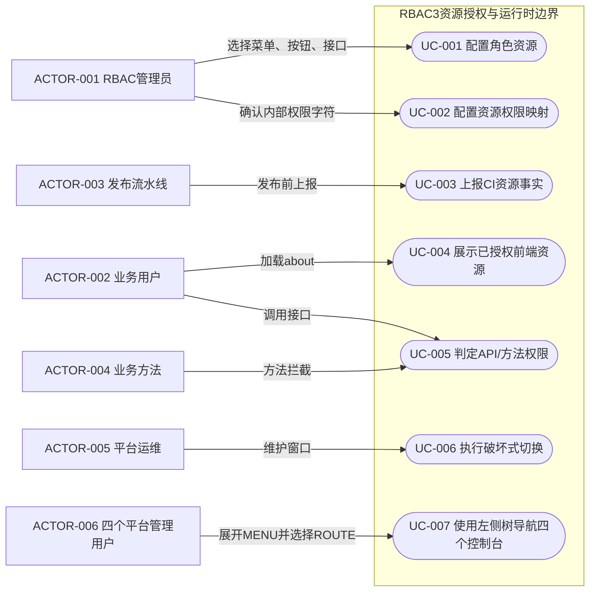
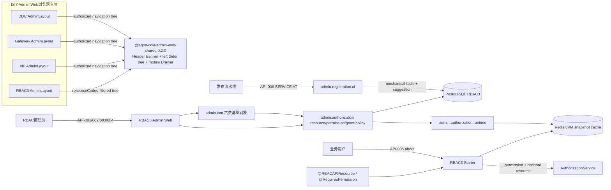
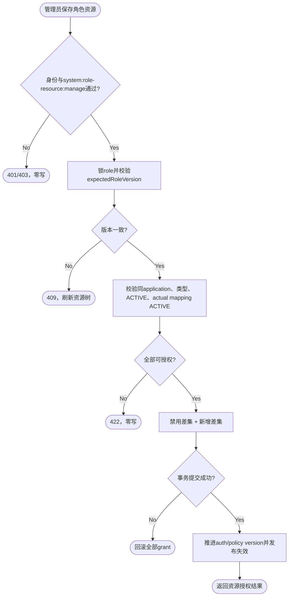
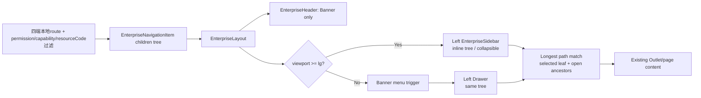
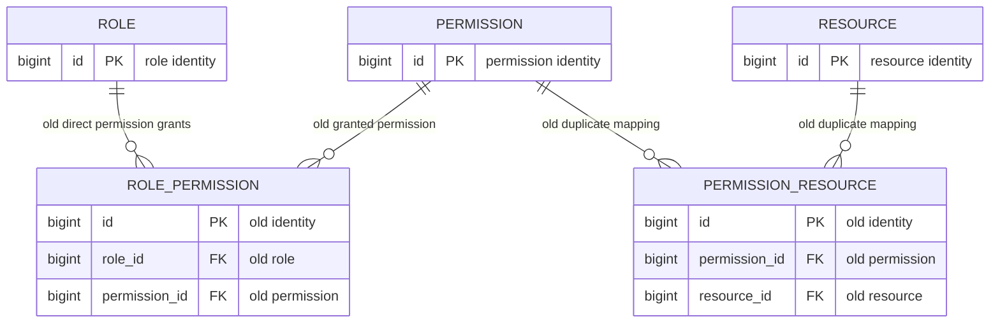
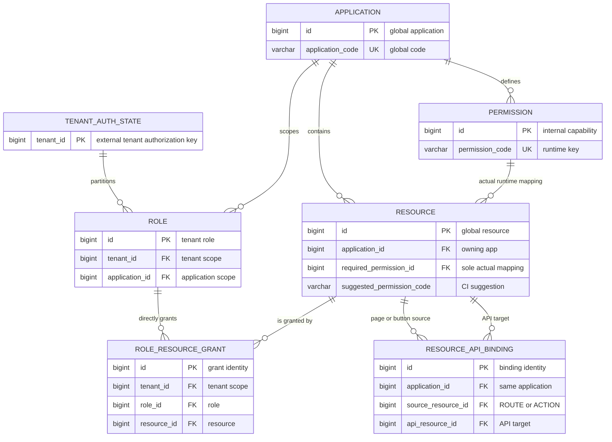

# RBAC3 资源授权、权限字符内隐化与控制面重新分层规格

| Field | Value |
| --- | --- |
| Document | `docs/egon/spec/2026-08-24-17-30-rbac3-resource-grants-layering.md` |
| Template Version | `4` |
| Status | `Accepted` |
| Type | `Architecture / Refactor` |
| Complexity | `Complex` |
| Complexity Drivers | `角色授权语义由权限字符改为资源授权、Spring Method Security双重资源/权限判定、PostgreSQL破坏式关系替换、About与React运行时契约变更、CI资源上报与人工映射所有权拆分、RBAC3 Admin大包重新分层、共享Admin Web布局及DDC/Gateway/IdP/RBAC3四个消费者协同发布` |
| Created | `2026-08-24 17:30 CST` |
| Updated | `2026-08-25 10:42 CST` |
| Owner | `Mario / Egon-COLA` |
| Repository | `Egon-COLA` |
| Scope | `egon-cola-platform-rbac3-contract、core、starter、admin、react-sdk、admin-web；egon-cola-platform-admin-web-shared；DDC/Gateway/IdP/RBAC3四个Admin Web；RBAC3 Admin Java包分层；RBAC3 PostgreSQL V13；CI前端资源上报脚本` |
| Change Surface | `角色-权限字符关系替换为角色-资源授权；资源-权限字符映射成为唯一运行时翻译关系；About/React按resourceCodes控制MENU/ROUTE/ACTION；API注解同时校验资源和权限；IAM/authorization/registration/runtime及历史残留重新分层命名；共享Admin Header只保留Banner职责，四个Admin Web的树状菜单/路由移到桌面左侧Sider并在窄屏使用左侧Drawer` |
| Affected Chapters | `§7, §8, §9, §10, §11, §12, §13, §14, §15, §16, §17, §18` |
| Source Requirement | `2026-08-24 用户决定：角色绑定接口、菜单和菜单按钮而不是权限字符；权限字符对用户无感，由管理员维护资源与权限字符映射，运行时判定才使用权限字符；页面与按钮分别获得其调用API，共享API按任一来源满足的OR并集语义；保留Egon-COLA授权能力，并重新分层命名基础IAM六类实体、授权关系、运行时策略、CI上报和历史残留；MENU/ROUTE必须以树状左侧菜单呈现，顶部仅是Banner/Header，DDC、Gateway、IdP、RBAC3四个Admin Web全部纳入改造` |
| Baseline Revision | `main@df425ed9484d20e6235666d91e947742998ab475；工作树另有用户未提交的IdP Spec/Plan与Access Guard/Open Archetype文档，本Spec不修改它们` |
| Amends | [RBAC3 注解化权限、UserDetails、字段权限与 RT 在线态改造规格](2026-08-17-09-37-rbac3-annotation-userdetails-field-authorization.md) §1–§5、§7.3.3、§7.3.5、§8、§9.2.3–§9.2.5、§9.3–§9.5、§10.2–§10.7、§11.2.4–§11.2.9、§12–§19；[RBAC3 Admin IAM 聚合迁移 Spec](../../../egon-cola-platforms/egon-cola-platform-rbac3/docs/iam-package-aggregation-migration-spec.md) §3、§4.2–§4.4、§5.5–§5.6、§6–§9 |
| Supersedes | `None` |
| Depends On | [RBAC3 注解化权限、UserDetails、字段权限与 RT 在线态改造规格](2026-08-17-09-37-rbac3-annotation-userdetails-field-authorization.md) §3.2、§5.1、§7.1–§7.3.2、§7.3.4、§15–§16中未被本规格明确修订的JWT、UserDetails、active role、字段策略与无Session规则 |
| Related Specs | [IdP OAuth Client 与租户所有权迁移规格](2026-08-21-07-51-idp-oauth-client-tenant-ownership.md) |
| Related Plans | [RBAC3 注解权限、全局资源目录与无状态认证实施计划](../plan/2026-08-17-15-07-rbac3-annotation-resource-catalog-implementation.md)；[RBAC3 资源授权、控制面分层与四端左树布局实施计划](../plan/2026-08-25-10-19-rbac3-resource-grants-layering-implementation.md) |

## 1. Summary

当前角色授权的真实写入链是 `RolePermissionPage.permissionIds -> POST /api/rbac3/v1/roles/{roleId}/permissions -> RolePermissionPO -> rbac3_role_permission`。管理员需要输入不可读的数据库 ID，角色直接感知权限字符；运行时再从 `rbac3_role_permission`读取字符。与此同时，`RBACAPIResource(code, permission, name)` 的 `code` 当前只被检查非空，`Rbac3MethodAuthorizationManager`最终只调用 `AuthorizationService.requirePermission(permission)`。这与用户确认的“角色绑定接口、菜单、菜单按钮；权限字符只作为内部判定键”不一致。

目标模型改为：角色直接授权菜单/页面、按钮，以及确有需要的独立API资源。现有技术模型中，无路径的 `MENU` 是导航分组，带页面路径的 `ROUTE` 才是用户口中的“菜单/页面”；管理页面把二者合成一棵“菜单/页面树”，只把 `ROUTE` 叶子作为直接授权根，把 `ACTION`显示为“按钮”，不向角色配置者展示权限字符。页面和按钮分别维护其调用的API资源集合；运行时按并集展开：拥有任意一个页面就获得该页面调用的全部API，拥有按钮就获得该按钮调用的全部API，同一API被多个页面/按钮复用时任意一个来源满足即可，不记录或判定具体来源。没有UI入口的API仍可直接授权。管理员在资源目录的高级配置中维护“可授权资源 -> 权限字符”的唯一映射。运行时从直接/继承授权根和展开后的API集合派生权限字符；仅为导航组树而补齐的父MENU不派生权限。`@RBACAPIResource` 同时要求 API resource code 和 permission code，通用 `@RequiresPermission`继续只按权限字符判定。FIELD 不进入角色资源授权，继续由字段规则和 Jackson PEP 决定；BIZ/APP 访问、用户角色、active role、数据规则、字段规则、SOD、Fence、缓存与失效机制均保留。

控制面按职责重新分层：`admin.iam` 只保留 User、Role、Business、Application、Organization、Position 六类基础管理对象；资源目录、权限字符、授权关系和策略进入 `admin.authorization`；CI 上报进入 `admin.registration.ci`；active role、快照、决策、发布与授权状态进入 `admin.authorization.runtime`。Tenant 主数据仍由 IdP 持有，RBAC 只保留可信 tenant context 与 tenant authorization state。历史的 `RolePermission*`、`PermissionResource*`、裸权限字符角色页、重复 Controller、空 package-info 壳和旧 principal/envelope 不建立 legacy 包，直接迁移或删除。

四个管理前端的应用框架同时修正：顶部 `EnterpriseHeader` 只承担品牌、平台状态、全局操作和用户区的Banner职责，不再渲染桌面导航；`EnterpriseLayout`在桌面端把授权过滤后的MENU/ROUTE递归树放入左侧`Layout.Sider`，窄屏改用从左侧打开的Drawer。DDC、Gateway、IdP、RBAC3继续拥有各自的路由、菜单数据和既有认证/授权上下文；共享包只负责树渲染、当前路由高亮、祖先展开、折叠和响应式行为，不新增后端接口、全局前端store或第二套权限来源。

## 2. Background and Current State

### 2.1 Business and user context

角色配置是面向管理员的业务操作。管理员能理解“用户管理菜单”“新增用户按钮”“创建用户 API”，但不应通过 `system:user:create` 或数据库 permission ID 推断业务含义。权限字符仍是稳定的运行时能力键：方法注解、数据范围、字段规则、SOD 和审计继续引用它；只是它不再作为角色配置的主对象。

本文把“基础 IAM 六类实体”固定定义为：`User`、`Role`、`Business`、`Application`、`Organization`、`Position`。其中 Business/Application 的主数据仍在 DDC，RBAC 的对应包只保存目录投影、接纳状态和授权所需引用；Tenant 主数据和核心用户信息仍在 IdP。`Resource`、`Permission`、`Grant`、`Policy`不是第七、第八类基础实体，而是授权控制面的资源目录、翻译关系、授权事实和运行时策略。

### 2.2 Repository evidence

| Evidence ID | Classification | Exact path/symbol/decision/command | Observed fact | Design significance | Verification limit/freshness |
| --- | --- | --- | --- | --- | --- |
| `EVD-001` | Static repository | `admin/iam/role/controller/RolePermissionController#bindPermissions` | `POST /api/rbac3/v1/roles/{roleId}/permissions` 接收 `permissionIds` | 当前角色直接绑定权限字符关系 | 源码证据，未启动服务 |
| `EVD-002` | Static repository | `admin-web/src/features/role/RolePermissionPage.tsx` | 页面要求手填逗号分隔的 Permission IDs | 当前用户体验不可读且容易配错 | 前端源码证据 |
| `EVD-003` | Static repository | `JpaRoleRepository#assignPermissions` | 校验 `PermissionPO` 后写 `RolePermissionPO`；方法是增量添加，页面文案却写“原子替换” | 契约、实现和页面语义已漂移 | 未连接PostgreSQL |
| `EVD-004` | Static repository | `V1__create_rbac3_schema.sql`、`V7__globalize_resource_catalog_and_remove_manifest.sql` | 同时存在 `rbac3_role_permission`、`rbac3_permission_resource` 和 `rbac3_resource.required_permission_id` | 角色关系错误且资源映射有双重事实 | Flyway源码，不证明live schema无漂移 |
| `EVD-005` | Static repository | `JpaCiResourceReportStore#upsertResource` | CI上报会创建 Permission 并覆盖 `required_permission_id` | CI当前越过管理员，成为权限映射写入者 | 当前只上报前端资源 |
| `EVD-006` | Static repository | `Rbac3MethodAuthorizationManager#addApi` | 校验 `RBACAPIResource.code/name`非空，但只收集 `permission`调用授权服务 | API resource code尚未参与判定 | Starter源码证据 |
| `EVD-007` | Static repository | `AuthorizationRuleFacts.PermissionBinding`、`JpaRoleActivationFactRepository#authorizationFacts` | 快照直接从 `rbac3_role_permission`读取 roleId + permissionCode | 运行时事实装配必须改为资源授权派生 | 核心算法和SQL静态证据 |
| `EVD-008` | Static repository | `AppAuthorizationContext.resourceCodes`、`UserAuthorizationSnapshotProjector` | 授权快照已有 `resourceCodes`，但 `Rbac3AboutView`没有暴露 | 可复用现有快照字段，无需新资源树接口 | About当前仍按permissions给前端 |
| `EVD-009` | Static repository | `FrontendResourceRegistry.navigation/canAccessRoute`、`ActionGuard` | MENU/ROUTE/ACTION展示仍按 `about.permissions` | 前端仍直接感知权限字符 | React SDK源码证据 |
| `EVD-010` | Static repository | `admin/iam` 11个顶层包；`admin`另有 `authorization/runtime/management/participation/simulation` | 基础实体、授权关系、策略、运行时和上报混放 | 需要职责分层，而非再增加一个总包 | 包扫描证据 |
| `EVD-011` | Static repository | `V8__externalize_tenant_authority.sql`、`iam/tenant` | `rbac3_tenant`已删除；`iam.tenant`只剩context/filter和大量空 package-info | Tenant不是RBAC基础实体，当前包名是历史残留 | V8后源码证据 |
| `EVD-012` | Static repository | `Rbac3AboutService`、`Rbac3UserDetails`、`DefaultAuthorizationService` | UserDetails、SecurityContext、active roles、permissions、fieldPolicies、data scope和Fence已有稳定边界 | 本次必须复用，不新造第二套鉴权引擎 | 模块测试存在但本次未执行 |
| `EVD-013` | Static repository | `admin-web/scripts/report-rbac-resources.mjs`、`verify-browser-bundle.mjs` | CI脚本在浏览器bundle之外，通过SERVICE身份上报 | CI-only边界继续保留，只改归属和映射语义 | 未验证真实流水线 |
| `EVD-014` | User decision | 2026-08-24最新要求 | 角色绑定接口、菜单和按钮；权限字符由管理员映射，判定时才使用 | 覆盖前序Spec的Role-Permission用户模型 | 明确用户决策 |
| `EVD-015` | Static repository | common core `ResultRecord`/`PageResultRecord` | 公共响应契约已经存在 | 新改接口不得继续扩大 `ApiEnvelopeVO` | 不证明所有旧Controller已迁移 |
| `EVD-016` | User decision | 2026-08-24补充说明 | menu定位page并获得page调用的全部API；button获得对应API；共享API由任一page/button授权即可 | 要求资源依赖并集展开，禁止运行时按来源细分 | 明确用户决策 |
| `EVD-017` | Static repository | `egon-cola-platform-admin-web-shared/src/layout/EnterpriseHeader.tsx` | 桌面端在`Layout.Header`内渲染`Menu mode="horizontal"`，品牌、导航、操作和用户全部挤在顶部 | 证实当前所谓菜单实际位于Banner/Header | 源码证据，未做浏览器视觉验证 |
| `EVD-018` | Static repository | `EnterpriseLayout.tsx` | 当前骨架只有Header、Content、Footer，没有`Layout.Sider` | 左侧菜单必须由共享Layout补齐，不能只改四个平台CSS | 源码证据 |
| `EVD-019` | Static repository | shared `layout/types.ts`、`EnterpriseLayout.test.tsx` | `EnterpriseNavigationItem.children`与递归菜单已经存在；窄屏已有左Drawer，桌面仍横向 | 可复用现有树模型和移动Drawer，无需新导航模型/store | 测试只证明组件行为，不证明四应用视觉一致 |
| `EVD-020` | Static repository | DDC `src/layouts/AdminLayout.tsx` | 8条导航是flat数组，但已有运行状态/配置管理/元数据管理`group` | DDC可直接把现有分组提升为树父MENU | 本地静态定义 |
| `EVD-021` | Static repository | IdP `src/app/AdminLayout.tsx`、Gateway `src/layouts/AdminLayout.tsx` | 两端先按bootstrap permission/capability过滤，再把flat items传给`EnterpriseLayout` | 树改造必须保留各自过滤来源与deep-link guard | 未验证live bootstrap内容 |
| `EVD-022` | Static repository | RBAC3 `resourceDefinitions.json -> FrontendResourceRegistry.navigation -> visibleNavigation` | RBAC3已经产出`MENU/ROUTE children`递归树，但shared在桌面端仍放到Header横向Menu | RBAC3不需第二棵树，只需共享Layout正确放置 | 当前registry仍按permission，目标按REQ-007改为resourceCodes |
| `EVD-023` | Static repository | 四个Admin Web `package.json`及shared `package.json` | 四端均消费`@egon-cola/admin-web-shared ^0.1.4`，shared当前版本`0.1.4` | 共享布局先发布、四消费者再升级是明确兼容边界 | npm registry可用性未在本次验证 |
| `EVD-024` | User decision | 2026-08-24最新补充 | MENU/ROUTE必须树状显示在左侧；顶部是Banner，不叫菜单；四个前端全部改造 | 将共享Layout和四消费者纳入本Spec | 明确用户决策 |
| `EVD-025` | Static repository | Gateway `App.tsx`、`AdminLayout.tsx` | 接口目录入口是`/interface-catalog`，Operation详情却是`/operations/:operationId`，不满足普通path前缀 | shared选择契约需允许本地声明额外active path前缀，不能改现有deep link | 仅当前已发现的非前缀详情路由 |

### 2.3 Problem statement and gap

1. 角色写入对象错位：业务上选择资源，持久化却直接选择权限字符。
2. 角色页只能提交不可读 ID，无法展示菜单树、按钮归属和接口方法/路径。
3. `@RBACAPIResource.code` 没有进入授权决定，API资源即使未授予也可能因共享权限字符而放行。
4. 资源的实际权限映射同时由 `required_permission_id` 与 `permission_resource` 表达，CI还会覆盖管理员配置。
5. About和React已有资源编码基础，但前端仍用权限字符控制展示。
6. `iam`包混入资源、权限、策略、runtime state、tenant context和CI report，无法从包名识别事实所有权。
7. V8之后仍残留 tenant空壳、旧Controller、旧principal/response和RolePermission命名；继续堆兼容层只会制造第三套结构。
8. 当前资源模型没有表达ROUTE/ACTION调用哪些API，无法实现菜单/按钮授权自动获得API的并集语义。
9. 四个Admin Web共同把导航渲染在顶部Header；即使RBAC3已有MENU/ROUTE树，桌面端仍被横向Menu消费，层级、展开关系和平台内容区边界均不符合左侧树状菜单语义。

### 2.4 Evidence and current-chain map

| Entry/trigger | Current call chain | Data read/written | External dependency | Consumers | Evidence |
| --- | --- | --- | --- | --- | --- |
| 管理员保存角色权限 | `RolePermissionPage -> roleApi.bindPermissions -> RolePermissionController -> RoleFacade -> JpaRoleRepository` | 写 `rbac3_role_permission`，输入permissionIds | PostgreSQL | RBAC Admin Web | `EVD-001`–`EVD-003` |
| 用户授权快照生成 | `RoleActivationFacade -> JpaRoleActivationFactRepository -> Core builder -> UserAuthorizationSnapshotProjector` | 读role_permission、permission、resource、data/field rules，写缓存/快照 | PostgreSQL、Redis | Starter、Gateway、About | `EVD-007`,`EVD-008`,`EVD-012` |
| API方法授权 | `Spring Method Security -> Rbac3MethodAuthorizationManager -> AuthorizationService.requirePermission` | 只读SecurityContext快照permissions | Redis/远端快照仅在装载阶段 | 所有接入Starter的业务方法 | `EVD-006`,`EVD-012` |
| 前端展示 | `GET /api/v1/auth/about -> FrontendResourceRegistry/PermissionGuard/ActionGuard` | 读取about.permissions和fieldPolicies | Gateway/IdP/RBAC快照 | RBAC/IdP等React Admin | `EVD-008`,`EVD-009` |
| CI上报 | `report-rbac-resources.mjs -> CiResourceReportController -> JpaCiResourceReportStore` | 写resource、permission、required_permission_id与CI head | Gateway SERVICE认证、DDC目录校验 | 发布流水线 | `EVD-005`,`EVD-013` |
| 四端桌面导航 | `各AdminLayout -> EnterpriseLayout(config.navigation) -> EnterpriseHeader -> AntD Menu(horizontal)` | 只读本地导航定义与现有授权上下文 | `@egon-cola/admin-web-shared 0.1.4` | DDC/Gateway/IdP/RBAC3管理用户 | `EVD-017`–`EVD-023` |

## 3. Goals and Non-goals

### 3.1 Goals

- 角色只通过可读资源进行配置，不直接接收permissionId或permissionCode。
- 菜单配置页把技术 `MENU + ROUTE` 统一呈现为“菜单/页面”，同时呈现ACTION按钮；页面/按钮自动展示关联API，独立API允许直接授权。
- 页面或按钮授权自动展开其关联API；共享API使用OR并集语义，不区分来自哪个页面或按钮。
- 资源到权限字符只有一个权威映射：`rbac3_resource.required_permission_id -> rbac3_permission.id`。
- 运行时从active/effective role的资源授权派生permission codes和resource codes。
- `@RBACAPIResource`同时验证resource code与permission code；`@RequiresPermission`保持通用权限字符能力。
- About增加当前应用的resourceCodes；MENU/ROUTE/ACTION前端展示改用resourceCode，FIELD继续用field policy。
- CI只上报机械资源事实和suggested permission，不写实际映射、不写角色授权。
- `admin.iam`最终只保留六类基础对象；授权目录/关系/策略/runtime/CI和历史残留按目标包重新归属。
- 继续使用Spring Security 6、SecurityContext、Rbac3UserDetails、AuthorizationService、active role、缓存、data/field/SOD/Fence、审计与失效机制。
- 新改HTTP契约统一使用components/common的`ResultRecord`。
- 四个Admin Web在桌面端统一使用左侧树状MENU/ROUTE导航，顶部Header只保留Banner职责；窄屏继续用左侧Drawer。
- 共享Layout统一负责递归渲染、最长路径匹配、当前叶子高亮、祖先展开和折叠；各平台继续拥有路由数据、图标、排序、权限过滤和页面组件。

### 3.2 Non-goals

- 不改变AT/RT、Gateway RT在线校验、IdP租户/用户主数据所有权或无Session模型。
- 不把permission codes写入JWT，也不让前端隐藏替代后端鉴权。
- 不把FIELD作为RoleResourceGrant；字段仍由FieldRule和Jackson PEP控制。
- 不把BIZ/APP购买/访问关系合并到RoleResourceGrant。
- 不建立页面调用来源的运行时证明链、调用计数或AND组合；API展开只计算集合并集。
- 不实现DataScope SQL自动改写；只保留现有策略与决定能力。
- 不新增Manifest、processor、registration starter、Node plugin、消息队列或新的授权缓存。
- 不创建`legacy`包保存旧类、旧URL或旧表。
- 不在本次重写所有六类基础实体CRUD；它们仅作包边界收敛和回归验证。
- 不因布局迁移统一重写DDC、Gateway、IdP的认证/授权bootstrap，也不新增导航接口、导航数据库、全局导航store或菜单配置后台。
- 不把移动端强制成常驻窄Sider；小于`lg`断点使用左Drawer，保证内容可用宽度。

### 3.3 Change Surface and Design Depth

| Area/layer | Disposition | Exact repository evidence | Changed or preserved behavior/contract | Required Spec treatment | Chapter(s) |
| --- | --- | --- | --- | --- | --- |
| Role resource grant backend | Affected | `RolePermissionController/RoleFacade/JpaRoleRepository/RolePermissionPO` | permissionIds改为resourceIds，GET树+PUT replace | 完整架构、文件、接口、模型、事务、测试 | `§7, §8, §9, §10, §13, §14, §15, §16, §17, §18` |
| Authorization persistence | Affected | V1/V7 `rbac3_role_permission`、`rbac3_permission_resource`、`rbac3_resource.required_permission_id` | 新建role_resource_grant和resource_api_binding，删除两张残留关系表，资源映射单一化 | 完整表、索引、迁移、ER、恢复设计 | `§7, §10, §11, §14, §15, §16, §17, §18` |
| Runtime snapshot and method PEP | Affected | `AuthorizationRuleFacts`、`JpaRoleActivationFactRepository`、`PermissionRequest`、`Rbac3MethodAuthorizationManager` | 资源授权派生permission/resource；API双条件判定 | 完整内部契约、失败与缓存失效设计 | `§7, §8, §9, §10, §13, §14, §15, §16, §17, §18` |
| About and React SDK/Admin Web | Affected | `Rbac3AboutView`、`FrontendResourceRegistry`、`RolePermissionPage` | about增加resourceCodes；页面改资源树；UI guard按resource code | 完整HTTP、页面、状态、测试设计 | `§7, §8, §9, §10, §12, §13, §14, §15, §16, §17, §18` |
| Resource permission mapping | Affected | `PermissionPage`、`ResourceCatalogPage`、`JpaCiResourceReportStore` | 映射由管理员确认；CI suggestion不具授权效力 | 完整接口、UI、模型与并发规则 | `§7, §8, §9, §10, §11, §12, §13, §14, §15, §16, §17, §18` |
| Page/action API bindings | Affected | 当前Resource parent/mechanical facts无跨类型API调用关系；`EVD-016` | 新增同APP ROUTE/ACTION -> API多对多机械关系，保留页面/按钮source边界并由runtime按union展开 | 完整数据、CI、runtime、UI与测试设计 | `§7, §8, §9, §10, §11, §12, §13, §14, §15, §16, §17, §18` |
| Java package responsibility layering | Affected | `admin.iam/*`及顶层authorization/runtime/management/participation/simulation | 六类IAM、authorization、registration.ci、authorization.runtime明确归属 | 目标树、迁移映射、架构守卫 | `§7, §8, §13, §14, §15, §16, §17, §18` |
| Shared Admin Web shell | Affected | `admin-web-shared/src/layout/{EnterpriseHeader,EnterpriseLayout,types}.tsx/ts` | 桌面horizontal Header导航迁移为左Sider树；Header只保留Banner；移动Drawer保留 | 完整组件契约、布局、状态、可访问性、版本与测试设计 | `§7, §8, §9, §10, §12, §13, §14, §15, §16, §17, §18` |
| DDC Admin Web navigation | Affected | DDC `src/layouts/AdminLayout.tsx`及测试 | 现有group提升为运行状态/配置管理/元数据管理树，权限和路由不变 | 精确树、文件、状态和消费者测试 | `§7, §8, §12, §14, §15, §16, §17, §18` |
| Gateway Admin Web navigation | Affected | Gateway `src/layouts/AdminLayout.tsx`及测试 | flat capability-filtered导航改为左侧分组树，capability和deep links不变 | 精确树、文件、状态和消费者测试 | `§7, §8, §12, §14, §15, §16, §17, §18` |
| IdP Admin Web navigation | Affected | IdP `src/app/AdminLayout.tsx`及测试 | flat permission-filtered导航改为左侧分组树，breadcrumb/bootstrap不变 | 精确树、文件、状态和消费者测试 | `§7, §8, §12, §14, §15, §16, §17, §18` |
| RBAC3 Admin Web navigation | Affected | RBAC3 `resourceDefinitions.json -> navigation.ts -> router.tsx` | 复用既有MENU/ROUTE树并改由左Sider呈现；REQ-007资源过滤不变 | 精确树消费、空权限/deep-link和消费者测试 | `§7, §8, §12, §14, §15, §16, §17, §18` |
| Shared package distribution | Affected | shared与四消费者`package.json/package-lock.json` | 发布shared `0.2.0`并协调四消费者升级；RBAC3使用平台级lockfile | 版本、构建、回滚和registry边界 | `§8, §14, §16, §18` |
| CI browser-bundle isolation | Context-only | `report-rbac-resources.mjs`、`verify-browser-bundle.mjs` | CI脚本仍不进入浏览器bundle，不在应用启动执行 | 记录不变量并回归bundle guard | `§14` |
| IdP/Gateway token chain | Unchanged | 前序Spec以及IdP/Gateway现有Filter | AT/RT、RT在线态、SecurityContext身份链不变 | 只做Starter链回归，不重新设计 | `§14` |
| DDC BIZ/APP master data | Unchanged | `DdcBizService/DdcAppService`、RBAC `DdcCatalogGateway` | DDC继续拥有主数据；RBAC只引用和授权 | RPC边界回归 | `§14` |
| Audit/simulation/bootstrap capability | Context-only | `admin.audit/simulation/bootstrap` | 能力保留；仅import、包依赖和RoleResource事实适配 | 精确调用方回归 | `§14` |

## 4. Requirements and Acceptance Criteria

| ID | Atomic requirement | Priority | Observable acceptance criteria | Source |
| --- | --- | --- | --- | --- |
| `REQ-001` | 角色配置提交resourceIds而非permissionIds/codes | Must | 新请求JSON无permissionIds/permissionCodes；角色页无权限字符输入 | 用户最新决定 |
| `REQ-002` | 角色页按菜单/页面、按钮和独立接口展示资源 | Must | MENU+ROUTE为树；无路径MENU仅作分组，ROUTE是可选择页面；ACTION归属页面，关联API只读展示，独立API可直接选择 | “接口，菜单，菜单下的按钮” |
| `REQ-003` | 权限字符由管理员在资源目录配置 | Must | Resource mapping页可查看suggestion并选择ACTIVE permission；角色页不展示字符 | 用户最新决定 |
| `REQ-004` | 资源映射只有一个权威事实 | Must | 运行时只读`resource.required_permission_id`；无`permission_resource`表/PO/caller | 简化与一致性 |
| `REQ-005` | 运行时从资源授权派生权限 | Must | effective active role -> resource grants -> distinct permission codes；未激活角色无效 | 保留active role规则 |
| `REQ-006` | API注解同时校验资源与权限 | Must | API resource未授予或permission未匹配均DENY；通用注解仍可只校验permission | 保留Egon-COLA授权能力 |
| `REQ-007` | About和前端使用resourceCodes控制展示 | Must | about返回排序resourceCodes；导航/路由/按钮不读取permission字段 | 权限字符用户无感 |
| `REQ-008` | FIELD、DataScope、SOD、Fence能力保持 | Must | 现有决定接口和fail-closed语义通过回归；FIELD不进入role resource payload | “保留授权能力” |
| `REQ-009` | CI不再决定实际权限映射 | Must | 上报只写suggestedPermissionCode和机械事实；requiredPermissionId、role grants零变化 | 管理员配置映射 |
| `REQ-010` | CI上报归属registration.ci | Must | Java包/类和唯一CI URL使用registration语义；脚本仍CI-only | 用户分层命名要求 |
| `REQ-011` | admin.iam只保留六类基础对象 | Must | 顶层仅user/role/business/application/organization/position；授权关系不再嵌在role/business/application | 用户分层命名要求 |
| `REQ-012` | 授权目录、关系、策略、runtime明确分层 | Must | 架构测试证明目标包依赖方向并禁止旧包 | 用户分层命名要求 |
| `REQ-013` | 历史残留直接删除或归位 | Must | 无RolePermission/PermissionResource/旧principal/envelope/空tenant壳/重复旧Controller | 用户分层命名要求 |
| `REQ-014` | 角色资源replace原子、租户/应用隔离且乐观冲突可见 | Must | 一次事务全量替换direct grants；跨app、未映射、并发版本全部拒绝且零部分写 | 安全与一致性 |
| `REQ-015` | 映射变更不静默改变已生效角色 | Must | 资源有ACTIVE direct grant，或API被ACTIVE页面/按钮grant间接引用时，改成不同permission返回409；同值重放幂等 | 安全决策 |
| `REQ-016` | 公共HTTP返回契约统一 | Must | 本规格所有新增/替换接口返回ResultRecord完整形状 | 前序已确认common组件 |
| `REQ-017` | 破坏式迁移不保留旧授权数据/alias | Must | V13无role_permission backfill，旧URL 404，旧前端/类删除 | 已确认允许破坏式更新 |
| `REQ-018` | 权限变化推进版本并失效缓存 | Must | replace/mapping激活后authVersion/policyVersion按规则推进，active snapshot不使用旧值 | 保留运行时一致性 |
| `REQ-019` | 页面和按钮到API使用并集展开 | Must | 页面授权包含其全部API；按钮授权包含其API；共享API由任一已授权来源获得；无来源细分 | 用户最新补充 |
| `REQ-020` | 页面和按钮到API关联是可校验资源事实 | Must | source仅ROUTE/ACTION，target仅同APP的API；CI完整上报原子维护并推进版本 | `REQ-019`的必要基础 |
| `REQ-021` | 页面基础API与按钮操作API按真实触发源声明 | Must | ROUTE只声明打开/使用页面即需要的API，ACTION声明执行按钮才需要的API；仅有ROUTE权限不会获得仅绑定ACTION的API | 用户对page与button权限边界的补充 |
| `REQ-022` | 桌面MENU/ROUTE必须是左侧树状导航 | Must | `lg`及以上不存在Header horizontal主导航；左侧Sider以inline tree展示父MENU和ROUTE叶子 | “树状的，在左边” |
| `REQ-023` | 顶部区域只承担Banner/Header职责 | Must | 顶部只含品牌/平台名、全局状态操作、用户区和窄屏菜单触发器，不平铺业务菜单 | “上方这叫banner，不叫菜单” |
| `REQ-024` | DDC、Gateway、IdP、RBAC3四个Admin Web全部采用统一左侧树 | Must | 四端桌面均有左Sider，当前route高亮且祖先展开；各自现有路由与授权过滤无回退 | “四个前端的改造也写到spec中” |
| `REQ-025` | 左侧树具备折叠、deep-link和响应式闭环 | Must | desktop可折叠且不丢内容状态；deep link选中最长匹配叶子并展开祖先；小于lg通过左Drawer操作同一棵树 | 左侧树可用性的必要条件 |

### 4.1 Scenario matrix

| Scenario | Actor/trigger | Preconditions | Main path | Alternative/failure path | Data/state change | Observable result | Requirements |
| --- | --- | --- | --- | --- | --- | --- | --- |
| 配置角色资源 | 管理员在角色详情保存 | 角色、TenantApplication和资源均有效 | GET资源树后PUT resourceIds，服务展开关联API | 空集合表示移除全部direct grants | 单事务禁用差集、创建新增、推进版本；派生API不另存grant | 页面展示direct/inherited/derived且无字符 | `REQ-001`,`REQ-002`,`REQ-014`,`REQ-019` |
| 选择未映射资源 | 管理员勾选PENDING资源 | requiredPermissionId为空/permission非ACTIVE | 服务在写前校验 | 返回422，无任何grant写入 | 无变化 | 节点显示“待配置权限字符” | `REQ-003`,`REQ-014` |
| 并发保存角色 | 两个管理员基于同roleVersion保存 | 第一个已提交 | 第一个成功 | 第二个409并刷新树 | 仅第一份replace生效 | 明确并发提示 | `REQ-014` |
| 修改已使用映射 | 管理员更换resource mapping | 资源存在ACTIVE direct grant，或API存在ACTIVE页面/按钮来源 | 锁资源并查direct/reverse-binding引用 | 409 `RESOURCE_PERMISSION_MAPPING_IN_USE` | 映射不变 | UI提示先调整角色或其页面/按钮来源 | `REQ-015`,`REQ-019` |
| API正常访问 | 用户active role可直接获得或经页面/按钮派生目标API | resource映射与注解一致 | PEP检查resourceCodes和permissions | 任一缺失即403 | 无写 | 允许或稳定拒绝 | `REQ-005`,`REQ-006`,`REQ-019` |
| 页面调用共享API | 任一已授权页面或按钮关联同一API | source与API ACTIVE且同APP | runtime对所有有效source的API集合做union | 所有来源均未授权才移除API | 仅快照派生，无来源状态 | 任一来源即可调用，不区分来源 | `REQ-019`,`REQ-020` |
| 仅有页面、没有按钮 | 用户拥有ROUTE但没有页面下某ACTION | 页面基础API绑定ROUTE，按钮写API绑定ACTION | 页面基础API进入union，按钮专属API不进入 | 若同一API也真实绑定ROUTE，则因ROUTE来源进入union | 仅快照派生 | 页面可加载，未授权按钮及其专属API均拒绝 | `REQ-019`–`021` |
| 前端导航与按钮 | About READY | snapshot含MENU/ROUTE/ACTION codes | SDK按resourceCodes过滤 | About失败/未READY全部隐藏 | 无写 | 不显示权限字符，不闪现未授权内容 | `REQ-007` |
| 桌面树导航 | 四端管理用户进入任一控制台 | 已认证且至少一个route可见，viewport>=lg | Banner渲染品牌/状态/用户；左Sider递归渲染MENU/ROUTE | 当前route不在树时不伪造选中项，由既有route guard处理 | 仅组件本地折叠/openKeys状态 | 菜单在左、内容在右、当前叶子高亮且祖先展开 | `REQ-022`–`025` |
| 折叠桌面Sider | 用户点击折叠按钮 | desktop tree已渲染 | Sider收窄并保留icon/tooltip与选中态 | 无icon叶子仍用可访问名称提示 | 仅本地collapsed变化；页面不remount | 内容区扩展，当前页面和查询状态不丢失 | `REQ-022`,`025` |
| 窄屏导航 | 用户在小于lg宽度打开菜单 | Header显示菜单触发器、无常驻Sider | 左Drawer显示与desktop相同的授权树；点叶子后关闭 | 点击父MENU只展开；Esc/遮罩关闭且不导航 | 仅Drawer/openKeys状态 | Banner仍在顶部，内容不被窄Sider挤压 | `REQ-023`–`025` |
| 权限过滤后空树 | 四端现有授权上下文无可见route | 用户仍已认证 | 不显示Sider和移动菜单触发器 | 应用现有403/空权限落点继续处理 | 无新权限状态 | 不显示未授权菜单，不出现空白侧栏 | `REQ-007`,`024`,`025` |
| shared版本不一致 | 某消费者仍安装0.1.x | shared 0.2.0已发布 | package/lock更新后构建 | 未升级时仍显示旧Header导航或类型/测试失败 | 无业务数据变化 | 发布门禁阻止四端视觉分叉 | `REQ-024` |
| CI重复上报 | 流水线同build/checksum重试 | SERVICE身份source绑定正确 | 返回幂等结果 | 同build不同checksum 409 | 仅机械事实可变，映射/grant不变 | 发布可判定成功/失败 | `REQ-009`,`REQ-010` |
| V13切换 | 运维维护窗口发布 | 备份完成且整组版本可部署 | drop旧关系、create新关系、重上报、bootstrap | 中途失败停止启动并forward-fix | 旧授权数据不保留 | 新模型可登录/配置/判定 | `REQ-013`,`REQ-017`,`REQ-018` |

### 4.2 Use-case analysis

#### 4.2.1 Actor inventory

| Actor ID | Actor/role | Goal and responsibility | Entry/channel | Permission/tenant context | Evidence |
| --- | --- | --- | --- | --- | --- |
| `ACTOR-001` | RBAC管理员 | 通过可读资源配置角色，并维护资源权限映射 | RBAC Admin Web | 当前tenant；role/resource管理权限 | 角色与资源页面、用户要求 |
| `ACTOR-002` | 已登录业务用户 | 只看到被授权菜单/按钮并调用已授权API | React Web + Gateway | USER AT/RT、active roles | About/Starter链 |
| `ACTOR-003` | 发布流水线 | 上报应用代码中声明的前端资源机械事实 | CI脚本/API | SERVICE AT + report scope + source BIZ/APP | 当前report脚本 |
| `ACTOR-004` | 接入RBAC的业务方法 | 在方法调用前执行资源/权限/策略判定 | Spring Method Security | Rbac3UserDetails/SecurityContext | Starter manager |
| `ACTOR-005` | 平台运维 | 在破坏式窗口完成V13与bootstrap | Flyway/CLI/验证脚本 | 数据库和部署权限 | 既有迁移机制 |
| `ACTOR-006` | 四个平台管理用户 | 在DDC/Gateway/IdP/RBAC3控制台通过左侧树定位授权页面 | 四个Admin Web | 各平台既有AuthContext/permission/capability；RBAC3按REQ-007使用resourceCodes | `EVD-017`–`EVD-024` |

#### 4.2.2 Use-case artifact



| ID | Use case/goal | Trigger/preconditions | Main success outcome | Alternatives/failures | Postconditions | Requirements | Interfaces/pages | Tests |
| --- | --- | --- | --- | --- | --- | --- | --- | --- |
| `UC-001` | 配置角色资源 | 管理员打开角色资源页；角色和应用有效 | direct roots原子替换，页面基础API与按钮API按各自source做union派生 | 未映射/跨app/冲突均零写拒绝 | authVersion推进，缓存失效；不保存派生grant | `REQ-001`,`002`,`014`,`018`,`019`–`021` | `API-001`,`API-002` / RoleResourceGrantPage | `TEST-001`–`006`,`030`–`032` |
| `UC-002` | 配置资源权限映射 | 管理员从资源目录打开映射抽屉 | actual mapping保存且可用于后续grant | ACTIVE grant引用时禁止改成另一字符 | resourceVersion推进；安全语义稳定 | `REQ-003`,`004`,`015` | `API-003`,`API-004` / ResourceCatalogPage | `TEST-007`–`010` |
| `UC-003` | 上报CI资源事实 | SERVICE身份与BIZ/APP绑定 | 机械事实和suggestion幂等更新 | checksum/source/version错误拒绝 | 不改变mapping/grants | `REQ-009`,`010` | `API-006` / CI | `TEST-011`–`014` |
| `UC-004` | 展示已授权前端资源 | About READY | MENU/ROUTE/ACTION按resourceCodes显示 | 401/403/503/未READY全部fail closed | UI不展示字符或未授权资源 | `REQ-007`,`008` | `API-005` / SDK/Admin Web | `TEST-015`–`018` |
| `UC-005` | 判定API与通用方法权限 | 方法有RBAC注解且快照有效 | API检查code+permission；通用方法检查permission | fenced/unavailable/missing均deny或indeterminate | 无业务方法执行泄漏 | `REQ-005`,`006`,`008` | `INTERNAL-001` | `TEST-019`–`024` |
| `UC-006` | 执行破坏式切换 | 维护窗口、备份、整组部署 | V13后新模型bootstrap并通过冒烟 | 失败停止启动，旧应用不与V13共存 | 无旧表/alias/类 | `REQ-011`–`013`,`017` | Flyway/CLI | `TEST-025`–`029` |
| `UC-007` | 使用左侧树导航四个控制台 | 用户已通过各平台现有认证且导航经过授权过滤 | desktop在左Sider展开父MENU并选择ROUTE；mobile从左Drawer使用同一树 | 无可见route隐藏导航；deep link无匹配项由既有guard处理；shared版本不一致阻断发布 | 不新增服务器状态；折叠/open/drawer仅组件本地状态，页面不因折叠remount | `REQ-022`–`025` | `INTERNAL-002` / four AdminLayout shells | `TEST-033`–`042` |

## 5. Constraints, Assumptions, and Decisions

### 5.1 Confirmed constraints

- Tenant与核心用户主数据属于IdP；RBAC仅持最小User授权成员、tenant context和tenant authorization state。
- BIZ/APP主数据属于DDC；RBAC持全局应用引用、租户应用资格和用户Business访问授权。
- 只有active/effective roles进入快照；inactive role及其资源/权限/策略完全不可见。
- 资源目录为全局服务事实，不按tenant重复；角色资源授权为tenant事实。
- 权限字符不是秘密，但不得作为普通角色配置UI或前端展示控制的业务对象。
- 允许破坏式更新，不迁移旧RolePermission数据，不提供旧URL alias。
- 所有新改HTTP响应使用common `ResultRecord`；错误通过现有统一异常映射落到相同结构。

### 5.2 Small-gap assumptions

| ID | Inference | Repository evidence | Why locally reversible | Impact if wrong |
| --- | --- | --- | --- | --- |
| `ASM-001` | 角色页面把MENU和ROUTE合并称为“菜单/页面” | 当前resourceDefinitions用MENU作分组、ROUTE作真实页面 | 仅展示分类，不改ResourceType持久语义 | 若产品坚持只称菜单，只需改文案 |
| `ASM-002` | 资源树最多2000节点，继续沿用当前CI上报边界 | 前序Spec和CiResourceReportRequestDTO已有2000限制 | 可配置/调大，不改变授权语义 | 超大应用需分页或分组查询 |
| `ASM-003` | mapping同值PUT视为幂等成功 | 当前资源version与CI幂等设计 | 局部且安全 | 若要求每次都审计，需增加no-op audit规则 |
| `ASM-004` | DDC沿用现有三个group作为树父MENU | DDC `AdminLayout.navigation.group`已有运行状态/配置管理/元数据管理 | 只改变本地导航嵌套和文案层级 | 若产品调整信息架构，只改本地children |
| `ASM-005` | IdP树分为身份目录、OAuth与资源、安全治理，身份概览保持根ROUTE | IdP现有routes和页面职责 | 本地可逆，不改变route/permission | 若需其他分组，只改NavItem树 |
| `ASM-006` | Gateway树分为网关治理、MCP、观测与审计，总览保持根ROUTE | Gateway现有route前缀和capability分布 | 本地可逆，不改变route/capability | 若需其他分组，只改navigation树 |

### 5.3 Resolved decisions

| ID | Decision | Decision owner | Evidence and rationale | Requirements |
| --- | --- | --- | --- | --- |
| `DEC-001` | RoleResourceGrant替代RolePermission | Mario | 角色面向资源，字符只在判定时使用 | `REQ-001`,`005` |
| `DEC-002` | `required_permission_id`为唯一实际映射，删除permission_resource | Mario + repository evidence | 当前runtime和CI已经使用required_permission_id，双表没有独立价值 | `REQ-003`,`004` |
| `DEC-003` | API注解检查resource code + permission；通用注解保持permission-only | Mario | 同时保留可读资源授权和Egon-COLA通用能力 | `REQ-006`,`008` |
| `DEC-004` | UI资源展示按resourceCodes，不删除About.permissions | Mario | 普通UI不感知字符；runtime/data/field/通用guard仍可复用permissions | `REQ-007`,`008` |
| `DEC-005` | CI只报告suggestion，管理员确认actual mapping | Mario | 避免流水线越过管理配置 | `REQ-003`,`009` |
| `DEC-006` | 六类IAM固定为User/Role/Business/Application/Organization/Position | Mario + V8/DDC/IdP边界 | Tenant已外部化；resource/permission/policy属于authorization | `REQ-011`,`012` |
| `DEC-007` | 不保留legacy包和旧数据 | Mario | 已允许破坏式切换，兼容层没有消费者价值 | `REQ-013`,`017` |
| `DEC-008` | 页面和按钮关联API按集合并集展开，独立API可直授 | Mario | 最新明确“任意一个page权限即可获得共享API，button同理，不深入区分” | `REQ-019`,`020` |
| `DEC-009` | ROUTE与ACTION分别声明其真实调用API | Mario | 页面权限必须支持页面基础调用，按钮权限必须独立保护按钮操作；把按钮API全挂到页面会绕过按钮授权 | `REQ-021` |
| `DEC-010` | Header是Banner，desktop业务导航只能进入左Sider | Mario | `EVD-017`,`EVD-018`,`EVD-024`；用户明确纠正顶部区域语义 | `REQ-022`,`023` |
| `DEC-011` | shared统一渲染树，四平台只提供授权后的导航数据 | Mario + repository evidence | 四端已共同使用EnterpriseLayout，children模型已存在；复制四套Sider会漂移 | `REQ-024`,`025` |
| `DEC-012` | 布局迁移不统一重写四端认证/授权bootstrap | Mario scope + smallest design | 左侧树只需移动渲染位置；DDC/IdP/Gateway当前过滤来源与RBAC3目标resourceCodes均可输出同一navigation类型 | `REQ-007`,`024` |

### 5.4 Open major decisions

None. 本规格不把未来API注解的独立构建期扫描器纳入本次实现；已有或人工登记的API资源可进入角色资源树，后续若要求所有业务仓库自动生成API注册文件，应另立Spec，不在本次包迁移中增加模块。

## 6. Project Technology Context

| Concern | Current choice | Repository evidence | Constraint on design |
| --- | --- | --- | --- |
| Java/runtime | Java 21 | `egon-cola-platforms/pom.xml` | 使用record、Spring 6 API；不引入Java 25专用语法 |
| Framework | Spring Boot 3.5.16 / Spring Security 6 | platforms POM、Starter POM | Method Security与SecurityContext继续作为PEP上下文 |
| Persistence | JPA/EntityManager + PostgreSQL + Flyway | rbac3-admin POM、V1–V12 | 只新增V13，不编辑历史迁移 |
| Cache/runtime | Redis/Redisson + JVM near cache | Starter/Admin cache代码 | 复用snapshot/version失效，不增第二缓存 |
| Frontend | React 19、TypeScript 6、Ant Design 6、React Router 7、TanStack Query、Vitest | shared及四Admin Web package.json | 左Sider/Drawer/Menu复用AntD；route选择复用React Router；不新增UI框架/store |
| Shared frontend distribution | `@egon-cola/admin-web-shared 0.1.4`被四端以`^0.1.4`消费 | shared和四消费者package/lock | 布局公共契约升级为0.2.0后，四端必须协调更新并分别build/test |
| HTTP wrapper | common `ResultRecord` | common-core源码 | 新改接口完整返回统一字段 |
| Tests | JUnit 5、Spring MVC Test、模块集成测试、Vitest/Playwright、Node test | 当前test源码/package scripts | 静态/module proof不等于live topology |

### 6.1 Java three-layer applicability

| Architecture profile | Base package | Evidence or explicit decision | Existing deviations | Design action |
| --- | --- | --- | --- | --- |
| Existing capability-sliced custom structure | `top.egon.cola.platform.rbac3.admin` | 当前每个能力使用controller/service/repository/domain子包；用户明确要求重新分层命名而非迁成另一架构 | Service实现不统一使用`service.impl`，大量Facade/Repository为现有边界 | 保留现有内部结构，只移动能力归属；不引入DDD/COLA或新的三层骨架 |

## 7. Architecture Design

### 7.0 Minimum-design baseline and element-necessity audit

| Proposed element | Change | Requirements | Existing/direct alternative | Concrete inadequacy of alternative | Added calls/state/coupling/failures/migration/operations | Verdict |
| --- | --- | --- | --- | --- | --- | --- |
| `RoleResourceGrantPO/table` | New | `REQ-001`,`005`,`014` | 保留RolePermission并只改UI标签 | 持久化主语仍是字符，无法证明API resource被授予 | 一张替代表和一次破坏式迁移 | Add |
| `ResourceApiBindingPO/table` | New | `REQ-019`,`020` | 把API codes塞进resource JSON并在Java中解析 | 缺少FK、反向查询和原子replace，难以校验同APP/API类型 | 一张小型多对多机械关系表；无新网络调用 | Add |
| `resource.required_permission_id` | Keep/strengthen | `REQ-003`,`004` | 保留permission_resource并双写 | 两个映射源会漂移，当前CI也未双写 | 无新表；增加校验/管理API | Keep |
| `rbac3_permission_resource` | Remove | `REQ-004`,`013` | 继续作为映射历史 | 无当前独立消费者，mappingVersion也未成为runtime权威 | 删除表/PO和旧查询 | Remove |
| Role resource tree GET | New | `REQ-001`,`002` | 前端拼接role impact+resource list | 不能得到direct/inherited/grantable状态且增加多次请求 | 一个只读接口和树装配 | Add |
| Role resource replace PUT | Replace | `REQ-001`,`014` | 改造现有POST permission endpoint | POST当前是增量，且契约仍是permissionIds | 一个原子命令，删除旧POST/DELETE | Add/Replace |
| Resource mapping GET/PUT | New | `REQ-003`,`015` | 直接编辑ResourcePO或独立PermissionPage | 无业务映射并发/在用保护 | 两个管理接口和一个抽屉 | Add |
| About.resourceCodes | Expand | `REQ-007` | 前端继续按permissions映射本地资源 | 用户仍直接感知字符，admin映射变更无法准确投影 | 一个响应字段，无额外RTT | Add |
| 新权限缓存/资源树缓存 | Proposed then rejected | None | 现有DB树查询和snapshot cache | 2000节点管理查询无容量证据 | 新失效状态无当前价值 | Remove |
| CI registration package/URL | Rename | `REQ-009`,`010` | 留在iam.resource.report | 所有权误导且CI会覆盖mapping | 一次脚本/路由破坏式同步 | Move |
| `legacy`兼容包 | Proposed then rejected | None | 删除/归位旧代码 | 用户允许破坏式更新，无旧消费者目标 | 兼容包会永久扩大维护面 | Remove |
| `EnterpriseSidebar` | New shared component | `REQ-022`–`025` | 四个AdminLayout各自实现Sider | 复制路由匹配、openKeys、折叠、Drawer和a11y，必然漂移 | 一个共享组件；只增加浏览器本地UI状态，无网络/服务器状态 | Add |
| `EnterpriseNavigationItem.children` | Keep | `REQ-022`,`024` | 新建另一套MenuTree DTO | 现有children已能表达MENU/ROUTE递归树 | 无新类型；移除已不需要的flat `group`语义 | Keep |
| `EnterpriseHeader` desktop navigation | Remove/Refocus | `REQ-023` | 保留horizontal并另加左Sider | 同一导航重复且Banner语义继续错误 | Header props调整；0.2.0消费者协调升级 | Remove from Header |
| global navigation store/provider | Proposed then rejected | None | Layout本地`collapsed/openKeys/drawerOpen` | 状态不跨页面/应用共享，不需要缓存或全局同步 | 新provider会增加生命周期和测试面 | Remove |
| Four AdminLayout navigation trees | Modify | `REQ-024` | shared根据flat `group`自动猜树 | IdP/Gateway无group，shared不应知道平台信息架构或权限 | 四个本地树定义/测试；route/API调用数不变 | Keep ownership / Modify shape |

| Path | Network calls | Client states | Server contracts/state | Failure and TOCTOU points | Additional user/business value |
| --- | --- | --- | --- | --- | --- |
| Current role page | impact GET + permission POST | loading、文本Modal、error | role_permission | ID不可读、POST非replace、并发版本 | 只能保存字符ID |
| Selected role page | resource-tree GET + resource replace PUT | loading、tree、validation、conflict、success | role_resource_grant | 映射/状态在GET与PUT间变化时由PUT重验 | 管理员按菜单/按钮/API配置且可读 |
| Current four-admin navigation | 0新增调用 | Header horizontal menu；mobile drawer | shared 0.1.4 | 宽度溢出、树层级被挤在Banner | 顶部平铺导航 |
| Selected four-admin navigation | 0新增调用 | desktop Sider collapsed/openKeys；mobile drawerOpen | shared 0.2.0本地组件状态 | package版本不一致由发布门禁阻断；权限/路由失败沿既有边界 | 左侧树、Banner语义正确、四端一致 |

### 7.1 System Architecture Design

#### 7.1.1 Architecture Mermaid view



#### 7.1.2 Boundary and responsibility table

| Module/component | Capability and data owned | Inputs/outputs | Allowed dependencies | Forbidden responsibility | Requirements |
| --- | --- | --- | --- | --- | --- |
| `admin.iam` | 六类基础对象及目录/成员事实 | CRUD/selector | shared、必要的authorization service | 权限字符、grant、policy、snapshot、CI | `REQ-011` |
| `admin.authorization.resource` | APP/MENU/ROUTE/ACTION/API、FIELD及ROUTE/ACTION到API调用关系 | resource tree/mapping/binding target | iam.application、permission | 角色/用户授权 | `REQ-002`–`004`,`019`–`021` |
| `admin.authorization.permission` | 内部permission code及资源实际映射服务 | admin selector/mapping | resource、runtime invalidation | 普通角色配置UI | `REQ-003`,`004`,`015` |
| `admin.authorization.grant` | user-role、role-resource、role inheritance、business/application grants | mutation/query facts | iam、resource | token签发、资源机械注册 | `REQ-001`,`005`,`014` |
| `admin.authorization.policy` | data/field/SOD/prerequisite/cardinality/management/participation | policy facts/decisions | grant、resource/permission | 身份认证 | `REQ-008`,`012` |
| `admin.authorization.runtime` | active role、快照、版本、决策、发布、失效 | runtime contexts | grant/policy、Redis/outbox | 管理资源映射 | `REQ-005`–`008`,`018` |
| `admin.registration.ci` | CI上报校验、checksum和机械事实写入 | SERVICE report | DDC目录、resource store | actual mapping、role grant、tenant entitlement | `REQ-009`,`010` |
| Starter/Contract/React SDK | 业务PEP和消费契约 | SecurityContext/About/guards | runtime snapshot | 管理面持久化 | `REQ-006`–`008` |
| `admin-web-shared` | Banner、左Sider递归树、route高亮、祖先展开、折叠、mobile Drawer | `EnterpriseLayoutConfig` -> rendered shell | AntD、React Router；平台传入navigation | 平台route/permission定义、认证、数据请求 | `REQ-022`–`025` |
| DDC/Gateway/IdP Admin Web | 各自信息架构、route、icon、排序及现有permission/capability过滤 | authorized `EnterpriseNavigationItem[]` | shared shell、各自AuthContext | 复制shared布局或改变RBAC事实 | `REQ-024`,`025` |
| RBAC3 Admin Web | resourceDefinitions到可见MENU/ROUTE树、角色资源页 | REQ-007 filtered navigation | React SDK、shared shell | Header横向渲染或第二导航模型 | `REQ-007`,`022`–`025` |

### 7.2 High-Level Design

#### 7.2.1 Critical business/control flowchart



#### 7.2.2 High-level decision and quality matrix

| Concern/use case | Required behavior | Selected mechanism | Failure/degradation behavior | Trade-off | Verification | Requirements |
| --- | --- | --- | --- | --- | --- | --- |
| Security / `UC-005` | API资源和权限都必须存在 | PermissionRequest可选resourceCode；API factory传两者 | 任一缺失、fenced或snapshot不可用fail closed | 比permission-only多一次集合contains，无网络调用 | Starter unit/contract tests | `REQ-005`,`006` |
| Correctness / `UC-001` | replace无部分写、无跨app | role行锁+同事务差集+FK/Service校验 | 版本冲突409，校验失败422 | 写事务持锁时间随最多2000节点增长 | JPA integration/concurrency tests | `REQ-014` |
| Mapping safety / `UC-002` | 不静默改变已生效角色 | remap前查direct grants和API binding反向effective source grants；同值幂等 | 在用返回409 | 更换映射需先调整角色，操作多一步 | mapping/grant integration tests | `REQ-015` |
| UX / `UC-001`,`UC-004` | 普通用户和角色管理员不接触字符 | server tree + about.resourceCodes + ResourceGuard | About非READY全部隐藏 | permissions仍在内部wire/runtime保留 | React component/SDK tests | `REQ-001`–`003`,`007` |
| CI ownership / `UC-003` | 上报不赋权 | suggestion与actual mapping分离 | report失败不改变mapping/grants | 新资源需管理员确认后才可授权 | store zero-write assertions | `REQ-009`,`010` |
| Operability / `UC-006` | 破坏式切换可判定 | maintenance gate、V13 contract test、bootstrap smoke | 失败停止旧/新混跑，forward-fix | 不支持应用级即时rollback | migration/runbook/static gates | `REQ-013`,`017`,`018` |
| UX / `UC-007` | desktop菜单左树，Header仅Banner | shared Layout组合Header+Sider+Content | navigation为空隐藏Sider；版本不一致阻断发布 | Sider占用固定宽度，换取稳定层级与内容边界 | shared+four consumer component/E2E tests | `REQ-022`–`024` |
| Responsive / `UC-007` | mobile不挤压内容且使用同一树 | `<lg`隐藏Sider，Header按钮打开left Drawer | Drawer关闭不导航；无树不显示按钮 | 维护desktop/mobile两种容器但复用同一items/handler | breakpoint/keyboard tests | `REQ-023`–`025` |
| Compatibility / `UC-007` | 四端不能混用新旧布局 | publish shared 0.2.0 then update package/locks | install/build失败停止，不降级回horizontal | 协调四个consumer发布 | clean install/typecheck/build tests | `REQ-024` |

### 7.3 Detailed Design

#### 7.3.1 Detailed component collaboration

| Step | Caller -> callee | Contract/symbol | Input/output mapping | State/data effect | Failure behavior | Requirements |
| --- | --- | --- | --- | --- | --- | --- |
| `1` | RoleResourceGrantPage -> Controller | `API-002` | selected node IDs -> `ReplaceRoleResourcesRequestDTO` | none | local validation |
| `2` | Controller -> Service | `RoleResourceGrantService#replace` | tenant/actor从CurrentRbac3User派生 | none | 401/403 before disclosure |
| `3` | Service -> Repository | `RoleResourceGrantRepository#replace` | roleId/resourceIds/window/version | one DB transaction | 409/422/rollback |
| `4` | Runtime facts -> Core | `AuthorizationRuleFacts.ResourceGrantBinding` | roleId/resourceCode/permissionCode/type | read-only fact | unmapped/nonactive rows excluded |
| `5` | Core -> Projector | existing snapshot builder/projector | active effective roles -> permission/resource sets | cache snapshot | invalid context fail closed |
| `6` | Method manager -> AuthorizationService | `PermissionRequest.api`或`of` | annotation -> permission + optional resource | none | DENY/INDETERMINATE blocks method |
| `7` | About -> React SDK | `API-005` | snapshot resourceCodes -> UI registry | browser state only | no READY no render |
| `8` | Four AdminLayout -> EnterpriseLayout | `INTERNAL-002` | platform-auth-filtered tree -> shared config.navigation | none | empty tree hides navigation shell |
| `9` | EnterpriseLayout -> EnterpriseHeader/EnterpriseSidebar | shared component props | Banner data与navigation tree分流 | local collapsed/openKeys/drawerOpen | invalid/missing path remains non-clickable parent |
| `10` | EnterpriseSidebar -> React Router | longest matching leaf/onNavigate | current pathname -> selected leaf + ancestor keys | browser route only | route guard owns denied/not-found outcome |

#### 7.3.2 Critical-path Mermaid swimlane

```mermaid
sequenceDiagram
    actor Admin as RBAC管理员
    participant FE as RoleResourceGrantPage
    participant C as RoleResourceGrantController
    participant S as RoleResourceGrantService
    participant R as RoleResourceGrantRepository
    participant DB as PostgreSQL
    participant V as AuthorizationVersionPublisher

    Admin->>FE: 勾选菜单/页面、按钮、API并保存
    FE->>C: PUT API-002(resourceIds, expectedRoleVersion)
    C->>S: replace(current tenant/actor, command)
    S->>R: lock role and validate grant roots
    R->>DB: SELECT role FOR UPDATE + resource/mapping/grant/API-binding facts
    alt role version conflict
        DB-->>R: current version differs
        R-->>C: RESOURCE_VERSION_CONFLICT
        C-->>FE: 409 ResultRecord
    else resource invalid or unmapped
        DB-->>R: invalid set
        R-->>C: RESOURCE_NOT_GRANTABLE
        C-->>FE: 422 ResultRecord; no write
    else valid replacement
        R->>DB: disable removed + insert added + update role version
        alt database failure
            DB-->>R: error and rollback
            R-->>C: mapped 500/503
            C-->>FE: error with traceId
        else commit
            DB-->>R: committed result
            R-->>S: new direct/effective/derived-API resource summary
            S->>V: after-commit tenant invalidation
            V-->>S: accepted/published
            S-->>C: RoleResourceGrantMutationVO
            C-->>FE: 200 ResultRecord
            FE-->>Admin: refresh tree and success feedback
        end
    end
```

#### 7.3.3 Role resource and permission derivation rules

1. 可作为direct grant root的技术类型是 `ROUTE`、`ACTION`、`API`。现有前端定义中，`MENU`没有path并承担导航分组，`ROUTE`有path并对应用户所说的菜单页面；UI把二者合成树，但只允许勾选ROUTE页面。纯分组MENU不单独持久化grant，父MENU在任一后代ROUTE可见时自动成为导航祖先；`APP`、`FIELD`不可进入request。
2. 页面和按钮到API关系由`rbac3_resource_api_binding(source_resource_id, api_resource_id)`表达。source仅允许ROUTE/ACTION，target仅允许同Application的API。
3. `ROUTE.apiResourceCodes`只声明打开、初始化、查询或正常使用该页面就必须调用的基础API；`ACTION.apiResourceCodes`只声明执行该按钮操作才需要的API。仅有ROUTE grant不得获得只绑定ACTION的API。若同一API确实同时被页面基础流程和按钮使用，可以同时绑定ROUTE与ACTION，仍按OR union处理。
4. RoleResourceGrant只保存管理员直接选择和角色继承带来的root，不保存由页面/按钮派生的API grant，避免同一API多来源时产生撤销歧义。
5. Direct grants从`rbac3_role_resource_grant`读取；role hierarchy沿现有closure计算effective roots。Runtime再取所有有效ROUTE/ACTION root的API bindings，并与direct/inherited API roots做集合union。
6. 同一API可由多个页面或按钮关联。只要任一source root有效，该API就在effective API set；只有所有source和direct API grant都消失时才移除。快照不保留source provenance，也不执行AND规则。
7. Effective `resourceCodes`由有效ROUTE/ACTION roots、仅供展示的导航祖先MENU、union后的API resources组成；effective `permissions`只由有效ROUTE/ACTION/API roots和union后的API各自actual mapping去重派生，绝不从自动补齐的父MENU派生，避免获得页面时顺带扩大父分组的通用方法权限。
8. 只有resource `status=ACTIVE`、actual `required_permission_id`非空且Permission `status=ACTIVE`时可成为有效root或派生API。缺失/失效的binding target不进入快照并使一致性检查失败，而不是静默放宽。
9. Data/field/SOD规则仍以permission code关联；若其permission不在effective permissions，规则不会进入允许决定。
10. `@RBACAPIResource(code, permission, name)`使用`PermissionRequest.api(permission, code)`；`AuthorizationService`同时检查union后AppAuthorizationContext的permissions和resourceCodes。
11. `@RequiresPermission(value)`使用`PermissionRequest.of(value)`，保持permission-only语义；API注解permission必须与API资源actual mapping一致，不一致时deny。

#### 7.3.4 Package and frontend shell layering rules

- `admin.iam`下只允许六个业务子包；`package-info.java`架构测试枚举精确集合。
- `admin.authorization`下允许`resource`、`permission`、`grant`、`policy`、`runtime`、`simulation`。
- `admin.registration.ci`只拥有CI入站、canonical checksum、source绑定和机械事实store。
- `audit`、`bootstrap`、`config`、`shared`保持顶层支持边界；它们不能反向成为grant/policy的所有者。
- 目录同步的organization/position snapshot继续留在对应IAM实体包，因为它们是实体来源，不是授权策略。
- TenantContext/filter/resolver移动到`admin.shared.tenant`；TenantAuthorizationState移动到`authorization.runtime.state`。

Frontend shell rules：

1. `EnterpriseHeader`是Banner：始终位于顶部，只显示logo/platformName、desktop actions、user和mobile菜单触发器；desktop不得渲染业务`Menu`。窄屏放不下的actions沿当前行为进入Drawer顶部，不得丢失。
2. `EnterpriseLayout`拥有响应式壳和三项组件本地状态：`collapsed`、`openKeys`、`drawerOpen`。这些状态不进入Context、URL、localStorage或服务端。
3. `EnterpriseSidebar`接收与当前相同的`EnterpriseNavigationItem[]`、`onNavigate`及mobile actions。`lg`及以上渲染`Layout.Sider + Menu mode="inline"`；小于`lg`不挂载Sider，由Header按钮打开placement left的Drawer，Drawer复用同一items、selectedKey和click handler，并在树上方渲染actions。
4. 叶子匹配使用`path + activePathPrefixes`候选上的边界最长前缀；selected leaf的全部祖先keys自动加入openKeys。用户手动收起其他分支被保留，route变化只补齐新选中链。Gateway接口目录通过`activePathPrefixes: ['/operations']`覆盖当前非前缀详情路由，不改URL。
5. 无path且有children的MENU只展开/收起；有path的ROUTE才调用`onNavigate`或React Router `navigate`。点击mobile ROUTE后Drawer关闭，点击父MENU不关闭。
6. desktop折叠只改变Sider宽度和label呈现，不卸载Content、Outlet或页面Provider；无icon节点以tooltip/accessible name保留可识别性。
7. navigation为空时不渲染Sider、Drawer和菜单触发器，Content占满宽度；授权拒绝/404/landing由各平台现有guard负责，shared不猜权限或自动改route。



#### 7.3.5 Transactions, consistency, concurrency, and idempotency

| Concern/state change | Owner and boundary | Mechanism/isolation/lock | Concurrent or duplicate behavior | Commit/visibility point | Failure result | Requirements/tests |
| --- | --- | --- | --- | --- | --- | --- |
| Role resource replace | grant service local transaction | role `PESSIMISTIC_WRITE` + expected version | stale version 409；同集合可返回no-op成功 | DB commit后权威 | rollback all | `REQ-014` / `TEST-003`,`004` |
| Resource mapping | permission mapping transaction | resource row lock + direct/reverse-binding effective grant lookup | 同permission幂等；不同且在用409 | DB commit | mapping unchanged on failure | `REQ-015` / `TEST-008`,`009` |
| CI registration | registration transaction | application expected version + build/checksum | 同build/checksum幂等；冲突409 | DB commit | rollback mechanical facts | `REQ-009` / `TEST-012`–`014` |
| Page/action API bindings | CI registration transaction | source集合replace +同APP/type校验 | 同集合幂等；共享target允许多source | DB commit后新快照可见 | 全部binding rollback | `REQ-019`,`020` / `TEST-030`,`031` |
| Snapshot visibility | runtime after-commit | auth/policy version + existing invalidation/outbox | 旧near-cache最多服从既有TTL且版本事件单调 | new snapshot publication | fail closed when propagation pending | `REQ-018` / `TEST-021`,`026` |
| Navigation UI state | `EnterpriseLayout` browser instance | React local state + pathname-derived selected/ancestor keys | route changes reconcile selected chain；duplicate clicks follow router behavior | next React render | state resets safely on full reload；no server reconciliation | `REQ-022`–`025` / `TEST-033`–`036` |

#### 7.3.6 Conclusion evidence chain

| Conclusion | Repository/user evidence | Constraint or requirement | Design decision | Consequence and trade-off | Verification and acceptance evidence |
| --- | --- | --- | --- | --- | --- |
| 角色必须持久化资源授权 | `EVD-001`–`003`,`EVD-014` | `REQ-001`,`002` | RoleResourceGrant替代RolePermission | 管理可读；增加V13破坏式表替换 | API/UI/DB tests证明无permissionIds |
| 页面/按钮必须按各自source声明并集派生API | `EVD-016` | `REQ-019`–`021` | 只持久化direct roots与ResourceApiBinding，保留ROUTE/ACTION source，runtime计算API union | 共享API任一来源即可；按钮专属API不因页面grant放行；不保留运行时来源证明或派生grant | binding、页面/按钮边界、共享API撤销测试 |
| actual mapping必须单一且由管理员控制 | `EVD-004`,`005`,`EVD-014` | `REQ-003`,`004`,`009` | required_permission_id权威，CI只写suggestion | 删除冗余表；新资源需人工确认后才可授权 | migration/store/mapping tests |
| API资源code必须参与PEP | `EVD-006`,`008` | `REQ-005`,`006` | API PermissionRequest含resourceCode并双检查 | 共享permission不再自动代表API已授权 | manager/default service tests |
| IAM与authorization重新分层 | `EVD-010`,`011` | `REQ-011`–`013` | 六类IAM + authorization + registration.ci + runtime | 大量import移动但业务边界可审计 | ArchUnit/rg/package inventory |
| 四端菜单必须离开Banner并统一在左侧树呈现 | `EVD-017`–`024` | `REQ-022`–`025` | shared新增EnterpriseSidebar，Header收敛为Banner，四端只提供本地授权树 | 一次shared 0.2.0协调升级；不增加API/store | shared组件、四consumer、clean build和Playwright证据 |

#### 7.3.7 Failure semantics, recovery, and reconciliation

| Failure point | Detection | Immediate control flow | Data/transaction state | Retry and idempotency | Caller/frontend result | Recovery/reconciliation owner | Verification |
| --- | --- | --- | --- | --- | --- | --- | --- |
| 资源在GET后被归档/改映射 | PUT authoritative revalidation | reject 409/422 | no grant change | refresh tree then user retries | 保留选择并标出失效节点 | 管理员 | `TEST-005` |
| DB replace异常 | persistence exception | rollback | no partial grant | user may retry with refreshed version | 500/503 + traceId | RBAC运维 | `TEST-006` |
| invalidation发布失败 | existing outbox/runtime signal | commit remains，标记传播pending | DB authoritative，cache可能旧 | existing retry owns delivery | 503/fail-closed where version gap detected | runtime/operator | `TEST-021` |
| CI上报suggestion非法 | validation/checksum | reject before store | no mechanical/mapping/grant write | correct payload/build and retry | pipeline non-zero | pipeline owner | `TEST-013` |
| API binding target缺失/跨APP/非API | CI registration validation | reject complete report | no partial binding/resource report | 修复API目录或声明后重试 | pipeline明确422 | pipeline/resource catalog owner | `TEST-030` |
| V13后bootstrap失败 | readiness/bootstrap smoke | service不进入ready | schema已前滚、无旧授权 | forward-fix and rerun bootstrap | maintenance remains | platform operator | `TEST-028`,`029` |
| 四端navigation为空 | derived navigation length zero | hide Sider/Drawer trigger | no state/data mutation | permission/bootstrap refresh by existing owner | 现有无权限/403落点，内容不被空栏挤压 | each AdminLayout | `TEST-037`–`040` |
| selected deep link属于隐藏detail route | longest visible path prefix has parent | select parent ROUTE and open ancestors | no route rewrite | existing router/guard remains authoritative | detail page正常，左树定位到所属入口 | each AdminLayout | `TEST-034`,`038`–`040` |
| shared 0.2.0未发布或consumer lock仍指向0.1.4 | clean install/package assertion | stop build/release | no runtime/business data change | publish/fix lock then rerun | 不允许回退到顶部horizontal导航 | frontend release owner | `TEST-041`,`042` |

#### 7.3.8 Observability and operational boundaries

| Signal/runbook | Emitting owner and point | Fields/dimensions | Sensitive-data rule | Success/failure threshold | Alert/dashboard/operator action | Verification boundary |
| --- | --- | --- | --- | --- | --- | --- |
| role resource mutation audit | grant service after decision | tenantId、roleId、added/removed count、actor、result、traceId | 不记录token/完整资源树/permission列表 | 每次写一条；失败计数 | 高失败率检查权限映射/并发 | integration/static，live dashboard未验证 |
| resource mapping audit | permission service | resourceId、old/new permissionId、result | code可记录，禁止token | remap-in-use为业务冲突 | 管理员按资源定位 | unit/integration |
| CI registration metrics | registration service | appCode、buildId hash、added/updated/stale/pending、result | 不记录SERVICE token/完整payload | 失败阻断发布 | pipeline owner处理 | Node/controller test，真实CI未验证 |
| authorization deny | Starter/runtime | appCode、resourceCode、permission hash/稳定code、reason | 不记录JWT或字段值 | deny异常增长告警 | 服务/RBAC运维 | unit/static；生产阈值待部署配置 |
| shared shell render failure | four AppErrorBoundary / test failure | appName、pathname、component stack、package version | 不记录token/bootstrap payload | 任一consumer build/E2E失败阻断发布 | frontend owner核对shared版本和tree key/path | component/build静态证据；live视觉待手测 |

## 8. Package Structure and Code File Tree

### 8.1 Current relevant tree

```text
admin
├── iam
│   ├── application        # 混有TenantApplication grant
│   ├── authorizationstate # runtime tenant state
│   ├── business           # 混有UserBusinessAccess grant
│   ├── organization
│   ├── permission
│   ├── policy
│   ├── position
│   ├── resource
│   │   └── report         # CI入站
│   ├── role
│   │   ├── activation
│   │   ├── assignment
│   │   └── inheritance
│   ├── tenant             # context + 空壳，不再有Tenant实体
│   └── user
├── authorization
├── management
├── participation
├── runtime
└── simulation
```

```text
egon-cola-platform-admin-web-shared/src/layout
├── EnterpriseHeader.tsx             # desktop horizontal Menu currently lives in Banner
├── EnterpriseLayout.tsx             # Header + Content + Footer, no Sider
├── EnterpriseLayout.test.tsx
└── types.ts                          # children exists; group supports flat mobile grouping

DDC/Gateway/IdP AdminLayout           # flat navigation passed to shared
RBAC3 resourceDefinitions/navigation  # nested tree passed to shared, still horizontal on desktop
```

### 8.2 Target tree

```text
top/egon/cola/platform/rbac3/admin
├── iam
│   ├── user
│   ├── role                         # Role CRUD/impact only
│   ├── business                     # DDC Business catalog/read model only
│   ├── application                  # global Application reference/read model only
│   ├── organization
│   └── position
├── authorization
│   ├── resource
│   │   ├── field
│   │   └── apibinding
│   ├── permission
│   ├── grant
│   │   ├── business
│   │   ├── application
│   │   ├── userrole
│   │   ├── roleresource
│   │   └── roleinheritance
│   ├── policy
│   │   ├── data
│   │   ├── field
│   │   ├── sod
│   │   ├── prerequisite
│   │   ├── cardinality
│   │   ├── management
│   │   └── participation
│   ├── runtime
│   │   ├── activation
│   │   ├── decision
│   │   ├── snapshot
│   │   ├── publication
│   │   └── state
│   └── simulation
├── registration
│   └── ci
├── audit
├── bootstrap
├── config
└── shared
    └── tenant
```

```text
egon-cola-platforms
├── egon-cola-platform-admin-web-shared/src/layout
│   ├── EnterpriseHeader.tsx          # Banner only; mobile open-navigation trigger
│   ├── EnterpriseSidebar.tsx         # CREATE desktop Sider + mobile Drawer recursive tree
│   ├── EnterpriseLayout.tsx          # Header + (Sider, Content/Footer) responsive composition
│   ├── EnterpriseLayout.test.tsx     # desktop/mobile/tree/deep-link/collapse contracts
│   └── types.ts                      # navigation belongs to Layout; remove flat group semantics
├── egon-cola-platform-dynamic-config-center/egon-cola-platform-dynamic-config-center-admin-web/src/layouts/AdminLayout.tsx
├── egon-cola-platform-gateway/egon-cola-platform-gateway-admin-web/src/layouts/AdminLayout.tsx
├── egon-cola-platform-idp/egon-cola-platform-idp-admin-web/src/app/AdminLayout.tsx
└── egon-cola-platform-rbac3/egon-cola-platform-rbac3-admin-web/src/app/{router.tsx,navigation.ts}
```

### 8.3 Exact move/create/delete map

| Operation | Current path/symbol | Target path/symbol | Responsibility | Requirements |
| --- | --- | --- | --- | --- |
| KEEP | `admin/iam/{user,organization,position}/**` | same | 基础IAM实体 | `REQ-011` |
| SPLIT | `iam/role/controller/RolePermissionController` | `iam/role/controller/RoleController` + `authorization/grant/roleresource/controller/RoleResourceGrantController` | Role CRUD与grant分离 | `REQ-001`,`011`,`012` |
| MOVE | `iam/role/assignment/**` | `authorization/grant/userrole/**` | user-role授权证据 | `REQ-012` |
| MOVE | `iam/role/inheritance/**` | `authorization/grant/roleinheritance/**` | role hierarchy授权关系 | `REQ-012` |
| MOVE | `iam/role/activation/**` | `authorization/runtime/activation/**` | 当前用户运行时active set | `REQ-005`,`012` |
| MOVE | `iam/business/UserBusinessAccess*` | `authorization/grant/business/**` | user-business授权关系 | `REQ-011`,`012` |
| MOVE | `iam/application/TenantApplication*` | `authorization/grant/application/**` | tenant-app资格关系 | `REQ-011`,`012` |
| MOVE | `iam/{resource,permission,policy}/**` | `authorization/{resource,permission,policy}/**` | 授权目录与策略 | `REQ-003`,`004`,`012` |
| CREATE | no current equivalent | `authorization/resource/apibinding/**` | ROUTE/ACTION到API的同APP机械关系 | `REQ-019`,`020` |
| MOVE | `admin/{authorization,runtime}/**`、`iam/authorizationstate/**` | `authorization/runtime/{decision,snapshot,publication,state}/**` | runtime决策与状态 | `REQ-012` |
| MOVE | `admin/{management,participation}/**` | `authorization/policy/{management,participation}/**` | 高级策略 | `REQ-008`,`012` |
| MOVE | `admin/simulation/**` | `authorization/simulation/**` | 授权模拟 | `REQ-008`,`012` |
| RENAME/MOVE | `iam/resource/report/**` | `registration/ci/**`，`CiResourceRegistration*` | CI机械资源注册 | `REQ-009`,`010` |
| MOVE | `iam/tenant/{TenantContext,Resolver,Filter}` | `shared/tenant/**` | 可信tenant上下文，不是实体 | `REQ-011`,`013` |
| CREATE | no current equivalent | `authorization/grant/roleresource/domain/po/RoleResourceGrantPO.java`及DTO/VO/Service/Repository | 角色资源授权 | `REQ-001`,`014` |
| MODIFY | `contract/authorization/PermissionRequest.java` | same | optional API resource identity | `REQ-006` |
| MODIFY | `starter/security/Rbac3MethodAuthorizationManager.java`、`authorization/DefaultAuthorizationService.java` | same | 双条件API PEP | `REQ-006` |
| MODIFY | `contract/auth/Rbac3AboutView.java`、`starter/authorization/Rbac3AboutService.java` | same | expose resourceCodes | `REQ-007` |
| DELETE | `RolePermissionPO/DTO/Enum`、`PermissionResourcePO` | none | 删除错误/重复模型 | `REQ-004`,`013` |
| DELETE | `CurrentRbac3Principal`、`RequiresRbac3Permission`、`ApiEnvelopeVO`受影响调用 | none | 使用Rbac3UserDetails/标准注解/common结果 | `REQ-013`,`016` |
| RENAME | `egon-cola-platforms/egon-cola-platform-rbac3/egon-cola-platform-rbac3-admin-web/src/features/role/RolePermissionPage.tsx` | sibling `RoleResourceGrantPage.tsx` | 可读资源配置 | `REQ-001`,`002` |
| MODIFY | `ResourceCatalogPage.tsx`、`PermissionPage.tsx` | mapping drawer + advanced selector；移除独立权限字符导航 | 管理actual mapping | `REQ-003` |
| CREATE | `egon-cola-platform-admin-web-shared/src/layout/EnterpriseSidebar.tsx` | `EnterpriseSidebar` | desktop left Sider、mobile left Drawer、recursive Menu、route selection/open ancestors | `REQ-022`–`025` |
| MODIFY | shared `EnterpriseHeader.tsx`、`EnterpriseLayout.tsx`、`types.ts`、i18n、tests | `EnterpriseHeader`、`EnterpriseLayoutConfig` | Header收敛为Banner，Layout拥有navigation；本地响应式/折叠状态；Sidebar保持包内实现不新增export | `REQ-022`–`025` |
| MODIFY | DDC `src/layouts/AdminLayout.tsx`及test | `navigation` | 生成`运行状态 -> 服务注册/发布任务/缓存`、`配置管理 -> 配置资源`、`元数据管理 -> 业务域/环境/应用/命名空间`树 | `REQ-024`,`025` |
| MODIFY | IdP `src/app/AdminLayout.tsx`及App/layout tests | `ALL_NAV_ITEMS/navigation` | 根`身份概览`；`身份目录 -> 全局用户/租户目录`；`OAuth与资源 -> OAuth客户端/Resource Server`；`安全治理 -> 签名密钥/安全审计`，递归permission过滤 | `REQ-024`,`025` |
| MODIFY | Gateway `src/layouts/AdminLayout.tsx`及test | `navigation/items` | 根`总览`；`网关治理 -> Gateway Group/Application Credential/接口目录/Provider`；`MCP -> Control Plane/Remote MCP`；`观测与审计 -> 调用观测/审计日志`，递归capability过滤 | `REQ-024`,`025` |
| MODIFY | RBAC3 `src/app/{router.tsx,navigation.ts}`及integration tests | `visibleNavigation/AdminLayout` | 保持resourceDefinitions递归树与REQ-007过滤，验证左Sider、空树和hidden detail deep-link定位 | `REQ-007`,`024`,`025` |
| MODIFY/PUBLISH | shared `package.json/package-lock.json`、四消费者`package.json`与三个本地/一个平台级lockfile | `@egon-cola/admin-web-shared 0.2.0` | 发布共享布局并协调DDC/Gateway/IdP/RBAC3依赖更新 | `REQ-024` |

包迁移包含同路径的production/test `package`、imports、package-info和architecture assertions；不在本规格中逐个复制数百个纯import改名文件，因为它们的唯一语义由上表根路径映射完全决定。

## 9. Interface Definitions

### 9.1 Interface Inventory

| ID | Change/necessity verdict | Name/purpose | Kind | Consumer | Owner | Method + URL / symbol / topic | Input | Output | Auth/tenant | Error model | Idempotency/version | Requirements |
| --- | --- | --- | --- | --- | --- | --- | --- | --- | --- | --- | --- | --- |
| `API-001` | New/Add | 查询角色可配置资源树和direct/inherited状态 | HTTP | RoleResourceGrantPage | grant.roleresource | `GET /api/rbac3/v1/iam/roles/{roleId}/resources` | roleId | ResultRecord tree | USER/current tenant | common | read-only roleVersion | `REQ-001`,`002`,`016`,`019`,`021` |
| `API-002` | Replace/Add | 原子替换角色direct资源授权 | HTTP | RoleResourceGrantPage | grant.roleresource | `PUT /api/rbac3/v1/iam/roles/{roleId}/resources` | resourceIds/window/version | ResultRecord mutation | USER/current tenant | common 4xx/5xx | expectedRoleVersion | `REQ-001`,`014`,`016`,`018`,`019`,`021` |
| `API-003` | New/Add | 查询资源实际及建议权限映射 | HTTP | Resource mapping drawer | authorization.permission | `GET /api/rbac3/v1/iam/resources/{resourceId}/permission-mapping` | resourceId | ResultRecord mapping | USER/current tenant admin | common | resourceVersion | `REQ-003`,`016` |
| `API-004` | New/Add | 设置资源实际权限映射 | HTTP | Resource mapping drawer | authorization.permission | `PUT /api/rbac3/v1/iam/resources/{resourceId}/permission-mapping` | permissionId/version | ResultRecord mapping | USER/admin | common 409/422 | expectedResourceVersion | `REQ-003`,`015`,`016`,`018` |
| `API-005` | Modify/Keep | 返回当前用户最小授权上下文含resourceCodes | HTTP | React SDK/Admin Web | Starter/About | `GET /api/v1/auth/about` | None | ResultRecord about | USER/current context | common | snapshot versions | `REQ-007`,`008`,`016` |
| `API-006` | Modify/Keep | CI注册前端资源机械事实 | HTTP | release pipeline | registration.ci | `PUT /api/rbac3/v1/registration/businesses/{businessCode}/applications/{applicationCode}/frontend-resources` | build/checksum/resources/fields | ResultRecord summary | SERVICE/source BIZ/APP | common 4xx/5xx | build/checksum/appVersion | `REQ-009`,`010`,`016`,`020`,`021` |
| `INTERNAL-001` | Modify/Keep | PermissionRequest通用/API双模式决定 | Java internal | Method Security | Starter AuthorizationService | `PermissionRequest.of/api -> AuthorizationService.requirePermission` | permission + optional resource | AuthorizationDecision | SecurityContext | DENY/INDETERMINATE | snapshot versions | `REQ-005`,`006`,`008` |
| `INTERNAL-002` | Modify/Keep | Shared Admin Web shell prop/render contract | TypeScript package API | Four AdminLayout consumers | admin-web-shared | `EnterpriseLayout({config, children})` | Banner config + authorized navigation tree + page content | Header/Sider-or-Drawer/Content/Footer | caller-owned auth context | render-safe empty/non-clickable parent | pathname + local UI state | `REQ-022`–`025` |

旧 `POST /api/rbac3/v1/roles/{roleId}/permissions` 与 `DELETE /api/rbac3/v1/roles/{roleId}/permissions/{permissionId}` 被API-002完整替代并删除；不保留alias或fallback。

### 9.2 Per-interface Detailed Contracts

#### API-001 — Role resource grant tree

##### Necessity and interaction-cost decision

| Concern | Decision |
| --- | --- |
| Change classification | New read contract replacing text-ID configuration prerequisites |
| Independent consumer goal | 管理员需要浏览、理解和选择服务器权威的菜单/按钮/API目录 |
| Parameter ownership and derivation | roleId来自详情路由；applicationId和tenant由role/current principal派生 |
| Direct/no-new-interface alternative | 复用resource list + impact会增加调用且缺少direct/inherited/grantable状态 |
| Caller use of result | 展示树、禁用不可授权节点、提交显式resourceIds；不是盲目转发隐藏参数 |
| Round trips and failure points | 页面一次GET；PUT仍重新校验，消除TOCTOU授权依赖 |
| Verdict | Add for `REQ-001`,`REQ-002` |

##### Identity and purpose

| Concern | Definition |
| --- | --- |
| Purpose/owner/consumer | 查询一个角色所属Application的完整可配置资源树；grant.roleresource拥有；RoleResourceGrantPage消费 |
| Protocol and endpoint | `HTTP GET /api/rbac3/v1/iam/roles/{roleId}/resources` |
| Content/version | `application/json`；v1破坏式新契约 |
| Auth/permission/tenant | USER认证；`system:role-resource:read`；tenant从CurrentRbac3User取得 |
| Timeout/retry | 单次DB查询最多2000非归档节点；5xx可手动重试；不轮询 |
| Consistency | read-only；返回roleVersion；后续PUT权威重验 |
| Audit/privacy | 普通读取只记录trace/结果；响应不包含permissionCode/permissionId |

##### Request parameters

| Name | Location | Type/format | Required/null | Default | Validation/range/enum | Meaning | Example | Source |
| --- | --- | --- | --- | --- | --- | --- | --- | --- |
| `roleId` | Path | decimal string | Required | None | 1–19 digits；必须属于current tenant | 目标角色 | `301` | role detail route |

##### Success response

HTTP 200，完整wire shape：

```jsonc
{
  "success": true, // Common success marker.
  "code": 10000, // ResultCode.SUCCESS numeric code.
  "status": "SUCCESS", // Stable success status.
  "message": "success", // Common success message.
  "data": { // Non-null role resource configuration view.
    "roleId": "301", // Target role identity.
    "applicationId": "71", // Application derived from the role.
    "roleVersion": 8, // Optimistic version required by API-002.
    "directResourceIds": ["501", "502"], // Directly configured ROUTE, ACTION, or standalone API IDs; no derived APIs.
    "derivedApiResourceIds": ["701"], // API IDs obtained from any effective page/button binding union.
    "summary": { // Human-readable counts without permission characters.
      "menuPageCount": 1, // Count of effective MENU and ROUTE nodes.
      "actionCount": 1, // Count of effective ACTION button nodes.
      "apiCount": 1, // Count of effective direct plus derived API nodes after union.
      "inheritedCount": 0 // Count inherited from senior roles.
    },
    "nodes": [ // Deterministically ordered root nodes.
      {
        "resourceId": "501", // Stable resource identity submitted by API-002.
        "resourceCode": "iam.users", // Stable code used by frontend/runtime guards.
        "name": "用户管理", // Administrator-facing resource name.
        "category": "MENU_PAGE", // UI category: MENU_PAGE, ACTION, or API.
        "technicalType": "ROUTE", // Persisted type; MENU and ROUTE both render in the menu tree.
        "parentCode": "iam.directory", // Parent resource code; null for a root.
        "status": "ACTIVE", // Catalog lifecycle status.
        "mappingStatus": "CONFIGURED", // CONFIGURED, UNCONFIGURED, or NOT_REQUIRED for a structural MENU; raw code is not exposed.
        "grantState": "DIRECT", // NONE, DIRECT, INHERITED, DIRECT_AND_INHERITED, or DERIVED.
        "grantable": true, // Whether API-002 may include this ID now.
        "disabledReason": null, // Stable reason when grantable is false.
        "linkedApis": [ // APIs automatically obtained when this page/button is effective.
          {
            "resourceId": "701", // Linked API resource identity.
            "resourceCode": "iam.api.users.list", // API code checked by RBACAPIResource.
            "name": "查询用户列表", // Human-readable API name.
            "method": "GET", // Mechanical HTTP method when available.
            "path": "/api/rbac3/v1/iam/users" // Mechanical path when available.
          }
        ],
        "children": [] // Recursive child nodes in order/name/code order.
      }
    ]
  },
  "traceId": "7fd3c950", // Correlation identifier; nullable when tracing is absent.
  "timestamp": 1787554200000 // Response epoch milliseconds.
}
```

##### Error responses

| Condition | HTTP/protocol status | Business code | Response shape | Retryable | Frontend handling |
| --- | --- | --- | --- | --- | --- |
| unauthenticated | 401 | `UNAUTHORIZED` | ResultRecord null data | after login | auth recovery |
| no read permission/cross tenant | 403/404 non-disclosing | `FORBIDDEN`/`NOT_FOUND` | ResultRecord null data | No | denied/not-found |
| malformed roleId | 400 | `INVALID_PARAMS` | ResultRecord null data | correction | route error |
| DB unavailable | 503/500 | `MIDDLEWARE_ERROR`/`SYSTEM_ERROR` | ResultRecord null data | controlled | retry with traceId |

```jsonc
{
  "success": false, // Failure marker.
  "code": 404000, // Stable common not-found code example.
  "status": "NOT_FOUND", // Stable status used by UI branching.
  "message": "role not found", // Safe summary without cross-tenant disclosure.
  "data": null, // No partial tree on failure.
  "traceId": "7fd3c950", // Diagnostic correlation identifier.
  "timestamp": 1787554200000 // Error creation time.
}
```

##### Interface logic for frontend and consumers

1. Gateway/IdP/RBAC filters establish CurrentRbac3User before Controller execution.
2. Method Security checks `system:role-resource:read` before role disclosure.
3. Service derives tenant and loads the role/application; no applicationId query parameter exists.
4. Repository loads non-archived resources, actual mapping status, direct/inherited roots and ROUTE/ACTION-to-API bindings without N+1.
5. Service converts MENU/ROUTE to MENU_PAGE, unions linked APIs from every effective page/button with direct API roots, attaches read-only linked API details, sorts deterministically and emits counts.
6. Concurrent catalog/role changes may make the view stale; API-002 revalidates all facts and roleVersion.
7. Frontend renders loading/empty/tree/error states, disables UNCONFIGURED/non-ACTIVE/inherited-only nodes, and never displays raw permission characters.

##### Compatibility and verification

New route has no legacy equivalent. Contract tests assert no permissionCode/permissionId fields, exact recursive shape, direct/inherited states, sorting, empty tree, tenant isolation and common wrapper. Component tests assert menu/action/API tabs, disabled reasons, keyboard tree selection and no comma-separated ID input.

#### API-002 — Replace role resource grants

##### Necessity and interaction-cost decision

| Concern | Decision |
| --- | --- |
| Change classification | Replace old permission POST/DELETE with one resource PUT |
| Independent consumer goal | 管理员一次确认角色完整direct资源集合 |
| Parameter ownership and derivation | roleId from path；tenant/application/actor/server time derived；resourceIds are human selection |
| Direct/no-new-interface alternative | 改旧POST字段仍保留增量歧义和旧URL语义 |
| Caller use of result | 刷新角色树与impact缓存，不转发到另一命令 |
| Round trips and failure points | One write RTT；expectedRoleVersion resolves concurrent saves |
| Verdict | Add/Replace for `REQ-001`,`REQ-014` |

##### Identity and purpose

| Concern | Definition |
| --- | --- |
| Purpose/owner/consumer | 原子替换一个角色的direct resource grants；grant.roleresource拥有；RoleResourceGrantPage调用 |
| Protocol and endpoint | `HTTP PUT /api/rbac3/v1/iam/roles/{roleId}/resources` |
| Content/version | request/response `application/json`；v1 breaking |
| Auth/permission/tenant | USER；`system:role-resource:manage`；tenant/actor来自CurrentRbac3User |
| Timeout/retry | 前端不自动重试409/422；未知网络结果先GET刷新再决定 |
| Idempotency/concurrency | expectedRoleVersion；同版本同集合可no-op成功；陈旧版本409 |
| Audit | added/removed counts、roleId、actor、trace；不记录完整资源树/token |

##### Request parameters

| Name | Location | Type/format | Required/null | Default | Validation/range/enum | Meaning | Example | Source |
| --- | --- | --- | --- | --- | --- | --- | --- | --- |
| `roleId` | Path | decimal string | Required | None | 1–19 digits；current tenant | target role | `301` | route |
| `resourceIds` | Body | unique decimal-string array | Required/non-null | None | 0–2000；each 1–19 digits；duplicates rejected；仅ROUTE/ACTION/独立API | complete direct root set | `501` | selected tree |
| `validFrom` | Body | ISO-8601 instant | Optional/null | server transaction time | must be valid instant | inclusive grant start | `2026-08-24T09:30:00Z` | form/default |
| `validTo` | Body | ISO-8601 instant | Optional/null | null | greater than effective validFrom | exclusive grant end | null | form |
| `expectedRoleVersion` | Body | integer64 | Required | None | >=0 | optimistic version from API-001 | `8` | tree response |

```jsonc
{
  "resourceIds": ["501", "502"], // Complete unique direct ROUTE/ACTION/standalone-API root IDs; linked APIs are not submitted.
  "validFrom": "2026-08-24T09:30:00Z", // Optional inclusive start; null/absent uses server transaction time.
  "validTo": null, // Optional exclusive end; must be after effective validFrom.
  "expectedRoleVersion": 8 // Required optimistic role version from API-001.
}
```

##### Success response

```jsonc
{
  "success": true, // Common success marker.
  "code": 10000, // Common success code.
  "status": "SUCCESS", // Stable success status.
  "message": "success", // Common success message.
  "data": { // Committed mutation summary.
    "roleId": "301", // Mutated role identity.
    "roleVersion": 9, // Version after committed replacement.
    "directResourceIds": ["501", "502"], // Sorted committed direct roots.
    "derivedApiResourceIds": ["701", "702"], // APIs obtained by unioning effective page/button bindings.
    "effectiveResourceIds": ["100", "501", "502", "701", "702", "801"], // Navigation ancestors, direct/inherited roots, and derived/direct APIs.
    "addedCount": 2, // Newly created ACTIVE grant count.
    "removedCount": 1, // Previously ACTIVE grants disabled by replacement.
    "effectivePermissionCount": 3, // Distinct runtime permission count; no codes exposed.
    "authVersion": 13, // Tenant/user authorization version after mutation.
    "policyVersion": 8 // Policy version used for invalidation/publication.
  },
  "traceId": "7fd3c950", // Correlation identifier.
  "timestamp": 1787554200000 // Response epoch milliseconds.
}
```

##### Error responses

| Condition | HTTP/protocol status | Business code | Response shape | Retryable | Frontend handling |
| --- | --- | --- | --- | --- | --- |
| invalid/duplicate IDs/window | 400 | `INVALID_PARAMS` | ResultRecord | after correction | field/tree error |
| unauthenticated/forbidden | 401/403 | auth common | ResultRecord | login/no | auth/denied |
| role/resource absent or cross tenant/app | 404/422 | `NOT_FOUND`/`RESOURCE_NOT_GRANTABLE` | ResultRecord | refresh | mark stale selection |
| resource pending/unmapped/permission inactive/type APP/FIELD | 422 | `RESOURCE_NOT_GRANTABLE` | ResultRecord | after admin fix | show disabled reason |
| role version conflict | 409 | `CONCURRENCY_ERROR` | ResultRecord | GET then user reconfirm | refresh tree |
| DB/runtime publication failure | 500/503 | system/middleware | ResultRecord | controlled | trace/retry rule |

```jsonc
{
  "success": false, // Rejected replacement marker.
  "code": 409000, // Common concurrency code.
  "status": "CONCURRENCY_ERROR", // Stable conflict status.
  "message": "role version conflict", // Safe conflict summary.
  "data": null, // No partial grant result.
  "traceId": "7fd3c950", // Diagnostic identity.
  "timestamp": 1787554200000 // Error creation time.
}
```

##### Interface logic for frontend and consumers

1. Authentication and `system:role-resource:manage` authorization run before body business validation.
2. Controller validates IDs/window/collection; Service derives tenant, actor, application and default validFrom.
3. Repository locks role, checks expectedRoleVersion, TenantApplication and role status, then validates every requested root and loads its API bindings/mappings.
4. One transaction disables active direct grants absent from the request, inserts missing grants, updates role/auth versions and records mutation audit.
5. After commit, Service computes the union of inherited/direct roots and linked APIs for the response；existing invalidation/outbox publishes tenant/user snapshot invalidation.
6. Duplicate same-set/same-version is a no-op success; stale version, invalid resource or DB error produces no partial replacement.
7. Frontend disables submit while pending, refreshes tree/impact on success, requires reconfirmation after409, preserves selection on422/5xx and shows traceId.

##### Compatibility and verification

Deletes old permission POST/DELETE routes and all `BindPermissionsRequestDTO` consumers. Tests cover empty replace, direct/inherited/derived separation, one page with many APIs, one button with APIs, shared API OR-union, direct standalone API, valid windows, duplicate IDs, MENU/APP/FIELD rejection, unmapped resource, cross-app/tenant, conflicts, rollback, audit/version/invalidation and frontend query invalidation.

#### API-003 — Get resource permission mapping

##### Necessity and interaction-cost decision

| Concern | Decision |
| --- | --- |
| Change classification | New admin read |
| Independent consumer goal | 管理员查看资源机械suggestion、actual mapping、状态和在用数量 |
| Parameter ownership and derivation | resourceId from selected row；tenant only authorizes operator, catalog itself global |
| Direct/no-new-interface alternative | 直接展示ResourceVO缺少permission label/status/in-use safety facts |
| Caller use of result | 展示、选择和决定是否允许更新 |
| Round trips and failure points | Drawer one GET；PUT仍重验version/grant use |
| Verdict | Add for `REQ-003`,`REQ-015` |

##### Identity and purpose

| Concern | Definition |
| --- | --- |
| Purpose/owner/consumer | 查询单资源actual/suggested permission mapping；authorization.permission拥有；ResourceCatalog mapping drawer消费 |
| Protocol and endpoint | `HTTP GET /api/rbac3/v1/iam/resources/{resourceId}/permission-mapping` |
| Content/version | `application/json` v1 |
| Auth/permission/tenant | USER；`system:resource-permission:read`；global catalog read受平台管理权限限制 |
| Timeout/retry | PK查询+ACTIVE grant count；5xx手动重试 |
| Consistency | read-only；resourceVersion供API-004重验 |
| Privacy | 这是管理员专用接口，可显示permission code；普通About/role页面不调用 |

##### Request parameters

| Name | Location | Type/format | Required/null | Default | Validation/range/enum | Meaning | Example | Source |
| --- | --- | --- | --- | --- | --- | --- | --- | --- |
| `resourceId` | Path | decimal string | Required | None | 1–19 digits | global resource identity | `501` | resource table row |

##### Success response

```jsonc
{
  "success": true, // Common success marker.
  "code": 10000, // Common success code.
  "status": "SUCCESS", // Stable success status.
  "message": "success", // Common success message.
  "data": { // Resource permission mapping details.
    "resourceId": "501", // Target resource identity.
    "resourceCode": "iam.users", // Stable resource code.
    "resourceName": "用户管理", // Display name.
    "resourceType": "ROUTE", // APP, MENU, ROUTE, ACTION, or API.
    "resourceStatus": "ACTIVE", // Current resource lifecycle state.
    "suggestedPermissionCode": "system:user:read", // Non-authoritative CI/code suggestion; nullable.
    "permissionId": "901", // Actual mapped permission identity; nullable when unconfigured.
    "permissionCode": "system:user:read", // Actual internal runtime code; nullable when unconfigured.
    "permissionName": "读取用户", // Administrator-facing permission name; nullable.
    "permissionStatus": "ACTIVE", // Permission status; nullable.
    "activeGrantCount": 3, // Active direct grants or page/button grants that currently derive this API.
    "resourceVersion": 4 // Optimistic version required by API-004.
  },
  "traceId": "7fd3c950", // Correlation identifier.
  "timestamp": 1787554200000 // Response epoch milliseconds.
}
```

##### Error responses

| Condition | HTTP/protocol status | Business code | Response shape | Retryable | Frontend handling |
| --- | --- | --- | --- | --- | --- |
| invalid resourceId | 400 | `INVALID_PARAMS` | ResultRecord | correction | close/bad route |
| unauthenticated/forbidden | 401/403 | common | ResultRecord | login/no | auth/denied |
| resource absent | 404 | `NOT_FOUND` | ResultRecord | No | refresh catalog |
| DB unavailable | 500/503 | common | ResultRecord | controlled | retry with trace |

```jsonc
{
  "success": false, // Failure marker.
  "code": 403000, // Common forbidden code example.
  "status": "FORBIDDEN", // Stable status.
  "message": "permission denied", // Safe message.
  "data": null, // Mapping is not disclosed.
  "traceId": "7fd3c950", // Correlation identifier.
  "timestamp": 1787554200000 // Error creation time.
}
```

##### Interface logic for frontend and consumers

1. Authenticate and check `system:resource-permission:read` before catalog lookup.
2. Validate resourceId and load resource by global PK without accepting tenant/application overrides.
3. Resolve actual permission by requiredPermissionId and count ACTIVE/current-window direct grants；for API resources also count grants whose effective ROUTE/ACTION source links to this API, deduplicated by role.
4. Return suggestion separately from actual mapping; suggestion never substitutes for missing actual mapping.
5. Emit read metrics/trace only; no transaction write, event or cache invalidation.
6. Concurrent mapping/grant changes are represented by resourceVersion/count at read time; API-004 revalidates.
7. Drawer renders loading/configured/unconfigured/in-use/error states and only privileged admins see raw permission codes.

##### Compatibility and verification

New advanced management endpoint. Tests cover configured/unconfigured, inactive permission, API suggestion, activeGrantCount, global catalog permission, not-found non-disclosure, concurrency staleness and complete ResultRecord. Frontend tests prove role page never calls this endpoint.

#### API-004 — Update resource permission mapping

##### Necessity and interaction-cost decision

| Concern | Decision |
| --- | --- |
| Change classification | New admin command |
| Independent consumer goal | 管理员确认或更换资源的actual runtime permission mapping |
| Parameter ownership and derivation | resourceId/path；permissionId is explicit admin selection；codes/status/version server-derived |
| Direct/no-new-interface alternative | Resource generic update leaks requiredPermissionId and lacks in-use protection |
| Caller use of result | 更新drawer/catalog并允许后续角色选择 |
| Round trips and failure points | One PUT；server revalidates resource/permission/app/grant use |
| Verdict | Add for `REQ-003`,`REQ-015` |

##### Identity and purpose

| Concern | Definition |
| --- | --- |
| Purpose/owner/consumer | 设置一条资源的唯一actual permission；authorization.permission拥有 |
| Protocol and endpoint | `HTTP PUT /api/rbac3/v1/iam/resources/{resourceId}/permission-mapping` |
| Content/version | request/response `application/json` v1 |
| Auth/permission/tenant | USER；`system:resource-permission:manage`；平台资源管理员 |
| Timeout/retry | 4xx不自动重试；网络未知结果先GET；5xx受控 |
| Idempotency/concurrency | expectedResourceVersion；same permission idempotent；different mapping in use 409 |
| Audit | resource、old/new permission、actor、reason/result；不记录token |

##### Request parameters

| Name | Location | Type/format | Required/null | Default | Validation/range/enum | Meaning | Example | Source |
| --- | --- | --- | --- | --- | --- | --- | --- | --- |
| `resourceId` | Path | decimal string | Required | None | 1–19 digits | target resource | `501` | catalog row |
| `permissionId` | Body | decimal string | Required | None | 1–19 digits；same application；ACTIVE | selected actual permission | `901` | permission selector |
| `expectedResourceVersion` | Body | integer64 | Required | None | >=0 | optimistic version | `4` | API-003 |
| `reason` | Body | UTF-8 string | Optional/null | null | trimmed 1–500 when present | audit reason | `确认用户读取能力` | admin form |

```jsonc
{
  "permissionId": "901", // Required ACTIVE permission in the same application.
  "expectedResourceVersion": 4, // Required optimistic resource version from API-003.
  "reason": "确认用户读取能力" // Optional trimmed audit reason, maximum 500 characters.
}
```

##### Success response

```jsonc
{
  "success": true, // Common success marker.
  "code": 10000, // Common success code.
  "status": "SUCCESS", // Stable success status.
  "message": "success", // Common success message.
  "data": { // Committed actual mapping.
    "resourceId": "501", // Target resource.
    "permissionId": "901", // Actual permission identity.
    "permissionCode": "system:user:read", // Actual runtime code visible only to admin.
    "permissionName": "读取用户", // Permission display name.
    "resourceVersion": 5, // Version after mutation; unchanged for an explicit no-op per implementation rule.
    "changed": true, // False when same mapping was already current.
    "affectedActiveGrantCount": 0 // Must be zero for a mapping change; may be nonzero for same-value no-op.
  },
  "traceId": "7fd3c950", // Correlation identifier.
  "timestamp": 1787554200000 // Response epoch milliseconds.
}
```

##### Error responses

| Condition | HTTP/protocol status | Business code | Response shape | Retryable | Frontend handling |
| --- | --- | --- | --- | --- | --- |
| invalid body/reason | 400 | `INVALID_PARAMS` | ResultRecord | correction | field errors |
| unauthenticated/forbidden | 401/403 | common | ResultRecord | login/no | auth/denied |
| resource/permission missing or cross app/inactive | 404/422 | `NOT_FOUND`/`MAPPING_INVALID` | ResultRecord | after correction | refresh selectors |
| different mapping and active grants exist | 409 | `RESOURCE_PERMISSION_MAPPING_IN_USE` | ResultRecord | after role cleanup | show count/instruction |
| resource version conflict | 409 | `CONCURRENCY_ERROR` | ResultRecord | GET/reconfirm | refresh drawer |
| DB/invalidation failure | 500/503 | common | ResultRecord | controlled | trace/retry |

```jsonc
{
  "success": false, // Mapping update rejected.
  "code": 409000, // Common conflict code.
  "status": "CONCURRENCY_ERROR", // Stable conflict status.
  "message": "resource permission mapping is in use", // Safe administrator message.
  "data": null, // Existing mapping details are not partially returned.
  "traceId": "7fd3c950", // Diagnostic correlation identifier.
  "timestamp": 1787554200000 // Error creation time.
}
```

##### Interface logic for frontend and consumers

1. Authentication and `system:resource-permission:manage` run before loading resource/permission details.
2. Controller validates IDs/version/reason; Service loads and locks resource, then validates same application and ACTIVE permission.
3. For API resources, selected permissionCode must equal the code-declared suggestion when present; otherwise return422.
4. If mapping differs, repository checks current-window ACTIVE direct grants and, for API resources, ACTIVE grants of any linked page/button source；any match returns409 before update.
5. Same mapping returns idempotent success; a real change updates requiredPermissionId/resourceVersion and audit in one transaction.
6. After commit, catalog/runtime invalidation follows existing version publication; DB failure rolls back mapping and audit.
7. Frontend disables save while pending, refreshes mapping/resource queries on success, handles409 with role-cleanup guidance, and preserves selection on recoverable failure.

##### Compatibility and verification

This replaces implicit CI overwrite and any low-level PermissionResource mutation. Tests cover initial mapping, same-value no-op, cross-app/inactive permission, API suggestion mismatch, active-grant conflict, optimistic conflict, rollback, audit/version/invalidation and admin-only frontend visibility.

#### API-005 — Current authorization about with resource codes

##### Necessity and interaction-cost decision

| Concern | Decision |
| --- | --- |
| Change classification | Existing response expanded |
| Independent consumer goal | 前端取得当前用户可展示的资源编码和既有策略事实 |
| Parameter ownership and derivation | 全部来自CurrentRbac3User同一snapshot，不接受caller scope |
| Direct/no-new-interface alternative | 继续按permissions会违背字符内隐化；另建resource endpoint增加RTT |
| Caller use of result | 路由、导航、按钮、字段和landing选择 |
| Round trips and failure points | 仍一次about；无额外目录请求或缓存 |
| Verdict | Keep/Expand for `REQ-007`,`REQ-008` |

##### Identity and purpose

| Concern | Definition |
| --- | --- |
| Purpose/owner/consumer | 返回当前用户最小授权上下文；Starter拥有；React SDK消费 |
| Protocol and endpoint | `HTTP GET /api/v1/auth/about` |
| Content/version | `application/json`；breaking response addition and SDK synchronized release |
| Auth/permission/tenant | USER；current SecurityContext/system/app；existing about permission |
| Timeout/retry | snapshot/cache read；503可受控重试；无轮询 |
| Consistency | permissions/resourceCodes/fieldPolicies/versions来自同一snapshot |
| Privacy | permissions保留为内部能力事实但普通页面不显示；无全量资源树 |

##### Request parameters

None. 认证Cookie/headers由现有Gateway/IdP链处理；调用方不发送tenant、application或permission参数。

##### Success response

```jsonc
{
  "success": true, // Common success marker.
  "code": 10000, // Common success code.
  "status": "SUCCESS", // Stable success status.
  "message": "success", // Common success message.
  "data": { // Minimal current-user authorization context.
    "user": { // Verified current RBAC member projection.
      "subject": "01K2ABCDEF123", // IdP identity subject.
      "tenantId": "2001", // Trusted tenant context.
      "status": "ACTIVE" // Current RBAC member status.
    },
    "currentApplicationCode": "rbac3-admin", // Current application scope.
    "activeRoles": [], // Effective active role descriptors in deterministic order.
    "permissions": ["system:user:read"], // Internal sorted permission facts retained for generic/data/field decisions.
    "resourceCodes": ["iam", "iam.users", "iam.user.create"], // Sorted effective resource codes used by UI and API-resource PEP.
    "fieldPolicies": {}, // Existing field-policy decision map; never null.
    "landingRouteCode": "iam.users", // Optional effective landing route code.
    "authVersion": 13, // Authorization version of this snapshot.
    "policyVersion": 8 // Policy version of this snapshot.
  },
  "traceId": "7fd3c950", // Correlation identifier.
  "timestamp": 1787554200000 // Response epoch milliseconds.
}
```

##### Error responses

| Condition | HTTP/protocol status | Business code | Response shape | Retryable | Frontend handling |
| --- | --- | --- | --- | --- | --- |
| invalid AT/RT/principal | 401 | `UNAUTHORIZED` | ResultRecord | after login | clear protected state/login |
| tenant/app/about permission denied | 403 | `FORBIDDEN` | ResultRecord | No | denied |
| active role required/conflict | 409/403 existing mapping | stable role status | ResultRecord | after activation | role activation flow |
| snapshot/cache/provider unavailable | 503 | middleware/runtime status | ResultRecord | controlled | retry state; no empty-success downgrade |

```jsonc
{
  "success": false, // About failed and no partial context is usable.
  "code": 503000, // Deployment-specific mapped service-unavailable code example.
  "status": "MIDDLEWARE_ERROR", // Stable common error status.
  "message": "authorization context unavailable", // Safe failure summary.
  "data": null, // No mixed-version partial authorization context.
  "traceId": "7fd3c950", // Diagnostic correlation identifier.
  "timestamp": 1787554200000 // Error creation time.
}
```

##### Interface logic for frontend and consumers

1. Gateway/IdP verify identity and RBAC Filter loads one system authorization snapshot.
2. About permission check runs before returning current context.
3. Rbac3AboutService copies activeRoles、permissions、resourceCodes、fieldPolicies、landing and versions from the same UserDetails/snapshot.
4. No resource-catalog query, write transaction, CI call or second cache is introduced.
5. Snapshot identity/tenant/system/version mismatch remains fail closed and returns no partial data.
6. Repeated reads of one snapshot are semantically idempotent; role/mapping change becomes visible through existing invalidation/version reload.
7. React provider stays non-READY until success; navigation/route/action uses resourceCodes, field guard usesfieldPolicies, generic PermissionGuard remains internal/advanced only.

##### Compatibility and verification

All React consumers and fixtures release together. Contract tests assert resourceCodes sorting/deduplication, same-snapshot versions, inactive-role exclusion, no resource tree/path/component fields, complete common wrapper and unchanged permissions/fieldPolicies. SDK tests prove navigation and ActionGuard do not consult permissions.

#### API-006 — CI frontend resource registration

##### Necessity and interaction-cost decision

| Concern | Decision |
| --- | --- |
| Change classification | Existing report renamed and ownership narrowed |
| Independent consumer goal | 流水线在发布前幂等登记前端资源机械事实 |
| Parameter ownership and derivation | BIZ/APP/build/resources来自build；SERVICE source来自principal；actual mapping不由caller决定 |
| Direct/no-new-interface alternative | 保留旧iam/report会继续混淆映射所有权和包职责 |
| Caller use of result | 决定流水线继续/停止，展示diff summary |
| Round trips and failure points | One PUT per build；same checksum retry safe |
| Verdict | Keep/Rename for `REQ-009`,`REQ-010` |

##### Identity and purpose

| Concern | Definition |
| --- | --- |
| Purpose/owner/consumer | 注册完整前端MENU/ROUTE/ACTION/FIELD机械集合；registration.ci拥有；发布流水线消费 |
| Protocol and endpoint | `HTTP PUT /api/rbac3/v1/registration/businesses/{businessCode}/applications/{applicationCode}/frontend-resources` |
| Content/version | request/response `application/json` v1 breaking URL/field rename |
| Auth/permission/tenant | SERVICE AT；scope `rbac3:resource-catalog:report`；sourceBiz/App必须与path一致；无tenant |
| Timeout/retry | 同build/checksum可安全重试；4xx不重试；5xx同payload重试 |
| Idempotency/concurrency | application expected version + buildId + canonical checksum |
| Audit/security | 记录source/build/checksum/diff/result；不记录token/完整payload；不设业务限流/1MiB特设 |

##### Request parameters

| Name | Location | Type/format | Required/null | Default | Validation/range/enum | Meaning | Example | Source |
| --- | --- | --- | --- | --- | --- | --- | --- | --- |
| `businessCode` | Path | string | Required | None | exact DDC code and SERVICE source match | source business | `platform` | pipeline config |
| `applicationCode` | Path | string | Required | None | exact DDC/app/principal match | source app | `rbac3-admin` | pipeline config |
| `buildId` | Body | string | Required | None | trimmed 1–256 | build identity | `web-20260824-d1980ccf` | CI |
| `checksum` | Body | lowercase hex | Required | None | canonical payload checksum | idempotency/content identity | `a4e12f` | script |
| `expectedApplicationVersion` | Body | int64 | Required | None | >=0 | catalog optimistic version | `5` | prior CI state |
| `resources` | Body | array | Required | None | 0–2000 unique type+code；ROUTE/ACTION apiResourceCodes unique且同APP target为API | complete MENU/ROUTE/ACTION facts and API call bindings | see body | local registry |
| `fields` | Body | array | Required | None | 0–5000 unique resource+field | complete FIELD facts | see body | local registry |

```jsonc
{
  "buildId": "web-20260824-d1980ccf", // Required CI build identity.
  "checksum": "a4e12f", // Required checksum of the canonical payload excluding this field.
  "expectedApplicationVersion": 5, // Required global application catalog version.
  "resources": [ // Complete frontend MENU/ROUTE/ACTION resource set.
    {
      "type": "ROUTE", // MENU, ROUTE, or ACTION.
      "code": "iam.users", // Stable application-local resource code.
      "name": "用户管理", // Human-readable resource name.
      "parentCode": "iam.directory", // Parent code; null for a root.
      "suggestedPermissionCode": "system:user:read", // Non-authoritative code suggestion for administrator confirmation.
      "path": "/iam/users", // ROUTE local path; null for MENU/ACTION.
      "componentKey": "rbac3-users", // ROUTE component key; null otherwise.
      "routeCode": null, // Owning ROUTE for ACTION; null for this ROUTE.
      "apiResourceCodes": ["iam.api.users.list", "iam.api.users.profile"], // APIs automatically granted with this page; unique stable API resource codes.
      "order": 10, // Non-negative sibling display order; nullable.
      "hidden": false // Whether local navigation hides this route by default.
    },
    {
      "type": "ACTION", // Button/action resource whose APIs require this ACTION grant.
      "code": "iam.users.disable", // Stable action resource code.
      "name": "停用用户", // Human-readable button name.
      "parentCode": null, // ACTION ownership uses routeCode rather than tree parentCode.
      "suggestedPermissionCode": "system:user:disable", // Non-authoritative mapping suggestion.
      "path": null, // ACTION has no route path.
      "componentKey": null, // ACTION has no page component.
      "routeCode": "iam.users", // Owning ROUTE page.
      "apiResourceCodes": ["iam.api.users.disable"], // APIs obtained only when this ACTION is effective, unless another source also binds them.
      "order": 20, // Non-negative button display order; nullable.
      "hidden": false // Whether the local UI hides the action by default.
    }
  ],
  "fields": [ // Complete FIELD definitions owned by reported resources.
    {
      "resourceCode": "iam.users", // Owning reported resource code.
      "fieldCode": "email", // Stable field code.
      "jsonPath": "user.email", // Response JSON path used by field policy.
      "dataType": "STRING" // Registered field data type.
    }
  ]
}
```

##### Success response

```jsonc
{
  "success": true, // Common success marker.
  "code": 10000, // Common success code.
  "status": "SUCCESS", // Stable success status.
  "message": "success", // Common success message.
  "data": { // Committed registration summary.
    "added": 2, // Newly inserted mechanical definitions.
    "updated": 1, // Existing definitions whose mechanical facts changed.
    "stale": 0, // Prior CI-owned definitions absent from this complete report.
    "unchanged": 4, // Definitions with identical canonical facts.
    "pendingMapping": 2, // Grantable resources without confirmed actual permission mapping.
    "apiBindingsAdded": 2, // New ROUTE/ACTION-to-API bindings committed by this report.
    "apiBindingsRemoved": 0, // Prior CI-owned bindings removed by complete replacement.
    "checksum": "a4e12f", // Accepted canonical checksum.
    "applicationVersion": 6 // Version after commit or unchanged idempotent replay.
  },
  "traceId": "7fd3c950", // Correlation identifier.
  "timestamp": 1787554200000 // Response epoch milliseconds.
}
```

##### Error responses

| Condition | HTTP/protocol status | Business code | Response shape | Retryable | Frontend/CI handling |
| --- | --- | --- | --- | --- | --- |
| invalid graph/checksum/field | 400/422 | validation code | ResultRecord | after build fix | fail pipeline |
| missing/invalid SERVICE identity/scope | 401/403 | auth common | ResultRecord | after credential fix | fail pipeline |
| source BIZ/APP mismatch or DDC absent/disabled | 403/422 | source/catalog code | ResultRecord | after config/catalog fix | fail pipeline |
| same build different checksum/version conflict | 409 | `CONCURRENCY_ERROR` | ResultRecord | inspect then new build/version | fail pipeline |
| DB/DDC unavailable | 503 | remote/middleware | ResultRecord | same payload controlled retry | fail after retry budget |

```jsonc
{
  "success": false, // Registration rejected.
  "code": 409000, // Common conflict code.
  "status": "CONCURRENCY_ERROR", // Stable conflict status.
  "message": "resource registration version conflict", // Safe pipeline message.
  "data": null, // No partial diff is authoritative.
  "traceId": "7fd3c950", // Diagnostic correlation identifier.
  "timestamp": 1787554200000 // Error creation time.
}
```

##### Interface logic for frontend and consumers

1. Gateway/IdP validate SERVICE AT, scope and sourceBiz/sourceApp before Controller logic.
2. Controller validates path/body; Service validates principal binding, DDC hierarchy, checksum, uniqueness and parent/action graph.
3. Registration validates every `apiResourceCodes` target as an existing same-application ACTIVE/PENDING API resource, preserves whether the declaring source is ROUTE or ACTION without folding ACTION APIs into its owner ROUTE, then atomically replaces CI-owned bindings together with mechanical resource/field facts and `suggested_permission_code`.
4. The transaction marks missing CI-owned definitionsSTALE and advances application report head；it never creates/updates actual Permission mapping, RoleResourceGrant, TenantApplication, UserBusinessAccess or FieldRule.
5. Audit and result counts are derived from committed changes; report code remains outside browser bundle and startup lifecycle.
6. Same build/checksum returns idempotent success; version/checksum conflict or any store exception leaves the whole report uncommitted.
7. Pipeline retries only documented 5xx with identical payload, fails on4xx, and never offers an in-browser “sync resources” action.

##### Compatibility and verification

Old `/api/rbac3/v1/iam/resource-catalog/businesses/{businessCode}/applications/{applicationCode}/frontend-resources` URL and `permissionCode` request field are removed. Node tests, Controller tests and store integration tests update together. Assertions cover source binding, canonical checksum including sorted apiResourceCodes, same-app/type validation, shared API from multiple sources, binding replace/removal, duplicate/replay/conflict, DDC failure, actual mapping/grant zero-write, common wrapper and bundle isolation.

#### INTERNAL-001 — PermissionRequest and AuthorizationService decision modes

##### Necessity and interaction-cost decision

| Concern | Decision |
| --- | --- |
| Change classification | Existing Java contract expanded |
| Independent consumer goal | Method Security must distinguish generic capability checks from registered API resource checks |
| Parameter ownership and derivation | permission/resource come from trusted annotations; tenant/app/user from SecurityContext snapshot |
| Direct/no-new-interface alternative | 新建第二AuthorizationService会复制data/field/fence上下文和错误语义 |
| Caller use of result | Method interceptor permits or blocks invocation |
| Round trips and failure points | No new network call；two in-memory set membership checks |
| Verdict | Keep/Expand for `REQ-006`,`REQ-008` |

##### Identity and purpose

Java contract remains `AuthorizationService.requirePermission(PermissionRequest)`。`PermissionRequest.of(permissionCode)` means generic permission-only；`PermissionRequest.api(permissionCode, resourceCode)` means API resource + permission。It is owned by RBAC3 Contract/Starter and consumed by `Rbac3MethodAuthorizationManager` and explicit business callers.

##### Request parameters

`permissionCode` is required, trimmed, nonblank. `resourceCode` is nullable only for generic mode; API factory requires a trimmed nonblank code. Caller cannot supply tenant/application/identity because those are derived from the current `RuntimeAuthorizationContext`.

##### Success response

Returns existing `top.egon.cola.platform.rbac3.contract.authorization.AuthorizationDecision` with `Decision.ALLOW` only when permission exists and, for API mode, resourceCode also exists in the same app context. Existing reason/version/evidence fields remain unchanged.

##### Error responses

Invalid construction throws `IllegalArgumentException` before decision. Missing permission yields `DENY/PERMISSION_DENIED`; missing API resource yields `DENY/RESOURCE_NOT_GRANTED`; fenced context yields `DENY/AUTHORIZATION_FENCED`; unavailable runtime yields `INDETERMINATE` with the existing reason code. Method Security treats every non-ALLOW as denied.

##### Interface logic for frontend and consumers

1. Manager resolves class/method annotations in stable order.
2. Generic annotations create permission-only requests; API annotations create API requests and validate code/permission/name.
3. AuthorizationService loads one current runtime context from SecurityContext-backed source.
4. It rejects fenced contexts before membership checks.
5. It checks permission, then optional resourceCode in the same AppAuthorizationContext without DB/network access.
6. DENY/INDETERMINATE prevents method invocation; no partial business side effect occurs.
7. Callers receive existing decision/audit semantics; React is unaffected because this is an internal Java contract.

##### Compatibility and verification

`PermissionRequest.of` and `AuthorizationService.requirePermission` signatures remain source compatible; the record gains an optional component and a new factory, so constructor callers must be inventoried. Tests cover generic allow/deny, API allow, shared permission without API resource deny, resource without permission deny, class/method composition, fenced/unavailable and no invocation on non-ALLOW.

#### INTERNAL-002 — Shared Admin Web shell prop and render contract

##### Necessity and interaction-cost decision

| Concern | Decision |
| --- | --- |
| Change classification | Existing public TypeScript component contract modified in shared package 0.2.0 |
| Independent consumer goal | 四个Admin Web需要同一Banner+左树壳，避免四套布局行为漂移 |
| Parameter ownership and derivation | platform/user/actions和授权后的navigation由各AdminLayout拥有；pathname由React Router提供；collapsed/openKeys/drawerOpen由shared本地派生/维护 |
| Direct/no-new-interface alternative | 继续调用同一`EnterpriseLayout`，不新增组件级provider或后端接口；只在shared内部新增Sidebar |
| Caller use of result | consumer直接渲染页面壳，不把值转发给第二接口 |
| Round trips and failure points | 0新增网络调用；新增desktop折叠/openKeys及mobile drawer UI状态；唯一跨模块风险是npm版本不一致 |
| Verdict | Keep/Modify `EnterpriseLayoutConfig`，Add internal `EnterpriseSidebar` for `REQ-022`–`025` |

##### Identity and purpose

Public consumer entry remains `EnterpriseLayout({config, children})` from `@egon-cola/admin-web-shared`。`EnterpriseLayoutConfig.navigation` and `onNavigate` semantically belong to Layout；`EnterpriseHeaderConfig` no longer declares desktop navigation。`EnterpriseHeaderProps` adds `mobileNavigationVisible` and `onOpenNavigation` for Layout-controlled narrow-screen triggering。`EnterpriseSidebar` stays package-internal and is tested throughEnterpriseLayout；four platforms cannot instantiate a second shell。

##### Request parameters

| Prop | Type | Required/default | Validation/semantics | Owner/source |
| --- | --- | --- | --- | --- |
| `config.platformName` | string | Required | nonblank platform Banner label | each AdminLayout |
| `config.logo/actions/user` | ReactNode/user config | Optional | Banner-only content；no route semantics | each Auth/Layout |
| `config.navigation` | readonly `EnterpriseNavigationItem[]` | Optional/default empty | unique stable keys；MENU uses children and normally no path；ROUTE leaf has absolute path；optional activePathPrefixes only affects selection；already permission-filtered | each platform navigation assembler |
| `config.onNavigate` | function | Optional/default React Router navigate | receives clicked leaf；parent without path never emitted | platform override/shared |
| `config.footer/contentStyle` | existing config | Optional | existing footer/content behavior preserved | each AdminLayout |
| `children` | ReactNode | Required | existing Outlet/page tree；must not remount on Sider collapse/open | consumer router |
| `EnterpriseHeaderProps.mobileNavigationVisible` | boolean | Optional/default false | true only when viewport<lg and navigation nonempty | EnterpriseLayout |
| `EnterpriseHeaderProps.onOpenNavigation` | function | Required when visible | opens Layout-owned leftDrawer；no route effect | EnterpriseLayout |

`EnterpriseNavigationItem.group` is removed in0.2.0；all grouping is represented by nested`children`。`icon` remains optional；`path` remains optional only for parent MENU；`activePathPrefixes?: readonly string[]` is added for non-prefix detail routes and every value must be an absolute boundary prefix。

##### Success response

This is an in-process render contract, not an HTTP response. On`lg`and wider, it renders one top Banner plus one left collapsibleSider and one right Content/Footer column. Below`lg`, it renders Banner+Content/Footer and a leftDrawer trigger. In both modes, one pathname produces at most one selected leaf using longest boundary-aware prefix matching and all its ancestors are open。

##### Error responses

| Condition | Behavior | State/data effect | Consumer handling |
| --- | --- | --- | --- |
| empty navigation | no Sider/Drawer trigger；Content full width | none | existing denied/empty route UI remains authoritative |
| parent without path clicked | only toggle open state | no navigation | no error copy |
| leaf path has no current route | navigate normally；existing Router returns404/guard | no shared recovery state | platform errorElement/route guard |
| no selected prefix for current deep link | render no selection；do not rewrite URL | none | platform may expose matching visible parent in its tree definition |
| consumer installs0.1.x | old horizontal behavior or contract test failure | no business state | clean-install/version/build gate blocks release |

##### Interface logic for frontend and consumers

1. Platform AuthContext finishes its existing loading/auth flow and assembles a permission-filtered navigation tree.
2. EnterpriseLayout reads the current breakpoint and pathname without making a network request.
3. It flattens leaf paths only for longest boundary-aware selection and retains ancestor chains foropenKeys.
4. Desktop rendersHeader Banner thenSider+Content/Footer；mobile rendersHeader trigger andDrawer+Content/Footer.
5. Clicking a parent togglesopenKeys；clicking a leaf invokes onNavigate/default navigate；mobile leaf click also closesDrawer.
6. Collapse/open/drawer changes remain local and never remountchildren；route/authorization errors stay owned by consumer guards.
7. Four consumers test their own tree labels/filtering/deep links and rely on shared tests for generic responsive/a11y behavior.

##### Compatibility and verification

Publish `@egon-cola/admin-web-shared 0.2.0` before updating consumers. DDC、Gateway、IdP update their localpackage-lock；RBAC3 updates its platform-levelpackage-lock。No HTTP、backend、database or authentication contract changes。Verification covers shared typecheck/unit/build, four clean installs/typechecks/tests/builds, package resolution to0.2.0 and desktop/mobile Playwright shell smoke。

## 10. POJO and Data Model Design

### 10.1 POJO role classification and class necessity

| Object/path | Selected role | Owner/boundary and consumers | Why a distinct class is necessary or reuse is safe | Mapping owner | Requirements |
| --- | --- | --- | --- | --- | --- |
| `RoleResourceGrantPO` | JPA persistence entity/PO | grant repository; table row lifecycle | role-resource grant有独立identity/window/status/audit，不能复用ResourcePO | repository | `REQ-001`,`014` |
| `ResourceApiBindingPO` | JPA persistence entity/PO | authorization.resource.apibinding；CI writer/runtime reader | source-target多对多且需FK与原子完整替换，不能塞进ResourcePO单字段 | repository | `REQ-019`,`020` |
| `ReplaceRoleResourcesRequestDTO` | HTTP Request DTO | API-002 Controller | validation/compatibility不同于internal command | Controller | `REQ-001`,`014` |
| `ReplaceRoleResourcesCommandDTO` | Command DTO | Service transaction | 含server-derivedtenant/actor/application，不可暴露给client | Controller | `REQ-014` |
| `RoleResourceGrantTreeVO` | View Object | API-001/Admin Web | 聚合catalog/grant/inheritance，非持久对象 | Service assembler | `REQ-002` |
| `ResourcePermissionMappingVO` | View Object | API-003/004 | 管理员专用，包含suggestion/actual/in-use，不可复用ResourceVO | permission service | `REQ-003`,`015` |
| `PermissionRequest` | Internal contract record | Starter AuthorizationService | 复用现有类型并加optional resource，避免第二service | factories | `REQ-006` |
| `Rbac3AboutView` | HTTP/SDK contract record | About/React | 复用并添加resourceCodes；不创建第二About | About service | `REQ-007` |
| `CiResourceRegistrationRequestDTO` | SERVICE HTTP Request | registration.ci | source/build/graph规则独立于管理DTO | Registration controller | `REQ-009`,`010` |
| `EnterpriseNavigationItem` | TypeScript recursive UI contract | shared package + four AdminLayout consumers | 复用现有children表达MENU/ROUTE，不创建第二TreeNode；移除flat group | consumer assembler/shared render | `REQ-022`–`025` |
| `EnterpriseLayoutConfig` | TypeScript component props contract | shared public API | 复用现有配置并把navigation语义从Header归还Layout；无新Provider DTO | each AdminLayout | `REQ-023`,`024` |
| `EnterpriseHeaderProps` | TypeScript component props contract | shared public API/Layout internal caller | 分离Banner内容与mobile导航触发，不把整棵navigation重新传回Header | EnterpriseLayout | `REQ-023`,`025` |

### 10.2 Persistence objects, ORM entities, and business data objects

| Model | Kind | Ownership/lifecycle | Validation and state rules | Persistence | Requirements |
| --- | --- | --- | --- | --- | --- |
| RoleResourceGrantPO | TenantScoped JPA entity | created on direct grant, disabled by replace/end | ACTIVE/DISABLED/EXPIRED；validTo>validFrom；same app | `rbac3_role_resource_grant` | `REQ-001`,`014` |
| ResourceApiBindingPO | Global JPA entity | CI complete-report lifecycle | source ROUTE/ACTION，target API，same app，ACTIVE/STALE/DISABLED | `rbac3_resource_api_binding` | `REQ-019`,`020` |
| ResourcePO | Global JPA entity | resource catalog fact | actual mapping in requiredPermissionId；suggestion non-authoritative | `rbac3_resource` | `REQ-003`,`004`,`009` |
| PermissionPO | Global JPA entity | internal runtime capability | onlyACTIVE may map/grant | `rbac3_permission` unchanged | `REQ-003`,`005` |
| AuthorizationRuleFacts.ResourceGrantBinding | Core immutable fact | snapshot build only | required role/resource/permission/type | none | `REQ-005` |
| EnterpriseNavigationItem | Browser immutable config value | recreated/memoized by each AdminLayout from local routes and authorization context | unique key；parent may omit path；children recursive；leaf path absolute | none | `REQ-022`–`025` |

### 10.3 Field design

| Model.field | Type | Required/null/default | Validation and semantics | Source/mapping | Requirements |
| --- | --- | --- | --- | --- | --- |
| `RoleResourceGrantPO.resourceId` | Long | required | global resource, same application as role | `resource_id` | `REQ-001` |
| `RoleResourceGrantPO.validFrom/validTo` | Instant | required/nullable | inclusive start/exclusive end | timestamptz | `REQ-014` |
| `ResourceApiBindingPO.sourceResourceId/apiResourceId` | Long/Long | required | distinct IDs；same application；typed source/target | FK columns | `REQ-019`,`020` |
| `ResourcePO.suggestedPermissionCode` | String | nullable | CI/code suggestion，never authorization source | `suggested_permission_code` | `REQ-009` |
| `PermissionRequest.resourceCode` | String | nullable in generic mode | required in API mode | annotation | `REQ-006` |
| `Rbac3AboutView.resourceCodes` | Set/List string | required non-null empty allowed | sorted unique effective codes | snapshot AppAuthorizationContext | `REQ-007` |
| `EnterpriseNavigationItem.key/label/path/activePathPrefixes/children/icon` | string/string/string?/readonly string[]?/readonly array?/ReactNode? | key/label required；others optional | key stable unique；path/prefixes absolute and boundary-matched；pathless parent only expands；children ordered by consumer | local navigation -> shared Menu items | `REQ-022`–`025` |
| `EnterpriseHeaderProps.mobileNavigationVisible/onOpenNavigation` | boolean/function | false default/function conditional | Header只渲染触发器；Drawer state与tree仍由Layout/Sidebar拥有 | EnterpriseLayout -> Header | `REQ-023`,`025` |

### 10.4 Object flow and mapping relationships

```text
API-002 JSON
  -> ReplaceRoleResourcesRequestDTO
  -> ReplaceRoleResourcesCommandDTO + CurrentRbac3User
  -> RoleResourceGrantPO rows
  + read ResourceApiBindingPO rows
  -> fact repository unions roots/APIs into AuthorizationRuleFacts.ResourceGrantBinding
  -> AppAuthorizationContext {permissions, resourceCodes}
  -> Rbac3UserDetails / Rbac3AboutView
  -> FrontendResourceRegistry and Method Security
```

Service owns Request-to-Command enrichment；Repository owns PO creation；runtime fact repository maps rows to Core facts；Projector maps Core snapshot to Contract；About service maps UserDetails to HTTP view。No PO is serialized directly.

Frontend mapping stays direct：each AdminLayout filters its local route/menu facts using its effective authorization source, maps them once to`EnterpriseNavigationItem.children`, and passes the same tree toEnterpriseLayout。Shared maps it only to Ant DesignMenu items plus selected/open keys；there is no transport DTO、persistence mapping or duplicate navigation store。

### 10.5 Reuse, inheritance, and composition decisions

RoleResourceGrantPO继续复用现有TenantScopedPO的tenant/audit/version lifecycle，不建立新的PO继承层。业务服务使用现有Repository、version publisher、audit writer组合；不新增BaseGrantService、Factory或策略类。Resource mapping使用ResourcePO字段而不是新Mapping entity。

### 10.6 State transitions and lifecycle

| Object | Allowed transitions | Guards | Side effects |
| --- | --- | --- | --- |
| RoleResourceGrant | absent -> ACTIVE -> DISABLED/EXPIRED | role/resource/mapping/tenant app active，window valid | role/auth version + invalidation |
| ResourceApiBinding | absent -> ACTIVE -> STALE/DISABLED；complete CI replace | source ROUTE/ACTION、target API、same app、SERVICE source app匹配 | application/policy version + invalidation |
| Resource actual mapping | null -> ACTIVE permission；same -> same；A -> B only no direct or reverse-binding effective grants | same app、permissionACTIVE、API suggestion match | resource/policy version + audit |
| CI resource | new/changed -> PENDING/ACTIVE unchanged mapping；missing -> STALE | source owner/build/checksum | application report version only |

### 10.7 Relational model consistency

RoleResourceGrant is tenant-scoped many-to-one Role and global Resource。ResourceApiBinding is global many-to-many from ROUTE/ACTION to API。Role、root resource和binding target必须处于同一global application，数据库通过FK保证存在，Service/constraint trigger-free validation保证type/same-application；该规则在API、PO、SQL和§11一致。Resource到Permission是一对零或一实际映射；ACTIVE effective root/API必须有ACTIVE permission。

## 11. Database Design

Persistence baseline：PostgreSQL/Flyway/JPA，当前最新迁移V12；本规格新增唯一`V13__replace_role_permissions_and_add_resource_api_bindings.sql`。证据为源码迁移，未连接live schema、未获得row count/skew/lock duration。

### 11.1 Table Inventory

| Table | Existing/new | Purpose and owner | Read/write paths | Change | Migration | Requirements |
| --- | --- | --- | --- | --- | --- | --- |
| `public.rbac3_role_resource_grant` | New | tenant role-resource直接授权；grant.roleresource | API-001/002、runtime facts | Create | V13 | `REQ-001`,`005`,`014` |
| `public.rbac3_resource_api_binding` | New | global ROUTE/ACTION到API调用关系；resource.apibinding | CI registration、role tree、runtime expansion | Create | V13 | `REQ-019`,`020` |
| `public.rbac3_role_permission` | Existing/remove | 旧role-permission关系 | current JpaRoleRepository/runtime facts | Drop，不迁数据 | V13 | `REQ-001`,`013`,`017` |
| `public.rbac3_resource` | Existing/alter | global resource + actual/suggested permission | CI、mapping、grant tree、runtime | Add suggestion；actual mapping canonical | V13 | `REQ-003`,`004`,`009`,`015` |
| `public.rbac3_permission_resource` | Existing/remove | 重复resource-permission映射 | legacy PO/unused paths | Drop | V13 | `REQ-004`,`013` |

### 11.2 Per-table Detailed Design

#### 11.2.1 `public.rbac3_role_resource_grant`

##### Purpose, ownership, and lifecycle

Authoritative direct role-resource grant owned by `authorization.grant.roleresource`。Only Service writes；runtime/read pages consume。Tenant-scoped, auditable, no physical delete during normal replace；old rows becomeDISABLED/EXPIRED。Volume followsrole×selected resource；live counts unverified。

##### Complete column design

| Column | Native type | Length/precision | Null | Default | Generated | PK/FK/unique/check | Meaning | Source/mapping | Example |
| --- | --- | --- | --- | --- | --- | --- | --- | --- | --- |
| `id` | `bigint` | 64-bit | No | None | LongIdGenerator | PK | grant identity | PO.id | `10001` |
| `tenant_id` | `bigint` | 64-bit | No | None | security context | FK tenant authorization state；composite keys | tenant partition | PO base | `2001` |
| `application_id` | `bigint` | 64-bit | No | None | role-derived | FK application；role composite | global app scope | command | `71` |
| `role_id` | `bigint` | 64-bit | No | None | path role | composite FK role | direct role | command | `301` |
| `resource_id` | `bigint` | 64-bit | No | None | selected | FK resource | granted resource | request->command | `501` |
| `valid_from` | `timestamptz` | instant | No | None | server/request | window check | inclusive start | command | `2026-08-24T09:30Z` |
| `valid_to` | `timestamptz` | instant | Yes | null | request | `valid_to > valid_from` | exclusive end | command | null |
| `status` | `varchar(32)` | 32 | No | None | Service | ACTIVE/DISABLED/EXPIRED | lifecycle | enum | `ACTIVE` |
| `version` | `bigint` | 64-bit | No | `0` | PO lifecycle | check >=0 | optimistic row version | TenantScopedPO | `0` |
| `created_at/updated_at` | `timestamptz` | instant | No | None | DatabaseClock | audit | lifecycle times | PO base | `2026-08-24T09:30Z` |
| `created_by/updated_by` | `varchar(128)` | 128 | No | None | current actor | audit | actor IDs | PO base | `9001` |

##### Keys, relationships, and constraints

PK `id`。Unique `(tenant_id, role_id, resource_id, valid_from)`保留有时效历史；FK `(tenant_id,application_id,role_id)` -> role、`resource_id` -> global resource、`application_id` -> application、`tenant_id` -> tenant authorization state。Same-application、grantable type和ACTIVE mapping由Service在锁内强制；删除上游对象受FK RESTRICT，普通撤销不物理删除grant。

##### Index inventory and per-index justification

| Index | Type/unique | Ordered columns/expressions | Predicate/include | Query and operation | Cardinality/selectivity | Sort/coverage role | Write/storage cost | Decision |
| --- | --- | --- | --- | --- | --- | --- | --- | --- |
| `pk_rbac3_role_resource_grant` | btree unique | `(id)` | None | row identity | unique | PK lookup | mandatory | Add |
| `uq_rbac3_role_resource_grant_fact` | btree unique | `(tenant_id,role_id,resource_id,valid_from)` | None | duplicate/history identity | composite unique | duplicate protection | write check | Add |
| `idx_rbac3_role_resource_grant_role_status` | btree | `(tenant_id,role_id,status,valid_from,valid_to)` | None | runtime/direct tree current-window reads | role subset selective | filter support | write amplification | Add |
| `idx_rbac3_role_resource_grant_resource_status` | btree | `(resource_id,status)` | `WHERE status='ACTIVE'` | mapping in-use lookup | resource selective | conflict check | partial index cost | Add |

##### Access patterns and SQL shape

| Operation | Caller | Predicate/join/order | Expected rows | Index/constraint | Lock/isolation | Failure/idempotency |
| --- | --- | --- | --- | --- | --- | --- |
| Load direct/effective | tree/runtime repository | tenant+role(s)+ACTIVE+window join resource/permission | 0–2000/role family | role status index | read transaction | excludes inactive/unmapped |
| Replace | grant service | lock role；diff current active by role | bounded selected set | unique + role index | role pessimistic lock | same set no-op；all rollback |
| Mapping in use | mapping service | resource+ACTIVE+window | 0 or exists | partial resource index | resource lock | exists -> 409 |

##### Migration and historical-data handling

V13 creates the table empty；does not transform `rbac3_role_permission` because the old relation cannot recover which human resource was intended. Deployment re-registers resources, confirms mappings and bootstraps built-in admin resource grants. Verification checks table/constraints/indexes exist, zero old table, no cross-app grant, and at least one bootstrap admin grant before readiness.

##### Transaction, consistency, and recovery

Replace transaction is owned byRoleResourceGrantService/repository, locks role before grant rows, writes diff and version/audit atomically. After commit uses existing invalidation/outbox；publication failure is retried by current runtime path. Repair tool may rebuild snapshots from DB facts, never synthesize grants from permission codes.

#### 11.2.2 `public.rbac3_resource_api_binding`

##### Purpose, ownership, and lifecycle

Authoritative mechanical relation stating which API resources are used by one page or button. It is global per application, owned by`authorization.resource.apibinding`; CI complete registration is the only writer and runtime is read-only. The table stores no tenant or role facts and no runtime source provenance.

##### Complete column design

| Column | Native type | Length/precision | Null | Default | Generated | PK/FK/unique/check | Meaning | Source/mapping | Example |
| --- | --- | --- | --- | --- | --- | --- | --- | --- | --- |
| `id` | `bigint` | 64-bit | No | None | LongIdGenerator | PK | binding identity | PO.id | `11001` |
| `application_id` | `bigint` | 64-bit | No | None | source-derived | FK application | owning global app | registration/service | `71` |
| `source_resource_id` | `bigint` | 64-bit | No | None | reported source | FK resource | ROUTE page or ACTION button | local registry | `501` |
| `api_resource_id` | `bigint` | 64-bit | No | None | resolved API code | FK resource | API automatically granted from source | API catalog | `701` |
| `status` | `varchar(32)` | 32 | No | None | Service | ACTIVE/STALE/DISABLED | lifecycle | enum | `ACTIVE` |
| `version` | `bigint` | 64-bit | No | `0` | PO lifecycle | check >=0 | optimistic row version | PO | `0` |
| `created_at/updated_at` | `timestamptz` | instant | No | None | DatabaseClock | audit | lifecycle times | PO base | `2026-08-24T09:30Z` |
| `created_by/updated_by` | `varchar(128)` | 128 | No | None | actor/SERVICE | audit | writer identity | PO base | `ci-report` |

##### Keys, relationships, and constraints

PK `id`；unique `(source_resource_id,api_resource_id)` ensures one relation independent of how many roles use it. FKs point both resources and application. Service validates source type inROUTE/ACTION, target typeAPI, distinct IDs and same application while rows are locked. FK delete isRESTRICT；a relation missing from the next complete CI report becomesSTALE or is removed by the one registration owner, never cascades role grants.

##### Index inventory and per-index justification

| Index | Type/unique | Ordered columns/expressions | Predicate/include | Query and operation | Cardinality/selectivity | Sort/coverage role | Write/storage cost | Decision |
| --- | --- | --- | --- | --- | --- | --- | --- | --- |
| `pk_rbac3_resource_api_binding` | btree unique | `(id)` | None | row identity | unique | PK | mandatory | Add |
| `uq_rbac3_resource_api_binding_pair` | btree unique | `(source_resource_id,api_resource_id)` | None | CI upsert/dedup | pair unique | exact lookup | one check/write | Add |
| `idx_rbac3_resource_api_binding_source` | btree | `(source_resource_id,status,api_resource_id)` | None | runtime expand roots to APIs | source selective | covers target IDs | write amplification | Add |
| `idx_rbac3_resource_api_binding_api` | btree | `(api_resource_id,status,source_resource_id)` | None | mapping in-use and reverse admin view | API selective | reverse lookup | write amplification | Add |

##### Access patterns and SQL shape

| Operation | Caller | Predicate/join/order | Expected rows | Index/constraint | Lock/isolation | Failure/idempotency |
| --- | --- | --- | --- | --- | --- | --- |
| Expand APIs | runtime fact repository | source IN effective roots + ACTIVE join target resource/permission | 0–bounded APIs | source index | snapshot read | union distinct target IDs |
| Replace CI bindings | registration store | application/build/checksum | complete reported pairs | unique pair | report transaction | same checksum idempotent；all rollback |
| Reverse usage | mapping/tree service | api_resource_id+ACTIVE | 0–many sources | API reverse index | read/resource lock | dedupe effective roles |

##### Migration and historical-data handling

V13 creates the table empty because no current table expresses page/button API calls. The first frontend registration supplies complete`apiResourceCodes`; missing API targets fail registration instead of producing unresolved strings. No inference from equal permission codes is allowed because that would invent call relationships.

##### Transaction, consistency, and recovery

CI replaces bindings in the same transaction as resource mechanical facts and checksum head. Runtime derives APIs at snapshot build and stores only the union result. Binding changes advance application/tenant policy versions for entitled tenants through the existing publication path；failure rolls back report or enters existing propagation-pending handling after commit.

#### 11.2.3 `public.rbac3_role_permission`

##### Purpose, ownership, and lifecycle

This is the current incorrect role-to-permission relation. It is affected only for destructive removal；no new writer/readers remain after cutover and no legacy retention table is created.

##### Complete column design

| Column | Native type | Length/precision | Null | Default | Generated | PK/FK/unique/check | Meaning | Source/mapping | Example |
| --- | --- | --- | --- | --- | --- | --- | --- | --- | --- |
| `id` | `bigint` | 64-bit | No | None | old generator | old PK | old grant identity | RolePermissionPO | `1` |
| `tenant_id/application_id/role_id` | `bigint` | 64-bit | No | None | old context | old FKs | old role scope | old PO | `2001/71/301` |
| `permission_id` | `bigint` | 64-bit | No | None | old request | old permission FK | directly bound character | old PO | `901` |
| `valid_from/valid_to/status/version/audit` | mixed | existing | mixed | existing | old lifecycle | existing checks | old temporal grant data | old PO | `ACTIVE` |

##### Keys, relationships, and constraints

All old PK/FK/UK/check constraints disappear with table drop. No alias view, compatibility table or trigger forwards writes toRoleResourceGrant because apermission_id cannot uniquely identify the intended MENU/ACTION/API resource.

##### Index inventory and per-index justification

| Index | Type/unique | Ordered columns/expressions | Predicate/include | Query and operation | Cardinality/selectivity | Sort/coverage role | Write/storage cost | Decision |
| --- | --- | --- | --- | --- | --- | --- | --- | --- |
| `idx_rbac3_role_permission_role_status` | btree | `(tenant_id,role_id,status)` | None | old snapshot query | old | old filter | old writes | Remove with table |
| `idx_rbac3_role_permission_permission_status` | btree | `(tenant_id,permission_id,status)` | None | old reverse impact | old | old filter | old writes | Remove with table |

##### Access patterns and SQL shape

| Operation | Caller | Predicate/join/order | Expected rows | Index/constraint | Lock/isolation | Failure/idempotency |
| --- | --- | --- | --- | --- | --- | --- |
| Pre-cutover read/write | old Role/Jpa activation repositories | role/permission/status/window | legacy | old indexes | old transactions | removed |
| Post-cutover | none | none | 0 | none | none | any SQL reference fails tests/build |

##### Migration and historical-data handling

V13 explicitly drops the table after the new table exists and after migration preflight confirms maintenance mode. No backfill/export is required by the user. A pre-change database backup is the only historical recovery artifact and is not read by runtime.

##### Transaction, consistency, and recovery

DDL executes in Flyway migration transaction where supported. If drop/create sequence fails, migration fails and application readiness remains false. Application rollback to old binaries is unsupported after V13；forward-fix or database restore requires the maintenance procedure.

#### 11.2.4 `public.rbac3_resource`

##### Purpose, ownership, and lifecycle

Global resource catalog owned byauthorization.resource。It already stores actual `required_permission_id` and CI mechanical facts；V13 adds only a non-authoritative suggestion and strengthens the rule that active grantable resources require an actual mapping. It contains no tenant data.

##### Complete column design

| Column | Native type | Length/precision | Null | Default | Generated | PK/FK/unique/check | Meaning | Source/mapping | Example |
| --- | --- | --- | --- | --- | --- | --- | --- | --- | --- |
| `id` | `bigint` | 64-bit | No | None | LongIdGenerator | PK | resource identity | ResourcePO | `501` |
| `application_id` | `bigint` | 64-bit | No | None | catalog | FK application；unique scope | owning app | ResourcePO | `71` |
| `resource_type/code/name/parent_resource_id` | existing | existing | existing | existing | catalog/CI | existing checks/FK/UK | APP/MENU/ROUTE/ACTION/API tree | ResourcePO | `ROUTE/iam.users` |
| `required_permission_id` | `bigint` | 64-bit | Yes | null | admin mapping | FK permission | sole actual runtime mapping | ResourcePO | `901` |
| `suggested_permission_code` | `varchar(128)` | 128 | Yes | null | CI/code report | no FK/authorization effect | administrator hint | registration -> ResourcePO | `system:user:read` |
| `status/source/build/checksum/mechanical/display/stale/version/audit` | existing | existing | existing | existing | existing | existing checks | lifecycle/mechanical metadata | ResourcePO | `ACTIVE` |

##### Keys, relationships, and constraints

Keep global unique `(application_id,resource_type,resource_code)` and existing parent/application/permission FKs. Add check: when `status='ACTIVE'` and type is ROUTE/ACTION/API, `required_permission_id IS NOT NULL`；无path的结构MENU不作为grant root，其mapping可为空且不参与permission派生；PENDING/STALE may remain unmapped for admin repair. API mapping suggestion equality is Service-enforced because check cannot joinpermission code.

##### Index inventory and per-index justification

| Index | Type/unique | Ordered columns/expressions | Predicate/include | Query and operation | Cardinality/selectivity | Sort/coverage role | Write/storage cost | Decision |
| --- | --- | --- | --- | --- | --- | --- | --- | --- |
| `uk_rbac3_resource_code_global` | btree unique | `(application_id,resource_type,resource_code)` | None | CI upsert/tree lookup | app/type/code selective | identity lookup | existing | Retain |
| `idx_rbac3_resource_source` | btree | `(application_id,source_type,status,resource_type)` | None | CI stale and catalog filter | bounded app | filter | existing | Retain |
| `pk_rbac3_resource` | btree unique | `(id)` | None | mapping/grant FK lookup | unique | PK | existing | Retain |

No new tree index: API-001 loads one bounded application and assembles parent tree in memory；existing app-prefix unique/source indexes are sufficient pending liveEXPLAIN evidence.

##### Access patterns and SQL shape

| Operation | Caller | Predicate/join/order | Expected rows | Index/constraint | Lock/isolation | Failure/idempotency |
| --- | --- | --- | --- | --- | --- | --- |
| Resource tree | grant service | application+non-archived join permission | <=2000 | app-prefix indexes | read | empty valid |
| Mapping update | permission service | PK + expected version | 1 | PK | FOR UPDATE | 0/mismatch ->404/409 |
| CI upsert | registration store | app+type+code | one per report item | unique | report transaction | suggestion only; checksum idempotent |

##### Migration and historical-data handling

V13 adds nullable suggestion. No backfill from actual mapping because suggestion represents code declaration, not authority. Current active rows with actual mapping satisfy the new check；preflight lists any ACTIVE grantable resource with null mapping. Since destructive cutover is permitted, such rows are set PENDING_VALIDATION before constraint validation rather than assigned an inferred permission.

##### Transaction, consistency, and recovery

Mapping update and CI registration use separate transactions and ownership: CI can update suggestion/mechanical facts but must preserve requiredPermissionId；admin mapping can update requiredPermissionId but preserves suggestion/mechanical facts. Optimistic resourceVersion resolves concurrent writes. Mapping change invalidation occurs after commit.

#### 11.2.5 `public.rbac3_permission_resource`

##### Purpose, ownership, and lifecycle

This legacy table duplicates the actual resource mapping already stored in`rbac3_resource.required_permission_id`. Current runtime does not require it for resource/permission derivation. It is dropped with no replacement table.

##### Complete column design

| Column | Native type | Length/precision | Null | Default | Generated | PK/FK/unique/check | Meaning | Source/mapping | Example |
| --- | --- | --- | --- | --- | --- | --- | --- | --- | --- |
| `id/application_id/permission_id/resource_id` | `bigint` | 64-bit | No | None | old writer | old PK/FKs | duplicate mapping identity | PermissionResourcePO | `1/71/901/501` |
| `resource_type` | `varchar(32)` | 32 | No | None | old writer | old type check | duplicated resource type | old PO | `API` |
| `definition_set_id/gateway_operation_id/security_policy_id` | `varchar` | existing | mixed | null | old manifests/gateway | old checks | old API mapping metadata | old PO | null |
| `mapping_version/status/source/build/checksum/version/audit` | mixed | existing | existing | existing | old lifecycle | old checks | unused parallel lifecycle | old PO | `ACTIVE` |

##### Keys, relationships, and constraints

All relationships and API-operation unique indexes are removed with the table. Gateway operation identity, if needed for display, remains mechanical metadata onResource rather than a second authorization mapping owner.

##### Index inventory and per-index justification

| Index | Type/unique | Ordered columns/expressions | Predicate/include | Query and operation | Cardinality/selectivity | Sort/coverage role | Write/storage cost | Decision |
| --- | --- | --- | --- | --- | --- | --- | --- | --- |
| `uk_rbac3_permission_resource_mapping_global` | btree unique | `(resource_id,mapping_version)` | None | old mapping versions | old | old identity | old writes | Remove |
| `uk_rbac3_permission_resource_api_operation` | btree unique | API operation columns | partial non-null | old API mapping | old | old identity | old writes | Remove |
| `idx_rbac3_permission_resource_operation` | btree | operation lookup columns | None | old operation lookup | old | old filter | old writes | Remove |

##### Access patterns and SQL shape

| Operation | Caller | Predicate/join/order | Expected rows | Index/constraint | Lock/isolation | Failure/idempotency |
| --- | --- | --- | --- | --- | --- | --- |
| Pre-cutover | legacy repository/manual code | permission/resource/version | legacy | old indexes | old | removed |
| Post-cutover | none | mapping reads useResource.requiredPermissionId | 0 | resource FK/PK | none | static scan forbids table symbol |

##### Migration and historical-data handling

V13 drops the table without copying rows. Preflight confirms no runtime code still references it. Existing actualResource.requiredPermissionId remains untouched；unmapped resources are repaired throughAPI-004 after CI suggestion registration.

##### Transaction, consistency, and recovery

Removal eliminates dual-write and reconciliation. If a downstream query still uses the table, compilation/static SQL audit or focused integration test must fail before release. Recovery is forward-fix; no compatibility view is created.

### 11.3 Entity-relationship diagram

Relational model change: Yes.

| ER entity | Physical table | Scope/change | Authoritative owner | Notes |
| --- | --- | --- | --- | --- |
| `TENANT_AUTH_STATE` | `public.rbac3_tenant_authorization_state` | Existing neighbor | authorization.runtime.state | tenant partition parent |
| `APPLICATION` | `public.rbac3_application` | Existing neighbor | iam.application | global app |
| `ROLE` | `public.rbac3_role` | Existing neighbor | iam.role | tenant role |
| `PERMISSION` | `public.rbac3_permission` | Existing neighbor | authorization.permission | internal capability |
| `RESOURCE` | `public.rbac3_resource` | Alter | authorization.resource | actual mapping + suggestion |
| `ROLE_RESOURCE_GRANT` | `public.rbac3_role_resource_grant` | New | authorization.grant.roleresource | target direct grant |
| `RESOURCE_API_BINDING` | `public.rbac3_resource_api_binding` | New | authorization.resource.apibinding | page/button to API union input |
| `ROLE_PERMISSION` | `public.rbac3_role_permission` | Drop | historical current model | removed inV13 |
| `PERMISSION_RESOURCE` | `public.rbac3_permission_resource` | Drop | historical duplicate model | removed inV13 |

Current relationships removed by V13:



Target relationships:



FKs useRESTRICT/no cascade forauthorization history；normal revoke usesstatus. Same-application betweenRole andResource isService-enforced inside the role lock becauseResource is global andRole istenant-scoped. Source/target type and same-application forResourceApiBinding areService-enforced in the CI registration transaction；runtime only consumes validatedACTIVE rows.

## 12. Frontend Page Design

### 12.1 Route, navigation, permission, and page ownership

| Page | Route/deep link | Navigation entry | Owner | Permission/tenant guard | Unauthorized/missing behavior | Requirements |
| --- | --- | --- | --- | --- | --- | --- |
| DDC Admin shell | `/registry`及现有DDC routes | left tree：运行状态/配置管理/元数据管理 | DDC `layouts/AdminLayout` | existing DDC AuthContext/bootstrap；layout不改权限 | RequireAuth/现有route结果；空树隐藏Sider | `REQ-022`–`025` |
| Gateway Admin shell | `/dashboard`及现有Gateway routes/details | left tree：总览/网关治理/MCP/观测与审计 | Gateway `layouts/AdminLayout` | existing CapabilityProvider；MCP分支按`gateway:mcp:read` | RequireCapability/errorElement/404保持 | `REQ-022`–`025` |
| IdP Admin shell | `/overview`及现有IdP routes/details | left tree：身份概览/身份目录/OAuth与资源/安全治理 | IdP `app/AdminLayout` | existing bootstrap permissions/current tenant | ConsoleGuard、breadcrumb、resource-grant detail保持 | `REQ-022`–`025` |
| RBAC3 Admin shell | `/iam/**` | left tree：resourceDefinitions MENU/ROUTE | RBAC3 `app/router/navigation` | REQ-007 resourceCodes + existing backend guards | no visible route -> existing403；hidden detail selects visible parent | `REQ-007`,`022`–`025` |
| RoleResourceGrantPage | `/iam/roles/:roleId/resources` | Role detail action | admin-web role | resource code + backend manage permission | denied/not-found | `REQ-001`,`002` |
| ResourceCatalogPage mapping drawer | `/iam/resources` row action | 资源目录 | admin-web resource | `system:resource-permission:read/manage`；admin-only | button hidden/denied | `REQ-003`,`015` |
| Standalone PermissionPage | removed from normal navigation | None | advanced selector only | admin mapping flow | no route | `REQ-003`,`013` |

### 12.2 Layout and component tree

```text
Desktop >= lg
┌──────────────────────────────────────────────────────────────┐
│ Banner/Header：Logo + 平台名             状态/全局操作/用户 │
├───────────────┬──────────────────────────────────────────────┤
│ Left Sider    │ Content / 当前 ROUTE 页面                    │
│ MENU tree     │                                              │
│   └─ ROUTE    │                                              │
│   └─ MENU     │                                              │
│      └─ ROUTE │                                              │
│ [collapse]    ├──────────────────────────────────────────────┤
│               │ Footer                                       │
└───────────────┴──────────────────────────────────────────────┘

Mobile < lg
┌─────────────────────────────────────┐
│ Banner：Logo + 平台名 + 用户 + [菜单]│
├─────────────────────────────────────┤
│ Full-width Content                   │
├─────────────────────────────────────┤
│ Footer                               │
└─────────────────────────────────────┘
[菜单] opens a left overlay Drawer with the same MENU/ROUTE tree.

EnterpriseLayout (shared by DDC/Gateway/IdP/RBAC3)
├── EnterpriseHeader [Banner, sticky top]
│   ├── Brand (logo + platformName)
│   ├── GlobalActions (status/scope/tenant; platform-owned)
│   ├── UserMenu
│   └── MobileNavigationTrigger [only < lg and tree nonempty]
└── ResponsiveBody
    ├── Desktop >= lg
    │   ├── EnterpriseSidebar [left, collapsible, inline tree]
    │   └── MainColumn
    │       ├── Content [existing Outlet/children]
    │       └── EnterpriseFooter
    └── Mobile < lg
        ├── Left Drawer [mobile actions + same tree/selection/openKeys]
        └── MainColumn [full width]

RoleResourceGrantPage
├── RoleSummary (name/application/version/counts)
├── ResourceTabs
│   ├── MenuPageTree (MENU + ROUTE)
│   │   └── LinkedApiSummary (read-only union contribution)
│   ├── ActionList grouped by owning ROUTE + linked APIs
│   └── ApiList (derived APIs read-only; standalone APIs selectable; no permission code)
├── DisabledReasonAlert
└── SaveBar (dirty state, reset, save)

ResourceCatalogPage
├── ApplicationSelector
├── ResourceTree/Table
└── ResourcePermissionMappingDrawer
    ├── ResourceSummary
    ├── SuggestedPermissionHint
    ├── ActivePermissionSelector
    ├── InUseWarning
    └── Save/Cancel
```

Shared reuses Ant Design `Layout.Sider`、`Menu mode="inline"`、`Drawer`、`Grid.useBreakpoint` and React Router。Role/resource pages continue reusing `Tree`、`Tabs`、`Table`、`Alert`、`Form` and existing PageState/PermissionGuard/QueryClient；不新建设计系统、导航API或全局store。

Four platform tree inventory：

| Platform | Root/parent MENU | Ordered ROUTE children | Authorization/filter owner | Deep-link selection rule |
| --- | --- | --- | --- | --- |
| DDC | 运行状态 | 服务注册、发布任务、缓存 | existing AuthContext/RequireAuth | exact visible route |
| DDC | 配置管理 | 配置资源 | same | exact visible route |
| DDC | 元数据管理 | 业务域、环境、应用、命名空间 | same | exact visible route |
| Gateway | root ROUTE | 总览 | `gateway:read` | `/dashboard` |
| Gateway | 网关治理 | Gateway Group、Application / Credential、接口目录、Provider | `gateway:read` | group/application details use path prefix；接口目录 adds active prefix `/operations` |
| Gateway | MCP | MCP Control Plane、Remote MCP | `gateway:mcp:read` | server/workbench detail selects MCP Control Plane |
| Gateway | 观测与审计 | 调用观测、审计日志 | `gateway:read` | trace/audit route |
| IdP | root ROUTE | 身份概览 | public within authenticated console | `/overview` |
| IdP | 身份目录 | 全局用户、租户目录 | existing bootstrap permission per child | exact visible route |
| IdP | OAuth与资源 | OAuth 客户端、Resource Server | existing bootstrap permission per child | client resource-grant detail selects OAuth客户端 |
| IdP | 安全治理 | 签名密钥、安全审计 | existing bootstrap permission per child | exact visible route |
| RBAC3 | IAM/目录/授权/资源目录/诊断 | existing visible `resourceDefinitions.json` ROUTEs in declared order | REQ-007 resourceCodes | hidden role/assignment details select longest visible parent |

### 12.3 User flows, forms, and validation

| Flow/action | Preconditions | Ordered interaction | Client validation | Server outcome | Success behavior | Failure/recovery behavior | Contract |
| --- | --- | --- | --- | --- | --- | --- | --- |
| Replace role resources | tree READY/manage allowed | select page/button/standalone API -> review derived API union -> save | unique root IDs、validTo>validFrom | commit/409/422 | invalidate tree/impact/about | preserve selection；409 reload/reconfirm | `API-001`,`API-002` |
| Configure mapping | mapping drawer READY/manage allowed | inspect suggestion -> selectpermission -> reason -> save | required permission/version | commit/no-op/409/422 | invalidate mapping/resource/tree | in-use guidance or refresh | `API-003`,`API-004` |
| Frontend guard | About READY | registry lookup bycode | none | local allow/deny | render authorized node | notREADY/absent hides | `API-005` |
| Desktop navigate | authorized tree nonempty，viewport>=lg | inspect Banner -> expand parent MENU -> click ROUTE | route key/path already local and absolute | no server call by layout；page performs existing calls | selected leaf highlighted，ancestors remain open，Drawer absent | route guard owns403/404；no shared retry | `INTERNAL-002` |
| Collapse/expand Sider | desktop page already mounted | click collapse -> use icon/tooltip -> expand | none | no server outcome | Content widens/narrows without Outlet remount/query reset | reload resets to default expanded；not an error | `INTERNAL-002` |
| Mobile navigate | viewport<lg，authorized tree nonempty | click Banner menu trigger -> expand parent -> click ROUTE | none | no layout server call | navigate and close leftDrawer；focus returns to trigger on cancel/close | route guard owns denied/not-found | `INTERNAL-002` |
| Authorization tree changes | existing bootstrap/About refresh changes visible items | consumer recomputes authorized tree -> shared reconciles selection/open ancestors | stable unique keys and paths | existing auth owner decides | removed nodes disappear；empty tree removesSider/trigger | current page guard/fallback resolves access，shared does not redirect | existing bootstrap / `API-005` |

### 12.4 UI state and API/data mapping

| UI state | Entry condition | Visible components/copy | Enabled actions | Data/cache state | Exit transition | Test |
| --- | --- | --- | --- | --- | --- | --- |
| Loading | API-001 pending | skeleton/“加载角色资源” | none | query pending | success/error | `TEST-015` |
| Empty | no resources | empty explanation | save empty if current grants exist | data cached | catalog registration | `TEST-016` |
| Populated | tree loaded | names/categories/grant states/linked API summaries | direct roots only；derived API disabled | key includes tenant+role | save/refresh | `TEST-001` |
| Unconfigured | mappingStatus UNCONFIGURED | “待配置权限字符” | checkbox disabled；admin link | no raw code role page | mapping completed | `TEST-002` |
| Conflict | API-002 409 | version conflict alert | reload | stale selection retained separately | reconfirm | `TEST-004` |
| Denied | About/resource code or backend403 | denied page/hidden action | none | protected cache cleared as policy | permission change/login | `TEST-018` |
| Desktop expanded | viewport>=lg，navigation nonempty，collapsed=false | Banner；240px left tree；content/footer right | parent expand、leaf navigate、collapse | selected/open from pathname+local state | collapse/route/mobile breakpoint | `TEST-033`,`034` |
| Desktop collapsed | viewport>=lg，collapsed=true | Banner；64px icon rail；tooltip/accessible names | leaf navigate、expand Sider | children/queries remain mounted | expand/breakpoint | `TEST-035` |
| Mobile closed | viewport<lg | Banner menu trigger；full-width content；noSider | open navigation | drawerOpen=false | trigger click | `TEST-036` |
| Mobile open | viewport<lg，drawerOpen=true | leftDrawer + inline authorized tree | parent expand、leaf navigate、Esc/close | same selected/open keys as desktop | leaf closes/navigate；cancel returns focus | `TEST-036` |
| Empty authorized navigation | consumer returns[] | Banner/content/footer；noSider/trigger | existing logout/route fallback only | no navigation state | auth refresh adds nodes | `TEST-033`,`037`–`040` |
| Deep-link detail | pathname extends visible parent route | corresponding parent leaf selected，ancestors open | normal page actions | no URL rewrite | navigate elsewhere | `TEST-034`,`038`–`040` |

Frontend field mapping：role page submits only`data.directResourceIds` selection to`resourceIds`；`derivedApiResourceIds`和`linkedApis`只读展示，不回传。technicalType only controls grouping；API method/path comes fromresource mechanical facts；permissionCode appears only inmapping drawer/API-003/004；navigation/route/action reads`about.resourceCodes`；FieldGuard remains based on`fieldPolicies`。

### 12.5 Accessibility, responsiveness, and interaction safety

Global shell：Header使用banner/header landmark，left navigation使用唯一`aria-label="主菜单"`；Sider折叠按钮、mobile打开按钮和Drawer关闭按钮都有可访问名称。Menu遵循AntD键盘方向键/Enter/Escape行为；pathless parent只展开。Drawer打开后focus进入首个可用MENU/ROUTE，Esc或遮罩关闭后恢复到Banner触发器；desktop折叠后无文字项必须有Tooltip且screen reader仍读label。`lg`及以上Sider默认240px、collapsed64px并sticky在56px Banner下；小于`lg`完全隐藏Sider，Drawer宽度`min(86vw,320px)`，内容不产生由导航导致的横向滚动。长中英文label省略时保留Tooltip和完整accessible name。

Role-resource page：Tree checkboxes and tabs have accessible names；keyboard can expand/select；disabled nodes expose reason text；mapping Drawer restores row focus；validation/conflict uses live alert；save is disabled while pending and when no dirty change；mobile uses vertical tabs and horizontal API table scrolling；long method/path/code wraps or copies without hiding the resource name。

## 13. Design Patterns and Architecture Principles

### 13.1 Selected patterns

| Pattern/principle | Concrete variation point or problem | Placement | Why direct code is insufficient | Repository alignment |
| --- | --- | --- | --- | --- |
| Translation mapping | human resource grant -> runtime permission character | resource.requiredPermissionId + runtime fact projector | 角色/UI与方法策略需要不同可读性 | existingResourceFact/permissions snapshot |
| Facade/Service composition | grant replace coordinates role/resource/mapping/version/audit | grant.roleresource service | Controller或DAO单独无法拥有完整事务规则 | existingFacade/Repository style |
| Fail-closed PEP | API/generic两种请求模式 | PermissionRequest + AuthorizationService | 共享字符不能证明API resource已授权 | existingDefaultAuthorizationService |
| Composite | MENU包含MENU/ROUTE children，shared递归渲染同一结构 | existing `EnterpriseNavigationItem.children` + EnterpriseSidebar | flat list/group无法表达多级树、祖先展开和deep-link选中链 | shared已经支持children递归，直接迁移渲染位置 |

### 13.2 Rejected patterns and simpler alternative

- 不建立通用Grant graph engine：当前关系类型已知，直接的RoleResourceGrant Service更清楚。
- 不建立PermissionMapping策略/Factory：一条resource只有一个actual mapping。
- 不建立CI event/queue/history table：发布前单次同步HTTP和现有checksum足够。
- 不保留RolePermission adapter：会继续暴露错误语义。
- 不引入新缓存：管理树有界，runtime继续使用现有snapshot cache。
- 不为四个Admin Web各复制一套Sider/Header：共同布局行为由shared拥有，平台只保留树数据和过滤。
- 不增加NavigationStore/Context或Strategy/Factory：只有一套确定的responsive规则，Layout本地state和直接递归足够。

### 13.3 Architecture principles

高内聚：基础IAM、授权目录、grant、policy、runtime、registration各自拥有事实；shared拥有布局行为，四平台拥有信息架构和授权过滤。信息隐藏：普通角色UI只见资源，raw permission仅管理员mapping和runtime可见；shared只见已过滤树，不读取token/permission。依赖方向：IAM实体可被authorization引用，authorization不能把grant/policy塞回IAM实体包；registration只写机械事实；Starter只消费Contract/runtime；四AdminLayout依赖shared而shared不反向依赖任何平台。YAGNI：复用requiredPermissionId、About、AuthorizationService、snapshot和`EnterpriseNavigationItem.children`，不新建平行引擎/表/缓存/导航store。

## 14. Test Design

### 14.1 Unit tests

- Role resource request/window/type/same-app validation。
- Resource tree MENU+ROUTE分类、ACTION归属、API显示、direct/inherited/grantable状态和排序。
- PermissionRequest generic/API factory以及DefaultAuthorizationService双条件矩阵。
- CI canonical checksum对suggestedPermissionCode稳定排序，actual mapping字段不在payload。
- Mapping同值、API suggestion mismatch、in-use conflict。
- Package architecture规则和旧symbol禁用。
- Shared longest-path leaf selection、ancestor-chain derivation、pathless parent click、empty tree、collapse state不remount children。
- DDC/IdP/Gateway本地flat-to-tree shape与递归授权过滤；RBAC3既有resource tree消费不创建第二模型。

### 14.2 Integration, contract, persistence, component, and end-to-end tests

- JPA/PostgreSQL V13 migration contract，RoleResourceGrant replace/concurrency/rollback，runtime SQL事实投影。
- MockMvc完整ResultRecord、权限/tenant/error状态、old URL 404。
- Starter method security invocation tests；About contract serialization。
- React SDK navigation/action/resource guards；Admin Web tree/drawer/query invalidation。
- Shared desktop Sider/mobile Drawer component tests；四AdminLayout consumer tests；shared0.2.0 clean package resolution、typecheck/test/build与Playwright shell smoke。
- Node CI report tests、bundle/conformance guards。
- Static proof不替代live Redis/PostgreSQL/DDC/IdP/Gateway/CI；真实拓扑验证单独报告。

### 14.3 Test cases and data

| ID | Level | Target | Scenario/input | Expected assertion | Test double/data | Tool/path | Requirements |
| --- | --- | --- | --- | --- | --- | --- | --- |
| `TEST-001` | Component | RoleResourceGrantPage | tree with menu/action/api | readable nodes/checks, no permission code/input | API fixture | Vitest | `REQ-001`,`002` |
| `TEST-002` | Component | role tree | pending/unmapped resource | disabled with reason | fixture | Vitest | `REQ-003` |
| `TEST-003` | Persistence | replace | add/remove/empty set | exact active rows and version | PostgreSQL fixture | JUnit | `REQ-014` |
| `TEST-004` | Concurrency | replace | two expected same version | one success, one409 | DB threads | JUnit | `REQ-014` |
| `TEST-005` | Integration | replace | resource archived/remapped after GET | 422/409 zero write | DB fixture | JUnit | `REQ-014`,`015` |
| `TEST-006` | Integration | replace rollback | injected DB failure | no partial rows/audit/version | fault repository | JUnit | `REQ-014` |
| `TEST-007` | Contract | API-003 | configured/unconfigured | exact wrapper/no role UI leak | MockMvc | JUnit | `REQ-003`,`016` |
| `TEST-008` | Persistence | mapping | initial/same value | commit then idempotent no-op | DB fixture | JUnit | `REQ-015` |
| `TEST-009` | Persistence | mapping | direct resource in use，or API linked from an ACTIVE granted page/button，then different permission | 409 and unchanged mapping | DB fixture | JUnit | `REQ-015`,`019` |
| `TEST-010` | Security | mapping | non-admin/cross app/API mismatch | 403/422 | security fixtures | JUnit | `REQ-003` |
| `TEST-011` | Node | CI projection | resourceDefinitions | suggested field emitted, permission field absent | temp JSON | node:test | `REQ-009`,`010` |
| `TEST-012` | Integration | registration | same build/checksum twice | one write, idempotent result | store fixture | JUnit | `REQ-009` |
| `TEST-013` | Contract | registration | spoof/checksum/graph invalid | 4xx and zero writes | service principal | MockMvc | `REQ-009` |
| `TEST-014` | Persistence | registration | existing actual mapping/grants | unchanged after report | DB fixture | JUnit | `REQ-009` |
| `TEST-015` | SDK | navigation | about resourceCodes subset | recursive visible tree correct | TS fixture | Vitest | `REQ-007` |
| `TEST-016` | SDK | route/action guard | code missing/notREADY | hidden/fail closed | provider fixture | Vitest | `REQ-007` |
| `TEST-017` | Contract | About | permissions+resourceCodes+fields | same snapshot, sorted, complete wrapper | UserDetails fixture | JUnit | `REQ-007`,`008` |
| `TEST-018` | Admin integration | denied/loading | About 403/503/pending | no protected flash | mocked API | Vitest | `REQ-007` |
| `TEST-019` | Unit | PermissionRequest | generic/API invalid values | exact validation | none | JUnit | `REQ-006` |
| `TEST-020` | Unit | AuthorizationService | shared permission but API code absent | RESOURCE_NOT_GRANTED | context fake | JUnit | `REQ-006` |
| `TEST-021` | Unit | AuthorizationService | API code+permission/fenced/unavailable | ALLOW/DENY/INDETERMINATE | context fake | JUnit | `REQ-006`,`008` |
| `TEST-022` | Method Security | annotations | method/class generic+API | correct request order/no invocation on deny | invocation spy | JUnit | `REQ-006` |
| `TEST-023` | Runtime integration | fact query | active/inactive roots、page/button API bindings、shared target | only active effective roots and union APIs | DB fixture | JUnit | `REQ-005`,`019`,`020` |
| `TEST-024` | Regression | policy decisions | data/field/SOD/Fence | existing fail-closed outcomes unchanged | snapshot fixtures | JUnit | `REQ-008` |
| `TEST-025` | Migration | V13 | migrate V1–V13 clean | both new tables、suggestion column、checks/indexes exist；old tables absent | PostgreSQL | JUnit/Flyway | `REQ-004`,`017`,`020` |
| `TEST-026` | Runtime | version/invalidation | replace/mapping commit | monotonic version and cache eviction | fake/Redis optional | JUnit | `REQ-018` |
| `TEST-027` | Architecture | packages | production/test imports | exact sixIAM roots, no forbidden old roots | ArchUnit/rg | JUnit/shell | `REQ-011`–`013` |
| `TEST-028` | Bootstrap | platform admin | V13 empty grants then bootstrap | admin receives required resource grants | DB fixture | JUnit/CLI | `REQ-017`,`018` |
| `TEST-029` | Static/release | old residue/bundle | source/JAR/dist scans | no old classes/routes/tables；CI script absent browser dist | rg/jar/node | shell | `REQ-010`,`013`,`017` |
| `TEST-030` | Persistence/contract | ResourceApiBinding | one page many APIs、one button API、cross-app/non-API target | valid pairs commit；invalid set zero-write422 | PostgreSQL/MockMvc | JUnit | `REQ-019`,`020` |
| `TEST-031` | Runtime/component | shared API union | two pages and one button reference same API；grant/revoke roots | API remains while any source/direct grant exists；removed after last source | DB/SDK fixtures | JUnit/Vitest | `REQ-019`,`020` |
| `TEST-032` | Runtime/contract | page-button API boundary | ROUTE binds list API；owned ACTION binds disable API；role only grants ROUTE | list API effective；disable API absent and denied；grant ACTION then disable API effective | DB/report fixtures | JUnit/Node | `REQ-019`–`021` |
| `TEST-033` | Shared component | EnterpriseLayout desktop shell | >=lg with nested tree and empty tree | Header has no horizontal menu；left Sider inline tree；empty hides Sider/trigger | matchMedia + MemoryRouter | Vitest | `REQ-022`–`024` |
| `TEST-034` | Shared unit/component | route selection/open ancestors | nested paths、normal detail prefix、additional activePathPrefixes | longest boundary-aware candidate selects one leaf；all ancestors open；no URL rewrite | navigation fixture | Vitest | `REQ-022`,`025` |
| `TEST-035` | Shared component | collapsible Sider | collapse/expand on mounted Outlet | width/labels/tooltips change；same child instance/query state retained | stateful child fixture | Vitest | `REQ-022`,`025` |
| `TEST-036` | Shared component/a11y | mobile Drawer | <lg open/parent/leaf/Esc | noSider；leftDrawer uses same tree；parent stays open；leaf closes/navigates；focus restored | matchMedia/UserEvent | Vitest | `REQ-023`,`025` |
| `TEST-037` | Consumer component | DDC AdminLayout | existing 8 routes | three parents and ordered children；no Header business menu；route click works | mocked AuthContext | Vitest | `REQ-024`,`025` |
| `TEST-038` | Consumer component | IdP AdminLayout | permission subsets and client resource-grant deep link | empty parents pruned；four intended roots/groups；OAuth client parent selected for detail | mocked bootstrap | Vitest | `REQ-024`,`025` |
| `TEST-039` | Consumer component | Gateway AdminLayout | gateway read without/with MCP capability、group detail、`/operations/:id` | MCP parent absent/present；group detail selects Gateway Group；operation detail selects接口目录 | mocked capabilities | Vitest | `REQ-024`,`025` |
| `TEST-040` | Consumer integration | RBAC3 AdminLayout | resourceCodes subset、hidden role detail、no routes | existing recursive tree in left Sider；hidden detail selects roles；empty keeps403 without blank rail | Rbac3Provider fixture | Vitest | `REQ-007`,`024`,`025` |
| `TEST-041` | Package/release | shared + four dependency graphs | publish/build0.2.0 and clean install locks | every consumer resolves0.2.0；no0.1.4 tarball/link；typecheck/test/build pass | npm registry/package locks | shell/npm | `REQ-024` |
| `TEST-042` | E2E visual/interaction | four Admin Web shells | one permitted desktop route and one mobile viewport per app | Banner top、tree left ondesktop、Drawer onmobile、selected route visible、no horizontal business menu | existing Playwright configs | Playwright | `REQ-022`–`025` |

## 15. Non-functional and Cross-cutting Design

- Security：角色请求不接受tenant/application/permission；API PEP校验resource+permission；frontend隐藏不代替backend；SERVICE report不写actual mapping/grants。
- Tenancy：RoleResourceGrant由tenant context约束；Resource/Permission/Application为global catalog；Tenant主数据不回流RBAC。
- Correctness：resource mapping在用禁止更换；replace在role lock内全原子；页面/按钮到API按union去重且不持久化来源结果；active role规则保持。
- Source boundary：CI保留ROUTE/ACTION声明来源，不把按钮API提升到页面；运行时只丢弃“由哪个有效来源命中”的provenance，不丢弃注册时的页面/按钮归属。
- Performance：角色树一次有界查询和内存组树；runtime snapshot批量SQL，不按资源N+1；不新增缓存。
- Audit：记录资源授权diff和mapping变更，不记录token/完整payload/字段值。
- Privacy：permission code不是敏感秘密，但仅在管理员mapping和runtime合同出现，普通角色/导航UI不展示。
- Availability：runtime依赖不可用仍fail closed；CI失败只阻断发布，不降级成自动赋权。
- Accessibility/responsiveness：desktop使用左侧navigation landmark，mobile使用focus-managed leftDrawer；折叠不移除accessible label，Header不再同时承担业务菜单。
- Frontend performance：树和route匹配只在本地navigation/pathname变化时计算，不新增RTT/query/cache；Content不因Sider状态remount。
- Maintainability：architecture test固定包归属、删除旧符号；不创建legacy双轨；四端共享布局行为且保留本地信息架构/授权所有权。

## 16. Compatibility, Migration, Rollout, and Rollback

这是整组破坏式切换：

1. 合并前冻结旧role permission写入和资源mapping变更，备份RBAC数据库。
2. 先构建、测试并发布`@egon-cola/admin-web-shared 0.2.0`；更新DDC/Gateway/IdP三个本地lockfile和RBAC3平台级lockfile，四端clean install/typecheck/test/build必须全部解析0.2.0且不存在0.1.4残留。
3. 同版本发布Contract/Core/Starter/Admin/React SDK、四个Admin Web和CI脚本；旧二进制不得与V13共存。
4. Flyway执行V13：创建role_resource_grant和resource_api_binding、增加suggestion、处理unmapped ACTIVE资源状态、删除role_permission/permission_resource。
5. 先保证API资源目录已存在，再执行CI frontend registration，重新登记机械资源、suggestion和ROUTE/ACTION到API bindings。
6. 通过bootstrap/internal maintenance path确认built-in resource mapping并创建platform admin resource grants；readiness必须检查管理员至少有About/Role/Resource/Mapping所需grant。
7. 清理旧snapshot Redis keys或推进版本，启动服务并验证About resourceCodes、角色树、API PEP以及四端desktop左Sider/mobile Drawer。
8. 发布后只允许forward-fix。V13后回滚旧应用会因旧表/contract不存在失败；数据库恢复只能在维护窗口使用备份并回滚整组部署。若只回滚前端布局，四个consumer及shared依赖必须整体退回0.1.4，禁止新旧shared混用。

稳定不变：AT/RT claims与Cookie、IdP/Gateway认证链、DDC BIZ/APP主数据、UserDetails identity、active role显式选择、Data/Field/SOD/Fence公共决定能力，以及DDC/IdP/Gateway现有bootstrap permission/capability来源。破坏变化：RolePermission API/table/classes、PermissionResource table/classes、About response、React guards、CI URL/payload、Java包FQCN和旧duplicate controllers；shared视觉/prop归属从Header horizontal navigation切换为Layout left tree，四端需协调升级0.2.0。

## 17. Alternatives and Decisions

| Option | New elements and interactions | Advantages | Disadvantages/risks | Repository fit | Decision and rationale |
| --- | --- | --- | --- | --- | --- |
| A — RoleResourceGrant + API binding union + actual mapping | two focused new tables、existing resource FK、GET/PUT、About field | 符合可读资源配置；页面/按钮自动包含API；保留字符runtime；API code可判定 | 破坏式迁移与包移动 | 复用Resource/Permission/Snapshot | Selected |
| B — 保留RolePermission，只把UI显示成资源 | no schema change；UI反查permission | 改动较小 | 持久化仍是字符；多资源同字符无法表达选择；API code仍无效 | 与用户目标冲突 | Rejected |
| C — RoleResource和RolePermission双写 | second relationship kept | 短期兼容 | 两个授权真相、映射变更和失效复杂 | 当前已有双映射漂移证据 | Rejected |
| D — 运行时只检查resource code，不保留permission | drop permission engine | 模型直观 | 破坏Data/Field/SOD/Fence及通用注解 | 不符合保留Egon-COLA能力 | Rejected |
| E — 建legacy包/alias/compat views | wrappers and old tables | 可跑旧调用 | 用户允许破坏式，长期维护第三套命名 | 无必要消费者 | Rejected |
| F — shared统一左Sider，四端提供嵌套树 | one shared component，0 new network/store | Header/Banner与Menu语义正确；四端行为一致；复用children/mobile Drawer | 需要shared0.2.0协调升级；desktop占用固定宽度 | 四端已经共用EnterpriseLayout | Selected |
| G — 四端分别实现左侧菜单 | four local Siders/states/tests | 可各自定制 | route匹配、折叠、Drawer、a11y和bug修复四倍漂移 | 违背现有shared布局边界 | Rejected |
| H — 保留顶部horizontal并增加左树 | duplicate navigation | 迁移表面简单 | 同一菜单两份、Banner仍错误、权限树可能不一致 | 与用户明确要求冲突 | Rejected |

## 18. Risks and Open Questions

| ID | Risk/question | Probability | Impact | Mitigation or decision owner | Status |
| --- | --- | --- | --- | --- | --- |
| `RISK-001` | V13后bootstrap失败导致管理员锁死 | Medium | High | readiness gate + TEST-028 + maintenance forward-fix | Mitigated |
| `RISK-002` | 包移动遗漏reflection/config/test import | Medium | Medium | ArchUnit、full rg、clean reactor compile | Mitigated |
| `RISK-003` | 同permission映射多个资源导致generic permission范围较宽 | Medium | Medium | API注解额外检查resource；generic方法由代码所有者明确选择 | Accepted |
| `RISK-004` | mapping在用禁止更换增加操作步骤 | High | Low | UI显示引用数与角色清理入口；换取安全可预测 | Accepted |
| `RISK-005` | About permissions仍可在网络调试中看到 | High | Low | 字符不是秘密；普通UI/role配置不显示，授权仍以后端为准 | Accepted |
| `RISK-006` | 当前CI只覆盖前端资源，API资源自动构建期导出仍不完整 | High | Medium | 本次允许已有/人工API资源；自动扫描另立Spec，不创建新模块 | Recorded follow-up |
| `RISK-007` | 未验证live表数据量和DDL锁时长 | Medium | High | 上线前profile、维护窗口、备份、迁移dry-run | Open operational validation |
| `RISK-008` | 页面声明漏掉实际调用API | Medium | High | CI完整声明、代码review/契约测试；缺失时API PEP拒绝而非放宽 | Mitigated fail-closed |
| `RISK-009` | shared0.2.0与四端lockfile未同步导致部分应用仍显示顶部菜单 | Medium | Medium | package resolution断言+四端clean build+整组发布 | Mitigated |
| `RISK-010` | 左Sider压缩复杂表格/编辑器内容宽度 | High | Medium | 240/64折叠、Content minWidth0、既有表格横向滚动、四端desktop E2E | Mitigated |
| `RISK-011` | deep-link detail没有独立导航叶子时高亮丢失 | Medium | Low | 最长可见path前缀；四端detail fixture覆盖 | Mitigated |
| `RISK-012` | IdP/Gateway推断分组不符合最终产品文案 | Low | Low | `ASM-005`,`006`仅本地可逆；用户审核本Spec树表 | Review assumption |

## 19. Traceability Matrix

| Requirement | Use case | Affected area/chapter | Context-only or unchanged boundary | Interface/model/database/frontend | Tests | Acceptance evidence |
| --- | --- | --- | --- | --- | --- | --- | --- |
| `REQ-001` | `UC-001` | grant/API/UI §7–§12 | identity/token unchanged | API-001/002、RoleResourceGrant | `TEST-001`,`003` | no permission IDs/codes in role config |
| `REQ-002` | `UC-001` | tree/UI §7/§12 | ResourceType enum preserved | RoleResourceGrantTreeVO | `TEST-001`,`002` | menu/action/API readable grouping |
| `REQ-003` | `UC-002` | mapping §7/§9/§12 | Permission catalog reused | API-003/004 | `TEST-007`–`010` | admin-only mapping |
| `REQ-004` | `UC-002`,`UC-006` | schema §11 | Permission table unchanged | resource requiredPermission；drop duplicate | `TEST-025`,`029` | one mapping source |
| `REQ-005` | `UC-005` | runtime §7/§10 | active role algorithm preserved | ResourceGrantBinding | `TEST-023`,`026` | resource->permission derivation |
| `REQ-006` | `UC-005` | Starter §7/§9 | Spring Method Security preserved | INTERNAL-001 | `TEST-019`–`022` | API double check/generic compatibility |
| `REQ-007` | `UC-004` | About/SDK §9/§12 | no resource tree endpoint | API-005/resourceCodes | `TEST-015`–`018` | UI guards use codes |
| `REQ-008` | `UC-004`,`UC-005` | policy/runtime §7/§14 | token/field/data/SOD/Fence preserved | existing decisions | `TEST-024` | regressions pass |
| `REQ-009` | `UC-003` | registration §7/§9/§11 | browser bundle boundary | API-006/suggestion | `TEST-011`–`014` | mapping/grants zero-write |
| `REQ-010` | `UC-003` | package/CI §8/§9 | CI-only execution retained | registration.ci/API-006 | `TEST-011`,`029` | new name/URL, no bundle code |
| `REQ-011` | `UC-006` | packages §8 | IdP tenant ownership unchanged | six IAM roots | `TEST-027` | exact package inventory |
| `REQ-012` | `UC-005`,`UC-006` | packages/architecture §7/§8 | DDC ownership unchanged | authorization layers | `TEST-027` | dependency guard |
| `REQ-013` | `UC-006` | cleanup §8/§11/§16 | audit/bootstrap capabilities retained | deletes/renames | `TEST-025`,`027`,`029` | no old symbols/tables/routes |
| `REQ-014` | `UC-001` | transaction/schema §7/§11 | role CRUD contract context-only | API-002/table | `TEST-003`–`006` | atomic replace/isolation/conflict |
| `REQ-015` | `UC-002` | mapping transaction §7/§9/§11 | permission metadata update unchanged | API-004 | `TEST-008`–`010` | no silent remap |
| `REQ-016` | `UC-001`–`UC-004` | HTTP §9 | common core unchanged | ResultRecord | `TEST-007`,`013`,`017` | full wrapper contract |
| `REQ-017` | `UC-006` | migration §11/§16 | backup external | V13/old URL removal | `TEST-025`,`028`,`029` | destructive cutover complete |
| `REQ-018` | `UC-001`,`UC-002`,`UC-006` | runtime consistency §7/§15/§16 | existing invalidation mechanism | versions/outbox | `TEST-026`,`028` | new snapshot visible/fail closed |
| `REQ-019` | `UC-001`,`UC-005` | binding/runtime/UI §7/§11/§12 | role inheritance preserved | ResourceApiBinding + union projection | `TEST-023`,`030`,`031` | page/button grants linked APIs with OR semantics |
| `REQ-020` | `UC-001`,`UC-003`,`UC-005` | CI/data/runtime §7/§9/§11 | DDC/app ownership unchanged | API-006 + binding table | `TEST-030`,`031` | only same-app ROUTE/ACTION-to-API facts accepted |
| `REQ-021` | `UC-001`,`UC-003`,`UC-005` | source contract/runtime §7/§9/§14 | frontend owns truthful call declaration | ROUTE/ACTION apiResourceCodes | `TEST-030`–`032` | page-only role cannot call action-only API |
| `REQ-022` | `UC-007` | shared layout/tree §7/§8/§12 | backend/API/schema unchanged | EnterpriseSidebar/INTERNAL-002 | `TEST-033`–`035`,`042` | desktop business menu exists only in leftSider |
| `REQ-023` | `UC-007` | Banner/responsive shell §7/§9/§12 | brand/actions/user sources unchanged | EnterpriseHeader/EnterpriseLayout | `TEST-033`,`036`,`042` | Header has no horizontal business menu |
| `REQ-024` | `UC-007` | four consumers/package §8/§12/§16 | each auth/route contract preserved | four AdminLayout trees + shared0.2.0 | `TEST-037`–`042` | DDC/Gateway/IdP/RBAC3 all use left tree |
| `REQ-025` | `UC-007` | local UI state/a11y §7/§12/§15 | no server navigation state | selected/open/collapsed/drawer | `TEST-034`–`036`,`038`–`042` | deep links, collapse and mobile behavior pass |

## 20. Review and Acceptance

### 20.1 Original-request fidelity

角色管理的主对象已从permission字符/ID改为菜单/页面、按钮和独立接口资源；页面基础API与按钮操作API保持各自声明来源后按并集自动获得，共享API任一来源即可，permission仅由管理员mapping与runtime消费。MENU/ROUTE在DDC、Gateway、IdP、RBAC3四端全部通过共享左Sider递归树呈现，顶部只保留Banner；desktop折叠、deep-link祖先展开和mobile左Drawer均有明确契约。基础IAM六类对象、授权关系、策略、runtime、CI和残留清理均有明确包边界，且未扩展Token/DataScope SQL或用户中台。

### 20.2 Repository and technical fidelity

设计基于main `df425ed9484d20e6235666d91e947742998ab475`的RolePermission Controller/Page/PO/SQL、Resource requiredPermissionId、CI report store、AuthorizationRuleFacts、MethodAuthorizationManager、About/React SDK、V1–V12、V8 tenant externalization、common ResultRecord，以及shared0.1.4 `EnterpriseHeader/EnterpriseLayout/types`和四端AdminLayout。所有runtime/视觉验证声明均限定为待实现测试，未声称当前live拓扑或浏览器已通过。

### 20.3 Cross-section consistency

API-002 resourceIds映射到RoleResourceGrant root；ResourceApiBinding把有效页面/按钮展开为API union；runtime facts派生permissions/resourceCodes；API注解按两者判定；About返回resourceCodes；React用同一codes展示。CI写suggestion与API bindings，API-004写actual mapping。四端各自产生授权后的`EnterpriseNavigationItem.children`，shared只渲染Banner+left tree/mobile Drawer，0新增API/store且不改变DDC/IdP/Gateway现有bootstrap来源。接口、POJO/TS types、DB、页面、测试、迁移与traceability使用同一字段和状态语义。

### 20.4 Relationship and effective-design review

本规格仅修订前序Spec的角色授权、资源映射、API annotation code执行、About/前端展示、CI mapping ownership、包分层、历史残留及shared/Four Admin Web导航布局；JWT/RT、IdP/Gateway链、四端认证bootstrap来源、UserDetails、active role、Data/Field/SOD/Fence及DDC/IdP所有权在未明确修改处继续有效。前序Accepted文本未被重写。

### 20.5 Final verdict

PASS — Ready for user review
