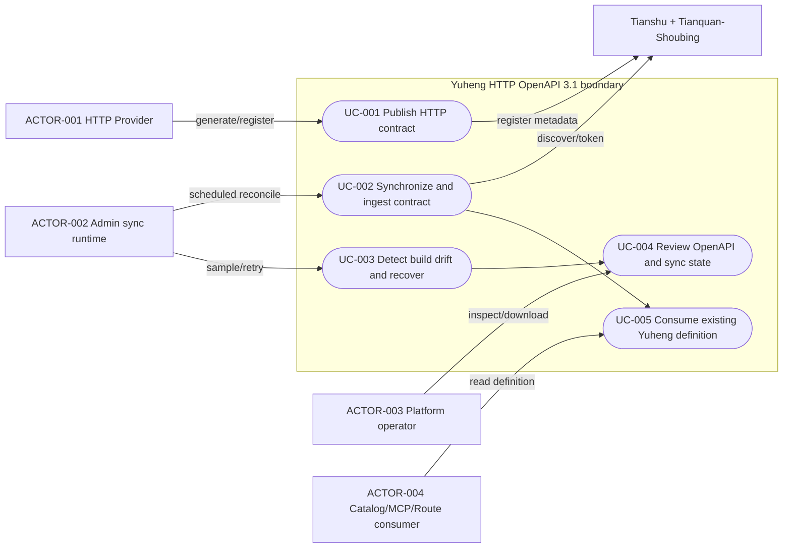
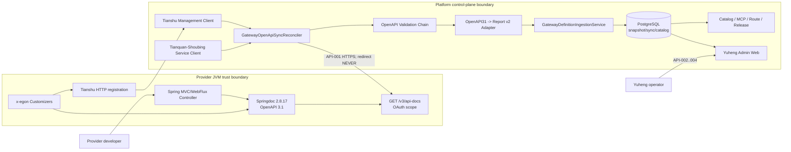
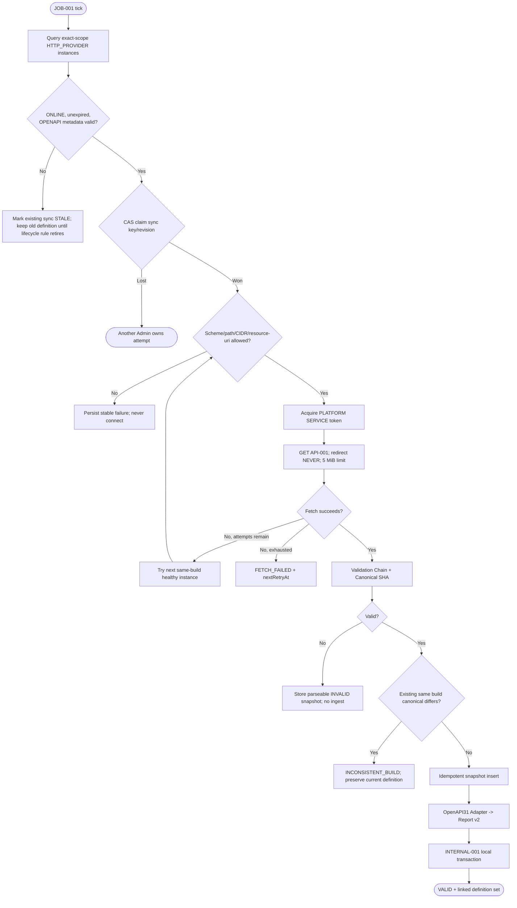
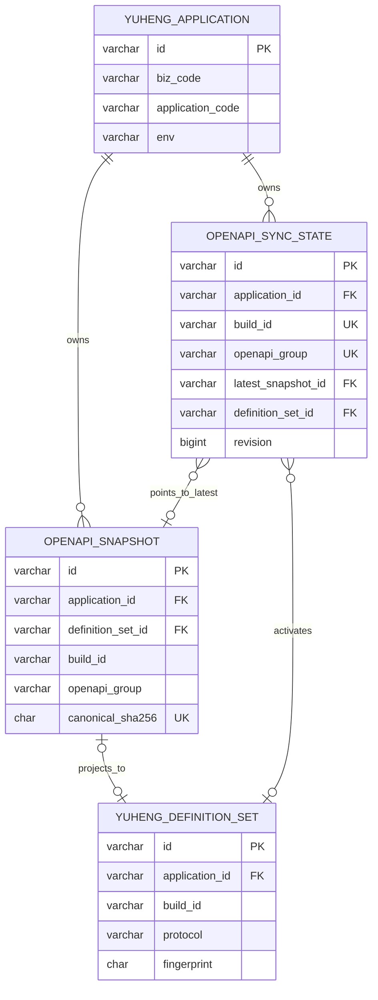

# Yuheng HTTP OpenAPI 3.1 单一事实源破坏性改造规格

| Field | Value |
| --- | --- |
| Document | [2026-08-25-19-01-yuheng-openapi31-source-refactor.md](2026-08-25-19-01-yuheng-openapi31-source-refactor.md) |
| Template Version | 6 |
| Status | Accepted |
| Type | Architecture / Refactor |
| Complexity | Complex |
| Complexity Drivers | Provider Starter、MVC/WebFlux、Tianshu、Yuheng Admin、PostgreSQL、Admin Web、MCP/Catalog/Definition 生命周期跨边界协作；公共注解与依赖破坏性切换；OAuth2 与 SSRF 防护；异步拉取、重试、多实例漂移、永久快照 |
| Created | 2026-08-25 19:01 CST |
| Updated | 2026-08-25 19:43 CST |
| Owner | User / Egon-COLA Yuheng maintainers |
| Repository | Egon-COLA |
| Scope | egon-cola-xingyuan/egon-cola-yuheng；Yuheng HTTP Provider 契约生成、Tianshu 能力声明、Admin OpenAPI 同步/持久化/投影、Admin Web 展示 |
| Change Surface | 删除 Yuheng Starter 自研 HTTP Handler/Java-Type Schema Compiler；新增 Springdoc OpenAPI 3.1 三个适配器模块；Admin 从健康 Tianshu Provider 安全拉取并永久保存 Raw OpenAPI，映射到既有 Catalog/MCP/Route Definition；新增两个表、三个管理查询接口和同步状态前端 |
| Affected Chapters | §7, §8, §9, §10, §11, §12, §13, §14, §15, §16, §17, §18 |
| Source Requirement | 用户请求“把我的网关的 openapi 相关的，改造一下”；用户于 2026-08-25 确认完整闭环、立即破坏性切换、OAuth2 安全拉取、Springdoc 2.8.17、保持当前分层、Raw OpenAPI 永久留存，并明确允许删库重建且不考虑历史数据 |
| Baseline Revision | main at 3be897e5cb4781890bfbac3104512e6e73bb943a；dirty-worktree snapshot，已有 docs/egon 下用户改动不属于本 Spec |
| Amends | None |
| Supersedes | [Yuheng 声明式 Operation Schema 与 MCP 参数装配设计](../../superpowers/specs/2026-08-07-yuheng-declarative-operation-schema-design.md) 的 §2 中 HTTP Schema 目标、§3 HTTP 非目标、§4–§8、§10.2–§10.3、§13.1 HTTP 部分、§15.1–§15.2、§16.1 HTTP 部分、§18.1–§18.2、§19 中 HTTP 自研 Schema 验收和 §20 中 HTTP 注解决策；[GWS-10 Yuheng Starter 接口定义上报 Spec](../../superpowers/specs/2026-07-25-yuheng-starter-interface-reporting-design.md) 的 §2.1、§4 中 HTTP 配置/注解、§5、§7 中 HTTP 完整集语义、§9 中 HTTP 主动上报、§10 中 HTTP 调用方、§15.1 与 §16 中 HTTP 验收 |
| Depends On | [Yuheng 声明式 Operation Schema 与 MCP 参数装配设计](../../superpowers/specs/2026-08-07-yuheng-declarative-operation-schema-design.md) §9、§10.1、§11–§12 的 RPC Protobuf、内部 Invocation Schema 与 MCP Runtime 契约；[Yuheng 注解托管 MCP 设计](../../superpowers/specs/2026-08-06-yuheng-annotation-managed-mcp-design.md) §2–§5 的 Managed Tool 投影、稳定 Tool ID 和控制面边界 |
| Related Specs | [Yuheng 多 OpenAPI Group 聚合与来源扩展增补规格](2026-08-25-19-43-yuheng-openapi-group-aggregation-amendment.md)；[Yuheng 接口 Schema 展示优化设计](../../superpowers/specs/2026-07-28-yuheng-operation-schema-presentation-design.md)；[Yuheng Engine 与 MCP Core 功能域分包设计](2026-08-19-13-51-yuheng-biz-yuheng-mcp-package-refactor.md) |
| Related Plans | [Yuheng OpenAPI 3.1 多 Group 聚合与来源扩展实施计划](../plan/2026-08-25-20-03-yuheng-openapi-group-aggregation-implementation.md) |

## 1. Summary

当前 Yuheng Starter 对 Spring MVC/WebFlux Handler、参数绑定、Jackson JavaType、Bean Validation、泛型 Wrapper 和 JSON Schema 进行自研编译，再通过 HMAC Report 将 HTTP 与 RPC Definition 一起提交给 Yuheng Admin。该链路重复了 Springdoc 已有能力，并让 HTTP 运行时事实、文档 Schema、Yuheng 治理和 MCP 治理集中在 GatewayOperation 等自定义注解中。

目标设计将 OpenAPI 3.1 确立为 HTTP Contract Source of Truth，以 Springdoc 2.8.17 生成标准文档，以 x-egon 承载 OpenAPI 不拥有的目录、暴露、幂等与 MCP 治理语义。Provider 只向 Tianshu 注册经过校验的 OpenAPI 能力定位元数据；Yuheng Admin 通过现有 DdcManagementClient 发现健康实例，使用 OAuth2 Client Credentials 拉取文档，完成 SSRF 防护、校验、Canonicalization、永久快照、不可变构建检查和到 GatewayInterfaceDefinitionReport v2 的适配，然后复用现有 Catalog、MCP、Route、Release 和 Definition Lifecycle。

本次按用户决定进行破坏性切换：不提供 HTTP Legacy Bridge，不兼容历史数据库数据，部署前由用户删除数据库并从 V1 开始重新执行全部 Flyway。V1–V11 仍保持不可变；本设计只新增 V12。RPC 继续以 Protobuf Descriptor 为唯一 Schema 事实源，Yuheng Engine 不引入 Springdoc、Swagger Core 或 OpenAPI Parser。

## 2. Background and Current State

### 2.1 Business and user context

Yuheng 平台需要让业务 Provider 使用标准 Spring/OpenAPI 开发体验，同时继续利用 Egon 已有的目录、权限、MCP、Route 和发布控制面。平台维护者需要回答某一构建实际暴露了什么 HTTP Contract、同一 build 是否发生漂移、当前同步为何失败，以及当前 Operation 对应哪一份 Raw OpenAPI。

### 2.2 Repository evidence

| Evidence ID | Classification | Exact path/symbol/decision/command | Observed fact | Design significance | Verification limit/freshness |
| --- | --- | --- | --- | --- | --- |
| EVD-001 | Static repository | egon-cola-xingyuan/pom.xml:63-67 | Java 21、Spring Boot 3.5.16，compiler parameters=true | Springdoc 选择 2.8.17；稳定 Java 参数名已具备 | 静态 POM，不证明消费应用有效 POM |
| EVD-002 | Static repository | yuheng-starter/pom.xml:19-58 | Starter 同时声明 optional WebMVC/WebFlux，并无 Springdoc | 需要协议适配器避免 RPC-only 消费者引入 OpenAPI 依赖 | 未解析外部消费者依赖树 |
| EVD-003 | Static repository | GatewayReportingAutoConfiguration:80-90, 193-313 | 当前同一 BuiltReport 聚合 MVC、WebFlux、RPC Contributor | HTTP/RPC 当前共享主动 Report 生命周期 | 不证明实际生产 Bean 组合 |
| EVD-004 | Static repository | GatewayHttpOperationMapper:73-236 | HTTP 从 HandlerMapping、自定义注解、Java Schema Mapper 生成 Operation；streaming 还读取 Java Flux 类型 | HTTP Schema Compiler 的删除边界和协议事实改造点明确 | 静态代码，不证明所有 Spring 签名 |
| EVD-005 | Static repository | GatewayInterfaceDefinitionReport:15-255 | v2 报告统一承载 HTTP/RPC、ProviderService、request/response/error Schema 和 attributes | 保留为 Admin 内部统一定义 DTO，避免重写 Catalog/MCP/Route |
| EVD-006 | Static repository | RpcGatewayDefinitionContributor:72-252 | RPC 从 RpcContractCatalog/Protobuf Descriptor 生成完整 Schema，拒绝 Java Schema 重复声明 | RPC Source of Truth 保持不变 |
| EVD-007 | Static repository | GatewayDefinitionReportService:151-210 | Admin 已有 HMAC 上报校验、reportId 幂等、buildId 不可变和共享持久化入口 | 抽出共享 Ingestion，而非另建一套 Catalog 写路径 |
| EVD-008 | Static repository | JdbcGatewayDefinitionReportRepository:267-332 | 现有 ingest 写 Definition Set、目录、Operation、Definition 和 Membership | OpenAPI 适配结果可直接复用 |
| EVD-009 | Static repository | GatewayProjectionService:620-694；DdcManagementServiceInstance | Admin 已能从 Tianshu 获取 HTTP Provider 的 host、port、secure、metadata、status、expireAt | 不新增 Tianshu subscription/API；周期协调器复用现有 Client |
| EVD-010 | Static repository | DdcServiceRegistration:95-160 | Tianshu metadata 限制业务条目 32、key 64、value 512，并拦截敏感 key | OpenAPI metadata 必须小型、无 Token/完整文档 |
| EVD-011 | Static repository | GatewayDefinitionLifecycleReconciler:158-205 | 当前只通过 metadata yuheng.definition-set-id 判断活跃 Definition Set | OpenAPI 拉取后 Provider 无法回写 set ID，生命周期需按 build + sync state 联合激活 |
| EVD-012 | Static repository | V1__create_gateway_admin_schema.sql:21-182；V11__rename_mcp_oauth_resource.sql | PostgreSQL、Flyway V1–V11、ID 为 VARCHAR(64)、JSONB、TIMESTAMPTZ | 附件 BIGINT 草案不适用；下一版本必须是 V12 |
| EVD-013 | Static repository | OperationPage.tsx:10-65；ApplicationsPage.tsx:28-157 | 前端已有 Operation Schema/Definition History 与 Application 表 | 增量增加 OpenAPI/同步状态，不嵌 Swagger UI |
| EVD-014 | Static repository | GatewayCatalogController:147-152；GatewayAdminErrorVO | 现有 Operation Detail API 暴露 PO，统一错误为 GatewayAdminErrorVO | 不扩大旧 API 的 PO 泄漏；新增独立 OpenAPI 查询契约 |
| EVD-015 | Static repository | 2026-08-07 approved Spec §3/§20 | 旧设计明确选择破坏性 HTTP Schema v2 且无兼容 | 本 Spec 通过 Supersedes 明确替换 HTTP Source；本次同样无 Legacy Bridge |
| EVD-016 | User decision | 2026-08-25 回复“1A 2B 3A 4A 5A 6A” | 完整闭环、破坏性切换、OAuth2、2.8.17、当前分层、永久留存 | 所有重大决策已闭合 |
| EVD-017 | User decision | “我会直接删库，从新创建每张表” | 无历史数据兼容、回填或滚动混跑要求 | V12 无 backfill；部署前删除 DB 是外部前置动作，本 Spec 不执行 |
| EVD-018 | External primary documentation | https://springdoc.org/；springdoc-openapi releases | 官方矩阵为 Boot 3.5.x 对应 Springdoc 2.8.x，2.8.17 是选定基线 | 依赖版本和 OpenAPI 3.1 配置依据 | 外部资料可能更新；锁版本后以依赖树和 Golden Test 为准 |

### 2.3 Problem statement and gap

当前 HTTP 路径同时维护 Spring Mapping、GatewayOperation 声明和 GatewayJavaSchemaMapper 生成结果。重复事实会产生位置、required、泛型、Wrapper、内容类型和流式判断漂移；业务开发者还需要学习一套只能服务 Egon 的 Schema Annotation。

目标不是替换 Yuheng 控制面，而是把 HTTP Contract 编译职责交回 Springdoc，并把 Egon 维护面缩小为 OpenAPI 3.1 到既有 Yuheng Model 的安全 Adapter。Raw OpenAPI 必须保留，否则 Canonical 映射错误或 Springdoc 升级漂移无法审计和重放。

### 2.4 Evidence and current-chain map

| Entry/trigger | Current call chain | Data read/written | External dependency | Consumers | Evidence |
| --- | --- | --- | --- | --- | --- |
| Provider Spring 启动 | GatewayReportingAutoConfiguration -> Mvc/WebFluxGatewayDefinitionContributor -> GatewayHttpOperationMapper -> GatewayJavaSchemaMapper -> GatewayDefinitionReportFactory | 内存 Report/Identity | Spring HandlerMapping/Jackson | GatewayReportingCoordinator | EVD-002–EVD-005 |
| Provider 主动上报 | GatewayReportingCoordinator -> GatewayReportHttpClient -> POST report -> GatewayDefinitionReportService -> JdbcGatewayDefinitionReportRepository | gateway_definition_set、目录、operation、definition、idempotency | Yuheng Admin HTTP/HMAC/PostgreSQL | Catalog、MCP、Route/Release | EVD-007–EVD-008 |
| Definition 生命周期 | GatewayDefinitionLifecycleReconciler -> GatewayProjectionService -> DdcManagementClient -> lifecycle.reconcile | Definition Set ACTIVE/RETIRED、Operation ACTIVE/OFFLINE | Tianshu Management RPC | Admin/Route/MCP | EVD-009、EVD-011 |
| Admin Web 查看 Operation | OperationPage -> gatewayApi.operation -> GatewayCatalogController -> GatewayCatalogService | 读 gateway_operation/definition | Admin HTTP | 平台管理员 | EVD-013–EVD-014 |

## 3. Goals and Non-goals

### 3.1 Goals

- 将 OpenAPI 3.1 设为 HTTP Contract 唯一事实源，并锁定 Springdoc 2.8.17。
- 标准 Spring/OpenAPI Annotation 描述 HTTP；Egon Annotation 只描述 x-egon 治理。
- MVC、WebFlux 和 RPC-only 应用依赖边界互不污染。
- Admin 安全拉取、永久保存、校验并 Canonicalize Raw OpenAPI。
- 复用既有 Operation Key、内部 Invocation Schema v2、Catalog、MCP、Route、Release。
- 明确多实例、重复拉取、超时、非法文档、构建漂移、Admin 重启和删库重建行为。
- Admin Web 展示同步状态、Operation OpenAPI 和完整文档。

### 3.2 Non-goals

- 不支持 OpenAPI 3.0、3.2、AsyncAPI 或 external $ref。
- 首版只支持一个 default Springdoc 文档，不支持 GroupedOpenApi 多组。
- 不嵌 Swagger UI/Knife4j，不提供在线调试/API Explorer。
- 不从 OpenAPI 自动创建或修改生产 Route。
- 不改变 RPC Protobuf Descriptor、Yuheng Engine、Runtime Invocation 或 Rule Snapshot。
- 不提供 HTTP Legacy Bridge、旧数据库 backfill、双读双写、滚动混跑或旧 Release 激活。
- 不执行数据库删除、服务启动、部署或生产验证。

### 3.3 Change Surface and Design Depth

| Area/layer | Disposition | Exact repository evidence | Changed or preserved behavior/contract | Required Spec treatment | Chapter(s) |
| --- | --- | --- | --- | --- | --- |
| Platform/Yuheng Maven | Affected | egon-cola-xingyuan/pom.xml；yuheng/pom.xml | Springdoc BOM；新增 openapi-common/webmvc/webflux 三模块 | 完整依赖/模块设计 | §7, §8, §13, §15, §16, §17 |
| Provider HTTP annotations/compiler | Affected | starter/annotation；discovery/http；GatewayJavaSchemaMapper | HTTP 自研 Schema 删除，标准 OpenAPI + x-egon | 完整文件/契约/删除设计 | §7, §8, §9, §10, §13, §14, §15, §16, §17, §18 |
| Tianshu HTTP registration metadata | Affected | GatewayReportingAutoConfiguration:114-139；DdcHttpRegistrationContributor | 增加经校验的 OpenAPI 定位/认证/构建元数据，不存文档 | 完整元数据与安全设计 | §7, §8, §9, §10, §14, §15, §16 |
| Admin OpenAPI sync/ingestion/lifecycle | Affected | reporting、runtime/GatewayProjectionService | 拉取、校验、快照、适配、共享 ingest、按 build 激活 | 完整复杂流/失败/并发 | §7, §8, §9, §10, §13, §14, §15, §16, §18 |
| PostgreSQL/Flyway | Affected | V1–V11 | 新增 snapshot/sync_state；无历史 backfill | 完整 V12/ER/表/索引设计 | §7, §8, §10, §11, §14, §15, §16, §18 |
| Admin 管理查询 API | Affected | application/catalog controllers | 新增 sync-state、operation-openapi、snapshot-document 查询；旧 API 不变 | 完整接口设计 | §8, §9, §10, §12, §14, §15, §16 |
| Admin Web | Affected | ApplicationsPage、OperationPage、gatewayApi、types | 状态、Tabs、Raw JSON、下载和 Source Filter | 完整页面/状态设计 | §8, §9, §10, §12, §14, §15, §16, §18 |
| RPC reporting/schema | Context-only | RpcGatewayDefinitionContributor；approved §9 | Protobuf 仍为 Schema 事实源；sourceType 仅规范为 RPC_DESCRIPTOR | 边界证据和回归 | §7, §14 |
| MCP/Catalog/Route/Release | Context-only | GatewayInterfaceDefinitionReport；McpReleaseContentFactory；Route Draft | 继续消费 Invocation Schema v2；无新编辑/自动 Route | preserved invariant | §7, §14, §16 |
| Yuheng Engine/MCP Runtime | Unchanged | yuheng-biz-gateway、yuheng-mcp-core | 不依赖 Springdoc/Swagger/OpenAPI；运行契约不变 | 一条不变记录 | §7, §14 |
| 历史数据兼容 | Not applicable | EVD-017 | 用户删库重建，无历史行 | N/A；仅定义 fresh-schema proof | §16 |

## 4. Requirements and Acceptance Criteria

| ID | Atomic requirement | Priority | Observable acceptance criteria | Source |
| --- | --- | --- | --- | --- |
| REQ-001 | HTTP Provider 由 Springdoc 2.8.17 生成 OpenAPI 3.1 | Must | MVC/WebFlux GET /v3/api-docs 返回 openapi=3.1.x 和标准 paths/components | 用户 1A/4A |
| REQ-002 | Egon 只通过 x-egon/x-egon-service 增强标准 OpenAPI | Must | HTTP 代码不再使用 Yuheng Schema Annotation；扩展 version=1 且字段完整 | 附件目标、用户 2B |
| REQ-003 | MVC、WebFlux、RPC-only 依赖隔离 | Must | MVC 适配器不引入 WebFlux，WebFlux 不引入 MVC，RPC-only 不引入 Springdoc | 用户 1A/5A |
| REQ-004 | Tianshu 只发布能力定位，不发布完整文档/Secret | Must | metadata 满足 Tianshu 限制且仅含 path/spec/build/resource-uri 等白名单 key | 用户 1A/3A |
| REQ-005 | Admin 只能安全拉取健康 Tianshu Provider | Must | OAuth2 scope、CIDR allowlist、禁止 redirect/任意 URL/userInfo/query/fragment/external ref | 用户 3A |
| REQ-006 | Admin 永久保存 Raw OpenAPI 并生成可复现 Canonical SHA | Must | 同文档重试幂等；servers/实例地址不造成不同 canonicalSha；Raw 可查询 | 用户 6A |
| REQ-007 | 同 build 不同 canonical contract 必须阻止覆盖 | Must | 状态 INCONSISTENT_BUILD；旧 VALID Definition 不被替换 | 附件/现有 immutable build |
| REQ-008 | OpenAPI 映射到既有 Report v2/Internal Invocation Schema | Must | operationKey 保持 application:http:METHOD:path；request v2 位置分组；response/error 完整 | 用户 1A |
| REQ-009 | HTTP 自研 Compiler 和 HTTP 旧注解用法立即删除 | Must | 生产代码/HTTP 测试无 Mvc/WebFlux contributor、GatewayJavaSchemaMapper、HTTP GatewayOperation/SchemaField 用法 | 用户 2B |
| REQ-010 | RPC/MCP/Route/Release/Engine 既有语义保持 | Must | RPC Descriptor Golden、Tool ID、Invocation Schema、Route/Release/Engine 回归通过 | 用户 1A、历史 Spec |
| REQ-011 | 同步异步流程有界、可恢复、可观测 | Must | 事务外拉取、DB CAS claim、最多 3 个健康实例、退避、错误状态/指标/审计 | 用户 1A/3A |
| REQ-012 | Admin Web 展示同步状态和 OpenAPI | Must | Application 状态可见；Operation OpenAPI Tab 可查看/复制/下载；错误可重试刷新 | 用户 1A |
| REQ-013 | 仅新增一个 V12，fresh DB 无 backfill | Must | V1–V11 checksum 不变；空库 migrate 成功；V12 两表/约束/索引存在 | 用户删库决定、AGENTS.md |
| REQ-014 | 不从 OpenAPI 自动生成生产 Route | Must | OpenAPI 变化只更新 Catalog/MCP Definition；Draft/Release 仍需现有流程 | 附件边界 |
| REQ-015 | 保持当前 feature-first 分层结构 | Must | 新 Admin 代码位于 openapi/controller/service/repository/domain/client/validation/converter；无 biz.* 或 Archetype 混入 | 用户 5A |

### 4.1 Scenario matrix

| Scenario | Actor/trigger | Preconditions | Main path | Alternative/failure path | Data/state change | Observable result | Requirements |
| --- | --- | --- | --- | --- | --- | --- | --- |
| MVC 首次同步 | Provider 构建部署/周期扫描 | Tianshu ONLINE；metadata 完整；OAuth 可用 | discover -> claim -> fetch -> validate -> snapshot -> adapt -> ingest | 无 | sync VALID、snapshot/definition/catalog 写入 | UI 显示 VALID/计数/hash | REQ-001–REQ-008 |
| WebFlux 首次同步 | 同上 | WebFlux adapter | 同 MVC | SSE/multipart 仍进 Catalog，MCP 投影按既有规则拒绝 | 同上 | OpenAPI content type 决定 streaming | REQ-001、REQ-008、REQ-010 |
| 重复实例相同 build/contract | 周期扫描 | A/B canonical 相同 | 首份保存；第二份命中 unique/hash | raw servers 不同被 canonical 移除 | 不新增 Definition | 状态继续 VALID | REQ-006、REQ-011 |
| 同 build 漂移 | 第二实例抽样 | canonical 不同 | 记录新快照并比较 | 标记 INCONSISTENT_BUILD，禁止 ingest/激活新定义 | 旧 VALID set 保持 | UI 红色告警/审计 | REQ-007 |
| OAuth/网络超时 | Admin fetch | Provider 健康但 token/fetch 失败 | 切下一个同 build 实例，最多 3 个 | 耗尽后 FETCH_FAILED，指数退避 | sync 错误/next_retry | 旧定义不变，可观测 | REQ-005、REQ-011 |
| SSRF/redirect | 恶意 metadata/响应 | host/path/CIDR/redirect 非法 | fetch 前/响应时拒绝 | 不跟随、不访问 | 状态 INVALID 或 FETCH_FAILED | 稳定安全错误码 | REQ-005 |
| 非法/超限 OpenAPI | Provider 文档错误 | 成功取得 bytes | size/JSON/OAS/ref/operationId/x-egon chain 校验 | INVALID；不 ingest | 可存 parseable invalid snapshot；无 Definition | UI 显示验证消息 | REQ-005、REQ-006 |
| Admin 多实例并发 | 两个调度器同时发现 | 同一 sync key/revision | 一个 CAS claim 成功 | 另一个跳过 | 单次外部 fetch/ingest | 无重复写/竞争错误 | REQ-011 |
| Provider 下线 | 生命周期协调 | 无健康 instance 对应 build | sync 标记 STALE；Definition Set 不再 active | 旧 Provider 仍在线则不退役 | Definition RETIRED/OFFLINE 按现有 Route 保护 | UI STALE | REQ-010、REQ-011 |
| 空库部署 | 用户删除数据库 | 空 PostgreSQL | V1–V12 -> Admin -> Provider 自动重新发现 | 任一步失败停止恢复流量 | 全部数据重新生成 | 无 backfill/旧数据读写 | REQ-013 |
| 平台用户查看文档 | OperationPage 打开 OpenAPI Tab | CAP_yuheng:read | 查询 operation fragment；按需查询 full snapshot | 404/INVALID 显示受控错误 | 只读 | 可复制/下载，无 Provider CORS | REQ-012 |

### 4.2 Use-case analysis

#### 4.2.1 Actor inventory

| Actor ID | Actor/role | Goal and responsibility | Entry/channel | Permission/tenant context | Evidence |
| --- | --- | --- | --- | --- | --- |
| ACTOR-001 | HTTP Provider developer/runtime | 用标准注解发布稳定 Contract | Spring code + /v3/api-docs + Tianshu registration | Provider Resource Server；scope yuheng.openapi.read | EVD-001–EVD-004 |
| ACTOR-002 | Yuheng Admin sync runtime | 获取、验证、归档、投影 Contract | Scheduled job/Tianshu/OAuth2/HTTP/PostgreSQL | PLATFORM SERVICE identity | EVD-007–EVD-011、用户 3A |
| ACTOR-003 | Yuheng platform operator | 诊断同步、漂移和历史 Contract | Applications/Operation 页面 | CAP_yuheng:read 或 CAP_* | EVD-013–EVD-014 |
| ACTOR-004 | Existing Catalog/MCP/Route/Release consumer | 继续消费统一 Operation Definition | Internal Service/DB | 现有 Yuheng 权限 | EVD-005–EVD-008 |

#### 4.2.2 Use-case artifact



| ID | Trigger/preconditions | Main success outcome | Alternatives/failures | Postconditions | Requirements | Interfaces/pages | Tests |
| --- | --- | --- | --- | --- | --- | --- | --- |
| UC-001 | Provider 启动且 OpenAPI/Resource Server 配置合法 | 标准 3.1 文档和 Tianshu 能力可发现 | 注解/operationId/配置错误使测试或 fail-fast 启动失败 | 不上报自研 HTTP Report | REQ-001–REQ-004、REQ-009 | API-001 | TEST-001–TEST-006 |
| UC-002 | Admin 周期任务、健康 Tianshu instance | VALID snapshot 与 Definition 原子关联，现有消费者可读 | timeout/auth/invalid/ingest failure 有稳定状态和重试 | 成功时 set 可被 lifecycle 激活；失败时旧 set 不变 | REQ-005–REQ-008、REQ-011 | JOB-001、INTERNAL-001 | TEST-007–TEST-018 |
| UC-003 | 同 build 多实例或重试 | 相同 hash 幂等；不同 hash 阻断 | exhaustion -> FETCH_FAILED；provider change -> reset | 无错误覆盖 | REQ-006、REQ-007、REQ-011 | JOB-001 | TEST-019–TEST-023 |
| UC-004 | 用户打开 Applications/Operation | 状态、错误、Operation fragment、完整文档可见 | denied/404/invalid 显示稳定 UI | 只读，无 Provider 直连 | REQ-012 | API-002–API-004；ApplicationsPage/OperationPage | TEST-024–TEST-031 |
| UC-005 | Release/MCP/Route 读取当前 Definition | v2 Invocation Schema、Tool ID、Route 绑定不变 | 不支持 MCP 的 multipart/streaming 继续拒绝 | Engine 无 OpenAPI 依赖 | REQ-008、REQ-010、REQ-014 | INTERNAL-001 | TEST-032–TEST-037 |

## 5. Constraints, Assumptions, and Decisions

### 5.1 Confirmed constraints

- 所有 HTTP 消费方必须同版本迁移；无 Legacy Bridge。
- 用户负责部署前删除数据库；本设计不执行该动作。
- V1–V11 不修改；V12 是本数据库变更唯一新迁移。
- Springdoc 锁定 2.8.17，OpenAPI 锁定 3.1.x。
- default 文档路径为 /v3/api-docs；首版单文档。
- 生产拉取必须 OAuth2；Admin 不接受 Provider 注册完整 URL。
- Raw OpenAPI 永久不可变留存。
- Yuheng Engine、RPC/MCP Runtime 不引入 Swagger/OpenAPI。

### 5.2 Small-gap assumptions

| ID | Inference | Repository evidence | Why locally reversible | Impact if wrong |
| --- | --- | --- | --- | --- |
| ASM-001 | 新管理 API 保持 /api/v1/yuheng/admin 前缀 | GatewayCatalogController/GatewayApplicationController | 内部路由命名，可在实现前局部调整 | 前端 client 路径更新 |
| ASM-002 | 首版仅 default OpenAPI 文档 | 附件将 group 描述为可选后续；仓库无 GroupedOpenApi | 可在后续 Spec 加 group 维度，表已保留 openapi_group | 多文档服务需后续支持 |
| ASM-003 | 每次协调最多尝试 3 个同 build 健康实例 | 现有流程要求有界；无业务 SLO 数值 | 配置项可调整，不改契约 | 故障恢复速度变化 |
| ASM-004 | x-egon-service 不写 env/namespace | Tianshu 已拥有物理 scope；Canonical 必须跨实例稳定 | 扩展字段可加版本 | 若外部工具依赖环境字段需另加 |

### 5.3 Resolved decisions

| ID | Decision | Decision owner | Evidence and rationale | Requirements |
| --- | --- | --- | --- | --- |
| DEC-001 | 完整 Provider-to-Admin-Web 闭环 | User | 选择 1A | REQ-001–REQ-014 |
| DEC-002 | HTTP 立即破坏性切换，无 Legacy Bridge | User | 选择 2B；快速迭代 | REQ-009、REQ-013 |
| DEC-003 | OAuth2 Client Credentials + Tianshu target/CIDR/redirect/ref 防护 | User | 选择 3A | REQ-005 |
| DEC-004 | Springdoc 2.8.17 | User | 选择 4A；Boot 3.5 compatibility | REQ-001、REQ-003 |
| DEC-005 | 保持当前 feature-first 分层 | User | 选择 5A；不做 Archetype/biz.* 迁移 | REQ-015 |
| DEC-006 | Raw OpenAPI 永久不可变留存 | User | 选择 6A | REQ-006 |
| DEC-007 | 删除数据库后重新自动写入，不迁移历史数据 | User | 明确回复 | REQ-013 |
| DEC-008 | RPC 保持 Protobuf Source；GatewayOperation/GatewayInterfaceGroup 仅保留 RPC 治理用途 | User + existing approved design | OpenAPI 改造只替换 HTTP；避免未请求的 RPC 治理重构 | REQ-010 |

### 5.4 Open major decisions

None。所有会改变范围、公共 HTTP 注解、数据库、安全、依赖、保留策略和架构的决策已由用户确认。

## 6. Project Technology Context

| Concern | Current choice | Repository evidence | Constraint on design |
| --- | --- | --- | --- |
| Runtime | Java 21 | egon-cola-xingyuan/pom.xml | java.time、records、HttpClient 可用 |
| Spring | Boot 3.5.16；MVC/WebFlux | xingyuan POM、provider test POM | Springdoc 2.8.17；分别适配 |
| JSON/OpenAPI | Jackson；无 Springdoc | starter/admin POM | Spring Boot Jackson；Json31 解析 |
| Persistence | PostgreSQL、JDBC/JPA、Flyway | admin POM/application/V1–V11 | V12、JSONB/TIMESTAMPTZ/VARCHAR(64) |
| Registry/Auth | Tianshu Management RPC；Tianquan-Shoubing service client | GatewayProjectionService、Idp starter | 复用 Client；PLATFORM SERVICE token |
| Frontend | React 19、TS 6、AntD 6、React Query | admin-web/package.json | 不引入 Swagger UI |
| Test | JUnit 5、Spring Boot Test、Vitest、Playwright、Testcontainers profile | POM/package scripts | Golden/contract/persistence/frontend 分层 |

### 6.1 Java architecture profile and capability baseline

| Architecture profile | Archetype/template or base package | Exact evidence and verifier | Existing deviations | Design action |
| --- | --- | --- | --- | --- |
| Traditional Layered，feature-first variant explicitly approved by user | top.egon.cola.component.yuheng.admin 下每个 feature 的 controller/service/repository/domain；starter 的 annotation/discovery/reporting | 实际目录树；用户 DEC-005；非 Archetype generated | 不使用 biz.*、service.impl；这是用户批准的现有分层实现 | 保持现状；新 openapi feature 使用 controller/service/repository/domain/client/validation/converter/scheduled，不引入第三种架构 |

| Need | Spring/JDK candidate | Spring Boot Starter candidate | Egon-COLA/module candidate | Proven gap | Decision/dependency impact |
| --- | --- | --- | --- | --- | --- |
| HTTP Contract generation | Spring Mapping/Jackson/Validation | springdoc webmvc/webflux API | 当前 GatewayJavaSchemaMapper | 当前自研重复标准能力 | 引入 Springdoc 2.8.17，删除 HTTP compiler |
| HTTP fetch | JDK HttpClient redirect NEVER | Spring RestClient/JdkClientHttpRequestFactory | 无 Yuheng 专用 client | 需要 OAuth/CIDR/size/timeout 策略 | 复用 JDK/Spring，不加另一个 HTTP client |
| Token | OAuth2 client | Tianquan-Shoubing starter | IdpServiceOAuth2Client | 无 gap | 复用 |
| Discovery | 无 | Tianshu starter | DdcManagementClient/GatewayProjectionService | 无 subscription，但现有 scheduler/pull 足够 | 不改 Tianshu public contract |
| JSON parse | Jackson | Spring Boot Jackson | ObjectMapper | 需要 OpenAPI object model | swagger-core-jakarta/Json31，由 Springdoc BOM 管理 |
| Conversion | MapStruct | common-core | BaseConverter | Swagger graph 需先归一化 | normalized DTO -> Report 使用 MapStruct + BaseConverter；图遍历由 Adapter |
| ID/time | UUIDv7、Clock | common-id starter | UuidV7/LongIdGenerator | 无 gap | 复用；Instant/TIMESTAMPTZ |
| Validation | Jakarta Validation | starter-validation | ValidationUtils | OpenAPI 语义超出 Bean Validation | 边界用 Validation；协议语义用 Chain validators |

### 6.2 User-mandated Java rule compliance

| Literal rule | Affected? | Repository evidence | Exact design decision | Files/types/interfaces | Validation/test evidence | Status/blocker |
| --- | --- | --- | --- | --- | --- | --- |
| Rule 1 | Yes | 新增 PO/DTO/VO/Enum/Service/Repository/Adapter/Validator 清单见 §8/§10 | 所有 carrier 使用 PO/DTO/VO，状态使用 Enum，行为使用准确后缀；无 Data/Info/Param/Bean | §8.3/§10.1 | 命名静态扫描 | PASS |
| Rule 2 | Yes | API、Tianshu DTO、fetch result、ingestion command 跨层 | Controller @Validated；DTO Jakarta constraints；Service @Validated/@Valid；ValidationUtils 手工 re-entry；无电话字段 | API-002–004、JOB-001、INTERNAL-001 | 正/负/组校验；libphonenumber N/A | PASS |
| Rule 3 | Yes | common-core BaseConverter；新模型可用 record | 简单 carrier 全部 record；GatewayOpenApiDefinitionConverter 为 MapStruct、实现 BaseConverter 双向 lossless normalized DTO/Report；无复杂新 data class | §10 | 编译生成、双向 mapping test | PASS |
| Rule 4 | Yes | Yuheng 当前无 lombok.config；新/触及业务 Bean | yuheng/lombok.config 复制 Qualifier；@Slf4j；显式 Bean 名；@RequiredArgsConstructor；final + 每字段 @Qualifier | openapi service/client/validator/repository/scheduled；触及的 reporting Bean | context/static/log redaction tests | PASS |
| Rule 5 | Yes | 需要 URI/hash/CIDR/sort | 只用 JDK、Spring、Jackson、已批准 Commons/Guava；无新 Utils | Adapter/Canonicalizer/Client | import/dependency scan | PASS |
| Rule 6 | Yes | API-001–004、x-egon、snapshot JSON | Spring Boot Jackson/Json31；VO 只按 wire need 使用 Jackson/Swagger 注解；未知字段由 OAS validator 处理 | VO/DTO/OpenAPI extension | serialization/golden tests | PASS |
| Rule 7 | Yes | admin application.yml/application-local.yml；provider test configs | yuheng.admin.openapi 与 yuheng.openapi 新 key 在同模块所有 profile 保持同层级；值可不同 | 两个 admin yml、provider yml、properties | key parity/config binding tests | PASS |
| Rule 9 | Yes | 多验证规则、多来源、失败/重试/状态 | Adapter 隔离 OpenAPI 3.1；Chain of Responsibility 组织 validator；共享 Ingestion Facade；不使用长 switch | §13.1 | rule ordering/short-circuit/extension tests | PASS |
| Rule 10 | Yes | sync/snapshot/VO 时间 | Java Instant/Duration/Clock；DB TIMESTAMPTZ；JSON ISO-8601 UTC | PO/VO/properties | serialization/persistence/clock tests | PASS |
| Rule 11 | Yes | 实际 feature-first 分层；用户 5A | Traditional Layered feature-first profile；不混入 biz.* 或 Archetype；Plan 必须再次确认 | §6.1/§8 | package/dependency scan | PASS |

## 7. Architecture Design

### 7.0 Minimum-design baseline and element-necessity audit

| Proposed element | Change | Requirements | Existing/direct alternative | Concrete inadequacy of alternative | Added calls/state/coupling/failures/migration/operations | Verdict |
| --- | --- | --- | --- | --- | --- | --- |
| springdoc BOM 2.8.17 | New dependency | REQ-001 | 继续 GatewayJavaSchemaMapper | 重复 Spring/Jackson/Validation 编译且漂移 | 版本/Golden gate | Add |
| openapi-common/webmvc/webflux modules | New modules | REQ-003 | 全塞 yuheng-starter | 污染 RPC-only；MVC/WebFlux classpath 不隔离 | 3 artifacts/POM upkeep | Add |
| x-egon annotations/customizers | New | REQ-002 | 扩展 GatewayOperation | 继续混合标准字段和治理 | extension version compatibility | Add |
| Tianshu OpenAPI metadata | Expand | REQ-004 | Provider 主动 POST OpenAPI | 重复传输/HMAC；无法聚合标准资源 | metadata validation | Add |
| DdcManagementClient | Keep | REQ-004 | 新 subscription | 新 Tianshu protocol 无当前必要性 | scheduler polling | Keep |
| GatewayProviderOpenApiClient | New | REQ-005 | 浏览器/Starter 转发 | CORS/内网/鉴权或仍需自研 schema | network/auth/SSRF failure | Add |
| Raw snapshot + sync state tables | New | REQ-006/011/012 | 只存派生 schema/日志 | 无法重放、审计、展示持久状态 | 永久存储/V12 | Add |
| Shared GatewayDefinitionIngestionService | New/Extract | REQ-008 | 复制 report persistence | 两条 Catalog 写路径会漂移 | internal service boundary | Add |
| OpenAPI -> Report Adapter | New | REQ-008 | 重写 Catalog | 破坏成熟控制面 | mapping/validation complexity | Add |
| 新操作 OpenAPI/快照/状态 API | New | REQ-012 | 扩展旧 PO-leaking operation response或 N+1 | 旧响应扩展扩大泄漏；N+1 不可接受 | 3 read calls/contracts | Add |
| Swagger UI/Knife4j | Candidate | None | Admin Web 自有 UI | 两套权限/目录/CORS | dependency/UI duplication | Remove |
| Contract-format SPI | Candidate | None | 直接 OpenAPI31 Adapter | 只有一个已批准格式 | interface/registry complexity | Remove |
| HTTP Legacy Bridge | Candidate | None | 同版本迁移 | 用户明确 2B | 兼容分支/双事实 | Remove |

| Path | Network calls | Client states | Server contracts/state | Failure and TOCTOU points | Additional user/business value |
| --- | --- | --- | --- | --- | --- |
| 当前主动 Report | Provider 启动 1 次及重试 | 无 Admin Web sync state | HMAC report/idempotency/definition | Provider->Admin timeout；Java schema 漂移 | 自研目录 |
| 直接只换 Springdoc、Provider 仍 POST | Provider 获取本地 doc + POST | 同当前 | 新 payload transport | 仍有主动上报、重复文档传输 | 标准 schema，但未利用 Tianshu |
| 选定 Admin pull | 每个新 build 1 次 fetch；抽样/失败有界 | DISCOVERED/FETCHING/VALID/... | 两表、sync job、3 read API | OAuth/Tianshu/fetch/validation，均可观测恢复 | 标准资源聚合、永久审计、build drift、统一 UI |

### 7.1 System Architecture Design

#### 7.1.1 Architecture Mermaid view



#### 7.1.2 Boundary and responsibility table

| Module/component | Capability and data owned | Inputs/outputs | Allowed dependencies | Forbidden responsibility | Requirements |
| --- | --- | --- | --- | --- | --- |
| yuheng-starter | RPC Report、共享 Yuheng contract/config | RPC Descriptor -> Report | yuheng-contract/RPC/Tianshu | HTTP Schema 编译/Springdoc | REQ-003、REQ-009、REQ-010 |
| yuheng-starter-openapi | x-egon、properties、customizers、metadata | Spring/OpenAPI annotations -> OpenAPI extensions | starter/springdoc-common/Tianshu/Tianquan-Shoubing properties | MVC/WebFlux runtime、fetch/Admin persistence | REQ-001–004 |
| webmvc/webflux adapters | 技术栈依赖和 docs SecurityFilterChain | API-001 | openapi-common、对应 Springdoc starter、resource server | 同时装入另一 Web stack | REQ-003、REQ-005 |
| Tianshu | Provider 身份/健康/端点/metadata | registration/management snapshot | existing contracts | 存 OpenAPI 文档 | REQ-004 |
| Admin openapi feature | sync 状态、Raw 文档、校验/适配/读取 API | Tianshu + API-001 -> snapshot/report | Tianshu/Tianquan-Shoubing/Jackson/Swagger model/DB | Route 自动创建、Engine runtime | REQ-005–014 |
| shared reporting ingestion | Definition 不可变、目录写入 | normalized Report v2 | repositories/schema validator | OpenAPI transport/URL/auth | REQ-007–010 |
| Yuheng Engine | Data plane | compiled rule | existing contracts | Springdoc/OpenAPI parsing | REQ-010、REQ-014 |

### 7.2 High-Level Design

OpenAPI endpoint 与 Tianshu 注册是 Provider-owned。Tianshu 的 exact physical application scope 与健康 instance 是拉取目标权威；x-egon-service 只提供 build-level identity，Admin 必须交叉验证 metadata、extension 和 gateway_application，不相信文档自行声明的 env/namespace。

Admin 以 applicationId + buildId + default group 为 Sync Key。发现阶段只 upsert/claim 状态；网络拉取不持有数据库事务。合法 Raw 文档先永久写 snapshot，再由 OpenApi31GatewayContractAdapter 生成 Report v2，最后通过共享 Ingestion 在一个本地事务内创建 Definition Set/Operation/Definition/Membership、链接 snapshot 和更新 sync state。Lifecycle Reconciler 将传统 metadata definition-set-id（RPC）与 VALID OpenAPI sync 的 definitionSetId 做并集。

#### 7.2.1 Critical business/control flowchart



#### 7.2.2 High-level decision and quality matrix

| Concern/use case | Required behavior | Selected mechanism | Failure/degradation behavior | Trade-off | Verification | Requirements |
| --- | --- | --- | --- | --- | --- | --- |
| Contract correctness | 标准 OpenAPI 3.1 | Springdoc + Golden fixtures | invalid -> no ingest | 版本耦合 | MVC/WebFlux contract tests | REQ-001/002 |
| SSRF/Auth | 只读健康 Provider | Tianshu tuple + CIDR + OAuth scope + no redirect/ref | fail closed | 配置/Token 依赖 | malicious target tests | REQ-005 |
| Immutable audit | Raw 永久、hash 可复现 | JSONB snapshot + canonicalizer | DB failure -> no definition | 存储增长 | hash/repository tests/metrics | REQ-006 |
| Consistency | 同 build 单 contract | CAS + unique + canonical compare | INCONSISTENT_BUILD | 额外抽样 fetch | concurrent/drift tests | REQ-007/011 |
| Compatibility | HTTP 同版本切换 | 删除 legacy，空库 | 不支持混跑 | 维护窗口 | residual scan | REQ-009/013 |
| Runtime stability | Engine/RPC 不受影响 | Report v2 boundary | OpenAPI sync failure不改变数据面当前 set | Adapter 维护 | regression suites | REQ-010/014 |

### 7.3 Detailed Design

#### 7.3.1 Detailed component collaboration

| Step | Caller -> callee | Contract/symbol | Input/output mapping | State/data effect | Failure behavior | Requirements |
| --- | --- | --- | --- | --- | --- | --- |
| 1 | Provider customizer -> Springdoc | EgonOperationCustomizer | annotations -> x-egon | 无持久化 | 缺 catalog/operationId fail-fast/test failure | REQ-001/002 |
| 2 | Provider adapter -> Tianshu contributor | gatewayOpenApiRegistrationContributor | properties/Tianquan-Shoubing resourceUri -> metadata | Tianshu lease metadata | key/length/path conflict阻止注册 | REQ-004 |
| 3 | Scheduler -> DdcManagementClient | JOB-001 | scope query -> instances | upsert sync state | Tianshu unavailable保留旧状态并计数 | REQ-004/011 |
| 4 | Scheduler -> Client | API-001 | instance tuple/token -> bounded bytes | status FETCHING | target/auth/timeout分类 | REQ-005/011 |
| 5 | Client -> Validation Chain | GatewayOpenApiDocumentDTO | bytes -> OpenAPI model/validation report | INVALID snapshot 可写 | short-circuit no ingest | REQ-005/006 |
| 6 | Canonicalizer -> repository | canonical bytes/hash | OpenAPI -> normalized bytes | snapshot idempotent insert | unique hit reuse | REQ-006/007 |
| 7 | Adapter -> Converter | GatewayOpenApiDefinitionDTO | path/method/operation/components/x-egon -> Report v2 | 无 | unresolved mapping INVALID | REQ-008 |
| 8 | Sync Service -> Ingestion | INTERNAL-001 | ingestion command -> result | Definition/Catalog/Membership + snapshot link | transaction rollback；sync INGEST_FAILED | REQ-007–010 |
| 9 | Lifecycle -> repository | active set union | RPC metadata IDs + VALID sync IDs | ACTIVE/RETIRED/OFFLINE | Tianshu stale时不推进破坏性状态 | REQ-010/011 |
| 10 | Admin Web -> controllers | API-002–004 | DB projections -> VO | read-only | standard GatewayAdminErrorVO | REQ-012 |

#### 7.3.2 Critical-path Mermaid swimlane

```mermaid
sequenceDiagram
    participant P as Provider/Springdoc
    participant D as Tianshu
    participant S as OpenAPI Sync Reconciler
    participant I as Tianquan-Shoubing
    participant V as Validation/Adapter
    participant G as Definition Ingestion
    participant DB as PostgreSQL
    participant W as Admin Web

    P->>D: Register HTTP_PROVIDER + OpenAPI metadata
    S->>D: Get exact-scope healthy instances
    D-->>S: host/port/secure/metadata/status
    S->>DB: CAS claim sync key
    alt claim won
        S->>I: Client Credentials for resourceUri/scope
        I-->>S: access token
        S->>P: GET /v3/api-docs (redirect NEVER)
        alt fetch and validation succeed
            P-->>S: OpenAPI 3.1 bytes
            S->>V: validate/canonicalize/adapt
            V-->>S: canonicalSha + Report v2
            S->>DB: insert/reuse immutable snapshot
            S->>G: INTERNAL-001 ingest command
            G->>DB: transaction: definition set/catalog/membership/link/state
            DB-->>G: accepted result
            G-->>S: VALID
        else auth/timeout/invalid/drift
            S->>DB: persist classified state/error; keep current definition
        end
    else claim lost
        S-->>S: skip duplicate work
    end
    W->>DB: API-002/003/004 read projections
    DB-->>W: state/operation/raw document
```

#### 7.3.3 Transactions, consistency, concurrency, and idempotency

| Concern/state change | Owner and boundary | Mechanism/isolation/lock | Concurrent or duplicate behavior | Commit/visibility point | Failure result | Requirements/tests |
| --- | --- | --- | --- | --- | --- | --- |
| sync claim | GatewayOpenApiSyncRepository | revision CAS，短事务 | 单 key 仅一 Admin 获得 FETCHING | CAS commit | loser skip | REQ-011/TEST-021 |
| network fetch | GatewayProviderOpenApiClient | 无 DB transaction | 同 build 最多 3 instance | bytes 完整读且 size 合法 | retry/FAILED | REQ-005/011 |
| snapshot | GatewayOpenApiSnapshotRepository | unique app/build/group/canonical | 相同 canonical reuse；不同 canonical保留用于 drift | snapshot commit | insert rollback | REQ-006/007 |
| ingestion | GatewayDefinitionIngestionService | 单 PostgreSQL transaction | report/set/build unique + existing canonicalizer | definition、membership、snapshot link、sync VALID 同时提交 | rollback；INGEST_FAILED 后续独立短事务 | REQ-007–010 |
| lifecycle | existing reconciler | active set union；Tianshu stale fail-safe | RPC/HTTP set 并存 | reconcile transaction | stale 不 retire | REQ-010/011 |

#### 7.3.4 Failure semantics, recovery, and reconciliation

| Failure point | Detection | Immediate control flow | Data/transaction state | Retry and idempotency | Caller/frontend result | Recovery/reconciliation owner | Verification |
| --- | --- | --- | --- | --- | --- | --- | --- |
| metadata/path/CIDR | validator code | no connect | sync INVALID | 配置/build 变化重置 | errorCode/message | Provider owner | malicious metadata tests |
| token denied | Tianquan-Shoubing exception/401 | next instance only if same resource；then fail | no snapshot | max 3，exponential nextRetry | FETCH_FAILED | Admin/Tianquan-Shoubing operator | auth tests |
| timeout/5xx | bounded client | next instance | no definition change | same sync key；attempt counter | FETCH_FAILED | scheduler | timeout tests |
| document too large/invalid JSON | byte counter/parse | abort | no or INVALID parseable snapshot | same build不盲重试直到 provider revision/change | INVALID | Provider owner | limit tests |
| external ref/ref bomb | validation chain | reject before resolution | INVALID snapshot | no remote fetch | INVALID messages | Provider owner | security fixtures |
| same build drift | canonical compare | stop ingest | both raw snapshots retained；current set unchanged | operator/new buildId | INCONSISTENT_BUILD | Provider owner | drift test |
| snapshot DB failure | SQL exception | no ingest | transaction rollback | scheduler retry idempotently | INGEST_FAILED | Admin operator | persistence fault test |
| ingest failure | transaction rollback | persist failure after rollback | snapshot remains VALID but unlinked；sync INGEST_FAILED | retry same snapshot/report | error visible | scheduler/Admin | rollback test |
| Admin restart after claim | stale FETCHING timeout | next reconciler reclaims using updated_at/lease | no lock held | CAS and same hashes | transient FETCHING | scheduler | restart test |

#### 7.3.5 Observability and operational boundaries

| Signal/runbook | Emitting owner and point | Fields/dimensions | Sensitive-data rule | Success/failure threshold | Alert/dashboard/operator action | Verification boundary |
| --- | --- | --- | --- | --- | --- | --- |
| gateway_openapi_sync_total | Sync Service terminal state | status, reason, specVersion | 无 app/path 高基数；不含 token/doc | INVALID/DRIFT/FETCH_FAILED 增长告警 | 查 Applications 状态和 snapshot | metric unit/static；阈值部署验证 |
| gateway_openapi_fetch_duration_seconds | Client | result | host 不作 label | p95 由环境设告警 | 检查 Provider/Tianquan-Shoubing/Tianshu | runtime only |
| gateway_openapi_document_bytes | Client/Validator | result bucket | 不记录 body | 接近 5 MiB 告警 | 拆分/缩小 schema | integration/runtime |
| structured log | Sync lifecycle | applicationId/buildId/instanceId/snapshotId/canonical prefix/errorCode | 禁止 token、authorization、完整 URI query/body | 每次 terminal one log | correlation/trace 排障 | log tests |
| audit | Ingestion/Drift | resource OPENAPI_SYNC/SNAPSHOT, before/after status/hash | 不存文档正文 | drift/valid transition | Admin audit page | persistence test |
| runbook | Operator | errorCode -> Provider/Tianquan-Shoubing/Tianshu/DB owner | 只读受权限保护 | VALID 恢复 | 新 build、修配置、等待 retry | 文档/运行环境验证 |

#### 7.3.6 Conclusion evidence chain

| Conclusion | Repository/user evidence | Constraint or requirement | Design decision | Consequence and trade-off | Verification and acceptance evidence |
| --- | --- | --- | --- | --- | --- |
| OpenAPI 只替换 HTTP source，不重写控制面 | EVD-005–EVD-008、DEC-001 | REQ-008/010/014 | Adapter 输出现有 Report v2，复用 ingest | 保留成熟模型；需维护一层 mapping | ingestion/Catalog/MCP/Route regression |
| Admin pull而非 Provider POST | EVD-009–EVD-011、DEC-003 | REQ-004–007/011 | Tianshu discovery + secure client + raw snapshot | 多一个 fetch 边界，但获得审计/漂移/聚合 | security/retry/drift/persistence tests |
| 三适配器模块 | EVD-002、DEC-004/005 | REQ-001/003 | common + MVC + WebFlux | 多三个 artifacts，避免 RPC/classpath 污染 | dependency tree/classpath tests |
| fresh DB 但迁移不可改 | EVD-012、DEC-007 | REQ-013 | V1–V11 unchanged + V12；部署前外部 drop | 无 backfill/rollback数据；保持 Flyway checksum | clean migrate/immutability scan |

## 8. Package Structure and Code File Tree

### 8.1 Current relevant tree

```text
egon-cola-xingyuan/
├── pom.xml
└── egon-cola-yuheng/
    ├── pom.xml
    ├── yuheng-contract/
    ├── yuheng-starter/
    │   └── .../starter/
    │       ├── annotation/
    │       ├── discovery/http/
    │       ├── discovery/schema/GatewayJavaSchemaMapper.java
    │       ├── discovery/rpc/RpcGatewayDefinitionContributor.java
    │       └── reporting/
    ├── yuheng-admin/
    │   ├── .../admin/{application,catalog,reporting,runtime,...}
    │   └── src/main/resources/{application.yml,application-local.yml,db/migration/V1..V11}
    ├── yuheng-admin-web/src/
    │   ├── api/{gatewayApi.ts,types.ts}
    │   └── features/{applications,interface-catalog}
    └── yuheng-test/
```

### 8.2 Target tree

```text
egon-cola-xingyuan/
├── pom.xml                                           MODIFY springdoc.version/BOM
└── egon-cola-yuheng/
    ├── lombok.config                                 CREATE Qualifier propagation
    ├── pom.xml                                       MODIFY modules/dependencyManagement
    ├── yuheng-contract/
    │   └── .../reporting/GatewayDefinitionSourceTypeEnum.java CREATE
    ├── yuheng-starter/
    │   ├── pom.xml                                   MODIFY remove Web MVC/WebFlux
    │   └── .../starter/
    │       ├── annotation/
    │       │   ├── EgonHttpService.java              DELETE
    │       │   ├── GatewayRequestLocation.java       DELETE
    │       │   ├── GatewayRequestSchemaField.java    DELETE
    │       │   ├── GatewayResponseSchema.java        DELETE
    │       │   ├── GatewaySchemaField.java           DELETE
    │       │   ├── GatewaySchemaRequired.java        DELETE
    │       │   ├── GatewaySchemaShape.java           DELETE
    │       │   ├── GatewaySchemaType.java            DELETE
    │       │   ├── GatewayInterfaceGroup.java        MODIFY retain RPC-only contract
    │       │   └── GatewayOperation.java             MODIFY retain RPC governance; remove HTTP schema members
    │       ├── discovery/http/                       DELETE complete package
    │       ├── discovery/schema/GatewayJavaSchemaMapper.java DELETE
    │       ├── discovery/rpc/RpcGatewayDefinitionContributor.java MODIFY sourceType=RPC_DESCRIPTOR
    │       └── GatewayReportingAutoConfiguration.java MODIFY RPC-only contributor/report
    ├── yuheng-starter-openapi/
    │   ├── pom.xml                                   CREATE springdoc common
    │   ├── .../openapi/annotation/
    │   │   ├── EgonApiCatalog.java                   CREATE
    │   │   ├── EgonGatewayPolicy.java                CREATE
    │   │   └── EgonMcpTool.java                      CREATE
    │   ├── .../openapi/config/
    │   │   ├── GatewayOpenApiProperties.java         CREATE
    │   │   └── GatewayOpenApiAutoConfiguration.java  CREATE
    │   ├── .../openapi/customizer/
    │   │   ├── EgonOperationCustomizer.java          CREATE
    │   │   └── EgonOpenApiCustomizer.java            CREATE
    │   └── .../openapi/registration/GatewayOpenApiRegistrationContributor.java CREATE
    ├── yuheng-starter-openapi-webmvc/
    │   ├── pom.xml                                   CREATE
    │   └── .../webmvc/GatewayOpenApiWebMvcSecurityAutoConfiguration.java CREATE
    ├── yuheng-starter-openapi-webflux/
    │   ├── pom.xml                                   CREATE
    │   └── .../webflux/GatewayOpenApiWebFluxSecurityAutoConfiguration.java CREATE
    ├── yuheng-admin/
    │   ├── pom.xml                                   MODIFY MVC adapter/swagger/common-core/lombok
    │   ├── .../admin/openapi/
    │   │   ├── controller/GatewayOpenApiController.java CREATE
    │   │   ├── client/GatewayProviderOpenApiClient.java CREATE
    │   │   ├── service/{GatewayOpenApiSyncService,GatewayOpenApiQueryService}.java CREATE
    │   │   ├── scheduled/GatewayOpenApiSyncReconciler.java CREATE
    │   │   ├── validation/{GatewayOpenApiValidationChain,GatewayOpenApiValidationRule}.java CREATE
    │   │   ├── validation/rule/{DocumentEnvelope,OpenApi31,Reference,Limit,EgonExtension,McpProjection}Validator.java CREATE
    │   │   ├── converter/{GatewayOpenApi31ContractAdapter,GatewayOpenApiDefinitionConverter,GatewayOpenApiInvocationSchemaAdapter}.java CREATE
    │   │   ├── repository/{GatewayOpenApiSnapshotRepository,GatewayOpenApiSyncRepository}.java CREATE
    │   │   ├── repository/jdbc/{JdbcGatewayOpenApiSnapshotRepository,JdbcGatewayOpenApiSyncRepository}.java CREATE
    │   │   └── domain/{dto,po,vo,enums,exception}/... CREATE exact models in §10
    │   ├── .../admin/reporting/service/GatewayDefinitionIngestionService.java CREATE
    │   ├── .../admin/reporting/{service,repository,jdbc,scheduled}/... MODIFY shared source scope/lifecycle
    │   ├── src/main/resources/application.yml        MODIFY
    │   ├── src/main/resources/application-local.yml  MODIFY
    │   └── src/main/resources/db/migration/V12__add_gateway_openapi_sync.sql CREATE
    ├── yuheng-admin-web/src/
    │   ├── api/{gatewayApi.ts,types.ts,gatewayApi.test.ts} MODIFY
    │   ├── features/applications/{ApplicationsPage.tsx,ApplicationsPage.test.tsx} MODIFY
    │   └── features/interface-catalog/{CatalogPage,OperationPage,SchemaPanel}*.tsx MODIFY
    └── yuheng-test/
        ├── ...-test-http-provider/pom.xml             MODIFY use MVC adapter
        ├── ...-test-webflux-http-provider/pom.xml     MODIFY use WebFlux adapter
        ├── ...-test-mcp-provider/pom.xml              MODIFY use MVC adapter
        ├── provider controllers                       MODIFY standard/x-egon annotations
        └── src/test/resources/openapi/*.json          CREATE Golden fixtures
```

Repository-local HTTP annotation migration also modifies these exact controller groups:

- admin: application, auth, catalog, credential, group, nine mcp controllers, observability, release, reporting, routing, runtime, scope and shared exception handler listed by EVD repository scan;
- test-http-provider: BehaviorController、InventoryController、OrderController、ProviderIdentityController；
- test-webflux-http-provider: ProviderIdentityController、ReactiveInventoryController、StreamingTransportController；
- test-tianquan-shoubing-backend: MockBackendController；
- test-mcp-provider: McpJobController。

### 8.3 Package and file responsibilities

| Operation | Path/package | Symbols | Responsibility | Dependencies | Requirements |
| --- | --- | --- | --- | --- | --- |
| Create | starter-openapi | annotations/customizers/properties/registration | 标准文档治理扩展和能力声明 | springdoc-common/Tianshu/Tianquan-Shoubing properties | REQ-001–004 |
| Create | starter-openapi-webmvc/webflux | security auto-config | 对应 Web stack + API-001 OAuth protection | Springdoc API/resource server | REQ-003/005 |
| Delete | starter discovery/http + Java schema | current compiler classes | 消除第二 HTTP 类型系统 | None after delete | REQ-009 |
| Modify | GatewayOperation/Group/RPC contributor | RPC-only annotations/source type | 保持 Protobuf，移除 HTTP Schema members | RPC | REQ-009/010 |
| Create | admin/openapi | sync/client/validator/adapter/repository/query | OpenAPI control plane feature | Tianshu/Tianquan-Shoubing/Jackson/PostgreSQL | REQ-005–012 |
| Extract | reporting/service | GatewayDefinitionIngestionService | transport-neutral validate/build/ingest | existing repositories | REQ-008–010 |
| Modify | Lifecycle reconciler/repository | active-set union | RPC metadata + OpenAPI sync activation | Tianshu/DB | REQ-010/011 |
| Create | V12 | two tables | snapshot/sync durable state | PostgreSQL/Flyway | REQ-006/011/013 |
| Modify | admin-web | sync/OpenAPI panels | read-only operator experience | existing React/AntD/Query | REQ-012 |

## 9. Interface Definitions

### 9.1 Interface Inventory

| ID | Change/necessity verdict | Name/purpose | Kind | Consumer | Owner | Method + URL / symbol / topic | Input | Output | Auth/tenant | Error model | Idempotency/version | Requirements |
| --- | --- | --- | --- | --- | --- | --- | --- | --- | --- | --- | --- | --- |
| API-001 | New/Add | Provider OpenAPI 3.1 document | HTTP | Yuheng Admin | Provider adapter | GET /v3/api-docs | Bearer token | OpenAPI JSON | SCOPE_yuheng.openapi.read；resource URI | OAuth/HTTP | safe read；3.1.x | REQ-001–005 |
| API-002 | New/Add | 查询 OpenAPI sync states | HTTP | ApplicationsPage | Admin openapi | GET /api/v1/yuheng/admin/openapi/sync-states | scope filters | List<GatewayOpenApiSyncStateVO> | CAP_yuheng:read | GatewayAdminErrorVO | safe read；v1 additive | REQ-011/012 |
| API-003 | New/Add | 查询 Operation 的 OpenAPI fragment | HTTP | OperationPage | Admin openapi | GET /api/v1/yuheng/admin/operations/{operationId}/openapi | operationId | GatewayOperationOpenApiVO | CAP_yuheng:read | GatewayAdminErrorVO | safe read；current definition snapshot | REQ-012 |
| API-004 | New/Add | 读取完整 immutable snapshot | HTTP | OperationPage download/view | Admin openapi | GET /api/v1/yuheng/admin/openapi/snapshots/{snapshotId}/document | snapshotId | GatewayOpenApiDocumentVO | CAP_yuheng:read | GatewayAdminErrorVO | safe read；immutable | REQ-006/012 |
| JOB-001 | New/Add | OpenAPI sync reconciliation | Scheduled job | Platform runtime | Admin openapi | GatewayOpenApiSyncReconciler.reconcile() | configured interval | terminal states/metrics | PLATFORM SERVICE | classified states | CAS sync key | REQ-004–011 |
| INTERNAL-001 | New/Add | shared Definition ingestion | Internal Service | Report service/OpenAPI sync | Admin reporting | GatewayDefinitionIngestionService.ingest(command) | validated command | report result | caller-resolved application | exceptions/transaction | definition/report/build IDs | REQ-007–010 |

### 9.2 Per-interface Detailed Contracts

#### 9.2.1 API-001 — Provider OpenAPI document

##### Necessity and interaction-cost decision

| Concern | Decision |
| --- | --- |
| Change classification | New standard endpoint supplied by Springdoc adapter |
| Independent consumer goal | Admin obtains authoritative HTTP Contract and Raw audit source |
| Parameter ownership and derivation | Target host/scheme/port/path/resourceUri derive from trusted Tianshu metadata；caller never supplies URL |
| Direct/no-new-interface alternative | 自研 Report cannot provide standard source/raw replay；Provider POST retains duplicate compiler/transport |
| Caller use of result | 校验、存档、映射，不转发回 Provider |
| Round trips and failure points | 每个新 build 一次；same-build sample；OAuth/timeout/size/validation |
| Verdict | Add，REQ-001–006 |

##### Identity and purpose

| Concern | Definition |
| --- | --- |
| Purpose/owner/consumer | Provider-owned OpenAPI 3.1；consumer 仅 Yuheng Admin |
| Protocol and endpoint | HTTPS GET /v3/api-docs；实际 path 必须等于 Tianshu metadata 的绝对 path |
| Content type/version | application/json；openapi 3.1.x |
| Auth/permission/tenant | Bearer PLATFORM SERVICE token；authority SCOPE_yuheng.openapi.read；resourceUri 来自 Provider Tianquan-Shoubing 配置并写 Tianshu metadata |
| Timeout/retry/rate limit | connect 3s、read 10s、document 5 MiB；同 build 最多 3 instance；不跟 redirect |
| Idempotency/concurrency | GET；canonical hash 去重；build drift 阻止 ingest |

##### Request parameters

| Name | Location | Type/format | Required/null | Default | Validation/range/enum | Meaning | Example | Source |
| --- | --- | --- | --- | --- | --- | --- | --- | --- |
| Authorization | Header | Bearer JWT | Required | None | 包含 yuheng.openapi.read；aud/resource 符合 Provider | Admin service credential | Bearer *** | Tianquan-Shoubing |
| Accept | Header | media type | Optional | application/json | 只接受 JSON | 响应格式 | application/json | Admin client |

Body、Query、Cookie、Multipart：None。

##### Success response

```jsonc
{
  "openapi": "3.1.0", // Required. Supported OpenAPI version; must start with 3.1.
  "info": { // Required. Provider document identity.
    "title": "Order Service", // Required non-blank service title.
    "version": "5.3.3" // Required contract/artifact display version.
  },
  "paths": { // Required non-empty path map; each HTTP operation remains atomic.
    "/orders/{id}": { // Required example path item; every key is an absolute OpenAPI path template.
      "get": { // Required example operation; supported method keys use lowercase OpenAPI names.
        "operationId": "getOrder", // Required for every x-egon-catalogued operation; globally unique.
        "summary": "查询订单", // Standard OpenAPI summary.
        "parameters": [], // Standard Path/Query/Header/Cookie parameters.
        "responses": {}, // Required OpenAPI responses map.
        "x-egon": {} // Optional only for unmanaged operations; required versioned governance for managed operations.
      }
    }
  },
  "components": { // Optional. Local reusable components; all refs must remain under #/.
    "schemas": {} // Optional reusable schema map; local component references only.
  },
  "x-egon-service": { // Required for an Egon Provider document.
    "version": 1, // Required extension contract version.
    "bizCode": "trade", // Required; must match Tianshu/application scope.
    "applicationCode": "order-service", // Required; must match Tianshu/application scope.
    "artifactVersion": "5.3.3", // Required immutable artifact version.
    "buildId": "build-20260825-001" // Required immutable build identity.
  }
}
```

完整动态字段语义以 OpenAPI 3.1.2 为规范；Egon 额外要求见 §10。

##### Error responses

| Condition | HTTP/protocol status | Business code | Response shape | Retryable | Frontend handling |
| --- | --- | --- | --- | --- | --- |
| Token missing/invalid | 401 | OAuth standard | Provider security response | token refresh一次 | N/A |
| Scope/resource denied | 403 | OAuth standard | Provider security response | No | N/A |
| Provider failure | 5xx | Provider-defined | not trusted/stored as contract | next instance | N/A |
| Document too large | Admin client abort | YUHENG_OPENAPI_DOCUMENT_TOO_LARGE | sync state | No until new build | Applications error |

Provider OAuth error bodies are generated by the configured Spring Security resource server and are treated as untrusted Non-JSON error or OAuth JSON by Admin; Admin never persists them as OpenAPI。The stable Admin-side classified error representation is:

```jsonc
{
  "code": "YUHENG_OPENAPI_FETCH_FORBIDDEN", // Stable sync failure code after Provider returns 401/403.
  "message": "provider denied OpenAPI read", // Safe summary without token, host query, or response body.
  "retryable": false // Whether the scheduler may retry the unchanged build automatically.
}
```

##### Interface logic for frontend and consumers

1. Admin derives target only from exact Tianshu healthy instance.
2. It validates scheme/path/CIDR/resourceUri before token or network.
3. It acquires a least-privilege token and sends no user credential.
4. It reads bounded bytes without redirect.
5. It never logs body/token/full URL query。
6. Retry switches only among same application/build instances.
7. Browser never calls Provider directly。

##### Compatibility and verification

No legacy HTTP Report compatibility. Contract tests cover MVC/WebFlux、security、OpenAPI/x-egon、size/redirect。Springdoc upgrade requires Golden diff approval。

#### 9.2.2 API-002 — Query OpenAPI sync states

##### Necessity and interaction-cost decision

| Concern | Decision |
| --- | --- |
| Change classification | New bulk read |
| Independent consumer goal | Operator monitors all filtered applications/builds |
| Parameter ownership and derivation | scope filters already user-selected；status is server-owned |
| Direct/no-new-interface alternative | Extending ApplicationVO affects four APIs；per-app query creates N+1 |
| Caller use of result | Displays/join by applicationId；not forwarded |
| Round trips and failure points | One parallel read with applications query；read-only |
| Verdict | Add，REQ-011/012 |

##### Identity and purpose

| Concern | Definition |
| --- | --- |
| Purpose/owner/consumer | Bulk sync monitoring owned by Admin openapi；ApplicationsPage is the approved consumer |
| Protocol and endpoint | HTTP GET /api/v1/yuheng/admin/openapi/sync-states |
| Content type/version | application/json；management API v1 |
| Auth/permission/tenant | Bearer Admin principal；CAP_yuheng:read or CAP_*；scope filters remain authorization-constrained |
| Timeout/retry/rate limit | ordinary Admin read timeout；frontend may manually refresh；no automatic command retry |
| Idempotency/concurrency | safe read；results are point-in-time projections ordered by applicationId/buildId/group |

No pagination because current Applications list is unpaged and result cardinality is bounded by active yuheng applications；deterministic order applicationId、buildId、openapiGroup。

##### Request parameters

| Name | Location | Type/format | Required/null | Default | Validation/range/enum | Meaning | Example | Source |
| --- | --- | --- | --- | --- | --- | --- | --- | --- |
| bizCode | Query | string | Optional | all authorized | blank treated absent；max 128 | business filter | trade | UI scope |
| namespace | Query | string | Optional | all authorized | blank absent；max 128 | namespace filter | default | UI scope |
| env | Query | string | Optional | all authorized | blank absent；max 64 | env filter | prod | UI scope |
| appCode | Query | string | Optional | all authorized | blank absent；max 128 | application filter | order-service | UI scope |

Body/Header业务字段/Cookie/Multipart：None；认证来自 Security Context。

##### Success response

```jsonc
[
  {
    "id": "01993f87-3dc1-7f0c-a2bb-8a83aee9b111", // Required. Sync-state resource UUIDv7.
    "applicationId": "01993f87-3dc1-7f0c-a2bb-8a83aee9b222", // Required. Yuheng application ID used for frontend join.
    "buildId": "build-20260825-001", // Required immutable provider build.
    "artifactVersion": "5.3.3", // Required provider artifact version.
    "openapiGroup": "default", // Required; V1 only supports default.
    "status": "VALID", // Required enum defined in §10.6.
    "snapshotId": "01993f87-3dc1-7f0c-a2bb-8a83aee9b333", // Nullable. Latest snapshot when one exists.
    "definitionSetId": "01993f87-3dc1-7f0c-a2bb-8a83aee9b444", // Nullable. Linked definition set after successful ingestion.
    "operationCount": 128, // Nullable until a parsed snapshot exists.
    "schemaCount": 43, // Nullable until a parsed snapshot exists.
    "canonicalSha256": "d7a8fbb307d7809469ca9abcb0082e4f8d5651e46d3cdb762d02d0bf37c9e592", // Nullable; full 64-char SHA-256 when valid/invalid snapshot exists.
    "lastErrorCode": null, // Nullable stable failure code.
    "lastErrorMessage": null, // Nullable safe operator message; no token/body/secret.
    "lastAttemptAt": "2026-08-25T11:01:00Z", // Nullable UTC Instant.
    "lastSuccessAt": "2026-08-25T11:01:01Z", // Nullable UTC Instant.
    "nextRetryAt": null // Nullable UTC Instant for retryable terminal state.
  }
]
```

Empty result is []，never null。

##### Error responses

```jsonc
{
  "code": "YUHENG_ADMIN_VALIDATION_FAILED", // Stable code for invalid filters.
  "message": "request validation failed", // Safe summary.
  "currentRevision": null, // Not used by this read.
  "errors": [ // Field-level violations.
    {
      "path": "bizCode", // Rejected query field.
      "code": "INVALID", // Stable validation category.
      "message": "size must be between 0 and 128" // Safe reason.
    }
  ],
  "timestamp": "2026-08-25T11:01:00Z" // Server UTC Instant.
}
```

401/403 use current security behavior；422 validation；500 masked internal error。

##### Interface logic for frontend and consumers

1. Scope comes from authenticated Admin UI selection.
2. Controller method validation runs before service.
3. Query joins sync/snapshot projections without external Tianshu call.
4. Read-only transaction；no cache required initially.
5. Result sorted deterministically。
6. Missing sync row means UI NOT_DISCOVERED，not an error。
7. ApplicationsPage loads applications and states in parallel, displays worst/latest state and refresh button that only re-fetches queries。

##### Compatibility and verification

New contract only。Verify empty/filter/order/null/time/error/security and frontend join。No command-time TOCTOU because read-only monitoring。

#### 9.2.3 API-003 — Query Operation OpenAPI fragment

##### Necessity and interaction-cost decision

| Concern | Decision |
| --- | --- |
| Change classification | New read |
| Independent consumer goal | Inspect exact current Operation source and governance |
| Parameter ownership and derivation | operationId from route；snapshot resolved server-side through current definition |
| Direct/no-new-interface alternative | Extending existing PO-leaking detail response expands leakage/contract |
| Caller use of result | Displays OpenAPI tab and obtains snapshotId |
| Round trips and failure points | Lazy one call when tab opens |
| Verdict | Add，REQ-012 |

##### Identity and purpose

| Concern | Definition |
| --- | --- |
| Purpose/owner/consumer | Resolve the current Yuheng Operation back to its exact OpenAPI source；OperationPage consumer |
| Protocol and endpoint | HTTP GET /api/v1/yuheng/admin/operations/{operationId}/openapi |
| Content type/version | application/json；management API v1 |
| Auth/permission/tenant | Bearer Admin principal；CAP_yuheng:read or CAP_* |
| Timeout/retry/rate limit | local PostgreSQL read only；frontend retry is explicit |
| Idempotency/concurrency | immutable snapshot read；a current-definition change is visible on the next query |

The current Definition must come from sourceType OPENAPI and have a linked snapshot。

##### Request parameters

| Name | Location | Type/format | Required/null | Default | Validation/range/enum | Meaning | Example | Source |
| --- | --- | --- | --- | --- | --- | --- | --- | --- |
| operationId | Path | string UUIDv7/simple | Required | None | non-blank；max 64 | Yuheng operation resource | 019... | Router |

##### Success response

```jsonc
{
  "operationId": "01993f87-3dc1-7f0c-a2bb-8a83aee9b555", // Required Yuheng operation database identity.
  "operationKey": "order-service:http:GET:/orders/{id}", // Required stable Yuheng identity.
  "snapshotId": "01993f87-3dc1-7f0c-a2bb-8a83aee9b333", // Required immutable OpenAPI snapshot identity.
  "openapiVersion": "3.1.0", // Required document version.
  "openapiGroup": "default", // Required document group.
  "path": "/orders/{id}", // Required exact OpenAPI path.
  "method": "GET", // Required uppercase HTTP method.
  "openapiOperationId": "getOrder", // Required stable OpenAPI operationId.
  "requestContentTypes": [], // Required sorted media-type list.
  "responseContentTypes": ["application/json"], // Required sorted media-type list.
  "operation": {}, // Required raw JSON object for this OpenAPI Operation, including standard fields and x-egon.
  "syncedAt": "2026-08-25T11:01:01Z" // Required snapshot validation Instant.
}
```

##### Error responses

Use GatewayAdminErrorVO。404 YUHENG_ADMIN_NOT_FOUND for absent operation/snapshot；409 YUHENG_OPENAPI_SOURCE_NOT_AVAILABLE when current source is MANUAL/RPC_DESCRIPTOR；401/403 current security。

```jsonc
{
  "code": "YUHENG_OPENAPI_SOURCE_NOT_AVAILABLE", // Stable conflict code when the current Operation is not sourced from OpenAPI.
  "message": "current operation has no OpenAPI source", // Safe operator-readable reason.
  "currentRevision": null, // This read does not use optimistic resource revision.
  "errors": [], // No field errors for a source-type conflict.
  "timestamp": "2026-08-25T11:01:00Z" // Server UTC Instant.
}
```

##### Interface logic for frontend and consumers

1. Validate authenticated read permission and operationId.
2. Resolve current_definition_id -> definition_set_id -> snapshot。
3. Verify sourceType OPENAPI and operation path/method entry exists。
4. Return raw fragment plus derived sorted content types。
5. No external fetch/database write。
6. Snapshot immutability removes race；a later current definition produces a later query result。
7. OperationPage lazy caches by operationId/currentDefinitionId and shows denied/not-available/error separately。

##### Compatibility and verification

New contract。Tests cover HTTP success、RPC/MANUAL conflict、missing snapshot、security、raw extension preservation。

#### 9.2.4 API-004 — Read immutable OpenAPI snapshot document

##### Necessity and interaction-cost decision

| Concern | Decision |
| --- | --- |
| Change classification | New read |
| Independent consumer goal | View/copy/download the complete historical document |
| Parameter ownership and derivation | snapshotId from API-003 or status view |
| Direct/no-new-interface alternative | Embedding up to 5 MiB in API-003 wastes every tab request |
| Caller use of result | Full viewer/download/audit |
| Round trips and failure points | On-demand only；immutable cacheable |
| Verdict | Add，REQ-006/012 |

##### Identity and purpose

| Concern | Definition |
| --- | --- |
| Purpose/owner/consumer | Return one complete immutable Raw OpenAPI snapshot for authorized review/download |
| Protocol and endpoint | HTTP GET /api/v1/yuheng/admin/openapi/snapshots/{snapshotId}/document |
| Content type/version | application/json；management API v1；ETag=canonicalSha256 |
| Auth/permission/tenant | Bearer Admin principal；CAP_yuheng:read or CAP_* |
| Timeout/retry/rate limit | local PostgreSQL read；document cap 5 MiB；Cache-Control private, immutable |
| Idempotency/concurrency | immutable read；same ID and ETag always represent the same JSON value |

##### Request parameters

| Name | Location | Type/format | Required/null | Default | Validation/range/enum | Meaning | Example | Source |
| --- | --- | --- | --- | --- | --- | --- | --- | --- |
| snapshotId | Path | string | Required | None | non-blank；max 64 | snapshot identity | 019... | API-003/UI |

##### Success response

```jsonc
{
  "snapshotId": "01993f87-3dc1-7f0c-a2bb-8a83aee9b333", // Required immutable snapshot identity.
  "applicationId": "01993f87-3dc1-7f0c-a2bb-8a83aee9b222", // Required owning Yuheng application.
  "buildId": "build-20260825-001", // Required provider build.
  "openapiVersion": "3.1.0", // Required document version.
  "documentSha256": "a3f825f004f4b4d11e06e8148d597d4e5db836588337d57d4ccb5c448594e5cf", // Required SHA-256 of exact received bytes.
  "canonicalSha256": "d7a8fbb307d7809469ca9abcb0082e4f8d5651e46d3cdb762d02d0bf37c9e592", // Required SHA-256 after Egon canonicalization.
  "document": {}, // Required complete parsed Raw OpenAPI JSON; preserved exactly at JSON value level.
  "fetchedAt": "2026-08-25T11:01:00Z", // Required fetch completion Instant.
  "validatedAt": "2026-08-25T11:01:01Z" // Required validation completion Instant.
}
```

##### Error responses

404 standard not found；401/403 standard security；500 masked。Invalid snapshots remain readable to authorized operators when JSON parse succeeded。

```jsonc
{
  "code": "YUHENG_ADMIN_NOT_FOUND", // Stable code when the snapshot ID does not exist or is not visible.
  "message": "OpenAPI snapshot was not found", // Safe message without provider location.
  "currentRevision": null, // Immutable snapshot reads do not use revision conflicts.
  "errors": [], // No field-level error for an absent resource.
  "timestamp": "2026-08-25T11:01:00Z" // Server UTC Instant.
}
```

##### Interface logic for frontend and consumers

1. Authorize CAP_yuheng:read。
2. Lookup immutable snapshot by ID。
3. Return stored JSONB and hashes without Provider call。
4. ETag supports conditional read。
5. Audit access only if repository policy already audits reads；no new high-volume read audit。
6. No retry beyond ordinary GET。
7. Frontend formats JSON, copies via clipboard and generates local download Blob；no CORS/Provider address exposure。

##### Compatibility and verification

New immutable read。Tests cover ETag、5 MiB document、invalid-but-parseable snapshot、not found/security、frontend copy/download。

#### 9.2.5 JOB-001 — OpenAPI sync reconciliation

##### Necessity and interaction-cost decision

| Concern | Decision |
| --- | --- |
| Change classification | New scheduled job |
| Independent consumer goal | Automatically converge Tianshu Provider contracts into Admin |
| Parameter ownership and derivation | Admin configuration owns cadence/batch/retry limits；Tianshu supplies Provider observations；database owns the durable cursor and CAS revision |
| Direct/no-new-interface alternative | Tianshu has no current Admin subscription contract；manual/UI trigger cannot guarantee convergence |
| Caller use of result | Admin scheduler consumes persisted terminal states and metrics；lifecycle reconciler consumes VALID links |
| Round trips and failure points | One Tianshu list per tick plus only new/retry/drift build fetches；Tianshu、OAuth、Provider、validation and database may fail independently |
| Verdict | Add，REQ-004–011 |

##### Identity and purpose

Named Bean gatewayOpenApiSyncReconciler is the sole scheduled reconciliation entry。It runs with fixed delay from a Duration property whose default is PT30S，discovers capable Providers and converges each application/build/default-group key into a durable terminal state。Per-key database CAS prevents overlap across threads or multiple Admin replicas。

##### Request parameters

This is not an HTTP interface and has no user payload。The invocation reads validated configuration for delay、batch size、timeouts、retry bounds and allowed network ranges；active Yuheng applications from PostgreSQL；Tianshu service-instance snapshots；and existing gateway_openapi_sync_state rows。The current tick timestamp comes from the injected Clock，not from Provider input。

##### Success response

The job returns no public value。A successful tick persists zero or more state transitions，increments success/failure/status metrics and emits bounded structured audit entries without tokens、Provider bodies or resolved private addresses。No eligible candidate is a successful no-op；a valid ingested candidate ends as VALID with snapshotId and definitionSetId。

##### Error responses

Errors never terminate the scheduler thread。A stale or unavailable Tianshu observation aborts the tick without marking builds STALE；lost CAS claims are benign skips；fetch、validation and ingestion failures are classified into durable states with safe codes/messages。Only FETCH_FAILED and INGEST_FAILED receive nextRetryAt with bounded exponential backoff and jitter；INVALID and INCONSISTENT_BUILD wait for a changed build or Provider revision。

##### Interface logic for frontend and consumers

1. Read configuration and Clock，then list active applications and one coherent Tianshu snapshot。
2. Abort safely when Tianshu is unavailable or stale；do not retire Definition Sets from incomplete evidence。
3. Filter instances by explicit OpenAPI capability and resolve the application/build/default-group sync key。
4. Upsert discovery state，select only new、changed or due-retry keys and claim each with revision CAS。
5. Fetch outside any database transaction through OAuth2 and SSRF-safe client controls，then persist exact/canonical hashes and validation outcome。
6. For a valid new contract，invoke INTERNAL-001 and atomically link the resulting Definition Set；otherwise persist the classified terminal state。
7. Reconcile healthy VALID Definition Set IDs into lifecycle visibility，record metrics/audit and release the key for the next fixed-delay tick。

##### Compatibility and verification

Fresh-database cutover only；there is no legacy report-derived HTTP fallback or dual-run scheduler。Verification covers property binding、no-overlap CAS、multi-replica contention、stale Tianshu fail-safe、OAuth/SSRF timeouts、retry jitter、restart recovery、same-build drift and PostgreSQL integration。Runtime startup is a later manual check and is not performed while writing this Spec。

#### 9.2.6 INTERNAL-001 — Shared Definition ingestion

##### Necessity and interaction-cost decision

| Concern | Decision |
| --- | --- |
| Change classification | New internal Service extracted from existing report path |
| Independent consumer goal | One authoritative Catalog/Definition writer for RPC Report and OpenAPI |
| Parameter ownership and derivation | RPC transport owns authenticated report identity；OpenAPI sync owns application/snapshot identity；the ingestion boundary owns canonical validation and persistence defaults |
| Direct/no-new-interface alternative | Calling HMAC transport Service from sync fabricates authentication/idempotency；duplicating repository path drifts |
| Caller use of result | RPC report path returns report acceptance；OpenAPI sync stores Definition Set linkage and activates it through lifecycle reconciliation |
| Round trips and failure points | One local call and one database transaction；validation、immutable-build conflict or repository writes may fail |
| Verdict | Add，REQ-007–010 |

##### Identity and purpose

GatewayDefinitionIngestionService.ingest(@Valid GatewayDefinitionIngestionCommandDTO) is the internal application Service used by both the authenticated RPC report path and the OpenAPI sync path。It owns one canonical validation and transaction boundary for Catalog、Operation、Invocation Schema、MCP projection and immutable Definition Set writes；it has no HTTP、OAuth or scheduler knowledge。

##### Request parameters

| Name | Type | Required/null/default | Validation and ownership | Meaning |
| --- | --- | --- | --- | --- |
| applicationId | String | Required | Existing physical application；caller resolves identity | Definition owner |
| sourceType | GatewayDefinitionSourceTypeEnum | Required | RPC_REPORT or OPENAPI31 | Selects source-scoped validation |
| sourceScope | String | Required | Stable nonblank value；caller-derived | RPC service or OpenAPI group scope |
| report | GatewayInterfaceDefinitionReport | Required | Contract validator and canonicalizer | Normalized definition graph |
| snapshotId | String | Required for OPENAPI31；null for RPC_REPORT | Existing unlinked VALID snapshot | Raw provenance linkage |

##### Success response

GatewayInterfaceDefinitionReportResult returns the accepted Definition Set identity、canonical fingerprint、operation/schema counts and whether the immutable set was newly created or safely reused。For OPENAPI31，the same transaction also links snapshotId to that Definition Set；for RPC_REPORT，existing report-result semantics remain unchanged。

##### Error responses

| Failure | Stable behavior | Transaction/result |
| --- | --- | --- |
| Command or source-scoped validation fails | IllegalArgumentException at the internal boundary；HTTP caller maps through existing error advice | No write |
| Same application/build/source key has a different fingerprint | YUHENG_ADMIN_IMMUTABLE_BUILD_CONFLICT | Rollback；previous set remains authoritative |
| Snapshot missing、invalid、already linked differently or owned by another application | YUHENG_OPENAPI_SNAPSHOT_CONFLICT | Rollback；sync records INGEST_FAILED outside this transaction |
| Catalog、Operation、schema or MCP repository write fails | Preserve the classified persistence exception；mask at HTTP edge | Rollback all definition writes and snapshot link |

##### Interface logic for frontend and consumers

1. Validate the command and enforce the sourceType-specific snapshot/sourceScope rules。
2. Recompute the canonical report fingerprint rather than trusting a caller-provided value。
3. Validate immutable build identity、Operation key uniqueness、Invocation Schema completeness and MCP exposure constraints。
4. Lock or resolve the existing Definition Set by application/build/source identity and detect conflicting fingerprints。
5. Insert or safely reuse Catalog、Operation、schema and MCP projection rows through existing repositories。
6. For OPENAPI31，link the VALID snapshot to the resulting Definition Set inside the same transaction。
7. Return GatewayInterfaceDefinitionReportResult；the caller alone owns transport acknowledgement or sync-state transition。

##### Compatibility and verification

The existing HMAC report endpoint retains transport authentication and reportId idempotency but delegates all definition writes here；RPC Protobuf Descriptor remains its source of truth。OpenAPI uses immediate cutover with no legacy HTTP compiler compatibility。Tests prove both callers produce the same repository invariants，snapshot linkage is atomic，conflicts roll back and no OAuth/network concern leaks into this Service。

## 10. POJO and Data Model Design

### 10.1 POJO role classification and class necessity

| Object/path | Selected role | Owner/boundary and consumers | Why distinct/reuse safe | Mapping owner | Requirements |
| --- | --- | --- | --- | --- | --- |
| GatewayOpenApiProperties | Configuration behavior class | Provider adapter | typed config and validation | Spring Binder | REQ-001–005 |
| EgonApiCatalog/EgonGatewayPolicy/EgonMcpTool | Annotation behavior types | HTTP source | OpenAPI lacks Egon governance | Customizer | REQ-002 |
| GatewayDefinitionSourceTypeEnum | Enum | contract/admin/frontend wire | removes hard-coded source branching | Jackson enum name | REQ-008–010 |
| GatewayOpenApiSyncStateEnum | Enum | Admin persistence/API/UI | explicit state machine | JDBC/Jackson | REQ-011/012 |
| GatewayOpenApiSyncKeyDTO | DTO record | scheduler/service/repository | stable CAS key | None | REQ-011 |
| GatewayOpenApiSyncCandidateDTO | DTO record | Tianshu -> sync boundary | validation/security normalization | None | REQ-004/005 |
| GatewayOpenApiDocumentDTO | DTO record | client -> validator | bounded raw bytes/model/hashes | Adapter | REQ-005/006 |
| GatewayOpenApiDefinitionDTO | DTO record with nested records | Adapter -> MapStruct | Swagger dependency stays outside yuheng-contract；lossless normalized model | GatewayOpenApiDefinitionConverter | REQ-008 |
| GatewayDefinitionIngestionCommandDTO | DTO record | reporting/openapi -> ingestion | source/application/snapshot consistency boundary | None | REQ-007–010 |
| GatewayOpenApiSnapshotPO | PO record | snapshot repository | exact table row/lifecycle | JDBC row mapper | REQ-006 |
| GatewayOpenApiSyncPO | PO record | sync repository | exact mutable sync row/revision | JDBC row mapper | REQ-011 |
| GatewayOpenApiSyncStateVO | VO record | API-002 | presentation projection differs from PO | MapStruct/BaseConverter only if converter added；direct query projection otherwise | REQ-012 |
| GatewayOperationOpenApiVO | VO record | API-003 | operation-specific external shape | query service | REQ-012 |
| GatewayOpenApiDocumentVO | VO record | API-004 | safe raw document response | query service | REQ-006/012 |
| GatewayInterfaceDefinitionReport | Existing DTO record | shared ingestion | semantics unchanged and safe reuse | existing canonicalizer/repository | REQ-008–010 |

No new Entity inheritance。All new carriers are simple records。No parallel BO/View/Persistence copy is created without a boundary。

### 10.2 Persistence objects and business data objects

| Model | Kind | Ownership/lifecycle | Validation and state rules | Persistence | Requirements |
| --- | --- | --- | --- | --- | --- |
| GatewayOpenApiSnapshotPO | PO record | immutable forever | required hashes/document/times；VALID/INVALID | gateway_openapi_snapshot | REQ-006/007 |
| GatewayOpenApiSyncPO | PO record | mutable one row per app/build/group | legal transition + revision CAS | gateway_openapi_sync_state | REQ-011 |
| GatewayOpenApiDefinitionDTO | DTO record | one adaptation attempt | normalized paths/methods/x-egon/local refs | none | REQ-008 |

### 10.3 Field design

| Model.field | Type | Required/null/default | Validation and semantics | Source/mapping | Requirements |
| --- | --- | --- | --- | --- | --- |
| SyncKey.applicationId | String | required | max64；existing app | gateway_application.id | REQ-011 |
| SyncKey.buildId | String | required | max256 immutable | Tianshu metadata + x-egon-service cross-check | REQ-007 |
| SyncKey.openapiGroup | String | required/default | only default in V1；max128 | metadata | REQ-006 |
| Candidate.path | String | required | starts /；no scheme/userInfo/query/fragment/..；max512 | Tianshu metadata | REQ-005 |
| Candidate.resourceUri | URI | required production | Tianquan-Shoubing valid resource URI；no credential | Tianshu metadata | REQ-005 |
| Document.rawBytes | byte[] | required | 1..5 MiB；never log/persist duplicate byte array | HTTP response | REQ-005/006 |
| Document.documentSha256 | String | required | 64 lowercase hex | exact bytes | REQ-006 |
| Document.canonicalSha256 | String | after parse | 64 lowercase hex | canonical bytes | REQ-006/007 |
| SyncState.lastErrorMessage | String | nullable | max1024；safe/no secret/body | classified failure | REQ-011/012 |
| VO times | Instant | nullable per state | ISO-8601 UTC | TIMESTAMPTZ | REQ-011/012 |

### 10.3.1 Representation, construction, and validation

| Type | Representation | Construction | Validation | Normalization | Framework reason | Tests |
| --- | --- | --- | --- | --- | --- | --- |
| All DTO/PO/VO above | record | compact constructor copies collections and trims stable identifiers | Jakarta annotations/groups Default + Ingestion | URI/path/hash canonicalizers | simple immutable carriers | constructor/validation/serialization |
| GatewayOpenApiProperties | normal configuration class | Spring Binder setters or constructor binding consistent with Boot 3.5 | @Validated, min/max/NotBlank | Duration/CIDR parsed at bind | configuration binding | context/property parity |
| No complex new carrier | N/A | Complete Lombok complex baseline not invoked | N/A | N/A | records suffice | static inventory |

### 10.4 Object flow and mapping relationships

```text
DdcManagementServiceInstance
  -> GatewayOpenApiSyncCandidateDTO
  -> GatewayOpenApiDocumentDTO
  -> Swagger OpenAPI model
  -> GatewayOpenApiDefinitionDTO
  -> GatewayInterfaceDefinitionReport
  -> existing GatewayOperationDefinitionPO / Catalog / MCP projection
```

GatewayOpenApiDefinitionConverter is a MapStruct mapper with componentModel=spring，Bean name gatewayOpenApiDefinitionConverter，implements BaseConverter<GatewayOpenApiDefinitionDTO, GatewayInterfaceDefinitionReport>。Both directions are lossless because DTO represents the same normalized report hierarchy, not Raw OpenAPI。Swagger graph traversal、$ref resolution and Invocation Schema construction remain in GatewayOpenApi31ContractAdapter/GatewayOpenApiInvocationSchemaAdapter，not manual cross-layer setter copying。

### 10.5 Reuse, inheritance, and composition decisions

- Reuse GatewayInterfaceDefinitionReport、GatewayOperationKey、GatewayOperationSchemaValidator and existing repositories。
- No PO/Entity inheritance。
- Services compose Client、Validation Chain、Adapter、Converter、Repositories and Ingestion；no BaseService。
- No Generic HTTP Contract SPI until a second approved format/version exists。

### 10.6 State transitions and lifecycle

| Current | Event | Next | Guard/failure |
| --- | --- | --- | --- |
| absent | valid capability discovered | DISCOVERED | unique sync key upsert |
| DISCOVERED/FETCH_FAILED/INGEST_FAILED/STALE | CAS claim when due | FETCHING | revision matches and nextRetryAt <= now |
| FETCHING | bytes received | VALIDATING | size/HTTP success |
| VALIDATING | invalid | INVALID | messages persisted；no ingest |
| VALIDATING | canonical differs for same build | INCONSISTENT_BUILD | current valid set preserved |
| VALIDATING | valid/no drift | INGESTING | snapshot committed/reused |
| INGESTING | transaction success | VALID | snapshot/definitionSet linked |
| INGESTING | rollback | INGEST_FAILED | snapshot may remain unlinked |
| any active | no healthy matching provider | STALE | Tianshu observation non-stale |
| terminal retryable | new build/provider revision or due retry | DISCOVERED/FETCHING | attempt/reset rules |

INVALID and INCONSISTENT_BUILD do not automatically retry the same unchanged build。FETCH_FAILED/INGEST_FAILED do。Status updates use revision CAS。

### 10.7 Relational model consistency

See §11 ER。GatewayOpenApiSnapshotPO maps one row to gateway_openapi_snapshot；GatewayOpenApiSyncPO maps gateway_openapi_sync_state。Application owns many snapshots/states；a snapshot optionally links one Definition Set；sync points to its current snapshot/set。

## 11. Database Design

Database: PostgreSQL；schema search_path default/current；migration classpath:db/migration；source-only evidence，live schema/volume/EXPLAIN 未验证。

### 11.1 Table Inventory

| Table | Existing/new | Purpose and owner | Read/write paths | Change | Migration | Requirements |
| --- | --- | --- | --- | --- | --- | --- |
| gateway_openapi_snapshot | New | immutable Raw OpenAPI and hashes；Admin openapi | snapshot repository/query APIs | Create | V12 | REQ-006/007/012 |
| gateway_openapi_sync_state | New | durable per build sync state/CAS/retry/current links；Admin openapi | scheduler/service/API-002/lifecycle | Create | V12 | REQ-011/012 |

Context-only existing neighbors are gateway_application，the physical application FK parent，and gateway_definition_set，the immutable projection target。V12 references both but changes neither table，so they are intentionally excluded from this change inventory。

### 11.2 Per-table Detailed Design

#### 11.2.1 gateway_openapi_snapshot

##### Purpose, ownership, and lifecycle

Admin openapi feature is authoritative writer。Rows are immutable after insertion except one nullable definition_set_id link set in the ingestion transaction；after linking it is immutable。Readers are query API、sync/lifecycle and future diff/reprojection。Retention is permanent by DEC-006。No tenant column：application_id supplies xingyuan physical ownership and Admin RBAC is global capability-based。Expected volume is one row per unique canonical contract per application/build/default group plus retained invalid/drift documents；live volume unknown，must expose bytes/count metrics。

##### Complete column design

| Column | Native type | Length/precision | Null | Default | Generated | PK/FK/unique/check | Meaning | Source/mapping | Example |
| --- | --- | --- | --- | --- | --- | --- | --- | --- | --- |
| id | VARCHAR(64) | 64 | No | none | UUIDv7 | PK | snapshot identity | GatewayOpenApiSnapshotPO.id | 019... |
| application_id | VARCHAR(64) | 64 | No | none | service | FK gateway_application(id) | owner | sync key | 019... |
| definition_set_id | VARCHAR(64) | 64 | Yes | null | ingestion | FK gateway_definition_set(id), UNIQUE WHERE non-null | derived definition | ingest result | abc... |
| build_id | VARCHAR(256) | 256 | No | none | provider | part unique | immutable build | metadata/x-egon | build-001 |
| artifact_version | VARCHAR(128) | 128 | No | none | provider | none | artifact display version | metadata/x-egon | 5.3.3 |
| openapi_group | VARCHAR(128) | 128 | No | default | service | part unique/check nonblank | document group | properties | default |
| openapi_version | VARCHAR(32) | 32 | No | none | document | check LIKE 3.1.% | OAS version | document | 3.1.0 |
| document_sha256 | CHAR(64) | 64 | No | none | client | lowercase hex check | exact bytes hash | client | 64 hex |
| canonical_sha256 | CHAR(64) | 64 | No | none | canonicalizer | unique composite/lowercase hex | normalized contract hash | canonicalizer | 64 hex |
| document_json | JSONB | DB | No | none | parser | valid JSONB | complete Raw JSON value | parsed document | object |
| validation_status | VARCHAR(32) | 32 | No | none | validator | check VALID/INVALID | snapshot validation | chain | VALID |
| validation_messages | JSONB | DB | No | [] | validator | JSON array convention | stable messages | chain | [] |
| operation_count | INTEGER | 32-bit | No | 0 | validator | check >=0 | all document operations | parser | 128 |
| schema_count | INTEGER | 32-bit | No | 0 | validator | check >=0 | components.schemas count | parser | 43 |
| fetched_from_instance_id | VARCHAR(256) | 256 | No | none | Tianshu | none | source instance audit | candidate | instance-1 |
| fetched_at | TIMESTAMPTZ | microsecond DB | No | none | Clock | none | fetch completion Instant | client | UTC |
| validated_at | TIMESTAMPTZ | microsecond DB | No | none | Clock | none | validation completion Instant | validator | UTC |
| created_at | TIMESTAMPTZ | microsecond DB | No | none | Clock | none | persistence Instant | repository | UTC |

JSON missing differs from JSON null；document_json is never SQL NULL。Invalid non-JSON bytes are not stored as snapshot，only sync error。

##### Keys, relationships, and constraints

- PK id。
- UNIQUE (application_id, build_id, openapi_group, canonical_sha256) deduplicates instance-address/raw-order differences。
- Partial unique definition_set_id WHERE definition_set_id IS NOT NULL enforces one source snapshot per definition set。
- application FK is RESTRICT；fresh-db/user drop is the only destructive cleanup。Definition Set FK is RESTRICT。
- Application relationship is DB-enforced；Provider instance is audit text，not FK to Tianshu。

##### Index inventory and per-index justification

| Index | Type/unique | Ordered columns | Predicate/include | Query and operation | Cardinality/selectivity | Sort/coverage role | Write/storage cost | Decision |
| --- | --- | --- | --- | --- | --- | --- | --- | --- |
| pk_gateway_openapi_snapshot | btree unique | id | none | API-004 by ID | unique | lookup | mandatory | Add |
| uk_gateway_openapi_snapshot_contract | btree unique | application_id, build_id, openapi_group, canonical_sha256 | none | dedup/drift lookup | high composite | equality | one check/write | Add |
| uk_gateway_openapi_snapshot_definition | btree unique | definition_set_id | WHERE non-null | API-003 join | high | lookup | small | Add |
| idx_gateway_openapi_snapshot_app_time | btree | application_id, fetched_at DESC, id DESC | none | history/latest per app | app selective；time ordered | stable sort | permanent growth | Add |

Live EXPLAIN and size remain deployment verification；no speculative GIN index on document_json because no approved JSON containment query。

##### Access patterns and SQL shape

| Operation | Caller | Predicate/join/order | Expected rows | Index/constraint | Lock/isolation | Failure/idempotency |
| --- | --- | --- | --- | --- | --- | --- |
| insert/reuse | Sync Service | app+build+group+canonical | 0/1 | unique contract | short transaction | conflict -> select existing |
| link definition | Ingestion | id + definition_set_id IS NULL | 1 | PK/partial unique | same ingest transaction | 0 with different link -> conflict |
| read document | API-004 | id | 0/1 | PK | read-only | 404 |
| operation join | API-003 | definition_set_id | 0/1 | partial unique | read-only | source not available |
| app history | future/current query | app order fetched/id | bounded/page later | app_time | read-only | stable order |

##### Migration and historical-data handling

Exact path: yuheng-admin/src/main/resources/db/migration/V12__add_gateway_openapi_sync.sql。

V12 creates table、constraints、indexes in one migration。No backfill because DEC-007 requires an empty DB。V1–V11 remain byte-identical。Precondition is an empty database or a deliberately disposable development database migrated through V11。Verification queries assert table/column/constraint/index existence and zero rows before Provider discovery。Rollback is drop/recreate database plus application rollback；no row-preserving down migration or Flyway repair。

##### Transaction, consistency, and recovery

Insert is idempotent by unique hash。Link to Definition Set participates in shared ingest transaction。Raw snapshot is never deleted/reaped。DB write failure prevents Definition visibility。Orphan VALID snapshot after ingest rollback is legal and retryable；query UI shows INGEST_FAILED through sync state。

#### 11.2.2 gateway_openapi_sync_state

##### Purpose, ownership, and lifecycle

One mutable row per application/build/default group owns scheduler claim、retry、status and current snapshot/definition links。Admin openapi is sole writer；API/lifecycle are readers。Rows are retained permanently for audit，old builds become STALE。No sensitive token/body storage。

##### Complete column design

| Column | Native type | Length/precision | Null | Default | Generated | PK/FK/unique/check | Meaning | Source/mapping | Example |
| --- | --- | --- | --- | --- | --- | --- | --- | --- | --- |
| id | VARCHAR(64) | 64 | No | none | UUIDv7 | PK | sync resource | PO | 019... |
| application_id | VARCHAR(64) | 64 | No | none | discovery | FK app | owner | resolved application | 019... |
| build_id | VARCHAR(256) | 256 | No | none | provider | unique part | sync build | metadata | build-001 |
| artifact_version | VARCHAR(128) | 128 | No | none | provider | none | artifact | metadata | 5.3.3 |
| openapi_group | VARCHAR(128) | 128 | No | default | properties | unique part | V1 default group | metadata | default |
| provider_service_name | VARCHAR(256) | 256 | No | none | Tianshu | none | Tianshu service key | snapshot | order-service |
| provider_group | VARCHAR(128) | 128 | No | default | Tianshu | none | Tianshu group | snapshot | default |
| provider_version | VARCHAR(128) | 128 | No | none | Tianshu | none | Tianshu version | snapshot | 5.3.3 |
| status | VARCHAR(32) | 32 | No | DISCOVERED | service | enum check | lifecycle state | Enum | VALID |
| latest_snapshot_id | VARCHAR(64) | 64 | Yes | null | service | FK snapshot | current diagnostic snapshot | insert result | 019... |
| definition_set_id | VARCHAR(64) | 64 | Yes | null | ingestion | FK definition_set | active candidate set | ingest result | abc... |
| last_instance_id | VARCHAR(256) | 256 | Yes | null | Tianshu | none | last attempted instance | candidate | instance-1 |
| attempt_count | INTEGER | 32-bit | No | 0 | service | check >=0 | attempts in current cycle | scheduler | 1 |
| last_error_code | VARCHAR(128) | 128 | Yes | null | classifier | none | stable code | service | YUHENG_OPENAPI_FETCH_TIMEOUT |
| last_error_message | VARCHAR(1024) | 1024 | Yes | null | classifier | none | safe operator detail | service | fetch timed out |
| first_discovered_at | TIMESTAMPTZ | DB | No | none | Clock | none | first observation | service | UTC |
| last_attempt_at | TIMESTAMPTZ | DB | Yes | null | Clock | none | attempt Instant | service | UTC |
| last_success_at | TIMESTAMPTZ | DB | Yes | null | Clock | none | last VALID Instant | service | UTC |
| next_retry_at | TIMESTAMPTZ | DB | Yes | null | policy | retry index | due time | service | UTC |
| revision | BIGINT | 64-bit | No | 0 | CAS increment | check >=0 | optimistic claim version | repository | 3 |
| updated_at | TIMESTAMPTZ | DB | No | none | Clock | none | last transition | service | UTC |

##### Keys, relationships, and constraints

- UNIQUE (application_id, build_id, openapi_group) is the sync key。
- latest_snapshot_id/definition_set_id optional FKs use RESTRICT。
- status check lists exactly §10.6 states。
- No cascade delete；database is disposable only through explicit full drop。

##### Index inventory and per-index justification

| Index | Type/unique | Ordered columns | Predicate/include | Query and operation | Cardinality/selectivity | Sort/coverage role | Write/storage cost | Decision |
| --- | --- | --- | --- | --- | --- | --- | --- | --- |
| pk_gateway_openapi_sync_state | unique | id | none | resource lookup | unique | lookup | mandatory | Add |
| uk_gateway_openapi_sync_key | unique | application_id,build_id,openapi_group | none | upsert/claim | composite unique | equality | every transition | Add |
| idx_gateway_openapi_sync_due | btree | next_retry_at,id | status IN retryable | scheduler due scan | sparse | due order/tie | state update | Add |
| idx_gateway_openapi_sync_app | btree | application_id,updated_at DESC,id DESC | none | API-002/app aggregation/lifecycle | app selective | stable order | moderate | Add |

##### Access patterns and SQL shape

| Operation | Caller | Predicate/join/order | Expected rows | Index/constraint | Lock/isolation | Failure/idempotency |
| --- | --- | --- | --- | --- | --- | --- |
| discover/upsert | Scheduler | sync key | 1 | unique key | short transaction | same metadata updates safe fields |
| claim | Scheduler | id+revision+eligible status/due | affected 1 | PK/revision predicate | CAS | 0 -> lost claim |
| transition | Sync Service | id+expected revision | affected 1 | PK | CAS | mismatch re-read/stop |
| due scan | Scheduler | retryable + next_retry <= now | configured batch | due index | no long lock | batch bounded |
| API-002 | Query Service | app scope order | 0..apps/builds | app index | read-only | [] |
| lifecycle active union | Reconciler | status VALID + healthy build | small | app/sync key | read-only | stale Tianshu abort |

##### Migration and historical-data handling

Same V12。No historical rows/backfill。Clean migration test starts PostgreSQL from empty schema and verifies V1–V12。Because user deletes DB, old/new application coexistence is prohibited。

##### Transaction, consistency, and recovery

CAS prevents concurrent Admin fetches。No DB transaction spans OAuth/network。A FETCHING row older than configured claim timeout can be reclaimed。Successful ingest atomically sets VALID and definitionSetId；failure state is written only after ingest rollback。Tianshu stale snapshot cannot cause STALE/retirement transitions。

### 11.3 Entity-relationship diagram

Relational model change: Yes。

| ER entity | Physical table | Scope/change | Authoritative owner | Notes |
| --- | --- | --- | --- | --- |
| YUHENG_APPLICATION | gateway_application | Existing neighbor | Application feature | physical app |
| OPENAPI_SNAPSHOT | gateway_openapi_snapshot | New | OpenAPI feature | immutable permanent |
| OPENAPI_SYNC_STATE | gateway_openapi_sync_state | New | OpenAPI feature | mutable CAS |
| YUHENG_DEFINITION_SET | gateway_definition_set | Existing neighbor | Reporting ingestion | immutable definitions |



All relationships are DB-enforced FKs。Snapshot-to-definition and sync links are optional until successful ingestion；no cascades or orphan deletion。

## 12. Frontend Page Design

### 12.1 Route, navigation, permission, and page ownership

| Page | Route/deep link | Navigation entry | Owner | Permission/tenant guard | Unauthorized/missing behavior | Requirements |
| --- | --- | --- | --- | --- | --- | --- |
| ApplicationsPage | existing /applications | existing Banner + left Sider navigation | applications feature | yuheng:read | existing denied flow | REQ-012 |
| OperationPage | existing /operations/:operationId | Catalog links | interface-catalog | yuheng:read | QueryFailure/not found | REQ-012 |

No new top-level navigation or page route。OpenAPI is a tab/panel in existing pages。

### 12.2 Layout and component tree

```text
ApplicationsPage
├── ScopeFilter
├── ApplicationTable
│   ├── existing columns/actions
│   └── OpenAPI Status column
│       └── StatusTag + counts/hash/last sync/error popover
└── existing Credential/Edit modals

OperationPage
├── Title + Source/Lifecycle summary
├── Tabs
│   ├── 概览
│   ├── 请求 (existing SchemaPanel)
│   ├── 响应 (existing SchemaPanel)
│   ├── OpenAPI
│   │   ├── operation metadata/descriptions
│   │   ├── JsonPanel raw operation
│   │   └── View/Copy/Download full snapshot
│   ├── 治理 (x-egon)
│   ├── MCP (existing projection data)
│   └── 历史 (existing Timeline)
└── Query state/error feedback
```

Reuse AntD Tabs、Descriptions、Alert、StatusTag、JsonPanel、SchemaPanel、QueryFailure；no design-system dependency。

### 12.3 User flows, forms, and validation

| Flow/action | Preconditions | Ordered interaction | Client validation | Server outcome | Success behavior | Failure/recovery behavior | Contract |
| --- | --- | --- | --- | --- | --- | --- | --- |
| View sync status | page/read permission | applications + sync states parallel -> join | filters existing | list/[] | status/count/hash visible | one query failure shown without hiding successful application data；retry refresh | API-002 |
| Open OpenAPI tab | HTTP OPENAPI operation | tab -> lazy fetch | operationId route nonblank | fragment | raw/gov visible | RPC/MANUAL shows “无 OpenAPI source”；retry | API-003 |
| View/download full doc | fragment has snapshotId | action -> lazy fetch -> view/copy/blob | snapshotId | immutable doc | local file name app-build-snapshot.json | 404/denied preserves operation page | API-004 |

No mutation/form/destructive action。Download button prevents repeated concurrent fetch via query pending state。

### 12.4 UI state and API/data mapping

| UI state | Entry condition | Visible behavior | Enabled actions | Data/cache | Exit transition | Test |
| --- | --- | --- | --- | --- | --- | --- |
| NOT_DISCOVERED | no sync row | neutral tag | refresh | applications + [] | discovery | TEST-024 |
| FETCHING/VALIDATING/INGESTING | active status | processing tag/spinner | refresh only | query cached short | terminal | TEST-025 |
| VALID | status valid | green + counts/hash/time | Open Catalog | normal cache | new build/status | TEST-026 |
| INVALID/FETCH_FAILED/INGEST_FAILED | error | red/orange + safe message/next retry | refresh | preserve app row | retry/new build | TEST-027 |
| INCONSISTENT_BUILD | drift | red critical warning | inspect snapshot | permanent | new build/operator fix | TEST-028 |
| STALE | no provider | gray warning | inspect history | no optimistic update | provider returns | TEST-029 |
| OpenAPI loading/error/success | tab query | skeleton/QueryFailure/content | retry/copy/download per state | key operationId/currentDefinition | query result | TEST-030 |
| denied | 403 | existing denied feedback | none | no cached sensitive doc | permission change | TEST-031 |

Times are parsed ISO Instant and displayed in local timezone with full UTC tooltip。SHA shows prefix but copy uses full value。No document content enters URL/localStorage。

### 12.5 Accessibility, responsiveness, and interaction safety

Tabs and buttons use accessible names；status never relies on color alone；errors use Alert role；keyboard focus moves to loaded OpenAPI heading or error retry；copy/download announce success/failure；large JSON stays in scrollable region with keyboard access；mobile table scrolls horizontally without hiding status text；no automatic clipboard/write。

## 13. Design Patterns and Architecture Principles

### 13.1 Selected patterns

| Pattern/principle | Concrete variation point or problem | Placement | Why direct code is insufficient | Repository alignment |
| --- | --- | --- | --- | --- |
| Adapter | OpenAPI 3.1 graph/refs/parameters/responses/x-egon -> internal Report v2/Invocation Schema | GatewayOpenApi31ContractAdapter、GatewayOpenApiInvocationSchemaAdapter | 直接塞入 Sync Service 会混合协议解析、治理、持久化并形成长分支 | 现有 RpcGatewayDefinitionContributor/ProtobufSchemaMapper 是协议适配边界 |
| Chain of Responsibility | envelope/version/ref/limit/x-egon/MCP 多个有序、可短路验证责任 | GatewayOpenApiValidationChain + six rule Beans | 一个巨型 Validator 难以独立安全测试/扩展且会硬编码分支 | Yuheng 现有 pipeline/validator precedent；用户 Rule 9 |
| Facade/Shared Application Service | HMAC Report 与 OpenAPI 两来源共享唯一 Definition writer | GatewayDefinitionIngestionService | 复制 repository ingestion 产生双写漂移；直接调用 transport Service伪造认证 | 现有 Service/Repository 分层 |
| Optimistic CAS | 多 Admin scheduler claim/transition | sync repository | JVM lock 不能跨实例 | 现有 revision/optimistic patterns |

Chain selection is ordered by explicit named aggregate Bean gatewayOpenApiValidationRules，not component-scan incidental order。Adding a rule requires new Validator Bean、stable order、error code and tests。

### 13.2 Rejected patterns and simpler alternative

- Strategy/SPI for OpenAPI 3.2/AsyncAPI rejected：only 3.1 approved；direct Adapter has fewer contracts。
- State object class hierarchy rejected：Enum + explicit transition table + CAS is sufficient；State pattern would create one class per state without behavior ownership gain。
- Factory/Abstract Factory rejected：no object family variation。
- Observer/Tianshu subscription rejected：existing DdcManagementClient pull and scheduler satisfy current convergence without changing Tianshu protocol。
- Swagger parser runtime rejected：Json31 + own bounded validation avoids another dependency graph；parser may be used test-only only after dependency convergence proof。

### 13.3 Architecture principles

Dependency direction remains feature Controller -> Service -> Repository/domain，with client/validation/converter as composed technical collaborators。OpenAPI/Swagger types do not enter yuheng-contract、Engine、MCP Runtime or frontend TypeScript contracts。Composition replaces inheritance；records avoid class explosion；YAGNI excludes GroupedOpenApi、3.2 SPI、UI embed and auto Route。

## 14. Test Design

### 14.1 Unit tests

- x-egon annotation targets/defaults/customizer merge and explicit operationId。
- metadata path/resourceUri/key/value limits。
- target URI/CIDR/DNS/userInfo/query/fragment/redirect rules。
- each ValidationRule positive/negative/short-circuit/order。
- canonical ordering、servers stripping、set-like arrays、do-not-reorder oneOf/allOf。
- OpenAPI parameters/body/multipart/responses/streaming to Invocation Schema。
- MapStruct/BaseConverter two-way normalized mapping。
- state transitions/backoff/CAS/reclaim、error redaction。

### 14.2 Integration, contract, persistence, component, and end-to-end tests

- MVC/WebFlux Spring context GET /v3/api-docs with OpenAPI 3.1、Bean Validation、record/generic/wrapper、x-egon、OAuth。
- Admin client with mock HTTP/Tianquan-Shoubing/Tianshu for redirect/timeout/multiple instances。
- PostgreSQL Testcontainers clean V1–V12 migration、constraints、unique、rollback。
- Admin ingestion fixture -> snapshot/sync/catalog/request/response/MCP managed tool。
- Existing RPC contract、MCP Release、Route/Release、Engine suites。
- Admin Web Vitest/typecheck/lint/build；Playwright for Applications/Operation tabs。
- No services are started by this Spec task；runtime E2E belongs to later execution。

### 14.3 Test cases and data

| ID | Level | Target | Scenario/input | Expected assertion | Tool/path | Requirements |
| --- | --- | --- | --- | --- | --- | --- |
| TEST-001 | Contract | MVC adapter | record/body/path/query/header | OAS 3.1 + constraints/x-egon | SpringBootTest | REQ-001/002 |
| TEST-002 | Contract | WebFlux adapter | Mono/Flux/SSE/multipart | content types/streaming protocol facts | SpringBootTest | REQ-001/008 |
| TEST-003 | Security | adapter chain | missing/valid scope | 401/200 | spring-security-test | REQ-005 |
| TEST-004 | Dependency | three adapters | dependency tree | no cross-Web stack；RPC no Springdoc | Maven dependency tree | REQ-003 |
| TEST-005 | Golden | MVC/WebFlux fixtures | locked 2.8.17 | approved stable diff | JSON fixtures | REQ-001/012 |
| TEST-006 | Static | HTTP source | residual old annotations/compiler | zero production HTTP usage/files | rg/ArchUnit | REQ-009 |
| TEST-007 | Unit | target validator | arbitrary URL/redirect/CIDR | fail before network | JUnit | REQ-005 |
| TEST-008 | Unit | ref validator | http/file refs | INVALID | JUnit | REQ-005 |
| TEST-009 | Unit | limits | 5MiB+、5001 ops、depth65 | stable errors | JUnit | REQ-005 |
| TEST-010 | Unit | x-egon validator | missing/duplicate operationId | reject | JUnit | REQ-002/008 |
| TEST-011 | Unit | canonicalizer | server/order difference | same canonical | JUnit | REQ-006 |
| TEST-012 | Unit | canonicalizer | actual schema change | different canonical | JUnit | REQ-007 |
| TEST-013 | Unit | Adapter | full OpenAPI fixture | stable operationKey/report v2 | JUnit | REQ-008 |
| TEST-014 | Unit | Invocation Adapter | parameter/body/response errors | exact v2 grouped schemas | JUnit | REQ-008 |
| TEST-015 | Integration | ingestion | valid report/snapshot | atomic link/catalog | PostgreSQL | REQ-008 |
| TEST-016 | Integration | ingestion rollback | repository fault | no partial definition；snapshot unlinked | PostgreSQL | REQ-011 |
| TEST-017 | Integration | MCP projection | x-egon.mcp | stable Tool ID/schema/rules | JUnit/PostgreSQL | REQ-010 |
| TEST-018 | Contract | API-002–004 | success/errors/security | exact JSON/ETag | MockMvc | REQ-012 |
| TEST-019 | Unit | multi-instance | same build/hash | one definition | JUnit | REQ-006 |
| TEST-020 | Unit | drift | same build/different hash | INCONSISTENT_BUILD/no replace | JUnit | REQ-007 |
| TEST-021 | Concurrency | sync claim | two schedulers | one fetch/ingest | JUnit/PostgreSQL | REQ-011 |
| TEST-022 | Unit | retry | timeout then second instance | bounded success | JUnit | REQ-011 |
| TEST-023 | Unit | restart recovery | stale FETCHING | CAS reclaim | JUnit/PostgreSQL | REQ-011 |
| TEST-024 | Frontend | ApplicationsPage | no state | NOT_DISCOVERED | Vitest | REQ-012 |
| TEST-025 | Frontend | ApplicationsPage | in-progress | accessible processing | Vitest | REQ-012 |
| TEST-026 | Frontend | ApplicationsPage | VALID | counts/hash/time | Vitest | REQ-012 |
| TEST-027 | Frontend | ApplicationsPage | failure | error/next retry | Vitest | REQ-012 |
| TEST-028 | Frontend | ApplicationsPage | drift | critical warning | Vitest | REQ-012 |
| TEST-029 | Frontend | ApplicationsPage | STALE | history retained | Vitest | REQ-012 |
| TEST-030 | Frontend | OperationPage | OpenAPI source | lazy tab/copy/download | Vitest/Playwright | REQ-012 |
| TEST-031 | Frontend | Admin Web | denied | no document disclosure | Vitest/Playwright | REQ-005/012 |
| TEST-032 | Regression | RPC Contributor | Protobuf fixtures | unchanged schemas/source RPC_DESCRIPTOR | Maven test | REQ-010 |
| TEST-033 | Regression | Managed MCP | current fixtures | Tool ID/input/output unchanged | Maven test | REQ-010 |
| TEST-034 | Regression | Route/Release | current suites | no auto route/behavior regression | Maven test | REQ-014 |
| TEST-035 | Regression | Engine/MCP Runtime | module suites | no Springdoc dependency/contract change | Maven test | REQ-010 |
| TEST-036 | Migration | Flyway | empty PostgreSQL V1–V12 | success/tables/indexes/zero rows | Testcontainers | REQ-013 |
| TEST-037 | Static | migrations | hashes V1–V11 | byte-identical；only V12 new | git/hash scan | REQ-013 |

Focused validation commands for later implementation:

```text
./mvnw -B -ntp -pl egon-cola-xingyuan/egon-cola-yuheng/yuheng-starter-openapi-webmvc,egon-cola-xingyuan/egon-cola-yuheng/yuheng-starter-openapi-webflux,egon-cola-xingyuan/egon-cola-yuheng/yuheng-admin -am test
./mvnw -B -ntp -pl egon-cola-xingyuan/egon-cola-yuheng/yuheng-test -am test
npm --prefix egon-cola-xingyuan/egon-cola-yuheng/yuheng-admin-web run test
npm --prefix egon-cola-xingyuan/egon-cola-yuheng/yuheng-admin-web run typecheck
npm --prefix egon-cola-xingyuan/egon-cola-yuheng/yuheng-admin-web run lint
npm --prefix egon-cola-xingyuan/egon-cola-yuheng/yuheng-admin-web run build
```

These commands are design targets，not executed by this Spec。

## 15. Non-functional and Cross-cutting Design

- Security: fail closed OAuth2、least scope、CIDR、DNS all-address check、no redirect、no external ref、no user URL、Admin RBAC、no token/body logs。
- Capacity: document <=5 MiB、ops<=5000、schema nodes<=50000、ref depth<=64、bounded batch/attempts。Thresholds are typed properties and tested。
- Performance: fetch only new/due/sample builds；network outside transaction；JSONB full document on-demand only；no GIN。
- Availability: Tianshu stale/unavailable cannot retire definitions；old VALID set continues；sync failures do not affect data plane。
- Observability: §7.3.5 metrics/log/audit；low cardinality。
- Privacy: OpenAPI descriptions/examples are management-visible data；Provider must not include real secrets/PII examples；validator rejects sensitive metadata keys，but cannot semantically detect every description leak。
- Maintainability: Springdoc locked and Golden-gated；x-egon versioned；OpenAPI Adapter isolated；no runtime parser in Engine。
- Tenancy: Yuheng application physical scope is bizCode + appCode + env with namespace context；Admin authorization remains existing xingyuan capability model，not request-supplied tenant。

## 16. Compatibility, Migration, Rollout, and Rollback

This is a breaking HTTP and database cutover。

1. V1–V11 remain immutable；add V12 only。
2. All repository-local HTTP controllers/models migrate to standard Swagger/OpenAPI + x-egon in the same release。
3. All external Provider consumers must replace yuheng-starter HTTP usage with the corresponding MVC/WebFlux adapter and remove old HTTP schema annotations。
4. Yuheng Admin backend/Web/test providers deploy as one version family；old/new mixed operation is unsupported。
5. User deletes the disposable Yuheng database before deployment。Fresh Admin startup executes V1–V12；no historical data/backfill/compatibility verification。
6. Admin starts before Providers；Tianshu/Tianquan-Shoubing connectivity and allowed CIDR config must be ready。Providers then register and contracts are automatically rebuilt。
7. Operators wait for required applications to reach VALID，then recreate Yuheng Draft/Route/MCP overrides/Release as needed from the fresh database。
8. Engine deploy is not required by OpenAPI code，but fresh database means no old Release exists；traffic resumes only after a new Release is created and activated。

Rollback: stop new Provider/Admin，drop the disposable database again，deploy the previous coherent application set and recreate its database from its migrations/configuration。No data-preserving rollback、Flyway repair、old Definition reactivation or mixed-version fallback。

Preserved compatibility boundaries:

- RPC wire/Protobuf Descriptor and unary rules unchanged。
- GatewayInterfaceDefinitionReport contractVersion stays v2。
- Internal yuheng-operation-request/response v2 stays。
- GatewayOperationKey、Managed Tool ID、Route/Release/Engine contract stay。
- Existing Admin Application/Catalog Operation detail APIs stay wire-compatible because OpenAPI reads are separate APIs。

## 17. Alternatives and Decisions

| Option | New elements and interactions | Advantages | Disadvantages/risks | Repository fit | Decision and rationale |
| --- | --- | --- | --- | --- | --- |
| A — keep self-built compiler | none | no dependency/cutover | duplicate framework、maintenance drift | current but contrary goal | Rejected |
| B — Springdoc but Provider POSTs converted Report | Springdoc + local mapper + existing HMAC | smaller Admin sync | Provider still compiles Egon model、no raw aggregation/drift | partial fit | Rejected |
| C — Admin pulls OpenAPI via Tianshu (selected) | adapters、client、2 tables、job、3 APIs | standard source、raw audit、drift、reuse control plane | network/security/storage complexity | reuses Tianshu/Admin scheduler/repository | Selected by DEC-001/003/006 |
| D — runtime swagger-parser | parser dependency | broader spec validation | dependency convergence/network ref risks | unnecessary for Springdoc-produced local refs | Rejected |
| E — Legacy Bridge | bridge/deprecated branches | rolling migration | dual truth and user rejected compatibility | contradicts DEC-002 | Rejected |

## 18. Risks and Open Questions

| ID | Risk/question | Probability | Impact | Mitigation or decision owner | Status |
| --- | --- | --- | --- | --- | --- |
| RISK-001 | Springdoc 2.8.17 输出在升级/nullable/generic 上变化 | Medium | Contract drift | Lock version、Golden fixtures、manual diff gate | Closed by design |
| RISK-002 | 永久 JSONB 快照增长 | Medium | storage/bloat | unique canonical dedup、5 MiB cap、bytes/count metrics、无 speculative GIN | Closed by DEC-006/design |
| RISK-003 | Provider 注册 host/DNS 被利用 SSRF | Medium | security breach | Tianshu exact scope、OAuth、CIDR all-address validation、no redirect/userInfo/query/ref | Closed by design |
| RISK-004 | fresh DB 丢失 Route/Credential/MCP Override/Release | Certain | all control-plane state removed | 用户明确接受；部署 runbook 要求重建后再恢复流量 | Closed by DEC-007 |
| RISK-005 | 当前 Yuheng 代码无 Lombok/Qualifier baseline | High | Rule 4/injection compile | 新增 yuheng/lombok.config、managed Lombok、context tests；仅触及范围迁移 | Closed by design |
| RISK-006 | OpenAPI -> Internal Schema mapping遗漏 OAS keyword | Medium | Catalog/MCP mismatch | supported-key inventory、reject unsupported ambiguous constructs、Raw snapshot、Golden tests | Closed by design |
| RISK-007 | 同步 Job 多 Admin/崩溃竞争 | Medium | duplicate fetch/stuck | DB CAS、claim timeout、idempotent hashes | Closed by design |

No unresolved user question remains。

## 19. Traceability Matrix

| Requirement | Use case | Affected area/chapter | Context-only/unchanged boundary | Interface/model/database/frontend | Tests | Acceptance evidence |
| --- | --- | --- | --- | --- | --- | --- |
| REQ-001 | UC-001 | adapters §7–§10 | RPC unchanged source | API-001 | TEST-001/002/005 | 3.1 doc |
| REQ-002 | UC-001 | annotations/customizer §8/§10 | standard OAS authority | x-egon | TEST-001/006/010 | no old HTTP schema annotation |
| REQ-003 | UC-001 | modules §7/§8 | base starter RPC | three adapters | TEST-004 | dependency isolation |
| REQ-004 | UC-001/002 | metadata/sync §7/§9 | Tianshu stores no doc | CandidateDTO/JOB | TEST-007 | metadata whitelist |
| REQ-005 | UC-002 | client/security §7/§9/§15 | browser no Provider call | API-001 | TEST-003/007–009/031 | malicious targets denied |
| REQ-006 | UC-002/003/004 | snapshot §7/§11 | Definition model reused | snapshot/API-004 | TEST-011/015/036 | raw/hash query |
| REQ-007 | UC-003 | drift/ingest §7/§11 | current valid definition preserved | sync/snapshot | TEST-012/020 | INCONSISTENT_BUILD |
| REQ-008 | UC-002/005 | adapter/ingest §7/§10 | Report v2 preserved | INTERNAL-001 | TEST-013–017 | catalog/schema match |
| REQ-009 | UC-001 | delete/migrate §8/§16 | RPC annotations retained | HTTP controllers | TEST-006 | residual zero |
| REQ-010 | UC-005 | lifecycle/regression §7/§14 | Engine unchanged | source enum/report | TEST-032–035 | regression passes |
| REQ-011 | UC-002/003 | job/state §7/§11 | Tianshu stale fail-safe | JOB/sync table | TEST-019–023 | bounded recovery |
| REQ-012 | UC-004 | API/UI §9/§12 | old detail API unchanged | API-002–004/UI | TEST-018/024–031 | operator flows |
| REQ-013 | UC-002 | migration §11/§16 | history N/A | V12 | TEST-036/037 | clean migrate |
| REQ-014 | UC-005 | boundary §7/§16 | Route/Release unchanged | no auto interface | TEST-034 | manual route only |
| REQ-015 | all | packages §6/§8/§13 | no Archetype/biz.* | target tree | package scan | profile preserved |

## 20. Review and Acceptance

### 20.1 Original-request fidelity

The Spec covers the requested Yuheng OpenAPI refactor and all six confirmed choices。It explicitly includes full closed loop、breaking cutover、OAuth2、2.8.17、current layering、permanent raw retention and fresh database rebuild。No Plan/production code/runtime action is included。

### 20.2 Repository and technical fidelity

Paths/symbols/POM/migrations/UI/API come from baseline 3be897e。Database types follow actual VARCHAR(64)/JSONB/TIMESTAMPTZ and V12 sequence。Admin reuses DdcManagementClient/Tianquan-Shoubing/ingestion；Engine/RPC proof is static and test design only，not live topology proof。

### 20.3 Cross-section consistency

Requirements、use cases、three diagrams、interfaces、records、two tables、state machine、frontend states、tests and rollout share the same default-document/sync-key/definition-set semantics。Every affected interface has one detail；both new tables have all seven database subsections and appear in ER；API fields map to VO/columns；sourceType、operationKey、hash and time semantics are consistent。

### 20.4 Relationship and effective-design review

This Spec supersedes only named HTTP self-built Schema/reporting sections。The approved RPC Protobuf、MCP Tool projection、Invocation Schema v2、Route/Release and Engine sections remain effective through Depends On/Related links。No predecessor normative text was edited。

### 20.5 Blocking Manual Check

| Check ID | Applicability | Status | Evidence | Finding | Required action/exception |
| --- | --- | --- | --- | --- | --- |
| MC-ARCH-001 | Applicable | PASS | §6.1、actual tree、DEC-005 | user-approved Traditional Layered feature-first profile；no hybrid | None |
| MC-REUSE-001 | Applicable | PASS | §6.1 ledger、EVD-005–011 | Spring/JDK/Tianshu/Tianquan-Shoubing/Report/repository reuse exhausted before additions | None |
| MC-DEP-001 | Applicable | PASS | EVD-001/002/018、§7.0 | Springdoc/Swagger gap proven；2.8.17 locked；no parser/UI | None |
| MC-NAME-001 | Applicable | PASS | §8/§10 inventory | PO/DTO/VO/Enum/behavior suffixes；no ambiguous new carrier | None |
| MC-VALID-001 | Applicable | PASS | §6.2 Rule2、API/JOB/INTERNAL details | every handoff uses Jakarta/ValidationUtils；phone N/A with no phone fields | None |
| MC-MODEL-001 | Applicable | PASS | §10.3.1 | simple records；no complex new data class | None |
| MC-CONVERT-001 | Applicable | PASS | §10.4 | MapStruct + BaseConverter normalized DTO/Report；algorithmic Adapter separated | None |
| MC-LOG-001 | Applicable | PASS | §6.2 Rule4、§7.3.5 | all affected business classes @Slf4j；safe actionable fields | None |
| MC-BEAN-001 | Applicable | PASS | §6.2 Rule4、§8 | named Beans、@RequiredArgsConstructor、final @Qualifier、lombok.config | None |
| MC-UTIL-001 | Applicable | PASS | §6.1 ledger、§15 | JDK/Spring/Jackson/approved common only；no duplicate Utils | None |
| MC-JSON-001 | Applicable | PASS | API-001–004、§10 | Spring Boot Jackson/Json31 only；wire annotations evidence | None |
| MC-TIME-001 | Applicable | PASS | §10/§11 | Instant/Duration/Clock/TIMESTAMPTZ/ISO-8601 UTC | None |
| MC-CONFIG-001 | Applicable | PASS | §6.2 Rule7、§8 | base/local/provider key parity and binding tests | None |
| MC-PATTERN-001 | Applicable | PASS | §13.1 | Adapter + Chain + shared Facade address real complexity；no hard-coded giant branch | None |
| MC-SCOPE-001 | Applicable | PASS | §3.3、§8 | full requested closed loop；RPC/Engine boundary preserved；no unrelated migration | None |
| MC-TEST-001 | Applicable | PASS | §14 | focused unit/contract/security/persistence/frontend/regression/static gates | None |
| MC-BLOCKER-001 | Applicable | PASS | DEC-001–008、§18 | no unresolved decision、FAIL、BLOCKED or UNKNOWN | None |

### 20.6 Final verdict

PASS — Ready for user review
