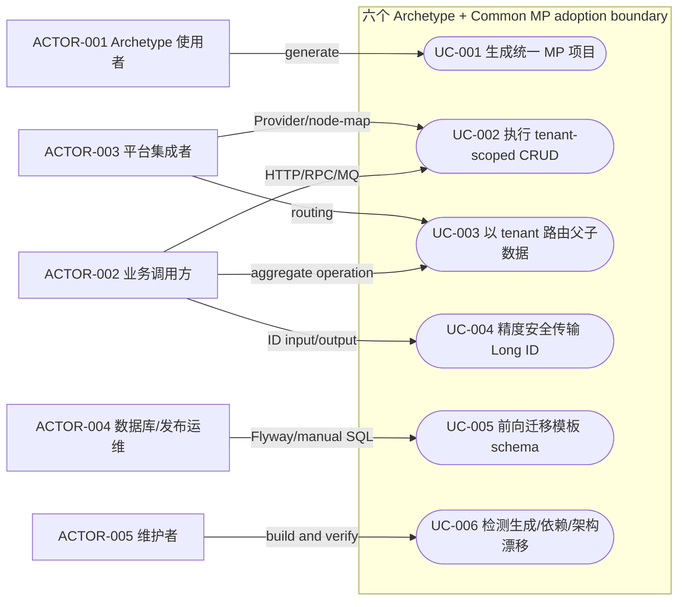
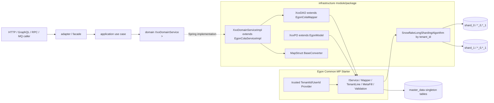
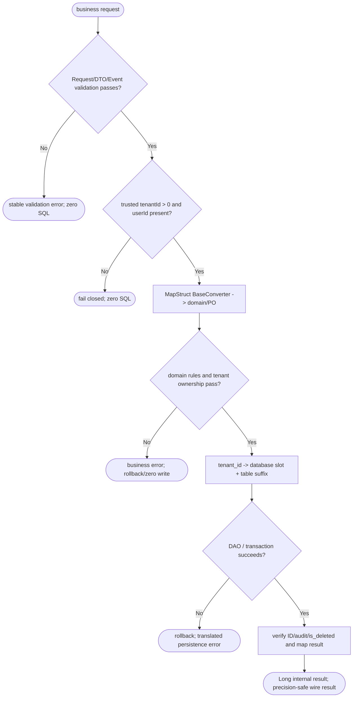
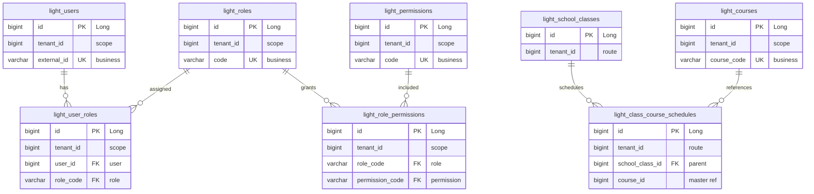
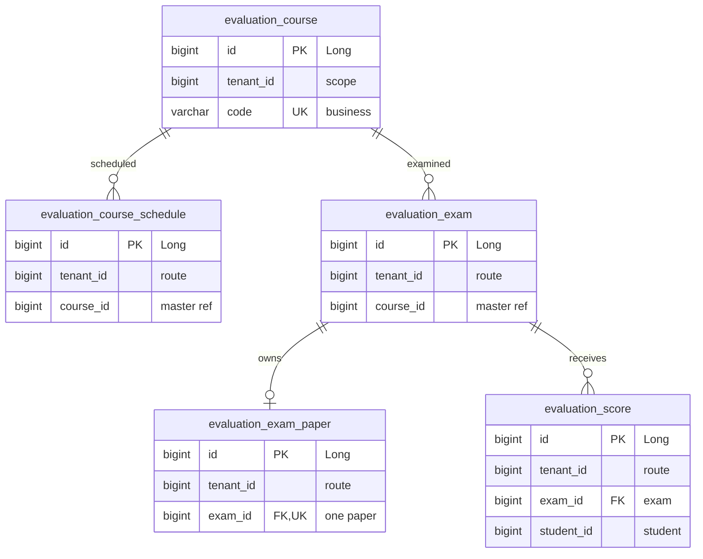
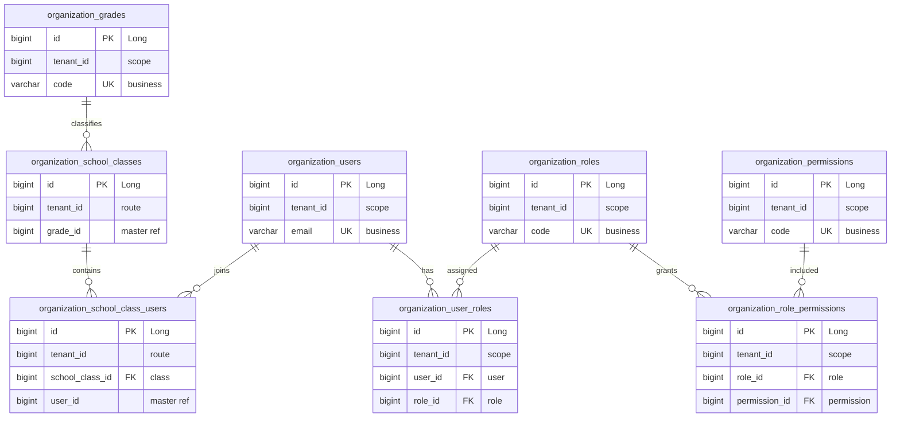

# Egon-COLA Archetype MyBatis-Plus 与公共基线统一重构设计

| Field | Value |
| --- | --- |
| Document | `2026-08-25-19-09-archetype-mybatis-plus-unification.md` |
| Template Version | `6` |
| Status | `Review` |
| Type | `Refactor / Architecture` |
| Complexity | `Complex` |
| Complexity Drivers | `六个 archetype、两个 canonical facade、Common MyBatis-Plus Starter 的跨模块契约变更；JPA 到 MyBatis-Plus 迁移；String/UUID 到 Long/Snowflake 公共身份迁移；tenant_id 隔离与 ShardingSphere 分库分表重路由；29 个物理表形状的 schema/索引/迁移；HTTP/RPC/GraphQL/MQ 兼容性` |
| Created | `2026-08-25 19:09 CST` |
| Updated | `2026-08-25 22:28 CST` |
| Owner | `Mario / Egon-COLA maintainers` |
| Repository | `Egon-COLA` |
| Scope | `egon-cola-component-common-mybatis-plus-spring-boot-starter；egon-cola-archetypes 父 reactor 下 organization/evaluation facade 与 light/service/web 及其 -open 六个生成模板` |
| Change Surface | `保持 EgonModel 七字段/ActiveRecord 构造合同不变并重构 EgonColaServiceImpl 扩展契约；六个模板统一依赖 Common MP Starter，删除 JPA/直连 MP；domain 声明泛型业务 Service，infrastructure 提供 ServiceImpl/DAO/PO；全部业务身份改为 Long/Snowflake；持久表补齐 EgonModel 七字段并以 tenant_id 重配已分片逻辑表；同步 Mapper XML、配置、手工 SQL/Flyway、测试、metadata、verify.groovy 与架构文档` |
| Affected Chapters | `§7, §8, §9, §10, §11, §13, §14, §15, §16, §17, §18` |
| Source Requirement | `2026-08-25 用户要求 archetypes 全量从 Spring Data JPA 迁移至 MyBatis-Plus/Common MP Starter，并复用 common-core；随后确认 domain 泛型 Service、infra ServiceImpl/DAO/PO、EgonColaServiceImpl Lombok 扩展、Long 身份、tenant_id 分库分表和 PO Lombok/@Builder（必要时评估 @SuperBuilder）/MP 注解规则` |
| Baseline Revision | `main@3be897e5cb4781890bfbac3104512e6e73bb943a；2026-08-25 19:01 CST dirty-worktree snapshot；保留既有 Tianquan-Shoubing/Tianquan-Jianshen/Access Guard/Open Archetype Spec/Plan 等无关改动` |
| Amends | `[Common MyBatis-Plus Starter](2026-08-19-16-11-common-mybatis-plus-starter.md) §5.1、§7.3、§8.2、§9.2.0、§10.1-§10.5、§14（仅修订 EgonColaServiceImpl 子类扩展/构造合同，并明确 EgonModel 不增加 Lombok builder）；[Open-source archetype family](2026-08-23-16-43-open-source-archetype-family.md) §1、§3、§5、§7-§11、§14-§18（将直连 MP 3.5.17 改为 Common MP Starter，并补齐统一 Service/DAO/PO/tenant 分片合同）；[Light living architecture](../../../egon-cola-archetypes/egon-cola-archetype-light/large-monolith-light-domain-architecture.md) §2、§3.5、§3.7、§5.5、§5.7；[Service living architecture](../../../egon-cola-archetypes/egon-cola-archetype-service/student-management-service-only-rpc-mq-architecture.md) §2、§3.5-§3.6、§5.6-§5.7；[Web living architecture](../../../egon-cola-archetypes/egon-cola-archetype-web/multi-project-multi-module-architecture.md) §2、§3.5-§3.6、§5.6-§5.7` |
| Supersedes | `None` |
| Depends On | `[Common MyBatis-Plus Starter](2026-08-19-16-11-common-mybatis-plus-starter.md) §1、§4、§7.1-§7.3、§9、§10、§15-§17（除本 Spec 明确修订的扩展点外继续有效）；[Open archetype code style](../../../egon-cola-archetypes/open-source-archetype-code-style.md) §Package and module ownership、§Persistence and mapper safety、§Manual SQL and schema review` |
| Related Specs | `[ShardingSphere/Flyway baseline](../../superpowers/specs/2026-07-23-archetype-shardingsphere-flyway-design.md) §5-§18；[Domain-first package design](../../superpowers/specs/2026-07-13-web-service-archetype-domain-first-package-design.md) §125-§744` |
| Related Plans | [Archetype MyBatis-Plus Implementation Plan](../plan/2026-08-25-20-02-archetype-mybatis-plus-implementation.md)（状态 Review，待用户批准后执行） |

## 1. Summary

本设计把 `egon-cola-archetypes` 下六个生成模板统一到同一持久化基线。三个原模板删除 Spring Data JPA、Hibernate 注解、`JpaRepository` 和 `EntityManager`；三个 `-open` 模板删除对官方 MyBatis-Plus 3.5.17 的直连与本地重复配置。六者均只通过 BOM 消费 `egon-cola-component-common-mybatis-plus-spring-boot-starter`，由其提供 MyBatis-Plus 3.5.16、`EgonModel`、`EgonColaMapper`、`EgonColaIService`、`EgonColaServiceImpl`、TenantLine、审计填充、逻辑删除、模型校验、分页与防全表写。

用户确认的结构固定为：domain 模块依赖 MP Starter，并在 `domain.<bounded-context>.service` 声明不引用具体 infrastructure 类型的泛型 Service 接口；具体 `XxxPO`、`XxxDAO` 和 `XxxDomainServiceImpl` 位于 infrastructure。实现以 `XxxDomainService<P extends EgonModel<P>>` 规避 domain 对具体 PO 的反向依赖，`XxxDomainServiceImpl extends EgonColaServiceImpl<XxxDAO,XxxPO> implements XxxDomainService<XxxPO>`。现有 domain Repository 端口与 infrastructure RepositoryImpl 在同一能力已被该 Service/DAO 直接覆盖时删除，缓存、事件发布和外部查询等非持久化端口继续保留。

所有业务主键和外键在 Java、RPC、领域与数据库内统一为正数 `Long`/Snowflake；HTTP JSON 与 GraphQL `ID` 仍以十进制字符串传输，避免 JavaScript 53 位精度损失。每个持久表具有 `EgonModel` 的 `id/tenant_id/create_user_id/create_time/update_user_id/update_time/is_deleted` 七字段；当前已分片逻辑表改为同时以 `tenant_id` 做数据库与表路由，同一租户的父子表落入同一物理槽。缺失或非法 tenant/user 上下文在 JDBC 前失败，不从裸 HTTP Header 建立可信身份。

## 2. Background and Current State

### 2.1 Business and user context

目标使用者是通过六个 archetype 生成 Light 单体、Service-only 多模块或 Web 多模块项目的开发者，以及维护 Common MP Starter 和 Archetype 验证器的平台维护者。当前同一业务示例存在两套持久化技术：原模板使用 JPA/UUID，`-open` 模板使用直连 MP 3.5.17/Long；两套都没有采用已经实现并接受的 Common MP Starter，也没有让所有 PO/DAO/Service 遵守统一公共基类、TenantLine、审计填充和分层校验合同。

### 2.2 Repository evidence

| Evidence ID | Classification | Exact path/symbol/decision/command | Observed fact | Design significance | Verification limit/freshness |
| --- | --- | --- | --- | --- | --- |
| `EVD-001` | Static repository | `egon-cola-archetypes/pom.xml:64-72` | reactor 实际包含两个 canonical facade 与 light/service/web、三种 `-open` 共八个模块 | “archetypes 下项目”按六个生成模板处理，facade 因 Long 契约成为受影响邻接模块 | 仅静态模块清单 |
| `EVD-002` | Static repository | `egon-cola-archetypes/egon-cola-archetype-light/src/main/resources/archetype-resources/pom.xml:150`、`egon-cola-archetypes/egon-cola-archetype-service/src/main/resources/archetype-resources/__rootArtifactId__-infrastructure/pom.xml:80`、`egon-cola-archetypes/egon-cola-archetype-web/src/main/resources/archetype-resources/__rootArtifactId__-infrastructure/pom.xml:80` | 三个原模板直接依赖 JPA | 必须删除 JPA 依赖与 Hibernate 配置 | 不证明外部生成项目状态 |
| `EVD-003` | Static repository | 三个原模板 `infrastructure/**/repo/jpa/*JpaRepository.java`、PO 的 `jakarta.persistence.*` | 原持久链为 RepositoryImpl -> JpaRepository/EntityManager -> ORM PO | DAO、XML/MP 查询、PO 注解和测试均受影响 | 静态源码 |
| `EVD-004` | Static repository | 三个 `-open` 根 POM 的 `mybatis-plus.version=3.5.17` 与 infrastructure/root 直连 `mybatis-plus-spring-boot3-starter` | open family 已是 MP，但绕过 Common Starter 且版本高于 Common 锁定的 3.5.16 | `-open` 不是 Unchanged；需统一依赖和公共扩展 | 静态 POM |
| `EVD-005` | Static repository | `egon-cola-components/egon-cola-component-common/egon-cola-component-common-mybatis-plus-spring-boot-starter` 下的 `EgonModel`、`EgonColaMapper`、`EgonColaIService`、`EgonColaServiceImpl` | Common 已交付七字段 Model、Mapper、57 方法 IService/Impl、TenantLine 和校验链 | 直接复用，不复制本地基类/拦截器 | 当前源码与 Accepted Spec 的 `Model`/`AbstractModel`描述存在实现漂移，实施时以编译 API 和 parity test 为准 |
| `EVD-006` | Static repository | `EgonColaServiceImpl.java:41-52` | 当前有三个 final collaborator 与手写 protected 三参数构造器 | 子类无法仅靠自己的 `@RequiredArgsConstructor` 隐式调用该 super 构造器 | Java/Lombok 编译规则，尚未实施验证 |
| `EVD-007` | Static repository | `EgonModel.java:22-49` | `id` 为 `Long`，并固定 `tenant_id/create_user_id/create_time/update_user_id/update_time/is_deleted` | 所有 PO/DDL/迁移必须接受同一继承生命周期 | 静态 API |
| `EVD-008` | Static repository | 六个 `lombok.config` | 已复制 `@Qualifier` 到 Lombok 生成构造参数 | Spring Bean 可严格使用 final 字段、`@Qualifier`、`@RequiredArgsConstructor` | 需生成项目编译证明 |
| `EVD-009` | Static repository | 原模板 domain ID/DTO/facade 大量 `String`；open domain/PO 大量 `long/Long` | 六个模板身份类型不一致 | 用户确认统一 Long；canonical facade 与协议映射受影响 | 未证明外部消费者兼容 |
| `EVD-010` | Static repository | 六套 ShardingSphere YAML | 当前分片列是 `id/grade_id/course_id/exam_id/school_class_id` 等；open 使用 Snowflake 算法，原模板使用 UUIDv7 算法 | 已分片逻辑表需统一改为 `tenant_id` 双层路由 | 未连接真实 ShardingSphere |
| `EVD-011` | Static repository | `ShardingNodeMap#routeSlot(long)` | 稳定槽算法要求正数 Long 并将同一 key 映射到唯一 database+suffix | archetype tenantId 必须是正数，父子表共用相同 node-map | 只证明算法，不证明生产分布 |
| `EVD-012` | Static repository | 原模板 Flyway `V20260726_001/_002`；open manual `001/002` | 每族各有 master-data 与 shard 两个独立 schema 位置；既有 Flyway 文件不可改 | 每个位置新增一个迁移/手工升级脚本，保持旧文件 checksum | 静态资源，不是 live schema |
| `EVD-013` | Static repository | 六个 `verify.groovy` | 原 verifier 明确要求 JPA/禁止 MP；open verifier 禁 JPA但要求直连 3.5.17 和 Mapper 目录 | verifier 必须作为生成合同同步反转 | 未运行生成集成测试 |
| `EVD-014` | Static repository | `common-core` 的 `BaseConverter`、`ValidationUtils`、`PageQuery`、`PageResultRecord`、`BusinessException` | 已有转换、分组校验、分页和结果/异常能力 | 逐项复用或以语义差异明确保留本地对象，不再手写通用替代 | common-core 的旧 `BaseConverter` 仍含 java.util.Date 辅助方法；本 Spec 不新增其调用 |
| `EVD-015` | User decision | 2026-08-25 四项确认及 PO 追问 | domain 泛型 Service、infra Impl/DAO/PO；移除 EgonColaServiceImpl 手写构造；统一 Long；tenantId 分库分表；PO 不使用 RequiredArgsConstructor，使用 Data/NoArgs/AllArgs/Builder/Accessors 和 MP 注解，并提示仅在继承条件允许时考虑 SuperBuilder | 关闭架构、身份、构造、分片和 PO 建模输入 | 当前用户决定 |
| `EVD-016` | Static repository | `git status --short` at 2026-08-25 19:01 CST | worktree 含与本任务无关的 Tianquan-Shoubing/Tianquan-Jianshen/Open Spec/Plan 改动 | 本 Spec 只新增当前文档，不覆盖或提交其他路径 | 时间点快照 |
| `EVD-017` | Compile proof | 2026-08-25 Step 1 RED：Common Starter focused Maven test；`EgonModel.java:[26,1] cannot find symbol: class ModelBuilder` in `com.baomidou.mybatisplus.extension.activerecord.Model` | `@SuperBuilder` 要求整个父类链提供 builder；外部 MP `Model<M>` 未使用 Lombok `@SuperBuilder`，因此 `EgonModel` 无法合法增加该注解 | 撤销 EgonModel SuperBuilder 设计；PO 使用普通 Builder 且只暴露自身业务字段 | 本地 Java 21/Maven 编译证据；不证明后续完整 GREEN |

### 2.3 Problem statement and gap

当前模板不能通过“引入一个 Egon Starter”获得一致的持久化安全合同：JPA 模板绕过 MP，open 模板绕过 Egon 扩展，全部表又缺失七个公共字段或使用 `created_at/updated_at`、组合主键、String UUID 等不兼容形状。直接机械替换 Repository API 会导致 tenant 路由缺列、逻辑删除失效、父子表跨槽、Long 契约与 JSON 精度冲突、ServiceImpl 无法按 Lombok 规则构造，以及 verifier 继续要求旧技术栈。

### 2.4 Evidence and current-chain map

| Entry/trigger | Current call chain | Data read/written | External dependency | Consumers | Evidence |
| --- | --- | --- | --- | --- | --- |
| 原 Light/Web HTTP/GraphQL/RPC | Adapter -> Application -> domain Service/Repository -> infrastructure RepositoryImpl -> JPA Repository/EntityManager -> ShardingSphere DataSource | 18 类逻辑表 | Spring Data JPA、Hibernate、ShardingSphere、PostgreSQL/H2 | HTTP/GraphQL/Dubbo/MQ 示例消费者 | `EVD-002`,`EVD-003`,`EVD-009` |
| 原 Service RPC/MQ | facade/consumer -> Application -> domain Service/Repository -> infra RepositoryImpl -> JPA | course/exam/score 表族 | Dubbo/Rabbit/JPA | organization 调用方、MQ consumer | `EVD-002`,`EVD-003`,`EVD-009` |
| Open 六边形业务入口 | Adapter -> Application -> domain Service/Repository -> infra RepositoryImpl -> BaseMapper/XML -> ShardingSphere | 同一业务表族 | 直连 MP 3.5.17 | open HTTP/Triple/MQ 示例 | `EVD-004`,`EVD-010` |
| 目标生成 | archetype plugin -> template resources -> metadata -> generated project -> verifier -> generated Maven tests | 生成文件系统与测试数据库 | Maven Archetype/Groovy/Flyway 或 manual SQL | archetype 使用者、CI | `EVD-012`,`EVD-013` |

## 3. Goals and Non-goals

### 3.1 Goals

1. 六个 archetype 只通过 Common MP Starter 使用 MyBatis-Plus，并清除生产/测试/文档/verifier 中的 Spring Data JPA 与直连 MP 依赖。
2. 固定 domain 泛型 Service、infrastructure ServiceImpl/DAO/PO 的统一可编译依赖方向。
3. 让每个受影响 PO 继承 `EgonModel`，每个 DAO 继承 `EgonColaMapper`，每个聚合业务 Service 继承 `EgonColaIService`/`EgonColaServiceImpl`。
4. 六个模板及 canonical facade 的业务身份统一为 Long/Snowflake，并定义 HTTP/GraphQL/RPC/MQ 精度安全的传输规则。
5. 所有持久表具备七个公共字段；已分片逻辑表用正数 `tenant_id` 同时完成库路由和表路由，父子表共置。
6. 复用 common-core `BaseConverter`、`ValidationUtils`、`PageQuery` 以及语义匹配的结果/异常能力，消除手写跨层转换与重复校验。
7. 同步 Flyway/manual SQL、Mapper XML、profile 配置、测试、README/living architecture、archetype metadata 与六个 verifier。

### 3.2 Non-goals

- 不实现认证系统、账号体系或从裸 HTTP Header 建立可信 tenant/user；生产由外部 SecurityContext/MDC Provider 提供，缺失则失败。
- 不启动任何生成项目、数据库、Redis、RabbitMQ、Dubbo 或容器；Spec 只定义设计与后续验证命令。
- 不修改既有 Flyway migration；不承诺把任意已运行的外部生成项目在线重分片。
- 不重写未受身份/持久化影响的业务状态机、页面布局、缓存策略或事件业务语义。
- 不创建 `EgonDAO`、本地 BaseService、重复拦截器、SQL Injector 或第二套 tenant 上下文。

### 3.3 Change Surface and Design Depth

| Area/layer | Disposition | Exact repository evidence | Changed or preserved behavior/contract | Required Spec treatment | Chapter(s) |
| --- | --- | --- | --- | --- | --- |
| Common MP Starter extension API | Affected | `EgonModel`、`EgonColaServiceImpl`、support tests | EgonModel 不增加 Lombok builder且七字段/AR保持；用 Lombok no-arg + abstract collaborator accessors 取代 ServiceImpl 手写 super 构造 | 完整 API、兼容、测试与回滚设计 | `§7, §8, §9, §10, §13, §14, §16, §17, §18` |
| 六个 template POM/依赖 | Affected | 原 JPA POM、open 直连 MP POM | domain/root 消费 Common MP Starter；删除 JPA/直连 MP 版本 | 精确依赖树、模块方向、verifier | `§7, §8, §14, §16, §17, §18` |
| Domain/Application/Adapter 与 canonical facade | Affected | String ID、domain Service/impl、facade DTO/方法 | Long 身份、domain 泛型 Service、impl 移入 infra、边界校验/序列化兼容 | 合同、POJO、文件、测试、兼容 | `§7, §8, §9, §10, §14, §15, §16, §18` |
| Infrastructure persistence | Affected | `repo.jpa`、`repo.mapper`、`repo.impl`、PO/converter/XML | 统一 `service.impl`、`repo.dao`、EgonModel PO、BaseConverter、MP XML | 详细类/映射/事务/失败设计 | `§7, §8, §9, §10, §11, §13, §14, §15, §16, §17, §18` |
| PostgreSQL/H2 schema、Flyway/manual SQL、ShardingSphere | Affected | 六族 master/shard SQL 与 YAML | 七字段、Long PK/FK、tenant 索引/约束、tenant 双层路由、前向迁移 | 全表、ER、索引、迁移、恢复设计 | `§7, §8, §11, §14, §15, §16, §17, §18` |
| Archetype metadata/verifier/tests/docs | Affected | 六个 metadata/verify、living docs、README | 生成清单、禁止词、精确继承/注解/依赖/SQL/配置断言同步 | 文件职责与验证设计 | `§8, §14, §16, §18` |
| HTTP/GraphQL 页面 UI | Unchanged | 仓库只有后端 adapter/schema，无独立 frontend 项目 | 路由与页面布局不存在；HTTP/GraphQL 协议的 ID 线形规则变更但无前端代码 | §9 设计协议；§12 记录无前端 | `§12` |
| 业务状态机、缓存与现有事件目的 | Context-only | 现有 domain service、cache/event ports | 只迁移 ID 类型与持久调用，业务状态/缓存时机/事件目的保持 | 边界回归验证，不重新设计业务 | `§7, §14, §15` |

## 4. Requirements and Acceptance Criteria

| ID | Atomic requirement | Priority | Observable acceptance criteria | Source |
| --- | --- | --- | --- | --- |
| `REQ-001` | 六个生成模板生产/测试源码、POM、配置、文档和 verifier 不含 Spring Data JPA/Hibernate persistence 合同 | Must | `rg` 禁止词为零；生成项目 dependency tree 无 `spring-data-jpa/hibernate-core` | 用户“springdatajpa 全部迁移” |
| `REQ-002` | 六个模板通过 BOM 使用 `egon-cola-component-common-mybatis-plus-spring-boot-starter`，不直连官方 MP；Lombok 与 components 父 POM 的 `1.18.46` 对齐 | Must | domain/root POM 有唯一 Egon Starter；无 `mybatis-plus.version` 和 direct official starter；六个生成根 POM 不再保留 `1.18.38` | 用户指定 mp-starter；统一源码处理基线 |
| `REQ-003` | domain 的 `service` package 只保留采用 `<P extends EgonModel<P>> extends EgonColaIService<P>` 的业务 Service；缓存、查询客户端、事件发布等非持久化端口移到 `client/yuheng/event` 语义包 | Must | domain 不 import infrastructure；`domain/**/service` 中不存在未扩展 Egon Service 的接口/类；编译/ArchUnit 通过 | 用户决定 1 与“service 必须全部” |
| `REQ-004` | ServiceImpl 位于 infrastructure，继承 `EgonColaServiceImpl<DAO,PO>` 并实现 domain Service `<PO>` | Must | 每个目标聚合存在且 domain 无 impl；Spring Bean 可注入 | 用户决定 1 |
| `REQ-005` | DAO 位于 `infrastructure.<context>.repo.dao`，以 `*DAO` 命名并继承 `EgonColaMapper<PO>` | Must | 无 `repo.jpa`/`repo.mapper` Java 接口；DAO 泛型一一对应 | 用户“dao同理”与 Rule 1 |
| `REQ-006` | 每个持久 PO 位于 infra、以 `*PO` 命名并继承 `EgonModel<PO>` | Must | 21 个逻辑 PO 的反射/源码检查全部通过；`CoursePo` 等改为 `CoursePO` | 用户 PO/EgonModel |
| `REQ-007` | PO 只使用 `@Data`、`@NoArgsConstructor`、`@AllArgsConstructor`、`@Builder`、`@Accessors(chain=true)` 这一组 Lombok 建模注解及精确 MP 注解，不使用 `@RequiredArgsConstructor` 或 `@SuperBuilder` | Must | delombok/compile 与注解反射通过；public no-arg/all-args 可实例化；builder 只暴露 PO 自身业务字段；无 PO RequiredArgs/SuperBuilder | 用户最新确认 + `EVD-017` |
| `REQ-008` | `EgonModel` 不增加 Lombok builder/constructor 注解，保持七字段、现有 JavaBean accessors、ActiveRecord 与 equals/hashCode 技术语义；继承技术字段不得成为 PO builder 输入 | Must | starter field/constructor/AR parity 通过；compile fixture 不生成或引用 `EgonModelBuilder/ModelBuilder` | 外部 MP `Model<M>` 无法参与 SuperBuilder；技术字段由框架权威管理 |
| `REQ-009` | `EgonColaServiceImpl` 删除手写 protected 构造器并允许子类仅用 Lombok `@RequiredArgsConstructor` 注入 | Must | compile fixture 无手写 constructor；三个 collaborator non-null 且方法语义不变 | 用户决定 2 |
| `REQ-010` | 具体 Spring 业务 Bean 使用 `@Slf4j`、显式 Bean 名、final `@Qualifier` 字段和 `@RequiredArgsConstructor` | Must | 静态/Context test 逐类通过，Qualifier 复制已验证 | Manual Check Rule 4 |
| `REQ-011` | 跨层转换使用 MapStruct/MapStructPlus 且 Converter 实现 `BaseConverter<S,T>` | Must | 不存在业务 Service 手写字段复制；双向/列表/技术字段 ignore 测试通过 | 用户 common-core/Rule 3 |
| `REQ-012` | 每个受影响层边界使用 Jakarta/Spring Validation；复用场景用 group，DAO/Model 使用 Starter 校验链 | Must | adapter/application/domain/DAO 正反例均在 SQL 前失败或成功 | Manual Check Rule 2 |
| `REQ-013` | Java/domain/RPC/PO/DB 业务 ID 全部为正数 Long/Snowflake | Must | 无 UUID generator/字符串业务 ID；canonical facade 编译合同为 Long | 用户决定 3 |
| `REQ-014` | HTTP JSON 与 GraphQL ID 使用十进制字符串线形表示，拒绝非十进制/非正数/越界值 | Must | Jackson/MockMvc/GraphQL contract tests 覆盖 >2^53 ID 无精度损失 | Long Web 兼容推导 |
| `REQ-015` | 事件/MQ/RPC metadata 中 tenant/user 来自可信上下文并在异步边界显式传播；缺失 fail-closed | Must | 无裸 Header -> tenant Provider；缺失/伪造/清理测试通过 | 用户决定 4A |
| `REQ-016` | 每张持久表具有 EgonModel 七字段，数据库类型/空值/逻辑删除与 Java 注解一致 | Must | 29 个物理表形状 schema parity；七字段全部 NOT NULL，`is_deleted=false` | EgonModel 合同 |
| `REQ-017` | 当前已分片逻辑表使用正数 `tenant_id` 同时做 database/table precise sharding | Must | 六套 YAML 的 shardingColumn 为 tenant_id；相同 tenant 在父子表命中同 node | 用户“tenantid 分库分表” |
| `REQ-018` | master_data 单节点表保持单节点但受 TenantLine/tenant 唯一约束；不伪称已分片 | Must | YAML None/single 配置不含业务分片算法；SQL 查询仍含 tenant_id | 保持现有拓扑边界 |
| `REQ-019` | 业务唯一键和关系唯一键全部 tenant-scoped，并与逻辑删除语义一致 | Must | PostgreSQL partial unique/index 与 DAO SQL/测试一致 | tenant 数据正确性 |
| `REQ-020` | 既有 Flyway 文件不变；每个 legacy master/shard 位置各新增一个新版本迁移 | Must | checksum/diff 证明旧文件未改；新版本命名全局唯一 | AGENTS.md migration rule |
| `REQ-021` | 每个 open master/shard 位置各新增一个顺序 manual SQL 与 README，不引入 Flyway | Must | `003/004` 存在并按序可在 PostgreSQL fixture 执行；无 Flyway dependency | open predecessor |
| `REQ-022` | 未知历史 UUID/tenant 数据不被静默猜测；迁移预检失败并要求离线映射/重分片 | Must | unexpected row fixture 阻断，模板 seed 有确定映射 | 数据迁移安全 |
| `REQ-023` | common-core 能力逐项复用，语义不匹配的 Page/Result 类型不机械替换 | Must | reuse ledger 与 dependency/source scan 通过 | 用户“common-core这些模块” |
| `REQ-024` | 六个 metadata、verify.groovy、README/living docs 与模板真实生成树同步 | Must | archetype integration-test 和 generated `clean verify` 通过 | archetype 完整交付合同 |
| `REQ-025` | 保持既有业务路由、状态、缓存时机、事务原子性和错误包装，除 ID/tenant/persistence 明确变化外不改行为 | Must | 聚焦回归/contract tests 通过 | 最小安全变更 |
| `REQ-026` | 不启动项目或外部基础设施完成 Spec/后续静态构建验证 | Must | Spec 阶段仅新增文档；验证命令不 start 服务 | AGENTS.md |

### 4.1 Scenario matrix

| Scenario | Actor/trigger | Preconditions | Main path | Alternative/failure path | Data/state change | Observable result | Requirements |
| --- | --- | --- | --- | --- | --- | --- | --- |
| 生成 legacy archetype | 模板使用者执行 Maven Archetype | repo artifacts 可解析 | metadata 展开 Long/MP 模板 -> verifier -> generated tests | 任一 JPA 残留、缺文件或依赖漂移即 IT 失败 | 仅生成目录/test DB | 新项目统一 Common MP | `REQ-001`-`006`,`REQ-024` |
| 生成 open archetype | open-source 使用者 | 同上 | 保留 manual SQL/open 依赖边界，替换 direct MP 为 Egon Starter | 引入 Flyway/JPA/直连 MP 即失败 | 生成目录 | open 与 canonical 持久基线一致 | `REQ-002`,`REQ-021`,`REQ-024` |
| tenant 内正常写 | HTTP/RPC/MQ 业务调用 | 正数 tenantId、non-blank userId、合法业务输入 | validation -> converter -> domain Service -> infra ServiceImpl -> DAO -> TenantLine/MetaFill -> shard | Model/tenant/业务规则失败在 JDBC 前终止 | 单事务当前 tenant 行变更 | Long ID、审计字段、正确物理槽 | `REQ-003`-`019` |
| 缺失/伪造 tenant | 未建立可信上下文或 caller 伪造 | Provider 缺值/非法 | Starter/positive guard 拒绝 | 不降级为全局查询，不信任 body/header | 零写、零跨租户读 | 稳定低基数异常/上层错误 | `REQ-015`-`018` |
| 同 tenant 父子写 | 排课/试卷/成绩/班级成员 | 父子记录 tenant 相同 | 相同 tenant_id -> 相同 node-map slot -> local transaction/FK 或 application check | tenant mismatch/route mismatch 在写前拒绝并 rollback | 父子全成或全不成 | 无跨库父子半写 | `REQ-017`,`REQ-019`,`REQ-025` |
| Long Web 边界 | 浏览器请求/响应 Snowflake >2^53 | 十进制字符串 | String wire -> validated Long -> internal -> String wire | UUID、0、负数、溢出返回 validation error | 无或正常业务写 | 无 JS 精度损失 | `REQ-013`,`REQ-014` |
| legacy fresh migration | 新生成项目首次建库 | V001/V002 后无未知业务行 | V20260825 migrations 改 Long/七字段/索引并验证 | 非模板历史数据触发 precondition failure | schema 前向升级 | 可重复构建目标 schema | `REQ-016`,`REQ-019`,`REQ-020`,`REQ-022` |
| 外部已生成系统升级 | 运维尝试迁移真实 UUID/多租户数据 | tenant 归属/重分片映射未知 | 先离线 profile/map/export-import，再执行兼容迁移 | 无映射时拒绝，不静默填 tenant=1 | 由外部升级项目负责 | 明确人工/独立 Spec 边界 | `REQ-020`,`REQ-022` |
| ServiceImpl Lombok 子类 | 模板编译 concrete impl | base abstract accessors + subclass final fields | Lombok 生成唯一 ctor，getter 实现 collaborator seam | 缺 Qualifier/字段为 null/未实现 accessor 编译或 Context 失败 | 无业务数据 | 无手写 ctor 且运行依赖完整 | `REQ-009`,`010` |

### 4.2 Use-case analysis

#### 4.2.1 Actor inventory

| Actor ID | Actor/role | Goal and responsibility | Entry/channel | Permission/tenant context | Evidence |
| --- | --- | --- | --- | --- | --- |
| `ACTOR-001` | Archetype 使用者 | 生成可编译、可验证的统一项目 | Maven Archetype CLI | 构建期无 tenant | `EVD-001`,`EVD-013` |
| `ACTOR-002` | 生成项目业务调用方 | 执行 tenant-scoped 业务操作 | HTTP/GraphQL/RPC/MQ | trusted tenant/user context | `EVD-003`,`EVD-009`,`EVD-015` |
| `ACTOR-003` | 平台集成者 | 注入可信 Provider、配置 node-map 与物理数据源 | Spring/配置/部署 | tenantId 正数 Long | Common Starter 与 Sharding config |
| `ACTOR-004` | 数据库/发布运维 | 执行 Flyway 或 manual SQL、验证并处理不安全历史数据 | PostgreSQL/Flyway/manual runbook | 对租户映射负责 | `EVD-012`,`REQ-022` |
| `ACTOR-005` | Archetype/Component 维护者 | 升级模板、Starter、验证器并阻止技术漂移 | Git/Maven/JUnit/Groovy | 无业务 tenant | `EVD-005`,`EVD-013` |

#### 4.2.2 Use-case artifact



| ID | Use case/goal | Primary actor | Trigger/preconditions | Main success outcome | Alternatives/failures and postconditions | Requirements | Contracts/tables/tests |
| --- | --- | --- | --- | --- | --- | --- | --- |
| `UC-001` | 生成统一 MP 项目 | `ACTOR-001` | 选择六个 archetype 之一 | 生成树只含 Common MP 结构且编译 | JPA/direct MP/metadata drift 阻断；无半生成合同被接受 | `REQ-001`-`012`,`REQ-023`,`REQ-024` | `CLI-001`-`006`; `TEST-001`-`010` |
| `UC-002` | 执行 tenant-scoped CRUD | `ACTOR-002` | trusted positive tenant/user、合法输入 | 只读写当前 tenant，审计/逻辑删除完整 | 缺上下文/跨租户/Model invalid 零 SQL；DB 失败回滚 | `REQ-003`-`019`,`REQ-025` | `INTERNAL-*`; 29 physical table shapes; `TEST-011`-`028` |
| `UC-003` | 以 tenant 路由父子数据 | `ACTOR-002`,`ACTOR-003` | 相同 tenant node-map | 父子落同库同 suffix，事务保持 | 路由/FK/tenant mismatch rollback；不跨库补偿 | `REQ-016`-`019` | shard YAML/DAO; `TEST-029`-`036` |
| `UC-004` | 精度安全传输 Long ID | `ACTOR-002` | decimal positive ID | Java 内 Long、JSON/GraphQL 十进制字符串、RPC Long | UUID/overflow/0/negative validation failure；无数据变化 | `REQ-013`,`REQ-014`,`REQ-025` | `API-*`,`RPC-*`,`EVENT-*`; `TEST-037`-`044` |
| `UC-005` | 前向迁移模板 schema | `ACTOR-004` | fresh template DB 或已完成离线映射 | 新 migration/manual SQL 产生目标 schema | 未知历史数据 fail-fast；旧 migration 不变；失败由 forward-fix | `REQ-016`,`REQ-019`-`022` | DB inventory; `TEST-045`-`052` |
| `UC-006` | 检测生成/依赖/架构漂移 | `ACTOR-005` | 修改模板/Starter | strict verifier、module tests、archetype IT 通过 | 任一合同缺失阻断发布；不启动服务 | `REQ-001`-`026` | `TEST-038`-`046` |

## 5. Constraints, Assumptions, and Decisions

### 5.1 Confirmed constraints

- Java 21、Spring Boot 3.5.16、Maven、多模块 Archetype、MyBatis-Plus 3.5.16、ShardingSphere 5.5.3、PostgreSQL 17/H2 test fixture。
- 精确采用现有 Light、Service、Web 及其 `-open` profile；不新增模块或第三种层次。
- domain POM/root 持有 Common MP Starter 依赖；domain Service 只引用 `EgonModel` 泛型上界，不引用具体 PO/DAO/impl。
- PO 不是注入 Bean，不使用 `@RequiredArgsConstructor`；其 public no-arg/all-args、仅业务字段 builder 与 chain accessors 只服务 MyBatis 映射和显式对象构造。继承的 `id/tenant/audit/isDeleted` 不进入 builder，仍由 MyBatis 映射、MetaFill、租户上下文和数据库回填。Spring 业务 Bean 的注入规则仍严格执行。
- tenantId 是正数 Long 且来自可信 Provider；Common Starter 的通用“任意 non-null Long”合同不被全局收窄，正数约束属于本 Archetype Sharding profile。
- 本 Spec 是设计文档；未执行生产代码、migration 或 live runtime。

### 5.2 Small-gap assumptions

| ID | Inference | Repository evidence | Why locally reversible | Impact if wrong |
| --- | --- | --- | --- | --- |
| `ASM-001` | audit user ID 数据库列使用 `VARCHAR(128)` | `EgonModel` 为 String；现有 operator/user 集成 ID 无更窄统一长度 | 只影响模板新列 | 若身份系统合同更长，迁移前统一调大 |
| `ASM-002` | `create_time/update_time` 使用 PostgreSQL `TIMESTAMPTZ`、H2 `TIMESTAMP WITH TIME ZONE`，精度微秒，Java `Instant` UTC | Accepted Common Spec §11 | 标准映射且可前向扩大 | 方言/驱动差异需 fixture 调整 |
| `ASM-003` | master_data 表保持单节点，只把当前已分片逻辑表改为 tenant 双层路由 | 六套现有 topology 明确区分 master-data 与 shard | 避免无授权的全拓扑搬迁 | 若用户要求 master_data 也分片，需要独立跨库迁移 Spec |
| `ASM-004` | HTTP/GraphQL Long ID 仍输出 decimal string | Snowflake 可能超过 JS safe integer；当前 wire 已是 String/GraphQL ID | 不改变字段名/路由 | 若强制 JSON number，前端需 BigInt/string codec 决策 |
| `ASM-005` | open manual SQL 新增 `003` master、`004` shard，不改 `001/002` | open predecessor 的顺序脚本/人工执行合同 | 保留已发布脚本字节 | 若 open 脚本被定义为永不升级而只重建，则可在 Plan 前改为新 baseline 文档但不得改旧脚本 |

### 5.3 Resolved decisions

| ID | Decision | Decision owner | Evidence and rationale | Requirements |
| --- | --- | --- | --- | --- |
| `DEC-001` | domain 泛型 Service、infra ServiceImpl/DAO/PO | User | 明确回复“依赖放 domain，interface domain，impl/dao infra” | `REQ-003`-`006` |
| `DEC-002` | 所有业务身份迁移 Long/Snowflake | User | 明确选择迁移为 Long | `REQ-013`,`REQ-014` |
| `DEC-003` | tenantId 做已分片逻辑表的库表双层路由 | User | 明确要求 ShardingSphere 基于 tenantId 迁移 | `REQ-015`-`019` |
| `DEC-004` | EgonColaServiceImpl 删除手写 protected 构造，使用 Lombok 可继承扩展 | User | 用户决定 2；Java 规则要求具体子类无手写注入 ctor | `REQ-009`,`010` |
| `DEC-005` | PO 不用 RequiredArgs；采用 Data/NoArgs/AllArgs/Builder/Accessors + MP annotations | User + compile resolution | 用户要求 Builder 并提示评估 SuperBuilder；`EVD-017` 证明该继承链不能用 SuperBuilder | `REQ-006`-`008` |
| `DEC-006` | ServiceImpl 使用 Template Method collaborator accessors | Spec derivation from `DEC-004` | 简单把手写 ctor 换成 Lombok RequiredArgs 仍使子类调用不存在的 `super()`；abstract getters + Lombok fields 可编译且保留依赖非空 | `REQ-009`,`REQ-010` |
| `DEC-007` | 不为 MP `Model<M>` 创建自定义 builder 适配父类，也不移除 ActiveRecord 继承来迁就 SuperBuilder | Spec derivation from `EVD-017` | 自定义桥接/复制父类会扩大公共 API 与维护面；普通 PO Builder 已满足业务对象构造，技术字段本就不应由调用者伪造 | `REQ-007`,`008`,`023`,`025` |

### 5.4 Open major decisions

None。`ASM-001`-`005` 是有证据、局部可复核的模板实现细节；任何 master_data 全量分片或真实外部数据库在线重分片均明确排除，不被静默推断。

## 6. Project Technology Context

| Concern | Current choice | Repository evidence | Constraint on design |
| --- | --- | --- | --- |
| Runtime | Java 21 | archetype POMs `<java.version>21` | Long、record、java.time；无旧 Java 兼容分支 |
| Framework | Spring Boot 3.5.16 | archetypes parent/root templates | Boot managed Jackson/Validation/transactions |
| Persistence | JPA in legacy；MP 3.5.17 direct in open；Common MP 3.5.16 available | `EVD-002`-`005` | 全部收敛 Common MP 3.5.16 |
| Architecture | exact Egon-COLA Light/Service/Web/Open | living docs、module trees、verify.groovy | 保持模块，domain interface/infra impl |
| Schema | PostgreSQL + H2 tests；legacy Flyway，open manual SQL | db resources/tests | 旧 Flyway immutable；open 不引 Flyway |
| Routing | ShardingSphere stable 4-slot node-map | YAML/algorithms/tests | tenantId positive precise route；range unsupported |
| Mapping | MapStruct/MapStructPlus + BaseConverter | POM/common-core | 不手写跨层 bean copy |
| Tests | JUnit 5、AssertJ、Mockito、ArchUnit、Groovy archetype IT | generated tests/verifier | focused module -> archetype integration-test -> generated verify |

Lombok 是生成 PO 与业务 Bean 的源码处理合同：components 父 POM 当前管理 `1.18.46`，六个 archetype 根模板仍固定 `1.18.38`。目标模板统一改为 `1.18.46`（或直接消费同一 BOM/父 POM managed version，不再声明旧值），使 `@Builder`、constructor、`@Qualifier` 复制和 getter 生成使用同一处理器基线。该调整不引入新依赖，仅消除现有版本漂移；不能解决外部父类缺少 SuperBuilder 的结构性限制。

### 6.1 Java architecture profile and capability baseline

| Architecture profile | Archetype/template or base package | Exact evidence and verifier | Existing deviations | Design action |
| --- | --- | --- | --- | --- |
| Egon-COLA Light | `egon-cola-archetype-light`、`light-open` | single module packages `start/adapter/facade/application/infrastructure/common/domain` + verify | legacy JPA vs open direct MP | 保持包层；domain interface/infra impl 已符合 light 方向 |
| Egon-COLA Service | `service`、`service-open` | generated `common/facade/domain/application/infrastructure/adapter/starter` + ArchUnit/verify | impl 当前在 domain；两种 persistence | impl 移 infra；不增模块 |
| Egon-COLA Web | `web`、`web-open` | 同七模块 contract + verify | 同上 | 同上 |

| Need | Spring/JDK candidate | Spring Boot Starter candidate | Egon-COLA/module candidate | Proven gap | Decision/dependency impact |
| --- | --- | --- | --- | --- | --- |
| CRUD/tenant/validation | Spring JDBC 手写 | official MP direct | Common MP Starter | None | Reuse Egon Starter only |
| ID generation | UUID/JDK random | None | common-id-starter + MP ASSIGN_ID | None | Reuse Snowflake/ASSIGN_ID；删除 UUID |
| conversion | manual getter/setter | MapStruct | common-core BaseConverter | None | Every affected converter implements BaseConverter |
| validation | handwritten validators | starter-validation | ValidationUtils + MP model validation | None | Reuse; custom validator prohibited |
| paging | local int pairs | MP Page | common-core PageQuery | domain filtered query仍需本地 Query 包装 | Reuse PageQuery by composition；保留有业务条件的 `*PageQuery` |
| result/error | local wrapper | Jackson | ResultRecord/PageResultRecord/BusinessException | current wire wrappers differ | Reuse only where complete wire semantics match；不机械替换 |
| sharding | custom new hash | ShardingSphere StandardAlgorithm | existing SnowflakeLongShardingAlgorithm/NodeMap | legacy only lacks Long variant | Reuse open implementation in legacy；key changes tenantId |

### 6.2 User-mandated Java rule compliance

| Literal rule | Affected? | Repository evidence | Exact design decision | Files/types/interfaces | Validation/test evidence | Status/blocker |
| --- | --- | --- | --- | --- | --- | --- |
| Rule 1 | Yes | JPA Repository、Mapper、`CoursePo`、PO/DTO/Query/Event inventories | PO=`*PO`、access=`*DAO`、Service/Impl/Converter/Query/Event 保持语义后缀；删除含混新名 | §8、§10 inventories | naming/forbidden scan | PASS |
| Rule 2 | Yes | adapter/application/domain/repository validators 与 Common model interceptor | `@Valid/@Validated`、Create/Update/Query groups、ValidationUtils、DAO Model automatic validation；无电话字段 | Service/commands/PO/DAO | boundary positive/negative/group tests | PASS |
| Rule 3 | Yes | 当前 manual converter/PO；common BaseConverter | simple carrier record；PO 按用户确认的五个 Lombok 注解并用仅业务字段 Builder；MapStruct + BaseConverter | all PO/converters | delombok/compile/mapping tests | PASS |
| Rule 4 | Yes | 六个 lombok.config 已复制 Qualifier；现有 Bean 风格不全一致 | concrete business Bean 全部 Slf4j、显式名、final qualified fields、RequiredArgs；PO 除外且非 Bean | ServiceImpl/Repository replacement/handlers | Context/static/log safety tests | PASS |
| Rule 5 | Yes | 无新增工具需求；现有 NodeMap 用 JDK | 只用 JDK/现有 Commons；不新增 Utils/dependency | touched code | import/dependency scan | PASS |
| Rule 6 | Yes | HTTP VO/error、MQ Event、GraphQL ID | Spring Jackson only；Long ID 按需 ToStringSerializer；Instant ISO-8601 | affected DTO/VO/Event | serialization/unknown-field/precision tests | PASS |
| Rule 7 | Yes | light/application-{dev,test,prod}.yml；service/web starter profiles | MP keys、MDC key、sharding config 在所有 profile 结构一致；值可不同 | all application*.yml + properties tests | key-parity test | PASS |
| Rule 9 | Yes | 复杂点是统一 tenant 生命周期与路由；业务状态机不改 | Common Service/Model 用 Template Method；Sharding 用 Strategy；简单 DAO CRUD 不增 Factory/Chain | EgonColaServiceImpl、ShardingAlgorithm | pattern/route parity tests | PASS |
| Rule 10 | Yes | current PO uses LocalDateTime/Instant；EgonModel Instant | audit统一 Instant/TIMESTAMPTZ；业务 local schedule 保留 LocalDateTime 明确本地语义；不新增 Date 调用 | PO/DTO/Event/schema | time mapping/serialization scan | PASS |
| Rule 11 | Yes | exact six archetype trees/verifiers | 只保留 Light/Service/Web/Open profile；domain generic interface/infra impl 为用户批准的 profile amendment | §7-§8 | ArchUnit + verify.groovy | PASS |

## 7. Architecture Design

### 7.0 Minimum-design baseline and element-necessity audit

| Proposed element | Change | Requirements | Existing/direct alternative | Concrete inadequacy of alternative | Added calls/state/coupling/failures/migration/operations | Verdict |
| --- | --- | --- | --- | --- | --- | --- |
| Common MP Starter dependency | Keep/adopt | `REQ-001`,`002` | direct JPA/direct MP | 绕过 Egon tenant/model/validation | domain 获得技术依赖（用户批准） | Keep |
| `EgonModel @SuperBuilder` | Reject | `REQ-007`,`008` | PO 普通 Builder只含业务字段；技术字段由framework mapping/fill | MP `Model<M>`无`ModelBuilder`，跨外部继承链不能编译 | 不新增公共builder ABI；compile/parity tests阻止复发 | Do not add |
| EgonColaServiceImpl abstract accessors | Expand | `REQ-009`,`010` | Lombok 同签名 ctor | 子类仍无 `super()`，不可编译 | 三个 protected accessors、subclass fields | Add |
| `XxxDAO` | Rename/merge | `REQ-005` | JPA Repository 或 local Mapper | 不满足统一 access suffix/base | XML namespace rename | Add; old access interface Remove |
| Generic domain Service | Expand | `REQ-003`,`004` | domain import concrete PO | 形成反向模块依赖 | 泛型泄露 MP 上界（用户批准） | Add/Keep existing business methods |
| Repository port + RepositoryImpl | Remove when equivalent | `REQ-004`,`025` | 保留两层转发 | ServiceImpl 已是 infra adapter 且拥有 DAO/converter | 减少一跳；复杂非 CRUD port 可保留 | Remove/Merge |
| Local MyBatis config/interceptor | Remove | `REQ-002` | open duplicate config | Starter 已完整提供且双配置会冲突 | 无 | Remove |
| New tenant context HTTP API/header trust | Reject | `REQ-015` | accept caller tenant field | 伪造风险、fetch-forward | 无新 contract；运行集成责任 | Remove |
| Tenant indexes/columns/migrations | Add | `REQ-016`-`022` | runtime-only TenantLine | DB 缺列/约束/route 不可工作 | DDL、写放大、升级边界 | Add |
| Master-data full sharding | Reject current scope | `REQ-018` | move every table to shards | 需跨库数据搬迁且用户只要求迁移现有 sharding config | 避免新拓扑 | Keep single-node |
| New `EgonDAO` alias/BaseService | Reject | `REQ-005`,`023` | alias existing EgonColaMapper/IService | 无独立行为 | 公共 API/Class explosion | Remove |

| Path | Network calls | Client states | Server contracts/state | Failure and TOCTOU points | Additional user/business value |
| --- | --- | --- | --- | --- | --- |
| Current | 与现有 API/RPC/MQ 相同 | existing | JPA or direct MP; String ID; no common tenant state | 技术栈漂移、无统一 tenant guard | 当前业务结果 |
| Selected | 不增加调用 | 不增加 UI 状态 | Common MP、Long、七字段、tenant route | 缺 context/route/migration fail-fast | 同业务结果，统一隔离/审计/生成质量 |

### 7.1 System Architecture Design

#### 7.1.1 Architecture Mermaid view



#### 7.1.2 Boundary and responsibility table

| Module/component | Capability and data owned | Inputs/outputs | Allowed dependencies | Forbidden responsibility | Requirements |
| --- | --- | --- | --- | --- | --- |
| Adapter/facade | protocol validation、Long wire conversion、error mapping | Request/Response/DTO/Event | application、canonical facade | DAO/PO/tenant authority | `REQ-012`-`015`,`025` |
| Application | use-case orchestration、transaction annotation where current | Command/Query/domain result | domain Service | concrete impl/DAO/PO | `REQ-003`,`025` |
| Domain Service | business behavior contract + generic MP service surface | domain models/validated args | Common MP types/common-core | concrete infra types | `REQ-003`,`012` |
| Infra ServiceImpl | business implementation、transaction owner、conversion、aggregate persistence | domain <-> PO | domain、DAO、Common MP | HTTP/RPC presentation | `REQ-004`,`009`-`012` |
| DAO | SQL/MP access only | PO/wrapper/page | EgonColaMapper | business state decisions | `REQ-005`,`017`-`019` |
| PO | table row + inherited lifecycle | business fields + EgonModel | MP annotations | external serialization/business orchestration | `REQ-006`-`008`,`016` |
| Common MP Starter | cross-cutting tenant/audit/validation/base CRUD | Model/Mapper/IService | Spring/MP/common-core | archetype business schema | `REQ-002`,`008`,`009` |
| Sharding config | tenant -> stable physical slot | positive Long -> datasource/table | existing node-map | tenant authentication | `REQ-017`,`018` |

### 7.2 High-Level Design

domain Service 的泛型参数只作为技术上界存在；application 注入 `XxxDomainService<?>` 并只调用业务命名方法，不直接调用继承 CRUD。infrastructure implementation 将泛型绑定为 `XxxPO`，内部可复用受增强的 `save/getById/list/page/remove`，同时用 companion DAO 处理关联表。这样满足用户指定层次且不让 domain import `infrastructure.*`。

现有 master-data 表保持 `master_data` 单节点，但 SQL 同样由 TenantLine 限制且唯一键以 tenant 前缀定义。现有 shard 表统一 `shardingColumn: tenant_id`，数据库和表算法使用同一个 node-map；关联子表保存 tenant_id 并在写入前校验与父记录/当前上下文一致。Range route 继续拒绝；没有 tenant predicate 的自定义 XML SQL 由 TenantLine 解析失败时 fail-closed。

#### 7.2.1 Critical business/control flowchart



#### 7.2.2 High-level decision and quality matrix

| Concern/use case | Required behavior | Selected mechanism | Failure/degradation behavior | Trade-off | Verification | Requirements |
| --- | --- | --- | --- | --- | --- | --- |
| Architecture | domain interface/infra impl no cycle | generic Service `<P extends EgonModel<P>>` | forbidden infra import fails ArchUnit | domain exposes MP upper bound | compile/ArchUnit | `REQ-003`,`004` |
| Tenant correctness | no cross-tenant read/write | Provider + TenantLine + positive guard + tenant-scoped constraints | missing/mismatch zero JDBC/rollback | parser/guard overhead | H2/BoundSql/PostgreSQL tests | `REQ-015`-`019` |
| Sharding | parent/child co-location | same tenant_id/node-map for DB/table | route mismatch fails, no compensation | tenant skew can create hot slot | algorithm/yaml/route integration | `REQ-017` |
| Identity | no UUID and no JS precision loss | Long/Snowflake internal; string wire | invalid decimal rejected | Java facade breaking release | serialization/RPC fixtures | `REQ-013`,`014` |
| Migration | no silent data corruption | immutable new scripts + preflight + forward fix | unknown rows stop migration | existing deployments need separate effort | migration fixtures/static checks | `REQ-020`-`022` |
| Maintainability | one persistence stack | Common Starter/Converter/Validation reuse | version/parity drift blocks build | common dependency in domain | dependency/source verifier | `REQ-001`,`002`,`023` |

### 7.3 Detailed Design

#### 7.3.1 Detailed component collaboration

| Step | Caller -> callee | Contract/symbol | Input/output mapping | State/data effect | Failure behavior | Requirements |
| --- | --- | --- | --- | --- | --- | --- |
| 1 | Adapter -> Application | existing Controller/Facade/Consumer method | decimal String/Long DTO -> validated Command/Query | none | validation/error wrapper | `REQ-012`-`015` |
| 2 | Application -> Domain Service | `XxxDomainService<?>#businessMethod` | Command -> domain args | opens/joins existing transaction | business exception | `REQ-003`,`025` |
| 3 | Spring -> Infra Impl | generic binding `XxxDomainService<XxxPO>` | domain args | selects concrete Bean | missing/ambiguous Bean fails context | `REQ-004`,`010` |
| 4 | Impl -> Converter | `BaseConverter<Domain,XxxPO>` | business fields only; inherited technical fields ignored | PO transient state | mapping/enum invalid | `REQ-011`,`012` |
| 5 | Impl -> inherited Egon service/DAO | save/get/list/custom DAO | PO + wrapper | transaction SQL | Model/tenant guard before JDBC | `REQ-005`,`006`,`009`,`015` |
| 6 | Starter -> ShardingSphere | BoundSql with tenant_id | tenant Long -> stable slot | one master or one shard physical table | parser/routing/target mismatch fails | `REQ-016`-`019` |
| 7 | Impl -> Adapter | converter/domain result | Long -> Jackson/GraphQL/RPC representation | committed state visible | response mapping error does not retry write | `REQ-013`,`014`,`025` |

#### 7.3.2 Critical-path Mermaid swimlane

```mermaid
sequenceDiagram
    actor Caller
    participant A as Adapter/Facade
    participant APP as Application
    participant S as domain Service interface
    participant I as infrastructure ServiceImpl
    participant D as XxxDAO
    participant MP as Common MP Starter
    participant SS as ShardingSphere
    participant DB as Physical PostgreSQL table

    Caller->>A: decimal Long ID / business input
    A->>A: Jackson/GraphQL/RPC + Bean Validation
    A->>APP: validated Command/Query
    APP->>S: business method
    S->>I: Spring dispatch to XxxPO binding
    I->>I: domain rules + BaseConverter
    I->>D: Mapper/IService operation
    D->>MP: PO/wrapper
    MP->>MP: require tenant/user; fill; validate; TenantLine
    alt context/model invalid
        MP-->>I: stable exception before JDBC
        I-->>APP: rollback/no write
        APP-->>A: mapped error
    else valid
        MP->>SS: SQL with tenant_id
        SS->>SS: tenant -> database/table slot
        SS->>DB: execute in transaction
        alt DB/routing failure
            DB-->>I: translated failure
            I-->>APP: rollback
            APP-->>A: stable failure
        else success
            DB-->>I: affected row/PO
            I-->>APP: domain result Long
            APP-->>A: response DTO
            A-->>Caller: decimal-string ID where JSON/GraphQL
        end
    end
```

#### 7.3.3 Transactions, consistency, concurrency, and idempotency

| Concern/state change | Owner and boundary | Mechanism/isolation/lock | Concurrent or duplicate behavior | Commit/visibility point | Failure result | Requirements/tests |
| --- | --- | --- | --- | --- | --- | --- |
| Single aggregate write | infra ServiceImpl | existing `@Transactional(rollbackFor=Exception.class)` + DAO participation | unique/affected-row semantics unchanged | transaction commit | rollback | `REQ-004`,`019`,`025`; `TEST-021` |
| Parent/link batch | aggregate ServiceImpl | same tenant snapshot; inherited batch max | any row/tenant failure rolls back batch | one commit | zero partial links | `REQ-015`,`017`; `TEST-025` |
| Duplicate business key | DB partial unique `(tenant_id,key) WHERE is_deleted=false` | PostgreSQL constraint | concurrent winner commits, loser maps conflict | constraint success | stable conflict | `REQ-019`; `TEST-032` |
| Long ID creation | MP ASSIGN_ID/common-id seam | positive Snowflake, PK unique | collision is DB error, no retry in template | insert commit | rollback/error | `REQ-013`; `TEST-037` |
| Soft delete/recreate | EgonModel/DB | TableLogic + partial unique | deleted row excluded; same business key may be recreated | delete/update commit | stale/concurrent affected-row result | `REQ-016`,`019`; `TEST-020` |

#### 7.3.4 Failure semantics, recovery, and reconciliation

| Failure point | Detection | Immediate control flow | Data/transaction state | Retry and idempotency | Caller/frontend result | Recovery/reconciliation owner | Verification |
| --- | --- | --- | --- | --- | --- | --- | --- |
| tenant/user missing | Provider/positive guard | throw before SQL | unchanged | retry only after trusted context restored | existing validation/internal mapping | integrator | `TEST-011`,`012` |
| tenant route mismatch | DAO input/route test | reject/rollback | unchanged | no automatic retry | conflict/internal error | developer/operator | `TEST-029`-`031` |
| Model violation | ValidationUtils/MyBatis interceptor | ConstraintViolationException | unchanged/rollback | correct model then retry | validation error | caller/developer | `TEST-013`-`016` |
| unique/FK/check failure | Spring exception translation | rollback | unchanged | business-dependent, no blind retry | existing conflict/domain mapping | Service owner | `TEST-032`-`035` |
| response serialization after commit | Jackson/GraphQL | log traceId; do not repeat write automatically | committed, client outcome unknown | existing caller idempotency only; no new global guarantee | 5xx/transport loss | caller/support | contract fixture; runtime unverified |
| migration unknown rows | precondition SQL | abort migration | predecessor schema intact where transactional DDL supports | operator supplies mapping/new migration | deployment blocked | DBA/separate upgrade Spec | `TEST-045`-`049` |

#### 7.3.5 Observability and operational boundaries

| Signal/runbook | Emitting owner and point | Fields/dimensions | Sensitive-data rule | Success/failure threshold | Alert/dashboard/operator action | Verification boundary |
| --- | --- | --- | --- | --- | --- | --- | --- |
| persistence failure log | ServiceImpl catch/mapped boundary only when actionable | traceId, tenantId hash/id policy, operation, entity type, error code | no PO/body/email; userId omitted or masked | any unexpected DB/route failure | inspect route/schema/context | static/unit; runtime dashboard external |
| tenant context failure | Starter existing exception + adapter mapping | reason code, operation, traceId | never log raw headers/token | any occurrence in correctly integrated prod is defect | verify context propagation | component test/runtime external |
| migration verification | operator SQL/runbook | table, null/duplicate counts, Flyway version | no row payload | all counts must be zero/expected | stop/forward-fix | source + fixture, not live |
| route parity | generated tests | tenantId, expected logical node only | test fixtures | every parent/child pair same node | block release | unit/integration |

#### 7.3.6 Conclusion evidence chain

| Conclusion | Repository/user evidence | Constraint or requirement | Design decision | Consequence and trade-off | Verification and acceptance evidence |
| --- | --- | --- | --- | --- | --- |
| domain Service 使用泛型上界、具体绑定留 infra | 用户决定 + current module direction | `REQ-003`,`004` | interface `<P extends EgonModel<P>>`；impl binds PO | 无 module cycle，但 domain 公开 MP 技术上界 | compile/ArchUnit/generated verify |
| tenant 成为唯一已分片路由键 | 用户决定 + current node-map | `REQ-015`-`019` | DB/table strategy 均 tenant_id | 父子共置；tenant skew 取代 business-id distribution | route parity + SQL/schema tests |
| Service base 使用 abstract collaborator Template Method | Java/Lombok constructor semantics + Rule 4 | `REQ-009`,`010` | no-arg Lombok base + protected abstract getters；subclass Lombok fields/getters | 增加三个 protected extension methods，删除手写 ctor | compile fixture + 57 method regression |
| immutable migrations + preflight | AGENTS.md + source-only archetype schemas | `REQ-020`-`022` | 新脚本、未知历史行 fail-fast | 外部真实系统不能一键升级，但不损坏数据 | checksum/static/migration fixtures |

## 8. Package Structure and Code File Tree

### 8.1 Current relevant tree

```text
egon-cola-components/egon-cola-component-common/egon-cola-component-common-mybatis-plus-spring-boot-starter/
└── EgonModel.java, EgonColaMapper.java, EgonColaIService.java, EgonColaServiceImpl.java

egon-cola-archetypes/
├── egon-cola-{organization,evaluation}-facade        # String IDs
├── egon-cola-archetype-{light,service,web}           # JPA + UUID + Flyway
└── egon-cola-archetype-{light,service,web}-open      # direct MP 3.5.17 + Long + manual SQL
    └── template infrastructure/<context>/repo/{jpa|mapper,po,impl}
```

### 8.2 Target tree

下列是每族精确结构规则；`<entity>` 取 §10.1 inventory 中列出的实体，不能任意生成空壳 Service。

```text
egon-cola-components/egon-cola-component-common/
└── egon-cola-component-common-mybatis-plus-spring-boot-starter/
    ├── src/main/java/top/egon/cola/component/common/mybatis/model/EgonModel.java
    ├── src/main/java/top/egon/cola/component/common/mybatis/extension/EgonColaServiceImpl.java
    └── src/test/java/top/egon/cola/component/common/mybatis/{support,extension,model}/

egon-cola-archetypes/
├── egon-cola-organization-facade/                     MODIFY: all business IDs String -> Long
├── egon-cola-evaluation-facade/                       MODIFY: all business IDs String -> Long; PageQuery reuse
├── egon-cola-archetype-light{,-open}/src/main/resources/archetype-resources/
│   ├── pom.xml, lombok.config, README.md               MODIFY
│   ├── src/main/java/domain/{user,teaching}/service/   MODIFY: generic Service interfaces
│   ├── src/main/java/infrastructure/<context>/
│   │   ├── service/impl/*DomainServiceImpl.java        MODIFY: EgonColaServiceImpl<DAO,PO>
│   │   └── repo/{dao,po,converter}/                    CREATE/RENAME/MODIFY; delete repo/{jpa,mapper,impl}
│   ├── src/main/resources/mybatis/mapper/**             CREATE/KEEP XML with DAO namespaces
│   ├── src/main/resources/{application*.yml,sharding/**} MODIFY
│   └── src/main/resources/db/{migration|manual}/**      CREATE next scripts only
├── egon-cola-archetype-{service,web}{,-open}/src/main/resources/archetype-resources/
│   ├── <root>/pom.xml                                   MODIFY
│   ├── <root>-domain/pom.xml                            MODIFY: Common MP Starter dependency
│   ├── <root>-domain/src/main/java/domain/**/service/   MODIFY; DELETE service/impl
│   ├── <root>-infrastructure/pom.xml                    MODIFY: remove JPA/direct MP
│   ├── <root>-infrastructure/src/main/java/infrastructure/<context>/
│   │   ├── service/impl/*DomainServiceImpl.java         CREATE/MOVE
│   │   └── repo/{dao,po,converter}/                     CREATE/RENAME/MODIFY; delete repo/{jpa,mapper,impl}
│   ├── <root>-infrastructure/src/main/resources/{mybatis,db}/** MODIFY/CREATE
│   ├── <root>-starter/src/main/resources/{application*.yml,sharding/**} MODIFY
│   └── affected adapter/application/facade/event/tests  MODIFY: Long + validation/conversion
└── each archetype/src/{main/resources/META-INF/maven/archetype-metadata.xml,test/resources/projects/basic/verify.groovy} MODIFY
```

### 8.3 Package and file responsibilities

| Operation | Path/package | Symbols | Responsibility | Dependencies | Requirements |
| --- | --- | --- | --- | --- | --- |
| Verify only | `egon-cola-components/egon-cola-component-common/egon-cola-component-common-mybatis-plus-spring-boot-starter/src/main/java/top/egon/cola/component/common/mybatis/model/EgonModel.java` | `EgonModel` | no source change；preserve seven fields/JavaBean construction/AR and forbid Lombok builder | Lombok/MP | `REQ-007`,`008` |
| Modify | `egon-cola-components/egon-cola-component-common/egon-cola-component-common-mybatis-plus-spring-boot-starter/src/main/java/top/egon/cola/component/common/mybatis/extension/EgonColaServiceImpl.java` | base service | invariant CRUD algorithm + abstract collaborator getters | MP/common validators | `REQ-009` |
| Rename/Create | six templates `infrastructure/**/repo/dao/*DAO.java` | 21 DAO types | BaseMapper access/custom SQL | EgonColaMapper/PO | `REQ-005` |
| Modify/Rename | six templates `infrastructure/**/repo/po/*PO.java` | 21 PO types | business columns + inherited technical columns | EgonModel/MP/Lombok | `REQ-006`-`008`,`016` |
| Modify/Create | domain `**/service/*DomainService.java` | aggregate Service interfaces | business contract and generic IService surface | Common MP | `REQ-003`,`012` |
| Move/Modify | infra `**/service/impl/*DomainServiceImpl.java` | concrete services | business implementation/transaction/conversion/DAO | domain/DAO/PO | `REQ-004`,`009`-`012` |
| Delete/Merge | domain `**/repos/*Repository.java`, infra `**/repo/impl/*RepositoryImpl.java` where one-hop equivalent | old ports/adapters | remove duplicate persistence forwarding | None | `REQ-004`,`023`,`025` |
| Modify | `egon-cola-{organization,evaluation}-facade/src/main/java/**` | facade methods/DTOs | Long Java/RPC contract | validation/Jackson where applicable | `REQ-013`,`014` |
| Modify | six template `application/adapter/domain events` | commands/queries/DTO/VO/events | Long propagation and boundary validation | domain/facade/Jackson | `REQ-012`-`015` |
| Modify | `resources/mybatis/mapper/**/*.xml` | namespaces/resultMaps/custom SQL | DAO mapping; explicit joins; tenant/is_deleted compatibility | MyBatis | `REQ-005`,`016`-`019` |
| Modify | six `sharding*.yml` + legacy algorithm files | routing rules | tenant precise DB/table routing | ShardingSphere | `REQ-017`,`018` |
| Create | legacy `db/migration/**/V20260825_001/_002__*.sql` | six migrations | target schema per physical location | Flyway | `REQ-020`,`022` |
| Create | open `db/manual/**/003/004__*.sql` | six manual scripts | target schema per operator order | PostgreSQL | `REQ-021`,`022` |
| Modify | six metadata/verifier/docs/test trees | generation contract | exact files/deps/forbidden/annotations/build proof | Archetype/Groovy/JUnit | `REQ-024` |

### 8.4 Exact domain Service adoption inventory

| Family | Domain Service interface -> infrastructure implementation | Primary DAO/PO binding | Companion DAOs | Non-persistence ports removed from `service` package |
| --- | --- | --- | --- | --- |
| Light / Light Open | `UserDomainService -> UserDomainServiceImpl`；`RoleDomainService -> RoleDomainServiceImpl`；`PermissionDomainService -> PermissionDomainServiceImpl`；`CourseDomainService -> CourseDomainServiceImpl`；`SchoolClassDomainService -> SchoolClassDomainServiceImpl` | corresponding `User/Role/Permission/Course/SchoolClassDAO + PO` | `UserRoleDAO`、`RolePermissionDAO`、`ClassCourseScheduleDAO` | `UserCacheService/CourseCacheService/UserQueryService/TeachingQueryService` 改为 `*CachePort/*QueryGateway`；publisher 移 event/client |
| Service / Service Open | `CourseDomainService -> CourseDomainServiceImpl`；`ExamDomainService -> ExamDomainServiceImpl`；`ScoreDomainService -> ScoreDomainServiceImpl` | corresponding `Course/Exam/ScoreDAO + PO` | `CourseScheduleDAO`、`ExamPaperDAO` | existing organization client/event publisher ports stay outside service |
| Web / Web Open | `UserDomainService -> UserDomainServiceImpl`；`PermissionDomainService -> PermissionDomainServiceImpl`；`GradeDomainService -> GradeDomainServiceImpl`；`SchoolClassDomainService -> SchoolClassDomainServiceImpl` | corresponding `User/Permission/Grade/SchoolClassDAO + PO` | `RoleDAO`、`UserRoleDAO`、`RolePermissionDAO`、`SchoolClassUserDAO` | existing cache/event/client ports stay outside service |

因此 12 个逻辑业务 Service 在 canonical/open sibling 中形成 24 个 domain interface 与 24 个 infrastructure implementation。Link/master companion PO 不为满足形式创建无独立业务目标的 `*DomainService`；它们只由 owning aggregate Service 通过 companion DAO 管理。该规则与“domain 下 service 必须全部实现 Egon Service”同时成立：非持久化端口不再放在 `service` package。

## 9. Interface Definitions

本章只为新增/实质改变的“生成入口”和 Common Service 扩展点分配新 ID。现有 HTTP Method+URL、GraphQL field、Dubbo facade method、topic/routing-key 数量均不增加；其完整现状仍由对应 Controller/facade/schema/message 源码和 predecessor 维护。本 Spec 对这些既有边界的统一变更是：Java/RPC/event 业务 ID 改为 positive `Long`，HTTP/GraphQL JSON 保持 decimal string，tenant/user 不进入业务 payload。§9.3 逐操作列出受影响边界与 preserved invariant，避免把未改变的业务 payload 复制成新的规范来源。

### 9.1 Interface Inventory

| ID | Change/necessity verdict | Name/purpose | Kind | Consumer | Owner | Method + URL / symbol / topic | Input | Output | Auth/tenant | Error model | Idempotency/version | Requirements |
| --- | --- | --- | --- | --- | --- | --- | --- | --- | --- | --- | --- | --- |
| `CLI-001` | Existing/Keep | Generate Light | Maven Archetype | template user/CI | light | `archetypeArtifactId=egon-cola-archetype-light` | coordinates/properties | generated project | N/A build | non-zero build | artifact version | `REQ-001`-`024` |
| `CLI-002` | Existing/Keep | Generate Service | Maven Archetype | template user/CI | service | `archetypeArtifactId=egon-cola-archetype-service` | coordinates/properties | generated project | N/A build | non-zero build | artifact version | `REQ-001`-`024` |
| `CLI-003` | Existing/Keep | Generate Web | Maven Archetype | template user/CI | web | `archetypeArtifactId=egon-cola-archetype-web` | coordinates/properties | generated project | N/A build | non-zero build | artifact version | `REQ-001`-`024` |
| `CLI-004` | Existing/Keep | Generate Light Open | Maven Archetype | template user/CI | light-open | `archetypeArtifactId=egon-cola-archetype-light-open` | coordinates/properties | generated project | N/A build | non-zero build | artifact version | `REQ-001`-`024` |
| `CLI-005` | Existing/Keep | Generate Service Open | Maven Archetype | template user/CI | service-open | `archetypeArtifactId=egon-cola-archetype-service-open` | coordinates/properties | generated project | N/A build | non-zero build | artifact version | `REQ-001`-`024` |
| `CLI-006` | Existing/Keep | Generate Web Open | Maven Archetype | template user/CI | web-open | `archetypeArtifactId=egon-cola-archetype-web-open` | coordinates/properties | generated project | N/A build | non-zero build | artifact version | `REQ-001`-`024` |
| `INTERNAL-001` | Modify/Keep | Model validator collaborator seam | Java protected method | concrete ServiceImpl | Common MP | `protected abstract EgonColaModelValidationUtils getModelValidationUtils()` | none | non-null collaborator | Spring Bean | configuration failure | source compatibility change | `REQ-009`,`010` |
| `INTERNAL-002` | Modify/Keep | Tenant provider collaborator seam | Java protected method | concrete ServiceImpl | Common MP | `protected abstract EgonColaTenantIdProvider getTenantIdProvider()` | none | non-null provider | trusted context | fail-closed | source compatibility change | `REQ-009`,`015` |
| `INTERNAL-003` | Modify/Keep | MP properties collaborator seam | Java protected method | concrete ServiceImpl | Common MP | `protected abstract EgonColaMybatisPlusProperties getProperties()` | none | validated properties | Spring config | configuration failure | source compatibility change | `REQ-009`,`010` |

### 9.2 Per-interface Detailed Contracts

#### 9.2.1 CLI-001 — Generate Light

##### Necessity and interaction-cost decision

| Concern | Decision |
| --- | --- |
| Change classification | Existing generation operation, retained and materially strengthened |
| Independent consumer goal | Generate one runnable Light project |
| Parameter ownership and derivation | Maven caller owns coordinates; template owns all persistence choices |
| Direct/no-new-interface alternative | Reuse the current archetype; no second generator |
| Caller use of result | Develops the generated project and runs its verifier/tests |
| Round trips and failure points | No network contract added; Maven resolution/generation/verification remain the failure boundaries |
| Verdict | Keep for `REQ-001`-`024`; replace generated persistence contents only |

##### Identity and purpose

Exact Maven Archetype operation for `top.egon:egon-cola-archetype-light`; artifact version selects the contract. It generates a single-module Light tree and does not start the application.

##### Request parameters

Required Maven `groupId/artifactId/version/package` and existing archetype properties remain unchanged; blank or invalid Maven coordinates fail through Archetype validation before target acceptance.

##### Success response

Success is exit code zero plus a generated tree containing domain generic Services, infrastructure ServiceImpl/DAO/EgonModel PO, Common MP dependency, tenant sharding config and the declared tests/resources.

##### Error responses

Missing template files, Velocity expansion errors, stale JPA/direct-MP tokens, dependency failure, generated compilation or verifier assertion produce a non-zero Maven result; no partial tree is claimed valid.

##### Interface logic for frontend and consumers

The caller selects coordinates; Maven resolves the archetype; metadata expands resources; post-generation logic preserves wrapper permissions; verifier checks exact files/dependencies/forbidden tokens; generated tests compile persistence; no service is started.

##### Compatibility and verification

Coordinates and project name remain; generated Java/database identity and persistence APIs intentionally break from UUID/JPA. Verify with archetype IT and generated `clean verify`.

#### 9.2.2 CLI-002 — Generate Service

##### Necessity and interaction-cost decision

| Concern | Decision |
| --- | --- |
| Change classification | Existing Service-only generation operation, retained |
| Independent consumer goal | Generate one RPC/MQ Service project |
| Parameter ownership and derivation | Caller supplies Maven coordinates; template supplies module/persistence contract |
| Direct/no-new-interface alternative | Existing service archetype is the direct path |
| Caller use of result | Implements/evaluates service business capabilities |
| Round trips and failure points | No new call; generation, facade resolution and verification remain |
| Verdict | Keep and refactor for `REQ-001`-`024` |

##### Identity and purpose

Exact Maven Archetype operation for `egon-cola-archetype-service`; it retains the seven-module service-only project and canonical evaluation facade dependency without adding Web entrypoints.

##### Request parameters

Existing Maven coordinates and facade properties remain required. The generator does not accept tenantId, database credentials or persistence-framework selectors.

##### Success response

Exit zero produces domain generic Services, infra implementations/DAOs/POs, Long facade contracts, tenant sharding/Flyway resources and service-only tests with no Web stack.

##### Error responses

Any Web/JPA/direct-MP leakage, String business ID, domain impl, missing DAO/PO annotation, schema mismatch or build failure makes verifier/Maven non-zero.

##### Interface logic for frontend and consumers

Resolve coordinates; expand seven modules; bind canonical facade; verify dependency direction; compile RPC/MQ adapters; migrate H2 fixtures; run architecture/persistence contracts; do not start a server.

##### Compatibility and verification

Project/module names and business operations remain. Java facade IDs move to Long and require coordinated web/service rollout. Verify module IT and generated `clean verify`.

#### 9.2.3 CLI-003 — Generate Web

##### Necessity and interaction-cost decision

| Concern | Decision |
| --- | --- |
| Change classification | Existing Web generation operation, retained |
| Independent consumer goal | Generate one organization Web/RPC/MQ project |
| Parameter ownership and derivation | Caller owns coordinates; template owns stack |
| Direct/no-new-interface alternative | Existing web archetype remains the only generator |
| Caller use of result | Builds the generated backend APIs |
| Round trips and failure points | No extra generation operation or preflight |
| Verdict | Keep for `REQ-001`-`024` |

##### Identity and purpose

Exact Maven Archetype operation for `egon-cola-archetype-web`; preserves common/domain/application/infrastructure/adapter/starter plus canonical facade integration.

##### Request parameters

Maven coordinates/facade properties retain their current required/default semantics; runtime tenant and credentials are not generator inputs.

##### Success response

Exit zero produces a project whose HTTP/GraphQL Java models use Long internally and decimal strings on wire, with infra Egon Service/DAO/PO and tenant-scoped schema/routing.

##### Error responses

Stale JPA/String-ID/UUID artifacts, mismatched GraphQL/HTTP fixtures, absent MP annotations or schema/verifier failures return non-zero.

##### Interface logic for frontend and consumers

Maven expands modules; metadata includes resources; verifier checks tree and POMs; generated tests check Jackson/GraphQL/RPC Long mapping, DAO SQL and tenant routing; no browser or runtime start occurs.

##### Compatibility and verification

HTTP routes/field names remain; ID lexical domain narrows to positive decimal Snowflake. Canonical Java facade is breaking. Verify contract fixtures and archetype IT.

#### 9.2.4 CLI-004 — Generate Light Open

##### Necessity and interaction-cost decision

| Concern | Decision |
| --- | --- |
| Change classification | Existing open generation operation, retained |
| Independent consumer goal | Generate dependency-light Light Open project |
| Parameter ownership and derivation | Caller owns Maven coordinates |
| Direct/no-new-interface alternative | Existing `-open` sibling remains direct |
| Caller use of result | Uses manual PostgreSQL schema and open contracts |
| Round trips and failure points | No new generator; manual SQL remains an operator step |
| Verdict | Keep; replace direct MP with Common Starter |

##### Identity and purpose

Exact Maven Archetype operation for `egon-cola-archetype-light-open`; retains no-Flyway manual SQL and open-source dependency boundary.

##### Request parameters

Existing Maven coordinates only; no choice between JPA/direct MP/Common MP is exposed because the template contract is fixed.

##### Success response

Exit zero produces the Light Open tree with Common Starter, Egon Service/DAO/PO and ordered manual `001`-`004` SQL.

##### Error responses

Flyway/JPA/direct official MP, missing manual SQL/readme, or generated tests/verifier failure returns non-zero.

##### Interface logic for frontend and consumers

Generate; verify open dependency allowlist; verify manual SQL order/bytes; compile tenant route and persistence tests; report success only after all assertions.

##### Compatibility and verification

Existing open Long wire/business operations remain; persistence Java types/packages change from Mapper/Repository to DAO/ServiceImpl. Verify open IT and SQL fixture.

#### 9.2.5 CLI-005 — Generate Service Open

##### Necessity and interaction-cost decision

| Concern | Decision |
| --- | --- |
| Change classification | Existing Service Open generation operation |
| Independent consumer goal | Generate open RPC/MQ Service project |
| Parameter ownership and derivation | Maven caller owns coordinates |
| Direct/no-new-interface alternative | Retain current generator |
| Caller use of result | Builds Triple/MQ service |
| Round trips and failure points | No additional operation; proto/toolchain and tests remain |
| Verdict | Keep; unify persistence only |

##### Identity and purpose

Exact Maven operation for `egon-cola-archetype-service-open`; retains Protobuf/Triple contracts, no Web stack and manual schema delivery.

##### Request parameters

Current coordinates and protobuf-related generated properties remain; no tenant/persistence selector is accepted.

##### Success response

Exit zero yields Long proto/domain contracts plus Common MP domain dependency, infra ServiceImpl/DAO/PO, tenant routes and manual SQL upgrades.

##### Error responses

Proto/String-ID drift, JPA/direct MP, Web leakage, schema/DAO mismatch or verification failure returns non-zero.

##### Interface logic for frontend and consumers

Generate modules; generate/compile protobuf; verify no Web; verify Common MP contract; run Long/routing/schema tests; never start RPC service.

##### Compatibility and verification

Existing Protobuf field numbers and int64 semantics remain. Only Java persistence packages and Common Starter behavior change; verify proto descriptor compatibility.

#### 9.2.6 CLI-006 — Generate Web Open

##### Necessity and interaction-cost decision

| Concern | Decision |
| --- | --- |
| Change classification | Existing Web Open generation operation |
| Independent consumer goal | Generate open HTTP/GraphQL/Triple organization project |
| Parameter ownership and derivation | Maven caller owns coordinates |
| Direct/no-new-interface alternative | Current generator remains direct |
| Caller use of result | Builds the generated backend |
| Round trips and failure points | No extra generation call; SQL remains manual |
| Verdict | Keep; Common MP adoption |

##### Identity and purpose

Exact Maven operation for `egon-cola-archetype-web-open`; preserves open Protobuf, HTTP/GraphQL routes and manual PostgreSQL scripts.

##### Request parameters

Existing Maven coordinates and package parameters remain; no persistence choice is exposed.

##### Success response

Exit zero produces Common MP Service/DAO/PO, existing Long protocols, tenant routing and ordered manual scripts with verified metadata.

##### Error responses

JPA/direct MP, String business identity, missing Builder/MP annotations, forbidden SuperBuilder, SQL/routing mismatch or test failure returns non-zero.

##### Interface logic for frontend and consumers

Expand modules/resources; check open allowlist; compile HTTP/GraphQL/Triple; execute schema/DAO tests; assert generated tree; stop without runtime start.

##### Compatibility and verification

Open external protocols are already Long and retain field numbers/routes; persistence package/source compatibility is intentionally replaced. Verify contract and generated build.

#### 9.2.7 INTERNAL-001 — Model validator collaborator seam

##### Necessity and interaction-cost decision

| Concern | Decision |
| --- | --- |
| Change classification | Existing constructor dependency becomes protected abstract accessor |
| Independent consumer goal | Concrete ServiceImpl supplies required validator through Lombok fields |
| Parameter ownership and derivation | Spring owns Bean; subclass owns qualified field |
| Direct/no-new-interface alternative | Lombok constructor on base does not solve subclass `super()` |
| Caller use of result | Base validates every affected Model operation |
| Round trips and failure points | No network/state; missing implementation is compile failure |
| Verdict | Add accessor, remove hand-written constructor |

##### Identity and purpose

Java internal `protected abstract EgonColaModelValidationUtils getModelValidationUtils()` on abstract `EgonColaServiceImpl`; no public HTTP/RPC identity.

##### Request parameters

None. The concrete subclass declares a final, qualified `EgonColaModelValidationUtils` field and Lombok protected getter satisfying the method.

##### Success response

Returns the non-null Spring collaborator; all 57 method behavior continues to use the same validation groups and exceptions.

##### Error responses

Missing field/getter is a compile error; missing Bean or qualifier is a Context startup error; returning null fails with stable configuration exception before SQL.

##### Interface logic for frontend and consumers

Subclass receives Bean; Lombok builds constructor/getter; Spring instantiates; base method requests collaborator; validation executes; invalid Model throws; transaction rolls back; no frontend-specific logic exists.

##### Compatibility and verification

Old subclasses calling the removed three-arg super constructor must migrate in the same release. Compile fixtures and 57-method integration tests prove behavior.

#### 9.2.8 INTERNAL-002 — Tenant provider collaborator seam

##### Necessity and interaction-cost decision

| Concern | Decision |
| --- | --- |
| Change classification | Constructor dependency becomes abstract getter |
| Independent consumer goal | Base service obtains current trusted tenant without handwritten subclass ctor |
| Parameter ownership and derivation | Integrator/Spring owns Provider; request payload never owns tenant |
| Direct/no-new-interface alternative | Static context or field injection violates rules |
| Caller use of result | Every SQL/batch operation validates tenant snapshot |
| Round trips and failure points | Local call only; missing/malformed tenant fails before JDBC |
| Verdict | Add accessor for `REQ-009`,`015` |

##### Identity and purpose

Java internal `protected abstract EgonColaTenantIdProvider getTenantIdProvider()`; implemented by Lombok getter over a final qualified subclass field.

##### Request parameters

None at method level. Provider input is trusted SecurityContext/MDC established outside business payload; archetype profile additionally requires positive Long.

##### Success response

Returns a non-null Provider whose `currentTenantId()` returns the current operation tenant and remains stable during one batch transaction.

##### Error responses

Missing Bean/context, malformed Long, non-positive archetype tenant or batch context change fails closed with zero/canceled SQL and transaction rollback.

##### Interface logic for frontend and consumers

Spring injects Provider; base reads snapshot; positive guard validates; TenantLine and meta fill reuse it; batch rechecks; errors propagate; adapter maps without exposing tenant internals.

##### Compatibility and verification

No tenant request field is added. Provider override seam remains; unit/integration tests cover positive, zero, negative, missing, malformed and concurrent MDC contexts.

#### 9.2.9 INTERNAL-003 — MP properties collaborator seam

##### Necessity and interaction-cost decision

| Concern | Decision |
| --- | --- |
| Change classification | Constructor dependency becomes abstract getter |
| Independent consumer goal | Base enforces configured batch/page limits |
| Parameter ownership and derivation | Boot configuration owns validated properties |
| Direct/no-new-interface alternative | Constants would ignore existing configuration |
| Caller use of result | Base reads limits for inherited methods |
| Round trips and failure points | Local config read; invalid configuration blocks startup |
| Verdict | Add accessor and keep property contract |

##### Identity and purpose

Java internal `protected abstract EgonColaMybatisPlusProperties getProperties()` on the Common base Service.

##### Request parameters

None. Boot binds `egon.cola.component.mybatis-plus.*` with profile-parity and Jakarta property validation.

##### Success response

Returns non-null validated pagination, batch, tenant, audit and feature-toggle settings used by the existing algorithms.

##### Error responses

Missing Bean/qualifier, null getter, invalid bounds or profile mismatch blocks Context/config tests before business SQL.

##### Interface logic for frontend and consumers

Profiles bind properties; Spring injects final field; Lombok getter satisfies base; base reads exact limits; invalid request fails; valid persistence proceeds; no UI state is added.

##### Compatibility and verification

Property keys/defaults remain unchanged; six template profiles add the same key hierarchy. Binding and key-parity tests prove compatibility.

### 9.3 Existing boundary operation delta

| Boundary | Exact existing operations | Delta | Preserved invariant | Verification |
| --- | --- | --- | --- | --- |
| Light HTTP | `POST/GET /api/users`、assign role/grant/list permission、`POST/GET /api/courses`、`POST/GET/schedule /api/school-classes` | Controller/VO/Command/Query business IDs Long; JSON IDs decimal strings | Method, URL, request field names, success/error shapes and business behavior | MockMvc success/error/>2^53 fixtures |
| Web HTTP | ten `/api/v1` operations in User/Role/Permission/Grade/SchoolClassController | Path/body/VO ID Java types Long; decimal string wire | routes/status (`201/200/204`), Idempotency-Key and error wrapper | Controller contract tests |
| GraphQL | Light `user/permissions/course/schoolClass`; Web query/mutation fields in `schema.graphqls` | resolver/domain args Long; GraphQL `ID` stays string scalar | field names/types/cardinality/errors | GraphQlTester decimal/invalid fixtures |
| Organization canonical RPC | ten methods in `UserFacade/RoleFacade/PermissionFacade/GradeFacade/SchoolClassFacade` | ID fields/parameters `String -> Long`, `@Positive @NotNull` | method names, DTO field order/meaning, exceptions | facade API/reflection tests |
| Evaluation canonical RPC | eleven methods in `CourseFacade/ExamFacade/ScoreFacade` | request/response IDs `String -> Long`; PageQuery composition | method names, response wrappers, page semantics | facade API/serialization tests |
| Open Protobuf/Triple | predecessor `RPC-001`-`RPC-021` | no field-number/wire-type change; implementations adopt new Service/DAO | int64 fields and method identities | descriptor compatibility |
| MQ/events | User/Teaching events; CourseScheduled/ExamPublished/ScoreRecorded; OrganizationEventMessage; RecordScore inbound | business aggregate/reference IDs Long; eventId/messageId remain String | topics/routing keys, delivery/retry/business meaning | Jackson/message contract tests |

Parameter ownership rule：tenantId/userId never become a new body/path/query field solely for persistence. Internal Long ID is positive; HTTP/GraphQL accepts only canonical decimal text (no sign, whitespace, exponent, UUID, overflow). Java RPC uses `Long`/primitive `long` as existing nullability dictates; request records prefer boxed `Long` plus `@NotNull @Positive` when absence is representable. Event JSON serializes Long IDs as decimal strings where JavaScript/JSON consumers exist; Protobuf keeps `int64`.

## 10. POJO and Data Model Design

### 10.1 POJO role classification and class necessity

| Object/path | Selected role | Owner/boundary and consumers | Why distinct/reuse | Mapping owner | Requirements |
| --- | --- | --- | --- | --- | --- |
| `UserPO/RolePO/PermissionPO/UserRolePO/RolePermissionPO` | PO | light/web infra and paired open templates | distinct persistence lifecycle/technical fields | context PO Converter or aggregate Service for link PO | `REQ-006`-`012` |
| `CoursePO/ClassCourseSchedulePO/SchoolClassPO` | PO | light infra | distinct tables and aggregate/link semantics | Teaching PO Converter/Service | same |
| `CoursePO/CourseSchedulePO/ExamPO/ExamPaperPO/ScorePO` | PO | service infra and service-open | fixes current `*Po` naming and table rows | Course/Exam/Score Converter | same |
| `GradePO/SchoolClassUserPO/SchoolClassPO` | PO | web infra/open | organization teaching persistence | Grade/SchoolClass Converter/Service | same |
| `*DAO` | access component | infra only | replaces JPA/Mapper access interfaces; not a POJO | None | `REQ-005` |
| `*DomainService<P>` | behavior interface | domain/Application | user-mandated Service boundary; generic avoids concrete infra import | ServiceImpl | `REQ-003` |
| existing Domain Entity/VO | Domain entity/value | domain business rules | remains distinct from persistence; no PO leakage | BaseConverter | `REQ-011`,`025` |
| `PageQuery` | common Query | application/domain paging | exact common page normalization fits | None | `REQ-023` |
| filtered `PageScoreQuery` | PageQuery | exam application | examId is independent filter, so compose `PageQuery` | MapStruct/manual record construction is not field-copy mapping | `REQ-013`,`023` |
| local domain `Page` + application `PageResult` | Remove/Merge | service domain/application | duplicate semantics; retain one `DomainPageResult<T>` record because common external PageResultRecord includes transport wrapper/trace | application converter | `REQ-023` |
| HTTP VO/facade DTO/Event | VO/DTO/Event | external boundaries | exposure/version/serialization differs from domain/PO | MapStruct BaseConverter | `REQ-011`-`015` |

上述 21 个逻辑 PO 在 canonical 与 open sibling 中形成 42 个模板源类型；每个生成项目只包含其业务族的 8（Light）、5（Service）或 8（Web）个 PO。

### 10.2 Persistence objects, ORM entities, and business data objects

| Model | Kind | Ownership/lifecycle | Validation and state rules | Persistence | Requirements |
| --- | --- | --- | --- | --- | --- |
| `XxxPO extends EgonModel<XxxPO>` | mutable PO/MP ActiveRecord model | transient -> filled persisted -> updated -> logically deleted | business fields Default + operation groups；seven inherited fields Persisted non-null；never external | exact logical table | `REQ-006`-`008`,`016` |
| Domain Entity/record | domain | aggregate/value lifecycle | business invariants only; positive Long identity | no annotations | `REQ-011`-`014`,`025` |
| Request/Command/Query/Event | boundary carrier | one boundary/version | native Jakarta constraints/groups; compact constructor for simple normalization | none | `REQ-012`-`015` |

### 10.3 Field design

#### 10.3.1 Shared inherited fields

| Model.field | Type | Required/null/default | Validation and semantics | Source/mapping | Requirements |
| --- | --- | --- | --- | --- | --- |
| `EgonModel.id` | Long | pre-insert null allowed; persisted non-null positive in archetypes | `@TableId(ASSIGN_ID)` inherited once; immutable identity | MP ID generator; not copied from external tenant context | `REQ-008`,`013`,`016` |
| `tenantId` | Long | filled; persisted non-null and positive | `@TableField(tenant_id, INSERT_UPDATE, NEVER)`; unique sharding scope not unique alone | trusted Provider only | `REQ-015`-`018` |
| `createUserId/updateUserId` | String | non-blank persisted; max DB 128 | audit identity, never public payload-derived | UserId Provider | `REQ-015`,`016` |
| `createTime/updateTime` | Instant | non-null after fill | UTC Instant/TIMESTAMPTZ; create immutable | injected Clock | `REQ-016` |
| `isDeleted` | Boolean | false on insert; non-null | `@TableLogic(false,true)`; ordinary update cannot set | Meta handler/TableLogic | `REQ-016`,`019` |

#### 10.3.2 Business identity and relationship fields

All former UUID/String business identity fields listed in §9.3 and the 21 PO inventory become `Long`; primitive `long` is used only for already-validated immutable domain records, while boundary/PO fields use boxed `Long` to allow validation and MyBatis fill. Role/permission/course/grade codes remain String business keys. Parent/link fields (`userId/roleId/permissionId/courseId/classId/examId/studentId/gradeId/schoolClassId`) are `Long`, `@TableField` mapped to snake_case, `@NotNull @Positive` in relevant operation groups, and stored as `BIGINT`.

### 10.3.3 Representation, construction, and validation

| Type | Representation | Lombok/constructor | Validation/groups | Normalization | Framework reason | Tests |
| --- | --- | --- | --- | --- | --- | --- |
| `EgonModel` | abstract mutable superclass | no new Lombok type annotation；existing implicit construction/accessors/AR preserved | common groups | none | MP `Model<M>` external parent cannot participate in SuperBuilder；base is not directly instantiated | constructor/field/AR parity |
| every `XxxPO` | complex mutable class | exactly `@Data @NoArgsConstructor @AllArgsConstructor @Builder @Accessors(chain=true)` as its Lombok modeling set；no RequiredArgs/SuperBuilder | business constraints/groups | trim/case in converter/domain, not setters | public JavaBean construction；builder exposes only fields declared by the PO | delombok/MP mapping |
| simple DTO/VO/Query/Event | record | compact constructor only when canonical normalization needed | Jakarta annotations | decimal IDs validated before Long conversion | immutable boundary | serialization/validation |
| concrete ServiceImpl | behavior class | `@Slf4j @Service("userDomainService") @RequiredArgsConstructor`（其他实体使用同名 lowerCamel Bean）+ protected Lombok getters for three base collaborators | `@Validated`/method groups | none | Spring constructor DI; not PO modeling | Context/compile |

`@SuperBuilder` requires the entire inheritance chain to participate；`EgonModel` 的直接父类是外部 MyBatis-Plus `Model<M>`，编译已证明其没有 `ModelBuilder`，所以 PO 与 `EgonModel` 都禁止 `@SuperBuilder`。普通 `@Builder` 有意只表达 PO 自身业务字段；继承的 `id/tenantId/createUserId/createTime/updateUserId/updateTime/isDeleted` 不作为 builder 输入，读取数据库时由 MyBatis JavaBean 映射，写入时由 ASSIGN_ID、trusted Provider 与 MetaFill 权威维护。PO 不额外添加 `@RequiredArgsConstructor` 或另一套 builder/constructor 注解。`@Data` 生成的 mutable equality 不作为领域 identity；PO 禁止作为跨事务 HashMap/Set key，领域相等性仍由 domain model 定义。

### 10.3.4 Exact MyBatis-Plus annotation and mapper contract

| Target | Required annotation/mapping | Explicit rule | Forbidden/rejected form | Verification |
| --- | --- | --- | --- | --- |
| concrete `XxxPO` class | `@TableName("<logical_table>")` | value 是 §11 的逻辑表名，不写 `_0/_1` 物理 suffix；只有实际配置 type handler 的 PO 才加 `autoResultMap=true` | 依赖类名推导表名；把物理 suffix 固化到 PO | reflection + ShardingSphere SQL route |
| inherited primary key | `EgonModel.id` 上唯一的 `@TableId(value="id", type=IdType.ASSIGN_ID)` | concrete PO 继承并使用该列；Snowflake 由 MP/Common ID seam 生成 | PO 重复声明 `id/@TableId`；PostgreSQL sequence/auto increment/UUID | reflection + insert test |
| inherited tenant/audit columns | `EgonModel` 上现有 `@TableField(value=..., fill=..., updateStrategy=...)` | concrete PO 不重声明七字段；tenant/create fields 普通 update 不可覆盖 | PO shadow fields；从 request/body 设置 tenant/audit | reflection + MetaFill/tenant tests |
| inherited logical delete | `EgonModel.isDeleted` 上唯一的 `@TableLogic(value="0", delval="1")` | DAO/Service 使用 MP logical-delete path；XML 自定义 select 必须与 interceptor/resultMap 一致 | PO 再加 `@TableLogic`；物理 delete 替代当前业务删除 | delete/recreate + BoundSql test |
| every persisted business field | `@TableField(value="exact_snake_case_column")` | 即使 camel-to-snake convention 可推导，也显式写列名；关系 Long 字段按 §10.3.2 映射 | 无注解隐式映射；字段名/列名猜测 | annotation inventory + resultMap parity |
| enum field | existing enum contract + MP-supported explicit conversion | 优先复用当前明确 code/value；只有表字段确实需要自定义 TypeHandler 时才在该 field 声明 `typeHandler` 并让 PO `autoResultMap=true` | Java ordinal；无证据地给所有 PO 开 `autoResultMap` | round-trip fixture |
| version/transient fields | none by default | 当前 21 个 PO 没有版本列，不添加 `@Version`；只有真实非持久计算字段才可用 `@TableField(exist=false)`，当前 inventory 为零 | 为使用注解而虚构 version/transient 字段 | source/reflection scan |
| `XxxDAO` interface | `@Mapper` + `extends EgonColaMapper<XxxPO>` | package 固定 `infrastructure.<context>.repo.dao`；由 `@MapperScan` 注册，Bean 使用 MyBatis 默认稳定 lowerCamel interface name | `JpaRepository`、`BaseMapper` 直连、DAO 上 `@RequiredArgsConstructor` | Context + generic reflection |
| mapper scanning | Light `{user,teaching}.repo.dao`；Service `{course,exam}.repo.dao`；Web `{user,teaching}.repo.dao` | 每项写成现有 Maven Archetype token `${package}.infrastructure.<context>.repo.dao`；逐个列出本族 bounded-context，不扫描上级宽包 | 扫整个 `${package}` 或整个 `repo`；保留旧 `repo.mapper/repo.jpa` | ApplicationContext test |
| mapper XML | `namespace=<fully-qualified XxxDAO>`；`resultMap type=<fully-qualified XxxPO>` | SQL column list 含业务列和 EgonModel 七列；custom SQL 继续由 TenantLine 注入 tenant 条件并显式处理 `is_deleted` 语义 | namespace 指向旧 Mapper/Repository；`SELECT *`；手拼物理 suffix | XML parser + BoundSql + schema parity |

上表中的 `<logical_table>` 只表示逐 PO 替换为 §11 inventory 的精确值，不是留给 Plan 决策的运行时占位符。例如 `UserPO` 在 Light 为 `@TableName("light_users")`、Service 的 `CoursePO` 为 `@TableName("evaluation_course")`、Web 的 `SchoolClassPO` 为 `@TableName("organization_school_classes")`。其余 18 个 PO 按 §11 一对一映射。`@TableId/@TableLogic` 由父类继承一次，业务字段才在子类声明 `@TableField`；这避免重复 column metadata。

### 10.4 Object flow and mapping relationships

```text
HTTP/RPC/Event Request (decimal string or Long)
  -> Adapter BaseConverter<Request, Command/DTO>
  -> Application/domain validated model (Long)
  -> Infrastructure BaseConverter<Domain, XxxPO>
  -> XxxPO business fields + EgonModel technical fill
  -> XxxDAO / DB
  -> reverse converter -> Result/DTO/VO -> precision-safe wire
```

Every PO Converter is a MapStruct/MapStructPlus interface with `componentModel="spring"`, explicit stable Bean name where framework permits, `unmappedTargetPolicy=ERROR`, and `extends BaseConverter<DomainType,XxxPO>`. It maps business fields both ways and explicitly ignores `tenantId/createUserId/createTime/updateUserId/updateTime/isDeleted` on domain-to-PO; `id` maps only when loading/updating an existing aggregate. Association POs without a semantically distinct domain carrier are built by aggregate Service from validated Long relation values and are not given ceremonial no-op converters.

### 10.5 Reuse, inheritance, and composition decisions

PO inheritance is justified by a true shared persistence lifecycle: the seven columns, MP ActiveRecord identity, tenant guard, audit fill, validation groups and logical delete are identical for every consumer table. It is not reused for domain entities or external DTOs. `EgonColaServiceImpl` inheritance is the user-approved framework Template Method exception; business variation is not implemented through subclass chains. Concrete ServiceImpl composes converters, companion DAOs, caches, publishers and clients.

### 10.6 State transitions and lifecycle

`Transient PO (technical fields nullable) -> insert fill -> Persisted(active,isDeleted=false) -> update fill -> Persisted(active) -> TableLogic delete -> Persisted(deleted,isDeleted=true)`。TenantId/id/create fields are immutable after insert; update ordinary wrapper cannot set tenant/id/isDeleted. Business state enums and transition guards remain those of the current domain services.

### 10.7 Relational model consistency

Every PO maps one §11 logical table. Link PO cardinality, tenant scope and relation fields agree with the ER diagrams. Master-to-shard references remain application-enforced because PostgreSQL cannot enforce cross-datasource FKs；same-shard parent/link relationships may use composite `(tenant_id,parent_id)` FKs after both tables expose the matching unique key.

## 11. Database Design

### 11.0 Shared persistence and migration contract

Database evidence is source-only：PostgreSQL dialect/container/config and H2 migration fixtures are present，但未检查 live schema、row distribution、lock time 或 EXPLAIN。每个生成项目只拥有其业务族；三族合计 21 个逻辑表、29 个物理表形状（13 个 master singleton 加 8 个逻辑 shard 表的 `_0/_1`）。canonical/open sibling 使用不同交付机制但目标 schema 相同。

- `id BIGINT NOT NULL`：positive Snowflake PK，MP `ASSIGN_ID`，无数据库默认值。
- `tenant_id BIGINT NOT NULL`：positive trusted tenant、TenantLine；在 shard table 上同时是库表 route key。
- `create_user_id/update_user_id VARCHAR(128) NOT NULL`：trusted audit principal。
- `create_time/update_time TIMESTAMPTZ NOT NULL`：UTC `Instant`，要求微秒表达能力。
- `is_deleted BOOLEAN NOT NULL DEFAULT FALSE`：MP TableLogic，active partial index predicate。

精确新增脚本如下；现有 `V20260726_001/_002` 和 manual `001/002` 字节保持不变：

- Light legacy master：`egon-cola-archetypes/egon-cola-archetype-light/src/main/resources/archetype-resources/src/main/resources/db/migration/sharding/master-data/V20260825_001__migrate_light_master_data_to_egon_model.sql`。
- Light legacy shard：`egon-cola-archetypes/egon-cola-archetype-light/src/main/resources/archetype-resources/src/main/resources/db/migration/sharding/shard/V20260825_002__migrate_light_sharded_to_tenant_model.sql`。
- Service legacy master：`egon-cola-archetypes/egon-cola-archetype-service/src/main/resources/archetype-resources/__rootArtifactId__-infrastructure/src/main/resources/db/migration/sharding/master-data/V20260825_001__migrate_evaluation_master_data_to_egon_model.sql`。
- Service legacy shard：`egon-cola-archetypes/egon-cola-archetype-service/src/main/resources/archetype-resources/__rootArtifactId__-infrastructure/src/main/resources/db/migration/sharding/shard/V20260825_002__migrate_evaluation_sharded_to_tenant_model.sql`。
- Web legacy master：`egon-cola-archetypes/egon-cola-archetype-web/src/main/resources/archetype-resources/__rootArtifactId__-infrastructure/src/main/resources/db/migration/sharding/master-data/V20260825_001__migrate_organization_master_data_to_egon_model.sql`。
- Web legacy shard：`egon-cola-archetypes/egon-cola-archetype-web/src/main/resources/archetype-resources/__rootArtifactId__-infrastructure/src/main/resources/db/migration/sharding/shard/V20260825_002__migrate_organization_sharded_to_tenant_model.sql`。
- Light Open master：`egon-cola-archetypes/egon-cola-archetype-light-open/src/main/resources/archetype-resources/src/main/resources/db/manual/postgresql/master-data/003__migrate_light_master_data_to_egon_model.sql`。
- Light Open shard：`egon-cola-archetypes/egon-cola-archetype-light-open/src/main/resources/archetype-resources/src/main/resources/db/manual/postgresql/shard/004__migrate_light_sharded_to_tenant_model.sql`。
- Service Open master：`egon-cola-archetypes/egon-cola-archetype-service-open/src/main/resources/archetype-resources/__rootArtifactId__-infrastructure/src/main/resources/db/manual/postgresql/master-data/003__migrate_evaluation_master_data_to_egon_model.sql`。
- Service Open shard：`egon-cola-archetypes/egon-cola-archetype-service-open/src/main/resources/archetype-resources/__rootArtifactId__-infrastructure/src/main/resources/db/manual/postgresql/shard/004__migrate_evaluation_sharded_to_tenant_model.sql`。
- Web Open master：`egon-cola-archetypes/egon-cola-archetype-web-open/src/main/resources/archetype-resources/__rootArtifactId__-infrastructure/src/main/resources/db/manual/postgresql/master-data/003__migrate_organization_master_data_to_egon_model.sql`。
- Web Open shard：`egon-cola-archetypes/egon-cola-archetype-web-open/src/main/resources/archetype-resources/__rootArtifactId__-infrastructure/src/main/resources/db/manual/postgresql/shard/004__migrate_organization_sharded_to_tenant_model.sql`。

Legacy 的 master-data 与 shard 是两个互不共享 `flyway_schema_history` 的配置 location/物理数据库变更，因此每个 location 各有且仅有一个新版本文件；这不是把一个数据库变更拆成多个 migration。Open 不使用 Flyway，`003/004` 只延续其人工顺序交付合同，README 必须写清分库逐库执行、预检、备份和核对顺序。

通用 tenant list index 在 Spec 阶段作如下最终决定，不下放给 Plan：

- `evaluation_course`：Add `idx_evaluation_course_tenant_active_create (tenant_id,is_deleted,create_time DESC,id ASC)`；证据是 `CourseMapper.selectPage` 按原 `created_at DESC,id ASC` 分页，迁移后审计列统一为 `create_time`。
- `evaluation_score`：Add `idx_evaluation_score_tenant_exam_active_create (tenant_id,exam_id,is_deleted,create_time DESC,id ASC)`；证据是 `ScoreMapper.selectPageByExamId` 以 exam 过滤并按原 `created_at DESC,id ASC` 分页。
- 其他 19 个逻辑表：Omit 通用 `(tenant_id,is_deleted,update_time,id)` list index；当前 DAO/XML 没有对应 update-time page access，保留各表章节已经列出的业务 key/link/order-specific index，避免冗余写放大。

以后新增新的分页 access path 必须以独立 schema/query change 同时增加索引证据；不得在本次 Plan 中凭猜测补通用 index。PostgreSQL/H2 fixture 证明 DDL/唯一性，live EXPLAIN 仍是生成项目部署后的运行验证边界。

### 11.1 Table Inventory

| Table | Existing/new | Purpose and owner | Read/write paths | Change | Migration | Requirements |
| --- | --- | --- | --- | --- | --- | --- |
| `light_users` | Existing logical | Light `users` master | User Service/DAO | Long/EgonModel/tenant | Light master V001; open 003 | `REQ-016`-`022` |
| `light_roles` | Existing logical | Light `roles` master | Role Service/DAO | same | same | same |
| `light_permissions` | Existing logical | Light `permissions` master | Permission Service/DAO | same | same | same |
| `light_user_roles` | Existing logical | Light `user_roles` master | Role assignment DAO | surrogate Long + tenant link | same | same |
| `light_role_permissions` | Existing logical | Light `role_permissions` master | Permission grant DAO | surrogate Long + tenant link | same | same |
| `light_courses` | Existing logical | Light `courses` master | Course Service/DAO | Long/EgonModel/tenant | same | same |
| `light_school_classes` | Existing logical | Light `school_classes_0/_1` | SchoolClass Service/DAO | tenant dual route | Light shard V002; open 004 | same |
| `light_class_course_schedules` | Existing logical | Light `class_course_schedules_0/_1` | schedule companion DAO | tenant co-location | same | same |
| `evaluation_course` | Existing logical | Evaluation `course` master | Course Service/DAO | Long/EgonModel/tenant | Service master V001; open 003 | same |
| `evaluation_course_schedule` | Existing logical | Evaluation `course_schedule_0/_1` | Course schedule DAO | tenant dual route | Service shard V002; open 004 | same |
| `evaluation_exam` | Existing logical | Evaluation `exam_0/_1` | Exam Service/DAO | tenant dual route | same | same |
| `evaluation_exam_paper` | Existing logical | Evaluation `exam_paper_0/_1` | Exam companion DAO | tenant co-location | same | same |
| `evaluation_score` | Existing logical | Evaluation `score_0/_1` | Score Service/DAO | tenant dual route | same | same |
| `organization_users` | Existing logical | Organization `users` master | User Service/DAO | Long/EgonModel/tenant | Web master V001; open 003 | same |
| `organization_roles` | Existing logical | Organization `roles` master | Role assignment DAO | Long/EgonModel/tenant | same | same |
| `organization_permissions` | Existing logical | Organization `permissions` master | Permission Service/DAO | Long/EgonModel/tenant | same | same |
| `organization_user_roles` | Existing logical | Organization `user_roles` master | Role assignment DAO | tenant link | same | same |
| `organization_role_permissions` | Existing logical | Organization `role_permissions` master | Permission grant DAO | tenant link | same | same |
| `organization_grades` | Existing logical | Organization `grades` master | Grade Service/DAO | Long/EgonModel/tenant | same | same |
| `organization_school_classes` | Existing logical | Organization `school_classes_0/_1` | SchoolClass Service/DAO | tenant dual route | Web shard V002; open 004 | same |
| `organization_school_class_users` | Existing logical | Organization `school_class_users_0/_1` | membership DAO | tenant co-location | same | same |

### 11.2 Per-table Detailed Design

#### 11.2.1 light_users

##### Purpose, ownership, and lifecycle

Light users master table is authoritative for UserDomainService create/get; email/external-id lookup. The infrastructure ServiceImpl writes it and DAO reads/writes it within the current local transaction. Rows are tenant-owned, remain until logical deletion, and add no retention rule. Live volume, skew, bloat and plans are unverified deployment evidence.

##### Complete column design

| Column | Native type | Length/precision | Null | Default | Generated | PK/FK/unique/check | Meaning | Source/mapping | Example |
| --- | --- | --- | --- | --- | --- | --- | --- | --- | --- |
| `id` | `BIGINT` | 64-bit | No | None | MP ASSIGN_ID | PK | positive Snowflake identity | EgonModel.id | `1001` |
| `tenant_id` | `BIGINT` | 64-bit | No | None | trusted Provider | route/index | positive tenant and isolation key | EgonModel.tenantId | `2001` |
| `create_user_id` | `VARCHAR(128)` | 128 | No | None | Meta fill | None | creator audit ID | EgonModel.createUserId | `user-1` |
| `create_time` | `TIMESTAMPTZ` | microsecond | No | None | UTC Clock | None | creation instant | EgonModel.createTime | `2026-08-25T10:00:00Z` |
| `update_user_id` | `VARCHAR(128)` | 128 | No | None | Meta fill | None | updater audit ID | EgonModel.updateUserId | `user-1` |
| `update_time` | `TIMESTAMPTZ` | microsecond | No | None | UTC Clock | None | last update instant | EgonModel.updateTime | `2026-08-25T10:00:00Z` |
| `is_deleted` | `BOOLEAN` | 1 | No | FALSE | Meta fill/TableLogic | partial-index predicate | logical delete marker | EgonModel.isDeleted | `false` |
| `external_id` | `VARCHAR(64)` | native | No | None | business/domain | table-specific constraint | evidenced business field | corresponding PO field | representative valid value |
| `name` | `VARCHAR(120)` | native | No | None | business/domain | table-specific constraint | evidenced business field | corresponding PO field | representative valid value |
| `email` | `VARCHAR(160)` | native | No | None | business/domain | table-specific constraint | evidenced business field | corresponding PO field | representative valid value |
| `status` | `VARCHAR(32)` | native | No | None | business/domain | table-specific constraint | evidenced business field | corresponding PO field | representative valid value |

All identity/reference columns are positive Long. String values are normalized before DAO and blank is invalid. Business timetable timestamps remain LocalDateTime/TIMESTAMP; inherited audit timestamps are Instant/TIMESTAMPTZ.

##### Keys, relationships, and constraints

Primary key is `id`. Active business uniqueness is `(tenant_id, external_id) WHERE is_deleted = FALSE`; tenant_id is never unique alone. Same-store parent relations include tenant_id and use immutable-parent/RESTRICT semantics. Cross-master/shard references are application-enforced. Logical delete never cascades silently, and positive/check constraints cover Long IDs plus existing credit/points/time-window rules.

##### Index inventory and per-index justification

| Index | Type/unique | Ordered columns/expressions | Predicate/include | Query and operation | Cardinality/selectivity | Sort/coverage role | Write/storage cost | Decision |
| --- | --- | --- | --- | --- | --- | --- | --- | --- |
| `pk_light_users` | btree unique | `id` | None | tenant+id detail/update after route | globally selective Snowflake | PK lookup | mandatory | Retain/change to BIGINT |
| `uk_light_users_tenant_business_active` | btree unique partial | `tenant_id, external_id` | `is_deleted=FALSE` | UserDomainService create/get; email/external-id lookup duplicate/lookup | unique per tenant; live skew unknown | equality | one uniqueness check/write | Add/replace global key |
| `idx_light_users_tenant_active_update` | btree | `tenant_id,is_deleted,update_time DESC,id DESC` | None | tenant list/page only when DAO has that SQL | unknown until live profile | deterministic ordering | mutation write amplification | Resolved by §11.0 exact list-index matrix; not a Plan decision |

§11.0 exact list-index matrix is normative; the table-specific business indexes above remain mandatory. PostgreSQL/H2 tests verify DDL/uniqueness; live EXPLAIN remains outside static proof.

##### Access patterns and SQL shape

| Operation | Caller | Predicate/join/order | Expected rows | Index/constraint | Lock/isolation | Failure/idempotency |
| --- | --- | --- | --- | --- | --- | --- |
| create | UserDomainService create/get; email/external-id lookup | insert current tenant active row | 1 | PK + active business unique | existing Service transaction | duplicate conflict/rollback |
| detail/update/delete | aggregate ServiceImpl | tenant_id + id + is_deleted | 0 or 1 | PK after route + TenantLine | affected-row check | not-found/conflict/no cross-tenant disclosure |
| business lookup/list | UserDomainService create/get; email/external-id lookup | tenant_id + business predicates + id tie-breaker | bounded/page | business/list index | existing read policy | empty result; no retry side effect |

Custom XML relies on TenantLine for authoritative tenant injection; generated BoundSql must contain tenant_id and is_deleted. Range sharding is unsupported and every shard page query carries tenant equality.

##### Migration and historical-data handling

Light master Flyway V20260825_001 and Light Open master manual 003. Sequence: verify predecessor checksum/version; profile and reject unknown UUID/tenant ownership; add nullable Long/common columns or replacement keys; deterministically map only empty-template or known seed data (bootstrap tenant 1 and known web seed IDs 1/2); update local FK/business indexes; backfill audit from created_at/updated_at or configured migration actor; validate zero null/duplicate/orphan rows; enforce NOT NULL/positive/partial unique constraints; remove obsolete UUID and duplicate audit/link-time columns only after validation. Existing shard data requiring a different tenant slot is moved by an offline export-map-import process, never guessed inside Flyway/manual SQL. Rollback after Long writes is unsafe; use forward-fix.

##### Transaction, consistency, and recovery

The concrete infrastructure ServiceImpl owns the transaction and DAO participates. Tenant snapshot, parent ownership and Model validation complete before the first write. Constraint/routing/database failure rolls back the aggregate or link batch. Existing cache/event behavior remains after-commit. Repair uses an operator-owned forward migration or offline re-shard with explicit tenant/ID mapping; no physical delete is used as rollback.

#### 11.2.2 light_roles

##### Purpose, ownership, and lifecycle

Light roles master table is authoritative for RoleDomainService assign/find by code. The infrastructure ServiceImpl writes it and DAO reads/writes it within the current local transaction. Rows are tenant-owned, remain until logical deletion, and add no retention rule. Live volume, skew, bloat and plans are unverified deployment evidence.

##### Complete column design

| Column | Native type | Length/precision | Null | Default | Generated | PK/FK/unique/check | Meaning | Source/mapping | Example |
| --- | --- | --- | --- | --- | --- | --- | --- | --- | --- |
| `id` | `BIGINT` | 64-bit | No | None | MP ASSIGN_ID | PK | positive Snowflake identity | EgonModel.id | `1001` |
| `tenant_id` | `BIGINT` | 64-bit | No | None | trusted Provider | route/index | positive tenant and isolation key | EgonModel.tenantId | `2001` |
| `create_user_id` | `VARCHAR(128)` | 128 | No | None | Meta fill | None | creator audit ID | EgonModel.createUserId | `user-1` |
| `create_time` | `TIMESTAMPTZ` | microsecond | No | None | UTC Clock | None | creation instant | EgonModel.createTime | `2026-08-25T10:00:00Z` |
| `update_user_id` | `VARCHAR(128)` | 128 | No | None | Meta fill | None | updater audit ID | EgonModel.updateUserId | `user-1` |
| `update_time` | `TIMESTAMPTZ` | microsecond | No | None | UTC Clock | None | last update instant | EgonModel.updateTime | `2026-08-25T10:00:00Z` |
| `is_deleted` | `BOOLEAN` | 1 | No | FALSE | Meta fill/TableLogic | partial-index predicate | logical delete marker | EgonModel.isDeleted | `false` |
| `code` | `VARCHAR(64)` | native | No | None | business/domain | table-specific constraint | evidenced business field | corresponding PO field | representative valid value |
| `name` | `VARCHAR(120)` | native | No | None | business/domain | table-specific constraint | evidenced business field | corresponding PO field | representative valid value |
| `status` | `VARCHAR(32)` | native | No | None | business/domain | table-specific constraint | evidenced business field | corresponding PO field | representative valid value |

All identity/reference columns are positive Long. String values are normalized before DAO and blank is invalid. Business timetable timestamps remain LocalDateTime/TIMESTAMP; inherited audit timestamps are Instant/TIMESTAMPTZ.

##### Keys, relationships, and constraints

Primary key is `id`. Active business uniqueness is `(tenant_id, code) WHERE is_deleted = FALSE`; tenant_id is never unique alone. Same-store parent relations include tenant_id and use immutable-parent/RESTRICT semantics. Cross-master/shard references are application-enforced. Logical delete never cascades silently, and positive/check constraints cover Long IDs plus existing credit/points/time-window rules.

##### Index inventory and per-index justification

| Index | Type/unique | Ordered columns/expressions | Predicate/include | Query and operation | Cardinality/selectivity | Sort/coverage role | Write/storage cost | Decision |
| --- | --- | --- | --- | --- | --- | --- | --- | --- |
| `pk_light_roles` | btree unique | `id` | None | tenant+id detail/update after route | globally selective Snowflake | PK lookup | mandatory | Retain/change to BIGINT |
| `uk_light_roles_tenant_business_active` | btree unique partial | `tenant_id, code` | `is_deleted=FALSE` | RoleDomainService assign/find by code duplicate/lookup | unique per tenant; live skew unknown | equality | one uniqueness check/write | Add/replace global key |
| `idx_light_roles_tenant_active_update` | btree | `tenant_id,is_deleted,update_time DESC,id DESC` | None | tenant list/page only when DAO has that SQL | unknown until live profile | deterministic ordering | mutation write amplification | Resolved by §11.0 exact list-index matrix; not a Plan decision |

§11.0 exact list-index matrix is normative; the table-specific business indexes above remain mandatory. PostgreSQL/H2 tests verify DDL/uniqueness; live EXPLAIN remains outside static proof.

##### Access patterns and SQL shape

| Operation | Caller | Predicate/join/order | Expected rows | Index/constraint | Lock/isolation | Failure/idempotency |
| --- | --- | --- | --- | --- | --- | --- |
| create | RoleDomainService assign/find by code | insert current tenant active row | 1 | PK + active business unique | existing Service transaction | duplicate conflict/rollback |
| detail/update/delete | aggregate ServiceImpl | tenant_id + id + is_deleted | 0 or 1 | PK after route + TenantLine | affected-row check | not-found/conflict/no cross-tenant disclosure |
| business lookup/list | RoleDomainService assign/find by code | tenant_id + business predicates + id tie-breaker | bounded/page | business/list index | existing read policy | empty result; no retry side effect |

Custom XML relies on TenantLine for authoritative tenant injection; generated BoundSql must contain tenant_id and is_deleted. Range sharding is unsupported and every shard page query carries tenant equality.

##### Migration and historical-data handling

Light master Flyway V20260825_001 and Light Open master manual 003. Sequence: verify predecessor checksum/version; profile and reject unknown UUID/tenant ownership; add nullable Long/common columns or replacement keys; deterministically map only empty-template or known seed data (bootstrap tenant 1 and known web seed IDs 1/2); update local FK/business indexes; backfill audit from created_at/updated_at or configured migration actor; validate zero null/duplicate/orphan rows; enforce NOT NULL/positive/partial unique constraints; remove obsolete UUID and duplicate audit/link-time columns only after validation. Existing shard data requiring a different tenant slot is moved by an offline export-map-import process, never guessed inside Flyway/manual SQL. Rollback after Long writes is unsafe; use forward-fix.

##### Transaction, consistency, and recovery

The concrete infrastructure ServiceImpl owns the transaction and DAO participates. Tenant snapshot, parent ownership and Model validation complete before the first write. Constraint/routing/database failure rolls back the aggregate or link batch. Existing cache/event behavior remains after-commit. Repair uses an operator-owned forward migration or offline re-shard with explicit tenant/ID mapping; no physical delete is used as rollback.

#### 11.2.3 light_permissions

##### Purpose, ownership, and lifecycle

Light permissions master table is authoritative for PermissionDomainService grant/list by code. The infrastructure ServiceImpl writes it and DAO reads/writes it within the current local transaction. Rows are tenant-owned, remain until logical deletion, and add no retention rule. Live volume, skew, bloat and plans are unverified deployment evidence.

##### Complete column design

| Column | Native type | Length/precision | Null | Default | Generated | PK/FK/unique/check | Meaning | Source/mapping | Example |
| --- | --- | --- | --- | --- | --- | --- | --- | --- | --- |
| `id` | `BIGINT` | 64-bit | No | None | MP ASSIGN_ID | PK | positive Snowflake identity | EgonModel.id | `1001` |
| `tenant_id` | `BIGINT` | 64-bit | No | None | trusted Provider | route/index | positive tenant and isolation key | EgonModel.tenantId | `2001` |
| `create_user_id` | `VARCHAR(128)` | 128 | No | None | Meta fill | None | creator audit ID | EgonModel.createUserId | `user-1` |
| `create_time` | `TIMESTAMPTZ` | microsecond | No | None | UTC Clock | None | creation instant | EgonModel.createTime | `2026-08-25T10:00:00Z` |
| `update_user_id` | `VARCHAR(128)` | 128 | No | None | Meta fill | None | updater audit ID | EgonModel.updateUserId | `user-1` |
| `update_time` | `TIMESTAMPTZ` | microsecond | No | None | UTC Clock | None | last update instant | EgonModel.updateTime | `2026-08-25T10:00:00Z` |
| `is_deleted` | `BOOLEAN` | 1 | No | FALSE | Meta fill/TableLogic | partial-index predicate | logical delete marker | EgonModel.isDeleted | `false` |
| `code` | `VARCHAR(128)` | native | No | None | business/domain | table-specific constraint | evidenced business field | corresponding PO field | representative valid value |
| `name` | `VARCHAR(120)` | native | No | None | business/domain | table-specific constraint | evidenced business field | corresponding PO field | representative valid value |
| `status` | `VARCHAR(32)` | native | No | None | business/domain | table-specific constraint | evidenced business field | corresponding PO field | representative valid value |

All identity/reference columns are positive Long. String values are normalized before DAO and blank is invalid. Business timetable timestamps remain LocalDateTime/TIMESTAMP; inherited audit timestamps are Instant/TIMESTAMPTZ.

##### Keys, relationships, and constraints

Primary key is `id`. Active business uniqueness is `(tenant_id, code) WHERE is_deleted = FALSE`; tenant_id is never unique alone. Same-store parent relations include tenant_id and use immutable-parent/RESTRICT semantics. Cross-master/shard references are application-enforced. Logical delete never cascades silently, and positive/check constraints cover Long IDs plus existing credit/points/time-window rules.

##### Index inventory and per-index justification

| Index | Type/unique | Ordered columns/expressions | Predicate/include | Query and operation | Cardinality/selectivity | Sort/coverage role | Write/storage cost | Decision |
| --- | --- | --- | --- | --- | --- | --- | --- | --- |
| `pk_light_permissions` | btree unique | `id` | None | tenant+id detail/update after route | globally selective Snowflake | PK lookup | mandatory | Retain/change to BIGINT |
| `uk_light_permissions_tenant_business_active` | btree unique partial | `tenant_id, code` | `is_deleted=FALSE` | PermissionDomainService grant/list by code duplicate/lookup | unique per tenant; live skew unknown | equality | one uniqueness check/write | Add/replace global key |
| `idx_light_permissions_tenant_active_update` | btree | `tenant_id,is_deleted,update_time DESC,id DESC` | None | tenant list/page only when DAO has that SQL | unknown until live profile | deterministic ordering | mutation write amplification | Resolved by §11.0 exact list-index matrix; not a Plan decision |

§11.0 exact list-index matrix is normative; the table-specific business indexes above remain mandatory. PostgreSQL/H2 tests verify DDL/uniqueness; live EXPLAIN remains outside static proof.

##### Access patterns and SQL shape

| Operation | Caller | Predicate/join/order | Expected rows | Index/constraint | Lock/isolation | Failure/idempotency |
| --- | --- | --- | --- | --- | --- | --- |
| create | PermissionDomainService grant/list by code | insert current tenant active row | 1 | PK + active business unique | existing Service transaction | duplicate conflict/rollback |
| detail/update/delete | aggregate ServiceImpl | tenant_id + id + is_deleted | 0 or 1 | PK after route + TenantLine | affected-row check | not-found/conflict/no cross-tenant disclosure |
| business lookup/list | PermissionDomainService grant/list by code | tenant_id + business predicates + id tie-breaker | bounded/page | business/list index | existing read policy | empty result; no retry side effect |

Custom XML relies on TenantLine for authoritative tenant injection; generated BoundSql must contain tenant_id and is_deleted. Range sharding is unsupported and every shard page query carries tenant equality.

##### Migration and historical-data handling

Light master Flyway V20260825_001 and Light Open master manual 003. Sequence: verify predecessor checksum/version; profile and reject unknown UUID/tenant ownership; add nullable Long/common columns or replacement keys; deterministically map only empty-template or known seed data (bootstrap tenant 1 and known web seed IDs 1/2); update local FK/business indexes; backfill audit from created_at/updated_at or configured migration actor; validate zero null/duplicate/orphan rows; enforce NOT NULL/positive/partial unique constraints; remove obsolete UUID and duplicate audit/link-time columns only after validation. Existing shard data requiring a different tenant slot is moved by an offline export-map-import process, never guessed inside Flyway/manual SQL. Rollback after Long writes is unsafe; use forward-fix.

##### Transaction, consistency, and recovery

The concrete infrastructure ServiceImpl owns the transaction and DAO participates. Tenant snapshot, parent ownership and Model validation complete before the first write. Constraint/routing/database failure rolls back the aggregate or link batch. Existing cache/event behavior remains after-commit. Repair uses an operator-owned forward migration or offline re-shard with explicit tenant/ID mapping; no physical delete is used as rollback.

#### 11.2.4 light_user_roles

##### Purpose, ownership, and lifecycle

Light user_roles master link is authoritative for RoleDomainService assign/list roles. The infrastructure ServiceImpl writes it and DAO reads/writes it within the current local transaction. Rows are tenant-owned, remain until logical deletion, and add no retention rule. Live volume, skew, bloat and plans are unverified deployment evidence.

##### Complete column design

| Column | Native type | Length/precision | Null | Default | Generated | PK/FK/unique/check | Meaning | Source/mapping | Example |
| --- | --- | --- | --- | --- | --- | --- | --- | --- | --- |
| `id` | `BIGINT` | 64-bit | No | None | MP ASSIGN_ID | PK | positive Snowflake identity | EgonModel.id | `1001` |
| `tenant_id` | `BIGINT` | 64-bit | No | None | trusted Provider | route/index | positive tenant and isolation key | EgonModel.tenantId | `2001` |
| `create_user_id` | `VARCHAR(128)` | 128 | No | None | Meta fill | None | creator audit ID | EgonModel.createUserId | `user-1` |
| `create_time` | `TIMESTAMPTZ` | microsecond | No | None | UTC Clock | None | creation instant | EgonModel.createTime | `2026-08-25T10:00:00Z` |
| `update_user_id` | `VARCHAR(128)` | 128 | No | None | Meta fill | None | updater audit ID | EgonModel.updateUserId | `user-1` |
| `update_time` | `TIMESTAMPTZ` | microsecond | No | None | UTC Clock | None | last update instant | EgonModel.updateTime | `2026-08-25T10:00:00Z` |
| `is_deleted` | `BOOLEAN` | 1 | No | FALSE | Meta fill/TableLogic | partial-index predicate | logical delete marker | EgonModel.isDeleted | `false` |
| `user_id` | `BIGINT` | native | No | None | business/domain | table-specific constraint | evidenced business field | corresponding PO field | representative valid value |
| `role_code` | `VARCHAR(64)` | native | No | None | business/domain | table-specific constraint | evidenced business field | corresponding PO field | representative valid value |

All identity/reference columns are positive Long. String values are normalized before DAO and blank is invalid. Business timetable timestamps remain LocalDateTime/TIMESTAMP; inherited audit timestamps are Instant/TIMESTAMPTZ.

##### Keys, relationships, and constraints

Primary key is `id`. Active business uniqueness is `(tenant_id, user_id, role_code) WHERE is_deleted = FALSE`; tenant_id is never unique alone. Same-store parent relations include tenant_id and use immutable-parent/RESTRICT semantics. Cross-master/shard references are application-enforced. Logical delete never cascades silently, and positive/check constraints cover Long IDs plus existing credit/points/time-window rules.

##### Index inventory and per-index justification

| Index | Type/unique | Ordered columns/expressions | Predicate/include | Query and operation | Cardinality/selectivity | Sort/coverage role | Write/storage cost | Decision |
| --- | --- | --- | --- | --- | --- | --- | --- | --- |
| `pk_light_user_roles` | btree unique | `id` | None | tenant+id detail/update after route | globally selective Snowflake | PK lookup | mandatory | Retain/change to BIGINT |
| `uk_light_user_roles_tenant_business_active` | btree unique partial | `tenant_id, user_id, role_code` | `is_deleted=FALSE` | RoleDomainService assign/list roles duplicate/lookup | unique per tenant; live skew unknown | equality | one uniqueness check/write | Add/replace global key |
| `idx_light_user_roles_tenant_active_update` | btree | `tenant_id,is_deleted,update_time DESC,id DESC` | None | tenant list/page only when DAO has that SQL | unknown until live profile | deterministic ordering | mutation write amplification | Resolved by §11.0 exact list-index matrix; not a Plan decision |

§11.0 exact list-index matrix is normative; the table-specific business indexes above remain mandatory. PostgreSQL/H2 tests verify DDL/uniqueness; live EXPLAIN remains outside static proof.

##### Access patterns and SQL shape

| Operation | Caller | Predicate/join/order | Expected rows | Index/constraint | Lock/isolation | Failure/idempotency |
| --- | --- | --- | --- | --- | --- | --- |
| create | RoleDomainService assign/list roles | insert current tenant active row | 1 | PK + active business unique | existing Service transaction | duplicate conflict/rollback |
| detail/update/delete | aggregate ServiceImpl | tenant_id + id + is_deleted | 0 or 1 | PK after route + TenantLine | affected-row check | not-found/conflict/no cross-tenant disclosure |
| business lookup/list | RoleDomainService assign/list roles | tenant_id + business predicates + id tie-breaker | bounded/page | business/list index | existing read policy | empty result; no retry side effect |

Custom XML relies on TenantLine for authoritative tenant injection; generated BoundSql must contain tenant_id and is_deleted. Range sharding is unsupported and every shard page query carries tenant equality.

##### Migration and historical-data handling

Light master Flyway V20260825_001 and Light Open master manual 003. Sequence: verify predecessor checksum/version; profile and reject unknown UUID/tenant ownership; add nullable Long/common columns or replacement keys; deterministically map only empty-template or known seed data (bootstrap tenant 1 and known web seed IDs 1/2); update local FK/business indexes; backfill audit from created_at/updated_at or configured migration actor; validate zero null/duplicate/orphan rows; enforce NOT NULL/positive/partial unique constraints; remove obsolete UUID and duplicate audit/link-time columns only after validation. Existing shard data requiring a different tenant slot is moved by an offline export-map-import process, never guessed inside Flyway/manual SQL. Rollback after Long writes is unsafe; use forward-fix.

##### Transaction, consistency, and recovery

The concrete infrastructure ServiceImpl owns the transaction and DAO participates. Tenant snapshot, parent ownership and Model validation complete before the first write. Constraint/routing/database failure rolls back the aggregate or link batch. Existing cache/event behavior remains after-commit. Repair uses an operator-owned forward migration or offline re-shard with explicit tenant/ID mapping; no physical delete is used as rollback.

#### 11.2.5 light_role_permissions

##### Purpose, ownership, and lifecycle

Light role_permissions master link is authoritative for PermissionDomainService grant/list. The infrastructure ServiceImpl writes it and DAO reads/writes it within the current local transaction. Rows are tenant-owned, remain until logical deletion, and add no retention rule. Live volume, skew, bloat and plans are unverified deployment evidence.

##### Complete column design

| Column | Native type | Length/precision | Null | Default | Generated | PK/FK/unique/check | Meaning | Source/mapping | Example |
| --- | --- | --- | --- | --- | --- | --- | --- | --- | --- |
| `id` | `BIGINT` | 64-bit | No | None | MP ASSIGN_ID | PK | positive Snowflake identity | EgonModel.id | `1001` |
| `tenant_id` | `BIGINT` | 64-bit | No | None | trusted Provider | route/index | positive tenant and isolation key | EgonModel.tenantId | `2001` |
| `create_user_id` | `VARCHAR(128)` | 128 | No | None | Meta fill | None | creator audit ID | EgonModel.createUserId | `user-1` |
| `create_time` | `TIMESTAMPTZ` | microsecond | No | None | UTC Clock | None | creation instant | EgonModel.createTime | `2026-08-25T10:00:00Z` |
| `update_user_id` | `VARCHAR(128)` | 128 | No | None | Meta fill | None | updater audit ID | EgonModel.updateUserId | `user-1` |
| `update_time` | `TIMESTAMPTZ` | microsecond | No | None | UTC Clock | None | last update instant | EgonModel.updateTime | `2026-08-25T10:00:00Z` |
| `is_deleted` | `BOOLEAN` | 1 | No | FALSE | Meta fill/TableLogic | partial-index predicate | logical delete marker | EgonModel.isDeleted | `false` |
| `role_code` | `VARCHAR(64)` | native | No | None | business/domain | table-specific constraint | evidenced business field | corresponding PO field | representative valid value |
| `permission_code` | `VARCHAR(128)` | native | No | None | business/domain | table-specific constraint | evidenced business field | corresponding PO field | representative valid value |

All identity/reference columns are positive Long. String values are normalized before DAO and blank is invalid. Business timetable timestamps remain LocalDateTime/TIMESTAMP; inherited audit timestamps are Instant/TIMESTAMPTZ.

##### Keys, relationships, and constraints

Primary key is `id`. Active business uniqueness is `(tenant_id, role_code, permission_code) WHERE is_deleted = FALSE`; tenant_id is never unique alone. Same-store parent relations include tenant_id and use immutable-parent/RESTRICT semantics. Cross-master/shard references are application-enforced. Logical delete never cascades silently, and positive/check constraints cover Long IDs plus existing credit/points/time-window rules.

##### Index inventory and per-index justification

| Index | Type/unique | Ordered columns/expressions | Predicate/include | Query and operation | Cardinality/selectivity | Sort/coverage role | Write/storage cost | Decision |
| --- | --- | --- | --- | --- | --- | --- | --- | --- |
| `pk_light_role_permissions` | btree unique | `id` | None | tenant+id detail/update after route | globally selective Snowflake | PK lookup | mandatory | Retain/change to BIGINT |
| `uk_light_role_permissions_tenant_business_active` | btree unique partial | `tenant_id, role_code, permission_code` | `is_deleted=FALSE` | PermissionDomainService grant/list duplicate/lookup | unique per tenant; live skew unknown | equality | one uniqueness check/write | Add/replace global key |
| `idx_light_role_permissions_tenant_active_update` | btree | `tenant_id,is_deleted,update_time DESC,id DESC` | None | tenant list/page only when DAO has that SQL | unknown until live profile | deterministic ordering | mutation write amplification | Resolved by §11.0 exact list-index matrix; not a Plan decision |

§11.0 exact list-index matrix is normative; the table-specific business indexes above remain mandatory. PostgreSQL/H2 tests verify DDL/uniqueness; live EXPLAIN remains outside static proof.

##### Access patterns and SQL shape

| Operation | Caller | Predicate/join/order | Expected rows | Index/constraint | Lock/isolation | Failure/idempotency |
| --- | --- | --- | --- | --- | --- | --- |
| create | PermissionDomainService grant/list | insert current tenant active row | 1 | PK + active business unique | existing Service transaction | duplicate conflict/rollback |
| detail/update/delete | aggregate ServiceImpl | tenant_id + id + is_deleted | 0 or 1 | PK after route + TenantLine | affected-row check | not-found/conflict/no cross-tenant disclosure |
| business lookup/list | PermissionDomainService grant/list | tenant_id + business predicates + id tie-breaker | bounded/page | business/list index | existing read policy | empty result; no retry side effect |

Custom XML relies on TenantLine for authoritative tenant injection; generated BoundSql must contain tenant_id and is_deleted. Range sharding is unsupported and every shard page query carries tenant equality.

##### Migration and historical-data handling

Light master Flyway V20260825_001 and Light Open master manual 003. Sequence: verify predecessor checksum/version; profile and reject unknown UUID/tenant ownership; add nullable Long/common columns or replacement keys; deterministically map only empty-template or known seed data (bootstrap tenant 1 and known web seed IDs 1/2); update local FK/business indexes; backfill audit from created_at/updated_at or configured migration actor; validate zero null/duplicate/orphan rows; enforce NOT NULL/positive/partial unique constraints; remove obsolete UUID and duplicate audit/link-time columns only after validation. Existing shard data requiring a different tenant slot is moved by an offline export-map-import process, never guessed inside Flyway/manual SQL. Rollback after Long writes is unsafe; use forward-fix.

##### Transaction, consistency, and recovery

The concrete infrastructure ServiceImpl owns the transaction and DAO participates. Tenant snapshot, parent ownership and Model validation complete before the first write. Constraint/routing/database failure rolls back the aggregate or link batch. Existing cache/event behavior remains after-commit. Repair uses an operator-owned forward migration or offline re-shard with explicit tenant/ID mapping; no physical delete is used as rollback.

#### 11.2.6 light_courses

##### Purpose, ownership, and lifecycle

Light courses master table is authoritative for CourseDomainService create/get. The infrastructure ServiceImpl writes it and DAO reads/writes it within the current local transaction. Rows are tenant-owned, remain until logical deletion, and add no retention rule. Live volume, skew, bloat and plans are unverified deployment evidence.

##### Complete column design

| Column | Native type | Length/precision | Null | Default | Generated | PK/FK/unique/check | Meaning | Source/mapping | Example |
| --- | --- | --- | --- | --- | --- | --- | --- | --- | --- |
| `id` | `BIGINT` | 64-bit | No | None | MP ASSIGN_ID | PK | positive Snowflake identity | EgonModel.id | `1001` |
| `tenant_id` | `BIGINT` | 64-bit | No | None | trusted Provider | route/index | positive tenant and isolation key | EgonModel.tenantId | `2001` |
| `create_user_id` | `VARCHAR(128)` | 128 | No | None | Meta fill | None | creator audit ID | EgonModel.createUserId | `user-1` |
| `create_time` | `TIMESTAMPTZ` | microsecond | No | None | UTC Clock | None | creation instant | EgonModel.createTime | `2026-08-25T10:00:00Z` |
| `update_user_id` | `VARCHAR(128)` | 128 | No | None | Meta fill | None | updater audit ID | EgonModel.updateUserId | `user-1` |
| `update_time` | `TIMESTAMPTZ` | microsecond | No | None | UTC Clock | None | last update instant | EgonModel.updateTime | `2026-08-25T10:00:00Z` |
| `is_deleted` | `BOOLEAN` | 1 | No | FALSE | Meta fill/TableLogic | partial-index predicate | logical delete marker | EgonModel.isDeleted | `false` |
| `course_code` | `VARCHAR(64)` | native | No | None | business/domain | table-specific constraint | evidenced business field | corresponding PO field | representative valid value |
| `name` | `VARCHAR(120)` | native | No | None | business/domain | table-specific constraint | evidenced business field | corresponding PO field | representative valid value |
| `status` | `VARCHAR(32)` | native | No | None | business/domain | table-specific constraint | evidenced business field | corresponding PO field | representative valid value |

All identity/reference columns are positive Long. String values are normalized before DAO and blank is invalid. Business timetable timestamps remain LocalDateTime/TIMESTAMP; inherited audit timestamps are Instant/TIMESTAMPTZ.

##### Keys, relationships, and constraints

Primary key is `id`. Active business uniqueness is `(tenant_id, course_code) WHERE is_deleted = FALSE`; tenant_id is never unique alone. Same-store parent relations include tenant_id and use immutable-parent/RESTRICT semantics. Cross-master/shard references are application-enforced. Logical delete never cascades silently, and positive/check constraints cover Long IDs plus existing credit/points/time-window rules.

##### Index inventory and per-index justification

| Index | Type/unique | Ordered columns/expressions | Predicate/include | Query and operation | Cardinality/selectivity | Sort/coverage role | Write/storage cost | Decision |
| --- | --- | --- | --- | --- | --- | --- | --- | --- |
| `pk_light_courses` | btree unique | `id` | None | tenant+id detail/update after route | globally selective Snowflake | PK lookup | mandatory | Retain/change to BIGINT |
| `uk_light_courses_tenant_business_active` | btree unique partial | `tenant_id, course_code` | `is_deleted=FALSE` | CourseDomainService create/get duplicate/lookup | unique per tenant; live skew unknown | equality | one uniqueness check/write | Add/replace global key |
| `idx_light_courses_tenant_active_update` | btree | `tenant_id,is_deleted,update_time DESC,id DESC` | None | tenant list/page only when DAO has that SQL | unknown until live profile | deterministic ordering | mutation write amplification | Resolved by §11.0 exact list-index matrix; not a Plan decision |

§11.0 exact list-index matrix is normative; the table-specific business indexes above remain mandatory. PostgreSQL/H2 tests verify DDL/uniqueness; live EXPLAIN remains outside static proof.

##### Access patterns and SQL shape

| Operation | Caller | Predicate/join/order | Expected rows | Index/constraint | Lock/isolation | Failure/idempotency |
| --- | --- | --- | --- | --- | --- | --- |
| create | CourseDomainService create/get | insert current tenant active row | 1 | PK + active business unique | existing Service transaction | duplicate conflict/rollback |
| detail/update/delete | aggregate ServiceImpl | tenant_id + id + is_deleted | 0 or 1 | PK after route + TenantLine | affected-row check | not-found/conflict/no cross-tenant disclosure |
| business lookup/list | CourseDomainService create/get | tenant_id + business predicates + id tie-breaker | bounded/page | business/list index | existing read policy | empty result; no retry side effect |

Custom XML relies on TenantLine for authoritative tenant injection; generated BoundSql must contain tenant_id and is_deleted. Range sharding is unsupported and every shard page query carries tenant equality.

##### Migration and historical-data handling

Light master Flyway V20260825_001 and Light Open master manual 003. Sequence: verify predecessor checksum/version; profile and reject unknown UUID/tenant ownership; add nullable Long/common columns or replacement keys; deterministically map only empty-template or known seed data (bootstrap tenant 1 and known web seed IDs 1/2); update local FK/business indexes; backfill audit from created_at/updated_at or configured migration actor; validate zero null/duplicate/orphan rows; enforce NOT NULL/positive/partial unique constraints; remove obsolete UUID and duplicate audit/link-time columns only after validation. Existing shard data requiring a different tenant slot is moved by an offline export-map-import process, never guessed inside Flyway/manual SQL. Rollback after Long writes is unsafe; use forward-fix.

##### Transaction, consistency, and recovery

The concrete infrastructure ServiceImpl owns the transaction and DAO participates. Tenant snapshot, parent ownership and Model validation complete before the first write. Constraint/routing/database failure rolls back the aggregate or link batch. Existing cache/event behavior remains after-commit. Repair uses an operator-owned forward migration or offline re-shard with explicit tenant/ID mapping; no physical delete is used as rollback.

#### 11.2.7 light_school_classes

##### Purpose, ownership, and lifecycle

Light school_classes_0/_1 shard tables is authoritative for SchoolClassDomainService create/get. The infrastructure ServiceImpl writes it and DAO reads/writes it within the current local transaction. Rows are tenant-owned, remain until logical deletion, and add no retention rule. Live volume, skew, bloat and plans are unverified deployment evidence.

##### Complete column design

| Column | Native type | Length/precision | Null | Default | Generated | PK/FK/unique/check | Meaning | Source/mapping | Example |
| --- | --- | --- | --- | --- | --- | --- | --- | --- | --- |
| `id` | `BIGINT` | 64-bit | No | None | MP ASSIGN_ID | PK | positive Snowflake identity | EgonModel.id | `1001` |
| `tenant_id` | `BIGINT` | 64-bit | No | None | trusted Provider | route/index | positive tenant and isolation key | EgonModel.tenantId | `2001` |
| `create_user_id` | `VARCHAR(128)` | 128 | No | None | Meta fill | None | creator audit ID | EgonModel.createUserId | `user-1` |
| `create_time` | `TIMESTAMPTZ` | microsecond | No | None | UTC Clock | None | creation instant | EgonModel.createTime | `2026-08-25T10:00:00Z` |
| `update_user_id` | `VARCHAR(128)` | 128 | No | None | Meta fill | None | updater audit ID | EgonModel.updateUserId | `user-1` |
| `update_time` | `TIMESTAMPTZ` | microsecond | No | None | UTC Clock | None | last update instant | EgonModel.updateTime | `2026-08-25T10:00:00Z` |
| `is_deleted` | `BOOLEAN` | 1 | No | FALSE | Meta fill/TableLogic | partial-index predicate | logical delete marker | EgonModel.isDeleted | `false` |
| `name` | `VARCHAR(120)` | native | No | None | business/domain | table-specific constraint | evidenced business field | corresponding PO field | representative valid value |
| `semester` | `VARCHAR(32)` | native | No | None | business/domain | table-specific constraint | evidenced business field | corresponding PO field | representative valid value |
| `status` | `VARCHAR(32)` | native | No | None | business/domain | table-specific constraint | evidenced business field | corresponding PO field | representative valid value |

All identity/reference columns are positive Long. String values are normalized before DAO and blank is invalid. Business timetable timestamps remain LocalDateTime/TIMESTAMP; inherited audit timestamps are Instant/TIMESTAMPTZ.

##### Keys, relationships, and constraints

Primary key is `id`. Active business uniqueness is `(tenant_id, semester, name) WHERE is_deleted = FALSE`; tenant_id is never unique alone. Same-store parent relations include tenant_id and use immutable-parent/RESTRICT semantics. Cross-master/shard references are application-enforced. Logical delete never cascades silently, and positive/check constraints cover Long IDs plus existing credit/points/time-window rules.

##### Index inventory and per-index justification

| Index | Type/unique | Ordered columns/expressions | Predicate/include | Query and operation | Cardinality/selectivity | Sort/coverage role | Write/storage cost | Decision |
| --- | --- | --- | --- | --- | --- | --- | --- | --- |
| `pk_light_school_classes` | btree unique | `id` | None | tenant+id detail/update after route | globally selective Snowflake | PK lookup | mandatory | Retain/change to BIGINT |
| `uk_light_school_classes_tenant_business_active` | btree unique partial | `tenant_id, semester, name` | `is_deleted=FALSE` | SchoolClassDomainService create/get duplicate/lookup | unique per tenant; live skew unknown | equality | one uniqueness check/write | Add/replace global key |
| `idx_light_school_classes_tenant_active_update` | btree | `tenant_id,is_deleted,update_time DESC,id DESC` | None | tenant list/page only when DAO has that SQL | unknown until live profile | deterministic ordering | mutation write amplification | Resolved by §11.0 exact list-index matrix; not a Plan decision |

§11.0 exact list-index matrix is normative; the table-specific business indexes above remain mandatory. PostgreSQL/H2 tests verify DDL/uniqueness; live EXPLAIN remains outside static proof.

##### Access patterns and SQL shape

| Operation | Caller | Predicate/join/order | Expected rows | Index/constraint | Lock/isolation | Failure/idempotency |
| --- | --- | --- | --- | --- | --- | --- |
| create | SchoolClassDomainService create/get | insert current tenant active row | 1 | PK + active business unique | existing Service transaction | duplicate conflict/rollback |
| detail/update/delete | aggregate ServiceImpl | tenant_id + id + is_deleted | 0 or 1 | PK after route + TenantLine | affected-row check | not-found/conflict/no cross-tenant disclosure |
| business lookup/list | SchoolClassDomainService create/get | tenant_id + business predicates + id tie-breaker | bounded/page | business/list index | existing read policy | empty result; no retry side effect |

Custom XML relies on TenantLine for authoritative tenant injection; generated BoundSql must contain tenant_id and is_deleted. Range sharding is unsupported and every shard page query carries tenant equality.

##### Migration and historical-data handling

Light shard Flyway V20260825_002 and Light Open shard manual 004. Sequence: verify predecessor checksum/version; profile and reject unknown UUID/tenant ownership; add nullable Long/common columns or replacement keys; deterministically map only empty-template or known seed data (bootstrap tenant 1 and known web seed IDs 1/2); update local FK/business indexes; backfill audit from created_at/updated_at or configured migration actor; validate zero null/duplicate/orphan rows; enforce NOT NULL/positive/partial unique constraints; remove obsolete UUID and duplicate audit/link-time columns only after validation. Existing shard data requiring a different tenant slot is moved by an offline export-map-import process, never guessed inside Flyway/manual SQL. Rollback after Long writes is unsafe; use forward-fix.

##### Transaction, consistency, and recovery

The concrete infrastructure ServiceImpl owns the transaction and DAO participates. Tenant snapshot, parent ownership and Model validation complete before the first write. Constraint/routing/database failure rolls back the aggregate or link batch. Existing cache/event behavior remains after-commit. Repair uses an operator-owned forward migration or offline re-shard with explicit tenant/ID mapping; no physical delete is used as rollback.

#### 11.2.8 light_class_course_schedules

##### Purpose, ownership, and lifecycle

Light class_course_schedules_0/_1 shard tables is authoritative for SchoolClassDomainService schedule/list. The infrastructure ServiceImpl writes it and DAO reads/writes it within the current local transaction. Rows are tenant-owned, remain until logical deletion, and add no retention rule. Live volume, skew, bloat and plans are unverified deployment evidence.

##### Complete column design

| Column | Native type | Length/precision | Null | Default | Generated | PK/FK/unique/check | Meaning | Source/mapping | Example |
| --- | --- | --- | --- | --- | --- | --- | --- | --- | --- |
| `id` | `BIGINT` | 64-bit | No | None | MP ASSIGN_ID | PK | positive Snowflake identity | EgonModel.id | `1001` |
| `tenant_id` | `BIGINT` | 64-bit | No | None | trusted Provider | route/index | positive tenant and isolation key | EgonModel.tenantId | `2001` |
| `create_user_id` | `VARCHAR(128)` | 128 | No | None | Meta fill | None | creator audit ID | EgonModel.createUserId | `user-1` |
| `create_time` | `TIMESTAMPTZ` | microsecond | No | None | UTC Clock | None | creation instant | EgonModel.createTime | `2026-08-25T10:00:00Z` |
| `update_user_id` | `VARCHAR(128)` | 128 | No | None | Meta fill | None | updater audit ID | EgonModel.updateUserId | `user-1` |
| `update_time` | `TIMESTAMPTZ` | microsecond | No | None | UTC Clock | None | last update instant | EgonModel.updateTime | `2026-08-25T10:00:00Z` |
| `is_deleted` | `BOOLEAN` | 1 | No | FALSE | Meta fill/TableLogic | partial-index predicate | logical delete marker | EgonModel.isDeleted | `false` |
| `school_class_id` | `BIGINT` | native | No | None | business/domain | table-specific constraint | evidenced business field | corresponding PO field | representative valid value |
| `course_id` | `BIGINT` | native | No | None | business/domain | table-specific constraint | evidenced business field | corresponding PO field | representative valid value |
| `starts_at` | `TIMESTAMP` | native | No | None | business/domain | table-specific constraint | evidenced business field | corresponding PO field | representative valid value |
| `ends_at` | `TIMESTAMP` | native | No | None | business/domain | table-specific constraint | evidenced business field | corresponding PO field | representative valid value |

All identity/reference columns are positive Long. String values are normalized before DAO and blank is invalid. Business timetable timestamps remain LocalDateTime/TIMESTAMP; inherited audit timestamps are Instant/TIMESTAMPTZ.

##### Keys, relationships, and constraints

Primary key is `id`. Active business uniqueness is `(tenant_id, school_class_id, course_id, starts_at) WHERE is_deleted = FALSE`; tenant_id is never unique alone. Same-store parent relations include tenant_id and use immutable-parent/RESTRICT semantics. Cross-master/shard references are application-enforced. Logical delete never cascades silently, and positive/check constraints cover Long IDs plus existing credit/points/time-window rules.

##### Index inventory and per-index justification

| Index | Type/unique | Ordered columns/expressions | Predicate/include | Query and operation | Cardinality/selectivity | Sort/coverage role | Write/storage cost | Decision |
| --- | --- | --- | --- | --- | --- | --- | --- | --- |
| `pk_light_class_course_schedules` | btree unique | `id` | None | tenant+id detail/update after route | globally selective Snowflake | PK lookup | mandatory | Retain/change to BIGINT |
| `uk_light_class_course_schedules_tenant_business_active` | btree unique partial | `tenant_id, school_class_id, course_id, starts_at` | `is_deleted=FALSE` | SchoolClassDomainService schedule/list duplicate/lookup | unique per tenant; live skew unknown | equality | one uniqueness check/write | Add/replace global key |
| `idx_light_class_course_schedules_tenant_active_update` | btree | `tenant_id,is_deleted,update_time DESC,id DESC` | None | tenant list/page only when DAO has that SQL | unknown until live profile | deterministic ordering | mutation write amplification | Resolved by §11.0 exact list-index matrix; not a Plan decision |

§11.0 exact list-index matrix is normative; the table-specific business indexes above remain mandatory. PostgreSQL/H2 tests verify DDL/uniqueness; live EXPLAIN remains outside static proof.

##### Access patterns and SQL shape

| Operation | Caller | Predicate/join/order | Expected rows | Index/constraint | Lock/isolation | Failure/idempotency |
| --- | --- | --- | --- | --- | --- | --- |
| create | SchoolClassDomainService schedule/list | insert current tenant active row | 1 | PK + active business unique | existing Service transaction | duplicate conflict/rollback |
| detail/update/delete | aggregate ServiceImpl | tenant_id + id + is_deleted | 0 or 1 | PK after route + TenantLine | affected-row check | not-found/conflict/no cross-tenant disclosure |
| business lookup/list | SchoolClassDomainService schedule/list | tenant_id + business predicates + id tie-breaker | bounded/page | business/list index | existing read policy | empty result; no retry side effect |

Custom XML relies on TenantLine for authoritative tenant injection; generated BoundSql must contain tenant_id and is_deleted. Range sharding is unsupported and every shard page query carries tenant equality.

##### Migration and historical-data handling

Light shard Flyway V20260825_002 and Light Open shard manual 004. Sequence: verify predecessor checksum/version; profile and reject unknown UUID/tenant ownership; add nullable Long/common columns or replacement keys; deterministically map only empty-template or known seed data (bootstrap tenant 1 and known web seed IDs 1/2); update local FK/business indexes; backfill audit from created_at/updated_at or configured migration actor; validate zero null/duplicate/orphan rows; enforce NOT NULL/positive/partial unique constraints; remove obsolete UUID and duplicate audit/link-time columns only after validation. Existing shard data requiring a different tenant slot is moved by an offline export-map-import process, never guessed inside Flyway/manual SQL. Rollback after Long writes is unsafe; use forward-fix.

##### Transaction, consistency, and recovery

The concrete infrastructure ServiceImpl owns the transaction and DAO participates. Tenant snapshot, parent ownership and Model validation complete before the first write. Constraint/routing/database failure rolls back the aggregate or link batch. Existing cache/event behavior remains after-commit. Repair uses an operator-owned forward migration or offline re-shard with explicit tenant/ID mapping; no physical delete is used as rollback.

#### 11.2.9 evaluation_course

##### Purpose, ownership, and lifecycle

Evaluation course master table is authoritative for CourseDomainService create/get/page. The infrastructure ServiceImpl writes it and DAO reads/writes it within the current local transaction. Rows are tenant-owned, remain until logical deletion, and add no retention rule. Live volume, skew, bloat and plans are unverified deployment evidence.

##### Complete column design

| Column | Native type | Length/precision | Null | Default | Generated | PK/FK/unique/check | Meaning | Source/mapping | Example |
| --- | --- | --- | --- | --- | --- | --- | --- | --- | --- |
| `id` | `BIGINT` | 64-bit | No | None | MP ASSIGN_ID | PK | positive Snowflake identity | EgonModel.id | `1001` |
| `tenant_id` | `BIGINT` | 64-bit | No | None | trusted Provider | route/index | positive tenant and isolation key | EgonModel.tenantId | `2001` |
| `create_user_id` | `VARCHAR(128)` | 128 | No | None | Meta fill | None | creator audit ID | EgonModel.createUserId | `user-1` |
| `create_time` | `TIMESTAMPTZ` | microsecond | No | None | UTC Clock | None | creation instant | EgonModel.createTime | `2026-08-25T10:00:00Z` |
| `update_user_id` | `VARCHAR(128)` | 128 | No | None | Meta fill | None | updater audit ID | EgonModel.updateUserId | `user-1` |
| `update_time` | `TIMESTAMPTZ` | microsecond | No | None | UTC Clock | None | last update instant | EgonModel.updateTime | `2026-08-25T10:00:00Z` |
| `is_deleted` | `BOOLEAN` | 1 | No | FALSE | Meta fill/TableLogic | partial-index predicate | logical delete marker | EgonModel.isDeleted | `false` |
| `code` | `VARCHAR(96)` | native | No | None | business/domain | table-specific constraint | evidenced business field | corresponding PO field | representative valid value |
| `name` | `VARCHAR(128)` | native | No | None | business/domain | table-specific constraint | evidenced business field | corresponding PO field | representative valid value |
| `credit` | `INTEGER` | native | No | None | business/domain | table-specific constraint | evidenced business field | corresponding PO field | representative valid value |
| `status` | `VARCHAR(32)` | native | No | None | business/domain | table-specific constraint | evidenced business field | corresponding PO field | representative valid value |

All identity/reference columns are positive Long. String values are normalized before DAO and blank is invalid. Business timetable timestamps remain LocalDateTime/TIMESTAMP; inherited audit timestamps are Instant/TIMESTAMPTZ.

##### Keys, relationships, and constraints

Primary key is `id`. Active business uniqueness is `(tenant_id, code) WHERE is_deleted = FALSE`; tenant_id is never unique alone. Same-store parent relations include tenant_id and use immutable-parent/RESTRICT semantics. Cross-master/shard references are application-enforced. Logical delete never cascades silently, and positive/check constraints cover Long IDs plus existing credit/points/time-window rules.

##### Index inventory and per-index justification

| Index | Type/unique | Ordered columns/expressions | Predicate/include | Query and operation | Cardinality/selectivity | Sort/coverage role | Write/storage cost | Decision |
| --- | --- | --- | --- | --- | --- | --- | --- | --- |
| `pk_evaluation_course` | btree unique | `id` | None | tenant+id detail/update after route | globally selective Snowflake | PK lookup | mandatory | Retain/change to BIGINT |
| `uk_evaluation_course_tenant_business_active` | btree unique partial | `tenant_id, code` | `is_deleted=FALSE` | CourseDomainService create/get/page duplicate/lookup | unique per tenant; live skew unknown | equality | one uniqueness check/write | Add/replace global key |
| `idx_evaluation_course_tenant_active_create` | btree | `tenant_id,is_deleted,create_time DESC,id ASC` | None | `CourseDAO.selectPage` tenant page | unknown until live profile | matches target `create_time DESC,id ASC` ordering | mutation write amplification | Add per §11.0 evidence |

§11.0 exact list-index matrix is normative; the table-specific business indexes above remain mandatory. PostgreSQL/H2 tests verify DDL/uniqueness; live EXPLAIN remains outside static proof.

##### Access patterns and SQL shape

| Operation | Caller | Predicate/join/order | Expected rows | Index/constraint | Lock/isolation | Failure/idempotency |
| --- | --- | --- | --- | --- | --- | --- |
| create | CourseDomainService create/get/page | insert current tenant active row | 1 | PK + active business unique | existing Service transaction | duplicate conflict/rollback |
| detail/update/delete | aggregate ServiceImpl | tenant_id + id + is_deleted | 0 or 1 | PK after route + TenantLine | affected-row check | not-found/conflict/no cross-tenant disclosure |
| business lookup/list | CourseDomainService create/get/page | tenant_id + business predicates + id tie-breaker | bounded/page | business/list index | existing read policy | empty result; no retry side effect |

Custom XML relies on TenantLine for authoritative tenant injection; generated BoundSql must contain tenant_id and is_deleted. Range sharding is unsupported and every shard page query carries tenant equality.

##### Migration and historical-data handling

Service master Flyway V20260825_001 and Service Open master manual 003. Sequence: verify predecessor checksum/version; profile and reject unknown UUID/tenant ownership; add nullable Long/common columns or replacement keys; deterministically map only empty-template or known seed data (bootstrap tenant 1 and known web seed IDs 1/2); update local FK/business indexes; backfill audit from created_at/updated_at or configured migration actor; validate zero null/duplicate/orphan rows; enforce NOT NULL/positive/partial unique constraints; remove obsolete UUID and duplicate audit/link-time columns only after validation. Existing shard data requiring a different tenant slot is moved by an offline export-map-import process, never guessed inside Flyway/manual SQL. Rollback after Long writes is unsafe; use forward-fix.

##### Transaction, consistency, and recovery

The concrete infrastructure ServiceImpl owns the transaction and DAO participates. Tenant snapshot, parent ownership and Model validation complete before the first write. Constraint/routing/database failure rolls back the aggregate or link batch. Existing cache/event behavior remains after-commit. Repair uses an operator-owned forward migration or offline re-shard with explicit tenant/ID mapping; no physical delete is used as rollback.

#### 11.2.10 evaluation_course_schedule

##### Purpose, ownership, and lifecycle

Evaluation course_schedule_0/_1 is authoritative for CourseDomainService schedule/overlap. The infrastructure ServiceImpl writes it and DAO reads/writes it within the current local transaction. Rows are tenant-owned, remain until logical deletion, and add no retention rule. Live volume, skew, bloat and plans are unverified deployment evidence.

##### Complete column design

| Column | Native type | Length/precision | Null | Default | Generated | PK/FK/unique/check | Meaning | Source/mapping | Example |
| --- | --- | --- | --- | --- | --- | --- | --- | --- | --- |
| `id` | `BIGINT` | 64-bit | No | None | MP ASSIGN_ID | PK | positive Snowflake identity | EgonModel.id | `1001` |
| `tenant_id` | `BIGINT` | 64-bit | No | None | trusted Provider | route/index | positive tenant and isolation key | EgonModel.tenantId | `2001` |
| `create_user_id` | `VARCHAR(128)` | 128 | No | None | Meta fill | None | creator audit ID | EgonModel.createUserId | `user-1` |
| `create_time` | `TIMESTAMPTZ` | microsecond | No | None | UTC Clock | None | creation instant | EgonModel.createTime | `2026-08-25T10:00:00Z` |
| `update_user_id` | `VARCHAR(128)` | 128 | No | None | Meta fill | None | updater audit ID | EgonModel.updateUserId | `user-1` |
| `update_time` | `TIMESTAMPTZ` | microsecond | No | None | UTC Clock | None | last update instant | EgonModel.updateTime | `2026-08-25T10:00:00Z` |
| `is_deleted` | `BOOLEAN` | 1 | No | FALSE | Meta fill/TableLogic | partial-index predicate | logical delete marker | EgonModel.isDeleted | `false` |
| `course_id` | `BIGINT` | native | No | None | business/domain | table-specific constraint | evidenced business field | corresponding PO field | representative valid value |
| `class_id` | `BIGINT` | native | No | None | business/domain | table-specific constraint | evidenced business field | corresponding PO field | representative valid value |
| `starts_at` | `TIMESTAMP` | native | No | None | business/domain | table-specific constraint | evidenced business field | corresponding PO field | representative valid value |
| `ends_at` | `TIMESTAMP` | native | No | None | business/domain | table-specific constraint | evidenced business field | corresponding PO field | representative valid value |
| `status` | `VARCHAR(32)` | native | No | None | business/domain | table-specific constraint | evidenced business field | corresponding PO field | representative valid value |

All identity/reference columns are positive Long. String values are normalized before DAO and blank is invalid. Business timetable timestamps remain LocalDateTime/TIMESTAMP; inherited audit timestamps are Instant/TIMESTAMPTZ.

##### Keys, relationships, and constraints

Primary key is `id`. Active business uniqueness is `(tenant_id, course_id, class_id, starts_at) WHERE is_deleted = FALSE`; tenant_id is never unique alone. Same-store parent relations include tenant_id and use immutable-parent/RESTRICT semantics. Cross-master/shard references are application-enforced. Logical delete never cascades silently, and positive/check constraints cover Long IDs plus existing credit/points/time-window rules.

##### Index inventory and per-index justification

| Index | Type/unique | Ordered columns/expressions | Predicate/include | Query and operation | Cardinality/selectivity | Sort/coverage role | Write/storage cost | Decision |
| --- | --- | --- | --- | --- | --- | --- | --- | --- |
| `pk_evaluation_course_schedule` | btree unique | `id` | None | tenant+id detail/update after route | globally selective Snowflake | PK lookup | mandatory | Retain/change to BIGINT |
| `uk_evaluation_course_schedule_tenant_business_active` | btree unique partial | `tenant_id, course_id, class_id, starts_at` | `is_deleted=FALSE` | CourseDomainService schedule/overlap duplicate/lookup | unique per tenant; live skew unknown | equality | one uniqueness check/write | Add/replace global key |
| `idx_evaluation_course_schedule_tenant_active_update` | btree | `tenant_id,is_deleted,update_time DESC,id DESC` | None | tenant list/page only when DAO has that SQL | unknown until live profile | deterministic ordering | mutation write amplification | Resolved by §11.0 exact list-index matrix; not a Plan decision |

§11.0 exact list-index matrix is normative; the table-specific business indexes above remain mandatory. PostgreSQL/H2 tests verify DDL/uniqueness; live EXPLAIN remains outside static proof.

##### Access patterns and SQL shape

| Operation | Caller | Predicate/join/order | Expected rows | Index/constraint | Lock/isolation | Failure/idempotency |
| --- | --- | --- | --- | --- | --- | --- |
| create | CourseDomainService schedule/overlap | insert current tenant active row | 1 | PK + active business unique | existing Service transaction | duplicate conflict/rollback |
| detail/update/delete | aggregate ServiceImpl | tenant_id + id + is_deleted | 0 or 1 | PK after route + TenantLine | affected-row check | not-found/conflict/no cross-tenant disclosure |
| business lookup/list | CourseDomainService schedule/overlap | tenant_id + business predicates + id tie-breaker | bounded/page | business/list index | existing read policy | empty result; no retry side effect |

Custom XML relies on TenantLine for authoritative tenant injection; generated BoundSql must contain tenant_id and is_deleted. Range sharding is unsupported and every shard page query carries tenant equality.

##### Migration and historical-data handling

Service shard Flyway V20260825_002 and Service Open shard manual 004. Sequence: verify predecessor checksum/version; profile and reject unknown UUID/tenant ownership; add nullable Long/common columns or replacement keys; deterministically map only empty-template or known seed data (bootstrap tenant 1 and known web seed IDs 1/2); update local FK/business indexes; backfill audit from created_at/updated_at or configured migration actor; validate zero null/duplicate/orphan rows; enforce NOT NULL/positive/partial unique constraints; remove obsolete UUID and duplicate audit/link-time columns only after validation. Existing shard data requiring a different tenant slot is moved by an offline export-map-import process, never guessed inside Flyway/manual SQL. Rollback after Long writes is unsafe; use forward-fix.

##### Transaction, consistency, and recovery

The concrete infrastructure ServiceImpl owns the transaction and DAO participates. Tenant snapshot, parent ownership and Model validation complete before the first write. Constraint/routing/database failure rolls back the aggregate or link batch. Existing cache/event behavior remains after-commit. Repair uses an operator-owned forward migration or offline re-shard with explicit tenant/ID mapping; no physical delete is used as rollback.

#### 11.2.11 evaluation_exam

##### Purpose, ownership, and lifecycle

Evaluation exam_0/_1 is authoritative for ExamDomainService create/get/publish. The infrastructure ServiceImpl writes it and DAO reads/writes it within the current local transaction. Rows are tenant-owned, remain until logical deletion, and add no retention rule. Live volume, skew, bloat and plans are unverified deployment evidence.

##### Complete column design

| Column | Native type | Length/precision | Null | Default | Generated | PK/FK/unique/check | Meaning | Source/mapping | Example |
| --- | --- | --- | --- | --- | --- | --- | --- | --- | --- |
| `id` | `BIGINT` | 64-bit | No | None | MP ASSIGN_ID | PK | positive Snowflake identity | EgonModel.id | `1001` |
| `tenant_id` | `BIGINT` | 64-bit | No | None | trusted Provider | route/index | positive tenant and isolation key | EgonModel.tenantId | `2001` |
| `create_user_id` | `VARCHAR(128)` | 128 | No | None | Meta fill | None | creator audit ID | EgonModel.createUserId | `user-1` |
| `create_time` | `TIMESTAMPTZ` | microsecond | No | None | UTC Clock | None | creation instant | EgonModel.createTime | `2026-08-25T10:00:00Z` |
| `update_user_id` | `VARCHAR(128)` | 128 | No | None | Meta fill | None | updater audit ID | EgonModel.updateUserId | `user-1` |
| `update_time` | `TIMESTAMPTZ` | microsecond | No | None | UTC Clock | None | last update instant | EgonModel.updateTime | `2026-08-25T10:00:00Z` |
| `is_deleted` | `BOOLEAN` | 1 | No | FALSE | Meta fill/TableLogic | partial-index predicate | logical delete marker | EgonModel.isDeleted | `false` |
| `course_id` | `BIGINT` | native | No | None | business/domain | table-specific constraint | evidenced business field | corresponding PO field | representative valid value |
| `title` | `VARCHAR(128)` | native | No | None | business/domain | table-specific constraint | evidenced business field | corresponding PO field | representative valid value |
| `starts_at` | `TIMESTAMP` | native | No | None | business/domain | table-specific constraint | evidenced business field | corresponding PO field | representative valid value |
| `ends_at` | `TIMESTAMP` | native | No | None | business/domain | table-specific constraint | evidenced business field | corresponding PO field | representative valid value |
| `status` | `VARCHAR(32)` | native | No | None | business/domain | table-specific constraint | evidenced business field | corresponding PO field | representative valid value |

All identity/reference columns are positive Long. String values are normalized before DAO and blank is invalid. Business timetable timestamps remain LocalDateTime/TIMESTAMP; inherited audit timestamps are Instant/TIMESTAMPTZ.

##### Keys, relationships, and constraints

Primary key is `id`. Active business uniqueness is `(tenant_id, id) WHERE is_deleted = FALSE`; tenant_id is never unique alone. Same-store parent relations include tenant_id and use immutable-parent/RESTRICT semantics. Cross-master/shard references are application-enforced. Logical delete never cascades silently, and positive/check constraints cover Long IDs plus existing credit/points/time-window rules.

##### Index inventory and per-index justification

| Index | Type/unique | Ordered columns/expressions | Predicate/include | Query and operation | Cardinality/selectivity | Sort/coverage role | Write/storage cost | Decision |
| --- | --- | --- | --- | --- | --- | --- | --- | --- |
| `pk_evaluation_exam` | btree unique | `id` | None | tenant+id detail/update after route | globally selective Snowflake | PK lookup | mandatory | Retain/change to BIGINT |
| `uk_evaluation_exam_tenant_business_active` | btree unique partial | `tenant_id, id` | `is_deleted=FALSE` | ExamDomainService create/get/publish duplicate/lookup | unique per tenant; live skew unknown | equality | one uniqueness check/write | Add/replace global key |
| `idx_evaluation_exam_tenant_active_update` | btree | `tenant_id,is_deleted,update_time DESC,id DESC` | None | tenant list/page only when DAO has that SQL | unknown until live profile | deterministic ordering | mutation write amplification | Resolved by §11.0 exact list-index matrix; not a Plan decision |

§11.0 exact list-index matrix is normative; the table-specific business indexes above remain mandatory. PostgreSQL/H2 tests verify DDL/uniqueness; live EXPLAIN remains outside static proof.

##### Access patterns and SQL shape

| Operation | Caller | Predicate/join/order | Expected rows | Index/constraint | Lock/isolation | Failure/idempotency |
| --- | --- | --- | --- | --- | --- | --- |
| create | ExamDomainService create/get/publish | insert current tenant active row | 1 | PK + active business unique | existing Service transaction | duplicate conflict/rollback |
| detail/update/delete | aggregate ServiceImpl | tenant_id + id + is_deleted | 0 or 1 | PK after route + TenantLine | affected-row check | not-found/conflict/no cross-tenant disclosure |
| business lookup/list | ExamDomainService create/get/publish | tenant_id + business predicates + id tie-breaker | bounded/page | business/list index | existing read policy | empty result; no retry side effect |

Custom XML relies on TenantLine for authoritative tenant injection; generated BoundSql must contain tenant_id and is_deleted. Range sharding is unsupported and every shard page query carries tenant equality.

##### Migration and historical-data handling

Service shard Flyway V20260825_002 and Service Open shard manual 004. Sequence: verify predecessor checksum/version; profile and reject unknown UUID/tenant ownership; add nullable Long/common columns or replacement keys; deterministically map only empty-template or known seed data (bootstrap tenant 1 and known web seed IDs 1/2); update local FK/business indexes; backfill audit from created_at/updated_at or configured migration actor; validate zero null/duplicate/orphan rows; enforce NOT NULL/positive/partial unique constraints; remove obsolete UUID and duplicate audit/link-time columns only after validation. Existing shard data requiring a different tenant slot is moved by an offline export-map-import process, never guessed inside Flyway/manual SQL. Rollback after Long writes is unsafe; use forward-fix.

##### Transaction, consistency, and recovery

The concrete infrastructure ServiceImpl owns the transaction and DAO participates. Tenant snapshot, parent ownership and Model validation complete before the first write. Constraint/routing/database failure rolls back the aggregate or link batch. Existing cache/event behavior remains after-commit. Repair uses an operator-owned forward migration or offline re-shard with explicit tenant/ID mapping; no physical delete is used as rollback.

#### 11.2.12 evaluation_exam_paper

##### Purpose, ownership, and lifecycle

Evaluation exam_paper_0/_1 is authoritative for ExamDomainService attach/get paper. The infrastructure ServiceImpl writes it and DAO reads/writes it within the current local transaction. Rows are tenant-owned, remain until logical deletion, and add no retention rule. Live volume, skew, bloat and plans are unverified deployment evidence.

##### Complete column design

| Column | Native type | Length/precision | Null | Default | Generated | PK/FK/unique/check | Meaning | Source/mapping | Example |
| --- | --- | --- | --- | --- | --- | --- | --- | --- | --- |
| `id` | `BIGINT` | 64-bit | No | None | MP ASSIGN_ID | PK | positive Snowflake identity | EgonModel.id | `1001` |
| `tenant_id` | `BIGINT` | 64-bit | No | None | trusted Provider | route/index | positive tenant and isolation key | EgonModel.tenantId | `2001` |
| `create_user_id` | `VARCHAR(128)` | 128 | No | None | Meta fill | None | creator audit ID | EgonModel.createUserId | `user-1` |
| `create_time` | `TIMESTAMPTZ` | microsecond | No | None | UTC Clock | None | creation instant | EgonModel.createTime | `2026-08-25T10:00:00Z` |
| `update_user_id` | `VARCHAR(128)` | 128 | No | None | Meta fill | None | updater audit ID | EgonModel.updateUserId | `user-1` |
| `update_time` | `TIMESTAMPTZ` | microsecond | No | None | UTC Clock | None | last update instant | EgonModel.updateTime | `2026-08-25T10:00:00Z` |
| `is_deleted` | `BOOLEAN` | 1 | No | FALSE | Meta fill/TableLogic | partial-index predicate | logical delete marker | EgonModel.isDeleted | `false` |
| `exam_id` | `BIGINT` | native | No | None | business/domain | table-specific constraint | evidenced business field | corresponding PO field | representative valid value |
| `title` | `VARCHAR(128)` | native | No | None | business/domain | table-specific constraint | evidenced business field | corresponding PO field | representative valid value |
| `total_points` | `INTEGER` | native | No | None | business/domain | table-specific constraint | evidenced business field | corresponding PO field | representative valid value |
| `status` | `VARCHAR(32)` | native | No | None | business/domain | table-specific constraint | evidenced business field | corresponding PO field | representative valid value |

All identity/reference columns are positive Long. String values are normalized before DAO and blank is invalid. Business timetable timestamps remain LocalDateTime/TIMESTAMP; inherited audit timestamps are Instant/TIMESTAMPTZ.

##### Keys, relationships, and constraints

Primary key is `id`. Active business uniqueness is `(tenant_id, exam_id) WHERE is_deleted = FALSE`; tenant_id is never unique alone. Same-store parent relations include tenant_id and use immutable-parent/RESTRICT semantics. Cross-master/shard references are application-enforced. Logical delete never cascades silently, and positive/check constraints cover Long IDs plus existing credit/points/time-window rules.

##### Index inventory and per-index justification

| Index | Type/unique | Ordered columns/expressions | Predicate/include | Query and operation | Cardinality/selectivity | Sort/coverage role | Write/storage cost | Decision |
| --- | --- | --- | --- | --- | --- | --- | --- | --- |
| `pk_evaluation_exam_paper` | btree unique | `id` | None | tenant+id detail/update after route | globally selective Snowflake | PK lookup | mandatory | Retain/change to BIGINT |
| `uk_evaluation_exam_paper_tenant_business_active` | btree unique partial | `tenant_id, exam_id` | `is_deleted=FALSE` | ExamDomainService attach/get paper duplicate/lookup | unique per tenant; live skew unknown | equality | one uniqueness check/write | Add/replace global key |
| `idx_evaluation_exam_paper_tenant_active_update` | btree | `tenant_id,is_deleted,update_time DESC,id DESC` | None | tenant list/page only when DAO has that SQL | unknown until live profile | deterministic ordering | mutation write amplification | Resolved by §11.0 exact list-index matrix; not a Plan decision |

§11.0 exact list-index matrix is normative; the table-specific business indexes above remain mandatory. PostgreSQL/H2 tests verify DDL/uniqueness; live EXPLAIN remains outside static proof.

##### Access patterns and SQL shape

| Operation | Caller | Predicate/join/order | Expected rows | Index/constraint | Lock/isolation | Failure/idempotency |
| --- | --- | --- | --- | --- | --- | --- |
| create | ExamDomainService attach/get paper | insert current tenant active row | 1 | PK + active business unique | existing Service transaction | duplicate conflict/rollback |
| detail/update/delete | aggregate ServiceImpl | tenant_id + id + is_deleted | 0 or 1 | PK after route + TenantLine | affected-row check | not-found/conflict/no cross-tenant disclosure |
| business lookup/list | ExamDomainService attach/get paper | tenant_id + business predicates + id tie-breaker | bounded/page | business/list index | existing read policy | empty result; no retry side effect |

Custom XML relies on TenantLine for authoritative tenant injection; generated BoundSql must contain tenant_id and is_deleted. Range sharding is unsupported and every shard page query carries tenant equality.

##### Migration and historical-data handling

Service shard Flyway V20260825_002 and Service Open shard manual 004. Sequence: verify predecessor checksum/version; profile and reject unknown UUID/tenant ownership; add nullable Long/common columns or replacement keys; deterministically map only empty-template or known seed data (bootstrap tenant 1 and known web seed IDs 1/2); update local FK/business indexes; backfill audit from created_at/updated_at or configured migration actor; validate zero null/duplicate/orphan rows; enforce NOT NULL/positive/partial unique constraints; remove obsolete UUID and duplicate audit/link-time columns only after validation. Existing shard data requiring a different tenant slot is moved by an offline export-map-import process, never guessed inside Flyway/manual SQL. Rollback after Long writes is unsafe; use forward-fix.

##### Transaction, consistency, and recovery

The concrete infrastructure ServiceImpl owns the transaction and DAO participates. Tenant snapshot, parent ownership and Model validation complete before the first write. Constraint/routing/database failure rolls back the aggregate or link batch. Existing cache/event behavior remains after-commit. Repair uses an operator-owned forward migration or offline re-shard with explicit tenant/ID mapping; no physical delete is used as rollback.

#### 11.2.13 evaluation_score

##### Purpose, ownership, and lifecycle

Evaluation score_0/_1 is authoritative for ScoreDomainService record/get/page. The infrastructure ServiceImpl writes it and DAO reads/writes it within the current local transaction. Rows are tenant-owned, remain until logical deletion, and add no retention rule. Live volume, skew, bloat and plans are unverified deployment evidence.

##### Complete column design

| Column | Native type | Length/precision | Null | Default | Generated | PK/FK/unique/check | Meaning | Source/mapping | Example |
| --- | --- | --- | --- | --- | --- | --- | --- | --- | --- |
| `id` | `BIGINT` | 64-bit | No | None | MP ASSIGN_ID | PK | positive Snowflake identity | EgonModel.id | `1001` |
| `tenant_id` | `BIGINT` | 64-bit | No | None | trusted Provider | route/index | positive tenant and isolation key | EgonModel.tenantId | `2001` |
| `create_user_id` | `VARCHAR(128)` | 128 | No | None | Meta fill | None | creator audit ID | EgonModel.createUserId | `user-1` |
| `create_time` | `TIMESTAMPTZ` | microsecond | No | None | UTC Clock | None | creation instant | EgonModel.createTime | `2026-08-25T10:00:00Z` |
| `update_user_id` | `VARCHAR(128)` | 128 | No | None | Meta fill | None | updater audit ID | EgonModel.updateUserId | `user-1` |
| `update_time` | `TIMESTAMPTZ` | microsecond | No | None | UTC Clock | None | last update instant | EgonModel.updateTime | `2026-08-25T10:00:00Z` |
| `is_deleted` | `BOOLEAN` | 1 | No | FALSE | Meta fill/TableLogic | partial-index predicate | logical delete marker | EgonModel.isDeleted | `false` |
| `exam_id` | `BIGINT` | native | No | None | business/domain | table-specific constraint | evidenced business field | corresponding PO field | representative valid value |
| `course_id` | `BIGINT` | native | No | None | business/domain | table-specific constraint | evidenced business field | corresponding PO field | representative valid value |
| `student_id` | `BIGINT` | native | No | None | business/domain | table-specific constraint | evidenced business field | corresponding PO field | representative valid value |
| `points` | `INTEGER` | native | No | None | business/domain | table-specific constraint | evidenced business field | corresponding PO field | representative valid value |
| `status` | `VARCHAR(32)` | native | No | None | business/domain | table-specific constraint | evidenced business field | corresponding PO field | representative valid value |

All identity/reference columns are positive Long. String values are normalized before DAO and blank is invalid. Business timetable timestamps remain LocalDateTime/TIMESTAMP; inherited audit timestamps are Instant/TIMESTAMPTZ.

##### Keys, relationships, and constraints

Primary key is `id`. Active business uniqueness is `(tenant_id, exam_id, student_id) WHERE is_deleted = FALSE`; tenant_id is never unique alone. Same-store parent relations include tenant_id and use immutable-parent/RESTRICT semantics. Cross-master/shard references are application-enforced. Logical delete never cascades silently, and positive/check constraints cover Long IDs plus existing credit/points/time-window rules.

##### Index inventory and per-index justification

| Index | Type/unique | Ordered columns/expressions | Predicate/include | Query and operation | Cardinality/selectivity | Sort/coverage role | Write/storage cost | Decision |
| --- | --- | --- | --- | --- | --- | --- | --- | --- |
| `pk_evaluation_score` | btree unique | `id` | None | tenant+id detail/update after route | globally selective Snowflake | PK lookup | mandatory | Retain/change to BIGINT |
| `uk_evaluation_score_tenant_business_active` | btree unique partial | `tenant_id, exam_id, student_id` | `is_deleted=FALSE` | ScoreDomainService record/get/page duplicate/lookup | unique per tenant; live skew unknown | equality | one uniqueness check/write | Add/replace global key |
| `idx_evaluation_score_tenant_exam_active_create` | btree | `tenant_id,exam_id,is_deleted,create_time DESC,id ASC` | None | `ScoreDAO.selectPageByExamId` | unknown until live profile | filters tenant/exam and matches target ordering | mutation write amplification | Add per §11.0 evidence |

§11.0 exact list-index matrix is normative; the table-specific business indexes above remain mandatory. PostgreSQL/H2 tests verify DDL/uniqueness; live EXPLAIN remains outside static proof.

##### Access patterns and SQL shape

| Operation | Caller | Predicate/join/order | Expected rows | Index/constraint | Lock/isolation | Failure/idempotency |
| --- | --- | --- | --- | --- | --- | --- |
| create | ScoreDomainService record/get/page | insert current tenant active row | 1 | PK + active business unique | existing Service transaction | duplicate conflict/rollback |
| detail/update/delete | aggregate ServiceImpl | tenant_id + id + is_deleted | 0 or 1 | PK after route + TenantLine | affected-row check | not-found/conflict/no cross-tenant disclosure |
| business lookup/list | ScoreDomainService record/get/page | tenant_id + business predicates + id tie-breaker | bounded/page | business/list index | existing read policy | empty result; no retry side effect |

Custom XML relies on TenantLine for authoritative tenant injection; generated BoundSql must contain tenant_id and is_deleted. Range sharding is unsupported and every shard page query carries tenant equality.

##### Migration and historical-data handling

Service shard Flyway V20260825_002 and Service Open shard manual 004. Sequence: verify predecessor checksum/version; profile and reject unknown UUID/tenant ownership; add nullable Long/common columns or replacement keys; deterministically map only empty-template or known seed data (bootstrap tenant 1 and known web seed IDs 1/2); update local FK/business indexes; backfill audit from created_at/updated_at or configured migration actor; validate zero null/duplicate/orphan rows; enforce NOT NULL/positive/partial unique constraints; remove obsolete UUID and duplicate audit/link-time columns only after validation. Existing shard data requiring a different tenant slot is moved by an offline export-map-import process, never guessed inside Flyway/manual SQL. Rollback after Long writes is unsafe; use forward-fix.

##### Transaction, consistency, and recovery

The concrete infrastructure ServiceImpl owns the transaction and DAO participates. Tenant snapshot, parent ownership and Model validation complete before the first write. Constraint/routing/database failure rolls back the aggregate or link batch. Existing cache/event behavior remains after-commit. Repair uses an operator-owned forward migration or offline re-shard with explicit tenant/ID mapping; no physical delete is used as rollback.

#### 11.2.14 organization_users

##### Purpose, ownership, and lifecycle

Organization users master table is authoritative for UserDomainService create/get. The infrastructure ServiceImpl writes it and DAO reads/writes it within the current local transaction. Rows are tenant-owned, remain until logical deletion, and add no retention rule. Live volume, skew, bloat and plans are unverified deployment evidence.

##### Complete column design

| Column | Native type | Length/precision | Null | Default | Generated | PK/FK/unique/check | Meaning | Source/mapping | Example |
| --- | --- | --- | --- | --- | --- | --- | --- | --- | --- |
| `id` | `BIGINT` | 64-bit | No | None | MP ASSIGN_ID | PK | positive Snowflake identity | EgonModel.id | `1001` |
| `tenant_id` | `BIGINT` | 64-bit | No | None | trusted Provider | route/index | positive tenant and isolation key | EgonModel.tenantId | `2001` |
| `create_user_id` | `VARCHAR(128)` | 128 | No | None | Meta fill | None | creator audit ID | EgonModel.createUserId | `user-1` |
| `create_time` | `TIMESTAMPTZ` | microsecond | No | None | UTC Clock | None | creation instant | EgonModel.createTime | `2026-08-25T10:00:00Z` |
| `update_user_id` | `VARCHAR(128)` | 128 | No | None | Meta fill | None | updater audit ID | EgonModel.updateUserId | `user-1` |
| `update_time` | `TIMESTAMPTZ` | microsecond | No | None | UTC Clock | None | last update instant | EgonModel.updateTime | `2026-08-25T10:00:00Z` |
| `is_deleted` | `BOOLEAN` | 1 | No | FALSE | Meta fill/TableLogic | partial-index predicate | logical delete marker | EgonModel.isDeleted | `false` |
| `name` | `VARCHAR(120)` | native | No | None | business/domain | table-specific constraint | evidenced business field | corresponding PO field | representative valid value |
| `email` | `VARCHAR(160)` | native | No | None | business/domain | table-specific constraint | evidenced business field | corresponding PO field | representative valid value |
| `status` | `VARCHAR(32)` | native | No | None | business/domain | table-specific constraint | evidenced business field | corresponding PO field | representative valid value |

All identity/reference columns are positive Long. String values are normalized before DAO and blank is invalid. Business timetable timestamps remain LocalDateTime/TIMESTAMP; inherited audit timestamps are Instant/TIMESTAMPTZ.

##### Keys, relationships, and constraints

Primary key is `id`. Active business uniqueness is `(tenant_id, email) WHERE is_deleted = FALSE`; tenant_id is never unique alone. Same-store parent relations include tenant_id and use immutable-parent/RESTRICT semantics. Cross-master/shard references are application-enforced. Logical delete never cascades silently, and positive/check constraints cover Long IDs plus existing credit/points/time-window rules.

##### Index inventory and per-index justification

| Index | Type/unique | Ordered columns/expressions | Predicate/include | Query and operation | Cardinality/selectivity | Sort/coverage role | Write/storage cost | Decision |
| --- | --- | --- | --- | --- | --- | --- | --- | --- |
| `pk_organization_users` | btree unique | `id` | None | tenant+id detail/update after route | globally selective Snowflake | PK lookup | mandatory | Retain/change to BIGINT |
| `uk_organization_users_tenant_business_active` | btree unique partial | `tenant_id, email` | `is_deleted=FALSE` | UserDomainService create/get duplicate/lookup | unique per tenant; live skew unknown | equality | one uniqueness check/write | Add/replace global key |
| `idx_organization_users_tenant_active_update` | btree | `tenant_id,is_deleted,update_time DESC,id DESC` | None | tenant list/page only when DAO has that SQL | unknown until live profile | deterministic ordering | mutation write amplification | Resolved by §11.0 exact list-index matrix; not a Plan decision |

§11.0 exact list-index matrix is normative; the table-specific business indexes above remain mandatory. PostgreSQL/H2 tests verify DDL/uniqueness; live EXPLAIN remains outside static proof.

##### Access patterns and SQL shape

| Operation | Caller | Predicate/join/order | Expected rows | Index/constraint | Lock/isolation | Failure/idempotency |
| --- | --- | --- | --- | --- | --- | --- |
| create | UserDomainService create/get | insert current tenant active row | 1 | PK + active business unique | existing Service transaction | duplicate conflict/rollback |
| detail/update/delete | aggregate ServiceImpl | tenant_id + id + is_deleted | 0 or 1 | PK after route + TenantLine | affected-row check | not-found/conflict/no cross-tenant disclosure |
| business lookup/list | UserDomainService create/get | tenant_id + business predicates + id tie-breaker | bounded/page | business/list index | existing read policy | empty result; no retry side effect |

Custom XML relies on TenantLine for authoritative tenant injection; generated BoundSql must contain tenant_id and is_deleted. Range sharding is unsupported and every shard page query carries tenant equality.

##### Migration and historical-data handling

Web master Flyway V20260825_001 and Web Open master manual 003. Sequence: verify predecessor checksum/version; profile and reject unknown UUID/tenant ownership; add nullable Long/common columns or replacement keys; deterministically map only empty-template or known seed data (bootstrap tenant 1 and known web seed IDs 1/2); update local FK/business indexes; backfill audit from created_at/updated_at or configured migration actor; validate zero null/duplicate/orphan rows; enforce NOT NULL/positive/partial unique constraints; remove obsolete UUID and duplicate audit/link-time columns only after validation. Existing shard data requiring a different tenant slot is moved by an offline export-map-import process, never guessed inside Flyway/manual SQL. Rollback after Long writes is unsafe; use forward-fix.

##### Transaction, consistency, and recovery

The concrete infrastructure ServiceImpl owns the transaction and DAO participates. Tenant snapshot, parent ownership and Model validation complete before the first write. Constraint/routing/database failure rolls back the aggregate or link batch. Existing cache/event behavior remains after-commit. Repair uses an operator-owned forward migration or offline re-shard with explicit tenant/ID mapping; no physical delete is used as rollback.

#### 11.2.15 organization_roles

##### Purpose, ownership, and lifecycle

Organization roles master table is authoritative for Role assignment/find. The infrastructure ServiceImpl writes it and DAO reads/writes it within the current local transaction. Rows are tenant-owned, remain until logical deletion, and add no retention rule. Live volume, skew, bloat and plans are unverified deployment evidence.

##### Complete column design

| Column | Native type | Length/precision | Null | Default | Generated | PK/FK/unique/check | Meaning | Source/mapping | Example |
| --- | --- | --- | --- | --- | --- | --- | --- | --- | --- |
| `id` | `BIGINT` | 64-bit | No | None | MP ASSIGN_ID | PK | positive Snowflake identity | EgonModel.id | `1001` |
| `tenant_id` | `BIGINT` | 64-bit | No | None | trusted Provider | route/index | positive tenant and isolation key | EgonModel.tenantId | `2001` |
| `create_user_id` | `VARCHAR(128)` | 128 | No | None | Meta fill | None | creator audit ID | EgonModel.createUserId | `user-1` |
| `create_time` | `TIMESTAMPTZ` | microsecond | No | None | UTC Clock | None | creation instant | EgonModel.createTime | `2026-08-25T10:00:00Z` |
| `update_user_id` | `VARCHAR(128)` | 128 | No | None | Meta fill | None | updater audit ID | EgonModel.updateUserId | `user-1` |
| `update_time` | `TIMESTAMPTZ` | microsecond | No | None | UTC Clock | None | last update instant | EgonModel.updateTime | `2026-08-25T10:00:00Z` |
| `is_deleted` | `BOOLEAN` | 1 | No | FALSE | Meta fill/TableLogic | partial-index predicate | logical delete marker | EgonModel.isDeleted | `false` |
| `code` | `VARCHAR(64)` | native | No | None | business/domain | table-specific constraint | evidenced business field | corresponding PO field | representative valid value |
| `name` | `VARCHAR(120)` | native | No | None | business/domain | table-specific constraint | evidenced business field | corresponding PO field | representative valid value |
| `status` | `VARCHAR(32)` | native | No | None | business/domain | table-specific constraint | evidenced business field | corresponding PO field | representative valid value |

All identity/reference columns are positive Long. String values are normalized before DAO and blank is invalid. Business timetable timestamps remain LocalDateTime/TIMESTAMP; inherited audit timestamps are Instant/TIMESTAMPTZ.

##### Keys, relationships, and constraints

Primary key is `id`. Active business uniqueness is `(tenant_id, code) WHERE is_deleted = FALSE`; tenant_id is never unique alone. Same-store parent relations include tenant_id and use immutable-parent/RESTRICT semantics. Cross-master/shard references are application-enforced. Logical delete never cascades silently, and positive/check constraints cover Long IDs plus existing credit/points/time-window rules.

##### Index inventory and per-index justification

| Index | Type/unique | Ordered columns/expressions | Predicate/include | Query and operation | Cardinality/selectivity | Sort/coverage role | Write/storage cost | Decision |
| --- | --- | --- | --- | --- | --- | --- | --- | --- |
| `pk_organization_roles` | btree unique | `id` | None | tenant+id detail/update after route | globally selective Snowflake | PK lookup | mandatory | Retain/change to BIGINT |
| `uk_organization_roles_tenant_business_active` | btree unique partial | `tenant_id, code` | `is_deleted=FALSE` | Role assignment/find duplicate/lookup | unique per tenant; live skew unknown | equality | one uniqueness check/write | Add/replace global key |
| `idx_organization_roles_tenant_active_update` | btree | `tenant_id,is_deleted,update_time DESC,id DESC` | None | tenant list/page only when DAO has that SQL | unknown until live profile | deterministic ordering | mutation write amplification | Resolved by §11.0 exact list-index matrix; not a Plan decision |

§11.0 exact list-index matrix is normative; the table-specific business indexes above remain mandatory. PostgreSQL/H2 tests verify DDL/uniqueness; live EXPLAIN remains outside static proof.

##### Access patterns and SQL shape

| Operation | Caller | Predicate/join/order | Expected rows | Index/constraint | Lock/isolation | Failure/idempotency |
| --- | --- | --- | --- | --- | --- | --- |
| create | Role assignment/find | insert current tenant active row | 1 | PK + active business unique | existing Service transaction | duplicate conflict/rollback |
| detail/update/delete | aggregate ServiceImpl | tenant_id + id + is_deleted | 0 or 1 | PK after route + TenantLine | affected-row check | not-found/conflict/no cross-tenant disclosure |
| business lookup/list | Role assignment/find | tenant_id + business predicates + id tie-breaker | bounded/page | business/list index | existing read policy | empty result; no retry side effect |

Custom XML relies on TenantLine for authoritative tenant injection; generated BoundSql must contain tenant_id and is_deleted. Range sharding is unsupported and every shard page query carries tenant equality.

##### Migration and historical-data handling

Web master Flyway V20260825_001 and Web Open master manual 003. Sequence: verify predecessor checksum/version; profile and reject unknown UUID/tenant ownership; add nullable Long/common columns or replacement keys; deterministically map only empty-template or known seed data (bootstrap tenant 1 and known web seed IDs 1/2); update local FK/business indexes; backfill audit from created_at/updated_at or configured migration actor; validate zero null/duplicate/orphan rows; enforce NOT NULL/positive/partial unique constraints; remove obsolete UUID and duplicate audit/link-time columns only after validation. Existing shard data requiring a different tenant slot is moved by an offline export-map-import process, never guessed inside Flyway/manual SQL. Rollback after Long writes is unsafe; use forward-fix.

##### Transaction, consistency, and recovery

The concrete infrastructure ServiceImpl owns the transaction and DAO participates. Tenant snapshot, parent ownership and Model validation complete before the first write. Constraint/routing/database failure rolls back the aggregate or link batch. Existing cache/event behavior remains after-commit. Repair uses an operator-owned forward migration or offline re-shard with explicit tenant/ID mapping; no physical delete is used as rollback.

#### 11.2.16 organization_permissions

##### Purpose, ownership, and lifecycle

Organization permissions master table is authoritative for PermissionDomainService grant/tree. The infrastructure ServiceImpl writes it and DAO reads/writes it within the current local transaction. Rows are tenant-owned, remain until logical deletion, and add no retention rule. Live volume, skew, bloat and plans are unverified deployment evidence.

##### Complete column design

| Column | Native type | Length/precision | Null | Default | Generated | PK/FK/unique/check | Meaning | Source/mapping | Example |
| --- | --- | --- | --- | --- | --- | --- | --- | --- | --- |
| `id` | `BIGINT` | 64-bit | No | None | MP ASSIGN_ID | PK | positive Snowflake identity | EgonModel.id | `1001` |
| `tenant_id` | `BIGINT` | 64-bit | No | None | trusted Provider | route/index | positive tenant and isolation key | EgonModel.tenantId | `2001` |
| `create_user_id` | `VARCHAR(128)` | 128 | No | None | Meta fill | None | creator audit ID | EgonModel.createUserId | `user-1` |
| `create_time` | `TIMESTAMPTZ` | microsecond | No | None | UTC Clock | None | creation instant | EgonModel.createTime | `2026-08-25T10:00:00Z` |
| `update_user_id` | `VARCHAR(128)` | 128 | No | None | Meta fill | None | updater audit ID | EgonModel.updateUserId | `user-1` |
| `update_time` | `TIMESTAMPTZ` | microsecond | No | None | UTC Clock | None | last update instant | EgonModel.updateTime | `2026-08-25T10:00:00Z` |
| `is_deleted` | `BOOLEAN` | 1 | No | FALSE | Meta fill/TableLogic | partial-index predicate | logical delete marker | EgonModel.isDeleted | `false` |
| `code` | `VARCHAR(64)` | native | No | None | business/domain | table-specific constraint | evidenced business field | corresponding PO field | representative valid value |
| `name` | `VARCHAR(120)` | native | No | None | business/domain | table-specific constraint | evidenced business field | corresponding PO field | representative valid value |
| `type` | `VARCHAR(32)` | native | No | None | business/domain | table-specific constraint | evidenced business field | corresponding PO field | representative valid value |
| `status` | `VARCHAR(32)` | native | No | None | business/domain | table-specific constraint | evidenced business field | corresponding PO field | representative valid value |

All identity/reference columns are positive Long. String values are normalized before DAO and blank is invalid. Business timetable timestamps remain LocalDateTime/TIMESTAMP; inherited audit timestamps are Instant/TIMESTAMPTZ.

##### Keys, relationships, and constraints

Primary key is `id`. Active business uniqueness is `(tenant_id, code) WHERE is_deleted = FALSE`; tenant_id is never unique alone. Same-store parent relations include tenant_id and use immutable-parent/RESTRICT semantics. Cross-master/shard references are application-enforced. Logical delete never cascades silently, and positive/check constraints cover Long IDs plus existing credit/points/time-window rules.

##### Index inventory and per-index justification

| Index | Type/unique | Ordered columns/expressions | Predicate/include | Query and operation | Cardinality/selectivity | Sort/coverage role | Write/storage cost | Decision |
| --- | --- | --- | --- | --- | --- | --- | --- | --- |
| `pk_organization_permissions` | btree unique | `id` | None | tenant+id detail/update after route | globally selective Snowflake | PK lookup | mandatory | Retain/change to BIGINT |
| `uk_organization_permissions_tenant_business_active` | btree unique partial | `tenant_id, code` | `is_deleted=FALSE` | PermissionDomainService grant/tree duplicate/lookup | unique per tenant; live skew unknown | equality | one uniqueness check/write | Add/replace global key |
| `idx_organization_permissions_tenant_active_update` | btree | `tenant_id,is_deleted,update_time DESC,id DESC` | None | tenant list/page only when DAO has that SQL | unknown until live profile | deterministic ordering | mutation write amplification | Resolved by §11.0 exact list-index matrix; not a Plan decision |

§11.0 exact list-index matrix is normative; the table-specific business indexes above remain mandatory. PostgreSQL/H2 tests verify DDL/uniqueness; live EXPLAIN remains outside static proof.

##### Access patterns and SQL shape

| Operation | Caller | Predicate/join/order | Expected rows | Index/constraint | Lock/isolation | Failure/idempotency |
| --- | --- | --- | --- | --- | --- | --- |
| create | PermissionDomainService grant/tree | insert current tenant active row | 1 | PK + active business unique | existing Service transaction | duplicate conflict/rollback |
| detail/update/delete | aggregate ServiceImpl | tenant_id + id + is_deleted | 0 or 1 | PK after route + TenantLine | affected-row check | not-found/conflict/no cross-tenant disclosure |
| business lookup/list | PermissionDomainService grant/tree | tenant_id + business predicates + id tie-breaker | bounded/page | business/list index | existing read policy | empty result; no retry side effect |

Custom XML relies on TenantLine for authoritative tenant injection; generated BoundSql must contain tenant_id and is_deleted. Range sharding is unsupported and every shard page query carries tenant equality.

##### Migration and historical-data handling

Web master Flyway V20260825_001 and Web Open master manual 003. Sequence: verify predecessor checksum/version; profile and reject unknown UUID/tenant ownership; add nullable Long/common columns or replacement keys; deterministically map only empty-template or known seed data (bootstrap tenant 1 and known web seed IDs 1/2); update local FK/business indexes; backfill audit from created_at/updated_at or configured migration actor; validate zero null/duplicate/orphan rows; enforce NOT NULL/positive/partial unique constraints; remove obsolete UUID and duplicate audit/link-time columns only after validation. Existing shard data requiring a different tenant slot is moved by an offline export-map-import process, never guessed inside Flyway/manual SQL. Rollback after Long writes is unsafe; use forward-fix.

##### Transaction, consistency, and recovery

The concrete infrastructure ServiceImpl owns the transaction and DAO participates. Tenant snapshot, parent ownership and Model validation complete before the first write. Constraint/routing/database failure rolls back the aggregate or link batch. Existing cache/event behavior remains after-commit. Repair uses an operator-owned forward migration or offline re-shard with explicit tenant/ID mapping; no physical delete is used as rollback.

#### 11.2.17 organization_user_roles

##### Purpose, ownership, and lifecycle

Organization user_roles master link is authoritative for Role assignment/list. The infrastructure ServiceImpl writes it and DAO reads/writes it within the current local transaction. Rows are tenant-owned, remain until logical deletion, and add no retention rule. Live volume, skew, bloat and plans are unverified deployment evidence.

##### Complete column design

| Column | Native type | Length/precision | Null | Default | Generated | PK/FK/unique/check | Meaning | Source/mapping | Example |
| --- | --- | --- | --- | --- | --- | --- | --- | --- | --- |
| `id` | `BIGINT` | 64-bit | No | None | MP ASSIGN_ID | PK | positive Snowflake identity | EgonModel.id | `1001` |
| `tenant_id` | `BIGINT` | 64-bit | No | None | trusted Provider | route/index | positive tenant and isolation key | EgonModel.tenantId | `2001` |
| `create_user_id` | `VARCHAR(128)` | 128 | No | None | Meta fill | None | creator audit ID | EgonModel.createUserId | `user-1` |
| `create_time` | `TIMESTAMPTZ` | microsecond | No | None | UTC Clock | None | creation instant | EgonModel.createTime | `2026-08-25T10:00:00Z` |
| `update_user_id` | `VARCHAR(128)` | 128 | No | None | Meta fill | None | updater audit ID | EgonModel.updateUserId | `user-1` |
| `update_time` | `TIMESTAMPTZ` | microsecond | No | None | UTC Clock | None | last update instant | EgonModel.updateTime | `2026-08-25T10:00:00Z` |
| `is_deleted` | `BOOLEAN` | 1 | No | FALSE | Meta fill/TableLogic | partial-index predicate | logical delete marker | EgonModel.isDeleted | `false` |
| `user_id` | `BIGINT` | native | No | None | business/domain | table-specific constraint | evidenced business field | corresponding PO field | representative valid value |
| `role_id` | `BIGINT` | native | No | None | business/domain | table-specific constraint | evidenced business field | corresponding PO field | representative valid value |

All identity/reference columns are positive Long. String values are normalized before DAO and blank is invalid. Business timetable timestamps remain LocalDateTime/TIMESTAMP; inherited audit timestamps are Instant/TIMESTAMPTZ.

##### Keys, relationships, and constraints

Primary key is `id`. Active business uniqueness is `(tenant_id, user_id, role_id) WHERE is_deleted = FALSE`; tenant_id is never unique alone. Same-store parent relations include tenant_id and use immutable-parent/RESTRICT semantics. Cross-master/shard references are application-enforced. Logical delete never cascades silently, and positive/check constraints cover Long IDs plus existing credit/points/time-window rules.

##### Index inventory and per-index justification

| Index | Type/unique | Ordered columns/expressions | Predicate/include | Query and operation | Cardinality/selectivity | Sort/coverage role | Write/storage cost | Decision |
| --- | --- | --- | --- | --- | --- | --- | --- | --- |
| `pk_organization_user_roles` | btree unique | `id` | None | tenant+id detail/update after route | globally selective Snowflake | PK lookup | mandatory | Retain/change to BIGINT |
| `uk_organization_user_roles_tenant_business_active` | btree unique partial | `tenant_id, user_id, role_id` | `is_deleted=FALSE` | Role assignment/list duplicate/lookup | unique per tenant; live skew unknown | equality | one uniqueness check/write | Add/replace global key |
| `idx_organization_user_roles_tenant_active_update` | btree | `tenant_id,is_deleted,update_time DESC,id DESC` | None | tenant list/page only when DAO has that SQL | unknown until live profile | deterministic ordering | mutation write amplification | Resolved by §11.0 exact list-index matrix; not a Plan decision |

§11.0 exact list-index matrix is normative; the table-specific business indexes above remain mandatory. PostgreSQL/H2 tests verify DDL/uniqueness; live EXPLAIN remains outside static proof.

##### Access patterns and SQL shape

| Operation | Caller | Predicate/join/order | Expected rows | Index/constraint | Lock/isolation | Failure/idempotency |
| --- | --- | --- | --- | --- | --- | --- |
| create | Role assignment/list | insert current tenant active row | 1 | PK + active business unique | existing Service transaction | duplicate conflict/rollback |
| detail/update/delete | aggregate ServiceImpl | tenant_id + id + is_deleted | 0 or 1 | PK after route + TenantLine | affected-row check | not-found/conflict/no cross-tenant disclosure |
| business lookup/list | Role assignment/list | tenant_id + business predicates + id tie-breaker | bounded/page | business/list index | existing read policy | empty result; no retry side effect |

Custom XML relies on TenantLine for authoritative tenant injection; generated BoundSql must contain tenant_id and is_deleted. Range sharding is unsupported and every shard page query carries tenant equality.

##### Migration and historical-data handling

Web master Flyway V20260825_001 and Web Open master manual 003. Sequence: verify predecessor checksum/version; profile and reject unknown UUID/tenant ownership; add nullable Long/common columns or replacement keys; deterministically map only empty-template or known seed data (bootstrap tenant 1 and known web seed IDs 1/2); update local FK/business indexes; backfill audit from created_at/updated_at or configured migration actor; validate zero null/duplicate/orphan rows; enforce NOT NULL/positive/partial unique constraints; remove obsolete UUID and duplicate audit/link-time columns only after validation. Existing shard data requiring a different tenant slot is moved by an offline export-map-import process, never guessed inside Flyway/manual SQL. Rollback after Long writes is unsafe; use forward-fix.

##### Transaction, consistency, and recovery

The concrete infrastructure ServiceImpl owns the transaction and DAO participates. Tenant snapshot, parent ownership and Model validation complete before the first write. Constraint/routing/database failure rolls back the aggregate or link batch. Existing cache/event behavior remains after-commit. Repair uses an operator-owned forward migration or offline re-shard with explicit tenant/ID mapping; no physical delete is used as rollback.

#### 11.2.18 organization_role_permissions

##### Purpose, ownership, and lifecycle

Organization role_permissions master link is authoritative for Permission grant/tree. The infrastructure ServiceImpl writes it and DAO reads/writes it within the current local transaction. Rows are tenant-owned, remain until logical deletion, and add no retention rule. Live volume, skew, bloat and plans are unverified deployment evidence.

##### Complete column design

| Column | Native type | Length/precision | Null | Default | Generated | PK/FK/unique/check | Meaning | Source/mapping | Example |
| --- | --- | --- | --- | --- | --- | --- | --- | --- | --- |
| `id` | `BIGINT` | 64-bit | No | None | MP ASSIGN_ID | PK | positive Snowflake identity | EgonModel.id | `1001` |
| `tenant_id` | `BIGINT` | 64-bit | No | None | trusted Provider | route/index | positive tenant and isolation key | EgonModel.tenantId | `2001` |
| `create_user_id` | `VARCHAR(128)` | 128 | No | None | Meta fill | None | creator audit ID | EgonModel.createUserId | `user-1` |
| `create_time` | `TIMESTAMPTZ` | microsecond | No | None | UTC Clock | None | creation instant | EgonModel.createTime | `2026-08-25T10:00:00Z` |
| `update_user_id` | `VARCHAR(128)` | 128 | No | None | Meta fill | None | updater audit ID | EgonModel.updateUserId | `user-1` |
| `update_time` | `TIMESTAMPTZ` | microsecond | No | None | UTC Clock | None | last update instant | EgonModel.updateTime | `2026-08-25T10:00:00Z` |
| `is_deleted` | `BOOLEAN` | 1 | No | FALSE | Meta fill/TableLogic | partial-index predicate | logical delete marker | EgonModel.isDeleted | `false` |
| `role_id` | `BIGINT` | native | No | None | business/domain | table-specific constraint | evidenced business field | corresponding PO field | representative valid value |
| `permission_id` | `BIGINT` | native | No | None | business/domain | table-specific constraint | evidenced business field | corresponding PO field | representative valid value |

All identity/reference columns are positive Long. String values are normalized before DAO and blank is invalid. Business timetable timestamps remain LocalDateTime/TIMESTAMP; inherited audit timestamps are Instant/TIMESTAMPTZ.

##### Keys, relationships, and constraints

Primary key is `id`. Active business uniqueness is `(tenant_id, role_id, permission_id) WHERE is_deleted = FALSE`; tenant_id is never unique alone. Same-store parent relations include tenant_id and use immutable-parent/RESTRICT semantics. Cross-master/shard references are application-enforced. Logical delete never cascades silently, and positive/check constraints cover Long IDs plus existing credit/points/time-window rules.

##### Index inventory and per-index justification

| Index | Type/unique | Ordered columns/expressions | Predicate/include | Query and operation | Cardinality/selectivity | Sort/coverage role | Write/storage cost | Decision |
| --- | --- | --- | --- | --- | --- | --- | --- | --- |
| `pk_organization_role_permissions` | btree unique | `id` | None | tenant+id detail/update after route | globally selective Snowflake | PK lookup | mandatory | Retain/change to BIGINT |
| `uk_organization_role_permissions_tenant_business_active` | btree unique partial | `tenant_id, role_id, permission_id` | `is_deleted=FALSE` | Permission grant/tree duplicate/lookup | unique per tenant; live skew unknown | equality | one uniqueness check/write | Add/replace global key |
| `idx_organization_role_permissions_tenant_active_update` | btree | `tenant_id,is_deleted,update_time DESC,id DESC` | None | tenant list/page only when DAO has that SQL | unknown until live profile | deterministic ordering | mutation write amplification | Resolved by §11.0 exact list-index matrix; not a Plan decision |

§11.0 exact list-index matrix is normative; the table-specific business indexes above remain mandatory. PostgreSQL/H2 tests verify DDL/uniqueness; live EXPLAIN remains outside static proof.

##### Access patterns and SQL shape

| Operation | Caller | Predicate/join/order | Expected rows | Index/constraint | Lock/isolation | Failure/idempotency |
| --- | --- | --- | --- | --- | --- | --- |
| create | Permission grant/tree | insert current tenant active row | 1 | PK + active business unique | existing Service transaction | duplicate conflict/rollback |
| detail/update/delete | aggregate ServiceImpl | tenant_id + id + is_deleted | 0 or 1 | PK after route + TenantLine | affected-row check | not-found/conflict/no cross-tenant disclosure |
| business lookup/list | Permission grant/tree | tenant_id + business predicates + id tie-breaker | bounded/page | business/list index | existing read policy | empty result; no retry side effect |

Custom XML relies on TenantLine for authoritative tenant injection; generated BoundSql must contain tenant_id and is_deleted. Range sharding is unsupported and every shard page query carries tenant equality.

##### Migration and historical-data handling

Web master Flyway V20260825_001 and Web Open master manual 003. Sequence: verify predecessor checksum/version; profile and reject unknown UUID/tenant ownership; add nullable Long/common columns or replacement keys; deterministically map only empty-template or known seed data (bootstrap tenant 1 and known web seed IDs 1/2); update local FK/business indexes; backfill audit from created_at/updated_at or configured migration actor; validate zero null/duplicate/orphan rows; enforce NOT NULL/positive/partial unique constraints; remove obsolete UUID and duplicate audit/link-time columns only after validation. Existing shard data requiring a different tenant slot is moved by an offline export-map-import process, never guessed inside Flyway/manual SQL. Rollback after Long writes is unsafe; use forward-fix.

##### Transaction, consistency, and recovery

The concrete infrastructure ServiceImpl owns the transaction and DAO participates. Tenant snapshot, parent ownership and Model validation complete before the first write. Constraint/routing/database failure rolls back the aggregate or link batch. Existing cache/event behavior remains after-commit. Repair uses an operator-owned forward migration or offline re-shard with explicit tenant/ID mapping; no physical delete is used as rollback.

#### 11.2.19 organization_grades

##### Purpose, ownership, and lifecycle

Organization grades master table is authoritative for GradeDomainService create/get. The infrastructure ServiceImpl writes it and DAO reads/writes it within the current local transaction. Rows are tenant-owned, remain until logical deletion, and add no retention rule. Live volume, skew, bloat and plans are unverified deployment evidence.

##### Complete column design

| Column | Native type | Length/precision | Null | Default | Generated | PK/FK/unique/check | Meaning | Source/mapping | Example |
| --- | --- | --- | --- | --- | --- | --- | --- | --- | --- |
| `id` | `BIGINT` | 64-bit | No | None | MP ASSIGN_ID | PK | positive Snowflake identity | EgonModel.id | `1001` |
| `tenant_id` | `BIGINT` | 64-bit | No | None | trusted Provider | route/index | positive tenant and isolation key | EgonModel.tenantId | `2001` |
| `create_user_id` | `VARCHAR(128)` | 128 | No | None | Meta fill | None | creator audit ID | EgonModel.createUserId | `user-1` |
| `create_time` | `TIMESTAMPTZ` | microsecond | No | None | UTC Clock | None | creation instant | EgonModel.createTime | `2026-08-25T10:00:00Z` |
| `update_user_id` | `VARCHAR(128)` | 128 | No | None | Meta fill | None | updater audit ID | EgonModel.updateUserId | `user-1` |
| `update_time` | `TIMESTAMPTZ` | microsecond | No | None | UTC Clock | None | last update instant | EgonModel.updateTime | `2026-08-25T10:00:00Z` |
| `is_deleted` | `BOOLEAN` | 1 | No | FALSE | Meta fill/TableLogic | partial-index predicate | logical delete marker | EgonModel.isDeleted | `false` |
| `code` | `VARCHAR(160)` | native | No | None | business/domain | table-specific constraint | evidenced business field | corresponding PO field | representative valid value |
| `name` | `VARCHAR(120)` | native | No | None | business/domain | table-specific constraint | evidenced business field | corresponding PO field | representative valid value |
| `status` | `VARCHAR(32)` | native | No | None | business/domain | table-specific constraint | evidenced business field | corresponding PO field | representative valid value |

All identity/reference columns are positive Long. String values are normalized before DAO and blank is invalid. Business timetable timestamps remain LocalDateTime/TIMESTAMP; inherited audit timestamps are Instant/TIMESTAMPTZ.

##### Keys, relationships, and constraints

Primary key is `id`. Active business uniqueness is `(tenant_id, code) WHERE is_deleted = FALSE`; tenant_id is never unique alone. Same-store parent relations include tenant_id and use immutable-parent/RESTRICT semantics. Cross-master/shard references are application-enforced. Logical delete never cascades silently, and positive/check constraints cover Long IDs plus existing credit/points/time-window rules.

##### Index inventory and per-index justification

| Index | Type/unique | Ordered columns/expressions | Predicate/include | Query and operation | Cardinality/selectivity | Sort/coverage role | Write/storage cost | Decision |
| --- | --- | --- | --- | --- | --- | --- | --- | --- |
| `pk_organization_grades` | btree unique | `id` | None | tenant+id detail/update after route | globally selective Snowflake | PK lookup | mandatory | Retain/change to BIGINT |
| `uk_organization_grades_tenant_business_active` | btree unique partial | `tenant_id, code` | `is_deleted=FALSE` | GradeDomainService create/get duplicate/lookup | unique per tenant; live skew unknown | equality | one uniqueness check/write | Add/replace global key |
| `idx_organization_grades_tenant_active_update` | btree | `tenant_id,is_deleted,update_time DESC,id DESC` | None | tenant list/page only when DAO has that SQL | unknown until live profile | deterministic ordering | mutation write amplification | Resolved by §11.0 exact list-index matrix; not a Plan decision |

§11.0 exact list-index matrix is normative; the table-specific business indexes above remain mandatory. PostgreSQL/H2 tests verify DDL/uniqueness; live EXPLAIN remains outside static proof.

##### Access patterns and SQL shape

| Operation | Caller | Predicate/join/order | Expected rows | Index/constraint | Lock/isolation | Failure/idempotency |
| --- | --- | --- | --- | --- | --- | --- |
| create | GradeDomainService create/get | insert current tenant active row | 1 | PK + active business unique | existing Service transaction | duplicate conflict/rollback |
| detail/update/delete | aggregate ServiceImpl | tenant_id + id + is_deleted | 0 or 1 | PK after route + TenantLine | affected-row check | not-found/conflict/no cross-tenant disclosure |
| business lookup/list | GradeDomainService create/get | tenant_id + business predicates + id tie-breaker | bounded/page | business/list index | existing read policy | empty result; no retry side effect |

Custom XML relies on TenantLine for authoritative tenant injection; generated BoundSql must contain tenant_id and is_deleted. Range sharding is unsupported and every shard page query carries tenant equality.

##### Migration and historical-data handling

Web master Flyway V20260825_001 and Web Open master manual 003. Sequence: verify predecessor checksum/version; profile and reject unknown UUID/tenant ownership; add nullable Long/common columns or replacement keys; deterministically map only empty-template or known seed data (bootstrap tenant 1 and known web seed IDs 1/2); update local FK/business indexes; backfill audit from created_at/updated_at or configured migration actor; validate zero null/duplicate/orphan rows; enforce NOT NULL/positive/partial unique constraints; remove obsolete UUID and duplicate audit/link-time columns only after validation. Existing shard data requiring a different tenant slot is moved by an offline export-map-import process, never guessed inside Flyway/manual SQL. Rollback after Long writes is unsafe; use forward-fix.

##### Transaction, consistency, and recovery

The concrete infrastructure ServiceImpl owns the transaction and DAO participates. Tenant snapshot, parent ownership and Model validation complete before the first write. Constraint/routing/database failure rolls back the aggregate or link batch. Existing cache/event behavior remains after-commit. Repair uses an operator-owned forward migration or offline re-shard with explicit tenant/ID mapping; no physical delete is used as rollback.

#### 11.2.20 organization_school_classes

##### Purpose, ownership, and lifecycle

Organization school_classes_0/_1 is authoritative for SchoolClassDomainService create/get. The infrastructure ServiceImpl writes it and DAO reads/writes it within the current local transaction. Rows are tenant-owned, remain until logical deletion, and add no retention rule. Live volume, skew, bloat and plans are unverified deployment evidence.

##### Complete column design

| Column | Native type | Length/precision | Null | Default | Generated | PK/FK/unique/check | Meaning | Source/mapping | Example |
| --- | --- | --- | --- | --- | --- | --- | --- | --- | --- |
| `id` | `BIGINT` | 64-bit | No | None | MP ASSIGN_ID | PK | positive Snowflake identity | EgonModel.id | `1001` |
| `tenant_id` | `BIGINT` | 64-bit | No | None | trusted Provider | route/index | positive tenant and isolation key | EgonModel.tenantId | `2001` |
| `create_user_id` | `VARCHAR(128)` | 128 | No | None | Meta fill | None | creator audit ID | EgonModel.createUserId | `user-1` |
| `create_time` | `TIMESTAMPTZ` | microsecond | No | None | UTC Clock | None | creation instant | EgonModel.createTime | `2026-08-25T10:00:00Z` |
| `update_user_id` | `VARCHAR(128)` | 128 | No | None | Meta fill | None | updater audit ID | EgonModel.updateUserId | `user-1` |
| `update_time` | `TIMESTAMPTZ` | microsecond | No | None | UTC Clock | None | last update instant | EgonModel.updateTime | `2026-08-25T10:00:00Z` |
| `is_deleted` | `BOOLEAN` | 1 | No | FALSE | Meta fill/TableLogic | partial-index predicate | logical delete marker | EgonModel.isDeleted | `false` |
| `name` | `VARCHAR(120)` | native | No | None | business/domain | table-specific constraint | evidenced business field | corresponding PO field | representative valid value |
| `grade_name` | `VARCHAR(120)` | native | No | None | business/domain | table-specific constraint | evidenced business field | corresponding PO field | representative valid value |
| `grade_id` | `BIGINT` | native | No | None | business/domain | table-specific constraint | evidenced business field | corresponding PO field | representative valid value |
| `status` | `VARCHAR(32)` | native | No | None | business/domain | table-specific constraint | evidenced business field | corresponding PO field | representative valid value |

All identity/reference columns are positive Long. String values are normalized before DAO and blank is invalid. Business timetable timestamps remain LocalDateTime/TIMESTAMP; inherited audit timestamps are Instant/TIMESTAMPTZ.

##### Keys, relationships, and constraints

Primary key is `id`. Active business uniqueness is `(tenant_id, grade_id, name) WHERE is_deleted = FALSE`; tenant_id is never unique alone. Same-store parent relations include tenant_id and use immutable-parent/RESTRICT semantics. Cross-master/shard references are application-enforced. Logical delete never cascades silently, and positive/check constraints cover Long IDs plus existing credit/points/time-window rules.

##### Index inventory and per-index justification

| Index | Type/unique | Ordered columns/expressions | Predicate/include | Query and operation | Cardinality/selectivity | Sort/coverage role | Write/storage cost | Decision |
| --- | --- | --- | --- | --- | --- | --- | --- | --- |
| `pk_organization_school_classes` | btree unique | `id` | None | tenant+id detail/update after route | globally selective Snowflake | PK lookup | mandatory | Retain/change to BIGINT |
| `uk_organization_school_classes_tenant_business_active` | btree unique partial | `tenant_id, grade_id, name` | `is_deleted=FALSE` | SchoolClassDomainService create/get duplicate/lookup | unique per tenant; live skew unknown | equality | one uniqueness check/write | Add/replace global key |
| `idx_organization_school_classes_tenant_active_update` | btree | `tenant_id,is_deleted,update_time DESC,id DESC` | None | tenant list/page only when DAO has that SQL | unknown until live profile | deterministic ordering | mutation write amplification | Resolved by §11.0 exact list-index matrix; not a Plan decision |

§11.0 exact list-index matrix is normative; the table-specific business indexes above remain mandatory. PostgreSQL/H2 tests verify DDL/uniqueness; live EXPLAIN remains outside static proof.

##### Access patterns and SQL shape

| Operation | Caller | Predicate/join/order | Expected rows | Index/constraint | Lock/isolation | Failure/idempotency |
| --- | --- | --- | --- | --- | --- | --- |
| create | SchoolClassDomainService create/get | insert current tenant active row | 1 | PK + active business unique | existing Service transaction | duplicate conflict/rollback |
| detail/update/delete | aggregate ServiceImpl | tenant_id + id + is_deleted | 0 or 1 | PK after route + TenantLine | affected-row check | not-found/conflict/no cross-tenant disclosure |
| business lookup/list | SchoolClassDomainService create/get | tenant_id + business predicates + id tie-breaker | bounded/page | business/list index | existing read policy | empty result; no retry side effect |

Custom XML relies on TenantLine for authoritative tenant injection; generated BoundSql must contain tenant_id and is_deleted. Range sharding is unsupported and every shard page query carries tenant equality.

##### Migration and historical-data handling

Web shard Flyway V20260825_002 and Web Open shard manual 004. Sequence: verify predecessor checksum/version; profile and reject unknown UUID/tenant ownership; add nullable Long/common columns or replacement keys; deterministically map only empty-template or known seed data (bootstrap tenant 1 and known web seed IDs 1/2); update local FK/business indexes; backfill audit from created_at/updated_at or configured migration actor; validate zero null/duplicate/orphan rows; enforce NOT NULL/positive/partial unique constraints; remove obsolete UUID and duplicate audit/link-time columns only after validation. Existing shard data requiring a different tenant slot is moved by an offline export-map-import process, never guessed inside Flyway/manual SQL. Rollback after Long writes is unsafe; use forward-fix.

##### Transaction, consistency, and recovery

The concrete infrastructure ServiceImpl owns the transaction and DAO participates. Tenant snapshot, parent ownership and Model validation complete before the first write. Constraint/routing/database failure rolls back the aggregate or link batch. Existing cache/event behavior remains after-commit. Repair uses an operator-owned forward migration or offline re-shard with explicit tenant/ID mapping; no physical delete is used as rollback.

#### 11.2.21 organization_school_class_users

##### Purpose, ownership, and lifecycle

Organization school_class_users_0/_1 is authoritative for SchoolClassDomainService assign/has/list. The infrastructure ServiceImpl writes it and DAO reads/writes it within the current local transaction. Rows are tenant-owned, remain until logical deletion, and add no retention rule. Live volume, skew, bloat and plans are unverified deployment evidence.

##### Complete column design

| Column | Native type | Length/precision | Null | Default | Generated | PK/FK/unique/check | Meaning | Source/mapping | Example |
| --- | --- | --- | --- | --- | --- | --- | --- | --- | --- |
| `id` | `BIGINT` | 64-bit | No | None | MP ASSIGN_ID | PK | positive Snowflake identity | EgonModel.id | `1001` |
| `tenant_id` | `BIGINT` | 64-bit | No | None | trusted Provider | route/index | positive tenant and isolation key | EgonModel.tenantId | `2001` |
| `create_user_id` | `VARCHAR(128)` | 128 | No | None | Meta fill | None | creator audit ID | EgonModel.createUserId | `user-1` |
| `create_time` | `TIMESTAMPTZ` | microsecond | No | None | UTC Clock | None | creation instant | EgonModel.createTime | `2026-08-25T10:00:00Z` |
| `update_user_id` | `VARCHAR(128)` | 128 | No | None | Meta fill | None | updater audit ID | EgonModel.updateUserId | `user-1` |
| `update_time` | `TIMESTAMPTZ` | microsecond | No | None | UTC Clock | None | last update instant | EgonModel.updateTime | `2026-08-25T10:00:00Z` |
| `is_deleted` | `BOOLEAN` | 1 | No | FALSE | Meta fill/TableLogic | partial-index predicate | logical delete marker | EgonModel.isDeleted | `false` |
| `grade_id` | `BIGINT` | native | No | None | business/domain | table-specific constraint | evidenced business field | corresponding PO field | representative valid value |
| `user_id` | `BIGINT` | native | No | None | business/domain | table-specific constraint | evidenced business field | corresponding PO field | representative valid value |
| `school_class_id` | `BIGINT` | native | No | None | business/domain | table-specific constraint | evidenced business field | corresponding PO field | representative valid value |

All identity/reference columns are positive Long. String values are normalized before DAO and blank is invalid. Business timetable timestamps remain LocalDateTime/TIMESTAMP; inherited audit timestamps are Instant/TIMESTAMPTZ.

##### Keys, relationships, and constraints

Primary key is `id`. Active business uniqueness is `(tenant_id, school_class_id, user_id) WHERE is_deleted = FALSE`; tenant_id is never unique alone. Same-store parent relations include tenant_id and use immutable-parent/RESTRICT semantics. Cross-master/shard references are application-enforced. Logical delete never cascades silently, and positive/check constraints cover Long IDs plus existing credit/points/time-window rules.

##### Index inventory and per-index justification

| Index | Type/unique | Ordered columns/expressions | Predicate/include | Query and operation | Cardinality/selectivity | Sort/coverage role | Write/storage cost | Decision |
| --- | --- | --- | --- | --- | --- | --- | --- | --- |
| `pk_organization_school_class_users` | btree unique | `id` | None | tenant+id detail/update after route | globally selective Snowflake | PK lookup | mandatory | Retain/change to BIGINT |
| `uk_organization_school_class_users_tenant_business_active` | btree unique partial | `tenant_id, school_class_id, user_id` | `is_deleted=FALSE` | SchoolClassDomainService assign/has/list duplicate/lookup | unique per tenant; live skew unknown | equality | one uniqueness check/write | Add/replace global key |
| `idx_organization_school_class_users_tenant_active_update` | btree | `tenant_id,is_deleted,update_time DESC,id DESC` | None | tenant list/page only when DAO has that SQL | unknown until live profile | deterministic ordering | mutation write amplification | Resolved by §11.0 exact list-index matrix; not a Plan decision |

§11.0 exact list-index matrix is normative; the table-specific business indexes above remain mandatory. PostgreSQL/H2 tests verify DDL/uniqueness; live EXPLAIN remains outside static proof.

##### Access patterns and SQL shape

| Operation | Caller | Predicate/join/order | Expected rows | Index/constraint | Lock/isolation | Failure/idempotency |
| --- | --- | --- | --- | --- | --- | --- |
| create | SchoolClassDomainService assign/has/list | insert current tenant active row | 1 | PK + active business unique | existing Service transaction | duplicate conflict/rollback |
| detail/update/delete | aggregate ServiceImpl | tenant_id + id + is_deleted | 0 or 1 | PK after route + TenantLine | affected-row check | not-found/conflict/no cross-tenant disclosure |
| business lookup/list | SchoolClassDomainService assign/has/list | tenant_id + business predicates + id tie-breaker | bounded/page | business/list index | existing read policy | empty result; no retry side effect |

Custom XML relies on TenantLine for authoritative tenant injection; generated BoundSql must contain tenant_id and is_deleted. Range sharding is unsupported and every shard page query carries tenant equality.

##### Migration and historical-data handling

Web shard Flyway V20260825_002 and Web Open shard manual 004. Sequence: verify predecessor checksum/version; profile and reject unknown UUID/tenant ownership; add nullable Long/common columns or replacement keys; deterministically map only empty-template or known seed data (bootstrap tenant 1 and known web seed IDs 1/2); update local FK/business indexes; backfill audit from created_at/updated_at or configured migration actor; validate zero null/duplicate/orphan rows; enforce NOT NULL/positive/partial unique constraints; remove obsolete UUID and duplicate audit/link-time columns only after validation. Existing shard data requiring a different tenant slot is moved by an offline export-map-import process, never guessed inside Flyway/manual SQL. Rollback after Long writes is unsafe; use forward-fix.

##### Transaction, consistency, and recovery

The concrete infrastructure ServiceImpl owns the transaction and DAO participates. Tenant snapshot, parent ownership and Model validation complete before the first write. Constraint/routing/database failure rolls back the aggregate or link batch. Existing cache/event behavior remains after-commit. Repair uses an operator-owned forward migration or offline re-shard with explicit tenant/ID mapping; no physical delete is used as rollback.

### 11.3 Entity-relationship diagram

Relational model change: Yes — every inventory table changes identity/tenant/audit/delete structure and link keys/relationships become tenant-scoped.

| ER entity | Physical table | Scope/change | Authoritative owner | Notes |
| --- | --- | --- | --- | --- |
| `light_users` .. `light_courses` | same unprefixed names in Light master_data | Alter | Light user/teaching | singleton but TenantLine scoped |
| `light_school_classes`、`light_class_course_schedules` | corresponding `_0/_1` on each Light shard | Alter | Light teaching | tenant DB+table routed |
| `evaluation_course` | `course` master_data | Alter | Evaluation course | singleton tenant scoped |
| `evaluation_course_schedule` .. `evaluation_score` | corresponding `_0/_1` shard tables | Alter | Evaluation | tenant DB+table routed |
| `organization_users` .. `organization_grades` | same suffixless names in Organization master_data | Alter | Organization | singleton tenant scoped |
| `organization_school_classes`、`organization_school_class_users` | corresponding `_0/_1` shard tables | Alter | Organization teaching | tenant DB+table routed |







ER 中跨 master_data/shard 的语义关系由 application/Service 校验，不宣称有跨库 FK。同 shard child relation 才使用包含 `tenant_id` 的物理 FK。每个 `_0/_1` 物理表必须列、约束、索引完全同构；每个 primary shard database 均创建两个 suffix，ShardingSphere 按 tenant stable slot 选择唯一节点。

## 12. Frontend Page Design

N/A — `egon-cola-archetypes` 六个模板不包含独立 frontend 工程、页面、路由菜单或 UI component tree。HTTP/GraphQL 的 Java/线形 ID 变更已在 §9 设计；不存在可修改的前端源码。验证边界是 MockMvc/GraphQlTester/Jackson contract fixture，不宣称浏览器验证。

## 13. Design Patterns and Architecture Principles

### 13.1 Selected patterns

| Pattern/principle | Concrete variation point or problem | Placement | Why direct code is insufficient | Repository alignment |
| --- | --- | --- | --- | --- |
| Template Method | 57 个 IService 操作必须共享 tenant/validation/batch invariants，但具体 Bean 用 Lombok 提供 collaborators | `EgonColaServiceImpl` abstract getters + invariant methods | 每个 ServiceImpl 复制检查会漂移；构造器继承不可由 Lombok 自动解决 | Accepted Common Starter already uses invariant base algorithms |
| Strategy | positive tenantId 必须按可配置 node-map 选择 database/table target | `SnowflakeLongShardingAlgorithm` + `ShardingNodeMap` | 硬编码 `% 2` 不能表达可配置 stable topology/一致父子槽 | open archetypes existing algorithms/tests |
| Adapter/Dependency inversion | domain Service interface 与 infra implementation/DAO/PO 解耦 | domain generic interface + infra binding | domain import concrete PO 会反向依赖；application 调 infra 会破坏 profile | user-approved COLA amendment |
| Mapper/Converter | domain/PO/protocol 模型生命周期不同 | MapStruct + `BaseConverter` | 手写 getter/setter 易漏 Long/audit/enum/null mapping | common-core contract |

### 13.2 Rejected patterns and simpler alternative

- 不新增 Factory/registry：每个 domain Service 只有一个 Spring implementation，显式 Bean 名与 qualifier 足够。
- 不新增 Chain of Responsibility：tenant/validation/logic-delete 已由 Common MP interceptor/handler 顺序提供。
- 不新增 State 类层次：业务状态机不改变，现有 enum/domain 方法继续有效。
- 不保留 Repository -> RepositoryImpl -> DAO 的纯转发链；ServiceImpl 直接组合 DAO/Converter 是更少元素的用户指定路径。
- 不新增 `EgonDAO` alias 或 local BaseService；`EgonColaMapper/IService/ServiceImpl` 已是唯一公共合同。

### 13.3 Architecture principles

依赖方向为 Adapter -> Application -> domain Service interface；Infrastructure implements domain and depends on domain；Starter 只负责装配。domain 对 MP 的依赖是用户明确决定，但具体 `XxxPO/XxxDAO/XxxServiceImpl` 仍被 information hiding 在 infrastructure。业务 ServiceImpl 以组合拥有关联 DAO、converter、cache、publisher/client，只在 MP 技术 invariant 上使用一层框架继承。类型按真实边界创建，link PO 没有虚假 Domain/DTO/Converter 配对。

## 14. Test Design

### 14.1 Unit tests

- Common Starter：`EgonModel` 无Lombok builder/field/constructor/AR parity；`EgonColaServiceImpl` abstract getter/57 methods parity；Lombok-only subclass compile；null collaborator failure。
- 每个 PO：继承泛型、五个 Lombok/MP annotations、business field constraints、builder仅业务字段且无SuperBuilder、equals/hashCode policy。
- 每个 DAO：`EgonColaMapper<ExactPO>`、custom method signature、XML namespace/resultMap/parameter binding。
- Converter：BaseConverter 双向/列表、Long/enum/time、technical-field ignore、null behavior。
- Sharding：positive tenant stable slot、parent/child same slot、0/negative/range/unavailable target failure。
- Boundary：decimal Long canonicalization、>2^53 precision、UUID/overflow/blank rejection、Jackson/GraphQL/event shapes。

### 14.2 Integration, contract, persistence, component, and end-to-end tests

- H2/MP component tests execute AR/DAO/IService create/read/page/update/logical-delete with tenant/user MDC and assert generated SQL/rows.
- Flyway H2/PostgreSQL-compatible fixtures load master/shard locations independently, compare `_0/_1`, and prove old migration checksums unchanged.
- Manual SQL tests parse/execute `001`-`004` in order against disposable PostgreSQL test fixture when available；static parser remains a lower proof boundary。
- ArchUnit/generated verifier enforces domain no infrastructure import、impl/DAO/PO locations、no JPA/direct MP/UUID tokens。
- Six Maven Archetype integration tests generate projects and run their `verify.groovy`; generated project `clean verify` is a separate proof from archetype packaging。
- No runtime service、Docker Compose、browser、real Redis/Rabbit/Dubbo or production PostgreSQL is started by this work。

### 14.3 Test cases and data

| ID | Level | Target | Scenario/input | Expected assertion | Tool/path | Requirements |
| --- | --- | --- | --- | --- | --- | --- |
| `TEST-001` | Compile | Common base + test subclass | only Lombok ctor/getters | compiles, no handwritten ctor | Maven/Javac | `REQ-008`-`010` |
| `TEST-002` | Reflection | EgonModel | annotations/fields/AR | seven fields/constructors/AR unchanged；no Builder/SuperBuilder | JUnit | `REQ-008`,`016` |
| `TEST-003` | Unit | EgonColaServiceImpl | 57 API calls | same validation/tenant/return behavior | existing suite | `REQ-009` |
| `TEST-004` | Context | concrete ServiceImpl | qualified collaborators | unique named Bean, all non-null | ApplicationContextRunner | `REQ-004`,`010` |
| `TEST-005` | Static | POM dependency trees | six families | Egon Starter only; no JPA/direct MP | Maven/rg | `REQ-001`,`002` |
| `TEST-006` | Arch | module/package direction | domain/infra imports | generic domain interface; no infra import/impl | ArchUnit | `REQ-003`,`004` |
| `TEST-007` | Static | DAO inventory | 42 template DAO sources | exact suffix/generic; no jpa/mapper Java dirs | Groovy/rg | `REQ-005` |
| `TEST-008` | Compile/reflection | PO inventory | 42 source PO types | extends EgonModel; Lombok/MP contract | generated build/JUnit | `REQ-006`,`007` |
| `TEST-009` | Unit | PO builders | business fields + inherited technical ownership | Builder creates business state；no inherited technical builder methods；setter/MetaFill fixture handles technical fields | JUnit/delombok | `REQ-007`,`008` |
| `TEST-010` | Unit | converters | domain <-> PO/list/null | BaseConverter semantics, no technical spoofing | MapStruct/JUnit | `REQ-011` |
| `TEST-011` | Validation | adapter/application/domain | invalid/null/group variants | fail at owning boundary | MVC/JUnit | `REQ-012` |
| `TEST-012` | Persistence | Model interceptor | invalid PO through DAO/IService/AR | failure before JDBC | counting datasource | `REQ-012`,`016` |
| `TEST-013` | Unit | Long identity | generated IDs | positive unique Long, no UUID calls | JUnit/source scan | `REQ-013` |
| `TEST-014` | Contract | HTTP Jackson | `9007199254740993` | exact decimal string response/request | MockMvc | `REQ-014` |
| `TEST-015` | Contract | GraphQL ID | large/invalid ID | exact large ID; invalid error | GraphQlTester | `REQ-014` |
| `TEST-016` | Contract | canonical facade | method/record types | every business ID Long/positive | reflection/serialization | `REQ-013`,`014` |
| `TEST-017` | Contract | MQ/Event | Long IDs, String eventId | schema exact; no precision loss | Jackson/message fixture | `REQ-013`-`015` |
| `TEST-018` | Security | tenant/user Provider | missing/malformed context | fail closed, zero JDBC | JUnit/H2 | `REQ-015` |
| `TEST-019` | Concurrency | MDC tenants | parallel tenant 1/2 | no cross-thread/cache leakage | executor test | `REQ-015` |
| `TEST-020` | Persistence | logic delete | delete/recreate key | is_deleted true; active partial key permits valid recreate | H2/PostgreSQL fixture | `REQ-016`,`019` |
| `TEST-021` | Integration | aggregate write | valid current tenant | audit fill/commit/converted result | Spring transaction | `REQ-004`,`016`,`025` |
| `TEST-022` | Integration | cross-tenant ID | tenant A accesses B | empty/non-disclosing; no mutation | H2 | `REQ-015`-`019` |
| `TEST-023` | SQL | Mapper XML | custom joins/pages | BoundSql has tenant/is_deleted | MyBatis plugin | `REQ-005`,`017`-`019` |
| `TEST-024` | Batch | association insert | one invalid tenant row | entire batch rollback | Spring transaction | `REQ-015`,`017`,`025` |
| `TEST-025` | Sharding unit | NodeMap strategy | positive tenant samples | deterministic expected database+suffix | JUnit | `REQ-017` |
| `TEST-026` | Sharding unit | invalid/range | 0,-1,null,range | deterministic rejection | JUnit | `REQ-017` |
| `TEST-027` | Sharding parity | parent/child logical tables | same tenant | same physical node | JUnit/YAML parser | `REQ-017`,`019` |
| `TEST-028` | Config | all YAML | sharded rules | database/table shardingColumn tenant_id | YAML test | `REQ-017` |
| `TEST-029` | Config | master rules | singleton tables | no false physical-shard claim; TenantLine still enabled | config/source test | `REQ-018` |
| `TEST-030` | Schema | common fields | all 29 physical shapes | exact native type/null/default | migration parity | `REQ-016` |
| `TEST-031` | Schema | `_0/_1` pairs | each shard family | byte/metadata-equivalent shape | JDBC metadata | `REQ-016`,`017` |
| `TEST-032` | Schema | tenant unique keys | active duplicate/concurrent | one success/one conflict; deleted excluded | PostgreSQL/H2 | `REQ-019` |
| `TEST-033` | Schema | parent/link relations | mismatch/orphan | DB or Service rejection per enforcement map | integration | `REQ-019`,`025` |
| `TEST-034` | Migration | old Flyway files | checksum/source diff | unchanged | Git/hash test | `REQ-020` |
| `TEST-035` | Migration | six new legacy files | fresh V001/V002 chain | target schema and seed mapping | Flyway fixture | `REQ-020`,`022` |
| `TEST-036` | Manual SQL | six new open scripts | ordered 001..004 | target schema; no Flyway | PostgreSQL/static | `REQ-021` |
| `TEST-037` | Migration safety | unexpected UUID/tenant rows | unknown ownership | migration aborts before destructive contract | fixture | `REQ-022` |
| `TEST-038` | Reuse | common-core ledger | Page/Result/Exception candidates | reuse only semantic matches; no duplicate helpers | source test/review | `REQ-023` |
| `TEST-039` | Config parity | application/dev/test/prod | MP keys/hierarchy | same core key set | YAML parity test | `REQ-024` |
| `TEST-040` | Archetype | metadata | target file paths | every create/delete/rename represented | Groovy | `REQ-024` |
| `TEST-041` | Archetype | verifier | forbidden/required contract | catches deliberate JPA/direct-MP/String-ID mutation | verifier mutation test/review | `REQ-001`-`024` |
| `TEST-042` | Integration | Light canonical/open | generate + verify | both pass same persistence assertions | Maven IT | `REQ-024` |
| `TEST-043` | Integration | Service canonical/open | generate + verify | both pass; no Web | Maven IT | `REQ-024` |
| `TEST-044` | Integration | Web canonical/open | generate + verify | both pass HTTP/GraphQL/MP checks | Maven IT | `REQ-024` |
| `TEST-045` | Regression | business states/caches/events | current scenarios | same outcomes/timing except ID/persistence delta | existing focused tests | `REQ-025` |
| `TEST-046` | Static | no-start boundary | process/ports | no service started | command audit | `REQ-026` |

Planned validation commands：

```bash
./mvnw -B -ntp -f egon-cola-components/egon-cola-component-common/pom.xml -pl egon-cola-component-common-mybatis-plus-spring-boot-starter -am test
./mvnw -B -ntp -f egon-cola-archetypes/pom.xml clean integration-test
rg -n "spring-boot-starter-data-jpa|jakarta.persistence|JpaRepository|EntityManager|mybatis-plus.version|mybatis-plus-spring-boot3-starter|lombok.experimental.SuperBuilder|UuidV7BucketShardingAlgorithm" egon-cola-archetypes/egon-cola-archetype-{light,service,web,light-open,service-open,web-open}/src
```

最终实现阶段还必须分别捕获六个 generated project `clean verify` 的 exit code；root/archetype module 成功不能代替生成项目证明。

## 15. Non-functional and Cross-cutting Design

| Concern | Required behavior | Mechanism | Failure/degradation | Verification boundary |
| --- | --- | --- | --- | --- |
| Security/tenancy | trusted positive tenant only | replaceable Provider + TenantLine + positive route guard | missing/malformed/zero/negative fail closed | component proof；auth integration runtime external |
| Audit integrity | actor/time cannot be spoofed | MetaObjectHandler + DB NOT NULL | missing user/clock fails write | H2/metadata fixture |
| Privacy | no sensitive payload/credential logs | Slf4j stable identifiers/traceId only | unexpected error returns masked wrapper | log assertion/source review |
| Correctness | one tenant slot and scoped uniqueness | NodeMap Strategy + tenant keys/FKs/Service checks | route/constraint failure rollback | unit/DB fixture |
| Performance | no new network call；bounded page/batch | MP configured max + tenant-prefixed indexes | tenant skew/hot slot possible | static/index tests；live plans/SLO external |
| Availability | persistence/context failure does not degrade to unsafe global data | fail closed | request unavailable rather than cross-tenant leak | failure tests |
| Observability | actionable route/schema/context diagnosis | traceId、operation、entity、reason code | dashboards/alerts not owned by template | log tests；runtime operator integration |
| Maintainability | one stack/version/base contract | Common Starter + verifier | common release mismatch blocks build | dependency/API parity |

Configuration parity：每个 base/dev/test/prod profile 都包含同一 `egon.cola.component.mybatis-plus.enabled/tenant-id.mdc-key/audit.user-id-mdc-key/pagination/batch/block-attack/optimistic-locker/meta-fill` hierarchy and existing `app.sharding.routing.node-count/node-map` hierarchy；secrets remain environment references。Light root 与 Service/Web starter 是配置 owner。No new raw header mapping is added。

## 16. Compatibility, Migration, Rollout, and Rollback

### Compatibility

- Breaking Java/source：canonical facade/business IDs `String -> Long`；JPA/Mapper/RepositoryImpl packages replaced；old subclass super constructor removed。
- Wire-preserved：HTTP Method/URL/field names、GraphQL schema ID scalar、open Protobuf field numbers、topics/routing keys、business status/error wrapper remain。
- Wire-narrowed：ID lexical form must be positive decimal Snowflake；old UUID values/clients are incompatible。
- Database-breaking：PK/FK types、audit column names、soft delete、tenant keys/routes change。This is a coordinated major archetype contract update，not a drop-in patch for already generated external systems。

### Migration/adoption

1. Publish/test Common Starter changes first，including source-compatible/migration notes for ServiceImpl subclasses。
2. Publish canonical facade Long contracts and update Service/Web templates together；mixed String/Long Java consumers are not supported。
3. Apply new master/shard Flyway or manual SQL to fresh/explicitly mapped databases；verify counts、constraints、node mapping。
4. Deploy generated application artifacts that use Common MP and trusted Provider；old JPA writers must be stopped before Long writes。
5. Run contract、route、tenant isolation and generated verify gates；only then accept the new archetype release。

### Rollout

Repository delivery can be organized into per-family commits in a future Plan，but publication is atomic at the Egon-COLA release boundary：Common/BOM、facades、six archetypes and docs/verifiers must share the same compatible version。No service is started automatically。

### Rollback

Before database migration/Long writes，source rollback is a repository revert。After target schema receives Long/tenant-scoped writes，rolling application code back to UUID/JPA is unsafe；retain forward schema，restore the new app or ship a new forward-fix migration。Offline re-shard exports require their own verified backup/restore and cannot be undone by editing Flyway history。

## 17. Alternatives and Decisions

| Option | New elements and interactions | Advantages | Disadvantages/risks | Repository fit | Decision and rationale |
| --- | --- | --- | --- | --- | --- |
| A — selected Common MP/domain generic/infra impl | Common dependency、generic Service、DAO/PO、tenant DDL | satisfies all user rules；one stack；no concrete reverse import | domain sees MP upper bound；breaking migration | user-approved exact profile amendment | Selected |
| B — keep domain pure Repository ports，MP only infra | fewer domain tech deps | traditional dependency inversion | contradicts explicit user decision that domain Service extends Egon service | prior accepted recommendation, rejected by user | Rejected |
| C — literal domain Service imports concrete infra PO | no generic wildcard | simple signature | Maven/module cycle and forbidden dependency | invalid exact profile | Rejected |
| D — direct official MP per archetype | no Common base changes | locally familiar | duplicates version/config/tenant/validation and violates request | current open drift | Rejected |
| E — shard all master_data tables | full tenant physical partition | uniform topology | cross-database move、broader ownership/ops、no approved migration | exceeds request/evidence | Rejected; `ASM-003` |
| F — JSON numeric Snowflake | Java/wire both numeric | less annotation | browser precision loss >2^53 | unsafe Web contract | Rejected |

## 18. Risks and Open Questions

| ID | Risk/question | Probability | Impact | Mitigation or decision owner | Status |
| --- | --- | --- | --- | --- | --- |
| `RISK-001` | 后续实现者再次把 `@SuperBuilder` 加到 EgonModel/PO，复现缺失 `ModelBuilder` 的编译失败 | Medium | Common 与六模板无法编译 | forbidden-annotation scan、compile fixture、记录 `EVD-017`；不创建自定义桥接 | Closed by corrected design |
| `RISK-002` | Generic domain Service exposes persistence CRUD that application should not call | Medium | boundary erosion | inject wildcard and verifier forbids inherited CRUD calls outside infra；business methods only | Closed by verifier design |
| `RISK-003` | Tenant skew creates hot physical slot | Medium | latency/capacity | keep configurable power-of-two node-map、measure live distribution；topology expansion separate Spec | Open operational risk |
| `RISK-004` | Unknown external generated databases contain unmappable UUID/multi-tenant data | High | migration failure/data loss if guessed | fail-fast precondition、offline mapping/re-shard、backup | Closed for repository scope |
| `RISK-005` | Common Starter general tenant accepts zero/negative while archetype router rejects | Low | pre-JDBC failure | archetype-specific positive Provider guard + tests；do not silently alter global contract | Closed by design |
| `RISK-006` | `@Data` equality on mutable PO business fields | Medium | unsafe collection identity | 不再叠加另一套 PO Lombok annotation；document PO not Hash identity、domain owns equality | Closed by rule |
| `RISK-007` | ShardingSphere TenantLine/parser interaction with custom XML | Medium | query failure or missing route | BoundSql tests、no unsupported SQL fallback、fail closed | Open until implementation validation |
| `RISK-008` | 42 PO/DAO source pairs and six verifiers drift | Medium | inconsistent generated families | shared contract assertions and root archetype IT | Closed by test design |

No unresolved user decision blocks this Spec。`RISK-003` and `RISK-007` are implementation/runtime validation risks with defined safe failure，not design ambiguity。

## 19. Traceability Matrix

| Requirement | Use case | Affected area/chapter | Preserved boundary | Interface/model/database | Tests | Acceptance evidence |
| --- | --- | --- | --- | --- | --- | --- |
| `REQ-001` | `UC-001`,`006` | deps/files/§7-§8 | business operations | six CLI templates | `TEST-005`,`041`-`044` | no JPA tokens/deps |
| `REQ-002` | same | deps/§6-§8 | BOM versioning | Common Starter | `TEST-005` | only Egon dependency |
| `REQ-003` | `UC-002` | domain/§7-§10 | app calls business methods | generic Service | `TEST-006` | no reverse import |
| `REQ-004` | `UC-002` | infra impl/§7-§10 | transaction outcomes | ServiceImpl | `TEST-004`,`021` | infra binding |
| `REQ-005` | `UC-002` | DAO/§8-§11 | SQL result semantics | 42 DAO source types | `TEST-007`,`023` | exact mapper generic/XML |
| `REQ-006` | `UC-002` | PO/§8-§11 | domain separate | 42 PO types | `TEST-008` | EgonModel inheritance |
| `REQ-007` | `UC-001`,`002` | PO model/§10 | no PO DI | Lombok/MP annotations | `TEST-008`,`009` | compile/reflection |
| `REQ-008` | same | Common Model/§9-§10 | seven fields/AR | EgonModel | `TEST-001`-`003` | no-builder/constructor/AR parity |
| `REQ-009` | `UC-006` | Common Service/§7-§9 | 57 behavior | internal seams | `TEST-001`,`003` | Lombok subclass |
| `REQ-010` | `UC-002` | Beans/§6-§10 | framework base wiring | concrete impls | `TEST-004` | named qualified DI |
| `REQ-011` | `UC-002`,`004` | converters/§10 | object roles | BaseConverter | `TEST-010` | mapping parity |
| `REQ-012` | `UC-002` | boundaries/§6-§10 | error wrappers | groups/ValidationUtils | `TEST-011`,`012` | pre-SQL validation |
| `REQ-013` | `UC-004` | identity/§9-§11 | business meaning | Long models/DB | `TEST-013`,`016`,`017` | no UUID |
| `REQ-014` | `UC-004` | wire/§9-§10 | routes/fields | decimal string IDs | `TEST-014`-`017` | >2^53 exact |
| `REQ-015` | `UC-002`,`003` | tenant/§7,§15 | no raw header trust | Provider/events | `TEST-018`,`019`,`024` | fail closed |
| `REQ-016` | `UC-002`,`005` | PO/schema/§10-§11 | business columns | seven DB fields | `TEST-020`,`030`,`031` | schema parity |
| `REQ-017` | `UC-003` | sharding/§7,§11 | node-map topology | tenant_id route | `TEST-025`-`028` | same node |
| `REQ-018` | `UC-003` | master routing/§11 | singleton topology | master tables | `TEST-029` | no false sharding |
| `REQ-019` | `UC-002`,`003` | constraints/index/§11 | business uniqueness | tenant keys | `TEST-020`,`032`,`033` | active scoped uniqueness |
| `REQ-020` | `UC-005` | Flyway/§11,§16 | old checksum | six new migrations | `TEST-034`,`035` | immutable history |
| `REQ-021` | `UC-005` | manual SQL/§11,§16 | no Flyway open | six 003/004 scripts | `TEST-036` | ordered apply |
| `REQ-022` | `UC-005` | migration safety/§11 | live DB external | precondition/offline map | `TEST-035`-`037` | unknown data rejected |
| `REQ-023` | `UC-001`,`006` | reuse/§6,§10,§17 | domain-specific PageResult | common-core ledger | `TEST-038` | no duplicate utility |
| `REQ-024` | `UC-001`,`006` | generation/§8,§14,§16 | project names | metadata/verifier/docs | `TEST-039`-`044` | all IT/generated verify |
| `REQ-025` | `UC-002`-`004` | regressions/§7,§14 | state/cache/event purpose | all boundaries | `TEST-021`,`024`,`045` | same business outcome |
| `REQ-026` | `UC-006` | operations/§14-§16 | external runtime | command boundary | `TEST-046` | no start/process |

## 20. Review and Acceptance

### 20.1 Original-request fidelity

`REQ-001`-`026` 覆盖：全部 archetype 的 Spring Data JPA 迁移、Common MP Starter/common-core 复用、domain Service/infra Impl/DAO/PO 布局、Service/IService/Model/Mapper 继承、EgonColaServiceImpl Lombok 构造修订、Long/Snowflake、tenant ShardingSphere 分库分表、PO Lombok Builder/MP annotations 与 SuperBuilder 禁止规则，以及其余层 Manual Check。本次修订只修复设计阻断，不继续实施代码。

### 20.2 Repository and technical fidelity

路径、六个 profile、POM 版本、Common API、JPA/MP 文件、29 个物理表形状、Flyway/manual 位置、YAML algorithm、lombok.config、verifier 和验证命令均来自 baseline 静态证据。Spec 未把 source inspection 表述为 live topology/schema/runtime proof，并保留 unrelated dirty worktree。

### 20.3 Cross-section consistency

架构/文件树/接口/PO/DAO/Service/Long wire/七字段/21 逻辑表/ER/tenant route/迁移/测试/rollout 使用同一模型：domain 不见具体 infra；infra implementation 绑定 PO；所有 SQL tenant scoped；已分片父子表同槽；master 保持 singleton；外部真实 UUID 数据不被猜测。三个 Mermaid architecture/control/swimlane 与三族 ER 一致。

### 20.4 Relationship and effective-design review

本 Spec 只修订 Common Starter 的 Service extension seam并明确 EgonModel builder不变、Open Family 的持久化/identity/sharding，以及三份 living architecture 的对应层次；其余 accepted/common/open/architecture 业务与运行合同继续有效。`Amends/Depends On/Related Specs` 都使用现有相对路径和命名 section。

### 20.5 Blocking Manual Check

| Check ID | Applicability | Status | Evidence | Finding | Required action/exception |
| --- | --- | --- | --- | --- | --- |
| `MC-ARCH-001` | Applicable | PASS | §6.1 trees/living docs/verifiers/`DEC-001` | exact Light/Service/Web/Open profiles，no new module | None |
| `MC-REUSE-001` | Applicable | PASS | §6.1 reuse ledger、Common source | Starter/BaseConverter/Validation/Page/ID/sharding candidates inspected | None |
| `MC-DEP-001` | Applicable | PASS | POM evidence `EVD-002`-`005`、§7.0 | only existing Egon Starter adopted；direct stacks removed | None |
| `MC-NAME-001` | Applicable | PASS | §8.3、§10.1 | PO/DAO/Service/Impl/Converter/Query/Event semantic inventory；`*Po` corrected | None |
| `MC-VALID-001` | Applicable | PASS | `REQ-012`、§10.3、`TEST-011`,`012` | every affected adapter/application/domain/DAO handoff validated；groups/manual utility defined | None |
| `MC-MODEL-001` | Applicable | PASS | user PO decision、`EVD-017`、§10.3.3 | record for simple carriers；PO exact five Lombok annotations + business-only Builder；no PO RequiredArgs/SuperBuilder | None |
| `MC-CONVERT-001` | Applicable | PASS | §10.4、`TEST-010` | MapStruct/MapStructPlus + BaseConverter；technical fields ignored | None |
| `MC-LOG-001` | Applicable | PASS | `REQ-010`、§7.3.5 | every touched concrete business class Slf4j with actionable safe fields | None |
| `MC-BEAN-001` | Applicable | PASS | six lombok.config、`REQ-010`、`TEST-004` | explicit names、final Qualifier fields、RequiredArgs；framework inherited mapper wiring is not local business injection | None |
| `MC-UTIL-001` | Applicable | PASS | §6.1/§13.2/source scan design | JDK/existing approved utilities only；no new Utils | None |
| `MC-JSON-001` | Applicable | PASS | §9.3、§10.3、`TEST-014`-`017` | Boot Jackson only；Snowflake precision-safe annotations/contracts | None |
| `MC-TIME-001` | Applicable | PASS | §10.3/§11 shared fields | Instant/TIMESTAMPTZ audit；LocalDateTime only local timetable；no new util Date | None |
| `MC-CONFIG-001` | Applicable | PASS | §15 profile matrix、`TEST-039` | MP/sharding key hierarchy equal across profiles | None |
| `MC-PATTERN-001` | Applicable | PASS | §13 | Template Method/Strategy/Adapter tied to real variation；no ceremonial patterns | None |
| `MC-SCOPE-001` | Applicable | PASS | §3.3、dirty snapshot | only Common extension + archetypes/facades/docs necessary cone；frontend/runtime excluded | None |
| `MC-TEST-001` | Applicable | PASS | §14 `TEST-001`-`046` | unit/component/schema/contract/archetype/generated proof designed separately | None |
| `MC-BLOCKER-001` | Applicable | PASS | `DEC-001`-`007`、`EVD-017`、§18 | SuperBuilder compiler blocker removed from design；all user/identity/tenant/PO decisions closed；remaining items are test/ops risks | None |

### 20.6 Final verdict

`PASS — Ready for user review`

本 verdict 只表示 Spec 内部完整并已完成静态 Manual Check；不表示用户已接受、实现已完成、migration 已运行或真实 ShardingSphere/PostgreSQL 拓扑已验证。用户审核并明确批准前不得编写实施 Plan 或修改生产代码。
