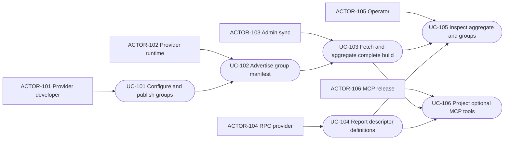
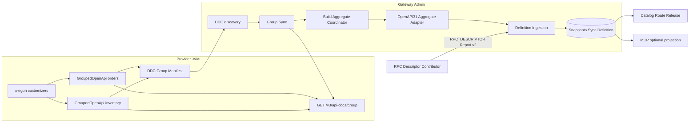
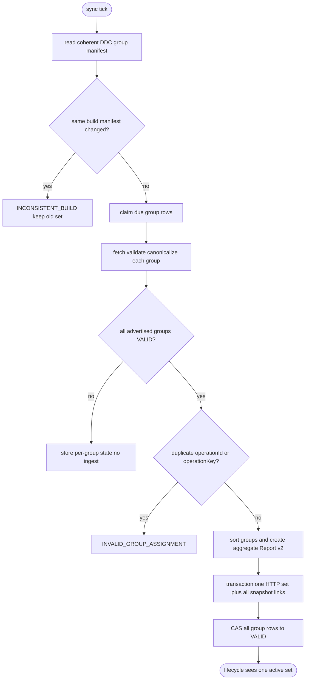
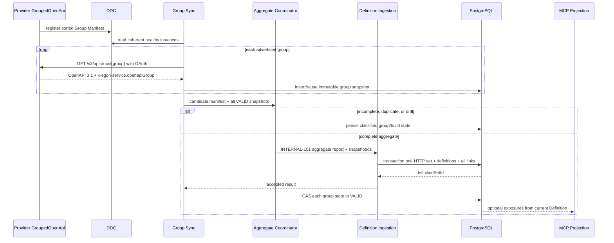
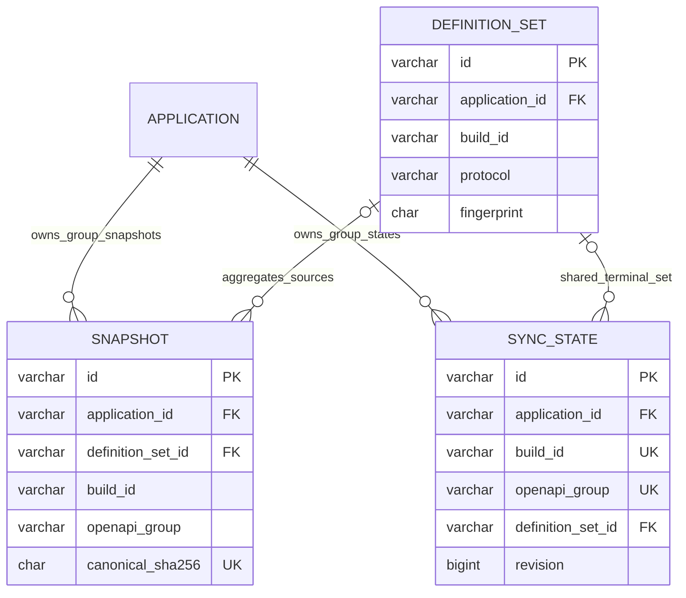

# Gateway 多 OpenAPI Group 聚合与来源扩展增补规格

| Field | Value |
| --- | --- |
| Document | [2026-08-25-19-43-gateway-openapi-group-aggregation-amendment.md](2026-08-25-19-43-gateway-openapi-group-aggregation-amendment.md) |
| Template Version | 6 |
| Status | Review |
| Type | Architecture / Amendment |
| Complexity | Complex |
| Complexity Drivers | 多 Springdoc Group、同 build 完整集聚合、跨实例 Group Manifest 漂移、HTTP OpenAPI 与 RPC Descriptor 双来源、可选 MCP 扩展、SSRF/OAuth2、永久快照与单 Definition Set 的多对一关系 |
| Created | 2026-08-25 19:43 CST |
| Updated | 2026-08-25 19:43 CST |
| Owner | User / Egon-COLA Gateway maintainers |
| Repository | Egon-COLA |
| Scope | egon-cola-platforms/egon-cola-platform-gateway；Provider 多 Group 发布、DDC 能力清单、Admin Group 聚合、来源类型、MCP 可选投影、事务与 Canonicalization 修正 |
| Change Surface | 将单 default 文档改为显式多 Group；一个应用/build 的全部 HTTP Group 聚合为一个 Definition Set；规范来源枚举、注解、DDC/config、Canonicalization、响应映射和事务；保持 RPC Protobuf 事实源并定义来源扩展边界 |
| Affected Chapters | §7, §8, §9, §10, §11, §12, §13, §14, §15, §16, §17, §18 |
| Source Requirement | 用户于 2026-08-25 确认此前六项实施阻塞全部采用 A，并新增：不同业务系统配置不同 OpenAPI Group，Gateway 负责聚合；设计 HTTP/RPC 定义来源扩展和 MCP 可选扩展 |
| Baseline Revision | main at 3be897e5cb4781890bfbac3104512e6e73bb943a；dirty-worktree snapshot；本增补不拥有其他 docs/egon 改动 |
| Amends | [Gateway HTTP OpenAPI 3.1 单一事实源破坏性改造规格](2026-08-25-19-01-gateway-openapi31-source-refactor.md) 的 §3.2 单 default 非目标、§4、§5、§7–§18、§19–§20 中 Group、来源类型、注解、DDC/config、Canonicalization、响应映射、事务和扩展边界 |
| Supersedes | None |
| Depends On | [Gateway HTTP OpenAPI 3.1 单一事实源破坏性改造规格](2026-08-25-19-01-gateway-openapi31-source-refactor.md) 未被本增补修改的全部内容；[Gateway 声明式 Operation Schema 与 MCP 参数装配设计](../../superpowers/specs/2026-08-07-gateway-declarative-operation-schema-design.md) §9、§10.1、§11–§12；[Gateway 注解托管 MCP 设计](../../superpowers/specs/2026-08-06-gateway-annotation-managed-mcp-design.md) §2–§5 |
| Related Specs | [Gateway Engine 与 MCP Core 功能域分包设计](2026-08-19-13-51-gateway-engine-mcp-package-refactor.md) |
| Related Plans | None |

## 1. Summary

本增补把 HTTP Contract 发布从单一 default 文档提升为显式多 Springdoc Group。业务 Provider 使用标准 GroupedOpenApi 或 springdoc.group-configs 定义 Group，并通过 Gateway 配置显式选择允许发布的 Group；DDC 只发布排序后的 Group Manifest 和固定路径模板。Gateway Admin 拉取一个应用同一 build 的全部 Group，逐份永久保存 Raw OpenAPI，只有 Group 集合完整、每份有效、Operation 不跨 Group 重复且聚合 Fingerprint 无漂移时，才生成一个 HTTP Definition Set。

聚合边界仍是 GatewayInterfaceDefinitionReport v2，而不是把所有协议强行合并成一份 OpenAPI。HTTP 的事实源为 OpenAPI 3.1；RPC 的事实源继续为 Protobuf Descriptor，并由 RpcGatewayDefinitionContributor 生成同一内部 Report v2。来源类型固定为 MANUAL、RPC_DESCRIPTOR、OPENAPI31。未来新增来源必须通过新的 Adapter 生成 Report v2 并经过同一 Ingestion，不得绕过控制面不变量。

MCP 是可选治理扩展：没有 EgonMcpTool 或没有 x-egon.mcp 的 Operation 仍是完整 Catalog Operation；只有显式 enabled=true 才进入 Managed MCP 投影。本增补同时闭合原 Spec 的来源枚举、Ingestion 事务、Annotation、DDC/config、Canonicalization、响应选择、同步默认值和 DNS/SSRF 细节。

## 2. Background and Current State

### 2.1 Business and user context

不同业务系统需要以稳定 Group 划分其 HTTP Contract，例如 orders、inventory、settlement。Gateway 不是某一个业务系统的 Swagger UI，而是跨应用、跨 Group 聚合 Catalog、MCP、Route/Release 所需的统一 Operation Definition。Group 必须是来源分区，不得替代 Business Domain/Entity Domain/Interface Group 目录语义。

### 2.2 Repository and external evidence

| Evidence ID | Classification | Exact path/symbol/source | Observed fact | Design significance | Verification limit |
| --- | --- | --- | --- | --- | --- |
| AM-EVD-001 | Static repository | gateway-starter/GatewayReportingAutoConfiguration | 当前 DDC Contributor 只能向同一 HTTP registration 合并 version/metadata | 使用紧凑 Group Manifest，不为每 Group 新建 DDC Lease/API | 静态代码，不证明生产 metadata |
| AM-EVD-002 | Static repository | DdcServiceRegistration.MAX_BUSINESS_METADATA_ENTRIES；validatedMetadata | 最多 32 个业务 key，key 64，value 512，敏感 key 拒绝 | Group 清单必须排序、限数并满足 512 字符 | 不证明所有业务已有 metadata 数量 |
| AM-EVD-003 | Static repository | gateway_openapi_snapshot/openapi_group 与 gateway_openapi_sync_state/openapi_group 的主 Spec 设计 | 数据模型已预留 Group 维度 | 无需新增第三张聚合表；修正 Definition Set 多对一链接即可 | 表尚未实现 |
| AM-EVD-004 | Static repository | gateway_definition_set unique(application_id,build_id,protocol,fingerprint) | Definition Set 已按 protocol 区分 HTTP/RPC | HTTP 全 Group 可聚合为一个 protocol=HTTP Set；RPC 保持独立 | findBuildFingerprint 当前忽略 protocol，实施时必须修正 |
| AM-EVD-005 | Static repository | GatewayInterfaceDefinitionReport.InterfaceGroup.sourceType 为 String；代码使用 STARTER/MANUAL | 来源语义粗粒度且硬编码 | 引入三值 Enum 并把 protocol 与 sourceType 正交化 | 破坏性 fresh DB，无旧值迁移 |
| AM-EVD-006 | Static repository | RpcGatewayDefinitionContributor + ProtobufSchemaMapper | RPC 请求/响应来自 protoMethod Input/Output Descriptor | RPC 不以 OpenAPI 反向定义类型；可与 HTTP 聚合到 Report v2 | 模块测试不等于运行拓扑 |
| AM-EVD-007 | Static repository | GatewayDefinitionReportService/JdbcGatewayDefinitionReportRepository | Report transport、idempotency、immutable build 与 definition 写入耦合 | 抽取 Ingestion；HTTP Group 聚合与 RPC HMAC 共用写入不变量 | 当前尚无 snapshot 链接 |
| AM-EVD-008 | External primary documentation | [Springdoc FAQ — multiple OpenAPI definitions](https://springdoc.org/faq.html) | 每个唯一 groupName 默认暴露 /v3/api-docs/{groupName}，可按 paths/packages 定义 | 复用标准 GroupedOpenApi，不自造分组扫描器 | 外部版本锁定后以 Golden Test 为准 |
| AM-EVD-009 | User decision | 2026-08-25 “全部A” | 六个 Plan blocker 采用推荐方案 | 本增补固定全部 A，不再保留歧义分支 | 用户仍需评审新增多 Group 细节 |
| AM-EVD-010 | User requirement | “不同的业务系统需要配置不同的openapi组，gateway是做聚合的” | 单 default 文档不满足业务隔离与聚合 | 多 Group 是当前 Must，不是未来占位 | Group 数量/SLO 使用本增补明确默认 |

### 2.3 Current chain and gap

| Entry/trigger | Current/effective chain | Gap introduced by multi Group | Consumer |
| --- | --- | --- | --- |
| Provider docs | Springdoc -> one /v3/api-docs | 无受信 published Group Manifest；Admin 不知道完整集合 | Admin Sync |
| Admin sync | app+build+default group | Group 逐个成功可能造成半套 Contract 可见 | Catalog/MCP/Lifecycle |
| RPC report | Descriptor -> Report v2 -> HMAC ingest | sourceType=STARTER 无法与 HTTP 区分 | Admin reporting |
| MCP projection | Operation attributes.mcpExposure | OpenAPI x-egon.mcp 缺省/禁用语义需明确 | McpReleaseContentFactory |

### 2.4 Evidence and current-chain map

必须同时解决三类一致性：同一实例声明的 Group 清单完整性；同一 build 多实例的 Group Manifest 与每 Group Canonical 一致性；全部 Group 到一个 HTTP Definition Set 的原子可见性。只把 openapi_group 从 default 改成任意字符串而逐组独立 ingest，会让半套业务 Contract 激活并使 Group 新增/删除无法参与 immutable build 判断，因此不满足 Gateway 聚合目标。

| Entry/trigger | Current call chain | Data read/written | External dependency | Consumers | Evidence |
| --- | --- | --- | --- | --- | --- |
| Provider Group startup | GroupedOpenApi -> Springdoc grouped resource -> DDC contributor | in-memory Group config + registration metadata | Springdoc/DDC | Admin sync | AM-EVD-001/002/008 |
| HTTP aggregate sync | Reconciler -> DDC -> Group fetch -> snapshot -> aggregate -> ingestion | snapshot/sync/definition/catalog | DDC/IdP/Provider/PostgreSQL | Catalog/MCP/Lifecycle/UI | AM-EVD-003/004/007 |
| RPC report | RpcContractCatalog -> RpcGatewayDefinitionContributor -> signed Report -> ingestion | Descriptor-derived Report/Definition | RPC Catalog/HMAC/PostgreSQL | Catalog/MCP/Lifecycle | AM-EVD-006/007 |

## 3. Goals and Non-goals

### 3.1 Goals

- 允许每个 Provider 显式发布 1–16 个稳定 OpenAPI Group，并由不同业务系统配置不同 Group。
- 使用标准 GroupedOpenApi/springdoc.group-configs，不自研 Handler 分组扫描。
- 一个 applicationId + buildId 的完整 Group Manifest 只生成一个 HTTP Definition Set。
- Group 新增、删除、重复 Operation 或多实例 Manifest 不一致均阻止覆盖旧 VALID Set。
- 统一 MANUAL、RPC_DESCRIPTOR、OPENAPI31 来源枚举并保持 protocol 正交。
- HTTP OpenAPI 与 RPC Descriptor 都进入 Report v2/Ingestion；RPC Descriptor 仍是 RPC 类型事实源。
- MCP 扩展缺省可不出现；只有显式启用才投影 Managed Tool。
- 固化此前全部 A 的安全、事务、Canonicalization、响应映射和运行默认值。

### 3.2 Non-goals

- 不把多个 Group 合并成对外暴露的单一 Swagger/OpenAPI 文档；Gateway 聚合的是内部 Definition。
- 不把 RPC 方法伪装为 HTTP paths，不以 OpenAPI 覆盖 Protobuf Descriptor。
- 不支持业务调用方在请求中选择任意 Group/URL；Admin 只消费 DDC Manifest。
- 不支持 Group 跨应用共享一个 Definition Set。
- 不支持同一 HTTP Operation 同时属于多个 published Group。
- 不新增 DDC subscription、Group Manifest HTTP API、Swagger UI 或动态插件加载器。
- 不把 MCP 变为必填；不恢复本地 Tool 手工 Schema/CRUD。
- 不修改 V1–V11，不执行删库、迁移、启动或部署。

### 3.3 Change Surface and Design Depth

| Area/layer | Disposition | Exact repository evidence | Changed or preserved behavior/contract | Required Spec treatment | Chapter(s) |
| --- | --- | --- | --- | --- | --- |
| Provider OpenAPI adapter/config | Affected | AM-EVD-001/002/008/010 | published-groups、Group root extension、DDC Manifest | Full multi-group contract/config/security design | §7, §8, §9, §10, §13, §14, §15, §16, §17, §18 |
| Admin sync/aggregation | Affected | AM-EVD-003/004/007 | complete Manifest barrier、one HTTP Definition Set、recovery | Full flow/interface/model/transaction design | §7, §8, §9, §10, §11, §13, §14, §15, §16, §17, §18 |
| Definition source and optional MCP | Affected | AM-EVD-005/006 | exact Enum、protocol/source invariant、optional x-egon.mcp | Full source boundary/pattern/test design | §7, §8, §9, §10, §13, §14, §15, §16, §17, §18 |
| PostgreSQL V12 pending design | Affected | AM-EVD-003/004 | one Definition Set to many snapshots；sync rows share set | Full table/index/ER/transaction design | §7, §8, §10, §11, §13, §14, §15, §16, §17, §18 |
| Admin Web | Affected | ApplicationsPage/OperationPage | aggregate status plus expandable Group detail | Full page/state/test design | §7, §8, §10, §12, §13, §14, §15, §16, §17, §18 |
| RPC Descriptor generation | Context-only | RpcGatewayDefinitionContributor/ProtobufSchemaMapper | sourceType rename only；schema facts unchanged | Boundary evidence and focused regression | §7, §14, §16 |
| Gateway Engine/Runtime | Unchanged | primary runtime preservation contract | no OpenAPI/Group dependency | Preserved invariant and dependency scan | §14, §16 |
| Existing Application/Catalog APIs | Unchanged | primary management read APIs and current controllers | wire unchanged；existing openapiGroup reused | Focused contract regression | §9, §12, §14 |

## 4. Requirements and Acceptance Criteria

### 4.1 Atomic requirements

| ID | Atomic requirement | Priority | Observable acceptance | Source |
| --- | --- | --- | --- | --- |
| REQ-016 | Provider 显式发布多个标准 Springdoc Group | Must | 每个 configured published group 在 /v3/api-docs/{group} 返回 3.1 文档；未发布 Group 不进入 DDC | 用户新增 |
| REQ-017 | DDC 发布有界 Group Manifest | Must | 1–16 个 code 排序、唯一、总值 <=512；固定 path-template；无完整文档/Secret | 用户新增 + AM-EVD-002 |
| REQ-018 | Admin 按完整 Group Manifest 聚合 | Must | 全 Group VALID 前不 ingest；成功只产生一个 HTTP Definition Set；所有 sync row 指向同一 set | 用户“gateway聚合” |
| REQ-019 | Group/build 漂移与重复 Operation fail closed | Must | Manifest 变化、同 Group hash 变化、跨 Group operationKey 重复均为 INCONSISTENT_BUILD/INVALID；旧 set 不变 | 全部A/immutable build |
| REQ-020 | 来源模型统一且可扩展 | Must | Enum 只有 MANUAL/RPC_DESCRIPTOR/OPENAPI31；HTTP/RPC 都经 Report v2/Ingestion；protocol/source 配对校验 | 全部A + 用户扩展要求 |
| REQ-021 | MCP 是可选 x-egon 扩展 | Must | 无 x-egon.mcp 仍可 Catalog ingest；enabled=true 才投影；非法 MCP 只阻断该 Contract ingest | 用户扩展要求 |
| REQ-022 | Annotation、operationId、x-egon-service 契约完整 | Must | 三个 Annotation 字段固定；受管 Operation operationId 全局唯一；group 与 build 交叉验证 | 全部A |
| REQ-023 | Canonicalization 与 OpenAPI->Report 映射确定 | Must | servers/集合排序规则稳定；200/最低2xx/default；错误响应完整；多媒体冲突拒绝 | 全部A |
| REQ-024 | Ingestion 与 sync 事务可恢复 | Must | Definition+全部 snapshot link 原子；sync VALID 逐行 CAS；失败重试可修复且不重复 Definition | 全部A |
| REQ-025 | 同步 SLO/SSRF 默认确定 | Must | 30s/50/3/2m/3s/10s/backoff/jitter/5m sample；双 DNS 校验、CIDR、HTTPS、no redirect/ref | 全部A |
| REQ-026 | UI 显示应用聚合状态与 Group 明细 | Must | Application 行显示 worst/aggregate；展开显示每 Group 状态/hash/error；Operation 显示来源 Group | 用户新增 |

### 4.1 Scenario matrix

| Scenario | Trigger/preconditions | Main outcome | Alternative/failure | State/data result | Requirements |
| --- | --- | --- | --- | --- | --- |
| 两 Group 首次发布 | orders/inventory 同 build、DDC Manifest 一致 | 拉取两份、两 snapshot、聚合一份 HTTP Set | 任一失败不 ingest | 两 sync row 最终指向同一 set | REQ-016–019 |
| 不同业务系统不同 Group | 应用 A=orders，B=settlement | 各自按 application 聚合并在 Catalog 共存 | code 只要求应用内唯一 | 不跨应用合并 set | REQ-016/018 |
| 同 build 新增 Group | 某实例 Manifest 增加 payments | 视为 immutable build 漂移 | 不做部分追加 | 旧 VALID set 保持 | REQ-019 |
| Group 重叠 Operation | 两文档都含 GET /orders/{id} | 聚合前拒绝 | INVALID_GROUP_ASSIGNMENT | snapshots 保留、无新 Definition | REQ-019 |
| MCP 缺省 | Operation 无 EgonMcpTool/x-egon.mcp | 正常进入 Catalog/Route候选 | N/A | 不生成 Managed Tool | REQ-021 |
| MCP 显式启用 | x-egon.mcp enabled=true且合法 | 稳定 Tool ID/Schema 投影 | multipart/required cookie等拒绝投影/ingest | 旧 Tool 不被错误替换 | REQ-021 |
| RPC Report | Protobuf Unary Contract | RPC_DESCRIPTOR Report v2 正常 ingest | Java/OpenAPI schema 声明不参与 | 独立 RPC Definition Set | REQ-020 |
| DNS/实例异常 | 目标地址或第二次解析越界 | token/network 前 fail closed | 同 build 下一实例，最多3 | FETCH_FAILED/INVALID，旧 set 不变 | REQ-025 |

### 4.2 Use-case analysis

| Actor | Goal | Entry/context | Evidence |
| --- | --- | --- | --- |
| ACTOR-101 Provider developer | 用标准 Group 配置划分业务 Contract | GroupedOpenApi + published-groups | AM-EVD-008/010 |
| ACTOR-102 Provider runtime | 发布 Manifest 和受保护 Group 文档 | DDC + API-101 | AM-EVD-001/002 |
| ACTOR-103 Admin sync runtime | 聚合完整 build HTTP Contract | JOB-101/DDC/OAuth/PostgreSQL | AM-EVD-003/007 |
| ACTOR-104 RPC provider | 从 Descriptor 上报 RPC Definition | current HMAC Report | AM-EVD-006 |
| ACTOR-105 Operator | 查看应用与 Group 状态 | Applications/Operation | primary frontend |
| ACTOR-106 MCP release | 只消费显式 MCP exposure | McpReleaseContentFactory | accepted MCP Specs |



| UC | Trigger/preconditions | Main outcome | Failure/alternative | Postcondition | Interfaces | Tests |
| --- | --- | --- | --- | --- | --- | --- |
| UC-101 | explicit GroupedOpenApi + allowlist | every group yields 3.1+x-egon-service | missing/duplicate/mismatch fails configuration/contract test | no unlisted group advertised | API-101 | TEST-101–104 |
| UC-102 | DDC registration enabled | compact sorted Manifest | size/key/resource invalid blocks registration | one lease advertises all groups | DDC metadata | TEST-105 |
| UC-103 | coherent healthy instances | all groups snapshot and one set | incomplete/drift/duplicate -> no ingest | current set changes only after aggregate success | JOB-101/INTERNAL-101 | TEST-106–116 |
| UC-104 | valid Unary descriptor | RPC_DESCRIPTOR set | non-Unary/schema override rejected | RPC schema truth unchanged | current Report | TEST-117 |
| UC-105 | CAP_gateway:read | aggregate + group state visible | partial query error retains available page data | read-only | primary API-002/003 | TEST-118–121 |
| UC-106 | mcp extension enabled | Managed Tool projected | absent means no tool；invalid fails safely | Catalog remains authoritative | INTERNAL-101 | TEST-122–124 |

## 5. Constraints, Assumptions, and Decisions

### 5.1 Confirmed constraints

- Primary Spec remains breaking/fresh DB；V1–V11 immutable，only V12。
- OpenAPI version remains 3.1.x and Springdoc remains 2.8.17。
- Group code is source partition，not tenant、Business Domain or Interface Group。
- Provider cannot register arbitrary full URL；only fixed path template plus constrained group code。
- RPC Protobuf Descriptor remains RPC type source；OpenAPI types never enter Engine/RPC runtime。
- One HTTP build is complete only when every advertised published Group is ready。

### 5.2 Small-gap assumptions

| ID | Inference | Evidence | Reversibility | Impact if wrong |
| --- | --- | --- | --- | --- |
| ASM-101 | published-groups selects existing GroupedOpenApi beans/config instead of duplicating packages/paths config | Springdoc owns grouping | local property binding | Provider config migration |
| ASM-102 | max group count 16 plus serialized manifest <=512 | DDC value limit | configurable only through future Spec | very large monolith needs manifest API later |
| ASM-103 | UI uses expandable row instead of new route | ApplicationsPage already owns application status | presentational | component layout only |

### 5.3 Resolved decisions

| ID | Decision | Owner/evidence | Consequence |
| --- | --- | --- | --- |
| DEC-A01 | sourceType exactly MANUAL/RPC_DESCRIPTOR/OPENAPI31 | User 全部A | remove STARTER/RPC_REPORT/OPENAPI literals |
| DEC-A02 | Definition + all snapshot links atomic；sync VALID separate CAS/recovery | User 全部A | Ingestion has no sync-state ownership |
| DEC-A03 | adopt three Annotation contracts and one x-egon root | User 全部A + attachment | no legacy HTTP annotation bridge |
| DEC-A04 | deterministic canonicalization and explicit response/media mapping | User 全部A | drift becomes reproducible |
| DEC-A05 | fixed scheduler/retry/sample defaults in §15 | User 全部A | typed properties and tests |
| DEC-A06 | trusted DDC/internal DNS + two all-address checks + CIDR/HTTPS/no redirect | User 全部A | no Apache client/new network dependency |
| DEC-A07 | explicit multi Group and one aggregate HTTP Definition Set | User latest | partial Group success not visible |
| DEC-A08 | MCP extension optional；RPC remains descriptor source | User latest + prior invariant | Report v2 is protocol aggregation seam |

### 5.4 Open major decisions

None。RPC-as-OpenAPI ingestion is deliberately not selected because it would contradict the confirmed Protobuf source-of-truth decision；a future Descriptor-derived OpenAPI read projection may be specified without becoming an ingestion source。

## 6. Project Technology Context

### 6.1 Runtime and architecture profile

Java 21、Spring Boot 3.5.16、Springdoc 2.8.17、PostgreSQL/Flyway、React/TypeScript remain as primary Spec。Architecture remains the user-approved Traditional Layered feature-first variant under top.egon.cola.component.gateway.admin；no Archetype/biz.* hybrid is introduced。

### 6.2 Capability reuse ledger

| Need | Existing candidate | Fit/gap | Decision |
| --- | --- | --- | --- |
| Group generation | GroupedOpenApi/springdoc.group-configs | exact standard capability | reuse；no scanner |
| Group discovery | ObjectProvider<GroupedOpenApi> + explicit allowlist | no standard secured manifest endpoint needed | publish compact DDC list |
| Aggregation | GatewayInterfaceDefinitionReport + Definition repository | supports multiple groups/operations | aggregate before one ingest |
| RPC schema | RpcContractCatalog/ProtobufSchemaMapper | complete | reuse unchanged |
| Source differentiation | sourceType String | hardcoded gap | add Enum |
| MCP optional projection | existing mcpExposure/McpReleaseContentFactory | needs x-egon conditional mapping | reuse with optional section |
| HTTP fetch | JDK HttpClient + IdpServiceOAuth2Client | supports no redirect/OAuth；DNS pin unavailable | reuse with DEC-A06 threat boundary |
| Conversion | MapStruct + BaseConverter | normalized DTO -> Report | reuse；graph traversal remains Adapter |

### 6.2 User-mandated Java rule compliance

| Literal rule | Affected? | Repository evidence | Exact design decision | Files/types/interfaces | Validation/test evidence | Status/blocker |
| --- | --- | --- | --- | --- | --- | --- | --- |
| Rule 1 | Yes | §8/§10 type inventory | carriers end DTO/PO/VO；Enum and behavior suffixes exact | Group/Manifest/Aggregate/Ingestion types | type inventory/static scan | PASS |
| Rule 2 | Yes | ValidationUtils + affected handoffs §10.3 | config、manifest、aggregate command validated at every handoff | properties/DTO/coordinator/ingestion | positive-negative/group tests | PASS |
| Rule 3 | Yes | BaseConverter/MapStruct baseline | simple carriers records；converter implements BaseConverter | DTO records + GatewayOpenApiDefinitionConverter | constructor/mapping tests | PASS |
| Rule 4 | Yes | gateway has no lombok.config；primary adds it | @Slf4j、explicit Bean names、@RequiredArgsConstructor、final @Qualifier | changed coordinator/service/validator/repository Beans | context/constructor/log scan | PASS |
| Rule 5 | Yes | JDK HttpClient/Spring/Jackson candidates | no new HTTP/utility dependency | all affected Java files/POMs | import/dependency scan | PASS |
| Rule 6 | Yes | OpenAPI/x-egon/VO JSON boundaries | Spring Boot Jackson/Json31 only | extensions/DTO/VO/controllers | serialization Golden | PASS |
| Rule 7 | Yes | admin base/local + provider YAML files | identical new key structure，values may differ | all affected application.yml profiles | key parity/config tests | PASS |
| Rule 9 | Yes | complex group/source/state variation | Adapter + Chain + Aggregate Coordinator + Facade | §13 participants | pattern/branch tests | PASS |
| Rule 10 | Yes | sync/snapshot current java.time model | Instant/Duration/Clock/TIMESTAMPTZ only | properties/PO/DTO/VO/services | forbidden import/time tests | PASS |
| Rule 11 | Yes | current feature-first tree/user decision | Traditional Layered feature-first only | every §8 target file | package architecture test | PASS |

## 7. Architecture Design

### 7.0 Minimum-design baseline and element-necessity audit

| Proposed element | Change | Requirements | Existing/direct alternative | Concrete inadequacy of alternative | Added calls/state/coupling/failures/migration/operations | Verdict |
| --- | --- | --- | --- | --- | --- | --- | --- |
| GroupedOpenApi reuse | Keep | REQ-016 | custom scanner | standard already owns paths/packages and custom code duplicates it | config/Golden only | Keep |
| DDC CSV Manifest | Add | REQ-017 | one key per Group or new HTTP manifest | per-key wastes quota；new API adds auth/call/failure | one metadata value + validation | Add |
| Aggregate Coordinator | Add | REQ-018/019 | independent per-group ingest | exposes partial build and misses removal drift | barrier/state orchestration/recovery | Add |
| extra aggregate table | Candidate | REQ-018 | query sync rows + DDC Manifest | current bounded data already derives readiness | migration/state duplication | Remove |
| one set per Group | Candidate | REQ-018 | simplest local ingest | fails application-level complete-set semantics | lifecycle/partial visibility | Reject |
| one HTTP set per build | Add | REQ-018 | aggregate Report v2 | direct per-group set is semantically incomplete | waits for all groups | Add |
| generic runtime plugin system | Candidate | REQ-020 | Report v2 + explicit Adapter modules | dynamic loading has no present source/use case | classloader/security/registration | Remove |
| optional x-egon.mcp | Add | REQ-021 | mandatory MCP block | excludes ordinary HTTP contracts | conditional validation/tests | Add |
| RPC OpenAPI ingestion | Candidate | REQ-020 | Descriptor adapter already complete | OpenAPI would be a second RPC type truth | drift/semantic distortion | Remove |

| Path | Network calls | Client states | Server contracts/state | Failure and TOCTOU points | Additional user/business value |
| --- | --- | --- | --- | --- | --- |
| one default document | one fetch/build | one status | one snapshot/set | cannot express independent business partitions | insufficient |
| independent Group ingestion | one fetch/group | per-group statuses | many sets/lifecycle states | partial build visible；removal undetected | group visibility only |
| selected complete Manifest aggregation | one fetch/group when new/due/sample | per-group + aggregate display | many snapshots -> one HTTP set | barrier、manifest drift、CAS repair | complete business grouping and safe aggregation |

### 7.1 System Architecture Design



### 7.2 High-Level Design

Group Manifest is the complete build-level membership contract。Admin chooses one coherent healthy instance manifest per application/build，requires every same-build instance it samples to advertise the identical sorted group list，then maintains one sync row and snapshot history per Group。Readiness is derived from DDC Manifest plus sync rows；no aggregate table/cache is authoritative。

When all Group snapshots are VALID and canonical-stable，GatewayOpenApiAggregateCoordinator validates global operationId and operationKey uniqueness，sorts Group codes，adapts all documents into one GatewayInterfaceDefinitionReport，and calls INTERNAL-101 once。Ingestion writes one protocol=HTTP Definition Set and links every source snapshot in the same transaction。After commit，Sync Service advances each claimed group row to VALID with revision CAS；a crash leaves linked snapshots and INGESTING rows，which the next tick recognizes and repairs without a second Definition Set。

HTTP and RPC share only normalized Report v2 and Ingestion。HTTP acquisition is Admin pull；RPC acquisition remains signed Provider Report。sourceType and protocol are separate invariants：OPENAPI31 requires HTTP，RPC_DESCRIPTOR requires RPC，MANUAL may be HTTP or RPC only through existing Admin manual contract。

### 7.2.1 Critical aggregation flow



#### 7.2.2 High-level decision and quality matrix

| Concern/use case | Required quality | Selected mechanism | Failure/degradation | Trade-off | Verification | Requirements |
| --- | --- | --- | --- | --- | --- | --- |
| Group completeness | no partial build visibility | coherent DDC Manifest + aggregate barrier | any missing/invalid Group keeps old set | one bad Group blocks new build | TEST-106/107 | REQ-017–019 |
| Immutable consistency | same build means same membership/contract | manifest SHA + per-group canonical + aggregate fingerprint | INCONSISTENT_BUILD | extra five-minute samples | TEST-108–111 | REQ-019/023 |
| Protocol correctness | HTTP/RPC keep native facts | OPENAPI31 Adapter and RPC_DESCRIPTOR Contributor -> Report v2 | source/protocol mismatch rejects | two acquisition paths | TEST-117 | REQ-020 |
| Security | no arbitrary target/ref/credential forwarding | DDC tuple、double DNS/CIDR、OAuth、HTTPS、no redirect/ref | fail closed/next same-build instance | trusts controlled internal DNS | TEST-105/114 | REQ-025 |
| Recovery | crash/concurrency does not duplicate/partially activate | aggregate DB transaction + separate per-row CAS repair | transient INGESTING rows | eventual status convergence | TEST-115/116 | REQ-024 |
| Optional MCP | ordinary APIs do not require MCP | conditional x-egon.mcp validation/projection | invalid enabled extension rejects；absence succeeds | conditional branches/tests | TEST-122–124 | REQ-021 |

### 7.3 Detailed Design

#### 7.3.1 Group identity and Manifest

- Group code pattern: lowercase [a-z][a-z0-9-]{0,63}。
- published-groups contains 1–16 distinct codes；sort lexicographically；joined CSV UTF-8 length <=512。
- Every published code must resolve to exactly one GroupedOpenApi Bean/config；unlisted groups may exist locally but are not advertised or fetched by Gateway。
- Standard endpoint is /v3/api-docs/{group}；base path is fixed in V1 and not read from caller input。
- x-egon-service.openapiGroup and DDC group code must match exactly。
- Same application/build instances with different manifests are build drift。

#### 7.3.2 Exact DDC metadata contract

| Key | Required value/source | Validation |
| --- | --- | --- |
| gateway.definition-source | OPENAPI31 | exact enum name |
| gateway.openapi.enabled | true | literal |
| gateway.openapi.path-template | /v3/api-docs/{group} | absolute path；one placeholder；no scheme/query/fragment/dot segments |
| gateway.openapi.spec | 3.1 | exact |
| gateway.openapi.groups | sorted CSV | 1–16 codes；unique；<=512 |
| gateway.openapi.resource-uri | Provider Resource URI | absolute normalized HTTPS in production；no userInfo/query/fragment |
| gateway.artifact-version | GatewayReportingProperties.artifactVersion | nonblank <=128 |
| gateway.build-id | GatewayReportingProperties.buildId | nonblank <=256 |

No token、client ID/secret、host、complete document or tenant claim appears in metadata。

#### 7.3.3 Exact Annotation and x-egon contracts

```java
@Target(TYPE)
public @interface EgonApiCatalog {
    String businessDomainCode();
    String businessDomainName() default "";
    String entityDomainCode();
    String entityDomainName() default "";
    String interfaceGroupCode();
}

@Target(METHOD)
public @interface EgonGatewayPolicy {
    String owner() default "";
    Exposure exposure() default Exposure.INTERNAL;
    Idempotency idempotency() default Idempotency.AUTO;
    enum Exposure { INTERNAL, EXTERNAL }
    enum Idempotency { AUTO, TRUE, FALSE }
}

@Target(METHOD)
public @interface EgonMcpTool {
    boolean enabled() default false;
    String serverCode() default "";
    String name() default "";
    String[] permissions() default {};
    McpRiskLevel riskLevel() default McpRiskLevel.LOW;
}
```

Every catalogued operation declares @Operation.operationId explicitly。Naming convention is interfaceGroupCode + "." + semanticMethodName；overloads/multiple mappings must declare distinct semantic suffixes rather than scan-order numbers。Idempotency AUTO maps GET/HEAD/OPTIONS/PUT/DELETE to TRUE and POST/PATCH to FALSE。

Per-operation extension shape is one x-egon object with version=1 and optional catalog、policy、mcp sections。catalog exists for a published Controller；policy exists when EgonGatewayPolicy is present；mcp is absent unless EgonMcpTool.enabled=true。When enabled，name defaults to operationId，serverCode is required，permissions are sorted unique，riskLevel is required enum。

Root x-egon-service fields are version=1、bizCode、applicationCode、artifactVersion、buildId、openapiGroup。env/namespace remain trusted DDC/application scope and are not duplicated in the document。

#### 7.3.4 Canonicalization contract

1. Parse JSON with Spring Boot Jackson/Swagger Json31；hash exact received bytes as documentSha256。
2. Remove only valid OpenAPI server locations: root.servers、each PathItem.servers and each Operation.servers；never remove a business schema property named servers。
3. Recursively sort object member names lexicographically。
4. Sort set-semantic arrays: required and enum by canonical scalar；operation tags and x-egon.mcp.permissions lexicographically；parameters by in+name+$ref；security requirements by canonical JSON；root tags by name。
5. Preserve order of oneOf、anyOf、allOf、prefixItems、examples and every unlisted array。
6. Serialize compact UTF-8 JSON with stable Jackson number/string semantics；SHA-256 lowercase hex is canonicalSha256。
7. Group aggregate fingerprint hashes the ordered sequence groupCode + NUL + groupCanonicalSha256 plus the canonical normalized Report v2；Group membership therefore affects immutable build identity。

#### 7.3.5 OpenAPI to internal model mapping

- Merge PathItem parameters then Operation parameters；Operation overrides the same (in,name) pair；duplicates within one level reject。
- Build gateway-operation-request/v2 groups path/query/header/cookie/body/part；Path required is always true。
- multipart/form-data maps its object schema to part；other request content selects application/json，then application/*+json，then the only remaining media type。If multiple selected candidates have different canonical schemas，reject as ambiguous。All media types remain sorted in attributes.consumes。
- Main response selection is exact 200，otherwise numerically lowest 2xx，otherwise default。204/no-content becomes type=null plus x-egon-schema-model=gateway-operation-response/v2。
- Response content uses the same JSON/+json/single rule；ambiguous schemas reject。Other non-2xx/default responses become ordered errorSchema entries with status、description、sorted contentTypes and schema。
- attributes preserve httpMethod、path、openapiOperationId、openapiGroup、consumes、produces、responseMode=TRANSPARENT、streaming、idempotent and optional mcpExposure。
- streaming derives from text/event-stream or application/x-ndjson，not Java return type。

#### 7.3.6 Conclusion evidence chain

| Conclusion | Evidence | Requirement/constraint | Decision | Consequence/trade-off | Verification |
| --- | --- | --- | --- | --- | --- |
| GroupedOpenApi is the Provider grouping authority | AM-EVD-008/010 | REQ-016；no custom scanner | explicit published allowlist over existing groups | Provider config is explicit and bounded | TEST-101–105 |
| one HTTP Definition Set aggregates every Group | AM-EVD-003/004/007 | REQ-018/019；complete-set semantics | barrier then one INTERNAL-101 call | waits for the slowest Group，old set remains safe | TEST-106–110 |
| Report v2 is the HTTP/RPC aggregation seam | AM-EVD-004–007 | REQ-020；RPC Protobuf source invariant | OPENAPI31 and RPC_DESCRIPTOR adapters stay protocol-native | no fake RPC paths or dynamic plugin system | TEST-117 plus primary regressions |
| MCP remains an optional projection | accepted MCP boundary + user latest | REQ-021 | x-egon.mcp absent succeeds，enabled validates | ordinary APIs avoid MCP coupling | TEST-122–124 |
| Ingestion and sync state use recoverable two-phase local consistency | current repository transaction split + DEC-A02 | REQ-024 | definitions/snapshot links atomic，sync CAS after commit | brief INGESTING window，restart repair required | TEST-115/116 |

#### 7.3.7 Source and optional MCP extension boundary

| sourceType | protocol | Acquisition | Authoritative schema | MCP behavior |
| --- | --- | --- | --- | --- |
| OPENAPI31 | HTTP | Admin DDC pull of complete Group Manifest | OpenAPI 3.1 | optional x-egon.mcp |
| RPC_DESCRIPTOR | RPC | existing signed Report | Protobuf Descriptor | optional GatewayOperation RPC governance |
| MANUAL | HTTP or RPC per existing contract | Admin management | explicit existing Definition | no invented annotation exposure |

New protocol/source formats are added as explicit Adapter modules that must output Report v2 and add a versioned enum through a reviewed Spec。No Adapter may write Catalog/Definition directly。A future Descriptor-derived RPC OpenAPI document may be a read-only presentation/export，but cannot become RPC ingestion truth without a new approved Spec。

MCP absence is success。McpProjectionValidator executes only when exposure exists/enabled；it retains multipart/streaming/required HEADER/COOKIE restrictions and stable Tool ID。Unknown optional x-egon members are preserved in Raw snapshot but ignored；unsupported x-egon.version is rejected。

#### 7.3.8 Transaction, recovery, and concurrency

| Boundary | Transaction | Success | Failure/recovery |
| --- | --- | --- | --- |
| Group fetch | none | bytes + per-group validation | next instance/max3；state only |
| Snapshot insert | short local | immutable/reused row | retry hash idempotently |
| Aggregate ingestion | one PostgreSQL transaction | one Definition Set + all Operation/Catalog rows + every snapshot definition_set_id link | rollback all Definition/link writes |
| Sync terminal updates | separate per-row CAS transactions | every Group points same set and VALID | restart sees linked snapshots/set and repairs remaining rows |
| Lifecycle | existing transaction | union RPC metadata IDs + VALID aggregate HTTP set IDs | stale DDC never retires |

The aggregate transaction never updates gateway_openapi_sync_state。GatewayDefinitionIngestionCommandDTO carries snapshotIds，not sync row IDs/revisions。This preserves the transport-neutral writer boundary selected by DEC-A02。

#### 7.3.9 Sequence/swimlane



## 8. Package Structure and Code File Tree

### 8.1 Amended target tree

```text
egon-cola-platforms/egon-cola-platform-gateway/
├── egon-cola-platform-gateway-contract/
│   └── .../reporting/
│       ├── GatewayDefinitionSourceTypeEnum.java CREATE
│       └── openapi/GatewayOpenApiGroupManifestDTO.java CREATE
├── egon-cola-platform-gateway-starter-openapi/
│   └── .../openapi/
│       ├── annotation/{EgonApiCatalog,EgonGatewayPolicy,EgonMcpTool}.java CREATE
│       ├── config/{GatewayOpenApiProperties,GatewayOpenApiAutoConfiguration}.java CREATE/MODIFY
│       ├── customizer/{EgonOperationCustomizer,EgonOpenApiCustomizer}.java CREATE
│       └── registration/GatewayOpenApiRegistrationContributor.java CREATE
├── egon-cola-platform-gateway-admin/
│   └── .../admin/
│       ├── config/properties/GatewayAdminOpenApiProperties.java CREATE
│       ├── openapi/domain/dto/GatewayOpenApiAggregateDTO.java CREATE
│       ├── openapi/service/GatewayOpenApiAggregateCoordinator.java CREATE
│       ├── openapi/service/GatewayOpenApiSyncService.java CREATE
│       ├── openapi/converter/{GatewayOpenApi31ContractAdapter,GatewayOpenApiInvocationSchemaAdapter,GatewayOpenApiDefinitionConverter}.java CREATE
│       ├── openapi/validation/... CREATE/MODIFY group/manifest/mcp rules
│       ├── openapi/repository/... CREATE/MODIFY multi-group readiness and CAS
│       └── reporting/service/GatewayDefinitionIngestionService.java CREATE
├── egon-cola-platform-gateway-admin-web/src/
│   ├── api/{types.ts,gatewayApi.ts,gatewayApi.test.ts} MODIFY
│   └── features/applications/{ApplicationsPage.tsx,ApplicationsPage.test.tsx} MODIFY
└── egon-cola-platform-gateway-test/
    ├── ...-http-provider/src/main/resources/application.yml MODIFY two groups
    ├── ...-webflux-http-provider/src/main/resources/application.yml MODIFY group
    └── */src/test/resources/openapi/{orders,inventory,drift}.json CREATE
```

Primary Spec §8 remains authoritative for every other Create/Modify/Delete path。SchemaPanel is reused unchanged because it already renders the internal v2 schema；OperationPage consumes its existing openapiGroup field and only requires the primary Spec changes。

### 8.2 Responsibilities

| Path/symbol | Responsibility | Dependencies | Requirements |
| --- | --- | --- | --- |
| GatewayOpenApiProperties | explicit published group allowlist and Provider toggles | Springdoc properties | REQ-016/017 |
| GatewayOpenApiGroupManifestDTO | one shared normalized DDC wire/handoff contract | gateway-contract/Jakarta Validation | REQ-017–019 |
| GatewayOpenApiRegistrationContributor | build compact DDC Manifest | DDC contributor/report identity | REQ-017 |
| GatewayOpenApiAggregateCoordinator | completeness、duplicates、aggregate fingerprint | sync/snapshot/Adapter | REQ-018/019 |
| GatewayAdminOpenApiProperties | bounded sync/security/limits | configuration binding | REQ-025 |
| GatewayDefinitionSourceTypeEnum | source/protocol semantic enum | contract/Admin/frontend | REQ-020 |
| GatewayDefinitionIngestionService | one definition writer and snapshot-list link | existing repositories | REQ-018/020/024 |

## 9. Interface Definitions

### 9.1 Interface Inventory

| ID | Change/necessity | Kind | Identity | Input | Output | Auth | Error/idempotency | Requirements |
| --- | --- | --- | --- | --- | --- | --- | --- | --- |
| API-101 | Change/Add per Group | HTTP | HTTP GET /v3/api-docs/{group} | path group + Bearer | OpenAPI 3.1 group doc | SCOPE_gateway.openapi.read | safe read/hash | REQ-016/022/025 |
| JOB-101 | Change multi-group reconcile | Scheduled | GatewayOpenApiSyncReconciler.reconcile() | config/DDC/DB/Clock | states/metrics | PLATFORM SERVICE | CAS/retry/barrier | REQ-017–019/024/025 |
| INTERNAL-101 | Change aggregate ingestion | Internal Service | GatewayDefinitionIngestionService.ingest(command) | sourceType/report/snapshotIds | report result | caller-resolved app | one transaction/idempotent | REQ-018–021/024 |

Primary sync-state、Operation-fragment and snapshot-document management read wire shapes remain unchanged：the state and Operation responses already carry openapiGroup，and the document response is snapshot-specific。

### 9.2 Per-interface Detailed Contracts

#### 9.2.1 API-101 — Read one published OpenAPI Group

##### Necessity and interaction-cost decision

| Concern | Decision |
| --- | --- |
| Change classification | Existing standard endpoint expanded from default to named Group |
| Independent consumer goal | Admin fetches exactly one advertised source partition |
| Parameter ownership and derivation | group comes only from DDC Manifest；browser/user never chooses target |
| Direct/no-new-interface alternative | one merged Provider doc loses business partition and completeness evidence |
| Caller use of result | snapshot + aggregate Report；never forwarded unchanged to another Provider request |
| Round trips and failure points | one per new/due/sample Group；bounded by max16 and batch50；OAuth/network/validation may fail |
| Verdict | Change，REQ-016–019 |

##### Identity and purpose

| Concern | Definition |
| --- | --- |
| Protocol | HTTPS GET /v3/api-docs/{group} |
| Content | application/json；openapi starts 3.1 |
| Auth | Bearer PLATFORM SERVICE；SCOPE_gateway.openapi.read；audience=metadata resource URI |
| Timeout/limit | connect 3s；read 10s；5 MiB each；redirect NEVER |
| Idempotency | safe read；document/canonical SHA |

##### Request parameters

| Name | Location | Type | Required | Validation | Source |
| --- | --- | --- | --- | --- | --- |
| group | Path | string | Yes | advertised code pattern；published allowlist；max64 | DDC Manifest |
| Authorization | Header | Bearer JWT | Yes | scope/audience/resource | IdP client |
| Accept | Header | media type | No | application/json only | Admin client |

##### Success response

```jsonc
{
  "openapi": "3.1.0", // Required supported OpenAPI version.
  "info": { // Required group document identity.
    "title": "Order APIs", // Required non-blank title.
    "version": "5.3.3" // Required artifact/contract display version.
  },
  "paths": { // Required non-empty path map for this published group.
    "/orders/{id}": { // Example absolute OpenAPI path template.
      "get": { // Example HTTP Operation owned only by this group.
        "operationId": "order-api.getOrder", // Required globally unique stable operation identity.
        "responses": { // Required response map.
          "200": { // Selected primary success response.
            "description": "Order found" // Required response description.
          }
        }
      }
    }
  },
  "components": { // Optional reusable local components.
    "schemas": {} // Optional schema map; external refs are forbidden.
  },
  "x-egon-service": { // Required Egon build/group identity.
    "version": 1, // Required extension version.
    "bizCode": "trade", // Required; cross-checked with application scope.
    "applicationCode": "order-service", // Required; cross-checked with DDC/application.
    "artifactVersion": "5.3.3", // Required; matches metadata.
    "buildId": "build-20260825-001", // Required immutable build ID.
    "openapiGroup": "orders" // Required; matches path and Manifest.
  }
}
```

##### Error responses

```jsonc
{
  "code": "GATEWAY_OPENAPI_GROUP_NOT_PUBLISHED", // Stable Provider/Admin classification for an unadvertised group.
  "message": "OpenAPI group is not published", // Safe message without target address or token.
  "retryable": false // Unchanged build is not retried until manifest/config changes.
}
```

401/403 use OAuth behavior；404 maps group-not-published；5xx/timeout may try another same-build instance；oversize/invalid JSON becomes classified sync failure。

##### Interface logic for frontend and consumers

1. Derive group and target from coherent DDC observation。
2. Validate scheme、path template、group、resource URI and all DNS addresses before token acquisition。
3. Acquire least-privilege token。
4. Re-resolve and revalidate all DNS addresses immediately before request。
5. Fetch without redirect and stop at 5 MiB。
6. Cross-check x-egon-service against Manifest/application/build/group。
7. Persist/aggregate without exposing Provider URL to frontend。

##### Compatibility and verification

Breaking replacement of default-only API-001。Contract tests cover MVC/WebFlux groups、unpublished group、scope、cross-group identity、Golden JSON and dependency isolation。

#### 9.2.2 JOB-101 — Reconcile and aggregate Group Manifest

##### Necessity and interaction-cost decision

| Concern | Decision |
| --- | --- |
| Change classification | Existing scheduled job expanded for aggregate readiness |
| Independent consumer goal | converge one complete application/build HTTP contract |
| Parameter ownership and derivation | typed config owns bounds；DDC owns Manifest；database owns group state/revision；Clock owns time |
| Direct/no-new-interface alternative | independent group jobs expose partial set and cannot detect removed groups |
| Caller use of result | lifecycle、UI and metrics consume the one aggregate set/group states |
| Round trips and failure points | max batch50；max3 instances/group；5m sampling；DDC/OAuth/Provider/DB may fail independently |
| Verdict | Change |

##### Identity and purpose

Named Bean gatewayOpenApiSyncReconciler invokes named Service gatewayOpenApiSyncService and gatewayOpenApiAggregateCoordinator。It has no user payload and never holds a transaction across DDC/OAuth/HTTP。

##### Request parameters

Inputs are validated GatewayAdminOpenApiProperties，active applications，one coherent DDC snapshot，and due sync rows。Group membership is derived only from metadata，not from database stale rows or UI filters。

##### Success response

No public return。A complete build ends with one Definition Set ID referenced by every advertised Group row；metrics record groupsExpected/groupsValid and one aggregate outcome。

##### Error responses

Stale DDC aborts destructive reconciliation。Manifest drift marks build inconsistent；missing Group waits/fails without ingest；duplicate Operation marks invalid assignment；CAS loss skips owned row；all errors are safe and scheduler continues。

##### Interface logic for frontend and consumers

1. Discover coherent manifests per application/build。
2. Detect same-build manifest mismatch before group fetch。
3. Claim/fetch/validate due Groups with configured bounds。
4. Persist/reuse each snapshot and group terminal state。
5. Query all advertised Group readiness and reject duplicates/drift。
6. Invoke INTERNAL-101 once for complete aggregate。
7. CAS-repair all Group rows and expose one lifecycle set。

##### Compatibility and verification

No default-only fallback or mixed version。Tests cover incomplete barrier、manifest add/remove drift、duplicate Operation、two Admins、restart after ingest and DDC stale fail-safe。

#### 9.2.3 INTERNAL-101 — Ingest one aggregate Definition source

##### Necessity and interaction-cost decision

| Concern | Decision |
| --- | --- |
| Change classification | Existing report write path extracted and command expanded with sourceType/sourceScope/snapshotIds |
| Independent consumer goal | one authoritative writer for HTTP aggregate and RPC Report |
| Parameter ownership and derivation | caller resolves source/application/provenance；Service owns canonical validation and persistence defaults |
| Direct/no-new-interface alternative | per-group direct repository writes drift；calling HMAC transport fabricates authentication |
| Caller use of result | HTTP sync links group states；RPC transport returns current report acknowledgement |
| Round trips and failure points | one local call/transaction；validation、immutable conflict or repository write may fail |
| Verdict | Change |

##### Identity and purpose

GatewayDefinitionIngestionService.ingest(@Valid GatewayDefinitionIngestionCommandDTO) validates source/protocol invariants and writes the immutable Report v2 graph。It knows snapshot IDs only as provenance links and never owns fetch、OAuth or sync revisions。

##### Request parameters

| Name | Type | Required/default | Validation |
| --- | --- | --- | --- |
| applicationId | String | Required | existing owner max64 |
| sourceType | GatewayDefinitionSourceTypeEnum | Required | MANUAL/RPC_DESCRIPTOR/OPENAPI31 |
| sourceScope | String | Required | OPENAPI31=sorted manifest SHA；RPC_DESCRIPTOR=service/report scope |
| report | GatewayInterfaceDefinitionReport | Required | protocol/source/group/schema invariants |
| snapshotIds | List<String> | OPENAPI31 nonempty；others empty | sorted unique；all VALID/unlinked/same app+build；count=manifest groups |

##### Success response

GatewayInterfaceDefinitionReportResult preserves current wire fields。OPENAPI31 links all snapshotIds to its one Definition Set；RPC_DESCRIPTOR has no snapshot links。

##### Error responses

```jsonc
{
  "code": "GATEWAY_OPENAPI_AGGREGATE_CONFLICT", // Stable immutable-build/group/source conflict.
  "message": "OpenAPI aggregate conflicts with the current build", // Safe reason without document body.
  "currentRevision": null, // Sync CAS is outside this transaction.
  "errors": [], // Detailed validation messages remain in group snapshots/states.
  "timestamp": "2026-08-25T11:01:00Z" // UTC java.time Instant.
}
```

Validation failure writes nothing；immutable conflict preserves current set；any Definition/snapshot link failure rolls back all writes；duplicate successful command reuses the existing set/result。

##### Interface logic for frontend and consumers

1. Validate command with Ingestion group and source/protocol matrix。
2. Recompute normalized Report fingerprint。
3. Lock/resolve application+build+protocol existing fingerprint。
4. Validate all snapshot ownership/link/group manifest for OPENAPI31。
5. Insert/reuse Catalog/Operation/Definition/Membership through existing repository。
6. Link every snapshot to the resulting set in the same transaction。
7. Return result；caller updates sync CAS separately。

##### Compatibility and verification

RPC HMAC/reportId behavior remains outside this Service and delegates here。Tests compare RPC and HTTP repository invariants，prove multi-snapshot atomic rollback and verify sync state is not written inside ingestion。

## 10. POJO and Data Model Design

### 10.1 Type inventory and necessity

| Type | Role/representation | Fields/lifecycle | Necessity | Mapping |
| --- | --- | --- | --- | --- |
| GatewayDefinitionSourceTypeEnum | Enum | MANUAL/RPC_DESCRIPTOR/OPENAPI31 | public/internal source vocabulary | Jackson name/JDBC name |
| GatewayOpenApiGroupManifestDTO | shared contract record DTO | sorted groups、pathTemplate、resourceUri、artifactVersion、buildId；compact validation | Provider DDC wire -> Admin trusted discovery handoff；one semantic model avoids duplication | direct |
| GatewayOpenApiAggregateDTO | record DTO | applicationId/buildId/groups/documents/snapshotIds/aggregateSha | coordinator -> Adapter | MapStruct after graph normalization |
| GatewayDefinitionIngestionCommandDTO | record DTO | applicationId/sourceType/sourceScope/report/snapshotIds | shared writer boundary | Validation groups |
| Existing GatewayOpenApiSnapshotPO | record PO | one row per group contract | permanent provenance | JDBC |
| Existing GatewayOpenApiSyncPO | record PO | one row per group | mutable CAS | JDBC |

All are simple immutable records with compact constructor copy/sort/trim。No new complex data class or inheritance。

### 10.2 Field design

| Field | Type | Required/default | Semantics |
| --- | --- | --- | --- |
| Manifest.groups | List<String> | 1–16 | sorted unique；CSV <=512 |
| Manifest.pathTemplate | String | /v3/api-docs/{group} | fixed safe template |
| Aggregate.documents | Map<String,GatewayOpenApiDocumentDTO> | exact manifest keys | no missing/extra group |
| Aggregate.snapshotIds | List<String> | same cardinality | sorted by group mapping |
| Command.sourceScope | String | required | aggregate manifest SHA or RPC stable scope |
| Command.snapshotIds | List<String> | default [] | nonempty only OPENAPI31 |

### 10.3 Validation handoffs

| Handoff | Validation |
| --- | --- |
| Config -> Group registration | @Validated properties、@NotBlank/@Pattern/@Size；custom aggregate length through ValidationUtils |
| DDC -> Candidate | GatewayOpenApiGroupManifestDTO compact constructor + ValidationUtils Default |
| Job -> Coordinator | @Valid Aggregate DTO；exact map/list key equality |
| Coordinator -> Adapter | source/group/build cross-check before traversal |
| Adapter -> Ingestion | @Valid command Ingestion group；source/protocol/snapshot rules |
| Ingestion -> Repository | repository methods accept validated semantic values；affected-row assertions |

No telephone fields；libphonenumber N/A。

### 10.4 Conversion

GatewayOpenApiDefinitionConverter remains MapStruct componentModel=spring and implements BaseConverter<GatewayOpenApiDefinitionDTO,GatewayInterfaceDefinitionReport>。Group graph traversal and OpenAPI ref/schema mapping remain in GatewayOpenApi31ContractAdapter/GatewayOpenApiInvocationSchemaAdapter。No manual setter/BeanUtils/JSON round-trip conversion。

### 10.5 State transitions

Existing per-group state machine remains。Aggregate-specific guard overlays it：all advertised rows must be VALID-ready or linked-recoverable before INGESTING；one successful set ID is copied by CAS to every row。One row INCONSISTENT_BUILD or INVALID prevents aggregate ingest for the full application/build while old current set remains active。

## 11. Database Design

Database remains PostgreSQL。V12 is not yet created，so this amendment changes its design before implementation and still adds exactly one migration。

### 11.1 Table Inventory

| Table | Change | Purpose | Requirements |
| --- | --- | --- | --- |
| gateway_openapi_snapshot | Modify pending V12 design | allow many Group snapshots to link one aggregate Definition Set | REQ-018/024 |
| gateway_openapi_sync_state | Clarify pending V12 semantics | one row per Group；all rows may share one set | REQ-018/019/026 |

### 11.2 Per-table Detailed Design

#### 11.2.1 gateway_openapi_snapshot

##### Purpose, ownership, and lifecycle

One immutable row represents one application/build/openapi_group Canonical document。Rows remain permanent。Many Group rows may link to the same aggregate HTTP Definition Set；a row links at most one set。

##### Complete column design

All primary Spec columns remain unchanged：id、application_id、definition_set_id、build_id、artifact_version、openapi_group、openapi_version、document_sha256、canonical_sha256、document_json、validation_status、validation_messages、operation_count、schema_count、fetched_from_instance_id、fetched_at、validated_at、created_at。definition_set_id remains nullable FK but is no longer unique。

| Column | Native type | Length/precision | Null | Default | Generated | PK/FK/unique/check | Meaning | Source/mapping | Example |
| --- | --- | --- | --- | --- | --- | --- | --- | --- | --- |
| id | VARCHAR(64) | 64 | No | none | UUIDv7 | PK | snapshot identity | GatewayOpenApiSnapshotPO.id | snapshot-001 |
| application_id | VARCHAR(64) | 64 | No | none | service | FK gateway_application(id) | owner | aggregate applicationId | app-001 |
| definition_set_id | VARCHAR(64) | 64 | Yes | null | ingestion | FK gateway_definition_set(id) | shared aggregate set | ingestion result | set-http-001 |
| build_id | VARCHAR(256) | 256 | No | none | provider | unique composite | immutable build | metadata/root extension | build-001 |
| artifact_version | VARCHAR(128) | 128 | No | none | provider | none | display version | metadata/root extension | 5.3.3 |
| openapi_group | VARCHAR(128) | 128 | No | none | provider | unique composite/check pattern | source partition | Manifest/path/root | orders |
| openapi_version | VARCHAR(32) | 32 | No | none | document | check LIKE 3.1.% | OAS version | document | 3.1.0 |
| document_sha256 | CHAR(64) | 64 | No | none | client | lowercase hex check | exact bytes hash | bounded client | a3f825f004f4b4d11e06e8148d597d4e5db836588337d57d4ccb5c448594e5cf |
| canonical_sha256 | CHAR(64) | 64 | No | none | canonicalizer | unique composite/lowercase hex | normalized group hash | canonicalizer | d7a8fbb307d7809469ca9abcb0082e4f8d5651e46d3cdb762d02d0bf37c9e592 |
| document_json | JSONB | DB | No | none | parser | valid JSONB | complete JSON value | Json31/Jackson | object |
| validation_status | VARCHAR(32) | 32 | No | none | validator | check VALID/INVALID | group validation | chain | VALID |
| validation_messages | JSONB | DB | No | [] | validator | JSON array convention | stable messages | chain | [] |
| operation_count | INTEGER | 32-bit | No | 0 | validator | check >=0 | group operations | parser | 42 |
| schema_count | INTEGER | 32-bit | No | 0 | validator | check >=0 | group schemas | parser | 18 |
| fetched_from_instance_id | VARCHAR(256) | 256 | No | none | DDC | none | source audit | candidate | instance-1 |
| fetched_at | TIMESTAMPTZ | microsecond | No | none | Clock | none | fetch completion UTC | client | 2026-08-25T11:01:00Z |
| validated_at | TIMESTAMPTZ | microsecond | No | none | Clock | none | validation completion UTC | chain | 2026-08-25T11:01:01Z |
| created_at | TIMESTAMPTZ | microsecond | No | none | Clock | none | persistence UTC | repository | 2026-08-25T11:01:01Z |

| Changed column/constraint | Type/null | Effective semantics |
| --- | --- | --- |
| definition_set_id | VARCHAR(64), nullable FK | many snapshots -> one definition set；once non-null cannot change |
| openapi_group | VARCHAR(128), not null | advertised stable group code；not fixed default |

##### Keys, relationships, and constraints

- PK id。
- UNIQUE(application_id,build_id,openapi_group,canonical_sha256) remains。
- Remove the proposed partial unique definition_set_id constraint。
- FK application/definition set RESTRICT；no cascade。

##### Index inventory and per-index justification

| Index | Type/unique | Ordered columns | Predicate/include | Query and operation | Cardinality/selectivity | Sort/coverage role | Write/storage cost | Decision |
| --- | --- | --- | --- | --- | --- | --- | --- | --- |
| pk_gateway_openapi_snapshot | btree unique | id | none | snapshot document by ID | unique | point lookup | mandatory | Keep |
| uk_gateway_openapi_snapshot_contract | btree unique | application_id,build_id,openapi_group,canonical_sha256 | none | group dedup/drift | high composite | equality | one uniqueness check/write | Keep |
| idx_gateway_openapi_snapshot_definition | btree nonunique | definition_set_id,openapi_group,id | WHERE definition_set_id IS NOT NULL | provenance/aggregate recovery | set selective；<=16 groups | group ordered coverage | one index write after link | Replace proposed unique |
| idx_gateway_openapi_snapshot_app_time | btree | application_id,fetched_at DESC,id DESC | none | application history | app selective/time ordered | stable history sort | permanent growth | Keep |

##### Access patterns and SQL shape

| Operation | Caller | Predicate/join/order | Expected rows | Index/constraint | Lock/isolation | Failure/idempotency |
| --- | --- | --- | --- | --- | --- | --- |
| insert/reuse group snapshot | Sync Service | app+build+group+canonical | 0/1 | unique contract | short transaction | conflict selects existing |
| link aggregate snapshots | Ingestion | id IN snapshotIds AND definition_set_id IS NULL | exact group count | PK/FK | same definition transaction | identical existing links reuse；different link conflicts |
| read aggregate provenance | recovery/API | definition_set_id order group,id | 1..16 | definition index | read-only | missing/extra group conflicts |
| read snapshot document | API document query | id | 0/1 | PK | read-only | absent -> 404 |
| read application history | operator query | application_id order fetched_at,id | bounded page/future | app-time index | read-only | deterministic order |

##### Migration and historical-data handling

V12__add_gateway_openapi_sync.sql creates the amended nonunique relationship directly。No earlier V12 exists and V1–V11 remain byte-identical。No backfill；fresh DB only。

##### Transaction, consistency, and recovery

All snapshot links occur in the same Ingestion transaction as Definition writes。A rollback leaves every snapshot unlinked。After commit，partial sync CAS is allowed and repaired by linked-set lookup。

#### 11.2.2 gateway_openapi_sync_state

##### Purpose, ownership, and lifecycle

One mutable row per application/build/openapi_group owns fetch/retry status。Rows for one coherent Manifest converge to the same definition_set_id；group state remains separately observable。

##### Complete column design

All primary Spec columns remain unchanged。openapi_group now accepts configured codes；definition_set_id is shared across sibling group rows；status/attempt/time/revision semantics remain。

| Column | Native type | Length/precision | Null | Default | Generated | PK/FK/unique/check | Meaning | Source/mapping | Example |
| --- | --- | --- | --- | --- | --- | --- | --- | --- | --- |
| id | VARCHAR(64) | 64 | No | none | UUIDv7 | PK | sync resource | GatewayOpenApiSyncPO.id | sync-001 |
| application_id | VARCHAR(64) | 64 | No | none | discovery | FK gateway_application(id) | owner | resolved app | app-001 |
| build_id | VARCHAR(256) | 256 | No | none | provider | unique part | immutable build | Manifest | build-001 |
| artifact_version | VARCHAR(128) | 128 | No | none | provider | none | display version | Manifest | 5.3.3 |
| openapi_group | VARCHAR(128) | 128 | No | none | Manifest | unique part/check pattern | group key | sorted manifest | orders |
| provider_service_name | VARCHAR(256) | 256 | No | none | DDC | none | DDC service | observation | order-service |
| provider_group | VARCHAR(128) | 128 | No | default | DDC | none | DDC registry group | observation | default |
| provider_version | VARCHAR(128) | 128 | No | none | DDC | none | DDC version | observation | 5.3.3 |
| status | VARCHAR(32) | 32 | No | DISCOVERED | service | exact enum check | group lifecycle | state machine | VALID |
| latest_snapshot_id | VARCHAR(64) | 64 | Yes | null | service | FK snapshot | latest group diagnostic | snapshot result | snapshot-001 |
| definition_set_id | VARCHAR(64) | 64 | Yes | null | aggregate result | FK definition_set | shared HTTP set | ingestion result | set-http-001 |
| last_instance_id | VARCHAR(256) | 256 | Yes | null | DDC | none | last attempted instance | candidate | instance-1 |
| attempt_count | INTEGER | 32-bit | No | 0 | service | check >=0 | attempts/cycle | scheduler | 1 |
| last_error_code | VARCHAR(128) | 128 | Yes | null | classifier | none | stable failure code | service | INVALID_GROUP_ASSIGNMENT |
| last_error_message | VARCHAR(1024) | 1024 | Yes | null | classifier | none | safe detail | service | duplicate operation key |
| first_discovered_at | TIMESTAMPTZ | microsecond | No | none | Clock | none | first observed UTC | service | 2026-08-25T11:00:00Z |
| last_attempt_at | TIMESTAMPTZ | microsecond | Yes | null | Clock | none | attempt UTC | service | 2026-08-25T11:01:00Z |
| last_success_at | TIMESTAMPTZ | microsecond | Yes | null | Clock | none | VALID UTC | service | 2026-08-25T11:01:02Z |
| next_retry_at | TIMESTAMPTZ | microsecond | Yes | null | policy | due index | retry time | backoff | 2026-08-25T11:01:10Z |
| revision | BIGINT | 64-bit | No | 0 | CAS increment | check >=0 | optimistic version | repository | 3 |
| updated_at | TIMESTAMPTZ | microsecond | No | none | Clock | none | transition UTC | service | 2026-08-25T11:01:02Z |

| Changed semantic field | Effective rule |
| --- | --- |
| openapi_group | manifest group code，not default-only |
| definition_set_id | nullable until aggregate ingest；same non-null value across complete manifest |
| status | a linked INGESTING row is recoverable to VALID without re-ingest |

##### Keys, relationships, and constraints

UNIQUE(application_id,build_id,openapi_group) remains。FKs remain RESTRICT。Application/build Group completeness is enforced by Service transaction/CAS because PostgreSQL cannot constrain a dynamic DDC Manifest without another authoritative table。

##### Index inventory and per-index justification

| Index | Type/unique | Ordered columns | Predicate/include | Query and operation | Cardinality/selectivity | Sort/coverage role | Write/storage cost | Decision |
| --- | --- | --- | --- | --- | --- | --- | --- | --- | --- |
| pk_gateway_openapi_sync_state | btree unique | id | none | resource/CAS lookup | unique | point lookup | mandatory | Keep |
| uk_gateway_openapi_sync_key | btree unique | application_id,build_id,openapi_group | none | discovery upsert/readiness | composite unique | equality/group key | every state insert | Keep |
| idx_gateway_openapi_sync_due | btree | next_retry_at,id | status IN retryable states | due scan | sparse | due order/tie | transition updates | Keep |
| idx_gateway_openapi_sync_app | btree | application_id,updated_at DESC,id DESC | none | API/group aggregation/lifecycle | app selective | stable display/history | moderate | Keep |

No manifest index/table is added；readiness uses the unique key for a bounded list <=16。

##### Access patterns and SQL shape

| Operation | Caller | Predicate/join/order | Expected rows | Index/constraint | Lock/isolation | Failure/idempotency |
| --- | --- | --- | --- | --- | --- | --- |
| discover/upsert group | Scheduler | sync key | one/group | unique key | short transaction | same metadata safe update |
| claim group | Scheduler | id+revision+eligible/due | affected 1 | PK | CAS | 0 -> lost claim/skip |
| load aggregate readiness | Coordinator | app+build+group IN manifest | exact 1..16 | unique sync key | read-only | missing/extra prevents ingest |
| set VALID after aggregate | Sync Service | id+expected revision | one/group | PK | separate CAS transaction | linked set enables retry repair |
| due scan | Scheduler | retryable + next_retry<=now order | batch<=50 | due index | no long lock | bounded retry |
| API group view | Query Service | app order updated/id then group | bounded | app index | read-only | deterministic []/rows |

##### Migration and historical-data handling

Same V12，no backfill。Status check uses primary enum exactly。No old/new mixed deployment。

##### Transaction, consistency, and recovery

Network remains outside DB transaction。Aggregate Ingestion never writes sync rows。After crash，the scheduler detects every snapshot linked to one set and advances remaining rows with CAS；if links disagree，mark conflict and require new build/operator correction。

### 11.3 Entity-relationship diagram

| ER entity | Physical table | Role |
| --- | --- | --- |
| APPLICATION | gateway_application | app owner |
| SNAPSHOT | gateway_openapi_snapshot | one Group document |
| SYNC_STATE | gateway_openapi_sync_state | one Group state |
| DEFINITION_SET | gateway_definition_set | one aggregate HTTP or RPC set |



## 12. Frontend Page Design

### 12.1 Route and ownership

No new route/navigation。ApplicationsPage remains /applications and OperationPage remains /operations/:operationId under existing gateway:read permission。

### 12.2 Application aggregate/group layout

```text
ApplicationTable row
├── OpenAPI aggregate StatusTag = worst severity across latest build groups
├── group valid/expected count
├── aggregate definitionSetId/hash/time
└── expandable Group detail table
    ├── group code
    ├── status
    ├── canonical hash
    ├── operation/schema counts
    ├── last attempt/success/next retry
    └── safe error
```

Worst severity order is INCONSISTENT_BUILD > INVALID > INGEST_FAILED > FETCH_FAILED > STALE > active states > NOT_DISCOVERED > VALID。Rows from different buildId are grouped separately；the newest observed build is primary，older rows remain inspectable。

### 12.3 User flows and states

| Flow | Success | Failure/recovery | Contract |
| --- | --- | --- | --- |
| Load applications/groups | queries run parallel；join by applicationId and sort build/group | one query failure does not hide the other；retry both | primary API-002 |
| Expand application | show exact Group states | empty => NOT_DISCOVERED | API-002 |
| Open Operation | show source OPENAPI31/RPC_DESCRIPTOR/MANUAL and openapiGroup when applicable | RPC/MANUAL has no OpenAPI tab source | primary API-003 |
| Inspect drift | show manifest/group mismatch without body/host | new build resolves | sync state |

Accessibility retains text plus color，keyboard-expandable rows，UTC tooltip/local display and no document content in URL/localStorage。

## 13. Design Patterns and Architecture Principles

| Pattern | Participant | Real variation/problem | Why selected |
| --- | --- | --- | --- |
| Adapter | OpenAPI31 aggregate Adapter；RPC Descriptor Contributor | two source representations -> Report v2 | keeps protocol facts outside Ingestion |
| Chain of Responsibility | envelope/version/ref/limit/x-egon/mcp/group validators | ordered security/contract rules | prevents giant validator branching |
| Aggregate Coordinator | GatewayOpenApiAggregateCoordinator | complete Group barrier and global uniqueness | per-group direct ingest is incorrect |
| Facade/Application Service | GatewayDefinitionIngestionService | one Definition writer for both sources | prevents repository-path drift |
| Optimistic CAS | Sync repository | multi Admin/restart | JVM locks do not cross replicas |

No dynamic plugin registry、generic classloader or RPC-to-OpenAPI Factory is added。Extension is compile-time/versioned through explicit Adapter modules and Report v2，which is sufficient for current HTTP/RPC sources and safer than an unbounded runtime SPI。

## 14. Test Design

### 14.1 Test inventory

| ID | Level | Target/scenario | Expected | Requirements |
| --- | --- | --- | --- | --- |
| TEST-101 | Contract | MVC orders/inventory groups | two /v3/api-docs/{group} 3.1 docs | REQ-016 |
| TEST-102 | Contract | WebFlux group | 3.1+x-egon-service group | REQ-016 |
| TEST-103 | Unit | published allowlist missing/duplicate/unresolved | fail configuration | REQ-016/017 |
| TEST-104 | Golden | stable explicit operationId/x-egon | exact JSON | REQ-022 |
| TEST-105 | Unit | DDC Manifest max16/512/path/resource | accept/reject exact cases | REQ-017/025 |
| TEST-106 | Unit | one of two groups missing | no ingest | REQ-018 |
| TEST-107 | Integration | two groups complete | one set/two linked snapshots/two sync rows | REQ-018/024 |
| TEST-108 | Unit | manifest add/remove same build | INCONSISTENT_BUILD | REQ-019 |
| TEST-109 | Unit | duplicate operationKey across groups | INVALID_GROUP_ASSIGNMENT | REQ-019 |
| TEST-110 | Unit | same manifest/order difference | stable aggregate hash | REQ-019/023 |
| TEST-111 | Unit | canonical set arrays vs oneOf order | expected same/different hashes | REQ-023 |
| TEST-112 | Unit | response 200/min2xx/default/204 | exact responseSchema | REQ-023 |
| TEST-113 | Unit | conflicting media schemas | invalid | REQ-023 |
| TEST-114 | Security | DNS first/second resolution、CIDR、redirect/ref | no forbidden connect | REQ-025 |
| TEST-115 | Concurrency | two Admin aggregate same build | one Definition Set | REQ-024 |
| TEST-116 | Recovery | ingest commit then partial CAS/crash | next tick repairs all groups | REQ-024 |
| TEST-117 | Regression | RPC Descriptor Report | source RPC_DESCRIPTOR；schema unchanged | REQ-020 |
| TEST-118 | Contract | API-002 multiple groups | deterministic rows | REQ-026 |
| TEST-119 | Frontend | aggregate VALID 2/2 | green/count/expand | REQ-026 |
| TEST-120 | Frontend | group drift/failure | worst status + safe detail | REQ-026 |
| TEST-121 | Frontend | mixed builds | newest primary/history visible | REQ-026 |
| TEST-122 | Unit | no x-egon.mcp | Catalog yes，Tool no | REQ-021 |
| TEST-123 | Unit | enabled valid MCP | stable Tool | REQ-021 |
| TEST-124 | Unit | enabled multipart/required cookie | reject projection/ingest | REQ-021 |
| TEST-125 | Migration | fresh V1–V12 | nonunique snapshot definition link and all indexes | REQ-018/024 |

### 14.2 Validation boundaries

Focused future commands extend the primary Spec Maven/frontend commands。They must include named multi-group tests，dependency tree proving RPC-only has no Springdoc，PostgreSQL Testcontainers clean migration，Vitest/typecheck/lint/build and static scans for STARTER/RPC_REPORT/OPENAPI literals、old HTTP annotations and java.util Date imports。These are future implementation gates，not evidence executed by this Spec task。

## 15. Non-functional and Cross-cutting Design

### 15.1 Typed configuration contract

Provider keys:

| Prefix/key | Default/rule |
| --- | --- |
| springdoc.api-docs.enabled | true |
| springdoc.api-docs.version | OPENAPI_3_1 |
| springdoc.group-configs | business-owned standard group definitions |
| egon.cola.component.gateway.openapi.enabled | true when adapter installed |
| egon.cola.component.gateway.openapi.publish-to-ddc | true |
| egon.cola.component.gateway.openapi.published-groups | required 1–16 explicit codes |
| egon.cola.component.gateway.openapi.resource-uri | required production normalized URI |

Admin gateway.admin.openapi keys/defaults:

| Key | Default |
| --- | --- |
| enabled | false unless environment explicitly enables |
| reconcile-delay | PT30S |
| batch-size | 50 |
| maximum-instance-attempts | 3 |
| claim-timeout | PT2M |
| connect-timeout | PT3S |
| read-timeout | PT10S |
| maximum-document-bytes | 5242880 |
| maximum-operations | 5000 |
| maximum-schema-nodes | 50000 |
| maximum-ref-depth | 64 |
| retry-initial-delay | PT5S |
| retry-maximum-delay | PT5M |
| retry-jitter | 0.20 |
| drift-sample-interval | PT5M |
| allowed-cidrs | empty/fail closed；local profile loopback only |
| required-scope | gateway.openapi.read |

Base/local and every affected Provider config file carry the same core key structure with environment-specific values。OAuth registration/appId reuse egon.cola.platform.idp.service-client and Spring Security client-registration configuration；Secrets remain environment/file supplied。

### 15.2 Security and SSRF threat boundary

DDC and internal DNS are trusted control-plane inputs but still validated。Admin resolves every hostname before token acquisition and again immediately before connect；every returned address on both resolutions must be inside allowed CIDRs。Production requires HTTPS；literal user URL、userinfo、query、fragment、dot segments、redirect and external refs are rejected。JDK HttpClient follows no redirect。Because JDK HttpClient cannot pin a per-request DNS result while retaining ordinary TLS host verification，production DNS must be controlled internal infrastructure；this residual risk is explicit and monitored，not silently claimed eliminated。

### 15.3 Capacity, availability, observability

- Worst-case one new build fetches max16 documents，but scheduler processes max50 group rows per tick and max3 instances/group。
- Permanent retention remains；metrics add expected_groups、valid_groups and aggregate result without group/application high-cardinality labels。
- DDC stale/unavailable or incomplete Manifest never retires the old Definition Set。
- Logs contain applicationId/buildId/group/snapshotId/hash prefix/errorCode，never token/body/full URI query。
- Springdoc 2.8.17 nullable/generic output remains Golden-gated；no silent library upgrade。

## 16. Compatibility, Migration, Rollout, and Rollback

This remains a breaking coherent-version cutover。

1. Update primary Spec effective design with this amendment；write Plan only after approval。
2. Implement V12 once with amended many-snapshots-to-one-set relationship；never edit V1–V11。
3. Migrate all repository HTTP Providers to explicit GroupedOpenApi and published-groups；remove default-only assumption。
4. Replace all source literals with Enum values in Contract、Starter、Admin、frontend、fixtures。
5. Deploy Admin backend/Web and all Provider adapters as one version family；mixed default/multi-group operation unsupported。
6. User deletes disposable DB；fresh Admin runs V1–V12。
7. Admin/IdP/DDC/CIDR ready，then Providers register coherent manifests。
8. Wait until every required application build shows groups valid/expected and one aggregate Definition Set。
9. Recreate Draft/Route/MCP overrides/Release；resume traffic only after new Release activation。

Rollback remains full coherent application rollback plus disposable DB drop/recreate。No data-preserving down migration、Flyway repair、partial Group activation or legacy report bridge。

Preserved boundaries：RPC wire/Descriptor、Report v2、Invocation Schema v2、Tool ID、Route/Release/Engine contract and existing management APIs。

## 17. Alternatives and Decisions

| Option | Benefit | Cost/risk | Decision |
| --- | --- | --- | --- |
| one default doc per app | smallest | fails explicit business groups | Rejected |
| independently ingest each Group | simple scheduling | partial build visibility/removal drift | Rejected |
| one DDC lease per Group | direct discovery | contributor cannot create leases；registry cardinality | Rejected |
| custom manifest HTTP API | unlimited groups | new auth/API/call/failure | Rejected until >512 real need |
| compact DDC Manifest + standard paths | no new API；bounded | max16/512 | Selected |
| merge Group docs into one public OpenAPI | easy external view | ref/name/path conflicts；not requested | Rejected |
| RPC represented as OpenAPI paths | apparent uniformity | second type truth/HTTP semantic distortion | Rejected |
| Report v2 aggregation seam | preserves protocol truth | two acquisition adapters | Selected |
| mandatory MCP block | simple validator | excludes ordinary APIs | Rejected |
| optional versioned x-egon.mcp | incremental governance | conditional tests | Selected |

## 18. Risks and Open Questions

| ID | Risk | Probability/impact | Mitigation | Status |
| --- | --- | --- | --- | --- |
| AM-RISK-001 | Group overlap creates duplicate Operation | Medium/High | global aggregate uniqueness barrier | Closed by design |
| AM-RISK-002 | Manifest >512 for very large app | Low/Medium | max16+length guard；future manifest API Spec | Closed for V1 |
| AM-RISK-003 | one bad Group blocks full build | Medium/Medium | explicit complete-set correctness；old VALID remains | Accepted trade-off |
| AM-RISK-004 | CAS partial after ingest | Medium/Low | linked-set restart repair | Closed by design |
| AM-RISK-005 | controlled DNS changes between checks/connect | Low/High | internal DNS trust、double check、CIDR、HTTPS、monitoring | Residual accepted by DEC-A06 |
| AM-RISK-006 | RPC users expect OpenAPI ingestion | Medium/Medium | document Descriptor source and optional future read projection | Closed boundary |
| AM-RISK-007 | Springdoc Group output drift | Medium/Medium | lock 2.8.17 and per-group Golden | Closed by design |

No unresolved major user decision remains。

## 19. Traceability Matrix

| Requirement | Use cases | Affected design | Preserved boundary | Tests | Acceptance |
| --- | --- | --- | --- | --- | --- |
| REQ-016 | UC-101 | Provider Group config/API-101 | Springdoc standard | TEST-101–104 | each group 3.1 |
| REQ-017 | UC-102 | DDC Manifest | no new DDC API | TEST-103/105 | bounded metadata |
| REQ-018 | UC-103 | Coordinator/Ingestion/DB | Report v2 | TEST-106/107 | one set/all groups |
| REQ-019 | UC-103 | drift/duplicates | old set active | TEST-108–110 | no partial overwrite |
| REQ-020 | UC-103/104 | source Enum/adapters | RPC Descriptor | TEST-117 | exact source/protocol |
| REQ-021 | UC-106 | x-egon.mcp validation/projection | Tool ID/override | TEST-122–124 | optional Tool |
| REQ-022 | UC-101 | annotations/x-egon | standard OpenAPI | TEST-104 | explicit stable IDs |
| REQ-023 | UC-103 | canonical/mapping | Invocation v2 | TEST-110–113 | deterministic schemas |
| REQ-024 | UC-103 | transaction/recovery | sync CAS owner | TEST-107/115/116 | atomic links/recovery |
| REQ-025 | UC-102/103 | config/security | JDK/IdP/DDC reuse | TEST-105/114 | bounded fail closed |
| REQ-026 | UC-105 | Applications group detail | existing routes/APIs | TEST-118–121 | aggregate/group visible |
| REQ-010 | UC-104/106 | unchanged runtime/RPC/MCP boundary inherited from primary | Engine/Route/Release unchanged | TEST-117/122–124 plus primary regression | no runtime/OpenAPI coupling |

## 20. Review and Acceptance

### 20.1 Original-request fidelity

This amendment records all six confirmed A decisions and adds current multi-Group aggregation。It supports HTTP and RPC as distinct definition sources through one Report v2/Ingestion seam，without weakening Protobuf truth，and makes MCP genuinely optional。

### 20.2 Repository fidelity

GroupedOpenApi replaces any custom group scanner；DDC Manifest fits proven key/value limits；V12 remains the only new migration；gateway_definition_set protocol dimension supports separate HTTP/RPC sets；GatewayInterfaceDefinitionReport and existing repositories remain the aggregation target。

### 20.3 Cross-section consistency

Config、DDC Manifest、API path、x-egon-service、sync key、snapshot openapi_group、aggregate fingerprint、one Definition Set、API/UI and tests use the same group code/manifest semantics。Source enum values are identical across Contract、Ingestion、RPC、HTTP and frontend。Ingestion never updates sync state，matching DEC-A02 and recovery tests。

### 20.4 Relationship correctness

This document amends only the named primary sections。Primary breaking cutover、OAuth2、permanent Raw retention、V12-only migration、Admin APIs、Engine/Route/Release boundaries remain effective。RPC/MCP predecessor sections remain normative where cited。

### 20.5 Blocking Manual Check

| Check ID | Applicability | Status | Evidence | Finding | Required action/exception |
| --- | --- | --- | --- | --- | --- |
| MC-ARCH-001 | Applicable | PASS | §6.1/§8 | one approved feature-first Traditional Layered profile | None |
| MC-REUSE-001 | Applicable | PASS | §6.2 | GroupedOpenApi、DDC、Report v2、IdP、repositories reused | None |
| MC-DEP-001 | Applicable | PASS | DEC-A06/§6.2 | no new network/group/plugin dependency | None |
| MC-NAME-001 | Applicable | PASS | §10.1 | DTO/PO/VO/Enum/behavior names semantic | None |
| MC-VALID-001 | Applicable | PASS | §10.3 | every config/DDC/job/adapter/ingest handoff validated | None |
| MC-MODEL-001 | Applicable | PASS | §10.1 | new carriers are records；no complex data class | None |
| MC-CONVERT-001 | Applicable | PASS | §10.4 | MapStruct + BaseConverter only for normalized conversion | None |
| MC-LOG-001 | Applicable | PASS | §6.3 Rule4/§15.3 | changed business Beans @Slf4j and safe fields | None |
| MC-BEAN-001 | Applicable | PASS | §6.3 Rule4 | named Beans、RequiredArgsConstructor、final Qualifier、lombok.config | None |
| MC-UTIL-001 | Applicable | PASS | §6.2/DEC-A06 | JDK/Spring/Jackson only；no duplicate Utils | None |
| MC-JSON-001 | Applicable | PASS | §7.3.3–§7.3.5/§10 | Jackson/Json31 only；versioned extensions | None |
| MC-TIME-001 | Applicable | PASS | §15.1 | Duration/Instant/Clock/TIMESTAMPTZ | None |
| MC-CONFIG-001 | Applicable | PASS | §15.1 | base/local/provider key parity explicitly required | None |
| MC-PATTERN-001 | Applicable | PASS | §13 | Adapter、Chain、Coordinator、Facade、CAS address real variation | None |
| MC-SCOPE-001 | Applicable | PASS | §3.3/§8 | exact multi-group/source/MCP impact；Engine unchanged | None |
| MC-TEST-001 | Applicable | PASS | §14 | contract/security/aggregate/recovery/frontend/migration gates | None |
| MC-BLOCKER-001 | Applicable | PASS | §5.4/§18 | no FAIL、BLOCKED、UNKNOWN or open decision | None |

### 20.6 Final verdict

PASS — Ready for user review
