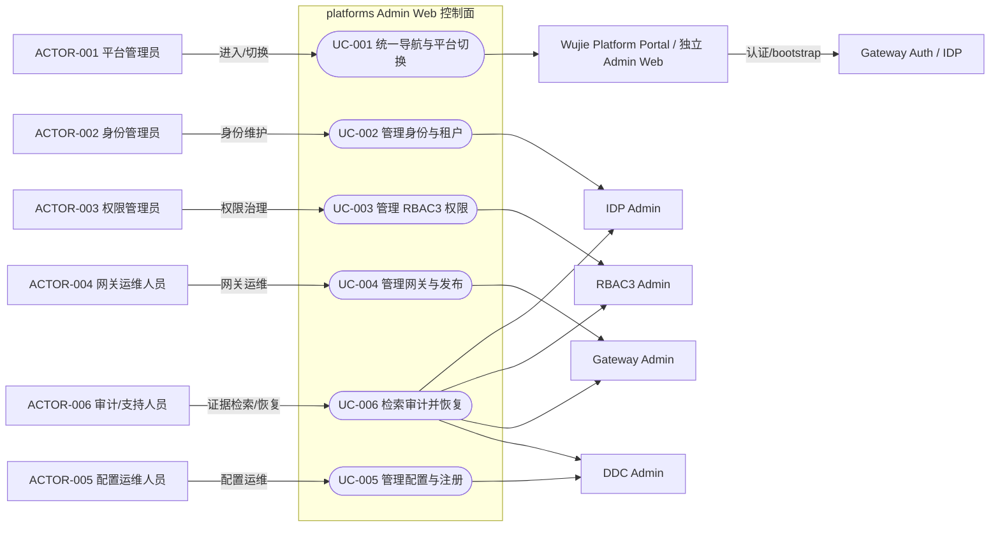
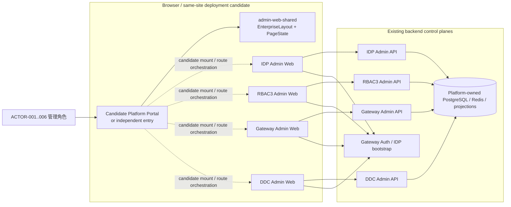
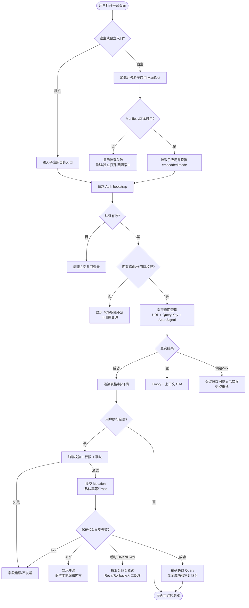
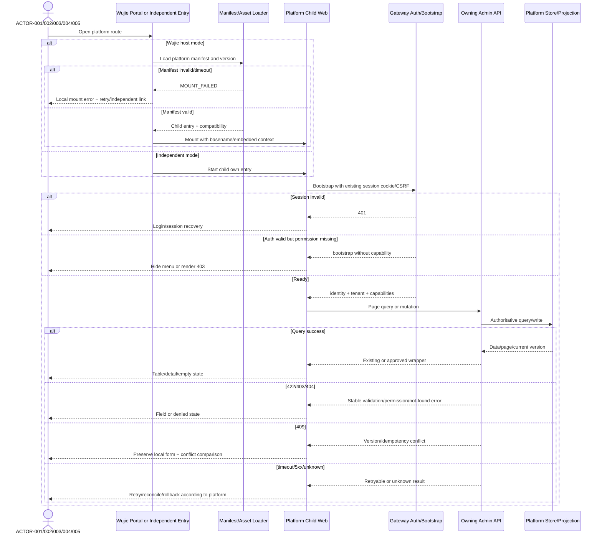

# platforms Admin Web 企业级平台与微前端需求架构规格

| Field | Value |
| --- | --- |
| Document | docs/egon/spec/2026-08-27-08-09-platforms-web-enterprise-microfrontend.md |
| Template Version | 6 |
| Status | Review |
| Type | Architecture |
| Complexity | Complex |
| Complexity Drivers | 四个独立 Admin Web、共享壳与 Wujie 混合宿主、身份/租户/权限/审计边界、跨应用路由与部署、前后端接口闭环、局部失败与兼容回滚 |
| Created | 2026-08-27 08:09 CST |
| Updated | 2026-08-27 11:44 CST |
| Owner | User / Egon-COLA platform owner |
| Repository | Egon-COLA |
| Scope | egon-cola-platforms 下的 IDP、RBAC3、Gateway、DDC Admin Web、admin-web-shared 与 Wujie Portal；后端接口缺口继续登记为后续契约输入，未来 Java 实现采用传统三层，本轮不进入 Java 实现 |
| Change Surface | 共享企业级 Layout、Wujie 混合宿主、静态权限菜单、同源 Cookie/CSRF 边界、统一首页只读摘要、各平台页面信息架构与文字 UI 设计、接口缺口登记；不修改数据库或既有后端契约 |
| Affected Chapters | §7, §8, §12, §13, §14, §15, §16, §17, §18 |
| Source Requirement | 用户确认继续梳理 platforms Web 企业级方案，要求左侧若依风格菜单、逐页文字布局/UI 设计、后端缺失接口清单，并提出考虑 wijie 微前端框架 |
| Baseline Revision | main@95039c0b；工作区包含用户既有文档修改、未跟踪 Spec/Plan 和 egon-cola-archetype-web-open，均不属于本 Spec 变更 |
| Amends | None |
| Supersedes | None |
| Depends On | [DDC Admin 全量分页查询与前端现代化设计](../../superpowers/specs/2026-08-10-ddc-admin-pagination-ui-modernization-design.md) §1-§10；本 Spec 不改变其已确认的分页、兼容和不改数据库边界 |
| Related Specs | [IDP & RBAC3 前端企业级优化设计](../../../egon-cola-platforms/docs/superpowers/specs/2026-08-04-idp-rbac3-frontend-optimization-design.md)、[Gateway Admin Web 设计](../../superpowers/specs/2026-07-25-gateway-admin-web-design.md)、[Gateway Admin Web 企业级前端重构设计](../../../egon-cola-platforms/egon-cola-platform-gateway/docs/superpowers/specs/2026-07-31-admin-web-enterprise-redesign.md)、[DDC Admin Web 设计](../../superpowers/specs/2026-07-28-ddc-admin-web-design.md) |
| Related Plans | [platforms Web/Wujie 混合宿主实施计划](../plan/2026-08-27-11-13-platforms-web-enterprise-implementation.md) |

## 1. Summary

当前 platforms 已经不是从零开始的后台系统：四个 Admin Web 都使用 React 19、TypeScript、Vite、Ant Design、TanStack Query，并依赖共享包提供企业级 Layout、主题、鉴权客户端、页面状态和 i18n。共享 Layout 已经提供左侧树菜单、折叠、移动端抽屉和最长路径高亮，因此首要工作是补齐业务页面闭环、接口契约闭环和跨平台一致性，而不是重新实现一套若依菜单。

本 Spec 将目标定义为“共享企业级控制台壳 + 四个业务子应用保持领域自治 + Wujie 混合宿主”。用户已确认“wijie”指 Wujie/无界，采用统一宿主入口且保留子应用独立访问，菜单继续由静态资源定义与 bootstrap 权限裁剪提供，宿主和子应用采用同源 Cookie/CSRF 边界，统一首页增加只读摘要 Facade，后续新增 Java 后端代码采用传统三层结构。仓库当前仍没有 Wujie 依赖，因此 Wujie 版本、React 19/Vite 8 兼容性和部署制品必须在实施前通过 spike 与构建验证；本 Spec/Plan 阶段不改生产代码。

成功标准是：用户可以从统一的左侧菜单进入各平台，看到稳定的页面标题、作用域、筛选、表格、详情抽屉、权限状态、错误和重试反馈；现有后端能力尽量由前端完整消费；真正缺失的接口有独立清单、所有权、失败语义和后续验证边界；四个平台既可以被 Wujie 宿主编排，也可以独立运行和回滚；未来后端新增接口不会在现有 feature-first Admin 包内偷偷混入第三种结构。

## 2. Background and Current State

### 2.1 Business and user context

目标用户不是单一的“系统管理员”，而是几类拥有不同权限和工作目标的企业平台角色：

- 平台管理员：在 IDP、RBAC3、Gateway、DDC 之间切换，确认平台健康、授权和配置状态。
- 身份管理员：维护用户、租户、OAuth Client、Resource Server、签名密钥和安全审计。
- 权限管理员：维护用户目录、组织、岗位、应用资源、角色、角色分配、授权策略和模拟。
- 网关运维人员：维护 Gateway Group、路由策略、发布、Provider、MCP 和调用观测。
- 配置运维人员：维护 DDC 元数据、配置版本、发布任务、缓存和服务注册。
- 审计/支持人员：检索操作、发布、授权和调用证据，处理失败、冲突和未知结果。
- 宿主/子应用运行时：负责菜单、路由、鉴权上下文和页面资源加载，但不拥有各领域业务事实。

### 2.2 Repository evidence

| Evidence ID | Classification | Exact path/symbol/decision/command | Observed fact | Design significance | Verification limit/freshness |
| --- | --- | --- | --- | --- | --- |
| EVD-001 | Static repository | egon-cola-platform-admin-web-shared/src/layout/EnterpriseLayout.tsx:65 | Shared Layout 将 Header、Sidebar、Content 和 Footer 组合，并在有导航时渲染侧栏 | 左侧菜单基础已存在，应优先复用 | 仅证明源码结构，不证明浏览器视觉结果 |
| EVD-002 | Static repository | egon-cola-platform-admin-web-shared/src/layout/EnterpriseSidebar.tsx:80 | Sidebar 默认 width 为 240，collapsedWidth 为 72，支持桌面折叠 | 固化统一壳的尺寸和交互基线 | 未执行真实窄屏视觉验收 |
| EVD-003 | Static repository | egon-cola-platform-admin-web-shared/package.json:31 | shared 包将 React、Ant Design、React Router、React Query、i18n 等列为 peer dependency | 不新增第二套 UI 框架或状态库 | 未验证发布制品与所有消费项目版本完全一致 |
| EVD-004 | Static repository | command: rg -n -i wujie/wijie/qiankun/microfrontend | 当前仓库未发现 Wujie、wijie、qiankun 或 single-spa 依赖/实现 | Wujie 方向已确认，但 Portal、Manifest、子应用 lifecycle 和依赖仍需作为新增实现面规划 | 搜索不能证明外部部署仓库没有其他宿主 |
| EVD-005 | Static repository | egon-cola-platform-idp/egon-cola-platform-idp-admin-web/src/app/AdminLayout.tsx:24 | IDP 通过权限过滤后将身份目录、OAuth 与资源、安全治理导航交给 shared | IDP 的业务导航应保留自治，宿主只编排入口 | 当前页面权限多为读权限，写操作细化仍需补强 |
| EVD-006 | Static repository | egon-cola-platform-idp/egon-cola-platform-idp-admin-web/src/app/router.tsx:43 | IDP 已有 overview、users、clients、tenants、resource-grants、resource-servers、keys、audits 路由 | 页面设计可以从真实路由开始 | 未启动运行时验证深链部署 |
| EVD-007 | Static repository | egon-cola-platform-rbac3/egon-cola-platform-rbac3-admin-web/src/app/resourceDefinitions.json:2 | RBAC3 资源定义包含 MENU、ROUTE、ACTION、FIELD，并有隐藏权限、角色资源和角色任职路由 | RBAC3 当前是资源注册表驱动，不宜直接复制若依数据库菜单模型 | 当前资源注册表消费和后端运行时闭环需联调确认 |
| EVD-008 | Static repository | egon-cola-platform-rbac3/egon-cola-platform-rbac3-admin-web/src/features/governance.routes.tsx:17 | users、organizations、positions 路由中组织和岗位也绑定 UserDirectoryPage | 这是必须先修复的页面职责错误 | 代码层已明确，运行时 404/错误内容需联调确认 |
| EVD-009 | Static repository | egon-cola-platform-rbac3/egon-cola-platform-rbac3-admin-web/src/features/role/role.api.ts:70 | 角色列表和影响分析前端调用路径缺少 /iam | 与后端 RoleController 的 /api/rbac3/v1/iam/roles 不一致 | 静态路径不一致，实际代理重写仍需运行时确认 |
| EVD-010 | Static repository | egon-cola-platform-rbac3/egon-cola-platform-rbac3-admin-web/src/features/constraint/constraint.api.ts:45 | 约束前端调用 /sod-sets、/data-rules 等路径 | 与后端 ConstraintController 的 /api/rbac3/v1/iam/policies 不一致 | 同上 |
| EVD-011 | Static repository | egon-cola-platform-gateway/egon-cola-platform-gateway-admin-web/src/layouts/AdminLayout.tsx:36 | Gateway 已有总览、网关治理、MCP、观测与审计左侧导航 | Gateway 信息架构已有基础，应补齐页面状态和操作闭环 | 不代表所有操作按钮已连接后端 |
| EVD-012 | Static repository | egon-cola-platform-gateway/egon-cola-platform-gateway-admin-web/src/features/observability/TracesPage.tsx:28 | Trace 页面按作用域查询并每 5 秒刷新，当前筛选主要是 Trace ID、Protocol、状态 | 运行态页面需要明确刷新、详情和高基数限制 | 当前没有 Trace 详情链路证据 |
| EVD-013 | Static repository | egon-cola-platform-dynamic-config-center/egon-cola-platform-dynamic-config-center-admin-web/src/App.tsx:14 | DDC 已有 registry、configs、bizs、envs、apps、namespaces、publish-tasks、cache 路由 | DDC 页面范围真实存在，但缺少总览和审计入口 | 不代表后端所有集合已经分页或有真实总数 |
| EVD-014 | Static repository | egon-cola-platform-dynamic-config-center/egon-cola-platform-dynamic-config-center-admin-web/src/auth/AuthContext.tsx:23 | DDC 前端只用 DDC_READ 判断 authorized，未发现 DDC_WRITE、DDC_PUBLISH、DDC_CACHE 的按钮级判断 | 后端权限边界已有，前端体验需要细化 | 不等同于后端权限绕过 |
| EVD-015 | Static repository | egon-cola-platform-dynamic-config-center/egon-cola-platform-dynamic-config-center-admin/src/main/java/top/egon/cola/component/ddc/admin/model/entity/DdcOperationLogEntity.java:15 | DDC 已持久化 ddc_operation_log，包含作用域、资源、操作类型、操作者、IP、内容和时间 | 可优先复用现有日志数据补审计查询，不先新增表 | 未检查现场数据量、索引和执行计划 |
| EVD-016 | Static repository | egon-cola-platform-dynamic-config-center/egon-cola-platform-dynamic-config-center-admin/src/main/java/top/egon/cola/component/ddc/admin/repository/DdcOperationLogRepository.java:8 | 当前 Repository 只有按 bizCode、env、appCode 的 List 查询 | DDC 审计缺少面向管理端的分页/过滤读取边界 | 源码未证明无其他隐藏查询实现，已搜索当前 admin 模块 |
| EVD-017 | Static repository | egon-cola-platforms/pom.xml:19 | platforms Maven 父工程包含 DDC、Gateway、RBAC3、IDP 四个后端平台模块 | 四个平台是同一仓库下的协同控制面 | 不证明部署时一定是同一进程 |
| EVD-018 | Static repository | egon-cola-platforms/*/*-admin-web/package.json | 四个 Web 使用 React 19、TypeScript 6、Vite、Ant Design 6、React Query；无微前端包 | 宿主设计必须处理独立 Vite 构建、版本和基座路径 | 只证明 package manifest，不证明最终 CDN/网关配置 |
| EVD-019 | User decision | 本次用户消息及后续六项确认 | 用户确认 Wujie、混合宿主、静态菜单、同源 Cookie/CSRF、统一首页只读摘要 Facade 和后续 Java 传统三层结构 | 六项跨平台决策已关闭，可进入 Review/Plan；后端逐接口合同仍需单独实现审查 | Wujie 与 React 19/Vite 8 的实际兼容和部署仍需实施验证 |
| EVD-020 | Static predecessor | docs/superpowers/specs/2026-08-10-ddc-admin-pagination-ui-modernization-design.md:20 | DDC 既有设计确认新增 /page、保留 List/RPC、复用 PageResultRecord、不改数据库和不自动启动服务 | 本 Spec 不得重新改写 DDC 分页基础设计 | 该文档状态为等待书面规格复核，需以用户最终批准为准 |
| EVD-021 | Static predecessor | docs/superpowers/specs/2026-07-25-gateway-admin-web-design.md:14 | Gateway 既有设计规定前端不直接访问 DDC、Redis、Kafka、Engine，并要求发布、ACK、重试、回滚可审计 | 宿主和页面不能绕过 Gateway Admin API | 设计证据不等于生产运行闭环 |
| EVD-022 | Static architecture | egon-cola-platform-rbac3/egon-cola-platform-rbac3-admin/src/test/java/top/egon/cola/platform/rbac3/admin/architecture/AdminLayerBoundaryTest.java | RBAC3 Admin 当前按功能域组织 controller/domain/service/repository，并显式禁止旧技术根目录 | 当前 Web Plan 不改 Java；后续新增 Java API 统一采用已确认的传统 biz.controller/service/service.impl/dao/config/utils/domain 结构，不在既有 feature-first 模块内混入新层 | 现有 Java 历史结构不因本 Spec 自动迁移，后续若要迁移必须另立 Spec |
| EVD-023 | Static validation | four Admin Web npm typecheck commands on 2026-08-26 | IDP、RBAC3、Gateway、DDC typecheck 通过；shared 因本地缺少 tsc 未执行 | 当前 TypeScript 类型基线部分可用 | 未运行本次 Spec 相关的前端实现测试或浏览器验收 |
| EVD-024 | Worktree evidence | git status --short on 2026-08-26 | 工作区存在用户既有 docs 修改、未跟踪 Spec/Plan 和 archetype 目录 | 本 Spec/Plan 只新增自身文档，不能覆盖或整理既有变更 | 工作区状态会随用户操作变化 |
| EVD-025 | External package verification | Wujie official React wrapper documentation; npm view wujie-react version --json on 2026-08-27 | Wujie React wrapper is documented as wujie-react and the observed package version is 2.1.0; lifecycle props and bus/setup/destroy APIs are available in the documented wrapper | Portal can pin wujie-react@2.1.0 for a compatibility spike; child lifecycle and React 19/Vite 8 behavior remain implementation gates | External documentation/package metadata may change; lockfile and browser/runtime proof are still required |

### 2.3 Problem statement and gap

当前问题分为四层：

1. 视觉/交互层：四个 Web 虽然共享左侧 Layout，但页面标题、作用域、筛选、详情、错误、按钮权限、刷新和空态还没有形成统一平台规范。
2. 业务页面层：RBAC3 的用户/组织/岗位/角色/策略页面存在职责错配或只读；IDP Grant 缺少查询和删除体验；Gateway 缺少 Trace 详情与 Operation 生命周期操作；DDC 缺少审计和配置校验/Diff。
3. 接口层：一些后端能力已经存在但前端未接入，另一些能力确实没有独立管理接口。两者必须分开，不能把“前端未调用”误报成“后端缺接口”。
4. 架构层：用户已确定采用 Wujie 混合宿主，但仓库仍没有现成宿主、Manifest、子应用挂载协议或跨应用认证契约。实施重点从“是否采用”转为“如何以可回滚、同源、独立可运行的方式落地并验证”。

### 2.4 Evidence and current-chain map

| Entry/trigger | Current call chain | Data read/written | External dependency | Consumers | Evidence |
| --- | --- | --- | --- | --- | --- |
| 用户进入 Admin Web | 独立 Vite main.tsx -> I18nProvider -> AdminThemeProvider -> 平台 App/Router -> 平台 AdminLayout -> shared EnterpriseLayout/Sidebar | 当前路由、登录 bootstrap、前端 Query Cache | Gateway Auth、对应 Admin API | 四个平台 Web | EVD-001、EVD-005、EVD-011、EVD-013、EVD-018 |
| 宿主加载子应用 | Wujie Portal -> 子应用资源 Manifest -> 子应用入口 -> 子应用 Router/Layout -> 页面 Query | 宿主路由、子应用版本、挂载状态；不写业务事实 | 浏览器静态资源、同源 Cookie/CSRF、平台 API | 平台管理员 | EVD-004、EVD-018、EVD-025；Manifest 和宿主当前不存在 |
| IDP Grant 管理 | Grant Page -> Resource Server List -> PUT Grant；后端 Grant Controller 同时存在 DELETE 和 Batch | Client Resource Grant | IDP PostgreSQL、授权边界 | IDP 管理员 | IDP Grant Page、ClientResourceGrantController |
| RBAC3 角色/策略管理 | 角色/策略页面 -> FeatureApiClient -> 路径调用；后端 RoleController/ConstraintController 在 /iam 下 | 角色图、约束策略、版本/审计 | RBAC3 Admin、PostgreSQL、运行时快照 | 权限管理员 | EVD-007、EVD-009、EVD-010 |
| DDC 配置管理 | ConfigsPage -> /configs/page、/versions/page、publish、rollback -> DdcConfigController -> Service/Repository/Redis | 配置、版本、发布任务、缓存 | PostgreSQL、Redis、发布链路 | 配置运维人员 | EVD-013、DdcConfigController、DDC predecessor |
| DDC 审计查询候选 | 操作写入 -> DdcOperationLogEntity/Repository；当前无独立 Admin Audit Controller -> 未来分页查询 | ddc_operation_log | PostgreSQL | 审计/支持人员 | EVD-015、EVD-016；缺少读取入口 |
| Gateway Trace 观测 | TracesPage -> Gateway API -> /observability/traces -> GatewayObservabilityController -> QueryService/存储 | Trace 摘要、状态、Provider/Engine 标识 | Gateway observability store | Gateway 运维人员 | EVD-012、EVD-021 |
| 发布/配置失败恢复 | 页面 Mutation -> 409/422/5xx 或异步状态 -> 页面保留输入/刷新/重试/回滚 | Draft Revision、Release、PublishTask 状态 | Gateway Engine、DDC、Redis、事件边界 | 运维/支持人员 | EVD-020、EVD-021；运行态未在本次启动验证 |

当前链路的证据边界：上述“当前调用链”来自源码和既有设计；本 Spec 没有启动 Java 服务、Redis、PostgreSQL、Gateway、浏览器或微前端宿主，因此不能把源码路径一致性表述为生产路由已验证。

## 3. Goals and Non-goals

### 3.1 Goals

- G-001：建立统一的企业级左侧菜单、顶部 Header、面包屑、作用域、用户操作、页面状态和设计 Token。
- G-002：保持四个平台的业务所有权、认证/租户/权限边界和独立部署能力。
- G-003：给当前和目标页面提供逐页的文字布局、组件层级、主要操作、权限、数据和状态说明。
- G-004：识别后端已有未接入能力与真正缺失/需要扩展的接口，并记录接口所有者和后续契约决策。
- G-005：落地 Wujie/无界混合宿主的宿主、子应用、路由、资产、认证、错误隔离和回滚要求，并保留独立入口。
- G-006：优先使用现有 shared Layout、PageState、PageTemplate、React Query、Admin API，不在未证明必要时引入新状态库或新 UI 框架。
- G-007：为列表、编辑、发布、授权、审计和运行态页面定义 loading、empty、partial、error、denied、conflict、retry 和 recovery 行为。
- G-008：保持 DDC 既有 /page 分页设计的兼容边界，前端不把分页扩散为 RPC/Starter 契约。
- G-009：在后续实施前由用户确认微前端、菜单权威、认证部署和后端聚合边界。

### 3.2 Non-goals

- 本 Spec/Plan 不实现 Wujie、Portal、子应用入口或任何生产代码；本轮只完成设计和逐文件实施计划。
- Wujie/无界已确认作为技术方向；实施计划暂按 wujie-react@2.1.0 编排，但必须先通过 React 19/Vite 8 兼容性、构建和浏览器挂载验证。
- 本 Spec 不修改 IDP、RBAC3、Gateway、DDC 已有业务 API、RPC、JWT、Redis、Kafka、租约或发布语义。
- 本 Spec 不直接修改数据库和 Flyway 文件；DDC 审计优先复用现有 ddc_operation_log，数据索引/迁移另行审批。
- 本 Spec/本轮 Web Plan 不迁移四个既有 Java Admin 模块；后续新增或修改的 Java 后端接口统一按已确认的传统三层结构设计，禁止在既有 feature-first 结构中混入第三种结构。若要迁移历史 Java 文件，必须另写迁移 Spec/Plan。
- 本 Spec 不引入 Redux、Zustand、Turborepo、Nx、SSR 或第二套 UI 框架。
- 本 Spec 不让浏览器直接访问 PostgreSQL、Redis、Kafka、Engine、DDC RPC 或内部机器凭据。
- 本 Spec 不设计通用万能 CRUD 表格、通用 BaseController 或跨平台万能业务 Service。
- 本 Spec 不以“首页 HTTP 200”替代真实登录、权限、路由、数据和失败场景验证。

### 3.3 Change Surface and Design Depth

| Area/layer | Disposition | Exact repository evidence | Changed or preserved behavior/contract | Required Spec treatment | Chapter(s) |
| --- | --- | --- | --- | --- | --- |
| Shared Layout、Header、Sidebar、PageState、PageTemplate 使用规范 | Affected | shared EnterpriseLayout、EnterpriseSidebar、PageTemplate、PageState | 扩展统一壳和页面使用约束，保留现有 public component API 优先 | 详细设计组件、状态、兼容和测试 | §7, §8, §12, §13, §14, §15, §16, §17, §18 |
| 四个平台导航和逐页页面设计 | Affected | IDP AdminLayout/router、RBAC3 resourceDefinitions/governance routes、Gateway AdminLayout/App、DDC AdminLayout/App | 目标是页面职责清晰、权限可见、独立深链可用 | 详细设计菜单、页面布局、状态和验收 | §7, §8, §12, §14, §15, §16 |
| Wujie 统一微前端宿主与子应用挂载协议 | Affected | 当前无 Wujie/Portal 依赖，四个独立 Vite package.json；EVD-025 | 已批准混合宿主方向；实施仍受版本、构建、同源认证和独立入口验证门控 | 详细定义宿主/子应用协议、故障隔离、局部失败和回滚 | §7, §8, §12, §13, §14, §15, §16, §17, §18 |
| 后端现有 Controller、Service、Repository、RPC、数据库 | Context-only | IDP/RBAC3/Gateway/DDC Admin Controller 和既有 Specs | 业务所有权、权限、租户、RPC、数据存储保持不变；候选缺口只登记不落实现 | 只记录边界、缺口、契约决策点和验证要求 | §7, §9, §11, §15, §16 |
| Backend API 缺口候选表 | Context-only | DDC OperationLog Entity/Repository、IDP Grant Controller、Gateway Observability/Catalog Controller、RBAC3 Controller | 区分后端已存在、前端未接入和真正新增/扩展候选 | 保留后续契约清单；本轮不生成 API-* 详细合同，避免把未审查的 Java 变更混入 Web Plan | §7, §9, §15, §16, §18 |
| 现有分页、List、RPC 兼容策略 | Unchanged | DDC 分页 Spec §1-§10、DdcConfigController | 保留旧 List/Catalog/Snapshot/RPC，新增分页不污染机器契约 | 简述 preserved invariant 和回归边界 | §9, §11, §16 |
| Java 包结构、实体、迁移和业务实现 | Context-only | 四个平台 Admin Java source tree、各自架构测试和 POM | 本 Spec/本轮 Web Plan 不创建 Java 类型、包、迁移或业务 Bean；后续新增 Java 统一采用传统三层 | 记录已确认的后续 profile 和历史 feature-first 不迁移边界，不在本轮设计 Java 文件 | §7, §8, §10, §11 |
| 认证、租户和安全运行时 | Context-only | shared gatewayAuthClient、各平台 AuthContext、后端安全配置 | 保留 HttpOnly Cookie/CSRF/bootstrap/后端最终鉴权；微前端不传递 Secret | 记录宿主边界、同源部署约束和验证 | §7, §12, §15, §16 |
| 既有后端业务功能和机器协议 | Unchanged | DDC/Gateway/RBAC3/IDP 既有服务、RPC 和 Starter | 不因 UI 重构改变业务语义 | 只记录 unchanged boundary | §7, §9, §11, §15, §16 |

## 4. Requirements and Acceptance Criteria

| ID | Atomic requirement | Priority | Observable acceptance criteria | Source |
| --- | --- | --- | --- | --- |
| REQ-001 | 四个平台必须使用同一套企业级控制台壳规范 | Must | Desktop 有固定左侧菜单、折叠态、顶部 Header、面包屑和 Content；窄屏使用 Drawer；四个平台尺寸、状态色和空态一致 | 用户要求企业级 Web、左侧菜单；EVD-001/EVD-002 |
| REQ-002 | 导航必须按平台业务域分组并按权限裁剪 | Must | 没有读权限的菜单不出现；没有写权限的按钮不可用或不出现；后端 401/403 仍有明确页面反馈 | EVD-005/EVD-007/EVD-014 |
| REQ-003 | 每个当前页面必须有可审查的文字布局/UI 设计 | Must | Spec 的 §12 为 IDP、RBAC3、Gateway、DDC 每个路由给出页面结构、主要操作、数据/权限、空态和错误态 | 用户明确要求逐页说明 |
| REQ-004 | 页面必须使用 URL、Query Cache 和服务端数据作为状态来源 | Must | 刷新可恢复深链和筛选；列表使用服务端分页；Mutation 后精确失效；旧请求不能覆盖新筛选 | 既有 shared/React Query；DDC 分页 predecessor |
| REQ-005 | 微前端采用 Wujie 混合宿主，但不得破坏子应用独立运行 | Must | 宿主统一入口挂载四个子应用；每个子应用仍可独立打开和构建；宿主卸载/加载失败显示可恢复错误；宿主回滚不要求修改四个平台业务代码 | 用户确认 DEC-101/102；EVD-004/EVD-018/EVD-025 |
| REQ-006 | Wujie 实施必须固定可审查的包版本并完成名称、部署、路由和认证契约验证 | Must | Plan 按 wujie-react@2.1.0 设计；兼容性 spike、锁文件、Manifest、basename、同源 Cookie/CSRF 和 Vite 构建验证全部通过后才允许挂载 | 用户确认 Wujie；版本以本次外部包核验为基线，运行时仍需验证 |
| REQ-007 | 宿主与子应用不得共享或转发明文 Token、Secret、Cookie 内容 | Must | 子应用通过同源认证/bootstrap 获取授权上下文；宿主桥接只传路由/作用域/能力摘要，不传敏感凭据 | 既有 Gateway Auth 和安全边界 |
| REQ-008 | 后端缺口必须区分“新增/扩展接口”和“后端已有但前端未接入” | Must | §9 表格逐项给出平台、路径、现状、候选动作、所有者和是否需要新契约；不把已有接口标成缺失 | 用户要求后端缺失清单 |
| REQ-009 | IDP 管理页面必须支持可规模化的列表和 Grant 闭环 | Should | 用户、Client、Resource Server 支持服务端查询/分页；Grant 可查询当前状态、保存和删除；审计支持筛选 | IDP 当前全量 List、Grant 页面证据 |
| REQ-010 | RBAC3 目录、角色、权限、策略页面必须与后端路径和业务职责一致 | Must | 组织/岗位不再展示用户 ID 查询页；角色/策略请求路径与 Controller 一致；用户、权限、角色分配和策略有明确读写入口 | EVD-008/EVD-009/EVD-010 |
| REQ-011 | Gateway 必须支持可审计的目录、发布和观测体验 | Should | Operation 详情显示来源/定义/生命周期；Release 可看 Diff；Trace 可进入安全脱敏详情；不直连 Engine/DDC/Redis/Kafka | EVD-011/EVD-012/EVD-021 |
| REQ-012 | DDC 必须支持配置、发布、缓存、服务注册和审计的管理闭环 | Should | 页面展示真实分页总数、发布状态、缓存检查和审计；配置编辑有校验/Diff 入口；沿用既有 /page 兼容策略 | EVD-013/EVD-015/EVD-016/EVD-020 |
| REQ-013 | 关键异常必须按认证、权限、校验、冲突、超时、未知结果和服务错误区分 | Must | 页面分别显示登录恢复、403、字段错误、409 冲突、可控重试、未知发布结果和 Trace ID | 既有 Gateway/IDP/RBAC3 错误约束 |
| REQ-014 | 所有管理操作必须支持可追踪、可恢复和防重复提交 | Must | Mutation 带稳定操作上下文；按钮 pending 禁用；重复提交不产生重复业务结果；审计可按 operator/resource/time 检索 | 企业运维和审计要求；EVD-015/EVD-021 |
| REQ-015 | 变更必须保留既有平台边界并支持独立回滚 | Must | 能够只回滚宿主/共享壳/单个子应用；不要求同时回滚四个后端；既有 API/RPC/数据库兼容不变 | EVD-020/EVD-021 |
| REQ-016 | 本轮必须完善 Spec 并生成供用户审查的 Plan，但不得进入生产代码 | Must | Spec 状态为 Review，Plan 状态不高于 Review；本轮只变更两个文档，实施须等待用户审查和后续执行授权 | egon-coding-writing-spec/plan 流程及用户本次明确要求 |

### 4.1 Scenario matrix

| Scenario | Actor/trigger | Preconditions | Main path | Alternative/failure path | Data/state change | Observable result | Requirements |
| --- | --- | --- | --- | --- | --- | --- | --- |
| S-001 宿主进入普通管理页 | 平台管理员打开宿主并点击 IDP/RBAC3/Gateway/DDC 菜单 | 宿主 Manifest 可用、Cookie 有效、子应用版本受支持 | 宿主解析路由 -> 挂载子应用 -> 子应用 bootstrap -> 权限剪枝 -> 页面查询 -> 渲染 | Manifest 超时、子应用加载失败或版本不兼容时显示错误页并允许独立入口/重试 | 只产生前端挂载状态和 Query Cache，不写业务事实 | 目标页面显示正确菜单、标题、作用域和数据 | REQ-001, REQ-002, REQ-005 |
| S-002 独立深链打开子应用 | 运维人员直接访问子应用路径 | 子应用静态资源和 API Base 正确，认证可用 | 子应用自身 Router/Guard -> bootstrap -> 页面 | 宿主不存在时仍可独立运行；认证失败回登录；路径未知显示 404 | 无业务写入 | 独立 URL 可访问且与宿主页面语义一致 | REQ-005, REQ-015 |
| S-003 无权限访问页面 | 用户访问没有 read capability 的路由 | 已登录但 bootstrap 权限不足 | 菜单隐藏；直接深链进入 Guard -> denied 页面 | 后端返回 403 时显示权限不足，不泄露资源详情 | 无业务写入 | 明确 403/denied，不回退为成功空列表 | REQ-002, REQ-013 |
| S-004 IDP Grant 查询和变更 | 身份管理员在 Client 详情打开 Grant | Client 和 Resource Server 可见，拥有 Grant manage 权限 | 加载当前 Grant -> 选择资源 -> 编辑 -> 保存/删除 -> 精确刷新 | Grant 已被并发修改时 409；删除后刷新；列表为空显示授权 CTA | Grant 状态在 IDP 服务端变化 | 当前状态、版本、结果和审计可见 | REQ-009, REQ-014 |
| S-005 RBAC3 组织/角色/策略管理 | 权限管理员进入组织、岗位、角色或策略 | 正确 tenant，具备对应 read/manage 权限 | 页面加载对应列表/树 -> 新增/编辑 -> 服务端校验 -> 刷新 | 当前代码路径错误或后端拒绝时显示错误；版本冲突不覆盖本地输入 | RBAC3 管理事实改变，运行时快照按既有机制更新 | 页面职责和 Controller 路径一致 | REQ-010, REQ-013, REQ-014 |
| S-006 Gateway Draft 发布 | Gateway 运维人员编辑 Route/Policy 并发布 | 当前 Draft Revision、操作权限、目标 Group 可用 | 编辑 -> 校验 -> Diff -> 发布 -> 轮询 Target ACK | 422 字段错误、409 Revision、超时/UNKNOWN/部分失败 -> 保留证据并提供 Retry/Rollback | Draft/Release/Target 状态按既有服务改变 | 不把 UNKNOWN/部分成功显示为绿色成功 | REQ-011, REQ-013, REQ-014 |
| S-007 DDC 配置发布和回滚 | 配置运维人员编辑 YAML | 作用域完整、DDC_WRITE/PUBLISH 权限、配置格式可校验 | 保存 -> 校验 -> 版本 -> 发布任务 -> 查询状态 -> 必要时回滚 | YAML 无效、发布失败、任务超时；Retry 只对允许状态显示 | 配置版本、发布任务、缓存/目标状态改变 | 显示版本、changeId、状态和 Trace | REQ-012, REQ-013, REQ-014 |
| S-008 审计检索 | 审计人员按时间、操作者、资源、结果查询 | 审计 read 权限，范围受 tenant/scope 限制 | 提交筛选 -> 服务端分页 -> 查看详情/脱敏 Diff -> 可选异步导出 | 空结果、时间范围过大、权限拒绝、导出任务失败 | 只读，不改变业务事实 | 结果可复制 Trace/operation identity，不显示 Secret | REQ-008, REQ-013, REQ-014 |
| S-009 子应用局部失败 | 宿主中 Gateway 子应用 API 5xx 或前端运行异常 | 其他子应用仍健康 | 子应用 PageState 显示局部错误、Retry；宿主菜单和其他子应用保持可用 | 子应用挂载异常由 Error Boundary 隔离；宿主提供重新挂载/独立打开 | 仅前端 mounted/error 状态变化 | 不白屏、不影响其他子应用 | REQ-005, REQ-013, REQ-015 |
| S-010 旧宿主/新子应用混合发布 | 部署系统只更新一个子应用 | Manifest/compatibility version 可检查 | 宿主读取支持范围 -> 允许兼容组合 | 不兼容则阻止挂载危险 Mutation，提供回滚/刷新 | 无业务写入 | 显示版本不兼容和恢复建议 | REQ-005, REQ-006, REQ-015 |

### 4.2 Use-case analysis

#### 4.2.1 Actor inventory

| Actor ID | Actor/role | Goal and responsibility | Entry/channel | Permission/tenant context | Evidence |
| --- | --- | --- | --- | --- | --- |
| ACTOR-001 | 平台管理员 | 在四个平台之间切换并确认控制面健康 | 宿主/独立 Admin Web | 登录身份、有效 tenant、平台读权限 | 用户请求；四个平台 AdminLayout |
| ACTOR-002 | 身份管理员 | 管理用户、租户、OAuth Client、Resource Server、Grant、密钥和 IDP 审计 | IDP 页面 | IDP capability/tenant context | IDP AdminLayout/router |
| ACTOR-003 | 权限管理员 | 管理 RBAC3 用户目录、组织、岗位、角色、资源、策略和模拟 | RBAC3 页面 | RBAC3 permission/tenant context | RBAC3 resourceDefinitions/governance routes |
| ACTOR-004 | 网关运维人员 | 管理 Gateway Group、目录、Draft、Release、Provider、MCP、Trace | Gateway 页面 | Gateway capability、biz/app/env/namespace scope | Gateway AdminLayout/App |
| ACTOR-005 | 配置运维人员 | 管理 DDC 配置、元数据、发布任务、注册、缓存和审计 | DDC 页面 | DDC_READ/WRITE/PUBLISH/CACHE 和 scope | DDC AuthContext、安全配置和页面 |
| ACTOR-006 | 审计/支持人员 | 检索变更和失败证据并触发受控恢复 | Audit/详情/Retry/Rollback 页面 | 只读审计或显式恢复权限 | Gateway/DDC/IDP/RBAC3 audit boundaries |
| ACTOR-007 | 微前端宿主运行时 | 加载、卸载、隔离和观测子应用，不拥有业务事实 | Wujie Portal runtime | 不直接决定业务权限 | 当前不存在；REQ-005 的目标系统角色 |

#### 4.2.2 Use-case artifact

| ID | Use case/goal | Primary actor | Supporting actors/systems | Trigger | Preconditions | Main success outcome | Alternatives/failures | Postconditions | Requirements | Interfaces/pages | Tests |
| --- | --- | --- | --- | --- | --- | --- | --- | --- | --- | --- | --- |
| UC-001 | 统一导航与平台切换 | ACTOR-001 | ACTOR-007、Gateway Auth | 点击菜单或平台切换 | 认证有效；宿主/独立入口可用 | 进入目标平台页面并保持作用域/权限一致 | 子应用加载失败、版本不兼容、401/403 | 失败不影响其他平台，独立入口仍可用 | REQ-001, REQ-002, REQ-005 | Portal/各 AdminLayout | TEST-001, TEST-002, TEST-003 |
| UC-002 | 管理身份与租户 | ACTOR-002 | IDP Admin API、审计 | 新增/编辑/授权/撤销 | IDP tenant 与 capability 正确 | 事实保存、状态刷新、敏感值按规则一次展示 | 422、409、网络失败、Grant 不存在 | IDP 数据和审计保持服务端权威 | REQ-009, REQ-013, REQ-014 | IDP users/tenants/clients/grants/audits | TEST-004, TEST-005 |
| UC-003 | 管理 RBAC3 权限 | ACTOR-003 | RBAC3 Admin、运行时快照 | 维护用户/组织/岗位/角色/策略 | tenant、读写权限、版本有效 | 页面职责正确，修改通过既有 RBAC3 运行时链路 | 路径 404、403、约束失败、版本冲突 | 管理事实提交，运行时按既有快照机制异步/原子更新 | REQ-010, REQ-013, REQ-014 | RBAC3 directory/roles/policies | TEST-006, TEST-007 |
| UC-004 | 管理网关与发布 | ACTOR-004 | Gateway Admin、Engine/Provider 投影 | 编辑 Draft 或发布 | scope、revision、权限、目标可用 | 校验、Diff、Release、ACK 状态完整可见 | 409、422、TIMEOUT、UNKNOWN、部分失败 | Release 证据可重试/回滚，历史不被覆盖 | REQ-011, REQ-013, REQ-014 | Gateway groups/draft/releases/traces | TEST-008, TEST-009 |
| UC-005 | 管理配置与注册 | ACTOR-005 | DDC Admin、PostgreSQL、Redis | 编辑/发布/检查/重建 | scope 完整、capability 正确 | 配置版本和发布状态可追踪 | YAML 错误、发布任务失败、缓存不一致 | DDC 既有版本/发布/缓存语义不变 | REQ-012, REQ-013, REQ-014 | DDC configs/tasks/cache/registry | TEST-010, TEST-011 |
| UC-006 | 检索审计并恢复 | ACTOR-006 | 四个平台 Audit API、支持操作 | 查询失败或变更证据 | 审计读权限，范围和时间合法 | 分页结果、详情、脱敏 Diff、受控 Retry/Rollback | 空结果、超范围、导出失败、恢复冲突 | 审计只读；恢复操作有新审计事件 | REQ-008, REQ-013, REQ-014 | 各平台 audit/详情/retry | TEST-012, TEST-013 |

## 5. Constraints, Assumptions, and Decisions

### 5.1 Confirmed constraints

- 采用共享壳优先：现有 shared Layout、主题、鉴权客户端、PageState、PageTemplate 和 React Query 是第一复用选择。
- 四个平台的后端领域所有权不合并：IDP 负责身份/租户，RBAC3 负责授权管理与运行时授权状态，Gateway 负责网关控制面，DDC 负责配置和注册控制面。
- 浏览器不直接访问 DDC、Redis、Kafka、Engine 或内部 RPC；平台页面继续调用对应 Admin API。
- DDC 已确认的分页策略是新增 /page、保留 List/Catalog/Snapshot/RPC，不新增数据库表或迁移；本 Spec 不修改该边界。
- 既有工作区修改和未跟踪文件必须保持不动。
- 本 Spec 只产生文档，不实施 Wujie、不改 package.json、不启动项目。

### 5.2 Small-gap assumptions

| ID | Inference | Repository evidence | Why locally reversible | Impact if wrong |
| --- | --- | --- | --- | --- |
| ASM-001 | Wujie 运行版本以 wujie-react@2.1.0 为当前 Plan 基线，最终以 lockfile 与兼容性 spike 为准 | EVD-025；npm metadata 和官方 React wrapper 文档 | 版本可在实施前替换并回滚，不改变业务契约 | 若 React 19/Vite 8 验证失败，回到独立入口并另行升级方案 |
| ASM-002 | 四个独立 Vite Web 继续作为可回滚子应用，Wujie Portal 作为统一编排层 | 四个独立 package.json、DEC-102 | 不删除现有入口和部署，宿主失败可回退 | 若未来要求合并为单 SPA，需另立架构决策 |
| ASM-003 | 菜单权威仍由各平台的静态资源定义/权限过滤提供 | shared 类型明确平台注入 navigation；RBAC3 有 MENU/ROUTE/ACTION/FIELD；DEC-103 | 不新建菜单数据库、不改权限所有权 | 若未来要求运行时动态菜单，需新增后端资源模型、版本和缓存 |
| ASM-004 | 宿主与子应用采用同源/同站点部署，以复用 HttpOnly Cookie 和 CSRF | shared gatewayAuthClient、各平台登录流程、DEC-104 | 不改变认证协议；子应用各自 bootstrap | 跨站部署会引入 Cookie、CSRF、CORS、token relay 重大变更，必须另行审批 |
| ASM-005 | DDC 审计第一候选读取既有 ddc_operation_log，不先添加表 | DdcOperationLogEntity 和 Flyway 表已存在 | 查询层可独立回退，无 schema 变更 | 现场数据量/索引不足时需单独 DB Spec |
| ASM-006 | 新增接口优先扩展现有资源路径，不创建“上下文预取”接口 | 最小接口原则；各页面已有 route/scope/context | 只影响契约命名，避免额外 RTT | 若后端已有公共 API 规范要求新路径，需更新接口清单 |

### 5.3 Resolved decisions

| ID | Decision | Decision owner | Evidence and rationale | Requirements |
| --- | --- | --- | --- | --- |
| DEC-001 | 继续使用 shared EnterpriseLayout 作为四个平台共同壳的基线 | User / platform owner | 用户确认此前总体方向；EVD-001/EVD-002 | REQ-001, REQ-002 |
| DEC-002 | 页面设计必须覆盖当前路由和目标补齐页面，而非只设计菜单树 | User / platform owner | 用户明确要求每个页面通过文字说明布局和 UI | REQ-003 |
| DEC-003 | 后端清单区分新增/扩展与已有未接入，不重复制造已有 RBAC3/Gateway/DDC 能力 | Spec author based on repository evidence | EVD-008 至 EVD-016；最小设计原则 | REQ-004, REQ-008 |
| DEC-004 | 本 Spec 在用户确认关键决策后进入 Review，并生成仅供审查的 Plan；不进入生产代码 | User / process owner | 用户本次明确要求“完善 Spec 后开始写 Plan”；Spec/Plan 流程仍禁止在本轮写代码 | REQ-016 |

### 5.4 Closed major decisions

| ID | Decision | Decision owner | Evidence and rationale | Implementation consequence | Requirements | Status |
| --- | --- | --- | --- | --- | --- | --- |
| DEC-101 | “wijie”按 Wujie/无界处理 | User / platform owner | 用户回答“1 是”；EVD-004、EVD-025 | Portal 依赖与生命周期按 Wujie React wrapper 设计，版本先锁定 2.1.0 并经过兼容性 spike | REQ-005/006 | Closed |
| DEC-102 | 采用混合宿主：Wujie 统一入口，四个子应用仍可独立访问、构建和回滚 | User / platform owner | 用户回答“2 是”；保留独立入口能降低宿主失败的回滚成本 | 新增 Portal、Manifest、mount/unmount/ErrorBoundary；不删除原入口 | REQ-005/015 | Closed |
| DEC-103 | 菜单采用静态/配置驱动的业务路由定义，结合 bootstrap capability 裁剪；不先做数据库动态菜单 | User / platform owner | 用户回答“3 是”；EVD-007、EVD-014；当前资源注册表已表达 MENU/ROUTE/ACTION/FIELD | Portal 只做平台级切换，各子应用继续拥有菜单和按钮权限；不新增菜单表/API/缓存 | REQ-002/005 | Closed |
| DEC-104 | 宿主与子应用采用同源/同站点 Cookie + CSRF；宿主不读取或转发明文凭据 | User / platform owner and security owner | 用户回答“4 是”；EVD-004、各平台 auth client；避免跨域 token relay | 子应用各自 bootstrap；bridge 仅传 route/scope/capability summary；部署需保证 API Base 与 Cookie/CSRF 同站点 | REQ-006/007/015 | Closed |
| DEC-105 | 统一首页提供只读跨平台摘要 Facade；不扩展为全页面通用 BFF | User / platform owner | 用户回答“5 是”；首页需要统一 loading、partial、timeout 和按平台重试 | Portal 只消费摘要边界；业务页面仍直连所属 Admin API；summary 具体后端接口仍留在 §9 后续契约清单 | REQ-001/004/008 | Closed |
| DEC-106 | 后续新增或修改 Java 后端接口采用传统三层结构；本轮不迁移既有 feature-first Admin 模块 | User / architecture owner | 用户回答“6 三层架构”；EVD-022；避免在四个现有模块混入 biz.* 与既有结构的不可审查混合 | 后续 Java Spec/Plan 必须使用 biz.controller/service/service.impl/dao/config/utils/domain；本轮 Web Plan 不创建 Java 文件 | REQ-008/016 | Closed |

## 6. Project Technology Context

| Concern | Current choice | Repository evidence | Constraint on design |
| --- | --- | --- | --- |
| Frontend | React 19、TypeScript 6、Vite 8、React Router 7、Ant Design 6、TanStack Query 5 | 四个 Admin Web package.json | 继续复用现有栈；Wujie 若采用必须先验证版本兼容 |
| Shared frontend | @egon-cola/admin-web-shared 0.2.0 | shared package.json、EnterpriseLayout、PageState、PageTemplate | Layout、主题、错误和鉴权公共能力集中复用 |
| Frontend state | React Query + Context | 各页面 useQuery/useMutation，DDC QueryClientProvider | 不新增 Redux/Zustand；客户端状态仅保存 UI 临时状态 |
| Backend | Java 21、Spring Boot 3.5.16、Maven | egon-cola-platforms/pom.xml | 后端候选接口保持各 Admin 模块所有权 |
| Persistence | PostgreSQL/JPA/Flyway，DDC 另有 Redis 和 RPC 聚合 | 各 Admin POM、DDC OperationLog、既有 Specs | 本 Spec 不改表；查询缺口先复用现有数据 |
| Security | Gateway Auth、HttpOnly Cookie/CSRF/bootstrap、平台 capability | shared gatewayAuthClient、各 AuthContext、DDC security | 宿主不读取 Token/Secret；后端继续最终鉴权 |
| API error | 各平台现有错误包装和权限边界 | Gateway/IDP/RBAC3/DDC Controller 与既有 Specs | UI 需区分 401/403/409/422/5xx；不重写全局错误体系 |
| Tests | Vitest、React Testing Library、Playwright、JUnit/Maven tests | 各 package.json、后端 POM | 先静态/组件/契约，再由用户启动环境做运行验收 |
| Microfrontend | Wujie/无界；Portal 使用 wujie-react@2.1.0 | EVD-004、EVD-018、EVD-025、DEC-101/102 | 依赖只进入 Portal；先完成 package lock、React 19/Vite 8 构建和挂载 spike，子应用保持独立入口 |

### 6.1 Java architecture profile and capability baseline

当前平台 Java Admin 模块不是模板中的传统三层 biz.* 结构，也不是本仓库 exact egon-cola-archetype-light/service/web 生成项目；这是现状证据，不是本轮要迁移的对象：

- IDP 当前使用 feature-first 包，例如 admin/identity/controller、service、repo、domain。
- RBAC3 当前使用 admin/iam、authorization、audit 等功能域，并由 AdminLayerBoundaryTest 约束。
- Gateway 当前使用 component/gateway/admin/{application,catalog,credential,group,...} 功能域。
- DDC 当前使用 component/ddc/admin/controller、model、repository、service 等功能域。
- 平台 POM 通过多个独立 contract/core/starter/admin 模块组织，不是某个单一 Web Archetype 生成工程。

因此本 Spec/本轮 Web Plan 不创建 Java Controller、Service、DTO、VO、Repository、Entity、Migration 或新的 Java 包。DEC-106 已确认后续新增/修改 Java API 使用传统三层；任何历史 feature-first 到传统三层的迁移都必须另写迁移 Spec/Plan，不能在本 Plan 中以“顺便整理”方式发生。

| Architecture profile | Archetype/template or base package | Exact evidence and verifier | Existing deviations | Design action |
| --- | --- | --- | --- | --- |
| Traditional Three-Layer | 后续 Java API 的唯一目标 profile：`biz.controller`、`biz.service`、`biz.service.impl`、`biz.dao`、`biz.config`、`biz.utils`、`biz.domain` | 用户确认 DEC-106；Rule 11 允许的传统层方向为 Controller -> Service -> service.impl -> DAO | 当前四个 Admin 模块仍为 feature-first；本轮不迁移、不在旧模块混入新 biz.* | 后续 Java API 单独写 Spec/Plan；本轮仅记录约束，Java 文件为 Context-only |
| Egon-COLA Light/Service/Web/Open | 未选定 | egon-cola-platforms POM 与独立平台模块；未发现 exact archetype parent/verifier 作为平台基线 | 现有平台功能域和模块边界不是 exact archetype generated tree | 不在本 Draft 迁移；需用户选定具体 variant 才能写 Java Plan |

Reuse/capability ledger:

| Need | Spring/JDK candidate | Spring Boot Starter candidate | Egon-COLA/module candidate | Proven gap | Decision/dependency impact |
| --- | --- | --- | --- | --- | --- |
| Shared Layout/Theme/PageState | React/Ant Design | None | admin-web-shared | 无 gap；已有组件足够 | Keep shared |
| HTTP/Auth | browser fetch、Context | None | shared gatewayAuthClient/httpClient | 无 gap | Keep shared/platform clients |
| Server state/cache | React Query | None | existing package dependency | 无 gap | Keep React Query |
| DDC pagination | None | Spring Data Page | existing PageResultRecord/PageQuery and DDC Admin support | 无 gap for existing pagination | Keep predecessor design |
| DDC audit read | Spring Data JPA Pageable | spring-boot-starter-data-jpa | existing DdcOperationLogEntity/Repository | 缺少 Admin query/controller，不是缺少 ORM | Add only a bounded read path after approval |
| Unified home aggregation | direct browser calls | None | existing Admin APIs | direct calls cause inconsistent loading/partial failures for a single cross-platform summary | Add the approved read-only summary Facade; business pages remain direct |
| Microfrontend runtime | None in repository | None | Wujie official React wrapper; EVD-025 records wujie-react@2.1.0 | Portal needs an isolated lifecycle/runtime boundary; child apps do not need a second microfrontend library | Add one pinned Portal dependency after compatibility spike; no other dependency |

### 6.2 User-mandated Java rule compliance

本 Spec 不创建或修改 Java 生产代码；接口缺口继续作为后续契约输入登记。因此 Java 规则不进入本轮 Web Plan 的实现面，但 DEC-106 已选定后续唯一 profile；后续后端 Spec/Plan 必须重新执行本表并逐项满足。

| Literal rule | Affected? | Repository evidence | Exact design decision | Files/types/interfaces | Validation/test evidence | Status/blocker |
| --- | --- | --- | --- | --- | --- | --- |
| Rule 1 | No | 本 Spec 只新增 Markdown，不新增 Java carrier；现有类型仅作证据 | 不创建新 Java 类型 | None | Spec validator；后续 Java Plan 重新盘点 | N/A |
| Rule 2 | No | 没有新增 Java Controller/Service/DAO/Repository handoff | 不定义新的 Validation boundary | None | 后续接口 Spec 必须逐层补充 | N/A |
| Rule 3 | No | 没有新增 Java DTO/VO/PO/Entity/Converter | 不选择 Record/Lombok/MapStruct 实现 | None | 后续 Java Spec/Plan 重新执行 | N/A |
| Rule 4 | No | 没有新增 Spring Bean 或业务类 | 不设计 Logger/Bean/Qualifier | None | 后续 Java 实现静态检查 | N/A |
| Rule 5 | No | 没有新增 utility/dependency | 不添加工具库 | None | package/POM residual scan | N/A |
| Rule 6 | No | 没有新增外部 Java JSON carrier | 不改变 Jackson contract | None | 后续 API contract test | N/A |
| Rule 7 | No | 没有新增 Spring 配置 key | 不改变 application profile | None | 后续配置 parity test | N/A |
| Rule 9 | No | 复杂度在本 Spec 为前端宿主/需求分析，未写 Java 业务逻辑 | Java 复杂业务 pattern 延后到后端 Spec | None | 后续 Java pattern/manual check | N/A |
| Rule 10 | No | 没有新增 Java 日期/时间字段 | 不改变时间模型 | None | 后续 API/Java Spec | N/A |
| Rule 11 | No (current Web scope) | 四个平台当前 feature-first package tree；EVD-022；本 Spec/Plan 不创建 Java 文件 | DEC-106 已确认：后续新增/修改 Java API 只使用传统三层；历史模块迁移另立 Spec/Plan | 本轮无 Java target files；后续 Java API 目标为 biz.controller/service/service.impl/dao/config/utils/domain | 本 Spec validator；后续 Java Plan 的 architecture verifier | N/A — current Plan has no Java file |

## 7. Architecture Design

### 7.0 Minimum-design baseline and element-necessity audit

| Proposed element | Change | Requirements | Existing/direct alternative | Concrete inadequacy of alternative | Added calls/state/coupling/failures/migration/operations | Verdict |
| --- | --- | --- | --- | --- | --- | --- |
| shared EnterpriseLayout/Sidebar | Keep/Expand | REQ-001/002/003 | 各项目继续自绘 Layout | 已有共享能力；重复实现会产生尺寸/权限/响应式漂移 | 复用现有 API，低成本；需要 shared 回归测试 | Keep |
| PageTemplate/PageState 使用规范 | Keep/Expand | REQ-003/007/013 | 每页 Card + 自定义 loading/error | 当前页面重复模式导致反馈不一致 | 不增网络调用；增加迁移工作和组件契约测试 | Keep |
| Platform Portal 宿主 | New approved | REQ-005/015 | 四个独立 URL + shared 壳 | 不能提供统一入口、跨平台导航和单点入口体验 | 新宿主、Manifest、挂载状态、版本兼容、局部失败和部署成本 | Add; keep every independent entry |
| Wujie adapter | New approved | REQ-005/006 | 直接使用独立子应用 URL | 无法在宿主内挂载子应用 | wujie-react@2.1.0、运行时生命周期、路由/资源/CSS/通信故障面 | Add after compatibility spike |
| Dynamic menu API | Candidate | REQ-002/003 | 静态 resourceDefinitions + bootstrap 权限 | 当前需求不要求运营人员在线改菜单；DB 菜单会改变所有权和缓存 | 新菜单模型、版本、租户隔离、发布、缓存失效和审计 | Remove from first phase |
| Unified BFF for all pages | Candidate | REQ-004/005 | 子应用直接调用自己的 Admin API | 直接调用已满足领域页面；BFF 会扩大权限和故障面 | 新服务、聚合超时/部分失败、契约和运维成本 | Remove; retain optional summary Facade |
| Platform summary Facade/BFF | New approved, read-only only | REQ-001/004 | 首页串行/并行调用四个 Admin API | 单一首页需要统一 loading、部分失败和 scope 语义 | 一个受限聚合边界、跨服务权限和部分失败模型；业务页面仍直连所属 Admin API | Add for home summary; never become universal BFF |
| Full frontend global store | Candidate | REQ-004 | React Query + Context + URL | 当前服务端状态已由 React Query 管理 | 新全局状态、同步和失效复杂度 | Remove |
| DB changes for DDC audit | Candidate | REQ-008/012 | 复用 ddc_operation_log 查询 | 当前只是缺少读取 API，尚无数据/索引证据证明必须改表 | 迁移、锁、兼容和回滚成本 | Remove from this Spec |

Interaction-cost comparison:

| Path | Network calls | Client states | Server contracts/state | Failure and TOCTOU points | Additional user/business value |
| --- | --- | --- | --- | --- | --- |
| Direct baseline: 四个独立 Web + shared 壳 | 进入一个平台通常是 bootstrap + 页面查询 | login/loading/page loading/error/denied | 各平台已有 Admin API 和 Query Cache | 单平台 API 失败、权限、版本；无跨应用挂载失败 | 已满足业务页面和独立回滚 |
| Selected hybrid host | 宿主 Manifest + 子应用资源 + bootstrap + 页面查询；首页再调用只读 summary Facade | 增加 manifest/loading/mount/version/child error/retry/summary partial | Manifest/宿主路由/子应用生命周期/兼容范围 | Manifest 超时、子应用挂载失败、basename、Cookie/CSRF、混合版本、卸载清理、summary 局部超时 | 统一入口、平台切换、局部隔离和首页态势；以独立入口与回滚抵消复杂度 |
| Candidate dynamic menu | menu query + bootstrap + 页面查询 | menu loading/stale/denied/cache invalidation | 菜单数据、版本、发布、租户隔离 | 菜单滞后、资源删除、权限和缓存竞态 | 当前没有独立业务价值，不能以若依外观为理由新增 |

### 7.1 System Architecture Design

选定的系统边界是“Wujie 宿主负责编排，子应用负责领域，后端 Admin 服务负责事实，首页 Facade 只提供只读摘要”：

- Portal/Host：Wujie 前端宿主，只负责平台入口、Manifest、挂载/卸载、顶层错误隔离、平台切换、统一首页和非敏感 UI 上下文。
- shared：负责公共视觉与 Layout 组件，不拥有 IDP/RBAC3/Gateway/DDC 业务菜单。
- IDP 子应用：身份、租户、OAuth、Resource Server、密钥和 IDP 审计。
- RBAC3 子应用：用户目录、组织/岗位、应用资源、角色、权限、策略、运行时和 RBAC3 审计。
- Gateway 子应用：Gateway Group、目录、Draft、Release、Provider、MCP、Trace 和 Gateway 审计。
- DDC 子应用：配置、版本、发布任务、注册、缓存、元数据、作用域绑定和 DDC 审计。
- 后端服务：各自保留真实业务事实、授权、租户范围、事务、审计和运行时投影。
- 认证：优先同源/同站点 Cookie；宿主不读取 Cookie 内容，不向子应用传递明文 Token。

Boundary rule: Host does not call platform business APIs on behalf of children. The approved `PlatformSummaryFacade` is a host-owned, read-only orchestration boundary for homepage aggregate cards only; it may call only approved read-only Admin API adapters and must expose per-platform partial/error state. A child does not call another child’s API directly. Navigation may cross platform boundaries, but business data and permission decisions remain in the owning Admin service.

#### 7.1.2 Boundary and responsibility table

| Module/component | Capability and data owned | Inputs/outputs | Allowed dependencies | Forbidden responsibility | Requirements |
| --- | --- | --- | --- | --- | --- |
| Portal | Host route, child manifest, mount state, platform switch | route intent, manifest, non-sensitive context; emits navigation/mount status | shared shell, wujie-react@2.1.0 after spike | business CRUD, Token/Secret, backend authority | REQ-005/006 |
| admin-web-shared | Layout, theme, page state, HTTP/auth primitives | navigation config, user/actions, children | React, AntD, Query/Router peer dependencies | platform menu, tenant policy, business API | REQ-001/002/003 |
| IDP Admin Web | identity/tenant/OAuth UI and calls | IDP routes and Admin API | shared, IDP API | RBAC3 role policy decisions, direct DB | REQ-009 |
| RBAC3 Admin Web | authorization management UI and calls | RBAC3 route/resource definitions and Admin API | shared, RBAC3 SDK/API | IDP tenant master data, direct runtime snapshot writes | REQ-010 |
| Gateway Admin Web | gateway control-plane UI and calls | scope, Draft, Release, observability API | shared, Gateway Admin API | direct DDC/Redis/Kafka/Engine access | REQ-011 |
| DDC Admin Web | configuration/register/cache UI and calls | DDC scope and Admin API | shared, DDC Admin API | direct Redis/PostgreSQL/RPC access | REQ-012 |
| IDP/RBAC3/Gateway/DDC Admin API | owning business fact and authorization | authenticated principal, tenant/scope, request data; returns existing wrappers | own services/repositories and approved adapters | cross-domain menu ownership or browser orchestration | REQ-008/010/011/012 |
| Summary Facade | unified home read-only aggregate of platform health | authenticated platform scope; returns per-platform result/partial/error/trace | four Admin APIs or platform read adapters | mutating domain facts, replacing platform APIs | REQ-001/004 |

### 7.2 High-Level Design

选定的交互模型是：

1. 顶部 Header 统一展示平台身份、当前 tenant/scope、全局搜索、通知入口和用户菜单。
2. 左侧 Sidebar 展示当前平台的权限过滤后菜单；宿主模式下增加平台切换，但不将四个平台的业务菜单复制成一份硬编码树。
3. 页面统一使用 PageHeader、FilterBar、SummaryCards、ContentTable/Tree、DetailDrawer、MutationDialog 和 PageState。
4. 所有页面的服务端状态进入 React Query；URL 保存 deep link、作用域和可复现筛选。
5. 子应用嵌入时有 embedded mode：不重复渲染第二个全局 Header/Sidebar；独立运行时显示完整壳。
6. 业务命令只提交用户确认的业务输入、当前资源 ID/稳定业务键和版本/幂等信息；不增加只为取 ID 的预查询。
7. 发生局部失败时保留宿主和其他子应用；发生业务冲突时保留表单和服务端最新版本提示。

#### 7.2.1 Critical business/control flowchart

#### 7.2.2 High-level decision and quality matrix

| Concern/use case | Required behavior | Selected mechanism | Failure/degradation behavior | Trade-off | Verification | Requirements |
| --- | --- | --- | --- | --- | --- | --- |
| 导航一致性 | 四平台有共同尺寸/交互，业务树不互相污染 | shared Layout + platform-provided navigation | 菜单资源缺失时隐藏无效节点；页面仍可独立打开 | shared 版本需要兼容管理 | shared component tests + visual/manual review | REQ-001/002 |
| 微前端隔离 | 子应用失败不白屏整个宿主 | child boundary + ErrorBoundary + mount state | 子应用失败显示局部错误，其他菜单可用 | 多一层生命周期和测试 | host/child integration test | REQ-005/015 |
| 认证/租户 | tenant、scope、capability 来自可信 bootstrap/URL/后端 | same-site cookie + child bootstrap + URL scope | 401 回登录；403 denied；跨租户不展示详情 | 跨站部署成本高，故推荐同源 | security/manual integration test | REQ-002/007/013 |
| 数据规模 | 列表显示真实总数，避免全量加载 | existing /page designs + server query + Query Cache | 超页成功空页或按平台契约处理；筛选回第一页 | API 适配和页码状态增加 | contract/component test | REQ-004/009/012 |
| 并发编辑 | 不静默覆盖他人修改 | expected revision/version where existing | 409 显示最新版本和本地内容 | UI 需要冲突 Drawer/对比 | conflict tests | REQ-013/014 |
| 审计/隐私 | 操作可追踪，不泄露 Secret/Body/Cookie | platform audit + redacted details + trace | 详情不可用时仍展示摘要和 Trace | 详情接口/脱敏需后端配合 | sensitive-field tests + runtime review | REQ-008/013/014 |
| 统一首页 | 一屏聚合，统一 loading/partial error | Portal `PlatformSummaryFacade` | 单平台失败显示 partial card，不阻塞其他卡片；按平台独立重试 | 增加 host-side 聚合状态；不改变业务页面 API | Facade partial-failure tests | REQ-001/004 |
| 兼容/回滚 | 子应用可独立发布和回滚 | manifest compatibility range + independent build | 不兼容阻止危险挂载或回退独立入口 | 需要版本声明和部署协作 | rollout matrix test | REQ-005/015 |

### 7.3 Detailed Design

#### 7.3.1 Detailed component collaboration

| Step | Caller -> callee | Contract/symbol | Input/output mapping | State/data effect | Failure behavior | Requirements |
| --- | --- | --- | --- | --- | --- | --- |
| 1 | User -> Portal/independent entry | Browser route | URL path + query -> route intent | 无业务写入 | unknown route -> 404 | REQ-005 |
| 2 | Portal -> Manifest loader | Wujie Manifest contract | platformKey + environment -> child asset/version metadata | Host mount state LOADING | timeout/schema/version mismatch -> MOUNT_FAILED | REQ-005/006 |
| 3 | Portal -> child bootstrap | Wujie React lifecycle adapter | route basename + embedded flag + non-sensitive context -> mounted child | mounted/unmounted state | exception -> child boundary error | REQ-005/007 |
| 4 | Child -> Auth bootstrap | existing platform auth client | Cookie/CSRF/session -> identity/permissions/scope | Query cache stores bootstrap, no Token relay | 401 login; 403 denied | REQ-002/007 |
| 5 | Child -> owning Admin API | existing route or separately approved additive API candidate | URL/query/body -> platform wrapper/page/state | server authoritative data and audit | 422 field; 409 conflict; 5xx retry rule | REQ-008/009/010/011/012 |
| 6 | Child -> shared PageState/Query Cache | shared components and QueryClient | query state -> skeleton/empty/error/partial/table | client cache/invalidation only | stale/error banner, controlled retry | REQ-003/004/013 |
| 7 | Host -> summary Facade | DEC-105 closed | tenant/scope -> aggregate cards with per-platform partial results | read-only aggregate cache | per-platform timeout -> partial card | REQ-001/004 |
| 8 | User/support -> recovery command | existing Retry/Rollback or approved contract | stable resource/version/idempotency -> operation result | platform-owned state transition + audit | duplicate/conflict/unknown -> reconcile | REQ-013/014/015 |

#### 7.3.2 Critical-path Mermaid swimlane

#### 7.3.3 Transactions, consistency, concurrency, and idempotency

| Concern/state change | Owner and boundary | Mechanism/isolation/lock | Concurrent or duplicate behavior | Commit/visibility point | Failure result | Requirements/tests |
| --- | --- | --- | --- | --- | --- | --- |
| IDP user/Client/Grant | IDP Admin Service and existing database/service logic | Preserve existing version/authorization contract | UI disables duplicate; backend remains authoritative | Existing service commit | Existing IDP error wrapper | REQ-009/014 |
| RBAC3 role/assignment/policy | RBAC3 Admin and existing role/policy transaction/runtime projection | Preserve existing version, graph validation and snapshot path | stale version -> 409/conflict; no client-side merge | Existing RBAC3 commit/projection | UI retains local edits; runtime follows existing recovery | REQ-010/013 |
| Gateway Draft/Release | Gateway Admin service | Existing Draft Revision, Release/Target ACK/idempotency rules | duplicate publish uses existing identity; UNKNOWN requires reconcile | Release/Target state from Gateway | never render UNKNOWN/partial as success | REQ-011/014 |
| DDC config/publish | DDC Admin service and existing Page/Publish/Cache paths | Preserve config version/changeId/publish task semantics | retry only according to existing task state; no blind duplicate | DDC config/version/task commit | show task failure/unknown and support retry/rollback | REQ-012/014 |
| Host child mount | Host runtime, not business database | lifecycle state machine in frontend only | repeated mount/unmount must clean listeners and cache references | mounted only after child ready signal | local MOUNT_FAILED; no platform data write | REQ-005/015 |
| Optional summary | Summary Facade, read-only | request timeout/deadline per child; no cross-service transaction | partial child results represented as partial, not cached as global success | aggregate response assembled | partial cards and retry per platform | REQ-001/004 |

No new database transaction is selected in this Spec. New Admin API implementations must not claim atomicity across IDP/RBAC3/Gateway/DDC; cross-platform summary is read-only and partial by design.

#### 7.3.4 Failure semantics, recovery, and reconciliation

| Failure point | Detection | Immediate control flow | Data/transaction state | Retry and idempotency | Caller/frontend result | Recovery/reconciliation owner | Verification |
| --- | --- | --- | --- | --- | --- | --- | --- |
| Manifest unavailable | network timeout/schema validation | child not mounted; host keeps nav | no business change | retry with bounded backoff; no duplicate mount | local error with independent URL | Portal deployment owner | host integration test/manual |
| Child runtime exception | ErrorBoundary/lifecycle rejection | isolate child subtree; clean listeners | no business change | remount once only after cleanup | local failure card and reload | Portal/child owner | mount/unmount test |
| 401 | auth client/API response | clear local auth and navigate login | no business change | re-auth, not blind mutation retry | login/session-expired page | Auth owner | auth component test |
| 403 | bootstrap/API response | stop request or hide action | no business change | no retry until permission changes | denied page/action hidden | owning platform security | permission test |
| 422 validation | API stable code/field errors | preserve form; map fields | no committed write | no automatic retry | field-level message and focus | owning backend + user | contract/UI test |
| 409 version/idempotency | API conflict code | preserve local form and fetch current version if allowed | other writer may be committed | user-controlled reload/merge/retry with identity | conflict Drawer; no overwrite | owning platform service | concurrent test |
| timeout/5xx before known commit | transport error/trace | preserve input; only retry if contract permits | committed state unknown | same operation identity or read-after-write reconcile | retry/reconcile state | platform service/support | retry/unknown test |
| asynchronous partial failure | Release/PublishTask status | poll current resource, stop false success | partial/unknown remains evidence | platform-defined retry/rollback only | explicit PARTIAL/UNKNOWN status | Gateway/DDC owner | state matrix test |
| audit query failure | 403/5xx/large range | no detail leakage; keep filter | no business write | retry query; export separate job if approved | list error with Trace | audit owner | filter/error test |

#### 7.3.5 Observability and operational boundaries

| Signal/runbook | Emitting owner and point | Fields/dimensions | Sensitive-data rule | Success/failure threshold | Alert/dashboard/operator action | Verification boundary |
| --- | --- | --- | --- | --- | --- | --- |
| child mount metric | Portal at manifest/load/mount/unmount | platformKey, childVersion, hostVersion, result, duration | no URL query secrets or tokens | alert on sustained mount failures | rollback manifest or open independent URL | runtime integration |
| page query trace | child HTTP client/API | platform, routeKey, operation, status, traceId, latency | no Cookie/Authorization/body | error ratio/latency per platform | open Trace/Support link | existing client/static; runtime needed |
| mutation audit | owning Admin service | tenant, actor, resource, operation, result, version/changeId | redact Secret/body/header | every state-changing operation has record | audit query and recovery | backend integration |
| stale/partial state | Gateway/DDC service + child UI | release/changeId, target, status, observedAt, stale | no provider credential | UNKNOWN/TIMEOUT/PARTIAL never green | retry/rollback/reconcile | existing platform contract |
| frontend error boundary | child/host | platformKey, routeKey, error class, traceId if available | no stack/secret to user | error count by version | remount/rollback | browser/manual |
| optional summary partial | summary Facade | platform result, duration, partial flag, traceId | only aggregate counts/status | any child timeout marks partial | card-level retry | Facade integration |

#### 7.3.6 Conclusion evidence chain

| Conclusion | Repository/user evidence | Constraint or requirement | Design decision | Consequence and trade-off | Verification and acceptance evidence |
| --- | --- | --- | --- | --- | --- |
| 先保留 shared 壳，再接入 Wujie 混合宿主 | EVD-001/EVD-002/EVD-004/EVD-018/EVD-025；当前没有微前端实现 | REQ-001、REQ-005、REQ-006；用户已确认 Wujie 和混合模式，但依赖/挂载仍需验证 | Keep shared Layout；Portal/Wujie 作为已批准新增边界，独立 Web 不删除 | 统一入口与局部隔离增加 manifest/mount/版本失败面；独立入口和逐子应用回滚保留了安全退路 | shared/Portal typecheck、mount contract test、用户启动后的手工验收 |
| 不新增全局动态菜单 API | EVD-007 的 MENU/ROUTE/ACTION/FIELD 资源注册；各平台已提供导航 | REQ-002/003；当前没有在线改菜单的独立用户目标 | Keep static/config-driven navigation + backend capability; dynamic menu Remove | 少一个菜单数据库、版本、缓存和权限复制边界；牺牲在线改菜单能力 | resource registry/permission tests；DEC-103 审核 |
| 后端缺口先复用已有资源路径并单独补最小读取能力 | DDC OperationLog 已持久化但无 Admin query；IDP/Gateway/RBAC3 多个写/读接口已有 | REQ-008/009/011/012；避免把已有接口重复建模 | Extend existing list contracts where only filtering/paging is missing; Add only independent audit/detail/validation goals | 减少 API 数量；新增接口仍有权限、分页、错误和运维成本 | contract inventory review + per-platform integration |
| 统一首页采用只读摘要 Facade，不扩展为通用 BFF | 四个平台有独立 Admin API，直接浏览器并发会产生多局部错误；DEC-105 已确认 | REQ-001/004；单一首页需要统一 partial semantics | Add read-only summary Facade; business pages remain direct to owning API | 增加跨服务超时/权限/运维成本，但统一首页体验更稳定；不改变业务写契约 | partial-failure contract test；后端/部署实现另行按 §9 清单审查 |
| Java 后端新增接口统一采用传统三层 | EVD-022；当前 feature-first 与允许 profile 不完全匹配；DEC-106 已确认 | Rule 11、DEC-106 | 本 Spec/本轮 Web Plan 不创建 Java 文件；后续 Java API 单独按 biz.controller/service/service.impl/dao/config/utils/domain 设计 | 保留现有 Java 兼容性，避免在既有模块混入第二套新结构；历史迁移需另立 Spec | future Java architecture verifier and package-boundary review |

## 8. Package Structure and Code File Tree

### 8.1 Current relevant tree

    egon-cola-platforms/
    ├── egon-cola-platform-admin-web-shared/
    │   ├── package.json
    │   └── src/
    │       ├── layout/
    │       ├── theme/
    │       ├── auth/
    │       ├── components/
    │       ├── hooks/
    │       └── i18n/
    ├── egon-cola-platform-idp/
    │   └── egon-cola-platform-idp-admin-web/
    ├── egon-cola-platform-rbac3/
    │   └── egon-cola-platform-rbac3-admin-web/
    ├── egon-cola-platform-gateway/
    │   └── egon-cola-platform-gateway-admin-web/
    └── egon-cola-platform-dynamic-config-center/
        └── egon-cola-platform-dynamic-config-center-admin-web/

后端上下文仍由各自的 contract/core/admin/starter 或 feature-first Admin 包拥有；本 Spec 不改变其树。

### 8.2 Target tree

以下是用户确认后的目标 Web 树，具体创建/修改仍须按后续 Plan 逐 Step 审查和提交：

    egon-cola-platforms/
    ├── egon-cola-platform-admin-web-shared/                 MODIFY in shared-shell Step
    │   └── src/
    │       ├── layout/EnterpriseLayout.tsx
    │       ├── layout/EnterpriseHeader.tsx
    │       ├── layout/EnterpriseSidebar.tsx
    │       ├── components/PageState.tsx
    │       ├── components/PageTemplate.tsx
    │       ├── components/PageHeader.tsx                    CREATE if repeated shell contract is proven
    │       ├── components/PageHeader.test.tsx               CREATE with shell contract
    │       └── theme/tokens.ts
    ├── egon-cola-platform-idp/egon-cola-platform-idp-admin-web/
    │   └── src/features/                                   MODIFY per page design
    ├── egon-cola-platform-rbac3/egon-cola-platform-rbac3-admin-web/
    │   └── src/features/                                   MODIFY per route/page ownership
    ├── egon-cola-platform-gateway/egon-cola-platform-gateway-admin-web/
    │   └── src/features/                                   MODIFY per page design
    ├── egon-cola-platform-dynamic-config-center/
    │   └── egon-cola-platform-dynamic-config-center-admin-web/
    │       └── src/pages/                                  MODIFY/add audit/dashboard only after API approval
    └── egon-cola-platform-admin-portal/                    CREATE; Wujie hybrid host
        ├── package.json
        ├── package-lock.json
        ├── index.html
        ├── vite.config.ts
        ├── tsconfig.json
        └── src/
            ├── app/
            ├── manifest/
            ├── lifecycle/
            ├── routing/
            ├── bridge/
            ├── summary/
            ├── pages/
            └── observability/

宿主不复制业务页面；子应用仍需保留 standalone entry，并通过 Wujie 生命周期暴露 embedded mount/unmount。统一首页的 `PlatformSummaryFacade` 只编排各 Admin API 的只读摘要，后端 `GET /api/v1/platform/console/summary` 仍是后续可选服务端优化，不是本轮必须新增的公共接口。

### 8.3 Package and file responsibilities

| Operation | Path/package | Symbols | Responsibility | Dependencies | Requirements |
| --- | --- | --- | --- | --- | --- |
| Modify | shared/src/layout | EnterpriseLayout、EnterpriseHeader、EnterpriseSidebar | 统一壳、Sidebar 240/72、Header 56、Drawer 和 active path | Ant Design、React Router | REQ-001/002 |
| Modify | shared/src/components | PageState、PageTemplate | 统一 loading/empty/error/partial/retry 和页面骨架 | React、Ant Design | REQ-003/007/013 |
| Create | shared/src/components/PageHeader.tsx + PageHeader.test.tsx | PageHeader | 标题、说明、面包屑、主操作；仅抽取已证明重复的壳结构 | shared tokens | REQ-003 |
| Modify | each Admin Web/src/app or layouts | platform AdminLayout/router | 平台业务导航、页面标题、permission pruning、embedded/standalone mode | shared + platform API | REQ-001/002/003/005 |
| Modify | each Admin Web/src/features or pages | page components listed in §12 | 页面结构、API mapping、mutation state、empty/error/denied | existing clients/Query | REQ-003/009-012 |
| Create | platform-admin-portal/src/manifest | Manifest loader/types | 加载子应用版本/入口/compatibility，不加载业务数据 | wujie-react@2.1.0 | REQ-005/006 |
| Create | platform-admin-portal/src/lifecycle | Mount boundary/child error | 子应用 mount/unmount/error isolation | Wujie React wrapper | REQ-005/015 |
| Create | platform-admin-portal/src/bridge | non-sensitive host-child context | 路由、scope display、platform switch event；不传 Token/Secret | Wujie props/bus; browser events only for non-sensitive context | REQ-007 |
| Create | platform-admin-portal/src/summary | PlatformSummaryFacade | 统一首页只读卡片、超时、partial/error 和按平台重试 | existing Admin API read adapters | REQ-001/004 |
| No change in this Spec | each backend Admin module | existing Controllers/Services/Repositories | 保留业务事实和既有契约；后续接口需求在 §9 register | existing Spring/Egon dependencies | REQ-008-012 |

Java target package responsibilities are selected for future backend work under DEC-106, but no new Java file is committed by this Spec/Plan; existing feature-first Admin Java trees remain untouched.

## 9. Interface Definitions

Scope disposition: Context-only for backend implementation. 本 Spec 的后端接口表仍是候选缺口登记，不改变既有接口；但它是本轮 Web Plan 的正式消费边界和后续后端契约输入。DEC-105 已确认统一首页需要 Facade，本轮由 Portal 内的 `PlatformSummaryFacade` 编排已有只读 Admin API 摘要并表达 partial/error；服务端 `GET /api/v1/platform/console/summary` 保留为后续性能/权限证据成立后的独立 API，不在本轮生成 API-* 公共合同或 Java 文件。真正进入后端实现 Plan 前，应对被批准的接口逐个创建 Interface ID，并按 interface-contract-design 展开完整请求、响应、错误、权限、租户、分页、幂等和测试契约。

### 9.1 Candidate interface gap register

| Priority | Platform | Candidate method + URL | Classification | Current evidence | Independent user value | Suggested owner | Decision state |
| --- | --- | --- | --- | --- | --- | --- | --- |
| P1 | DDC | GET /api/v1/ddc/audits/page | New | ddc_operation_log 已存在，但当前没有 Audit Controller/分页读取入口 | 审计人员独立检索配置变更 | DDC Admin | Candidate; reuse existing table, no migration in this Spec |
| P1 | DDC | GET /api/v1/ddc/audits/{id} | New | Entity 有 id、content、operator、createdAt，但无详情 Controller | 查看单条脱敏操作证据 | DDC Admin | Candidate; detail must redact operationContent |
| P1 | DDC | POST /api/v1/ddc/configs/{id}/validate | New | DdcConfigController 当前有 list/page/create/update/publish/versions/rollback，无独立 validate | 保存/发布前显示结构和业务校验结果 | DDC Admin | Candidate; verify service can derive config identity |
| P1 | DDC | GET /api/v1/ddc/configs/{id}/diff?fromVersion=&toVersion= | New | 当前有版本列表和回滚，但未发现版本 Diff Admin route | 运维独立比较版本，避免直接回滚试错 | DDC Admin | Candidate; large diff must be bounded |
| P1 | DDC | GET /api/v1/ddc/dashboard | New | DDC App 当前首页跳转 registry，无聚合 dashboard endpoint | 一屏观察配置、注册、发布、缓存 | DDC Admin or optional Portal Facade | Candidate; depends on DEC-105 |
| P1 | IDP | GET /api/v1/identity/clients/{clientId}/resources | New | Grant Controller 当前有 PUT、DELETE、batch，无 list/get Grant | Client 详情独立展示当前授权状态 | IDP Admin | Candidate; command must revalidate Grant state |
| P1 | IDP | GET /api/v1/identity/users with page/size/query/status | Extend | IdentityUserController 当前返回 List<IdentityUserVO>；前端全量加载 | 企业用户规模下服务端查询 | IDP Admin | Candidate extension; prefer existing path |
| P1 | IDP | GET /api/v1/identity/clients with page/size/query/status | Extend | OAuthClientController 当前返回 List<OAuthClientVO>；前端全量加载 | Client 规模化管理 | IDP Admin | Candidate extension |
| P1 | IDP | GET /api/v1/identity/resource-servers with page/size/query/status | Extend | ResourceServerController 当前返回 List，另有 detail/batch | Resource Server 规模化管理 | IDP Admin | Candidate extension |
| P1 | IDP | GET /api/v1/identity/audits with actor/event/result/from/to/traceId | Extend | 当前 Audit Controller 只接 page/size，前端也只有分页 | 安全审计按时间/操作者/结果检索 | IDP Admin | Candidate extension |
| P2 | IDP | GET /api/v1/identity/users/{subject}/sessions；DELETE .../sessions/{sessionId} | New | 当前仅有 revoke-all；会话存储和单会话 identity 未在 Admin API 暴露 | 单会话踢出和支持排障 | IDP Admin | Open domain decision; do not add without session ownership |
| P1 | Gateway | GET /api/v1/gateway/admin/observability/traces/{traceId} | New | Controller 当前提供 dashboard、trace list、audit list；GatewayTraceVO 是摘要 | 追踪一次调用的时间线/尝试/脱敏错误 | Gateway Admin | Candidate; traceId/eventId granularity must be confirmed |
| P1 | Gateway | GET /api/v1/gateway/admin/observability/traces with from/to/group/operation/node/provider | Extend | 当前 trace query 主要 env、namespace、traceId、protocol、statusCategory、page、size | 运维独立按时间和目标组件检索 | Gateway Admin | Candidate extension |
| P2 | Gateway | GET /api/v1/gateway/admin/audit/{eventId} | New | 当前 audit list 有摘要，未发现独立 detail | 查看变更前后值和资源版本 | Gateway Admin | Candidate; redact secrets/body |
| P2 | Platform Portal | GET /api/v1/platform/console/summary | New, deferred server-side option | 当前没有统一宿主或聚合接口；本轮 Portal 可通过 `PlatformSummaryFacade` 编排已有只读 Admin API | 统一首页需要一次可部分成功的 summary | Portal/Facade owner | Deferred; host-side Facade is the current Web plan |
| P2 | RBAC3 | GET/POST/PUT/DELETE /api/rbac3/v1/iam/frontend-resources | New | 当前资源定义由 static JSON/registry/CI registration 组成 | 运行时动态菜单/按钮管理 | RBAC3 or Platform owner | Remove from first phase; DEC-103 required |

接口设计共同底线：

- identity、tenant 和后端权限从可信上下文获得；不由前端传递或通过“上下文预取”再转发。
- 所有分页接口定义 page base、size 上限、过滤空值、稳定排序、空页、并发变化和权限范围。
- 所有写操作沿用现有版本/幂等/Trace 语义；不能新增只为“避免重复点击”的伪接口。
- 审计导出若需要，优先异步导出 Job，不在浏览器一次性读取无界数据。
- 跨平台决策已由用户确认，但每个新增后端 API 的字段/错误/权限合同仍须单独确认；本轮不为候选表分配 API-* ID。

### 9.2 Existing backend interfaces not fully consumed by frontend

| Platform | Existing method + URL/symbol | Evidence | Frontend gap |
| --- | --- | --- | --- |
| RBAC3 | GET/POST/PUT/DELETE /api/rbac3/v1/iam/users、PUT .../status | UserController | 当前 UserDirectoryPage 只按 userId lookup |
| RBAC3 | GET/POST/PUT/DELETE /api/rbac3/v1/iam/organizations | OrganizationController | 没有组织树 CRUD 页面，路由错误复用用户页 |
| RBAC3 | GET/POST/PUT/DELETE /api/rbac3/v1/iam/positions | PositionController | 没有岗位 CRUD 页面，路由错误复用用户页 |
| RBAC3 | /api/rbac3/v1/iam/users/{userId}/organizations 与 /positions | assignment Controllers | 没有完整成员关系维护页面 |
| RBAC3 | /api/rbac3/v1/iam/roles 的 create/update/inheritance | RoleController | RoleGraphPage 主要展示列表/影响分析 |
| RBAC3 | /api/rbac3/v1/iam/permissions | PermissionController | resourceDefinitions 中权限路由隐藏且没有实际组件绑定 |
| RBAC3 | /api/rbac3/v1/iam/policies 下写接口 | ConstraintController | ConstraintPage 当前主要展示说明/表格，无完整维护动作 |
| RBAC3 | POST /api/rbac3/v1/internal/directory-snapshots、GET .../directory-snapshots/{snapshotId} | DirectoryController | 前端调用路径不同，快照提交页不在当前主导航闭环 |
| IDP | DELETE /api/v1/identity/clients/{clientId}/resources/{resourceServerId}；POST .../resource-grants/actions/batch | ClientResourceGrantController | Grant 页面只实现 PUT 保存 |
| IDP | GET /api/v1/identity/resource-servers/{resourceServerId}、POST .../actions/batch | ResourceServerController | 当前页面主要是列表和单条启停，批量/详情体验不完整 |
| Gateway | GET /api/v1/gateway/admin/releases/{releaseId}/diff | GatewayReleaseController | ReleaseDetailPage 未完整消费 Diff |
| Gateway | PUT /api/v1/gateway/admin/operations/{operationId}/metadata | GatewayCatalogController | OperationPage 没有元数据编辑 |
| Gateway | PUT /api/v1/gateway/admin/operations/{operationId}/manual-definition | GatewayCatalogController | OperationPage 没有手工定义维护 |
| Gateway | POST /api/v1/gateway/admin/operations/{operationId}/deprecate | GatewayCatalogController | OperationPage 没有废弃操作 |
| DDC | GET /api/v1/ddc/instances/page | DdcInstanceController | 后端已有配置客户端实例分页，前端没有独立页面 |
| DDC | GET /api/v1/ddc/namespace-env-app-bindings/page | DdcNamespaceEnvAppBindingController | 当前绑定能力嵌在 Namespace 抽屉，不是独立运营页 |

RBAC3 的角色、策略和目录路径错误属于前端契约修复项，不应新增后端别名来掩盖；后端新增接口则需在用户确认后进入正式接口 Spec。

## 10. POJO and Data Model Design

Scope disposition: Context-only/Unchanged.

本 Spec 不新增或修改 Java PO/BO/DTO/VO/Query/Command/Event/Entity/Converter，也不新增 TypeScript 领域模型作为跨应用公共业务事实。页面类型优先复用现有各平台 API 类型；宿主若采用微前端，只增加 Manifest、lifecycle 和 bridge 的前端类型，且不承载业务数据所有权。

现有边界保持：

- IDP 的 IdentityUserVO、OAuthClientVO、ResourceServerVO、ClientResourceGrantVO 等仍由 IDP Admin API 负责。
- RBAC3 的资源、角色、审计、运行时返回类型仍由 RBAC3 Admin/SDK 负责。
- Gateway 的 Operation/Release/Trace VO 仍由 Gateway Admin API 负责。
- DDC 的 DdcConfigVO、DdcConfigVersionVO、DdcPublishResultVO、DdcOperationLogEntity 等仍由 DDC Admin 负责。
- 前端页面不能把后端 JPA Entity 当作宿主公共模型直接共享。

若后续用户批准新增 Java API，必须先解决 DEC-106，并为每个新类型单独记录语义后缀、验证、Jackson、java.time、MapStruct/BaseConverter、Bean 命名和生命周期；本 Spec 不预先创建平行 DTO/VO/PO 类。

## 11. Database Design

Scope disposition: Unchanged/Context-only.

Relational model change: No — 本 Spec 不增加列、表、约束、索引、迁移或事务边界。DDC 审计候选读取现有 ddc_operation_log；其当前实体字段包括 id、biz_code、app_code、env、namespace、config_key/resourceName、operation_type、operator、operator_ip、operation_content、created_at，证据为 DdcOperationLogEntity。当前 Repository 只提供按 bizCode/env/appCode 的 List 查询，证据为 DdcOperationLogRepository。

数据库边界：

- DDC Audit API 若获批准，先设计 Query/Service/Controller 的只读访问和脱敏，不直接改变表。
- 在没有现场数据量、选择性、索引和 EXPLAIN 证据前，不新增审计索引。
- 如果查询性能证明需要索引，必须另写数据库 Spec，并遵守新增一个 Flyway 版本文件、不得修改已有迁移的规则。
- IDP、RBAC3、Gateway 数据库和 Redis/投影不因宿主 UI 改造改变所有权、生命周期、租户隔离或一致性。
- 本 Spec 没有现场 schema、数据分布、锁时长或生产执行计划证据。

## 12. Frontend Page Design

### 12.1 Global shell, route, navigation, permission, and page ownership

统一宿主/独立模式的文字布局：

    ┌──────────────────────────────────────────────────────────────────────┐
    │ Logo / Egon COLA │ 平台切换 │ Tenant / Scope │ 全局搜索 │ 告警 │ 用户 │
    ├───────────────────┬──────────────────────────────────────────────────┤
    │ 折叠按钮          │ 面包屑                                             │
    │ 工作台            │ 页面标题                         [主操作] [刷新]  │
    │ 身份与安全        ├──────────────────────────────────────────────────┤
    │ 权限治理          │ ScopeBar / QueryBar                               │
    │ 网关治理          ├──────────────────────────────────────────────────┤
    │ 配置中心          │ Summary Cards                                     │
    │ 观测与审计        │ Table / Tree / Timeline                            │
    │ 系统设置          │ Right Drawer / Modal / Feedback                    │
    └───────────────────┴──────────────────────────────────────────────────┘

尺寸和视觉：

- Sidebar：240px；折叠 72px；窄屏转换为左侧 Drawer。
- Header：56px；页面 Content Desktop 24px，窄屏 12px。
- 基础背景和主色继续使用 shared tokens：primary #2447b8、background #f4f7fb、border #e7eaf0；Gateway 现有独立 #3157d5 定义应后续统一，不在本 Spec 直接修改。
- 页面标题使用统一 PageHeader；区块间距 16px；页面主区最大宽度由页面需要决定，不强行限制宽表。
- 状态不能只依赖颜色，必须同时使用文字、Icon、Tag 或图标说明。
- 宿主嵌入子应用时，子应用以 embedded mode 隐藏第二套全局 Header/Sidebar；独立模式保留完整壳。
- 菜单由平台导航定义和权限裁剪生成；宿主只负责平台级切换，不拥有业务菜单详情。
- 当前路由、tenant、biz/app/env/namespace 等可复现作用域进入 URL；临时 Drawer/Form 状态留在页面本地。

页面级通用组件树：

    <AdminShell>
    ├── <EnterpriseHeader>
    │   ├── Brand / PlatformSwitcher
    │   ├── ScopeSummary
    │   ├── GlobalSearch
    │   ├── NotificationEntry
    │   └── UserMenu
    ├── <EnterpriseSidebar>
    │   └── PermissionFilteredNavigation
    └── <PageContent>
        ├── <PageHeader breadcrumb title description actions />
        ├── <ScopeBar or FilterBar />
        ├── <SummaryCards />
        ├── <PageState>
        │   ├── Skeleton
        │   ├── Empty + CTA
        │   ├── PartialErrorBanner
        │   └── Error + Retry
        ├── <Table/Tree/Timeline />
        └── <DetailDrawer/EditModal/ConfirmDialog>

菜单文字树：

    工作台
    ├── 身份与安全
    │   ├── 用户
    │   ├── 租户
    │   ├── OAuth Client
    │   ├── Resource Server
    │   ├── 签名密钥
    │   └── 安全审计
    ├── 权限治理
    │   ├── 用户目录
    │   ├── 组织
    │   ├── 岗位
    │   ├── 应用与资源
    │   ├── 角色
    │   ├── 角色任职
    │   ├── 授权策略
    │   ├── 授权模拟
    │   └── 运行状态
    ├── 网关治理
    │   ├── Gateway Group
    │   ├── Application / Credential
    │   ├── 接口目录
    │   ├── 草稿与发布
    │   ├── Provider
    │   └── MCP
    ├── 配置中心
    │   ├── 配置资源
    │   ├── 发布任务
    │   ├── 服务注册
    │   ├── 配置客户端实例
    │   ├── 绑定矩阵
    │   ├── 缓存
    │   └── 元数据
    └── 观测与审计

宿主模式只显示用户有权访问的平台分组；独立模式每个 Web 仍只显示自己的业务分组。

### 12.2 Page-by-page layout and UI design

以下页面设计覆盖当前路由和需要补齐的管理页面。每个页面均使用“标题/筛选/摘要/主体/详情/反馈”结构；页面路由和数据权限以真实平台 API 为准。

#### 12.2.1 IDP Admin Web

| 页面/路由 | 文字布局与组件 | 主要动作和权限 | 数据/状态设计 |
| --- | --- | --- | --- |
| 身份概览 /overview | 顶部 PageHeader；四张身份/租户/OAuth/审计摘要卡；下方 bootstrap identity、tenant、permissions Descriptions；右侧安全提示 | 只读；链接到用户、Client、审计 | 首次 bootstrap skeleton；无权限 denied；bootstrap 部分字段缺失显示 em dash |
| 用户 /users | FilterBar：subject/username/displayName/status；SummaryCard 总数；主表：Subject、用户名、显示名、状态、更新时间、操作；右侧 User Drawer | idp:identity-user:read；创建、编辑、重置密码、撤销全部会话按 action 权限控制 | 当前前端调用全量 List，应迁移服务端分页；一次性密码只在 Modal 展示并提供复制，关闭后不再读取 |
| 租户 /tenants | 租户表：tenantId、名称、状态、版本、创建时间；右侧 Tenant Detail Drawer，内含成员分页 Table | 创建/编辑租户；成员新增/编辑；tenant manage 权限 | 成员查询不能固定 page=0；空租户显示“添加成员”；409 保留编辑数据 |
| OAuth Client /clients | Client 列表 + 状态/类型/owner 搜索；点击行打开详情 Drawer；Drawer Tabs：基础信息、Redirect URI、Resource URI、Secret 状态、Grant 入口 | 创建、编辑、Secret 轮换；Secret 一次性显示；写权限按 action 控制 | 当前已有 create/update/rotate/URI 增删；表格需分页和详情刷新；secretHint 可显示，原 Secret 不回显 |
| Client Grant /clients/:clientId/resource-grants | 左侧 Client 摘要；主体为 Resource Server/Grant 矩阵表：资源名、Grant Type、Scope、Tenant、状态、版本、更新时间；右侧 Grant Drawer | 保存、删除、批量变更需 idp:resource-server:grant | 先查询当前 Grant 状态；空授权显示 CTA；删除使用确认；若当前后端缺少查询则按 §9 后续契约接入 |
| Resource Server /resource-servers | FilterBar；表格：id/name/identifier/status/version；详情 Drawer 展示能力和关联 Client 数；批量操作条 | 创建、启停、批量启停；读写权限分离 | 初始/刷新用 PageState；后端现有 detail/batch 需前端接入；启停失败保留旧状态 |
| 签名密钥 /keys | 当前密钥摘要卡；密钥列表按发布/激活/退休时间时间线展示；详情 Drawer 显示 keyId、状态、时间、算法 | publish/activate/retire 按安全权限；高风险操作二次确认 | 密钥材料不直接显示；时间统一本地化；状态用文字+Tag |
| 安全审计 /audits | 时间范围、事件、操作者、目标、结果、Trace ID FilterBar；分页表格；右侧详情 Drawer | 只读审计、复制 Trace；导出需后端异步接口确认 | 当前只有 page/size；空态不等同于无审计；时间范围和权限由后端裁决 |

#### 12.2.2 RBAC3 Admin Web

| 页面/路由 | 文字布局与组件 | 主要动作和权限 | 数据/状态设计 |
| --- | --- | --- | --- |
| 治理概览 /iam/overview | 权限运行摘要卡：tenant、权限版本、策略版本、快照状态；下方快速入口和版本说明 | 只读；按 system:runtime:read | 删除无效请求或展示真实数据；无数据显示配置提示 |
| 用户目录 /iam/users | 搜索栏：用户 ID/名称/状态/组织/岗位；分页表格；右侧用户详情 Drawer，Tabs：基础、组织、岗位、角色 | 创建、编辑、归档、启停；按 system:user read/manage/status | 替换当前单 ID lookup；使用后端已有用户分页/CRUD；tenant context 隐含于服务端 |
| 组织 /iam/organizations | 左侧组织树或层级 Table；右侧组织详情和成员摘要；新增/编辑使用 Drawer | 组织新增、编辑、移动、停用、删除；system:organization | 不再使用 UserDirectoryPage；树节点懒加载或服务端过滤；移动需要版本校验 |
| 岗位 /iam/positions | 岗位列表 + 组织筛选 + 状态；详情 Drawer 展示岗位成员和组织 | 岗位 CRUD、组织绑定；system:position | 不再展示用户 ID 查询；空岗位提供创建 CTA |
| 租户应用 /iam/tenant-applications | 应用表：code/name/status/owner/版本；应用详情 Drawer | 创建、编辑、启停/移除按 application 权限 | 复用当前 ApplicationListPage 的读写；表格支持分页和批量 |
| 资源目录 /iam/resources | 左侧 Application/Resource 树；右侧资源详情、权限映射、状态和操作 | 资源创建、归档、权限映射；system:resource/permission | 保留租户应用到资源的层级；大树懒加载，详情不自动拉全量 |
| 字段定义 /iam/fields | 资源选择器 + 字段表：field code/name/type/masking/status；字段详情 Drawer | 创建、启停、维护字段；system:field-definition | 敏感字段默认脱敏；字段规则错误定位到具体字段 |
| 角色 /iam/roles | Application 筛选；角色列表/图谱切换；角色卡显示 Root/Child、风险、激活状态、继承影响 | 创建、编辑、启停、角色继承；system:role | 修复 /iam 路径；避免当前 200 节点和 N+1 无限扩大；冲突以橙色/文字说明 |
| 角色资源 /iam/roles/:roleId/resources | Role 摘要 + Resource Tree；右侧选中资源权限和有效期；底部保存条 | replace resources；system:role-resource/manage | 保留 expectedRoleVersion；未保存变更离开提示；提交失败保留选择 |
| 角色任职 /iam/users/:userId/role-assignments | User 摘要 + 当前角色表；新增任职 Drawer：角色、有效期、原因；历史时间线 | assign/revoke/suspend/resume；system:role-assignment | 当前隐藏路由变为详情入口；清晰区分当前、过期、暂停 |
| 权限字符 /iam/permissions | 权限字符表：code/name/resource/status；新增/编辑 Drawer；详情显示关联资源/角色 | 读/创建/启停；system:permission | 当前资源定义有隐藏路由但无组件；先补前端绑定，不新增后端 CRUD |
| 授权策略 /iam/policies | Tabs：SSD/DSD、Data Rule、Field Rule、Operation SoD；每 Tab 使用规则表和规则详情 Drawer | 创建/更新/启停/试算按策略权限 | 修复 /iam/policies 路径；不再只显示说明文字；不同策略使用不同表单校验 |
| 委托策略 /iam/management-policies | 策略列表 + scope/operation/risk 条件；右侧策略表单；影响对象摘要 | 创建/更新/禁用 | 复用已有 ManagementPolicy API；保存必须显示生效范围和版本 |
| 角色激活 /iam/role-activation | 当前激活角色卡 + 可激活 Root 列表；全量选择区；提交前显示冲突/风险摘要 | replace active roles；高风险角色触发 step-up | 保留 STEP_UP_REQUIRED、版本冲突和原始选择；不把单个角色点击视为部分成功 |
| 运行状态 /iam/diagnostics/runtime | 运行时健康卡、Mutation/Outbox/Snapshot/DDC/Gateway 一致性；失败列表 | 只读、受控 retry | 状态以 evidence/observedAt 展示；健康不替代实际路由证据 |
| 授权审计 /iam/diagnostics/audit | 时间、actor、resource、decision、trace、reason 筛选；分页表；详情 Drawer | 只读、复制 trace、异步导出候选 | 复用后端 31 天/游标/脱敏语义；大结果不前端聚合 |
| 授权模拟 /iam/diagnostics/simulation | 左侧输入 actor/tenant/app/resource/operation；右侧 Decision、匹配规则、版本/checksum | 执行模拟；无业务写入 | 输入校验、权限不足和模拟过期分开；结果注明“非真实授权写入” |

#### 12.2.3 Gateway Admin Web

| 页面/路由 | 文字布局与组件 | 主要动作和权限 | 数据/状态设计 |
| --- | --- | --- | --- |
| 总览 /dashboard | 作用域选择；Group/Engine/Provider/版本一致性统计卡；请求量/错误率/延迟图；最近发布列表；快速入口 | 只读；平台/网关读权限 | 当前 Dashboard 需完整 scope；可见页面自动刷新但不重复 toast；统一首页由已确认的 Portal summary Facade 负责跨平台聚合 |
| Gateway Group /gateway-groups | Group 表：code/name/scope/Ready/target release/consistency；FilterBar；创建/启停 | group read/write | 空态 CTA；状态卡显示 target/actual；批量启停需明确权限 |
| Group 概览 /gateway-groups/:groupId/overview | 顶部 Group 摘要；Engine 节点表；一致性卡；Tabs 跳转 Draft/Releases | 只读 + 受控诊断 | 保留节点 instance/lease/observedAt/stale/ACK；10 秒轮询只在页面可见 |
| Draft Routes /gateway-groups/:groupId/draft/routes | Draft revision 顶部条；Route 表；右侧 720px Drawer/Steps：基本、Transport、高级与变更原因 | draft write；新增/编辑/删除/批量删除 | 409 展示本地/服务端 Revision；Transport 不可编辑时跳过；未保存离开提示 |
| Draft Policies /gateway-groups/:groupId/draft/policies | Policy 表按类型筛选；详情 Drawer；风险组合提示 | policy write | 必须先校验；单位和边界明确；不可用组合前端提示、后端最终裁决 |
| 发布历史 /gateway-groups/:groupId/releases | Release 表：releaseId/revision/status/actor/time/target summary；发布 Drawer | validate、Diff、publish、retry/rollback 入口 | 发布按钮 pending 禁用；UNKNOWN/partial 不显示成功；新 Release 详情保留 |
| Release 详情 /gateway-groups/:groupId/releases/:releaseId | Release 摘要；Diff Tab；Target ACK/Attempt 时间线；错误脱敏；操作区 | retry、rollback 按 releases write | 后端已有 Diff 需接入；Retry 新 Attempt；Rollback 说明会生成新 Release |
| Application/Credential /applications | Application 表；Credential Drawer：key/status/expiry/rotate/revoke；Scope 说明 | application/credential write | Secret 一次显示；不显示原始凭据；过期/撤销状态清晰 |
| 接口目录 /interface-catalog、/applications/:applicationId/catalog | 左侧懒加载树 Application→Business→Entity→Group→Operation；右侧详情 | 目录读；手工 Group/Operation 写 | 搜索 code/method/path/RPC；树大时虚拟/懒加载；来源显示 MANUAL/RPC/OPENAPI |
| Operation /operations/:operationId | Operation Header；Schema/OpenAPI Tabs；Definition History；引用 Route/Provider；生命周期 | MANUAL 元数据/定义编辑、废弃 | 接入后端已有 metadata/manual-definition/deprecate；STARTER/RPC 原始定义只读 |
| Provider /providers | Service Key/Instance 聚合表；实例 Drawer；lease/health/definition/observedAt | 只读管理投影 | 不提供静态 URL 写入；实例按需加载；stale 不等于删除 |
| MCP Servers /mcp/servers | Server 表 + protocol/status/tools/tasks/approval 摘要；创建/禁用 | MCP read/write | 保留当前 MCP Control Plane 能力；危险操作二次确认 |
| MCP Workbench /mcp/servers/:serverId | Tabs：Tools、Remote Tools、Resources、Prompts、Tasks、Apps、Mounts、Preview/Release、Runtime、Approvals、Inspector | 各 capability 权限 | 按 Tab 懒加载；任务/审批状态独立轮询；敏感 payload 脱敏 |
| Remote Providers /mcp/remote-providers | Provider/连接状态表；详情 Drawer、mount 关系 | MCP provider write | 连接错误和授权错误分开；不显示 Secret |
| 调用观测 /observability/traces | Env/Namespace + 时间、Trace、Protocol、Group、Operation、Node、Provider 筛选；Trace 摘要表；右侧详情 Drawer | trace read | 当前只读摘要和 5 秒刷新；补 detail API 后展示 timeline/attempt；不加载原始 Body |
| 审计 /audit | 时间、Actor、Action、Resource、Release/Trace、结果筛选；审计表/详情 Drawer | audit read，导出候选 | 大 Snapshot 显示引用/SHA；异步导出；保留 Trace |

#### 12.2.4 DDC Admin Web

| 页面/路由 | 文字布局与组件 | 主要动作和权限 | 数据/状态设计 |
| --- | --- | --- | --- |
| DDC 总览 /dashboard | ScopeBar；配置总数、发布中/失败、服务注册、缓存不一致摘要；最近变更；快速入口 | DDC_READ | DDC 子应用提供本域摘要；跨平台摘要由 Portal Facade 聚合；DDC 专属 dashboard API 仍列在 §9 后续接口清单 |
| 服务注册 /registry | Service Catalog 分页表；Service Key、protocol、kind、group、version、serviceId；实例 Drawer | DDC_READ | 服务目录和实例按需加载；不把完整 Snapshot 误称为 DB cursor 分页 |
| 配置资源 /configs | ScopeBar（biz/namespace/env/app）；配置表、版本/状态；编辑 YAML Drawer；右侧版本 Drawer | DDC_READ/WRITE/PUBLISH | 使用既有 /configs/page 和 /versions/page；保存前 validate/Diff 候选；删除/发布确认 |
| 配置版本子视图 /configs/:id/versions | 版本表、创建时间、操作者、checksum、发布状态；版本 Diff 面板 | 只读；回滚按 PUBLISH/WRITE | 不加载无界内容；回滚生成新的结果/任务提示 |
| 业务域 /bizs | FilterBar + 分页表：code/name/enabled/更新时间；编辑 Drawer | DDC_READ/WRITE | 真实总数；删除/禁用确认；影响下游 scope 时提示 |
| 环境 /envs | biz/namespace 级联筛选；环境分页表；状态 Tag | DDC_READ/WRITE | Scope 变化清空下级选择；当前页空态与全局无数据区分 |
| 应用 /apps | biz/env/namespace 筛选；应用表；详情 Drawer | DDC_READ/WRITE | 复用级联选项 List；分页表与选项查询分离 |
| 命名空间/绑定 /namespaces | Namespace 表；点击行打开 Binding Drawer；绑定矩阵可切换为独立运营页 | DDC_READ/WRITE | Binding 用 Select multiple/搜索/虚拟滚动，不使用无界 Checkbox；保存后精确失效 |
| 发布任务 /publish-tasks | Scope/status/changeId FilterBar；任务分页表；详情 Drawer：状态、版本、ACK、错误 | DDC_READ；retry 需 PUBLISH | 保留当前 15 秒轮询，后台错误不重复 toast；只对允许状态显示 Retry |
| 缓存 /cache | 物理 scope 必填；匹配/不匹配摘要；检查结果表；重建按钮 | DDC_CACHE | 当前页检查；重建 Popconfirm；完成后可重新检查；长值 Drawer/ellipsis |
| 配置客户端实例 /instances | scope 筛选；实例表：instanceId/status/lease/lastSeen/config version；详情 Drawer | DDC_READ | 后端已有 /instances/page；前端补独立入口，区分配置客户端和服务注册实例 |
| DDC 审计 /audits | 时间/scope/operator/operationType/resourceName/result FilterBar；审计分页表；详情 Drawer | DDC_READ | 后端读取 ddc_operation_log 的分页候选；operationContent 默认脱敏；无数据和无权限分开 |

### 12.3 User flows, forms, and validation

| Flow/action | Preconditions | Ordered interaction | Client validation | Server outcome | Success behavior | Failure/recovery behavior | Contract |
| --- | --- | --- | --- | --- | --- | --- | --- |
| 页面查询 | required scope/权限有效 | 编辑筛选 -> Submit -> URL 更新 -> page=1 -> Query | trim、枚举、时间范围、scope 完整性 | page/list success/error | 更新表格和总数 | Abort 旧请求；保留旧数据显示局部错误 | existing list/page |
| 创建/编辑 | manage 权限 | 点击主操作 -> Drawer/Modal -> 校验 -> 确认 -> mutation | required/length/enum/cross-field | 201/200、422、409 | 关闭/刷新/定位新记录 | 422 映射字段；409 保留表单 | platform existing commands |
| 删除/停用 | manage 权限 | Popconfirm -> reason/version -> mutation | id、reason、expectedVersion | success/403/409 | 刷新当前页；最后一条回退 | 不自动重复；显示冲突 | existing status/delete |
| Grant/角色/绑定替换 | read/manage 权限、当前版本 | 加载 current -> 修改选择 -> 显示差异 -> 保存 | 禁止空/重复/跨 tenant；有效期 | success/422/409 | 精确失效并显示版本 | 当前版本变化时保留本地 selection | existing/approved candidate |
| Draft/Policy 编辑 | Draft revision | Steps -> validate -> save | 规则组合、单位、JSON/schema | success/422/409 | 更新 revision、未保存标记清除 | 409 Diff/本地保留 | Gateway existing |
| 发布/回滚 | publish 权限、目标状态 | validate -> Diff -> reason -> confirm -> publish -> poll | reason、revision、target | Release/Task async | 进入详情、轮询终态 | UNKNOWN/PARTIAL reconcile/retry/rollback | Gateway/DDC existing |
| 审计查询 | audit read | Filter -> page -> row detail | time window、query trim、page size | paged results | 显示摘要/脱敏详情 | 403/5xx retry；导出单独任务 | existing/approved candidate |

### 12.4 UI state and API/data mapping

| Page/component | Route/entry | User action | API/contract | State/error behavior | Permission | Requirements |
| --- | --- | --- | --- | --- | --- | --- |
| Shell/Sidebar | all | click menu/collapse | local route/navigation config | active/open ancestor via longest prefix; mount error isolated | route read | REQ-001/002 |
| ScopeBar | IDP tenant/Gateway/DDC/RBAC3 scope pages | choose scope | existing option APIs; URL query | option loading/empty/stale; mutation revalidates | scope read | REQ-004 |
| List Table | all list pages | query/page/row | existing or candidate page APIs | skeleton -> data -> empty/partial/error; total from server | read | REQ-003/004 |
| Edit Drawer | user/client/role/config/route/policy | submit/cancel | existing mutation API | pending disables; 422 field; 409 conflict | manage | REQ-007/013/014 |
| Detail Drawer | client/grant/release/trace/audit | open/retry/copy | detail API existing/candidate | lazy load; not found; redaction; close restores focus | read/detail | REQ-008/013 |
| Host child boundary | Wujie Portal | retry/remount/open standalone | Manifest + Wujie lifecycle adapter | mounted/loading/mount failed/error boundary | host | REQ-005/015 |

| UI state | Entry condition | Visible components/copy | Enabled actions | Data/cache state | Exit transition | Test |
| --- | --- | --- | --- | --- | --- | --- |
| Initial | route entered, required scope absent | PageHeader + Scope prompt | only choose scope | no business query | scope selected -> Loading | TEST-001 |
| Loading | first query pending | skeleton matching list/detail/dashboard | actions disabled | query pending | success/empty/error | TEST-002 |
| Populated | records returned | table/tree/cards | permission-filtered actions | cache keyed by route/scope/filter/page | row/action | TEST-003 |
| Empty | query success, zero records | Empty + contextual CTA | create if manage permission | empty array retained | create or change filter | TEST-004 |
| Partial | stale data + background error or aggregate child failure | old data + warning banner | retry affected query | stale data visible, no cache overwrite | successful refetch | TEST-005 |
| Validation error | 422 | field error + summary | submit disabled until corrected | form values retained | correction/resubmit | TEST-006 |
| Permission denied | 401/403 or bootstrap lacks capability | login/session or 403 result | no unsafe action | no sensitive data | re-auth/permission change | TEST-007 |
| Conflict | 409 version/idempotency | conflict Drawer with current/local values | reload/controlled retry | local form preserved | user chooses resolution | TEST-008 |
| Async unknown | publish/task timeout/unknown | explicit UNKNOWN/TIMEOUT/PARTIAL state | reconcile/retry/rollback if allowed | task/release identity retained | terminal/reconciled | TEST-009 |
| Host mount failed | Manifest/child error | local mount error + retry/independent link | remount/open standalone | other children remain | successful remount/rollback | TEST-010 |

字段与接口映射原则：

- 表格 rowKey 使用稳定业务 ID；不使用数组下标。
- 时间用平台返回的 ISO/既有格式，前端只本地化显示，不自行改变业务时区。
- 状态同时显示 code 和中文 label；未知枚举显示“不支持/未知”，不默认成功。
- 任何 Secret、Cookie、Authorization、请求 Body、敏感 Header 和未经脱敏的 operationContent 不在宿主公共状态或 UI 中传播。
- Query key 包含平台、路由、tenant/scope、已提交筛选、页码和 pageSize；Mutation 成功按资源粒度失效。
- Host bridge 只传 platformKey、route intent、scope display/capability summary 等非敏感上下文；子应用仍自行请求 bootstrap 和后端数据。

### 12.5 Accessibility, responsiveness, and interaction safety

- Sidebar、Header、Drawer、Modal、Table 操作均有可访问名称；折叠后菜单有 Tooltip/title。
- Drawer/Modal 打开后焦点进入标题或第一个字段，关闭后返回触发按钮；422 后聚焦第一个错误字段。
- 状态不能只用红/黄/绿，必须有文字和图标。
- 宽表设置横向滚动和固定操作列；长 ID 使用 copyable/Tooltip；不让页面根布局被撑宽。
- 1440px/1024px/平板窄屏至少验证 Header、Sidebar Drawer、FilterBar、Table、Drawer 和长文本。
- 搜索提交支持 Enter；输入筛选防抖；查询/重置会把页码归一到第一页。
- Mutation pending 禁止重复点击；高风险操作使用 Popconfirm/Modal 并要求原因。
- 未保存 Draft/Form 离开页面时提示；宿主切换平台不能静默丢失本地编辑。
- 微前端 mount/unmount 必须清理事件监听、定时器、Query observer 和 DOM 节点，避免重复轮询。
- 自动刷新不能抢焦点、重置滚动或重复播报；不可见页面应停止非必要轮询。

## 13. Design Patterns and Architecture Principles

### 13.1 Selected patterns

| Pattern/principle | Concrete variation point or problem | Placement | Why direct code is insufficient | Repository alignment |
| --- | --- | --- | --- | --- |
| Adapter | 宿主/子应用生命周期与 Wujie 具体 API 之间的差异 | Portal lifecycle adapter | 直接把 Wujie API 散落到页面会绑定所有子应用，难以独立运行/回滚 | 复用现有平台独立入口；通过 `wujie-react@2.1.0` 的 props/lifecycle/bus 边界集中隔离 |
| Configuration-driven navigation | 四个平台菜单由各自资源定义和权限决定 | platform AdminLayout/resource registry | 宿主硬编码所有业务菜单会复制权限和业务所有权 | shared 类型要求平台注入 navigation；RBAC3 有 resourceDefinitions |
| Facade | 统一首页需要把四个平台只读摘要组合成一个 partial result | Portal `PlatformSummaryFacade` | 浏览器页面直接并行请求会重复处理 loading/timeout/partial/error；Facade 统一状态但不接管业务页面 | Add host-side read-only Facade; server-side summary API deferred |
| State | 子应用 mount、Release、PublishTask、PageState 有显式状态 | host lifecycle + existing platform state models | 复杂状态不能用布尔值和硬编码颜色表达 | 既有 Gateway/DDC 状态和 shared PageState |
| Composition over inheritance | 页面由 Header/Filter/Table/Drawer 组合 | React components | 没有稳定 is-a 关系；继承会造成页面耦合 | 现有 React/AntD 风格 |

### 13.2 Rejected patterns and simpler alternative

- 不先引入动态菜单数据库：当前静态资源注册表已经能表达 MENU/ROUTE/ACTION/FIELD 和权限过滤，在线菜单编辑不是已确认的独立目标。
- 不把所有页面放进一个全局 Store：React Query 管理服务器状态，Context 管理认证/少量平台上下文，URL 管理可复现筛选。
- 不把所有后端 API 包一层统一 BFF：领域页面直接调用所属 Admin API 更少一跳、更少聚合故障；只有统一首页需要 Facade。
- 不把四个页面工程直接合并成一个巨型前端：会丢失独立构建、部署和回滚能力，且无法解决业务所有权问题。
- 不用 iframe 作为默认微前端方案：会增加独立 Cookie、通信、焦点、跨域和视觉一致性问题；只有用户明确选择时另行设计。
- Wujie 具体 API 只封装在 Portal lifecycle adapter；Plan 按已核验的 `wujie-react@2.1.0` 的 `WujieReact`、`props`、lifecycle callback 和 bus 设计，业务页面不直接依赖 Wujie。

### 13.3 Architecture principles

- 领域内聚：每个平台只消费自己的 Admin API；跨平台跳转是导航，不是数据调用。
- 权限后端最终裁决：前端菜单/按钮隐藏只改善体验，不能作为安全边界。
- 信息隐藏：宿主不知道 IDP/RBAC3/Gateway/DDC 业务模型；shared 不知道平台菜单。
- 可回滚：独立 entry、独立静态制品、Manifest version 和同源 API Base 使宿主、子应用和后端可以分别回退。
- 最小设计：默认方案是 shared 壳 + 四个独立 Web；Wujie、动态菜单、统一 BFF、DB 迁移均需独立 Requirement/Decision。
- 组合而非继承：React 组件、宿主生命周期 Adapter 和可选 Facade 采用组合；不创建跨平台业务基类。
- 复杂业务状态使用既有平台状态机/State 语义；不在 UI 中复制 Gateway Release 或 DDC PublishTask 的业务状态转换。
- 本 Spec 的前端宿主 pattern 不解除后续 Java Rule 11 的结构约束；后端新增接口必须按已关闭的 DEC-106 使用传统三层，历史 feature-first 迁移另行立项。

## 14. Test Design

### 14.1 Unit tests

| ID | Target | Scenario/input | Expected assertion | Tool/path | Requirements |
| --- | --- | --- | --- | --- | --- |
| TEST-001 | shared navigation resolver | exact/detail/child route | longest prefix selects correct menu and ancestor | shared Vitest | REQ-001 |
| TEST-002 | PageState/PageTemplate | loading/empty/error/partial/retry | correct state copy/action/focus boundary | shared Vitest | REQ-003/007 |
| TEST-003 | permission navigation | bootstrap with read/no-read/action permissions | menu/button visibility follows capability, not business data | platform Vitest | REQ-002 |
| TEST-004 | IDP list/Grant UI | empty/paged/current grant/delete | total, current state, delete and refresh behavior | IDP RTL/Vitest | REQ-009 |
| TEST-005 | sensitive IDP values | create/rotate/reset response | one-time value displayed once, not stored in host/global state | IDP RTL | REQ-007/009 |
| TEST-006 | RBAC3 page ownership | organizations/positions/users routes | correct components render and no user lookup on org/position | RBAC3 RTL | REQ-010 |
| TEST-007 | RBAC3 API paths | role/policy/directory snapshot client calls | exact /iam and /internal paths are asserted | RBAC3 API test | REQ-010 |
| TEST-008 | Gateway release flow | validate/diff/publish/409/UNKNOWN | state labels, conflict retention, no false success | Gateway RTL/Vitest | REQ-011/013 |
| TEST-009 | Gateway trace | summary/detail/timeout/redaction | detail lazy loads, no body/credential renders | Gateway RTL/Vitest | REQ-011/014 |
| TEST-010 | DDC page query | page/filter/pageSize/empty/error | query key, URL, total and retry are correct | DDC Vitest/RTL | REQ-004/012 |
| TEST-011 | DDC mutation/polling | publish/retry/background error | no duplicate toast, current page invalidates, polling bounded | DDC Vitest | REQ-012/014 |
| TEST-012 | audit filter | time/operator/resource/result | filter serialization, page reset, empty/403 behavior | platform RTL/API tests | REQ-008/013 |
| TEST-013 | recovery actions | 409/timeout/unknown | retry identity/reconcile/rollback UI does not duplicate unsafe mutation | platform tests | REQ-013/014/015 |
| TEST-014 | embedded/standalone mode | child rendered with embedded flag or direct entry | no duplicate global shell; standalone keeps shell | child RTL | REQ-005 |
| TEST-015 | host lifecycle | mount/unmount/remount failure | listeners/timers/query observers cleaned; other child remains | host integration test | REQ-005/015 |
| TEST-016 | manifest compatibility | valid/invalid/version mismatch | invalid child not mounted; independent link/rollback shown | host test | REQ-006/015 |
| TEST-017 | bridge safety | host sends scope/platform event | no Token/Secret/Cookie/body in event payload | host security test | REQ-007 |
| TEST-018 | responsive/accessibility | keyboard/Drawer/wide table/long text | focus, labels, overflow, fixed action column meet rules | RTL + manual | REQ-001/003 |
| TEST-019 | optional summary partial | one Admin API timeout | card partial, other cards visible, retry isolated | Facade contract test | REQ-001/004 |
| TEST-020 | route/API static mapping | all registered frontend routes and Controller paths | mismatch report is empty or explicitly approved | repository script/manual | REQ-008/010 |

### 14.2 Integration, contract, persistence, component, and end-to-end tests

- Backend contract tests：用户批准新增/扩展接口后，逐个验证 method/path、wrapper、分页、错误码、权限、tenant scope、版本、幂等和脱敏字段。
- RBAC3 integration：验证 users/organizations/positions/roles/policies/directory snapshot 的真实路径和权限；不以 TypeScript typecheck 代替后端路由验证。
- IDP integration：验证 Grant list/save/delete 的授权、并发版本和一次性 Secret；审计过滤按 tenant/actor 约束。
- Gateway integration：验证 Release Diff、Trace detail、Operation metadata/definition/deprecate 的权限、审计和脱敏。
- DDC integration：验证 /page 响应、既有 List 兼容、审计 query 读取、配置 validate/diff 候选和 DDC capability。
- Host/child integration：验证宿主 manifest、版本不兼容、mount/unmount、ErrorBoundary、独立入口、同源 Cookie/CSRF、平台切换和局部失败。
- E2E：用户批准采用微前端后，使用 Playwright 验证从宿主进入四个平台、刷新深链、登录失效、403、页面查询、Mutation、错误恢复；若不采用微前端，执行四个独立 Web 的等价 E2E。
- Runtime boundary：真实服务、Gateway、DDC、Redis、PostgreSQL、浏览器启动和生产路由不属于本 Spec 已完成证据，需用户自行启动后按 Runbook 验证。

### 14.3 Test cases and data

| ID | Level | Target | Scenario/input | Expected assertion | Test double/data | Tool/path | Requirements |
| --- | --- | --- | --- | --- | --- | --- | --- |
| TEST-021 | Contract | IDP list extension | page=1,size=20,empty/filter | stable page wrapper and empty array | API fixture | IDP Admin contract test | REQ-009 |
| TEST-022 | Contract | DDC audit candidate | scope/operator/time/page | redacted result and permission error | DDC operation log fixture | DDC MVC test after approval | REQ-008/012 |
| TEST-023 | Contract | Gateway trace detail candidate | traceId/eventId not found/redaction | detail/404/no sensitive body | trace fixture | Gateway MVC test after approval | REQ-011 |
| TEST-024 | Contract | Portal manifest | compatible/incompatible/missing | mount decision and fallback | manifest fixture | host integration | REQ-005/006 |
| TEST-025 | Security | host/child auth | expired session/403/cross-tenant | no data leak, correct redirect/denied | mocked bootstrap | Playwright/API fixture | REQ-002/007/013 |
| TEST-026 | Regression | DDC existing List/RPC | old callers and page callers | old wrappers/RPC unchanged | existing fixtures | DDC backend tests | REQ-008/012/015 |
| TEST-027 | Regression | Gateway direct API boundary | page attempts no direct Redis/DDC/Kafka | only Admin API client calls exist | static scan | repository script | REQ-011 |
| TEST-028 | Regression | dirty worktree preservation | before/after Spec creation | unrelated status entries unchanged | git status snapshot | manual | REQ-015/016 |

## 15. Non-functional and Cross-cutting Design

### Security and authorization

- 宿主不读取或转发明文 access token、refresh token、Cookie、Client Secret、HMAC Secret。
- 同源部署优先；跨域方案必须单独确认 Cookie、CSRF、CORS、logout 和 credential policy。
- 页面按钮权限来自 bootstrap/capability，但后端每次 mutation 继续做权限、tenant、scope 和版本校验。
- 审计详情默认最小披露：不返回密码、Secret、Cookie、Authorization、原始 Body、敏感 Header；operationContent/定义内容按平台脱敏。
- 跨平台切换只改变导航和 URL，不改变当前用户的后端授权事实。

### Tenant and scope

- IDP tenant context 来自认证/平台约束；RBAC3 使用有效 tenant；Gateway/DDC 使用各自业务作用域。
- Host 不合并四个平台的 tenant model；只显示当前子应用能够证明的 scope。
- 作用域切换清理不兼容 Query Cache 和未保存表单，并提示用户。
- URL 中的 scope 是可复现页面上下文，不是后端授权来源；后端必须重新验证。

### Performance and capacity

- 管理表格优先服务端分页；禁止为了浏览器分页先取无界全量结果。
- 目录树/Schema/Operation/实例/Trace 详情延迟加载；高基数列表不在浏览器聚合。
- Query 使用 AbortSignal 和去重；轮询只在可见且非终态页面运行。
- 宿主 Manifest/子应用资源需可缓存但必须带版本/兼容性；缓存失效策略需由部署系统确认。
- 本 Spec 不承诺具体 p95 数值；实施阶段基于真实数据和部署环境补充预算。

### Availability and recovery

- 四个子应用独立失败隔离；宿主失败提供独立入口或旧宿主回滚。
- API 失败区分 retryable/non-retryable；409/422 不自动重试；未知写结果先按业务 identity reconcile。
- Gateway Release、DDC PublishTask 的状态以服务端权威；UNKNOWN/TIMEOUT/PARTIAL 保留证据。
- 统一首页若采用 Facade，partial 结果必须是显式字段/状态，不将部分数据缓存为完整成功。

### Observability

- Host/child 统一使用 platformKey、routeKey、childVersion、hostVersion、traceId、operation、result、duration 等低基数字段。
- 不把用户输入、Token、Secret、Raw Body 或高基数资源内容放入指标标签。
- 页面错误和 API 错误显示 Trace ID；后端继续产生审计/运行态证据。
- 宿主 mount failure、版本不兼容、子应用 crash、API 401/403/409/5xx 应可被运维区分。
- 运行态验证必须在部署后执行；源码/单测只能证明静态路径和组件行为。

### Maintainability

- 四平台页面仍按 feature 组织；shared 只保留真正跨平台通用能力。
- 新建 PageHeader/ScopeBar 等组件必须通过重复用例和边界证明必要性，不创建万能业务表格。
- i18n 逐步迁移硬编码文案，优先公共 shell、状态、按钮、错误和平台菜单；当前 main.tsx 的空资源不等同于功能文字已国际化。
- Gateway 当前独立 ConfigProvider 与 shared token 的差异应在实施中统一；不能长期维护两套主色/背景/圆角定义。

## 16. Compatibility, Migration, Rollout, and Rollback

### 16.1 Compatibility

- 四个现有独立 Web 入口保持可用；嵌入宿主不是唯一入口。
- 既有 Admin API/RPC、JWT、Cookie/CSRF、数据库和缓存语义保持不变。
- DDC 原 List/Catalog/Snapshot/RPC 和既有 /page 设计保持不变。
- 新增/扩展接口只能采用兼容性增量；旧字段、wrapper、错误码和权限语义不得静默改变。
- 子应用必须声明静态制品版本、宿主兼容范围和 API contract version；不兼容时宿主阻止挂载或回退独立入口。

### 16.2 Rollout

1. 先在四个独立 Web 内完成页面职责、shared shell、错误状态和现有后端接口接入。
2. 先补静态 route/API mismatch 和已有后端能力消费；后端真正缺口继续按 §9 清单单独形成契约。
3. 按已确认的 Wujie 混合模式新增 Portal，先挂载一个低风险只读子应用做验证。
4. 验证独立入口、宿主入口、登录、403、页面查询、Mutation、child failure、刷新深链和回滚。
5. 再逐步接入 IDP、RBAC3、Gateway、DDC；每个子应用有独立制品和 manifest。
6. 后端新接口按平台分别发布、契约验证和审计；不要求四个平台同时发布。
7. 用户审查并批准本 Spec 后，另写逐 Step Plan；每个 Step 独立验证和提交。

### 16.3 Rollback

- shared shell 回滚：恢复 shared package 版本并重新构建消费项目；不改变平台后端。
- Portal 回滚：切回独立 Web 入口或旧宿主 manifest；不回滚子应用业务数据库。
- 单子应用回滚：manifest 指向上一稳定版本；其他子应用继续运行。
- 新增后端只读接口回滚：前端关闭入口/回退到现有摘要；不修改已有表。
- 若后续批准了数据库迁移，必须另行定义 expand/verify/rollback；本 Spec 没有数据库 rollback 操作。

## 17. Alternatives and Decisions

| Option | New elements and interactions | Advantages | Disadvantages/risks | Repository fit | Decision and rationale |
| --- | --- | --- | --- | --- | --- |
| A — shared shell + four independent Web | shared Layout/page conventions；每页面调用所属 API | 最小变更；独立部署/回滚；符合当前仓库 | 无统一入口；跨平台切换需要 URL | Highest; current package structure | Selected baseline for first phase |
| B — Wujie host + independent child Web | 新 Portal、Manifest、lifecycle adapter、embedded mode、版本兼容和测试 | 统一入口、局部隔离、可渐进挂载 | 新依赖和运行时失败面；路由/资产/Cookie/CSRF/通信复杂 | Selected by DEC-101/102 | Use as the approved hybrid rollout path |
| C — iframe/跨域隔离 | 独立页面/Origin、postMessage、各自 auth | 隔离强、接入快 | 体验、焦点、视觉、跨域 Cookie/CSRF、通信和监控复杂 | Low for current same-site auth | Rejected as default |
| D — merge all pages into one SPA | 合并四套路由/API/构建/权限 | 单一前端制品 | 破坏独立所有权和回滚；Bundle/权限/发布耦合 | Low | Rejected |
| E — dynamic DB menu first | menu API、菜单表、版本发布、缓存/审计 | 若依式在线改菜单 | 新权限/租户/缓存/发布边界；当前无独立需求 | Low | Removed from first phase |
| F — universal BFF | 所有页面经统一后端聚合 | 浏览器调用点统一 | 增加服务和跨域权限/故障面，重复领域 API | Low | Rejected; optional summary only |

技术选择结论：A 继续作为独立运行基线；B 已由用户确认作为 Wujie/无界混合宿主的实施方向。静态菜单、同源 Cookie/CSRF、只读首页 Facade 和后续 Java 传统三层也已确认。本 Spec 进入 Review，后续 Plan 只负责把这些边界拆成可验证的文件步骤，不代表本轮已经完成依赖安装或运行时验证。

## 18. Risks and Open Questions

| ID | Risk/question | Probability | Impact | Mitigation or decision owner | Status |
| --- | --- | --- | --- | --- | --- |
| RISK-001 | wijie 名称可能不是 Wujie | Medium | 技术评估和依赖选型错误 | DEC-101 已确认；保留 EVD-025 外部证据 | Closed |
| RISK-002 | Wujie 与 React 19/Vite 8/React Router 7、当前 build output 的兼容性未验证 | Medium | 宿主无法挂载或生产构建失败 | 实施前做独立 spike、锁版本和最小 mount test | Monitoring |
| RISK-003 | 跨域宿主导致 HttpOnly Cookie/CSRF/CORS 行为变化 | High if cross-site | 登录态和安全边界失效 | DEC-104 已确定同源/同站点；部署检查仍需执行 | Mitigated |
| RISK-004 | child basename、静态资源 publicPath、刷新深链和 CDN 缓存不一致 | High | 宿主进入白屏/404 | DEC-102 已确定混合模式；Manifest/asset contract test 和部署检查 | Monitoring |
| RISK-005 | RBAC3 动态菜单与当前 static resource registry/CI registration 权威冲突 | Medium | 权限显示和发布状态不一致 | DEC-103 已确定静态菜单；不新增 DB menu | Closed |
| RISK-006 | 统一 BFF 聚合四个平台造成局部超时/权限语义丢失 | Medium | 首页误报健康或暴露跨域数据 | DEC-105 限定为只读 summary Facade，业务页面不经通用 BFF | Mitigated |
| RISK-007 | 当前前端 API 路径与后端 Controller 不一致 | High | 角色/策略/目录页面运行时失败 | 先做 route/API contract scan 和联调 | Open |
| RISK-008 | DDC 审计表数据量和索引无法支撑分页 | Unknown | 审计页面性能或数据库压力 | 先读取现场统计/EXPLAIN；另写 DB Spec | Open |
| RISK-009 | 四个平台现有文案和 token 仍有重复/空 i18n 资源 | High | UI 一致性和国际化维护困难 | shared shell 先迁移，逐页补 namespace | Open |
| RISK-010 | 当前平台 Java feature-first 结构与允许 Java profile 不一致 | High for backend implementation | 历史迁移与新接口落点不能混淆 | DEC-106 已确定后续新 Java 使用传统三层；历史迁移另立 Spec/Plan | Mitigated |
| RISK-011 | 只读静态分析被误当成 live topology/production proof | Medium | 错误判断部署、路由或可用性 | 明确 runtime validation boundary；用户启动后验证 | Open |

## 19. Traceability Matrix

| Requirement | Use case | Affected area/chapter | Context-only or unchanged boundary | Interface/model/database/frontend | Tests | Acceptance evidence |
| --- | --- | --- | --- | --- | --- | --- |
| REQ-001 | UC-001 | shared shell/host §7/§12/§13 | existing platform APIs unchanged | EnterpriseLayout/PageHeader; Portal `PlatformSummaryFacade` | TEST-001/002/018/019 | four pages share shell rules and homepage partial cards |
| REQ-002 | UC-001/002/003 | navigation/guards §7/§12/§15 | backend final authorization unchanged | platform navigation/resource registry | TEST-003/007/025 | no unauthorized menu/action |
| REQ-003 | UC-001-006 | page-by-page design §12 | existing page APIs cited | page layouts, states, copy | TEST-002/004-014 | every route has table row in §12.2 |
| REQ-004 | UC-001/005/006 | URL/Query state §7/§12/§15 | DDC existing pagination preserved | Query keys, PageState, URL scope | TEST-010/011/020/026 | refresh/filter/page behavior |
| REQ-005 | UC-001 | Wujie hybrid host/lifecycle §7/§8/§12/§13/§16 | independent Web retained | Portal/manifest/lifecycle adapter | TEST-014-016/024 | child isolated and standalone |
| REQ-006 | UC-001 | decisions §5/§7/§17/§18 | dependency addition gated by spike | wujie-react@2.1.0, Manifest and compatibility contract | TEST-016 | version/build/mount checks are planned before merge |
| REQ-007 | UC-001-006 | security bridge §7/§12/§15 | existing auth/bootstrap preserved | non-sensitive bridge only | TEST-005/017/025 | no credential relay |
| REQ-008 | UC-006 | candidate interface register §9 | existing Controller/RPC unchanged | backend gap table | TEST-020-023/026 | added vs existing clearly separated |
| REQ-009 | UC-002 | IDP pages §9/§12/§14 | existing IDP auth/service ownership | list/Grant/audit candidates | TEST-004/005/021 | scalable list and Grant closure |
| REQ-010 | UC-003 | RBAC3 pages/path correction §7/§9/§12 | RBAC3 runtime snapshot unchanged | route/page bindings | TEST-006/007 | organizations/positions/role/policy route alignment |
| REQ-011 | UC-004 | Gateway pages/API gap §9/§12/§15 | no direct DDC/Redis/Kafka/Engine | Trace detail/Operation UI candidates | TEST-008/009/023/027 | publish/trace/catalog auditable |
| REQ-012 | UC-005 | DDC pages/audit/API gap §9/§11/§12 | DDC List/RPC/Flyway unchanged | audit/validate/diff/dashboard candidates | TEST-010/011/022/026 | config/publish/cache/audit closure |
| REQ-013 | UC-002-006 | failure matrix §7/§12/§15 | platform error wrappers preserved | PageState/error mappings | TEST-002/006/008/009/012/013 | distinct 401/403/409/422/5xx/unknown |
| REQ-014 | UC-002-006 | mutation/recovery §7/§12/§15 | backend idempotency/version rules preserved | confirmation/pending/reconcile UI | TEST-005/008/011/013 | no duplicate or false success |
| REQ-015 | UC-001/004/005/006 | rollout/rollback §16/§17/§18 | backend and DB contracts unchanged | independent entries/manifest candidate | TEST-015/016/024/028 | independent rollback path |
| REQ-016 | all | Spec/Plan governance §5/§20 | no production code/runtime | this Spec and its linked Plan only | Spec/Plan validators | Review documents expose decisions, scope and validation boundary |

## 20. Review and Acceptance

### 20.1 Original-request fidelity

- 已覆盖用户要求的 platforms Web 范围，按 IDP、RBAC3、Gateway、DDC 和 shared 进行分析。
- 已保留若依风格左侧菜单、固定/折叠/抽屉、Header、面包屑、权限剪枝和页面布局说明。
- 已按每个平台当前路由逐页给出文字布局、主要组件、操作、权限、数据状态和异常行为。
- 已将后端接口区分为真正新增/扩展候选和后端已有但前端未完整消费。
- 已将 wijie 确认为 Wujie/无界，并明确采用混合宿主、同源认证、静态菜单、只读首页 Facade 和后续 Java 传统三层。
- 已将 Wujie/Portal 作为后续 Plan 的 Web 实施范围；动态菜单、通用 BFF、数据库迁移和历史 Java 重构仍明确排除。

### 20.2 Repository and technical fidelity

- 当前源码、package.json、POM、Controller、Repository、页面路由和既有设计文档均已检查。
- 当前没有发现 Wujie/qiankun/single-spa 依赖或宿主实现。
- shared Layout、四个平台路由、RBAC3 路径问题、IDP Grant、Gateway Trace/Operation、DDC OperationLog 均有具体证据。
- 当前只验证源码和 TypeScript 基线，不宣称后端路由、浏览器、数据库、Redis、Gateway 或生产部署已验证。

### 20.3 Cross-section consistency

- §3.3 的 Affected chapters 与 Header 的 §7、§8、§12、§13、§14、§15、§16、§17、§18 一致。
- 复杂 Spec 已包含 evidence/current-chain map、scenario matrix、actor/use-case artifact、architecture flowchart、critical flowchart、sequence swimlane 和 conclusion chains。
- 所有宿主元素都在 §7.0 进行 Add/Keep/Remove 审计，并明确 Wujie、Manifest、lifecycle、summary partial 的新增成本。
- §9 明确后端仍是候选缺口登记；统一首页由 Portal `PlatformSummaryFacade` 先消费已有只读 API，不制造未审查的 Java/API-* 详细合同。
- §10/§11 明确不新增 Java carrier、表、迁移、索引或事务边界。
- §12 的页面设计与 §4 use case、§7 failure semantics、§14 tests、§19 traceability 相互对应。
- 所有重大 Wujie/部署/菜单/认证/Facade/Java profile 决策都在 §5.4 和 §18 保持可见，且状态已区分 Closed、Mitigated、Monitoring。

### 20.4 Relationship and effective-design review

- DDC 分页 predecessor 作为 Depends On，保留其新增 /page、旧 List/RPC 兼容、不改数据库和不自动启动服务的边界。
- Gateway、IDP/RBAC3 和 DDC 既有设计作为 Related Specs，不在本 Spec 静默改写其规范性内容。
- 本 Spec 是跨平台增量架构/需求文档，不声明 Supersedes 任何既有平台 Spec。
- 本次用户已确认六项关键决策；Plan 回链本 Spec，但仍停在 Review，必须经用户审查后才可进入执行。

### 20.5 Blocking Manual Check

| Check ID | Applicability | Status | Evidence | Finding | Required action/exception |
| --- | --- | --- | --- | --- | --- |
| MC-ARCH-001 | Applicable | PASS | §6.1、EVD-022、DEC-106；本轮 Change Surface 仅为 Web/Portal | 后续 Java 唯一选择已确定为传统三层；本轮不迁移历史 feature-first，也不创建 Java 文件，故不存在结构混用 | None；任何历史迁移另写 Spec/Plan |
| MC-REUSE-001 | Applicable | PASS | §6 reuse/capability ledger、EVD-001/EVD-003/EVD-018/EVD-020 | 已检查 shared、React Query、Spring/JPA、DDC PageResultRecord 和平台模块；无理由重复造能力 | None |
| MC-DEP-001 | Applicable | PASS | EVD-004、EVD-025、§5.4 DEC-101/102、§6.1、§7.0 | `wujie-react@2.1.0` 是已批准的唯一新增 Portal 运行时依赖；其兼容性、许可证、lockfile 和构建仍是实施门槛 | None; implementation must pass package/license/build/mount checks before commit |
| MC-NAME-001 | Not applicable | N/A | §10；本 Spec 无新增/修改 Java carrier | 没有 Java PO/DTO/VO/Query/Command 等目标类型 | None |
| MC-VALID-001 | Not applicable | N/A | §6.2；本 Spec 没有新增 Java handoff | 后续批准 API 时必须逐层补充 Validation/Groups/Utils | None |
| MC-MODEL-001 | Not applicable | N/A | §10；没有新增 Java model | 未进入 Java model design | None |
| MC-CONVERT-001 | Not applicable | N/A | §10；没有新增 Java Converter | 未进入跨层 Java mapping design | None |
| MC-LOG-001 | Not applicable | N/A | §6.2；没有新增 Java business class | 未进入 Java business implementation | None |
| MC-BEAN-001 | Not applicable | N/A | §6.2；没有新增 Spring Bean | 未进入 Java Bean wiring | None |
| MC-UTIL-001 | Not applicable | N/A | §6.1/§7.0；本轮没有新增 Java utility 或工具依赖 | Portal/子应用只使用现有 Web API、React、Ant Design 和已批准 Wujie wrapper | None |
| MC-JSON-001 | Not applicable | N/A | §9；本轮没有新增 Java 外部 JSON contract；Manifest JSON 由前端 schema 测试覆盖 | 后端候选接口未进入正式 Java contract design | None |
| MC-TIME-001 | Not applicable | N/A | §10/§11；没有新增时间字段/表字段 | 只保留现有 API 时间语义 | None |
| MC-CONFIG-001 | Not applicable | N/A | §6、§16；本轮不新增 Spring 配置 key 或 Java profile | Portal 的 Vite env/Manifest 仅在 Plan 中定义，前端配置 parity 由实施测试覆盖 | None |
| MC-PATTERN-001 | Not applicable | N/A | §13；复杂 pattern 是前端候选架构，未新增 Java business flow | Java Rule 9 后续实现时重新执行 | None |
| MC-SCOPE-001 | Applicable | PASS | §3.3、§8、§16；本次仅新增本 Spec，git status 中用户既有修改未触碰 | 未修改生产代码、迁移、依赖或无关文件 | None |
| MC-TEST-001 | Applicable | PASS | §14、EVD-023；已定义组件/契约/宿主/回归测试；四个 Web typecheck 通过，shared typecheck 因本地缺少 tsc 未执行 | 实现和运行时测试仍待后续 Plan/用户环境 | None; report shared tsc gap during implementation |
| MC-BLOCKER-001 | Applicable | PASS | MC-ARCH-001、MC-REUSE-001、MC-DEP-001 及其余 Manual Check；§5.4 六项均 Closed | 关键决策已闭合；剩余 Wujie 兼容、部署、API 缺口和运行态问题均是实施验证项，不是本 Spec 的未决用户决策 | None; Plan 必须保留对应验证门和运行时边界 |

### 20.6 Final verdict

PASS — Ready for user review

六项关键决策已经落入 §5.4：Wujie、混合宿主、静态/配置驱动菜单、同源 Cookie/CSRF、只读首页 Facade、后续 Java 传统三层。本 Spec 仍不代表生产代码、依赖安装或运行时已验证；下一步是审查回链本 Spec 的 Review Plan。
