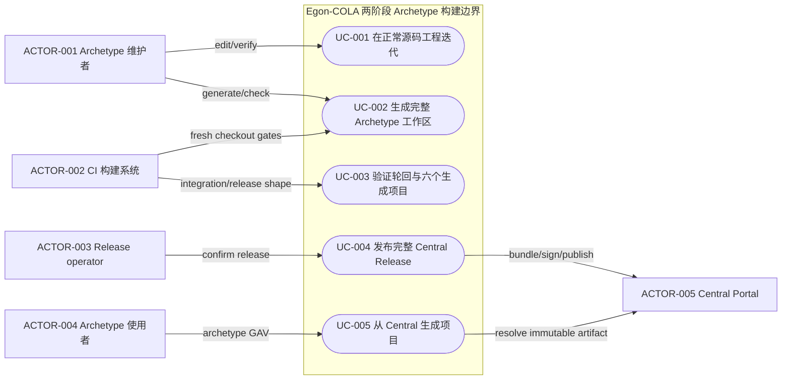
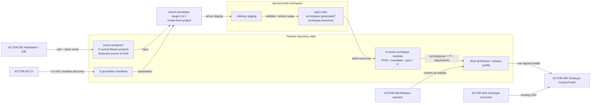
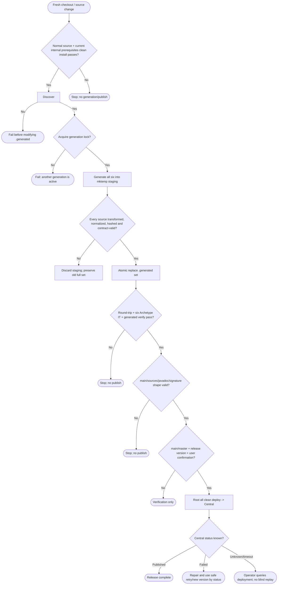

# Egon-COLA Archetype 正常源码与发布制品两阶段生成设计

| Field              | Value                                                                                                                                                                                                                                                                                                                                                                                                                                                                                                |
|--------------------|------------------------------------------------------------------------------------------------------------------------------------------------------------------------------------------------------------------------------------------------------------------------------------------------------------------------------------------------------------------------------------------------------------------------------------------------------------------------------------------------------|
| Document           | `2026-08-27-20-31-archetype-two-stage-source-generation.md`                                                                                                                                                                                                                                                                                                                                                                                                                                          |
| Template Version   | `6`                                                                                                                                                                                                                                                                                                                                                                                                                                                                                                  |
| Status             | `Review`                                                                                                                                                                                                                                                                                                                                                                                                                                                                                             |
| Type               | `Refactor / Architecture / Build and Release`                                                                                                                                                                                                                                                                                                                                                                                                                                                        |
| Complexity         | `Complex`                                                                                                                                                                                                                                                                                                                                                                                                                                                                                            |
| Complexity Drivers | `六个 Archetype 产品、三种生成拓扑、普通源码与 Velocity 模板的双阶段转换、不可变 Flyway 历史文件、Maven Reactor 生命周期、生成一致性、Central Portal sources/javadoc/GPG 附件和不可覆盖 Release 的失败边界`                                                                                                                                                                                                                                                                                                                                                   |
| Created            | `2026-08-27 20:31 CST`                                                                                                                                                                                                                                                                                                                                                                                                                                                                               |
| Updated            | `2026-08-27 20:31 CST`                                                                                                                                                                                                                                                                                                                                                                                                                                                                               |
| Owner              | `Mario / Egon-COLA maintainers`                                                                                                                                                                                                                                                                                                                                                                                                                                                                      |
| Repository         | `Egon-COLA`                                                                                                                                                                                                                                                                                                                                                                                                                                                                                          |
| Scope              | `egon-cola-archetypes 下 light/service/web 及其 -open 六个产品；正常源码工程、Archetype 生成器、现有发布模块、验证器、CI、版本脚本与 Maven Central 发布工作流`                                                                                                                                                                                                                                                                                                                                                                                |
| Change Surface     | `把六个模板中的可开发 Java/POM/配置/测试/文档还原为六个正常 Maven 源码工程；以 maven-archetype-plugin:create-from-project 3.4.1 将源码转换到不提交 Git 的 .generated 工作区；保留六个现有 maven-archetype 发布坐标、手工 metadata/post-generate/IT 契约和根 Reactor 的 all 发布；补齐 Central javadoc 附件、Archetype 版本对齐、生成原子性、漂移/轮回验证和发布前置 Gate`                                                                                                                                                                                                                       |
| Affected Chapters  | `§7, §8, §9, §13, §14, §15, §16, §17, §18`                                                                                                                                                                                                                                                                                                                                                                                                                                                           |
| Source Requirement | `2026-08-27 用户明确要求：改造成两个阶段，一个是正常的代码结构，一个是生成出来的 archetype，然后把生成的 archetype 推送到 Maven 中央仓库`                                                                                                                                                                                                                                                                                                                                                                                                            |
| Baseline Revision  | `main@907e0a26e756d94390e3ae579ebd4306cccc9381；2026-08-27 20:31 CST dirty-worktree snapshot：Tianquan-Jianshen bootstrap 两个 Java/Test 文件及 scripts/unified-identity-local.sh、scripts/unified-xingyuan/test-direct-run-contract.sh 存在并发修改，本 Spec 不覆盖、不回退`                                                                                                                                                                                                                                                           |
| Amends             | `[Archetype MyBatis-Plus unification](2026-08-25-19-09-archetype-mybatis-plus-unification.md) §8、§14、§16（仅修订六个产品的源码事实源路径、生成/验证/发布顺序；业务、模型、schema、接口和架构合同不变）；[Open-source archetype family](2026-08-23-16-43-open-source-archetype-family.md) §8、§14、§16（同一结构性修订）`                                                                                                                                                                                                                                    |
| Supersedes         | `None`                                                                                                                                                                                                                                                                                                                                                                                                                                                                                               |
| Depends On         | `[Archetype MyBatis-Plus unification](2026-08-25-19-09-archetype-mybatis-plus-unification.md) §1、§3、§5-§18（六族当前有效业务、架构、配置、schema 与 verifier 合同）；[Open-source archetype family](2026-08-23-16-43-open-source-archetype-family.md) §1、§3、§5-§18（-open 产品边界）`                                                                                                                                                                                                                                           |
| Related Specs      | `[Domain-first package design](../../superpowers/specs/2026-07-13-web-service-archetype-domain-first-package-design.md) §125-§744；[Light base design](../../superpowers/specs/2026-07-02-student-management-light-archetype-design.md) §67-§327；[Service base design](../../superpowers/specs/2026-07-02-student-management-evaluation-service-archetype-design.md) §79-§535；[Web base design](../../superpowers/specs/2026-07-02-student-management-organization-web-archetype-design.md) §78-§483` |
| Related Plans      | [Archetype 正常源码与 Central 发布两阶段实施 Plan](../plan/2026-09-01-11-23-archetype-two-stage-source-generation-implementation.md)（状态 Review，待用户批准后执行）                                                                                                                                                                                                                                                                                                                                                         |

## 1. Summary

当前六个 Archetype 把可运行项目的 Java、POM、配置、测试和文档直接维护在
`src/main/resources/archetype-resources`。这种结构符合 Maven Archetype 发布格式，但模板内的
`${package}`、`${groupId}`、`${rootArtifactId}` 和 `__rootArtifactId__` 使 IDE 无法把它作为正常 Maven
工程持续编译、重构和运行测试。目标设计把“开发源码”和“发布制品”明确拆成两个阶段：维护者只在六个正常
Maven 源码工程中迭代；构建阶段使用 `maven-archetype-plugin:3.4.1:create-from-project` 把源码转换成
Velocity 模板，写入不提交 Git 的 `egon-cola-archetypes/.generated`；现有六个
`packaging=maven-archetype` 模块再组合生成模板与手工发布契约，执行 integration-test、Release 附件检查、
GPG 签名并随根 Reactor 上传 Central Portal。

正常源码是业务 Java/POM/配置/测试/文档的唯一可编辑事实源；`.generated` 是可删除、可重建、禁止手改的派生物；
发布模块只拥有 Archetype 坐标、`archetype-metadata.xml`、`archetype-post-generate.groovy`、集成测试和
Central 附件配置。原有 `top.egon:egon-cola-archetype-*` 六个 GAV、消费者 CLI、生成后的 Light/Service/Web
模块树、包结构、业务逻辑、数据库合同和根 Reactor `all` 发布模式不改变。既有 Flyway 文件受仓库不可变规则
保护：旧路径中的文件不删除、不移动、不改写，正常源码内保留字节一致的工作副本并以哈希 Gate 防止漂移；未来
新增迁移只在正常源码路径创建新版本文件。

## 2. Background and Current State

### 2.1 Business and user context

Archetype 维护者需要像维护普通 Spring Boot 项目一样获得 Maven 导入、依赖解析、Java 编译、IDE 重构和测试反馈，
同时 Archetype 使用者仍需通过 Maven Central 上的稳定 GAV 生成当前产品。当前把“可运行项目源码”和“Archetype
分发格式”合并成同一棵资源树，优化了发布直达路径，却把日常开发变成只能在模板文本中编辑、再等待生成项目验证的
高反馈成本流程。用户已经选择两阶段模型，因此本设计的核心不是再复制一套可手工编辑代码，而是确定单向转换、所有权、
失败语义和发布 Gate，保证不会形成两个事实源。

### 2.2 Repository evidence

| Evidence ID | Classification         | Exact path/symbol/decision/command                                                                                                   | Observed fact                                                                                                                                          | Design significance                             | Verification limit/freshness                |
|-------------|------------------------|--------------------------------------------------------------------------------------------------------------------------------------|--------------------------------------------------------------------------------------------------------------------------------------------------------|-------------------------------------------------|---------------------------------------------|
| `EVD-001`   | User decision          | 2026-08-27 用户原话                                                                                                                      | 必须存在“正常代码结构 -> 生成 Archetype -> 上传 Maven Central”两个阶段                                                                                                   | 普通源码必须成为可独立构建入口，发布物必须由其生成                       | 不代表用户批准实现或发布动作                              |
| `EVD-002`   | Static repository      | `egon-cola-archetypes/pom.xml:55-64`                                                                                                 | Reactor 包含两个 canonical facade 和六个 Archetype 模块                                                                                                         | 六个发布坐标及 fixture 拓扑应保持，源码工程不能误入 Central 发布集合     | 仅证明当前 POM                                   |
| `EVD-003`   | Static repository      | 六个模块 POM 的 `packaging=maven-archetype`                                                                                               | 当前发布模块本身不是普通 Java classpath 项目                                                                                                                         | 模板 Java 放在发布模块 `src/main/java` 不能直接解决问题         | 不证明 Central 已发布当前版本                         |
| `EVD-004`   | Static repository      | `egon-cola-archetypes/pom.xml:107-180`                                                                                               | `archetype-packaging` 扩展为 3.2.1，pluginManagement 中 `maven-archetype-plugin` 为 3.4.1                                                                    | 生成与打包应统一到同一个 `maven.archetype.version=3.4.1`    | 版本未来可能升级，实施时以批准版本为准                         |
| `EVD-005`   | Static repository      | 六个 `src/main/resources/archetype-resources`                                                                                          | 当前 tracked 文件数分别为 429、337、427、427、345、436                                                                                                              | 手工复制或双向同步不可接受；需要机械、可重复的一对一生成                    | 计数基于 baseline revision                      |
| `EVD-006`   | Static repository      | 六个 `META-INF/maven/archetype-metadata.xml`                                                                                           | Light/Open Light 有 12 个 root fileSet；Service/Web 各有 6 个 module，Open Service/Web 各有 7 个 module；存在 filtered/non-filtered、packaged 和编码后的 application 目录规则 | 自动生成的 metadata 不能无审查覆盖当前手工合同；metadata 继续由发布模块拥有 | 只证明静态 descriptor，不证明每个 include 当前都命中        |
| `EVD-007`   | Static repository      | 六个 `META-INF/archetype-post-generate.groovy`                                                                                         | 生成后需要恢复 `mvnw` 可执行权限                                                                                                                                   | post-generate 属于分发合同，不属于普通业务源码                  | 未验证 Windows 文件权限语义                          |
| `EVD-008`   | Static repository      | 六个 `src/test/resources/projects/basic/{archetype.properties,goal.txt,verify.groovy}`                                                 | `integration-test` 生成项目、执行 `verify` 并检查完整文件/架构/依赖合同                                                                                                    | 现有 IT 必须保留并增加源码轮回一致性验证                          | verifier 是构建证据，不是 live infrastructure proof |
| `EVD-009`   | Runtime evidence       | `./mvnw -f egon-cola-archetypes/pom.xml -pl egon-cola-archetype-light -Prelease -DskipTests -Dgpg.skip=true clean verify`，2026-08-27 | `archetype:3.4.1:jar` 成功，生成项目编译 316 个 Java 文件、136 测试通过，主 JAR/sources JAR 生成                                                                            | 当前打包与生成合同可作为迁移等价基线                              | 只验证 Light；未验证全六族或 Central 上传                |
| `EVD-010`   | Runtime evidence       | 同一命令的 `maven-javadoc-plugin:3.12.0:jar` 日志                                                                                           | `maven-archetype` 不是 Java classpath-capable packaging，未生成 `-javadoc.jar`                                                                               | Central 发布前必须用占位/说明 JAR补齐 javadoc classifier    | GPG 被显式跳过，未验证签名                             |
| `EVD-011`   | Static repository      | `.github/workflows/publish-maven-central.yml:134-223`                                                                                | 发布目标只有 `all`，从根 Reactor `-Prelease clean deploy`，Central Plugin 自动发布并等待 published                                                                      | 两阶段改造不能退化成六次独立不可恢复发布                            | 未执行真实 workflow                              |
| `EVD-012`   | Static repository      | `.github/workflows/ci_java_compatibility.yaml:158-250`                                                                               | CI 已显式生成六个 GAV 并对生成项目执行 `clean verify`、package、Docker build                                                                                            | 第二阶段可复用现有生成项目验证，不需另造消费者协议                       | Docker/runtime 不在本 Spec 执行                  |
| `EVD-013`   | Static repository      | `scripts/bump_cola_version.sh:39-69,132-156`                                                                                         | 版本脚本当前动态发现 `archetype-resources/**/pom.xml` 并更新 `egon-cola.version`                                                                                    | 源码事实源迁移后必须改为更新正常源码 POM，禁止改 `.generated`         | 只证明当前脚本逻辑                                   |
| `EVD-014`   | Static repository      | `pom.xml:117-195`、`egon-cola-archetypes/pom.xml:203-295`                                                                             | Release profile 负责 sources、javadoc、GPG 与 Central Plugin                                                                                                | 生成阶段不承担上传；发布阶段继续由标准 Maven 生命周期负责                | Central 凭据/namespace 未在本地验证                 |
| `EVD-015`   | Static repository      | legacy light/service/web 模板 `db/migration/**`                                                                                        | 当前模板包含已创建的 Flyway 历史版本                                                                                                                                 | AGENTS.md 禁止编辑、移动、删除既有迁移；结构迁移必须保留原文件并校验哈希       | 不证明外部数据库已应用这些文件                             |
| `EVD-016`   | Official documentation | [Apache create-from-project](https://maven.apache.org/archetype/maven-archetype-plugin/create-from-project-mojo.html)                | 该 goal 从普通项目生成 `maven-archetype` 工程，默认输出 `target/generated-sources/archetype`                                                                          | 使用官方转换能力，不自研 Java 模板引擎                          | 文档对应 3.4.1；未来升级需复核                          |
| `EVD-017`   | Official documentation | [Maven Archetype Packaging](https://maven.apache.org/archetype/archetype-packaging/)                                                 | `maven-archetype` lifecycle 把 `archetype:jar`、integration-test、install catalog 绑定到标准阶段                                                                 | 现有发布模块应保留，不把普通源码直接 deploy 成主制品                  | 不证明当前项目附件满足 Central                         |
| `EVD-018`   | Official documentation | [Sonatype Central requirements](https://central.sonatype.org/publish/requirements/)                                                  | 非 POM 主 JAR必须有 sources、javadoc、GPG 签名和完整 POM metadata                                                                                                  | `-javadoc.jar` 是发布阻断项，不是可选优化                    | Central 规则可能变化，发布前需复核官方要求                   |

### 2.3 Problem statement and gap

当前链路只有“模板资源 -> Archetype JAR -> 生成项目测试”，缺少可直接开发的普通项目。模板 POM 的标准 Archetype
变量使其无法作为 Maven 工程导入；Java 源码不在发布模块的编译 source root；每次修改必须先生成项目才能获得真实
编译反馈。若仅复制一份普通项目而继续允许两边修改，会把问题从“难开发”变成“长期漂移”；若把普通项目直接加入
根 Reactor `deploy`，则会把样例应用误发布 Central；若让 `create-from-project` 自动覆盖手工 metadata，则会破坏当前
细粒度过滤、模块目录和 verifier 合同。当前 Release profile 还缺少 Archetype javadoc JAR，不能把结构改造等同于已经
具备 Central 发布闭环。

### 2.4 Evidence and current-chain map

| Entry/trigger        | Current call chain                                                                                                 | Data read/written                                        | External dependency                    | Consumers                           | Evidence                      |
|----------------------|--------------------------------------------------------------------------------------------------------------------|----------------------------------------------------------|----------------------------------------|-------------------------------------|-------------------------------|
| 维护模板                 | Maintainer -> `archetype-resources` Java/POM/config -> archetype IT -> generated project `verify`                  | 直接修改分发模板；`target/test-classes/projects/basic/project` 派生 | Maven repository                       | Archetype maintainer                | `EVD-003`,`EVD-005`,`EVD-008` |
| 当前 CI                | Checkout -> root `clean install` -> six `archetype:generate` -> generated `clean verify/package`                   | local Maven repository、生成项目、Docker context               | Maven Central/local repo、Docker daemon | CI                                  | `EVD-011`,`EVD-012`           |
| 当前发布                 | workflow dispatch -> release guard/secrets -> root `-Prelease clean deploy` -> Central bundle -> auto publish/wait | Central deployment/bundle、不可变 GAV                        | Central Portal、GPG                     | Release operator、Archetype consumer | `EVD-011`,`EVD-014`,`EVD-018` |
| 版本迭代                 | `bump_cola_version.sh` -> Reactor POM + template POM + README -> validate                                          | tracked POM/README                                       | versions-maven-plugin                  | Release maintainer                  | `EVD-013`                     |
| 当前 Archetype package | resources -> `archetype:jar` -> sources -> javadoc skip -> GPG                                                     | JAR、sources JAR；缺 javadoc JAR                            | Maven plugins                          | Central bundle                      | `EVD-009`,`EVD-010`,`EVD-018` |

## 3. Goals and Non-goals

### 3.1 Goals

1. 建立六个可由 IDE/Maven 直接导入、编译、测试的正常源码工程，作为业务代码、POM、配置、测试和生成项目文档的唯一可编辑事实源。
2. 使用官方 `maven-archetype-plugin:create-from-project` 3.4.1 进行普通项目到 Archetype 模板的单向转换。
3. 把生成模板放入 Git 忽略的 `.generated` 工作区；禁止提交和手工编辑生成物，并保证失败时不留下混合代际输出。
4. 保留六个现有 Archetype GAV、`maven-archetype` packaging、手工 metadata/post-generate/IT、根 Reactor 模块顺序和 Central
   `all` 发布模式。
5. 保证由新流水线生成的项目与当前六个产品在模块、包、文件、依赖、配置、SQL、测试、CLI 和行为上等价。
6. 以正常源码快速验证、源码到模板生成、Archetype IT、消费者生成验证、Release 附件验证五层 Gate 阻止漂移。
7. 补齐 Archetype javadoc JAR、sources 内容和 GPG 签名，统一 `archetype-packaging` 与 plugin 版本，满足 Central Portal
   当前要求。
8. 使版本脚本、CI 和发布工作流动态发现生成 manifest，新增/移除 Archetype 时不维护隐藏硬编码列表。
9. 保留既有 Flyway 文件的原路径和内容哈希，不修改既有数据库迁移历史。

### 3.2 Non-goals

- 不改变六个产品的业务示例、Java 类型、API/RPC/GraphQL/MQ 合同、COLA/Light 包结构、数据库 schema、Flyway 版本语义、手工 SQL
  语义或运行时组件。
- 不把普通源码工程发布为 Central artifact，不给它们新增公共 GAV、BOM 条目或外部兼容承诺。
- 不改变 `top.egon:egon-cola-archetype-{light,service,web}{,-open}` 坐标、消费者 `archetype:generate` 参数或已发布版本。
- 不以自研 Java Maven Plugin、代码生成框架、模板 DSL、Strategy/Factory 类层次替换 Apache Archetype Plugin。
- 不在本 Spec 阶段实施迁移、删除模板、执行真实 Central deploy、导入 GPG 私钥、启动服务、浏览器、Docker 或外部数据库/中间件。
- 不把本结构重构扩大为六个产品业务内容合并、原/open Profile 合并或共享源码继承体系。
- 不修改、移动、重命名、删除任何既有 Flyway migration 文件。

### 3.3 Change Surface and Design Depth

| Area/layer                    | Disposition    | Exact repository evidence                                                       | Changed or preserved behavior/contract                                        | Required Spec treatment | Chapter(s)                                 |
|-------------------------------|----------------|---------------------------------------------------------------------------------|-------------------------------------------------------------------------------|-------------------------|--------------------------------------------|
| 六个正常源码工程                      | Affected       | 六个当前 `archetype-resources` 树                                                    | 新增普通 Maven 可开发事实源，产品内容语义不变                                                    | 完整来源、坐标、模块与所有权设计        | `§7, §8, §14, §16, §17, §18`               |
| Archetype 单向生成器与 `.generated` | Affected       | 当前无生成前置；`EVD-016`                                                               | 新增 manifest 驱动、原子生成、锁、哈希与失败清理                                                 | 完整 CLI、控制流、失败/恢复设计      | `§7, §8, §9, §13, §14, §15, §16, §17, §18` |
| 六个发布模块 POM/resources          | Affected       | 六个 `packaging=maven-archetype` POM、metadata/post script                         | 模板资源来源改为 `.generated`；发布坐标/descriptor/IT 保留；补附件                               | 完整 POM/资源/附件/发布设计       | `§7, §8, §14, §15, §16, §18`               |
| Archetype parent/根 Reactor    | Affected       | `egon-cola-archetypes/pom.xml`、root `pom.xml`                                   | 对齐插件版本，保持模块/GAV/all 发布，增加生成前置 Gate                                            | 完整构建边界与兼容设计             | `§7, §8, §14, §16, §17, §18`               |
| CI、Central workflow、版本脚本、发布文档 | Affected       | `ci*.yaml`、`publish-maven-central.yml`、`bump_cola_version.sh`、`maven-deploy.md` | 调整为 generate -> verify -> package/deploy；版本改正常源码                              | 完整流水线、失败和回滚设计           | `§7, §8, §9, §14, §15, §16, §18`           |
| 既有 Flyway migration 文件        | Context-only   | legacy 三族 `db/migration/**`；AGENTS.md                                           | 原路径/内容/校验和保持；正常源码工作副本字节一致                                                     | 只记录不可变边界和哈希验证           | `§8, §14, §16`                             |
| 两个 canonical facade fixture   | Context-only   | `egon-cola-{organization,evaluation}-facade`                                    | 为正常 service/web 源码和现有 IT 提供编译合同；代码/GAV不变                                      | Reactor 复用与回归边界         | `§7, §14`                                  |
| Components/Platforms reactors | Context-only   | root `pom.xml:50-54`、当前跨 reactor 构建拓扑                                           | fresh/unreleased 版本下作为 source-projects 内部验证 reactor 的依赖前置；生产源码/公共 artifact 不改 | 只记录复用、构建顺序与回归边界         | `§7, §14, §16`                             |
| 生成项目业务 Java/配置/schema 合同      | Unchanged      | 当前六个 template + `verify.groovy` + predecessor Specs                             | 仅来源路径变化，生成结果语义不变                                                              | 轮回/IT 回归，不重新设计业务        | `§10, §11`                                 |
| HTTP/RPC/event 公共接口           | Unchanged      | predecessor Specs 和生成项目 adapter/facade                                          | 无字段、路由、序列化、错误变化                                                               | 契约测试保持                  | `§9`                                       |
| 前端页面                          | Not applicable | 仓库该范围无独立前端源码                                                                    | 无页面改造                                                                         | 证据化 N/A                 | `§12`                                      |

## 4. Requirements and Acceptance Criteria

| ID        | Atomic requirement                                                                    | Priority | Observable acceptance criteria                                                                         | Source                         |
|-----------|---------------------------------------------------------------------------------------|----------|--------------------------------------------------------------------------------------------------------|--------------------------------|
| `REQ-001` | 六个产品各有一个正常 Maven 源码工程，Java/POM/config/test/docs 可直接导入和 `clean verify`                 | Must     | 六个源码工程均无 `${package}`、`${groupId}`、`${rootArtifactId}`、`__rootArtifactId__` 模板占位符且 Maven verify 成功     | 用户“两阶段/正常代码结构”                 |
| `REQ-002` | 普通源码是唯一可编辑业务事实源                                                                       | Must     | 除既有不可变 Flyway 历史副本外，发布模块不再跟踪 `archetype-resources` 业务 Java/POM/config/test/docs；CI 禁止直接修改 `.generated` | 用户开发便利性目标                      |
| `REQ-003` | 使用 `maven-archetype-plugin:3.4.1:create-from-project` 单向生成六套 Archetype 资源             | Must     | 每个 manifest 调用固定版本 goal；输出包含预期 root/module `archetype-resources`                                       | 用户指定 Maven Archetype Plugin 路线 |
| `REQ-004` | 生成器动态发现 manifest，不硬编码六个模块列表                                                           | Must     | manifest 数与 `packaging=maven-archetype` 发布模块数一致；新增 manifest 自动进入 generate/check                        | 现有动态版本治理惯例                     |
| `REQ-005` | 生成输出不提交 Git且禁止手工修改                                                                    | Must     | `.gitignore` 覆盖 `egon-cola-archetypes/.generated/`；fresh checkout 必须先生成；`git ls-files` 对该目录为零          | 两阶段派生物边界                       |
| `REQ-006` | 六套生成作为一个原子集合提交到 `.generated`                                                          | Must     | 任一转换/校验失败时旧完整集合保留或目录为空；不存在新旧模块混合；并发生成第二进程 fail-fast                                                    | 发布一致性                          |
| `REQ-007` | 手工 metadata/post-generate/IT 继续由发布模块拥有且不被 `create-from-project` 覆盖                    | Must     | descriptor 的 fileSet/module/requiredProperty 契约与当前基线一致；生成 plugin 输出的 metadata 不进入最终 JAR                | `EVD-006`-`008`                |
| `REQ-008` | source -> template -> same-coordinate consumer 轮回后与正常源码等价                             | Must     | 规范化排除 `target/.git/.idea` 和 source-only manifest 后，路径、文本内容、可执行位规则和 POM 语义一致                            | 防转换丢失                          |
| `REQ-009` | 六个现有 Archetype GAV、消费者生成参数和生成模块树保持兼容                                                  | Must     | 当前六个 CLI fixture 全部生成成功；Light 1 模块、legacy Service/Web 6 子模块、Open Service/Web 7 子模块保持                   | 现有公共发布合同                       |
| `REQ-010` | 正常源码工程不进入根 Reactor Central deploy                                                     | Must     | Central staging 清单没有 `*-source`/样例应用 artifact；root module list 仍只含现有产品/平台/组件/Archetype reactor         | 发布边界                           |
| `REQ-011` | 根 Reactor 保持一次 `all` 发布，生成必须成为发布前置 Gate                                               | Must     | workflow 在 `clean deploy` 前完成生成、源码验证、Archetype IT 和附件检查；不产生六次独立 release                                | 当前发布拓扑                         |
| `REQ-012` | 每个 Archetype 非 POM artifact 具有主 JAR、sources JAR、javadoc JAR及真实发布时的 `.asc`             | Must     | release-shape 检查逐 GAV验证四类文件；sources 含模板源码；javadoc 含 README；GPG 在 attachment 后执行                        | Central 当前要求                   |
| `REQ-013` | `archetype-packaging` 与 `maven-archetype-plugin` 使用同一 `maven.archetype.version=3.4.1` | Must     | effective POM 和构建日志均为 3.4.1，无 3.2.1 lifecycle extension                                                | `EVD-004`                      |
| `REQ-014` | 版本脚本只更新 Reactor 版本、正常源码中的 `egon-cola.version` 和公开文档，不编辑生成目录                           | Must     | bump fixture 后 source POM/README正确、source sentinel version不变、`.generated` 通过重生成更新                      | 版本一致性                          |
| `REQ-015` | 既有 Flyway 文件原路径和内容不可变                                                                 | Must     | baseline 路径继续存在且 SHA-256 不变；正常源码工作副本逐文件同哈希；没有 rename/delete/modify                                     | AGENTS.md Flyway规则             |
| `REQ-016` | 任一源码、生成、轮回、IT、附件或 Central validation 失败均禁止发布                                          | Must     | workflow 非零退出且 publish step 未执行；未知 Central 状态要求人工查询 deployment，不自动重放                                   | 不可变 Release 安全                 |
| `REQ-017` | 改造不得启动业务服务或外部基础设施作为实现/验证前提                                                            | Must     | 验证仅 Maven/JUnit/Groovy/静态文件和现有隔离 fixture；无 Spring Boot run、浏览器、Docker、真实 DB/MQ/Nacos/Redis             | AGENTS.md/用户操作边界               |

### 4.1 Scenario matrix

| Scenario         | Actor/trigger                                     | Preconditions                      | Main path                                                                         | Alternative/failure path                                    | Data/state change           | Observable result           | Requirements                |
|------------------|---------------------------------------------------|------------------------------------|-----------------------------------------------------------------------------------|-------------------------------------------------------------|-----------------------------|-----------------------------|-----------------------------|
| 普通源码开发           | 维护者修改 light/service/web 任一源码                      | 当前依赖已在本地 repo 或可解析                 | IDE/Maven import -> compile/test/verify                                           | 代码/POM/config 错误直接在源码工程失败，不进入生成                             | 只改 tracked source           | 快速、正常 Maven 反馈              | `REQ-001`,`002`,`017`       |
| 全量生成成功           | 维护者/CI运行生成 CLI                                    | 六个 manifest/source 存在；无并发锁         | 全部在 temp 生成 -> normalize -> hash/contract check -> 原子替换 `.generated`              | 任一族失败则丢弃 staging，不替换旧集合                                     | `.generated` 全套更新           | 六个 generation manifest 同一轮次 | `REQ-003`-`007`             |
| 并发或中断生成          | 两个进程同时执行或收到信号                                     | 第一个已持有 lock                        | 第二个立即失败；第一个 trap 清 staging/lock                                                   | 中断后保留旧完整 `.generated`                                       | 无混合写入                       | 明确非零状态，可安全重跑                | `REQ-006`,`016`             |
| 轮回漂移             | `create-from-project` 漏文件、错误过滤或残留 source sentinel | 正常源码 verify 成功                     | 生成 same-coordinate consumer -> normalize -> compare                               | diff 非空即失败并输出首个路径/类型差异                                      | 不发布                         | 定位 template transform 缺陷    | `REQ-007`-`009`,`016`       |
| Archetype 集成验证   | package reactor `clean integration-test`          | `.generated` 完整                    | package 组合生成资源+curated metadata -> generate basic -> goal verify -> Groovy checks | missing dir/descriptor mismatch/generated verify failure即停止 | target test project only    | 六个产品合同通过                    | `REQ-007`-`009`,`016`,`017` |
| Release shape 验证 | release operator/CI dry run                       | 全部验证已通过                            | attach main/sources/javadoc -> GPG dry skip或真实签名 -> inspect staging               | javadoc/sources/signature缺失阻止 deploy                        | target/staging only         | 每个 GAV文件集完整                 | `REQ-012`,`013`,`016`       |
| Central 发布       | 用户确认的 main/master workflow                        | 非 SNAPSHOT、secrets/GPG/namespace有效 | 根 Reactor单 bundle deploy -> Central validate -> autoPublish -> wait published     | upload/validate/timeout时查询 deployment；未确认状态不自动重试同版本         | Central immutable artifacts | 六个 GAV可解析生成                 | `REQ-010`-`013`,`016`       |
| 版本升级             | maintainer运行 bump script                          | clean/受保护 dirty worktree；合法版本      | 更新 reactor + source egon version + docs -> regenerate -> full gates               | 任一失败恢复 tracked 文件；`.generated` 可删除重建                        | tracked version files       | 无 stale template version    | `REQ-014`,`016`             |
| Flyway 历史保护      | 结构迁移或后续业务改动                                       | baseline hash inventory存在          | 旧路径保留；source copy hash对齐；未来只新增新版本                                                 | old path hash/delete/rename 或 source copy不一致立即失败            | 无历史 migration改写             | Flyway checksum contract保持  | `REQ-015`                   |

### 4.2 Use-case analysis

#### 4.2.1 Actor inventory

| Actor ID    | Actor/role              | Goal and responsibility        | Entry/channel              | Permission/tenant context           | Evidence         |
|-------------|-------------------------|--------------------------------|----------------------------|-------------------------------------|------------------|
| `ACTOR-001` | Archetype 维护者           | 在普通 Maven 项目中开发并获得直接 IDE/测试反馈  | Git/IDE/Maven CLI          | 仓库写权限；无业务 tenant                    | 用户决定、`EVD-001`   |
| `ACTOR-002` | CI 构建系统                 | 从 fresh checkout 确定性生成、验证并阻止漂移 | GitHub Actions/Maven/Shell | GitHub runner；Secrets 仅发布 job       | `EVD-011`,`012`  |
| `ACTOR-003` | Release operator        | 审核并发布完整不可变 Release             | workflow_dispatch          | main/master、Central/GPG credentials | `EVD-011`,`014`  |
| `ACTOR-004` | Archetype 使用者           | 从 Central GAV 生成可编译项目          | `mvn archetype:generate`   | Maven repository access；无源码仓库权限     | 当前 README/CI生成命令 |
| `ACTOR-005` | Sonatype Central Portal | 校验附件、签名、metadata 并发布 GAV       | Central Publishing Plugin  | verified namespace/token            | `EVD-018`        |

#### 4.2.2 Use-case artifact



| ID       | Goal/trigger          | Preconditions                                    | Main success and postcondition                              | Alternatives/failures and failure postcondition | Requirements                | Contracts/tests                    |
|----------|-----------------------|--------------------------------------------------|-------------------------------------------------------------|-------------------------------------------------|-----------------------------|------------------------------------|
| `UC-001` | 维护者提交普通项目变更           | source project/依赖可解析                             | 正常 `clean verify` 通过；tracked source 是新事实源                   | compile/test失败时无 `.generated`/Central变化         | `REQ-001`,`002`,`015`,`017` | `TEST-001`-`004`,`019`             |
| `UC-002` | 运行 `CLI-001 generate` | 六个 manifest/source 完整且无锁                         | 原子产生全六族 `.generated`；manifest/hash完整                        | 任一失败保留旧集合或空集合，可修复后重跑                            | `REQ-003`-`007`,`013`       | `CLI-001`,`TEST-005`-`010`         |
| `UC-003` | CI/维护者验证发布候选          | UC-001/002成功                                     | round-trip、archetype IT、generated verify、release shape 全部通过 | 任一 diff/test/附件缺失禁止发布且无外部写                      | `REQ-007`-`013`,`015`-`017` | `TEST-011`-`018`                   |
| `UC-004` | operator确认 workflow   | main/master、release version、Secrets/GPG、UC-003通过 | 一个根 Reactor bundle published；状态明确                           | Central失败/timeout不盲重试；先查 deployment             | `REQ-010`-`013`,`016`       | `TEST-015`-`018`、workflow audit    |
| `UC-005` | consumer指定现有 GAV生成    | Central 已同步                                      | 生成项目模块/包/行为与当前合同一致并可 verify                                 | 坐标不可解析或生成失败返回 Maven非零，不降级本地 source              | `REQ-008`,`009`,`012`       | 当前六个 CLI fixtures、`TEST-013`,`017` |

## 5. Constraints, Assumptions, and Decisions

### 5.1 Confirmed constraints

- 普通源码与发布制品是两个阶段；这是用户明确要求，不再讨论继续手工维护 template-first。
- 六个产品一一对应，不合并 original/open 或 light/service/web 业务源码。
- 现有公共 Archetype GAV 与根 Reactor `all` Central 发布模式保持。
- `create-from-project` 只负责普通项目到模板资源转换；手工 descriptor/post-script/verifier 不交给自动生成覆盖。
- `.generated` 不入 Git；fresh checkout 必须可完整重建。
- 不新增 runtime dependency、数据库 schema、API 或业务 Java 语义。
- 所有 existing Flyway migration 文件保持原路径、原内容、原 checksum。

### 5.2 Small-gap assumptions

| ID        | Inference                                                                            | Repository evidence                        | Why locally reversible                   | Impact if wrong                       |
|-----------|--------------------------------------------------------------------------------------|--------------------------------------------|------------------------------------------|---------------------------------------|
| `ASM-001` | 普通源码工程统一放在 `egon-cola-archetypes/source-projects`，但不加入根 Reactor                      | 当前 root 只聚合发布产品；用户只要求开发/生成两阶段              | 目录/独立 aggregator 可在实现前调整且不影响 GAV         | 只影响仓库导航和命令路径                          |
| `ASM-002` | source project 使用唯一 sentinel GAV/package 和 `0.1.0-SNAPSHOT`，与 `egon-cola.version` 分离 | create-from-project 会替换当前项目 GAV/package字符串 | sentinel 可局部修改并重生成                       | 若与业务常量碰撞会产生错误替换，轮回 Gate 会阻止           |
| `ASM-003` | `.generated` 位于 `egon-cola-archetypes/.generated` 而非 `target`                        | 第二阶段需要允许后续 `clean deploy` 不删除输入            | ignored build workspace 可随时删除            | 若改放 target，release clean 前必须重新生成      |
| `ASM-004` | source aggregator 复用现有两个 canonical facade module完成 legacy Service/Web 编译             | 当前 package reactor 已维护相同 fixture GAV       | 仅 Maven module 引用，可回退为 bootstrap install | 错误会在 source reactor model/compile阶段暴露 |

### 5.3 Resolved decisions

| ID        | Decision                                                               | Decision owner                      | Evidence and rationale                                           | Requirements                |
|-----------|------------------------------------------------------------------------|-------------------------------------|------------------------------------------------------------------|-----------------------------|
| `DEC-001` | 选择 source-first，两阶段单向生成                                                | User                                | 用户明确要求正常代码结构与生成 Archetype 分离                                     | `REQ-001`-`003`             |
| `DEC-002` | 生成物不提交；发布模块 POM/metadata/tests 提交                                      | User + repository design            | 避免双事实源，同时保留稳定 Reactor/GAV                                        | `REQ-002`,`005`,`007`,`010` |
| `DEC-003` | 保留手工 metadata 作为产品发布合同，只使用 create-from-project 的 `archetype-resources` | Design owner                        | 当前 descriptor 有特殊 filtered/non-filtered/module 规则；自动覆盖风险高        | `REQ-003`,`007`-`009`       |
| `DEC-004` | 发布仍从根 Reactor单 bundle执行                                                | Repository baseline                 | 当前 workflow只允许 all；避免不可变 release半发布                              | `REQ-010`,`011`,`016`       |
| `DEC-005` | 旧 Flyway 文件留在原路径作为不可变历史副本，source 工作副本必须同哈希                             | AGENTS.md                           | 结构改造不能违反不可修改/移动/删除规则                                             | `REQ-015`                   |
| `DEC-006` | Archetype javadoc 使用说明性 README JAR，不把模板 Java伪装成 Javadoc source         | Central contract + runtime evidence | Javadoc plugin不会为 maven-archetype packaging执行；Central允许说明性占位 JAR | `REQ-012`                   |

### 5.4 Open major decisions

无。用户已确认两阶段目标；生成目录、manifest 名称和 sentinel 值是可逆实现细节，按上述最小设计处理。

## 6. Project Technology Context

| Concern             | Current choice                                                    | Repository evidence                         | Constraint on design                         |
|---------------------|-------------------------------------------------------------------|---------------------------------------------|----------------------------------------------|
| Runtime/source      | Java 21、Spring Boot 3.5.16                                        | archetypes parent/template POM              | 普通源码必须保持当前项目 Java/Boot合同，不升级业务栈              |
| Build               | Maven Wrapper、Maven Archetype Plugin 3.4.1                        | root wrapper、`egon-cola-archetypes/pom.xml` | 所有脚本调用仓库 `./mvnw`，不依赖全局 Maven                |
| Packaging           | `maven-archetype` + `archetype-packaging`                         | 六个 package POM                              | 普通源码不能替代发布模块 main artifact                   |
| Template engine     | Velocity（Archetype Plugin内部）                                      | `${package}` 等当前模板；Apache docs              | 需要 sentinel/escaping/round-trip 检查           |
| Verification        | JUnit、Maven Archetype IT、Groovy verifier、generated `clean verify` | `src/test/resources/projects/basic`         | 两层测试都必须保留                                    |
| Release             | Central Publishing Plugin 0.11.0、Source/Javadoc/GPG plugins       | root/archetypes release profile             | attachments 必须在 GPG前完成，发布只用 `-Prelease`      |
| Versioning          | 全仓统一 Egon 版本 + template `egon-cola.version`                       | `bump_cola_version.sh`                      | source project自身 sentinel version不得被全仓版本脚本误改 |
| Database migrations | Flyway legacy + open manual SQL                                   | predecessor Specs/current resources         | schema语义不变；existing Flyway不可移动/改写            |

### 6.1 Java architecture profile and capability baseline

本任务不设计新的业务 Java 类型，但正常源码必须分别保持六个现有精确 Archetype profile：Light/Light Open
保持单项目 package responsibility；Service/Web 及 Open variant 保持当前 module/package/ArchUnit/verifier 合同。
它不是传统 `biz.*` 三层，也不创建第三种业务架构。

| Architecture profile             | Archetype/template or base package        | Exact evidence and verifier            | Existing deviations           | Design action              |
|----------------------------------|-------------------------------------------|----------------------------------------|-------------------------------|----------------------------|
| Egon-COLA Light / Light Open     | light 两族当前 tree + `verify.groovy`         | single jar、package dependency verifier | None in this structural scope | 字节/语义迁移到普通 source，生成结果保持   |
| Egon-COLA Service / Service Open | service 两族 current module tree + verifier | legacy 6、open 7 module contract        | None in this structural scope | 保持 module/domain-first依赖方向 |
| Egon-COLA Web / Web Open         | web 两族 current module tree + verifier     | legacy 6、open 7 module contract        | None in this structural scope | 保持 module/domain-first依赖方向 |

| Need            | Spring/JDK candidate                      | Spring Boot Starter candidate | Egon-COLA/module candidate                      | Proven gap                                 | Decision/dependency impact    |
|-----------------|-------------------------------------------|-------------------------------|-------------------------------------------------|--------------------------------------------|-------------------------------|
| 普通项目转 Archetype | None                                      | None                          | 现有 `maven-archetype-plugin:3.4.1`               | 当前只配置 package/generate，没有 source-first执行入口 | 复用现有 plugin，不加依赖              |
| 原子文件生成          | JDK/POSIX `mktemp`、`mkdir` lock、`mv`、trap | None                          | `bump_cola_version.sh` 已有 backup/trap precedent | 现有脚本无该生成流程                                 | 新增 shell脚本；无 runtime artifact |
| 描述符/生成验证        | XML/Groovy/Maven IT                       | None                          | 现有 metadata/verify.groovy                       | 不足以验证 source round-trip                    | 扩展 verifier/test fixture，不加框架 |
| Central附件       | Maven Jar/Source/GPG plugins              | None                          | parent pluginManagement 已含                      | javadoc plugin对 maven-archetype跳过          | 用现有 maven-jar-plugin附加说明 JAR  |

### 6.2 User-mandated Java rule compliance

| Literal rule | Affected? | Repository evidence                                             | Exact design decision                                           | Files/types/interfaces           | Validation/test evidence                    | Status/blocker |
|--------------|-----------|-----------------------------------------------------------------|-----------------------------------------------------------------|----------------------------------|---------------------------------------------|----------------|
| Rule 1       | No        | 不新增/改名业务 Java 类型，只移动当前源码事实源                                     | 所有现有类型名原样保持                                                     | 六个 source project Java trees     | source/generated type inventory diff        | N/A            |
| Rule 2       | No        | 层间业务 handoff/Validation 合同由 predecessor Spec规定，本任务不改内容          | 验证注解/groups/ValidationUtils逐字保持                                 | existing boundary types          | source verify + round-trip + existing tests | N/A            |
| Rule 3       | No        | 不改变 record/Lombok/MapStruct/BaseConverter                       | 文件内容保持；生成不做业务转换                                                 | existing models/converters       | byte/semantic diff + compile                | N/A            |
| Rule 4       | No        | 不改变业务 Bean、日志、构造注入、Qualifier                                    | 当前合同保持                                                          | existing beans/lombok.config     | existing verifier/context tests             | N/A            |
| Rule 5       | No        | 无新 Java utility；生成器仅 JDK/POSIX shell和 Maven Plugin              | 不加 utility library                                              | `scripts/generate_archetypes.sh` | dependency diff                             | N/A            |
| Rule 6       | No        | 无外部 JSON 字段/mapper变化                                            | Jackson合同保持                                                     | existing DTO/VO/Request/Response | contract regression                         | N/A            |
| Rule 7       | Yes       | 六族 application/base/dev/test/prod 配置从 template path迁移到正常 source | 所有 profile key/content迁移并 round-trip一致，不改值语义                    | source project resources         | config key parity + normalized diff         | PASS           |
| Rule 9       | No        | 受影响流程是构建生成控制，不是业务逻辑                                             | 不引入业务设计模式；采用 manifest数据驱动直接流水线                                  | generator script/manifests       | branch/failure tests                        | N/A            |
| Rule 10      | No        | 不新增/修改业务日期时间字段/API                                              | `java.time`现状保持                                                 | existing Java                    | source/generated scan/compile               | N/A            |
| Rule 11      | Yes       | 当前六个 exact Archetype tree/verifier 已识别                          | 正常 source 和生成项目分别保持对应 Light/Service/Web/Open profile，不引入 hybrid | 六个 source/package trees          | architecture tests + generated verify       | PASS           |

## 7. Architecture Design

### 7.0 Minimum-design baseline and element-necessity audit

| Proposed element                   | Change               | Requirements          | Existing/direct alternative         | Concrete inadequacy of alternative                | Added calls/state/coupling/failures/migration/operations | Verdict |
|------------------------------------|----------------------|-----------------------|-------------------------------------|---------------------------------------------------|----------------------------------------------------------|---------|
| 六个 normal source project           | New                  | `REQ-001`,`002`       | 继续直接编辑 archetype-resources          | 无正常 Maven/IDE compile source root                 | 增加一组 tracked trees，但替代旧可编辑模板而非复制所有权                      | Add     |
| `source-projects/pom.xml`          | New                  | `REQ-001`             | 六次手动 Maven命令                        | 无统一 verify入口、legacy facade reactor解析困难            | 一个内部 aggregator，不发布                                      | Add     |
| 六个 generation manifest             | New                  | `REQ-003`,`004`,`007` | script内硬编码六组映射                      | 新增/移除产品时易漏 CI/版本/生成                               | 每产品一个小 properties合同                                      | Add     |
| `scripts/generate_archetypes.sh`   | New                  | `REQ-003`-`008`       | 手工复制/自研 Maven Plugin                | 手工不可重复；自研 plugin成本更高                              | 一个 shell入口、临时目录、锁/失败状态                                   | Add     |
| `.generated`                       | New ignored state    | `REQ-005`,`006`       | commit generated resources          | commit导致双事实源和重复 review                            | 本地磁盘状态；fresh checkout必须生成                                | Add     |
| 现有 package POM/metadata/post/IT    | Keep/Modify          | `REQ-007`,`009`-`013` | 直接 deploy create-from-project生成 POM | 会丢失 release parent、手工 metadata、IT和原子 root reactor | 配置外部 generated resource +附件                              | Keep    |
| 自研 Java Generator/Strategy/Factory | Proposed alternative | None                  | Apache Plugin + manifest loop       | 无能力缺口                                             | 新模块/API/maintenance/security成本                           | Remove  |
| 普通 source Central artifacts        | Proposed alternative | None                  | 只发布现有 Archetype GAV                 | 无消费者价值且污染 Central                                 | 新不可变 GAV和附件                                              | Remove  |
| javadoc README JAR                 | New attachment       | `REQ-012`             | maven-javadoc-plugin直接执行            | runtime evidence证明 packaging非Java而跳过              | 每个 artifact一个小附件                                         | Add     |

| Path              | Network calls             | Client states                                      | Server contracts/state                                                | Failure and TOCTOU points          | Additional user/business value |
|-------------------|---------------------------|----------------------------------------------------|-----------------------------------------------------------------------|------------------------------------|--------------------------------|
| 当前 template-first | Maven依赖解析/CI；无额外业务调用      | template edit -> slow generated verify             | tracked template + target generated consumer                          | 编译错误晚发现；无双源但开发体验差                  | 可发布                            |
| 选择的 source-first  | 同样 Maven依赖解析；Central调用不增加 | source verify -> generate -> package/IT -> release | tracked source + curated package contract + ignored derived workspace | 多一个 generation Gate/lock；失败可在发布前闭合 | 正常 IDE/编译反馈且保持同一公共artifact     |

### 7.1 System Architecture Design

#### 7.1.1 Architecture Mermaid view



#### 7.1.2 Boundary and responsibility table

| Module/component      | Capability and data owned                           | Inputs/outputs                                                   | Allowed dependencies                             | Forbidden responsibility                                      | Requirements          |
|-----------------------|-----------------------------------------------------|------------------------------------------------------------------|--------------------------------------------------|---------------------------------------------------------------|-----------------------|
| `source-projects/*`   | 可运行项目的 Java/POM/config/test/docs 真相                 | source tree -> compile/test input                                | current BOM/components、canonical facade fixtures | Archetype coordinates、Velocity descriptor、Central credentials | `REQ-001`,`002`,`015` |
| generation manifest   | source/package映射和 create参数                          | properties -> CLI-001                                            | relative paths、sentinel package/GAV              | 业务内容、密钥、任意 shell code                                         | `REQ-003`,`004`,`007` |
| generator script      | discovery、temp、transform、normalize、lock、atomic swap | six source trees -> `.generated`                                 | root mvnw、JDK/POSIX tools                        | 修改 tracked source、发布 Central、猜测缺失映射                           | `REQ-003`-`008`,`016` |
| `.generated`          | 当前完整派生模板集合和 hash/provenance                         | generator output -> package resources                            | package modules read-only消费                      | 人工编辑、Git commit、跨轮次部分复用                                       | `REQ-005`,`006`       |
| package modules       | 公共 GAV、descriptor、post script、IT、附件                 | generated resources + curated contract -> signed Maven artifacts | archetypes parent、Groovy test deps               | 业务源码事实源、普通 app artifact                                       | `REQ-007`,`009`-`013` |
| root/publish workflow | 全仓依赖排序和单 bundle发布                                   | verified reactor -> Central deployment                           | Central Plugin/GPG/settings                      | source examples发布、局部同版本release                                | `REQ-010`-`013`,`016` |
| Central Portal        | 公开不可变 Maven artifacts                               | signed bundle -> published GAV                                   | verified namespace                               | 生成源码、修复构建失败                                                   | `REQ-011`,`012`,`016` |

### 7.2 High-Level Design

#### 7.2.1 Critical business/control flowchart



#### 7.2.2 High-level decision and quality matrix

| Concern/use case | Required behavior    | Selected mechanism                                  | Failure/degradation behavior | Trade-off          | Verification            | Requirements          |
|------------------|----------------------|-----------------------------------------------------|------------------------------|--------------------|-------------------------|-----------------------|
| 开发反馈             | 普通 Maven/IDE直接工作     | six source projects                                 | source verify失败早停            | 多维护一个内部 aggregator | `TEST-001`-`004`        | `REQ-001`,`002`       |
| 生成完整性            | 无漏文件/硬编码 sentinel    | create-from-project + curated metadata + round-trip | diff/path/placeholder不一致失败   | 多一个生成阶段            | `TEST-005`-`013`        | `REQ-003`-`009`       |
| 原子性              | 不出现六族混合版本            | all-in-temp + lock + atomic set swap                | 保留旧完整集合/清空 staging           | 需要本地 ignored state | failure injection tests | `REQ-005`,`006`,`016` |
| 可重复性             | 同 source 两次生成内容一致    | sorted manifest/files + content hash，不写时间戳          | nondeterministic diff阻断      | 生成耗时增加             | `TEST-009`              | `REQ-006`,`008`       |
| Central完整性       | 所有附件/签名存在            | jar/source/README-javadoc/GPG shape gate            | 缺附件不上传                       | 多一个小 JAR           | `TEST-015`,`016`        | `REQ-012`,`013`       |
| Release一致性       | 单 all bundle         | current root workflow + pre-gates                   | partial build不进入 publish     | release job更长      | workflow audit/dry run  | `REQ-010`,`011`,`016` |
| Migration安全      | old Flyway immutable | original hash inventory + source-copy parity        | hash/path变化阻断                | 历史文件有受控副本例外        | `TEST-019`              | `REQ-015`             |

### 7.3 Detailed Design

#### 7.3.1 Detailed component collaboration

| Step | Caller -> callee                                   | Contract/symbol                                                                       | Input/output mapping                                                                                           | State/data effect                            | Failure behavior                               | Requirements          |
|------|----------------------------------------------------|---------------------------------------------------------------------------------------|----------------------------------------------------------------------------------------------------------------|----------------------------------------------|------------------------------------------------|-----------------------|
| `1`  | Maintainer/CI -> parent bootstrap + source reactor | Maven parent `-N install` + source `clean install`（日常已具备依赖时可只跑 source `clean verify`） | concrete GAV/package normal projects + current Components/Platforms/facades                                    | local Maven repo与 normal targets；不进入 Central | compile/test非零；不生成/发布                          | `REQ-001`,`010`,`017` |
| `2`  | CLI-001 -> manifest discovery                      | `find .../src/main/archetype/archetype.properties` sorted                             | exact source dir/package module/expected topology                                                              | read-only                                    | missing/duplicate/escaping path失败              | `REQ-003`,`004`       |
| `3`  | generator -> Maven Plugin                          | `org.apache.maven.plugins:maven-archetype-plugin:3.4.1:create-from-project`           | concrete source -> generated archetype workspace                                                               | temp dir only                                | Maven非零；no retry；discard staging               | `REQ-003`,`006`       |
| `4`  | generator -> normalizer                            | fixed transformations                                                                 | plugin output resources -> `archetype-resources`; `.gitignore -> __gitignore__`; reject source-only/build dirs | temp content                                 | unknown transform/source sentinel失败            | `REQ-006`-`008`       |
| `5`  | generator -> atomic publish workspace              | content hash/manifest                                                                 | all-six staging -> `.generated`                                                                                | ignored directory全量替换                        | signal/error恢复旧 set并清 lock                     | `REQ-005`,`006`       |
| `6`  | package module -> Maven resources                  | external generated dir + committed `META-INF`                                         | resource trees -> `target/classes`                                                                             | module target                                | generated missing/empty/duplicate descriptor失败 | `REQ-007`,`009`       |
| `7`  | lifecycle -> archetype:jar/IT                      | `package`/`integration-test`                                                          | target classes -> Archetype JAR -> basic consumer                                                              | module target/test project                   | any consumer verify/Groovy failure阻断           | `REQ-008`,`009`,`016` |
| `8`  | release profile -> attachments/GPG                 | source jar + README javadoc jar + sign                                                | main/POM/attachments -> `.asc`                                                                                 | staging files                                | any classifier/signature缺失阻断                   | `REQ-012`,`013`       |
| `9`  | root Reactor -> Central Plugin                     | `-Prelease clean deploy`                                                              | all verified modules -> one bundle                                                                             | Central deployment                           | failed/unknown status由operator检查               | `REQ-010`-`012`,`016` |

#### 7.3.2 Critical-path Mermaid swimlane

```mermaid
sequenceDiagram
    actor M as Maintainer/CI
    participant S as Normal Source Reactor
    participant G as generate_archetypes.sh
    participant A as Archetype Plugin 3.4.1
    participant W as .generated Workspace
    participant P as maven-archetype Package Reactor
    participant R as Root Release Reactor
    participant C as Central Portal

    M->>S: edit + parent bootstrap + source reactor clean install/verify
    alt source failure
        S-->>M: non-zero; no generation/publish
    else source valid
        M->>G: CLI-001 generate/check
        G->>G: discover manifests + acquire lock
        loop every discovered archetype
            G->>A: create-from-project(source, temp)
            A-->>G: generated archetype project
            G->>G: extract resources, normalize, validate, hash
        end
        alt any generation/contract failure
            G-->>M: discard staging; old W preserved
        else all six valid
            G->>W: atomic replace complete set
            M->>P: clean integration-test
            P->>W: read generated archetype-resources
            P->>P: jar + generate consumer + verify.groovy
            alt IT or release-shape failure
                P-->>M: non-zero; no Central call
            else all gates pass
                M->>R: confirmed -Prelease clean deploy
                R->>R: attach sources/javadoc then GPG sign
                R->>C: one all-module bundle
                alt published
                    C-->>M: published deployment/GAVs
                else failed or status unknown
                    C-->>M: failure/timeout identity
                    M->>C: inspect status before any retry
                end
            end
        end
    end
```

#### 7.3.3 Transactions, consistency, concurrency, and idempotency

| Concern/state change | Owner and boundary | Mechanism/isolation/lock                             | Concurrent or duplicate behavior                            | Commit/visibility point                                 | Failure result                                            | Requirements/tests               |
|----------------------|--------------------|------------------------------------------------------|-------------------------------------------------------------|---------------------------------------------------------|-----------------------------------------------------------|----------------------------------|
| `.generated` six族集合  | generator process  | exact lock dir + all-in-temp + atomic directory swap | second generator fail-fast；same source repeat hash相同        | all manifests/resources validated后 swap                 | old full set remains or no set；never mixed                | `REQ-006` / `TEST-008`-`010`     |
| tracked source       | Git/maintainer     | ordinary commits；generator read-only                 | concurrent user edits may make pre/post git revision differ | generator records/validates same HEAD+worktree snapshot | source changes during generation使 provenance/hash check失败 | `REQ-002`,`006` / `TEST-009`     |
| Central release GAV  | Central Portal     | immutable group/artifact/version；root one bundle     | same published version不得覆盖                                  | Portal reports `published`                              | unknown outcome不可盲重放；published后必须新版本forward fix           | `REQ-011`,`016` / workflow audit |

#### 7.3.4 Failure semantics, recovery, and reconciliation

| Failure point                   | Detection                        | Immediate control flow         | Data/transaction state                  | Retry and idempotency                                 | Caller result                    | Recovery owner   | Verification                    |
|---------------------------------|----------------------------------|--------------------------------|-----------------------------------------|-------------------------------------------------------|----------------------------------|------------------|---------------------------------|
| source Maven model/compile/test | non-zero Maven                   | stop before generate/publish   | tracked source unchanged                | maintainer修复后重跑                                       | exact Maven failure              | Maintainer       | `TEST-001`-`004`                |
| manifest invalid/escapes repo   | whitelist/path validation        | fail before temp output        | `.generated` untouched                  | no automatic retry                                    | stable error with manifest/path  | Maintainer       | `TEST-005`,`006`                |
| create-from-project one族失败      | Maven exit code                  | abort all-six staging          | old `.generated` intact                 | explicit rerun after fix                              | artifact/source name + exit code | Maintainer/CI    | `TEST-007`,`008`                |
| generation interrupted          | trap/signal                      | delete exact temp/lock         | old set intact                          | safe rerun                                            | exit 129/130/143 style           | Maintainer/CI    | failure injection test          |
| round-trip mismatch             | normalized diff/hash             | print bounded diff, abort      | no publish                              | deterministic rerun must reproduce                    | first differing path/type        | Maintainer       | `TEST-009`-`013`                |
| `.generated` missing at package | resource/archetype jar preflight | fail validate/package          | no artifact upload                      | run CLI-001 then retry                                | clear generate-first message     | Maintainer/CI    | `TEST-011`                      |
| javadoc/sources/signature缺失     | release-shape scan/GPG exit      | stop before Central upload     | local staging only                      | fix config then rebuild                               | missing GAV/classifier           | Release owner    | `TEST-015`,`016`                |
| Central validation rejected     | plugin/Central deployment status | no autoPublish success         | no public artifact if rejected          | repair; same version only after confirmed unpublished | deployment ID + reason           | Release operator | Central dry-run/manual evidence |
| Central timeout/unknown         | wait timeout                     | stop blind retry               | deployment state unknown                | query Portal/API first; if published use new version  | explicit UNKNOWN blocker         | Release operator | runbook review                  |
| old Flyway hash changed         | hash inventory gate              | stop source/generation/release | old file must be restored byte-for-byte | no forward migration substitute for accidental edit   | exact old path/hash              | Maintainer       | `TEST-019`                      |

#### 7.3.5 Observability and operational boundaries

| Signal/runbook       | Emitting owner and point          | Fields/dimensions                                     | Sensitive-data rule                      | Success/failure threshold               | Alert/dashboard/operator action    | Verification boundary                 |
|----------------------|-----------------------------------|-------------------------------------------------------|------------------------------------------|-----------------------------------------|------------------------------------|---------------------------------------|
| generation summary   | CLI-001 after each module/all set | artifactId、source path、file count、content hash、result | no env/token/file content                | success requires all discovered modules | CI log identifies failed module    | script tests/static                   |
| package/IT log       | Maven lifecycle                   | artifactId、plugin version、fixture、exit                | no credentials                           | all six success                         | inspect module build log           | local/CI                              |
| release-shape report | workflow before deploy            | GAV、classifier list、signature presence                | never print token/passphrase/private key | zero missing files                      | stop workflow and fix POM          | static/staging; GPG live only release |
| Central deployment   | Central Plugin                    | deploymentId、version、status                           | credentials masked                       | published within configured wait        | operator follows `maven-deploy.md` | external runtime evidence only        |

#### 7.3.6 Conclusion evidence chain

| Conclusion                                   | Repository/user evidence    | Constraint or requirement                        | Design decision                                               | Consequence and trade-off                   | Verification and acceptance evidence                          |
|----------------------------------------------|-----------------------------|--------------------------------------------------|---------------------------------------------------------------|---------------------------------------------|---------------------------------------------------------------|
| 正常源码成为唯一业务事实源                                | 用户决定、`EVD-003`,`005`        | `REQ-001`,`002`：直接开发而不形成双源                       | 新建六个 source projects；移除可编辑 template业务树                        | 增加一次生成阶段，但获得 IDE/compile/test；生成物不提交        | source verify + `git ls-files .generated=0` + round-trip      |
| 保留稳定 package modules而不直接 deploy plugin生成 POM | `EVD-002`,`006`-`008`,`011` | `REQ-007`,`009`-`011`：GAV/descriptor/IT/root发布保持 | create-from-project只提供 resources；curated package contract组合发布 | 生成器有 overlay步骤，但避免 release metadata/模块拓扑漂移  | effective POM、descriptor baseline、six IT、Central staging list |
| 生成采用原子 ignored workspace                     | 用户两阶段目标、不可变 release风险       | `REQ-005`,`006`,`016`                            | temp全量生成、锁、hash、atomic swap                                   | 本地需先生成；换取无混合集合和可安全重跑                        | concurrent/signal/failure injection + double generation hash  |
| Central附件必须独立修复                              | `EVD-010`,`018`             | `REQ-012`                                        | package阶段附加 README javadoc JAR，source含模板，随后GPG                | 小幅增加 artifact文件；满足 current Central contract | release-shape verify + Central dry run                        |

## 8. Package Structure and Code File Tree

### 8.1 Current relevant tree

```text
egon-cola-archetypes/
├── pom.xml
├── egon-cola-organization-facade/
├── egon-cola-evaluation-facade/
├── egon-cola-archetype-light/
│   ├── pom.xml                         # packaging=maven-archetype
│   ├── src/main/resources/META-INF/...
│   ├── src/main/resources/archetype-resources/   # 当前业务源码+模板
│   └── src/test/resources/projects/basic/...
├── egon-cola-archetype-service/...
├── egon-cola-archetype-web/...
├── egon-cola-archetype-light-open/...
├── egon-cola-archetype-service-open/...
└── egon-cola-archetype-web-open/...
```

### 8.2 Target tree

```text
egon-cola-archetypes/
├── pom.xml                                      # MODIFY: version/resource/release plugin governance
├── source-projects/                             # CREATE: normal-code stage; not root release module
│   ├── pom.xml                                  # CREATE: internal source verification aggregator
│   │                                             # modules include components/xingyuan/facades + six sources;
│   │                                             # it is not a root release module
│   ├── egon-cola-source-light/                  # CREATE: normal single-module Maven project
│   │   ├── pom.xml
│   │   ├── src/main/java/...
│   │   ├── src/main/resources/...
│   │   ├── src/test/java/...
│   │   └── src/test/resources/...
│   ├── egon-cola-source-service/                # CREATE: normal legacy six-module project
│   ├── egon-cola-source-web/                    # CREATE: normal legacy six-module project
│   ├── egon-cola-source-light-open/             # CREATE: normal single-module open project
│   ├── egon-cola-source-service-open/           # CREATE: normal seven-module open project
│   └── egon-cola-source-web-open/               # CREATE: normal seven-module open project
├── .generated/                                  # CREATE at build time; gitignored
│   ├── egon-cola-archetype-light/
│   │   ├── archetype-resources/...
│   │   └── generation-manifest.sha256
│   ├── egon-cola-archetype-service/
│   ├── egon-cola-archetype-web/
│   ├── egon-cola-archetype-light-open/
│   ├── egon-cola-archetype-service-open/
│   └── egon-cola-archetype-web-open/
├── egon-cola-archetype-light/
│   ├── pom.xml                                  # MODIFY: consume ../.generated/${project.artifactId}
│   ├── src/main/archetype/archetype.properties  # CREATE: source mapping/generation contract
│   ├── src/main/javadoc/README.md                # CREATE: Central javadoc classifier content
│   ├── src/main/resources/META-INF/              # KEEP: metadata + post-generate
│   ├── src/main/resources/archetype-resources/
│   │   └── src/main/resources/db/migration/...   # KEEP ONLY: existing immutable Flyway history copies
│   └── src/test/resources/projects/basic/        # MODIFY: round-trip/release-shape additions
├── egon-cola-archetype-service/                  # same package-contract ownership
├── egon-cola-archetype-web/                      # same package-contract ownership
├── egon-cola-archetype-light-open/               # same; no legacy Flyway archive exception
├── egon-cola-archetype-service-open/             # same; no legacy Flyway archive exception
├── egon-cola-archetype-web-open/                 # same; no legacy Flyway archive exception
└── open-source-archetype-code-style.md            # MODIFY references only if path wording changes

scripts/
├── generate_archetypes.sh                        # CREATE: discover/generate/check/atomic swap
├── bump_cola_version.sh                           # MODIFY: update source POMs, never .generated
└── maven-deploy.md                                # MODIFY: two-stage release/runbook

.github/workflows/
├── ci.yaml                                        # MODIFY: source/prerequisite gate -> generation -> root build
├── ci_java_compatibility.yaml                     # MODIFY: same + six source/generated checks
└── publish-maven-central.yml                      # MODIFY: generate/source/full verify/release-shape before deploy

.gitignore                                         # MODIFY: ignore only exact archetype .generated workspace
```

源项目使用不会与业务/BOM版本碰撞的具体坐标，例如：

| Source directory                | Concrete source artifact/root                  | Concrete source package                      | Published Archetype                |
|---------------------------------|------------------------------------------------|----------------------------------------------|------------------------------------|
| `egon-cola-source-light`        | `egon-cola-source-light:0.1.0-SNAPSHOT`        | `top.egon.cola.archetype.source.light`       | `egon-cola-archetype-light`        |
| `egon-cola-source-service`      | `egon-cola-source-service:0.1.0-SNAPSHOT`      | `top.egon.cola.archetype.source.service`     | `egon-cola-archetype-service`      |
| `egon-cola-source-web`          | `egon-cola-source-web:0.1.0-SNAPSHOT`          | `top.egon.cola.archetype.source.web`         | `egon-cola-archetype-web`          |
| `egon-cola-source-light-open`   | `egon-cola-source-light-open:0.1.0-SNAPSHOT`   | `top.egon.cola.archetype.source.lightopen`   | `egon-cola-archetype-light-open`   |
| `egon-cola-source-service-open` | `egon-cola-source-service-open:0.1.0-SNAPSHOT` | `top.egon.cola.archetype.source.serviceopen` | `egon-cola-archetype-service-open` |
| `egon-cola-source-web-open`     | `egon-cola-source-web-open:0.1.0-SNAPSHOT`     | `top.egon.cola.archetype.source.webopen`     | `egon-cola-archetype-web-open`     |

### 8.3 Package and file responsibilities

| Operation | Path/package                                              | Symbols                     | Responsibility                                                                                                                                 | Dependencies                          | Requirements                |
|-----------|-----------------------------------------------------------|-----------------------------|------------------------------------------------------------------------------------------------------------------------------------------------|---------------------------------------|-----------------------------|
| Create    | `egon-cola-archetypes/source-projects/pom.xml`            | source aggregator           | 聚合 `../../egon-cola-components`、`../../egon-cola-xingyuan`、两个 facade fixture 与六个 normal projects，使 fresh/unreleased 同版本可在一个非发布 reactor 内解析并安装 | root wrapper/current repo artifacts   | `REQ-001`,`010`             |
| Create    | `egon-cola-archetypes/source-projects/egon-cola-source-*` | normal Maven trees          | 业务源码唯一编辑位置；保持六族 exact profile                                                                                                                  | current BOM/components/facades        | `REQ-001`,`002`,`009`       |
| Create    | six `src/main/archetype/archetype.properties`             | manifest keys               | 声明 source path、source sentinel、target artifact、预期 topology                                                                                     | generator                             | `REQ-003`,`004`,`007`       |
| Create    | `scripts/generate_archetypes.sh`                          | `generate`、`check` modes    | discovery、create-from-project、normalize、hash、lock、atomic swap                                                                                  | root mvnw/JDK/POSIX                   | `REQ-003`-`008`,`016`       |
| Modify    | six package `pom.xml`                                     | build resources/plugins     | 从 `.generated` 取 template；curated META-INF overlay；attach javadoc                                                                              | existing Maven plugins                | `REQ-007`,`012`,`013`       |
| Keep      | six `src/main/resources/META-INF/**`                      | descriptor/post script      | public generation contract                                                                                                                     | Archetype Plugin                      | `REQ-007`,`009`             |
| Keep      | legacy old Flyway paths                                   | immutable SQL bytes         | 满足历史不可变规则；不再作为日常编辑入口                                                                                                                           | hash gate                             | `REQ-015`                   |
| Modify    | six `verify.groovy`/fixtures                              | round-trip/shape assertions | 证明 normal source与consumer等价、附件完整                                                                                                               | Groovy/Maven                          | `REQ-008`,`009`,`012`,`015` |
| Modify    | `.github/workflows/*.y*ml`                                | generation/source gates     | fresh checkout可重复构建；失败不发布                                                                                                                      | actions/setup-java/current containers | `REQ-011`,`016`,`017`       |
| Modify    | `scripts/bump_cola_version.sh`                            | source POM discovery        | 更新 source `egon-cola.version`，不碰 sentinel/derived output                                                                                       | versions plugin/JDK tools             | `REQ-014`                   |

既有 template 内容迁入 normal source 时，实施必须先用当前 Archetype 以固定 GAV/package生成 canonical project，
再把生成结果作为 source 初始基线；不得通过批量字符串替换直接“反模板化”并假定正确。legacy Flyway 原文件保留，
source 中的新工作副本必须与原文件逐字节一致。迁移完成后，除该历史归档例外，旧
`src/main/resources/archetype-resources` 的业务文件删除，后续修改只进入 source project。

## 9. Interface Definitions

### 9.1 Interface Inventory

| ID        | Change/necessity verdict | Name/purpose                | Kind | Consumer      | Owner              | Method + URL / symbol / topic              | Input  | Output                      | Auth/tenant                       | Error model           | Idempotency/version           | Requirements                       |
|-----------|--------------------------|-----------------------------|------|---------------|--------------------|--------------------------------------------|--------|-----------------------------|-----------------------------------|-----------------------|-------------------------------|------------------------------------|
| `CLI-001` | New/Add                  | 生成或检查全部 Archetype resources | CLI  | Maintainer/CI | repository scripts | `./scripts/generate_archetypes.sh generate | check` | mode + discovered manifests | `.generated` or comparison result | local filesystem only | non-zero + bounded diagnostic | content deterministic；plugin 3.4.1 | `REQ-003`-`008`,`016` |

现有消费者 `mvn archetype:generate`、HTTP/RPC/event/internal Service contracts 均为 `Unchanged`：Method、GAV、
input/output/error语义由当前 README、metadata 和 predecessor Specs保持；本任务只新增内部 build CLI。

### 9.2 Per-interface Detailed Contracts

#### 9.2.1 CLI-001 — Generate/check Archetype workspace

##### Necessity and interaction-cost decision

| Concern                             | Decision                                                            |
|-------------------------------------|---------------------------------------------------------------------|
| Change classification               | New internal repository CLI                                         |
| Independent consumer goal           | Maintainer/CI需要把普通源码确定性转换为发布模块可消费的完整工作区                             |
| Parameter ownership and derivation  | 产品映射由每个 package module manifest拥有；script动态发现，不由调用者逐项传入              |
| Direct/no-new-interface alternative | 六次裸 Maven命令无法统一锁、原子替换、normalize、hash和错误边界                           |
| Caller use of result                | package reactor读取结果；check mode用于CI/本地漂移确认                           |
| Round trips and failure points      | 无业务网络；每产品一次 Maven plugin运行；失败集中在 source/model/plugin/normalize/hash |
| Verdict                             | Add，满足 `REQ-003`-`008`                                              |

##### Identity and purpose

| Concern                  | Definition                                                                              |
|--------------------------|-----------------------------------------------------------------------------------------|
| Purpose/owner/consumer   | repository build CLI；owner为 Archetype maintainers；consumer为 CI/package reactor          |
| Protocol and endpoint    | POSIX shell CLI：`generate` 或 `check`，无 HTTP                                             |
| Content type/version     | properties manifest + filesystem tree；generator version与 `maven.archetype.version`同版本治理 |
| Auth/permission/tenant   | 无业务 auth/tenant；仅允许仓库内明确路径；不读取 Central/GPG secrets                                      |
| Timeout/retry/rate limit | 不内置 retry；由 CI job timeout控制；失败后显式重跑                                                    |
| Idempotency/concurrency  | 相同 source snapshot生成相同 content hashes；single lock；第二进程 fail-fast                        |

##### Request parameters

| Name      | Location             | Type/format             | Required/null      | Default | Validation/range/enum                         | Meaning                        | Example                                       | Source          |
|-----------|----------------------|-------------------------|--------------------|---------|-----------------------------------------------|--------------------------------|-----------------------------------------------|-----------------|
| `mode`    | argv[1]              | enum                    | Required           | None    | `generate` / `check`                          | 写入完整 `.generated` 或只验证可重复/当前集合 | `check`                                       | caller          |
| manifests | filesystem discovery | sorted properties files | Required non-empty | None    | 每个 target artifact唯一；source/target必须在repo允许根下 | 产品映射集合                         | `.../src/main/archetype/archetype.properties` | package modules |

每个 manifest 只允许以下字段：`sourceProject`、`sourceGroupId`、`sourceArtifactId`、`sourceVersion`、
`sourcePackage`、`targetArtifactId`、`expectedTopology`。字段值按普通 properties 文本解析但不得 `source`/`eval`；
未知字段、重复 target、绝对/逃逸路径、缺失 source POM 都失败。

##### Success response

- `generate`：exit `0`；`.generated` 包含所有 discovered target，每个 target 有 `archetype-resources` 和
  `generation-manifest.sha256`；stdout 输出逐 artifact文件数/hash和最终总数。
- `check`：exit `0`；两次临时生成内容一致，且当前 `.generated`（若要求存在）与新输出一致；不修改 tracked 文件。

##### Error responses

| Condition                          | CLI status               | Stable diagnostic                   | Retryable                 | Caller handling                |
|------------------------------------|--------------------------|-------------------------------------|---------------------------|--------------------------------|
| usage/unknown mode                 | `2`                      | usage + invalid mode                | No until corrected        | fix invocation                 |
| invalid/missing manifest/source    | non-zero                 | manifest/path/field reason          | No until source fixed     | fail CI                        |
| lock held                          | non-zero                 | generation already active           | Yes after owner exits     | do not kill/preempt owner      |
| Maven create-from-project failure  | Maven/non-zero           | target artifact + Maven exit        | Yes after cause fixed     | inspect build log              |
| normalize/round-trip/hash mismatch | non-zero                 | first bounded differing path/reason | Yes after transform fixed | no package/publish             |
| signal/interruption                | `129/130/143` equivalent | interrupted + cleanup outcome       | Yes                       | verify lock removed then rerun |

##### Interface logic for frontend and consumers

1. Resolve repository root and validate exact `.generated` target; never use `$HOME`、`~`、broad globs or unresolved
   destructive targets.
2. Discover/sort manifests and compare to current `maven-archetype` module inventory.
3. Acquire a dedicated lock without interrupting an active owner.
4. Use one `mktemp -d` staging root and invoke fixed plugin version for each source project.
5. Copy only generated `archetype-resources`; rename `.gitignore` representation；reject `.git`、`.idea`、`target`、source
   manifest and concrete sentinel leakage.
6. Validate curated metadata coverage/expected topology, calculate stable relative-path content hashes, and run required
   round-trip checks.
7. Only after all products pass, atomically replace `.generated`; trap cleans exact staging/lock on error or signal.

##### Compatibility and verification

CLI is internal and may evolve only additively while this Spec is effective；`generate|check` modes and manifest field
semantics are
the contract used by CI/docs. Tests cover usage、zero/duplicate/escaping manifest、plugin failure、source
mutation、concurrent lock、
signal cleanup、double-generation determinism、atomic set and successful package consumption。

## 10. POJO and Data Model Design

Scope disposition: `Unchanged`。

Evidence：本任务新增的 manifest 和 shell CLI不是 Java POJO；六个 source project中的 Java 类型、字段、Lombok/record、
validation、MapStruct/BaseConverter和状态机均来自当前模板及
`2026-08-25-19-09-archetype-mybatis-plus-unification.md`，只改变 tracked path和生成所有权。

Preserved invariant：source、generated archetype consumer与当前产品在 Java type inventory、package、signature、annotation、
serialization和mapping语义上一致。Verification：normal source compile/test、round-trip normalized diff、generated
`clean verify`
和现有 verifier。没有新 Java model、mapper或状态迁移。

## 11. Database Design

Scope disposition: `Unchanged`。

Relational model change: `No` — 本任务不改变 SQL 内容、表、列、PK/FK/UK、索引、tenant/sharding、事务或 migration版本。
legacy 已存在 Flyway 文件保持原路径与 SHA-256；source project内工作副本必须同哈希，future migration从新的 normal source
path按下一个合法版本创建。Open manual SQL只迁移事实源路径，生成后的 classpath相对路径和字节不变。数据库设计继续由
predecessor Specs生效；本 Spec不新增 migration、不执行数据库、不绘制无变化 ER 图。

## 12. Frontend Page Design

N/A — `egon-cola-archetypes` 本改造范围没有独立前端页面工程；受影响面是 Maven/Shell/CI/发布链路，不存在 route、page、
component、permission或UI state变化。生成 Web项目中的后端 HTTP/GraphQL 合同保持不变。

## 13. Design Patterns and Architecture Principles

### 13.1 Selected patterns

| Pattern/principle        | Concrete variation point or problem  | Placement                                       | Why direct code is insufficient        | Repository alignment                           |
|--------------------------|--------------------------------------|-------------------------------------------------|----------------------------------------|------------------------------------------------|
| Manifest-driven Pipeline | 六个产品source/target/topology不同，但处理阶段相同 | six properties manifests + one generator script | 六组硬编码复制会在新增/删除产品时漂移；六个 Strategy类又属过度设计 | 版本脚本已有动态发现；Maven Archetype是既有工具                |
| Staging + Atomic Publish | all-six generation不能出现混合代际           | temp workspace -> validate -> `.generated` swap | 直接逐目录覆盖会在中途失败后留下半套资源                   | `bump_cola_version.sh`已有backup/trap/rollback精神 |

### 13.2 Rejected patterns and simpler alternative

- 拒绝 Strategy/Factory/Template Method Java类体系：不存在 runtime algorithm selection；每族差异用 manifest数据表达，一个直接
  pipeline足够，避免新增自研 Maven Plugin模块。
- 拒绝双向同步：Velocity模板无法可靠反向还原普通源码，双向写会产生冲突所有权。
- 拒绝 Git submodule/worktree/symlink：引入跨平台、checkout和发布可见性问题，不能替代确定性转换。
- 拒绝把六族合为 Profile：会改变产品隔离、依赖和消费者生成合同，超出本请求。

### 13.3 Architecture principles

- Single Source of Truth：业务内容只在 normal source编辑；`.generated` 只读派生；package module只拥有发布合同。
- Information Hiding：source不知道 Central、GPG和descriptor细节；package module不拥有业务 Java迭代。
- Fail Closed：缺生成物、hash/diff/IT/附件/签名任一失败都停止，不用旧局部文件或自动降级。
- YAGNI：复用 Apache Plugin、Maven lifecycle、现有 Groovy verifier，不新增 runtime依赖、自研模板语言或公共API。
- Compatibility：公共 GAV/CLI/生成项目保持；内部 source GAV没有外部承诺。
- Exact Archetype Profile：Light/Service/Web/Open业务 module/package direction逐族保持，不混入 `biz.*` 或第三结构。

## 14. Test Design

### 14.1 Unit tests

生成器采用 shell，使用隔离 fixture目录测试 manifest parser、path containment、排序、duplicate target、source sentinel检查、
lock、signal cleanup、atomic replacement和hash determinism。不得用真实 repository `.generated` 作为破坏性失败注入目标；测试使用
`mktemp -d` 下明确目录。

### 14.2 Integration, contract, component, and release-shape tests

1. Normal source verify：六个普通 Maven项目直接 `clean verify`，证明日常开发结构有效。
2. Transform test：每个 source运行 create-from-project，并验证 generated resource tree/topology。
3. Round-trip test：用 package artifact以 source自身 sentinel GAV/package生成 consumer，normalize后与 source tree比较。
4. Archetype IT：现有六个 `projects/basic` 继续执行生成项目 `verify` + `verify.groovy`。
5. External consumer test：CI以不同 GAV/package再生成六个项目并 `clean verify`，防 sentinel偶合。
6. Release shape：每个非 POM Archetype验证 main/sources/javadoc及真实发布 `.asc`；sources含模板 Java/POM，javadoc含 README。
7. Central dry run只验证 staging；真实 Central publish需要用户显式确认，本 Spec不执行。

### 14.3 Test cases and data

| ID         | Level             | Target                      | Scenario/input                           | Expected assertion                                                                     | Test double/data                      | Tool/path                       | Requirements          |
|------------|-------------------|-----------------------------|------------------------------------------|----------------------------------------------------------------------------------------|---------------------------------------|---------------------------------|-----------------------|
| `TEST-001` | Build             | source light/light-open     | direct `clean verify`                    | normal single-module compile/tests/architecture pass                                   | local current artifacts               | source reactor                  | `REQ-001`,`017`       |
| `TEST-002` | Build             | source service/service-open | direct `clean verify`                    | 6/7 module compile/tests pass                                                          | canonical facade fixture/local facade | source reactor                  | `REQ-001`,`009`       |
| `TEST-003` | Build             | source web/web-open         | direct `clean verify`                    | 6/7 module compile/tests pass                                                          | canonical facade fixture/local facade | source reactor                  | `REQ-001`,`009`       |
| `TEST-004` | Static            | all source trees            | template placeholder scan                | no archetype GAV/package/path placeholder in normal source                             | rg                                    | script/CI                       | `REQ-001`,`002`       |
| `TEST-005` | Unit/fixture      | manifest discovery          | add/remove/duplicate/unknown field       | dynamic exact inventory or clear failure                                               | temp repo tree                        | shell test                      | `REQ-004`             |
| `TEST-006` | Security/safety   | path parser                 | absolute、`..` escape、broad target        | reject before write                                                                    | temp paths                            | shell test                      | `REQ-006`,`016`       |
| `TEST-007` | Integration       | each manifest               | plugin 3.4.1 generation                  | exact resource root/module topology                                                    | temp output                           | Maven + shell                   | `REQ-003`,`007`,`013` |
| `TEST-008` | Failure injection | all-six staging             | fourth product Maven failure             | current `.generated` unchanged；staging/lock cleaned                                    | fake Maven wrapper/fixture            | shell test                      | `REQ-006`,`016`       |
| `TEST-009` | Determinism       | same source snapshot twice  | double generate                          | identical sorted content hashes，无 timestamp内容漂移                                        | two temp roots                        | `diff`/hash                     | `REQ-006`,`008`       |
| `TEST-010` | Concurrency       | two generator processes     | same workspace lock                      | one proceeds，one fail-fast，不preempt                                                    | temp lock                             | shell test                      | `REQ-006`             |
| `TEST-011` | Package failure   | missing one generated root  | package/validate                         | non-zero、明确先generate，不产可部署主JAR                                                         | temp missing dir                      | Maven                           | `REQ-005`,`016`       |
| `TEST-012` | Contract          | curated metadata            | baseline requiredProperty/fileSet/module | no automatic descriptor overwrite；paths all covered                                    | XML fixture                           | Groovy/XML                      | `REQ-007`,`009`       |
| `TEST-013` | Round-trip        | six source/package pairs    | source sentinel GAV/package              | normalized consumer equals source；`.gitignore`/mvnw规则正确                                | temp consumer                         | Maven/Groovy                    | `REQ-008`,`009`       |
| `TEST-014` | Archetype IT      | six package modules         | `clean integration-test`                 | all basic generated verify/Groovy pass                                                 | current fixtures                      | Maven                           | `REQ-007`-`009`,`016` |
| `TEST-015` | Release shape     | six target dirs             | `-Prelease -Dgpg.skip=true verify`       | main/sources/javadoc present；sources含Java/POM；javadoc含README                           | target files                          | Maven/shell                     | `REQ-012`,`013`       |
| `TEST-016` | Signing           | release candidate           | real GPG environment in protected CI     | POM/main/sources/javadoc均有valid `.asc`                                                 | GitHub Secret key                     | Maven GPG                       | `REQ-012`,`016`       |
| `TEST-017` | External consumer | six public GAVs             | CI random artifact/package               | generate + `clean verify` success，no source sentinel                                   | temp local repo                       | existing compatibility workflow | `REQ-009`,`011`       |
| `TEST-018` | Publishing model  | Central staging bundle      | dry run/inspect                          | source projects absent；root/components/xingyuan/facades/six archetypes expected set完整 | staging output                        | Central Plugin                  | `REQ-010`-`012`       |
| `TEST-019` | Immutability      | legacy Flyway inventory     | baseline vs post-refactor SHA/path       | every old path exists且hash相同；source copy同hash                                          | hash fixture                          | shell/Groovy                    | `REQ-015`             |
| `TEST-020` | Versioning        | bump fixture                | new Egon version                         | reactor/source `egon-cola.version`/README更新；source 0.1.0-SNAPSHOT不变；generated未直接编辑     | temporary checkout fixture            | shell/Maven                     | `REQ-014`             |
| `TEST-021` | Hygiene           | repository                  | generated/tracked/scope scan             | `.generated` untracked；无非目标源码修改；`git diff --check`                                     | Git                                   | CI                              | `REQ-002`,`005`,`016` |

Implementation-stage validation command contract：

```bash
# Bootstrap only the two parent POMs needed by forked/local consumers; do not traverse their modules.
./mvnw -B -ntp -N install
./mvnw -B -ntp -N -f egon-cola-archetypes/pom.xml install

# Verify/install current Components, Platforms, facade fixtures, and the normal source projects
# in one internal non-Central reactor so same-version dependencies are available locally.
./mvnw -B -ntp -f egon-cola-archetypes/source-projects/pom.xml clean install

# Generate the complete ignored workspace only after normal source verification succeeds.
./scripts/generate_archetypes.sh generate

# Prove deterministic generation and source -> archetype -> consumer round-trip.
./scripts/generate_archetypes.sh check

# Authoritative six-archetype contract verification.
./mvnw -B -ntp -f egon-cola-archetypes/pom.xml clean integration-test

# Release-shape verification without publishing or signing.
./mvnw -B -ntp -Prelease -Dgpg.skip=true clean verify
```

真实发布只在上述 Gate 已有成功证据后由 protected workflow执行；可以用
`-DskipTests -Darchetype.test.skip=true` 避免同一候选重复执行已完成的 test/Archetype IT，但不得跳过生成、附件、GPG或
Central validation。

## 15. Non-functional and Cross-cutting Design

| Concern          | Required behavior                                  | Mechanism                                                           | Failure/degradation                                | Verification boundary              |
|------------------|----------------------------------------------------|---------------------------------------------------------------------|----------------------------------------------------|------------------------------------|
| Maintainability  | normal Maven source、single edit owner              | source-first + generated ignored                                    | generator不可用时不能打包，但源码仍可开发                          | source verify/round-trip           |
| Reproducibility  | same snapshot -> same resources                    | sorted manifests/paths、no generated timestamp、content hashes        | nondeterminism blocks CI                           | double generation static proof     |
| Safety           | no broad/destructive path operation                | exact repo-root containment、mktemp、lock、trap、atomic swap            | preserve old full set；never `rm -rf` broad target  | fixture failure injection          |
| Supply chain     | only pinned official Maven plugin                  | 3.4.1 property、wrapper、existing repositories                        | plugin resolution failure stops                    | effective POM/build log            |
| Security/secrets | generator never accesses release secrets           | separate CI steps; masked Central/GPG env                           | missing secrets fail publish validation            | workflow/static; live CI only      |
| Compatibility    | public GAV/generated outcome unchanged             | curated descriptor + round-trip + external consumer                 | mismatch blocks release                            | six IT/CI                          |
| Operability      | one documented two-stage entry and release runbook | generate/check modes + `maven-deploy.md`                            | unknown Central state requires operator inspection | runbook review/dry run             |
| Performance      | normal source tests可聚焦；full gate仍完整                | separate source reactor; release can skip already-proved tests only | generation adds six plugin invocations/build time  | CI duration observed later，不先声明SLO |
| Observability    | every stage names product/result/hash              | bounded logs、Central deployment ID                                  | no high-cardinality file-content logs              | script/workflow log tests          |
| Database safety  | old migrations immutable                           | original hash inventory/source-copy parity                          | any mismatch blocks                                | static hash；不声明 live DB            |

## 16. Compatibility, Migration, Rollout, and Rollback

### Compatibility

- Public compatibility：六个 `top.egon` Archetype GAV、version policy、standard `groupId/artifactId/version/package` 输入、
  `gitignore` required property、生成模块/包/API/schema/README语义保持。
- Internal breaking change：维护者不得再编辑 package module `archetype-resources`；新的唯一入口是 `source-projects`。
- Build invocation change：任何构建包含 Archetype package modules前必须完成 generate；CI/publish workflow隐藏这一前置复杂度。
- Central release仍是 root `all`；source aggregator不是 root module，不会创建公共 artifact。
- existing Flyway原文件和checksum保持；generated consumer classpath内容同字节。

### Migration/adoption

1. 以当前六个已通过 IT 的 Archetype 生成固定 sentinel GAV/package的 canonical projects，作为 normal source初始内容。
2. 安装 root/archetypes 两个 parent POM，再由内部 source reactor 聚合 Components、Platforms、facades 与六个 source
   projects执行 `clean install`；修复的只允许是反模板化机械缺陷，不顺带改业务。
3. 增加 manifests/generator/.generated resource wiring；保留 curated metadata/post/IT。
4. 对每族执行 source -> generated resources -> same-sentinel consumer round-trip；任何 diff先修生成规则。
5. 删除 package module旧可编辑业务资源；existing Flyway文件原地保留并建立hash inventory/source copy parity。
6. 更新版本脚本、CI、README和publish workflow；补齐 javadoc/source/signature shape。
7. 在无 Central写入的前提下跑 source、generator、六族 IT、consumer、release shape全套。
8. 用户审核/批准后，后续实施 Plan才可安排逐 Step commit；真实 Central发布另需显式 workflow确认。

### Rollout

结构迁移必须一次覆盖六个产品的 source ownership和生成 Gate，不能让一部分继续 template-first、一部分 source-first长期共存。
实现可按“generator infrastructure -> light pair pilot -> service/web pairs -> release pipeline”分 Step提交，但最终合并
Gate要求
六个 package modules全部只消费新生成工作区。根 Reactor模块和发布顺序不变。

### Rollback

- Central发布前：回退 source/generator/POM/workflow commit并恢复旧 template资源即可；`.generated` 直接删除后重建。
- Central已发布后：同版本不可覆盖；若生成内容有缺陷，恢复仓库并发布更高 patch版本，不能回写旧 GAV。
- existing Flyway历史文件始终保留原地，因此结构 rollback不涉及 Flyway repair/checksum修改。
- Central timeout/unknown先查 deployment；确认 unpublished前不重试，确认 published后只能新版本forward fix。

## 17. Alternatives and Decisions

| Option                                                                            | New elements and interactions                                 | Advantages                                                | Disadvantages/risks                                                            | Repository fit      | Decision and rationale |
|-----------------------------------------------------------------------------------|---------------------------------------------------------------|-----------------------------------------------------------|--------------------------------------------------------------------------------|---------------------|------------------------|
| A — selected normal source + ignored generated workspace + stable package modules | six source trees、manifest、generator、existing package contract | normal development；one source；root release/GAV/IT保持；生成可重建 | 多一个前置阶段和本地 workspace                                                           | 最符合用户两阶段与现有 Reactor | Selected               |
| B — normal source + commit generated archetype-resources                          | six source + tracked generated copy + drift check             | fresh checkout可直接 package；实现简单                            | Git双份文件、review噪声、错误手改风险，违背唯一事实源目标                                              | 可作短期过渡但非最终设计        | Rejected               |
| C — 直接 deploy `create-from-project` 的 generated POM                               | six source + six generated standalone projects                | 最接近官方三步示例                                                 | 丢失 Egon parent/release metadata/curated descriptor/IT；会拆成多 Central deployments | 破坏当前发布拓扑            | Rejected               |
| D — package module在 lifecycle内 nested Maven生成                                     | invoker/exec nested builds                                    | 单 Maven命令                                                 | reactor/local repo锁、并行、日志/失败复杂；clean/phase耦合                                   | 比显式两阶段更难运维          | Rejected               |
| E — template-first + IDE把嵌套目录标source                                              | IDE配置                                                         | 无迁移                                                       | POM/Velocity仍不可正常编译；CLI/CI无改善                                                  | 不能满足用户目标            | Rejected               |
| F — 自研 Maven generator plugin                                                     | new Java plugin/API/tests                                     | 可强类型集成 lifecycle                                          | 新模块/依赖/维护/发布顺序，Apache Plugin已满足核心转换                                            | 过度设计                | Rejected               |

## 18. Risks and Open Questions

| ID         | Risk/question                                                                                    | Probability           | Impact                       | Mitigation or decision owner                                                                                      | Status                              |
|------------|--------------------------------------------------------------------------------------------------|-----------------------|------------------------------|-------------------------------------------------------------------------------------------------------------------|-------------------------------------|
| `RISK-001` | create-from-project 对 Maven/Spring `${...}`、binary/text、module path的自动分类与当前 curated descriptor不同 | High                  | 生成文件损坏或漏文件                   | 只取 resources、保留 descriptor、same-sentinel round-trip、dual-package samples                                          | Closed by design gates              |
| `RISK-002` | source sentinel 字符串与业务常量碰撞导致过度替换                                                                 | Medium                | 模板引入错误变量                     | unique GAV/package/version、concrete leakage/round-trip checks                                                     | Closed by design                    |
| `RISK-003` | `.generated` 不提交导致直接 root build失败                                                                | High without workflow | 开发/CI中断                      | documented generate precondition、workflow first step、clear fail-closed error                                      | Closed by operational design        |
| `RISK-004` | six source + full root verification增加 CI时间                                                       | High                  | timeout/反馈变慢                 | source focused jobs；完整 Gate一次；发布阶段可跳已证明测试但不跳附件/签名                                                                 | Open for implementation measurement |
| `RISK-005` | legacy Flyway 形成不可变旧路径和source工作副本                                                                | Medium                | 两副本可能漂移                      | hash inventory强制相等；old path read-only；future migrations only source path                                          | Closed by `REQ-015`                 |
| `RISK-006` | source projects依赖同版本未发布 Egon artifacts                                                           | High on fresh repo    | source verify无法独立解析          | 先 `-N install` 两个 parent，再由非发布 source reactor 同时构建 Components、Platforms、facades 与 sources；protected publish按§14顺序 | Closed by build order               |
| `RISK-007` | javadoc placeholder attachment在 GPG后才创建                                                          | Medium                | unsigned/缺失 Central artifact | bind maven-jar-plugin at package before verify-phase GPG；release-shape/signature tests                            | Closed by design                    |
| `RISK-008` | Central autoPublish timeout导致同版本盲重放                                                              | Low                   | duplicate/不可变 release冲突      | deploymentId/status runbook，unknown blocker，no automatic retry                                                    | Closed by failure contract          |

无未解决用户决策。`RISK-004` 需要实施后 CI 时间证据，但有明确优化边界，不阻止设计审查。

## 19. Traceability Matrix

| Requirement | Use case             | Affected area/chapter          | Context-only or unchanged boundary | Interface/model/database/frontend | Tests                  | Acceptance evidence            |
|-------------|----------------------|--------------------------------|------------------------------------|-----------------------------------|------------------------|--------------------------------|
| `REQ-001`   | `UC-001`             | source projects/§7,§8,§14,§16  | exact business profiles unchanged  | Java models unchanged             | `TEST-001`-`004`       | six direct verify              |
| `REQ-002`   | `UC-001`,`002`       | ownership/.generated/§7,§8,§13 | old Flyway exception               | N/A new models                    | `TEST-004`,`021`       | tracked inventory              |
| `REQ-003`   | `UC-002`             | generator/§7-§9                | package GAV unchanged              | `CLI-001`                         | `TEST-007`             | plugin 3.4.1 logs              |
| `REQ-004`   | `UC-002`             | manifests/§7-§9                | facade fixtures context            | `CLI-001`                         | `TEST-005`             | dynamic inventory parity       |
| `REQ-005`   | `UC-002`,`003`       | `.generated`/§7,§8,§15         | Git source preserved               | `CLI-001`                         | `TEST-011`,`021`       | untracked/fresh gate           |
| `REQ-006`   | `UC-002`             | atomic generator/§7,§9,§15     | no Central call                    | `CLI-001`                         | `TEST-008`-`010`       | no mixed generation            |
| `REQ-007`   | `UC-002`,`003`       | package contract/§7,§8,§14     | public CLI preserved               | CLI unchanged                     | `TEST-012`,`014`       | descriptor/IT pass             |
| `REQ-008`   | `UC-003`,`UC-005`    | round-trip/§7,§14              | business models/schema unchanged   | all public contracts unchanged    | `TEST-009`,`013`,`017` | normalized parity              |
| `REQ-009`   | `UC-003`,`UC-005`    | six products/§7,§8,§14,§16     | current GAV/module tree            | consumer CLI unchanged            | `TEST-012`-`014`,`017` | all generations pass           |
| `REQ-010`   | `UC-004`             | reactor/§7,§8,§16              | source internal only               | Central artifact set              | `TEST-018`             | no source artifacts            |
| `REQ-011`   | `UC-004`             | workflow/§7,§14,§16            | current all target                 | publish command                   | `TEST-018`             | one staging bundle             |
| `REQ-012`   | `UC-003`,`004`,`005` | attachments/§7,§8,§14-§16      | POM metadata preserved             | Maven classifiers                 | `TEST-015`,`016`,`018` | complete signed shape          |
| `REQ-013`   | `UC-002`,`003`       | parent POM/§7,§8,§14           | no business dependency upgrade     | Maven plugin version              | `TEST-007`,`015`       | effective 3.4.1                |
| `REQ-014`   | `UC-001`,`002`       | bump script/§8,§14,§16         | source sentinel fixed              | N/A                               | `TEST-020`             | version fixture                |
| `REQ-015`   | `UC-001`,`003`       | migration boundary/§8,§14,§16  | schema/history unchanged           | DB design unchanged               | `TEST-019`             | exact path/hash                |
| `REQ-016`   | all                  | failure gates/§7,§9,§14-§18    | no partial public change           | CLI/Central status                | failure rows/tests     | publish step absent on failure |
| `REQ-017`   | `UC-001`-`004`       | validation boundary/§14-§16    | runtime systems unchanged          | N/A frontend/DB runtime           | command audit          | no service/external start      |

## 20. Review and Acceptance

### 20.1 Original-request fidelity

用户要求的“正常代码结构”“生成出来的 Archetype”“把生成的 Archetype 推送 Maven Central”分别由
`REQ-001/002`、`REQ-003`-`009`、`REQ-010`-`016`覆盖；设计没有退回 template-first，也没有把 source project
误作为公共 artifact。真实发布不属于本 Spec执行范围。

### 20.2 Repository and technical fidelity

设计核对了 root/archetypes POM、六个 package POM、429/337/427/427/345/436 个当前 template tracked文件、
六个 descriptor拓扑、post script、IT/Groovy verifier、CI generation matrix、版本脚本和 Central workflow。当前定向 Light
验证证明 Plugin 3.4.1、consumer verify、sources JAR可用，同时明确暴露 javadoc JAR缺口。没有把静态/Light局部证据表述为
全六族或 live Central成功。

### 20.3 Cross-section consistency

Architecture、target tree、CLI、failure semantics、tests、rollout和traceability一致地定义 source -> temp -> `.generated` ->
stable package module -> root Central bundle。Java/API/database/frontend均没有伪造改动；legacy Flyway例外在目标树、测试、
兼容和风险中一致。Header的 Affected Chapters 与 §3.3 Affected rows并集一致：`§7, §8, §9, §13, §14, §15, §16, §17, §18`。

### 20.4 Relationship and effective-design review

本文只修订两个 predecessor Spec的 file ownership、build/test/release章节；它们关于业务架构、Java模型、接口、schema、
配置和生成产品行为的其余内容继续有效。没有把 `Review` predecessor改成 Accepted，也没有修改 predecessor正文。

### 20.5 Blocking Manual Check

| Check ID         | Applicability  | Status | Evidence                                                             | Finding                                                                      | Required action/exception |
|------------------|----------------|--------|----------------------------------------------------------------------|------------------------------------------------------------------------------|---------------------------|
| `MC-ARCH-001`    | Applicable     | PASS   | six current trees/metadata/verify + §6.1/§8                          | exact Light/Service/Web/Open profiles preserved；no hybrid                    | None                      |
| `MC-REUSE-001`   | Applicable     | PASS   | existing Maven Archetype/Jar/Source/GPG/Groovy/scripts + §6.1 ledger | existing capabilities reused before new design                               | None                      |
| `MC-DEP-001`     | Applicable     | PASS   | `egon-cola-archetypes/pom.xml` pluginManagement；§7.0                 | no runtime/new library；align existing Plugin/extension 3.4.1                 | None                      |
| `MC-NAME-001`    | Not applicable | N/A    | no new/changed Java type inventory，§6.2 Rule 1                       | only files/CLI/manifests change                                              | None                      |
| `MC-VALID-001`   | Not applicable | N/A    | business handoffs unchanged，§10                                      | no new Java validation boundary                                              | None                      |
| `MC-MODEL-001`   | Not applicable | N/A    | Java models byte/semantic preserved，§10                              | no record/class/Lombok choice                                                | None                      |
| `MC-CONVERT-001` | Not applicable | N/A    | mappings unchanged，§10                                               | no converter added/changed                                                   | None                      |
| `MC-LOG-001`     | Not applicable | N/A    | no business class；generator uses bounded CLI logs                    | `@Slf4j` not applicable to shell/Maven config                                | None                      |
| `MC-BEAN-001`    | Not applicable | N/A    | no Spring Bean added/changed                                         | injection contract unchanged                                                 | None                      |
| `MC-UTIL-001`    | Applicable     | PASS   | JDK/POSIX + existing Maven plugins only，§6.1/§13                     | no prohibited utility/dependency                                             | None                      |
| `MC-JSON-001`    | Not applicable | N/A    | public JSON contracts unchanged，§9/§10                               | no serialization change                                                      | None                      |
| `MC-TIME-001`    | Not applicable | N/A    | no Java time field/API change                                        | generated timestamps prohibited for reproducibility                          | None                      |
| `MC-CONFIG-001`  | Applicable     | PASS   | six profile trees move to source；§6.2 Rule 7、`TEST-013`              | exact key/content parity required                                            | None                      |
| `MC-PATTERN-001` | Not applicable | N/A    | no affected complex business logic；§13                               | build pipeline uses data-driven direct design，no ceremonial business pattern | None                      |
| `MC-SCOPE-001`   | Applicable     | PASS   | §3.3/§8 target paths；dirty-worktree baseline                         | limited to archetypes/build/release/docs，unrelated Tianquan-Jianshen/scripts preserved   | None                      |
| `MC-TEST-001`    | Applicable     | PASS   | `TEST-001`-`021`                                                     | source、generation、round-trip、IT、attachments、publication boundaries covered   | None                      |
| `MC-BLOCKER-001` | Applicable     | PASS   | §5.4 no open decisions；all rows PASS/N/A                             | no unresolved design/manual blocker                                          | None                      |

### 20.6 Final verdict

PASS — Ready for user review
