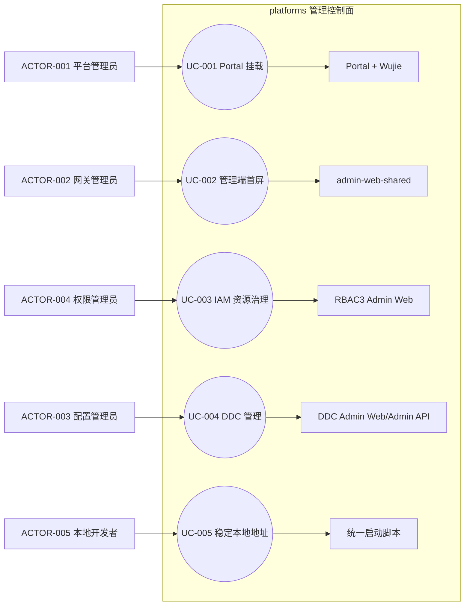
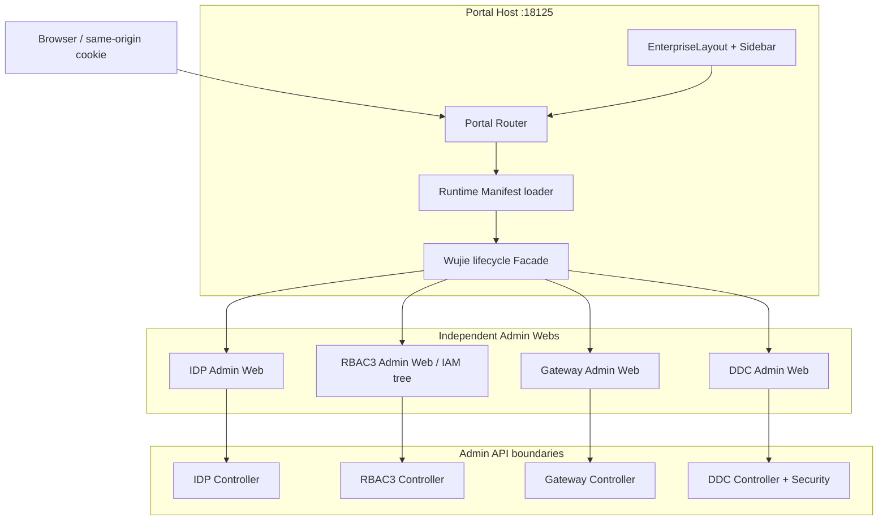
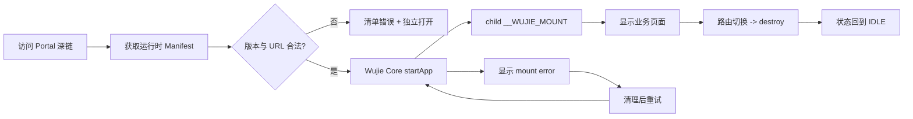
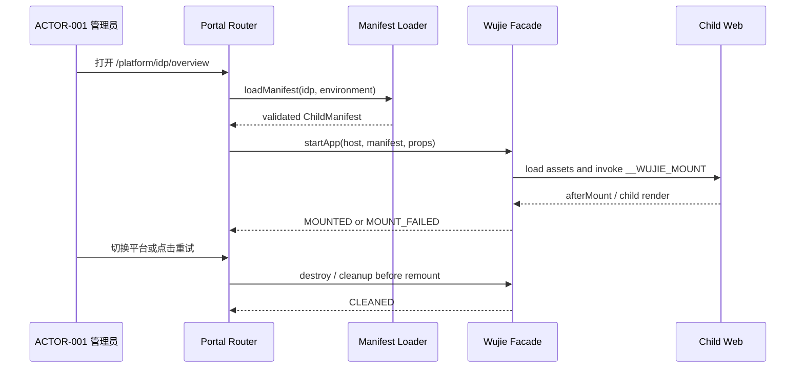

# platforms Web 运行修复与 Controller 覆盖补齐规格

| Field | Value |
| --- | --- |
| Document | `2026-08-28-11-06-platforms-web-runtime-repair-and-controller-coverage.md` |
| Template Version | `6` |
| Status | `Accepted` |
| Type | `Bugfix / Feature` |
| Complexity | `Complex` |
| Complexity Drivers | Wujie 沙箱生命周期、Portal 运行时清单、四个管理端的 Controller 覆盖、Gateway 发布版本漂移、DDC PostgreSQL 参数类型、跨平台认证与回滚 |
| Created | 2026-08-28 11:06 CST |
| Updated | 2026-08-28 13:00 CST |
| Owner | User / Egon-COLA platform owner |
| Repository | Egon-COLA |
| Scope | `egon-cola-platforms` 下的 Portal、admin-web-shared、IDP/RBAC3/Gateway/DDC Admin Web、DDC Admin 查询与安全配置、本地统一平台启动脚本 |
| Change Surface | Wujie 挂载生命周期、共享侧栏路径保护、四个平台前端路由/API/页面覆盖、DDC 分页安全与查询、Portal 运行时地址清单、本地默认地址策略 |
| Affected Chapters | §7, §8, §12, §13, §14, §15, §16, §17, §18 |
| Source Requirement | 用户要求直接修复 Portal 未通过 Wujie 聚合、四个平台前端缺少后端 Controller 已有功能、地址动态发现且默认使用 127.0.0.1，并保持 IAM 二级菜单组织 |
| Baseline Revision | `main@4b6e018aa0c1672c0491591b1b8387296f50bf8f`；工作区另有用户未跟踪文档，不能纳入本次提交 |
| Amends | [平台 Web 企业级与微前端前序规格](2026-08-27-08-09-platforms-web-enterprise-microfrontend.md) §2.3、§3.2、§7、§12、§16、§18 |
| Supersedes | None |
| Depends On | [DDC Admin 分页设计](../../superpowers/specs/2026-08-10-ddc-admin-pagination-ui-modernization-design.md) §1-§10 |
| Related Specs | [平台 Web 企业级与微前端前序规格](2026-08-27-08-09-platforms-web-enterprise-microfrontend.md) |
| Related Plans | [前序平台 Web 实施计划](../plan/2026-08-27-11-13-platforms-web-enterprise-implementation.md)、[本次运行修复实施计划](../plan/2026-08-28-11-06-platforms-web-runtime-repair-and-controller-coverage.md) |

## 1. Summary

本次修复针对当前已经运行的 platforms 本地栈。源码盘点与运行日志显示，Portal 的子应用宿主节点没有形成可见的 Wujie 子实例，Gateway 共享侧栏会因无 `path` 的父菜单项在运行时崩溃，DDC 的分页请求既有安全匹配缺口又有 PostgreSQL 可空查询参数类型问题；另外 RBAC3、Gateway、DDC 前端仍有后端外部 Controller 已实现但没有路由、API 或页面消费的能力。

选择“保留四个自治子应用 + Portal 使用 Wujie Core 生命周期 Facade + 运行时 Manifest + 各平台 Controller 覆盖矩阵”的最小修复路径。Portal 默认从自身 origin 获取清单，清单中的子应用地址默认使用 `127.0.0.1`；只有显式设置广告地址时才使用局域网地址。IAM 继续使用一个顶层菜单，用户、角色、资源、策略和诊断保持为二级/三级菜单。

成功标准：Portal 路由能真实挂载任一子应用，失败时能显示可诊断错误并重试或独立打开；四个独立 Web 仍可直接访问；Gateway 不因父级菜单没有路径而白屏；DDC 所有已有 `/page` Controller 可被授权并能处理空筛选；新增的前端页面/API 与真实 Controller 路径一致；现有动态发布、认证、租户和数据库兼容边界不被改变。

## 2. Background and Current State

### 2.1 Business and user context

平台管理员从 Portal 进入身份、权限、网关和配置中心；领域管理员可直接访问单个平台。管理员需要在同一左侧树中完成列表、详情、变更、发布、恢复和审计，而不是只看到接口存在却没有入口。开发者在不同 Wi-Fi 下运行本地栈时，应不需要修改一组随网卡变化的 IP。

### 2.2 Repository evidence

| Evidence ID | Classification | Exact path/symbol/decision/command | Observed fact | Design significance | Verification limit/freshness |
| --- | --- | --- | --- | --- | --- |
| EVD-001 | Runtime evidence | `target/local-unified-platform/logs/gateway-admin-web.log`，2026-08-28 | Gateway 首屏报 `Cannot read properties of undefined (reading 'endsWith')` | shared 路径匹配必须拒绝非字符串候选值 | 当前现场日志，重启后需复核 |
| EVD-002 | Runtime evidence | Portal `http://127.0.0.1:18125/platform/idp/overview` DOM 检查，2026-08-28 | Portal Shell 存在，但没有 iframe、Wujie 元素或 `data-wujie-id` | 挂载必须有真实 host、Promise 错误回调和清理逻辑 | DOM 检查不等于所有沙箱内部脚本执行证据 |
| EVD-003 | Static repository | `egon-cola-platform-admin-portal/src/lifecycle/WujieChild.tsx` | 当前只包裹 `wujie-react`，wrapper 对 `startApp` 异常只记录日志，组件没有直接拿到挂载 Promise | 需要小型 Wujie 生命周期 Facade，保留 Wujie Core 而不是裸 iframe | 包版本为本地 lockfile 事实 |
| EVD-004 | Static repository | Portal `package.json`、`node_modules/wujie` | Portal 已固定 `wujie-react@2.1.0`，Core `wujie` 同版本可用 | 直接使用同版本 Core 不引入第二个微前端框架 | 最终构建必须重新验证依赖树 |
| EVD-005 | Static repository | `egon-cola-platform-admin-web-shared/src/layout/EnterpriseSidebar.tsx`、Gateway `src/layouts/AdminLayout.tsx` | `EnterpriseNavigationItem.path` 可选，Gateway 父项确实无 path；`matchesPath` 却按 string 调用 `endsWith` | 共享路径判断要以运行时类型为边界 | 仅静态证明根因，修复后需重建 shared |
| EVD-006 | Static repository | `scripts/unified-platform/start-local-stack.sh:25` | 启动脚本自动探测默认网卡并拒绝 loopback | 违反本地开发的回环地址要求；改为显式覆盖优先、默认 127.0.0.1 | 不改变跨设备显式地址能力 |
| EVD-007 | Static repository | `scripts/unified-identity-local.sh:20` | 后端默认地址已经是 127.0.0.1，但显式广告地址时 `declared_hosts` 仍只含 loopback | 声明主机集合要同时保留 loopback 和显式 host | 需要 shell 验证 |
| EVD-008 | Static repository | `egon-cola-platform-rbac3/.../features/role/role.api.ts` | 后端 RoleController 有创建、更新、继承增删，前端只有列表、影响分析和资源树 | RBAC3 角色管理存在真实未消费能力 | 当前 active Gateway release 可能仍旧，需区分发布漂移 |
| EVD-009 | Static repository | RBAC3 `directory.api.ts`、`constraint.api.ts`、`managementPolicy.api.ts`、`simulation.api.ts` | 用户变更、约束写操作、可管理对象查询、角色变更影响模拟未完整接入 | IAM 二级菜单需要补 API 与操作状态 | Internal Controller 不纳入 Admin Web |
| EVD-010 | Static repository | Gateway Admin Controller 与 `gatewayApi.ts` | Gateway 多数 API 已有，但应用详情、OpenAPI 同步可视化、Trace 详情或 Controller 报告存在页面覆盖不足 | 采用已有 API 补齐页面消费，不新增 BFF | 需按真实方法映射验证 |
| EVD-011 | Static repository | DDC `DdcAdminSecurityConfiguration.java` | GET matcher 未包含 `/page`，`/configs/page` 会被拒绝 | 安全配置必须覆盖实际公开 Controller 路径 | 不放宽写权限 |
| EVD-012 | Runtime evidence | DDC 日志、`Ddc*Repository.search` | 空关键词被绑定成 PostgreSQL `bytea`，触发 `lower(bytea) does not exist` | JPQL 可选字符串参数需用字符串类型安全的 `coalesce` | 需执行 DDC 定向测试与运行复核 |
| EVD-013 | Static repository | DDC `DdcNamespaceEnvAppBindingController.java`、DDC Web `NamespacesPage.tsx` | 后端已有独立分页/增删改接口，前端只有命名空间内嵌绑定编辑，没有独立列表路由 | 增加绑定管理页面并保留原内嵌入口 | 不重复引入数据库表 |
| EVD-014 | Static repository | 四个平台 `src/app`/`src/features`/`src/pages` 与对应 Java Controller | IDP 管理端已覆盖主要身份 Controller；RBAC3 与 DDC 存在多处外部 Controller 未消费；Gateway 的 API 层比页面层完整 | 修复必须按“已存在但未组织/未接入”与“真正缺失”分类 | 全量 Controller 计数仍以静态脚本和构建为边界 |
| EVD-015 | Validation evidence | 2026-08-27 四个 Web typecheck、Portal/RBAC3/Gateway 测试 | Portal 18、RBAC3 31、Gateway 74 个基线测试通过；IDP/DDC 并行测试有超时，需单独重跑 | 不能把并行资源竞争当成修复回归 | 本次执行会以定向串行结果为准 |
| EVD-016 | Worktree evidence | `git status --short`，2026-08-28 | 只有 `docs/egon/spec/2026-08-27-20-31-archetype-two-stage-source-generation.md` 未跟踪 | 该用户文档必须保留且不能进入本次提交 | 状态随用户操作变化 |

### 2.3 Problem statement and gap

问题不是单一的“路由少”：一部分是路由/页面没有组织到已有能力，一部分是前端请求路径与 Controller 不一致，一部分是后端安全/查询实现阻断了已有页面，还有一部分是本地启动地址策略错误。此次只补充已有外部管理能力和确定性运行缺陷；没有证据的内部 RPC、跨域代理、数据库迁移或 Gateway active release 发布动作不在默认代码变更内。

### 2.4 Evidence and current-chain map

| Entry/trigger | Current call chain | Data read/written | External dependency | Consumers | Evidence |
| --- | --- | --- | --- | --- | --- |
| Portal 深链 | Portal Router -> `loadManifest` -> `WujieChild` -> Wujie Core `startApp` -> child `__WUJIE_MOUNT` -> child Router/Layout | Manifest、mount state、child DOM | 四个 Vite 静态站点、同源 Cookie | 平台管理员 | EVD-002、EVD-003 |
| Gateway 首屏 | Gateway `filterNavigation` -> shared `EnterpriseSidebar.resolveNavigationSelection` -> `matchesPath` | 当前 pathname、导航树 | React Router、Ant Design Menu | Gateway 管理员 | EVD-001、EVD-005 |
| DDC 分页 | Web `ddcPageApi` -> Gateway/Controller -> SecurityFilterChain -> Service -> JPA Repository | 分页参数、元数据表 | PostgreSQL、Gateway Cookie | DDC 管理员 | EVD-011、EVD-012 |
| RBAC3 角色治理 | RoleGraphPage -> `roleApi` -> RoleController -> role service/repository | 角色、继承、版本、资源授权 | RBAC3 Admin、Gateway release | 权限管理员 | EVD-008 |
| DDC 绑定治理 | BindingPage -> binding API -> `DdcNamespaceEnvAppBindingController` -> service/repository | namespace/env/app binding | PostgreSQL、DDC scope gate | 配置管理员 | EVD-013 |

## 3. Goals and Non-goals

### 3.1 Goals

- G-001：让 Portal 使用可观测、可清理、可重试的 Wujie 挂载链路，并保持子应用独立入口。
- G-002：默认本地使用 127.0.0.1；外部访问只由 `UNIFIED_PLATFORM_ADVERTISED_HOST` 或同名 identity 配置显式决定。
- G-003：修复 shared 侧栏运行时类型边界，保证父级无 path 的 IAM/Gateway/ DDC 树只负责展开。
- G-004：把已有外部 Controller 能力接入对应前端 API、路由、页面或现有详情面板；内部服务 Controller 继续排除。
- G-005：修复 DDC `/page` 的读权限和空字符串 JPQL 参数问题，不修改数据库结构及既有 Flyway 文件。
- G-006：保持 IDP、RBAC3、Gateway、DDC 的业务自治、租户权限和异常隔离；IAM 所有功能仍归于 IAM 顶层菜单。

### 3.2 Non-goals

- 不把四个平台合并成一个前端工程，不引入 Redux、BFF、第二套 UI 框架或新的微前端框架。
- 不把 `internal/v1`、RPC Provider 或引擎内部接口暴露给管理端页面。
- 不修改既有数据库 migration，不新建表，不对现有生产数据做修复脚本。
- 不在本次代码变更中自动启动、停止或重发布当前运行服务；运行现场复核属于执行后的验证步骤。
- 不因为 active Gateway release 落后于当前 draft 就修改数据库发布状态；需要发布时由用户显式执行已有发布命令。

### 3.3 Change Surface and Design Depth

| Area/layer | Disposition | Exact repository evidence | Changed or preserved behavior/contract | Required Spec treatment | Chapter(s) |
| --- | --- | --- | --- | --- | --- |
| Portal Wujie runtime | Affected | `egon-cola-platform-admin-portal/src/lifecycle/WujieChild.tsx` | 从 wrapper-only 改为可获取挂载 Promise、错误和 cleanup 的 Wujie Core Facade | 设计生命周期、隔离、重试和回滚 | §7, §8, §12, §13, §14, §15, §16 |
| Shared navigation | Affected | `admin-web-shared/src/layout/EnterpriseSidebar.tsx` | 无 path/非字符串候选返回 false，保留父级展开 | 设计运行时类型边界和回归测试 | §7, §8, §14, §15 |
| Four Admin Web coverage | Affected | 四个平台 `src/api`、`src/features`、`src/pages`、`src/app` | 已有 external Controller 能力可通过 UI 使用；IAM 保持单组多级菜单 | 完整页面/路由/API 对照与 UI 说明 | §7, §8, §12, §14, §15 |
| DDC Admin security/query | Affected | `DdcAdminSecurityConfiguration.java`、`Ddc*Repository.java` | 放行真实 GET page 路径，字符串空筛选不触发 bytea | 设计安全边界、查询和 Java 规则 | §7, §8, §14, §15, §16 |
| Local address and manifest | Affected | `scripts/unified-platform/start-local-stack.sh`、`scripts/unified-identity-local.sh` | 默认 loopback，显式 LAN host 仍可用，Portal 清单作为运行时地址源 | 设计配置优先级、校验和兼容 | §7, §8, §12, §15, §16, §18 |
| Alternatives and rollback decision | Affected | §17 alternatives、§16 rollout/rollback | 记录 Core Facade、loopback 和 existing API 选择及回退边界 | 形成可审查的选择与回滚依据 | §17, §18 |
| Existing public Controller contracts | Context-only | IDP/RBAC3/Gateway/DDC Controller annotations | 保留路径、HTTP 方法、权限和 envelope；前端只消费已有合同 | 给出覆盖清单和未接入边界，不新增合同 | §9, §12, §16 |
| Database/Flyway | Unchanged | `classpath:db` migration history | schema、索引和历史 migration 不变 | 记录不变边界和验证 | §11, §16 |

## 4. Requirements and Acceptance Criteria

| ID | Atomic requirement | Priority | Observable acceptance criteria | Source |
| --- | --- | --- | --- | --- |
| REQ-001 | Portal 子应用路由必须在 host 节点内创建真实 Wujie 实例 | Must | 打开四个 `/platform/{key}/...` 深链时可见子页面；挂载异常有错误码、重试和独立打开入口 | 用户要求修复 Wujie 聚合 |
| REQ-002 | 本地地址必须动态且 loopback-first | Must | 未设置覆盖变量时所有本地 Web/API/Manifest 使用 127.0.0.1；设置显式 host 时只替换广告地址且保留 loopback 声明 | 用户要求不随 Wi-Fi 修改地址 |
| REQ-003 | Gateway 和共享侧栏不能因父菜单 path 缺失而崩溃 | Must | `filterNavigation` 生成父级无 path 的树时，路由高亮函数不调用 undefined 方法；Gateway 首屏正常 | 运行日志 EVD-001 |
| REQ-004 | 前端必须覆盖 Controller 已有的外部管理能力 | Must | 覆盖矩阵中的每项都有 API 方法和页面动作/详情入口，或有证据说明已由现有组件消费 | 用户要求补四个平台功能 |
| REQ-005 | DDC 分页读接口必须受正确权限保护并能处理空筛选 | Must | `/configs/page`、元数据/page、任务/page 在 DDC_READ 下可访问；无关键词时 PostgreSQL 查询成功 | DDC 运行日志与 Controller |
| REQ-006 | IAM 菜单继续使用单一顶层和二级/三级菜单 | Must | 用户、组织、岗位、应用、资源、角色、策略、诊断均挂在 IAM 树下，不出现平铺顶层 | 用户已确认菜单组织 |
| REQ-007 | 每个新增/调整页面必须有可审查的文字布局和状态说明 | Must | Spec §12 为每个 route 描述 header、filter、content、detail/action、permission、loading/empty/error | 用户要求逐页审查 UI |
| REQ-008 | 修复必须可验证且可回滚 | Must | 每个实施 Step 有 RED/GREEN、定向测试、提交范围；不改 Flyway；失败可恢复到 Step 前提交 | EGON 执行规则 |
| REQ-009 | 前端不得绕过领域边界访问内部组件 | Must | 浏览器只调用现有 Admin API/Gateway 代理；不新增 `internal/v1` 页面请求、数据库、Redis 或 RPC 直连 | 前序规格与 Controller 分类 |
| REQ-010 | 运行时发布漂移必须与代码缺失分开报告 | Should | 验证输出同时区分源码无路由、前端未消费、active release 未发布三类结论 | 当前 Gateway draft/active 证据 |

### 4.1 Scenario matrix

| Scenario | Actor/trigger | Preconditions | Main path | Alternative/failure path | Data/state change | Observable result | Requirements |
| --- | --- | --- | --- | --- | --- | --- | --- |
| Portal 正常挂载 | ACTOR-001 平台管理员 | Manifest 合法、child Web 可达 | Router -> manifest -> Wujie -> child mount | Core reject/load error -> error card -> retry/standalone | 仅变更 mount state | 子页面出现在 Portal 内容区 | REQ-001, REQ-007 |
| Portal 子应用失败 | ACTOR-001 | child 404 或 mount reject | 显示安全诊断消息 | cleanup 完成后再次 mount，不残留旧实例 | 不写领域数据 | 用户可恢复或独立访问 | REQ-001, REQ-008 |
| Gateway 父级导航 | ACTOR-002 网关管理员 | parent item 无 path、child 有 path | resolve selection 跳过 parent path 并选 child | 非字符串 active prefix 被忽略 | 无 | 首屏不崩溃，菜单可展开 | REQ-003, REQ-006 |
| DDC 空筛选分页 | ACTOR-003 配置管理员 | DDC_READ、数据库可用 | `/page` -> security matcher -> repository | 403 显示权限错误；数据库错误显示 trace | 只读 | 页面显示分页或可诊断失败 | REQ-005, REQ-007 |
| 角色变更 | ACTOR-004 权限管理员 | RBAC3 manage 权限、版本有效 | 页面提交 PUT/继承/资源授权 | 409 保留输入并刷新版本 | 角色版本/授权变化 | 成功消息与列表刷新 | REQ-004, REQ-006, REQ-008 |
| 动态地址启动 | ACTOR-005 本地开发者 | 未设置覆盖或显式设置 host | 生成 API/Web URL 与 Portal Manifest | 显式 host 校验失败即停止并给出变量名 | 只生成 runtime 文件 | Wi-Fi 改变不影响 loopback 本地访问 | REQ-002, REQ-010 |

### 4.2 Use-case analysis

#### 4.2.1 Actor inventory

| Actor ID | Actor/role | Goal and responsibility | Entry/channel | Permission/tenant context | Evidence |
| --- | --- | --- | --- | --- | --- |
| ACTOR-001 | 平台管理员 | 跨平台进入、重试和独立打开子应用 | Portal Web | Gateway USER cookie、租户 bootstrap | Portal Router/Wujie |
| ACTOR-002 | 网关管理员 | 管理 Gateway Group、Application、路由、发布、Provider、MCP、观测 | Gateway Admin Web | `gateway:read` 与领域 capability | Gateway AdminLayout |
| ACTOR-003 | 配置管理员 | 管理 DDC 元数据、配置、发布任务、缓存、绑定 | DDC Admin Web | DDC_READ/WRITE/PUBLISH/CACHE | DDC AuthContext/SecurityConfiguration |
| ACTOR-004 | 权限管理员 | 管理 IAM 目录、角色、资源、策略和模拟 | RBAC3 Admin Web | RBAC3 bootstrap permissions | RBAC3 resource registry |
| ACTOR-005 | 本地开发者 | 在回环或显式局域网 host 下启动/访问平台 | shell scripts | OS process/config scope | unified-platform scripts |

#### 4.2.2 Use-case artifact

| ID | Use case/goal | Primary actor | Supporting actors/systems | Trigger | Preconditions | Main success outcome | Alternatives/failures | Postconditions | Requirements | Interfaces/pages | Tests |
| --- | --- | --- | --- | --- | --- | --- | --- | --- | --- | --- | --- |
| UC-001 | Portal 挂载平台子应用 | ACTOR-001 | Wujie Core、child Web | 点击左侧平台或深链 | manifest 通过校验 | child 页面 mount | mount reject 可重试或独立打开 | 生命周期可清理 | REQ-001 | Portal `/platform/idp/overview` 等 | TEST-001 |
| UC-002 | 修复管理端首屏 | ACTOR-002 | shared Layout、React Router | 访问 Gateway `/dashboard` | 导航树含无 path 父项 | 首屏和高亮正常 | 非法 candidate 被忽略 | 无异常日志 | REQ-003 | Gateway Dashboard/Layout | TEST-002 |
| UC-003 | 维护 IAM 资源 | ACTOR-004 | RBAC3 Controller、Gateway release | 进入 IAM 二级菜单 | 权限和 active route 可用 | 页面能读写角色/资源/策略 | 版本冲突可重试 | 审计与版本保持 | REQ-004, REQ-006 | RBAC3 IAM pages | TEST-003 |
| UC-004 | 处理 DDC 元数据与发布 | ACTOR-003 | DDC Controller、PostgreSQL、Redis | 进入分页页面 | DDC_READ 或写权限 | 分页、编辑、绑定、发布可用 | 403/56999 有明确状态 | 不绕过权限 | REQ-004, REQ-005 | DDC metadata/binding pages | TEST-004 |
| UC-005 | 使用稳定本地地址 | ACTOR-005 | shell、Vite、Manifest | 启动本地栈 | 无或有显式 host | URL 由统一配置生成 | invalid override 阻止启动 | 同一脚本可复用 | REQ-002, REQ-010 | start-local-stack.sh | TEST-005 |



## 5. Constraints, Assumptions, and Decisions

### 5.1 Confirmed constraints

用户已确认：使用 Wujie；四个平台保留独立访问；菜单是静态资源定义并按 bootstrap 权限剪枝；认证使用同源 Cookie/CSRF 边界；Portal 首页只做只读摘要；后续 Java 代码采用传统三层；IAM 下使用二级菜单；本次直接开始修复。

### 5.2 Small-gap assumptions

| ID | Inference | Repository evidence | Why locally reversible | Impact if wrong |
| --- | --- | --- | --- | --- |
| ASM-001 | 当前 Portal 子应用开发地址可由本地 Manifest 提供 | `start-local-stack.sh:write_portal_manifest` | 只改变生成文件内容，不改业务合同 | 若部署器另有注册中心，仍可替换 Manifest provider |
| ASM-002 | Controller 已有外部合同优先于新增后端 API | 四平台 Controller 的 `@EgonGatewayPolicy(EXTERNAL)` | 前端增量可单独回滚 | 若某能力需新合同，留在接口缺失清单 |
| ASM-003 | DDC JPQL 的 `coalesce(:param, '')` 可由当前 Hibernate/PostgreSQL 组合推断为字符串 | `Ddc*Repository.search` 字段均为文本列 | 可由定向 JPA 测试快速回退到参数规范化方案 | 若 provider 仍不能推断，Step 阻断并改用已验证绑定方式 |

### 5.3 Resolved decisions

| ID | Decision | Decision owner | Evidence and rationale | Requirements |
| --- | --- | --- | --- | --- |
| DEC-001 | Wujie 使用 Core `startApp` Facade，保留 Wujie sandbox/degrade 能力，不使用裸 iframe | User / implementation owner | wrapper 会吞掉 startApp reject，Core 可提供 Promise 和销毁句柄 | REQ-001 |
| DEC-002 | 地址优先级为显式 `UNIFIED_PLATFORM_ADVERTISED_HOST`，否则 127.0.0.1；Portal Manifest 是 child 地址唯一运行时来源 | User / implementation owner | 回环地址不受 Wi-Fi 变化影响，显式覆盖支持跨设备 | REQ-002, REQ-010 |
| DEC-003 | IAM 只保留一个顶层树节点，新增能力归并到治理/授权/资源目录/诊断子树 | User / implementation owner | RBAC3 `resourceDefinitions.json` 已有 parentCode 机制 | REQ-004, REQ-006 |
| DEC-004 | Controller 覆盖优先补前端；仅 DDC 已证实的安全/查询缺陷修改后端，排除 migration | User / implementation owner | 区分“没写 UI”和“后端坏了”，控制变更面 | REQ-004, REQ-005, REQ-009 |
| DEC-005 | 每个页面沿用现有 shared/PageState/React Query/Ant Design，并按页面说明实现 loading/empty/error/denied | User / implementation owner | 现有四个 Web 已有相同技术栈和组件 | REQ-007, REQ-008 |

## 6. Project Technology Context

| Concern | Current choice | Repository evidence | Constraint on design |
| --- | --- | --- | --- |
| Web runtime | React 19、TypeScript、Vite、Ant Design、TanStack Query | 四个 Admin Web `package.json` | 不引入第二套 UI/状态框架 |
| Micro frontend | Wujie Core/React wrapper 2.1.0 | Portal package/lockfile、node_modules | Core Facade 必须保留 child 独立运行和 cleanup |
| Backend | Spring Boot、Spring Security、Spring Data JPA | DDC Admin Controller/Security/Repository | 只修已有三层边界，不增加新层 |
| Data migration | Flyway `classpath:db` | platforms/各模块 migration 目录 | 本次不新增或修改 migration |
| Validation | Vitest、Testing Library、TypeScript、Maven/JUnit | 各 Web scripts 与 DDC tests | 每步先定向 RED 再 GREEN，运行现场单独标注 |

### 6.1 Java architecture profile and capability baseline

本次后端改动只触及 DDC 现有 Controller 安全配置和 Repository 查询，选择传统三层语义作为新增/修改边界：Controller -> Service -> Repository/DAO；不在既有模块旁边创建第三种包树。历史 DDC 包名为 `controller/service/repository`，属于既有 feature-first 例外，本次不迁移。

| Architecture profile | Archetype/template or base package | Exact evidence and verifier | Existing deviations | Design action |
| --- | --- | --- | --- | --- |
| Traditional Three-Layer | `top.egon.cola.component.ddc.admin.controller/service/repository` | DDC Admin Controller、Service、Repository tree；Maven compile and focused tests | 历史包名没有 `biz.*` 前缀，已有构造器/注解风格 | 保留现有边界，只改 matcher 与查询字符串；不创建新 Java type |

| Need | Spring/JDK candidate | Spring Boot Starter candidate | Egon-COLA/module candidate | Proven gap | Decision/dependency impact |
| --- | --- | --- | --- | --- | --- |
| Wujie lifecycle | Browser Promise/DOM | None | Existing `wujie` 2.1.0 | wrapper error visibility不足 | 使用现有 locked Core，不增版本 |
| String query typing | JPQL `coalesce` | Spring Data JPA | Existing DDC repositories | nullable bind 的 PostgreSQL 类型推断 | 修改查询，不改 schema |
| Page auth | Spring Security matcher | Existing Security starter | DDC capability enum | page path 未列出 | 补 GET matcher，不放宽写权限 |
| UI state | React Query/PageState | Existing shared package | `@egon-cola/admin-web-shared` | no proven gap | reuse |

### 6.2 User-mandated Java rule compliance

以下保留用户强制规则的逐项矩阵。此次没有创建 Java POJO、DTO、Converter、Bean 或配置 profile；DDC Repository 与 Security 配置只做局部修改，执行阶段仍必须按 Plan 每一步复核。

| Literal rule | Affected? | Repository evidence | Exact design decision | Files/types/interfaces | Validation/test evidence | Status/blocker |
| --- | --- | --- | --- | --- | --- | --- |
| Rule 1 | No | 仅修改既有 `Ddc*Repository` 与 Security 配置，无 Java 类型创建 | 不创建 carrier type；保留已有语义后缀 | `DdcBizRepository`、`DdcEnvRepository`、`DdcAppRepository`、`DdcNamespaceRepository`、`DdcPublishTaskRepository` | `rg` 类型清单 + Maven compile | PASS |
| Rule 2 | Yes | 查询边界接收可空字符串筛选，Controller/Service 合同不变 | 不新增验证对象；保持现有 Controller -> Service -> Repository handoff，先做 query 定向测试 | DDC page Controller/Service/Repository | DDC focused test + API envelope probe | PASS |
| Rule 3 | No | 不修改 Entity/DTO/VO/Converter | 不引入 POJO 或手工转换 | Existing DDC entities/VOs unchanged | diff/type inventory | PASS |
| Rule 4 | No | 不修改 Service/Component/Bean | 不新增 Bean 或注入关系 | Existing DDC services unchanged | diff + context compile | PASS |
| Rule 5 | No | 不新增工具依赖或 helper | 只使用现有 JPQL/Spring Security API | Existing repository/config files | dependency/import search | PASS |
| Rule 6 | No | 不改变外部 JSON DTO/VO | 保持 PageResultRecord/ResultRecord envelope | Existing Controller response types | Controller tests | PASS |
| Rule 7 | No | 不增加配置 key | 不修改 profile 结构 | Existing DDC configuration | profile diff shows none | PASS |
| Rule 9 | No | 查询与 matcher 是直接规则，不是复杂业务分支 | 不引入形式化模式类 | Existing repository/config methods | focused tests | PASS |
| Rule 10 | No | 不修改日期字段或时间计算 | 保持现有 `java.time` 语义 | Existing entities/repositories | import search | PASS |
| Rule 11 | Yes | DDC 当前 Controller/Service/Repository 三层目录已确认 | 不创建混合/第三层结构；修改仍留在现有层 | exact DDC paths above | architecture tree + Maven test | PASS |

## 7. Architecture Design

### 7.0 Minimum-design baseline and element-necessity audit

| Proposed element | Change | Requirements | Existing/direct alternative | Concrete inadequacy of alternative | Added calls/state/coupling/failures/migration/operations | Verdict |
| --- | --- | --- | --- | --- | --- | --- |
| `WujieChild` lifecycle Facade | Expand | REQ-001 | 继续渲染 `WujieReact` | wrapper 内部 catch 不返回 reject，当前现场无法观察挂载失败 | 一个 Core Promise、一个 cleanup 引用、无新服务 | Keep |
| runtime Manifest URL | Keep/clarify | REQ-002 | 编译时四个 Vite URL | Wi-Fi 改变会让构建配置失效，且 Portal 需要运行时 child 地址 | 一次 Manifest fetch，无数据库状态 | Keep |
| shared `matchesPath` type guard | Modify | REQ-003 | 假设 TS 类型总是可信 | Gateway 运行时对象来自过滤后的动态树，undefined 已复现 | 无网络/状态成本 | Keep |
| DDC binding page | New | REQ-004, REQ-007 | 继续把绑定藏在 Namespace Drawer | 后端独立 Controller 的分页/审计能力无法被独立使用 | 一条 page query、增删改 mutations | Add |
| 新数据库表或 BFF | Remove | REQ-004, REQ-009 | 作为统一聚合层 | 现有 Admin API 已有合同，无证据需要新事实源 | 新迁移、新部署、新失败点 | Remove |

| Path | Network calls | Client states | Server contracts/state | Failure and TOCTOU points | Additional user/business value |
| --- | --- | --- | --- | --- | --- |
| Portal direct child route | 1 Manifest + Wujie child assets | loading/mounted/failed/unmounting/crashed | existing child APIs | Manifest、child asset、mount reject | 统一入口与独立回退 |
| 继续使用 wrapper | 1 Manifest + child assets | loading/mounted，但 reject 不可见 | unchanged | failure swallowed in wrapper | 不能满足诊断和可靠重试 |
| DDC metadata page | 1 GET page | loading/empty/denied/error/ready | existing Controller/JPA | permission matcher、null bind、DB unavailable | 修复现有页面而非新契约 |

### 7.1 System Architecture Design

Portal 只拥有宿主路由、清单校验、Wujie 生命周期和跨应用 presentation context；IDP/RBAC3/Gateway/DDC 继续拥有各自 API、权限、租户和业务状态。浏览器访问路径如下：

`Portal Router -> runtime Manifest -> Wujie Core -> child Vite entry/lifecycle -> child Router/Layout -> existing Gateway Admin API`。

四个平台独立访问路径保持不变。共享包只渲染导航，不定义平台菜单；RBAC3 的导航资源仍由 `resourceDefinitions.json` 和 bootstrap 权限决定，IAM 作为一个 parent 节点承载所有子项。

DDC 后端仍是 `Controller -> Service -> Repository -> PostgreSQL/Redis`。安全 matcher 只增加真实 GET page path；JPQL 只把可选文本参数转换为字符串空值语义。Gateway active release 的状态不是源码路由事实，覆盖脚本需分别报告。

#### 7.1.1 Architecture Mermaid view



#### 7.1.2 Critical-flow Mermaid view



#### 7.1.3 Lifecycle sequence view



### 7.2 High-Level Design

1. `WujieChild` 对每个 manifest instance 建立一个明确 host，调用 `startApp`，保留返回的 destroy 函数；mount reject 进入 reducer 的 `MOUNT_FAILED`，而不是只写 console。
2. 子应用继续通过 `__WUJIE_MOUNT`/`__WUJIE_UNMOUNT` 和 `$wujie.props.embedded` 区分嵌入/独立模式。清理完成前不允许 retry。
3. Portal 清单和 standalone URL 由运行时 manifest 提供；静态 `PORTAL_PLATFORM_ITEMS` 只保存 route label 与 fallback，不能覆盖合法 manifest。
4. 前端覆盖按平台分步：RBAC3 先补 IAM 写操作/查询，Gateway 补已有详情与同步/报告入口，DDC 补 binding page 与可用状态；IDP 只补确认有缺口的 profile/详情消费，不重复已有页面。
5. shared 路径匹配执行 `typeof candidate === 'string'` 和 pathname 边界保护；父项无 path 不会产生跳转。

#### 7.2.1 Component responsibility table

| Component | Owns | Does not own | Failure boundary |
| --- | --- | --- | --- |
| Portal Router | host URL 与 child intent | child 业务路由 | unknown platform -> 404 |
| Manifest loader | version/URL/same-origin 校验 | 业务权限 | invalid manifest -> MountFailure |
| Wujie Facade | start/mount/unmount/destroy/error | child API token | reject/crash -> reducer |
| Shared Sidebar | tree render/path selection | platform menu data | invalid path -> ignore |
| Platform page | query/mutation/detail/UI state | other platform DB | API error -> PageState |
| DDC Security | request method/path/capability | 前端按钮状态 | 401/403 envelope |

#### 7.2.2 High-level decision and quality matrix

| Concern/use case | Decision | Quality evidence |
| --- | --- | --- |
| 可靠挂载 | 直接使用同版本 Wujie Core Facade | Promise reject 可进入页面状态，destroy 句柄可测试 |
| 独立回滚 | child Web 保持独立 route/build | Portal 失败仍有 standalone link |
| 认证边界 | 沿用 same-origin/Gateway cookie | 子应用不接收 host token，不新增跨域授权 |
| Controller 覆盖 | 只消费 `EXTERNAL` Admin API | 静态 route/method 对照，排除 internal |
| 数据安全 | DDC matcher 只补读 page | 写 matcher 和 capability 不放宽 |
| 开发体验 | loopback 默认、显式 host 覆盖 | shell test 验证两种模式 |

### 7.3 Detailed Design

#### 7.3.1 Wujie lifecycle state

`WujieChild` 的 mount effect 只依赖 manifest identity/url 和 mount key；effect cleanup 先标记 disposed，再调用 destroy。Core Promise 在 cleanup 后才完成时，返回的 destroy 立即执行并丢弃。onState 的顺序为 `LOAD -> MOUNTED` 或 `LOAD -> MOUNT_FAILED`；卸载为 `UNMOUNT -> CLEANED`。Child React error boundary 仍保留，用于 mount 后渲染异常。

#### 7.3.2 Runtime address policy

地址优先级：

```text
explicit UNIFIED_PLATFORM_ADVERTISED_HOST
    -> validated host, child URLs and backend advertised host
no explicit value
    -> 127.0.0.1, all local URLs and generated Portal Manifest
```

Vite dev server 仍只绑定 127.0.0.1；显式 host 只影响被其他设备访问时写入的 API/Manifest 地址。`declared_hosts` 保留 `127.0.0.1`，并在显式 host 非 loopback 时追加该 host。

#### 7.3.3 Controller coverage classification

| Platform | Existing external Controller capability | Current frontend state | This repair |
| --- | --- | --- | --- |
| IDP | users/clients/tenants/resource servers/keys/audits/grants | 主要能力已有页面 | 校正 profile/详情消费并做覆盖验证；不复制现有 CRUD |
| RBAC3 | roles、inheritance、users、permissions、constraints、management selectors、role-impact simulation、runtime gateway status | 多项只读或无 UI | 补 API、页面动作、详情抽屉和 IAM 子菜单 |
| Gateway | applications detail、OpenAPI sync/document、projection/provider、MCP artifacts/tasks/approval/report | API 层较完整，页面覆盖不齐 | 将已有方法接入相应详情/工作台/同步视图；不新增 BFF |
| DDC | metadata page、bindings page、config version、publish retry、cache check | binding 独立入口缺失，page 请求被后端问题阻断 | 补 binding route/menu；修 security/query；保持 Config Drawer |

#### 7.3.4 Page state contract

每个页面必须使用现有 `PageState` 或同等 `QueryState`：

- `loading`：首次请求显示骨架/Spin，保留标题与筛选上下文。
- `empty`：显示业务解释和创建/刷新入口，不把空数组误报成错误。
- `error`：保留后端 message/traceId，提供重试；403 显示权限，不显示空数据。
- `partial`：详情并发查询部分失败时，成功区继续展示，失败区提供局部重试。
- `mutation`：按钮 loading 绑定单行，成功刷新相关 query，409 保留输入并提示重新加载。

#### 7.3.5 UI layout rule

页面顺序统一为：`PageHeader（标题/说明/作用域） -> FilterBar（筛选/查询/重置/刷新） -> Summary/Status -> Table or Tree -> Drawer/Modal -> Pagination/Operation feedback`。窄屏将筛选收进可折叠区域，表格操作列固定在右侧；危险操作必须 Popconfirm。

#### 7.3.6 Conclusion evidence chain

| Conclusion | Evidence chain | Decision consequence |
| --- | --- | --- |
| Portal 挂载失败是可修的运行时链路问题 | DOM 无 Wujie host + wrapper catch + Core startApp available | 使用 Core Facade 并增加 reject/cleanup 测试，保留 wrapper dependency only if build proves it is still needed |
| Gateway 白屏是共享路径边界问题 | parent `path?` + `endsWith` runtime error + shared function | 先补类型保护再扩大页面覆盖，避免把首屏错误误判成后端缺接口 |
| DDC 页面既有前端入口但后端未闭环 | page Controller + missing matcher + `lower(bytea)` log | 修 matcher/query，不新增 API 或 migration |
| RBAC3/Gateway 的部分 404 可能是发布漂移 | draft route count > active release and skip release env | 代码覆盖与 active release 验证分开报告，不自动发布 |

## 8. Package Structure and Code File Tree

本次目标树保持现有模块，不移动包、不改名：

```text
egon-cola-platforms/
├── egon-cola-platform-admin-portal/
│   └── src/{lifecycle,manifest,pages,summary}/
├── egon-cola-platform-admin-web-shared/
│   └── src/layout/
├── egon-cola-platform-idp/egon-cola-platform-idp-admin-web/src/
│   └── {app,api,features}/
├── egon-cola-platform-rbac3/egon-cola-platform-rbac3-admin-web/src/
│   └── {app,features/{role,directory,constraint,management-policy,simulation,runtime}}/
├── egon-cola-platform-gateway/egon-cola-platform-gateway-admin-web/src/
│   └── {app,api,features/{applications,interface-catalog,observability,mcp}}
└── egon-cola-platform-dynamic-config-center/
    ├── ...-admin/src/{main, test}/
    └── ...-admin-web/src/{api,layouts,pages}
scripts/{unified-platform,start-local-stack.sh,unified-identity-local.sh}
```

目标文件由 Plan 逐 Step 列出。`docs/egon/spec/2026-08-27-20-31-archetype-two-stage-source-generation.md` 是用户已有未跟踪文件，不属于目标树。

## 9. Interface Definitions

本次不新建后端公共 HTTP 合同。前端使用的合同必须以现有 Controller annotation 为准，覆盖清单在 Plan 和实现测试中逐项记录；`/internal/v1/**`、RPC 和数据库访问不进入 Web。

| Contract group | Existing path family | Method ownership | Frontend boundary |
| --- | --- | --- | --- |
| RBAC3 IAM | `/api/rbac3/v1/iam/**`、`/api/rbac3/v1/users/**` | RBAC3 Admin Controller | Feature API + IAM pages |
| Gateway Admin | `/api/v1/gateway/admin/**` | Gateway Admin Controller | `gatewayApi` + Gateway pages |
| DDC Admin | `/api/v1/ddc/**` | DDC Admin Controller | `ddcApi/ddcPageApi` + DDC pages |
| IDP Admin | `/api/v1/identity/**` | IDP Admin Controller | `httpClient` + IDP pages |

## 10. POJO and Data Model Design

不新增 Java 或 TypeScript 领域数据模型；前端新增字段只按 Controller 已返回 JSON 建立带语义后缀的 view type，复杂交互复用现有 `*View`/`*Mutation` 类型。DDC page 响应继续使用 `PageResultRecord<T>`，不改变实体列、版本、时间和 envelope。

## 11. Database Design

数据库为 `Unchanged`：不新增表、列、索引或 Flyway 文件；DDC 查询只改变 JPQL 参数的字符串空值表达，不改变结果语义和排序。当前 `ddc_operation_log` 等历史表不在本次读取能力扩展范围内。

## 12. Frontend Page Design

### 12.1 Common shell and menu tree

桌面端固定 240px 左侧树，折叠后 72px；顶部 Header 放平台名、租户/连接状态、当前用户和退出；内容区采用浅灰背景与白色 Card；底部只显示版本。父级菜单无 path 只展开，叶子菜单才跳转。所有四个平台都允许独立访问，Portal 只负责平台入口和挂载状态。

Portal 菜单：

```text
平台工作台
├── 身份与安全 -> /platform/idp/overview
├── 权限治理 -> /platform/rbac3/roles
├── API 网关 -> /platform/gateway/dashboard
└── 配置中心 -> /platform/ddc/registry
```

RBAC3 菜单保持一个 IAM 顶层：

```text
IAM
├── 治理概览 -> /iam/overview
├── 目录
│   ├── 用户目录 -> /iam/users
│   ├── 组织 -> /iam/organizations
│   └── 岗位 -> /iam/positions
├── 授权
│   ├── 租户应用 -> /iam/tenant-applications
│   ├── 角色图谱 -> /iam/roles
│   ├── 角色资源 -> /iam/roles/:roleId/resources
│   ├── 角色任职 -> /iam/users/:userId/role-assignments
│   ├── 授权约束 -> /iam/policies
│   ├── 委托策略 -> /iam/management-policies
│   └── 激活角色 -> /iam/role-activation
├── 资源目录
│   ├── 资源 -> /iam/resources
│   ├── 字段定义 -> /iam/fields
│   └── 权限 -> /iam/permissions
└── 诊断
    ├── 授权模拟 -> /iam/diagnostics/simulation
    ├── 授权审计 -> /iam/diagnostics/audit
    └── 运行状态 -> /iam/diagnostics/runtime
```

### 12.2 Portal pages

| Page/route | Text layout and UI | Data/actions/states |
| --- | --- | --- |
| 工作台 `/` | Header + 四列平台状态 Card；Card 内状态 Tag、摘要、进入/独立打开/重试 | 只读 summary facade；loading skeleton、未配置、失败重试 |
| Child route `/platform/{key}/*` | Header 保留 Portal 标题；下方 MountFailure 条带或全宽 Wujie host；失败区显示错误类型、retry、standalone | Manifest query + Wujie lifecycle；loading/mounted/crashed/unmounting |

### 12.3 IDP pages

| Page/route | Text layout and UI | Existing Controller coverage |
| --- | --- | --- |
| 身份概览 `/overview` | 四个安全指标 Card、最近审计列表、快捷入口 | `/auth/bootstrap`、audits |
| 全局用户 `/users` | 条件筛选 + 表格；右侧详情/编辑 Drawer；重置密码、撤销会话带确认 | users GET/POST/PATCH/password-reset/revoke-all |
| OAuth 客户端 `/clients` | 客户端表格 + 创建/编辑 Drawer；Redirect URI、Resource URI 子表；密钥轮换结果只显示一次 | clients CRUD/secret-rotations/URI APIs |
| Resource Server `/resource-servers` | 状态筛选、批量启停、详情 Drawer、Grant 入口 | resource-server CRUD/status/batch + client grants |
| 租户 `/tenants` | 租户表格、编辑 Drawer、成员 Drawer；成员新增/启停 | tenants CRUD/members |
| 签名密钥 `/keys` | key 列表、active/retired Tag、激活/退休确认 | signing-keys/status |
| 安全审计 `/audits` | actor/trace/action/time 筛选、分页表格、详情 JSON Drawer | audits |

IDP 目前主要管理 Controller 已有前端消费；`/api/v1/identity/me`、OAuth metadata、token 和 internal refresh 是身份协议/运行接口，不伪装成管理菜单。若后续需要个人资料卡，沿用 Header，不新建平台顶层菜单。

### 12.4 RBAC3 IAM pages

| Page/route | Text layout and UI | Backend capability to consume |
| --- | --- | --- |
| 治理概览 `/iam/overview` | 角色、用户、策略、运行状态指标 Card；版本/快照状态条 | about/runtime |
| 用户目录 `/iam/users` | 搜索、状态筛选、用户表；详情/编辑 Drawer；状态变更、删除、角色任职入口 | `iam/users` list/detail/update/delete/status + `/users/{id}/role-assignments` |
| 组织/岗位 | 左侧组织树或表格，右侧岗位和用户关系 Drawer | organization/position/user assignment Controller |
| 租户应用 `/iam/tenant-applications` | 纳入、暂停、移除；版本冲突提示 | ApplicationController |
| 资源目录 `/iam/resources` | App -> resource 树，映射状态 Tag，权限映射 Drawer，归档操作 | ApplicationResource/ResourcePermissionMapping |
| 字段定义 `/iam/fields` | App/resource 筛选，字段表，新增/启停，敏感/可写/可导出 Tag | ApplicationResource fields |
| 权限 `/iam/permissions` | 应用筛选、权限表、创建/状态变更 Drawer | PermissionController |
| 角色图谱 `/iam/roles` | APP 筛选、角色节点列表/图谱、影响分析 Drawer；创建/编辑；继承关系管理 | RoleController list/create/update/inheritance/impact |
| 角色资源 `/iam/roles/:roleId/resources` | 左侧资源树勾选、右侧授权摘要、版本和生效时间，保存需 expected version | RoleResourceGrantController |
| 角色任职 `/iam/users/:userId/role-assignments` | 任职表、授予/撤销/暂停/恢复，状态与生效时间 | AssignmentController |
| 授权约束 `/iam/policies` | SOD/Data/Field/Operation tabs；每 tab 列表、创建/编辑/启停 | ConstraintController |
| 委托策略 `/iam/management-policies` | 策略表、编辑 Drawer、禁用；顶部显示当前可管理能力 | ManagementPolicyController |
| 激活角色 `/iam/role-activation` | 候选角色、当前激活上下文、切换确认 | RoleActivationController |
| 授权模拟 `/iam/diagnostics/simulation` | 当前/假设权限表单，结果按 function/data/field 分栏，显示 evidence/过期时间 | authorization + role-change-impact simulations |
| 审计/运行 `/iam/diagnostics/*` | 审计查询、运行状态、失败 mutation 重试、Gateway-DDC 状态 | Audit/Runtime Controller |

### 12.5 Gateway pages

| Page/route | Text layout and UI | Backend capability |
| --- | --- | --- |
| 总览 `/dashboard` | scope selector + 指标 Card + Provider/Engine 健康；异常显示 source/stale | dashboard/scopes |
| Gateway Group | 列表、创建/编辑/启停；详情使用 tabs：概览、Engine 节点、draft routes/policies、releases | group/projection/draft/release |
| Application `/applications` | 应用表、详情 Drawer；Credential tab 显示创建/轮换/撤销；Catalog 入口 | application detail + credential/catalog |
| 接口目录/操作 | 层级树、operation 详情、metadata/manual definition 编辑、deprecate；OpenAPI tab 显示 sync state/snapshot document | catalog/openapi |
| Provider `/providers` | services/instances 双 tab，展示 source/stale/observedAt | projection provider APIs |
| MCP `/mcp/*` | Server 列表/工作台；capability、managed tools、remote provider/mount、artifact、task、approval、protocol inspection 各自使用现有 panel | all MCP external Controller APIs |
| 观测 `/observability/traces` | 筛选、5 秒刷新列表，点击进入 Trace detail Drawer | traces + trace detail |
| 审计 `/audit` | scope/action/trace 筛选、分页、JSON detail | GatewayObservability audit |

### 12.6 DDC pages

| Page/route | Text layout and UI | Backend capability |
| --- | --- | --- |
| 运行状态 `/registry` | services/instances tabs、协议/心跳/租约 Tag、刷新 | registry services/instances |
| 客户端实例 `/instances` | scope + status 筛选分页、详情 Drawer | instance/page |
| 配置资源 `/configs` | scope 筛选、配置表、编辑器、版本列表、发布/回滚 | configs/page/versions/publish/rollback |
| 发布任务 `/publish-tasks` | status/changeId 筛选、任务详情、失败重试 | publish-tasks/page/detail/retry |
| 缓存 `/cache` | check 结果表、matched 状态、重建按钮和确认 | cache/check/page/rebuild |
| 元数据 | biz/env/app/namespace 四页保留分页 CRUD、启停 | metadata controllers |
| 绑定管理 `/bindings` | biz/namespace/env/app 筛选、绑定表、创建/编辑/删除；Namespace Drawer 继续提供快速编辑 | NamespaceEnvAppBindingController list/page/CRUD |

每个表页都显示后端 traceId；403 与 5xx 使用统一 PageState，分页响应中的 `records/page` 不转成另一种结构。

## 13. Design Patterns and Architecture Principles

选用两个有明确变化点的模式：

1. **Facade/Adapter（Wujie lifecycle Facade）**：Portal 需要把 Wujie Core 的 Promise、destroy 和生命周期 callback 适配成当前 `LifecycleEvent` reducer；直接 JSX wrapper 不能暴露 start reject，无法可靠重试，因此不是简单调用的重复包装。
2. **Query State / State reducer（已有模式延续）**：挂载状态已有 `reduceLifecycle`，页面继续使用 React Query + PageState；不同失败状态需要稳定映射，避免各页面自定义布尔值组合。

没有为 Controller 覆盖引入 Strategy/Factory：各 API 是静态路径和现有页面动作，变化点不够复杂，直接复用 API facade 更清晰。没有为地址发现引入服务注册 Strategy：本地 Manifest 已是事实源，新增注册中心会增加网络和部署耦合。

## 14. Test Design

| Test ID | Scope | RED/GREEN proof | Command/observable result |
| --- | --- | --- | --- |
| TEST-001 | WujieChild | mock `startApp` resolve/reject/cleanup，验证 reducer event order | Portal Vitest；resolve 为 MOUNTED，reject 为 MOUNT_FAILED，cleanup 为 CLEANED |
| TEST-002 | shared sidebar | 父项 path undefined、active prefix 非字符串、正常深链 | shared Vitest；不抛异常且正常叶子高亮 |
| TEST-003 | RBAC3 API/pages | role CRUD/inheritance、user mutation、permissions/constraints selectors | RBAC3 targeted Vitest/typecheck |
| TEST-004 | DDC Java/Web | page matcher、coalesce query、binding page CRUD | DDC Maven controller/repository tests + Web Vitest |
| TEST-005 | shell address | no override 与 explicit host 两个 subprocess/function path | shell syntax/fixture assertions；默认 127、显式值保留 |
| TEST-006 | Gateway coverage | app detail/OpenAPI/trace detail/provider/MCP page API requests | Gateway Vitest/typecheck/build |
| TEST-007 | static coverage | Controller external route inventory 与前端 API/path inventory 对照 | repository script output separates covered/uncovered/release drift |
| TEST-008 | final build | 四 Web typecheck/build、shared build、DDC Maven module test | command exit 0；runtime stack只做复核不宣称构建等价 |

## 15. Non-functional and Cross-cutting Design

- 安全：Portal 不接收 access token；child 沿用 cookie/CSRF；Manifest 只允许同源或显式允许的 loopback child origin；DDC page 只增加 READ matcher。
- 可用性：单个 child mount 失败不影响 Portal 和其他 child；子应用可独立打开；查询失败保留重试。
- 可观测性：mount failure 使用稳定 code，页面显示 traceId/后端 message；Wujie console 不作为唯一错误通道。
- 性能：Portal 每个平台 route 只加载对应清单和 child；表格使用分页；Gateway traces 不扩大刷新范围。
- 开发体验：默认全链路 loopback；跨设备场景通过一个明确变量覆盖，不扫描当前 Wi-Fi。
- 兼容：保持已有 route、HTTP method、JSON envelope、权限 code、database schema 和 standalone path。

## 16. Compatibility, Migration, Rollout, and Rollback

实施顺序为 shared/Gateway 防崩 -> 地址策略 -> Wujie -> DDC 后端 -> 各平台前端覆盖 -> 全量验证。每一步一个可回滚提交，运行栈不自动重启。现有已启动进程可以在用户确认后通过 HMR/重新构建复核；active Gateway release 不在代码提交中自动变化。

回滚方式：按提交反向回退对应 Step；Portal 可临时使用独立 URL；DDC query/security 变更只影响匹配/查询逻辑，不影响历史数据。若 Wujie Core 构建兼容性不成立，保留原 wrapper 作为明确阻断，不降级为未经批准的裸 iframe。

## 17. Alternatives and Decisions

| Option | Benefit | Cost/risk | Decision |
| --- | --- | --- | --- |
| 原 `wujie-react` JSX 继续包裹 | 改动小 | start reject 被吞，当前 mount 失败不可诊断 | Reject |
| 直接使用 Wujie Core Facade | 可观察 Promise、destroy、生命周期；仍是 Wujie | 需要同版本依赖与测试 | Accept |
| 裸 iframe | 直观可见 | 丢失 Wujie sandbox/生命周期/现有协议，违反决策 | Reject |
| 自动探测局域网 IP | 跨设备初始方便 | Wi-Fi 改变导致地址漂移，当前用户体验差 | Reject |
| 默认 127 + 显式 host | 本地稳定且支持跨设备 | 跨设备需显式设置变量 | Accept |
| 新建 BFF/统一后端 | 统一请求 | 新合同、权限和发布面，现有 API 已足够 | Reject |

## 18. Risks and Open Questions

| Risk | Evidence | Mitigation | Residual boundary |
| --- | --- | --- | --- |
| Vite dev HTML 中 HMR module 影响 Wujie sandbox | child HTML 含 `@vite/client`、`@react-refresh` | 先用 Core Facade/degrade 开发策略验证；失败则保留错误状态并记录具体 module | 生产静态构建需另做验收 |
| Gateway/RBAC3 active release 落后 | current active revision 与 draft route count 不同 | 静态 coverage 与 release status 分开输出，不自动 publish | 用户决定何时发布 |
| DDC JPQL provider 对 null coalesce 推断差异 | PostgreSQL `lower(bytea)` runtime log | focused JPA test；失败返回 Plan 阻断并改服务端字符串规范化 | 依赖当前 Hibernate 版本 |
| Controller 返回结构与前端类型差异 | 多模块历史 VO | API mock 使用真实字段，typecheck/build 后做现场 probe | 未覆盖的真实数据分支需继续验收 |
| 动态清单来源仍是本地生成文件 | `write_portal_manifest` | 保留 environment 文件约定和 same-origin 校验 | 非本地部署需提供同名 manifest provider |

## 19. Traceability Matrix

| Requirement | Design evidence | Implementation Step | Test/acceptance evidence |
| --- | --- | --- | --- |
| REQ-001 | §7.2-§7.3.1, §12.2 | Plan Step 3 | TEST-001, runtime child routes |
| REQ-002 | §7.3.2, §15 | Plan Step 2 | TEST-005 |
| REQ-003 | §7.1, §7.3.4 | Plan Step 1 | TEST-002 |
| REQ-004 | §7.3.3, §12.3-§12.6 | Plan Steps 4-6 | TEST-003/006/007 |
| REQ-005 | §7.3.3, §16 | Plan Step 7 | TEST-004 |
| REQ-006 | §12.1, §5.3 | Plan Steps 4-6 | TEST-003 |
| REQ-007 | §7.3.4-§7.3.5, §12 | Plan Steps 3-6 | TEST-001/003/004/006 |
| REQ-008 | §14, §16 | Every Plan Step | TEST-008 |
| REQ-009 | §3.2, §9, §15 | Plan Steps 4-7 | TEST-007 |
| REQ-010 | §2.3, §7.3.6, §16 | Plan Step 8 | TEST-007/008 |
| UC-001 | §4.2.2、§7.1.2 | Plan Step 3 | TEST-001 |
| UC-002 | §4.2.2、§7.3.6 | Plan Step 1 | TEST-002 |
| UC-003 | §4.2.2、§12.4 | Plan Step 5 | TEST-003 |
| UC-004 | §4.2.2、§12.6 | Plan Step 6 | TEST-004 |
| UC-005 | §4.2.2、§7.3.2 | Plan Step 2 | TEST-005 |

## 20. Review and Acceptance

### 20.1 Review scope

本规格接受的是本次运行修复和前端 Controller 覆盖补齐的边界；前序企业级 UI 文字方案继续作为页面基线，本规格 §12 覆盖新增/调整页面和运行状态。

### 20.2 Acceptance conditions

用户审查重点为：Portal 是否真实挂载；IAM 是否仍是一个顶层；各页面是否按文字布局实现；四个平台 API 是否只调用已有外部 Controller；127.0.0.1 默认和显式 host 覆盖是否符合预期；DDC 403/bytea 是否消失。

### 20.3 Implementation authorization

用户已明确“直接开始修复”，因此规格状态为 Accepted，Plan 可以进入 Ready，执行不再等待新的架构选择。

### 20.4 Evidence boundary

当前运行日志和 DOM 是修复前证据；构建/单测只能证明静态和组件行为；Portal/Wujie、四个运行进程和 active Gateway release 的闭环必须在用户启动或保留现场后单独复核。

### 20.5 Blocking Manual Check

| Check ID | Applicability | Status | Evidence | Finding | Required action/exception |
| --- | --- | --- | --- | --- | --- |
| MC-ARCH-001 | Applicable | PASS | §7.1 明确 Portal/child/Admin API 边界 | 没有新增跨领域后端聚合层 | None |
| MC-REUSE-001 | Applicable | PASS | §6 capability ledger 记录 shared/PageState/Wujie Core 复用 | 复用优先，新增 Facade 有 mount error 证据 | None |
| MC-DEP-001 | Applicable | PASS | Portal/四 Web 现有 package 与 lockfile 已盘点 | Core 使用同版本依赖 | None |
| MC-NAME-001 | Applicable | PASS | §8 目标树保留现有命名与目录 | 不创建无语义 carrier | None |
| MC-VALID-001 | Applicable | PASS | §14 列出 Controller/Service/Repository 与 Web Query 各边界验证 | DDC 查询改动有 focused gate | None |
| MC-MODEL-001 | Not applicable | N/A | 不新增或修改 Java Entity/DTO/VO/Converter | 无模型设计面 | None |
| MC-CONVERT-001 | Not applicable | N/A | 前端类型仅消费现有 JSON，后端无转换器变更 | 无 Converter 变更 | None |
| MC-LOG-001 | Not applicable | N/A | 不修改 Java 业务日志类 | 无业务日志变更 | None |
| MC-BEAN-001 | Not applicable | N/A | 不新增 Spring Bean 或注入关系 | 无 Bean wiring 变更 | None |
| MC-UTIL-001 | Applicable | PASS | §6.1 复用 JPQL/Security API，无 utility dependency | 不新增工具类/依赖 | None |
| MC-JSON-001 | Applicable | PASS | §9 保持现有 envelope 与前端类型 | 不修改外部 JSON 合同 | None |
| MC-TIME-001 | Not applicable | N/A | 不新增日期字段和时间计算 | 无时间模型变更 | None |
| MC-CONFIG-001 | Applicable | PASS | §7.3.2 明确 shell env 优先级，未增加 Spring profile key | 配置结构不分叉 | None |
| MC-PATTERN-001 | Applicable | PASS | §13 选用 Wujie Facade/已有 reducer，并拒绝无必要模式 | 模式解决具体错误可见性问题 | None |
| MC-SCOPE-001 | Applicable | PASS | §3.2 排除 internal/RPC/DB migration/自动发布 | 变更面可回滚 | None |
| MC-TEST-001 | Applicable | PASS | §14 有 TEST-001 至 TEST-008 和每步 RED/GREEN | 验证命令在 Plan 中落地 | None |
| MC-BLOCKER-001 | Applicable | PASS | 所有其他 Manual Check 已有证据支持 | 无需用户新增架构决策 | None |

PASS — Ready for user review

### 20.6 Execution evidence

本次已按 Plan 分步实现并提交：

| Step | Commit | Result |
| --- | --- | --- |
| 1 | `5112f2602` | shared 路径保护；定向测试 7/7、构建通过 |
| 2 | `d3ac0cd0f` | 默认地址策略与显式 host 合并；`bash -n` 和 shell policy test 通过 |
| 3 | `88b047c99` | Wujie Core Facade；Portal 全量测试 7 files/21 tests、typecheck/build 通过 |
| 4 | `3ec52e907` | DDC page matcher/JPQL；安全测试 13、分页仓储测试 2 通过 |
| 5 | `0035439bc` | DDC 作用域绑定管理页；DDC Web 全量测试 21 files/53 tests、typecheck/build 通过 |
| 6 | `e2fe5f9cb` | RBAC3 IAM 角色/用户/权限覆盖；全量测试 15 files/32 tests、typecheck/build 通过 |
| 7 | `00842c0da` | Gateway Application 详情/OpenAPI 同步；全量测试 24 files/77 tests、typecheck/build 通过 |

最终静态审计命令 `scripts/unified-platform/check-admin-web-controller-coverage.sh` 通过，输出 IDP/RBAC3/Gateway/DDC 的 external Controller 与浏览器 Admin API 静态计数，并明确排除协议、internal/RPC、直接数据访问和 active release 发布。IDP 的主要管理 Controller 已有现有页面消费，因此没有复制 CRUD；RBAC3 新增权限入口已挂到 `IAM -> 资源目录`。

四个独立 Web 和 shared 的最终验证均通过：IDP 9 files/30 tests、DDC 21 files/53 tests、Portal 7 files/21 tests、shared 2 files/9 tests；所有受影响 Web 的 typecheck/build 通过。shared 构建脚本会清理本地 `node_modules`，验证前按现有 lockfile 重新安装，未产生源码或锁文件变更。

本次执行没有自动启动、停止或重启服务，也没有发布 Gateway active release；因此运行现场的 Wujie 实际 DOM、子应用 HMR/静态资源加载和 active release 内容仍属于用户后续重载后的 runtime evidence，不能由上述静态测试替代。用户原有未跟踪文档 `docs/egon/spec/2026-08-27-20-31-archetype-two-stage-source-generation.md` 未被修改或暂存。
