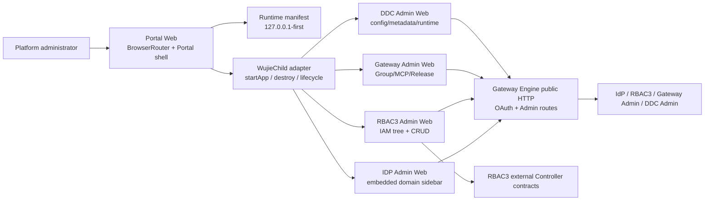
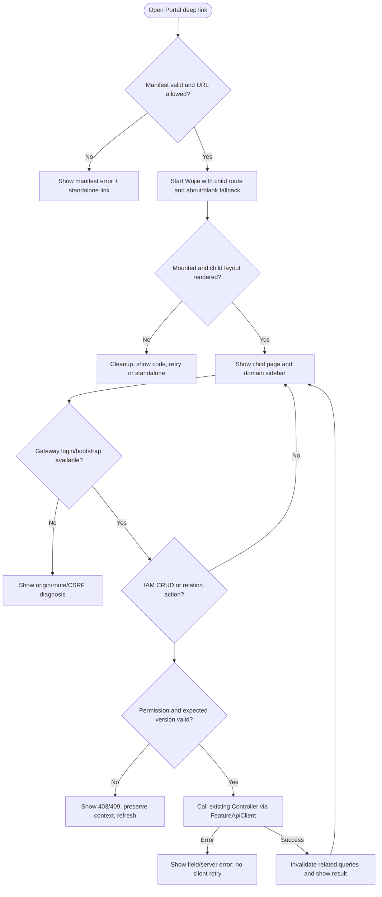
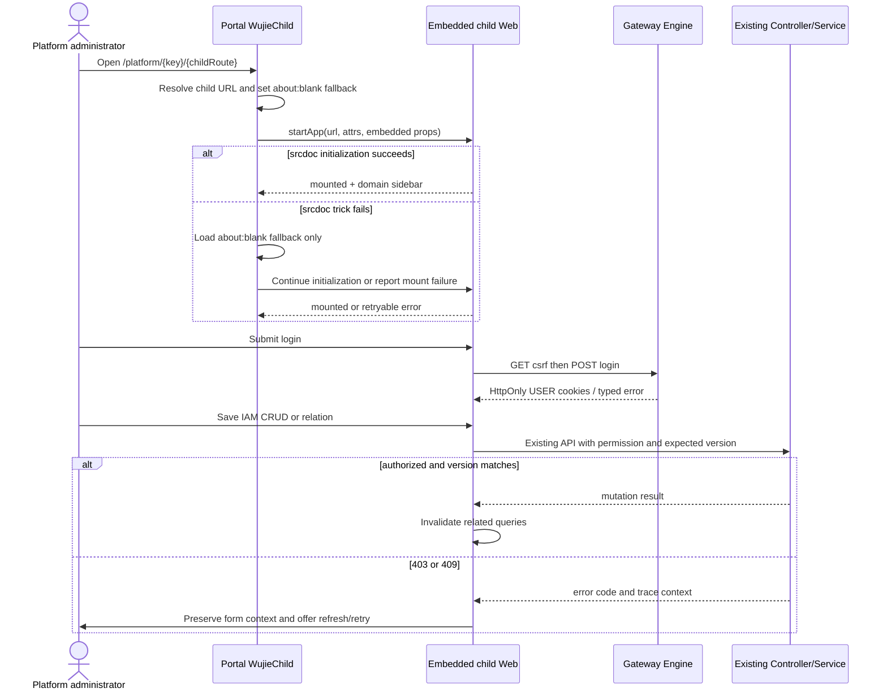

# platforms Web UI 完整性、Wujie 聚合与登录运行时修复规格

| Field | Value |
| --- | --- |
| Document | `2026-08-29-01-11-platforms-ui-completeness-and-runtime-repair.md` |
| Template Version | `6` |
| Status | `Accepted` |
| Type | `Bugfix / Feature / Architecture` |
| Complexity | `Complex` |
| Complexity Drivers | Wujie srcdoc 降级与 iframe 高度、嵌入式四平台导航、Gateway Engine 登录路由与旧运行时地址、四套 Controller/UI 静态覆盖、RBAC3 IAM 多类关系的版本并发与权限状态 |
| Created | `2026-08-29 01:11 CST` |
| Updated | `2026-08-29 01:11 CST` |
| Owner | `User / Egon-COLA platform owner` |
| Repository | `Egon-COLA` |
| Scope | `egon-cola-platforms` Portal、admin-web-shared、IDP/RBAC3/Gateway/DDC Admin Web、本地统一平台启动与覆盖审计脚本 |
| Change Surface | Portal Wujie 挂载参数/视口/子应用路由、shared 嵌入式布局、登录运行时地址与发布前检查、RBAC3 IAM CRUD 与关系页面、四平台 Controller 覆盖映射和 Ant Design UI 状态 |
| Affected Chapters | §7, §8, §12, §13, §14, §15, §16, §18 |
| Source Requirement | 用户要求修复 Portal 下游页面展示、登录失败、动态回环地址，并校验四个平台每个 Controller 在前端有体现，重点补齐 IAM 用户/角色/权限 CRUD 与关系绑定 CRUD；用户要求直接开始修复 |
| Baseline Revision | `main@ac14c367bf163cc2e8905ddc0b2dd9c0631b92fd`；另有用户未跟踪文档 `docs/egon/spec/2026-08-27-20-31-archetype-two-stage-source-generation.md`，必须保留 |
| Amends | [平台 Web 运行修复与 Controller 覆盖前序规格](2026-08-28-11-06-platforms-web-runtime-repair-and-controller-coverage.md) §1、§2.3、§3.1、§3.3、§4、§7、§12、§14、§16、§18、§20 |
| Supersedes | [平台 Web 运行修复与 Controller 覆盖前序规格](2026-08-28-11-06-platforms-web-runtime-repair-and-controller-coverage.md) §2.3、§3.1、§3.3、§4、§7、§12、§14、§16、§18、§20（仅取代运行时与 UI 完整性结论，其他范围继续由前序规格约束） |
| Depends On | [平台 Web 企业级微前端规格](2026-08-27-08-09-platforms-web-enterprise-microfrontend.md) §5、§7、§12；[DDC Admin 分页设计](../../superpowers/specs/2026-08-10-ddc-admin-pagination-ui-modernization-design.md) §1-§10 |
| Related Specs | [平台 Web 运行修复与 Controller 覆盖前序规格](2026-08-28-11-06-platforms-web-runtime-repair-and-controller-coverage.md) |
| Related Plans | [平台 Web 运行修复前序计划](../plan/2026-08-28-11-06-platforms-web-runtime-repair-and-controller-coverage.md)、[本轮 UI 完整性与运行时修复计划](../plan/2026-08-29-01-35-platforms-ui-completeness-runtime-repair.md) |

## 1. Summary

当前 Portal 的源码已经接入 Wujie Core，但运行日志显示 Wujie 在 srcdoc 初始化失败后把隐藏 iframe 回退到 Portal 自身 `http://127.0.0.1:18125`，造成递归加载、`contentWindow`/`__WUJIE_UNMOUNT` 为空和下游页面不展示。即使挂载成功，Portal 只提供平台级菜单，四个子应用在 `embedded` 分支又隐藏了自己的业务侧栏，用户无法从 Portal 继续访问大部分页面；子应用 host 也只有 `minHeight`，百分比 iframe 在不同窗口高度下会被裁剪。

当前登录失败同时有运行时漂移证据：旧 supervisor 明确使用 `UNIFIED_PLATFORM_ADVERTISED_HOST=192.168.6.186`，生成的 env 仍含该地址；旧 Gateway Engine 访问 `/oauth2/login/csrf` 超时，而 Gateway Admin 控制面返回 `401`。源代码的默认值已改为 `127.0.0.1`，但不代表已运行的 Java 进程、Gateway active release 和 Vite bundle 已重新加载。规格因此把“源码地址策略”“启动时路由检查”“需要重启/重发布的现场条件”分开处理。

本轮选择最小的企业级方向：继续保留四个自治 Admin Web，Portal 继续以 Wujie 为主；给 Wujie 明确的 `about:blank` 初始化回退地址、动态 child route 和固定可滚动视口；shared Layout 支持“保留子应用左侧菜单但隐藏重复 Banner/Footer”的嵌入模式。登录端继续由 Gateway Engine 提供 OAuth USER Cookie，启动脚本在发布/复用后主动检查登录路由；默认全部使用回环地址，局域网地址只能由显式覆盖变量决定。RBAC3 以现有 Controller/API 为唯一合同，补齐用户、组织、岗位、角色任职、角色继承、角色资源、权限映射和授权约束的页面动作。

成功标准是：Portal 四个平台深链都能稳定显示完整子应用页面和子菜单，Wujie 失败时有可读错误与恢复入口；用 `127.0.0.1` 启动时不依赖当前 Wi-Fi；登录错误能明确区分“旧进程/旧发布”“Cookie/CSRF”“网关不可达”；覆盖审计对四个 Admin 模块逐方法输出 `UI_ACTION`、`API_CONSUMED`、`PROTOCOL_OR_INTERNAL` 或 `UNCONSUMED`，且本轮要求的 IAM `UNCONSUMED` 归零。

## 2. Background and Current State

### 2.1 Business and user context

平台管理员从一个 Portal 进入身份、权限、网关和配置中心；权限管理员需要在 IAM 菜单下完成目录、授权、资源、策略和诊断。企业级后台不应只显示列表而缺少编辑、关联、撤销、停用、版本冲突提示；也不应在同一系统中因窗口大小、子应用菜单隐藏或运行时 IP 漂移而无法使用。

### 2.2 Repository evidence

| Evidence ID | Classification | Exact path/symbol/decision/command | Observed fact | Design significance | Verification limit/freshness |
| --- | --- | --- | --- | --- | --- |
| `EVD-001` | Runtime evidence | `target/local-unified-platform/logs/portal-web.log`，2026-08-28 | Wujie 反复记录 `srcdoc + document.open() trick failed`，随后回退到 Portal `18125`，并出现 `Cannot read properties of null (reading 'document')` 与 `__WUJIE_UNMOUNT` | fallback 不能回到 Portal 自身；host 必须有稳定视口和 cleanup | 旧 Vite 进程日志；修改后需用户重启验证 |
| `EVD-002` | Runtime evidence | supervisor command 与 `target/local-unified-platform/env/*.env` | supervisor 使用 `UNIFIED_PLATFORM_ADVERTISED_HOST=192.168.6.186`；生成 env 的 advertised host 仍为该 LAN 地址 | 说明当前现场未采用源码的新 loopback 默认，不能把旧运行结果归因于新代码 | 只证明当前现场历史进程，不能证明重启后的结果 |
| `EVD-003` | Runtime evidence | `curl http://127.0.0.1:18180/oauth2/login/csrf`，2026-08-29 | Gateway Engine 连接建立但 GET 5 秒无响应；`18140/oauth2/login/csrf` 为 Gateway Admin 401 | 登录页面使用 Engine 公网路由，不能把控制面 401 当作登录接口可用 | 未使用浏览器执行；需要重启/发布后的接口验证 |
| `EVD-004` | Static repository | `egon-cola-platform-admin-portal/src/lifecycle/WujieChild.tsx`、`node_modules/wujie/esm/iframe.js` | `startApp` 没有传 `attrs.src`；Wujie fallback 默认使用 `mainHostPath`，也就是 Portal origin | 传入安全的 `about:blank` fallback，避免 Portal 自递归；保留 Wujie Core | node_modules 不纳入提交，行为依赖锁定版本 |
| `EVD-005` | Static repository | Portal `ChildRoutePage.tsx`、四平台 `AdminLayout` | Portal 只提供四个平台级入口；IDP/RBAC3/Gateway/DDC embedded 分支直接去掉完整 Layout，子菜单不可见 | 嵌入模式要隐藏重复头尾但保留领域侧栏；child URL 要带当前领域路由 | 当前代码事实，浏览器布局仍需现场验证 |
| `EVD-006` | Static repository | Portal `WujieChild.tsx` host style | host 只有 `width: 100%; minHeight: 420`；Wujie degrade iframe 默认 `height:100%` | 需要明确 `height/minHeight/overflow`，防止页面裁剪和滚动穿透 | CSS 百分比行为仍需多尺寸浏览器验证 |
| `EVD-007` | Static repository | `scripts/unified-platform/start-local-stack.sh`、`lib/common.sh` | 默认 URL 常量已是 `127.0.0.1`，但 skip release 会复用旧 Gateway active release，且脚本无登录路由健康闸门 | 启动流程需输出实际 origin 并检查 OAuth 路由；复用旧发布失败要明确提示 | 脚本修改不自动改变已经运行的进程 |
| `EVD-008` | Static repository | RBAC3 `directory.api.ts`、`OrganizationPage.tsx`、`PositionPage.tsx`、`UserDirectoryPage.tsx` | organization/position CRUD 与用户组织/岗位 assignment API 已有，但页面没有消费；角色任职页存在但用户页没有入口 | 这是“代码写了但未组织到路由/UI”的直接缺口 | API 合同以 Controller/service record 为准 |
| `EVD-009` | Static repository | RBAC3 `constraint.api.ts`、`ConstraintController.java` | 约束页只有四个只读查询，Controller 另有 SSD/DSD、Prerequisite、Cardinality、Data/Field/Operation SOD 写操作 | 约束页需提供表格、编辑/新建和角色关联动作 | 约束业务规则仍由服务端校验 |
| `EVD-010` | Static repository | RBAC3 `BusinessCatalogController`、`ManagementPolicyController`、`ApplicationController` 与 Web routes | Business Catalog、management capabilities/manageable users/roles、部分 application detail/status 的 UI 覆盖不完整 | 增加真实页面/详情入口或在覆盖报告中明确协议/内部排除 | 不新增后端 BFF |
| `EVD-011` | Static repository | Gateway `gatewayApi.ts` 与 `ReleaseDetailPage.tsx`、MCP panels | Gateway API 已有 `releaseDiff`、`validateMcpCapability`，但没有页面动作；Trace detail API 是前端额外调用，后端 `GatewayObservabilityController` 没有对应 mapping | 页面不能把未存在的 Trace detail 当成已实现；真实 Controller action 要补入口 | 需以 Java Controller mapping 静态审计为准 |
| `EVD-012` | Static repository | 四个平台 `*admin/src/main/java/**/*Controller.java` 与 Web routes/API | 当前覆盖脚本只计数，不逐方法关联 HTTP method/path/page/action，不能回答“每个 Controller 是否体现” | 增加可重复的静态 Controller/UI coverage audit，区分 UI、API-only、协议/内部和未消费 | 静态审计不等于运行时权限/active release 证明 |
| `EVD-013` | Static repository | `antd` usages in four Web packages/shared | 仍可见 `Space.direction`、`Spin.tip`、`Modal.destroyOnClose`、部分 Drawer `width` 等旧属性或页面滚动未统一 | 修复本轮触及页面的 UI 警告，并统一 PageState/loading/empty/error | 不做无关的全仓 UI 重构 |
| `EVD-014` | Worktree evidence | `git status --short` at baseline | 只有用户指定的 archetype 文档未跟踪 | 所有提交必须路径限定，保留该文件 | 用户后续操作可能改变状态，Step 开始前复核 |

### 2.3 Problem statement and gap

缺口有四层：第一，Wujie fallback 和 host 视口导致 Portal 不能可靠聚合；第二，embedded layout 过度隐藏导致子应用功能虽有代码却没有入口；第三，旧 supervisor、旧 LAN advertised host 和未重发布的 Gateway route 使登录页面无法通过 Engine 建立 CSRF transaction；第四，前端页面层只覆盖了 Controller 的一部分方法，尤其 RBAC3 IAM 关系 CRUD 没有形成可用操作闭环。此次不把协议端点伪装成业务页面，也不通过新增 BFF 绕过现有 Controller；覆盖审计将这些边界显式记录。

### 2.4 Evidence and current-chain map

| Entry/trigger | Current call chain | Data read/written | External dependency | Consumers | Evidence |
| --- | --- | --- | --- | --- | --- |
| Portal 深链 | Portal Router -> `loadManifest` -> `WujieChild` -> Wujie Core `startApp` -> child router/layout | manifest、child route、mount state、DOM | 四个 Vite Web、BrowserRouter、Wujie | 平台管理员 | EVD-001、EVD-004、EVD-005 |
| 登录提交 | child AuthContext -> shared `createGatewayAuthClient` -> Gateway Engine `/oauth2/login/csrf` -> `/oauth2/login` -> HttpOnly USER cookies | CSRF Cookie、USER AT/RT Cookie、bootstrap | Gateway Engine active HTTP release、IdP、CORS | 四个 Admin Web | EVD-002、EVD-003、`gatewayAuthClient.ts` |
| IAM 用户关系变更 | `UserDirectoryPage`/relations panel -> `directoryApi`/`assignmentApi` -> RBAC3 Controller -> service -> versioned persistence/outbox | user、role assignment、org/position assignment、authVersion | RBAC3 authorization/runtime projection | 权限管理员 | EVD-008、Controller source |
| IAM 角色资源变更 | `RoleResourceGrantPage` -> `roleApi` -> `RoleResourceGrantController` -> role/resource grant service | direct resource IDs、derived API IDs、role version | RBAC3 resource catalog/projection | 权限管理员 | `role.api.ts`、Controller source |
| Controller coverage audit | audit script -> Java mapping inventory + Web route/API/action inventory -> status report | no business data; report only | ripgrep/Python standard library | 开发者/审查者 | EVD-012 |

## 3. Goals and Non-goals

### 3.1 Goals

- `G-001`：修复 Wujie 的 Portal 自递归 fallback、子路由初始加载和嵌入视口高度，让四个平台的下游页面完整可见。
- `G-002`：Portal 内保留四个平台的领域左侧菜单；IDP、RBAC3、Gateway、DDC 只隐藏重复的 Banner/Footer，不隐藏页面导航。
- `G-003`：登录客户端、启动脚本和 active route 检查共同形成可诊断的 loopback-first 登录链路；默认不依赖 Wi-Fi 网卡 IP。
- `G-004`：逐方法盘点四个 Admin 模块的外部 Controller，并把真实管理能力接入 API、路由、页面动作或现有详情面板；协议、internal/RPC、后台任务明确分类。
- `G-005`：补齐 RBAC3 IAM 用户、角色、权限的 CRUD 和关系绑定 CRUD，包括组织/岗位/角色任职、角色继承、角色资源、资源-权限映射和授权约束写操作。
- `G-006`：统一受影响页面的 loading/empty/error/403/409/refresh 状态和 Ant Design 6 兼容属性，保持既有权限、租户、版本和敏感信息边界。

### 3.2 Non-goals

- 不把四个子应用合并为单工程，不更换 Wujie，不引入 Redux/BFF/第二套 UI 框架或新的运行时依赖。
- 不把 OAuth metadata/token/revoke/userinfo、internal/RPC、scheduled worker 或数据库/Redis/Engine 直连做成普通业务 CRUD 页面；这些会在覆盖报告中标记 `PROTOCOL_OR_INTERNAL`。
- 不修改既有 Flyway migration，不新增表，不修复运行数据库中的旧 active release/旧 Cookie；启动闸门只发现并报告，需要用户控制的重启/发布由用户执行。
- 不自动打开浏览器、Computer Use、Browser Use 或自动启动/停止当前项目；本轮只做源码、静态、模块和受控 curl 级验证。
- 不为后端尚未存在的 Trace detail endpoint 保留误导性的“详情已实现”按钮；不在本轮无证据地新增后端 Trace 合同。

### 3.3 Change Surface and Design Depth

| Area/layer | Disposition | Exact repository evidence | Changed or preserved behavior/contract | Required Spec treatment | Chapter(s) |
| --- | --- | --- | --- | --- | --- |
| Portal Wujie lifecycle and route resolution | Affected | `platform-admin-portal/src/lifecycle/WujieChild.tsx`, `ChildRoutePage.tsx` | 保留 `startApp`/destroy 生命周期，增加安全 fallback、child route、视口和可诊断状态 | 设计加载、挂载、清理、路由和失败恢复 | §7, §8, §12, §13, §14, §15, §16 |
| Shared embedded Layout | Affected | `admin-web-shared/src/layout/EnterpriseLayout.tsx`、`types.ts` | 增加可复用的隐藏 Header/Footer 选项，保留侧栏和内容滚动 | 设计 Layout boundary、响应式和子应用嵌入 | §7, §8, §12, §14, §15 |
| Four child navigation/layouts | Affected | IDP/RBAC3/Gateway/DDC `AdminLayout`/router | embedded 模式展示领域侧栏，保留 standalone full shell | 逐平台页面布局和路由可达性 | §7, §8, §12, §14 |
| Login origin and local startup | Affected | `gatewayAuthClient.ts`、`start-local-stack.sh`、`common.sh` | 统一 origin、loopback 默认、OAuth route preflight；Cookie/CSRF 合同不变 | 设计配置优先级、启动诊断和运行边界 | §7, §8, §12, §15, §16, §18 |
| RBAC3 IAM UI/API consumption | Affected | RBAC3 `features/{directory,role,permission,application,constraint}` | 只消费已有 external Controller，补页面操作和关系入口 | 设计每个 IAM 页面、动作、权限、版本和错误状态 | §7, §8, §12, §13, §14, §15 |
| IDP/Gateway/DDC UI coverage | Affected | 四 Web `src` 与 Controller inventory | 补缺失 action/route/详情或清晰的 protocol/internal classification | 设计覆盖报告和受影响页面 | §7, §8, §12, §14, §15 |
| Controller/UI audit script/report | Affected | `scripts/unified-platform/check-admin-web-controller-coverage.sh` | 从计数升级为逐 Controller method 的可重复分类输出 | 设计扫描规则、误报边界和验证 | §7, §8, §12, §14, §15 |
| Java Admin Controller/service/persistence | Context-only | 四平台 `*admin/src/main/java` Controller 与 service | 不改变后端业务合同、租户/权限/版本语义；只作为真实映射源 | 给出覆盖证据，不重写后端 | §7, §12, §15 |
| Database/Flyway | Unchanged | `classpath:db` migration history | schema、索引、事务归属和历史 migration 不变 | 记录不变边界 | §11, §16 |

## 4. Requirements and Acceptance Criteria

| ID | Atomic requirement | Priority | Observable acceptance criteria | Source |
| --- | --- | --- | --- | --- |
| `REQ-001` | Wujie fallback 不得加载 Portal 自身，且 Portal child host 必须具有稳定的可滚动视口 | Must | `WujieChild` 传入 `about:blank` fallback；四个平台 host 有明确 height/minHeight/overflow；Core reject 仍转为错误状态 | 用户反馈 Portal 下游页面没有完全展示 |
| `REQ-002` | Portal 必须把当前领域路由传给对应 child 的初始 URL | Must | `/platform/idp/overview`、`/platform/rbac3/roles`、`/platform/gateway/dashboard`、`/platform/ddc/registry` 进入对应 child 页面，而不是永远回到 root | 用户要求门户正常聚合页面 |
| `REQ-003` | embedded child 必须展示自己的二级/三级领域菜单，standalone 保持完整 shell | Must | 四个 `AdminLayout` 的 embedded 分支保留左侧导航；IAM 子树可从 RBAC3 child 内访问 | 用户要求功能完整、IAM 菜单组织 |
| `REQ-004` | 登录 origin、CSRF、Cookie 和 Gateway Engine active route 必须形成一致链路 | Must | 代码与启动脚本使用同一 Gateway origin；启动/验证能区分 18140 控制面 401、18180 Engine 超时、CSRF/Cookie 错误 | 用户依然登陆不进去 |
| `REQ-005` | 本地未设置覆盖时所有本地地址 loopback-first，换 Wi-Fi 不需要修改 IP | Must | 默认 manifest/API/Web 使用 `127.0.0.1`；显式 `UNIFIED_PLATFORM_ADVERTISED_HOST` 才加入 LAN host，并保留 loopback | 用户要求动态发现、为什么不用 127 |
| `REQ-006` | 四个平台每个 external Controller method 必须有可解释的前端体现 | Must | audit 输出逐方法状态；管理接口必须 `UI_ACTION` 或 `API_CONSUMED`，协议/internal 明确排除；`UNCONSUMED` 必须归零或有审查结论 | 用户要求逐 Controller 校验 |
| `REQ-007` | RBAC3 IAM 用户、角色、权限 CRUD 必须在页面闭环 | Must | 用户新增/编辑/状态/归档；角色新增/编辑/停用；权限新增/详情/状态；均有权限守卫、成功刷新、失败提示和版本冲突提示 | 用户特别强调 IAM CRUD |
| `REQ-008` | RBAC3 IAM 关系 CRUD 必须可从关联主体进入 | Must | 用户可管理组织、岗位、角色任职；角色可管理继承、资源；资源可管理权限映射；授权约束写操作有入口 | 用户特别强调关系绑定 CRUD |
| `REQ-009` | 每个受影响页面必须具有可审查的布局、状态和权限说明 | Must | 本规格 §12 逐页列出 Header/filter/content/action/detail/loading/empty/error/403/409；代码有对应实现 | 用户要求页面设计文字审查 |
| `REQ-010` | UI bug 修复不得扩大到无关重构，且保持敏感数据边界 | Must | 不读 token/secret/cookie；不新增直连 DB/RPC；受影响页面去除已知 AntD deprecation；路径限定提交 | 仓库 AGENTS 与前序规格 |
| `REQ-011` | 每个实施 Step 必须独立验证、提交并可回退 | Must | 每 Step 有 focused test/static gate、路径限定 commit；不改既有 migration；runtime proof 单独标记 | EGON 执行规则 |

### 4.1 Scenario matrix

| Scenario | Actor/trigger | Preconditions | Main path | Alternative/failure path | Data/state change | Observable result | Requirements |
| --- | --- | --- | --- | --- | --- | --- | --- |
| Portal child 正常挂载 | `ACTOR-001` 点击平台深链 | manifest 合法、child Web 可达 | 解析 child route -> Wujie start -> child mount -> embedded Layout | Core reject -> cleanup -> 错误卡片/独立入口 | 仅 mount 状态 | 下游页面完整显示，侧栏可用 | REQ-001, REQ-002, REQ-003 |
| Wujie 初始化 fallback | `ACTOR-001` 打开 Portal | srcdoc trick 在当前浏览器失败 | Wujie 只加载 `about:blank` 安全空文档，再完成初始化 | 禁止 fallback 到 Portal；失败进入可重试状态 | 无领域数据 | 无递归 Portal、无 null document 未处理异常 | REQ-001 |
| 登录 route 不可用 | `ACTOR-001` 提交登录 | Engine route 未发布/旧 IP/进程未重启 | preflight/客户端显示 origin 与 route diagnosis | 18140 401、18180 timeout、CSRF 401 分别提示下一步 | Cookie 不落地或过期 | 用户得到可执行诊断，不再只显示“登录失败” | REQ-004, REQ-005 |
| IAM 用户关系变更 | `ACTOR-004` 在用户详情点击关联 | RBAC3 READY、manage 权限、主体版本有效 | 加载 org/position/role assignments -> 新增/撤销 -> invalidate | 403 无权、409 版本冲突保留上下文并刷新、网络失败可重试 | assignment/version/outbox 由后端变更 | 页面显示最新关系与审计提示 | REQ-007, REQ-008, REQ-010 |
| IAM 角色资源授权 | `ACTOR-004` 在角色卡进入资源 | role/resource read+manage | 加载树 -> 勾选 direct grant -> replace with expectedRoleVersion | derived/inherited 节点禁选；409 需重载版本 | 角色授权版本变化 | direct/derived/inherited 状态清晰 | REQ-008 |
| IAM 约束写入 | `ACTOR-004` 新建/编辑约束 | 对应 read/manage 权限、请求字段合法 | Tab 表格 -> editor -> existing ConstraintController | 校验错误显示字段；版本冲突不静默覆盖 | policy/version 由后端变更 | SSD/DSD/Data/Field/Operation 规则可管理 | REQ-006, REQ-008 |
| Controller 覆盖审计 | `ACTOR-005` 执行 shell audit | Java source 与四 Web source 可读 | 解析 method/path -> 匹配 API/page/action -> 输出分类 | 动态字符串/协议方法列为人工复核，不算假阳性通过 | 只写 report/evidence | 每个方法有状态和证据路径 | REQ-006, REQ-011 |

### 4.2 Use-case analysis

#### 4.2.1 Actor inventory

| Actor ID | Actor/role | Goal and responsibility | Entry/channel | Permission/tenant context | Evidence |
| --- | --- | --- | --- | --- | --- |
| `ACTOR-001` | 平台管理员 | 从 Portal 进入四个平台并完成登录/切换 | Portal Web | Gateway USER Cookie、当前 tenant | Portal Router、shared auth |
| `ACTOR-002` | 身份/安全管理员 | 管理身份用户、客户端、租户、资源服务器、密钥和审计 | IDP Admin Web | IDP permission bootstrap | IDP `AdminLayout`/Controller |
| `ACTOR-003` | 网关管理员 | 管理 Group、Application、Catalog、Release、MCP、Provider、观测 | Gateway Admin Web | Gateway capability | Gateway `AdminLayout`/Controller |
| `ACTOR-004` | 权限管理员 | 管理 IAM 用户、角色、权限、关系、策略与运行诊断 | RBAC3 Admin Web | tenant context、`system:*` permission | RBAC3 resource registry/Controller |
| `ACTOR-005` | 配置管理员/本地开发者 | 管理 DDC 并在 loopback 地址运行平台 | DDC Admin Web、shell | DDC capability、OS process | DDC `AdminLayout`、scripts |

#### 4.2.2 Use-case artifact

| ID | Use case/goal | Primary actor | Supporting actors/systems | Trigger | Preconditions | Main success outcome | Alternatives/failures | Postconditions | Requirements | Interfaces/pages | Tests |
| --- | --- | --- | --- | --- | --- | --- | --- | --- | --- | --- | --- |
| `UC-001` | Portal 聚合并显示领域子应用 | `ACTOR-001` | Wujie、四个 Vite Web | 点击平台或打开深链 | manifest 兼容且 child 可达 | child route、child sidebar 和内容可见 | fallback/加载失败可重试或独立打开 | sandbox 可清理 | REQ-001/002/003/009 | `ChildRoutePage`, `WujieChild` | `TEST-001` |
| `UC-002` | 通过统一 Gateway USER Cookie 登录 | `ACTOR-001` | Gateway Engine、IdP、CORS | login submit | Engine route active、CSRF challenge 可用 | bootstrap 返回授权上下文 | timeout/401/CSRF/Cookie 失败可诊断 | 失败不持久化敏感值 | REQ-004/005 | shared `gatewayAuthClient` | `TEST-002` |
| `UC-003` | 维护 IAM 用户和组织关系 | `ACTOR-004` | RBAC3 Controller、authorization runtime | 用户详情中的 CRUD | tenant/permission/version valid | user、org、position、role assignments 更新 | 403/409/validation/网络错误保留状态 | query cache 刷新 | REQ-007/008/010 | `/iam/users`, relations panel | `TEST-003` |
| `UC-004` | 维护 IAM 角色、权限和资源关系 | `ACTOR-004` | resource catalog、role grant service | role/resource/permission action | read/manage permission、资源可授权 | role CRUD、inheritance、resource grant、permission mapping 成功 | derived/inherited 禁止直接改；409 重载 | versioned mutation result visible | REQ-007/008 | `/iam/roles`, `/iam/resources`, `/iam/permissions` | `TEST-004` |
| `UC-005` | 维护授权约束并审计覆盖 | `ACTOR-004` | ConstraintController、audit | policy tab save 或 audit command | 对应 permissions | constraint CRUD 可见，Controller coverage report 可重复 | 协议/internal 归类，不伪造页面 | report 不改业务数据 | REQ-006/011 | `/iam/policies`, audit script | `TEST-005` |

## 5. Constraints, Assumptions, and Decisions

### 5.1 Confirmed constraints

- 使用 Wujie/无界 2.1.0 现有锁定依赖；不引入新的微前端框架。
- Portal 仍是外层平台导航所有者；子应用在 embedded 模式保留自己的领域菜单，但隐藏重复的顶部 Banner/Footer。
- IAM 全部页面继续归于 RBAC3 的 `IAM` 顶级菜单；目录、授权、资源目录、诊断为二级/三级节点。
- 后端已有 Controller 合同是唯一请求/响应来源；前端不因覆盖审计而修改后端路径、权限或数据所有权。
- 默认本地地址是 `127.0.0.1`；局域网访问需要显式设置 `UNIFIED_PLATFORM_ADVERTISED_HOST`，且不能删除 loopback 声明。

### 5.2 Small-gap assumptions

| ID | Inference | Repository evidence | Why locally reversible | Impact if wrong |
| --- | --- | --- | --- | --- |
| `ASM-001` | `about:blank` 作为 Wujie srcdoc trick 失败时的初始化空文档，不作为业务 child URL | Wujie `iframeGenerator` 将 `attrs.src` 用作 fallback；child URL 仍由 `url` 传入 | 只影响初始化 iframe，可改为同源静态空文档 | 若特定浏览器拒绝 about:blank，Portal 显示 mount failure，不影响 standalone |
| `ASM-002` | 子应用 embedded 模式保留领域侧栏不会与 Portal 侧栏形成不可接受的功能冲突 | 当前 Portal 只有平台级入口，子应用菜单完全隐藏导致功能不可达 | shared Layout 通过 Header/Footer 开关可回退 | 若审查认为双侧栏过宽，可只调整样式/折叠，不改变路由合同 |
| `ASM-003` | `Gateway Engine 18180` 是四个 Web 登录/API 的运行时 origin，`18140` 仅是 Admin control plane | `start-local-stack.sh:start_admin_web` 给 `VITE_GATEWAY_ORIGIN` 传 `GATEWAY_BASE_URL`；18140 curl 返回 control-plane auth error | origin 由启动参数集中控制，可显式改回 | 若部署拓扑不同，启动环境变量可覆盖，不改业务页面 |

### 5.3 Resolved decisions

| ID | Decision | Decision owner | Evidence and rationale | Requirements |
| --- | --- | --- | --- | --- |
| `DEC-001` | 保留 Wujie Core，给初始化 fallback 传 `about:blank`，不回退到裸 iframe 作为主实现 | User / implementation owner | 用户确认 Wujie；现有 Core 已被锁定且日志证明默认 fallback 回 Portal 自递归 | REQ-001/002 |
| `DEC-002` | embedded child 采用“领域侧栏保留、重复 Header/Footer 隐藏”的共享 Layout 模式 | User / implementation owner | 仅隐藏 shell 会使四个平台大量页面不可达；shared Layout 是现有复用边界 | REQ-003/009 |
| `DEC-003` | 登录 route 继续通过 Gateway Engine；启动脚本增加 route preflight，不把控制面端口当登录端口 | User / implementation owner | 前端环境和 legacy live login 均以 `GATEWAY_BASE_URL` 为主；控制面 18140 401 不是登录合同 | REQ-004 |
| `DEC-004` | Controller coverage 采用逐方法静态分类，协议/internal/RPC 明确排除，管理 endpoint 必须有 UI action 或 API consumer | User / implementation owner | 旧脚本只有计数，不能发现页面缺失；静态边界可重复、不访问业务数据库 | REQ-006/011 |
| `DEC-005` | IAM 关系操作从用户/角色/资源主体页面进入，保留后端 expected version/idempotency 语义 | User / implementation owner | 现有 API 已按主体分组，避免新增 BFF；从主体进入可降低孤立 route | REQ-007/008/010 |

### 5.4 Open major decisions

| ID | Question and options | Recommendation, not decision | Impact | Owner | Status |
| --- | --- | --- | --- | --- | --- |
| `DEC-006` | 是否在本轮真正重启现有 Java/Vite 栈并重新发布 active Gateway release：A 由用户执行；B Agent 自动执行 | 推荐 A；本轮只修改代码并给出精确命令，避免改变运行中的数据库/发布状态 | 运行时登录/Wujie现场证据仍需用户重启后确认 | User | Closed by repository execution rule: 不自动启动 |

## 6. Project Technology Context

| Concern | Current choice | Repository evidence | Constraint on design |
| --- | --- | --- | --- |
| Frontend | React 19、Vite、Ant Design 6、React Router、TanStack Query | 四个 `package.json`、现有 `src` | 复用现有 PageState/Layout/Query；不引入新状态框架 |
| Microfrontend | Wujie 2.1.0 Core `startApp` | Portal `package.json`/lockfile、`node_modules/wujie/esm/index.d.ts` | Wujie API 只在 `WujieChild` adapter 使用 |
| Auth | Gateway Engine OAuth login + HttpOnly USER cookies + CSRF | shared `gatewayAuthClient.ts`、IdP `OAuthLoginController`、启动脚本 | 浏览器不读取 token/secret；origin/CORS 必须一致 |
| Backend contract source | Spring MVC external Admin Controller | 四个 `*admin/src/main/java/**/*Controller.java` | 本轮只消费 existing paths/methods/permissions |
| RBAC3 client | `FeatureApiClient` + SDK authorization | RBAC3 `FeatureApi.tsx`, `Rbac3Provider` | 所有 IAM action 使用 PermissionGuard 和 tenant/version fields |
| Validation | Vitest/Testing Library、npm typecheck/build、Bash static checks | 各 Web package scripts、`scripts/unified-platform` | 先 focused，再 module，runtime 手工单独标记 |
| Persistence/migration | Spring Data/JPA/现有 Flyway history | DDC/RBAC3 admin source、`classpath:db` | 本轮 schema/迁移 Unchanged |

### 6.1 Java architecture profile and capability baseline

本轮不修改 Java production type；Controller 和 Service 仅作为 external contract 的 Context-only source。当前 DDC/RBAC3/Gateway/IDP Admin 仍保持仓库既有传统 Controller-Service-Repository/feature-first 前端边界，不新增 Java 层，不把前端文件重排成 Java COLA 模块。

| Architecture profile | Archetype/template or base package | Exact evidence and verifier | Existing deviations | Design action |
| --- | --- | --- | --- | --- |
| Traditional Three-Layer for backend context; existing feature-first React Web | DDC `...admin/controller`、`service`、`repository`；RBAC3 `admin-web/src/features` | POM/source tree、前序 Spec §6.1、existing tests | no Java target modification | Preserve; no hybrid Java tree |

| Need | Spring/JDK candidate | Spring Boot Starter candidate | Egon-COLA/module candidate | Proven gap | Decision/dependency impact |
| --- | --- | --- | --- | --- | --- |
| Wujie lifecycle | existing `wujie.startApp` | None | Portal locked Wujie | wrapper error visibility/route fallback | reuse existing Core |
| Embedded layout | existing shared `EnterpriseLayout` | Ant Design Layout | `admin-web-shared` | Header/Footer toggle absent | expand existing shared config, no dependency |
| IAM request/cache | existing `FeatureApiClient`、TanStack Query | existing SDK | RBAC3 Admin Web | page actions absent | reuse APIs/query client |
| Controller inventory | `rg`/Python stdlib parser | None | existing shell audit script | count-only output | expand existing script, no new dependency |

### 6.2 User-mandated Java rule compliance

本轮没有新建或修改 Java production type；以下逐项记录“后端仅为 Context-only 合同”，避免把 UI 工作伪装成 Java 改造。

| Literal rule | Affected? | Repository evidence | Exact design decision | Files/types/interfaces | Validation/test evidence | Status/blocker |
| --- | --- | --- | --- | --- | --- | --- |
| Rule 1 | No | existing Controllers/VO/DTO retain semantic suffixes | no new Java carrier | existing Controller/VO/DTO only | source inventory | N/A |
| Rule 2 | No | existing `@Valid`/`@RequestBody` contracts | frontend preserves server validation/version fields | existing DTO requests | Web tests and API path checks | N/A |
| Rule 3 | No | existing records/entities unchanged | no Java model/converter | no Java target file | Maven not required for frontend-only Step | N/A |
| Rule 4 | No | existing Spring Beans unchanged | no new Bean/service | no Java target file | diff review | N/A |
| Rule 5 | No | no Java utility added | no utility dependency | no Java target file | dependency diff | N/A |
| Rule 6 | No | existing JSON envelope/VO unchanged | no Java JSON contract change | existing controller responses | Web contract fixtures | N/A |
| Rule 7 | No | existing Spring profiles unchanged | no Java config key change | no profile target | config diff | N/A |
| Rule 9 | No | existing backend rules remain service-owned | UI uses direct API/Query and existing reducer; no Java branching | no Java pattern target | Web tests | N/A |
| Rule 10 | No | existing Instant contracts unchanged | frontend sends ISO values to existing endpoints | existing request DTOs | form/API tests | N/A |
| Rule 11 | Yes, preservation only | existing three-layer backend/feature-first Web tree | no new architecture profile or hybrid Java tree | exact existing paths | package/typecheck/static audit | PASS |

## 7. Architecture Design

### 7.0 Minimum-design baseline and element-necessity audit

| Proposed element | Change | Requirements | Existing/direct alternative | Concrete inadequacy of alternative | Added calls/state/coupling/failures/migration/operations | Verdict |
| --- | --- | --- | --- | --- | --- | --- |
| Wujie fallback attribute | Expand | REQ-001 | omit `attrs.src` | current Wujie falls back to Portal origin and recurses | one static option; no new network contract | Add |
| Shared Header/Footer visibility flags | Expand | REQ-003 | each child hand-codes an iframe shell | duplicates layout and cannot keep consistent sidebar behavior | two booleans in existing config; no store | Add |
| Child route resolver | Add local function | REQ-002 | always use manifest root | every platform opens landing/root, deep link intent lost | URL computation only; no network | Add |
| Relations panel | Add feature component | REQ-008 | orphan routes/manual ID typing | APIs exist but users cannot discover or safely mutate relations | existing Query/Mutation calls and drawers | Add |
| Controller audit classifier | Expand existing shell | REQ-006 | current count-only script | counts cannot identify exact unconsumed methods | source scan/report only | Add |
| New BFF/database/microfrontend dependency | Remove | none | existing Admin API/shared client | adds deployment/auth/failure path with no missing contract evidence | new ops/migration/security cost | Remove |

| Path | Network calls | Client states | Server contracts/state | Failure and TOCTOU points | Additional user/business value |
| --- | --- | --- | --- | --- | --- |
| Direct baseline | child root fetch + API queries | loading/loaded/error | existing child auth/bootstrap | old route/Cookie/height failures remain | minimal but incomplete |
| Selected design | same child fetch + existing queries; no BFF | loading/loaded/fallback/mounted/cleaned/403/409 | existing Wujie/Controller contracts | fallback recursion removed; version conflict surfaced; no new persistence | complete display/discoverability and auditability required by user |

### 7.1 System Architecture Design

#### 7.1.1 Architecture Mermaid view



#### 7.1.2 Boundary and responsibility table

| Module/component | Capability and data owned | Inputs/outputs | Allowed dependencies | Forbidden responsibility | Requirements |
| --- | --- | --- | --- | --- | --- |
| Portal `WujieChild` | host lifecycle, child route/manifest, mount state | manifest/context -> child DOM/state | Wujie Core, React, Portal bridge | credentials, business CRUD, DB/RPC | REQ-001/002 |
| shared `EnterpriseLayout` | shell geometry, optional header/footer, recursive navigation | config -> DOM | AntD, Router | platform menu/data/permissions | REQ-003/009 |
| Child AdminLayout | domain navigation and domain page composition | auth/bootstrap -> domain UI | existing shared layout, SDK/API | Portal manifest or other platform data | REQ-003/006 |
| RBAC3 feature/API layer | IAM request orchestration, query invalidation, permission guards | form/table -> existing external API | FeatureApiClient, Query, SDK | change backend semantics or suppress 403/409 | REQ-007/008 |
| Startup/audit scripts | local process config and static coverage evidence | env/source -> output/diagnosis | Bash, curl, jq, Python stdlib | mutate application data or pretend runtime proof | REQ-004/005/006 |

### 7.2 High-Level Design

Portal first computes a safe child URL by taking the suffix after `/platform/{key}`. Wujie receives that URL for initial route, `sync:false` to avoid polluting the Portal query string, and `attrs.src='about:blank'` only for its same-origin initialization fallback. The host gets a fixed viewport with internal scrolling. Child layouts use shared `EnterpriseLayout` with `hideHeader/hideFooter`; the child still owns its menu selection and navigation.

The login path remains child -> shared auth client -> `VITE_GATEWAY_ORIGIN`/Gateway Engine. The local startup script emits origin values from one source, defaults to 127.0.0.1, and checks the public login CSRF route after reuse/publish. It never silently changes a running process; a failed check names the required restart or route publication command.

RBAC3 UI uses existing API clients and React Query. A user detail relation panel loads three independent relations; each mutation includes the version returned by the current row/about context. Roles expose edit, inheritance, impact, and resource grant links; permissions expose list/detail/create/status; constraints expose read/write editors. No front-end action renders a disabled/derived resource as direct-grantable.

#### 7.2.1 Critical business/control flowchart



#### 7.2.1a Runtime and mutation swimlane



#### 7.2.2 High-level decision and quality matrix

| Concern/use case | Required behavior | Selected mechanism | Failure/degradation behavior | Trade-off | Verification | Requirements |
| --- | --- | --- | --- | --- | --- | --- |
| Wujie initialization | no Portal recursion, one cleanup owner | Core adapter + `about:blank` fallback | mount failure is visible and retry waits for cleanup | depends on Wujie browser support | Wujie unit tests, source audit, user runtime | REQ-001 |
| Child geometry | full page visible at desktop/mobile | fixed host viewport + iframe overflow | inner page scrolls; outer page remains stable | one explicit height calculation | DOM/style test and manual viewport check | REQ-001/009 |
| Embedded navigation | all domain routes discoverable | shared Layout hides only header/footer | child sidebar works standalone and embedded | two-level visual density | four layout tests/build | REQ-003 |
| Login diagnosis | distinguish origin/route/CSRF/Cookie | one origin env + startup preflight + typed auth errors | no token exposure; user gets next action | preflight depends on running route | shell/curl/static checks | REQ-004/005 |
| IAM relations | safe discoverable CRUD | subject-owned panels + existing versioned APIs | 403/409/error states; no optimistic overwrite | multiple queries/drawers | RBAC3 page/API tests | REQ-007/008 |
| Controller coverage | no count-only false confidence | method/path/action classifier | dynamic/protocol/internal marked review | static heuristic needs evidence labels | audit script output + source assertions | REQ-006/011 |

### 7.3 Detailed Design

#### 7.3.1 Detailed component collaboration

| Step | Caller -> callee | Contract/symbol | Input/output mapping | State/data effect | Failure behavior | Requirements |
| --- | --- | --- | --- | --- | --- | --- |
| 1 | Portal `ChildRoutePage` -> route resolver | `manifest.url`, `location.pathname` | `/platform/{key}/suffix` -> child absolute URL | none | malformed suffix uses `/` | REQ-002 |
| 2 | Portal -> Wujie Core | `startApp({name,url,el,attrs,degrade,...})` | child URL/context -> Promise destroy | lifecycle reducer LOAD/MOUNTED | reject -> MOUNT_FAILED; no unhandled rejection | REQ-001 |
| 3 | Wujie -> child main/layout | `$wujie.props.embedded` | embedded flag -> child Layout mode | child Router/menu state | child error boundary/403 | REQ-003 |
| 4 | Child auth -> Gateway Engine | shared `createGatewayAuthClient` | tenant/user/password -> CSRF/login/bootstrap | HttpOnly cookies only | typed status/timeout/CSRF error | REQ-004 |
| 5 | IAM page -> Feature API | `directoryApi`, `roleApi`, `applicationApi`, `constraintApi`, `assignmentApi` | form/table -> existing JSON contract | Query cache invalidation | 403/409/validation message | REQ-007/008 |
| 6 | Audit script -> source inventory | Java mappings + TS routes/API/action | method/path -> classification/evidence | report only | unsupported dynamic mapping marked manual review | REQ-006 |

#### 7.3.2 Frontend state and route rules

- Portal states are `manifest pending -> mount loading -> mounted -> mounted failure/crashed -> unmounting -> idle`. A new start is allowed only after the prior destroy/cleanup completes.
- Child route is the normalized suffix after `/platform/{platformKey}`. `manifest.url` origin/path is preserved; the suffix is appended only for the initial child URL. Child internal navigation remains child-owned.
- Embedded Layout removes only `EnterpriseHeader` and `EnterpriseFooter`; `EnterpriseSidebar` and content remain. On narrow screens, the child sidebar becomes its own drawer inside the Portal viewport.
- IAM mutation buttons are guarded by the exact existing permission names. A 403 is a visible state, not a hidden button-only assumption; a 409 retains the selected item and offers refresh/retry.

#### 7.3.3 Controller/UI coverage classification

The audit uses these statuses: `UI_ACTION` means a page action invokes the method; `API_CONSUMED` means a read method is used by a visible page/selector/detail; `PROTOCOL_OR_INTERNAL` means external annotation exists but it is an OAuth protocol, internal/RPC/snapshot/bootstrap/operational boundary not intended as business CRUD; `UNCONSUMED` means a management method has no page or action and blocks completion until fixed.

| Platform | Controller group | Current/target coverage | UI destination or exclusion |
| --- | --- | --- | --- |
| IDP | `IdentityUserController`, `OAuthClientController`, `ResourceServerController`, `TenantController`, `SigningKeyController`, `IdentityAuditController` | target all management methods `UI_ACTION`/`API_CONSUMED` | users/clients/resource servers/tenants/keys/audits pages; profile/bootstrap used by auth/overview |
| IDP | `OAuthLoginController`, `OAuthMetadataController`, `OAuthTokenController`, `OAuthUserInfoController`, `OAuthStepUpController` | `PROTOCOL_OR_INTERNAL` except login client transport | login/bootstrap uses shared client; metadata/token/JWK/userinfo are protocol, not menu CRUD |
| RBAC3 | `UserController`, `RoleController`, `PermissionController`, `ResourcePermissionMappingController`, `RoleResourceGrantController` | target all methods `UI_ACTION` or `API_CONSUMED` | IAM users/roles/permissions/resource mapping/role resource pages |
| RBAC3 | organization/position/assignment controllers | target all methods `UI_ACTION` | user relations panel, organization/position CRUD, role assignment route |
| RBAC3 | `ConstraintController`, `ManagementPolicyController`, `BusinessCatalogController`, `ApplicationController` | target read/write methods `UI_ACTION`/`API_CONSUMED` | policies, management policies, business catalog, tenant application detail/actions |
| RBAC3 | runtime/activation/simulation/audit/about | `API_CONSUMED` or visible diagnostics action | diagnostics/activation/simulation/audit/overview; internal runtime delivery excluded |
| RBAC3 | `DirectoryController` internal snapshot submit and snapshot materialization | `PROTOCOL_OR_INTERNAL` for write; visible query only where applicable | snapshot ingestion is not browser CRUD; explain in audit |
| Gateway | Group/Application/Catalog/Credential/Draft/Release/OpenAPI/Projection/Scope | target all management methods `UI_ACTION`/`API_CONSUMED` | existing pages plus application detail, release diff and OpenAPI pages |
| Gateway | MCP server/capability/tool/remote/app/task/approval/inspector | target all management methods `UI_ACTION`/`API_CONSUMED` | existing MCP workbench panels plus per-capability validate action |
| Gateway | definition report ingestion | `PROTOCOL_OR_INTERNAL` if provider report callback; detail only if admin-facing source proves it | not a fake manual report form; audit records classification |
| Gateway | OAuth/auth bootstrap and scheduled/message controllers | `PROTOCOL_OR_INTERNAL` | auth transport/runtime worker, no business menu |
| DDC | config/publish-task/app/biz/env/namespace/binding/cache/registry/instance | target all management/read methods `UI_ACTION`/`API_CONSUMED` | existing pages, independent bindings page, details/actions in tables/drawers |
| DDC | auth bootstrap and registry/instance operational reads | `API_CONSUMED` or operational page | auth provider bootstrap used by AuthContext; registry/instances pages |

#### 7.3.4 IAM page/action contract

| Page | Layout | Query/filter | Main content | Detail/action surface | Permission/error states |
| --- | --- | --- | --- | --- | --- |
| `/iam/users` | Page title + tenant context; table card; detail drawer/panel | query/status/org/position/page/size | user ID, identity, status, auth version | create/edit/status/archive; “组织关系/岗位关系/角色任职” tabs and links | `system:user:*`, relation read/manage, 403/409 |
| `/iam/organizations` | title + tree/list card | parent organization | org code/name/type/path/status | create/edit/move/deactivate drawer | `system:organization:*`, validation/409 |
| `/iam/positions` | title + list card | org unit | position code/name/org/status | create/edit/deactivate drawer | `system:position:*`, validation/409 |
| `/iam/roles` | title + role cards/table | application/status/risk | role code/name/type/risk/version | create/edit/status; impact; inheritance editor; resource link | `system:role:*`, `system:role-inheritance:manage`, 409 |
| `/iam/users/:userId/role-assignments` | user context header + table | none beyond user | assignment/role/status/window | create, suspend, resume, revoke | `system:role-assignment:*`, version/403/409 |
| `/iam/resources` | application selector + resource table | application/status | resource type/code/mapping status | archive; permission mapping drawer; fields link | resource read/manage, derived/active-role warning |
| `/iam/roles/:roleId/resources` | role context + summary chips + tree | none | direct/derived/inherited resource tree | checkable direct resources, save expected role version | role-resource read/manage; derived/inherited disabled |
| `/iam/permissions` | application selector + table | application/status/risk | permission code/name/source/version | detail drawer; create; active/disabled | permission read/manage; 403/409 |
| `/iam/policies` | tabbed policy workbench | rule type | SSD/DSD, data, field, operation SOD tables | create/edit modals; role prerequisite/cardinality actions | exact `system:*rule:*`; field validation/409 |
| `/iam/tenant-applications` | list card + admission form | application/status | business/app/status/version | admit, detail, status, remove | application read/manage; 403/409 |
| `/iam/catalog/businesses` | business list + applications drawer | DDC business | business code/name | view applications | catalog read/empty/error |
| `/iam/management-policies` | policy table + editor | status/subject/scope | policy, subjects, scopes, restrictions | detail/edit/disable; capability and manageable target summary | management-policy read/manage; 403/409 |
| `/iam/diagnostics/*` | diagnostics cards/tables | runtime/audit/simulation inputs | runtime status, audit, authorization simulation | retry mutation, execute simulation, role activation | diagnostics permissions, errors never masked |

#### 7.3.5 Non-IAM page layout and UI bug corrections

| Platform | Page group | Layout/UI correction | Controller evidence |
| --- | --- | --- | --- |
| IDP | overview/users/clients/tenants/resource servers/keys/audits | consistent title/filter/table/detail; replace deprecated Modal props; expose profile data or mark auth-only | IDP management Controllers |
| Gateway | dashboard/groups/applications/catalog/draft/releases/openapi/MCP/providers/observability/audit | content wrapper `minWidth:0`; release diff action; individual MCP validate action; remove nonexistent Trace detail action or use only existing summary | Gateway Admin Controllers |
| DDC | registry/configs/bizs/envs/apps/namespaces/bindings/publish/cache/instances | table horizontal scroll, detail drawer, loading/empty/error, independent binding route; replace deprecated `direction/tip` | DDC Controllers |
| Portal | home/child/standalone | viewport/overflow, mount status strip, standalone link, platform navigation highlighter | Portal manifest/Wujie |

#### 7.3.6 Conclusion evidence chain

| Conclusion | Evidence chain | Design consequence | Verification |
| --- | --- | --- | --- |
| 当前登录失败首先是运行时 topology/staleness，不是单纯 IP 输入框问题 | old supervisor LAN override -> generated env LAN advertised host -> active Engine route timeout -> control plane 401 | source defaults + startup preflight + explicit restart instructions; no silent runtime mutation | shell/curl after user restart |
| IAM 主要缺口是页面组织而非后端合同不存在 | Controller methods -> `directoryApi`/`roleApi` already expose many paths -> pages show `UNUSED` relations/read-only tables | implement page/action composition against existing client, no BFF/new Java endpoint | RBAC3 focused tests + audit |
| child 未完全展示由 fallback、视口和隐藏 child menu共同造成 | Wujie default fallback `mainHostPath` + host minHeight + embedded `return <Outlet/>` | safe fallback + explicit viewport + embedded domain sidebar | Portal/child layout tests and user browser proof |

## 8. Package Structure and Code File Tree

```text
MODIFY egon-cola-platforms/egon-cola-platform-admin-web-shared/src/layout/types.ts
MODIFY egon-cola-platforms/egon-cola-platform-admin-web-shared/src/layout/EnterpriseLayout.tsx
MODIFY egon-cola-platforms/egon-cola-platform-admin-web-shared/src/layout/EnterpriseLayout.test.tsx
MODIFY egon-cola-platforms/egon-cola-platform-admin-portal/src/lifecycle/WujieChild.tsx
MODIFY egon-cola-platforms/egon-cola-platform-admin-portal/src/lifecycle/WujieChild.test.tsx
MODIFY egon-cola-platforms/egon-cola-platform-admin-portal/src/pages/ChildRoutePage.tsx
MODIFY egon-cola-platforms/egon-cola-platform-admin-portal/src/pages/ChildRoutePage.test.tsx
MODIFY egon-cola-platforms/egon-cola-platform-idp/egon-cola-platform-idp-admin-web/src/app/AdminLayout.tsx
MODIFY egon-cola-platforms/egon-cola-platform-rbac3/egon-cola-platform-rbac3-admin-web/src/app/router.tsx
MODIFY egon-cola-platforms/egon-cola-platform-gateway/egon-cola-platform-gateway-admin-web/src/layouts/AdminLayout.tsx
MODIFY egon-cola-platforms/egon-cola-platform-dynamic-config-center/egon-cola-platform-dynamic-config-center-admin-web/src/layouts/AdminLayout.tsx
MODIFY egon-cola-platforms/egon-cola-platform-admin-web-shared/src/auth/gatewayAuthClient.ts
MODIFY scripts/unified-platform/start-local-stack.sh
MODIFY scripts/unified-platform/status-local-stack.sh
MODIFY scripts/unified-platform/check-admin-web-controller-coverage.sh
MODIFY RBAC3 directory.api.ts/UserDirectoryPage.tsx/OrganizationPage.tsx/PositionPage.tsx/RoleGraphPage.tsx/PermissionCatalogPage.tsx/constraint.api.ts/ConstraintPage.tsx/application.api.ts/ApplicationListPage.tsx
CREATE RBAC3 UserRelationsPanel.tsx, BusinessCatalogPage.tsx and focused tests
MODIFY Gateway ReleaseDetailPage.tsx/MCP capability panel/observability page and focused tests
MODIFY IDP受影响页面 AntD props/profile usage
MODIFY DDC受影响页面 AntD props/detail/action usage
```

No Flyway file, Java Controller, database table, Java DTO/VO, new dependency, browser automation artifact, or secret file is in scope.

## 9. Interface Definitions

本轮没有新增或修改后端公开 HTTP contract；所有 affected API 是对现有 Controller methods 的前端消费。完整逐方法映射见 §7.3.3 和计划中的 audit gate；existing path/method、permission、request envelope、version/idempotency semantics 由当前 Java Controller 和已有 `*.api.ts` 保持不变，因此不在本规格重复复制 100+ 个 unchanged contracts。

## 10. POJO and Data Model Design

本轮不新增 Java POJO/DTO/VO，也不改变数据库模型。前端只新增 TypeScript view/form types 时沿用对应现有 API response 字段，时间字段继续转换为服务端接受的 ISO `Instant` 字符串；不把 token/secret/cookie 放入任何新增类型。

## 11. Database Design

Relational model change: No。

现有 RBAC3、IDP、Gateway、DDC 表、索引、事务、outbox/runtime projection 和 `classpath:db` Flyway history 均为 Unchanged/Context-only。本轮 UI mutation 只调用已存在 Controller；不执行数据 backfill，不改变 expected version/transaction 归属。数据库验证边界是现有模块测试/既有 API contract，不是本轮新增 migration。

## 12. Frontend Page Design

本节是审查用的文字布局基线。所有页面采用“顶部页面标题区 -> 可选 scope/filter 卡片 -> 主内容 Table/Card/Tree -> Drawer/Modal detail/action -> 底部状态说明”的密度；宽表使用横向滚动，详情使用 Drawer，写操作使用 Modal，操作成功后刷新局部 query。Portal 的外层左栏选择平台，child 的内层左栏选择领域页面。

### 12.1 Portal

- `/`：顶部 `平台工作台`，四张平台状态卡，卡片内同时提供“进入平台”和“独立打开”。加载显示 PageState，单个平台失败允许单卡重试。
- `/platform/:platformKey/*`：外层显示 Portal Banner/平台左栏；内容上方显示平台名、当前挂载状态和独立入口；下方是固定高度 `EmbeddedViewport`。Viewport 内 child 负责自己的领域 Banner（若需要）、侧栏和页面；Wujie error 显示错误码、重试和 standalone。
- `/standalone/:platformKey`：保持信息页，不伪造 child 内容；明确“由子应用自行认证与加载”。

### 12.2 IDP Admin Web

- `/overview`：标题“身份概览”，上部四个关键统计/授权上下文卡，下部最近状态/当前用户信息；加载/无权/服务错误使用统一状态。
- `/users`：筛选行“用户名/显示名、状态”，表格展示登录失败/最后登录；右侧动作编辑、重置密码、撤销全部会话；一次性密码只在成功 Modal 中显示。
- `/clients`：筛选、客户端表格、详情 Drawer；创建/编辑/Secret 轮换/redirect URI/resource URI 增删均在 Drawer/Modal 中完成；secret 仅一次显示。
- `/tenants`：租户表格与成员 Drawer；成员 upsert/状态变化使用 expected version 和明确成功/冲突提示。
- `/resource-servers`：资源服务器表格与状态动作；详情 Drawer 展示 URI/status/version，不显示敏感凭据。
- `/keys`：密钥生命周期表格；预发布 Modal、激活/退役按钮；私钥字段只按现有后端要求提交，不在表格返回。
- `/audits`：筛选、分页审计表和 detail drawer；空结果、查询失败、权限失败均可重试。
- OAuth login/metadata/token/userinfo 作为认证/协议 transport，不在领域菜单中重复制作业务页。

### 12.3 RBAC3 IAM

RBAC3 左侧树必须是：`IAM -> 概览`；`IAM -> 目录 -> 用户/组织/岗位`；`IAM -> 授权 -> 角色/角色资源/角色任职/激活角色/授权约束/委托策略`；`IAM -> 资源目录 -> 租户应用/业务目录/资源/字段定义/权限`；`IAM -> 诊断 -> 授权模拟/授权审计/运行状态`。所有父节点只展开，不承担路由。

用户页 detail 下方使用三个关系 Tab：

1. `组织关系`：表格显示组织 ID/status/valid window/source/version；顶部“新增组织关系”，选择/输入 orgUnit、validFrom/to/reason/ticket；撤销使用 expected assignment version。
2. `岗位关系`：表格显示 position/org/primary/status/window/version；新增时选择 orgUnit、position、primary、时间和原因；岗位列表按组织过滤。
3. `角色任职`：显示当前 assignment 数量和“打开角色任职工作台”链接；工作台保留新增、暂停、恢复、撤销和窗口信息。

角色页使用表格/卡片组合：左侧 application/filter，主表显示角色类型、风险、状态、version；行操作为编辑、影响分析、继承管理、资源授权。继承管理展示当前 role family，并提供新增/删除边；资源授权进入可展开树，`DERIVED`/`INHERITED` 节点可见但不可直接勾选。

权限页使用 application selector + permission table + detail Drawer；新建权限 Modal 至少含 code/name/risk/description；状态按钮严格受 manage permission 保护；detail 优先调用现有 find endpoint，避免只把 list 行当成详情接口。

约束页用四 Tab：`SSD/DSD`、`Data Rule`、`Field Rule`、`Operation SOD`。每 Tab 上方“新建”，行上“编辑”；role prerequisite/cardinality 在角色/约束上下文提供保存 Modal。时间、expected version、references 使用明确字段或 JSON 校验，服务端拒绝时显示原始业务错误。

### 12.4 Gateway Admin Web

- Dashboard/Groups/Application：标题 + scope/filter + 统计/表格；Group/Application 详情 Drawer/route 能继续进入 draft、release、catalog、credential。
- Catalog/Operation：四级树（Application→Business→Entity→Interface Group→Operation），Operation 详情页可编辑 metadata/manual definition/deprecate，OpenAPI 文档只从 snapshot 查询。
- Draft/Release：draft route/policy 表格支持保存/删除/validate/diff；Release detail 必须有 structured diff、target attempt、retry、rollback 和 release diff 查询入口。
- MCP Workbench：Servers 先列表/新增/编辑/删除/validate，再进入 server tabs；Tools/Resources/Prompts/Remote/Apps/Tasks/Approvals/Protocol Inspector 每个 tab 都有对应读写动作；单个 capability 提供 validate action，失败不自动发布。
- Observability/Audit/Providers：scope 必填项、分页、刷新失败保留最后成功数据；不显示 raw body/token/header；删除不存在的 Trace detail 按钮或只使用后端真实存在的 summary 查询。

### 12.5 DDC Admin Web

- Registry：scope selector + 服务表格 + 实例 Drawer；保持横向滚动和时间格式。
- Configs：scope filter + config table；编辑内容、发布、版本 Drawer、回滚和删除均由现有页面动作触发；版本页显示 old/new content 和 publish state。
- Bizs/Envs/Apps/Namespaces：列表、查询、创建/编辑 Modal、启用/停用/删除；Namespace 详情内保留绑定编辑，同时独立 `/bindings` 页面提供分页 CRUD。
- Publish Tasks：任务分页表、详情 Modal、retry action；Cache：check table + rebuild confirmation；Instances：只读运行列表和服务状态。
- 所有 DDC 页统一展示 PageState loading/empty/error、`DdcApiError` code/traceId；不在页面直连 PostgreSQL/Redis。

### 12.6 UI consistency rules

- AntD 6 使用 `Space.orientation`、`Spin.description`、`Modal.destroyOnHidden`、Drawer `size`/`styles` 等当前属性；页面 action 不用原生 button 模拟 AntD Form submit，除非现有组件已有约定。
- 内容列设置 `minWidth: 0`，表格设置 `scroll={{x:'max-content'}}` 或实际最小宽度；Drawer 在窄屏使用 `size:'100%'` 等可验证值。
- 每个 mutation 具备 loading lock、成功消息、相关 Query invalidation 和错误展示；不因重试而重复提交非幂等写操作。
- 403、404、409、422、5xx、network/timeout 各自保留后端 code/traceId；空数据不是错误，也不是无限 spinner。

## 13. Design Patterns and Architecture Principles

- `Facade/Adapter`：`WujieChild` 是 Wujie Core 与 Portal 生命周期之间的唯一 adapter，集中处理 start/destroy/reject/cleanup。直接把 Core 调用散落在页面会无法保证单一 cleanup owner，因此简单 JSX wrapper 不足。
- `Registry`：Controller/UI audit 使用显式扫描结果和分类规则作为 registry，避免仅用文件数量推断覆盖；它只产生静态 evidence，不承担运行时授权。
- `Reducer/State machine`：继续复用 `lifecycleState.ts` 的 reducer 管理 mount 生命周期，避免在多个 React effect 中用布尔值竞争重试；IAM relation panels 使用 Query/Mutation 状态，不新增全局 store。
- `Composition`：用户关系由组织/岗位/角色三个现有 API panel 组合，角色资源由 existing resource tree 组合；不引入继承/工厂层包装简单请求。

## 14. Test Design

| Test ID | Scope | Test behavior | Expected evidence |
| --- | --- | --- | --- |
| `TEST-001` | Portal Wujie | assert child URL suffix, `attrs.src='about:blank'`, fixed viewport, rejection/cleanup order | Portal focused Vitest |
| `TEST-002` | shared auth/start scripts | assert normalized Gateway origin, no token read, route preflight text/default loopback | shared Vitest + Bash static |
| `TEST-003` | RBAC3 directory | API paths and user relation panel create/revoke for org/position/role | RBAC3 focused Vitest |
| `TEST-004` | RBAC3 role/permission/resource | role CRUD/inheritance/resource tree/permission detail/status/mapping | RBAC3 focused Vitest |
| `TEST-005` | RBAC3 constraints/catalog | constraint mutations, policy capability/target reads, business catalog route | RBAC3 focused Vitest |
| `TEST-006` | four child layouts | embedded keeps domain navigation and standalone keeps header/footer | IDP/RBAC3/Gateway/DDC layout tests |
| `TEST-007` | Gateway | release diff and MCP capability validation actions use actual API paths; Trace page does not claim nonexistent detail | Gateway focused Vitest |
| `TEST-008` | DDC/IDP UI | CRUD/detail/error states and AntD current props compile/test | DDC/IDP npm tests/typecheck |
| `TEST-009` | static coverage | every mapped external Controller method receives classification and no management `UNCONSUMED` remains | `check-admin-web-controller-coverage.sh` |
| `TEST-010` | module regression | all four Web typecheck/build and relevant tests | npm commands; static/module boundary |
| `TEST-011` | runtime user proof | after user-controlled restart, curl/browser checks Portal/child/login/CRUD | explicitly runtime-unverified until user runs |

No browser/computer runtime test is run by this implementation because repository instructions prohibit automatic browser use; `TEST-011` remains user-controlled.

## 15. Non-functional and Cross-cutting Design

- Security: no token/secret/password/cookie/raw body/header value enters Portal props, logs, UI JSON or coverage output. Login remains HttpOnly-cookie based; CSRF header/cookie equality stays backend-owned.
- Tenancy/authorization: all IAM actions preserve effective tenant context and existing `PermissionGuard`/SDK authorization; hidden nav is not the security boundary.
- Reliability: one Wujie instance per child key; cleanup before remount; no automatic non-idempotent mutation retry; query refresh after success.
- Performance: avoid loading every role impact on initial page if the existing UI can use on-demand detail; use Query stale time and page-sized tables; no extra BFF/network call for values derivable from existing row/context.
- Observability: display server error code/traceId where existing client exposes it; startup preflight names endpoint/origin/status; coverage report names source path and UI path.
- Accessibility/responsiveness: semantic `nav`, buttons, labels, drawer mobile fallback, keyboard form submit, table horizontal scrolling, fixed viewport with inner scrolling.

## 16. Compatibility, Migration, Rollout, and Rollback

No schema migration or public backend contract migration is required. Rollout order is source build -> user-controlled process restart -> Gateway route publication if preflight reports stale/missing route -> user-controlled Portal/browser verification. `127.0.0.1` remains the default; explicit LAN override remains backward-compatible.

Rollback is path/commit based: revert the specific Step commit or forward-fix the affected Web package. Do not delete runtime databases, secrets, cookies, or Flyway history. If old Vite/Java processes are still alive, restarting only the affected process is required; source HMR is not considered proof that Gateway Engine or active release changed.

## 17. Alternatives and Decisions

| Alternative | Benefit | Cost/risk | Decision |
| --- | --- | --- | --- |
| Keep current wrapper/blank host | smallest source diff | current wrapper/fallback hides reject and current Wujie fallback recurses | Reject |
| Use bare iframe as primary | browser display often simple | loses Wujie lifecycle/sandbox/route contract and violates confirmed direction | Reject; only standalone fallback remains |
| Hide all child menus | outer shell simple | functions inaccessible, directly contradicts completeness goal | Reject |
| Add BFF for login/IAM | hides origins | new auth/data ownership and failure layer; existing Gateway/Controller contracts are sufficient | Reject |
| Fix source + require clean restart/release | preserves topology and ownership; diagnosable | runtime proof requires user action | Select |

## 18. Risks and Open Questions

| ID | Risk or question | Evidence | Impact | Mitigation/status |
| --- | --- | --- | --- | --- |
| `RISK-001` | Current Wujie/browser combination may still fail after safe fallback | EVD-001/EVD-004 | Portal child remains unavailable | fallback no recursion + visible failure; `TEST-011` user verification |
| `RISK-002` | Existing Gateway active release may still point to old advertised host | EVD-002/EVD-003 | login/API timeout until restart/re-publish | startup preflight and explicit user command; not silently mutate runtime |
| `RISK-003` | Static Controller/UI matcher can miss computed template paths | EVD-012 | false `API_CONSUMED`/manual review | classify dynamic/unsupported as review and keep evidence; focused page tests |
| `RISK-004` | Embedded child sidebar plus Portal sidebar reduces width | EVD-005/ASM-002 | dense UI on small screen | responsive collapse/drawer, explicit viewport, visual user review |
| `RISK-005` | Some backend external methods are protocol/callback rather than browser CRUD | Controller annotations and security policy | bogus pages or security widening | explicit `PROTOCOL_OR_INTERNAL` classification, no fake form |

## 19. Traceability Matrix

| Requirement | Use cases | Effective Spec section | Implementation/Plan steps | Tests/gates | Completion evidence |
| --- | --- | --- | --- | --- | --- |
| `REQ-001` | `UC-001` | §2.3, §7.0-§7.3, §12.1 | Plan Step 1 | TEST-001, TEST-011 | Wujie options/viewport + user runtime |
| `REQ-002` | `UC-001` | §7.2, §7.3.2, §12.1 | Plan Step 1 | TEST-001 | route resolver test |
| `REQ-003` | `UC-001` | §3.1, §7.1, §12.2-§12.5 | Plan Step 1 | TEST-006 | embedded Layout tests |
| `REQ-004` | `UC-002` | §2.2, §7.2, §12.6, §15 | Plan Step 1 | TEST-002, TEST-011 | origin/preflight/log evidence |
| `REQ-005` | `UC-002` | §5.1, §7.2, §16 | Plan Step 1 | TEST-002 | shell/default policy |
| `REQ-006` | `UC-005` | §7.3.3, §14 | Plan Step 5 | TEST-009 | per-method audit report |
| `REQ-007` | `UC-003`, `UC-004` | §7.3.4, §12.3 | Plan Steps 2-3 | TEST-003/004/005 | RBAC3 pages/actions |
| `REQ-008` | `UC-003`, `UC-004` | §7.3.4, §12.3 | Plan Steps 2-3 | TEST-003/004/005 | relation panels/workbenches |
| `REQ-009` | `UC-001`, `UC-003`, `UC-004` | §12.1-§12.6 | Plan Steps 1-4 | TEST-001/006/008 | page layout/state code and tests |
| `REQ-010` | `UC-002`, `UC-003`, `UC-004` | §3.2, §15 | Plan Steps 1-4 | TEST-002/008/009 | security/static review |
| `REQ-011` | `UC-005` | §14, §16 | Plan Steps 1-5 | all focused/module gates | per-Step commits and final audit |

## 20. Review and Acceptance

### 20.1 Original requirement fidelity

本规格覆盖 Portal 展示、Wujie 挂载、登录/地址、四平台 Controller/UI 逐方法审计、IAM CRUD/关系绑定、逐页文字 UI 设计和 UI bug 修复；明确不自动启动浏览器/项目、不修改数据库 migration、不伪造协议 UI。

### 20.2 Spec consistency

本规格只 amends 前序运行时/UI 完整性章节；未改变既有后端路径、权限、租户、Cookie、数据库或 Wujie 版本决策。`about:blank` 是初始化 fallback，不是 child 业务 URL；Gateway Engine 仍是登录 origin；embedded Layout 只隐藏重复 shell。

### 20.3 Repository executability

目标文件均在现有 Portal/shared/四 Admin Web/scripts 范围内；计划按 runtime -> IAM -> remaining coverage -> audit 顺序逐 Step 执行，每个 Step 路径限定提交。无未解决的功能设计决策；需要用户控制的 restart/release 被明确标为运行时验证边界。

### 20.4 Test and release completeness

focused Vitest/typecheck/build/static audit 是本轮可执行证明；`TEST-011` 的 clean restart、active Gateway release、Cookie、Wujie DOM 和真实 CRUD 属于用户控制的 runtime proof，不能由本规格或静态测试替代。

### 20.5 Blocking Manual Check

| Check ID | Applicability | Status | Evidence | Finding | Required action/exception |
| --- | --- | --- | --- | --- | --- |
| `MC-ARCH-001` | Applicable | PASS | §6.1 existing backend tree and feature-first Web tree | no new architecture profile | preserve existing structure |
| `MC-REUSE-001` | Applicable | PASS | §6 capability ledger; existing Wujie/shared Query/SDK | reuse is sufficient | no duplicate runtime/client |
| `MC-DEP-001` | Applicable | PASS | package/lockfile evidence; no new dependency in §8 | dependency scope remains unchanged | verify lockfile diff |
| `MC-NAME-001` | Not applicable | N/A | no Java type created | frontend-only types follow existing names | no Java naming action |
| `MC-VALID-001` | Applicable | PASS | existing Controller validation/version contracts; §12 forms | UI preserves validation/error fields | focused form/API tests |
| `MC-MODEL-001` | Not applicable | N/A | no Java model/database change | no PO/DTO/VO change | no model action |
| `MC-CONVERT-001` | Not applicable | N/A | no mapper/converter change | no conversion boundary added | no converter action |
| `MC-LOG-001` | Not applicable | N/A | no Java business class change | no logging class added | no logging action |
| `MC-BEAN-001` | Not applicable | N/A | no Spring Bean/config class change | no Bean wiring changed | no Bean action |
| `MC-UTIL-001` | Applicable | PASS | shell uses existing bash/curl/jq/Python stdlib; Web uses existing helpers | no unapproved utility dependency | static import/dependency review |
| `MC-JSON-001` | Applicable | PASS | §9 existing JSON contracts; UI only maps existing payloads | no envelope/secret leakage | API fixtures and source review |
| `MC-TIME-001` | Applicable | PASS | existing ISO Instant endpoints; UI form conversion in §12 | no new Java time semantics | focused form tests |
| `MC-CONFIG-001` | Applicable | PASS | §5.1/§16 loopback-first with explicit override | key shape preserved; runtime source clarified | shell syntax/static gate |
| `MC-PATTERN-001` | Applicable | PASS | §13 Adapter/Reducer/Registry/Composition decisions | patterns address real lifecycle/coverage/relation variation | focused tests |
| `MC-SCOPE-001` | Applicable | PASS | §3.3 and §8 exact changed surface | no Java/migration/BFF expansion | path-limited diff review |
| `MC-TEST-001` | Applicable | PASS | §14 TEST-001..011 and Plan Step gates | each behavior has focused/module/runtime boundary | execute before commit |
| `MC-BLOCKER-001` | Applicable | PASS | no open design decision; DEC-006 is closed as user-controlled runtime boundary | implementation can proceed, runtime proof explicitly separate | final audit must report runtime-unverified |

`PASS — Ready for user review`
