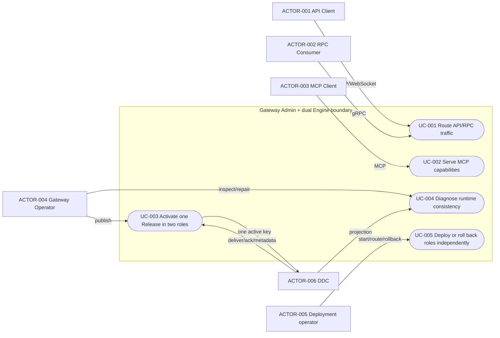
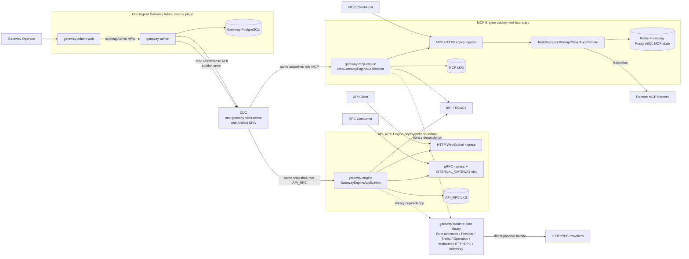
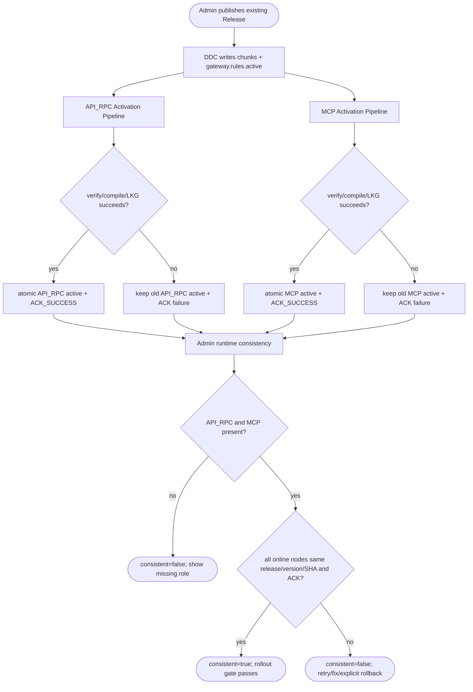
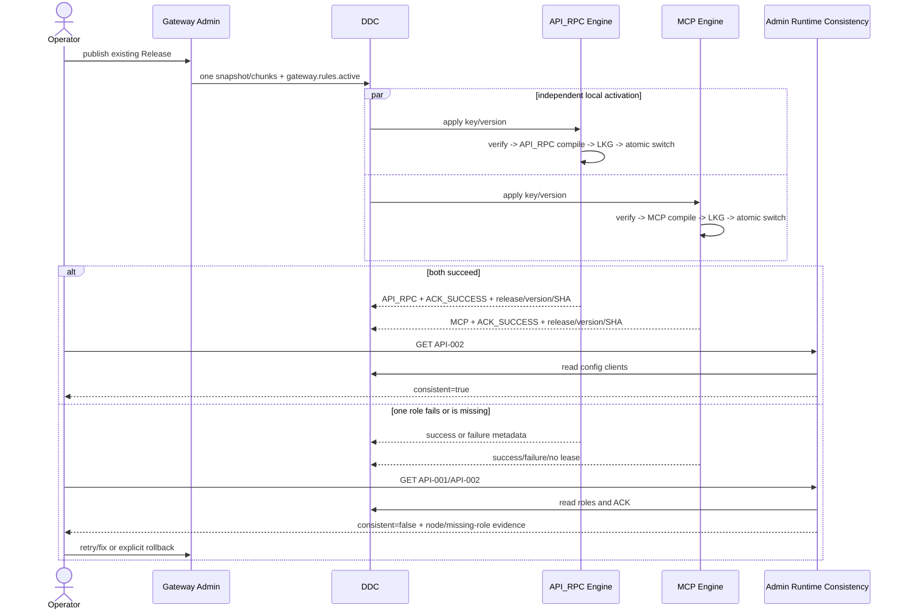

# Gateway Admin 单控制面与 API/RPC、MCP 双 Engine 拆分架构

| Field | Value |
| --- | --- |
| Document | [2026-09-02-19-52-gateway-dual-engine-separation.md](2026-09-02-19-52-gateway-dual-engine-separation.md) |
| Template Version | `6` |
| Status | `Accepted` |
| Type | `Architecture / Refactor` |
| Complexity | `Complex` |
| Complexity Drivers | 一个 Admin 控制面、两个可独立部署的数据面角色、统一 Release 在多进程内的局部原子激活、DDC 发现与 ACK、HTTP/gRPC/MCP 兼容、MCP Redis/PostgreSQL 状态、独立安全身份、HA/灰度/回滚及跨模块依赖重排 |
| Created | `2026-09-02 19:52 CST` |
| Updated | `2026-09-05 07:01 CST` |
| Owner | `User / Egon-COLA Gateway maintainers` |
| Repository | `Egon-COLA` |
| Scope | `egon-cola-xingyuan/egon-cola-yuheng`；Gateway Admin、共享 Runtime、现有 API/RPC Engine、新 MCP Engine、Admin Web、Gateway 测试与部署/本地运行契约 |
| Change Surface | 新增 `gateway-runtime-core` 与可执行 `gateway-mcp-engine`；现有 `gateway-engine` 移除 MCP 入口/Bean/依赖并保留 API+RPC；统一 Rule Artifact 由两个 Plane Compiler 分别编译和局部原子激活；DDC 元数据增加固定 Engine Role；Admin Runtime Consistency 要求 `API_RPC` 与 `MCP` 两个角色；更新 Admin Web、测试、Compose、脚本、CI 和运行文档；不改数据库 Schema、HTTP/gRPC/MCP Wire Contract、Provider 上报或 Admin 管理写 API |
| Affected Chapters | `§7, §8, §9, §10, §12, §13, §14, §15, §16, §17, §18` |
| Source Requirement | 用户请求“把 mcp gateway 和 api 和 rpc gateway 拆分开，现在混在一起的”；用户于 2026-09-02 决定“一个 admin server 两个 gateway engine” |
| Baseline Revision | `main@085c20048e35`；dirty-worktree snapshot：`egon-cola-xingyuan-admin-web-shared/tsconfig.app.tsbuildinfo`、`scripts/unified-identity-local.sh`、`scripts/unified-xingyuan/start-local-stack.sh` 已有用户修改，另有两个未跟踪 Archetype Spec/Plan；本 Spec 不覆盖这些内容 |
| Amends | [Gateway Engine 与 MCP Core 功能域分包设计](2026-08-19-13-51-gateway-engine-mcp-package-refactor.md) 的 §3.2、§5.1、§5.3 DEC-004、§7–§9、§12、§14–§18、§20；[Egon Gateway 全能力 MCP 网关需求与技术设计](../../superpowers/specs/2026-08-02-gateway-complete-mcp-design.md) 的 §5.1–§5.2、§6–§7、§13.1–§13.2、§21.3 中“同一进程”部署结论 |
| Supersedes | `None` |
| Depends On | [Egon Gateway 全能力 MCP 网关需求与技术设计](../../superpowers/specs/2026-08-02-gateway-complete-mcp-design.md) 的 §3–§4、§8–§12、§14–§20、§21.1–§21.2；[GWS-09 Gateway Admin 后端 Spec](../../superpowers/specs/2026-07-25-gateway-admin-backend-design.md) 的 §3.5–§3.6、§6.4、§8、§14–§16 |
| Related Specs | [Gateway HTTP OpenAPI 3.1 单一事实源改造](2026-08-25-19-01-gateway-openapi31-source-refactor.md)；[Gateway 多 OpenAPI Group 增补](2026-08-25-19-43-gateway-openapi-group-aggregation-amendment.md)；[Gateway BIZ/APP 与直连 RPC](2026-08-15-16-57-gateway-biz-app-scope-direct-rpc-design.md) |
| Related Plans | [Gateway Dual-Engine Separation Implementation Plan](../plan/2026-09-02-21-03-gateway-dual-engine-separation-implementation.md) |

## 1. Summary

当前 Gateway 已有 `gateway-mcp-core` 类库和按 HTTP、RPC、MCP 分组的源码包，但运行时仍只有一个 `GatewayEngineApplication`、一个
`GatewayEngineConfiguration`、一个 `GatewayEngineRuntime` 和一个可执行 Jar。该进程同时启动双 HTTP Listener、gRPC
Listener、RPC Slot，并把 MCP Handler 通过 `GatewayCompositeHttpDataPlaneHandler` 插入普通 HTTP Route 处理器；MCP 的
Redis、PostgreSQL、远端联邦和任务 Bean 也与 API/RPC Bean 位于同一 Spring Context。结果是任一 MCP 存储、远端连接、配置或 Bean
装配问题都可能影响 API/RPC Engine 的启动、依赖体积和变更节奏。

选定方向是保留一个逻辑 Gateway Admin 控制面和两个数据面 Engine 角色：现有 `yuheng-biz-gateway` 保留
Artifact/Jar 名称并收敛为 `API_RPC` Engine；新增 `yuheng-mcp-gateway` 作为 `MCP` Engine。两者依赖新增的非可执行
`yuheng-runtime-core`，共享 Provider Directory、Traffic、Rule Activation 基础设施、Operation
Invoker、HTTP/RPC 出站 Adapter 和 Observability，但互不依赖对方的可执行模块。MCP 调用仍直接选择 HTTP/RPC Provider，不调用
API/RPC Gateway，从而保持当前调用跳数、鉴权和重试语义。

Admin 继续生成一个 Canonical `GatewayRuleSnapshot`、一个 Artifact SHA 和同一个 `gateway.rules.active`。两个 Engine
在各自进程中使用 Plane Compiler Strategy 编译同一 Snapshot、维护独立 LKG 和 `AtomicReference`，并通过 DDC
元数据上报固定角色、Release、Version、Checksum 和 ACK。跨进程不伪造分布式原子提交；Admin 的 Runtime Consistency 只有在
`API_RPC` 与 `MCP` 两个在线角色均完成同一 Release/Version/Checksum ACK 时才为一致。数据库、Provider Schema、HTTP/gRPC/MCP
Wire Payload 和现有 Admin 写 API 均不改变。

## 2. Background and Current State

### 2.1 Business and user context

平台维护者希望将 MCP 的协议、会话、任务、远端联邦、审批和存储故障域从 API/RPC 数据面隔离，同时继续使用统一的 Gateway
Admin、Catalog、Release、DDC、Provider Directory、安全、流量治理和可观测性。API 客户端、RPC Consumer 与 MCP Client
不应因内部部署拆分而迁移协议；运维人员需要能独立扩缩、升级、排障和回滚两个 Engine。

### 2.2 Repository evidence

| Evidence ID | Classification | Exact path/symbol/decision/command | Observed fact | Design significance | Verification limit/freshness |
| --- | --- | --- | --- | --- | --- |
| `EVD-001` | Static repository | `gateway-engine/pom.xml`、`GatewayEngineApplication` | 只有一个可执行 Engine Artifact/MainClass；POM 同时依赖 MCP Core、gRPC、JDBC、PostgreSQL、Redisson、IdP、RBAC3、DDC、Kafka | 现状是依赖和进程混合，而不是仅包名混合 | 静态 POM/源码，不证明生产进程 |
| `EVD-002` | Static repository | `GatewayEngineRuntime.start/stop` | 同一 `SmartLifecycle` 启停 HTTP Server、RPC Server、RPC Slot、Rule Activation 和 Provider Directory | API/RPC 生命周期与 MCP 所需运行时没有独立失败边界 | 未启动服务 |
| `EVD-003` | Static repository | `GatewayEngineConfiguration.gatewayHttpServer` | `McpEngineHttpHandler` 存在时使用 `GatewayCompositeHttpDataPlaneHandler`，在相同 HTTP Listener 上先匹配 MCP 固定路径再处理普通 Route | MCP 与 API 共享端口、Drain 和 Spring Bean Graph | 静态装配关系 |
| `EVD-004` | Static repository | `GatewayEngineConfiguration` Bean 方法 219–1817 | 一个约 1800 行配置类同时装配 Provider、HTTP、RPC、MCP、Rule、Traffic、Security、Redis、JDBC、Kafka 和 Health | 需要按可执行角色拆分 Bootstrap，而不是增加 `mode` 分支 | Bean 未实际加载 |
| `EVD-005` | Static repository | `CompiledGatewayRules`、`EngineGatewayRuleCompiler` | 单一记录同时含 HTTP Route、RPC Method Index、Provider/Traffic/Security/CORS 与 `CompiledMcpRules`；单一 Compiler 同时编译所有 Plane | 共享 Snapshot 可以保留，但编译结果必须按 Plane 分离 | 不证明 DDC 同步时序 |
| `EVD-006` | Static repository | `McpToolsCallHandler`、`McpTaskOperationExecutor`、`EngineGatewayOperationInvoker` | MCP 通过 `GatewayOperationInvoker` 直接选择 Provider 并调用 HTTP/RPC 出站 Adapter；没有必要请求 Gateway 的公开 Route | 独立 MCP 进程仍可复用直接出站链路，避免 Gateway-to-Gateway 双跳 | 仅源码调用链 |
| `EVD-007` | Static repository | `GatewayRuleActivationApplier.ACTIVE_CONFIG_KEY`、`GatewayRuleApplierRegistrar` | Active Key 固定为 `gateway.rules.active`，Chunk 使用 `gateway.rules.chunk.*`；Applier 校验、编译、准备 Provider、持久化 LKG 后切换内存引用 | 两个 Engine 可消费同一配置事实并各自局部原子激活 | 不构成跨进程原子性 |
| `EVD-008` | Static repository | `GatewayProjectionService.runtimeConsistency/nodeConsistency`、`GatewayRuntimeConsistencyVO` | Admin 已按 Engine Config Client 的 Release/Version/Checksum/ACK 计算一致性，但不区分 Engine Role | 只需增加角色完整性策略，不需要新表或新管理查询端点 | 当前算法只证明节点一致性 |
| `EVD-009` | Static repository | `DdcManagementConfigClientInstance.metadata`、`DdcInstanceMetadataContributor.metadata()` | DDC Config Client 已携带开放的 `Map<String,String>` 元数据；当前 Engine 已贡献 Release/ACK 字段 | 可用一个受限字符串键新增固定角色，不修改 DDC 协议/表 | 元数据上线效果未验证 |
| `EVD-010` | Static repository | `gateway-admin-web/src/api/types.ts`、`GatewayGroupDetailPage`、`McpRuntimeStatus` | Admin Web 已查询 `engine-nodes` 和 `runtime-consistency`，但 `EngineNode` TS 类型遗漏后端已返回的 `metadata`，页面只显示租约角色 | 前端可用现有 API 展示双 Engine Role，无需新页面/接口 | 浏览器未运行 |
| `EVD-011` | Static repository | `deployment/compose*.yml`、`gateway-engine/Dockerfile`、`scripts/unified-xingyuan/*` | Compose、Docker、启动/状态/验证脚本、Runbook 和 CI 都只认识一个 Engine Jar；当前第二 Engine 是同角色副本 | 拆分必须覆盖制品、端口、健康、证书、进程名和验证脚本 | 未执行 Compose/脚本 |
| `EVD-012` | Static repository | Engine `src/test`、`mcp-core/src/test`、`gateway-test-suite` | MCP 单元/集成测试目前位于 Engine，Live Suite 只依赖 `gateway-engine`，并把跨节点 MCP 场景解释为两个同构 Engine | 测试所有权必须随可执行角色迁移并增加依赖边界验证 | 仅测试清单 |
| `EVD-013` | Accepted predecessor | `2026-08-19-13-51...` §5.3 DEC-004、§17 Option D | 旧 Spec 明确不拆 Configuration/Maven Module；其 RISK-004 把配置拆分延期 | 当前用户决定直接改变该已接受边界，必须显式 Amendment | 只适用于命名的旧范围 |
| `EVD-014` | Authoritative predecessor | `2026-08-02-gateway-complete-mcp-design.md` §5、§12–§13 | 旧设计拒绝“单独 MCP Gateway”的原因是 MCP 再 HTTP 调 Gateway；同时要求单 Snapshot、无自调用、直接 Operation Invoker | 新方案只替换部署拓扑，保留无自调用和单 Snapshot 约束 | 旧文档部分内容已被后续 Spec 更新 |
| `EVD-015` | User decision | “确定 一个 admin server 两个 gateway engine” | 一个逻辑 Admin、两个 Engine Role 的目标已由决策人确认 | 关闭最主要部署拓扑歧义 | 不指定副本数；见 `ASM-001` |
| `EVD-016` | Static command | `git status --short` at `main@085c20048e35` | 两个统一平台脚本及 Admin Web buildinfo 已有用户修改，另有未跟踪文档 | 后续实施必须路径限定，不能覆盖/提交无关并发内容 | 2026-09-02 19:52 CST 快照 |

### 2.3 Problem statement and gap

当前源码已完成“功能域分包”，但没有完成“可执行边界拆分”：

- MCP 依赖使 API/RPC Engine 必须携带 PostgreSQL/JDBC、MCP Redis Session、Remote MCP、Task/Approval 等运行时能力。
- `GatewayEngineConfiguration` 和 `GatewayEngineRuntime` 是全能力装配/生命周期单点，任一 MCP Bean 或存储失败都可能阻断整个
  Engine Context。
- `CompiledGatewayRules` 把三个 Plane 的编译结果绑定在一个 Java Record 中；MCP 编译失败会阻止 API/RPC
  在同进程激活，这在单进程正确，但不再适合用户确认的双 Engine 拓扑。
- Admin 能判断“在线节点是否 ACK 同一 Release”，却不能判断“API_RPC 与 MCP 两个角色是否都存在”。
- 部署、证书、端口、Service Credential、健康检查和验证脚本没有 MCP Engine 的独立身份。

目标不是拆成三套网关、三套 Admin 或三套 Release，也不是让 MCP 调 API/RPC
Gateway。目标是让两个可执行数据面共享同一控制事实和同一核心能力，同时拥有真实的进程、依赖、资源、失败和发布观察边界。

### 2.4 Evidence and current-chain map

| Entry/trigger | Current call chain | Data read/written | External dependency | Consumers | Evidence |
| --- | --- | --- | --- | --- | --- |
| API/HTTP 请求 | `GatewayHttpListener -> GatewayCompositeHttpDataPlaneHandler -> DefaultGatewayHttpDataPlaneHandler -> ProviderSelector -> HTTP/RPC upstream` | Active Rule、Provider/Traffic/Health、Trace | DDC、Redis、HTTP/gRPC Provider、IdP/RBAC3 | API Client | `EVD-003`,`EVD-006` |
| RPC 请求 | `RpcGatewayServer -> RpcGatewayHandlerRegistry -> RpcGatewayForwarder -> RpcProviderChannelCache` | RPC Method Index、Provider/Traffic/Health、Trace | DDC、gRPC Provider、IdP/RBAC3 | RPC Consumer | `EVD-001`,`EVD-002` |
| MCP 请求 | 相同 `GatewayHttpListener -> Composite -> McpEngineHttpHandler -> McpMethodDispatcher -> Handler/Driver -> GatewayOperationInvoker` | MCP Rule、Session、Task、Approval、Provider/Traffic、Trace/Audit | Redis、PostgreSQL、Remote MCP、HTTP/gRPC Provider、IdP/RBAC3 | MCP Client/Host | `EVD-003`,`EVD-006` |
| Release 激活 | `Admin -> DDC gateway.rules.active/chunk -> one GatewayRuleActivationApplier -> EngineGatewayRuleCompiler -> one AtomicReference` | Admin 发布表、DDC Change/ACK、LKG、内存 Snapshot | PostgreSQL、DDC、filesystem | 同一 Engine 内 HTTP/RPC/MCP | `EVD-005`,`EVD-007` |
| 运行一致性查询 | `Admin Web/script -> GatewayProjectionController -> GatewayProjectionService -> DDC Config Clients` | 读 Release History、Release Target、Config Client metadata/cache | DDC Management RPC、Gateway Admin DB | Operator、RBAC3 状态客户端、验证脚本 | `EVD-008`,`EVD-010` |
| 本地/Compose 启动 | `prepare/start script -> gateway-engine-exec.jar -> readiness -> MCP probes` | env/properties、PID/log、LKG、MCP artifact | OS、Docker/Compose、TLS files | Developer/operator | `EVD-011`,`EVD-012` |

## 3. Goals and Non-goals

### 3.1 Goals

1. 保留一个逻辑 Gateway Admin Server，继续拥有 Catalog、Draft、Release、DDC 发布、运行投影和 Admin Web。
2. 保留现有 `yuheng-biz-gateway` 制品名，将其收敛为 API+RPC Engine，完全移除 MCP Handler、MCP Bean、MCP Core
   和 MCP JDBC/PostgreSQL 依赖。
3. 新增独立可执行 `yuheng-mcp-gateway`，独占 MCP HTTP/Legacy SSE、Session、Task、App、Remote
   Federation、MCP RBAC3/Approval 与 MCP 存储。
4. 新增非可执行 `gateway-runtime-core`，供两个 Engine 复用 Rule Activation 基础设施、Provider Directory、Traffic、Operation
   Invoker、HTTP/RPC 出站和 Observability；两个可执行 Engine 不互相依赖。
5. 两个 Engine 继续消费一个 Canonical Snapshot、一个 Artifact SHA、一个 DDC Active Key；分别编译、LKG、激活、ACK，并由 Admin
   检查角色与版本一致性。
6. 保持 API HTTP/WebSocket、gRPC fullMethodName/Metadata、MCP Stable/RC/Legacy 路径与 JSON-RPC、Provider/Starter 上报和
   Admin 管理写 API Wire Contract 不变。
7. 保持 MCP Operation 直接调用 Provider；不新增 MCP -> API/RPC Gateway 内部网络跳转。
8. 为两个 Engine 建立独立应用名、进程、端口、健康、DDC 实例、服务身份、TLS、数据目录、日志和可独立扩缩/回滚的部署单元。
9. Admin Web 和验证脚本能观察 `API_RPC`/`MCP` 角色缺失、未知角色、Release/Version/Checksum/ACK 不一致和 Stale 投影。

### 3.2 Non-goals

- 不拆分 HTTP API 与 gRPC RPC 为第三个 Engine；它们保留在现有 API/RPC Engine。
- 不新增第二个 Admin、MCP Admin 或 MCP 独立数据库 Schema；现有 Admin/Runtime 表和 Flyway 历史不变。
- 不为两个 Engine 创建两个 Draft、两个 Release、两个 `gateway.rules.active` 或跨进程两阶段提交协议。
- 不让 API/RPC Engine 代理 MCP，也不让 MCP Engine 通过公开/内部 Gateway Route 再调用 API/RPC Engine。
- 不改变 HTTP、WebSocket、gRPC、MCP JSON-RPC、Kafka Call Event、Provider Service Key、Operation ID、Tool ID、Session/Task
  状态机和业务错误语义。
- 不修改 Gateway Starter、OpenAPI/RPC Descriptor 上报的 Source of Truth。
- 不在 Spec 阶段编写 Plan、生产代码、Migration、启动服务、Docker 或浏览器验证。
- 不把双 Engine Role 解释为固定副本数；每个角色可以独立为 1..N 个副本。

### 3.3 Change Surface and Design Depth

| Area/layer | Disposition | Exact repository evidence | Changed or preserved behavior/contract | Required Spec treatment | Chapter(s) |
| --- | --- | --- | --- | --- | --- |
| Gateway Maven/module/dependency topology | `Affected` | `gateway/pom.xml`、Engine/MCP Core POM | 新增 Runtime Core/MCP Engine；现有 Engine 去除 MCP/JDBC 依赖 | 完整模块依赖、制品与边界设计 | `§7, §8, §13, §16, §17, §18` |
| Runtime/Rule/Provider/Traffic/Operation shared code | `Affected` | `engine/common/**`、`operation/**`、`rule/**` | 从可执行 Engine 提取；Plane Compiler Strategy 与通用 Activation | 完整协作、状态、失败和文件设计 | `§7, §8, §9, §10, §13, §14, §15, §18` |
| Existing API/RPC Engine bootstrap | `Affected` | `GatewayEngineConfiguration`、`GatewayEngineRuntime`、POM/resources | 去除 MCP，HTTP/RPC 行为保持；独立 `API_RPC` 角色元数据 | 完整启动/关闭/配置/测试设计 | `§7, §8, §10, §14, §15, §16, §18` |
| New MCP Engine | `Affected` | 当前 `engine/mcp/**`、MCP Bean 区段、Composite Handler | 新可执行进程、独立 Listener/Runtime/Properties/identity/LKG | 完整运行时、接口适配、状态、测试与运维设计 | `§7, §8, §9, §10, §13, §14, §15, §16, §17, §18` |
| DDC Engine metadata and Admin consistency | `Affected` | `DdcInstanceMetadataContributor`、`GatewayProjectionService` | 新增固定 Role metadata；一致性必须覆盖两个角色 | 完整内部契约、算法、错误、测试设计 | `§7, §8, §9, §10, §13, §14, §15, §16, §18` |
| Admin Web runtime views | `Affected` | `gatewayApi.ts`、`types.ts`、Group Detail、MCP Runtime Status | 消费现有 metadata 并显示/筛选 Role 与缺失态 | 完整 UI 状态和测试设计 | `§8, §9, §12, §14, §15, §16, §18` |
| Deployment/local scripts/CI/docs | `Affected` | Compose/Docker/scripts/workflows/runbooks | 两个 Jar/进程/端口/证书/健康/路由/rollback | 完整 rollout、rollback、静态/运行验证边界 | `§8, §14, §15, §16, §17, §18` |
| Gateway Admin write APIs/Release persistence | `Context-only` | Release Controller/Coordinator/Repository | 继续一个 Release 与现有 Target ACK；不改请求/表/事务 | 只证明统一 Artifact 与停止边界 | `§7, §9, §11, §16` |
| HTTP/gRPC/MCP external wire contracts | `Context-only` | `GatewayHttpDataPlaneHandler`、`RpcGatewayServer`、`McpEngineHttpHandler` | Method/Path/Payload/Error 不变，部署路由转发目标改变 | 精确列出保留契约和回归 | `§9, §14, §16` |
| Provider/Starter/OpenAPI/RPC Descriptor | `Unchanged` | Gateway Starter、OpenAPI modules、RPC Contributor | Provider 注册和 Definition Report 不变 | 一条不变记录与回归扫描 | `§9, §14` |
| Database schema/migrations | `Unchanged` | Admin `classpath:db/migration`、MCP JDBC stores | 表、列、索引、事务语义不变；不新增 Migration | 一条不变记录；无 ER 图 | `§11, §14, §16` |
| Gateway Admin business pages outside runtime status | `Unchanged` | Catalog/Draft/Release/MCP configuration pages | 路由、表单、权限和写 API 不变 | 一条不变记录 | `§12, §14` |

## 4. Requirements and Acceptance Criteria

| ID | Atomic requirement | Priority | Observable acceptance criteria | Source |
| --- | --- | --- | --- | --- |
| `REQ-001` | 系统必须保持一个逻辑 Gateway Admin 和两个可独立部署的 Engine Role：`API_RPC`、`MCP` | Must | Reactor 中恰有两个可执行 Engine Jar；Admin 仍为唯一 Gateway 控制面 | 用户“一个 admin server 两个 gateway engine” |
| `REQ-002` | 现有 `yuheng-biz-gateway` 必须保留制品名并只装配 API/HTTP/WebSocket 与 RPC/gRPC 数据面 | Must | 其 POM/源码/Bean/Classpath 不含 `gateway-mcp-core`、`engine.mcp`、MCP JDBC Store 或 MCP Handler；现有 API/RPC 回归通过 | 兼容优先与当前制品消费者 |
| `REQ-003` | 新 `yuheng-mcp-gateway` 必须独占 MCP Ingress 与 Runtime 状态 | Must | MCP Stable/RC/Legacy、Session、Task、App、Remote、Approval、Redis/PostgreSQL 测试从新模块执行；其 Context 无 HTTP Route/RPC Listener/RPC Slot Bean | 用户拆分目标 |
| `REQ-004` | 两个 Engine 必须复用共享 Runtime Core，且可执行模块不得相互依赖 | Must | Maven/包边界测试证明 `gateway-engine -/-> mcp-engine/mcp-core`，`mcp-engine -/-> gateway-engine`，两者均依赖 runtime-core | 避免代码复制和伪拆分 |
| `REQ-005` | MCP 本地 Operation 必须继续直接调用 Provider，不得经 API/RPC Engine 二次转发 | Must | MCP 调用链只有 MCP Engine -> selected HTTP/RPC Provider；无新增内部 Gateway API、Service Discovery 或第二次鉴权/限流 | 旧 MCP 设计“无自调用”约束 |
| `REQ-006` | Admin 必须继续发布一个 Snapshot/Artifact/Active Key，两个 Engine 分别局部原子激活并 ACK | Must | 相同 Release ID、DDC Version、Artifact SHA 到达两个角色；每个进程只有旧/新完整 Snapshot；不出现单进程半编译状态 | 单 Snapshot 与 LKG 约束 |
| `REQ-007` | Admin Runtime Consistency 必须要求 `API_RPC` 与 `MCP` 两个在线角色齐全且所有在线节点 ACK 同一 Release/Version/Checksum | Must | 缺一角色、未知 Role、任一在线节点未 ACK/版本或哈希不符时 `consistent=false`；两个角色的全部在线节点一致时为 true；期望副本数仍由部署系统而非 Gateway Admin 管理 | 双 Engine 可运维性 |
| `REQ-008` | API、RPC、MCP、Provider、Admin 管理写 API 的现有 Wire Contract 必须保持兼容 | Must | Method/Path/fullMethodName/JSON/Protobuf/Headers/Errors 不变；外部稳定 MCP URL 由代理路由到新 MCP Engine | 无协议迁移要求 |
| `REQ-009` | 两个 Engine 必须拥有独立进程身份、服务凭证、TLS、端口、健康、日志、LKG 和扩缩边界 | Must | 配置/Compose/脚本能单独启动、停止、探测、升级、扩缩和回滚每个角色；凭证和数据目录不复用同一路径 | 故障域拆分目标 |
| `REQ-010` | MCP 既有 Redis、PostgreSQL、Artifact Root 和 Remote 状态语义必须迁移到 MCP Engine 且保持 HA | Must | Session/Subscription 继续 Redis，Task/Approval 继续现有 PostgreSQL 表，Artifact 使用共享不可变根；API/RPC Engine 不连接 MCP DB | 状态所有权一致性 |
| `REQ-011` | 双 Engine 的新增/迁移 Spring 配置必须保持 Base/Operations Key 结构一致并校验 | Must | 新 MCP Bootstrap keys 在 `application.yml`/`application-operations.yml` 对齐；原 `GATEWAY_MCP_*` 环境变量和 MCP Runtime prefix 保持兼容；绑定负例失败启动 | 用户 Java Rule 7 |
| `REQ-012` | 拆分必须有模块、Bean、协议、Release、角色一致性、前端和部署契约验证 | Must | 设计的 focused Maven/TS/static/Compose tests 全部通过后才可进入用户运行验证；静态证明不冒充 live topology | AGENTS/Skill 验证规则 |

### 4.1 Scenario matrix

| Scenario | Actor/trigger | Preconditions | Main path | Alternative/failure path | Data/state change | Observable result | Requirements |
| --- | --- | --- | --- | --- | --- | --- | --- |
| HTTP/WebSocket API 调用 | API Client | API_RPC Engine Ready、Route Active | API Listener -> Security/Traffic -> Provider | Provider/IdP/RBAC3/Traffic 失败沿现有错误映射 | API_RPC 本地 health/circuit/trace | Wire 结果与拆分前一致 | `REQ-002`,`REQ-008`,`REQ-009` |
| gRPC Gateway 调用 | RPC Consumer | API_RPC Engine RPC Slot Online | gRPC Listener -> Method Index -> Provider | Deadline/cancel/Provider 不可用保持现有 gRPC Status | API_RPC Channel/health/trace | fullMethodName/Metadata 兼容 | `REQ-002`,`REQ-008` |
| MCP Tool 调本地 HTTP/RPC Operation | MCP Client | MCP Engine Ready、Server/Tool Active | MCP Ingress -> Auth/RBAC/Approval -> Operation Invoker -> Provider | Provider timeout/retry/deny 按现有 MCP Result/Error | MCP Session/Task/Audit；Provider call | 无 API_RPC Engine 中转 | `REQ-003`,`REQ-005`,`REQ-008`,`REQ-010` |
| Remote MCP 调用 | MCP Client | Remote Mount Active | MCP Engine -> Remote pool -> Remote Server | Circuit Open/timeout 时只影响 MCP Engine | Remote health/circuit | API/RPC Engine 健康不受影响 | `REQ-003`,`REQ-009` |
| Release 两角色成功 | Operator/Admin | 两角色在线并订阅同一 DDC App | Admin 发布一次；两角色分别 verify/compile/LKG/activate/ACK | N/A | 两份本地 LKG、同一 Release/Version/SHA | Runtime Consistency true | `REQ-006`,`REQ-007` |
| 一角色编译/持久化失败 | DDC Apply | 另一角色可能已成功 | 失败角色保留旧 Active/LKG 并 ACK failure；成功角色不自动回滚 | Operator retry/fix/显式 rollback | 跨进程暂时版本分歧 | `consistent=false`，失败角色仍服务旧完整快照 | `REQ-006`,`REQ-007`,`REQ-009` |
| DDC 不可用后重启 | Engine restart | 各角色存在有效 LKG | 各自恢复 LKG 并按现有规则决定 Ready | LKG 缺失/损坏则对应角色 Not Ready | 不写 Admin DB | 角色独立健康；不伪造全局一致 | `REQ-006`,`REQ-009` |
| MCP Redis/PostgreSQL 不可用 | MCP request/startup | API_RPC Engine 正常 | MCP fail closed/health degraded | 修复存储后 MCP 恢复；API/RPC 无需重启 | Session/Task 不产生部分写 | MCP 失败域不传播到 API/RPC | `REQ-003`,`REQ-009`,`REQ-010` |
| 角色缺失或未知 | Admin consistency poll | DDC 只见一个 Role 或 metadata 非法 | Role Strategy 计算必需集合差集 | Stale cache 明示 stale；无 cache 的 DDC 失败返回现有 503 | 仅读投影 | `consistent=false`，UI 显示缺失/未知 | `REQ-007`,`REQ-012` |
| 混合版本切换 | Deployment operator | 旧 Combined Engine、两个新 Engine 制品可用 | 先启动 MCP 暗实例，再切 MCP 路由，再替换 API_RPC，最后退役旧实例 | 切换失败则路由回旧 Combined | 不发布新 Release、不改 DB | 对外 URL 连续；过渡期一致性可暂时 false | `REQ-008`,`REQ-009`,`REQ-011` |
| 回滚 | Operator | 旧 Combined Jar/Image 与当前统一 Snapshot 兼容 | 路由和进程回旧制品 | 若仅 MCP Engine 失败，可只回 MCP 路由/进程 | 数据表不回滚，LKG 保留 | 无 Migration rollback；协议恢复 | `REQ-008`,`REQ-010` |

### 4.2 Use-case analysis

#### 4.2.1 Actor inventory

| Actor ID | Actor/role | Goal and responsibility | Entry/channel | Permission/tenant context | Evidence |
| --- | --- | --- | --- | --- | --- |
| `ACTOR-001` | API Client | 通过 HTTP/WebSocket Gateway 调用业务接口 | 现有 API Gateway URL | 现有 IdP/RBAC3/Route Context | HTTP 数据面源码 |
| `ACTOR-002` | RPC Consumer | 通过 INTERNAL_GATEWAY 调用 gRPC Provider | DDC `INTERNAL_GATEWAY` + gRPC | PLATFORM SERVICE/USER Metadata 现有规则 | RPC Slot/Forwarder 源码 |
| `ACTOR-003` | MCP Client/Host | 发现并调用 MCP 能力、会话、任务和远端能力 | `/mcp/**`、Legacy/Metadata paths | MCP Server Resource、USER/SERVICE、RBAC3/Approval | MCP Handler/Core 源码 |
| `ACTOR-004` | Gateway Operator | 发布统一 Release，观察两个 Engine Role 并处理分歧 | Gateway Admin/API/Web/Runbook | `CAP_gateway:read`/管理权限 | Admin Runtime API/Web |
| `ACTOR-005` | Deployment operator | 独立部署、扩缩、切流、回滚两个 Engine | Compose/scripts/CI/runtime | 主机、TLS、Secret 管理权限 | deployment/scripts |
| `ACTOR-006` | DDC | 向两个 Engine 分发同一配置并收集租约/ACK/Metadata | Config Client/Management RPC | DDC runtime/registry credentials | DDC Starter/Client |

#### 4.2.2 Use-case artifact



| ID | Use case/goal | Primary actor | Supporting actors/systems | Trigger | Preconditions | Main success outcome | Alternatives/failures | Postconditions | Requirements | Interfaces/pages | Tests |
| --- | --- | --- | --- | --- | --- | --- | --- | --- | --- | --- | --- |
| `UC-001` | Route API/RPC traffic without MCP coupling | `ACTOR-001`,`ACTOR-002` | DDC、IdP、RBAC3、Providers | HTTP/WebSocket/gRPC request | API_RPC Role Ready | Existing response/status with no MCP Bean/Store dependency | Route/provider/security/timeout failures unchanged | Only API_RPC local runtime state changes | `REQ-002`,`REQ-004`,`REQ-008`,`REQ-009` | Existing data-plane contracts | `TEST-004`–`TEST-006` |
| `UC-002` | Serve MCP capabilities and call Providers directly | `ACTOR-003` | IdP/RBAC3、Redis、PostgreSQL、Remote/Local Providers | MCP request/session/task | MCP Role Ready and capability Active | Same MCP result with one direct Provider hop | storage/remote/provider failure isolated to MCP | MCP state committed or existing failure state | `REQ-003`,`REQ-005`,`REQ-008`,`REQ-010` | Existing MCP paths | `TEST-007`–`TEST-010` |
| `UC-003` | Activate one Release in two Engine roles | `ACTOR-004` | `ACTOR-006` | Existing Release publish | DDC reachable; target nodes discovered | Both roles ACK same ID/version/SHA | one role keeps old LKG; retry/rollback | no partial snapshot inside either process | `REQ-006`,`REQ-007` | `INTERNAL-001`,`INTERNAL-002` | `TEST-011`–`TEST-013` |
| `UC-004` | Diagnose role/version consistency | `ACTOR-004` | DDC/Admin DB/Admin Web | Poll/open runtime status | Gateway Group exists | Role complete and all nodes consistent is visible | missing/unknown/stale/unavailable visible | read-only projection/cache only | `REQ-007`,`REQ-012` | `API-001`,`API-002` | `TEST-014`–`TEST-017` |
| `UC-005` | Deploy, cut over, scale, or roll back independently | `ACTOR-005` | Proxy/Compose/OS/TLS | release/deployment operation | old image retained; no new Release during mixed cutover | stable URLs route to correct new roles | route/probe failure rolls back target role | no schema/data migration | `REQ-008`–`REQ-012` | deployment/runbook | `TEST-018`–`TEST-021` |

## 5. Constraints, Assumptions, and Decisions

### 5.1 Confirmed constraints

- 用户已确认一个逻辑 Admin、两个 Engine；API 与 RPC 不再继续拆分。
- 现有 `gateway-engine` Artifact 名、API/RPC 默认端口和 MainClass Consumer 兼容优先。
- MCP 继续直接使用 `GatewayOperationInvoker` 调 Provider；禁止 Gateway-to-Gateway 自调用。
- 一个 Gateway Group 仍只有一个 Draft、Release、Canonical Snapshot、Artifact SHA 和 `gateway.rules.active`。
- 每个 Engine 的内存切换和 LKG 是局部原子；跨进程只通过版本/哈希/ACK 观察最终一致，不声明分布式事务。
- MCP Session/Subscription/Task/Approval/Artifact/Remote 状态语义和存储权威不变。
- 现有 external wire contracts、Admin 写 API、Provider Report 和数据库 Schema 不变。
- 本轮只写 Spec；不启动 Java、数据库、Redis、Kafka、Docker、浏览器或外部基础设施。

### 5.2 Small-gap assumptions

| ID | Inference | Repository evidence | Why locally reversible | Impact if wrong |
| --- | --- | --- | --- | --- |
| `ASM-001` | “两个 Engine”指两个可执行角色，不限制每个角色副本数 | 当前 Compose 已用两个同构 Engine 验证 HA；用户描述的是架构拆分 | 副本数由部署配置改变，不改协议/代码边界 | 若要求总进程恒为 2，只需收紧 Compose/Runbook，不改模块设计 |
| `ASM-002` | 两个 Engine 继续使用相同 DDC `biz/env/appCode` 配置订阅身份，但 `instanceId` 与 Role metadata 不同 | Admin `engineNodes` 按 target appCode 查询；单 Active Key 依赖同一配置空间 | 可在后续 Spec 改为 Bundle 多目标发布 | 若必须独立 appCode，需要 Admin 多目标发布、一致性和迁移新设计 |
| `ASM-003` | 新 MCP 数据面默认端口为 `18084`，Management 为 `18085`；外部稳定 Host/Path 不变 | 现有 Engine 使用 18081/18082/18083/19090；18084/18085 在 Gateway Compose 未占用 | 端口是部署配置，可局部覆盖 | 端口冲突只改配置/脚本，不改协议模型 |
| `ASM-004` | MCP Runtime 配置 prefix `egon.cola.component.gateway.engine.mcp` 与 `GATEWAY_MCP_*` 环境变量先保持兼容；仅新 Bootstrap keys 使用 `...gateway.mcp-engine` | 当前 `McpRuntimeProperties` 和脚本依赖旧 prefix/env | 后续可有弃用期迁移 | 立即改 prefix 会扩大 DDC/env/secret 迁移和兼容范围 |
| `ASM-005` | 过渡部署期间不发布新 Gateway Release | 旧 Combined 与新双 Role 会同时订阅同一 Active Key；发布会扩大目标/ACK 不确定性 | 仅 Runbook 时序约束 | 若必须边切流边发布，需要 mixed-version publication 兼容 Spec |

### 5.3 Resolved decisions

| ID | Decision | Decision owner | Evidence and rationale | Requirements |
| --- | --- | --- | --- | --- |
| `DEC-001` | 一个 Gateway Admin + `API_RPC`/`MCP` 两个 Engine Role | User | 用户明确确认；API/RPC 共享当前 Gateway 数据面而 MCP 有独立状态/故障域 | `REQ-001`–`REQ-003` |
| `DEC-002` | 保留现有 `gateway-engine` 名称作为 API_RPC Engine，新增 `gateway-mcp-engine` | Spec | 比重命名两个 Artifact 少一个制品迁移和调用方变化 | `REQ-002`,`REQ-003`,`REQ-008` |
| `DEC-003` | 新增 `gateway-runtime-core` 共享非可执行能力；禁止两个 executable 互相依赖 | Spec | 直接让 MCP 依赖现有 Engine 会把 API/RPC Classpath 重新带回 MCP，属于伪拆分 | `REQ-004` |
| `DEC-004` | Plane Compiler 使用 Strategy；一个 Generic Activation Pipeline 处理 verify/LKG/atomic switch | Spec | Snapshot 相同但输出类型与需要的路由/能力不同；复制 Apply Pipeline 会产生两套校验/恢复语义 | `REQ-004`,`REQ-006`,`REQ-012` |
| `DEC-005` | MCP Engine 直接调用 Provider，不调用 API_RPC Engine | User-confirmed direction + predecessor | 保留旧设计反自调用原则，避免多一跳、重复安全/流控/序列化/重试 | `REQ-005`,`REQ-008` |
| `DEC-006` | 一个 Active Key、两份本地 LKG/Active Reference/ACK；Admin 负责观察一致性，不增加 2PC | Spec | 统一事实最小；跨进程 2PC 会新增 Coordinator/状态/恢复，用户未要求零窗口原子切换 | `REQ-006`,`REQ-007` |
| `DEC-007` | Role 是编译期固定枚举，不允许配置 `mode=...` | Spec | 防止同一万能 Jar 通过字符串开关重新混装；Role 由 Artifact/MainClass 决定 | `REQ-001`,`REQ-004`,`REQ-007` |
| `DEC-008` | MCP Engine 使用独立 IdP Resource/Service Client/TLS Secret/数据目录；共享业务 MCP Server Resource 与现有存储 | Spec | 进程身份必须隔离，业务 Token/Server Resource Contract 不应变化 | `REQ-008`–`REQ-010` |

### 5.4 Open major decisions

`None`。用户已关闭部署拓扑决策；`ASM-*` 是保持现有协议和发布事实的局部、可逆实现推断。若未来要求两个独立 DDC
appCode、跨进程强原子发布或 API/RPC 再拆分，必须新建 Amendment，不在 Plan 中静默扩大。

## 6. Project Technology Context

| Concern | Current choice | Repository evidence | Constraint on design |
| --- | --- | --- | --- |
| Language/runtime | Java 21 | `egon-cola-xingyuan/pom.xml:63` | Record、`java.time`、Spring Lifecycle；不改 JDK |
| Framework | Spring Boot 3.5.16、MVC/Actuator、Reactor Netty | Platform POM、Engine/Admin POM | 两个 Engine 各自 Spring Context/Management 端口 |
| RPC | gRPC 1.75.0、Protobuf 4.32.0、Unary Gateway | Platform POM、RPC Server/Forwarder | API_RPC 拥有 Listener/Slot；Runtime Core 拥有共享出站 Channel Adapter |
| MCP | `gateway-mcp-core` + Engine adapters；Stable/RC/Legacy | MCP Core/Handler/legacy Spec | MCP Core 仍为类库；新 MCP Engine 负责装配和 HTTP Ingress |
| Config/discovery | DDC Config Client + Service Registry + Redis reconciliation | DDC Starter/Adapter | 相同 appCode/Active Key；固定 Role metadata；不新增 DDC API |
| Security | IdP Gateway Adapter/Starter、RBAC3 Adapter/Starter、MCP Approval | Engine POM/config/classes | 两个进程独立 Resource/Service identity；业务授权和 Token 转发不变 |
| Persistence/state | Admin PostgreSQL/Flyway、MCP JDBC、Redis Session、filesystem Artifact/LKG | Admin migrations、MCP adapters | Schema 不变；MCP Engine 继承连接/Volume；API_RPC 移除 MCP DB |
| Frontend | React 19、TypeScript 6、AntD 6、React Query、Vitest/Playwright | Admin Web `package.json` | 复用现有页面/API/query keys；不新增设计系统 |
| Build/test | Maven Reactor、JUnit 5.12.2、Spring Boot Test、Testcontainers | POM/test tree | 模块/Bean/contract/role/live 验证分层；本 Spec 只做静态文档验证 |
| Repository rules | 用户提供的 AGENTS；仓库内无额外 `AGENTS.md` | `rg --files -g AGENTS.md` 无结果 | 最小安全改动、Flyway 不变、保留 dirty worktree、不启动项目 |

### 6.1 Java architecture profile and capability baseline

| Architecture profile | Archetype/template or base package | Exact evidence and verifier | Existing deviations | Design action |
| --- | --- | --- | --- | --- |
| Traditional Layered 的仓库批准 feature-first infrastructure variant | `top.egon.cola.component.gateway.{admin,engine,mcp,runtime}`；feature 下 `controller/service/repository/domain/adapter/bootstrap` | 当前 Gateway tree、`GatewayEnginePackageBoundaryTest`、Accepted `2026-08-19` §6.1、Accepted OpenAPI Spec §6.1 | Runtime/Data Plane 不使用 `biz.*`/`service.impl`；这是已批准的既有非业务基础设施结构 | 保持 feature-first + role package；只新增部署/module boundary，不引入 COLA/DDD/第三种业务层 |

当前和目标都不是任一 `egon-cola-archetype-*` 生成工程。本 Amendment 继承已批准的 Gateway 基础设施变体，不把 Runtime
强制迁移到业务 `biz.controller/service/dao`，也不新增 `application/domain/infrastructure` COLA 模块。Admin 继续
`controller -> service -> repository/domain` 方向；Runtime 继续 `bootstrap -> plane/shared capability -> core/contract`。

| Need | Spring/JDK candidate | Spring Boot Starter candidate | Egon-COLA/module candidate | Proven gap | Decision/dependency impact |
| --- | --- | --- | --- | --- | --- |
| 两可执行进程 | `SpringApplication` | Boot Maven Plugin/Actuator | 现有 Engine MainClass/POM | 缺第二 MCP MainClass/Jar | 新 MCP Engine；现有 Engine 名不变 |
| 共享非可执行 Runtime | Java module/Jar | None | 当前 `engine.common/operation/rule` | executable 互相依赖会伪拆分，复制会漂移 | 新 runtime-core，无第三方依赖 |
| Plane 编译 | Java generic/Strategy | Validation | 现有 `EngineGatewayRuleCompiler`、`McpRuleCompiler` | 单 DTO 混合 HTTP/RPC/MCP | Strategy + 两个 Record DTO |
| DDC Role | Enum + Map | DDC Starter | `DdcInstanceMetadataContributor` | 现有 metadata 无 Engine Role | 复用 contributor；不改 DDC contract |
| 配置校验 | Jakarta Validation | `spring-boot-starter-validation` | `ValidationUtils` | 新 MCP Bootstrap properties 需 fail-fast | 使用已有 managed Starter，无新版本 |
| HTTP Ingress | Reactor Netty | Actuator | `GatewayHttpListener`/Handler SPI | MCP 需要独立 listener，不能复制 Netty 适配 | Listener/transport SPI 下沉 runtime-core，MCP Adapter 复用 |
| Provider 调用 | Reactor Netty/gRPC | None | `GatewayOperationInvoker`、HTTP/RPC adapters | 无 gap | 下沉 runtime-core；无内部 Gateway API |
| Runtime consistency | Set/Enum | Existing MVC | `GatewayProjectionService`/existing APIs | 缺角色完整性判断 | Strategy 复用现有 DDC metadata，不加接口/表 |
| 前端角色展示 | TypeScript Record/map | Existing React Query | existing engine-nodes/runtime-consistency | TS 类型遗漏 metadata | 补类型和视图；无新 request |

### 6.2 User-mandated Java rule compliance

Execution amendment `DEC-EXEC-002` (2026-09-05): 用户在收到 Step 2 的纯迁包与历史构造规范冲突后明确要求“继续，自行决定，不要问我”。本次据此保留纯 package/import 迁移类既有的类型表示、名称、校验、构造、默认值、防御性拷贝及生命周期；不为追溯统一注解而改变其行为。此项是本次迁移对历史 Rule 1–4 差异的显式例外，最终审计必须披露，不能声称旧实现满足原始规则。新增或实质修改的业务类、装配与边界对象继续执行完整规范，并允许在所属 Step 内完成必要的局部规范化及回归修复；不修改全局 skill、不扩大到无关代码或数据库。以下设计表针对新增/实质修改代码，机械迁移按本 Amendment 的兼容性检查执行。

| Literal rule | Affected? | Repository evidence | Exact design decision | Files/types/interfaces | Validation/test evidence | Status/blocker |
| --- | --- | --- | --- | --- | --- | --- |
| Rule 1 | Yes | 新增/重命名类型清单见 §8/§10；当前 Role/Compiler/Runtime/VO 约定 | 使用 `GatewayEngineRoleEnum`、`GatewayCompiledRulesDTO`、`ApiRpcGatewayCompiledRulesDTO`、`McpGatewayCompiledRulesDTO`、`*Strategy/*Configuration/*Runtime/*Properties/*Server/*Adapter`；无 Data/Info/Param/Bean | §8.3/§10.1 | `TEST-001`,`TEST-003` 命名/边界扫描 | PASS |
| Rule 2 | Yes | 新 MCP Properties、DDC Snapshot -> Compiler、DDC metadata -> Admin Role Strategy 是受影响输入边界 | `@Validated` + Jakarta constraints；Spring 外直接调用用 `ValidationUtils`；Role 值严格枚举；无电话字段，libphonenumber N/A；现有 HTTP/RPC/MCP 请求 Validation 不变 | Properties、`GatewayRuleCompilerStrategy`、`GatewayEngineRoleConsistencyStrategy` | config binding、null/unknown role、manual validation tests | PASS |
| Rule 3 | Yes | 新配置/编译结果为无身份不可变载体；`BaseConverter` 已核查 | 简单载体全部 Record + compact constructor；编译属于行为转换而非字段映射；不新增跨层 POJO Converter，故 MapStruct/BaseConverter 无适用新映射；不修改持久化模型 | 三个 DTO/Properties records、Role Enum | 构造/null/immutability tests；最终 Converter Manual Check 的 N/A 证据 | PASS |
| Rule 4 | Yes | 受影响业务类包括 Activation/Compiler/Operation/Traffic/RoleConsistency/Projection/Runtime；Gateway `lombok.config` 已复制 Qualifier | 全部 concrete business class `@Slf4j`；Spring Bean 显式名；`@RequiredArgsConstructor` + final 字段 + 每依赖 `@Qualifier`；移除受影响类手写注入构造；安全日志不含 Token/Body/Secret | §8.3 business/Bean inventory | Bean context、annotation/Qualifier/static/log-redaction tests | PASS |
| Rule 5 | Yes | 只需集合、路径、哈希、URI、Duration | 仅 JDK、已存在 Spring/Egon/Commons/Guava；不新增 Utils/utility dependency | 全部受影响模块 | dependency/import scan | PASS |
| Rule 6 | Yes | External JSON 只有现有 Admin Projection 与 MCP；Role 位于 metadata string，其他 payload 不变 | Spring Boot Jackson only；`GatewayEngineRoleEnum.name()` 写入 Map；现有 VO/record Jackson shape 不新增字段 | API-001/API-002、MCP unchanged | JSON golden/unknown metadata compatibility tests | PASS |
| Rule 7 | Yes | Engine base/operations、Admin base/local、脚本 env；新 MCP base/operations | 每个新增/迁移 key 在 MCP Base/Operations 同层；API 现有 key 不重命名；`GATEWAY_MCP_*` 保留；配置 parity test | `application*.yml`、Properties records | `TEST-019` key parity/binding | PASS |
| Rule 9 | Yes | Plane 编译和双角色一致性存在真实变化轴；直接 `if role` 会扩散 | Strategy：`GatewayRuleCompilerStrategy` 两实现；`GatewayEngineRoleConsistencyStrategy` 集合规则；HTTP 采用 Adapter；无字符串 mode/switch | §7.3/§13 | 两 Strategy 选择/失败/扩展 tests | PASS |
| Rule 10 | Yes | LKG/ACK/health/timeouts 使用 `Instant/Duration/Clock` | 继续 `java.time`；新 Properties 用 `Duration`，ACK 用 `Instant` ISO-8601 UTC；无 `java.util` 日期 | Properties/metadata/VO unchanged | serialization/config/Clock tests | PASS |
| Rule 11 | Yes | 当前 Gateway feature-first infrastructure 及已批准 predecessor；目标模块/包树见 §8 | 保持同一 Traditional Layered repository variant；不混入 Archetype/COLA/DDD/biz hybrid；Plan 必须再次确认 | 全目标 tree | Maven/package boundary tests | PASS |

## 7. Architecture Design

### 7.0 Minimum-design baseline and element-necessity audit

| Proposed element | Change | Requirements | Existing/direct alternative | Concrete inadequacy of alternative | Added calls/state/coupling/failures/migration/operations | Verdict |
| --- | --- | --- | --- | --- | --- | --- |
| 保持单 Combined Engine | Keep candidate | None | 当前实现 | 不满足进程/依赖/故障域拆分 | 0 新元素但继续耦合 | Remove |
| `gateway-runtime-core` | New module | `REQ-004`–`REQ-006` | MCP Engine 依赖 API_RPC Engine 或复制 common/rule/operation | 前者把全部 API/RPC Classpath 带入，后者复制校验/LKG/治理 | 1 Artifact；共享 API 兼容成本 | Add |
| 现有 `gateway-engine` 作为 API_RPC | Modify/Keep | `REQ-002`,`REQ-008` | 重命名为新 api-rpc artifact | 重命名增加 Jar/Compose/CI/外部消费者迁移，无额外价值 | 删除 MCP 依赖/Bean；保留兼容名 | Keep |
| `gateway-mcp-engine` | New executable | `REQ-001`,`REQ-003`,`REQ-009`,`REQ-010` | 单 Binary `mode=MCP` | 万能 Binary 仍携带/可误装所有 Plane，依赖与 Role 不固定 | 新进程、端口、Context、凭证、健康 | Add |
| Plane Compiler Strategy | New/Extract | `REQ-004`,`REQ-006` | 复制整个 Applier 或保留混合 DTO | 复制会漂移，混合 DTO 让 API 继续依赖 MCP | 两实现、一个泛型内部契约 | Add |
| Generic Activation Pipeline | Modify/Move | `REQ-006` | 两套独立 Applier | 两套 verify/chunk/LKG/provider prepare/status 易漂移 | 泛型/Strategy 复杂度；无新网络状态 | Keep/Generalize |
| 固定 `GatewayEngineRoleEnum` | New enum | `REQ-007`,`REQ-009` | 从 appName/instanceId 猜测或配置 mode | 猜测不稳定；配置可误标并重新形成万能 Jar | 1 metadata key/enum | Add |
| Admin 新查询 API | Candidate | None | 扩展现有 metadata/consistency 语义 | 现有 API 已有独立运维目标和所有数据 | 新 contract/前端 request 无价值 | Remove |
| Gateway-to-Gateway internal invoke API | Candidate | None | MCP 复用 Runtime Operation Invoker | 增加 RTT、重复 auth/traffic/retry/trace 和新故障 | 1 network hop + discovery/versioning | Remove |
| 第二 Active Key/Bundle Coordinator | Candidate | None | 同一 Snapshot/Key + role ACK | 新增多键非事务窗口或 2PC 状态/恢复 | 新配置状态、协议、失败/迁移 | Remove |
| 新数据库表/Migration | Candidate | None | 现有 Release Target/Runtime metadata/MCP tables | 当前表已表达每节点 ACK 和 MCP 状态 | Schema/rollback/locking 无必要 | Remove |

| Path | Network calls | Client states | Server contracts/state | Failure and TOCTOU points | Additional user/business value |
| --- | --- | --- | --- | --- | --- |
| 当前 MCP 请求 | Client -> Combined Engine -> Provider（2 段） | existing MCP states | one Engine Context/Active/LKG | Combined Context/Store failure affects all planes | 完整 MCP |
| 选定 MCP 请求 | Client -> MCP Engine -> Provider（2 段） | unchanged MCP states | separate MCP Context/Active/LKG | MCP-only failure domain；无新 TOCTOU | 独立部署/扩缩/故障隔离，调用跳数不变 |
| 当前 Release | Admin -> DDC -> N identical Combined replicas | one Admin state | one compiled record type per replica | replicas may diverge；Admin observes ACK | existing HA |
| 选定 Release | Admin -> DDC -> N API_RPC + M MCP replicas | unchanged Admin write contract | two compiled DTO types/local atomics, same ID/SHA | role may temporarily diverge；Admin explicitly detects | 两角色独立演进且共享控制事实 |

### 7.1 System Architecture Design

#### 7.1.1 Architecture Mermaid view



#### 7.1.2 Boundary and responsibility table

| Module/component | Capability and data owned | Inputs/outputs | Allowed dependencies | Forbidden responsibility | Requirements |
| --- | --- | --- | --- | --- | --- |
| `gateway-admin` | Single Catalog/Draft/Release/publication/runtime projection | existing Admin APIs -> one Snapshot/Active Key; DDC metadata -> consistency | Admin DB、DDC、IdP/RBAC3 | request hot path、per-plane duplicate Release | `REQ-001`,`REQ-006`,`REQ-007` |
| `gateway-runtime-core` | shared immutable activation pipeline、Provider/Traffic/Operation/outbound transport/telemetry | Snapshot + Strategy -> active DTO；Invocation -> Provider result | contract/core/DDC/RPC/Reactor/Jackson/Micrometer | MainClass、plane ingress、MCP capability、Admin persistence | `REQ-004`–`REQ-006` |
| `gateway-engine` (`API_RPC`) | HTTP/WebSocket/gRPC ingress、RPC Slot、API/RPC security/readiness | API/gRPC -> Provider；Role/ACK -> DDC | runtime-core、contract/core、IdP/RBAC3/DDC | MCP paths/beans/core/JDBC/Remote MCP | `REQ-002`,`REQ-008`,`REQ-009` |
| `gateway-mcp-core` | protocol/capability behavior independent of Spring/process | MCP internal request -> capability result | contract/core/Jackson/Reactor | Spring Boot entry、JDBC/Redis concrete adapter、API/RPC ingress | `REQ-003`,`REQ-004` |
| `gateway-mcp-engine` (`MCP`) | MCP ingress、Spring assembly、Redis/JDBC/filesystem/remote adapters、MCP health | MCP wire -> direct Provider/Remote result；Role/ACK -> DDC | runtime-core、mcp-core、IdP/RBAC3/DDC、existing stores | general API Route、gRPC Listener、INTERNAL_GATEWAY Slot | `REQ-003`,`REQ-005`,`REQ-009`,`REQ-010` |
| DDC | shared config delivery、client lease、version/ACK/metadata | one Active Key -> two roles；metadata -> Admin | existing DDC contracts | Release semantics、business authorization | `REQ-006`,`REQ-007` |
| Admin Web | role/version/health operator view | API-001/API-002 | existing client/query/components | deployment mutation、new control-plane state | `REQ-007`,`REQ-012` |

### 7.2 High-Level Design

两个 Engine 在 Maven、Spring Context、端口、身份、资源和生命周期上独立；`gateway-runtime-core` 只是库，不运行
Server/Job，也不持有全局静态 Active。每个 Engine 创建自己的 Provider Directory、Traffic registries、channels、Rule
Chunk/LKG/Activation 和 telemetry listener。Redis 分布式限流仍共享后端与既有 Key；local bulkhead/circuit/health
变为每角色/副本隔离，这是故障域拆分的预期变化。

Admin 发布内容和 DDC key 不变。Plane Strategy 只决定“从同一 Snapshot 编译哪些运行时索引”：

- `ApiRpcGatewayRuleCompilerStrategy` 生成 HTTP Route、RPC Method、Provider、Traffic、Security、CORS；不加载 MCP Core。
- `McpGatewayRuleCompilerStrategy` 生成 MCP Rules 以及 MCP 直接 Operation Invoker 所需的 Snapshot、Provider/Traffic
  视图；不生成 HTTP Route 或 RPC Ingress Method Index。

#### 7.2.1 Critical business/control flowchart



#### 7.2.2 High-level decision and quality matrix

| Concern/use case | Required behavior | Selected mechanism | Failure/degradation behavior | Trade-off | Verification | Requirements |
| --- | --- | --- | --- | --- | --- | --- |
| Fault isolation | MCP storage/remote failure不影响 API/RPC Context | separate executable/context/health | MCP Not Ready；API_RPC remains independent | extra process/resources | context and fault-injection tests | `REQ-001`–`REQ-004`,`REQ-009` |
| Latency | MCP Operation 不增加 Gateway hop | shared direct Operation Invoker/outbound adapters | Provider failures unchanged | shared library API must stay stable | call-count/trace tests | `REQ-005`,`REQ-008` |
| Release correctness | one source, no partial local snapshot | same Active Key + generic pipeline + local atomic + role ACK | cross-role temporary skew visible, not hidden | no distributed atomicity | LKG/apply/consistency tests | `REQ-006`,`REQ-007` |
| Compatibility | existing external contracts stable | preserve artifact/API paths; proxy route-only MCP cutover | raw direct old port is deployment contract and changes | staged route migration | golden/consumer/live tests | `REQ-002`,`REQ-008` |
| Security | process/service secrets isolated | separate Resource/Service/TLS config; same business auth | one identity failure affects one role | more secrets/rotation entries | audience/credential/token leakage tests | `REQ-009`,`REQ-010` |
| Capacity | scale MCP and API_RPC independently | independent deployment replica counts | local circuit/bulkhead state differs by role | duplicate DDC subscriptions/provider caches | load/config/metrics validation | `REQ-009` |
| Operability | Admin must expose role completeness and stale state | fixed metadata + Role Strategy + existing APIs/UI | DDC unavailable uses existing cached stale/503 behavior | one metadata convention | API/UI/script tests | `REQ-007`,`REQ-012` |

### 7.3 Detailed Design

#### 7.3.1 Detailed component collaboration

| Step | Caller -> callee | Contract/symbol | Input/output mapping | State/data effect | Failure behavior | Requirements |
| --- | --- | --- | --- | --- | --- | --- |
| `1` | Admin -> DDC | existing Release publication | `GatewayRuleSnapshot` -> chunks + `GatewayRuleActivation` | existing Release Target/Change | existing retry/partial target semantics | `REQ-006` |
| `2` | DDC -> each Engine | `DdcConfigApplier.apply(key,value,version)` | active/chunks -> verified Snapshot | per-process chunk store | invalid version/hash/schema rejects and old active remains | `REQ-006` |
| `3` | Generic Applier -> Plane Strategy | `INTERNAL-001 compile(snapshot)` | same Snapshot -> plane DTO | no external state | deterministic compile exception; no LKG/active switch | `REQ-004`,`REQ-006` |
| `4` | Generic Applier -> Provider Directory/LKG | existing prepare + persist | DTO provider services + raw Snapshot bytes | plane-local provider refs/LKG | preparation/persist failure releases additions | `REQ-006` |
| `5` | Generic Applier -> AtomicReference/metadata | active DTO + status | release/version/SHA/stage -> DDC metadata | plane-local active pointer/status | no partial memory state | `REQ-006`,`REQ-007` |
| `6` | API Client/RPC Consumer -> API_RPC | existing handlers | HTTP/gRPC -> direct Provider invocation | API_RPC local health/traffic/trace | existing errors/status | `REQ-002`,`REQ-008` |
| `7` | MCP Client -> MCP Engine | MCP handler/dispatcher | MCP request -> capability -> `GatewayOperationInvocation` | MCP stores/audit | existing MCP errors; API_RPC not called | `REQ-003`,`REQ-005`,`REQ-010` |
| `8` | each Engine -> DDC | `INTERNAL-002 metadata()` | fixed role + active status -> bounded Map | config-client lease metadata | missing/invalid role causes Admin inconsistency | `REQ-007`,`REQ-009` |
| `9` | Admin/API/Web -> Projection Service | API-001/API-002 | DDC nodes + Release expectation -> role/node consistency | read cache only | stale fallback or existing 503 | `REQ-007`,`REQ-012` |

#### 7.3.2 Critical-path Mermaid swimlane



#### 7.3.3 Transactions, consistency, concurrency, and idempotency

| Concern/state change | Owner and boundary | Mechanism/isolation/lock | Concurrent or duplicate behavior | Commit/visibility point | Failure result | Requirements/tests |
| --- | --- | --- | --- | --- | --- | --- |
| Release creation/publication | Admin existing transaction/publication journal | existing optimistic revision/idempotency/target snapshot | unchanged | existing Release/Target commit | existing partial/retry semantics | `REQ-006 / TEST-011` |
| Plane rule activation | each Engine process | synchronized `apply` + monotonically increasing DDC version + `AtomicReference` | duplicate/old version ignored; one apply at a time per process | LKG persisted then active reference/status switched | old complete active retained | `REQ-006 / TEST-011,012` |
| Cross-role convergence | Admin observation, not a transaction | tuple `(role,releaseId,ddcVersion,artifactSha,ACK)` | replicas may apply at different times; no auto rollback of success role | API-002 returns true only after complete set | temporary false/inconsistent | `REQ-007 / TEST-013–016` |
| Provider directory refs | each Engine local | existing activate/release diff per compiled provider services | role replicas independent | local active DTO switch | prepared additions released on failure | `REQ-004`,`REQ-006` |
| Distributed rate limit | existing Redis keys | existing atomic script/keys | both roles share distributed count where policy key matches | Redis decision | existing fail-open/deny mode | `REQ-005`,`REQ-009` |
| Local circuit/bulkhead/health | each role/replica | process-local registries | intentionally not shared across roles | local observation/permit | failure isolated by role | `REQ-009` |
| MCP Session/Task/Approval | MCP Engine + existing Redis/PostgreSQL | existing TTL/lease/JDBC transaction/idempotency | HA replicas share existing authority | existing store commit | existing MCP recovery state | `REQ-010` |

#### 7.3.4 Failure semantics, recovery, and reconciliation

| Failure point | Detection | Immediate control flow | Data/transaction state | Retry and idempotency | Caller/frontend result | Recovery/reconciliation owner | Verification |
| --- | --- | --- | --- | --- | --- | --- | --- |
| Plane compile fails | Strategy exception + apply stage | reject this role apply; do not persist/switch | old active/LKG intact | DDC/Admin existing retry with same Release content | that role old behavior; API-002 false | Operator fixes/retries/rolls back | `TEST-012`,`TEST-013` |
| LKG persist fails | repository exception | release newly prepared provider refs; no switch | filesystem unchanged/old pointer | existing retry; same version rules respected | role not ready for new release | Engine/operator disk repair | `TEST-012` |
| one role missing | Admin Role Strategy | no mutation | existing Release may still be SUCCESS for snapshotted targets | role starts later and initial DDC refresh applies latest | API-002 false; UI missing role | Deployment operator | `TEST-015`,`TEST-017` |
| unknown/blank Role | enum parse failure | node never counts for required role; node marked inconsistent by existing node logic extension | read-only | fix deployment metadata | UI shows UNKNOWN; consistency false | Deployment operator | `TEST-014` |
| DDC management timeout | existing projection `load` | return cached envelope with `stale=true`; without cache throw existing unavailable | no write | existing bounded refresh/poll | warning or 503 error wrapper | DDC/operator | `TEST-016` |
| MCP Redis down | MCP health/store error | MCP request/session fails closed per existing semantics | no fabricated session/event | existing recovery after backend return | MCP error only | MCP operator | `TEST-008` |
| MCP PostgreSQL down | DataSource/SQL error | Task/Approval unavailable; no partial commit | existing transaction rollback | existing task recovery | MCP error/health degraded | MCP/DB operator | `TEST-009` |
| API_RPC Engine down | health/DDC lease | API/RPC role missing/unready | MCP state unaffected | LB/DDC selects other replica | API/RPC unavailable if no replica; MCP remains | API_RPC operator | `TEST-020` |
| Route cutover failure | readiness/protocol probe | keep/revert proxy route to old Combined | no DB/config change | repeat deterministic route update | stable external URL restored | Deployment operator | `TEST-021` |

#### 7.3.5 Observability and operational boundaries

| Signal/runbook | Emitting owner and point | Fields/dimensions | Sensitive-data rule | Success/failure threshold |
Alert/dashboard/operator action | Verification boundary |
| --- | --- | --- | --- | --- | --- | --- | --- |
| DDC config-client metadata | each Engine after apply/heartbeat | `gateway.engine.role`,`activeReleaseId`,
`activeRuleVersion`,`activeRuleChecksum`,`lastApplyStatus`,`lastAckAt` | no Token/Secret/Body/path arguments | Role key
mandatory; ACK fields complete for consistent node | Admin API/Web; restart/fix/retry | source/contract tests; live DDC
later |
| Health/readiness | each Engine Actuator + custom indicator | role、running、ready、ruleStage；API_RPC rpcState；MCP
store/remote summary | no connection secret/token | readiness false on role-critical dependency per existing rules | LB
removes only affected role instance | context tests; live probes later |
| Metrics | shared telemetry per process | stable low-cardinality `engine.role`,`protocol`,`result`,`operationKey` | no
subject/token/body; operation key existing policy | role-specific error/latency/circuit alerts | separate
dashboards/alerts | meter tests; production thresholds runtime-owned |
| Logs | affected runtime/compiler/consistency classes | role、nodeId、releaseId、version、stage、errorCode | omit
credentials, JWT, MCP payload, headers, DB secret | WARN on apply/role consistency failure; INFO on lifecycle transition
only | correlate with trace/release; runbook action | log-capture/redaction tests |
| Runtime consistency | Gateway Admin API-002 | target Release、node counts、role metadata、stale/source | no secrets |
false if role incomplete or node mismatch | block rollout; retry/fix/rollback | API/unit/static; live DDC later |

#### 7.3.6 Conclusion evidence chain

| Conclusion | Repository/user evidence | Constraint or requirement | Design decision | Consequence and trade-off | Verification and acceptance evidence |
| --- | --- | --- | --- | --- | --- |
| 保留 API+RPC、单拆 MCP | `EVD-001`–`EVD-004`,`EVD-015` | `REQ-001`–`REQ-003` | existing Engine -> API_RPC；new MCP Engine | 两个真实故障域；增加一个进程/制品 | module/context/deployment tests，用户审核 |
| 新 Runtime Core 而非 executable dependency | `EVD-005`,`EVD-006` | `REQ-004`,`REQ-005` | shared non-executable library + direct Provider invoke | 共享 API/包迁移成本，但无额外网络 hop | dependency boundary + call-chain tests |
| 单 Snapshot + 两局部原子激活 | `EVD-005`–`EVD-009`,`EVD-014` | `REQ-006`,`REQ-007` | Plane Strategy + generic Applier + role ACK | 允许短暂跨角色 skew，避免 2PC/双事实 | apply/LKG/consistency failure tests |
| Role metadata 扩展现有 Admin API | `EVD-008`–`EVD-010` | `REQ-007`,`REQ-012` | fixed enum metadata + consistency strategy | 无新端点/表；需要前后端语义回归 | API golden/UI/static/script tests |
| 分阶段切流、旧 Combined 作为回滚 | `EVD-011`–`EVD-014` | `REQ-008`–`REQ-012` | MCP dark start -> route switch -> API replace -> retire old | 过渡期 consistency false 且禁止发新 Release | deployment contract tests + later user runtime validation |

## 8. Package Structure and Code File Tree

### 8.1 Current relevant tree

```text
egon-cola-yuheng
├── yuheng-contract
├── yuheng-core
├── yuheng-mcp-core
├── yuheng-biz-gateway                 one executable
│   └── top.egon.cola.component.gateway.engine
│       ├── GatewayEngineApplication
│       ├── bootstrap/{config,lifecycle}
│       ├── common/{provider,security,traffic,transport,observability}
│       ├── http
│       ├── rpc
│       ├── operation
│       ├── rule
│       └── mcp/{domain,service,adapter}
├── yuheng-admin
├── yuheng-admin-web
└── yuheng-test
```

### 8.2 Target tree

```text
egon-cola-yuheng
├── pom.xml                                                   MODIFY modules/dependencyManagement
├── lombok.config                                             KEEP Qualifier propagation
├── yuheng-contract
│   └── .../contract/runtime/GatewayEngineRoleEnum.java       CREATE
├── yuheng-core                           UNCHANGED public SPIs/contracts
├── yuheng-runtime-core                   CREATE non-executable
│   ├── pom.xml                                               CREATE
│   └── .../gateway/runtime
│       ├── config/GatewayRuntimeConfiguration.java           CREATE
│       ├── provider/{domain,service,adapter}/**               MOVE from engine.common.provider
│       ├── security/{domain,service}/**                      MOVE shared security capability
│       ├── traffic/{domain,service,adapter}/**               MOVE shared traffic capability
│       ├── transport/{domain,service}/**                     MOVE timeout/retry/commit capability
│       ├── observability/{domain,service,adapter}/**         MOVE shared telemetry/event capability
│       ├── http
│       │   ├── domain/{GatewayInboundHttpRequest,GatewayHttpEngineProperties,HttpUpstreamRequest}.java MOVE
│       │   ├── service/{GatewayHttpDataPlaneHandler,GatewayHttpListener,GatewayOutboundHttpResponse,ReactorNettyHttpUpstreamAdapter}.java MOVE
│       │   └── websocket/{domain,service}/shared-spi         MOVE only listener SPI/model dependencies
│       ├── rpc/adapter/{RpcProviderChannelCache,RpcProviderActiveHealthProbe}.java MOVE outbound/shared
│       ├── operation/{service,adapter}/**                    MOVE all 5 current files
│       └── rule
│           ├── domain/{GatewayCompiledRulesDTO,GatewayRuleApplyStage,GatewayRuleRuntimeStatus}.java CREATE/MOVE
│           ├── service/{GatewayRuleCompilerStrategy,GatewayRuleActivationApplier,GatewayRuleApplierRegistrar,GatewayTrafficGovernance,GatewayTrafficPolicyCompiler,GatewayPolicyKeyCompiler}.java CREATE/MOVE/MODIFY
│           ├── repository/{GatewayRuleChunkStore,GatewayRuleLkgRepository}.java MOVE
│           └── adapter/json/GatewayRuleJsonCodec.java        MOVE
├── yuheng-mcp-core                       KEEP library/capability contracts
├── yuheng-biz-gateway                         MODIFY executable API_RPC only
│   ├── pom.xml/Dockerfile/application*.yml                   MODIFY remove MCP/JDBC; add runtime-core/role
│   └── .../gateway/engine
│       ├── GatewayEngineApplication.java                     KEEP MainClass
│       ├── bootstrap/config/GatewayEngineConfiguration.java  MODIFY API/RPC Bean assembly only
│       ├── bootstrap/lifecycle/GatewayEngineRuntime.java     MODIFY API/RPC lifecycle only
│       ├── common/config/GatewayEngineRuntimeProperties.java KEEP compatible API/RPC keys
│       ├── http/**                                           KEEP ingress/proxy/CORS/WebSocket; update imports
│       ├── rpc/**                                            KEEP ingress/forwarder/slot; shared outbound moves
│       └── rule
│           ├── domain/ApiRpcGatewayCompiledRulesDTO.java     RENAME/MODIFY from CompiledGatewayRules
│           └── service/ApiRpcGatewayRuleCompilerStrategy.java RENAME/MODIFY from EngineGatewayRuleCompiler
│       X   http/service/GatewayCompositeHttpDataPlaneHandler.java DELETE
│       X   mcp/**                                            MOVE to MCP Engine
├── yuheng-mcp-gateway                     CREATE executable MCP only
│   ├── pom.xml/Dockerfile/application.yml/application-operations.yml CREATE
│   └── .../gateway/mcp/engine
│       ├── McpGatewayEngineApplication.java                  CREATE MainClass
│       ├── bootstrap/config/McpGatewayEngineConfiguration.java CREATE
│       ├── bootstrap/lifecycle/McpGatewayEngineRuntime.java  CREATE
│       ├── config/McpGatewayEngineProperties.java            CREATE record
│       ├── http/service/{McpGatewayHttpServer,McpGatewayHttpDataPlaneHandlerAdapter}.java CREATE
│       ├── rule/domain/McpGatewayCompiledRulesDTO.java       CREATE record
│       ├── rule/service/McpGatewayRuleCompilerStrategy.java  CREATE
│       └── mcp/{domain,service,adapter}/**                   MOVE all current 20 Engine MCP files with responsibility/FQCN update
├── yuheng-admin
│   └── .../admin/runtime
│       ├── service/GatewayProjectionService.java             MODIFY role-complete consistency + literal Bean rules
│       └── service/GatewayEngineRoleConsistencyStrategy.java CREATE
├── yuheng-admin-web
│   └── src
│       ├── api/types.ts                                      MODIFY include existing metadata
│       ├── features/gateway-groups/GatewayGroupDetailPage.tsx MODIFY role display/missing state
│       └── features/mcp/McpRuntimeStatus.tsx                 MODIFY MCP role filter/status
├── yuheng-test
│   ├── ...-test-suite/pom.xml                                MODIFY depend on both executables
│   └── existing unit/live/deployment tests                   MOVE/MODIFY/ADD by ownership
├── deployment/{compose.yml,compose.ha.yml,compose.mtls.yml,compose.ha-mtls.yml,compose.demo.yml,scripts/**} MODIFY
└── docs/developer-integration.zh-CN.md                       MODIFY runtime topology only

repository root
├── scripts/unified-xingyuan/{prepare,start,stop,status,verify,test-direct-run-contract,lib/common}.sh MODIFY
├── scripts/unified-identity-local.sh                         MODIFY only after preserving current user diff
├── docs/operations/unified-identity-mcp-local-runbook.md     MODIFY
├── docs/runbooks/unified-identity-local.md                   MODIFY
└── .github/workflows/tianquan-jianshen.yml and Gateway-relevant workflows MODIFY focused module selectors
```

### 8.3 Package and file responsibilities

| Operation | Path/package | Symbols | Responsibility | Dependencies | Requirements |
| --- | --- | --- | --- | --- | --- |
| Create | `gateway-contract/.../runtime/GatewayEngineRoleEnum.java` | `API_RPC`,`MCP`,`fromWire` | fixed DDC/Admin role vocabulary | JDK/Jackson default only | `REQ-007`,`REQ-009` |
| Create | `gateway-runtime-core/pom.xml` | Artifact | shared non-executable runtime ownership | contract/core/DDC/RPC/Reactor/Micrometer/managed deps | `REQ-004`–`REQ-006` |
| Move/Modify | `runtime/rule/service/GatewayRuleActivationApplier.java` | generic `GatewayRuleActivationApplier<T>` | one verify/LKG/atomic pipeline | Strategy、stores、provider directory、telemetry | `REQ-004`,`REQ-006` |
| Create | `runtime/rule/service/GatewayRuleCompilerStrategy.java` | `T compile(GatewayRuleSnapshot)` | plane variation point | contract + compiled DTO | `REQ-004`,`REQ-006` |
| Move/Modify | `runtime/operation/service/EngineGatewayOperationInvoker.java` | existing Invoker | direct Provider operation orchestration using `GatewayCompiledRulesDTO` view | provider/traffic/transport | `REQ-005` |
| Modify | `gateway-engine/.../GatewayEngineConfiguration.java` | named API/RPC Beans | API/RPC-only wiring; explicit import Runtime configuration | runtime-core + API/RPC feature | `REQ-002`,`REQ-004` |
| Modify | `gateway-engine/.../GatewayEngineRuntime.java` | API/RPC SmartLifecycle | HTTP/RPC/Slot start/drain/readiness only | API/RPC servers/activation | `REQ-002`,`REQ-009` |
| Create | `gateway-mcp-engine/.../McpGatewayEngineConfiguration.java` | named MCP Beans | MCP-only wiring/stores/security/remote/handler/runtime | runtime-core + mcp-core | `REQ-003`,`REQ-010`,`REQ-011` |
| Create | `gateway-mcp-engine/.../McpGatewayEngineRuntime.java` | MCP SmartLifecycle | rule restore, MCP listener/task worker readiness/drain | MCP handler/activation/stores | `REQ-003`,`REQ-009`,`REQ-010` |
| Create | `.../McpGatewayHttpDataPlaneHandlerAdapter.java` | Handler Adapter | translate shared inbound/outbound model to `McpHttpRequest/Response`; non-MCP path 404 | runtime HTTP SPI + mcp-core | `REQ-003`,`REQ-008` |
| Delete | `gateway-engine/.../GatewayCompositeHttpDataPlaneHandler.java` | old Composite | remove same-listener MCP dispatch | None | `REQ-002`,`REQ-003` |
| Create | `admin/runtime/service/GatewayEngineRoleConsistencyStrategy.java` | `missingRoles(...)` | validate metadata and calculate required role set | contract Role Enum + DDC model | `REQ-007` |
| Modify | `admin/runtime/service/GatewayProjectionService.java` | `runtimeConsistency` | combine existing node consistency with role completeness | Role Strategy + existing release/DDC | `REQ-007`,`REQ-012` |
| Modify | Admin Web listed files | existing clients/components | expose metadata role and role-specific states | existing React Query/AntD | `REQ-007`,`REQ-012` |
| Modify | deployment/scripts/tests/docs listed tree | process definitions/probes | package, start, route, validate, rollback two role artifacts | existing shell/Compose/CI | `REQ-008`–`REQ-012` |

All moved production tests follow the new owning module/package. Moves preserve simple class names only where
responsibility is unchanged; compiler DTO/Strategy names change because their semantic role becomes explicit. No
compatibility wrapper is added for Engine-internal FQCNs; full-repository source consumers update atomically, and
unknown external binary consumers remain `RISK-005`.

## 9. Interface Definitions

This chapter is `Affected`: two existing Admin HTTP contracts keep their Method, URL, wrapper, and field shape but gain
role-aware semantics; two existing internal extension contracts gain the minimum role-specific compilation and metadata
rules needed by the split. External HTTP/WebSocket, RPC, and MCP data-plane contracts are `Context-only` and are
recorded after the affected inventory without reproducing unchanged payloads.

### 9.1 Interface Inventory

| ID | Change/necessity verdict | Name/purpose | Kind | Consumer | Owner | Method + URL / symbol / topic | Input | Output | Auth/tenant | Error model | Idempotency/version | Requirements |
| --- | --- | --- | --- | --- | --- | --- | --- | --- | --- | --- | --- | --- |
| `API-001` | Existing/Modify; keep because the page independently displays live nodes | List Gateway Engine nodes and their fixed roles | HTTP | Admin Web Gateway group detail, MCP runtime status, operator tooling | `gateway-admin` | `GET /api/v1/gateway/admin/gateway-groups/{gatewayGroupId}/engine-nodes` | Path `gatewayGroupId` | Existing `GatewayProjectionEnvelopeVO<List<DdcManagementConfigClientInstance>>`; `metadata.gateway.engine.role` becomes required for split Engines | Existing authenticated Admin request and `CAP_gateway:read` or `CAP_*`; group tenant scope unchanged | Existing Admin error wrapper; stale cached data remains HTTP 200 | Read-only; DDC observation timestamp is the response version | `REQ-007`,`REQ-009`,`REQ-012` |
| `API-002` | Existing/Modify; keep because release readiness is an independent operator decision | Evaluate role-complete runtime consistency | HTTP | Admin Web Gateway group detail, MCP runtime status, release/operator tooling | `gateway-admin` | `GET /api/v1/gateway/admin/gateway-groups/{gatewayGroupId}/runtime-consistency` | Path `gatewayGroupId` | Existing `GatewayRuntimeConsistencyVO`; JSON shape unchanged, `consistent` requires both roles | Existing authenticated Admin request and `CAP_gateway:read` or `CAP_*`; group tenant scope unchanged | Existing Admin error wrapper; stale cached data remains visible | Read-only; evaluated against latest release expectation and current DDC observation | `REQ-006`,`REQ-007`,`REQ-012` |
| `INTERNAL-001` | Existing concept/Modify; add one interface to avoid compiler mode conditionals | Compile the shared snapshot into one Engine role's immutable runtime view | Internal Java Service SPI | Generic activation pipeline in both executable Engines | `gateway-runtime-core` | `GatewayRuleCompilerStrategy<T extends GatewayCompiledRulesDTO>#compile(GatewayRuleSnapshot)` | Verified immutable snapshot | `ApiRpcGatewayCompiledRulesDTO` or `McpGatewayCompiledRulesDTO` | In-process only; no request identity | Typed exception/failure result consumed by existing apply failure path | Pure for a given snapshot; compilation version is snapshot version/SHA | `REQ-004`–`REQ-006` |
| `INTERNAL-002` | Existing/Modify; keep DDC metadata rather than add a discovery API | Publish fixed Engine role plus existing activation ACK metadata | Internal Java SPI/DDC lease metadata | DDC registry, Admin projection and consistency strategy | Existing DDC contract with role-specific contributors | `DdcInstanceMetadataContributor#metadata()` | No request; reads role constant and local activation status | Bounded `Map<String,String>` attached to config-client lease | Trusted in-process contributor; DDC registration credentials unchanged | Registration/heartbeat failure follows existing DDC availability path | Latest local status replaces prior metadata on heartbeat; no historical log | `REQ-006`,`REQ-007`,`REQ-009` |

### 9.2 Per-interface Detailed Contracts

#### 9.2.1 API-001 — List Gateway Engine Nodes and Roles

##### Necessity and interaction-cost decision

| Concern | Decision |
| --- | --- |
| Change classification | Existing / Modify semantics only |
| Independent consumer goal | Operators need to see which API/RPC and MCP processes are actually registered, online, and reporting activation state. |
| Parameter ownership and derivation | `gatewayGroupId` selects the existing Admin projection context; DDC owns lease identity/status, and each executable owns its fixed `gateway.engine.role`. Admin must not infer role from host, port, artifact name, or process label. |
| Direct/no-new-interface alternative | Reuse the existing endpoint and its existing `metadata` map. Adding `/engine-roles`, widening the VO, or deriving role client-side would add contract/state without independent value. |
| Caller use of result | Group detail displays all nodes grouped by role; MCP page filters `MCP`; both pages correlate `instanceId` with `API-002.nodes`. |
| Round trips and failure points | Unchanged: the pages already query node projection and consistency. No extra call, selector, cache, retry, or TOCTOU window is added. |
| Verdict | Keep and modify metadata semantics; satisfies `REQ-007`, `REQ-009`, and `REQ-012` with minimum interaction cost. |

##### Identity and purpose

| Concern | Definition |
| --- | --- |
| Purpose/owner/consumer | Read live/config-cached Engine lease projections; owned by `GatewayProjectionController`, consumed by existing Admin Web pages and operator clients. |
| Protocol and endpoint | HTTP `GET /api/v1/gateway/admin/gateway-groups/{gatewayGroupId}/engine-nodes` |
| Content type/version | `application/json`; existing `/api/v1` contract |
| Auth/permission/tenant | Existing authenticated Admin principal; `hasAnyAuthority('CAP_gateway:read','CAP_*')`; existing group/tenant resolution remains authoritative. |
| Timeout/retry/rate limit | Existing Admin/DDC client timeout and cache fallback; UI retries only by its existing query policy or explicit refresh. No new rate limiter. |
| Idempotency/concurrency | Safe/idempotent GET. A response is a point-in-time DDC projection identified by `observedAt`; concurrent heartbeats may affect the next read only. |

##### Request parameters

| Name | Location | Type/format | Required/null | Default | Validation/range/enum | Meaning | Example | Source |
| --- | --- | --- | --- | --- | --- | --- | --- | --- |
| `gatewayGroupId` | Path | JSON/Java integer-compatible `long` | Required; not null | None | Existing positive identifier validation and not-found behavior | Gateway group whose configured Engine clients are observed | `1001` | Route/user navigation |

Headers, query parameters, cookies, multipart fields, and request body: `None` beyond the repository's existing
authentication/session headers. No new client-supplied role filter is accepted; filtering remains display logic so Admin
can detect missing/unknown roles.

##### Success response

HTTP `200 OK`; existing cache-related headers, if any, remain unchanged. The JSON below shows both required roles so all
nested fields and role metadata are explicit; values are examples, not defaults.

```jsonc
{
  "value": [ // Required list. May be empty when DDC has no observed online/config-cached clients.
    {
      "bizCode": "identity", // Required. Existing DDC business namespace selected by the Gateway group.
      "env": "local", // Required. Existing DDC environment namespace.
      "appCode": "gateway-engine-default", // Required. Shared logical Gateway appCode; both Engine roles use the same value.
      "instanceId": "gateway-api-rpc-local-1", // Required. Unique process instance identity used to correlate consistency nodes.
      "leaseId": "lease-api-rpc-01", // Required. Current DDC lease identity; changes after a new registration.
      "host": "127.0.0.1", // Required. Registered management/config-client host, not a public routing promise.
      "port": 18180, // Nullable. Registered management/config-client port when the client supplies one.
      "leaseRole": "RUNTIME", // Required. Existing DDC lease role; it is not the Gateway Engine role.
      "status": "ONLINE", // Required. Existing DDC lease status; UI uses the repository's existing label mapping.
      "registeredAt": "2026-09-02T19:58:00Z", // Required ISO-8601 instant for current registration.
      "lastHeartbeatAt": "2026-09-02T20:00:00Z", // Required ISO-8601 instant for latest observed heartbeat.
      "expireAt": "2026-09-02T20:00:30Z", // Required ISO-8601 instant after which the current lease is no longer valid.
      "metadata": { // Required for split Engine registrations; existing legacy nodes may temporarily omit the new role key during cutover.
        "gateway.engine.role": "API_RPC", // Required for new binaries. Enum is exactly API_RPC or MCP and is serialized with Enum.name().
        "activeReleaseId": "rel-20260902-001", // Nullable/absent before first successful local restore/apply; latest active release identity.
        "activeRuleVersion": "42", // Nullable/absent before activation; decimal string representation of the active rule version.
        "activeRuleChecksum": "7e1740d1d32a", // Nullable/absent before activation; checksum supplied by the release expectation.
        "lastApplyStatus": "ACK_SUCCESS", // Required after runtime initialization; existing activation/ACK status vocabulary.
        "lastAckAt": "2026-09-02T19:59:58Z" // Nullable/absent until an ACK attempt; ISO-8601 Instant text.
      }
    },
    {
      "bizCode": "identity", // Same logical DDC business namespace as the API/RPC Engine.
      "env": "local", // Same logical environment as the API/RPC Engine.
      "appCode": "gateway-engine-default", // Same logical appCode so one Admin release targets both roles.
      "instanceId": "gateway-mcp-local-1", // Unique MCP Engine process instance identity.
      "leaseId": "lease-mcp-01", // Current MCP Engine lease identity.
      "host": "127.0.0.1", // Registered MCP Engine management/config-client host.
      "port": 18185, // Nullable registered management port; not the MCP data-plane port.
      "leaseRole": "RUNTIME", // Existing DDC role, preserved unchanged.
      "status": "ONLINE", // Existing DDC lease status.
      "registeredAt": "2026-09-02T19:58:10Z", // Current MCP registration time.
      "lastHeartbeatAt": "2026-09-02T20:00:01Z", // Latest MCP heartbeat time.
      "expireAt": "2026-09-02T20:00:31Z", // MCP lease expiry time.
      "metadata": { // MCP Engine contribution using the same ACK key vocabulary.
        "gateway.engine.role": "MCP", // Fixed MCP Engine role; never supplied by deployment configuration.
        "activeReleaseId": "rel-20260902-001", // Same release is independently active in this process.
        "activeRuleVersion": "42", // Same expected rule version when role-complete consistency is true.
        "activeRuleChecksum": "7e1740d1d32a", // Same expected checksum when role-complete consistency is true.
        "lastApplyStatus": "ACK_SUCCESS", // Latest MCP local apply/restore result.
        "lastAckAt": "2026-09-02T20:00:00Z" // MCP local ACK time; it need not equal the API/RPC timestamp.
      }
    }
  ],
  "observedAt": "2026-09-02T20:00:02Z", // Required ISO-8601 instant at which Admin produced this projection.
  "source": "DDC_CONFIG_CLIENT", // Required existing projection-source vocabulary.
  "stale": false, // Required. True means value came from the last usable Admin cache after DDC refresh failed.
  "refreshError": null // Nullable. Sanitized refresh failure text when stale=true; null for a fresh result.
}
```

| Field path | Type/format | Required/null/default | Validation/enum/precision | Meaning and source | Frontend use |
| --- | --- | --- | --- | --- | --- |
| `value[]` | array of existing DDC instance records | Required; empty allowed | No duplicate live `leaseId`; repository DDC model governs remaining fields | DDC management/config-client projection | Node table and role grouping |
| `value[].instanceId` | string | Required | Existing DDC identifier rules | Process identity | Correlate with `API-002.nodes[].instanceId` |
| `value[].metadata.gateway.engine.role` | string enum | Required for new Engine binaries; absent is a transition/error state | `API_RPC` or `MCP`, case-sensitive | Fixed executable constant | Role label/filter and missing/unknown warning |
| `value[].metadata.activeRuleVersion` | decimal string | Nullable/absent before activation | Parse as signed Java `long`; malformed is inconsistent | Local activation status | Compare/display only; no client calculation of truth |
| `value[].metadata.activeRuleChecksum` | string | Nullable/absent before activation | Existing release checksum semantics | Local activation status | Diagnostic display/correlation |
| `observedAt` | ISO-8601 Instant | Required | UTC-normalized wire form | Admin clock | Freshness display |
| `stale` | boolean | Required; default is not inferred | `true` or `false` | Admin cache fallback | Persistent warning; data remains visible |
| `refreshError` | string | Nullable | Sanitized; no credentials or stack traces | Admin projection failure | Diagnostic copy when stale |

All other nested field types and nullability remain those of `DdcManagementConfigClientInstance`; this Spec does not
widen or rename that shared contract.

##### Error responses

| Condition | HTTP status | Business code | Response shape | Retryable | Frontend handling |
| --- | --- | --- | --- | --- | --- |
| Missing/invalid authentication | `401` | Existing authentication code | Existing Admin error wrapper | No until authenticated | Existing sign-in/session handling |
| Authenticated without read capability | `403` | Existing access-denied code | Existing Admin error wrapper | No | Existing permission-denied state |
| Gateway group absent or outside visible scope | `404` | `GATEWAY_ADMIN_NOT_FOUND` | Existing Admin error wrapper | No | Existing not-found/error result |
| DDC unavailable and no usable cache | `503` | `GATEWAY_ADMIN_DDC_UNAVAILABLE` | Existing Admin error wrapper | Yes | Keep prior client state if present and expose retry |
| DDC unavailable with usable cache | `200` | None | Success wrapper with `stale=true` and non-null `refreshError` | Yes via refresh | Render data plus stale warning; do not treat as consistent freshness |

```jsonc
{
  "code": "GATEWAY_ADMIN_DDC_UNAVAILABLE", // Stable Admin business code when no DDC projection or cache can be served.
  "message": "Gateway runtime projection is temporarily unavailable", // Sanitized operator-readable message; no endpoint secret or stack trace.
  "currentRevision": null, // Nullable existing revision field; no aggregate revision exists for this read failure.
  "errors": [ // Required/empty according to the existing wrapper; structured causes must remain sanitized.
    {
      "path": "gatewayGroupId", // Nullable error location; the dependency failure may use a service-level path.
      "code": "DDC_UNAVAILABLE", // Stable structured reason code.
      "message": "Unable to refresh engine nodes" // Sanitized detail suitable for UI/log correlation.
    }
  ],
  "timestamp": "2026-09-02T20:00:02Z" // Required ISO-8601 error creation instant.
}
```

##### Interface logic for frontend and consumers

1. Resolve authenticated identity, capability, Gateway group, and existing DDC namespace in the current
   controller/service order.
2. Query existing DDC config-client instances; preserve the repository's fresh/cache/503 projection policy.
3. Return all observed nodes, including missing or unknown role metadata; do not silently discard evidence needed to
   diagnose a mixed rollout.
4. Treat `leaseRole` and `gateway.engine.role` as distinct fields; only metadata supplies the Gateway execution role.
5. Group detail renders both known roles and warnings; MCP runtime status filters known `MCP` nodes but separately
   reports missing/unknown roles.
6. Correlate with consistency by `instanceId`; timestamps and checksum are diagnostic data, not a client-side substitute
   for `API-002.consistent`.
7. Cache key, refresh action, retry behavior, and query invalidation remain existing Admin Web behavior; no optimistic
   updates exist for this read.

##### Compatibility and verification

The HTTP route and JSON field set are backward compatible because `metadata` already exists in the backend wire record.
Old consumers ignore the new key. During rolling cutover, old nodes may omit it and are returned rather than rejected.
Verification covers controller golden JSON, stale/503 behavior, both enum values, missing/unknown roles, DDC key bounds,
and Admin Web fixtures. Direct clients must not assume list order or infer a single replica per role.

#### 9.2.2 API-002 — Role-complete Runtime Consistency

##### Necessity and interaction-cost decision

| Concern | Decision |
| --- | --- |
| Change classification | Existing / Modify calculation semantics; wire shape unchanged |
| Independent consumer goal | Operators need one authoritative readiness answer before proceeding with release/cutover and a per-node explanation when it is false. |
| Parameter ownership and derivation | Admin owns the expected release and compares it with DDC node ACK metadata. Required roles are the fixed contract set `{API_RPC, MCP}`, not caller input. |
| Direct/no-new-interface alternative | Extend the existing calculation. A second role-consistency endpoint would duplicate DDC reads and create conflicting readiness states. |
| Caller use of result | Render overall consistency, counts, and per-node reasons; release tooling may gate operator continuation on `consistent=true`. |
| Round trips and failure points | No new request. Admin already reads release expectation and node projection; role completeness is evaluated in the same service invocation. |
| Verdict | Keep endpoint and strengthen semantics to close the false-positive case where only one Engine role is online. |

##### Identity and purpose

| Concern | Definition |
| --- | --- |
| Purpose/owner/consumer | Read latest release expectation plus current node activation evidence; owned by `GatewayProjectionService`, consumed by current Admin Web/operator flows. |
| Protocol and endpoint | HTTP `GET /api/v1/gateway/admin/gateway-groups/{gatewayGroupId}/runtime-consistency` |
| Content type/version | `application/json`; existing `/api/v1` contract |
| Auth/permission/tenant | Same authenticated capability and group scope as `API-001`. |
| Timeout/retry/rate limit | Existing repository projection policy; no new polling interval, retry loop, or rate limit. |
| Idempotency/concurrency | Safe/idempotent GET. Results may change at each DDC heartbeat or release-state observation. |

##### Request parameters

| Name | Location | Type/format | Required/null | Default | Validation/range/enum | Meaning | Example | Source |
| --- | --- | --- | --- | --- | --- | --- | --- | --- |
| `gatewayGroupId` | Path | `long` | Required; not null | None | Existing positive identifier/not-found behavior | Gateway group whose latest release and Engines are evaluated | `1001` | Route/user navigation |

Query, body, multipart, and new headers: `None`; existing authentication/session headers remain unchanged.

##### Success response

HTTP `200 OK`. Role completeness changes the calculation, not the JSON shape.

```jsonc
{
  "targetReleaseId": "rel-20260902-001", // Nullable when no release expectation exists; latest release identity selected by existing Admin rules.
  "targetReleaseStatus": "SUCCESS", // Nullable existing release status; consistency cannot be true without an eligible target.
  "engineNodeCount": 2, // Required non-negative count of observed nodes included in this evaluation.
  "readyEngineNodeCount": 2, // Required non-negative count whose release/version/checksum/ACK and known role are ready.
  "consistent": true, // Required. True only when both role sets exist and every included online node matches the same target expectation.
  "observedAt": "2026-09-02T20:00:02Z", // Required ISO-8601 Instant for the DDC/projection observation.
  "source": "DDC_CONFIG_CLIENT", // Required existing source vocabulary.
  "stale": false, // Required. True identifies a cache-backed result; callers must display reduced freshness even if consistent=true.
  "nodes": [ // Required list of existing per-node consistency projections; list order is not contractual.
    {
      "instanceId": "gateway-api-rpc-local-1", // Required process identity; role is obtained by correlating API-001 metadata.
      "leaseId": "lease-api-rpc-01", // Required current DDC lease identity.
      "leaseStatus": "ONLINE", // Required existing DDC status used by readiness evaluation.
      "status": "CONSISTENT", // Required existing per-node result vocabulary.
      "reason": null, // Nullable diagnostic reason; non-null for mismatch, missing metadata, invalid metadata, or failed ACK.
      "activeReleaseId": "rel-20260902-001", // Nullable local active release identity from metadata.
      "activeRuleVersion": 42, // Nullable integral local version parsed by Admin; no precision loss in Java long/JSON integer.
      "activeRuleChecksum": "7e1740d1d32a", // Nullable local checksum from metadata.
      "lastApplyStatus": "ACK_SUCCESS", // Nullable existing apply/ACK status.
      "lastAckAt": "2026-09-02T19:59:58Z" // Nullable ISO-8601 Instant parsed from metadata.
    },
    {
      "instanceId": "gateway-mcp-local-1", // Required MCP process identity; API-001 supplies its MCP role label.
      "leaseId": "lease-mcp-01", // Required current MCP DDC lease identity.
      "leaseStatus": "ONLINE", // Required current lease status.
      "status": "CONSISTENT", // Required per-node result after independent MCP activation.
      "reason": null, // Null because this node matches the target expectation.
      "activeReleaseId": "rel-20260902-001", // Same target release, activated independently.
      "activeRuleVersion": 42, // Same target version.
      "activeRuleChecksum": "7e1740d1d32a", // Same target checksum.
      "lastApplyStatus": "ACK_SUCCESS", // Successful MCP local apply/ACK.
      "lastAckAt": "2026-09-02T20:00:00Z" // MCP ACK timestamp.
    }
  ]
}
```

| Field path | Type/format | Required/null/default | Validation/enum/precision | Meaning and source | Frontend use |
| --- | --- | --- | --- | --- | --- |
| `engineNodeCount` | integer | Required; `>=0` | Count of evaluated nodes | DDC instance projection | Summary |
| `readyEngineNodeCount` | integer | Required; `0..engineNodeCount` | Known role plus existing node consistency predicate | Admin calculation | Summary/progress |
| `consistent` | boolean | Required | `target eligible AND roles complete AND all evaluated online nodes ready`; false for zero nodes | Admin calculation | Authoritative overall status |
| `nodes[].status` | string enum | Required | Existing consistency vocabulary; no new wire enum in this Spec | Admin node calculation | Status tag |
| `nodes[].reason` | string | Nullable | Sanitized deterministic explanation | Admin calculation | Tooltip/detail text |
| `nodes[].activeRuleVersion` | JSON integer/Java `Long` | Nullable | Exact signed `long`; malformed metadata produces inconsistent node | Parsed DDC metadata | Diagnostic display |
| `stale` | boolean | Required | Existing cache semantics | Projection envelope | Stale warning independent of `consistent` |

Role is intentionally not duplicated into `nodes[]`: Admin Web already requests `API-001`, and `instanceId` is the join
identity. Overall `consistent=false` plus the node/role inventory conveys missing-role state without a breaking response
change. Tests must lock this choice so later implementation does not silently widen the VO.

##### Error responses

| Condition | HTTP status | Business code | Response shape | Retryable | Frontend handling |
| --- | --- | --- | --- | --- | --- |
| Authentication missing/invalid | `401` | Existing authentication code | Existing Admin error wrapper | No until authenticated | Existing session handling |
| Capability absent | `403` | Existing access-denied code | Existing Admin error wrapper | No | Permission-denied state |
| Gateway group/release scope not found | `404` | `GATEWAY_ADMIN_NOT_FOUND` | Existing Admin error wrapper | No | Not-found/error state |
| DDC unavailable without cache | `503` | `GATEWAY_ADMIN_DDC_UNAVAILABLE` | Same complete error shape documented by `API-001` | Yes | Retry control; do not synthesize `consistent=false` as a successful fresh evaluation |
| DDC unavailable with cache | `200` | None | Success shape with `stale=true` | Yes via refresh | Preserve values and show stale warning |

```jsonc
{
  "code": "GATEWAY_ADMIN_NOT_FOUND", // Stable code when the requested Gateway group or required scoped aggregate does not exist.
  "message": "Gateway group was not found", // Sanitized user-facing reason.
  "currentRevision": null, // Nullable existing concurrency field; this GET does not accept a revision.
  "errors": [ // Existing structured error list.
    {
      "path": "gatewayGroupId", // Request element causing the failure.
      "code": "NOT_FOUND", // Stable structured reason.
      "message": "No visible gateway group exists for id 1001" // Sanitized scoped explanation.
    }
  ],
  "timestamp": "2026-09-02T20:00:02Z" // Required ISO-8601 error timestamp.
}
```

##### Interface logic for frontend and consumers

1. Apply existing authentication, permission, group scope, latest-release and latest-attempt resolution.
2. Read the same DDC/config-client projection semantics as `API-001`; cache fallback remains authoritative for `stale`.
3. Parse each node's fixed role. Missing, blank, or unknown `gateway.engine.role` is not silently assigned; that node is
   not ready and the overall result is false.
4. Build present role set from online known-role nodes. Require at least one `API_RPC` and at least one `MCP`;
   additional replicas of either role are allowed.
5. Apply the existing release-id, rule-version, checksum, `ACK_SUCCESS`, lease-status, and ACK-time checks to every
   included node.
6. Set `consistent=true` only when the target is eligible, required role set is complete, and every included online node
   is ready. Cross-role skew is an expected temporary false result, not an automatic rollback.
7. UI renders the server boolean as authoritative, cross-correlates node roles for explanation, preserves stale
   warnings, and refreshes with existing query behavior.

##### Compatibility and verification

The endpoint remains `/api/v1`, uses the existing request and response types, and adds no field. The stricter boolean is
an intentional semantic correction: a deployment with only one role must no longer report ready. Verification uses
golden JSON to prevent shape drift, plus zero-node, missing-role, unknown-role, one-role-only, multi-replica, mismatch,
failed-ACK, stale-cache, and two-role-consistent cases. Release tooling must tolerate false during the planned
mixed-version cutover and must not publish a new release in that interval.

#### 9.2.3 INTERNAL-001 — Role-specific Rule Compiler Strategy

##### Necessity and interaction-cost decision

| Concern | Decision |
| --- | --- |
| Change classification | New Java interface replacing one concrete all-plane compiler dependency |
| Independent consumer goal | The shared apply pipeline must produce only the runtime view owned by its executable without `if (role)` branches or an all-plane DTO. |
| Parameter ownership and derivation | DDC release artifact owns the complete `GatewayRuleSnapshot`; each compiler implementation owns projection into its role DTO. |
| Direct/no-new-interface alternative | Duplicating the activation pipeline in two modules would duplicate verification/LKG/atomic semantics. Passing a role flag to the compiler would keep mixed ownership and allow misconfiguration. |
| Caller use of result | Generic `GatewayRuleActivationApplier<T>` stores one immutable role view in the role-local atomic reference and emits local ACK metadata. |
| Round trips and failure points | In-process pure compilation only; no network/database round trip is introduced. Compilation failures use the existing apply failure path. |
| Verdict | Add Strategy because the variation is real, closed to two current implementations, and keeps the common safety pipeline singular. |

##### Identity and purpose

| Concern | Definition |
| --- | --- |
| Purpose/owner/consumer | Compile one verified canonical snapshot into the immutable view owned by one executable; interface is owned by runtime-core and consumed only by the generic activation applier. |
| Protocol and endpoint | In-process Java SPI; no HTTP/RPC/topic/CLI endpoint |
| Content type/version | Java types at the same reactor version; snapshot releaseId/artifact checksum identify compilation; DDC numeric version is held by activation status |
| Auth/permission/tenant | No end-user boundary; caller must be the role-local trusted activation pipeline after existing artifact integrity checks and group namespace selection |
| Timeout/retry/rate limit | Synchronous bounded CPU/memory compilation; no internal retry or rate limiter; delivery retry remains the existing DDC/apply policy |
| Idempotency/concurrency | Stateless/thread-safe; same canonical snapshot produces semantically equal immutable output |

##### Request parameters

| Name | Location | Type/format | Required/null | Default | Validation/range/enum | Meaning | Example | Source |
| --- | --- | --- | --- | --- | --- | --- | --- | --- |
| `snapshot` | Java method parameter | `GatewayRuleSnapshot` | Required; null rejected | None | Artifact identity already verified; Strategy enforces role-owned semantic uniqueness/references/ranges | Complete canonical release snapshot from which this role projects its runtime view | Snapshot for release `rel-20260902-001`; DDC version 42 is supplied separately to apply | Generic activation pipeline |

There are no headers, query/body fields, caller-selectable role, or mutable options. The concrete Strategy is selected
by Spring bean wiring in the owning executable.

##### Success response

The synchronous method returns a non-null immutable `T`; it does not return a wrapper or partial-success value.

###### Java contract

```java
public interface GatewayRuleCompilerStrategy<T extends GatewayCompiledRulesDTO> {
    T compile(GatewayRuleSnapshot snapshot);
}
```

| Concern | Definition |
| --- | --- |
| Owner | Interface and marker DTO in `yuheng-runtime-core`; implementations in their owning executable modules. |
| Input | Non-null, already integrity-verified `GatewayRuleSnapshot`; compiler still performs semantic validation owned by its plane. |
| Output | Non-null immutable `ApiRpcGatewayCompiledRulesDTO` or `McpGatewayCompiledRulesDTO`; releaseId and artifact checksum must equal the input snapshot identity; numeric DDC version belongs to activation status, not the compiled DTO. |
| Side effects | None. No Provider reference mutation, listener mutation, persistence, DDC ACK, or network call occurs inside `compile`. |
| Failure | Throw the repository's role-appropriate rule compilation exception with rule identity/context and sanitized message; generic applier records failure, retains old active view, and does not publish success ACK. |
| Concurrency | Implementation is stateless/thread-safe; output is immutable and published only by the applier's existing atomic switch. |
| Idempotency | Same canonical snapshot produces semantically equal output; order is canonicalized using current compiler rules, never system time or random data. |
| Bean wiring | Explicit bean names `apiRpcGatewayRuleCompilerStrategy` and `mcpGatewayRuleCompilerStrategy`; role-local applier injects the exact bean with `@Qualifier`. |

##### Error responses

| Condition | Java outcome | Stable classification | Retryable | Caller handling |
| --- | --- | --- | --- | --- |
| `snapshot == null` or missing required identity | Deterministic `IllegalArgumentException` or existing validation exception selected consistently in Plan | `INVALID_SNAPSHOT` in sanitized apply telemetry | No until artifact fixed | Generic applier records failure and keeps current active view |
| Duplicate/invalid role-owned rule, missing reference, invalid range | Existing/specific rule compilation exception with rule context | Existing compilation failure category | No for the same artifact | No publication/LKG-success/ACK-success; keep old active view |
| Unexpected compiler defect/resource failure | Runtime exception captured at apply boundary | Sanitized `COMPILE_FAILED` | DDC may redeliver; operator investigates | Failure metadata/metric/log; never return partial DTO |

##### Interface logic for frontend and consumers

1. Generic applier verifies artifact/snapshot identity before invoking the Strategy.
2. Role-local Strategy validates common provider/policy views and only its owned HTTP/RPC or MCP tables.
3. Strategy constructs immutable deterministic collections and preserves release ID, version, and checksum exactly.
4. Strategy returns without side effects; it does not prepare Provider references, persist LKG, publish ACK, or start
   listeners.
5. Generic applier performs remaining prepare/persist/atomic-publication/status steps in the existing safe order.
6. Any thrown failure is captured at the applier boundary; previous local active view remains complete and available.
7. No frontend consumes this SPI; Admin later observes only bounded activation metadata.

##### Compatibility and verification

Compatibility is source-internal to the repository. The current `EngineGatewayRuleCompiler` is split rather than
deprecated because retaining it would preserve the forbidden all-plane dependency. Unit tests run shared compiler
contract assertions against both implementations; activation integration tests prove failed compilation retains the
previous local view. Repository scan proves there is no external HTTP/RPC representation or pass-through wrapper for
this operation.

#### 9.2.4 INTERNAL-002 — DDC Engine Role and Activation Metadata

##### Necessity and interaction-cost decision

| Concern | Decision |
| --- | --- |
| Change classification | Existing SPI / Modify contributor content |
| Independent consumer goal | Admin must distinguish processes and prove both execution roles applied the same release without adding a registry or discovery round trip. |
| Parameter ownership and derivation | Executable code owns its fixed role; local activation state owns ACK fields. Deployment input owns neither. |
| Direct/no-new-interface alternative | Reuse `DdcInstanceMetadataContributor#metadata()` and existing DDC heartbeat. Host/port/process-name inference is ambiguous; a new endpoint/topic is unnecessary. |
| Caller use of result | DDC attaches values to each config-client lease; Admin projects and evaluates them; UI displays diagnostics. |
| Round trips and failure points | No added round trip. Values ride the existing registration/heartbeat; DDC failure follows current cache/lease semantics. |
| Verdict | Keep existing SPI and add one bounded fixed-role entry beside the current ACK entries. |

##### Identity and purpose

| Concern | Definition |
| --- | --- |
| Purpose/owner/consumer | Publish one process's fixed execution role and latest local activation evidence on its existing DDC config-client lease; produced by each Engine and consumed by DDC/Admin/UI. |
| Protocol and endpoint | In-process `DdcInstanceMetadataContributor#metadata()` whose map is attached to existing DDC registration/heartbeat messages |
| Content type/version | Bounded UTF-8 string key/value metadata under the existing DDC protocol; keys in this Spec are stable version-1 vocabulary |
| Auth/permission/tenant | Existing Engine DDC client credential and `biz/env/appCode` registration scope; no end-user input |
| Timeout/retry/rate limit | Contributor is local/non-blocking; registration/heartbeat timing, timeout and retry remain existing DDC client behavior |
| Idempotency/concurrency | Repeated reads return an immutable point-in-time map; a newer local status replaces prior heartbeat metadata without history mutation |

##### Request parameters

The Java method has no parameters. Inputs are constructor-injected/code-fixed `GatewayEngineRoleEnum` and a thread-safe
read of the role-local activation status. It accepts no deployment role string, request body, tenant selector, secret,
or caller override.

##### Success response

The method returns a non-null immutable `Map<String,String>`. Before first activation, role and available lifecycle
status remain present while active release/version/checksum/ACK-time keys may be absent. A successful fully active
example is:

```jsonc
{
  "gateway.engine.role": "MCP", // Required fixed executable role; exact API_RPC or MCP Enum.name().
  "activeReleaseId": "rel-20260902-001", // Present after a verified local active view exists.
  "activeRuleVersion": "42", // Present after activation; base-10 Java long text.
  "activeRuleChecksum": "7e1740d1d32a", // Present after activation; exact expected checksum.
  "lastApplyStatus": "ACK_SUCCESS", // Latest local apply/ACK state using existing vocabulary.
  "lastAckAt": "2026-09-02T20:00:00Z" // Present after ACK attempt; ISO-8601 Instant.
}
```

###### Metadata contract

| Key | Value type/format | Required/null/default | Producer | Consumer and semantics |
| --- | --- | --- | --- | --- |
| `gateway.engine.role` | Enum text | Required and non-blank for new binaries; no default | Role-specific contributor using `GatewayEngineRoleEnum.name()` | Admin requires exactly `API_RPC` or `MCP`; unknown/missing is inconsistent. |
| `activeReleaseId` | bounded string | Absent until a local active view exists | Role-local activation state | Exact comparison with Admin target release. |
| `activeRuleVersion` | base-10 `long` string | Absent until activation | Role-local activation state | Exact parse/compare; malformed means inconsistent. |
| `activeRuleChecksum` | bounded checksum string | Absent until activation | Role-local activation state | Exact comparison with expected release SHA/checksum. |
| `lastApplyStatus` | existing status text | Required after runtime initialization | Role-local apply pipeline | Only existing success/ready value qualifies; failure remains observable. |
| `lastAckAt` | ISO-8601 `Instant` text | Absent until ACK attempt | Role-local activation state | Freshness/diagnostics under existing consistency rules. |

The returned map is immutable and contains no blank keys, null values, credentials, endpoint tokens, raw exception text,
or rule content. It remains within current DDC limits (at most 32 entries, key length at most 64, value length at most
512); the six entries above are bounded before registration. The two executables register the same `bizCode/env/appCode`
but unique `instanceId` and lease. Role is compiled into the executable configuration graph; there is no
`${GATEWAY_ENGINE_MODE}` override.

##### Error responses

| Condition | Outcome | Retryable | Consumer handling |
| --- | --- | --- | --- |
| Required role or lifecycle status unavailable due wiring defect | Fail context/startup or contributor invocation; do not register an ambiguous new binary | No until configuration/code fixed | Health not ready; operator sees missing process rather than false role |
| Optional active identity not yet available | Success map omits those optional keys | Yes through normal restore/apply | Admin marks node not ready until successful activation |
| Value exceeds DDC bound or contains invalid/null content | Fail fast/sanitize according to existing contributor aggregation policy; never truncate identity into a misleading match | No until producer fixed | Registration/heartbeat fails visibly; local active view is unchanged |
| DDC registration/heartbeat unavailable | Existing DDC client failure/cache/lease-expiry behavior | Yes by existing retry | Admin may serve stale cache, then fresh inventory loses expired lease; no local rule rewrite |

##### Interface logic for frontend and consumers

1. Role-local configuration wires a constant `API_RPC` or `MCP` enum into the contributor.
2. Contributor snapshots the current local activation status without blocking rule application.
3. It emits role first and only bounded non-null activation fields that exist; enum/time/version formatting is
   deterministic.
4. Existing DDC client merges contributor output under current entry/key/value limits and sends it on
   registration/heartbeat.
5. Admin retains raw bounded metadata in the node projection, parses role fail-closed, and compares activation identity
   to the target release.
6. DDC transport failure does not mutate local active/LKG state; lease/cache semantics expose freshness separately.
7. Admin Web displays role/status through existing read APIs; it never sends metadata back as a command.

##### Compatibility and verification

Existing metadata keys and DDC registration protocol remain unchanged; one new namespaced key is backward-compatible for
map consumers. Legacy nodes may omit it only during cutover and are intentionally inconsistent. Tests cover immutable
output, exact enum wire text, missing local activation, entry/key/value bounds, no-secret policy, unique instance
identity, aggregation failure, Admin parsing, stale cache and lease expiry.

### 9.3 Context-only external data-plane contracts

| Boundary | Exact existing contract | Preserved invariant and stopping reason | Focused regression evidence |
| --- | --- | --- | --- |
| API HTTP/WebSocket | Existing HTTP route predicates, methods, headers/body/status and WebSocket upgrade handling owned by current `engine.http` path | External Host/Path/protocol remain unchanged. Only process ownership changes, so redesigning routes would exceed `REQ-001`–`REQ-012`. | Existing HTTP/WebSocket route/handler tests rerun against API/RPC Engine. |
| RPC | Existing gRPC service/full method name request path and DDC RPC slot/provider semantics owned by current `engine.rpc` path | Full method names, protobuf/grpc status behavior, and provider routing remain unchanged; API/RPC Engine retains the listener and slot. | Existing RPC integration and slot registration tests. |
| MCP | Existing `/mcp/{serverCode}`, `/legacy/mcp/**`, and `/.well-known/oauth-protected-resource/mcp/**` paths and MCP protocol/security/capability payloads | Stable external Host/Path is routed to the new MCP Engine. The accepted MCP contract remains effective; no Gateway-to-Gateway HTTP self-call is introduced. | Existing MCP initialize/tools/resources/prompts/tasks/security contract suites run against MCP Engine. |

No CLI, scheduled job, event topic, database query interface, or new public discovery operation is added by this Spec.

## 10. POJO and Data Model Design

Chapter 10 is `Affected` only for role vocabulary and compiled in-memory views. Existing public Admin VO and DDC
instance records are reused unchanged. There is no new persistence object, ORM entity, business aggregate,
request/response carrier, mapper, or cross-layer conversion chain.

### 10.1 POJO role classification and class necessity

| Object/path | Selected role | Owner/boundary and consumers | Why a distinct class is necessary or reuse is safe | Mapping owner | Requirements |
| --- | --- | --- | --- | --- | --- |
| `GatewayEngineRoleEnum` / contract `runtime` package | Enum contract | Both Engines, DDC metadata, Admin role consistency, Admin Web wire value | One shared vocabulary prevents string drift and forbids deployment-selected modes. | None; Jackson/default text uses `name()` | `REQ-007`,`REQ-009` |
| `GatewayCompiledRulesDTO` / runtime-core rule model | Internal DTO accessor contract | Generic activation pipeline and operation/provider runtime | A bounded common accessor view is required for generic publication without exposing all-plane fields. It declares only release identity and provider/policy accessors actually consumed by both roles; it stores no state. | Compiler Strategy; behavioral compilation, not a converter | `REQ-004`–`REQ-006` |
| `ApiRpcGatewayCompiledRulesDTO` / API/RPC rule model | Internal DTO | API/RPC compiler, HTTP/WebSocket/RPC runtime | Owns HTTP routes and RPC methods; reusing current all-plane record would retain MCP coupling. | `ApiRpcGatewayRuleCompilerStrategy` | `REQ-002`,`REQ-004`,`REQ-006` |
| `McpGatewayCompiledRulesDTO` / MCP rule model | Internal DTO | MCP compiler, MCP protocol/capability/task runtime | Owns MCP rules without HTTP route/RPC server tables; a distinct role view is the isolation boundary. | `McpGatewayRuleCompilerStrategy` | `REQ-003`,`REQ-004`,`REQ-006` |
| Existing `GatewayProjectionEnvelopeVO<List<DdcManagementConfigClientInstance>>` | Existing View Object | Admin API/UI | Safe reuse: the backend record already exposes an extensible metadata map; no new role VO is necessary. | Existing projection assembly | `REQ-007`,`REQ-012` |
| Existing `GatewayRuntimeConsistencyVO` and `GatewayEngineNodeConsistencyVO` | Existing View Objects | Admin API/UI | Safe reuse: stricter role-complete calculation fits the current summary and node diagnostics without field additions. | Existing projection assembly plus role strategy | `REQ-007`,`REQ-012` |

### 10.2 Persistence objects, ORM entities, and business data objects

`N/A` for new/changed persistence or domain carriers. The split changes executable ownership and in-memory compilation
only. Existing MCP JDBC task/approval adapters retain their current table models and state semantics while moving into
the MCP executable dependency graph; Chapter 11 records that schema boundary as unchanged.

### 10.3 Field design

| Model.field | Type | Required/null/default | Validation and semantics | Source/mapping | Requirements |
| --- | --- | --- | --- | --- | --- |
| `GatewayEngineRoleEnum.API_RPC` | enum constant | Required for API/RPC binary | Exact wire text `API_RPC`; owns API HTTP/WebSocket, RPC listener, RPC slot | Code-fixed contributor | `REQ-002`,`REQ-007`,`REQ-009` |
| `GatewayEngineRoleEnum.MCP` | enum constant | Required for MCP binary | Exact wire text `MCP`; owns MCP HTTP/protocol/task runtime | Code-fixed contributor | `REQ-003`,`REQ-007`,`REQ-009` |
| `GatewayCompiledRulesDTO.releaseId` | `String` | Required after successful compilation | Non-blank; exactly snapshot release identity | Snapshot/compiler | `REQ-004`,`REQ-006` |
| `GatewayCompiledRulesDTO.ruleChecksum` | `String` | Required | Exact verified checksum; non-blank and bounded | Snapshot/compiler | `REQ-004`,`REQ-006` |
| `GatewayCompiledRulesDTO.providerServices` | immutable provider-service view | Required; empty allowed only when snapshot semantics allow | Existing provider/service validation and deterministic order | Shared compiler helper | `REQ-004`,`REQ-005` |
| `GatewayCompiledRulesDTO.providerPolicies` | immutable policy view | Required; empty allowed | Existing provider selection policy semantics | Shared compiler helper | `REQ-004`,`REQ-005` |
| `GatewayCompiledRulesDTO.trafficPolicies` | immutable policy view | Required; empty allowed | Existing timeout/retry/circuit/traffic semantics | Shared compiler helper | `REQ-004`,`REQ-005` |
| `GatewayCompiledRulesDTO.securityPolicies` | immutable security policy view | Required; empty allowed | Existing authentication/authorization policy semantics | Shared compiler helper | `REQ-004`,`REQ-005` |
| `GatewayCompiledRulesDTO.corsPolicies` | immutable CORS policy view | Required; empty allowed | Existing CORS semantics used only where relevant; consumers access through common view | Shared compiler helper | `REQ-004`,`REQ-005` |
| `ApiRpcGatewayCompiledRulesDTO` common accessor fields | Record fields implementing `GatewayCompiledRulesDTO` | Required | Release identity and immutable provider/policy views implement the common accessors directly; no nested anonymous/base DTO | API/RPC Strategy | `REQ-002`,`REQ-004`,`REQ-006` |
| `ApiRpcGatewayCompiledRulesDTO.httpRoutes` | immutable route map/list | Required; empty allowed | Existing uniqueness, method/path/predicate/order validation | API/RPC Strategy | `REQ-002`,`REQ-006` |
| `ApiRpcGatewayCompiledRulesDTO.rpcMethods` | immutable full-method map | Required; empty allowed | Existing gRPC full method uniqueness/routing validation | API/RPC Strategy | `REQ-002`,`REQ-006` |
| `McpGatewayCompiledRulesDTO` common accessor fields | Record fields implementing `GatewayCompiledRulesDTO` | Required | Same release identity and immutable provider/policy views implement the common accessors directly; no nested anonymous/base DTO | MCP Strategy | `REQ-003`–`REQ-006` |
| `McpGatewayCompiledRulesDTO.mcpRules` | immutable MCP server/rule view | Required; empty allowed | Existing MCP server code, operation exposure, resource/prompt/task validation | MCP Strategy | `REQ-003`,`REQ-006`,`REQ-010` |

The exact existing nested provider/policy/route/MCP record types are moved or reused; implementation planning must not
clone them merely to satisfy package symmetry. If a shared field is proven unused by one role during implementation
inventory, it stays in the role-specific DTO rather than being forced into the common marker.

#### Approved version-ownership correction (2026-09-05)

Numeric DDC version is not a `GatewayRuleSnapshot` field and is not added to the compiled DTO. `GatewayRuleActivationApplier.apply(key,value,version)` supplies `GatewayRuleRuntimeStatus.activeDdcVersion`; LKG-only restoration retains existing 0/degraded semantics until DDC application. Both roles report releaseId/version/artifact checksum/ACK through the existing status metadata. `GatewayCompiledRulesDTO.ruleChecksum` equals `snapshot.artifactSha256()`; providerServices reuses `Set<ProviderServiceKey>`. The compiler stays `compile(GatewayRuleSnapshot)` with no new parameter, external field, or LKG schema. This correction was explicitly accepted after the [execution preflight](../review/2026-09-05-06-34-gateway-execution-preflight.md).

### 10.3.1 Representation, construction, and validation

| Type | Record / class / immutable class | Lombok annotations or compact constructor | Validation annotations/groups | Normalization | Framework/ORM reason | Tests |
| --- | --- | --- | --- | --- | --- | --- |
| `GatewayEngineRoleEnum` | Enum | Enum constructor only; no Lombok | `fromWire` rejects blank/unknown with deterministic result used by Admin | `trim` only at external metadata boundary; emitted value is `name()` | Shared wire vocabulary | `TEST-014`,`TEST-015` |
| `GatewayCompiledRulesDTO` | Ordinary interface with named common accessor methods; no state or default business logic | None | Compile-time type bound; implementing records validate construction | None | Generic activation needs a minimal polymorphic bound without a new inheritance tree | `TEST-011` |
| `ApiRpcGatewayCompiledRulesDTO` | Record | Compact constructor uses `Objects.requireNonNull` and immutable copies | Semantic validation remains compiler responsibility | Deterministic immutable collection copies | Simple immutable in-memory carrier, no framework proxy | `TEST-002`,`TEST-005`,`TEST-006` |
| `McpGatewayCompiledRulesDTO` | Record | Compact constructor uses `Objects.requireNonNull` and immutable copies | Semantic validation remains compiler responsibility | Deterministic immutable collection copies | Simple immutable in-memory carrier, no framework proxy | `TEST-002`,`TEST-008`–`TEST-011` |
| `McpGatewayEngineProperties` and existing nested configuration carriers | Records where current binding permits; otherwise existing validated properties class style | Compact constructors or repository-consistent Spring binding constructor | Jakarta constraints and existing validation groups under `@Validated` configuration | URI/path/duration normalization through existing validated helpers only | Spring Boot binding determines representation; no ORM | `TEST-007`,`TEST-019` |

No complex carrier needs the project's full Lombok complex-class baseline. Service/configuration classes are not POJOs
in this table: affected services use `@Slf4j`, `@RequiredArgsConstructor`, final fields, explicit bean names, and
per-dependency `@Qualifier`; configuration construction is verified separately by the final Bean-injection Manual Check.

### 10.4 Object flow and mapping relationships

```text
GatewayRuleSnapshot
  ├─ ApiRpcGatewayRuleCompilerStrategy.compile
  │    └─ ApiRpcGatewayCompiledRulesDTO(common + httpRoutes + rpcMethods)
  └─ McpGatewayRuleCompilerStrategy.compile
       └─ McpGatewayCompiledRulesDTO(common + mcpRules)

role-local compiled DTO
  └─ GatewayRuleActivationApplier<T>
       ├─ role-local AtomicReference<T>
       └─ existing activation status -> DDC metadata Map<String,String>
```

This is behavioral compilation with semantic validation, not a same-data layer conversion. Therefore no
MapStruct/MapStructPlus Converter and no `BaseConverter<S,T>` implementation is introduced. Public Admin VOs remain
assembled by the existing projection path, and frontend TypeScript merely exposes the already present `metadata` field.

### 10.5 Reuse, inheritance, and composition decisions

- `ApiRpcGatewayCompiledRulesDTO` and `McpGatewayCompiledRulesDTO` implement the stateless common accessor interface
  with flattened record fields; they do not inherit state, nest an extra common carrier, or create a business service
  hierarchy.
- `GatewayRuleActivationApplier<T>` uses generic composition of a compiler Strategy and role-local stores/directories.
  It is not a Template Method base class.
- Existing provider/policy/runtime services are moved to runtime-core only when both role dependency graphs prove real
  consumption; otherwise they remain role-local.
- No `biz.service.impl` type, PO, ORM Entity, Aggregate, Repository Port, Domain Service, or persistence inheritance is
  introduced.
- Existing public VOs are reused because their versioned wire ownership differs from the new internal DTOs; exposing
  internal compiled views would violate information hiding.

### 10.6 State transitions and lifecycle

| State owner | Allowed transition | Guard | Side effects | Invalid/concurrent behavior |
| --- | --- | --- | --- | --- |
| Role identity | Process construction -> fixed `API_RPC` or `MCP` | Executable-specific bean graph | Metadata emits fixed enum | No runtime transition and no config override; attempted unknown value fails startup/registration wiring. |
| Role-local rules | No active -> restored LKG | LKG checksum/semantic verification passes | Publish local immutable DTO, status/metadata update | Invalid LKG leaves not-ready and does not fabricate active identity. |
| Role-local rules | Active V(n) -> Active V(n+1) | Shared artifact verification and role compiler succeed; provider references prepare | One atomic reference switch, LKG persist, ACK status | Concurrent duplicate delivery is idempotent; older/ineligible version cannot replace current per existing rules. |
| Role-local rules | Active V(n) -> apply failed | Verification/compiler/prepare/persist failure | Retain V(n), publish failure metadata/telemetry | No partial DTO publication; the other Engine's state is untouched. |
| Admin consistency | false -> true | Eligible target, both roles present, every online node matches release/version/checksum/ACK | Projection only | Heartbeat/release changes recompute; no stored global commit and no 2PC. |
| Admin consistency | true -> false | Missing/expired role, unknown metadata, mismatch, failed ACK, or target change | Projection/alerting only | Does not automatically revert either Engine. |

### 10.7 Relational model consistency

`N/A — relational model unchanged.` The new and changed types are code-fixed enum values, immutable compiled runtime
views, configuration carriers, and existing Admin projections. Existing MCP task/approval persistence objects keep exact
table/key/cardinality/transaction mappings; no affected object adds or changes a database relationship. Focused
verification proves existing MCP JDBC tests pass from the new executable module.

## 11. Database Design

`Unchanged — no schema, data semantics, constraint, index, migration, transaction/locking rule, or authoritative persistence ownership changes.`
The current MCP JDBC task and approval adapters, their existing PostgreSQL tables, and their Flyway history move only in
executable/module packaging: the MCP Engine becomes the sole runtime process that constructs those adapters, while the
same repositories/tables remain authoritative. API/RPC Engine removes the MCP JDBC dependency and no longer requires
that datasource for MCP behavior.

Relational model change: `No` — no table/column/key/cardinality or persistence mapping changes are proposed, so no table
inventory, per-table redesign, migration, or Mermaid `erDiagram` is permitted by this Spec. No existing Flyway file is
modified and no new migration is created. Verification is the existing focused MCP JDBC task/approval suite executed
from the new MCP Engine dependency graph plus a diff scan proving `classpath:db` is untouched.

## 12. Frontend Page Design

Frontend behavior is `Affected` only where the existing Admin pages describe Engine nodes and release consistency.
Routes, menu ownership, permissions, query endpoints, polling interval, design system, and mutation behavior remain
unchanged. The implementation exposes the backend's existing `metadata` map in `EngineNode`, renders the fixed Gateway
role instead of conflating it with DDC `leaseRole`, and makes missing/unknown role states visible.

### 12.1 Route, navigation, permission, and page ownership

| Page | Route/deep link | Navigation entry | Owner | Permission/tenant guard | Unauthorized/missing behavior | Requirements |
| --- | --- | --- | --- | --- | --- | --- |
| Gateway Group Detail / Overview and Engine Nodes tabs | `/gateway-groups/:groupId/overview` | Existing Gateway Group table `Overview` action | `GatewayGroupDetailPage.tsx` | Existing root `gateway:read` guard; group scope from `groupId` and authenticated Admin context | Existing RequireAuth/RequireCapability/not-found/query failure behavior | `REQ-007`,`REQ-012` |
| MCP Server Workbench / Runtime Status tab | `/mcp/servers/:serverId` | Existing MCP Servers navigation and workbench tab | `McpServerWorkbenchPage.tsx` + `McpRuntimeStatus.tsx` | Existing `gateway:mcp:read` nested guard plus owning server's `gatewayGroupId` | Existing denied/not-found/query failure behavior | `REQ-003`,`REQ-007`,`REQ-012` |

No new page, route, menu entry, role selector, tenant input, or deep-link parameter is introduced.

### 12.2 Layout and component tree

```text
<GatewayGroupDetailPage>
├── <Title group.displayName>
└── <Tabs>
    ├── <Overview>
    │   ├── <GroupDescriptions>
    │   └── <RuntimeConsistencyCard>
    │       ├── <ConsistencyStatus>
    │       ├── <ReadyCount>
    │       └── <RoleCompletenessSummary / warning>
    ├── <EngineNodesTable>
    │   ├── <GatewayRoleColumn>
    │   ├── <DdcLeaseRoleColumn>
    │   └── <Existing identity/status/host/heartbeat columns>
    └── <ExistingActions>

<McpServerWorkbenchPage>
└── <McpRuntimeStatus gatewayGroupId>
    ├── <FreshnessAlert>
    ├── <ConsistencyCard>
    ├── <RoleWarning>
    └── <McpEngineNodesTable>  (known MCP nodes only)
```

Existing Ant Design `Alert`, `Card`, `Descriptions`, `Table`, `Tag`, `Tabs`, shared `LoadingBlock`, `QueryFailure`, and
`StatusTag` are reused. `GatewayGroupDetailPage` owns the all-role view; `McpRuntimeStatus` owns MCP filtering. The
group page must show two separate columns/copy labels: `Gateway Role` from `metadata['gateway.engine.role']` and
`DDC Lease Role` from `leaseRole`. Missing/unknown nodes remain in the all-role table with a warning tag; they must not
disappear.

The Runtime Consistency card remains mounted after successful data load and communicates both the authoritative server
boolean and the expected role set. The MCP table may be empty even while the raw node query is non-empty; its empty copy
must say that no identifiable MCP Engine is online, not “no Engine data.”

### 12.3 User flows, forms, and validation

| Flow/action | Preconditions | Ordered interaction | Client validation | Server outcome | Success behavior | Failure/recovery behavior | Contract |
| --- | --- | --- | --- | --- | --- | --- | --- |
| Inspect all Engine roles | Authenticated, `gateway:read`, valid group | Open Overview -> wait for existing node/consistency queries -> select Engine Nodes | `groupId` must be non-empty before query; metadata enum parsed as display-only known/unknown | Returns node envelope and consistency | Display API_RPC/MCP rows separately, counts, freshness and role warnings | Existing query failure component; retry/refetch retains no fabricated role | `API-001`,`API-002` |
| Inspect MCP runtime | Authenticated, `gateway:mcp:read`, valid MCP server/group | Open workbench -> Runtime Status -> load both queries | Filter only exact `MCP`; missing/unknown is counted for warning, not coerced | Same existing endpoints | Display known MCP nodes, overall release status, and role-completeness warning | If either query fails, existing QueryFailure; stale success remains visible with warning | `API-001`,`API-002` |
| Observe rollout convergence | Existing page stays open | Existing 10-second group polling or user navigation/refetch -> compare next projection | No client-side readiness override; join nodes by `instanceId` only | Server changes false to true after both roles ACK | Status updates without mutation/toast; screen reader receives status text | Temporary false is expected; user waits or follows runbook diagnostics | `API-002` |

There are no forms, submitted fields, confirmation dialogs, destructive actions, optimistic updates, or unsaved changes
in the affected UI. Metadata is untrusted display input: unknown role text is escaped by React and shown as `UNKNOWN`,
not injected as markup or accepted as a filter command.

### 12.4 UI state and API/data mapping

| Page/component | Route/entry | User action | API/contract | State/error behavior | Permission | Requirements |
| --- | --- | --- | --- | --- | --- | --- |
| `GatewayGroupDetailPage` consistency card | `/gateway-groups/:groupId/overview` | View/poll | `API-002` | Existing loading/error; fresh/stale; consistent/inconsistent; add role-complete explanation using `API-001` | `gateway:read` | `REQ-007`,`REQ-012` |
| `GatewayGroupDetailPage` nodes table | Same, Engine Nodes tab | View/poll | `API-001` | Empty, populated, partial metadata, stale, dependency error | `gateway:read` | `REQ-007`,`REQ-012` |
| `McpRuntimeStatus` | `/mcp/servers/:serverId`, Runtime Status tab | View | `API-001`,`API-002` | Loading only while either required query loads; error if either fails; stale warning; known-MCP empty/populated; missing/unknown warning | `gateway:mcp:read` | `REQ-003`,`REQ-007`,`REQ-012` |

| UI state | Entry condition | Visible components/copy | Enabled actions | Data/cache state | Exit transition | Test |
| --- | --- | --- | --- | --- | --- | --- |
| Initial/loading | Group/server resolved but one or both projection queries pending | Existing `LoadingBlock`; accessible loading label | Existing navigation only | Existing React Query keys `['engine-nodes', groupId]`, `['runtime-consistency', groupId]` | Query settles | `TEST-018` |
| Empty all-role | `API-001.value=[]` | Empty table plus “No Gateway Engine nodes observed”; consistency is false/0 of 0 | Existing refresh/poll | Fresh or stale empty projection retained by query | New heartbeat/poll | `TEST-015`,`TEST-018` |
| Populated/consistent | Both exact roles present, every node ready, server `consistent=true` | Green `CONSISTENT`, ready count, separate role columns | Existing navigation | Cached until normal refetch; no optimistic state | New heartbeat/release | `TEST-013`,`TEST-018` |
| Populated/inconsistent | Server `consistent=false` due release/ACK mismatch | Red `INCONSISTENT`, existing node diagnostics; do not infer success from ready count alone | Existing navigation | Current fresh projection | Converging heartbeat or operator action outside page | `TEST-013`,`TEST-018` |
| Missing role | Known nodes exist but role set lacks `API_RPC` or `MCP` | Warning naming missing role; MCP table empty if MCP missing | Existing refresh/poll | Preserve raw nodes | Missing role registers | `TEST-015`,`TEST-018` |
| Unknown/legacy role | Metadata absent, blank, or not enum | Node remains in group table tagged `UNKNOWN`; warning says role metadata invalid/legacy; MCP view does not list it as MCP | Existing refresh/poll | Preserve raw metadata for diagnostics without rendering secrets beyond returned map policy | Correct binary heartbeat/cutover | `TEST-014`,`TEST-018` |
| Stale success | Either response says stale | Persistent warning “DDC runtime projection is stale; showing last known state”; consistency tag remains visible but not described as fresh | Retry/normal polling | Last usable cache | Fresh response | `TEST-016`,`TEST-018` |
| Dependency error | Required query errors and has no usable data | Existing `QueryFailure`, sanitized message and retry | Existing retry | Failed query state; no fabricated empty list | Successful retry/navigation | `TEST-016`,`TEST-018` |
| Permission denied | Route guard rejects capability | Existing denied UI/redirect | Existing auth navigation | No projection query | Permission/session change | `TEST-018` |

Field mapping:

| UI field | Contract field | Formatting/null behavior | Sort/filter/cache semantics |
| --- | --- | --- | --- |
| Gateway Role | `API-001.value[].metadata['gateway.engine.role']` | Exact `API_RPC`/`MCP` tag; absent/other -> `UNKNOWN` warning | MCP filter accepts exact `MCP`; no fuzzy/case-fold match; row order remains server/table behavior |
| DDC Lease Role | `API-001.value[].leaseRole` | Existing text/tag behavior; never labeled Gateway Role | Display only |
| Instance/Lease | `instanceId`,`leaseId` | Existing text; combined row key | Correlation to consistency uses `instanceId`; no role-based key |
| Freshness | envelope `stale`,`observedAt`,`refreshError` | Existing Instant display policy and stale warning; sanitized refresh message only | Query keys unchanged; no mutation invalidation added |
| Overall consistency | `API-002.consistent` | Green only for true; false red; stale warning is orthogonal | Server boolean is authoritative; never recomputed to true in browser |
| Ready count | `readyEngineNodeCount`,`engineNodeCount` mapped to current `readyNodes`,`totalNodes` | Exact integers; `0 / 0` allowed | Display only |

The existing TypeScript `EngineNode` adds required `metadata: Record<string,string>` because the backend record already
normalizes null to an immutable empty map; the `gateway.engine.role` key itself may be absent during cutover.
`EngineNodeResponse = Omit<EngineNode,'observedAt'|'stale'>` continues to match the envelope mapper. No client schema
library or new state store is added.

### 12.5 Accessibility, responsiveness, and interaction safety

- Role and consistency never rely on color alone: visible text `API_RPC`, `MCP`, `UNKNOWN`, `CONSISTENT`,
  `INCONSISTENT`, and stale/missing warnings accompany tags.
- Existing tab order, table semantics, route focus behavior, and shared loading/error accessible names remain. New
  alerts use Ant Design semantic alert markup and concise readable titles.
- Group nodes table keeps horizontal scrolling for existing narrow layouts; new role columns have bounded labels and do
  not remove identity/status columns. MCP table uses the same responsive behavior.
- Long instance IDs, lease IDs, checksums, or sanitized error text use existing table overflow/tooltip conventions; no
  raw metadata object is dumped into a cell.
- Automatic polling must not steal focus, reset the active tab, announce the whole table repeatedly, or replace a
  visible error with fabricated empty state.
- No double-submit, confirmation, or unsaved-change rule applies because the surface is read-only. Component tests
  verify text labels, missing/unknown states, keyboard-reachable tabs, and color-independent status copy;
  browser/screen-reader behavior remains a later Manual Check during implementation validation.

## 13. Design Patterns and Architecture Principles

### 13.1 Selected patterns

| Pattern/principle | Concrete variation point or problem | Placement | Why direct code is insufficient | Repository alignment |
| --- | --- | --- | --- | --- |
| Strategy | One verified snapshot must compile into two different immutable rule views while one safe activation algorithm stays shared | `GatewayRuleCompilerStrategy<T>`, API/RPC and MCP implementations | A role flag/conditional in one compiler would keep mixed knowledge; duplicated appliers would fork checksum/LKG/ACK semantics. | Builds on current compiler/applier responsibilities and Spring named-bean composition. |
| Adapter | MCP's existing `McpHttpRequest/McpHttpResponse` types must run behind the shared Reactor Netty listener SPI without moving MCP protocol types into runtime-core | `McpGatewayHttpDataPlaneHandlerAdapter` in MCP Engine | Making runtime-core depend on mcp-core reverses the intended boundary; rewriting the MCP handler would duplicate tested protocol behavior. | Matches existing handler composition style while removing the old same-listener composite. |
| Strategy / Specification-like policy object | Admin must evaluate a fixed required-role set in addition to existing per-node release checks | `GatewayEngineRoleConsistencyStrategy` composed into `GatewayProjectionService` | Scattering role parsing and missing-set calculation through projection mapping/UI would duplicate semantics and obscure false-positive rules. | Small stateless service beside current projection calculation; no new architectural layer. |
| Shared-library dependency direction | Both executable modules may depend on runtime-core; neither may depend on the other | Maven modules and package ownership in §8 | Copying common provider/security/traffic/activation code creates divergence; executable-to-executable dependency would recreate coupling. | Existing multi-module Gateway parent and traditional feature-first infrastructure profile. |

The selected mandatory Complex-scenario pattern is Strategy. Its real variation point is rule compilation and role
consistency, not an invented extension hook. Two implementations are sufficient; no registry, dynamic factory, plugin
lookup, or classpath scanning is introduced.

### 13.2 Rejected patterns and simpler alternative

| Candidate | Decision | Reason and simpler alternative |
| --- | --- | --- |
| One binary plus `gateway.engine.mode` State/Factory | Rejected | It permits accidental mixed or wrong-role startup, retains all dependencies in one artifact, and is not process-level isolation. Use two code-fixed executable bean graphs. |
| MCP Engine calls API/RPC Engine through HTTP/RPC Facade | Rejected | Adds a hop, availability coupling, timeout/retry ambiguity, and violates the accepted direct Provider operation invocation. Both roles reuse runtime-core transports and DDC Provider discovery directly. |
| Duplicate activation Template Method subclasses | Rejected | Inheritance would duplicate or hide a security-critical apply order. Use one generic applier composed with a Strategy. |
| Two-phase commit/coordinator for dual activation | Rejected | No requirement demands zero skew, and distributed commit would create new durable state/recovery protocol. Keep independent local atomic apply plus Admin observation. |
| Event/Observer synchronization between Engines | Rejected | The shared DDC release artifact already supplies the event/state source. Cross-process events would add ordering and reconciliation failure modes. |
| Three Engines (API, RPC, MCP) | Rejected for this Spec | User confirmed two execution Engines. API and RPC share current provider/rule/operation runtime and remain one API/RPC executable. |
| Facade wrapping every runtime-core service | Rejected | Adds pass-through classes without information hiding. Depend on focused existing interfaces directly. |
| New DTO Converter/BaseConverter | Rejected as not applicable | Rule compilation is validated behavior, not cross-layer data copying; existing Admin VOs are reused. No manual bean-copy chain is added. |

### 13.3 Architecture principles

- **Cohesion:** API/RPC listener and slot lifecycle stay together; MCP protocol/security/task/storage lifecycle stay
  together; common provider/transport/activation behavior lives in one non-executable module only after two-role
  consumption is proven.
- **Dependency inversion:** the generic applier depends on `GatewayRuleCompilerStrategy<T>`, not either executable. MCP
  Adapter depends inward on a small shared HTTP handler SPI while retaining MCP protocol types locally.
- **Information hiding:** role-specific compiled fields do not leak through a union/all-plane DTO; Admin/public APIs see
  bounded metadata and existing projections, not runtime internals.
- **Composition over inheritance:** Strategies, stores, directories, and handlers are constructor-composed; no business
  base class, Template Method hierarchy, or executable Facade layer is added.
- **YAGNI:** exactly two fixed roles, one shared release key, one existing Admin service, no runtime role registry, no
  new database, no second active key, no global transaction, no new public API.
- **Testability:** runtime-core has contract tests; each executable has context and ownership tests; Admin role
  consistency is isolated; public wire and UI states have golden/component tests.
- **Traditional profile direction:** controller/UI -> existing Admin service/projection -> DDC/release capabilities;
  executable bootstrap -> role feature services -> runtime-core/Egon infrastructure -> DDC/Provider/RPC/Redis/JDBC. No
  Controller -> DAO shortcut, DDD vocabulary, Archetype-COLA hybrid, or `biz.service.impl` inheritance is introduced.

## 14. Test Design

Tests prove isolation and preserved behavior at the smallest relevant boundary first. Existing suites move with their
owning production packages; they are not cloned wholesale. Live service/browser/Compose validation is explicitly
deferred to implementation execution and requires user authorization under repository rules.

### 14.1 Unit tests

- Compiler Strategy contract: deterministic output, exact snapshot identity, only role-owned tables, immutable
  collections, invalid snapshot rejection.
- Generic activation: successful atomic switch, duplicate delivery, stale/ineligible version, compiler failure, provider
  preparation failure, LKG failure, retain-old behavior, ACK metadata.
- Role metadata: exact enum `name()`, immutable bounded map, no null/blank/secret, no local active state.
- Admin consistency Strategy: two roles, one role, missing/blank/unknown role, multiple replicas, expired/offline nodes,
  matching and mismatching release/version/checksum/ACK.
- MCP Adapter: request/response translation, body/header/status preservation, non-MCP path 404, cancellation/error
  cleanup; no API route fallback.
- Frontend helpers/components: exact role filtering, unknown visibility, authoritative consistency boolean,
  stale/error/empty copy.

### 14.2 Integration, contract, persistence, component, and end-to-end tests

- Maven module/context tests assert runtime-core is non-executable, each executable starts only its owned
  beans/listeners, and neither executable depends on the other.
- Existing HTTP/WebSocket and RPC tests execute against API/RPC Engine; existing MCP protocol/security/capability/task
  tests execute against MCP Engine.
- Existing MCP JDBC task/approval and Redis/remote-provider focused tests run in the MCP dependency graph; schema is not
  changed.
- Admin MockMvc/contract fixtures lock both existing JSON shapes and the stricter `consistent` semantics.
- Vitest/React Testing Library lock page states and API mapping. Typecheck/lint/build guard the TypeScript contract
  addition.
- Compose/script tests validate two process definitions, unique ports/identity, fixed role metadata, route ownership,
  health/status/stop behavior, configuration parity, TLS/secret mounts, and rollback selectors without starting the
  stack in this Spec stage.
- A later authorized runtime E2E starts both roles, routes existing public endpoints, publishes one release, observes
  false during skew then true after both ACK, kills/restarts one role, and exercises rollback. This is not
  static/compile proof.

### 14.3 Test cases and data

| ID | Level | Target | Scenario/input | Expected assertion | Test double/data | Tool/path | Requirements |
| --- | --- | --- | --- | --- | --- | --- | --- |
| `TEST-001` | Static/Maven | Gateway parent/module graph | Inspect parent modules and dependency trees | runtime-core non-executable; two executable artifacts; no executable-to-executable dependency; API Engine excludes mcp-core/JDBC | POM fixtures | Maven Enforcer/dependency tree plus `rg` | `REQ-001`–`REQ-004` |
| `TEST-002` | Unit/static | runtime-core package boundary | Compile/import scan | No `engine.mcp`, API listener, RPC server, Spring Boot main, or role bootstrap dependency leaks into runtime-core | Source tree | JUnit + ArchUnit if already present, otherwise focused `rg`/compiler | `REQ-004`,`REQ-005` |
| `TEST-003` | Static/context | Java/Bean/config standards | New/affected types and contexts | Semantic suffixes, named Beans, Qualifiers, final constructor injection, validation, Jackson/java.time rules pass | ApplicationContext fixtures | Existing standards/static tests + Spring context | `REQ-004`,`REQ-009`–`REQ-011` |
| `TEST-004` | Component | API/RPC Engine context | Start test context without external services using existing fakes | API HTTP/RPC beans exist; MCP handler/store/task beans and MCP datasource binding do not | Existing fake DDC/provider/clock | Spring Boot context test | `REQ-002`,`REQ-009`,`REQ-010` |
| `TEST-005` | Integration | API HTTP/WebSocket | Existing route and upgrade fixtures | Method/path/header/body/status/WebSocket behavior unchanged; MCP reserved paths are not handled by API Engine | Existing route snapshots | Current Gateway HTTP suite | `REQ-002`,`REQ-005`,`REQ-008` |
| `TEST-006` | Integration | API/RPC Engine RPC listener/slot | Existing full method/provider fixtures | gRPC status, fullMethodName forwarding, slot registration/drain unchanged | Existing RPC/DDC fakes | Current Gateway RPC suite | `REQ-002`,`REQ-005`,`REQ-008` |
| `TEST-007` | Component | MCP Engine context | Start test context with local fakes | MCP handler/task/store beans exist; API route compiler, WebSocket composite, RPC server, and RPC slot beans do not | Existing MCP stores/fake DDC | Spring Boot context test | `REQ-003`,`REQ-009`–`REQ-011` |
| `TEST-008` | Contract/integration | MCP HTTP/protocol | initialize, tools/list/call, resources, prompts, completion, tasks, OAuth protected-resource paths | Existing MCP status, headers, JSON-RPC/body/error/security behavior unchanged on MCP listener | Accepted MCP fixtures | Current MCP suites moved to MCP Engine | `REQ-003`,`REQ-008`,`REQ-010` |
| `TEST-009` | Persistence/fault | MCP task/approval/remote runtime | JDBC/Redis/remote failures and restart fixtures | Existing state/idempotency/recovery semantics; API/RPC Engine remains independent and has no MCP store beans | Existing DB/Redis fakes or focused containers only when authorized | Existing focused adapter tests | `REQ-003`,`REQ-010`,`REQ-011` |
| `TEST-010` | Integration/static | MCP direct Provider invocation | tools/resource/prompt/task operation | MCP selects/invokes Provider through shared transport/DDC; no HTTP/RPC request targets API/RPC Engine | Transport spy/dependency scan | JUnit + `rg` | `REQ-005` |
| `TEST-011` | Unit | `GatewayRuleCompilerStrategy` + generic applier | Same canonical snapshot to both Strategies | Each DTO has same release/version/checksum and only role-owned views; applier sequence is identical | Rule snapshot fixture | JUnit parameterized/contract test | `REQ-004`–`REQ-006` |
| `TEST-012` | Unit/component | Role-local LKG/failure | One role compiler/persist fails after V42 active | Failed role retains V42 and publishes failure; other role's reference/state is untouched | In-memory stores/clock | JUnit | `REQ-006`,`REQ-011` |
| `TEST-013` | Unit/contract | Admin cross-role consistency | Both roles online: V42/V42 then V42/V43, multi-replica case | True only when every node matches one target; mismatch false with deterministic reason/count | DDC/release fixtures | JUnit + MockMvc | `REQ-006`,`REQ-007` |
| `TEST-014` | Unit/UI | Unknown role | blank, absent, lowercase, future enum value | Admin false; group page retains UNKNOWN row; MCP view excludes it and warns | Metadata fixtures | JUnit + Vitest/RTL | `REQ-007`,`REQ-012` |
| `TEST-015` | Unit/UI | Missing role/zero nodes | only API_RPC, only MCP, or no nodes | Overall false; missing role named; no false positive from all-present nodes subset | DDC fixtures | JUnit + Vitest/RTL | `REQ-007`,`REQ-012` |
| `TEST-016` | Contract/UI | DDC freshness/failure | fresh, cached stale, no cache | Fresh response; 200 stale with warning; 503 with existing error wrapper; no fabricated consistency | DDC client fake/cache fixture | MockMvc + Vitest/RTL | `REQ-007`,`REQ-012` |
| `TEST-017` | Contract | Admin API golden wire | Both-role success and errors | `API-001` contains existing metadata; `API-002` field set unchanged; auth/403/404/503 shapes locked | JSON fixtures | MockMvc/JSON assertions | `REQ-007`,`REQ-012` |
| `TEST-018` | Frontend component | Group detail + MCP status | loading/empty/populated/inconsistent/missing/unknown/stale/error/denied | Exact copy, role columns/filter, accessible non-color status, unchanged query keys/polling | MSW/API mocks | Vitest/React Testing Library | `REQ-007`,`REQ-012` |
| `TEST-019` | Config/static | Base/operations configuration parity | Compare every new/moved key and bind invalid/missing values | Same key set across required profiles; fixed role not configurable; validation fails fast; secrets externalized | YAML/property fixtures | Existing config parity test + Spring binder | `REQ-009`–`REQ-011` |
| `TEST-020` | Deployment/static/component | Docker/Compose/scripts | Build artifact selectors; inspect/start plan with fakes | Unique ports/instance IDs, both health checks, stable route targets, independent TLS/secret/LKG/storage mounts, stop/status covers both | Compose configs/shell fixtures | Maven package, Docker/Compose config, ShellCheck and script contract tests; no live start in Spec stage | `REQ-008`–`REQ-012` |
| `TEST-021` | Runbook/authorized E2E | Cutover and rollback | Old combined -> MCP dark -> route -> API-only replacement -> retire; reverse on failure | No new release during mixed topology; public contracts stable; old combined image restores; role consistency transitions are explained | Versioned images and release fixture | Manual runbook plus later authorized E2E | `REQ-008`,`REQ-012` |
| `TEST-022` | Static/regression | Full repository consumers | Search old FQCNs/artifact names/current single-engine assumptions and changed paths | All repository consumers updated; no unexpected old composite/all-plane dependency; unrelated files untouched | Git diff/source tree | `rg`, Maven compile/test, `git diff --check` | `REQ-001`,`REQ-004`,`REQ-012` |

Recommended implementation-stage validation commands, adjusted only if the Plan proves a narrower existing reactor
selector:

```bash
./mvnw -B -ntp \
  -pl :yuheng-runtime-core,:yuheng-biz-gateway,:yuheng-mcp-gateway,:yuheng-admin,:yuheng-test-suite \
  -am test

npm --prefix egon-cola-xingyuan/egon-cola-yuheng/yuheng-admin-web test
npm --prefix egon-cola-xingyuan/egon-cola-yuheng/yuheng-admin-web run typecheck
npm --prefix egon-cola-xingyuan/egon-cola-yuheng/yuheng-admin-web run lint
npm --prefix egon-cola-xingyuan/egon-cola-yuheng/yuheng-admin-web run build

bash scripts/unified-xingyuan/test-direct-run-contract.sh
git diff --check
```

Static/compile/unit/component proof must be reported separately from any later live API/RPC/MCP/browser/Compose result.
This Spec authoring task runs only the Spec validator and diff hygiene checks.

## 15. Non-functional and Cross-cutting Design

| Concern | Affected design/invariant | Verification and acceptance boundary |
| --- | --- | --- |
| Authentication/authorization | External API/RPC/MCP auth, OAuth protected-resource behavior, RBAC permissions, tenant/group resolution, and secret formats remain existing. Each executable receives only credentials needed for its owned transports/stores; no secrets enter DDC metadata/logs. | Existing security suites by role, secret/config scan, Admin 401/403 tests, MCP OAuth contract. |
| Network isolation | API/RPC Engine keeps current API public/internal and gRPC listener ownership. MCP gets a distinct listener; only the stable proxy Host/Path is externally promised. Management ports are not public data-plane contracts. | Compose/network-policy/config review plus later authorized route probes. |
| Latency | MCP continues direct Provider invocation through shared transports; split adds no Gateway-to-Gateway hop. API/RPC hot paths keep one listener/operation/transport sequence. | Transport-spy `TEST-010`, existing latency metrics and implementation-stage benchmark comparison. |
| Capacity/scaling | Each role scales independently with `1..N` replicas. Shared release payload and DDC namespace do not imply equal replica counts. Duplicate JVM/common caches increase baseline memory relative to one combined process; this cost buys fault/resource isolation. | Role-specific resource limits/metrics, multi-replica consistency tests, capacity review before rollout. |
| Availability/fault containment | MCP task/store/remote/JDBC failure cannot stop API/RPC listeners; API/RPC listener/RPC-slot failure cannot stop MCP. Shared DDC/Provider/Redis dependencies remain common external failure domains where already used. | Separate context/lifecycle/fault tests and per-process health checks. |
| Consistency | One release artifact is independently verified/compiled/applied by each process. Temporary skew is observable; Admin true requires both role sets and all replicas aligned. No distributed atomicity is claimed. | `TEST-011`–`TEST-016`; release runbook prevents a new release during topology cutover. |
| LKG/recovery | Each process has an independent LKG location/volume and retains its own previous active view after local failure. Same file path inside two containers is allowed only with distinct volumes; processes must never concurrently write one physical LKG file. | Deployment mount assertions, restart/failure tests, rollback drill. |
| Observability | Every role emits `gateway.engine.role`, `instanceId`, release/version/checksum/apply status and existing trace/metric context. Metric dimensions must be bounded; never use release ID, route, operation, or exception text as an unbounded label unless current instrumentation already bounds it. | Metric/log snapshot tests; Admin role display and DDC bounds. |
| Logging/audit/privacy | Affected business/runtime classes use `@Slf4j`; structured logs identify role/instance/release but not token, request secret/body, JDBC credential, raw remote response, or stack trace in UI metadata. Existing Admin release audit remains authoritative; role activation telemetry is operational, not a second audit log. | Static annotation/log review and failure fixture assertions. |
| Configuration | Existing moved MCP keys and `GATEWAY_MCP_*` environment variables remain compatible. New bootstrap keys use the MCP Engine prefix and appear in every relevant base/operations/deployment profile. Role is code-fixed, not a property. | All-profile parity/binder test and environment inventory. |
| Time | All affected timestamps remain `java.time.Instant` and ISO-8601; no `Date`, `Calendar`, local-zone arithmetic, or client-generated ACK time. | Compile/static checks and golden JSON. |
| Maintainability | Shared code moves only with two real consumers; two small Strategies expose variation. No all-plane configuration class, executable dependency cycle, runtime mode branches, or duplicate protocol model is allowed. | Dependency/package checks, class/bean inventory, focused code review. |
| Accessibility | Read-only Admin status communicates text plus color, keeps keyboard/focus/table behavior, and exposes stale/missing role warnings. | Component tests and later manual keyboard/screen-reader check. |

Default port allocation for the target topology is an implementation assumption, not an external API: API/RPC retains
current data/management/gRPC ports; MCP data-plane defaults to `18084` and management to `18085`. Conflicts must fail
fast during binding/startup. Production deployments may map different host ports while preserving stable routed external
Host/Path.

## 16. Compatibility, Migration, Rollout, and Rollback

### 16.1 Compatibility matrix

| Surface | Compatibility decision | Required handling |
| --- | --- | --- |
| External API HTTP/WebSocket | Compatible; URL, methods, headers, body, status and upgrade semantics unchanged | Route stable API traffic to API/RPC Engine; raw container ports are deployment-internal. |
| External RPC | Compatible; full method names, protobuf/grpc status and DDC provider semantics unchanged | Keep current gRPC listener/slot in API/RPC Engine. |
| External MCP | Compatible; `/mcp/**`, `/legacy/mcp/**`, protected-resource metadata, JSON-RPC/security/capability semantics unchanged | Proxy stable paths to MCP Engine after dark validation; do not expose a second public MCP URL as required migration. |
| Admin HTTP | Backward-compatible field shape; `API-001` gains metadata key and `API-002.consistent` becomes stricter | Old clients ignore metadata; operator tooling must accept temporary false during cutover. |
| DDC release/config key | Compatible; same `biz/env/appCode`, `gateway.rules.active`, artifact/chunk schema, version and SHA | Both role clients subscribe independently using unique instance IDs. |
| Existing MCP configuration | Source-compatible keys/env retained for first split release | Move binding ownership to MCP Engine; add only bootstrap/listener/identity keys necessary for the executable. |
| Database | Compatible/unchanged | No migration; MCP process uses existing schema/data. |
| Internal Java FQCN/artifact consumers | Repository source consumers migrate atomically; unknown external binary consumers are not guaranteed | Full repository scan/update; release notes call out moved Engine-internal packages and new artifact. |

### 16.2 Deployment migration and cutover

Migration is process/deployment-only; no data backfill, schema step, API version, or dual-write exists.

1. Package and publish the current-compatible API/RPC artifact (`yuheng-biz-gateway`) and new
   `yuheng-mcp-gateway` from one source/version. Preserve the previous combined Engine image/artifact
   for rollback.
2. Provision distinct MCP management/data ports, unique `instanceId`, fixed `MCP` role metadata, MCP credentials,
   Redis/PostgreSQL/artifact mounts, TLS material, health check, and independent LKG volume. Do not reuse the API/RPC
   LKG physical file.
3. Start MCP Engine dark (not yet receiving stable external MCP traffic). It subscribes to the already active release
   key, restores/applies the current artifact, registers DDC metadata, and must pass role-local health plus current MCP
   protocol probes through an internal route.
4. Do **not** publish a new Gateway release while old combined and new split binaries coexist. Admin consistency may be
   false because legacy combined nodes omit role or duplicate MCP capability; this is an expected controlled transition
   and must remain visible.
5. Atomically change the existing proxy/service route for the stable MCP paths to the MCP Engine. Validate MCP
   initialize/capability/tool/resource/prompt/task/security behavior; API/RPC traffic remains on the old combined Engine
   at this point.
6. Replace old combined Engine replicas with the new API/RPC-only artifact using the existing API/RPC service identity
   and ports. Each new process restores/applies the same active release and registers fixed `API_RPC` metadata.
7. Wait until Admin sees at least one online node for each role and every online split replica matches the same target
   release/version/checksum with successful ACK; only then declare the split topology converged.
8. Retire any remaining old combined replica, remove its routing target, and end the compatibility window for missing
   role metadata after the agreed observation period. Future releases again follow normal Admin workflow.

At no point does MCP call API/RPC Engine. The active release artifact can contain both roles' rules; each Strategy
projects its owned subset. The Admin service remains a single logical control plane and may itself retain its existing
replica model.

### 16.3 Rollback

Rollback trigger examples: MCP protocol/security regression, incorrect route ownership, missing storage/secret/TLS
dependency, API/RPC regression after replacement, role metadata/ACK never converges, or materially unacceptable resource
usage.

1. Freeze new releases and capture both role health, DDC metadata, target release/version/SHA, proxy state, and
   sanitized logs.
2. If failure is MCP-only before API/RPC replacement, route stable MCP paths back to the preserved combined Engine and
   stop the new MCP Engine after drain. API/RPC traffic is unchanged.
3. If API/RPC-only replacement has begun or completed, redeploy the preserved combined image on its former service/ports
   and restore API/RPC routing; then route MCP paths back to it after health/protocol verification.
4. Drain/stop split Engines using role-specific scripts. Do not delete existing MCP database data, Redis state, artifact
   root, or LKG volumes as a rollback mechanism.
5. Verify the old combined Engine restored the same last-known-good active release. If the current release artifact
   itself is faulty, use the existing Admin release rollback contract separately; topology rollback and rule rollback
   are distinct operations.
6. Record that Admin role-complete consistency may remain false while the legacy combined topology is intentionally
   restored; use old topology health/protocol evidence until the split is retried or role semantics are formally
   superseded.

Rollback is recoverable because it changes versioned process images and routing, not database schema/data. The
implementation Plan must turn each routing/process mutation into an explicit Manual Check with observed command output;
this Spec does not authorize those mutations.

### 16.4 Configuration and operations inventory

| Area | Target rule | Compatibility/rollback note |
| --- | --- | --- |
| API/RPC artifact and main | Existing artifact name; `GatewayEngineApplication`; API/RPC-only bean graph | Preserves scripts/consumers where practical; old image tag remains selectable. |
| MCP artifact and main | New artifact; `McpGatewayEngineApplication`; MCP-only bean graph | New explicit package/start/stop/status/health ownership. |
| DDC identity | Same `biz/env/appCode`, unique per-process `instanceId`, fixed code role | Role missing is transitional only; no inferred default in Admin. |
| Active release | Same `gateway.rules.active` and chunk/artifact contract | No second key, mirroring job, or data migration. |
| MCP configuration | Retain existing `egon.cola.component.gateway.engine.mcp` and `GATEWAY_MCP_*` binding names initially; executable bootstrap/listener settings use documented MCP Engine prefix | Avoid broad config rename; future deprecation requires a separate Spec. |
| Ports | API/RPC current defaults unchanged; MCP default data `18084`, management `18085` | Host mapping may differ; stable proxy URL is the compatibility boundary. |
| Storage/secrets/TLS | MCP owns current MCP JDBC/Redis/remote/artifact/TLS inputs; each role has independent TLS/identity/LKG material | No cross-process shared writable LKG; old combined secret bundle retained only for rollback window. |
| Scripts/Compose/CI/docs | All package/start/stop/status/verify/build selectors explicitly cover two role processes | Preserve pre-existing user changes in dirty scripts and rebase implementation around them; no broad overwrite. |

## 17. Alternatives and Decisions

| Option | New elements and interactions | Advantages | Disadvantages/risks | Repository fit | Decision and rationale |
| --- | --- | --- | --- | --- | --- |
| A — one Admin, two fixed executables, shared runtime-core, direct Provider | Add one non-executable module, one MCP executable, two compiler Strategies, one role metadata key, and role-complete Admin policy; both subscribe to one active release | Real process/classpath/fault/scale isolation; preserves one control-plane fact, direct invocation, wire contracts, and current API Engine artifact name | More module moves, two JVM baselines, temporary cross-role skew and operational definitions | Strong: builds on current Maven modules, DDC ACK/LKG, provider transports, MCP Core, Admin APIs | **Selected.** It is the smallest design that satisfies the confirmed two-Engine deployment and fault boundary without duplicating common runtime. |
| B — separate MCP executable that calls API/RPC Gateway | Add MCP ingress/runtime plus an internal Gateway-to-Gateway API or RPC | MCP protocol process is separate and outbound logic centralizes in API/RPC Engine | Added hop/serialization/auth/traffic/retry failure; MCP availability still depends on API/RPC Engine; violates predecessor direct-Provider constraint | Poor: current `GatewayOperationInvoker` and transports already support direct Provider use | Rejected; no approved requirement justifies the extra dependency and latency. |
| C — one universal Engine binary with runtime mode flag | Keep one artifact/classpath; add `mode=API_RPC | MCP | ALL` and conditional Beans | Fewer artifacts and smaller source move | Not a strong dependency/classpath split; configuration mistake can recreate mixed runtime; security/storage deps remain packaged; tests branch combinatorially | Superficially close to current code but fails `REQ-001`–`REQ-004`,`REQ-009` | Rejected; simpler operational packaging does not meet actual isolation. |
| D — three executables: API, RPC, MCP | Add API Engine, RPC Engine, MCP Engine and broader common runtime | Maximum scaling granularity | Extra release/readiness role, more ports/credentials/scripts, duplicates current API/RPC operation/provider lifecycle, contradicts user decision | Possible future amendment but unsupported today | Rejected; user explicitly selected two Engine roles. |
| E — retain current combined Engine with package-only cleanup | No new runtime topology; continue composite HTTP handler and one context | Lowest immediate implementation cost | MCP storage/remote/config/startup and dependency changes continue to share API/RPC failure/resource boundary | Exact current state and predecessor package-refactor choice | Rejected; cannot satisfy the user's process-level separation goal. |
| F — two active keys or distributed two-phase activation | Add per-role release keys or Coordinator/prepare/commit/recovery state | Could reduce or explicitly coordinate skew | Splits canonical release truth or adds durable distributed protocol, reconciliation, operator complexity, and DB/state ownership | No current capability/requirement; high change surface | Rejected; independent local atomic activation plus observable convergence is sufficient. |

The direct/no-new-element baseline was Option E and was considered first. It fails the confirmed requirement because
package separation alone leaves one executable, one Spring context, one classpath, one lifecycle, and one deployment
scale unit. Option A therefore adds only the elements necessary to form real process boundaries while preserving shared
facts and contracts.

## 18. Risks and Open Questions

| ID | Risk/question | Probability | Impact | Mitigation or decision owner | Status |
| --- | --- | --- | --- | --- | --- |
| `RISK-001` | Independent activation creates a temporary V(n)/V(n+1) cross-role window | High during release | Admin shows inconsistent; clients may observe plane-specific rules at different moments | Accepted eventual-consistency model; one artifact, local atomicity, role-complete Admin gate, no automatic rollback; Operator owns explicit retry/rollback | Closed by `DEC-006` and `TEST-011`–`TEST-013` |
| `RISK-002` | Missing, blank, forged, or future role metadata causes false role inventory | Medium during cutover/misconfiguration | False readiness or hidden node if coerced | Role code-fixed in executable, enum parser fail-closed, Admin preserves unknown nodes, both-role set required, DDC auth unchanged | Closed by `API-001`,`API-002`,`TEST-014`,`TEST-015` |
| `RISK-003` | MCP proxy cutover routes stable paths to wrong/unready process | Medium | MCP outage or protocol/security regression | Dark start, internal probes, atomic route change, preserved combined target, immediate route rollback and protocol suite | Closed by §16 and `TEST-008`,`TEST-020`,`TEST-021` |
| `RISK-004` | Two JVMs duplicate common caches, connection pools, threads, telemetry and memory | High | Higher baseline resource/capacity cost | Keep runtime-core shared in code, configure role-specific pools/limits, remove unused role Beans/deps, measure before rollout | Closed as accepted isolation cost with `TEST-004`,`TEST-007`,`TEST-020` gate |
| `RISK-005` | External binary consumers reference moved internal Engine FQCNs/classes | Low/unknown | Binary/source break outside reactor | Preserve public artifacts/contracts where practical, scan repository consumers, document Engine-internal movement; require separate compatibility input if external consumer is identified | Closed for repository scope; unknown external consumers explicitly unsupported by this internal refactor |
| `RISK-006` | MCP Engine misses PostgreSQL/Redis/artifact/TLS secrets or shares a writable LKG path | Medium | Startup failure, task/session loss, corruption, or insecure identity sharing | Complete configuration inventory, role-owned secrets/volumes, existing table semantics, fail-fast validation, independent LKG mount, rollback image | Closed by `REQ-009`–`REQ-011`,`TEST-009`,`TEST-019`,`TEST-020` |
| `RISK-007` | Current dirty user changes overlap scripts required by later implementation | High | Accidental overwrite or invalid script assumptions | Spec records exact baseline; Plan/Execution must inspect and preserve user diffs, use focused patches and path-limited commits | Closed as execution gate; this Spec does not edit those scripts |
| `RISK-008` | Static/context tests pass but proxy, DDC, TLS, port, health, storage or live protocol topology fails | Medium | Cutover failure despite build success | Report validation layers separately; require authorized dark/live E2E and rollback drill before production declaration | Closed as mandatory runtime gate, not claimed by this Spec |
| `RISK-009` | Keeping the old MCP property prefix creates naming debt in the new executable | Medium | Configuration is less aesthetically aligned and may confuse operators | Document ownership clearly; retain for compatibility now; any rename/deprecation is a separate Amendment with dual-read period | Closed by compatibility priority and `ASM-004` |
| `RISK-010` | Multiple replicas per role make one bad node easy to overlook | Medium | Traffic reaches mismatched replica although role set is present | Admin requires every included online node to match; UI shows all nodes; no “one ready replica is enough” shortcut | Closed by `REQ-007`,`TEST-013` |

Open major questions: `None`. The five `ASM-*` items in §5.2 are explicit, locally reversible assumptions and do not
alter the selected topology. A demand for distinct DDC appCodes, zero-window distributed activation, mandatory release
publication during cutover, or a third RPC role would reopen architecture and requires a new Amendment before planning.

## 19. Traceability Matrix

| Requirement | Use case | Affected area/chapter | Context-only or unchanged boundary |
Interface/model/database/frontend | Tests | Acceptance evidence |
| --- | --- | --- | --- | --- | --- | --- | --- |
| `REQ-001` | `UC-001`–`UC-005` | Module/topology §7–§8, alternatives §17 | One logical Admin retained; replica count
not fixed | Two executable artifacts + `GatewayEngineRoleEnum`; DB unchanged | `TEST-001`,`TEST-020`,`TEST-022` |
Reactor has exactly API/RPC and MCP executable roles; Admin remains single logical control plane |
| `REQ-002` | `UC-001` | API/RPC module/runtime §7–§8 | Existing HTTP/WebSocket/RPC wire context-only |
`ApiRpcGatewayCompiledRulesDTO`; no frontend/DB change | `TEST-001`,`TEST-004`–`TEST-006` | Existing artifact contains
API/RPC Beans and no MCP Core/handler/store dependency |
| `REQ-003` | `UC-002` | MCP executable/runtime §7–§8 | Existing MCP protocol/security payload context-only |
`McpGatewayCompiledRulesDTO`, MCP Adapter; DB schema unchanged | `TEST-007`–`TEST-010` | New executable owns MCP
ingress/runtime/state Beans and no API/RPC listener/slot |
| `REQ-004` | `UC-001`–`UC-003` | runtime-core, dependency graph, compiler Strategy §7–§8, §13 | Existing common
provider/policy types reused where consumed | `INTERNAL-001`, three internal DTO roles | `TEST-001`–`TEST-003`,
`TEST-011`,`TEST-022` | No executable dependency cycle or common-code duplication; generic applier has two Strategies |
| `REQ-005` | `UC-002` | Operation/provider flow §7.2–§7.3 | Existing Provider report/discovery/transport contracts
unchanged | No new public/internal fetch-forward API | `TEST-010`,`TEST-011` | MCP trace/dependency graph proves one
direct selected Provider hop |
| `REQ-006` | `UC-003` | Release/apply/ACK flow §7.2–§7.3, lifecycle §10.6 | One existing snapshot/artifact/active key
retained | `INTERNAL-001`,`INTERNAL-002`; local compiled DTO/LKG only | `TEST-011`–`TEST-013` | Same
release/version/SHA, two independent all-or-old local switches, failure retains old local view |
| `REQ-007` | `UC-003`,`UC-004` | Admin consistency §7.3, contracts §9, UI §12 | Existing endpoint/VO fields retained |
`API-001`,`API-002`, role enum/strategy, two pages; DB unchanged | `TEST-013`–`TEST-018` | False for
missing/unknown/mismatched/failed node; true only for complete role sets/all replicas |
| `REQ-008` | `UC-001`,`UC-002`,`UC-005` | Context contracts §9.3, compatibility/cutover §16 |
API/RPC/MCP/Provider/Admin write wire contracts unchanged | Existing stable routes; no model/schema migration |
`TEST-005`,`TEST-006`,`TEST-008`,`TEST-017`,`TEST-021` | Golden/protocol suites and routed E2E preserve external
behavior |
| `REQ-009` | `UC-001`–`UC-005` | Process identity/lifecycle/deployment §7–§8, §15–§16 | Logical Admin/release namespace
shared intentionally | `INTERNAL-002`, role-specific configs/processes | `TEST-003`,`TEST-004`,`TEST-007`,`TEST-012`,
`TEST-019`–`TEST-021` | Independent identity, credentials, TLS, ports, health, log, LKG, scale and rollback controls |
| `REQ-010` | `UC-002`,`UC-005` | MCP state ownership §7.1–§7.3, DB unchanged §11, rollout §16 | Tables/Redis
keys/artifact schema and HA semantics unchanged | No new model/table; existing MCP adapters owned by MCP Engine |
`TEST-007`–`TEST-010`,`TEST-020`,`TEST-021` | Existing state suites pass in MCP module; API/RPC context has no MCP
datasource/store |
| `REQ-011` | `UC-002`,`UC-005` | Configuration §8, §15–§16 | Existing MCP prefix/env retained | Validated role-specific
Properties; no database/frontend field | `TEST-003`,`TEST-007`,`TEST-019`,`TEST-020` | Base/operations/deployment key
parity, invalid bindings fail, role cannot be configured |
| `REQ-012` | `UC-004`,`UC-005` | Tests §14, UI §12, risks/review §18/§20 | Runtime proof remains separate from
static/compile proof | Both Admin APIs/pages and complete test matrix | `TEST-001`–`TEST-022` | Focused
Maven/TS/static/deployment gates pass before authorized live topology validation |

Every proposed module, type, interface, page change, deployment definition, and test maps to at least one requirement
above. The shared HTTP handler SPI, compiler marker DTO, MCP Adapter, and role consistency Strategy are necessary
infrastructure mapped through `REQ-003`–`REQ-007`; no orphan abstraction or speculative contract remains.

## 20. Review and Acceptance

### 20.1 Original-request fidelity

- The initial request to separate mixed MCP Gateway from API/RPC Gateway is represented by `REQ-001`–`REQ-005` and the
  explicit executable/module boundaries in §7–§8.
- The confirmed decision “one admin server, two gateway engine” is represented exactly as one logical Admin plus fixed
  `API_RPC` and `MCP` roles in `REQ-001`, `DEC-001`, diagrams, interfaces, deployment, tests, and traceability. API and
  RPC are not split into separate Engines.
- “继续写 spec” is honored as a Spec-only change: no Plan, production code, Flyway file, runtime mutation, service,
  browser, Docker, database, or external infrastructure action is included.
- Operability implied by a real split is represented by role identity, unified release/local activation, Admin
  consistency, frontend states, independent health/security/storage/scale, cutover, rollback, and validation
  requirements. No requested wire behavior is weakened.

### 20.2 Repository and technical fidelity

- Paths and symbols were traced from the current `main@085c20048e35` dirty snapshot: Gateway parent/Engine/MCP
  Core/Admin/Admin Web, current composite handler, rule compiler/applier, DDC metadata/projection types, properties,
  Compose, scripts, tests, and predecessor Specs.
- The design uses the repository's Java/Spring Boot/Maven/Reactor Netty/gRPC/DDC/Jackson/Micrometer/Lombok/Jakarta
  validation/React Query/Ant Design/Vitest conventions. It adds no framework or third-party dependency.
- Existing `yuheng-biz-gateway` artifact/Main compatibility is preferred; new dependencies are
  repository-local modules only. The MCP executable is new because no existing executable owns that lifecycle.
- Java carriers use semantic DTO/Enum/Properties suffixes and records/compact constructors; services use named Beans,
  final constructor injection, qualifiers and Lombok rules; JSON uses Jackson and time uses `java.time`.
- Database/Flyway is verified unchanged. Existing state adapters move ownership only; no immutable migration is edited
  and no new migration is proposed.
- Commands in §14 match the Maven wrapper and Admin Web npm toolchain; exact reactor selectors must be rechecked by the
  implementation Plan after module creation. Static/compile/component/live evidence remains separated.

### 20.3 Cross-section consistency

- The Header and §3.3 mark the same chapters Affected: `§7, §8, §9, §10, §12, §13, §14, §15, §16, §17, §18`; §11 is
  explicitly Unchanged with evidence.
- The evidence map, scenario matrix, use cases, architecture and sequence diagrams, package tree, contracts, compiled
  DTOs, UI states, NFRs, rollout, risks, tests, and traceability describe one topology and the same failure semantics.
- Every affected interface inventory ID (`API-001`,`API-002`,`INTERNAL-001`,`INTERNAL-002`) has exactly one detailed
  contract. The HTTP contracts contain complete request location rules, commented full success/error payloads, frontend
  logic, compatibility and tests. External data-plane contracts remain context-only because their wire behavior is
  unchanged.
- All model fields belong to in-memory/runtime or existing projection boundaries; Chapter 11 correctly has no relational
  inventory/diagram. No public response exposes compiled DTOs and no persistence carrier is reused as a new public
  contract.
- The frontend reuses the two existing APIs and query keys. It adds no fetch-then-forward selector; role metadata has
  independent operator display/diagnostic value and readiness is revalidated server-side on every consistency read.
- The minimum-design audit proves why a second executable, one shared non-executable module, two Strategies, one
  Adapter, and one Admin role policy are necessary. It rejects mode flags, self-calls, duplicated activation, extra
  APIs, separate active keys, 2PC, and a third Engine.
- `Context-only` and `Unchanged` rows contain current evidence, preserved invariants, a stopping reason, and focused
  regression proof; no unchanged existing layer is mislabeled `N/A`.

Complex-scenario conclusion chains remain aligned:

1. Mixed Spring context/dependency/lifecycle is the evidenced problem -> two fixed executable roles are required ->
   shared behavior moves only to runtime-core -> context/dependency tests prove the boundary.
2. One Admin/release fact is required -> both roles consume one verified artifact -> Strategies compile role views ->
   local switches remain atomic -> DDC metadata/Admin projection proves eventual convergence without 2PC.
3. External compatibility is required -> stable data-plane contracts remain unchanged -> proxy/process ownership changes
   behind them -> golden/protocol and later routed E2E prove behavior.
4. Real fault/scale isolation is required -> MCP owns its storage/remote/task lifecycle and credentials/LKG -> API/RPC
   contains no MCP Beans/deps -> fault/context/deployment tests prove independence.

### 20.4 Relationship and effective-design review

| Predecessor | Status/effective content | Exact amendment or dependency result |
| --- | --- | --- |
| [Gateway Engine 与 MCP Core 功能域分包设计](2026-08-19-13-51-gateway-engine-mcp-package-refactor.md) | `Accepted`; its functional package ownership and contract-preservation intent remain evidence | Amends §3.2 and §5.1 single-module constraint, §5.3 `DEC-004` rejection of Maven split, §7–§9 target tree/configuration, §12 deployment, §14–§18 tests/risks/rollout, and §20 effective conclusion. Its package semantics not contradicted here remain effective. |
| [Egon Gateway 全能力 MCP 网关需求与技术设计](../../superpowers/specs/2026-08-02-gateway-complete-mcp-design.md) | Existing MCP capability/security/state/direct-Provider design remains authoritative | Amends only §5.1–§5.2, §6–§7, §13.1–§13.2, §21.3 “same process” topology. Depends on unchanged §3–§4, §8–§12, §14–§20, §21.1–§21.2 contracts and the no-self-call/direct-Provider constraint. |
| [GWS-09 Gateway Admin 后端 Spec](../../superpowers/specs/2026-07-25-gateway-admin-backend-design.md) | Implemented Admin control-plane/release/projection contract | Depends on existing §3.5–§3.6, §6.4, §8, §14–§16. This Spec narrows runtime-consistency semantics and role metadata only; it does not supersede Admin ownership/write/release behavior. |
| [Gateway HTTP OpenAPI 3.1 单一事实源改造](2026-08-25-19-01-gateway-openapi31-source-refactor.md) and amendment | Accepted/related API rule source design | Related only; API/RPC compiler preserves effective route/OpenAPI semantics. No section is amended. |
| [Gateway BIZ/APP 与直连 RPC](2026-08-15-16-57-gateway-biz-app-scope-direct-rpc-design.md) | `Review`; related direct-RPC work | Related only and not used as accepted dependency. Any future conflict must be resolved by that document's approval/amendment, not inferred here. |

This Spec amends deployment topology conclusions but does not supersede predecessor protocol, security, capability,
state, Admin, or rule-source contracts. There is no Related Plan; implementation planning begins only after user
review/acceptance.

### 20.5 Blocking Manual Check

| Check ID | Applicability | Status | Evidence | Finding | Required action/exception |
| --- | --- | --- | --- | --- | --- |
| `MC-ARCH-001` | Applicable | PASS | §6.1 current accepted traditional feature-first infrastructure profile; §7 dependency diagram; §8 exact tree | Uses the repository-approved Traditional Layered infrastructure variant; no DDD/Archetype-COLA hybrid or Controller-to-DAO shortcut | None |
| `MC-REUSE-001` | Applicable | PASS | §6 reuse ledger; current DDC contributor/active key, activation/LKG, operation invoker/transports, MCP Core, Admin APIs, UI components | Existing Spring/Egon/repository capabilities are reused before new elements; new elements only form the confirmed process boundary | None |
| `MC-DEP-001` | Applicable | PASS | §6 dependencies, §7.0 necessity audit, §8 POM/tree, §17 alternatives | No third-party dependency; only two repository-local modules are added with a real executable/shared-runtime gap | None |
| `MC-NAME-001` | Applicable | PASS | §6.2 and §10 type inventory | New Java names use semantic `Enum`, `DTO`, `Strategy`, `Adapter`, `Application`, `Configuration`, `Runtime`, `Properties`, `Server` suffixes; no `Data/Info/Param/Bean/Util` carrier | None |
| `MC-VALID-001` | Applicable | PASS | §9 metadata/path rules; §10.3.1; §15 configuration | External inputs validate at boundary, properties use Jakarta/`@Validated`, metadata parser fails closed, normalization is explicit; no phone field | None |
| `MC-MODEL-001` | Applicable | PASS | §10.1–§10.6 representation/constructor tables | Simple immutable carriers are records with compact constructors/immutable copies; no complex carrier constructor conflict or persistence model is introduced | None |
| `MC-CONVERT-001` | Not applicable | N/A | §10.4 object flow; current change has no semantically distinct cross-layer field mapping | Rule compiler performs validation/projection behavior, not POJO copying; existing Admin VO assembly is reused, so MapStruct/MapStructPlus/BaseConverter addition would be artificial | None |
| `MC-LOG-001` | Applicable | PASS | §6.2 service standards; §15 observability/logging | New/affected runtime and Admin service classes use `@Slf4j`; structured logs exclude secrets/raw bodies and carry bounded role/instance/release context | None |
| `MC-BEAN-001` | Applicable | PASS | Root Gateway `lombok.config` copyable Qualifier evidence; §6.2, §8.3, §9.2.3, §10.3.1 | Affected Spring services/configuration use explicit bean names, `@RequiredArgsConstructor`, final fields and per-dependency `@Qualifier`; no handwritten constructor remains in touched `GatewayProjectionService` | None |
| `MC-UTIL-001` | Applicable | PASS | §6 reuse ledger; §10 constructors/normalization | Uses JDK `Objects`/immutable copies, existing validation/config/JSON helpers and repository utilities; no new generic Utils class or duplicated common helper | None |
| `MC-JSON-001` | Applicable | PASS | §9 complete JSON contracts and enum wire rule; §15 | Jackson remains sole JSON stack; role writes exact `Enum.name()` and reads bounded fail-closed metadata; no Fastjson/Gson/manual JSON round trip | None |
| `MC-TIME-001` | Applicable | PASS | §9 Instant fields, §10 lifecycle, §15 time rule | All new/affected times are `java.time.Instant` with ISO-8601 wire text; no legacy date API or local-zone arithmetic | None |
| `MC-CONFIG-001` | Applicable | PASS | `REQ-011`, §6.2, §14 `TEST-019`, §16.4 | Every new/moved key has Base/Operations/deployment parity and fail-fast validation; existing MCP prefix/env is preserved; role is not configurable | None |
| `MC-PATTERN-001` | Applicable | PASS | Complexity `Complex`; §7.0; §13 Strategy/Adapter selection and rejection table | Mandatory pattern consideration completed: Strategy solves two real compilation/readiness variations; Adapter isolates MCP protocol types; no decorative class explosion | None |
| `MC-SCOPE-001` | Applicable | PASS | Header/§3.3 affected chapters; §7.0 element audit; §8 tree; §11 unchanged; dirty baseline note | Scope is limited to dual-Engine architecture and necessary Admin/UI/deployment verification; no DB/public-wire/unrelated refactor and no dirty user file change in this Spec task | None |
| `MC-TEST-001` | Applicable | PASS | §14 `TEST-001`–`TEST-022`, commands and validation-layer boundary | Tests cover modules, Beans, protocols, state, activation, role consistency, UI, config, deployment, cutover/rollback; runtime proof is not conflated with static proof | None |
| `MC-BLOCKER-001` | Applicable | PASS | §5.4 no open major decision; §18 mitigated risks/no open question; all Manual Check rows complete | User fixed the topology; assumptions are explicit/reversible; no unresolved architecture, contract, schema, security, migration, or Manual Check blocker remains | None |

### 20.6 Final verdict

PASS — Ready for user review
