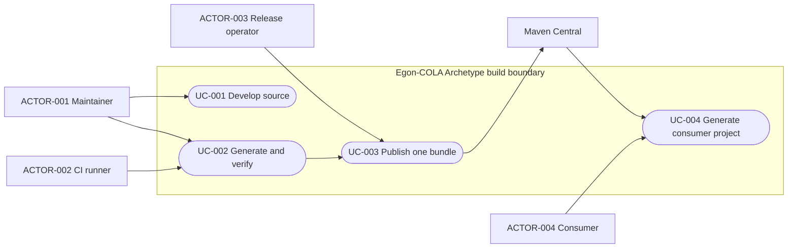
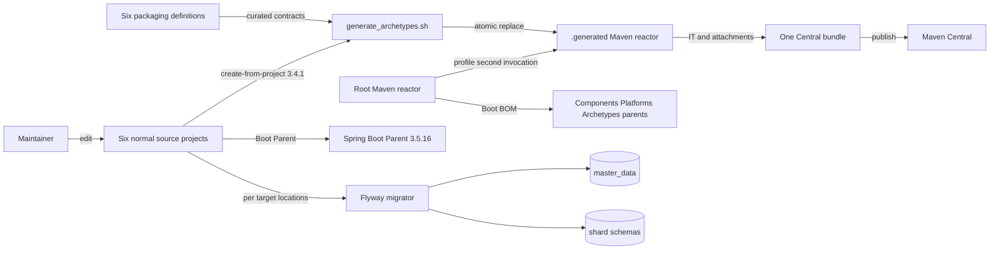
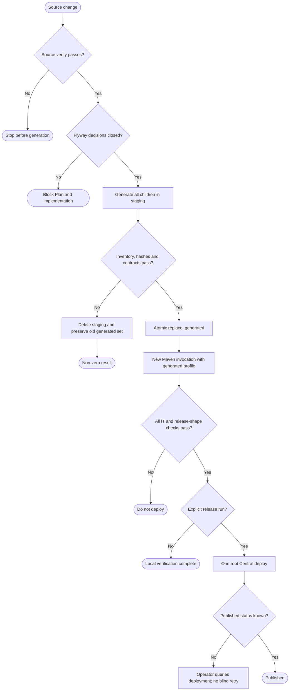

# Archetype 两阶段生成、Spring 依赖治理与 Flyway 收敛设计

| Field              | Value                                                                                                                                                                                        |
|--------------------|----------------------------------------------------------------------------------------------------------------------------------------------------------------------------------------------|
| Document           | 2026-09-03-11-04-archetype-generated-reactor-spring-flyway-design.md                                                                                                                         |
| Template Version   | 6                                                                                                                                                                                            |
| Status             | Accepted                                                                                                                                                                                     |
| Type               | Architecture                                                                                                                                                                                 |
| Complexity         | Complex                                                                                                                                                                                      |
| Complexity Drivers | 六个脚手架的源码与发布物分离、动态 Maven Reactor、Spring Boot 依赖管理层级、不可变 Flyway 历史与单文件诉求冲突、Central 单次发布一致性                                                                                                     |
| Created            | 2026-09-03 11:04 CST                                                                                                                                                                         |
| Updated            | 2026-09-03 13:38 CST                                                                                                                                                                         |
| Owner              | Egon-COLA maintainer                                                                                                                                                                         |
| Repository         | Egon-COLA                                                                                                                                                                                    |
| Scope              | egon-cola-archetypes、六个 source-projects、根及子 Reactor POM、Archetype 生成与发布脚本、Spring 版本治理、Light Service Web 的 Flyway 迁移布局                                                                        |
| Change Surface     | 删除旧的六个已提交 Archetype Maven 包装模块；保留六个正常源码工程；生成忽略入库的完整 Archetype Reactor；统一 Spring Boot Parent/BOM 职责；定义 Flyway 收敛决策边界                                                                          |
| Affected Chapters  | §7, §8, §9, §11, §13, §14, §15, §16, §17, §18                                                                                                                                                |
| Source Requirement | 只保留新的可正常开发、由 maven-archetype-plugin 生成并发布的结构；优化全部模块 Spring 依赖；Flyway 每个项目只留一个；先写新的 Spec                                                                                                      |
| Baseline Revision  | main at 9566c96796df73aa28e4a20de63c12379dcfdfeb with unrelated dirty worktree preserved                                                                                                     |
| Amends             | None                                                                                                                                                                                         |
| Supersedes         | None                                                                                                                                                                                         |
| Depends On         | None                                                                                                                                                                                         |
| Related Specs      | [两阶段源码生成前置设计](2026-08-27-20-31-archetype-two-stage-source-generation.md)                                                                                                                     |
| Related Plans      | [两阶段源码生成实现计划](../plan/2026-09-01-11-23-archetype-two-stage-source-generation-implementation.md); [当前生成 Reactor 实施计划](../plan/2026-09-03-13-38-archetype-generated-reactor-implementation.md) |

## 1. Summary

本设计把六套脚手架拆成两个明确阶段：日常开发只维护正常 Maven 源码工程；发布前由固定版本的
maven-archetype-plugin 从源码生成六个完整的 maven-archetype 模块，再由独立 Maven 调用完成
integration-test、附件组装和 Central deploy。旧的六个已提交包装模块从 Reactor 移除，其非历史内容从
Git移除；受不可变规则保护的十二个旧V SQL原路径只读保留。metadata、post-generate、IT、javadoc说明和
架构校验等非业务生成合同迁入 definitions 目录。

Spring 依赖采用分层治理：仓库根 Parent 统一导入 Spring Boot BOM；六个可运行的源码工程继续直接继承
spring-boot-starter-parent，并删除重复 BOM；公共组件 BOM 不接管消费者的整套 Spring 版本。用户于
2026-09-03 确认 Flyway 按 schema 角色收敛：Light、Service、Web 各增加 master-data 与 shard 两个
Baseline Migration；旧 V migration 原路径、原字节保留，供既有 schema history 兼容，Open 手工 SQL 不变。
Baseline 使用 Flyway 官方 B 前缀语义，新环境选择最新 baseline，已有迁移环境忽略 baseline。

成功标准是：源码工程可独立开发验证，生成目录不入库且可确定性重建，旧包装Maven模块身份不再存在且仅保留
批准的历史SQL archive，六个公开 GAV
与生成结果兼容，Spring 版本来源可由 effective POM 解释，发布仍为根 Reactor 的单个 Central bundle，
并且任何 Flyway 决策都不伪造历史安全性。

## 2. Background and Current State

### 2.1 Business and user context

当前脚手架业务代码已经复制到 source-projects 下的正常项目，但根 Archetype Reactor 仍引用六个旧的
maven-archetype 包装模块。旧模块把业务 Java、POM、配置和 SQL 放在 resources 内，开发反馈慢且容易形成
双事实源。用户确认要删除旧模块，仅保留正常源码和由插件生成后发布的派生物；同时希望统一 Spring 依赖层级，
并进一步要求 Flyway 每个项目只保留一个文件。

### 2.2 Repository evidence

| Evidence ID | Classification                           | Exact path/symbol/decision/command                                                               | Observed fact                                                                                                                                                         | Design significance                  | Verification limit/freshness |
|-------------|------------------------------------------|--------------------------------------------------------------------------------------------------|-----------------------------------------------------------------------------------------------------------------------------------------------------------------------|--------------------------------------|------------------------------|
| EVD-001     | Static repository                        | pom.xml modules                                                                                  | 根 Reactor 聚合 components、xingyuan、archetypes                                                                                                                          | 发布需保持根级单 Reactor 边界                  | 不证明 Central 远端状态             |
| EVD-002     | Static repository                        | egon-cola-archetypes/pom.xml modules                                                             | 当前仍列出两个 facade 和六个旧 Archetype 包装模块                                                                                                                                    | 旧包装模块尚未完成退出                          | 基于 baseline revision         |
| EVD-003     | Static repository                        | egon-cola-archetypes/source-projects/pom.xml                                                     | 内部验证 Reactor 聚合仓库依赖、两个 facade 和六个正常源码工程                                                                                                                               | 正常源码工程已具备独立 Maven 入口                 | 未证明全部模块当前全绿                  |
| EVD-004     | Static repository                        | egon-cola-archetypes/source-projects/egon-cola-source-light and five siblings                    | 六个目录具有普通 src/main/java、src/test/java、配置、文档与 POM                                                                                                                       | 可作为唯一业务事实源                           | 未执行运行时验证                     |
| EVD-005     | Static repository                        | six egon-cola-archetype-light/service/web families                                               | 每个旧模块包含 POM、archetype metadata、post-generate、IT、javadoc README 和业务 template resources                                                                                 | 删除前必须把非业务发布合同迁出                      | 只证明 tracked 内容               |
| EVD-006     | Static repository                        | scripts/generate_archetypes.sh                                                                   | 已调用 maven-archetype-plugin 3.4.1 create-from-project，使用 staging、锁和原子替换                                                                                                | 应扩展成完整 generated Reactor，而非另造生成器     | 未证明当前脚本产物可直接 deploy          |
| EVD-007     | Static repository                        | .gitignore and egon-cola-archetypes/.generated                                                   | 生成目录被忽略，当前只保留 archetype-resources 与 manifest hash                                                                                                                     | 目标需生成完整 Maven 模块且仍禁止入库               | 忽略规则不等于无 tracked 文件，需测试      |
| EVD-008     | Static repository                        | six source root POM files                                                                        | 六个源码根直接继承 spring-boot-starter-parent 3.5.16，同时又导入 spring-boot-dependencies 3.5.16                                                                                     | BOM 重复，应保留 Parent 并移除重复 import       | effective POM 尚未在本次执行        |
| EVD-009     | Static repository                        | pom.xml, egon-cola-components/pom.xml, egon-cola-xingyuan/pom.xml, egon-cola-archetypes/pom.xml | 根 POM 未导入 Boot BOM；三个一级子 Parent 分别重复声明 Boot 版本和 BOM                                                                                                                   | 版本治理应上移根 Parent                      | 不代表所有独立 IT POM 自动继承          |
| EVD-010     | Static repository                        | egon-cola-components-bom/pom.xml                                                                 | 公共 BOM 主要管理 Egon 组件 artifact                                                                                                                                          | 不应通过该 BOM 隐式接管消费者全部 Spring 生态        | 消费者兼容仍需 effective POM 检查     |
| EVD-011     | Static repository                        | repository POM inventory                                                                         | Springdoc 主要为 2.8.17，source-web 仍为 2.8.13                                                                                                                             | Springdoc 可在相关应用根以 BOM 2.8.17 对齐     | 需确认所有受影响 artifact 均在 BOM 内   |
| EVD-012     | Static repository plus local Maven cache | Boot 3.5.16 dependency BOM                                                                       | 管理 Spring Framework 6.2.19、Security 6.5.11、Jackson 2.21.4、Logback 1.5.34、SLF4J 2.0.18、Micrometer 1.15.12、JUnit 5.12.2、Lombok 1.18.46、Flyway 11.7.2、PostgreSQL 42.7.11 | 与 BOM 相同的局部版本可删除                     | 本地缓存事实不替代发布前官方兼容复核           |
| EVD-013     | Static repository                        | Flyway and PostgreSQL version properties                                                         | 仓库显式使用 Flyway 11.15.0 与 PostgreSQL 42.7.8，和 Boot BOM 不同                                                                                                               | 两者必须暂留为有记录的兼容覆盖，不能机械降级或升级            | 兼容意图未由测试证明                   |
| EVD-014     | Static repository                        | three source project db/migration trees                                                          | Light、Service、Web 各有四个 versioned migration，master-data 两个、shard 两个，共十二个 source 文件                                                                                     | 字面单文件要求会改写历史并合并角色                    | Open 变体无 Flyway migration    |
| EVD-015     | Static repository                        | three old package module db/migration trees                                                      | 旧包装模块还跟踪同一组十二个 migration 副本；全仓库现有 migration 共二十四个                                                                                                                     | 删除旧模块也触及不可删除的历史文件规则                  | 文件内容相等仍不授权删除                 |
| EVD-016     | Static repository                        | PhysicalDataSourceFlywayMigrator in Light Service Web                                            | migrator 按 target 排序，为每个物理数据源分别配置 location，执行 migrate 后 validate，失败即终止                                                                                                | 一个普通 SQL 无法同时表达两个独立角色而保持现状           | 未连接实际数据库                     |
| EVD-017     | Static repository                        | datasource/sharding.yml and sharding-readwrite.yml in Light Service Web                          | master_data 与 shard_0、shard_1 使用不同 primary 数据源和不同 Flyway locations                                                                                                    | master 与 shard 的 DDL 合同必须保持隔离        | 环境值未运行验证                     |
| EVD-018     | User and repository instruction          | Flyway absolute rule                                                                             | 已创建迁移不得修改、重命名、移动、删除或重排                                                                                                                                                | 与删除旧副本和合并 source migration 的字面要求直接冲突 | 需用户改变目标，不由实现者豁免              |
| EVD-019     | Prior validation evidence                | source-projects clean install baseline                                                           | AccessGuard starter 曾有 158 tests 中 18 failures 与 1 error，涉及 AccessGuardProperties binding                                                                             | 全 Reactor 绿灯存在独立基线阻断，不能误归因本改造        | 需在实施前重跑确认是否仍存在               |

### 2.3 Problem statement and gap

当前仓库同时保留正常源码与旧资源模板，导致模块清单、版本、Spring 依赖和 Flyway 文件均存在重复维护。
当前 generator 又只输出资源片段，无法作为第二阶段的完整 Maven Reactor 直接执行 packaging、IT 和 deploy。
Maven 在生命周期开始前解析 modules，因此不能在同一次 Reactor 生命周期中先生成一个尚不存在的 module，
再让该 module 参加后续阶段。

Flyway 还有更深的语义冲突。每个 legacy 项目的 master-data 与 shard 是两个物理 schema 角色，配置指向
不同 migration location。把四个历史文件合成一个并让两个 location 共用，会把主数据表建到 shard 或把业务
分片表建到 master；删改历史文件还破坏 checksum 和仓库强制规则。因此“每项目一个普通 SQL 文件”不是单纯
文件整理，而是数据库部署模型变更，必须先确认含义。

### 2.4 Evidence and current-chain map

| Entry/trigger | Current call chain                                                                                  | Data read/written                     | External dependency | Consumers                 | Evidence                  |
|---------------|-----------------------------------------------------------------------------------------------------|---------------------------------------|---------------------|---------------------------|---------------------------|
| 日常开发          | maintainer 修改 source-project -> Maven compile/test                                                  | tracked Java、POM、config、test          | Maven repositories  | 脚手架维护者                    | EVD-003, EVD-004          |
| 当前生成          | generate_archetypes.sh -> create-from-project -> normalize -> .generated resource fragment          | staging 与 ignored generated resources | Maven plugin 3.4.1  | CI、发布维护者                  | EVD-006, EVD-007          |
| 当前发布          | root release profile -> archetypes parent -> six old packaging modules -> Central plugin            | target artifacts、Central bundle       | Maven Central、GPG   | Release operator、消费者      | EVD-001, EVD-002, EVD-005 |
| Spring 解析     | child POM -> local parent/imported BOM -> dependency management                                     | effective POM                         | Maven repositories  | 全部 Java modules           | EVD-008 至 EVD-013         |
| Flyway 启动     | app config -> PhysicalDataSourceFlywayMigrator -> per-target Flyway location -> migrate -> validate | master_data、shard schemas             | PostgreSQL          | Light Service Web runtime | EVD-014 至 EVD-018         |

## 3. Goals and Non-goals

### 3.1 Goals

1. 六个脚手架只在正常 Maven 工程中开发，删除旧的已提交包装模块和业务模板副本。
2. 从正常源码确定性生成一个完整、忽略入库的 Archetype Maven Reactor。
3. 保留六个公开 Archetype GAV、metadata、post-generate、IT、生成结果和单 bundle 发布合同。
4. 把 Spring Boot 版本管理收敛到明确层级，消除重复 Parent/BOM 和可由 BOM 管理的冗余版本。
5. 对 Flyway 单文件目标给出基于物理数据源角色的可实施选项，不违反不可变历史规则。
6. 为后续 Plan 提供逐文件边界、CLI 合同、测试 Gate、迁移和回滚条件。

### 3.2 Non-goals

- 本 Spec 不修改生产源码、POM、SQL、workflow、脚本或测试。
- 不运行服务、浏览器、Docker、真实数据库、Central deploy 或 GPG 发布。
- 不改变六个脚手架的业务能力、包结构、HTTP/RPC/Event 合同或公开 GAV。
- 不把 source-projects 的样例应用发布到 Central。
- 不把 Egon 组件 BOM 变成强制消费者使用的 Spring Platform。
- 不在未决策时删除、合并、重命名、移动或改写任何 Flyway migration。
- 不以一次结构改造顺带升级 Spring Boot、Flyway 或 PostgreSQL 大版本。
- 不处理 AccessGuardProperties 的既有测试失败，除非后续单独授权。

### 3.3 Change Surface and Design Depth

| Area/layer                                     | Disposition    | Exact repository evidence   | Changed or preserved behavior/contract | Required Spec treatment | Chapter(s)                                |
|------------------------------------------------|----------------|-----------------------------|----------------------------------------|-------------------------|-------------------------------------------|
| Archetype source/definitions/generated Reactor | Affected       | EVD-002 至 EVD-007           | 单一源码事实源，非业务合同外置，完整生成 Reactor           | 完整架构、树、CLI、模式、测试、发布与风险  | §7, §8, §9, §13, §14, §15, §16, §17, §18  |
| Maven Parent 与 Spring dependencyManagement     | Affected       | EVD-008 至 EVD-013           | Boot BOM 上移，应用根保留 Boot Parent，例外版本有账本  | 完整依赖与兼容验证               | §7, §8, §13, §14, §15, §16, §17, §18      |
| Flyway migration 布局与执行合同                       | Affected       | EVD-014 至 EVD-018           | 单文件含义未决；现有角色隔离与历史不可变必须保留               | 完整数据库选项、测试、迁移和阻断        | §7, §8, §11, §13, §14, §15, §16, §17, §18 |
| CI、发布 workflow 与版本脚本                           | Affected       | EVD-001, EVD-006, EVD-019   | 串联源码、生成、IT、附件和 deploy Gate             | 完整 CLI/失败/恢复边界          | §7, §8, §9, §13, §14, §15, §16, §17, §18  |
| 业务 Java 类型与接口                                  | Unchanged      | EVD-004                     | 仅搬迁事实源，不改变运行时语义                        | 轮回编译和架构验证               | §10                                       |
| HTTP RPC Event 外部合同                            | Unchanged      | 六个 source 工程 adapter/facade | 路由、字段、错误与协议不变                          | 契约回归，不做接口重设计            | §9                                        |
| 前端页面                                           | Not applicable | 本范围没有独立页面改造                 | 无页面、路由、交互变化                            | 证据化 N/A                 | §12                                       |
| 关系表结构                                          | Context-only   | EVD-014 至 EVD-017           | 目标不授权表、列、索引变化                          | 仅验证 migration 角色等价      | §11                                       |

## 4. Requirements and Acceptance Criteria

| ID      | Atomic requirement                                                     | Priority | Observable acceptance criteria                                            | Source          |
|---------|------------------------------------------------------------------------|----------|---------------------------------------------------------------------------|-----------------|
| REQ-001 | 六个脚手架各保留一个正常 Maven 源码工程作为业务事实源                                         | Must     | 六个 source root 均可导入，Java、配置、测试、POM 不含 Archetype 模板占位符                     | 用户正常代码结构        |
| REQ-002 | 删除六个旧的已提交 Archetype Maven 包装模块                                         | Must     | 旧六目录不再 tracked，egon-cola-archetypes/pom.xml 不再列出它们                        | 用户旧模块可移除        |
| REQ-003 | 非业务 Archetype 合同进入 definitions 且不成为 Maven module                       | Must     | 每个公开 GAV 有 properties、metadata、post script、basic IT、javadoc README、架构校验定义 | 保持发布能力          |
| REQ-004 | 固定使用 maven-archetype-plugin 3.4.1 create-from-project 从六个源码生成          | Must     | 构建日志逐项目显示固定 goal 和版本，无自研模板引擎                                              | 用户 plugin 方案    |
| REQ-005 | .generated 包含一个完整 Maven aggregator 和六个完整 maven-archetype child modules | Must     | generated parent 可被独立 Maven 调用解析、verify、install 或 deploy                  | 两阶段发布           |
| REQ-006 | .generated 不入 Git且禁止手工编辑                                               | Must     | git ls-files 对 generated 目录为空，check 命令能发现手改和陈旧输出                          | 派生物边界           |
| REQ-007 | 生成清单动态来自 definitions，不在多个脚本重复六模块列表                                     | Must     | definition 数、source 数、generated child 数一一对应                               | 可迭代性            |
| REQ-008 | 全套生成具有锁、staging、原子替换和失败清理                                              | Must     | 中断或任一项目失败不产生新旧混合，可安全重跑                                                    | 发布一致性           |
| REQ-009 | 六个现有公开 Archetype GAV 与生成目录拓扑保持兼容                                       | Must     | 现有 archetype:generate 命令参数不变，生成项目 compile/test/verify 通过                  | 消费者兼容           |
| REQ-010 | 正常源码工程不进入 Central deploy                                               | Must     | staged artifacts 不包含 source-light、source-service、source-web 等内部 GAV       | 发布边界            |
| REQ-011 | 发布仍由根 Reactor 形成一个 Central bundle                                      | Must     | workflow 只调用一次最终 deploy，六个公开 GAV同批提交                                      | 当前发布合同          |
| REQ-012 | 根 Parent 统一提供 Spring Boot BOM 3.5.16 和 Boot plugin 版本                  | Must     | 子 Parent effective POM 的管理来源唯一且可追溯到根 POM                                  | Spring 优化       |
| REQ-013 | 六个可运行源码根继续直接继承 spring-boot-starter-parent 3.5.16，并移除重复 Boot BOM import | Must     | 每个应用根仅有一种 Boot 依赖管理入口且 starter 无冗余版本                                      | 用户 Parent 或 BOM |
| REQ-014 | 与 Boot BOM 相同的局部 Spring 生态版本删除，差异版本保留例外说明                              | Must     | effective POM 无版本漂移；Flyway 11.15.0 和 PostgreSQL 42.7.8 未被静默替换             | 安全依赖治理          |
| REQ-015 | 相关应用统一 Springdoc BOM 2.8.17                                            | Should   | source-web 不再使用 2.8.13，所有 Springdoc artifact 由同一 BOM 管理                   | 当前版本差异          |
| REQ-016 | Flyway 文件数量目标必须保持 master-data 与 shard 的迁移角色隔离                          | Must     | 每个物理 target 只执行其角色允许的 DDL，不出现跨角色建表                                        | 运行时安全           |
| REQ-017 | 任何既有 Flyway migration 的路径和字节不得改变                                       | Must     | 二十四个 baseline path 和 SHA-256 全部一致，无 delete、rename、modify                  | 仓库强制规则          |
| REQ-018 | Flyway 单文件语义和历史保留方式必须在实施 Plan 前获得用户确认                                  | Must     | DEC-005 与 DEC-006 由用户确认关闭，Plan 按每角色一个 Baseline Migration 展开               | 重大决策治理          |
| REQ-019 | Open 变体的手工 PostgreSQL SQL 默认不纳入 Flyway 单文件要求                           | Should   | Open SQL 保持原文件、路径和人工使用语义                                                  | 小范围解释           |
| REQ-020 | 所有发布前 Gate 失败均禁止 deploy                                                | Must     | source verify、generate/check、generated IT、附件检查任一非零时 deploy 不执行            | 发布安全            |

### 4.1 Scenario matrix

| Scenario      | Actor/trigger                    | Preconditions            | Main path                                | Alternative/failure path             | Data/state change        | Observable result    | Requirements              |
|---------------|----------------------------------|--------------------------|------------------------------------------|--------------------------------------|--------------------------|----------------------|---------------------------|
| 正常开发          | ACTOR-001 修改 source project      | Maven 依赖可解析              | 在正常 src 目录编译测试                           | 失败停在 source gate                     | 只改 tracked source        | 无需编辑 resources 模板    | REQ-001, REQ-006          |
| 完整生成          | ACTOR-001 或 ACTOR-002 执行 CLI-001 | definitions 与六 source 完整 | staging 生成六 child 和 parent，校验后替换         | 任一 child 失败则丢弃 staging               | ignored generated 集合原子更新 | CLI 返回零且 manifest 一致 | REQ-003 至 REQ-008         |
| 并发生成          | 两进程同时执行 CLI-001                  | 第一进程持锁                   | 第二进程 fail-fast                           | 中断清理临时目录和锁                           | 旧生成集合保留                  | 无混合代际                | REQ-008                   |
| 漂移检查          | CI 执行 CLI-002                    | fresh generation 可完成     | 重生成到临时目录并比较                              | 手改或陈旧结果返回非零                          | 不修改 authoritative source | 输出首个差异路径             | REQ-006, REQ-007, REQ-020 |
| 生成 Reactor 验证 | CI 执行 Maven generated profile    | CLI-001 成功               | 新 Maven invocation 解析 .generated 并跑六个 IT | metadata、附件或 generated project 失败即停止 | 仅 target 与本地仓库           | 六个公开 GAV构建完成         | REQ-005, REQ-009, REQ-020 |
| Spring 依赖解析   | CI 生成 effective POM              | Parent 和 BOM 可解析         | 比较来源、版本和 exception ledger                | 隐式降级或双 BOM 判失败                       | 无运行时状态                   | 六 source 与受影响模块版本一致  | REQ-012 至 REQ-015         |
| Flyway 两角色验证  | 测试装载 master 与 shard config       | 用户已选择可实施方案               | 分别验证 location 与允许对象                      | 任一跨角色 DDL 或旧 hash 变化阻断               | 隔离测试 schema 或静态解析        | 角色隔离且历史未变            | REQ-016 至 REQ-018         |
| 发布            | ACTOR-003 执行 CLI-003             | 所有 Gate 通过且凭据存在          | 根 deploy 提交单 bundle                      | 超时或状态未知不自动以同版本重发                     | Central 产生不可变制品          | 六 GAV可消费             | REQ-010, REQ-011, REQ-020 |
| 回滚结构改造        | 维护者发现生成合同回归                      | 尚未发布新版本                  | 回退 POM、脚本、definitions 和 source 结构提交      | 已发布 Central artifact 不可删除            | Git 回到旧构建结构              | 不改数据库历史              | REQ-009, REQ-017, REQ-020 |

### 4.2 Use-case analysis

#### 4.2.1 Actor inventory

| Actor ID  | Actor/role           | Goal and responsibility           | Entry/channel            | Permission/tenant context | Evidence         |
|-----------|----------------------|-----------------------------------|--------------------------|---------------------------|------------------|
| ACTOR-001 | Archetype maintainer | 在正常项目开发并生成可发布脚手架                  | Git、IDE、Maven CLI        | 仓库写权限，无业务 tenant          | 用户要求、EVD-004     |
| ACTOR-002 | CI runner            | 从 fresh checkout 确定性验证源码、生成物和发布形状 | GitHub Actions、Maven     | runner 权限，默认无发布 secrets   | EVD-006, EVD-019 |
| ACTOR-003 | Release operator     | 审核并触发单 bundle Central 发布          | workflow dispatch        | 受保护分支和 Central/GPG 权限     | EVD-001          |
| ACTOR-004 | Archetype consumer   | 用稳定 GAV 生成新项目                     | Maven archetype:generate | 只需 Maven repository 读取权限  | EVD-005          |

#### 4.2.2 Use-case artifact



| ID     | Use case/goal             | Primary actor | Supporting actors/systems | Trigger            | Preconditions         | Main success outcome         | Alternatives/failures | Postconditions        | Requirements               | Interfaces/pages      | Tests               |
|--------|---------------------------|---------------|---------------------------|--------------------|-----------------------|------------------------------|-----------------------|-----------------------|----------------------------|-----------------------|---------------------|
| UC-001 | 在正常目录开发六类脚手架              | ACTOR-001     | Maven                     | source 变更          | source Reactor 可解析    | compile/test 给出直接反馈          | baseline failure 单独归因 | tracked source 是唯一事实源 | REQ-001, REQ-012 至 REQ-015 | Maven source reactor  | TEST-001 至 TEST-004 |
| UC-002 | 生成并验证完整 Archetype Reactor | ACTOR-001     | ACTOR-002, Maven plugin   | CLI-001 或 CLI-002  | definitions/source 对齐 | 六 child 与 parent 原子生成且 IT 通过 | 锁、漂移、IT 失败均停止         | .generated 可重建        | REQ-003 至 REQ-009, REQ-020 | CLI-001, CLI-002      | TEST-005 至 TEST-012 |
| UC-003 | 发布一个 Central bundle       | ACTOR-003     | ACTOR-002, Central        | CLI-003            | 所有 Gate 通过            | 六公开 GAV同批 deploy             | 远端未知状态人工核对            | 不发布 source projects   | REQ-010, REQ-011, REQ-020  | CLI-003               | TEST-013 至 TEST-015 |
| UC-004 | 生成兼容项目                    | ACTOR-004     | Central, Maven            | archetype:generate | GAV 已发布               | 生成拓扑与现有合同一致                  | GAV或模板错误明确失败          | 消费项目可 verify          | REQ-009                    | 现有 Maven consumer CLI | TEST-010, TEST-015  |

## 5. Constraints, Assumptions, and Decisions

### 5.1 Confirmed constraints

- Maven Reactor 在生命周期执行前解析 module，因此生成和构建 .generated 必须是两个 Maven invocation。
- .generated 是可删除、可重建、不可手改、不可 tracked 的派生物。
- 六个公开 Archetype 坐标和消费者命令保持不变。
- 正常源码应用可直接继承 Boot Parent；非应用聚合 Parent 通过根 BOM 获得统一版本。
- 任何版本清理必须由 effective POM 证明，不允许仅凭属性名推断安全。
- 已创建 Flyway migration 不允许修改、移动、重命名、删除或重排。
- 不自动启动服务、数据库、浏览器、Docker 或真实发布。

### 5.2 Small-gap assumptions

| ID      | Inference                                    | Repository evidence                                   | Why locally reversible | Impact if wrong  |
|---------|----------------------------------------------|-------------------------------------------------------|------------------------|------------------|
| ASM-001 | 两个 facade 模块不是用户所称旧 Archetype 模块，继续保留        | source service/web 依赖 facade，目录不含 archetype packaging | 可在 Plan 前调整聚合清单        | 删除会导致源码编译失败      |
| ASM-003 | Spring Boot 基线保持 3.5.16，不在本改造升级              | 多个现有 Parent/BOM 已使用 3.5.16                            | 后续可独立升级                | 同时升级会放大回归面       |
| ASM-004 | Flyway 11.15.0 与 PostgreSQL 42.7.8 暂视为显式兼容例外 | 当前属性与 Boot BOM 管理值不同                                  | 可在独立依赖验证后删除例外          | 机械替换可能改变迁移或驱动行为  |

### 5.3 Resolved decisions

| ID      | Decision                                                                             | Decision owner               | Evidence and rationale                       | Requirements      |
|---------|--------------------------------------------------------------------------------------|------------------------------|----------------------------------------------|-------------------|
| DEC-001 | source-projects 是唯一业务源码事实源                                                           | User                         | 正常 src 结构解决开发迭代痛点                            | REQ-001, REQ-002  |
| DEC-002 | definitions 只保存非业务 Archetype 合同，生成完整 .generated Reactor                              | Spec design                  | 保留 metadata/IT 又不恢复双业务源码                     | REQ-003 至 REQ-008 |
| DEC-003 | 根 Archetype POM 以 generated-archetypes profile 引用一个 .generated module                | Spec design                  | fresh checkout 默认可解析；第二次 Maven 调用显式启用        | REQ-005, REQ-011  |
| DEC-004 | Spring 采用根 BOM加应用 Boot Parent 的分层混合，而不是全仓强制一种 parent                                 | User choice bounded by Maven | Maven 单继承限制且应用需要 Boot plugin defaults        | REQ-012 至 REQ-015 |
| DEC-005 | Flyway 按 schema 角色收敛，Light、Service、Web 每个项目保留 master-data 与 shard 两个 active baseline | User                         | 2026-09-03 用户确认推荐方案；物理数据源角色不能合并              | REQ-016 至 REQ-018 |
| DEC-006 | 二十四个既有 V migration 原路径原字节保留；旧包装模块中的十二个文件作为只读 archive 且不进入 Reactor                    | User                         | 2026-09-03 用户确认；满足不可变历史规则并让旧 Maven module 退出 | REQ-002, REQ-017  |
| DEC-007 | Flyway 11.15.0 与 PostgreSQL 42.7.8 本次保留为显式兼容例外                                       | User                         | 2026-09-03 对推荐方案的确认；避免依赖治理夹带版本切换             | REQ-014           |
| DEC-008 | Open 变体手工 PostgreSQL SQL 不纳入 Flyway 收敛                                               | User                         | 2026-09-03 用户确认；Open 无 Flyway runtime        | REQ-019           |

### 5.4 Open major decisions

None。DEC-005 至 DEC-008 已由用户在 2026-09-03 的 Plan 确认消息中关闭。

## 6. Project Technology Context

| Concern               | Current choice                          | Repository evidence           | Constraint on design         |
|-----------------------|-----------------------------------------|-------------------------------|------------------------------|
| Language/runtime      | Java and Maven multi-module             | root and source POMs          | 不引入第二构建系统                    |
| Framework             | Spring Boot 3.5.16                      | source root parents           | 保持应用 Parent 能力               |
| Dependency management | repeated Boot BOM plus local versions   | EVD-008 至 EVD-013             | 收敛来源但不机械改差异版本                |
| Archetype             | Maven Archetype Plugin 3.4.1            | generator script              | 固定官方 create-from-project     |
| Database migration    | Flyway per physical datasource location | migrator and YAML             | 角色隔离先于文件数量                   |
| Test                  | Maven, JUnit, Groovy Archetype IT       | POM and basic IT definitions  | 分层 Gate，禁止把静态验证说成 live proof |
| Release               | Maven Central root deploy and signing   | root release profile/workflow | 单 bundle、不重发未知状态版本           |

### 6.1 Java architecture profile and capability baseline

| Architecture profile                            | Archetype/template or base package | Exact evidence and verifier                                 | Existing deviations   | Design action                 |
|-------------------------------------------------|------------------------------------|-------------------------------------------------------------|-----------------------|-------------------------------|
| Egon-COLA Light / Service / Web / Open variants | six source-projects roots          | source POM/module trees and existing architecture verifiers | 本次只改变来源与构建，不改 profile | 精确保留六种现有 profile，不混入传统 biz 三层 |

| Need            | Spring/JDK candidate             | Spring Boot Starter candidate     | Egon-COLA/module candidate       | Proven gap                  | Decision/dependency impact |
|-----------------|----------------------------------|-----------------------------------|----------------------------------|-----------------------------|----------------------------|
| 应用依赖默认值         | Maven Parent inheritance         | spring-boot-starter-parent 3.5.16 | root dependencyManagement        | source 根已有 Parent但重复 import | 保留 Parent，删除重复 BOM         |
| 非应用模块 Spring 版本 | Maven dependencyManagement       | spring-boot-dependencies 3.5.16   | root Parent                      | 一级 Parent 重复 import         | 根导入一次，子继承                  |
| OpenAPI 版本族     | None                             | Springdoc BOM 2.8.17              | 相关 source roots                  | source-web 2.8.13 漂移        | 相关根 import Springdoc BOM   |
| Archetype 生成    | ProcessBuilder custom plugin 不需要 | None                              | existing generate_archetypes.sh  | 当前只生成资源片段                   | 扩展脚本并复用官方 plugin           |
| Flyway 角色选择     | Flyway locations                 | Flyway auto config 不足以覆盖多物理源      | PhysicalDataSourceFlywayMigrator | 单普通 SQL不能区分角色               | 先决策，不引入自定义引擎               |

### 6.2 User-mandated Java rule compliance

| Literal rule | Affected? | Repository evidence                          | Exact design decision                                              | Files/types/interfaces               | Validation/test evidence                     | Status/blocker |
|--------------|-----------|----------------------------------------------|--------------------------------------------------------------------|--------------------------------------|----------------------------------------------|----------------|
| Rule 1       | No        | 本 Spec 不增改 Java 类型，仅搬迁等价源码                   | 保留全部现有语义后缀，不重命名类                                                   | six source Java trees                | source-to-generated path and class inventory | N/A            |
| Rule 2       | No        | 无新增 Controller/Service 参数边界                  | 不改变 validation annotations 或 groups                                | existing business methods            | generated consumer regression                | N/A            |
| Rule 3       | No        | 无新增 POJO、转换器或实体                              | 不改变 record/Lombok/MapStruct 结构                                     | existing domain types                | byte and compile comparison                  | N/A            |
| Rule 4       | No        | 无业务类、Bean 或注入语义变化                            | 保留 Slf4j、Bean names、constructor injection                          | existing configs                     | context tests where already present          | N/A            |
| Rule 5       | No        | 生成脚本使用现有 shell/Maven，不增 Java utility         | 不引入 Java helper 替代已有库                                              | scripts only                         | dependency diff review                       | N/A            |
| Rule 6       | No        | HTTP/RPC/Event JSON 合同不变                     | 不改 Jackson annotations/defaults                                    | existing DTOs                        | existing contract tests                      | N/A            |
| Rule 7       | Yes       | master/shard YAML locations 与 migration 目录相关 | 不改任何环境 key 或 location；B migration 与旧 V migration 共处原 role location | datasource YAML and Flyway locations | profile key parity and target-location tests | PASS           |
| Rule 9       | No        | 改造复杂度在构建编排而非新增业务逻辑                           | 采用脚本流水线，无业务 Strategy/Factory 类                                     | generator and Maven POMs             | CLI branch tests                             | N/A            |
| Rule 10      | No        | 无时间字段或 API 时间语义变化                            | 保留现有 java.time 使用                                                  | existing models                      | compile and serialization regression         | N/A            |
| Rule 11      | Yes       | 六个 source trees 已对应允许的 Egon-COLA variants    | 生成不得改变各 variant 模块和包依赖                                             | source and generated trees           | architecture verifier for all six            | PASS           |

## 7. Architecture Design

### 7.0 Minimum-design baseline and element-necessity audit

| Proposed element                   | Change        | Requirements     | Existing/direct alternative  | Concrete inadequacy of alternative | Added calls/state/coupling/failures/migration/operations | Verdict |
|------------------------------------|---------------|------------------|------------------------------|------------------------------------|----------------------------------------------------------|---------|
| source-projects six roots          | Keep          | REQ-001          | 继续编辑 resources 模板            | 不能直接编译且双事实源                        | 无新增运行时调用                                                 | Keep    |
| definitions six directories        | New           | REQ-003, REQ-007 | 保留旧 Maven module             | 会保留业务 template 副本和 deploy module   | 一组静态合同文件                                                 | Add     |
| .generated aggregator              | Expand        | REQ-005, REQ-006 | 只输出 resource fragment        | 不能直接进入 Maven IT/deploy             | 生成阶段多一个 POM                                              | Add     |
| generated-archetypes Maven profile | New           | REQ-005, REQ-011 | 默认 modules 直接引用 .generated   | fresh checkout 在生命周期前解析失败          | 发布多一次 Maven invocation                                   | Add     |
| root Boot BOM import               | Expand        | REQ-012          | 三个子 Parent各自 import          | 版本来源重复并易漂移                         | 无运行时成本                                                   | Add     |
| custom Flyway conditional engine   | New candidate | REQ-016          | Flyway B baseline 原生支持新旧环境分流 | 官方机制已足够                            | 新代码、方言、测试、运行风险                                           | Remove  |
| read-only migration archive        | Keep boundary | REQ-002, REQ-017 | 直接删除旧副本                      | 违反不可删除规则                           | 旧包装目录只保留原路径 SQL，不进入 Reactor                              | Keep    |

| Path            | Network calls            | Client states                    | Server contracts/state | Failure and TOCTOU points | Additional user/business value |
|-----------------|--------------------------|----------------------------------|------------------------|---------------------------|--------------------------------|
| Direct baseline | 每项目一次 plugin 依赖解析        | source、staging、generated         | 无运行时服务合同               | plugin failure、文件漂移       | 正常源码到完整 Archetype              |
| Selected design | 同 baseline，发布另一次 Maven解析 | 增加 generated aggregator manifest | Central GAV保持不变        | 加锁、原子替换、Gate failure      | fresh checkout 安全和单 bundle     |
| 单 SQL自定义方案      | baseline 加自定义迁移执行路径      | 增加 role context                  | Flyway runtime 合同变化    | 角色识别错误、方言分支               | 仅满足字面文件数，无业务增益                 |

### 7.1 System Architecture Design

#### 7.1.1 Architecture Mermaid view



#### 7.1.2 Boundary and responsibility table

| Module/component                 | Capability and data owned | Inputs/outputs                         | Allowed dependencies                 | Forbidden responsibility          | Requirements      |
|----------------------------------|---------------------------|----------------------------------------|--------------------------------------|-----------------------------------|-------------------|
| source-projects                  | 业务源码事实源                   | Java/POM/config/test/docs              | existing Egon modules and Maven deps | 不保存 Archetype metadata，不直接 deploy | REQ-001, REQ-010  |
| definitions                      | 公开打包合同                    | metadata/properties/post/IT/docs       | source identity only                 | 不含业务 Java/POM/config 副本           | REQ-003, REQ-007  |
| generator                        | 一次完整派生                    | source+definition to staging/generated | Maven Archetype Plugin 3.4.1         | 不发布、不修业务源码                        | REQ-004 至 REQ-008 |
| .generated reactor               | 可构建发布派生物                  | aggregator and six children            | archetypes parent                    | 不成为事实源、不 tracked                  | REQ-005, REQ-006  |
| root/archetypes parents          | 版本和 Reactor 编排            | profiles/dependency management         | Maven plugins/BOM                    | 不在同 invocation生成再引用 module        | REQ-011 至 REQ-014 |
| PhysicalDataSourceFlywayMigrator | 每物理 target迁移              | target, location, result               | Flyway and datasource config         | 不把 master/shard SQL混跑             | REQ-016, REQ-017  |

### 7.2 High-Level Design

默认构建只验证正常源码和已提交模块，不要求 .generated 存在。生成命令读取 definitions 形成唯一 inventory，
逐项调用官方插件，把自动生成的 resource tree 与 curated contract 组合成完整 child POM，并生成内部 aggregator。
全部项目和 manifest 校验成功后才原子替换 .generated。随后新的 Maven invocation 启用 generated-archetypes
profile，完成 Archetype IT、consumer verify、release shape 和最终 deploy。

Spring 管理分两类：可运行 source root直接继承 Boot Parent；其他仓库 Parent 从根 dependencyManagement
继承 Boot BOM。局部显式版本只有在 BOM未管理或已登记为兼容例外时保留。Flyway 保持 per-target location，
Flyway 每个角色增加一个 B prefix 的 cumulative baseline；现有 V migration 不改，配置 location 不改。

#### 7.2.1 Critical business/control flowchart



#### 7.2.2 High-level decision and quality matrix

| Concern/use case | Required behavior        | Selected mechanism                                  | Failure/degradation behavior     | Trade-off             | Verification        | Requirements              |
|------------------|--------------------------|-----------------------------------------------------|----------------------------------|-----------------------|---------------------|---------------------------|
| 源码所有权            | 业务内容只维护一次                | normal source roots plus definitions-only contracts | 双副本检测直接失败                        | 生成前多一步                | TEST-001, TEST-006  | REQ-001 至 REQ-003         |
| 生成一致性            | 六 child同代际               | lock, staging, full validation, atomic rename       | 旧集合保留或无集合                        | 需要临时磁盘                | TEST-007, TEST-008  | REQ-005 至 REQ-008         |
| 依赖可解释性           | Boot版本单一来源               | root BOM and application Parent                     | effective POM drift blocks build | 少量显式 exception ledger | TEST-003, TEST-004  | REQ-012 至 REQ-015         |
| 数据库安全            | master/shard DDL隔离且历史不可变 | per-role locations，等待用户选项                           | 决策未关闭不实施                         | 暂不能满足字面单文件            | TEST-016 至 TEST-019 | REQ-016 至 REQ-018         |
| 发布原子性            | 只发布公开 GAV                | second Maven invocation and one bundle              | 任一 Gate失败不 deploy                | 流水线更长                 | TEST-013 至 TEST-015 | REQ-010, REQ-011, REQ-020 |

### 7.3 Detailed Design

#### 7.3.1 Detailed component collaboration

| Step | Caller -> callee                   | Contract/symbol                | Input/output mapping                   | State/data effect         | Failure behavior                | Requirements              |
|------|------------------------------------|--------------------------------|----------------------------------------|---------------------------|---------------------------------|---------------------------|
| 1    | maintainer or CI -> source reactor | Maven verify                   | six sources to compiled/tested outputs | target only               | non-zero stops                  | REQ-001, REQ-020          |
| 2    | caller -> CLI-001                  | generate                       | definitions plus sources to staging    | temporary files and lock  | fail-clean                      | REQ-003 至 REQ-008         |
| 3    | CLI-001 -> Maven plugin            | create-from-project 3.4.1      | normal POM/tree to generated resources | staging child             | plugin error stops all          | REQ-004                   |
| 4    | CLI-001 -> contract assembler      | curated metadata and child POM | definition to final child layout       | staging child complete    | missing contract stops all      | REQ-003, REQ-005          |
| 5    | CLI-001 -> filesystem              | atomic swap                    | validated staging to .generated        | generated set replaced    | old set preserved before commit | REQ-006, REQ-008          |
| 6    | CI -> CLI-002                      | check                          | fresh temp generation versus expected  | read-only except temp     | diff returns non-zero           | REQ-006, REQ-020          |
| 7    | CLI-003 -> Maven root              | release profile                | generated children to one bundle       | target and remote staging | unknown remote state reconciled | REQ-010, REQ-011, REQ-020 |

#### 7.3.2 Critical-path Mermaid swimlane

```mermaid
sequenceDiagram
    actor M as Maintainer or CI
    participant S as Source Reactor
    participant G as Generator
    participant P as Archetype Plugin 3.4.1
    participant F as Filesystem
    participant R as Generated Reactor
    participant C as Maven Central
    M->>S: clean verify
    alt Source failure
        S-->>M: non-zero; stop
    else Source passes
        M->>G: CLI-001 generate
        G->>F: acquire lock and create staging
        loop six definitions
            G->>P: create-from-project
            P-->>G: generated resources
            G->>G: compose and validate contract
        end
        alt Generation failure
            G->>F: remove staging; keep old set
            G-->>M: non-zero
        else Generation passes
            G->>F: atomic replace .generated
            M->>R: second Maven invocation
            alt IT or attachment failure
                R-->>M: non-zero; no deploy
            else Explicit release and all gates pass
                R->>C: one deploy bundle
                C-->>M: published or diagnosable remote state
            end
        end
    end
```

#### 7.3.3 Transactions, consistency, concurrency, and idempotency

| Concern/state change  | Owner and boundary       | Mechanism/isolation/lock                                    | Concurrent or duplicate behavior                                                | Commit/visibility point            | Failure result                    | Requirements/tests                     |
|-----------------------|--------------------------|-------------------------------------------------------------|---------------------------------------------------------------------------------|------------------------------------|-----------------------------------|----------------------------------------|
| generated set         | CLI-001 process          | repository-local exclusive lock and same-filesystem staging | second process fail-fast；repeat with same inputs yields same normalized content | atomic directory replacement       | old complete set remains          | REQ-006, REQ-008 / TEST-007, TEST-008  |
| Maven artifacts       | local Maven/target       | versioned GAV and Reactor ordering                          | local rebuild allowed；remote release version不可覆盖                                | install or Central accepted        | target可清理；remote unknown需查询       | REQ-009 至 REQ-011 / TEST-013           |
| Flyway schema history | each physical datasource | Flyway schema history table and per-role location           | existing version checksum immutable                                             | database transaction per migration | role target failure stops startup | REQ-016, REQ-017 / TEST-016 至 TEST-019 |

#### 7.3.4 Failure semantics, recovery, and reconciliation

| Failure point        | Detection                                       | Immediate control flow        | Data/transaction state        | Retry and idempotency             | Caller/frontend result        | Recovery/reconciliation owner | Verification        |
|----------------------|-------------------------------------------------|-------------------------------|-------------------------------|-----------------------------------|-------------------------------|-------------------------------|---------------------|
| source verify        | Maven non-zero                                  | stop before generate          | tracked source unchanged      | fix source and rerun              | CLI error                     | maintainer                    | TEST-001            |
| plugin conversion    | goal non-zero or missing output                 | abort loop and cleanup        | old generated set unchanged   | safe after fixing input           | named source/definition error | maintainer                    | TEST-007            |
| contract drift       | hash/path/metadata diff                         | no atomic swap or check fails | only temp data                | regenerate after source fix       | first differing path          | maintainer/CI                 | TEST-006, TEST-009  |
| generated IT         | Maven non-zero                                  | skip deploy                   | local target only             | fix source/definition and rebuild | module/test identifier        | maintainer                    | TEST-010 至 TEST-012 |
| Flyway role mismatch | static contract test or isolated migration test | block release                 | no production DB change in CI | no automatic workaround           | role and object mismatch      | maintainer plus user decision | TEST-016 至 TEST-019 |
| Central timeout      | workflow timeout/status unknown                 | do not resend same version    | remote state unknown          | query deployment id first         | explicit unresolved release   | release operator              | TEST-015            |

#### 7.3.5 Observability and operational boundaries

| Signal/runbook          | Emitting owner and point      | Fields/dimensions                                  | Sensitive-data rule         | Success/failure threshold | Alert/dashboard/operator action           | Verification boundary          |
|-------------------------|-------------------------------|----------------------------------------------------|-----------------------------|---------------------------|-------------------------------------------|--------------------------------|
| generation summary      | CLI-001 after each definition | artifactId, source path, hash, result, elapsed     | 不输出 settings credentials    | six success required      | inspect named failure and staging cleanup | CLI integration                |
| dependency report       | CI effective POM gate         | module, artifact, resolved version, source manager | 不输出 repository credentials  | zero duplicate/drift      | review exception ledger                   | static Maven proof             |
| Flyway inventory report | CI before build               | project, role, path, SHA-256                       | 无数据库密码                      | all baseline hashes exact | block and review Git diff                 | static plus isolated DB only   |
| release status          | workflow/Central plugin       | deployment id, version, state                      | mask token and GPG material | published required        | query Central on unknown                  | live only when user authorizes |

#### 7.3.6 Conclusion evidence chain

| Conclusion              | Repository/user evidence                            | Constraint or requirement | Design decision                                                    | Consequence and trade-off                 | Verification and acceptance evidence |
|-------------------------|-----------------------------------------------------|---------------------------|--------------------------------------------------------------------|-------------------------------------------|--------------------------------------|
| 需要两个 Maven invocation   | EVD-006, EVD-007 and Maven module resolution timing | REQ-005, REQ-011          | default source build plus generated-archetypes profile second call | fresh checkout可用但流水线多一步                   | TEST-005, TEST-013                   |
| Spring 要分层而非全仓统一 Parent | EVD-008 至 EVD-013                                   | REQ-012 至 REQ-015         | root BOM plus application Boot Parent and exception ledger         | 来源清晰，仍保留少量兼容覆盖                            | TEST-003, TEST-004                   |
| Flyway 不能直接合成一个普通 SQL   | EVD-014 至 EVD-018                                   | REQ-016 至 REQ-018         | 每角色增加一个 Flyway B baseline，旧 V 历史不变                                 | 每项目两个 active baseline，兼容既有 schema history | TEST-016 至 TEST-019                  |

## 8. Package Structure and Code File Tree

### 8.1 Current relevant tree

```text
egon-cola-archetypes
├── pom.xml
├── source-projects
│   ├── pom.xml
│   └── six egon-cola-source projects with normal src trees
├── six egon-cola-archetype Maven modules
│   ├── pom.xml
│   ├── src/main/resources/archetype-resources
│   ├── src/main/resources/META-INF
│   ├── src/main/javadoc
│   └── src/test/resources/projects/basic
└── .generated
    └── six resource fragments plus manifests
```

### 8.2 Target tree

```text
pom.xml                                                    MODIFY root Boot BOM and plugin management
egon-cola-archetypes
├── pom.xml                                                MODIFY remove old modules; add generated profile
├── source-projects
│   ├── pom.xml                                            MODIFY source verification only
│   ├── egon-cola-source-light                             KEEP normal source
│   ├── egon-cola-source-light-open                        KEEP normal source
│   ├── egon-cola-source-service                           KEEP normal source
│   ├── egon-cola-source-service-open                      KEEP normal source
│   ├── egon-cola-source-web                               KEEP normal source
│   └── egon-cola-source-web-open                          KEEP normal source
├── definitions                                            CREATE non-Maven packaging contracts
│   ├── egon-cola-archetype-light
│   ├── egon-cola-archetype-light-open
│   ├── egon-cola-archetype-service
│   ├── egon-cola-archetype-service-open
│   ├── egon-cola-archetype-web
│   └── egon-cola-archetype-web-open
└── .generated                                             GENERATED and ignored
    ├── pom.xml                                            GENERATED private aggregator
    └── six public maven-archetype child modules           GENERATED complete modules

egon-cola-archetypes/egon-cola-archetype-light             REMOVE Maven module; KEEP immutable Flyway archive paths
egon-cola-archetypes/egon-cola-archetype-light-open        DELETE
egon-cola-archetypes/egon-cola-archetype-service           REMOVE Maven module; KEEP immutable Flyway archive paths
egon-cola-archetypes/egon-cola-archetype-service-open      DELETE
egon-cola-archetypes/egon-cola-archetype-web               REMOVE Maven module; KEEP immutable Flyway archive paths
egon-cola-archetypes/egon-cola-archetype-web-open          DELETE
scripts/generate_archetypes.sh                             MODIFY generate full reactor
scripts/check_archetypes.sh                                CREATE deterministic drift gate
scripts/publish_maven_central.sh                           MODIFY or CREATE single release orchestrator
.github/workflows                                           MODIFY affected CI and Central workflows
```

Flyway target subtree按 DEC-005/006 使用同 location 的 B baseline；Plan 不得对既有 migration 路径安排
DELETE、MOVE、RENAME 或 MODIFY 操作。

### 8.3 Package and file responsibilities

| Operation     | Path/package                                                   | Symbols                               | Responsibility                                      | Dependencies            | Requirements               |
|---------------|----------------------------------------------------------------|---------------------------------------|-----------------------------------------------------|-------------------------|----------------------------|
| Modify        | pom.xml                                                        | dependencyManagement/pluginManagement | Boot BOM and plugin source of truth                 | Boot 3.5.16             | REQ-012                    |
| Modify        | egon-cola-archetypes/pom.xml                                   | generated-archetypes profile          | reference ignored reactor only on second invocation | .generated/pom.xml      | REQ-005, REQ-011           |
| Keep/Modify   | six source root POMs                                           | parent/dependencyManagement           | normal development and Boot Parent boundary         | root and Boot Parent    | REQ-001, REQ-013 至 REQ-015 |
| Create        | definitions six directories                                    | packaging descriptors                 | curated non-business contracts                      | source identity         | REQ-003, REQ-007           |
| Modify        | scripts/generate_archetypes.sh                                 | CLI-001                               | full atomic generation                              | Maven plugin            | REQ-004 至 REQ-008          |
| Create        | scripts/check_archetypes.sh                                    | CLI-002                               | drift and reproducibility check                     | CLI-001                 | REQ-006, REQ-020           |
| Modify/Create | release script and workflows                                   | CLI-003                               | ordered gates and one deploy                        | Maven, Central plugin   | REQ-010, REQ-011, REQ-020  |
| Delete        | six old module non-Flyway content                              | old packaging modules                 | remove duplicate module/source                      | definitions replacement | REQ-002                    |
| Keep/Create   | twenty-four existing migration paths plus six B baseline paths | versioned/baseline SQL                | immutable history plus cumulative role DDL          | Flyway                  | REQ-016 至 REQ-018          |

## 9. Interface Definitions

本章只把改变的构建 CLI 视为接口。业务 HTTP、RPC、Event 合同保持不变，仅由生成消费者回归覆盖。

### 9.1 Interface Inventory

| ID      | Change/necessity verdict | Name/purpose              | Kind         | Consumer         | Owner                                | Method + URL / symbol / topic                     | Input                                  | Output                        | Auth/tenant                       | Error model                         | Idempotency/version        | Requirements |
|---------|--------------------------|---------------------------|--------------|------------------|--------------------------------------|---------------------------------------------------|----------------------------------------|-------------------------------|-----------------------------------|-------------------------------------|----------------------------|--------------|
| CLI-001 | Existing/Modify          | 生成完整 Archetype Reactor    | CLI          | maintainer, CI   | scripts/generate_archetypes.sh       | repository checkout and optional project selector | ignored .generated reactor             | local filesystem rights       | non-zero plus named stage/project | locked, deterministic, plugin 3.4.1 | REQ-003 至 REQ-008          |
| CLI-002 | New/Add                  | 校验生成物无漂移                  | CLI          | CI, maintainer   | scripts/check_archetypes.sh          | clean source and definitions                      | zero or structured diff                | local filesystem rights       | non-zero plus first differences   | read-only authoritative files       | REQ-006, REQ-007, REQ-020  |
| CLI-003 | Existing/Modify          | 执行发布 Gate和单 bundle deploy | CLI/workflow | release operator | release wrapper and publish workflow | version/profile/settings/signing context          | local artifacts and Central deployment | protected branch plus secrets | fail-fast or remote unknown state | release GAV immutable               | REQ-009 至 REQ-011, REQ-020 |

### 9.2 Per-interface Detailed Contracts

#### 9.2.1 CLI-001 — Generate complete Archetype reactor

##### Necessity and interaction-cost decision

| Concern                             | Decision                                            |
|-------------------------------------|-----------------------------------------------------|
| Change classification               | Existing CLI modified                               |
| Independent consumer goal           | 维护者和 CI 需要把正常源码转成可验证、可发布的 Maven Reactor             |
| Parameter ownership and derivation  | definitions 拥有 artifact identity，source path由同名定义映射 |
| Direct/no-new-interface alternative | 直接 deploy source 会发布错误制品；保留旧模块会恢复双事实源               |
| Caller use of result                | 第二次 Maven调用解析 child modules并执行 IT                   |
| Round trips and failure points      | 每定义一次 plugin conversion；锁、转换、组合、校验、替换均可明确失败         |
| Verdict                             | Keep and modify under REQ-003 至 REQ-008             |

##### Identity and purpose

CLI-001 是 repository-local shell contract，由 scripts/generate_archetypes.sh 拥有。它只能在仓库根或能解析
仓库根的环境执行，固定 Maven Archetype Plugin 3.4.1，不接受发布凭据，也不执行 deploy。

##### Request parameters

输入为 repository checkout。可选 project selector 只能引用 definitions 中存在的 artifactId；无 selector
表示全量六项目生成。CI与发布必须使用全量模式，局部模式不得原子替换正式全量 .generated 集合。

##### Success response

退出码 0；标准输出逐项给出 artifactId、源目录、definition、content hash 和 elapsed，最后给出 aggregator
child count。成功后 .generated/pom.xml 与六个完整 child 同一代际，tracked files 不变。

##### Error responses

锁冲突、缺 definition/source、plugin 非零、metadata/IT 缺失、hash或inventory不一致均返回非零。stderr
必须包含 stage、artifactId 和可操作原因；不得输出 Maven settings 密码、Central token或GPG材料。

##### Interface logic for frontend and consumers

1. 解析仓库根并验证调用环境。
2. 动态发现和排序 definitions，校验唯一 artifactId及一一对应 source。
3. 以 fail-fast 锁防止并发生成。
4. 在同一文件系统创建 staging，逐项调用固定 plugin goal。
5. 规范化模板并组合 curated metadata、post script、IT、javadoc和child POM。
6. 校验全量 inventory、hash、无 source-only文件后原子替换。
7. 输出机器可读摘要并通过 trap清理 staging和锁；不触发发布。

##### Compatibility and verification

现有无参数全量调用继续可用；公开 GAV 和 consumer archetype:generate 参数不变。TEST-005 至 TEST-009
覆盖 fresh checkout、局部错误、并发、中断、确定性和 tracked-file保护；插件版本由构建日志与 generated
effective POM 双重核对。

#### 9.2.2 CLI-002 — Check generated drift

##### Necessity and interaction-cost decision

| Concern                             | Decision                                                    |
|-------------------------------------|-------------------------------------------------------------|
| Change classification               | New CLI                                                     |
| Independent consumer goal           | CI和维护者需要在不信任现有 generated 内容时证明可重建和无漂移                       |
| Parameter ownership and derivation  | 比较基准由当前 source与definitions共同派生                              |
| Direct/no-new-interface alternative | 仅看 Git status 无法检查 ignored generated 手改或转换漏项                |
| Caller use of result                | 决定是否允许 generated IT和deploy                                  |
| Round trips and failure points      | 一次临时全量生成加本地内容比较，无网络业务调用                                     |
| Verdict                             | Add because REQ-006 and REQ-020 require an independent gate |

##### Identity and purpose

CLI-002 由 scripts/check_archetypes.sh 拥有，面向 CI 和本地维护者。它复用 CLI-001 的内部全量生成合同，
但输出到独立临时目录，不改变当前 .generated 或任何 tracked source。

##### Request parameters

无业务参数。允许显式传入 Maven offline flag 或 local repository path 仅用于构建环境；不得接受跳过
inventory、hash、metadata、IT layout或Flyway历史校验的开关。

##### Success response

退出码 0 表示临时生成结果与按当前输入期望的完整 Reactor 一致，且 .generated 不含 tracked 文件、
source-only marker或未声明 child。摘要包含六个 artifactId和共同 generation fingerprint。

##### Error responses

输入本身无效、生成失败、现有 .generated 陈旧、手工修改、child缺失/多余或不可重现均返回非零。
差异按 artifactId、path、difference type 排序输出，并限制内容片段避免日志过大。

##### Interface logic for frontend and consumers

1. 验证 source、definitions 与 expected inventory。
2. 创建独立临时目录并注册清理。
3. 复用固定版本生成逻辑构建 candidate Reactor。
4. 规范化时间戳和构建环境噪音，只比较合同内容。
5. 比较 child inventory、paths、bytes、executable bits和POM语义。
6. 检查 .generated 无 tracked文件及 baseline Flyway hash未变化。
7. 返回零或稳定非零并清理临时目录，调用方据此停止后续阶段。

##### Compatibility and verification

这是新增的构建接口，不影响外部消费者。TEST-006、TEST-008、TEST-009验证手改、陈旧、并发残留、
多余文件和完全重建；CI 必须在 generated profile Maven 调用前执行，防止将派生物当事实源。

#### 9.2.3 CLI-003 — Release one Central bundle

##### Necessity and interaction-cost decision

| Concern                             | Decision                                            |
|-------------------------------------|-----------------------------------------------------|
| Change classification               | Existing workflow and wrapper modified              |
| Independent consumer goal           | Release operator需要一次受控命令验证并发布六个公开 Archetype         |
| Parameter ownership and derivation  | version来自root Reactor，credentials来自受保护CI环境          |
| Direct/no-new-interface alternative | 分别 deploy六模块会产生部分发布和不可恢复版本分裂                        |
| Caller use of result                | 获得单 deployment id和最终 Central 状态                     |
| Round trips and failure points      | 本地多 Gate加一次 Central bundle；远端状态未知需人工查询              |
| Verdict                             | Keep and modify under REQ-009 至 REQ-011 and REQ-020 |

##### Identity and purpose

CLI-003 是发布 wrapper 与 GitHub workflow 的组合合同。默认只做 release-shape 验证；只有显式发布环境、
受保护分支、非 SNAPSHOT版本、settings、GPG和Central凭据全部成立时才允许最终 deploy。

##### Request parameters

必需输入是根项目版本和 release profile；远端发布还需 CI secret context。任何 skip-source、skip-generation、
skip-IT、skip-attachment或跳过决策 Gate的参数均不属于支持合同。

##### Success response

本地模式退出码 0 表示所有公开 GAV附件完整但未上传。远端模式还必须返回单个 Central deployment id并确认
published；staged或unknown不等于成功，source-project artifact不得出现在清单。

##### Error responses

任一前置 Gate、签名、上传、Central validation或等待失败返回非零。若上传响应后状态未知，日志记录
deployment id，禁止自动使用相同版本重发；由 operator查询并决定关闭或继续等待。

##### Interface logic for frontend and consumers

1. 校验分支、版本、发布模式以及 DEC-005/006 的已接受状态。
2. 运行 source reactor verify并识别已知 baseline failure。
3. 执行 CLI-001和CLI-002，随后开启 generated-archetypes profile的新 Maven调用。
4. 执行六模块 integration-test和消费者生成验证。
5. 组装主 JAR、sources、javadoc和签名，检查 staging artifact allowlist。
6. 显式远端模式才执行一次根 deploy；未知结果不盲重试。
7. 输出 deployment id、最终状态和人工恢复动作，不启动任何业务服务。

##### Compatibility and verification

workflow_dispatch 的公开输入尽量保持现有 all 发布语义；删除单模块发布分支能避免部分发布。TEST-013
至 TEST-015覆盖 artifact allowlist、附件、签名顺序、单 deploy和unknown状态；真实 Central验证只有用户
授权的发布运行才能完成。

## 10. POJO and Data Model Design

Relational and business object change: No。六个 source 工程内已有 DTO、Command、Entity、Value Object、
Converter 和配置属性类全部保持字节/语义等价；本设计不新增 Java model，也不改变 object flow。验证只比较
source 到 generated consumer 的类型清单、编译、序列化和现有 architecture tests。

## 11. Database Design

数据库表、列、索引和关系不变；受影响的是 migration 文件布局与每物理 datasource 的执行合同。

### 11.1 Table Inventory

本 Spec 不新增、修改或删除关系表。inventory 为空；现有 master-data 和 shard 表只作为迁移角色回归对象，
不形成新的表设计授权。

### 11.2 Per-table Detailed Design

无 affected table，因此没有 per-table detail。任何实现 Plan 不得从本节推导 DDL、列、索引、约束或数据迁移动作。

### 11.3 Entity-relationship diagram

Relational model change: No

关系模型未变化，故不绘制新的 erDiagram。验证目标是相同角色 location 执行相同历史 DDL语义，而不是重画
或改变实体关系。

### 11.4 Existing migration inventory and role boundary

| Project       | Master-data location                 | Shard location                 | Existing source files  | Runtime owner                    | Literal one-file feasibility |
|---------------|--------------------------------------|--------------------------------|------------------------|----------------------------------|------------------------------|
| Light         | db/migration/sharding/master-data    | db/migration/sharding/shard    | two plus two           | PhysicalDataSourceFlywayMigrator | 一个普通文件不可在两 location同时保持隔离    |
| Service       | infrastructure resources master-data | infrastructure resources shard | two plus two           | PhysicalDataSourceFlywayMigrator | 同上                           |
| Web           | infrastructure resources master-data | infrastructure resources shard | two plus two           | PhysicalDataSourceFlywayMigrator | 同上                           |
| Open variants | no Flyway location                   | no Flyway location             | zero Flyway migrations | manual SQL consumer              | 默认不适用                        |

选定设计为每个 schema 角色一个 Flyway Baseline Migration，使用 B prefix 且版本等于该角色当前最高 V 版本：

1. Light 新增 B20260825_001 master-data 与 B20260825_002 shard。
2. Service 新增 B20260825_001 master-data 与 B20260825_002 shard。
3. Web 新增 B20260825_003 master-data 与 B20260825_004 shard。
4. Baseline SQL 直接声明最终 schema，不串接旧 CREATE 后再 ALTER；新环境选择最新 B 起点，既有环境忽略 B 并继续保留 V
   history。
5. 所有旧 V 文件原路径原字节保留；master/shard location、PhysicalDataSourceFlywayMigrator 和 profile key 不变。
6. 旧包装 module 的非 SQL 内容迁入 definitions 或删除，原十二个 SQL 仅作只读 archive，不进入 Maven Reactor。
7.
依据 [Redgate Flyway Baseline Migrations](https://documentation.red-gate.com/flyway/flyway-concepts/migrations/baseline-migrations)
，B migration 与同版本 V migration 可共存。

## 12. Frontend Page Design

Not applicable。范围内没有新增或修改前端 route、page、component、form、permission、responsive layout或
API state mapping；CLI 日志属于构建输出，不是产品前端。现有 admin web 的未提交 tsbuildinfo 也明确不触碰。

## 13. Design Patterns and Architecture Principles

### 13.1 Selected patterns

采用 Pipeline 和 Builder式构建产物，但不新增 Java pattern class。生成过程按 discover、validate source、
convert、compose、verify、commit 六个阶段执行；每阶段只有前一阶段成功才运行。staging child从 plugin输出与
definition组合成不可变候选，全部完成后一次提交。这些模式解决部分产物泄漏与步骤职责混淆，使用现有 shell和
Maven即可，无需新框架。

### 13.2 Rejected patterns and simpler alternative

不采用 Strategy/Factory层次处理六个 archetype，因为 definitions 数据驱动已经表达变体；不自研 Maven Plugin，
因为 create-from-project 已满足转换；不采用 conditional Flyway pattern，除非用户明确坚持跨角色单文件并接受
新运行时复杂度。对 Spring 版本治理使用 Maven原生 Parent/BOM，不增加版本管理服务。

### 13.3 Architecture principles

- 单一事实源：业务内容只在 source-projects 编辑。
- 生成物可丢弃：.generated 无手工状态且不 tracked。
- 公开合同稳定：GAV、metadata、generated topology 和消费者命令不变。
- 失败关闭：任一 source、generation、IT、dependency、Flyway或attachment Gate失败均不发布。
- 数据历史优先：migration checksum与物理角色正确性高于文件数量美观。
- 最小设计：只增加 definitions、完整 generated aggregator 和必要 CLI Gate。

## 14. Test Design

### 14.1 Unit tests

| Test ID  | Scope                        | Setup/input                                        | Expected result                                              | Requirements     |
|----------|------------------------------|----------------------------------------------------|--------------------------------------------------------------|------------------|
| TEST-001 | source inventory             | scan six source roots                              | exactly six normal Maven roots and no template placeholders  | REQ-001          |
| TEST-002 | old module inventory         | inspect archetypes parent and tracked paths        | no old packaging modules after accepted migration exception  | REQ-002          |
| TEST-003 | effective POM                | six source roots and three child parents           | Boot management source follows DEC-004                       | REQ-012, REQ-013 |
| TEST-004 | dependency exception ledger  | compare explicit versions with Boot/Springdoc BOMs | only documented divergent versions remain                    | REQ-014, REQ-015 |
| TEST-005 | definition inventory         | discover artifact definitions                      | six unique definitions map one-to-one to sources             | REQ-003, REQ-007 |
| TEST-006 | deterministic normalization  | generate same inputs twice                         | path, bytes, executable mode and semantic POM equal          | REQ-006, REQ-008 |
| TEST-007 | failure cleanup              | inject one plugin/contract failure                 | staging removed and old generated set unchanged              | REQ-008          |
| TEST-008 | lock behavior                | start overlapping generation                       | second process fails fast without output mutation            | REQ-008          |
| TEST-009 | tracked boundary             | git ls-files and deliberate generated edit         | no tracked generated file and CLI-002 reports drift          | REQ-006, REQ-020 |
| TEST-016 | migration baseline inventory | enumerate twenty-four paths and SHA-256            | all original paths and bytes unchanged                       | REQ-017          |
| TEST-017 | location ownership           | parse all datasource configs                       | each target maps to exactly one allowed role location        | REQ-016          |
| TEST-018 | DDL role allowlist           | parse or isolated-run selected active migration    | master gets master objects and shard gets shard objects only | REQ-016          |
| TEST-019 | open SQL boundary            | inspect Open source trees                          | manual SQL unchanged and no Flyway activation added          | REQ-019          |

### 14.2 Integration, contract, persistence, component, and end-to-end tests

| Test ID  | Test layer                 | Command/fixture                                    | Expected result                                              | Live boundary               |
|----------|----------------------------|----------------------------------------------------|--------------------------------------------------------------|-----------------------------|
| TEST-010 | Archetype IT               | generated reactor clean integration-test           | six basic projects generated and verifier passes             | local Maven only            |
| TEST-011 | generated consumer         | current six GAV archetype:generate fixtures        | module/package/config topology matches baseline              | local Maven only            |
| TEST-012 | source-consumer round trip | source verify then generated consumer verify       | compile/test/architecture results equivalent                 | no services or Docker       |
| TEST-013 | release shape              | release profile with GPG skip only for local shape | six GAV each have required main/source/javadoc artifacts     | no Central                  |
| TEST-014 | artifact allowlist         | inspect staged local deploy set                    | only intended public Reactor artifacts, no source projects   | no Central                  |
| TEST-015 | workflow contract          | static/action test with mocked terminal states     | one deploy; failure and unknown states do not retry blindly  | real publication unverified |
| TEST-020 | full repository gate       | root/source/generated relevant Maven validations   | changed scope green or baseline AccessGuard failure isolated | no runtime infrastructure   |

### 14.3 Test cases and data

测试 fixture 使用现有六个 basic archetype properties、同坐标 generated consumer、临时 Maven local repository
和临时生成目录。Flyway只允许静态 SQL分类或临时隔离数据库 fixture；本 Spec不授权连接用户真实数据库。
失败注入必须覆盖缺 definition、plugin非零、descriptor缺失、并发锁、原子替换前中断、source/generated漂移、
跨角色 DDL 和 Central unknown状态。

## 15. Non-functional and Cross-cutting Design

| Concern         | Requirement | Design                                                     | Verification                            |
|-----------------|-------------|------------------------------------------------------------|-----------------------------------------|
| Reproducibility | 同输入同产物      | fixed plugin, sorted inventory, normalized generated noise | TEST-006                                |
| Concurrency     | 不产生混合集合     | exclusive lock, staging, atomic swap                       | TEST-007, TEST-008                      |
| Security        | 不泄露发布凭据     | generate/check不读取 secrets；release日志mask                    | workflow review and TEST-015            |
| Performance     | 日常开发不强制生成六套 | source verify与generated profile分离                          | measured CI timing after implementation |
| Compatibility   | GAV和生成拓扑不变  | curated definitions plus consumer fixtures                 | TEST-010 至 TEST-012                     |
| Supply chain    | 版本来源明确      | effective POM audit and plugin pin                         | TEST-003, TEST-004                      |
| Database safety | 历史不可变、角色隔离  | hash inventory and per-target locations                    | TEST-016 至 TEST-019                     |
| Operability     | 错误可定位和恢复    | stable stage/artifact identifiers and fail-closed runbook  | CLI failure tests                       |

## 16. Compatibility, Migration, Rollout, and Rollback

迁移必须等价且分 Gate，但本章不是实施顺序 Plan。兼容不变量包括六个公开 GAV、packaging、
requiredProperties、fileSets、post-generate行为、basic IT、模块拓扑、包名、配置 key、外部接口和 Flyway
schema语义。

DEC-005/006 已关闭。结构迁移需要先建立 source/definition/generated
三方 parity证据，再让根 Reactor停止引用旧 module，最后删除被授权删除的非历史内容。任何现有 migration
文件都必须按用户决策和仓库规则处理，不能用 Git rename或内容合并掩盖删除。

发布 rollout 为 source Gate、完整 generation、drift check、generated Reactor IT、release shape、
artifact allowlist、显式 Central deploy。回滚在发布前可回退结构提交并删除 ignored .generated重建；
发布后 Central版本不可覆盖或删除，只能修复后发布新版本。数据库迁移一旦实际应用不得通过回滚旧 SQL，
只能用新的 forward migration，但本 Spec当前不授权创建该 migration。

## 17. Alternatives and Decisions

| Alternative                                   | Advantages                       | Disadvantages                               | Decision                         |
|-----------------------------------------------|----------------------------------|---------------------------------------------|----------------------------------|
| 保留六个旧包装 module并同步 source                      | 改动小                              | 永久双事实源，不满足用户删除要求                            | Rejected                         |
| source projects直接使用 maven-archetype packaging | module少                          | 失去正常应用构建语义和开发体验                             | Rejected                         |
| 同一 Maven invocation生成再构建动态 module             | 表面命令少                            | Maven在 lifecycle前解析 module，fresh checkout失败 | Rejected                         |
| definitions加完整 ignored generated Reactor      | 单一业务源、保留发布合同                     | CI多一次生成和 Maven调用                            | Selected                         |
| 所有模块强制继承 Boot Parent                          | 表面统一                             | Maven单继承冲突，library Parent语义不合适              | Rejected                         |
| 根 Parent导入 Boot BOM，应用根继承 Boot Parent         | 适配库与应用差异                         | 需要 effective POM Gate                       | Selected                         |
| 每角色一个 Flyway B baseline                       | 保持 master/shard隔离并兼容既有 V history | 字面为每 legacy项目两个，旧 V 仍物理保留                   | Selected                         |
| 全项目一个普通 Flyway SQL                            | 文件最少                             | 跨角色建表错误                                     | Rejected unless topology changes |
| 自定义 role-aware migration                      | 可满足一个文件字面要求                      | 新运行时引擎、方言和高测试成本                             | Not selected, requires new Spec  |

## 18. Risks and Open Questions

| Risk/open question                       | Likelihood       | Impact                 | Mitigation/owner                           | Status                |
|------------------------------------------|------------------|------------------------|--------------------------------------------|-----------------------|
| B baseline 最终 DDL 与旧 V 链结果漂移             | Medium           | 新环境 schema 与既有环境不同     | 三项目 parity tests 对比 B-only 与 V-only schema | Designed              |
| 旧包装目录因不可变 SQL 不能物理消失                     | Certain          | 目录仍存在但不再是 Maven module | 只保留十二个原路径 SQL并以 static gate 限制             | Accepted trade-off    |
| Flyway/PostgreSQL版本例外                    | Medium           | 依赖回归                   | 本次保留并由effective POM记录，后续专项验证               | Closed for this scope |
| create-from-project自动metadata覆盖curated合同 | Medium           | consumer生成缺文件          | definitions覆盖并做descriptor parity           | Designed              |
| source与generated漂移                       | Medium           | 发布错误模板                 | CLI-002和fresh generation                   | Designed              |
| Maven root全绿受AccessGuard baseline影响      | High until rerun | 无法获得全量绿色证据             | 先复现并隔离；不在本scope修改                          | External blocker risk |
| Central规则或plugin行为未来变化                   | Low/Medium       | 发布失败                   | 发布前复核官方规则和本地release shape                  | Operational           |
| Open手工SQL被误纳入Flyway收敛                    | Low              | 破坏Open无Flyway合同        | DEC-008与static search gate                 | Closed by user        |

## 19. Traceability Matrix

| Requirement | Use case       | Architecture/files     | Contract/data        | Frontend | Tests               | Acceptance    |
|-------------|----------------|------------------------|----------------------|----------|---------------------|---------------|
| REQ-001     | UC-001         | §7 source-projects, §8 | Maven source reactor | N/A      | TEST-001            | 六正常工程可直接验证    |
| REQ-002     | UC-001         | §8 old modules         | tracked tree         | N/A      | TEST-002            | 六旧module退出    |
| REQ-003     | UC-002         | definitions            | CLI-001              | N/A      | TEST-005            | 六份非业务合同完整     |
| REQ-004     | UC-002         | generator              | CLI-001              | N/A      | TEST-006            | 固定plugin goal |
| REQ-005     | UC-002         | .generated reactor     | CLI-001              | N/A      | TEST-010            | 独立Maven解析成功   |
| REQ-006     | UC-002         | generated boundary     | CLI-001, CLI-002     | N/A      | TEST-006, TEST-009  | ignored且无手改   |
| REQ-007     | UC-002         | definitions inventory  | CLI-001, CLI-002     | N/A      | TEST-005            | 一一映射          |
| REQ-008     | UC-002         | staging and lock       | CLI-001              | N/A      | TEST-007, TEST-008  | 原子失败关闭        |
| REQ-009     | UC-002, UC-004 | generated children     | consumer CLI         | N/A      | TEST-010 至 TEST-012 | GAV和拓扑兼容      |
| REQ-010     | UC-003         | release allowlist      | CLI-003              | N/A      | TEST-014            | 不发布source     |
| REQ-011     | UC-003         | root bundle            | CLI-003              | N/A      | TEST-013, TEST-015  | 单deploy       |
| REQ-012     | UC-001         | root POM               | effective POM        | N/A      | TEST-003            | 根BOM唯一来源      |
| REQ-013     | UC-001         | six source POMs        | Boot Parent          | N/A      | TEST-003            | 无重复Boot BOM   |
| REQ-014     | UC-001         | exception ledger       | effective POM        | N/A      | TEST-004            | 差异版本不静默变化     |
| REQ-015     | UC-001         | related source POMs    | Springdoc BOM        | N/A      | TEST-004            | 2.8.17一致      |
| REQ-016     | UC-001         | Flyway migrator/config | per-role location    | N/A      | TEST-017, TEST-018  | 无跨角色DDL       |
| REQ-017     | UC-001         | migration paths        | SHA-256 inventory    | N/A      | TEST-016            | 二十四文件不变       |
| REQ-018     | UC-001         | §5 decisions           | decision gate        | N/A      | TEST-020            | 未决策不实施        |
| REQ-019     | UC-001         | Open sources           | manual SQL boundary  | N/A      | TEST-019            | Open SQL不变    |
| REQ-020     | UC-002, UC-003 | all release gates      | CLI-002, CLI-003     | N/A      | TEST-007 至 TEST-015 | 任一失败不deploy   |

## 20. Review and Acceptance

### 20.1 Original-request fidelity

用户要求的旧模块删除、正常源码开发、插件生成发布、Spring依赖优化和Flyway单文件均已形成独立 requirement。
其中 Flyway要求未被弱化为假完成，而是依据两个物理角色和不可变历史明确记录为重大决策阻断。

### 20.2 Repository and technical fidelity

路径、POM层级、generator、source roots、definitions来源、公开 GAV、Spring版本和Flyway locations均来自
baseline静态检查。没有把未执行的 effective POM、数据库、Central或运行时验证写成已通过事实。

### 20.3 Cross-section consistency

架构、树、CLI、测试、发布、依赖和迁移描述同一两阶段设计；三个 CLI inventory 与详细合同一一对应；
关系模型和业务Java保持不变；Flyway角色风险在 requirement、decision、test、risk和traceability中一致阻断。
所有新增元素有必要性结论，未增加仅为展示参数的接口。

### 20.4 Relationship and effective-design review

本 Spec与 2026-08-27 两阶段 Spec相关，但不修改其历史正文；新设计以用户最新“删除旧模块、全局Spring治理、
Flyway文件收敛”要求为准。此前 implementation Plan不能直接继续执行，必须等本 Spec关闭重大决策并另行确认。

### 20.5 Blocking Manual Check

| Check ID       | Applicability  | Status | Evidence                                    | Finding                                        | Required action/exception |
|----------------|----------------|--------|---------------------------------------------|------------------------------------------------|---------------------------|
| MC-ARCH-001    | Applicable     | PASS   | §6.1 and six source trees                   | 精确保留Egon-COLA六variant，不混合传统三层                  | None                      |
| MC-REUSE-001   | Applicable     | PASS   | §6.1 capability ledger, EVD-006 至 EVD-013   | 复用官方plugin、Boot Parent/BOM和现有generator         | None                      |
| MC-DEP-001     | Applicable     | PASS   | §6.1, REQ-012 至 REQ-015                     | 不新增业务依赖，差异版本保留例外                               | Plan执行effective POM Gate  |
| MC-NAME-001    | Not applicable | N/A    | §10说明无新增Java类型                              | 无命名后缀变更                                        | Evidence retained         |
| MC-VALID-001   | Not applicable | N/A    | 外部业务边界未变，CLI规则在§9定义                         | 无Java Validation边界改造                           | Evidence retained         |
| MC-MODEL-001   | Not applicable | N/A    | §10无新增POJO/entity                           | 构造和Lombok规则不受影响                                | Evidence retained         |
| MC-CONVERT-001 | Not applicable | N/A    | §10无对象转换改造                                  | BaseConverter和MapStruct不受影响                    | Evidence retained         |
| MC-LOG-001     | Not applicable | N/A    | 无业务Java类变更                                  | CLI observability在§7.3.5覆盖                     | Evidence retained         |
| MC-BEAN-001    | Not applicable | N/A    | 无Spring Bean新增或修改                           | Bean name、Qualifier和注入语义不变                     | Evidence retained         |
| MC-UTIL-001    | Not applicable | N/A    | 无Java utility新增                             | 使用现有shell、Maven和标准工具                           | Evidence retained         |
| MC-JSON-001    | Not applicable | N/A    | HTTP/RPC/Event合同不变                          | Jackson序列化不变                                   | Evidence retained         |
| MC-TIME-001    | Not applicable | N/A    | 无时间字段/API变更                                 | java.time规则不受影响                                | Evidence retained         |
| MC-CONFIG-001  | Applicable     | PASS   | EVD-016, EVD-017, DEC-005                   | B baseline不改变master/shard location或profile key | Plan执行key parity gate     |
| MC-PATTERN-001 | Applicable     | PASS   | §13                                         | 构建复杂度以Pipeline/staging处理，不新增业务pattern类         | None                      |
| MC-SCOPE-001   | Applicable     | PASS   | §3.3 and §8                                 | 仅Spec文件被写入，设计范围与用户要求一致                         | None                      |
| MC-TEST-001    | Applicable     | PASS   | §14, DEC-005, DEC-006                       | 已定义B-only/V-only parity、历史hash和全量构建Gate        | Plan按Step执行；当前不声称运行通过     |
| MC-BLOCKER-001 | Applicable     | PASS   | DEC-005 至 DEC-008 and all Manual Check rows | 用户决策已关闭，无Spec级阻断                               | None                      |

### 20.6 Final verdict

PASS — Ready for user review
