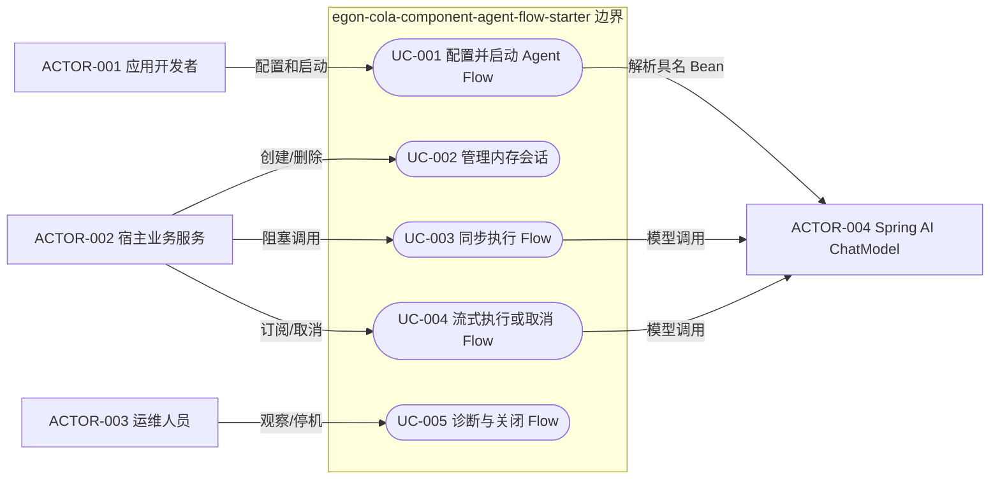
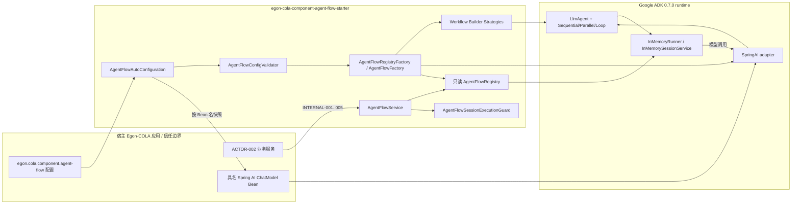
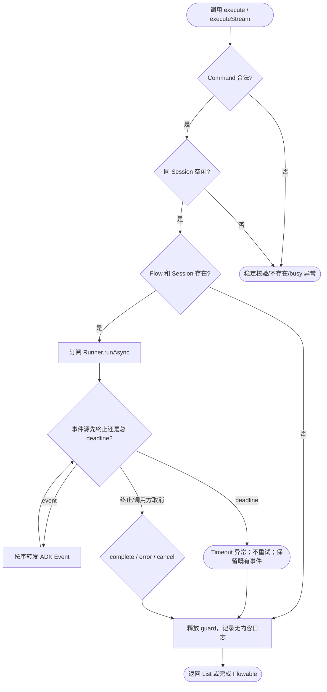
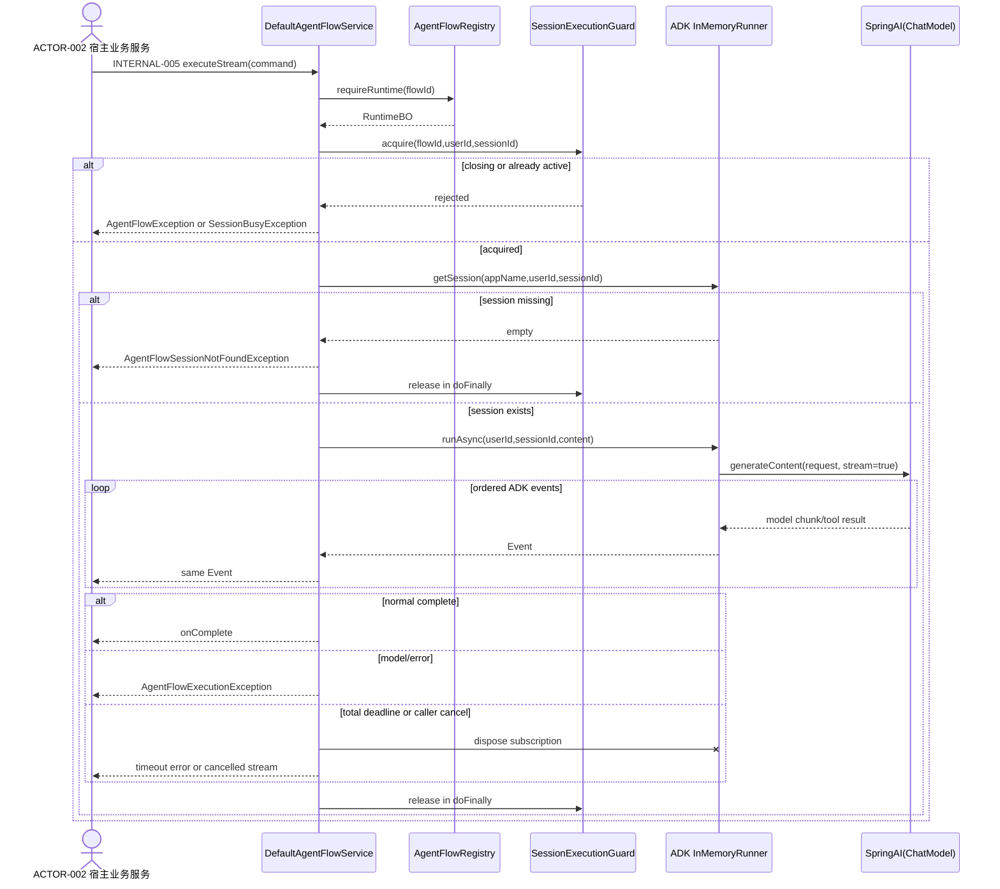

# Agent Flow 扁平化组件设计

| Field              | Value                                                                                                                                                                                                                                               |
|--------------------|-----------------------------------------------------------------------------------------------------------------------------------------------------------------------------------------------------------------------------------------------------|
| Document           | `docs/egon/spec/2026-09-04-09-34-agent-flow-component.md`                                                                                                                                                                                           |
| Template Version   | `7`                                                                                                                                                                                                                                                 |
| Status             | `Accepted`                                                                                                                                                                                                                                          |
| Type               | `Architecture`                                                                                                                                                                                                                                      |
| Complexity         | `Complex`                                                                                                                                                                                                                                           |
| Complexity Drivers | Google ADK 与 Spring AI 的版本耦合、配置驱动 Agent 树编译、Sequential/Parallel/Loop 多种控制流、流式取消与超时、会话并发和启动/关闭生命周期                                                                                                                                                   |
| Created            | `2026-09-04 09:34 CST`                                                                                                                                                                                                                              |
| Updated            | `2026-09-04 19:02 CST`                                                                                                                                                                                                                              |
| Owner              | `User`                                                                                                                                                                                                                                              |
| Repository         | `Egon-COLA`                                                                                                                                                                                                                                         |
| Scope              | `egon-cola-components` 下新增 `egon-cola-component-agent-flow-starter`                                                                                                                                                                                 |
| Change Surface     | 新增一个测试内置的扁平 Spring Boot Starter，并更新 components 父 POM、Components BOM 与组件文档；不改变平台、Archetype、数据库或外部 API                                                                                                                                                |
| Affected Chapters  | `§7, §8, §9, §10, §13, §14, §15, §16`                                                                                                                                                                                                               |
| Source Requirement | 用户要求阅读 `/Users/mario/Downloads/ai-agent-scaffold-lite-main/ai-agent-scaffold-lite-domain/src/main/java/cn/bugstack/ai/domain/agent` 的 Agent Workflow 代码，在 components 下新增同样使用 Spring AI 与 Google ADK、但不采用 DDD 的扁平 Agent Flow 组件；2026-09-04 用户确认全部推荐项 |
| Baseline Revision  | `main@cd83ae3a6a8b60ab3bbbb4b76f6fad4b87f07a0d`；工作区已有与本 Spec 无关的修改和未跟踪 Plan，本设计不得覆盖或纳入它们                                                                                                                                                            |
| Amends             | `None`                                                                                                                                                                                                                                              |
| Supersedes         | `None`                                                                                                                                                                                                                                              |
| Depends On         | [`egon-cola-components/egon-cola-components-architecture.md` §1-§5](../../../egon-cola-components/egon-cola-components-architecture.md)                                                                                                             |
| Related Specs      | [Agent Deep Research Archetype 设计](2026-09-04-16-32-agent-deep-research-archetype.md) — 后续 Agent Archetype 规范依赖本组件                                                                                                                                  |
| Related Plans      | [Agent Flow 扁平化组件实施计划](../plan/2026-09-04-19-02-agent-flow-component-implementation.md)                                                                                                                                                             |

## 1. Summary

本设计在 `egon-cola-components` 下新增单模块 `egon-cola-component-agent-flow-starter`。组件沿用 Components 现有的功能包扁平组织和
Spring Boot 自动配置约定，不复制参考工程的 `domain/model/entity/valobj/service/armory/node` DDD 包，也不引入
Controller、Repository、Aggregate、Domain Service 或基础设施分层。

组件由业务应用提供一个已配置、具名的 Spring AI `ChatModel` Bean；组件使用 `google-adk-spring-ai` 将其适配为 ADK 模型，依据配置编译
`LlmAgent` 与 `SequentialAgent`、`ParallelAgent`、`LoopAgent` 组成的单根树，建立不可变运行时注册表，并提供会话创建/删除、同步执行、流式执行和流程查询的内部
Java API。V1 使用 ADK `InMemoryRunner`，不承诺进程重启恢复或多实例共享。

用户已明确批准两项有意约束：一是对 Spec Rule 11 采用 component-library 扁平架构例外；二是保留仓库 Java 21 / Spring Boot
3.5.16，选择 Spring AI 1.1.8 与 Google ADK 0.7.0，而不扩大为 Spring Boot 4 升级。成功标准是依赖边界、启动图编译、三类
Workflow、会话隔离、同步/流式执行、取消/超时、关闭和自动配置均有可执行的离线测试设计，且不启动服务或调用真实模型。

## 2. Background and Current State

### 2.1 Business and user context

目标使用者是希望在 Egon-COLA 业务应用中复用 Agent Flow 编排能力的开发者。参考工程已证明 Spring AI `ChatModel` 可以作为
Google ADK `LlmAgent` 的模型来源，并可使用 YAML 组合单 Agent、顺序、并行和循环工作流；但参考工程将装配流程放入 DDD
风格包中，并包含演示级动态 Bean 注册、进程内会话映射和供应商配置，这些边界不适合直接成为通用 Components 契约。

### 2.2 Repository evidence

| Evidence ID | Classification             | Exact path/symbol/decision/command                                                                           | Observed fact                                                             | Design significance                                            | Verification limit/freshness |
|-------------|----------------------------|--------------------------------------------------------------------------------------------------------------|---------------------------------------------------------------------------|----------------------------------------------------------------|------------------------------|
| `EVD-001`   | Static repository          | `egon-cola-components/pom.xml` 的 `modules`、`java.version` 与构建插件                                              | Components 当前使用 Java 21、Maven Reactor 和 JUnit 5，根模块只登记组件模块                | 新 Starter 必须进入相同 Reactor，并以 Java 21 编译                         | 静态证据，不证明新增依赖已解析              |
| `EVD-002`   | Static repository          | 根 `pom.xml` 的 `spring.boot.version=3.5.16`                                                                   | 当前仓库统一使用 Spring Boot 3.5.16                                               | Spring AI 必须选择 Boot 3.5 兼容线，不能局部切换 Boot 4                      | 静态 POM 证据                    |
| `EVD-003`   | Static repository          | `egon-cola-components/egon-cola-component-rule-engine-starter`                                               | 该组件是单 Starter 模块，业务能力、自动配置和 `src/test` 测试均按功能包组织                          | 为本组件的扁平单模块直接先例                                                 | 不代表所有历史组件结构完全一致              |
| `EVD-004`   | Static repository          | `egon-cola-component-rule-engine-starter/.../RuleEngineAutoConfiguration.java` 与 `AutoConfiguration.imports` | Starter 通过 `@AutoConfiguration`、条件属性和 imports 文件发现                        | Agent Flow 采用相同自动配置机制                                          | 未执行新增上下文测试                   |
| `EVD-005`   | Static repository          | `egon-cola-components/egon-cola-components-bom/pom.xml`                                                      | BOM 只导出业务应用真正依赖的具体组件 artifact                                             | 新增 Starter 需要一个 BOM 项，不导出第三方 ADK/Spring AI artifact            | 静态证据                         |
| `EVD-006`   | Static repository          | `egon-cola-component-common-core/.../ValidationUtils.java`                                                   | 仓库已有 Jakarta Validation 手动边界校验门面                                          | 启动期非代理路径复用它，不新造 Validation 工具                                  | 该类本身不自动成为 Bean               |
| `EVD-007`   | Static repository          | `egon-cola-component-common-core/.../BaseConverter.java`                                                     | 仓库已有 Converter 基础契约                                                       | 只有真实跨层模型转换才允许新增 Converter；本设计没有该转换                             | 现存 `Date` 方法不属于本次修改范围        |
| `EVD-008`   | Static reference source    | `AiAgentConfigTableVO.Module.AgentWorkflow`、`AgentNode`、`AgentWorkflowNode`                                  | 参考工程以字符串类型配置 Agent/Workflow，并经节点链构建 ADK 对象                                | 保留配置驱动能力，改成枚举 + Strategy + 显式图校验                               | 参考目录不是 Egon 仓库代码             |
| `EVD-009`   | Static reference source    | `LoopAgentNode`、`ParallelAgentNode`、`SequentialAgentNode`                                                    | 三种节点分别构建 ADK `LoopAgent`、`ParallelAgent`、`SequentialAgent`                | V1 必须覆盖三种 Flow 类型                                              | 参考实现未证明异常、环或多父节点安全           |
| `EVD-010`   | Static reference source    | `DefaultArmoryFactory.DynamicContext#queryAgentList`                                                         | 找不到的子 Agent 会被跳过，未形成阻断错误                                                  | 新组件必须 fail closed，禁止静默缺失引用                                     | 静态分析                         |
| `EVD-011`   | Static reference source    | `AbstractArmorySupport#registerBean`、`DefaultArmoryFactory#getAiAgentRegisterVO`                             | 参考实现按 `agentId` 动态删除并重注册 Spring Bean                                      | 通用组件改用组件自有只读 Registry，不修改宿主 BeanDefinition                     | 静态分析                         |
| `EVD-012`   | Static reference source    | `ChatService#userSessions`、`createSession`、`handleMessageStream`                                             | 参考实现按 `userId` 缓存 sessionId，且同步/流式会话创建语义不同                                | 新 API 使用 `flowId + userId + sessionId` 明确定位，不维护 userId-only 映射 | 静态分析                         |
| `EVD-013`   | Static reference source    | `MySpringAI`、`MyMessageConverter`                                                                            | 参考工程为 ADK 0.5.0/Spring AI 1.1.0-M3 自建补丁，并在内部创建 `ObjectMapper`             | V1 不复制补丁，使用官方 `SpringAI` 适配器；已知限制通过测试和风险边界表达                   | 未执行真实多模态/工具链路                |
| `EVD-014`   | External artifact metadata | `com.google.adk:google-adk-spring-ai:0.7.0` Maven Central POM                                                | 0.7.0 编译依赖 Spring AI 1.1.0、ADK 0.7.0，并把 `google-adk-dev` 带入 compile scope | Spring AI BOM 升到 1.1.8；显式排除 dev UI artifact                    | 1.1.8 组合仍需 Maven 编译与测试证明     |
| `EVD-015`   | External current evidence  | Google ADK Java README 与 Spring AI 官方兼容说明                                                                    | 当前 ADK 新版本已转向 Spring AI 2 / Boot 4 依赖线；Spring AI 1.1.x 对应 Boot 3.5.x      | 用户批准保留 Boot 3.5 并固定 ADK 0.7.0                                  | 外部版本会变化；本 Spec 固定明确版本        |
| `EVD-016`   | User decision              | 2026-09-04 “全部按照推荐”                                                                                          | 批准扁平单 Starter、Rule 11 例外、推荐版本和核心 V1 边界                                    | 关闭此前所有重大决策                                                     | 只适用于本 Spec 范围                |
| `EVD-017`   | Static repository          | `git status --short --branch` at baseline                                                                    | 已有一个 Spec、一个 tsbuildinfo 和一个 Plan 为用户工作区修改                                | 本任务只能新增本 Spec，不能覆盖、清理或提交这些文件                                   | 状态是 2026-09-04 的快照           |

外部版本证据来源：Google ADK Java [README](https://github.com/google/adk-java)、Spring
AI [项目兼容说明](https://github.com/spring-projects/spring-ai)、Maven Central 的 [
`google-adk-spring-ai:0.7.0` POM](https://repo.maven.apache.org/maven2/com/google/adk/google-adk-spring-ai/0.7.0/google-adk-spring-ai-0.7.0.pom)
和 [
`spring-ai-bom:1.1.8` POM](https://repo.maven.apache.org/maven2/org/springframework/ai/spring-ai-bom/1.1.8/spring-ai-bom-1.1.8.pom)。

### 2.3 Problem statement and gap

当前 Egon-COLA 没有 Agent Flow Component。直接复制参考工程会带入不属于 Components 的 DDD 目录、外部设计框架、
`javax.annotation.Resource` 字段注入、Fastjson 日志、供应商 URL/API Key 配置、动态修改宿主 Spring 容器、字符串 `switch`
路由和不一致的会话语义。

目标差异是：只迁移可复用的 Agent Flow 能力；宿主应用负责创建 Spring AI `ChatModel`
与它所需的模型供应商、凭据、ToolCallback/MCP/Skills；组件负责从无密钥配置编译 ADK Agent 树、维护内存 Runner/Session、执行并释放资源。

### 2.4 Evidence and current-chain map

| Entry/trigger            | Current call chain                                                                                                                                      | Data read/written                                 | External dependency             | Consumers                  | Evidence            |
|--------------------------|---------------------------------------------------------------------------------------------------------------------------------------------------------|---------------------------------------------------|---------------------------------|----------------------------|---------------------|
| 参考工程启动                   | `ApplicationReadyEvent -> AiAgentAutoConfig -> ArmoryService -> RootNode -> AiApiNode -> ChatModelNode -> AgentNode -> AgentWorkflowNode -> RunnerNode` | YAML 配置、Spring 动态 BeanDefinition、`InMemoryRunner` | Spring AI、Google ADK、MCP/Skills | `ChatService`              | `EVD-008`-`EVD-013` |
| 参考工程同步请求                 | `ChatService#handleMessage -> DefaultArmoryFactory -> InMemoryRunner#runAsync -> blockingForEach`                                                       | JVM 会话事件与 `userSessions` Map                      | 模型与工具调用                         | HTTP Controller            | `EVD-012`           |
| 参考工程流式请求                 | `ChatService#handleMessageStream -> InMemoryRunner#runAsync`                                                                                            | JVM 会话事件                                          | 模型与工具调用                         | HTTP `ResponseBodyEmitter` | `EVD-012`           |
| 当前 Components Starter 发现 | `AutoConfiguration.imports -> @AutoConfiguration -> @Bean`                                                                                              | Spring ApplicationContext                         | Spring Boot                     | 引入具体 Starter 的业务应用         | `EVD-003`、`EVD-004` |

## 3. Goals and Non-goals

### 3.1 Goals

- 提供一个可被 Egon-COLA 业务应用按需引入的 Agent Flow Spring Boot Starter。
- 通过配置组合一个或多个 `LlmAgent`，并支持单 Agent、Sequential、Parallel 和 Loop 根执行体。
- 使用业务应用提供的 Spring AI `ChatModel`，通过 Google 官方 `SpringAI` 适配器接入 ADK。
- 在启动期确定性验证并原子编译 Agent 树，运行期只读执行。
- 提供明确的会话生命周期、同步/流式执行、同会话并发保护、总执行超时、取消传播和关闭语义。
- 采用无提示词内容、无密钥的安全日志，并给出离线、确定性的验证路径。

### 3.2 Non-goals

- 不新增 HTTP Controller、GraphQL、RPC、A2A、Admin、UI 或独立服务。
- 不实现 MCP/Skills/Plugin 的发现或装配；宿主可在其 `ChatModel` 或未来独立扩展中处理。
- 不保存供应商 `baseUrl`、API Key 或模型客户端配置，不创建 `OpenAiApi`。
- 不提供数据库、Redis、持久化 Session/Memory/Artifact、多实例共享、故障恢复或长流程 durable execution。
- 不复制参考工程的 DDD、Armory 节点链、`xfg-wrench-starter-design-framework`、Fastjson 或动态 Spring Bean 注册。
- 不升级全仓 Spring Boot 4 / Spring AI 2，不承诺 ADK 0.7.0 以外的二进制兼容。
- 不在 Spec 阶段写生产代码、Plan、迁移、提交或启动项目。

### 3.3 Change Surface and Design Depth

| Area/layer                 | Disposition    | Exact repository evidence                                             | Changed or preserved behavior/contract       | Required Spec treatment | Chapter(s)                  |
|----------------------------|----------------|-----------------------------------------------------------------------|----------------------------------------------|-------------------------|-----------------------------|
| Components 父 Reactor 与依赖管理 | Affected       | `egon-cola-components/pom.xml`                                        | 登记新模块，管理 Spring AI 1.1.8 与 ADK 0.7.0         | 精确 POM 变更与依赖边界          | `§8, §16`                   |
| Components BOM             | Affected       | `egon-cola-components/egon-cola-components-bom/pom.xml`               | 仅增加 `egon-cola-component-agent-flow-starter` | 精确 BOM 契约               | `§8, §16`                   |
| Agent Flow Starter 生产代码与资源 | Affected       | 新路径 `egon-cola-components/egon-cola-component-agent-flow-starter`     | 新增配置、图编译、Registry、Session、执行与自动配置            | 完整架构、接口、模型、模式和横切设计      | `§7, §8, §9, §10, §13, §15` |
| Agent Flow Starter 测试      | Affected       | 新路径的 `src/test/java`                                                  | 新增无网络的单元、组件和契约测试                             | 完整测试矩阵                  | `§14`                       |
| Components 与 Starter 文档    | Affected       | `egon-cola-components-architecture.md`、BOM README 和新 Starter README   | 增加能力、依赖与限制说明                                 | 文件责任和兼容说明               | `§8, §16`                   |
| 参考工程 DDD Agent 代码          | Context-only   | `/Users/mario/Downloads/ai-agent-scaffold-lite-main/.../domain/agent` | 仅作为能力与缺陷证据，不复制、不修改                           | 迁移映射和停止边界               | `§7`                        |
| 宿主应用 `ChatModel` 与模型供应商配置  | Context-only   | Spring AI `ChatModel` SPI；用户确认由宿主提供                                   | 组件按 Bean 名读取；不拥有 URL、密钥和 provider starter    | 依赖/安全边界与替身测试            | `§7, §15`                   |
| Egon 平台与 Archetype         | Unchanged      | 根 `pom.xml` 模块边界；`egon-cola-platforms`、`egon-cola-archetypes`         | 不增加模板依赖或平台调用                                 | 静态 Reactor 回归           | `§16`                       |
| 数据库与 Flyway                | Not applicable | V1 明确使用 ADK `InMemoryRunner`，没有 DAO/表/迁移                              | 无持久化变更                                       | §11 证据化 N/A             | `§11`                       |
| 前端与外部 API                  | Not applicable | 用户批准核心组件范围；目标模块无 web 层                                                | 无页面、路由或 HTTP/GraphQL 契约                      | §12 证据化 N/A             | `§12`                       |

## 4. Requirements and Acceptance Criteria

| ID        | Atomic requirement                                                                | Priority | Observable acceptance criteria                                                                   | Source                             |
|-----------|-----------------------------------------------------------------------------------|----------|--------------------------------------------------------------------------------------------------|------------------------------------|
| `REQ-001` | 新组件采用单 Starter、模块内测试和功能包扁平结构，不使用 DDD/Archetype/`biz.*` 分层                         | Must     | 目标树没有 `domain/application/infrastructure/adapter/aggregate/repository/biz` 层；测试位于同一模块 `src/test` | 用户原始要求与确认                          |
| `REQ-002` | 固定 Java 21、Boot 3.5.16、Spring AI 1.1.8、Google ADK 0.7.0                           | Must     | effective POM 和 dependency tree 只解析该兼容线；`google-adk-dev` 不在 compile/runtime 树                    | 用户确认、`EVD-002`、`EVD-014`-`EVD-016` |
| `REQ-003` | 宿主通过具名 `ChatModel` Bean 提供模型，组件不持有供应商连接或密钥配置                                      | Must     | 配置仅含 `chat-model-bean-name` 和 `model-name`；缺 Bean 时启动失败；源码无 `api-key`/`base-url` 属性              | 用户确认                               |
| `REQ-004` | 配置可定义叶子 Agent 以及 Sequential、Parallel、Loop Workflow，并可选任一叶子/Workflow 为 root        | Must     | 四类根执行体各有通过测试；`output-key` 可供 ADK 顺序状态使用                                                          | 原始参考能力                             |
| `REQ-005` | 启动时对名称、引用、唯一性、可达性、环、多父节点、Loop 上限和 root 做 fail-closed 校验                           | Must     | 每个非法图导致确定性的 `AgentFlowConfigurationException`；不会静默省略子 Agent                                      | `EVD-010` 修正                       |
| `REQ-006` | 所有 Flow 先完整编译后再发布只读 Registry，失败时关闭已创建 Runner 且不暴露半成品                              | Must     | 一个 Flow 编译失败时 ApplicationContext 启动失败，已创建 Runner 收到 close，Registry Bean 不可用                      | 启动一致性要求                            |
| `REQ-007` | 会话身份使用 `flowId + userId + sessionId`，支持显式创建和删除                                    | Must     | 不存在 userId-only 缓存；创建返回新 sessionId；删除/执行不存在会话均 fail closed                                       | `EVD-012` 修正                       |
| `REQ-008` | 提供同步和流式执行，保持 ADK `Event` 顺序、内容和错误信息，不自行拼接字符串结果                                    | Must     | 同步返回有序 `List<Event>`；流式返回 `Flowable<Event>`；同一 fake Agent 的两种路径事件一致                              | 用户确认核心 V1                          |
| `REQ-009` | 同一会话禁止重叠执行；不同会话和 ADK Parallel 子 Agent 仍可并行                                        | Must     | 同一 tuple 的第二次调用抛 `AgentFlowSessionBusyException`；终止后锁释放；不同 tuple 可同时执行                           | 会话正确性要求                            |
| `REQ-010` | 执行使用总时限且不自动重试；取消、超时和错误必须释放占用并保留已产生的内存事件事实                                         | Must     | timeout/cancel/error 测试证明 upstream disposal 与 guard 释放；没有 retry operator；文档声明无事务回滚               | 用户确认核心 V1                          |
| `REQ-011` | Starter 默认关闭，启用时严格绑定和验证 `egon.cola.component.agent-flow` 配置                       | Must     | 未配置 enabled 时不创建组件 Bean；启用但缺配置/Bean/非法图时启动失败                                                     | Starter 安全启用要求                     |
| `REQ-012` | 关闭 ApplicationContext 时在配置时限内关闭全部 Runner，不因单个失败跳过其他 Runner                        | Must     | close 聚合采用 delay-error 语义；超时/异常记录安全日志并继续关闭其他项                                                    | 生命周期要求                             |
| `REQ-013` | 日志只记录 flowId、阶段、结果、耗时、事件数和异常类型，不记录 userId、sessionId、prompt、响应内容、Session state 或密钥 | Must     | 日志捕获测试与静态检查无身份/内容字段；宿主 MDC 可提供其自有 correlation                                                    | 用户确认可观测性                           |
| `REQ-014` | 新 Starter 被 Components BOM 导出，但不把 ADK/Spring AI 三方 artifact 逐项暴露为 Egon BOM 公共坐标   | Must     | BOM 只增加一个 `top.egon` Starter dependency；业务应用可无版本引入它                                              | Components 约定                      |
| `REQ-015` | 验证必须离线可重复，不调用真实模型、MCP、数据库、Docker、浏览器或网络服务                                         | Must     | 测试使用 fake `ChatModel`/`BaseAgent`/Runner seam；Maven 测试不需要凭据                                      | 用户边界与 AGENTS.md                    |

### 4.1 Scenario matrix

| Scenario             | Actor/trigger              | Preconditions                     | Main path                                                                | Alternative/failure path               | Data/state change     | Observable result      | Requirements                   |
|----------------------|----------------------------|-----------------------------------|--------------------------------------------------------------------------|----------------------------------------|-----------------------|------------------------|--------------------------------|
| 启动编译有效单 Agent        | 应用开发者启动 context            | enabled=true、具名 ChatModel、合法 root | bind -> validate -> build LlmAgent -> InMemoryRunner -> publish Registry | 无                                      | 创建一个进程内 runtime       | Service 可列出 READY Flow | `REQ-003`-`REQ-006`, `REQ-011` |
| 启动编译嵌套 Workflow      | 应用开发者启动 context            | root 为无环单根树                       | DFS 解析 -> Strategy 构建 Loop/Parallel/Sequential -> Runner                 | 子引用缺失、环、多父、不可达或同名即失败                   | 成功时原子发布全部 runtime     | 启动成功或稳定配置异常，无半成品       | `REQ-004`-`REQ-006`            |
| 创建与删除会话              | 业务应用服务调用 Java API          | Flow 已注册                          | 校验 tuple -> ADK create/delete                                            | Flow/Session 不存在时抛专用异常                 | JVM Session Map 新增/删除 | 返回 sessionId 或明确失败     | `REQ-007`                      |
| 同步执行成功               | 业务应用服务调用 `execute`         | Session 存在且空闲                     | acquire -> runAsync -> 总时限 -> 收集有序事件 -> release                          | 模型错误转执行异常                              | ADK 追加非 partial 事件    | 返回不可变有序事件列表            | `REQ-008`-`REQ-010`            |
| 流式执行与消费者取消           | 业务应用服务订阅 `executeStream`   | Session 存在且空闲                     | 订阅时 acquire -> 转发事件 -> cancel disposal -> release                        | 取消前已追加事件不回滚                            | 可能存在部分 JVM 事件历史       | 流停止且同 session 可再次执行    | `REQ-008`-`REQ-010`            |
| 总时限耗尽                | 同步或流式执行                    | 模型/Agent 未在 deadline 前终止          | deadline publisher 获胜并取消 upstream                                        | 抛 `AgentFlowExecutionTimeoutException` | 已完成事件保留，未完成调用被取消请求    | 无自动重试；调用方决定新会话或人工重试    | `REQ-010`                      |
| 同一会话并发               | 两个业务线程同时执行同一 tuple         | 第一个仍在运行                           | 第一个持有 guard                                                              | 第二个立即抛 busy；不排队                        | 第二个不写会话               | 不会出现交错 session event   | `REQ-009`                      |
| 不同会话并发/Parallel Flow | 两个 tuple 或一个 Parallel root | 各 Session 独立                      | 各自执行；ADK 内部并行子 Agent                                                     | 单分支错误按 ADK 0.7 行为终止该执行并向上游传播           | 各自 session 事件独立       | 无组件级串行化                | `REQ-004`, `REQ-009`           |
| Context 关闭           | Spring 容器 shutdown         | Registry 存在                       | 禁止新执行 -> delay-error close 全部 Runner -> 限时结束                             | 单个 close 失败/超时记录后继续                    | Registry 进入 CLOSED    | 关闭完成或带安全诊断，不泄露内容       | `REQ-012`, `REQ-013`           |

### 4.2 Use-case analysis

#### 4.2.1 Actor inventory

| Actor ID    | Actor/role            | Goal and responsibility | Entry/channel                                 | Permission/tenant context   | Evidence                 |
|-------------|-----------------------|-------------------------|-----------------------------------------------|-----------------------------|--------------------------|
| `ACTOR-001` | Egon-COLA 应用开发者       | 配置并引入可复用 Agent Flow     | Maven dependency + Spring 配置 + ChatModel Bean | 由宿主应用控制；组件不定义租户/权限          | 用户请求、`EVD-003`-`EVD-005` |
| `ACTOR-002` | 宿主业务服务                | 为已认证业务上下文创建会话并执行 Flow   | `AgentFlowService` Java API                   | `userId` 由宿主可信服务传入；组件不是认证边界 | 用户确认核心 V1                |
| `ACTOR-003` | 应用运维人员                | 从启动失败和安全日志判断 Flow 状态    | ApplicationContext 生命周期与日志                    | 仅观察标识、阶段、结果、耗时              | `REQ-011`-`REQ-013`      |
| `ACTOR-004` | Spring AI `ChatModel` | 提供实际模型调用和其自有工具能力        | 具名 Spring Bean                                | 凭据、provider、重试与网络策略由宿主管理    | `REQ-003`                |

#### 4.2.2 Use-case artifact



| ID       | Use case/goal    | Primary actor | Supporting actors/systems | Trigger               | Preconditions            | Main success outcome  | Alternatives/failures         | Postconditions             | Requirements                    | Interfaces/pages                   | Tests                 |
|----------|------------------|---------------|---------------------------|-----------------------|--------------------------|-----------------------|-------------------------------|----------------------------|---------------------------------|------------------------------------|-----------------------|
| `UC-001` | 配置并启动 Agent Flow | `ACTOR-001`   | `ACTOR-004`               | ApplicationContext 创建 | enabled=true、配置与 Bean 完整 | 所有 Flow 原子编译并可查询      | 绑定、引用、版本或 Bean 错误导致启动失败       | 无半成品 Registry              | `REQ-001`-`REQ-006`, `REQ-011`  | 自动配置                               | `TEST-001`-`TEST-007` |
| `UC-002` | 管理内存会话           | `ACTOR-002`   | ADK SessionService        | create/delete 调用      | Flow READY、输入合法          | Session 创建或删除         | Flow/Session 不存在、运行中删除被拒绝     | tuple 明确存在或不存在             | `REQ-007`, `REQ-009`            | `INTERNAL-002`, `INTERNAL-003`     | `TEST-008`-`TEST-010` |
| `UC-003` | 同步执行 Flow        | `ACTOR-002`   | `ACTOR-004`               | `execute`             | Session 存在且空闲            | 返回有序不可变事件             | busy、timeout、model error      | guard 释放；已写事件保留            | `REQ-008`-`REQ-010`, `REQ-013`  | `INTERNAL-004`                     | `TEST-011`-`TEST-015` |
| `UC-004` | 流式执行或取消 Flow     | `ACTOR-002`   | `ACTOR-004`               | subscribe/cancel      | Session 存在且空闲            | 按序接收事件并收到终态           | cancel、timeout、upstream error | upstream disposal；guard 释放 | `REQ-008`-`REQ-010`, `REQ-013`  | `INTERNAL-005`                     | `TEST-016`-`TEST-019` |
| `UC-005` | 诊断与关闭 Flow       | `ACTOR-003`   | Spring lifecycle          | 启停或错误                 | Registry 已创建或创建中         | 安全日志可定位，所有 Runner 被关闭 | 单 Runner close 失败/超时不跳过其余项    | Registry CLOSED，无新执行       | `REQ-006`, `REQ-012`, `REQ-013` | `INTERNAL-001` + destroy lifecycle | `TEST-020`-`TEST-022` |

## 5. Constraints, Assumptions, and Decisions

### 5.1 Confirmed constraints

- 只在 `egon-cola-components` 新增组件及其必要的父 POM/BOM/文档连接，不改平台和 Archetype。
- 组件采用扁平功能包，不复制 DDD 包；用户已明确批准 Rule 11 component-library 例外。
- 固定 Java 21、Spring Boot 3.5.16、Spring AI 1.1.8、Google ADK 0.7.0。
- V1 只提供核心 Agent Flow；无 HTTP、MCP/Skills loader、持久化、Admin/UI 或 provider secrets。
- 不启动服务，不执行真实外部模型，不引入数据库或 Docker。

### 5.2 Small-gap assumptions

| ID        | Inference                                                                                          | Repository evidence                                                | Why locally reversible | Impact if wrong                    |
|-----------|----------------------------------------------------------------------------------------------------|--------------------------------------------------------------------|------------------------|------------------------------------|
| `ASM-001` | Artifact 使用 `egon-cola-component-agent-flow-starter`，Java 根包使用 `top.egon.cola.component.agentflow` | `ruleengine`、`accessguard`、`methodextension` 的 artifact/package 命名 | 仅内部命名且符合主导约定           | 后续改名会影响 Maven/Java 消费者，需在 Plan 前提出 |
| `ASM-002` | `flowId` 同时作为 ADK `appName`，不再复制参考工程独立 `appName`                                                   | Map key 已稳定唯一；ADK Runner 只需要应用命名空间                                 | 配置字段更少且无业务含义损失         | 若一个 flowId 需跨 appName 共享，需新增明确契约   |
| `ASM-003` | 所有叶子 Agent 在一个 Flow 内共享同一具名 `ChatModel` 和 `modelName`                                              | 参考工程每张配置表只有一个 ChatModel                                            | V1 配置和生命周期简单           | 多模型 Flow 需要后续扩展，不影响当前单模型定义         |
| `ASM-004` | `outputKey` 在整个 Flow 内唯一                                                                           | Parallel/嵌套状态合并存在冲突风险                                              | 可在未来放宽为分支作用域           | 可能拒绝某些 ADK 可运行但语义不清的配置             |

### 5.3 Resolved decisions

| ID        | Decision                                                                             | Decision owner                  | Evidence and rationale                      | Requirements         |
|-----------|--------------------------------------------------------------------------------------|---------------------------------|---------------------------------------------|----------------------|
| `DEC-001` | 使用扁平单 Starter + 模块内测试                                                                | User                            | “全部按照推荐”；匹配 `rule-engine-starter` 先例        | `REQ-001`            |
| `DEC-002` | 对用户规则 11 采用明确的 component-library 结构例外                                                | User                            | 两个应用型允许 profile 都会违背“components 扁平化、不是 DDD” | `REQ-001`            |
| `DEC-003` | 使用 Spring AI 1.1.8 + ADK 0.7.0，保留 Boot 3.5.16                                        | User                            | 这是不升级全仓前提下最接近官方桥接兼容线的方案                     | `REQ-002`            |
| `DEC-004` | 使用官方 `com.google.adk.models.springai.SpringAI`，不复制 `MySpringAI`/`MyMessageConverter` | User + repository design        | 避免维护私有 fork；多模态/工具兼容作为明确限制和测试门              | `REQ-002`, `REQ-008` |
| `DEC-005` | Starter 排除传递的 `google-adk-dev`                                                       | User-approved recommended scope | dev UI 引入 web/websocket/Graphviz 等非运行核心能力   | `REQ-002`, `REQ-015` |
| `DEC-006` | Flow 图在启动期原子编译，运行期 Registry 只读，不动态注册 Spring Bean                                     | User-approved recommended scope | 消除宿主 BeanDefinition 覆盖与半配置运行                | `REQ-005`, `REQ-006` |
| `DEC-007` | 同一 Session fail-fast 拒绝并发，不排队、不自动重试                                                  | User-approved recommended scope | 避免事件交错与工具副作用重复                              | `REQ-009`, `REQ-010` |

### 5.4 Open major decisions

无。用户已在 2026-09-04 一次性确认全部推荐项。

## 6. Project Technology Context

| Concern                  | Current choice                              | Repository evidence             | Constraint on design                                |
|--------------------------|---------------------------------------------|---------------------------------|-----------------------------------------------------|
| Language/runtime         | Java 21                                     | `egon-cola-components/pom.xml`  | 使用 record、`java.time`；不得以 Java 17 参考工程为基线           |
| Framework                | Spring Boot 3.5.16                          | 根 `pom.xml`                     | 组件不得拉入 Boot 4 依赖线                                   |
| AI abstraction           | Spring AI 1.1.8 BOM                         | `DEC-003`、官方 1.1.x/Boot 3.5 兼容线 | Starter 依赖 `spring-ai-model`，provider starter 由宿主选择 |
| Agent runtime            | Google ADK 0.7.0 + `google-adk-spring-ai`   | `DEC-003`、Maven Central POM     | API 以 0.7.0 源码签名为准；排除 `google-adk-dev`              |
| Reactive type            | RxJava 3 `Flowable<Event>`                  | ADK `Runner#runAsync`           | V1 不增加 Reactor Adapter；取消直接传播给 ADK publisher        |
| Validation               | Jakarta Validation + Egon `ValidationUtils` | common-core                     | 配置和服务入口双重验证；图语义由行为 Validator 负责                     |
| Test                     | JUnit Jupiter、Spring Boot test              | Components 父 POM和相邻 Starter     | fake 模型/Agent，禁止外部 I/O                              |
| Auto-configuration       | `AutoConfiguration.imports`                 | 相邻 Starter                      | 默认关闭，只有 enabled=true 才创建 Bean                       |
| Persistence/frontend/API | None                                        | 用户确认 V1 范围                      | 不读数据库设计和外部 API 专项规则                                 |

### 6.1 Java architecture profile and capability baseline

| Architecture profile                                   | Archetype/template or base package  | Exact evidence and verifier                                              | Existing deviations                                                | Design action                                                                            |
|--------------------------------------------------------|-------------------------------------|--------------------------------------------------------------------------|--------------------------------------------------------------------|------------------------------------------------------------------------------------------|
| User-approved Component Library Flat Starter exception | `top.egon.cola.component.agentflow` | `DEC-001`、`DEC-002`；`egon-cola-component-rule-engine-starter` 功能包树与模块内测试 | 不属于应用型 Traditional `biz.*` 或 Egon Archetype；这是用户明确批准而非静默第三 profile | 仅使用 `api/config/runtime/workflow/execution/autoconfigure/exception` 功能包，不引入 DDD/COLA 应用层 |

能力复用清单：

| Need                  | Spring/JDK candidate                  | Spring Boot Starter candidate          | Egon-COLA/module candidate    | Proven gap                                    | Decision/dependency impact                      |
|-----------------------|---------------------------------------|----------------------------------------|-------------------------------|-----------------------------------------------|-------------------------------------------------|
| 模型抽象                  | Spring AI `ChatModel`                 | 宿主 provider starter                    | None                          | Components 当前无 AI 模型抽象                        | 新增 Spring AI BOM 1.1.8 和 `spring-ai-model`      |
| Agent/Workflow/Runner | JDK 无对应能力                             | None                                   | Rule Engine 不是 Agent runtime  | 需要 LLM Agent、Session、Sequential/Parallel/Loop | 新增 ADK 0.7.0                                    |
| Spring AI -> ADK      | None                                  | None                                   | None                          | 两套模型消息协议不同                                    | 使用官方 `google-adk-spring-ai`，不自研转换器              |
| 配置绑定                  | record + collections                  | Spring Boot `@ConfigurationProperties` | 相邻 Starter 约定                 | 无                                             | 复用 Boot，不加 YAML parser                          |
| 边界校验                  | Jakarta Validator                     | `spring-boot-starter-validation`       | common-core `ValidationUtils` | 图环/引用/多父属于跨字段图语义                              | 原生注解 + 行为 Validator；不写自定义 `ConstraintValidator` |
| Flow 类型路由             | EnumMap                               | None                                   | 相邻组件已有 Strategy/Factory 先例    | 三个真实变化实现，字符串 switch 不安全                       | 内部 Strategy + Factory，无外部框架                     |
| Registry              | JDK immutable Map                     | None                                   | Components 多处 Registry 模式     | Spring Bean 容器不是 Flow Registry                | 组件内只读 Registry，不增加缓存系统                          |
| Reactive 执行           | ADK/RxJava 自带                         | None                                   | None                          | Runner 原生返回 `Flowable<Event>`                 | 直接暴露 ADK Event/Flowable，不加 reactor-adapter      |
| JSON/对象转换             | Jackson/MapStruct                     | Boot Jackson/common `BaseConverter`    | None                          | V1 没有外部 JSON或跨层 DTO 映射                        | 不新增 Converter，不创建 ObjectMapper                  |
| Observability         | `@Slf4j`、`System.nanoTime`、`Duration` | Spring AI 自有观测                         | common trace 可由宿主统一接入         | 本组件只需生命周期诊断                                   | 安全结构化日志；不强制 Actuator/Micrometer                 |

### 6.2 User-mandated Java rule compliance

| Literal rule | Affected? | Repository evidence                                          | Exact design decision                                                                                                                                    | Files/types/interfaces                                                | Validation/test evidence               | Status/blocker                 |
|--------------|-----------|--------------------------------------------------------------|----------------------------------------------------------------------------------------------------------------------------------------------------------|-----------------------------------------------------------------------|----------------------------------------|--------------------------------|
| Rule 1       | Yes       | 新增类型清单见 §8/§10；参考工程存在 `VO/Entity` 混用                         | carrier 使用 `*DTO/*Command/*Result/*BO/*Event/*Enum`，行为使用 `*Service/*Factory/*Strategy/*Registry/*Validator/*Guard/*Exception/*Configuration/*Properties` | §8.2 全部 Java 文件                                                       | `TEST-023` 命名静态门                       | PASS                           |
| Rule 2       | Yes       | common-core `ValidationUtils`；§9 五个服务边界                      | Properties 自动校验；非代理启动路径调用 `ValidationUtils`；Session Command 使用 Create/Delete Groups；执行 Command 使用 Default                                                | `AgentFlowProperties`、配置 DTO、两个 Command、Service、ConfigValidator       | `TEST-002`, `TEST-008`-`TEST-019`      | PASS                           |
| Rule 3       | Yes       | common-core `BaseConverter`；V1 无持久化/跨层映射                     | 所有简单 carrier 为 record；行为类用 `@RequiredArgsConstructor`；ADK graph 是 Factory 构造而非 DTO 映射；不新增 Converter                                                      | §10 全部 carrier                                                        | record defensive-copy、无 Converter 静态检查 | PASS                           |
| Rule 4       | Yes       | Components 根无可用 `lombok.config`；用户规则要求 Qualifier 传播          | 所有具体业务行为类 `@Slf4j`；所有 Spring Bean 由显式命名 `@Bean` 创建；依赖字段 final + `@Qualifier` + `@RequiredArgsConstructor`；模块 `lombok.config` 复制 Qualifier                | AutoConfiguration、Factory、Registry、Service、Validator、Guard、Strategies | `TEST-005`, `TEST-023`                 | PASS                           |
| Rule 5       | Yes       | Components 管理 JDK/Guava/Commons；需求无需额外工具                     | 生产代码仅用 JDK、Spring、Egon common、Spring AI、ADK；不新增 Utils 或外部设计框架                                                                                            | 全模块                                                                   | dependency/import 静态门                  | PASS                           |
| Rule 6       | No        | V1 无 HTTP/JSON/Event serialization boundary；ADK `Event` 原样返回 | 不新增 Jackson 注解或 ObjectMapper；Spring配置绑定不是 JSON 外部契约                                                                                                      | §9 internal API                                                       | 搜索 Gson/Fastjson/ObjectMapper 为零       | N/A                            |
| Rule 7       | Yes       | 相邻 Starter 使用统一配置前缀；组件不含 `application-*.yml`                 | 唯一 `egon.cola.component.agent-flow` Properties 适用于全部环境；Starter 不提供 profile 文件；README 给出同构键                                                               | `AgentFlowProperties`、README                                          | `TEST-002`, `TEST-024` 配置面静态门          | PASS                           |
| Rule 9       | Yes       | 参考 `AgentWorkflowNode` 使用字符串 switch；三种 Workflow 是真实变化轴       | Strategy + Factory 路由三类 Workflow；Factory 编译树；Registry/Facade 隔离生命周期；拒绝节点责任链复制                                                                            | `workflow/*`、`runtime/*`、Service                                      | `TEST-003`-`TEST-007`                  | PASS                           |
| Rule 10      | Yes       | ADK Session 使用 `Instant`；Components Java 21                  | 配置时限 `Duration`，执行事件/日志时间只用 `Instant`/`Duration`/`System.nanoTime`；不新增 `java.util.Date`                                                                  | Properties、执行/Registry                                                | `TEST-023` import 静态门                  | PASS                           |
| Rule 11      | Yes       | 用户明确要求 Components 扁平、非 DDD；相邻 Starter 已采用功能包                 | 应用型 profile 规则对本 component-library 采用 `DEC-002` 显式例外；只保留一个扁平 profile，不混入 Traditional 或 Archetype 层                                                       | §8 目标树                                                                | `TEST-023` 禁止层包检查                      | PASS — explicit user exception |

## 7. Architecture Design

### 7.0 Minimum-design baseline and element-necessity audit

| Proposed element                         | Change               | Requirements         | Existing/direct alternative | Concrete inadequacy of alternative       | Added calls/state/coupling/failures/migration/operations | Verdict |
|------------------------------------------|----------------------|----------------------|-----------------------------|------------------------------------------|----------------------------------------------------------|---------|
| `egon-cola-component-agent-flow-starter` | New                  | `REQ-001`-`REQ-015`  | 业务应用直接编写 ADK 代码             | 每个应用会重复配置校验、图编译、会话并发和生命周期                | 一个可选 Starter 与第三方依赖；无网络 hop/迁移                           | Add     |
| Spring AI BOM 1.1.8                      | New management       | `REQ-002`            | 接受 ADK adapter 传递的 1.1.0    | 不能统一当前 Boot 3.5 修复线，且宿主 provider 可能版本漂移  | 一项 BOM 管理；需 convergence 验证                               | Add     |
| ADK 0.7.0 + Spring AI adapter            | New                  | `REQ-002`, `REQ-004` | 自研 Flow runtime/adapter     | 无法满足“使用 Google ADK”，且复制复杂运行时             | 较大依赖树、版本冻结、外部缺陷风险                                        | Add     |
| `google-adk-dev`                         | Transitive candidate | None                 | 排除                          | V1 无 Dev UI，保留会带入 Web/WebSocket/Graphviz | 排除后需 classloading/compile 验证                             | Remove  |
| Provider/MCP/Skills loader               | Candidate            | None                 | 宿主提供 ChatModel              | 核心 Flow 不需要知道凭据和工具来源                     | 若加入会增加密钥、网络、生命周期和配置面                                     | Remove  |
| 配置 DTO records                           | New                  | `REQ-003`-`REQ-005`  | 直接暴露 ADK Builder            | 无法声明稳定 Boot 配置、Bean 名和跨字段校验              | JVM 内不可变对象，无额外调用                                         | Add     |
| `AgentFlowConfigValidator`               | New                  | `REQ-005`            | 只依赖 Jakarta 字段注解            | 注解不能表达图环、多父、可达性和输出键冲突                    | 一次启动期 O(V+E) 校验                                          | Add     |
| Workflow Strategy + Factory              | New                  | `REQ-004`, `REQ-005` | String switch               | 三种构造规则与 Loop 参数不同，未来分支会继续膨胀              | 三个小 Strategy；启动期一次选择                                     | Add     |
| 只读 Registry                              | New                  | `REQ-006`, `REQ-012` | 动态注册 Spring Bean            | 会覆盖宿主定义且无法原子发布/集中关闭                      | 一个 Map 和 CLOSED 状态                                       | Add     |
| Session execution Guard                  | New                  | `REQ-009`            | 允许 ADK 同 Session 并发         | 会话事件与 state 可交错，工具副作用无法安全合并              | 每个活跃 tuple 一个短生命周期 key                                   | Add     |
| HTTP/API/DB/UI                           | Candidate            | None                 | Java API + 内存运行             | 当前用例无独立外部目标                              | 会增加协议、状态、权限和运维面                                          | Remove  |

| Path            | Network calls | Client states   | Server contracts/state                     | Failure and TOCTOU points       | Additional user/business value |
|-----------------|---------------|-----------------|--------------------------------------------|---------------------------------|--------------------------------|
| 业务应用直接使用 ADK    | 每次模型调用由宿主决定   | 宿主自建            | 每个应用自建 Runner/Session/Map                  | 配置漂移、重复并发缺陷、关闭遗漏                | 可运行但不可复用                       |
| Selected design | 不增加模型之外的网络调用  | Java 调用成功/异常/取消 | 一个只读 Registry + ADK JVM Session + 活跃 guard | 启动失败、模型失败、timeout/cancel；均有稳定边界 | 统一可复用 Flow 编译和安全生命周期           |

### 7.1 System Architecture Design

#### 7.1.1 Architecture Mermaid view



#### 7.1.2 Boundary and responsibility table

| Module/component            | Capability and data owned                     | Inputs/outputs                          | Allowed dependencies             | Forbidden responsibility        | Requirements         |
|-----------------------------|-----------------------------------------------|-----------------------------------------|----------------------------------|---------------------------------|----------------------|
| 宿主应用                        | ChatModel、认证后的 userId、调用重试决策、provider/tool 配置 | Bean + Java Command / ADK Event         | Spring AI provider               | 把密钥交给 Agent Flow 配置             | `REQ-003`, `REQ-010` |
| AutoConfiguration           | Bean 条件、配置绑定、Bean 命名                          | Properties + ChatModel map ->组件 Beans   | Spring Boot                      | 执行业务 Flow                       | `REQ-011`            |
| ConfigValidator             | 字段后图语义正确性                                     | Config DTO -> valid/exception           | ValidationUtils、JDK              | 创建 Runner 或调用模型                 | `REQ-005`            |
| RegistryFactory/FlowFactory | 原子编译所有 Flow                                   | 配置 + model map -> runtime map           | ADK、Spring AI adapter、Strategies | 动态修改 Spring BeanDefinition      | `REQ-004`-`REQ-006`  |
| Workflow Strategies         | 对应类型的 ADK Workflow 构造                         | Workflow Config + children -> BaseAgent | ADK                              | 选择其他 Strategy、读取 Spring context | `REQ-004`            |
| Registry                    | runtime 所有权与 close                            | flowId -> RuntimeBO/Descriptor          | JDK、ADK Runner                   | 配置热更新、持久化                       | `REQ-006`, `REQ-012` |
| AgentFlowService            | Session 与执行门面                                 | Commands -> Result/List/Flowable        | Registry、Guard、ADK               | HTTP/认证、自动重试、内容转换               | `REQ-007`-`REQ-010`  |
| Guard                       | 活跃 tuple 集合                                   | acquire/release                         | JDK concurrency                  | 跨 Session 串行化                   | `REQ-009`            |

### 7.2 High-Level Design

启动时由 AutoConfiguration 收集配置和具名 `ChatModel` 快照。Validator 先执行 Jakarta/Egon 边界校验，再检查整个引用图。RegistryFactory
在临时 Map 中逐个编译 Flow；只有全部成功才创建 Registry。任一失败会关闭已创建 Runner 并抛配置异常，所以 Spring context
看不到部分 Registry。

执行时调用者必须先创建 Session。同步与流式入口共享同一个惰性 `Flowable<Event>` 管线：订阅时先获取同 tuple guard，再在该租约内验证
Session 并启动 ADK Runner，和总 deadline publisher 竞争，最后在 complete/error/cancel 任一终态释放 guard并写安全日志。删除
Session 也获取同一 tuple 租约，避免“验证存在后、执行前被删除”的竞态。同步入口只在该共同管线末端收集列表。

`AgentFlowSessionExecutionGuard` 同时提供轻量生命周期租约：create/session/execute 操作进入时增加活跃计数；shutdown 先把
Guard 切换为 CLOSING、拒绝新租约并等待现有租约在 `shutdownTimeout` 内退出，随后关闭全部 Runner。等待超时后仍执行 Runner
close，并如实记录可能存在的在途调用，不宣称优雅完成。

#### 7.2.1 Critical business/control flowchart



#### 7.2.2 High-level decision and quality matrix

| Concern/use case | Required behavior     | Selected mechanism                                                                 | Failure/degradation behavior | Trade-off              | Verification                          | Requirements         |
|------------------|-----------------------|------------------------------------------------------------------------------------|------------------------------|------------------------|---------------------------------------|----------------------|
| 配置正确性            | 非法图不能运行               | 字段校验 + DFS 白/灰/黑状态 + 入度/可达检查                                                       | context 启动失败                 | 不支持容错加载部分 Flow         | 图矩阵测试                                 | `REQ-005`, `REQ-006` |
| 版本兼容             | 不升级 Boot 4            | Spring AI BOM 1.1.8 + ADK 0.7.0 固定                                                 | 解析/编译失败即阻断实现                 | 使用旧 ADK 线，需要后续显式升级     | effective POM、dependency tree、compile | `REQ-002`            |
| 会话正确性            | 同一 Session 无交错执行      | tuple guard fail-fast                                                              | 第二次调用 busy                   | 不提供队列                  | 并发测试                                  | `REQ-009`            |
| 取消/超时            | 不泄漏 guard，不重复副作用      | 惰性 Flowable + total deadline race + doFinally                                      | 已提交内存事件保留，无回滚                | 调用方需理解 partial outcome | virtual-time/disposal 测试              | `REQ-010`            |
| 安全               | 不泄露 prompt/响应/密钥      | 配置无 secrets；日志 allowlist                                                           | 只保留标识/类型/耗时                  | 内容级调试由宿主模型观测承担         | 日志捕获和静态搜索                             | `REQ-003`, `REQ-013` |
| 生命周期             | 全部 Runner 有界关闭且不接收新执行 | Guard CLOSING/quiescence + Registry mergeDelayError close + total shutdown timeout | 等待超时后关闭 Runner；单项失败不跳过其余     | shutdown 可能报告在途调用未完全结束 | close fake/lease 测试                   | `REQ-012`            |

### 7.3 Detailed Design

#### 7.3.1 Detailed component collaboration

| Step | Caller -> callee                           | Contract/symbol                                  | Input/output mapping                            | State/data effect                         | Failure behavior                                  | Requirements         |
|------|--------------------------------------------|--------------------------------------------------|-------------------------------------------------|-------------------------------------------|---------------------------------------------------|----------------------|
| 1    | Boot Binder -> Properties                  | `AgentFlowProperties`                            | `egon.cola.component.agent-flow.*` -> records   | defensive copy 配置                         | 字段约束失败阻断                                          | `REQ-011`            |
| 2    | AutoConfiguration -> ConfigValidator       | `validate(AgentFlowProperties)`                  | records 原样传递                                    | 无                                         | Constraint/graph error -> configuration exception | `REQ-005`            |
| 3    | RegistryFactory -> FlowFactory             | `create(flowId, AgentFlowConfigDTO, chatModels)` | DTO -> ADK 构造参数                                 | 临时创建 Runner                               | 缺 Bean/ADK builder error -> close created         | `REQ-003`-`REQ-006`  |
| 4    | FlowFactory -> SpringAiModelAdapterFactory | `create(ChatModel, modelName)`                   | Spring AI model -> ADK `SpringAI`               | 每个叶 Agent 一个 adapter                      | null/unsupported -> configuration exception       | `REQ-002`, `REQ-003` |
| 5    | FlowFactory -> StrategyFactory             | `get(type).build(config, children)`              | Workflow DTO + child BaseAgent -> ADK BaseAgent | 建立 parent tree                            | 不支持类型/构造失败 -> config exception                    | `REQ-004`, `REQ-005` |
| 6    | RegistryFactory -> Registry                | immutable runtime map                            | temp Map -> `Map.copyOf`                        | 原子发布                                      | 任一失败不创建 Registry                                  | `REQ-006`            |
| 7    | Caller -> AgentFlowService                 | `INTERNAL-002..005`                              | Command 直接用于定位，不做 DTO 链                         | lifecycle/session lease、ADK Session/Event | 专用异常且无自动重试                                        | `REQ-007`-`REQ-010`  |
| 8    | Spring destroy -> DefaultAgentFlowService  | `close()`                                        | Guard CLOSING -> quiescence -> Registry close   | 禁止新操作并关闭 Runner                           | 超时后继续 close，聚合失败日志                                | `REQ-012`, `REQ-013` |

#### 7.3.2 Critical-path Mermaid swimlane



#### 7.3.3 Transactions, consistency, concurrency, and idempotency

| Concern/state change | Owner and boundary                         | Mechanism/isolation/lock                     | Concurrent or duplicate behavior                  | Commit/visibility point            | Failure result          | Requirements/tests        |
|----------------------|--------------------------------------------|----------------------------------------------|---------------------------------------------------|------------------------------------|-------------------------|---------------------------|
| Flow Registry        | RegistryFactory/Registry Bean              | 临时 Map 后 `Map.copyOf`                        | 启动期单次构造；无热更新                                      | Bean 成功返回时                         | 不发布半成品                  | `REQ-006 / TEST-006`      |
| Session 创建/删除        | ADK `InMemorySessionService` + Guard lease | `(flowId,userId,sessionId)` 命名空间             | create 由 ADK 生成 ID；delete 与 execute 竞争同一 tuple 租约 | ADK Single complete                | JVM 重启丢失                | `REQ-007 / TEST-008..010` |
| Session 执行           | AgentFlowService + Guard                   | 订阅时活跃 tuple 原子 `putIfAbsent`；先租约后 getSession | 同 tuple fail-fast；不同 tuple 允许                     | 每个非 partial Event 由 ADK append 时可见 | timeout/cancel 后已有事件不回滚 | `REQ-009`, `REQ-010`      |
| Context shutdown     | DefaultAgentFlowService                    | Guard 全局 CLOSING + 活跃租约计数；随后 Registry close  | 新操作拒绝；现有操作在时限内完成                                  | Runner close complete 时            | 等待超时/close error 被如实记录  | `REQ-012 / TEST-021..022` |
| 调用重试                 | 宿主应用                                       | 组件无 retry/idempotency key                    | 同 Session 重新调用是新执行，可能重复工具副作用                      | 每次订阅即新 intent                      | 未知结果由宿主决定是否换新 Session   | `REQ-010`                 |

此组件没有数据库事务、分布式事务或业务幂等保证。`AgentFlowSessionExecutionGuard` 只防止本 JVM 同 tuple 重叠并协调关闭租约，不把一次
LLM/tool 执行变成可重放事务。

#### 7.3.4 Failure semantics, recovery, and reconciliation

| Failure point          | Detection               | Immediate control flow                   | Data/transaction state | Retry and idempotency | Caller/frontend result | Recovery/reconciliation owner | Verification           |
|------------------------|-------------------------|------------------------------------------|------------------------|-----------------------|------------------------|-------------------------------|------------------------|
| 配置字段非法                 | Jakarta/ValidationUtils | 抛 configuration exception                | Registry 未发布           | 不重试                   | context 启动失败           | 开发者修配置                        | `TEST-002`             |
| 引用缺失/环/多父/不可达          | ConfigValidator DFS     | fail closed                              | 同上                     | 不重试                   | 含 flowId/节点名的安全异常      | 开发者                           | `TEST-003`-`TEST-005`  |
| ChatModel Bean 缺失或类型错误 | model map 查找            | fail closed，关闭已构建 Runner                 | Registry 未发布           | 不重试                   | 启动失败，不输出 Bean 内容       | 开发者                           | `TEST-006`             |
| ADK 构造异常               | Factory catch           | wrap + cleanup                           | 仅临时对象                  | 不重试                   | 启动失败                   | 开发者/版本维护者                     | `TEST-007`             |
| Flow/Session 不存在       | Registry/getSession     | 专用异常                                     | 无写入                    | 修正输入后调用               | Java exception         | 宿主调用者                         | `TEST-009`, `TEST-010` |
| Session busy           | Guard `putIfAbsent`     | 立即拒绝                                     | 现有执行不受影响               | 不自动排队/重试              | busy exception         | 宿主稍后决定                        | `TEST-014`, `TEST-018` |
| 模型/工具错误                | upstream `onError`      | wrap execution exception，dispose/release | 已追加事件保留                | 组件不重试                 | error signal/exception | 宿主和模型运维                       | `TEST-013`, `TEST-017` |
| 总执行超时                  | deadline publisher      | cancel upstream，抛 timeout                | 已追加事件保留                | 不自动重试                 | timeout exception      | 宿主按业务风险决策                     | `TEST-015`, `TEST-019` |
| 调用方取消流                 | Flowable cancellation   | dispose upstream，release                 | 已追加事件保留                | 再次订阅视为新执行             | 无伪造 error              | 宿主                            | `TEST-018`             |
| shutdown close 部分失败    | mergeDelayError/timeout | 继续关闭其余 Runner                            | Registry CLOSED        | 不重试 shutdown          | 安全 error 日志            | 运维                            | `TEST-021`, `TEST-022` |

#### 7.3.5 Observability and operational boundaries

| Signal/runbook                               | Emitting owner and point    | Fields/dimensions                           | Sensitive-data rule                         | Success/failure threshold  | Alert/dashboard/operator action | Verification boundary |
|----------------------------------------------|-----------------------------|---------------------------------------------|---------------------------------------------|----------------------------|---------------------------------|-----------------------|
| `agent_flow_registry_compiled` log           | RegistryFactory 成功发布前       | flowCount、flowIds（启动期有界）                    | 不含配置正文/model credentials                    | 每次启用启动一次                   | 启动记录核对                          | 日志捕获测试                |
| `agent_flow_execution_started/completed` log | Service subscribe/terminate | flowId、outcome、duration、eventCount；沿用宿主 MDC | 不记录 userId、sessionId、prompt、Event/state 或凭据 | error/timeout 为 WARN/ERROR | 宿主日志平台告警由应用配置                   | 静态+日志测试；真实阈值部署后配置     |
| `agent_flow_shutdown_failed` log             | Registry close              | flowId、errorType、duration                   | 不含异常 payload 中的模型内容；message 仅安全摘要           | 任一 close error             | 运维检查资源关闭                        | fake close 测试         |
| Spring AI/ADK 原生观测                           | 宿主 ChatModel/ADK adapter    | 由宿主配置                                       | 本组件不打开 content logging                      | 由宿主 SLO 决定                 | 宿主 dashboard/runbook            | 不在 Spec 阶段声称运行验证      |

#### 7.3.6 Conclusion evidence chain

| Conclusion                  | Repository/user evidence        | Constraint or requirement | Design decision                         | Consequence and trade-off | Verification and acceptance evidence  |
|-----------------------------|---------------------------------|---------------------------|-----------------------------------------|---------------------------|---------------------------------------|
| 使用扁平单 Starter，而非复制 DDD      | `EVD-003`, `EVD-008`, `EVD-016` | `REQ-001`                 | 功能包 + 模块内测试，Rule 11 显式例外                | 符合组件形态；不复用应用型分层 verifier  | 目标树静态门与用户评审                           |
| 使用官方 adapter 的旧兼容线          | `EVD-002`, `EVD-013`-`EVD-016`  | `REQ-002`, `REQ-003`      | Spring AI 1.1.8 + ADK 0.7.0，排除 dev      | 避免 Boot 4 扩散；承担版本冻结风险     | effective POM/dependency tree/compile |
| 启动期 fail-closed 原子 Registry | `EVD-010`, `EVD-011`            | `REQ-005`, `REQ-006`      | 图校验 + 临时编译 + immutable publish          | 不支持部分可用或热更新，状态更可预测        | 非法图/cleanup/context 测试                |
| 同 Session 拒绝并发且不自动重试        | `EVD-012`、ADK 内存 Session 可变事件状态 | `REQ-009`, `REQ-010`      | tuple guard + total deadline + no retry | 牺牲同 Session 吞吐，避免交错与重复副作用 | 并发、timeout、cancel/disposal 测试         |

## 8. Package Structure and Code File Tree

### 8.1 Current relevant tree

```text
egon-cola-components/
├── pom.xml
├── egon-cola-components-architecture.md
├── egon-cola-components-bom/
│   ├── pom.xml
│   ├── README.md
│   └── README.zh-CN.md
└── egon-cola-component-rule-engine-starter/
    ├── pom.xml
    ├── README.md
    ├── README.zh-CN.md
    └── src/
        ├── main/java/top/egon/cola/component/ruleengine/{async,autoconfigure,chain,context,engine,exception,listener,result,trace,tree}/
        ├── main/resources/META-INF/spring/org.springframework.boot.autoconfigure.AutoConfiguration.imports
        └── test/java/top/egon/cola/component/ruleengine/
```

### 8.2 Target tree

```text
egon-cola-components/
├── pom.xml                                                        # MODIFY: module + managed versions/dependencies
├── egon-cola-components-architecture.md                            # MODIFY: register Agent Flow capability/boundary
├── egon-cola-components-bom/
│   ├── pom.xml                                                     # MODIFY: export Starter only
│   ├── README.md                                                   # MODIFY
│   └── README.zh-CN.md                                             # MODIFY
└── egon-cola-component-agent-flow-starter/                         # CREATE: one flat Starter module
    ├── pom.xml
    ├── lombok.config
    ├── README.md
    ├── README.zh-CN.md
    └── src/
        ├── main/
        │   ├── java/top/egon/cola/component/agentflow/
        │   │   ├── api/
        │   │   │   ├── AgentFlowService.java
        │   │   │   ├── AgentFlowExecutionCommand.java
        │   │   │   ├── AgentFlowSessionCommand.java
        │   │   │   ├── AgentFlowSessionResult.java
        │   │   │   └── AgentFlowDescriptorDTO.java
        │   │   ├── autoconfigure/
        │   │   │   ├── AgentFlowAutoConfiguration.java
        │   │   │   └── AgentFlowProperties.java
        │   │   ├── config/
        │   │   │   ├── AgentFlowConfigDTO.java
        │   │   │   ├── AgentConfigDTO.java
        │   │   │   ├── AgentWorkflowConfigDTO.java
        │   │   │   ├── AgentWorkflowTypeEnum.java
        │   │   │   ├── AgentFlowSessionValidationGroup.java
        │   │   │   └── AgentFlowConfigValidator.java
        │   │   ├── execution/
        │   │   │   ├── DefaultAgentFlowService.java
        │   │   │   └── AgentFlowSessionExecutionGuard.java
        │   │   ├── runtime/
        │   │   │   ├── AgentFlowRuntimeBO.java
        │   │   │   ├── AgentFlowRegistry.java
        │   │   │   ├── DefaultAgentFlowRegistry.java
        │   │   │   ├── AgentFlowFactory.java
        │   │   │   ├── AgentFlowRegistryFactory.java
        │   │   │   └── SpringAiModelAdapterFactory.java
        │   │   ├── workflow/
        │   │   │   ├── AgentWorkflowBuilderStrategy.java
        │   │   │   ├── AgentWorkflowStrategyFactory.java
        │   │   │   ├── SequentialAgentWorkflowBuilderStrategy.java
        │   │   │   ├── ParallelAgentWorkflowBuilderStrategy.java
        │   │   │   └── LoopAgentWorkflowBuilderStrategy.java
        │   │   └── exception/
        │   │       ├── AgentFlowException.java
        │   │       ├── AgentFlowConfigurationException.java
        │   │       ├── AgentFlowNotFoundException.java
        │   │       ├── AgentFlowSessionNotFoundException.java
        │   │       ├── AgentFlowSessionBusyException.java
        │   │       ├── AgentFlowExecutionTimeoutException.java
        │   │       └── AgentFlowExecutionException.java
        │   └── resources/META-INF/spring/
        │       └── org.springframework.boot.autoconfigure.AutoConfiguration.imports
        └── test/java/top/egon/cola/component/agentflow/
            ├── autoconfigure/AgentFlowAutoConfigurationTest.java
            ├── autoconfigure/AgentFlowPropertiesBindingTest.java
            ├── config/AgentFlowConfigValidatorTest.java
            ├── runtime/AgentFlowFactoryTest.java
            ├── runtime/AgentFlowRegistryFactoryTest.java
            ├── runtime/DefaultAgentFlowRegistryTest.java
            ├── workflow/AgentWorkflowStrategyFactoryTest.java
            ├── execution/DefaultAgentFlowServiceTest.java
            ├── execution/AgentFlowSessionExecutionGuardTest.java
            └── contract/AgentFlowComponentContractTest.java
```

### 8.3 Package and file responsibilities

| Operation     | Path/package                       | Symbols                                    | Responsibility           | Dependencies                | Requirements                   |
|---------------|------------------------------------|--------------------------------------------|--------------------------|-----------------------------|--------------------------------|
| Modify        | `egon-cola-components/pom.xml`     | properties、dependencyManagement、modules    | 管理 Spring AI/ADK 版本并登记模块 | Maven                       | `REQ-002`, `REQ-014`           |
| Modify        | `egon-cola-components-bom/pom.xml` | dependencyManagement                       | 导出 Agent Flow Starter    | Maven                       | `REQ-014`                      |
| Create        | `agentflow.api`                    | Service、Commands、Results、DTO               | 稳定 Java 消费面              | Validation、ADK Event/RxJava | `REQ-007`, `REQ-008`           |
| Create        | `agentflow.autoconfigure`          | AutoConfiguration、Properties               | 条件启用、配置绑定、显式 Bean 装配     | Spring Boot                 | `REQ-011`                      |
| Create        | `agentflow.config`                 | Config DTO、Enum、Group、Validator            | 不可变配置与字段/图校验             | Jakarta、ValidationUtils     | `REQ-003`-`REQ-005`            |
| Create        | `agentflow.workflow`               | Strategy 与 Factory                         | 三类 ADK Workflow 构造和类型选择  | Google ADK                  | `REQ-004`, `REQ-005`           |
| Create        | `agentflow.runtime`                | Factory、Registry、RuntimeBO、adapter factory | 图编译、原子发布、查找、关闭           | Spring AI、ADK               | `REQ-002`-`REQ-006`, `REQ-012` |
| Create        | `agentflow.execution`              | Default Service、Guard                      | Session 和共享同步/流式管线       | ADK/RxJava/JDK concurrency  | `REQ-007`-`REQ-010`, `REQ-013` |
| Create        | `agentflow.exception`              | typed exceptions                           | 稳定区分配置、定位、并发、超时和执行失败     | JDK                         | `REQ-005`-`REQ-010`            |
| Create/Modify | README/architecture docs           | usage/limits/version matrix                | 明确启用、配置、V1 边界与升级风险       | Markdown                    | `REQ-001`-`REQ-015`            |

POM 设计约束：

- Components parent 新增 `spring-ai.version=1.1.8`、`google-adk.version=0.7.0`；在 dependencyManagement 导入
  `spring-ai-bom` 并管理 `google-adk`、`google-adk-spring-ai`。
- Starter 直接依赖 `egon-cola-component-common-core`、`spring-boot-starter`、`spring-boot-autoconfigure`、
  `spring-boot-starter-validation`、`spring-ai-model`、`google-adk`、`google-adk-spring-ai` 和可选 configuration processor。
- `google-adk-spring-ai` 排除 `google-adk-dev`；不依赖 provider starter、Web、Actuator、MCP Starter、数据库、Flyway 或 Redis。
- BOM 仅导出 `top.egon:egon-cola-component-agent-flow-starter:${project.version}`。

Spring Bean 名与装配规则：

| Bean name                                | Type/source                                              | Dependency rule                                 | Override rule         |
|------------------------------------------|----------------------------------------------------------|-------------------------------------------------|-----------------------|
| `agentFlowClock`                         | `Clock.systemUTC()`                                      | 无                                               | 同名 Bean 可覆盖           |
| `agentFlowProperties`                    | `AgentFlowProperties`，由 Boot `Binder` 按 prefix 绑定 record | `Environment`/Binder 仅在 AutoConfiguration 方法内使用 | 同名 Bean 可覆盖           |
| `agentFlowValidationUtils`               | Egon `ValidationUtils`                                   | `jakarta.validation.Validator`                  | 同名 Bean 可覆盖           |
| `agentFlowConfigValidator`               | `AgentFlowConfigValidator`                               | `@Qualifier("agentFlowValidationUtils")`        | 同名 Bean 可覆盖           |
| `sequentialAgentWorkflowBuilderStrategy` | Sequential Strategy                                      | 无                                               | 同名 Bean 可覆盖           |
| `parallelAgentWorkflowBuilderStrategy`   | Parallel Strategy                                        | 无                                               | 同名 Bean 可覆盖           |
| `loopAgentWorkflowBuilderStrategy`       | Loop Strategy                                            | 无                                               | 同名 Bean 可覆盖           |
| `agentWorkflowBuilderStrategies`         | 三个 Strategy 的固定有序不可变 List                                | 三个具名 Strategy                                   | 同名 aggregate Bean 可覆盖 |
| `agentWorkflowStrategyFactory`           | `AgentWorkflowStrategyFactory`                           | `@Qualifier("agentWorkflowBuilderStrategies")`  | 同名 Bean 可覆盖           |
| `agentFlowChatModels`                    | 宿主所有 `ChatModel` 的 Bean-name Map 快照                      | Spring BeanFactory 只在 AutoConfiguration 方法内读取   | 不允许宿主直接定义同名 Map       |
| `springAiModelAdapterFactory`            | `SpringAiModelAdapterFactory`                            | `@Qualifier("agentFlowChatModels")`             | 同名 Bean 可覆盖           |
| `agentFlowFactory`                       | `AgentFlowFactory`                                       | 具名 Validator、model adapter、strategy factory     | 同名 Bean 可覆盖           |
| `agentFlowRegistryFactory`               | `AgentFlowRegistryFactory`                               | `@Qualifier("agentFlowFactory")`                | 同名 Bean 可覆盖           |
| `agentFlowRegistry`                      | `DefaultAgentFlowRegistry`                               | 具名 RegistryFactory + Properties                 | 同名 Bean 可覆盖           |
| `agentFlowSessionExecutionGuard`         | `AgentFlowSessionExecutionGuard`                         | Properties shutdown timeout                     | 同名 Bean 可覆盖           |
| `agentFlowService`                       | `DefaultAgentFlowService`，destroyMethod=`close`          | 具名 Registry、Guard、Properties、Clock              | 同名 Bean 可覆盖           |

为同时满足 immutable record 与显式 Bean 名，`AgentFlowProperties` 不依赖 `@EnableConfigurationProperties` 的生成 Bean 名；
`AgentFlowAutoConfiguration` 以显式 `@Bean(name="agentFlowProperties")` 调用 Spring Boot 标准 `Binder` 和 strict
unbound-elements `BindHandler` 进行 constructor binding，未知 key 与无效类型均阻断启动，随后由具名 `ValidationUtils`
校验。所有需要 collaborator 的具体类使用 `@Slf4j`、final 字段、`@RequiredArgsConstructor` 与字段 `@Qualifier`；模块级
`lombok.config` 将 Qualifier 复制到生成构造参数。公共 Java 类型和非显然行为必须有与相邻模块一致的 JavaDoc，不添加复述代码的注释。

## 9. Interface Definitions

本章仅设计组件内部 Java API；不存在外部 HTTP/REST/GraphQL 契约，因此不分配 `API-*` ID，也不适用 OpenAPI/API-GATE。

### 9.1 Interface Inventory

| ID             | Change/necessity verdict | Name/purpose | Kind         | API style/CQRS role           | Consumer  | Owner       | Method + URL / GraphQL field / symbol / topic               | Operation ID/schema source | Input                | Output                         | Auth/tenant        | Error model                                 | Idempotency/version | Requirements         |
|----------------|--------------------------|--------------|--------------|-------------------------------|-----------|-------------|-------------------------------------------------------------|----------------------------|----------------------|--------------------------------|--------------------|---------------------------------------------|---------------------|----------------------|
| `INTERNAL-001` | New/Add                  | 列出已编译 Flow   | Java Service | N/A — internal read           | 宿主业务/诊断服务 | Starter     | `AgentFlowService#listFlows()`                              | Java signature             | None                 | `List<AgentFlowDescriptorDTO>` | 宿主负责权限             | 不抛内容错误；CLOSED 时异常                           | 只读快照；v1             | `REQ-006`, `REQ-013` |
| `INTERNAL-002` | New/Add                  | 创建内存 Session | Java Service | N/A — internal command        | 宿主业务服务    | Starter/ADK | `AgentFlowService#createSession(AgentFlowSessionCommand)`   | Java signature             | Create group Command | `AgentFlowSessionResult`       | userId 必须来自宿主可信上下文 | validation/not-found/execution              | 每次生成新 ID；v1         | `REQ-007`            |
| `INTERNAL-003` | New/Add                  | 删除内存 Session | Java Service | N/A — internal command        | 宿主业务服务    | Starter/ADK | `AgentFlowService#deleteSession(AgentFlowSessionCommand)`   | Java signature             | Delete group Command | `void`                         | 同上                 | validation/not-found/busy                   | 对存在 Session 一次删除；v1 | `REQ-007`, `REQ-009` |
| `INTERNAL-004` | New/Add                  | 同步执行 Flow    | Java Service | N/A — internal command        | 宿主业务服务    | Starter/ADK | `AgentFlowService#execute(AgentFlowExecutionCommand)`       | Java signature             | Execution Command    | `List<Event>`                  | 同上                 | validation/not-found/busy/timeout/execution | 无自动重试；v1            | `REQ-008`-`REQ-010`  |
| `INTERNAL-005` | New/Add                  | 流式执行 Flow    | Java Service | N/A — internal stream command | 宿主业务服务    | Starter/ADK | `AgentFlowService#executeStream(AgentFlowExecutionCommand)` | Java signature             | Execution Command    | `Flowable<Event>`              | 同上                 | error signal，同上                             | 每次订阅一次执行；v1         | `REQ-008`-`REQ-010`  |

### 9.2 Per-interface Detailed Contracts

#### 9.2.1 INTERNAL-001 — List flows

##### Necessity and interaction-cost decision

| Concern                             | Decision                                        |
|-------------------------------------|-------------------------------------------------|
| Change classification               | New                                             |
| Independent consumer goal           | 宿主诊断当前启动成功的 Flow，不为其他命令获取机械参数                   |
| Parameter ownership and derivation  | 无参数；描述来自只读 Registry                             |
| Direct/no-new-interface alternative | 直接访问 Registry 会泄露 Runner；Service projection 更安全 |
| Caller use of result                | 展示/诊断可用 Flow                                    |
| Round trips and failure points      | 纯 JVM Map read，无网络/缓存                           |
| Verdict                             | Add for `REQ-006`, `REQ-013`                    |

##### Identity and purpose

`List<AgentFlowDescriptorDTO> AgentFlowService#listFlows()` 返回按 `flowId` 升序排列的不可变列表，不返回
Runner、ChatModel、prompt 或 Session state。

##### Request parameters

None。该读取操作不接受 flowId、分页、过滤条件或调用上下文；它始终返回当前只读 Registry 的完整、有界、稳定排序诊断快照。

##### Success response

列表可为空但不为 `null`。每个 descriptor 包含非空 `flowId`、`rootAgentName`、`chatModelBeanName`、`modelName`；
`chatModelBeanName` 仅用于应用内部诊断，不作为凭据。

##### Error responses

Registry 已关闭时抛 `AgentFlowException`；正常空配置只会在组件 disabled 时没有 Service Bean，不存在“enabled 且空
Registry”的成功状态。

##### Interface logic for frontend and consumers

1. 确认 Registry 为 OPEN。
2. 对 RuntimeBO 投影 descriptor。
3. 按 flowId 稳定排序并返回 `List.copyOf`。
4. Frontend 为 N/A；组件没有 Web 边界。

##### Compatibility and verification

V1 descriptor 字段是 Java 内部契约。测试覆盖排序、不可变性、无 runtime 泄漏和 CLOSED 状态。

#### 9.2.2 INTERNAL-002 — Create session

##### Necessity and interaction-cost decision

| Concern                             | Decision                                              |
|-------------------------------------|-------------------------------------------------------|
| Change classification               | New                                                   |
| Independent consumer goal           | 为一次或多次 Agent 交互创建隔离会话                                 |
| Parameter ownership and derivation  | flowId 由宿主选择；userId 来自宿主可信上下文；sessionId 必须为空并由 ADK 生成 |
| Direct/no-new-interface alternative | 让 execute 隐式创建会重现同步/流式差异和重试歧义                         |
| Caller use of result                | 保存 sessionId 用于后续执行/删除                                |
| Round trips and failure points      | JVM 单次 SessionService call；无网络                        |
| Verdict                             | Add for `REQ-007`                                     |

##### Identity and purpose

接口方法使用 `@Validated(AgentFlowSessionValidationGroup.Create.class)`，参数使用 `@Valid AgentFlowSessionCommand`；返回
`AgentFlowSessionResult`。超时使用内部短操作边界，不复用模型 execution timeout；调用不触发模型。

##### Request parameters

| Name | Location | Type/format | Required/null | Default | Validation/range/enum | Meaning | Example | Source |
| --- | --- | --- | --- | --- | --- | --- | --- | --- | --- |
| `flowId` | Command | String | Required | None | `@NotBlank`, trim 后 1-128，必须已注册 | Flow identity |
`research-flow` | 宿主配置选择 |
| `userId` | Command | String | Required | None | `@NotBlank`, trim 后 1-256 | 宿主可信用户/主体键 |
`tenant-a:user-42` | 宿主认证上下文 |
| `sessionId` | Command | String | 必须为 null | null | `@Null(groups=Create.class)` | 防止覆盖 ADK 已有 Session |
null | 组件生成 |

##### Success response

`AgentFlowSessionResult(flowId, sessionId, createdAt)`；`createdAt` 为组件 `Clock` 的 `Instant`，精度以 JVM Clock
为准，仅作调用结果时间，不伪装为 ADK 持久化审计时间。调用者已经拥有 userId，结果不重复暴露它。

##### Error responses

| Condition        | HTTP/protocol status | Business code                  | Response shape       | Retryable     | Frontend handling |
|------------------|----------------------|--------------------------------|----------------------|---------------|-------------------|
| Command 约束失败     | Java exception       | `ConstraintViolationException` | Exception            | 修正后可重试        | N/A               |
| Flow 不存在         | Java exception       | `AgentFlowNotFoundException`   | Exception            | 修正 flowId     | N/A               |
| ADK Session 创建失败 | Java exception       | `AgentFlowExecutionException`  | Exception with cause | 由宿主按 cause 决定 | N/A               |

##### Interface logic for frontend and consumers

1. Service/ValidationUtils 按 Create group 校验并规范化标识。
2. Registry 定位 RuntimeBO。
3. 调用 `runner.sessionService().createSession(flowId, userId)`。
4. 返回 ADK 生成的 ID；不维护 userId-only Map。
5. 不记录 userId/sessionId 原文日志。
6. Frontend 为 N/A。

##### Compatibility and verification

测试覆盖 group、trim/null、唯一 ID、Flow 不存在和 ADK error wrapping。V1 Session 仅当前 JVM 有效。

#### 9.2.3 INTERNAL-003 — Delete session

##### Necessity and interaction-cost decision

| Concern                             | Decision                      |
|-------------------------------------|-------------------------------|
| Change classification               | New                           |
| Independent consumer goal           | 显式释放不再使用的内存 Session           |
| Parameter ownership and derivation  | tuple 全部由已有业务上下文和 create 结果持有 |
| Direct/no-new-interface alternative | 仅依赖进程退出会造成长生命周期应用内存增长         |
| Caller use of result                | 结束业务对话生命周期                    |
| Round trips and failure points      | JVM get + delete；存在并发检查       |
| Verdict                             | Add for `REQ-007`, `REQ-009`  |

##### Identity and purpose

接口方法使用 `@Validated(AgentFlowSessionValidationGroup.Delete.class)`，参数使用 `@Valid AgentFlowSessionCommand`；返回
`void` 并删除指定 tuple。

##### Request parameters

`flowId`、`userId` 与创建契约相同；`sessionId` 在 Delete group 下 `@NotBlank`、trim 后 1-256。

##### Success response

Session 存在且不在执行时删除并正常返回；再次删除同一 ID 返回 not-found，不宣称幂等成功。

##### Error responses

约束失败、Flow 不存在、Session 不存在分别映射相应异常；guard 活跃时抛 `AgentFlowSessionBusyException`，不会取消正在进行的执行。

##### Interface logic for frontend and consumers

1. Delete group 校验。
2. 定位 runtime 并原子获取与 execute 相同的 tuple guard 租约。
3. 在租约内先 getSession 证明存在，再 deleteSession，最后释放租约。
4. 不自动取消或等待活跃执行。
5. Frontend 为 N/A。

##### Compatibility and verification

测试覆盖删除、重复删除、busy 删除以及不同 Flow/user 的同名 session 隔离。

#### 9.2.4 INTERNAL-004 — Execute synchronously

##### Necessity and interaction-cost decision

| Concern                             | Decision                                      |
|-------------------------------------|-----------------------------------------------|
| Change classification               | New                                           |
| Independent consumer goal           | 阻塞等待一次 Flow 的完整事件序列                           |
| Parameter ownership and derivation  | tuple 来自宿主/create；`Content` 由宿主构建，保持 ADK 原生语义 |
| Direct/no-new-interface alternative | 调用方手动阻塞流会重复 timeout/guard/logging 规则          |
| Caller use of result                | 业务代码检查最终/中间事件                                 |
| Round trips and failure points      | 与一个流式订阅相同，无额外网络；占用调用线程                        |
| Verdict                             | Add for `REQ-008`-`REQ-010`                   |

##### Identity and purpose

`List<Event> AgentFlowService#execute(AgentFlowExecutionCommand command)` 复用 INTERNAL-005 管线并通过
`toList().blockingGet()` 收集，不实现第二套运行逻辑。

##### Request parameters

| Name        | Location | Type/format   | Required/null | Default | Validation/range/enum           | Meaning                | Example                  | Source       |
|-------------|----------|---------------|---------------|---------|---------------------------------|------------------------|--------------------------|--------------|
| `flowId`    | Command  | String        | Required      | None    | `@NotBlank`, trim 1-128         | Flow identity          | `research-flow`          | 宿主           |
| `userId`    | Command  | String        | Required      | None    | `@NotBlank`, trim 1-256         | 可信主体键                  | `tenant-a:user-42`       | 宿主认证上下文      |
| `sessionId` | Command  | String        | Required      | None    | `@NotBlank`, trim 1-256         | 已创建 Session            | UUID string              | INTERNAL-002 |
| `content`   | Command  | ADK `Content` | Required      | None    | `@NotNull`；至少一个有意义 `Part` 由行为校验 | 原生用户消息，可含 ADK 支持的 part | `Content.fromParts(...)` | 宿主           |

##### Success response

返回按 ADK emission 顺序排列的不可变 `List<Event>`；空事件流返回空列表。组件不调用 `stringifyContent()`，不丢失
author/actions/partial/error 等 ADK 信息。

##### Error responses

约束/不存在/busy 分别抛专用异常；总时限抛 `AgentFlowExecutionTimeoutException`；ADK/model error 包装为
`AgentFlowExecutionException` 并保留 cause。线程中断恢复 interrupt flag 后包装，组件不自动重试。

##### Interface logic for frontend and consumers

1. 调用 INTERNAL-005 创建惰性流。
2. 订阅并收集所有事件。
3. 返回不可变列表。
4. 所有终态通过共享 `doFinally` 释放 guard。
5. Frontend 为 N/A；阻塞线程模型由宿主决定。

##### Compatibility and verification

同步与流式事件一致性、空流、异常 cause、timeout、interrupt 和不可变列表均有 fake runner 测试。

#### 9.2.5 INTERNAL-005 — Execute as stream

##### Necessity and interaction-cost decision

| Concern                             | Decision                          |
|-------------------------------------|-----------------------------------|
| Change classification               | New                               |
| Independent consumer goal           | 在 Agent 仍执行时逐事件消费并可取消             |
| Parameter ownership and derivation  | 与 INTERNAL-004 相同                 |
| Direct/no-new-interface alternative | 只提供同步会阻止 SSE/WebFlux 等宿主自行适配流     |
| Caller use of result                | 实时展示、聚合或转发事件；不是机械参数查询             |
| Round trips and failure points      | 一次惰性订阅；cancel/timeout/error 为显式终态 |
| Verdict                             | Add for `REQ-008`-`REQ-010`       |

##### Identity and purpose

`Flowable<Event> AgentFlowService#executeStream(AgentFlowExecutionCommand command)`。方法返回时不获取
guard、不启动模型；每次订阅代表一次新执行意图。

##### Request parameters

同 INTERNAL-004。`Content` 不被 Jackson 转换、复制或记录；调用者在订阅期间不得修改其中的可变内容。

##### Success response

逐个原样转发 ADK `Event`，保持背压和顺序；ADK 正常完成时发 `onComplete`。不对事件聚合或改写。

##### Error responses

订阅阶段校验/定位/busy/session missing 以 `onError` 发出；timeout 和上游 error 同样走 `onError`；调用方 cancel 不伪造
error。全部终态释放 guard。

##### Interface logic for frontend and consumers

1. 使用 `Flowable.defer` 将校验、Session lookup、guard acquire 和 `runAsync` 延迟到订阅。
2. guard key 为完整 tuple，获取失败立即 onError；获取成功后才查询 Session，避免 delete/execute 的检查后竞态。
3. upstream 与一个 total-deadline error publisher 使用 first-terminal competition；不是“每个事件的 idle timeout”。
4. `doOnNext` 只计数，不读取/记录内容。
5. `doOnError/doOnComplete/doOnCancel` 生成安全结果日志。
6. `doFinally` 唯一释放 guard；release 必须幂等。
7. Frontend 为 N/A；若宿主以后映射 HTTP/SSE，协议错误和断连语义由其自身 Spec 定义。

##### Compatibility and verification

测试使用 `TestSubscriber`/virtual time 覆盖惰性、每订阅一次执行、顺序、背压、取消 disposal、总时限、错误和 guard 释放。V1
公开类型包含 ADK/RxJava，升级它们属于组件公共 Java 兼容事件。

## 10. POJO and Data Model Design

### 10.1 POJO role classification and class necessity

| Object/path                 | Selected role             | Owner/boundary and consumers     | Why a distinct class is necessary or reuse is safe               | Mapping owner                          | Requirements         |
|-----------------------------|---------------------------|----------------------------------|------------------------------------------------------------------|----------------------------------------|----------------------|
| `AgentFlowProperties`       | Configuration Properties  | Boot Binder -> AutoConfiguration | 表达 enabled/timeouts/flows，不能用 ADK 类型绑定宿主 Bean 名                  | None                                   | `REQ-011`            |
| `AgentFlowConfigDTO`        | Configuration DTO         | Properties -> Validator/Factory  | 一个 Flow 的不可变配置边界                                                 | None                                   | `REQ-003`-`REQ-005`  |
| `AgentConfigDTO`            | Configuration DTO         | Flow Config -> LlmAgent builder  | 叶 Agent 字段不同于 Workflow                                           | None                                   | `REQ-004`            |
| `AgentWorkflowConfigDTO`    | Configuration DTO         | Flow Config -> Strategy          | 包含 type/subAgents/maxIterations                                  | None                                   | `REQ-004`, `REQ-005` |
| `AgentFlowExecutionCommand` | Internal Command          | 宿主 -> Service                    | 一次执行意图，含 ADK Content                                             | None                                   | `REQ-008`-`REQ-010`  |
| `AgentFlowSessionCommand`   | Internal reusable Command | 宿主 -> create/delete              | 同一 tuple 在 create/delete 有不同 sessionId 约束，使用 Groups 而不复制对象       | None                                   | `REQ-007`            |
| `AgentFlowSessionResult`    | Internal Result           | Service -> 宿主                    | 创建结果只返回 flowId、server-generated sessionId 与 Instant；不重复返回 userId | None                                   | `REQ-007`            |
| `AgentFlowDescriptorDTO`    | Internal DTO              | Registry -> list consumer        | 隐藏 Runner，仅暴露诊断元数据                                               | direct record construction；非跨层 mapping | `REQ-006`, `REQ-013` |
| `AgentFlowRuntimeBO`        | Internal BO               | Factory/Registry/Service         | 封装第三方 Runner 与诊断字段，禁止向宿主泄漏可变 Registry                            | None                                   | `REQ-006`, `REQ-012` |

### 10.2 Persistence objects, ORM entities, and business data objects

没有 PO/ORM Entity。唯一 BO 是 JVM 生命周期的 `AgentFlowRuntimeBO`，由 Registry 从启动成功持有到 shutdown；没有表、序列化或租户持久化语义。

### 10.3 Field design

| Model.field                   | Type                             | Required/null/default            | Validation and semantics                                  | Source/mapping         | Requirements         |
|-------------------------------|----------------------------------|----------------------------------|-----------------------------------------------------------|------------------------|----------------------|
| `AgentFlowProperties.enabled` | boolean                          | default false                    | false 时组件业务 Bean 不创建                                      | config                 | `REQ-011`            |
| `executionTimeout`            | `Duration`                       | default 2m；positive；max 1h       | 每次订阅的总 wall-clock deadline                                | config -> Service      | `REQ-010`            |
| `shutdownTimeout`             | `Duration`                       | default 10s；positive；max 1m      | 全 Registry 关闭上限                                           | config -> Registry     | `REQ-012`            |
| `flows`                       | `Map<String,AgentFlowConfigDTO>` | enabled 时 1-128 entries          | key trim 后 1-128 且唯一；key 即 flowId/appName                 | config                 | `REQ-004`-`REQ-006`  |
| `chatModelBeanName`           | String                           | required                         | trim 1-128；必须解析为 ChatModel                                | config -> adapter      | `REQ-003`            |
| `modelName`                   | String                           | required                         | trim 1-256；显式传给 `SpringAI`                                | config -> adapter      | `REQ-003`            |
| `rootAgentName`               | String                           | required                         | 必须在 agents/workflows 且为唯一根                                | config -> graph        | `REQ-004`, `REQ-005` |
| `agents`                      | `List<AgentConfigDTO>`           | 1-128                            | name 全 Flow 唯一且符合 ADK 0.7 name regex；instruction nonblank | config -> LlmAgent     | `REQ-004`, `REQ-005` |
| `AgentConfigDTO.outputKey`    | String                           | optional                         | absent/null allowed；present trim 1-128；全 Flow 唯一          | config -> LlmAgent     | `REQ-004`            |
| `workflows`                   | `List<AgentWorkflowConfigDTO>`   | 0-128                            | name 与 Agent 不冲突                                          | config -> graph        | `REQ-004`, `REQ-005` |
| `type`                        | `AgentWorkflowTypeEnum`          | required                         | `SEQUENTIAL`, `PARALLEL`, `LOOP`                          | config -> Strategy     | `REQ-004`            |
| `subAgentNames`               | `List<String>`                   | 1-128                            | 顺序稳定、无重复、引用存在、单父                                          | config -> ADK children | `REQ-004`, `REQ-005` |
| `maxIterations`               | Integer                          | LOOP default 3；1-100；其他类型必须 null | Loop 硬上限                                                  | config -> LoopAgent    | `REQ-004`, `REQ-005` |
| Command tuple fields          | String                           | required per group               | trim、长度与存在性见 §9                                           | host -> Service        | `REQ-007`-`REQ-010`  |
| `content`                     | ADK `Content`                    | non-null                         | 至少一个有意义 Part；不复制/记录                                       | host -> Runner         | `REQ-008`, `REQ-013` |
| `createdAt`                   | `Instant`                        | non-null                         | UTC instant；Spring/Java 内部类型，无 JSON格式承诺                   | injected `Clock`       | `REQ-007`            |

完整配置形状示例（值仅用于结构说明，不包含供应商连接和凭据）：

```yaml
egon:
  cola:
    component:
      agent-flow:
        enabled: true
        execution-timeout: 2m
        shutdown-timeout: 10s
        flows:
          research-flow:
            chat-model-bean-name: researchChatModel
            model-name: gpt-4.1
            root-agent-name: research-sequence
            agents:
              - name: planner
                description: Creates a research plan
                instruction: Create a bounded research plan.
                output-key: research_plan
              - name: writer
                description: Produces the final answer
                instruction: Write the answer using {research_plan}.
                output-key: final_answer
            workflows:
              - type: sequential
                name: research-sequence
                description: Plans and writes in order
                sub-agent-names:
                  - planner
                  - writer
```

YAML enum 绑定大小写不作为隐式兼容承诺：README 使用小写 `sequential|parallel|loop`，Boot Binder 只接受这三个规范值并映射到
`AgentWorkflowTypeEnum`。strict BindHandler 拒绝未知 key；配置 metadata 测试锁定所有已声明字段、默认值、类型和说明。

ADK 0.7 `BaseAgent` name regex 由其源码约束为 `^_?[a-zA-Z0-9]*([. _-][a-zA-Z0-9]+)*$`，并保留 `user`。Validator
必须先应用相同规则，错误中只包含 flowId/node name，不包含 instruction。

### 10.3.1 Representation, construction, and validation

| Type                                   | Record / class / immutable class | Lombok annotations or compact constructor        | Validation annotations/groups                           | Normalization                                               | Framework/ORM reason               | Tests                 |
|----------------------------------------|----------------------------------|--------------------------------------------------|---------------------------------------------------------|-------------------------------------------------------------|------------------------------------|-----------------------|
| Properties/config DTOs                 | record                           | compact constructor + `Map.copyOf`/`List.copyOf` | `@Valid`, `@NotBlank`, `@Size`, `@NotNull`, `@Positive` | trim IDs/names；null collections -> empty only where allowed | Boot 3.5 constructor binding；无 ORM | `TEST-002`-`TEST-005` |
| Execution Command                      | record                           | compact constructor                              | Default group                                           | trim tuple；Content identity preserved                       | internal Java API                  | `TEST-011`-`TEST-019` |
| Session Command                        | record                           | compact constructor                              | Create/Delete nested groups                             | trim non-null strings                                       | 复用对象的不同操作约束                        | `TEST-008`-`TEST-010` |
| Session Result/DescriptorDTO/RuntimeBO | record                           | compact constructor/defensive list where needed  | construction invariants                                 | no sensitive expansion                                      | simple immutable carriers          | corresponding tests   |

没有复杂 mutable data class，因此不会触发完整
`@Data + protected @NoArgsConstructor + @AllArgsConstructor + @RequiredArgsConstructor + @Builder + @Accessors(chain=true)`
的重复构造器冲突。行为类不属于“实体类”，其依赖构造使用 `@RequiredArgsConstructor`。

### 10.4 Object flow and mapping relationships

```text
Spring config keys
  -> AgentFlowProperties / *ConfigDTO records
  -> AgentFlowFactory 调用 ADK Builders（对象构造，不是跨层 DTO 映射）
  -> AgentFlowRuntimeBO
  -> AgentFlowDescriptorDTO（只读诊断投影）

AgentFlowExecutionCommand.content
  -> ADK Runner.runAsync 原样输入
  -> Flowable<ADK Event> 原样输出
```

不存在语义相同对象的手工 set/get 映射、JSON round-trip 或 BeanUtils。`ConfigDTO -> BaseAgent` 是第三方行为对象构造，不是
POJO cross-layer conversion；因此不创建 MapStruct Converter。若实现阶段发现需要新增第二个内部/外部数据模型，必须回到 Spec
判定 `BaseConverter<S,T>`，不得临时手写转换。

### 10.5 Reuse, inheritance, and composition decisions

- 不新增 Entity/PO 继承。
- `DefaultAgentFlowService` 组合 Registry 与 Guard；Factory 组合 Validator、ModelAdapterFactory 和
  WorkflowStrategyFactory。
- Workflow 变化通过 Strategy 组合，不继承业务 Service。
- 仅 ADK 自身 `BaseAgent`/Builder 层次被正常使用，组件不扩展其 protected 模板实现。

### 10.6 State transitions and lifecycle

```text
Registry: CONSTRUCTING -> OPEN -> CLOSED
Service/Guard: OPEN -> CLOSING -> CLOSED
Session: ABSENT -> IDLE -> ACTIVE -> IDLE -> DELETED
                         | error/timeout/cancel
                         +-----------------> IDLE（已产生事件保留）
```

- Service/Guard 进入 CLOSING 后禁止创建/删除/执行；list 同样抛 lifecycle 异常，避免误判可用。
- shutdown 等待所有 create/delete/execute 租约退出；等待超时后仍关闭 Registry/Runner，并记录非优雅关闭。
- ACTIVE Session 不能 delete 或再次 execute。
- timeout/cancel/error 不是数据库回滚；guard 回到 IDLE，ADK 已追加事件仍可见。

### 10.7 Relational model consistency

N/A。`REQ-007` 明确使用 ADK `InMemorySessionService`，没有关系表、PO/Entity、PK/FK/UK 或持久化映射。

## 11. Database Design

N/A。V1 不包含数据库、DAO、Schema、Flyway、索引、事务或锁。ADK `InMemoryRunner` 的 Session/Memory/Artifact 均为当前 JVM
状态；任何持久化扩展都需要新的 Spec 和恰好一个新 Flyway migration（若采用关系数据库），不得修改历史 migration。

## 12. Frontend Page Design

N/A。目标是 Java Starter，用户明确排除 HTTP Controller、Admin 和 UI；仓库现有平台前端不消费本组件的新外部契约，因此无路由、页面或
UI 状态变化。

## 13. Design Patterns and Architecture Principles

### 13.1 Selected patterns

| Pattern/principle | Concrete variation point or problem                | Placement                                                                     | Why direct code is insufficient           | Repository alignment                       |
|-------------------|----------------------------------------------------|-------------------------------------------------------------------------------|-------------------------------------------|--------------------------------------------|
| Strategy          | Sequential/Parallel/Loop 有不同 ADK Builder 和 Loop 参数 | `workflow/*Strategy`                                                          | 字符串 switch 将类型、校验和构造耦合，参考实现已表现该问题         | Components 已使用 Strategy/Factory 组织真实变化轴    |
| Factory           | 从受验证配置确定性创建 Adapter、Agent、Workflow、Runner          | `AgentFlowFactory`, `AgentFlowRegistryFactory`, `SpringAiModelAdapterFactory` | 构造过程跨多个第三方 Builder且需要失败 cleanup           | 相邻 Components 广泛使用 Factory/Resolver        |
| Registry          | flowId 到 RuntimeBO 的只读定位与生命周期所有权                   | `AgentFlowRegistry`, `DefaultAgentFlowRegistry`                               | Spring BeanDefinition 不是业务注册表，动态覆盖不安全     | Components 已有 Registry 模式                  |
| Facade            | 统一 list/session/sync/stream 规则                     | `AgentFlowService`                                                            | 直接暴露 Runner 会让调用方绕过 guard/timeout/logging | Starter API 先例采用窄门面                        |
| Guard             | 同 Session 互斥而不阻塞不同 Session                         | `AgentFlowSessionExecutionGuard`                                              | ADK Session state 可变，单纯文档约束不能防竞态          | Components access-guard/outbox 已有 Guard 概念 |

### 13.2 Rejected patterns and simpler alternative

- 拒绝复制参考项目的 Chain of Responsibility/Template Router：启动装配是确定性图编译，直接的 Validator + Factory
  更短且不需要外部设计框架。
- 拒绝 State class hierarchy：Registry/Session 状态很小，用 enum/原子状态和 Guard 足够。
- 拒绝 Observer SPI：当前需求只要求安全日志，新增 listener 生命周期会扩大公共扩展面；Spring AI 自身观测由宿主配置。
- 拒绝 Adapter 私有 fork：官方 `SpringAI` 已存在；只用小 Factory 隔离版本构造，不复制消息转换代码。
- 拒绝热更新/Builder DSL/数据库 Repository：没有当前 actor goal。

### 13.3 Architecture principles

- 高内聚：配置、workflow、runtime、execution 按能力包组织；不存在伪 DDD 层。
- 信息隐藏：Service 不返回 Runner/ChatModel，Registry 不通过外部 API 暴露。
- 依赖方向：`autoconfigure -> config/runtime/workflow/execution/api`，`execution -> api/runtime`，
  `runtime -> config/workflow + Spring AI/ADK`，`workflow -> config + ADK`；底层功能包不反向依赖 autoconfigure。
- YAGNI：不创建 provider、MCP、Skills、persistence、HTTP、admin 抽象。
- 组合优于继承：业务类只组合 collaborators；第三方 ADK builder 负责 Agent 子类创建。
- 可测试性：时间由 `Clock`/Duration 注入，模型与 Runner 通过真实接口/fake Agent seam 隔离，不需网络。

## 14. Test Design

### 14.1 Unit tests

- ConfigValidator 使用纯 record fixture 覆盖字段、命名、同名、缺引用、环、多父、不可达、root、outputKey 和 Loop 参数。
- Workflow Strategy 测试断言返回真实 ADK 类型、子节点顺序和 maxIterations。
- Guard 使用并发 barrier 覆盖同 tuple 互斥、delete/execute 原子租约、不同 tuple 并发、全局 CLOSING、活跃计数和幂等 release。
- Service 使用 fake `BaseAgent`/`InMemoryRunner` 或可注入 RuntimeBO，验证真实 ADK SessionService 与 RxJava 信号，不 mock
  `Flowable` 行为。
- Service close 使用受控 Runner seam 验证先拒绝新租约、等待在途操作、所有 Runner 均尝试关闭、CLOSED 拒绝新操作和 shutdown
  timeout。

### 14.2 Integration, contract, persistence, component, and end-to-end tests

- `ApplicationContextRunner` 验证 enabled、配置绑定、具名 ChatModel、显式 Bean 名、override seam 和
  `AutoConfiguration.imports`。
- Maven compile/dependency tree 验证 Spring AI/ADK 组合、Boot 版本不漂移、`google-adk-dev`/Web/数据库依赖不进入 runtime。
- 组件 Reactor 测试验证父 POM/BOM 接线。
- Persistence、HTTP contract 和 live E2E 为 N/A；不启动 Spring Boot 服务，不访问真实模型。

### 14.3 Test cases and data

| ID         | Level             | Target                        | Scenario/input                                   | Expected assertion                                                  | Test double/data          | Tool/path                                                                                 | Requirements                    |
|------------|-------------------|-------------------------------|--------------------------------------------------|---------------------------------------------------------------------|---------------------------|-------------------------------------------------------------------------------------------|---------------------------------|
| `TEST-001` | Component         | AutoConfiguration             | enabled absent/false                             | 无 Agent Flow Beans                                                  | ApplicationContextRunner  | AutoConfigurationTest                                                                     | `REQ-011`                       |
| `TEST-002` | Component         | Properties                    | valid/default/blank/range/group                  | defaults 正确，非法阻断                                                    | property values           | PropertiesBindingTest                                                                     | `REQ-005`, `REQ-011`            |
| `TEST-003` | Unit              | ConfigValidator               | single/sequential/parallel/loop                  | valid；type-specific rules                                           | records                   | ConfigValidatorTest                                                                       | `REQ-004`, `REQ-005`            |
| `TEST-004` | Unit              | ConfigValidator               | missing ref/cycle/multi-parent                   | exact configuration exception                                       | graph fixtures            | ConfigValidatorTest                                                                       | `REQ-005`                       |
| `TEST-005` | Unit              | ConfigValidator               | duplicate/unreachable/invalid ADK name/outputKey | fail closed，无 instruction 泄漏                                        | graph fixtures            | ConfigValidatorTest                                                                       | `REQ-005`, `REQ-013`            |
| `TEST-006` | Component         | RegistryFactory               | missing/wrong ChatModel Bean                     | context fails，Registry absent                                       | fake Bean map             | RegistryFactoryTest                                                                       | `REQ-003`, `REQ-006`            |
| `TEST-007` | Unit              | FlowFactory                   | four root shapes/ADK builder error               | correct ADK classes；error wrapped/cleanup                           | fake ChatModel            | AgentFlowFactoryTest                                                                      | `REQ-002`, `REQ-004`, `REQ-006` |
| `TEST-008` | Unit              | Session API                   | Create/Delete validation groups                  | sessionId null/nonblank rules differ                                | Validator                 | ServiceTest                                                                               | `REQ-007`                       |
| `TEST-009` | Unit              | createSession                 | two creates same flow/user                       | distinct nonblank IDs/Instant                                       | InMemoryRunner            | ServiceTest                                                                               | `REQ-007`                       |
| `TEST-010` | Unit/concurrency  | deleteSession                 | success/repeat/missing flow/busy/execute race    | delete 与 execute 不发生检查后竞态；异常和隔离稳定                                   | InMemoryRunner/Guard      | ServiceTest                                                                               | `REQ-007`, `REQ-009`            |
| `TEST-011` | Unit              | execute                       | ordered events                                   | immutable list preserves order                                      | fake BaseAgent            | ServiceTest                                                                               | `REQ-008`                       |
| `TEST-012` | Unit              | execute                       | empty complete                                   | empty non-null list                                                 | fake BaseAgent            | ServiceTest                                                                               | `REQ-008`                       |
| `TEST-013` | Unit              | execute                       | upstream error                                   | cause wrapped，guard released                                        | error Agent               | ServiceTest                                                                               | `REQ-010`                       |
| `TEST-014` | Concurrency       | execute                       | same tuple overlaps                              | second busy；first continues                                         | barriers                  | Service/Guard tests                                                                       | `REQ-009`                       |
| `TEST-015` | Unit/virtual time | execute                       | total deadline                                   | upstream disposed，timeout exception                                 | TestScheduler             | ServiceTest                                                                               | `REQ-010`                       |
| `TEST-016` | Unit              | executeStream                 | lazy/multiple subscriptions/order/backpressure   | no pre-subscribe run；one run/subscription                           | TestSubscriber            | ServiceTest                                                                               | `REQ-008`                       |
| `TEST-017` | Unit              | executeStream                 | upstream error                                   | onError wrapped，release                                             | error Agent               | ServiceTest                                                                               | `REQ-010`                       |
| `TEST-018` | Unit/concurrency  | executeStream                 | caller cancel then rerun                         | disposal + guard release；rerun allowed                              | TestSubscriber/barrier    | ServiceTest                                                                               | `REQ-009`, `REQ-010`            |
| `TEST-019` | Unit/virtual time | executeStream                 | total deadline with earlier events               | earlier events preserved，then timeout                               | TestScheduler             | ServiceTest                                                                               | `REQ-010`                       |
| `TEST-020` | Unit              | Registry                      | sorted list/open/closed                          | deterministic descriptor and rejection                              | runtime fixtures          | RegistryTest                                                                              | `REQ-006`, `REQ-013`            |
| `TEST-021` | Unit/concurrency  | Service close                 | active lease + one Runner close fails            | new lease rejected；等待旧 lease；all runners attempted，error aggregated | barrier/fake close seam   | ServiceTest                                                                               | `REQ-012`                       |
| `TEST-022` | Unit/virtual time | Service close                 | active lease exceeds shutdown timeout            | bounded close、Runner close attempted、safe non-graceful log          | TestScheduler/log capture | ServiceTest                                                                               | `REQ-012`, `REQ-013`            |
| `TEST-023` | Static contract   | Java tree/imports/annotations | all target sources                               | no forbidden layers/names/Date/manual logger/field injection        | source scan               | ComponentContractTest                                                                     | `REQ-001`, `REQ-013`            |
| `TEST-024` | Static contract   | config/resources/dependencies | module surface                                   | no api-key/base-url/profile/Fastjson/dev artifact                   | POM/resource scan         | ComponentContractTest                                                                     | `REQ-002`, `REQ-003`, `REQ-011` |
| `TEST-025` | Maven             | Starter                       | focused tests                                    | build success, no live dependencies                                 | Maven                     | `./mvnw -B -ntp -pl egon-cola-components/egon-cola-component-agent-flow-starter -am test` | all                             |
| `TEST-026` | Maven             | Components Reactor            | all components                                   | build success, unrelated failures separately reported               | Maven                     | `./mvnw -B -ntp -f egon-cola-components/pom.xml test`                                     | `REQ-014`, `REQ-015`            |
| `TEST-027` | Maven contract    | dependency tree/effective POM | runtime scope                                    | Spring AI 1.1.8、ADK 0.7.0；无 google-adk-dev/Web/Flyway/DB            | Maven dependency plugin   | implementation Plan command                                                               | `REQ-002`, `REQ-014`            |

## 15. Non-functional and Cross-cutting Design

| Concern               | Required behavior                      | Design mechanism                                       | Degradation/failure                  | Verification boundary                  |
|-----------------------|----------------------------------------|--------------------------------------------------------|--------------------------------------|----------------------------------------|
| Security/secrets      | Starter 不成为 secret owner               | 只接收 ChatModel Bean 名和 modelName；日志 allowlist           | 宿主错误配置由其自身安全机制处理                     | 静态配置/POM/log test；不读取环境密钥              |
| Identity/tenancy      | 防止跨用户 Session 混用                       | tuple 包含 flowId/userId/sessionId；userId 信任宿主           | 组件不认证，不宣称 tenant isolation           | Java API/隔离测试；外部 auth N/A              |
| Correctness           | 图是单根树且同 Session 不交错                    | DFS/入度/可达/唯一检查 + guard                                 | 非法配置启动失败；busy fail-fast              | 图/并发测试                                 |
| Performance           | 启动 O(V+E)，运行额外开销 O(1) Registry/guard   | immutable Map、无反射路由、无额外网络                              | Flow/Agent 配置上限防止无界启动成本              | 规模边界测试；不声明生产 SLO                       |
| Capacity              | 每 Flow 1 Runner；每 Session/事件由 ADK 内存保存 | 文档限定单节点原型/受控应用                                         | 长会话可能增长内存                            | 测试证明删除；生产 sizing 需运行观测                 |
| Availability/recovery | 配置错误不以部分可用启动                           | 原子 Registry                                            | 一个 Flow 错误会阻断全部组件启动                  | context failure/cleanup test           |
| Cancellation          | 下游取消释放本组件状态                            | Flowable defer + doFinally                             | 第三方模型是否终止底层网络取决于 provider            | fake upstream disposal；真实 provider 未验证 |
| Observability/privacy | 可诊断但不记录身份或内容                           | flowId、outcome/errorType/duration/eventCount，并沿用宿主 MDC | 不记录 userId/sessionId 会降低组件自身的逐会话检索能力 | log capture/static scan                |
| Maintainability       | 外部版本变化集中                               | parent DM + adapter factory + contract tests           | ADK 升级仍可能 breaking                   | 版本升级必须新 Spec/compat matrix             |

配置限制与默认值是防容量失控的一部分：最多 128 个 Flow，每 Flow 最多 128 个 leaf Agent 与 128 个 Workflow，每个 Workflow 最多
128 个 children，Loop 最多 100 次，总执行 timeout 默认 2 分钟、最大 1 小时。它们不是生产
SLO；真实模型延迟、吞吐、令牌成本和底层连接取消必须由部署后的宿主观测验证。

## 16. Compatibility, Migration, Rollout, and Rollback

- 新增 artifact，不改变现有组件 Java API、配置、数据库或平台路由；默认 disabled 避免仅添加依赖就要求 ChatModel。
- 业务应用启用时必须显式提供完整配置和具名 ChatModel。`spring-ai-model`/ADK/RxJava 类型属于 Starter 的公共 Java 兼容面。
- `google-adk-dev` 必须排除；dependency tree 若仍出现 Web/WebSocket/Graphviz dev 链路，实施不得完成。
- Spring AI 1.1.8 覆盖 adapter 编译时的 1.1.0；只有 focused compile/test/effective POM 通过后才允许实现验收。不能用排除/强制降级掩盖
  `NoSuchMethodError`。
- Rollout 是普通可选 Starter 发布：先安装/测试 Components，再由业务应用加入 BOM + Starter dependency 和 enabled
  配置。没有数据迁移或双写窗口。
- 回滚边界是移除业务应用 dependency/config，并回退本组件 POM/BOM/module/docs 的单一实现提交；没有持久数据回滚。
- 当前工作区的既有修改不属于 rollout/commit scope；任何后续 Plan 每 Step 只能 path-limit stage/commit 自己的文件。

## 17. Alternatives and Decisions

| Option                                                | New elements and interactions | Advantages     | Disadvantages/risks                          | Repository fit       | Decision and rationale |
|-------------------------------------------------------|-------------------------------|----------------|----------------------------------------------|----------------------|------------------------|
| A — Boot 3.5 + Spring AI 1.1.8 + ADK 0.7.0 扁平 Starter | 一个 Starter、官方旧线 adapter       | 最小仓库影响，满足两框架要求 | ADK 版本冻结、需严格兼容测试                             | 匹配当前 Components/Boot | Selected by user       |
| B — ADK 1.9 + 自研 Spring AI 1.1 bridge                 | 最新 ADK + 私有 adapter           | 获得新 ADK 功能     | ADK 1.9/Spring AI 2/Boot 4 依赖漂移，自研消息/工具协议风险高 | 不匹配当前 Boot           | Rejected by user       |
| C — 全仓 Boot 4 + Spring AI 2 + ADK 1.9                 | repo-wide upgrade             | 最新官方兼容线        | 影响全部 Components/Platforms/Archetypes，超出请求    | Scope violation      | Rejected by user       |
| D — 复制参考工程 DDD Armory 节点链                             | 多层模块/Router 框架                | 与参考源码形似        | 违背扁平要求，复制静默丢引用/动态 Bean 问题                    | 不匹配 Components       | Rejected               |
| E — 业务应用直接用 ADK                                       | 无 Egon Component              | 零组件维护          | 每个应用重复安全、图校验、并发和关闭逻辑                         | 无法满足组件复用目标           | Rejected               |

## 18. Risks and Open Questions

| ID         | Risk/question                                                            | Probability | Impact                     | Mitigation or decision owner                       | Status                          |
|------------|--------------------------------------------------------------------------|-------------|----------------------------|----------------------------------------------------|---------------------------------|
| `RISK-001` | ADK 0.7.0 adapter 以 Spring AI 1.1.0 编译，1.1.8 可能出现二进制行为差异                 | Medium      | 编译或运行失败                    | `TEST-025`, `TEST-027`；失败则回到用户重新选择 B/C，不写私有补丁      | Open until implementation proof |
| `RISK-002` | ADK 0.7.0 官方 SpringAI adapter 对多模态/tool response/stream completion 的能力有限 | High        | 某些宿主 ChatModel 功能不可用或语义不完整 | V1 验收仅文本/基础 Event；README 明示；扩展需新 Spec              | Accepted V1 limit               |
| `RISK-003` | ADK 核心 artifact 传递依赖较大，即使排除 dev 仍包含当前未用能力                                | High        | artifact size、CVE/冲突面增加    | dependency tree/SBOM 评审；只排除已证明安全的 dev，避免盲删核心依赖     | Open operational risk           |
| `RISK-004` | provider 可能不响应 reactive cancellation                                     | Medium      | timeout 后底层网络/计费继续短时运行     | 本组件证明 subscription disposal；真实 provider 由宿主超时与观测负责 | Accepted boundary               |
| `RISK-005` | InMemory Session 随进程丢失且不可多实例共享                                           | Certain     | 无恢复/横向一致性                  | 明确定位 V1；需要持久化时新 Spec 选择 SessionService             | Accepted V1 limit               |
| `RISK-006` | 用户批准的 Rule 11 例外意味着通用 Spec verifier 没有现成 component profile               | Medium      | 后续评审误判架构                   | 在 Spec/Plan/最终审计重复 `DEC-002` 与扁平禁止包静态门             | Closed by user decision         |
| `RISK-007` | 同一 Flow 中禁止多父/不可达配置比 ADK builder 的最低检查更严格                                | Medium      | 某些配置被拒绝                    | 保证真实 tree parent 语义；放宽必须有新的明确需求                    | Accepted design rule            |

没有待用户回答的重大问题。`RISK-001` 和 `RISK-003` 是实施验证门，不是当前设计缺口；若失败，Plan 必须停止，不能静默换版本或增加补丁。

## 19. Traceability Matrix

| Requirement | Use case                     | Affected area/chapter           | Context-only or unchanged boundary | Interface/model/database/frontend | Tests                                         | Acceptance evidence         |
|-------------|------------------------------|---------------------------------|------------------------------------|-----------------------------------|-----------------------------------------------|-----------------------------|
| `REQ-001`   | `UC-001`                     | Starter tree / §7,§8,§13        | reference DDD context-only         | no DB/frontend                    | `TEST-023`                                    | 无 forbidden layer           |
| `REQ-002`   | `UC-001`                     | POM/runtime / §7,§8,§16         | root Boot unchanged                | internal model adapter            | `TEST-007`, `TEST-025`, `TEST-027`            | resolved version tree       |
| `REQ-003`   | `UC-001`                     | config/runtime / §7,§10,§15     | provider config context-only       | ConfigDTO                         | `TEST-006`, `TEST-024`                        | no secrets/provider starter |
| `REQ-004`   | `UC-001`, `UC-003`, `UC-004` | workflow / §7,§13               | ADK builders                       | ConfigDTO/Enum                    | `TEST-003`, `TEST-007`                        | four root shapes            |
| `REQ-005`   | `UC-001`                     | validator / §7,§10              | reference silent skip rejected     | config models                     | `TEST-002`-`TEST-005`                         | all invalid graphs blocked  |
| `REQ-006`   | `UC-001`, `UC-005`           | Registry / §7,§9                | Spring BeanDefinition unchanged    | `INTERNAL-001`, RuntimeBO         | `TEST-006`, `TEST-020`                        | atomic/sorted/closed        |
| `REQ-007`   | `UC-002`                     | execution / §9,§10              | database N/A                       | `INTERNAL-002`, `INTERNAL-003`    | `TEST-008`-`TEST-010`                         | tuple lifecycle             |
| `REQ-008`   | `UC-003`, `UC-004`           | execution / §9                  | HTTP N/A                           | `INTERNAL-004`, `INTERNAL-005`    | `TEST-011`, `TEST-012`, `TEST-016`            | event parity/order          |
| `REQ-009`   | `UC-002`-`UC-004`            | Guard / §7,§9                   | ADK Parallel preserved             | busy exception                    | `TEST-010`, `TEST-014`, `TEST-018`            | same tuple exclusive        |
| `REQ-010`   | `UC-003`, `UC-004`           | deadline/failure / §7,§9,§15    | retry owned by host                | timeout/execution exceptions      | `TEST-013`, `TEST-015`, `TEST-017`-`TEST-019` | no retry, disposal/release  |
| `REQ-011`   | `UC-001`                     | autoconfigure / §8,§10          | profiles absent                    | Properties                        | `TEST-001`, `TEST-002`, `TEST-024`            | disabled/default/invalid    |
| `REQ-012`   | `UC-005`                     | Registry lifecycle / §7,§15,§16 | process runtime only               | RuntimeBO                         | `TEST-021`, `TEST-022`                        | bounded close all           |
| `REQ-013`   | `UC-003`-`UC-005`            | logging / §7,§15                | host observability context-only    | no external JSON                  | `TEST-005`, `TEST-022`-`TEST-024`             | no content/secrets          |
| `REQ-014`   | `UC-001`                     | POM/BOM / §8,§16                | existing BOM entries unchanged     | Starter artifact                  | `TEST-026`, `TEST-027`                        | one BOM export              |
| `REQ-015`   | all                          | tests / §14                     | no live systems                    | N/A                               | `TEST-001`-`TEST-027`                         | offline Maven evidence      |

## 20. Review and Acceptance

### 20.1 Original-request fidelity

原始要求中的参考代码阅读、Spring AI、Google ADK、新 Components、扁平化、非 DDD 均映射到 `REQ-001`-`REQ-005`；用户确认的版本、单
Starter、核心 V1 与 Rule 11 例外映射到 `DEC-001`-`DEC-007`。未把参考工程的 HTTP、MCP/Skills、provider secrets、动态 Bean 或
DDD 壳扩入范围。

### 20.2 Repository and technical fidelity

路径、Java/Boot/Maven 版本、BOM、自动配置和模块内测试约定来自当前 baseline。参考工程路径是只读外部证据。外部 artifact 版本来自
Maven Central/官方仓库，并明确区分设计选择与尚未执行的兼容测试。工作区原有修改未被纳入本 Spec。

### 20.3 Cross-section consistency

Requirements、use cases、三张架构/控制/泳道图、五个 internal contract、九个 records/BO、目标文件树、异常、并发、timeout、关闭、测试和风险描述同一
V1 边界。无外部 API、前端或数据库，因此相关章节证据化 N/A。每个新增元素均有必要性 verdict；无 fetch-then-forward 或重复对象层。

### 20.4 Relationship and effective-design review

没有前置 Agent Flow Spec。当前文档规范性依赖 Components 架构文档的 Starter/BOM/自动配置约定；用户对单 Starter 和 Rule 11
例外的后续明确决定优先于该文档中“常规 starter + test”建议，不修改前置文档的其他规则。

### 20.5 Blocking Manual Check

| Check ID         | Applicability  | Status | Evidence                                                                                         | Finding                                                                      | Required action/exception               |
|------------------|----------------|--------|--------------------------------------------------------------------------------------------------|------------------------------------------------------------------------------|-----------------------------------------|
| `MC-ARCH-001`    | Applicable     | PASS   | `DEC-001`, `DEC-002`, §6.1, §8.2                                                                 | 用户明确批准唯一 Component Library Flat Starter 例外；未混合 DDD/Traditional/Archetype 层   | None — explicit user exception recorded |
| `MC-REUSE-001`   | Applicable     | PASS   | §6.1 reuse ledger；common ValidationUtils/BaseConverter、Boot config、SpringAI adapter、ADK builders | 已先检查 JDK/Spring/Boot/Egon/module 能力                                          | None                                    |
| `MC-DEP-001`     | Applicable     | PASS   | `EVD-014`-`EVD-016`, §7.0, §8.3                                                                  | Spring AI/ADK 是批准的必要依赖；dev/provider/Web/DB 依赖被拒绝                             | `TEST-027` implementation gate          |
| `MC-NAME-001`    | Applicable     | PASS   | §8.2, §10.1                                                                                      | 全部 carrier/行为类型有语义 suffix，无 Data/Info/Param/Bean carrier                     | None                                    |
| `MC-VALID-001`   | Applicable     | PASS   | §9 request rules、§10.3.1、Create/Delete groups、ValidationUtils                                    | Properties、启动期和 Service 入口均设计校验                                              | None                                    |
| `MC-MODEL-001`   | Applicable     | PASS   | §10.1-§10.3.1                                                                                    | 简单对象全部 record；无复杂 data class 构造器冲突                                           | None                                    |
| `MC-CONVERT-001` | Not applicable | N/A    | §10.4；ADK Builder 是行为对象构造，Event/Content 原样传递                                                     | 无跨层模型转换和 Converter                                                           | 若实现新增第二模型，先修订 Spec                      |
| `MC-LOG-001`     | Applicable     | PASS   | §6.2 Rule 4、§7.3.5、§15                                                                           | 具体业务类使用 `@Slf4j`，日志 allowlist 且不含内容                                          | None                                    |
| `MC-BEAN-001`    | Applicable     | PASS   | §6.2 Rule 4、§8.2 AutoConfiguration/lombok.config                                                 | `@Bean(name=...)`、final field、`@RequiredArgsConstructor`、`@Qualifier` 传播均已设计 | `TEST-023` implementation gate          |
| `MC-UTIL-001`    | Applicable     | PASS   | §6.1 reuse ledger、§8.3 dependency policy                                                         | 仅 JDK/Spring/Egon/已批准 AI 依赖，无新 Utils/设计框架                                    | None                                    |
| `MC-JSON-001`    | Not applicable | N/A    | §9 为 Java internal API；§10.4 Content/Event 原样传递                                                  | 无外部 JSON contract/ObjectMapper                                               | None                                    |
| `MC-TIME-001`    | Applicable     | PASS   | §10.3 `Duration`/`Instant`/`Clock`                                                               | 无 `java.util.Date/Calendar/SimpleDateFormat` 新用法                             | None                                    |
| `MC-CONFIG-001`  | Applicable     | PASS   | §6.2 Rule 7、§10.3、`REQ-011`                                                                      | 唯一 typed Properties，模块不提供环境 profile，结构天然一致                                   | `TEST-002`, `TEST-024`                  |
| `MC-PATTERN-001` | Applicable     | PASS   | §13.1/§13.2                                                                                      | 复杂三类 Workflow 使用 Strategy+Factory；Registry/Facade/Guard 解决真实问题，拒绝节点链过度设计     | None                                    |
| `MC-SCOPE-001`   | Applicable     | PASS   | §3.3、§8.2、`EVD-017`                                                                              | 仅新 Spec；设计范围限 Components 新 Starter/POM/BOM/docs                              | None                                    |
| `MC-TEST-001`    | Applicable     | PASS   | §14 `TEST-001`-`TEST-027`                                                                        | 配置、图、Bean、Session、并发、流、关闭、依赖均有 focused proof                                 | 实施时执行命令，不在 Spec 声称已通过                   |
| `MC-BLOCKER-001` | Applicable     | PASS   | §5.4 无开放决定；`RISK-001`/`RISK-003` 有明确实施停止门                                                        | 没有 UNKNOWN/未决用户选择；风险不被伪装为已验证                                                 | None                                    |

### 20.6 Final verdict

PASS — Ready for user review
