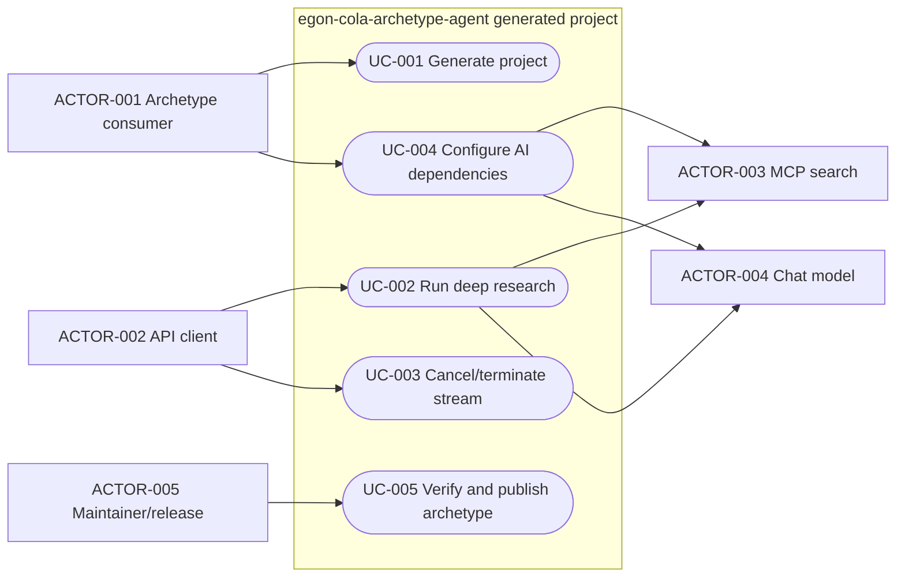
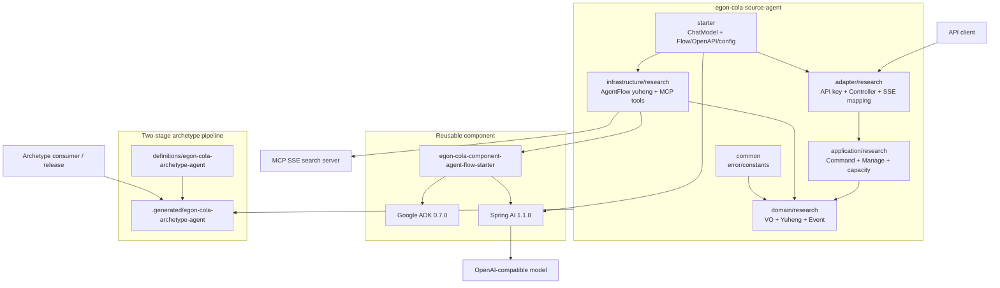
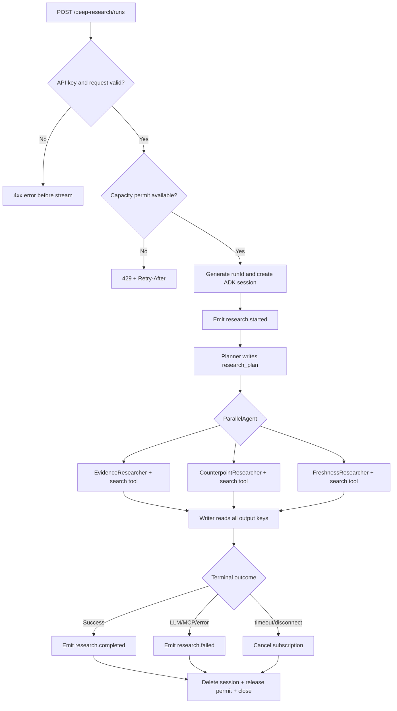
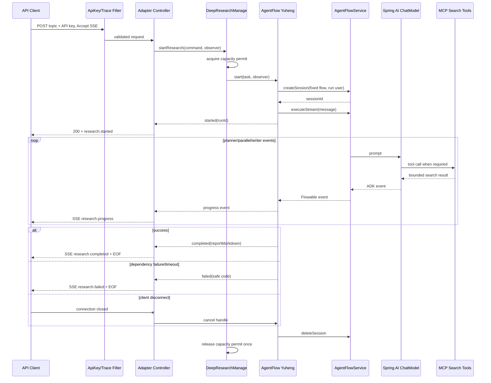

# Agent Deep Research Archetype 设计

| Field              | Value                                                                                                                                                                                                                                                |
|--------------------|------------------------------------------------------------------------------------------------------------------------------------------------------------------------------------------------------------------------------------------------------|
| Document           | `docs/egon/spec/2026-09-04-16-32-agent-deep-research-archetype.md`                                                                                                                                                                                   |
| Template Version   | `7`                                                                                                                                                                                                                                                  |
| Status             | `Accepted`                                                                                                                                                                                                                                           |
| Type               | `Architecture`                                                                                                                                                                                                                                       |
| Complexity         | `Complex`                                                                                                                                                                                                                                            |
| Complexity Drivers | 新增第七个可发布 Archetype、复用 Web 六模块依赖方向、Agent Flow/Spring AI/Google ADK/MCP 搜索集成、长耗时 SSE、取消与资源回收、生成及发布数量合同变更                                                                                                                                               |
| Created            | `2026-09-04 16:32 CST`                                                                                                                                                                                                                               |
| Updated            | `2026-09-04 19:02 CST`                                                                                                                                                                                                                               |
| Owner              | `User`                                                                                                                                                                                                                                               |
| Repository         | `Egon-COLA`                                                                                                                                                                                                                                          |
| Scope              | `egon-cola-archetypes` 下新增 `egon-cola-source-agent` 与 `egon-cola-archetype-agent`，生成项目只实现 Deep Research                                                                                                                                              |
| Change Surface     | 新增 Web-profile 六模块 Agent source project、Agent definition/IT/架构文档；扩展两阶段生成与发布数量合同；新增 Deep Research SSE API、Agent Flow 配置、Spring AI OpenAI-compatible ChatModel 与一个可配置的 MCP 搜索工具客户端；不改变现有六个 Archetype、数据库或前端                                            |
| Affected Chapters  | `§7, §8, §9, §10, §13, §14, §15, §16, §17, §18`                                                                                                                                                                                                      |
| Source Requirement | 用户要求在 Agent Flow Component 完成后，在 `archetypes` 下新增 Agent Archetype Project，只实现 Deep Research 业务，并采用 `egon-cola-archetype-web` 的架构方式；此前用户确认全部推荐项                                                                                                       |
| Baseline Revision  | `main@cd83ae3a6a8b60ab3bbbb4b76f6fad4b87f07a0d`；工作区已有用户修改和未跟踪 Spec/Plan，本设计不得覆盖、清理或提交它们                                                                                                                                                              |
| Amends             | [Archetype 两阶段生成、Spring 依赖治理与 Flyway 收敛设计](2026-09-03-11-04-archetype-generated-reactor-spring-flyway-design.md) `§1, §3.1, §4 requirements 1-11 and 20, §7-§9, §14-§16, §18-§20`，仅把受管 Archetype 集合从六个扩展为七个并加入 Agent family；其 Flyway、既有六个产品与发布安全规则不变 |
| Supersedes         | `None`                                                                                                                                                                                                                                               |
| Depends On         | [Agent Flow 扁平化组件设计](2026-09-04-09-34-agent-flow-component.md) `§1, §7-§10, §14-§16`；该 Component 必须先被接受、实现并可从当前 Reactor 解析                                                                                                                           |
| Related Specs      | [`egon-cola-components` 架构](../../../egon-cola-components/egon-cola-components-architecture.md) `§1-§5`                                                                                                                                              |
| Related Plans      | [Agent Deep Research Archetype 实施计划](../plan/2026-09-04-19-02-agent-deep-research-archetype-implementation.md)                                                                                                                                       |

## 1. Summary

本设计新增公开 Maven Archetype `top.egon:egon-cola-archetype-agent`。日常维护的事实源是正常 Maven 工程
`egon-cola-archetypes/source-projects/egon-cola-source-agent`；发布内容继续由现有
`scripts/generate_archetypes.sh` 根据 definition 确定性生成到忽略入库的 `.generated` Reactor。新工程精确采用
`egon-cola-archetype-web` 的六模块 Web profile：`common`、`domain`、`application`、`infrastructure`、
`adapter`、`starter`，但不复制学生管理、Facade、数据库、缓存、消息、GraphQL、ShardingSphere 或 Flyway 内容。

生成项目只提供一个 Deep Research 用例：客户端通过一个受 API Key 保护的
`POST /api/v1/deep-research/runs` 建立 SSE 流；应用层创建一次研究任务，Infrastructure 通过已实现的扁平
Agent Flow Component 执行 `规划 -> 三路并行检索/分析 -> 证据约束汇总` 的 Google ADK 流程。Starter 使用
Spring AI 创建具名 OpenAI-compatible `ChatModel`，并把由一个可配置 MCP SSE 搜索服务提供的
`ToolCallback` 装入模型默认选项。模型、MCP 与 API 密钥只来自环境配置；测试 profile 使用本地替身，不访问网络。

V1 不持久化 run/session/report，不提供恢复、历史查询或多实例共享。SSE 断连、超时或模型/搜索失败会取消订阅、
删除 ADK 内存 Session、释放本地并发许可并结束流。成功标准包括：六模块依赖方向、单一业务域、API/OpenAPI 契约、
工具与密钥边界、并发/超时/取消、Archetype 生成、生成项目 `clean verify` 和第七个发布制品均有确定性验证。

## 2. Background and Current State

### 2.1 Business and user context

前一阶段把参考项目的 Agent Workflow 抽取为通用、扁平的 Components Starter。该 Starter 有意不拥有 HTTP、
模型供应商、MCP、密钥或业务提示词。用户现在需要一个可生成的应用工程，展示如何在 Egon-COLA Web 分层中使用该
组件，并明确要求业务只保留 Deep Research。因此本设计的目标不是复制现有大型 Web 样例，而是复用其模块边界和
依赖方向，在该 profile 内给出一条最小但完整的 AI 长流程。

### 2.2 Repository evidence

| Evidence ID | Classification            | Exact path/symbol/decision/command                                                           | Observed fact                                                                                                             | Design significance                                                               | Verification limit/freshness        |
|-------------|---------------------------|----------------------------------------------------------------------------------------------|---------------------------------------------------------------------------------------------------------------------------|-----------------------------------------------------------------------------------|-------------------------------------|
| `EVD-001`   | Static repository         | `egon-cola-archetypes/source-projects/egon-cola-source-web/pom.xml`                          | Web source root 是 Java 21 / Boot 3.5.16 的六模块 Reactor                                                                      | Agent family 必须复制 profile 形状而非复制业务内容                                              | 静态 POM，不证明新工程可编译                    |
| `EVD-002`   | Static repository         | `egon-cola-source-web/README.md`                                                             | 精确依赖为 `common <- domain <- application <- adapter <- starter`，另有 `infrastructure -> domain` 和 `starter -> infrastructure` | 新 Agent 工程必须保持同方向                                                                 | 当前 Web 含与 Agent 无关的数据库/RPC 内容       |
| `EVD-003`   | Static repository         | `definitions/egon-cola-archetype-web/archetype.properties`                                   | `expectedTopology=common,domain,application,infrastructure,adapter,starter`                                               | Agent definition 使用同一 topology                                                    | 只证明生成清单格式                           |
| `EVD-004`   | Static repository         | `definitions/egon-cola-archetype-web/.../verify.groovy`                                      | 生成 IT 校验模块、包、POM、运行测试报告、源码 sentinel 与架构文档                                                                                 | Agent family 必须有自己的语义 verifier，不能只检查文件存在                                          | Web verifier 的持久化断言不能复用             |
| `EVD-005`   | Static repository         | `scripts/generate_archetypes.sh#discover_manifests/generate_all/write_generated_aggregator`  | 生成器动态发现 definitions，固定 create-from-project 3.4.1，并使用锁、staging、hash 和原子替换                                                  | 新 family 通过新增 source+definition 自动进入生成集合，不新增生成器分支                                 | 尚未对第七个 definition 执行                |
| `EVD-006`   | Static repository         | `egon-cola-archetypes/source-projects/pom.xml`                                               | source Reactor 当前列出六个 source family                                                                                       | 必须登记 `egon-cola-source-agent`                                                     | 静态模块清单                              |
| `EVD-007`   | Static repository         | `scripts/maven-deploy.sh#assert_generated_release_shape`                                     | 制品从 definitions 动态遍历，但最终硬编码期望 `6`                                                                                         | 新 family 必须把发布断言改为七个或等价的 definition-derived 断言                                    | 现状会阻断第七个制品                          |
| `EVD-008`   | Static repository         | `scripts/test-archetype-release.sh#test_definition_inventory`                                | 测试硬编码 `expected=6`，fixture 也只写六个 family                                                                                   | 发布测试必须覆盖 Agent family 和七制品合同                                                      | 未执行修改后测试                            |
| `EVD-009`   | Static repository         | `scripts/test-spring-dependency-management.sh`                                               | Boot/source 与 springdoc 清单显式枚举现有 source roots                                                                             | 新 Agent source root 必须进入 Boot Parent 与 springdoc 管理检查                             | 不要求加入 Dubbo 清单                      |
| `EVD-010`   | Accepted Spec             | `2026-09-03-11-04-archetype-generated-reactor-spring-flyway-design.md`                       | 已接受两阶段生成、definitions 单一清单、忽略 `.generated`、发布前 fail-closed Gate                                                            | 新 family 必须通过 amendment 扩展产品集合，不能绕过生成/发布链                                         | 该文档当前工作区有用户修改，本任务不编辑它               |
| `EVD-011`   | Predecessor Accepted Spec | `2026-09-04-09-34-agent-flow-component.md`                                                   | 定义 `AgentFlowService`、具名 `ChatModel`、配置编译、InMemoryRunner、同步/流式执行、取消和关闭                                                    | 生成项目复用该组件；不复制 ADK 装配器                                                             | 已接受但尚无可执行代码；必须先完成并验证对应 Plan         |
| `EVD-012`   | Static repository         | `egon-cola-source-web/.../GradeController`, `GradeManage`, `GradeManageImpl`                 | Adapter 只调用 Application Manage，Application 只调用 Domain 契约                                                                  | Deep Research 保持 Controller -> Manage -> Domain Yuheng -> Infrastructure Adapter | 示例本身非流式                             |
| `EVD-013`   | Static repository         | `OrganizationGlobalExceptionHandler`, `OrganizationErrorResponse`, `OrganizationTraceFilter` | Web profile 使用 ControllerAdvice 的稳定错误体与 `X-Trace-Id`                                                                      | 新项目复用形状与 trace 约定，并换成 Deep Research code namespace                                | 当前 auth filter 仅信任头，不适合直接保护付费 AI 接口 |
| `EVD-014`   | Static reference source   | `parallel_research_app.yml`                                                                  | 参考流程是 Parallel research agents 后接 SynthesisAgent，依赖搜索工具并通过 output-key 汇总                                                  | 保留 Parallel + Sequential 能力，改为通用 topic 和无密钥配置                                     | 参考 YAML 含供应商地址/凭据，不复制任何值            |
| `EVD-015`   | Static reference source   | `ChatModelNode`                                                                              | 参考实现把 MCP `ToolCallback` 放入 `OpenAiChatOptions` 后创建 `OpenAiChatModel`                                                     | 工具装配属于宿主 Archetype，不属于通用 component                                                | 参考使用旧版本和 DDD 节点链，仅作结构证据             |
| `EVD-016`   | Static reference source   | `AgentServiceController#chatStream`                                                          | 参考使用裸 `ResponseBodyEmitter`，未定义 SSE event、预流/流内错误、断连资源回收                                                                  | 新 API 必须设计明确 SSE 协议并 fail closed                                                  | 静态分析，未运行参考服务                        |
| `EVD-017`   | User decision             | 2026-09-04 “全部按照推荐”及本次补充                                                                     | 已确认前置 Component 推荐项，并要求新 Agent Archetype 只实现 Deep Research、采用 Web architecture                                            | 关闭 family/profile/业务范围决定                                                          | 不等于正式接受本 Spec                       |
| `EVD-018`   | Static worktree           | `git status --short --branch`                                                                | 存在用户的 Accepted Spec 修改、tsbuildinfo 和未跟踪 Plan/Spec                                                                         | 本任务只新增本 Spec，不覆盖、清理、stage 或 commit                                                | 2026-09-04 16:32 CST 快照             |

### 2.3 Problem statement and gap

当前仓库既没有 Agent Archetype，也没有一个按 Web profile 消费 Agent Flow Component 的生成项目。直接复制
`egon-cola-source-web` 会带入两个无关业务域、Facade、数据库、缓存、MQ、GraphQL、分片和大量运维资产；直接复制
参考 AI 项目则会带入 DDD Armory 节点链、动态 Spring Bean、明文供应商配置和未定义的 HTTP 流协议。

所需差异是：只复用 Web profile 的模块职责和依赖方向；只保留 Deep Research 一个业务域；把模型、搜索、ADK
执行放在 Infrastructure/Starter，把公共 HTTP 放在 Adapter，把用例与领域契约分开；同时将新 family 正式纳入
现有 source -> definition -> `.generated` -> release 流程。

### 2.4 Evidence and current-chain map

| Entry/trigger    | Current call chain                                                                                      | Data read/written                                | External dependency                | Consumers        | Evidence            |
|------------------|---------------------------------------------------------------------------------------------------------|--------------------------------------------------|------------------------------------|------------------|---------------------|
| Web Archetype 维护 | `source-web -> generate_archetypes.sh -> definition overlay -> .generated -> archetype IT`              | tracked source/definition；ignored generated tree | Maven Archetype Plugin             | 脚手架维护者/发布者       | `EVD-001`-`EVD-005` |
| 当前发布             | `maven-deploy.sh -> source install -> generate/check -> generated IT -> release-shape`                  | Maven target/local repo/Central bundle           | Maven repositories/Central         | Release operator | `EVD-007`-`EVD-010` |
| 参考 Deep Research | HTTP -> ChatService -> InMemoryRunner -> Parallel researchers -> Synthesis                              | JVM Session、LLM/MCP events                       | Chat model、MCP search              | AI API client    | `EVD-014`-`EVD-016` |
| 目标 Deep Research | `API-001 -> DeepResearchManage -> DeepResearchAgentGateway -> AgentFlowService -> ADK -> ChatModel/MCP` | 进程内 run/session/event；无 durable store            | OpenAI-compatible model、MCP search | API client       | `EVD-011`-`EVD-015` |

## 3. Goals and Non-goals

### 3.1 Goals

- 新增可发布的 `top.egon:egon-cola-archetype-agent`，并使生成项目是可独立导入、构建和运行的六模块工程。
- 精确复用 `egon-cola-archetype-web` 非 Open variant 的模块集合、domain-first 包顺序与依赖方向。
- 生成项目只实现 Deep Research：规划、三路并行检索/分析、基于证据的 Markdown 报告汇总。
- 通过前置 Agent Flow Component 使用 Spring AI 与 Google ADK，不在 Archetype 内复制 Flow 编译/Runner/Session 核心。
- 提供一个完整、受最小 API Key 保护、可取消的 SSE Command API，以及可生成验证的 OpenAPI 3 合同。
- 使用一个可配置 MCP SSE 搜索服务提供 Spring AI `ToolCallback`；所有 endpoint/key/model 配置环境化并禁止日志泄露。
- 保持无数据库、无持久化、无历史查询；在 JVM 内明确并发上限、总超时、断连清理和失败语义。
- 将第七个 family 纳入 source、definition、generated IT、release count 和 dependency-management Gate。

### 3.2 Non-goals

- 不把 Agent Flow Component 改成 COLA/DDD，不把 MCP、provider 或 HTTP 下沉进通用 component。
- 不复制 Web 示例的 user/teaching、Organization/Evaluation
  Facade、Dubbo、GraphQL、数据库、Flyway、MyBatis、Redis、RabbitMQ、Nacos、ShardingSphere 或 Compose 数据服务。
- 不实现研究历史、报告下载、暂停/恢复、断点续传、SSE resume、轮询状态、回调、队列、定时任务或多实例共享。
- 不实现浏览器/UI/Admin/A2A/RPC/消息接口；不创建前端页面。
- 不允许客户端上传任意系统提示词、MCP 地址、模型名、API Key 或未约束工具参数。
- 不承诺外部网页事实正确、搜索覆盖完整或模型输出无幻觉；报告必须提示来源与生成边界。
- 不修改已有六个 source/definition 的业务与验证，不修改任何既有 Flyway migration。
- 不在 Spec 阶段写 Plan、生产代码、生成 `.generated`、启动应用、连接模型/MCP、发布或提交。

### 3.3 Change Surface and Design Depth

| Area/layer                      | Disposition    | Exact repository evidence                                                   | Changed or preserved behavior/contract    | Required Spec treatment                  | Chapter(s)                                      |
|---------------------------------|----------------|-----------------------------------------------------------------------------|-------------------------------------------|------------------------------------------|-------------------------------------------------|
| Agent source project 六模块        | Affected       | `EVD-001`-`EVD-004`, `EVD-012`                                              | 新增单 Deep Research domain 的 Web-profile 工程 | 完整架构、树、接口、模型与测试                          | `§7, §8, §9, §10, §13, §14, §15, §16, §17, §18` |
| Agent definition/生成 IT/架构文档     | Affected       | `EVD-003`-`EVD-005`                                                         | 新增 `egon-cola-archetype-agent` 发布合同       | 文件级设计、生成/漂移/consumer 验证                  | `§7, §8, §9, §14, §15, §16, §17, §18`           |
| 生成与发布数量 Gate                    | Affected       | `EVD-007`-`EVD-010`                                                         | 受管产品由六个增至七个；其余 fail-closed 顺序不变           | amendment、脚本断言与回归                        | `§7, §8, §14, §15, §16, §17, §18`               |
| Deep Research REST/SSE/OpenAPI  | Affected       | `EVD-013`, `EVD-016`                                                        | 新增一个外部 Command 和四类 SSE event              | 完整 API、security、error、generated doc Gate | `§7, §8, §9, §10, §14, §15, §16, §17, §18`      |
| Spring AI/ADK/Agent Flow/MCP 装配 | Affected       | `EVD-011`, `EVD-014`, `EVD-015`                                             | 新增宿主级 ChatModel、搜索工具和固定 Flow 配置           | 生命周期、依赖、配置、失败与测试                         | `§7, §8, §9, §10, §13, §14, §15, §16, §17, §18` |
| 现有 Agent Flow Component Spec/实现 | Context-only   | `EVD-011`                                                                   | 作为规范依赖，不由本 Spec 改动                        | 记录调用边界和实现前置 Gate                         | `§7, §9, §16`                                   |
| 已有六个 Archetype                  | Unchanged      | `EVD-010`                                                                   | GAV、源码、definition、IT、业务和发布合同不变            | 七产品回归验证                                  | `§14, §16`                                      |
| 数据库与 Flyway                     | Not applicable | 新 Agent source 不声明 datasource/persistence；`EVD-010` 的 Flyway 范围只属于既有 family | 不新增表、SQL、migration 或事务性存储                 | §11 证据化 N/A                              | `§11`                                           |
| 前端/UI                           | Not applicable | 用户只要求 project business/API；仓库无对应 Agent 页面                                   | 无页面、路由或交互                                 | §12 证据化 N/A                              | `§12`                                           |

## 4. Requirements and Acceptance Criteria

| ID        | Atomic requirement                                                           | Priority | Observable acceptance criteria                                                                                | Source                  |
|-----------|------------------------------------------------------------------------------|----------|---------------------------------------------------------------------------------------------------------------|-------------------------|
| `REQ-001` | 新增独立 `egon-cola-archetype-agent` family，而不是修改 Web family 业务                  | Must     | source、definition、generated artifact 使用独立 Agent identity，Web 生成结果无 Deep Research 文件                           | 用户补充要求                  |
| `REQ-002` | Agent source 精确使用 Web 非 Open 的六模块 profile                                    | Must     | 模块顺序及依赖图匹配 `common/domain/application/infrastructure/adapter/starter`，无第七 facade 模块                           | 用户指定 architecture       |
| `REQ-003` | 生成项目只包含 Deep Research 一个业务域                                                  | Must     | Java 业务包只有 `research`；无 user/teaching/CRUD/RPC/GraphQL/persistence 业务                                         | 用户“业务就实现 deep research” |
| `REQ-004` | Deep Research 必须复用前置 Agent Flow Component、Spring AI 1.1.8 和 Google ADK 0.7.0 | Must     | Infrastructure 仅调用 `AgentFlowService`；无复制的 Runner/compiler/session 实现；effective POM 版本一致                      | 前置 Spec/用户要求            |
| `REQ-005` | 固定流程必须先规划，再三路并行研究，最后只基于中间证据汇总                                                | Must     | 配置树为 Sequential(Planner, Parallel(Evidence, Counterpoint, Freshness), Writer)，每个 output-key 唯一且 Writer 引用全部结果 | 推荐 Deep Research 边界     |
| `REQ-006` | 搜索能力由一个可配置 MCP SSE 服务转换为 Spring AI ToolCallbacks                             | Must     | dev/prod 缺 endpoint/key 或工具列表为空时启动失败；test 使用 fake；无供应商 URL/key 入库                                             | 参考能力的安全转化               |
| `REQ-007` | 提供且只提供一个 `POST /api/v1/deep-research/runs` SSE Command                       | Must     | 无 create-session/list/status/history API；一次请求获得 started/progress/completed 或 failed 事件并终止                     | 最小接口推荐                  |
| `REQ-008` | API 必须校验 topic、language、maxSources、Accept/Content-Type 和 API Key             | Must     | 无效输入分别返回定义的 400/401/406/415，模型/工具不被调用                                                                         | API contract            |
| `REQ-009` | SSE 必须定义稳定 event/id/data、顺序、终止、预流与流内错误语义                                     | Must     | event ID 单调；completed/failed 恰有一个；建立流后的错误不改变 HTTP status                                                      | API contract            |
| `REQ-010` | 每次 run 必须有独立 ADK Session，并在完成、失败、超时、取消和断连后删除                                 | Must     | 任何终态后 session/guard/subscription/permit 均无泄漏；无跨 run state                                                     | 前置组件会话边界                |
| `REQ-011` | 本地并发与总时长必须受限                                                                 | Must     | 默认最多 4 个并发 run；饱和返回 429 + Retry-After；默认 5 分钟超时产生 failed event/503 pre-stream                                 | 成本与资源安全                 |
| `REQ-012` | API、模型与 MCP 密钥不得进入请求业务体、源码、日志、SSE 或 OpenAPI example                          | Must     | secret scan 与日志测试为零泄露；仅从环境/外部 secret source 解析                                                                | 安全要求                    |
| `REQ-013` | 无数据库、无 durable state、多实例共享或恢复承诺                                              | Must     | POM/源码/资源无 JDBC/Flyway/Redis/Repository；README 明示重启丢失和 retry 新建 run                                           | 用户最小业务范围                |
| `REQ-014` | OpenAPI 必须 code-first 且与运行时验证、SSE schema、错误和 API Key 一致                      | Must     | `/v3/api-docs` 测试断言 operationId、media types、security、responses、constraints 和 schemas                          | API documentation gate  |
| `REQ-015` | source/definition/generated 项目必须无 source sentinel 且可独立 `clean verify`        | Must     | Agent verifier 检查拓扑、依赖、业务文件、测试报告、禁止项、架构文档与 sentinel                                                           | Archetype quality       |
| `REQ-016` | 两阶段生成与发布合同必须从六产品安全扩展到七产品                                                     | Must     | generate/check、generated profile、release test 和 release-shape 识别恰好七个唯一 definition artifacts                   | Accepted Spec amendment |
| `REQ-017` | 现有六个 Archetype 与所有 Flyway 文件必须保持不变                                           | Must     | path-limited diff 无既有 family 业务/definition/Flyway 修改；全套回归仍通过                                                  | Scope/safety            |
| `REQ-018` | 所有测试必须离线、确定性且不启动真实模型/MCP/数据库/浏览器/Docker                                      | Must     | test profile 使用 fake ChatModel/ToolCallbacks；验证命令无需凭据或外部服务                                                    | AGENTS/前置边界             |

### 4.1 Scenario matrix

| Scenario    | Actor/trigger              | Preconditions                | Main path                                                                    | Alternative/failure path | Data/state change              | Observable result                     | Requirements                    |
|-------------|----------------------------|------------------------------|------------------------------------------------------------------------------|--------------------------|--------------------------------|---------------------------------------|---------------------------------|
| 正常研究        | API client 提交 topic        | API Key 有效、容量可用、模型/MCP READY | 建 session -> planner -> 三路 parallel -> writer -> completed -> delete session | 无                        | 仅 JVM 临时 run/session           | 有序 SSE，最终 Markdown 报告                 | `REQ-005`-`REQ-010`             |
| 输入拒绝        | client 发送 blank/超限/未知 enum | 请求到达 Adapter                 | Bean Validation/媒体协商拒绝                                                       | 无模型调用                    | 无 run/session                  | 400/406/415 error body                | `REQ-007`, `REQ-008`            |
| 认证拒绝        | 缺失或错误 API Key              | 请求到达安全 filter                | 常量时间比较失败                                                                     | 不进入 Controller           | 无状态                            | 401，安全错误不泄露 key                       | `REQ-008`, `REQ-012`            |
| 容量饱和        | 第 5 个默认并发请求                | 四个许可占用                       | CapacityGuard fail-fast                                                      | 客户端稍后显式重试                | 不建 session                     | 429 + `Retry-After: 5`                | `REQ-011`                       |
| MCP/模型预检失败  | 启动时工具为空或 Bean 缺失           | dev/prod profile             | context fail closed                                                          | 不发布 API READY            | 已建 MCP client 关闭               | 启动失败且日志无 secret                       | `REQ-004`, `REQ-006`, `REQ-012` |
| 流中依赖失败      | MCP/LLM 在 200 后报错          | SSE 已建立                      | yuheng 映射 safe failure -> failed -> close                                   | 不自动 retry 付费调用           | session 删除、permit 释放           | 一个 `research.failed` 后 EOF            | `REQ-009`-`REQ-011`             |
| 客户端断连       | 浏览器/调用方关闭连接                | run ACTIVE                   | emitter callback 取消 Flowable subscription                                    | late event 被丢弃           | session 删除、permit 释放           | 服务端记录 runId/traceId outcome=CANCELLED | `REQ-009`, `REQ-010`            |
| 总超时         | run 超过 5 分钟                | SSE 已建立或启动阶段阻塞               | deadline 取消下游                                                                | 无内部 retry                | 同步清理所有租约                       | 流内 failed code `RESEARCH_TIMEOUT`     | `REQ-010`, `REQ-011`            |
| 重复客户端 retry | 同一 body 再次 POST            | 前一次未知/失败                     | 创建新 runId                                                                    | 可能产生第二次费用                | 新独立 session                    | 文档明确 non-idempotent                   | `REQ-007`, `REQ-009`, `REQ-013` |
| 生成与发布       | maintainer 运行 pipeline     | Component 已可解析、definition 完整 | source verify -> generate/check -> 7 IT -> release shape                     | 任一失败禁止 deploy            | 仅 target/.generated/local repo | 七个制品且旧六个不变                            | `REQ-015`-`REQ-018`             |

### 4.2 Use-case analysis

#### 4.2.1 Actor inventory

| Actor ID    | Actor/role                            | Goal and responsibility             | Entry/channel       | Permission/tenant context                  | Evidence                 |
|-------------|---------------------------------------|-------------------------------------|---------------------|--------------------------------------------|--------------------------|
| `ACTOR-001` | Archetype consumer/developer          | 生成并定制 Deep Research 应用              | Maven Archetype CLI | 本地构建身份，无 tenant                            | 用户要求、`EVD-003`-`EVD-005` |
| `ACTOR-002` | API client                            | 提交研究主题并消费实时结果                       | HTTPS/SSE `API-001` | `researchApiKey`；V1 无 tenant/user identity | `REQ-007`, `REQ-008`     |
| `ACTOR-003` | MCP search service                    | 提供可调用搜索工具及结果                        | SSE MCP client      | endpoint credential 由服务端配置                 | `EVD-014`, `REQ-006`     |
| `ACTOR-004` | OpenAI-compatible model               | 执行 planner/researcher/writer LLM 调用 | Spring AI ChatModel | provider key 由服务端配置                        | `EVD-015`, `REQ-004`     |
| `ACTOR-005` | Archetype maintainer/release operator | 维护、验证并发布第七个 artifact                | Git/Maven scripts   | 仓库/Central 权限                              | `EVD-005`-`EVD-010`      |

#### 4.2.2 Use-case artifact



| ID       | Use case/goal        | Primary actor | Supporting actors/systems            | Trigger            | Preconditions                        | Main success outcome             | Alternatives/failures                       | Postconditions      | Requirements                   | Interfaces/pages      | Tests                 |
|----------|----------------------|---------------|--------------------------------------|--------------------|--------------------------------------|----------------------------------|---------------------------------------------|---------------------|--------------------------------|-----------------------|-----------------------|
| `UC-001` | 生成可开发项目              | `ACTOR-001`   | Maven/definition                     | archetype:generate | artifact 已 install                   | 六模块项目生成且无 sentinel               | invalid property/IT fail                    | 无半成品发布              | `REQ-001`-`REQ-003`, `REQ-015` | CLI-001               | `TEST-018`-`TEST-021` |
| `UC-002` | 获取 Deep Research 报告  | `ACTOR-002`   | `ACTOR-003`, `ACTOR-004`, Agent Flow | POST topic         | auth/config/capacity READY           | received completed report        | validation/auth/capacity/dependency/timeout | session 已删除         | `REQ-004`-`REQ-012`            | API-001               | `TEST-001`-`TEST-015` |
| `UC-003` | 主动终止研究               | `ACTOR-002`   | Agent Flow                           | 断开 SSE             | run ACTIVE                           | 下游取消并清理                          | close race/late event                       | 无 session/permit 泄漏 | `REQ-009`-`REQ-011`            | API-001, INTERNAL-002 | `TEST-010`-`TEST-013` |
| `UC-004` | 安全配置模型与搜索            | `ACTOR-001`   | `ACTOR-003`, `ACTOR-004`             | 应用启动               | env secrets 存在                       | named ChatModel/tools/flow READY | missing/empty/invalid config fail startup   | 无 partial registry  | `REQ-004`-`REQ-006`, `REQ-012` | INTERNAL-003          | `TEST-014`-`TEST-017` |
| `UC-005` | 验证发布 Agent Archetype | `ACTOR-005`   | Maven/Central                        | release preflight  | Component/source/definition complete | 七 artifact shape verified        | 任一 Gate 非零即停止                               | 不发布部分 bundle        | `REQ-015`-`REQ-018`            | CLI-002               | `TEST-020`-`TEST-024` |

## 5. Constraints, Assumptions, and Decisions

### 5.1 Confirmed constraints

- 新 family 必须晚于 Agent Flow Component 实施；Plan 不得合并顺序或复制未完成 API。
- Java 21、Spring Boot 3.5.16、Spring AI 1.1.8、Google ADK 0.7.0 与前置 Spec 保持一致。
- Archetype source 是正常项目，definition 保存非业务发布合同，`.generated` 是禁止手工编辑的派生物。
- 精确采用 Web non-open 六模块 profile；“采用架构方式”不等于复制 Web 样例的所有集成。
- 新业务只有 Deep Research；任何第二业务、CRUD、DB、GraphQL、RPC 或 UI 都需新 Spec。
- 生产实现不得包含参考 YAML 中的任何 URL、token、key、用户数据或供应商专有提示词。

### 5.2 Small-gap assumptions

| ID        | Inference                                                                       | Repository evidence                     | Why locally reversible | Impact if wrong               |
|-----------|---------------------------------------------------------------------------------|-----------------------------------------|------------------------|-------------------------------|
| `ASM-001` | public family 名称取 `egon-cola-archetype-agent`，source 取 `egon-cola-source-agent` | 六个 family 的 source/target 命名规则          | 只在新 family 内，发布前可重命名   | 发布后 GAV 不可无迁移改名               |
| `ASM-002` | generated basic IT artifact 取 `deep-research-agent`、package `it.pkg`            | Web basic IT 使用业务语义 artifact 与 `it.pkg` | 仅测试夹具                  | 不影响消费者默认参数                    |
| `ASM-003` | V1 报告语言只允许 `zh-CN`、`en-US`，默认 `zh-CN`                                           | 用户中文语境；无需开放任意 locale                    | enum 可兼容增加             | 其他语言请求当前 400                  |
| `ASM-004` | 一个 MCP SSE search server 暴露至少一个 search ToolCallback                             | 参考 Deep Research 只依赖一个 search provider  | 实现通过启动校验，不绑定工具名        | 若 server schema 不兼容则启动失败并更换配置 |
| `ASM-005` | `maxSources` 是成本提示和工具输入上限，不是保证返回条数                                              | 外部搜索结果不可控                               | 文档可明确且服务端强制最大值         | 消费者不能据此做精确分页                  |

### 5.3 Resolved decisions

| ID        | Decision                                                                                             | Decision owner                     | Evidence and rationale                           | Requirements         |
|-----------|------------------------------------------------------------------------------------------------------|------------------------------------|--------------------------------------------------|----------------------|
| `DEC-001` | 建立独立 Agent family，不污染 Web family                                                                     | User + Spec recommendation         | 用户明确说“agent archetype”；独立发布和演进边界最小               | `REQ-001`            |
| `DEC-002` | 选择 Web non-open 六模块 profile，严格保持依赖方向                                                                 | User                               | 用户点名 `egon-cola-archetype-web`；不需要 facade module | `REQ-002`            |
| `DEC-003` | 只实现 `research` domain，无数据库与其他业务                                                                      | User                               | 用户明确限制业务；长流程 V1 可完全进程内                           | `REQ-003`, `REQ-013` |
| `DEC-004` | 唯一外部接口是 POST + SSE REST task Command，CQRS L1                                                         | User-approved recommended approach | 长耗时流式结果无法诚实建模为普通 CRUD；Query/status API无独立价值      | `REQ-007`-`REQ-009`  |
| `DEC-005` | 采用单 API Key header `researchApiKey`；V1 无 tenant/user identity                                        | Spec recommendation                | 付费 AI endpoint 不能沿用匿名可信头；OAuth/tenant 超出单业务样例    | `REQ-008`, `REQ-012` |
| `DEC-006` | 模型使用 Spring AI OpenAI-compatible `ChatModel`，搜索使用 MCP SSE ToolCallbacks，均由 Starter/Infrastructure 配置 | Spec recommendation                | 与参考链一致，同时不把供应商配置放入通用 component                   | `REQ-004`, `REQ-006` |
| `DEC-007` | 固定 Sequential + Parallel workflow，不允许请求覆盖 prompt/flow/tool/model                                     | Spec recommendation                | 满足 Deep Research 变化点且关闭 prompt/tool 注入配置面        | `REQ-005`, `REQ-012` |
| `DEC-008` | 采用进程内 Bulkhead、5 分钟 deadline、断连取消和一次 run 一次 session；不重试 LLM/MCP                                      | Spec recommendation                | 防成本放大与资源泄漏；调用方 retry 明确新 run                     | `REQ-009`-`REQ-011`  |
| `DEC-009` | 两阶段产品集合从六扩到七；生成器继续动态发现，发布数量断言同步扩展                                                                    | Accepted design + amendment        | 保持单一清单和单 bundle，不另造 Agent 发布路径                   | `REQ-015`-`REQ-017`  |

### 5.4 Open major decisions

无。以上选择均来自用户明确要求或“全部按照推荐”的授权；正式进入 Plan 仍要求本 Spec 与前置 Component Spec 被显式接受。

## 6. Project Technology Context

| Concern          | Current choice                                                                 | Repository evidence         | Constraint on design                                  |
|------------------|--------------------------------------------------------------------------------|-----------------------------|-------------------------------------------------------|
| Java/Boot        | Java 21 / Spring Boot 3.5.16                                                   | root/source Web POM         | 新 source root 直接继承 Boot Parent，不重复 import Boot BOM    |
| AI               | Spring AI 1.1.8 / Google ADK 0.7.0                                             | 前置 Agent Flow Spec          | 版本只在 root/source dependency management 有一个来源          |
| Flow runtime     | `egon-cola-component-agent-flow-starter`                                       | `EVD-011`                   | Archetype 不复制 Agent compiler/Runner/session 实现        |
| Web/API          | Spring MVC + springdoc 2.8.17                                                  | source Web POM、OpenAPI test | 使用 code-first OpenAPI 3 与 `io.swagger.v3` annotations |
| Search tool      | Spring AI MCP + MCP Java sync SSE client                                       | `EVD-014`, `EVD-015`        | endpoint/key 外置；MCP lifecycle 显式关闭；test fake          |
| Build/generation | Maven Wrapper + Archetype Plugin 3.4.1                                         | `EVD-003`-`EVD-010`         | source/definition/generated 三边界与七产品 Gate              |
| Test             | JUnit 5, MockMvc, ApplicationContext/SpringBootTest, Groovy archetype verifier | Web source/definition       | `clean verify`，不只运行 `test`                            |
| Persistence      | None                                                                           | `REQ-013`                   | 禁止 datasource/JPA/MyBatis/Flyway/Redis 依赖和文件          |

### 6.1 Java architecture profile and capability baseline

| Architecture profile   | Archetype/template or base package                                                         | Exact evidence and verifier                                         | Existing deviations                                  | Design action                            |
|------------------------|--------------------------------------------------------------------------------------------|---------------------------------------------------------------------|------------------------------------------------------|------------------------------------------|
| Egon-COLA Web non-open | `source-projects/egon-cola-source-web`; target base `top.egon.cola.archetype.source.agent` | `EVD-001`-`EVD-004`, Agent `verify.groovy`, `AgentArchitectureTest` | 不复制 Web 的 Facade/DB/MQ/GraphQL；这些是业务能力而非 profile 必需层 | 保留六模块/依赖/domain-first；每层只留 research 必要职责 |

| Need                         | Spring/JDK candidate                  | Spring Boot Starter candidate         | Egon-COLA/module candidate       | Proven gap                                              | Decision/dependency impact                                 |
|------------------------------|---------------------------------------|---------------------------------------|----------------------------------|---------------------------------------------------------|------------------------------------------------------------|
| Flow compiler/session/stream | None                                  | None                                  | Agent Flow Component             | 当前尚未实现但已有前置 Spec                                        | 必须先实现，Infrastructure 依赖其 Starter artifact                  |
| HTTP/SSE                     | Spring MVC `SseEmitter`               | `spring-boot-starter-web`             | Web profile Adapter convention   | 现有 Controller 无完整 stream contract                       | 复用 MVC，仅新增 Adapter endpoint                                |
| Validation                   | Jakarta Validation                    | validation starter via Web            | 现有 ControllerAdvice style        | SSE request 需要完整 constraints                            | 复用标准验证和错误体                                                 |
| OpenAPI                      | annotations                           | `springdoc-openapi-starter-webmvc-ui` | Web root springdoc BOM           | 现有 Agent 无文档                                            | 复用 BOM 2.8.17，生产 UI disabled                               |
| Model                        | Spring AI `OpenAiChatModel`           | OpenAI model starter/library          | none                             | 通用 component 不创建 provider                               | Starter owns named model Bean                              |
| Search                       | Spring AI `ToolCallback`              | MCP client support                    | none                             | Deep Research 必须有 external evidence lookup              | Infrastructure owns one MCP client/tool provider           |
| Concurrency/deadline         | JDK `Semaphore`, `Clock`, scheduler   | Spring Task support                   | none                             | Agent component guard only protects same session，不做业务容量 | Application `ResearchCapacityService` + component deadline |
| API security                 | constant-time secret compare + filter | Web starter                           | Web trace/filter convention      | 现有 Web auth header是 demo identity，不保护成本                 | Adapter API-key filter；不引入 OAuth/tenant                    |
| Mapping                      | MapStruct                             | MapStruct processor                   | common-core `BaseConverter<S,T>` | 四个真实 request/event/error 边界需要类型安全转换                     | 四个非 Spring static Mapper interfaces，避免生成 Bean 命名不确定        |

### 6.2 User-mandated Java rule compliance

| Literal rule | Affected? | Repository evidence                                                                        | Exact design decision                                                                                                                                                 | Files/types/interfaces                                                                                            | Validation/test evidence                             | Status/blocker |
|--------------|-----------|--------------------------------------------------------------------------------------------|-----------------------------------------------------------------------------------------------------------------------------------------------------------------------|-------------------------------------------------------------------------------------------------------------------|------------------------------------------------------|----------------|
| Rule 1       | Yes       | Web source 的 Request/Command/Event/VO/Properties/Yuheng/Manage 命名；§8.2/§10.1 完整 inventory | 所有 carrier 使用 `Request/Command/BO/VO/Event`，枚举用 `Enum`，行为用 `Controller/Service/Yuheng/Converter/Factory/Exception`；不用 Data/Info/Param/Bean                           | §8.2 与 §10.1 精确类型                                                                                                 | `TEST-018`, `TEST-019`, `TEST-021` naming scan       | PASS           |
| Rule 2       | Yes       | API -> Adapter -> Application -> Domain Yuheng -> Component 全 handoff                     | HTTP 使用 Jakarta Validation；Application/Domain 通过 compact constructor + `ValidationUtils` 复验；无电话号码字段所以 libphonenumber N/A；无复用 create/update 场景所以 Validation Group 不需新增 | Request/Command/BO/Properties 与 INTERNAL-001/002                                                                  | `TEST-002`, `TEST-003`, `TEST-015`                   | PASS           |
| Rule 3       | Yes       | 当前 BaseConverter 位于 common-core；Web 使用 MapStruct/MapStructPlus 与 records                   | 简单 carrier 全用 record；四个跨边界 Converter 使用非 Spring `@Mapper`、`Mappers.getMapper` 并实现 exact `BaseConverter<S,T>`；复杂生命周期行为不是 data object，不套数据类 Lombok组合                    | `DeepResearchCommandConverter`, `DeepResearchErrorConverter`, `ResearchEventConverter`, `AgentFlowEventConverter` | converter compile/mapping tests + constructor review | PASS           |
| Rule 4       | Yes       | Web `lombok.config` 与 constructor injection pattern                                        | 每个具体业务行为类使用 `@Slf4j`；Spring Bean 有显式名；依赖为 final + `@Qualifier`，类使用 `@RequiredArgsConstructor`；lombok.config 复制 Qualifier 到构造参数                                        | ManageImpl/GatewayImpl/Factory/filters/config；Converters 非 Spring static mapper                                   | context wiring + logging/source tests                | PASS           |
| Rule 5       | Yes       | §6.1 reuse ledger、JDK/Spring/Egon capabilities                                             | 只用 JDK、Spring、Egon 和已批准 AI/MCP framework；不创建 `*Utils`，不使用 BeanUtils/JSON 做转换                                                                                          | all affected call sites                                                                                           | dependency/import scan                               | PASS           |
| Rule 6       | Yes       | API-001 JSON/SSE/Error contract                                                            | Spring Boot Jackson-only；Request 显式拒绝 unknown/null；VO/ErrorResponse 明确 NON_NULL/Instant/enum wire；不输出 polymorphic class 或 secrets                                     | Request/EventVO/ErrorResponse                                                                                     | `TEST-002`, `TEST-008`, `TEST-020`                   | PASS           |
| Rule 7       | Yes       | dev/test/prod profiles                                                                     | 模型/MCP/security/limits/docs key 集合三 profile 一致，值可不同；typed validated Properties                                                                                        | application-*.yml/Properties                                                                                      | `TEST-016`                                           | PASS           |
| Rule 9       | Yes       | planner/parallel/writer、stream observer、terminal race 与 capacity 是复杂业务协作                   | 采用 Adapter + Observer + Facade + Bulkhead + immutable configured workflow；参与者/选择/失败/扩展见 §13                                                                           | Yuheng/ObserverService/Manage/CapacityService/Flow config                                                        | `TEST-005`, `TEST-007`-`TEST-014`                    | PASS           |
| Rule 10      | Yes       | run/event/deadline/timeouts 全部是新时间边界                                                       | `Instant` 为 UTC millisecond JSON，`Duration` 为 ISO-8601 config，`Clock` 可注入；禁止新 Date/Calendar/SimpleDateFormat                                                          | DeepResearchEvent/TaskBO/Properties                                                                               | time serialization/config/source scan                | PASS           |
| Rule 11      | Yes       | 用户指定 Web archetype；`EVD-001`-`EVD-004`                                                     | 严格采用一个 Web non-open profile；不混合扁平 Component 包结构、Traditional `biz.*` 或新层                                                                                               | six modules + §8.2                                                                                                | `AgentArchitectureTest` + generated verifier         | PASS           |

## 7. Architecture Design

### 7.0 Minimum-design baseline and element-necessity audit

| Proposed element                  | Change | Requirements         | Existing/direct alternative   | Concrete inadequacy of alternative | Added calls/state/coupling/failures/migration/operations | Verdict |
|-----------------------------------|--------|----------------------|-------------------------------|------------------------------------|----------------------------------------------------------|---------|
| 独立 Agent Archetype                | New    | `REQ-001`            | 把 Deep Research 塞进 Web family | 污染学生管理模板且无法独立发布/演进                 | 一个 source/definition/artifact/release surface            | Add     |
| 六个应用模块                            | New    | `REQ-002`            | 单模块 demo                      | 用户明确要求 Web architecture，单模块不满足     | Maven edges 与构建成本                                        | Add     |
| `API-001`                         | New    | `REQ-007`-`REQ-009`  | CLI/Java-only                 | 外部调用方无法提交并观察长流程                    | 一个 HTTP stream/security/error contract                   | Add     |
| create-session/status/history API | Remove | `REQ-007`, `REQ-013` | API-001 内部创建/清理               | None；没有独立消费目标或 durable state       | 若保留会增加多接口/状态存储/TOCTOU                                    | Remove  |
| MCP search adapter                | New    | `REQ-005`, `REQ-006` | 只靠模型内知识                       | 不能执行证据检索，不构成目标 Deep Research       | 外部调用、密钥、timeout/lifecycle                                | Add     |
| 多个 search providers               | Remove | `REQ-006`            | 一个 MCP server                 | None；V1 无第二 provider               | factory/strategies/config/失败分支                           | Remove  |
| database/report repository        | Remove | `REQ-013`            | SSE 直接返回                      | None；无历史/恢复需求                      | durable state/migration/transaction/ops                  | Remove  |
| GraphQL/RPC/Event/UI              | Remove | `REQ-003`, `REQ-007` | REST SSE                      | None；无相应 consumer                  | 重复协议与维护                                                  | Remove  |
| API Key filter                    | New    | `REQ-008`, `REQ-012` | 匿名付费 endpoint                 | 无法提供最低访问控制和成本边界                    | 一次 header compare + secret config                        | Add     |
| OAuth2/tenant RBAC                | Remove | `REQ-003`            | 单 service API key             | V1 无用户/tenant/RBAC use case        | issuer/claims/policies/额外失败                              | Remove  |

| Path            | Network calls                                     | Client states                         | Server contracts/state                      | Failure and TOCTOU points                                    | Additional user/business value      |
|-----------------|---------------------------------------------------|---------------------------------------|---------------------------------------------|--------------------------------------------------------------|-------------------------------------|
| Direct baseline | 1 HTTP + N model calls；无搜索                        | loading/completed/failed              | one endpoint + in-memory run                | 模型失败；无检索证据                                                   | 能生成普通模型回答，但不满足 Deep Research        |
| Selected design | 1 HTTP SSE + N model calls + bounded MCP searches | connecting/streaming/completed/failed | one endpoint + API key + run/session/permit | auth/capacity/model/MCP/stream disconnect；无 preflight TOCTOU | 实时展示且报告基于外部检索证据；仍保持一个客户端 round trip |

### 7.1 System Architecture Design

#### 7.1.1 Architecture Mermaid view



#### 7.1.2 Boundary and responsibility table

| Boundary            | Owns                                                                    | Inbound/outbound contract       | Must not own                               | Requirements                              |
|---------------------|-------------------------------------------------------------------------|---------------------------------|--------------------------------------------|-------------------------------------------|
| Common              | error code constants、safe utility only if reused                        | Java constants                  | AI/API/domain state                        | `REQ-002`, `REQ-003`                      |
| Domain              | `ResearchTopicBO`、`DeepResearchEvent`、Yuheng/Observer Service contract | pure Java                       | Spring/ADK/HTTP/MCP                        | `REQ-002`, `REQ-010`                      |
| Application         | Command validation、capacity lease、use-case orchestration                | `DeepResearchManage`            | HTTP/ADK/tool client                       | `REQ-003`, `REQ-007`, `REQ-011`           |
| Infrastructure      | AgentFlow adapter、MCP lifecycle/tool callbacks                          | Domain Yuheng -> component/MCP | Controller/security/business prompt choice | `REQ-004`-`REQ-006`, `REQ-010`            |
| Adapter             | API Key/trace、request mapping、SSE lifecycle/error                       | API-001 -> Manage               | direct Infrastructure/component call       | `REQ-007`-`REQ-009`, `REQ-012`, `REQ-014` |
| Starter             | app assembly、OpenAI ChatModel、fixed Flow config、OpenAPI/profile config  | Spring Boot context             | business use-case implementation           | `REQ-004`-`REQ-006`, `REQ-012`            |
| Definition/pipeline | metadata/post-generate/IT/verifier/public packaging                     | source -> generated artifact    | authoritative business source              | `REQ-015`-`REQ-017`                       |

### 7.2 High-Level Design

#### 7.2.1 Critical business/control flowchart



#### 7.2.2 High-level decision and quality matrix

| Concern/use case | Required behavior                                | Selected mechanism                        | Failure/degradation behavior                          | Trade-off                          | Verification                   | Requirements         |
|------------------|--------------------------------------------------|-------------------------------------------|-------------------------------------------------------|------------------------------------|--------------------------------|----------------------|
| Layering         | Web profile dependency direction                 | six modules, domain-first                 | architecture violation fails verify                   | more modules than demo             | architecture test + verifier   | `REQ-002`, `REQ-003` |
| Workflow         | evidence-backed parallel research then synthesis | fixed Sequential + Parallel config        | invalid graph/tools fail startup                      | flow is not request-customizable   | config graph + prompt snapshot | `REQ-004`-`REQ-006`  |
| Streaming        | ordered progress and one terminal outcome        | one POST SSE + Observer                   | dependency/timeout becomes failed; disconnect cancels | no resume/history                  | MockMvc/lifecycle tests        | `REQ-007`-`REQ-010`  |
| Cost             | bounded expensive work                           | fair 4-run Bulkhead + 5-minute deadline   | 429 or timeout, no server retry                       | process-local only                 | saturation/deadline tests      | `REQ-011`            |
| Security         | no anonymous billed access or secret leak        | API key + server-owned config + redaction | 401/fail-closed startup                               | service-level, not user-level auth | filter/config/log tests        | `REQ-008`, `REQ-012` |
| Packaging        | seventh artifact in same release chain           | definition discovery + seven shape gate   | any failure blocks deploy                             | larger bundle/test time            | generate/check/release tests   | `REQ-015`-`REQ-017`  |

### 7.3 Detailed Design

#### 7.3.1 Detailed component collaboration

| Step | Caller -> callee            | Symbol/contract                    | Input/output                        | State/side effect           | Failure handling                      | Requirements                    |
|------|-----------------------------|------------------------------------|-------------------------------------|-----------------------------|---------------------------------------|---------------------------------|
| 1    | Filter -> Controller        | API key/trace chain                | headers -> request context          | MDC trace only              | 401/400 before stream                 | `REQ-008`, `REQ-012`            |
| 2    | Controller -> Converter     | `toCommand(request)`               | DTO -> Command                      | none                        | validation 400                        | `REQ-008`                       |
| 3    | Controller -> Manage        | `startResearch(command, observer)` | Command + Observer -> Handle        | capacity lease              | 429 if busy                           | `REQ-007`, `REQ-011`            |
| 4    | Manage -> Domain            | `ResearchTopicBO.create`           | normalized topic                    | immutable BO                | application validation error          | `REQ-008`                       |
| 5    | Manage -> Yuheng           | `start(task, observer)`            | domain task -> handle               | runId/session               | dependency unavailable pre-stream 503 | `REQ-009`, `REQ-010`            |
| 6    | Yuheng -> AgentFlowService | create + executeStream             | fixed flowId/userId/session/message | ADK session/subscription    | map safe failure; no retry            | `REQ-004`, `REQ-010`            |
| 7    | ADK -> ChatModel/tools      | planner/research/writer prompts    | text/tool calls/events              | external billed calls       | timeout/cancel propagates             | `REQ-005`, `REQ-006`, `REQ-011` |
| 8    | Yuheng -> Observer         | started/progress/completed/failed  | domain event                        | sequence increment          | observer error triggers cancel        | `REQ-009`, `REQ-010`            |
| 9    | Adapter -> SseEmitter       | event/id/data JSON                 | `DeepResearchEventVO`               | socket write                | disconnect callback cleanup           | `REQ-009`, `REQ-010`            |
| 10   | terminal cleanup            | handle/subscription/session/permit | terminal reason                     | all resources released once | idempotent CAS cleanup                | `REQ-010`, `REQ-011`            |

#### 7.3.2 Critical-path Mermaid swimlane



#### 7.3.3 Transactions, consistency, concurrency, and idempotency

- 无数据库事务。一次 run 的一致性边界是 JVM 内的 `runId + sessionId + subscription + capacity lease`。
- `ResearchCapacityService` 使用公平 `Semaphore`，默认 4、配置范围 1-32；不排队，获取失败立即 429。
- Yuheng 使用原子 terminal flag 保证 completed/failed/cancelled 只有一个胜者，cleanup 可重复调用但资源只释放一次。
- ADK session 的 userId 使用固定前缀加 runId，不来自 API body；sessionId 由组件创建并只在 Infrastructure 内可见。
- API-001 非幂等。没有 `Idempotency-Key`，因为 V1 不持久化去重结果；网络重试会创建新 run 并可能再次计费。
- Parallel branches 可并发写不同 output-key；禁止重复 key。Writer 只在 Parallel 完成后读取三个结果和 planner result。

#### 7.3.4 Failure semantics, recovery, and reconciliation

| Failure                                | Detection                    | Public outcome             | Cleanup                                    | Retry             | Operator/client action              |
|----------------------------------------|------------------------------|----------------------------|--------------------------------------------|-------------------|-------------------------------------|
| invalid/auth/media                     | Filter/MVC validation        | 4xx error JSON             | no run                                     | client fix only   | 修正请求/key                            |
| capacity exhausted                     | semaphore                    | 429 + Retry-After 5        | no run                                     | client-controlled | 延迟后新 POST                           |
| missing ChatModel/tool/config          | context startup validation   | service not READY          | close partial MCP/flow                     | no loop           | 修复 env/config                       |
| MCP unavailable before first SSE event | Yuheng start                | 503 error JSON             | delete session/release                     | no server retry   | client decide retry                 |
| LLM/MCP failure after stream           | subscription onError         | one `research.failed`      | cancel/delete/release                      | none              | client may start new run            |
| deadline                               | component timeout/scheduler  | `RESEARCH_TIMEOUT` failed  | cancel/delete/release                      | none              | narrow topic or retry               |
| client disconnect                      | emitter onError/onCompletion | no further wire event      | cancel/delete/release                      | none              | new run required                    |
| cleanup secondary failure              | guarded cleanup catch        | terminal outcome unchanged | log safe identifiers                       | bounded no retry  | metric/alert; next request isolated |
| generation/IT/release failure          | non-zero command             | no deploy                  | staging cleanup/old generated set retained | explicit rerun    | fix source/definition               |

无 reconciliation job，因为没有 durable state。进程崩溃会丢失所有 active runs；客户端只能发起新的 run。

#### 7.3.5 Observability and operational boundaries

| Signal         | Fields                                                            | Forbidden content                                       | Cardinality/control              | Use                    |
|----------------|-------------------------------------------------------------------|---------------------------------------------------------|----------------------------------|------------------------|
| lifecycle log  | traceId, runId, stage, outcome, durationMs                        | topic、prompt、report、API/model/MCP key、tool args/results | one start + one terminal         | incident correlation   |
| metrics        | active, rejected, completed, failed, cancelled, timeout, duration | runId/topic                                             | bounded tags: outcome/stage only | capacity/SLO           |
| dependency log | dependency type, safe error class/code                            | URL query、headers、response body                         | rate limited                     | provider/MCP diagnosis |
| HTTP header    | `X-Trace-Id`                                                      | secret                                                  | one per response                 | consumer support       |
| health         | configuration/bean readiness only                                 | credentials/remote response                             | no live paid probe               | startup/readiness      |

#### 7.3.6 Conclusion evidence chain

| Conclusion                           | Repository/user evidence                  | Constraint or requirement                  | Design decision                                                     | Consequence and trade-off                        | Verification and acceptance evidence   |
|--------------------------------------|-------------------------------------------|--------------------------------------------|---------------------------------------------------------------------|--------------------------------------------------|----------------------------------------|
| 独立 Agent family 是最小隔离边界              | `EVD-001`-`EVD-010`                       | `REQ-001`, `REQ-002`, `REQ-015`, `REQ-016` | source + definition + dynamic generated reactor                     | 多一个 GAV/IT，但现有 Web family 不被污染                   | `TEST-018`-`TEST-024`                  |
| Deep Research 能在不污染 component 的情况下完成 | `EVD-011`-`EVD-016`                       | `REQ-004`-`REQ-013`                        | Web layers + AgentFlow Yuheng + host ChatModel/MCP + SSE lifecycle | Archetype owns provider/tool/HTTP，component 保持通用 | `TEST-001`-`TEST-017`                  |
| V1 不需要数据库/状态查询                       | 用户 single-business 范围与 one-stream outcome | `REQ-007`, `REQ-013`                       | one task Command + in-memory cleanup                                | 无历史/resume/idempotency，但显著缩小状态面                  | `TEST-013`, `TEST-019`, `API-GATE-001` |

## 8. Package Structure and Code File Tree

### 8.1 Current relevant tree

```text
egon-cola-archetypes/
├── source-projects/
│   ├── pom.xml
│   └── egon-cola-source-web/                 # six-module profile evidence
├── definitions/
│   └── egon-cola-archetype-web/              # manifest/metadata/IT evidence
└── .generated/                               # ignored derived reactor
scripts/
├── generate_archetypes.sh
├── maven-deploy.sh                           # hard-coded six release assertion
├── test-archetype-release.sh                 # hard-coded six inventory
└── test-spring-dependency-management.sh      # enumerated source roots
```

### 8.2 Target tree

```text
egon-cola-archetypes/
├── source-projects/
│   ├── pom.xml                               # + egon-cola-source-agent
│   └── egon-cola-source-agent/
│       ├── pom.xml
│       ├── README.md
│       ├── README.zh-CN.md
│       ├── lombok.config
│       ├── egon-cola-source-agent-common/
│       │   └── src/main/java/top/egon/cola/archetype/source/agent/common/
│       │       ├── error/ResearchErrorCodeEnum.java
│       │       └── package-info.java
│       ├── egon-cola-source-agent-domain/
│       │   └── src/main/java/top/egon/cola/archetype/source/agent/domain/research/
│       │       ├── yuheng/DeepResearchAgentGateway.java
│       │       ├── model/DeepResearchTaskBO.java
│       │       ├── model/ResearchTopicBO.java
│       │       ├── model/DeepResearchEvent.java
│       │       ├── model/ResearchEventTypeEnum.java
│       │       ├── model/ResearchStageEnum.java
│       │       ├── model/ReportLanguageEnum.java
│       │       ├── service/DeepResearchEventObserverService.java
│       │       ├── service/DeepResearchRunService.java
│       │       └── package-info.java
│       ├── egon-cola-source-agent-application/
│       │   └── src/main/java/top/egon/cola/archetype/source/agent/application/research/
│       │       ├── command/StartDeepResearchCommand.java
│       │       ├── config/DeepResearchRuntimeProperties.java
│       │       ├── manage/DeepResearchManage.java
│       │       ├── manage/impl/DeepResearchManageImpl.java
│       │       ├── service/ResearchCapacityService.java
│       │       ├── exception/DeepResearchApplicationException.java
│       │       └── package-info.java
│       ├── egon-cola-source-agent-infrastructure/
│       │   └── src/main/java/top/egon/cola/archetype/source/agent/infrastructure/research/
│       │       ├── yuheng/AgentFlowDeepResearchAgentGateway.java
│       │       ├── converter/AgentFlowEventConverter.java
│       │       ├── tool/McpResearchToolFactory.java
│       │       ├── tool/McpResearchToolProperties.java
│       │       └── package-info.java
│       ├── egon-cola-source-agent-adapter/
│       │   └── src/main/java/top/egon/cola/archetype/source/agent/adapter/
│       │       ├── config/DeepResearchApiProperties.java
│       │       ├── filter/ResearchApiKeyFilter.java
│       │       ├── filter/ResearchTraceFilter.java
│       │       ├── handler/DeepResearchGlobalExceptionHandler.java
│       │       ├── handler/DeepResearchErrorResponse.java
│       │       └── research/
│       │           ├── controller/DeepResearchController.java
│       │           ├── converter/DeepResearchCommandConverter.java
│       │           ├── converter/DeepResearchErrorConverter.java
│       │           ├── converter/ResearchEventConverter.java
│       │           ├── dto/StartDeepResearchRequest.java
│       │           └── vo/DeepResearchEventVO.java
│       └── egon-cola-source-agent-starter/
│           ├── src/main/java/top/egon/cola/archetype/source/agent/starter/
│           │   ├── DeepResearchApplication.java
│           │   └── config/
│           │       ├── DeepResearchAiConfiguration.java
│           │       ├── DeepResearchOpenApiConfiguration.java
│           │       └── DeepResearchConfigurationProperties.java
│           ├── src/main/resources/
│           │   ├── application.yml
│           │   ├── application-dev.yml
│           │   ├── application-test.yml
│           │   ├── application-prod.yml
│           │   └── agent/deep-research-flow.yml
│           └── src/test/java/.../
│               ├── DeepResearchApplicationTest.java
│               ├── DeepResearchFlowTest.java
│               ├── DeepResearchOpenApiTest.java
│               └── architecture/AgentArchitectureTest.java
├── definitions/
│   └── egon-cola-archetype-agent/
│       ├── archetype.properties
│       ├── packaging-pom.xml
│       ├── architecture-docs/agent-multi-module-architecture.md
│       ├── src/main/javadoc/README.md
│       ├── src/main/resources/META-INF/maven/
│       │   ├── archetype-metadata.xml
│       │   └── ../archetype-post-generate.groovy
│       └── src/test/resources/projects/basic/
│           ├── archetype.properties          # deep-research-agent / it.pkg
│           ├── goal.txt                      # verify
│           └── verify.groovy
└── .generated/egon-cola-archetype-agent/     # derived, ignored, never hand-edited
scripts/
├── maven-deploy.sh                           # seven/definition-derived release assertion
├── test-archetype-release.sh                 # seven family fixture/inventory
└── test-spring-dependency-management.sh      # include source-agent in Boot/springdoc checks
```

### 8.3 Package and file responsibilities

| Operation | Path/package                                                       | Symbols                                         | Responsibility                                              | Dependencies                          | Requirements                   |
|-----------|--------------------------------------------------------------------|-------------------------------------------------|-------------------------------------------------------------|---------------------------------------|--------------------------------|
| Modify    | `egon-cola-archetypes/source-projects/pom.xml`                     | modules                                         | register internal source project                            | current source reactor                | `REQ-001`, `REQ-016`           |
| Create    | `source-projects/egon-cola-source-agent/pom.xml` + six module POMs | Agent source reactor                            | exact Web profile and managed versions/edges                | Boot/Spring AI/Egon BOMs              | `REQ-002`, `REQ-004`           |
| Create    | `...-domain/.../domain/research`                                   | BO/Event/Enum/Yuheng/Services                  | pure research vocabulary and ports                          | common/JDK only                       | `REQ-003`, `REQ-010`           |
| Create    | `...-application/.../application/research`                         | Command/Manage/Capacity/Exception               | atomic use case, validation, capacity lease                 | domain                                | `REQ-007`, `REQ-011`           |
| Create    | `...-infrastructure/.../infrastructure/research`                   | GatewayImpl/converter/MCP factory/properties    | adapt AgentFlow and MCP, map/redact events, close resources | domain/component/Spring AI MCP        | `REQ-004`-`REQ-006`, `REQ-010` |
| Create    | `...-adapter/.../adapter`                                          | filters/advice/controller/converters/Request/VO | API key/trace, API-001, SSE lifecycle and public mapping    | application/Web/Jackson/springdoc     | `REQ-007`-`REQ-014`            |
| Create    | `...-starter/.../starter`                                          | application/config/properties/resources/tests   | ChatModel/Flow/OpenAPI/profile/runtime assembly             | adapter/infrastructure/OpenAI starter | `REQ-004`-`REQ-006`, `REQ-014` |
| Create    | `definitions/egon-cola-archetype-agent/**`                         | manifest/metadata/post-generate/docs/basic IT   | public archetype packaging and semantic verification        | source project/generator              | `REQ-015`, `REQ-016`           |
| Modify    | `scripts/maven-deploy.sh`                                          | release shape assertion                         | accept exactly seven unique definition-derived artifacts    | definitions/.generated                | `REQ-016`, `REQ-017`           |
| Modify    | `scripts/test-archetype-release.sh`                                | fixture/inventory tests                         | exercise Agent family and seven count                       | deploy script                         | `REQ-016`, `REQ-017`           |
| Modify    | `scripts/test-spring-dependency-management.sh`                     | source POM inventory                            | include Agent Boot/springdoc management proof               | source Agent POM                      | `REQ-004`, `REQ-016`           |

- Root POM uses internal GAV `top.egon.internal.archetype.source:egon-cola-source-agent:0.1.0-SNAPSHOT`, Boot Parent
  3.5.16,
  Java 21, Springdoc BOM 2.8.17, Spring AI BOM 1.1.8 and Egon Components BOM 5.3.3.
- Module dependencies are exact: `domain -> common`; `application -> domain`; `infrastructure -> domain +
  egon-cola-component-agent-flow-starter + Spring AI MCP`; `adapter -> application + spring-web/validation/openapi`;
  `starter -> adapter + infrastructure + Spring AI OpenAI model`.
- Domain production code must have zero imports from Spring, ADK, RxJava, HTTP or MCP. Application may use Spring
  stereotypes only
  following current Web profile; it must not import component/ADK/MCP.
- Adapter may not depend on Infrastructure. Starter may assemble named Beans but contains no business branching.
- Definition metadata lists all six modules and includes Java/resources/tests; generated `verify.groovy` checks exact
  dependency edges,
  one `research` business root, required tests/reports, no source sentinels and all forbidden integrations.
- `scripts/generate_archetypes.sh` remains unchanged unless implementation evidence proves a generic bug; definitions
  are its source of truth.

## 9. Interface Definitions

External API impact: **Affected**. Source of truth is code-first Spring MVC + Bean Validation + Jackson + OpenAPI 3
annotations;
generated `/v3/api-docs` is tested and not checked in.

### 9.0 API protocol and documentation governance

| Concern                             | Decision/evidence                                                                                                                                                                                                                |
|-------------------------------------|----------------------------------------------------------------------------------------------------------------------------------------------------------------------------------------------------------------------------------|
| Protocol selection                  | REST SSE for `ACTOR-002`/`UC-002`; the repository Web profile already owns Spring MVC, while GraphQL/RPC add no consumer value and ordinary JSON cannot expose bounded progress without polling                                  |
| CQRS application level              | L1 REST Command: one dedicated request/Command/Manage method; no read model, bus, store or event sourcing because V1 has no durable state                                                                                        |
| REST source of truth                | Code-first `DeepResearchController` mapping, Request/VO/Error records, Jakarta Validation, Jackson decisions and `io.swagger.v3` annotations                                                                                     |
| GraphQL source of truth             | N/A — no SDL, resolver, consumer operation or GraphQL dependency is affected                                                                                                                                                     |
| Springdoc/OpenAPI compatibility     | Spring Boot 3.5.16 MVC with repository-managed springdoc BOM 2.8.17 and `springdoc-openapi-starter-webmvc-ui`; generate the repository-compatible OAS document and assert it rather than requesting unverified 3.1-only behavior |
| Legacy Swagger/Springfox status     | Absent in the new source project; Swagger 2 annotations, Springfox `Docket` and enable annotations are forbidden by `TEST-019`                                                                                                   |
| Security and documentation exposure | `researchApiKey` header scheme; no tenant; API docs/UI enabled for dev/test contract work and disabled in prod by the same key hierarchy                                                                                         |
| Contract publication and drift gate | Runtime `/v3/api-docs` is generated, not checked in; `DeepResearchOpenApiTest` and generated-project verifier assert path/method/operationId/media/security/responses/schemas                                                    |

### 9.1 Interface Inventory

| ID             | Change/necessity verdict           | Name/purpose                   | Kind                  | API style/CQRS role     | Consumer          | Owner                 | Method + URL / GraphQL field / symbol / topic | Operation ID/schema source      | Input                                 | Output              | Auth/tenant                 | Error model                           | Idempotency/version            | Requirements                    |
|----------------|------------------------------------|--------------------------------|-----------------------|-------------------------|-------------------|-----------------------|-----------------------------------------------|---------------------------------|---------------------------------------|---------------------|-----------------------------|---------------------------------------|--------------------------------|---------------------------------|
| `API-001`      | New/Add — only external goal       | Start and stream Deep Research | HTTP                  | REST Command            | API client        | Adapter               | `POST /api/v1/deep-research/runs`             | `startDeepResearch`; code-first | headers + JSON body                   | `text/event-stream` | `researchApiKey`; no tenant | pre-stream JSON + stream failed event | non-idempotent; version 1 path | `REQ-007`-`REQ-014`             |
| `INTERNAL-001` | New/Keep — layer boundary          | Orchestrate one run            | Java application API  | Command                 | Adapter           | Application           | `DeepResearchManage#startResearch`            | Java types                      | Command + Observer Service            | Run Service         | process-local               | typed exception                       | one call/one run               | `REQ-007`, `REQ-010`, `REQ-011` |
| `INTERNAL-002` | New/Keep — isolate component       | Execute fixed flow             | Domain Yuheng        | Command/stream          | Application       | Domain/Infrastructure | `DeepResearchAgentGateway#start`              | domain types                    | DeepResearchTaskBO + Observer Service | Run Service         | process-local               | safe failure event/exception          | non-replayable                 | `REQ-004`-`REQ-010`             |
| `INTERNAL-003` | New/Keep — necessary tool boundary | Produce search ToolCallbacks   | Spring Bean/lifecycle | infrastructure assembly | Starter/ChatModel | Infrastructure        | bean `deepResearchSearchTools`                | Spring AI callbacks             | typed properties                      | non-empty callbacks | secret config               | startup failure                       | singleton per JVM              | `REQ-006`, `REQ-012`            |

### 9.2 Per-interface Detailed Contracts

#### 9.2.1 API-001 — Start and stream Deep Research

##### Necessity and interaction-cost decision

| Concern                             | Decision                                                                                                                                                 |
|-------------------------------------|----------------------------------------------------------------------------------------------------------------------------------------------------------|
| Change classification               | New                                                                                                                                                      |
| Independent consumer goal           | API client submits one topic and observes progress/final report in one interaction                                                                       |
| Parameter ownership and derivation  | Client owns bounded topic/language/source target; server derives runId, flowId, sessionId, deadline, prompt/model/tool and trace fallback                |
| Direct/no-new-interface alternative | One POST owns validation, internal session creation, execution and terminal cleanup; separate list/session/status contracts are unnecessary and rejected |
| Caller use of result                | Progress is displayed incrementally; completed Markdown is the terminal result; failed directs retry/fix behavior                                        |
| Round trips and failure points      | One HTTP stream; auth/validation/capacity before execution, then model/MCP/timeout/disconnect failures inside the stream; no selector-to-command TOCTOU  |
| Verdict                             | Add exactly API-001 for `REQ-007`-`REQ-009`; merge all session lifecycle into its server-side implementation                                             |

##### API style and CQRS semantics

| Concern                     | Decision/evidence                                                                                                                                        |
|-----------------------------|----------------------------------------------------------------------------------------------------------------------------------------------------------|
| Protocol style              | REST Command                                                                                                                                             |
| CQRS role                   | Command owned by `DeepResearchManage`; it starts paid external work and creates ephemeral process state                                                  |
| Resource/task semantics     | `POST /api/v1/deep-research/runs` is a task Command; no durable run resource exists for GET/PUT/DELETE semantics                                         |
| Read/write and side effects | No database write/event; creates an in-memory session, performs model/search calls, streams output and deletes session at terminal                       |
| Consistency and idempotency | One JVM lifecycle boundary, local Bulkhead, exactly one terminal callback; non-idempotent and every retry creates a new billed run                       |
| Why this style              | Named client needs long-running progress; one REST SSE command is smaller than polling resources, GraphQL subscription or duplicate sync/async endpoints |

##### Identity and purpose

| Concern                  | Definition                                                                                       |
|--------------------------|--------------------------------------------------------------------------------------------------|
| Purpose/owner/consumer   | Start one Deep Research workflow; owned by Adapter, consumed by authenticated API clients        |
| Protocol and endpoint    | HTTP `POST /api/v1/deep-research/runs`                                                           |
| Content type/version     | consumes `application/json`, produces `text/event-stream`; version 1 in path                     |
| Auth/permission/tenant   | `researchApiKey` in `X-Research-Api-Key`; one service permission; V1 has no tenant/user identity |
| Timeout/retry/rate limit | default total PT5M; local max 4; 429 `Retry-After: 5`; server never retries model/MCP            |
| Idempotency/concurrency  | non-idempotent; each accepted request gets a new run/session; concurrent runs isolated           |

##### Request parameters

| Name                 | Location | Type/format        | Required/null                    | Default             | Validation/range/enum                                               | Meaning                  | Example                                | Source                   |
|----------------------|----------|--------------------|----------------------------------|---------------------|---------------------------------------------------------------------|--------------------------|----------------------------------------|--------------------------|
| `X-Research-Api-Key` | Header   | String             | required/non-null                | None                | exact secret, no trimming; constant-time compare; never logged      | service credential       | synthetic `demo-key` in test only      | client + server secret   |
| `X-Trace-Id`         | Header   | String             | optional; explicit null absent   | generated UUID      | trim, 1-128, `[A-Za-z0-9._:-]+`                                     | request correlation      | `4e9d6938-36b0-4e44-a55d-b9b1de518af2` | client/server            |
| `Accept`             | Header   | media type         | required by contract             | None                | must allow `text/event-stream`                                      | response negotiation     | `text/event-stream`                    | client                   |
| `topic`              | Body     | JSON string        | required/non-null                | None                | normalized `@NotBlank @Size(min=3,max=500)`; control chars rejected | research subject         | `分析 2026 年企业 Agent 平台的关键架构取舍`          | client                   |
| `reportLanguage`     | Body     | enum string        | optional; explicit null rejected | `zh-CN` when absent | `zh-CN` or `en-US`                                                  | final report language    | `zh-CN`                                | client                   |
| `maxSources`         | Body     | JSON integer/int32 | optional; explicit null rejected | 8 when absent       | 3-20; no string/fraction coercion                                   | search source target cap | `8`                                    | client within server cap |

Missing body, malformed JSON, unknown enum/type and constraint failures return 400. Unknown JSON properties are rejected
for this external
Command to surface client drift. Null `reportLanguage/maxSources` use defaults only when fields are absent; explicit
null is 400.

```jsonc
{
  "topic": "分析 2026 年企业 Agent 平台的关键架构取舍", // 研究主题，trim 后 3-500 字符
  "reportLanguage": "zh-CN", // 最终报告语言：zh-CN 或 en-US
  "maxSources": 8 // 搜索来源目标上限，3-20；不保证实际返回数
}
```

##### Success response

SSE `id` 固定为 `<runId>:<sequence>`，`sequence` 从 1 严格递增；`event` 是下表名称；每个 `data` 是单行 UTF-8
JSON。服务不实现 `Last-Event-ID` resume，客户端重连会创建新 POST/run。15 秒没有业务事件时可以发送 SSE comment
heartbeat `: keep-alive`，它没有 id/data 且不改变 sequence。

| Event                | When                                       | Required data                                                                        | Nullable/omitted fields                               | Terminal |
|----------------------|--------------------------------------------|--------------------------------------------------------------------------------------|-------------------------------------------------------|----------|
| `research.started`   | session 创建且订阅成功后                           | runId, sequence, type, stage=`PLANNING`, occurredAt, traceId                         | agentName/delta/report/code/message/retryable omitted | No       |
| `research.progress`  | safe textual ADK delta or stage transition | runId, sequence, type, stage, occurredAt；delta/agentName 至少一个                        | terminal fields omitted                               | No       |
| `research.completed` | writer final response assembled            | runId, sequence, type, stage=`COMPLETED`, reportMarkdown, occurredAt, traceId        | progress/error fields omitted                         | Yes      |
| `research.failed`    | 200 后发生 safe failure/timeout               | runId, sequence, type, stage=`FAILED`, code, message, retryable, occurredAt, traceId | progress/report fields omitted                        | Yes      |

| Field path                    | Type/format          | Required/null/default           | Validation/enum/precision              | Meaning and source                        | Frontend use                        |
|-------------------------------|----------------------|---------------------------------|----------------------------------------|-------------------------------------------|-------------------------------------|
| SSE `id`                      | String               | required                        | `<runId>:<positive sequence>`          | replay correlation only; server-generated | detect duplicate/out-of-order event |
| `data.runId`                  | UUID string          | required                        | immutable within stream                | generated before session creation         | correlate one view/run              |
| `data.sequence`               | int64                | required                        | starts 1 and increases by one          | yuheng event counter                     | stable ordering                     |
| `data.type`                   | enum                 | required                        | STARTED/PROGRESS/COMPLETED/FAILED      | domain event variant                      | branch UI state                     |
| `data.stage`                  | enum                 | required                        | values in event table                  | fixed Agent/stage mapping                 | progress label                      |
| `data.delta`                  | String               | progress-only/omitted otherwise | bounded safe text; no raw tool payload | AgentFlow event mapper                    | append progress                     |
| `data.reportMarkdown`         | String               | completed-only                  | max 200,000 chars; untrusted Markdown  | writer final response                     | render after sanitization           |
| `data.code/message/retryable` | typed fields         | failed-only                     | stable safe mapping                    | failure mapper                            | error/retry decision                |
| `data.occurredAt`             | RFC 3339 UTC Instant | required                        | millisecond precision                  | injected Clock                            | display/diagnostics                 |
| `data.traceId`                | String               | required                        | 1-128 safe pattern                     | trace filter                              | support correlation                 |

```jsonc
{
  "runId": "019c9ab8-7f4b-7ac0-9f89-1d1ff32a8790", // 服务端生成的单次研究标识，不是持久资源 ID
  "sequence": 7, // run 内严格递增事件序号
  "type": "PROGRESS", // STARTED、PROGRESS、COMPLETED 或 FAILED
  "stage": "EVIDENCE_RESEARCH", // PLANNING/EVIDENCE_RESEARCH/COUNTERPOINT_RESEARCH/FRESHNESS_RESEARCH/SYNTHESIS/COMPLETED/FAILED
  "agentName": "EvidenceResearcher", // 产生该进度的固定 Agent 名；无 Agent 时省略
  "delta": "正在核对主要来源……", // 可展示的文本增量；不得包含工具参数、密钥或原始调试对象
  "occurredAt": "2026-09-04T08:45:30.123Z", // 服务端 UTC Instant
  "traceId": "4e9d6938-36b0-4e44-a55d-b9b1de518af2" // HTTP trace 关联标识
}
```

```jsonc
{
  "runId": "019c9ab8-7f4b-7ac0-9f89-1d1ff32a8790", // 与 started/progress 相同的 run 标识
  "sequence": 18, // 最后一个序号
  "type": "COMPLETED", // 唯一成功终态
  "stage": "COMPLETED", // 终态 stage
  "reportMarkdown": "# 研究报告\n\n……", // 基于已检索证据生成的 Markdown；不是可信事实保证
  "occurredAt": "2026-09-04T08:47:10.456Z", // 完成时间 UTC
  "traceId": "4e9d6938-36b0-4e44-a55d-b9b1de518af2" // 支持排障的 trace
}
```

##### Error responses

| Condition                              | HTTP/status or stream event | Code                              | Shape                                   | Retryable                 | Client handling            | Log/test                   |
|----------------------------------------|-----------------------------|-----------------------------------|-----------------------------------------|---------------------------|----------------------------|----------------------------|
| malformed/validation/trace             | 400                         | `RESEARCH_VALIDATION_ERROR`       | error JSON                              | No until fixed            | show field errors          | safe fields/Test 001-003   |
| missing/invalid API key                | 401                         | `RESEARCH_UNAUTHORIZED`           | error JSON + `WWW-Authenticate: ApiKey` | No until credential fixed | do not retry loop          | no key/Test 004            |
| Accept excludes SSE                    | 406                         | `RESEARCH_NOT_ACCEPTABLE`         | error JSON                              | No                        | set Accept                 | Test 003                   |
| unsupported Content-Type               | 415                         | `RESEARCH_UNSUPPORTED_MEDIA_TYPE` | error JSON                              | No                        | send JSON                  | Test 003                   |
| local capacity full                    | 429                         | `RESEARCH_CAPACITY_EXHAUSTED`     | error JSON + `Retry-After: 5`           | Yes                       | wait then new POST         | metric/Test 005            |
| model/search unavailable before stream | 503                         | `RESEARCH_DEPENDENCY_UNAVAILABLE` | error JSON                              | Yes, client decision      | later new POST             | masked/Test 006            |
| unexpected before stream               | 500                         | `RESEARCH_INTERNAL_ERROR`         | error JSON                              | Maybe                     | use traceId                | stack server-only/Test 006 |
| dependency/timeout after 200           | SSE `research.failed`       | typed safe code                   | event JSON                              | field value               | consume terminal and close | Test 009-012               |

```jsonc
{
  "code": "RESEARCH_VALIDATION_ERROR", // 稳定机器码，不含内部类名
  "message": "validation failed", // 安全、面向调用方的摘要
  "traceId": "4e9d6938-36b0-4e44-a55d-b9b1de518af2", // 与响应头一致
  "timestamp": "2026-09-04T08:45:00.000Z", // 服务端 UTC Instant
  "fieldErrors": { // 字段到错误列表；非字段错误时为空对象
    "topic": ["size must be between 3 and 500"] // 安全字段路径和验证消息
  }
}
```

```jsonc
{
  "runId": "019c9ab8-7f4b-7ac0-9f89-1d1ff32a8790", // 已建立流的 run 标识
  "sequence": 9, // 唯一 terminal event 的序号
  "type": "FAILED", // 失败终态
  "stage": "FAILED", // 失败 stage
  "code": "RESEARCH_TIMEOUT", // 稳定失败码，不暴露供应商错误
  "message": "research execution timed out", // 安全消息
  "retryable": true, // 客户端可决定是否新建 run，服务端不自动重试
  "occurredAt": "2026-09-04T08:50:00.000Z", // 失败时间 UTC
  "traceId": "4e9d6938-36b0-4e44-a55d-b9b1de518af2" // 关联 trace
}
```

##### Interface logic for frontend and consumers

1. 客户端必须逐个消费 SSE event，不把 HTTP 200 当业务完成。
2. `progress.delta` 可增量展示；最终可信展示以 `completed.reportMarkdown` 为准。
3. 收到 `completed` 或 `failed` 后必须关闭连接；EOF 前没有 terminal event 视为未知失败。
4. 429 仅按 `Retry-After` 由客户端决定新建 run；其他 retry 也会重新计费。
5. 客户端不得依赖 ADK 原始 event/class/tool name；公共 enum 和字段才是兼容面。
6. `reportMarkdown` 必须按不可信内容渲染并禁用原始 HTML；本 Spec 不包含 UI 实现。
7. 无 database/cache/event/audit side effect；断连、timeout、dependency failure 都以取消/清理结束，客户端不轮询、不导航到
   status resource。

##### Documentation contract

| Concern                                        | Decision/evidence                                                                                                                                   |
|------------------------------------------------|-----------------------------------------------------------------------------------------------------------------------------------------------------|
| Documentation authority                        | REST code-first Controller mapping + boundary records + Jakarta/Jackson + OpenAPI annotations                                                       |
| REST OpenAPI operation / GraphQL SDL operation | `startDeepResearch` for `POST /api/v1/deep-research/runs`; GraphQL N/A                                                                              |
| Annotation/mapping ownership                   | `DeepResearchController#startDeepResearch` owns Spring mapping and operation annotations; no annotation-only interface                              |
| Generated schema elements                      | API-key header security, trace/Accept parameters, requestBody, SSE 200, 400/401/406/415/429/500/503 responses, headers, Request/Event/Error schemas |
| Compatibility and drift proof                  | `DeepResearchOpenApiTest` reads `/v3/api-docs`; generated-project verifier requires its passing surefire report                                     |

| Target                      | Required annotation/configuration                     | Exact values/source                                                                                  | Generated OAS effect                       | Verification                  |
|-----------------------------|-------------------------------------------------------|------------------------------------------------------------------------------------------------------|--------------------------------------------|-------------------------------|
| `DeepResearchController`    | `@Tag`                                                | `Deep Research` + consumer description                                                               | stable tag                                 | JSONPath tag assertion        |
| `#startDeepResearch`        | `@Operation`, `@ApiResponses`, `@SecurityRequirement` | summary, description, operationId `startDeepResearch`, scheme `researchApiKey`, exact statuses above | one POST operation with security/responses | OpenAPI test                  |
| Header parameters           | `@Parameter` where Spring inference is incomplete     | API key hidden as security scheme; trace/Accept descriptions and examples                            | exact header parameter schemas             | OpenAPI test                  |
| Request/Event/Error records | `@Schema`, Bean Validation, Jackson                   | constraints/enums/formats/examples/NON_NULL from contract                                            | concrete component schemas                 | serialization + document test |
| 401/429 responses           | `@ApiResponse` + OpenAPI Header                       | `WWW-Authenticate` / `Retry-After`                                                                   | documented response headers                | OpenAPI test                  |

##### Compatibility and verification

- Named consumer is an API client capable of POST SSE. There is no frontend fixture or GraphQL consumer.
- Development/test may enable Swagger UI; prod defaults both UI and docs exposure off via
  `agent.deep-research.docs.enabled=false`.
- 200 response schema points to `DeepResearchEventVO`, and its description defines SSE `event/id/data` framing; error
  responses point to
  `DeepResearchErrorResponse`.
- Additive optional response fields require consumer review; renaming/removing fields, changing terminal semantics,
  authentication header or
  non-idempotency is breaking and requires a new Spec/version decision.
- Unknown request properties are rejected; consumers ignore unknown response properties. Generated contract, validation,
  security, error and
  emitter lifecycle are verified by `TEST-001`-`TEST-004`, `TEST-007`-`TEST-012`, and `TEST-020`.

#### 9.2.2 INTERNAL-001 — Application Manage

##### Necessity and interaction-cost decision

| Concern                             | Decision                                                                                                                          |
|-------------------------------------|-----------------------------------------------------------------------------------------------------------------------------------|
| Change classification               | New                                                                                                                               |
| Independent consumer goal           | Adapter needs one atomic application use case that owns validation/capacity/yuheng lifecycle                                     |
| Parameter ownership and derivation  | Adapter owns validated request mapping; Manage derives run/deadline and never accepts model/tool/session selectors                |
| Direct/no-new-interface alternative | Controller calling Domain Yuheng directly would move business capacity/cleanup rules into HTTP and violate application ownership |
| Caller use of result                | Adapter retains the returned handle for disconnect cancellation and receives events through Observer                              |
| Round trips and failure points      | one in-process call; typed synchronous rejection or asynchronous Observer terminal; no network round trip at this boundary        |
| Verdict                             | Keep one Manage method; no separate validate/capacity/status methods                                                              |

##### Identity and purpose

| Concern         | Definition                                                                                                            |
|-----------------|-----------------------------------------------------------------------------------------------------------------------|
| Symbol          | `DeepResearchRunService DeepResearchManage#startResearch(StartDeepResearchCommand, DeepResearchEventObserverService)` |
| Owner/consumer  | Application / Adapter                                                                                                 |
| Side effects    | obtains local capacity lease and starts one Domain Yuheng run                                                        |
| Dependency rule | no HTTP/SSE/ADK/RxJava/Spring AI/MCP imports                                                                          |

##### Request parameters

| Name     | Type                               | Required | Validation/ownership                                        | Meaning                         |
|----------|------------------------------------|----------|-------------------------------------------------------------|---------------------------------|
| command  | `StartDeepResearchCommand`         | Yes      | compact constructor + Application `ValidationUtils`         | normalized task input and trace |
| observer | `DeepResearchEventObserverService` | Yes      | non-null; callbacks must be non-blocking and exception-safe | receives domain events/terminal |

##### Success response

Returns a non-null `DeepResearchRunService` containing run identity and idempotent `cancel()` behavior. Success means
the downstream run was
accepted and cleanup ownership is installed, not that research completed.

##### Error responses

| Condition                   | Java outcome                                           | Retry              | Cleanup                      |
|-----------------------------|--------------------------------------------------------|--------------------|------------------------------|
| invalid command/observer    | `DeepResearchApplicationException(VALIDATION)`         | caller fixes       | no lease/run                 |
| capacity unavailable        | `DeepResearchApplicationException(CAPACITY_EXHAUSTED)` | caller-controlled  | no yuheng call              |
| Yuheng synchronous failure | typed dependency/internal exception                    | caller-controlled  | lease released               |
| async failure               | Observer receives FAILED event                         | no automatic retry | composite handle cleans once |

##### Interface logic for frontend and consumers

1. Revalidate Command and observer.
2. Acquire capacity or fail before Yuheng.
3. Construct `DeepResearchTaskBO` with server-owned run/deadline.
4. Wrap Observer so terminal/cancel releases capacity once.
5. Call Yuheng and return a composite handle.
6. Convert synchronous failures to typed Application exceptions.
7. Adapter maps the result to its existing SSE lifecycle; no polling/status state exists.

##### Compatibility and verification

Application-internal API; only Adapter is a consumer. Signature changes require matching architecture/MockMvc tests.
`TEST-005`,
`TEST-006`, `TEST-010`-`TEST-012` prove validation, capacity and terminal cleanup.

#### 9.2.3 INTERNAL-002 — Domain Yuheng

##### Necessity and interaction-cost decision

| Concern                             | Decision                                                                                                           |
|-------------------------------------|--------------------------------------------------------------------------------------------------------------------|
| Change classification               | New                                                                                                                |
| Independent consumer goal           | Domain/Application require AI execution without importing component/ADK types                                      |
| Parameter ownership and derivation  | Application owns validated task; Infrastructure derives fixed flowId, component session command and event sequence |
| Direct/no-new-interface alternative | Injecting `AgentFlowService` into Manage violates exact Web dependency direction and leaks third-party events      |
| Caller use of result                | Application composes the handle with its capacity lease and forwards safe domain events                            |
| Round trips and failure points      | create session + one stream subscription + terminal delete; external model/MCP calls occur below component         |
| Verdict                             | Keep one Domain-owned Yuheng implemented in Infrastructure                                                        |

##### Identity and purpose

| Concern              | Definition                                                                                                    |
|----------------------|---------------------------------------------------------------------------------------------------------------|
| Symbol               | `DeepResearchRunService DeepResearchAgentGateway#start(DeepResearchTaskBO, DeepResearchEventObserverService)` |
| Owner/implementation | Domain contract / `AgentFlowDeepResearchAgentGateway` Infrastructure Bean                                     |
| Fixed server context | flowId `deep-research`; unique component user/session per run                                                 |
| Isolation            | Domain sees only BO/Service contracts, never ADK/RxJava/component types                                       |

##### Request parameters

| Name     | Type                               | Required | Validation/ownership                             | Meaning                                        |
|----------|------------------------------------|----------|--------------------------------------------------|------------------------------------------------|
| task     | `DeepResearchTaskBO`               | Yes      | domain compact constructor; all fields immutable | run/topic/language/source limit/deadline/trace |
| observer | `DeepResearchEventObserverService` | Yes      | non-null                                         | destination for safe mapped events             |

##### Success response

Returns a `DeepResearchRunService` only after component session creation and stream subscription succeed. The handle
owns subscription dispose,
component session delete and terminal CAS.

##### Error responses

| Condition                           | Java/Observer outcome            | Retry              | Cleanup                    |
|-------------------------------------|----------------------------------|--------------------|----------------------------|
| component flow/session missing      | synchronous dependency exception | caller decision    | delete any partial session |
| ADK/model/MCP error after subscribe | FAILED `DeepResearchEvent`       | no server retry    | cancel/delete once         |
| deadline                            | FAILED code `RESEARCH_TIMEOUT`   | client may new run | dispose/delete once        |
| observer/send failure               | internal cancel                  | none               | dispose/delete once        |

##### Interface logic for frontend and consumers

1. Read validated `DeepResearchTaskBO` fields and invoke the two component Command constructors directly at the
   Infrastructure API call site; this is third-party command invocation, not an application-layer carrier mapping.
2. Create one session and subscribe to the fixed flow.
3. Map allowlisted ADK events to `DeepResearchEvent`; discard raw tool arguments/metadata.
4. Sequence events per run and deliver via observer.
5. Complete with exactly one COMPLETED or FAILED event.
6. Propagate deadline/cancel to the Flowable subscription.
7. Delete the session and close resources regardless of terminal race.

##### Compatibility and verification

Only `DeepResearchManageImpl` consumes the Yuheng. Component API drift is isolated to Infrastructure
converters/implementation and covered by
`TEST-009`-`TEST-015`, dependency compilation and the predecessor component verify Gate.

#### 9.2.4 INTERNAL-003 — Search tools

##### Necessity and interaction-cost decision

| Concern                             | Decision                                                                                                               |
|-------------------------------------|------------------------------------------------------------------------------------------------------------------------|
| Change classification               | New                                                                                                                    |
| Independent consumer goal           | ChatModel needs search ToolCallbacks for evidence retrieval                                                            |
| Parameter ownership and derivation  | Server configuration owns endpoint/credential/timeout; client topic becomes only bounded tool input through the model  |
| Direct/no-new-interface alternative | Model-only knowledge fails `REQ-005`; putting MCP in component breaks provider-neutral scope                           |
| Caller use of result                | Starter consumes callbacks once to build the named ChatModel; API clients never see the Bean or credentials            |
| Round trips and failure points      | one MCP initialization, bounded search calls, one close lifecycle; startup fails before API readiness on invalid tools |
| Verdict                             | Keep one Infrastructure Factory/Bean; reject multi-provider discovery                                                  |

##### Identity and purpose

| Concern         | Definition                                                                      |
|-----------------|---------------------------------------------------------------------------------|
| Symbol          | named Bean `deepResearchSearchTools` produced by `McpResearchToolFactory`       |
| Owner/consumer  | Infrastructure / Starter `deepResearchChatModel` assembly                       |
| Lifecycle       | singleton MCP sync client initialized at startup and closed at context shutdown |
| Secret boundary | endpoint credential is server config and never enters API/model output/log      |

##### Request parameters

| Name          | Type                        | Required     | Validation/ownership                                                 | Meaning                 |
|---------------|-----------------------------|--------------|----------------------------------------------------------------------|-------------------------|
| properties    | `McpResearchToolProperties` | Yes dev/prod | validated base URI/SSE endpoint/request timeout/credential reference | remote tool connection  |
| test provider | profile Bean                | test only    | exact same Bean name/type, no URL/secret/network                     | deterministic callbacks |

##### Success response

Produces a non-empty immutable `ToolCallback[]` with unique tool names and compatible query/source-limit schema, then
supplies it to the named
Spring AI ChatModel default options.

##### Error responses

| Condition                              | Outcome                            | Retry              | Cleanup                                  |
|----------------------------------------|------------------------------------|--------------------|------------------------------------------|
| invalid/missing config                 | context binding/validation failure | none               | no client                                |
| MCP initialize timeout/failure         | context startup failure            | none               | close partial transport/client           |
| empty/duplicate/incompatible callbacks | context startup failure            | none               | close client                             |
| runtime tool error                     | model/AgentFlow failure mapping    | no automatic retry | run cleanup; client remains for next run |

##### Interface logic for frontend and consumers

1. Bind/validate server-owned config.
2. Create one MCP SSE transport/client.
3. Initialize within configured timeout.
4. Convert callbacks through Spring AI provider.
5. Validate non-empty unique names and required schema.
6. Supply callbacks only to `deepResearchChatModel`.
7. Close client at context shutdown; API clients never see configuration.

##### Compatibility and verification

Spring AI/MCP types are Infrastructure/Starter-only. Provider changes require dependency/config/secret review.
`TEST-014`-`TEST-017` verify
fake/live-boundary separation, startup failure and effective dependency compatibility without a network call.

### 9.3 OpenAPI 3 and springdoc annotation plan

| Target                                     | Required annotation/configuration                                                     | Exact values/source                                                                                                        | Generated OAS effect                              | Verification                          |
|--------------------------------------------|---------------------------------------------------------------------------------------|----------------------------------------------------------------------------------------------------------------------------|---------------------------------------------------|---------------------------------------|
| `DeepResearchOpenApiConfiguration`         | `@OpenAPIDefinition`, `@SecurityScheme`                                               | title `Deep Research Agent API`, version `v1`, tag `Deep Research`, apiKey scheme `researchApiKey` in `X-Research-Api-Key` | Info/tag/securitySchemes                          | `TEST-020` metadata/security JSONPath |
| `DeepResearchController#startDeepResearch` | `@Operation`, `@ApiResponses`, `@SecurityRequirement`                                 | operationId `startDeepResearch`, one POST path, statuses 200/400/401/406/415/429/500/503                                   | exact path operation/security/responses           | `TEST-020` operation assertions       |
| headers/request body                       | Spring mappings + `@Parameter`/OpenAPI `@RequestBody` only where inference incomplete | trace/Accept descriptions; JSON request schema/constraints/examples                                                        | exact parameters/requestBody                      | validation + OAS assertions           |
| `DeepResearchEventVO`                      | `@Schema` + Jackson NON_NULL                                                          | enum/stage/Instant/conditional-field descriptions                                                                          | 200 `text/event-stream` schema                    | serialization + OAS assertions        |
| `DeepResearchErrorResponse`                | `@Schema`                                                                             | error/field map/Instant schema                                                                                             | all pre-stream error response content             | error + OAS assertions                |
| documentation properties                   | springdoc properties                                                                  | dev/test enabled; prod `agent.deep-research.docs.enabled=false` maps to api-docs/UI disabled                               | environment-specific exposure, same key hierarchy | `TEST-016`, profile context tests     |

Compatibility source is repository Boot 3.5.16 + springdoc BOM 2.8.17 on Spring MVC. No Springfox/Swagger 2 or
aggregation is added.
Server URLs are not hardcoded; reverse proxy/TLS supplies forwarded host. Production docs/UI are disabled rather than
protected by the API key.

### 9.4 API contract generation and blocking gate

| Gate ID        | Applicability  | Status | Evidence                                               | Finding                                                                           | Required action/exception     |
|----------------|----------------|--------|--------------------------------------------------------|-----------------------------------------------------------------------------------|-------------------------------|
| `API-GATE-001` | Applicable     | PASS   | §7.0, API-001 necessity table                          | one independent consumer goal; session/status/list removed; no fetch-then-forward | None                          |
| `API-GATE-002` | Applicable     | PASS   | §9.0 and API style/CQRS table                          | REST Command/CQRS L1 is smallest sufficient protocol/level                        | None                          |
| `API-GATE-003` | Applicable     | PASS   | API-001 identity/request/success/error/compatibility   | POST/status/headers/non-idempotency/no-cache/no-resume/version semantics complete | None                          |
| `API-GATE-004` | Not applicable | N/A    | §3.2/§9.0: no GraphQL dependency/SDL/resolver/consumer | GraphQL contract absent by design                                                 | None                          |
| `API-GATE-005` | Applicable     | PASS   | API request/JSONC/field tables and §10                 | runtime validation/Jackson/default/null/enums/examples/OAS agree                  | None                          |
| `API-GATE-006` | Applicable     | PASS   | API security/errors + §15                              | API key/no tenant/secret masking/Bulkhead/safe errors/prod docs off explicit      | None                          |
| `API-GATE-007` | Applicable     | PASS   | §6/§9.3                                                | MVC springdoc 2.8.17, Controller ownership and no Springfox are exact             | None                          |
| `API-GATE-008` | Applicable     | PASS   | `TEST-020`, §14 commands                               | generated `/v3/api-docs` contract assertions and verifier report are feasible     | implementation executes tests |
| `API-GATE-009` | Applicable     | PASS   | §19 traceability + `TEST-001`-`TEST-020`               | fields/outcomes align with requirements/models/no DB/UI/rollout                   | None                          |

## 10. POJO and Data Model Design

### 10.1 POJO role classification and class necessity

| Object/path                                        | Selected role                    | Owner/boundary and consumers            | Why a distinct class is necessary or reuse is safe                             | Mapping owner                                       | Requirements                   |
|----------------------------------------------------|----------------------------------|-----------------------------------------|--------------------------------------------------------------------------------|-----------------------------------------------------|--------------------------------|
| `adapter/.../dto/StartDeepResearchRequest`         | Request record                   | HTTP -> Adapter                         | external JSON/unknown/null rules are versioned separately from Application     | `DeepResearchCommandConverter`                      | `REQ-008`, `REQ-014`           |
| `adapter/.../vo/DeepResearchEventVO`               | View Object record               | Adapter -> SSE client                   | uniform public allowlist hides internal/ADK models                             | `ResearchEventConverter`                            | `REQ-009`, `REQ-012`           |
| `adapter/.../handler/DeepResearchErrorResponse`    | Response record                  | Advice/filter -> HTTP client            | existing Web error shape with research code namespace                          | `DeepResearchErrorConverter`                        | `REQ-008`, `REQ-014`           |
| `application/.../command/StartDeepResearchCommand` | Command record                   | Adapter -> Application                  | normalized L1 command independent of HTTP annotations                          | `DeepResearchCommandConverter`                      | `REQ-007`, `REQ-008`           |
| `domain/.../model/ResearchTopicBO`                 | Business Object record           | Application/Domain                      | central topic normalization/invariant                                          | None after Command conversion                       | `REQ-008`                      |
| `domain/.../model/DeepResearchTaskBO`              | Business Object record           | Application -> Yuheng                  | immutable run/deadline/task input independent of component                     | None                                                | `REQ-005`, `REQ-010`           |
| `domain/.../model/DeepResearchEvent`               | Event record                     | Infrastructure -> Application/Adapter   | one validated lifecycle fact supports async Observer without third-party types | `AgentFlowEventConverter`, `ResearchEventConverter` | `REQ-009`, `REQ-010`           |
| `ResearchEventTypeEnum`                            | Enum                             | Domain -> Adapter                       | closed lifecycle type set                                                      | MapStruct explicit value mapping                    | `REQ-009`                      |
| `ResearchStageEnum`                                | Enum                             | Domain -> Adapter                       | closed public stage set                                                        | MapStruct explicit value mapping                    | `REQ-005`, `REQ-009`           |
| `ReportLanguageEnum`                               | Enum                             | HTTP/Application/Domain                 | closed two-language wire set                                                   | MapStruct explicit value mapping                    | `REQ-008`                      |
| `DeepResearchEventObserverService`                 | Behavior Service                 | Yuheng -> Application/Adapter          | Observer decouples RxJava/SSE and owns callbacks                               | None                                                | `REQ-009`, `REQ-010`           |
| `DeepResearchRunService`                           | Behavior Service                 | Yuheng/Application -> Adapter          | cancellation crosses layers without ADK type                                   | None                                                | `REQ-010`                      |
| `DeepResearchRuntimeProperties`                    | configuration record             | Spring binding -> Application           | capacity/deadline/source caps owned where used                                 | Spring Binder                                       | `REQ-011`                      |
| `DeepResearchApiProperties`                        | configuration record             | Spring binding -> Adapter               | API key/heartbeat owned by filter/SSE adapter                                  | Spring Binder                                       | `REQ-008`, `REQ-012`           |
| `McpResearchToolProperties`                        | configuration record             | Spring binding -> Infrastructure        | MCP endpoint/timeout owned by outbound adapter                                 | Spring Binder                                       | `REQ-006`, `REQ-012`           |
| `DeepResearchConfigurationProperties`              | configuration record             | Spring binding -> Starter               | docs/assembly switch only; standard Spring AI properties remain reused         | Spring Binder                                       | `REQ-004`, `REQ-014`           |
| four `*Converter` interfaces                       | MapStruct + `BaseConverter<S,T>` | Adapter/Infrastructure model boundaries | mandatory typed cross-layer conversion and explicit enum/redaction mapping     | generated static mapper                             | `REQ-008`-`REQ-010`, `REQ-012` |

### 10.2 Persistence objects, ORM entities, and business data objects

No persistence object or ORM entity is added. `DeepResearchTaskBO/DeepResearchEvent` are process-memory business objects
only; `runId` is not a database key
or public resource locator. Forbidden: Repository/DAO/Mapper/PO/Entity/table/cache abstractions.

### 10.3 Field design

| Field                          | Type        | Required/default     | Validation/state rule                                                             | Source                     | Public/secret            |
|--------------------------------|-------------|----------------------|-----------------------------------------------------------------------------------|----------------------------|--------------------------|
| runId                          | UUID string | generated            | UUID v7 if existing generator available, otherwise JDK UUID; immutable            | server                     | public                   |
| topic                          | String      | required             | trim, 3-500, no control chars                                                     | request -> ResearchTopicBO | public but never logged  |
| reportLanguage                 | enum        | default zh-CN        | two wire values                                                                   | request                    | public                   |
| maxSources                     | int         | default 8            | 3-20 and <= server max                                                            | request + server config    | public                   |
| sequence                       | long        | generated            | starts 1, strictly increasing per run                                             | yuheng                    | public                   |
| stage                          | enum        | required             | monotonic logical lifecycle; parallel stage order between branches not guaranteed | yuheng                    | public                   |
| delta/reportMarkdown           | String      | conditional          | UTF-8; bounded accumulated report 200,000 chars; no raw tool object               | model/event mapper         | public untrusted content |
| code/message/retryable         | typed       | failed only          | stable safe mapping; no exception text                                            | failure mapper             | public                   |
| traceId                        | String      | generated/propagated | safe pattern 1-128                                                                | trace filter               | public                   |
| occurredAt/deadline            | Instant     | generated            | UTC via injectable Clock                                                          | server                     | public/internal          |
| apiKey/modelKey/MCP credential | String      | required dev/prod    | nonblank; environment/secret source; never serialized/logged                      | server config              | secret                   |

### 10.3.1 Representation, construction, and validation

| Type                                      | Record / class / immutable class | Lombok annotations or compact constructor                                                                    | Validation annotations/groups                                                                                    | Normalization                                          | Framework/ORM reason                                                              | Tests                              |
|-------------------------------------------|----------------------------------|--------------------------------------------------------------------------------------------------------------|------------------------------------------------------------------------------------------------------------------|--------------------------------------------------------|-----------------------------------------------------------------------------------|------------------------------------|
| Request/Command/BO/VO/Response/Properties | record                           | compact constructor for default/defensive/invariant rules; no Lombok                                         | Jakarta annotations at HTTP/config; Default group only because no object is reused across create/update variants | trim/control chars/enums/ranges at exact boundary      | simple immutable carriers; no ORM                                                 | `TEST-002`, `TEST-008`, `TEST-015` |
| `DeepResearchEvent`                       | record                           | compact constructor validates conditional type/stage/payload/terminal fields                                 | programmatic invariant + `ValidationUtils` at Yuheng boundary                                                   | omit forbidden fields and cap text before construction | one uniform event avoids polymorphic JSON                                         | `TEST-007`-`TEST-012`              |
| concrete business behavior classes        | normal class, not data object    | `@Slf4j`, named stereotype/Bean, `@RequiredArgsConstructor`; injected final fields all `@Qualifier`          | method boundary validation where proxied                                                                         | no carrier setters                                     | lifecycle/concurrency behavior, so complex-data Lombok baseline is not applicable | context/source tests               |
| four Converter interfaces                 | MapStruct interface              | `@Mapper(unmappedTargetPolicy=ERROR)` and `INSTANCE=Mappers.getMapper(...)`; implements `BaseConverter<S,T>` | source/target records already validated                                                                          | explicit enum/date/null/redaction mappings             | deliberately non-Spring to avoid generated Bean naming ambiguity                  | converter tests                    |

- `ResearchTopicBO.create` performs trim/control-character/length checks even after Adapter validation because non-HTTP
  callers may exist later.
- `DeepResearchEvent` compact constructor enforces STARTED/PROGRESS/COMPLETED/FAILED field combinations;
  `DeepResearchEventVO` uses
  `@JsonInclude(NON_NULL)` and no polymorphic class metadata.
- `Clock` is injected for deterministic tests. Duration uses ISO-8601 Spring binding (`PT5M`) and ranges 10 seconds to
  30 minutes.
- API key comparison converts configured/request values to UTF-8 byte arrays and uses `MessageDigest.isEqual`; arrays
  are not logged.
- `BaseConverter` reverse mappings are explicitly implemented and tested even where production currently uses one
  direction; no method throws
  `UnsupportedOperationException` merely to satisfy the contract.

### 10.3.2 Configuration key parity

| Key                                               | Base                           | dev         | test                        | prod         | Secret/default/owner                   |
|---------------------------------------------------|--------------------------------|-------------|-----------------------------|--------------|----------------------------------------|
| `agent.deep-research.runtime.max-concurrent-runs` | declared                       | same key    | same key                    | same key     | default 4; server owner                |
| `agent.deep-research.runtime.max-duration`        | declared                       | same key    | same key                    | same key     | default `PT5M`                         |
| `agent.deep-research.runtime.max-sources`         | declared                       | same key    | same key                    | same key     | default 20 hard cap                    |
| `agent.deep-research.runtime.heartbeat-interval`  | declared                       | same key    | same key                    | same key     | default `PT15S`                        |
| `agent.deep-research.security.api-key`            | env placeholder                | env         | synthetic test property     | env required | secret; never default real value       |
| `agent.deep-research.docs.enabled`                | declared                       | true        | true                        | false        | controls api-docs and UI together      |
| `agent.deep-research.search.mcp.base-uri`         | env placeholder                | env         | unused synthetic value      | env required | endpoint host, not logged              |
| `agent.deep-research.search.mcp.sse-endpoint`     | env placeholder                | env         | unused synthetic value      | env required | may contain credential; treated secret |
| `agent.deep-research.search.mcp.request-timeout`  | declared                       | same key    | same key                    | same key     | less than total duration               |
| `spring.ai.openai.base-url`                       | env placeholder                | env         | unused synthetic value      | env required | provider endpoint                      |
| `spring.ai.openai.api-key`                        | env placeholder                | env         | synthetic test property     | env required | secret                                 |
| `spring.ai.openai.chat.options.model`             | env placeholder                | env         | fake model name             | env required | server-owned model selector            |
| `egon.cola.component.agent-flow.*` import         | `agent/deep-research-flow.yml` | same import | same import/fake model Bean | same import  | fixed reviewed workflow                |

### 10.4 Object flow and mapping relationships

```text
JSON StartDeepResearchRequest
  -> DeepResearchCommandConverter (MapStruct + BaseConverter)
  -> StartDeepResearchCommand
  -> ResearchTopicBO + DeepResearchTaskBO
  -> DeepResearchAgentGateway
  -> AgentFlowSessionCommand / AgentFlowExecutionCommand (Infrastructure only)
  -> ADK Event
  -> AgentFlowEventConverter (MapStruct + BaseConverter)
  -> DeepResearchEvent
  -> ResearchEventConverter (MapStruct + BaseConverter)
  -> DeepResearchEventVO
  -> SSE data JSON
```

`DeepResearchErrorConverter` separately maps typed Application exceptions to the stable HTTP error Response. All four
Converters have exact
source/target generic types, explicit enum/Instant/null mappings and round-trip tests; redaction occurs before/inside
mapped source accessors,
never through JSON serialization or reflection.

| Converter                      | Exact BaseConverter generic                                                  | MapStruct decisions                                                                        | Reverse mapping                                                                 | Validation/test                            |
|--------------------------------|------------------------------------------------------------------------------|--------------------------------------------------------------------------------------------|---------------------------------------------------------------------------------|--------------------------------------------|
| `DeepResearchCommandConverter` | `BaseConverter<StartDeepResearchRequest, StartDeepResearchCommand>`          | explicit default enum/int mapping after Adapter normalization                              | Command -> Request preserves public fields only                                 | request/command round trip and defaults    |
| `DeepResearchErrorConverter`   | `BaseConverter<DeepResearchApplicationException, DeepResearchErrorResponse>` | maps stable type/code/message/trace/Instant/fieldErrors; ignores cause/stack               | Response -> safe exception without internal cause                               | each HTTP code and no sensitive fields     |
| `ResearchEventConverter`       | `BaseConverter<DeepResearchEvent, DeepResearchEventVO>`                      | explicit enum wire values, Instant, NON_NULL conditional payload                           | VO -> Event revalidates conditional invariants                                  | four event types + invalid combinations    |
| `AgentFlowEventConverter`      | `BaseConverter<com.google.adk.events.Event, DeepResearchEvent>`              | qualified methods extract only approved text/author/final flags; ignore metadata/tool args | Domain Event -> minimal ADK Event builder form used by converter contract tests | raw metadata redaction and both directions |

Each interface uses `@Mapper(unmappedTargetPolicy = ReportingPolicy.ERROR)` and an `INSTANCE` from `Mappers.getMapper`;
no generated
implementation is a Spring Bean, so Rule 4 Bean-name/Qualifier requirements remain limited to actual managed behavior
classes.

### 10.5 Reuse, inheritance, and composition decisions

No persistence inheritance. `DeepResearchEvent` uses enum + compact-constructor composition because one uniform payload
maps predictably to SSE
while still rejecting invalid field combinations. `DeepResearchRunService` composes the component subscription/session
cleanup rather than
exposing or subclassing ADK Runner. Error responses do not inherit framework exceptions.

### 10.6 State transitions and lifecycle

```text
NEW -> STARTED -> ACTIVE(PLANNING/PARALLEL/SYNTHESIS) -> COMPLETED
                                                  \-> FAILED
NEW/STARTED/ACTIVE --------------------------------> CANCELLED (internal only)
```

Only COMPLETED and FAILED are public terminal events. CANCELLED caused by disconnect may not be writable to the closed
client, but is logged as
the internal outcome. No transition leaves a capacity lease/session active; terminal CAS makes late parallel events
no-ops.

### 10.7 Relational model consistency

N/A — §11 confirms no relational model, table, key, relationship or migration.

## 11. Database Design

N/A。新 Agent source project 不依赖 JDBC/JPA/MyBatis/Flyway/Redis，不定义数据源、表、SQL、migration、index、lock 或
durable transaction。已接受 predecessor 中既有六个 family 的 Flyway paths/hashes 均为 Unchanged，实施 diff 必须证明未触碰。

## 12. Frontend Page Design

N/A。无前端模块、页面、route、component、state store 或浏览器验证。API consumer 规则只描述协议；若未来增加 UI，需独立
Spec 设计 Markdown sanitization、断连/retry 和状态呈现。

## 13. Design Patterns and Architecture Principles

### 13.1 Selected patterns

| Pattern                                | Problem solved                               | Variation/complexity                             | Why direct code is insufficient | Repository consistency                           |
|----------------------------------------|----------------------------------------------|--------------------------------------------------|---------------------------------|--------------------------------------------------|
| Adapter                                | 隔离 Domain 与 AgentFlow/ADK/MCP                | 第三方 event/session/tool types                     | 直接在 Manage 使用 ADK 会破坏 Web依赖方向   | Infrastructure implements Domain Yuheng         |
| Observer                               | 跨 Application/Infrastructure/Adapter 传递长流和终态 | progress/failure/cancel callbacks                | 返回 List 会阻塞且不能处理 disconnect     | 小行为接口，无 reactive type 泄漏                         |
| Facade (Manage)                        | 给 Adapter 一个原子用例入口                           | capacity + domain validation + yuheng lifecycle | Controller 直接拼装会重复业务控制          | Web profile `*Manage` 约定                         |
| Bulkhead                               | 限制昂贵并发执行                                     | process-level capacity                           | 仅依赖服务器线程池不能给确定 429/成本上限         | 单一 `ResearchCapacityService`，无 handler hierarchy |
| Immutable Registry/configured workflow | 固定受审查流程，运行期只读                                | planner/parallel/writer topology                 | 请求动态 prompt/flow 会扩大安全面         | 复用前置 Component pattern                           |

### 13.2 Rejected patterns and simpler alternative

| Candidate                            | Rejection                            | Simpler selected design                                     |
|--------------------------------------|--------------------------------------|-------------------------------------------------------------|
| Strategy/Factory per search provider | V1 只有一个 MCP provider，无真实变化点          | 一个 provider + typed properties                              |
| State pattern                        | 状态少且无 durable transition behavior    | validated `DeepResearchEvent` + enum + atomic terminal flag |
| Repository/Unit of Work/Outbox       | 无持久化/消息需求                            | in-memory run cleanup                                       |
| Command bus/handler hierarchy        | 一个 command，没有 routing/transport need | Manage method                                               |
| Template Method Agent classes        | Flow topology已由 Agent Flow配置表达       | fixed YAML graph                                            |
| Circuit Breaker/retry                | 自动 retry 可能重复计费且隐藏失败                 | timeout + fail-fast + client decision                       |

### 13.3 Architecture principles

- Dependency Rule：Adapter/Application/Domain 不知道 ADK/MCP；Infrastructure 知道 domain/component；Starter 只装配。
- Single source of truth：业务源码在 source project，非业务模板合同在 definition，`.generated` 不编辑。
- Fail closed：缺 secret/model/tools、图无效、容量不足、contract drift 均阻断启动/请求/发布。
- Least authority：请求只能提交 bounded topic/language/source target，不能选择 prompt/model/tool endpoint/key。
- Honest state：无 DB 就不提供 status/history/resume/idempotency 承诺。

## 14. Test Design

### 14.1 Unit tests

- Domain：topic normalization、language/maxSources、`DeepResearchEvent` field invariants、terminal state and late-event
  rejection。
- Application：capacity acquire/release、Yuheng sync failure、observer failure、cancel/terminal race。
- Infrastructure：ADK event allowlist mapping、fixed flow/session/message mapping、MCP properties and callback
  uniqueness、cleanup idempotency。
- Adapter：request converter、API key constant-time behavior through outcomes、SSE framing/sequence/terminal/error mapping。

### 14.2 Integration, contract, persistence, component, and end-to-end tests

- `MockMvc`/Spring Boot test 使用 fake Manage 或 fake ChatModel/ToolCallbacks，验证 API status/headers/body/SSE event。
- Agent Flow component integration test 使用 deterministic fake ChatModel，运行完整 planner/parallel/writer，断言
  output-key 和 final report。
- `/v3/api-docs` generated contract test 验证 path/method/operationId/security/media/status/schema/constraints/headers。
- Archetype basic IT 生成 `deep-research-agent` 后执行 `verify`；Groovy verifier读取 surefire reports 与源码/POM/配置。
- Persistence/DB E2E 为 N/A。无测试启动真实业务服务、模型、MCP、Docker、数据库或浏览器。

### 14.3 Test cases and data

| ID         | Level                  | Target                         | Scenario/input                                      | Expected assertion                                                       | Test double/data         | Tool/path              | Requirements                    |
|------------|------------------------|--------------------------------|-----------------------------------------------------|--------------------------------------------------------------------------|--------------------------|------------------------|---------------------------------|
| `TEST-001` | Controller             | API-001                        | valid body/auth/Accept                              | 200 SSE, trace/cache/buffering headers                                   | fake Manage events       | adapter test           | `REQ-007`-`REQ-009`             |
| `TEST-002` | Controller             | body validation                | blank/2/501/control/null/unknown field              | 400 exact field paths, zero Manage calls                                 | parameterized JSON       | adapter test           | `REQ-008`                       |
| `TEST-003` | Controller             | media negotiation              | wrong Accept/Content-Type                           | 406/415 exact error                                                      | MockMvc                  | adapter test           | `REQ-008`, `REQ-014`            |
| `TEST-004` | Security               | API key filter                 | missing/wrong/correct                               | 401/401/pass; no secret log                                              | synthetic keys           | adapter test           | `REQ-008`, `REQ-012`            |
| `TEST-005` | Application            | capacity                       | 4 held, fifth call                                  | fifth 429 mapping; no Yuheng call; releases allow next                  | fake handles             | application test       | `REQ-011`                       |
| `TEST-006` | Controller/Application | pre-stream dependency error    | Yuheng throws before start                         | 503 safe body, permit released                                           | fake exception           | integration test       | `REQ-009`-`REQ-012`             |
| `TEST-007` | SSE                    | sequence/framing               | started + interleaved parallel progress + completed | IDs 1..N, one completed, EOF                                             | scripted Observer        | adapter test           | `REQ-009`                       |
| `TEST-008` | SSE                    | payload redaction              | ADK tool/metadata/secret-like fields                | only allowlist fields serialized                                         | synthetic event          | mapper/JSON test       | `REQ-012`                       |
| `TEST-009` | SSE                    | stream dependency failure      | onError after started                               | one failed event, no completed, close                                    | fake Flowable            | integration test       | `REQ-009`, `REQ-010`            |
| `TEST-010` | Lifecycle              | disconnect                     | emitter error/completion race                       | cancel once, session delete once, permit once                            | latches                  | integration test       | `REQ-010`                       |
| `TEST-011` | Lifecycle              | timeout                        | virtual Clock/scheduler > PT5M                      | timeout failed, subscription disposed, cleanup once                      | fake scheduler           | infrastructure test    | `REQ-010`, `REQ-011`            |
| `TEST-012` | Lifecycle              | terminal race                  | complete/error/cancel concurrent                    | one terminal winner, late event ignored                                  | barriers                 | unit test              | `REQ-009`, `REQ-010`            |
| `TEST-013` | Component              | session isolation              | two runs same topic                                 | distinct run/session; no output cross-talk                               | fake ChatModel           | flow test              | `REQ-010`, `REQ-013`            |
| `TEST-014` | Component              | fixed workflow                 | planner + 3 parallel + writer                       | exact agent types/names/output keys; writer final                        | deterministic model      | flow config test       | `REQ-004`, `REQ-005`            |
| `TEST-015` | Context                | missing model/MCP/tools/secret | each absent/invalid                                 | context fails, partial resource closed                                   | ApplicationContextRunner | starter test           | `REQ-004`, `REQ-006`, `REQ-012` |
| `TEST-016` | Config                 | dev/test/prod key parity       | parse YAML key sets                                 | identical key set; no literal secrets/URLs                               | static parser            | starter test           | `REQ-006`, `REQ-012`            |
| `TEST-017` | Dependency             | effective POM/source scan      | module imports/deps                                 | versions exact; no duplicate ADK runtime/provider leakage                | Maven/dependency tree    | source verify          | `REQ-002`, `REQ-004`            |
| `TEST-018` | Architecture           | six modules/packages           | ArchUnit/static graph                               | exact edges; no Adapter->Infra or Domain->Spring                         | AgentArchitectureTest    | source verify          | `REQ-002`, `REQ-003`            |
| `TEST-019` | Forbidden surface      | POM/tree/source                | search forbidden dependencies/tokens                | no DB/Redis/MQ/Dubbo/GraphQL/user/teaching/Fastjson                      | verifier                 | archetype IT           | `REQ-003`, `REQ-013`, `REQ-017` |
| `TEST-020` | OpenAPI                | `/v3/api-docs`                 | generated doc                                       | API-GATE fields exact, unique operationId, no secret example             | MockMvc JSONPath         | starter test           | `REQ-014`                       |
| `TEST-021` | Archetype              | basic generation               | `deep-research-agent`, `it.pkg`                     | six modules/files/packages/sentinels/docs exact                          | verify.groovy            | generated IT           | `REQ-001`-`REQ-003`, `REQ-015`  |
| `TEST-022` | Generator              | generate then check            | seven definitions                                   | deterministic seven children, old six hashes stable for unchanged inputs | shell tests              | scripts                | `REQ-015`-`REQ-017`             |
| `TEST-023` | Release                | release fixture/shape          | seven unique targets                                | count 7, one main/sources/javadoc jar each, fail-before-deploy           | shell test               | test-archetype-release | `REQ-016`, `REQ-017`            |
| `TEST-024` | Full static/build      | source + generated reactors    | clean verify sequence                               | all gates pass offline, no service start                                 | Maven wrapper            | commands below         | `REQ-015`-`REQ-018`             |

Prescribed implementation validation order:

```bash
bash ./mvnw -B -ntp -pl egon-cola-components/egon-cola-component-agent-flow-starter -am clean verify
bash ./mvnw -B -ntp -f egon-cola-archetypes/source-projects/pom.xml -pl egon-cola-source-agent -am clean verify
bash scripts/test-spring-dependency-management.sh
bash scripts/test-generate-archetypes.sh
bash scripts/generate_archetypes.sh generate
bash scripts/check_archetypes.sh
bash ./mvnw -B -ntp -f egon-cola-archetypes/pom.xml -Pgenerated-archetypes clean verify
bash scripts/test-archetype-release.sh
bash scripts/maven-deploy.sh archetypes --dry-run
```

这些命令是 Plan/实施 Gate；本 Spec 阶段不声称已通过。最后一个命令不会发布；禁止使用 `--publish`。

## 15. Non-functional and Cross-cutting Design

| Concern       | Design                                                                 | Limit/SLO                                                 | Evidence/test                      |
|---------------|------------------------------------------------------------------------|-----------------------------------------------------------|------------------------------------|
| Performance   | parallel three branches；SSE incremental output                         | no latency guarantee; default max 4 runs                  | `TEST-005`, `TEST-014`             |
| Capacity      | fair local semaphore, no queue                                         | 1-32 configurable, default 4                              | `TEST-005`                         |
| Timeout       | total run deadline, MCP request timeout <= total                       | default PT5M, allowed PT10S-PT30M                         | `TEST-011`, `TEST-015`             |
| Security      | API key, server-owned prompt/model/tool, secret redaction              | direct internet exposure still requires TLS/reverse proxy | `TEST-004`, `TEST-008`, `TEST-016` |
| Privacy       | topic/report not logged; external providers receive prompt/search data | no PII compliance claim                                   | log tests/README                   |
| Reliability   | fail closed startup, no hidden retry, exactly one terminal cleanup     | process crash loses active runs                           | `TEST-009`-`TEST-013`              |
| Backpressure  | bounded concurrent runs; emitter send failure cancels                  | no resumable buffering; max report 200k chars             | lifecycle tests                    |
| Observability | safe lifecycle metrics/logs and trace header                           | no content logging/high-cardinality tags                  | `TEST-008`                         |
| Documentation | code-first OpenAPI, prod docs default off                              | no checked-in generated JSON                              | `TEST-020`                         |
| Supply chain  | fixed BOM/component versions; no `google-adk-dev`                      | implementation must inspect dependency tree               | `TEST-017`                         |
| Build         | source + generated `verify`; no live systems                           | Maven cache/repository availability still required        | `TEST-021`-`TEST-024`              |

## 16. Compatibility, Migration, Rollout, and Rollback

- 这是 additive 新 GAV 与新 source module；现有六个 public Archetype GAV、generated topology、consumer commands 和业务均不变。
- Accepted two-stage Spec 的有效规则更新为“七个 definitions/source products”。Flyway 章节、旧 migration hash/path、单
  bundle、
  ignored `.generated`、atomic generation 和 fail-before-deploy 规则完全保留。
- 实施顺序不可交换：先完成并验证 Agent Flow Component；再加入 source-agent；再加入 definition/IT；再更新七产品 Gate；最后
  generate/check/generated verify。Component 未可解析时不得用复制代码规避。
- source project 默认配置不包含真实 secrets。生成后 consumer 必须设置 API/model/MCP secrets 才能用 dev/prod 启动；test
  不需要。
- Rollout 先只运行 path-limited source/generated dry-run，确认旧六个 product hash 对未改输入保持稳定，再允许进入正常
  release。
- 发布前回滚：删除本 Spec 后续新增的 agent source/definition/module/test edits，并恢复两个数量断言；重新 generate 可回到六产品集合。
- 发布后 `egon-cola-archetype-agent` 不可从 Central 删除或复用版本。回滚只能发新 patch 版本或停止推荐；不得覆盖既有制品。
- 无数据库迁移/数据回滚。正在运行的 in-memory run 在应用回滚/重启时终止，这是公开限制。

## 17. Alternatives and Decisions

| Alternative                                         | Shape              | Benefits           | Costs/risks                            | Verdict  |
|-----------------------------------------------------|--------------------|--------------------|----------------------------------------|----------|
| A — 独立 Agent family + Web six modules + one SSE API | selected design    | 用户目标清晰、隔离、可发布、示例完整 | 新 GAV/IT/release surface               | Selected |
| B — 在现有 Web family 增加 Deep Research                 | modify source-web  | 少一个 artifact       | 污染学生管理模板、复制无关基础设施、违反单业务                | Rejected |
| C — Agent family 使用扁平单模块                            | one starter/app    | 文件少                | 违反用户指定 Web architecture，无法示范层边界        | Rejected |
| D — 完整复制参考 DDD Agent 项目                             | armory/node/domain | 近似参考               | 动态 Bean、密钥、旧 API、DDD 与 Egon profile 冲突 | Rejected |
| E — durable async job + status/history API          | DB/queue/polling   | resume/history     | 大幅扩 scope，需 schema/idempotency/ops     | Rejected |
| F — 无搜索、仅模型内知识                                      | prompt-only        | 无 MCP              | 不满足 Deep Research 的证据检索含义              | Rejected |
| G — 多 search provider Strategy                      | provider factory   | 可切换                | V1 无已知第二 provider，过度设计                 | Rejected |

## 18. Risks and Open Questions

| ID         | Risk/question                                       | Probability | Impact                              | Mitigation or decision owner                                                                | Status                 |
|------------|-----------------------------------------------------|-------------|-------------------------------------|---------------------------------------------------------------------------------------------|------------------------|
| `RISK-001` | 前置 Agent Flow Component 已接受但尚未实现                    | High        | Agent source 无法编译执行                 | implementation prerequisite；先完成并 verify 前置 Plan                                             | Closed by gating       |
| `RISK-002` | ADK 0.7.0 SpringAI adapter 对 tool/stream event 支持有限 | Medium      | tool call 或 final event mapping 不完整 | focused component integration test；失败则停在 Plan Step，不复制 patch                                | Accepted V1 risk       |
| `RISK-003` | MCP SSE server schema/认证方式不同                        | Medium      | 工具为空/启动失败                           | one documented required schema；startup fail closed；endpoint provider remains consumer-owned | Accepted V1 risk       |
| `RISK-004` | public report 包含 hallucination/恶意 Markdown          | High        | 消费者误信或 UI XSS                       | grounded prompts、source links、untrusted-content contract；future UI sanitizes                | Accepted product limit |
| `RISK-005` | process-local capacity 在多实例下不是全局限流                  | Medium      | 总成本超过单实例上限                          | README 明示；yuheng/global rate limit 是部署责任                                                   | Accepted V1 limit      |
| `RISK-006` | 非幂等 retry 重复计费                                      | Medium      | duplicate runs/cost                 | API/documentation explicit；no automatic retry                                               | Accepted V1 limit      |
| `RISK-007` | API Key 只提供 service-level identity                  | Medium      | 无 per-user audit/RBAC               | V1 single client sample；production extension needs auth Spec                                | Accepted V1 limit      |
| `RISK-008` | 发布脚本硬编码 count 漂移                                    | Medium      | seventh artifact blocked or missing | update to seven and assert against unique definitions; shell regression                     | Closed by design       |
| `RISK-009` | 现有 dirty Accepted Spec/Plan 被误改                     | Low         | 用户工作丢失/混入 scope                     | path-limited changes/status/diff；不 edit/stage/commit unrelated files                        | Closed by process      |

## 19. Traceability Matrix

| Requirement | Use case | Affected area/chapter | Context-only or unchanged boundary |
Interface/model/database/frontend | Tests | Acceptance evidence |
| --- | --- | --- | --- | --- | --- | --- | --- |
| `REQ-001` | UC-001/005 | source/definition §7/8/16 | Web family unchanged | CLI-001/Agent GAV | 021-024 | independent
generated artifact |
| `REQ-002` | UC-001 | modules §6-8 | exact Web profile evidence | six module POMs | 017/018/021 | dependency graph
exact |
| `REQ-003` | UC-001/002 | research packages §7/8 | no other domain | Research types; DB/UI N/A | 018/019/021 | only
research business |
| `REQ-004` | UC-002/004 | component adapter §7/8 | predecessor component context-only | INTERNAL-002/model | 013-017 |
no copied runtime |
| `REQ-005` | UC-002 | flow config §7/10 | reference only | DeepResearchTaskBO/DeepResearchEvent | 014 | exact workflow
graph/output keys |
| `REQ-006` | UC-002/004 | MCP/model §7/8/15 | component provider-neutral | INTERNAL-003/properties | 014-017 |
non-empty tools, offline fake |
| `REQ-007` | UC-002 | API §9 | status/session interfaces absent | API-001/Command | 001/007 | one endpoint |
| `REQ-008` | UC-002 | API validation/security §9/10 | no tenant | Request/Error | 002-004 | exact 4xx/no calls |
| `REQ-009` | `UC-002`, `UC-003` | SSE §7/9 | no resume | Event/VO | 007-012 | ordered one terminal |
| `REQ-010` | `UC-002`, `UC-003` | lifecycle §7/10 | ADK session internal | Handle/Observer | 009-013 | cleanup once |
| `REQ-011` | `UC-002`, `UC-003` | capacity/timeout §7/15 | global limit deployment-owned |
DeepResearchRuntimeProperties | 005/011/012 | 429/deadline |
| `REQ-012` | `UC-002`, `UC-004` | security/config §9/15 | secret systems external | API/MCP/standard model properties |
004/008/015/016 | zero leakage |
| `REQ-013` | UC-002/003 | state boundary §7/10/11/16 | existing DB unchanged | DB N/A/UI N/A | 013/019 | no
persistence/resume claim |
| `REQ-014` | UC-002 | OpenAPI §9/14 | Springfox absent | API-001 schemas | 020 | generated contract exact |
| `REQ-015` | UC-001/005 | definition/verifier §8/14 | `.generated` derived | CLI-001 | 021/022/024 | generate +
verify |
| `REQ-016` | UC-005 | release amendment §7/16 | old six preserved | CLI-002 | 022-024 | exactly seven artifacts |
| `REQ-017` | UC-005 | compatibility §16 | old six/Flyway unchanged | N/A data | 019/022-024 | path-limited diff +
regressions |
| `REQ-018` | all | tests §14 | live systems excluded | all | 001-024 | offline commands |

## 20. Review and Acceptance

### 20.1 Original-request fidelity

用户新增 Agent Archetype、Deep Research-only 业务、`egon-cola-archetype-web` architecture 和前置顺序分别映射
`REQ-001`-`REQ-005`、`DEC-001`-`DEC-003` 与 Depends On。新设计没有把前置扁平 Component 改成 DDD，也没有把现有
Web 示例的其他业务/基础设施带入。

### 20.2 Repository and technical fidelity

六模块拓扑、依赖方向、source/definition/generated 边界、Groovy verifier、Maven Wrapper、springdoc、错误/trace 形状和
硬编码六制品 Gate 均来自当前仓库。参考项目只用于 Parallel+Sequential/ToolCallback 差异分析，任何凭据/URL均被排除。
未执行运行时或外部依赖验证，Spec 没有把静态设计当成通过的实现证据。

### 20.3 Cross-section consistency

Requirements、use cases、三张架构/流程/时序图、一个外部 API、三个内部接口、model/state、无 DB/UI 边界、并发/timeout/
security、二阶段生成、七制品发布、tests 和 risks 描述同一 V1。每个接口 inventory ID 有详细 contract；API request、
SSE/error examples、OpenAPI、security 与 tests 字段逐一对应。

### 20.4 Relationship and effective-design review

本 Spec 是 Accepted 两阶段设计的窄 amendment：只把 source/definition/generated/release 产品集合从六扩到七，并加入
Agent family；不改其 Flyway、Spring 治理、旧六产品和发布顺序。本 Spec 规范依赖 Review 状态的 Agent Flow Component；
在该 predecessor 未被接受和实现前，后续 Plan 必须把 Agent Archetype implementation 标为阻断前置，不能复制规避。
未修改 dirty predecessor metadata；forward link 是权威关系。

### 20.5 Blocking Manual Check

| Check ID         | Applicability | Status | Evidence                                                               | Finding                                                                                                    | Required action/exception               |
|------------------|---------------|--------|------------------------------------------------------------------------|------------------------------------------------------------------------------------------------------------|-----------------------------------------|
| `MC-ARCH-001`    | Applicable    | PASS   | §6.1, `EVD-001`-`EVD-004`, `DEC-002`                                   | 唯一选择 Web non-open 六模块 profile，无混合层                                                                         | implementation verifier gate            |
| `MC-REUSE-001`   | Applicable    | PASS   | §6.1 ledger；AgentFlow/Servlet/Validation/springdoc/MCP/Web conventions | 先复用 Spring/Egon/current module capabilities                                                                | None                                    |
| `MC-DEP-001`     | Applicable    | PASS   | §6/§8.3/§15, API-GATE-007                                              | AgentFlow/SpringAI/ADK/MCP/Web 是必要依赖；无 DB/Dubbo/GraphQL/Springfox                                          | dependency-tree gate                    |
| `MC-NAME-001`    | Applicable    | PASS   | §8.2, §10.1                                                            | Request/Command/Event/VO/Properties/Yuheng/Manage suffix 语义明确                                             | source scan                             |
| `MC-VALID-001`   | Applicable    | PASS   | API-001 request table、§10.3.1、API-GATE-005                             | HTTP/Application/Domain/config 三级边界完整                                                                      | Tests 002/003/015                       |
| `MC-MODEL-001`   | Applicable    | PASS   | §10.1-§10.6                                                            | carriers are records with compact constructors；stateful lifecycle behavior remains explicit normal classes | compile/unit tests                      |
| `MC-CONVERT-001` | Applicable    | PASS   | §10.4                                                                  | 四个真实跨边界 converter；不为简单字段引入 MapStruct                                                                       | Tests 002/008                           |
| `MC-LOG-001`     | Applicable    | PASS   | §7.3.5, §15                                                            | lifecycle allowlist，无 prompt/topic/report/secrets/high-cardinality metrics                                 | Tests 008/016                           |
| `MC-BEAN-001`    | Applicable    | PASS   | §8.2/§9 INTERNAL-003                                                   | named ChatModel/tools、Qualifier、constructor injection、lifecycle close 明确                                   | Tests 015/017                           |
| `MC-UTIL-001`    | Applicable    | PASS   | §6.1 ledger/§13.2                                                      | JDK MessageDigest/Semaphore/Clock 与 Spring/Egon复用；无新 Utils/设计框架                                            | source scan                             |
| `MC-JSON-001`    | Applicable    | PASS   | API JSONC、§10.3.1、API-GATE-005                                         | Jackson-only、NON_NULL、无 class metadata/competing JSON                                                      | Tests 008/020                           |
| `MC-TIME-001`    | Applicable    | PASS   | §10.3                                                                  | Instant/Duration/Clock；无 Date/Calendar/SimpleDateFormat                                                    | source scan                             |
| `MC-CONFIG-001`  | Applicable    | PASS   | §8.2 resources、§10 properties、API-GATE-006/007                         | dev/test/prod key parity、prod docs off、secrets env-only                                                    | Tests 015/016                           |
| `MC-PATTERN-001` | Applicable    | PASS   | §13.1/§13.2                                                            | Adapter/Observer/Facade/Bulkhead 解决真实边界；拒绝多 provider/state/repository                                      | None                                    |
| `MC-SCOPE-001`   | Applicable    | PASS   | §3.3, `EVD-018`, §8.2                                                  | 新 Spec与后续目标限 Agent family/必要 scripts；旧六/DB/UI不改                                                            | path-limited diff gate                  |
| `MC-TEST-001`    | Applicable    | PASS   | §14, API-GATE-008/009                                                  | API/security/SSE/lifecycle/flow/architecture/generation/release 皆有 exact tests/commands                    | implementation must execute             |
| `MC-BLOCKER-001` | Applicable    | PASS   | §5.4、API-GATE-001-009、§18                                              | 无开放用户决定；前置 Component 是显式 sequencing Gate，不是未决设计                                                            | accept both Specs before Plan execution |

### 20.6 Final verdict

PASS — Ready for user review
