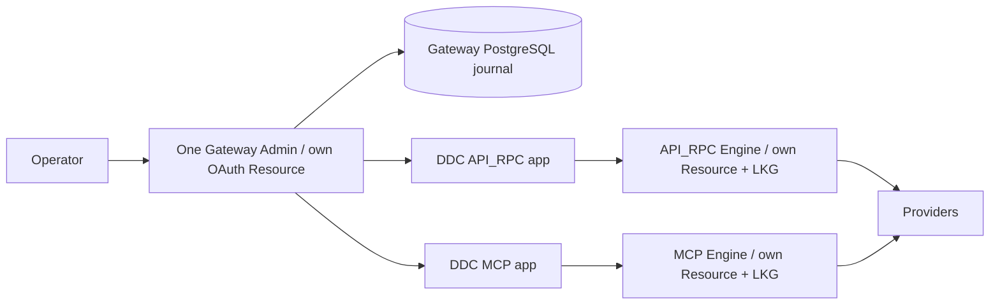
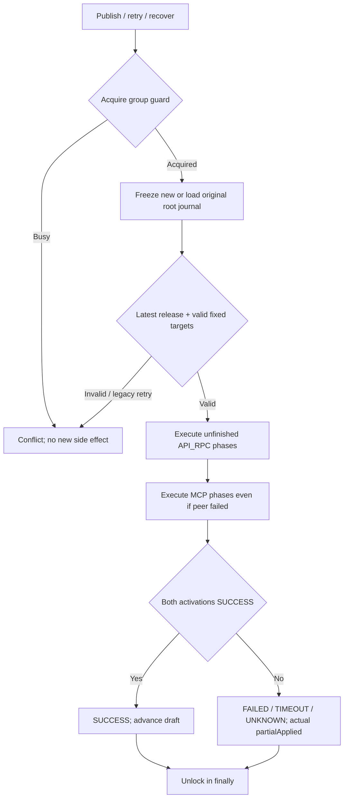
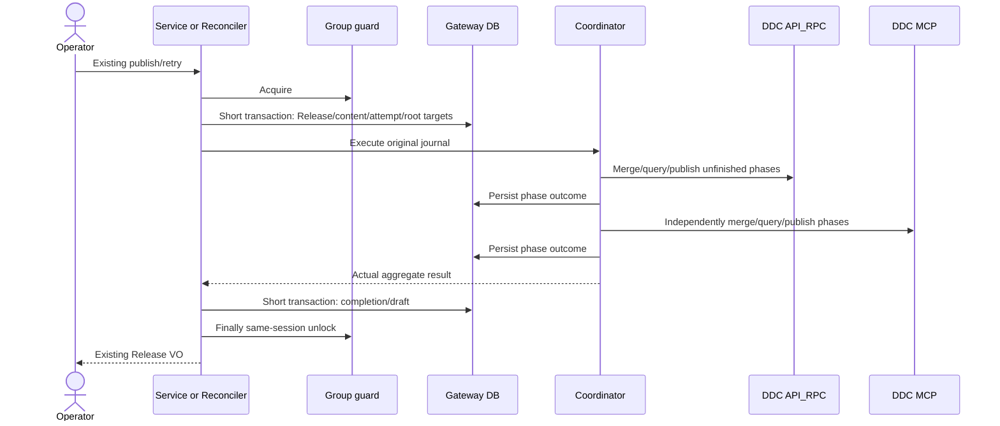
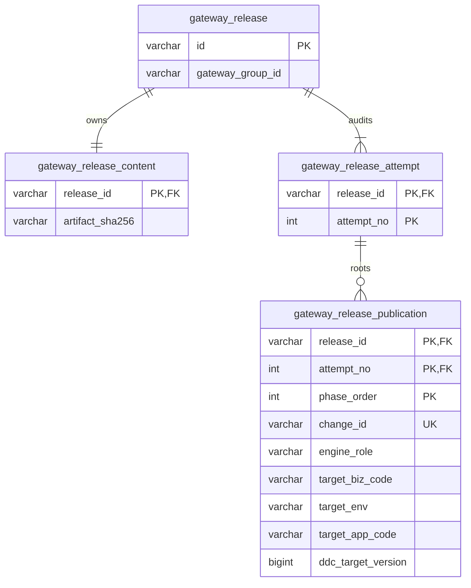

# Gateway 按角色分发 Release 的双目标修订

| Field              | Value                                                                                                                                                                                                                                                                                            |
|--------------------|--------------------------------------------------------------------------------------------------------------------------------------------------------------------------------------------------------------------------------------------------------------------------------------------------|
| Document           | `2026-09-05-17-10-gateway-role-target-distribution.md`                                                                                                                                                                                                                                           |
| Template Version   | `7`                                                                                                                                                                                                                                                                                              |
| Status             | `Accepted`                                                                                                                                                                                                                                                                                       |
| Type               | `Bugfix`                                                                                                                                                                                                                                                                                         |
| Complexity         | `Complex`                                                                                                                                                                                                                                                                                        |
| Complexity Drivers | 双认证作用域、持久化重试、跨进程互斥、角色内版本、legacy journal/GC                                                                                                                                                                                                                                                       |
| Created            | `2026-09-05 17:10 CST`                                                                                                                                                                                                                                                                           |
| Updated            | `2026-09-05 18:02 CST`                                                                                                                                                                                                                                                                           |
| Owner              | 用户 / Codex                                                                                                                                                                                                                                                                                       |
| Repository         | `Egon-COLA`                                                                                                                                                                                                                                                                                      |
| Scope              | Gateway Admin 发布、恢复、投影、清理与角色部署配置                                                                                                                                                                                                                                                                 |
| Change Surface     | publication 四个目标列；Coordinator/Service/JDBC/Projection/GC；配置与回归夹具                                                                                                                                                                                                                                 |
| Affected Chapters  | §7, §8, §9, §10, §11, §13, §14, §15, §16, §17, §18                                                                                                                                                                                                                                               |
| Source Requirement | 用户批准两个 Engine 与 Admin 各自独立 OAuth Resource Server，批准 Gateway 双目标分发，要求“继续，自行决定，不要问我”                                                                                                                                                                                                               |
| Baseline Revision  | `main@1a82cd477e9313c115470e0b314602c025f8e1ee`                                                                                                                                                                                                                                                  |
| Amends             | [双 Engine 分离](2026-09-02-19-52-gateway-dual-engine-separation.md) §3.2、§4–§5、§7–§11、§14–§20 中共享 DDC app、全局同数字 version、无 Gateway schema 变更及关联发布/投影/部署结论；[Admin 后端设计](../../superpowers/specs/2026-07-25-gateway-admin-backend-design.md) §3.5–§3.6、§4、§8、§10 的 journal/恢复锁实现，保留不可变 Release 和事务外网络 |
| Supersedes         | `None`                                                                                                                                                                                                                                                                                           |
| Depends On         | [双 Engine 分离](2026-09-02-19-52-gateway-dual-engine-separation.md) §7.1、§8 的已实现 executable/core 边界；[三资源身份种子](2026-09-05-16-00-gateway-oauth-resource-bootstrap.md) §7、§16 的身份与数据保护                                                                                                                |
| Related Specs      | `None`                                                                                                                                                                                                                                                                                           |
| Related Plans      | [主实施计划](../plan/2026-09-02-21-03-gateway-dual-engine-separation-implementation.md) Step 11 继续完整 local platforms/RBAC/OpenAPI 浏览器验收                                                                                                                                                               |

## 1. Summary

保留一个 Gateway Admin、API_RPC/MCP 两个固定 Engine。三个进程各有 OAuth Resource Server/Client，两个 Engine 的 DDC
biz/app/env 必须符合自身 source 身份。Admin 将一份不可变 Release/Artifact 分发到两个独立 app，不放宽 IdP/DDC 校验。

新发布冻结角色目标和 phase journal，Retry 沿用原目标/changeId，只继续未完成部分。运行一致性严格检查角色、scope、Release、Artifact
SHA、ACK 和新鲜性；version 不低于自己角色成功激活的版本即可，不能比较两个 app 的数字相等。原全量 platforms 与 RBAC/OpenAPI
浏览器目标保持，不能用本修订的局部测试代替。

## 2. Background and Current State

### 2.1 Business and user context

用户已确认三 Resource 和继续自主修复。身份前置提交 1a82cd477 已有 24 项边界回归，本修订消除 Gateway 剩余单目标假设。

### 2.2 Repository evidence

| Evidence ID | Classification    | Exact path/symbol/decision/command                                                                                                                                                                                     | Observed fact                                 | Design significance             | Verification limit/freshness |
|-------------|-------------------|------------------------------------------------------------------------------------------------------------------------------------------------------------------------------------------------------------------------|-----------------------------------------------|---------------------------------|------------------------------|
| EVD-001     | Static repository | egon-cola-xingyuan/egon-cola-yuheng/yuheng-admin/src/main/java/top/egon/cola/component/gateway/admin/release/service/GatewayReleasePublicationCoordinator.java initialize/execute/scope | 全局targetBiz/App、一条phase链、最后一个activation       | 冻结双目标链                          | 当前HEAD，非live                 |
| EVD-002     | Static repository | egon-cola-xingyuan/egon-cola-yuheng/yuheng-admin/src/main/java/top/egon/cola/component/gateway/admin/release/repository/jdbc/JdbcGatewayReleasePublicationRepository.java；V4 journal    | 无角色/目标，changeId全局唯一                           | 根journal跨审计Attempt复用            | 历史迁移不改                       |
| EVD-003     | Static repository | egon-cola-xingyuan/egon-cola-yuheng/yuheng-admin/src/main/java/top/egon/cola/component/gateway/admin/runtime/service/GatewayProjectionService.java expectation/runtimeConsistency       | 全局version unanimous，未直接否决stale                | 角色期望及fail closed                | 外部字段保持                       |
| EVD-004     | Static repository | egon-cola-xingyuan/egon-cola-yuheng/yuheng-admin/src/main/java/top/egon/cola/component/gateway/admin/release/controller/scheduled/GatewayRuleChunkGarbageCollector.java                 | 使用当前全局目标、successor不分目标                        | 冻结scope驱动GC                     | 未验证真实DB                      |
| EVD-005     | Static repository | DDC starter DdcYamlConfigApplier.apply/applyCurrent，DdcRefreshService.compare                                                                                                                                          | 普通更新只触发changed leaf；启动重放用当前文档version；旧版本STALE | 同Release/SHA的重启版本可能更高，必须使用下界    | 核心不修改                        |
| EVD-006     | User decision     | 本轮三Resource/fan-out/继续自行修复                                                                                                                                                                                             | 管理Client/source app不共享                        | 授权此修正方向                         | 不授权清空数据                      |
| EVD-007     | Static repository | GatewayReleaseService/ReleaseReconciler；Admin Spec §10                                                                                                                                                                 | 尚无跨进程执行guard，请求/恢复可能重叠                        | PostgreSQL execute-around guard | 真实会话锁待验证                     |

### 2.3 Problem statement and gap

只改 MCP Client 会使它无法合法订阅 API app；只多发一次 publish 又会丢失重试、版本归属和 GC
边界。目标是独立身份/运行域共享业务制品，不是共享身份或复制整份配置。

### 2.4 Evidence and current-chain map

| Entry/trigger | Current call chain                                | Data read/written                   | External dependency  | Consumers  | Evidence        |
|---------------|---------------------------------------------------|-------------------------------------|----------------------|------------|-----------------|
| 发布/回滚         | Controller→Service.prepare→insert→Coordinator→DDC | Release/Content/Attempt/Publication | DDC management       | 两Engine    | EVD-001/002     |
| Retry/恢复      | Service.retry/Reconciler→Coordinator              | Attempt/journal/ACK                 | DDC task/query/retry | 历史/draft基线 | EVD-002/007     |
| 运行查询/GC       | Projection/GC→Repository/DDC                      | 元数据/旧chunk                          | 租约/config            | 角色卡片       | EVD-003/004/005 |

## 3. Goals and Non-goals

### 3.1 Goals

一制品双目标；原目标可恢复；角色内版本与共同制品一致性；安全目标内 GC；配置和已确认身份对齐。

### 3.2 Non-goals

不改 IdP/DDC 核心授权/schema/source app、不修改历史 Flyway、不引入跨进程事务/总线/新分发服务/Web页面、不让MCP经peer转发。原
Step11 local脚本/全平台/RBAC/OpenAPI浏览器验收继续，不能因为本修订而缩小或关闭总目标。

### 3.3 Change Surface and Design Depth

| Area/layer       | Disposition  | Exact repository evidence                      | Changed or preserved behavior/contract | Required Spec treatment | Chapter(s)      |
|------------------|--------------|------------------------------------------------|----------------------------------------|-------------------------|-----------------|
| 发布/恢复/guard      | Affected     | Coordinator/Service/Reconciler                 | 双链/稳定changeId/跨进程互斥                    | 状态/失败详述                 | §7, §8, §9, §13 |
| 模型/数据库           | Affected     | PO/DTO/V4/JDBC                                 | 四目标列、分组校验、元数据查询                        | schema/ER/边界            | §10, §11        |
| 投影/GC            | Affected     | Projection/Collector                           | 角色scope、版本下界、清理隔离                      | 查询/测试                   | §7, §8, §9, §14 |
| REST wire/页面     | Context-only | ProjectionController/ReleaseController及角色卡片    | URL/字段/鉴权/显示不变，修正内部目标和计算               | 引用原契约，不新建API            | §9, §12         |
| 配置/部署            | Affected     | Admin application、MCP base/operations、Compose  | 独立app/目标键                              | parity/切换               | §8, §15, §16    |
| IdP/DDC/Engine核心 | Unchanged    | identity seed、RefreshService、ActivationApplier | strict binding、单调版本、独立LKG/协议           | 边界回归                    | §9, §10         |
| 测试/风险/替代         | Affected     | §14–§18                                        | 不同版本/失败/legacy/guard                   | 明确证据边界                  | §14, §17, §18   |

## 4. Requirements and Acceptance Criteria

父 REQ-001–012 保持，但本修订明确替换其中共享app/全局同版本/无Gateway迁移结论。新编号从013起，避免混淆。

| ID      | Requirement                                     | Observable acceptance                                            |
|---------|-------------------------------------------------|------------------------------------------------------------------|
| REQ-013 | 三 Resource 各自对应自己的 DDC app，Admin 不是 Engine 规则目标 | 两个合法且不同的 Engine scope；错角色或 source 绑定拒绝                           |
| REQ-014 | 一次编译，在创建事务内冻结双目标和 canonical artifact            | 两份 leaf 字节相同；各自 YAML 无关键保留；配置漂移不重定向                              |
| REQ-015 | 独立目标发布与真实聚合                                     | peer 失败不跳过另一角色；两激活成功才整体成功；CHUNK 不算 partialApplied                |
| REQ-016 | 持久化恢复、跨进程互斥与旧 Retry fencing                     | 根 journal/changeId 不变，成功部分不重发；新审计 Attempt；旧 Release 不覆盖新 Release |
| REQ-017 | 自己的 activation 版本下界、共同 Release/SHA              | 42/7 可一致、合法重启43可一致；低版本/错scope/缺角色/stale拒绝                        |
| REQ-018 | 目标内安全 GC                                        | 仅同角色/biz/env/app 后继可清理；peer进展不触发MCP清理                            |
| REQ-019 | 部署与独立 app 对齐                                    | MCP base/operations 等价键；Compose 和管理目标一致                          |
| REQ-020 | 双目标与分离边界回归                                      | focused/module/wire/Compose验证；原Step11完整平台和浏览器验收继续                |
| REQ-021 | 兼容旧数据与外部协议                                      | 只新增V13；旧目标不猜测、不自动retry/GC；旧成功内容可创建新rollback                      |

### 4.1 Scenario matrix

| Scenario              | Required outcome             | Constraint    | Requirements |
|-----------------------|------------------------------|---------------|--------------|
| API42/MCP7            | 各自达到下界且同Release/SHA可一致       | 两app独立版本      | REQ-013/017  |
| API成功/MCP失败           | peer不回滚，重试不重发API             | 独立LKG/journal | REQ-015/016  |
| chunk成功/activation未确认 | 不当作partialApplied证据          | 原partial定义    | REQ-015      |
| 崩溃/未知task             | 原changeId先查后恢复               | 超时不等于失败       | REQ-016      |
| 配置改变后retry            | 仍投原冻结scope                   | 不误投新app       | REQ-014/016  |
| 新Release推进后旧retry     | 拒绝，需新rollback Release        | fencing       | REQ-016/021  |
| 无关配置/GC后重启            | 同角色可更高version，Release/SHA仍精确 | EVD-005       | REQ-017      |
| peer前进/本角色失败          | 不清理本角色旧chunk                 | 版本不可跨app比较    | REQ-018      |
| legacy target空/查询失败   | 不猜测、stale不一致                 | fail closed   | REQ-017/021  |

### 4.2 Use-case analysis

| Actor ID  | Actor/role | Goal and responsibility | Entry/channel      | Permission/tenant context   | Evidence    |
|-----------|------------|-------------------------|--------------------|-----------------------------|-------------|
| ACTOR-001 | 操作员        | 发布/观察/修复                | 既有REST/Web         | gateway:read/releases:write | Controllers |
| ACTOR-002 | Engine     | 自己身份加载共同制品              | DDC push/bootstrap | 固定角色/独立Resource             | EVD-005/006 |
| ACTOR-003 | 后台任务       | 恢复/安全清理                 | Reconciler/GC      | 原管理凭证                       | EVD-004/007 |

| ID     | Use case/goal | Primary actor | Supporting actors/systems | Trigger   | Preconditions             | Main success outcome | Alternatives/failures     | Postconditions  | Requirements    | Interfaces/pages      | Tests        |
|--------|---------------|---------------|---------------------------|-----------|---------------------------|----------------------|---------------------------|-----------------|-----------------|-----------------------|--------------|
| UC-001 | 发布双角色Release  | ACTOR-001     | ACTOR-002/DDC             | 确认draft   | 权限/revision/guard/合法scope | 共同Release/SHA激活      | 部分失败/超时/错目标               | 真实journal，独立LKG | REQ-013/014/015 | 发布页、INTERNAL-001/002  | TEST-001/002 |
| UC-002 | 恢复中断发布        | ACTOR-003     | ACTOR-001/DDC             | 重启/retry  | 原journal/latest/guard     | 仅继续未完成               | 旧release/legacy/争用        | 目标/changeId不变   | REQ-016/021     | INTERNAL-002/005      | TEST-003/004 |
| UC-003 | 判断真实一致性       | ACTOR-001     | ACTOR-002/DDC             | 查询        | 新鲜租约/可信期望                 | 自己version下界+共同制品     | 缺角色/错scope/旧version/stale | 无假阳性            | REQ-017         | INTERNAL-003/004、角色卡片 | TEST-005     |
| UC-004 | 清理旧chunk      | ACTOR-003     | DDC                       | retention | 同scope成功后继                | 仅移除本目标旧leaf          | peer成功/legacy/故障          | 活跃/未知规则保留       | REQ-018         | INTERNAL-006          | TEST-006     |

## 5. Constraints, Assumptions, and Decisions

### 5.1 Confirmed constraints

三个独立Resource/Client；两个固定Engine；一份canonical artifact；不动核心鉴权、用户数据和历史迁移；每个实现Step验证后独立提交。

### 5.2 Small-gap assumptions

ASM-001：API保留 target-biz-code/target-app-code，MCP新增 mcp-target-biz-code/mcp-target-app-code；默认 infra/ge 与
infra/ge-mcp。本地明确 identity/gateway-engine-default 与 identity/gateway-mcp-engine-default。命名沿用现有规则，可逆。

### 5.3 Resolved decisions

DEC-001：扩展既有journal四列，不新增目标表；根journal固定attempt1，audit attempt递增。
DEC-002：版本为每角色成功activation下界，严格共同Release/SHA/scope/ACK；既不跨app比较相等，也不取消版本校验。
DEC-003：同Group PostgreSQL session advisory execute-around；事务外网络；同连接finally解锁，失败abort物理连接。
DEC-004：API_RPC后MCP顺序执行，控制大YAML峰值；任一失败仍执行peer。客户端原超时不取消后台事实；父Step11验证历史/详情可观察结果。
DEC-005：legacy目标不猜测、不回填；新Release/rollback切换，不删除旧数据。

### 5.4 Open major decisions

None。用户已批准方向并要求自主继续；实施/runtime证据尚未执行，不是新的用户决策。

## 6. Project Technology Context

Java21、Boot3.5.16、既有Maven
wrapper；Gateway已具备Lombok、Validation、JDBC/PostgreSQL、Jackson/MapStruct。不新增依赖。Web沿用已实现React/query/AntDesign角色卡片。

### 6.1 Java architecture profile and capability baseline

保留已批准 feature-local traditional
layered：release.service→release.repository/JDBC，runtime.service读取发布元数据，bootstrap装配；core不依赖Admin，两个Engine不依赖彼此。

| Need  | Candidate/evidence                                      | Fit/gap                | Decision                  |
|-------|---------------------------------------------------------|------------------------|---------------------------|
| 分发    | 既有Coordinator/Command/Publisher/DDC client              | 缺目标维度                  | 扩展                        |
| 持久化   | V4 journal/JdbcTemplate/事务                              | 可保存scope，已有changeId UK | 一个V13                     |
| 互斥    | DataSource/PostgreSQL；未发现当前guard                        | JVM不能覆盖多Admin          | 小型execute-around DAO      |
| 校验/模型 | ValidationUtils/BaseConverter、starter-validation、record | 原生约束/命令组装/列投影足够        | 不新增Validator/Converter/依赖 |

### 6.2 User-mandated Java rule compliance

| Literal rule | Affected? | Repository evidence                 | Exact design decision                                                                                             | Files/types/interfaces | Validation/test evidence | Status/blocker |
|--------------|-----------|-------------------------------------|-------------------------------------------------------------------------------------------------------------------|------------------------|--------------------------|----------------|
| Rule 1       | Yes       | 类型/文件库存，现有Gateway能力                 | 语义 PO/DTO/DAO/Service；配置为 Properties record；移除旧全局期望载体                                                             | §8库存                   | §14具体场景/编译/静态            | PASS           |
| Rule 2       | Yes       | 每个受影响 handoff 的校验表，现有Gateway能力      | Service @Validated/@Valid；Repository TargetedWrite extends Default；无代理重入用现有 ValidationUtils；原生约束，不新建 Validator    | §8库存                   | §14具体场景/编译/静态            | PASS           |
| Rule 3       | Yes       | §10，现有Gateway能力                     | 简单对象 record，无新增复杂数据类或 Converter；JDBC 列投影与多来源命令组装，不用 JSON/BeanUtils 转换；新 Converter 若必要必须另列 MapStruct/BaseConverter | §8库存                   | §14具体场景/编译/静态            | PASS           |
| Rule 4       | Yes       | 受影响业务类/装配，现有Gateway能力               | @Slf4j、显式原Bean名、final @Qualifier依赖、@RequiredArgsConstructor；Gateway lombok.config复制Value/Qualifier                | §8库存                   | §14具体场景/编译/静态            | PASS           |
| Rule 5       | Yes       | 复用 ledger，现有Gateway能力               | 仅 JDK/已管理 Commons 与现有框架，无新库/通用Utils                                                                               | §8库存                   | §14具体场景/编译/静态            | PASS           |
| Rule 6       | Yes       | wire回归，现有Gateway能力                  | Boot Jackson；canonical artifact与外部字段不变；内部enum按name存储                                                              | §8库存                   | §14具体场景/编译/静态            | PASS           |
| Rule 7       | Yes       | base/operations/Compose，现有Gateway能力 | 所有环境核心键等价；API旧key保留，MCP新key明确                                                                                     | §8库存                   | §14具体场景/编译/静态            | PASS           |
| Rule 9       | Yes       | §13，现有Gateway能力                     | 复杂发布：状态Strategy registry + Command；跨进程guard：JDBC execute-around模板；简单scope构造不造层                                    | §8库存                   | §14具体场景/编译/静态            | PASS           |
| Rule 10      | Yes       | 模型/SQL，现有Gateway能力                  | 只java.time Clock/Instant/Duration，UTC TIMESTAMPTZ；DDC版本为long                                                      | §8库存                   | §14具体场景/编译/静态            | PASS           |
| Rule 11      | Yes       | 当前树/父Spec，现有Gateway能力               | 保留既有feature-local traditional layered及固定Engine/core依赖，不改架构层                                                       | §8库存                   | §14具体场景/编译/静态            | PASS           |

## 7. Architecture Design

### 7.0 Minimum-design baseline and element-necessity audit

| Proposed element           | Change | Requirements | Existing/direct alternative | Concrete inadequacy of alternative | Added calls/state/coupling/failures/migration/operations | Verdict |
|----------------------------|--------|--------------|-----------------------------|------------------------------------|----------------------------------------------------------|---------|
| journal四目标列                | Expand | REQ-014/021  | 当前global scope              | 重启/配置漂移会误投递                        | 一个V13、每phase小量元数据                                        | Add     |
| root journal/状态registry    | Expand | REQ-015/016  | 每retry重建                    | 与稳定changeId/成功不重发冲突                | 复用状态，只两链                                                 | Keep    |
| activation expectation DTO | New    | REQ-017      | 每次读取整个compiled/YAML         | UI轮询不应物化大制品                        | 小型SQL投影，无新网络API                                          | Add     |
| group guard DAO            | New    | REQ-016      | JVM锁/长事务                    | HA不安全/违反事务外网络                      | 每执行占一连接，需池容量                                             | Add     |
| 新平台/表/总线/API               | Remove | REQ-014/020  | 既有组件                        | 无缺口                                | 避免额外运行部件                                                 | Remove  |

| Path            | Network calls | Client states  | Server contracts/state | Failure and TOCTOU points | Additional user/business value |
|-----------------|---------------|----------------|------------------------|---------------------------|--------------------------------|
| Direct baseline | 单DDC目标链       | 现发布页           | 单journal               | MCP不能合法订阅API app          | 不满足隔离                          |
| Selected design | 两目标各自phase调用  | 原历史/角色页，无新参数预取 | 一Release、两冻结目标、原状态     | 各目标失败；guard/changeId/CAS  | 独立身份、可恢复分发                     |

### 7.1 System Architecture Design

| Module/component | Capability and data owned       | Inputs/outputs | Allowed dependencies | Forbidden responsibility | Requirements |
|------------------|---------------------------------|----------------|----------------------|--------------------------|--------------|
| Admin            | canonical Release、目标、journal、投影 | 原请求→DB/DDC     | 原JDBC/DDC            | 不伪造共享身份/version          | REQ-013–018  |
| DDC两app          | 各自YAML/version/task             | 相同leaf，不同文档    | 原鉴权/SDK              | 不加shared alias           | REQ-013/019  |
| 两Engine          | 固定角色/独立激活LKG                    | 自己app          | core/Provider        | 不经peer转发                 | 父REQ-001–006 |

### 7.2 High-Level Design

#### 7.2.2 High-level decision and quality matrix

| Concern/use case | Required behavior | Selected mechanism             | Failure/degradation behavior | Trade-off       | Verification | Requirements |
|------------------|-------------------|--------------------------------|------------------------------|-----------------|--------------|--------------|
| 身份               | scope/role相符      | 冻结目标                           | 错配拒绝                         | 两条调用链           | 模型/配置        | REQ-013/014  |
| 恢复               | 原目标/changeId      | root journal + registry        | 部分结果保留                       | audit与journal分离 | crash/retry  | REQ-015/016  |
| 大制品              | 不跨scope复制整份YAML   | 各自merge、metadata SQL           | 失败stale                      | 顺序角色限制峰值        | YAML保留/SQL   | REQ-014/017  |
| 一致性              | 自己下界+共同制品         | trusted activation expectation | 低/错/缺/stale拒绝                | 无跨进程原子性         | 42/7/43      | REQ-017      |

### 7.3 Detailed Design

prepare在任何网络前，同创建事务写attempt1的两目标CHUNK→ACTIVATION；phase_order跨角色全局连续。leaf内容由一份compiled产生，逐个比对SHA；目标从配置和snapshot
env冻结。Retry仅增加audit attempt，继续root rows/changeIds；recoverable读取最新audit attempt，不再从journal取MAX attempt。

每角色跳过SUCCESS。PLANNED读取本scope当前YAML、merge一个leaf、冻结expectedVersion；RESOLVED记SUBMITTED再publish；SUBMITTED查询原task；失败/partial/timeout/unknown先查后retry该changeId。只有task-not-found允许在当前受guard保护的Release重新resolve/publish。角色链失败停止自己的后续phase，但继续peer；自己的chunks成功后才activation。

两activation均SUCCESS才整体SUCCESS，否则不确定优先UNKNOWN、明确超时TIMEOUT、其他FAILED；原PARTIAL_SUCCESS映射Release
FAILED。partialApplied必须有已确认activation或activation目标SUCCESS ACK，CHUNK进度不是激活。UNKNOWN无ACK也不证明零激活。scalar
changeId只作诊断代表（首个未完成phase，否则最终activation），不是整体Release的唯一DDC
task；内部合并result不得伪造共同targetVersion/resourceChecksum。

guard在事务外借用session connection，持有稳定namespaced Group
key；所有create/retry/rollback/reconcile都使用它。持锁后重读状态/最新Release，拒绝旧Retry，过时recovery不推进draft。业务短事务/网络/完成均在callback内，finally同连接解锁；解锁失败abort物理连接，不能带锁返还池。其生命周期依据[PostgreSQL官方说明](https://www.postgresql.org/docs/17/explicit-locking.html#ADVISORY-LOCKS)
，不把session锁当事务锁。

期望只来自root SUCCESS
ACTIVATION和release_content.artifact_sha256，不加载大正文。实际activeRuleVersion≥自己activationDdcVersion只是必要条件；还须scope/固定role/Release/SHA/ACK_SUCCESS/合法ack时间/live
lease/非stale全部成立。DDC普通更新跳过未变leaf，而启动重放用当前文档version，所以合法同制品节点可能更高version。

GC读取candidate冻结scope，只比较相同role/biz/env/app后继；peer成功无关。legacy未知scope排除，保留原active
draft/retention/leaf删除/expectedVersion保护。

#### 7.3.6 Conclusion evidence chain

| Conclusion   | Repository/user evidence  | Constraint or requirement | Design decision | Consequence and trade-off | Verification and acceptance evidence |
|--------------|---------------------------|---------------------------|-----------------|---------------------------|--------------------------------------|
| 冻结目标且重用phase | EVD-001/002 + changeId UK | REQ-014/016；不能猜目标或重发成功链   | 冻结/root journal | audit不是重发，多两目标元数据         | TEST-001/003                         |
| 版本下界而非跨app相等 | EVD-005                   | REQ-017；同制品重放可更高version   | 角色下界+共同制品       | 合法重启不误报，低版本仍拒绝            | TEST-005                             |
| 清理必须目标内隔离    | EVD-004                   | REQ-018；peer version不能比较  | same-scope GC   | 不误清理MCP，未知scope保留         | TEST-006                             |

## 8. Package Structure and Code File Tree

完整修订范围如下；父Step11未完成的local脚本/真实浏览器工作随后继续，不伪称已改。

| Operation | Exact repository-relative path                                                                                                                                                                                            | Responsibility                                           | Requirements        |
|-----------|---------------------------------------------------------------------------------------------------------------------------------------------------------------------------------------------------------------------------|----------------------------------------------------------|---------------------|
| MODIFY    | `egon-cola-xingyuan/egon-cola-yuheng/yuheng-admin/src/main/java/top/egon/cola/component/gateway/admin/config/properties/GatewayAdminDdcProperties.java`                                    | 不可变四字段 record，保留 API 旧键，新增 MCP 目标及现有 getter 兼容           | REQ-013             |
| MODIFY    | `egon-cola-xingyuan/egon-cola-yuheng/yuheng-admin/src/main/java/top/egon/cola/component/gateway/admin/release/domain/dto/GatewayPublicationScopeDTO.java`                                  | biz/env/app 的原生 Validation 与紧凑构造规范化                      | REQ-014             |
| MODIFY    | `egon-cola-xingyuan/egon-cola-yuheng/yuheng-admin/src/main/java/top/egon/cola/component/gateway/admin/release/domain/po/GatewayReleasePublicationPO.java`                                  | 追加 engineRole/targetScope，TargetedWrite 分组与 legacy 读兼容   | REQ-014             |
| CREATE    | `egon-cola-xingyuan/egon-cola-yuheng/yuheng-admin/src/main/java/top/egon/cola/component/gateway/admin/release/domain/dto/GatewayReleaseActivationExpectationDTO.java`                      | 仅角色、目标、DDC version、artifact SHA 的查询投影                    | REQ-017             |
| MODIFY    | `egon-cola-xingyuan/egon-cola-yuheng/yuheng-admin/src/main/java/top/egon/cola/component/gateway/admin/release/domain/po/GatewayChunkCleanupCandidatePO.java`                               | 追加冻结角色/目标，旧候选不自动清理                                       | REQ-018             |
| CREATE    | `egon-cola-xingyuan/egon-cola-yuheng/yuheng-admin/src/main/resources/db/migration/V13__add_gateway_release_engine_targets.sql`                                                             | 四个 nullable legacy-compatible 列及完整目标 CHECK；不改旧版本         | REQ-014/021         |
| MODIFY    | `egon-cola-xingyuan/egon-cola-yuheng/yuheng-admin/src/main/java/top/egon/cola/component/gateway/admin/release/repository/GatewayReleasePublicationRepository.java`                         | 冻结目标/激活期望元数据查询；显式 write validation                       | REQ-014/017/018     |
| MODIFY    | `egon-cola-xingyuan/egon-cola-yuheng/yuheng-admin/src/main/java/top/egon/cola/component/gateway/admin/release/repository/jdbc/JdbcGatewayReleasePublicationRepository.java`                | 读写四列；元数据查询无 YAML；GC 按相同目标比较 successor                    | REQ-014/017/018     |
| CREATE    | `egon-cola-xingyuan/egon-cola-yuheng/yuheng-admin/src/test/java/top/egon/cola/component/gateway/admin/release/domain/GatewayReleaseEngineTargetModelTest.java`                             | record 参数/legacy/read/write/配置绑定和迁移静态合同                  | REQ-013/014/021     |
| MODIFY    | `egon-cola-xingyuan/egon-cola-yuheng/yuheng-admin/src/test/java/top/egon/cola/component/gateway/admin/infrastructure/persistence/JdbcGatewayReleasePublicationStoreTest.java`              | 完整 scope 参数、RowMapper、元数据与 GC SQL 边界                     | REQ-014/017/018     |
| CREATE    | `egon-cola-xingyuan/egon-cola-yuheng/yuheng-admin/src/main/java/top/egon/cola/component/gateway/admin/release/repository/jdbc/GatewayReleaseExecutionLockDAO.java`                         | 同 Group 跨进程执行互斥；session advisory lock 的 execute-around   | REQ-016             |
| CREATE    | `egon-cola-xingyuan/egon-cola-yuheng/yuheng-admin/src/test/java/top/egon/cola/component/gateway/admin/infrastructure/persistence/GatewayReleaseExecutionLockDAOTest.java`                  | 同连接获取/释放、争用、异常、连接 abort；真实锁留作 runtime gate               | REQ-016             |
| MODIFY    | `egon-cola-xingyuan/egon-cola-yuheng/yuheng-admin/src/main/java/top/egon/cola/component/gateway/admin/release/service/GatewayReleasePublicationCoordinator.java`                           | prepare 冻结双链；状态处理策略；根 journal 重试；双目标聚合                   | REQ-014/015/016     |
| MODIFY    | `egon-cola-xingyuan/egon-cola-yuheng/yuheng-admin/src/main/java/top/egon/cola/component/gateway/admin/release/service/GatewayReleaseService.java`                                          | prepare 事务内冻结目标；create/retry/rollback guard；旧发布 retry 拒绝 | REQ-014/015/016/021 |
| MODIFY    | `egon-cola-xingyuan/egon-cola-yuheng/yuheng-admin/src/main/java/top/egon/cola/component/gateway/admin/release/domain/dto/GatewayReleaseCreateCommandDTO.java`                              | 对齐既有 Request 的 PositiveOrZero/NotBlank                   | REQ-016             |
| MODIFY    | `egon-cola-xingyuan/egon-cola-yuheng/yuheng-admin/src/main/java/top/egon/cola/component/gateway/admin/release/domain/dto/GatewayReleaseRollbackCommandDTO.java`                            | 对齐既有 Request 的 source/revision/reason validation         | REQ-016             |
| MODIFY    | `egon-cola-xingyuan/egon-cola-yuheng/yuheng-admin/src/main/java/top/egon/cola/component/gateway/admin/release/controller/scheduled/GatewayReleaseReconciler.java`                          | 同 guard 重读状态后恢复；保留真实 artifact SHA；不回退 draft              | REQ-016             |
| MODIFY    | `egon-cola-xingyuan/egon-cola-yuheng/yuheng-admin/src/main/java/top/egon/cola/component/gateway/admin/release/repository/jdbc/JdbcGatewayReleaseRepository.java`                           | 恢复读取最新审计 attempt 而非根 journal attempt；确定性 history 顺序      | REQ-016             |
| MODIFY    | `egon-cola-xingyuan/egon-cola-yuheng/yuheng-admin/src/main/java/top/egon/cola/component/gateway/admin/bootstrap/GatewayAdminConfiguration.java`                                            | 显式 Bean/Qualifier/Clock/ValidationUtils 及双目标属性装配         | REQ-013/014/015/016 |
| MODIFY    | `egon-cola-xingyuan/egon-cola-yuheng/yuheng-admin/src/test/java/top/egon/cola/component/gateway/admin/application/release/GatewayReleasePublicationCoordinatorTest.java`                   | 双作用域 YAML/不同版本、peer 故障、稳定 changeId、恢复、legacy             | REQ-014/015/016/021 |
| MODIFY    | `egon-cola-xingyuan/egon-cola-yuheng/yuheng-admin/src/test/java/top/egon/cola/component/gateway/admin/application/release/GatewayReleaseServiceTest.java`                                  | 冻结事务、同 Group guard、新 Attempt/旧 journal、旧 retry fencing   | REQ-014/016/021     |
| MODIFY    | `egon-cola-xingyuan/egon-cola-yuheng/yuheng-admin/src/test/java/top/egon/cola/component/gateway/admin/interfaces/scheduled/GatewayReleaseReconcilerTest.java`                              | 同 guard 和过时恢复候选、恢复后 artifact SHA                         | REQ-016             |
| MODIFY    | `egon-cola-xingyuan/egon-cola-yuheng/yuheng-admin/src/test/java/top/egon/cola/component/gateway/admin/infrastructure/persistence/JdbcGatewayReleaseStoreTest.java`                         | 审计 attempt 与 journal attempt 分离的查询                       | REQ-016             |
| MODIFY    | `egon-cola-xingyuan/egon-cola-yuheng/yuheng-admin/src/main/java/top/egon/cola/component/gateway/admin/runtime/service/GatewayProjectionService.java`                                       | 两目标租约与角色绑定，各自 version/共同 SHA，stale fail closed           | REQ-017             |
| DELETE    | `egon-cola-xingyuan/egon-cola-yuheng/yuheng-admin/src/main/java/top/egon/cola/component/gateway/admin/runtime/service/GatewayRuleExpectation.java`                                         | 旧全局 version 二元期望被目标元数据 DTO 取代                            | REQ-017             |
| MODIFY    | `egon-cola-xingyuan/egon-cola-yuheng/yuheng-admin/src/main/java/top/egon/cola/component/gateway/admin/release/controller/scheduled/GatewayRuleChunkGarbageCollector.java`                  | 只清理冻结目标内已被后继取代的 chunk                                    | REQ-018             |
| MODIFY    | `egon-cola-xingyuan/egon-cola-yuheng/yuheng-admin/src/test/java/top/egon/cola/component/gateway/admin/application/projection/GatewayProjectionServiceTest.java`                            | 42/7 同 Release/SHA 为一致；错角色/错目标/缺失/陈旧拒绝                   | REQ-017             |
| MODIFY    | `egon-cola-xingyuan/egon-cola-yuheng/yuheng-admin/src/test/java/top/egon/cola/component/gateway/admin/interfaces/scheduled/GatewayRuleChunkGarbageCollectorTest.java`                      | API 前进不能清理仍使用旧版本的 MCP；旧未知 scope 跳过                       | REQ-018             |
| MODIFY    | `egon-cola-xingyuan/egon-cola-yuheng/yuheng-admin/src/main/resources/application.yml`                                                                                                      | API 兼容键 + MCP 目标键；不把 Admin 自身当 Engine 目标                 | REQ-013/019         |
| MODIFY    | `egon-cola-xingyuan/egon-cola-yuheng/yuheng-mcp-gateway/src/main/resources/application.yml`                                                                                                 | DDC app 默认 ge-mcp；其余 role/security 键保留                   | REQ-019             |
| MODIFY    | `egon-cola-xingyuan/egon-cola-yuheng/yuheng-mcp-gateway/src/main/resources/application-operations.yml`                                                                                      | 与 base 等价键结构、独立 MCP app 默认值                              | REQ-019             |
| MODIFY    | `egon-cola-xingyuan/egon-cola-yuheng/deployment/compose.yml`                                                                                                                                                   | 两个 Engine 角色绑定独立 app，Admin 目标坐标与之相符                      | REQ-019             |
| MODIFY    | `egon-cola-xingyuan/egon-cola-yuheng/deployment/.env.example`                                                                                                                                                  | MCP app/目标配置说明；无凭证值                                      | REQ-019             |
| MODIFY    | `egon-cola-xingyuan/egon-cola-yuheng/deployment/README.md`                                                                                                                                                     | 三 Resource/双 app/角色内版本/新 journal 的切换及回退                  | REQ-019/021         |
| MODIFY    | `egon-cola-xingyuan/egon-cola-yuheng/deployment/README.zh-CN.md`                                                                                                                                               | 同步英文部署边界与迁移限制                                            | REQ-019/021         |
| MODIFY    | `egon-cola-xingyuan/egon-cola-yuheng/yuheng-test/yuheng-test-suite/src/test/java/top/egon/cola/component/gateway/test/deployment/GatewayComposeConfigurationTest.java` | 角色各自 app/目标静态契约                                          | REQ-019             |
| MODIFY    | `egon-cola-xingyuan/egon-cola-yuheng/yuheng-test/yuheng-test-suite/src/test/java/top/egon/cola/component/gateway/test/live/GatewayLiveTopologyIT.java`                 | 两个认证作用域与每角色 activation 版本                                | REQ-020             |
| MODIFY    | `egon-cola-xingyuan/egon-cola-yuheng/yuheng-test/yuheng-test-suite/src/test/java/top/egon/cola/component/gateway/test/live/GatewayRuleWireCompatibilityTest.java`      | 两角色不同 DDC 版本、同制品及 LKG 独立失败                               | REQ-020             |

| MODIFY | `egon-cola-xingyuan/egon-cola-yuheng/deployment/compose.ha.yml` | 第二 Admin 的 MCP
目标键与主副本一致 | REQ-019 |
| MODIFY |
`egon-cola-xingyuan/egon-cola-yuheng/yuheng-admin/src/test/java/top/egon/cola/component/gateway/admin/GatewayAdminConfigurationTest.java` |
新发布工厂/Clock/ValidationUtils、Projection 增加依赖的构造与上下文校验 | REQ-013/017 |

## 9. Interface Definitions

REST wire为Context-only：GatewayProjectionController的GET
engine-nodes/runtime-consistency和GatewayReleaseController的create/retry/rollback/get/history，保持URL、原Request/VO字段、鉴权、媒体类型与既有错误envelope。角色页本来显示各节点version、使用后端consistent；本修正纠正内部目标与期望来源，不新增客户端调用协议。没有新REST/GraphQL端点或“先取scope再转发”的API。legacy/过时Retry沿用现有409
RELEASE_NOT_RETRYABLE/RESOURCE_CONFLICT分类；请求超时仍可通过原历史/详情观察。新的内部数据不得漏入外部VO。

### 9.1 Interface Inventory

| ID           | Interface     | Exact identity                                                                                                                   | Owner/consumer                | Requirements    |
|--------------|---------------|----------------------------------------------------------------------------------------------------------------------------------|-------------------------------|-----------------|
| INTERNAL-001 | 冻结双目标         | `GatewayReleasePublicationCoordinator.prepare(String releaseId, CompiledGatewayRelease compiled)`                                | 既有Admin Service/Repository/任务 | REQ-014–018/021 |
| INTERNAL-002 | 执行原journal    | `GatewayReleasePublicationCoordinator.execute(String releaseId, int attemptNo, CompiledGatewayRelease compiled, String actorId)` | 既有Admin Service/Repository/任务 | REQ-014–018/021 |
| INTERNAL-003 | 读取冻结scope     | `GatewayReleasePublicationRepository.findScopes(String releaseId)`                                                               | 既有Admin Service/Repository/任务 | REQ-014–018/021 |
| INTERNAL-004 | 读取激活期望        | `GatewayReleasePublicationRepository.findActivationExpectations(String releaseId)`                                               | 既有Admin Service/Repository/任务 | REQ-014–018/021 |
| INTERNAL-005 | 同Group执行guard | `GatewayReleaseExecutionLockDAO.execute(String gatewayGroupId, Supplier<T> action)`                                              | 既有Admin Service/Repository/任务 | REQ-014–018/021 |
| INTERNAL-006 | 选目标内GC候选      | `GatewayReleasePublicationRepository.findChunkCleanupCandidates(Instant successorActivatedBefore)`                               | 既有Admin Service/Repository/任务 | REQ-014–018/021 |

### 9.2 Per-interface Detailed Contracts

#### INTERNAL-001 — 冻结双目标

##### Necessity and interaction-cost decision

| Concern                             | Decision                                                          |
|-------------------------------------|-------------------------------------------------------------------|
| Change classification               | Add internal contract；冻结双目标                                       |
| Independent consumer goal           | 冻结双目标由明确Service/Repository/任务边界承担；不新增Web调用                        |
| Parameter ownership and derivation  | 非空releaseId等于snapshot.releaseId；非空已校验compiled，env来自快照，调用方不提供scope |
| Direct/no-new-interface alternative | 当前单目标/global版本或JVM-only路径不能满足该边界；复用§7.0组件                         |
| Caller use of result                | void；同创建事务写attempt1两角色CHUNK→ACTIVATION；无DDC网络                     |
| Round trips and failure points      | 只有既有DDC调用/本地SQL；失败语义：缺字段/同scope/内容冲突拒绝，创建事务回滚                     |
| Verdict                             | Add；无参数搬运API                                                      |

##### Identity and purpose

Java内部方法：`GatewayReleasePublicationCoordinator.prepare(String releaseId, CompiledGatewayRelease compiled)`
。所有者/消费者见§7/8，不开放新HTTP。

##### Request parameters

非空releaseId等于snapshot.releaseId；非空已校验compiled，env来自快照，调用方不提供scope。原生校验与调用组见§10，无token/secret参数。

##### Success response

void；同创建事务写attempt1两角色CHUNK→ACTIVATION；无DDC网络。字段及null/约束逐项见§10/11。调用者处理真实结果，不以方法返回等同全部角色成功。

##### Error responses

缺字段/同scope/内容冲突拒绝，创建事务回滚。错误不抹去已成功journal，不触发peer自动回滚。

##### Interface logic for frontend and consumers

Service.prepare在releases.insert后调用；Coordinator即使DDC
client未配置也存在，prepare不依赖网络。已有root须与compiled吻合。原HTTP调用者继续读原历史/详情/角色投影，不新增客户端状态存储。

##### Compatibility and verification

Coordinator/Service/模型测试。保留既有外部Request/Response/Jackson/OpenAPI operationId；内部DTO/查询不产生新外部字段。

#### INTERNAL-002 — 执行原journal

##### Necessity and interaction-cost decision

| Concern                             | Decision                                                                                                        |
|-------------------------------------|-----------------------------------------------------------------------------------------------------------------|
| Change classification               | Expand existing internal contract；执行原journal                                                                    |
| Independent consumer goal           | 执行原journal由明确Service/Repository/任务边界承担；不新增Web调用                                                                 |
| Parameter ownership and derivation  | 非空IDs、attempt>0、快照校验，Group guard已持有；目标只读root                                                                    |
| Direct/no-new-interface alternative | 当前单目标/global版本或JVM-only路径不能满足该边界；复用§7.0组件                                                                       |
| Caller use of result                | GatewayPublicationOutcomeVO(status,changeId,result,partialApplied)；真实activation ACK汇总，无伪造全局DDC version/checksum |
| Round trips and failure points      | 只有既有DDC调用/本地SQL；失败语义：单角色失败保留并继续peer；原task先查后retry；legacy或旧Release拒绝；CHUNK成功不是激活                                 |
| Verdict                             | Keep and expand；无参数搬运API                                                                                        |

##### Identity and purpose

Java内部方法：
`GatewayReleasePublicationCoordinator.execute(String releaseId, int attemptNo, CompiledGatewayRelease compiled, String actorId)`
。所有者/消费者见§7/8，不开放新HTTP。

##### Request parameters

非空IDs、attempt>0、快照校验，Group guard已持有；目标只读root。原生校验与调用组见§10，无token/secret参数。

##### Success response

GatewayPublicationOutcomeVO(status,changeId,result,partialApplied)；真实activation ACK汇总，无伪造全局DDC
version/checksum。字段及null/约束逐项见§10/11。调用者处理真实结果，不以方法返回等同全部角色成功。

##### Error responses

单角色失败保留并继续peer；原task先查后retry；legacy或旧Release拒绝；CHUNK成功不是激活。错误不抹去已成功journal，不触发peer自动回滚。

##### Interface logic for frontend and consumers

状态registry驱动两链；SUCCESS跳过；同changeId恢复。DDC不可用时仍保留完整PLANNED目标；不以缺client创建无目标的新Release。原HTTP调用者继续读原历史/详情/角色投影，不新增客户端状态存储。

##### Compatibility and verification

两scope YAML、不同version、部分失败、重启/retry tests。保留既有外部Request/Response/Jackson/OpenAPI
operationId；内部DTO/查询不产生新外部字段。

#### INTERNAL-003 — 读取冻结scope

##### Necessity and interaction-cost decision

| Concern                             | Decision                                                                        |
|-------------------------------------|---------------------------------------------------------------------------------|
| Change classification               | Add internal contract；读取冻结scope                                                 |
| Independent consumer goal           | 读取冻结scope由明确Service/Repository/任务边界承担；不新增Web调用                                  |
| Parameter ownership and derivation  | 非空releaseId；可信内部查询，不接受外部role/app                                                |
| Direct/no-new-interface alternative | 当前单目标/global版本或JVM-only路径不能满足该边界；复用§7.0组件                                       |
| Caller use of result                | Map<GatewayEngineRoleEnum,GatewayPublicationScopeDTO>；新root恰好两合法角色，legacy为空；无正文 |
| Round trips and failure points      | 只有既有DDC调用/本地SQL；失败语义：混合/重复冲突scope不能当作合法目标                                       |
| Verdict                             | Add；无参数搬运API                                                                    |

##### Identity and purpose

Java内部方法：`GatewayReleasePublicationRepository.findScopes(String releaseId)`。所有者/消费者见§7/8，不开放新HTTP。

##### Request parameters

非空releaseId；可信内部查询，不接受外部role/app。原生校验与调用组见§10，无token/secret参数。

##### Success response

Map<GatewayEngineRoleEnum,GatewayPublicationScopeDTO>
；新root恰好两合法角色，legacy为空；无正文。字段及null/约束逐项见§10/11。调用者处理真实结果，不以方法返回等同全部角色成功。

##### Error responses

混合/重复冲突scope不能当作合法目标。错误不抹去已成功journal，不触发peer自动回滚。

##### Interface logic for frontend and consumers

Projection优先最新Release冻结scope；legacy/无Release可按配置发现，但不得制造成功期望。原HTTP调用者继续读原历史/详情/角色投影，不新增客户端状态存储。

##### Compatibility and verification

JDBC RowMapper/SQL/projection tests。保留既有外部Request/Response/Jackson/OpenAPI operationId；内部DTO/查询不产生新外部字段。

#### INTERNAL-004 — 读取激活期望

##### Necessity and interaction-cost decision

| Concern                             | Decision                                                                                                                        |
|-------------------------------------|---------------------------------------------------------------------------------------------------------------------------------|
| Change classification               | Add internal contract；读取激活期望                                                                                                    |
| Independent consumer goal           | 读取激活期望由明确Service/Repository/任务边界承担；不新增Web调用                                                                                     |
| Parameter ownership and derivation  | 非空releaseId；只root SUCCESS ACTIVATION                                                                                            |
| Direct/no-new-interface alternative | 当前单目标/global版本或JVM-only路径不能满足该边界；复用§7.0组件                                                                                       |
| Caller use of result                | List<GatewayReleaseActivationExpectationDTO>(engineRole,targetScope,activationDdcVersion,artifactSha256)；SHA来自release_content单列 |
| Round trips and failure points      | 只有既有DDC调用/本地SQL；失败语义：legacy/未成功role无期望；非法role/version/SHA校验失败，不读取大snapshot/YAML                                                 |
| Verdict                             | Add；无参数搬运API                                                                                                                    |

##### Identity and purpose

Java内部方法：`GatewayReleasePublicationRepository.findActivationExpectations(String releaseId)`。所有者/消费者见§7/8，不开放新HTTP。

##### Request parameters

非空releaseId；只root SUCCESS ACTIVATION。原生校验与调用组见§10，无token/secret参数。

##### Success response

List<GatewayReleaseActivationExpectationDTO>(engineRole,targetScope,activationDdcVersion,artifactSha256)
；SHA来自release_content单列。字段及null/约束逐项见§10/11。调用者处理真实结果，不以方法返回等同全部角色成功。

##### Error responses

legacy/未成功role无期望；非法role/version/SHA校验失败，不读取大snapshot/YAML。错误不抹去已成功journal，不触发peer自动回滚。

##### Interface logic for frontend and consumers

Projection按role+scope选期望；activeRuleVersion达到自己的下界，且Release/SHA/ACK/newness完全匹配。原HTTP调用者继续读原历史/详情/角色投影，不新增客户端状态存储。

##### Compatibility and verification

42/7、42→43重启、低版本/错scope/stale tests。保留既有外部Request/Response/Jackson/OpenAPI operationId；内部DTO/查询不产生新外部字段。

#### INTERNAL-005 — 同Group执行guard

##### Necessity and interaction-cost decision

| Concern                             | Decision                                                                        |
|-------------------------------------|---------------------------------------------------------------------------------|
| Change classification               | Add internal contract；同Group执行guard                                             |
| Independent consumer goal           | 同Group执行guard由明确Service/Repository/任务边界承担；不新增Web调用                              |
| Parameter ownership and derivation  | 非空groupId和内部callback；入口在事务外；稳定gateway-release:groupId的64bit hash                |
| Direct/no-new-interface alternative | 当前单目标/global版本或JVM-only路径不能满足该边界；复用§7.0组件                                       |
| Caller use of result                | 返回callback原值；pg_try_advisory_lock；同borrowed Connection finally unlock           |
| Round trips and failure points      | 只有既有DDC调用/本地SQL；失败语义：争用用既有RELEASE_IN_PROGRESS；不执行callback；解锁失败abort物理连接，不能带锁返还池 |
| Verdict                             | Add；无参数搬运API                                                                    |

##### Identity and purpose

Java内部方法：`GatewayReleaseExecutionLockDAO.execute(String gatewayGroupId, Supplier<T> action)`。所有者/消费者见§7/8，不开放新HTTP。

##### Request parameters

非空groupId和内部callback；入口在事务外；稳定gateway-release:groupId的64bit hash。原生校验与调用组见§10，无token/secret参数。

##### Success response

返回callback原值；pg_try_advisory_lock；同borrowed Connection finally unlock。字段及null/约束逐项见§10/11。调用者处理真实结果，不以方法返回等同全部角色成功。

##### Error responses

争用用既有RELEASE_IN_PROGRESS；不执行callback；解锁失败abort物理连接，不能带锁返还池。错误不抹去已成功journal，不触发peer自动回滚。

##### Interface logic for frontend and consumers

Service create/retry/rollback与reconciler统一调用；持锁重读状态，执行短事务/网络/完成；禁止不同连接嵌套同key。原HTTP调用者继续读原历史/详情/角色投影，不新增客户端状态存储。

##### Compatibility and verification

JDBC callback/争用/异常/abort；真实PG会话互斥为runtime gate。保留既有外部Request/Response/Jackson/OpenAPI
operationId；内部DTO/查询不产生新外部字段。

#### INTERNAL-006 — 选目标内GC候选

##### Necessity and interaction-cost decision

| Concern                             | Decision                                                                          |
|-------------------------------------|-----------------------------------------------------------------------------------|
| Change classification               | Expand existing internal contract；选目标内GC候选                                        |
| Independent consumer goal           | 选目标内GC候选由明确Service/Repository/任务边界承担；不新增Web调用                                     |
| Parameter ownership and derivation  | 非空UTC Instant，原retention规则                                                        |
| Direct/no-new-interface alternative | 当前单目标/global版本或JVM-only路径不能满足该边界；复用§7.0组件                                         |
| Caller use of result                | List<GatewayChunkCleanupCandidatePO>，追加engineRole/targetScope；只已知scope且同目标有足龄成功后继 |
| Round trips and failure points      | 只有既有DDC调用/本地SQL；失败语义：legacy排除；peer成功不构成本scope后继；保留active draft与GC_DELETED保护       |
| Verdict                             | Keep and expand；无参数搬运API                                                          |

##### Identity and purpose

Java内部方法：`GatewayReleasePublicationRepository.findChunkCleanupCandidates(Instant successorActivatedBefore)`
。所有者/消费者见§7/8，不开放新HTTP。

##### Request parameters

非空UTC Instant，原retention规则。原生校验与调用组见§10，无token/secret参数。

##### Success response

List<GatewayChunkCleanupCandidatePO>
，追加engineRole/targetScope；只已知scope且同目标有足龄成功后继。字段及null/约束逐项见§10/11。调用者处理真实结果，不以方法返回等同全部角色成功。

##### Error responses

legacy排除；peer成功不构成本scope后继；保留active draft与GC_DELETED保护。错误不抹去已成功journal，不触发peer自动回滚。

##### Interface logic for frontend and consumers

Collector用candidate scope读/删leaf/publish，本scope current expectedVersion；不改peer文档。原HTTP调用者继续读原历史/详情/角色投影，不新增客户端状态存储。

##### Compatibility and verification

GC SQL/collector negative tests。保留既有外部Request/Response/Jackson/OpenAPI operationId；内部DTO/查询不产生新外部字段。

## 10. POJO and Data Model Design

### 10.1 POJO role classification and class necessity

| Object/path                            | Selected role        | Owner/boundary and consumers     | Why distinct/reuse                | Mapping owner          | Requirements |
|----------------------------------------|----------------------|----------------------------------|-----------------------------------|------------------------|--------------|
| GatewayAdminDdcProperties              | Configuration record | bootstrap→publication/projection | 四字符串足以定义固定两角色，不建registry          | 配置+env命令组装             | REQ-013      |
| GatewayPublicationScopeDTO             | DTO record           | Service/JDBC/DDC                 | 复用三元scope并加原生约束                   | JDBC列/可信配置             | REQ-014      |
| GatewayReleasePublicationPO            | PO record            | root journal                     | 追加engineRole/targetScope；legacy可空 | JdbcTemplate RowMapper | REQ-014/021  |
| GatewayReleaseActivationExpectationDTO | DTO record           | metadata→Projection              | 避免每次读取大制品，取代全局期望                  | JDBC列投影                | REQ-017      |
| GatewayChunkCleanupCandidatePO         | PO record            | journal→GC                       | 候选必须携带冻结目标                        | JDBC列投影                | REQ-018      |
| 原Release/Attempt/Target VO/PO          | Context-only         | 历史/结果                            | 字段保持，复用原映射                        | 原路径                    | REQ-015/021  |

### 10.2 Field design

| Model.field                                  | Type                  | Required/null/default | Validation and semantics              | Source/mapping                  |
|----------------------------------------------|-----------------------|-----------------------|---------------------------------------|---------------------------------|
| properties.targetBizCode/targetAppCode       | String                | infra/ge              | NotBlank、Size128，保留旧getter            | 原keys                           |
| properties.mcpTargetBizCode/mcpTargetAppCode | String                | infra/ge-mcp          | NotBlank、Size128，两scope不同             | 新MCP keys                       |
| scope.bizCode/appCode                        | String                | 必需                    | NotBlank、Size128；compact trim         | 冻结配置/DB                         |
| scope.env                                    | String                | 必需                    | NotBlank、Size64                       | snapshot env                    |
| publication.engineRole                       | GatewayEngineRoleEnum | legacy null、新写必需      | NotNull(groups=TargetedWrite)         | engine_role                     |
| publication.targetScope                      | @Valid scopeDTO       | legacy null、新写必需      | NotNull(groups=TargetedWrite)，cascade | target_biz_code/env/app_code    |
| expectation.engineRole/targetScope           | enum/DTO              | 必需                    | NotNull/Valid                         | root SUCCESS ACTIVATION         |
| expectation.activationDdcVersion             | long                  | >0                    | Positive，自己app的下界                     | ddc_target_version              |
| expectation.artifactSha256                   | String                | 64 lowercase hex      | Pattern([0-9a-f]{64})                 | release_content.artifact_sha256 |
| cleanup.engineRole/targetScope               | enum/DTO              | targeted必需            | NotNull/Valid；legacy query排除          | publication target              |
| 原时间                                          | Instant/Duration      | 原规则                   | UTC、TIMESTAMPTZ、注入Clock               | 原列                              |

### 10.3 Representation, construction, validation and mapping

新/变更载体为record。配置record使用canonical ConstructorBinding及四项DefaultValue，保留无参默认构造与旧getter，删除无消费者的mutable
setters；不改outer GatewayAdminProperties其他字段。无新增复杂数据类，不存在复杂Lombok构造签名冲突。PublicationPO旧重载仅legacy读/原夹具，不能绕过targeted
write。

| Handoff                          | Exact validation                                                                             | Failure boundary | Proof                   |
|----------------------------------|----------------------------------------------------------------------------------------------|------------------|-------------------------|
| Controller→ReleaseService        | Service Validated、Valid command；Create/Rollback command对齐原Request NotBlank/PositiveOrZero    | 写入前失败，原错误分类      | Service negative tests  |
| Service→Coordinator              | IDs NotBlank、attempt Positive、compiled NotNull；无代理用现有ValidationUtils；快照由原compiler/codec校验    | 无半份root/不发DDC    | Coordinator tests       |
| Coordinator→Repository.insertAll | NotEmpty List<Valid PO>；TargetedWrite extends Default，role/scope必需；legacy/default读组不要求target | 原生校验+SQL CHECK   | 模型分组/JDBC tests         |
| Repository→Projection/GC         | 原生metadata DTO约束，缺scope/role不建期望/候选；ValidationUtils检查查询投影                                    | fail closed，不读正文 | DTO/projection/GC tests |
| Job重入                            | 同guard、重读latest attempt/status、输入校验                                                          | 不执行过时恢复/不回退draft | Reconciler tests        |
| 配置→scope                         | 校验四字段与AssertTrue distinct targets，env来自snapshot/group                                        | 副作用前拒绝           | Binder/validation tests |

不新增Converter。ResultSet→DTO为原始列投影；从配置/env/journal/actor构造命令不是复制平行领域对象。原业务映射不变；如确需新增Converter，须先修订为MapStruct+BaseConverter，不得手写setter/BeanUtils/JSON
round-trip。

受影响业务类均Slf4j、显式原Bean名、final
qualified依赖、RequiredArgsConstructor。保留jdbcGatewayReleasePublicationRepository、jdbcGatewayReleaseRepository、gatewayReleaseService、gatewayReleasePublicationCoordinator、gatewayReleaseReconciler、gatewayRuleChunkGarbageCollector等原隐式名称的显式等价值；新增gatewayReleaseExecutionLockDAO。基础Bean按实际既有名称dataSource/jdbcTemplate/jacksonObjectMapper/transactionTemplate/ddcManagementClient注入；新增gatewayReleaseClock/gatewayReleaseValidationUtils工厂。Gateway
lombok.config已复制Qualifier/Value。

Coordinator改为始终装配，DDC client/publisher使用qualified
ObjectProvider；prepare只做本地冻结，execute才要求外部依赖。不能在client缺失时生成没有冻结目标的新Release。辅助YAML/canonicalizer等现有无状态对象保留，不扩展无关业务类。

## 11. Database Design

### 11.1 Table Inventory

| Table                       | Existing/new | Purpose and owner              | Read/write paths                                     | Change                          | Migration                                   | Requirements        |
|-----------------------------|--------------|--------------------------------|------------------------------------------------------|---------------------------------|---------------------------------------------|---------------------|
| gateway_release_publication | Existing     | Gateway发布journal；Admin唯一writer | PublicationRepository/JDBC、Coordinator、Projection、GC | Alter four target columns/CHECK | V13__add_gateway_release_engine_targets.sql | REQ-014/016/018/021 |

### 11.2 Per-table Detailed Design

#### 11.2.1 gateway_release_publication

##### Purpose, ownership, and lifecycle

原V4表保存不可变目标下的phase执行事实。Gateway Admin为writer；Projection/GC只取相关元数据。新root每Release两条有限phase链，audit
retry不复制正文；历史不删除。业务scope包含env，目标不是IdP/DDC跨库FK。正文可能含目标已有配置，禁止投影或日志泄露；仅内部JDBC使用。增长约为两倍原phase行数，artifact/chunk仍由既有大小上限约束。

##### Complete column design

| Column             | Native type | Length/precision       | Null              | Default | Generated          | PK/FK/unique/check     | Meaning                                                                   | Source/mapping         | Example                    |
|--------------------|-------------|------------------------|-------------------|---------|--------------------|------------------------|---------------------------------------------------------------------------|------------------------|----------------------------|
| release_id         | VARCHAR     | 64                     | No                | None    | Release UUIDv7     | PK/FK attempt          | 原Release ID                                                               | PO.releaseId           | release-1                  |
| attempt_no         | INTEGER     | 32-bit                 | No                | None    | Root=1             | PK/FK; >0              | 根journal所属初始审计attempt                                                     | PO.attemptNo           | 1                          |
| phase_order        | INTEGER     | 32-bit                 | No                | None    | 两角色连续序列            | PK; >=0                | phase排序                                                                   | PO.phaseOrder          | 0                          |
| phase_type         | VARCHAR     | 32                     | No                | None    | Command规划          | CHECK CHUNK/ACTIVATION | 阶段类型                                                                      | PO.phaseType           | ACTIVATION                 |
| config_key         | VARCHAR     | 512                    | No                | None    | compiled           | 原约束                    | Gateway leaf                                                              | PO.configKey           | gateway.rules.active       |
| content_value      | TEXT        | unbounded type;原大小限制保持 | No                | None    | compiled→目标merge   | 原NOT NULL              | leaf或已resolve YAML，metadata不选                                             | PO.contentValue        | activation JSON            |
| content_sha256     | VARCHAR     | 64                     | No                | None    | canonical leaf SHA | CHECK length=64        | 原leaf摘要                                                                   | PO.contentSha256       | 64 hex                     |
| expected_version   | BIGINT      | 64-bit                 | Yes               | NULL    | resolve            | 非PLANNED必须有值           | 本scope CAS                                                                | PO.expectedVersion     | 41                         |
| change_id          | VARCHAR     | 128                    | No                | None    | UUIDv7             | UNIQUE                 | 稳定DDC task标识                                                              | PO.changeId            | UUIDv7                     |
| ddc_target_version | BIGINT      | 64-bit                 | Yes               | NULL    | DDC result         | SUCCESS必须有值            | 本scope已发布版本                                                               | PO.ddcTargetVersion    | 42                         |
| ddc_status         | VARCHAR     | 32                     | No                | None    | state registry     | 原8状态CHECK              | PLANNED/RESOLVED/SUBMITTED/SUCCESS/FAILED/PARTIAL_SUCCESS/TIMEOUT/UNKNOWN | PO.status              | SUCCESS                    |
| error_code         | VARCHAR     | 128                    | Yes               | NULL    | 执行结果               | 原约束                    | 诊断/GC标记                                                                   | PO.errorCode           | CHUNK_GC_DELETED           |
| error_message      | VARCHAR     | 1024                   | Yes               | NULL    | bounded error      | 原约束                    | 不含正文凭证                                                                    | PO.errorMessage        | target unavailable         |
| created_at         | TIMESTAMPTZ | DB timestamp precision | No                | None    | Clock.instant      | 原NOT NULL              | UTC创建时间                                                                   | PO.createdAt           | 2026-09-05T09:00:00Z       |
| updated_at         | TIMESTAMPTZ | DB timestamp precision | No                | None    | Clock.instant      | 原NOT NULL              | UTC阶段更新                                                                   | PO.updatedAt           | 2026-09-05T09:00:01Z       |
| engine_role        | VARCHAR     | 16                     | Yes (legacy only) | NULL    | 角色枚举               | 新scope CHECK           | API_RPC/MCP，不能从app猜测                                                      | PO.engineRole          | MCP                        |
| target_biz_code    | VARCHAR     | 128                    | Yes (legacy only) | NULL    | prepare冻结          | 新scope CHECK nonblank  | 角色目标biz                                                                   | PO.targetScope.bizCode | identity                   |
| target_env         | VARCHAR     | 64                     | Yes (legacy only) | NULL    | snapshot env       | 新scope CHECK nonblank  | 角色目标env                                                                   | PO.targetScope.env     | local                      |
| target_app_code    | VARCHAR     | 128                    | Yes (legacy only) | NULL    | prepare冻结          | 新scope CHECK nonblank  | 独立角色app                                                                   | PO.targetScope.appCode | gateway-mcp-engine-default |

##### Keys, relationships, and constraints

保留原PK(release_id,attempt_no,phase_order)、全局UNIQUE(change_id)
、attempt复合FK和V4状态/version约束。新ck_gateway_release_publication_engine_scope：四列全部NULL，或全部非NULL/非空白且role为API_RPC/MCP；显式IS
NOT NULL，避免SQL UNKNOWN接受部分缺失。新write group必需role/scope；创建事务确保每role所有phase同scope、两role
scope不同。target字段仅INSERT，不随resolve/result更新。无级联删除或跨库FK。

##### Index inventory and per-index justification

| Index                                      | Type/unique     | Ordered columns/expressions       | Predicate/include   | Query and operation          | Cardinality/selectivity | Sort/coverage role | Write/storage cost | Decision |
|--------------------------------------------|-----------------|-----------------------------------|---------------------|------------------------------|-------------------------|--------------------|--------------------|----------|
| gateway_release_publication_pkey           | btree unique    | release_id,attempt_no,phase_order | None                | root/findOperation/metadata  | 单Release有限phase         | 正序覆盖               | 原成本，两role行数        | Retain   |
| gateway_release_publication_change_id_key  | btree unique    | change_id                         | None                | resolve/markSubmitted/result | 全局单行                    | 幂等定位               | 原成本                | Retain   |
| idx_gateway_release_publication_incomplete | btree nonunique | release_id,attempt_no,phase_order | ddc_status<>SUCCESS | nextIncomplete               | 当前root未完成phase          | 顺序恢复               | 状态更新原成本            | Retain   |

不新增猜测性索引。GC先限定release/group/phase和retention再加目标等值；真实EXPLAIN若证明缺口，需未来新的独立迁移，不修改V13。此次不新增index
build或索引锁风险。

##### Access patterns and SQL shape

| Operation                  | Caller              | Predicate/join/order                                         | Expected rows | Index/constraint       | Lock/isolation | Failure/idempotency      |
|----------------------------|---------------------|--------------------------------------------------------------|---------------|------------------------|----------------|--------------------------|
| insertAll                  | Coordinator.prepare | 当前release、attempt1、连续phase                                   | 两个角色链         | PK/UK/scope CHECK      | 同创建短事务         | 半份root随事务回滚              |
| findScopes                 | Projection          | release_id/attempt1 DISTINCT role/scope                      | 2或legacy0     | 原PK前缀                  | read committed | 冲突scope拒绝                |
| findActivationExpectations | Projection          | root SUCCESS ACTIVATION JOIN release_content.artifact_sha256 | 最多2           | 原PK/release_content PK | read committed | 不读YAML/canonical/chunks  |
| phase resolve/result       | Coordinator         | change_id                                                    | 1             | 原UK/status guards      | 每次短事务          | stable changeId，不改target |
| GC candidates              | Collector           | 相同role/biz/env/app的成功足龄successor；原active_draft/GC_DELETED保护  | 限定旧phase      | 原索引/外表PK               | read committed | peer成功不计；legacy排除        |

##### Migration and historical-data handling

只新增
egon-cola-xingyuan/egon-cola-yuheng/yuheng-admin/src/main/resources/db/migration/V13__add_gateway_release_engine_targets.sql。
DDL顺序：ALTER TABLE增加四个nullable列；ADD CONSTRAINT完整scope CHECK。没有DML/backfill/default猜测，无批量任务或Flyway
repair。既有行四列NULL满足legacy分支；新增列DDL需短表锁，切换窗口内执行。预检当前max=V12、历史checksum和无同名列；后检四列/constraint存在，legacy未改写。新旧Admin发布器不混跑。回退不删除列/历史或重写旧migration，双目标journal不交旧二进制恢复。

##### Transaction, consistency, and recovery

Release/content/attempt/root journal同一短事务；phase状态逐次短事务持久化，网络不在DB事务。session
guard在事务之外统一同Group执行。retry只新增audit，引用根journal不复制changeId；recoverable读取最新audit
attempt。崩溃恢复原task，legacy目标未知不retry/GC。真实PG Flyway validate/migrate及多会话guard测试在父Step11执行；模型/SQL
mock不能冒充它们。

### 11.3 Entity-relationship diagram

Relational model change: Yes — 既有journal新增四个不可变目标维度；物理关系/PK/FK不变。

| ER entity                   | Physical table              | Scope/change       | Authoritative owner | Notes                       |
|-----------------------------|-----------------------------|--------------------|---------------------|-----------------------------|
| gateway_release             | gateway_release             | Read-only neighbor | Admin               | 主发布事实                       |
| gateway_release_content     | gateway_release_content     | Read-only neighbor | Admin               | artifact SHA来源              |
| gateway_release_attempt     | gateway_release_attempt     | Read-only neighbor | Admin               | 每次审计；root锚点                 |
| gateway_release_publication | gateway_release_publication | Alter              | Admin               | 四个scope列；后续attempt可无journal |

图实体名等于物理表；关联为既有FK，无凭空跨库关系。root仅属于初始attempt，后续audit记录可没有publication子行，旧数据保留。

## 12. Frontend Page Design

Context-only：已实现Group角色卡片、Release历史/详情保持既有字段与状态容器。后端修正自己的目标/版本下界，前端不比较跨角色数字相等、不把stale当成功。原Step11还须验证发布超时后的结果可见性，以及RBAC角色授权、OpenAPI清单页面真实错误；本Spec不虚构这些页面已修复。

## 13. Design Patterns and Architecture Principles

Complex发布使用状态Strategy
registry，以GatewayPublicationStatusEnum为键的EnumMap/BiFunction注册PLANNED/RESOLVED/SUBMITTED/失败恢复方法；复用resolve/publish/query/retry，禁止复杂类型/字符串if-else分发链。已有GatewayDdcPublicationCommand为Command，Publisher为receiver，Coordinator为invoker。角色只是两个参数化固定目标，不复制两套发布器。

guard是Execute-around/Template
Method：获取→callback→finally释放；Service/Reconciler组合使用，无业务继承层。简单scope构造/等值校验保持直接。拒绝2PC、总线、目标平台、新缓存/预取REST接口。

## 14. Test Design

| ID       | Scope             | Positive and negative assertions                             |
|----------|-------------------|--------------------------------------------------------------|
| TEST-001 | model/JDBC/config | 四列、完整scope、legacy/default和targeted分组、不同target、metadata不含正文   |
| TEST-002 | Coordinator       | 两份YAML分别merge、相同artifact、独立versions；失败仍执行peer；CHUNK不等激活      |
| TEST-003 | retry/recovery    | root/changeId固定、成功链不重发、配置漂移保持原scope、Task missing/UNKNOWN/重启  |
| TEST-004 | guard/Service     | 争用不执行callback，finally同连接释放/abort；旧retry/过时恢复不推进draft         |
| TEST-005 | Projection        | API42/MCP7、API重启43；低于自己下界、错app/role/Release/SHA/ACK/stale拒绝  |
| TEST-006 | GC                | 同target后继；API进展不能清理失败MCP；legacy跳过；保护当前规则                     |
| TEST-007 | deployment/wire   | Compose两app/管理目标、MCP profile parity、原激活/LKG/wire在独立版本下通过     |
| TEST-008 | parent runtime    | 真实两app注册/ACK、PG迁移/guard、全部platforms及RBAC/OpenAPI浏览器，未执行不能称通过 |

repo cwd使用实际Maven wrapper，先新增focused RED、最小GREEN、Admin回归、wire/Compose/static，再原Step11真实验收。Plan必须将测试选择器展开为真实类名。禁止
-am clean 删除target执行证据/运行数据。

## 15. Non-functional and Cross-cutting Design

Admin新增gateway.admin.ddc.mcp-target-biz-code，由GATEWAY_ADMIN_DDC_MCP_TARGET_BIZ_CODE提供，默认infra；mcp-target-app-code由GATEWAY_ADMIN_DDC_MCP_TARGET_APP_CODE提供，默认ge-mcp。API原target
keys/default保持。MCP base/operations的DDC_APP_CODE默认ge-mcp，核心key集合相同。Admin自己的Resource/DDC
app仍gateway-admin，不加入Engine分发。

本地原Step11明确配置identity/gateway-engine-default和identity/gateway-mcp-engine-default，分别使用自己的Client/Resource
token；不能只改app不改凭证。MCP server protected resource与Provider audience不同于进程management
Resource，不盲目替换协议resourceUri。

每发布guard占一连接，短事务仍需池容量；无长MVCC事务；顺序角色限制YAML峰值；UI只取元数据。日志仅release/role/scope/status/错误类型，禁正文/token/secret。Clock/UTC/权限/审计/TLS不削弱。

## 16. Compatibility, Migration, Rollout, and Rollback

先完成V13/新Admin与测试，再切独立app/凭证/Resource/LKG/管理目标，停止旧发布者后切换，不能混跑两代恢复器。新发布逐角色观察真实ACK与自己的激活下界/共同制品。身份前置已提交，旧数据不重置。

legacy NULL
scope历史可读，但不自动retry/GC；需要新发布或从旧成功内容创建新rollback。rollback不降低DDC版本，不共享LKG，不删除资源/列/secret/log。原Step11必须启动全平台并完成指定浏览器测试，未通过不得关闭目标。

## 17. Alternatives and Decisions

共享Client/app违反用户和source绑定，拒绝。只发两次publish丢失冻结/恢复/GC，拒绝。独立目标表/平台无必要，拒绝。跨app数字相等和完全放弃version都错误，选择自己activation下界+共同Release/SHA。JVM锁不支持多Admin，长DB事务违反网络边界，选择现有PostgreSQL
session guard。

## 18. Risks and Open Questions

| ID       | Risk                              | Evidence      | Treatment/status                  |
|----------|-----------------------------------|---------------|-----------------------------------|
| RISK-001 | 两链部分失败/客户端超时                      | 当前client默认30s | 保留后台事实/ACK；父Step11验证历史观察，不声称取消    |
| RISK-002 | pooled connection遗留锁              | session生命周期   | finally同连接unlock，失败abort；真实会话测试必做 |
| RISK-003 | legacy目标无法证明                      | 原表无scope      | 不猜、不回填，新Release切换                 |
| RISK-004 | 无关配置后重启版本更高                       | EVD-005       | 下界+共同制品，仍拒绝低版本                    |
| RISK-005 | Mock/static不足以证明OAuth/DDL/browser | 尚未启动全部平台      | 原Step11继续，不缩小目标                   |

无待用户回答的新业务选项。实施与runtime结果仍需证据闭合。

## 19. Traceability Matrix

| Requirement | Use case | Design | Files | Tests   | Acceptance boundary |
|-------------|----------|--------|-------|---------|---------------------|
| REQ-013     | UC-001   | §7–§16 | §8对应行 | §14对应场景 | 原全平台目标保持            |
| REQ-014     | UC-001   | §7–§16 | §8对应行 | §14对应场景 | 原全平台目标保持            |
| REQ-015     | UC-001   | §7–§16 | §8对应行 | §14对应场景 | 原全平台目标保持            |
| REQ-016     | UC-002   | §7–§16 | §8对应行 | §14对应场景 | 原全平台目标保持            |
| REQ-017     | UC-003   | §7–§16 | §8对应行 | §14对应场景 | 原全平台目标保持            |
| REQ-018     | UC-004   | §7–§16 | §8对应行 | §14对应场景 | 原全平台目标保持            |
| REQ-019     | UC-001   | §7–§16 | §8对应行 | §14对应场景 | 原全平台目标保持            |
| REQ-020     | UC-001   | §7–§16 | §8对应行 | §14对应场景 | 原全平台目标保持            |
| REQ-021     | UC-002   | §7–§16 | §8对应行 | §14对应场景 | 原全平台目标保持            |

| REQ-001 | 父Spec原用例 | 父Spec既有拆分边界；REQ-006/007的版本规则由本修订替换 |
已提交core/engine/admin/web与本§8回归 | 原模块/Bean/wire/角色/部署门禁复验，父Step11仍待live |
不重新实现已完成边界，不缩小最终验收 |
| REQ-002 | 父Spec原用例 | 父Spec既有拆分边界；REQ-006/007的版本规则由本修订替换 |
已提交core/engine/admin/web与本§8回归 | 原模块/Bean/wire/角色/部署门禁复验，父Step11仍待live |
不重新实现已完成边界，不缩小最终验收 |
| REQ-003 | 父Spec原用例 | 父Spec既有拆分边界；REQ-006/007的版本规则由本修订替换 |
已提交core/engine/admin/web与本§8回归 | 原模块/Bean/wire/角色/部署门禁复验，父Step11仍待live |
不重新实现已完成边界，不缩小最终验收 |
| REQ-004 | 父Spec原用例 | 父Spec既有拆分边界；REQ-006/007的版本规则由本修订替换 |
已提交core/engine/admin/web与本§8回归 | 原模块/Bean/wire/角色/部署门禁复验，父Step11仍待live |
不重新实现已完成边界，不缩小最终验收 |
| REQ-005 | 父Spec原用例 | 父Spec既有拆分边界；REQ-006/007的版本规则由本修订替换 |
已提交core/engine/admin/web与本§8回归 | 原模块/Bean/wire/角色/部署门禁复验，父Step11仍待live |
不重新实现已完成边界，不缩小最终验收 |
| REQ-006 | 父Spec原用例 | 父Spec既有拆分边界；REQ-006/007的版本规则由本修订替换 |
已提交core/engine/admin/web与本§8回归 | 原模块/Bean/wire/角色/部署门禁复验，父Step11仍待live |
不重新实现已完成边界，不缩小最终验收 |
| REQ-007 | 父Spec原用例 | 父Spec既有拆分边界；REQ-006/007的版本规则由本修订替换 |
已提交core/engine/admin/web与本§8回归 | 原模块/Bean/wire/角色/部署门禁复验，父Step11仍待live |
不重新实现已完成边界，不缩小最终验收 |
| REQ-008 | 父Spec原用例 | 父Spec既有拆分边界；REQ-006/007的版本规则由本修订替换 |
已提交core/engine/admin/web与本§8回归 | 原模块/Bean/wire/角色/部署门禁复验，父Step11仍待live |
不重新实现已完成边界，不缩小最终验收 |
| REQ-009 | 父Spec原用例 | 父Spec既有拆分边界；REQ-006/007的版本规则由本修订替换 |
已提交core/engine/admin/web与本§8回归 | 原模块/Bean/wire/角色/部署门禁复验，父Step11仍待live |
不重新实现已完成边界，不缩小最终验收 |
| REQ-010 | 父Spec原用例 | 父Spec既有拆分边界；REQ-006/007的版本规则由本修订替换 |
已提交core/engine/admin/web与本§8回归 | 原模块/Bean/wire/角色/部署门禁复验，父Step11仍待live |
不重新实现已完成边界，不缩小最终验收 |
| REQ-011 | 父Spec原用例 | 父Spec既有拆分边界；REQ-006/007的版本规则由本修订替换 |
已提交core/engine/admin/web与本§8回归 | 原模块/Bean/wire/角色/部署门禁复验，父Step11仍待live |
不重新实现已完成边界，不缩小最终验收 |
| REQ-012 | 父Spec原用例 | 父Spec既有拆分边界；REQ-006/007的版本规则由本修订替换 |
已提交core/engine/admin/web与本§8回归 | 原模块/Bean/wire/角色/部署门禁复验，父Step11仍待live |
不重新实现已完成边界，不缩小最终验收 |

## 20. Review and Acceptance

### 20.1 Original-request fidelity

三个独立Resource、一Admin/两Engine、Gateway自行分发，不放宽核心鉴权；原platforms/RBAC/OpenAPI浏览器目标全部保持。

### 20.2 Repository and technical fidelity

已检查journal/配置/投影/GC/SDK leaf diff与bootstrap版本语义；仅扩展既有表/组件和一个guard。类型、PK/UK、scope归属一致。

### 20.3 Cross-section consistency

artifact SHA不同于YAML checksum；audit attempt不同于root
journal；激活下界不同于当前文档版本；partialApplied不同于chunk进度；legacy不猜测。每个状态/失败/切换均对应测试。

### 20.4 Relationship and effective-design review

本修订替换父Spec指定单app/全局version/无DDL结论，其他已实现边界保留；身份前置保持；原Step11继续，局部green不能关闭总目标。

### 20.5 Blocking Manual Check

| Check ID       | Applicability  | Status | Evidence                                                               | Finding          | Required action/exception |
|----------------|----------------|--------|------------------------------------------------------------------------|------------------|---------------------------|
| MC-ARCH-001    | Applicable     | PASS   | §6/8现有feature-local traditional layered和已实现Engine边界                    | 不引入第三架构          | None                      |
| MC-REUSE-001   | Applicable     | PASS   | Coordinator/Publisher/JDBC/DataSource/ValidationUtils/BaseConverter已存在 | 扩展journal，不新增平台  | None                      |
| MC-DEP-001     | Not applicable | N/A    | Gateway Admin已有Lombok/Validation/JDBC/PostgreSQL/Jackson               | 无新增依赖            | None                      |
| MC-NAME-001    | Applicable     | PASS   | §8/10 DTO/PO/DAO命名；旧GatewayRuleExpectation移除                           | 语义角色清楚           | None                      |
| MC-VALID-001   | Applicable     | PASS   | §10 handoff/groups/ValidationUtils及negative tests                      | 跨层和任务重入校验        | None                      |
| MC-MODEL-001   | Applicable     | PASS   | 简单record，旧Publication构造仅legacy read                                    | 无复杂Lombok冲突      | None                      |
| MC-CONVERT-001 | Not applicable | N/A    | 新元数据是JDBC列投影，命令为可信多源组装；原映射不动                                           | 无新Converter/手写复制 | None                      |
| MC-LOG-001     | Applicable     | PASS   | 受影响Service/Coordinator/JDBC/GC/guard使用Slf4j                            | 仅ID/角色/状态，不写正文凭证 | None                      |
| MC-BEAN-001    | Applicable     | PASS   | §10稳定Bean名/Lombok构造/qualified依赖；已有lombok.config                        | 移除受影响手写注入构造器     | None                      |
| MC-UTIL-001    | Applicable     | PASS   | JDK EnumMap/BiFunction/MessageDigest/JDBC；既有Commons                    | 不添加工具库           | None                      |
| MC-JSON-001    | Applicable     | PASS   | Boot Jackson/canonical leaf、原REST VO保持                                 | 协议兼容             | None                      |
| MC-TIME-001    | Applicable     | PASS   | Clock/Instant/Duration、UTC SQL时间，long版本                                | java.time        | None                      |
| MC-CONFIG-001  | Applicable     | PASS   | Admin application.yml、MCP base/operations、Compose                      | 等价keys/独立app     | None                      |
| MC-PATTERN-001 | Applicable     | PASS   | §13状态Strategy/Command/execute-around                                   | 复杂逻辑有明确模式        | None                      |
| MC-SCOPE-001   | Applicable     | PASS   | §8精确路径；只新增V13；保护脏Archetype/sharedWeb                                   | 不改IdP/DDC核心      | None                      |
| MC-TEST-001    | Applicable     | PASS   | §14定向矩阵及父Step11真实验收                                                    | 不以Mock替代runtime  | None                      |
| MC-BLOCKER-001 | Applicable     | PASS   | 用户已批准三身份/fan-out并自行继续，§18无新业务待决                                        | 实现/runtime仍需证据   | None                      |

### 20.6 Final verdict

PASS — Ready for user review

用户已批准架构方向并授权自行继续；此PASS只是设计门禁，不是实现或runtime证明。
