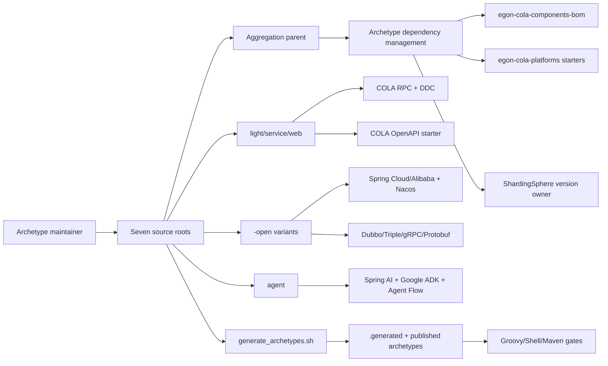
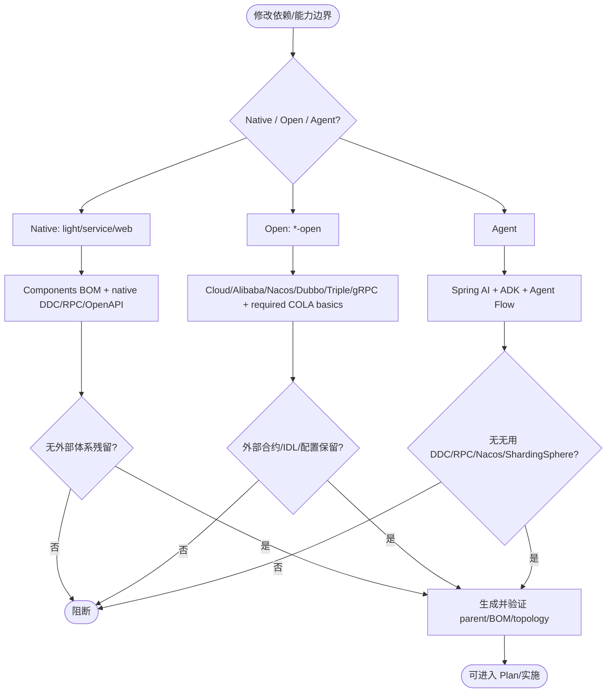
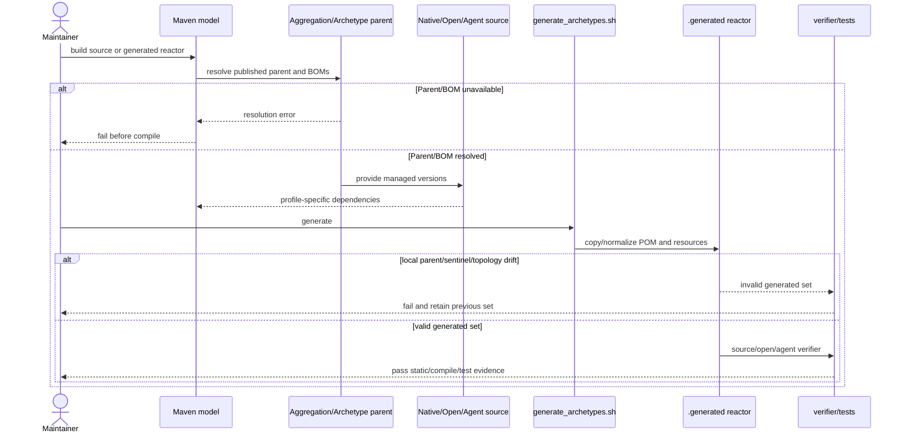

# Archetype 原生与 Open 技术栈依赖治理迁移

| Field | Value |
| --- | --- |
| Document | `2026-09-07-16-52-archetype-native-open-dependency-governance.md` |
| Template Version | `7` |
| Status | `Accepted` |
| Type | `Architecture` |
| Complexity | `Complex` |
| Complexity Drivers | 七个 source project、根/组件/平台/生成器多级 Maven 继承；原生与 `-open` 双技术栈；native RPC 需新增 Protobuf/gRPC 合约并联动源码、配置、测试、Compose 与 verifier；BOM 归属和 generated parent 必须保持可解析 |
| Created | `2026-09-07 16:52 CST` |
| Updated | `2026-09-08 15:08 CST` |
| Owner | `用户 / Egon-COLA 维护者` |
| Repository | `Egon-COLA` |
| Scope | `pom.xml`、`egon-cola-components`、`egon-cola-platforms`、`egon-cola-archetypes` 七个 source project、definitions、生成脚本与 archetype verifier |
| Change Surface | 依赖管理、parent/BOM 继承、原生 DDC/RPC/API Doc 能力边界、`-open` 外部 Spring 体系边界、源码配置/测试/Compose/verifier 一致性、generated POM parent 规范化 |
| Affected Chapters | `§7, §8, §9, §10, §13, §14, §15, §16` |
| Source Requirement | 用户关于 Spring Boot parent、Spring Cloud/Alibaba、ShardingSphere、commons-lang3、Components BOM、DDC/RPC/API Doc、`-open` 外部体系及原生 archetype 依赖解耦的确认请求 |
| Baseline Revision | `main @ dfd24ce3f57f77e2edc8628dac56fe8aba14b87e`，工作区含用户已做的 parent/POM 迁移未提交变更 |
| Amends | [generated reactor design](2026-09-03-11-04-archetype-generated-reactor-spring-flyway-design.md) §7.1/§7.2、§8、§14/§16 的 source Boot-parent 归属；[open family](2026-08-23-16-43-open-source-archetype-family.md) §7.0/§7.1/§16 的 parent/Common allowlist 以本 Spec REQ-004/007/009 为准。其余生成、业务和数据库边界保持。 |
| Supersedes | None |
| Depends On | [`2026-09-03-11-04-archetype-generated-reactor-spring-flyway-design.md`](2026-09-03-11-04-archetype-generated-reactor-spring-flyway-design.md) §7、§8、§14、§16、§19、§20 的生成 reactor 与验证约束；[`2026-08-23-16-43-open-source-archetype-family.md`](2026-08-23-16-43-open-source-archetype-family.md) §3、§7、§9、§16 的 `-open` 外部体系边界 |
| Related Specs | [`2026-08-19-15-36-rpc-runtime-governance-evolution.md`](2026-08-19-15-36-rpc-runtime-governance-evolution.md)；[`2026-08-25-19-01-gateway-openapi31-source-refactor.md`](2026-08-25-19-01-gateway-openapi31-source-refactor.md) |
| Related Plans | [native migration Plan](../plan/2026-09-08-03-30-archetype-native-open-dependency-migration.md) |

## 1. Summary

当前七个 archetype source project 把 Spring Cloud、Spring Cloud Alibaba、ShardingSphere、commons-lang3 及部分 Springdoc/Dubbo 版本重复写在各自父 POM 中，导致原生 archetype 被 Nacos/Dubbo/Spring Cloud 外部体系耦合；同时 source root 删除 Spring Boot parent 后尚未形成可独立解析的新 parent 链。用户已确认：不以 `-open` 结尾的 `light/service/web` 使用 Egon-COLA 原生 components/platforms 能力，`-open` 保留外部 Spring 体系。

本 Spec 规定统一的依赖治理与迁移边界：根聚合 POM 继续提供 Spring Boot parent；`egon-cola-archetypes` 继承根 parent 并集中管理 archetype 具体依赖，source/generated archetype parent 继承已发布的 `egon-cola-archetypes-parent`；原生三类移除 Dubbo、Nacos、Spring Cloud/Alibaba 及外部 Springdoc 直连，改接 Egon RPC/DDC/OpenAPI，并为 native facade 新增 Protobuf unary contract；`-open` 继续使用外部 Cloud/Alibaba/Nacos/Dubbo/Triple/gRPC/Protobuf/Springdoc，并保留源码实际使用的 Common/ID/MyBatis/DTP 组件；Agent 不引入 DDC、RPC、Nacos、Dubbo 或 ShardingSphere。

成功标准是：七个 source root 与 generated archetype 均能独立解析 parent/BOM；原生与 `-open` 的依赖集合和源码/配置/测试边界一致；生成器不会把仓库本地相对 parent 泄漏到用户项目；`mvn` source reactor、generated reactor、archetype verifier 与依赖边界静态门禁通过。本文只写设计，不声称实现或运行时验证已完成。

## 2. Background and Current State

### 2.1 Business and user context

archetype 是用户生成新项目的依赖与运行时基线。原生 archetype 应体现 Egon-COLA 的默认能力，避免生成项目无理由携带 Nacos、Dubbo 或 Spring Cloud；`-open` 是明确的外部 Spring 体系扩展，允许用户选择外部基础设施。依赖管理必须同时满足可生成、可发布、可升级和能力边界可解释四个目标。

### 2.2 Repository evidence

| Evidence ID | Classification | Exact path/symbol/decision/command | Observed fact | Design significance | Verification limit/freshness |
| --- | --- | --- | --- | --- | --- |
| `EVD-001` | Static repository | `pom.xml:7-15, 72-92` | 根聚合 POM 当前继承 `spring-boot-starter-parent:3.5.16`，并导入 `spring-boot-dependencies`。 | 根 parent 是 Spring Boot 版本与基础插件的唯一上游；source root 不应各自再声明 Boot parent。 | 静态证据，不证明尚未提交变更会如何发布。 |
| `EVD-002` | Static repository | `egon-cola-archetypes/source-projects/egon-cola-source-{light,service,web}/pom.xml` | 原生 source root 重复声明 `spring-cloud-dependencies`、`spring-cloud-alibaba-dependencies`、ShardingSphere、Springdoc、commons-lang3，且 light/service/web 依赖 Dubbo/Nacos。 | 原生 archetype 的外部技术栈耦合和版本漂移已被直接证明。 | 仅覆盖当前 source POM。 |
| `EVD-003` | Static repository | `egon-cola-archetypes/source-projects/egon-cola-source-{light-open,service-open,web-open}/pom.xml` | `-open` 使用 Spring Cloud/Alibaba、Nacos；service-open/web-open 还使用 Dubbo、gRPC、Protobuf、ShardingSphere；各自维护版本。 | `-open` 外部体系可以保留，但版本归属应从 source root 下沉到 archetype/open 依赖治理层。 | 不证明所有生成项目都已实际启动。 |
| `EVD-004` | Static repository | `egon-cola-components/egon-cola-components-bom/pom.xml:64-159` | Components BOM 管理 Common、ID、MyBatis-Plus、Dynamic Thread Pool、RPC starter、RPC DDC adapter 等组件。 | 组件版本应通过 BOM 继承，source POM 不再逐个管理版本。 | 静态 BOM 内容。 |
| `EVD-005` | Static repository | `egon-cola-platforms/pom.xml:91-116` | Platforms parent 管理 Springdoc BOM、DDC starter、DDC HTTP registration starter。 | 原生 API Doc/DDC 应依赖平台 starter，而不是直接绑定外部 Springdoc/Nacos。 | 平台 parent 不是生成项目的直接 parent。 |
| `EVD-006` | Static repository | `egon-cola-components/egon-cola-component-rpc/`、`egon-cola-platforms/egon-cola-platform-dynamic-config-center/` | 存在 `egon-cola-component-rpc-starter`、`egon-cola-component-rpc-ddc-adapter`、`egon-cola-platform-dynamic-config-center-starter`、`egon-cola-platform-dynamic-config-center-http-registration-starter`。 | 具备替换原生 Dubbo/Nacos DDC/RPC wiring 的仓库能力候选。 | 仅证明模块和符号存在，不证明目标接线已完成。 |
| `EVD-007` | Static repository | `scripts/generate_archetypes.sh:430-580` | 生成器复制 source POM、替换 group/artifact/version/package，并生成 `.generated` reactor；当前主要处理源码 sentinel 与路径清理。 | parent 规范化必须成为生成器的显式步骤，不能依赖 source 相对路径。 | 生成行为需改造后再验证。 |
| `EVD-008` | Static repository | `egon-cola-archetypes/definitions/*/archetype.properties` | 七个定义映射到七个 source root，分别声明 root 或多模块 topology。 | 每个 archetype 必须共享同一 parent/BOM 规则且保持现有 topology。 | 不证明 generated 资源当前与 source 完全一致。 |
| `EVD-009` | Static repository | 原生源码 `@EnableDubbo`、`@DubboService`、`@DubboReference`、Nacos 配置、Triple 测试与 Compose；`-open` 同类符号及 `GrpcEvaluationQueryClient` | 原生项目仍有外部 RPC/注册中心痕迹；`-open` 有明确外部 Triple/gRPC 使用。 | 原生迁移不是简单删依赖，必须同步源码、配置、测试、Compose、verifier；`-open` 不应被误改。 | 静态调用链证据，未运行应用。 |
| `EVD-010` | User decision | 用户确认“`-open` 可以保留”，并确认 native RPC 采用 A、允许新增 Protobuf。 | `-open` 允许外部 Spring 体系；native 可以新增 Protobuf 合约迁移到 Egon RPC。 | 形成原生/开放双 profile 的硬边界，并关闭 native transport 选择。 | 仅代表本 Spec 的设计决策。 |

### 2.3 Problem statement and gap

当前 source root 既重复管理版本，又把原生 COLA 项目和外部 Spring 生态混在一起。删除重复 BOM 而不替换源码/config/test 会造成编译或启动缺失；只改 source POM 而不改生成器，会将 `relativePath` 指向仓库内路径并破坏用户项目；只替换依赖而不更新 verifier，会让 archetype 门禁继续要求错误的 Dubbo/Nacos 结构。

目标 gap 是依赖管理层、架构能力层和生成层三者一致：

1. `light/service/web` 只携带被源码实际使用的 Egon components/platforms 与基础 Spring Boot 能力。
2. `light-open/service-open/web-open` 保留外部体系，但不因 `-open` 而删除 Common/ID/MyBatis/DTP 等已被源码使用的 COLA 组件。
3. Agent 保持 Spring AI/Google ADK/Agent Flow，不能因为“所有 archetype 共用 BOM”而自动引入 DDC/RPC/Nacos/ShardingSphere。
4. 版本只在正确的 owner POM/BOM 出现，generated POM 使用发布坐标而不是仓库相对路径；native facade 具有可被 Egon RPC validator 接受的 Protobuf unary 合约。

### 2.4 Evidence and current-chain map

| Entry/trigger | Current call chain | Data read/written | External dependency | Consumers | Evidence |
| --- | --- | --- | --- | --- | --- |
| Source parent resolution | source root POM -> child module POM -> dependency/plugin management | Maven model | 当前无 parent；各 root 自持版本 | source reactor、生成器 | `source-projects/egon-cola-source-*/pom.xml` |
| 原生 RPC/注册 | starter `@EnableDubbo` -> `@DubboService`/`@DubboReference` -> Nacos/Dubbo runtime | provider/consumer metadata、配置 | Dubbo、Nacos | light/service/web、测试、Compose | `rg '@(EnableDubbo|DubboService|DubboReference)'` |
| 原生 DDC/API Doc 目标 | source POM -> Egon component/platform starter -> auto-configuration | DDC registration/config、OpenAPI metadata | Egon COLA components/platforms | 原生生成项目 | `egon-cola-components-bom/pom.xml`、`egon-cola-platforms/pom.xml` |
| `-open` 外部 RPC | Triple provider/client -> Dubbo annotation/generated Triple -> external registry/config | RPC request/response、group/version | Dubbo Triple、gRPC/Protobuf | service-open/web-open | `*open*/adapter`、`GrpcEvaluationQueryClient` |
| Archetype generation | definition manifest -> `create-from-project` -> `normalize_generated_product` -> `.generated` reactor | generated POM/resources/manifests | Maven Archetype plugin | seven definition modules、IT verifier | `scripts/generate_archetypes.sh` |

## 3. Goals and Non-goals

### 3.1 Goals

- 统一根、archetype、source、generated 的 parent/BOM 责任。
- 将 `egon-cola-components-bom` 引入 archetype 层，覆盖 `egon-cola-component-common-mybatis-plus-spring-boot-starter` 等跨 archetype 组件版本。
- 将 ShardingSphere 版本集中到 archetype 层；commons-lang3 不再由 archetype 管理版本。
- 原生 `light/service/web` 采用 Egon COLA 原生 DDC、RPC、API Doc 能力，移除无用的 Dubbo/Nacos/Spring Cloud/Alibaba/Springdoc 直连。
- `-open` 保留外部 Spring Cloud/Alibaba、Nacos、Dubbo/Triple、gRPC/Protobuf、外部 ShardingSphere/Springdoc 能力，并继续使用源码需要的 COLA 基础组件。
- Agent 只保留 Spring AI、Google ADK、Agent Flow 及源码使用的基础组件。
- 让生成器、generated parent、source parent、verifier、配置与测试对同一技术栈边界负责。

### 3.2 Non-goals

- 不在本 Spec 中实现 POM、源码、配置、测试或生成产物。
- 不重写 `-open` 的外部 RPC 协议、Triple IDL、gRPC/Protobuf 合约。
- 不改变业务 HTTP 路由、DTO/VO、数据库 schema、Flyway 历史迁移或业务语义。
- 不把 Agent 改造成 DDC/RPC archetype，也不为“所有 archetype 统一”而引入无消费者依赖。
- 不启动应用、Nacos、数据库、Compose 或外部基础设施；运行时连接性留给实施后的验证。

### 3.3 Change Surface and Design Depth

| Area/layer | Disposition | Exact repository evidence | Changed or preserved behavior/contract | Required Spec treatment | Chapter(s) |
| --- | --- | --- | --- | --- | --- |
| Root aggregation parent | Affected | `pom.xml` | 保留 Boot parent，成为发布聚合根 | 继承链、版本与解析规则 | `§7, §8, §16` |
| Archetype parent/BOM | Affected | `egon-cola-archetypes/pom.xml` | 新增 components BOM、平台版本与 ShardingSphere owner | 完整依赖职责设计 | `§7, §8, §13, §14` |
| 七个 source root POM | Affected | `source-projects/egon-cola-source-*/pom.xml` | parent、dependencyManagement、直接依赖和 profile 边界调整 | 完整矩阵与删除/保留规则 | `§7, §8, §13, §14` |
| Source child module POM | Affected | `source-projects/egon-cola-source-*/*/pom.xml` | 继承既有 root，移除组件显式版本；native adapter/infrastructure/starter 同步替换 transport/API Doc 依赖 | 精确文件归属和分阶段依赖切换 | `§7, §8, §14, §16` |
| Native RPC/DDC/API Doc source/config/test | Affected | 原生 source Java/resources/test/compose | 从 Dubbo/Nacos/Springdoc 直连迁移到 Egon 能力；业务契约保持 | 目标协作、失败语义、验证 | `§7, §9, §14, §15` |
| `-open` RPC/Cloud/config/test | Context-only | `*-open*/` Dubbo/Triple/gRPC/Nacos 文件 | 外部体系保持，版本归属集中 | 明确保留边界与回归检查 | `§7, §16` |
| Shared native facade contracts | Affected | `egon-cola-archetypes/egon-cola-{organization,evaluation}-facade`、light `facade/rpc` | 新增 31 个 unary 协议操作和 Java 接口、MapStruct/BaseConverter；既有业务签名保持 | §7.4/§9/§10 完整合约及转换 | `§7, §8, §9, §10, §14, §16` |
| Components utility version owner | Affected | `egon-cola-components/pom.xml`、`egon-cola-components-bom/pom.xml` | Components BOM 导出 Core 的 Commons Lang 3.20.0；root 使用 Boot 同名 property 做全局版本桥接并检查二者相等；archetype 不自持版本 | 导出管理项、版本兼容、effective model 测试 | `§7, §8, §14, §16` |
| Agent runtime | Affected | `source-agent/pom.xml`、Agent modules | 无 DDC/RPC/Nacos/ShardingSphere；保留 AI/ADK/Agent Flow | 依赖必要性与 verifier | `§7, §8, §14` |
| Generated resource POM | Affected | `scripts/generate_archetypes.sh`, `.generated` | parent 使用发布坐标，禁止仓库相对路径 | 生成器规则和 deterministic check | `§7, §8, §14, §16` |
| Definitions/metadata/verifier | Affected | `egon-cola-archetypes/definitions/**` | verifier 反映 native/open/agent 依赖边界 | 目标文件、静态 gate | `§8, §14` |
| Public business HTTP API | Unchanged | archetype adapters/controllers | 路由、JSON、错误模型不变 | 只记录边界和回归验证 | `§9` |
| Database schema/Flyway | Unchanged | source migration trees | 不新增或修改 migration | 证据与禁止范围 | `§11, §16` |
| Frontend pages | Not applicable | source archetypes 无独立前端页面 | 无页面变化 | `N/A` | `§12` |

## 4. Requirements and Acceptance Criteria

| ID | Atomic requirement | Priority | Observable acceptance criteria | Source |
| --- | --- | --- | --- | --- |
| `REQ-001` | 原生 `light/service/web` 使用 Egon COLA 原生 DDC/RPC/API Doc 能力 | Must | source/generated POM 无原生 Dubbo/Nacos/Spring Cloud/Alibaba/Springdoc 直连；目标 starter 来自 components/platforms | 用户确认的原生能力边界 |
| `REQ-002` | `-open` 保留外部 Spring 体系 | Must | `-open` 保留 Cloud/Alibaba、Nacos、Dubbo/Triple、外部 gRPC/Protobuf、外部 Springdoc/ShardingSphere 的源码和依赖 | 用户确认“`-open` 可以保留” |
| `REQ-003` | Agent 不引入无用 DDC/RPC/Nacos/Dubbo/ShardingSphere | Must | Agent 的 dependency tree、配置、verifier 均无这些能力；Spring AI/ADK/Agent Flow 可解析 | 用户需求与源码能力边界 |
| `REQ-004` | Components BOM 负责组件版本 | Must | 每个 archetype source root 通过 `egon-cola-components-bom` 获取 Common/ID/MyBatis/DTP/RPC 等版本，不逐个写版本 | 用户关于 components BOM 的确认 |
| `REQ-005` | ShardingSphere 版本集中在 archetype 层 | Must | source root 不再声明 `${shardingsphere.version}`；需要的模块无显式版本，版本由 archetype parent 管理 | 用户原始迁移请求 |
| `REQ-006` | commons-lang3 不由 archetype 版本管理 | Must | 删除 `commons-lang3.version` 与直接版本；Common Core 提供传递依赖，源码有真实使用时只声明无版本依赖 | 用户原始迁移请求 |
| `REQ-007` | Spring Boot parent 继承链可解析 | Must | root、source root、generated root 在干净 Maven 本地仓库中按发布坐标解析；generated POM 不依赖仓库相对路径 | parent 迁移目标 |
| `REQ-008` | 原生 RPC/DDC 迁移同步源码、配置、测试、Compose、verifier | Must | `rg` 不再命中原生 Dubbo/Nacos 残留；native verifier 检查 Egon starter/config/test | 当前静态证据 EVD-009 |
| `REQ-009` | `-open` 源码所需 COLA 基础组件不因外部化而删除 | Must | `EgonModel`、`EgonColaServiceImpl`、`LongIdGenerator`、DTP、`BaseConverter` 的依赖仍可解析 | 当前源码消费者证据 |
| `REQ-010` | 生成脚本维持 topology、变量替换、原子发布和确定性 | Must | `generate`/`check`、generated reactor、七个 verifier 通过；source parent sentinel 不泄漏 | 既有生成 Spec 与脚本 |
| `REQ-011` | native facade 迁移为 Egon RPC 可验证的 Protobuf unary contract | Must | native facade 有对应 `.proto`、生成 gRPC 类型、`@EgonRpcService(grpcClass=...)`/`@EgonRpcMethod`；`RpcContractValidator` 和 provider/consumer tests 通过 | 用户确认“非 open 迁移到 egon-cola-rpc，允许新增 protobuf” |

### 4.1 Scenario matrix

| Scenario | Actor/trigger | Preconditions | Main path | Alternative/failure path | Data/state change | Observable result | Requirements |
| --- | --- | --- | --- | --- | --- | --- | --- |
| Native source compile | Archetype maintainer runs source reactor | 本地/远程仓库含目标 parent/BOM | Maven 解析 root -> source parent -> components/platforms BOM -> modules | 缺失发布 parent 或 BOM 时 fail fast，不能回退到仓库相对路径 | 仅 `target` 构建产物 | native source compile/test succeeds | `REQ-001, REQ-004, REQ-007` |
| Native runtime wiring scan | Maintainer runs static search/verifier | native source/config/test 已按目标修改 | verifier 检查 native starter、DDC properties、RPC provider/consumer、API Doc starter | 命中 Dubbo/Nacos/Spring Cloud 残留时失败并列出文件 | 无持久化变化 | 明确指出技术栈边界违规 | `REQ-001, REQ-008` |
| Native RPC contract validation | Maintainer runs native contract tests | native `.proto` and generated gRPC classes are available | provider/consumer adapters invoke unary methods and `RpcContractValidator` checks `grpcClass`/method descriptors | descriptor mismatch, non-unary method, or DTO mapping drift fails before release | generated contract/test artifacts only | native facade transport is Egon RPC-compatible without changing business DTO semantics | `REQ-001, REQ-008, REQ-011` |
| Open source compatibility | Maintainer builds `-open` family | external BOMs and coordinates available | resolve Cloud/Alibaba/Nacos/Dubbo/Triple/gRPC/Protobuf plus required COLA components | external artifact unavailable 时构建失败，不能偷偷切 native | 无业务状态变化 | `-open` compile/tests preserve contracts | `REQ-002, REQ-009` |
| Agent minimal dependency | Maintainer builds agent | Spring AI/ADK/Agent Flow BOM available | resolve agent modules and platform OpenAPI starter | accidental DDC/RPC/Nacos/ShardingSphere hit fails verifier | 无业务状态变化 | dependency tree contains only needed stack | `REQ-003` |
| Generated project creation | Archetype consumer runs Maven archetype generate | published archetype and aggregation parent available | definition -> generated resources -> project POM with `<relativePath/>` | source-local relative parent or sentinel remains -> generation gate fails | generated files only | generated project can resolve from repository | `REQ-007, REQ-010` |
| Duplicate/retry generation | CI runs `generate` then `check` concurrently/repeatedly | existing `.generated` set | lock/staging/atomic publish then hash comparison | lock conflict, interrupted staging, hash drift -> cleanup and fail | `.generated` replacement is atomic | deterministic, no partial set | `REQ-010` |

### 4.2 Use-case analysis

#### 4.2.1 Actor inventory

| Actor ID | Actor/role | Goal and responsibility | Entry/channel | Permission/tenant context | Evidence |
| --- | --- | --- | --- | --- | --- |
| `ACTOR-001` | Archetype maintainer | 维护依赖边界、版本 owner 和源码模板 | Git/Maven/scripts | 仓库维护权限 | 用户请求、POM、脚本 |
| `ACTOR-002` | Archetype consumer | 生成并构建目标项目 | Maven Archetype CLI | 用户项目仓库 | `definitions/*`、generated reactor |
| `ACTOR-003` | CI/release verifier | 检查 generated、依赖和架构约束 | Maven/Shell/Groovy | CI workspace | `scripts/test-*`、`verify.groovy` |
| `ACTOR-004` | Native runtime | 提供 Egon DDC/RPC/OpenAPI 能力 | Spring Boot auto-configuration | 服务实例身份 | components/platforms starter |
| `ACTOR-005` | Open external runtime | 提供 Cloud/Alibaba/Nacos/Dubbo/Triple/gRPC 能力 | Spring Boot/external registry | 外部基础设施配置 | `*-open` 源码与 POM |

#### 4.2.2 Use-case artifact

| ID | Use case/goal | Primary actor | Supporting actors/systems | Trigger | Preconditions | Main success outcome | Alternatives/failures | Postconditions | Requirements | Interfaces/pages | Tests |
| --- | --- | --- | --- | --- | --- | --- | --- | --- | --- | --- | --- |
| `UC-001` | 生成可独立解析的 Native archetype | `ACTOR-001` | Maven Central/local repository、`ACTOR-003` | 提交 source/POM 变更 | parent/BOM 版本已确定 | native project 使用 COLA 原生能力且构建可解析 | 依赖缺失、外部技术栈残留、生成 sentinel -> gate fail | 生成物可被消费者使用 | `REQ-001, REQ-004, REQ-007, REQ-008` | `RPC-001`、generated POM | `TEST-001..004` |
| `UC-002` | 生成保留外部能力的 Open archetype | `ACTOR-002` | Cloud/Alibaba/Nacos/Dubbo/Triple/gRPC | 选择 `*-open` | 外部 BOM/registry 配置存在 | 外部体系与 COLA 基础组件共同解析 | 外部 artifact/IDL 缺失 -> 明确失败 | open contract/配置不变 | `REQ-002, REQ-009` | `RPC-002`（context-only） | `TEST-005..006` |
| `UC-003` | 维护 Agent 最小依赖集 | `ACTOR-001` | Spring AI、Google ADK、Agent Flow | Agent archetype 构建 | AI/ADK BOM 已发布 | agent 无 DDC/RPC/Nacos/ShardingSphere 冗余 | 依赖误引入 -> verifier fail | agent stack remains minimal | `REQ-003` | None | `TEST-007` |
| `UC-004` | 发布并校验 generated archetype reactor | `ACTOR-003` | Maven Archetype plugin、source definitions | release pipeline | source reactor 和生成资源已通过 | 七个 archetype topology/hash/verifier 通过 | staging/lock/hash error -> 原子回滚 | 无半成品 generated set | `REQ-010` | generated reactor | `TEST-008..010` |

## 5. Constraints, Assumptions, and Decisions

### 5.1 Confirmed constraints

- 用户在当前会话确认“补齐spec后，逐步实现、验证、提交”。本次先修订本 Spec 和关联 Plan，再按七个 Step 顺序执行；修订和各 Step 均采用路径限定提交。运行时启动与发布仍不授权。
- `-open` 可以保留外部 Spring 体系；非 `-open` 的原生 archetype 不引入用不上的 Nacos、Dubbo、Spring Cloud/Alibaba。
- 原生 DDC、RPC、API Doc 必须优先复用 `egon-cola-components` 与 `egon-cola-platforms` 的现有能力。
- 所有 source root 保持当前 package/topology/业务接口/数据库语义，迁移只扩大到使依赖边界一致所需的源码、配置、测试、Compose 与 verifier。
- 不修改已有 Flyway migration；本任务无 schema 变更。

### 5.2 Small-gap assumptions

| ID | Inference | Repository evidence | Why locally reversible | Impact if wrong |
| --- | --- | --- | --- | --- |
| `ASM-001` | source root 与 generated root 继承已发布 `top.egon:egon-cola-archetypes-parent:${egon-cola.version}`；该 parent 再继承 aggregation parent，generated 项目设置空 `<relativePath/>`。 | 用户对分层管理的确认；当前 archetypes parent 已继承 aggregation parent。 | 只影响 Maven parent 文本，可在 Plan 中调整坐标。 | 若发布坐标不同，source/generated 无法独立解析。 |
| `ASM-002` | ShardingSphere 由 `egon-cola-archetypes/pom.xml` 的 dependencyManagement 统一管理，具体模块仍按现有实际使用声明。 | 四个以上 source POM 重复 `${shardingsphere.version}`。 | 仅移动版本 owner，不改变 artifact 集合。 | 若希望拆成 native/open 两个版本，需要更新依赖矩阵。 |
| `ASM-003` | 原生 API Doc 采用平台 `egon-cola-platform-gateway-starter-openapi-webmvc` 或 WebFlux 对应 starter，版本由平台/archetype 管理。 | 平台 OpenAPI starter 模块与 MVC/WebFlux artifact 存在。 | starter 可替换且不改变业务路由。 | 若某 archetype 需要不同 web stack，Plan 需按实际 starter 选择。 |
| `ASM-004` | 原生 RPC 迁移保持现有 facade 业务语义和 group/version 兼容信息；新增 `.proto` 仅作为 transport contract，DTO 映射在 adapter 内完成。 | 原生 facade interfaces、Egon RPC annotation/validator 与用户确认 A。 | 不改变业务目标，但会增加 Protobuf/生成代码文件。 | 若某 facade 无法一一映射为 unary method，需单独升级决策。 |

### 5.3 Resolved decisions

| ID | Decision | Decision owner | Evidence and rationale | Requirements |
| --- | --- | --- | --- | --- |
| `DEC-001` | 根 POM 管理全局依赖；`egon-cola-archetypes` 继承根聚合 parent 并管理 archetype 具体依赖；source/generated archetype parent 继承已发布的 `egon-cola-archetypes-parent`。 | 用户/维护者 | 用户确认根负责全局、archetypes/platforms/components 负责具体管理；当前 `egon-cola-archetypes/pom.xml` 已继承 aggregation parent。 | `REQ-004, REQ-007` |
| `DEC-002` | Components BOM 在 archetype 层统一导入；Common/ID/MyBatis/DTP/RPC 等组件不在每个 source root 单独管理版本。 | 用户/维护者 | `egon-cola-components-bom` 已管理目标组件。 | `REQ-004, REQ-009` |
| `DEC-003` | ShardingSphere 的版本 owner 放在 archetype 层；commons-lang3 的版本 owner 不在 archetype，Common Core 负责传递版本。 | 用户/维护者 | 用户明确要求；当前 source root 重复声明。 | `REQ-005, REQ-006` |
| `DEC-004` | 原生 `light/service/web` 使用 Egon DDC/RPC/API Doc，并新增 Protobuf unary 合约迁移到 `egon-cola-rpc`；`-open` 保持外部 Cloud/Alibaba/Nacos/Dubbo/Triple/gRPC/Protobuf；Agent 维持 AI/ADK/Agent Flow。 | 用户/维护者 | 用户确认 `-open` 可保留且 native 采用 A；Egon RPC validator 的 `grpcClass`/Protobuf 约束已核对。 | `REQ-001, REQ-002, REQ-003, REQ-011` |
| `DEC-005` | 生成器负责把 source POM 的 parent 规范化为发布坐标，并保持 generated topology/hash/atomic publish。 | 维护者 | `scripts/generate_archetypes.sh` 当前集中负责 POM 复制和 `.generated` 发布。 | `REQ-007, REQ-010` |

### 5.4 Open major decisions

`None`。用户已明确授权补齐缺失合约、迁移文件及验证步骤后继续执行；§7.4 记录本次仓库证据驱动修订。用户已确认原生与 `-open` 技术栈边界；具体 native RPC adapter 的属性名、provider/consumer 映射和 OpenAPI MVC/WebFlux 选择属于实施阶段的仓库内局部决策，若发现需要改变公共 RPC 合约或发布坐标，必须在 Plan/实施前单独升级为用户决策。

## 6. Project Technology Context

| Concern | Current choice | Repository evidence | Constraint on design |
| --- | --- | --- | --- |
| Language/runtime | Java 21 | root/archetype POM `java.version` | 保持 source/generated 编译级别。 |
| Framework | Spring Boot 3.5.16 | root parent/property | Boot parent 只保留在 aggregation root 的发布继承链。 |
| Dependency build | Maven multi-module + Maven Archetype | root modules、archetype packaging、`scripts/generate_archetypes.sh` | parent/BOM 必须可被 source 与 generated 独立解析。 |
| Component versioning | `egon-cola-components-bom` | `egon-cola-components/egon-cola-components-bom/pom.xml` | Common/ID/MyBatis/DTP/RPC 版本不得在各 archetype 漂移。 |
| Platform capability | DDC/OpenAPI starters | `egon-cola-platforms/pom.xml` 与 platform module tree | native 依赖平台 starter，不直接复制外部基础设施。 |
| Persistence | MyBatis-Plus、ShardingSphere、Flyway（部分 native） | source POM 与 migration trees | 本 Spec 不改表和 migration；只移动版本管理。 |
| RPC/config | native Egon RPC/DDC；open external Dubbo/Nacos/Triple | components/platforms 与 source usages | profile 边界必须通过依赖、配置和 verifier 同时表达。 |
| Tests | JUnit/Spring tests、Groovy archetype verifier、Shell generation tests | definitions `verify.groovy`、`scripts/test-*` | 先静态/构建/生成验证，运行时验证留实施后。 |

### 6.1 Java architecture profile and capability baseline

| Architecture profile | Archetype/template or base package | Exact evidence and verifier | Existing deviations | Design action |
| --- | --- | --- | --- | --- |
| Egon-COLA Light | `egon-cola-archetype-light`, `top.egon.cola.archetype.source.light` | definition topology `root`、native light source | 当前 RPC 仍为 Dubbo/Nacos，属于待迁移偏差 | 保留 flat COLA tree，替换 wiring/dependencies |
| Egon-COLA Service | `egon-cola-archetype-service`, `top.egon.cola.archetype.source.service` | common/domain/application/infrastructure/adapter/starter | 当前 Dubbo/Nacos/ShardingSphere 重复管理 | 保留模块边界，移依赖 owner |
| Egon-COLA Web | `egon-cola-archetype-web`, `top.egon.cola.archetype.source.web` | same service topology plus web contracts | 当前外部 Cloud/Nacos/Springdoc | 保留模块边界，native 使用平台 API Doc |
| Egon-COLA Open variants | `*-open` definitions and `top.egon.cola.archetype.source.*open` | open verifier、Triple/gRPC tests | 外部体系是明确变体，不是偏差 | 保留外部 transport/config |
| Egon-COLA Agent | `egon-cola-archetype-agent` | AI source topology and Agent verifier | 不属于 DDC/RPC archetype | 保留 AI/ADK/Agent Flow，拒绝无用基础设施 |

Reuse/capability ledger:

| Need | Spring/JDK candidate | Spring Boot Starter candidate | Egon-COLA/module candidate | Proven gap | Decision/dependency impact |
| --- | --- | --- | --- | --- | --- |
| Common/MyBatis-Plus/ID/DTP | Spring/JDK + Boot | existing starters | `egon-cola-components-bom` managed components | None | Reuse BOM-managed components |
| Native RPC | Spring context only | None sufficient | `egon-cola-component-rpc-starter`, `egon-cola-component-rpc-ddc-adapter` | Adapter/provider mapping to be implemented | Add/keep native components |
| Native DDC registration | Spring lifecycle/Actuator | None sufficient | `egon-cola-platform-dynamic-config-center-http-registration-starter` | None proven | Add for native services that register HTTP |
| Native API Doc | Spring MVC/WebFlux | external Springdoc is not native boundary | `egon-cola-platform-gateway-starter-openapi[-webmvc|-webflux]` | Exact per profile web stack checked in implementation | Reuse platform starter |
| Open Cloud/Nacos/Dubbo | External ecosystem | Spring Cloud/Alibaba/Dubbo starters | Not replaceable in open profile | User explicitly preserves | Keep only in `-open` |
| Agent workflow | Spring AI/Google ADK | Spring AI starters | Agent Flow component | None proven | Keep; no DDC/RPC |
| ShardingSphere | external library | none | archetype-level dependencyManagement | None | Centralize version, retain actual modules |
| commons-lang3 | Apache Commons | transitive through Common Core | `egon-cola-component-common-core` | None proven | Remove archetype version ownership |

### 6.2 User-mandated Java rule compliance

| Literal rule | Affected? | Repository evidence | Exact design decision | Files/types/interfaces | Validation/test evidence | Status/blocker |
| --- | --- | --- | --- | --- | --- | --- |
| Rule 1 | Yes | Native/open source already contains semantic Java types and RPC clients/providers | Dependency migration does not invent ambiguous POJO names; new config carriers use existing semantic suffixes | affected native config/RPC types | static type inventory | PASS |
| Rule 2 | Yes | Spring Boot validation exists in native POMs; interface migration crosses layers | Preserve existing validation and groups; no new ad-hoc validator for POM-only changes | request/config boundaries only if changed | focused validation tests in implementation | PASS |
| Rule 3 | Yes | Common `BaseConverter`, Lombok/MapStruct dependencies exist | Reuse existing models/converters; no parallel DTO/PO introduced by dependency migration | existing model/converter packages | compile and converter tests | PASS |
| Rule 4 | Yes | source services use Spring-managed components | Changed business/config beans use existing named bean and constructor-injection conventions | native starter/config classes | context wiring test/static scan | PASS |
| Rule 5 | Yes | commons-lang3 is approved utility but version is transitive | no new utility library; use Common Core-provided commons-lang3 | affected POMs only | dependency tree/import scan | PASS |
| Rule 6 | Yes | public JSON/API Doc contracts remain unchanged | preserve Jackson/OpenAPI wire semantics; only starter owner changes | controllers/DTOs unchanged | API regression and generated docs check | PASS |
| Rule 7 | Yes | profile config files exist in source projects | native/open profile keys stay structurally aligned where the same runtime concern exists | `application-*.yml`, DDC/RPC keys | key parity check | PASS |
| Rule 9 | Yes | 原 RPC Java DTO 与 Egon Protobuf/descriptor 不兼容，跨项目消费合约 | 使用 Adapter 隔离协议转换；框架 factory 负责 proxy/strategy，generator 保留 Pipeline | native provider/client、MapStruct/BaseConverter、既有 RPC factories | 31 operation contract/provider/consumer、错误与上下文测试 | PASS |
| Rule 10 | Yes | Light ScheduleCourseDTO 的 LocalDateTime；evaluation DTO 的 Instant | ISO_LOCAL_DATE_TIME / ISO_INSTANT 无损转字符串，保留纳秒、null 和 local/UTC 意义；不得 java.util.Date | transport converter | 时间与空值往返测试 | PASS |
| Rule 11 | Yes | exact COLA archetype trees and generated verifiers exist | preserve selected Light/Service/Web/Open/Agent profiles; no hybrid `biz.*` tree | source/generated trees | verifier and architecture tests | PASS |

## 7. Architecture Design

### 7.0 Minimum-design baseline and element-necessity audit

| Proposed element | Change | Requirements | Existing/direct alternative | Concrete inadequacy of alternative | Added calls/state/coupling/failures/migration/operations | Verdict |
| --- | --- | --- | --- | --- | --- | --- |
| Archetype-level components BOM import | Expand | `REQ-004` | Keep seven root-local versions | duplicates drift and violate user ownership decision | one parent import, lower local duplication | Add |
| Archetype-level ShardingSphere management | Move | `REQ-005` | Keep root-local property | repeated version owner and inconsistent updates | one version owner, no runtime call | Move |
| Direct commons-lang3 version | Remove | `REQ-006` | Keep explicit version | Common Core already supplies approved version | removes duplicate override; dependency remains transitive | Remove |
| Native RPC/DDC starter wiring | Add/Replace | `REQ-001, REQ-008` | Keep Dubbo/Nacos in native | violates native profile and user’s DDC/RPC requirement | changes runtime wiring/config/test surface | Replace |
| Native platform OpenAPI starter | Add/Replace | `REQ-001` | Keep direct Springdoc | native API Doc must come from platform capability | starter auto-config boundary | Replace |
| Open external BOM/starter set | Keep, relocate version owner | `REQ-002` | Remove external stack | breaks declared `-open` use cases | preserves external calls/config | Keep |
| Agent DDC/RPC dependencies | Remove | `REQ-003` | Share all native dependencies | no source consumer; increases footprint | fewer artifacts/config states | Remove |
| Generator parent normalization | Expand | `REQ-007, REQ-010` | Copy source POM unchanged | generated project cannot resolve repository-local parent | one deterministic rewrite stage | Add |

Critical-path comparison:

| Path | Network calls | Client states | Server contracts/state | Failure and TOCTOU points | Additional user/business value |
| --- | --- | --- | --- | --- | --- |
| Direct POM-only baseline | 0 | none | Maven model only | compile/runtime missing class or config | insufficient; leaves native Dubbo/Nacos usages |
| Selected dependency + wiring migration | build-time 0; runtime uses selected native or open registry | native DDC/RPC registration states; open external states | profile-specific auto-config and existing business contracts | parent resolution, starter wiring, registry timeout, stale config; explicit verifier gates | satisfies profile boundary while preserving contracts |

### 7.1 System Architecture Design



| Module/component | Capability and data owned | Inputs/outputs | Allowed dependencies | Forbidden responsibility | Requirements |
| --- | --- | --- | --- | --- | --- |
| Root aggregation parent | Boot/JDK/common plugin baseline | Maven model | Spring Boot, shared release plugins | profile-specific runtime dependency | `REQ-007` |
| Archetype parent | archetype-level version ownership | BOMs/properties | components BOM, platform version, ShardingSphere, open version properties | business source code | `REQ-004..006` |
| Native source root | native generated project contract | native starter/config | COLA components/platforms + Boot | external Cloud/Nacos/Dubbo | `REQ-001` |
| Open source root | external Spring project contract | external config/IDL | external Cloud/Alibaba/Nacos/Dubbo/gRPC/Protobuf + required COLA basics | silently switching to native transport | `REQ-002, REQ-009` |
| Agent source root | AI workflow contract | AI/ADK config | Spring AI, Google ADK, Agent Flow, API Doc as needed | DDC/RPC/Nacos/ShardingSphere | `REQ-003` |
| Generator | source-to-archetype transformation | source POM/tree | shell/Maven Archetype | changing business source semantics | `REQ-007, REQ-010` |
| Verifier | acceptance evidence | generated project | Maven/Groovy/Shell | starting external infrastructure | `REQ-008, REQ-010` |

### 7.2 High-Level Design

依赖解析顺序为：发布的 aggregation parent -> archetype parent -> components/platforms/open BOMs -> source root dependency declarations -> child modules。source root 只声明“需要什么”，不声明由上游 owner 已确定的组件版本。Native/Open/Agent 的选择由 source root 和 definition family 决定，不由传递依赖猜测。



| Concern/use case | Required behavior | Selected mechanism | Failure/degradation behavior | Trade-off | Verification | Requirements |
| --- | --- | --- | --- | --- | --- | --- |
| Parent resolution | source/generated independent | published aggregation parent + empty relativePath | fail before compile if unavailable | requires publish/install order | `help:effective-pom`, clean reactor | `REQ-007` |
| Component version drift | one owner | archetype import of components BOM | unresolved artifact fails; no local override | parent coupling increases intentionally | effective POM/dependency tree | `REQ-004` |
| Native infrastructure | no external accidental stack | COLA RPC/DDC/OpenAPI starters | registration/config failure is explicit | requires source wiring migration | static scan + focused context test | `REQ-001, REQ-008` |
| Open compatibility | retain external stack | open-only BOMs/starter declarations | external unavailability fails transparently | two profiles to maintain | open compile/Triple tests | `REQ-002` |
| Agent minimalism | no unrelated infra | only AI/ADK/Agent Flow | dependency gate fails on forbidden artifact | less shared convenience | dependency allowlist | `REQ-003` |

#### 7.2.2 High-level decision and quality matrix

| Concern/use case | Required behavior | Selected mechanism | Failure/degradation behavior | Trade-off | Verification | Requirements |
| --- | --- | --- | --- | --- | --- | --- |
| Dependency ownership | each version has one owner | root for Boot/release, archetype for components/platforms/ShardingSphere/open profile | duplicate or unresolved version fails model/gate | explicit parent coupling | effective POM and dependency tree | `REQ-004..007` |
| Profile purity | native/open/agent do not cross-import infrastructure | family-specific POM plus verifier allowlist | forbidden artifact/symbol fails before release | more family assertions | static scan and generated IT | `REQ-001..003, REQ-008` |
| Generated reproducibility | same source yields same generated tree | existing staging/lock/hash plus parent normalization | hash/topology drift discards staging | one extra normalization stage | generator `check` | `REQ-007, REQ-010` |

### 7.3 Detailed Design

#### 7.3.1 Detailed component collaboration

| Step | Caller -> callee | Contract/symbol | Input/output mapping | State/data effect | Failure behavior | Requirements |
| --- | --- | --- | --- | --- | --- | --- |
| 1 | Maven -> aggregation parent | `top.egon:egon-cola-aggregation-parent` | group/artifact/version -> effective model | none | unresolved parent stops build | `REQ-007` |
| 2 | Source root -> archetype parent | parent POM | source model -> inherited dependency/plugin management | none | wrong relativePath or version stops model build | `REQ-007` |
| 3 | Archetype parent -> components/platforms | BOM/starter coordinates | needs -> managed version | none | missing managed version is compile/model failure | `REQ-004` |
| 4 | Native starter -> COLA RPC/DDC/OpenAPI | existing facade/config/provider symbols | current contracts -> native adapters | runtime registration/config state | timeout/failure is surfaced and testable | `REQ-001, REQ-008` |
| 5 | Open starter -> external ecosystem | existing Dubbo/Nacos/Triple/gRPC symbols | external contracts unchanged | external registry/config state | external failure remains open profile behavior | `REQ-002` |
| 6 | Generator -> generated POM | `normalize_generated_product`, new parent normalization step | source parent -> release parent with `<relativePath/>` | generated tree/hash | sentinel/local path causes gate failure | `REQ-007, REQ-010` |
| 7 | Verifier -> generated project | Groovy/Shell/Maven checks | generated files/dependency markers -> pass/fail | no runtime state | any profile mismatch blocks release | `REQ-008, REQ-010` |

#### 7.3.2 Critical-path Mermaid swimlane



#### 7.3.3 Transactions, consistency, concurrency, and idempotency

| Concern/state change | Owner and boundary | Mechanism/isolation/lock | Concurrent or duplicate behavior | Commit/visibility point | Failure result | Requirements/tests |
| --- | --- | --- | --- | --- | --- | --- |
| Generated set publication | generator process | existing `.generated.lock` + staging/atomic move | second run waits/fails according to existing lock; repeated run must hash equal | atomic move to `.generated` | previous set restored on interrupted publish | `REQ-010 / TEST-008` |
| Parent/BOM version ownership | POM model | Maven effective model, no runtime transaction | duplicate local version is a policy violation | effective POM generation | build/verifier fail | `REQ-004..007 / TEST-001` |
| Native registration/config | native runtime starter | component/platform lifecycle and existing retry state | duplicate registration follows native runtime contract; no custom second registry | starter reports registered/failed state | timeout/failure observable; no silent fallback to Nacos | `REQ-001, REQ-008 / TEST-004` |
| Open registry/config | external runtime | existing Dubbo/Nacos configuration | preserve current group/version and external retry semantics | external runtime state | open profile reports external failure | `REQ-002 / TEST-005` |

No relational transaction, schema migration, or business idempotency is introduced by this Spec.

#### 7.3.4 Failure semantics, recovery, and reconciliation

| Failure point | Detection | Immediate control flow | Data/transaction state | Retry and idempotency | Caller/frontend result | Recovery/reconciliation owner | Verification |
| --- | --- | --- | --- | --- | --- | --- | --- |
| Parent artifact missing | Maven model resolution | stop before compile | no build state committed | rerun after install/publish | build error | release maintainer | `TEST-001` |
| Forbidden native dependency remains | dependency/static scan | verifier fails | source unchanged | fix POM/source/config; rerun | gate report | archetype maintainer | `TEST-002` |
| Native DDC/RPC registration timeout | starter health/log/exception | follow native component retry/fail state | no custom fallback | bounded retry per existing starter | runtime startup failure/health signal | service operator | `TEST-004`, post-implementation runtime check |
| Open Nacos/Dubbo unavailable | existing external client/provider error | preserve open behavior | external state unknown; no native fallback | existing open retry/config | open integration test failure | open project operator | `TEST-005` |
| Generated normalization failure | shell exit/hash/topology check | discard staging, restore previous set | previous `.generated` remains visible | rerun after source correction | generation command failure | maintainer/CI | `TEST-008..010` |

#### 7.3.5 Observability and operational boundaries

| Signal/runbook | Emitting owner and point | Fields/dimensions | Sensitive-data rule | Success/failure threshold | Alert/dashboard/operator action | Verification boundary |
| --- | --- | --- | --- | --- | --- | --- |
| Maven resolution log | Maven/CI | project, parent/BOM coordinate, failure | no secrets | any unresolved parent/BOM fails gate | inspect repository/version order | static/CI |
| Native DDC/RPC health | native starter | profile, service identity, registration state, latency | omit credentials/config values | failed/timeout state visible | operator checks DDC/RPC endpoint | runtime after implementation |
| Open registry health | open starter/Dubbo/Nacos | registry address label, group/version, state | mask credentials | preserve current health/error signal | operator checks external infra | runtime after implementation |
| Generation manifest/hash | generator | target artifact, hash, source manifest | no secrets | hash mismatch fails `check` | regenerate and compare | Shell test |
| Forbidden dependency gate | verifier | family, artifactId, path | no secrets | any forbidden marker fails | update source/config/verifier together | static test |

#### 7.3.6 Conclusion evidence chain

| Conclusion | Repository/user evidence | Constraint or requirement | Design decision | Consequence and trade-off | Verification and acceptance evidence |
| --- | --- | --- | --- | --- | --- |
| Native archetypes must not carry external registry/RPC | `EVD-002`, `EVD-009` plus user’s native requirement | `REQ-001, REQ-008` | replace native Dubbo/Nacos wiring with COLA RPC/DDC and platform OpenAPI | requires source/config/test/Compose migration; reduces accidental infrastructure coupling | native dependency allowlist, source scan, context tests, generated verifier |
| Components versions belong at archetype layer | `EVD-004`, repeated source POM declarations | `REQ-004, REQ-009` | import components BOM once and remove root-local versions | stronger parent coupling but one update point | effective POM and dependency tree across seven roots |
| `-open` retains external stack while reusing COLA basics | `EVD-003`, `EVD-010`, open source symbols | `REQ-002, REQ-009` | separate open external dependency set from native set; retain Common/ID/MyBatis/DTP | two explicit profiles instead of one ambiguous hybrid | open compile, Triple/gRPC tests, forbidden native-only scan |
| Generated parent must use publication coordinates | `EVD-007`, generated reactor design | `REQ-007, REQ-010` | generator normalizes source parent and emits empty relativePath | extra deterministic rewrite step | generated POM inspection, clean repository build, hash check |

### 7.4 经用户确认的执行补齐（本节替换旧稿中笼统的 transport 描述）

#### 7.4.1 Parent / BOM / version owner

- source/generated root 的 parent 是 `top.egon:egon-cola-archetypes-parent:5.4.0`，写**具体版本**与 `<relativePath/>`。Maven 解析 parent 前不能依赖 child 自身的 `${egon-cola.version}`；该 property 继续用于普通依赖与生成参数。内部 source aggregator 仍保留 `../pom.xml`，它不交付用户项目。
- Components BOM 在 archetypes parent 导入一次。Common/ID/MyBatis/DTP/RPC 的依赖声明不重复写版本。native/open 各自的模块集合不变，版本管理项不等于运行时依赖。
- `commons-lang3:3.20.0` 从现有 components parent 管理项移至 Components BOM；components parent 导入该 BOM，删除重复 property/管理项。Core 仍实际提供传递依赖。当前 Boot 3.5.16 的 BOM 声明 3.17.0，必须通过有效模型证明未被降级。source 原 3.18.0 向既有 Core 3.20.0 对齐是明确的版本收敛，非新增工具库。
- Maven 实测修正：Boot parent 的继承管理优先于 child 的 BOM import，即使移除 root 的重复 Boot BOM import，最小模型仍解析为 3.17.0。因此 root 全局 defaults 需声明 `commons-lang3.version=3.20.0` 作为 Boot 的属性桥接；Components BOM 继续导出同值，静态门禁强制二者一致，七个 effective POM 必须实际得到 3.20.0。这个必要的全局兼容桥接不能放进 archetype/source，也不新增 utility dependency；原“只导入 BOM 即可覆盖 Boot”的实现推断由本条修正。
- archetypes parent 管 ShardingSphere 5.5.3、Cloud 2025.0.3、Alibaba 2025.0.0.0、Dubbo 3.3.6、Open gRPC 1.73.0/Protobuf 3.25.8 的版本。native codegen/runtime 使用现有 RPC 的 gRPC 1.75.0/Protobuf 4.32.0，使用独立 `native.grpc.version` / `native.protobuf.version` 属性，不得把 Open wire 栈升级为 native 版本。Open root 仅保留必要的管理选择，具体版本来自 parent。
- Agent 保持现有 Spring AI 1.1.8/ADK/Agent Flow 和直接 Springdoc；不换成传递引入 DDC 的 platform OpenAPI starter。Agent 的第三方 gRPC（如 ADK 使用）不等同于被禁止的 Egon RPC。
- 版本升级脚本必须同步七个 source root 新增的 parent 版本，保持 internal project `0.1.0-SNAPSHOT` 与 `.generated` 不变，并保留失败回滚。
- Step 1 只收敛 owner 和 parent；native Dubbo/Nacos 实际依赖与代码在 Step 3/4 各自完整切换。不得先删运行时依赖导致 Step 2 无法编译旧 provider。

根 Boot parent 的资源过滤默认值由 root 显式补齐：库模块继续支持 Maven `${...}` 版本资源过滤，确保 RPC/DDC runtime version 被替换；archetype parent 显式保留 `useDefaultDelimiters=false`，避免提前替换 Spring/Velocity 模板变量。既有 launch.args 的 `@...@` 过滤保持。

#### 7.4.2 Contract ownership and representation

| Owner | Proto / Java namespace | Native interfaces | Operation count | Consumers |
| --- | --- | --- | --- | --- |
| Light source | `src/main/proto/teaching_user_facade.proto`; `top.egon.cola.archetype.source.light.facade.rpc[.proto]` | CourseRpcService, SchoolClassRpcService, UserRpcService, PermissionRpcService | 10 | Light provider / contract consumer tests |
| Existing organization facade artifact | `src/main/proto/organization_facade.proto`; `top.egon.cola.organization.facade.rpc[.proto]` | UserRpcService, RoleRpcService, PermissionRpcService, GradeRpcService, SchoolClassRpcService | 10 | native Web provider and Service consumer |
| Existing evaluation facade artifact | `src/main/proto/evaluation_facade.proto`; `top.egon.cola.evaluation.facade.rpc[.proto]` | CourseRpcService, ExamRpcService, ScoreRpcService | 11 | native Service provider and Web consumer |

这是既有 `facade` 责任内的 transport 子包，不新增 Maven module 或业务层。禁止把共享 proto 只放在 provider 的 adapter module，也禁止复制进两个消费者形成双事实源。Open 自带 facade/proto 模块的字节保持不变。

每个 `*RpcService` 是 public interface，带 `@EgonRpcService(grpcClass = ...ServiceGrpc.class, group = ..., version = "1.0.0", retries = 0)`；每个方法带 `@EgonRpcMethod(name = "ProtoMethod", idempotent = ...)`，输入单个 Protobuf Message，输出精确 Protobuf Message，全部 unary。Light teaching/user group 沿用 `teaching`/`user`；organization group 沿用 `student-management-organization`；evaluation 按 course/exam/score 分组。只读方法可标记 idempotent；所有迁移消费者 retries 固定 0，不新增写重试。

Java Record/DTO 的字段名、值、顺序、nullable 意义是权威；proto 使用 snake_case 同义字段，字段号按声明顺序固定。Long -> optional int64，String -> optional string，int/long 基本类型 -> int32/int64；LocalDateTime -> ISO_LOCAL_DATE_TIME 字符串，Instant -> ISO_INSTANT 字符串，保留纳秒且不相互转换。repeated 集合保持顺序；已有 DTO 紧凑构造器的空集合规则保持。成功分页 records 不允许被悄悄降为缺失数据。

响应以 `success(1), code(2), message(3), data(4), trace_id(5)` 表达 native 结果；void 操作用无 data 的 RpcResponse。Light/organization 成功 DTO 装入 data，业务异常保留 code/message，organization 还保留 traceId。Evaluation 完整保留既有 SingleResponse 的 success/code/message/data，包括失败时 data 为空、分页全部元数据。异常或空响应不能伪装为空成功。HTTP 仍使用现有 DTO/JSON，与这个新 native wire 包装隔离。

#### 7.4.3 Conversion, validation, injection and failure

- 三个 transport Converter 分别是 `LightRpcConverter extends BaseConverter<CreateCourseDTO, CreateCourseRpcRequest>`、`OrganizationRpcConverter extends BaseConverter<CreateUserDTO, CreateUserRpcRequest>`、`EvaluationRpcConverter extends BaseConverter<CreateCourseRequest, CreateCourseRpcRequest>`（同名类型使用限定包区分）。MapStruct 额外方法覆盖每个 request/payload/envelope；使用原生 builder、presence checker、ADDER_PREFERRED、null 检查与有测试的集合/时间转换，不得 JSON/BeanUtils/反射复制。converter 是默认生成模型，由 named `@Bean` 注册；不依赖隐式 mapper bean 名称。
- Light 的 MapStruct 生成类 `LightRpcConverterImpl` 是 DTO/Protobuf 纯转换器；字节码规则 ARCH-010 的 `Impl` 后缀识别需要在 Light POM 以精确生成类配置补齐，同时保留 `..adapter..`，不扩大业务 Facade implementation 的层次边界。
- 新手写状态载体只有必要的查询/配置/context records；现有 Response/SingleResponse 不改。protoc 生成类由 compiler 管理，不手工添加 Lombok。Light 的 RPC-only validation group 仅补齐受影响 DTO 约束，不修改 HTTP 默认 group；语义与现有 domain/application 校验一致。标量 ID 使用小型 `RpcIdQuery` / `RpcSchoolClassQuery` record 的 Jakarta constraints。
- provider 先对 Protobuf 字段转换后的请求用 `ValidationUtils` 校验，再委托既有业务 facade；现有 application/domain/DAO 调用链及其校验保持。Organization/evaluation 使用现有 DTO 默认约束。所有实际新增 handoff、缺失字段、非法 ID、空字符串、纳秒时间和错误结果都有 focused tests。非法 Protobuf 参数使用现有 `RpcProviderExceptionMapper` SPI 映射 INVALID_ARGUMENT；业务错误保留 envelope code，传输错误仍是 gRPC/Egon 错误。
- provider 同时声明 `@EgonRpcProvider` 与显式 `@Component("...")`；既有无 value 的 `@EgonRpcProvider` 不承载 bean 名称。业务类 `@Slf4j`、`@RequiredArgsConstructor`、final dependency 与逐字段 `@Qualifier` 必须齐全；现有 lombok.config 已复制 Qualifier。
- **Consumer 注入修正**：当前 `EgonRpcReferenceBeanPostProcessor` 只在实例构造后写字段，不能把 `@EgonRpcReference` 直接放在必填 final 构造参数上。使用现有 `RpcContractValidator`、`RpcReferenceDefinition`、`RpcReferenceStrategyFactory`、`RpcConsumerProxyFactory` 在 named `@Bean` 中创建 DIRECT proxy，再以 final + Qualifier 构造注入 client。target 使用 typed properties 的 bizCode/appCode、当前 process env、既有 group/version；timeout 不超过 consumer default ceiling、retries=0、FAIL_CLOSED，strategy 的关闭交给现有 factory。此方案不改 RPC 组件 API，不新增通用 factory，不绕过 DDC discovery。
- `NativeOrganizationDirectoryClient` / `NativeEvaluationQueryClient` 替换原 Dubbo 类及 tests；Domain port、返回 record 不变。新增本地 MapStruct/BaseConverter 只负责 facade DTO -> 既有 domain record；错误分类沿用现有 FailureMapper，Egon timeout/unavailable/invalid-contract 分别映射原 TIMEOUT/UNAVAILABLE/CONTRACT_INCOMPATIBLE。
- Web `OrganizationFacadeSupport` 的四个 metadata（idempotency-key、x-actor-id、x-actor-roles、x-trace-id）通过现有 gRPC ServerInterceptor 扩展点和 Context record 传递；当前已有组织 request context 优先，默认值、幂等键和 finally 清理保持，不把 context 丢失当成 SYSTEM 成功的迁移结果。测试覆盖 header 传递、已有 context、异常清理和调用间隔离。

#### 7.4.4 Native configuration, documentation and deployment

实际 prefix 为 `egon.cola.component.rpc`、`egon.cola.component.ddc`、`egon.cola.component.ddc.rpc`、`egon.cola.component.ddc.registry.http`、`egon.cola.component.gateway.openapi`；旧稿 `egon.rpc.*`/`egon.ddc.*` 不是可绑定配置，全部替换。三个 native 工程当前都有 MVC starter，使用 platform `gateway-starter-openapi-webmvc`。保留现有 OpenAPI Info 和 `/v3/api-docs` 路由；平台管理 Springdoc 传递实现，不在 native 直接声明或 import org.springdoc。

平台 OpenAPI webmvc 会带入 Security。为保持现有业务 HTTP 访问语义，应用明确提供 named security chain，保留原业务路径访问与 CSRF 行为；OpenAPI 治理默认不自动启用，需要启用时按平台既有 JWT/document-scope 合同配置，测试使用 fake decoder，不请求真实 IdP。不得因为引入 starter 让全部业务接口意外变成 401。

native bootstrap 文件中的 application name 必须迁移到 application.yml；Cloud bootstrap 不再加载后不能丢失应用身份。Nacos 的 bootstrap*.yml 从 native 删除，并把仍有效的基础属性迁移至四个 application profile。每个新增/移除基础设施 key 在 base/dev/test/prod 完整对齐；test 关闭 RPC server、DDC registry/config/HTTP-registration 和远程客户端，使用已有 fake ports/H2，不监听真实服务。dev/prod 的 DDC target/credentials/TLS 使用显式环境变量；缺失配置按既有 starter fail fast，不能改回 Nacos。

18 份 native Compose、6 份 env 样例和相关 README 同步移除 Nacos service/volume/depends_on、Dubbo port/env，保留数据库/Redis/MQ及已有数据卷。DDC 是部署方提供的现有外部服务，本次不添加/启动 DDC 容器或捏造发布镜像；Compose 传入真实 starter 对应变量。

用户于本次执行中确认修复配置解密的遗漏范围：三个 native `ConfigDecryptEnvironmentPostProcessor` 的执行顺序改为 Spring Boot `ConfigDataEnvironmentPostProcessor.ORDER + 1`。保留 AES-GCM、密钥来源/优先级、占位符覆盖、property source 优先级和密钥清零；旧的自动 bootstrap 文件测试迁移为显式 `spring.config.import` 文件测试，既有 Config Data/configtree/缺失密钥等测试全部保留。Light 两个文件归 Step 3，Service/Web 四个文件归 Step 4；不修改 `-open` 对应实现。

#### 7.4.5 Verification and sequence corrections

- RED/GREEN test 命令不得带 `-DskipTests`；只有明确 bootstrap/install 的编译前置可跳过测试，且不能记为测试成功。每个 focused gate 检查 Surefire 实际执行数大于零。
- Step 6 的生成/确定性检查在临时 fixture 中执行；仓库 `.generated` 正式重建只在 Step 7。Step 7 必须带 `-Pgenerated-archetypes`，否则只测到两个 facade，不能证明七个产品。
- verifier 判断 direct dependencies、dependencyManagement/BOM 与实际 resolved tree 时必须分开；BOM 不会作为普通 runtime tree 节点。Light Open 目前没有 Dubbo RPC，不能凭空要求其新增；Service/Web Open 保留现有 Dubbo/gRPC/Protobuf。
- 新合约 tests 使用 in-process gRPC/组件 fake 验证真实 descriptor/provider/proxy，不能启动外部基础设施。最终同时运行 source reactor、generated IT、generator/release fixture 和每个 family 的源码/依赖门禁。
- 继承 generated-reactor Spec TEST-020 的边界：全仓失败必须运行并报告；只有经 fresh baseline 对比证明无关的历史失败可以隔离，不能把失败命令记为通过或修改无关业务。最终报告保留所有未通过项与 runtime 未验证项。
- 发布 parent/BOM 的干净仓库验证使用临时 Maven local repository，安装本次 POM/artifact 后按发布 GAV 解析，确认 relativePath 不参与；它不代表已经向 Maven Central 发布。

## 8. Package Structure and Code File Tree

### 8.1 Current relevant tree

```text
pom.xml
egon-cola-components/egon-cola-components-bom/pom.xml
egon-cola-platforms/pom.xml
egon-cola-archetypes/pom.xml
egon-cola-archetypes/source-projects/pom.xml
egon-cola-archetypes/source-projects/egon-cola-source-{light,service,web,agent,light-open,service-open,web-open}/pom.xml
egon-cola-archetypes/source-projects/egon-cola-source-*/{src,modules,compose}
egon-cola-archetypes/definitions/egon-cola-archetype-*/{packaging-pom.xml,verify.groovy,architecture-docs}
scripts/generate_archetypes.sh
egon-cola-archetypes/.generated/ (ignored/generated; never hand-edit)
```

### 8.2 Target tree

```text
MODIFY pom.xml                                      root Boot parent（用户已有改动）
MODIFY egon-cola-components/pom.xml                  复用 Components BOM 的 Commons owner
MODIFY egon-cola-components/egon-cola-components-bom/pom.xml
                                                    导出 commons-lang3:3.20.0
MODIFY egon-cola-archetypes/pom.xml                  Components BOM / ShardingSphere / 双版本 owner
MODIFY egon-cola-archetypes/source-projects/egon-cola-source-*/pom.xml
MODIFY egon-cola-archetypes/source-projects/egon-cola-source-*/*/pom.xml
                                                    parent / 管理版本 / 实际 native consumer 依赖
CREATE egon-cola-archetypes/source-projects/egon-cola-source-light/src/main/proto/teaching_user_facade.proto
CREATE egon-cola-archetypes/egon-cola-organization-facade/src/main/proto/organization_facade.proto
CREATE egon-cola-archetypes/egon-cola-evaluation-facade/src/main/proto/evaluation_facade.proto
CREATE 上述三个owner的 facade/rpc/*RpcService.java 与 *RpcConverter.java
CREATE/UPDATE native adapter RPC providers、context interceptor/record、validation query/group
CREATE native infrastructure/client 下 typed target Properties、named proxy Configuration、domain Converter、Native*Client
DELETE 被替代的 native Dubbo*Client 和对应旧测试（先保留行为覆盖）
MODIFY native app / OpenAPI config / application{,-dev,-test,-prod}.yml
DELETE native bootstrap{,-dev,-test,-prod}.yml（application identity 先迁移）
CREATE native configuration / HTTP compatibility / provider / consumer / contract / mapper / context tests
MODIFY native Compose、env、README 与现有受影响测试
CREATE scripts/check-archetype-dependency-ownership.py
CREATE scripts/check-native-archetype-boundaries.py
CREATE scripts/check-archetype-family-boundaries.py
MODIFY scripts/bump_cola_version.sh 与 scripts/test-bump-cola-version.sh
MODIFY scripts/generate_archetypes.sh 与 scripts/test-generate-archetypes.sh
CREATE scripts/test-generated-parent-normalization.sh
MODIFY definitions 七个 verify.groovy；native Light metadata proto fileSet；受影响架构说明
CREATE definitions/egon-cola-archetype-light-open/src/test/resources/projects/basic/open-dependency-boundary.groovy
GENERATED egon-cola-archetypes/.generated/**（不提交）
```

所有路径的完整展开和各文件 symbols/责任由关联 Plan §5/§7 冻结；本节列出新增责任边界，§7.4/§9/§10 提供其语义合同。现有业务 DTO 的字段、domain/application/DAO 实现、Open proto/SQL、Agent 业务代码不变；Light DTO 仅增加 RPC-only validation group。

### 8.3 Package and file responsibilities

| Operation | Path/package | Symbols | Responsibility | Dependencies | Requirements |
| --- | --- | --- | --- | --- | --- |
| Modify | `pom.xml` | aggregation parent/properties | retain Boot parent and shared versions/plugins | Boot | `REQ-007` |
| Modify | `egon-cola-archetypes/pom.xml` | dependencyManagement/properties | own components BOM, platform starter versions, ShardingSphere, open-only version set | components/platforms/external | `REQ-004..006` |
| Modify | seven source root POMs | parent/dependencyManagement/dependencies | declare profile need without duplicate version ownership | archetype parent | all REQ |
| Modify | native starter/config packages | `@EnableDubbo` replacements, native providers/clients, DDC config | use Egon RPC/DDC/OpenAPI | native components/platforms | `REQ-001, REQ-008` |
| Create/Modify | native/shared `src/main/proto`、Java RPC interface、MapStruct converter and facade adapters | `.proto`, `@EgonRpcService`, `@EgonRpcMethod`, generated gRPC bindings | expose unary Protobuf contract and map to existing DTO facade | Egon RPC starter/DDC adapter | `REQ-011` |
| Modify | native `src/test` and Compose | integration/static tests | prove no external stack and native wiring | test/runtime fixtures | `REQ-008` |
| Keep/Modify | open RPC/Cloud packages | Dubbo/Triple/gRPC/Nacos symbols | preserve external contracts and only adjust version inheritance | open dependencies + COLA basics | `REQ-002, REQ-009` |
| Modify | Agent POM/verifier | AI/ADK/Agent Flow dependencies | remove unrelated infrastructure | Spring AI/ADK/Agent Flow | `REQ-003` |
| Modify | `scripts/generate_archetypes.sh` | `normalize_generated_product`, parent normalization helper | convert source-local parent to published parent | shell/Maven | `REQ-007, REQ-010` |
| Modify | definitions verifier/docs | `verify.groovy` and architecture docs | encode native/open/agent dependency boundary | Maven/Groovy | `REQ-008, REQ-010` |

## 9. Interface Definitions

Public HTTP APIs are `Unchanged`: no route, request, response, error, or OpenAPI operation is redesigned. The affected internal transport boundary is represented only to preserve the existing provider/consumer contract while changing native wiring.

### 9.1 Interface Inventory

以下 31 个原生 operation 分别建档。原来的 RPC-001/RPC-002 家族描述被本清单替换；Open 协议保持其既有 Spec §9 和源码不变，不重复编号为新增接口。所有原生 operation 归属 REQ-001/008/011。

| ID | Change/necessity verdict | Owner | Exact native protocol operation | Existing business symbol | Request | Response | Role |
| --- | --- | --- | --- | --- | --- | --- | --- |
| `RPC-001` | Modify/Add native transport | light | `CourseService/CreateCourse` | `CourseFacade.createCourse` | `CreateCourseRpcRequest` | `CourseRpcResponse` | Command |
| `RPC-002` | Modify/Add native transport | light | `CourseService/GetCourse` | `CourseFacade.getCourse` | `GetCourseRpcRequest` | `CourseRpcResponse` | Query |
| `RPC-003` | Modify/Add native transport | light | `SchoolClassService/CreateSchoolClass` | `SchoolClassFacade.createSchoolClass` | `CreateSchoolClassRpcRequest` | `SchoolClassRpcResponse` | Command |
| `RPC-004` | Modify/Add native transport | light | `SchoolClassService/ScheduleCourse` | `SchoolClassFacade.scheduleCourse` | `ScheduleCourseRpcRequest` | `SchoolClassRpcResponse` | Command |
| `RPC-005` | Modify/Add native transport | light | `SchoolClassService/GetSchoolClass` | `SchoolClassFacade.getSchoolClass` | `GetSchoolClassRpcRequest` | `SchoolClassRpcResponse` | Query |
| `RPC-006` | Modify/Add native transport | light | `UserService/CreateUser` | `UserFacade.createUser` | `CreateUserRpcRequest` | `UserRpcResponse` | Command |
| `RPC-007` | Modify/Add native transport | light | `UserService/AssignRole` | `UserFacade.assignRole` | `AssignRoleRpcRequest` | `UserRpcResponse` | Command |
| `RPC-008` | Modify/Add native transport | light | `UserService/GetUser` | `UserFacade.getUser` | `GetUserRpcRequest` | `UserRpcResponse` | Query |
| `RPC-009` | Modify/Add native transport | light | `PermissionService/GrantPermission` | `PermissionFacade.grantPermission` | `GrantPermissionRpcRequest` | `PermissionRpcResponse` | Command |
| `RPC-010` | Modify/Add native transport | light | `PermissionService/GetUserPermissions` | `PermissionFacade.getUserPermissions` | `GetUserPermissionsRpcRequest` | `PermissionListRpcResponse` | Query |
| `RPC-011` | Modify/Add native transport | organization | `UserService/CreateUser` | `UserFacade.createUser` | `CreateUserRpcRequest` | `UserRpcResponse` | Command |
| `RPC-012` | Modify/Add native transport | organization | `UserService/GetUser` | `UserFacade.getUser` | `GetUserRpcRequest` | `UserRpcResponse` | Query |
| `RPC-013` | Modify/Add native transport | organization | `RoleService/AssignRole` | `RoleFacade.assignRole` | `AssignRoleRpcRequest` | `RpcResponse` | Command |
| `RPC-014` | Modify/Add native transport | organization | `PermissionService/GrantPermission` | `PermissionFacade.grantPermission` | `GrantPermissionRpcRequest` | `RpcResponse` | Command |
| `RPC-015` | Modify/Add native transport | organization | `PermissionService/GetPermissionTree` | `PermissionFacade.getPermissionTree` | `GetPermissionTreeRpcRequest` | `PermissionTreeRpcResponse` | Query |
| `RPC-016` | Modify/Add native transport | organization | `GradeService/CreateGrade` | `GradeFacade.createGrade` | `CreateGradeRpcRequest` | `GradeRpcResponse` | Command |
| `RPC-017` | Modify/Add native transport | organization | `GradeService/GetGrade` | `GradeFacade.getGrade` | `GetGradeRpcRequest` | `GradeRpcResponse` | Query |
| `RPC-018` | Modify/Add native transport | organization | `SchoolClassService/CreateSchoolClass` | `SchoolClassFacade.createSchoolClass` | `CreateSchoolClassRpcRequest` | `SchoolClassRpcResponse` | Command |
| `RPC-019` | Modify/Add native transport | organization | `SchoolClassService/GetSchoolClass` | `SchoolClassFacade.getSchoolClass` | `GetSchoolClassRpcRequest` | `SchoolClassRpcResponse` | Query |
| `RPC-020` | Modify/Add native transport | organization | `SchoolClassService/AssignUser` | `SchoolClassFacade.assignUser` | `AssignUserRpcRequest` | `RpcResponse` | Command |
| `RPC-021` | Modify/Add native transport | evaluation | `CourseService/CreateCourse` | `CourseFacade.create` | `CreateCourseRpcRequest` | `CourseRpcResponse` | Command |
| `RPC-022` | Modify/Add native transport | evaluation | `CourseService/ScheduleCourse` | `CourseFacade.scheduleCourse` | `ScheduleCourseRpcRequest` | `CourseScheduleRpcResponse` | Command |
| `RPC-023` | Modify/Add native transport | evaluation | `CourseService/GetCourse` | `CourseFacade.getCourse` | `GetCourseRpcRequest` | `CourseRpcResponse` | Query |
| `RPC-024` | Modify/Add native transport | evaluation | `CourseService/PageCourses` | `CourseFacade.pageCourses` | `PageCourseRpcRequest` | `PageCourseRpcResponse` | Query |
| `RPC-025` | Modify/Add native transport | evaluation | `ExamService/CreateExam` | `ExamFacade.createExam` | `CreateExamRpcRequest` | `ExamRpcResponse` | Command |
| `RPC-026` | Modify/Add native transport | evaluation | `ExamService/AttachPaper` | `ExamFacade.attachPaper` | `AttachExamPaperRpcRequest` | `ExamPaperRpcResponse` | Command |
| `RPC-027` | Modify/Add native transport | evaluation | `ExamService/PublishExam` | `ExamFacade.publishExam` | `PublishExamRpcRequest` | `ExamRpcResponse` | Command |
| `RPC-028` | Modify/Add native transport | evaluation | `ExamService/GetExam` | `ExamFacade.getExam` | `GetExamRpcRequest` | `ExamRpcResponse` | Query |
| `RPC-029` | Modify/Add native transport | evaluation | `ScoreService/RecordScore` | `ScoreFacade.recordScore` | `RecordScoreRpcRequest` | `ScoreRpcResponse` | Command |
| `RPC-030` | Modify/Add native transport | evaluation | `ScoreService/GetScore` | `ScoreFacade.getScore` | `GetScoreRpcRequest` | `ScoreRpcResponse` | Query |
| `RPC-031` | Modify/Add native transport | evaluation | `ScoreService/PageScores` | `ScoreFacade.pageScores` | `PageScoreRpcRequest` | `PageScoreRpcResponse` | Query |

### 9.2 Per-interface Detailed Contracts

共用字段及错误合同：以本节每项字段清单和既有 Record 声明为逐字段来源；精确编码、presence、envelope、校验、metadata、deadline、错误与发布规则见 §7.4.2/§7.4.3 与 §10。共享规则不合并 operation，也不引入新的业务调用。所有创建/更新保留旧事务和幂等所有权，绝不因为 RPC 层可重试而自动重试写入。

#### 9.2.1 RPC-001 — light Course.CreateCourse

##### Necessity and interaction-cost decision

| Concern | Decision |
| --- | --- |
| Change classification | Modify/Add native transport |
| Independent consumer goal | light 调用方完成 `CourseFacade.createCourse` 既有业务操作 |
| Parameter ownership and derivation | 业务参数来源于原 facade DTO；service identity 来自 native 配置 |
| Direct/no-new-interface alternative | Java DTO 直连不能满足 RpcContractValidator 的 Protobuf unary 要求 |
| Caller use of result | 直接消费 `CourseRpcResponse` 对应业务结果，无 fetch-then-forward |
| Round trips and failure points | 仍一次 RPC；DDC/timeout/transport 错误可见，不新增业务状态 |
| Verdict | Add for REQ-001/008/011；保留 `CourseFacade.createCourse` 签名与业务职责 |

##### Identity and purpose

Owner 为 light 合约模块；接口 `CourseRpcService.createCourse(CreateCourseRpcRequest) -> CourseRpcResponse`，`@EgonRpcMethod(name="CreateCourse", idempotent=false)`。group/version 见 §7.4.2；DIRECT deadline 不超过 3000ms 默认上限，retries=0。actor/trace/幂等上下文沿用原业务合同。

##### Request parameters

字段按原声明顺序为 `code, name, operatorId, requestId`，名称改为 proto snake_case 但意义不变。ID 使用有 presence 的 int64；业务必填/范围约束来自相应 DTO/command；分页 currentPage>=1、pageSize 1..200；points 0..100；时间采用 §10 的 local/instant 编码。缺失、null、0、空字符串必须在转换/校验测试中独立验证，不能统一变成默认成功。

##### Success response

返回 `CourseRpcResponse`，严格映射 `CourseFacade.createCourse` 的现有结果。字段与 source Record、SingleResponse/PageResponse 一一对应；空集合、权限树顺序、所有分页元数据、optional data 与 traceId 依 §10 保留。void 仅返回 RpcResponse 的成功状态。

##### Error responses

业务拒绝保留原 code/message/traceId；参数校验失败为 INVALID_ARGUMENT 或既有业务 validation envelope；transport timeout/unavailable/invalid-contract 由 Egon 错误映射原 domain failure 类别。未知错误不回传堆栈，不构造空成功，不回退外部 transport；写入未知结果不重试。

##### Interface logic for frontend and consumers

1. Egon 验证 unary descriptor 和 service identity。2. 转换并校验上述输入。3. 调用 `CourseFacade.createCourse` 一次。4. 保留现有权限/幂等/事务与副作用。5. MapStruct 包装完整结果。6. 返回明确业务或传输失败。7. Consumer 转回原 domain port 结果；HTTP/UI 合同保持原样，新增网络状态仅属于 RPC。

##### Compatibility and verification

业务字段和方法不改；这是新的 native v1 wire，不承诺与旧 Dubbo wire 互通。验证包括 NativeRpcContractTest/NativeOrganizationRpcContractTest/NativeEvaluationRpcContractTest 的对应操作、mapper 往返、native provider 测试以及实际存在的 Service/Web consumer 路径；Open proto/hash 保持不变。真实 DDC/TLS/部署互通由用户运行时验收。

#### 9.2.2 RPC-002 — light Course.GetCourse

##### Necessity and interaction-cost decision

| Concern | Decision |
| --- | --- |
| Change classification | Modify/Add native transport |
| Independent consumer goal | light 调用方完成 `CourseFacade.getCourse` 既有业务操作 |
| Parameter ownership and derivation | 业务参数来源于原 facade DTO；service identity 来自 native 配置 |
| Direct/no-new-interface alternative | Java DTO 直连不能满足 RpcContractValidator 的 Protobuf unary 要求 |
| Caller use of result | 直接消费 `CourseRpcResponse` 对应业务结果，无 fetch-then-forward |
| Round trips and failure points | 仍一次 RPC；DDC/timeout/transport 错误可见，不新增业务状态 |
| Verdict | Add for REQ-001/008/011；保留 `CourseFacade.getCourse` 签名与业务职责 |

##### Identity and purpose

Owner 为 light 合约模块；接口 `CourseRpcService.getCourse(GetCourseRpcRequest) -> CourseRpcResponse`，`@EgonRpcMethod(name="GetCourse", idempotent=true)`。group/version 见 §7.4.2；DIRECT deadline 不超过 3000ms 默认上限，retries=0。actor/trace/幂等上下文沿用原业务合同。

##### Request parameters

字段按原声明顺序为 `courseId`，名称改为 proto snake_case 但意义不变。ID 使用有 presence 的 int64；业务必填/范围约束来自相应 DTO/command；分页 currentPage>=1、pageSize 1..200；points 0..100；时间采用 §10 的 local/instant 编码。缺失、null、0、空字符串必须在转换/校验测试中独立验证，不能统一变成默认成功。

##### Success response

返回 `CourseRpcResponse`，严格映射 `CourseFacade.getCourse` 的现有结果。字段与 source Record、SingleResponse/PageResponse 一一对应；空集合、权限树顺序、所有分页元数据、optional data 与 traceId 依 §10 保留。void 仅返回 RpcResponse 的成功状态。

##### Error responses

业务拒绝保留原 code/message/traceId；参数校验失败为 INVALID_ARGUMENT 或既有业务 validation envelope；transport timeout/unavailable/invalid-contract 由 Egon 错误映射原 domain failure 类别。未知错误不回传堆栈，不构造空成功，不回退外部 transport；写入未知结果不重试。

##### Interface logic for frontend and consumers

1. Egon 验证 unary descriptor 和 service identity。2. 转换并校验上述输入。3. 调用 `CourseFacade.getCourse` 一次。4. 保留现有权限/幂等/事务与副作用。5. MapStruct 包装完整结果。6. 返回明确业务或传输失败。7. Consumer 转回原 domain port 结果；HTTP/UI 合同保持原样，新增网络状态仅属于 RPC。

##### Compatibility and verification

业务字段和方法不改；这是新的 native v1 wire，不承诺与旧 Dubbo wire 互通。验证包括 NativeRpcContractTest/NativeOrganizationRpcContractTest/NativeEvaluationRpcContractTest 的对应操作、mapper 往返、native provider 测试以及实际存在的 Service/Web consumer 路径；Open proto/hash 保持不变。真实 DDC/TLS/部署互通由用户运行时验收。

#### 9.2.3 RPC-003 — light SchoolClass.CreateSchoolClass

##### Necessity and interaction-cost decision

| Concern | Decision |
| --- | --- |
| Change classification | Modify/Add native transport |
| Independent consumer goal | light 调用方完成 `SchoolClassFacade.createSchoolClass` 既有业务操作 |
| Parameter ownership and derivation | 业务参数来源于原 facade DTO；service identity 来自 native 配置 |
| Direct/no-new-interface alternative | Java DTO 直连不能满足 RpcContractValidator 的 Protobuf unary 要求 |
| Caller use of result | 直接消费 `SchoolClassRpcResponse` 对应业务结果，无 fetch-then-forward |
| Round trips and failure points | 仍一次 RPC；DDC/timeout/transport 错误可见，不新增业务状态 |
| Verdict | Add for REQ-001/008/011；保留 `SchoolClassFacade.createSchoolClass` 签名与业务职责 |

##### Identity and purpose

Owner 为 light 合约模块；接口 `SchoolClassRpcService.createSchoolClass(CreateSchoolClassRpcRequest) -> SchoolClassRpcResponse`，`@EgonRpcMethod(name="CreateSchoolClass", idempotent=false)`。group/version 见 §7.4.2；DIRECT deadline 不超过 3000ms 默认上限，retries=0。actor/trace/幂等上下文沿用原业务合同。

##### Request parameters

字段按原声明顺序为 `name, semester, operatorId, requestId`，名称改为 proto snake_case 但意义不变。ID 使用有 presence 的 int64；业务必填/范围约束来自相应 DTO/command；分页 currentPage>=1、pageSize 1..200；points 0..100；时间采用 §10 的 local/instant 编码。缺失、null、0、空字符串必须在转换/校验测试中独立验证，不能统一变成默认成功。

##### Success response

返回 `SchoolClassRpcResponse`，严格映射 `SchoolClassFacade.createSchoolClass` 的现有结果。字段与 source Record、SingleResponse/PageResponse 一一对应；空集合、权限树顺序、所有分页元数据、optional data 与 traceId 依 §10 保留。void 仅返回 RpcResponse 的成功状态。

##### Error responses

业务拒绝保留原 code/message/traceId；参数校验失败为 INVALID_ARGUMENT 或既有业务 validation envelope；transport timeout/unavailable/invalid-contract 由 Egon 错误映射原 domain failure 类别。未知错误不回传堆栈，不构造空成功，不回退外部 transport；写入未知结果不重试。

##### Interface logic for frontend and consumers

1. Egon 验证 unary descriptor 和 service identity。2. 转换并校验上述输入。3. 调用 `SchoolClassFacade.createSchoolClass` 一次。4. 保留现有权限/幂等/事务与副作用。5. MapStruct 包装完整结果。6. 返回明确业务或传输失败。7. Consumer 转回原 domain port 结果；HTTP/UI 合同保持原样，新增网络状态仅属于 RPC。

##### Compatibility and verification

业务字段和方法不改；这是新的 native v1 wire，不承诺与旧 Dubbo wire 互通。验证包括 NativeRpcContractTest/NativeOrganizationRpcContractTest/NativeEvaluationRpcContractTest 的对应操作、mapper 往返、native provider 测试以及实际存在的 Service/Web consumer 路径；Open proto/hash 保持不变。真实 DDC/TLS/部署互通由用户运行时验收。

#### 9.2.4 RPC-004 — light SchoolClass.ScheduleCourse

##### Necessity and interaction-cost decision

| Concern | Decision |
| --- | --- |
| Change classification | Modify/Add native transport |
| Independent consumer goal | light 调用方完成 `SchoolClassFacade.scheduleCourse` 既有业务操作 |
| Parameter ownership and derivation | 业务参数来源于原 facade DTO；service identity 来自 native 配置 |
| Direct/no-new-interface alternative | Java DTO 直连不能满足 RpcContractValidator 的 Protobuf unary 要求 |
| Caller use of result | 直接消费 `SchoolClassRpcResponse` 对应业务结果，无 fetch-then-forward |
| Round trips and failure points | 仍一次 RPC；DDC/timeout/transport 错误可见，不新增业务状态 |
| Verdict | Add for REQ-001/008/011；保留 `SchoolClassFacade.scheduleCourse` 签名与业务职责 |

##### Identity and purpose

Owner 为 light 合约模块；接口 `SchoolClassRpcService.scheduleCourse(ScheduleCourseRpcRequest) -> SchoolClassRpcResponse`，`@EgonRpcMethod(name="ScheduleCourse", idempotent=false)`。group/version 见 §7.4.2；DIRECT deadline 不超过 3000ms 默认上限，retries=0。actor/trace/幂等上下文沿用原业务合同。

##### Request parameters

字段按原声明顺序为 `schoolClassId, courseId, startsAt, endsAt, operatorId, requestId`，名称改为 proto snake_case 但意义不变。ID 使用有 presence 的 int64；业务必填/范围约束来自相应 DTO/command；分页 currentPage>=1、pageSize 1..200；points 0..100；时间采用 §10 的 local/instant 编码。缺失、null、0、空字符串必须在转换/校验测试中独立验证，不能统一变成默认成功。

##### Success response

返回 `SchoolClassRpcResponse`，严格映射 `SchoolClassFacade.scheduleCourse` 的现有结果。字段与 source Record、SingleResponse/PageResponse 一一对应；空集合、权限树顺序、所有分页元数据、optional data 与 traceId 依 §10 保留。void 仅返回 RpcResponse 的成功状态。

##### Error responses

业务拒绝保留原 code/message/traceId；参数校验失败为 INVALID_ARGUMENT 或既有业务 validation envelope；transport timeout/unavailable/invalid-contract 由 Egon 错误映射原 domain failure 类别。未知错误不回传堆栈，不构造空成功，不回退外部 transport；写入未知结果不重试。

##### Interface logic for frontend and consumers

1. Egon 验证 unary descriptor 和 service identity。2. 转换并校验上述输入。3. 调用 `SchoolClassFacade.scheduleCourse` 一次。4. 保留现有权限/幂等/事务与副作用。5. MapStruct 包装完整结果。6. 返回明确业务或传输失败。7. Consumer 转回原 domain port 结果；HTTP/UI 合同保持原样，新增网络状态仅属于 RPC。

##### Compatibility and verification

业务字段和方法不改；这是新的 native v1 wire，不承诺与旧 Dubbo wire 互通。验证包括 NativeRpcContractTest/NativeOrganizationRpcContractTest/NativeEvaluationRpcContractTest 的对应操作、mapper 往返、native provider 测试以及实际存在的 Service/Web consumer 路径；Open proto/hash 保持不变。真实 DDC/TLS/部署互通由用户运行时验收。

#### 9.2.5 RPC-005 — light SchoolClass.GetSchoolClass

##### Necessity and interaction-cost decision

| Concern | Decision |
| --- | --- |
| Change classification | Modify/Add native transport |
| Independent consumer goal | light 调用方完成 `SchoolClassFacade.getSchoolClass` 既有业务操作 |
| Parameter ownership and derivation | 业务参数来源于原 facade DTO；service identity 来自 native 配置 |
| Direct/no-new-interface alternative | Java DTO 直连不能满足 RpcContractValidator 的 Protobuf unary 要求 |
| Caller use of result | 直接消费 `SchoolClassRpcResponse` 对应业务结果，无 fetch-then-forward |
| Round trips and failure points | 仍一次 RPC；DDC/timeout/transport 错误可见，不新增业务状态 |
| Verdict | Add for REQ-001/008/011；保留 `SchoolClassFacade.getSchoolClass` 签名与业务职责 |

##### Identity and purpose

Owner 为 light 合约模块；接口 `SchoolClassRpcService.getSchoolClass(GetSchoolClassRpcRequest) -> SchoolClassRpcResponse`，`@EgonRpcMethod(name="GetSchoolClass", idempotent=true)`。group/version 见 §7.4.2；DIRECT deadline 不超过 3000ms 默认上限，retries=0。actor/trace/幂等上下文沿用原业务合同。

##### Request parameters

字段按原声明顺序为 `schoolClassId`，名称改为 proto snake_case 但意义不变。ID 使用有 presence 的 int64；业务必填/范围约束来自相应 DTO/command；分页 currentPage>=1、pageSize 1..200；points 0..100；时间采用 §10 的 local/instant 编码。缺失、null、0、空字符串必须在转换/校验测试中独立验证，不能统一变成默认成功。

##### Success response

返回 `SchoolClassRpcResponse`，严格映射 `SchoolClassFacade.getSchoolClass` 的现有结果。字段与 source Record、SingleResponse/PageResponse 一一对应；空集合、权限树顺序、所有分页元数据、optional data 与 traceId 依 §10 保留。void 仅返回 RpcResponse 的成功状态。

##### Error responses

业务拒绝保留原 code/message/traceId；参数校验失败为 INVALID_ARGUMENT 或既有业务 validation envelope；transport timeout/unavailable/invalid-contract 由 Egon 错误映射原 domain failure 类别。未知错误不回传堆栈，不构造空成功，不回退外部 transport；写入未知结果不重试。

##### Interface logic for frontend and consumers

1. Egon 验证 unary descriptor 和 service identity。2. 转换并校验上述输入。3. 调用 `SchoolClassFacade.getSchoolClass` 一次。4. 保留现有权限/幂等/事务与副作用。5. MapStruct 包装完整结果。6. 返回明确业务或传输失败。7. Consumer 转回原 domain port 结果；HTTP/UI 合同保持原样，新增网络状态仅属于 RPC。

##### Compatibility and verification

业务字段和方法不改；这是新的 native v1 wire，不承诺与旧 Dubbo wire 互通。验证包括 NativeRpcContractTest/NativeOrganizationRpcContractTest/NativeEvaluationRpcContractTest 的对应操作、mapper 往返、native provider 测试以及实际存在的 Service/Web consumer 路径；Open proto/hash 保持不变。真实 DDC/TLS/部署互通由用户运行时验收。

#### 9.2.6 RPC-006 — light User.CreateUser

##### Necessity and interaction-cost decision

| Concern | Decision |
| --- | --- |
| Change classification | Modify/Add native transport |
| Independent consumer goal | light 调用方完成 `UserFacade.createUser` 既有业务操作 |
| Parameter ownership and derivation | 业务参数来源于原 facade DTO；service identity 来自 native 配置 |
| Direct/no-new-interface alternative | Java DTO 直连不能满足 RpcContractValidator 的 Protobuf unary 要求 |
| Caller use of result | 直接消费 `UserRpcResponse` 对应业务结果，无 fetch-then-forward |
| Round trips and failure points | 仍一次 RPC；DDC/timeout/transport 错误可见，不新增业务状态 |
| Verdict | Add for REQ-001/008/011；保留 `UserFacade.createUser` 签名与业务职责 |

##### Identity and purpose

Owner 为 light 合约模块；接口 `UserRpcService.createUser(CreateUserRpcRequest) -> UserRpcResponse`，`@EgonRpcMethod(name="CreateUser", idempotent=false)`。group/version 见 §7.4.2；DIRECT deadline 不超过 3000ms 默认上限，retries=0。actor/trace/幂等上下文沿用原业务合同。

##### Request parameters

字段按原声明顺序为 `externalId, name, email, operatorId, requestId`，名称改为 proto snake_case 但意义不变。ID 使用有 presence 的 int64；业务必填/范围约束来自相应 DTO/command；分页 currentPage>=1、pageSize 1..200；points 0..100；时间采用 §10 的 local/instant 编码。缺失、null、0、空字符串必须在转换/校验测试中独立验证，不能统一变成默认成功。

##### Success response

返回 `UserRpcResponse`，严格映射 `UserFacade.createUser` 的现有结果。字段与 source Record、SingleResponse/PageResponse 一一对应；空集合、权限树顺序、所有分页元数据、optional data 与 traceId 依 §10 保留。void 仅返回 RpcResponse 的成功状态。

##### Error responses

业务拒绝保留原 code/message/traceId；参数校验失败为 INVALID_ARGUMENT 或既有业务 validation envelope；transport timeout/unavailable/invalid-contract 由 Egon 错误映射原 domain failure 类别。未知错误不回传堆栈，不构造空成功，不回退外部 transport；写入未知结果不重试。

##### Interface logic for frontend and consumers

1. Egon 验证 unary descriptor 和 service identity。2. 转换并校验上述输入。3. 调用 `UserFacade.createUser` 一次。4. 保留现有权限/幂等/事务与副作用。5. MapStruct 包装完整结果。6. 返回明确业务或传输失败。7. Consumer 转回原 domain port 结果；HTTP/UI 合同保持原样，新增网络状态仅属于 RPC。

##### Compatibility and verification

业务字段和方法不改；这是新的 native v1 wire，不承诺与旧 Dubbo wire 互通。验证包括 NativeRpcContractTest/NativeOrganizationRpcContractTest/NativeEvaluationRpcContractTest 的对应操作、mapper 往返、native provider 测试以及实际存在的 Service/Web consumer 路径；Open proto/hash 保持不变。真实 DDC/TLS/部署互通由用户运行时验收。

#### 9.2.7 RPC-007 — light User.AssignRole

##### Necessity and interaction-cost decision

| Concern | Decision |
| --- | --- |
| Change classification | Modify/Add native transport |
| Independent consumer goal | light 调用方完成 `UserFacade.assignRole` 既有业务操作 |
| Parameter ownership and derivation | 业务参数来源于原 facade DTO；service identity 来自 native 配置 |
| Direct/no-new-interface alternative | Java DTO 直连不能满足 RpcContractValidator 的 Protobuf unary 要求 |
| Caller use of result | 直接消费 `UserRpcResponse` 对应业务结果，无 fetch-then-forward |
| Round trips and failure points | 仍一次 RPC；DDC/timeout/transport 错误可见，不新增业务状态 |
| Verdict | Add for REQ-001/008/011；保留 `UserFacade.assignRole` 签名与业务职责 |

##### Identity and purpose

Owner 为 light 合约模块；接口 `UserRpcService.assignRole(AssignRoleRpcRequest) -> UserRpcResponse`，`@EgonRpcMethod(name="AssignRole", idempotent=false)`。group/version 见 §7.4.2；DIRECT deadline 不超过 3000ms 默认上限，retries=0。actor/trace/幂等上下文沿用原业务合同。

##### Request parameters

字段按原声明顺序为 `userId, roleCode, operatorId, requestId`，名称改为 proto snake_case 但意义不变。ID 使用有 presence 的 int64；业务必填/范围约束来自相应 DTO/command；分页 currentPage>=1、pageSize 1..200；points 0..100；时间采用 §10 的 local/instant 编码。缺失、null、0、空字符串必须在转换/校验测试中独立验证，不能统一变成默认成功。

##### Success response

返回 `UserRpcResponse`，严格映射 `UserFacade.assignRole` 的现有结果。字段与 source Record、SingleResponse/PageResponse 一一对应；空集合、权限树顺序、所有分页元数据、optional data 与 traceId 依 §10 保留。void 仅返回 RpcResponse 的成功状态。

##### Error responses

业务拒绝保留原 code/message/traceId；参数校验失败为 INVALID_ARGUMENT 或既有业务 validation envelope；transport timeout/unavailable/invalid-contract 由 Egon 错误映射原 domain failure 类别。未知错误不回传堆栈，不构造空成功，不回退外部 transport；写入未知结果不重试。

##### Interface logic for frontend and consumers

1. Egon 验证 unary descriptor 和 service identity。2. 转换并校验上述输入。3. 调用 `UserFacade.assignRole` 一次。4. 保留现有权限/幂等/事务与副作用。5. MapStruct 包装完整结果。6. 返回明确业务或传输失败。7. Consumer 转回原 domain port 结果；HTTP/UI 合同保持原样，新增网络状态仅属于 RPC。

##### Compatibility and verification

业务字段和方法不改；这是新的 native v1 wire，不承诺与旧 Dubbo wire 互通。验证包括 NativeRpcContractTest/NativeOrganizationRpcContractTest/NativeEvaluationRpcContractTest 的对应操作、mapper 往返、native provider 测试以及实际存在的 Service/Web consumer 路径；Open proto/hash 保持不变。真实 DDC/TLS/部署互通由用户运行时验收。

#### 9.2.8 RPC-008 — light User.GetUser

##### Necessity and interaction-cost decision

| Concern | Decision |
| --- | --- |
| Change classification | Modify/Add native transport |
| Independent consumer goal | light 调用方完成 `UserFacade.getUser` 既有业务操作 |
| Parameter ownership and derivation | 业务参数来源于原 facade DTO；service identity 来自 native 配置 |
| Direct/no-new-interface alternative | Java DTO 直连不能满足 RpcContractValidator 的 Protobuf unary 要求 |
| Caller use of result | 直接消费 `UserRpcResponse` 对应业务结果，无 fetch-then-forward |
| Round trips and failure points | 仍一次 RPC；DDC/timeout/transport 错误可见，不新增业务状态 |
| Verdict | Add for REQ-001/008/011；保留 `UserFacade.getUser` 签名与业务职责 |

##### Identity and purpose

Owner 为 light 合约模块；接口 `UserRpcService.getUser(GetUserRpcRequest) -> UserRpcResponse`，`@EgonRpcMethod(name="GetUser", idempotent=true)`。group/version 见 §7.4.2；DIRECT deadline 不超过 3000ms 默认上限，retries=0。actor/trace/幂等上下文沿用原业务合同。

##### Request parameters

字段按原声明顺序为 `userId`，名称改为 proto snake_case 但意义不变。ID 使用有 presence 的 int64；业务必填/范围约束来自相应 DTO/command；分页 currentPage>=1、pageSize 1..200；points 0..100；时间采用 §10 的 local/instant 编码。缺失、null、0、空字符串必须在转换/校验测试中独立验证，不能统一变成默认成功。

##### Success response

返回 `UserRpcResponse`，严格映射 `UserFacade.getUser` 的现有结果。字段与 source Record、SingleResponse/PageResponse 一一对应；空集合、权限树顺序、所有分页元数据、optional data 与 traceId 依 §10 保留。void 仅返回 RpcResponse 的成功状态。

##### Error responses

业务拒绝保留原 code/message/traceId；参数校验失败为 INVALID_ARGUMENT 或既有业务 validation envelope；transport timeout/unavailable/invalid-contract 由 Egon 错误映射原 domain failure 类别。未知错误不回传堆栈，不构造空成功，不回退外部 transport；写入未知结果不重试。

##### Interface logic for frontend and consumers

1. Egon 验证 unary descriptor 和 service identity。2. 转换并校验上述输入。3. 调用 `UserFacade.getUser` 一次。4. 保留现有权限/幂等/事务与副作用。5. MapStruct 包装完整结果。6. 返回明确业务或传输失败。7. Consumer 转回原 domain port 结果；HTTP/UI 合同保持原样，新增网络状态仅属于 RPC。

##### Compatibility and verification

业务字段和方法不改；这是新的 native v1 wire，不承诺与旧 Dubbo wire 互通。验证包括 NativeRpcContractTest/NativeOrganizationRpcContractTest/NativeEvaluationRpcContractTest 的对应操作、mapper 往返、native provider 测试以及实际存在的 Service/Web consumer 路径；Open proto/hash 保持不变。真实 DDC/TLS/部署互通由用户运行时验收。

#### 9.2.9 RPC-009 — light Permission.GrantPermission

##### Necessity and interaction-cost decision

| Concern | Decision |
| --- | --- |
| Change classification | Modify/Add native transport |
| Independent consumer goal | light 调用方完成 `PermissionFacade.grantPermission` 既有业务操作 |
| Parameter ownership and derivation | 业务参数来源于原 facade DTO；service identity 来自 native 配置 |
| Direct/no-new-interface alternative | Java DTO 直连不能满足 RpcContractValidator 的 Protobuf unary 要求 |
| Caller use of result | 直接消费 `PermissionRpcResponse` 对应业务结果，无 fetch-then-forward |
| Round trips and failure points | 仍一次 RPC；DDC/timeout/transport 错误可见，不新增业务状态 |
| Verdict | Add for REQ-001/008/011；保留 `PermissionFacade.grantPermission` 签名与业务职责 |

##### Identity and purpose

Owner 为 light 合约模块；接口 `PermissionRpcService.grantPermission(GrantPermissionRpcRequest) -> PermissionRpcResponse`，`@EgonRpcMethod(name="GrantPermission", idempotent=false)`。group/version 见 §7.4.2；DIRECT deadline 不超过 3000ms 默认上限，retries=0。actor/trace/幂等上下文沿用原业务合同。

##### Request parameters

字段按原声明顺序为 `roleCode, permissionCode, operatorId, requestId`，名称改为 proto snake_case 但意义不变。ID 使用有 presence 的 int64；业务必填/范围约束来自相应 DTO/command；分页 currentPage>=1、pageSize 1..200；points 0..100；时间采用 §10 的 local/instant 编码。缺失、null、0、空字符串必须在转换/校验测试中独立验证，不能统一变成默认成功。

##### Success response

返回 `PermissionRpcResponse`，严格映射 `PermissionFacade.grantPermission` 的现有结果。字段与 source Record、SingleResponse/PageResponse 一一对应；空集合、权限树顺序、所有分页元数据、optional data 与 traceId 依 §10 保留。void 仅返回 RpcResponse 的成功状态。

##### Error responses

业务拒绝保留原 code/message/traceId；参数校验失败为 INVALID_ARGUMENT 或既有业务 validation envelope；transport timeout/unavailable/invalid-contract 由 Egon 错误映射原 domain failure 类别。未知错误不回传堆栈，不构造空成功，不回退外部 transport；写入未知结果不重试。

##### Interface logic for frontend and consumers

1. Egon 验证 unary descriptor 和 service identity。2. 转换并校验上述输入。3. 调用 `PermissionFacade.grantPermission` 一次。4. 保留现有权限/幂等/事务与副作用。5. MapStruct 包装完整结果。6. 返回明确业务或传输失败。7. Consumer 转回原 domain port 结果；HTTP/UI 合同保持原样，新增网络状态仅属于 RPC。

##### Compatibility and verification

业务字段和方法不改；这是新的 native v1 wire，不承诺与旧 Dubbo wire 互通。验证包括 NativeRpcContractTest/NativeOrganizationRpcContractTest/NativeEvaluationRpcContractTest 的对应操作、mapper 往返、native provider 测试以及实际存在的 Service/Web consumer 路径；Open proto/hash 保持不变。真实 DDC/TLS/部署互通由用户运行时验收。

#### 9.2.10 RPC-010 — light Permission.GetUserPermissions

##### Necessity and interaction-cost decision

| Concern | Decision |
| --- | --- |
| Change classification | Modify/Add native transport |
| Independent consumer goal | light 调用方完成 `PermissionFacade.getUserPermissions` 既有业务操作 |
| Parameter ownership and derivation | 业务参数来源于原 facade DTO；service identity 来自 native 配置 |
| Direct/no-new-interface alternative | Java DTO 直连不能满足 RpcContractValidator 的 Protobuf unary 要求 |
| Caller use of result | 直接消费 `PermissionListRpcResponse` 对应业务结果，无 fetch-then-forward |
| Round trips and failure points | 仍一次 RPC；DDC/timeout/transport 错误可见，不新增业务状态 |
| Verdict | Add for REQ-001/008/011；保留 `PermissionFacade.getUserPermissions` 签名与业务职责 |

##### Identity and purpose

Owner 为 light 合约模块；接口 `PermissionRpcService.getUserPermissions(GetUserPermissionsRpcRequest) -> PermissionListRpcResponse`，`@EgonRpcMethod(name="GetUserPermissions", idempotent=true)`。group/version 见 §7.4.2；DIRECT deadline 不超过 3000ms 默认上限，retries=0。actor/trace/幂等上下文沿用原业务合同。

##### Request parameters

字段按原声明顺序为 `userId`，名称改为 proto snake_case 但意义不变。ID 使用有 presence 的 int64；业务必填/范围约束来自相应 DTO/command；分页 currentPage>=1、pageSize 1..200；points 0..100；时间采用 §10 的 local/instant 编码。缺失、null、0、空字符串必须在转换/校验测试中独立验证，不能统一变成默认成功。

##### Success response

返回 `PermissionListRpcResponse`，严格映射 `PermissionFacade.getUserPermissions` 的现有结果。字段与 source Record、SingleResponse/PageResponse 一一对应；空集合、权限树顺序、所有分页元数据、optional data 与 traceId 依 §10 保留。void 仅返回 RpcResponse 的成功状态。

##### Error responses

业务拒绝保留原 code/message/traceId；参数校验失败为 INVALID_ARGUMENT 或既有业务 validation envelope；transport timeout/unavailable/invalid-contract 由 Egon 错误映射原 domain failure 类别。未知错误不回传堆栈，不构造空成功，不回退外部 transport；写入未知结果不重试。

##### Interface logic for frontend and consumers

1. Egon 验证 unary descriptor 和 service identity。2. 转换并校验上述输入。3. 调用 `PermissionFacade.getUserPermissions` 一次。4. 保留现有权限/幂等/事务与副作用。5. MapStruct 包装完整结果。6. 返回明确业务或传输失败。7. Consumer 转回原 domain port 结果；HTTP/UI 合同保持原样，新增网络状态仅属于 RPC。

##### Compatibility and verification

业务字段和方法不改；这是新的 native v1 wire，不承诺与旧 Dubbo wire 互通。验证包括 NativeRpcContractTest/NativeOrganizationRpcContractTest/NativeEvaluationRpcContractTest 的对应操作、mapper 往返、native provider 测试以及实际存在的 Service/Web consumer 路径；Open proto/hash 保持不变。真实 DDC/TLS/部署互通由用户运行时验收。

#### 9.2.11 RPC-011 — organization User.CreateUser

##### Necessity and interaction-cost decision

| Concern | Decision |
| --- | --- |
| Change classification | Modify/Add native transport |
| Independent consumer goal | organization 调用方完成 `UserFacade.createUser` 既有业务操作 |
| Parameter ownership and derivation | 业务参数来源于原 facade DTO；service identity 来自 native 配置 |
| Direct/no-new-interface alternative | Java DTO 直连不能满足 RpcContractValidator 的 Protobuf unary 要求 |
| Caller use of result | 直接消费 `UserRpcResponse` 对应业务结果，无 fetch-then-forward |
| Round trips and failure points | 仍一次 RPC；DDC/timeout/transport 错误可见，不新增业务状态 |
| Verdict | Add for REQ-001/008/011；保留 `UserFacade.createUser` 签名与业务职责 |

##### Identity and purpose

Owner 为 organization 合约模块；接口 `UserRpcService.createUser(CreateUserRpcRequest) -> UserRpcResponse`，`@EgonRpcMethod(name="CreateUser", idempotent=false)`。group/version 见 §7.4.2；DIRECT deadline 不超过 3000ms 默认上限，retries=0。actor/trace/幂等上下文沿用原业务合同。

##### Request parameters

字段按原声明顺序为 `name, email`，名称改为 proto snake_case 但意义不变。ID 使用有 presence 的 int64；业务必填/范围约束来自相应 DTO/command；分页 currentPage>=1、pageSize 1..200；points 0..100；时间采用 §10 的 local/instant 编码。缺失、null、0、空字符串必须在转换/校验测试中独立验证，不能统一变成默认成功。

##### Success response

返回 `UserRpcResponse`，严格映射 `UserFacade.createUser` 的现有结果。字段与 source Record、SingleResponse/PageResponse 一一对应；空集合、权限树顺序、所有分页元数据、optional data 与 traceId 依 §10 保留。void 仅返回 RpcResponse 的成功状态。

##### Error responses

业务拒绝保留原 code/message/traceId；参数校验失败为 INVALID_ARGUMENT 或既有业务 validation envelope；transport timeout/unavailable/invalid-contract 由 Egon 错误映射原 domain failure 类别。未知错误不回传堆栈，不构造空成功，不回退外部 transport；写入未知结果不重试。

##### Interface logic for frontend and consumers

1. Egon 验证 unary descriptor 和 service identity。2. 转换并校验上述输入。3. 调用 `UserFacade.createUser` 一次。4. 保留现有权限/幂等/事务与副作用。5. MapStruct 包装完整结果。6. 返回明确业务或传输失败。7. Consumer 转回原 domain port 结果；HTTP/UI 合同保持原样，新增网络状态仅属于 RPC。

##### Compatibility and verification

业务字段和方法不改；这是新的 native v1 wire，不承诺与旧 Dubbo wire 互通。验证包括 NativeRpcContractTest/NativeOrganizationRpcContractTest/NativeEvaluationRpcContractTest 的对应操作、mapper 往返、native provider 测试以及实际存在的 Service/Web consumer 路径；Open proto/hash 保持不变。真实 DDC/TLS/部署互通由用户运行时验收。

#### 9.2.12 RPC-012 — organization User.GetUser

##### Necessity and interaction-cost decision

| Concern | Decision |
| --- | --- |
| Change classification | Modify/Add native transport |
| Independent consumer goal | organization 调用方完成 `UserFacade.getUser` 既有业务操作 |
| Parameter ownership and derivation | 业务参数来源于原 facade DTO；service identity 来自 native 配置 |
| Direct/no-new-interface alternative | Java DTO 直连不能满足 RpcContractValidator 的 Protobuf unary 要求 |
| Caller use of result | 直接消费 `UserRpcResponse` 对应业务结果，无 fetch-then-forward |
| Round trips and failure points | 仍一次 RPC；DDC/timeout/transport 错误可见，不新增业务状态 |
| Verdict | Add for REQ-001/008/011；保留 `UserFacade.getUser` 签名与业务职责 |

##### Identity and purpose

Owner 为 organization 合约模块；接口 `UserRpcService.getUser(GetUserRpcRequest) -> UserRpcResponse`，`@EgonRpcMethod(name="GetUser", idempotent=true)`。group/version 见 §7.4.2；DIRECT deadline 不超过 3000ms 默认上限，retries=0。actor/trace/幂等上下文沿用原业务合同。

##### Request parameters

字段按原声明顺序为 `userId`，名称改为 proto snake_case 但意义不变。ID 使用有 presence 的 int64；业务必填/范围约束来自相应 DTO/command；分页 currentPage>=1、pageSize 1..200；points 0..100；时间采用 §10 的 local/instant 编码。缺失、null、0、空字符串必须在转换/校验测试中独立验证，不能统一变成默认成功。

##### Success response

返回 `UserRpcResponse`，严格映射 `UserFacade.getUser` 的现有结果。字段与 source Record、SingleResponse/PageResponse 一一对应；空集合、权限树顺序、所有分页元数据、optional data 与 traceId 依 §10 保留。void 仅返回 RpcResponse 的成功状态。

##### Error responses

业务拒绝保留原 code/message/traceId；参数校验失败为 INVALID_ARGUMENT 或既有业务 validation envelope；transport timeout/unavailable/invalid-contract 由 Egon 错误映射原 domain failure 类别。未知错误不回传堆栈，不构造空成功，不回退外部 transport；写入未知结果不重试。

##### Interface logic for frontend and consumers

1. Egon 验证 unary descriptor 和 service identity。2. 转换并校验上述输入。3. 调用 `UserFacade.getUser` 一次。4. 保留现有权限/幂等/事务与副作用。5. MapStruct 包装完整结果。6. 返回明确业务或传输失败。7. Consumer 转回原 domain port 结果；HTTP/UI 合同保持原样，新增网络状态仅属于 RPC。

##### Compatibility and verification

业务字段和方法不改；这是新的 native v1 wire，不承诺与旧 Dubbo wire 互通。验证包括 NativeRpcContractTest/NativeOrganizationRpcContractTest/NativeEvaluationRpcContractTest 的对应操作、mapper 往返、native provider 测试以及实际存在的 Service/Web consumer 路径；Open proto/hash 保持不变。真实 DDC/TLS/部署互通由用户运行时验收。

#### 9.2.13 RPC-013 — organization Role.AssignRole

##### Necessity and interaction-cost decision

| Concern | Decision |
| --- | --- |
| Change classification | Modify/Add native transport |
| Independent consumer goal | organization 调用方完成 `RoleFacade.assignRole` 既有业务操作 |
| Parameter ownership and derivation | 业务参数来源于原 facade DTO；service identity 来自 native 配置 |
| Direct/no-new-interface alternative | Java DTO 直连不能满足 RpcContractValidator 的 Protobuf unary 要求 |
| Caller use of result | 直接消费 `RpcResponse` 对应业务结果，无 fetch-then-forward |
| Round trips and failure points | 仍一次 RPC；DDC/timeout/transport 错误可见，不新增业务状态 |
| Verdict | Add for REQ-001/008/011；保留 `RoleFacade.assignRole` 签名与业务职责 |

##### Identity and purpose

Owner 为 organization 合约模块；接口 `RoleRpcService.assignRole(AssignRoleRpcRequest) -> RpcResponse`，`@EgonRpcMethod(name="AssignRole", idempotent=false)`。group/version 见 §7.4.2；DIRECT deadline 不超过 3000ms 默认上限，retries=0。actor/trace/幂等上下文沿用原业务合同。

##### Request parameters

字段按原声明顺序为 `userId, roleCode`，名称改为 proto snake_case 但意义不变。ID 使用有 presence 的 int64；业务必填/范围约束来自相应 DTO/command；分页 currentPage>=1、pageSize 1..200；points 0..100；时间采用 §10 的 local/instant 编码。缺失、null、0、空字符串必须在转换/校验测试中独立验证，不能统一变成默认成功。

##### Success response

返回 `RpcResponse`，严格映射 `RoleFacade.assignRole` 的现有结果。字段与 source Record、SingleResponse/PageResponse 一一对应；空集合、权限树顺序、所有分页元数据、optional data 与 traceId 依 §10 保留。void 仅返回 RpcResponse 的成功状态。

##### Error responses

业务拒绝保留原 code/message/traceId；参数校验失败为 INVALID_ARGUMENT 或既有业务 validation envelope；transport timeout/unavailable/invalid-contract 由 Egon 错误映射原 domain failure 类别。未知错误不回传堆栈，不构造空成功，不回退外部 transport；写入未知结果不重试。

##### Interface logic for frontend and consumers

1. Egon 验证 unary descriptor 和 service identity。2. 转换并校验上述输入。3. 调用 `RoleFacade.assignRole` 一次。4. 保留现有权限/幂等/事务与副作用。5. MapStruct 包装完整结果。6. 返回明确业务或传输失败。7. Consumer 转回原 domain port 结果；HTTP/UI 合同保持原样，新增网络状态仅属于 RPC。

##### Compatibility and verification

业务字段和方法不改；这是新的 native v1 wire，不承诺与旧 Dubbo wire 互通。验证包括 NativeRpcContractTest/NativeOrganizationRpcContractTest/NativeEvaluationRpcContractTest 的对应操作、mapper 往返、native provider 测试以及实际存在的 Service/Web consumer 路径；Open proto/hash 保持不变。真实 DDC/TLS/部署互通由用户运行时验收。

#### 9.2.14 RPC-014 — organization Permission.GrantPermission

##### Necessity and interaction-cost decision

| Concern | Decision |
| --- | --- |
| Change classification | Modify/Add native transport |
| Independent consumer goal | organization 调用方完成 `PermissionFacade.grantPermission` 既有业务操作 |
| Parameter ownership and derivation | 业务参数来源于原 facade DTO；service identity 来自 native 配置 |
| Direct/no-new-interface alternative | Java DTO 直连不能满足 RpcContractValidator 的 Protobuf unary 要求 |
| Caller use of result | 直接消费 `RpcResponse` 对应业务结果，无 fetch-then-forward |
| Round trips and failure points | 仍一次 RPC；DDC/timeout/transport 错误可见，不新增业务状态 |
| Verdict | Add for REQ-001/008/011；保留 `PermissionFacade.grantPermission` 签名与业务职责 |

##### Identity and purpose

Owner 为 organization 合约模块；接口 `PermissionRpcService.grantPermission(GrantPermissionRpcRequest) -> RpcResponse`，`@EgonRpcMethod(name="GrantPermission", idempotent=false)`。group/version 见 §7.4.2；DIRECT deadline 不超过 3000ms 默认上限，retries=0。actor/trace/幂等上下文沿用原业务合同。

##### Request parameters

字段按原声明顺序为 `roleCode, permissionCode`，名称改为 proto snake_case 但意义不变。ID 使用有 presence 的 int64；业务必填/范围约束来自相应 DTO/command；分页 currentPage>=1、pageSize 1..200；points 0..100；时间采用 §10 的 local/instant 编码。缺失、null、0、空字符串必须在转换/校验测试中独立验证，不能统一变成默认成功。

##### Success response

返回 `RpcResponse`，严格映射 `PermissionFacade.grantPermission` 的现有结果。字段与 source Record、SingleResponse/PageResponse 一一对应；空集合、权限树顺序、所有分页元数据、optional data 与 traceId 依 §10 保留。void 仅返回 RpcResponse 的成功状态。

##### Error responses

业务拒绝保留原 code/message/traceId；参数校验失败为 INVALID_ARGUMENT 或既有业务 validation envelope；transport timeout/unavailable/invalid-contract 由 Egon 错误映射原 domain failure 类别。未知错误不回传堆栈，不构造空成功，不回退外部 transport；写入未知结果不重试。

##### Interface logic for frontend and consumers

1. Egon 验证 unary descriptor 和 service identity。2. 转换并校验上述输入。3. 调用 `PermissionFacade.grantPermission` 一次。4. 保留现有权限/幂等/事务与副作用。5. MapStruct 包装完整结果。6. 返回明确业务或传输失败。7. Consumer 转回原 domain port 结果；HTTP/UI 合同保持原样，新增网络状态仅属于 RPC。

##### Compatibility and verification

业务字段和方法不改；这是新的 native v1 wire，不承诺与旧 Dubbo wire 互通。验证包括 NativeRpcContractTest/NativeOrganizationRpcContractTest/NativeEvaluationRpcContractTest 的对应操作、mapper 往返、native provider 测试以及实际存在的 Service/Web consumer 路径；Open proto/hash 保持不变。真实 DDC/TLS/部署互通由用户运行时验收。

#### 9.2.15 RPC-015 — organization Permission.GetPermissionTree

##### Necessity and interaction-cost decision

| Concern | Decision |
| --- | --- |
| Change classification | Modify/Add native transport |
| Independent consumer goal | organization 调用方完成 `PermissionFacade.getPermissionTree` 既有业务操作 |
| Parameter ownership and derivation | 业务参数来源于原 facade DTO；service identity 来自 native 配置 |
| Direct/no-new-interface alternative | Java DTO 直连不能满足 RpcContractValidator 的 Protobuf unary 要求 |
| Caller use of result | 直接消费 `PermissionTreeRpcResponse` 对应业务结果，无 fetch-then-forward |
| Round trips and failure points | 仍一次 RPC；DDC/timeout/transport 错误可见，不新增业务状态 |
| Verdict | Add for REQ-001/008/011；保留 `PermissionFacade.getPermissionTree` 签名与业务职责 |

##### Identity and purpose

Owner 为 organization 合约模块；接口 `PermissionRpcService.getPermissionTree(GetPermissionTreeRpcRequest) -> PermissionTreeRpcResponse`，`@EgonRpcMethod(name="GetPermissionTree", idempotent=true)`。group/version 见 §7.4.2；DIRECT deadline 不超过 3000ms 默认上限，retries=0。actor/trace/幂等上下文沿用原业务合同。

##### Request parameters

字段按原声明顺序为 `userId`，名称改为 proto snake_case 但意义不变。ID 使用有 presence 的 int64；业务必填/范围约束来自相应 DTO/command；分页 currentPage>=1、pageSize 1..200；points 0..100；时间采用 §10 的 local/instant 编码。缺失、null、0、空字符串必须在转换/校验测试中独立验证，不能统一变成默认成功。

##### Success response

返回 `PermissionTreeRpcResponse`，严格映射 `PermissionFacade.getPermissionTree` 的现有结果。字段与 source Record、SingleResponse/PageResponse 一一对应；空集合、权限树顺序、所有分页元数据、optional data 与 traceId 依 §10 保留。void 仅返回 RpcResponse 的成功状态。

##### Error responses

业务拒绝保留原 code/message/traceId；参数校验失败为 INVALID_ARGUMENT 或既有业务 validation envelope；transport timeout/unavailable/invalid-contract 由 Egon 错误映射原 domain failure 类别。未知错误不回传堆栈，不构造空成功，不回退外部 transport；写入未知结果不重试。

##### Interface logic for frontend and consumers

1. Egon 验证 unary descriptor 和 service identity。2. 转换并校验上述输入。3. 调用 `PermissionFacade.getPermissionTree` 一次。4. 保留现有权限/幂等/事务与副作用。5. MapStruct 包装完整结果。6. 返回明确业务或传输失败。7. Consumer 转回原 domain port 结果；HTTP/UI 合同保持原样，新增网络状态仅属于 RPC。

##### Compatibility and verification

业务字段和方法不改；这是新的 native v1 wire，不承诺与旧 Dubbo wire 互通。验证包括 NativeRpcContractTest/NativeOrganizationRpcContractTest/NativeEvaluationRpcContractTest 的对应操作、mapper 往返、native provider 测试以及实际存在的 Service/Web consumer 路径；Open proto/hash 保持不变。真实 DDC/TLS/部署互通由用户运行时验收。

#### 9.2.16 RPC-016 — organization Grade.CreateGrade

##### Necessity and interaction-cost decision

| Concern | Decision |
| --- | --- |
| Change classification | Modify/Add native transport |
| Independent consumer goal | organization 调用方完成 `GradeFacade.createGrade` 既有业务操作 |
| Parameter ownership and derivation | 业务参数来源于原 facade DTO；service identity 来自 native 配置 |
| Direct/no-new-interface alternative | Java DTO 直连不能满足 RpcContractValidator 的 Protobuf unary 要求 |
| Caller use of result | 直接消费 `GradeRpcResponse` 对应业务结果，无 fetch-then-forward |
| Round trips and failure points | 仍一次 RPC；DDC/timeout/transport 错误可见，不新增业务状态 |
| Verdict | Add for REQ-001/008/011；保留 `GradeFacade.createGrade` 签名与业务职责 |

##### Identity and purpose

Owner 为 organization 合约模块；接口 `GradeRpcService.createGrade(CreateGradeRpcRequest) -> GradeRpcResponse`，`@EgonRpcMethod(name="CreateGrade", idempotent=false)`。group/version 见 §7.4.2；DIRECT deadline 不超过 3000ms 默认上限，retries=0。actor/trace/幂等上下文沿用原业务合同。

##### Request parameters

字段按原声明顺序为 `code, name`，名称改为 proto snake_case 但意义不变。ID 使用有 presence 的 int64；业务必填/范围约束来自相应 DTO/command；分页 currentPage>=1、pageSize 1..200；points 0..100；时间采用 §10 的 local/instant 编码。缺失、null、0、空字符串必须在转换/校验测试中独立验证，不能统一变成默认成功。

##### Success response

返回 `GradeRpcResponse`，严格映射 `GradeFacade.createGrade` 的现有结果。字段与 source Record、SingleResponse/PageResponse 一一对应；空集合、权限树顺序、所有分页元数据、optional data 与 traceId 依 §10 保留。void 仅返回 RpcResponse 的成功状态。

##### Error responses

业务拒绝保留原 code/message/traceId；参数校验失败为 INVALID_ARGUMENT 或既有业务 validation envelope；transport timeout/unavailable/invalid-contract 由 Egon 错误映射原 domain failure 类别。未知错误不回传堆栈，不构造空成功，不回退外部 transport；写入未知结果不重试。

##### Interface logic for frontend and consumers

1. Egon 验证 unary descriptor 和 service identity。2. 转换并校验上述输入。3. 调用 `GradeFacade.createGrade` 一次。4. 保留现有权限/幂等/事务与副作用。5. MapStruct 包装完整结果。6. 返回明确业务或传输失败。7. Consumer 转回原 domain port 结果；HTTP/UI 合同保持原样，新增网络状态仅属于 RPC。

##### Compatibility and verification

业务字段和方法不改；这是新的 native v1 wire，不承诺与旧 Dubbo wire 互通。验证包括 NativeRpcContractTest/NativeOrganizationRpcContractTest/NativeEvaluationRpcContractTest 的对应操作、mapper 往返、native provider 测试以及实际存在的 Service/Web consumer 路径；Open proto/hash 保持不变。真实 DDC/TLS/部署互通由用户运行时验收。

#### 9.2.17 RPC-017 — organization Grade.GetGrade

##### Necessity and interaction-cost decision

| Concern | Decision |
| --- | --- |
| Change classification | Modify/Add native transport |
| Independent consumer goal | organization 调用方完成 `GradeFacade.getGrade` 既有业务操作 |
| Parameter ownership and derivation | 业务参数来源于原 facade DTO；service identity 来自 native 配置 |
| Direct/no-new-interface alternative | Java DTO 直连不能满足 RpcContractValidator 的 Protobuf unary 要求 |
| Caller use of result | 直接消费 `GradeRpcResponse` 对应业务结果，无 fetch-then-forward |
| Round trips and failure points | 仍一次 RPC；DDC/timeout/transport 错误可见，不新增业务状态 |
| Verdict | Add for REQ-001/008/011；保留 `GradeFacade.getGrade` 签名与业务职责 |

##### Identity and purpose

Owner 为 organization 合约模块；接口 `GradeRpcService.getGrade(GetGradeRpcRequest) -> GradeRpcResponse`，`@EgonRpcMethod(name="GetGrade", idempotent=true)`。group/version 见 §7.4.2；DIRECT deadline 不超过 3000ms 默认上限，retries=0。actor/trace/幂等上下文沿用原业务合同。

##### Request parameters

字段按原声明顺序为 `gradeId`，名称改为 proto snake_case 但意义不变。ID 使用有 presence 的 int64；业务必填/范围约束来自相应 DTO/command；分页 currentPage>=1、pageSize 1..200；points 0..100；时间采用 §10 的 local/instant 编码。缺失、null、0、空字符串必须在转换/校验测试中独立验证，不能统一变成默认成功。

##### Success response

返回 `GradeRpcResponse`，严格映射 `GradeFacade.getGrade` 的现有结果。字段与 source Record、SingleResponse/PageResponse 一一对应；空集合、权限树顺序、所有分页元数据、optional data 与 traceId 依 §10 保留。void 仅返回 RpcResponse 的成功状态。

##### Error responses

业务拒绝保留原 code/message/traceId；参数校验失败为 INVALID_ARGUMENT 或既有业务 validation envelope；transport timeout/unavailable/invalid-contract 由 Egon 错误映射原 domain failure 类别。未知错误不回传堆栈，不构造空成功，不回退外部 transport；写入未知结果不重试。

##### Interface logic for frontend and consumers

1. Egon 验证 unary descriptor 和 service identity。2. 转换并校验上述输入。3. 调用 `GradeFacade.getGrade` 一次。4. 保留现有权限/幂等/事务与副作用。5. MapStruct 包装完整结果。6. 返回明确业务或传输失败。7. Consumer 转回原 domain port 结果；HTTP/UI 合同保持原样，新增网络状态仅属于 RPC。

##### Compatibility and verification

业务字段和方法不改；这是新的 native v1 wire，不承诺与旧 Dubbo wire 互通。验证包括 NativeRpcContractTest/NativeOrganizationRpcContractTest/NativeEvaluationRpcContractTest 的对应操作、mapper 往返、native provider 测试以及实际存在的 Service/Web consumer 路径；Open proto/hash 保持不变。真实 DDC/TLS/部署互通由用户运行时验收。

#### 9.2.18 RPC-018 — organization SchoolClass.CreateSchoolClass

##### Necessity and interaction-cost decision

| Concern | Decision |
| --- | --- |
| Change classification | Modify/Add native transport |
| Independent consumer goal | organization 调用方完成 `SchoolClassFacade.createSchoolClass` 既有业务操作 |
| Parameter ownership and derivation | 业务参数来源于原 facade DTO；service identity 来自 native 配置 |
| Direct/no-new-interface alternative | Java DTO 直连不能满足 RpcContractValidator 的 Protobuf unary 要求 |
| Caller use of result | 直接消费 `SchoolClassRpcResponse` 对应业务结果，无 fetch-then-forward |
| Round trips and failure points | 仍一次 RPC；DDC/timeout/transport 错误可见，不新增业务状态 |
| Verdict | Add for REQ-001/008/011；保留 `SchoolClassFacade.createSchoolClass` 签名与业务职责 |

##### Identity and purpose

Owner 为 organization 合约模块；接口 `SchoolClassRpcService.createSchoolClass(CreateSchoolClassRpcRequest) -> SchoolClassRpcResponse`，`@EgonRpcMethod(name="CreateSchoolClass", idempotent=false)`。group/version 见 §7.4.2；DIRECT deadline 不超过 3000ms 默认上限，retries=0。actor/trace/幂等上下文沿用原业务合同。

##### Request parameters

字段按原声明顺序为 `name, gradeCode`，名称改为 proto snake_case 但意义不变。ID 使用有 presence 的 int64；业务必填/范围约束来自相应 DTO/command；分页 currentPage>=1、pageSize 1..200；points 0..100；时间采用 §10 的 local/instant 编码。缺失、null、0、空字符串必须在转换/校验测试中独立验证，不能统一变成默认成功。

##### Success response

返回 `SchoolClassRpcResponse`，严格映射 `SchoolClassFacade.createSchoolClass` 的现有结果。字段与 source Record、SingleResponse/PageResponse 一一对应；空集合、权限树顺序、所有分页元数据、optional data 与 traceId 依 §10 保留。void 仅返回 RpcResponse 的成功状态。

##### Error responses

业务拒绝保留原 code/message/traceId；参数校验失败为 INVALID_ARGUMENT 或既有业务 validation envelope；transport timeout/unavailable/invalid-contract 由 Egon 错误映射原 domain failure 类别。未知错误不回传堆栈，不构造空成功，不回退外部 transport；写入未知结果不重试。

##### Interface logic for frontend and consumers

1. Egon 验证 unary descriptor 和 service identity。2. 转换并校验上述输入。3. 调用 `SchoolClassFacade.createSchoolClass` 一次。4. 保留现有权限/幂等/事务与副作用。5. MapStruct 包装完整结果。6. 返回明确业务或传输失败。7. Consumer 转回原 domain port 结果；HTTP/UI 合同保持原样，新增网络状态仅属于 RPC。

##### Compatibility and verification

业务字段和方法不改；这是新的 native v1 wire，不承诺与旧 Dubbo wire 互通。验证包括 NativeRpcContractTest/NativeOrganizationRpcContractTest/NativeEvaluationRpcContractTest 的对应操作、mapper 往返、native provider 测试以及实际存在的 Service/Web consumer 路径；Open proto/hash 保持不变。真实 DDC/TLS/部署互通由用户运行时验收。

#### 9.2.19 RPC-019 — organization SchoolClass.GetSchoolClass

##### Necessity and interaction-cost decision

| Concern | Decision |
| --- | --- |
| Change classification | Modify/Add native transport |
| Independent consumer goal | organization 调用方完成 `SchoolClassFacade.getSchoolClass` 既有业务操作 |
| Parameter ownership and derivation | 业务参数来源于原 facade DTO；service identity 来自 native 配置 |
| Direct/no-new-interface alternative | Java DTO 直连不能满足 RpcContractValidator 的 Protobuf unary 要求 |
| Caller use of result | 直接消费 `SchoolClassRpcResponse` 对应业务结果，无 fetch-then-forward |
| Round trips and failure points | 仍一次 RPC；DDC/timeout/transport 错误可见，不新增业务状态 |
| Verdict | Add for REQ-001/008/011；保留 `SchoolClassFacade.getSchoolClass` 签名与业务职责 |

##### Identity and purpose

Owner 为 organization 合约模块；接口 `SchoolClassRpcService.getSchoolClass(GetSchoolClassRpcRequest) -> SchoolClassRpcResponse`，`@EgonRpcMethod(name="GetSchoolClass", idempotent=true)`。group/version 见 §7.4.2；DIRECT deadline 不超过 3000ms 默认上限，retries=0。actor/trace/幂等上下文沿用原业务合同。

##### Request parameters

字段按原声明顺序为 `gradeId, schoolClassId`，名称改为 proto snake_case 但意义不变。ID 使用有 presence 的 int64；业务必填/范围约束来自相应 DTO/command；分页 currentPage>=1、pageSize 1..200；points 0..100；时间采用 §10 的 local/instant 编码。缺失、null、0、空字符串必须在转换/校验测试中独立验证，不能统一变成默认成功。

##### Success response

返回 `SchoolClassRpcResponse`，严格映射 `SchoolClassFacade.getSchoolClass` 的现有结果。字段与 source Record、SingleResponse/PageResponse 一一对应；空集合、权限树顺序、所有分页元数据、optional data 与 traceId 依 §10 保留。void 仅返回 RpcResponse 的成功状态。

##### Error responses

业务拒绝保留原 code/message/traceId；参数校验失败为 INVALID_ARGUMENT 或既有业务 validation envelope；transport timeout/unavailable/invalid-contract 由 Egon 错误映射原 domain failure 类别。未知错误不回传堆栈，不构造空成功，不回退外部 transport；写入未知结果不重试。

##### Interface logic for frontend and consumers

1. Egon 验证 unary descriptor 和 service identity。2. 转换并校验上述输入。3. 调用 `SchoolClassFacade.getSchoolClass` 一次。4. 保留现有权限/幂等/事务与副作用。5. MapStruct 包装完整结果。6. 返回明确业务或传输失败。7. Consumer 转回原 domain port 结果；HTTP/UI 合同保持原样，新增网络状态仅属于 RPC。

##### Compatibility and verification

业务字段和方法不改；这是新的 native v1 wire，不承诺与旧 Dubbo wire 互通。验证包括 NativeRpcContractTest/NativeOrganizationRpcContractTest/NativeEvaluationRpcContractTest 的对应操作、mapper 往返、native provider 测试以及实际存在的 Service/Web consumer 路径；Open proto/hash 保持不变。真实 DDC/TLS/部署互通由用户运行时验收。

#### 9.2.20 RPC-020 — organization SchoolClass.AssignUser

##### Necessity and interaction-cost decision

| Concern | Decision |
| --- | --- |
| Change classification | Modify/Add native transport |
| Independent consumer goal | organization 调用方完成 `SchoolClassFacade.assignUser` 既有业务操作 |
| Parameter ownership and derivation | 业务参数来源于原 facade DTO；service identity 来自 native 配置 |
| Direct/no-new-interface alternative | Java DTO 直连不能满足 RpcContractValidator 的 Protobuf unary 要求 |
| Caller use of result | 直接消费 `RpcResponse` 对应业务结果，无 fetch-then-forward |
| Round trips and failure points | 仍一次 RPC；DDC/timeout/transport 错误可见，不新增业务状态 |
| Verdict | Add for REQ-001/008/011；保留 `SchoolClassFacade.assignUser` 签名与业务职责 |

##### Identity and purpose

Owner 为 organization 合约模块；接口 `SchoolClassRpcService.assignUser(AssignUserRpcRequest) -> RpcResponse`，`@EgonRpcMethod(name="AssignUser", idempotent=false)`。group/version 见 §7.4.2；DIRECT deadline 不超过 3000ms 默认上限，retries=0。actor/trace/幂等上下文沿用原业务合同。

##### Request parameters

字段按原声明顺序为 `gradeId, userId, schoolClassId`，名称改为 proto snake_case 但意义不变。ID 使用有 presence 的 int64；业务必填/范围约束来自相应 DTO/command；分页 currentPage>=1、pageSize 1..200；points 0..100；时间采用 §10 的 local/instant 编码。缺失、null、0、空字符串必须在转换/校验测试中独立验证，不能统一变成默认成功。

##### Success response

返回 `RpcResponse`，严格映射 `SchoolClassFacade.assignUser` 的现有结果。字段与 source Record、SingleResponse/PageResponse 一一对应；空集合、权限树顺序、所有分页元数据、optional data 与 traceId 依 §10 保留。void 仅返回 RpcResponse 的成功状态。

##### Error responses

业务拒绝保留原 code/message/traceId；参数校验失败为 INVALID_ARGUMENT 或既有业务 validation envelope；transport timeout/unavailable/invalid-contract 由 Egon 错误映射原 domain failure 类别。未知错误不回传堆栈，不构造空成功，不回退外部 transport；写入未知结果不重试。

##### Interface logic for frontend and consumers

1. Egon 验证 unary descriptor 和 service identity。2. 转换并校验上述输入。3. 调用 `SchoolClassFacade.assignUser` 一次。4. 保留现有权限/幂等/事务与副作用。5. MapStruct 包装完整结果。6. 返回明确业务或传输失败。7. Consumer 转回原 domain port 结果；HTTP/UI 合同保持原样，新增网络状态仅属于 RPC。

##### Compatibility and verification

业务字段和方法不改；这是新的 native v1 wire，不承诺与旧 Dubbo wire 互通。验证包括 NativeRpcContractTest/NativeOrganizationRpcContractTest/NativeEvaluationRpcContractTest 的对应操作、mapper 往返、native provider 测试以及实际存在的 Service/Web consumer 路径；Open proto/hash 保持不变。真实 DDC/TLS/部署互通由用户运行时验收。

#### 9.2.21 RPC-021 — evaluation Course.CreateCourse

##### Necessity and interaction-cost decision

| Concern | Decision |
| --- | --- |
| Change classification | Modify/Add native transport |
| Independent consumer goal | evaluation 调用方完成 `CourseFacade.create` 既有业务操作 |
| Parameter ownership and derivation | 业务参数来源于原 facade DTO；service identity 来自 native 配置 |
| Direct/no-new-interface alternative | Java DTO 直连不能满足 RpcContractValidator 的 Protobuf unary 要求 |
| Caller use of result | 直接消费 `CourseRpcResponse` 对应业务结果，无 fetch-then-forward |
| Round trips and failure points | 仍一次 RPC；DDC/timeout/transport 错误可见，不新增业务状态 |
| Verdict | Add for REQ-001/008/011；保留 `CourseFacade.create` 签名与业务职责 |

##### Identity and purpose

Owner 为 evaluation 合约模块；接口 `CourseRpcService.createCourse(CreateCourseRpcRequest) -> CourseRpcResponse`，`@EgonRpcMethod(name="CreateCourse", idempotent=false)`。group/version 见 §7.4.2；DIRECT deadline 不超过 3000ms 默认上限，retries=0。actor/trace/幂等上下文沿用原业务合同。

##### Request parameters

字段按原声明顺序为 `code, name, credit`，名称改为 proto snake_case 但意义不变。ID 使用有 presence 的 int64；业务必填/范围约束来自相应 DTO/command；分页 currentPage>=1、pageSize 1..200；points 0..100；时间采用 §10 的 local/instant 编码。缺失、null、0、空字符串必须在转换/校验测试中独立验证，不能统一变成默认成功。

##### Success response

返回 `CourseRpcResponse`，严格映射 `CourseFacade.create` 的现有结果。字段与 source Record、SingleResponse/PageResponse 一一对应；空集合、权限树顺序、所有分页元数据、optional data 与 traceId 依 §10 保留。void 仅返回 RpcResponse 的成功状态。

##### Error responses

业务拒绝保留原 code/message/traceId；参数校验失败为 INVALID_ARGUMENT 或既有业务 validation envelope；transport timeout/unavailable/invalid-contract 由 Egon 错误映射原 domain failure 类别。未知错误不回传堆栈，不构造空成功，不回退外部 transport；写入未知结果不重试。

##### Interface logic for frontend and consumers

1. Egon 验证 unary descriptor 和 service identity。2. 转换并校验上述输入。3. 调用 `CourseFacade.create` 一次。4. 保留现有权限/幂等/事务与副作用。5. MapStruct 包装完整结果。6. 返回明确业务或传输失败。7. Consumer 转回原 domain port 结果；HTTP/UI 合同保持原样，新增网络状态仅属于 RPC。

##### Compatibility and verification

业务字段和方法不改；这是新的 native v1 wire，不承诺与旧 Dubbo wire 互通。验证包括 NativeRpcContractTest/NativeOrganizationRpcContractTest/NativeEvaluationRpcContractTest 的对应操作、mapper 往返、native provider 测试以及实际存在的 Service/Web consumer 路径；Open proto/hash 保持不变。真实 DDC/TLS/部署互通由用户运行时验收。

#### 9.2.22 RPC-022 — evaluation Course.ScheduleCourse

##### Necessity and interaction-cost decision

| Concern | Decision |
| --- | --- |
| Change classification | Modify/Add native transport |
| Independent consumer goal | evaluation 调用方完成 `CourseFacade.scheduleCourse` 既有业务操作 |
| Parameter ownership and derivation | 业务参数来源于原 facade DTO；service identity 来自 native 配置 |
| Direct/no-new-interface alternative | Java DTO 直连不能满足 RpcContractValidator 的 Protobuf unary 要求 |
| Caller use of result | 直接消费 `CourseScheduleRpcResponse` 对应业务结果，无 fetch-then-forward |
| Round trips and failure points | 仍一次 RPC；DDC/timeout/transport 错误可见，不新增业务状态 |
| Verdict | Add for REQ-001/008/011；保留 `CourseFacade.scheduleCourse` 签名与业务职责 |

##### Identity and purpose

Owner 为 evaluation 合约模块；接口 `CourseRpcService.scheduleCourse(ScheduleCourseRpcRequest) -> CourseScheduleRpcResponse`，`@EgonRpcMethod(name="ScheduleCourse", idempotent=false)`。group/version 见 §7.4.2；DIRECT deadline 不超过 3000ms 默认上限，retries=0。actor/trace/幂等上下文沿用原业务合同。

##### Request parameters

字段按原声明顺序为 `courseId, classId, startsAt, endsAt`，名称改为 proto snake_case 但意义不变。ID 使用有 presence 的 int64；业务必填/范围约束来自相应 DTO/command；分页 currentPage>=1、pageSize 1..200；points 0..100；时间采用 §10 的 local/instant 编码。缺失、null、0、空字符串必须在转换/校验测试中独立验证，不能统一变成默认成功。

##### Success response

返回 `CourseScheduleRpcResponse`，严格映射 `CourseFacade.scheduleCourse` 的现有结果。字段与 source Record、SingleResponse/PageResponse 一一对应；空集合、权限树顺序、所有分页元数据、optional data 与 traceId 依 §10 保留。void 仅返回 RpcResponse 的成功状态。

##### Error responses

业务拒绝保留原 code/message/traceId；参数校验失败为 INVALID_ARGUMENT 或既有业务 validation envelope；transport timeout/unavailable/invalid-contract 由 Egon 错误映射原 domain failure 类别。未知错误不回传堆栈，不构造空成功，不回退外部 transport；写入未知结果不重试。

##### Interface logic for frontend and consumers

1. Egon 验证 unary descriptor 和 service identity。2. 转换并校验上述输入。3. 调用 `CourseFacade.scheduleCourse` 一次。4. 保留现有权限/幂等/事务与副作用。5. MapStruct 包装完整结果。6. 返回明确业务或传输失败。7. Consumer 转回原 domain port 结果；HTTP/UI 合同保持原样，新增网络状态仅属于 RPC。

##### Compatibility and verification

业务字段和方法不改；这是新的 native v1 wire，不承诺与旧 Dubbo wire 互通。验证包括 NativeRpcContractTest/NativeOrganizationRpcContractTest/NativeEvaluationRpcContractTest 的对应操作、mapper 往返、native provider 测试以及实际存在的 Service/Web consumer 路径；Open proto/hash 保持不变。真实 DDC/TLS/部署互通由用户运行时验收。

#### 9.2.23 RPC-023 — evaluation Course.GetCourse

##### Necessity and interaction-cost decision

| Concern | Decision |
| --- | --- |
| Change classification | Modify/Add native transport |
| Independent consumer goal | evaluation 调用方完成 `CourseFacade.getCourse` 既有业务操作 |
| Parameter ownership and derivation | 业务参数来源于原 facade DTO；service identity 来自 native 配置 |
| Direct/no-new-interface alternative | Java DTO 直连不能满足 RpcContractValidator 的 Protobuf unary 要求 |
| Caller use of result | 直接消费 `CourseRpcResponse` 对应业务结果，无 fetch-then-forward |
| Round trips and failure points | 仍一次 RPC；DDC/timeout/transport 错误可见，不新增业务状态 |
| Verdict | Add for REQ-001/008/011；保留 `CourseFacade.getCourse` 签名与业务职责 |

##### Identity and purpose

Owner 为 evaluation 合约模块；接口 `CourseRpcService.getCourse(GetCourseRpcRequest) -> CourseRpcResponse`，`@EgonRpcMethod(name="GetCourse", idempotent=true)`。group/version 见 §7.4.2；DIRECT deadline 不超过 3000ms 默认上限，retries=0。actor/trace/幂等上下文沿用原业务合同。

##### Request parameters

字段按原声明顺序为 `courseId`，名称改为 proto snake_case 但意义不变。ID 使用有 presence 的 int64；业务必填/范围约束来自相应 DTO/command；分页 currentPage>=1、pageSize 1..200；points 0..100；时间采用 §10 的 local/instant 编码。缺失、null、0、空字符串必须在转换/校验测试中独立验证，不能统一变成默认成功。

##### Success response

返回 `CourseRpcResponse`，严格映射 `CourseFacade.getCourse` 的现有结果。字段与 source Record、SingleResponse/PageResponse 一一对应；空集合、权限树顺序、所有分页元数据、optional data 与 traceId 依 §10 保留。void 仅返回 RpcResponse 的成功状态。

##### Error responses

业务拒绝保留原 code/message/traceId；参数校验失败为 INVALID_ARGUMENT 或既有业务 validation envelope；transport timeout/unavailable/invalid-contract 由 Egon 错误映射原 domain failure 类别。未知错误不回传堆栈，不构造空成功，不回退外部 transport；写入未知结果不重试。

##### Interface logic for frontend and consumers

1. Egon 验证 unary descriptor 和 service identity。2. 转换并校验上述输入。3. 调用 `CourseFacade.getCourse` 一次。4. 保留现有权限/幂等/事务与副作用。5. MapStruct 包装完整结果。6. 返回明确业务或传输失败。7. Consumer 转回原 domain port 结果；HTTP/UI 合同保持原样，新增网络状态仅属于 RPC。

##### Compatibility and verification

业务字段和方法不改；这是新的 native v1 wire，不承诺与旧 Dubbo wire 互通。验证包括 NativeRpcContractTest/NativeOrganizationRpcContractTest/NativeEvaluationRpcContractTest 的对应操作、mapper 往返、native provider 测试以及实际存在的 Service/Web consumer 路径；Open proto/hash 保持不变。真实 DDC/TLS/部署互通由用户运行时验收。

#### 9.2.24 RPC-024 — evaluation Course.PageCourses

##### Necessity and interaction-cost decision

| Concern | Decision |
| --- | --- |
| Change classification | Modify/Add native transport |
| Independent consumer goal | evaluation 调用方完成 `CourseFacade.pageCourses` 既有业务操作 |
| Parameter ownership and derivation | 业务参数来源于原 facade DTO；service identity 来自 native 配置 |
| Direct/no-new-interface alternative | Java DTO 直连不能满足 RpcContractValidator 的 Protobuf unary 要求 |
| Caller use of result | 直接消费 `PageCourseRpcResponse` 对应业务结果，无 fetch-then-forward |
| Round trips and failure points | 仍一次 RPC；DDC/timeout/transport 错误可见，不新增业务状态 |
| Verdict | Add for REQ-001/008/011；保留 `CourseFacade.pageCourses` 签名与业务职责 |

##### Identity and purpose

Owner 为 evaluation 合约模块；接口 `CourseRpcService.pageCourses(PageCourseRpcRequest) -> PageCourseRpcResponse`，`@EgonRpcMethod(name="PageCourses", idempotent=true)`。group/version 见 §7.4.2；DIRECT deadline 不超过 3000ms 默认上限，retries=0。actor/trace/幂等上下文沿用原业务合同。

##### Request parameters

字段按原声明顺序为 `currentPage, pageSize`，名称改为 proto snake_case 但意义不变。ID 使用有 presence 的 int64；业务必填/范围约束来自相应 DTO/command；分页 currentPage>=1、pageSize 1..200；points 0..100；时间采用 §10 的 local/instant 编码。缺失、null、0、空字符串必须在转换/校验测试中独立验证，不能统一变成默认成功。

##### Success response

返回 `PageCourseRpcResponse`，严格映射 `CourseFacade.pageCourses` 的现有结果。字段与 source Record、SingleResponse/PageResponse 一一对应；空集合、权限树顺序、所有分页元数据、optional data 与 traceId 依 §10 保留。void 仅返回 RpcResponse 的成功状态。

##### Error responses

业务拒绝保留原 code/message/traceId；参数校验失败为 INVALID_ARGUMENT 或既有业务 validation envelope；transport timeout/unavailable/invalid-contract 由 Egon 错误映射原 domain failure 类别。未知错误不回传堆栈，不构造空成功，不回退外部 transport；写入未知结果不重试。

##### Interface logic for frontend and consumers

1. Egon 验证 unary descriptor 和 service identity。2. 转换并校验上述输入。3. 调用 `CourseFacade.pageCourses` 一次。4. 保留现有权限/幂等/事务与副作用。5. MapStruct 包装完整结果。6. 返回明确业务或传输失败。7. Consumer 转回原 domain port 结果；HTTP/UI 合同保持原样，新增网络状态仅属于 RPC。

##### Compatibility and verification

业务字段和方法不改；这是新的 native v1 wire，不承诺与旧 Dubbo wire 互通。验证包括 NativeRpcContractTest/NativeOrganizationRpcContractTest/NativeEvaluationRpcContractTest 的对应操作、mapper 往返、native provider 测试以及实际存在的 Service/Web consumer 路径；Open proto/hash 保持不变。真实 DDC/TLS/部署互通由用户运行时验收。

#### 9.2.25 RPC-025 — evaluation Exam.CreateExam

##### Necessity and interaction-cost decision

| Concern | Decision |
| --- | --- |
| Change classification | Modify/Add native transport |
| Independent consumer goal | evaluation 调用方完成 `ExamFacade.createExam` 既有业务操作 |
| Parameter ownership and derivation | 业务参数来源于原 facade DTO；service identity 来自 native 配置 |
| Direct/no-new-interface alternative | Java DTO 直连不能满足 RpcContractValidator 的 Protobuf unary 要求 |
| Caller use of result | 直接消费 `ExamRpcResponse` 对应业务结果，无 fetch-then-forward |
| Round trips and failure points | 仍一次 RPC；DDC/timeout/transport 错误可见，不新增业务状态 |
| Verdict | Add for REQ-001/008/011；保留 `ExamFacade.createExam` 签名与业务职责 |

##### Identity and purpose

Owner 为 evaluation 合约模块；接口 `ExamRpcService.createExam(CreateExamRpcRequest) -> ExamRpcResponse`，`@EgonRpcMethod(name="CreateExam", idempotent=false)`。group/version 见 §7.4.2；DIRECT deadline 不超过 3000ms 默认上限，retries=0。actor/trace/幂等上下文沿用原业务合同。

##### Request parameters

字段按原声明顺序为 `courseId, title, startsAt, endsAt`，名称改为 proto snake_case 但意义不变。ID 使用有 presence 的 int64；业务必填/范围约束来自相应 DTO/command；分页 currentPage>=1、pageSize 1..200；points 0..100；时间采用 §10 的 local/instant 编码。缺失、null、0、空字符串必须在转换/校验测试中独立验证，不能统一变成默认成功。

##### Success response

返回 `ExamRpcResponse`，严格映射 `ExamFacade.createExam` 的现有结果。字段与 source Record、SingleResponse/PageResponse 一一对应；空集合、权限树顺序、所有分页元数据、optional data 与 traceId 依 §10 保留。void 仅返回 RpcResponse 的成功状态。

##### Error responses

业务拒绝保留原 code/message/traceId；参数校验失败为 INVALID_ARGUMENT 或既有业务 validation envelope；transport timeout/unavailable/invalid-contract 由 Egon 错误映射原 domain failure 类别。未知错误不回传堆栈，不构造空成功，不回退外部 transport；写入未知结果不重试。

##### Interface logic for frontend and consumers

1. Egon 验证 unary descriptor 和 service identity。2. 转换并校验上述输入。3. 调用 `ExamFacade.createExam` 一次。4. 保留现有权限/幂等/事务与副作用。5. MapStruct 包装完整结果。6. 返回明确业务或传输失败。7. Consumer 转回原 domain port 结果；HTTP/UI 合同保持原样，新增网络状态仅属于 RPC。

##### Compatibility and verification

业务字段和方法不改；这是新的 native v1 wire，不承诺与旧 Dubbo wire 互通。验证包括 NativeRpcContractTest/NativeOrganizationRpcContractTest/NativeEvaluationRpcContractTest 的对应操作、mapper 往返、native provider 测试以及实际存在的 Service/Web consumer 路径；Open proto/hash 保持不变。真实 DDC/TLS/部署互通由用户运行时验收。

#### 9.2.26 RPC-026 — evaluation Exam.AttachPaper

##### Necessity and interaction-cost decision

| Concern | Decision |
| --- | --- |
| Change classification | Modify/Add native transport |
| Independent consumer goal | evaluation 调用方完成 `ExamFacade.attachPaper` 既有业务操作 |
| Parameter ownership and derivation | 业务参数来源于原 facade DTO；service identity 来自 native 配置 |
| Direct/no-new-interface alternative | Java DTO 直连不能满足 RpcContractValidator 的 Protobuf unary 要求 |
| Caller use of result | 直接消费 `ExamPaperRpcResponse` 对应业务结果，无 fetch-then-forward |
| Round trips and failure points | 仍一次 RPC；DDC/timeout/transport 错误可见，不新增业务状态 |
| Verdict | Add for REQ-001/008/011；保留 `ExamFacade.attachPaper` 签名与业务职责 |

##### Identity and purpose

Owner 为 evaluation 合约模块；接口 `ExamRpcService.attachPaper(AttachExamPaperRpcRequest) -> ExamPaperRpcResponse`，`@EgonRpcMethod(name="AttachPaper", idempotent=false)`。group/version 见 §7.4.2；DIRECT deadline 不超过 3000ms 默认上限，retries=0。actor/trace/幂等上下文沿用原业务合同。

##### Request parameters

字段按原声明顺序为 `examId, title, totalPoints`，名称改为 proto snake_case 但意义不变。ID 使用有 presence 的 int64；业务必填/范围约束来自相应 DTO/command；分页 currentPage>=1、pageSize 1..200；points 0..100；时间采用 §10 的 local/instant 编码。缺失、null、0、空字符串必须在转换/校验测试中独立验证，不能统一变成默认成功。

##### Success response

返回 `ExamPaperRpcResponse`，严格映射 `ExamFacade.attachPaper` 的现有结果。字段与 source Record、SingleResponse/PageResponse 一一对应；空集合、权限树顺序、所有分页元数据、optional data 与 traceId 依 §10 保留。void 仅返回 RpcResponse 的成功状态。

##### Error responses

业务拒绝保留原 code/message/traceId；参数校验失败为 INVALID_ARGUMENT 或既有业务 validation envelope；transport timeout/unavailable/invalid-contract 由 Egon 错误映射原 domain failure 类别。未知错误不回传堆栈，不构造空成功，不回退外部 transport；写入未知结果不重试。

##### Interface logic for frontend and consumers

1. Egon 验证 unary descriptor 和 service identity。2. 转换并校验上述输入。3. 调用 `ExamFacade.attachPaper` 一次。4. 保留现有权限/幂等/事务与副作用。5. MapStruct 包装完整结果。6. 返回明确业务或传输失败。7. Consumer 转回原 domain port 结果；HTTP/UI 合同保持原样，新增网络状态仅属于 RPC。

##### Compatibility and verification

业务字段和方法不改；这是新的 native v1 wire，不承诺与旧 Dubbo wire 互通。验证包括 NativeRpcContractTest/NativeOrganizationRpcContractTest/NativeEvaluationRpcContractTest 的对应操作、mapper 往返、native provider 测试以及实际存在的 Service/Web consumer 路径；Open proto/hash 保持不变。真实 DDC/TLS/部署互通由用户运行时验收。

#### 9.2.27 RPC-027 — evaluation Exam.PublishExam

##### Necessity and interaction-cost decision

| Concern | Decision |
| --- | --- |
| Change classification | Modify/Add native transport |
| Independent consumer goal | evaluation 调用方完成 `ExamFacade.publishExam` 既有业务操作 |
| Parameter ownership and derivation | 业务参数来源于原 facade DTO；service identity 来自 native 配置 |
| Direct/no-new-interface alternative | Java DTO 直连不能满足 RpcContractValidator 的 Protobuf unary 要求 |
| Caller use of result | 直接消费 `ExamRpcResponse` 对应业务结果，无 fetch-then-forward |
| Round trips and failure points | 仍一次 RPC；DDC/timeout/transport 错误可见，不新增业务状态 |
| Verdict | Add for REQ-001/008/011；保留 `ExamFacade.publishExam` 签名与业务职责 |

##### Identity and purpose

Owner 为 evaluation 合约模块；接口 `ExamRpcService.publishExam(PublishExamRpcRequest) -> ExamRpcResponse`，`@EgonRpcMethod(name="PublishExam", idempotent=false)`。group/version 见 §7.4.2；DIRECT deadline 不超过 3000ms 默认上限，retries=0。actor/trace/幂等上下文沿用原业务合同。

##### Request parameters

字段按原声明顺序为 `examId`，名称改为 proto snake_case 但意义不变。ID 使用有 presence 的 int64；业务必填/范围约束来自相应 DTO/command；分页 currentPage>=1、pageSize 1..200；points 0..100；时间采用 §10 的 local/instant 编码。缺失、null、0、空字符串必须在转换/校验测试中独立验证，不能统一变成默认成功。

##### Success response

返回 `ExamRpcResponse`，严格映射 `ExamFacade.publishExam` 的现有结果。字段与 source Record、SingleResponse/PageResponse 一一对应；空集合、权限树顺序、所有分页元数据、optional data 与 traceId 依 §10 保留。void 仅返回 RpcResponse 的成功状态。

##### Error responses

业务拒绝保留原 code/message/traceId；参数校验失败为 INVALID_ARGUMENT 或既有业务 validation envelope；transport timeout/unavailable/invalid-contract 由 Egon 错误映射原 domain failure 类别。未知错误不回传堆栈，不构造空成功，不回退外部 transport；写入未知结果不重试。

##### Interface logic for frontend and consumers

1. Egon 验证 unary descriptor 和 service identity。2. 转换并校验上述输入。3. 调用 `ExamFacade.publishExam` 一次。4. 保留现有权限/幂等/事务与副作用。5. MapStruct 包装完整结果。6. 返回明确业务或传输失败。7. Consumer 转回原 domain port 结果；HTTP/UI 合同保持原样，新增网络状态仅属于 RPC。

##### Compatibility and verification

业务字段和方法不改；这是新的 native v1 wire，不承诺与旧 Dubbo wire 互通。验证包括 NativeRpcContractTest/NativeOrganizationRpcContractTest/NativeEvaluationRpcContractTest 的对应操作、mapper 往返、native provider 测试以及实际存在的 Service/Web consumer 路径；Open proto/hash 保持不变。真实 DDC/TLS/部署互通由用户运行时验收。

#### 9.2.28 RPC-028 — evaluation Exam.GetExam

##### Necessity and interaction-cost decision

| Concern | Decision |
| --- | --- |
| Change classification | Modify/Add native transport |
| Independent consumer goal | evaluation 调用方完成 `ExamFacade.getExam` 既有业务操作 |
| Parameter ownership and derivation | 业务参数来源于原 facade DTO；service identity 来自 native 配置 |
| Direct/no-new-interface alternative | Java DTO 直连不能满足 RpcContractValidator 的 Protobuf unary 要求 |
| Caller use of result | 直接消费 `ExamRpcResponse` 对应业务结果，无 fetch-then-forward |
| Round trips and failure points | 仍一次 RPC；DDC/timeout/transport 错误可见，不新增业务状态 |
| Verdict | Add for REQ-001/008/011；保留 `ExamFacade.getExam` 签名与业务职责 |

##### Identity and purpose

Owner 为 evaluation 合约模块；接口 `ExamRpcService.getExam(GetExamRpcRequest) -> ExamRpcResponse`，`@EgonRpcMethod(name="GetExam", idempotent=true)`。group/version 见 §7.4.2；DIRECT deadline 不超过 3000ms 默认上限，retries=0。actor/trace/幂等上下文沿用原业务合同。

##### Request parameters

字段按原声明顺序为 `examId`，名称改为 proto snake_case 但意义不变。ID 使用有 presence 的 int64；业务必填/范围约束来自相应 DTO/command；分页 currentPage>=1、pageSize 1..200；points 0..100；时间采用 §10 的 local/instant 编码。缺失、null、0、空字符串必须在转换/校验测试中独立验证，不能统一变成默认成功。

##### Success response

返回 `ExamRpcResponse`，严格映射 `ExamFacade.getExam` 的现有结果。字段与 source Record、SingleResponse/PageResponse 一一对应；空集合、权限树顺序、所有分页元数据、optional data 与 traceId 依 §10 保留。void 仅返回 RpcResponse 的成功状态。

##### Error responses

业务拒绝保留原 code/message/traceId；参数校验失败为 INVALID_ARGUMENT 或既有业务 validation envelope；transport timeout/unavailable/invalid-contract 由 Egon 错误映射原 domain failure 类别。未知错误不回传堆栈，不构造空成功，不回退外部 transport；写入未知结果不重试。

##### Interface logic for frontend and consumers

1. Egon 验证 unary descriptor 和 service identity。2. 转换并校验上述输入。3. 调用 `ExamFacade.getExam` 一次。4. 保留现有权限/幂等/事务与副作用。5. MapStruct 包装完整结果。6. 返回明确业务或传输失败。7. Consumer 转回原 domain port 结果；HTTP/UI 合同保持原样，新增网络状态仅属于 RPC。

##### Compatibility and verification

业务字段和方法不改；这是新的 native v1 wire，不承诺与旧 Dubbo wire 互通。验证包括 NativeRpcContractTest/NativeOrganizationRpcContractTest/NativeEvaluationRpcContractTest 的对应操作、mapper 往返、native provider 测试以及实际存在的 Service/Web consumer 路径；Open proto/hash 保持不变。真实 DDC/TLS/部署互通由用户运行时验收。

#### 9.2.29 RPC-029 — evaluation Score.RecordScore

##### Necessity and interaction-cost decision

| Concern | Decision |
| --- | --- |
| Change classification | Modify/Add native transport |
| Independent consumer goal | evaluation 调用方完成 `ScoreFacade.recordScore` 既有业务操作 |
| Parameter ownership and derivation | 业务参数来源于原 facade DTO；service identity 来自 native 配置 |
| Direct/no-new-interface alternative | Java DTO 直连不能满足 RpcContractValidator 的 Protobuf unary 要求 |
| Caller use of result | 直接消费 `ScoreRpcResponse` 对应业务结果，无 fetch-then-forward |
| Round trips and failure points | 仍一次 RPC；DDC/timeout/transport 错误可见，不新增业务状态 |
| Verdict | Add for REQ-001/008/011；保留 `ScoreFacade.recordScore` 签名与业务职责 |

##### Identity and purpose

Owner 为 evaluation 合约模块；接口 `ScoreRpcService.recordScore(RecordScoreRpcRequest) -> ScoreRpcResponse`，`@EgonRpcMethod(name="RecordScore", idempotent=false)`。group/version 见 §7.4.2；DIRECT deadline 不超过 3000ms 默认上限，retries=0。actor/trace/幂等上下文沿用原业务合同。

##### Request parameters

字段按原声明顺序为 `examId, studentId, points`，名称改为 proto snake_case 但意义不变。ID 使用有 presence 的 int64；业务必填/范围约束来自相应 DTO/command；分页 currentPage>=1、pageSize 1..200；points 0..100；时间采用 §10 的 local/instant 编码。缺失、null、0、空字符串必须在转换/校验测试中独立验证，不能统一变成默认成功。

##### Success response

返回 `ScoreRpcResponse`，严格映射 `ScoreFacade.recordScore` 的现有结果。字段与 source Record、SingleResponse/PageResponse 一一对应；空集合、权限树顺序、所有分页元数据、optional data 与 traceId 依 §10 保留。void 仅返回 RpcResponse 的成功状态。

##### Error responses

业务拒绝保留原 code/message/traceId；参数校验失败为 INVALID_ARGUMENT 或既有业务 validation envelope；transport timeout/unavailable/invalid-contract 由 Egon 错误映射原 domain failure 类别。未知错误不回传堆栈，不构造空成功，不回退外部 transport；写入未知结果不重试。

##### Interface logic for frontend and consumers

1. Egon 验证 unary descriptor 和 service identity。2. 转换并校验上述输入。3. 调用 `ScoreFacade.recordScore` 一次。4. 保留现有权限/幂等/事务与副作用。5. MapStruct 包装完整结果。6. 返回明确业务或传输失败。7. Consumer 转回原 domain port 结果；HTTP/UI 合同保持原样，新增网络状态仅属于 RPC。

##### Compatibility and verification

业务字段和方法不改；这是新的 native v1 wire，不承诺与旧 Dubbo wire 互通。验证包括 NativeRpcContractTest/NativeOrganizationRpcContractTest/NativeEvaluationRpcContractTest 的对应操作、mapper 往返、native provider 测试以及实际存在的 Service/Web consumer 路径；Open proto/hash 保持不变。真实 DDC/TLS/部署互通由用户运行时验收。

#### 9.2.30 RPC-030 — evaluation Score.GetScore

##### Necessity and interaction-cost decision

| Concern | Decision |
| --- | --- |
| Change classification | Modify/Add native transport |
| Independent consumer goal | evaluation 调用方完成 `ScoreFacade.getScore` 既有业务操作 |
| Parameter ownership and derivation | 业务参数来源于原 facade DTO；service identity 来自 native 配置 |
| Direct/no-new-interface alternative | Java DTO 直连不能满足 RpcContractValidator 的 Protobuf unary 要求 |
| Caller use of result | 直接消费 `ScoreRpcResponse` 对应业务结果，无 fetch-then-forward |
| Round trips and failure points | 仍一次 RPC；DDC/timeout/transport 错误可见，不新增业务状态 |
| Verdict | Add for REQ-001/008/011；保留 `ScoreFacade.getScore` 签名与业务职责 |

##### Identity and purpose

Owner 为 evaluation 合约模块；接口 `ScoreRpcService.getScore(GetScoreRpcRequest) -> ScoreRpcResponse`，`@EgonRpcMethod(name="GetScore", idempotent=true)`。group/version 见 §7.4.2；DIRECT deadline 不超过 3000ms 默认上限，retries=0。actor/trace/幂等上下文沿用原业务合同。

##### Request parameters

字段按原声明顺序为 `examId, scoreId`，名称改为 proto snake_case 但意义不变。ID 使用有 presence 的 int64；业务必填/范围约束来自相应 DTO/command；分页 currentPage>=1、pageSize 1..200；points 0..100；时间采用 §10 的 local/instant 编码。缺失、null、0、空字符串必须在转换/校验测试中独立验证，不能统一变成默认成功。

##### Success response

返回 `ScoreRpcResponse`，严格映射 `ScoreFacade.getScore` 的现有结果。字段与 source Record、SingleResponse/PageResponse 一一对应；空集合、权限树顺序、所有分页元数据、optional data 与 traceId 依 §10 保留。void 仅返回 RpcResponse 的成功状态。

##### Error responses

业务拒绝保留原 code/message/traceId；参数校验失败为 INVALID_ARGUMENT 或既有业务 validation envelope；transport timeout/unavailable/invalid-contract 由 Egon 错误映射原 domain failure 类别。未知错误不回传堆栈，不构造空成功，不回退外部 transport；写入未知结果不重试。

##### Interface logic for frontend and consumers

1. Egon 验证 unary descriptor 和 service identity。2. 转换并校验上述输入。3. 调用 `ScoreFacade.getScore` 一次。4. 保留现有权限/幂等/事务与副作用。5. MapStruct 包装完整结果。6. 返回明确业务或传输失败。7. Consumer 转回原 domain port 结果；HTTP/UI 合同保持原样，新增网络状态仅属于 RPC。

##### Compatibility and verification

业务字段和方法不改；这是新的 native v1 wire，不承诺与旧 Dubbo wire 互通。验证包括 NativeRpcContractTest/NativeOrganizationRpcContractTest/NativeEvaluationRpcContractTest 的对应操作、mapper 往返、native provider 测试以及实际存在的 Service/Web consumer 路径；Open proto/hash 保持不变。真实 DDC/TLS/部署互通由用户运行时验收。

#### 9.2.31 RPC-031 — evaluation Score.PageScores

##### Necessity and interaction-cost decision

| Concern | Decision |
| --- | --- |
| Change classification | Modify/Add native transport |
| Independent consumer goal | evaluation 调用方完成 `ScoreFacade.pageScores` 既有业务操作 |
| Parameter ownership and derivation | 业务参数来源于原 facade DTO；service identity 来自 native 配置 |
| Direct/no-new-interface alternative | Java DTO 直连不能满足 RpcContractValidator 的 Protobuf unary 要求 |
| Caller use of result | 直接消费 `PageScoreRpcResponse` 对应业务结果，无 fetch-then-forward |
| Round trips and failure points | 仍一次 RPC；DDC/timeout/transport 错误可见，不新增业务状态 |
| Verdict | Add for REQ-001/008/011；保留 `ScoreFacade.pageScores` 签名与业务职责 |

##### Identity and purpose

Owner 为 evaluation 合约模块；接口 `ScoreRpcService.pageScores(PageScoreRpcRequest) -> PageScoreRpcResponse`，`@EgonRpcMethod(name="PageScores", idempotent=true)`。group/version 见 §7.4.2；DIRECT deadline 不超过 3000ms 默认上限，retries=0。actor/trace/幂等上下文沿用原业务合同。

##### Request parameters

字段按原声明顺序为 `examId, currentPage, pageSize`，名称改为 proto snake_case 但意义不变。ID 使用有 presence 的 int64；业务必填/范围约束来自相应 DTO/command；分页 currentPage>=1、pageSize 1..200；points 0..100；时间采用 §10 的 local/instant 编码。缺失、null、0、空字符串必须在转换/校验测试中独立验证，不能统一变成默认成功。

##### Success response

返回 `PageScoreRpcResponse`，严格映射 `ScoreFacade.pageScores` 的现有结果。字段与 source Record、SingleResponse/PageResponse 一一对应；空集合、权限树顺序、所有分页元数据、optional data 与 traceId 依 §10 保留。void 仅返回 RpcResponse 的成功状态。

##### Error responses

业务拒绝保留原 code/message/traceId；参数校验失败为 INVALID_ARGUMENT 或既有业务 validation envelope；transport timeout/unavailable/invalid-contract 由 Egon 错误映射原 domain failure 类别。未知错误不回传堆栈，不构造空成功，不回退外部 transport；写入未知结果不重试。

##### Interface logic for frontend and consumers

1. Egon 验证 unary descriptor 和 service identity。2. 转换并校验上述输入。3. 调用 `ScoreFacade.pageScores` 一次。4. 保留现有权限/幂等/事务与副作用。5. MapStruct 包装完整结果。6. 返回明确业务或传输失败。7. Consumer 转回原 domain port 结果；HTTP/UI 合同保持原样，新增网络状态仅属于 RPC。

##### Compatibility and verification

业务字段和方法不改；这是新的 native v1 wire，不承诺与旧 Dubbo wire 互通。验证包括 NativeRpcContractTest/NativeOrganizationRpcContractTest/NativeEvaluationRpcContractTest 的对应操作、mapper 往返、native provider 测试以及实际存在的 Service/Web consumer 路径；Open proto/hash 保持不变。真实 DDC/TLS/部署互通由用户运行时验收。

## 10. POJO and Data Model Design

The dependency migration does not add business PO/BO/DTO/VO/Entity types. Existing facade request/response types, `EgonModel`, `EgonColaServiceImpl`, `LongIdGenerator`, and `BaseConverter` consumers remain in their current modules. Native DDC/RPC configuration carriers are implementation-local and must use existing record/config-property conventions; no parallel business model is justified.

### 10.1 POJO role classification and class necessity

| Object/path | Selected role | Owner/boundary and consumers | Why a distinct class is necessary or reuse is safe | Mapping owner | Requirements |
| --- | --- | --- | --- | --- | --- |
| Existing facade request/response types | Request/Response | facade contract and callers | public/internal contract unchanged | existing converter | `REQ-001, REQ-002` |
| Existing `EgonModel`/`EgonColaServiceImpl` | framework/business base | open/native service modules | retained because source consumers prove lifecycle use | existing framework | `REQ-009` |
| Native DDC/RPC properties (if changed) | configuration record/properties | starter/config boundary | required only for binding native properties; not business DTO | direct binding | `REQ-001` |

### 10.2 Persistence objects, ORM entities, and business data objects

No persistence object or ORM entity changes. Existing MyBatis-Plus/ShardingSphere objects and migration schemas remain authoritative.

### 10.3 Field design

业务字段不变。传输字段清单如下（字段序列来自当前 Record 声明；DTO/Response 的 Java 类型保持原样）：

| Owner/model | Ordered fields | Encoding and null behavior |
| --- | --- | --- |
| Light CourseDTO | id, code, name, status | optional int64/string |
| Light SchoolClassDetailDTO | id, name, semester, status, scheduleCount | optional id/string；scheduleCount int32 |
| Light UserDetailDTO | id, name, email, status | optional id/string |
| Light PermissionDTO | roleCode, permissionCode, status | optional string |
| Light PermissionDetailDTO | code, name, children | optional string，递归 repeated children；构造器 null -> empty 规则不变 |
| Organization UserDetailDTO | id, name, email, status, roleCodes | optional id/string；按原顺序 repeated roleCodes |
| Organization GradeDetailDTO | id, code, name, status | optional id/string |
| Organization SchoolClassDetailDTO | id, name, gradeCode, gradeName, status, userIds | optional id/string，repeated int64 userIds |
| Organization PermissionTreeDTO | userId, permissionCodes | optional int64；repeated string |
| Evaluation CourseResponse | id, code, name, credit, status | optional id/string，credit int32 |
| Evaluation CourseScheduleResponse | id, courseId, classId, startsAt, endsAt, status | optional ID/string；Instant 使用 ISO_INSTANT，保留 nanosecond |
| Evaluation ExamResponse | id, courseId, title, startsAt, endsAt, status | 同上，不把 Instant 转成本地时间 |
| Evaluation ExamPaperResponse | id, examId, title, totalPoints, status | optional ID/string；totalPoints int32 |
| Evaluation ScoreResponse | id, examId, courseId, studentId, points, status | optional ID/string；points int32 |
| Evaluation PageResponse | records, currentPage, totalPages, pageSize, totalCount | records repeated 保持顺序，前三元数据 int32、totalCount int64 |
| Evaluation SingleResponse | success, code, message, data | bool、optional string、optional message；失败/缺失 data 不伪造 |
| Light ScheduleCourseDTO | schoolClassId, courseId, startsAt, endsAt, operatorId, requestId | LocalDateTime 用 ISO_LOCAL_DATE_TIME，不附加/转换时区 |

所有 request 的其余字段完整列于 §9 的逐操作详情；相同 Record 字段的注解规则是权威约束。仅 RPC 需要的 Light validation group 与 ID query record 不增加业务属性。配置前缀及 consumer policy 明确列于 §7.4.3/§7.4.4。

### 10.3.1 Representation, construction, and validation

| Type | Record / class / immutable class | Lombok annotations or compact constructor | Validation annotations/groups | Normalization | Framework/ORM reason | Tests |
| --- | --- | --- | --- | --- | --- | --- |
| Existing business carriers | unchanged | existing project convention | existing validation | unchanged | contract compatibility | existing tests |
| Native configuration carrier | record or existing properties class | follow target starter convention | `@ConfigurationProperties`/existing constraints if required | starter-defined | Spring binding | context binding test |

### 10.4 Object flow and mapping relationships

Native transport 的字段转换由 §7.4.3 三个 MapStruct/BaseConverter 负责；provider/consumer 复用同一合约 converter。Facade DTO -> domain port record 的两个小型 converter 位于各自 infrastructure/client。不得在业务代码使用手写字段复制、BeanUtils 或 JSON round trip。

### 10.5 Reuse, inheritance, and composition decisions

Keep current COLA base classes and composition. Do not add a `BaseService`, transport inheritance tree, or DDD shell to solve a Maven dependency boundary.

### 10.6 State transitions and lifecycle

Only infrastructure state changes: native DDC/RPC registration/config lifecycle follows the existing starter states; open external runtime lifecycle remains unchanged. Business entity transitions are out of scope.

### 10.7 Relational model consistency

Relational model change: No — source migration trees and persistence mappings are preserved; this Spec changes dependency ownership and infrastructure wiring only.

## 11. Database Design

Relational schema, table ownership, indexes, Flyway history, SQL and transaction semantics are `Unchanged`. No new migration is allowed. Existing ShardingSphere modules remain where source code uses them; only their version owner moves to archetype dependency management. A full ER diagram is intentionally omitted because this is not a relational-model change.

## 12. Frontend Page Design

`N/A` — the seven archetypes contain backend templates and no frontend page route/component surface is changed by this dependency governance migration.

## 13. Design Patterns and Architecture Principles

### 13.1 Selected patterns

| Pattern/principle | Concrete variation point or problem | Placement | Why direct code is insufficient | Repository alignment |
| --- | --- | --- | --- | --- |
| Profile-based separation (configuration boundary) | Native/Open/Agent dependency sets vary by archetype family | source root POMs, definitions, verifier | one shared dependency set would reintroduce forbidden coupling | existing `*-open` family and separate Agent topology |
| Template Method-like generator normalization | all generated products need the same parent/path/sentinel normalization | `scripts/generate_archetypes.sh` | copying source POM unchanged cannot guarantee publishable parent | existing centralized generator pipeline |

### 13.2 Rejected patterns and simpler alternative

Adapter 用于 DTO/Protobuf 及 domain port/RPC 转换；既有 RpcReferenceStrategyFactory/RpcConsumerProxyFactory 负责运行时策略，不再复制。Strategy/Factory classes are not added for Maven dependency selection; profile-specific POMs and existing starters are the simpler boundary. No business Strategy is required because no new business branching is introduced. Native transport adapter reuse is preferred over a new abstraction unless exact component API proves a gap.

### 13.3 Architecture principles

- Dependency direction remains exact COLA archetype direction; no `biz.*` three-layer hybrid is introduced.
- Version ownership is information hiding: source roots declare need, archetype/root owners declare versions.
- YAGNI is enforced by the native/open/agent matrix; a capability without a source consumer is removed.
- Open profile compatibility is preserved by keeping external contracts and required COLA basics.
- Composition and existing platform/component reuse are preferred over new inheritance or infrastructure layers.

## 14. Test Design

### 14.1 Unit tests

新增 focused tests 覆盖 31 个 unary operation、必填和边界校验、完整 MapStruct 往返、业务错误/transport 错误、organization metadata 与 context 清理、native named bean 注入及 HTTP 兼容。版本 owner 和 generator 使用纯本地 fixture RED/GREEN；不改变业务规则测试的原断言。

### 14.2 Integration, contract, persistence, component, and end-to-end tests

- Source-root Maven model/effective-POM checks for all seven roots.
- Native context tests for COLA RPC/DDC/OpenAPI starter wiring and absence of Dubbo/Nacos beans.
- Open compile and existing Dubbo Triple/gRPC integration tests remain selected.
- Agent compile/dependency allowlist check.
- Generated archetype basic IT and all existing Groovy verifier assertions updated per family.
- `scripts/test-generate-archetypes.sh` and `scripts/test-archetype-release.sh` remain required; no live infrastructure startup in this Spec validation.

### 14.3 Test cases and data

| ID | Level | Target | Scenario/input | Expected assertion | Test double/data | Tool/path | Requirements |
| --- | --- | --- | --- | --- | --- | --- | --- |
| `TEST-001` | Model/compile | seven source roots | effective POM with clean local/repository parent | parent and BOM resolve; no source-local relative parent | Maven model | `mvn help:effective-pom`, source reactor | `REQ-004, REQ-007` |
| `TEST-002` | Static | native POM/source/config | forbidden artifact/symbol scan | no Dubbo/Nacos/Cloud/Alibaba/Springdoc direct marker in native | rg/verifier | family scripts | `REQ-001, REQ-008` |
| `TEST-003` | Dependency | native roots | dependency tree | components/platforms starters present; commons-lang3 version not locally overridden | Maven dependency tree | targeted `dependency:tree` | `REQ-004..006` |
| `TEST-004` | Component/context | native starter | provider/consumer/DDC properties | native beans/config bind; failure is explicit | test context/fake endpoint | native tests | `REQ-001, REQ-008` |
| `TEST-011` | Contract | native facade RPC adapters | generated Protobuf unary request/response plus Egon RPC annotations | `RpcContractValidator` accepts each `@EgonRpcService(grpcClass=...)` and `@EgonRpcMethod`; provider/consumer mapping preserves existing facade DTO semantics | generated gRPC test fixture and adapter fake | native RPC contract tests | `REQ-001, REQ-008, REQ-011` |
| `TEST-005` | Integration | service-open/web-open | existing Triple/gRPC contract | provider/client methods and group/version unchanged | existing test fixture | open RPC tests | `REQ-002, REQ-009` |
| `TEST-006` | Compile | all open roots | external Cloud/Nacos/Springdoc/ShardingSphere dependencies | external stack resolves with centralized versions | Maven repository | open source reactor | `REQ-002` |
| `TEST-007` | Dependency | agent | forbidden infrastructure scan | no DDC/RPC/Nacos/Dubbo/ShardingSphere | allowlist | Agent verifier | `REQ-003` |
| `TEST-008` | Generator | seven definitions | `generate` | topology, paths, source sentinel removal pass | temp workspace | `scripts/test-generate-archetypes.sh` | `REQ-010` |
| `TEST-009` | Determinism | `.generated` | `check` after generate | hashes and manifests unchanged | generated tree | generator check | `REQ-010` |
| `TEST-010` | Release IT | generated reactor | Maven archetype basic tests | all seven verifiers and generated parent checks pass | generated projects | archetype Maven/Groovy IT | `REQ-007, REQ-010` |

## 15. Non-functional and Cross-cutting Design

| Concern | Design | Verification boundary |
| --- | --- | --- |
| Build reproducibility | one owner per version; generated hash and manifest remain deterministic | effective POM, dependency tree, generator `check` |
| Runtime coupling | native excludes external registry/RPC; open retains it explicitly; Agent excludes both | static dependency/symbol gate; runtime connectivity after implementation |
| Failure visibility | parent resolution and forbidden dependency errors fail fast; registration failures are explicit | Maven/verifier/context tests |
| Security/config secrecy | do not print credentials or full external config; preserve existing masking | static log review and runtime operator check |
| Operability | native/open health and registration states use existing starter signals; no custom duplicate health model | component tests and post-implementation runtime check |
| Compatibility | public business HTTP/API/DB contracts unchanged; open RPC contracts unchanged | regression tests and generated OAS/Triple checks |

## 16. Compatibility, Migration, Rollout, and Rollback

### Compatibility

Preserve business package topology, public HTTP routes, request/response/error JSON, database schema/Flyway history, `-open` Dubbo Triple/gRPC IDL, group/version values, and Agent workflow contracts. The only intended native runtime compatibility change is replacing the transport/configuration implementation while retaining facade semantics.

### Migration/adoption

1. Introduce/confirm archetype parent dependency management and source parent coordinates.
2. Move components BOM, platform versions, ShardingSphere and open-only version properties to their owners.
3. Update native source POMs and then native Java/config/test/Compose/verifier wiring.
4. Update open source POM inheritance only; retain external source/config/tests and COLA basics.
5. Remove Agent forbidden dependencies and update its verifier.
6. Update generator normalization and regenerate `.generated` atomically.
7. Run source reactor, generated reactor and archetype verification before release.

### Rollout

Roll out in repository order: parent/BOM -> source roots -> native wiring -> open/agent guards -> generator/definitions -> generated reactor/release. Do not publish generated archetypes until all profile gates pass.

### Rollback

Rollback is a path-limited Git revert of the dependency/source/verifier step that failed. Do not restore external dependencies to native archetypes as an untracked hotfix; if native runtime contract changes are incompatible, stop release and obtain a new decision. Existing `.generated` set is restored by generator staging/backup behavior on interrupted publication.

## 17. Alternatives and Decisions

| Option | New elements and interactions | Advantages | Disadvantages/risks | Repository fit | Decision and rationale |
| --- | --- | --- | --- | --- | --- |
| A — keep each source root self-contained | seven parent/BOM/version sets | local POM appears independent | drift, duplicate versions, native/open coupling remains | poor; contradicts user request and BOM evidence | Rejected |
| B — one universal dependency set for all archetypes | common Cloud/Nacos/Dubbo/DDC/RPC set | fewer conditional POMs | Agent and native carry unused infrastructure; `-open` boundary lost | poor | Rejected |
| C — archetype owner + explicit Native/Open/Agent profiles | parent/BOM owner plus family-specific dependencies and verifier | smallest design satisfying all confirmed requirements; clear ownership | two runtime ecosystems and more gates | strong; matches repository topology | Selected |
| D — move all versions to root aggregation parent | root owns every external/library version | one global version file | archetype parent loses ownership; root becomes coupled to optional open stack | partial | Rejected; keep root for shared Boot/release only |

## 18. Risks and Open Questions

| ID | Risk/question | Probability | Impact | Mitigation or decision owner | Status |
| --- | --- | --- | --- | --- | --- |
| `RISK-001` | Published aggregation parent may not yet contain the source/generated inheritance shape | Medium | source and generated reactors cannot resolve | verify artifact/POM before implementation; user decision if coordinate differs | Open |
| `RISK-002` | Native RPC adapter may not map every existing Dubbo group/version/triple behavior | Medium | native runtime compatibility failure | inventory each provider/client and run focused contract tests before deleting old wiring | Open |
| `RISK-003` | Existing native configs/Compose/verifiers contain more Nacos/Dubbo references than initial scan | High | POM-only migration leaves broken template | perform complete source/config/test/Compose scan and update all native references | Open |
| `RISK-004` | Platform OpenAPI starter MVC/WebFlux choice differs by archetype | Low | API docs fail to auto-configure | select starter from each source web stack and verify generated OAS after implementation | Open |
| `RISK-005` | Transitive commons-lang3 version from Common Core differs from current explicit 3.18.0 | Low | utility behavior/version drift | inspect effective dependency tree and Common Core BOM before removing override | Open |
| `RISK-006` | Open source still requires direct external ShardingSphere module versions after move | Low | open compile failure | retain artifacts, remove only local version declarations, verify effective POM | Open |

## 19. Traceability Matrix

| Requirement | Use case | Affected area/chapter | Context-only or unchanged boundary | Interface/model/database/frontend | Tests | Acceptance evidence |
| --- | --- | --- | --- | --- | --- | --- |
| `REQ-001` | `UC-001` | native POM/wiring `§7, §8, §9, §14, §15` | public HTTP API unchanged | `RPC-001..031`; business models/DB/UI unchanged | `TEST-002, TEST-004, TEST-010` | no native external markers; native starter/context gates |
| `REQ-002` | `UC-002` | open dependency guard `§7, §8, §14, §16` | open contract retained | Open existing transport unchanged | `TEST-005, TEST-006` | open POM/Triple/gRPC compile and tests |
| `REQ-003` | `UC-003` | Agent POM/verifier `§7, §8, §14` | no DDC/RPC/API runtime redesign | no new model/DB/UI | `TEST-007` | forbidden dependency allowlist passes |
| `REQ-004` | `UC-001` | BOM ownership `§6, §7, §8, §13` | child module topology unchanged | components only | `TEST-001, TEST-003` | effective POM shows BOM-managed versions |
| `REQ-005` | `UC-001/002` | ShardingSphere owner `§7, §8, §14` | schema/Flyway unchanged | DB unchanged | `TEST-003, TEST-006` | no root-local version; actual artifacts resolve |
| `REQ-006` | `UC-001/003` | commons ownership `§7, §14` | utility behavior unchanged | no model change | `TEST-003` | no archetype version override; Common Core transitive path |
| `REQ-007` | `UC-001/004` | parent/generator `§7, §8, §16` | business contracts unchanged | generated POM | `TEST-001, TEST-008, TEST-010` | clean repository resolves parent; `<relativePath/>` |
| `REQ-008` | `UC-001/004` | native source/config/test/verifier `§7, §8, §14, §15` | open external runtime preserved | `RPC-001` | `TEST-002, TEST-004, TEST-010` | static and focused native gates |
| `REQ-009` | `UC-002` | open COLA basics `§6, §7, §8` | open external transport unchanged | existing `EgonModel`/ID/MyBatis/DTP | `TEST-005, TEST-006` | source symbols compile with BOM-managed components |
| `REQ-010` | `UC-004` | generator/definitions/generated `§7, §8, §14, §16` | source topology preserved | generated artifact | `TEST-008..010` | deterministic atomic generated reactor and verifiers |
| `REQ-011` | `UC-001` | native Protobuf/RPC contract `§4, §7, §8, §9, §14` | public facade DTOs and HTTP APIs unchanged | `RPC-001..031`; no database/frontend change | `TEST-004, TEST-011, TEST-010` | generated unary descriptors validate; provider/consumer adapters preserve facade request/response semantics |

## 20. Review and Acceptance

### 20.1 Original-request fidelity

已覆盖 Spring Boot parent 归属、Spring Cloud/Alibaba 仅保留于 `-open`、Components BOM、ShardingSphere、commons-lang3、native DDC/RPC/API Doc、Agent 最小依赖、源码配置测试 Compose verifier 联动，以及“不改动 `-open` 外部能力”的确认。

### 20.2 Repository and technical fidelity

路径、artifactId、source topology、组件/平台模块、生成脚本函数、definitions manifest、现有 Dubbo/Nacos/Triple/gRPC 符号均来自当前静态仓库证据。未执行应用启动或外部基础设施验证，Spec 未将其写成已完成事实。

### 20.3 Cross-section consistency

§3 change surface 与 Header 的 affected chapters 一致；§4 requirements、§7 native/open/agent flow、§8 target tree、§9 RPC boundary、§14 tests、§16 rollout 和 §19 traceability 对齐。数据库与前端被明确标记为 unchanged/N/A，没有虚构 schema 或页面设计。

### 20.4 Relationship and effective-design review

本 Spec 依赖生成 reactor 与 open archetype predecessor 的指定章节，未覆盖其未提及的设计。当前用户已确认补齐后执行，状态为 `Accepted`；本次修订完整列出继承规则的覆盖关系、31 个 native operation 和验证边界，尚不表示已实现。

### 20.5 Blocking Manual Check

| Check ID | Applicability | Status | Evidence | Finding | Required action/exception |
| --- | --- | --- | --- | --- | --- |
| `MC-ARCH-001` | Applicable | PASS | §6.1 exact Light/Service/Web/Open/Agent profiles and existing topology | no hybrid architecture introduced | None |
| `MC-REUSE-001` | Applicable | PASS | §6.1 reuse ledger and components/platforms paths | existing Egon capabilities are reused before external additions | None |
| `MC-DEP-001` | Applicable | PASS | §3.3, §6.1, §7.0 dependency owner matrix | no Spring Cloud/Springdoc duplication in native target; open-only external set explicit | None |
| `MC-NAME-001` | Applicable | PASS | §10 semantic type inventory | no new ambiguous carrier names | None |
| `MC-VALID-001` | Applicable | PASS | §6.2 Rule 2 and §9 RPC boundary | existing validation preserved; no new unverified validator | None |
| `MC-MODEL-001` | Applicable | PASS | §10.3.1 | no new business model; config carrier follows existing convention | None |
| `MC-CONVERT-001` | Applicable | PASS | §10.4 and existing `BaseConverter` evidence | no duplicate mapper or bypass | None |
| `MC-LOG-001` | Applicable | PASS | §6.2 Rule 4; no new business service | existing logging convention preserved | None |
| `MC-BEAN-001` | Applicable | PASS | §6.2 Rule 4; native starter wiring uses existing bean conventions | no unnamed new business bean | None |
| `MC-UTIL-001` | Applicable | PASS | §6.2 Rule 5; commons-lang3 transitive through Common Core | approved utility boundary preserved | None |
| `MC-JSON-001` | Applicable | PASS | §9 unchanged public API and RPC payload compatibility | wire contracts not redesigned | None |
| `MC-TIME-001` | Applicable | PASS | §7.4.2、§10 的 LocalDateTime/Instant 编码、纳秒和 null 测试 | 保留 local/UTC 语义，仅 java.time | None |
| `MC-CONFIG-001` | Applicable | PASS | §7.3.4/§15 native/open failure and profile rules | profile configuration parity is a planned gate | None |
| `MC-PATTERN-001` | Applicable | PASS | §13 profile boundary and generator normalization | complexity handled by explicit profile/generator boundaries; no ceremonial business pattern | None |
| `MC-SCOPE-001` | Applicable | PASS | §3.3 and §8 target tree | only dependency/wiring/generator/verifier impact cone | None |
| `MC-TEST-001` | Applicable | PASS | §14 ten focused tests and existing scripts | source/generated/open/native gates are enumerated | None |
| `MC-BLOCKER-001` | Applicable | PASS | §5.4 no unresolved user decision; risks are implementation checks, not design blockers | Spec is internally reviewable | None |

### 20.6 Final verdict

`PASS — Ready for user review`

This verdict means the Spec is complete for review only. It does not claim that POM/source/generated changes or runtime verification have been executed.

修订授权：用户确认“确认，补齐spec后，逐步实现、验证、提交”；本次补齐与关联 Plan 同步后直接执行，不再增加一个等待审批阶段。
