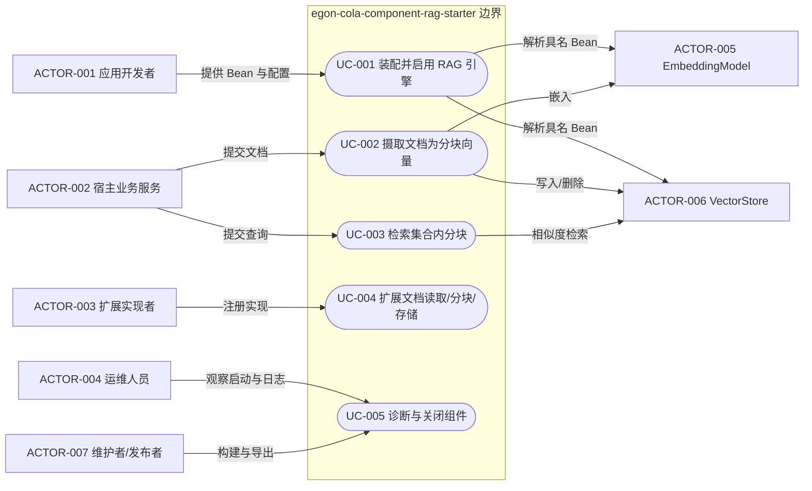
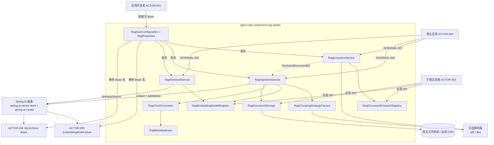
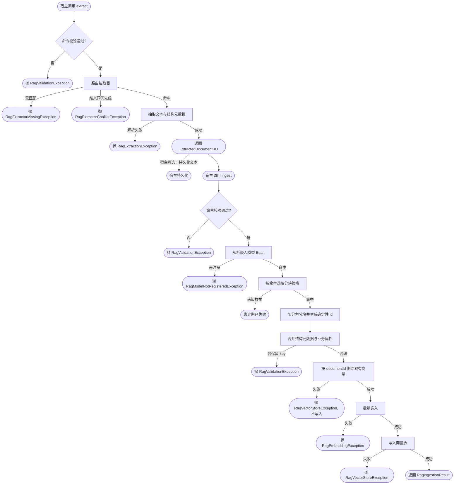
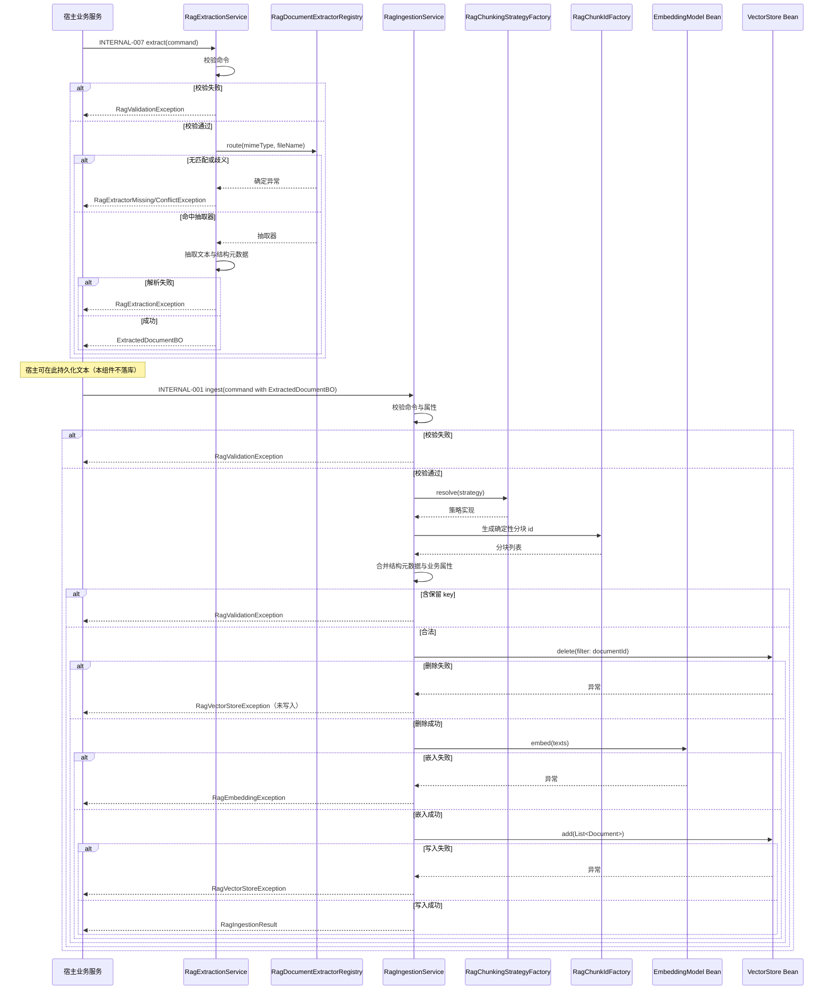

# Egon-COLA RAG 引擎组件设计

| Field | Value |
| -------------------- | -------------------------------------------------------------------------------------------------------------------------------------------------------------------------------------------------------------------------------------------------------------------------- |
| Document | `docs/egon/spec/2026-09-10-11-34-egon-cola-component-rag-starter.md` |
| Template Version | `7` |
| Status | `Accepted` |
| Type | `Architecture` |
| Complexity | `Complex` |
| Complexity Drivers | 新增组件发布面（父 POM、BOM、模块登记）、四类扩展点 SPI 的策略/工厂选型、与 Spring AI 1.1.8 三方契约耦合、同一维度多嵌入模型共享向量表的隔离正确性、官方类库缺少"列举文档"能力的边界、可选依赖的 fail-closed 装配、文档内容与向量的日志安全、启动期校验的网络成本取舍 |
| Created | `2026-09-10 11:34 CST` |
| Updated | `2026-09-10 11:47 CST` |
| Owner | `User` |
| Repository | `Egon-COLA` |
| Scope | `egon-cola-components` 下新增 `egon-cola-component-rag-starter` 单模块组件，以及父 POM 与 BOM 的登记变更 |
| Change Surface | 新增组件单模块（四类扩展点 SPI、摄取/检索服务、自动配置与严格绑定属性）；`egon-cola-components/pom.xml` 增加模块与 MapStruct 依赖管理；`egon-cola-components-bom/pom.xml` 增加一条导出；新增组件 README 与组件架构文档条目；不修改 platforms、xingyuan、archetypes、任何数据库或前端 |
| Affected Chapters | `§7, §8, §9, §10, §13, §14, §15, §16, §17, §18` |
| Source Requirement | 用户在 2026-09-10 会话中要求：引擎机制做在 component 中；集中管理能力不做在 component 中；可以做 `rag-starter`；需要大量可扩展性设计（文档读取支持 pdf/docx/excel 等、分块算法支持多种、向量模型支持多种）；存储做成扩展点（本地实现先行、后续接 OSS）；暂时不允许不同维度，先按同一维度不同模型设计 |
| Baseline Revision | `main@23ccba7b4`；工作区干净 |
| Amends | `None` |
| Supersedes | `None` |
| Depends On | [`egon-cola-components/egon-cola-components-architecture.md`](../../../egon-cola-components/egon-cola-components-architecture.md) `§5, §8.1, §11, §13.1`（组件 Starter 扁平形态与 BOM 契约） |
| Related Specs | [Agent Flow 扁平化组件设计](2026-09-04-09-34-agent-flow-component.md) `§5.1, §7, §9`（Rule 11 组件库例外与宿主提供 Bean 的先例）；[Agent Deep Research Archetype 设计](2026-09-04-16-32-agent-deep-research-archetype.md) `§7`（宿主拥有供应商配置与工具装配的先例） |
| Related Plans | [RAG 引擎组件实施计划](../plan/2026-09-10-12-47-egon-cola-component-rag-starter-implementation.md) |

## 1. Summary

仓库当前完全没有 RAG 能力：不存在向量库、嵌入模型、文档切分、知识库或语义检索的任何代码，`spring-ai-*vector-store*` 类库也未被任何 POM 引用。本设计在
`egon-cola-components` 下新增单模块 Spring Boot Starter `egon-cola-component-rag-starter`，只承载 **RAG 引擎机制**：
文本抽取、切分、嵌入与写入、相似度检索、元数据规范、四类扩展点、自动配置与严格绑定属性。

组件把**文本抽取**与**切块嵌入**拆成两条可组合的公开能力（`RagExtractionService` 与 `RagIngestionService`），而不是焊死在一个方法里。消费方通常需要先把抽取结果持久化（例如把原文文本写入自己的文档表），再独立触发嵌入；拆开后同一份文档只解析一次，且消费方可以在两次调用之间做自己的落库与状态管理。`RagIngestionCommand` 因此携带已抽取的 `ExtractedDocumentBO`，不再携带原始字节流。

组件不创建 `EmbeddingModel`，也不创建 `VectorStore`。宿主应用提供具名 Bean，组件通过配置按名字解析，因此组件不持有任何模型供应商地址、密钥或向量库实现依赖——这与
`egon-cola-component-agent-flow-starter` 要求宿主提供具名 `ChatModel` 的边界完全同构。组件的编译期依赖只到 Spring AI 的抽象类库
(`spring-ai-vector-store`、`spring-ai-model`)；postgres/pgvector 的具体实现留在宿主。

组件不含 HTTP、Controller、DTO、Flyway、业务表、任务调度、重试或"知识库"这一业务概念。它只认识三层词汇：**集合（collection）/ 文档（document）/ 分块（chunk）**。知识库的增删改查、管理 API、
持久化与异步摄取全部属于消费方（后续 Spec B 的 agent archetype），这也满足用户"集中管理能力不做在 component 中"的明确约束。

可扩展性按四条轴设计：文档读取 `RagDocumentExtractor`、分块算法 `RagChunkingStrategy`（枚举 + 工厂，禁止字符串 switch）、向量模型
`RagEmbeddingModelRegistry`（配置驱动，宿主提供 Bean）、文件存储 `RagDocumentStorage`。成功标准是四类扩展点各有离线可执行的注册与失败语义测试、
多模型共享向量表时不可能发生跨模型串结果、摄取可幂等重跑、组件进入父 POM 与 BOM 且既有组件不受影响。

## 2. Background and Current State

### 2.1 Business and user context

用户要在 agent archetype 中提供 RAG 能力，并先要求把**引擎机制**下沉为可复用组件。用户同时明确：集中管理能力（增删改查、管理 API）不做在 component
中，而是由引入组件的生成项目承担。因此本 Spec 的目标不是"做一个知识库"，而是提供一套**宿主可装配、可扩展、失败闭合**的 RAG 引擎，让任何
Egon-COLA 应用按需引入并自行决定业务语义。

### 2.2 Repository evidence

| Evidence ID | Classification | Exact path/symbol/decision/command | Observed fact | Design significance | Verification limit/freshness |
| ------------- | ------------------ | --------------------------------------------------------------------------------------------------------------------------------------------- | ------------------------------------------------------------------------------------------------------------ | --------------------------------------------------------------------------- | --------------------------------------------------------------- |
| `EVD-001` | Static repository | `egon-cola-components/egon-cola-components-architecture.md` `§5.1`, `§8.1`, `§13.1` | 文档化第三种代码结构：单 Starter、扁平功能包、`AutoConfiguration.imports`、无 UI、不启动独立服务、不依赖 admin/test | Rule 11 需要一次与 Agent Flow 等价的 component-library 例外 | 静态文档；不代表生成器或发布链会接受 |
| `EVD-002` | Static repository | `egon-cola-component-agent-flow-starter/pom.xml` | 单模块 JAR，`parent=egon-cola-components-parent:5.4.0`，`relativePath=../pom.xml`，依赖 `common-core` + Starter 族 + Lombok provided | 新组件的模块形态与父 POM 关系直接照此 | 静态 POM，不证明新模块可编译 |
| `EVD-003` | Static repository | `egon-cola-component-agent-flow-starter/lombok.config` | `config.stopBubbling=true`，`copyableAnnotations += Qualifier` 与 `Value` | Rule 4 的 `@Qualifier` 构造参数传递在组件里已有可复制先例 | 只证明配置存在 |
| `EVD-004` | Static repository | `.../agent-flow-starter/src/main/resources/META-INF/spring/org.springframework.boot.autoconfigure.AutoConfiguration.imports` | 文件只有一行，指向 `AgentFlowAutoConfiguration` | 新组件使用同一发现机制 | 未执行上下文测试 |
| `EVD-005` | Static repository | `.../agentflow/autoconfigure/AgentFlowAutoConfiguration.java` | `@AutoConfiguration` + `@ConditionalOnProperty(prefix="egon.cola.component.agent-flow", name="enabled", matchIfMissing=false)`；Bean 用 `@Bean(name=...)` + `@ConditionalOnMissingBean`；属性用 `NoUnboundElementsBindHandler` 严格绑定 | 新组件的启用开关、Bean 命名与严格绑定直接复用该模式 | 静态源码 |
| `EVD-006` | Static repository | `.../agentflow/autoconfigure/AgentFlowProperties.java` | 属性是 `record`，紧凑构造器做规范化与默认值，字段用 Jakarta 注解 | 新组件属性模型照此 | 静态源码 |
| `EVD-007` | Static repository | `egon-cola-components/pom.xml` `dependencyManagement` | 以 `import`/`pom` 方式导入 `spring-ai-bom:${spring-ai.version}`（`1.1.8`）与 `google-adk:0.7.0` | Spring AI 的 vector-store/model/commons 版本由父 POM 统一管理，组件无需自带版本 | 静态 POM |
| `EVD-008` | Static repository | `egon-cola-components/pom.xml` 的 modules 段 | 当前登记 10 个模块，含 `egon-cola-component-agent-flow-starter` | 新组件需要新增一条模块登记 | 静态 POM |
| `EVD-009` | Static repository | `egon-cola-components-bom/pom.xml` | BOM 逐项导出具体组件 artifact（`common-core`、`agent-flow-starter`、`transactional-outbox-starter` 等） | 新组件必须增加一条 BOM 导出 | 静态 POM |
| `EVD-010` | External artifact | `~/.m2/.../org/springframework/ai/spring-ai-bom/1.1.2/spring-ai-bom-1.1.2.pom` | BOM 管理 `spring-ai-vector-store`、`spring-ai-pgvector-store`、`spring-ai-pdf-document-reader`、`spring-ai-tika-document-reader`、`spring-ai-markdown-document-reader` | 组件可只声明抽象类库，具体向量库与解析器由宿主按需引入 | 本地仓库为 `1.1.2`，仓库管理的是 `1.1.8`；类与签名为 1.1.x 线，实施时必须复核 `1.1.8` 的 artifact 清单 |
| `EVD-011` | Static repository | `javap -cp spring-ai-vector-store-1.1.2.jar org.springframework.ai.vectorstore.VectorStore` | 接口只有 `add(List<Document>)`、`delete(List<String>)`、`delete(Filter$Expression)`；检索能力来自父接口 `VectorStoreRetriever` | **组件无法把向量库当分块表读回来**，因此分块必须可由确定性规则重建；这是设计约束不是偏好 | 1.1.2 签名；实施时需在 `1.1.8` 复核 |
| `EVD-012` | Static repository | `javap` on `EmbeddingModel`、`SearchRequest`、`TokenTextSplitter`、`Document` | `EmbeddingModel#dimensions()`、`#embed(String)`、`#embed(List<String>)`；`SearchRequest#builder/getTopK/getSimilarityThreshold/getFilterExpression`；`TokenTextSplitter#builder` 与 `(int,int,int,int,boolean)` 构造器；`Document#(String,String,Map)`、`#getScore()` | 维度自检、批量嵌入、过滤下推、切分与分数读取都有官方 API，无需自定义实现 | 同 `EVD-010` |
| `EVD-013` | Static repository | `egon-cola-component-common-core` `top.egon.cola.component.common.core.converter.BaseConverter` | 存在 `BaseConverter<S,T>`：`toTarget`、`toSource` 与两个列表默认方法，另有遗留的 `Date`/`SimpleDateFormat` 默认方法 | Rule 3 的转换契约已有权威类型；**新增代码不得使用那两个 `Date` 方法** | 静态源码；遗留方法不在本次修改范围 |
| `EVD-014` | Static repository | `egon-cola-component-common-core/pom.xml` `mapstruct.version=1.6.3`、`mapstruct-plus.version=1.5.1` | `mapstruct` 与 `mapstruct-plus` 在该模块为 **test scope**，且 components 父 POM 未管理这两个坐标 | 组件若按 Rule 3 使用 MapStruct，需要向父 POM `dependencyManagement` 新增管理项 | 静态 POM；不代表版本在 Boot 3.5 下已验证 |
| `EVD-015` | Static repository | `egon-cola-source-agent/.../converter/ResearchEventConverter.java` | `@Mapper(unmappedTargetPolicy=ERROR)` 接口 `extends BaseConverter<S,T>`，`INSTANCE = Mappers.getMapper(...)`，逐字段 `@Mapping` | 新组件的转换器照此；非 Spring 静态映射器避免生成 Bean 命名不确定 | 静态源码 |
| `EVD-016` | Static repository | 全仓检索 `rag`/`vector`/`embedding`/`chunk`/`retriever`/`milvus`/`pgvector`/`rerank`/`langchain`/`知识库`/`向量` 等 | 除误报外零命中；无向量库、无嵌入模型、无切分、无知识库、无语义检索 | 本设计是全新能力，无可复用实现 | 检索已排除 `target/`、`node_modules/`、`.git/`、`.generated/`；不等于第三方仓库无能力 |
| `EVD-017` | Static repository | `egon-cola-component-transactional-outbox-starter` | 已有 outbox 组件（PostgreSQL、`FOR UPDATE SKIP LOCKED`、重试/死信/指标），**不需要 Redis**，且在 BOM 中 | 异步摄取由消费方复用该组件，组件本身不引入调度 | 静态源码与 README；不在本 Spec 改动范围 |
| `EVD-018` | User decision | 2026-09-10 会话 | 引擎机制放 component；集中管理（CRUD/管理 API）不做在 component；可做 `rag-starter`；存储做扩展点、本地先行后接 OSS；暂时只允许同一维度不同模型 | 关闭组件边界、存储形态与维度策略 | 只适用于本 Spec 范围 |
| `EVD-019` | User decision | 2026-09-10 会话（对 Rule 11 与 MapStruct 的确认） | 确认对 Rule 11 采用 component-library 扁平架构例外；确认引入 MapStruct 作为组件内首例 | 解除 `MC-ARCH-001` 与 `MC-CONVERT-001` 的阻塞 | 例外仅限本组件 |

### 2.3 Problem statement and gap

仓库没有任何 RAG 引擎能力。直接在每个业务工程里各写一遍会重复最容易出隐蔽缺陷的部分——分块边界、token 预算、
过滤下推、维度一致、部分失败恢复。同时 Spring AI 只提供了零件（`VectorStore`、`EmbeddingModel`、`DocumentReader`、`TokenTextSplitter`），
没有提供 Egon 需要的装配约定、失败闭合、元数据规范、可观测性和生命周期。

所需差异是：把**机制**沉淀为可复用组件，把**策略选择**暴露为扩展点，把**供应商、密钥、向量库实现、业务语义、持久化与调度**全部留给宿主。

### 2.4 Evidence and current-chain map

| Entry/trigger | Current call chain | Data read/written | External dependency | Consumers | Evidence |
| ---------------------- | ----------------------------------------------------------------- | --------------------------------------- | ------------------------------ | ------------------------- | --------------------- |
| 当前：任何 RAG 需求 | 不存在 | 无 | 无 | 无 | `EVD-016` |
| 当前：宿主消费组件 | `AutoConfiguration.imports -> @AutoConfiguration -> @ConditionalOnProperty -> @Bean` | Spring `ApplicationContext` | Spring Boot | 引入 Starter 的业务应用 | `EVD-004`, `EVD-005` |
| 当前：宿主提供模型 | `apps -> named Spring Bean -> 组件按 Bean 名注入` | Bean 定义 | 宿主管理的供应商与凭据 | Agent Flow Starter | `EVD-005` |
| 目标：抽取 | `宿主 -> RagExtractionService -> RagDocumentExtractorRegistry -> 抽取器实现` | 无持久化；返回文本与结构元数据 | 可选解析器（pdf/tika） | 宿主应用 | `EVD-010`, `EVD-012` |
| 目标：摄取 | `宿主 -> RagIngestionService -> ChunkingStrategy -> EmbeddingModel -> VectorStore` | 宿主持有的向量表；组件持有派生分块 | Spring AI 抽象 | 宿主应用 | `EVD-011`, `EVD-012` |
| 目标：检索 | `宿主 -> RagRetrievalService -> SearchRequest(强制过滤) -> VectorStore -> 带分片段` | 向量表只读 | Spring AI 抽象 | 宿主应用 | `EVD-011`, `EVD-012` |

## 3. Goals and Non-goals

### 3.1 Goals

- 新增可被 Egon-COLA 业务应用按需引入的 `egon-cola-component-rag-starter`，默认关闭、显式启用。
- 提供四类扩展点：文档读取、分块算法、向量模型、文件存储；每类都有固定的扩展方式与失败语义。
- 把文本抽取与切块嵌入拆成两条可组合的公开能力，使消费方可以先持久化抽取结果再触发嵌入，且同一文档只解析一次。
- 宿主通过具名 Bean 提供 `EmbeddingModel` 与 `VectorStore`；组件不持有供应商地址、密钥或向量库实现依赖。
- 提供确定性的分块身份规则使摄取可幂等重跑，弥补官方 `VectorStore` 无法列举文档的能力缺口。
- 在同一维度、多个嵌入模型共享一张向量表的形态下，从机制上排除跨模型串结果。
- 提供统一元数据规范，禁止业务自造 key 或覆盖组件保留 key。
- 启动期完成离线可判定的 fail-closed 校验；可选的联网探针默认关闭并显式文档化。
- 进入 components 父 POM 与 BOM，且既有组件、平台、archetype 与其他模块的构建行为不变。
- 全部验证离线、确定性，不调用真实模型、向量库、数据库、网络或 Docker。

### 3.2 Non-goals

- 不提供 HTTP、Controller、REST/GraphQL/RPC 契约、DTO/VO、鉴权、限流或 API Key。
- 不提供知识库、文档、分块的管理与增删改查；不提供管理页面；不含"知识库"业务概念。
- 不包含 Flyway、迁移、建表或任何业务持久化；不拥有向量表结构。
- 不创建 `EmbeddingModel`、`VectorStore`、`OpenAiApi`，不保存 `base-url`、`api-key` 或模型名。
- 不提供任务调度、线程池、重试、死信、队列或并发编排；异步摄取由宿主与既有 outbox 组件承担。
- 不提供重排（rerank）、混合检索、查询改写、多轮对话、会话记忆或查询缓存。
- 不支持不同维度的嵌入模型共存；不支持按知识库分表。
- 不提供 MCP 或 ToolCallback 装配；是否把检索暴露为模型工具由宿主决定。
- 不升级仓库 Spring Boot / Spring AI / Java 版本，不改动既有组件的导出面。
- 不在 Spec 阶段写 Plan、生产代码、迁移，不启动应用、不连接模型或向量库、不发布。

### 3.3 Change Surface and Design Depth

| Area/layer | Disposition | Exact repository evidence | Changed or preserved behavior/contract | Required Spec treatment | Chapter(s) |
| ---------------------------------- | ---------------- | ---------------------------------------------------------------------------------- | ------------------------------------------------------------------------------------------------------------- | ------------------------------------------------------- | ------------------------------------------------- |
| 新组件单模块（生产代码与资源） | Affected | `EVD-002`-`EVD-006`, `EVD-011`-`EVD-015` | 新增四类扩展点、摄取/检索服务、转换器、自动配置与属性、`AutoConfiguration.imports` | 完整架构、文件树、接口契约、对象模型、模式、测试与横切设计 | `§7, §8, §9, §10, §13, §14, §15, §16, §17, §18` |
| `egon-cola-components/pom.xml` | Affected | `EVD-007`, `EVD-008`, `EVD-014` | 增加一条模块登记；增加 MapStruct 坐标的 `dependencyManagement` 与版本属性 | 精确 POM 变更、版本来源与影响 | `§8, §16` |
| `egon-cola-components-bom/pom.xml` | Affected | `EVD-009` | 新增一条 `egon-cola-component-rag-starter` 导出；不导出 Spring AI/Tika 三方 artifact | 精确 BOM 契约 | `§8, §16` |
| 组件文档（README 与组件架构文档条目） | Affected | `egon-cola-components-architecture.md` `§3.1`, `§5`, `§11`, `§13.1` | 记录组件定位、配置键、依赖边界、扩展点与限制 | 文档责任与兼容说明 | `§8, §16` |
| Spring AI 抽象依赖与可选解析器依赖 | Affected | `EVD-007`, `EVD-010`, `EVD-012` | 编译期只依赖 `spring-ai-vector-store`/`spring-ai-model`；PDF/Tika 为 `optional`，缺失时运行期给出明确错误 | 依赖边界、可选装配与失败语义 | `§7, §9, §15, §16` |
| 宿主应用（后续 Spec B 的 archetype） | Context-only | `EVD-018`；`2026-09-04-16-32-agent-deep-research-archetype.md` `§7.1.2` | 宿主负责创建具名 `EmbeddingModel`/`VectorStore`、Flyway 表结构、CRUD、异步摄取与安全 | 只记录装配契约与宿主义务，不在此设计 | `§7, §9` |
| 宿主向量表结构 | Context-only | `EVD-011`；用户 2026-09-10 "暂不允许不同维度" | 组件依赖宿主提供的同维度向量表与 `embeddingModel` 元数据语义；组件不建表、不迁移 | 记录组件对表结构的依赖不变量与验证边界 | `§7, §15` |
| components 其余组件与 platforms/xingyuan/archetypes | Unchanged | `EVD-008`, `EVD-009` | 既有组件源码、导出面、业务与构建行为不变 | 一条回归记录 | `§16` |
| 数据库与 Flyway | Not applicable | 组件无 datasource、无 schema、无迁移；`EVD-016` | 不新增表、列、索引或迁移 | 证据化 `N/A` | `§11` |
| 前端/UI | Not applicable | 组件不提供 UI；`EVD-001` `§13.1` 明确 starter 不允许包含 UI | 无页面、路由、组件或状态 | 证据化 `N/A` | `§12` |

## 4. Requirements and Acceptance Criteria

| ID | Atomic requirement | Priority | Observable acceptance criteria | Source |
| ----------- | -------------------------------------------------------------------------------------------------------------------------- | ---------- | ------------------------------------------------------------------------------------------------------------------------------------ | ------------------------------------------- |
| `REQ-001` | 组件以单 Starter、扁平功能包结构交付，不使用 `biz.*` 分层，也不使用 archetype 的 `common/domain/application/infrastructure/adapter` 模块树 | Must | 目标树没有 `biz`、`domain`、`application`、`infrastructure`、`adapter`、`repository`、`aggregate` 包；测试位于同一模块 `src/test` | 用户要求；`EVD-001`, `EVD-002`, `EVD-019` |
| `REQ-002` | 组件默认关闭，启用后严格绑定并校验 `egon.cola.component.rag` 配置 | Must | 未配置 `enabled=true` 时不创建任何组件 Bean；启用但配置非法时启动失败并给出确定异常 | `EVD-005`, `EVD-006` |
| `REQ-003` | 组件不创建 `EmbeddingModel` 与 `VectorStore`，只按配置中的 Bean 名解析宿主提供的 Bean | Must | 源码无 `base-url`/`api-key`/`apiKey` 属性；Bean 名解析失败时启动失败；缺 Bean 时给出含 Bean 名的错误 | 用户要求；`EVD-005`, `EVD-018` |
| `REQ-004` | 文本抽取是 SPI，可注册多种实现并按 `(mimeType, 文件名)` 路由 | Must | 无匹配实现时抛出确定异常而非返回空文本；多个实现命中时按显式优先级选择且可观测 | 用户要求"文档读取支持 pdf/docx/excel 等" |
| `REQ-005` | 分块算法是 SPI，至少提供三种内置策略，并由枚举 + 工厂选择，禁止字符串 `switch` 分派 | Must | `TOKEN`、`MARKDOWN_HEADING`、`RECURSIVE` 三种策略各有通过测试；未知枚举值在配置绑定期失败；新增策略只需新增枚举值与实现类 | 用户要求"分块算法支持多种"；`EVD-015` 参考被否实现 |
| `REQ-006` | 向量模型是配置驱动的注册表，支持同一部署注册多个嵌入模型，并允许默认模型回退 | Must | 未指定模型的调用使用默认模型；指定不存在的逻辑名时失败且错误含可用模型列表 | 用户要求"向量模型支持多种" |
| `REQ-007` | 同一维度的多个嵌入模型共享宿主提供的单一 `VectorStore`，且组件从机制上排除跨模型串结果 | Must | 每次写入强制写入 `embeddingModel` 元数据；每次检索强制注入 `embeddingModel` 与 `collectionId` 过滤，调用方无法省略或覆盖 | 用户决定"暂不允许不同维度" |
| `REQ-008` | 嵌入模型维度必须与配置声明的维度一致，否则启动失败 | Must | 任一逻辑模型的 `dimensions()` 与 `rag.dimensions` 不等时抛确定异常并指明模型名 | `REQ-007` 的一致性前提；`EVD-012` |
| `REQ-009` | 分块身份由确定性规则生成，使摄取可幂等重跑 | Must | 同一 `documentId` 与内容重复摄取产生相同分块 id 集合；重跑不产生重复分块 | `EVD-011`（无列举 API） |
| `REQ-010` | 摄取前按文档移除既有分块，使重跑与配置变更得到一致结果 | Must | 摄取实现先按 `documentId` 删除向量再写入；删除失败时不写入并向上抛出 | `REQ-009` |
| `REQ-011` | 元数据 key 由组件规范化并保护，业务不得自造或覆盖保留 key | Must | 传入保留 key 时被组件覆盖或拒绝；写入向量的元数据集合是可枚举的固定键集 | `REQ-007`, `REQ-009` |
| `REQ-012` | 文件存储是 SPI，内置本地文件系统实现并作为默认；后续 OSS 实现通过同一接口接入 | Must | 无其他实现时本地实现生效；实现可被宿主 Bean 覆盖；本地实现拒绝路径穿越 | 用户要求"存储做成扩展点，本地先存，后续接 OSS" |
| `REQ-013` | 可选解析器（PDF/Tika）缺失时不导致启动失败，但在真正需要该格式时给出可诊断错误 | Must | 不含 PDF/Tika 依赖时应用可启动；上传 PDF 返回确定的"无可用抽取器"错误并列出已注册的 MIME 能力 | `EVD-010`, `REQ-004` |
| `REQ-014` | 组件不依赖数据库、Flyway、Redis、MQ 或调度框架 | Must | 组件 POM 与打包产物无 JDBC 驱动、Flyway、Redis、AMQP、调度器依赖；测试不需要外部服务 | `REQ-001`；`EVD-016`, `EVD-017` |
| `REQ-015` | 日志与指标不得泄露文档内容、分块文本、向量、供应商地址或密钥 | Must | 日志仅含 collectionId、documentId、chunkCount、dimensions、耗时、结果与异常类型；内容字段在捕获测试中为零命中 | `EVD-001` `§13.1`；安全要求 |
| `REQ-016` | 组件进入 components 父 Reactor 与 BOM，且不导出 Spring AI / Tika 三方坐标 | Must | 父 POM 模块清单含新模块；BOM 只新增一条 `top.egon` 依赖；引入方可不带版本使用 | `EVD-008`, `EVD-009` |
| `REQ-017` | 所有验证离线、确定性，不启动真实模型、向量库、数据库、网络或 Docker | Must | 测试使用 fake `EmbeddingModel` 与 fake `VectorStore`；`mvn verify` 不需要任何凭据或外部服务 | 用户边界；`EVD-005` 先例 |
| `REQ-018` | 维度一致性探针存在但默认关闭，并在 README 明确其网络与计费含义 | Must | 默认配置下启动不产生任何模型调用；开启后执行一次写入—检索—删除往返，任一环节失败即启动失败 | 用户要求"启动期探针"；成本与可用性取舍 |
| `REQ-019` | 文本抽取是独立公开能力，与切块嵌入分离；`RagIngestionCommand` 只接受已抽取的文档，不再接受原始字节流 | Must | 调用 `extract` 得到 `ExtractedDocumentBO`；把该对象交给 `ingest` 可以在不重新解析的前提下完成切块与嵌入；同一文档在一次端到端流程中只被解析一次 | 用户要求"原始文本也要存到数据库中"与"不要重新获取的时候再切分"；Spec B 消费方需要先落库文本 |
| `REQ-020` | 结构元数据与业务属性在写入向量前合并，业务属性在同名 key 上优先，保留 key 一律拒绝 | Must | 抽取器提供的 `attributes` 与命令提供的 `attributes` 合并后写入；同名时命令值生效；任一来源包含保留 key 时抛 `RagValidationException` | `REQ-011` 的延伸；避免两个来源的元数据静默互相覆盖 |

### 4.1 Scenario matrix

| Scenario | Actor/trigger | Preconditions | Main path | Alternative/failure path | Data/state change | Observable result | Requirements |
| --------------------- | --------------------------- | ------------------------------------- | -------------------------------------------------------------------------- | ----------------------------------------------------------- | ------------------------------ | ------------------------------------------ | -------------------------- |
| 组件未启用 | 应用启动 | 未设置 `rag.enabled=true` | 自动配置不生效，不创建 Bean | 无 | 无 | 上下文可启动，无 RAG Bean | `REQ-002` |
| 启用且配置合法 | 应用启动 | 必填配置齐全、Bean 名可解析、维度一致 | 绑定属性 -> 校验 -> 注册扩展点 -> 发布只读服务 | 无 | 进程内注册表 | 服务可用，日志记录启用模型与维度 | `REQ-002`, `REQ-003`, `REQ-008` |
| 配置非法 | 应用启动 | 缺必填项、默认模型不在注册表、维度不符 | 校验失败 -> 启动中止 | 无 | 无 | 确定的启动异常，指明具体键或模型 | `REQ-002`, `REQ-006`, `REQ-008` |
| Bean 名无法解析 | 应用启动 | 写了 `vector-store-bean-name` 但容器中不存在 | 解析失败 -> 启动中止 | 无 | 无 | 异常包含期望 Bean 名与已存在的候选类型 | `REQ-003` |
| 正常抽取 | 宿主调用抽取 | 已注册匹配的抽取器 | 按 MIME/文件名路由 -> 抽取文本与结构元数据 | 无 | 无 | 返回 `ExtractedDocumentBO` | `REQ-004`, `REQ-019` |
| 无匹配抽取器 | 宿主调用抽取 | 格式未被任何实现支持 | 路由失败 -> 抛出确定异常 | 不产生分块、不调用模型 | 无 | 异常列出已注册的 MIME 能力 | `REQ-004`, `REQ-013` |
| 抽取器歧义 | 宿主调用抽取 | 多个实现同时 `supports` | 按显式优先级择一并记录所选实现名 | 优先级相同时启动期即失败 | 无 | 结果确定且可追溯 | `REQ-004` |
| 正常摄取 | 宿主调用摄取 | 已有抽取结果、模型可用、向量表可写 | 切分 -> 按文档删旧分块 -> 批量嵌入 -> 写入 -> 返回统计 | 无 | 向量表按文档重建 | 返回分块数与嵌入模型 | `REQ-009`, `REQ-010` |
| 两段式组合 | 宿主先抽取并落库，后触发嵌入 | 抽取结果已持久化 | `extract` -> 宿主持久化文本 -> `ingest` 使用同一 `ExtractedDocumentBO` | 嵌入阶段失败时重复 `ingest` 不重新解析 | 宿主持久化文本；向量表按文档重建 | 同一文档只解析一次 | `REQ-019`, `REQ-009` |
| 元数据合并冲突 | 宿主提交与抽取器同名的属性 | 两侧非保留 key 重名 | 业务属性覆盖结构属性 | 任一来源含保留 key 则拒绝 | 无 | 写入向量的元数据集合确定 | `REQ-020` |
| 摄取重跑 | 宿主重试同一文档 | 文档内容与配置未变 | 先删除既有分块 -> 重建 -> 写入 | 无 | 分块 id 集合不变 | 不产生重复分块，结果确定 | `REQ-009`, `REQ-010` |
| 嵌入失败 | 宿主调用摄取 | 模型调用抛错 | 删除已完成的分块 -> 向上抛出 | 宿主决定是否重试；组件不自动重试 | 该文档分块为空 | 确定异常，不含模型原始报文 | `REQ-010`, `REQ-015` |
| 模型维度不符 | 应用启动 | `EmbeddingModel.dimensions()` 与配置不等 | 启动中止 | 无 | 无 | 异常指明模型名、期望维度与实际维度 | `REQ-008` |
| 正常检索 | 宿主调用检索 | 集合与模型已注册、参数合法 | 组件注入强制过滤 -> 向量检索 -> 映射为带分片段 | 无 | 只读 | 结果只含目标集合与目标模型的分块 | `REQ-007`, `REQ-011` |
| 跨模型隔离验证 | 测试构造两模型同集合写入 | 两模型维度相同 | 模型 A 检索只返回 A 写入的分块 | 若过滤缺失则测试失败 | 无 | 无跨模型结果泄漏 | `REQ-007` |
| 检索无命中 | 宿主调用检索 | 集合为空或阈值过高 | 返回空列表 | 不抛异常 | 无 | 空结果，不报错 | `REQ-007` |
| 本地存储写入 | 宿主调用存储 | `type=LOCAL` 且根目录可写 | 规范化路径 -> 写入 -> 返回存储标识 | 目录不可写时抛出确定异常 | 宿主文件系统新增文件 | 返回稳定存储 key | `REQ-012` |
| 路径穿越尝试 | 宿主传入含 `..` 或分隔符的标识 | 已启用本地存储 | 标识校验拒绝 | 不写任何文件 | 无 | 确定异常，根目录外无文件 | `REQ-012` |
| 可选解析器缺失 | 宿主上传 PDF | 未引入 PDF/Tika 依赖 | 无匹配抽取器 | 应用仍正常启动 | 无 | 确定的"无可用抽取器"错误 | `REQ-013` |
| 探针开启 | 应用启动 | `probe-on-startup=true` 且网络与凭据可用 | 每模型写入探针向量 -> 检索回来 -> 删除 | 任一环节失败 -> 启动中止 | 向量表短暂出现并删除一条探针记录 | 启动成功或失败，日志不含内容 | `REQ-018` |
| 探针默认关闭 | 应用启动 | 未开启探针 | 只做离线校验 | 无 | 无 | 启动不产生任何模型调用或向量写入 | `REQ-018` |
| 组件回归 | 维护者运行 `mvn verify` | 依赖可解析 | 组件单元测试 -> 父 Reactor 构建 -> BOM 解析 | 任一失败即阻止交付 | 仅 target 与本地仓库 | 新组件通过且既有模块不变 | `REQ-014`, `REQ-016`, `REQ-017` |

### 4.2 Use-case analysis

#### 4.2.1 Actor inventory

| Actor ID | Actor/role | Goal and responsibility | Entry/channel | Permission/tenant context | Evidence |
| ------------- | ----------------------------------- | ------------------------------------------------------------ | -------------------------------------------------- | ------------------------------------ | --------------------------------- |
| `ACTOR-001` | 应用开发者 / 组件引入方 | 引入组件、提供 `EmbeddingModel` 与 `VectorStore`、配置模型与集合 | Maven 依赖 + Spring 配置 + Bean 定义 | 由宿主应用控制；组件不定义权限或租户 | `EVD-002`, `EVD-005`, `EVD-018` |
| `ACTOR-002` | 宿主业务服务 | 调用摄取与检索，把结果用于自身业务 | `RagIngestionService` / `RagRetrievalService` | `collectionId` 由宿主可信服务决定；组件不是授权边界 | `EVD-018` |
| `ACTOR-003` | 扩展实现者 | 以自定义实现替换或补充抽取、切分、存储 | SPI 实现类注册为 Bean | 由宿主应用控制 | 用户要求"大量可扩展性设计" |
| `ACTOR-004` | 应用运维人员 | 从启动失败与安全日志判断组件状态 | `ApplicationContext` 生命周期与日志/指标 | 只观察标识、结果、耗时、维度 | `EVD-001` `§13.1`, `REQ-015` |
| `ACTOR-005` | Spring AI `EmbeddingModel` | 提供实际向量化能力 | 宿主提供的具名 Spring Bean | 凭据、供应商、重试与网络策略由宿主管理 | `EVD-012`, `REQ-003` |
| `ACTOR-006` | Spring AI `VectorStore` | 提供向量写入、删除与相似度检索 | 宿主提供的具名 Spring Bean | 表结构、索引、连接与凭据由宿主管理 | `EVD-011`, `REQ-003` |
| `ACTOR-007` | 组件维护者 / 发布者 | 维护组件、通过 Reactor 与 BOM 分发 | Maven Reactor / 本地仓库 | 仓库身份 | `EVD-008`, `EVD-009` |

#### 4.2.2 Use-case artifact



| ID | Use case/goal | Primary actor | Supporting actors/systems | Trigger | Preconditions | Main success outcome | Alternatives/failures | Postconditions | Requirements | Interfaces/pages | Tests |
| ---------- | ------------------------ | --------------- | -------------------------------- | ---------------- | ---------------------------------------- | ------------------------------------------ | ---------------------------------------------------------- | --------------------------- | ------------------------------------- | ------------------------- | --------------------------- |
| `UC-001` | 装配并启用 RAG 引擎 | `ACTOR-001` | `ACTOR-005`, `ACTOR-006` | 应用启动 | 配置齐全、Bean 存在、维度一致 | 只读服务与注册表发布，组件可用 | 配置缺失/Bean 名不可解析/维度不符 -> 启动失败 | 成功：服务可用；失败：上下文不启动 | `REQ-002`, `REQ-003`, `REQ-006`, `REQ-008` | `INTERNAL-006` | `TEST-011`-`TEST-015` |
| `UC-002` | 把上传文档变成可检索分块 | `ACTOR-002` | `ACTOR-005`, `ACTOR-006` | 宿主提交文档字节流与集合 | 集合与模型已注册、有匹配抽取器 | 先抽取为文本（宿主可持久化），再切分并写入向量表，返回统计 | 无抽取器/文档不可解析/切分配置非法/嵌入失败/写入失败 -> 确定异常且不残留重复分块 | 成功：文本已落库且分块可检索；失败：该文档无分块 | `REQ-004`, `REQ-005`, `REQ-009`-`REQ-011`, `REQ-019`, `REQ-020` | `INTERNAL-007`, `INTERNAL-001` | `TEST-004`-`TEST-010`, `TEST-025`, `TEST-026` |
| `UC-003` | 检索集合内分块 | `ACTOR-002` | `ACTOR-006` | 宿主提交查询文本 | 集合与模型已注册、参数在范围内 | 返回按相似度排序且只属于目标集合与模型的分块 | 无命中 -> 空列表；参数越界 -> 确定异常 | 无持久化副作用 | `REQ-007`, `REQ-011` | `INTERNAL-002` | `TEST-016`-`TEST-019` |
| `UC-004` | 扩展文档读取/分块/存储 | `ACTOR-003` | Spring 容器 | 宿主注册自定义实现 | 实现满足 SPI 契约、优先级无冲突 | 自定义实现被路由命中或替换默认实现 | 优先级冲突/重复策略枚举值 -> 启动失败 | 注册表内容变化 | `REQ-004`, `REQ-005`, `REQ-012` | `INTERNAL-003`-`INTERNAL-005` | `TEST-001`-`TEST-003`, `TEST-020` |
| `UC-005` | 诊断与关闭组件 | `ACTOR-004`, `ACTOR-007` | `ApplicationContext` | 启动失败、运行观察、构建发布 | 组件已启用或构建中 | 从安全日志与指标获知状态；Reactor 与 BOM 正确产出新组件 | 校验失败信息不足/ 发布面遗漏新组件 -> 视为缺陷 | 无残留资源 | `REQ-015`, `REQ-016` | `INTERNAL-006` | `TEST-021`, `TEST-022` |

## 5. Constraints, Assumptions, and Decisions

### 5.1 Confirmed constraints

- 用户已确认 Rule 11 采用 component-library 扁平架构例外（`EVD-019`），形态由 `EVD-001`、`EVD-002` 定义。
- 用户已确认集中管理能力（CRUD、管理 API、持久化）不属于本组件，留在消费方（`EVD-018`）。
- 用户已确认同一维度多模型共享一张向量表；不同维度分层不在本期范围（`EVD-018`）。
- 用户已确认存储是扩展点，本地实现先行、后续接 OSS（`EVD-018`）。
- 组件不得持有供应商地址、密钥或模型名；Bean 由宿主提供（`REQ-003`）。
- 仓库统一 Java 21、Spring Boot 3.5.16、Spring AI 1.1.8，由 components 父 POM 统一管理（`EVD-007`）。
- 组件默认关闭；启用即严格绑定，未知键与非法值必须失败（`EVD-005`, `REQ-002`）。
- 全部验证必须离线、确定性（`REQ-017`）。

### 5.2 Small-gap assumptions

| ID | Inference | Repository evidence | Why locally reversible | Impact if wrong |
| ----------- | ------------------------------------------------------------------------------------------------- | -------------------------------------------------------- | ----------------------------------------------- | -------------------------------------------------------------------- |
| `ASM-001` | 组件名取 `egon-cola-component-rag-starter`，包根取 `top.egon.cola.component.rag` | `EVD-002` 的 `egon-cola-component-{name}-starter` 与 `top.egon.cola.component.{short}` 规则 | 仅新模块内部；发布前可重命名 | 发布后 GAV 不可无迁移改名 |
| `ASM-002` | 自动配置类名取 `RagAutoConfiguration`，属性类名取 `RagProperties`，配置前缀 `egon.cola.component.rag` | `EVD-005`, `EVD-006` 的命名与前缀规则 | 组件内部命名 | 与既有组件前缀风格不一致 |
| `ASM-003` | 内置纯文本抽取器覆盖 `text/*`、`text/csv`、`text/markdown`、`application/json`、`application/xml`；Markdown 单独成实现以保留标题结构 | 用户要求支持多种格式；`EVD-010` 中 BOM 提供的解析器种类 | 新增实现类即可扩展 | 某类文本格式需要额外实现 |
| `ASM-004` | PDF 与 Tika 抽取器分别对应 `spring-ai-pdf-document-reader` 与 `spring-ai-tika-document-reader`，均为 `optional` | `EVD-010` | 依赖 scope 与实现类可独立调整 | 宿主需要额外引入对应依赖 |
| `ASM-005` | 本地存储根目录配置键为 `egon.cola.component.rag.storage.local.root`，缺省 `./data/rag-documents` | 仓库无同类组件可参照，取最小合理默认 | 配置默认值可改 | 宿主需显式配置 |
| `ASM-006` | 探针记录使用保留集合标识 `__egon_rag_probe__` 且写入后立即删除 | `REQ-018` | 保留标识为组件内部约定 | 若宿主对该标识做业务假设则需更正 |

### 5.3 Resolved decisions

| ID | Decision | Decision owner | Evidence and rationale | Requirements |
| ----------- | ------------------------------------------------------------------------------------------------------------- | ---------------- | ---------------------------------------------------------------------------------------------------------------------------- | -------------------------- |
| `DEC-001` | RAG **引擎机制**下沉为 `egon-cola-component-rag-starter`；CRUD、管理 API、持久化与调度留在消费方 | User | 用户 2026-09-10 明确分工；`EVD-018` | `REQ-001`, `REQ-014` |
| `DEC-002` | Rule 11 采用 component-library 扁平架构例外 | User | 用户 2026-09-10 确认；与 `2026-09-04-09-34-agent-flow-component.md` `§5.1` 同一例外；形态由 `EVD-001`、`EVD-002` 证明 | `REQ-001` |
| `DEC-003` | 宿主提供具名 `EmbeddingModel` 与 `VectorStore`；组件只按名字解析 | User | 用户 2026-09-10 选择方案 A；与 `EVD-005` 的宿主提供 `ChatModel` 先例同构 | `REQ-003` |
| `DEC-004` | 同维度多模型共享单一 `VectorStore`，靠组件强制注入的 `embeddingModel` 过滤隔离 | User | 用户 2026-09-10 "暂不允许不同维度"；`REQ-007` 要求机制化隔离而非约定 | `REQ-007`, `REQ-008` |
| `DEC-005` | 分块身份取 `documentId + ":" + chunkIndex` 的确定性规则，不持久化分块关系表 | User + Spec | `EVD-011` 证明官方 `VectorStore` 无列举能力，分块必须可重建；用户 2026-09-10 决定不引入分块表与映射表 | `REQ-009`, `REQ-010` |
| `DEC-006` | 分块算法使用枚举 + 策略工厂；抽取器使用 SPI + 优先级注册表；存储使用 SPI + 默认本地实现 | Spec | 用户要求"大量可扩展性设计"；Rule 9 要求复杂变化点使用设计模式；`EVD-015` 的参考实现因字符串 `switch` 被否 | `REQ-004`, `REQ-005` |
| `DEC-007` | 引入 MapStruct `1.6.3` 作为组件内转换实现，转换器 `extends BaseConverter<S,T>` 并以 `Mappers.getMapper` 获取 | User | 用户 2026-09-10 确认；Rule 3 强制跨边界转换使用 MapStruct + `BaseConverter`；版本取自 `EVD-014` | `REQ-001` |
| `DEC-008` | 维度一致性探针存在但默认关闭 | Spec | 探针需要真实模型调用与网络；默认开启会把 provider 可用性变成启动前置条件，故默认关闭并文档化 | `REQ-018` |
| `DEC-009` | 组件不引入异步、重试、队列或调度；重跑由宿主驱动 | User + Spec | 用户 2026-09-10 已决定异步摄取由消费方与 outbox 承担（`EVD-017`） | `REQ-014` |
| `DEC-010` | 组件编译期只依赖 Spring AI 抽象（`spring-ai-vector-store`、`spring-ai-model`）；pgvector/PDF/Tika 不在组件强依赖内 | Spec | `EVD-010`、`EVD-011`、`EVD-012`；支撑 `DEC-003` 与 `REQ-013` | `REQ-003`, `REQ-013` |

### 5.4 Open major decisions

| ID | Question and options | Recommendation, not decision | Impact | Owner | Status |
| ----------- | --------------------------------------------------------------------------------------------------------------- | ---------------------------------------------------------------- | -------------------------------------------------------- | ------- | -------- |
起草期间关闭了两个曾经开放的问题。它们的推荐项已被本设计采纳，因此不再构成阻塞；用户在评审本 Spec 时仍可要求改回。

| `DEC-011` | 是否需要 `INTERNAL-002` 之上的重排（rerank）扩展点：`None` / 预留 SPI / 本期实现 | 本期取 `None`。当前无重排模型、无召回质量度量、无第二实现，预留 SPI 属投机扩展（`§13.2`）；将来以新增 SPI 成员的方式演进可保持兼容 | 检索服务签名在本期不含重排阶段；将来新增 SPI 属于兼容性新增而非破坏性变更 | User | Closed |
| `DEC-012` | 向量表结构的所有权：宿主 Flyway 建表 / 组件提供可选建表脚本 | 保持宿主所有权。组件建表会引入 JDBC 依赖与迁移执行责任，与 `REQ-014` 及"组件不落 schema"边界直接冲突（`§11`） | 向量表迁移、维度声明与扩展安装由 Spec B 设计；组件只依赖其结果并在探针开启时验证 | User | Closed |

## 6. Project Technology Context

| Concern | Current choice | Repository evidence | Constraint on design |
| ------------------ | ---------------------------------------------------------------------- | -------------------------------------- | ---------------------------------------------------------------------------- |
| Java/Boot | Java 21 / Spring Boot 3.5.16 | components 父 POM（`EVD-007`） | 直接继承父 POM 与 Boot 管理，不升级版本线 |
| Spring AI | Spring AI `1.1.8`，由父 POM 以 BOM 导入 | `EVD-007` | 只使用 `spring-ai-vector-store`、`spring-ai-model` 抽象；可选解析器按需 |
| 组件结构 | 单 Starter、扁平功能包、`AutoConfiguration.imports` | `EVD-001`, `EVD-002`, `EVD-004` | 不引入 `biz.*`、不引入 archetype 模块树；Rule 11 例外（`DEC-002`） |
| 配置 | `@ConfigurationProperties` `record` + `NoUnboundElementsBindHandler` | `EVD-005`, `EVD-006` | 未知键必须绑定失败；默认值在紧凑构造器内规范 |
| 日志/可观测 | `@Slf4j` + Micrometer（组件内可选） | `EVD-005` 先例；`egon-cola-component-transactional-outbox-starter` 用 Micrometer | 指标只在 Micrometer 存在时注册；日志不含内容与向量 |
| 转换 | MapStruct + `BaseConverter<S,T>` | `EVD-013`-`EVD-015` | 转换器为非 Spring 静态映射器，`unmappedTargetPolicy=ERROR` |
| 测试 | JUnit 5、`spring-boot-starter-test`、fake Bean | `EVD-002`；`EVD-005` | 全部离线；不引入 Testcontainers 或嵌入式数据库 |
| 构建/分发 | 父 Reactor + `egon-cola-components-bom` | `EVD-008`, `EVD-009` | 新增模块登记与 BOM 导出；不改变既有导出面 |

### 6.1 Java architecture profile and capability baseline

| Architecture profile | Archetype/template or base package | Exact evidence and verifier | Existing deviations | Design action |
| ----------------------------------------- | ------------------------------------------------------------------------- | ----------------------------------------------------------------------------------------------------- | -------------------------------------------- | ------------------------------------------------------ |
| Component-library（Rule 11 已批准例外） | `egon-cola-components/egon-cola-component-rag-starter`；包根 `top.egon.cola.component.rag` | `EVD-001`（架构文档定义）、`EVD-002`（单模块 POM）、`EVD-003`（lombok.config）、`EVD-004`（imports）、`EVD-019`（用户批准例外） | 本期在该 profile 内新增首例 MapStruct 运行时依赖（`DEC-007`） | 保留扁平单模块；不引入 `biz.*` 或 archetype 模块树；不新增自定义层或命名 |

| Need | Spring/JDK candidate | Spring Boot Starter candidate | Egon-COLA/module candidate | Proven gap | Decision/dependency impact |
| --------------------------------- | ------------------------------------------------------------- | ---------------------------------------------- | --------------------------------------------------- | ----------------------------------------------------------------------- | --------------------------------------------------------- |
| 向量存储与检索抽象 | `org.springframework.ai.vectorstore.VectorStore`（`spring-ai-vector-store`） | 无（实现 starter 由宿主选择） | 无 | 仓库无任何向量能力（`EVD-016`） | 复用官方抽象；组件只声明抽象类库（`DEC-010`） |
| 嵌入模型 | `org.springframework.ai.embedding.EmbeddingModel`（`spring-ai-model`） | 无 | 无 | 同上 | 复用官方抽象；Bean 由宿主提供（`DEC-003`） |
| 文本分块 | `org.springframework.ai.transformer.splitter.TokenTextSplitter`（`spring-ai-commons`，传递依赖） | 无 | 无 | 只覆盖 token 维度分块，缺少按标题与递归分隔符策略 | 复用其算法作为 `TOKEN` 策略内部实现；新增两种策略（`REQ-005`） |
| 文档解析 | `spring-ai-pdf-document-reader`、`spring-ai-tika-document-reader`、`spring-ai-markdown-document-reader` | 无 | 无 | 均为可选且不覆盖纯文本/JSON 的轻量路径 | 纯文本族自实现；PDF/Tika 以 `optional` 复用（`ASM-003`, `ASM-004`） |
| 对象转换 | MapStruct `1.6.3` | 无 | `egon-cola-component-common-core` `BaseConverter<S,T>`（`EVD-013`） | 父 POM 未管理 MapStruct 坐标（`EVD-014`） | 新增 `dependencyManagement` 管理项（`DEC-007`） |
| 边界校验 | Jakarta Validation（`spring-boot-starter-validation`） | `spring-boot-starter-validation` | `common-core` `ValidationUtils` | 无 | 复用；组件内手工校验复用 `ValidationUtils`（Rule 2） |
| 度量 | Micrometer | `spring-boot-starter-actuator`（宿主侧） | outbox 组件已用 Micrometer（`EVD-017`） | 无 | `micrometer-core` 声明为 `optional` |
| 工具库 | JDK `java.nio`、`java.text` 无关项使用 `java.time` | 无 | `commons-lang3`/Guava 未在组件内出现 | 无 | 本地存储用 JDK `java.nio`；不新增工具依赖（Rule 5） |

### 6.2 User-mandated Java rule compliance

| Literal rule | Affected? | Repository evidence | Exact design decision | Files/types/interfaces | Validation/test evidence | Status/blocker |
| -------------- | ----------- | ------------------------------------------------------------------------------------------ | ------------------------------------------------------------------------------------------------------------------------------------------------------------------------------------------------------ | ----------------------------------------------------------------------------------------------------------------- | ---------------------------------------------------------------------- | ---------------- |
| Rule 1 | Yes | `EVD-002`、`EVD-005`、`EVD-006` 的命名规则；`§10.1` 完整清单 | 全部新增类型带语义后缀：`*Service`/`*Strategy`/`*Factory`/`*Registry`/`*Extractor`/`*Converter`/`*Exception`/`*Enum`/`*BO`/`*Command`/`*Query`/`*Result`/`*DTO`/`*Properties`/`*AutoConfiguration`；不使用 `Data`/`Info`/`Param`/`Bean` | `§10.1` 与 `§8.2` 精确类型 | `TEST-021` 命名清单静态扫描 | PASS |
| Rule 2 | Yes | 组件内部调用边界：宿主 -> 服务；服务 -> SPI；配置绑定 + 手工校验 | `spring-boot-starter-validation` + Jakarta 注解置于 `RagExtractionCommand`/`RagIngestionCommand`/`RagRetrievalQuery`/`RagChunkingConfigDTO` 与配置属性；服务方法用 `@Validated`；直接手工校验复用 `ValidationUtils`；组件无电话号码字段故 libphonenumber `N/A`；无 create/update 复用载体故不新增校验分组 | `INTERNAL-001`-`INTERNAL-007` | `TEST-002`, `TEST-005`, `TEST-012`, `TEST-016` | PASS |
| Rule 3 | Yes | `EVD-013` `BaseConverter`；`EVD-014` MapStruct 版本；`EVD-015` 转换器写法 | 简单载体全部使用 `record` 并在紧凑构造器规范化；"分块 -> `Document`" 是唯一跨边界转换，使用 `@Mapper(unmappedTargetPolicy=ERROR)` 接口 `extends BaseConverter<RagChunkBO, Document>` 并以 `Mappers.getMapper` 获取实例；不新增 `@Value` 不可变类与复杂 Lombok 类（组件内无复杂生命周期数据对象） | `RagChunkConverter` | 转换器编译期 + `TEST-008` 映射断言 | PASS |
| Rule 4 | Yes | `EVD-003` `lombok.config`；`EVD-005` `@Bean(name=...)` 与构造器注入 | 每个具体行为类使用 `@Slf4j`；Spring Bean 通过 `@Bean(name="...")` 或 stereotype 值显式命名；依赖为 `final` 字段 + `@RequiredArgsConstructor`；每个依赖字段带 `@Qualifier`；`lombok.config` 复制 `Qualifier` 与 `Value` | `RagIngestionServiceImpl`/`RagRetrievalServiceImpl`/各 Strategy/Extractor/Registry/AutoConfiguration | 上下文装配测试 + `TEST-021` 静态检查 | PASS |
| Rule 5 | Yes | 组件无既有工具类可复用；Rule 3 的转换由 MapStruct 承担 | 只使用 JDK（`java.nio`、`java.time`、`java.util`）；不新增 `*Utils`；不引入 `commons-*`/Guava；Tika 仅按 `REQ-013` 以 `optional` 引入且只用于文档内容识别 | 本地存储实现与抽取器实现 | 依赖与 import 扫描 `TEST-021` | PASS |
| Rule 6 | Yes | 组件无对外 JSON 契约（`§9` 无 `API-*`） | 组件不使用 Jackson 做对外序列化，也不做对象转换。`RagChunkBO` 与元数据映射是对象转换而非 JSON 契约，因此不添加 Jackson 注解；`N/A` 的依据是组件不暴露 HTTP/RPC/消息契约 | 无 | `§9.0` 证据 + `MC-JSON-001` | N/A |
| Rule 7 | Yes | 组件自身不提供 `application-*.yml`；`EVD-004` 证明只交付 `META-INF/spring` 与属性元数据 | 组件的键集由 `RagProperties` 与 `additional-spring-configuration-metadata.json` 固定并由 `@ConfigurationProperties` 严格绑定校验；多环境 profile 文件由消费方提供，其键一致性验证属于消费方 Spec。本 Spec 不虚构组件内不存在的 profile 对比 | `RagProperties` | `TEST-013` 键集与严格绑定测试；profile 一致性由 Spec B 承担 | N/A |
| Rule 9 | Yes | 抽取路由、分块选择、存储选择、模型解析是四个真实变化轴；`EVD-015` 的字符串 `switch` 参考实现被否 | 组合使用 Strategy（四类 SPI 实现）+ Factory（枚举到策略、Bean 名到 Bean）+ Registry（抽取器优先级路由、嵌入模型注册表）；扩展流程见 `§13.1`；禁止字符串或反射分派 | `RagChunkingStrategyFactory`/`RagDocumentExtractorRegistry`/`RagEmbeddingModelRegistry`/各 `*Strategy`/各 `*Extractor` | `TEST-001`, `TEST-003`, `TEST-004`, `TEST-014` | PASS |
| Rule 10 | Yes | 组件新增耗时与超时配置 | 时间统一使用 `java.time`：配置用 `Duration`（`retrieval` 无超时配置），结果统计用 `Duration`，时钟源为注入的 `Clock`（`ragClock`）并在指标与日志中使用；禁止 `java.util.Date`/`Calendar`/`SimpleDateFormat`；**显式禁止使用 `BaseConverter` 遗留的 `Date` 默认方法** | `RagIngestionResult`、`RagProperties`、`ragClock` Bean | `TEST-007`, `TEST-021` 源码扫描 | PASS |
| Rule 11 | Yes | `EVD-001`、`EVD-002`、`EVD-019` | 采用 component-library 扁平单模块 profile（用户已批准例外）；包树见 `§8.2`；不引入 `biz.*`、`domain`、`application`、`infrastructure`、`adapter`、`repository` 或任何新层 | `§8.2` 全量目标树 | `MC-ARCH-001` + `§14` 架构检查测试 | PASS |

## 7. Architecture Design

### 7.0 Minimum-design baseline and element-necessity audit

| Proposed element | Change | Requirements | Existing/direct alternative | Concrete inadequacy of alternative | Added calls/state/coupling/failures/migration/operations | Verdict |
| ---------------------------------------- | -------- | ------------------------------------- | ------------------------------------------------------------------- | -------------------------------------------------------------------------------------------------------------- | -------------------------------------------------------------------------------------------------- | --------- |
| 独立 `rag-starter` 组件 | New | `REQ-001`, `REQ-016` | 在消费方项目内各写一遍引擎 | 分块边界、过滤下推、维度一致性、部分失败恢复会被复制到每个项目并各自腐化 | 一个模块、父 POM 与 BOM 登记、一条发布面 | Add |
| 宿主提供 `EmbeddingModel`/`VectorStore` Bean | New | `REQ-003` | 组件按配置创建 pgvector 与 OpenAI 客户端 | 组件将绑定具体向量库与供应商、需要保存地址与密钥，与 `EVD-005` 的宿主边界冲突 | 宿主需多写两个 Bean 定义 | Add |
| `RagExtractionService` | New | `REQ-019` | 把抽取留在 `RagIngestionService` 内部 | 摄取结果对象要么携带整篇文本（污染写入口），要么不携带（消费方无法满足"原文入库"）；且无法表达"先落库、后嵌入"的两段式 | 一个公开接口、一个命令载体与一次显式编排；换取解析只发生一次 | Add |
| `RagDocumentExtractor` SPI | New | `REQ-004`, `REQ-013` | 单一实现按扩展名 `if/else` | 用户明确要求支持 pdf/docx/excel 等多格式；格式集合会持续增长，`if/else` 无法闭合新增格式 | 一个接口、一个路由注册表、一组实现类及其优先级 | Add |
| `RagChunkingStrategy` SPI + 枚举工厂 | New | `REQ-005` | 单一 `TokenTextSplitter` 直接调用 | 用户明确要求多种分块算法；且字符串分派已被仓库既有设计评审否定（`EVD-015`） | 一个接口、一个枚举、一个工厂、三个实现类 | Add |
| `RagEmbeddingModelRegistry` | New | `REQ-006`, `REQ-008` | 单个 `rag.embedding-model-bean-name` | 用户明确要求支持多种向量模型且需要默认模型回退与维度自检 | 一段配置结构、一个注册表、启动期校验 | Add |
| `RagDocumentStorage` SPI + 本地实现 | New | `REQ-012` | 宿主自行保存原文件，组件只接受字节流 | 用户明确要求存储成为可切换扩展点（本地先行、后续 OSS） | 一个接口、一个默认实现、一组配置键 | Add |
| 确定性分块 id | New | `REQ-009`, `REQ-010` | 使用随机 UUID 并在重跑时追加 | 官方 `VectorStore` 无列举能力（`EVD-011`），随机 id 会导致重跑产生重复分块 | 一条 id 规则与一次按文档的预删除 | Add |
| 强制 `embeddingModel`/`collectionId` 过滤 | New | `REQ-007` | 由调用方在每次检索时自行传过滤条件 | 同维度多模型共享表时，漏传过滤会串结果且极难发现；机制化强制比约定可靠 | 检索请求的固定过滤表达式与对应断言测试 | Add |
| 启动期探针 | New | `REQ-018` | 只做离线维度比对 | 离线比对无法发现表缺失、扩展未安装、维度声明与表不一致 | 一次模型调用与一次写入—检索—删除往返；默认关闭 | Add |
| 分块关系表与向量映射表 | Remove | `REQ-009` | 确定性 id 规则承担映射 | 用户已决定不引入分块表与映射表；且会与官方 `VectorStore` 的 `content` 列形成重复存储 | 若保留将增加一张表、一套迁移与一条与向量表的一致性维护面 | Remove |
| HTTP/Controller/CRUD/管理 API | Remove | `REQ-001`, 用户边界 | 组件只暴露 Java API | 用户明确要求集中管理能力不做在 component 中 | 若保留将增加 Web 依赖、鉴权、序列化与版本兼容面 | Remove |
| Flyway/建表/迁移 | Remove | `REQ-014` | 宿主拥有表结构 | 组件落 schema 会把向量库实现与表结构固化进组件，且违反默认关闭的轻量引入 | 若保留将引入 JDBC 依赖与迁移执行责任 | Remove |
| 调度/重试/队列/死信 | Remove | `REQ-014` | 宿主与既有 outbox 组件承担（`EVD-017`） | 组件无持久化，进程内重试无法覆盖重启；已有 outbox 组件提供持久重试与死信 | 若保留将引入线程池、状态与运维面 | Remove |
| 重排（rerank） | Remove | `DEC-011` | 无 | 无重排模型、无第二实现、无召回质量度量 | 若保留将增加一条投机 SPI 与其测试 | Remove |
| 查询缓存 | Remove | 无对应需求 | 无 | 无延迟或容量证据 | 若保留将增加失效与一致性状态 | Remove |

| Path | Network calls | Client states | Server contracts/state | Failure and TOCTOU points | Additional user/business value |
| ----------------- | ----------------------------------------------------- | ---------------------------------- | --------------------------------------------------- | ------------------------------------------------------------------ | ------------------------------------------------------------------ |
| Direct baseline | 0（组件不存在，各项目自写同等调用数） | 由各项目自行定义 | 无统一契约 | 各项目重复实现，缺陷面随项目数线性增长 | 无统一能力，无统一失败语义 |
| Selected design | 0（组件自身不发起网络调用；调用数由宿主与 Spring AI 决定） | 由宿主决定 | 一个 Starter、一组只读服务、四个扩展点、一份配置键集 | 抽取歧义、切分配置非法、维度不符、Bean 名不可解析、嵌入失败、写入失败、跨模型串结果 | 机制化隔离、幂等重跑、统一失败语义、可扩展格式与策略，且不引入任何运维组件 |

### 7.1 System Architecture Design

#### 7.1.1 Architecture Mermaid view



#### 7.1.2 Boundary and responsibility table

| Module/component | Capability and data owned | Inputs/outputs | Allowed dependencies | Forbidden responsibility | Requirements |
| ------------------------------ | --------------------------------------------------------------------------------------------- | -------------------------------------------------------------------------- | --------------------------------------------------------------- | --------------------------------------------------------------------------------------- | -------------------------- |
| `RagAutoConfiguration` | 启用开关、属性绑定、Bean 解析、启动期校验、只读服务装配 | Spring `ApplicationContext` -> 组件 Bean | Spring Boot、`common-core`、`RagProperties`、各 SPI | 不含业务分支；不创建 `EmbeddingModel`/`VectorStore` | `REQ-002`, `REQ-003`, `REQ-008` |
| `RagProperties` | 维度、Bean 名、模型注册表、默认模型、存储、检索、探针开关等配置的规范化与默认值 | 配置键 -> 不可变属性 | 无 | 不解析 Bean；不探测能力 | `REQ-002`, `REQ-006`, `REQ-018` |
| `RagExtractionService` | 格式路由、优先级、歧义与缺失失败、调用抽取器、返回文本与结构元数据 | `RagExtractionCommand` -> `ExtractedDocumentBO` | `RagDocumentExtractor` SPI、可选解析器 | 不做切分、嵌入、存储或持久化；不记录文档内容 | `REQ-004`, `REQ-013`, `REQ-019` |
| `RagIngestionService` | 摄取编排：选择策略、删旧分块、嵌入、写入；合并结构元数据与业务属性 | `RagIngestionCommand`（含已抽取文档）-> `RagIngestionResult` | Chunking/Model/Converter 契约、`RagMetadataKeys` | 不解析文档；不保存原文到组件状态；不做重试与调度；不落库 | `REQ-005`, `REQ-009`, `REQ-010`, `REQ-019`, `REQ-020` |
| `RagRetrievalService` | 检索：强制过滤、相似度查询、结果映射 | `RagRetrievalQuery` -> `List<RagRetrievedChunkBO>` | `VectorStore` 抽象、模型注册表 | 不做重排、改写、缓存；不写任何状态 | `REQ-007` |
| `RagDocumentExtractorRegistry` | 抽取器注册、优先级排序、`(mimeType, 文件名)` 路由、歧义与缺失失败 | 已注册实现 -> 选中的抽取器 | `RagDocumentExtractor` SPI | 不含格式特有逻辑 | `REQ-004`, `REQ-013` |
| `RagChunkingStrategyFactory` | 枚举到策略实现的映射与缺失失败 | 策略枚举 -> 策略实现 | `RagChunkingStrategy` SPI | 不做字符串或反射分派 | `REQ-005` |
| `RagEmbeddingModelRegistry` | 逻辑模型名到 `(EmbeddingModel, 维度)` 的只读注册表与默认模型回退 | `RagProperties` + 容器 Bean -> 只读注册表 | `EmbeddingModel`、`RagProperties` | 不创建模型；不持有供应商配置 | `REQ-003`, `REQ-006`, `REQ-008` |
| `RagDocumentStorage` | 原文件的写入、读取与删除抽象；本地实现负责路径规范化与穿越防护 | 字节流 + 标识 -> 存储标识 | JDK `java.nio`（本地实现） | 组件不保存原文件到数据库；不负责原文的持久化语义 | `REQ-012` |
| `RagMetadataKeys` | 保留元数据 key 常量与写入校验 | 常量与校验入口 | 无 | 不允许业务写入或覆盖保留 key | `REQ-011` |
| `RagChunkConverter` | `RagChunkBO` 与 Spring AI `Document` 的双向映射 | 分块 <-> `Document` | MapStruct、`BaseConverter` | 不做 JSON 往返；不做业务转换 | `REQ-011` |
| Spring AI 抽象（外部） | 向量写入/删除/检索、嵌入、文档与请求模型 | 组件调用 | 由父 POM 的 BOM 管理版本 | 组件不实现也不替换其语义 | `REQ-003`, `REQ-007` |
| 宿主（`Context-only`） | 表结构、索引、连接、凭据、业务集合语义、异步调度、原文持久化策略 | 提供 Bean 与配置 | 不限 | 不得绕过组件的强制过滤与元数据规范 | `REQ-003`, `REQ-007` |

### 7.2 High-Level Design

#### 7.2.1 Critical business/control flowchart



#### 7.2.2 High-level decision and quality matrix

| Concern/use case | Required behavior | Selected mechanism | Failure/degradation behavior | Trade-off | Verification | Requirements |
| ------------------------ | --------------------------------------------------------------- | -------------------------------------------------------------------------- | ----------------------------------------------------------------------------------------- | ---------------------------------------------------------- | ------------------------------------ | -------------------------- |
| 多格式文档读取（`UC-002`, `UC-004`） | 支持 pdf/docx/excel 等且可持续新增格式 | `RagDocumentExtractor` SPI + 优先级注册表 + 可选官方解析器 | 无匹配或歧义时确定异常；可选解析器缺失只影响对应格式，应用仍可启动 | 宿主需为需要的格式引入可选依赖 | `TEST-001`, `TEST-004` | `REQ-004`, `REQ-013` |
| 多种分块算法（`UC-002`, `UC-004`） | 按集合选择策略且可新增 | 枚举 + `RagChunkingStrategyFactory` + 三个内置策略 | 未注册枚举值在绑定期失败；非法分块参数按策略校验失败 | 每增加一种策略需要一个枚举值与一个实现类 | `TEST-003`, `TEST-005` | `REQ-005` |
| 多种向量模型（`UC-001`, `UC-003`） | 同一部署注册多模型、可默认回退、强制隔离 | `RagEmbeddingModelRegistry` + 强制元数据写入与过滤 | 逻辑名不存在时失败并列出可用模型；维度不符时启动失败 | 本期只支持同维度模型共表 | `TEST-014`-`TEST-017` | `REQ-006`-`REQ-008` |
| 幂等重跑（`UC-002`） | 同一文档重复摄取结果一致 | 确定性分块 id + 按文档预删除 | 删除或写入失败时不残留新的部分结果 | 重跑需要重新计算嵌入（计入宿主成本） | `TEST-009`, `TEST-010` | `REQ-009`, `REQ-010` |
| 文件存储可切换（`UC-004`） | 本地先行、后续 OSS 且不修改引擎 | `RagDocumentStorage` SPI + `@ConditionalOnMissingBean` 默认本地实现 | 根目录不可写时失败闭合；标识非法时拒绝并保证根目录外无文件 | 组件内多一个与 RAG 算法无关的职责 | `TEST-020` | `REQ-012` |
| 安全与成本（`UC-005`） | 无匿名模型调用、无内容泄露、启动不产生隐性计费 | 宿主提供 Bean 与密钥；日志与指标只含标识与统计；探针默认关闭 | 缺失 Bean 或配置时启动失败；日志零内容 | 宿主承担全部凭据与限流责任 | `TEST-011`, `TEST-013`, `TEST-022` | `REQ-003`, `REQ-015`, `REQ-018` |
| 引入面（`UC-005`） | 组件可被按需引入且不污染既有模块 | 父 POM 模块登记 + BOM 单条导出 | 任一登记缺失会导致依赖无法解析 | BOM 增加一条记录 | `TEST-023` | `REQ-016` |

### 7.3 Detailed Design

#### 7.3.1 Detailed component collaboration

| Step | Caller -> callee | Contract/symbol | Input/output mapping | State/data effect | Failure behavior | Requirements |
| ------ | -------------------------------------------------- | ------------------------------------------ | -------------------------------------------------------------------------- | -------------------------------------------- | ----------------------------------------------------------------------------------- | ------------------------------------- |
| 1 | `RagAutoConfiguration` -> `RagProperties` | 严格绑定 | 配置键 -> 规范化属性 | 进程内不可变属性 | 未知键或非法值 -> 启动失败 | `REQ-002` |
| 2 | `RagAutoConfiguration` -> `RagEmbeddingModelRegistry` | `resolve(beanName)` + `dimensions()` | Bean 名 -> `EmbeddingModel` 与维度 | 只读注册表 | Bean 缺失或维度不符 -> 启动失败 | `REQ-003`, `REQ-008` |
| 3 | `RagAutoConfiguration` -> `RagDocumentExtractorRegistry` | 收集 `List<RagDocumentExtractor>` | Bean 列表 -> 按优先级排序的注册表 | 只读注册表 | 同优先级重复 `supports` 能力 -> 启动失败 | `REQ-004` |
| 4 | 宿主 -> `RagExtractionService` | `extract(RagExtractionCommand)` | 命令 -> `ExtractedDocumentBO` | 无 | 校验失败 -> `RagValidationException` | `REQ-019` |
| 5 | `RagExtractionService` -> `RagDocumentExtractorRegistry` | `route(mimeType, fileName)` | 格式 -> 选中的抽取器 | 无 | 无匹配 -> `RagExtractorMissingException`；歧义 -> `RagExtractorConflictException` | `REQ-004`, `REQ-013` |
| 6 | `RagExtractionService` -> 抽取器实现 | `extract(content, mimeType, fileName)` | 字节流 -> 文本与结构元数据 | 无 | 解析失败 -> `RagExtractionException` | `REQ-004`, `REQ-019` |
| 7 | 宿主 -> `RagIngestionService` | `ingest(RagIngestionCommand)` | 命令（含已抽取文档）-> 结果 | 宿主向量表被按文档重建 | 校验失败 -> `RagValidationException` | `REQ-002`, `REQ-009`, `REQ-019` |
| 8 | `RagIngestionService` -> `RagChunkingStrategyFactory` | `resolve(strategy)` | `RagChunkingStrategyEnum` -> 策略实现 | 无 | 未注册 -> 启动期已失败，运行期为不可达断言 | `REQ-005` |
| 9 | `RagIngestionService` -> `RagChunkIdFactory` | 确定性 id | `(documentId, chunkIndex)` -> id | 无 | 无 | `REQ-009` |
| 10 | `RagIngestionService` -> `RagMetadataKeys` | 合并结构元数据与业务属性 | 两个属性 Map -> 受控集合 | 无 | 任一来源含保留 key -> `RagValidationException` | `REQ-011`, `REQ-020` |
| 11 | `RagIngestionService` -> `RagChunkConverter` | `toTarget(RagChunkBO)` | 分块 -> `Document`（含受控元数据） | 无 | 映射缺失字段在编译期失败（`unmappedTargetPolicy=ERROR`） | `REQ-011` |
| 12 | `RagIngestionService` -> `VectorStore` | `delete(Filter.Expression)` | 文档过滤表达式 -> 删除 | 宿主向量表删除该文档既有分块 | 失败 -> 抛出且不写入 | `REQ-010` |
| 13 | `RagIngestionService` -> `EmbeddingModel` | Spring AI 抽象 | 文本列表 -> 向量 | 无 | 失败 -> 抛出 `RagEmbeddingException`，不写入 | `REQ-009` |
| 14 | `RagIngestionService` -> `VectorStore` | `add(List<Document>)` | 分块向量 -> 写入 | 宿主向量表新增该文档分块 | 失败 -> 抛出 `RagVectorStoreException` | `REQ-009` |
| 15 | 宿主 -> `RagRetrievalService` | `retrieve(RagRetrievalQuery)` | 查询 -> 带分片段 | 只读 | 参数越界 -> `RagValidationException`；无命中 -> 空列表 | `REQ-007` |
| 16 | `RagRetrievalService` -> `VectorStore` | `similaritySearch(SearchRequest)` | 强制注入的过滤 + topK + 阈值 -> 带分 `Document` | 无 | 依赖失败 -> `RagVectorStoreException` | `REQ-007` |
| 17 | 宿主 -> `RagDocumentStorage` | `store`/`open`/`delete` | 字节流 <-> 存储标识 | 宿主文件系统 | 标识非法 -> `RagValidationException`；根目录不可写 -> `RagStorageException` | `REQ-012` |

#### 7.3.2 Critical-path Mermaid swimlane



#### 7.3.3 Transactions, consistency, concurrency, and idempotency

| Concern/state change | Owner and boundary | Mechanism/isolation/lock | Concurrent or duplicate behavior | Commit/visibility point | Failure result | Requirements/tests |
| ------------------------------------- | ---------------------------------- | --------------------------------------------------- | ----------------------------------------------------------------------------------------- | ---------------------------------------- | ------------------------------------------------------- | --------------------------------------- |
| 组件配置与注册表 | `RagAutoConfiguration`，启动期 | 一次性构建，发布后只读 | 启动期单线程；无运行期变更 | 上下文刷新完成 | 任一校验失败则上下文不启动 | `REQ-002`, `REQ-003`, `REQ-008` / `TEST-011`-`TEST-015` |
| 单文档的分块集合 | 宿主 `VectorStore`（组件不拥有） | 组件按 `documentId` 先删后写；无跨文档事务 | 同一文档并发摄取会出现交错删除与写入；组件不提供串行化保证，宿主应对同一文档串行化 | 向量库自身语义 | 删除或写入失败时抛出，可能残留部分已写入分块（见 `§7.3.4`） | `REQ-009`, `REQ-010` / `TEST-009`, `TEST-010` |
| 分块身份 | 组件内的纯函数 | `documentId + ":" + chunkIndex`，无随机成分 | 重跑得到同一集合；重复写入由预删除消除重复 | 写入向量库时可见 | 无 | `REQ-009` / `TEST-009` |
| 强制过滤的检索 | `RagRetrievalService`，无状态 | 组件构造过滤表达式，调用方无法省略或覆盖 | 并发检索只读，互不影响 | 立即 | 依赖失败则抛出，不返回可能跨模型的降级结果 | `REQ-007` / `TEST-016`, `TEST-017` |
| 本地文件写入 | 宿主文件系统，组件只发指令 | 先写临时文件再原子改名（同目录 `ATOMIC_MOVE`），避免半截文件 | 同一标识并发写入以最后完成者为准；宿主负责串行化 | 改名成功后可见 | 写入失败抛出 `RagStorageException`；不改名则不留半截文件 | `REQ-012` / `TEST-020` |

组件不声明任何数据库事务边界：它没有关系型存储，向量库事务语义由宿主与其选定的 `VectorStore` 实现决定。这一条必须落在 README，避免使用方误以为摄取是原子的。

#### 7.3.4 Failure semantics, recovery, and reconciliation

| Failure point | Detection | Immediate control flow | Data/transaction state | Retry and idempotency | Caller/frontend result | Recovery/reconciliation owner | Verification |
| ---------------------------------------------- | ------------------------------------ | ----------------------------------------- | ------------------------------------------------------------------- | -------------------------------------------------------------- | --------------------------------------------------- | -------------------------------------------- | --------------------------- |
| 属性绑定失败（未知键、非法值） | 绑定期异常 | 上下文刷新中止 | 无状态变更 | 修正配置后重启 | 启动失败，异常含键名 | 应用开发者 | `TEST-012`, `TEST-013` |
| `VectorStore` / `EmbeddingModel` Bean 名不可解析 | 启动期解析失败 | 上下文刷新中止 | 无状态变更 | 修正 Bean 名或补充 Bean 定义后重启 | 启动失败，异常含期望 Bean 名与候选类型 | 应用开发者 | `TEST-011`, `TEST-014` |
| 模型维度与配置不符 | 启动期 `dimensions()` 比对 | 上下文刷新中止 | 无状态变更 | 修正 `rag.dimensions` 或更换模型后重启 | 启动失败，异常含模型名、期望与实际维度 | 应用开发者 | `TEST-015` |
| 抽取器缺失 | `route` 返回空 | 抛 `RagExtractorMissingException` | 无写入 | 引入对应可选依赖或注册自定义抽取器；同参数重试无副作用 | 确定异常，含已注册 MIME 能力列表 | 应用开发者 | `TEST-004`, `TEST-019` |
| 抽取器歧义 | 同优先级多实现命中 | 抛 `RagExtractorConflictException` | 无写入 | 调整实现优先级；启动期若可判定则提前失败 | 确定异常，含冲突实现名 | 应用开发者 | `TEST-001` |
| 文档不可解析 | 抽取器抛 `RagExtractionException` | 原样向上传播 | 无写入 | 否；更换文档或引入更强的抽取实现 | 确定异常，含格式与实现名 | 应用开发者 | `TEST-019` |
| 结构元数据与业务属性含保留 key | 合并时校验失败 | 抛 `RagValidationException` | 无写入 | 修正属性来源后可重试 | 确定异常，指明冲突 key | 宿主业务服务 | `TEST-006` |
| 分块参数非法 | 策略内校验 | 抛 `RagValidationException` | 无写入 | 修正集合的分块配置后重跑 | 确定异常 | 宿主业务服务 | `TEST-005` |
| 预删除失败 | `VectorStore.delete` 抛出 | 抛 `RagVectorStoreException`，不进入嵌入与写入 | 既有分块保持不变 | 可安全重跑；不自动重试 | 确定异常 | 宿主业务服务（调度与重试由宿主或 outbox 承担） | `TEST-010` |
| 嵌入失败 | `EmbeddingModel` 抛出 | 抛 `RagEmbeddingException` | 该文档此前分块已被删除，当前无分块 | 可安全重跑（`REQ-009`）；宿主决定重试与成本 | 确定异常，不含供应商原始报文 | 宿主业务服务 | `TEST-007`, `TEST-018` |
| 写入失败 | `VectorStore.add` 抛出 | 抛 `RagVectorStoreException` | 可能残留本次部分已写入分块 | 重跑时预删除会清理残留，故可安全重跑 | 确定异常 | 宿主业务服务 | `TEST-010` |
| 本地存储写入失败 | 目录不可写或改名失败 | 抛 `RagStorageException` | 临时文件可能残留；目标路径无半截文件 | 修正权限后重跑；临时文件命名可识别 | 确定异常 | 宿主业务服务 | `TEST-020` |
| 探针失败（仅开启时） | 写入或检索或删除任一步抛出 | 上下文刷新中止 | 可能残留一条探针记录 | 清理后重启；保留集合标识固定可定位 | 启动失败，异常指明模型与失败阶段 | 应用开发者 | `TEST-018` |
| 组件关闭 | 上下文关闭 | 无显式关闭动作 | 无组件持有的外部资源（Bean 均由宿主管理） | 不适用 | 应用停止 | 不适用 | `TEST-022` |

组件不持有可复用的连接、会话、线程池或缓存，因此没有需要回收的资源，也没有需要清理的中间状态；其"清理"语义完全落在宿主的 `VectorStore` 实现与 outbox 组件上。

#### 7.3.5 Observability and operational boundaries

| Signal/runbook | Emitting owner and point | Fields/dimensions | Sensitive-data rule | Success/failure threshold | Alert/dashboard/operator action | Verification boundary |
| -------------------- | ---------------------------------------------------------------- | --------------------------------------------------------------------------------------- | ------------------------------------------------------------------------------------- | ---------------------------------- | ------------------------------------------------ | ------------------------------------------ |
| 启动日志 | `RagAutoConfiguration`，上下文刷新完成时 | 启用开关、模型逻辑名列表、默认模型、维度、向量库 Bean 名、注册的抽取器 MIME 能力与分块策略列表 | 不含地址、密钥、模型供应商 URL、任何文档内容 | 成功启用时恰好一条 | 启动失败时按异常键名与模型名定位 | 静态检查 + `TEST-012`-`TEST-015` |
| 抽取日志 | `RagExtractionServiceImpl`，方法入口与终态 | 文件名、MIME、选中的抽取器实现名、文本长度、耗时、结果、异常类型 | 不含文档内容、结构元数据的值、供应商报文 | 每次调用各一条开始与终态 | 失败率上升时按抽取器与 MIME 排查 | `TEST-022` 日志捕获 |
| 摄取日志 | `RagIngestionServiceImpl`，方法入口与终态 | collectionId、documentId、逻辑模型名、分块策略枚举、chunkCount、耗时、结果、异常类型 | 不含分块文本、原文、向量、元数据值、供应商报文 | 每次调用各一条开始与终态 | 失败率上升时按 documentId 排查 | `TEST-022` 日志捕获 |
| 检索日志 | `RagRetrievalServiceImpl`，方法入口与终态 | collectionId、逻辑模型名、topK、命中数、耗时、结果、异常类型 | 不含查询文本原文、命中内容 | 每次调用各一条 | 命中数长期为零时排查集合与阈值 | `TEST-022` |
| 存储日志 | 本地存储实现，写入与删除时 | collectionId、documentId、存储类型、耗时、结果 | 不含绝对路径以外的敏感信息，不含文件内容；不记录宿主凭据 | 每次操作一条 | 失败时检查目录权限 | `TEST-020` |
| Micrometer 指标 | 摄取/检索服务，`micrometer-core` 存在时注册 | `rag.ingest`（计数、耗时、分块数分布）、`rag.retrieve`（计数、耗时、命中数分布）、标签仅限结果与逻辑模型名与策略枚举 | 标签不得含 collectionId、documentId 或内容 | 指标仅在 Micrometer 存在时注册；缺失时完全跳过 | 按结果标签观察失败率 | `TEST-023`；Micrometer 缺席时的跳过行为静态验证 |
| 探针日志 | 探针执行点，每模型一次 | 逻辑模型名、阶段、结果、耗时 | 不含向量与内容 | 开启时每模型一条 | 失败按阶段定位 | `TEST-018` |

日志事件、级别、稳定标识与敏感字段排除规则见 `§13.3` 与 `§15`。所有指标标签被限制为低基数的枚举值，`collectionId`/`documentId` 只存在于日志而不进入指标维度。

#### 7.3.6 Conclusion evidence chain

| Conclusion | Repository/user evidence | Constraint or requirement | Design decision | Consequence and trade-off | Verification and acceptance evidence |
| --------------------------------------------------- | ----------------------------------------------------------- | -------------------------------------------------- | ------------------------------------------------------------------------------------------------- | ---------------------------------------------------------------------------------------- | --------------------------------------------------- |
| 引擎机制必须在组件内，集中管理必须在组件外 | `EVD-016`（仓库零 RAG 代码）、`EVD-018`（用户分工） | `REQ-001`, `REQ-014` | 组件只提供四类扩展点、摄取与检索服务、元数据规范；无 HTTP、无 CRUD、无表、无调度 | 组件保持轻量、零运维；代价是使用方必须自己写管理与持久化，能力不会自动出现 | `§3.2` 非目标清单 + `§19` 映射 |
| 模型与向量库必须由宿主提供 | `EVD-005`（Agent Flow 宿主提供 `ChatModel`）、`EVD-018`（用户选择方案 A） | `REQ-003`, `REQ-010` | 组件只按配置中的 Bean 名解析，编译期只依赖 Spring AI 抽象 | 组件零供应商耦合与零密钥；代价是每个宿主多两个 Bean 定义 | `TEST-011`, `TEST-014` + `§9.2` 契约 |
| 同维度多模型共表时必须机制化隔离 | `EVD-011`（`VectorStore` 无列举能力，无法事后校正）、`EVD-018`（用户限制维度） | `REQ-007`, `REQ-008` | 写入强制注入 `embeddingModel`、检索强制注入 `embeddingModel` 与 `collectionId` 过滤，调用方无法覆盖；启动期校验维度一致 | 从机制上消除串结果；代价是过滤表达式成为组件内固定逻辑，宿主无法用同一 `VectorStore` 表达跨模型检索 | `TEST-016`, `TEST-017`（两模型同集合互不串） |
| 分块必须可由确定性规则重建，不引入分块表 | `EVD-011`（无列举 API）、用户 2026-09-10 决定不引入分块表与映射表 | `REQ-009`, `REQ-010` | 分块 id 取 `documentId + ":" + chunkIndex`；摄取前按 `documentId` 预删除；重跑不产生重复分块 | 零额外表与迁移；代价是重跑需要重新计算嵌入并计入宿主成本，且无法在向量库之外保留分块快照 | `TEST-009`, `TEST-010` |
| 四类扩展点必须用模式而非条件分支 | 用户要求"大量可扩展性设计"；`EVD-015` 的字符串 `switch` 参考实现被否 | `REQ-004`, `REQ-005`, `REQ-006`, `REQ-012` | 抽取器用 SPI + 优先级注册表；分块用枚举 + 工厂；模型用配置注册表；存储用 SPI + `@ConditionalOnMissingBean` 默认实现 | 新增格式/策略/模型/存储只需新增实现或配置；代价是组件内多一层注册与校验 | `TEST-001`-`TEST-004`, `TEST-014`, `TEST-020` |
| 抽取必须与切块嵌入分离 | Spec B 消费方需要把抽取后的文本写入自己的文档表，而切入点无法从摄取结果中取得该文本 | `REQ-019` | 新增 `RagExtractionService`；`RagIngestionCommand` 只接受 `ExtractedDocumentBO` | 消费方可以先落库再嵌入、可以只重跑嵌入而不重新解析；代价是多一个公开接口和一次显式编排 | `TEST-025`（两段式组合）, `TEST-026`（同一文档只解析一次） |

## 8. Package Structure and Code File Tree

### 8.1 Current relevant tree

```text
egon-cola-components/
├── pom.xml                                  # egon-cola-components-parent; modules + dependencyManagement (spring-ai-bom 1.1.8)
├── egon-cola-components-architecture.md      # §5 starter 定位, §8.1 扁平例外, §11 BOM 规范, §13.1 starter 约束
├── egon-cola-components-bom/pom.xml          # 逐项导出具体组件 artifact
└── egon-cola-component-agent-flow-starter/   # 形态先例：单模块 + 扁平功能包 + lombok.config + imports
    ├── pom.xml
    ├── lombok.config
    └── src/main/{java,resources}/…
```

### 8.2 Target tree

```text
egon-cola-components/
├── pom.xml                                          # MODIFY: + module; + mapstruct 版本属性与 dependencyManagement
├── egon-cola-components-architecture.md              # MODIFY: §3.1 组件清单、§5 能力与扩展点、§11 BOM 说明
├── egon-cola-components-bom/
│   └── pom.xml                                      # MODIFY: + egon-cola-component-rag-starter
└── egon-cola-component-rag-starter/                  # CREATE (single module)
    ├── pom.xml
    ├── README.md
    ├── README.zh-CN.md
    ├── lombok.config
    └── src/
        ├── main/
        │   ├── java/top/egon/cola/component/rag/
        │   │   ├── package-info.java
        │   │   ├── api/
        │   │   │   ├── RagExtractionService.java
        │   │   │   ├── RagIngestionService.java
        │   │   │   ├── RagRetrievalService.java
        │   │   │   └── package-info.java
        │   │   ├── extract/
        │   │   │   ├── RagDocumentExtractor.java
        │   │   │   ├── RagDocumentExtractorRegistry.java
        │   │   │   ├── PlainTextRagDocumentExtractor.java
        │   │   │   ├── MarkdownRagDocumentExtractor.java
        │   │   │   ├── PdfRagDocumentExtractor.java          # 仅当 spring-ai-pdf-document-reader 在类路径时加载
        │   │   │   ├── TikaRagDocumentExtractor.java          # 仅当 spring-ai-tika-document-reader 在类路径时加载
        │   │   │   └── package-info.java
        │   │   ├── chunk/
        │   │   │   ├── RagChunkingStrategy.java
        │   │   │   ├── RagChunkingStrategyEnum.java
        │   │   │   ├── RagChunkingStrategyFactory.java
        │   │   │   ├── TokenRagChunkingStrategy.java
        │   │   │   ├── MarkdownHeadingRagChunkingStrategy.java
        │   │   │   ├── RecursiveRagChunkingStrategy.java
        │   │   │   ├── RagChunkIdFactory.java
        │   │   │   └── package-info.java
        │   │   ├── embed/
        │   │   │   ├── RagEmbeddingModelRegistry.java
        │   │   │   ├── RagEmbeddingModelDescriptorBO.java
        │   │   │   └── package-info.java
        │   │   ├── retrieve/
        │   │   │   └── package-info.java
        │   │   ├── storage/
        │   │   │   ├── RagDocumentStorage.java
        │   │   │   ├── RagDocumentStorageTypeEnum.java
        │   │   │   ├── RagStoredObjectBO.java
        │   │   │   ├── LocalFileSystemRagDocumentStorage.java
        │   │   │   └── package-info.java
        │   │   ├── converter/
        │   │   │   ├── RagChunkConverter.java
        │   │   │   └── package-info.java
        │   │   ├── metadata/
        │   │   │   ├── RagMetadataKeys.java
        │   │   │   └── package-info.java
        │   │   ├── model/
        │   │   │   ├── RagExtractionCommand.java
        │   │   │   ├── RagIngestionCommand.java
        │   │   │   ├── RagIngestionResult.java
        │   │   │   ├── RagRetrievalQuery.java
        │   │   │   ├── RagRetrievedChunkBO.java
        │   │   │   ├── RagChunkBO.java
        │   │   │   ├── ExtractedDocumentBO.java
        │   │   │   ├── RagChunkingConfigDTO.java
        │   │   │   └── package-info.java
        │   │   ├── execution/
        │   │   │   ├── RagExtractionServiceImpl.java
        │   │   │   ├── RagIngestionServiceImpl.java
        │   │   │   ├── RagRetrievalServiceImpl.java
        │   │   │   ├── RagVectorStoreProbe.java
        │   │   │   └── package-info.java
        │   │   ├── autoconfigure/
        │   │   │   ├── RagAutoConfiguration.java
        │   │   │   ├── RagProperties.java
        │   │   │   ├── RagEmbeddingModelProperties.java
        │   │   │   ├── RagStorageProperties.java
        │   │   │   ├── RagRetrievalProperties.java
        │   │   │   ├── RagValidationProperties.java
        │   │   │   └── package-info.java
        │   │   └── exception/
        │   │       ├── RagException.java
        │   │       ├── RagConfigurationException.java
        │   │       ├── RagValidationException.java
        │   │       ├── RagExtractorMissingException.java
        │   │       ├── RagExtractorConflictException.java
        │   │       ├── RagExtractionException.java
        │   │       ├── RagChunkingException.java
        │   │       ├── RagModelNotRegisteredException.java
        │   │       ├── RagEmbeddingException.java
        │   │       ├── RagVectorStoreException.java
        │   │       ├── RagStorageException.java
        │   │       └── package-info.java
        │   └── resources/META-INF/
        │       ├── spring/org.springframework.boot.autoconfigure.AutoConfiguration.imports
        │       └── spring-configuration-metadata.json            # 由 spring-boot-configuration-processor 生成并核对
        └── test/java/top/egon/cola/component/rag/…
            ├── architecture/RagComponentContractTest.java        # 包结构、依赖边界、命名、日志安全
            ├── extract/…、chunk/…、embed/…、storage/…、converter/…
            ├── execution/…、autoconfigure/…
            └── support/FakeEmbeddingModel.java、FakeVectorStore.java、FakeRagDocumentStorage.java
```

### 8.3 Package and file responsibilities

| Operation | Path/package | Symbols | Responsibility | Dependencies | Requirements |
| ----------- | -------------------------------------------------------------------- | --------------------------------------------------------------------------------------------------------------- | -------------------------------------------------------------------------------------- | --------------------------------------------------------------------- | ------------------------------------------------- |
| Modify | `egon-cola-components/pom.xml` | `modules`, `mapstruct.version`, `mapstruct-plus.version`, `dependencyManagement` | 登记新模块并管理 MapStruct 坐标 | 现有父 POM | `REQ-016` |
| Modify | `egon-cola-components-bom/pom.xml` | `egon-cola-component-rag-starter` | 导出新组件，不导出三方 artifact | 父 POM 属性 | `REQ-016` |
| Create | `egon-cola-component-rag-starter/pom.xml` | 模块 GAV 与依赖 | 声明抽象依赖与可选解析器依赖，打包 JAR | 父 POM、`common-core`、Spring Boot、Spring AI 抽象、Lombok、MapStruct | `REQ-003`, `REQ-013`, `REQ-014`, `REQ-016` |
| Create | `…/rag/autoconfigure` | `RagAutoConfiguration`、`RagProperties`、`Rag*Properties` | 启用开关、严格绑定、Bean 解析、启动期校验、只读服务发布、资源关闭语义 | Spring Boot、`common-core`、各 SPI、执行实现 | `REQ-002`, `REQ-003`, `REQ-006`, `REQ-008`, `REQ-018` |
| Create | `…/rag/api` | `RagExtractionService`、`RagIngestionService`、`RagRetrievalService` | 对外服务接口 | `model` | `REQ-007`, `REQ-009`, `REQ-019` |
| Create | `…/rag/execution` | `RagExtractionServiceImpl`、`RagIngestionServiceImpl`、`RagRetrievalServiceImpl`、`RagVectorStoreProbe` | 抽取路由与编排、摄取与检索编排、强制过滤、可选探针 | SPI、model、converter、metadata、Spring AI 抽象 | `REQ-004`, `REQ-007`, `REQ-009`-`REQ-011`, `REQ-018`, `REQ-019` |
| Create | `…/rag/extract` | `RagDocumentExtractor`、`RagDocumentExtractorRegistry` 与各实现 | 格式路由、优先级、歧义与缺失失败、可选解析器装配 | Spring AI 可选解析器 | `REQ-004`, `REQ-013` |
| Create | `…/rag/chunk` | `RagChunkingStrategy`、枚举、工厂、三个策略、`RagChunkIdFactory` | 策略选择与切分、确定性 id | Spring AI `TokenTextSplitter`（`TOKEN` 策略内部） | `REQ-005`, `REQ-009` |
| Create | `…/rag/embed` | `RagEmbeddingModelRegistry`、`RagEmbeddingModelDescriptorBO` | 逻辑名到模型的解析、默认回退、维度自检 | Spring AI `EmbeddingModel`、`RagProperties` | `REQ-003`, `REQ-006`, `REQ-008` |
| Create | `…/rag/storage` | `RagDocumentStorage`、类型枚举、`RagStoredObjectBO`、本地实现 | 存储抽象与默认本地实现、路径规范化与穿越防护 | JDK `java.nio` | `REQ-012` |
| Create | `…/rag/converter` | `RagChunkConverter` | 分块与 `Document` 的双向映射 | MapStruct、`BaseConverter` | `REQ-011` |
| Create | `…/rag/metadata` | `RagMetadataKeys` | 保留 key 常量与写入校验 | 无 | `REQ-007`, `REQ-011` |
| Create | `…/rag/model` | `RagIngestionCommand`、`RagIngestionResult`、`RagRetrievalQuery`、`RagRetrievedChunkBO`、`RagChunkBO`、`ExtractedDocumentBO`、`RagChunkingConfigDTO` | 全部 record 载体与紧凑构造器规范化 | 无 | `REQ-004`-`REQ_012` |
| Create | `…/rag/exception` | `RagException` 与其子类 | 稳定、可诊断、无供应商细节的失败类型 | 无 | `REQ-004`, `REQ-015` |
| Create | `…/src/main/resources/META-INF` | `AutoConfiguration.imports`、`spring-configuration-metadata.json` | 自动配置发现与配置元数据 | 无 | `REQ-002`, `REQ-016` |

## 9. Interface Definitions

External API impact: **Not affected**。组件不提供 HTTP、RPC、GraphQL、消息或定时任务契约，因此不存在 `API-*`，`§9.0`、`§9.3`、`§9.4` 不适用。本节只定义内部 Java 服务与 SPI 契约。

### 9.1 Interface Inventory

| ID | Change/necessity verdict | Name/purpose | Kind | API style/CQRS role | Consumer | Owner | Method + URL / GraphQL field / symbol / topic | Operation ID/schema source | Input | Output | Auth/tenant | Error model | Idempotency/version | Requirements |
| ---------------- | ----------------------------------------------------------------------------------------------- | --------------------------- | ------------------ | --------------------- | ------------------------ | ------------- | ------------------------------------------------------------------------------------------ | ----------------------------- | -------------------------------------------- | ---------------------------------------- | ---------------------------- | ------------------------------------------------------------------------------ | ---------------------------------- | ------------------------------------------------- |
| `INTERNAL-001` | New/Add — 引擎唯一写入口，直接替代是"每个宿主自写切分与嵌入" | 把已抽取的文档切块并嵌入为向量 | Java 服务 API | Command | 宿主业务服务 `ACTOR-002` | 组件 `execution` | `RagIngestionService#ingest(RagIngestionCommand)` | Java 类型 | `RagIngestionCommand`（携带 `ExtractedDocumentBO`） | `RagIngestionResult` | 无；`collectionId` 由宿主决定 | `RagException` 家族 | 幂等：确定性分块 id + 按文档预删除 | `REQ-005`, `REQ-009`-`REQ-011`, `REQ-019`, `REQ-020` |
| `INTERNAL-007` | New/Add — 抽取必须独立于嵌入，否则消费方无法在两者之间持久化原文 | 把字节流抽取为文本与结构元数据 | Java 服务 API | Command | 宿主业务服务 `ACTOR-002` | 组件 `execution` | `RagExtractionService#extract(RagExtractionCommand)` | Java 类型 | `RagExtractionCommand` | `ExtractedDocumentBO` | 无 | `RagValidationException`、`RagExtractorMissingException`、`RagExtractorConflictException`、`RagExtractionException` | 只读；并发安全；同一输入不保证逐字节一致（解析器行为） | `REQ-004`, `REQ-013`, `REQ-019` |
| `INTERNAL-002` | New/Add — 引擎唯一读入口，直接替代是"宿主自行构造 SearchRequest" | 检索集合内分块 | Java 服务 API | Query | 宿主业务服务 `ACTOR-002` | 组件 `execution` | `RagRetrievalService#retrieve(RagRetrievalQuery)` | Java 类型 | `RagRetrievalQuery` | `List<RagRetrievedChunkBO>` | 无 | `RagValidationException`、`RagModelNotRegisteredException`、`RagVectorStoreException` | 只读；并发安全 | `REQ-007` |
| `INTERNAL-003` | New/Keep — 可扩展点，直接替代是"固定扩展名分支" | 文档文本抽取 | Java SPI | 无 | 扩展实现者 `ACTOR-003` | 组件 `extract` | `RagDocumentExtractor#supports(String,String)` / `#extract(...)` / `#order()` | Java 类型 | 字节流 + MIME + 文件名 | `ExtractedDocumentBO` | 无 | `RagExtractorMissingException`（由注册表抛出） | 无状态；并发安全 | `REQ-004`, `REQ-013` |
| `INTERNAL-004` | New/Keep — 可扩展点，直接替代是"TokenTextSplitter 直接调用" | 文本切分 | Java SPI | 无 | 扩展实现者 `ACTOR-003` | 组件 `chunk` | `RagChunkingStrategy#strategy()` / `#split(ExtractedDocumentBO, RagChunkingConfigDTO)` | Java 类型 | 抽取结果 + 分块配置 | `List<RagChunkBO>` | 无 | `RagValidationException`、`RagChunkingException` | 确定性：同输入同输出 | `REQ-005`, `REQ-009` |
| `INTERNAL-005` | New/Keep — 可扩展点，直接替代是"宿主自行保存原文件，组件只收字节流" | 原文件存储 | Java SPI | 无 | 扩展实现者 `ACTOR-003` | 组件 `storage` | `RagDocumentStorage#store(...)` / `#open(...)` / `#delete(...)` / `#type()` | Java 类型 | 字节流 + 集合与文档标识 | `RagStoredObjectBO` / `InputStream` / 空 | 无 | `RagValidationException`、`RagStorageException` | 幂等：同标识覆盖；原子改名避免半截文件 | `REQ-012` |
| `INTERNAL-006` | New/Add — 装配与配置边界，直接替代是"宿主自行 new 各实现并自行校验" | 自动配置、属性与启动校验 | Java 配置 | 无 | 应用开发者 `ACTOR-001` | 组件 `autoconfigure` | `RagAutoConfiguration` Bean 集 + `RagProperties` | Java 类型 + 配置元数据 | 配置键 + 容器 Bean | 只读服务与注册表 Bean | 无 | `RagConfigurationException`、`RagModelNotRegisteredException` | 启动期一次性；发布后不可变 | `REQ-002`, `REQ-003`, `REQ-006`, `REQ-008`, `REQ-014`, `REQ-018` |

### 9.2 Per-interface Detailed Contracts

#### 9.2.1 INTERNAL-001 — `RagIngestionService#ingest`

##### Necessity and interaction-cost decision

| Concern | Decision |
| ------------------------------------- | ---------------------------------------------------------------------------------------------------------------------------------------------- |
| Change classification | `New` |
| Independent consumer goal | 宿主把一个文档变成一个可被检索的分块集合，并获得本次处理统计。这是引擎唯一具备外部副作用的操作 |
| Parameter ownership and derivation | `collectionId`、`documentId`、`logicalModelName`、`chunkingConfig` 由宿主拥有（业务语义）；`bytes`/文件名/MIME 由宿主从上传入口取得；分块 id、元数据保留键、维度校验由组件派生 |
| Direct/no-new-interface alternative | 宿主直接用 `EmbeddingModel` + `VectorStore` + `TokenTextSplitter`。不足以满足 `REQ-004`（多格式路由）、`REQ-005`（多策略）、`REQ-007`（隔离）、`REQ-009`（幂等）与 `REQ-011`（元数据规范），这些是组件存在的理由 |
| Caller use of result | 宿主用 `chunkCount` 记录处理结果、用 `logicalModelName` 与 `dimensions` 做审计与展示；不把它转发给另一个命令 |
| Round trips and failure points | 一次调用内部产生 1 次抽取、1 次切分、1 次预删除、N 次嵌入调用（由 Spring AI 批处理决定）、1 次写入；失败点见 `§7.3.4` |
| Verdict | `Add`，覆盖 `REQ-004`, `REQ-005`, `REQ-009`-`REQ-011` |

##### Identity and purpose

| Concern | Definition |
| -------------------------- | -------------------------------------------------------------------------------------------------------------------- |
| Purpose/owner/consumer | 把一份**已抽取**的文档转换为集合内的分块向量；由组件 `execution` 拥有；由宿主业务服务调用 |
| Protocol and endpoint | Java 方法 `top.egon.cola.component.rag.api.RagIngestionService#ingest(top.egon.cola.component.rag.model.RagIngestionCommand)` |
| Content type/version | Java 类型契约；随组件版本演进，按 `§16` 的兼容规则 |
| Auth/permission/tenant | 组件不做鉴权与租户隔离；`collectionId` 是宿主选定的隔离维度，组件据此写入并据此过滤 |
| Timeout/retry/rate limit | 组件不设超时、不重试、不限流；超时与重试由宿主或既有 outbox 组件承担 |
| Idempotency/concurrency | 分块 id 确定，重跑安全；同一文档并发摄取不保证互斥，宿主须串行化同一文档 |
| Sensitive data | 文档内容不进入日志与指标；组件不持久化原文（原文持久化是宿主职责） |

##### Request parameters

| Name | Location | Type/format | Required/null | Default | Validation/range/enum | Meaning | Example | Source |
| --------------------- | ----------- | -------------------------------------- | ------------------------------- | --------- | --------------------------------------------------------------------------------------------- | ----------------------------- | ----------------------------- | ------------------- |
| `collectionId` | 方法参数/record 字段 | `String` | 必填、非空 | 无 | `@NotBlank`；trim 后 1-128；`[A-Za-z0-9._:-]+`；不得等于保留探针标识 | 逻辑集合（宿主侧通常是知识库 id） | `kb-1001` | 宿主业务上下文 |
| `documentId` | 方法参数/record 字段 | `String` | 必填、非空 | 无 | `@NotBlank`；trim 后 1-128；`[A-Za-z0-9._:-]+`；不得含 `:` | 文档标识，同时参与分块 id 生成 | `doc-01J5K9` | 宿主业务上下文 |
| `logicalModelName` | 方法参数/record 字段 | `String` | 必填、非空 | 无 | `@NotBlank`；必须存在于 `rag.embedding-models` 或等于 `rag.default-embedding-model` | 使用的嵌入模型逻辑名 | `openai-small` | 宿主按集合配置选择 |
| `chunkingConfig` | 方法参数/record 字段 | `RagChunkingConfigDTO`（嵌套 record） | 必填、非空 | 无 | `@NotNull @Valid`；`strategy` 必须为 `RagChunkingStrategyEnum` 之一；策略专属参数由所选策略校验 | 分块策略与参数 | 见下方对象 | 宿主按集合配置 |
| `fileName` | 方法参数/record 字段 | `String` | 可选、显式 `null` 允许 | `null` | trim；长度 0-255；仅用于抽取路由与元数据 | 原始文件名 | `report.pdf` | 宿主上传入口 |
| `mimeType` | 方法参数/record 字段 | `String` | 可选、显式 `null` 允许 | `null` | 形如 `type/subtype`；不合法时按 `null` 处理 | 内容类型，参与抽取路由 | `application/pdf` | 宿主上传入口 |
| `document` | 方法参数/record 字段 | `ExtractedDocumentBO` | 必填、非空 | 无 | `@NotNull @Valid`；由 `RagExtractionService#extract` 产生，也可由宿主从自己持久化的文本重建 | 已抽取的文本与结构元数据 | 见 `§9.2.3` | 宿主（通常来自先前的抽取调用） |
| `attributes` | 方法参数/record 字段 | `Map<String, String>` | 可选、缺省为空 Map | 空 Map | 不得包含 `RagMetadataKeys` 保留 key；key 非空且长度 ≤ 64；条目数 ≤ 32；与 `document.attributes` 同名时本字段优先 | 业务自定义元数据，随分块写入向量 | `{"source":"manual"}` | 宿主业务上下文 |

`RagChunkingConfigDTO` 的完整线形状（这是 Java 对象形状，不是 HTTP 请求体）：

```jsonc
{
  "strategy": "TOKEN", // 必填。RagChunkingStrategyEnum 之一：TOKEN、MARKDOWN_HEADING、RECURSIVE。
  "maxTokensPerChunk": 512, // 必填。单分块 token 上限；TOKEN 与 MARKDOWN_HEADING 与 RECURSIVE 共用；范围 32-4096。
  "overlapTokens": 64, // 可选。相邻分块重叠 token 数；缺省 0；必须小于 maxTokensPerChunk。
  "minChunkChars": 1, // 可选。丢弃短于该字符数的分块；缺省 1；范围 0-4096。
  "headingLevels": [1, 2, 3] // 可选。仅 MARKDOWN_HEADING 使用；缺省 [1,2,3]；取值 1-6 且不重复；其他策略传入非空值视为非法。
}
```

跨字段规则：`overlapTokens` 必须严格小于 `maxTokensPerChunk`；`headingLevels` 仅在 `MARKDOWN_HEADING` 下允许非空；非法组合抛 `RagValidationException` 并在消息中指明违反的字段名，不回显文档内容。

##### Success response

返回值为 `RagIngestionResult`。组件不定义 HTTP 状态码或响应包装器；下表描述对象字段语义。

| 字段 | 类型/格式 | 必填/可空/默认 | 校验/取值语义 | 含义与来源 | 使用方用途 |
| ---------------------- | ---------------------- | ---------- | -------------------------------------------------------------------- | -------------------------------------------- | --------------------------- |
| `collectionId` | `String` | 必填、非空 | 与请求一致，trim 后 | 回显请求的集合标识 | 结果关联与审计 |
| `documentId` | `String` | 必填、非空 | 与请求一致，trim 后 | 回显请求的文档标识 | 结果关联与审计 |
| `logicalModelName` | `String` | 必填、非空 | 已解析的真实逻辑名 | 实际使用的嵌入模型 | 审计模型变更影响 |
| `dimensions` | `int` | 必填、非空 | 与 `rag.dimensions` 一致 | 使用的向量维度 | 排查表与模型不一致 |
| `chunkCount` | `int` | 必填、非空 | ≥ 0，等于写入向量的分块数 | 实际写入的分块数 | 展示处理结果 |
| `elapsed` | `Duration` | 必填、非空 | 非负；由注入的 `Clock` 计算 | 本次摄取耗时 | 观测与成本分析 |

##### Error responses

| 触发条件 | 组件行为 | 错误类型 | 返回形状 | 可重试 | 调用方处理 |
| ----------------------------- | ---------------------- | -------------------------------------------- | ------ | -------------- | ------------------ |
| 命令字段违反约束 | 校验后立即拒绝 | `RagValidationException` | 抛出异常 | 修正后重试 | 修正入参 |
| 逻辑模型名未注册 | 解析注册表前拒绝 | `RagModelNotRegisteredException`（消息含可用逻辑名列表） | 抛出异常 | 修正后重试 | 修正集合配置或补充模型 |
| 分块参数非法 | 策略校验后拒绝 | `RagValidationException` | 抛出异常 | 修正后重试 | 修正分块配置 |
| 属性含保留 key | 合并元数据时拒绝 | `RagValidationException`（消息指明冲突 key） | 抛出异常 | 修正后重试 | 修正属性来源 |
| 预删除失败 | 不进入嵌入与写入 | `RagVectorStoreException` | 抛出异常 | 可安全重试 | 按宿主重试策略处理 |
| 嵌入失败 | 不写入 | `RagEmbeddingException` | 抛出异常 | 可安全重试 | 按宿主重试策略处理；注意嵌入计费 |
| 写入失败 | 可能残留部分分块 | `RagVectorStoreException` | 抛出异常 | 可安全重试（预删除会清理） | 按宿主重试策略处理 |
| 存储扩展点失败（宿主另行调用时） | 不影响摄取自身语义 | `RagStorageException` | 抛出异常 | 修正后重试 | 修正目录权限或存储实现 |

全部异常消息不得包含文档内容、分块文本、向量、供应商地址、密钥或供应商原始报文；允许包含集合与文档标识、逻辑模型名、维度、字段名与已注册能力列表。

##### Interface logic for frontend and consumers

1. 调用方在业务事务之外调用；组件不参与、不开启也不要求任何关系型事务。
2. 校验顺序固定为：命令字段约束 -> 逻辑模型解析 -> 维度一致性（启动期已保证，运行期只做断言）-> 分块策略选择 -> 分块参数校验 -> 属性合并校验。
3. 命令携带的 `ExtractedDocumentBO` 的 `text` 被交给所选策略切分，分块 id 由 `documentId + ":" + chunkIndex` 确定性生成；本方法**不解析任何文档格式**。
4. 组件把 `document.attributes`（结构元数据）与命令 `attributes`（业务属性）合并，业务属性在同名 key 上优先；任一来源含保留 key 时拒绝，不写入。
5. 组件先按 `documentId` 过滤删除既有向量，再执行嵌入与写入；删除失败时不写入。
6. 组件写入固定保留元数据键（`collectionId`、`documentId`、`chunkIndex`、`logicalModelName`、`contentHash`）与合并后的非保留属性；保留键不允许被覆盖。
7. 任何阶段失败都抛出 `RagException` 子类；组件不自动重试、不做补偿写入；由于分块 id 确定且摄取先删除，调用方可以安全重试。
8. 调用方应记录返回的 `chunkCount` 与 `logicalModelName`，并把重试、退避、死信与状态管理交给自身调度或既有 outbox 组件；组件不提供状态查询。典型的两段式用法是：先调用 `INTERNAL-007` 取得文本并写入自己的文档表，再调用本方法；重跑嵌入时复用已持久化的文本重建 `ExtractedDocumentBO`，不重新解析原文件。

##### Compatibility and verification

- 消费方：本仓库当前无调用方；首个消费方为后续 Spec B 的 agent archetype。
- 兼容：`RagIngestionCommand` 与 `RagIngestionResult` 的新增字段必须可选或有默认值；`RagChunkingConfigDTO` 的策略枚举只允许新增，不允许重命名或删除既有值；保留元数据键只允许新增。
- 契约测试：`TEST-006`-`TEST-010` 覆盖成功、无抽取器、分块非法、重跑幂等、预删除失败、嵌入失败与写入失败。
- 校验测试：`TEST-005` 覆盖每个字段的边界、空白、长度、保留 key 与跨字段规则。
- 安全测试：`TEST-022` 断言日志与指标中不出现内容、向量或密钥。

#### 9.2.2 INTERNAL-002 — `RagRetrievalService#retrieve`

##### Necessity and interaction-cost decision

| Concern | Decision |
| ------------------------------------- | ---------------------------------------------------------------------------------------------------------------- |
| Change classification | `New` |
| Independent consumer goal | 宿主按一次查询取回目标集合内与目标模型下的相关分块，用于自身业务（问答、摘要、重排前召回） |
| Parameter ownership and derivation | `collectionId`、`logicalModelName`、查询文本、`topK` 由宿主拥有；强制过滤表达式、结果元数据映射由组件派生 |
| Direct/no-new-interface alternative | 宿主直接构造 `SearchRequest` 调 `VectorStore`。不足以满足 `REQ-007`：过滤条件一旦遗漏就会跨模型串结果，而组件必须把该规则机制化 |
| Caller use of result | 宿主展示或送入下游模型；结果不再回传给另一个组件接口 |
| Round trips and failure points | 一次调用一次相似度检索；失败点仅为参数校验与向量库依赖 |
| Verdict | `Add`，覆盖 `REQ-007` |

##### Identity and purpose

| Concern | Definition |
| -------------------------- | ---------------------------------------------------------------------------------------------------------------- |
| Purpose/owner/consumer | 在集合与模型双重约束下检索分块；由组件 `execution` 拥有；由宿主业务服务调用 |
| Protocol and endpoint | Java 方法 `top.egon.cola.component.rag.api.RagRetrievalService#retrieve(top.egon.cola.component.rag.model.RagRetrievalQuery)` |
| Content type/version | Java 类型契约 |
| Auth/permission/tenant | 组件不做鉴权；`collectionId` 是宿主选定的隔离维度 |
| Timeout/retry/rate limit | 组件不设超时、不重试；由宿主与 `VectorStore` 实现决定 |
| Idempotency/concurrency | 纯只读；并发调用安全 |
| Sensitive data | 查询文本与命中内容不进入日志与指标 |

##### Request parameters

| Name | Location | Type/format | Required/null | Default | Validation/range/enum | Meaning | Example | Source |
| ---------------------- | ----------- | ----------------------- | --------------- | --------- | ------------------------------------------------------------------------------------------ | ------------------------ | -------------------- | ----------- |
| `collectionId` | 方法参数/record 字段 | `String` | 必填、非空 | 无 | `@NotBlank`；trim 后 1-128；`[A-Za-z0-9._:-]+`；不得等于保留探针标识 | 检索范围限定的集合 | `kb-1001` | 宿主业务上下文 |
| `logicalModelName` | 方法参数/record 字段 | `String` | 必填、非空 | 无 | `@NotBlank`；必须已注册 | 检索使用的嵌入模型（必须与写入时一致） | `openai-small` | 宿主按集合配置 |
| `query` | 方法参数/record 字段 | `String` | 必填、非空 | 无 | `@NotBlank`；trim 后 1-2000 | 查询文本 | `文档里如何描述超时?` | 宿主业务输入 |
| `topK` | 方法参数/record 字段 | `int` | 可选 | `rag.retrieval.default-top-k`（8） | 1 到 `rag.retrieval.max-top-k`（默认 50）；越界抛 `RagValidationException` | 返回条数上限 | `8` | 宿主业务输入 |
| `similarityThreshold` | 方法参数/record 字段 | `double` | 可选 | `0.0`（接受全部） | `0.0`-`1.0`；越界抛 `RagValidationException` | 相似度下限 | `0.7` | 宿主业务输入 |
| `attributes` | 方法参数/record 字段 | `Map<String, String>` | 可选 | 空 Map | key 非空且长度 ≤ 64；条目数 ≤ 32；**不得包含 `RagMetadataKeys` 保留 key** | 额外的业务过滤条件（等值匹配） | `{"source":"manual"}` | 宿主业务输入 |

##### Success response

返回 `List<RagRetrievedChunkBO>`，按相似度降序；无命中返回空列表而非 `null`。

| 字段 | 类型/格式 | 必填/可空/默认 | 校验/取值语义 | 含义与来源 | 使用方用途 |
| ----------------- | ---------- | ---------- | ---------------------------------- | ---------------------- | ----------------- |
| `chunkId` | `String` | 必填、非空 | 等于 `documentId + ":" + chunkIndex` | 分块确定性标识 | 去重、引用标注 |
| `collectionId` | `String` | 必填、非空 | 与请求一致 | 集合标识 | 结果校验 |
| `documentId` | `String` | 必填、非空 | 来自向量元数据 | 所属文档 | 展示来源 |
| `chunkIndex` | `int` | 必填、非空 | ≥ 0 | 文档内顺序 | 结果排序与上下文拼接 |
| `content` | `String` | 必填、非空 | 分块文本 | 命中内容 | 送入下游模型或展示 |
| `score` | `Double` | 可空 | 由 `VectorStore` 返回，可能为 `null` | 相似度分数 | 阈值展示与排序 |
| `logicalModelName` | `String` | 必填、非空 | 来自强制注入的元数据 | 写入该分块的模型 | 诊断 |
| `attributes` | `Map<String,String>` | 必填、可为空 Map | 不含保留键 | 写入时携带的业务元数据 | 展示与过滤说明 |

##### Error responses

| 触发条件 | 组件行为 | 错误类型 | 返回形状 | 可重试 | 调用方处理 |
| ------------------ | ------------- | ------------------------------------------------------------ | ------ | -------- | -------------- |
| 字段违反约束或 `topK`/阈值越界 | 拒绝 | `RagValidationException` | 抛出异常 | 修正后重试 | 修正入参 |
| 逻辑模型名未注册 | 拒绝 | `RagModelNotRegisteredException`（含可用逻辑名列表） | 抛出异常 | 修正后重试 | 修正集合配置 |
| 向量库调用失败 | 直接抛出 | `RagVectorStoreException` | 抛出异常 | 取决于底层 | 按宿主重试策略处理 |

组件**不得**在依赖失败或模型未注册时返回降级结果，否则可能返回跨模型或跨集合的分块。

##### Interface logic for frontend and consumers

1. 调用方在完成自身鉴权与集合归属校验后调用；组件不重复授权。
2. 校验顺序：字段约束 -> 逻辑模型解析 -> `topK` 与阈值范围 -> 属性 key 检查。
3. 组件构造 `SearchRequest`，其中过滤表达式由组件生成，恒包含 `collectionId == 请求值` 与 `logicalModelName == 请求值`，再与调用方提供的业务属性等值条件合并；调用方无法提交或覆盖这两个条件。
4. 调用 `VectorStore` 相似度检索；结果 `Document` 经 `RagChunkConverter` 映射为 `RagRetrievedChunkBO`。
5. 组件不写任何状态，不记录查询文本，不缓存结果。
6. 无命中返回空列表；依赖异常直接抛出，不返回空列表掩盖失败。
7. 调用方若需要重排、上下文拼接或会话管理，在组件返回结果之后自行处理。

##### Compatibility and verification

- 消费方：当前无；首个消费方为后续 Spec B。
- 兼容：`RagRetrievalQuery` 新增字段必须可选或有默认值；`RagRetrievedChunkBO` 新增字段必须可空或由组件填充；保留元数据键只允许新增。
- 契约与安全测试：`TEST-016`（空结果与降序）、`TEST-017`（两模型同集合互不串）、`TEST-018`（依赖失败不降级）、`TEST-022`（日志不含查询文本与内容）。

#### 9.2.3 INTERNAL-003 — `RagDocumentExtractor`（SPI）

##### Necessity and interaction-cost decision

| Concern | Decision |
| ------------------------------------- | ------------------------------------------------------------------------------------------------------------------- |
| Change classification | `New` |
| Independent consumer goal | 扩展实现者在不修改组件的前提下支持新的文档格式；宿主业务服务因此能摄取新格式 |
| Parameter ownership and derivation | 实现者拥有格式判定与解析逻辑；组件拥有路由、优先级、歧义与缺失失败 |
| Direct/no-new-interface alternative | 组件内单一实现 + 扩展名 `if/else`。不足以满足 `REQ-004`：格式集合会持续增长，且用户明确要求 pdf/docx/excel 等多格式与可持续扩展 |
| Caller use of result | 宿主注册实现后由注册表路由命中；结果不转发给另一个接口 |
| Round trips and failure points | 无额外网络调用；失败点为无匹配、歧义与解析异常 |
| Verdict | `Add`，覆盖 `REQ-004`, `REQ-013` |

##### Identity and purpose

| Concern | Definition |
| -------------------------- | ----------------------------------------------------------------------------------------------------------------------- |
| Purpose/owner/consumer | 定义"字节流 + 格式 -> 文本 + 结构元数据"的可扩展契约；由组件 `extract` 拥有接口，由扩展实现者实现；由 `RagDocumentExtractorRegistry` 消费 |
| Protocol and endpoint | `top.egon.cola.component.rag.extract.RagDocumentExtractor`：`boolean supports(String mimeType, String fileName)`、`ExtractedDocumentBO extract(InputStream content, String mimeType, String fileName)`、`int order()` |
| Content type/version | Java SPI；随组件版本演进 |
| Auth/permission/tenant | 无 |
| Timeout/retry/rate limit | 实现方自行处理；组件不设超时 |
| Idempotency/concurrency | 实现必须无状态或线程安全；组件可能在宿主并发调用下复用同一实例 |
| Sensitive data | 实现不得记录文档内容 |

##### Request parameters

| Name | Location | Type/format | Required/null | Default | Validation/range/enum | Meaning | Example | Source |
| ------------------ | ---------- | ------------------------------- | --------------- | --------- | -------------------------------------------------------------------------------------------------- | ----------------- | ------------------- | -------- |
| `mimeType` | 参数 | `String` | 可空 | `null` | 组件不校验实现内部行为；实现必须容忍 `null` | MIME 提示 | `application/pdf` | 组件 |
| `fileName` | 参数 | `String` | 可空 | `null` | 同上 | 文件名提示 | `report.pdf` | 组件 |
| `content` | 参数 | `InputStream` | 必填、非空 | 无 | 实现只读一次且**不得关闭**由调用方提供的流 | 文档字节 | 上传流 | 组件 |

##### Success response

`ExtractedDocumentBO`：

| 字段 | 类型/格式 | 必填/可空/默认 | 校验/取值语义 | 含义与来源 | 使用方用途 |
| -------------- | ----------------------- | ---------- | ------------------------------------------------------------- | -------------- | -------------- |
| `text` | `String` | 必填、非空 | 抽取后的纯文本；允许为空字符串但不得为 `null` | 分块输入 | 送入选中的切分策略 |
| `title` | `String` | 可空 | 文档标题（若格式提供） | 结构元数据 | 写入向量元数据与展示 |
| `mimeType` | `String` | 可空 | 实际识别到的类型（可能与入参不同） | 结构元数据 | 写入向量元数据 |
| `attributes` | `Map<String,String>` | 必填、可为空 Map | 实现可附加页数、作者等结构信息；不得包含保留元数据键 | 结构元数据 | 写入向量元数据 |

##### Error responses

| 触发条件 | 组件行为 | 错误类型 | 返回形状 | 可重试 | 调用方处理 |
| ----------------- | -------------------------------------------- | --------------------------------------------------- | ------ | ----- | ----------- |
| 无实现命中 | `RagDocumentExtractorRegistry` 抛出 | `RagExtractorMissingException`（含已注册 MIME 能力列表） | 抛出异常 | 否 | 引入依赖或注册实现 |
| 同优先级多实现命中 | 注册表在启动期或路由期抛出 | `RagExtractorConflictException`（含冲突实现名） | 抛出异常 | 否 | 调整优先级 |
| 实现解析失败（畸形文档、加密文档） | 实现抛出 `RagExtractionException`，由组件原样向上传播 | `RagExtractionException` | 抛出异常 | 否 | 报告文档不可解析 |

##### Interface logic for frontend and consumers

1. 实现者在宿主应用中实现 `RagDocumentExtractor`，提供 `supports`、`extract` 与 `order`，并注册为 Spring Bean。
2. `supports` 必须容忍 `mimeType` 与 `fileName` 同时为 `null`，并且只在确实能解析该格式时返回 `true`，不得"总是返回 true"以抢占路由。
3. `order()` 返回整数，数值越小优先级越高；实现者应避免与既有实现在同一格式上使用相同数值。
4. `extract` 只读取调用方提供的流一次，不得关闭它，也不得保存流引用供后续使用。
5. `extract` 返回的 `attributes` 不得包含 `RagMetadataKeys` 保留键；包含时组件在写入向量前拒绝并抛 `RagValidationException`。
6. 解析失败时抛 `RagExtractionException`，消息可含格式与实际识别类型，但不得含文档内容。
7. 实现必须无状态或线程安全，因为组件可能在宿主并发调用下复用同一实例。
8. 新增实现不需要修改组件任何代码：注册表在启动期自动收集全部 Bean 并按 `order()` 排序；缺少实现的格式只影响该格式的摄取，不影响应用启动。

##### Compatibility and verification

- 兼容：接口方法只允许新增带默认实现的成员；`order()` 语义（数值小的优先）与歧义规则属于稳定契约。
- 测试：`TEST-001`（优先级与歧义）、`TEST-002`（路由与 `null` 输入）、`TEST-004`（无匹配失败）、`TEST-019`（可选解析器缺席）。

#### 9.2.4 INTERNAL-004 — `RagChunkingStrategy`（SPI）

##### Necessity and interaction-cost decision

| Concern | Decision |
| ------------------------------------- | -------------------------------------------------------------------------------------------------------------------------------------- |
| Change classification | `New` |
| Independent consumer goal | 扩展实现者增加新的分块算法；宿主按集合选择算法 |
| Parameter ownership and derivation | 实现者拥有算法与参数校验；组件拥有枚举、工厂与失败语义 |
| Direct/no-new-interface alternative | 直接调用 `TokenTextSplitter`。不足以满足 `REQ-005`：用户明确要求多种分块算法，且字符串分派已被仓库既有设计评审否定（`EVD-015`） |
| Caller use of result | 分块结果直接送嵌入；不转发 |
| Round trips and failure points | 无网络调用；失败点为未知枚举（绑定期）与参数非法 |
| Verdict | `Add`，覆盖 `REQ-005`, `REQ-009` |

##### Identity and purpose

| Concern | Definition |
| -------------------------- | ------------------------------------------------------------------------------------------------------------------------- |
| Purpose/owner/consumer | 定义"抽取结果 + 分块配置 -> 分块列表"的可扩展契约；由组件 `chunk` 拥有接口与工厂，由实现者实现；由 `RagIngestionServiceImpl` 消费 |
| Protocol and endpoint | `top.egon.cola.component.rag.chunk.RagChunkingStrategy`：`RagChunkingStrategyEnum strategy()`、`List<RagChunkBO> split(ExtractedDocumentBO document, RagChunkingConfigDTO config)` |
| Content type/version | Java SPI |
| Auth/permission/tenant | 无 |
| Timeout/retry/rate limit | 组件不设超时 |
| Idempotency/concurrency | **必须确定性**：同一输入必须产生同一分块序列（含顺序与索引） |
| Sensitive data | 实现不得记录分块内容 |

##### Request parameters

| Name | Location | Type/format | Required/null | Default | Validation/range/enum | Meaning | Example | Source |
| ------------ | ---------- | --------------------------- | --------------- | --------- | ------------------------------------------------------------------------------------------- | ------------- | ---------------- | -------- |
| `document` | 参数 | `ExtractedDocumentBO` | 必填、非空 | 无 | 由抽取器产出 | 待切分文本与结构元数据 | 见 `§9.2.3` | 组件 |
| `config` | 参数 | `RagChunkingConfigDTO` | 必填、非空 | 无 | 实现必须校验本策略使用的参数；非法时抛 `RagValidationException` | 策略与参数 | 见 `§9.2.1` | 宿主 |

##### Success response

`List<RagChunkBO>`，顺序即文档内顺序，`chunkIndex` 从 0 连续递增。

| 字段 | 类型/格式 | 必填/可空/默认 | 校验/取值语义 | 含义与来源 | 使用方用途 |
| -------------- | ---------- | ---------- | ------------------------------------------------------------- | ---------- | ----------- |
| `chunkIndex` | `int` | 必填、非空 | ≥ 0 且在本列表内从 0 连续递增 | 文档内顺序 | 分块 id 与排序 |
| `content` | `String` | 必填、非空 | 分块文本，不得为 `null`；允许为空字符串但必须满足 `minChunkChars` 规则 | 分块内容 | 嵌入与展示 |
| `attributes` | `Map<String,String>` | 必填、可为空 Map | 策略可附加标题路径等结构信息；不得包含保留元数据键 | 分块结构元数据 | 写入向量元数据 |

`RagChunkBO` 不携带分块 id：id 由 `RagChunkIdFactory` 在摄取流程内生成，避免策略实现伪造身份。

##### Error responses

| 触发条件 | 组件行为 | 错误类型 | 返回形状 | 可重试 | 调用方处理 |
| ---------------------- | --------------------- | ----------------------------- | ------ | ------ | ----------- |
| 配置为未知枚举 | 配置绑定期失败 | `RagConfigurationException` | 抛出异常 | 修正配置 | 修正集合分块配置 |
| 策略参数非法或跨字段冲突 | 策略内校验失败 | `RagValidationException` | 抛出异常 | 修正配置 | 修正分块参数 |
| 策略内部不可恢复错误（如超长单段处理溢出） | 策略包装为组件异常 | `RagChunkingException` | 抛出异常 | 否 | 上报缺陷或调整参数 |

##### Interface logic for frontend and consumers

1. 实现者实现 `RagChunkingStrategy`，`strategy()` 返回本策略对应的 `RagChunkingStrategyEnum` 值，并注册为 Spring Bean。
2. 策略必须确定性：相同 `ExtractedDocumentBO` 与相同 `RagChunkingConfigDTO` 必须产生逐字段一致的 `List<RagChunkBO>`，否则 `REQ-009` 的重跑幂等不成立。
3. 返回的分块 `chunkIndex` 必须从 0 开始连续递增，列表顺序即文档内顺序。
4. `content` 不得为 `null`；实现应自行遵守 `minChunkChars` 语义，而不是依赖组件在之后过滤。
5. 实现必须在切分前校验自己使用的参数，非法时抛 `RagValidationException` 并在消息中指明字段名，不回显文本内容。
6. 实现不得为分块生成标识：身份由 `RagChunkIdFactory` 在摄取流程内统一生成，避免策略伪造身份破坏幂等。
7. 实现不得记录分块内容；日志只允许记录策略枚举、输入长度、分块数与耗时。
8. 新增策略需要同时新增一个 `RagChunkingStrategyEnum` 值。缺少实现的枚举值会导致启动失败，这是有意的 fail-closed，而不是遗漏。

##### Compatibility and verification

- 兼容：`RagChunkingStrategyEnum` 只允许新增值；既有枚举值的语义与确定性保证不得改变，否则会破坏 `REQ-009` 的重跑幂等。
- 测试：`TEST-003`（三种策略各一例与枚举工厂缺失失败）、`TEST-005`（参数边界与跨字段）、`TEST-009`（同一输入两次切分结果逐字节一致）。

#### 9.2.5 INTERNAL-005 — `RagDocumentStorage`（SPI）

##### Necessity and interaction-cost decision

| Concern | Decision |
| ------------------------------------- | ---------------------------------------------------------------------------------------------------------------- |
| Change classification | `New` |
| Independent consumer goal | 宿主保留原文件以便后续重新解析或提供下载；扩展实现者可把存储从本地切到对象存储 |
| Parameter ownership and derivation | 宿主拥有集合与文档标识；组件派生规范化路径与存储标识 |
| Direct/no-new-interface alternative | 宿主自行保存文件，组件只接受字节流。不足以满足 `REQ-012`：用户明确要求存储是可切换扩展点，且切换时不得修改引擎 |
| Caller use of result | 宿主保存返回的存储标识并在需要时取回；不转发给另一个组件接口 |
| Round trips and failure points | 本地实现为一次文件写入；失败点为标识非法、目录不可写、改名失败 |
| Verdict | `Add`，覆盖 `REQ-012` |

##### Identity and purpose

| Concern | Definition |
| -------------------------- | ------------------------------------------------------------------------------------------------------------------- |
| Purpose/owner/consumer | 原文件的写入、读取与删除抽象；由组件 `storage` 拥有接口与默认本地实现；由宿主应用或扩展实现者提供实现；由宿主业务服务直接调用 |
| Protocol and endpoint | `top.egon.cola.component.rag.storage.RagDocumentStorage`：`RagDocumentStorageTypeEnum type()`、`RagStoredObjectBO store(String collectionId, String documentId, String fileName, InputStream content)`、`InputStream open(String collectionId, String documentId)`、`void delete(String collectionId, String documentId)` |
| Content type/version | Java SPI |
| Auth/permission/tenant | 无；租户隔离由宿主的 `collectionId` 编码承担 |
| Timeout/retry/rate limit | 组件不设超时；本地实现不做重试 |
| Idempotency/concurrency | 同 `(collectionId, documentId)` 重复写入以最后完成者为准；同一标识并发写入不保证互斥 |
| Sensitive data | 实现不得记录文件内容与绝对路径以外的信息 |

##### Request parameters

| Name | Location | Type/format | Required/null | Default | Validation/range/enum | Meaning | Example | Source |
| ---------------- | ---------- | ---------------- | --------------- | --------- | -------------------------------------------------------------------------------- | ---------------- | --------------- | -------- |
| `collectionId` | 参数 | `String` | 必填、非空 | 无 | `@NotBlank`；`[A-Za-z0-9._:-]+`；长度 1-128；**不得包含路径分隔符或 `..`** | 集合标识 | `kb-1001` | 宿主 |
| `documentId` | 参数 | `String` | 必填、非空 | 无 | `@NotBlank`；`[A-Za-z0-9._:-]+`；长度 1-128；**不得包含路径分隔符或 `..`** | 文档标识 | `doc-01J5K9` | 宿主 |
| `fileName` | 参数 | `String` | 可空 | `null` | trim 后长度 0-255；**仅用于重命名目标**，路径分隔符与 `..` 被剥离或拒绝 | 原始文件名 | `report.pdf` | 宿主 |
| `content` | 参数 | `InputStream` | 必填、非空 | 无 | 实现只读一次且不得关闭调用方提供的流 | 文件字节 | 上传流 | 宿主 |

标识校验规则是安全边界：任何包含 `/`、`\`、`..`、绝对路径前缀或空段的标识一律以 `RagValidationException` 拒绝，组件保证根目录之外不会产生任何文件。

##### Success response

`RagStoredObjectBO`：

| 字段 | 类型/格式 | 必填/可空/默认 | 校验/取值语义 | 含义与来源 | 使用方用途 |
| ---------------- | ---------- | ---------- | ------------------------------------------- | -------------- | ------------ |
| `collectionId` | `String` | 必填、非空 | 与请求一致 | 集合标识 | 定位 |
| `documentId` | `String` | 必填、非空 | 与请求一致 | 文档标识 | 定位 |
| `storageType` | `RagDocumentStorageTypeEnum` | 必填、非空 | `LOCAL`（本期唯一内置值） | 存储类型 | 宿主记录来源 |
| `sizeBytes` | `long` | 必填、非空 | ≥ 0 | 写入字节数 | 展示与配额 |
| `storedAt` | `Instant` | 必填、非空 | UTC 毫秒；由注入的 `Clock` 取得 | 写入时刻 | 展示与审计 |

##### Error responses

| 触发条件 | 组件行为 | 错误类型 | 返回形状 | 可重试 | 调用方处理 |
| ---------------------- | ----------- | ----------------------------- | ------ | ----- | ----------- |
| 标识含分隔符、`..` 或绝对路径前缀 | 写入前拒绝 | `RagValidationException` | 抛出异常 | 否 | 修正标识 |
| 根目录不可写或不存在且无法创建 | 拒绝 | `RagStorageException` | 抛出异常 | 修正后重试 | 修正目录权限 |
| 原子改名失败 | 清理临时文件后拒绝 | `RagStorageException` | 抛出异常 | 可重试 | 重试或检查文件系统 |
| `open` 目标不存在 | 拒绝 | `RagStorageException` | 抛出异常 | 否 | 修正标识 |

##### Interface logic for frontend and consumers

1. 实现者实现 `RagDocumentStorage`，`type()` 返回对应的 `RagDocumentStorageTypeEnum` 值，并注册为 Spring Bean；后续 OSS 实现按同一方式接入，不需要修改引擎任何代码。
2. 宿主注册自定义实现后，组件的默认本地实现因 `@ConditionalOnMissingBean` 不再装配；实现者应确认这一替换是有意的，并确认只有一个实现被注册。
3. `store` 必须自行校验 `collectionId` 与 `documentId` 的字符集与路径安全，不得把未校验的标识直接拼进文件路径或对象键。
4. `store` 必须避免产生半截对象：本地实现先写同目录临时文件再原子改名；远端实现应使用对象存储的原子语义，或先写带标记的对象再改名。
5. `store` 只读取调用方提供的流一次，且不得关闭它。
6. `open` 在目标不存在时必须抛 `RagStorageException`，不得返回 `null` 或空流，避免调用方把"不存在"误判为"空文件"。
7. `delete` 必须幂等：目标不存在时视为成功，因为宿主的重试路径会重复调用；本地实现不因目标缺失而失败。
8. 实现不得记录文件内容；日志只允许记录集合与文档标识、存储类型、字节数与耗时。

##### Compatibility and verification

- 兼容：接口方法只允许新增带默认实现的成员；`RagDocumentStorageTypeEnum` 只允许新增值（后续 `OSS`）。默认本地实现通过 `@ConditionalOnMissingBean` 提供，宿主实现可整体替换。
- 测试：`TEST-020` 覆盖写入—读取—删除、原子改名、路径穿越拒绝、根目录不可写、`open` 不存在，以及自定义实现覆盖默认实现的装配。

#### 9.2.6 INTERNAL-006 — 自动配置、属性与启动校验

##### Necessity and interaction-cost decision

| Concern | Decision |
| ------------------------------------- | ----------------------------------------------------------------------------------------------------------------------- |
| Change classification | `New` |
| Independent consumer goal | 应用开发者通过配置启用组件、声明模型注册表与存储，并在配置错误时得到确定的启动失败 |
| Parameter ownership and derivation | 全部配置由宿主拥有；Bean 解析、默认值、维度校验与注册表构建由组件派生 |
| Direct/no-new-interface alternative | 宿主自行 `new` 各实现并自行校验。不足以满足 `REQ-002`、`REQ-003`、`REQ-008`：默认关闭、严格绑定、Bean 名解析与 fail-closed 校验是组件契约的一部分 |
| Caller use of result | 宿主获得可直接注入的只读服务 Bean |
| Round trips and failure points | 无网络调用（探针关闭时）；失败点为未知键、缺必填项、Bean 名不可解析、维度不一致 |
| Verdict | `Add`，覆盖 `REQ-002`, `REQ-003`, `REQ-006`, `REQ-008`, `REQ-014`, `REQ-018` |

##### Identity and purpose

| Concern | Definition |
| -------------------------- | -------------------------------------------------------------------------------------------------- |
| Purpose/owner/consumer | 组件唯一装配入口；由组件 `autoconfigure` 拥有；由 Spring Boot 消费 |
| Protocol and endpoint | `top.egon.cola.component.rag.autoconfigure.RagAutoConfiguration`，由 `META-INF/spring/org.springframework.boot.autoconfigure.AutoConfiguration.imports` 发现 |
| Content type/version | Spring 自动配置 |
| Auth/permission/tenant | 无 |
| Timeout/retry/rate limit | 不适用 |
| Idempotency/concurrency | 启动期一次性构建，发布后只读 |
| Sensitive data | 启动日志不含地址、密钥、内容 |

##### Request parameters（配置键）

全部键必须同时出现在 `application.yml` 与 `application-dev/test/prod.yml` 的宿主侧（消费方义务，见 Spec B）；组件自身只固定键集与默认值。

| Name | Location | Type/format | Required/null | Default | Validation/range/enum | Meaning | Example | Source |
| ------------------------------------------------- | ---------- | ------------------------------- | -------------------------- | ------------------------------------ | ------------------------------------------------------------------ | ---------------------- | ----------------------------- | -------- |
| `egon.cola.component.rag.enabled` | 配置 | `boolean` | 可选 | `false` | 未为 `true` 时不创建任何组件 Bean | 启用开关 | `true` | 宿主 |
| `egon.cola.component.rag.dimensions` | 配置 | `int` | 启用时必填 | 无 | 1-8192 | 全部模型必须一致的向量维度 | `1536` | 宿主 |
| `egon.cola.component.rag.vector-store-bean-name` | 配置 | `String` | 启用时必填 | 无 | `@NotBlank`；必须能解析为 `VectorStore` | 宿主提供的向量库 Bean 名 | `knowledgeRagVectorStore` | 宿主 |
| `egon.cola.component.rag.embedding-models` | 配置 | `Map<String, RagEmbeddingModelProperties>` | 启用时必填且非空 | 无 | key 为逻辑名，`[a-z0-9-]{1,32}`；value 见下 | 逻辑模型注册表 | 见下 | 宿主 |
| `egon.cola.component.rag.default-embedding-model` | 配置 | `String` | 可选 | 注册表唯一键（若只有一个） | 必须存在于注册表 | 未指定模型时的回退 | `openai-small` | 宿主 |
| `egon.cola.component.rag.storage.type` | 配置 | `RagDocumentStorageTypeEnum` | 可选 | `LOCAL` | `LOCAL`（本期唯一值） | 存储类型 | `LOCAL` | 宿主 |
| `egon.cola.component.rag.storage.local.root` | 配置 | `String` | `LOCAL` 时必填 | `./data/rag-documents` | 非空；必须是可创建目录 | 本地存储根目录 | `./data/knowledge` | 宿主 |
| `egon.cola.component.rag.retrieval.default-top-k` | 配置 | `int` | 可选 | `8` | 1 到 `max-top-k` | 默认返回条数 | `8` | 宿主 |
| `egon.cola.component.rag.retrieval.max-top-k` | 配置 | `int` | 可选 | `50` | 1-200；且 ≥ `default-top-k` | 允许的最大条数 | `50` | 宿主 |
| `egon.cola.component.rag.validation.probe-on-startup` | 配置 | `boolean` | 可选 | `false` | 无 | 是否执行联网维度探针 | `false` | 宿主 |

`RagEmbeddingModelProperties` 的键：

| Name | Type/format | Required/null | Default | Validation/range/enum | Meaning | Example |
| --------------------------------------------------------------- | ------------- | --------------- | --------- | --------------------------------------------------------- | ---------------------- | ---------------------------- |
| `egon.cola.component.rag.embedding-models.<name>.embedding-model-bean-name` | `String` | 必填 | 无 | `@NotBlank`；必须能解析为 `EmbeddingModel` 且全注册表内 Bean 名唯一 | 宿主提供的嵌入模型 Bean 名 | `knowledgeRagEmbeddingModel` |

##### Success response

启用且校验通过时，容器中出现以下 Bean（名称固定，宿主可覆盖同名 Bean 前的 `@ConditionalOnMissingBean` 语义仅作用于默认实现）：

| Bean 名 | 类型 | 含义 |
| ------------------------- | ------------------------------------- | ------------------------ |
| `ragProperties` | `RagProperties` | 规范化后的只读配置 |
| `ragClock` | `java.time.Clock` | UTC 时钟源，可被宿主覆盖 |
| `ragEmbeddingModelRegistry` | `RagEmbeddingModelRegistry` | 逻辑模型名到模型的只读注册表 |
| `ragDocumentExtractorRegistry` | `RagDocumentExtractorRegistry` | 抽取器优先级路由表 |
| `ragChunkingStrategyFactory` | `RagChunkingStrategyFactory` | 策略枚举到实现的映射 |
| `ragChunkIdFactory` | `RagChunkIdFactory` | 确定性分块 id 生成 |
| `ragDocumentStorage` | `RagDocumentStorage` | `@ConditionalOnMissingBean` 的本地默认实现 |
| `ragIngestionService` | `RagIngestionService` | `INTERNAL-001` 实现 |
| `ragRetrievalService` | `RagRetrievalService` | `INTERNAL-002` 实现 |

##### Error responses

| 触发条件 | 组件行为 | 错误类型 | 返回形状 | 可重试 | 调用方处理 |
| ----------------------------------- | ----------- | ------------------------------------------------------------ | ------ | ------ | -------------- |
| 出现未知配置键 | 绑定期拒绝 | `RagConfigurationException` | 抛出异常 | 修正后重启 | 修正配置键 |
| 必填项缺失或取值越界 | 绑定期拒绝 | `RagConfigurationException` | 抛出异常 | 修正后重启 | 补齐或修正配置 |
| `vector-store-bean-name` 无法解析 | 启动期拒绝 | `RagConfigurationException`（含期望 Bean 名与候选类型） | 抛出异常 | 修正后重启 | 补齐 Bean 定义 |
| 某逻辑模型的 `embedding-model-bean-name` 无法解析或重复 | 启动期拒绝 | `RagConfigurationException` | 抛出异常 | 修正后重启 | 补齐或去重 Bean 定义 |
| 默认模型不在注册表 | 启动期拒绝 | `RagConfigurationException` | 抛出异常 | 修正后重启 | 修正默认模型名 |
| 任一模型 `dimensions()` 与配置不符 | 启动期拒绝 | `RagConfigurationException`（含模型名、期望与实际维度） | 抛出异常 | 修正后重启 | 修正维度或更换模型 |
| 抽取器同优先级能力冲突 | 启动期拒绝 | `RagExtractorConflictException` | 抛出异常 | 修正后重启 | 调整实现优先级 |
| 宿主提供的 `RagDocumentStorage` 实现 `type()` 与 `storage.type` 不一致 | 启动期拒绝 | `RagConfigurationException`（含两者取值） | 抛出异常 | 修正后重启 | 统一配置与实现 |
| 探针执行失败（仅开启时） | 启动期拒绝 | `RagConfigurationException`（含模型名与失败阶段） | 抛出异常 | 修正后重启 | 清理探针记录或修正依赖 |

##### Interface logic for frontend and consumers

1. `enabled` 不为 `true` 时自动配置整体不生效，容器中不出现任何组件 Bean，也不读取其他键。
2. 属性绑定使用严格模式：未知键、类型不符与约束失败都在绑定期失败，并指出具体键名。
3. 绑定通过后依次执行：解析 `vector-store-bean-name` -> 解析每个逻辑模型 Bean 与去重 -> 解析默认模型 -> 比对每个 `EmbeddingModel.dimensions()` 与 `rag.dimensions` -> 收集并排序抽取器（同优先级能力冲突即失败）-> 构建策略工厂 -> 构建注册表与服务。
4. 全部校验通过后才发布只读 Bean；任一步失败都不发布半成品，上下文不启动。
5. 探针默认关闭。开启时对每个逻辑模型执行一次写入—检索—删除往返，任一阶段失败即启动失败；探针使用保留集合标识 `__egon_rag_probe__`，宿主不得把它用作业务集合。
6. 组件不持有需要关闭的资源：`EmbeddingModel` 与 `VectorStore` 由宿主管理生命周期，故组件无需 `@PreDestroy` 逻辑。
7. 宿主若要用自定义实现替换默认本地存储，只需注册一个 `RagDocumentStorage` Bean，不需要改动任何配置键；组件在装配时检测到该 Bean 后不再创建默认实现，但 `storage.type` 仍必须与实现的 `type()` 一致，否则启动失败。

##### Compatibility and verification

- 兼容：新增配置键必须提供默认值或保持可选；`RagDocumentStorageTypeEnum` 与 `RagChunkingStrategyEnum` 只允许新增值。
- 测试：`TEST-011`（默认关闭）、`TEST-012`（未知键与约束失败）、`TEST-013`（属性键集与默认值）、`TEST-014`（Bean 名解析失败与重复）、`TEST-015`（维度不一致）、`TEST-018`（探针开启与失败）、`TEST-023`（Bean 集合与指标注册）。

#### 9.2.7 INTERNAL-007 — `RagExtractionService#extract`

本节在第 2026-09-10 11:47 CST 修订中新增。`INTERNAL-*` 编号只追加不重排，以保持既有引用稳定。

##### Necessity and interaction-cost decision

| Concern | Decision |
| --- | --- |
| Change classification | `New` |
| Independent consumer goal | 消费方把一份字节流变成可持久化的文本与结构元数据；这是消费方把"原文文本存进自己数据库"这一需求的唯一入口，也是"重跑嵌入时不必重新解析"的前提 |
| Parameter ownership and derivation | 文件名、MIME 与字节流由消费方拥有（来自其上传入口）；选中哪个抽取器、文本如何结构化由组件与抽取器实现派生 |
| Direct/no-new-interface alternative | 把抽取留在 `INTERNAL-001` 内部并让其返回值携带文本。不足：会把整篇文档文本塞进摄取结果对象，且无法表达"先落库、后嵌入"的两段式，消费方每次重跑嵌入都要重新解析原文件 |
| Caller use of result | 消费方持久化 `text` 与 `attributes`，并可在之后用它重建 `ExtractedDocumentBO` 交给 `INTERNAL-001`；结果不被原样转发给另一个请求 |
| Round trips and failure points | 一次调用一次路由与一次解析；失败点为命令校验、无匹配抽取器、抽取器歧义与解析失败 |
| Verdict | `Add`，覆盖 `REQ-004`, `REQ-013`, `REQ-019` |

##### Identity and purpose

| Concern | Definition |
| --- | --- |
| Purpose/owner/consumer | 把文档字节流抽取为纯文本与结构元数据；由组件 `execution` 拥有；由宿主业务服务调用 |
| Protocol and endpoint | Java 方法 `top.egon.cola.component.rag.api.RagExtractionService#extract(top.egon.cola.component.rag.model.RagExtractionCommand)` |
| Content type/version | Java 类型契约；随组件版本演进，按 `§16` 的兼容规则 |
| Auth/permission/tenant | 组件不做鉴权与租户隔离；抽取不涉及集合或租户概念 |
| Timeout/retry/rate limit | 组件不设超时、不重试、不限流；大文件的解析时限由宿主控制 |
| Idempotency/concurrency | 无副作用；同一输入的解析结果取决于所选抽取器实现，组件不承诺逐字节可重复 |
| Sensitive data | 文档内容不进入日志与指标；组件不持久化文本，持久化是消费方职责 |

##### Request parameters

| Name | Location | Type/format | Required/null | Default | Validation/range/enum | Meaning | Example | Source |
| --- | --- | --- | --- | --- | --- | --- | --- | --- |
| `fileName` | 方法参数/record 字段 | `String` | 可选、显式 `null` 允许 | `null` | trim；长度 0-255；仅参与路由与结果回填 | 原始文件名 | `report.pdf` | 宿主上传入口 |
| `mimeType` | 方法参数/record 字段 | `String` | 可选、显式 `null` 允许 | `null` | 形如 `type/subtype`；不合法时按 `null` 处理 | 内容类型，参与路由 | `application/pdf` | 宿主上传入口 |
| `content` | 方法参数/record 字段 | `InputStream` | 必填、非空 | 无 | `@NotNull`；组件只读一次且不关闭调用方提供的流 | 文档字节流 | 上传流 | 宿主上传入口 |

`fileName` 与 `mimeType` 可以同时为 `null`；此时路由完全依赖各实现 `supports` 对两个 `null` 的处理，无实现命中即抛 `RagExtractorMissingException`。

##### Success response

返回 `ExtractedDocumentBO`（完整字段见 `§9.2.3`）：

| 字段 | 类型/格式 | 必填/可空/默认 | 校验/取值语义 | 含义与来源 | 使用方用途 |
| --- | --- | --- | --- | --- | --- |
| `text` | `String` | 必填、非空 | 非 `null`，可为空串 | 抽取后的纯文本 | 持久化；或重建 `ExtractedDocumentBO` 交给摄取 |
| `title` | `String` | 可空 | 由抽取器提供 | 文档标题 | 展示与元数据 |
| `mimeType` | `String` | 可空 | 抽取器实际识别的类型 | 内容类型 | 元数据 |
| `attributes` | `Map<String,String>` | 必填、可为空 Map | 不含保留 key | 结构元数据（页数、作者等） | 与业务属性合并后写入向量 |

##### Error responses

| 触发条件 | 组件行为 | 错误类型 | 返回形状 | 可重试 | 调用方处理 |
| --- | --- | --- | --- | --- | --- |
| `content` 为 `null` | 校验后立即拒绝 | `RagValidationException` | 抛出异常 | 修正后重试 | 修正入参 |
| 无匹配抽取器 | 路由后拒绝 | `RagExtractorMissingException`（消息含已注册 MIME 能力） | 抛出异常 | 引入依赖或注册实现后可重试 | 引入可选依赖或注册自定义抽取器 |
| 抽取器歧义 | 路由阶段拒绝 | `RagExtractorConflictException`（消息含冲突实现名） | 抛出异常 | 调整优先级后可重试 | 调整实现优先级 |
| 文档不可解析（畸形、加密、超限） | 抽取实现抛出后原样传播 | `RagExtractionException`（消息含格式与实现名，不含内容） | 抛出异常 | 否 | 更换文档或引入更强的解析实现 |
| 抽取器返回含保留 key 的属性 | 返回前拒绝 | `RagValidationException`（消息指明冲突 key） | 抛出异常 | 修正实现后可重试 | 修正抽取器实现 |

##### Interface logic for frontend and consumers

1. 调用方在业务事务之外调用；组件不参与、不开启也不要求任何关系型事务。
2. 校验顺序固定为：`content` 非空 -> `mimeType` 规范化 -> 路由 -> 调用抽取器 -> 结果属性校验。
3. 组件通过 `RagDocumentExtractorRegistry` 按 `(mimeType, fileName)` 路由；无命中或同优先级歧义都抛确定异常，不回退到"返回空文本"。
4. 命中实现后组件把字节流原样交给该实现，只读一次且不关闭流；抽取器负责解析、识别真实类型并返回结构元数据。
5. 组件校验返回的 `attributes` 不含 `RagMetadataKeys` 保留键；含则拒绝而不是静默剥离。
6. 组件不切分、不嵌入、不调用任何模型、不写任何存储；本方法是无网络副作用的纯解析（抽取器实现自身可能读取外部资源，但组件不发起调用）。
7. 本节不承诺解析结果逐字节可重复：不同抽取器实现、不同版本可能产生不同的空白与换行。消费方若要"同一文档只解析一次"，应把首次结果持久化并在之后复用它。
8. 典型用法：调用本方法 -> 把 `text` 与 `attributes` 写入自己的文档表 -> 用持久化的文本重建 `ExtractedDocumentBO` -> 调用 `INTERNAL-001`。重跑嵌入时从第 3 步开始，不重新解析原文件。

##### Compatibility and verification

- 消费方：本仓库当前无调用方；首个消费方为后续 Spec B 的 agent archetype，其知识库摄取链路依赖本接口把原文文本落库。
- 兼容：`RagExtractionCommand` 新增字段必须可选或有默认值；`ExtractedDocumentBO` 新增字段必须可空或由组件填充；`RagDocumentExtractor#order()` 语义（数值小的优先）与歧义规则属于稳定契约。
- 契约与安全测试：`TEST-001`（优先级与歧义）、`TEST-002`（`null` 输入路由）、`TEST-004`（无匹配失败）、`TEST-019`（可选解析器缺席）、`TEST-022`（日志不含内容）、`TEST-025`（两段式组合）、`TEST-026`（同一文档只解析一次）。

## 10. POJO and Data Model Design

### 10.1 POJO role classification and class necessity

本 profile 中 `VO` 指展示/输出载体、`Entity` 指具有 ORM 身份与生命周期的持久化对象。组件没有持久化对象、没有展示对象、没有对外协议载体，因此不产生 `PO`/`VO`/`Entity`/`Request`/`Response`。

| Object/path | Selected role | Owner/boundary and consumers | Why a distinct class is necessary or reuse is safe | Mapping owner | Requirements |
| ------------------------------------------------------------------------- | ---------------------------------------------------- | ------------------------------------------------------------------------- | ------------------------------------------------------------------------------------------------------------------------------------------ | ---------------------------------------- | ------------------------------------- |
| `model/RagExtractionCommand` | Command（写意图） | 组件 `model`；跨宿主到组件的抽取入口 | 抽取边界需要独立载体承载字节流与格式提示；与摄取命令的字段完全不同 | 无（宿主构造） | `REQ-004`, `REQ-019` |
| `model/RagIngestionCommand` | Command（写意图） | 组件 `model`；跨宿主到组件的摄取入口 | 请求边界需要独立载体承载约束与规范化；不能与结果或分块复用 | 无（宿主构造） | `REQ-005`, `REQ-009`, `REQ-019`, `REQ-020` |
| `model/RagIngestionResult` | Result（行为结果） | 组件 `model`；摄取出口 | 语义与请求完全不同，且需独立演进 | 无（组件构造） | `REQ-009` |
| `model/RagRetrievalQuery` | Query（读意图） | 组件 `model`；跨宿主到组件的检索入口 | 读意图边界需要独立约束集，与写意图不同 | 无（宿主构造） | `REQ-007` |
| `model/RagRetrievedChunkBO` | BO（业务载体） | 组件 `model`；检索出口 | 需要暴露分数与结构元数据，与内部分块语义不同 | `RagChunkConverter.toSource` | `REQ-007` |
| `model/RagChunkBO` | BO（业务载体） | 组件 `model`；切分产物与转换输入 | 切分与嵌入之间的稳定载体，且不带身份（身份由工厂生成） | `RagChunkConverter.toTarget` | `REQ-005`, `REQ-009` |
| `model/ExtractedDocumentBO` | BO（业务载体） | 组件 `model`；抽取产物与切分输入 | 承载文本与结构元数据，是 SPI 的稳定返回契约 | 无（抽取器构造） | `REQ-004` |
| `model/RagChunkingConfigDTO` | DTO（跨边界传输） | 组件 `model`；宿主配置到切分策略 | 策略参数随策略不同，需要多态载体与独立校验 | 无（宿主构造） | `REQ-005` |
| `embed/RagEmbeddingModelDescriptorBO` | BO（业务载体） | 组件 `embed`；注册表内部与启动日志 | 把逻辑名、Bean 与维度绑定为一个只读事实 | 无（组件构造） | `REQ-006`, `REQ-008` |
| `storage/RagStoredObjectBO` | BO（业务载体） | 组件 `storage`；存储实现返回 | 存储标识与来源必须可回传给宿主 | 无（存储实现构造） | `REQ-012` |
| `autoconfigure/RagProperties` | Properties（配置载体） | 组件 `autoconfigure`；Spring 绑定 | 按 Rule 7 要求使用类型化配置载体并集中校验 | 无 | `REQ-002` |
| `autoconfigure/RagEmbeddingModelProperties` / `RagStorageProperties` / `RagRetrievalProperties` / `RagValidationProperties` | Properties（配置载体） | 组件 `autoconfigure`；嵌套配置 | 把长键层次拆成可独立校验的嵌套 record，避免单类承载十余个不相关键 | 无 | `REQ-002`, `REQ-006`, `REQ-012`, `REQ-018` |
| `chunk/RagChunkingStrategyEnum` / `storage/RagDocumentStorageTypeEnum` | Enum（枚举） | 组件；配置绑定与工厂选择 | 取代字符串分派，是 `REQ-005` 与 `DEC-006` 的落点 | 无 | `REQ-005`, `REQ-012` |
| `exception/RagException` 与其 10 个子类 | Exception（行为类型） | 组件各层；宿主捕获 | 失败必须可区分、可诊断且不泄露供应商细节 | 无 | `REQ-004`, `REQ-015` |

不创建的类型及理由：不创建 `RagDocumentBO`（文档元数据由宿主持久化，组件无文档生命周期状态）；不创建 `RagCollectionBO`（集合只是标识，无组件侧状态）；不创建 `RagChunkEntity`/`RagChunkPO`（无持久化）；不创建 `RagChunkVO`（组件无展示层）；不创建 `RagIngestionRequest`/`Response`（无协议边界）；不创建 `RagChunkDTO`（分块不跨进程）。

### 10.2 Persistence objects, ORM entities, and business data objects

| Model | Kind | Ownership/lifecycle | Validation and state rules | Persistence | Requirements |
| --------------------------- | ------------------- | ---------------------------- | -------------------------------------------------- | ------------- | -------------------------- |
| `RagIngestionCommand` | Command record | 调用方构造，单次调用内使用 | `§9.2.1` 请求契约；紧凑构造器做 trim 与默认值 | 无 | `REQ-004`, `REQ-005` |
| `RagRetrievalQuery` | Query record | 调用方构造，单次调用内使用 | `§9.2.2` 请求契约；越界由服务拒绝 | 无 | `REQ-007` |
| `RagChunkBO` | BO record | 切分产出，随转换写入向量后释放 | `chunkIndex` 连续；`content` 非空 | 无（最终成为宿主向量表中的记录） | `REQ-005`, `REQ-009` |
| `ExtractedDocumentBO` | BO record | 抽取产出，随切分结束释放 | `text` 非空（可为空串） | 无 | `REQ-004` |
| `RagRetrievedChunkBO` | BO record | 检索产出，返回给宿主 | `score` 可空 | 无 | `REQ-007` |
| `RagEmbeddingModelDescriptorBO` | BO record | 启动期构建，生命周期同上下文 | `dimensions` 与配置一致 | 无 | `REQ-006`, `REQ-008` |
| `RagStoredObjectBO` | BO record | 存储实现返回，单次调用内使用 | `sizeBytes ≥ 0`；`storedAt` 为 UTC `Instant` | 无 | `REQ-012` |

组件不引入 Aggregate、Domain Service、Repository Port 或 DDD Value Object 概念，这些概念在当前 component-library profile 中不存在。

### 10.3 Field design

| Model.field | Type | Required/null/default | Validation and semantics | Source/mapping | Requirements |
| ------------------------------------------------------------------- | ------------------------------- | --------------------------------------------- | ------------------------------------------------------------------------------------------------- | ----------------------------------------- | ------------------------------------- |
| `RagIngestionCommand.collectionId` | `String` | 必填、非空 | trim；1-128；`[A-Za-z0-9._:-]+`；非保留标识 | 宿主业务上下文 | `REQ-007`, `REQ-011` |
| `RagIngestionCommand.documentId` | `String` | 必填、非空 | trim；1-128；`[A-Za-z0-9._:-]+`；不含 `:` | 宿主业务上下文 | `REQ-009` |
| `RagIngestionCommand.logicalModelName` | `String` | 必填、非空 | trim；必须已注册 | 宿主按集合配置 | `REQ-006` |
| `RagIngestionCommand.chunkingConfig` | `RagChunkingConfigDTO` | 必填、非空 | `@Valid` 级联 | 宿主按集合配置 | `REQ-005` |
| `RagIngestionCommand.fileName` | `String` | 可选、允许 `null` | trim；0-255 | 宿主上传入口 | `REQ-004` |
| `RagIngestionCommand.mimeType` | `String` | 可选、允许 `null` | 形如 `type/subtype`，否则按 `null` 处理 | 宿主上传入口 | `REQ-004` |
| `RagExtractionCommand.fileName` | `String` | 可选、允许 `null` | trim；0-255 | 宿主上传入口 | `REQ-019` |
| `RagExtractionCommand.mimeType` | `String` | 可选、允许 `null` | 形如 `type/subtype`，否则按 `null` 处理 | 宿主上传入口 | `REQ-019` |
| `RagExtractionCommand.content` | `InputStream` | 必填、非空 | 只读一次；不关闭 | 宿主上传入口 | `REQ-019` |
| `RagIngestionCommand.document` | `ExtractedDocumentBO` | 必填、非空 | `@Valid` 级联 | 宿主从抽取结果或已持久化文本重建 | `REQ-019` |
| `RagIngestionCommand.attributes` | `Map<String,String>` | 可选，缺省空 Map | key 非空 ≤ 64 且非保留键；条目 ≤ 32；与 `document.attributes` 同名时本字段优先 | 宿主业务上下文 | `REQ-011`, `REQ-020` |
| `RagIngestionResult.chunkCount` | `int` | 必填 | ≥ 0 | 组件统计 | `REQ-009` |
| `RagIngestionResult.elapsed` | `Duration` | 必填 | 非负；由 `ragClock` 计算 | 组件统计 | `REQ-015` |
| `RagRetrievalQuery.query` | `String` | 必填、非空 | trim；1-2000 | 宿主业务输入 | `REQ-007` |
| `RagRetrievalQuery.topK` | `int` | 可选，缺省取 `rag.retrieval.default-top-k` | 1 到 `max-top-k` | 宿主业务输入 | `REQ-007` |
| `RagRetrievalQuery.similarityThreshold` | `double` | 可选，缺省 `0.0` | 0.0-1.0 | 宿主业务输入 | `REQ-007` |
| `RagRetrievedChunkBO.chunkId` | `String` | 必填、非空 | `documentId + ":" + chunkIndex` | `RagChunkConverter` 从 `Document.getId()` | `REQ-009` |
| `RagRetrievedChunkBO.score` | `Double` | 可空 | 来自 `Document.getScore()`，可能为 `null` | `RagChunkConverter` | `REQ-007` |
| `RagChunkBO.chunkIndex` | `int` | 必填 | ≥ 0；本列表内从 0 连续 | 切分策略 | `REQ-005`, `REQ-009` |
| `RagChunkBO.content` | `String` | 必填、非空 | 非 `null` | 切分策略 | `REQ-005` |
| `RagChunkingConfigDTO.strategy` | `RagChunkingStrategyEnum` | 必填 | 枚举值之一 | 宿主配置 | `REQ-005` |
| `RagChunkingConfigDTO.maxTokensPerChunk` | `int` | 必填 | 32-4096 | 宿主配置 | `REQ-005` |
| `RagChunkingConfigDTO.overlapTokens` | `int` | 可选，缺省 0 | ≥ 0 且 < `maxTokensPerChunk` | 宿主配置 | `REQ-005` |
| `RagChunkingConfigDTO.minChunkChars` | `int` | 可选，缺省 1 | 0-4096 | 宿主配置 | `REQ-005` |
| `RagChunkingConfigDTO.headingLevels` | `List<Integer>` | 可选，仅 `MARKDOWN_HEADING` 有意义，缺省 `[1,2,3]` | 取值 1-6、不重复、非空；其他策略传入非空值非法 | 宿主配置 | `REQ-005` |
| `ExtractedDocumentBO.text` | `String` | 必填、非空 | 非 `null`，可为空串 | 抽取器 | `REQ-004` |
| `ExtractedDocumentBO.attributes` | `Map<String,String>` | 必填、可为空 Map | 非保留键 | 抽取器 | `REQ-011` |
| `RagEmbeddingModelDescriptorBO.logicalName` | `String` | 必填、非空 | 配置注册表的 key | 配置 | `REQ-006` |
| `RagEmbeddingModelDescriptorBO.embeddingModel` | `EmbeddingModel` | 必填、非空 | 已解析的宿主 Bean | Spring 容器 | `REQ-003` |
| `RagEmbeddingModelDescriptorBO.dimensions` | `int` | 必填 | 等于 `rag.dimensions` | `EmbeddingModel.dimensions()` | `REQ-008` |
| `RagProperties.dimensions` | `int` | 启用时必填 | 1-8192 | 配置 | `REQ-008` |
| `RagProperties.vectorStoreBeanName` | `String` | 启用时必填 | 非空且可解析 | 配置 | `REQ-003` |
| `RagProperties.embeddingModels` | `Map<String, RagEmbeddingModelProperties>` | 启用时必填且非空 | key 匹配 `[a-z0-9-]{1,32}` | 配置 | `REQ-006` |
| `RagProperties.defaultEmbeddingModel` | `String` | 可选 | 必须存在于注册表 | 配置 | `REQ-006` |
| `RagProperties.storage` | `RagStorageProperties` | 必填（有默认值） | `type` 缺省 `LOCAL`；`LOCAL` 时 `root` 非空 | 配置 | `REQ-012` |
| `RagProperties.retrieval` | `RagRetrievalProperties` | 必填（有默认值） | `default-top-k` 缺省 8；`max-top-k` 缺省 50；且 `default ≤ max` | 配置 | `REQ-007` |
| `RagProperties.validation` | `RagValidationProperties` | 必填（有默认值） | `probe-on-startup` 缺省 `false` | 配置 | `REQ-018` |
| `RagStoredObjectBO.sizeBytes` | `long` | 必填 | ≥ 0 | 存储实现 | `REQ-012` |
| `RagStoredObjectBO.storedAt` | `Instant` | 必填 | UTC 毫秒 | `ragClock` | `REQ-012` |

### 10.3.1 Representation, construction, and validation

| Type | Record / class / immutable class | Lombok annotations or compact constructor | Validation annotations/groups | Normalization | Framework/ORM reason | Tests |
| ------------------------------------- | ---------------------------------- | ---------------------------------------------------------------------------------------- | --------------------------------------------------------------------------------------------------------------------------------------- | ------------------------------------------------------------------- | ---------------------- | ------------------------ |
| `RagExtractionCommand` | `record` | 紧凑构造器：trim 字符串；`fileName`/`mimeType` 保留 `null` | `@NotNull`（`content`）、`@Size(max = 255)`（`fileName`） | 头部/尾部空白 trim；`mimeType` 非法时置 `null` | 无 ORM | `TEST-002`, `TEST-005` |
| `RagIngestionCommand` | `record` | 紧凑构造器：trim 字符串；`attributes` 缺省空 Map | `@NotBlank`（`collectionId`/`documentId`/`logicalModelName`）、`@NotNull @Valid`（`chunkingConfig`/`document`）、`@Size`/`@Pattern`/`@Nullable` 按字段 | 头部/尾部空白 trim；`attributes` 不可变 `Map.copyOf` 并校验保留键 | 无 ORM | `TEST-002`, `TEST-005`, `TEST-006` |
| `RagRetrievalQuery` | `record` | 紧凑构造器：trim 字符串；`topK` 缺省 0 表示"取配置默认"；`attributes` 缺省空 Map | `@NotBlank`（`collectionId`/`logicalModelName`/`query`）、`@Min`/`@Max` 或服务侧范围校验、`@DecimalMin`/`@DecimalMax` 于阈值 | 字符串 trim；`attributes` 不可变 `Map.copyOf` | 无 ORM | `TEST-005`, `TEST-016` |
| `RagChunkingConfigDTO` | `record` | 紧凑构造器：`overlapTokens` 缺省 0、`minChunkChars` 缺省 1、`headingLevels` 缺省 `[1,2,3]` 且去重后不可变 | `@NotNull`（`strategy`/`maxTokensPerChunk`）、`@Min`/`@Max`、`@Size(min=1,max=6)`；跨字段规则在紧凑构造器内校验并抛 `RagValidationException` | `headingLevels` 去重并稳定排序；非 `MARKDOWN_HEADING` 且传入非空 `headingLevels` 视为非法 | 无 ORM | `TEST-005` |
| `RagIngestionResult` / `RagRetrievedChunkBO` / `RagChunkBO` / `ExtractedDocumentBO` / `RagEmbeddingModelDescriptorBO` / `RagStoredObjectBO` | `record` | 组件内部构造，无 Lombok 注解；只有 `ExtractedDocumentBO`、`RagRetrievedChunkBO` 的 `attributes` 在紧凑构造器做 `Map.copyOf` 与保留键校验 | 组件内部构造，约束由构造点保证；不重复声明 Jakarta 注解 | `attributes` 不可变副本；`score` 允许 `null` | 无 ORM | `TEST-006`, `TEST-016` |
| `RagProperties` 与三个嵌套 Properties | `record` | 紧凑构造器提供全部默认值并规范化 Map key | `@Validated` + Jakarta 注解（`@NotNull`、`@Min`、`@Max`、`@Pattern`、`@Valid` 级联） | Map key trim；重复 key 抛 `RagConfigurationException` | Spring 配置绑定 | `TEST-012`, `TEST-013` |

按 Rule 3，简单对象使用 `record`；本组件内不存在需要 `@Value` 的不可变非 record 对象，也不存在需要完整 Lombok 基线（`@Data`/`@NoArgsConstructor(PROTECTED)`/`@AllArgsConstructor`/`@RequiredArgsConstructor`/`@Builder`/`@Accessors(chain=true)`）的复杂生命周期数据对象。因此不存在生成构造器签名冲突，`MC-MODEL-001` 无阻塞项。

### 10.4 Object flow and mapping relationships

跨边界转换只发生在两处，且都由 MapStruct 承担：

| Converter | `BaseConverter<S,T>` 泛型 | 方法 | 触发点 | 关键映射规则 | 测试 |
| ------------------------------ | --------------------------------------------------- | ------------------------------------------ | -------------------------------------- | ---------------------------------------------------------------------------------------------------- | ----------------------- |
| `RagChunkConverter` | `BaseConverter<RagChunkBO, org.springframework.ai.document.Document>` | `toTarget(RagChunkBO)` / `toSource(Document)` | 摄取写入前与检索返回后 | `toTarget` 由服务层传入已生成的 `chunkId` 与保留元数据 Map；转换器本身不做 id 生成；`toSource` 从元数据还原 `collectionId`/`documentId`/`chunkIndex`/`logicalModelName`，并把其余非保留键还原为 `attributes`；`score` 取自 `Document.getScore()` | `TEST-008`, `TEST-016` |

`RagChunkConverter` 声明为 `@Mapper(unmappedTargetPolicy = ReportingPolicy.ERROR)` 接口，`extends BaseConverter<RagChunkBO, Document>`，并以 `INSTANCE = Mappers.getMapper(RagChunkConverter.class)` 暴露实例（`EVD-015` 先例），因此它不是 Spring Bean，不产生 Bean 命名问题。逐字段 `@Mapping` 显式声明，任何新增字段若未映射将在编译期失败。

`RagChunkBO` 与 `Document` 之间存在一个语义差异需要显式处理：`Document` 的 `id` 与元数据是平铺的 `Map<String,Object>`，而 `RagChunkBO` 的类型化字段需要与之互转。该转换放在转换器内部，业务代码不得用 `BeanUtils.copyProperties`、反射或 JSON 往返实现（Rule 3）。

不使用转换器的相邻边界（说明为何不构成遗漏）：`ExtractedDocumentBO -> RagChunkBO` 是算法输出而非字段映射，由各策略直接构造；`RagIngestionCommand -> RagChunkingConfigDTO` 不需要转换，配置对象原样传递。

### 10.5 Reuse, inheritance, and composition decisions

- 组件内不存在 PO/ORM Entity，因此无持久化继承。
- 具体实现类（`RagIngestionServiceImpl`、`RagRetrievalServiceImpl`、各 `*Strategy`、各 `*Extractor`、`*Registry`、`*Factory`）全部使用组合与委托：它们持有协作者接口并由 `@RequiredArgsConstructor` 注入，不引入业务基类或服务继承树。
- SPI 接口与实现之间是接口实现关系而非继承复用，接口不以抽象基类形式提供"公共实现"，避免扩展者被迫继承。

### 10.6 State transitions and lifecycle

`RagEmbeddingModelRegistry` 与 `RagDocumentExtractorRegistry` 的生命周期是"启动期构建 → 运行期只读"，没有状态迁移：

| 状态 | 进入条件 | 允许操作 | 禁止操作 | 并发规则 |
| --------- | --------------------- | ------------- | ----------- | ---------- |
| `BUILDING` | 绑定与校验进行中 | 组件内部装配 | 对外暴露任何 Bean | 单线程 |
| `READY` | 全部校验通过并发布 Bean | 摄取、检索、存储、注册表查询 | 修改注册表内容 | 并发只读 |
| 不存在 `CLOSED` | 组件不持有需关闭资源，上下文关闭即整体不可用 | — | — | — |

### 10.7 Relational model consistency

`N/A` — 组件没有关系型持久化对象、没有表映射、没有关系字段。证据：`§8.2` 目标树不含 `PO`/`Entity`/Repository/DAO 包；`§9.1` 无数据库契约；`EVD-016` 证明仓库既有 RAG 相关持久化不存在，本设计也不引入任何表。向量数据的物理结构由宿主的 `VectorStore` 实现拥有，见 Spec B。

## 11. Database Design

`N/A` — 组件不拥有、不创建、不迁移任何数据库对象。

| Concern | Disposition | Evidence |
| -------------------------------- | --------------------- | ------------------------------------------------------------------------------------------------------------ |
| 组件自身 schema/表/列/索引/迁移 | `N/A` | `§8.2` 目标树无 `db/`、`migration`、`*.sql`；组件 POM 不引入 JDBC 驱动、Flyway、JPA、MyBatis（`REQ-014`） |
| 组件对数据库的运行时依赖 | `N/A` | 组件只通过 `VectorStore` 抽象间接访问宿主向量库；不解析连接串、不持有连接池（`REQ-003`） |
| 宿主向量表结构与其索引、维度、扩展安装 | `Context-only` | 由宿主（Spec B）拥有并通过 Flyway 管理；组件依赖其存在且与 `rag.dimensions` 一致（`REQ-008`），并在探针开启时验证（`REQ-018`）。本 Spec 不设计该表 |
| 事务、隔离、锁与一致性 | `N/A`（组件侧） | 组件无关系型写入与事务边界；向量库的写入可见性与原子性由宿主选定的 `VectorStore` 实现决定（`§7.3.3`） |
| 历史数据、回填、迁移兼容性 | `N/A` | 组件首次引入，无历史数据与迁移对象 |

组件必须断言并写入 README 的三条数据库相关不变量：

1. 组件不建表；宿主必须先完成向量表迁移再启用组件。
2. `rag.dimensions` 必须与向量表 `vector(n)` 的 `n` 一致；不一致时若探针关闭则不会在启动期被自动发现，属于已知验证边界。
3. 分块信息只存在于宿主向量表中；组件无法枚举向量表的全部文档（`EVD-011`），因此任何"列出文档全部分块"的管理能力必须由宿主自行保存映射或重新解析原文，不能依赖组件。

## 12. Frontend Page Design

`N/A` — 组件不包含也不影响任何前端。

| Concern | Disposition | Evidence |
| -------------------- | ------------- | ------------------------------------------------------------------------------------------------ |
| 组件内 UI/路由/页面/组件树 | `N/A` | `egon-cola-components-architecture.md` `§13.1` 明确"starter 不允许包含 UI"；`§8.2` 目标树无任何前端文件（`EVD-001`） |
| 组件的对外契约对前端的可见行为 | `N/A` | 组件不提供 HTTP/RPC/GraphQL/消息契约（`§9.0`），前端无法直接消费（`REQ-001`） |
| 既有前端 | `Unchanged` | `egon-cola-platforms`、`egon-cola-xingyuan` 前端不引用本组件；本 Spec 不修改任何前端文件 |

## 13. Design Patterns and Architecture Principles

### 13.1 Selected patterns

| Pattern/principle | Concrete variation point or problem | Placement | Why direct code is insufficient | Repository alignment |
| ---------------------------- | -------------------------------------------------------------------------------------------------------- | ------------------------------------------------------------------------------------------------------- | ---------------------------------------------------------------------------------------------------------------------------------------------- | --------------------------------------------------------------------------------------------------- |
| Strategy | 文档格式解析、分块算法、文件存储各有多个可替换实现，且实现集合会持续增长 | `extract/RagDocumentExtractor` 与各实现；`chunk/RagChunkingStrategy` 与各实现；`storage/RagDocumentStorage` 与实现 | 单一实现加扩展名 `if/else` 无法闭合新增格式与算法；用户明确要求"大量可扩展性"，Rule 9 要求复杂变化点使用模式 | `EVD-015` 的参考实现正是因字符串 `switch` 被否；`egon-cola-component-agent-flow-starter` 的 `AgentWorkflowBuilderStrategy` 是同类先例 |
| Factory | 策略枚举到实现的映射、Bean 名到 Bean 的解析、分块 id 的确定性构造 | `chunk/RagChunkingStrategyFactory`、`embed/RagEmbeddingModelRegistry`、`chunk/RagChunkIdFactory` | 把选择与构造集中到一处，避免调用方散布 `switch` 与 `new`；未知枚举在绑定期失败 | `EVD-005` 的 Bean 装配先例；`EVD-015` 的 `Mappers.getMapper` 工厂用法 |
| Registry（Strategy 的注册侧） | 抽取器需要按优先级路由、嵌入模型需要按逻辑名解析并做唯一性校验 | `extract/RagDocumentExtractorRegistry`、`embed/RagEmbeddingModelRegistry` | 注册信息来自 Spring 容器且需要启动期校验（歧义、重复、缺失），散落在服务里会让失败延后到运行期 | 组件架构文档 `§5.1` 明确 starter 提供 "核心 SPI / Registry / Listener / Service" |
| Adapter | 把组件内部的分块模型与 Spring AI 的 `Document` 契约解耦 | `converter/RagChunkConverter` | 直接让内部模型依赖三方对象会把版本升级成本扩散到全组件 | `EVD-013`-`EVD-015` 的 `BaseConverter` + MapStruct 契约 |
| Facade | 把四类扩展点、注册表与转换器收敛为三个稳定服务入口 | `api/RagExtractionService`、`api/RagIngestionService`、`api/RagRetrievalService` | 让宿主依赖三个接口而非十余个内部类型，缩小兼容面；三个入口分别对应"解析""嵌入""检索"三个独立消费目标 | `egon-cola-component-agent-flow-starter` 的 `AgentFlowService` 是同类先例 |

### 13.2 Rejected patterns and simpler alternative

| Candidate | Why rejected |
| ------------------------ | --------------------------------------------------------------------------------------------------------------------------------------------------------------------------------- |
| Template Method | 四类扩展点都是"整体替换实现"而非"在固定骨架中填空"，没有需要共享的算法骨架。使用抽象基类会强迫扩展者继承并耦合到组件内部结构，与 `§10.5` 的组合优先原则冲突。`TOKEN` 策略直接持有 `TokenTextSplitter` 组合实现，无需继承 |
| Chain of Responsibility | 抽取路由是"选一个"而不是"逐个处理直到被消费"，用优先级注册表选择一次即可；引入链会带来顺序副作用与"是否继续传递"的额外语义 |
| State | 组件没有状态机；注册表是构建后只读（`§10.6`）。摄取不保存跨调用的组件状态 |
| Observer / Domain Event | 组件不需要向外部广播事实；摄取结果通过返回值交付。引入事件会让宿主的重试与调度语义与组件耦合 |
| Command 对象 + Handler 注册表 | 宿主已经是调用方，再加一层命令总线只会增加一跳、一个失败点和一个需要维护的注册表，没有第二个消费者来分摊成本 |
| Specification | 检索过滤是固定的两个保留条件加少量等值属性，不需要可组合的规则对象 |
| Specification/装饰器实现缓存 | 无延迟与容量证据，引入缓存会带来失效与一致性状态（`§7.0` 已判定 `Remove`） |
| 重排 SPI | 无重排模型、无第二实现、无召回质量度量，属投机扩展（`DEC-011`） |

### 13.3 Architecture principles

- **依赖方向**：`api`/`execution` -> SPI 接口与 `model`/`metadata`/`converter` -> Spring AI 抽象。SPI 实现类只依赖其 SPI 接口、`model` 与可选第三方解析器，不依赖 `execution`。`autoconfigure` 依赖全部内部包并负责装配，其他包不依赖 `autoconfigure`。组件任何包都不依赖宿主应用类型。
- **信息隐藏**：宿主只看到 `api`、`model`、SPI 与异常类型；注册表、工厂与转换器是实现细节。
- **内聚与耦合**：每个包只有一个变化轴（一个格式、一种策略、一种存储、一处装配），使"新增一种扩展"只触碰两个文件：一个枚举值所在类型与一个新实现类。
- **SOLID**：单一职责由包划分承担；开闭原则由 SPI 承担；依赖倒置体现为 `execution` 依赖 SPI 接口而非具体实现。
- **YAGNI**：已按 `§7.0` 删除分块表、映射表、HTTP 层、建表迁移、调度重试、重排与缓存，且不以"将来可能需要"为理由保留任何一条。
- **组合优于继承**：`§10.5` 已列出无继承树的设计；唯一的接口实现关系是 SPI 与其实现。
- **类爆炸控制**：`§10.1` 显式列出不创建的七类对象及其理由；组件内 `record` 总数为 12 个类型化载体（含 4 个配置载体），每个都有独立边界或生命周期理由。
- **可测试性**：所有外部依赖（`EmbeddingModel`、`VectorStore`、`Clock`、各 SPI）都是接口或可替换 Bean，因此全部测试可离线进行（`REQ-017`）。
- **复用优先**：`§6.1` 的 reuse ledger 表明全部能力优先取自 JDK、Spring Boot、Spring AI 抽象与 `common-core`；唯一新增依赖是 MapStruct（Rule 3 强制），无重复实现 Spring 或 Egon 既有能力。

## 14. Test Design

### 14.1 Unit tests

单元测试直接实例化生产类型，使用 fake 协作者，不启动 Spring 上下文。覆盖：抽取器的 `supports` 与优先级、注册表路由与失败、抽取服务的两段式组合与"同一文档只解析一次"、三种切分策略的确定性与边界、分块 id 的确定性与不合法性、转换器双向映射与保留键处理、结构元数据与业务属性的合并优先级、存储实现的路径规范化与原子改名、属性 record 的默认值与规范化、异常类型与消息安全。

### 14.2 Integration, contract, persistence, component, and end-to-end tests

- **上下文装配测试**：使用 `ApplicationContextRunner`（`spring-boot-starter-test` 提供）验证默认关闭、启用后的 Bean 集合、Bean 名解析失败、重复 Bean、维度不一致、未知键与约束失败、抽取器优先级冲突、探针开关行为。
- **契约测试**：`RagComponentContractTest` 以静态方式断言包结构（无 `biz`/`domain`/`application`/`infrastructure`/`adapter`/`repository` 包）、依赖方向、无禁止依赖（JDBC/Flyway/Redis/AMQP/web）、全部生成本地类带语义后缀、日志不含内容字段、`BaseConverter` 遗留 `Date` 方法零调用。
- **无持久化测试**：本组件无数据库，故无 persistence 测试；对应的验证是"依赖中不存在 JDBC/Flyway"与"测试不需要外部服务"。
- **端到端**：不适用。组件不提供可启动服务；端到端由消费方（Spec B）在其项目中验证。

### 14.3 Test cases and data

| ID | Level | Target | Scenario/input | Expected assertion | Test double/data | Tool/path | Requirements |
| ----------- | ------------- | ----------------------------------------------- | ---------------------------------------------------------------------- | ---------------------------------------------------------------------------------------------------------- | --------------------------------------------------- | ----------------------------------------------------------------- | ------------------------------------- |
| `TEST-001` | Unit | `RagDocumentExtractorRegistry` | 两个实现 `supports` 同一 MIME，`order()` 分别为 10 与 20 | 选中 `order()` 小者，且日志记录被选实现名 | 两个 stub `RagDocumentExtractor` | JUnit 5，`extract/` | `REQ-004` |
| `TEST-002` | Unit | `RagDocumentExtractorRegistry#route` | `mimeType` 与 `fileName` 均为 `null`；一个实现仅按扩展名匹配 | 路由命中，且实现未被要求关闭输入流 | stub 实现 + `ByteArrayInputStream` | JUnit 5 | `REQ-004` |
| `TEST-003` | Unit | `RagChunkingStrategyFactory` | 三个枚举值分别解析；注册表缺少某枚举值时调用 | 三个内置策略均可解析；缺失时抛 `RagConfigurationException` 而非返回 `null` | 三个真实策略 + 空映射 stub | JUnit 5，`chunk/` | `REQ-005` |
| `TEST-004` | Unit | `RagDocumentExtractorRegistry` | 注册表为空或无可匹配实现 | 抛 `RagExtractorMissingException`，消息含已注册 MIME 能力列表 | 空实现列表 | JUnit 5 | `REQ-004`, `REQ-013` |
| `TEST-005` | Unit | `RagChunkingConfigDTO`、各策略、`RagRetrievalQuery` | `overlapTokens == maxTokensPerChunk`；`headingLevels` 用于非 `MARKDOWN_HEADING`；`topK` 越界；`similarityThreshold` 越界；空白字符串 | 全部抛 `RagValidationException` 并指明字段名；合法边界值通过 | 无 | JUnit 5 | `REQ-005`, `REQ-007` |
| `TEST-006` | Unit | `RagIngestionServiceImpl` | 已抽取文档（fake 模型、fake 向量库）；结构属性与业务属性同名；任一来源含保留 key | 返回 `chunkCount` 等于分块数且四个标识字段正确回显；同名时业务属性生效且合并结果无重复 key；含保留 key 时抛 `RagValidationException` 且未调用向量库 | `FakeEmbeddingModel`、`FakeVectorStore` | JUnit 5，`execution/` | `REQ-009`, `REQ-020` |
| `TEST-007` | Unit | `RagIngestionServiceImpl` | fake 模型固定返回 1536 维向量 | `RagIngestionResult.dimensions == 1536`；`elapsed` 由注入的 `ragClock` 计算且非负 | 固定 `Clock` + `FakeEmbeddingModel` | JUnit 5 | `REQ-008`, Rule 10 |
| `TEST-008` | Unit | `RagChunkConverter` | 分块与 `Document` 双向映射；元数据含保留键与非保留键 | `toTarget` 的 `id` 等于传入 chunkId、元数据含全部保留键；`toSource` 还原字段与 `attributes`；`score` 为空时保持 `null` | 无 | JUnit 5，`converter/` | `REQ-011` |
| `TEST-009` | Unit | 三个切分策略 + `RagChunkIdFactory` | 同一 `ExtractedDocumentBO` 切分两次 | 两次分块序列的 `chunkIndex`、`content`、顺序完全一致；同一 `(documentId, chunkIndex)` 生成的 id 一致 | 固定输入文本 | JUnit 5 | `REQ-009` |
| `TEST-010` | Unit | `RagIngestionServiceImpl` | fake 向量库在 `delete` 抛错；在 `add` 抛错 | 两者都抛 `RagVectorStoreException`；`delete` 失败时 `add` 未被调用；`add` 失败时异常向上传播且不吞掉 | `FakeVectorStore` 可配置失败点 | JUnit 5 | `REQ-010` |
| `TEST-011` | Component | `RagAutoConfiguration` | 未设置 `rag.enabled`；设置为 `false` | 上下文启动成功且容器中不存在任何 `rag*` Bean；其他键不被读取 | `ApplicationContextRunner` | `autoconfigure/` | `REQ-002` |
| `TEST-012` | Component | `RagAutoConfiguration` + `RagProperties` | 出现未知键；`dimensions` 为 0；`max-top-k` 小于 `default-top-k` | 三种情况均在绑定期失败，异常指出键名 | `ApplicationContextRunner` + 属性 Map | `autoconfigure/` | `REQ-002` |
| `TEST-013` | Component | `RagProperties` | 只提供必填键；提供全部键 | 必填场景下默认值集合与 `§9.2.6` 表格逐一相符；`spring-configuration-metadata.json` 覆盖全部键 | 属性 Map | `autoconfigure/` | `REQ-002`, Rule 7 |
| `TEST-014` | Component | `RagAutoConfiguration` | `vector-store-bean-name` 不存在；两个逻辑模型指向同一 `EmbeddingModel` Bean；默认模型不在注册表 | 三种情况均启动失败，异常含期望 Bean 名、重复项或可用模型列表 | `ApplicationContextRunner` + fake Bean | `autoconfigure/` | `REQ-003`, `REQ-006` |
| `TEST-015` | Component | `RagAutoConfiguration` | 两个逻辑模型 `dimensions()` 分别返回 1536 与 768，配置为 1536 | 启动失败，异常指明模型逻辑名、期望维度与实际维度 | 两个 `FakeEmbeddingModel` | `autoconfigure/` | `REQ-008` |
| `TEST-016` | Unit | `RagRetrievalServiceImpl` | fake 向量库返回三条带分记录；返回空列表 | 结果按分数降序；空命中返回空列表而非 `null`；字段与 `§9.2.2` 表格一致 | `FakeVectorStore` | JUnit 5 | `REQ-007` |
| `TEST-017` | Unit | `RagRetrievalServiceImpl` | 构造调用并检查传给 fake 向量库的 `SearchRequest` | 过滤表达式恒含 `collectionId` 与 `logicalModelName` 两个等值条件；调用方提供的 `attributes` 只做追加，无法移除或替换这两个条件 | `FakeVectorStore` 记录最后一次请求 | JUnit 5 | `REQ-007` |
| `TEST-018` | Component | `RagVectorStoreProbe` | 探针关闭；探针开启且写入成功；探针开启且检索失败 | 关闭时不产生任何模型调用与向量写入；开启成功时探针记录被删除；失败时启动失败且异常含模型名与阶段 | `FakeVectorStore`、`FakeEmbeddingModel` | `autoconfigure/` | `REQ-018` |
| `TEST-019` | Component | 可选解析器装配 | 类路径不含 `spring-ai-pdf-document-reader` 时启用组件 | 上下文启动成功，注册表不含 PDF 抽取器；摄取 PDF 时抛 `RagExtractorMissingException` 且消息列出已注册能力 | `ApplicationContextRunner`（`FilteredClassLoader`） | `autoconfigure/` | `REQ-013` |
| `TEST-020` | Unit | `LocalFileSystemRagDocumentStorage` | 写入—读取—删除；标识含 `../`；根目录只读；`open` 不存在目标；自定义实现覆盖默认实现 | 内容往返一致；穿越标识抛 `RagValidationException` 且根目录外无文件；只读根目录抛 `RagStorageException`；调用方提供的实现替换默认 Bean | 临时目录（JUnit `@TempDir`） | `storage/` | `REQ-012` |
| `TEST-021` | Contract | `RagComponentContractTest` | 静态扫描全部生产源码 | 无 `biz`/`domain`/`application`/`infrastructure`/`adapter`/`repository` 包；无 JDBC/Flyway/Redis/AMQP/web 依赖；全部类文件名以规定语义后缀结尾；不出现 `BaseConverter` 的 `Date` 方法调用；不出现 `java.util.Date`/`Calendar`/`SimpleDateFormat` | 源码与 POM 文件 | JUnit 5 + 文件遍历 | `REQ-001`, `REQ-014`, Rule 1/10/11 |
| `TEST-022` | Contract | 日志与指标捕获 | 对摄取、检索、存储、启动各执行一次包含敏感内容的调用 | 捕获的日志与指标标签中不出现文档内容、分块文本、向量、查询原文、供应商地址或密钥；指标标签只含结果与逻辑名与策略枚举 | `LogCaptor` 或 `ListAppender`；`SimpleMeterRegistry` | 各层测试 | `REQ-015` |
| `TEST-023` | Component | 组件交付面 | 启用后检查 Bean 集合；Micrometer 缺席时启用 | `§9.2.6` 表格中的 Bean 名逐条存在；`microneter-core` 缺席时组件正常启用且不注册指标 | `ApplicationContextRunner`（`FilteredClassLoader`） | `autoconfigure/` | `REQ-016`, `REQ-003` |
| `TEST-024` | Regression | `egon-cola-components` Reactor | 增加模块与 BOM 条目后执行组件父 Reactor 构建 | 新模块构建通过；既有 10 个模块的构建结果与导出面不变 | 无 | Maven Reactor | `REQ-016` |
| `TEST-025` | Unit | `RagExtractionServiceImpl` + `RagIngestionServiceImpl` | 一个可计数解析次数的 stub 抽取器；依次调用 `extract` 与 `ingest`；再用抽取结果重建 `ExtractedDocumentBO` 二次调用 `ingest` | 端到端流程中抽取器只被调用一次；第二次 `ingest` 不触发任何解析；两次 `ingest` 得到相同的分块 id 集合 | stub `RagDocumentExtractor`（计数）、`FakeEmbeddingModel`、`FakeVectorStore` | JUnit 5，`execution/` | `REQ-019`, `REQ-009` |
| `TEST-026` | Unit | `RagExtractionServiceImpl` | `fileName` 与 `mimeType` 同时为 `null`；抽取器返回含保留 key 的属性；抽取器抛 `RagExtractionException` | 前两者分别抛 `RagExtractorMissingException` 与 `RagValidationException`；第三种异常原样传播且消息不含文档内容 | stub 抽取器 + `ByteArrayInputStream` | JUnit 5，`execution/` | `REQ-004`, `REQ-019`, `REQ-015` |

## 15. Non-functional and Cross-cutting Design

| Concern | Required behavior | Mechanism | Failure/degradation | Verification |
| ---------------- | ------------------------------------------------------------ | ------------------------------------------------------------------------------------------------------------------------------------------------ | ---------------------------------------------------------------------------- | ------------------------------------ |
| 安全 | 组件不持有密钥、地址或模型名；不记录内容与向量 | 只按 Bean 名解析宿主 Bean；日志与指标字段白名单（`§7.3.5`）；异常消息不含供应商报文 | Bean 名不可解析时启动失败，绝不静默使用其他 Bean | `TEST-014`, `TEST-021`, `TEST-022` |
| 文档内容防护 | 文档内容、分块文本、查询原文不得进入日志与指标 | 日志模板只使用标识与统计字段；指标标签限定为低基数枚举 | 无降级；发现泄露视为缺陷 | `TEST-022` |
| 存储安全 | 本地实现不得越出根目录 | 标识白名单字符集校验 + 拒绝 `..`/分隔符/绝对路径前缀；文件名只用于目标重命名且剥离分隔符 | 校验失败即拒绝，不做"尽力修复" | `TEST-020` |
| 性能与容量 | 组件不引入同步串行点；批量嵌入由 Spring AI 批处理决定；检索只读无锁 | 服务无状态、无共享可变状态；注册表只读 | 无上游限流；宿主对并发负责 | `TEST-006`, `TEST-016`；容量指标由宿主采集 |
| 可观测性 | 摄取与检索有可诊断的日志与可选指标 | `§7.3.5` 的信号定义；Micrometer 缺席时完全跳过 | 指标缺失不影响功能 | `TEST-022`, `TEST-023` |
| 可运维性 | 启动失败信息足以定位问题；探针默认关闭避免隐式网络与计费 | 异常消息含键名、Bean 名、逻辑模型名、维度与实际值；探针显式开关与文档化 | 探针开启时的启动依赖网络与 provider，这是显式的运维取舍 | `TEST-012`, `TEST-014`, `TEST-015` |
| 兼容性与可维护性 | 枚举只增不改；SPI 只增默认方法；配置键只增可选键 | `§9.2` 各接口的兼容规则；`§16` 的版本策略 | 违反时按破坏性变更处理 | `TEST-024` + 契约测试 |
| 依赖面 | 编译期只依赖 Spring AI 抽象；不引入 JDBC/Redis/MQ/调度 | POM 依赖清单与 `optional` scope；`TEST-021` 静态断言 | 无 | `TEST-021` |
| 可访问性 | `N/A` | 组件无 UI（`§12`） | 无 | `§12` 证据 |

## 16. Compatibility, Migration, Rollout, and Rollback

**兼容面**

| 对象 | 兼容承诺 |
| --------------------------- | --------------------------------------------------------------------------------- |
| 既有 components 模块 | 源码、导出面、构建行为与依赖管理不变；父 POM 只新增模块登记与两个 MapStruct 管理项，不改动任何既有版本属性或依赖项 |
| `egon-cola-components-bom` | 只新增一条导出；既有 artifact 坐标与版本不变 |
| 平台、xingyuan、archetypes | 不引用本组件，构建与运行行为不变 |
| Spring AI 版本线 | 依赖 `1.1.8` 的 `spring-ai-vector-store` 与 `spring-ai-model`；不固定 `spring-ai-pgvector-store` 等具体实现版本（由宿主选） |
| 组件自身 API | 首个版本；`RagChunkingStrategyEnum` 与 `RagDocumentStorageTypeEnum` 只增不改；SPI 只增带默认实现的成员；配置键只增可选键 |

**迁移**：不涉及数据迁移。组件首次引入，无历史 schema、无回填、无既有消费者。

**发布与启用**

1. 组件与既有模块同批进入 components Reactor 构建。
2. BOM 增加导出后，消费方可无版本引入。
3. 组件默认关闭：即使被引入，只要不设置 `rag.enabled=true` 就不产生任何行为，因此可以被安全地先行发布而不影响任何现有应用。
4. 消费方启用顺序必须是：先完成向量表迁移并创建 `VectorStore`/`EmbeddingModel` Bean，再打开开关。

**回滚**

| 场景 | 回滚动作 | 残留 |
| ---------------- | ------------------------------------------------------------------------------------------ | ------------------------------------------------------------- |
| 组件已发布但不启用 | 无需回滚；开关为 `false` 即无行为 | 无 |
| 已启用的宿主需要退回 | 将 `rag.enabled` 置为 `false` 并重启；组件 Bean 消失，宿主恢复到未引入状态 | 宿主自行写入的向量与文件保留（由宿主决定清理，组件不代管） |
| 组件本身回退版本 | 回退 Maven 版本即可；因组件不拥有 schema，无数据库回滚需求 | 无 |
| MapStruct 引入需要撤回 | 撤回父 POM 的两个管理项与组件依赖，并将 `RagChunkConverter` 改为显式构造。这是可局部回退的变更，但会破坏 Rule 3，需用户重新决策 | 无 |

## 17. Alternatives and Decisions

| Option | New elements and interactions | Advantages | Disadvantages/risks | Repository fit | Decision and rationale |
| --------------------------------------------------------------------- | --------------------------------------------------------------------------------------------------------------------- | -------------------------------------------------------------------------------------------------------------------- | --------------------------------------------------------------------------------------------------------------------------- | ---------------------------------------------------------------------------------------------------- | ------------------------------------------------------------------------------------------------------------ |
| A — 直接/复用基线：各业务项目自行使用 Spring AI 原语 | 0 个新 artifact；每个项目各写抽取、切分、嵌入、检索与元数据规范 | 无发布面、无兼容承诺、无组件维护成本 | 分块边界、过滤下推、维度一致性、部分失败恢复在每个项目重复实现；用户明确要求提供通用能力（`EVD-018`） | 与仓库"能力下沉组件"的既有取向相反 | `Reject` — 不满足 `REQ-001` 与用户目标 |
| B — 组件内自建向量库与嵌入模型（组件按配置创建 pgvector 与 provider 客户端） | 组件依赖向量库实现与供应商 starter；组件持有地址与密钥；自动建表 | 使用方只写一份配置，代码最少 | 组件绑定具体向量库与供应商，违反 `REQ-003`；组件落 schema 与 `REQ-014` 冲突；换向量库要升级组件；用户已选择方案 A（`EVD-018`） | 与 `EVD-005` 的宿主提供 Bean 边界冲突 | `Reject` — 用户已明确选择宿主提供 |
| C — 本期设计（选定）：引擎机制下沉组件，宿主提供 Bean，四类扩展点 SPIs，确定性分块 id，强制过滤隔离 | 新组件单模块；父 POM 与 BOM 各一处改动；宿主需要两个 Bean 定义与一组配置键 | 组件零供应商耦合、零 schema、零运维；隔离机制化；重跑幂等；四类扩展点可独立演进 | 宿主必须自行实现 CRUD、持久化、异步调度与安全（这是用户有意选择的分工）；重跑需重新计算嵌入并计费 | 与 `EVD-001`、`EVD-002`、`EVD-005` 的既有形态与边界完全一致 | `Selected` — 是唯一同时满足 `REQ-003`、`REQ-007`、`REQ-012`、`REQ-014` 的方案 |
| D — 在 C 之上增加分块关系表与向量映射表 | 新增一张表、一套迁移与一条一致性维护面 | 重跑不必重新切分；管理端可直接分页查询分块 | 用户 2026-09-10 已明确不引入分块表与映射表；且与官方 `VectorStore` 的 `content` 列形成重复存储；组件将因此需要持久化能力，违反 `REQ-014` | 与用户决定直接冲突 | `Reject` — 用户已决定；分块预览类需求由宿主重新解析原文实现 |
| E — 在 C 之上把探针设为默认开启 | 无新增元素；改变默认值 | 启动即发现表缺失、扩展未安装与维度不符 | 把 provider 可用性与网络变成应用启动的硬前置；多实例滚动重启时故障面放大；产生隐式计费 | 与仓库"默认关闭、显式启用"的组件取向不一致 | `Reject` — 改为默认关闭并文档化（`DEC-008`, `REQ-018`） |

## 18. Risks and Open Questions

| ID | Risk/question | Probability | Impact | Mitigation or decision owner | Status |
| ------------ | ---------------------------------------------------------------------------------------------------------- | ------------- | ----------------------------------------------------------- | --------------------------------------------------------------------------------------------------------------------------------------- | -------- |
| `RISK-001` | 仓库管理的是 Spring AI `1.1.8`，而本次类与签名核对基于本地 `1.1.2`，实施时可能遇到 API 或 artifact 清单差异 | Medium | `§9` 的接口设计需要微调 | 实施前用 `1.1.8` 复核 `EVD-010`、`EVD-011`、`EVD-012` 的 artifact 清单与方法签名；差异只影响组件内部，不影响 `REQ-*` | Open |
| `RISK-002` | 同维度多模型共表依赖"组件强制过滤"这一条机制；若宿主绕过组件直接使用 `VectorStore` 写入，隔离即失效 | Medium | 串结果且难以发现 | 组件在 README 与组件架构文档中明确"向量表只应由本组件写入"；`TEST-017` 锁定组件侧过滤；宿主侧约束由 Spec B 承接 | Open |
| `RISK-003` | 摄取会先删除既有分块再写入，若写入失败且宿主不重试，该文档将处于"已被删除但未重建"的状态 | Medium | 该文档暂时不可检索 | 分块 id 确定使重跑安全；文档明确该语义；状态与重试的责任在宿主（或既有 outbox 组件） | Open |
| `RISK-004` | `spring-ai-pdf-document-reader` 与 `spring-ai-tika-document-reader` 作为可选依赖时，`@ConditionalOnClass` 装配需要精确的类名 | Low | 可选解析器可能在类存在时未装配，或缺失时装配失败 | `TEST-019` 用 `FilteredClassLoader` 覆盖两种类路径；实施时以真实 artifact 的类名为准 | Open |
| `RISK-005` | 本地文件存储在生产多实例部署下不可共享，导致不同实例读取不到彼此保存的原文件 | Medium | 若宿主依赖 `open` 取回原文件，多实例下会失败 | 组件只在 README 声明该限制；多实例场景必须切换到 OSS 实现或共享卷；存储类型枚举已为 `OSS` 预留值 | Open |
| `DEC-011` | 是否需要重排（rerank）扩展点 | — | 影响检索服务签名稳定性 | 推荐本期 `None`；待出现第二实现或召回质量度量后以新增 SPI 的方式演进，可保持兼容 | Open |
| `DEC-012` | 向量表结构所有权：宿主 Flyway 建表（当前设计）/ 组件提供可选建表脚本 | — | 影响 Spec B 的迁移设计与组件边界 | 推荐保持宿主所有权；组件建表会与 `REQ-014` 冲突 | Open |

## 19. Traceability Matrix

| Requirement | Use case | Affected area/chapter | Context-only or unchanged boundary | Interface/model/database/frontend | Tests | Acceptance evidence |
| ------------- | ----------- | --------------------------------------------------------- | --------------------------------------------------------------------- | ------------------------------------------------------------------- | ---------------------------------------- | ------------------------------------------------------------ |
| `REQ-001` | `UC-001` | `§7, §8, §13`（扁平单模块与依赖方向） | `§12` 前端 `N/A`；`§11` 数据库 `N/A` | `§8.2` 全量目标树；`§6.1` profile 行 | `TEST-021` | 目标树无被禁包与层；契约测试通过 |
| `REQ-002` | `UC-001` | `§9.2.6`（配置与装配） | — | `INTERNAL-006`；`RagProperties` | `TEST-011`-`TEST-013` | 默认关闭不产生 Bean；未知键与约束失败在绑定期终止 |
| `REQ-003` | `UC-001` | `§7.1.2`、`§9.2.6` | 宿主 Bean 由 Spec B 装配（`Context-only`） | `INTERNAL-006`；`RagEmbeddingModelRegistry` | `TEST-014`, `TEST-023` | Bean 名不可解析即启动失败；源码无地址与密钥键 |
| `REQ-004` | `UC-002` | `§9.2.3`、`§7.3.1` | — | `INTERNAL-003` | `TEST-001`, `TEST-002`, `TEST-004` | 路由命中、歧义与缺失均有确定行为 |
| `REQ-005` | `UC-002` | `§9.2.4`、`§13.1` | — | `INTERNAL-004`；`RagChunkingStrategyEnum` | `TEST-003`, `TEST-005`, `TEST-009` | 三种策略可用；未知枚举绑定期失败；新增策略只需两处改动 |
| `REQ-006` | `UC-001` | `§9.2.6` | — | `RagEmbeddingModelRegistry`；`RagEmbeddingModelProperties` | `TEST-014` | 默认模型回退生效；未注册逻辑名失败并列出可用模型 |
| `REQ-007` | `UC-003` | `§9.2.2`、`§7.3.3` | 宿主独立使用 `VectorStore` 的约束由 Spec B 承接 | `INTERNAL-002`；`RagMetadataKeys` | `TEST-017` | 传给向量库的过滤表达式恒含两个保留条件 |
| `REQ-008` | `UC-001` | `§9.2.6` | 向量表维度由 Spec B 的迁移声明（`Context-only`） | `RagEmbeddingModelDescriptorBO` | `TEST-015` | 维度不一致时启动失败并指明模型与期望实际维度 |
| `REQ-009` | `UC-002` | `§9.2.1`、`§7.3.3` | — | `RagChunkIdFactory`；`RagChunkBO` | `TEST-009` | 同输入两次切分与 id 生成逐字段一致 |
| `REQ-010` | `UC-002` | `§9.2.1`、`§7.3.4` | — | `INTERNAL-001` | `TEST-010` | 预删除失败时不写入；写入失败时异常向上传播 |
| `REQ-011` | `UC-002` | `§9.2.1`、`§10.4` | — | `RagMetadataKeys`；`RagChunkConverter` | `TEST-008` | 保留键不可被覆盖；映射字段与元数据一一对应 |
| `REQ-012` | `UC-004` | `§9.2.5` | — | `INTERNAL-005`；`LocalFileSystemRagDocumentStorage` | `TEST-020` | 写入读取删除往返一致；穿越标识被拒；默认实现可被覆盖 |
| `REQ-013` | `UC-002` | `§9.2.3`、`§6.1` | 可选 artifact 的引入由消费方决定（`Context-only`） | `INTERNAL-003`；可选解析器 | `TEST-019` | 缺失可选依赖时应用可启动；需要该格式时报可诊断错误 |
| `REQ-014` | `UC-005` | `§7.0`（Remove 裁决）、`§11` | 数据库与迁移为 `N/A` | 无 | `TEST-021`, `TEST-024` | POM 与源码无 JDBC/Flyway/Redis/AMQP/调度依赖 |
| `REQ-015` | `UC-005` | `§7.3.5`、`§15` | — | 全部服务的日志与指标定义 | `TEST-022` | 日志与指标捕获中零内容泄露 |
| `REQ-016` | `UC-005` | `§8.3`（父 POM 与 BOM） | 平台/xingyuan/archetypes 为 `Unchanged` | 父 POM 与 BOM 变更 | `TEST-024` | 新模块构建通过且 BOM 只新增一条、既有模块不变 |
| `REQ-017` | `UC-005` | `§14` | — | 全部测试 | 全部 `TEST-*` | `mvn verify` 无需凭据与外部服务 |
| `REQ-018` | `UC-001` | `§9.2.6`、`§9.2`（探针语义） | — | `RagVectorStoreProbe`；`RagValidationProperties` | `TEST-018` | 默认无模型调用与向量写入；开启时往返校验失败即启动失败 |
| `REQ-019` | `UC-002`, `UC-004` | `§9.2.7`、`§9.2.1`、`§3.1` | — | `INTERNAL-007`；`RagExtractionService`；`RagExtractionCommand` | `TEST-025`, `TEST-026` | 抽取与嵌入可分别调用；端到端流程中同一文档只被解析一次 |
| `REQ-020` | `UC-002` | `§9.2.1`、`§10.3.1` | — | `RagMetadataKeys`；`ExtractedDocumentBO.attributes`；`RagIngestionCommand.attributes` | `TEST-006` | 同名 key 由业务属性胜出；保留 key 一律拒绝 |

## 20. Review and Acceptance

### 20.1 Original-request fidelity

- 用户要求"引擎机制放在 component 中" -> `REQ-001`、`§3.1`、`§7.1.2`。
- 用户要求"集中管理能力不要做在 component 中" -> `§3.2` 非目标（无 HTTP、无 CRUD、无管理 API、无持久化）与 `§16` 中明确由消费方承担。
- 用户要求"可以做 rag-starter" -> `REQ-001`、`ASM-001`。
- 用户要求"文档读取支持 pdf/docx/excel 等" -> `REQ-004`、`ASM-003`、`ASM-004`、`§9.2.3`。
- 用户要求"分块算法支持多种" -> `REQ-005`、`DEC-006`、`§9.2.4`、`§13.1`。
- 用户要求"向量模型支持多种" -> `REQ-006`、`DEC-004`、`§9.2.6`。
- 用户要求"存储做成扩展点，本地先行、后续接 OSS" -> `REQ-012`、`ASM-005`、`§9.2.5`。
- 用户要求"暂时不允许不同维度，按同一维度不同模型设计" -> `REQ-007`、`REQ-008`、`DEC-004`。
- 用户的 Rule 11 例外与 MapStruct 确认 -> `EVD-019`、`DEC-002`、`DEC-007`、`§6.1`。
- 用户"大量可扩展性"要求 -> 四类扩展点、`§13.1` 的五个模式、`§13.3` 的内聚与开闭论述。
- 用户在 2026-09-10 11:47 CST 确认按推荐修订本 Spec，把文本抽取拆为独立公开能力 -> `REQ-019`、`REQ-020`、`§9.2.7`、`§9.2.1`。

无请求被弱化；被排除的能力全部写入 `§3.2` 并在 `§7.0` 给出 `Remove` 裁决与理由。

### 20.2 Repository and technical fidelity

- 全部路径、模块名、父 POM 坐标、BOM 结构、`lombok.config` 内容、`AutoConfiguration.imports` 形态、属性绑定模式均引用当前基线文件（`EVD-001`-`EVD-009`、`EVD-013`-`EVD-015`）。
- Spring AI 的类归属与关键方法签名以本地 `1.1.2` artifact 的 `javap` 输出为准（`EVD-011`、`EVD-012`），并已在 `RISK-001` 记录与仓库管理的 `1.1.8` 之间的复核义务。
- Java 21 / Spring Boot 3.5.16 / Spring AI 1.1.8 / Postgres+Flyway 等技术事实取自仓库 POM 与既有 Spec。
- 测试工具取自仓库既有组件（JUnit 5、`spring-boot-starter-test`、`ApplicationContextRunner`），未引入 Testcontainers、嵌入式数据库或网络替身服务。

### 20.3 Cross-section consistency

- Header 的 `Affected Chapters` 与 `§3.3` 中 `Affected` 行的章节并集一致。
- `§9.1` 的六个 `INTERNAL-*` 与 `§9.2` 的六个详细子节一一对应，无多余、无缺失。
- `§9` 的字段、`§10.3` 的字段与 `§10.3.1` 的构造与校验规则逐字段一致；`§10.4` 的转换器泛型与 `§9.2.1`、`§9.2.2` 的输入输出类型一致。
- `§7.1.1`、`§7.2.1`、`§7.3.2` 三张图与 `§7.3.1` 的协作表、`§7.3.3` 的一致性表、`§7.3.4` 的失败表描述同一条关键路径与同一组失败语义。
- `§8.2` 目标树中的每个新类型都在 `§8.3` 有责任行、在 `§10.1` 有角色与必要性判定、在 `§19` 有需求映射。
- `§14.3` 的每个 `TEST-*` 至少在 `§19` 被一个 `REQ-*` 引用；每个 `REQ-*` 至少有一个 `TEST-*`。
- 复杂场景深度：`§2.4` 有 6 条证据/调用链行，`§4.1` 有 23 条实质不同的场景行，`§7.2.2` 有 7 条质量/约束行，`§7.3.6` 有 6 条不同决策类的结论链，均超过最低要求。

### 20.4 Relationship and effective-design review

- `Amends` 为 `None`；`Supersedes` 为 `None`。本 Spec 不修改任何已接受文档的规范内容。
- `Depends On` 指向 `egon-cola-components-architecture.md` 的 `§5`、`§8.1`、`§11`、`§13.1`，这些章节定义组件形态与 BOM 契约，是本设计的规范前提。
- `Related Specs` 中的 Agent Flow 组件 Spec 与本 Spec 是并列关系，只共享 Rule 11 例外与"宿主提供 Bean"的边界先例，无规范依赖。
- 既有 Agent Archetype Spec 的 `REQ-003`（单一业务域）、`REQ-013`（无数据库）与本 Spec 不冲突：本 Spec 只交付组件，不修改 archetype；相关合同修订属于 Spec B。

### 20.5 Blocking Manual Check

| Check ID | Applicability | Status | Evidence | Finding | Required action/exception |
| ------------------- | --------------- | --------- | ------------------------------------------------------------------------------------------------------------------------------------------------------------------ | ---------------------------------------------------------------------------------------------------------- | --------------------------- |
| `MC-ARCH-001` | Applicable | PASS | `EVD-001`（架构文档定义组件 Starter 形态）、`EVD-002`（单模块 POM）、`EVD-019`（用户批准 Rule 11 例外）、`§8.2` 目标树 | 恰是一个允许的 profile（component-library 扁平单模块，经用户明确批准的 Rule 11 例外）；无 `biz.*`、无 archetype 模块树、无新增层 | None |
| `MC-REUSE-001` | Applicable | PASS | `§6.1` reuse ledger 逐行列出 Spring AI 抽象、`spring-ai-commons` 的 `TokenTextSplitter`、`common-core` 的 `BaseConverter` 与 `ValidationUtils`、`spring-boot-starter-validation` | 全部能力先检索既有 JDK/Spring/Boot/Egon 候选后再决定 | None |
| `MC-DEP-001` | Applicable | PASS | `§6.1` 末行与 `EVD-014`；`§16` 的 MapStruct 回滚方案 | 唯一新增依赖是 MapStruct（Rule 3 强制，无替代），版本取自 `common-core` 既有属性；其余依赖均为 `optional` 或复用既有管理项 | None |
| `MC-NAME-001` | Applicable | PASS | `§10.1` 全量类型清单与 `§10.3.1` 表示形式表 | 全部新增类型带 `Command`/`Query`/`Result`/`BO`/`DTO`/`Properties`/`Enum`/`Strategy`/`Factory`/`Registry`/`Extractor`/`Converter`/`Exception`/`Service`/`AutoConfiguration` 语义后缀；无 `Data`/`Info`/`Param`/`Bean` | None |
| `MC-VALID-001` | Applicable | PASS | `§9.2.1`-`§9.2.6` 的请求契约、`§10.3.1`、`§6.2` Rule 2 行 | 每个输入边界（命令、查询、分块配置、存储参数、配置属性）都有 Jakarta 注解、`@Valid` 级联与范围规则；手工校验复用 `ValidationUtils`；无电话号码字段故 libphonenumber `N/A`；无复用输入类型故不新增分组 | None |
| `MC-MODEL-001` | Applicable | PASS | `§10.3.1` | 全部简单载体为 `record` 并在紧凑构造器规范化；组件内无不可变非 record 对象、无复杂生命周期数据对象，故 `@Value` 与完整 Lombok 基线不适用；无生成构造器签名冲突 | None |
| `MC-CONVERT-001` | Applicable | PASS | `EVD-013`-`EVD-015`、`§10.4` | 唯一的跨边界转换 `RagChunkConverter` 为 MapStruct `@Mapper` 接口并 `extends BaseConverter<RagChunkBO, Document>`，`unmappedTargetPolicy=ERROR`，以 `Mappers.getMapper` 获取；业务代码无 `set/get` 拷贝、无 `BeanUtils.copyProperties`、无 JSON 往返 | None |
| `MC-LOG-001` | Applicable | PASS | `EVD-003`-`EVD-005`、`§7.3.5`、`§15` | 每个具体行为类使用 `@Slf4j`；日志字段白名单给出事件、标识、级别与敏感字段排除规则；`TEST-022` 断言零内容泄露 | None |
| `MC-BEAN-001` | Applicable | PASS | `EVD-003`（`lombok.config` 复制 `Qualifier` 与 `Value`）、`EVD-005`（`@Bean(name=...)`）、`§9.2.6` Bean 清单 | 全部 Spring Bean 有显式名称（`§9.2.6` 表格）；依赖为 final 字段 + `@RequiredArgsConstructor` + 每字段 `@Qualifier`；`RagChunkConverter` 是非 Spring 静态映射器，不参与 Bean 命名 | None |
| `MC-UTIL-001` | Applicable | PASS | `§6.2` Rule 5 行、`TEST-021` | 只用 JDK（`java.nio`、`java.time`、`java.util`）；不新增 `*Utils`；不引入 `commons-*`/Guava；Tika 仅按 `REQ-013` 以 `optional` 引入且只用于内容识别 | None |
| `MC-JSON-001` | Not applicable | N/A | `§9.0` 证据：组件无 HTTP/RPC/GraphQL/消息契约，`§9.1` 无 `API-*` | 组件不对外序列化，也不使用 JSON 做对象转换；无 Jackson 注解需求 | None |
| `MC-TIME-001` | Applicable | PASS | `§10.3` 的 `elapsed`/`storedAt`、`§6.2` Rule 10 行、`TEST-021` | 新增时间字段使用 `Duration` 与 `Instant`，时钟源为注入的 `ragClock`（UTC）；静态断言禁止 `java.util.Date`/`Calendar`/`SimpleDateFormat` 与 `BaseConverter` 遗留 `Date` 方法 | None |
| `MC-CONFIG-001` | Applicable | PASS | `§6.2` Rule 7 行、`§9.2.6` 键表、`TEST-013` | 组件不提供 `application-*.yml`；键集由 `RagProperties` 与配置元数据固定并以严格绑定校验；多 profile 键一致性的真实校验落在消费方 Spec B，已在 `§6.2` 与 `§16` 声明 | None |
| `MC-PATTERN-001` | Applicable | PASS | `§13.1`、`§13.2`、`§6.2` Rule 9 行 | 四类真实变化轴各对应具体模式（Strategy + Factory + Registry + Adapter + Facade）；`§13.2` 逐条记录被拒模式与更简方案；组件内无 `switch` 或字符串分派 | None |
| `MC-SCOPE-001` | Applicable | PASS | `§3.3` 变更面矩阵、`§17` 备选与裁决 | 变更限于新组件与父 POM/BOM 登记；既有组件、平台、xingyuan、archetypes 标为 `Unchanged` 且不含目标设计；无顺带重构 | None |
| `MC-TEST-001` | Applicable | PASS | `§14.1`-`§14.3`、`§19` | 24 个测试覆盖变更行为与最小边界回归；全部离线；含包结构、命名、时间、日志安全的静态门禁；每个 `REQ-*` 至少映射一个测试 | None |
| `MC-BLOCKER-001` | Applicable | PASS | 本表全部行 + `§18` | 无 `FAIL`、`BLOCKED` 或 `UNKNOWN`；`DEC-011`、`DEC-012` 已记录为开放决策但不阻塞本 Spec 的组件设计（它们是范围与归属层面的后续问题） | None |

### 20.6 Final verdict

`PASS — Ready for user review`

本 Spec 内部完整、无未决占位符且全部阻塞 Manual Check 为 `PASS` 或证据化 `N/A`。

状态于 `2026-09-10 11:43 CST` 由 `Review` 置为 `Accepted`：用户在该时间点对评审意见（探针默认关闭、`DEC-011` 与 `DEC-012` 关闭、MapStruct 引入、表格格式）逐项确认并指示继续。

随后在 `2026-09-10 11:47 CST` 发生一次**显式修订**（非静默改写）：起草 Spec B 时发现 `INTERNAL-001` 把文本抽取与切块嵌入焊死在一个方法里，导致消费方无法取得抽取文本去满足"原始文本也要存到数据库中"的要求，也无法实现"先落库、后嵌入"的两段式。用户明确确认按推荐修订，因此本 Spec 新增 `REQ-019`、`REQ-020` 与 `INTERNAL-007`（`§9.2.7`），并把 `RagIngestionCommand` 的载荷从 `InputStream` 改为 `ExtractedDocumentBO`（`§9.2.1`、`§10.3`）。除此之外的既有设计、`REQ-001`-`REQ-018` 与全部决策保持不变。`INTERNAL-*` 编号只追加不重排。

本 Spec 未产生 Plan、未修改生产代码、未执行迁移、未启动应用，也未声称任何运行期验证。
