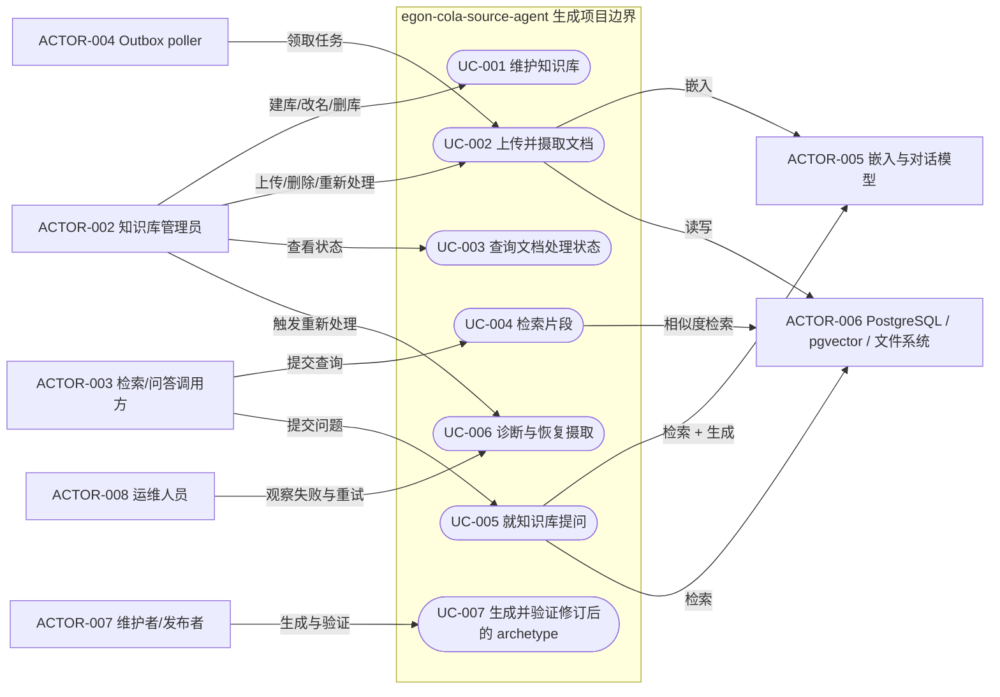
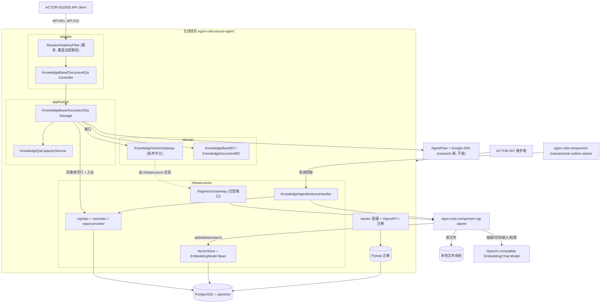
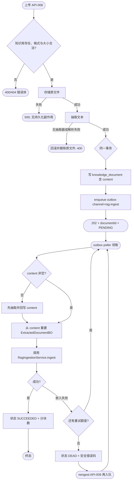
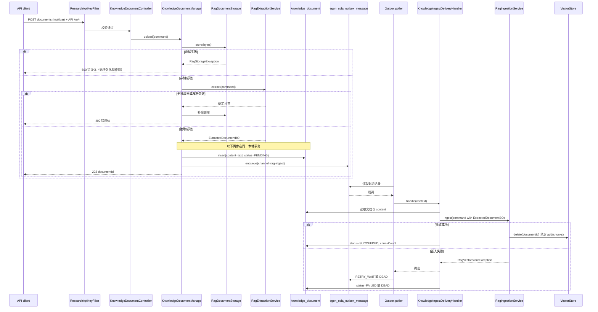
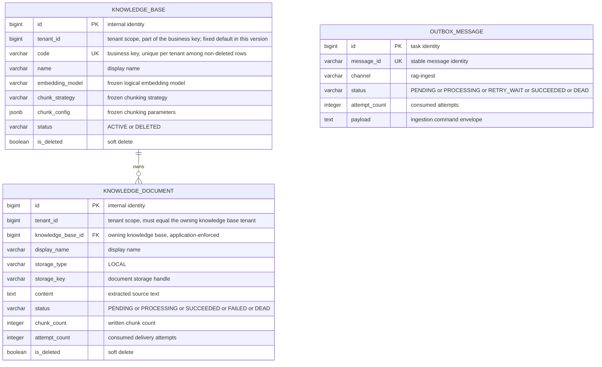

# Agent Archetype 知识库（RAG）设计

| Field | Value |
| --- | --- |
| Document | `docs/egon/spec/2026-09-10-11-51-agent-archetype-knowledge-rag.md` |
| Template Version | `7` |
| Status | `Accepted` |
| Type | `Feature` |
| Complexity | `Complex` |
| Complexity Drivers | 首个带数据库的 Agent 生成项目、跨两份已接受规范（Agent Archetype、RAG 组件）的合同修订、异步摄取与 outbox 至少一次投递的幂等设计、pgvector 表结构与维度的单一来源、原型禁项测试与 archetype 打包清单的同步变更、SSE 问答与容量边界、原文与抽取文本的双重持久化 |
| Created | `2026-09-10 11:51 CST` |
| Updated | `2026-09-10 15:10 CST` |
| Owner | `User` |
| Repository | `Egon-COLA` |
| Scope | `egon-cola-archetypes/source-projects/egon-cola-source-agent` 新增 `knowledge` 业务域；`definitions/egon-cola-archetype-agent` 的元数据与验证器同步修订 |
| Change Surface | source-agent 六模块新增 knowledge 包与依赖、Flyway 迁移、pgvector/嵌入模型/outbox 装配、REST 与 SSE 接口；`AgentArchitectureTest`、`AgentSourceContractTest`、`verify.groovy`、`archetype-metadata.xml`、架构文档的禁项与打包规则同步放开与扩展；不修改既有 `research` 业务、不修改 RAG 组件、不修改其它六个 archetype family |
| Affected Chapters | `§7, §8, §9, §10, §11, §13, §14, §15, §16, §17, §18` |
| Source Requirement | 用户在 2026-09-10 会话中要求：在 agent archetype 中做 RAG；引擎机制用 `rag-starter`，集中管理能力做在 archetype；agent archetype 就是 rag-admin；目前不需要前端页面；原始文本存数据库、不重复解析；暂时只允许同一维度不同模型；存储做成扩展点；持久化用 MyBatis Plus；向量表由 `PgVectorStore` 自建 |
| Baseline Revision | `docs/rag-starter-spec` 分支 `21e77965e`；工作区干净 |
| Amends | [Agent Deep Research Archetype 设计](2026-09-04-16-32-agent-deep-research-archetype.md) `§4 requirements REQ-003 and REQ-013`、`§7.1.2`、`§8.2`、`§11`：把"生成项目只包含 Deep Research 一个业务域"扩展为 `research` + `knowledge` 两个业务域；把"无数据库、无持久化"替换为"具备 knowledge 持久化、Flyway 迁移与 outbox 表"；其余章节（SSE 契约、容量边界、发布数量合同、Flyway 范围、既有六个 family）保持不变 |
| Supersedes | `None` |
| Depends On | [Egon-COLA RAG 引擎组件设计](2026-09-10-11-34-egon-cola-component-rag-starter.md) `§7, §8, §9, §10, §16`；`egon-cola-component-transactional-outbox-starter` README 的 `PostgreSQL Migration` 与 `Direct API Example` 两节 |
| Related Specs | [`egon-cola-components` 架构](../../../egon-cola-components/egon-cola-components-architecture.md) `§5, §11, §13.1`；[Agent Flow 扁平化组件设计](2026-09-04-09-34-agent-flow-component.md) `§7, §9` |
| Related Plans | [Agent Archetype 知识库实施计划](../plan/2026-09-10-14-35-agent-archetype-knowledge-rag-implementation.md) |

## 1. Summary

`egon-cola-source-agent` 目前只有一个业务域 `research`，并且被自身契约测试与 archetype 验证器双向锁死为"无数据库、无 Flyway、无 MyBatis、无 Redis"。本设计为它新增第二个业务域
`knowledge`：引入已接受的 `egon-cola-component-rag-starter` 作为 RAG 引擎，由生成项目自己承担知识库的增删改查、文档管理、异步摄取与问答接口——也就是用户要求的"agent archetype 就是 rag-admin"。

生成的项目因此获得：知识库与文档的关系型元数据（MyBatis Plus + Flyway + PostgreSQL）、原始文件的本地存储（RAG 组件的 `RagDocumentStorage` 扩展点）、抽取后的原文文本持久化、通过事务性
outbox 驱动的异步切块嵌入、基于 pgvector 的检索，以及一个 SSE 问答接口。向量表由宿主提供的 `PgVectorStore` 自行创建，Flyway 只负责 `vector` 扩展与两张业务表。

这不是一次"顺手加功能"，而是一次**显式的合同修订**：`AgentArchitectureTest`、`AgentSourceContractTest`、`verify.groovy` 与 `archetype-metadata.xml` 中把
`flyway`、`mybatis` 与"基础设施模块不得有 db 目录"列为禁项或断言的规则，必须按本设计的范围放开；同时必须为基础设施模块新增 SQL 资源的打包 fileset，否则迁移文件根本不会进入生成的项目。这些修订点在本 Spec 中逐一列明，不做静默改写。

摄取采用两段式：`RagExtractionService` 抽取出文本并由本项目落库，`RagIngestionService` 从已落库的文本重建 `ExtractedDocumentBO` 后切块嵌入。因此嵌入失败重试时**不会重新上传、重新下载或重新解析原文件**——满足用户"不要重新获取的时候再切分"的要求。

## 2. Background and Current State

### 2.1 Business and user context

用户要在 agent archetype 中提供可用的 RAG 能力，并明确分工：引擎机制下沉为组件，集中管理留在生成的项目。因此本 Spec 的产物是一个**可独立导入、构建、运行并管理知识库的生成项目**，而不是一个组件。首版不提供前端页面，管理能力通过 REST 接口对外暴露。

### 2.2 Repository evidence

| Evidence ID | Classification | Exact path/symbol/decision/command | Observed fact | Design significance | Verification limit/freshness |
| --- | --- | --- | --- | --- | --- |
| `EVD-001` | Static repository | `source-projects/egon-cola-source-agent/pom.xml` | 六模块 Reactor，Java 21，`spring-ai.version=1.1.8`，`mapstruct-plus.version=1.5.1`，`egon-cola.version=5.4.0`，父为 `egon-cola-archetypes-parent:5.4.0` | 新能力必须在既有六模块与既有依赖管理内实现 | 静态 POM |
| `EVD-002` | Static repository | `...-starter/src/test/java/.../architecture/AgentArchitectureTest.java` | 纯 JUnit 5 文件扫描（非 ArchUnit）。`keeps_agent_technology_in_infrastructure_and_starter` 断言 `-domain` 与 `-application` 源码不含 `com.google.adk`、`io.reactivex`、`org.springframework.ai`、`org.springframework.web`、`org.springframework.http`、`io.modelcontextprotocol` | knowledge 的领域端口必须是技术中立的 gateway 接口；Spring AI 类型只能出现在 infrastructure | 静态源码；未运行 |
| `EVD-003` | Static repository | 同上，`has_no_forbidden_integrations_or_source_web_business` | 递归扫描整个 source project 的 `.xml`/`.java`（排除 `src/test` 与 `target`）并断言不含 `spring-boot-starter-jdbc`、`spring-boot-starter-data-redis`、`spring-boot-starter-amqp`、`spring-boot-starter-graphql`、`dubbo-spring-boot-starter`、`flyway`、`mybatis`、`shardingsphere`、`egon-cola-source-web` | `flyway` 与 `mybatis` 两个 token 必须从该断言中移除，否则任何持久化都无法落地 | 静态源码；未运行 |
| `EVD-004` | Static repository | `...-starter/src/test/java/.../starter/AgentSourceContractTest.java` | 正则 `\b(fastjson\ | flyway\ | mybatis\ | redis\ | graphql\ | dubbo)\b` 扫描全部 `src/main` 与 `pom.xml`；`PROFILE_KEYS` 含 12 个键并要求四个 profile 的键集合相等；每个含 `.java` 的目录必须有 `package-info.java` | 同一批 token 需要放开；新增配置键必须四 profile 同构；新包必须补 `package-info.java` | 静态源码；未运行 |
| `EVD-005` | Static repository | `definitions/egon-cola-archetype-agent/src/test/resources/projects/basic/verify.groovy` | 断言 `missing("${prefix}-infrastructure/src/main/resources/db")`；`forbiddenDependencies` 含 `flyway-core`、`mybatis-plus-spring-boot3-starter`；`forbiddenToken` 含 `flyway`；`BOOT-INF/lib` 必须含 agent-flow/openai/mcp/google-adk 且不得含 rpc/tianshu/nacos/dubbo/shardingsphere | 该断言与禁项列表必须按本设计范围修订，并新增 RAG/outbox/pgvector 的存在性断言 | 静态源码；未运行 |
| `EVD-006` | Static repository | `definitions/egon-cola-archetype-agent/src/main/resources/META-INF/maven/archetype-metadata.xml` | starter 模块的文件集包含 `src/main/resources` 且 `includes` 仅为 `**/*.yml`；**其余五个模块没有任何 resources 文件集** | 迁移用的 `.sql` 不会被生成到 archetype；必须为承载迁移的模块新增文件集 | 静态源码 |
| `EVD-007` | Static repository | `source-projects/egon-cola-source-web/egon-cola-source-web-infrastructure/src/main/resources/db/migration/sharding/...` | 非 open 的 source 项目用 Flyway，迁移放在 `-infrastructure/src/main/resources/db/migration/`，命名为 `V<yyyyMMdd>_<NNN>__snake_case.sql`，`B` 前缀用于 baseline | 承载模块与命名风格有直接先例 | 静态路径 |
| `EVD-008` | Static repository | `source-web-domain/pom.xml`、`source-service-domain/pom.xml` | `top.egon:egon-cola-component-common-mybatis-plus-spring-boot-starter` 无版本声明地加在 **domain** 模块 | 本项目同样的依赖落位有先例 | 静态 POM |
| `EVD-009` | Static repository | `source-web-infrastructure/.../infrastructure/{user,teaching}/repo/{po,dao,converter}/` | PO 位于 `infrastructure/<域>/repo/po/*PO.java`，DAO 位于 `.../repo/dao/*DAO.java`，转换器位于 `.../repo/converter/*POConverter.java` | knowledge 的持久化类落位直接照此 | 静态路径 |
| `EVD-010` | External artifact | `egon-cola-component-common-mybatis-plus-spring-boot-starter:5.4.0` 的 `javap` 与配置元数据 | `EgonModel<M>` 提供 `id`、`tenantId`、`createUserId`、`createTime`(Instant)、`updateUserId`、`updateTime`(Instant)、`isDeleted`；`EgonColaMapper<T>` 继承 `BaseMapper<T>`；配置前缀 `egon.cola.component.mybatis-plus`，键含 `enabled`、`meta-fill.enabled`、`pagination.*`、`tenant-id.ignored-tables`、`tenant-id.mdc-key` | 审计/租户/软删列由基类提供，不必也不应重复声明；本项目本版**写入并强制租户列但不由身份解析租户**；租户经 MDC 通道由租户拦截器自动作用域，两张 knowledge 表**不**列入 `tenant-id.ignored-tables`（`ASM-006`、`DEC-012`） | 5.4.0 的类与元数据；租户拦截器的运行期行为未从源码验证 |
| `EVD-011` | Static repository | `source-web-infrastructure/.../repo/po/RolePO.java` | PO 用例：`@Data @NoArgsConstructor @AllArgsConstructor @Builder @Accessors(chain = true) @TableName("roles") extends EgonModel<RolePO>`，业务字段用 `@TableField` | 仓库既有的 PO 注解组合与用户规则 3 的完整基线不同，见 `§6.2` 与 `MC-MODEL-001` | 静态源码 |
| `EVD-012` | Static repository | `...-adapter/.../filter/ResearchApiKeyFilter.java` | `@Component("researchApiKeyFilter")` + `@Order(HIGHEST_PRECEDENCE + 1)` 的 `OncePerRequestFilter`，未限定 URL 模式，因此覆盖全部请求；使用常量时间比较；失败响应为 `DeepResearchErrorResponse` 且带 `WWW-Authenticate: ApiKey` | 新增的 knowledge 接口**自动被现有过滤器保护**，无需改安全配置 | 静态源码；过滤器注册路径未运行验证 |
| `EVD-013` | Static repository | `...-adapter/.../handler/DeepResearchErrorResponse.java` | 稳定错误体：`code`、`message`、`traceId`、`timestamp`(Instant)、`fieldErrors`，`@JsonInclude(NON_NULL)` | knowledge 接口直接复用该错误体，不新建并行包装 | 静态源码 |
| `EVD-014` | Static repository | `...-starter/src/main/resources/application.yml` 与三个 profile | 无 `spring.datasource`、无 `spring.flyway`、无 `spring.ai.vectorstore` 键；四个文件键集合相同 | 数据源、Flyway、向量库与 RAG 组件配置必须四 profile 同构地新增 | 静态源码 |
| `EVD-015` | Static repository | `...-starter/pom.xml` 的 `egon-cola-component-bytecode-architecture-maven-plugin` 配置 | `check-reactor` 于 `verify` 阶段执行，`unknownLayerPolicy=FAIL`，`packageMappings` 覆盖六个 `top.egon.cola.archetype.source.agent.{common,domain,application,infrastructure,adapter,starter}` | 新增类必须落在六个既有包前缀之下，否则构建失败——不引入新层 | 静态 POM |
| `EVD-016` | Static repository | `egon-cola-components/.../transactional-outbox-starter/src/main/resources/db/transactional-outbox/postgresql/V1__create_transactional_outbox_schema.sql` | 表 `egon_cola_outbox_message`，状态域 `PENDING/PROCESSING/RETRY_WAIT/SUCCEEDED/DEAD`，含 `FOR UPDATE SKIP LOCKED` 领取所需的部分索引 | 摄取任务状态直接映射该状态域；表由本项目复制并重编号创建 | 静态 DDL |
| `EVD-017` | Static repository | 同上组件 README `PostgreSQL Migration` 与 `Delivery Guarantee` 两节 | 组件**不建表、不跑 Flyway**，要求消费方把 SQL 复制进自己的迁移序列并重编号；启动期 schema 校验默认开启；投递是**至少一次**；组件不提供 replay API | 迁移必须由本项目创建；摄取必须幂等；"重新处理"必须由本项目再入队实现 | 静态文档 |
| `EVD-018` | Static repository | `~/.m2/.../spring-ai-pgvector-store/1.1.2` 的 `PgVectorStore.initializeSchema` | 默认 `initializeSchema=false`；开启后执行 `CREATE EXTENSION IF NOT EXISTS vector/hstore`（UUID 主键还含 `uuid-ossp`）并建表 `vector_store(id uuid, content text, metadata json, embedding vector(<dimensions>))` 与 HNSW 索引 `spring_ai_vector_index` | 交给 `PgVectorStore` 自建表可让维度只有一个来源（Bean 的 `dimensions`），避免在 Flyway 中复制其内部结构 | 1.1.2 源码；仓库管理的是 1.1.8，实施时需复核 |
| `EVD-019` | Accepted Spec | [RAG 引擎组件设计](2026-09-10-11-34-egon-cola-component-rag-starter.md) `§9.1`、`§9.2.1`、`§9.2.7` | 组件暴露三个服务：`RagExtractionService#extract`、`RagIngestionService#ingest`、`RagRetrievalService#retrieve`；`RagIngestionCommand` 携带 `ExtractedDocumentBO`；`RagDocumentStorage` 提供本地实现 | 本项目的摄取链路直接按两段式组合这三个服务 | 已接受但未实现 |
| `EVD-020` | User decision | 2026-09-10 会话 | 引擎用组件、管理留在 archetype、不需要前端、原文入库不重复解析、同维度多模型、存储可切换、持久化用 MyBatis Plus、向量表由 `PgVectorStore` 自建 | 关闭归属、持久化技术与向量表所有权 | 只适用于本 Spec 范围 |
| `EVD-021` | User decision | 2026-09-04 已接受 Spec `§4.1`、`§5.3` | Agent Archetype 采用单 API Key、无租户、无用户身份、进程内并发上限、无 durable state | knowledge 接口沿用同一身份模型；容量与幂等语义必须与该 Spec 协调 | 只适用于 agent family |

| `EVD-022` | Static repository | `IdpPrincipal#tenantId`、`ServiceAccessTokenClaims`、`ServiceIdentityPrincipal`；`docs/egon/spec/2026-08-21-07-51-idp-oauth-client-tenant-ownership.md` | 仓库已有完整租户身份：SERVICE Access Token 携带 `TENANT`/`PLATFORM` claim，身份主体暴露 `tenantId`；Tianquan-Shoubing 持有 tenant 主数据与 `identitySub <-> tenant` membership；RBAC3 按 `tenant_id` 分区 | 目标产品的租户来源有既成体系可选；本版不接入，但列与参数形态必须与之兼容（租户为数值标识、非字符串命名空间） | 静态源码与已接受 Spec；本项目未运行其任何链路 |
| `EVD-023` | User decision | 2026-09-10 12:13 | "租户暂时先不考虑从哪来，表上面字段先加上，后面再考虑和别的服务联动"；同次确认 `MC-MODEL-001` 按仓库既有 PO 约定处理 | 租户列在本版落地，租户值由固定配置经 MDC 供给（`DEC-012`）；租户解析与鉴权推迟，`research` 域不变 | 只适用于本 Spec 范围 |

### 2.3 Problem statement and gap

现状：agent 生成项目只有一个业务域，且被四道门禁（两份测试 + 验证器 + 打包清单）锁死为无持久化。想要的：一个自带知识库管理能力的生成项目。

差距由两部分组成。其一，**能力缺口**：生成项目没有数据库、没有向量库、没有文件存储、没有异步任务、没有管理接口。其二，**合同缺口**：即使能力齐备，现有门禁也会让构建失败、让迁移文件缺失、让依赖断言失败。只解决其一都会得到一个"能编译但不工作"或"能工作但生成不出来"的产物，因此两部分必须在本 Spec 内一并设计。

### 2.4 Evidence and current-chain map

| Entry/trigger | Current call chain | Data read/written | External dependency | Consumers | Evidence |
| --- | --- | --- | --- | --- | --- |
| 当前：研究请求 | `DeepResearchController -> DeepResearchManage -> DeepResearchAgentGateway -> AgentFlowService -> ADK -> ChatModel/MCP` | 进程内 run/session/event；无持久化 | OpenAI-compatible model、MCP search | API client | `EVD-021`；Agent Archetype Spec `§7.3.1` |
| 当前：应用装配 | `AutoConfiguration.imports -> AgentFlowAutoConfiguration -> 按 Bean 名取 ChatModel` | Spring 上下文 | Spring Boot、Spring AI | 生成项目 | Agent Archetype Spec `§8.2` |
| 当前：生成与验证 | `source-agent -> generate_archetypes.sh -> definition overlay -> .generated -> archetype IT verify.groovy` | tracked source/definition；ignored generated tree | Maven Archetype Plugin、Groovy | 维护者/发布者 | `EVD-005`, `EVD-006` |
| 目标：文档上传 | `KnowledgeDocumentController -> KnowledgeDocumentManage -> RagDocumentStorage.store + RagExtractionService.extract -> 写 knowledge_document -> enqueue outbox` | 本地文件、`knowledge_document` 行、outbox 行（同一事务） | 本地文件系统、rag-starter | API client | `EVD-017`, `EVD-019` |
| 目标：异步摄取 | `OutboxPoller -> KnowledgeIngestDeliveryHandler -> RagIngestionService.ingest -> EmbeddingModel -> VectorStore` | 读 `knowledge_document.content`、写向量表、回写文档状态 | OpenAI-compatible embedding、PostgreSQL/pgvector | outbox 组件 | `EVD-016`-`EVD-019` |
| 目标：检索与问答 | `KnowledgeQaController -> KnowledgeQaManage -> RagRetrievalService.retrieve -> ChatModel -> SSE` | 只读向量表；无持久化问答 | OpenAI-compatible model、pgvector | API client | `EVD-019` |

## 3. Goals and Non-goals

### 3.1 Goals

- 生成项目新增 `knowledge` 业务域，与 `research` 并列，保持既有六模块与依赖方向不变。
- 提供知识库与文档的管理接口：建库、查库、改名、删库、上传、列表、详情、重新处理、删除，以及检索调试与 SSE 问答。
- 复用 `egon-cola-component-rag-starter` 的抽取、摄取、检索、存储与元数据规范，不在本项目复制引擎逻辑。
- 通过事务性 outbox 实现异步摄取，任务状态可查询、可重跑、跨重启可恢复。
- 持久化知识库与文档元数据、以及抽取后的原文文本，使重跑嵌入无需重新上传或重新解析。
- 向量检索使用同一维度、可注册多个逻辑嵌入模型；跨模型隔离由组件强制。
- 同步修订四道门禁与打包清单，使新能力既能在源码项目中构建，也能被 archetype 正确生成。
- 全部验证离线、确定性，不调用真实模型、向量库、网络或 Docker。

### 3.2 Non-goals

- 不修改 `research` 业务域的接口、语义、容量边界与 SSE 事件契约。
- 不修改 `egon-cola-component-rag-starter`（其能力缺口已在 2026-09-10 11:47 CST 的修订中关闭）。
- 不提供前端页面、路由、组件或静态资源。
- 不提供分块预览接口：组件刻意不暴露分块枚举能力（`VectorStore` 无列举 API），新增该能力需要新的组件 Spec。
- 不提供知识库级或文档级的权限模型、共享与配额；沿用单一服务 API Key（`EVD-021`）。
- **不解析租户身份、不做租户鉴权与授权、不接统一身份**：租户列在本版落地，租户值由固定配置经 MDC 通道供给（`DEC-012`），租户来源、跨服务联动与基于租户的授权留待后续 Spec（`EVD-023`）。因此本版不构成租户隔离的安全边界。
- 不把租户概念扩展到 `research` 域；该域没有持久化表，保持单 API Key 语义不变（`REQ-024`）。
- 不提供问答会话持久化、历史查询、多轮记忆、反馈或评分。
- 不提供重排、混合检索、查询改写、多模态或图检索。
- 不提供对象存储实现；本地文件系统是多实例不可共享的已知限制。
- 不支持同一部署内不同维度的嵌入模型共存。
- 不在 Spec 阶段写 Plan、生产代码、迁移，不启动应用、不连接数据库或模型。

### 3.3 Change Surface and Design Depth

| Area/layer | Disposition | Exact repository evidence | Changed or preserved behavior/contract | Required Spec treatment | Chapter(s) |
| --- | --- | --- | --- | --- | --- |
| `source-agent-common` | Affected | `EVD-001`, `EVD-015` | 新增 knowledge 错误码枚举；保持无框架依赖 | 精确枚举值、错误映射与命名 | `§7, §8, §10, §13, §14, §17, §18` |
| `source-agent-domain` | Affected | `EVD-002`, `EVD-008`, `EVD-009` | 新增 `knowledge` 域：BO、技术中立 gateway 端口、服务契约；新增 MyBatis Plus starter 依赖；不含 `org.springframework.ai` | 完整架构、接口、对象模型、模式与测试设计 | `§7, §8, §9, §10, §13, §14, §15, §16, §17, §18` |
| `source-agent-application` | Affected | `EVD-002`, `EVD-015` | 新增 knowledge command 与 manage：建库/文档/问答用例、容量与校验；不含 Spring AI 类型 | 用例编排、事务边界、失败语义 | `§7, §8, §9, §10, §13, §14, §15, §16, §17, §18` |
| `source-agent-infrastructure` | Affected | `EVD-009`, `EVD-018`, `EVD-019` | 新增 repo（PO/DAO/converter）、pgvector `VectorStore` Bean、`EmbeddingModel` Bean、RAG gateway 实现、outbox `DeliveryHandler`、Flyway 迁移目录 | 完整持久化、迁移、装配与摄取设计 | `§7, §8, §9, §10, §11, §13, §14, §15, §16, §17, §18` |
| `source-agent-adapter` | Affected | `EVD-012`, `EVD-013` | 新增 knowledge 控制器、Request/VO/Converter；复用现有 API Key 过滤器与错误体 | 完整 REST/SSE 契约与 OpenAPI 设计 | `§7, §8, §9, §10, §13, §14, §15, §16, §17, §18` |
| `source-agent-starter` | Affected | `EVD-014` | 四个 profile 同构新增 datasource/flyway/RAG/outbox 配置键；OpenAPI tag | 配置键、启动校验与回滚 | `§7, §8, §9, §15, §16, §17, §18` |
| `source-agent` 根 `pom.xml` | Affected | `EVD-001` | 新增 RAG/outbox/mybatis-plus/pgvector 依赖管理与模块依赖 | 精确 POM 变更 | `§8, §16` |
| `AgentArchitectureTest` | Affected | `EVD-003` | 禁项 token 移除 `flyway` 与 `mybatis`；新增 knowledge 依赖方向断言 | 精确断言变更 | `§8, §14, §16` |
| `AgentSourceContractTest` | Affected | `EVD-004` | 禁项正则移除 `flyway` 与 `mybatis`；保持 `redis/graphql/dubbo/fastjson` 与 profile 键一致性 | 精确断言变更 | `§8, §14, §16` |
| `verify.groovy`（agent definition） | Affected | `EVD-005` | 移除 `missing(db)` 与 `flyway`/`mybatis` 禁项；新增 RAG/outbox/pgvector/mybatis 依赖与运行时库断言、迁移文件断言 | 精确断言变更 | `§8, §11, §14, §16` |
| `archetype-metadata.xml`（agent definition） | Affected | `EVD-006` | 为 infrastructure 模块新增 `src/main/resources` 文件集并包含 `**/*.sql` | 精确元数据变更 | `§8, §16` |
| `agent-multi-module-architecture.md` | Affected | `EVD-005`, `EVD-006` | 更新"无数据库/无迁移"表述并记录 knowledge 域边界与依赖方向 | 文档责任与兼容说明 | `§8, §16` |
| `research` 业务域 | Unchanged | Agent Archetype Spec `§7.3.1`、`§9.2.1` | 接口路径、SSE 事件名、字段、错误码、容量语义完全不变 | 一条回归记录与既有测试 | `§14, §16` |
| 其它六个 archetype family 与 platforms/xingyuan | Unchanged | `EVD-005`, `EVD-006` | 源项目、definition、生成产物与发布合同不变 | 一条回归记录 | `§16` |
| `egon-cola-component-rag-starter` | Unchanged | `EVD-019` | 作为规范依赖被消费，本 Spec 不修改其任何契约 | 引用其接口与兼容规则 | `§7, §9, §16` |
| 前端 | Not applicable | 用户 2026-09-10 "目前不需要前端页面"；`EVD-019` 组件不含 UI | 无页面、路由、组件或状态 | 证据化 `N/A` | `§12` |

## 4. Requirements and Acceptance Criteria

| ID | Atomic requirement | Priority | Observable acceptance criteria | Source |
| --- | --- | --- | --- | --- |
| `REQ-001` | 生成项目新增 `knowledge` 业务域，与 `research` 并列，六模块与依赖方向不变 | Must | 模块集合仍为 `common/domain/application/infrastructure/adapter/starter`；业务包为 `research` 与 `knowledge` 两个根；`check-reactor` 通过 | 用户要求；`EVD-015` |
| `REQ-002` | 提供知识库的建、查、改、删接口 | Must | 四个操作各有独立端点与契约；删除知识库级联删除其文档、存储对象与向量分块 | 用户"基础的增删改查功能" |
| `REQ-003` | 提供文档的上传、列表、详情、重新处理与删除接口 | Must | 上传返回 202 与文档标识；列表与详情暴露处理状态与分块数；删除同时清除行、存储对象与向量分块 | 用户"管理功能" |
| `REQ-004` | 上传在一个本地事务内写入文档行与 outbox 记录 | Must | 上传成功时 `knowledge_document` 行与 `egon_cola_outbox_message` 行同时存在；任一写入失败则两者都不存在 | `EVD-017` 要求 `enqueue` 处于活跃事务 |
| `REQ-005` | 摄取异步执行，状态可查询 | Must | 文档状态取值为枚举并与 outbox 状态一一映射；上传接口立即返回而不等待嵌入 | 用户选择的方案 C（完整异步） |
| `REQ-006` | 摄取必须幂等，且重跑不重新上传、下载或解析原文件 | Must | 同一文档重跑得到相同的分块 id 集合；摄取链路只调用一次 `RagExtractionService#extract`；重跑从已落库的 `content` 重建文档 | `EVD-017` 至少一次投递；用户"不要重新获取的时候再切分" |
| `REQ-007` | 原始文件按存储扩展点保存，抽取后的原文文本持久化到数据库 | Must | 上传后原文件可通过 `RagDocumentStorage` 取回；`knowledge_document.content` 非空且等于抽取文本 | 用户"原始文本也要存到数据库中"与"本地先存一下" |
| `REQ-008` | 嵌入与向量存储由宿主装配，组件只按 Bean 名解析 | Must | 生成项目提供具名 `EmbeddingModel` 与 `VectorStore`；RAG 组件配置只引用 Bean 名与逻辑模型名 | `EVD-019` `REQ-003` |
| `REQ-009` | 同一部署支持多个同维度嵌入模型，且不允许跨模型串结果 | Must | 知识库建库时选定逻辑模型；不同模型的知识库检索互不返回对方分块；维度不一致时启动失败 | 用户"同一维度不同模型" |
| `REQ-010` | 向量表由 `PgVectorStore` 创建，Flyway 只管理扩展与业务表 | Must | Flyway 迁移不含 `vector_store` 建表语句；应用首次启动后向量表存在且维度等于配置 | 用户选择的向量表方案 A；`EVD-018` |
| `REQ-011` | 提供检索调试接口，返回片段与分数且不调用模型 | Must | 接口返回有序片段、分数与文档标识；不产生任何模型调用与持久化写入 | 管理需要；`EVD-019` `INTERNAL-002` |
| `REQ-012` | 提供知识库问答接口，流式返回 | Must | 单个 SSE 流返回 started/progress/completed 或 failed 之一并终止；事件包含检索引用 | 用户选择的方案 B |
| `REQ-013` | 全部新接口复用现有服务 API Key 保护，不引入第二套鉴权 | Must | 缺失或错误 key 时返回既有 401 错误体；不新增鉴权配置或安全依赖；接口不接受任何租户请求头 | `EVD-012`；用户"复用同一个 key" |
| `REQ-025` | 两张业务表保留租户列，租户经 MDC 通道由 MyBatis Plus 租户拦截器自动作用域，业务代码不传租户参数 | Must | `tenant_id` 非空且取当前 MDC 租户（本版为配置的默认租户）；业务键唯一性为租户内唯一；拦截器对两张表生效且生成 SQL 含租户条件；同一业务键在不同租户下可以共存；Service/DAO 签名中不出现租户参数 | 用户"表上面字段先加上"与"走 MDC 不走显式参数"；`EVD-010` |
| `REQ-026` | 摄取任务在 outbox 载荷中携带租户，handler 在投递线程内重建并在结束后清理 MDC 租户上下文 | Must | 载荷的 `tenantId` 与文档行一致；handler 在无调用方 MDC 的投递线程内设置该租户，`finally` 中清理；投递期间的全部数据访问落在正确租户；同一文档的租户不因异步而改变或丢失 | 用户选择 MDC 通道；MDC 不跨线程，必须由载荷补齐线程边界 |
| `REQ-027` | 向量元数据携带租户并在检索时强制过滤 | Must | 每个分块的向量元数据含 `tenantId`；检索的过滤表达式恒含该条件；跨租户检索不返回对方分块 | `REQ-009` 的延伸；`EVD-022` 为将来租户隔离预留 |
| `REQ-014` | 全部新接口复用既有错误体与 trace 约定 | Must | 错误响应使用 `DeepResearchErrorResponse` 等价形状并带 `X-Trace-Id`；不新增并行包装 | `EVD-013` |
| `REQ-015` | PostgreSQL 通过 Flyway 管理，迁移位于 infrastructure 模块并被 archetype 正确打包 | Must | 存在两条迁移文件（知识库表、outbox 表）；生成的 archetype 项目包含同样的文件 | `EVD-006`, `EVD-007` |
| `REQ-016` | outbox 表由本项目复制并重编号创建，组件不建表 | Must | 迁移中存在 `egon_cola_outbox_message` 建表语句；启动期 schema 校验通过 | `EVD-016`, `EVD-017` |
| `REQ-017` | 同步修订两份测试与验证器的禁项，使 `flyway` 与 `mybatis` 在受控范围内被允许，其余禁项保持不变 | Must | 修订后源码项目 `clean verify` 通过；`redis`/`graphql`/`dubbo`/`fastjson`/`shardingsphere` 仍被禁止 | `EVD-003`-`EVD-005` |
| `REQ-018` | `archetype-metadata.xml` 为承载迁移的模块新增资源文件集 | Must | 生成的 archetype 项目包含两条迁移文件；验证器断言其存在 | `EVD-006` |
| `REQ-019` | `verify.groovy` 新增 RAG、outbox、pgvector、mybatis 的存在性断言 | Must | 生成项目的依赖与 `BOOT-INF/lib` 断言包含四类 artifact；禁止项保持 | `EVD-005` |
| `REQ-020` | 架构文档更新，不再声明"无数据库/无迁移" | Must | 文档描述 knowledge 域边界、持久化与迁移位置，且与生成结果一致 | `EVD-005` |
| `REQ-021` | 生成项目必须可独立 `clean verify` 通过 | Must | 生成后执行 `clean verify` 成功且不含 source sentinel | Agent Archetype Spec `REQ-015` 延续 |
| `REQ-022` | 问答与检索受并发与超时约束，不与研究流程互相阻塞 | Must | 问答有独立并发上限；饱和返回 429 与 `Retry-After`；不存在跨用例的共享互斥 | `EVD-021` 的容量语义延续 |
| `REQ-023` | 全部验证离线、确定性，不启动真实模型、向量库、网络或 Docker | Must | 测试使用 fake Bean 与嵌入式替身；`clean verify` 不需要凭据或外部服务 | Agent Archetype Spec `REQ-018` 延续 |
| `REQ-024` | 现有 `research` 域的接口、事件与错误码保持不变 | Must | 既有研究相关测试不改动即通过；OpenAPI 断言中的研究 operation 不变 | 范围保护 |

### 4.1 Scenario matrix

| Scenario | Actor/trigger | Preconditions | Main path | Alternative/failure path | Data/state change | Observable result | Requirements |
| --- | --- | --- | --- | --- | --- | --- | --- |
| 建库成功 | API client 提交名称与模型 | 逻辑模型已注册、参数合法 | 校验 -> 插入 `knowledge_base` -> 返回 200 | 名称重复 -> 409；模型未注册 -> 400 | 新增一行 | 返回知识库标识与配置 | `REQ-002`, `REQ-009` |
| 建库后改配置 | API client 更新知识库 | 已存在 | 只允许改名称与描述 | 请求含模型或分块配置 -> 400 | 仅名称与描述变化 | 配置字段不变 | `REQ-002` |
| 上传成功 | API client 上传文件 | 知识库存在、格式有可用抽取器 | 存原文件 -> 抽取文本 -> 同事务写文档行与 outbox 行 -> 202 | 抽取失败 -> 不写任何行；存储失败 -> 不写任何行 | 文件 + 文档行 + outbox 行 | 返回文档标识与初始状态 | `REQ-003`, `REQ-004`, `REQ-007` |
| 无可用抽取器 | API client 上传不支持的格式 | 未引入对应可选依赖 | 抽取路由失败 | 事务回滚；已写入的原文件按补偿删除 | 无行、无残留文件 | 确定错误体，列出已注册 MIME | `REQ-003`, `REQ-007` |
| 文件超限 | API client 上传超过上限的文件 | 已配置上限 | 拒绝 | 不落文件、不建行 | 无 | 400 错误体 | `REQ-003` |
| 摄取成功 | outbox poller 领取任务 | 文档行存在且文本已落库 | 从 `content` 重建文档 -> 切块 -> 删旧分块 -> 嵌入 -> 写入 -> 状态置 SUCCEEDED | 无 | 向量表新增分块；文档状态与分块数更新 | 文档详情显示成功与分块数 | `REQ-005`, `REQ-006` |
| 嵌入失败重试 | outbox 重试 | 首次嵌入失败 | 再次领取 -> **不重新解析** -> 重新嵌入 | 重试用尽 -> 状态 DEAD | 向量表按文档重建；状态变化 | 文档详情显示失败原因 | `REQ-006` |
| 跨模型隔离 | 两个知识库各用不同逻辑模型 | 两模型维度相同 | 各自检索只返回本方分块 | 若过滤缺失则测试失败 | 无 | 无跨模型结果 | `REQ-009` |
| 租户作用域写入 | API client 建库与上传 | 租户配置已提供 | 行以配置租户写入；业务键唯一性按租户判定 | 租户配置缺失 -> 启动失败 | 行带固定租户列值 | 同一业务键在另一租户下可再次创建 | `REQ-025` |
| 租户随异步传递 | outbox 投递 | 上传已写入含租户的载荷 | handler 从载荷恢复租户并完成读取与写入 | 载荷缺租户 -> 投递失败并进入重试/死信 | 文档状态与租户均被正确回写 | 不存在"租户丢失"或写错租户 | `REQ-026` |
| 跨租户检索隔离 | 两个租户各建知识库并写入 | 两租户都有分块 | 各自检索只返回本方分块 | 若过滤缺失则测试失败 | 无 | 无跨租户结果 | `REQ-027` |
| 维度不一致 | 应用启动 | 某模型 `dimensions()` 与配置不符 | 启动失败 | 无 | 无 | 启动异常指明模型与维度 | `REQ-009` |
| 重新处理 | API client 触发 reingest | 文档处于终态 | 再入队一条 outbox 记录 | 文档处于处理中 -> 409 | 新增 outbox 行；状态回到待处理 | 返回 202 | `REQ-003`, `REQ-006` |
| 删文档 | API client 删除文档 | 文档存在 | 删存储对象 -> 删向量分块 -> 软删行 | 存储或向量删除失败 -> 事务回滚并保留行 | 行、文件、分块均清除 | 204 | `REQ-003` |
| 删知识库 | API client 删除知识库 | 知识库存在 | 逐文档执行删文档 -> 软删知识库 | 处理中数量超过阈值 -> 409（要求先等待） | 全部关联数据清除 | 204 | `REQ-002` |
| 检索调试 | API client 提交查询 | 知识库存在、模型已注册 | 组件强制过滤 -> 相似度检索 -> 返回片段与分数 | 无命中 -> 空数组；参数越界 -> 400 | 只读 | 200 与有序片段 | `REQ-011` |
| 问答成功 | API client 提交问题 | 知识库存在、模型与 ChatModel 可用、容量可用 | 建流 -> 检索 -> 发送 started(引用) -> 生成进度 -> completed | 无命中 -> completed 且引用为空 | 无持久化；进程内流状态在终态释放 | 有序 SSE | `REQ-012`, `REQ-022` |
| 问答中依赖失败 | 模型或向量库在 200 之后失败 | 已建立 SSE 流 | 映射为安全失败事件并终止 | 不自动重试 | 无持久化；许可释放 | 一个 failed 事件后 EOF | `REQ-012` |
| 问答容量饱和 | 第 N+1 个并发问答 | 许可占满 | 启动前拒绝 | 无 | 无 | 429 + `Retry-After` | `REQ-022` |
| 问答客户端断连 | 调用方关闭连接 | 流进行中 | 取消下游订阅 | 丢弃迟到事件 | 许可释放 | 服务端记录取消结果 | `REQ-012` |
| 未授权 | 缺失或错误 API Key | 任意 knowledge 端点 | 过滤器以常量时间比较拒绝 | 不进入控制器 | 无 | 401 与 `WWW-Authenticate: ApiKey` | `REQ-013` |
| 迁移执行 | 应用启动 | 数据库可连、扩展可创建 | Flyway 建两张业务表 -> `PgVectorStore` 建向量表 | 迁移失败 -> 启动失败 | 新表被创建 | 启动成功且表存在 | `REQ-010`, `REQ-015`, `REQ-016` |
| 生成与验证 | maintainer 运行生成与 IT | definition 完整 | 生成 -> 迁移文件存在 -> `clean verify` 通过 | 打包清单缺 SQL -> 验证器失败 | 仅 target/.generated | 生成项目自洽 | `REQ-018`-`REQ-021` |
| 研究域回归 | 既有研究请求 | 未改动 research | 与研究域原有链路一致 | 无 | 无 | 既有测试不改动即通过 | `REQ-024` |

### 4.2 Use-case analysis

#### 4.2.1 Actor inventory

| Actor ID | Actor/role | Goal and responsibility | Entry/channel | Permission/tenant context | Evidence |
| --- | --- | --- | --- | --- | --- |
| `ACTOR-001` | Archetype consumer/developer | 生成并定制带知识库的 Agent 应用 | Maven Archetype CLI | 本地构建身份，无 tenant | `EVD-001`, `EVD-005` |
| `ACTOR-002` | API client（知识库管理员） | 建立与维护知识库、上传与处理文档 | HTTPS `API-001`-`API-010` | `X-Research-Api-Key` 服务级凭据；无用户与租户 | `EVD-012`, `EVD-021` |
| `ACTOR-003` | API client（检索与问答调用方） | 检索片段或就知识库提问 | HTTPS `API-011`, `API-012` | 同上 | `EVD-012` |
| `ACTOR-004` | Outbox poller（本应用内） | 领取并执行摄取任务，回写文档状态 | 组件轮询 | 进程内，无外部身份 | `EVD-016` |
| `ACTOR-005` | OpenAI-compatible model | 提供嵌入与问答生成 | Spring AI `EmbeddingModel`/`ChatModel` Bean | 凭据由 host 配置 | `EVD-019` |
| `ACTOR-006` | PostgreSQL / pgvector / 本地文件系统 | 提供关系型存储、向量存储与原始文件存储 | JDBC、`VectorStore`、`RagDocumentStorage` | 由 host 配置 | `EVD-007`, `EVD-018` |
| `ACTOR-007` | Archetype maintainer/release operator | 维护、验证并发布修订后的 agent family | Git/Maven scripts | 仓库/Central 权限 | `EVD-005`, `EVD-006` |
| `ACTOR-008` | 应用运维人员 | 从启动失败与安全日志判断知识库与摄取状态 | 生命周期与日志/指标 | 只观察标识、状态、耗时 | Agent Archetype Spec `§7.3.5` |

#### 4.2.2 Use-case artifact



| ID | Use case/goal | Primary actor | Supporting actors/systems | Trigger | Preconditions | Main success outcome | Alternatives/failures | Postconditions | Requirements | Interfaces/pages | Tests |
| --- | --- | --- | --- | --- | --- | --- | --- | --- | --- | --- | --- |
| `UC-001` | 维护知识库 | `ACTOR-002` | `ACTOR-006` | 建库/改名/删库 | API Key 有效 | 知识库被创建、改名或连同其全部数据被删除 | 名称重复 409；改配置 400；删除时仍有处理中文档 409 | 成功：状态一致；失败：无部分删除 | `REQ-002`, `REQ-009` | `API-001`-`API-005` | `TEST-004`-`TEST-008` |
| `UC-002` | 上传并摄取文档 | `ACTOR-002` | `ACTOR-004`, `ACTOR-005`, `ACTOR-006` | 上传文件 | 知识库存在、格式有可用抽取器、容量可用 | 原文件落库、文本落库、outbox 记录建立，随后被执行为分块向量 | 无抽取器/超限/存储失败 -> 无任何持久化副作用；嵌入失败 -> 重试至 DEAD | 成功：文档可检索；失败：状态显示原因 | `REQ-003`-`REQ-007` | `API-006` | `TEST-009`-`TEST-014` |
| `UC-003` | 查询文档处理状态 | `ACTOR-002` | `ACTOR-006` | 查看列表或详情 | API Key 有效 | 返回状态、分块数与失败原因 | 文档不存在 -> 404 | 只读 | `REQ-003`, `REQ-005` | `API-007`, `API-008` | `TEST-015`, `TEST-016` |
| `UC-004` | 检索片段 | `ACTOR-003` | `ACTOR-006` | 提交查询文本 | 知识库存在、模型已注册 | 返回只属于该知识库与该模型的片段与分数 | 无命中 -> 空数组；参数越界 -> 400 | 只读 | `REQ-009`, `REQ-011` | `API-011` | `TEST-018`, `TEST-019` |
| `UC-005` | 就知识库提问 | `ACTOR-003` | `ACTOR-005`, `ACTOR-006` | 提交问题 | 知识库存在、模型与 ChatModel 可用、容量可用 | 一个 SSE 流返回引用与最终答案 | 依赖失败 -> failed；饱和 -> 429；断连 -> 取消 | 无持久化；终态释放许可 | `REQ-012`, `REQ-022` | `API-012` | `TEST-020`-`TEST-024` |
| `UC-006` | 诊断与恢复摄取 | `ACTOR-008`, `ACTOR-002` | `ACTOR-004` | 任务进入 DEAD 或状态异常 | API Key 有效 | 通过重新处理再次入队并观察最终状态 | 重复触发被 409 拒绝 | 新增 outbox 记录 | `REQ-003`, `REQ-005` | `API-008`, `API-009` | `TEST-014`, `TEST-017` |
| `UC-007` | 生成并验证修订后的 archetype | `ACTOR-007` | Maven/Groovy | 维护者运行生成与 IT | definition 与 source 完整 | 生成项目含迁移文件与全部依赖，`clean verify` 通过 | 打包清单缺 SQL -> 验证器失败并阻止发布 | 无半成品发布 | `REQ-015`, `REQ-017`-`REQ-021` | CLI | `TEST-025`-`TEST-030` |

## 5. Constraints, Assumptions, and Decisions

### 5.1 Confirmed constraints

- 引擎机制必须来自 `egon-cola-component-rag-starter`，不在本项目复制抽取、切分、嵌入、检索或存储逻辑（`EVD-019`）。
- 集中管理能力必须留在生成的项目，不下沉为组件（用户决策）。
- 单一服务 API Key，无用户、无租户、无权限模型；全部新端点由既有过滤器覆盖（`EVD-012`, `EVD-021`）。
- 生成项目必须保持在六个既有模块与六个既有包前缀之内（`EVD-015`）。
- `research` 域的接口、事件、错误码与容量语义不得改变（`REQ-024`）。
- 向量表由 `PgVectorStore` 创建；Flyway 只管理 `vector` 扩展与业务表（`EVD-018`, 用户决策）。
- 持久化使用 `egon-cola-component-common-mybatis-plus-spring-boot-starter`（用户决策, `EVD-008`）。
- 投递语义是至少一次，摄取必须幂等；组件不提供 replay API（`EVD-017`）。
- 全部验证离线、确定性（`REQ-023`）。

### 5.2 Small-gap assumptions

| ID | Inference | Repository evidence | Why locally reversible | Impact if wrong |
| --- | --- | --- | --- | --- |
| `ASM-001` | 迁移目录取 `-infrastructure/src/main/resources/db/migration/`，命名取 `V20260910_001__create_knowledge_schema.sql` 与 `V20260910_002__create_transactional_outbox_schema.sql` | `EVD-007` 的模块落位与日期命名风格 | 迁移未发布前可重命名 | 与既有 source 项目的命名风格不一致 |
| `ASM-002` | 新包根取 模块包下的 `knowledge` 子包 | `EVD-015` 的六个包前缀 + `research` 的既有布局 | 纯包内组织 | `check-reactor` 的包映射需要同步调整 |
| `ASM-003` | 原文件在本地存储下的相对路径为 `<root>/<knowledgeBaseId>/<documentId>/<sanitizedFileName>` | `EVD-019` 的 `RagDocumentStorage` 契约把标识交给实现；组件已自带本地实现 | 由组件实现决定，本项目不重复实现 | 若需自定义布局则要提供自己的存储 Bean |
| `ASM-004` | 上传大小上限取 20MB、单知识库文档数上限取 10,000、问答并发上限取 4 | Agent Archetype Spec 的容量默认值风格 | 配置默认值可改 | 生成项目的默认容量不符合预期 |
| `ASM-005` | 文档状态枚举取 `PENDING/PROCESSING/SUCCEEDED/FAILED/DEAD`，与 outbox 状态一对一映射 | `EVD-016` 的状态域 | 枚举只增不改 | 映射需要增加取值 |
| `ASM-006` | MyBatis Plus 的租户拦截器对两张 knowledge 表**生效**（不使用 `tenant-id.ignored-tables` 排除），并从 `tenant-id.mdc-key` 指定的 MDC 键取租户 | `EVD-010` 的配置元数据键与 `EgonColaMdcTenantIdProvider`；用户"走 MDC 不走显式参数" | 配置项可改，无 schema 影响 | 若拦截器实际不填充 `tenant_id`，需要改由基类或填充器写入，属实现细节调整 |
| `ASM-007` | 本版的默认租户标识取 `0`，由配置键 `agent.knowledge.tenant.default-id` 供给，并由一个请求过滤器写入 MDC（与既有 `ResearchTraceFilter` 写 trace 的方式一致） | `EgonModel.tenantId` 是 `Long`；`EVD-022` 的外部租户也是数值标识；既有模块已有 MDC 过滤器先例 | 配置默认值可改，回填成本低 | 若将来约定的默认租户不是 0，需要一次数据迁移 |
| `ASM-008` | 向量元数据的租户键名取 `tenantId`，与组件保留键（`collectionId`、`documentId`、`chunkIndex`、`embeddingModel`、`contentHash`）并列但不冲突 | 组件保留键集合是可枚举的固定集合；`tenantId` 不在其中，因此作为业务属性传递 | 键名可改，重嵌入即可 | 若组件将来把 `tenantId` 纳入保留键，需要改用组件的原生能力 |

### 5.3 Resolved decisions

| ID | Decision | Decision owner | Evidence and rationale | Requirements |
| --- | --- | --- | --- | --- |
| `DEC-001` | `knowledge` 作为第二个业务域与 `research` 并列，不合并也不新建模块 | User | 用户要求 agent archetype 就是 rag-admin；`EVD-015` 禁止新层 | `REQ-001` |
| `DEC-002` | 摄取走事务性 outbox 异步执行，而非同步或进程内线程池 | User | 用户选择方案 C；`EVD-016` 提供持久重试与死信，且不需要 Redis | `REQ-004`, `REQ-005` |
| `DEC-003` | 摄取两段式：先抽取并落库文本，再从落库文本切块嵌入 | User + Spec | 用户要求原文入库且不重复解析；`EVD-019` 的 `RagExtractionService` 使该组合成立 | `REQ-006`, `REQ-007` |
| `DEC-004` | 向量表由 `PgVectorStore` 自建（`initializeSchema=true`），Flyway 不建该表 | User | 用户选择方案 A；`EVD-018` 表明手抄其内部 DDL 会引入长期漂移风险，且维度会有两个来源 | `REQ-010` |
| `DEC-005` | 持久化使用 MyBatis Plus starter，PO/DAO/Converter 落在 `infrastructure/knowledge/repo/` | User + Spec | 用户选择；`EVD-008`-`EVD-010` 给出落位与基类能力 | `REQ-002`, `REQ-003` |
| `DEC-006` | 复用既有 API Key 过滤器与错误体，不新增鉴权或包装 | User | 用户要求复用同一个 key；`EVD-012` 的过滤器未限定路径，天然覆盖新端点 | `REQ-013`, `REQ-014` |
| `DEC-007` | 不提供分块预览接口 | Spec | `EVD-019` 的组件刻意不暴露分块枚举能力（`VectorStore` 无列举 API）；新增该能力需要新的组件 Spec，且用户已选择不支持在线改分块配置，使其价值进一步降低 | `REQ-011` |
| `DEC-008` | 修订两份测试与验证器的禁项，只放开 `flyway` 与 `mybatis`，其余禁项全部保留 | User + Spec | `EVD-003`-`EVD-005` 的现状会阻止任何持久化；`redis` 仍可禁止因为 outbox 不需要它 | `REQ-017` |
| `DEC-009` | 为 infrastructure 模块新增资源文件集并包含 `**/*.sql` | Spec | `EVD-006` 表明不加则迁移不会进入生成项目 | `REQ-015`, `REQ-018` |
| `DEC-010` | 文档删除采用软删行 + 硬删存储对象与向量分块 | Spec | 与 `EgonModel` 的 `isDeleted` 约定一致，同时保证检索不会召回已删文档 | `REQ-003` |
| `DEC-011` | 租户列在本版落地，租户来源与鉴权推迟 | User | 用户 2026-09-10 12:13 "暂时先不考虑从哪来，表上面字段先加上"；`EVD-023` | `REQ-025`-`REQ-027` |
| `DEC-012` | 租户走 MDC 通道，由 MyBatis Plus 租户拦截器自动作用域，业务代码不传租户参数 | User | 用户 2026-09-10 12:25 "走 MDC 不走显式参数"。这与组件的默认通道一致，使 Service/DAO 签名保持干净，且查询条件由框架统一生成，不会因漏写而串租户 | `REQ-025` |
| `DEC-013` | 异步摄取由 outbox 载荷携带租户，handler 在投递线程内重建 MDC 并在 `finally` 清理 | Spec | MDC 不跨线程：outbox 投递线程没有任何调用方的 MDC 上下文。载荷传租户是补齐线程边界所必需的数据，与 `DEC-012` 的通道选择不冲突——线程内仍然只认 MDC | `REQ-026` |
| `DEC-015` | 本版不引入租户解析端口或统一身份依赖，默认租户来自单一配置键并由请求过滤器写入 MDC | Spec | 用户明确推迟来源；引入只有一个实现的端口属投机抽象，而过滤器的替换成本只有一处 | `REQ-025` |
| `DEC-014` | 租户概念不扩展到 `research` 域 | User + Spec | 用户只要求"表上面字段先加上"；`research` 无持久化表，改动它会把本 Spec 扩大为身份模型重构 | `REQ-024` |

### 5.4 Open major decisions

无。`§5.3` 的全部决策来自用户明确要求或已接受的前置 Spec。`MC-MODEL-001` 的 PO 注解基线问题是待用户裁决的例外请求，记录在 `§6.2` 与 `§20.5`，不改变上述设计。

## 6. Project Technology Context

| Concern | Current choice | Repository evidence | Constraint on design |
| --- | --- | --- | --- |
| Java/Boot | Java 21 / Spring Boot 3.5.16 | `EVD-001` | 不升级版本线 |
| AI | Spring AI 1.1.8（`spring-ai-openai` 已有） | `EVD-001` | 新增 `spring-ai-pgvector-store`，版本由 BOM 管理 |
| RAG 引擎 | `egon-cola-component-rag-starter` | `EVD-019` | 只按 Bean 名消费；不在本项目复制引擎 |
| 异步 | `egon-cola-component-transactional-outbox-starter` | `EVD-016`, `EVD-017` | 表自建、至少一次、无 replay API |
| 持久化 | PostgreSQL + Flyway + MyBatis Plus starter | `EVD-007`-`EVD-010` | 迁移在 infrastructure；PO/DAO/Converter 在 `infrastructure/knowledge/repo/` |
| 向量 | pgvector，表由 `PgVectorStore` 建 | `EVD-018` | Flyway 只建扩展；维度由 Bean 配置单一来源 |
| Web/API | Spring MVC + springdoc 2.8.17 | Agent Archetype Spec `§6` | code-first OpenAPI 3；复用既有错误体与过滤器 |
| 测试 | JUnit 5、MockMvc、`ApplicationContextRunner`、Groovy verifier | `EVD-003`-`EVD-005` | 全部离线；fake 模型与 fake 存储 |

### 6.1 Java architecture profile and capability baseline

| Architecture profile | Archetype/template or base package | Exact evidence and verifier | Existing deviations | Design action |
| --- | --- | --- | --- | --- |
| Egon-COLA Web non-open（agent family） | `source-projects/egon-cola-source-agent`；目标包根 模块包下的 `knowledge` 子包 | `EVD-001`-`EVD-006`, `EVD-015`；`AgentArchitectureTest`、`AgentSourceContractTest`、agent `verify.groovy` | 本项目首次引入持久化与 Flyway；该偏差是本 Spec 的核心范围，并已由 `DEC-008`、`DEC-009` 显式修订门禁 | 严格保留六模块与依赖方向；`knowledge` 只作为业务域包，不新增层或模块 |

| Need | Spring/JDK candidate | Spring Boot Starter candidate | Egon-COLA/module candidate | Proven gap | Decision/dependency impact |
| --- | --- | --- | --- | --- | --- |
| 文本抽取、切块、嵌入、检索、存储 | 无（组件已封装） | 无 | `egon-cola-component-rag-starter` | 仓库无 RAG 实现 | 直接复用（`EVD-019`） |
| 异步任务与状态 | 无 | 无 | `egon-cola-component-transactional-outbox-starter` | 无持久重试与死信时会丢失任务 | 直接复用（`EVD-016`） |
| 关系型持久化 | `JdbcTemplate`（`spring-ai-pgvector-store` 已传递） | `spring-boot-starter-jdbc`（**被 `EVD-003` 禁止**） | `egon-cola-component-common-mybatis-plus-spring-boot-starter` | 手写映射偏离仓库惯例 | 复用组件（`DEC-005`） |
| 向量存储 | `VectorStore` 抽象 | 无 | `spring-ai-pgvector-store`（本仓首次引入） | 无向量能力 | 新增依赖（`EVD-018`） |
| 表结构管理 | JDBC 手建表 | 无 | Flyway（既有 source-web/service/light 使用） | 手工建表不可复现 | 新增依赖（`EVD-007`） |
| 表单校验 | Jakarta Validation | `spring-boot-starter-validation` | `common-core` `ValidationUtils` | 无 | 复用 |
| 对象转换 | MapStructPlus 1.5.1 | `mapstruct-plus-spring-boot-starter` | `common-core` `BaseConverter<S,T>` | 无 | 复用既有依赖（`EVD-001`） |

### 6.2 User-mandated Java rule compliance

| Literal rule | Affected? | Repository evidence | Exact design decision | Files/types/interfaces | Validation/test evidence | Status/blocker |
| --- | --- | --- | --- | --- | --- | --- |
| Rule 1 | Yes | `EVD-009`, `EVD-019` 的既有命名 | 新增类型带语义后缀：`*Controller`、`*Manage`、`*ServiceImpl`、`*PO`、`*DAO`、`*Converter`、`*Request`、`*VO`、`*BO`、`*Command`、`*Query`、`*Enum`、`*Exception`、`*Properties`、`*Configuration`、`*Handler`；不使用 `Data`/`Info`/`Param`/`Bean` | `§10.1` 与 `§8.2` | `TEST-029` 命名扫描 | PASS |
| Rule 2 | Yes | `EVD-013` 的既有边界校验风格 | 每个层间交接都有 Jakarta 注解与 `@Valid` 级联：`Request -> Command`、`Command -> Manage`、`Manage -> Gateway`、`Manage -> DAO`；复用输入类型使用校验分组；手工校验复用 `ValidationUtils`；无电话号码字段故 libphonenumber `N/A` | `§9` 各 Request/Command；`§10.3.1` | `TEST-005`, `TEST-010`, `TEST-015` | PASS |
| Rule 3 | Yes | `EVD-011` 的 PO 组合；`common-core` `BaseConverter` | 简单载体用 `record` 并在紧凑构造器规范化；跨层转换用 MapStructPlus `@Mapper` 并 `extends BaseConverter<S,T>`；不可变非 record 对象用 `@Value`；**复杂对象（PO）的完整 Lombok 基线与用户规则的字面要求存在构造器签名冲突；用户已批准仓库既有 PO 约定作为显式例外，见 §6.2.1** | `§10.1`, `§10.4` | `TEST-008`, `TEST-012` | PASS（含已批准的例外） |
| Rule 4 | Yes | `EVD-013` 的 Bean 命名与构造器注入 | 每个具体行为类 `@Slf4j`；Spring Bean 显式命名（`@Service("knowledgeBaseManage")` 等）；依赖为 final 字段 + `@RequiredArgsConstructor` + 每字段 `@Qualifier`；`lombok.config` 沿用既有复制规则 | `§7.3.1`、`§9` 实现类 | `TEST-029` 静态检查 | PASS |
| Rule 5 | Yes | `EVD-001` 的既有工具使用 | 只用 JDK 与既有依赖；不新增 `*Utils`；不引入 `commons-*` 新坐标；Tika 由 RAG 组件的可选依赖提供 | 全部新实现类 | `TEST-029` 依赖与 import 扫描 | PASS |
| Rule 6 | Yes | `EVD-013` 的 Jackson 用法 | 对外 Request/VO 使用 Spring Boot Jackson；`@JsonInclude(NON_NULL)`；枚举与 `Instant` 显式声明 wire 语义；错误体复用既有记录；不引入第二个 JSON 库 | `§9` 各 Request/VO/错误体 | `TEST-021`, `TEST-022` | PASS |
| Rule 7 | Yes | `EVD-014` 的四 profile 同构 | 新增 datasource、flyway、`egon.cola.component.rag`、`egon.cola.component.transactional-outbox`、`egon.cola.component.mybatis-plus` 键必须在 `application.yml` 与三个 profile 中保持同构；值可不同 | `§9` 的配置键表 | `TEST-030` 键一致性 | PASS |
| Rule 9 | Yes | `EVD-003` 的禁项；`EVD-019` 的组件模式 | 本项目业务逻辑为编排型而非多变体：knowledge 用例按 `Manage` + gateway 端口组合，复杂度由组件的 Strategy/Factory/Registry 承担；本项目内仍使用两处明确模式——outbox `DeliveryHandler`（策略）与 `KnowledgeVectorGateway`（适配器/端口），不引入新的业务分支枚举 | `§13.1` | `TEST-013`, `TEST-017` | PASS |
| Rule 10 | Yes | Agent Archetype Spec Rule 10 行；`EVD-010` 的 `Instant` 审计列 | 全部时间字段使用 `Instant`/`Duration`；时钟源复用既有 `agentClock` Bean；禁止 `java.util.Date`/`Calendar`/`SimpleDateFormat`；`EgonModel` 的审计列已是 `Instant` | `§10.3`, `§11.2` | `TEST-029` 源码扫描 | PASS |
| Rule 11 | Yes | `EVD-001`, `EVD-015` | 严格保留 agent family 的六模块 Web non-open profile；`knowledge` 仅为业务域包；不新增模块、不新增层、不引入 `biz.*` | `§8.2` | `MC-ARCH-001` + `check-reactor` | PASS |

#### 6.2.1 `MC-MODEL-001` 阻塞说明

用户规则 3 要求复杂对象使用完整 Lombok 基线：`@Data`、`@NoArgsConstructor(access = AccessLevel.PROTECTED)`、`@AllArgsConstructor`、`@RequiredArgsConstructor`、`@Builder`、`@Accessors(chain = true)`。

knowledge 的 PO 没有任何 `final` 或 `@NonNull` 字段（`id`、`tenantId`、审计列与软删列都由 `EgonModel` 提供），因此 `@RequiredArgsConstructor` 会生成与 `@NoArgsConstructor` 相同的无参构造器签名 `KnowledgeBasePO()`。这是规则 3 自身指明的"生成构造器签名重复"冲突，不能靠静默删除注解解决。

仓库既有做法（`EVD-011` 的 `RolePO`，以及其它六个 archetype family 的 PO）是省略 `@RequiredArgsConstructor` 并使用公开无参构造器，即：

```java
@Data
@NoArgsConstructor
@AllArgsConstructor
@Builder
@Accessors(chain = true)
@TableName("knowledge_base")
public class KnowledgeBasePO extends EgonModel<KnowledgeBasePO> { /* 业务字段 */ }
```

用户于 `2026-09-10 12:13 CST` 批准该仓库既有 PO 约定作为规则 3 对本项目 PO 的显式例外。例外只覆盖继承 `EgonModel` 的持久化对象；其余简单载体仍然全部使用 `record`，因此规则 3 对非 PO 载体的要求未被削弱。

## 7. Architecture Design

### 7.0 Minimum-design baseline and element-necessity audit

| Proposed element | Change | Requirements | Existing/direct alternative | Concrete inadequacy of alternative | Added calls/state/coupling/failures/migration/operations | Verdict |
| --- | --- | --- | --- | --- | --- | --- |
| `knowledge` 业务域包 | New | `REQ-001` | 把知识库塞进 `research` 包 | 两个业务域的用例、模型与失败语义完全不同；混在一起会让 `research` 的既有测试与包结构变得不可维护 | 每个模块新增一棵子树与 `package-info.java` | Add |
| 知识库/文档两张业务表 | New | `REQ-002`, `REQ-003` | 只把元数据放进向量库的 metadata 列 | `VectorStore` 没有列举与查询 API（`EVD-019` `EVD-011`），无法分页、排序、做业务键唯一性与状态机 | 两张表、一套迁移、一组 PO/DAO | Add |
| 抽取文本持久化 | New | `REQ-006`, `REQ-007` | 每次摄取重新解析原文件 | 重复解析浪费且结果可能不一致；用户明确要求原文入库且不重复解析 | 一个 `text` 列与一次写入 | Add |
| 事务性 outbox 异步摄取 | New | `REQ-004`, `REQ-005` | 上传接口内同步嵌入 | 大文档必然超时；断连后状态不明；无重试与死信 | 一条表副本、一次同事务入队、一个 `DeliveryHandler`、轮询与重试运维面 | Add |
| 本地文件存储 | New | `REQ-007` | 只存抽取文本，不留原文件 | 用户要求保留原文件并给出后续接 OSS 的扩展点 | 本地目录与清理语义 | Add |
| `PgVectorStore` Bean | New | `REQ-008`, `REQ-010` | Flyway 手写 `vector_store` 建表 | 需要长期维护 Spring AI 的内部 DDL，且维度出现两个来源 | 一个宿主 Bean 与 `initializeSchema=true` | Add |
| 具名 `EmbeddingModel` Bean | New | `REQ-008` | 组件自建供应商客户端 | 与 `EVD-019` 的宿主边界冲突 | 一个 Bean 定义与一组配置键 | Add |
| 逻辑嵌入模型注册表 | New | `REQ-009` | 全应用固定一个模型 | 用户明确要求支持多种（同维度）模型 | 一段配置结构与建库时的模型选择 | Add |
| 检索调试接口 `API-011` | New | `REQ-011` | 只用问答接口 | 问答会产生模型计费，无法用来判断"是召回问题还是生成问题" | 一个只读端点 | Add |
| 问答 SSE `API-012` | New | `REQ-012` | 复用研究域的 SSE 端点 | 研究端点的事件语义是研究报告，与问答完全不同；混用会让两个契约互相污染 | 一个新端点、一组事件、一个独立的容量限额 | Add |
| 分块预览接口 | Remove | `DEC-007` | 无 | 组件不暴露分块枚举能力；实现它需要新的组件 Spec 或让本项目绕过抽象直读向量表 | 若保留将引入第二处切分实现或对向量表的直接依赖 | Remove |
| 知识库级权限与租户 | Remove | `REQ-013` | 单一服务 API Key | 无用户、无租户、无权限体系（`EVD-021`） | 若保留将引入身份模型、授权表与迁移 | Remove |
| 问答会话持久化与历史 | Remove | `REQ-012` | 流内即时返回 | 无历史、恢复或多轮记忆需求 | 若保留将引入会话表与状态机 | Remove |
| 重排与混合检索 | Remove | `DEC-007` 同类理由 | 无 | 无重排模型、无第二实现、无召回度量 | 若保留将增加投机 SPI | Remove |

| Path | Network calls | Client states | Server contracts/state | Failure and TOCTOU points | Additional user/business value |
| --- | --- | --- | --- | --- | --- |
| Direct baseline（把 RAG 塞进 research、同步摄取、无表） | 每个请求 1 次 HTTP + N 次模型调用 | connecting / done | 1 个端点，无持久状态 | 超时、断连后状态不明、无重试、无历史 | 知识库不可管理、文档不可追踪 |
| Selected design | 管理请求 1 次 HTTP（上传为 1 次 multipart）；摄取由后台轮询驱动；问答 1 次 SSE | connecting / streaming / pending / processing / succeeded / failed | 12 个端点 + 2 张业务表 + outbox 表 + 向量表 + 本地文件 | 抽取失败、存储失败、嵌入失败、重试耗尽、饱和、断连、迁移失败 | 知识库与文档可管理、状态可追踪、摄取可恢复、检索可调试、问答可用；代价是多一套持久化与异步运维面 |

### 7.1 System Architecture Design

#### 7.1.1 Architecture Mermaid view



#### 7.1.2 Boundary and responsibility table

| Module/component | Capability and data owned | Inputs/outputs | Allowed dependencies | Forbidden responsibility | Requirements |
| --- | --- | --- | --- | --- | --- |
| `common`（扩展） | knowledge 错误码枚举 | Java 常量 | 无 | 不含框架、AI、持久化类型 | `REQ-014` |
| `domain`（扩展） | knowledge 的 BO、`KnowledgeVectorGateway` 端口、仓储与服务契约 | 纯 Java + Jakarta Validation | `common`、MyBatis Plus starter（`EVD-008` 惯例） | 不含 `org.springframework.ai`、ADK、Web、持久化实现（`EVD-002`） | `REQ-001`, `REQ-008` |
| `application`（扩展） | 建库/文档/问答用例编排、容量与校验、事务边界 | Command -> 结果 | `domain`、Spring 上下文 | 不含 Spring AI、Controller、DAO、`VectorStore` | `REQ-002`-`REQ-006`, `REQ-022` |
| `infrastructure`（扩展） | 持久化实现、向量/嵌入装配、RAG 端口实现、摄取 handler、迁移资源 | 端口实现 + 表 + 文件 | `domain`、`rag-starter`、`outbox-starter`、MyBatis Plus、`spring-ai-pgvector-store` | 不含 Controller、鉴权、业务规则 | `REQ-004`-`REQ-010`, `REQ-015`, `REQ-016` |
| `adapter`（扩展） | knowledge REST/SSE 契约、Request/VO/Converter | HTTP <-> Manage | `application`、Web、springdoc | 不依赖 `infrastructure`；直连 DAO 或向量库 | `REQ-011`-`REQ-014` |
| `starter`（扩展） | 数据源、Flyway、RAG 组件、outbox、MyBatis Plus 配置；OpenAPI tag | Spring 上下文 | `adapter`、`infrastructure` | 不承载业务分支 | `REQ-008`, `REQ-010`, `REQ-015` |
| `rag-starter`（依赖，不变） | 抽取、切块、嵌入写入、检索、存储、元数据规范 | 三个服务入口 | 由本项目提供具名 Bean | 不拥有业务表、不建 schema、不做调度 | `REQ-006`-`REQ-009` |
| `outbox-starter`（依赖，不变） | 持久任务、重试、死信、指标 | `TransactionalOutbox` + `DeliveryHandler` | 由本项目提供表与 handler | 不建表、不提供 replay API | `REQ-004`, `REQ-005`, `REQ-016` |
| 既有 API Key 过滤器（不变） | 服务级鉴权 | Header -> 通过/401 | 无 | 不做授权与租户 | `REQ-013` |
| `research` 域（不变） | 深研用例与 SSE | 与现状一致 | 与现状一致 | 不受本 Spec 影响 | `REQ-024` |

### 7.2 High-Level Design

#### 7.2.1 Critical business/control flowchart



#### 7.2.2 High-level decision and quality matrix

| Concern/use case | Required behavior | Selected mechanism | Failure/degradation behavior | Trade-off | Verification | Requirements |
| --- | --- | --- | --- | --- | --- | --- |
| 知识库管理（`UC-001`） | 可建、可查、可改名、可删 | MyBatis Plus + 业务键唯一约束 | 名称重复 409；改配置 400；有处理中文档时删库 409 | 增加两张表与一次迁移 | `TEST-004`-`TEST-008` | `REQ-002` |
| 上传与持久化（`UC-002`） | 原文件、文本、任务三者一致 | 存储 + 抽取在产品事务之外，行与 outbox 行在同一事务内 | 任一步失败都不留半成品；已写文件按补偿删除 | 上传比纯写库慢一次抽取 | `TEST-009`-`TEST-012` | `REQ-003`, `REQ-004`, `REQ-007` |
| 异步与幂等（`UC-002`, `UC-006`） | 可重试、可诊断、重跑不重解析 | outbox 至少一次 + 确定性分块 id + 落库文本 | 重试耗尽进入 DEAD 并可再入队 | 重跑会重新计费嵌入，但不重新解析 | `TEST-013`, `TEST-014`, `TEST-017` | `REQ-005`, `REQ-006` |
| 多模型隔离（`UC-004`） | 跨模型不串结果 | 组件强制注入 `logicalModelName` 与 `collectionId` 过滤 | 模型未注册 -> 记录不存在 400 | 不支持不同维度共存 | `TEST-018`, `TEST-019` | `REQ-009` |
| 向量表与维度（`UC-007`） | 表存在且维度正确 | `PgVectorStore.initializeSchema=true` + 启动维度校验 | 维度不符 -> 启动失败 | 表不在 Flyway 版本管理内 | `TEST-026` | `REQ-010` |
| 问答流（`UC-005`） | 有界、可取消、不阻塞研究 | 独立容量限额 + SSE + 断连取消 | 饱和 429；依赖失败 failed；断连释放 | 无历史与多轮 | `TEST-020`-`TEST-024` | `REQ-012`, `REQ-022` |
| 生成与发布（`UC-007`） | 迁移随 archetype 一起生成 | metadata 文件集 + verifier 断言 | 缺文件即验证失败并阻止发布 | 需同步维护打包清单 | `TEST-025`-`TEST-030` | `REQ-015`, `REQ-018`-`REQ-021` |
| 安全（全部） | 无匿名访问、无内容泄露 | 既有常量时间 API Key 过滤器覆盖全部路径 | 401 且不泄露 key | 无细粒度授权 | `TEST-027`, `TEST-029` | `REQ-013`, `REQ-014` |
| 租户作用域（`UC-001`-`UC-005`） | 每行、每查询、每分块都带租户，业务代码不感知租户 | MDC 通道 + MyBatis Plus 租户拦截器自动注入条件 + 租户内唯一键 + 向量元数据 `tenantId` 强制过滤；默认租户来自单一配置键并由请求过滤器写入 MDC | 本版租户恒为默认值，因此不构成隔离边界；配置缺失时启动失败；异步线程缺 MDC 时由载荷补齐，补齐失败则投递失败而非以空租户执行 | 增加一列、一次索引前缀与一次过滤条件；查询代码零改动；换来源时只改过滤器一处 | `TEST-032`-`TEST-035` | `REQ-025`-`REQ-027` |

### 7.3 Detailed Design

#### 7.3.1 Detailed component collaboration

| Step | Caller -> callee | Contract/symbol | Input/output mapping | State/data effect | Failure behavior | Requirements |
| --- | --- | --- | --- | --- | --- | --- |
| 1 | Filter -> Controller | 既有 API Key 过滤器 | Header -> 请求上下文 | 只写 MDC trace | 401 且不进入控制器 | `REQ-013` |
| 2 | 请求过滤器 -> MDC -> 后续所有数据访问 | 租户 MDC 过滤器写入 `tenant-id.mdc-key` 指定的键 | 配置默认租户 -> MDC | 请求线程内全程可见；请求结束时清理 | 租户配置缺失 -> 启动失败 | `REQ-025` |
| 3 | Controller -> Converter | `KnowledgeCommandConverter#toTarget` | Request -> Command（不含租户字段） | 无 | 校验 400 | `REQ-014`, `REQ-025` |
| 4 | Controller -> `KnowledgeBaseManage` | `create(Command)` | Command -> `KnowledgeBaseBO` | 新增 `knowledge_base` 行 | 业务键冲突 409 | `REQ-002` |
| 5 | Controller -> `KnowledgeDocumentManage` | `upload(Command)` | multipart -> `KnowledgeDocumentBO` | 文件 + 文档行 + outbox 行 | 见 `§7.3.4` | `REQ-003`, `REQ-004`, `REQ-007` |
| 6 | `KnowledgeDocumentManage` -> `RagDocumentStorage` | `store(...)` | 字节流 -> 存储标识 | 宿主文件系统新增文件 | 失败 -> 中止且不写行 | `REQ-007` |
| 7 | `KnowledgeDocumentManage` -> `RagExtractionService` | `extract(RagExtractionCommand)` | 字节流 -> `ExtractedDocumentBO` | 无 | 无匹配/解析失败 -> 中止并删文件 | `REQ-006`, `REQ-007` |
| 8 | `KnowledgeDocumentManage` -> `KnowledgeDocumentDAO` | `insert(PO)` | 文档 PO -> 行 | `knowledge_document` 新增 | 失败 -> 事务回滚且删文件 | `REQ-004` |
| 9 | `KnowledgeDocumentManage` -> `TransactionalOutbox` | `enqueue(channel=rag-ingest)` | 载荷 -> outbox 行 | 同一事务内新增 outbox 行 | 失败 -> 事务回滚 | `REQ-004` |
| 10 | Outbox poller -> `KnowledgeIngestDeliveryHandler` | `handle(DeliveryContext)` | 载荷（含 `tenantId` 与 `documentId`）-> 执行结果 | 无 | 抛出 -> 重试/死信 | `REQ-005`, `REQ-026` |
| 11 | `KnowledgeIngestDeliveryHandler` -> `KnowledgeDocumentDAO` | 按载荷中的租户与文档标识读取 | 载荷 -> 行 | 无 | 记录不存在 -> 视为成功（幂等）；租户不匹配 -> 同样视为不可见 | `REQ-006`, `REQ-026` |
| 12 | `KnowledgeIngestDeliveryHandler` -> `RagIngestionService` | `ingest(RagIngestionCommand)` | 重建文档 -> `RagIngestionResult` | 向量表按文档重建 | 失败 -> 由 outbox 重试 | `REQ-006`, `REQ-009` |
| 13 | `KnowledgeIngestDeliveryHandler` -> `KnowledgeDocumentDAO` | 回写状态 | 结果 -> 状态与分块数 | `knowledge_document` 更新 | 更新失败 -> 本次投递失败并重试 | `REQ-005` |
| 14 | Controller -> `KnowledgeQaManage` | `ask(Command, Observer)` | 问题 -> SSE 事件 | 无持久化 | 见 `§7.3.4` | `REQ-012` |
| 15 | `KnowledgeQaManage` -> `RagRetrievalService` | `retrieve(Query)` | 文本 -> 片段 | 只读 | 失败 -> failed 事件 | `REQ-011`, `REQ-012` |
| 16 | `KnowledgeQaManage` -> `ChatModel` | 既有点名模型 Bean | 提示词 -> 增量文本 | 无 | 失败 -> failed 事件 | `REQ-012` |
| 17 | 删除路径 -> 存储/向量/DAO | `delete` 组合 | 标识 -> 无 | 文件、向量分块、行被清除 | 任一失败 -> 事务回滚并保留行 | `REQ-002`, `REQ-003` |

#### 7.3.2 Critical-path Mermaid swimlane



#### 7.3.3 Transactions, consistency, concurrency, and idempotency

| Concern/state change | Owner and boundary | Mechanism/isolation/lock | Concurrent or duplicate behavior | Commit/visibility point | Failure result | Requirements/tests |
| --- | --- | --- | --- | --- | --- | --- |
| 上传的文档行 + outbox 行 | `KnowledgeDocumentManageImpl`，一个本地 PostgreSQL 事务 | Spring `@Transactional` + outbox 的 `enqueue` 要求活跃事务 | 同一文件重复上传产生两个不同 documentId（无内容去重） | 事务提交后两行同时可见 | 任一步失败 -> 两行都不存在 | `REQ-004` / `TEST-009`, `TEST-012` |
| 原文件与事务 | 无事务（文件系统在事务之外） | 先写文件，事务失败时补偿删除 | 并发上传不同文档互不影响 | 文件在事务提交前已可见 | 补偿删除失败 -> 记录孤儿文件并告警 | `REQ-007` / `TEST-011` |
| 摄取任务的领取 | outbox 组件，`FOR UPDATE SKIP LOCKED` | 租约 + `attempt_count` | 多实例安全；同一文档可能被并发执行（同一记录不会被并发领取） | 领取即 `PROCESSING` | 租约到期被回收重试 | `REQ-005` / `TEST-013` |
| 单文档的分块集合 | 宿主导向的向量表 | 组件按 `documentId` 先删后写 | 同一文档并发摄取会交错；本项目保证同一文档同时只有一条活跃 outbox 记录 | 写入向量表后可见 | 失败 -> 由 outbox 重试并按文档重建 | `REQ-006` / `TEST-013`, `TEST-014` |
| 文档状态 | `knowledge_document.status`，由 handler 独占写入 | 条件更新（仅当状态为处理中） | 过期任务回写不会覆盖终态 | 每次投递结束更新 | 状态更新失败 -> 本次投递失败并重试 | `REQ-005` / `TEST-014` |
| 问答容量 | `KnowledgeQaCapacityService`，进程内 | 公平 `Semaphore`，不排队 | 第 N+1 个请求立即 429 | 进程内即时 | 许可在终态与断连时释放一次 | `REQ-022` / `TEST-022`, `TEST-023` |
| 问答流终态 | `KnowledgeQaManageImpl` | 原子终态标记 | completed/failed/cancelled 只有一个胜者 | 首个终态生效 | 重复终态被丢弃 | `REQ-012` / `TEST-021` |
| 软删与检索 | 本项目写 `is_deleted`；向量分块在删除事务内硬删 | 行软删 + 分块硬删 | 已删文档的残留分块由删除路径保证清除 | 提交后不可检索 | 分块删除失败 -> 整体回滚 | `REQ-003` / `TEST-016` |
| 租户作用域 | MDC，由请求过滤器写入；异步线程由投递 handler 从载荷重建 | MyBatis Plus 租户拦截器读取 MDC 并自动注入等值条件与写入值 | 线程池复用下 MDC 必须清理：过滤器在请求结束、handler 在 `finally` 中清理，否则租户会泄漏到下一个任务 | 条件由框架生成，业务代码零改动 | 租户配置缺失 -> 启动失败；载荷缺租户 -> 投递失败并重试，绝不以空租户执行 | `REQ-025`, `REQ-026` / `TEST-032`, `TEST-033`, `TEST-035` |
| 向量租户过滤 | 组件强制注入的过滤表达式 | 与 `collectionId`、`embeddingModel` 并列的第三项强制条件 | 调用方无法省略或覆盖 | 检索时即时生效 | 过滤构造失败 -> 抛出而非返回未过滤结果 | `REQ-027` / `TEST-034` |

#### 7.3.4 Failure semantics, recovery, and reconciliation

| Failure point | Detection | Immediate control flow | Data/transaction state | Retry and idempotency | Caller-visible result | Recovery owner | Verification |
| --- | --- | --- | --- | --- | --- | --- | --- |
| 请求校验失败 | Jakarta 校验 | 拒绝 | 无 | 修正后重试 | 400 错误体 | API client | `TEST-005` |
| API Key 缺失或错误 | 过滤器常量时间比较 | 拒绝 | 无 | 修正后重试 | 401 + `WWW-Authenticate` | API client | `TEST-027` |
| 知识库不存在或已删除 | 查询返回空 | 拒绝 | 无 | 否 | 404 错误体 | API client | `TEST-015` |
| 知识库名称重复 | 唯一约束 | 拒绝 | 无 | 换名重试 | 409 错误体 | API client | `TEST-006` |
| 文件超限或格式不支持 | 上传前校验与抽取路由 | 拒绝 | 无 | 否 | 400 错误体，列出已注册 MIME | API client | `TEST-010` |
| 原文件存储失败 | 存储实现抛错 | 中止，不写行 | 无持久化副作用 | 修正后重试 | 500 错误体 | API client | `TEST-011` |
| 文档行或 outbox 行写入失败 | 数据库异常 | 事务回滚 + 补偿删除文件 | 两行都不存在 | 修正后重试 | 500 错误体 | API client | `TEST-012` |
| 补偿删除失败 | 删除抛错 | 已完成，记录孤儿文件告警 | 无行，文件残留 | 运维清理；不自动重试 | 500 错误体 | 运维 | `TEST-011` |
| 嵌入失败 | 组件抛 `RagVectorStoreException`（嵌入在宿主向量库内部完成） | handler 抛出 | 该文档此前分块已删除 | outbox 自动重试至耗尽 | 文档状态 FAILED/DEAD | 系统（自动）/运维（DEAD 后人工再入队） | `TEST-013`, `TEST-014` |
| 向量写入失败 | 组件抛 `RagVectorStoreException` | handler 抛出 | 可能残留部分分块 | 重试时按文档重建 | 同上 | 同上 | `TEST-013` |
| 重试耗尽 | outbox 置 `DEAD` | 记录死信 | 文档状态 DEAD 且带失败码 | 需人工触发 `API-009` | 文档详情显示失败 | 运维 + API client | `TEST-017` |
| 删除时仍有处理中的文档 | 状态查询非终态计数 | 拒绝删库 | 无 | 等待后重试 | 409 错误体 | API client | `TEST-007` |
| 问答检索失败（流内） | 组件抛错 | 映射为 failed 事件并终止 | 无持久化 | 否 | 一个 failed 事件后 EOF | API client | `TEST-023` |
| 问答容量饱和 | 信号量获取失败 | 建立流之前拒绝 | 无 | 按 `Retry-After` 重试 | 429 + `Retry-After` | API client | `TEST-022` |
| 问答客户端断连 | emitter 回调 | 取消下游并释放许可 | 无持久化 | 否 | 无后续事件 | 系统 | `TEST-024` |
| 迁移失败 | Flyway 抛错 | 启动中止 | 可能部分 DDL（Flyway 事务内） | 修正后重启 | 启动失败 | 运维 | `TEST-026` |
| 向量表缺失 | `PgVectorStore` 建表失败或禁用 | 启动中止 | 无 | 修正后重启 | 启动失败 | 运维 | `TEST-026` |

#### 7.3.5 Observability and operational boundaries

| Signal/runbook | Emitting owner and point | Fields/dimensions | Sensitive-data rule | Success/failure threshold | Alert/dashboard/operator action | Verification boundary |
| --- | --- | --- | --- | --- | --- | --- |
| 知识库管理日志 | `KnowledgeBaseManageImpl`，入口与终态 | knowledgeBaseId、操作、结果、耗时 | 不含名称以外的业务内容与密钥 | 每次操作一条 | 失败率上升时按 knowledgeBaseId 排查 | `TEST-029` 日志捕获 |
| 文档上传日志 | `KnowledgeDocumentManageImpl`，入口与终态 | knowledgeBaseId、documentId、文件大小、MIME、抽取器名、结果、耗时 | 不含文本、文件名可含敏感信息时按配置脱敏 | 每次上传一条 | 抽取失败率上升时按 MIME 排查 | `TEST-029` |
| 摄取日志 | `KnowledgeIngestDeliveryHandler`，每次投递 | documentId、knowledgeBaseId、逻辑模型名、分块数、尝试次数、结果、耗时 | 不含文本、分块内容与向量 | 每次投递一条 | DEAD 数量 > 0 时告警并人工处理 | `TEST-014`, `TEST-029` |
| 问答日志 | `KnowledgeQaManageImpl`，入口与终态 | knowledgeBaseId、问题长度、引用数、结果、耗时 | 不含问题原文与回答内容 | 每次问答一条 | 失败率与饱和率上升时扩容 | `TEST-029` |
| outbox 指标 | outbox 组件（既有） | 状态计数、投递耗时、重试次数 | 不含载荷 | 复用组件既定阈值 | 按组件既有 runbook | `TEST-013` |
| HTTP | 既有 `ResearchTraceFilter` / `ResearchApiKeyFilter` | `X-Trace-Id`、401 计数 | 不含 key | 401 激增时排查调用方 | 既有约定 | `TEST-027` |

#### 7.3.6 Conclusion evidence chain

| Conclusion | Repository/user evidence | Constraint or requirement | Design decision | Consequence and trade-off | Verification and acceptance evidence |
| --- | --- | --- | --- | --- | --- |
| 必须在同一次修订中同时放开能力与门禁 | `EVD-003`-`EVD-006` | `REQ-017`-`REQ-020` | 能力实现与四道门禁修订作为一个变更面 | 变更面更大、评审面更宽；代价是一次性把生成链修通，而不是留下"能编译但生成不出来"的状态 | `TEST-025`, `TEST-028`-`TEST-030` |
| 摄取必须异步且至少一次 | 用户选择方案 C；`EVD-016`, `EVD-017` | `REQ-004`, `REQ-005` | 复用事务性 outbox，表由本项目创建 | 获得持久重试、死信与跨重启恢复；代价是多一张表与一个轮询 worker，且重跑会重新计费嵌入 | `TEST-013`, `TEST-014`, `TEST-017` |
| 抽取与嵌入必须分两段并以落库文本为界 | 用户"原始文本入库、不重复解析"；`EVD-019` | `REQ-006`, `REQ-007` | 上传时抽取并落库，handler 从 `content` 重建文档 | 重跑不重新解析、不重新上传；代价是上传路径比纯写库多一次解析，且文本占用数据库空间 | `TEST-009`, `TEST-013` |
| 向量表交给 `PgVectorStore` 自建 | 用户选择方案 A；`EVD-018` | `REQ-010` | `initializeSchema=true`，Flyway 不建该表 | 维度只有一处来源，不复制 Spring AI 内部 DDL；代价是该表不在 Flyway 版本管理内，且需要 `vector` 扩展权限 | `TEST-026` |
| 租户走 MDC 通道但必须跨线程补齐 | `EVD-010` 的 MDC 租户通道与 `EgonColaMdcTenantIdProvider`；用户 2026-09-10 12:25 "走 MDC 不走显式参数" | `REQ-025`, `REQ-026` | 线程内统一读取 MDC 由拦截器自动作用域；outbox 载荷携带租户，handler 在投递线程内重建 MDC 并在 `finally` 清理 | 查询代码零改动、不会因漏写条件而串租户；代价是引入了 MDC 生命周期约束（必须清理）与一条跨线程的载荷字段 | `TEST-032`, `TEST-033`, `TEST-035` |

## 8. Package Structure and Code File Tree

### 8.1 Current relevant tree

```text
egon-cola-archetypes/
├── source-projects/egon-cola-source-agent/
│   ├── pom.xml
│   ├── egon-cola-source-agent-common/        # 仅 ResearchErrorCodeEnum
│   ├── egon-cola-source-agent-domain/        # domain/research
│   ├── egon-cola-source-agent-application/   # application/research
│   ├── egon-cola-source-agent-infrastructure/# infrastructure/research
│   ├── egon-cola-source-agent-adapter/       # adapter/{config,filter,handler,research}
│   └── egon-cola-source-agent-starter/       # starter + resources（仅 **/*.yml 被打包）
└── definitions/egon-cola-archetype-agent/
    ├── archetype.properties
    ├── architecture-docs/agent-multi-module-architecture.md
    └── src/
        ├── main/resources/META-INF/maven/archetype-metadata.xml
        └── test/resources/projects/basic/{archetype.properties,goal.txt,verify.groovy}
```

### 8.2 Target tree

```text
egon-cola-archetypes/source-projects/egon-cola-source-agent/
├── pom.xml                                              # MODIFY: + dress 依赖管理与版本属性
├── egon-cola-source-agent-common/
│   └── src/main/java/.../common/error/
│       └── KnowledgeErrorCodeEnum.java                  # CREATE
├── egon-cola-source-agent-domain/
│   ├── pom.xml                                          # MODIFY: + mybatis-plus starter, + rag-starter
│   └── src/main/java/.../domain/knowledge/
│       ├── model/{KnowledgeBaseBO,KnowledgeDocumentBO,KnowledgeChunkBO,
│       │          DocumentIngestStatusEnum,ChunkingStrategyEnum,EmbeddingModelEnum}.java   # CREATE
│       ├── gateway/KnowledgeVectorGateway.java          # CREATE（技术中立端口）
│       ├── repository/{KnowledgeBaseRepository,KnowledgeDocumentRepository}.java          # CREATE
│       ├── service/KnowledgeIngestObserverService.java  # CREATE
│       └── package-info.java                            # CREATE
├── egon-cola-source-agent-application/
│   └── src/main/java/.../application/knowledge/
│       ├── command/{CreateKnowledgeBaseCommand,UpdateKnowledgeBaseCommand,
│       │            UploadKnowledgeDocumentCommand,RetrieveKnowledgeCommand,
│       │            AskKnowledgeBaseCommand}.java       # CREATE
│       ├── config/KnowledgeRuntimeProperties.java       # CREATE
│       ├── manage/{KnowledgeBaseManage,KnowledgeDocumentManage,KnowledgeQaManage}.java     # CREATE
│       ├── manage/impl/{KnowledgeBaseManageImpl,KnowledgeDocumentManageImpl,
│       │               KnowledgeQaManageImpl}.java      # CREATE
│       ├── service/KnowledgeQaCapacityService.java      # CREATE
│       ├── exception/KnowledgeApplicationException.java # CREATE
│       └── package-info.java                            # CREATE
├── egon-cola-source-agent-infrastructure/
│   ├── pom.xml                                          # MODIFY: + rag/outbox/pgvector/mybatis-plus/flyway
│   └── src/main/
│       ├── java/.../infrastructure/knowledge/
│       │   ├── config/{KnowledgeVectorConfiguration,KnowledgeEmbeddingConfiguration}.java # CREATE
│       │   ├── gateway/RagKnowledgeVectorGateway.java   # CREATE（实现 domain 端口）
│       │   ├── handler/KnowledgeIngestDeliveryHandler.java                                # CREATE
│       │   ├── repo/po/{KnowledgeBasePO,KnowledgeDocumentPO}.java                         # CREATE
│       │   ├── repo/dao/{KnowledgeBaseDAO,KnowledgeDocumentDAO}.java                      # CREATE
│       │   ├── repo/converter/{KnowledgeBasePOConverter,KnowledgeDocumentPOConverter}.java# CREATE
│       │   └── package-info.java                        # CREATE
│       └── resources/db/migration/
│           ├── V20260910_001__create_knowledge_schema.sql                                 # CREATE
│           └── V20260910_002__create_transactional_outbox_schema.sql                      # CREATE（复制重编号）
├── egon-cola-source-agent-adapter/
│   └── src/main/java/.../adapter/knowledge/
│       ├── controller/{KnowledgeBaseController,KnowledgeDocumentController,
│       │              KnowledgeQaController}.java       # CREATE
│       ├── filter/KnowledgeTenantMdcFilter.java         # CREATE（写 MDC 租户键，finally 清理）
│       ├── converter/{KnowledgeCommandConverter,KnowledgeVoConverter,
│       │              KnowledgeEventConverter}.java     # CREATE
│       ├── dto/{CreateKnowledgeBaseRequest,UpdateKnowledgeBaseRequest,
│       │         RetrieveKnowledgeRequest,AskKnowledgeBaseRequest}.java                   # CREATE
│       ├── vo/{KnowledgeBaseVO,KnowledgeDocumentVO,KnowledgeRetrievedChunkVO,
│       │        KnowledgeQaEventVO}.java                # CREATE
│       └── package-info.java                            # CREATE
├── egon-cola-source-agent-starter/
│   └── src/main/resources/{application.yml,application-dev.yml,application-test.yml,
│                           application-prod.yml}         # MODIFY: 四 profile 同构新增配置键
└── （测试与既有 research 包不变，新增 knowledge 包与 package-info）

egon-cola-archetypes/definitions/egon-cola-archetype-agent/
├── src/main/resources/META-INF/maven/archetype-metadata.xml   # MODIFY: infrastructure 模块 + resources 文件集
├── src/test/resources/projects/basic/verify.groovy            # MODIFY: 禁项与断言
└── architecture-docs/agent-multi-module-architecture.md      # MODIFY: 数据库与 knowledge 域说明
```

### 8.3 Package and file responsibilities

| Operation | Path/package | Symbols | Responsibility | Dependencies | Requirements |
| --- | --- | --- | --- | --- | --- |
| Modify | `egon-cola-source-agent/pom.xml` | properties、dependencyManagement | 登记 RAG/outbox/pgvector/flyway 与 MyBatis Plus 的版本管理 | 既有父 POM | `REQ-008`, `REQ-015` |
| Create | `common/error/KnowledgeErrorCodeEnum.java` | 枚举 | knowledge 稳定错误码与安全消息 | 无 | `REQ-014` |
| Create | `domain/knowledge/{model,gateway,repository,service}` | BO、枚举、端口、仓储与服务契约 | 技术中立的领域词汇与端口（不含 `org.springframework.ai`） | `common`、Jakarta Validation | `REQ-001`, `REQ-006`, `REQ-009` |
| Create | `application/knowledge/{command,manage,service,config,exception}` | Command、Manage、容量服务、属性、异常 | 用例编排、校验、事务边界、并发限额 | `domain`、Spring | `REQ-002`-`REQ-006`, `REQ-022` |
| Create | `infrastructure/knowledge/config` | `KnowledgeVectorConfiguration`、`KnowledgeEmbeddingConfiguration` | 提供具名 `EmbeddingModel` 与 `VectorStore` Bean | `spring-ai-pgvector-store`、`spring-ai-openai` | `REQ-008`, `REQ-010` |
| Create | `infrastructure/knowledge/gateway` | `RagKnowledgeVectorGateway` | 实现领域端口，调用 RAG 组件的检索服务 | `rag-starter` | `REQ-011` |
| Create | `infrastructure/knowledge/handler` | `KnowledgeIngestDeliveryHandler` | outbox 投递处理器；重建文档并调用摄取 | `rag-starter`、`outbox-starter`、domain | `REQ-005`, `REQ-006` |
| Create | `infrastructure/knowledge/repo/{po,dao,converter}` | PO、DAO、Converter | 持久化与映射 | MyBatis Plus、`common-core` `BaseConverter` | `REQ-002`, `REQ-003` |
| Create | `infrastructure/src/main/resources/db/migration/*.sql` | 两条迁移 | 创建 knowledge 表与 outbox 表，创建 `vector` 扩展 | Flyway | `REQ-015`, `REQ-016` |
| Create | `adapter/knowledge/{controller,converter,dto,vo}` | Controller、Converter、Request、VO | REST/SSE 契约与边界映射 | `application`、Web、springdoc | `REQ-011`-`REQ-014` |
| Create | `adapter/knowledge/filter` | `KnowledgeTenantMdcFilter` | 请求开始时把配置的默认租户写入 `tenant-id.mdc-key`，请求结束时在 `finally` 清理 | `application`、Servlet | `REQ-025` |
| Modify | `starter/src/main/resources/application*.yml` | 配置键 | 四 profile 同构新增数据源、Flyway、RAG、outbox、MyBatis Plus 键 | 无 | `REQ-008`, `REQ-010` |
| Modify | `definitions/.../archetype-metadata.xml` | infrastructure 模块文件集 | 打包 `src/main/resources/**`（含 `**/*.sql`） | 生成器 | `REQ-018` |
| Modify | `definitions/.../verify.groovy` | 断言 | 放开禁项；新增依赖、迁移与运行时库断言 | 生成器 | `REQ-017`, `REQ-019` |
| Modify | `...-starter/src/test/java/.../architecture/AgentArchitectureTest.java` | 禁项 token 列表 | 移除 `flyway`、`mybatis`；新增 knowledge 依赖方向断言 | JUnit 5 | `REQ-017` |
| Modify | `...-starter/src/test/java/.../starter/AgentSourceContractTest.java` | 禁项正则 | 移除 `flyway`、`mybatis`；保留其余 | JUnit 5 | `REQ-017` |
| Modify | `definitions/.../architecture-docs/agent-multi-module-architecture.md` | 文档 | 更新数据库与 knowledge 域说明 | 无 | `REQ-020` |

## 9. Interface Definitions

External API impact: **Affected**。新增 12 个 REST/SSE 操作，全部复用既有鉴权与错误体；无 GraphQL、RPC、消息或 CLI 契约。

### 9.0 API protocol and documentation governance

| Concern | Decision/evidence |
| --- | --- |
| Protocol selection | REST + SSE。管理类操作是资源语义（建/查/改/删），问答需要增量输出；研究域已经用 Spring MVC + `SseEmitter`，`EVD-012`/`EVD-013` 提供过滤器与错误体。GraphQL/RPC 无消费者，`EVD-015` 也禁止新层 |
| CQRS application level | `L1`：独立的 Request/Command 与 Manage 方法，共享同一 PostgreSQL 与同一事务模型。无读模型、事件总线或投影；两个集合查询的分页都在既有单表索引上完成，不需要独立读库 |
| REST source of truth | Code-first：Controller 映射、Request/VO 记录、Jakarta Validation、Jackson 决策与 `io.swagger.v3.oas.annotations.*` |
| GraphQL source of truth | `N/A` — 无 SDL、无 resolver、无消费者，且 `EVD-003` 禁止 `spring-boot-starter-graphql` |
| Springdoc/OpenAPI compatibility | 沿用既有 `springdoc-openapi-starter-webmvc-api` 2.8.17（`EVD-001` 的 agent POM 已在 adapter/starter 声明），Spring Boot 3.5.16 MVC，OAS 3.0 生成 |
| Legacy Swagger/Springfox status | 不存在；`EVD-003` 的禁项与既有 agent 契约测试均未使用 Springfox，本项目继续只用 `io.swagger.v3.oas.annotations.*` |
| Security and documentation exposure | 复用 `ResearchApiKeyFilter`（路径无关，`EVD-012`）与 `X-Research-Api-Key`；**接口不接受任何租户请求头，也不做租户鉴权**——租户在服务端由配置写入 MDC 并只作用于数据行与向量过滤，业务代码与接口都不感知它，本版不构成隔离边界（`REQ-013`, `RISK-009`）；文档与 UI 由既有 `DEEP_RESEARCH_DOCS_ENABLED` 控制（prod 默认关闭，`EVD-014`） |
| Contract publication and drift gate | 运行时 `/v3/api-docs` 生成不入库；`KnowledgeOpenApiTest` 断言新增 operation 的 path、operationId、媒体类型、security、状态码与 schema，并断言研究域 operation 未变 |

### 9.1 Interface Inventory

| ID | Change/necessity verdict | Name/purpose | Kind | API style/CQRS role | Consumer | Owner | Method + URL / GraphQL field / symbol / topic | Operation ID/schema source | Input | Output | Auth/tenant | Error model | Idempotency/version | Requirements |
| --- | --- | --- | --- | --- | --- | --- | --- | --- | --- | --- | --- | --- | --- | --- |
| `API-001` | New/Add — 知识库创建是独立用户目标 | 建知识库 | HTTP | REST Command | ACTOR-002 | adapter | `POST /api/v1/knowledge-bases` | `createKnowledgeBase`；code-first | JSON body | `200` + 知识库 VO | `X-Research-Api-Key`；无租户 | 既有错误体；400/409/401 | 非幂等；名称唯一约束兜底 | `REQ-002`, `REQ-009` |
| `API-002` | New/Add — 需要跨知识库选择与翻页 | 知识库分页列表 | HTTP | REST Query | ACTOR-002 | adapter | `GET /api/v1/knowledge-bases` | `listKnowledgeBases`；code-first | Query 参数 | `200` + 分页 VO | 同上 | 既有错误体；400/401 | 只读 | `REQ-002` |
| `API-003` | New/Add — 管理详情页需要完整配置 | 知识库详情 | HTTP | REST Query | ACTOR-002 | adapter | `GET /api/v1/knowledge-bases/{knowledgeBaseId}` | `getKnowledgeBase`；code-first | Path | `200` + 知识库 VO | 同上 | 既有错误体；401/404 | 只读 | `REQ-002` |
| `API-004` | New/Add — 改名是独立目标；配置不可改 | 改知识库名称与描述 | HTTP | REST Command | ACTOR-002 | adapter | `PUT /api/v1/knowledge-bases/{knowledgeBaseId}` | `updateKnowledgeBase`；code-first | Path + JSON body | `200` + 知识库 VO | 同上 | 既有错误体；400/401/404 | 幂等（同值重复提交结果一致） | `REQ-002` |
| `API-005` | New/Add — 删除是独立且不可逆的目标 | 删知识库及其全部数据 | HTTP | REST Command | ACTOR-002 | adapter | `DELETE /api/v1/knowledge-bases/{knowledgeBaseId}` | `deleteKnowledgeBase`；code-first | Path | `204` | 同上 | 既有错误体；401/404/409 | 幂等（已删除再删返回 404） | `REQ-002` |
| `API-006` | New/Add — 上传并触发摄取是核心目标 | 上传文档 | HTTP | REST Command | ACTOR-002 | adapter | `POST /api/v1/knowledge-bases/{knowledgeBaseId}/documents` | `uploadKnowledgeDocument`；code-first | Path + multipart | `202` + 文档 VO | 同上 | 既有错误体；400/401/404/413/429 | 非幂等；同一文件重复上传产生新文档 | `REQ-003`, `REQ-004`, `REQ-007` |
| `API-007` | New/Add — 需要按知识库翻页查看与轮询状态 | 文档分页列表 | HTTP | REST Query | ACTOR-002 | adapter | `GET /api/v1/knowledge-bases/{knowledgeBaseId}/documents` | `listKnowledgeDocuments`；code-first | Path + Query | `200` + 分页 VO | 同上 | 既有错误体；400/401/404 | 只读 | `REQ-003`, `REQ-005` |
| `API-008` | New/Add — 轮询单文档状态与失败原因 | 文档详情 | HTTP | REST Query | ACTOR-002, ACTOR-008 | adapter | `GET /api/v1/knowledge-documents/{documentId}` | `getKnowledgeDocument`；code-first | Path | `200` + 文档 VO | 同上 | 既有错误体；401/404 | 只读 | `REQ-003`, `REQ-005` |
| `API-009` | New/Add — 组件无 replay API，重新处理必须由本项目提供 | 重新处理文档 | HTTP | REST Command | ACTOR-002, ACTOR-008 | adapter | `POST /api/v1/knowledge-documents/{documentId}/reingest` | `reingestKnowledgeDocument`；code-first | Path | `202` + 文档 VO | 同上 | 既有错误体；401/404/409 | 每次调用产生一条新 outbox 记录；不幂等 | `REQ-003`, `REQ-006` |
| `API-010` | New/Add — 删除文档是独立且不可逆的目标 | 删文档及其文件与分块 | HTTP | REST Command | ACTOR-002 | adapter | `DELETE /api/v1/knowledge-documents/{documentId}` | `deleteKnowledgeDocument`；code-first | Path | `204` | 同上 | 既有错误体；401/404 | 幂等 | `REQ-003` |
| `API-011` | New/Add — 独立于问答的召回诊断目标，不产生模型计费 | 检索调试 | HTTP | REST Query | ACTOR-003 | adapter | `POST /api/v1/knowledge-bases/{knowledgeBaseId}/retrieve` | `retrieveKnowledgeChunks`；code-first | Path + JSON body | `200` + 片段数组 | 同上 | 既有错误体；400/401/404 | 只读 | `REQ-009`, `REQ-011` |
| `API-012` | New/Add — 问答是独立且长耗时的流式目标 | 知识库问答 | HTTP | REST Command | ACTOR-003 | adapter | `POST /api/v1/knowledge-bases/{knowledgeBaseId}/chat` | `chatWithKnowledgeBase`；code-first | Path + JSON body | `text/event-stream` | 同上 | 流前错误体；流内 failed 事件 | 非幂等；每次请求新建流 | `REQ-012`, `REQ-022` |

### 9.2 Per-interface Detailed Contracts

#### 9.2.1 API-001 — 建知识库

##### Necessity and interaction-cost decision

| Concern | Decision |
| --- | --- |
| Change classification | `New` |
| Independent consumer goal | 管理员建立一个可供后续上传与检索的知识库，并选定其嵌入模型与分块策略 |
| Parameter ownership and derivation | 名称、描述、逻辑模型名与分块策略由管理员拥有；标识、审计字段、初始状态与时间戳由服务端派生 |
| Direct/no-new-interface alternative | 复用研究域端点或在首次上传时隐式建库。前者语义不符；后者把"选模型"这一不可变更的决策藏在副作用里，无法在错误时给出明确契约 |
| Caller use of result | 管理员据返回的标识进入文档管理；结果不被原样转发给另一个端点 |
| Round trips and failure points | 一次 RTT；失败点为校验、逻辑模型未注册、名称重复与写库失败 |
| Verdict | `Add`，覆盖 `REQ-002` 与 `REQ-009` |

##### API style and CQRS semantics

| Concern | Decision/evidence |
| --- | --- |
| Protocol style | `REST Command` |
| CQRS role | 创建型 Command，拥有 `knowledge_base` 的权威写入 |
| Resource/task semantics | `POST /api/v1/knowledge-bases` 在集合下创建从属资源，返回其表示 |
| Read/write and side effects | 校验逻辑模型已注册后写入一行；无事件、无外部调用 |
| Consistency and idempotency | 单表插入在一个本地事务内；`(tenant_scope, code)` 唯一约束兜底重复；非幂等，重复提交返回 409 |
| Why this style | 资源语义清晰、无独立任务语义，无需 GraphQL 或任务资源 |

##### Identity and purpose

| Concern | Definition |
| --- | --- |
| Purpose/owner/consumer | 建立一个知识库；由 adapter 拥有，由知识库管理员调用 |
| Protocol and endpoint | `HTTP POST /api/v1/knowledge-bases` |
| Content type/version | 请求与响应 `application/json`；版本 v1 在路径中 |
| Auth/permission/tenant | `X-Research-Api-Key`；无租户与用户身份 |
| Timeout/retry/rate limit | 无独立超时；无独立限流；服务端不重试 |
| Idempotency/concurrency | 非幂等；并发同名创建由唯一约束拒绝其中一个 |

##### Request parameters

| Name | Location | Type/format | Required/null | Default | Validation/range/enum | Meaning | Example | Source |
| --- | --- | --- | --- | --- | --- | --- | --- | --- |
| `X-Research-Api-Key` | Header | String | 必填、非空 | 无 | 常量时间比较 | 服务凭据 | `demo-key`（仅测试） | 既有过滤器 |
| `X-Trace-Id` | Header | String | 可选 | 服务端生成 | trim；1-128；`[A-Za-z0-9._:-]+` | 请求关联标识 | `4e9d6938` | 既有过滤器 |
| `code` | Body | String | 必填、非空 | 无 | trim 后 2-64；`[A-Za-z0-9._-]+` | 稳定业务键 | `product-docs` | 管理员 |
| `name` | Body | String | 必填、非空 | 无 | trim 后 1-128 | 展示名称 | `产品文档库` | 管理员 |
| `description` | Body | String | 可选、允许缺省 | `null` | trim 后 0-512 | 描述 | `内部产品手册` | 管理员 |
| `embeddingModel` | Body | String | 必填、非空 | 无 | 必须存在于逻辑模型注册表 | 逻辑嵌入模型名 | `openai-small` | 管理员 |
| `chunkStrategy` | Body | String enum | 必填 | 无 | `TOKEN` / `MARKDOWN_HEADING` / `RECURSIVE` | 分块策略 | `TOKEN` | 管理员 |
| `chunkConfig` | Body | Object | 必填、非空 | 无 | 按策略校验；`maxTokensPerChunk` 32-4096；`overlapTokens` 0 至 `maxTokensPerChunk-1`；`minChunkChars` 0-4096；`headingLevels` 仅 `MARKDOWN_HEADING` 可用 | 分块参数 | 见下 | 管理员 |

```jsonc
{
  "code": "product-docs", // 必填。稳定业务键，trim 后 2-64 位，仅允许字母、数字、点、下划线与连字符；创建后不可修改，重复返回 409。
  "name": "产品文档库", // 必填。展示名称，trim 后 1-128 字符。
  "description": "内部产品手册", // 可选。缺省为 null；trim 后最长 512 字符。
  "embeddingModel": "openai-small", // 必填。逻辑嵌入模型名，必须已在本部署注册；创建后不可修改。
  "chunkStrategy": "TOKEN", // 必填。分块策略枚举，取值 TOKEN、MARKDOWN_HEADING 或 RECURSIVE；创建后不可修改。
  "chunkConfig": { // 必填。分块参数对象，字段集合必须与 chunkStrategy 匹配；创建后不可修改。
    "maxTokensPerChunk": 512, // 必填。单分块 token 上限，范围 32-4096。
    "overlapTokens": 64, // 可选。相邻分块重叠 token 数，缺省 0；必须严格小于 maxTokensPerChunk。
    "minChunkChars": 1, // 可选。丢弃短于该字符数的分块，缺省 1；范围 0-4096。
    "headingLevels": [1, 2, 3] // 可选。仅 MARKDOWN_HEADING 允许非空，取值 1-6 且不重复；其它策略传入非空值返回 400。
  }
}
```

##### Success response

HTTP `200 OK`。

```jsonc
{
  "knowledgeBaseId": "kb-01J5K9", // 服务端生成的知识库标识；后续所有路径参数使用它。
  "code": "product-docs", // 回显业务键，创建后不可修改。
  "name": "产品文档库", // 当前展示名称。
  "description": "内部产品手册", // 当前描述；无描述时为 null。
  "embeddingModel": "openai-small", // 已冻结的逻辑嵌入模型名。
  "chunkStrategy": "TOKEN", // 已冻结的分块策略。
  "chunkConfig": { // 已冻结的分块参数。
    "maxTokensPerChunk": 512, // 单分块 token 上限。
    "overlapTokens": 64, // 相邻分块重叠 token 数。
    "minChunkChars": 1 // 最短分块字符数。
  },
  "documentCount": 0, // 当前未删除文档数；新建时为 0。
  "status": "ACTIVE", // 知识库状态；当前只有 ACTIVE 与 DELETED，DELETED 不再对查询可见。
  "createdAt": "2026-09-10T03:51:00.000Z", // 创建时间，UTC Instant，毫秒精度。
  "traceId": "4e9d6938" // 与响应头一致的关联标识。
}
```

| Field path | Type/format | Required/null/default | Validation/enum/precision | Meaning and source | Frontend use |
| --- | --- | --- | --- | --- | --- |
| `knowledgeBaseId` | String | 必填、非空 | 服务端生成 | 稳定标识 | 路径参数与列表行键 |
| `embeddingModel` | String | 必填、非空 | 注册表中的逻辑名 | 冻结配置 | 展示；不可编辑 |
| `documentCount` | int | 必填 | ≥ 0 | 未删除文档计数 | 列表与详情展示 |
| `status` | String enum | 必填 | `ACTIVE` / `DELETED` | 生命周期 | 决定是否可上传 |
| `createdAt` | RFC 3339 UTC | 必填 | 毫秒精度 | 服务端 `agentClock` | 展示 |

##### Error responses

| Condition | HTTP status | Business code | Response shape | Retryable | Frontend handling |
| --- | --- | --- | --- | --- | --- |
| 字段校验失败 | 400 | `KNOWLEDGE_VALIDATION_ERROR` | 既有错误体 + `fieldErrors` | 修正后 | 标红字段 |
| 逻辑模型未注册 | 400 | `KNOWLEDGE_MODEL_NOT_REGISTERED` | 既有错误体 | 修正后 | 展示可用模型列表 |
| 分块参数与策略不匹配 | 400 | `KNOWLEDGE_VALIDATION_ERROR` | 既有错误体 + `fieldErrors` | 修正后 | 标红字段 |
| API Key 缺失或错误 | 401 | `RESEARCH_UNAUTHORIZED`（复用） | 既有错误体 + `WWW-Authenticate: ApiKey` | 修正凭据后 | 提示重新配置 key |
| 业务键已存在 | 409 | `KNOWLEDGE_BASE_CODE_CONFLICT` | 既有错误体 | 换名后 | 提示更换业务键 |
| 未预期失败 | 500 | `KNOWLEDGE_INTERNAL_ERROR` | 既有错误体（无堆栈） | 携带 traceId 上报 | 通用错误提示 |

```jsonc
{
  "code": "KNOWLEDGE_BASE_CODE_CONFLICT", // 稳定机器码；前端据此分支，不解析 message。
  "message": "knowledge base code already exists", // 面向调用方的安全摘要。
  "traceId": "4e9d6938", // 与响应头一致的关联标识。
  "timestamp": "2026-09-10T03:51:00.000Z", // 服务端 UTC Instant。
  "fieldErrors": {} // 非字段错误时为空对象；字段错误时为 字段名 -> 消息列表。
}
```

##### Interface logic for frontend and consumers

1. 调用方必须携带有效 `X-Research-Api-Key`；缺失时请求不会进入控制器。
2. 校验顺序：字段约束与规范化 -> 逻辑模型在注册表中存在 -> 分块参数与所选策略匹配 -> 业务键唯一。
3. 服务端派生 `knowledgeBaseId`、初始 `status=ACTIVE`、审计字段与 `createdAt`；请求不得提供这些字段。
4. 一次本地事务插入一行；无外部调用、无事件、无缓存。
5. 重复业务键由唯一约束拒绝，映射为 409；并发同名创建只有一个成功。
6. 一旦创建成功，`embeddingModel`、`chunkStrategy` 与 `chunkConfig` 即为冻结；`API-004` 不接受它们的修改，客户端不可提供。
7. 调用方成功后应使用返回的 `knowledgeBaseId` 进入文档管理；失败时按 `code` 分支，`fieldErrors` 用于定位字段，不要解析 `message` 文本。
8. 本接口不产生异步工作；上传不会在此时发生，也不会有任何摄取任务被创建。

##### Documentation contract

| Concern | Decision/evidence |
| --- | --- |
| Documentation authority | Code-first：`KnowledgeBaseController` 映射、Request/VO 记录、Jakarta Validation、Jackson 与 `io.swagger.v3.oas.annotations.*` |
| REST OpenAPI operation / GraphQL SDL operation | `createKnowledgeBase` for `POST /api/v1/knowledge-bases`；GraphQL `N/A` |
| Annotation/mapping ownership | `KnowledgeBaseController#createKnowledgeBase` 拥有 Spring 映射与 OpenAPI 注解；不新建只为注解存在的接口 |
| Generated schema elements | `X-Research-Api-Key` 安全方案、请求体、`200`/`400`/`401`/`409`/`500` 响应与组件 schema |
| Compatibility and drift proof | `KnowledgeOpenApiTest` 读取 `/v3/api-docs`，按 JSONPath 断言 operationId、媒体类型、状态码、security 与 schema |

| Target | Required annotation/configuration | Exact values/source | Generated OAS effect | Verification |
| --- | --- | --- | --- | --- |
| `KnowledgeBaseController` | `@Tag` | `Knowledge Base` + 消费者说明 | 稳定 tag | JSONPath tag 断言 |
| `#createKnowledgeBase` | `@Operation`、`@ApiResponses`、`@SecurityRequirement` | summary、description、operationId `createKnowledgeBase`、scheme `researchApiKey`、状态码 200/400/401/409/500 | 一个 POST operation | OpenAPI 测试 |
| `CreateKnowledgeBaseRequest`、`KnowledgeBaseVO` | `@Schema` 仅用于非显然语义；Jakarta Validation 保持运行时权威 | 描述、示例、枚举与范围取自本契约 | 具体组件 schema | 序列化与文档断言 |

##### Compatibility and verification

- 消费方：本仓库当前无既有调用方；首个消费方为生成的 Agent 项目自身与其管理调用方。
- 兼容：新增必填字段会破坏既有调用方，因此 `CreateKnowledgeBaseRequest` 的字段集合在本版冻结；后续只允许新增可选字段。
- 契约测试：`TEST-004`-`TEST-006`（成功、校验、冲突）与 `TEST-021`（OpenAPI 断言）。
- 校验测试：`TEST-005` 覆盖每个字段的边界、空白、枚举与跨字段规则。
- 安全测试：`TEST-027` 覆盖缺失/错误 key 与不泄露信息。

#### 9.2.2 API-002 — 知识库分页列表

##### Necessity and interaction-cost decision

| Concern | Decision |
| --- | --- |
| Change classification | `New` |
| Independent consumer goal | 管理员在多个知识库之间浏览、选择并翻页；这是独立于任何命令的展示目标 |
| Parameter ownership and derivation | 分页与筛选由调用方拥有；总数与页元数据由服务端派生 |
| Direct/no-new-interface alternative | 让调用方缓存创建时的返回值。不足：无跨会话持久、无并发变更可见性、无翻页，且管理员可能并非创建者 |
| Caller use of result | 展示列表并选择其中一个进入详情或文档管理 |
| Round trips and failure points | 每页一次 RTT；失败点为分页参数越界与查询失败 |
| Verdict | `Add`，覆盖 `REQ-002` |

##### API style and CQRS semantics

| Concern | Decision/evidence |
| --- | --- |
| Protocol style | `REST Query` |
| CQRS role | 只读查询，拥有零业务写入 |
| Resource/task semantics | `GET /api/v1/knowledge-bases` 返回集合的一页 |
| Read/write and side effects | 只读 `knowledge_base`；无审计以外的副作用 |
| Consistency and idempotency | 读已提交；页间可能出现并发新增或删除（见 `§9.2.2` 消费方逻辑） |
| Why this style | 集合浏览是标准 HTTP 资源查询；无需游标或独立读模型 |

##### Identity and purpose

| Concern | Definition |
| --- | --- |
| Purpose/owner/consumer | 分页浏览未删除的知识库；由 adapter 拥有，由管理员调用 |
| Protocol and endpoint | `HTTP GET /api/v1/knowledge-bases` |
| Content type/version | `application/json`；v1 |
| Auth/permission/tenant | `X-Research-Api-Key`；无租户 |
| Timeout/retry/rate limit | 无独立设置 |
| Idempotency/concurrency | 只读且幂等；并发变更可能影响后续页 |

##### Request parameters

| Name | Location | Type/format | Required/null | Default | Validation/range/enum | Meaning | Example | Source |
| --- | --- | --- | --- | --- | --- | --- | --- | --- |
| `X-Research-Api-Key` | Header | String | 必填 | 无 | 常量时间比较 | 服务凭据 | `demo-key` | 既有过滤器 |
| `page` | Query | int | 可选 | `1` | ≥ 1 | 页码（1 基准） | `1` | 调用方 |
| `size` | Query | int | 可选 | `20` | 1-100 | 每页条数 | `20` | 调用方 |
| `keyword` | Query | String | 可选 | 无 | trim 后 0-64；对 `code` 与 `name` 做包含匹配 | 关键字 | `docs` | 调用方 |
| `embeddingModel` | Query | String | 可选 | 无 | 已注册逻辑名 | 按模型筛选 | `openai-small` | 调用方 |

##### Success response

HTTP `200 OK`。空结果返回空数组而非 `null`；排序为 `createdAt DESC, knowledgeBaseId DESC`，保证稳定分页。

```jsonc
{
  "items": [ // 必填。当前页数据；无匹配时为空数组，不为 null。
    {
      "knowledgeBaseId": "kb-01J5K9", // 稳定标识，用于详情与文档路径。
      "code": "product-docs", // 业务键。
      "name": "产品文档库", // 展示名称。
      "embeddingModel": "openai-small", // 已冻结的逻辑模型名。
      "documentCount": 12, // 未删除文档数。
      "status": "ACTIVE", // 生命周期状态。
      "createdAt": "2026-09-10T03:51:00.000Z", // 创建时间，UTC Instant。
      "updatedAt": "2026-09-10T04:10:00.000Z" // 最后更新时间，用于展示与缓存失效判断。
    }
  ],
  "page": 1, // 当前页码，1 基准。
  "size": 20, // 生效的每页条数。
  "totalElements": 1, // 满足筛选条件的总行数。
  "totalPages": 1, // 由 totalElements 与 size 派生。
  "hasNext": false // 是否存在下一页。
}
```

| Field path | Type/format | Required/null/default | Validation/enum/precision | Meaning and source | Frontend use |
| --- | --- | --- | --- | --- | --- |
| `items[].documentCount` | int | 必填 | ≥ 0 | 聚合计数 | 列表展示 |
| `totalPages` | int | 必填 | ≥ 0 | 派生 | 分页控件 |
| `hasNext` | boolean | 必填 | — | 派生 | 下一页按钮 |

##### Error responses

| Condition | HTTP status | Business code | Response shape | Retryable | Frontend handling |
| --- | --- | --- | --- | --- | --- |
| 分页参数越界或类型错误 | 400 | `KNOWLEDGE_VALIDATION_ERROR` | 既有错误体 + `fieldErrors` | 修正后 | 重置分页控件 |
| API Key 缺失或错误 | 401 | `RESEARCH_UNAUTHORIZED` | 既有错误体 | 修正凭据后 | 提示配置 key |
| 未预期失败 | 500 | `KNOWLEDGE_INTERNAL_ERROR` | 既有错误体 | 携带 traceId 上报 | 通用错误提示 |

```jsonc
{
  "code": "KNOWLEDGE_VALIDATION_ERROR", // 稳定机器码。
  "message": "validation failed", // 安全摘要。
  "traceId": "4e9d6938", // 关联标识。
  "timestamp": "2026-09-10T03:51:00.000Z", // 服务端 UTC Instant。
  "fieldErrors": { // 字段名 -> 消息列表；本接口只可能出现 page 或 size。
    "size": ["must be between 1 and 100"] // 越界消息。
  }
}
```

##### Interface logic for frontend and consumers

1. 调用方必须携带有效 API Key。
2. 校验顺序：分页与筛选参数约束 -> 逻辑模型名（若提供）已注册。
3. 查询只返回 `is_deleted = false` 的行；`keyword` 按 `code` 与 `name` 做包含匹配。
4. 排序固定为 `created_at DESC, id DESC`，`id` 是确定性次序打破者；`totalElements` 与 `items` 在同一查询快照内。
5. 无持久化写入、无缓存、无外部调用。
6. 页间并发新增可能使后续页出现重复或遗漏条目；本契约不承诺快照一致性，前端应整表刷新而非增量拼接。
7. 前端应保持筛选状态与页码同步到查询参数，便于分享与返回；空结果展示空态而非错误。
8. `size` 上限 100；超出直接 400，服务端不静默截断。

##### Documentation contract

| Concern | Decision/evidence |
| --- | --- |
| Documentation authority | Code-first：Controller 映射 + Query 参数对象 + Jakarta Validation + OpenAPI 注解 |
| REST OpenAPI operation / GraphQL SDL operation | `listKnowledgeBases` for `GET /api/v1/knowledge-bases` |
| Annotation/mapping ownership | `KnowledgeBaseController#listKnowledgeBases` 拥有映射与注解 |
| Generated schema elements | 四个查询参数、`200`/`400`/`401`/`500` 响应、分页组件 schema |
| Compatibility and drift proof | `KnowledgeOpenApiTest` 断言 operation 与分页 schema 字段 |

| Target | Required annotation/configuration | Exact values/source | Generated OAS effect | Verification |
| --- | --- | --- | --- | --- |
| `#listKnowledgeBases` | `@Operation`、`@Parameter`（`page`/`size`/`keyword`/`embeddingModel`）、`@ApiResponses`、`@SecurityRequirement` | operationId `listKnowledgeBases`；范围与默认值取自本契约 | 一个 GET operation 与四个查询参数 | OpenAPI 测试 |
| 分页 VO | `@Schema` 仅补充非显然语义 | 字段表 | 组件 schema | schema 与序列化断言 |

##### Compatibility and verification

- 兼容：分页字段与排序在本版冻结；新增筛选参数必须可选。
- 契约测试：`TEST-008`（空结果、排序与分页边界）。
- 权限与错误测试：`TEST-027`。
- 列表专项：`TEST-008` 覆盖 1 基准分页、上限 100、空数组语义与 `hasNext` 一致性。

#### 9.2.3 API-003 — 知识库详情

##### Necessity and interaction-cost decision

| Concern | Decision |
| --- | --- |
| Change classification | `New` |
| Independent consumer goal | 管理页面需要完整配置（含不可改的模型与分块参数）与文档计数；列表为避免膨胀不返回 `chunkConfig` |
| Parameter ownership and derivation | 标识来自路径；全部字段由服务端派生 |
| Direct/no-new-interface alternative | 让列表返回全部字段。不足：列表会携带大对象并放大分页成本，而详情只在打开一个知识库时需要 |
| Caller use of result | 展示配置、判断是否可上传、作为删除前的确认依据 |
| Round trips and failure points | 打开详情一次 RTT；失败点为不存在与查询失败 |
| Verdict | `Add`，覆盖 `REQ-002` |

##### API style and CQRS semantics

| Concern | Decision/evidence |
| --- | --- |
| Protocol style | `REST Query` |
| CQRS role | 只读查询 |
| Resource/task semantics | `GET /api/v1/knowledge-bases/{knowledgeBaseId}` 读取单个资源表示 |
| Read/write and side effects | 只读 |
| Consistency and idempotency | 读已提交；重复读取结果一致（除计数随上传变化） |
| Why this style | 单资源读取是标准 HTTP 语义 |

##### Identity and purpose

| Concern | Definition |
| --- | --- |
| Purpose/owner/consumer | 读取一个知识库的完整配置与计数；由 adapter 拥有 |
| Protocol and endpoint | `HTTP GET /api/v1/knowledge-bases/{knowledgeBaseId}` |
| Content type/version | `application/json`；v1 |
| Auth/permission/tenant | `X-Research-Api-Key`；无租户 |
| Timeout/retry/rate limit | 无独立设置 |
| Idempotency/concurrency | 只读且幂等 |

##### Request parameters

| Name | Location | Type/format | Required/null | Default | Validation/range/enum | Meaning | Example | Source |
| --- | --- | --- | --- | --- | --- | --- | --- | --- |
| `X-Research-Api-Key` | Header | String | 必填 | 无 | 常量时间比较 | 服务凭据 | `demo-key` | 既有过滤器 |
| `knowledgeBaseId` | Path | String | 必填、非空 | 无 | `[A-Za-z0-9._-]{1,64}` | 知识库标识 | `kb-01J5K9` | 上游接口 |

##### Success response

HTTP `200 OK`；响应体与 `API-001` 的成功响应同形（同一 VO），其中 `chunkConfig` 按创建时的策略返回对应字段集合。

| Field path | Type/format | Required/null/default | Validation/enum/precision | Meaning and source | Frontend use |
| --- | --- | --- | --- | --- | --- |
| `chunkConfig` | Object | 必填、非空 | 字段集合随 `chunkStrategy` 变化 | 冻结参数 | 展示；当 `chunkStrategy=MARKDOWN_HEADING` 时含 `headingLevels` |
| `documentCount` | int | 必填 | ≥ 0 | 未删除文档计数 | 判断是否为空库 |

```jsonc
{
  "knowledgeBaseId": "kb-01J5K9", // 稳定标识。
  "code": "product-docs", // 业务键。
  "name": "产品文档库", // 展示名称。
  "description": "内部产品手册", // 描述；无则为 null。
  "embeddingModel": "openai-small", // 冻结的逻辑模型名。
  "chunkStrategy": "MARKDOWN_HEADING", // 冻结的策略；决定 chunkConfig 的字段集合。
  "chunkConfig": { // 冻结的分块参数。
    "maxTokensPerChunk": 512, // 单分块 token 上限。
    "overlapTokens": 64, // 相邻重叠 token 数。
    "minChunkChars": 1, // 最短分块字符数。
    "headingLevels": [1, 2, 3] // 仅 MARKDOWN_HEADING 返回；参与切分的标题层级。
  },
  "documentCount": 12, // 未删除文档数。
  "status": "ACTIVE", // 生命周期状态。
  "createdAt": "2026-09-10T03:51:00.000Z", // 创建时间。
  "updatedAt": "2026-09-10T04:10:00.000Z", // 最后更新时间。
  "traceId": "4e9d6938" // 关联标识。
}
```

##### Error responses

| Condition | HTTP status | Business code | Response shape | Retryable | Frontend handling |
| --- | --- | --- | --- | --- | --- |
| 标识格式非法 | 400 | `KNOWLEDGE_VALIDATION_ERROR` | 既有错误体 | 修正后 | 返回列表 |
| API Key 缺失或错误 | 401 | `RESEARCH_UNAUTHORIZED` | 既有错误体 | 修正凭据后 | 提示配置 key |
| 不存在或已删除 | 404 | `KNOWLEDGE_BASE_NOT_FOUND` | 既有错误体 | 否 | 返回列表并提示已删除 |
| 未预期失败 | 500 | `KNOWLEDGE_INTERNAL_ERROR` | 既有错误体 | 携带 traceId 上报 | 通用错误提示 |

```jsonc
{
  "code": "KNOWLEDGE_BASE_NOT_FOUND", // 稳定机器码；已删除与不存在共用同一码，不泄露存在性差异。
  "message": "knowledge base not found", // 安全摘要。
  "traceId": "4e9d6938", // 关联标识。
  "timestamp": "2026-09-10T03:51:00.000Z", // 服务端 UTC Instant。
  "fieldErrors": {} // 本接口无字段错误，恒为空对象。
}
```

##### Interface logic for frontend and consumers

1. 调用方必须携带有效 API Key；标识来自路径。
2. 校验顺序：路径标识格式 -> 资源存在且未删除。
3. 查询单行并按 `chunkStrategy` 组装 `chunkConfig` 的字段子集；不同策略返回的字段不同，前端必须按策略渲染。
4. `documentCount` 由未删除文档计数派生，与文档列表接口在同一筛选条件下口径一致。
5. 无写入、无缓存、无外部调用。
6. 已删除与不存在返回同一个 404，不区分存在性。
7. 前端在详情页进入时拉取本接口；上传完成后应重新拉取以刷新 `documentCount`。
8. 若页面已在编辑名称，需在保存前用本接口的 `updatedAt` 做提示性校验，避免覆盖他人修改（服务端不做乐观锁）。

##### Documentation contract

| Concern | Decision/evidence |
| --- | --- |
| Documentation authority | Code-first |
| REST OpenAPI operation / GraphQL SDL operation | `getKnowledgeBase` for `GET /api/v1/knowledge-bases/{knowledgeBaseId}` |
| Annotation/mapping ownership | `KnowledgeBaseController#getKnowledgeBase` |
| Generated schema elements | 路径参数、`200`/`400`/`401`/`404`/`500` 响应与知识库 schema |
| Compatibility and drift proof | `KnowledgeOpenApiTest` |

| Target | Required annotation/configuration | Exact values/source | Generated OAS effect | Verification |
| --- | --- | --- | --- | --- |
| `#getKnowledgeBase` | `@Operation`、`@Parameter`、`@ApiResponses`、`@SecurityRequirement` | operationId `getKnowledgeBase` | 一个 GET operation | OpenAPI 测试 |
| `KnowledgeBaseVO` | `@Schema`（含 `chunkConfig` 的多态说明） | 字段表 | 组件 schema | schema 断言 |

##### Compatibility and verification

- 兼容：响应字段只增不减；`chunkConfig` 的字段子集随策略变化属于既有契约，前端必须按 `chunkStrategy` 读取。
- 契约测试：`TEST-007`（详情含各策略的 `chunkConfig` 形状与 404 语义）。
- 安全测试：`TEST-027`。

#### 9.2.4 API-004 — 改知识库名称与描述

##### Necessity and interaction-cost decision

| Concern | Decision |
| --- | --- |
| Change classification | `New` |
| Independent consumer goal | 管理员修正展示名称与描述；这是唯一允许变更的字段集合 |
| Parameter ownership and derivation | 新名称与描述由管理员拥有；`updatedAt` 与审计字段由服务端派生 |
| Direct/no-new-interface alternative | 无直接替代；创建后改名是真实且不可省略的管理动作 |
| Caller use of result | 更新本地展示并刷新详情 |
| Round trips and failure points | 一次 RTT；失败点为校验、不存在与写库失败；不涉及的配置字段被显式拒绝 |
| Verdict | `Add`，覆盖 `REQ-002` |

##### API style and CQRS semantics

| Concern | Decision/evidence |
| --- | --- |
| Protocol style | `REST Command` |
| CQRS role | 状态变更 Command；只允许改可变字段 |
| Resource/task semantics | `PUT` 是对已知 URI 的完整替换语义；本接口的"完整表示"就是 `name` 与 `description` 两个可写字段，其余字段为只读 |
| Read/write and side effects | 更新一行；无事件、无外部调用 |
| Consistency and idempotency | 单行更新在本地事务内；相同请求重复提交结果一致，视为幂等 |
| Why this style | 可写字段集合固定且小，`PUT` 语义成立；用 `PATCH` 会引入缺席/空值歧义 |

##### Identity and purpose

| Concern | Definition |
| --- | --- |
| Purpose/owner/consumer | 修改知识库的展示名称与描述；由 adapter 拥有 |
| Protocol and endpoint | `HTTP PUT /api/v1/knowledge-bases/{knowledgeBaseId}` |
| Content type/version | `application/json`；v1 |
| Auth/permission/tenant | `X-Research-Api-Key`；无租户 |
| Timeout/retry/rate limit | 无独立设置 |
| Idempotency/concurrency | 幂等；并发写以后提交者为准，无乐观锁 |

##### Request parameters

| Name | Location | Type/format | Required/null | Default | Validation/range/enum | Meaning | Example | Source |
| --- | --- | --- | --- | --- | --- | --- | --- | --- |
| `X-Research-Api-Key` | Header | String | 必填 | 无 | 常量时间比较 | 服务凭据 | `demo-key` | 既有过滤器 |
| `knowledgeBaseId` | Path | String | 必填、非空 | 无 | `[A-Za-z0-9._-]{1,64}` | 知识库标识 | `kb-01J5K9` | 上游接口 |
| `name` | Body | String | 必填、非空 | 无 | trim 后 1-128 | 新名称 | `产品文档库（内网）` | 管理员 |
| `description` | Body | String | 可选、允许 `null` | `null` | trim 后 0-512；显式 `null` 表示清空 | 新描述 | `内网产品手册` | 管理员 |

```jsonc
{
  "name": "产品文档库（内网）", // 必填。新展示名称，trim 后 1-128 字符。
  "description": "内网产品手册" // 可选。显式 null 表示清空描述；缺省时也按清空处理（PUT 完整替换语义）。
}
```

请求体中出现 `embeddingModel`、`chunkStrategy`、`chunkConfig`、`code` 或任何其它字段时返回 400；这些字段在创建后不可修改，静默忽略会让调用方误以为修改生效。

##### Success response

HTTP `200 OK`，返回与 `API-003` 同形的完整知识库表示（含更新后的 `name`、`description` 与 `updatedAt`）。

| Field path | Type/format | Required/null/default | Validation/enum/precision | Meaning and source | Frontend use |
| --- | --- | --- | --- | --- | --- |
| `updatedAt` | RFC 3339 UTC | 必填 | 毫秒精度 | 本次更新的提交时间 | 刷新展示 |

```jsonc
{
  "knowledgeBaseId": "kb-01J5K9", // 稳定标识。
  "code": "product-docs", // 业务键，本次未变。
  "name": "产品文档库（内网）", // 更新后的名称。
  "description": "内网产品手册", // 更新后的描述；清空时为 null。
  "embeddingModel": "openai-small", // 冻结字段，未变。
  "chunkStrategy": "TOKEN", // 冻结字段，未变。
  "chunkConfig": { // 冻结字段，未变。
    "maxTokensPerChunk": 512, // 单分块 token 上限。
    "overlapTokens": 64, // 相邻重叠 token 数。
    "minChunkChars": 1 // 最短分块字符数。
  },
  "documentCount": 12, // 未删除文档数。
  "status": "ACTIVE", // 生命周期状态。
  "createdAt": "2026-09-10T03:51:00.000Z", // 创建时间。
  "updatedAt": "2026-09-10T05:02:00.000Z", // 本次更新的提交时间。
  "traceId": "4e9d6938" // 关联标识。
}
```

##### Error responses

| Condition | HTTP status | Business code | Response shape | Retryable | Frontend handling |
| --- | --- | --- | --- | --- | --- |
| 字段校验失败 | 400 | `KNOWLEDGE_VALIDATION_ERROR` | 既有错误体 + `fieldErrors` | 修正后 | 标红字段 |
| 提交了不可修改字段 | 400 | `KNOWLEDGE_IMMUTABLE_FIELD` | 既有错误体 + `fieldErrors` | 修正后 | 移除该字段并提示 |
| API Key 缺失或错误 | 401 | `RESEARCH_UNAUTHORIZED` | 既有错误体 | 修正凭据后 | 提示配置 key |
| 不存在或已删除 | 404 | `KNOWLEDGE_BASE_NOT_FOUND` | 既有错误体 | 否 | 返回列表 |
| 未预期失败 | 500 | `KNOWLEDGE_INTERNAL_ERROR` | 既有错误体 | 携带 traceId 上报 | 通用错误提示 |

```jsonc
{
  "code": "KNOWLEDGE_IMMUTABLE_FIELD", // 稳定机器码；表示请求含创建后不可修改的字段。
  "message": "immutable field cannot be updated", // 安全摘要。
  "traceId": "4e9d6938", // 关联标识。
  "timestamp": "2026-09-10T05:02:00.000Z", // 服务端 UTC Instant。
  "fieldErrors": { // 字段名 -> 消息列表。
    "embeddingModel": ["immutable after creation"] // 被拒绝的字段与原因。
  }
}
```

##### Interface logic for frontend and consumers

1. 调用方必须携带有效 API Key；标识来自路径。
2. 校验顺序：标识格式 -> 字段约束 -> 不可修改字段探测 -> 资源存在且未删除。
3. 不可修改字段的探测必须在写库之前完成，且不能依赖序列化层静默丢弃字段（本接口关闭未知字段忽略）。
4. 更新单行的 `name`、`description`、`updated_at` 与 `update_user_id`；其余列不变。
5. 无事件、无缓存失效、无外部调用；向量与文档不受影响。
6. 重复提交同一请求结果一致，视为幂等；并发修改后提交者覆盖先前提交，服务端不做乐观锁并在文档中说明。
7. 前端应以服务端返回的完整表示刷新本地状态，而不是仅本地改写 `name`。
8. 描述字段的"缺省"与"显式 `null`"在本接口都表示清空（`PUT` 完整替换语义），前端必须发送明确的意图。

##### Documentation contract

| Concern | Decision/evidence |
| --- | --- |
| Documentation authority | Code-first |
| REST OpenAPI operation / GraphQL SDL operation | `updateKnowledgeBase` for `PUT /api/v1/knowledge-bases/{knowledgeBaseId}` |
| Annotation/mapping ownership | `KnowledgeBaseController#updateKnowledgeBase` |
| Generated schema elements | 路径参数、请求体、`200`/`400`/`401`/`404`/`500` 响应 |
| Compatibility and drift proof | `KnowledgeOpenApiTest` |

| Target | Required annotation/configuration | Exact values/source | Generated OAS effect | Verification |
| --- | --- | --- | --- | --- |
| `#updateKnowledgeBase` | `@Operation`、`@Parameter`、`@ApiResponses`、`@SecurityRequirement` | operationId `updateKnowledgeBase` | 一个 PUT operation | OpenAPI 测试 |
| `UpdateKnowledgeBaseRequest` | `@Schema` 仅补充非显然语义；Jackson 关闭未知字段忽略 | 字段表 | 请求 schema | 序列化与 400 断言 |

##### Compatibility and verification

- 兼容：请求字段只增可选字段；不可修改字段的拒绝行为属于稳定契约。
- 契约测试：`TEST-006`（成功改名、不可修改字段被拒、404）。
- 安全测试：`TEST-027`。

#### 9.2.5 API-005 — 删知识库

##### Necessity and interaction-cost decision

| Concern | Decision |
| --- | --- |
| Change classification | `New` |
| Independent consumer goal | 管理员彻底撤销一个知识库，包括其文件、文本与向量；这是不可逆的独立目标 |
| Parameter ownership and derivation | 标识来自路径；级联范围由服务端按归属关系派生 |
| Direct/no-new-interface alternative | 无；没有替代的撤销路径 |
| Caller use of result | 从列表移除并返回列表页 |
| Round trips and failure points | 一次 RTT；失败点为不存在与存在处理中文档 |
| Verdict | `Add`，覆盖 `REQ-002` |

##### API style and CQRS semantics

| Concern | Decision/evidence |
| --- | --- |
| Protocol style | `REST Command` |
| CQRS role | 删除型 Command，拥有级联删除的权威 |
| Resource/task semantics | `DELETE` 删除该资源及其从属数据；语义上幂等 |
| Read/write and side effects | 删除本地文件、删除向量分块、软删知识库行与文档行 |
| Consistency and idempotency | 级联在一个本地事务内对数据库生效；文件与向量的删除在事务内完成，失败则整体回滚 |
| Why this style | 标准资源删除语义；无需任务资源 |

##### Identity and purpose

| Concern | Definition |
| --- | --- |
| Purpose/owner/consumer | 删除知识库及其全部从属数据；由 adapter 拥有 |
| Protocol and endpoint | `HTTP DELETE /api/v1/knowledge-bases/{knowledgeBaseId}` |
| Content type/version | 无请求体；成功无响应体 |
| Auth/permission/tenant | `X-Research-Api-Key`；无租户 |
| Timeout/retry/rate limit | 大知识库的级联删除可能耗时；由容器超时与文档说明约束 |
| Idempotency/concurrency | 已删除再删返回 404；并发删除只有一个成功 |

##### Request parameters

| Name | Location | Type/format | Required/null | Default | Validation/range/enum | Meaning | Example | Source |
| --- | --- | --- | --- | --- | --- | --- | --- | --- |
| `X-Research-Api-Key` | Header | String | 必填 | 无 | 常量时间比较 | 服务凭据 | `demo-key` | 既有过滤器 |
| `knowledgeBaseId` | Path | String | 必填、非空 | 无 | `[A-Za-z0-9._-]{1,64}` | 知识库标识 | `kb-01J5K9` | 上游接口 |
| Body | Body | — | 无 | 无 | 请求体必须为空 | 不适用 | 无 | 不适用 |

##### Success response

HTTP `204 No Content`，无响应体。

| Field path | Type/format | Required/null/default | Validation/enum/precision | Meaning and source | Frontend use |
| --- | --- | --- | --- | --- | --- |
| Body | — | 无 | — | `204` 无内容 | 前端据状态码判定成功 |

##### Error responses

| Condition | HTTP status | Business code | Response shape | Retryable | Frontend handling |
| --- | --- | --- | --- | --- | --- |
| 标识格式非法 | 400 | `KNOWLEDGE_VALIDATION_ERROR` | 既有错误体 | 修正后 | 返回列表 |
| API Key 缺失或错误 | 401 | `RESEARCH_UNAUTHORIZED` | 既有错误体 | 修正凭据后 | 提示配置 key |
| 不存在或已删除 | 404 | `KNOWLEDGE_BASE_NOT_FOUND` | 既有错误体 | 否 | 从本地列表移除 |
| 仍有处理中的文档 | 409 | `KNOWLEDGE_BASE_BUSY` | 既有错误体 | 稍后重试 | 提示等待处理完成 |
| 级联删除失败 | 500 | `KNOWLEDGE_INTERNAL_ERROR` | 既有错误体 | 携带 traceId 上报 | 通用错误提示；状态未变 |

```jsonc
{
  "code": "KNOWLEDGE_BASE_BUSY", // 稳定机器码；表示仍有非终态文档。
  "message": "knowledge base still has documents in progress", // 安全摘要。
  "traceId": "4e9d6938", // 关联标识。
  "timestamp": "2026-09-10T05:20:00.000Z", // 服务端 UTC Instant。
  "fieldErrors": {} // 本接口无字段错误。
}
```

##### Interface logic for frontend and consumers

1. 调用方必须携带有效 API Key；请求体必须为空。
2. 校验顺序：标识格式 -> 资源存在且未删除 -> 不存在非终态文档。
3. 若存在处理中的文档，返回 409 并要求调用方先等待其进入终态；服务端不会自动取消正在执行的 outbox 投递。
4. 级联顺序：逐个文档删除本地文件与向量分块，然后软删文档行；最后软删知识库行。全部在一个本地事务内对数据库生效。
5. 文件删除发生在事务内会导致长事务；因此实现必须先收集待删标识，再在事务内执行数据库软删，文件删除失败时以补偿记录处理并在响应前完成。
6. 重复删除返回 404；并发删除只有一个成功，另一个得到 404。
7. 前端必须在删除前要求显式确认，不得把删除做成一次点击；成功后可返回列表并整表刷新。
8. 删除不产生任何异步任务，也不提供撤销；文档与向量在成功响应后不可恢复。

##### Documentation contract

| Concern | Decision/evidence |
| --- | --- |
| Documentation authority | Code-first |
| REST OpenAPI operation / GraphQL SDL operation | `deleteKnowledgeBase` for `DELETE /api/v1/knowledge-bases/{knowledgeBaseId}` |
| Annotation/mapping ownership | `KnowledgeBaseController#deleteKnowledgeBase` |
| Generated schema elements | 路径参数、`204`（无 `@Content`）、`400`/`401`/`404`/`409`/`500` 响应 |
| Compatibility and drift proof | `KnowledgeOpenApiTest` 断言 `204` 无内容与各错误状态 |

| Target | Required annotation/configuration | Exact values/source | Generated OAS effect | Verification |
| --- | --- | --- | --- | --- |
| `#deleteKnowledgeBase` | `@Operation`、`@Parameter`、`@ApiResponses`、`@SecurityRequirement` | operationId `deleteKnowledgeBase`；`204` 不声明 `@Content` | 一个 DELETE operation | OpenAPI 测试 |

##### Compatibility and verification

- 兼容：状态码与幂等语义在本版冻结。
- 契约测试：`TEST-007`（成功、404、409）。
- 级联正确性：`TEST-016` 断言删除后检索不再返回该知识库的任何分块。

#### 9.2.6 API-006 — 上传文档

##### Necessity and interaction-cost decision

| Concern | Decision |
| --- | --- |
| Change classification | `New` |
| Independent consumer goal | 管理员把一份文件交给知识库处理；这是全部知识库能力的入口目标 |
| Parameter ownership and derivation | 文件与目标知识库由管理员拥有；文档标识、状态、分块数、存储标识与任务记录由服务端派生；`embeddingModel` 与分块参数由知识库派生，不接受请求覆盖 |
| Direct/no-new-interface alternative | 无；没有替代的文档入口 |
| Caller use of result | 用返回的文档标识轮询 `API-008` 直到终态；结果不被转发给另一个命令 |
| Round trips and failure points | 一次 multipart RTT，随后由后台执行嵌入；失败点为校验、无抽取器、存储失败与事务失败 |
| Verdict | `Add`，覆盖 `REQ-003`, `REQ-004`, `REQ-007` |

##### API style and CQRS semantics

| Concern | Decision/evidence |
| --- | --- |
| Protocol style | `REST Command` |
| CQRS role | 任务型 Command：它启动一条异步处理链并立即返回 |
| Resource/task semantics | `POST /api/v1/knowledge-bases/{knowledgeBaseId}/documents` 创建从属文档资源，同时入队一条后台任务 |
| Read/write and side effects | 写入本地文件、`knowledge_document` 行与 outbox 行；不直接调用模型 |
| Consistency and idempotency | 文档行与 outbox 行在同一本地事务内；文件在事务之外；非幂等，同一文件重复上传产生两个文档 |
| Why this style | 嵌入耗时不可预测，同步会超时；`202` + 状态轮询是最小且诚实的表达 |

##### Identity and purpose

| Concern | Definition |
| --- | --- |
| Purpose/owner/consumer | 上传一份文件并启动其摄取；由 adapter 拥有 |
| Protocol and endpoint | `HTTP POST /api/v1/knowledge-bases/{knowledgeBaseId}/documents` |
| Content type/version | 请求 `multipart/form-data`；响应 `application/json`；v1 |
| Auth/permission/tenant | `X-Research-Api-Key`；无租户 |
| Timeout/retry/rate limit | 无独立超时；服务端不重试上传；重复上传是新文档 |
| Idempotency/concurrency | 非幂等；并发上传互不影响 |

##### Request parameters

| Name | Location | Type/format | Required/null | Default | Validation/range/enum | Meaning | Example | Source |
| --- | --- | --- | --- | --- | --- | --- | --- | --- |
| `X-Research-Api-Key` | Header | String | 必填 | 无 | 常量时间比较 | 服务凭据 | `demo-key` | 既有过滤器 |
| `knowledgeBaseId` | Path | String | 必填、非空 | 无 | `[A-Za-z0-9._-]{1,64}` | 目标知识库 | `kb-01J5K9` | 上游接口 |
| `file` | Multipart | File | 必填、非空 | 无 | 非空；≤ 20MB；MIME 或扩展名须被某个已注册抽取器支持 | 待处理文件 | `report.pdf` | 管理员 |
| `displayName` | Multipart | String | 可选 | 原始文件名 | trim 后 1-255 | 展示名 | `2026 手册` | 管理员 |

请求体为 multipart，不使用 JSON 形状；无 JSON 请求体注释块。

##### Success response

HTTP `202 Accepted`。

```jsonc
{
  "documentId": "doc-01J5K9", // 服务端生成的文档标识；用于详情、重新处理与删除。
  "knowledgeBaseId": "kb-01J5K9", // 所属知识库标识。
  "displayName": "report.pdf", // 展示名；未提供时取原始文件名。
  "fileName": "report.pdf", // 原始文件名，用于诊断与重新解析。
  "mimeType": "application/pdf", // 实际识别的内容类型；未知时为 null。
  "sizeBytes": 182734, // 文件字节数。
  "status": "PENDING", // 处理状态；上传后固定为 PENDING，随后由后台推进。
  "chunkCount": 0, // 已写入的分块数；未完成时为 0。
  "errorCode": null, // 失败时的稳定错误码；非失败状态为 null。
  "errorMessage": null, // 失败时的安全摘要；非失败状态为 null。
  "createdAt": "2026-09-10T05:30:00.000Z", // 上传时间，UTC Instant。
  "traceId": "4e9d6938" // 关联标识。
}
```

| Field path | Type/format | Required/null/default | Validation/enum/precision | Meaning and source | Frontend use |
| --- | --- | --- | --- | --- | --- |
| `status` | String enum | 必填 | `PENDING`/`PROCESSING`/`SUCCEEDED`/`FAILED`/`DEAD` | 文档状态机 | 轮询与展示 |
| `chunkCount` | int | 必填 | ≥ 0 | 成功写入的分块数 | 展示 |
| `errorCode` | String | 失败时必填，否则 `null` | 稳定机器码，不含供应商细节 | 失败原因 | 展示与重试决策 |

##### Error responses

| Condition | HTTP status | Business code | Response shape | Retryable | Frontend handling |
| --- | --- | --- | --- | --- | --- |
| multipart 缺 `file` 或字段非法 | 400 | `KNOWLEDGE_VALIDATION_ERROR` | 既有错误体 + `fieldErrors` | 修正后 | 标红字段 |
| 无可用抽取器 | 400 | `KNOWLEDGE_EXTRACTOR_MISSING` | 既有错误体 | 换格式或引入依赖 | 展示已支持格式 |
| 文件超过大小上限 | 413 | `KNOWLEDGE_FILE_TOO_LARGE` | 既有错误体 | 否 | 提示上限 |
| API Key 缺失或错误 | 401 | `RESEARCH_UNAUTHORIZED` | 既有错误体 | 修正凭据后 | 提示配置 key |
| 知识库不存在或已删除 | 404 | `KNOWLEDGE_BASE_NOT_FOUND` | 既有错误体 | 否 | 返回列表 |
| 文档数达到上限 | 429 | `KNOWLEDGE_CAPACITY_EXHAUSTED` | 既有错误体 + `Retry-After` | 稍后重试 | 提示清理旧文档 |
| 存储或摄取前置失败 | 500 | `KNOWLEDGE_INTERNAL_ERROR` | 既有错误体 | 携带 traceId 上报 | 通用错误提示；无部分持久化 |

```jsonc
{
  "code": "KNOWLEDGE_EXTRACTOR_MISSING", // 稳定机器码；表示该格式当前无可用抽取器。
  "message": "no document extractor available for the uploaded format", // 安全摘要。
  "traceId": "4e9d6938", // 关联标识。
  "timestamp": "2026-09-10T05:30:00.000Z", // 服务端 UTC Instant。
  "fieldErrors": { // 字段名 -> 消息列表。
    "file": ["registered mime types: text/plain, text/markdown, application/json"] // 已注册能力，用于引导调用方换格式或引入依赖。
  }
}
```

##### Interface logic for frontend and consumers

1. 调用方必须携带有效 API Key 与 multipart 请求；`file` 必填。
2. 校验顺序：知识库存在且未删除 -> 文档数未达上限 -> 文件大小与字段约束 -> 抽取路由命中。
3. 服务端先把文件写入 `RagDocumentStorage`，再调用 `RagExtractionService#extract` 取得文本与结构元数据；这两步都在数据库事务之外。
4. 随后在**一个本地事务内**插入 `knowledge_document` 行（含 `content` 文本）并入队一条 `channel=rag-ingest` 的 outbox 记录；该事务是"文档存在即会被处理"的保证。
5. 事务失败时补偿删除已写入的文件；补偿失败时记录孤儿文件告警但不改变响应语义。
6. 返回 `202` 与 `PENDING` 状态；嵌入由后台 outbox 投递异步完成，调用方应轮询 `API-008`。
7. 前端应禁用重复提交按钮直至拿到响应，并在拿到 `documentId` 后以指数退避轮询详情直到终态；不要在轮询期间阻塞其它操作。
8. 重复上传同一文件会产生两个独立文档并各自计费嵌入；本接口不做内容去重，也不接受客户端提供 `embeddingModel` 或分块参数覆盖知识库配置。

##### Documentation contract

| Concern | Decision/evidence |
| --- | --- |
| Documentation authority | Code-first |
| REST OpenAPI operation / GraphQL SDL operation | `uploadKnowledgeDocument` for `POST /api/v1/knowledge-bases/{knowledgeBaseId}/documents` |
| Annotation/mapping ownership | `KnowledgeDocumentController#uploadKnowledgeDocument` |
| Generated schema elements | 路径参数、multipart 请求体、`202` 与全部错误响应、文档 schema |
| Compatibility and drift proof | `KnowledgeOpenApiTest` 断言 `202` 与 multipart 请求体声明 |

| Target | Required annotation/configuration | Exact values/source | Generated OAS effect | Verification |
| --- | --- | --- | --- | --- |
| `#uploadKnowledgeDocument` | `@Operation`、`@ApiResponses`、`@SecurityRequirement`；multipart 参数用 `@Parameter`/`@RequestPart` | operationId `uploadKnowledgeDocument`；`consumes = multipart/form-data` | 一个 POST operation 与 multipart 请求体 | OpenAPI 测试 |
| `KnowledgeDocumentVO` | `@Schema` 补充状态枚举与可空语义 | 字段表 | 组件 schema | schema 断言 |

##### Compatibility and verification

- 兼容：请求 part 名称 `file` 与 `displayName` 在本版冻结；响应字段只增。
- 契约测试：`TEST-009`-`TEST-012`（成功、无抽取器、超限、存储与事务失败）。
- 幂等与重跑测试：`TEST-013`（同一文档重跑得到相同分块 id）。
- 安全测试：`TEST-027`；日志测试：`TEST-029` 断言不记录文本内容。

#### 9.2.7 API-007 — 文档分页列表

##### Necessity and interaction-cost decision

| Concern | Decision |
| --- | --- |
| Change classification | `New` |
| Independent consumer goal | 管理员在一个知识库内浏览文档并观察各自状态与失败 |
| Parameter ownership and derivation | 筛选与分页由调用方拥有；计数由服务端派生 |
| Direct/no-new-interface alternative | 复用知识库详情中的 `documentCount`。不足：无法逐条查看状态、失败原因与标识 |
| Caller use of result | 展示列表、定位失败文档并触发重新处理 |
| Round trips and failure points | 每页一次 RTT |
| Verdict | `Add`，覆盖 `REQ-003`, `REQ-005` |

##### API style and CQRS semantics

| Concern | Decision/evidence |
| --- | --- |
| Protocol style | `REST Query` |
| CQRS role | 只读查询；状态由后台任务写入，本接口不修改 |
| Resource/task semantics | `GET` 返回知识库下文档集合的一页 |
| Read/write and side effects | 只读 `knowledge_document` |
| Consistency and idempotency | 读已提交；状态可能被后台并发推进 |
| Why this style | 标准从属集合查询 |

##### Identity and purpose

| Concern | Definition |
| --- | --- |
| Purpose/owner/consumer | 分页浏览某知识库下未删除的文档；由 adapter 拥有 |
| Protocol and endpoint | `HTTP GET /api/v1/knowledge-bases/{knowledgeBaseId}/documents` |
| Content type/version | `application/json`；v1 |
| Auth/permission/tenant | `X-Research-Api-Key`；无租户 |
| Timeout/retry/rate limit | 无独立设置 |
| Idempotency/concurrency | 只读且幂等 |

##### Request parameters

| Name | Location | Type/format | Required/null | Default | Validation/range/enum | Meaning | Example | Source |
| --- | --- | --- | --- | --- | --- | --- | --- | --- |
| `X-Research-Api-Key` | Header | String | 必填 | 无 | 常量时间比较 | 服务凭据 | `demo-key` | 既有过滤器 |
| `knowledgeBaseId` | Path | String | 必填、非空 | 无 | `[A-Za-z0-9._-]{1,64}` | 所属知识库 | `kb-01J5K9` | 上游接口 |
| `page` | Query | int | 可选 | `1` | ≥ 1 | 页码（1 基准） | `1` | 调用方 |
| `size` | Query | int | 可选 | `20` | 1-100 | 每页条数 | `20` | 调用方 |
| `status` | Query | String enum | 可选 | 无 | `PENDING`/`PROCESSING`/`SUCCEEDED`/`FAILED`/`DEAD` | 按状态筛选 | `FAILED` | 调用方 |
| `keyword` | Query | String | 可选 | 无 | trim 后 0-64；对 `display_name` 做包含匹配 | 文件名关键字 | `report` | 调用方 |

##### Success response

HTTP `200 OK`；排序 `created_at DESC, id DESC`。

```jsonc
{
  "items": [ // 必填。当前页文档；无匹配时为空数组。
    {
      "documentId": "doc-01J5K9", // 文档标识。
      "displayName": "report.pdf", // 展示名。
      "mimeType": "application/pdf", // 内容类型；未知时为 null。
      "sizeBytes": 182734, // 文件字节数。
      "status": "SUCCEEDED", // 处理状态。
      "chunkCount": 42, // 已写入的分块数；未成功时为 0。
      "errorCode": null, // 失败时的稳定错误码；否则为 null。
      "createdAt": "2026-09-10T05:30:00.000Z", // 上传时间。
      "updatedAt": "2026-09-10T05:32:00.000Z" // 最近一次状态变更时间。
    }
  ],
  "page": 1, // 当前页码，1 基准。
  "size": 20, // 生效的每页条数。
  "totalElements": 1, // 满足筛选条件的总行数。
  "totalPages": 1, // 派生页数。
  "hasNext": false // 是否存在下一页。
}
```

| Field path | Type/format | Required/null/default | Validation/enum/precision | Meaning and source | Frontend use |
| --- | --- | --- | --- | --- | --- |
| `items[].status` | String enum | 必填 | 五值状态机 | 处理进度 | 决定是否轮询或展示重试按钮 |
| `items[].errorCode` | String | 失败时为稳定码，否则 `null` | 不含供应商细节 | 失败原因 | 展示与重试决策 |

##### Error responses

| Condition | HTTP status | Business code | Response shape | Retryable | Frontend handling |
| --- | --- | --- | --- | --- | --- |
| 参数越界或枚举非法 | 400 | `KNOWLEDGE_VALIDATION_ERROR` | 既有错误体 + `fieldErrors` | 修正后 | 重置筛选 |
| API Key 缺失或错误 | 401 | `RESEARCH_UNAUTHORIZED` | 既有错误体 | 修正凭据后 | 提示配置 key |
| 知识库不存在或已删除 | 404 | `KNOWLEDGE_BASE_NOT_FOUND` | 既有错误体 | 否 | 返回列表 |
| 未预期失败 | 500 | `KNOWLEDGE_INTERNAL_ERROR` | 既有错误体 | 携带 traceId 上报 | 通用错误提示 |

```jsonc
{
  "code": "KNOWLEDGE_VALIDATION_ERROR", // 稳定机器码。
  "message": "validation failed", // 安全摘要。
  "traceId": "4e9d6938", // 关联标识。
  "timestamp": "2026-09-10T05:35:00.000Z", // 服务端 UTC Instant。
  "fieldErrors": { // 字段名 -> 消息列表。
    "status": ["unsupported status value"] // 非法枚举值。
  }
}
```

##### Interface logic for frontend and consumers

1. 调用方必须携带有效 API Key。
2. 校验顺序：知识库存在且未删除 -> 分页与筛选约束。
3. 只返回 `knowledge_base_id` 匹配且 `is_deleted = false` 的行；`status` 与 `keyword` 为可选筛选。
4. 排序固定为 `created_at DESC, id DESC`；`totalElements` 与 `items` 在同一查询快照内。
5. 无写入、无缓存、无外部调用。
6. 状态可能在两次轮询之间被后台推进；前端应以最近一次响应为准，不合并历史状态。
7. 前端在存在 `PENDING` 或 `PROCESSING` 条目时应启用轮询（建议 2 秒起并以指数退避到 30 秒上限），全部进入终态后停止轮询。
8. 失败条目应展示 `errorCode` 对应的可读文案与"重新处理"入口，而不是展示原始异常文本。

##### Documentation contract

| Concern | Decision/evidence |
| --- | --- |
| Documentation authority | Code-first |
| REST OpenAPI operation / GraphQL SDL operation | `listKnowledgeDocuments` for `GET /api/v1/knowledge-bases/{knowledgeBaseId}/documents` |
| Annotation/mapping ownership | `KnowledgeDocumentController#listKnowledgeDocuments` |
| Generated schema elements | 路径参数、六个查询参数、`200` 与错误响应、分页 schema |
| Compatibility and drift proof | `KnowledgeOpenApiTest` |

| Target | Required annotation/configuration | Exact values/source | Generated OAS effect | Verification |
| --- | --- | --- | --- | --- |
| `#listKnowledgeDocuments` | `@Operation`、`@Parameter`、`@ApiResponses`、`@SecurityRequirement` | operationId `listKnowledgeDocuments` | 一个 GET operation 与查询参数 | OpenAPI 测试 |

##### Compatibility and verification

- 兼容：筛选参数、排序规则与分页语义在本版冻结；后续新增筛选参数必须是可选的，且不得改变 `created_at DESC, id DESC` 的排序与 1 基准分页。
- 消费方：本仓库当前无既有调用方；首个消费方为知识库管理员界面（本版不实现）。
- 契约测试：`TEST-015` 覆盖 1 基准分页、`size` 上限 100、`status` 与 `keyword` 筛选、空数组语义以及 `hasNext` 与 `totalElements` 的一致性。
- 权限与错误测试：`TEST-027` 覆盖缺失或错误 API Key 时的 401 与不泄露行为。
- 边界回归：知识库不存在时返回 404 而不是空数组，该行为必须由 `TEST-015` 固定，避免调用方把"库不存在"误判为"还没有文档"。

#### 9.2.8 API-008 — 文档详情

##### Necessity and interaction-cost decision

| Concern | Decision |
| --- | --- |
| Change classification | `New` |
| Independent consumer goal | 轮询单个文档直到终态；这是上传后唯一的进度观察入口，也是失败诊断入口 |
| Parameter ownership and derivation | 标识来自路径；全部字段由服务端派生 |
| Direct/no-new-interface alternative | 让列表承担轮询。不足：轮询一个文档却拉整页数据，且 `content` 长度等诊断信息不属于列表 |
| Caller use of result | 判断终态、展示失败原因、决定是否触发重新处理 |
| Round trips and failure points | 每次轮询一次 RTT |
| Verdict | `Add`，覆盖 `REQ-003`, `REQ-005` |

##### API style and CQRS semantics

| Concern | Decision/evidence |
| --- | --- |
| Protocol style | `REST Query` |
| CQRS role | 只读查询 |
| Resource/task semantics | `GET` 读取单个文档表示 |
| Read/write and side effects | 只读 |
| Consistency and idempotency | 读已提交；状态可能被后台并发推进 |
| Why this style | 单资源读取；轮询是 `202` 语义的自然配套 |

##### Identity and purpose

| Concern | Definition |
| --- | --- |
| Purpose/owner/consumer | 读取单个文档的状态与诊断信息；由 adapter 拥有 |
| Protocol and endpoint | `HTTP GET /api/v1/knowledge-documents/{documentId}` |
| Content type/version | `application/json`；v1 |
| Auth/permission/tenant | `X-Research-Api-Key`；无租户 |
| Timeout/retry/rate limit | 轮询由调用方控制；服务端不限制轮询频率但记录指标 |
| Idempotency/concurrency | 只读且幂等 |

##### Request parameters

| Name | Location | Type/format | Required/null | Default | Validation/range/enum | Meaning | Example | Source |
| --- | --- | --- | --- | --- | --- | --- | --- | --- |
| `X-Research-Api-Key` | Header | String | 必填 | 无 | 常量时间比较 | 服务凭据 | `demo-key` | 既有过滤器 |
| `documentId` | Path | String | 必填、非空 | 无 | `[A-Za-z0-9._-]{1,64}` | 文档标识 | `doc-01J5K9` | 上游接口 |

##### Success response

HTTP `200 OK`。响应体为 `API-006` 的文档表示加上诊断字段。

```jsonc
{
  "documentId": "doc-01J5K9", // 文档标识。
  "knowledgeBaseId": "kb-01J5K9", // 所属知识库标识。
  "displayName": "report.pdf", // 展示名。
  "fileName": "report.pdf", // 原始文件名。
  "mimeType": "application/pdf", // 内容类型；未知时为 null。
  "sizeBytes": 182734, // 文件字节数。
  "status": "FAILED", // 处理状态。
  "chunkCount": 0, // 已写入的分块数；失败时为 0。
  "errorCode": "KNOWLEDGE_EMBEDDING_FAILED", // 失败时的稳定错误码；否则为 null。
  "errorMessage": "embedding provider call failed", // 失败时的安全摘要；不含供应商原文；否则为 null。
  "attemptCount": 3, // 已消耗的投递尝试次数，用于判断是否接近耗尽。
  "contentChars": 128400, // 已持久化原文文本的字符数；用于确认文本确实已落库。
  "createdAt": "2026-09-10T05:30:00.000Z", // 上传时间。
  "updatedAt": "2026-09-10T05:41:00.000Z", // 最近一次状态变更时间。
  "traceId": "4e9d6938" // 关联标识。
}
```

| Field path | Type/format | Required/null/default | Validation/enum/precision | Meaning and source | Frontend use |
| --- | --- | --- | --- | --- | --- |
| `attemptCount` | int | 必填 | ≥ 0 | outbox 的尝试次数 | 判断是否接近死信 |
| `contentChars` | int | 必填 | ≥ 0 | `content` 的字符数，不返回文本本身 | 确认文本已落库而不传输内容 |
| `errorMessage` | String | 失败时非空，否则 `null` | 安全摘要，不含供应商报文 | 失败原因 | 展示；不可解析为分支依据 |

##### Error responses

| Condition | HTTP status | Business code | Response shape | Retryable | Frontend handling |
| --- | --- | --- | --- | --- | --- |
| 标识格式非法 | 400 | `KNOWLEDGE_VALIDATION_ERROR` | 既有错误体 | 修正后 | 返回列表 |
| API Key 缺失或错误 | 401 | `RESEARCH_UNAUTHORIZED` | 既有错误体 | 修正凭据后 | 提示配置 key |
| 不存在或已删除 | 404 | `KNOWLEDGE_DOCUMENT_NOT_FOUND` | 既有错误体 | 否 | 返回列表 |
| 未预期失败 | 500 | `KNOWLEDGE_INTERNAL_ERROR` | 既有错误体 | 携带 traceId 上报 | 通用错误提示 |

```jsonc
{
  "code": "KNOWLEDGE_DOCUMENT_NOT_FOUND", // 稳定机器码；已删除与不存在共用。
  "message": "knowledge document not found", // 安全摘要。
  "traceId": "4e9d6938", // 关联标识。
  "timestamp": "2026-09-10T05:41:00.000Z", // 服务端 UTC Instant。
  "fieldErrors": {} // 本接口无字段错误。
}
```

##### Interface logic for frontend and consumers

1. 调用方必须携带有效 API Key；标识来自路径。
2. 校验顺序：标识格式 -> 文档存在且未删除。
3. 查询单行；`contentChars` 由持久化文本的长度派生，响应**不返回文本本身**，避免把大字段放进轮询路径。
4. 无写入、无缓存、无外部调用。
5. 状态与 `attemptCount` 由后台投递更新；轮询方看到的是已提交状态。
6. 终态为 `SUCCEEDED`、`FAILED` 与 `DEAD`；前两者可停止轮询，`DEAD` 需要人工介入。
7. 前端应在终态到达时停止轮询并刷新列表；`FAILED` 展示可重试入口，`DEAD` 展示需要人工处理的提示。
8. `errorMessage` 仅供展示，前端不得据其文本分支；分支一律使用 `errorCode`。

##### Documentation contract

| Concern | Decision/evidence |
| --- | --- |
| Documentation authority | Code-first |
| REST OpenAPI operation / GraphQL SDL operation | `getKnowledgeDocument` for `GET /api/v1/knowledge-documents/{documentId}` |
| Annotation/mapping ownership | `KnowledgeDocumentController#getKnowledgeDocument` |
| Generated schema elements | 路径参数、`200` 与错误响应、文档详情 schema |
| Compatibility and drift proof | `KnowledgeOpenApiTest` |

| Target | Required annotation/configuration | Exact values/source | Generated OAS effect | Verification |
| --- | --- | --- | --- | --- |
| `#getKnowledgeDocument` | `@Operation`、`@Parameter`、`@ApiResponses`、`@SecurityRequirement` | operationId `getKnowledgeDocument` | 一个 GET operation | OpenAPI 测试 |

##### Compatibility and verification

- 兼容：响应字段只增；`contentChars` 的语义（字符数而非字节数）在本版冻结。
- 契约测试：`TEST-015`, `TEST-016`（详情各状态与 404）。
- 安全测试：`TEST-029` 断言不返回文本内容。

#### 9.2.9 API-009 — 重新处理文档

##### Necessity and interaction-cost decision

| Concern | Decision |
| --- | --- |
| Change classification | `New` |
| Independent consumer goal | 管理员对失败或已死信的文档重新启动处理；组件不提供 replay API（`EVD-017`），因此该目标必须由本项目实现 |
| Parameter ownership and derivation | 标识来自路径；是否允许重新处理由服务端按当前状态判定 |
| Direct/no-new-interface alternative | 要求管理员删除并重新上传。不足：会丢失 `documentId`、重新传输文件、并可能因客户端已无原文件而失败 |
| Caller use of result | 得到新的状态并重新开始轮询 |
| Round trips and failure points | 一次 RTT；失败点为不存在与状态不允许 |
| Verdict | `Add`，覆盖 `REQ-003`, `REQ-006` |

##### API style and CQRS semantics

| Concern | Decision/evidence |
| --- | --- |
| Protocol style | `REST Command` |
| CQRS role | 任务型 Command：再次入队一条后台任务 |
| Resource/task semantics | `POST /api/v1/knowledge-documents/{documentId}/reingest` 是对文档的从属动作资源 |
| Read/write and side effects | 写一条 outbox 行并把文档状态重置为待处理；不重新上传、不重新解析 |
| Consistency and idempotency | 单条插入在一个本地事务内；每次调用产生一条新任务记录，非幂等 |
| Why this style | 重新处理是一次有副作用的业务动作，不是资源状态替换；用从属动作资源表达比 `PATCH status` 更诚实 |

##### Identity and purpose

| Concern | Definition |
| --- | --- |
| Purpose/owner/consumer | 从已持久化文本重新执行切块与嵌入；由 adapter 拥有 |
| Protocol and endpoint | `HTTP POST /api/v1/knowledge-documents/{documentId}/reingest` |
| Content type/version | 无请求体；响应 `application/json`；v1 |
| Auth/permission/tenant | `X-Research-Api-Key`；无租户 |
| Timeout/retry/rate limit | 无独立设置；重复调用会被状态检查拒绝 |
| Idempotency/concurrency | 非幂等；文档处于非终态时返回 409 |

##### Request parameters

| Name | Location | Type/format | Required/null | Default | Validation/range/enum | Meaning | Example | Source |
| --- | --- | --- | --- | --- | --- | --- | --- | --- |
| `X-Research-Api-Key` | Header | String | 必填 | 无 | 常量时间比较 | 服务凭据 | `demo-key` | 既有过滤器 |
| `documentId` | Path | String | 必填、非空 | 无 | `[A-Za-z0-9._-]{1,64}` | 文档标识 | `doc-01J5K9` | 上游接口 |
| Body | Body | — | 无 | 无 | 请求体必须为空 | 不适用 | 无 | 不适用 |

##### Success response

HTTP `202 Accepted`，返回与 `API-008` 同形的文档表示，其中 `status` 回到 `PENDING`、`errorCode` 与 `errorMessage` 清空、`attemptCount` 重置为 0。

| Field path | Type/format | Required/null/default | Validation/enum/precision | Meaning and source | Frontend use |
| --- | --- | --- | --- | --- | --- |
| `status` | String enum | 必填 | 本接口固定返回 `PENDING` | 已重新入队 | 恢复轮询 |
| `attemptCount` | int | 必填 | 本接口固定返回 `0` | 新任务的尝试计数 | 展示 |

```jsonc
{
  "documentId": "doc-01J5K9", // 文档标识。
  "knowledgeBaseId": "kb-01J5K9", // 所属知识库标识。
  "displayName": "report.pdf", // 展示名。
  "fileName": "report.pdf", // 原始文件名。
  "mimeType": "application/pdf", // 内容类型。
  "sizeBytes": 182734, // 文件字节数。
  "status": "PENDING", // 已重新入队，等待后台领取。
  "chunkCount": 0, // 重新处理前的分块数已作废，重置为 0。
  "errorCode": null, // 已清空。
  "errorMessage": null, // 已清空。
  "attemptCount": 0, // 新任务的尝试计数。
  "contentChars": 128400, // 复用的已持久化文本字符数；证明未重新解析。
  "createdAt": "2026-09-10T05:30:00.000Z", // 原始上传时间，不变。
  "updatedAt": "2026-09-10T05:45:00.000Z", // 本次重新入队时间。
  "traceId": "4e9d6938" // 关联标识。
}
```

##### Error responses

| Condition | HTTP status | Business code | Response shape | Retryable | Frontend handling |
| --- | --- | --- | --- | --- | --- |
| 请求体非空 | 400 | `KNOWLEDGE_VALIDATION_ERROR` | 既有错误体 | 修正后 | 移除请求体 |
| API Key 缺失或错误 | 401 | `RESEARCH_UNAUTHORIZED` | 既有错误体 | 修正凭据后 | 提示配置 key |
| 不存在或已删除 | 404 | `KNOWLEDGE_DOCUMENT_NOT_FOUND` | 既有错误体 | 否 | 返回列表 |
| 文档处于非终态 | 409 | `KNOWLEDGE_DOCUMENT_BUSY` | 既有错误体 | 等待后 | 提示正在处理中 |
| 原文文本缺失 | 409 | `KNOWLEDGE_CONTENT_MISSING` | 既有错误体 | 否 | 提示删除后重新上传 |
| 未预期失败 | 500 | `KNOWLEDGE_INTERNAL_ERROR` | 既有错误体 | 携带 traceId 上报 | 通用错误提示 |

```jsonc
{
  "code": "KNOWLEDGE_DOCUMENT_BUSY", // 稳定机器码；表示文档仍在处理中。
  "message": "knowledge document is still being processed", // 安全摘要。
  "traceId": "4e9d6938", // 关联标识。
  "timestamp": "2026-09-10T05:45:00.000Z", // 服务端 UTC Instant。
  "fieldErrors": {} // 本接口无字段错误。
}
```

##### Interface logic for frontend and consumers

1. 调用方必须携带有效 API Key；请求体必须为空。
2. 校验顺序：标识格式 -> 文档存在且未删除 -> 当前状态为终态 -> 持久化文本非空。
3. 服务端**不重新调用抽取**：handler 会从 `knowledge_document.content` 直接重建 `ExtractedDocumentBO`，因此本接口不会重新上传、下载或解析原文件。
4. 单条事务内插入一条 `channel=rag-ingest` 的 outbox 记录，并把文档状态重置为 `PENDING`、清空 `errorCode`/`errorMessage`、重置尝试计数。
5. 已存在的分块不在此处删除；摄取流程会按 `documentId` 先删后写，因此重跑得到相同分块 id 集合。
6. 文档处于非终态时返回 409，避免同一文档出现两条并发活跃任务。
7. 前端在收到 `202` 后应重新开始轮询详情；重复点击应被禁用直至拿到响应。
8. `KNOWLEDGE_CONTENT_MISSING` 表示历史数据缺少文本（例如从更早版本升级），此时唯一恢复路径是删除并重新上传，前端应给出该指引。

##### Documentation contract

| Concern | Decision/evidence |
| --- | --- |
| Documentation authority | Code-first |
| REST OpenAPI operation / GraphQL SDL operation | `reingestKnowledgeDocument` for `POST /api/v1/knowledge-documents/{documentId}/reingest` |
| Annotation/mapping ownership | `KnowledgeDocumentController#reingestKnowledgeDocument` |
| Generated schema elements | 路径参数、`202` 与错误响应、文档 schema |
| Compatibility and drift proof | `KnowledgeOpenApiTest` |

| Target | Required annotation/configuration | Exact values/source | Generated OAS effect | Verification |
| --- | --- | --- | --- | --- |
| `#reingestKnowledgeDocument` | `@Operation`、`@Parameter`、`@ApiResponses`、`@SecurityRequirement` | operationId `reingestKnowledgeDocument` | 一个 POST operation | OpenAPI 测试 |

##### Compatibility and verification

- 兼容：动作资源的路径与 `202` 语义在本版冻结。
- 契约测试：`TEST-017`（成功重入队、非终态 409、文本缺失 409）。
- 幂等与重跑测试：`TEST-013`。

#### 9.2.10 API-010 — 删文档

##### Necessity and interaction-cost decision

| Concern | Decision |
| --- | --- |
| Change classification | `New` |
| Independent consumer goal | 管理员移除一份文档并确保其内容不再被检索到 |
| Parameter ownership and derivation | 标识来自路径；级联范围由服务端派生 |
| Direct/no-new-interface alternative | 无；删除是基础管理动作 |
| Caller use of result | 从列表移除并刷新计数 |
| Round trips and failure points | 一次 RTT |
| Verdict | `Add`，覆盖 `REQ-003` |

##### API style and CQRS semantics

| Concern | Decision/evidence |
| --- | --- |
| Protocol style | `REST Command` |
| CQRS role | 删除型 Command |
| Resource/task semantics | `DELETE` 删除该文档及其从属数据 |
| Read/write and side effects | 删除本地文件、删除向量分块、软删文档行 |
| Consistency and idempotency | 数据库变更在一个本地事务内；已删除再删返回 404 |
| Why this style | 标准资源删除语义 |

##### Identity and purpose

| Concern | Definition |
| --- | --- |
| Purpose/owner/consumer | 删除一份文档及其文件与向量；由 adapter 拥有 |
| Protocol and endpoint | `HTTP DELETE /api/v1/knowledge-documents/{documentId}` |
| Content type/version | 无请求体；成功无响应体 |
| Auth/permission/tenant | `X-Research-Api-Key`；无租户 |
| Timeout/retry/rate limit | 无独立设置 |
| Idempotency/concurrency | 已删除再删返回 404；处理中的文档允许删除并同时使其任务失效 |

##### Request parameters

| Name | Location | Type/format | Required/null | Default | Validation/range/enum | Meaning | Example | Source |
| --- | --- | --- | --- | --- | --- | --- | --- | --- |
| `X-Research-Api-Key` | Header | String | 必填 | 无 | 常量时间比较 | 服务凭据 | `demo-key` | 既有过滤器 |
| `documentId` | Path | String | 必填、非空 | 无 | `[A-Za-z0-9._-]{1,64}` | 文档标识 | `doc-01J5K9` | 上游接口 |
| Body | Body | — | 无 | 无 | 请求体必须为空 | 不适用 | 无 | 不适用 |

##### Success response

HTTP `204 No Content`，无响应体。

| Field path | Type/format | Required/null/default | Validation/enum/precision | Meaning and source | Frontend use |
| --- | --- | --- | --- | --- | --- |
| Body | — | 无 | — | `204` 无内容 | 前端据状态码判定成功 |

##### Error responses

| Condition | HTTP status | Business code | Response shape | Retryable | Frontend handling |
| --- | --- | --- | --- | --- | --- |
| 标识格式非法 | 400 | `KNOWLEDGE_VALIDATION_ERROR` | 既有错误体 | 修正后 | 返回列表 |
| API Key 缺失或错误 | 401 | `RESEARCH_UNAUTHORIZED` | 既有错误体 | 修正凭据后 | 提示配置 key |
| 不存在或已删除 | 404 | `KNOWLEDGE_DOCUMENT_NOT_FOUND` | 既有错误体 | 否 | 从本地列表移除 |
| 级联删除失败 | 500 | `KNOWLEDGE_INTERNAL_ERROR` | 既有错误体 | 携带 traceId 上报 | 通用错误提示；状态未变 |

```jsonc
{
  "code": "KNOWLEDGE_DOCUMENT_NOT_FOUND", // 稳定机器码。
  "message": "knowledge document not found", // 安全摘要。
  "traceId": "4e9d6938", // 关联标识。
  "timestamp": "2026-09-10T05:50:00.000Z", // 服务端 UTC Instant。
  "fieldErrors": {} // 本接口无字段错误。
}
```

##### Interface logic for frontend and consumers

1. 调用方必须携带有效 API Key；请求体必须为空。
2. 校验顺序：标识格式 -> 文档存在且未删除。
3. 事务内先删除该文档在向量表中的全部分块（按 `documentId` 过滤），再软删文档行；本地文件删除在同一路径中执行，删除失败时以补偿记录处理。
4. 删除后该文档的分块不再可能被检索命中，这是本接口的核心保证。
5. 若该文档仍有活跃的 outbox 任务，任务执行时发现记录不存在将视为成功，不产生失败重试。
6. 重复删除返回 404；并发删除只有一个成功。
7. 前端必须要求显式确认后再提交；成功后刷新列表与知识库详情的 `documentCount`。
8. 删除不可撤销；已删除文档的文件与向量在成功响应后不可恢复。

##### Documentation contract

| Concern | Decision/evidence |
| --- | --- |
| Documentation authority | Code-first |
| REST OpenAPI operation / GraphQL SDL operation | `deleteKnowledgeDocument` for `DELETE /api/v1/knowledge-documents/{documentId}` |
| Annotation/mapping ownership | `KnowledgeDocumentController#deleteKnowledgeDocument` |
| Generated schema elements | 路径参数、`204`（无 `@Content`）、`400`/`401`/`404`/`500` 响应 |
| Compatibility and drift proof | `KnowledgeOpenApiTest` |

| Target | Required annotation/configuration | Exact values/source | Generated OAS effect | Verification |
| --- | --- | --- | --- | --- |
| `#deleteKnowledgeDocument` | `@Operation`、`@Parameter`、`@ApiResponses`、`@SecurityRequirement` | operationId `deleteKnowledgeDocument`；`204` 不声明 `@Content` | 一个 DELETE operation | OpenAPI 测试 |

##### Compatibility and verification

- 兼容：路径、`204` 状态码与级联范围在本版冻结；后续不得把删除改成异步（那会迫使调用方轮询一个不存在的状态资源）。
- 消费方：本仓库当前无既有调用方；首个消费方为知识库管理员界面（本版不实现）。
- 契约测试：`TEST-016` 覆盖删除后检索不再命中该文档的任何分块、重复删除返回 404、以及删除失败时行仍然存在。
- 权限与错误测试：`TEST-027` 覆盖缺失或错误 API Key 时的 401；`TEST-021` 断言 `204` 在生成的 OpenAPI 中不含内容 schema。
- 并发回归：并发删除同一文档时只有一个返回 `204`，另一个返回 `404`；该行为由 `TEST-016` 固定。

#### 9.2.11 API-011 — 检索调试

##### Necessity and interaction-cost decision

| Concern | Decision |
| --- | --- |
| Change classification | `New` |
| Independent consumer goal | 管理员判断一次查询的召回片段、分位与分数，用于分辨"检索没召回到"与"模型没答好"；这是独立于问答的展示目标，且不产生模型计费 |
| Parameter ownership and derivation | 查询文本与条数由调用方拥有；强制过滤条件与逻辑模型由知识库派生，不接受覆盖 |
| Direct/no-new-interface alternative | 只用 `API-012` 问答。不足：问答会调用模型并计费，且只暴露被答案引用的片段，无法看到低分片段与分数分布 |
| Caller use of result | 展示片段与分数用于人工判断 |
| Round trips and failure points | 一次 RTT；失败点为参数越界与知识库不存在 |
| Verdict | `Add`，覆盖 `REQ-011` |

##### API style and CQRS semantics

| Concern | Decision/evidence |
| --- | --- |
| Protocol style | `REST Query` |
| CQRS role | 只读查询，拥有零业务写入与零模型调用 |
| Resource/task semantics | `POST` 承载结构化查询条件；无状态变更 |
| Read/write and side effects | 只读向量表；无审计以外的副作用 |
| Consistency and idempotency | 读已提交；相同请求在数据未变时结果一致 |
| Why this style | 查询条件含数组与数值，放在请求体比查询串更清晰；`POST` 用于非幂等的疑虑不成立，因为本接口无副作用 |

##### Identity and purpose

| Concern | Definition |
| --- | --- |
| Purpose/owner/consumer | 检索知识库内的相关分块并返回分数；由 adapter 拥有 |
| Protocol and endpoint | `HTTP POST /api/v1/knowledge-bases/{knowledgeBaseId}/retrieve` |
| Content type/version | 请求与响应 `application/json`；v1 |
| Auth/permission/tenant | `X-Research-Api-Key`；无租户 |
| Timeout/retry/rate limit | 无独立设置；服务端不重试 |
| Idempotency/concurrency | 只读且幂等 |

##### Request parameters

| Name | Location | Type/format | Required/null | Default | Validation/range/enum | Meaning | Example | Source |
| --- | --- | --- | --- | --- | --- | --- | --- | --- |
| `X-Research-Api-Key` | Header | String | 必填 | 无 | 常量时间比较 | 服务凭据 | `demo-key` | 既有过滤器 |
| `knowledgeBaseId` | Path | String | 必填、非空 | 无 | `[A-Za-z0-9._-]{1,64}` | 目标知识库 | `kb-01J5K9` | 上游接口 |
| `query` | Body | String | 必填、非空 | 无 | trim 后 1-2000 | 查询文本 | `如何配置超时` | 管理员 |
| `topK` | Body | int | 可选 | `rag.retrieval.default-top-k`（8） | 1 到 `rag.retrieval.max-top-k` | 返回条数上限 | `8` | 管理员 |
| `similarityThreshold` | Body | number | 可选 | `0.0` | 0.0-1.0 | 相似度下限 | `0.7` | 管理员 |

```jsonc
{
  "query": "如何配置超时", // 必填。查询文本，trim 后 1-2000 字符。
  "topK": 8, // 可选。返回条数上限，缺省取组件配置的默认值；越界返回 400。
  "similarityThreshold": 0.7 // 可选。相似度下限，缺省 0.0 表示接受全部；越界返回 400。
}
```

##### Success response

HTTP `200 OK`。按相似度降序；无命中返回空数组。

```jsonc
{
  "items": [ // 必填。命中片段；无命中时为空数组。
    {
      "documentId": "doc-01J5K9", // 片段所属文档标识，可用于跳转详情。
      "chunkIndex": 7, // 文档内分块序号，从 0 开始。
      "score": 0.83, // 相似度分数；底层可能返回 null，此时该字段为 null。
      "content": "超时通过 max-duration 配置，默认 PT5M……", // 命中片段文本，用于人工判断召回质量。
      "displayName": "report.pdf" // 片段所属文档的展示名，避免调用方二次查询。
    }
  ],
  "query": "如何配置超时", // 回显规范化后的查询文本。
  "embeddingModel": "openai-small", // 本次检索使用的逻辑模型名，由知识库派生。
  "traceId": "4e9d6938" // 关联标识。
}
```

| Field path | Type/format | Required/null/default | Validation/enum/precision | Meaning and source | Frontend use |
| --- | --- | --- | --- | --- | --- |
| `items[].score` | number | 可空 | 由底层向量库返回 | 相似度 | 展示与排序依据 |
| `items[].content` | String | 必填、非空 | 片段文本 | 召回内容 | 人工判断 |
| `embeddingModel` | String | 必填、非空 | 知识库冻结的逻辑名 | 说明本次检索用的是哪个模型 | 展示 |

##### Error responses

| Condition | HTTP status | Business code | Response shape | Retryable | Frontend handling |
| --- | --- | --- | --- | --- | --- |
| 查询文本空或过长、`topK`/阈值越界 | 400 | `KNOWLEDGE_VALIDATION_ERROR` | 既有错误体 + `fieldErrors` | 修正后 | 标红字段 |
| API Key 缺失或错误 | 401 | `RESEARCH_UNAUTHORIZED` | 既有错误体 | 修正凭据后 | 提示配置 key |
| 知识库不存在或已删除 | 404 | `KNOWLEDGE_BASE_NOT_FOUND` | 既有错误体 | 否 | 返回列表 |
| 向量库不可用 | 503 | `KNOWLEDGE_DEPENDENCY_UNAVAILABLE` | 既有错误体 | 是 | 稍后重试 |
| 未预期失败 | 500 | `KNOWLEDGE_INTERNAL_ERROR` | 既有错误体 | 携带 traceId 上报 | 通用错误提示 |

```jsonc
{
  "code": "KNOWLEDGE_DEPENDENCY_UNAVAILABLE", // 稳定机器码；表示向量库或检索依赖不可用。
  "message": "knowledge retrieval dependency is unavailable", // 安全摘要；不含连接串或供应商细节。
  "traceId": "4e9d6938", // 关联标识。
  "timestamp": "2026-09-10T05:55:00.000Z", // 服务端 UTC Instant。
  "fieldErrors": {} // 本接口无字段错误。
}
```

##### Interface logic for frontend and consumers

1. 调用方必须携带有效 API Key；标识来自路径。
2. 校验顺序：知识库存在且未删除 -> 字段约束 -> `topK` 与阈值范围。
3. 逻辑模型与集合过滤由服务端从知识库配置派生并强制注入；请求不得提供 `embeddingModel`、`collectionId` 或任何元数据过滤条件。
4. 调用 RAG 组件的检索服务；该调用只读向量表，不调用嵌入或对话模型（查询文本的向量化由组件的嵌入模型完成，属于检索的必要步骤但不产生对话计费）。
5. 无持久化写入、无缓存。
6. 无命中返回空数组而非 404；依赖不可用返回 503 而不是空结果，避免把故障误判为"没有相关内容"。
7. 前端应允许调整 `topK` 与阈值并对比结果，用于判断分块配置是否合理；本接口不提供分块预览（`DEC-007`）。
8. 展示 `score` 时应说明它是相似度而非概率，且不同模型之间不可比较。

##### Documentation contract

| Concern | Decision/evidence |
| --- | --- |
| Documentation authority | Code-first |
| REST OpenAPI operation / GraphQL SDL operation | `retrieveKnowledgeChunks` for `POST /api/v1/knowledge-bases/{knowledgeBaseId}/retrieve` |
| Annotation/mapping ownership | `KnowledgeQaController#retrieveKnowledgeChunks` |
| Generated schema elements | 路径参数、请求体、`200` 与错误响应、片段 schema |
| Compatibility and drift proof | `KnowledgeOpenApiTest` |

| Target | Required annotation/configuration | Exact values/source | Generated OAS effect | Verification |
| --- | --- | --- | --- | --- |
| `#retrieveKnowledgeChunks` | `@Operation`、`@ApiResponses`、`@SecurityRequirement` | operationId `retrieveKnowledgeChunks` | 一个 POST operation | OpenAPI 测试 |
| `RetrieveKnowledgeRequest`、片段 VO | `@Schema` 补充可空与范围语义 | 字段表 | 组件 schema | schema 断言 |

##### Compatibility and verification

- 兼容：请求与响应字段只增；`score` 的可空性属于稳定契约。
- 契约测试：`TEST-018`（有序结果、空结果与 `score` 可空）、`TEST-019`（跨模型隔离）。
- 安全测试：`TEST-027`。

#### 9.2.12 API-012 — 知识库问答

##### Necessity and interaction-cost decision

| Concern | Decision |
| --- | --- |
| Change classification | `New` |
| Independent consumer goal | 调用方就知识库内容提问并获得带引用的增量回答；这是与研究域并列的独立业务目标 |
| Parameter ownership and derivation | 问题文本由调用方拥有；引用、模型与过滤条件由服务端派生 |
| Direct/no-new-interface alternative | 复用研究域的 `POST /api/v1/deep-research/runs`。不足：其事件语义是研究报告、流程是固定多智能体工作流、且会启动昂贵的多路研究，与"基于知识库回答一个问题"完全不是同一件事 |
| Caller use of result | 增量展示答案与引用；结果不被转发给另一个接口 |
| Round trips and failure points | 一次 SSE 连接；失败点为校验、容量饱和、检索失败与生成失败 |
| Verdict | `Add`，覆盖 `REQ-012`, `REQ-022` |

##### API style and CQRS semantics

| Concern | Decision/evidence |
| --- | --- |
| Protocol style | `REST Command` |
| CQRS role | 任务型 Command：启动一次有外部计费副作用的生成，并以流返回结果 |
| Resource/task semantics | `POST /api/v1/knowledge-bases/{knowledgeBaseId}/chat` 是对知识库的从属动作；无持久资源 |
| Read/write and side effects | 只读向量表；调用对话模型；无数据库写入 |
| Consistency and idempotency | 非幂等：每次请求新建一次生成并重新计费；无会话与恢复 |
| Why this style | 增量输出需要流式传输；仓库既有的 SSE 先例（`EVD-012`, `EVD-013` 所在模块）使 MVC `SseEmitter` 是直接可行的选择 |

##### Identity and purpose

| Concern | Definition |
| --- | --- |
| Purpose/owner/consumer | 基于知识库检索结果生成回答并以 SSE 增量返回；由 adapter 拥有 |
| Protocol and endpoint | `HTTP POST /api/v1/knowledge-bases/{knowledgeBaseId}/chat` |
| Content type/version | 请求 `application/json`；响应 `text/event-stream`；v1 |
| Auth/permission/tenant | `X-Research-Api-Key`；无租户 |
| Timeout/retry/rate limit | 独立并发上限（默认 4）；饱和返回 429 + `Retry-After: 5`；服务端不自动重试 |
| Idempotency/concurrency | 非幂等；并发请求各自独立，除容量外互不影响 |

##### Request parameters

| Name | Location | Type/format | Required/null | Default | Validation/range/enum | Meaning | Example | Source |
| --- | --- | --- | --- | --- | --- | --- | --- | --- |
| `X-Research-Api-Key` | Header | String | 必填 | 无 | 常量时间比较 | 服务凭据 | `demo-key` | 既有过滤器 |
| `Accept` | Header | String | 约定要求 | 无 | 必须允许 `text/event-stream` | 响应协商 | `text/event-stream` | 调用方 |
| `knowledgeBaseId` | Path | String | 必填、非空 | 无 | `[A-Za-z0-9._-]{1,64}` | 目标知识库 | `kb-01J5K9` | 上游接口 |
| `question` | Body | String | 必填、非空 | 无 | trim 后 1-2000；拒绝控制字符 | 用户问题 | `超时怎么配置？` | 调用方 |
| `topK` | Body | int | 可选 | `rag.retrieval.default-top-k`（8） | 1 到 `rag.retrieval.max-top-k` | 引用条数上限 | `8` | 调用方 |

```jsonc
{
  "question": "超时怎么配置？", // 必填。用户问题，trim 后 1-2000 字符；控制字符被拒绝。
  "topK": 8 // 可选。检索引用条数上限，缺省取组件默认值；越界返回 400。
}
```

##### Success response

HTTP `200 OK`，`Content-Type: text/event-stream`。`id` 固定为 `<answerId>:<sequence>`，`sequence` 从 1 严格递增；每个 `data` 是单行 UTF-8 JSON。服务不实现 `Last-Event-ID` 恢复。

| Event | When | Required data | Terminal |
| --- | --- | --- | --- |
| `knowledge.started` | 检索完成、生成开始前 | answerId, sequence, type, retrievals[], occurredAt, traceId | No |
| `knowledge.progress` | 生成增量 | answerId, sequence, type, delta, occurredAt | No |
| `knowledge.completed` | 生成结束 | answerId, sequence, type, answer, retrievals[], occurredAt, traceId | Yes |
| `knowledge.failed` | 200 之后发生安全失败 | answerId, sequence, type, code, message, retryable, occurredAt, traceId | Yes |

```jsonc
{
  "answerId": "qa-01J5K9", // 服务端生成的本次问答标识，仅在流内有效。
  "sequence": 1, // 流内严格递增事件序号，从 1 开始。
  "type": "STARTED", // 事件类型；STARTED、PROGRESS、COMPLETED 或 FAILED。
  "retrievals": [ // STARTED 与 COMPLETED 携带；本次检索使用的引用。
    {
      "documentId": "doc-01J5K9", // 引用所属文档标识。
      "chunkIndex": 7, // 文档内分块序号。
      "displayName": "report.pdf", // 文档展示名，便于展示来源。
      "score": 0.83 // 相似度分数；可能为 null。
    }
  ],
  "occurredAt": "2026-09-10T06:00:00.000Z", // 事件产生时间，UTC Instant。
  "traceId": "4e9d6938" // 与响应头一致的关联标识。
}
```

```jsonc
{
  "answerId": "qa-01J5K9", // 与 started/progress 相同的问答标识。
  "sequence": 12, // 最后一个事件序号。
  "type": "COMPLETED", // 唯一成功终态。
  "answer": "超时通过 max-duration 配置……", // 基于检索引用生成的回答文本；不是事实保证。
  "retrievals": [ // 与 started 相同的引用集合，便于调用方只消费终态。
    {
      "documentId": "doc-01J5K9", // 引用所属文档标识。
      "chunkIndex": 7, // 文档内分块序号。
      "displayName": "report.pdf", // 文档展示名。
      "score": 0.83 // 相似度分数；可能为 null。
    }
  ],
  "occurredAt": "2026-09-10T06:01:12.000Z", // 完成时间。
  "traceId": "4e9d6938" // 关联标识。
}
```

| Field path | Type/format | Required/null/default | Validation/enum/precision | Meaning and source | Frontend use |
| --- | --- | --- | --- | --- | --- |
| `data.retrievals` | Array | `STARTED`/`COMPLETED` 必填，可为空数组 | 每条含 documentId、chunkIndex、displayName、score | 引用来源 | 展示出处 |
| `data.delta` | String | `PROGRESS` 必填 | 有界安全文本 | 增量回答 | 追加展示 |
| `data.answer` | String | `COMPLETED` 必填 | 长度由模型决定；按不可信内容渲染 | 最终回答 | 替换增量展示 |
| `data.code`/`message`/`retryable` | 标量 | `FAILED` 必填 | 稳定安全映射 | 失败原因 | 错误展示与重试决策 |

##### Error responses

| Condition | HTTP status | Business code | Response shape | Retryable | Frontend handling |
| --- | --- | --- | --- | --- | --- |
| 问题空或过长、`topK` 越界 | 400 | `KNOWLEDGE_VALIDATION_ERROR` | 既有错误体 + `fieldErrors` | 修正后 | 标红字段 |
| API Key 缺失或错误 | 401 | `RESEARCH_UNAUTHORIZED` | 既有错误体 | 修正凭据后 | 提示配置 key |
| 知识库不存在或已删除 | 404 | `KNOWLEDGE_BASE_NOT_FOUND` | 既有错误体 | 否 | 返回列表 |
| `Accept` 不接受事件流 | 406 | `KNOWLEDGE_NOT_ACCEPTABLE` | 既有错误体 | 否 | 设置 `Accept` |
| 并发容量饱和 | 429 | `KNOWLEDGE_CAPACITY_EXHAUSTED` | 既有错误体 + `Retry-After: 5` | 是 | 按 `Retry-After` 重试 |
| 流建立前的依赖不可用 | 503 | `KNOWLEDGE_DEPENDENCY_UNAVAILABLE` | 既有错误体 | 是 | 稍后重试 |
| 流建立后的检索或生成失败 | 流内 `knowledge.failed` | 稳定失败码 | 事件 JSON | 由 `retryable` 字段决定 | 展示失败并允许新建请求 |
| 未预期失败 | 500 | `KNOWLEDGE_INTERNAL_ERROR` | 既有错误体 | 携带 traceId 上报 | 通用错误提示 |

```jsonc
{
  "code": "KNOWLEDGE_CAPACITY_EXHAUSTED", // 稳定机器码；表示本机并发问答已达上限。
  "message": "knowledge qa capacity is exhausted", // 安全摘要。
  "traceId": "4e9d6938", // 关联标识。
  "timestamp": "2026-09-10T06:05:00.000Z", // 服务端 UTC Instant。
  "fieldErrors": {} // 本接口无字段错误。
}
```

```jsonc
{
  "answerId": "qa-01J5K9", // 已建立流的问答标识。
  "sequence": 9, // 唯一终态事件的序号。
  "type": "FAILED", // 失败终态。
  "code": "KNOWLEDGE_DEPENDENCY_UNAVAILABLE", // 稳定失败码；不暴露供应商错误。
  "message": "knowledge qa dependency failed", // 安全摘要。
  "retryable": true, // 客户端可决定是否新建请求；服务端不自动重试。
  "occurredAt": "2026-09-10T06:05:30.000Z", // 失败时间。
  "traceId": "4e9d6938" // 关联标识。
}
```

##### Interface logic for frontend and consumers

1. 调用方必须逐个消费 SSE 事件，不把 HTTP 200 当业务完成；必须设置 `Accept: text/event-stream`。
2. 校验顺序：知识库存在且未删除 -> 媒体协商 -> 字段约束 -> 容量许可获取。任一失败都在建立流之前以普通 HTTP 错误返回。
3. 取得许可后创建流，随即执行一次检索；引用集合写入 `knowledge.started`，因此即使后续生成失败，调用方也已知晓"本来会引用哪些片段"。
4. 生成阶段把模型增量映射为 `knowledge.progress`；完整回答在 `knowledge.completed` 中一次性给出，调用方应以它为准而不是拼接增量。
5. 无数据库写入、无会话、无缓存；许可与订阅在终态或断连时释放一次。
6. 容量饱和在建立流之前返回 429；流内失败返回一个 `knowledge.failed` 并结束，EOF 前没有终态事件视为未知失败。
7. 前端应禁用重复提交直至拿到首个事件，增量展示时按不可信内容渲染并禁用原始 HTML；收到终态后关闭连接并提示可新建请求重试。
8. 客户端断连会取消下游并释放许可；服务端不保证已产生的增量会被回放，重连等于一次新的计费请求。

##### Documentation contract

| Concern | Decision/evidence |
| --- | --- |
| Documentation authority | Code-first |
| REST OpenAPI operation / GraphQL SDL operation | `chatWithKnowledgeBase` for `POST /api/v1/knowledge-bases/{knowledgeBaseId}/chat`；GraphQL `N/A` |
| Annotation/mapping ownership | `KnowledgeQaController#chatWithKnowledgeBase` |
| Generated schema elements | 路径参数、`Accept` 参数、请求体、`200`（`text/event-stream`）与全部错误响应、事件 schema |
| Compatibility and drift proof | `KnowledgeOpenApiTest` 断言 `200` 的 `text/event-stream` 媒体类型、`429` 的 `Retry-After` 头与全部错误状态 |

| Target | Required annotation/configuration | Exact values/source | Generated OAS effect | Verification |
| --- | --- | --- | --- | --- |
| `KnowledgeQaController` | `@Tag` | `Knowledge QA` | 稳定 tag | JSONPath tag 断言 |
| `#chatWithKnowledgeBase` | `@Operation`、`@ApiResponses`、`@SecurityRequirement`、`@Parameter`（`Accept`） | operationId `chatWithKnowledgeBase`；`produces = text/event-stream` | 一个 POST operation 与事件流响应 | OpenAPI 测试 |
| `AskKnowledgeBaseRequest`、`KnowledgeQaEventVO` | `@Schema` 补充事件类型与可空语义 | 字段表 | 组件 schema | schema 与序列化断言 |

##### Compatibility and verification

- 兼容：事件名、字段与终态语义在本版冻结；新增事件类型需要显式版本决策。
- 契约测试：`TEST-020`（事件顺序与终态唯一）、`TEST-021`（`accept` 与错误状态）、`TEST-023`（流内失败）、`TEST-024`（断连取消与许可释放）。
- 容量测试：`TEST-022`（饱和 429 与 `Retry-After`）。
- 安全测试：`TEST-027`；日志测试：`TEST-029` 断言不记录问题与回答内容。
- 研究域回归：`TEST-028` 断言 research 的 SSE 契约未变。

### 9.3 OpenAPI 3 and springdoc annotation plan

| Target | Required annotation/configuration | Exact values/source | Generated OAS effect | Verification |
| --- | --- | --- | --- | --- |
| 既有 `DeepResearchOpenApiConfiguration` | 保持既有 `OpenAPI` Bean 与 `researchApiKey` 安全方案不变；新增 `@Tag` 通过 Controller 注解提供 | `EVD-012`、既有配置类 | `info`、`securitySchemes.researchApiKey` 不变；新增两个 tag | 文档断言：既有 scheme 与研究域 operation 未变 |
| `KnowledgeBaseController`、`KnowledgeDocumentController`、`KnowledgeQaController` | `@Tag` | `Knowledge Base` / `Knowledge Document` / `Knowledge QA` | 三个稳定 tag | JSONPath tag 断言 |
| 各 `#method` | `@Operation`、`@Parameter`、`@ApiResponse(s)`、`@SecurityRequirement(name = "researchApiKey")` | 见各 `§9.2.x` 的 operationId 与状态码 | 12 个 operation 与完整响应 | `KnowledgeOpenApiTest` |
| 各 Request/VO | `@Schema` 仅补充非显然语义；Jakarta Validation 与 Jackson 保持运行时权威 | `§9.2.x` 的字段表 | 具体组件 schema | schema、序列化与校验断言 |
| GraphQL | `N/A — 无 SDL、无 resolver` | `EVD-003` 禁止 `spring-boot-starter-graphql` | `N/A` | 依赖扫描 |

既有 `springdoc-openapi-starter-webmvc-api` 2.8.17 与 `DEEP_RESEARCH_DOCS_ENABLED` 的开关语义保持不变（`EVD-001`, `EVD-014`）；不新增 springdoc 依赖、不引入 Springfox、不改动文档与 UI 的暴露策略。

### 9.4 API contract generation and blocking gate

| Gate ID | Applicability | Status | Evidence | Finding | Required action/exception |
| --- | --- | --- | --- | --- | --- |
| `API-GATE-001` | Applicable | PASS | `§9.1` 的 12 条记录与 `§9.2.1`-`§9.2.12` 的必要性小节 | 每条都有独立消费者目标；无 fetch-then-forward；`API-011` 的检索调试有独立的免计费诊断目标 | None |
| `API-GATE-002` | Applicable | PASS | `§9.0` 的 CQRS 行与各接口的 style 小节 | 全部为 `L1`；Query 与 Command 已分离且无读模型/总线 | None |
| `API-GATE-003` | Applicable | PASS | 各 `§9.2.x` 的 identity、request、response、error 小节 | 资源化 URI、方法语义、状态码、头部（`Retry-After`、`WWW-Authenticate`）、幂等与分页语义齐备 | None |
| `API-GATE-004` | Not applicable | N/A | `§9.0` 的 GraphQL 行；`EVD-003` 禁止 `spring-boot-starter-graphql` | 本项目无 GraphQL | None |
| `API-GATE-005` | Applicable | PASS | 各 `§9.2.x` 的字段表与 jsonc；`TEST-021` | 运行时 Jakarta 校验、Jackson 与生成 schema 使用同一字段与约束 | None |
| `API-GATE-006` | Applicable | PASS | `§9.0` 的安全行；`EVD-012`；`TEST-027` | 复用常量时间 API Key；无租户；错误体不泄露内部细节；文档暴露沿用既有开关 | None |
| `API-GATE-007` | Applicable | PASS | `§9.3`；`EVD-001` | 沿用既有 springdoc starter 与版本；无 Springfox；注解所有权在 Controller | None |
| `API-GATE-008` | Applicable | PASS | `§9.3` 与 `TEST-021` | `KnowledgeOpenApiTest` 读取 `/v3/api-docs` 并断言 operation、状态码、媒体类型、security 与 schema | None |
| `API-GATE-009` | Applicable | PASS | `§19` 追溯矩阵 | 接口字段与 POJO、表列、前端状态、测试逐项一致 | None |

## 10. POJO and Data Model Design

### 10.1 POJO role classification and class necessity

| Object/path | Selected role | Owner/boundary and consumers | Why a distinct class is necessary or reuse is safe | Mapping owner | Requirements |
| --- | --- | --- | --- | --- | --- |
| `domain/knowledge/model/KnowledgeBaseBO` | BO | domain；application 与 infrastructure 之间 | 领域视图与持久化结构不同（不含审计列） | `KnowledgeBasePOConverter` | `REQ-002` |
| `domain/knowledge/model/KnowledgeDocumentBO` | BO | domain；application、infrastructure、handler | 承载状态机与文本长度，不含 PO 的审计细节 | `KnowledgeDocumentPOConverter` | `REQ-003`, `REQ-005` |
| `domain/knowledge/model/KnowledgeChunkBO` | BO | domain；gateway 与检索结果之间 | 检索结果的稳定载体，隔离组件类型 | 无（组件返回后直接组装） | `REQ-011` |
| `domain/knowledge/model/{DocumentIngestStatusEnum,ChunkingStrategyEnum,EmbeddingModelEnum}` | Enum | domain；配置与状态机 | 取代字符串状态与策略分派 | 无 | `REQ-005`, `REQ-009` |
| `domain/knowledge/gateway/KnowledgeVectorGateway` | 端口接口 | domain；由 infrastructure 实现 | 让 application 不依赖 `org.springframework.ai`（`EVD-002`） | 无 | `REQ-008`, `REQ-011` |
| `domain/knowledge/repository/{KnowledgeBaseRepository,KnowledgeDocumentRepository}` | 端口接口 | domain；由 infrastructure 的 DAO 实现 | 让 application 不依赖 MyBatis 类型 | 无 | `REQ-002`, `REQ-003` |
| `domain/knowledge/service/KnowledgeIngestObserverService` | 服务契约（函数式） | domain；application 与 handler 之间 | 让 handler 与检索/生成解耦，复用既有 research 域观察者模式 | 无 | `REQ-012` |
| `application/knowledge/command/*` | Command | application；adapter 与 manage 之间 | 写意图边界需要独立约束 | `KnowledgeCommandConverter` | `REQ-002`-`REQ-012` |
| `application/knowledge/config/KnowledgeRuntimeProperties` | Properties | application；Spring 绑定 | 类型化配置与校验 | 无 | `REQ-022` |
| `application/knowledge/exception/KnowledgeApplicationException` | Exception | application；由全局处理器映射 | 稳定业务失败类型 | 无 | `REQ-014` |
| `infrastructure/knowledge/repo/po/{KnowledgeBasePO,KnowledgeDocumentPO}` | PO | infrastructure；DAO 与转换器 | 持久化结构，含审计与软删列 | `*POConverter` | `REQ-002`, `REQ-003` |
| `infrastructure/knowledge/repo/dao/{KnowledgeBaseDAO,KnowledgeDocumentDAO}` | DAO（访问组件） | infrastructure；仓储端口实现 | 承载具体 SQL 与分页 | 无 | `REQ-002`, `REQ-003` |
| `adapter/knowledge/dto/*` | Request | adapter；HTTP 入口 | 协议边界载体 | `KnowledgeCommandConverter` | 各 `API-*` |
| `adapter/knowledge/vo/*` | VO | adapter；HTTP 出口 | 展示载体，含分数与可空语义 | `KnowledgeVoConverter` | 各 `API-*` |
| `adapter/knowledge/vo/KnowledgeQaEventVO` | VO | adapter；SSE 出口 | 事件载体 | `KnowledgeEventConverter` | `REQ-012` |
| `adapter/knowledge/converter/*` | Converter（行为） | adapter | 跨层映射 | 见 `§10.4` | 各 `API-*` |
| `common/error/KnowledgeErrorCodeEnum` | Enum | common | 稳定错误码 | 无 | `REQ-014` |

不创建的类型：不创建 `KnowledgeData`/`KnowledgeInfo`/`KnowledgeParam`/`KnowledgeBean`；不创建与 BO 同形的 DTO；不创建 `KnowledgeBaseEntity`（`EgonModel` 派生类就是持久化类型，避免并行身份）。

### 10.2 Persistence objects, ORM entities, and business data objects

| Model | Kind | Ownership/lifecycle | Validation and state rules | Persistence | Requirements |
| --- | --- | --- | --- | --- | --- |
| `KnowledgeBasePO` | PO | 基础设施；随知识库生命周期 | 由 `EgonModel` 提供 id/租户/审计/软删；业务列为 `code`、`name`、`description`、`embedding_model`、`chunk_strategy`、`chunk_config`、`status` | `knowledge_base` | `REQ-002` |
| `KnowledgeDocumentPO` | PO | 基础设施；随文档生命周期 | 同上；业务列含 `content`、`storage_key`、`status`、`chunk_count`、`error_code`、`error_message`、`attempt_count` | `knowledge_document` | `REQ-003`, `REQ-005`, `REQ-007` |
| `KnowledgeBaseBO` / `KnowledgeDocumentBO` | BO | 领域；用例内 | 不可变；不携带审计列 | 无 | `REQ-002`, `REQ-003` |
| `KnowledgeChunkBO` | BO | 领域；检索结果 | 含 `score`（可空）与 `chunkIndex` | 无 | `REQ-011` |

### 10.3 Field design

| Model.field | Type | Required/null/default | Validation and semantics | Source/mapping | Requirements |
| --- | --- | --- | --- | --- | --- |
| `KnowledgeBaseBO.tenantId` | `Long` | 必填、非空 | 非负；本版取配置的默认租户 | `KnowledgeBasePO.tenantId` | `REQ-025` |
| `KnowledgeBaseBO.knowledgeBaseId` | `Long` | 必填、非空 | 正数；对应 `EgonModel.id` | `KnowledgeBasePO.id` | `REQ-002` |
| `KnowledgeBaseBO.code` | `String` | 必填、非空 | 2-64；`[A-Za-z0-9._-]+`；不可变 | `KnowledgeBasePO.code` | `REQ-002` |
| `KnowledgeBaseBO.embeddingModel` | `String` | 必填、非空 | 逻辑名，必须在注册表中 | `KnowledgeBasePO.embeddingModel` | `REQ-009` |
| `KnowledgeBaseBO.chunkStrategy` | `ChunkingStrategyEnum` | 必填、非空 | 枚举；不可变 | `KnowledgeBasePO.chunkStrategy` | `REQ-006` |
| `KnowledgeBaseBO.chunkConfig` | `RagChunkingConfig`（组件类型） | 必填、非空 | 由组件 `chunk/` 的配置载体表达 | `KnowledgeBasePO.chunkConfig`（jsonb） | `REQ-006` |
| `KnowledgeDocumentBO.tenantId` | `Long` | 必填、非空 | 非负；必须等于其知识库的租户 | `KnowledgeDocumentPO.tenantId` | `REQ-025` |
| `KnowledgeDocumentBO.documentId` | `Long` | 必填、非空 | 正数 | `KnowledgeDocumentPO.id` | `REQ-003` |
| `KnowledgeDocumentBO.knowledgeBaseId` | `Long` | 必填、非空 | 正数；外键语义 | `KnowledgeDocumentPO.knowledgeBaseId` | `REQ-003` |
| `KnowledgeDocumentBO.content` | `String` | 上传成功后必填、非空 | 抽取文本；可很长的文本列 | `KnowledgeDocumentPO.content` | `REQ-007` |
| `KnowledgeDocumentBO.storageKey` | `String` | 必填、非空 | 由 `RagDocumentStorage` 返回 | `KnowledgeDocumentPO.storageKey` | `REQ-007` |
| `KnowledgeDocumentBO.status` | `DocumentIngestStatusEnum` | 必填、非空 | 五值状态机 | `KnowledgeDocumentPO.status` | `REQ-005` |
| `KnowledgeDocumentBO.chunkCount` | `int` | 必填 | ≥ 0 | `KnowledgeDocumentPO.chunkCount` | `REQ-005` |
| `KnowledgeDocumentBO.attemptCount` | `int` | 必填 | ≥ 0 | `KnowledgeDocumentPO.attemptCount` | `REQ-005` |
| `KnowledgeChunkBO.score` | `Double` | 可空 | 由组件返回，可能为 `null` | 组件检索结果 | `REQ-011` |
| `KnowledgeRuntimeProperties.tenantDefaultId` | `Long` | 可选，缺省 `0` | 非负；启用组件时必填（有默认值）；由租户 MDC 过滤器在请求开始时写入 MDC，`tenant-id.mdc-key` 需与之对齐 | 配置键 `agent.knowledge.tenant.default-id` | `REQ-025` |
| `KnowledgeRuntimeProperties.qaMaxConcurrent` | `int` | 可选，缺省 4 | 1-32 | 配置 | `REQ-022` |
| `KnowledgeRuntimeProperties.maxUploadBytes` | `long` | 可选，缺省 20MB | > 0 | 配置 | `REQ-003` |
| `KnowledgeRuntimeProperties.maxDocumentsPerBase` | `int` | 可选，缺省 10000 | ≥ 1 | 配置 | `REQ-003` |
| `KnowledgeRuntimeProperties.qaMaxDuration` | `Duration` | 可选，缺省 `PT2M` | 正数 | 配置 | `REQ-022` |

### 10.3.1 Representation, construction, and validation

| Type | Record / class / immutable class | Lombok annotations or compact constructor | Validation annotations/groups | Normalization | Framework/ORM reason | Tests |
| --- | --- | --- | --- | --- | --- | --- |
| `KnowledgeBaseBO`、`KnowledgeDocumentBO`、`KnowledgeChunkBO` | 不可变类（`record`） | 紧凑构造器：trim 字符串；`chunkConfig` 保持组件类型 | 由构造点保证；不重复声明 Jakarta 注解 | 头部/尾部空白 trim | 无 | `TEST-004`, `TEST-015` |
| `CreateKnowledgeBaseCommand` 等 Command | `record` | 紧凑构造器：trim；缺省值规范化 | Jakarta 注解（`@NotBlank`、`@Size`、`@Pattern`、`@NotNull`、`@Valid` 级联）；复用输入使用分组 | 字符串 trim；`chunkConfig` 按策略校验 | 无 | `TEST-005` |
| `KnowledgeBasePO`、`KnowledgeDocumentPO` | 复杂类 | 见 `§6.2.1`：`@Data`、`@NoArgsConstructor`、`@AllArgsConstructor`、`@Builder`、`@Accessors(chain = true)`、`@TableName`；**不含 `@RequiredArgsConstructor`（阻塞项）** | 由 MyBatis Plus 的 `EgonModel` 校验组在持久化边界校验 | 由 `EgonColaMetaObjectHandler` 填充审计字段 | 继承 `EgonModel<M>` 提供 id/租户/审计/软删 | `TEST-006`, `MC-MODEL-001` |
| `KnowledgeRuntimeProperties` | `record` | 紧凑构造器提供全部默认值 | `@Validated` + Jakarta 注解 | 无 | Spring 配置绑定 | `TEST-030` |
| `AskKnowledgeBaseRequest` 等 Request | `record` | 紧凑构造器：trim | Jakarta 注解；`@NotNull`/`@Size`/`@DecimalMin` 等 | 字符串 trim | 无 | `TEST-020`, `TEST-021` |
| `KnowledgeBaseVO` 等 VO | `record` | 紧凑构造器：不可变集合 | 组件内部构造，无 Jakarta 注解 | `@JsonInclude(NON_NULL)` | 无 | `TEST-021` |

`Rule 3` 对 PO 的例外请求见 `§6.2.1`，已由用户于 2026-09-10 12:13 批准。

### 10.4 Object flow and mapping relationships

| Converter | `BaseConverter<S,T>` 泛型 | 触发点 | 关键映射规则 | 测试 |
| --- | --- | --- | --- | --- |
| `KnowledgeCommandConverter` | `BaseConverter<CreateKnowledgeBaseRequest, CreateKnowledgeBaseCommand>` 等逐对接口 | adapter -> application | Request 到 Command 的字段一一映射；`chunkStrategy` 字符串到枚举；`chunkConfig` 到组件配置载体 | `TEST-005`, `TEST-012` |
| `KnowledgeVoConverter` | `BaseConverter<KnowledgeBaseBO, KnowledgeBaseVO>`、`BaseConverter<KnowledgeDocumentBO, KnowledgeDocumentVO>` | application -> adapter | BO 到 VO；`Instant` 保持 UTC；`errorCode` 可空；不映射 `content` 全文（只映射长度派生字段） | `TEST-004`, `TEST-015` |
| `KnowledgeBasePOConverter` | `BaseConverter<KnowledgeBasePO, KnowledgeBaseBO>` | infrastructure | PO 到 BO 与反向；`chunk_config` 的 jsonb 文本与组件配置载体互转；不映射审计列到 BO | `TEST-004` |
| `KnowledgeDocumentPOConverter` | `BaseConverter<KnowledgeDocumentPO, KnowledgeDocumentBO>` | infrastructure | 同上；`content` 双向映射 | `TEST-015` |
| `KnowledgeEventConverter` | `BaseConverter<KnowledgeQaEvent, KnowledgeQaEventVO>` | adapter | 内部事件到 SSE 事件 VO；`retrievals` 集合不可变；`delta` 与 `answer` 互斥出现 | `TEST-020` |

全部转换器使用 MapStructPlus `@Mapper` 接口，`extends BaseConverter<S,T>`，`unmappedTargetPolicy=ERROR`，通过 `Mappers.getMapper` 或以 Spring 管理方式获取（与既有 `ResearchEventConverter` 及 `common-core` 的 `BaseConverter` 保持一致的写法）。不使用 `BeanUtils.copyProperties`、反射拷贝或 JSON 往返。

### 10.5 Reuse, inheritance, and composition decisions

- PO 继承 `EgonModel<M>` 是**框架契约继承**而非业务复用：它提供 id、租户、审计与软删列并约束 MyBatis Plus 的映射方式（`EVD-010`）。除此之外不引入任何业务基类。
- Manage 实现类使用组合与委托，不引入业务 `BaseService`。
- domain 的 gateway 与 repository 是端口接口，由 infrastructure 实现，不构成继承树。

### 10.6 State transitions and lifecycle

`DocumentIngestStatusEnum` 的状态机，与 outbox 状态一一映射（`ASM-005`）：

| 当前状态 | 事件 | 下一状态 | 守卫 | 副作用 |
| --- | --- | --- | --- | --- |
| （不存在） | 上传事务提交 | `PENDING` | 文件已存储、文本已落库 | 新增 outbox 行 |
| `PENDING` | 任务被领取 | `PROCESSING` | 存在待处理记录 | 无 |
| `PROCESSING` | 摄取成功 | `SUCCEEDED` | 向量已写入 | 回写 `chunkCount` |
| `PROCESSING` | 摄取失败且仍有额度 | `PENDING` | `attempt_count < max_attempts` | 回写 `errorCode`/`errorMessage` |
| `PROCESSING` | 摄取失败且额度耗尽 | `DEAD` | 无剩余额度 | 回写失败码；需人工 `API-009` |
| `SUCCEEDED` | 重新处理 | `PENDING` | 文本非空 | 清空失败字段、重置计数、新增 outbox 行 |
| `FAILED` | 重新处理 | `PENDING` | 同上 | 同上 |
| `DEAD` | 重新处理 | `PENDING` | 同上 | 同上 |
| 任意终态 | 删除文档 | （软删，不可见） | 无 | 删除文件、分块与行 |

非法迁移一律拒绝：非终态文档的重新处理返回 409（`TEST-017`）。

`KnowledgeBaseStatusEnum` 只有 `ACTIVE` 与 `DELETED`，迁移仅由 `API-005` 触发。

### 10.7 Relational model consistency

PO 与 POJO 字段到表列的映射见 `§11.2` 的列设计表；`KnowledgeBasePO` 对应 `knowledge_base`，`KnowledgeDocumentPO` 对应 `knowledge_document`；`EgonModel` 提供的列在两表中同名同义。ER 图见 `§11.3`，基数与可选性、软删语义、级联行为与 `§11.2` 的键与约束小节一致。

## 11. Database Design

数据库为 PostgreSQL（与既有非 open source 项目一致，`EVD-007`）；迁移机制为 Flyway；访问层为 MyBatis Plus（`EVD-008`-`EVD-010`）。数据源与 Flyway 配置由 `starter` 提供（`§15`）。

### 11.1 Table Inventory

| Table | Existing/new | Purpose and owner | Read/write paths | Change | Migration | Requirements |
| --- | --- | --- | --- | --- | --- | --- |
| `knowledge_base` | New | 知识库元数据与冻结配置；由 knowledge 域拥有 | `KnowledgeBaseDAO`（插入、按 id 查询、分页、软删、改名） | Create | `classpath:db/migration/V20260910_001__create_knowledge_schema.sql` | `REQ-002` |
| `knowledge_document` | New | 文档元数据、抽取文本、存储标识与处理状态；由 knowledge 域拥有 | `KnowledgeDocumentDAO`（插入、按 id 查询、分页、状态回写、软删） | Create | 同上 | `REQ-003`, `REQ-005`, `REQ-007` |
| `egon_cola_outbox_message` | New | 摄取任务与投递状态；由 outbox 组件拥有 | outbox 组件的 `PostgresqlJdbcOutboxStore` | Create（复制组件自带 DDL 并重编号） | `classpath:db/migration/V20260910_002__create_transactional_outbox_schema.sql` | `REQ-004`, `REQ-016` |
| `vector_store` | New（不由 Flyway 创建） | 分块向量与分块文本；由 Spring AI `PgVectorStore` 拥有 | `VectorStore#add/delete/similaritySearch` | Create（应用启动时由 `PgVectorStore` 创建） | `None`（`REQ-010`） | `REQ-008`, `REQ-010` |

### 11.2 Per-table Detailed Design

#### 11.2.1 `knowledge_base`

##### Purpose, ownership, and lifecycle

- **Purpose**：保存一个知识库的稳定业务键、展示信息与其**创建后即冻结**的检索配置（逻辑嵌入模型与分块策略）。
- **Owner/writer**：knowledge 域；唯一写入者是 `KnowledgeBaseManageImpl` 经由 `KnowledgeBaseDAO`；`KnowledgeBasePO` 的审计列由 `EgonColaMetaObjectHandler` 填充（`EVD-010`）。
- **Readers**：知识库详情与列表查询、上传路径读取配置、摄取 handler 与检索路径读取模型与集合标识。
- **Lifecycle**：创建后仅 `name`/`description` 可变；`API-005` 执行软删。软删后对所有查询不可见。
- **Tenant/security**：本表**使用**租户列。`tenant_id` 由基类提供，由 MyBatis Plus 的租户拦截器从 MDC（`ASM-006`）自动填充，并且是业务键唯一性的一部分。MDC 的值来自请求过滤器写入的默认租户（`ASM-007`、`DEC-015`）；异步路径由投递 handler 从 outbox 载荷重建 MDC（`DEC-013`）。本版租户恒为默认值，因此**不是安全隔离边界**。**业务代码不传也不读租户参数**（`DEC-012`）。
- **Capacity**：单部署预期数量为百量级；无分片与归档需求。
- **Evidence boundary**：源码证明结构与访问路径；行数、分布与查询计划需运行期证据。

##### Complete column design

| Column | Native type | Length/precision | Null | Default | Generated | PK/FK/unique/check | Meaning | Source/mapping | Example |
| --- | --- | --- | --- | --- | --- | --- | --- | --- | --- |
| `id` | `bigint` | 64-bit | No | 无 | 主键生成策略（`EgonModel`） | PK | 内部标识 | `KnowledgeBasePO.id` | `1001` |
| `tenant_id` | `bigint` | 64-bit | No | `0` | 无（租户拦截器按 MDC 赋值） | 参与 `uk_knowledge_base_tenant_code` | 租户作用域；本版取配置的默认租户 | `KnowledgeBasePO.tenantId` | `0` |
| `create_user_id` | `varchar(64)` | 64 | Yes | 无 | 由审计填充器按 MDC 赋值；无身份时为空 | 无 | 创建人 | `KnowledgeBasePO.createUserId` | `NULL` |
| `create_time` | `timestamp with time zone` | 微秒 | No | 无 | 由审计填充器写入 | 无 | 创建时刻 | `KnowledgeBasePO.createTime` | `2026-09-10T03:51:00Z` |
| `update_user_id` | `varchar(64)` | 64 | Yes | 无 | 同上 | 无 | 最后修改人 | `KnowledgeBasePO.updateUserId` | `NULL` |
| `update_time` | `timestamp with time zone` | 微秒 | No | 无 | 同上 | 无 | 最后修改时刻 | `KnowledgeBasePO.updateTime` | `2026-09-10T04:10:00Z` |
| `is_deleted` | `boolean` | — | No | `false` | 无 | 无 | 软删标记；所有查询过滤 | `KnowledgeBasePO.isDeleted` | `false` |
| `code` | `varchar(64)` | 64 | No | 无 | 无 | UK `uk_knowledge_base_code` | 稳定业务键；创建后不可变 | `KnowledgeBasePO.code` | `product-docs` |
| `name` | `varchar(128)` | 128 | No | 无 | 无 | 无 | 展示名称 | `KnowledgeBasePO.name` | `产品文档库` |
| `description` | `varchar(512)` | 512 | Yes | 无 | 无 | 无 | 描述；空表示无描述 | `KnowledgeBasePO.description` | `内部产品手册` |
| `embedding_model` | `varchar(32)` | 32 | No | 无 | 无 | 无 | 逻辑嵌入模型名；创建后不可变 | `KnowledgeBasePO.embeddingModel` | `openai-small` |
| `chunk_strategy` | `varchar(32)` | 32 | No | 无 | 无 | Check 于 `ck_knowledge_base_chunk_strategy`（取值 `TOKEN`/`MARKDOWN_HEADING`/`RECURSIVE`） | 分块策略；创建后不可变 | `KnowledgeBasePO.chunkStrategy` | `TOKEN` |
| `chunk_config` | `jsonb` | — | No | 无 | 无 | 无 | 分块参数；字段集合随策略变化 | `KnowledgeBasePO.chunkConfig` | `{"maxTokensPerChunk":512,"overlapTokens":64}` |
| `status` | `varchar(16)` | 16 | No | `'ACTIVE'` | 无 | Check 于 `ck_knowledge_base_status`（`ACTIVE`/`DELETED`） | 生命周期状态 | `KnowledgeBasePO.status` | `ACTIVE` |

列语义补充：`description` 的缺失与空字符串都表示"无描述"，接口统一以 `null` 表达；`chunk_config` 使用 `jsonb` 而非 `json`，因为本项目需要按配置读取而不需要顺序保留；`code` 的唯一性不区分大小写（以唯一索引 `lower(code)` 表达，见索引表）。

##### Keys, relationships, and constraints

| Key/relationship | Definition | Business rule | Delete/update behavior | Enforcement and evidence |
| --- | --- | --- | --- | --- |
| Primary key | `pk_knowledge_base(id)` | 稳定内部标识 | 不可更新 | 数据库主键 |
| Business key | `uk_knowledge_base_tenant_code(tenant_id, lower(code)) WHERE is_deleted = false` | 业务键在同一租户的未删除行内唯一；不同租户可同名 | 不可更新 | 唯一索引；冲突映射为 409 |
| Documents | `knowledge_base.id -> knowledge_document.knowledge_base_id` 一对多 | 知识库拥有其文档 | 应用级联软删；不使用数据库外键 | 应用强制（与既有仓库不含外键的风格一致，`EVD-007`） |

##### Index inventory and per-index justification

| Index | Type/unique | Ordered columns/expressions | Predicate/include | Query and operation | Cardinality/selectivity | Sort/coverage role | Write/storage cost | Decision |
| --- | --- | --- | --- | --- | --- | --- | --- | --- |
| `pk_knowledge_base` | btree unique | `(id)` | None | 详情与上传路径按 id 读取 | 高度选择性 | 主键查找 | 既有必需 | Add |
| `uk_knowledge_base_tenant_code` | btree unique | `(tenant_id, lower(code))` | `WHERE is_deleted = false` | 建库唯一性校验与冲突检测 | 预期租户内近唯一 | 唯一性查找，非排序 | 每次插入一次检查 | Add |
| `idx_knowledge_base_tenant_created` | btree | `(tenant_id, created_at DESC, id DESC)` | `WHERE is_deleted = false` | `API-002` 的分页与排序 | 单租户内选择性；租户是等值前导列 | 提供稳定排序，避免全表排序 | 每次插入一次写放大 | Add |

`API-002` 的查询形状（文档用途，实际 SQL 由 MyBatis Plus 生成）：

```sql
-- 文档用途，非生产 SQL；实际实现使用 MyBatis Plus 的条件构造器。
SELECT id, code, name, embedding_model, status, created_at, updated_at
FROM knowledge_base
WHERE tenant_id = :tenantId
  AND is_deleted = false
  AND (:keyword IS NULL OR code ILIKE '%' || :keyword || '%' OR name ILIKE '%' || :keyword || '%')
  AND (:embeddingModel IS NULL OR embedding_model = :embeddingModel)
ORDER BY created_at DESC, id DESC
LIMIT :size OFFSET :offset;
```

`tenant_id` 是**最左等值前导条件**，其后是 `is_deleted = false`，再后是排序键，`id` 是确定性次序打破者。这一行**由 MyBatis Plus 的租户拦截器自动注入**（`DEC-012`），应用代码里不存在它——手工 SQL 中没有租户谓词，这正是 `TEST-032` 要断言"生成 SQL 确实含该条件"的理由。`keyword` 的 `ILIKE` 包含匹配无法走索引，因此该索引只服务"无关键字"的默认路径；带关键字的分页在全表扫描下仍受百量级数据规模约束。**不为 `keyword` 建索引**，因为包含匹配的 trigram 索引在百量级数据上没有收益。

##### Access patterns and SQL shape

| Operation | Caller | Predicate/join/order | Expected rows | Index/constraint | Lock/isolation | Failure/idempotency |
| --- | --- | --- | --- | --- | --- | --- |
| 建库 | `KnowledgeBaseManageImpl#create` | 插入一行 | 1 | `uk_knowledge_base_code` | 一个本地事务，默认隔离 | 唯一冲突映射 409；整体回滚 |
| 详情 | `KnowledgeBaseManageImpl#get` | `id + is_deleted=false` | 0 或 1 | PK | 只读 | 缺失映射 404 |
| 分页 | `KnowledgeBaseManageImpl#page` | `is_deleted=false` + 可选筛选 + 稳定排序 | 0 到 size | `idx_knowledge_base_created` | 只读 | 页间并发变更见 `§9.2.2` |
| 改名 | `KnowledgeBaseManageImpl#update` | `id + is_deleted=false` | 影响 1 行 | PK | 一个本地事务 | 影响 0 行映射 404 |
| 软删 | `KnowledgeBaseManageImpl#delete` | `id + is_deleted=false` | 影响 1 行 | PK | 与级联在同一事务 | 影响 0 行映射 404 |

##### Migration and historical-data handling

1. 新增且唯一的迁移文件：`classpath:db/migration/V20260910_001__create_knowledge_schema.sql`。
2. 该文件同时执行 `CREATE EXTENSION IF NOT EXISTS vector`（为 `PgVectorStore` 与向量列准备）与两张业务表的 `CREATE TABLE`。
3. 无历史数据：本项目首次引入该表，无回填、无兼容窗口、无 `NOT NULL` 收紧过程。
4. 索引随建表一起创建；表为空，无锁风险。
5. 验证 SQL：`SELECT count(*) FROM knowledge_base;` 预期 0；`SELECT extname FROM pg_extension WHERE extname = 'vector';` 预期 1 行。
6. 回滚：`DROP TABLE` 即可，但会丢失全部知识库数据；应用回滚到无 knowledge 域的版本后表可保留不用，属于兼容状态。
7. **不修改**任何既有迁移文件；本项目此前没有任何迁移文件。

##### Transaction, consistency, and recovery

- 事务所有者是 `KnowledgeBaseManageImpl`；DAO 不开启独立事务。
- 建库的唯一性冲突依赖数据库唯一索引而非内存判断，跨进程安全。
- 软删不物理删除行，因此 `uk_knowledge_base_code` 使用部分索引，使已删除的业务键可以被重新使用。
- 无缓存、无事件、无下游投影。
- 审计字段由 `EgonColaMetaObjectHandler` 填充；无用户身份时 `create_user_id` 为空，这是本项目无身份体系的直接后果，已在 `§15` 记录。

#### 11.2.2 `knowledge_document`

##### Purpose, ownership, and lifecycle

- **Purpose**：保存一份上传文档的元数据、**抽取后的原文文本**、原文件存储标识与异步摄取状态。
- **Owner/writer**：`KnowledgeDocumentManageImpl`（插入、软删、重新入队）与 `KnowledgeIngestDeliveryHandler`（状态回写）。
- **Readers**：文档列表与详情、摄取 handler（读取 `content` 重建文档）、删除路径。
- **Lifecycle**：上传时插入 `PENDING`；随摄取推进至 `SUCCEEDED`/`FAILED`/`DEAD`；软删后不可见。`content` 一经写入不再变更。
- **Tenant/security**：同 `knowledge_base`——使用租户列、租户经 MDC 通道由租户拦截器自动作用域（`DEC-012`）、本版恒为默认值因而不是隔离边界。
- **Capacity**：单知识库默认上限 10,000（`ASM-004`）；`content` 是主要空间占用，20MB 上限对应文本通常远小于文件本身。文档数上限按租户与知识库两级判定。
- **Evidence boundary**：同 `knowledge_base`。

##### Complete column design

| Column | Native type | Length/precision | Null | Default | Generated | PK/FK/unique/check | Meaning | Source/mapping | Example |
| --- | --- | --- | --- | --- | --- | --- | --- | --- | --- |
| `id` | `bigint` | 64-bit | No | 无 | 主键生成策略 | PK | 内部标识 | `KnowledgeDocumentPO.id` | `2001` |
| `tenant_id` | `bigint` | 64-bit | No | `0` | 无（租户拦截器按 MDC 赋值） | 参与 `idx_knowledge_document_tenant_base_created` | 租户作用域；必须等于所属知识库的租户 | `KnowledgeDocumentPO.tenantId` | `0` |
| `create_user_id` | `varchar(64)` | 64 | Yes | 无 | 审计填充 | 无 | 创建人 | `KnowledgeDocumentPO.createUserId` | `NULL` |
| `create_time` | `timestamp with time zone` | 微秒 | No | 无 | 审计填充 | 无 | 上传时刻 | `KnowledgeDocumentPO.createTime` | `2026-09-10T05:30:00Z` |
| `update_user_id` | `varchar(64)` | 64 | Yes | 无 | 审计填充 | 无 | 最后修改人 | `KnowledgeDocumentPO.updateUserId` | `NULL` |
| `update_time` | `timestamp with time zone` | 微秒 | No | 无 | 审计填充 | 无 | 最后状态变更时刻 | `KnowledgeDocumentPO.updateTime` | `2026-09-10T05:32:00Z` |
| `is_deleted` | `boolean` | — | No | `false` | 无 | 无 | 软删标记 | `KnowledgeDocumentPO.isDeleted` | `false` |
| `knowledge_base_id` | `bigint` | 64-bit | No | 无 | 无 | 无（应用强制引用） | 所属知识库 | `KnowledgeDocumentPO.knowledgeBaseId` | `1001` |
| `display_name` | `varchar(255)` | 255 | No | 无 | 无 | 无 | 展示名 | `KnowledgeDocumentPO.displayName` | `report.pdf` |
| `file_name` | `varchar(255)` | 255 | Yes | 无 | 无 | 无 | 原始文件名，用于重新解析与诊断 | `KnowledgeDocumentPO.fileName` | `report.pdf` |
| `mime_type` | `varchar(128)` | 128 | Yes | 无 | 无 | 无 | 识别到的内容类型 | `KnowledgeDocumentPO.mimeType` | `application/pdf` |
| `size_bytes` | `bigint` | 64-bit | No | 无 | 无 | Check `size_bytes >= 0` | 文件字节数 | `KnowledgeDocumentPO.sizeBytes` | `182734` |
| `content_hash` | `char(64)` | SHA-256 十六进制 | No | 无 | 应用计算 | 无 | 内容指纹；用于诊断与将来去重 | `KnowledgeDocumentPO.contentHash` | `a4e…` |
| `storage_type` | `varchar(16)` | 16 | No | 无 | 无 | Check（当前仅 `LOCAL`） | 存储类型 | `KnowledgeDocumentPO.storageType` | `LOCAL` |
| `storage_key` | `varchar(512)` | 512 | No | 无 | 无 | 无 | 存储实现返回的标识 | `KnowledgeDocumentPO.storageKey` | `1/2001/report.pdf` |
| `content` | `text` | 无长度限制 | Yes | 无 | 无 | 无 | **抽取后的原文文本** | `KnowledgeDocumentPO.content` | `超时通过 max-duration 配置……` |
| `status` | `varchar(16)` | 16 | No | `'PENDING'` | 无 | Check 于 `ck_knowledge_document_status`（`PENDING`/`PROCESSING`/`SUCCEEDED`/`FAILED`/`DEAD`） | 处理状态 | `KnowledgeDocumentPO.status` | `SUCCEEDED` |
| `chunk_count` | `integer` | 32-bit | No | `0` | 无 | Check `chunk_count >= 0` | 已写入分块数 | `KnowledgeDocumentPO.chunkCount` | `42` |
| `attempt_count` | `integer` | 32-bit | No | `0` | 无 | Check `attempt_count >= 0` | 已消耗投递尝试次数 | `KnowledgeDocumentPO.attemptCount` | `1` |
| `error_code` | `varchar(64)` | 64 | Yes | 无 | 无 | 无 | 失败时的稳定错误码 | `KnowledgeDocumentPO.errorCode` | `KNOWLEDGE_EMBEDDING_FAILED` |
| `error_message` | `varchar(512)` | 512 | Yes | 无 | 无 | 无 | 失败时的安全摘要；不含供应商报文 | `KnowledgeDocumentPO.errorMessage` | `embedding provider call failed` |

列语义补充：`content` 允许为空是因为删除路径不回填；**非删除行在成功上传后必须非空**，由上传事务与 `API-009` 的前置校验共同保证。`error_code`/`error_message` 在进入 `PENDING` 时被清空。`storage_key` 由 `RagDocumentStorage` 生成，长度以 512 为上限按最坏情况估计。

##### Keys, relationships, and constraints

| Key/relationship | Definition | Business rule | Delete/update behavior | Enforcement and evidence |
| --- | --- | --- | --- | --- |
| Primary key | `pk_knowledge_document(id)` | 稳定内部标识 | 不可更新 | 数据库主键 |
| Knowledge base reference | `knowledge_document.knowledge_base_id -> knowledge_base.id` | 文档必须属于一个未删除的知识库 | 知识库删除时应用级联软删其文档 | 应用强制（无外键，同 `EVD-007` 风格） |
| Content hash | `content_hash` | 用于诊断与将来去重 | 不可更新 | 无唯一约束；本版不去重 |

##### Index inventory and per-index justification

| Index | Type/unique | Ordered columns/expressions | Predicate/include | Query and operation | Cardinality/selectivity | Sort/coverage role | Write/storage cost | Decision |
| --- | --- | --- | --- | --- | --- | --- | --- | --- |
| `pk_knowledge_document` | btree unique | `(id)` | None | 详情、重新处理、删除、handler 读取 | 高度选择性 | 主键查找 | 既有必需 | Add |
| `idx_knowledge_document_tenant_base_created` | btree | `(tenant_id, knowledge_base_id, created_at DESC, id DESC)` | `WHERE is_deleted = false` | `API-007` 的分页与排序；删除路径按知识库收集文档 | 单租户单知识库内选择性高 | 提供稳定排序并支持按租户与知识库定位 | 每次插入一次写放大 | Add |

`API-007` 的查询形状（文档用途）：

```sql
-- 文档用途，非生产 SQL；实际实现使用 MyBatis Plus 的条件构造器。
SELECT id, display_name, mime_type, size_bytes, status, chunk_count, error_code, created_at, updated_at
FROM knowledge_document
WHERE tenant_id = :tenantId
  AND knowledge_base_id = :knowledgeBaseId
  AND is_deleted = false
  AND (:status IS NULL OR status = :status)
  AND (:keyword IS NULL OR display_name ILIKE '%' || :keyword || '%')
ORDER BY created_at DESC, id DESC
LIMIT :size OFFSET :offset;
```

`tenant_id` 与 `knowledge_base_id` 是最左等值前导列，随后是排序键；该索引同时服务"按知识库统计未删除文档数"的计数查询。同样地，`tenant_id` 由租户拦截器自动注入，应用代码只写 `knowledge_base_id` 之后的谓词。`keyword` 与 `status` 为可选筛选：`status` 可继续使用该索引的等值前缀之外的选择性不高的路径，`keyword` 的包含匹配不走索引——在单知识库万级行以内可接受，**不为它们单独建索引**。

##### Access patterns and SQL shape

| Operation | Caller | Predicate/join/order | Expected rows | Index/constraint | Lock/isolation | Failure/idempotency |
| --- | --- | --- | --- | --- | --- | --- |
| 上传插入 | `KnowledgeDocumentManageImpl#upload` | 插入一行（含 `content`） | 1 | PK | 与 outbox 入队同一事务 | 失败整体回滚并补偿删除文件 |
| 详情 | `KnowledgeDocumentManageImpl#get` | `id + is_deleted=false` | 0 或 1 | PK | 只读 | 缺失映射 404 |
| 分页 | `KnowledgeDocumentManageImpl#page` | 知识库 + 可选筛选 + 稳定排序 | 0 到 size | `idx_knowledge_document_base_created` | 只读 | 状态可能被并发推进 |
| handler 读取 | `KnowledgeIngestDeliveryHandler#handle` | `id + is_deleted=false` | 0 或 1 | PK | 只读 | 缺失视为成功（幂等） |
| 状态回写 | `KnowledgeIngestDeliveryHandler#handle` | `id + status in ('PROCESSING','PENDING')` | 影响 0 或 1 行 | PK | 一个本地事务 | 影响 0 行表示状态已被他人推进或文档已删除 |
| 重新入队 | `KnowledgeDocumentManageImpl#reingest` | `id + is_deleted=false` + 状态为终态 | 影响 1 行 | PK | 与 outbox 入队同一事务 | 非终态映射 409 |
| 软删 | `KnowledgeDocumentManageImpl#delete` | `id + is_deleted=false` | 影响 1 行 | PK | 与分块删除同一事务 | 影响 0 行映射 404 |

##### Migration and historical-data handling

与 `knowledge_base` 共用同一条迁移 `V20260910_001__create_knowledge_schema.sql`：该迁移是"知识库域建表"这一个数据库变更，两张表属于同一变更面，不分拆为两条迁移。无历史数据、无回填、无锁风险；验证 SQL 为 `SELECT count(*) FROM knowledge_document;` 预期 0。回滚边界同 `knowledge_base`。

##### Transaction, consistency, and recovery

- 上传事务（文档行 + outbox 行）由 `KnowledgeDocumentManageImpl` 拥有；文件写入在其之外并配合补偿删除。
- 状态回写使用条件更新（仅当状态仍为处理中），避免过期任务覆盖终态。
- 摄取对向量表的先删后写不在数据库事务内，可能残留部分分块；重跑按文档重建可自愈。
- 软删与向量分块硬删在同一事务内完成，保证删除后不可检索。
- 无缓存；`content` 一经写入不再更新，因此不存在文本与向量之间的版本漂移。

#### 11.2.3 `egon_cola_outbox_message`

##### Purpose, ownership, and lifecycle

- **Purpose**：承载摄取任务与投递状态，提供持久重试、死信与跨重启恢复。
- **Owner**：`egon-cola-component-transactional-outbox-starter`（`EVD-016`）；本项目只创建表并提供 `DeliveryHandler`。
- **Lifecycle**：随投递推进 `PENDING -> PROCESSING -> SUCCEEDED` 或经 `RETRY_WAIT` 到 `DEAD`；组件自带清理任务按 `completed_at` 回收。

##### Complete column design

该表的结构由组件定义且必须逐字一致（启动期 schema 校验会 fail-fast，`EVD-017`）。本项目**不新增、不修改任何列**；迁移文件是组件自带 DDL 的逐字副本，仅文件版本号按本项目序列重编号。完整列设计（来自 `EVD-016`）：

| Column | Native type | Length/precision | Null | Default | Generated | PK/FK/unique/check | Meaning | Source/mapping | Example |
| --- | --- | --- | --- | --- | --- | --- | --- | --- | --- |
| `id` | `bigint` | 64-bit | No | identity | `generated by default as identity` | PK | 行标识 | 组件内部 | `1` |
| `message_id` | `varchar(64)` | 64 | No | 无 | 无 | UK `uk_outbox_message_id` | 稳定消息标识，用于下游去重 | 本项目生成 | `doc-01J5K9:1` |
| `idempotency_key` | `varchar(256)` | 256 | Yes | 无 | 无 | UK `uk_outbox_idempotency_key`（部分索引） | 同文档任务唯一性 | 本项目填 `documentId` | `2001` |
| `message_fingerprint` | `char(64)` | SHA-256 | No | 无 | 组件计算 | 无 | 载荷指纹 | 组件内部 | `a4e…` |
| `channel` | `varchar(64)` | 64 | No | 无 | 无 | 无 | 投递通道 | 本项目固定 `rag-ingest` | `rag-ingest` |
| `destination` | `varchar(256)` | 256 | No | 无 | 无 | 无 | 目标标识 | 本项目填文档标识 | `2001` |
| `payload` | `text` | 无限制 | No | 无 | 无 | 无 | 摄取命令信封（JSON，含 `schemaVersion`） | 本项目序列化 | `{"schemaVersion":"1","documentId":2001}` |
| `content_type` | `varchar(128)` | 128 | No | 无 | 无 | 无 | 载荷媒体类型 | 本项目固定 `application/json` | `application/json` |
| `schema_version` | `varchar(32)` | 32 | Yes | 无 | 无 | 无 | 载荷版本 | 本项目填 `1` | `1` |
| `headers_json` | `text` | 无限制 | No | `'{}'` | 无 | 无 | 附加头 | 本项目不使用 | `{}` |
| `trace_id` | `varchar(128)` | 128 | Yes | 无 | 无 | 无 | 关联标识 | 上传请求的 `X-Trace-Id` | `4e9d6938` |
| `status` | `varchar(32)` | 32 | No | 无 | 无 | Check `ck_outbox_status` | 投递状态 | 组件维护 | `PENDING` |
| `attempt_count` | `integer` | 32-bit | No | `0` | 无 | Check `>= 0` | 已尝试次数 | 组件维护 | `1` |
| `max_attempts` | `integer` | 32-bit | No | 无 | 无 | Check `>= 1` | 最大尝试次数 | 本项目按配置传入 | `5` |
| `next_attempt_at` | `timestamp with time zone` | 微秒 | No | 无 | 无 | 部分索引用 | 下次可领取时刻 | 组件维护 | `2026-09-10T05:31:00Z` |
| `locked_by` | `varchar(128)` | 128 | Yes | 无 | 无 | 无 | 租约持有者 | 组件维护 | `worker-1` |
| `locked_until` | `timestamp with time zone` | 微秒 | Yes | 无 | 无 | 部分索引用 | 租约到期时刻 | 组件维护 | `2026-09-10T05:33:00Z` |
| `last_error_code` | `varchar(64)` | 64 | Yes | 无 | 无 | 无 | 最近失败码 | 组件维护 | `TRANSIENT` |
| `last_error_message` | `text` | 无限制 | Yes | 无 | 无 | 无 | 最近失败摘要 | 组件维护 | `delivery handler failed` |
| `created_at` | `timestamp with time zone` | 微秒 | No | 无 | 无 | 无 | 创建时刻 | 组件维护 | `2026-09-10T05:30:00Z` |
| `updated_at` | `timestamp with time zone` | 微秒 | No | 无 | 无 | 无 | 更新时刻 | 组件维护 | `2026-09-10T05:31:00Z` |
| `completed_at` | `timestamp with time zone` | 微秒 | Yes | 无 | 无 | 部分索引用 | 完成时刻 | 组件维护 | `2026-09-10T05:32:00Z` |

设计上必须遵守的三条不变量：

- `status` 取值只能是 `PENDING`、`PROCESSING`、`RETRY_WAIT`、`SUCCEEDED`、`DEAD`；
- `channel` 本项目使用固定值 `rag-ingest`；
- `payload` 是本项目定义的 JSON，必须带 `schemaVersion` 以便将来演进。

##### Keys, relationships, and constraints

`message_id` 唯一、`idempotency_key` 部分唯一、三个部分索引用于领取、回收与清理；全部由组件 DDL 定义，本项目不改动。项目侧只新增一条应用级约定：`idempotency_key` 使用 `documentId`，使同一文档的第一条活跃任务具备唯一性（重跑入队时使用新的键值，见 `§11.2.2` 的重新入队路径）。

##### Index inventory and per-index justification

| Index | Type/unique | Ordered columns/expressions | Predicate/include | Query and operation | Cardinality/selectivity | Sort/coverage role | Write/storage cost | Decision |
| --- | --- | --- | --- | --- | --- | --- | --- | --- |
| `uk_outbox_message_id` | btree unique | `(message_id)` | None | 投递与幂等 | 唯一 | 查找 | 组件定义 | Retain |
| `uk_outbox_idempotency_key` | btree unique | `(idempotency_key)` | `WHERE idempotency_key IS NOT NULL` | 同文档任务的唯一性 | 唯一 | 查找 | 组件定义 | Retain |
| `idx_outbox_claim` | btree | `(next_attempt_at, id)` | `WHERE status in ('PENDING','RETRY_WAIT')` | 轮询领取 | 部分索引，随积压增长 | 领取顺序 | 组件定义 | Retain |
| `idx_outbox_reclaim` | btree | `(locked_until, id)` | `WHERE status = 'PROCESSING'` | 租约回收 | 部分索引 | 回收顺序 | 组件定义 | Retain |
| `idx_outbox_cleanup` | btree | `(completed_at, id)` | `WHERE status = 'SUCCEEDED'` | 清理任务 | 部分索引 | 清理顺序 | 组件定义 | Retain |

##### Access patterns and SQL shape

| Operation | Caller | Predicate/join/order | Expected rows | Index/constraint | Lock/isolation | Failure/idempotency |
| --- | --- | --- | --- | --- | --- | --- |
| 入队 | `KnowledgeDocumentManageImpl` / `#reingest` | 插入一行（`channel=rag-ingest`） | 1 | `uk_outbox_idempotency_key` | 调用方已开启的本地事务 | 同键冲突按组件语义抛错；上传事务整体回滚 |
| 领取 | outbox 组件的轮询器 | `status in ('PENDING','RETRY_WAIT')` 且 `next_attempt_at <= now()`，按 `(next_attempt_at, id)` | 0 到批量大小 | `idx_outbox_claim` | `FOR UPDATE SKIP LOCKED` | 多实例安全；同一行不会被并发领取 |
| 租约回收 | outbox 组件的轮询器 | `status='PROCESSING'` 且 `locked_until < now()` | 0 到批量大小 | `idx_outbox_reclaim` | 同上 | 崩溃实例持有的任务被重新领取 |
| 状态迁移 | outbox 组件 | 按 `id` 与租约条件更新 | 影响 0 或 1 行 | PK | 组件内部 | 过期租约的更新影响 0 行并被丢弃 |
| 清理 | outbox 组件的清理任务 | `status='SUCCEEDED'` 且 `completed_at < now()-保留期` | 按期分批 | `idx_outbox_cleanup` | 批量删除 | 删除失败在下一轮重试 |

领取与状态迁移由组件实现（`FOR UPDATE SKIP LOCKED`）；本项目只通过 `TransactionalOutbox#enqueue` 写入与 `DeliveryHandler` 参与投递。**本项目不直接查询或修改该表**，避免绕过组件的租约与幂等语义。

##### Migration and historical-data handling

1. 新增唯一迁移文件：`classpath:db/migration/V20260910_002__create_transactional_outbox_schema.sql`。
2. 内容为组件自带 `db/transactional-outbox/postgresql/V1__create_transactional_outbox_schema.sql` 的**逐字副本**，仅文件名按本项目序列取 `V20260910_002`（组件 README 明确要求重编号，`EVD-017`）。
3. 无历史数据；无回填。
4. 验证 SQL：`SELECT count(*) FROM egon_cola_outbox_message;` 预期 0；应用启动时组件的 schema 校验会再验证一次表结构。
5. 回滚：`DROP TABLE` 会丢失未完成与历史任务；已 `DEAD` 的任务在回滚后无法再驱动，需人工确认。

##### Transaction, consistency, and recovery

- `enqueue` 必须在活跃的 Spring 事务中调用（组件契约）；本项目在文档插入的同一事务内调用，因此"文档存在即会被处理"。
- 投递是至少一次；幂等性由摄取侧的确定性分块标识与按文档重建保证（`REQ-006`）。
- 重试、租约回收与死信由组件负责；本项目只在 handler 中把结果映射回文档状态。
- 组件自带清理任务回收 `SUCCEEDED` 行；本项目不额外定义保留策略。

#### 11.2.4 `vector_store`

##### Purpose, ownership, and lifecycle

- **Purpose**：保存分块向量与分块文本，供相似度检索使用；同时是"分块集合"的唯一权威副本。
- **Owner/writer**：Spring AI `PgVectorStore`（`EVD-018`）。本项目的向量写入只经由 `RagIngestionService` → `VectorStore#add`，删除只经由同一路径的 `delete`；本项目**不直接读写该表**。
- **Readers**：`RagRetrievalService` → `VectorStore` 相似度检索。
- **Lifecycle**：由 `PgVectorStore.initializeSchema=true` 在应用启动时创建；行随文档摄取写入、随重新摄取按 `documentId` 重建、随文档或知识库删除而删除。
- **Tenant/security**：无租户列；隔离由组件强制写入与过滤的 `collectionId`（知识库标识）与 `embeddingModel` 元数据承担（`REQ-009`）。
- **Capacity**：行数等于全部文档的分块总数，是部署中最大的数据对象；单知识库默认上限 10,000 文档（`ASM-004`），分块数按分块配置决定。
- **Evidence boundary**：结构与默认值以本地 `1.1.2` 的源码为准（`EVD-018`），`RISK-001` 记录与仓库管理的 `1.1.8` 之间的复核义务；行数与检索计划需运行期证据。

##### Complete column design

由 `PgVectorStore` 定义；本项目不新增、不修改任何列。渲染后的等价 DDL（`dimensions` 取自 Bean 配置，`metadata` 为 `json` 而非 `jsonb`）：

```sql
CREATE TABLE IF NOT EXISTS public.vector_store (
    id uuid DEFAULT uuid_generate_v4() PRIMARY KEY,
    content text,
    metadata json,
    embedding vector(1536)
);
```

| Column | Native type | Length/precision | Null | Default | Generated | PK/FK/unique/check | Meaning | Source/mapping | Example |
| --- | --- | --- | --- | --- | --- | --- | --- | --- | --- |
| `id` | `uuid` | 16 字节 | No | `uuid_generate_v4()` | 默认值生成；实际写入由组件显式提供 | PK | 分块标识，等于 `documentId + ":" + chunkIndex` 的确定性派生值 | 组件写入 | `3f1c…` |
| `content` | `text` | 无限制 | Yes | 无 | 无 | 无 | 分块文本 | 组件写入 | `超时通过 max-duration 配置……` |
| `metadata` | `json` | — | Yes | 无 | 无 | 无（列类型为 `json`，写入时强制 `::jsonb` 转换） | 组件保留元数据与业务属性（含 `tenantId`） | 组件写入保留键；本项目经业务属性传入 `tenantId` | `{"collectionId":"1001","documentId":"2001","chunkIndex":7,"embeddingModel":"openai-small","tenantId":"0"}` |
| `embedding` | `vector(n)` | `n = rag.dimensions`（默认 1536） | Yes | 无 | 无 | 无 | 分块向量 | 组件写入 | `[0.01,-0.02,…]` |

列语义补充：`id` 的确定性派生是**幂等重跑的基础**（`REQ-006`），组件在写入前按 `metadata->>'documentId'` 删除既有分块，因此重跑不会累积重复行。`metadata` 中的 `collectionId`、`documentId`、`chunkIndex`、`embeddingModel`、`contentHash` 由组件强制写入，业务属性只能追加不能覆盖。`embedding` 的维度与 Bean 的 `dimensions` 配置必须一致，否则写入失败——这是 `REQ-009` 的机制来源。

##### Keys, relationships, and constraints

| Key/relationship | Definition | Business rule | Delete/update behavior | Enforcement and evidence |
| --- | --- | --- | --- | --- |
| Primary key | `vector_store_pkey(id)` | 分块身份由 `documentId + ":" + chunkIndex` 派生，全局唯一 | 重跑时删除后重写 | 数据库主键，由 `PgVectorStore` 建表语句创建 |
| Document reference | `metadata->>'documentId'` 逻辑引用 `knowledge_document.id` | 分块必须属于一个文档 | 文档删除时应用按该键删除其全部分块 | 应用强制；组件按 `documentId` 过滤删除 |
| Collection reference | `metadata->>'collectionId'` 逻辑引用 `knowledge_base.id` | 分块必须属于一个知识库 | 知识库删除时逐个文档删除 | 应用强制；组件在检索时强制过滤该键 |
| Embedding model | `metadata->>'embeddingModel'` | 分块必须由声明的逻辑模型产生 | 不可更新；换模型等价于重建 | 应用强制；组件在写入与检索两侧强制该键 |
| Tenant | `metadata->>'tenantId'` | 分块必须属于其文档的租户 | 随文档删除而删除 | 应用强制；本项目在写入时作为业务属性传入，在检索时作为业务过滤条件强制叠加（`REQ-027`）。**本版该值恒为默认租户**，是隔离机制的预埋而非当前生效的边界 |

以上关系全部由应用与组件强制，**不存在数据库外键**——`metadata` 是 `json` 列，无法建立外键；这与本项目其它表不含外键的风格一致（`EVD-007`）。孤儿分块的清理路径是：文档删除与知识库删除都会按 `documentId` 删除分块；若删除中途失败，整个数据库事务回滚，不会留下"行已删而分块仍在"的状态。

##### Index inventory and per-index justification

| Index | Type/unique | Ordered columns/expressions | Predicate/include | Query and operation | Cardinality/selectivity | Sort/coverage role | Write/storage cost | Decision |
| --- | --- | --- | --- | --- | --- | --- | --- | --- |
| `vector_store_pkey` | btree unique | `(id)` | None | 组件写入的 `ON CONFLICT (id) DO UPDATE` 与按 id 删除 | 唯一 | 冲突检测 | 每次写入一次 | Retain（组件创建） |
| `spring_ai_vector_index` | HNSW | `(embedding vector_cosine_ops)` | None | 相似度检索的最近邻查询 | 近似最近邻，召回率与构建参数相关 | 提供排序，避免全表距离计算 | 显著写入放大与存储开销；随分块数线性增长 | Retain（组件创建） |

索引由 `PgVectorStore` 的 `indexType` 与 `vectorTableName` 决定（默认 `HNSW` 与 `spring_ai_vector_index`，`EVD-018`）；本项目不新增、不修改、不删除任何索引。**不为 `metadata` 建索引**：`json` 列上的表达式索引会随业务属性变化而需要维护，而按文档删除的过滤在既有数据规模下可由主键与顺序扫描完成；若将来文档删除成为热点，应在新的 Spec 中评估 `GIN` 或按 `documentId` 的表达式索引。

##### Access patterns and SQL shape

| Operation | Caller | Predicate/join/order | Expected rows | Index/constraint | Lock/isolation | Failure/idempotency |
| --- | --- | --- | --- | --- | --- | --- |
| 写入分块 | `RagIngestionService` → `VectorStore#add` | `INSERT ... ON CONFLICT (id) DO UPDATE` | 批量，受组件 `maxDocumentBatchSize` 上限约束 | `vector_store_pkey` | 单语句；无显式事务 | 失败向上抛出；重跑按文档重建 |
| 删除文档分块 | `RagIngestionService` → `VectorStore#delete(Filter.Expression)` | `metadata->>'documentId' = ?` | 该文档全部分块 | 无专用索引 | 单语句 | 失败时不写入；重跑自愈 |
| 相似度检索 | `RagRetrievalService` → `VectorStore#similaritySearch` | 组件强制注入 `metadata->>'collectionId' = ? AND metadata->>'embeddingModel' = ?`；本项目再强制叠加 `metadata->>'tenantId' = ?`；随后是可选业务属性等值条件；按距离升序，`LIMIT topK` | 0 到 topK | `spring_ai_vector_index` | 只读 | 依赖失败向上抛出，不返回降级结果；过滤构造失败同样抛出，绝不返回未过滤结果 |

##### Migration and historical-data handling

- **无迁移文件**：该表由应用启动时的 `PgVectorStore.initializeSchema=true` 创建（`REQ-010`），因此不在 Flyway 版本管理内。
- 前置条件是数据库具备 `vector`、`hstore` 与 `uuid-ossp` 扩展；`V20260910_001__create_knowledge_schema.sql` 中显式执行 `CREATE EXTENSION IF NOT EXISTS vector`，其余扩展由 `PgVectorStore` 在需要时创建。
- 维度由 Bean 配置单一决定；若配置变更导致维度与既有表不符，写入会失败。**换维度等价于重建**：需要删除该表并重启，或新建知识库。本版不支持在线换维度。
- 无历史数据、无回填。
- 验证 SQL：`SELECT count(*) FROM vector_store;` 与 `SELECT count(*) FROM knowledge_document WHERE status = 'SUCCEEDED' AND is_deleted = false;` 的对照可用于粗略核对分块是否随文档建立。
- 回滚：`DROP TABLE` 会丢失全部分块；由于分块可由 `content` 重新嵌入生成，回滚是可恢复的（代价是重新计费）。

##### Transaction, consistency, and recovery

- 该表**不参与** PostgreSQL 事务：`VectorStore#add/delete` 是独立语句，与 `knowledge_document` 的更新不在同一事务内。
- 一致性模型是"最终一致 + 可重建"：文档状态是权威进度，分块集合可以在任何时刻由 `content` 重建；重建是幂等的（确定性 id + 先删后写）。
- 并发写入由主键 `ON CONFLICT DO UPDATE` 收敛；同一文档的并发摄取由本项目保证不会出现两条活跃 outbox 记录（`§7.3.3`）。
- 删除路径先删分块再软删文档行，两者在同一数据库事务内，因此提交后不会出现"行不可见但分块仍可被检索"的状态。
- 失败恢复的责任在 outbox 与 `API-009`：重试耗尽进入 `DEAD` 后由人工触发重新处理。

### 11.3 Entity-relationship diagram

Relational model change: Yes。

| ER entity | Physical table | Scope/change | Authoritative owner | Notes |
| --- | --- | --- | --- | --- |
| `KNOWLEDGE_BASE` | `knowledge_base` | New | knowledge 域 | 软删；业务键部分唯一 |
| `KNOWLEDGE_DOCUMENT` | `knowledge_document` | New | knowledge 域 | 软删；持有 `content` 与存储标识 |
| `OUTBOX_MESSAGE` | `egon_cola_outbox_message` | New | outbox 组件 | 摄取任务；本项目不直查 |
| `VECTOR_STORE` | `vector_store` | New（应用启动时创建） | Spring AI `PgVectorStore` | 非关系实体，用节点表示其与文档的逻辑对应 |



关系语义：

- `KNOWLEDGE_BASE -> KNOWLEDGE_DOCUMENT` 是**应用强制**的一对多，不是数据库外键（与既有 source 项目不含外键的风格一致，`EVD-007`）；知识库软删时应用级联软删其文档。
- `KNOWLEDGE_DOCUMENT` 与 `OUTBOX_MESSAGE` **没有数据库关系**：任务通过 `payload.documentId` 逻辑关联；文档被软删后残留的任务在 handler 中发现记录不可见时会视为成功，不产生失败重试。
- `KNOWLEDGE_DOCUMENT` 与 `VECTOR_STORE` 的关系体现在向量表中由组件强制写入的 `documentId` 元数据键上；分块 id 由 `documentId + ":" + chunkIndex` 派生，因此该关系是确定性的而无需外键。
- 三张表的 `tenant_id`、审计列与 `is_deleted`（除 outbox 外）来自 `EgonModel`，语义一致。两张业务表的 `tenant_id` 非空且本版恒为默认租户；它与 `VECTOR_STORE` 的 `metadata->>'tenantId'` 是同一租户的两个副本，写入时由同一次调用同时提供。

## 12. Frontend Page Design

`N/A` — 用户明确要求本版不提供前端页面。

| Concern | Disposition | Evidence |
| --- | --- | --- |
| 页面、路由、组件树、状态与交互 | `N/A` | 用户 2026-09-10 "目前不需要前端页面"；本 Spec 的 `§3.2` 明确列为非目标 |
| 既有前端工程 | `Unchanged` | `egon-cola-platforms`、`egon-cola-xingyuan` 前端不引用 agent archetype 的接口；本 Spec 不修改任何前端文件 |
| 管理接口的前端消费 | `N/A`（本版） | 接口契约按可被独立前端调用设计（`§9.2` 的消费方逻辑小节即为其准备），但本版不实现页面 |

## 13. Design Patterns and Architecture Principles

### 13.1 Selected patterns

| Pattern/principle | Concrete variation point or problem | Placement | Why direct code is insufficient | Repository alignment |
| --- | --- | --- | --- | --- |
| Ports & Adapters（端口与适配器） | application 不能依赖 Spring AI，而检索必须调用组件 | `domain/knowledge/gateway/KnowledgeVectorGateway` 是端口，`infrastructure/knowledge/gateway/RagKnowledgeVectorGateway` 是适配器 | 直接在 application 调用组件会让 `org.springframework.ai` 进入 application，违反 `EVD-002` 并被架构测试拒绝 | 既有 `DeepResearchAgentGateway` 端口 + `AgentFlowDeepResearchAgentGateway` 适配器是同构先例 |
| Strategy（组件侧） | 抽取、分块、检索、存储的变体 | 由 `rag-starter` 承担（`§7.1.2`） | 本项目不复制引擎，因此不重复实现策略 | `EVD-019` |
| Strategy（本项目侧） | 摄取投递通道的选择 | outbox 的 `DeliveryHandler` 注册表，本项目提供 `channel=rag-ingest` 的实现 | 组件以策略方式选择处理器；直接写轮询循环会绕过组件的租约与重试 | `EVD-016`, `EVD-017` |
| Factory | 从持久化的 `chunk_config` 重建组件的分块配置载体 | `KnowledgeBasePOConverter` 内的具名工厂方法，或 `KnowledgeIngestionFactory` | 配置载体随策略多态，直接 `new` 会散落条件分支 | `EVD-019` 的组件配置类型 |
| State（显式状态机） | 文档处理状态 | `DocumentIngestStatusEnum` + 条件更新守卫（`§10.6`） | 用字符串与 `if` 判断状态会让非法迁移无法被集中拒绝 | `EVD-016` 的状态域 |
| Observer | 问答生成的增量事件转发 | `KnowledgeIngestObserverService` 同构的观察者契约用于问答流 | 让 Manage 直接持有 SSE 类型会把 Web 依赖带进 application | 既有 `DeepResearchEventObserverService` 是同构先例 |
| Facade | 把检索、生成与流编排收敛为 `KnowledgeQaManage` | `application/knowledge/manage` | 让 adapter 只依赖一个用例入口 | 既有 `DeepResearchManage` 先例 |

### 13.2 Rejected patterns and simpler alternative

| Candidate | Why rejected |
| --- | --- |
| 本项目自建 RAG 策略族 | 与 `EVD-019` 的组件边界冲突；用户明确要求引擎放组件 |
| 为 knowledge 引入 CQRS 读写模型分离或事件总线 | 无独立读模型需求、无跨聚合一致性需求；会增加第二份数据与同步成本 |
| 为文档处理引入独立的 `Job` 领域模型与调度器 | outbox 已经提供持久任务与重试；再加一层调度会重复状态机 |
| 抽象 `KnowledgeRepository` 通用基类 | 两个仓储的查询形状与生命周期不同；组合声明两个接口更清晰 |
| 为问答引入会话聚合与记忆 | 无历史、无多轮需求（`§3.2`） |
| 用 JSON 往返做 PO/BO 转换 | 违反 Rule 3；已有 MapStructPlus 与 `BaseConverter` 契约 |
| 让 adapter 直读向量表以实现分块预览 | 绕过组件抽象、把向量表结构固化进 adapter；已作为 `DEC-007` 移除 |

### 13.3 Architecture principles

- **依赖方向**：`adapter -> application -> domain`；`infrastructure -> domain`；`starter -> adapter + infrastructure`。adapter 不依赖 infrastructure（既有测试断言，`EVD-003`），application 不依赖 Spring AI（`EVD-002`）。`knowledge` 与 `research` 是两个并列业务域，不互相依赖。
- **信息隐藏**：知识库的冻结配置只在 domain 与应用层可见；PO 与 DAO 只在 infrastructure 内；向量表结构只由组件使用。
- **内聚与耦合**：每个模块新增的 knowledge 子树只围绕一个变化轴；两个业务域共享模块但不共享类型。
- **SOLID**：依赖倒置由 domain 端口承担；单一职责由 `KnowledgeBaseManage` / `KnowledgeDocumentManage` / `KnowledgeQaManage` 三分承担；开闭由组件的扩展点承担。
- **YAGNI**：`§7.0` 已移除分块预览、权限与租户、会话历史、重排与自建引擎，且不以将来需要为由保留。
- **组合优于继承**：本项目的继承只有 PO 对 `EgonModel` 的框架契约继承，其余全部为组合与委托。
- **类爆炸控制**：`§10.1` 列出不创建的类型与理由；不建立与 BO 同形的 DTO、不为每层复制一版载体。
- **可测试性**：组件、存储、模型与出站依赖都可替换为 fake；异步路径用可控轮询驱动，因此全部测试离线（`REQ-023`）。

## 14. Test Design

### 14.1 Unit tests

单元测试直接实例化生产类型并使用 fake 协作者，不启动 Spring 上下文：Manage 的编排与校验、状态机的合法/非法迁移、`KnowledgeQaCapacityService` 的获取与释放、五个转换器的双向映射与可空语义、错误码映射。

### 14.2 Integration, contract, persistence, component, and end-to-end tests

- **持久化与迁移测试**：使用仓库既有做法中的 PostgreSQL 测试替身运行 Flyway 迁移，验证两表结构与索引、业务键唯一性、软删过滤与分页排序。
- **上下文装配测试**：`ApplicationContextRunner`/`SpringBootTest` 验证 RAG 组件、outbox、MyBatis Plus、数据源与 Flyway 的装配，以及维度不一致时的启动失败。
- **MockMvc 契约测试**：12 个接口的成功与错误路径、媒体协商、SSE 事件顺序与终态唯一、`Retry-After` 与 `WWW-Authenticate` 头。
- **架构与合同测试**：既有 `AgentArchitectureTest` 与 `AgentSourceContractTest` 的修订版本。
- **archetype 生成测试**：`verify.groovy` 在生成的项目上执行，断言迁移文件、依赖、运行时库与禁项。
- **端到端**：在生成的项目上执行 `clean verify`（`EVD-005`）。

### 14.3 Test cases and data

| ID | Level | Target | Scenario/input | Expected assertion | Test double/data | Tool/path | Requirements |
| --- | --- | --- | --- | --- | --- | --- | --- |
| `TEST-001` | Contract | `AgentArchitectureTest` | 修订后的禁项列表 | `flyway` 与 `mybatis` 允许出现；`redis`、`graphql`、`dubbo`、`shardingsphere`、`spring-boot-starter-*` 仍被禁止 | 源码扫描 | JUnit 5，`architecture/` | `REQ-017` |
| `TEST-002` | Contract | `AgentArchitectureTest` | 新增 knowledge 包的依赖方向 | `domain` 的 `management` 与 `application` 源码不含 `org.springframework.ai`；adapter 不依赖 infrastructure | 源码扫描 | JUnit 5 | `REQ-001`, `REQ-008` |
| `TEST-003` | Contract | `AgentSourceContractTest` | 修订后的正则与包文档 | 正则不再禁止 `flyway`/`mybatis`；每个新增包含 `package-info.java` | 源码扫描 | JUnit 5 | `REQ-017` |
| `TEST-004` | Unit | `KnowledgeBaseManageImpl` + `KnowledgeVoConverter` | 合法建库请求 | 返回 BO 且字段与请求一致；`chunkConfig` 按策略组装 | fake 仓储 | JUnit 5 | `REQ-002` |
| `TEST-005` | Unit | 各 Command 与 Request | 空白、超长、非法枚举、`overlapTokens >= maxTokensPerChunk`、`headingLevels` 用于 `TOKEN` | 全部抛校验异常并指明字段 | 无 | JUnit 5 | `REQ-002` |
| `TEST-006` | Unit | `KnowledgeBaseManageImpl` | 业务键重复；提交不可修改字段；命名与描述更新 | 重复返回冲突；不可修改字段被拒；更新只改可变列 | fake 仓储 | JUnit 5 | `REQ-002` |
| `TEST-007` | Unit | `KnowledgeBaseManageImpl` | 详情与删除；删除时存在非终态文档 | 详情 404 语义；非终态时删除被拒 | fake 仓储 | JUnit 5 | `REQ-002` |
| `TEST-008` | Unit | `KnowledgeBaseManageImpl#page` | 空结果、1 基准分页、`size` 上限、`hasNext` | 空数组非 `null`；越界 400；排序稳定 | fake 仓储 | JUnit 5 | `REQ-002` |
| `TEST-009` | Unit | `KnowledgeDocumentManageImpl#upload` | 正常文件（fake 存储、fake 抽取、fake outbox） | 返回 `PENDING`；文档行含 `content`；同事务内入队一条 `rag-ingest` | `FakeRagDocumentStorage`、stub 抽取服务、fake outbox | JUnit 5 | `REQ-003`, `REQ-004`, `REQ-007` |
| `TEST-010` | Unit | `KnowledgeDocumentManageImpl#upload` | 无可用抽取器；文件超限 | 分别返回抽取缺失与文件过大；**未调用存储与仓储** | stub 抽取服务抛缺失异常 | JUnit 5 | `REQ-003` |
| `TEST-011` | Unit | `KnowledgeDocumentManageImpl#upload` | 存储成功但事务失败；存储失败 | 事务失败时补偿删除被调用一次；存储失败时不写任何行 | fake 存储 + 抛错仓储 | JUnit 5 | `REQ-004`, `REQ-007` |
| `TEST-012` | Unit | `KnowledgeCommandConverter` | Request 到 Command 的逐字段映射；策略字符串到枚举 | 全部字段一一映射；未知枚举被拒 | 无 | JUnit 5 | `REQ-002` |
| `TEST-013` | Unit | `KnowledgeIngestDeliveryHandler` | 正常摄取；同一文档连续两次投递 | 两次得到相同的分块 id 集合；第二次**未调用抽取服务** | stub 抽取服务（计数）、`FakeEmbeddingModel`、`FakeVectorStore` | JUnit 5 | `REQ-006` |
| `TEST-014` | Unit | `KnowledgeIngestDeliveryHandler` | 嵌入失败；重试耗尽；`content` 为空 | 失败回写 `FAILED` 与失败码；耗尽回写 `DEAD`；文本缺失不入队 | 抛错 `FakeEmbeddingModel` | JUnit 5 | `REQ-005`, `REQ-006` |
| `TEST-015` | Unit | `KnowledgeDocumentManageImpl` | 列表分页与筛选；详情各状态；404 | 筛选正确；`contentChars` 等于持久化文本长度且不返回文本 | fake 仓储 | JUnit 5 | `REQ-003`, `REQ-005` |
| `TEST-016` | Unit | `KnowledgeDocumentManageImpl#delete` 与 `#deleteKnowledgeBase` | 删除后检索；重复删除 | 删除后检索不再命中该文档分块；重复删除返回 404 | fake 向量网关 + fake 仓储 | JUnit 5 | `REQ-003` |
| `TEST-017` | Unit | `KnowledgeDocumentManageImpl#reingest` | 终态文档；非终态文档；文本为空 | 终态成功入队并重置状态；非终态 409；文本为空 409 | fake outbox | JUnit 5 | `REQ-006` |
| `TEST-018` | Unit | `KnowledgeQaManageImpl#retrieve` | 有序结果；空结果；`score` 为 `null` | 降序；空数组非 `null`；`score` 可空 | fake 向量网关 | JUnit 5 | `REQ-011` |
| `TEST-019` | Unit | `RagKnowledgeVectorGateway` | 构造查询并检查传给组件的过滤条件 | 过滤恒含知识库与逻辑模型，请求无法覆盖 | fake 检索服务记录参数 | JUnit 5 | `REQ-009` |
| `TEST-020` | Unit | `KnowledgeQaManageImpl` + `KnowledgeEventConverter` | 正常问答流 | 事件顺序为 started -> progress* -> completed；终态唯一；引用在 started 与 completed 一致 | stub `ChatModel`、fake 向量网关 | JUnit 5 | `REQ-012` |
| `TEST-021` | Contract | `KnowledgeOpenApiTest` | 读取 `/v3/api-docs` | 12 个 operationId、媒体类型（含 `text/event-stream`）、状态码、`Retry-After` 头、security scheme 与 schema 齐备；**研究域 operation 未变** | 无 | MockMvc + JSONPath | `REQ-012`, `REQ-024` |
| `TEST-022` | Unit | `KnowledgeQaCapacityService` | 并发获取到上限；释放后再次获取 | 第 N+1 次立即失败；释放一次后可再获取；重复释放无副作用 | 无 | JUnit 5 | `REQ-022` |
| `TEST-023` | MockMvc | `KnowledgeQaController#chatWithKnowledgeBase` | 检索失败；生成失败；`Accept` 不支持事件流；容量饱和 | 前两者返回一个 `knowledge.failed` 后 EOF；第三种 406；第四种 429 且带 `Retry-After` | fake 网关 + 抛错 ChatModel | MockMvc | `REQ-012`, `REQ-022` |
| `TEST-024` | MockMvc | 同上传 | 客户端断连 | 下游被取消；许可恰好释放一次；无后续事件写出 | 可主动断开的 MockMvc 请求 | MockMvc | `REQ-012` |
| `TEST-025` | Contract | `archetype-metadata.xml` + 生成器 | 执行生成 | 生成的 infrastructure 模块包含两条 `.sql` 迁移 | 无 | `generate_archetypes.sh` + Groovy | `REQ-018` |
| `TEST-026` | Integration | 数据源 + Flyway + `PgVectorStore` | 全新数据库启动；维度不一致的模型 | 两张业务表与向量表存在且扩展已创建；维度不一致时启动失败 | PostgreSQL 测试替身 | `SpringBootTest` | `REQ-010`, `REQ-015` |
| `TEST-027` | MockMvc | 全部 knowledge 端点 | 缺失/错误 API Key | 全部返回 401、`WWW-Authenticate: ApiKey`，且不泄露 key 或内部细节 | 无 | MockMvc | `REQ-013`, `REQ-014` |
| `TEST-028` | Regression | research 域 | 既有研究接口与事件 | 路径、事件名、字段、错误码与研究容量语义全部不变 | 既有测试不改动 | 既有测试套件 | `REQ-024` |
| `TEST-029` | Contract | 日志与源码扫描 | 执行上传、摄取、检索、问答与错误路径 | 日志不含文档文本、问题原文、回答内容、向量或密钥；命名后缀符合规则；无 `java.util.Date` | 日志捕获 + 源码扫描 | JUnit 5 | `REQ-014`, 规则 1/10 |
| `TEST-030` | Contract | 四个 `application*.yml` | 对比键集合 | 新增键在四个文件中同构；既有 12 个受检键集合不变 | 无 | JUnit 5 | Rule 7 |
| `TEST-031` | Contract | 生成项目 `verify.groovy` | 修订后的断言 | 迁移文件、RAG/outbox/pgvector/mybatis 依赖与运行时库存在；禁项保持；`clean verify` 通过 | 生成的项目 | Maven + Groovy | `REQ-019`-`REQ-021` |
| `TEST-032` | Integration | 两张业务表 + 数据源 + 租户拦截器 | 建库与上传后读取原始行；同一业务键在两个不同 MDC 租户下创建；检查生成 SQL | `tenant_id` 非空且等于 MDC 租户；同一业务键在不同租户下可以共存；**每条生成 SQL 都含由拦截器注入的租户等值条件**；Service/DAO 签名中无租户参数 | PostgreSQL 测试替身 + MyBatis 语句拦截 | `SpringBootTest` | `REQ-025` |
| `TEST-035` | Unit | 租户 MDC 过滤器与 `KnowledgeIngestDeliveryHandler` | 同一线程连续执行两个不同租户的请求；投递 handler 抛异常退出 | 请求结束与 handler 的 `finally` 都清空 MDC 租户键；第二个任务不会读到第一个任务的租户；异常路径同样清理 | 无 | JUnit 5 | `REQ-025`, `REQ-026` |
| `TEST-033` | Unit | `KnowledgeIngestDeliveryHandler` | 载荷含租户与不含租户；投递线程起始无 MDC | 含租户时先写入 MDC 再访问数据，且投递结束后 MDC 已被清理；缺租户时投递立即失败并进入重试，**不以空租户访问数据库** | fake 仓储 + fake outbox 上下文 | JUnit 5 | `REQ-026` |
| `TEST-034` | Unit | `RagKnowledgeVectorGateway` | 构造检索请求并检查传给组件的过滤条件；两个租户各有分块 | 过滤条件恒含 `tenantId`；跨租户检索不返回对方分块；调用方无法省略该条件 | fake 检索服务记录参数 | JUnit 5 | `REQ-027` |

## 15. Non-functional and Cross-cutting Design

| Concern | Required behavior | Mechanism | Failure/degradation | Verification |
| --- | --- | --- | --- | --- |
| 安全 | 全部 knowledge 端点无匿名访问；不泄露文档内容与密钥 | 既有 `ResearchApiKeyFilter` 常量时间比较且未限定路径（`EVD-012`）；日志字段白名单 | 401 且不进入控制器；key 不入日志 | `TEST-027`, `TEST-029` |
| 内容防护 | 文本、分块、问题与回答不进日志与指标 | 日志只记标识、长度、计数、耗时、结果与错误码 | 无降级；发现泄露视为缺陷 | `TEST-029` |
| 数据源与凭据 | 连接串与口令来自环境变量 | `spring.datasource.*` 全部使用 `${...}` 占位并在四 profile 同构；无硬编码 | 缺失时启动失败 | `TEST-026`, `TEST-030` |
| 容量 | 上传与问答有上限；摄取有界重试 | 上传大小与文档数上限、问答独立信号量、outbox 最大尝试次数 | 饱和返回 429 与 `Retry-After`；重试耗尽进入 DEAD | `TEST-017`, `TEST-022` |
| 性能 | 轮询与列表不被大字段拖慢 | 详情接口只返回 `contentChars` 而非 `content`；列表不返回文本 | 无降级 | `TEST-015` |
| 可观测性 | 摄取、上传、问答可诊断 | `§7.3.5` 的日志与既有 outbox 指标 | 指标缺失不影响功能 | `TEST-029` |
| 一致性 | 变更可见性与删除语义明确 | 上传事务、条件状态回写、软删 + 分块硬删 | 见 `§7.3.3`、`§7.3.4` | `TEST-009`-`TEST-017` |
| 无身份体系的后果 | `create_user_id`/`update_user_id` 在无 MDC 用户时为空 | `EgonModel` 的审计列由 `EgonColaMetaObjectHandler` 填充；本项目无用户身份（`EVD-021`） | 审计列可空，不影响功能 | `TEST-026` |
| 租户语义 | `tenant_id` 非空并由拦截器从 MDC 自动填充；所有查询由拦截器自动注入租户条件；业务代码零租户参数 | MDC 通道（`DEC-012`）+ 配置默认值经请求过滤器写入 MDC（`DEC-015`）+ 租户内唯一键 + 向量元数据 `tenantId` 强制过滤 | 租户配置缺失 -> 启动失败；异步线程载荷缺租户 -> 投递失败并重试；**本版租户恒为默认值，因此不是安全隔离边界，这一点必须在 README 明说** | `TEST-032`, `TEST-033` |
| MDC 生命周期 | 请求结束与投递结束都必须清空租户键，避免线程池复用导致串租户 | 过滤器 `finally` + handler `finally`；`MDC.clear()` 而非只清本键，因为线程可能被跨组件复用 | 清理遗漏会让下一个任务继承上一个租户；这是 MDC 方案唯一的硬风险，由 `TEST-035` 断言两条路径都清理 | `TEST-035` |
| 租户来源演进 | 换来源只改写入 MDC 的那一处，不改 schema、不改查询、不改载荷结构 | 租户在本线程内仍然只认 MDC（`DEC-012`），替换点是过滤器而非散落的调用 | 若将来接入统一身份后有人绕过过滤器另设 MDC，会出现两套来源；README 需声明 MDC 租户键的**唯一写入者** | `TEST-032`, `TEST-035` |
| 可访问性 | `N/A` | 无前端（`§12`） | 无 | `§12` 证据 |
| 可维护性 | 门禁与打包清单同步 | `§16` 的修订清单 | 漏改任一处会导致构建或生成失败，属于 fail-closed | `TEST-001`-`TEST-003`, `TEST-025`, `TEST-031` |

## 16. Compatibility, Migration, Rollout, and Rollback

**兼容面**

| Object | Compatibility promise |
| --- | --- |
| `research` 域接口与事件 | 路径、方法、SSE 事件名、字段、错误码与容量语义完全不变（`REQ-024`） |
| 既有 API Key 过滤器与错误体 | 行为不变，仅被新端点复用（`REQ-013`, `REQ-014`） |
| `egon-cola-component-rag-starter` | 本 Spec 不修改其任何契约；只消费其 `§9.2.1`、`§9.2.2`、`§9.2.5`、`§9.2.7` |
| `egon-cola-component-transactional-outbox-starter` | 不修改依赖版本与配置语义；只新增一条迁移与其 DDL 的逐字副本 |
| 其它六个 archetype family 与 platforms/xingyuan | 源项目、definition、生成产物与发布合同不变 |
| 生成项目的既有 consumer | 既有六模块与包结构不变，因此既有 consumer 的定制方式不受影响 |

**数据库迁移**：两条新迁移，全部是创建操作，无历史数据、无回填、无 `NOT NULL` 收紧。向量表不在迁移内，由应用首次启动创建（`REQ-010`）。已存在的数据库需要先具备创建扩展的权限。

**租户列的可演进性**：两张业务表的 `tenant_id` 在首次迁移中即建为 `NOT NULL DEFAULT 0`，并作为业务键与查询索引的最左前缀。因此后续接入真实租户时，**不需要** `NOT NULL` 收紧、不需要重建索引结构、不需要改查询形状、也不需要改任何 Service/DAO 签名——只需要把写入 MDC 的那一处从"配置默认值"换成"从身份解析"，并对已有数据做一次按归属的租户回填（回填会让唯一键的部分索引重新校验，需在低峰执行）。这是选择"先加字段"而不是"以后再加"的直接收益。

**门禁与打包清单修订清单**（缺一不可，任一遗漏都会 fail-closed）：

| # | 文件 | 修订内容 |
| --- | --- | --- |
| 1 | `AgentArchitectureTest` | 从 `has_no_forbidden_integrations_or_source_web_business` 的列表移除 `flyway` 与 `mybatis`；保留其余 token；新增 knowledge 依赖方向断言 |
| 2 | `AgentSourceContractTest` | 正则改为 `\b(fastjson\ | redis\ | graphql\ | dubbo)\b`；保持 `PROFILE_KEYS` 与 `package-info` 断言 |
| 3 | `verify.groovy` | 删除 `missing(infrastructure/.../db)` 断言；从 `forbiddenDependencies` 移除 `flyway-core` 与 `mybatis-plus-spring-boot3-starter`；从 `forbiddenToken` 移除 `flyway`；新增 RAG/outbox/pgvector/mybatis 的依赖与 `BOOT-INF/lib` 存在性断言（Flyway 10 起数据库支持按方言独立成包，故 `flyway-core` 必须与 `org.flywaydb:flyway-database-postgresql` 成对断言）；新增两条迁移文件的存在性断言 |
| 4 | `archetype-metadata.xml` | 为 infrastructure 模块新增 `src/main/resources` 文件集，`includes` 含 `**/*.sql` 与 `**/*.yml` |
| 5 | `agent-multi-module-architecture.md` | 移除"无数据库/无迁移"表述，改为描述 knowledge 域的持久化、迁移位置与依赖方向 |

**发布与启用顺序**：

1. 组件的 RAG starter 与其 BOM 条目先可用（依赖 Spec A）。
2. 源码项目与 definition 的同一次修订一起进入生成与验证链。
3. 生成的项目首次启动时，Flyway 建表后由 `PgVectorStore` 建向量表；顺序由 Spring 的 Bean 依赖保证。
4. 运维需要预先确认数据库具备 `CREATE EXTENSION vector` 的权限。

**回滚**

| Scenario | Rollback action | Residue |
| --- | --- | --- |
| 生成项目需要退回无 RAG 版本 | 回退到上一版 archetype 生成的项目并重启；两张业务表与向量表保留但不再被使用 | 表与本地文件保留，需人工清理 |
| 迁移需要回滚 | 执行 `DROP TABLE knowledge_document, knowledge_base`；outbox 表回滚会丢失任务 | 数据丢失；已 DEAD 的任务无法恢复 |
| 门禁修订需要回滚 | 恢复两处测试、验证器与打包清单；同时必须移除 knowledge 域，否则构建失败 | 无 |
| 组件版本回退 | 回退 RAG starter 版本；因迁移不含向量表，无需数据库回滚 | 无 |

## 17. Alternatives and Decisions

| Option | New elements and interactions | Advantages | Disadvantages/risks | Repository fit | Decision and rationale |
| --- | --- | --- | --- | --- | --- |
| A — 直接/复用基线：同步摄取、把知识库塞进 `research` | 0 张表；单业务域 | 改动最小 | 大文档超时、状态不可追踪、无重试；业务语义混乱；不满足用户"管理功能"要求 | 与用户目标不符 | `Reject` |
| B — 保留 `research` 单域但引入完整 RAG 能力 | 1 个业务域 + 表 + 异步 | 模块集合不变 | 两个业务域的用例、失败语义与接口混在一棵包树里，既有测试与包结构会变得不可维护 | `EVD-015` 允许新业务域包，不要求合并 | `Reject` |
| C — 本期设计（选定）：`knowledge` 并列业务域 + outbox 异步 + 两段式摄取 + `PgVectorStore` 自建表 + 同步修订门禁 | 一个新业务域、两张业务表、一张 outbox 表、一个向量表、12 个端点、5 处门禁修订 | 两个业务域边界清晰；摄取可恢复；重跑不重解析；向量表结构不复制；生成链自洽 | 变更面大、需同步维护打包清单；引入 PostgreSQL/Flyway/MyBatis/pgvector 四类新依赖；本地存储多实例不可共享 | 与 `EVD-001`-`EVD-009` 的既有形态一致；`EVD-015` 允许 knowledge 包 | `Selected` — 是唯一同时满足 `REQ-001`-`REQ-024` 的方案 |
| D — 在 C 之上由 Flyway 手写向量表 | 多一条迁移与一份长期维护的 DDL 副本 | 表结构完全版本化 | 维度出现两个来源；Spring AI 升级时无提醒地漂移 | 与用户选择冲突 | `Reject`（`DEC-004`） |
| E — 在 C 之上提供分块预览 | 多一个端点与一次从 `content` 重新切分 | 管理员可核对切分质量 | 需要组件暴露分块能力或让本项目直读向量表；用户已选择不支持在线改分块配置，价值进一步降低 | 与 `EVD-019` 的组件边界冲突 | `Reject`（`DEC-007`） |
| F — 在 C 之上用 Spring JDBC 取代 MyBatis Plus | 直接使用 `JdbcTemplate` | 依赖最少、无租户/审计拦截器的未知行为 | 偏离仓库所有带数据库 archetype 的惯例；手写映射与分页；失去 `EgonModel` 的审计与软删契约 | 与 `EVD-008`-`EVD-010` 的惯例冲突 | `Reject` — 用户已选择 MyBatis Plus |
| G — 在 C 之上实现完整的多租户身份（接入统一身份、租户鉴权与隔离） | OAuth2 Resource Server、issuer/audience/JWKS 配置、资源注册、`research` 域同步改造 | 真正的 SaaS 形态 | 变更面从"加一个业务域"扩大为"重构整个生成项目的身份模型"；用户明确表示先不考虑来源 | 与 `EVD-023` 的用户决定冲突；接入路径已有既有体系（`EVD-022`） | `Reject`（本版）— 推迟到后续 Spec，本 Spec 只预埋列与参数 |
| H — 在 C 之上只加 `tenant_id` 列但不进入查询作用域 | 只改 DDL | 改动最小 | 将来接入时必须同时改 DDL、索引、唯一键与每一个查询，等于把本版省下的工作推迟并放大 | 与 `REQ-025` 冲突 | `Reject` — "先加字段"应当加到位，否则不是预留而是负债 |
| I — 用 MDC 驱动租户拦截器并让 outbox 载荷携带租户以补齐线程边界 | 一个请求过滤器写 MDC；outbox 载荷加一个 `tenantId`；handler 设置并清理 MDC | 与组件默认行为一致；Service/DAO 签名零租户参数；租户条件由框架统一生成，不会漏写 | MDC 不跨线程，因此仍需要一条跨线程的载荷字段（这不是参数传递，是线程边界的数据补齐）；引入 MDC 生命周期约束，清理遗漏会串租户 | 与 `EgonColaMdcTenantIdProvider` 的既有设计一致 | `Selected`（`DEC-012`, `DEC-013`） |

## 18. Risks and Open Questions

| ID | Risk/question | Probability | Impact | Mitigation or decision owner | Status |
| --- | --- | --- | --- | --- | --- |
| `RISK-001` | Spring AI 版本线：仓库管理 `1.1.8`，而 `PgVectorStore` 的表结构与默认值核对于本地 `1.1.2` | Medium | 向量表 DDL 或 builder 方法在 `1.1.8` 上不同，导致启动或写入失败 | 实施前用 `1.1.8` 复核 `EVD-018`；差异只影响基础设施装配，不影响 `REQ-*` | Open |
| `RISK-002` | MyBatis Plus 的租户拦截器行为未从源码验证：它是否在插入时自动填充 `tenant_id`、`tenant-id.mdc-key` 的默认键名、以及 MDC 无值时的行为都需要实测 | Medium | 若插入时不自动填充，`tenant_id` 会取数据库默认 `0` 而非 MDC 值（本版恰好等价，但接入真实租户后会写错）；若查询时 MDC 无值，可能生成 `tenant_id IS NULL` 而查不到数据 | `TEST-032` 在完整读写路径上通过语句拦截断言注入的租户条件与写入值；`TEST-033` 覆盖 MDC 缺失的投递路径；实测不符时按 `EgonColaMetaObjectHandler` 的既有实现调整填充方式 | Open |
| `RISK-011` | MDC 泄漏：请求线程与投递线程都来自线程池，清理遗漏会让下一个任务继承上一个租户 | Medium | 跨租户串数据，且因为本版租户恒为默认值而**在接入真实租户前不可见**——一旦接入就会立刻显形 | 过滤器与 handler 都在 `finally` 中清理；`TEST-035` 断言两条路径在正常与异常退出后都清空；README 声明 MDC 租户键的唯一写入者 | Open |
| `RISK-009` | 本版租户恒为默认值，`REQ-025`-`REQ-027` 提供的是**机制预埋而非生效的隔离边界** | High | 若被误读为"已经多租户"，接入真实租户前上线会产生跨租户可见 | README 与组件架构文档必须显式声明这一点；`§9.0` 的安全小节已记录"接口不接受租户请求头"；接入真实租户需要新的 Spec | Open |
| `RISK-010` | 将来接入统一身份时需要对已有知识库与文档做租户回填 | Medium | 回填会触发唯一键与索引的重新校验，大表上可能长时间持锁 | 回填方案与分批策略属于后续 Spec；本版把 `tenant_id` 建成非空默认值正是为了让回填只涉及数据不涉及 DDL | Open |
| `RISK-003` | 本地文件存储在多实例部署下不可共享 | Medium | 多实例时取回原文件失败；删除可能漏删其它实例写入的文件 | 文档明确限制；多实例必须切换到共享存储；`RagDocumentStorage` 已是扩展点 | Open |
| `RISK-004` | 上传路径在事务外写文件、事务内写行；补偿删除失败会留下孤儿文件 | Medium | 存储空间缓慢泄漏 | `TEST-011` 覆盖补偿调用；记录孤儿文件告警指标并在 README 给出清理指引 | Open |
| `RISK-005` | 删库级联在大知识库上耗时长，可能触及请求超时 | Low | 管理操作体验差，可能中途失败 | 删除前检查非终态文档并返回 409；文档说明大库删除的预期耗时；`TEST-007` 覆盖拒绝路径 | Open |
| `RISK-006` | 生成项目的 archetype 打包清单只有 starter 有 resources 文件集；新增 infrastructure 文件集后需确认生成器不会重复或遗漏 | Medium | 迁移文件缺失或重复 | `TEST-025` 与 `TEST-031` 在生成产物上断言迁移文件恰好存在；生成器保持动态发现 | Open |
| `RISK-007` | PO 注解基线的例外被后续 Spec 或评审者推翻 | Low | 需要为 PO 另找满足完整基线的构造方案，可能影响所有继承 `EgonModel` 的持久化对象 | 例外已由用户批准并记录在 `§6.2.1`；若将来推翻，影响面是整个 archetype family 而非本 Spec 独有 | Closed |
| `RISK-008` | 问答的容量上限与 research 的容量上限相互独立，两个用例同时高负载时总资源占用可能超出预期 | Low | 模型调用并发高于运维预期 | 两个上限都在配置中显式声明并在 README 给出合计并发建议；`TEST-022` 覆盖问答上限 | Open |

## 19. Traceability Matrix

| Requirement | Use case | Affected area/chapter | Context-only or unchanged boundary | Interface/model/database/frontend | Tests | Acceptance evidence |
| --- | --- | --- | --- | --- | --- | --- |
| `REQ-001` | `UC-001`-`UC-007` | `§3.3`, `§7`, `§8` | 六模块与依赖方向保持不变 | `§8.2` 目标树 | `TEST-002`, `TEST-031` | 模块集合与包前缀不变；`check-reactor` 通过 |
| `REQ-002` | `UC-001` | `§9.2.1`-`§9.2.5`, `§11.2.1` | — | `API-001`-`API-005`；`knowledge_base` | `TEST-004`-`TEST-008` | 四个管理操作可用且级联正确 |
| `REQ-003` | `UC-002`, `UC-003`, `UC-006` | `§9.2.6`-`§9.2.10`, `§11.2.2` | — | `API-006`-`API-010`；`knowledge_document` | `TEST-009`-`TEST-017` | 上传/列表/详情/重处理/删除五条路径可用 |
| `REQ-004` | `UC-002` | `§7.3.3`, `§11.2.3` | outbox 组件契约不变 | 上传事务 + `enqueue` | `TEST-009`, `TEST-011` | 文档行与 outbox 行同事务 |
| `REQ-005` | `UC-002`, `UC-006` | `§7.3.4`, `§10.6` | — | `DocumentIngestStatusEnum` | `TEST-013`, `TEST-014`, `TEST-017` | 状态可查询且非法迁移被拒 |
| `REQ-006` | `UC-002`, `UC-006` | `§7.3.1`, `§7.3.6` | 组件的确定性分块 id 为依赖 | handler + `RagIngestionService` | `TEST-013` | 重跑不重解析且分块 id 集合一致 |
| `REQ-007` | `UC-002` | `§9.2.6`, `§11.2.2` | 存储实现由组件提供 | `RagDocumentStorage`；`content`/`storage_key` 列 | `TEST-009`, `TEST-011` | 原文件可取回且文本已落库 |
| `REQ-008` | `UC-002`, `UC-004` | `§7.1.2`, `§9.2.6` | 组件按 Bean 名解析（不变） | `KnowledgeVectorConfiguration` | `TEST-019`, `TEST-026` | 具名 Bean 存在且被组件解析 |
| `REQ-009` | `UC-001`, `UC-004` | `§9.2.11`, `§7.2.2` | 组件的强制过滤为依赖 | `RagKnowledgeVectorGateway` | `TEST-019` | 跨模型不串结果；维度不符启动失败 |
| `REQ-010` | `UC-007` | `§11.1`, `§11.2` | 组件拥有向量表 | `PgVectorStore` Bean | `TEST-026` | 迁移不含向量表；启动后表存在 |
| `REQ-011` | `UC-004` | `§9.2.11` | — | `API-011` | `TEST-018` | 返回片段与分数且不调用对话模型 |
| `REQ-012` | `UC-005` | `§9.2.12` | 研究域 SSE 契约不变 | `API-012` | `TEST-020`, `TEST-023`, `TEST-024` | 事件有序、终态唯一、断连释放 |
| `REQ-013` | 全部 | `§7.1.2`, `§9.0` | 既有过滤器与配置不变 | 全部 `API-*` | `TEST-027` | 无 key 一律 401；接口不接受租户请求头 |
| `REQ-014` | 全部 | `§9.2.x` 的错误小节 | 既有错误体复用 | 全部 `API-*` | `TEST-021`, `TEST-027` | 错误体形状与 trace 一致 |
| `REQ-015` | `UC-007` | `§11.2.1`, `§11.2.2` | — | 迁移文件 | `TEST-025`, `TEST-026` | 两条迁移存在且被生成 |
| `REQ-016` | `UC-007` | `§11.2.3` | 组件 DDL 不变 | outbox 迁移 | `TEST-026` | 表结构与组件期望一致 |
| `REQ-017` | `UC-007` | `§16` 修订清单 1-3 | 其余禁项不变 | 两份测试与验证器 | `TEST-001`, `TEST-003` | 修订后源码项目构建通过且其余禁项仍生效 |
| `REQ-018` | `UC-007` | `§16` 修订清单 4 | 生成器不变 | `archetype-metadata.xml` | `TEST-025` | 生成产物含迁移文件 |
| `REQ-019` | `UC-007` | `§16` 修订清单 3 | — | `verify.groovy` | `TEST-031` | 依赖与运行时库断言通过 |
| `REQ-020` | `UC-007` | `§16` 修订清单 5 | — | 架构文档 | `TEST-031` | 文档与生成结果一致 |
| `REQ-021` | `UC-007` | `§14.2` | — | 生成项目 | `TEST-031` | 生成项目 `clean verify` 通过 |
| `REQ-022` | `UC-005` | `§7.2.2`, `§15` | 研究域容量语义不变 | `KnowledgeQaCapacityService` | `TEST-022`, `TEST-023` | 饱和 429 且不与研究互斥 |
| `REQ-023` | 全部 | `§14` | — | 全部测试 | 全部 `TEST-*` | `clean verify` 无需外部服务 |
| `REQ-024` | `UC-002` 研究域 | `§16` | 研究域为 `Unchanged` | 既有接口与事件 | `TEST-028` | 既有研究测试不改动即通过 |
| `REQ-025` | `UC-001`, `UC-002` | `§11.2.1`, `§11.2.2`, `§7.3.3`, `§10.3`, `§15` | 租户来源推迟（`EVD-023`） | 两张表的 `tenant_id`；`uk_knowledge_base_tenant_code`；`KnowledgeRuntimeProperties.tenantDefaultId`；租户 MDC 过滤器 | `TEST-032`, `TEST-035` | 列非空且为 MDC 租户；同业务键跨租户可共存；生成 SQL 含拦截器注入的租户条件；Service/DAO 无租户参数 |
| `REQ-026` | `UC-002`, `UC-006` | `§7.3.1`, `§11.2.3`, `§7.3.3`, `§15` | outbox 组件契约不变 | 载荷 `tenantId`；handler 重建并清理 MDC | `TEST-033`, `TEST-035` | 投递线程起始无 MDC 时仍按正确租户读写，且结束后已清理 |
| `REQ-027` | `UC-004`, `UC-005` | `§9.2.11`, `§11.2.4` | 组件的强制过滤为依赖 | `metadata->>'tenantId'`；`RagKnowledgeVectorGateway` | `TEST-034` | 过滤恒含租户；跨租户不串结果 |

## 20. Review and Acceptance

### 20.1 Original-request fidelity

- 用户要求"在 agent archetype 中做 RAG" -> `REQ-001`、`§7`、`§8`。
- 用户要求"引擎机制用 rag-starter" -> `REQ-008`、`§7.1.2`、`EVD-019`。
- 用户要求"集中管理做在 archetype，agent archetype 就是 rag-admin" -> `REQ-002`、`REQ-003`、`§9`。
- 用户要求"目前不需要前端页面" -> `§3.2`、`§12` 的 `N/A`。
- 用户要求"原始文本存数据库、不重复解析" -> `REQ-006`、`REQ-007`、`§7.3.1`。
- 用户要求"存储做成扩展点，本地先行后接 OSS" -> `REQ-007`、`§7.0`、`RISK-003`。
- 用户要求"同一维度不同模型" -> `REQ-009`、`§9.2.11`、`§7.2.2`。
- 用户确认"持久化用 MyBatis Plus"与"向量表由 `PgVectorStore` 自建" -> `DEC-004`、`DEC-005`、`§11`。
- 用户此前选择的"完整异步（方案 C）" -> `REQ-004`、`REQ-005`。
- 用户 2026-09-10 12:13 "agent 也有租户的概念，我要做 SaaS agent 和 rag 服务的" + "租户暂时先不考虑从哪来，表上面字段先加上" -> `REQ-025`-`REQ-027`、`DEC-011`-`DEC-013`、`§11.2` 的租户列与索引、`§16` 的租户列可演进性小节。
- 用户同次确认 `MC-MODEL-001` 按仓库既有 PO 约定处理 -> `§6.2.1`、`MC-MODEL-001` 的例外。

无请求被弱化；被排除的能力全部写入 `§3.2` 并在 `§7.0` 与 `§17` 给出 `Remove`/`Reject` 裁决与理由。

### 20.2 Repository and technical fidelity

- 六模块、包前缀、父 POM、`lombok.config`、自动配置与验证器机制均引用当前基线（`EVD-001`-`EVD-009`, `EVD-015`）。
- 四道门禁的现状与修订点逐条引用真实文件与断言（`EVD-003`-`EVD-006`），并在 `§16` 给出清单。
- Spring AI `PgVectorStore` 的表结构与默认值以本地 `1.1.2` 的源码与 `javap` 为准（`EVD-018`），`RISK-001` 记录与仓库管理的 `1.1.8` 之间的复核义务。
- MyBatis Plus 的基类能力与配置键以组件 5.4.0 的字节码与配置元数据为准（`EVD-010`），运行期行为未从源码验证并在 `RISK-002` 记录。
- 测试工具沿用仓库既有组合（JUnit 5、MockMvc、`SpringBootTest`、Groovy 验证器），未引入 Testcontainers 之外的额外设施。

### 20.3 Cross-section consistency

- Header 的 `Affected Chapters` 与 `§3.3` 的 `Affected` 行章节并集一致，且不含 `§11`/`§12` 之外的遗漏。
- `§9.1` 的 12 条记录与 `§9.2.1`-`§9.2.12` 一一对应，无多余与缺失。
- `§9.2.x` 的字段、`§10.3` 的字段、`§11.2` 的列三者逐字段一致；`content` 在接口层只以 `contentChars` 暴露，与 `§15` 的性能约束一致。
- `§7.1.1`、`§7.2.1`、`§7.3.2` 三张图与 `§7.3.1`、`§7.3.3`、`§7.3.4` 描述同一条关键路径与同一组失败语义。
- `§11.3` 的 ER 图覆盖 `§11.1` 的全部表，基数为实际语义（应用强制），并与 `§11.2` 的键与约束一致。
- `§14.3` 的 31 个测试在 `§19` 均有需求映射；每个 `REQ-*` 至少映射一个测试。
- `§16` 的门禁修订清单与 `§3.3` 的对应 `Affected` 行一致。
- 复杂场景深度：`§2.4` 有 6 条证据/调用链行，`§4.1` 有 23 条实质不同的场景行，`§7.2.2` 有 9 条质量/约束行，`§7.3.6` 有 5 条不同决策类的结论链，均满足最低要求。

租户一致性核对：`tenant_id` 在 `§10.3`（BO 字段）、`§11.2.1`/`§11.2.2`（列与索引）、`§7.3.3`（作用域与传递）、`§4.1`（场景）、`§19`（追溯）中的语义一致——非空、参与唯一键、作为查询等值前导列、随 outbox 载荷传递、本版恒为默认值。`§9` 的接口契约中**不出现**租户字段，与"接口不接受租户请求头"（`REQ-013`）一致。

### 20.4 Relationship and effective-design review

- `Amends` 指向 Agent Deep Research Archetype Spec 的 `§4`（`REQ-003`、`REQ-013`）、`§7.1.2`、`§8.2`、`§11`；被修订内容只涉及"业务域数量"与"无持久化"两条，该 Spec 的 SSE 契约、容量边界、发布数量合同与其余章节继续有效。
- `Depends On` 指向已接受的 RAG 组件 Spec（其 `§9` 的三个服务入口与 `§16` 的兼容规则是本设计的前提）与 outbox 组件的 README 契约。
- `Supersedes` 为 `None`；本 Spec 不完整替换任何既有规范。
- 未修改任何已接受文档的规范内容；`Amends` 中的目标段落将在实施计划中得到正式修订。
- 租户相关的新增**不构成**对 Agent Archetype Spec `DEC-005`（"单 API Key、无 tenant/user identity"）的修订：本版仍然没有租户身份解析与租户鉴权，只是在数据模型上预留了租户列并建立了经 MDC 通道的租户作用域（`DEC-012`）。该 Spec 的 `DEC-005` 继续有效，直到后续接入统一身份的 Spec 显式修订它。
- 本 Spec 的租户预埋与 `EVD-022` 的既有租户体系兼容：租户标识为数值（与 `IdpPrincipal#tenantId` 同型），因此将来接入时不需要改列类型或改索引结构。

### 20.5 Blocking Manual Check

| Check ID | Applicability | Status | Evidence | Finding | Required action/exception |
| --- | --- | --- | --- | --- | --- |
| `MC-ARCH-001` | Applicable | PASS | `EVD-001`, `EVD-015`, `§8.2` | 严格保留 agent family 的六模块 Web non-open profile；`knowledge` 只是业务域包；无新增模块或层 | None |
| `MC-REUSE-001` | Applicable | PASS | `§6.1` reuse ledger | 先检索了 JDK/Spring、既有 starter、Egon 组件与模块内候选后才决定复用 RAG/outbox/MyBatis Plus | None |
| `MC-DEP-001` | Applicable | PASS | `§6.1` 与 `§16` | 新增依赖全部来自既有 BOM 管理且各有证明的缺口；未引入第二个 JSON、文档或 API 框架 | None |
| `MC-NAME-001` | Applicable | PASS | `§10.1` | 新增类型带 `Controller`/`Manage`/`Service`/`PO`/`DAO`/`Converter`/`Request`/`VO`/`BO`/`Command`/`Enum`/`Exception`/`Properties`/`Handler`/`Gateway` 后缀；无 `Data`/`Info`/`Param`/`Bean` | None |
| `MC-VALID-001` | Applicable | PASS | `§9.2.x` 的请求小节与 `§10.3.1` | 每个层间交接（Request -> Command -> Manage -> Gateway/DAO）都有 Jakarta 注解与 `@Valid` 级联；手工校验复用 `ValidationUtils`；无电话字段故 libphonenumber `N/A` | None |
| `MC-MODEL-001` | Applicable | PASS | `EVD-011`, `EVD-023`, `§6.2.1` | 用户规则 3 的完整 Lombok 基线在 PO 上会产生重复的构造器签名（`@RequiredArgsConstructor` 与 `@NoArgsConstructor` 同为无参）。用户于 2026-09-10 12:13 批准仓库既有 PO 约定作为规则 3 对本项目 PO 的显式例外；简单载体仍全部使用 `record`，因此例外只覆盖继承 `EgonModel` 的持久化对象 | None |
| `MC-CONVERT-001` | Applicable | PASS | `§10.4` | 五个转换器全部使用 MapStructPlus `@Mapper` 并 `extends BaseConverter<S,T>`；无 `BeanUtils`、反射或 JSON 往返 | None |
| `MC-LOG-001` | Applicable | PASS | `§7.3.5`, `§15` | 每个具体行为类使用 `@Slf4j`；日志字段白名单明确；`TEST-029` 断言零内容泄露 | None |
| `MC-BEAN-001` | Applicable | PASS | `EVD-010`, `§7.1.2` | Spring Bean 显式命名；构造器注入 + `@RequiredArgsConstructor` + `@Qualifier`；`lombok.config` 沿用既有复制规则 | None |
| `MC-UTIL-001` | Applicable | PASS | `§13.3`, `TEST-029` | 只用 JDK 与既有依赖；未新增 `*Utils` 或工具库 | None |
| `MC-JSON-001` | Applicable | PASS | `§9.2.x` 的字段表；`EVD-013` | 只使用 Spring Boot Jackson；错误体复用既有记录；枚举与 `Instant` 的 wire 语义显式声明 | None |
| `MC-TIME-001` | Applicable | PASS | `§10.3`, `§11.2` | 全部时间字段为 `Instant`/`Duration`；时钟源沿用既有 `agentClock`；`EgonModel` 审计列为 `Instant`；`TEST-029` 扫描 `java.util.Date` | None |
| `MC-CONFIG-001` | Applicable | PASS | `§15` 的数据源行；`TEST-030` | 新增键在四个 profile 中同构；沿用类型化 `@ConfigurationProperties`；凭据全部来自环境变量 | None |
| `MC-PATTERN-001` | Applicable | PASS | `§13.1`, `§13.2` | 端口与适配器、策略（组件侧与 outbox 侧）、工厂、显式状态机与观察者各有真实变化点；本项目内的业务逻辑是编排型，未硬编码分派 | None |
| `MC-SCOPE-001` | Applicable | PASS | `§3.3`, `§16` | 变更限于 agent source 与 definition；`research`、其它 family、平台与前端标为 `Unchanged`/`N/A` 且不含目标设计 | None |
| `MC-TEST-001` | Applicable | PASS | `§14.3`, `§19` | 31 个测试覆盖变更行为与最小回归；含 OpenAPI 断言、门禁断言与生成产物断言 | None |
| `MC-BLOCKER-001` | Applicable | PASS | 本表与 `§18` | 无 `FAIL`、`BLOCKED` 或 `UNKNOWN`；`MC-MODEL-001` 的例外已由用户于 2026-09-10 12:13 批准；`API-GATE-001` 至 `API-GATE-009` 全部为 `PASS` 或协议缺席 `N/A` | None |

### 20.6 Final verdict

`PASS — Ready for user review`

本 Spec 内部完整、无未决占位符，全部阻塞 Manual Check 为 `PASS` 或证据化 `N/A`，`API-GATE-001` 至 `API-GATE-009` 全部为 `PASS` 或协议缺席 `N/A`。

修订历史（非静默改写）：

1. 起草时发现 `INTERNAL-001` 把抽取与嵌入焊死，Spec A 已在 `2026-09-10 11:47 CST` 显式修订（`21e77965e`）；本 Spec 依赖修订后的版本。
2. `MC-MODEL-001` 曾因用户规则 3 的构造器签名冲突阻塞，用户于 `2026-09-10 12:13 CST` 批准仓库既有 PO 约定作为该项目 PO 的显式例外，阻塞解除。
3. 用户在同一次决定中提出"agent 也有租户的概念，我要做 SaaS agent 和 rag 服务的"，随后明确"暂时先不考虑从哪来，表上面字段先加上"。据此本 Spec 增加 `REQ-025`-`REQ-027`，把租户列建成非空并进入唯一键与查询作用域，向量元数据携带租户并在检索时强制过滤；**租户来源、鉴权与跨服务联动不在本版范围**，`RISK-009` 记录"本版不构成隔离边界"这一必须公开声明的限制。
4. 用户随后明确"走 MDC 不走显式参数"（`2026-09-10 12:25 CST`），据此把 `DEC-012` 从"显式租户参数"反转为"MDC 通道 + 租户拦截器自动作用域"，业务代码不再携带任何租户参数。原方案中"租户随 outbox 载荷传递"这一条**保留**（`DEC-013`）：MDC 不跨线程，载荷字段是补齐线程边界所必需的数据，与通道选择不冲突。新增 `TEST-035` 断言两条 MDC 写入路径都会清理，`RISK-011` 记录 MDC 泄漏的风险。

状态于 `2026-09-10 12:33 CST` 由 `Review` 置为 `Accepted`：用户在该时间点确认接受本 Spec 并同意转入实现计划。

5. 实施期（Plan `docs/egon/plan/2026-09-10-14-35-agent-archetype-knowledge-rag-implementation.md`，提交 `e507d401e`、`e2d8158fa` 等）核对实现与本文档时，发现若干 `DEC-012` 反转前遗留的措辞，本次一并收敛：`EVD-010` 与 `EVD-023` 的结论列、`§3.2` 的非目标行、`§11.2.1`/`§11.2.2` 的 `tenant_id` 行与 `§11.2.2` 的 Tenant/security 行、`§20.4` 的"显式租户作用域"表述，一律改为"不列入 `tenant-id.ignored-tables`、经 MDC 通道由租户拦截器自动作用域、业务代码不传租户参数"（`ASM-006`、`DEC-012`）。
6. 同次核对把 `§4.1` 场景矩阵"建库成功"行的 `返回 201` 收敛为 `返回 200`，与 `§9.2.1`（`API-001`）的逐接口契约一致；实现按 `§9.2.1` 交付，`§4.1` 属措辞滞后。
7. 实施期依赖清单修订：`org.flywaydb:flyway-database-postgresql` 未在依赖清单中列出。Flyway 10 起数据库支持按方言独立成包，仅有 `flyway-core` 时 PostgreSQL 迁移在启动期报 `Unsupported Database`；本次修订在 `§16` 的门禁清单第 3 行显式登记该坐标，实现中与 `flyway-core` 成对声明并由 `verify.groovy` 的依赖与 `BOOT-INF/lib` 断言把守。
8. 实施期共享组件修订（不属于本 Spec 的实现范围，但为其前提）：`egon-cola-component-common-mybatis-plus-spring-boot-starter` 的 `egonColaModelValidationUtils` 与 `egonColaMetaObjectHandler` 原按类型注入 `ValidationUtils`/`Clock`，与 agent-flow 组件提供的同类型 Bean 冲突（`NoUniqueBeanDefinitionException`），而本设计要求二者共存；已在 `0ad56b21b` 修正（`ValidationUtils` 具名解析、`Clock` 经 `ObjectProvider` 取唯一候选或回退），组件 49 个测试通过（含 3 个多 Bean 回归用例）。

本 Spec 定稿时未产生 Plan、未修改生产代码、未执行迁移、未启动应用，也未声称任何运行期验证。定稿后的实施与提交见上面第 5-8 条：实现已按 Plan 完成并通过离线门禁，运行期验证（真实 PostgreSQL 与 `vector` 扩展、嵌入与对话供应商、上传—轮询—检索—问答人工链路）仍未执行，也未声称。
