# MyBatis-Plus Repository、CQRS 与 PostgreSQL 数据管理迭代规格

| Field | Value |
| --- | --- |
| Document | `2026-09-12-21-11-mybatis-repository-cqrs-postgresql-evolution.md` |
| Template Version | `7` |
| Status | `Accepted` |
| Type | `Architecture` |
| Complexity | `Complex` |
| Complexity Drivers | 公共持久化ABI、七套实际消费者、租户与两级分片、DDL历史接管、LOCAL写边界、广播复制与PG读写一致性 |
| Created | `2026-09-12 21:11 Asia/Shanghai` |
| Updated | `2026-09-13 09:13 Asia/Shanghai` |
| Owner | Mario |
| Repository | `Egon-COLA` |
| Scope | Common MyBatis-Plus Starter；六套 Light/Service/Web 及 open 脚手架的持久化适配；Agent 的 EgonModel 必要兼容；ShardingSphere单表/广播/两级分片/PG读写分离 |
| Change Surface | Repository 封装、EgonModel、字段填充/校验、插件、ID 桥接、MybatisBatch、自定义 PostgreSQL DDL 运行器、SS单表/广播/两级分片/PG读写分离及脚手架消费合同；不涉及页面 |
| Affected Chapters | §7, §8, §9, §10, §11, §13, §14, §15, §16, §17, §18 |
| Source Requirement | 2026-09-12 用户 MyBatis-Plus 迭代要求及四项确认、后续ShardingSphere细化要求；明确调用 egon-coding-writing-spec |
| Baseline Revision | `main @ 14686db8b023c7e6c76975de3fcc8af4139aa81e`；发现时工作树干净 |
| Amends | 修订 [Common Starter](2026-08-19-16-11-common-mybatis-plus-starter.md) §5.3 DEC-005/008/011/014/015、§7–§11、§14、§16 的 AR、IService、字段和测试合同；修订 [Archetype MP 统一](2026-08-25-19-09-archetype-mybatis-plus-unification.md) §5.3 DEC-001/007、§7–§11、§14、§16 的持久化分层和消费者合同；修订 [生成与 Flyway](2026-09-03-11-04-archetype-generated-reactor-spring-flyway-design.md) §5.3 DEC-008、§7、§11、§16 中本次明确选中的数据库迁移部分。本次用户已确认变更方向；整份Spec由用户confirm批准；新测试库前提见后续amendment |
| Supersedes | `None` |
| Depends On | [Common Starter](2026-08-19-16-11-common-mybatis-plus-starter.md) §5.3 DEC-002/003/009/013 的上下文、校验与权威填充；[Archetype MP 统一](2026-08-25-19-09-archetype-mybatis-plus-unification.md) §5.1、§5.3 DEC-005 的已确认 PO 构造例外和 Common/Archetype 租户取值边界 |
| Related Specs | [ShardingSphere/Flyway](../../superpowers/specs/2026-07-23-archetype-shardingsphere-flyway-design.md)；[生成与 Flyway](2026-09-03-11-04-archetype-generated-reactor-spring-flyway-design.md) 非数据库生成/依赖治理章节保持原效力 |
| Related Plans | [实施Plan](../plan/2026-09-13-07-42-mybatis-repository-sharding-implementation.md) |

## 1. Summary

本次迭代当前 `egon-cola-component-common-mybatis-plus-spring-boot-starter`（MP 3.5.16），将技术 Service 重构为 Repository，保留 COLA family 模块和现有业务服务责任。Service 组合 Repository，Repository 调用物理 DAO/Mapper；业务 Query 使用显式 SQL，EgonModel 移除 ActiveRecord，保留公共字段并新增 `LocalDateTime deletedAt`（NULL未删除）和 `Long version`。

六套 Light/Service/Web 及 open 同步适配，并以 MP IDdl、PostgreDdlGenerator 和自定义同步运行器接管 Flyway/手工SQL管理。允许不兼容源码与schema更新；本设计保留行数据和既有迁移文件，删除旧ABI/旧boolean列，不把“允许破坏式更新”扩张成默认清空数据库。Agent 两PO及SQL只做必要兼容，其现有Flyway/Outbox/向量建表所有权保持。

ShardingSphere-JDBC 5.5.3 负责逻辑表、单表、广播表、租户分片、可选tenant+业务ID两级分片和PG读写分离；既有表不因新增算法支持而自动重分片。分布式ID继续复用LongIdGenerator。LOCAL只保证一个物理写目标，广播表运行时只读，跨目标数据管理在部署窗口逐主库完成。所有本次应用管理表均有tenant_id，系统管理台账使用保留值0。

四项用户决定已经关闭，本稿状态为Review，等待整份设计审阅；不代表实施完成。本次只修改Spec，不创建Plan、生产代码或迁移文件，不运行服务、数据库、Docker或浏览器。

## 2. Background and Current State

### 2.1 路径约定

下列别名只缩短表格；均为可展开的精确仓库路径，不代表新增模块。

| 别名 | 精确路径 |
| --- | --- |
| M | `egon-cola-components/egon-cola-component-common/egon-cola-component-common-mybatis-plus-spring-boot-starter` |
| J | `M/src/main/java/top/egon/cola/component/common/mybatis` |
| T | `M/src/test/java/top/egon/cola/component/common/mybatis` |
| C | `egon-cola-components/egon-cola-component-common/egon-cola-component-common-core` |
| I | `egon-cola-components/egon-cola-component-common/egon-cola-component-common-id-starter` |
| S | `egon-cola-archetypes/source-projects` |
| D | `egon-cola-archetypes/definitions` |
| L | `S/egon-cola-source-light/src/main/java/top/egon/cola/archetype/source/light` |
| LR | `S/egon-cola-source-light/src/main/resources` |
| A | `S/egon-cola-source-agent/egon-cola-source-agent-infrastructure` |

### 2.2 Repository evidence

| Evidence ID | Classification | Exact path/symbol/decision/command | Observed fact | Design significance | Verification limit/freshness |
| --- | --- | --- | --- | --- | --- |
| EVD-001 | Static repository | `egon-cola-components/pom.xml:76`；`M/pom.xml` | MP 3.5.16，Boot3 Starter + jsqlparser；本组件已有 common-core、Validation、测试依赖 | 复用现有版本，不夹带 MP/Boot/ShardingSphere 升级 | 2026-09-12 源码；未做 dependency tree 解析 |
| EVD-002 | Static repository | `J/model/EgonModel.java` | 继承 `Model<M>`；7 个公共字段；id 已有 ASSIGN_ID/TableId；isDeleted 是 Boolean，0/1 TableLogic；没有 Version 字段 | AR 与字段生命周期均需变更 | 未执行 SQL |
| EVD-003 | Static repository | `J/extension/EgonColaIService.java`、`EgonColaServiceImpl.java` | 57 项兼容合同，包括 query/lambdaQuery/ktQuery、Wrapper、批量写 | 单纯改接口名不会禁止 QueryChain | 反射与运行时回归待实施 |
| EVD-004 | Static repository | `J/handler/EgonColaMetaObjectHandler.java` | insert/update final，强制填充公共字段，after hooks 允许扩展 | 它是字段填充器，不是 ISqlInjector | 不证明手写 XML 自动得到删除条件 |
| EVD-005 | Static repository | `J/autoconfigure/EgonColaMybatisPlusAutoConfiguration.java` | Guard100 → BlockAttack200 → Tenant300 → Optimistic400 → Pagination500；无动态表名、dev 诊断插件 | 保留原始全表写检查，设计新增拦截顺序 | Boot Bean 实际排序未运行 |
| EVD-006 | Static repository | `L/infrastructure/user/service/impl/UserDomainServiceImpl.java`；`domain/user/service/UserDomainService.java` | 业务实现继承技术 ServiceImpl；业务方法还直接调用 DAO；接口以 PO 泛型绑定技术合同 | 业务 Service 与 Repository 语义当前混合 | 需同步接口、实现与调用方 |
| EVD-007 | Static repository | `L/infrastructure/user/repo/dao/UserDAO.java`；`LR/mybatis/mapper/user/UserDAO.xml` | DAO 是 MP Mapper；selectByExternalId 是显式 XML，但没有 is_deleted 条件 | 手写 SQL 的删除过滤必须补齐；保留 DAO 命名也能表达物理 Mapper 角色 | 未验证线上数据 |
| EVD-008 | Static repository | `L/infrastructure/config/datasource/ShardingDataSourceBootstrapper.java`、`PhysicalDataSourceFlywayMigrator.java` | 物理池 → 拓扑校验 → 每个 primary Flyway → ShardingSphere 逻辑数据源；失败关闭池 | 必须保留迁移先于逻辑数据源元数据装载的顺序 | 不是 ApplicationRunner 后置迁移即可替代 |
| EVD-009 | Static repository | `LR/datasource/sharding.yml`；六套 datasource/sharding 配置与 POM | master_data/shard 角色分开；非 open 有 Flyway targets；open 无对应 Flyway 类；Light POM 排除 xa-core | DDL 与事务职责需按物理目标明确，不把 LOCAL 当作跨库原子事务 | 真实部署拓扑未知 |
| EVD-010 | Static repository | `I/src/main/java/top/egon/cola/component/common/id/generator/LongIdGenerator.java`；`autoconfigure/IdGeneratorAutoConfiguration.java` | 已有 nextLongId() 和 snowflakeIdGenerator Bean | 只做 MP IdentifierGenerator Adapter，不造第二套 ID 算法 | 机器号唯一性仍由部署负责 |
| EVD-011 | Static repository | `LR/db/migration/sharding/master-data/B20260825_001__baseline_light_master_data_schema.sql` | 既有业务 PK/FK/UK 与新增 id/tenant/is_deleted 索引共存；roles 的 PK 仍为 code；users 外部 ID/email 有全局 UK | @TableId 不等于物理 PK；不能仅改删除列就声称支持活跃业务键重用 | 只证明 DDL，未核验任何存量实例 |
| EVD-012 | Static repository | `A/src/main/java/top/egon/cola/archetype/source/agent/infrastructure/knowledge/repo/po/KnowledgeBasePO.java`、`KnowledgeDocumentPO.java`；`A/src/main/resources/db/migration/V20260910_001__create_knowledge_schema.sql` | Agent 也有两个 EgonModel PO、boolean 删除列、部分索引与 identity ID 默认值 | 消费面为六套 + Agent 必要兼容，不能依据旧文档说 Agent 无数据库 | 不扩展 Agent 产品流程 |
| EVD-013 | Static repository | Agent `repo/po/JsonbStringTypeHandler.java`、KnowledgeBasePO.chunkConfig | 已有 JSONB String/Types.OTHER 的类型处理器 | 类型处理器已有真实场景，不应全局注册成 String 默认 handler | 无需为本次再造 JSONB 转换层 |
| EVD-014 | Static repository | Common 与 source-projects 中 `EnumValue/JsonValue` 搜索；UserPO.status 是 String | 相关持久化范围未检出这两个注解的强制校验；多数状态当前是 String | “现在已强制”不成立；不要把字符串列无授权改成枚举协议 | 结论只限定此次检索范围 |
| EVD-015 | Static repository | `T/contract/EgonColaIServiceParityTest.java`、`EgonModelActiveRecordParityTest.java`、`T/integration/EgonColaBatchTransactionIntegrationTest.java` | 已有契约、H2 回滚、租户漂移测试 | 改造其断言目标，保留关键失败用例 | 本次未运行这些测试 |
| EVD-016 | Static repository | LightPersistenceArchitectureTest、各 family generated `verify.groovy` | 校验器强制 ServiceImpl 继承，部分禁止 repo.impl/repo.mapper | 新 Repository 结构不能静默违反 verifier | 需用户选择结构修订 |
| EVD-017 | Official tagged source | [MP v3.5.16 IRepository](https://github.com/baomidou/mybatis-plus/blob/v3.5.16/mybatis-plus-extension/src/main/java/com/baomidou/mybatisplus/extension/repository/IRepository.java)、[CrudRepository](https://github.com/baomidou/mybatis-plus/blob/v3.5.16/mybatis-plus-spring/src/main/java/com/baomidou/mybatisplus/extension/repository/CrudRepository.java) | IRepository 仍有查询链；CrudRepository 自带 @Autowired Mapper 字段 | 接口名称与 CQRS/注入规范是独立问题 | 固定 tag，树 SHA `adb5615da7048abed8d75013f3219ea2a7bf641d` |
| EVD-018 | Official tagged source | [DdlApplicationRunner](https://github.com/baomidou/mybatis-plus/blob/v3.5.16/spring-boot-starter/mybatis-plus-spring-boot-autoconfigure/src/main/java/com/baomidou/mybatisplus/autoconfigure/DdlApplicationRunner.java)、[DdlHelper](https://github.com/baomidou/mybatis-plus/blob/v3.5.16/mybatis-plus-extension/src/main/java/com/baomidou/mybatisplus/extension/ddl/DdlHelper.java) | 默认 autoCommit=true、throwException=false；helper 在执行文件后另写历史 | 必须自定义运行器；不能只设 autoCommit=false 就宣称 DDL/历史整体原子 | 需 PG 崩溃点集成测试 |
| EVD-019 | Official tagged source | [PostgreDdlGenerator](https://github.com/baomidou/mybatis-plus/blob/v3.5.16/mybatis-plus-extension/src/main/java/com/baomidou/mybatisplus/extension/ddl/history/PostgreDdlGenerator.java) | 默认 public；历史仅 script/type/version，无 checksum/唯一键/租约 | schema、校验和、互斥、历史迁移不是现成 Flyway 等价保证 | 具体接管方案受 DEC-003 阻塞 |
| EVD-020 | Official tagged source | [MybatisBatch](https://github.com/baomidou/mybatis-plus/blob/v3.5.16/mybatis-plus-core/src/main/java/com/baomidou/mybatisplus/core/batch/MybatisBatch.java) | 分段 flush，普通 session 路径可逐段 commit；autoCommit 受 Transaction 实现影响 | 要实测 SpringManagedTransaction 同源加入及外层回滚，不凭 API 名推断原子性 | 无本次运行证明 |
| EVD-021 | Official tagged source | [IllegalSQLInnerInterceptor](https://github.com/baomidou/mybatis-plus/blob/v3.5.16/mybatis-plus-jsqlparser-support/mybatis-plus-jsqlparser/src/main/java/com/baomidou/mybatisplus/extension/plugins/inner/IllegalSQLInnerInterceptor.java) | 3.5.16 仍存在，但标记 Deprecated，beforePrepare 检查 | 按用户要求 dev 集成；不能承诺未来升级无迁移成本 | 当前不借机更换插件 |

### 2.3 缺口与历史冲突

前序 Accepted 文档中存在“3.5.16 使用 AbstractModel”“最后保留 IService”等描述；本稿以当前仓库 `Model<M>` 导入及固定 tag 源码为依据，不传播无法从当前证据证明的“最后版本”结论。前序 AR 决策本次由用户要求重新评估，属于拟修订范围。

### 2.4 Evidence and current-chain map

| Entry/trigger | Current call chain | Data read/written | External dependency | Consumers | Evidence |
| --- | --- | --- | --- | --- | --- |
| 保存领域用户 | UserDomainServiceImpl.save → converter → UserDAO.insert → MetaFill/Validation/MP → datasource | users 与技术字段 | PostgreSQL/ShardingSphere | application 业务调用 | EVD-004/006/010 |
| 按 externalId 查询 | UserDAO.selectByExternalId → XML → TenantLine → datasource | users | PostgreSQL | 仓储/业务查询 | EVD-007 |
| 分片启动 | ShardingDataSourceBootstrapper → physical factory → topology validator → Flyway primary targets → logical factory | 多角色数据库 schema/history | PG、Flyway、ShardingSphere | 非 open 三套 | EVD-008/009 |
| 批量保存 | EgonColaServiceImpl.saveBatch → 现有 MP 批量实现 → Spring transaction | 同租户批量行 | H2 测试/PG 目标 | 六套业务服务 | EVD-003/015 |

### 2.5 本轮追加发现

- `L/infrastructure/config/datasource/ShardingTopologyValidator.java`当前明确拒绝!SINGLE/defaultDataSource，仅按缩进接受none/standard；最新需求必须改变此validator，不能只添加YAML。
- `LR/sharding/shardingsphere-sharding.yml`把master_data表放SHARDING none；readwrite变体已有dataSourceGroups/PRIMARY/ROUND_ROBIN。`ShardingNodeMap.route`是旧映射权威，不能因新hash而全局改写。
- 官方[SS5.5.3 Single配置](https://github.com/apache/shardingsphere/blob/5.5.3/kernel/single/core/src/main/java/org/apache/shardingsphere/single/yaml/config/YamlSingleRuleConfiguration.java)、[Broadcast配置](https://github.com/apache/shardingsphere/blob/5.5.3/features/broadcast/core/src/main/java/org/apache/shardingsphere/broadcast/yaml/config/YamlBroadcastRuleConfiguration.java)、[ComplexKeysShardingValue](https://github.com/apache/shardingsphere/blob/5.5.3/features/sharding/api/src/main/java/org/apache/shardingsphere/sharding/api/sharding/complex/ComplexKeysShardingValue.java)已核查；复杂callback只有列值/range映射，没有SQL命令类型，MP guard需负责Query/Command区别。
- 官方[HintManager](https://github.com/apache/shardingsphere/blob/5.5.3/infra/common/src/main/java/org/apache/shardingsphere/infra/hint/HintManager.java)提供setWriteRouteOnly与close；其作用域必须try-with-resources清理。官方[MP DdlAutoConfiguration](https://github.com/baomidou/mybatis-plus/blob/v3.5.16/spring-boot-starter/mybatis-plus-spring-boot-autoconfigure/src/main/java/com/baomidou/mybatisplus/autoconfigure/DdlAutoConfiguration.java)在IDdl Bean存在且无DdlApplicationRunner Bean时自动创建默认runner，故本设计用非Bean IDdl目标。
- Agent `KnowledgeBaseRepositoryImpl`、`KnowledgeDocumentRepositoryImpl`当前使用QueryWrapper及旧getIsDeleted；文档状态transition还有expected status条件。本Spec需要替换SQL和metadata映射但保留状态机，不把version替代status。

## 3. Goals and Non-goals

### 3.1 Goals

统一Repository/CQRS、公共字段/ID/校验、MP插件与批量、PG DDL接管和可配置ShardingSphere数据访问。提供实际业务场景选型合同，既能保留当前tenant-only路由，也能验证tenant+指定Long ID的两级分片能力。

### 3.2 Non-goals

不设计页面、不改变现有外部wire字段、不运行在线AI任意SQL、不引入XA/Seata/事件总线/读库投影平台、不生成第二套分布式ID。不自动为现有表改分片键或做在线重分片，不承诺单热点租户自动跨数据库均匀分布，不把PG副本管理/故障选主交给MP。保留所有已存在B/V/manual迁移文件的路径与字节，不使用Flyway repair/clean。

### 3.3 Change Surface and Design Depth

| Area/layer | Disposition | Exact repository evidence | Changed or preserved behavior/contract | Required Spec treatment | Chapter(s) |
| --- | --- | --- | --- | --- | --- |
| Common Repository/Model/Mapper | Affected | J/extension、J/model、J/handler、J/interceptor | 退出AR/IService，基础字段、显式SQL与批量 | 完整内部合同、字段、失败和测试 | §7, §8, §9, §10, §13, §14, §16, §17, §18 |
| 自动配置/ID/插件/策略 | Affected | J/autoconfigure、I/LongIdGenerator | ID Adapter、PG插件、元数据检查、dev门禁 | 注册、类型、参数、生命周期 | §7, §8, §9, §10, §13, §14, §15, §16, §17, §18 |
| 六套数据源/SS路由与DDL | Affected | S各family infrastructure/config/datasource、resources/sharding/datasource/db；D/verifier | 单表、广播、tenant-only与两级策略、PG读写分离、LOCAL守卫、DDL接管 | 完整配置/算法/恢复/版本/约束 | §7, §8, §9, §10, §11, §13, §14, §15, §16, §17, §18 |
| 六套业务持久化消费 | Affected | S各family domain service、infrastructure service/impl、repo/dao/po/converter | 接口去技术泛型，业务实现组合Repository，SQL补active条件 | 精确文件清单与保留业务语义 | §7, §8, §9, §10, §11, §14, §16, §18 |
| Agent必要模型兼容 | Affected | A/knowledge/repo/po与mapper，V20260910_001 DDL | 两PO的deleted_at/version/ID和显式SQL兼容 | 两表新纠正迁移，保留其他业务与迁移所有权 | §8, §9, §10, §11, §14, §16, §18 |
| ID算法/common-core | Context-only | I/LongIdGenerator；C/src/main/java/top/egon/cola/component/common/core/converter/BaseConverter.java、validation/ValidationUtils.java | 保持生成器和转换/校验API；不调用旧Date转换方法 | Adapter/转换回归保护 | §7 |
| 外部API/页面 | Unchanged | S各family adapter/facade，用户明确排除页面 | 现有HTTP/RPC/GraphQL路由/DTO/wire值不变 | 仅边界回归，无新API | §9, §12 |
| XA/复制集管理/在线重分片服务 | Not applicable | 当前POM排除XA；用户LOCAL与按场景分析 | N/A，不创建新运行时服务 | 明确能力边界 | §7 |

## 4. Requirements and Acceptance Criteria

| ID | Atomic requirement | Priority | Observable acceptance criteria | Source |
| --- | --- | --- | --- | --- |
| REQ-001 | 以 IRepository 表达逻辑数据访问 | Must | 新业务 Service 不继承 IService/CrudRepository；通过命名 Repository 访问数据 | “建议使用 IRepository” |
| REQ-002 | 实现 Service → Repository → Mapper 责任链 | Must | 架构测试禁止业务 Service 直接注入物理 DAO/Mapper，匹配最终 COLA 决策 | 用户四层要求 |
| REQ-003 | 评估并选择 ActiveRecord | Must | Spec 明确选型、退出成本，目标 PO 不具备持久化主动行为 | “ActiveRecord 模式 是否用” |
| REQ-004 | 区分 Mapper 选装件和公共字段填充 | Must | 公共审计通过权威 MetaObjectHandler；非公共字段只在业务选装扩展 | “metadata注入器选择” |
| REQ-005 | 解决删除 Long/0 与 LocalDateTime/NULL 冲突 | Must | 唯一类型/列/未删/已删值；原有 boolean 历史有明确迁移规则 | 两段相互冲突原文，DEC-001 |
| REQ-006 | EgonModel 强制 TableLogic | Must | 所有参与 PO 的 TableInfo 发现唯一逻辑删除字段；覆盖失败于启动 | “Egon-Model中强制定义” |
| REQ-007 | 禁止 QueryChain | Must | query、两种 lambdaQuery、ktQuery 均拒绝；直接 ChainWrappers 使用被架构测试拦截 | “QueryChain 不允许使用” |
| REQ-008 | CQRS 查询使用显式 SQL | Must | 业务 Query 有独立 Mapper XML/注解 SQL，不调用通用链式/Wrapper 查询代替；读路径无业务写入 | “查询由AI写sql” |
| REQ-009 | 查询优化有客观证据 | Must | PG 代表性数据上 EXPLAIN/结果/分页稳定性证据，不能仅以 AI 生成或命中索引判优 | “做到最优” |
| REQ-010 | 整合 MybatisBatch | Must | 新批处理真实调用 MybatisBatch；分段失败外层事务全回滚；无事务/异源拒绝 | “MybatisBatch 整合进来” |
| REQ-011 | 检查 EnumValue/JsonValue 的当前强制状态 | Must | 给出限定范围的扫描结论与新边界规则；不错误改变现有 String wire value | “看一下现在是否有强制要求” |
| REQ-012 | 数据库管理迁至 MP 自定义运行器 | Must | PostgreSQL SQL 文件驱动；错误中断，schema/历史/并发/recovery 可验收 | “从 flyway 迁移到 mybatis plus” |
| REQ-013 | 迁移整合 ShardingSphere | Must | 仅 primary 物理目标迁移；角色隔离；逻辑数据源创建在迁移后 | “自定义运行器…和shardingsphere整合” |
| REQ-014 | 多数据源与分库分表职责明确 | Must | 每表仅一个路由权威；可信 tenant 路由；拓扑校验失败关闭 | 用户多数据源/分库分表要求 |
| REQ-015 | 事务保证明确 | Must | 明确LOCAL单写目标；覆盖跨库提交故障/恢复，不虚假宣称全局原子 | “事务” |
| REQ-016 | 动态表名插件接入 | Must | 默认关；配置白名单；不能重复改写 ShardingSphere actualDataNodes | “动态表名插件” |
| REQ-017 | 复用自有 ID 生成器 | Must | IdentifierGenerator.nextId 委托 LongIdGenerator；无隐式 MP 默认算法回退 | “使用自己的 id生成器” |
| REQ-018 | 强制 TableId 并澄清 KeySequence | Must | EgonModel 唯一 Long id/TableId；明确应用 ID 与 DB sequence 互斥选型 | 用户主键原文 |
| REQ-019 | EgonModel 驱动租户隔离 | Must | 写入不可伪造/修改 tenant；读和手写 SQL 不越租户；空上下文拒绝 | “多租户插件…基于egon-model” |
| REQ-020 | EgonModel 驱动乐观锁 | Must | 新增版本字段；陈旧版本更新为冲突；删除与手写 SQL 同样闭合版本谓词 | “乐观锁插件…基于egon-model” |
| REQ-021 | PostgreSQL 分页 | Must | 分页上限/稳定排序/空页/count 合同与当前输出一致 | “分页插件” |
| REQ-022 | 防全表更新/删除 | Must | 无业务约束的原始更新在 TenantLine 加条件前失败；含 WHERE 1=1 同样拒绝 | “防止全表更新与删除插件” |
| REQ-023 | 数据变动记录仅 dev | Must | 非 dev Bean 不存在，dev 可用且不输出敏感行值 | 用户 dev 限定 |
| REQ-024 | 非法 SQL 拦截仅 dev | Must | 固定版本实际插件验证；prod+dev 混合 profile 拒绝启用 | 用户 dev 限定 |
| REQ-025 | SQL Injector/TypeHandler 按真实场景选型 | Must | 默认不加自定义 SQL Injector；既有 JSONB handler 保留局部注册，枚举复用 MP | “看看有什么场景可以用” |
| REQ-026 | 测试参照官方单测 | Must | 固定官方 tag/文件；JUnit Jupiter 行为测试、SQL 断言、独立 PG IT；不照抄 @Disabled 为验收 | “基于…官方单测…规范” |
| REQ-027 | 按现有 DDL，仅支持 PG，不做页面 | Must | 逐表核对类型/PK/FK/UK/索引；无旧 migration 改动，无页面变更 | 用户最后限定 |
| REQ-028 | 同步必要脚手架与生成验证 | Must | source-projects/definitions/verifier 一致，Agent 两个 PO 不被破坏 | “我的脚手架也可以直接迭代” |
| REQ-029 | 所有应用管理表必须有tenant_id | Must | 单表、广播、分片PO与DDL都为BIGINT NOT NULL；历史台账保留0，业务不可绕过 | 用户后续：所有表字段都需要带tenantid |
| REQ-030 | 区分逻辑表/单表/广播表并闭合广播维护 | Must | 每张逻辑表恰好一种规则归属；SINGLE精确节点；BROADCAST运行时只读且部署副本一致 | 用户后续：逻辑表，广播表，单表（元数据） |
| REQ-031 | 两级分片以tenant和指定业务Long ID组合 | Must | 先tenant稳定slot定位数据库/一级桶，再secondary ID定位二级桶；主从表共享路由根键 | 用户后续：tenantid + orderid这种 |
| REQ-032 | 按具体场景选择分片键和算法策略 | Must | 表级profile声明键/可变性/SQL/数据分布/事务，未选择的业务表保留legacy路由 | 用户后续：具体场景再具体分析 |
| REQ-033 | 数据均匀性有测量合同 | Must | 固定hash版本和slotmap，顺序ID/Snowflake样本均匀性测试；热点租户不宣称自动跨库均匀 | 用户后续：数据均匀分布 |
| REQ-034 | 分片映射变化必须显式迁移 | Must | algorithmVersion/slotMap指纹受管理，变化启动拒绝；无直接改modulus重路由 | 用户后续：分片算法，分片策略 |
| REQ-035 | 复合分片路由覆盖SQL边界 | Must | DML必须tenant等值和secondary等值/有界IN；Query缺secondary仅有界同tenant fanout；range tenant拒绝 | 用户后续：二级分表 |
| REQ-036 | 正确声明绑定表及跨表访问 | Must | 父子以tenant+同一根ID绑定；缺join路由键禁止笛卡尔广播；无跨库FK和隐含全局UK | 用户后续：分库分表要做好 |
| REQ-037 | PostgreSQL primary/replica读写分离 | Must | 每组一个可写主节点，事务读主、普通读副本、强读显式读主；故障/延迟/DDL就绪边界可测 | 用户后续：还需要支持读写分离 基于pgsql |

### 4.1 Scenario matrix

| Scenario | Actor/trigger | Preconditions | Main path | Alternative/failure path | Data/state change | Observable result | Requirements |
| --- | --- | --- | --- | --- | --- | --- | --- |
| SC-001 新增记录 | 开发者/调用方 | 可信租户与用户、有效业务 PO | 校验→ID→填充→insert | 伪造 tenant/缺上下文在 SQL 前拒绝 | 单记录或无记录 | 生成 ID 且审计一致 | REQ-001/004/017/018/019 |
| SC-002 查询 | 调用方 | 有效 Query、允许排序 | 显式 XML，tenant+active，投影/分页 | 空结果正常；QueryChain 拒绝 | 无业务写 | 仅本租户活跃行 | REQ-007/008/009/021 |
| SC-003 竞争更新 | 两个命令 | 同一 id/tenant，期望 version=v | 一个 UPDATE 成功 v+1 | 另一个影响行数0→冲突 | 不覆盖胜者 | 有冲突结果且不得无条件重试 | REQ-020 |
| SC-004 删除/重删 | 调用方 | 活跃记录+期望版本 | active→deleted，版本递增 | 陈旧版本/已删/缺失按业务现有错误映射 | 时间或 epoch 标记 | 后续查询不可见 | REQ-005/006/020 |
| SC-005 批量中途失败 | 批量调用方 | 同一事务/同源/同租户 | 分段 flush，外层提交 | 第二段重复主键/SQL失败→外层全回滚 | 不允许部分落库 | 抛出原始上下文异常 | REQ-010/015/019 |
| SC-006 新库迁移 | 运维启动 | PRIMARY、正确角色、空库 | 锁→校验资源→逐版本迁移→metadata | 文件丢失/语法错/目标不存在→关闭池 | 按物理目标边界提交 | 启动成功或失败 | REQ-012/013/027 |
| SC-007 存量接管 | 运维 | 旧历史+现有 schema 可核验 | 执行 既定历史核验接管 | checksum/已删时间不可恢复→阻塞 | 不盲目重跑 DDL | 可审查差异清单 | REQ-005/012/027 |
| SC-008 并发迁移/进程崩溃 | 多实例部署 | 同物理 schema | 数据库锁串行 | 获取锁超时/DDL后历史前崩溃 | 不能伪标成功 | 新实例恢复或明确拒绝 | REQ-012/013 |
| SC-009 跨库写 | 业务命令 | 涉及 master_data 与 shard 或多 shard | LOCAL第二写目标拒绝 | 第二资源提交失败，结果可能未知 | 不声称 @Transactional 自动全局回滚 | 有恢复边界 | REQ-014/015 |
| SC-010 动态表名 | 仓储调用方 | 配置明确逻辑名/白名单 | 只映射非 SS 管理表 | 用户传入任意表名或双路由→拒绝 | 不跨表越权 | 最终表名可审计 | REQ-016/019 |
| SC-011 配置混用 | 发布者 | prod 与 dev 任意组合 | 非 dev 不注册诊断插件 | prod+dev 误开拒绝 | 无数据泄露 | 启动校验可观测 | REQ-023/024 |
| SC-012 枚举/JSONB | 开发者 | 明确数据库列和 wire boundary | EnumValue/JsonValue；局部 JSONB handler | 重复/缺失 code、未知值拒绝 | 不悄悄变成 ordinal/null | PG/JSON 双向断言 | REQ-011/025/026 |

### 4.2 Use-case analysis

| Actor ID | Actor/role | Goal and responsibility | Entry/channel | Permission/tenant context | Evidence |
| --- | --- | --- | --- | --- | --- |
| ACTOR-001 | Starter/脚手架开发者 | 编写边界清晰且可测试的持久化代码 | Java/Mapper XML/构建 | 构建权限，无线上写授权 | 用户迭代要求、EVD-006/016 |
| ACTOR-002 | 业务命令/查询调用方 | 在正确租户读写记录与批量数据 | 现有 application/domain Service | 可信 Provider；现有业务授权 | EVD-006/007 |
| ACTOR-003 | 应用部署与数据库运维者 | 安全初始化、升级、诊断及恢复 | 启动配置/受控数据库维护 | DDL 凭据仅物理 PRIMARY | EVD-008/009 |

| ID | Use case/goal | Primary actor | Supporting actors/systems | Trigger | Preconditions | Main success outcome | Alternatives/failures | Postconditions | Requirements | Interfaces/pages | Tests |
| --- | --- | --- | --- | --- | --- | --- | --- | --- | --- | --- | --- |
| UC-001 | 编写并验证仓储边界 | ACTOR-001 | 构建/verifier | 开发 Repository/PO | 已确认COLA结构 | Service 与 Repository 分离，禁 AR/链 | 架构/注解不合规失败 | 不交付错误脚手架 | REQ-001/002/003/007/026/028 | 内部类型合同，无页面 | TEST-001/002/012 |
| UC-002 | 查询租户活跃数据 | ACTOR-002 | PostgreSQL | 业务查询 | 合法 Query 与上下文 | 返回确定排序投影 | SC-002/010/012 | 无业务写、无跨租户行 | REQ-008/009/011/016/019/021/025 | 当前 Query 服务/显式 SQL | TEST-003/008/010 |
| UC-003 | 安全写入、更新和删除 | ACTOR-002 | ID Provider、PG | 业务命令 | 正确业务状态与版本 | 写入并保留审计/删除状态 | SC-001/003/004/009 | 单一已定义事务结果 | REQ-004/005/006/014/015/017/018/020/022 | Repository Command | TEST-004/005/006/009 |
| UC-004 | 原子批量写入 | ACTOR-002 | MP Batch/Spring TX | 批量请求 | 同源/租户，事务已开启 | 所有行提交 | SC-005；空集无 SQL；非法 size 拒绝 | 失败无部分行 | REQ-010/015/019 | INTERNAL-005 | TEST-007 |
| UC-005 | 初始化及升级数据库 | ACTOR-003 | MP DDL/PG/SS | 部署新版本 | 已确认接管策略、物理目标可用 | 所有目标达到声明版本 | SC-006/007/008 | 失败目标不能继续初始化逻辑 DS | REQ-012/013/027/028 | INTERNAL-063 | TEST-011/013 |
| UC-006 | 开发期诊断 SQL | ACTOR-001 | MP dev 插件 | dev 执行测试 | dev 生效、安全输出 | 发现不合规 SQL/变动摘要 | SC-011，Deprecated 插件限制可见 | prod 无插件或日志副作用 | REQ-023/024/026 | 插件 SPI，无页面 | TEST-008 |


### 4.3 Sharding追加场景与用例

| Scenario | Actor/trigger | Preconditions | Main path | Alternative/failure path | Data/state change | Observable result | Requirements |
| --- | --- | --- | --- | --- | --- | --- | --- |
| SC-013 两级点查/写 | ACTOR-002 | tenant+orderId有效，profile为TENANT_ID_TWO_LEVEL | 一个tenant槽→一库→二级桶 | 键缺失/改变/不属于可用节点拒绝 | 单目标读写 | 捕获精确物理节点 | REQ-031/035 |
| SC-014 tenant范围查询 | ACTOR-002 | tenant等值；业务声明允许有界fanout | 同一库的B个二级表并归并 | 超过上限/tenant范围拒绝 | 不写数据 | 稳定排序与count | REQ-035 |
| SC-015 广播部署 | ACTOR-003 | 停止业务写、所有PRIMARY可达 | 每目标DDL/seed相同版本→比较摘要 | 中途失败不接流量，恢复补齐未完成节点 | 单库逐个提交 | 无运行时半套配置声明 | REQ-030 |
| SC-016 读写分离 | ACTOR-002 | 真实PG主从已建、group一致 | Command/事务读主；普通Query轮询副本 | 副本不可用报错；不升主；强读主库 | 写只到primary | 可定位实际后端PID/节点 | REQ-037 |
| SC-017 更换路由参数 | ACTOR-003 | 已有数据与指纹 | 相同指纹正常启用 | hash/slot/B/key变化启动拒绝，要求新迁移 | 不把旧行路由丢失 | 可审查diff | REQ-034 |

| ID | Use case/goal | Primary actor | Supporting actors/systems | Trigger | Preconditions | Main success outcome | Alternatives/failures | Postconditions | Requirements | Interfaces/pages | Tests |
| --- | --- | --- | --- | --- | --- | --- | --- | --- | --- | --- | --- |
| UC-007 | 按场景接入两级分片 | ACTOR-001 | ShardingSphere/PG | 新表profile配置 | 两键/SQL/事务/DDL已登记 | 所有读写正确路由且有分布证据 | SC-013/014/017 | 存量映射不被静默改变 | REQ-029/031/032/033/034/035/036 | INTERNAL-065/INTERNAL-066；无页面 | TEST-014/015 |
| UC-008 | 部署单表/广播与读写拓扑 | ACTOR-003 | PG主从、MP runner、SS | 发布数据库版本 | single/broadcast/sharding互斥 | 所有primary及副本schema达到就绪条件 | SC-015/016/017 | 失败不创建可用logical DS，不自动选主 | REQ-029/030/037 | INTERNAL-063；无页面 | TEST-016/017 |

## 5. Constraints, Assumptions, and Decisions

### 5.1 Confirmed constraints

用户四项回复已经构成设计方向授权：LocalDateTime/NULL；保留COLA并同步六套；接管旧库、允许破坏式更新、open接入；LOCAL。最新补充要求逻辑表/广播表/单表、tenant_id所有权、均匀性、分片键/算法/策略、可按场景选择两级分片和PG读写分离，全部纳入REQ-029至037。

保持Java21、Boot3.5.16、MP3.5.16、SS5.5.3；只增加当前版本的必要single/broadcast规则能力和已有Common ID直接依赖，不升级版本。Common tenant允许任意非null Long；六套分片场景要求正Long；管理历史tenant_id=0保留值不可由业务请求选用。

### 5.2 Small-gap assumptions

| ID | Inference | Repository evidence | Why locally reversible | Impact if wrong |
| --- | --- | --- | --- | --- |
| ASM-001 | 用户简写starter对应M，artifact不改名 | 唯一Common MP模块 | 定位而非新合同 | 文档名称调整 |
| ASM-002 | DAO文件继续代表物理Mapper | 现有repo/dao+XML namespace | 避免机械重命名 | 不影响Repository语义 |
| ASM-003 | metadata注入器指MetaObjectHandler | J/handler唯一公共填充器 | 术语澄清 | 不改变权威字段来源 |

### 5.3 Resolved decisions

| ID | Decision | Decision owner | Evidence and rationale | Requirements |
| --- | --- | --- | --- | --- |
| DEC-001 | deletedAt:LocalDateTime / deleted_at:timestamp(6)，NULL active，UTC删除时刻 | User | “1 LocalDateTime/NULL”；技术历史删除行固定epoch哨兵表示未知，不伪造真实时间 | REQ-005/006 |
| DEC-002 | 保留精确COLA family；业务Service组合Repository；六套及Agent必要消费同步 | User | “2 确认”；允许修订现有继承式verifier，不引入biz结构 | REQ-001/002/028 |
| DEC-003 | 六套MP DDL接管新/旧库，open同接入；删除旧技术ABI与boolean列，无兼容shim | User | “3 接管，可以破坏式更新，open也接入”；旧SQL/history只读保留，不默认drop业务表 | REQ-012/013/027 |
| DEC-004 | LOCAL；同事务禁止第二物理写目标，允许同tenant同DB多表写 | User | “4 LOCAL即可”；广播运行时只读；无XA新增依赖 | REQ-015/030 |
| DEC-005 | 不用ActiveRecord，EgonModel仅ORM基类 | Spec选型，经用户结构确认方向 | PO主动执行SQL不适合该职责边界；没有第二AR模型 | REQ-003 |
| DEC-006 | 保留final MetaFill hooks；Mapper选装SQL/类型处理器仅具体需求启用 | Spec选型 | 已有公共填充模板够用，JSONB已有局部handler；版本化删除改显式Mapper SQL，不需要Injector | REQ-004/025 |
| DEC-007 | ASSIGN_ID+IdentifierGenerator适配LongIdGenerator，不同时用KeySequence/DB identity | Spec技术落实 | KeySequence属于INPUT/DB sequence；用户自有ID要求由应用ID满足 | REQ-017/018 |
| DEC-008 | 所有业务Query显式SQL，禁全部QueryChain；官方技术读方法只用于Repository内命令前置检查 | User+Spec | 用户明确CQRS；保留IRepository SPI而不误称它自动CQRS | REQ-007/008 |
| DEC-009 | 现有tenant-only稳定映射不变；两级分片作为场景选装能力，提供可运行测试配置 | User+Spec | “具体场景再具体分析”；不能静默改变存量路由 | REQ-031/032/033/034 |
| DEC-010 | 应用表含tenant_id；DDL台账使用0；不修改PG系统catalog和归档Flyway schema history列 | Spec范围落实 | “所有表”覆盖应用管理的业务、单表、广播与新管理台账；引擎历史保留原格式读取接管，不成为租户业务表 | REQ-029 |
| DEC-011 | PgSQL读写分离使用现有group模型、transactionalReadQueryStrategy=PRIMARY；非事务允许副本延迟 | User+Spec | 最新明确读写分离；现有YAML已有PRIMARY策略 | REQ-037 |

### 5.4 Open major decisions

None。上述决定足够完成本Spec；未来某个真实业务表采用两级分片时，必须提供§7.4场景选择记录与迁移证据。这是已设计的使用前置合同，不是本次未关闭的设计决定。

## 6. Project Technology Context

Java21/Boot3.5.16/Maven、MP3.5.16、SS-JDBC5.5.3不变；生产只PG。现有H2用于快速映射/事务fixture，不能证明PG时区/JSONB/DDL/分片/副本一致性。CURRENT_TIMESTAMP使用数据库会话UTC转换，审计Clock保持Instant；所有时长用Duration。

### 6.1 Java architecture profile and capability baseline

采用现有Egon-COLA家族，精确源为 `S/egon-cola-source-{light,service,web}` 及三套-open；D相应architecture-docs与verify.groovy同步。Light单工程保留其包职责，Service/Web保留common/facade/domain/application/infrastructure/adapter/starter依赖方向。domain Service去掉P/EgonModel/IService泛型，其业务方法保持原签名；业务实现仍在当前infrastructure/*/service/impl，组合infrastructure/*/repo下的仓储，只有仓储和物理Mapper引用PO。不会新增biz目录或搬迁已有application业务规则。

| Need | Spring/JDK candidate | Spring Boot Starter candidate | Egon-COLA/module candidate | Proven gap | Decision/dependency impact |
| --- | --- | --- | --- | --- | --- |
| ID | 无需新算法 | common-id-starter | LongIdGenerator、snowflakeIdGenerator/longIdGenerator | MP SPI适配缺失 | M显式依赖I；单一Adapter，宿主qualifier绑定到同一生成器 |
| 校验/转换 | Jakarta/MapStruct | starter-validation已有 | ValidationUtils、BaseConverter、既有POConverter | 新Delete/version/route组规则 | 原能力扩展，无Utils/反射复制 |
| Repository | MP IRepository/AbstractRepository | MP Boot3已有 | 原ServiceImpl guards | 业务与技术继承混合 | 增仓储，删除旧IService/ServiceImpl；不用含字段@Autowired的CrudRepository |
| Batch | Spring本地事务 | MP已有MybatisBatch | 现有batch bounds/rollback测试 | 指定API及count语义需闭合 | 不加批处理依赖 |
| DDL | Spring JDBC ScriptUtils/Connection/PG advisory lock | MP IDdl/PostgreDdlGenerator | Physical bootstrap/topology/factory | 默认忽错、history弱、提交窗口 | 复用MP SPI/PG历史命名，自定义同步runner；不留六套Flyway runtime |
| SS策略 | JDK固定hash/不可变slotmap | 现有SS-JDBC | ShardingNodeMap/LongTenantShardingAlgorithm | 两级key、SINGLE/BROADCAST和有界fanout缺失 | 公共纯Java策略+六套薄SS适配器；Common不直接依赖SS |
| SINGLE/BROADCAST | SS5.5.3现有规则模块 | 已有readwrite/sharding依赖 | 当前仅SHARDING none | 新规则需要对应runtime实现 | archetypes parent管理single-core/broadcast-core 5.5.3；只在数据源消费者声明 |
| JSONB/枚举 | JDBC Types.OTHER/Jackson/MP Enum handler | 已有能力 | Agent JsonbStringTypeHandler | 无新增通用类型平台需求 | 保持局部映射，禁止全局String handler |

### 6.2 User-mandated Java rule compliance

| Literal rule | Affected? | Repository evidence | Exact design decision | Files/types/interfaces | Validation/test evidence | Status/blocker |
| --- | --- | --- | --- | --- | --- | --- |
| Rule 1 | Yes | J/EgonModel、既有PO/DAO/Service | 新载体BO/Query/Result/PO，行为Repository/Strategy/Validator；EgonModel为用户指定名 | §8/10类型表 | TEST-001/012 | PASS |
| Rule 2 | Yes | ModelValidationGroups/Utils/Interceptor | 每个跨层参数Jakarta+@Validated；Insert/Update/Delete/Persisted/Query组；路由和DDL records级联@Valid | §9/10 | TEST-004/006/007/014 | PASS |
| Rule 3 | Yes | 前序统一Spec§5.1/DEC-005；当前EgonModel手写访问器 | 沿用已确认ORM基类/PO构造例外：PO不用RequiredArgs，基类不造builder；新简单配置/结果为record，转换必须BaseConverter | §10.2 | TEST-004/012 | PASS，沿用已确认ORM例外，不重新制造注解冲突 |
| Rule 4 | Yes | family lombok.config、业务类 | 业务类@Slf4j、明确Bean名；final+Qualifier字段、RequiredArgsConstructor；M局部lombok.config复制Qualifier | §8 Bean表 | TEST-001/008 | PASS |
| Rule 5 | Yes | 当前JDK/Spring/MP/Common能力 | JDK/指定Commons/Guava；路由mix64在Strategy内，无新Utils/utility库 | §7.4 | TEST-014 | PASS |
| Rule 6 | Yes | EVD-013/014 | Jackson；ORM enum校验EnumValue，external enum校验JsonValue；旧String wire不改 | §10.4 | TEST-010 | PASS |
| Rule 7 | Yes | base/dev/test/prod与datasource文件 | §15键矩阵结构等价，profile仅值变化；启动验证YAML与policy同源 | §8/15 | TEST-008/012/016 | PASS |
| Rule 9 | Yes | MetaFill final hooks、拦截链、两种路由轴、四种history状态 | Template Method+Adapter+Strategy+现有Facade；状态表驱动而非长字符串分派 | §7/13 | TEST-008/011/014 | PASS |
| Rule 10 | Yes | audit Instant，用户LocalDateTime | deletedAt UTC timestamp(6)，unknown哨兵明确；Duration；不调用BaseConverter旧Date方法 | §10/11 | TEST-005/011 | PASS |
| Rule 11 | Yes | 精确family tree/verifier；用户DEC-002 | 保留COLA各family，调整原继承式检查，domain不依赖MP；不引入传统biz混合 | §8/TEST-001 | TEST-001/012 | PASS |

## 7. Architecture Design

### 7.0 Minimum-design baseline and element-necessity audit

从复用现有Provider、校验、Mapper、Converter、ID、物理池与SS规则开始。仅改名不能满足职责分离；MP默认DDL不能满足失败关闭/历史原子记录；现有tenant-only map不能表达secondary ID桶。新增元素仅填这三类实际缺口。

| Proposed element | Change | Requirements | Existing/direct alternative | Concrete inadequacy of alternative | Added calls/state/coupling/failures/migration/operations | Verdict |
| --- | --- | --- | --- | --- | --- | --- |
| EgonColaIRepository/EgonColaRepository | Replace | REQ-001/002/007/010 | 改IService名字 | 仍混入业务继承和QueryChain | 同进程ABI迁移；无新网络 | Add |
| 每PO一个具名技术Repository | New | REQ-002 | Service注入DAO | 违反用户责任边界 | 一次本地委托；所有PO有实际Mapper消费 | Add，不再额外造接口+Impl两份 |
| AR、旧EgonColaIService/ServiceImpl | Remove | REQ-003/028 | 兼容第二模型 | 维持绕过路径且用户允许破坏式更新 | 本仓消费者同版编译；外部需重编译 | Remove |
| MetaFill/Model校验/Provider | Keep/Expand | REQ-004/006/019/020 | 每Mapper重复字段赋值 | 无统一权威 | 增version/deletedAt组约束 | Keep |
| IdentifierGenerator Adapter | New | REQ-017/018 | MP默认或复制ID | 不复用现有ID状态/机器号 | 一次本地调用，无新算法 | Add |
| 显式Mapper selectActiveById/Ids、deleteVersionedById | New | REQ-008/020 | 默认生成SQL/新Injector | 显式Query与版本化逻辑删除需要可审查SQL | 每PO XML三个绑定；不引入Injector | Add |
| MP同步DDL runner/manifest/history | New | REQ-012/013 | 默认DdlApplicationRunner | 时序、锁、checksum、事务记录不满足 | 每schema台账/锁；部署恢复成本 | Add |
| 两级RouteStrategy/SS薄适配/LOCAL guard | New | REQ-015/031/035 | 原tenant-only algorithm | 缺第二键及跨写目标控制 | 纯Java路由配置状态；启动指纹；失败拒绝 | Add |
| 单表/广播与读写规则验证 | Expand | REQ-030/037 | 旧SHARDING none/按缩进扫YAML | 不能准确校验新规则或避免重复归属 | 复用SS typed YAML parser；新增必要rule模块 | Add |
| 新SQL Injector、动态数据源框架、在线AI SQL服务、XA平台 | Candidate | REQ-025/015 | 局部XML/SS/LOCAL已有能力 | 无当前必要性或用户明确排除 | 额外状态/维护/外部依赖 | Remove |

| Path | Network calls | Client states | Server contracts/state | Failure and TOCTOU points | Additional user/business value |
| --- | --- | --- | --- | --- | --- |
| 现有业务调用 | 原外部调用次数 | 原状态 | Service继承MP/直接DAO | 原SQL竞争/数据库异常 | 原业务结果 |
| 目标业务调用 | 同数，Repository仅本地调用 | 不改wire/页面 | 技术仓储隔离、LOCAL写target holder | version条件保护读取后写竞争；无preflight API | SQL可审查与层内测试 |
| DDL/广播部署 | 各physical PRIMARY JDBC，新增锁/校验/摘要语句 | 无页面 | 同schema history与checksum | 不同库不全局原子；启动就绪屏障关闭部分完成 | 受控接管及恢复 |

### 7.1 System Architecture Design

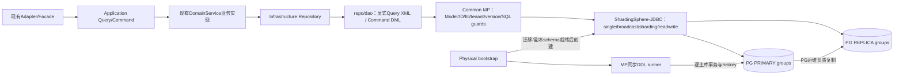

| Module/component | Capability and data owned | Inputs/outputs | Allowed dependencies | Forbidden responsibility | Requirements |
| --- | --- | --- | --- | --- | --- |
| Application/DomainService | 业务校验、业务状态、Command事务 | 现有领域参数/返回 | 当前COLA方向；组合Repo | 不继承技术仓储/不注入DAO/不根据表后缀分业务 | REQ-001/002 |
| Repository | 持久化编排/转换、技术API入口 | PO/显式SQL参数 | Common+DAO+Converter | 不决定认证权限、不增加RPC | REQ-008/010 |
| Common MP | 字段/上下文/ID/插件、纯Java路由计算与guard | SqlSession/metadata/policies | MP/JDK/Common ID；不直接依赖SS | 不持有业务表DDL、不管理PG复制集 | REQ-017/019/020/031 |
| 六套bootstrap/SS adapter | 物理拓扑、typed规则验证、路由适配 | 配置→不可变policy→SS | 当前SS5.5.3 API、Common策略 | 不重复一套Snowflake/不按另一套map算路由 | REQ-013/030/031 |
| DDL runner | 应用schema/管理history | manifest+physical target | MP IDdl/PG generator+Spring JDBC | 不迁移replica、不通过SS逻辑连接发DDL | REQ-012/013 |
| PG/部署者 | 复制、故障提升、备份 | PRIMARY/REPLICA端点 | 运维提供已配置实例 | 不假称SS自动建立PG streaming replication | REQ-037 |

### 7.2 High-Level Design

#### 7.2.1 Critical business/control flowchart

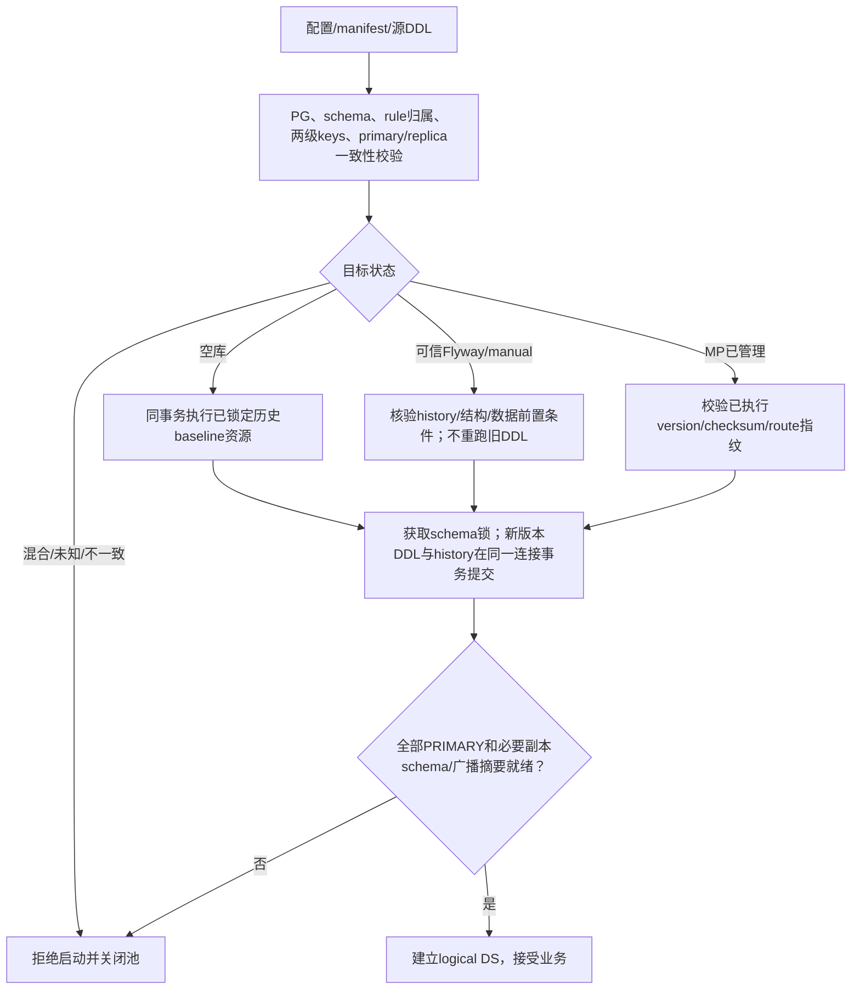

#### 7.2.2 High-level decision and quality matrix

| Concern/use case | Required behavior | Selected mechanism | Failure/degradation behavior | Trade-off | Verification | Requirements |
| --- | --- | --- | --- | --- | --- | --- |
| 租户隔离 | 所有业务表读写有tenant，值可信 | Provider+TenantLine+原字段防伪+SQL检验 | 缺失/漂移/跨tenant拒绝 | 解析开销；忽略表不能绕过EgonModel | TEST-003/006/014 | REQ-019/029 |
| SQL性能 | 可看到真实SQL/节点/计划 | 显式XML+代表性PG EXPLAIN | 无计划不称最优，bounded fanout | 同步维护SQL与索引证据 | TEST-003/015 | REQ-009/033 |
| LOCAL正确性 | 一个事务一个物理写目标 | 复用同一route policy、TX-bound write target holder | 第二写目标/广播DML先拒绝并标rollback-only | 不提供跨库原子 | TEST-009/014 | REQ-015/030 |
| DDL恢复 | 同库DDL/history原子，跨库失败可恢复 | 锁+单连接事务+checksum+启动屏障 | 失败关闭；已提交其他库保留 | 发布窗口，非全局事务 | TEST-011/013 | REQ-012/013 |
| 两级均匀性 | 固定键映射，均匀性可测 | 固定mix64-v1+tenant虚拟槽+secondary桶 | 配置漂移启动拒绝；热点单tenant明确上限 | 更多表元数据/跨桶查询成本 | TEST-014/015 | REQ-031/033/034 |
| PG读一致性 | TX读主；非TX读副本可延迟 | SS PRIMARY策略+显式强读 | 不自动选主/重放不明写 | replica延迟是明确产品语义 | TEST-017 | REQ-037 |

### 7.3 Detailed Design

#### 7.3.1 Repository与CQRS

`EgonColaIRepository<T extends EgonModel<T>> extends IRepository<T>`，`EgonColaRepository<M extends EgonColaMapper<T>,T extends EgonModel<T>> extends AbstractRepository<M,T>`。具体每PO仓储直接继承技术基类，具名@Repository，final+Qualifier注入Mapper/校验/Provider/配置；基类使用抽象collaborator accessors复用当前已验证的Lombok继承方式。

业务Service去技术泛型/继承，纯业务方法仍原位置；DAO/PO/Converter操作迁入或委托Repository。现有业务find/page查询替换为显式Mapper SQL；默认 `getById/list/count/page` 技术API只可在Repository内用于Command前置检查或兼容适配，不能由业务Query选择性绕过显式SQL。QueryChain四入口始终抛错；不引入匿名Wrapper查询重现原来的业务页查询。`CourseDomainServiceImpl.findPage` 改为明确 `CourseDAO.selectActivePage` + `countActive`，排序保留create_time DESC,id ASC。

所有自定义XML按每个实体别名添加active与tenant合同：租户由TenantLine实际注入；语句给出明确别名/绑定参数，测试捕获最终BoundSql；不依赖@TableLogic改写任意XML。JOIN对每个受租户管理表检查tenant和active；LEFT JOIN右表active/tenant应位于ON避免变INNER。XML投影列改deleted_at并加入version。基础显式方法 `selectActiveById/Ids` 和 `deleteVersionedById` 由每个具体XML定义，无自定义SQL Injector。

#### 7.3.2 Critical-path Mermaid swimlane

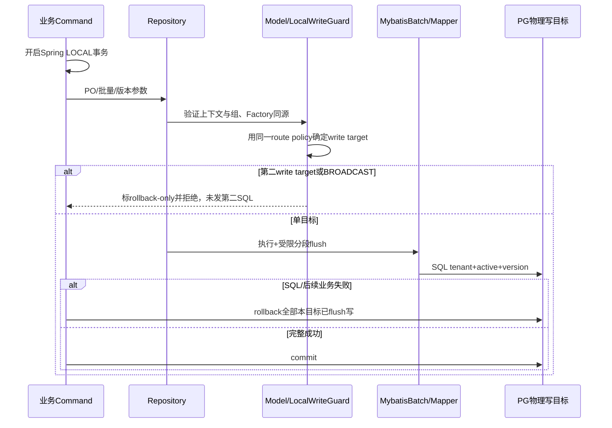

#### 7.3.3 写入/更新/删除/批量

新建PO先校验Insert业务组；MP IdentifierGenerator填id；MetaFill权威填tenant/audit、version=0、deletedAt=null；填充后Persisted组验证。更新entity必须id/version非空非负，tenant不可变，MetaFill不覆盖version，MP乐观锁处理 `updateById`。纯Wrapper无entity写入、无版本全表更新链直接拒绝；Agent按知识库根键的集合删除是§9具名显式SQL例外，保持原领域“删除该库所有活跃文档”意图，version每行递增而无客户端逐行expectedVersion；只允许该statement，必须tenant+root+active。`update(entity,wrapper)`只接受具备id/version的实体，wrapper不得复用或修改技术字段，SQL约束仍检查。

逻辑删除用明确 `deleteVersionedById(@Param("et") T entity)` XML：`SET deleted_at=(CURRENT_TIMESTAMP AT TIME ZONE 'UTC'), version=version+1, update_user_id=#{et.updateUserId}, update_time=#{et.updateTime} WHERE id=#{et.id} AND tenant_id=#{et.tenantId} AND deleted_at IS NULL AND version=#{MP_OPTLOCK_VERSION_ORIGINAL}`。查到/删掉的乐观锁窗口明确；`removeById(id)`在当前Command TX中显式读取当前PO再删，无旧请求版本时只保证读取后竞争检测，不宣称完整终端用户编辑冲突保护。传entity删除按调用方expectedVersion检查；已删/缺行返回false，竞争写影响0同样false，业务Service按其原有错误模型转换，不泄露跨租户存在性。集合by-id删除先有界select，再逐个带版本删除；任何预期存在行删除0导致整个批量回滚，缺失输入ID按当前remove集合语义跳过。

`saveOrUpdate` 和batch变体使用显式PK查询，不是原子UPSERT；查无→insert，查有→调用方version或本次读取version条件update；并发插入由PK/UK报错，不自动重试。无终端版本的现有domain save仅保护Repository读取后竞争，不改变外部DTO追加version；这个限制必须保留在验收说明。

MybatisBatch入口受保护且同源SpringManagedTransaction，batchSize1..1000，集合≤10000；空集合零SQL返回空list。全量业务校验先完成，split仅flush不决定业务提交；第二段或返回后业务失败必须使所有flush段回滚。BatchResult保留statement/parameter/updateCounts语义，不用组数计行；版本更新要求每条明确count=1，-2(SUCCESS_NO_INFO)无法证明锁条件时失败回滚，-3失败；insert的-2可以作为“成功但行数未知”，不伪造计数。不同SQL形状分组与同一个PO重复ID都要覆盖；duplicate非null ID输入拒绝，避免前置查找缓存不一致。

#### 7.3.4 插件与LOCAL Guard

InnerInterceptor顺序仍Guard100→BlockAttack200→DynamicTableName250(显式开)→Tenant300→Optimistic400→DataChangeRecorder420(dev)→IllegalSQL450(dev)→Pagination500。本顺序只约束同阶段回调：Tenant/Pagination在beforeQuery，BlockAttack/IllegalSQL在beforePrepare；新增 `EgonColaLocalWriteGuardInnerInterceptor` 在DML实际prepare前核查路由键与write target，，原始DML scope由下面独立Executor入口guard在任何tenant/version自动改写前验证。对无WHERE/恒真WHERE的UPDATE/DELETE，在TenantLine合成tenant条件之前拒绝；不能仅检查最终SQL出现WHERE。

新增 `J/interceptor/EgonColaOriginalSqlGuardInterceptor.java`，MyBatis拦截点为 `Executor.update(MappedStatement,Object)`，注册顺序必须在MybatisPlusInterceptor之后，使它作为outermost先运行；启动validator检查实际Configuration interceptor列表，测试捕获回调次序。它取得原BoundSql后先检查UPDATE/DELETE范围，不等待OptimisticLocker.beforeUpdate或TenantLine.beforePrepare添加条件。原SQL里的tenant_id/deleted_at/version等系统谓词不算业务范围；UPDATE/DELETE必须有绑定的id等值/有界IN，或明确注册的业务根键集合statement（Agent按knowledge_base_id删除）。id>0、WHERE1=1、只有status/tenant/version均不作为通用写许可。无法证明边界就拒绝，不靠LIKE/字符串包含WHERE判断。

`update(entity,wrapper)`除了entity id/version外，wrapper原始WHERE必须按绑定值约束同一id（IN仅接受与entity唯一id一致的单值）；把id只放entity的SET/对象字段不能当作WHERE。这避免乐观锁自动补version后把同租户同版本所有行一起更新。Model/LOCAL runtime guard在最终SQL再次核查技术谓词/route target；原始scope guard只校验边界，不执行任何SQL、不持久化ThreadLocal原SQL副本。INSERT走原Model/route校验，不要求不存在的WHERE。

防全表不是防批量业务更新，已显式有界id/version列表可写；解析无法证明有界时失败关闭。即便开启SQL日志也不输出bind值。Pagination固定PG、max500/overflow=false；复杂count指定显式countId。DynamicTableName只可用于不属于SS的表，且mapping来自配置白名单；和SINGLE/BROADCAST/SHARDING集合求交非空时启动拒绝，不叠加两套路由。

LOCAL Guard在事务资源中保存 `factory identity + physical PRIMARY group`，通过Spring事务同步afterCompletion清理。SS resolver直接调用现有ShardingNodeMap或新的Common TwoLevelRouteStrategy，不再算另一套hash；解析规则/算法类不是支持清单则启动拒绝。第一次DML绑定target；第二个不同target或多target DML在发SQL前抛 `LOCAL_WRITE_TARGET_MISMATCH`，并标当前DataSourceTransactionManager持有的ConnectionHolder rollback-only，使业务即使捕获异常也不能提交第一笔。无事务单条DML只允许一个target；批量必须外层事务。Raw JDBC绕过被六套architecture gate禁止，DDL runner单独作为受控例外；不宣称能拦截宿主任意外部连接。

#### 7.3.5 Failure semantics, recovery, and observability

| Failure point | Detection | Immediate control flow | Data/transaction state | Retry and idempotency | Caller result | Recovery owner | Verification |
| --- | --- | --- | --- | --- | --- | --- | --- |
| version竞争 | affectedRows=0 | 单条false/业务冲突；期望成功批量抛异常 | 不覆盖胜者 | 禁止自动取新version重放业务 | 原业务错误映射 | Service | TEST-006/007 |
| 批量SQL/租户漂移 | SQLException/PersistenceException/guard | rollback-only+抛因果异常 | 同物理目标全回滚 | 不透明重试；结果未知先查主库 | 无部分成功伪结果 | Service/运维 | TEST-007 |
| 第二物理写目标 | canonical target不一致 | 拒绝第二条SQL，rollback-only | 第一目标不能提交 | 调整业务边界，不退化为XA/补偿 | LOCAL_WRITE_TARGET_MISMATCH | 开发者 | TEST-009 |
| DDL某目标失败 | target/schema/script异常 | 关闭池、停止logical DS创建 | 已提交其他目标保留 | 重启核验checksum后只处理未完成target | 启动失败 | 运维 | TEST-011/013 |
| 未知旧schema/history | structural manifest不匹配 | 零业务DDL | 数据不改 | 返回具体差异，必须提供受控新迁移 | DDL_BASELINE_MISMATCH | 运维 | TEST-013 |
| 广播版本不齐/replica schema滞后 | 目标schema+内容摘要验证 | 截止timeout仍失败则不接业务 | 单库已提交，其他待恢复 | 补齐部署目标；不升主 | DDL_TOPOLOGY_NOT_READY | 运维 | TEST-016/017 |
| replica读取失败 | JDBC异常 | 原异常返回，无副本写或暗中升主 | 无业务写 | 上层可明确选择强读，不能重放未知Command | 既有依赖错误 | 运维 | TEST-017 |

事件字段仅operation、statementId、logicalTable、targetAlias、routeProfile/version、result、duration；DDL含schema/script/version/checksum，不记录credential/完整JDBC URL/邮箱/文档全文/SQL参数。dev DataChangeRecorder也仅输出受控字段摘要，不能打印raw before/after对象。低基数指标记录profile/result，tenant/id不作metric标签；request/trace沿用现有MDC。DDL/route指纹错误每次启动必须可定位且失败关闭。

#### 7.3.6 Conclusion evidence chain

| Conclusion | Repository/user evidence | Constraint or requirement | Design decision | Consequence and trade-off | Verification and acceptance evidence |
| --- | --- | --- | --- | --- | --- |
| 业务与技术仓储分离 | EVD-003/006/017，用户DEC-002 | REQ-001/002/007 | 保留IRepository、业务组合、禁链和显式Query SQL | 同版ABI迁移，不能宣称MP接口本身CQRS | TEST-001/002/003 |
| MP接管必须同步控制history | EVD-008/018/019，DEC-003 | REQ-012/013 | 原bootstrap时序+单连接DDL/history事务+manifest/lock | 维护成本明确，跨库仍逐目标提交 | TEST-011/013 |
| 两级算法不自动替换存量 | EVD-009/ShardingNodeMap，用户按场景选择 | REQ-031/032/034 | LEGACY保留；新profile固定hash/slotmap | 需场景登记/迁移后启用，避免数据失联 | TEST-014/015 |
| 广播只读+LOCAL守卫 | 用户DEC-004与广播新需求 | REQ-015/030 | runtime拒绝广播写，部署逐primary同步 | 广播动态在线更新不在本版本能力内 | TEST-009/016 |

### 7.4 ShardingSphere-JDBC detailed routing design

#### 7.4.1 逻辑表、单表、广播表

每个应用逻辑表恰好属于 SINGLE、BROADCAST、SHARDING 三者之一；TableName始终逻辑名，不在PO写物理后缀。当前master_data的表从 `SHARDING + none/none` 调整为 `!SINGLE` 精确表清单，物理数据不搬迁。现有分片业务表保留tenant-only及实际后缀0/1；当前无真实广播业务需求表，不把users/roles等可变租户业务表改广播。广播能力通过独立路由测试fixture证明；未来业务小型、读多写少、可部署更新的租户字典可声明BROADCAST。

SINGLE不是PG系统catalog：它是由指定physical group承载的一张应用表，也有tenant_id和上下文过滤。元数据/配置表需要强一致读时显式走PRIMARY。禁止 `*.*` 自动装载所有物理表、禁止同时把某actualDataNode加SINGLE、禁止defaultDataSource让未登记表随机落库。PG配置使用明确database/schema/table识别，读取到的SS SingleRule DataNode必须与物理manifest逐项一致，不能只依赖YAML字符串出现表名。

BROADCAST每个参与的physical PRIMARY group拥有相同逻辑表/索引/tenant行内容；PG replicas通过PG复制接收，不由应用重复seed。运行时普通Mapper INSERT/UPDATE/DELETE任何广播表拒绝，使用部署DDL runner逐主库更新，在接流量前验证版本与 `(tenant_id,id,业务字段)` 有序内容摘要一致。表大到摘要/复制成本不可接受或需要高频在线修改时不得选择BROADCAST，选SINGLE/SHARDING并做场景分析。广播不等于绑定表，也不取消tenant条件。

#### 7.4.2 策略profile和两级分片键

| Profile | Database strategy | Table strategy | Required keys | Default usage | Read/write bound |
| --- | --- | --- | --- | --- | --- |
| SINGLE | !SINGLE具体group/schema/table | 无分片算法 | 业务tenant | 当前master_data表 | 一个primary写目标 |
| BROADCAST_READ_ONLY | !BROADCAST | 所有参与group同名副本 | 业务tenant；系统台账不借此广播 | 可选，不迁移当前可变业务表 | runtime只读，部署逐group维护 |
| TENANT_LEGACY | standard tenant_id→现有ShardingNodeMap | standard tenant_id→当前后缀 | 正Long tenant_id | 六套当前分片表，参数/算法字节行为不变 | 精确tenant一个节点；范围tenant拒绝 |
| TENANT_ID_TWO_LEVEL | standard tenant_id→固定tenant slot所绑定group | complex tenant_id,secondaryColumn→slot+secondary bucket | 正Long tenant_id和选定Long业务ID | 可选场景能力；测试用routing_order/order_item | 同tenant可跨同库二级表，DML两键有界；Query受控fanout |

两级不是字符串拼接tenant+ID取一个mod。定义tenantSlots=T（固定虚拟一级桶），secondaryBuckets=B；`t=unsignedRemainder(mix64(tenantId),T)`，`group=tenantSlotMap[t]`；`b=unsignedRemainder(mix64(secondaryId XOR secondarySeed),B)`；物理名为该逻辑表manifest的 `(t,b)` 映射，推荐 `<logic>_t<t>_b<b>`。一级tenant槽选择一个数据库及一级表族，二级业务ID选择该表族子表；同租户所有二级桶仍在一个数据库。这满足LOCAL和两级分表，同时明确单热点租户不能靠本profile跨数据库扩容。

`T/B/slotMap/hashVersion/secondaryColumn`是数据地址，非热更新参数。T默认示例16、B8、两个group（偶/奇slot分别分配），总128张表/逻辑表；每group只声明属于它的64个节点，不能配置数据库与全部表的无效笛卡尔积。生产默认仍LEGACY；新profile必须显式填写T/B/map/maxReadFanout/预计表数。T/B为1..1024的2次幂，单逻辑表总nodes≤4096；达到阈值仍需meta容量验收，不是生产容量承诺。

键不可在原地UPDATE改变。orders以 `(tenant_id,id)` 路由；order_items用 `(tenant_id,order_id)`，不能用item自己的id再次分桶，否则无法绑定。自有LongIdGenerator在insert前产生order ID；不使用SS keyGenerateStrategy生成第二份ID。不支持String二级键、NULL、负数、范围tenant；增加其他类型必须定义稳定编码和迁移版本。

#### 7.4.3 固定hash和均匀性

`mix64-v1`采用固定64位溢出运算（Java long），不会使用Long.hashCode低位直接mod Snowflake，也不使用可变随机salt：

```text
z = key
z = (z XOR (z >>> 30)) * 0xbf58476d1ce4e5b9
z = (z XOR (z >>> 27)) * 0x94d049bb133111eb
z = z XOR (z >>> 31)
```

secondarySeed固定 `0x9e3779b97f4a7c15`，运算视为64bit位模式，最后用 `Long.remainderUnsigned`，不对Long.MIN_VALUE做Math.abs。算法版本、seed与map进入routeFingerprint SHA-256，启动时对比history保存值；不允许改T/B或重新排序group后静默算另一地址。可变权重/自动负载迁移本期不做。

均匀分布区分：slot数量均衡、样本行数均衡、真实存储字节/业务QPS均衡。测试用1..100000租户与100000个固定worker/sequence模式的Snowflake形状ID，T16/B8各桶偏差≤5%，并保存golden vectors；另用90%数据属于一个tenant的热点样本明确证明本profile的数据库热点限制。真实场景须报告tenant倾斜/热点/根实体明细比/二级键相关性；不能用均匀hash掩盖业务倾斜。

#### 7.4.4 SQL、绑定、索引与fanout

- INSERT必须同时拥有tenant和secondary，均在SQL参数可提取处，不能靠一个未进入SQL的ThreadLocal路由；tenant仍由Provider权威填充。缺secondary的通用save/getById在该profile下不猜测其含义，要求专用Repository方法传根ID。
- UPDATE/DELETE必须tenant等值，并有secondary等值或有界IN；禁止路由键修改。允许一个tenant下多个secondary桶，因为仍同一DB；若caller跨tenant或single+shard写导致第二group，LOCAL守卫拒绝。
- SELECT tenant必须精确且单值；secondary等值/IN只路由选中桶，IN去重后不超过batch.maxCollectionSize。secondary缺失或range时允许归并该tenant槽B张表，仅限注册的Query statement且B≤maxReadFanoutTables（示例8）；Command路径不得借该规则放宽写入。tenant区间/多tenantIN一律不开放为通用业务Query。
- ComplexKeysShardingAlgorithm只有值映射，不拥有SQL命令类型；“读可fanout、写必须两键”的区别由MP SQL/route guard在进入SS前校验，算法本身只返回合法availableTargetNames交集，不伪造callback参数。
- 绑定组中的表要求相同T/B/map/hash、相同根ID语义，SQL JOIN中同时相等tenant与rootId；比如order.id=item.order_id而不是order.id=item.id。策略不等价或缺join key时拒绝绑定；用明确跨查询组装替代跨库FK。库内FK仅在能证明父子相同物理节点时采用；所有业务唯一键至少考虑tenant和分片根键，跨分片全局唯一不靠单表UK保证。
- 有界fanout页排序含全局唯一tie-breaker(id)，count只查一次；大offset需场景批准，优先keyset `(created_at,id)`。SQL/索引和PG EXPLAIN按实际节点测，不把SS合并后的正确结果等同于最优。

#### 7.4.5 PostgreSQL读写分离与故障语义

复用当前 `!READWRITE_SPLITTING.dataSourceGroups`：每group恰好一个writeDataSourceName、一个或多个readDataSourceNames；transactionalReadQueryStrategy=PRIMARY，loadBalancer=ROUND_ROBIN。SHARDING节点引用group名而非physical replica名；SINGLE解析出的逻辑group同样进入读写规则；非事务普通SELECT分发副本，DML/事务SELECT/SELECT FOR UPDATE使用PRIMARY。

需要写后读或强一致元数据的Query，在Repository受控范围通过SS `HintManager.setWriteRouteOnly()`（try-with-resources，禁止泄露到线程下一请求）强制主库；不靠@Transactional(readOnly=true)暗示“必走副本”。两套逻辑group配置必须复用相同tenant/secondary map。无replica配置的纯sharding模式直接读写PRIMARY。

PG streaming replication、复制槽/WAL保留、读副本凭据read-only、连接到primary/replica的正确性由部署者建立。启动检查primary `pg_is_in_recovery()=false`；replica为true且read-only；不能只按配置role字符串信任节点。副本schema在配置timeout内未达到所需结构则启动失败；广播表还要求版本/内容摘要达到就绪。本期非事务读允许副本延迟，不能承诺read-your-writes；需要该保证的接口选择强读。副本异常返回依赖错误，不自动将副本提升为主库、不悄悄重放未知结果Command。

#### 7.4.6 场景选择记录、扩容与元数据

新表接入须登记：业务目标/表种类、tenant取值/来源、secondary根ID、修改禁止、规模/tenant倾斜/增长、T/B与总表数、完整actualDataNodes、绑定表语义、唯一约束、主要SQL/强读/fanout、LOCAL写集合、DDL与历史版本、预期迁移窗口、回滚点与实际PG/SS测试。缺任何路由关键项启动拒绝；它是配置验证合同，不要求为尚不存在的业务表创造生产表。

新增数据源、slot移动、改变桶数/算法版本需要单独迁移：停止该表写入→按旧算法读取/新算法目标搬迁与count/checksum/tenant-key核验→切换整个应用同一fingerprint→验证再接流量。没有在线扩缩容或自动再均衡承诺，不启用“直接改变modulus”。本次六套legacy fingerprint固定原配置，不移动既有shard数据；single规则变化只是规则表达变化。MP DDL先处理所有物理对象，再创建SS metadata；运行中不借DynamicTableName偷偷创建未登记物理表。

#### 7.4.7 可验证的组合YAML与props格式

以下是**隔离路由测试**T4/B2的完整规则片段；physical DataSource map由现有bootstrap传入，schema使用测试public。生产family把类包前缀替换为其已列出的确切基础设施包，实际业务表仍按场景选择；此例不把routing_order加入生产manifest。PG的SINGLE节点用 `group.schema.table` 三段，避免MySQL式两段在PG schema语义上的歧义。[SS5.5.3 SingleTableLoadUtils](https://github.com/apache/shardingsphere/blob/5.5.3/kernel/single/core/src/main/java/org/apache/shardingsphere/single/util/SingleTableLoadUtils.java)

```yaml
databaseName: routing_contract
rules:
  - !READWRITE_SPLITTING
    dataSourceGroups:
      master_data:
        writeDataSourceName: master_data_primary
        readDataSourceNames: [master_data_replica_0]
        transactionalReadQueryStrategy: PRIMARY
        loadBalancerName: round_robin
      shard_0:
        writeDataSourceName: shard_0_primary
        readDataSourceNames: [shard_0_replica_0]
        transactionalReadQueryStrategy: PRIMARY
        loadBalancerName: round_robin
      shard_1:
        writeDataSourceName: shard_1_primary
        readDataSourceNames: [shard_1_replica_0]
        transactionalReadQueryStrategy: PRIMARY
        loadBalancerName: round_robin
    loadBalancers:
      round_robin:
        type: ROUND_ROBIN
  - !SINGLE
    tables: [master_data.public.routing_metadata]
  - !BROADCAST
    tables: [routing_dictionary]
  - !SHARDING
    tables:
      routing_order:
        actualDataNodes: shard_0.routing_order_t0_b0,shard_0.routing_order_t0_b1,shard_1.routing_order_t1_b0,shard_1.routing_order_t1_b1,shard_0.routing_order_t2_b0,shard_0.routing_order_t2_b1,shard_1.routing_order_t3_b0,shard_1.routing_order_t3_b1
        databaseStrategy:
          standard:
            shardingColumn: tenant_id
            shardingAlgorithmName: two_level_database
        tableStrategy:
          complex:
            shardingColumns: tenant_id,id
            shardingAlgorithmName: two_level_order_table
        auditStrategy:
          auditorNames: [sharding_key_required_auditor]
          allowHintDisable: false
      routing_order_item:
        actualDataNodes: shard_0.routing_order_item_t0_b0,shard_0.routing_order_item_t0_b1,shard_1.routing_order_item_t1_b0,shard_1.routing_order_item_t1_b1,shard_0.routing_order_item_t2_b0,shard_0.routing_order_item_t2_b1,shard_1.routing_order_item_t3_b0,shard_1.routing_order_item_t3_b1
        databaseStrategy:
          standard:
            shardingColumn: tenant_id
            shardingAlgorithmName: two_level_database
        tableStrategy:
          complex:
            shardingColumns: tenant_id,order_id
            shardingAlgorithmName: two_level_item_table
        auditStrategy:
          auditorNames: [sharding_key_required_auditor]
          allowHintDisable: false
    bindingTables: ["routing_order,routing_order_item"]
    shardingAlgorithms:
      two_level_database:
        type: CLASS_BASED
        props:
          strategy: STANDARD
          algorithmClassName: top.egon.cola.archetype.source.light.infrastructure.config.datasource.TenantDatabaseShardingAlgorithm
          algorithm-version: mix64-v1
          tenant-slot-count: 4
          tenant-slot-map: "0=shard_0,1=shard_1,2=shard_0,3=shard_1"
      two_level_order_table:
        type: CLASS_BASED
        props:
          strategy: COMPLEX
          algorithmClassName: top.egon.cola.archetype.source.light.infrastructure.config.datasource.TenantBusinessTableShardingAlgorithm
          algorithm-version: mix64-v1
          tenant-slot-count: 4
          tenant-slot-map: "0=shard_0,1=shard_1,2=shard_0,3=shard_1"
          secondary-bucket-count: 2
          secondary-column: id
          root-key-name: order
          secondary-seed: "0x9e3779b97f4a7c15"
          max-read-fanout-tables: 2
      two_level_item_table:
        type: CLASS_BASED
        props:
          strategy: COMPLEX
          algorithmClassName: top.egon.cola.archetype.source.light.infrastructure.config.datasource.TenantBusinessTableShardingAlgorithm
          algorithm-version: mix64-v1
          tenant-slot-count: 4
          tenant-slot-map: "0=shard_0,1=shard_1,2=shard_0,3=shard_1"
          secondary-bucket-count: 2
          secondary-column: order_id
          root-key-name: order
          secondary-seed: "0x9e3779b97f4a7c15"
          max-read-fanout-tables: 2
    auditors:
      sharding_key_required_auditor:
        type: DML_SHARDING_CONDITIONS
transaction:
  defaultType: LOCAL
props:
  sql-show: false
  check-table-metadata-enabled: true
```

bindingTables在实际YamlShardingRuleConfiguration中是“绑定组列表”，本例必须序列化为**一个字符串项** `"routing_order,routing_order_item"`，不是两个单表组；见下面静态规范化要求。SS JDBC 5.5.3的精确配置字段是根级 `transaction: {defaultType: LOCAL}`，不是globalRules集合，也不把!TRANSACTION塞进数据库rules。已核查 `YamlJDBCConfiguration.transaction` 和rebuild行为；校验器拒绝XA/BASE/providerType混入。

props解析合同：tenant-slot-map为逗号分隔`非负十进制槽=已配置group`，trim后按整数槽排序，重复槽/未知group/缺槽拒绝；seed用Long.parseUnsignedLong去0x后的16进制形式，固定恰好上述64bit值。数据库算法只需tenant槽参数，table算法补secondary参数，bootstrap在构造Common profile时从同一table rule合并两者并验证tenant参数完全相同；不能令database算法init去读取尚未创建的Spring Bean。SS构造算法时的init为纯配置操作，doSharding不读取可变配置。

标准数据库range重载明确抛UnsupportedOperationException；table complex对于secondary range/缺失先返回tenant槽合法桶候选，由入站MP guard依QUERY/COMMAND和fanout合同决定是否允许；SS callback向纯计算Strategy传ROUTE_CANDIDATES，guard不得以该内部种类放行真实SQL。所有algorithm结果必须与availableTargetNames交集核验，不允许返回未创建节点。SINGLE从聚合后的readwrite group获取物理元数据，source [SingleRule](https://github.com/apache/shardingsphere/blob/5.5.3/kernel/single/core/src/main/java/org/apache/shardingsphere/single/rule/SingleRule.java)已核查；metadata就绪测试仍需真实PG。

## 8. Package Structure and Code File Tree

### 8.1 Current relevant tree

J现有extension/service、model、handler、autoconfigure、interceptor不移动模块；六套source仍由scripts/generate_archetypes.sh生成D定义的产物。§2给出实际路径；本章所有新增路径为设计目标，不声称文件已经存在。

### 8.2 Target tree

```text
J/
  extension/EgonColaIRepository.java + EgonColaRepository.java + EgonColaMapper.java
  model/EgonModel.java + EgonColaIdentifierGenerator.java + validation groups/utils
  ddl/EgonColaPostgreDdlRunner.java + target/manifest/result records
  routing/two-level strategy + immutable routing/query/result/target records + resolver SPI
  interceptor/existing guards + EgonColaLocalWriteGuardInnerInterceptor.java
  autoconfigure/existing configuration/properties/validator
S/<exact family>/<existing infrastructure root>/
  <domain>/service/impl/<existing business service>.java
  <domain>/repo/<PO-name-without-PO>Repository.java
  <domain>/repo/dao/<existing DAO>.java
  <domain>/repo/po/<existing PO>.java
  <domain>/repo/converter/<existing converter>.java
  config/datasource/<existing bootstrap/topology> + two SS algorithm adapters + target resolver
```

以上树仅表示职责；以下表按实际源码生成可唯一定位的文件清单，不用该树的示意符作为实施路径。不新增Repository接口+Impl同义双层；每PO具名一个技术仓储，业务Service可组合多个仓储，同一个PO不复制多个仓储。

### 8.3 Package and file responsibilities

| Operation | Path/package | Symbols | Responsibility | Dependencies | Requirements |
| --- | --- | --- | --- | --- | --- |
| Create | `J/extension/EgonColaIRepository.java` | EgonColaIRepository | IRepository facade/禁链声明 | 现有MP/JDK/Common/Spring，见§6.1 | REQ-001/010/012/015/017/031 |
| Create | `J/extension/EgonColaRepository.java` | EgonColaRepository | 技术仓储guards/批量/版本化删除 | 现有MP/JDK/Common/Spring，见§6.1 | REQ-001/010/012/015/017/031 |
| Create | `J/model/EgonColaIdentifierGenerator.java` | EgonColaIdentifierGenerator | LongIdGenerator Adapter | 现有MP/JDK/Common/Spring，见§6.1 | REQ-001/010/012/015/017/031 |
| Create | `J/ddl/EgonColaPostgreDdlRunner.java` | EgonColaPostgreDdlRunner | 同步物理DDL事务/锁/history执行 | 现有MP/JDK/Common/Spring，见§6.1 | REQ-001/010/012/015/017/031 |
| Create | `J/ddl/EgonColaDdlTargetBO.java` | EgonColaDdlTargetBO | 非Bean的IDdl目标record | 现有MP/JDK/Common/Spring，见§6.1 | REQ-001/010/012/015/017/031 |
| Create | `J/ddl/EgonColaDdlManifestBO.java` | EgonColaDdlManifestBO | 资源/版本/基线/结构清单record | 现有MP/JDK/Common/Spring，见§6.1 | REQ-001/010/012/015/017/031 |
| Create | `J/ddl/EgonColaDdlResult.java` | EgonColaDdlResult | 版本/target/状态/耗时结果record | 现有MP/JDK/Common/Spring，见§6.1 | REQ-001/010/012/015/017/031 |
| Create | `J/routing/EgonColaRoutingProfileBO.java` | EgonColaRoutingProfileBO | 不可变表级路由合同 | 现有MP/JDK/Common/Spring，见§6.1 | REQ-001/010/012/015/017/031 |
| Create | `J/routing/EgonColaRouteQuery.java` | EgonColaRouteQuery | 路由输入record | 现有MP/JDK/Common/Spring，见§6.1 | REQ-001/010/012/015/017/031 |
| Create | `J/routing/EgonColaRouteResult.java` | EgonColaRouteResult | 路由节点结果record | 现有MP/JDK/Common/Spring，见§6.1 | REQ-001/010/012/015/017/031 |
| Create | `J/routing/EgonColaPhysicalTargetBO.java` | EgonColaPhysicalTargetBO | group/schema/table节点record | 现有MP/JDK/Common/Spring，见§6.1 | REQ-001/010/012/015/017/031 |
| Create | `J/routing/EgonColaTwoLevelRouteStrategy.java` | EgonColaTwoLevelRouteStrategy | mix64-v1+两级slot唯一实现 | 现有MP/JDK/Common/Spring，见§6.1 | REQ-001/010/012/015/017/031 |
| Create | `J/routing/EgonColaWriteTargetResolver.java` | EgonColaWriteTargetResolver | plain/SS拓扑解析适配SPI | 现有MP/JDK/Common/Spring，见§6.1 | REQ-001/010/012/015/017/031 |
| Create | `J/interceptor/EgonColaLocalWriteGuardInnerInterceptor.java` | EgonColaLocalWriteGuardInnerInterceptor | LOCAL目标与两键SQL守卫 | 现有MP/JDK/Common/Spring，见§6.1 | REQ-001/010/012/015/017/031 |
| Modify | `J/model/EgonModel.java` | EgonModel | §7/9/10的Model、SQL、注入、事务守卫合同 | 保留已有组件 | REQ-004/006/019/020/022 |
| Modify | `J/model/EgonColaModelValidationGroups.java` | EgonColaModelValidationGroups | §7/9/10的Model、SQL、注入、事务守卫合同 | 保留已有组件 | REQ-004/006/019/020/022 |
| Modify | `J/model/EgonColaModelValidationUtils.java` | EgonColaModelValidationUtils | §7/9/10的Model、SQL、注入、事务守卫合同 | 保留已有组件 | REQ-004/006/019/020/022 |
| Modify | `J/extension/EgonColaMapper.java` | EgonColaMapper | §7/9/10的Model、SQL、注入、事务守卫合同 | 保留已有组件 | REQ-004/006/019/020/022 |
| Modify | `J/handler/EgonColaMetaObjectHandler.java` | EgonColaMetaObjectHandler | §7/9/10的Model、SQL、注入、事务守卫合同 | 保留已有组件 | REQ-004/006/019/020/022 |
| Modify | `J/autoconfigure/EgonColaMybatisPlusAutoConfiguration.java` | EgonColaMybatisPlusAutoConfiguration | §7/9/10的Model、SQL、注入、事务守卫合同 | 保留已有组件 | REQ-004/006/019/020/022 |
| Modify | `J/autoconfigure/EgonColaMybatisPlusProperties.java` | EgonColaMybatisPlusProperties | §7/9/10的Model、SQL、注入、事务守卫合同 | 保留已有组件 | REQ-004/006/019/020/022 |
| Modify | `J/autoconfigure/EgonColaMybatisPlusContractValidator.java` | EgonColaMybatisPlusContractValidator | §7/9/10的Model、SQL、注入、事务守卫合同 | 保留已有组件 | REQ-004/006/019/020/022 |
| Modify | `J/interceptor/EgonColaModelValidationInterceptor.java` | EgonColaModelValidationInterceptor | §7/9/10的Model、SQL、注入、事务守卫合同 | 保留已有组件 | REQ-004/006/019/020/022 |
| Modify | `J/interceptor/EgonColaTenantIdGuardInnerInterceptor.java` | EgonColaTenantIdGuardInnerInterceptor | §7/9/10的Model、SQL、注入、事务守卫合同 | 保留已有组件 | REQ-004/006/019/020/022 |
| Delete | `J/extension/EgonColaIService.java` | EgonColaIService | 不保留旧ABI shim，用户允许不兼容 | 新Repository | REQ-001/003/028 |
| Delete | `J/extension/EgonColaServiceImpl.java` | EgonColaServiceImpl | 不保留旧ABI shim，用户允许不兼容 | 新Repository | REQ-001/003/028 |
| Modify/Create | `M/pom.xml`、`M/lombok.config`、`M/README.md`、`M/README.zh-CN.md` | build/documentation | ID直接依赖、Lombok/Qualifier传播、使用约束 | 现有BOM版本 | REQ-017/026/028 |
| Modify | `egon-cola-archetypes/pom.xml` | dependencyManagement | 新增single-core/broadcast-core的5.5.3管理；不升级其他依赖 | 既有shardingsphere.version | REQ-030/037 |

#### 8.3.1 Source family精确路径矩阵

路径都是仓库相对路径；同一行以分号列出的root分别适用于明确类别，不泛指整个仓库。

| Family | Java infrastructure root | Resources root | DDL new version | Manifest |
| --- | --- | --- | --- | --- |
| light | `egon-cola-archetypes/source-projects/egon-cola-source-light/src/main/java/top/egon/cola/archetype/source/light/infrastructure` | `egon-cola-archetypes/source-projects/egon-cola-source-light/src/main/resources` | `egon-cola-archetypes/source-projects/egon-cola-source-light/src/main/resources/db/egon-mp/V20260912_001__repository_model.sql` | `egon-cola-archetypes/source-projects/egon-cola-source-light/src/main/resources/db/egon-mp/repository-manifest.json` |
| light-open | `egon-cola-archetypes/source-projects/egon-cola-source-light-open/src/main/java/top/egon/cola/archetype/source/lightopen/infrastructure` | `egon-cola-archetypes/source-projects/egon-cola-source-light-open/src/main/resources` | `egon-cola-archetypes/source-projects/egon-cola-source-light-open/src/main/resources/db/egon-mp/V20260912_001__repository_model.sql` | `egon-cola-archetypes/source-projects/egon-cola-source-light-open/src/main/resources/db/egon-mp/repository-manifest.json` |
| service | `egon-cola-archetypes/source-projects/egon-cola-source-service/egon-cola-source-service-infrastructure/src/main/java/top/egon/cola/archetype/source/service/infrastructure` | `egon-cola-archetypes/source-projects/egon-cola-source-service/egon-cola-source-service-infrastructure/src/main/resources` | `egon-cola-archetypes/source-projects/egon-cola-source-service/egon-cola-source-service-infrastructure/src/main/resources/db/egon-mp/V20260912_001__repository_model.sql` | `egon-cola-archetypes/source-projects/egon-cola-source-service/egon-cola-source-service-infrastructure/src/main/resources/db/egon-mp/repository-manifest.json` |
| service-open | `egon-cola-archetypes/source-projects/egon-cola-source-service-open/egon-cola-source-service-open-infrastructure/src/main/java/top/egon/cola/archetype/source/serviceopen/infrastructure` | `egon-cola-archetypes/source-projects/egon-cola-source-service-open/egon-cola-source-service-open-infrastructure/src/main/resources` | `egon-cola-archetypes/source-projects/egon-cola-source-service-open/egon-cola-source-service-open-infrastructure/src/main/resources/db/egon-mp/V20260912_001__repository_model.sql` | `egon-cola-archetypes/source-projects/egon-cola-source-service-open/egon-cola-source-service-open-infrastructure/src/main/resources/db/egon-mp/repository-manifest.json` |
| web | `egon-cola-archetypes/source-projects/egon-cola-source-web/egon-cola-source-web-infrastructure/src/main/java/top/egon/cola/archetype/source/web/infrastructure` | `egon-cola-archetypes/source-projects/egon-cola-source-web/egon-cola-source-web-infrastructure/src/main/resources` | `egon-cola-archetypes/source-projects/egon-cola-source-web/egon-cola-source-web-infrastructure/src/main/resources/db/egon-mp/V20260912_001__repository_model.sql` | `egon-cola-archetypes/source-projects/egon-cola-source-web/egon-cola-source-web-infrastructure/src/main/resources/db/egon-mp/repository-manifest.json` |
| web-open | `egon-cola-archetypes/source-projects/egon-cola-source-web-open/egon-cola-source-web-open-infrastructure/src/main/java/top/egon/cola/archetype/source/webopen/infrastructure` | `egon-cola-archetypes/source-projects/egon-cola-source-web-open/egon-cola-source-web-open-infrastructure/src/main/resources` | `egon-cola-archetypes/source-projects/egon-cola-source-web-open/egon-cola-source-web-open-infrastructure/src/main/resources/db/egon-mp/V20260912_001__repository_model.sql` | `egon-cola-archetypes/source-projects/egon-cola-source-web-open/egon-cola-source-web-open-infrastructure/src/main/resources/db/egon-mp/repository-manifest.json` |
| agent | `egon-cola-archetypes/source-projects/egon-cola-source-agent/egon-cola-source-agent-infrastructure/src/main/java/top/egon/cola/archetype/source/agent/infrastructure` | `egon-cola-archetypes/source-projects/egon-cola-source-agent/egon-cola-source-agent-infrastructure/src/main/resources` | `egon-cola-archetypes/source-projects/egon-cola-source-agent/egon-cola-source-agent-infrastructure/src/main/resources/db/migration/V20260912_001__egon_model_repository.sql` | `不新增MP管理manifest；保留Agent Flyway` |

每个六套应用只新增 **V20260912_001** 一个业务迁移版本；同一SQL根据可信runner设置的 `egon_migration.role` 执行master-data或shard部分，而不是增加第二个Flyway/MP版本。manifest含角色选择、旧资源和checksum，不是第二个数据库迁移版本。Agent同样只新增一个纠正版本，继续原Flyway流程；避免干扰Outbox/向量初始化。

| Operation | Exact source path | Target/responsibility | Requirements |
| --- | --- | --- | --- |
| Modify | `egon-cola-archetypes/source-projects/egon-cola-source-light/src/main/java/top/egon/cola/archetype/source/light/infrastructure/config/datasource/ShardingDataSourceBootstrapper.java` | DDL接管/typed配置、规则分类与数据源角色/就绪守卫 | REQ-012/013/030/037 |
| Modify | `egon-cola-archetypes/source-projects/egon-cola-source-light/src/main/java/top/egon/cola/archetype/source/light/infrastructure/config/datasource/ShardingDataSourceProperties.java` | DDL接管/typed配置、规则分类与数据源角色/就绪守卫 | REQ-012/013/030/037 |
| Modify | `egon-cola-archetypes/source-projects/egon-cola-source-light/src/main/java/top/egon/cola/archetype/source/light/infrastructure/config/datasource/ShardingDataSourcePropertiesLoader.java` | DDL接管/typed配置、规则分类与数据源角色/就绪守卫 | REQ-012/013/030/037 |
| Modify | `egon-cola-archetypes/source-projects/egon-cola-source-light/src/main/java/top/egon/cola/archetype/source/light/infrastructure/config/datasource/ShardingTopologyValidator.java` | DDL接管/typed配置、规则分类与数据源角色/就绪守卫 | REQ-012/013/030/037 |
| Modify | `egon-cola-archetypes/source-projects/egon-cola-source-light/src/main/java/top/egon/cola/archetype/source/light/infrastructure/config/datasource/ShardingSphereDataSourceConfiguration.java` | DDL接管/typed配置、规则分类与数据源角色/就绪守卫 | REQ-012/013/030/037 |
| Delete | `egon-cola-archetypes/source-projects/egon-cola-source-light/src/main/java/top/egon/cola/archetype/source/light/infrastructure/config/datasource/PhysicalDataSourceFlywayMigrator.java` | 六套不再用Flyway runtime迁移 | REQ-012 |
| Create | `egon-cola-archetypes/source-projects/egon-cola-source-light/src/main/java/top/egon/cola/archetype/source/light/infrastructure/config/datasource/TenantDatabaseShardingAlgorithm.java` | SS标准/复合SPI或LOCAL resolver薄适配，委托Common策略 | REQ-015/031/035 |
| Create | `egon-cola-archetypes/source-projects/egon-cola-source-light/src/main/java/top/egon/cola/archetype/source/light/infrastructure/config/datasource/TenantBusinessTableShardingAlgorithm.java` | SS标准/复合SPI或LOCAL resolver薄适配，委托Common策略 | REQ-015/031/035 |
| Create | `egon-cola-archetypes/source-projects/egon-cola-source-light/src/main/java/top/egon/cola/archetype/source/light/infrastructure/config/datasource/ShardingWriteTargetResolver.java` | SS标准/复合SPI或LOCAL resolver薄适配，委托Common策略 | REQ-015/031/035 |
| Modify | `egon-cola-archetypes/source-projects/egon-cola-source-light/src/main/java/top/egon/cola/archetype/source/light/domain/teaching/service/CourseDomainService.java` | 去P/EgonModel/IService泛型；已声明业务方法不变 | REQ-001/002 |
| Modify | `egon-cola-archetypes/source-projects/egon-cola-source-light/src/main/java/top/egon/cola/archetype/source/light/domain/teaching/service/SchoolClassDomainService.java` | 去P/EgonModel/IService泛型；已声明业务方法不变 | REQ-001/002 |
| Modify | `egon-cola-archetypes/source-projects/egon-cola-source-light/src/main/java/top/egon/cola/archetype/source/light/domain/user/service/PermissionDomainService.java` | 去P/EgonModel/IService泛型；已声明业务方法不变 | REQ-001/002 |
| Modify | `egon-cola-archetypes/source-projects/egon-cola-source-light/src/main/java/top/egon/cola/archetype/source/light/domain/user/service/RoleDomainService.java` | 去P/EgonModel/IService泛型；已声明业务方法不变 | REQ-001/002 |
| Modify | `egon-cola-archetypes/source-projects/egon-cola-source-light/src/main/java/top/egon/cola/archetype/source/light/domain/user/service/UserDomainService.java` | 去P/EgonModel/IService泛型；已声明业务方法不变 | REQ-001/002 |
| Modify | `egon-cola-archetypes/source-projects/egon-cola-source-light/src/main/java/top/egon/cola/archetype/source/light/infrastructure/teaching/service/impl/CourseDomainServiceImpl.java` | 移除技术父类/DAO注入；组合下列Repository，业务规则/错误不变 | REQ-002/008 |
| Modify | `egon-cola-archetypes/source-projects/egon-cola-source-light/src/main/java/top/egon/cola/archetype/source/light/infrastructure/teaching/service/impl/SchoolClassDomainServiceImpl.java` | 移除技术父类/DAO注入；组合下列Repository，业务规则/错误不变 | REQ-002/008 |
| Modify | `egon-cola-archetypes/source-projects/egon-cola-source-light/src/main/java/top/egon/cola/archetype/source/light/infrastructure/user/service/impl/PermissionDomainServiceImpl.java` | 移除技术父类/DAO注入；组合下列Repository，业务规则/错误不变 | REQ-002/008 |
| Modify | `egon-cola-archetypes/source-projects/egon-cola-source-light/src/main/java/top/egon/cola/archetype/source/light/infrastructure/user/service/impl/RoleDomainServiceImpl.java` | 移除技术父类/DAO注入；组合下列Repository，业务规则/错误不变 | REQ-002/008 |
| Modify | `egon-cola-archetypes/source-projects/egon-cola-source-light/src/main/java/top/egon/cola/archetype/source/light/infrastructure/user/service/impl/UserDomainServiceImpl.java` | 移除技术父类/DAO注入；组合下列Repository，业务规则/错误不变 | REQ-002/008 |
| Modify | `egon-cola-archetypes/source-projects/egon-cola-source-light/src/main/java/top/egon/cola/archetype/source/light/infrastructure/teaching/repo/po/ClassCourseSchedulePO.java` | 继承新deletedAt/version；不shadow公共字段，保留@TableName逻辑表 | REQ-005/020/029 |
| Create | `egon-cola-archetypes/source-projects/egon-cola-source-light/src/main/java/top/egon/cola/archetype/source/light/infrastructure/teaching/repo/ClassCourseScheduleRepository.java` | 该PO唯一具名Repository，组合现有DAO与guards | REQ-002 |
| Modify | `egon-cola-archetypes/source-projects/egon-cola-source-light/src/main/java/top/egon/cola/archetype/source/light/infrastructure/teaching/repo/po/CoursePO.java` | 继承新deletedAt/version；不shadow公共字段，保留@TableName逻辑表 | REQ-005/020/029 |
| Create | `egon-cola-archetypes/source-projects/egon-cola-source-light/src/main/java/top/egon/cola/archetype/source/light/infrastructure/teaching/repo/CourseRepository.java` | 该PO唯一具名Repository，组合现有DAO与guards | REQ-002 |
| Modify | `egon-cola-archetypes/source-projects/egon-cola-source-light/src/main/java/top/egon/cola/archetype/source/light/infrastructure/teaching/repo/po/SchoolClassPO.java` | 继承新deletedAt/version；不shadow公共字段，保留@TableName逻辑表 | REQ-005/020/029 |
| Create | `egon-cola-archetypes/source-projects/egon-cola-source-light/src/main/java/top/egon/cola/archetype/source/light/infrastructure/teaching/repo/SchoolClassRepository.java` | 该PO唯一具名Repository，组合现有DAO与guards | REQ-002 |
| Modify | `egon-cola-archetypes/source-projects/egon-cola-source-light/src/main/java/top/egon/cola/archetype/source/light/infrastructure/user/repo/po/PermissionPO.java` | 继承新deletedAt/version；不shadow公共字段，保留@TableName逻辑表 | REQ-005/020/029 |
| Create | `egon-cola-archetypes/source-projects/egon-cola-source-light/src/main/java/top/egon/cola/archetype/source/light/infrastructure/user/repo/PermissionRepository.java` | 该PO唯一具名Repository，组合现有DAO与guards | REQ-002 |
| Modify | `egon-cola-archetypes/source-projects/egon-cola-source-light/src/main/java/top/egon/cola/archetype/source/light/infrastructure/user/repo/po/RolePO.java` | 继承新deletedAt/version；不shadow公共字段，保留@TableName逻辑表 | REQ-005/020/029 |
| Create | `egon-cola-archetypes/source-projects/egon-cola-source-light/src/main/java/top/egon/cola/archetype/source/light/infrastructure/user/repo/RoleRepository.java` | 该PO唯一具名Repository，组合现有DAO与guards | REQ-002 |
| Modify | `egon-cola-archetypes/source-projects/egon-cola-source-light/src/main/java/top/egon/cola/archetype/source/light/infrastructure/user/repo/po/RolePermissionPO.java` | 继承新deletedAt/version；不shadow公共字段，保留@TableName逻辑表 | REQ-005/020/029 |
| Create | `egon-cola-archetypes/source-projects/egon-cola-source-light/src/main/java/top/egon/cola/archetype/source/light/infrastructure/user/repo/RolePermissionRepository.java` | 该PO唯一具名Repository，组合现有DAO与guards | REQ-002 |
| Modify | `egon-cola-archetypes/source-projects/egon-cola-source-light/src/main/java/top/egon/cola/archetype/source/light/infrastructure/user/repo/po/UserPO.java` | 继承新deletedAt/version；不shadow公共字段，保留@TableName逻辑表 | REQ-005/020/029 |
| Create | `egon-cola-archetypes/source-projects/egon-cola-source-light/src/main/java/top/egon/cola/archetype/source/light/infrastructure/user/repo/UserRepository.java` | 该PO唯一具名Repository，组合现有DAO与guards | REQ-002 |
| Modify | `egon-cola-archetypes/source-projects/egon-cola-source-light/src/main/java/top/egon/cola/archetype/source/light/infrastructure/user/repo/po/UserRolePO.java` | 继承新deletedAt/version；不shadow公共字段，保留@TableName逻辑表 | REQ-005/020/029 |
| Create | `egon-cola-archetypes/source-projects/egon-cola-source-light/src/main/java/top/egon/cola/archetype/source/light/infrastructure/user/repo/UserRoleRepository.java` | 该PO唯一具名Repository，组合现有DAO与guards | REQ-002 |
| Modify | `egon-cola-archetypes/source-projects/egon-cola-source-light/src/main/resources/mybatis/mapper/teaching/ClassCourseScheduleDAO.xml` | 显式active/version投影与条件，基础select/delete bindings | REQ-008/020 |
| Modify | `egon-cola-archetypes/source-projects/egon-cola-source-light/src/main/resources/mybatis/mapper/teaching/CourseDAO.xml` | 显式active/version投影与条件，基础select/delete bindings | REQ-008/020 |
| Modify | `egon-cola-archetypes/source-projects/egon-cola-source-light/src/main/resources/mybatis/mapper/user/PermissionDAO.xml` | 显式active/version投影与条件，基础select/delete bindings | REQ-008/020 |
| Modify | `egon-cola-archetypes/source-projects/egon-cola-source-light/src/main/resources/mybatis/mapper/user/RoleDAO.xml` | 显式active/version投影与条件，基础select/delete bindings | REQ-008/020 |
| Modify | `egon-cola-archetypes/source-projects/egon-cola-source-light/src/main/resources/mybatis/mapper/user/RolePermissionDAO.xml` | 显式active/version投影与条件，基础select/delete bindings | REQ-008/020 |
| Modify | `egon-cola-archetypes/source-projects/egon-cola-source-light/src/main/resources/mybatis/mapper/user/UserDAO.xml` | 显式active/version投影与条件，基础select/delete bindings | REQ-008/020 |
| Modify | `egon-cola-archetypes/source-projects/egon-cola-source-light/src/main/resources/mybatis/mapper/user/UserRoleDAO.xml` | 显式active/version投影与条件，基础select/delete bindings | REQ-008/020 |
| Modify | `egon-cola-archetypes/source-projects/egon-cola-source-light/src/main/resources/datasource/sharding-readwrite.yml` | app.sharding(-readwrite).ddl.targets取代flyway；保留连接环境变量 | REQ-013/037 |
| Modify | `egon-cola-archetypes/source-projects/egon-cola-source-light/src/main/resources/datasource/sharding.yml` | app.sharding(-readwrite).ddl.targets取代flyway；保留连接环境变量 | REQ-013/037 |
| Modify | `egon-cola-archetypes/source-projects/egon-cola-source-light/src/main/resources/sharding/shardingsphere-sharding-readwrite.yml` | 精确SINGLE清单、保留legacy；同源two-level算法支持，PRIMARY read策略 | REQ-030/031/037 |
| Modify | `egon-cola-archetypes/source-projects/egon-cola-source-light/src/main/resources/sharding/shardingsphere-sharding.yml` | 精确SINGLE清单、保留legacy；同源two-level算法支持，PRIMARY read策略 | REQ-030/031/037 |
| Modify | `egon-cola-archetypes/source-projects/egon-cola-source-light-open/src/main/java/top/egon/cola/archetype/source/lightopen/infrastructure/config/datasource/ShardingDataSourceBootstrapper.java` | DDL接管/typed配置、规则分类与数据源角色/就绪守卫 | REQ-012/013/030/037 |
| Modify | `egon-cola-archetypes/source-projects/egon-cola-source-light-open/src/main/java/top/egon/cola/archetype/source/lightopen/infrastructure/config/datasource/ShardingDataSourceProperties.java` | DDL接管/typed配置、规则分类与数据源角色/就绪守卫 | REQ-012/013/030/037 |
| Modify | `egon-cola-archetypes/source-projects/egon-cola-source-light-open/src/main/java/top/egon/cola/archetype/source/lightopen/infrastructure/config/datasource/ShardingDataSourcePropertiesLoader.java` | DDL接管/typed配置、规则分类与数据源角色/就绪守卫 | REQ-012/013/030/037 |
| Modify | `egon-cola-archetypes/source-projects/egon-cola-source-light-open/src/main/java/top/egon/cola/archetype/source/lightopen/infrastructure/config/datasource/ShardingTopologyValidator.java` | DDL接管/typed配置、规则分类与数据源角色/就绪守卫 | REQ-012/013/030/037 |
| Modify | `egon-cola-archetypes/source-projects/egon-cola-source-light-open/src/main/java/top/egon/cola/archetype/source/lightopen/infrastructure/config/datasource/ShardingSphereDataSourceConfiguration.java` | DDL接管/typed配置、规则分类与数据源角色/就绪守卫 | REQ-012/013/030/037 |
| Create | `egon-cola-archetypes/source-projects/egon-cola-source-light-open/src/main/java/top/egon/cola/archetype/source/lightopen/infrastructure/config/datasource/TenantDatabaseShardingAlgorithm.java` | SS标准/复合SPI或LOCAL resolver薄适配，委托Common策略 | REQ-015/031/035 |
| Create | `egon-cola-archetypes/source-projects/egon-cola-source-light-open/src/main/java/top/egon/cola/archetype/source/lightopen/infrastructure/config/datasource/TenantBusinessTableShardingAlgorithm.java` | SS标准/复合SPI或LOCAL resolver薄适配，委托Common策略 | REQ-015/031/035 |
| Create | `egon-cola-archetypes/source-projects/egon-cola-source-light-open/src/main/java/top/egon/cola/archetype/source/lightopen/infrastructure/config/datasource/ShardingWriteTargetResolver.java` | SS标准/复合SPI或LOCAL resolver薄适配，委托Common策略 | REQ-015/031/035 |
| Modify | `egon-cola-archetypes/source-projects/egon-cola-source-light-open/src/main/java/top/egon/cola/archetype/source/lightopen/domain/teaching/service/CourseDomainService.java` | 去P/EgonModel/IService泛型；已声明业务方法不变 | REQ-001/002 |
| Modify | `egon-cola-archetypes/source-projects/egon-cola-source-light-open/src/main/java/top/egon/cola/archetype/source/lightopen/domain/teaching/service/SchoolClassDomainService.java` | 去P/EgonModel/IService泛型；已声明业务方法不变 | REQ-001/002 |
| Modify | `egon-cola-archetypes/source-projects/egon-cola-source-light-open/src/main/java/top/egon/cola/archetype/source/lightopen/domain/user/service/PermissionDomainService.java` | 去P/EgonModel/IService泛型；已声明业务方法不变 | REQ-001/002 |
| Modify | `egon-cola-archetypes/source-projects/egon-cola-source-light-open/src/main/java/top/egon/cola/archetype/source/lightopen/domain/user/service/RoleDomainService.java` | 去P/EgonModel/IService泛型；已声明业务方法不变 | REQ-001/002 |
| Modify | `egon-cola-archetypes/source-projects/egon-cola-source-light-open/src/main/java/top/egon/cola/archetype/source/lightopen/domain/user/service/UserDomainService.java` | 去P/EgonModel/IService泛型；已声明业务方法不变 | REQ-001/002 |
| Modify | `egon-cola-archetypes/source-projects/egon-cola-source-light-open/src/main/java/top/egon/cola/archetype/source/lightopen/infrastructure/teaching/service/impl/CourseDomainServiceImpl.java` | 移除技术父类/DAO注入；组合下列Repository，业务规则/错误不变 | REQ-002/008 |
| Modify | `egon-cola-archetypes/source-projects/egon-cola-source-light-open/src/main/java/top/egon/cola/archetype/source/lightopen/infrastructure/teaching/service/impl/SchoolClassDomainServiceImpl.java` | 移除技术父类/DAO注入；组合下列Repository，业务规则/错误不变 | REQ-002/008 |
| Modify | `egon-cola-archetypes/source-projects/egon-cola-source-light-open/src/main/java/top/egon/cola/archetype/source/lightopen/infrastructure/user/service/impl/PermissionDomainServiceImpl.java` | 移除技术父类/DAO注入；组合下列Repository，业务规则/错误不变 | REQ-002/008 |
| Modify | `egon-cola-archetypes/source-projects/egon-cola-source-light-open/src/main/java/top/egon/cola/archetype/source/lightopen/infrastructure/user/service/impl/RoleDomainServiceImpl.java` | 移除技术父类/DAO注入；组合下列Repository，业务规则/错误不变 | REQ-002/008 |
| Modify | `egon-cola-archetypes/source-projects/egon-cola-source-light-open/src/main/java/top/egon/cola/archetype/source/lightopen/infrastructure/user/service/impl/UserDomainServiceImpl.java` | 移除技术父类/DAO注入；组合下列Repository，业务规则/错误不变 | REQ-002/008 |
| Modify | `egon-cola-archetypes/source-projects/egon-cola-source-light-open/src/main/java/top/egon/cola/archetype/source/lightopen/infrastructure/teaching/repo/po/ClassCourseSchedulePO.java` | 继承新deletedAt/version；不shadow公共字段，保留@TableName逻辑表 | REQ-005/020/029 |
| Create | `egon-cola-archetypes/source-projects/egon-cola-source-light-open/src/main/java/top/egon/cola/archetype/source/lightopen/infrastructure/teaching/repo/ClassCourseScheduleRepository.java` | 该PO唯一具名Repository，组合现有DAO与guards | REQ-002 |
| Modify | `egon-cola-archetypes/source-projects/egon-cola-source-light-open/src/main/java/top/egon/cola/archetype/source/lightopen/infrastructure/teaching/repo/po/CoursePO.java` | 继承新deletedAt/version；不shadow公共字段，保留@TableName逻辑表 | REQ-005/020/029 |
| Create | `egon-cola-archetypes/source-projects/egon-cola-source-light-open/src/main/java/top/egon/cola/archetype/source/lightopen/infrastructure/teaching/repo/CourseRepository.java` | 该PO唯一具名Repository，组合现有DAO与guards | REQ-002 |
| Modify | `egon-cola-archetypes/source-projects/egon-cola-source-light-open/src/main/java/top/egon/cola/archetype/source/lightopen/infrastructure/teaching/repo/po/SchoolClassPO.java` | 继承新deletedAt/version；不shadow公共字段，保留@TableName逻辑表 | REQ-005/020/029 |
| Create | `egon-cola-archetypes/source-projects/egon-cola-source-light-open/src/main/java/top/egon/cola/archetype/source/lightopen/infrastructure/teaching/repo/SchoolClassRepository.java` | 该PO唯一具名Repository，组合现有DAO与guards | REQ-002 |
| Modify | `egon-cola-archetypes/source-projects/egon-cola-source-light-open/src/main/java/top/egon/cola/archetype/source/lightopen/infrastructure/user/repo/po/PermissionPO.java` | 继承新deletedAt/version；不shadow公共字段，保留@TableName逻辑表 | REQ-005/020/029 |
| Create | `egon-cola-archetypes/source-projects/egon-cola-source-light-open/src/main/java/top/egon/cola/archetype/source/lightopen/infrastructure/user/repo/PermissionRepository.java` | 该PO唯一具名Repository，组合现有DAO与guards | REQ-002 |
| Modify | `egon-cola-archetypes/source-projects/egon-cola-source-light-open/src/main/java/top/egon/cola/archetype/source/lightopen/infrastructure/user/repo/po/RolePO.java` | 继承新deletedAt/version；不shadow公共字段，保留@TableName逻辑表 | REQ-005/020/029 |
| Create | `egon-cola-archetypes/source-projects/egon-cola-source-light-open/src/main/java/top/egon/cola/archetype/source/lightopen/infrastructure/user/repo/RoleRepository.java` | 该PO唯一具名Repository，组合现有DAO与guards | REQ-002 |
| Modify | `egon-cola-archetypes/source-projects/egon-cola-source-light-open/src/main/java/top/egon/cola/archetype/source/lightopen/infrastructure/user/repo/po/RolePermissionPO.java` | 继承新deletedAt/version；不shadow公共字段，保留@TableName逻辑表 | REQ-005/020/029 |
| Create | `egon-cola-archetypes/source-projects/egon-cola-source-light-open/src/main/java/top/egon/cola/archetype/source/lightopen/infrastructure/user/repo/RolePermissionRepository.java` | 该PO唯一具名Repository，组合现有DAO与guards | REQ-002 |
| Modify | `egon-cola-archetypes/source-projects/egon-cola-source-light-open/src/main/java/top/egon/cola/archetype/source/lightopen/infrastructure/user/repo/po/UserPO.java` | 继承新deletedAt/version；不shadow公共字段，保留@TableName逻辑表 | REQ-005/020/029 |
| Create | `egon-cola-archetypes/source-projects/egon-cola-source-light-open/src/main/java/top/egon/cola/archetype/source/lightopen/infrastructure/user/repo/UserRepository.java` | 该PO唯一具名Repository，组合现有DAO与guards | REQ-002 |
| Modify | `egon-cola-archetypes/source-projects/egon-cola-source-light-open/src/main/java/top/egon/cola/archetype/source/lightopen/infrastructure/user/repo/po/UserRolePO.java` | 继承新deletedAt/version；不shadow公共字段，保留@TableName逻辑表 | REQ-005/020/029 |
| Create | `egon-cola-archetypes/source-projects/egon-cola-source-light-open/src/main/java/top/egon/cola/archetype/source/lightopen/infrastructure/user/repo/UserRoleRepository.java` | 该PO唯一具名Repository，组合现有DAO与guards | REQ-002 |
| Modify | `egon-cola-archetypes/source-projects/egon-cola-source-light-open/src/main/resources/mybatis/mapper/teaching/ClassCourseScheduleDAO.xml` | 显式active/version投影与条件，基础select/delete bindings | REQ-008/020 |
| Modify | `egon-cola-archetypes/source-projects/egon-cola-source-light-open/src/main/resources/mybatis/mapper/teaching/CourseDAO.xml` | 显式active/version投影与条件，基础select/delete bindings | REQ-008/020 |
| Modify | `egon-cola-archetypes/source-projects/egon-cola-source-light-open/src/main/resources/mybatis/mapper/teaching/SchoolClassDAO.xml` | 显式active/version投影与条件，基础select/delete bindings | REQ-008/020 |
| Modify | `egon-cola-archetypes/source-projects/egon-cola-source-light-open/src/main/resources/mybatis/mapper/user/PermissionDAO.xml` | 显式active/version投影与条件，基础select/delete bindings | REQ-008/020 |
| Modify | `egon-cola-archetypes/source-projects/egon-cola-source-light-open/src/main/resources/mybatis/mapper/user/RoleDAO.xml` | 显式active/version投影与条件，基础select/delete bindings | REQ-008/020 |
| Modify | `egon-cola-archetypes/source-projects/egon-cola-source-light-open/src/main/resources/mybatis/mapper/user/RolePermissionDAO.xml` | 显式active/version投影与条件，基础select/delete bindings | REQ-008/020 |
| Modify | `egon-cola-archetypes/source-projects/egon-cola-source-light-open/src/main/resources/mybatis/mapper/user/UserDAO.xml` | 显式active/version投影与条件，基础select/delete bindings | REQ-008/020 |
| Modify | `egon-cola-archetypes/source-projects/egon-cola-source-light-open/src/main/resources/mybatis/mapper/user/UserRoleDAO.xml` | 显式active/version投影与条件，基础select/delete bindings | REQ-008/020 |
| Modify | `egon-cola-archetypes/source-projects/egon-cola-source-light-open/src/main/resources/datasource/sharding-readwrite.yml` | app.sharding(-readwrite).ddl.targets取代flyway；保留连接环境变量 | REQ-013/037 |
| Modify | `egon-cola-archetypes/source-projects/egon-cola-source-light-open/src/main/resources/datasource/sharding.yml` | app.sharding(-readwrite).ddl.targets取代flyway；保留连接环境变量 | REQ-013/037 |
| Modify | `egon-cola-archetypes/source-projects/egon-cola-source-light-open/src/main/resources/sharding/shardingsphere-sharding-readwrite.yml` | 精确SINGLE清单、保留legacy；同源two-level算法支持，PRIMARY read策略 | REQ-030/031/037 |
| Modify | `egon-cola-archetypes/source-projects/egon-cola-source-light-open/src/main/resources/sharding/shardingsphere-sharding.yml` | 精确SINGLE清单、保留legacy；同源two-level算法支持，PRIMARY read策略 | REQ-030/031/037 |
| Modify | `egon-cola-archetypes/source-projects/egon-cola-source-service/egon-cola-source-service-infrastructure/src/main/java/top/egon/cola/archetype/source/service/infrastructure/config/datasource/ShardingDataSourceBootstrapper.java` | DDL接管/typed配置、规则分类与数据源角色/就绪守卫 | REQ-012/013/030/037 |
| Modify | `egon-cola-archetypes/source-projects/egon-cola-source-service/egon-cola-source-service-infrastructure/src/main/java/top/egon/cola/archetype/source/service/infrastructure/config/datasource/ShardingDataSourceProperties.java` | DDL接管/typed配置、规则分类与数据源角色/就绪守卫 | REQ-012/013/030/037 |
| Modify | `egon-cola-archetypes/source-projects/egon-cola-source-service/egon-cola-source-service-infrastructure/src/main/java/top/egon/cola/archetype/source/service/infrastructure/config/datasource/ShardingDataSourcePropertiesLoader.java` | DDL接管/typed配置、规则分类与数据源角色/就绪守卫 | REQ-012/013/030/037 |
| Modify | `egon-cola-archetypes/source-projects/egon-cola-source-service/egon-cola-source-service-infrastructure/src/main/java/top/egon/cola/archetype/source/service/infrastructure/config/datasource/ShardingTopologyValidator.java` | DDL接管/typed配置、规则分类与数据源角色/就绪守卫 | REQ-012/013/030/037 |
| Modify | `egon-cola-archetypes/source-projects/egon-cola-source-service/egon-cola-source-service-infrastructure/src/main/java/top/egon/cola/archetype/source/service/infrastructure/config/datasource/ShardingSphereDataSourceConfiguration.java` | DDL接管/typed配置、规则分类与数据源角色/就绪守卫 | REQ-012/013/030/037 |
| Delete | `egon-cola-archetypes/source-projects/egon-cola-source-service/egon-cola-source-service-infrastructure/src/main/java/top/egon/cola/archetype/source/service/infrastructure/config/datasource/PhysicalDataSourceFlywayMigrator.java` | 六套不再用Flyway runtime迁移 | REQ-012 |
| Create | `egon-cola-archetypes/source-projects/egon-cola-source-service/egon-cola-source-service-infrastructure/src/main/java/top/egon/cola/archetype/source/service/infrastructure/config/datasource/TenantDatabaseShardingAlgorithm.java` | SS标准/复合SPI或LOCAL resolver薄适配，委托Common策略 | REQ-015/031/035 |
| Create | `egon-cola-archetypes/source-projects/egon-cola-source-service/egon-cola-source-service-infrastructure/src/main/java/top/egon/cola/archetype/source/service/infrastructure/config/datasource/TenantBusinessTableShardingAlgorithm.java` | SS标准/复合SPI或LOCAL resolver薄适配，委托Common策略 | REQ-015/031/035 |
| Create | `egon-cola-archetypes/source-projects/egon-cola-source-service/egon-cola-source-service-infrastructure/src/main/java/top/egon/cola/archetype/source/service/infrastructure/config/datasource/ShardingWriteTargetResolver.java` | SS标准/复合SPI或LOCAL resolver薄适配，委托Common策略 | REQ-015/031/035 |
| Modify | `egon-cola-archetypes/source-projects/egon-cola-source-service/egon-cola-source-service-domain/src/main/java/top/egon/cola/archetype/source/service/domain/course/service/CourseDomainService.java` | 去P/EgonModel/IService泛型；已声明业务方法不变 | REQ-001/002 |
| Modify | `egon-cola-archetypes/source-projects/egon-cola-source-service/egon-cola-source-service-domain/src/main/java/top/egon/cola/archetype/source/service/domain/exam/service/ExamDomainService.java` | 去P/EgonModel/IService泛型；已声明业务方法不变 | REQ-001/002 |
| Modify | `egon-cola-archetypes/source-projects/egon-cola-source-service/egon-cola-source-service-domain/src/main/java/top/egon/cola/archetype/source/service/domain/exam/service/ScoreDomainService.java` | 去P/EgonModel/IService泛型；已声明业务方法不变 | REQ-001/002 |
| Modify | `egon-cola-archetypes/source-projects/egon-cola-source-service/egon-cola-source-service-infrastructure/src/main/java/top/egon/cola/archetype/source/service/infrastructure/course/service/impl/CourseDomainServiceImpl.java` | 移除技术父类/DAO注入；组合下列Repository，业务规则/错误不变 | REQ-002/008 |
| Modify | `egon-cola-archetypes/source-projects/egon-cola-source-service/egon-cola-source-service-infrastructure/src/main/java/top/egon/cola/archetype/source/service/infrastructure/exam/service/impl/ExamDomainServiceImpl.java` | 移除技术父类/DAO注入；组合下列Repository，业务规则/错误不变 | REQ-002/008 |
| Modify | `egon-cola-archetypes/source-projects/egon-cola-source-service/egon-cola-source-service-infrastructure/src/main/java/top/egon/cola/archetype/source/service/infrastructure/exam/service/impl/ScoreDomainServiceImpl.java` | 移除技术父类/DAO注入；组合下列Repository，业务规则/错误不变 | REQ-002/008 |
| Modify | `egon-cola-archetypes/source-projects/egon-cola-source-service/egon-cola-source-service-infrastructure/src/main/java/top/egon/cola/archetype/source/service/infrastructure/course/repo/po/CoursePO.java` | 继承新deletedAt/version；不shadow公共字段，保留@TableName逻辑表 | REQ-005/020/029 |
| Create | `egon-cola-archetypes/source-projects/egon-cola-source-service/egon-cola-source-service-infrastructure/src/main/java/top/egon/cola/archetype/source/service/infrastructure/course/repo/CourseRepository.java` | 该PO唯一具名Repository，组合现有DAO与guards | REQ-002 |
| Modify | `egon-cola-archetypes/source-projects/egon-cola-source-service/egon-cola-source-service-infrastructure/src/main/java/top/egon/cola/archetype/source/service/infrastructure/course/repo/po/CourseSchedulePO.java` | 继承新deletedAt/version；不shadow公共字段，保留@TableName逻辑表 | REQ-005/020/029 |
| Create | `egon-cola-archetypes/source-projects/egon-cola-source-service/egon-cola-source-service-infrastructure/src/main/java/top/egon/cola/archetype/source/service/infrastructure/course/repo/CourseScheduleRepository.java` | 该PO唯一具名Repository，组合现有DAO与guards | REQ-002 |
| Modify | `egon-cola-archetypes/source-projects/egon-cola-source-service/egon-cola-source-service-infrastructure/src/main/java/top/egon/cola/archetype/source/service/infrastructure/exam/repo/po/ExamPO.java` | 继承新deletedAt/version；不shadow公共字段，保留@TableName逻辑表 | REQ-005/020/029 |
| Create | `egon-cola-archetypes/source-projects/egon-cola-source-service/egon-cola-source-service-infrastructure/src/main/java/top/egon/cola/archetype/source/service/infrastructure/exam/repo/ExamRepository.java` | 该PO唯一具名Repository，组合现有DAO与guards | REQ-002 |
| Modify | `egon-cola-archetypes/source-projects/egon-cola-source-service/egon-cola-source-service-infrastructure/src/main/java/top/egon/cola/archetype/source/service/infrastructure/exam/repo/po/ExamPaperPO.java` | 继承新deletedAt/version；不shadow公共字段，保留@TableName逻辑表 | REQ-005/020/029 |
| Create | `egon-cola-archetypes/source-projects/egon-cola-source-service/egon-cola-source-service-infrastructure/src/main/java/top/egon/cola/archetype/source/service/infrastructure/exam/repo/ExamPaperRepository.java` | 该PO唯一具名Repository，组合现有DAO与guards | REQ-002 |
| Modify | `egon-cola-archetypes/source-projects/egon-cola-source-service/egon-cola-source-service-infrastructure/src/main/java/top/egon/cola/archetype/source/service/infrastructure/exam/repo/po/ScorePO.java` | 继承新deletedAt/version；不shadow公共字段，保留@TableName逻辑表 | REQ-005/020/029 |
| Create | `egon-cola-archetypes/source-projects/egon-cola-source-service/egon-cola-source-service-infrastructure/src/main/java/top/egon/cola/archetype/source/service/infrastructure/exam/repo/ScoreRepository.java` | 该PO唯一具名Repository，组合现有DAO与guards | REQ-002 |
| Modify | `egon-cola-archetypes/source-projects/egon-cola-source-service/egon-cola-source-service-infrastructure/src/main/resources/mybatis/mapper/course/CourseDAO.xml` | 显式active/version投影与条件，基础select/delete bindings | REQ-008/020 |
| Modify | `egon-cola-archetypes/source-projects/egon-cola-source-service/egon-cola-source-service-infrastructure/src/main/resources/mybatis/mapper/course/CourseScheduleDAO.xml` | 显式active/version投影与条件，基础select/delete bindings | REQ-008/020 |
| Modify | `egon-cola-archetypes/source-projects/egon-cola-source-service/egon-cola-source-service-infrastructure/src/main/resources/mybatis/mapper/exam/ExamDAO.xml` | 显式active/version投影与条件，基础select/delete bindings | REQ-008/020 |
| Modify | `egon-cola-archetypes/source-projects/egon-cola-source-service/egon-cola-source-service-infrastructure/src/main/resources/mybatis/mapper/exam/ExamPaperDAO.xml` | 显式active/version投影与条件，基础select/delete bindings | REQ-008/020 |
| Modify | `egon-cola-archetypes/source-projects/egon-cola-source-service/egon-cola-source-service-infrastructure/src/main/resources/mybatis/mapper/exam/ScoreDAO.xml` | 显式active/version投影与条件，基础select/delete bindings | REQ-008/020 |
| Modify | `egon-cola-archetypes/source-projects/egon-cola-source-service-open/egon-cola-source-service-open-infrastructure/src/main/java/top/egon/cola/archetype/source/serviceopen/infrastructure/config/datasource/ShardingDataSourceBootstrapper.java` | DDL接管/typed配置、规则分类与数据源角色/就绪守卫 | REQ-012/013/030/037 |
| Modify | `egon-cola-archetypes/source-projects/egon-cola-source-service-open/egon-cola-source-service-open-infrastructure/src/main/java/top/egon/cola/archetype/source/serviceopen/infrastructure/config/datasource/ShardingDataSourceProperties.java` | DDL接管/typed配置、规则分类与数据源角色/就绪守卫 | REQ-012/013/030/037 |
| Modify | `egon-cola-archetypes/source-projects/egon-cola-source-service-open/egon-cola-source-service-open-infrastructure/src/main/java/top/egon/cola/archetype/source/serviceopen/infrastructure/config/datasource/ShardingDataSourcePropertiesLoader.java` | DDL接管/typed配置、规则分类与数据源角色/就绪守卫 | REQ-012/013/030/037 |
| Modify | `egon-cola-archetypes/source-projects/egon-cola-source-service-open/egon-cola-source-service-open-infrastructure/src/main/java/top/egon/cola/archetype/source/serviceopen/infrastructure/config/datasource/ShardingTopologyValidator.java` | DDL接管/typed配置、规则分类与数据源角色/就绪守卫 | REQ-012/013/030/037 |
| Modify | `egon-cola-archetypes/source-projects/egon-cola-source-service-open/egon-cola-source-service-open-infrastructure/src/main/java/top/egon/cola/archetype/source/serviceopen/infrastructure/config/datasource/ShardingSphereDataSourceConfiguration.java` | DDL接管/typed配置、规则分类与数据源角色/就绪守卫 | REQ-012/013/030/037 |
| Create | `egon-cola-archetypes/source-projects/egon-cola-source-service-open/egon-cola-source-service-open-infrastructure/src/main/java/top/egon/cola/archetype/source/serviceopen/infrastructure/config/datasource/TenantDatabaseShardingAlgorithm.java` | SS标准/复合SPI或LOCAL resolver薄适配，委托Common策略 | REQ-015/031/035 |
| Create | `egon-cola-archetypes/source-projects/egon-cola-source-service-open/egon-cola-source-service-open-infrastructure/src/main/java/top/egon/cola/archetype/source/serviceopen/infrastructure/config/datasource/TenantBusinessTableShardingAlgorithm.java` | SS标准/复合SPI或LOCAL resolver薄适配，委托Common策略 | REQ-015/031/035 |
| Create | `egon-cola-archetypes/source-projects/egon-cola-source-service-open/egon-cola-source-service-open-infrastructure/src/main/java/top/egon/cola/archetype/source/serviceopen/infrastructure/config/datasource/ShardingWriteTargetResolver.java` | SS标准/复合SPI或LOCAL resolver薄适配，委托Common策略 | REQ-015/031/035 |
| Modify | `egon-cola-archetypes/source-projects/egon-cola-source-service-open/egon-cola-source-service-open-domain/src/main/java/top/egon/cola/archetype/source/serviceopen/domain/course/service/CourseDomainService.java` | 去P/EgonModel/IService泛型；已声明业务方法不变 | REQ-001/002 |
| Modify | `egon-cola-archetypes/source-projects/egon-cola-source-service-open/egon-cola-source-service-open-domain/src/main/java/top/egon/cola/archetype/source/serviceopen/domain/exam/service/ExamDomainService.java` | 去P/EgonModel/IService泛型；已声明业务方法不变 | REQ-001/002 |
| Modify | `egon-cola-archetypes/source-projects/egon-cola-source-service-open/egon-cola-source-service-open-domain/src/main/java/top/egon/cola/archetype/source/serviceopen/domain/exam/service/ScoreDomainService.java` | 去P/EgonModel/IService泛型；已声明业务方法不变 | REQ-001/002 |
| Modify | `egon-cola-archetypes/source-projects/egon-cola-source-service-open/egon-cola-source-service-open-infrastructure/src/main/java/top/egon/cola/archetype/source/serviceopen/infrastructure/course/service/impl/CourseDomainServiceImpl.java` | 移除技术父类/DAO注入；组合下列Repository，业务规则/错误不变 | REQ-002/008 |
| Modify | `egon-cola-archetypes/source-projects/egon-cola-source-service-open/egon-cola-source-service-open-infrastructure/src/main/java/top/egon/cola/archetype/source/serviceopen/infrastructure/exam/service/impl/ExamDomainServiceImpl.java` | 移除技术父类/DAO注入；组合下列Repository，业务规则/错误不变 | REQ-002/008 |
| Modify | `egon-cola-archetypes/source-projects/egon-cola-source-service-open/egon-cola-source-service-open-infrastructure/src/main/java/top/egon/cola/archetype/source/serviceopen/infrastructure/exam/service/impl/ScoreDomainServiceImpl.java` | 移除技术父类/DAO注入；组合下列Repository，业务规则/错误不变 | REQ-002/008 |
| Modify | `egon-cola-archetypes/source-projects/egon-cola-source-service-open/egon-cola-source-service-open-infrastructure/src/main/java/top/egon/cola/archetype/source/serviceopen/infrastructure/course/repo/po/CoursePO.java` | 继承新deletedAt/version；不shadow公共字段，保留@TableName逻辑表 | REQ-005/020/029 |
| Create | `egon-cola-archetypes/source-projects/egon-cola-source-service-open/egon-cola-source-service-open-infrastructure/src/main/java/top/egon/cola/archetype/source/serviceopen/infrastructure/course/repo/CourseRepository.java` | 该PO唯一具名Repository，组合现有DAO与guards | REQ-002 |
| Modify | `egon-cola-archetypes/source-projects/egon-cola-source-service-open/egon-cola-source-service-open-infrastructure/src/main/java/top/egon/cola/archetype/source/serviceopen/infrastructure/course/repo/po/CourseSchedulePO.java` | 继承新deletedAt/version；不shadow公共字段，保留@TableName逻辑表 | REQ-005/020/029 |
| Create | `egon-cola-archetypes/source-projects/egon-cola-source-service-open/egon-cola-source-service-open-infrastructure/src/main/java/top/egon/cola/archetype/source/serviceopen/infrastructure/course/repo/CourseScheduleRepository.java` | 该PO唯一具名Repository，组合现有DAO与guards | REQ-002 |
| Modify | `egon-cola-archetypes/source-projects/egon-cola-source-service-open/egon-cola-source-service-open-infrastructure/src/main/java/top/egon/cola/archetype/source/serviceopen/infrastructure/exam/repo/po/ExamPO.java` | 继承新deletedAt/version；不shadow公共字段，保留@TableName逻辑表 | REQ-005/020/029 |
| Create | `egon-cola-archetypes/source-projects/egon-cola-source-service-open/egon-cola-source-service-open-infrastructure/src/main/java/top/egon/cola/archetype/source/serviceopen/infrastructure/exam/repo/ExamRepository.java` | 该PO唯一具名Repository，组合现有DAO与guards | REQ-002 |
| Modify | `egon-cola-archetypes/source-projects/egon-cola-source-service-open/egon-cola-source-service-open-infrastructure/src/main/java/top/egon/cola/archetype/source/serviceopen/infrastructure/exam/repo/po/ExamPaperPO.java` | 继承新deletedAt/version；不shadow公共字段，保留@TableName逻辑表 | REQ-005/020/029 |
| Create | `egon-cola-archetypes/source-projects/egon-cola-source-service-open/egon-cola-source-service-open-infrastructure/src/main/java/top/egon/cola/archetype/source/serviceopen/infrastructure/exam/repo/ExamPaperRepository.java` | 该PO唯一具名Repository，组合现有DAO与guards | REQ-002 |
| Modify | `egon-cola-archetypes/source-projects/egon-cola-source-service-open/egon-cola-source-service-open-infrastructure/src/main/java/top/egon/cola/archetype/source/serviceopen/infrastructure/exam/repo/po/ScorePO.java` | 继承新deletedAt/version；不shadow公共字段，保留@TableName逻辑表 | REQ-005/020/029 |
| Create | `egon-cola-archetypes/source-projects/egon-cola-source-service-open/egon-cola-source-service-open-infrastructure/src/main/java/top/egon/cola/archetype/source/serviceopen/infrastructure/exam/repo/ScoreRepository.java` | 该PO唯一具名Repository，组合现有DAO与guards | REQ-002 |
| Modify | `egon-cola-archetypes/source-projects/egon-cola-source-service-open/egon-cola-source-service-open-infrastructure/src/main/resources/mybatis/mapper/course/CourseDAO.xml` | 显式active/version投影与条件，基础select/delete bindings | REQ-008/020 |
| Modify | `egon-cola-archetypes/source-projects/egon-cola-source-service-open/egon-cola-source-service-open-infrastructure/src/main/resources/mybatis/mapper/course/CourseScheduleDAO.xml` | 显式active/version投影与条件，基础select/delete bindings | REQ-008/020 |
| Modify | `egon-cola-archetypes/source-projects/egon-cola-source-service-open/egon-cola-source-service-open-infrastructure/src/main/resources/mybatis/mapper/exam/ExamDAO.xml` | 显式active/version投影与条件，基础select/delete bindings | REQ-008/020 |
| Modify | `egon-cola-archetypes/source-projects/egon-cola-source-service-open/egon-cola-source-service-open-infrastructure/src/main/resources/mybatis/mapper/exam/ExamPaperDAO.xml` | 显式active/version投影与条件，基础select/delete bindings | REQ-008/020 |
| Modify | `egon-cola-archetypes/source-projects/egon-cola-source-service-open/egon-cola-source-service-open-infrastructure/src/main/resources/mybatis/mapper/exam/ScoreDAO.xml` | 显式active/version投影与条件，基础select/delete bindings | REQ-008/020 |
| Modify | `egon-cola-archetypes/source-projects/egon-cola-source-web/egon-cola-source-web-infrastructure/src/main/java/top/egon/cola/archetype/source/web/infrastructure/config/datasource/ShardingDataSourceBootstrapper.java` | DDL接管/typed配置、规则分类与数据源角色/就绪守卫 | REQ-012/013/030/037 |
| Modify | `egon-cola-archetypes/source-projects/egon-cola-source-web/egon-cola-source-web-infrastructure/src/main/java/top/egon/cola/archetype/source/web/infrastructure/config/datasource/ShardingDataSourceProperties.java` | DDL接管/typed配置、规则分类与数据源角色/就绪守卫 | REQ-012/013/030/037 |
| Modify | `egon-cola-archetypes/source-projects/egon-cola-source-web/egon-cola-source-web-infrastructure/src/main/java/top/egon/cola/archetype/source/web/infrastructure/config/datasource/ShardingDataSourcePropertiesLoader.java` | DDL接管/typed配置、规则分类与数据源角色/就绪守卫 | REQ-012/013/030/037 |
| Modify | `egon-cola-archetypes/source-projects/egon-cola-source-web/egon-cola-source-web-infrastructure/src/main/java/top/egon/cola/archetype/source/web/infrastructure/config/datasource/ShardingTopologyValidator.java` | DDL接管/typed配置、规则分类与数据源角色/就绪守卫 | REQ-012/013/030/037 |
| Modify | `egon-cola-archetypes/source-projects/egon-cola-source-web/egon-cola-source-web-infrastructure/src/main/java/top/egon/cola/archetype/source/web/infrastructure/config/datasource/ShardingSphereDataSourceConfiguration.java` | DDL接管/typed配置、规则分类与数据源角色/就绪守卫 | REQ-012/013/030/037 |
| Delete | `egon-cola-archetypes/source-projects/egon-cola-source-web/egon-cola-source-web-infrastructure/src/main/java/top/egon/cola/archetype/source/web/infrastructure/config/datasource/PhysicalDataSourceFlywayMigrator.java` | 六套不再用Flyway runtime迁移 | REQ-012 |
| Create | `egon-cola-archetypes/source-projects/egon-cola-source-web/egon-cola-source-web-infrastructure/src/main/java/top/egon/cola/archetype/source/web/infrastructure/config/datasource/TenantDatabaseShardingAlgorithm.java` | SS标准/复合SPI或LOCAL resolver薄适配，委托Common策略 | REQ-015/031/035 |
| Create | `egon-cola-archetypes/source-projects/egon-cola-source-web/egon-cola-source-web-infrastructure/src/main/java/top/egon/cola/archetype/source/web/infrastructure/config/datasource/TenantBusinessTableShardingAlgorithm.java` | SS标准/复合SPI或LOCAL resolver薄适配，委托Common策略 | REQ-015/031/035 |
| Create | `egon-cola-archetypes/source-projects/egon-cola-source-web/egon-cola-source-web-infrastructure/src/main/java/top/egon/cola/archetype/source/web/infrastructure/config/datasource/ShardingWriteTargetResolver.java` | SS标准/复合SPI或LOCAL resolver薄适配，委托Common策略 | REQ-015/031/035 |
| Modify | `egon-cola-archetypes/source-projects/egon-cola-source-web/egon-cola-source-web-domain/src/main/java/top/egon/cola/archetype/source/web/domain/teaching/service/GradeDomainService.java` | 去P/EgonModel/IService泛型；已声明业务方法不变 | REQ-001/002 |
| Modify | `egon-cola-archetypes/source-projects/egon-cola-source-web/egon-cola-source-web-domain/src/main/java/top/egon/cola/archetype/source/web/domain/teaching/service/SchoolClassDomainService.java` | 去P/EgonModel/IService泛型；已声明业务方法不变 | REQ-001/002 |
| Modify | `egon-cola-archetypes/source-projects/egon-cola-source-web/egon-cola-source-web-domain/src/main/java/top/egon/cola/archetype/source/web/domain/user/service/PermissionDomainService.java` | 去P/EgonModel/IService泛型；已声明业务方法不变 | REQ-001/002 |
| Modify | `egon-cola-archetypes/source-projects/egon-cola-source-web/egon-cola-source-web-domain/src/main/java/top/egon/cola/archetype/source/web/domain/user/service/UserDomainService.java` | 去P/EgonModel/IService泛型；已声明业务方法不变 | REQ-001/002 |
| Modify | `egon-cola-archetypes/source-projects/egon-cola-source-web/egon-cola-source-web-infrastructure/src/main/java/top/egon/cola/archetype/source/web/infrastructure/teaching/service/impl/GradeDomainServiceImpl.java` | 移除技术父类/DAO注入；组合下列Repository，业务规则/错误不变 | REQ-002/008 |
| Modify | `egon-cola-archetypes/source-projects/egon-cola-source-web/egon-cola-source-web-infrastructure/src/main/java/top/egon/cola/archetype/source/web/infrastructure/teaching/service/impl/SchoolClassDomainServiceImpl.java` | 移除技术父类/DAO注入；组合下列Repository，业务规则/错误不变 | REQ-002/008 |
| Modify | `egon-cola-archetypes/source-projects/egon-cola-source-web/egon-cola-source-web-infrastructure/src/main/java/top/egon/cola/archetype/source/web/infrastructure/user/service/impl/PermissionDomainServiceImpl.java` | 移除技术父类/DAO注入；组合下列Repository，业务规则/错误不变 | REQ-002/008 |
| Modify | `egon-cola-archetypes/source-projects/egon-cola-source-web/egon-cola-source-web-infrastructure/src/main/java/top/egon/cola/archetype/source/web/infrastructure/user/service/impl/UserDomainServiceImpl.java` | 移除技术父类/DAO注入；组合下列Repository，业务规则/错误不变 | REQ-002/008 |
| Modify | `egon-cola-archetypes/source-projects/egon-cola-source-web/egon-cola-source-web-infrastructure/src/main/java/top/egon/cola/archetype/source/web/infrastructure/teaching/repo/po/GradePO.java` | 继承新deletedAt/version；不shadow公共字段，保留@TableName逻辑表 | REQ-005/020/029 |
| Create | `egon-cola-archetypes/source-projects/egon-cola-source-web/egon-cola-source-web-infrastructure/src/main/java/top/egon/cola/archetype/source/web/infrastructure/teaching/repo/GradeRepository.java` | 该PO唯一具名Repository，组合现有DAO与guards | REQ-002 |
| Modify | `egon-cola-archetypes/source-projects/egon-cola-source-web/egon-cola-source-web-infrastructure/src/main/java/top/egon/cola/archetype/source/web/infrastructure/teaching/repo/po/SchoolClassPO.java` | 继承新deletedAt/version；不shadow公共字段，保留@TableName逻辑表 | REQ-005/020/029 |
| Create | `egon-cola-archetypes/source-projects/egon-cola-source-web/egon-cola-source-web-infrastructure/src/main/java/top/egon/cola/archetype/source/web/infrastructure/teaching/repo/SchoolClassRepository.java` | 该PO唯一具名Repository，组合现有DAO与guards | REQ-002 |
| Modify | `egon-cola-archetypes/source-projects/egon-cola-source-web/egon-cola-source-web-infrastructure/src/main/java/top/egon/cola/archetype/source/web/infrastructure/teaching/repo/po/SchoolClassUserPO.java` | 继承新deletedAt/version；不shadow公共字段，保留@TableName逻辑表 | REQ-005/020/029 |
| Create | `egon-cola-archetypes/source-projects/egon-cola-source-web/egon-cola-source-web-infrastructure/src/main/java/top/egon/cola/archetype/source/web/infrastructure/teaching/repo/SchoolClassUserRepository.java` | 该PO唯一具名Repository，组合现有DAO与guards | REQ-002 |
| Modify | `egon-cola-archetypes/source-projects/egon-cola-source-web/egon-cola-source-web-infrastructure/src/main/java/top/egon/cola/archetype/source/web/infrastructure/user/repo/po/PermissionPO.java` | 继承新deletedAt/version；不shadow公共字段，保留@TableName逻辑表 | REQ-005/020/029 |
| Create | `egon-cola-archetypes/source-projects/egon-cola-source-web/egon-cola-source-web-infrastructure/src/main/java/top/egon/cola/archetype/source/web/infrastructure/user/repo/PermissionRepository.java` | 该PO唯一具名Repository，组合现有DAO与guards | REQ-002 |
| Modify | `egon-cola-archetypes/source-projects/egon-cola-source-web/egon-cola-source-web-infrastructure/src/main/java/top/egon/cola/archetype/source/web/infrastructure/user/repo/po/RolePO.java` | 继承新deletedAt/version；不shadow公共字段，保留@TableName逻辑表 | REQ-005/020/029 |
| Create | `egon-cola-archetypes/source-projects/egon-cola-source-web/egon-cola-source-web-infrastructure/src/main/java/top/egon/cola/archetype/source/web/infrastructure/user/repo/RoleRepository.java` | 该PO唯一具名Repository，组合现有DAO与guards | REQ-002 |
| Modify | `egon-cola-archetypes/source-projects/egon-cola-source-web/egon-cola-source-web-infrastructure/src/main/java/top/egon/cola/archetype/source/web/infrastructure/user/repo/po/RolePermissionPO.java` | 继承新deletedAt/version；不shadow公共字段，保留@TableName逻辑表 | REQ-005/020/029 |
| Create | `egon-cola-archetypes/source-projects/egon-cola-source-web/egon-cola-source-web-infrastructure/src/main/java/top/egon/cola/archetype/source/web/infrastructure/user/repo/RolePermissionRepository.java` | 该PO唯一具名Repository，组合现有DAO与guards | REQ-002 |
| Modify | `egon-cola-archetypes/source-projects/egon-cola-source-web/egon-cola-source-web-infrastructure/src/main/java/top/egon/cola/archetype/source/web/infrastructure/user/repo/po/UserPO.java` | 继承新deletedAt/version；不shadow公共字段，保留@TableName逻辑表 | REQ-005/020/029 |
| Create | `egon-cola-archetypes/source-projects/egon-cola-source-web/egon-cola-source-web-infrastructure/src/main/java/top/egon/cola/archetype/source/web/infrastructure/user/repo/UserRepository.java` | 该PO唯一具名Repository，组合现有DAO与guards | REQ-002 |
| Modify | `egon-cola-archetypes/source-projects/egon-cola-source-web/egon-cola-source-web-infrastructure/src/main/java/top/egon/cola/archetype/source/web/infrastructure/user/repo/po/UserRolePO.java` | 继承新deletedAt/version；不shadow公共字段，保留@TableName逻辑表 | REQ-005/020/029 |
| Create | `egon-cola-archetypes/source-projects/egon-cola-source-web/egon-cola-source-web-infrastructure/src/main/java/top/egon/cola/archetype/source/web/infrastructure/user/repo/UserRoleRepository.java` | 该PO唯一具名Repository，组合现有DAO与guards | REQ-002 |
| Modify | `egon-cola-archetypes/source-projects/egon-cola-source-web/egon-cola-source-web-infrastructure/src/main/resources/mybatis/mapper/teaching/GradeDAO.xml` | 显式active/version投影与条件，基础select/delete bindings | REQ-008/020 |
| Modify | `egon-cola-archetypes/source-projects/egon-cola-source-web/egon-cola-source-web-infrastructure/src/main/resources/mybatis/mapper/teaching/SchoolClassDAO.xml` | 显式active/version投影与条件，基础select/delete bindings | REQ-008/020 |
| Modify | `egon-cola-archetypes/source-projects/egon-cola-source-web/egon-cola-source-web-infrastructure/src/main/resources/mybatis/mapper/teaching/SchoolClassUserDAO.xml` | 显式active/version投影与条件，基础select/delete bindings | REQ-008/020 |
| Modify | `egon-cola-archetypes/source-projects/egon-cola-source-web/egon-cola-source-web-infrastructure/src/main/resources/mybatis/mapper/user/PermissionDAO.xml` | 显式active/version投影与条件，基础select/delete bindings | REQ-008/020 |
| Modify | `egon-cola-archetypes/source-projects/egon-cola-source-web/egon-cola-source-web-infrastructure/src/main/resources/mybatis/mapper/user/RoleDAO.xml` | 显式active/version投影与条件，基础select/delete bindings | REQ-008/020 |
| Modify | `egon-cola-archetypes/source-projects/egon-cola-source-web/egon-cola-source-web-infrastructure/src/main/resources/mybatis/mapper/user/RolePermissionDAO.xml` | 显式active/version投影与条件，基础select/delete bindings | REQ-008/020 |
| Modify | `egon-cola-archetypes/source-projects/egon-cola-source-web/egon-cola-source-web-infrastructure/src/main/resources/mybatis/mapper/user/UserDAO.xml` | 显式active/version投影与条件，基础select/delete bindings | REQ-008/020 |
| Modify | `egon-cola-archetypes/source-projects/egon-cola-source-web/egon-cola-source-web-infrastructure/src/main/resources/mybatis/mapper/user/UserRoleDAO.xml` | 显式active/version投影与条件，基础select/delete bindings | REQ-008/020 |
| Modify | `egon-cola-archetypes/source-projects/egon-cola-source-web-open/egon-cola-source-web-open-infrastructure/src/main/java/top/egon/cola/archetype/source/webopen/infrastructure/config/datasource/ShardingDataSourceBootstrapper.java` | DDL接管/typed配置、规则分类与数据源角色/就绪守卫 | REQ-012/013/030/037 |
| Modify | `egon-cola-archetypes/source-projects/egon-cola-source-web-open/egon-cola-source-web-open-infrastructure/src/main/java/top/egon/cola/archetype/source/webopen/infrastructure/config/datasource/ShardingDataSourceProperties.java` | DDL接管/typed配置、规则分类与数据源角色/就绪守卫 | REQ-012/013/030/037 |
| Modify | `egon-cola-archetypes/source-projects/egon-cola-source-web-open/egon-cola-source-web-open-infrastructure/src/main/java/top/egon/cola/archetype/source/webopen/infrastructure/config/datasource/ShardingDataSourcePropertiesLoader.java` | DDL接管/typed配置、规则分类与数据源角色/就绪守卫 | REQ-012/013/030/037 |
| Modify | `egon-cola-archetypes/source-projects/egon-cola-source-web-open/egon-cola-source-web-open-infrastructure/src/main/java/top/egon/cola/archetype/source/webopen/infrastructure/config/datasource/ShardingTopologyValidator.java` | DDL接管/typed配置、规则分类与数据源角色/就绪守卫 | REQ-012/013/030/037 |
| Modify | `egon-cola-archetypes/source-projects/egon-cola-source-web-open/egon-cola-source-web-open-infrastructure/src/main/java/top/egon/cola/archetype/source/webopen/infrastructure/config/datasource/ShardingSphereDataSourceConfiguration.java` | DDL接管/typed配置、规则分类与数据源角色/就绪守卫 | REQ-012/013/030/037 |
| Create | `egon-cola-archetypes/source-projects/egon-cola-source-web-open/egon-cola-source-web-open-infrastructure/src/main/java/top/egon/cola/archetype/source/webopen/infrastructure/config/datasource/TenantDatabaseShardingAlgorithm.java` | SS标准/复合SPI或LOCAL resolver薄适配，委托Common策略 | REQ-015/031/035 |
| Create | `egon-cola-archetypes/source-projects/egon-cola-source-web-open/egon-cola-source-web-open-infrastructure/src/main/java/top/egon/cola/archetype/source/webopen/infrastructure/config/datasource/TenantBusinessTableShardingAlgorithm.java` | SS标准/复合SPI或LOCAL resolver薄适配，委托Common策略 | REQ-015/031/035 |
| Create | `egon-cola-archetypes/source-projects/egon-cola-source-web-open/egon-cola-source-web-open-infrastructure/src/main/java/top/egon/cola/archetype/source/webopen/infrastructure/config/datasource/ShardingWriteTargetResolver.java` | SS标准/复合SPI或LOCAL resolver薄适配，委托Common策略 | REQ-015/031/035 |
| Modify | `egon-cola-archetypes/source-projects/egon-cola-source-web-open/egon-cola-source-web-open-domain/src/main/java/top/egon/cola/archetype/source/webopen/domain/teaching/service/GradeDomainService.java` | 去P/EgonModel/IService泛型；已声明业务方法不变 | REQ-001/002 |
| Modify | `egon-cola-archetypes/source-projects/egon-cola-source-web-open/egon-cola-source-web-open-domain/src/main/java/top/egon/cola/archetype/source/webopen/domain/teaching/service/SchoolClassDomainService.java` | 去P/EgonModel/IService泛型；已声明业务方法不变 | REQ-001/002 |
| Modify | `egon-cola-archetypes/source-projects/egon-cola-source-web-open/egon-cola-source-web-open-domain/src/main/java/top/egon/cola/archetype/source/webopen/domain/user/service/PermissionDomainService.java` | 去P/EgonModel/IService泛型；已声明业务方法不变 | REQ-001/002 |
| Modify | `egon-cola-archetypes/source-projects/egon-cola-source-web-open/egon-cola-source-web-open-domain/src/main/java/top/egon/cola/archetype/source/webopen/domain/user/service/UserDomainService.java` | 去P/EgonModel/IService泛型；已声明业务方法不变 | REQ-001/002 |
| Modify | `egon-cola-archetypes/source-projects/egon-cola-source-web-open/egon-cola-source-web-open-infrastructure/src/main/java/top/egon/cola/archetype/source/webopen/infrastructure/teaching/service/impl/GradeDomainServiceImpl.java` | 移除技术父类/DAO注入；组合下列Repository，业务规则/错误不变 | REQ-002/008 |
| Modify | `egon-cola-archetypes/source-projects/egon-cola-source-web-open/egon-cola-source-web-open-infrastructure/src/main/java/top/egon/cola/archetype/source/webopen/infrastructure/teaching/service/impl/SchoolClassDomainServiceImpl.java` | 移除技术父类/DAO注入；组合下列Repository，业务规则/错误不变 | REQ-002/008 |
| Modify | `egon-cola-archetypes/source-projects/egon-cola-source-web-open/egon-cola-source-web-open-infrastructure/src/main/java/top/egon/cola/archetype/source/webopen/infrastructure/user/service/impl/PermissionDomainServiceImpl.java` | 移除技术父类/DAO注入；组合下列Repository，业务规则/错误不变 | REQ-002/008 |
| Modify | `egon-cola-archetypes/source-projects/egon-cola-source-web-open/egon-cola-source-web-open-infrastructure/src/main/java/top/egon/cola/archetype/source/webopen/infrastructure/user/service/impl/UserDomainServiceImpl.java` | 移除技术父类/DAO注入；组合下列Repository，业务规则/错误不变 | REQ-002/008 |
| Modify | `egon-cola-archetypes/source-projects/egon-cola-source-web-open/egon-cola-source-web-open-infrastructure/src/main/java/top/egon/cola/archetype/source/webopen/infrastructure/teaching/repo/po/GradePO.java` | 继承新deletedAt/version；不shadow公共字段，保留@TableName逻辑表 | REQ-005/020/029 |
| Create | `egon-cola-archetypes/source-projects/egon-cola-source-web-open/egon-cola-source-web-open-infrastructure/src/main/java/top/egon/cola/archetype/source/webopen/infrastructure/teaching/repo/GradeRepository.java` | 该PO唯一具名Repository，组合现有DAO与guards | REQ-002 |
| Modify | `egon-cola-archetypes/source-projects/egon-cola-source-web-open/egon-cola-source-web-open-infrastructure/src/main/java/top/egon/cola/archetype/source/webopen/infrastructure/teaching/repo/po/SchoolClassPO.java` | 继承新deletedAt/version；不shadow公共字段，保留@TableName逻辑表 | REQ-005/020/029 |
| Create | `egon-cola-archetypes/source-projects/egon-cola-source-web-open/egon-cola-source-web-open-infrastructure/src/main/java/top/egon/cola/archetype/source/webopen/infrastructure/teaching/repo/SchoolClassRepository.java` | 该PO唯一具名Repository，组合现有DAO与guards | REQ-002 |
| Modify | `egon-cola-archetypes/source-projects/egon-cola-source-web-open/egon-cola-source-web-open-infrastructure/src/main/java/top/egon/cola/archetype/source/webopen/infrastructure/teaching/repo/po/SchoolClassUserPO.java` | 继承新deletedAt/version；不shadow公共字段，保留@TableName逻辑表 | REQ-005/020/029 |
| Create | `egon-cola-archetypes/source-projects/egon-cola-source-web-open/egon-cola-source-web-open-infrastructure/src/main/java/top/egon/cola/archetype/source/webopen/infrastructure/teaching/repo/SchoolClassUserRepository.java` | 该PO唯一具名Repository，组合现有DAO与guards | REQ-002 |
| Modify | `egon-cola-archetypes/source-projects/egon-cola-source-web-open/egon-cola-source-web-open-infrastructure/src/main/java/top/egon/cola/archetype/source/webopen/infrastructure/user/repo/po/PermissionPO.java` | 继承新deletedAt/version；不shadow公共字段，保留@TableName逻辑表 | REQ-005/020/029 |
| Create | `egon-cola-archetypes/source-projects/egon-cola-source-web-open/egon-cola-source-web-open-infrastructure/src/main/java/top/egon/cola/archetype/source/webopen/infrastructure/user/repo/PermissionRepository.java` | 该PO唯一具名Repository，组合现有DAO与guards | REQ-002 |
| Modify | `egon-cola-archetypes/source-projects/egon-cola-source-web-open/egon-cola-source-web-open-infrastructure/src/main/java/top/egon/cola/archetype/source/webopen/infrastructure/user/repo/po/RolePO.java` | 继承新deletedAt/version；不shadow公共字段，保留@TableName逻辑表 | REQ-005/020/029 |
| Create | `egon-cola-archetypes/source-projects/egon-cola-source-web-open/egon-cola-source-web-open-infrastructure/src/main/java/top/egon/cola/archetype/source/webopen/infrastructure/user/repo/RoleRepository.java` | 该PO唯一具名Repository，组合现有DAO与guards | REQ-002 |
| Modify | `egon-cola-archetypes/source-projects/egon-cola-source-web-open/egon-cola-source-web-open-infrastructure/src/main/java/top/egon/cola/archetype/source/webopen/infrastructure/user/repo/po/RolePermissionPO.java` | 继承新deletedAt/version；不shadow公共字段，保留@TableName逻辑表 | REQ-005/020/029 |
| Create | `egon-cola-archetypes/source-projects/egon-cola-source-web-open/egon-cola-source-web-open-infrastructure/src/main/java/top/egon/cola/archetype/source/webopen/infrastructure/user/repo/RolePermissionRepository.java` | 该PO唯一具名Repository，组合现有DAO与guards | REQ-002 |
| Modify | `egon-cola-archetypes/source-projects/egon-cola-source-web-open/egon-cola-source-web-open-infrastructure/src/main/java/top/egon/cola/archetype/source/webopen/infrastructure/user/repo/po/UserPO.java` | 继承新deletedAt/version；不shadow公共字段，保留@TableName逻辑表 | REQ-005/020/029 |
| Create | `egon-cola-archetypes/source-projects/egon-cola-source-web-open/egon-cola-source-web-open-infrastructure/src/main/java/top/egon/cola/archetype/source/webopen/infrastructure/user/repo/UserRepository.java` | 该PO唯一具名Repository，组合现有DAO与guards | REQ-002 |
| Modify | `egon-cola-archetypes/source-projects/egon-cola-source-web-open/egon-cola-source-web-open-infrastructure/src/main/java/top/egon/cola/archetype/source/webopen/infrastructure/user/repo/po/UserRolePO.java` | 继承新deletedAt/version；不shadow公共字段，保留@TableName逻辑表 | REQ-005/020/029 |
| Create | `egon-cola-archetypes/source-projects/egon-cola-source-web-open/egon-cola-source-web-open-infrastructure/src/main/java/top/egon/cola/archetype/source/webopen/infrastructure/user/repo/UserRoleRepository.java` | 该PO唯一具名Repository，组合现有DAO与guards | REQ-002 |
| Modify | `egon-cola-archetypes/source-projects/egon-cola-source-web-open/egon-cola-source-web-open-infrastructure/src/main/resources/mybatis/mapper/teaching/GradeDAO.xml` | 显式active/version投影与条件，基础select/delete bindings | REQ-008/020 |
| Modify | `egon-cola-archetypes/source-projects/egon-cola-source-web-open/egon-cola-source-web-open-infrastructure/src/main/resources/mybatis/mapper/teaching/SchoolClassDAO.xml` | 显式active/version投影与条件，基础select/delete bindings | REQ-008/020 |
| Modify | `egon-cola-archetypes/source-projects/egon-cola-source-web-open/egon-cola-source-web-open-infrastructure/src/main/resources/mybatis/mapper/teaching/SchoolClassUserDAO.xml` | 显式active/version投影与条件，基础select/delete bindings | REQ-008/020 |
| Modify | `egon-cola-archetypes/source-projects/egon-cola-source-web-open/egon-cola-source-web-open-infrastructure/src/main/resources/mybatis/mapper/user/PermissionDAO.xml` | 显式active/version投影与条件，基础select/delete bindings | REQ-008/020 |
| Modify | `egon-cola-archetypes/source-projects/egon-cola-source-web-open/egon-cola-source-web-open-infrastructure/src/main/resources/mybatis/mapper/user/RoleDAO.xml` | 显式active/version投影与条件，基础select/delete bindings | REQ-008/020 |
| Modify | `egon-cola-archetypes/source-projects/egon-cola-source-web-open/egon-cola-source-web-open-infrastructure/src/main/resources/mybatis/mapper/user/RolePermissionDAO.xml` | 显式active/version投影与条件，基础select/delete bindings | REQ-008/020 |
| Modify | `egon-cola-archetypes/source-projects/egon-cola-source-web-open/egon-cola-source-web-open-infrastructure/src/main/resources/mybatis/mapper/user/UserDAO.xml` | 显式active/version投影与条件，基础select/delete bindings | REQ-008/020 |
| Modify | `egon-cola-archetypes/source-projects/egon-cola-source-web-open/egon-cola-source-web-open-infrastructure/src/main/resources/mybatis/mapper/user/UserRoleDAO.xml` | 显式active/version投影与条件，基础select/delete bindings | REQ-008/020 |
| Modify | `egon-cola-archetypes/source-projects/egon-cola-source-agent/egon-cola-source-agent-infrastructure/src/main/java/top/egon/cola/archetype/source/agent/infrastructure/knowledge/repo/po/KnowledgeBasePO.java` | 继承新deletedAt/version；不shadow公共字段，保留@TableName逻辑表 | REQ-005/020/029 |
| Modify | `egon-cola-archetypes/source-projects/egon-cola-source-agent/egon-cola-source-agent-infrastructure/src/main/java/top/egon/cola/archetype/source/agent/infrastructure/knowledge/repo/po/KnowledgeDocumentPO.java` | 继承新deletedAt/version；不shadow公共字段，保留@TableName逻辑表 | REQ-005/020/029 |

各上述PO对应DAO必须声明/继承§9的三个基础显式Mapper操作；没有XML的DAO，在其现有Mapper资源命名目录新增 `<DAO>.xml`（namespace为已列出的DAO全限定名）。具体对应关系由§11每表的PO/DAO/资源列唯一确定；不增加第二种repo.mapper目录。既有converter的精确泛型、继承字段ignore和version拷贝按§10.3检查；字段getter `getIsDeleted/setIsDeleted` 所有消费点改为deletedAt，不能修改其他状态枚举。相关单元测试fake实现也同步去技术泛型。

配置文件key覆盖各source family的base/dev/test/prod和两种datasource mode；D每family下architecture-docs和`src/test/resources/projects/basic/verify.groovy`修改旧继承/none-only禁令，允许本Spec限定的repo类/单表/广播/complex策略；不解除所有边界校验。`scripts/check-archetype-family-boundaries.py`、`check-native-archetype-boundaries.py`中受这些路径影响的断言同步。生成仍只从source/definitions执行，不手工编辑.generated。

#### 8.3.2 Bean注册与生命周期

Common新增Bean名：egonColaIdentifierGenerator、egonColaPostgreDdlRunner、egonColaTwoLevelRouteStrategy、egonColaLocalWriteGuardInnerInterceptor；所有具体业务/仓储类@Slf4j、具名stereotype、final @Qualifier依赖、@RequiredArgsConstructor。每PO仓储Bean为PO名去PO后lowerCamel+Repository，例如userRepository。现有snowflakeIdGenerator或longIdGenerator由宿主显式别名/Qualifier选择同一实例，不创建双算法回退；缺少或歧义时启动失败。

Route/DDL记录对象非Bean；`EgonColaDdlTargetBO implements IDdl` 由bootstrap构造并直接传runner，不把IDdl暴露为Spring Bean，防止MP DdlAutoConfiguration自动创建第二个后置DdlApplicationRunner。若宿主同时注册IDdl Bean/默认runner且本组件DDL启用，合同校验失败。Common普通JDBC默认不自动启用DDL，六套bootstrap显式启用并同步调用；Agent禁用MP DDL但启用其他Common模型能力。

### 8.3.3 额外必需拦截器精确文件

| Operation | Path/package | Symbols | Responsibility | Dependencies | Requirements |
| --- | --- | --- | --- | --- | --- |
| Create | `J/interceptor/EgonColaOriginalSqlGuardInterceptor.java` | Executor.update外层guard | 在自动tenant/version谓词之前核查真实业务写范围；绑定参数按MyBatis元数据解析 | 当前MyBatis/MP/JSQLParser | REQ-020/022 |
| Create | `J/interceptor/EgonColaDataChangeRecorderInnerInterceptor.java` | dev记录器安全Adapter | 覆盖真实dealOperationResult扩展点，独立安全日志topic，父类原logger关闭 | MP3.5.16记录器/Slf4j | REQ-023 |

Bean名分别egonColaOriginalSqlGuardInterceptor、egonColaDataChangeRecorderInnerInterceptor；前者Spring配置须保证MyBatis插件实际注册最后，后者只dev且非prod。二者分别对应原始范围守卫和现有供应商扩展点，属于§7.0已有“插件/guard”必要性，不增加新路由平台。

### 8.4 Agent必要兼容文件补充

- 修改 `A/src/main/java/top/egon/cola/archetype/source/agent/infrastructure/knowledge/service/KnowledgeBaseRepositoryImpl.java`、`KnowledgeDocumentRepositoryImpl.java`：Query Wrapper改上述显式DAO方法；去getIsDeleted/setIsDeleted，metadata Converter带version；状态转换保留expected status并追加expected version/active，不删原状态守卫。
- 修改同前缀 `repo/dao/KnowledgeBaseDAO.java`、`KnowledgeDocumentDAO.java` 和 `repo/converter/KnowledgeBasePOConverter.java`、`KnowledgeDocumentPOConverter.java`；新增 `A/src/main/resources/mybatis/mapper/knowledge/KnowledgeBaseDAO.xml`、`KnowledgeDocumentDAO.xml`，设置mapper-locations覆盖它们且保留原JSONB结果映射。
- Agent由外层现有Service/事务编排负责Command TX；`softDeleteActiveByKnowledgeBaseId`是唯一明确注册的按业务根键集合删除例外，SQL必须tenant+knowledge_base_id+active且version逐行递增；它不是可由任意Wrapper注册的版本绕过入口。普通单行状态写仍expectedVersion+expectedStatus。

### 8.5 依赖声明与泛型调用方编译闭合

不是只改domain interface即可：当前Service domain POM直接声明Common MP，而其infrastructure依靠传递依赖。目标必须去掉domain的MP技术依赖，在infrastructure显式声明M（其中已有业务代码直接使用的Common ID依赖仍由正确模块显式保留）。根BOM里其他平台仍使用的Flyway版本管理不删除。

| Exact POM | Required change | Requirements |
| --- | --- | --- |
| `egon-cola-archetypes/source-projects/egon-cola-source-light/pom.xml` | 保留Common MP/ID；新增受管SS single-core/broadcast-core；非open Flyway runtime改test-only迁移fixture，open仅test fixture引入 | REQ-001/012/030 |
| `egon-cola-archetypes/source-projects/egon-cola-source-light-open/pom.xml` | 保留Common MP/ID；新增受管SS single-core/broadcast-core；非open Flyway runtime改test-only迁移fixture，open仅test fixture引入 | REQ-001/012/030 |
| `egon-cola-archetypes/source-projects/egon-cola-source-service/egon-cola-source-service-domain/pom.xml` | 移除Common MP依赖及技术泛型唯一引入；其他领域能力依赖不动 | REQ-001/012/030 |
| `egon-cola-archetypes/source-projects/egon-cola-source-service/egon-cola-source-service-infrastructure/pom.xml` | 显式声明Common MP/必要ID、SS single-core/broadcast-core；非open Flyway runtime改test-only迁移fixture，open按需要加test fixture | REQ-001/012/030 |
| `egon-cola-archetypes/source-projects/egon-cola-source-service-open/egon-cola-source-service-open-domain/pom.xml` | 移除Common MP依赖及技术泛型唯一引入；其他领域能力依赖不动 | REQ-001/012/030 |
| `egon-cola-archetypes/source-projects/egon-cola-source-service-open/egon-cola-source-service-open-infrastructure/pom.xml` | 显式声明Common MP/必要ID、SS single-core/broadcast-core；非open Flyway runtime改test-only迁移fixture，open按需要加test fixture | REQ-001/012/030 |
| `egon-cola-archetypes/source-projects/egon-cola-source-web/egon-cola-source-web-domain/pom.xml` | 移除Common MP依赖及技术泛型唯一引入；其他领域能力依赖不动 | REQ-001/012/030 |
| `egon-cola-archetypes/source-projects/egon-cola-source-web/egon-cola-source-web-infrastructure/pom.xml` | 显式声明Common MP/必要ID、SS single-core/broadcast-core；非open Flyway runtime改test-only迁移fixture，open按需要加test fixture | REQ-001/012/030 |
| `egon-cola-archetypes/source-projects/egon-cola-source-web-open/egon-cola-source-web-open-domain/pom.xml` | 移除Common MP依赖及技术泛型唯一引入；其他领域能力依赖不动 | REQ-001/012/030 |
| `egon-cola-archetypes/source-projects/egon-cola-source-web-open/egon-cola-source-web-open-infrastructure/pom.xml` | 显式声明Common MP/必要ID、SS single-core/broadcast-core；非open Flyway runtime改test-only迁移fixture，open按需要加test fixture | REQ-001/012/030 |

以下实际调用方只做去掉`DomainService<?>`/`DomainService<PO>`等已删除技术泛型和必要类型导入的编译适配，不改变业务流程、路由/错误/DTO；相应tests的fake实现同样去泛型。

| Exact source path | Change boundary |
| --- | --- |
| `egon-cola-archetypes/source-projects/egon-cola-source-light/src/main/java/top/egon/cola/archetype/source/light/application/teaching/manage/impl/CourseManageImpl.java` | 去技术类型实参，保持具名注入与当前业务方法 |
| `egon-cola-archetypes/source-projects/egon-cola-source-light/src/main/java/top/egon/cola/archetype/source/light/application/teaching/manage/impl/SchoolClassManageImpl.java` | 去技术类型实参，保持具名注入与当前业务方法 |
| `egon-cola-archetypes/source-projects/egon-cola-source-light/src/main/java/top/egon/cola/archetype/source/light/application/user/manage/impl/PermissionManageImpl.java` | 去技术类型实参，保持具名注入与当前业务方法 |
| `egon-cola-archetypes/source-projects/egon-cola-source-light/src/main/java/top/egon/cola/archetype/source/light/application/user/manage/impl/RoleManageImpl.java` | 去技术类型实参，保持具名注入与当前业务方法 |
| `egon-cola-archetypes/source-projects/egon-cola-source-light/src/main/java/top/egon/cola/archetype/source/light/application/user/manage/impl/UserManageImpl.java` | 去技术类型实参，保持具名注入与当前业务方法 |
| `egon-cola-archetypes/source-projects/egon-cola-source-light-open/src/main/java/top/egon/cola/archetype/source/lightopen/application/teaching/manage/impl/CourseManageImpl.java` | 去技术类型实参，保持具名注入与当前业务方法 |
| `egon-cola-archetypes/source-projects/egon-cola-source-light-open/src/main/java/top/egon/cola/archetype/source/lightopen/application/teaching/manage/impl/SchoolClassManageImpl.java` | 去技术类型实参，保持具名注入与当前业务方法 |
| `egon-cola-archetypes/source-projects/egon-cola-source-light-open/src/main/java/top/egon/cola/archetype/source/lightopen/application/user/manage/impl/PermissionManageImpl.java` | 去技术类型实参，保持具名注入与当前业务方法 |
| `egon-cola-archetypes/source-projects/egon-cola-source-light-open/src/main/java/top/egon/cola/archetype/source/lightopen/application/user/manage/impl/RoleManageImpl.java` | 去技术类型实参，保持具名注入与当前业务方法 |
| `egon-cola-archetypes/source-projects/egon-cola-source-light-open/src/main/java/top/egon/cola/archetype/source/lightopen/application/user/manage/impl/UserManageImpl.java` | 去技术类型实参，保持具名注入与当前业务方法 |
| `egon-cola-archetypes/source-projects/egon-cola-source-service/egon-cola-source-service-application/src/main/java/top/egon/cola/archetype/source/service/application/course/manage/impl/CourseManageImpl.java` | 去技术类型实参，保持具名注入与当前业务方法 |
| `egon-cola-archetypes/source-projects/egon-cola-source-service/egon-cola-source-service-application/src/main/java/top/egon/cola/archetype/source/service/application/exam/manage/impl/ExamManageImpl.java` | 去技术类型实参，保持具名注入与当前业务方法 |
| `egon-cola-archetypes/source-projects/egon-cola-source-service/egon-cola-source-service-application/src/main/java/top/egon/cola/archetype/source/service/application/exam/manage/impl/ScoreManageImpl.java` | 去技术类型实参，保持具名注入与当前业务方法 |
| `egon-cola-archetypes/source-projects/egon-cola-source-service-open/egon-cola-source-service-open-application/src/main/java/top/egon/cola/archetype/source/serviceopen/application/course/manage/impl/CourseManageImpl.java` | 去技术类型实参，保持具名注入与当前业务方法 |
| `egon-cola-archetypes/source-projects/egon-cola-source-service-open/egon-cola-source-service-open-application/src/main/java/top/egon/cola/archetype/source/serviceopen/application/exam/manage/impl/ExamManageImpl.java` | 去技术类型实参，保持具名注入与当前业务方法 |
| `egon-cola-archetypes/source-projects/egon-cola-source-service-open/egon-cola-source-service-open-application/src/main/java/top/egon/cola/archetype/source/serviceopen/application/exam/manage/impl/ScoreManageImpl.java` | 去技术类型实参，保持具名注入与当前业务方法 |
| `egon-cola-archetypes/source-projects/egon-cola-source-web/egon-cola-source-web-application/src/main/java/top/egon/cola/archetype/source/web/application/teaching/manage/impl/GradeManageImpl.java` | 去技术类型实参，保持具名注入与当前业务方法 |
| `egon-cola-archetypes/source-projects/egon-cola-source-web/egon-cola-source-web-application/src/main/java/top/egon/cola/archetype/source/web/application/teaching/manage/impl/SchoolClassManageImpl.java` | 去技术类型实参，保持具名注入与当前业务方法 |
| `egon-cola-archetypes/source-projects/egon-cola-source-web/egon-cola-source-web-application/src/main/java/top/egon/cola/archetype/source/web/application/user/manage/impl/PermissionManageImpl.java` | 去技术类型实参，保持具名注入与当前业务方法 |
| `egon-cola-archetypes/source-projects/egon-cola-source-web/egon-cola-source-web-application/src/main/java/top/egon/cola/archetype/source/web/application/user/manage/impl/RoleManageImpl.java` | 去技术类型实参，保持具名注入与当前业务方法 |
| `egon-cola-archetypes/source-projects/egon-cola-source-web/egon-cola-source-web-application/src/main/java/top/egon/cola/archetype/source/web/application/user/manage/impl/UserManageImpl.java` | 去技术类型实参，保持具名注入与当前业务方法 |
| `egon-cola-archetypes/source-projects/egon-cola-source-web-open/egon-cola-source-web-open-application/src/main/java/top/egon/cola/archetype/source/webopen/application/teaching/manage/impl/GradeManageImpl.java` | 去技术类型实参，保持具名注入与当前业务方法 |
| `egon-cola-archetypes/source-projects/egon-cola-source-web-open/egon-cola-source-web-open-application/src/main/java/top/egon/cola/archetype/source/webopen/application/teaching/manage/impl/SchoolClassManageImpl.java` | 去技术类型实参，保持具名注入与当前业务方法 |
| `egon-cola-archetypes/source-projects/egon-cola-source-web-open/egon-cola-source-web-open-application/src/main/java/top/egon/cola/archetype/source/webopen/application/user/manage/impl/PermissionManageImpl.java` | 去技术类型实参，保持具名注入与当前业务方法 |
| `egon-cola-archetypes/source-projects/egon-cola-source-web-open/egon-cola-source-web-open-application/src/main/java/top/egon/cola/archetype/source/webopen/application/user/manage/impl/RoleManageImpl.java` | 去技术类型实参，保持具名注入与当前业务方法 |
| `egon-cola-archetypes/source-projects/egon-cola-source-web-open/egon-cola-source-web-open-application/src/main/java/top/egon/cola/archetype/source/webopen/application/user/manage/impl/UserManageImpl.java` | 去技术类型实参，保持具名注入与当前业务方法 |

此为必要编译消费面，不把被读取的Controller/Facade接口转换为新API设计。§3.3六套业务消费Affected已覆盖这些字段类型使用；业务方法本身保持原有合同。

## 9. Interface Definitions

外部HTTP/RPC/GraphQL Unchanged：adapter/facade路由、DTO/错误wire不新增，故不增API-GATE或装饰OpenAPI段。Affected是以下内部Java/Mapper操作；业务DomainService去掉技术泛型与继承，自己声明的领域方法/入参/返回语义不变。其底层SQL改active过滤属于本次持久化合同变化，按每个namespace操作列出。

### 9.1 Interface Inventory

一个ID对应一个独立Java操作/Mapper namespace.statement，不把CRUD合成一行。供应商未变的参数返回细节以固定MP3.5.16原同签名为权威，但本稿明确覆盖所有57项当前可见API的保留/禁用、字段与事务差异。新增基类Mapper三项映射到各PO对应XML，不能由父接口方法名推定自动有SQL。禁止操作保留override仅用于确定性报错，并不是新增可用读写能力。

| ID | Change/necessity verdict | Name/purpose | Kind | API style/CQRS role | Consumer | Owner | Method + URL / GraphQL field / symbol / topic | Operation ID/schema source | Input | Output | Auth/tenant | Error model | Idempotency/version | Requirements |
| --- | --- | --- | --- | --- | --- | --- | --- | --- | --- | --- | --- | --- | --- | --- |
| INTERNAL-001 | Modify/Keep | query() | Internal Java/Mapper | Query/Command按操作正文；无HTTP | 当前Repository/MP或bootstrap | J/extension/EgonColaRepository.java | `query()` | 本节详细合同/现有源码 | 详细参数表述见本操作 | 本操作精确返回 | Provider/管理role | 参数/SQL/配置异常不吞错 | §7/11事务与版本规则 | REQ-007 |
| INTERNAL-002 | Modify/Keep | lambdaQuery() | Internal Java/Mapper | Query/Command按操作正文；无HTTP | 当前Repository/MP或bootstrap | J/extension/EgonColaRepository.java | `lambdaQuery()` | 本节详细合同/现有源码 | 详细参数表述见本操作 | 本操作精确返回 | Provider/管理role | 参数/SQL/配置异常不吞错 | §7/11事务与版本规则 | REQ-007 |
| INTERNAL-003 | Modify/Keep | lambdaQuery(T entity) | Internal Java/Mapper | Query/Command按操作正文；无HTTP | 当前Repository/MP或bootstrap | J/extension/EgonColaRepository.java | `lambdaQuery(T entity)` | 本节详细合同/现有源码 | 详细参数表述见本操作 | 本操作精确返回 | Provider/管理role | 参数/SQL/配置异常不吞错 | §7/11事务与版本规则 | REQ-007 |
| INTERNAL-004 | Modify/Keep | ktQuery() | Internal Java/Mapper | Query/Command按操作正文；无HTTP | 当前Repository/MP或bootstrap | J/extension/EgonColaRepository.java | `ktQuery()` | 本节详细合同/现有源码 | 详细参数表述见本操作 | 本操作精确返回 | Provider/管理role | 参数/SQL/配置异常不吞错 | §7/11事务与版本规则 | REQ-007 |
| INTERNAL-005 | Modify/Keep | protected List<BatchResult> executeMybatisBatch(Collection<T> entities,int batchSize,BatchMethod<T> method) | Internal Java/Mapper | Query/Command按操作正文；无HTTP | 当前Repository/MP或bootstrap | J/extension/EgonColaRepository.java | `protected List<BatchResult> executeMybatisBatch(Collection<T> entities,int batchSize,BatchMethod<T> method)` | 本节详细合同/现有源码 | 详细参数表述见本操作 | 本操作精确返回 | Provider/管理role | 参数/SQL/配置异常不吞错 | §7/11事务与版本规则 | REQ-010 |
| INTERNAL-006 | Modify/Keep | Long EgonColaIdentifierGenerator.nextId(Object entity) | Internal Java/Mapper | Query/Command按操作正文；无HTTP | 当前Repository/MP或bootstrap | J/model/EgonColaIdentifierGenerator.java | `Long EgonColaIdentifierGenerator.nextId(Object entity)` | 本节详细合同/现有源码 | 详细参数表述见本操作 | 本操作精确返回 | Provider/管理role | 参数/SQL/配置异常不吞错 | §7/11事务与版本规则 | REQ-017/018 |
| INTERNAL-007 | Modify/Keep | boolean save(T entity) | Internal Java/Mapper | Query/Command按操作正文；无HTTP | 当前Repository/MP或bootstrap | J/extension/EgonColaRepository.java | `boolean save(T entity)` | 本节详细合同/现有源码 | 详细参数表述见本操作 | 本操作精确返回 | Provider/管理role | 参数/SQL/配置异常不吞错 | §7/11事务与版本规则 | REQ-001/007/008/010/019/020 |
| INTERNAL-008 | Modify/Keep | boolean saveBatch(Collection<T> entityList, int batchSize) | Internal Java/Mapper | Query/Command按操作正文；无HTTP | 当前Repository/MP或bootstrap | J/extension/EgonColaRepository.java | `boolean saveBatch(Collection<T> entityList, int batchSize)` | 本节详细合同/现有源码 | 详细参数表述见本操作 | 本操作精确返回 | Provider/管理role | 参数/SQL/配置异常不吞错 | §7/11事务与版本规则 | REQ-001/007/008/010/019/020 |
| INTERNAL-009 | Modify/Keep | boolean saveOrUpdateBatch(Collection<T> entityList, int batchSize) | Internal Java/Mapper | Query/Command按操作正文；无HTTP | 当前Repository/MP或bootstrap | J/extension/EgonColaRepository.java | `boolean saveOrUpdateBatch(Collection<T> entityList, int batchSize)` | 本节详细合同/现有源码 | 详细参数表述见本操作 | 本操作精确返回 | Provider/管理role | 参数/SQL/配置异常不吞错 | §7/11事务与版本规则 | REQ-001/007/008/010/019/020 |
| INTERNAL-010 | Modify/Keep | boolean removeById(Serializable id) | Internal Java/Mapper | Query/Command按操作正文；无HTTP | 当前Repository/MP或bootstrap | J/extension/EgonColaRepository.java | `boolean removeById(Serializable id)` | 本节详细合同/现有源码 | 详细参数表述见本操作 | 本操作精确返回 | Provider/管理role | 参数/SQL/配置异常不吞错 | §7/11事务与版本规则 | REQ-001/007/008/010/019/020 |
| INTERNAL-011 | Modify/Keep | boolean removeById(Serializable id, boolean useFill) | Internal Java/Mapper | Query/Command按操作正文；无HTTP | 当前Repository/MP或bootstrap | J/extension/EgonColaRepository.java | `boolean removeById(Serializable id, boolean useFill)` | 本节详细合同/现有源码 | 详细参数表述见本操作 | 本操作精确返回 | Provider/管理role | 参数/SQL/配置异常不吞错 | §7/11事务与版本规则 | REQ-001/007/008/010/019/020 |
| INTERNAL-012 | Modify/Keep | boolean removeById(T entity) | Internal Java/Mapper | Query/Command按操作正文；无HTTP | 当前Repository/MP或bootstrap | J/extension/EgonColaRepository.java | `boolean removeById(T entity)` | 本节详细合同/现有源码 | 详细参数表述见本操作 | 本操作精确返回 | Provider/管理role | 参数/SQL/配置异常不吞错 | §7/11事务与版本规则 | REQ-001/007/008/010/019/020 |
| INTERNAL-013 | Modify/Keep | boolean removeByMap(Map<String, Object> columnMap) | Internal Java/Mapper | Query/Command按操作正文；无HTTP | 当前Repository/MP或bootstrap | J/extension/EgonColaRepository.java | `boolean removeByMap(Map<String, Object> columnMap)` | 本节详细合同/现有源码 | 详细参数表述见本操作 | 本操作精确返回 | Provider/管理role | 参数/SQL/配置异常不吞错 | §7/11事务与版本规则 | REQ-001/007/008/010/019/020 |
| INTERNAL-014 | Modify/Keep | boolean remove(Wrapper<T> queryWrapper) | Internal Java/Mapper | Query/Command按操作正文；无HTTP | 当前Repository/MP或bootstrap | J/extension/EgonColaRepository.java | `boolean remove(Wrapper<T> queryWrapper)` | 本节详细合同/现有源码 | 详细参数表述见本操作 | 本操作精确返回 | Provider/管理role | 参数/SQL/配置异常不吞错 | §7/11事务与版本规则 | REQ-001/007/008/010/019/020 |
| INTERNAL-015 | Modify/Keep | boolean removeByIds(Collection<?> list) | Internal Java/Mapper | Query/Command按操作正文；无HTTP | 当前Repository/MP或bootstrap | J/extension/EgonColaRepository.java | `boolean removeByIds(Collection<?> list)` | 本节详细合同/现有源码 | 详细参数表述见本操作 | 本操作精确返回 | Provider/管理role | 参数/SQL/配置异常不吞错 | §7/11事务与版本规则 | REQ-001/007/008/010/019/020 |
| INTERNAL-016 | Modify/Keep | boolean removeByIds(Collection<?> list, boolean useFill) | Internal Java/Mapper | Query/Command按操作正文；无HTTP | 当前Repository/MP或bootstrap | J/extension/EgonColaRepository.java | `boolean removeByIds(Collection<?> list, boolean useFill)` | 本节详细合同/现有源码 | 详细参数表述见本操作 | 本操作精确返回 | Provider/管理role | 参数/SQL/配置异常不吞错 | §7/11事务与版本规则 | REQ-001/007/008/010/019/020 |
| INTERNAL-017 | Modify/Keep | boolean updateById(T entity) | Internal Java/Mapper | Query/Command按操作正文；无HTTP | 当前Repository/MP或bootstrap | J/extension/EgonColaRepository.java | `boolean updateById(T entity)` | 本节详细合同/现有源码 | 详细参数表述见本操作 | 本操作精确返回 | Provider/管理role | 参数/SQL/配置异常不吞错 | §7/11事务与版本规则 | REQ-001/007/008/010/019/020 |
| INTERNAL-018 | Modify/Keep | boolean update(Wrapper<T> updateWrapper) | Internal Java/Mapper | Query/Command按操作正文；无HTTP | 当前Repository/MP或bootstrap | J/extension/EgonColaRepository.java | `boolean update(Wrapper<T> updateWrapper)` | 本节详细合同/现有源码 | 详细参数表述见本操作 | 本操作精确返回 | Provider/管理role | 参数/SQL/配置异常不吞错 | §7/11事务与版本规则 | REQ-001/007/008/010/019/020 |
| INTERNAL-019 | Modify/Keep | boolean update(T entity, Wrapper<T> updateWrapper) | Internal Java/Mapper | Query/Command按操作正文；无HTTP | 当前Repository/MP或bootstrap | J/extension/EgonColaRepository.java | `boolean update(T entity, Wrapper<T> updateWrapper)` | 本节详细合同/现有源码 | 详细参数表述见本操作 | 本操作精确返回 | Provider/管理role | 参数/SQL/配置异常不吞错 | §7/11事务与版本规则 | REQ-001/007/008/010/019/020 |
| INTERNAL-020 | Modify/Keep | boolean updateBatchById(Collection<T> entityList, int batchSize) | Internal Java/Mapper | Query/Command按操作正文；无HTTP | 当前Repository/MP或bootstrap | J/extension/EgonColaRepository.java | `boolean updateBatchById(Collection<T> entityList, int batchSize)` | 本节详细合同/现有源码 | 详细参数表述见本操作 | 本操作精确返回 | Provider/管理role | 参数/SQL/配置异常不吞错 | §7/11事务与版本规则 | REQ-001/007/008/010/019/020 |
| INTERNAL-021 | Modify/Keep | boolean saveOrUpdate(T entity) | Internal Java/Mapper | Query/Command按操作正文；无HTTP | 当前Repository/MP或bootstrap | J/extension/EgonColaRepository.java | `boolean saveOrUpdate(T entity)` | 本节详细合同/现有源码 | 详细参数表述见本操作 | 本操作精确返回 | Provider/管理role | 参数/SQL/配置异常不吞错 | §7/11事务与版本规则 | REQ-001/007/008/010/019/020 |
| INTERNAL-022 | Modify/Keep | T getById(Serializable id) | Internal Java/Mapper | Query/Command按操作正文；无HTTP | 当前Repository/MP或bootstrap | J/extension/EgonColaRepository.java | `T getById(Serializable id)` | 本节详细合同/现有源码 | 详细参数表述见本操作 | 本操作精确返回 | Provider/管理role | 参数/SQL/配置异常不吞错 | §7/11事务与版本规则 | REQ-001/007/008/010/019/020 |
| INTERNAL-023 | Modify/Keep | Optional<T> getOptById(Serializable id) | Internal Java/Mapper | Query/Command按操作正文；无HTTP | 当前Repository/MP或bootstrap | J/extension/EgonColaRepository.java | `Optional<T> getOptById(Serializable id)` | 本节详细合同/现有源码 | 详细参数表述见本操作 | 本操作精确返回 | Provider/管理role | 参数/SQL/配置异常不吞错 | §7/11事务与版本规则 | REQ-001/007/008/010/019/020 |
| INTERNAL-024 | Modify/Keep | List<T> listByIds(Collection<? extends Serializable> idList) | Internal Java/Mapper | Query/Command按操作正文；无HTTP | 当前Repository/MP或bootstrap | J/extension/EgonColaRepository.java | `List<T> listByIds(Collection<? extends Serializable> idList)` | 本节详细合同/现有源码 | 详细参数表述见本操作 | 本操作精确返回 | Provider/管理role | 参数/SQL/配置异常不吞错 | §7/11事务与版本规则 | REQ-001/007/008/010/019/020 |
| INTERNAL-025 | Modify/Keep | List<T> listByMap(Map<String, Object> columnMap) | Internal Java/Mapper | Query/Command按操作正文；无HTTP | 当前Repository/MP或bootstrap | J/extension/EgonColaRepository.java | `List<T> listByMap(Map<String, Object> columnMap)` | 本节详细合同/现有源码 | 详细参数表述见本操作 | 本操作精确返回 | Provider/管理role | 参数/SQL/配置异常不吞错 | §7/11事务与版本规则 | REQ-001/007/008/010/019/020 |
| INTERNAL-026 | Modify/Keep | T getOne(Wrapper<T> queryWrapper) | Internal Java/Mapper | Query/Command按操作正文；无HTTP | 当前Repository/MP或bootstrap | J/extension/EgonColaRepository.java | `T getOne(Wrapper<T> queryWrapper)` | 本节详细合同/现有源码 | 详细参数表述见本操作 | 本操作精确返回 | Provider/管理role | 参数/SQL/配置异常不吞错 | §7/11事务与版本规则 | REQ-001/007/008/010/019/020 |
| INTERNAL-027 | Modify/Keep | Optional<T> getOneOpt(Wrapper<T> queryWrapper) | Internal Java/Mapper | Query/Command按操作正文；无HTTP | 当前Repository/MP或bootstrap | J/extension/EgonColaRepository.java | `Optional<T> getOneOpt(Wrapper<T> queryWrapper)` | 本节详细合同/现有源码 | 详细参数表述见本操作 | 本操作精确返回 | Provider/管理role | 参数/SQL/配置异常不吞错 | §7/11事务与版本规则 | REQ-001/007/008/010/019/020 |
| INTERNAL-028 | Modify/Keep | T getOne(Wrapper<T> queryWrapper, boolean throwEx) | Internal Java/Mapper | Query/Command按操作正文；无HTTP | 当前Repository/MP或bootstrap | J/extension/EgonColaRepository.java | `T getOne(Wrapper<T> queryWrapper, boolean throwEx)` | 本节详细合同/现有源码 | 详细参数表述见本操作 | 本操作精确返回 | Provider/管理role | 参数/SQL/配置异常不吞错 | §7/11事务与版本规则 | REQ-001/007/008/010/019/020 |
| INTERNAL-029 | Modify/Keep | Optional<T> getOneOpt(Wrapper<T> queryWrapper, boolean throwEx) | Internal Java/Mapper | Query/Command按操作正文；无HTTP | 当前Repository/MP或bootstrap | J/extension/EgonColaRepository.java | `Optional<T> getOneOpt(Wrapper<T> queryWrapper, boolean throwEx)` | 本节详细合同/现有源码 | 详细参数表述见本操作 | 本操作精确返回 | Provider/管理role | 参数/SQL/配置异常不吞错 | §7/11事务与版本规则 | REQ-001/007/008/010/019/020 |
| INTERNAL-030 | Modify/Keep | Map<String, Object> getMap(Wrapper<T> queryWrapper) | Internal Java/Mapper | Query/Command按操作正文；无HTTP | 当前Repository/MP或bootstrap | J/extension/EgonColaRepository.java | `Map<String, Object> getMap(Wrapper<T> queryWrapper)` | 本节详细合同/现有源码 | 详细参数表述见本操作 | 本操作精确返回 | Provider/管理role | 参数/SQL/配置异常不吞错 | §7/11事务与版本规则 | REQ-001/007/008/010/019/020 |
| INTERNAL-031 | Modify/Keep | <V> V getObj(Wrapper<T> queryWrapper, Function<? super Object, V> mapper) | Internal Java/Mapper | Query/Command按操作正文；无HTTP | 当前Repository/MP或bootstrap | J/extension/EgonColaRepository.java | `<V> V getObj(Wrapper<T> queryWrapper, Function<? super Object, V> mapper)` | 本节详细合同/现有源码 | 详细参数表述见本操作 | 本操作精确返回 | Provider/管理role | 参数/SQL/配置异常不吞错 | §7/11事务与版本规则 | REQ-001/007/008/010/019/020 |
| INTERNAL-032 | Modify/Keep | boolean exists(Wrapper<T> queryWrapper) | Internal Java/Mapper | Query/Command按操作正文；无HTTP | 当前Repository/MP或bootstrap | J/extension/EgonColaRepository.java | `boolean exists(Wrapper<T> queryWrapper)` | 本节详细合同/现有源码 | 详细参数表述见本操作 | 本操作精确返回 | Provider/管理role | 参数/SQL/配置异常不吞错 | §7/11事务与版本规则 | REQ-001/007/008/010/019/020 |
| INTERNAL-033 | Modify/Keep | long count() | Internal Java/Mapper | Query/Command按操作正文；无HTTP | 当前Repository/MP或bootstrap | J/extension/EgonColaRepository.java | `long count()` | 本节详细合同/现有源码 | 详细参数表述见本操作 | 本操作精确返回 | Provider/管理role | 参数/SQL/配置异常不吞错 | §7/11事务与版本规则 | REQ-001/007/008/010/019/020 |
| INTERNAL-034 | Modify/Keep | long count(Wrapper<T> queryWrapper) | Internal Java/Mapper | Query/Command按操作正文；无HTTP | 当前Repository/MP或bootstrap | J/extension/EgonColaRepository.java | `long count(Wrapper<T> queryWrapper)` | 本节详细合同/现有源码 | 详细参数表述见本操作 | 本操作精确返回 | Provider/管理role | 参数/SQL/配置异常不吞错 | §7/11事务与版本规则 | REQ-001/007/008/010/019/020 |
| INTERNAL-035 | Modify/Keep | List<T> list(Wrapper<T> queryWrapper) | Internal Java/Mapper | Query/Command按操作正文；无HTTP | 当前Repository/MP或bootstrap | J/extension/EgonColaRepository.java | `List<T> list(Wrapper<T> queryWrapper)` | 本节详细合同/现有源码 | 详细参数表述见本操作 | 本操作精确返回 | Provider/管理role | 参数/SQL/配置异常不吞错 | §7/11事务与版本规则 | REQ-001/007/008/010/019/020 |
| INTERNAL-036 | Modify/Keep | List<T> list(IPage<T> page, Wrapper<T> queryWrapper) | Internal Java/Mapper | Query/Command按操作正文；无HTTP | 当前Repository/MP或bootstrap | J/extension/EgonColaRepository.java | `List<T> list(IPage<T> page, Wrapper<T> queryWrapper)` | 本节详细合同/现有源码 | 详细参数表述见本操作 | 本操作精确返回 | Provider/管理role | 参数/SQL/配置异常不吞错 | §7/11事务与版本规则 | REQ-001/007/008/010/019/020 |
| INTERNAL-037 | Modify/Keep | List<T> list() | Internal Java/Mapper | Query/Command按操作正文；无HTTP | 当前Repository/MP或bootstrap | J/extension/EgonColaRepository.java | `List<T> list()` | 本节详细合同/现有源码 | 详细参数表述见本操作 | 本操作精确返回 | Provider/管理role | 参数/SQL/配置异常不吞错 | §7/11事务与版本规则 | REQ-001/007/008/010/019/020 |
| INTERNAL-038 | Modify/Keep | List<T> list(IPage<T> page) | Internal Java/Mapper | Query/Command按操作正文；无HTTP | 当前Repository/MP或bootstrap | J/extension/EgonColaRepository.java | `List<T> list(IPage<T> page)` | 本节详细合同/现有源码 | 详细参数表述见本操作 | 本操作精确返回 | Provider/管理role | 参数/SQL/配置异常不吞错 | §7/11事务与版本规则 | REQ-001/007/008/010/019/020 |
| INTERNAL-039 | Modify/Keep | <E extends IPage<T>> E page(E page, Wrapper<T> queryWrapper) | Internal Java/Mapper | Query/Command按操作正文；无HTTP | 当前Repository/MP或bootstrap | J/extension/EgonColaRepository.java | `<E extends IPage<T>> E page(E page, Wrapper<T> queryWrapper)` | 本节详细合同/现有源码 | 详细参数表述见本操作 | 本操作精确返回 | Provider/管理role | 参数/SQL/配置异常不吞错 | §7/11事务与版本规则 | REQ-001/007/008/010/019/020 |
| INTERNAL-040 | Modify/Keep | <E extends IPage<T>> E page(E page) | Internal Java/Mapper | Query/Command按操作正文；无HTTP | 当前Repository/MP或bootstrap | J/extension/EgonColaRepository.java | `<E extends IPage<T>> E page(E page)` | 本节详细合同/现有源码 | 详细参数表述见本操作 | 本操作精确返回 | Provider/管理role | 参数/SQL/配置异常不吞错 | §7/11事务与版本规则 | REQ-001/007/008/010/019/020 |
| INTERNAL-041 | Modify/Keep | List<Map<String, Object>> listMaps(Wrapper<T> queryWrapper) | Internal Java/Mapper | Query/Command按操作正文；无HTTP | 当前Repository/MP或bootstrap | J/extension/EgonColaRepository.java | `List<Map<String, Object>> listMaps(Wrapper<T> queryWrapper)` | 本节详细合同/现有源码 | 详细参数表述见本操作 | 本操作精确返回 | Provider/管理role | 参数/SQL/配置异常不吞错 | §7/11事务与版本规则 | REQ-001/007/008/010/019/020 |
| INTERNAL-042 | Modify/Keep | List<Map<String, Object>> listMaps(IPage<? extends Map<String, Object>> page, Wrapper<T> queryWrapper) | Internal Java/Mapper | Query/Command按操作正文；无HTTP | 当前Repository/MP或bootstrap | J/extension/EgonColaRepository.java | `List<Map<String, Object>> listMaps(IPage<? extends Map<String, Object>> page, Wrapper<T> queryWrapper)` | 本节详细合同/现有源码 | 详细参数表述见本操作 | 本操作精确返回 | Provider/管理role | 参数/SQL/配置异常不吞错 | §7/11事务与版本规则 | REQ-001/007/008/010/019/020 |
| INTERNAL-043 | Modify/Keep | List<Map<String, Object>> listMaps() | Internal Java/Mapper | Query/Command按操作正文；无HTTP | 当前Repository/MP或bootstrap | J/extension/EgonColaRepository.java | `List<Map<String, Object>> listMaps()` | 本节详细合同/现有源码 | 详细参数表述见本操作 | 本操作精确返回 | Provider/管理role | 参数/SQL/配置异常不吞错 | §7/11事务与版本规则 | REQ-001/007/008/010/019/020 |
| INTERNAL-044 | Modify/Keep | List<Map<String, Object>> listMaps(IPage<? extends Map<String, Object>> page) | Internal Java/Mapper | Query/Command按操作正文；无HTTP | 当前Repository/MP或bootstrap | J/extension/EgonColaRepository.java | `List<Map<String, Object>> listMaps(IPage<? extends Map<String, Object>> page)` | 本节详细合同/现有源码 | 详细参数表述见本操作 | 本操作精确返回 | Provider/管理role | 参数/SQL/配置异常不吞错 | §7/11事务与版本规则 | REQ-001/007/008/010/019/020 |
| INTERNAL-045 | Modify/Keep | <E> List<E> listObjs() | Internal Java/Mapper | Query/Command按操作正文；无HTTP | 当前Repository/MP或bootstrap | J/extension/EgonColaRepository.java | `<E> List<E> listObjs()` | 本节详细合同/现有源码 | 详细参数表述见本操作 | 本操作精确返回 | Provider/管理role | 参数/SQL/配置异常不吞错 | §7/11事务与版本规则 | REQ-001/007/008/010/019/020 |
| INTERNAL-046 | Modify/Keep | <V> List<V> listObjs(Function<? super Object, V> mapper) | Internal Java/Mapper | Query/Command按操作正文；无HTTP | 当前Repository/MP或bootstrap | J/extension/EgonColaRepository.java | `<V> List<V> listObjs(Function<? super Object, V> mapper)` | 本节详细合同/现有源码 | 详细参数表述见本操作 | 本操作精确返回 | Provider/管理role | 参数/SQL/配置异常不吞错 | §7/11事务与版本规则 | REQ-001/007/008/010/019/020 |
| INTERNAL-047 | Modify/Keep | <E> List<E> listObjs(Wrapper<T> queryWrapper) | Internal Java/Mapper | Query/Command按操作正文；无HTTP | 当前Repository/MP或bootstrap | J/extension/EgonColaRepository.java | `<E> List<E> listObjs(Wrapper<T> queryWrapper)` | 本节详细合同/现有源码 | 详细参数表述见本操作 | 本操作精确返回 | Provider/管理role | 参数/SQL/配置异常不吞错 | §7/11事务与版本规则 | REQ-001/007/008/010/019/020 |
| INTERNAL-048 | Modify/Keep | <V> List<V> listObjs(Wrapper<T> queryWrapper, Function<? super Object, V> mapper) | Internal Java/Mapper | Query/Command按操作正文；无HTTP | 当前Repository/MP或bootstrap | J/extension/EgonColaRepository.java | `<V> List<V> listObjs(Wrapper<T> queryWrapper, Function<? super Object, V> mapper)` | 本节详细合同/现有源码 | 详细参数表述见本操作 | 本操作精确返回 | Provider/管理role | 参数/SQL/配置异常不吞错 | §7/11事务与版本规则 | REQ-001/007/008/010/019/020 |
| INTERNAL-049 | Modify/Keep | <E extends IPage<Map<String, Object>>> E pageMaps(E page, Wrapper<T> queryWrapper) | Internal Java/Mapper | Query/Command按操作正文；无HTTP | 当前Repository/MP或bootstrap | J/extension/EgonColaRepository.java | `<E extends IPage<Map<String, Object>>> E pageMaps(E page, Wrapper<T> queryWrapper)` | 本节详细合同/现有源码 | 详细参数表述见本操作 | 本操作精确返回 | Provider/管理role | 参数/SQL/配置异常不吞错 | §7/11事务与版本规则 | REQ-001/007/008/010/019/020 |
| INTERNAL-050 | Modify/Keep | <E extends IPage<Map<String, Object>>> E pageMaps(E page) | Internal Java/Mapper | Query/Command按操作正文；无HTTP | 当前Repository/MP或bootstrap | J/extension/EgonColaRepository.java | `<E extends IPage<Map<String, Object>>> E pageMaps(E page)` | 本节详细合同/现有源码 | 详细参数表述见本操作 | 本操作精确返回 | Provider/管理role | 参数/SQL/配置异常不吞错 | §7/11事务与版本规则 | REQ-001/007/008/010/019/020 |
| INTERNAL-051 | Modify/Keep | BaseMapper<T> getBaseMapper() | Internal Java/Mapper | Query/Command按操作正文；无HTTP | 当前Repository/MP或bootstrap | J/extension/EgonColaRepository.java | `BaseMapper<T> getBaseMapper()` | 本节详细合同/现有源码 | 详细参数表述见本操作 | 本操作精确返回 | Provider/管理role | 参数/SQL/配置异常不吞错 | §7/11事务与版本规则 | REQ-001/007/008/010/019/020 |
| INTERNAL-052 | Modify/Keep | Class<T> getEntityClass() | Internal Java/Mapper | Query/Command按操作正文；无HTTP | 当前Repository/MP或bootstrap | J/extension/EgonColaRepository.java | `Class<T> getEntityClass()` | 本节详细合同/现有源码 | 详细参数表述见本操作 | 本操作精确返回 | Provider/管理role | 参数/SQL/配置异常不吞错 | §7/11事务与版本规则 | REQ-001/007/008/010/019/020 |
| INTERNAL-053 | Modify/Keep | KtUpdateChainWrapper<T> ktUpdate() | Internal Java/Mapper | Query/Command按操作正文；无HTTP | 当前Repository/MP或bootstrap | J/extension/EgonColaRepository.java | `KtUpdateChainWrapper<T> ktUpdate()` | 本节详细合同/现有源码 | 详细参数表述见本操作 | 本操作精确返回 | Provider/管理role | 参数/SQL/配置异常不吞错 | §7/11事务与版本规则 | REQ-001/007/008/010/019/020 |
| INTERNAL-054 | Modify/Keep | UpdateChainWrapper<T> update() | Internal Java/Mapper | Query/Command按操作正文；无HTTP | 当前Repository/MP或bootstrap | J/extension/EgonColaRepository.java | `UpdateChainWrapper<T> update()` | 本节详细合同/现有源码 | 详细参数表述见本操作 | 本操作精确返回 | Provider/管理role | 参数/SQL/配置异常不吞错 | §7/11事务与版本规则 | REQ-001/007/008/010/019/020 |
| INTERNAL-055 | Modify/Keep | LambdaUpdateChainWrapper<T> lambdaUpdate() | Internal Java/Mapper | Query/Command按操作正文；无HTTP | 当前Repository/MP或bootstrap | J/extension/EgonColaRepository.java | `LambdaUpdateChainWrapper<T> lambdaUpdate()` | 本节详细合同/现有源码 | 详细参数表述见本操作 | 本操作精确返回 | Provider/管理role | 参数/SQL/配置异常不吞错 | §7/11事务与版本规则 | REQ-001/007/008/010/019/020 |
| INTERNAL-056 | Modify/Keep | boolean saveBatch(Collection<T> entityList) | Internal Java/Mapper | Query/Command按操作正文；无HTTP | 当前Repository/MP或bootstrap | J/extension/EgonColaRepository.java | `boolean saveBatch(Collection<T> entityList)` | 本节详细合同/现有源码 | 详细参数表述见本操作 | 本操作精确返回 | Provider/管理role | 参数/SQL/配置异常不吞错 | §7/11事务与版本规则 | REQ-001/007/008/010/019/020 |
| INTERNAL-057 | Modify/Keep | boolean saveOrUpdateBatch(Collection<T> entityList) | Internal Java/Mapper | Query/Command按操作正文；无HTTP | 当前Repository/MP或bootstrap | J/extension/EgonColaRepository.java | `boolean saveOrUpdateBatch(Collection<T> entityList)` | 本节详细合同/现有源码 | 详细参数表述见本操作 | 本操作精确返回 | Provider/管理role | 参数/SQL/配置异常不吞错 | §7/11事务与版本规则 | REQ-001/007/008/010/019/020 |
| INTERNAL-058 | Modify/Keep | boolean removeBatchByIds(Collection<?> list) | Internal Java/Mapper | Query/Command按操作正文；无HTTP | 当前Repository/MP或bootstrap | J/extension/EgonColaRepository.java | `boolean removeBatchByIds(Collection<?> list)` | 本节详细合同/现有源码 | 详细参数表述见本操作 | 本操作精确返回 | Provider/管理role | 参数/SQL/配置异常不吞错 | §7/11事务与版本规则 | REQ-001/007/008/010/019/020 |
| INTERNAL-059 | Modify/Keep | boolean updateBatchById(Collection<T> entityList) | Internal Java/Mapper | Query/Command按操作正文；无HTTP | 当前Repository/MP或bootstrap | J/extension/EgonColaRepository.java | `boolean updateBatchById(Collection<T> entityList)` | 本节详细合同/现有源码 | 详细参数表述见本操作 | 本操作精确返回 | Provider/管理role | 参数/SQL/配置异常不吞错 | §7/11事务与版本规则 | REQ-001/007/008/010/019/020 |
| INTERNAL-060 | Modify/Keep | T EgonColaMapper.selectActiveById(@Param("id") Serializable id) | Internal Java/Mapper | Query/Command按操作正文；无HTTP | 当前Repository/MP或bootstrap | J/extension/EgonColaMapper.java | `T EgonColaMapper.selectActiveById(@Param("id") Serializable id)` | 本节详细合同/现有源码 | 详细参数表述见本操作 | 本操作精确返回 | Provider/管理role | 参数/SQL/配置异常不吞错 | §7/11事务与版本规则 | REQ-008/019 |
| INTERNAL-061 | Modify/Keep | List<T> EgonColaMapper.selectActiveByIds(@Param("ids") Collection<? extends Serializable> ids) | Internal Java/Mapper | Query/Command按操作正文；无HTTP | 当前Repository/MP或bootstrap | J/extension/EgonColaMapper.java | `List<T> EgonColaMapper.selectActiveByIds(@Param("ids") Collection<? extends Serializable> ids)` | 本节详细合同/现有源码 | 详细参数表述见本操作 | 本操作精确返回 | Provider/管理role | 参数/SQL/配置异常不吞错 | §7/11事务与版本规则 | REQ-008/019 |
| INTERNAL-062 | Modify/Keep | int EgonColaMapper.deleteVersionedById(@Param("et") T entity) | Internal Java/Mapper | Query/Command按操作正文；无HTTP | 当前Repository/MP或bootstrap | J/extension/EgonColaMapper.java | `int EgonColaMapper.deleteVersionedById(@Param("et") T entity)` | 本节详细合同/现有源码 | 详细参数表述见本操作 | 本操作精确返回 | Provider/管理role | 参数/SQL/配置异常不吞错 | §7/11事务与版本规则 | REQ-005/020 |
| INTERNAL-063 | New/Add | List<EgonColaDdlResult> EgonColaPostgreDdlRunner.run(List<EgonColaDdlTargetBO> targets) | Internal Java/Mapper | Query/Command按操作正文；无HTTP | 当前Repository/MP或bootstrap | J/ddl/EgonColaPostgreDdlRunner.java | `List<EgonColaDdlResult> EgonColaPostgreDdlRunner.run(List<EgonColaDdlTargetBO> targets)` | 本节详细合同/现有源码 | 详细参数表述见本操作 | 本操作精确返回 | Provider/管理role | 参数/SQL/配置异常不吞错 | §7/11事务与版本规则 | REQ-012/013/030 |
| INTERNAL-064 | New/Add | EgonColaRouteResult EgonColaTwoLevelRouteStrategy.route(EgonColaRoutingProfileBO profile,EgonColaRouteQuery query) | Internal Java/Mapper | Query/Command按操作正文；无HTTP | 当前Repository/MP或bootstrap | J/routing/EgonColaTwoLevelRouteStrategy.java | `EgonColaRouteResult EgonColaTwoLevelRouteStrategy.route(EgonColaRoutingProfileBO profile,EgonColaRouteQuery query)` | 本节详细合同/现有源码 | 详细参数表述见本操作 | 本操作精确返回 | Provider/管理role | 参数/SQL/配置异常不吞错 | §7/11事务与版本规则 | REQ-031/033/035 |
| INTERNAL-065 | New/Add | String TenantDatabaseShardingAlgorithm.doSharding(Collection<String> availableTargetNames,PreciseShardingValue<Long> value) | Internal Java/Mapper | Query/Command按操作正文；无HTTP | 当前Repository/MP或bootstrap | 六套config/datasource/TenantDatabaseShardingAlgorithm.java | `String TenantDatabaseShardingAlgorithm.doSharding(Collection<String> availableTargetNames,PreciseShardingValue<Long> value)` | 本节详细合同/现有源码 | 详细参数表述见本操作 | 本操作精确返回 | Provider/管理role | 参数/SQL/配置异常不吞错 | §7/11事务与版本规则 | REQ-031/034 |
| INTERNAL-066 | New/Add | Collection<String> TenantBusinessTableShardingAlgorithm.doSharding(Collection<String> availableTargetNames,ComplexKeysShardingValue<Long> value) | Internal Java/Mapper | Query/Command按操作正文；无HTTP | 当前Repository/MP或bootstrap | 六套config/datasource/TenantBusinessTableShardingAlgorithm.java | `Collection<String> TenantBusinessTableShardingAlgorithm.doSharding(Collection<String> availableTargetNames,ComplexKeysShardingValue<Long> value)` | 本节详细合同/现有源码 | 详细参数表述见本操作 | 本操作精确返回 | Provider/管理role | 参数/SQL/配置异常不吞错 | §7/11事务与版本规则 | REQ-031/035/036 |
| INTERNAL-067 | New/Add | EgonColaRouteResult EgonColaWriteTargetResolver.resolve(EgonColaRouteQuery query) | Internal Java/Mapper | Query/Command按操作正文；无HTTP | 当前Repository/MP或bootstrap | J/routing/EgonColaWriteTargetResolver.java；六套ShardingWriteTargetResolver.java | `EgonColaRouteResult EgonColaWriteTargetResolver.resolve(EgonColaRouteQuery query)` | 本节详细合同/现有源码 | 详细参数表述见本操作 | 本操作精确返回 | Provider/管理role | 参数/SQL/配置异常不吞错 | §7/11事务与版本规则 | REQ-015/030/035 |
| INTERNAL-068 | Modify/Keep | top.egon.cola.archetype.source.light.infrastructure.teaching.repo.dao.ClassCourseScheduleDAO.selectBySchoolClassIdOrderByStartsAt | Internal Java/Mapper | Query/Command按操作正文；无HTTP | 当前Repository/MP或bootstrap | egon-cola-archetypes/source-projects/egon-cola-source-light/src/main/resources/mybatis/mapper/teaching/ClassCourseScheduleDAO.xml | `top.egon.cola.archetype.source.light.infrastructure.teaching.repo.dao.ClassCourseScheduleDAO.selectBySchoolClassIdOrderByStartsAt` | 本节详细合同/现有源码 | 详细参数表述见本操作 | 本操作精确返回 | Provider/管理role | 参数/SQL/配置异常不吞错 | §7/11事务与版本规则 | REQ-008/009/019/020 |
| INTERNAL-069 | Modify/Keep | top.egon.cola.archetype.source.light.infrastructure.teaching.repo.dao.CourseDAO.selectByCourseCode | Internal Java/Mapper | Query/Command按操作正文；无HTTP | 当前Repository/MP或bootstrap | egon-cola-archetypes/source-projects/egon-cola-source-light/src/main/resources/mybatis/mapper/teaching/CourseDAO.xml | `top.egon.cola.archetype.source.light.infrastructure.teaching.repo.dao.CourseDAO.selectByCourseCode` | 本节详细合同/现有源码 | 详细参数表述见本操作 | 本操作精确返回 | Provider/管理role | 参数/SQL/配置异常不吞错 | §7/11事务与版本规则 | REQ-008/009/019/020 |
| INTERNAL-070 | Modify/Keep | top.egon.cola.archetype.source.light.infrastructure.user.repo.dao.PermissionDAO.selectByCode | Internal Java/Mapper | Query/Command按操作正文；无HTTP | 当前Repository/MP或bootstrap | egon-cola-archetypes/source-projects/egon-cola-source-light/src/main/resources/mybatis/mapper/user/PermissionDAO.xml | `top.egon.cola.archetype.source.light.infrastructure.user.repo.dao.PermissionDAO.selectByCode` | 本节详细合同/现有源码 | 详细参数表述见本操作 | 本操作精确返回 | Provider/管理role | 参数/SQL/配置异常不吞错 | §7/11事务与版本规则 | REQ-008/009/019/020 |
| INTERNAL-071 | Modify/Keep | top.egon.cola.archetype.source.light.infrastructure.user.repo.dao.PermissionDAO.selectByCodeIn | Internal Java/Mapper | Query/Command按操作正文；无HTTP | 当前Repository/MP或bootstrap | egon-cola-archetypes/source-projects/egon-cola-source-light/src/main/resources/mybatis/mapper/user/PermissionDAO.xml | `top.egon.cola.archetype.source.light.infrastructure.user.repo.dao.PermissionDAO.selectByCodeIn` | 本节详细合同/现有源码 | 详细参数表述见本操作 | 本操作精确返回 | Provider/管理role | 参数/SQL/配置异常不吞错 | §7/11事务与版本规则 | REQ-008/009/019/020 |
| INTERNAL-072 | Modify/Keep | top.egon.cola.archetype.source.light.infrastructure.user.repo.dao.RoleDAO.selectByCode | Internal Java/Mapper | Query/Command按操作正文；无HTTP | 当前Repository/MP或bootstrap | egon-cola-archetypes/source-projects/egon-cola-source-light/src/main/resources/mybatis/mapper/user/RoleDAO.xml | `top.egon.cola.archetype.source.light.infrastructure.user.repo.dao.RoleDAO.selectByCode` | 本节详细合同/现有源码 | 详细参数表述见本操作 | 本操作精确返回 | Provider/管理role | 参数/SQL/配置异常不吞错 | §7/11事务与版本规则 | REQ-008/009/019/020 |
| INTERNAL-073 | Modify/Keep | top.egon.cola.archetype.source.light.infrastructure.user.repo.dao.RolePermissionDAO.selectByRoleCodeIn | Internal Java/Mapper | Query/Command按操作正文；无HTTP | 当前Repository/MP或bootstrap | egon-cola-archetypes/source-projects/egon-cola-source-light/src/main/resources/mybatis/mapper/user/RolePermissionDAO.xml | `top.egon.cola.archetype.source.light.infrastructure.user.repo.dao.RolePermissionDAO.selectByRoleCodeIn` | 本节详细合同/现有源码 | 详细参数表述见本操作 | 本操作精确返回 | Provider/管理role | 参数/SQL/配置异常不吞错 | §7/11事务与版本规则 | REQ-008/009/019/020 |
| INTERNAL-074 | Modify/Keep | top.egon.cola.archetype.source.light.infrastructure.user.repo.dao.UserDAO.selectByExternalId | Internal Java/Mapper | Query/Command按操作正文；无HTTP | 当前Repository/MP或bootstrap | egon-cola-archetypes/source-projects/egon-cola-source-light/src/main/resources/mybatis/mapper/user/UserDAO.xml | `top.egon.cola.archetype.source.light.infrastructure.user.repo.dao.UserDAO.selectByExternalId` | 本节详细合同/现有源码 | 详细参数表述见本操作 | 本操作精确返回 | Provider/管理role | 参数/SQL/配置异常不吞错 | §7/11事务与版本规则 | REQ-008/009/019/020 |
| INTERNAL-075 | Modify/Keep | top.egon.cola.archetype.source.light.infrastructure.user.repo.dao.UserRoleDAO.selectByUserId | Internal Java/Mapper | Query/Command按操作正文；无HTTP | 当前Repository/MP或bootstrap | egon-cola-archetypes/source-projects/egon-cola-source-light/src/main/resources/mybatis/mapper/user/UserRoleDAO.xml | `top.egon.cola.archetype.source.light.infrastructure.user.repo.dao.UserRoleDAO.selectByUserId` | 本节详细合同/现有源码 | 详细参数表述见本操作 | 本操作精确返回 | Provider/管理role | 参数/SQL/配置异常不吞错 | §7/11事务与版本规则 | REQ-008/009/019/020 |
| INTERNAL-076 | Modify/Keep | top.egon.cola.archetype.source.lightopen.infrastructure.teaching.repo.dao.ClassCourseScheduleDAO.selectBySchoolClassIdOrderByStartsAt | Internal Java/Mapper | Query/Command按操作正文；无HTTP | 当前Repository/MP或bootstrap | egon-cola-archetypes/source-projects/egon-cola-source-light-open/src/main/resources/mybatis/mapper/teaching/ClassCourseScheduleDAO.xml | `top.egon.cola.archetype.source.lightopen.infrastructure.teaching.repo.dao.ClassCourseScheduleDAO.selectBySchoolClassIdOrderByStartsAt` | 本节详细合同/现有源码 | 详细参数表述见本操作 | 本操作精确返回 | Provider/管理role | 参数/SQL/配置异常不吞错 | §7/11事务与版本规则 | REQ-008/009/019/020 |
| INTERNAL-077 | Modify/Keep | top.egon.cola.archetype.source.lightopen.infrastructure.teaching.repo.dao.CourseDAO.selectByCourseCode | Internal Java/Mapper | Query/Command按操作正文；无HTTP | 当前Repository/MP或bootstrap | egon-cola-archetypes/source-projects/egon-cola-source-light-open/src/main/resources/mybatis/mapper/teaching/CourseDAO.xml | `top.egon.cola.archetype.source.lightopen.infrastructure.teaching.repo.dao.CourseDAO.selectByCourseCode` | 本节详细合同/现有源码 | 详细参数表述见本操作 | 本操作精确返回 | Provider/管理role | 参数/SQL/配置异常不吞错 | §7/11事务与版本规则 | REQ-008/009/019/020 |
| INTERNAL-078 | Modify/Keep | top.egon.cola.archetype.source.lightopen.infrastructure.user.repo.dao.PermissionDAO.selectByCode | Internal Java/Mapper | Query/Command按操作正文；无HTTP | 当前Repository/MP或bootstrap | egon-cola-archetypes/source-projects/egon-cola-source-light-open/src/main/resources/mybatis/mapper/user/PermissionDAO.xml | `top.egon.cola.archetype.source.lightopen.infrastructure.user.repo.dao.PermissionDAO.selectByCode` | 本节详细合同/现有源码 | 详细参数表述见本操作 | 本操作精确返回 | Provider/管理role | 参数/SQL/配置异常不吞错 | §7/11事务与版本规则 | REQ-008/009/019/020 |
| INTERNAL-079 | Modify/Keep | top.egon.cola.archetype.source.lightopen.infrastructure.user.repo.dao.PermissionDAO.selectByCodeIn | Internal Java/Mapper | Query/Command按操作正文；无HTTP | 当前Repository/MP或bootstrap | egon-cola-archetypes/source-projects/egon-cola-source-light-open/src/main/resources/mybatis/mapper/user/PermissionDAO.xml | `top.egon.cola.archetype.source.lightopen.infrastructure.user.repo.dao.PermissionDAO.selectByCodeIn` | 本节详细合同/现有源码 | 详细参数表述见本操作 | 本操作精确返回 | Provider/管理role | 参数/SQL/配置异常不吞错 | §7/11事务与版本规则 | REQ-008/009/019/020 |
| INTERNAL-080 | Modify/Keep | top.egon.cola.archetype.source.lightopen.infrastructure.user.repo.dao.RoleDAO.selectByCode | Internal Java/Mapper | Query/Command按操作正文；无HTTP | 当前Repository/MP或bootstrap | egon-cola-archetypes/source-projects/egon-cola-source-light-open/src/main/resources/mybatis/mapper/user/RoleDAO.xml | `top.egon.cola.archetype.source.lightopen.infrastructure.user.repo.dao.RoleDAO.selectByCode` | 本节详细合同/现有源码 | 详细参数表述见本操作 | 本操作精确返回 | Provider/管理role | 参数/SQL/配置异常不吞错 | §7/11事务与版本规则 | REQ-008/009/019/020 |
| INTERNAL-081 | Modify/Keep | top.egon.cola.archetype.source.lightopen.infrastructure.user.repo.dao.RolePermissionDAO.selectByRoleCodeIn | Internal Java/Mapper | Query/Command按操作正文；无HTTP | 当前Repository/MP或bootstrap | egon-cola-archetypes/source-projects/egon-cola-source-light-open/src/main/resources/mybatis/mapper/user/RolePermissionDAO.xml | `top.egon.cola.archetype.source.lightopen.infrastructure.user.repo.dao.RolePermissionDAO.selectByRoleCodeIn` | 本节详细合同/现有源码 | 详细参数表述见本操作 | 本操作精确返回 | Provider/管理role | 参数/SQL/配置异常不吞错 | §7/11事务与版本规则 | REQ-008/009/019/020 |
| INTERNAL-082 | Modify/Keep | top.egon.cola.archetype.source.lightopen.infrastructure.user.repo.dao.UserDAO.selectByExternalId | Internal Java/Mapper | Query/Command按操作正文；无HTTP | 当前Repository/MP或bootstrap | egon-cola-archetypes/source-projects/egon-cola-source-light-open/src/main/resources/mybatis/mapper/user/UserDAO.xml | `top.egon.cola.archetype.source.lightopen.infrastructure.user.repo.dao.UserDAO.selectByExternalId` | 本节详细合同/现有源码 | 详细参数表述见本操作 | 本操作精确返回 | Provider/管理role | 参数/SQL/配置异常不吞错 | §7/11事务与版本规则 | REQ-008/009/019/020 |
| INTERNAL-083 | Modify/Keep | top.egon.cola.archetype.source.lightopen.infrastructure.user.repo.dao.UserRoleDAO.selectByUserId | Internal Java/Mapper | Query/Command按操作正文；无HTTP | 当前Repository/MP或bootstrap | egon-cola-archetypes/source-projects/egon-cola-source-light-open/src/main/resources/mybatis/mapper/user/UserRoleDAO.xml | `top.egon.cola.archetype.source.lightopen.infrastructure.user.repo.dao.UserRoleDAO.selectByUserId` | 本节详细合同/现有源码 | 详细参数表述见本操作 | 本操作精确返回 | Provider/管理role | 参数/SQL/配置异常不吞错 | §7/11事务与版本规则 | REQ-008/009/019/020 |
| INTERNAL-084 | Modify/Keep | top.egon.cola.archetype.source.service.infrastructure.course.repo.dao.CourseDAO.selectByCode | Internal Java/Mapper | Query/Command按操作正文；无HTTP | 当前Repository/MP或bootstrap | egon-cola-archetypes/source-projects/egon-cola-source-service/egon-cola-source-service-infrastructure/src/main/resources/mybatis/mapper/course/CourseDAO.xml | `top.egon.cola.archetype.source.service.infrastructure.course.repo.dao.CourseDAO.selectByCode` | 本节详细合同/现有源码 | 详细参数表述见本操作 | 本操作精确返回 | Provider/管理role | 参数/SQL/配置异常不吞错 | §7/11事务与版本规则 | REQ-008/009/019/020 |
| INTERNAL-085 | Modify/Keep | top.egon.cola.archetype.source.service.infrastructure.course.repo.dao.CourseScheduleDAO.selectOverlapping | Internal Java/Mapper | Query/Command按操作正文；无HTTP | 当前Repository/MP或bootstrap | egon-cola-archetypes/source-projects/egon-cola-source-service/egon-cola-source-service-infrastructure/src/main/resources/mybatis/mapper/course/CourseScheduleDAO.xml | `top.egon.cola.archetype.source.service.infrastructure.course.repo.dao.CourseScheduleDAO.selectOverlapping` | 本节详细合同/现有源码 | 详细参数表述见本操作 | 本操作精确返回 | Provider/管理role | 参数/SQL/配置异常不吞错 | §7/11事务与版本规则 | REQ-008/009/019/020 |
| INTERNAL-086 | Modify/Keep | top.egon.cola.archetype.source.service.infrastructure.exam.repo.dao.ExamPaperDAO.selectByExamId | Internal Java/Mapper | Query/Command按操作正文；无HTTP | 当前Repository/MP或bootstrap | egon-cola-archetypes/source-projects/egon-cola-source-service/egon-cola-source-service-infrastructure/src/main/resources/mybatis/mapper/exam/ExamPaperDAO.xml | `top.egon.cola.archetype.source.service.infrastructure.exam.repo.dao.ExamPaperDAO.selectByExamId` | 本节详细合同/现有源码 | 详细参数表述见本操作 | 本操作精确返回 | Provider/管理role | 参数/SQL/配置异常不吞错 | §7/11事务与版本规则 | REQ-008/009/019/020 |
| INTERNAL-087 | Modify/Keep | top.egon.cola.archetype.source.service.infrastructure.exam.repo.dao.ExamPaperDAO.selectAllByExamId | Internal Java/Mapper | Query/Command按操作正文；无HTTP | 当前Repository/MP或bootstrap | egon-cola-archetypes/source-projects/egon-cola-source-service/egon-cola-source-service-infrastructure/src/main/resources/mybatis/mapper/exam/ExamPaperDAO.xml | `top.egon.cola.archetype.source.service.infrastructure.exam.repo.dao.ExamPaperDAO.selectAllByExamId` | 本节详细合同/现有源码 | 详细参数表述见本操作 | 本操作精确返回 | Provider/管理role | 参数/SQL/配置异常不吞错 | §7/11事务与版本规则 | REQ-008/009/019/020 |
| INTERNAL-088 | Modify/Keep | top.egon.cola.archetype.source.service.infrastructure.exam.repo.dao.ScoreDAO.selectByExamIdAndId | Internal Java/Mapper | Query/Command按操作正文；无HTTP | 当前Repository/MP或bootstrap | egon-cola-archetypes/source-projects/egon-cola-source-service/egon-cola-source-service-infrastructure/src/main/resources/mybatis/mapper/exam/ScoreDAO.xml | `top.egon.cola.archetype.source.service.infrastructure.exam.repo.dao.ScoreDAO.selectByExamIdAndId` | 本节详细合同/现有源码 | 详细参数表述见本操作 | 本操作精确返回 | Provider/管理role | 参数/SQL/配置异常不吞错 | §7/11事务与版本规则 | REQ-008/009/019/020 |
| INTERNAL-089 | Modify/Keep | top.egon.cola.archetype.source.service.infrastructure.exam.repo.dao.ScoreDAO.countByExamIdAndStudentId | Internal Java/Mapper | Query/Command按操作正文；无HTTP | 当前Repository/MP或bootstrap | egon-cola-archetypes/source-projects/egon-cola-source-service/egon-cola-source-service-infrastructure/src/main/resources/mybatis/mapper/exam/ScoreDAO.xml | `top.egon.cola.archetype.source.service.infrastructure.exam.repo.dao.ScoreDAO.countByExamIdAndStudentId` | 本节详细合同/现有源码 | 详细参数表述见本操作 | 本操作精确返回 | Provider/管理role | 参数/SQL/配置异常不吞错 | §7/11事务与版本规则 | REQ-008/009/019/020 |
| INTERNAL-090 | Modify/Keep | top.egon.cola.archetype.source.service.infrastructure.exam.repo.dao.ScoreDAO.selectPageByExamId | Internal Java/Mapper | Query/Command按操作正文；无HTTP | 当前Repository/MP或bootstrap | egon-cola-archetypes/source-projects/egon-cola-source-service/egon-cola-source-service-infrastructure/src/main/resources/mybatis/mapper/exam/ScoreDAO.xml | `top.egon.cola.archetype.source.service.infrastructure.exam.repo.dao.ScoreDAO.selectPageByExamId` | 本节详细合同/现有源码 | 详细参数表述见本操作 | 本操作精确返回 | Provider/管理role | 参数/SQL/配置异常不吞错 | §7/11事务与版本规则 | REQ-008/009/019/020 |
| INTERNAL-091 | Modify/Keep | top.egon.cola.archetype.source.service.infrastructure.exam.repo.dao.ScoreDAO.countByExamId | Internal Java/Mapper | Query/Command按操作正文；无HTTP | 当前Repository/MP或bootstrap | egon-cola-archetypes/source-projects/egon-cola-source-service/egon-cola-source-service-infrastructure/src/main/resources/mybatis/mapper/exam/ScoreDAO.xml | `top.egon.cola.archetype.source.service.infrastructure.exam.repo.dao.ScoreDAO.countByExamId` | 本节详细合同/现有源码 | 详细参数表述见本操作 | 本操作精确返回 | Provider/管理role | 参数/SQL/配置异常不吞错 | §7/11事务与版本规则 | REQ-008/009/019/020 |
| INTERNAL-092 | Modify/Keep | top.egon.cola.archetype.source.serviceopen.infrastructure.course.repo.dao.CourseDAO.selectByCode | Internal Java/Mapper | Query/Command按操作正文；无HTTP | 当前Repository/MP或bootstrap | egon-cola-archetypes/source-projects/egon-cola-source-service-open/egon-cola-source-service-open-infrastructure/src/main/resources/mybatis/mapper/course/CourseDAO.xml | `top.egon.cola.archetype.source.serviceopen.infrastructure.course.repo.dao.CourseDAO.selectByCode` | 本节详细合同/现有源码 | 详细参数表述见本操作 | 本操作精确返回 | Provider/管理role | 参数/SQL/配置异常不吞错 | §7/11事务与版本规则 | REQ-008/009/019/020 |
| INTERNAL-093 | Modify/Keep | top.egon.cola.archetype.source.serviceopen.infrastructure.course.repo.dao.CourseScheduleDAO.selectOverlapping | Internal Java/Mapper | Query/Command按操作正文；无HTTP | 当前Repository/MP或bootstrap | egon-cola-archetypes/source-projects/egon-cola-source-service-open/egon-cola-source-service-open-infrastructure/src/main/resources/mybatis/mapper/course/CourseScheduleDAO.xml | `top.egon.cola.archetype.source.serviceopen.infrastructure.course.repo.dao.CourseScheduleDAO.selectOverlapping` | 本节详细合同/现有源码 | 详细参数表述见本操作 | 本操作精确返回 | Provider/管理role | 参数/SQL/配置异常不吞错 | §7/11事务与版本规则 | REQ-008/009/019/020 |
| INTERNAL-094 | Modify/Keep | top.egon.cola.archetype.source.serviceopen.infrastructure.exam.repo.dao.ExamPaperDAO.selectByExamId | Internal Java/Mapper | Query/Command按操作正文；无HTTP | 当前Repository/MP或bootstrap | egon-cola-archetypes/source-projects/egon-cola-source-service-open/egon-cola-source-service-open-infrastructure/src/main/resources/mybatis/mapper/exam/ExamPaperDAO.xml | `top.egon.cola.archetype.source.serviceopen.infrastructure.exam.repo.dao.ExamPaperDAO.selectByExamId` | 本节详细合同/现有源码 | 详细参数表述见本操作 | 本操作精确返回 | Provider/管理role | 参数/SQL/配置异常不吞错 | §7/11事务与版本规则 | REQ-008/009/019/020 |
| INTERNAL-095 | Modify/Keep | top.egon.cola.archetype.source.serviceopen.infrastructure.exam.repo.dao.ExamPaperDAO.selectAllByExamId | Internal Java/Mapper | Query/Command按操作正文；无HTTP | 当前Repository/MP或bootstrap | egon-cola-archetypes/source-projects/egon-cola-source-service-open/egon-cola-source-service-open-infrastructure/src/main/resources/mybatis/mapper/exam/ExamPaperDAO.xml | `top.egon.cola.archetype.source.serviceopen.infrastructure.exam.repo.dao.ExamPaperDAO.selectAllByExamId` | 本节详细合同/现有源码 | 详细参数表述见本操作 | 本操作精确返回 | Provider/管理role | 参数/SQL/配置异常不吞错 | §7/11事务与版本规则 | REQ-008/009/019/020 |
| INTERNAL-096 | Modify/Keep | top.egon.cola.archetype.source.serviceopen.infrastructure.exam.repo.dao.ScoreDAO.selectByExamIdAndId | Internal Java/Mapper | Query/Command按操作正文；无HTTP | 当前Repository/MP或bootstrap | egon-cola-archetypes/source-projects/egon-cola-source-service-open/egon-cola-source-service-open-infrastructure/src/main/resources/mybatis/mapper/exam/ScoreDAO.xml | `top.egon.cola.archetype.source.serviceopen.infrastructure.exam.repo.dao.ScoreDAO.selectByExamIdAndId` | 本节详细合同/现有源码 | 详细参数表述见本操作 | 本操作精确返回 | Provider/管理role | 参数/SQL/配置异常不吞错 | §7/11事务与版本规则 | REQ-008/009/019/020 |
| INTERNAL-097 | Modify/Keep | top.egon.cola.archetype.source.serviceopen.infrastructure.exam.repo.dao.ScoreDAO.countByExamIdAndStudentId | Internal Java/Mapper | Query/Command按操作正文；无HTTP | 当前Repository/MP或bootstrap | egon-cola-archetypes/source-projects/egon-cola-source-service-open/egon-cola-source-service-open-infrastructure/src/main/resources/mybatis/mapper/exam/ScoreDAO.xml | `top.egon.cola.archetype.source.serviceopen.infrastructure.exam.repo.dao.ScoreDAO.countByExamIdAndStudentId` | 本节详细合同/现有源码 | 详细参数表述见本操作 | 本操作精确返回 | Provider/管理role | 参数/SQL/配置异常不吞错 | §7/11事务与版本规则 | REQ-008/009/019/020 |
| INTERNAL-098 | Modify/Keep | top.egon.cola.archetype.source.serviceopen.infrastructure.exam.repo.dao.ScoreDAO.selectPageByExamId | Internal Java/Mapper | Query/Command按操作正文；无HTTP | 当前Repository/MP或bootstrap | egon-cola-archetypes/source-projects/egon-cola-source-service-open/egon-cola-source-service-open-infrastructure/src/main/resources/mybatis/mapper/exam/ScoreDAO.xml | `top.egon.cola.archetype.source.serviceopen.infrastructure.exam.repo.dao.ScoreDAO.selectPageByExamId` | 本节详细合同/现有源码 | 详细参数表述见本操作 | 本操作精确返回 | Provider/管理role | 参数/SQL/配置异常不吞错 | §7/11事务与版本规则 | REQ-008/009/019/020 |
| INTERNAL-099 | Modify/Keep | top.egon.cola.archetype.source.serviceopen.infrastructure.exam.repo.dao.ScoreDAO.countByExamId | Internal Java/Mapper | Query/Command按操作正文；无HTTP | 当前Repository/MP或bootstrap | egon-cola-archetypes/source-projects/egon-cola-source-service-open/egon-cola-source-service-open-infrastructure/src/main/resources/mybatis/mapper/exam/ScoreDAO.xml | `top.egon.cola.archetype.source.serviceopen.infrastructure.exam.repo.dao.ScoreDAO.countByExamId` | 本节详细合同/现有源码 | 详细参数表述见本操作 | 本操作精确返回 | Provider/管理role | 参数/SQL/配置异常不吞错 | §7/11事务与版本规则 | REQ-008/009/019/020 |
| INTERNAL-100 | Modify/Keep | top.egon.cola.archetype.source.web.infrastructure.teaching.repo.dao.GradeDAO.selectByCode | Internal Java/Mapper | Query/Command按操作正文；无HTTP | 当前Repository/MP或bootstrap | egon-cola-archetypes/source-projects/egon-cola-source-web/egon-cola-source-web-infrastructure/src/main/resources/mybatis/mapper/teaching/GradeDAO.xml | `top.egon.cola.archetype.source.web.infrastructure.teaching.repo.dao.GradeDAO.selectByCode` | 本节详细合同/现有源码 | 详细参数表述见本操作 | 本操作精确返回 | Provider/管理role | 参数/SQL/配置异常不吞错 | §7/11事务与版本规则 | REQ-008/009/019/020 |
| INTERNAL-101 | Modify/Keep | top.egon.cola.archetype.source.web.infrastructure.teaching.repo.dao.GradeDAO.countByCode | Internal Java/Mapper | Query/Command按操作正文；无HTTP | 当前Repository/MP或bootstrap | egon-cola-archetypes/source-projects/egon-cola-source-web/egon-cola-source-web-infrastructure/src/main/resources/mybatis/mapper/teaching/GradeDAO.xml | `top.egon.cola.archetype.source.web.infrastructure.teaching.repo.dao.GradeDAO.countByCode` | 本节详细合同/现有源码 | 详细参数表述见本操作 | 本操作精确返回 | Provider/管理role | 参数/SQL/配置异常不吞错 | §7/11事务与版本规则 | REQ-008/009/019/020 |
| INTERNAL-102 | Modify/Keep | top.egon.cola.archetype.source.web.infrastructure.teaching.repo.dao.SchoolClassDAO.selectByGradeIdAndId | Internal Java/Mapper | Query/Command按操作正文；无HTTP | 当前Repository/MP或bootstrap | egon-cola-archetypes/source-projects/egon-cola-source-web/egon-cola-source-web-infrastructure/src/main/resources/mybatis/mapper/teaching/SchoolClassDAO.xml | `top.egon.cola.archetype.source.web.infrastructure.teaching.repo.dao.SchoolClassDAO.selectByGradeIdAndId` | 本节详细合同/现有源码 | 详细参数表述见本操作 | 本操作精确返回 | Provider/管理role | 参数/SQL/配置异常不吞错 | §7/11事务与版本规则 | REQ-008/009/019/020 |
| INTERNAL-103 | Modify/Keep | top.egon.cola.archetype.source.web.infrastructure.teaching.repo.dao.SchoolClassDAO.countByGradeIdAndNameIgnoreCase | Internal Java/Mapper | Query/Command按操作正文；无HTTP | 当前Repository/MP或bootstrap | egon-cola-archetypes/source-projects/egon-cola-source-web/egon-cola-source-web-infrastructure/src/main/resources/mybatis/mapper/teaching/SchoolClassDAO.xml | `top.egon.cola.archetype.source.web.infrastructure.teaching.repo.dao.SchoolClassDAO.countByGradeIdAndNameIgnoreCase` | 本节详细合同/现有源码 | 详细参数表述见本操作 | 本操作精确返回 | Provider/管理role | 参数/SQL/配置异常不吞错 | §7/11事务与版本规则 | REQ-008/009/019/020 |
| INTERNAL-104 | Modify/Keep | top.egon.cola.archetype.source.web.infrastructure.teaching.repo.dao.SchoolClassUserDAO.selectByGradeIdAndSchoolClassId | Internal Java/Mapper | Query/Command按操作正文；无HTTP | 当前Repository/MP或bootstrap | egon-cola-archetypes/source-projects/egon-cola-source-web/egon-cola-source-web-infrastructure/src/main/resources/mybatis/mapper/teaching/SchoolClassUserDAO.xml | `top.egon.cola.archetype.source.web.infrastructure.teaching.repo.dao.SchoolClassUserDAO.selectByGradeIdAndSchoolClassId` | 本节详细合同/现有源码 | 详细参数表述见本操作 | 本操作精确返回 | Provider/管理role | 参数/SQL/配置异常不吞错 | §7/11事务与版本规则 | REQ-008/009/019/020 |
| INTERNAL-105 | Modify/Keep | top.egon.cola.archetype.source.web.infrastructure.teaching.repo.dao.SchoolClassUserDAO.countByGradeIdAndSchoolClassIdAndUserId | Internal Java/Mapper | Query/Command按操作正文；无HTTP | 当前Repository/MP或bootstrap | egon-cola-archetypes/source-projects/egon-cola-source-web/egon-cola-source-web-infrastructure/src/main/resources/mybatis/mapper/teaching/SchoolClassUserDAO.xml | `top.egon.cola.archetype.source.web.infrastructure.teaching.repo.dao.SchoolClassUserDAO.countByGradeIdAndSchoolClassIdAndUserId` | 本节详细合同/现有源码 | 详细参数表述见本操作 | 本操作精确返回 | Provider/管理role | 参数/SQL/配置异常不吞错 | §7/11事务与版本规则 | REQ-008/009/019/020 |
| INTERNAL-106 | Modify/Keep | top.egon.cola.archetype.source.web.infrastructure.user.repo.dao.PermissionDAO.selectByCode | Internal Java/Mapper | Query/Command按操作正文；无HTTP | 当前Repository/MP或bootstrap | egon-cola-archetypes/source-projects/egon-cola-source-web/egon-cola-source-web-infrastructure/src/main/resources/mybatis/mapper/user/PermissionDAO.xml | `top.egon.cola.archetype.source.web.infrastructure.user.repo.dao.PermissionDAO.selectByCode` | 本节详细合同/现有源码 | 详细参数表述见本操作 | 本操作精确返回 | Provider/管理role | 参数/SQL/配置异常不吞错 | §7/11事务与版本规则 | REQ-008/009/019/020 |
| INTERNAL-107 | Modify/Keep | top.egon.cola.archetype.source.web.infrastructure.user.repo.dao.PermissionDAO.selectPermissionsByIds | Internal Java/Mapper | Query/Command按操作正文；无HTTP | 当前Repository/MP或bootstrap | egon-cola-archetypes/source-projects/egon-cola-source-web/egon-cola-source-web-infrastructure/src/main/resources/mybatis/mapper/user/PermissionDAO.xml | `top.egon.cola.archetype.source.web.infrastructure.user.repo.dao.PermissionDAO.selectPermissionsByIds` | 本节详细合同/现有源码 | 详细参数表述见本操作 | 本操作精确返回 | Provider/管理role | 参数/SQL/配置异常不吞错 | §7/11事务与版本规则 | REQ-008/009/019/020 |
| INTERNAL-108 | Modify/Keep | top.egon.cola.archetype.source.web.infrastructure.user.repo.dao.RoleDAO.selectByCode | Internal Java/Mapper | Query/Command按操作正文；无HTTP | 当前Repository/MP或bootstrap | egon-cola-archetypes/source-projects/egon-cola-source-web/egon-cola-source-web-infrastructure/src/main/resources/mybatis/mapper/user/RoleDAO.xml | `top.egon.cola.archetype.source.web.infrastructure.user.repo.dao.RoleDAO.selectByCode` | 本节详细合同/现有源码 | 详细参数表述见本操作 | 本操作精确返回 | Provider/管理role | 参数/SQL/配置异常不吞错 | §7/11事务与版本规则 | REQ-008/009/019/020 |
| INTERNAL-109 | Modify/Keep | top.egon.cola.archetype.source.web.infrastructure.user.repo.dao.RolePermissionDAO.selectByRoleId | Internal Java/Mapper | Query/Command按操作正文；无HTTP | 当前Repository/MP或bootstrap | egon-cola-archetypes/source-projects/egon-cola-source-web/egon-cola-source-web-infrastructure/src/main/resources/mybatis/mapper/user/RolePermissionDAO.xml | `top.egon.cola.archetype.source.web.infrastructure.user.repo.dao.RolePermissionDAO.selectByRoleId` | 本节详细合同/现有源码 | 详细参数表述见本操作 | 本操作精确返回 | Provider/管理role | 参数/SQL/配置异常不吞错 | §7/11事务与版本规则 | REQ-008/009/019/020 |
| INTERNAL-110 | Modify/Keep | top.egon.cola.archetype.source.web.infrastructure.user.repo.dao.RolePermissionDAO.selectByRoleIds | Internal Java/Mapper | Query/Command按操作正文；无HTTP | 当前Repository/MP或bootstrap | egon-cola-archetypes/source-projects/egon-cola-source-web/egon-cola-source-web-infrastructure/src/main/resources/mybatis/mapper/user/RolePermissionDAO.xml | `top.egon.cola.archetype.source.web.infrastructure.user.repo.dao.RolePermissionDAO.selectByRoleIds` | 本节详细合同/现有源码 | 详细参数表述见本操作 | 本操作精确返回 | Provider/管理role | 参数/SQL/配置异常不吞错 | §7/11事务与版本规则 | REQ-008/009/019/020 |
| INTERNAL-111 | Modify/Keep | top.egon.cola.archetype.source.web.infrastructure.user.repo.dao.RolePermissionDAO.countByRoleIdAndPermissionId | Internal Java/Mapper | Query/Command按操作正文；无HTTP | 当前Repository/MP或bootstrap | egon-cola-archetypes/source-projects/egon-cola-source-web/egon-cola-source-web-infrastructure/src/main/resources/mybatis/mapper/user/RolePermissionDAO.xml | `top.egon.cola.archetype.source.web.infrastructure.user.repo.dao.RolePermissionDAO.countByRoleIdAndPermissionId` | 本节详细合同/现有源码 | 详细参数表述见本操作 | 本操作精确返回 | Provider/管理role | 参数/SQL/配置异常不吞错 | §7/11事务与版本规则 | REQ-008/009/019/020 |
| INTERNAL-112 | Modify/Keep | top.egon.cola.archetype.source.web.infrastructure.user.repo.dao.UserDAO.countByEmail | Internal Java/Mapper | Query/Command按操作正文；无HTTP | 当前Repository/MP或bootstrap | egon-cola-archetypes/source-projects/egon-cola-source-web/egon-cola-source-web-infrastructure/src/main/resources/mybatis/mapper/user/UserDAO.xml | `top.egon.cola.archetype.source.web.infrastructure.user.repo.dao.UserDAO.countByEmail` | 本节详细合同/现有源码 | 详细参数表述见本操作 | 本操作精确返回 | Provider/管理role | 参数/SQL/配置异常不吞错 | §7/11事务与版本规则 | REQ-008/009/019/020 |
| INTERNAL-113 | Modify/Keep | top.egon.cola.archetype.source.web.infrastructure.user.repo.dao.UserRoleDAO.selectByUserId | Internal Java/Mapper | Query/Command按操作正文；无HTTP | 当前Repository/MP或bootstrap | egon-cola-archetypes/source-projects/egon-cola-source-web/egon-cola-source-web-infrastructure/src/main/resources/mybatis/mapper/user/UserRoleDAO.xml | `top.egon.cola.archetype.source.web.infrastructure.user.repo.dao.UserRoleDAO.selectByUserId` | 本节详细合同/现有源码 | 详细参数表述见本操作 | 本操作精确返回 | Provider/管理role | 参数/SQL/配置异常不吞错 | §7/11事务与版本规则 | REQ-008/009/019/020 |
| INTERNAL-114 | Modify/Keep | top.egon.cola.archetype.source.web.infrastructure.user.repo.dao.UserRoleDAO.selectByRoleIds | Internal Java/Mapper | Query/Command按操作正文；无HTTP | 当前Repository/MP或bootstrap | egon-cola-archetypes/source-projects/egon-cola-source-web/egon-cola-source-web-infrastructure/src/main/resources/mybatis/mapper/user/UserRoleDAO.xml | `top.egon.cola.archetype.source.web.infrastructure.user.repo.dao.UserRoleDAO.selectByRoleIds` | 本节详细合同/现有源码 | 详细参数表述见本操作 | 本操作精确返回 | Provider/管理role | 参数/SQL/配置异常不吞错 | §7/11事务与版本规则 | REQ-008/009/019/020 |
| INTERNAL-115 | Modify/Keep | top.egon.cola.archetype.source.web.infrastructure.user.repo.dao.UserRoleDAO.countByUserIdAndRoleId | Internal Java/Mapper | Query/Command按操作正文；无HTTP | 当前Repository/MP或bootstrap | egon-cola-archetypes/source-projects/egon-cola-source-web/egon-cola-source-web-infrastructure/src/main/resources/mybatis/mapper/user/UserRoleDAO.xml | `top.egon.cola.archetype.source.web.infrastructure.user.repo.dao.UserRoleDAO.countByUserIdAndRoleId` | 本节详细合同/现有源码 | 详细参数表述见本操作 | 本操作精确返回 | Provider/管理role | 参数/SQL/配置异常不吞错 | §7/11事务与版本规则 | REQ-008/009/019/020 |
| INTERNAL-116 | Modify/Keep | top.egon.cola.archetype.source.webopen.infrastructure.teaching.repo.dao.GradeDAO.selectByCode | Internal Java/Mapper | Query/Command按操作正文；无HTTP | 当前Repository/MP或bootstrap | egon-cola-archetypes/source-projects/egon-cola-source-web-open/egon-cola-source-web-open-infrastructure/src/main/resources/mybatis/mapper/teaching/GradeDAO.xml | `top.egon.cola.archetype.source.webopen.infrastructure.teaching.repo.dao.GradeDAO.selectByCode` | 本节详细合同/现有源码 | 详细参数表述见本操作 | 本操作精确返回 | Provider/管理role | 参数/SQL/配置异常不吞错 | §7/11事务与版本规则 | REQ-008/009/019/020 |
| INTERNAL-117 | Modify/Keep | top.egon.cola.archetype.source.webopen.infrastructure.teaching.repo.dao.GradeDAO.countByCode | Internal Java/Mapper | Query/Command按操作正文；无HTTP | 当前Repository/MP或bootstrap | egon-cola-archetypes/source-projects/egon-cola-source-web-open/egon-cola-source-web-open-infrastructure/src/main/resources/mybatis/mapper/teaching/GradeDAO.xml | `top.egon.cola.archetype.source.webopen.infrastructure.teaching.repo.dao.GradeDAO.countByCode` | 本节详细合同/现有源码 | 详细参数表述见本操作 | 本操作精确返回 | Provider/管理role | 参数/SQL/配置异常不吞错 | §7/11事务与版本规则 | REQ-008/009/019/020 |
| INTERNAL-118 | Modify/Keep | top.egon.cola.archetype.source.webopen.infrastructure.teaching.repo.dao.SchoolClassDAO.selectByGradeIdAndId | Internal Java/Mapper | Query/Command按操作正文；无HTTP | 当前Repository/MP或bootstrap | egon-cola-archetypes/source-projects/egon-cola-source-web-open/egon-cola-source-web-open-infrastructure/src/main/resources/mybatis/mapper/teaching/SchoolClassDAO.xml | `top.egon.cola.archetype.source.webopen.infrastructure.teaching.repo.dao.SchoolClassDAO.selectByGradeIdAndId` | 本节详细合同/现有源码 | 详细参数表述见本操作 | 本操作精确返回 | Provider/管理role | 参数/SQL/配置异常不吞错 | §7/11事务与版本规则 | REQ-008/009/019/020 |
| INTERNAL-119 | Modify/Keep | top.egon.cola.archetype.source.webopen.infrastructure.teaching.repo.dao.SchoolClassDAO.countByGradeIdAndNameIgnoreCase | Internal Java/Mapper | Query/Command按操作正文；无HTTP | 当前Repository/MP或bootstrap | egon-cola-archetypes/source-projects/egon-cola-source-web-open/egon-cola-source-web-open-infrastructure/src/main/resources/mybatis/mapper/teaching/SchoolClassDAO.xml | `top.egon.cola.archetype.source.webopen.infrastructure.teaching.repo.dao.SchoolClassDAO.countByGradeIdAndNameIgnoreCase` | 本节详细合同/现有源码 | 详细参数表述见本操作 | 本操作精确返回 | Provider/管理role | 参数/SQL/配置异常不吞错 | §7/11事务与版本规则 | REQ-008/009/019/020 |
| INTERNAL-120 | Modify/Keep | top.egon.cola.archetype.source.webopen.infrastructure.teaching.repo.dao.SchoolClassUserDAO.selectByGradeIdAndSchoolClassId | Internal Java/Mapper | Query/Command按操作正文；无HTTP | 当前Repository/MP或bootstrap | egon-cola-archetypes/source-projects/egon-cola-source-web-open/egon-cola-source-web-open-infrastructure/src/main/resources/mybatis/mapper/teaching/SchoolClassUserDAO.xml | `top.egon.cola.archetype.source.webopen.infrastructure.teaching.repo.dao.SchoolClassUserDAO.selectByGradeIdAndSchoolClassId` | 本节详细合同/现有源码 | 详细参数表述见本操作 | 本操作精确返回 | Provider/管理role | 参数/SQL/配置异常不吞错 | §7/11事务与版本规则 | REQ-008/009/019/020 |
| INTERNAL-121 | Modify/Keep | top.egon.cola.archetype.source.webopen.infrastructure.teaching.repo.dao.SchoolClassUserDAO.countByGradeIdAndSchoolClassIdAndUserId | Internal Java/Mapper | Query/Command按操作正文；无HTTP | 当前Repository/MP或bootstrap | egon-cola-archetypes/source-projects/egon-cola-source-web-open/egon-cola-source-web-open-infrastructure/src/main/resources/mybatis/mapper/teaching/SchoolClassUserDAO.xml | `top.egon.cola.archetype.source.webopen.infrastructure.teaching.repo.dao.SchoolClassUserDAO.countByGradeIdAndSchoolClassIdAndUserId` | 本节详细合同/现有源码 | 详细参数表述见本操作 | 本操作精确返回 | Provider/管理role | 参数/SQL/配置异常不吞错 | §7/11事务与版本规则 | REQ-008/009/019/020 |
| INTERNAL-122 | Modify/Keep | top.egon.cola.archetype.source.webopen.infrastructure.user.repo.dao.PermissionDAO.selectByCode | Internal Java/Mapper | Query/Command按操作正文；无HTTP | 当前Repository/MP或bootstrap | egon-cola-archetypes/source-projects/egon-cola-source-web-open/egon-cola-source-web-open-infrastructure/src/main/resources/mybatis/mapper/user/PermissionDAO.xml | `top.egon.cola.archetype.source.webopen.infrastructure.user.repo.dao.PermissionDAO.selectByCode` | 本节详细合同/现有源码 | 详细参数表述见本操作 | 本操作精确返回 | Provider/管理role | 参数/SQL/配置异常不吞错 | §7/11事务与版本规则 | REQ-008/009/019/020 |
| INTERNAL-123 | Modify/Keep | top.egon.cola.archetype.source.webopen.infrastructure.user.repo.dao.PermissionDAO.selectPermissionsByIds | Internal Java/Mapper | Query/Command按操作正文；无HTTP | 当前Repository/MP或bootstrap | egon-cola-archetypes/source-projects/egon-cola-source-web-open/egon-cola-source-web-open-infrastructure/src/main/resources/mybatis/mapper/user/PermissionDAO.xml | `top.egon.cola.archetype.source.webopen.infrastructure.user.repo.dao.PermissionDAO.selectPermissionsByIds` | 本节详细合同/现有源码 | 详细参数表述见本操作 | 本操作精确返回 | Provider/管理role | 参数/SQL/配置异常不吞错 | §7/11事务与版本规则 | REQ-008/009/019/020 |
| INTERNAL-124 | Modify/Keep | top.egon.cola.archetype.source.webopen.infrastructure.user.repo.dao.RoleDAO.selectByCode | Internal Java/Mapper | Query/Command按操作正文；无HTTP | 当前Repository/MP或bootstrap | egon-cola-archetypes/source-projects/egon-cola-source-web-open/egon-cola-source-web-open-infrastructure/src/main/resources/mybatis/mapper/user/RoleDAO.xml | `top.egon.cola.archetype.source.webopen.infrastructure.user.repo.dao.RoleDAO.selectByCode` | 本节详细合同/现有源码 | 详细参数表述见本操作 | 本操作精确返回 | Provider/管理role | 参数/SQL/配置异常不吞错 | §7/11事务与版本规则 | REQ-008/009/019/020 |
| INTERNAL-125 | Modify/Keep | top.egon.cola.archetype.source.webopen.infrastructure.user.repo.dao.RolePermissionDAO.selectByRoleId | Internal Java/Mapper | Query/Command按操作正文；无HTTP | 当前Repository/MP或bootstrap | egon-cola-archetypes/source-projects/egon-cola-source-web-open/egon-cola-source-web-open-infrastructure/src/main/resources/mybatis/mapper/user/RolePermissionDAO.xml | `top.egon.cola.archetype.source.webopen.infrastructure.user.repo.dao.RolePermissionDAO.selectByRoleId` | 本节详细合同/现有源码 | 详细参数表述见本操作 | 本操作精确返回 | Provider/管理role | 参数/SQL/配置异常不吞错 | §7/11事务与版本规则 | REQ-008/009/019/020 |
| INTERNAL-126 | Modify/Keep | top.egon.cola.archetype.source.webopen.infrastructure.user.repo.dao.RolePermissionDAO.selectByRoleIds | Internal Java/Mapper | Query/Command按操作正文；无HTTP | 当前Repository/MP或bootstrap | egon-cola-archetypes/source-projects/egon-cola-source-web-open/egon-cola-source-web-open-infrastructure/src/main/resources/mybatis/mapper/user/RolePermissionDAO.xml | `top.egon.cola.archetype.source.webopen.infrastructure.user.repo.dao.RolePermissionDAO.selectByRoleIds` | 本节详细合同/现有源码 | 详细参数表述见本操作 | 本操作精确返回 | Provider/管理role | 参数/SQL/配置异常不吞错 | §7/11事务与版本规则 | REQ-008/009/019/020 |
| INTERNAL-127 | Modify/Keep | top.egon.cola.archetype.source.webopen.infrastructure.user.repo.dao.RolePermissionDAO.countByRoleIdAndPermissionId | Internal Java/Mapper | Query/Command按操作正文；无HTTP | 当前Repository/MP或bootstrap | egon-cola-archetypes/source-projects/egon-cola-source-web-open/egon-cola-source-web-open-infrastructure/src/main/resources/mybatis/mapper/user/RolePermissionDAO.xml | `top.egon.cola.archetype.source.webopen.infrastructure.user.repo.dao.RolePermissionDAO.countByRoleIdAndPermissionId` | 本节详细合同/现有源码 | 详细参数表述见本操作 | 本操作精确返回 | Provider/管理role | 参数/SQL/配置异常不吞错 | §7/11事务与版本规则 | REQ-008/009/019/020 |
| INTERNAL-128 | Modify/Keep | top.egon.cola.archetype.source.webopen.infrastructure.user.repo.dao.UserDAO.countByEmail | Internal Java/Mapper | Query/Command按操作正文；无HTTP | 当前Repository/MP或bootstrap | egon-cola-archetypes/source-projects/egon-cola-source-web-open/egon-cola-source-web-open-infrastructure/src/main/resources/mybatis/mapper/user/UserDAO.xml | `top.egon.cola.archetype.source.webopen.infrastructure.user.repo.dao.UserDAO.countByEmail` | 本节详细合同/现有源码 | 详细参数表述见本操作 | 本操作精确返回 | Provider/管理role | 参数/SQL/配置异常不吞错 | §7/11事务与版本规则 | REQ-008/009/019/020 |
| INTERNAL-129 | Modify/Keep | top.egon.cola.archetype.source.webopen.infrastructure.user.repo.dao.UserRoleDAO.selectByUserId | Internal Java/Mapper | Query/Command按操作正文；无HTTP | 当前Repository/MP或bootstrap | egon-cola-archetypes/source-projects/egon-cola-source-web-open/egon-cola-source-web-open-infrastructure/src/main/resources/mybatis/mapper/user/UserRoleDAO.xml | `top.egon.cola.archetype.source.webopen.infrastructure.user.repo.dao.UserRoleDAO.selectByUserId` | 本节详细合同/现有源码 | 详细参数表述见本操作 | 本操作精确返回 | Provider/管理role | 参数/SQL/配置异常不吞错 | §7/11事务与版本规则 | REQ-008/009/019/020 |
| INTERNAL-130 | Modify/Keep | top.egon.cola.archetype.source.webopen.infrastructure.user.repo.dao.UserRoleDAO.selectByRoleIds | Internal Java/Mapper | Query/Command按操作正文；无HTTP | 当前Repository/MP或bootstrap | egon-cola-archetypes/source-projects/egon-cola-source-web-open/egon-cola-source-web-open-infrastructure/src/main/resources/mybatis/mapper/user/UserRoleDAO.xml | `top.egon.cola.archetype.source.webopen.infrastructure.user.repo.dao.UserRoleDAO.selectByRoleIds` | 本节详细合同/现有源码 | 详细参数表述见本操作 | 本操作精确返回 | Provider/管理role | 参数/SQL/配置异常不吞错 | §7/11事务与版本规则 | REQ-008/009/019/020 |
| INTERNAL-131 | Modify/Keep | top.egon.cola.archetype.source.webopen.infrastructure.user.repo.dao.UserRoleDAO.countByUserIdAndRoleId | Internal Java/Mapper | Query/Command按操作正文；无HTTP | 当前Repository/MP或bootstrap | egon-cola-archetypes/source-projects/egon-cola-source-web-open/egon-cola-source-web-open-infrastructure/src/main/resources/mybatis/mapper/user/UserRoleDAO.xml | `top.egon.cola.archetype.source.webopen.infrastructure.user.repo.dao.UserRoleDAO.countByUserIdAndRoleId` | 本节详细合同/现有源码 | 详细参数表述见本操作 | 本操作精确返回 | Provider/管理role | 参数/SQL/配置异常不吞错 | §7/11事务与版本规则 | REQ-008/009/019/020 |
| INTERNAL-132 | New/Add | top.egon.cola.archetype.source.service.infrastructure.course.repo.dao.CourseDAO.selectActivePage | Internal Java/Mapper | Query/Command按操作正文；无HTTP | 当前Repository/MP或bootstrap | egon-cola-archetypes/source-projects/egon-cola-source-service/egon-cola-source-service-infrastructure/src/main/java/top/egon/cola/archetype/source/service/infrastructure/course/repo/dao/CourseDAO.java | `top.egon.cola.archetype.source.service.infrastructure.course.repo.dao.CourseDAO.selectActivePage` | 本节详细合同/现有源码 | 详细参数表述见本操作 | 本操作精确返回 | Provider/管理role | 参数/SQL/配置异常不吞错 | §7/11事务与版本规则 | REQ-008/009/021 |
| INTERNAL-133 | New/Add | top.egon.cola.archetype.source.service.infrastructure.course.repo.dao.CourseDAO.countActive | Internal Java/Mapper | Query/Command按操作正文；无HTTP | 当前Repository/MP或bootstrap | egon-cola-archetypes/source-projects/egon-cola-source-service/egon-cola-source-service-infrastructure/src/main/java/top/egon/cola/archetype/source/service/infrastructure/course/repo/dao/CourseDAO.java | `top.egon.cola.archetype.source.service.infrastructure.course.repo.dao.CourseDAO.countActive` | 本节详细合同/现有源码 | 详细参数表述见本操作 | 本操作精确返回 | Provider/管理role | 参数/SQL/配置异常不吞错 | §7/11事务与版本规则 | REQ-008/009/021 |
| INTERNAL-134 | New/Add | top.egon.cola.archetype.source.serviceopen.infrastructure.course.repo.dao.CourseDAO.selectActivePage | Internal Java/Mapper | Query/Command按操作正文；无HTTP | 当前Repository/MP或bootstrap | egon-cola-archetypes/source-projects/egon-cola-source-service-open/egon-cola-source-service-open-infrastructure/src/main/java/top/egon/cola/archetype/source/serviceopen/infrastructure/course/repo/dao/CourseDAO.java | `top.egon.cola.archetype.source.serviceopen.infrastructure.course.repo.dao.CourseDAO.selectActivePage` | 本节详细合同/现有源码 | 详细参数表述见本操作 | 本操作精确返回 | Provider/管理role | 参数/SQL/配置异常不吞错 | §7/11事务与版本规则 | REQ-008/009/021 |
| INTERNAL-135 | New/Add | top.egon.cola.archetype.source.serviceopen.infrastructure.course.repo.dao.CourseDAO.countActive | Internal Java/Mapper | Query/Command按操作正文；无HTTP | 当前Repository/MP或bootstrap | egon-cola-archetypes/source-projects/egon-cola-source-service-open/egon-cola-source-service-open-infrastructure/src/main/java/top/egon/cola/archetype/source/serviceopen/infrastructure/course/repo/dao/CourseDAO.java | `top.egon.cola.archetype.source.serviceopen.infrastructure.course.repo.dao.CourseDAO.countActive` | 本节详细合同/现有源码 | 详细参数表述见本操作 | 本操作精确返回 | Provider/管理role | 参数/SQL/配置异常不吞错 | §7/11事务与版本规则 | REQ-008/009/021 |
| INTERNAL-136 | New/Add | top.egon.cola.archetype.source.agent.infrastructure.knowledge.repo.dao.KnowledgeBaseDAO.selectActivePage(int offset,int size,String keyword,String embeddingModel) | Internal Java/Mapper | Query/Command按操作正文；无HTTP | 当前Repository/MP或bootstrap | A/src/main/resources/mybatis/mapper/knowledge/KnowledgeBaseDAO.xml | `top.egon.cola.archetype.source.agent.infrastructure.knowledge.repo.dao.KnowledgeBaseDAO.selectActivePage(int offset,int size,String keyword,String embeddingModel)` | 本节详细合同/现有源码 | 详细参数表述见本操作 | 本操作精确返回 | Provider/管理role | 参数/SQL/配置异常不吞错 | §7/11事务与版本规则 | REQ-005/008/020/028 |
| INTERNAL-137 | New/Add | top.egon.cola.archetype.source.agent.infrastructure.knowledge.repo.dao.KnowledgeBaseDAO.countActive(String keyword,String embeddingModel) | Internal Java/Mapper | Query/Command按操作正文；无HTTP | 当前Repository/MP或bootstrap | A/src/main/resources/mybatis/mapper/knowledge/KnowledgeBaseDAO.xml | `top.egon.cola.archetype.source.agent.infrastructure.knowledge.repo.dao.KnowledgeBaseDAO.countActive(String keyword,String embeddingModel)` | 本节详细合同/现有源码 | 详细参数表述见本操作 | 本操作精确返回 | Provider/管理role | 参数/SQL/配置异常不吞错 | §7/11事务与版本规则 | REQ-005/008/020/028 |
| INTERNAL-138 | New/Add | top.egon.cola.archetype.source.agent.infrastructure.knowledge.repo.dao.KnowledgeBaseDAO.updateNameAndDescription(@Param("et") KnowledgeBasePO change) | Internal Java/Mapper | Query/Command按操作正文；无HTTP | 当前Repository/MP或bootstrap | A/src/main/resources/mybatis/mapper/knowledge/KnowledgeBaseDAO.xml | `top.egon.cola.archetype.source.agent.infrastructure.knowledge.repo.dao.KnowledgeBaseDAO.updateNameAndDescription(@Param("et") KnowledgeBasePO change)` | 本节详细合同/现有源码 | 详细参数表述见本操作 | 本操作精确返回 | Provider/管理role | 参数/SQL/配置异常不吞错 | §7/11事务与版本规则 | REQ-005/008/020/028 |
| INTERNAL-139 | New/Add | top.egon.cola.archetype.source.agent.infrastructure.knowledge.repo.dao.KnowledgeDocumentDAO.selectActivePage(Long knowledgeBaseId,int offset,int size,String status,String keyword) | Internal Java/Mapper | Query/Command按操作正文；无HTTP | 当前Repository/MP或bootstrap | A/src/main/resources/mybatis/mapper/knowledge/KnowledgeDocumentDAO.xml | `top.egon.cola.archetype.source.agent.infrastructure.knowledge.repo.dao.KnowledgeDocumentDAO.selectActivePage(Long knowledgeBaseId,int offset,int size,String status,String keyword)` | 本节详细合同/现有源码 | 详细参数表述见本操作 | 本操作精确返回 | Provider/管理role | 参数/SQL/配置异常不吞错 | §7/11事务与版本规则 | REQ-005/008/020/028 |
| INTERNAL-140 | New/Add | top.egon.cola.archetype.source.agent.infrastructure.knowledge.repo.dao.KnowledgeDocumentDAO.countActive(Long knowledgeBaseId,String status,String keyword) | Internal Java/Mapper | Query/Command按操作正文；无HTTP | 当前Repository/MP或bootstrap | A/src/main/resources/mybatis/mapper/knowledge/KnowledgeDocumentDAO.xml | `top.egon.cola.archetype.source.agent.infrastructure.knowledge.repo.dao.KnowledgeDocumentDAO.countActive(Long knowledgeBaseId,String status,String keyword)` | 本节详细合同/现有源码 | 详细参数表述见本操作 | 本操作精确返回 | Provider/管理role | 参数/SQL/配置异常不吞错 | §7/11事务与版本规则 | REQ-005/008/020/028 |
| INTERNAL-141 | New/Add | top.egon.cola.archetype.source.agent.infrastructure.knowledge.repo.dao.KnowledgeDocumentDAO.countActiveByKnowledgeBaseId(Long knowledgeBaseId) | Internal Java/Mapper | Query/Command按操作正文；无HTTP | 当前Repository/MP或bootstrap | A/src/main/resources/mybatis/mapper/knowledge/KnowledgeDocumentDAO.xml | `top.egon.cola.archetype.source.agent.infrastructure.knowledge.repo.dao.KnowledgeDocumentDAO.countActiveByKnowledgeBaseId(Long knowledgeBaseId)` | 本节详细合同/现有源码 | 详细参数表述见本操作 | 本操作精确返回 | Provider/管理role | 参数/SQL/配置异常不吞错 | §7/11事务与版本规则 | REQ-005/008/020/028 |
| INTERNAL-142 | New/Add | top.egon.cola.archetype.source.agent.infrastructure.knowledge.repo.dao.KnowledgeDocumentDAO.selectActiveByIdsOrdered(Collection<Long> ids) | Internal Java/Mapper | Query/Command按操作正文；无HTTP | 当前Repository/MP或bootstrap | A/src/main/resources/mybatis/mapper/knowledge/KnowledgeDocumentDAO.xml | `top.egon.cola.archetype.source.agent.infrastructure.knowledge.repo.dao.KnowledgeDocumentDAO.selectActiveByIdsOrdered(Collection<Long> ids)` | 本节详细合同/现有源码 | 详细参数表述见本操作 | 本操作精确返回 | Provider/管理role | 参数/SQL/配置异常不吞错 | §7/11事务与版本规则 | REQ-005/008/020/028 |
| INTERNAL-143 | New/Add | top.egon.cola.archetype.source.agent.infrastructure.knowledge.repo.dao.KnowledgeDocumentDAO.softDeleteActiveByKnowledgeBaseId(Long knowledgeBaseId,String userId,Instant now) | Internal Java/Mapper | Query/Command按操作正文；无HTTP | 当前Repository/MP或bootstrap | A/src/main/resources/mybatis/mapper/knowledge/KnowledgeDocumentDAO.xml | `top.egon.cola.archetype.source.agent.infrastructure.knowledge.repo.dao.KnowledgeDocumentDAO.softDeleteActiveByKnowledgeBaseId(Long knowledgeBaseId,String userId,Instant now)` | 本节详细合同/现有源码 | 详细参数表述见本操作 | 本操作精确返回 | Provider/管理role | 参数/SQL/配置异常不吞错 | §7/11事务与版本规则 | REQ-005/008/020/028 |

### 9.2 Per-interface Detailed Contracts

#### 9.2.1 INTERNAL-001 — query()

##### Necessity and interaction-cost decision

| Concern | Decision |
| --- | --- |
| Change classification | Modify/Keep |
| Independent consumer goal | 完成该具名数据访问/启动/路由结果或对禁止入口立即报错，目标操作不是前端机械取参接口。 |
| Parameter ownership and derivation | 业务key与集合来自当前内部调用；tenant/user来自可信Provider，schema/版本/算法来自冻结配置。 |
| Direct/no-new-interface alternative | 既有签名优先复用；新增只用于显式SQL、受控批量、ID或同步DDL/路由职责，理由见§7.0。 |
| Caller use of result | 无正常返回路径；禁止返回wrapper、empty wrapper或null冒充成功。 |
| Round trips and failure points | 仅进程内调用；数据访问仍为本操作所需SQL，路由算法零网络；数据库/事务/锁失败按下文处理，不新增HTTP预查。 |
| Verdict | Modify/Keep，对应REQ-007 |

##### Identity and purpose

精确操作 `query()`；实现/映射源 `J/extension/EgonColaRepository.java`；当前Repository、MP或物理bootstrap消费。无外部URL/JSON/认证协议新增。事务、锁、只读和版本边界按本操作及§7/11，而不把Java方法调用等同数据库commit。

##### Request parameters

本操作无可用业务参数、缺省上下文或可选择的绕过开关；有参重载entity包括null也不构造Wrapper，不修改对象。

##### Success response

无正常返回路径；禁止返回wrapper、empty wrapper或null冒充成功。

##### Error responses

UnsupportedOperationException("QUERY_CHAIN_FORBIDDEN")；不可重试，调用方改为具名显式SQL Query。

##### Interface logic for frontend and consumers

立即拒绝；不读取上下文、不校验或修改entity、不调用Mapper、不发SQL。IRepository分派与具体类分派行为相同。

##### Compatibility and verification

源码级不兼容由用户DEC-003允许；既有业务端口/wire结果不无关改变。TEST-002 覆盖此操作的合法/非法输入、最终tenant/active SQL、版本/事务结果或零SQL拒绝。错误不吞掉，也不通过更宽查询重试。静态Spec定义并非已经运行通过的测试。

#### 9.2.2 INTERNAL-002 — lambdaQuery()

##### Necessity and interaction-cost decision

| Concern | Decision |
| --- | --- |
| Change classification | Modify/Keep |
| Independent consumer goal | 完成该具名数据访问/启动/路由结果或对禁止入口立即报错，目标操作不是前端机械取参接口。 |
| Parameter ownership and derivation | 业务key与集合来自当前内部调用；tenant/user来自可信Provider，schema/版本/算法来自冻结配置。 |
| Direct/no-new-interface alternative | 既有签名优先复用；新增只用于显式SQL、受控批量、ID或同步DDL/路由职责，理由见§7.0。 |
| Caller use of result | 无正常返回路径；禁止返回wrapper、empty wrapper或null冒充成功。 |
| Round trips and failure points | 仅进程内调用；数据访问仍为本操作所需SQL，路由算法零网络；数据库/事务/锁失败按下文处理，不新增HTTP预查。 |
| Verdict | Modify/Keep，对应REQ-007 |

##### Identity and purpose

精确操作 `lambdaQuery()`；实现/映射源 `J/extension/EgonColaRepository.java`；当前Repository、MP或物理bootstrap消费。无外部URL/JSON/认证协议新增。事务、锁、只读和版本边界按本操作及§7/11，而不把Java方法调用等同数据库commit。

##### Request parameters

本操作无可用业务参数、缺省上下文或可选择的绕过开关；有参重载entity包括null也不构造Wrapper，不修改对象。

##### Success response

无正常返回路径；禁止返回wrapper、empty wrapper或null冒充成功。

##### Error responses

UnsupportedOperationException("QUERY_CHAIN_FORBIDDEN")；不可重试，调用方改为具名显式SQL Query。

##### Interface logic for frontend and consumers

立即拒绝；不读取上下文、不校验或修改entity、不调用Mapper、不发SQL。IRepository分派与具体类分派行为相同。

##### Compatibility and verification

源码级不兼容由用户DEC-003允许；既有业务端口/wire结果不无关改变。TEST-002 覆盖此操作的合法/非法输入、最终tenant/active SQL、版本/事务结果或零SQL拒绝。错误不吞掉，也不通过更宽查询重试。静态Spec定义并非已经运行通过的测试。

#### 9.2.3 INTERNAL-003 — lambdaQuery(T entity)

##### Necessity and interaction-cost decision

| Concern | Decision |
| --- | --- |
| Change classification | Modify/Keep |
| Independent consumer goal | 完成该具名数据访问/启动/路由结果或对禁止入口立即报错，目标操作不是前端机械取参接口。 |
| Parameter ownership and derivation | 业务key与集合来自当前内部调用；tenant/user来自可信Provider，schema/版本/算法来自冻结配置。 |
| Direct/no-new-interface alternative | 既有签名优先复用；新增只用于显式SQL、受控批量、ID或同步DDL/路由职责，理由见§7.0。 |
| Caller use of result | 无正常返回路径；禁止返回wrapper、empty wrapper或null冒充成功。 |
| Round trips and failure points | 仅进程内调用；数据访问仍为本操作所需SQL，路由算法零网络；数据库/事务/锁失败按下文处理，不新增HTTP预查。 |
| Verdict | Modify/Keep，对应REQ-007 |

##### Identity and purpose

精确操作 `lambdaQuery(T entity)`；实现/映射源 `J/extension/EgonColaRepository.java`；当前Repository、MP或物理bootstrap消费。无外部URL/JSON/认证协议新增。事务、锁、只读和版本边界按本操作及§7/11，而不把Java方法调用等同数据库commit。

##### Request parameters

本操作无可用业务参数、缺省上下文或可选择的绕过开关；有参重载entity包括null也不构造Wrapper，不修改对象。

##### Success response

无正常返回路径；禁止返回wrapper、empty wrapper或null冒充成功。

##### Error responses

UnsupportedOperationException("QUERY_CHAIN_FORBIDDEN")；不可重试，调用方改为具名显式SQL Query。

##### Interface logic for frontend and consumers

立即拒绝；不读取上下文、不校验或修改entity、不调用Mapper、不发SQL。IRepository分派与具体类分派行为相同。

##### Compatibility and verification

源码级不兼容由用户DEC-003允许；既有业务端口/wire结果不无关改变。TEST-002 覆盖此操作的合法/非法输入、最终tenant/active SQL、版本/事务结果或零SQL拒绝。错误不吞掉，也不通过更宽查询重试。静态Spec定义并非已经运行通过的测试。

#### 9.2.4 INTERNAL-004 — ktQuery()

##### Necessity and interaction-cost decision

| Concern | Decision |
| --- | --- |
| Change classification | Modify/Keep |
| Independent consumer goal | 完成该具名数据访问/启动/路由结果或对禁止入口立即报错，目标操作不是前端机械取参接口。 |
| Parameter ownership and derivation | 业务key与集合来自当前内部调用；tenant/user来自可信Provider，schema/版本/算法来自冻结配置。 |
| Direct/no-new-interface alternative | 既有签名优先复用；新增只用于显式SQL、受控批量、ID或同步DDL/路由职责，理由见§7.0。 |
| Caller use of result | 无正常返回路径；禁止返回wrapper、empty wrapper或null冒充成功。 |
| Round trips and failure points | 仅进程内调用；数据访问仍为本操作所需SQL，路由算法零网络；数据库/事务/锁失败按下文处理，不新增HTTP预查。 |
| Verdict | Modify/Keep，对应REQ-007 |

##### Identity and purpose

精确操作 `ktQuery()`；实现/映射源 `J/extension/EgonColaRepository.java`；当前Repository、MP或物理bootstrap消费。无外部URL/JSON/认证协议新增。事务、锁、只读和版本边界按本操作及§7/11，而不把Java方法调用等同数据库commit。

##### Request parameters

本操作无可用业务参数、缺省上下文或可选择的绕过开关；有参重载entity包括null也不构造Wrapper，不修改对象。

##### Success response

无正常返回路径；禁止返回wrapper、empty wrapper或null冒充成功。

##### Error responses

UnsupportedOperationException("QUERY_CHAIN_FORBIDDEN")；不可重试，调用方改为具名显式SQL Query。

##### Interface logic for frontend and consumers

立即拒绝；不读取上下文、不校验或修改entity、不调用Mapper、不发SQL。IRepository分派与具体类分派行为相同。

##### Compatibility and verification

源码级不兼容由用户DEC-003允许；既有业务端口/wire结果不无关改变。TEST-002 覆盖此操作的合法/非法输入、最终tenant/active SQL、版本/事务结果或零SQL拒绝。错误不吞掉，也不通过更宽查询重试。静态Spec定义并非已经运行通过的测试。

#### 9.2.5 INTERNAL-005 — protected List<BatchResult> executeMybatisBatch(Collection<T> entities,int batchSize,BatchMethod<T> method)

##### Necessity and interaction-cost decision

| Concern | Decision |
| --- | --- |
| Change classification | Modify/Keep |
| Independent consumer goal | 完成该具名数据访问/启动/路由结果或对禁止入口立即报错，目标操作不是前端机械取参接口。 |
| Parameter ownership and derivation | 业务key与集合来自当前内部调用；tenant/user来自可信Provider，schema/版本/算法来自冻结配置。 |
| Direct/no-new-interface alternative | 既有签名优先复用；新增只用于显式SQL、受控批量、ID或同步DDL/路由职责，理由见§7.0。 |
| Caller use of result | 空集合空List且零SQL；非空返回实际BatchResult分组/parameters/updateCounts，仅infrastructure可见，不等于外层已commit。 |
| Round trips and failure points | 仅进程内调用；数据访问仍为本操作所需SQL，路由算法零网络；数据库/事务/锁失败按下文处理，不新增HTTP预查。 |
| Verdict | Modify/Keep，对应REQ-010 |

##### Identity and purpose

精确操作 `protected List<BatchResult> executeMybatisBatch(Collection<T> entities,int batchSize,BatchMethod<T> method)`；实现/映射源 `J/extension/EgonColaRepository.java`；当前Repository、MP或物理bootstrap消费。无外部URL/JSON/认证协议新增。事务、锁、只读和版本边界按本操作及§7/11，而不把Java方法调用等同数据库commit。

##### Request parameters

entities非null、元素非null、重复非null ID拒绝、最多10000；batchSize1..1000；method属于当前Mapper且为DML，Insert/Update/Delete组明确；外层同源Spring事务。

##### Success response

空集合空List且零SQL；非空返回实际BatchResult分组/parameters/updateCounts，仅infrastructure可见，不等于外层已commit。

##### Error responses

输入约束错误/LOCAL_TARGET或事务缺失立即拒绝；SQL原因通过PersistenceException/DataAccessException保留；不重试未知Command。

##### Interface logic for frontend and consumers

校验输入和Factory/事务→捕获tenant/user快照→完整业务校验→MybatisBatch分段执行flush→逐条判计数→外层事务提交；第二段/外层后续异常全部rollback。更新/删除-2计数无法证明版本命中则rollback；insert -2仅成功数量未知。

##### Compatibility and verification

源码级不兼容由用户DEC-003允许；既有业务端口/wire结果不无关改变。TEST-007 覆盖此操作的合法/非法输入、最终tenant/active SQL、版本/事务结果或零SQL拒绝。错误不吞掉，也不通过更宽查询重试。静态Spec定义并非已经运行通过的测试。

#### 9.2.6 INTERNAL-006 — Long EgonColaIdentifierGenerator.nextId(Object entity)

##### Necessity and interaction-cost decision

| Concern | Decision |
| --- | --- |
| Change classification | Modify/Keep |
| Independent consumer goal | 完成该具名数据访问/启动/路由结果或对禁止入口立即报错，目标操作不是前端机械取参接口。 |
| Parameter ownership and derivation | 业务key与集合来自当前内部调用；tenant/user来自可信Provider，schema/版本/算法来自冻结配置。 |
| Direct/no-new-interface alternative | 既有签名优先复用；新增只用于显式SQL、受控批量、ID或同步DDL/路由职责，理由见§7.0。 |
| Caller use of result | 返回现有nextLongId()的正Long；不生成第二算法ID，不返回String/UUID。 |
| Round trips and failure points | 仅进程内调用；数据访问仍为本操作所需SQL，路由算法零网络；数据库/事务/锁失败按下文处理，不新增HTTP预查。 |
| Verdict | Modify/Keep，对应REQ-017/018 |

##### Identity and purpose

精确操作 `Long EgonColaIdentifierGenerator.nextId(Object entity)`；实现/映射源 `J/model/EgonColaIdentifierGenerator.java`；当前Repository、MP或物理bootstrap消费。无外部URL/JSON/认证协议新增。事务、锁、只读和版本边界按本操作及§7/11，而不把Java方法调用等同数据库commit。

##### Request parameters

entity为EgonModel，id缺失才由MP请求；已有合法id不覆盖；宿主LongIdGenerator必须唯一且显式选择。

##### Success response

返回现有nextLongId()的正Long；不生成第二算法ID，不返回String/UUID。

##### Error responses

缺失/歧义generator启动失败；clock rollback/机器号/中断按既有算法异常传播，不回退。

##### Interface logic for frontend and consumers

校验ORM类型→调用LongIdGenerator→回传MP填TableId；Adapter非PO静态Spring访问，故没有额外网络。

##### Compatibility and verification

源码级不兼容由用户DEC-003允许；既有业务端口/wire结果不无关改变。TEST-004 覆盖此操作的合法/非法输入、最终tenant/active SQL、版本/事务结果或零SQL拒绝。错误不吞掉，也不通过更宽查询重试。静态Spec定义并非已经运行通过的测试。

#### 9.2.7 INTERNAL-007 — boolean save(T entity)

##### Necessity and interaction-cost decision

| Concern | Decision |
| --- | --- |
| Change classification | Modify/Keep |
| Independent consumer goal | 完成该具名数据访问/启动/路由结果或对禁止入口立即报错，目标操作不是前端机械取参接口。 |
| Parameter ownership and derivation | 业务key与集合来自当前内部调用；tenant/user来自可信Provider，schema/版本/算法来自冻结配置。 |
| Direct/no-new-interface alternative | 既有签名优先复用；新增只用于显式SQL、受控批量、ID或同步DDL/路由职责，理由见§7.0。 |
| Caller use of result | 返回boolean：全部规定写入计数满足则true；单行updateById未匹配则false；批量任一预期行失败抛异常而不是部分true。空批量false且零SQL，内部Batch入口空List。 |
| Round trips and failure points | 仅进程内调用；数据访问仍为本操作所需SQL，路由算法零网络；数据库/事务/锁失败按下文处理，不新增HTTP预查。 |
| Verdict | Modify/Keep，对应REQ-001/007/008/010/019/020 |

##### Identity and purpose

精确操作 `boolean save(T entity)`；实现/映射源 `J/extension/EgonColaRepository.java`；当前Repository、MP或物理bootstrap消费。无外部URL/JSON/认证协议新增。事务、锁、只读和版本边界按本操作及§7/11，而不把Java方法调用等同数据库commit。

##### Request parameters

精确参数：`T entity`。保留原J/extension/EgonColaServiceImpl.java同签名非空/有界/page/Wrapper校验；读写均取可信tenant。

##### Success response

返回boolean：全部规定写入计数满足则true；单行updateById未匹配则false；批量任一预期行失败抛异常而不是部分true。空批量false且零SQL，内部Batch入口空List。

##### Error responses

ConstraintViolationException/参数错误在SQL前拒绝；Sql异常保留因果并使事务rollback；版本不符false/批量冲突异常；LOCAL第二目标拒绝且rollback-only。

##### Interface logic for frontend and consumers

实体Insert/Update/Persisted组按§10执行；新ID复用生成器、公共fill权威。UPDATE entity必须id与expectedVersion。批量全部转INTERNAL-005并同源外层事务；非批量按一条Mapper写。

##### Compatibility and verification

源码级不兼容由用户DEC-003允许；既有业务端口/wire结果不无关改变。TEST-001/003/004/006/007 覆盖此操作的合法/非法输入、最终tenant/active SQL、版本/事务结果或零SQL拒绝。错误不吞掉，也不通过更宽查询重试。静态Spec定义并非已经运行通过的测试。

#### 9.2.8 INTERNAL-008 — boolean saveBatch(Collection<T> entityList, int batchSize)

##### Necessity and interaction-cost decision

| Concern | Decision |
| --- | --- |
| Change classification | Modify/Keep |
| Independent consumer goal | 完成该具名数据访问/启动/路由结果或对禁止入口立即报错，目标操作不是前端机械取参接口。 |
| Parameter ownership and derivation | 业务key与集合来自当前内部调用；tenant/user来自可信Provider，schema/版本/算法来自冻结配置。 |
| Direct/no-new-interface alternative | 既有签名优先复用；新增只用于显式SQL、受控批量、ID或同步DDL/路由职责，理由见§7.0。 |
| Caller use of result | 返回boolean：全部规定写入计数满足则true；单行updateById未匹配则false；批量任一预期行失败抛异常而不是部分true。空批量false且零SQL，内部Batch入口空List。 |
| Round trips and failure points | 仅进程内调用；数据访问仍为本操作所需SQL，路由算法零网络；数据库/事务/锁失败按下文处理，不新增HTTP预查。 |
| Verdict | Modify/Keep，对应REQ-001/007/008/010/019/020 |

##### Identity and purpose

精确操作 `boolean saveBatch(Collection<T> entityList, int batchSize)`；实现/映射源 `J/extension/EgonColaRepository.java`；当前Repository、MP或物理bootstrap消费。无外部URL/JSON/认证协议新增。事务、锁、只读和版本边界按本操作及§7/11，而不把Java方法调用等同数据库commit。

##### Request parameters

精确参数：`Collection<T> entityList, int batchSize`。保留原J/extension/EgonColaServiceImpl.java同签名非空/有界/page/Wrapper校验；读写均取可信tenant。集合非null、无null元素、≤10000；空集合按下述结果不发SQL；batchSize1..1000，缺省1000。

##### Success response

返回boolean：全部规定写入计数满足则true；单行updateById未匹配则false；批量任一预期行失败抛异常而不是部分true。空批量false且零SQL，内部Batch入口空List。

##### Error responses

ConstraintViolationException/参数错误在SQL前拒绝；Sql异常保留因果并使事务rollback；版本不符false/批量冲突异常；LOCAL第二目标拒绝且rollback-only。

##### Interface logic for frontend and consumers

实体Insert/Update/Persisted组按§10执行；新ID复用生成器、公共fill权威。UPDATE entity必须id与expectedVersion。批量全部转INTERNAL-005并同源外层事务；非批量按一条Mapper写。

##### Compatibility and verification

源码级不兼容由用户DEC-003允许；既有业务端口/wire结果不无关改变。TEST-001/003/004/006/007 覆盖此操作的合法/非法输入、最终tenant/active SQL、版本/事务结果或零SQL拒绝。错误不吞掉，也不通过更宽查询重试。静态Spec定义并非已经运行通过的测试。

#### 9.2.9 INTERNAL-009 — boolean saveOrUpdateBatch(Collection<T> entityList, int batchSize)

##### Necessity and interaction-cost decision

| Concern | Decision |
| --- | --- |
| Change classification | Modify/Keep |
| Independent consumer goal | 完成该具名数据访问/启动/路由结果或对禁止入口立即报错，目标操作不是前端机械取参接口。 |
| Parameter ownership and derivation | 业务key与集合来自当前内部调用；tenant/user来自可信Provider，schema/版本/算法来自冻结配置。 |
| Direct/no-new-interface alternative | 既有签名优先复用；新增只用于显式SQL、受控批量、ID或同步DDL/路由职责，理由见§7.0。 |
| Caller use of result | 返回boolean：全部规定写入计数满足则true；单行updateById未匹配则false；批量任一预期行失败抛异常而不是部分true。空批量false且零SQL，内部Batch入口空List。 |
| Round trips and failure points | 仅进程内调用；数据访问仍为本操作所需SQL，路由算法零网络；数据库/事务/锁失败按下文处理，不新增HTTP预查。 |
| Verdict | Modify/Keep，对应REQ-001/007/008/010/019/020 |

##### Identity and purpose

精确操作 `boolean saveOrUpdateBatch(Collection<T> entityList, int batchSize)`；实现/映射源 `J/extension/EgonColaRepository.java`；当前Repository、MP或物理bootstrap消费。无外部URL/JSON/认证协议新增。事务、锁、只读和版本边界按本操作及§7/11，而不把Java方法调用等同数据库commit。

##### Request parameters

精确参数：`Collection<T> entityList, int batchSize`。保留原J/extension/EgonColaServiceImpl.java同签名非空/有界/page/Wrapper校验；读写均取可信tenant。集合非null、无null元素、≤10000；空集合按下述结果不发SQL；batchSize1..1000，缺省1000。

##### Success response

返回boolean：全部规定写入计数满足则true；单行updateById未匹配则false；批量任一预期行失败抛异常而不是部分true。空批量false且零SQL，内部Batch入口空List。

##### Error responses

ConstraintViolationException/参数错误在SQL前拒绝；Sql异常保留因果并使事务rollback；版本不符false/批量冲突异常；LOCAL第二目标拒绝且rollback-only。

##### Interface logic for frontend and consumers

实体Insert/Update/Persisted组按§10执行；新ID复用生成器、公共fill权威。UPDATE entity必须id与expectedVersion。批量全部转INTERNAL-005并同源外层事务；非批量按一条Mapper写。先显式selectActiveById/Ids判存在，存在用调用方version或本次读version，缺失insert；不是原子UPSERT，重复主键由数据库拒绝，无自动重放。

##### Compatibility and verification

源码级不兼容由用户DEC-003允许；既有业务端口/wire结果不无关改变。TEST-001/003/004/006/007 覆盖此操作的合法/非法输入、最终tenant/active SQL、版本/事务结果或零SQL拒绝。错误不吞掉，也不通过更宽查询重试。静态Spec定义并非已经运行通过的测试。

#### 9.2.10 INTERNAL-010 — boolean removeById(Serializable id)

##### Necessity and interaction-cost decision

| Concern | Decision |
| --- | --- |
| Change classification | Modify/Keep |
| Independent consumer goal | 完成该具名数据访问/启动/路由结果或对禁止入口立即报错，目标操作不是前端机械取参接口。 |
| Parameter ownership and derivation | 业务key与集合来自当前内部调用；tenant/user来自可信Provider，schema/版本/算法来自冻结配置。 |
| Direct/no-new-interface alternative | 既有签名优先复用；新增只用于显式SQL、受控批量、ID或同步DDL/路由职责，理由见§7.0。 |
| Caller use of result | 单条：真实删除1行true，缺失/已删/竞争0行false；集合只要有已选中的活跃行全部删除成功true，空/无匹配false。选定行中途版本竞争引发异常并回滚全部。 |
| Round trips and failure points | 仅进程内调用；数据访问仍为本操作所需SQL，路由算法零网络；数据库/事务/锁失败按下文处理，不新增HTTP预查。 |
| Verdict | Modify/Keep，对应REQ-001/007/008/010/019/020 |

##### Identity and purpose

精确操作 `boolean removeById(Serializable id)`；实现/映射源 `J/extension/EgonColaRepository.java`；当前Repository、MP或物理bootstrap消费。无外部URL/JSON/认证协议新增。事务、锁、只读和版本边界按本操作及§7/11，而不把Java方法调用等同数据库commit。

##### Request parameters

精确参数：`Serializable id`。保留原J/extension/EgonColaServiceImpl.java同签名非空/有界/page/Wrapper校验；读写均取可信tenant。

##### Success response

单条：真实删除1行true，缺失/已删/竞争0行false；集合只要有已选中的活跃行全部删除成功true，空/无匹配false。选定行中途版本竞争引发异常并回滚全部。

##### Error responses

非法id/集合/false useFill拒绝；缺失行不跨租户披露；SQL/集合版本冲突整体rollback；不重试。

##### Interface logic for frontend and consumers

by-id入参先显式读取活跃PO快照，entity重载使用入参expectedVersion；审计填充后调用deleteVersionedById。集合去重id、选定活跃行后逐个version删除，同源事务提交。useFill=false在此统一审计合同下拒绝，不允许取消删除审计。

##### Compatibility and verification

源码级不兼容由用户DEC-003允许；既有业务端口/wire结果不无关改变。TEST-001/003/004/006/007 覆盖此操作的合法/非法输入、最终tenant/active SQL、版本/事务结果或零SQL拒绝。错误不吞掉，也不通过更宽查询重试。静态Spec定义并非已经运行通过的测试。

#### 9.2.11 INTERNAL-011 — boolean removeById(Serializable id, boolean useFill)

##### Necessity and interaction-cost decision

| Concern | Decision |
| --- | --- |
| Change classification | Modify/Keep |
| Independent consumer goal | 完成该具名数据访问/启动/路由结果或对禁止入口立即报错，目标操作不是前端机械取参接口。 |
| Parameter ownership and derivation | 业务key与集合来自当前内部调用；tenant/user来自可信Provider，schema/版本/算法来自冻结配置。 |
| Direct/no-new-interface alternative | 既有签名优先复用；新增只用于显式SQL、受控批量、ID或同步DDL/路由职责，理由见§7.0。 |
| Caller use of result | 单条：真实删除1行true，缺失/已删/竞争0行false；集合只要有已选中的活跃行全部删除成功true，空/无匹配false。选定行中途版本竞争引发异常并回滚全部。 |
| Round trips and failure points | 仅进程内调用；数据访问仍为本操作所需SQL，路由算法零网络；数据库/事务/锁失败按下文处理，不新增HTTP预查。 |
| Verdict | Modify/Keep，对应REQ-001/007/008/010/019/020 |

##### Identity and purpose

精确操作 `boolean removeById(Serializable id, boolean useFill)`；实现/映射源 `J/extension/EgonColaRepository.java`；当前Repository、MP或物理bootstrap消费。无外部URL/JSON/认证协议新增。事务、锁、只读和版本边界按本操作及§7/11，而不把Java方法调用等同数据库commit。

##### Request parameters

精确参数：`Serializable id, boolean useFill`。保留原J/extension/EgonColaServiceImpl.java同签名非空/有界/page/Wrapper校验；读写均取可信tenant。

##### Success response

单条：真实删除1行true，缺失/已删/竞争0行false；集合只要有已选中的活跃行全部删除成功true，空/无匹配false。选定行中途版本竞争引发异常并回滚全部。

##### Error responses

非法id/集合/false useFill拒绝；缺失行不跨租户披露；SQL/集合版本冲突整体rollback；不重试。

##### Interface logic for frontend and consumers

by-id入参先显式读取活跃PO快照，entity重载使用入参expectedVersion；审计填充后调用deleteVersionedById。集合去重id、选定活跃行后逐个version删除，同源事务提交。useFill=false在此统一审计合同下拒绝，不允许取消删除审计。

##### Compatibility and verification

源码级不兼容由用户DEC-003允许；既有业务端口/wire结果不无关改变。TEST-001/003/004/006/007 覆盖此操作的合法/非法输入、最终tenant/active SQL、版本/事务结果或零SQL拒绝。错误不吞掉，也不通过更宽查询重试。静态Spec定义并非已经运行通过的测试。

#### 9.2.12 INTERNAL-012 — boolean removeById(T entity)

##### Necessity and interaction-cost decision

| Concern | Decision |
| --- | --- |
| Change classification | Modify/Keep |
| Independent consumer goal | 完成该具名数据访问/启动/路由结果或对禁止入口立即报错，目标操作不是前端机械取参接口。 |
| Parameter ownership and derivation | 业务key与集合来自当前内部调用；tenant/user来自可信Provider，schema/版本/算法来自冻结配置。 |
| Direct/no-new-interface alternative | 既有签名优先复用；新增只用于显式SQL、受控批量、ID或同步DDL/路由职责，理由见§7.0。 |
| Caller use of result | 单条：真实删除1行true，缺失/已删/竞争0行false；集合只要有已选中的活跃行全部删除成功true，空/无匹配false。选定行中途版本竞争引发异常并回滚全部。 |
| Round trips and failure points | 仅进程内调用；数据访问仍为本操作所需SQL，路由算法零网络；数据库/事务/锁失败按下文处理，不新增HTTP预查。 |
| Verdict | Modify/Keep，对应REQ-001/007/008/010/019/020 |

##### Identity and purpose

精确操作 `boolean removeById(T entity)`；实现/映射源 `J/extension/EgonColaRepository.java`；当前Repository、MP或物理bootstrap消费。无外部URL/JSON/认证协议新增。事务、锁、只读和版本边界按本操作及§7/11，而不把Java方法调用等同数据库commit。

##### Request parameters

精确参数：`T entity`。保留原J/extension/EgonColaServiceImpl.java同签名非空/有界/page/Wrapper校验；读写均取可信tenant。

##### Success response

单条：真实删除1行true，缺失/已删/竞争0行false；集合只要有已选中的活跃行全部删除成功true，空/无匹配false。选定行中途版本竞争引发异常并回滚全部。

##### Error responses

非法id/集合/false useFill拒绝；缺失行不跨租户披露；SQL/集合版本冲突整体rollback；不重试。

##### Interface logic for frontend and consumers

by-id入参先显式读取活跃PO快照，entity重载使用入参expectedVersion；审计填充后调用deleteVersionedById。集合去重id、选定活跃行后逐个version删除，同源事务提交。useFill=false在此统一审计合同下拒绝，不允许取消删除审计。

##### Compatibility and verification

源码级不兼容由用户DEC-003允许；既有业务端口/wire结果不无关改变。TEST-001/003/004/006/007 覆盖此操作的合法/非法输入、最终tenant/active SQL、版本/事务结果或零SQL拒绝。错误不吞掉，也不通过更宽查询重试。静态Spec定义并非已经运行通过的测试。

#### 9.2.13 INTERNAL-013 — boolean removeByMap(Map<String, Object> columnMap)

##### Necessity and interaction-cost decision

| Concern | Decision |
| --- | --- |
| Change classification | Modify/Keep |
| Independent consumer goal | 完成该具名数据访问/启动/路由结果或对禁止入口立即报错，目标操作不是前端机械取参接口。 |
| Parameter ownership and derivation | 业务key与集合来自当前内部调用；tenant/user来自可信Provider，schema/版本/算法来自冻结配置。 |
| Direct/no-new-interface alternative | 既有签名优先复用；新增只用于显式SQL、受控批量、ID或同步DDL/路由职责，理由见§7.0。 |
| Caller use of result | 本次破坏式升级后该无版本/无明确写目标技术入口无成功路径，不返回空值或false伪装禁用。 |
| Round trips and failure points | 仅进程内调用；数据访问仍为本操作所需SQL，路由算法零网络；数据库/事务/锁失败按下文处理，不新增HTTP预查。 |
| Verdict | Modify/Keep，对应REQ-001/007/008/010/019/020 |

##### Identity and purpose

精确操作 `boolean removeByMap(Map<String, Object> columnMap)`；实现/映射源 `J/extension/EgonColaRepository.java`；当前Repository、MP或物理bootstrap消费。无外部URL/JSON/认证协议新增。事务、锁、只读和版本边界按本操作及§7/11，而不把Java方法调用等同数据库commit。

##### Request parameters

精确参数：`Map<String, Object> columnMap`。保留原J/extension/EgonColaServiceImpl.java同签名非空/有界/page/Wrapper校验；读写均取可信tenant。

##### Success response

本次破坏式升级后该无版本/无明确写目标技术入口无成功路径，不返回空值或false伪装禁用。

##### Error responses

UnsupportedOperationException("UNSCOPED_WRITE_FORBIDDEN")；输入修正后改用受控API，不能自动降级。

##### Interface logic for frontend and consumers

在产生SQL前抛错，要求使用带id/version的entity更新、by-id删除或业务专用XML。QueryChain四入口单列；禁写链避免其绕开Model版本与LOCAL守卫。

##### Compatibility and verification

源码级不兼容由用户DEC-003允许；既有业务端口/wire结果不无关改变。TEST-001/003/004/006/007 覆盖此操作的合法/非法输入、最终tenant/active SQL、版本/事务结果或零SQL拒绝。错误不吞掉，也不通过更宽查询重试。静态Spec定义并非已经运行通过的测试。

#### 9.2.14 INTERNAL-014 — boolean remove(Wrapper<T> queryWrapper)

##### Necessity and interaction-cost decision

| Concern | Decision |
| --- | --- |
| Change classification | Modify/Keep |
| Independent consumer goal | 完成该具名数据访问/启动/路由结果或对禁止入口立即报错，目标操作不是前端机械取参接口。 |
| Parameter ownership and derivation | 业务key与集合来自当前内部调用；tenant/user来自可信Provider，schema/版本/算法来自冻结配置。 |
| Direct/no-new-interface alternative | 既有签名优先复用；新增只用于显式SQL、受控批量、ID或同步DDL/路由职责，理由见§7.0。 |
| Caller use of result | 本次破坏式升级后该无版本/无明确写目标技术入口无成功路径，不返回空值或false伪装禁用。 |
| Round trips and failure points | 仅进程内调用；数据访问仍为本操作所需SQL，路由算法零网络；数据库/事务/锁失败按下文处理，不新增HTTP预查。 |
| Verdict | Modify/Keep，对应REQ-001/007/008/010/019/020 |

##### Identity and purpose

精确操作 `boolean remove(Wrapper<T> queryWrapper)`；实现/映射源 `J/extension/EgonColaRepository.java`；当前Repository、MP或物理bootstrap消费。无外部URL/JSON/认证协议新增。事务、锁、只读和版本边界按本操作及§7/11，而不把Java方法调用等同数据库commit。

##### Request parameters

精确参数：`Wrapper<T> queryWrapper`。保留原J/extension/EgonColaServiceImpl.java同签名非空/有界/page/Wrapper校验；读写均取可信tenant。

##### Success response

本次破坏式升级后该无版本/无明确写目标技术入口无成功路径，不返回空值或false伪装禁用。

##### Error responses

UnsupportedOperationException("UNSCOPED_WRITE_FORBIDDEN")；输入修正后改用受控API，不能自动降级。

##### Interface logic for frontend and consumers

在产生SQL前抛错，要求使用带id/version的entity更新、by-id删除或业务专用XML。QueryChain四入口单列；禁写链避免其绕开Model版本与LOCAL守卫。

##### Compatibility and verification

源码级不兼容由用户DEC-003允许；既有业务端口/wire结果不无关改变。TEST-001/003/004/006/007 覆盖此操作的合法/非法输入、最终tenant/active SQL、版本/事务结果或零SQL拒绝。错误不吞掉，也不通过更宽查询重试。静态Spec定义并非已经运行通过的测试。

#### 9.2.15 INTERNAL-015 — boolean removeByIds(Collection<?> list)

##### Necessity and interaction-cost decision

| Concern | Decision |
| --- | --- |
| Change classification | Modify/Keep |
| Independent consumer goal | 完成该具名数据访问/启动/路由结果或对禁止入口立即报错，目标操作不是前端机械取参接口。 |
| Parameter ownership and derivation | 业务key与集合来自当前内部调用；tenant/user来自可信Provider，schema/版本/算法来自冻结配置。 |
| Direct/no-new-interface alternative | 既有签名优先复用；新增只用于显式SQL、受控批量、ID或同步DDL/路由职责，理由见§7.0。 |
| Caller use of result | 单条：真实删除1行true，缺失/已删/竞争0行false；集合只要有已选中的活跃行全部删除成功true，空/无匹配false。选定行中途版本竞争引发异常并回滚全部。 |
| Round trips and failure points | 仅进程内调用；数据访问仍为本操作所需SQL，路由算法零网络；数据库/事务/锁失败按下文处理，不新增HTTP预查。 |
| Verdict | Modify/Keep，对应REQ-001/007/008/010/019/020 |

##### Identity and purpose

精确操作 `boolean removeByIds(Collection<?> list)`；实现/映射源 `J/extension/EgonColaRepository.java`；当前Repository、MP或物理bootstrap消费。无外部URL/JSON/认证协议新增。事务、锁、只读和版本边界按本操作及§7/11，而不把Java方法调用等同数据库commit。

##### Request parameters

精确参数：`Collection<?> list`。保留原J/extension/EgonColaServiceImpl.java同签名非空/有界/page/Wrapper校验；读写均取可信tenant。集合非null、无null元素、≤10000；空集合按下述结果不发SQL；batchSize1..1000，缺省1000。

##### Success response

单条：真实删除1行true，缺失/已删/竞争0行false；集合只要有已选中的活跃行全部删除成功true，空/无匹配false。选定行中途版本竞争引发异常并回滚全部。

##### Error responses

非法id/集合/false useFill拒绝；缺失行不跨租户披露；SQL/集合版本冲突整体rollback；不重试。

##### Interface logic for frontend and consumers

by-id入参先显式读取活跃PO快照，entity重载使用入参expectedVersion；审计填充后调用deleteVersionedById。集合去重id、选定活跃行后逐个version删除，同源事务提交。useFill=false在此统一审计合同下拒绝，不允许取消删除审计。

##### Compatibility and verification

源码级不兼容由用户DEC-003允许；既有业务端口/wire结果不无关改变。TEST-001/003/004/006/007 覆盖此操作的合法/非法输入、最终tenant/active SQL、版本/事务结果或零SQL拒绝。错误不吞掉，也不通过更宽查询重试。静态Spec定义并非已经运行通过的测试。

#### 9.2.16 INTERNAL-016 — boolean removeByIds(Collection<?> list, boolean useFill)

##### Necessity and interaction-cost decision

| Concern | Decision |
| --- | --- |
| Change classification | Modify/Keep |
| Independent consumer goal | 完成该具名数据访问/启动/路由结果或对禁止入口立即报错，目标操作不是前端机械取参接口。 |
| Parameter ownership and derivation | 业务key与集合来自当前内部调用；tenant/user来自可信Provider，schema/版本/算法来自冻结配置。 |
| Direct/no-new-interface alternative | 既有签名优先复用；新增只用于显式SQL、受控批量、ID或同步DDL/路由职责，理由见§7.0。 |
| Caller use of result | 单条：真实删除1行true，缺失/已删/竞争0行false；集合只要有已选中的活跃行全部删除成功true，空/无匹配false。选定行中途版本竞争引发异常并回滚全部。 |
| Round trips and failure points | 仅进程内调用；数据访问仍为本操作所需SQL，路由算法零网络；数据库/事务/锁失败按下文处理，不新增HTTP预查。 |
| Verdict | Modify/Keep，对应REQ-001/007/008/010/019/020 |

##### Identity and purpose

精确操作 `boolean removeByIds(Collection<?> list, boolean useFill)`；实现/映射源 `J/extension/EgonColaRepository.java`；当前Repository、MP或物理bootstrap消费。无外部URL/JSON/认证协议新增。事务、锁、只读和版本边界按本操作及§7/11，而不把Java方法调用等同数据库commit。

##### Request parameters

精确参数：`Collection<?> list, boolean useFill`。保留原J/extension/EgonColaServiceImpl.java同签名非空/有界/page/Wrapper校验；读写均取可信tenant。集合非null、无null元素、≤10000；空集合按下述结果不发SQL；batchSize1..1000，缺省1000。

##### Success response

单条：真实删除1行true，缺失/已删/竞争0行false；集合只要有已选中的活跃行全部删除成功true，空/无匹配false。选定行中途版本竞争引发异常并回滚全部。

##### Error responses

非法id/集合/false useFill拒绝；缺失行不跨租户披露；SQL/集合版本冲突整体rollback；不重试。

##### Interface logic for frontend and consumers

by-id入参先显式读取活跃PO快照，entity重载使用入参expectedVersion；审计填充后调用deleteVersionedById。集合去重id、选定活跃行后逐个version删除，同源事务提交。useFill=false在此统一审计合同下拒绝，不允许取消删除审计。

##### Compatibility and verification

源码级不兼容由用户DEC-003允许；既有业务端口/wire结果不无关改变。TEST-001/003/004/006/007 覆盖此操作的合法/非法输入、最终tenant/active SQL、版本/事务结果或零SQL拒绝。错误不吞掉，也不通过更宽查询重试。静态Spec定义并非已经运行通过的测试。

#### 9.2.17 INTERNAL-017 — boolean updateById(T entity)

##### Necessity and interaction-cost decision

| Concern | Decision |
| --- | --- |
| Change classification | Modify/Keep |
| Independent consumer goal | 完成该具名数据访问/启动/路由结果或对禁止入口立即报错，目标操作不是前端机械取参接口。 |
| Parameter ownership and derivation | 业务key与集合来自当前内部调用；tenant/user来自可信Provider，schema/版本/算法来自冻结配置。 |
| Direct/no-new-interface alternative | 既有签名优先复用；新增只用于显式SQL、受控批量、ID或同步DDL/路由职责，理由见§7.0。 |
| Caller use of result | 返回boolean：全部规定写入计数满足则true；单行updateById未匹配则false；批量任一预期行失败抛异常而不是部分true。空批量false且零SQL，内部Batch入口空List。 |
| Round trips and failure points | 仅进程内调用；数据访问仍为本操作所需SQL，路由算法零网络；数据库/事务/锁失败按下文处理，不新增HTTP预查。 |
| Verdict | Modify/Keep，对应REQ-001/007/008/010/019/020 |

##### Identity and purpose

精确操作 `boolean updateById(T entity)`；实现/映射源 `J/extension/EgonColaRepository.java`；当前Repository、MP或物理bootstrap消费。无外部URL/JSON/认证协议新增。事务、锁、只读和版本边界按本操作及§7/11，而不把Java方法调用等同数据库commit。

##### Request parameters

精确参数：`T entity`。保留原J/extension/EgonColaServiceImpl.java同签名非空/有界/page/Wrapper校验；读写均取可信tenant。

##### Success response

返回boolean：全部规定写入计数满足则true；单行updateById未匹配则false；批量任一预期行失败抛异常而不是部分true。空批量false且零SQL，内部Batch入口空List。

##### Error responses

ConstraintViolationException/参数错误在SQL前拒绝；Sql异常保留因果并使事务rollback；版本不符false/批量冲突异常；LOCAL第二目标拒绝且rollback-only。

##### Interface logic for frontend and consumers

实体Insert/Update/Persisted组按§10执行；新ID复用生成器、公共fill权威。UPDATE entity必须id与expectedVersion。批量全部转INTERNAL-005并同源外层事务；非批量按一条Mapper写。

##### Compatibility and verification

源码级不兼容由用户DEC-003允许；既有业务端口/wire结果不无关改变。TEST-001/003/004/006/007 覆盖此操作的合法/非法输入、最终tenant/active SQL、版本/事务结果或零SQL拒绝。错误不吞掉，也不通过更宽查询重试。静态Spec定义并非已经运行通过的测试。

#### 9.2.18 INTERNAL-018 — boolean update(Wrapper<T> updateWrapper)

##### Necessity and interaction-cost decision

| Concern | Decision |
| --- | --- |
| Change classification | Modify/Keep |
| Independent consumer goal | 完成该具名数据访问/启动/路由结果或对禁止入口立即报错，目标操作不是前端机械取参接口。 |
| Parameter ownership and derivation | 业务key与集合来自当前内部调用；tenant/user来自可信Provider，schema/版本/算法来自冻结配置。 |
| Direct/no-new-interface alternative | 既有签名优先复用；新增只用于显式SQL、受控批量、ID或同步DDL/路由职责，理由见§7.0。 |
| Caller use of result | 本次破坏式升级后该无版本/无明确写目标技术入口无成功路径，不返回空值或false伪装禁用。 |
| Round trips and failure points | 仅进程内调用；数据访问仍为本操作所需SQL，路由算法零网络；数据库/事务/锁失败按下文处理，不新增HTTP预查。 |
| Verdict | Modify/Keep，对应REQ-001/007/008/010/019/020 |

##### Identity and purpose

精确操作 `boolean update(Wrapper<T> updateWrapper)`；实现/映射源 `J/extension/EgonColaRepository.java`；当前Repository、MP或物理bootstrap消费。无外部URL/JSON/认证协议新增。事务、锁、只读和版本边界按本操作及§7/11，而不把Java方法调用等同数据库commit。

##### Request parameters

精确参数：`Wrapper<T> updateWrapper`。保留原J/extension/EgonColaServiceImpl.java同签名非空/有界/page/Wrapper校验；读写均取可信tenant。

##### Success response

本次破坏式升级后该无版本/无明确写目标技术入口无成功路径，不返回空值或false伪装禁用。

##### Error responses

UnsupportedOperationException("UNSCOPED_WRITE_FORBIDDEN")；输入修正后改用受控API，不能自动降级。

##### Interface logic for frontend and consumers

在产生SQL前抛错，要求使用带id/version的entity更新、by-id删除或业务专用XML。QueryChain四入口单列；禁写链避免其绕开Model版本与LOCAL守卫。

##### Compatibility and verification

源码级不兼容由用户DEC-003允许；既有业务端口/wire结果不无关改变。TEST-001/003/004/006/007 覆盖此操作的合法/非法输入、最终tenant/active SQL、版本/事务结果或零SQL拒绝。错误不吞掉，也不通过更宽查询重试。静态Spec定义并非已经运行通过的测试。

#### 9.2.19 INTERNAL-019 — boolean update(T entity, Wrapper<T> updateWrapper)

##### Necessity and interaction-cost decision

| Concern | Decision |
| --- | --- |
| Change classification | Modify/Keep |
| Independent consumer goal | 完成该具名数据访问/启动/路由结果或对禁止入口立即报错，目标操作不是前端机械取参接口。 |
| Parameter ownership and derivation | 业务key与集合来自当前内部调用；tenant/user来自可信Provider，schema/版本/算法来自冻结配置。 |
| Direct/no-new-interface alternative | 既有签名优先复用；新增只用于显式SQL、受控批量、ID或同步DDL/路由职责，理由见§7.0。 |
| Caller use of result | 返回boolean：全部规定写入计数满足则true；单行updateById未匹配则false；批量任一预期行失败抛异常而不是部分true。空批量false且零SQL，内部Batch入口空List。 |
| Round trips and failure points | 仅进程内调用；数据访问仍为本操作所需SQL，路由算法零网络；数据库/事务/锁失败按下文处理，不新增HTTP预查。 |
| Verdict | Modify/Keep，对应REQ-001/007/008/010/019/020 |

##### Identity and purpose

精确操作 `boolean update(T entity, Wrapper<T> updateWrapper)`；实现/映射源 `J/extension/EgonColaRepository.java`；当前Repository、MP或物理bootstrap消费。无外部URL/JSON/认证协议新增。事务、锁、只读和版本边界按本操作及§7/11，而不把Java方法调用等同数据库commit。

##### Request parameters

精确参数：`T entity, Wrapper<T> updateWrapper`。保留原J/extension/EgonColaServiceImpl.java同签名非空/有界/page/Wrapper校验；读写均取可信tenant。

##### Success response

返回boolean：全部规定写入计数满足则true；单行updateById未匹配则false；批量任一预期行失败抛异常而不是部分true。空批量false且零SQL，内部Batch入口空List。

##### Error responses

ConstraintViolationException/参数错误在SQL前拒绝；Sql异常保留因果并使事务rollback；版本不符false/批量冲突异常；LOCAL第二目标拒绝且rollback-only。

##### Interface logic for frontend and consumers

实体Insert/Update/Persisted组按§10执行；新ID复用生成器、公共fill权威。UPDATE entity必须id与expectedVersion。批量全部转INTERNAL-005并同源外层事务；非批量按一条Mapper写。必须entity含id/version；Wrapper不得赋值tenant/id/create/deletedAt/version或被复用。最终SQL版本条件由guard验证。

##### Compatibility and verification

源码级不兼容由用户DEC-003允许；既有业务端口/wire结果不无关改变。TEST-001/003/004/006/007 覆盖此操作的合法/非法输入、最终tenant/active SQL、版本/事务结果或零SQL拒绝。错误不吞掉，也不通过更宽查询重试。静态Spec定义并非已经运行通过的测试。

#### 9.2.20 INTERNAL-020 — boolean updateBatchById(Collection<T> entityList, int batchSize)

##### Necessity and interaction-cost decision

| Concern | Decision |
| --- | --- |
| Change classification | Modify/Keep |
| Independent consumer goal | 完成该具名数据访问/启动/路由结果或对禁止入口立即报错，目标操作不是前端机械取参接口。 |
| Parameter ownership and derivation | 业务key与集合来自当前内部调用；tenant/user来自可信Provider，schema/版本/算法来自冻结配置。 |
| Direct/no-new-interface alternative | 既有签名优先复用；新增只用于显式SQL、受控批量、ID或同步DDL/路由职责，理由见§7.0。 |
| Caller use of result | 返回boolean：全部规定写入计数满足则true；单行updateById未匹配则false；批量任一预期行失败抛异常而不是部分true。空批量false且零SQL，内部Batch入口空List。 |
| Round trips and failure points | 仅进程内调用；数据访问仍为本操作所需SQL，路由算法零网络；数据库/事务/锁失败按下文处理，不新增HTTP预查。 |
| Verdict | Modify/Keep，对应REQ-001/007/008/010/019/020 |

##### Identity and purpose

精确操作 `boolean updateBatchById(Collection<T> entityList, int batchSize)`；实现/映射源 `J/extension/EgonColaRepository.java`；当前Repository、MP或物理bootstrap消费。无外部URL/JSON/认证协议新增。事务、锁、只读和版本边界按本操作及§7/11，而不把Java方法调用等同数据库commit。

##### Request parameters

精确参数：`Collection<T> entityList, int batchSize`。保留原J/extension/EgonColaServiceImpl.java同签名非空/有界/page/Wrapper校验；读写均取可信tenant。集合非null、无null元素、≤10000；空集合按下述结果不发SQL；batchSize1..1000，缺省1000。

##### Success response

返回boolean：全部规定写入计数满足则true；单行updateById未匹配则false；批量任一预期行失败抛异常而不是部分true。空批量false且零SQL，内部Batch入口空List。

##### Error responses

ConstraintViolationException/参数错误在SQL前拒绝；Sql异常保留因果并使事务rollback；版本不符false/批量冲突异常；LOCAL第二目标拒绝且rollback-only。

##### Interface logic for frontend and consumers

实体Insert/Update/Persisted组按§10执行；新ID复用生成器、公共fill权威。UPDATE entity必须id与expectedVersion。批量全部转INTERNAL-005并同源外层事务；非批量按一条Mapper写。

##### Compatibility and verification

源码级不兼容由用户DEC-003允许；既有业务端口/wire结果不无关改变。TEST-001/003/004/006/007 覆盖此操作的合法/非法输入、最终tenant/active SQL、版本/事务结果或零SQL拒绝。错误不吞掉，也不通过更宽查询重试。静态Spec定义并非已经运行通过的测试。

#### 9.2.21 INTERNAL-021 — boolean saveOrUpdate(T entity)

##### Necessity and interaction-cost decision

| Concern | Decision |
| --- | --- |
| Change classification | Modify/Keep |
| Independent consumer goal | 完成该具名数据访问/启动/路由结果或对禁止入口立即报错，目标操作不是前端机械取参接口。 |
| Parameter ownership and derivation | 业务key与集合来自当前内部调用；tenant/user来自可信Provider，schema/版本/算法来自冻结配置。 |
| Direct/no-new-interface alternative | 既有签名优先复用；新增只用于显式SQL、受控批量、ID或同步DDL/路由职责，理由见§7.0。 |
| Caller use of result | 返回boolean：全部规定写入计数满足则true；单行updateById未匹配则false；批量任一预期行失败抛异常而不是部分true。空批量false且零SQL，内部Batch入口空List。 |
| Round trips and failure points | 仅进程内调用；数据访问仍为本操作所需SQL，路由算法零网络；数据库/事务/锁失败按下文处理，不新增HTTP预查。 |
| Verdict | Modify/Keep，对应REQ-001/007/008/010/019/020 |

##### Identity and purpose

精确操作 `boolean saveOrUpdate(T entity)`；实现/映射源 `J/extension/EgonColaRepository.java`；当前Repository、MP或物理bootstrap消费。无外部URL/JSON/认证协议新增。事务、锁、只读和版本边界按本操作及§7/11，而不把Java方法调用等同数据库commit。

##### Request parameters

精确参数：`T entity`。保留原J/extension/EgonColaServiceImpl.java同签名非空/有界/page/Wrapper校验；读写均取可信tenant。

##### Success response

返回boolean：全部规定写入计数满足则true；单行updateById未匹配则false；批量任一预期行失败抛异常而不是部分true。空批量false且零SQL，内部Batch入口空List。

##### Error responses

ConstraintViolationException/参数错误在SQL前拒绝；Sql异常保留因果并使事务rollback；版本不符false/批量冲突异常；LOCAL第二目标拒绝且rollback-only。

##### Interface logic for frontend and consumers

实体Insert/Update/Persisted组按§10执行；新ID复用生成器、公共fill权威。UPDATE entity必须id与expectedVersion。批量全部转INTERNAL-005并同源外层事务；非批量按一条Mapper写。先显式selectActiveById/Ids判存在，存在用调用方version或本次读version，缺失insert；不是原子UPSERT，重复主键由数据库拒绝，无自动重放。

##### Compatibility and verification

源码级不兼容由用户DEC-003允许；既有业务端口/wire结果不无关改变。TEST-001/003/004/006/007 覆盖此操作的合法/非法输入、最终tenant/active SQL、版本/事务结果或零SQL拒绝。错误不吞掉，也不通过更宽查询重试。静态Spec定义并非已经运行通过的测试。

#### 9.2.22 INTERNAL-022 — T getById(Serializable id)

##### Necessity and interaction-cost decision

| Concern | Decision |
| --- | --- |
| Change classification | Modify/Keep |
| Independent consumer goal | 完成该具名数据访问/启动/路由结果或对禁止入口立即报错，目标操作不是前端机械取参接口。 |
| Parameter ownership and derivation | 业务key与集合来自当前内部调用；tenant/user来自可信Provider，schema/版本/算法来自冻结配置。 |
| Direct/no-new-interface alternative | 既有签名优先复用；新增只用于显式SQL、受控批量、ID或同步DDL/路由职责，理由见§7.0。 |
| Caller use of result | 返回类型严格为 `T`；按MP3.5.16同签名合同：单实体缺失null，Optional.empty，List空非null，count=0/exists=false，page保持分页对象与空records。投影/Map不伪造PO，mapper Function返回值保持原语义。 |
| Round trips and failure points | 仅进程内调用；数据访问仍为本操作所需SQL，路由算法零网络；数据库/事务/锁失败按下文处理，不新增HTTP预查。 |
| Verdict | Modify/Keep，对应REQ-001/007/008/010/019/020 |

##### Identity and purpose

精确操作 `T getById(Serializable id)`；实现/映射源 `J/extension/EgonColaRepository.java`；当前Repository、MP或物理bootstrap消费。无外部URL/JSON/认证协议新增。事务、锁、只读和版本边界按本操作及§7/11，而不把Java方法调用等同数据库commit。

##### Request parameters

精确参数：`Serializable id`。保留原J/extension/EgonColaServiceImpl.java同签名非空/有界/page/Wrapper校验；读写均取可信tenant。

##### Success response

返回类型严格为 `T`；按MP3.5.16同签名合同：单实体缺失null，Optional.empty，List空非null，count=0/exists=false，page保持分页对象与空records。投影/Map不伪造PO，mapper Function返回值保持原语义。

##### Error responses

非法wrapper/page/id/上下文拒绝；多行单结果按throwEx规则；Sql异常传播；不自动补查询条件或重试副本错误。

##### Interface logic for frontend and consumers

保留既有Guard/Wrapper/页边界检查，最终SQL始终tenant+active；PO loaded验证新deletedAt/version。此技术read仅Repository命令前置/兼容适配可用；业务Query依赖下面明确XML操作。getById/OptById/listByIds改调用显式selectActiveById/Ids；标量/Map必须靠SQL证据保护，不能声称PO校验覆盖。

##### Compatibility and verification

源码级不兼容由用户DEC-003允许；既有业务端口/wire结果不无关改变。TEST-001/003/004/006/007 覆盖此操作的合法/非法输入、最终tenant/active SQL、版本/事务结果或零SQL拒绝。错误不吞掉，也不通过更宽查询重试。静态Spec定义并非已经运行通过的测试。

#### 9.2.23 INTERNAL-023 — Optional<T> getOptById(Serializable id)

##### Necessity and interaction-cost decision

| Concern | Decision |
| --- | --- |
| Change classification | Modify/Keep |
| Independent consumer goal | 完成该具名数据访问/启动/路由结果或对禁止入口立即报错，目标操作不是前端机械取参接口。 |
| Parameter ownership and derivation | 业务key与集合来自当前内部调用；tenant/user来自可信Provider，schema/版本/算法来自冻结配置。 |
| Direct/no-new-interface alternative | 既有签名优先复用；新增只用于显式SQL、受控批量、ID或同步DDL/路由职责，理由见§7.0。 |
| Caller use of result | 返回类型严格为 `Optional<T>`；按MP3.5.16同签名合同：单实体缺失null，Optional.empty，List空非null，count=0/exists=false，page保持分页对象与空records。投影/Map不伪造PO，mapper Function返回值保持原语义。 |
| Round trips and failure points | 仅进程内调用；数据访问仍为本操作所需SQL，路由算法零网络；数据库/事务/锁失败按下文处理，不新增HTTP预查。 |
| Verdict | Modify/Keep，对应REQ-001/007/008/010/019/020 |

##### Identity and purpose

精确操作 `Optional<T> getOptById(Serializable id)`；实现/映射源 `J/extension/EgonColaRepository.java`；当前Repository、MP或物理bootstrap消费。无外部URL/JSON/认证协议新增。事务、锁、只读和版本边界按本操作及§7/11，而不把Java方法调用等同数据库commit。

##### Request parameters

精确参数：`Serializable id`。保留原J/extension/EgonColaServiceImpl.java同签名非空/有界/page/Wrapper校验；读写均取可信tenant。

##### Success response

返回类型严格为 `Optional<T>`；按MP3.5.16同签名合同：单实体缺失null，Optional.empty，List空非null，count=0/exists=false，page保持分页对象与空records。投影/Map不伪造PO，mapper Function返回值保持原语义。

##### Error responses

非法wrapper/page/id/上下文拒绝；多行单结果按throwEx规则；Sql异常传播；不自动补查询条件或重试副本错误。

##### Interface logic for frontend and consumers

保留既有Guard/Wrapper/页边界检查，最终SQL始终tenant+active；PO loaded验证新deletedAt/version。此技术read仅Repository命令前置/兼容适配可用；业务Query依赖下面明确XML操作。getById/OptById/listByIds改调用显式selectActiveById/Ids；标量/Map必须靠SQL证据保护，不能声称PO校验覆盖。

##### Compatibility and verification

源码级不兼容由用户DEC-003允许；既有业务端口/wire结果不无关改变。TEST-001/003/004/006/007 覆盖此操作的合法/非法输入、最终tenant/active SQL、版本/事务结果或零SQL拒绝。错误不吞掉，也不通过更宽查询重试。静态Spec定义并非已经运行通过的测试。

#### 9.2.24 INTERNAL-024 — List<T> listByIds(Collection<? extends Serializable> idList)

##### Necessity and interaction-cost decision

| Concern | Decision |
| --- | --- |
| Change classification | Modify/Keep |
| Independent consumer goal | 完成该具名数据访问/启动/路由结果或对禁止入口立即报错，目标操作不是前端机械取参接口。 |
| Parameter ownership and derivation | 业务key与集合来自当前内部调用；tenant/user来自可信Provider，schema/版本/算法来自冻结配置。 |
| Direct/no-new-interface alternative | 既有签名优先复用；新增只用于显式SQL、受控批量、ID或同步DDL/路由职责，理由见§7.0。 |
| Caller use of result | 返回类型严格为 `List<T>`；按MP3.5.16同签名合同：单实体缺失null，Optional.empty，List空非null，count=0/exists=false，page保持分页对象与空records。投影/Map不伪造PO，mapper Function返回值保持原语义。 |
| Round trips and failure points | 仅进程内调用；数据访问仍为本操作所需SQL，路由算法零网络；数据库/事务/锁失败按下文处理，不新增HTTP预查。 |
| Verdict | Modify/Keep，对应REQ-001/007/008/010/019/020 |

##### Identity and purpose

精确操作 `List<T> listByIds(Collection<? extends Serializable> idList)`；实现/映射源 `J/extension/EgonColaRepository.java`；当前Repository、MP或物理bootstrap消费。无外部URL/JSON/认证协议新增。事务、锁、只读和版本边界按本操作及§7/11，而不把Java方法调用等同数据库commit。

##### Request parameters

精确参数：`Collection<? extends Serializable> idList`。保留原J/extension/EgonColaServiceImpl.java同签名非空/有界/page/Wrapper校验；读写均取可信tenant。集合非null、无null元素、≤10000；空集合按下述结果不发SQL；batchSize1..1000，缺省1000。

##### Success response

返回类型严格为 `List<T>`；按MP3.5.16同签名合同：单实体缺失null，Optional.empty，List空非null，count=0/exists=false，page保持分页对象与空records。投影/Map不伪造PO，mapper Function返回值保持原语义。

##### Error responses

非法wrapper/page/id/上下文拒绝；多行单结果按throwEx规则；Sql异常传播；不自动补查询条件或重试副本错误。

##### Interface logic for frontend and consumers

保留既有Guard/Wrapper/页边界检查，最终SQL始终tenant+active；PO loaded验证新deletedAt/version。此技术read仅Repository命令前置/兼容适配可用；业务Query依赖下面明确XML操作。getById/OptById/listByIds改调用显式selectActiveById/Ids；标量/Map必须靠SQL证据保护，不能声称PO校验覆盖。

##### Compatibility and verification

源码级不兼容由用户DEC-003允许；既有业务端口/wire结果不无关改变。TEST-001/003/004/006/007 覆盖此操作的合法/非法输入、最终tenant/active SQL、版本/事务结果或零SQL拒绝。错误不吞掉，也不通过更宽查询重试。静态Spec定义并非已经运行通过的测试。

#### 9.2.25 INTERNAL-025 — List<T> listByMap(Map<String, Object> columnMap)

##### Necessity and interaction-cost decision

| Concern | Decision |
| --- | --- |
| Change classification | Modify/Keep |
| Independent consumer goal | 完成该具名数据访问/启动/路由结果或对禁止入口立即报错，目标操作不是前端机械取参接口。 |
| Parameter ownership and derivation | 业务key与集合来自当前内部调用；tenant/user来自可信Provider，schema/版本/算法来自冻结配置。 |
| Direct/no-new-interface alternative | 既有签名优先复用；新增只用于显式SQL、受控批量、ID或同步DDL/路由职责，理由见§7.0。 |
| Caller use of result | 返回类型严格为 `List<T>`；按MP3.5.16同签名合同：单实体缺失null，Optional.empty，List空非null，count=0/exists=false，page保持分页对象与空records。投影/Map不伪造PO，mapper Function返回值保持原语义。 |
| Round trips and failure points | 仅进程内调用；数据访问仍为本操作所需SQL，路由算法零网络；数据库/事务/锁失败按下文处理，不新增HTTP预查。 |
| Verdict | Modify/Keep，对应REQ-001/007/008/010/019/020 |

##### Identity and purpose

精确操作 `List<T> listByMap(Map<String, Object> columnMap)`；实现/映射源 `J/extension/EgonColaRepository.java`；当前Repository、MP或物理bootstrap消费。无外部URL/JSON/认证协议新增。事务、锁、只读和版本边界按本操作及§7/11，而不把Java方法调用等同数据库commit。

##### Request parameters

精确参数：`Map<String, Object> columnMap`。保留原J/extension/EgonColaServiceImpl.java同签名非空/有界/page/Wrapper校验；读写均取可信tenant。

##### Success response

返回类型严格为 `List<T>`；按MP3.5.16同签名合同：单实体缺失null，Optional.empty，List空非null，count=0/exists=false，page保持分页对象与空records。投影/Map不伪造PO，mapper Function返回值保持原语义。

##### Error responses

非法wrapper/page/id/上下文拒绝；多行单结果按throwEx规则；Sql异常传播；不自动补查询条件或重试副本错误。

##### Interface logic for frontend and consumers

保留既有Guard/Wrapper/页边界检查，最终SQL始终tenant+active；PO loaded验证新deletedAt/version。此技术read仅Repository命令前置/兼容适配可用；业务Query依赖下面明确XML操作。getById/OptById/listByIds改调用显式selectActiveById/Ids；标量/Map必须靠SQL证据保护，不能声称PO校验覆盖。

##### Compatibility and verification

源码级不兼容由用户DEC-003允许；既有业务端口/wire结果不无关改变。TEST-001/003/004/006/007 覆盖此操作的合法/非法输入、最终tenant/active SQL、版本/事务结果或零SQL拒绝。错误不吞掉，也不通过更宽查询重试。静态Spec定义并非已经运行通过的测试。

#### 9.2.26 INTERNAL-026 — T getOne(Wrapper<T> queryWrapper)

##### Necessity and interaction-cost decision

| Concern | Decision |
| --- | --- |
| Change classification | Modify/Keep |
| Independent consumer goal | 完成该具名数据访问/启动/路由结果或对禁止入口立即报错，目标操作不是前端机械取参接口。 |
| Parameter ownership and derivation | 业务key与集合来自当前内部调用；tenant/user来自可信Provider，schema/版本/算法来自冻结配置。 |
| Direct/no-new-interface alternative | 既有签名优先复用；新增只用于显式SQL、受控批量、ID或同步DDL/路由职责，理由见§7.0。 |
| Caller use of result | 返回类型严格为 `T`；按MP3.5.16同签名合同：单实体缺失null，Optional.empty，List空非null，count=0/exists=false，page保持分页对象与空records。投影/Map不伪造PO，mapper Function返回值保持原语义。 |
| Round trips and failure points | 仅进程内调用；数据访问仍为本操作所需SQL，路由算法零网络；数据库/事务/锁失败按下文处理，不新增HTTP预查。 |
| Verdict | Modify/Keep，对应REQ-001/007/008/010/019/020 |

##### Identity and purpose

精确操作 `T getOne(Wrapper<T> queryWrapper)`；实现/映射源 `J/extension/EgonColaRepository.java`；当前Repository、MP或物理bootstrap消费。无外部URL/JSON/认证协议新增。事务、锁、只读和版本边界按本操作及§7/11，而不把Java方法调用等同数据库commit。

##### Request parameters

精确参数：`Wrapper<T> queryWrapper`。保留原J/extension/EgonColaServiceImpl.java同签名非空/有界/page/Wrapper校验；读写均取可信tenant。

##### Success response

返回类型严格为 `T`；按MP3.5.16同签名合同：单实体缺失null，Optional.empty，List空非null，count=0/exists=false，page保持分页对象与空records。投影/Map不伪造PO，mapper Function返回值保持原语义。

##### Error responses

非法wrapper/page/id/上下文拒绝；多行单结果按throwEx规则；Sql异常传播；不自动补查询条件或重试副本错误。

##### Interface logic for frontend and consumers

保留既有Guard/Wrapper/页边界检查，最终SQL始终tenant+active；PO loaded验证新deletedAt/version。此技术read仅Repository命令前置/兼容适配可用；业务Query依赖下面明确XML操作。getById/OptById/listByIds改调用显式selectActiveById/Ids；标量/Map必须靠SQL证据保护，不能声称PO校验覆盖。throwEx=true默认多行抛TooManyResultsException，false保留官方选择语义；业务Query若要求唯一必须DDL或精确SQL证明。

##### Compatibility and verification

源码级不兼容由用户DEC-003允许；既有业务端口/wire结果不无关改变。TEST-001/003/004/006/007 覆盖此操作的合法/非法输入、最终tenant/active SQL、版本/事务结果或零SQL拒绝。错误不吞掉，也不通过更宽查询重试。静态Spec定义并非已经运行通过的测试。

#### 9.2.27 INTERNAL-027 — Optional<T> getOneOpt(Wrapper<T> queryWrapper)

##### Necessity and interaction-cost decision

| Concern | Decision |
| --- | --- |
| Change classification | Modify/Keep |
| Independent consumer goal | 完成该具名数据访问/启动/路由结果或对禁止入口立即报错，目标操作不是前端机械取参接口。 |
| Parameter ownership and derivation | 业务key与集合来自当前内部调用；tenant/user来自可信Provider，schema/版本/算法来自冻结配置。 |
| Direct/no-new-interface alternative | 既有签名优先复用；新增只用于显式SQL、受控批量、ID或同步DDL/路由职责，理由见§7.0。 |
| Caller use of result | 返回类型严格为 `Optional<T>`；按MP3.5.16同签名合同：单实体缺失null，Optional.empty，List空非null，count=0/exists=false，page保持分页对象与空records。投影/Map不伪造PO，mapper Function返回值保持原语义。 |
| Round trips and failure points | 仅进程内调用；数据访问仍为本操作所需SQL，路由算法零网络；数据库/事务/锁失败按下文处理，不新增HTTP预查。 |
| Verdict | Modify/Keep，对应REQ-001/007/008/010/019/020 |

##### Identity and purpose

精确操作 `Optional<T> getOneOpt(Wrapper<T> queryWrapper)`；实现/映射源 `J/extension/EgonColaRepository.java`；当前Repository、MP或物理bootstrap消费。无外部URL/JSON/认证协议新增。事务、锁、只读和版本边界按本操作及§7/11，而不把Java方法调用等同数据库commit。

##### Request parameters

精确参数：`Wrapper<T> queryWrapper`。保留原J/extension/EgonColaServiceImpl.java同签名非空/有界/page/Wrapper校验；读写均取可信tenant。

##### Success response

返回类型严格为 `Optional<T>`；按MP3.5.16同签名合同：单实体缺失null，Optional.empty，List空非null，count=0/exists=false，page保持分页对象与空records。投影/Map不伪造PO，mapper Function返回值保持原语义。

##### Error responses

非法wrapper/page/id/上下文拒绝；多行单结果按throwEx规则；Sql异常传播；不自动补查询条件或重试副本错误。

##### Interface logic for frontend and consumers

保留既有Guard/Wrapper/页边界检查，最终SQL始终tenant+active；PO loaded验证新deletedAt/version。此技术read仅Repository命令前置/兼容适配可用；业务Query依赖下面明确XML操作。getById/OptById/listByIds改调用显式selectActiveById/Ids；标量/Map必须靠SQL证据保护，不能声称PO校验覆盖。throwEx=true默认多行抛TooManyResultsException，false保留官方选择语义；业务Query若要求唯一必须DDL或精确SQL证明。

##### Compatibility and verification

源码级不兼容由用户DEC-003允许；既有业务端口/wire结果不无关改变。TEST-001/003/004/006/007 覆盖此操作的合法/非法输入、最终tenant/active SQL、版本/事务结果或零SQL拒绝。错误不吞掉，也不通过更宽查询重试。静态Spec定义并非已经运行通过的测试。

#### 9.2.28 INTERNAL-028 — T getOne(Wrapper<T> queryWrapper, boolean throwEx)

##### Necessity and interaction-cost decision

| Concern | Decision |
| --- | --- |
| Change classification | Modify/Keep |
| Independent consumer goal | 完成该具名数据访问/启动/路由结果或对禁止入口立即报错，目标操作不是前端机械取参接口。 |
| Parameter ownership and derivation | 业务key与集合来自当前内部调用；tenant/user来自可信Provider，schema/版本/算法来自冻结配置。 |
| Direct/no-new-interface alternative | 既有签名优先复用；新增只用于显式SQL、受控批量、ID或同步DDL/路由职责，理由见§7.0。 |
| Caller use of result | 返回类型严格为 `T`；按MP3.5.16同签名合同：单实体缺失null，Optional.empty，List空非null，count=0/exists=false，page保持分页对象与空records。投影/Map不伪造PO，mapper Function返回值保持原语义。 |
| Round trips and failure points | 仅进程内调用；数据访问仍为本操作所需SQL，路由算法零网络；数据库/事务/锁失败按下文处理，不新增HTTP预查。 |
| Verdict | Modify/Keep，对应REQ-001/007/008/010/019/020 |

##### Identity and purpose

精确操作 `T getOne(Wrapper<T> queryWrapper, boolean throwEx)`；实现/映射源 `J/extension/EgonColaRepository.java`；当前Repository、MP或物理bootstrap消费。无外部URL/JSON/认证协议新增。事务、锁、只读和版本边界按本操作及§7/11，而不把Java方法调用等同数据库commit。

##### Request parameters

精确参数：`Wrapper<T> queryWrapper, boolean throwEx`。保留原J/extension/EgonColaServiceImpl.java同签名非空/有界/page/Wrapper校验；读写均取可信tenant。

##### Success response

返回类型严格为 `T`；按MP3.5.16同签名合同：单实体缺失null，Optional.empty，List空非null，count=0/exists=false，page保持分页对象与空records。投影/Map不伪造PO，mapper Function返回值保持原语义。

##### Error responses

非法wrapper/page/id/上下文拒绝；多行单结果按throwEx规则；Sql异常传播；不自动补查询条件或重试副本错误。

##### Interface logic for frontend and consumers

保留既有Guard/Wrapper/页边界检查，最终SQL始终tenant+active；PO loaded验证新deletedAt/version。此技术read仅Repository命令前置/兼容适配可用；业务Query依赖下面明确XML操作。getById/OptById/listByIds改调用显式selectActiveById/Ids；标量/Map必须靠SQL证据保护，不能声称PO校验覆盖。throwEx=true默认多行抛TooManyResultsException，false保留官方选择语义；业务Query若要求唯一必须DDL或精确SQL证明。

##### Compatibility and verification

源码级不兼容由用户DEC-003允许；既有业务端口/wire结果不无关改变。TEST-001/003/004/006/007 覆盖此操作的合法/非法输入、最终tenant/active SQL、版本/事务结果或零SQL拒绝。错误不吞掉，也不通过更宽查询重试。静态Spec定义并非已经运行通过的测试。

#### 9.2.29 INTERNAL-029 — Optional<T> getOneOpt(Wrapper<T> queryWrapper, boolean throwEx)

##### Necessity and interaction-cost decision

| Concern | Decision |
| --- | --- |
| Change classification | Modify/Keep |
| Independent consumer goal | 完成该具名数据访问/启动/路由结果或对禁止入口立即报错，目标操作不是前端机械取参接口。 |
| Parameter ownership and derivation | 业务key与集合来自当前内部调用；tenant/user来自可信Provider，schema/版本/算法来自冻结配置。 |
| Direct/no-new-interface alternative | 既有签名优先复用；新增只用于显式SQL、受控批量、ID或同步DDL/路由职责，理由见§7.0。 |
| Caller use of result | 返回类型严格为 `Optional<T>`；按MP3.5.16同签名合同：单实体缺失null，Optional.empty，List空非null，count=0/exists=false，page保持分页对象与空records。投影/Map不伪造PO，mapper Function返回值保持原语义。 |
| Round trips and failure points | 仅进程内调用；数据访问仍为本操作所需SQL，路由算法零网络；数据库/事务/锁失败按下文处理，不新增HTTP预查。 |
| Verdict | Modify/Keep，对应REQ-001/007/008/010/019/020 |

##### Identity and purpose

精确操作 `Optional<T> getOneOpt(Wrapper<T> queryWrapper, boolean throwEx)`；实现/映射源 `J/extension/EgonColaRepository.java`；当前Repository、MP或物理bootstrap消费。无外部URL/JSON/认证协议新增。事务、锁、只读和版本边界按本操作及§7/11，而不把Java方法调用等同数据库commit。

##### Request parameters

精确参数：`Wrapper<T> queryWrapper, boolean throwEx`。保留原J/extension/EgonColaServiceImpl.java同签名非空/有界/page/Wrapper校验；读写均取可信tenant。

##### Success response

返回类型严格为 `Optional<T>`；按MP3.5.16同签名合同：单实体缺失null，Optional.empty，List空非null，count=0/exists=false，page保持分页对象与空records。投影/Map不伪造PO，mapper Function返回值保持原语义。

##### Error responses

非法wrapper/page/id/上下文拒绝；多行单结果按throwEx规则；Sql异常传播；不自动补查询条件或重试副本错误。

##### Interface logic for frontend and consumers

保留既有Guard/Wrapper/页边界检查，最终SQL始终tenant+active；PO loaded验证新deletedAt/version。此技术read仅Repository命令前置/兼容适配可用；业务Query依赖下面明确XML操作。getById/OptById/listByIds改调用显式selectActiveById/Ids；标量/Map必须靠SQL证据保护，不能声称PO校验覆盖。throwEx=true默认多行抛TooManyResultsException，false保留官方选择语义；业务Query若要求唯一必须DDL或精确SQL证明。

##### Compatibility and verification

源码级不兼容由用户DEC-003允许；既有业务端口/wire结果不无关改变。TEST-001/003/004/006/007 覆盖此操作的合法/非法输入、最终tenant/active SQL、版本/事务结果或零SQL拒绝。错误不吞掉，也不通过更宽查询重试。静态Spec定义并非已经运行通过的测试。

#### 9.2.30 INTERNAL-030 — Map<String, Object> getMap(Wrapper<T> queryWrapper)

##### Necessity and interaction-cost decision

| Concern | Decision |
| --- | --- |
| Change classification | Modify/Keep |
| Independent consumer goal | 完成该具名数据访问/启动/路由结果或对禁止入口立即报错，目标操作不是前端机械取参接口。 |
| Parameter ownership and derivation | 业务key与集合来自当前内部调用；tenant/user来自可信Provider，schema/版本/算法来自冻结配置。 |
| Direct/no-new-interface alternative | 既有签名优先复用；新增只用于显式SQL、受控批量、ID或同步DDL/路由职责，理由见§7.0。 |
| Caller use of result | 返回类型严格为 `Map<String, Object>`；按MP3.5.16同签名合同：单实体缺失null，Optional.empty，List空非null，count=0/exists=false，page保持分页对象与空records。投影/Map不伪造PO，mapper Function返回值保持原语义。 |
| Round trips and failure points | 仅进程内调用；数据访问仍为本操作所需SQL，路由算法零网络；数据库/事务/锁失败按下文处理，不新增HTTP预查。 |
| Verdict | Modify/Keep，对应REQ-001/007/008/010/019/020 |

##### Identity and purpose

精确操作 `Map<String, Object> getMap(Wrapper<T> queryWrapper)`；实现/映射源 `J/extension/EgonColaRepository.java`；当前Repository、MP或物理bootstrap消费。无外部URL/JSON/认证协议新增。事务、锁、只读和版本边界按本操作及§7/11，而不把Java方法调用等同数据库commit。

##### Request parameters

精确参数：`Wrapper<T> queryWrapper`。保留原J/extension/EgonColaServiceImpl.java同签名非空/有界/page/Wrapper校验；读写均取可信tenant。

##### Success response

返回类型严格为 `Map<String, Object>`；按MP3.5.16同签名合同：单实体缺失null，Optional.empty，List空非null，count=0/exists=false，page保持分页对象与空records。投影/Map不伪造PO，mapper Function返回值保持原语义。

##### Error responses

非法wrapper/page/id/上下文拒绝；多行单结果按throwEx规则；Sql异常传播；不自动补查询条件或重试副本错误。

##### Interface logic for frontend and consumers

保留既有Guard/Wrapper/页边界检查，最终SQL始终tenant+active；PO loaded验证新deletedAt/version。此技术read仅Repository命令前置/兼容适配可用；业务Query依赖下面明确XML操作。getById/OptById/listByIds改调用显式selectActiveById/Ids；标量/Map必须靠SQL证据保护，不能声称PO校验覆盖。

##### Compatibility and verification

源码级不兼容由用户DEC-003允许；既有业务端口/wire结果不无关改变。TEST-001/003/004/006/007 覆盖此操作的合法/非法输入、最终tenant/active SQL、版本/事务结果或零SQL拒绝。错误不吞掉，也不通过更宽查询重试。静态Spec定义并非已经运行通过的测试。

#### 9.2.31 INTERNAL-031 — <V> V getObj(Wrapper<T> queryWrapper, Function<? super Object, V> mapper)

##### Necessity and interaction-cost decision

| Concern | Decision |
| --- | --- |
| Change classification | Modify/Keep |
| Independent consumer goal | 完成该具名数据访问/启动/路由结果或对禁止入口立即报错，目标操作不是前端机械取参接口。 |
| Parameter ownership and derivation | 业务key与集合来自当前内部调用；tenant/user来自可信Provider，schema/版本/算法来自冻结配置。 |
| Direct/no-new-interface alternative | 既有签名优先复用；新增只用于显式SQL、受控批量、ID或同步DDL/路由职责，理由见§7.0。 |
| Caller use of result | 返回类型严格为 `<V> V`；按MP3.5.16同签名合同：单实体缺失null，Optional.empty，List空非null，count=0/exists=false，page保持分页对象与空records。投影/Map不伪造PO，mapper Function返回值保持原语义。 |
| Round trips and failure points | 仅进程内调用；数据访问仍为本操作所需SQL，路由算法零网络；数据库/事务/锁失败按下文处理，不新增HTTP预查。 |
| Verdict | Modify/Keep，对应REQ-001/007/008/010/019/020 |

##### Identity and purpose

精确操作 `<V> V getObj(Wrapper<T> queryWrapper, Function<? super Object, V> mapper)`；实现/映射源 `J/extension/EgonColaRepository.java`；当前Repository、MP或物理bootstrap消费。无外部URL/JSON/认证协议新增。事务、锁、只读和版本边界按本操作及§7/11，而不把Java方法调用等同数据库commit。

##### Request parameters

精确参数：`Wrapper<T> queryWrapper, Function<? super Object, V> mapper`。保留原J/extension/EgonColaServiceImpl.java同签名非空/有界/page/Wrapper校验；读写均取可信tenant。

##### Success response

返回类型严格为 `<V> V`；按MP3.5.16同签名合同：单实体缺失null，Optional.empty，List空非null，count=0/exists=false，page保持分页对象与空records。投影/Map不伪造PO，mapper Function返回值保持原语义。

##### Error responses

非法wrapper/page/id/上下文拒绝；多行单结果按throwEx规则；Sql异常传播；不自动补查询条件或重试副本错误。

##### Interface logic for frontend and consumers

保留既有Guard/Wrapper/页边界检查，最终SQL始终tenant+active；PO loaded验证新deletedAt/version。此技术read仅Repository命令前置/兼容适配可用；业务Query依赖下面明确XML操作。getById/OptById/listByIds改调用显式selectActiveById/Ids；标量/Map必须靠SQL证据保护，不能声称PO校验覆盖。mapper函数非null，映射异常传播，不吞错转null。

##### Compatibility and verification

源码级不兼容由用户DEC-003允许；既有业务端口/wire结果不无关改变。TEST-001/003/004/006/007 覆盖此操作的合法/非法输入、最终tenant/active SQL、版本/事务结果或零SQL拒绝。错误不吞掉，也不通过更宽查询重试。静态Spec定义并非已经运行通过的测试。

#### 9.2.32 INTERNAL-032 — boolean exists(Wrapper<T> queryWrapper)

##### Necessity and interaction-cost decision

| Concern | Decision |
| --- | --- |
| Change classification | Modify/Keep |
| Independent consumer goal | 完成该具名数据访问/启动/路由结果或对禁止入口立即报错，目标操作不是前端机械取参接口。 |
| Parameter ownership and derivation | 业务key与集合来自当前内部调用；tenant/user来自可信Provider，schema/版本/算法来自冻结配置。 |
| Direct/no-new-interface alternative | 既有签名优先复用；新增只用于显式SQL、受控批量、ID或同步DDL/路由职责，理由见§7.0。 |
| Caller use of result | 返回类型严格为 `boolean`；按MP3.5.16同签名合同：单实体缺失null，Optional.empty，List空非null，count=0/exists=false，page保持分页对象与空records。投影/Map不伪造PO，mapper Function返回值保持原语义。 |
| Round trips and failure points | 仅进程内调用；数据访问仍为本操作所需SQL，路由算法零网络；数据库/事务/锁失败按下文处理，不新增HTTP预查。 |
| Verdict | Modify/Keep，对应REQ-001/007/008/010/019/020 |

##### Identity and purpose

精确操作 `boolean exists(Wrapper<T> queryWrapper)`；实现/映射源 `J/extension/EgonColaRepository.java`；当前Repository、MP或物理bootstrap消费。无外部URL/JSON/认证协议新增。事务、锁、只读和版本边界按本操作及§7/11，而不把Java方法调用等同数据库commit。

##### Request parameters

精确参数：`Wrapper<T> queryWrapper`。保留原J/extension/EgonColaServiceImpl.java同签名非空/有界/page/Wrapper校验；读写均取可信tenant。

##### Success response

返回类型严格为 `boolean`；按MP3.5.16同签名合同：单实体缺失null，Optional.empty，List空非null，count=0/exists=false，page保持分页对象与空records。投影/Map不伪造PO，mapper Function返回值保持原语义。

##### Error responses

非法wrapper/page/id/上下文拒绝；多行单结果按throwEx规则；Sql异常传播；不自动补查询条件或重试副本错误。

##### Interface logic for frontend and consumers

保留既有Guard/Wrapper/页边界检查，最终SQL始终tenant+active；PO loaded验证新deletedAt/version。此技术read仅Repository命令前置/兼容适配可用；业务Query依赖下面明确XML操作。getById/OptById/listByIds改调用显式selectActiveById/Ids；标量/Map必须靠SQL证据保护，不能声称PO校验覆盖。

##### Compatibility and verification

源码级不兼容由用户DEC-003允许；既有业务端口/wire结果不无关改变。TEST-001/003/004/006/007 覆盖此操作的合法/非法输入、最终tenant/active SQL、版本/事务结果或零SQL拒绝。错误不吞掉，也不通过更宽查询重试。静态Spec定义并非已经运行通过的测试。

#### 9.2.33 INTERNAL-033 — long count()

##### Necessity and interaction-cost decision

| Concern | Decision |
| --- | --- |
| Change classification | Modify/Keep |
| Independent consumer goal | 完成该具名数据访问/启动/路由结果或对禁止入口立即报错，目标操作不是前端机械取参接口。 |
| Parameter ownership and derivation | 业务key与集合来自当前内部调用；tenant/user来自可信Provider，schema/版本/算法来自冻结配置。 |
| Direct/no-new-interface alternative | 既有签名优先复用；新增只用于显式SQL、受控批量、ID或同步DDL/路由职责，理由见§7.0。 |
| Caller use of result | 返回类型严格为 `long`；按MP3.5.16同签名合同：单实体缺失null，Optional.empty，List空非null，count=0/exists=false，page保持分页对象与空records。投影/Map不伪造PO，mapper Function返回值保持原语义。 |
| Round trips and failure points | 仅进程内调用；数据访问仍为本操作所需SQL，路由算法零网络；数据库/事务/锁失败按下文处理，不新增HTTP预查。 |
| Verdict | Modify/Keep，对应REQ-001/007/008/010/019/020 |

##### Identity and purpose

精确操作 `long count()`；实现/映射源 `J/extension/EgonColaRepository.java`；当前Repository、MP或物理bootstrap消费。无外部URL/JSON/认证协议新增。事务、锁、只读和版本边界按本操作及§7/11，而不把Java方法调用等同数据库commit。

##### Request parameters

精确参数：`无参数`。保留原J/extension/EgonColaServiceImpl.java同签名非空/有界/page/Wrapper校验；读写均取可信tenant。

##### Success response

返回类型严格为 `long`；按MP3.5.16同签名合同：单实体缺失null，Optional.empty，List空非null，count=0/exists=false，page保持分页对象与空records。投影/Map不伪造PO，mapper Function返回值保持原语义。

##### Error responses

非法wrapper/page/id/上下文拒绝；多行单结果按throwEx规则；Sql异常传播；不自动补查询条件或重试副本错误。

##### Interface logic for frontend and consumers

保留既有Guard/Wrapper/页边界检查，最终SQL始终tenant+active；PO loaded验证新deletedAt/version。此技术read仅Repository命令前置/兼容适配可用；业务Query依赖下面明确XML操作。getById/OptById/listByIds改调用显式selectActiveById/Ids；标量/Map必须靠SQL证据保护，不能声称PO校验覆盖。

##### Compatibility and verification

源码级不兼容由用户DEC-003允许；既有业务端口/wire结果不无关改变。TEST-001/003/004/006/007 覆盖此操作的合法/非法输入、最终tenant/active SQL、版本/事务结果或零SQL拒绝。错误不吞掉，也不通过更宽查询重试。静态Spec定义并非已经运行通过的测试。

#### 9.2.34 INTERNAL-034 — long count(Wrapper<T> queryWrapper)

##### Necessity and interaction-cost decision

| Concern | Decision |
| --- | --- |
| Change classification | Modify/Keep |
| Independent consumer goal | 完成该具名数据访问/启动/路由结果或对禁止入口立即报错，目标操作不是前端机械取参接口。 |
| Parameter ownership and derivation | 业务key与集合来自当前内部调用；tenant/user来自可信Provider，schema/版本/算法来自冻结配置。 |
| Direct/no-new-interface alternative | 既有签名优先复用；新增只用于显式SQL、受控批量、ID或同步DDL/路由职责，理由见§7.0。 |
| Caller use of result | 返回类型严格为 `long`；按MP3.5.16同签名合同：单实体缺失null，Optional.empty，List空非null，count=0/exists=false，page保持分页对象与空records。投影/Map不伪造PO，mapper Function返回值保持原语义。 |
| Round trips and failure points | 仅进程内调用；数据访问仍为本操作所需SQL，路由算法零网络；数据库/事务/锁失败按下文处理，不新增HTTP预查。 |
| Verdict | Modify/Keep，对应REQ-001/007/008/010/019/020 |

##### Identity and purpose

精确操作 `long count(Wrapper<T> queryWrapper)`；实现/映射源 `J/extension/EgonColaRepository.java`；当前Repository、MP或物理bootstrap消费。无外部URL/JSON/认证协议新增。事务、锁、只读和版本边界按本操作及§7/11，而不把Java方法调用等同数据库commit。

##### Request parameters

精确参数：`Wrapper<T> queryWrapper`。保留原J/extension/EgonColaServiceImpl.java同签名非空/有界/page/Wrapper校验；读写均取可信tenant。

##### Success response

返回类型严格为 `long`；按MP3.5.16同签名合同：单实体缺失null，Optional.empty，List空非null，count=0/exists=false，page保持分页对象与空records。投影/Map不伪造PO，mapper Function返回值保持原语义。

##### Error responses

非法wrapper/page/id/上下文拒绝；多行单结果按throwEx规则；Sql异常传播；不自动补查询条件或重试副本错误。

##### Interface logic for frontend and consumers

保留既有Guard/Wrapper/页边界检查，最终SQL始终tenant+active；PO loaded验证新deletedAt/version。此技术read仅Repository命令前置/兼容适配可用；业务Query依赖下面明确XML操作。getById/OptById/listByIds改调用显式selectActiveById/Ids；标量/Map必须靠SQL证据保护，不能声称PO校验覆盖。

##### Compatibility and verification

源码级不兼容由用户DEC-003允许；既有业务端口/wire结果不无关改变。TEST-001/003/004/006/007 覆盖此操作的合法/非法输入、最终tenant/active SQL、版本/事务结果或零SQL拒绝。错误不吞掉，也不通过更宽查询重试。静态Spec定义并非已经运行通过的测试。

#### 9.2.35 INTERNAL-035 — List<T> list(Wrapper<T> queryWrapper)

##### Necessity and interaction-cost decision

| Concern | Decision |
| --- | --- |
| Change classification | Modify/Keep |
| Independent consumer goal | 完成该具名数据访问/启动/路由结果或对禁止入口立即报错，目标操作不是前端机械取参接口。 |
| Parameter ownership and derivation | 业务key与集合来自当前内部调用；tenant/user来自可信Provider，schema/版本/算法来自冻结配置。 |
| Direct/no-new-interface alternative | 既有签名优先复用；新增只用于显式SQL、受控批量、ID或同步DDL/路由职责，理由见§7.0。 |
| Caller use of result | 返回类型严格为 `List<T>`；按MP3.5.16同签名合同：单实体缺失null，Optional.empty，List空非null，count=0/exists=false，page保持分页对象与空records。投影/Map不伪造PO，mapper Function返回值保持原语义。 |
| Round trips and failure points | 仅进程内调用；数据访问仍为本操作所需SQL，路由算法零网络；数据库/事务/锁失败按下文处理，不新增HTTP预查。 |
| Verdict | Modify/Keep，对应REQ-001/007/008/010/019/020 |

##### Identity and purpose

精确操作 `List<T> list(Wrapper<T> queryWrapper)`；实现/映射源 `J/extension/EgonColaRepository.java`；当前Repository、MP或物理bootstrap消费。无外部URL/JSON/认证协议新增。事务、锁、只读和版本边界按本操作及§7/11，而不把Java方法调用等同数据库commit。

##### Request parameters

精确参数：`Wrapper<T> queryWrapper`。保留原J/extension/EgonColaServiceImpl.java同签名非空/有界/page/Wrapper校验；读写均取可信tenant。

##### Success response

返回类型严格为 `List<T>`；按MP3.5.16同签名合同：单实体缺失null，Optional.empty，List空非null，count=0/exists=false，page保持分页对象与空records。投影/Map不伪造PO，mapper Function返回值保持原语义。

##### Error responses

非法wrapper/page/id/上下文拒绝；多行单结果按throwEx规则；Sql异常传播；不自动补查询条件或重试副本错误。

##### Interface logic for frontend and consumers

保留既有Guard/Wrapper/页边界检查，最终SQL始终tenant+active；PO loaded验证新deletedAt/version。此技术read仅Repository命令前置/兼容适配可用；业务Query依赖下面明确XML操作。getById/OptById/listByIds改调用显式selectActiveById/Ids；标量/Map必须靠SQL证据保护，不能声称PO校验覆盖。

##### Compatibility and verification

源码级不兼容由用户DEC-003允许；既有业务端口/wire结果不无关改变。TEST-001/003/004/006/007 覆盖此操作的合法/非法输入、最终tenant/active SQL、版本/事务结果或零SQL拒绝。错误不吞掉，也不通过更宽查询重试。静态Spec定义并非已经运行通过的测试。

#### 9.2.36 INTERNAL-036 — List<T> list(IPage<T> page, Wrapper<T> queryWrapper)

##### Necessity and interaction-cost decision

| Concern | Decision |
| --- | --- |
| Change classification | Modify/Keep |
| Independent consumer goal | 完成该具名数据访问/启动/路由结果或对禁止入口立即报错，目标操作不是前端机械取参接口。 |
| Parameter ownership and derivation | 业务key与集合来自当前内部调用；tenant/user来自可信Provider，schema/版本/算法来自冻结配置。 |
| Direct/no-new-interface alternative | 既有签名优先复用；新增只用于显式SQL、受控批量、ID或同步DDL/路由职责，理由见§7.0。 |
| Caller use of result | 返回类型严格为 `List<T>`；按MP3.5.16同签名合同：单实体缺失null，Optional.empty，List空非null，count=0/exists=false，page保持分页对象与空records。投影/Map不伪造PO，mapper Function返回值保持原语义。 |
| Round trips and failure points | 仅进程内调用；数据访问仍为本操作所需SQL，路由算法零网络；数据库/事务/锁失败按下文处理，不新增HTTP预查。 |
| Verdict | Modify/Keep，对应REQ-001/007/008/010/019/020 |

##### Identity and purpose

精确操作 `List<T> list(IPage<T> page, Wrapper<T> queryWrapper)`；实现/映射源 `J/extension/EgonColaRepository.java`；当前Repository、MP或物理bootstrap消费。无外部URL/JSON/认证协议新增。事务、锁、只读和版本边界按本操作及§7/11，而不把Java方法调用等同数据库commit。

##### Request parameters

精确参数：`IPage<T> page, Wrapper<T> queryWrapper`。保留原J/extension/EgonColaServiceImpl.java同签名非空/有界/page/Wrapper校验；读写均取可信tenant。页码归一合同不变，page size为1..500，overflow=false，sort只允许配置白名单字段。

##### Success response

返回类型严格为 `List<T>`；按MP3.5.16同签名合同：单实体缺失null，Optional.empty，List空非null，count=0/exists=false，page保持分页对象与空records。投影/Map不伪造PO，mapper Function返回值保持原语义。

##### Error responses

非法wrapper/page/id/上下文拒绝；多行单结果按throwEx规则；Sql异常传播；不自动补查询条件或重试副本错误。

##### Interface logic for frontend and consumers

保留既有Guard/Wrapper/页边界检查，最终SQL始终tenant+active；PO loaded验证新deletedAt/version。此技术read仅Repository命令前置/兼容适配可用；业务Query依赖下面明确XML操作。getById/OptById/listByIds改调用显式selectActiveById/Ids；标量/Map必须靠SQL证据保护，不能声称PO校验覆盖。

##### Compatibility and verification

源码级不兼容由用户DEC-003允许；既有业务端口/wire结果不无关改变。TEST-001/003/004/006/007 覆盖此操作的合法/非法输入、最终tenant/active SQL、版本/事务结果或零SQL拒绝。错误不吞掉，也不通过更宽查询重试。静态Spec定义并非已经运行通过的测试。

#### 9.2.37 INTERNAL-037 — List<T> list()

##### Necessity and interaction-cost decision

| Concern | Decision |
| --- | --- |
| Change classification | Modify/Keep |
| Independent consumer goal | 完成该具名数据访问/启动/路由结果或对禁止入口立即报错，目标操作不是前端机械取参接口。 |
| Parameter ownership and derivation | 业务key与集合来自当前内部调用；tenant/user来自可信Provider，schema/版本/算法来自冻结配置。 |
| Direct/no-new-interface alternative | 既有签名优先复用；新增只用于显式SQL、受控批量、ID或同步DDL/路由职责，理由见§7.0。 |
| Caller use of result | 返回类型严格为 `List<T>`；按MP3.5.16同签名合同：单实体缺失null，Optional.empty，List空非null，count=0/exists=false，page保持分页对象与空records。投影/Map不伪造PO，mapper Function返回值保持原语义。 |
| Round trips and failure points | 仅进程内调用；数据访问仍为本操作所需SQL，路由算法零网络；数据库/事务/锁失败按下文处理，不新增HTTP预查。 |
| Verdict | Modify/Keep，对应REQ-001/007/008/010/019/020 |

##### Identity and purpose

精确操作 `List<T> list()`；实现/映射源 `J/extension/EgonColaRepository.java`；当前Repository、MP或物理bootstrap消费。无外部URL/JSON/认证协议新增。事务、锁、只读和版本边界按本操作及§7/11，而不把Java方法调用等同数据库commit。

##### Request parameters

精确参数：`无参数`。保留原J/extension/EgonColaServiceImpl.java同签名非空/有界/page/Wrapper校验；读写均取可信tenant。

##### Success response

返回类型严格为 `List<T>`；按MP3.5.16同签名合同：单实体缺失null，Optional.empty，List空非null，count=0/exists=false，page保持分页对象与空records。投影/Map不伪造PO，mapper Function返回值保持原语义。

##### Error responses

非法wrapper/page/id/上下文拒绝；多行单结果按throwEx规则；Sql异常传播；不自动补查询条件或重试副本错误。

##### Interface logic for frontend and consumers

保留既有Guard/Wrapper/页边界检查，最终SQL始终tenant+active；PO loaded验证新deletedAt/version。此技术read仅Repository命令前置/兼容适配可用；业务Query依赖下面明确XML操作。getById/OptById/listByIds改调用显式selectActiveById/Ids；标量/Map必须靠SQL证据保护，不能声称PO校验覆盖。

##### Compatibility and verification

源码级不兼容由用户DEC-003允许；既有业务端口/wire结果不无关改变。TEST-001/003/004/006/007 覆盖此操作的合法/非法输入、最终tenant/active SQL、版本/事务结果或零SQL拒绝。错误不吞掉，也不通过更宽查询重试。静态Spec定义并非已经运行通过的测试。

#### 9.2.38 INTERNAL-038 — List<T> list(IPage<T> page)

##### Necessity and interaction-cost decision

| Concern | Decision |
| --- | --- |
| Change classification | Modify/Keep |
| Independent consumer goal | 完成该具名数据访问/启动/路由结果或对禁止入口立即报错，目标操作不是前端机械取参接口。 |
| Parameter ownership and derivation | 业务key与集合来自当前内部调用；tenant/user来自可信Provider，schema/版本/算法来自冻结配置。 |
| Direct/no-new-interface alternative | 既有签名优先复用；新增只用于显式SQL、受控批量、ID或同步DDL/路由职责，理由见§7.0。 |
| Caller use of result | 返回类型严格为 `List<T>`；按MP3.5.16同签名合同：单实体缺失null，Optional.empty，List空非null，count=0/exists=false，page保持分页对象与空records。投影/Map不伪造PO，mapper Function返回值保持原语义。 |
| Round trips and failure points | 仅进程内调用；数据访问仍为本操作所需SQL，路由算法零网络；数据库/事务/锁失败按下文处理，不新增HTTP预查。 |
| Verdict | Modify/Keep，对应REQ-001/007/008/010/019/020 |

##### Identity and purpose

精确操作 `List<T> list(IPage<T> page)`；实现/映射源 `J/extension/EgonColaRepository.java`；当前Repository、MP或物理bootstrap消费。无外部URL/JSON/认证协议新增。事务、锁、只读和版本边界按本操作及§7/11，而不把Java方法调用等同数据库commit。

##### Request parameters

精确参数：`IPage<T> page`。保留原J/extension/EgonColaServiceImpl.java同签名非空/有界/page/Wrapper校验；读写均取可信tenant。页码归一合同不变，page size为1..500，overflow=false，sort只允许配置白名单字段。

##### Success response

返回类型严格为 `List<T>`；按MP3.5.16同签名合同：单实体缺失null，Optional.empty，List空非null，count=0/exists=false，page保持分页对象与空records。投影/Map不伪造PO，mapper Function返回值保持原语义。

##### Error responses

非法wrapper/page/id/上下文拒绝；多行单结果按throwEx规则；Sql异常传播；不自动补查询条件或重试副本错误。

##### Interface logic for frontend and consumers

保留既有Guard/Wrapper/页边界检查，最终SQL始终tenant+active；PO loaded验证新deletedAt/version。此技术read仅Repository命令前置/兼容适配可用；业务Query依赖下面明确XML操作。getById/OptById/listByIds改调用显式selectActiveById/Ids；标量/Map必须靠SQL证据保护，不能声称PO校验覆盖。

##### Compatibility and verification

源码级不兼容由用户DEC-003允许；既有业务端口/wire结果不无关改变。TEST-001/003/004/006/007 覆盖此操作的合法/非法输入、最终tenant/active SQL、版本/事务结果或零SQL拒绝。错误不吞掉，也不通过更宽查询重试。静态Spec定义并非已经运行通过的测试。

#### 9.2.39 INTERNAL-039 — <E extends IPage<T>> E page(E page, Wrapper<T> queryWrapper)

##### Necessity and interaction-cost decision

| Concern | Decision |
| --- | --- |
| Change classification | Modify/Keep |
| Independent consumer goal | 完成该具名数据访问/启动/路由结果或对禁止入口立即报错，目标操作不是前端机械取参接口。 |
| Parameter ownership and derivation | 业务key与集合来自当前内部调用；tenant/user来自可信Provider，schema/版本/算法来自冻结配置。 |
| Direct/no-new-interface alternative | 既有签名优先复用；新增只用于显式SQL、受控批量、ID或同步DDL/路由职责，理由见§7.0。 |
| Caller use of result | 返回类型严格为 `<E extends IPage<T>> E`；按MP3.5.16同签名合同：单实体缺失null，Optional.empty，List空非null，count=0/exists=false，page保持分页对象与空records。投影/Map不伪造PO，mapper Function返回值保持原语义。 |
| Round trips and failure points | 仅进程内调用；数据访问仍为本操作所需SQL，路由算法零网络；数据库/事务/锁失败按下文处理，不新增HTTP预查。 |
| Verdict | Modify/Keep，对应REQ-001/007/008/010/019/020 |

##### Identity and purpose

精确操作 `<E extends IPage<T>> E page(E page, Wrapper<T> queryWrapper)`；实现/映射源 `J/extension/EgonColaRepository.java`；当前Repository、MP或物理bootstrap消费。无外部URL/JSON/认证协议新增。事务、锁、只读和版本边界按本操作及§7/11，而不把Java方法调用等同数据库commit。

##### Request parameters

精确参数：`E page, Wrapper<T> queryWrapper`。保留原J/extension/EgonColaServiceImpl.java同签名非空/有界/page/Wrapper校验；读写均取可信tenant。页码归一合同不变，page size为1..500，overflow=false，sort只允许配置白名单字段。

##### Success response

返回类型严格为 `<E extends IPage<T>> E`；按MP3.5.16同签名合同：单实体缺失null，Optional.empty，List空非null，count=0/exists=false，page保持分页对象与空records。投影/Map不伪造PO，mapper Function返回值保持原语义。

##### Error responses

非法wrapper/page/id/上下文拒绝；多行单结果按throwEx规则；Sql异常传播；不自动补查询条件或重试副本错误。

##### Interface logic for frontend and consumers

保留既有Guard/Wrapper/页边界检查，最终SQL始终tenant+active；PO loaded验证新deletedAt/version。此技术read仅Repository命令前置/兼容适配可用；业务Query依赖下面明确XML操作。getById/OptById/listByIds改调用显式selectActiveById/Ids；标量/Map必须靠SQL证据保护，不能声称PO校验覆盖。

##### Compatibility and verification

源码级不兼容由用户DEC-003允许；既有业务端口/wire结果不无关改变。TEST-001/003/004/006/007 覆盖此操作的合法/非法输入、最终tenant/active SQL、版本/事务结果或零SQL拒绝。错误不吞掉，也不通过更宽查询重试。静态Spec定义并非已经运行通过的测试。

#### 9.2.40 INTERNAL-040 — <E extends IPage<T>> E page(E page)

##### Necessity and interaction-cost decision

| Concern | Decision |
| --- | --- |
| Change classification | Modify/Keep |
| Independent consumer goal | 完成该具名数据访问/启动/路由结果或对禁止入口立即报错，目标操作不是前端机械取参接口。 |
| Parameter ownership and derivation | 业务key与集合来自当前内部调用；tenant/user来自可信Provider，schema/版本/算法来自冻结配置。 |
| Direct/no-new-interface alternative | 既有签名优先复用；新增只用于显式SQL、受控批量、ID或同步DDL/路由职责，理由见§7.0。 |
| Caller use of result | 返回类型严格为 `<E extends IPage<T>> E`；按MP3.5.16同签名合同：单实体缺失null，Optional.empty，List空非null，count=0/exists=false，page保持分页对象与空records。投影/Map不伪造PO，mapper Function返回值保持原语义。 |
| Round trips and failure points | 仅进程内调用；数据访问仍为本操作所需SQL，路由算法零网络；数据库/事务/锁失败按下文处理，不新增HTTP预查。 |
| Verdict | Modify/Keep，对应REQ-001/007/008/010/019/020 |

##### Identity and purpose

精确操作 `<E extends IPage<T>> E page(E page)`；实现/映射源 `J/extension/EgonColaRepository.java`；当前Repository、MP或物理bootstrap消费。无外部URL/JSON/认证协议新增。事务、锁、只读和版本边界按本操作及§7/11，而不把Java方法调用等同数据库commit。

##### Request parameters

精确参数：`E page`。保留原J/extension/EgonColaServiceImpl.java同签名非空/有界/page/Wrapper校验；读写均取可信tenant。页码归一合同不变，page size为1..500，overflow=false，sort只允许配置白名单字段。

##### Success response

返回类型严格为 `<E extends IPage<T>> E`；按MP3.5.16同签名合同：单实体缺失null，Optional.empty，List空非null，count=0/exists=false，page保持分页对象与空records。投影/Map不伪造PO，mapper Function返回值保持原语义。

##### Error responses

非法wrapper/page/id/上下文拒绝；多行单结果按throwEx规则；Sql异常传播；不自动补查询条件或重试副本错误。

##### Interface logic for frontend and consumers

保留既有Guard/Wrapper/页边界检查，最终SQL始终tenant+active；PO loaded验证新deletedAt/version。此技术read仅Repository命令前置/兼容适配可用；业务Query依赖下面明确XML操作。getById/OptById/listByIds改调用显式selectActiveById/Ids；标量/Map必须靠SQL证据保护，不能声称PO校验覆盖。

##### Compatibility and verification

源码级不兼容由用户DEC-003允许；既有业务端口/wire结果不无关改变。TEST-001/003/004/006/007 覆盖此操作的合法/非法输入、最终tenant/active SQL、版本/事务结果或零SQL拒绝。错误不吞掉，也不通过更宽查询重试。静态Spec定义并非已经运行通过的测试。

#### 9.2.41 INTERNAL-041 — List<Map<String, Object>> listMaps(Wrapper<T> queryWrapper)

##### Necessity and interaction-cost decision

| Concern | Decision |
| --- | --- |
| Change classification | Modify/Keep |
| Independent consumer goal | 完成该具名数据访问/启动/路由结果或对禁止入口立即报错，目标操作不是前端机械取参接口。 |
| Parameter ownership and derivation | 业务key与集合来自当前内部调用；tenant/user来自可信Provider，schema/版本/算法来自冻结配置。 |
| Direct/no-new-interface alternative | 既有签名优先复用；新增只用于显式SQL、受控批量、ID或同步DDL/路由职责，理由见§7.0。 |
| Caller use of result | 返回类型严格为 `List<Map<String, Object>>`；按MP3.5.16同签名合同：单实体缺失null，Optional.empty，List空非null，count=0/exists=false，page保持分页对象与空records。投影/Map不伪造PO，mapper Function返回值保持原语义。 |
| Round trips and failure points | 仅进程内调用；数据访问仍为本操作所需SQL，路由算法零网络；数据库/事务/锁失败按下文处理，不新增HTTP预查。 |
| Verdict | Modify/Keep，对应REQ-001/007/008/010/019/020 |

##### Identity and purpose

精确操作 `List<Map<String, Object>> listMaps(Wrapper<T> queryWrapper)`；实现/映射源 `J/extension/EgonColaRepository.java`；当前Repository、MP或物理bootstrap消费。无外部URL/JSON/认证协议新增。事务、锁、只读和版本边界按本操作及§7/11，而不把Java方法调用等同数据库commit。

##### Request parameters

精确参数：`Wrapper<T> queryWrapper`。保留原J/extension/EgonColaServiceImpl.java同签名非空/有界/page/Wrapper校验；读写均取可信tenant。

##### Success response

返回类型严格为 `List<Map<String, Object>>`；按MP3.5.16同签名合同：单实体缺失null，Optional.empty，List空非null，count=0/exists=false，page保持分页对象与空records。投影/Map不伪造PO，mapper Function返回值保持原语义。

##### Error responses

非法wrapper/page/id/上下文拒绝；多行单结果按throwEx规则；Sql异常传播；不自动补查询条件或重试副本错误。

##### Interface logic for frontend and consumers

保留既有Guard/Wrapper/页边界检查，最终SQL始终tenant+active；PO loaded验证新deletedAt/version。此技术read仅Repository命令前置/兼容适配可用；业务Query依赖下面明确XML操作。getById/OptById/listByIds改调用显式selectActiveById/Ids；标量/Map必须靠SQL证据保护，不能声称PO校验覆盖。

##### Compatibility and verification

源码级不兼容由用户DEC-003允许；既有业务端口/wire结果不无关改变。TEST-001/003/004/006/007 覆盖此操作的合法/非法输入、最终tenant/active SQL、版本/事务结果或零SQL拒绝。错误不吞掉，也不通过更宽查询重试。静态Spec定义并非已经运行通过的测试。

#### 9.2.42 INTERNAL-042 — List<Map<String, Object>> listMaps(IPage<? extends Map<String, Object>> page, Wrapper<T> queryWrapper)

##### Necessity and interaction-cost decision

| Concern | Decision |
| --- | --- |
| Change classification | Modify/Keep |
| Independent consumer goal | 完成该具名数据访问/启动/路由结果或对禁止入口立即报错，目标操作不是前端机械取参接口。 |
| Parameter ownership and derivation | 业务key与集合来自当前内部调用；tenant/user来自可信Provider，schema/版本/算法来自冻结配置。 |
| Direct/no-new-interface alternative | 既有签名优先复用；新增只用于显式SQL、受控批量、ID或同步DDL/路由职责，理由见§7.0。 |
| Caller use of result | 返回类型严格为 `List<Map<String, Object>>`；按MP3.5.16同签名合同：单实体缺失null，Optional.empty，List空非null，count=0/exists=false，page保持分页对象与空records。投影/Map不伪造PO，mapper Function返回值保持原语义。 |
| Round trips and failure points | 仅进程内调用；数据访问仍为本操作所需SQL，路由算法零网络；数据库/事务/锁失败按下文处理，不新增HTTP预查。 |
| Verdict | Modify/Keep，对应REQ-001/007/008/010/019/020 |

##### Identity and purpose

精确操作 `List<Map<String, Object>> listMaps(IPage<? extends Map<String, Object>> page, Wrapper<T> queryWrapper)`；实现/映射源 `J/extension/EgonColaRepository.java`；当前Repository、MP或物理bootstrap消费。无外部URL/JSON/认证协议新增。事务、锁、只读和版本边界按本操作及§7/11，而不把Java方法调用等同数据库commit。

##### Request parameters

精确参数：`IPage<? extends Map<String, Object>> page, Wrapper<T> queryWrapper`。保留原J/extension/EgonColaServiceImpl.java同签名非空/有界/page/Wrapper校验；读写均取可信tenant。页码归一合同不变，page size为1..500，overflow=false，sort只允许配置白名单字段。

##### Success response

返回类型严格为 `List<Map<String, Object>>`；按MP3.5.16同签名合同：单实体缺失null，Optional.empty，List空非null，count=0/exists=false，page保持分页对象与空records。投影/Map不伪造PO，mapper Function返回值保持原语义。

##### Error responses

非法wrapper/page/id/上下文拒绝；多行单结果按throwEx规则；Sql异常传播；不自动补查询条件或重试副本错误。

##### Interface logic for frontend and consumers

保留既有Guard/Wrapper/页边界检查，最终SQL始终tenant+active；PO loaded验证新deletedAt/version。此技术read仅Repository命令前置/兼容适配可用；业务Query依赖下面明确XML操作。getById/OptById/listByIds改调用显式selectActiveById/Ids；标量/Map必须靠SQL证据保护，不能声称PO校验覆盖。

##### Compatibility and verification

源码级不兼容由用户DEC-003允许；既有业务端口/wire结果不无关改变。TEST-001/003/004/006/007 覆盖此操作的合法/非法输入、最终tenant/active SQL、版本/事务结果或零SQL拒绝。错误不吞掉，也不通过更宽查询重试。静态Spec定义并非已经运行通过的测试。

#### 9.2.43 INTERNAL-043 — List<Map<String, Object>> listMaps()

##### Necessity and interaction-cost decision

| Concern | Decision |
| --- | --- |
| Change classification | Modify/Keep |
| Independent consumer goal | 完成该具名数据访问/启动/路由结果或对禁止入口立即报错，目标操作不是前端机械取参接口。 |
| Parameter ownership and derivation | 业务key与集合来自当前内部调用；tenant/user来自可信Provider，schema/版本/算法来自冻结配置。 |
| Direct/no-new-interface alternative | 既有签名优先复用；新增只用于显式SQL、受控批量、ID或同步DDL/路由职责，理由见§7.0。 |
| Caller use of result | 返回类型严格为 `List<Map<String, Object>>`；按MP3.5.16同签名合同：单实体缺失null，Optional.empty，List空非null，count=0/exists=false，page保持分页对象与空records。投影/Map不伪造PO，mapper Function返回值保持原语义。 |
| Round trips and failure points | 仅进程内调用；数据访问仍为本操作所需SQL，路由算法零网络；数据库/事务/锁失败按下文处理，不新增HTTP预查。 |
| Verdict | Modify/Keep，对应REQ-001/007/008/010/019/020 |

##### Identity and purpose

精确操作 `List<Map<String, Object>> listMaps()`；实现/映射源 `J/extension/EgonColaRepository.java`；当前Repository、MP或物理bootstrap消费。无外部URL/JSON/认证协议新增。事务、锁、只读和版本边界按本操作及§7/11，而不把Java方法调用等同数据库commit。

##### Request parameters

精确参数：`无参数`。保留原J/extension/EgonColaServiceImpl.java同签名非空/有界/page/Wrapper校验；读写均取可信tenant。

##### Success response

返回类型严格为 `List<Map<String, Object>>`；按MP3.5.16同签名合同：单实体缺失null，Optional.empty，List空非null，count=0/exists=false，page保持分页对象与空records。投影/Map不伪造PO，mapper Function返回值保持原语义。

##### Error responses

非法wrapper/page/id/上下文拒绝；多行单结果按throwEx规则；Sql异常传播；不自动补查询条件或重试副本错误。

##### Interface logic for frontend and consumers

保留既有Guard/Wrapper/页边界检查，最终SQL始终tenant+active；PO loaded验证新deletedAt/version。此技术read仅Repository命令前置/兼容适配可用；业务Query依赖下面明确XML操作。getById/OptById/listByIds改调用显式selectActiveById/Ids；标量/Map必须靠SQL证据保护，不能声称PO校验覆盖。

##### Compatibility and verification

源码级不兼容由用户DEC-003允许；既有业务端口/wire结果不无关改变。TEST-001/003/004/006/007 覆盖此操作的合法/非法输入、最终tenant/active SQL、版本/事务结果或零SQL拒绝。错误不吞掉，也不通过更宽查询重试。静态Spec定义并非已经运行通过的测试。

#### 9.2.44 INTERNAL-044 — List<Map<String, Object>> listMaps(IPage<? extends Map<String, Object>> page)

##### Necessity and interaction-cost decision

| Concern | Decision |
| --- | --- |
| Change classification | Modify/Keep |
| Independent consumer goal | 完成该具名数据访问/启动/路由结果或对禁止入口立即报错，目标操作不是前端机械取参接口。 |
| Parameter ownership and derivation | 业务key与集合来自当前内部调用；tenant/user来自可信Provider，schema/版本/算法来自冻结配置。 |
| Direct/no-new-interface alternative | 既有签名优先复用；新增只用于显式SQL、受控批量、ID或同步DDL/路由职责，理由见§7.0。 |
| Caller use of result | 返回类型严格为 `List<Map<String, Object>>`；按MP3.5.16同签名合同：单实体缺失null，Optional.empty，List空非null，count=0/exists=false，page保持分页对象与空records。投影/Map不伪造PO，mapper Function返回值保持原语义。 |
| Round trips and failure points | 仅进程内调用；数据访问仍为本操作所需SQL，路由算法零网络；数据库/事务/锁失败按下文处理，不新增HTTP预查。 |
| Verdict | Modify/Keep，对应REQ-001/007/008/010/019/020 |

##### Identity and purpose

精确操作 `List<Map<String, Object>> listMaps(IPage<? extends Map<String, Object>> page)`；实现/映射源 `J/extension/EgonColaRepository.java`；当前Repository、MP或物理bootstrap消费。无外部URL/JSON/认证协议新增。事务、锁、只读和版本边界按本操作及§7/11，而不把Java方法调用等同数据库commit。

##### Request parameters

精确参数：`IPage<? extends Map<String, Object>> page`。保留原J/extension/EgonColaServiceImpl.java同签名非空/有界/page/Wrapper校验；读写均取可信tenant。页码归一合同不变，page size为1..500，overflow=false，sort只允许配置白名单字段。

##### Success response

返回类型严格为 `List<Map<String, Object>>`；按MP3.5.16同签名合同：单实体缺失null，Optional.empty，List空非null，count=0/exists=false，page保持分页对象与空records。投影/Map不伪造PO，mapper Function返回值保持原语义。

##### Error responses

非法wrapper/page/id/上下文拒绝；多行单结果按throwEx规则；Sql异常传播；不自动补查询条件或重试副本错误。

##### Interface logic for frontend and consumers

保留既有Guard/Wrapper/页边界检查，最终SQL始终tenant+active；PO loaded验证新deletedAt/version。此技术read仅Repository命令前置/兼容适配可用；业务Query依赖下面明确XML操作。getById/OptById/listByIds改调用显式selectActiveById/Ids；标量/Map必须靠SQL证据保护，不能声称PO校验覆盖。

##### Compatibility and verification

源码级不兼容由用户DEC-003允许；既有业务端口/wire结果不无关改变。TEST-001/003/004/006/007 覆盖此操作的合法/非法输入、最终tenant/active SQL、版本/事务结果或零SQL拒绝。错误不吞掉，也不通过更宽查询重试。静态Spec定义并非已经运行通过的测试。

#### 9.2.45 INTERNAL-045 — <E> List<E> listObjs()

##### Necessity and interaction-cost decision

| Concern | Decision |
| --- | --- |
| Change classification | Modify/Keep |
| Independent consumer goal | 完成该具名数据访问/启动/路由结果或对禁止入口立即报错，目标操作不是前端机械取参接口。 |
| Parameter ownership and derivation | 业务key与集合来自当前内部调用；tenant/user来自可信Provider，schema/版本/算法来自冻结配置。 |
| Direct/no-new-interface alternative | 既有签名优先复用；新增只用于显式SQL、受控批量、ID或同步DDL/路由职责，理由见§7.0。 |
| Caller use of result | 返回类型严格为 `<E> List<E>`；按MP3.5.16同签名合同：单实体缺失null，Optional.empty，List空非null，count=0/exists=false，page保持分页对象与空records。投影/Map不伪造PO，mapper Function返回值保持原语义。 |
| Round trips and failure points | 仅进程内调用；数据访问仍为本操作所需SQL，路由算法零网络；数据库/事务/锁失败按下文处理，不新增HTTP预查。 |
| Verdict | Modify/Keep，对应REQ-001/007/008/010/019/020 |

##### Identity and purpose

精确操作 `<E> List<E> listObjs()`；实现/映射源 `J/extension/EgonColaRepository.java`；当前Repository、MP或物理bootstrap消费。无外部URL/JSON/认证协议新增。事务、锁、只读和版本边界按本操作及§7/11，而不把Java方法调用等同数据库commit。

##### Request parameters

精确参数：`无参数`。保留原J/extension/EgonColaServiceImpl.java同签名非空/有界/page/Wrapper校验；读写均取可信tenant。

##### Success response

返回类型严格为 `<E> List<E>`；按MP3.5.16同签名合同：单实体缺失null，Optional.empty，List空非null，count=0/exists=false，page保持分页对象与空records。投影/Map不伪造PO，mapper Function返回值保持原语义。

##### Error responses

非法wrapper/page/id/上下文拒绝；多行单结果按throwEx规则；Sql异常传播；不自动补查询条件或重试副本错误。

##### Interface logic for frontend and consumers

保留既有Guard/Wrapper/页边界检查，最终SQL始终tenant+active；PO loaded验证新deletedAt/version。此技术read仅Repository命令前置/兼容适配可用；业务Query依赖下面明确XML操作。getById/OptById/listByIds改调用显式selectActiveById/Ids；标量/Map必须靠SQL证据保护，不能声称PO校验覆盖。

##### Compatibility and verification

源码级不兼容由用户DEC-003允许；既有业务端口/wire结果不无关改变。TEST-001/003/004/006/007 覆盖此操作的合法/非法输入、最终tenant/active SQL、版本/事务结果或零SQL拒绝。错误不吞掉，也不通过更宽查询重试。静态Spec定义并非已经运行通过的测试。

#### 9.2.46 INTERNAL-046 — <V> List<V> listObjs(Function<? super Object, V> mapper)

##### Necessity and interaction-cost decision

| Concern | Decision |
| --- | --- |
| Change classification | Modify/Keep |
| Independent consumer goal | 完成该具名数据访问/启动/路由结果或对禁止入口立即报错，目标操作不是前端机械取参接口。 |
| Parameter ownership and derivation | 业务key与集合来自当前内部调用；tenant/user来自可信Provider，schema/版本/算法来自冻结配置。 |
| Direct/no-new-interface alternative | 既有签名优先复用；新增只用于显式SQL、受控批量、ID或同步DDL/路由职责，理由见§7.0。 |
| Caller use of result | 返回类型严格为 `<V> List<V>`；按MP3.5.16同签名合同：单实体缺失null，Optional.empty，List空非null，count=0/exists=false，page保持分页对象与空records。投影/Map不伪造PO，mapper Function返回值保持原语义。 |
| Round trips and failure points | 仅进程内调用；数据访问仍为本操作所需SQL，路由算法零网络；数据库/事务/锁失败按下文处理，不新增HTTP预查。 |
| Verdict | Modify/Keep，对应REQ-001/007/008/010/019/020 |

##### Identity and purpose

精确操作 `<V> List<V> listObjs(Function<? super Object, V> mapper)`；实现/映射源 `J/extension/EgonColaRepository.java`；当前Repository、MP或物理bootstrap消费。无外部URL/JSON/认证协议新增。事务、锁、只读和版本边界按本操作及§7/11，而不把Java方法调用等同数据库commit。

##### Request parameters

精确参数：`Function<? super Object, V> mapper`。保留原J/extension/EgonColaServiceImpl.java同签名非空/有界/page/Wrapper校验；读写均取可信tenant。

##### Success response

返回类型严格为 `<V> List<V>`；按MP3.5.16同签名合同：单实体缺失null，Optional.empty，List空非null，count=0/exists=false，page保持分页对象与空records。投影/Map不伪造PO，mapper Function返回值保持原语义。

##### Error responses

非法wrapper/page/id/上下文拒绝；多行单结果按throwEx规则；Sql异常传播；不自动补查询条件或重试副本错误。

##### Interface logic for frontend and consumers

保留既有Guard/Wrapper/页边界检查，最终SQL始终tenant+active；PO loaded验证新deletedAt/version。此技术read仅Repository命令前置/兼容适配可用；业务Query依赖下面明确XML操作。getById/OptById/listByIds改调用显式selectActiveById/Ids；标量/Map必须靠SQL证据保护，不能声称PO校验覆盖。mapper函数非null，映射异常传播，不吞错转null。

##### Compatibility and verification

源码级不兼容由用户DEC-003允许；既有业务端口/wire结果不无关改变。TEST-001/003/004/006/007 覆盖此操作的合法/非法输入、最终tenant/active SQL、版本/事务结果或零SQL拒绝。错误不吞掉，也不通过更宽查询重试。静态Spec定义并非已经运行通过的测试。

#### 9.2.47 INTERNAL-047 — <E> List<E> listObjs(Wrapper<T> queryWrapper)

##### Necessity and interaction-cost decision

| Concern | Decision |
| --- | --- |
| Change classification | Modify/Keep |
| Independent consumer goal | 完成该具名数据访问/启动/路由结果或对禁止入口立即报错，目标操作不是前端机械取参接口。 |
| Parameter ownership and derivation | 业务key与集合来自当前内部调用；tenant/user来自可信Provider，schema/版本/算法来自冻结配置。 |
| Direct/no-new-interface alternative | 既有签名优先复用；新增只用于显式SQL、受控批量、ID或同步DDL/路由职责，理由见§7.0。 |
| Caller use of result | 返回类型严格为 `<E> List<E>`；按MP3.5.16同签名合同：单实体缺失null，Optional.empty，List空非null，count=0/exists=false，page保持分页对象与空records。投影/Map不伪造PO，mapper Function返回值保持原语义。 |
| Round trips and failure points | 仅进程内调用；数据访问仍为本操作所需SQL，路由算法零网络；数据库/事务/锁失败按下文处理，不新增HTTP预查。 |
| Verdict | Modify/Keep，对应REQ-001/007/008/010/019/020 |

##### Identity and purpose

精确操作 `<E> List<E> listObjs(Wrapper<T> queryWrapper)`；实现/映射源 `J/extension/EgonColaRepository.java`；当前Repository、MP或物理bootstrap消费。无外部URL/JSON/认证协议新增。事务、锁、只读和版本边界按本操作及§7/11，而不把Java方法调用等同数据库commit。

##### Request parameters

精确参数：`Wrapper<T> queryWrapper`。保留原J/extension/EgonColaServiceImpl.java同签名非空/有界/page/Wrapper校验；读写均取可信tenant。

##### Success response

返回类型严格为 `<E> List<E>`；按MP3.5.16同签名合同：单实体缺失null，Optional.empty，List空非null，count=0/exists=false，page保持分页对象与空records。投影/Map不伪造PO，mapper Function返回值保持原语义。

##### Error responses

非法wrapper/page/id/上下文拒绝；多行单结果按throwEx规则；Sql异常传播；不自动补查询条件或重试副本错误。

##### Interface logic for frontend and consumers

保留既有Guard/Wrapper/页边界检查，最终SQL始终tenant+active；PO loaded验证新deletedAt/version。此技术read仅Repository命令前置/兼容适配可用；业务Query依赖下面明确XML操作。getById/OptById/listByIds改调用显式selectActiveById/Ids；标量/Map必须靠SQL证据保护，不能声称PO校验覆盖。

##### Compatibility and verification

源码级不兼容由用户DEC-003允许；既有业务端口/wire结果不无关改变。TEST-001/003/004/006/007 覆盖此操作的合法/非法输入、最终tenant/active SQL、版本/事务结果或零SQL拒绝。错误不吞掉，也不通过更宽查询重试。静态Spec定义并非已经运行通过的测试。

#### 9.2.48 INTERNAL-048 — <V> List<V> listObjs(Wrapper<T> queryWrapper, Function<? super Object, V> mapper)

##### Necessity and interaction-cost decision

| Concern | Decision |
| --- | --- |
| Change classification | Modify/Keep |
| Independent consumer goal | 完成该具名数据访问/启动/路由结果或对禁止入口立即报错，目标操作不是前端机械取参接口。 |
| Parameter ownership and derivation | 业务key与集合来自当前内部调用；tenant/user来自可信Provider，schema/版本/算法来自冻结配置。 |
| Direct/no-new-interface alternative | 既有签名优先复用；新增只用于显式SQL、受控批量、ID或同步DDL/路由职责，理由见§7.0。 |
| Caller use of result | 返回类型严格为 `<V> List<V>`；按MP3.5.16同签名合同：单实体缺失null，Optional.empty，List空非null，count=0/exists=false，page保持分页对象与空records。投影/Map不伪造PO，mapper Function返回值保持原语义。 |
| Round trips and failure points | 仅进程内调用；数据访问仍为本操作所需SQL，路由算法零网络；数据库/事务/锁失败按下文处理，不新增HTTP预查。 |
| Verdict | Modify/Keep，对应REQ-001/007/008/010/019/020 |

##### Identity and purpose

精确操作 `<V> List<V> listObjs(Wrapper<T> queryWrapper, Function<? super Object, V> mapper)`；实现/映射源 `J/extension/EgonColaRepository.java`；当前Repository、MP或物理bootstrap消费。无外部URL/JSON/认证协议新增。事务、锁、只读和版本边界按本操作及§7/11，而不把Java方法调用等同数据库commit。

##### Request parameters

精确参数：`Wrapper<T> queryWrapper, Function<? super Object, V> mapper`。保留原J/extension/EgonColaServiceImpl.java同签名非空/有界/page/Wrapper校验；读写均取可信tenant。

##### Success response

返回类型严格为 `<V> List<V>`；按MP3.5.16同签名合同：单实体缺失null，Optional.empty，List空非null，count=0/exists=false，page保持分页对象与空records。投影/Map不伪造PO，mapper Function返回值保持原语义。

##### Error responses

非法wrapper/page/id/上下文拒绝；多行单结果按throwEx规则；Sql异常传播；不自动补查询条件或重试副本错误。

##### Interface logic for frontend and consumers

保留既有Guard/Wrapper/页边界检查，最终SQL始终tenant+active；PO loaded验证新deletedAt/version。此技术read仅Repository命令前置/兼容适配可用；业务Query依赖下面明确XML操作。getById/OptById/listByIds改调用显式selectActiveById/Ids；标量/Map必须靠SQL证据保护，不能声称PO校验覆盖。mapper函数非null，映射异常传播，不吞错转null。

##### Compatibility and verification

源码级不兼容由用户DEC-003允许；既有业务端口/wire结果不无关改变。TEST-001/003/004/006/007 覆盖此操作的合法/非法输入、最终tenant/active SQL、版本/事务结果或零SQL拒绝。错误不吞掉，也不通过更宽查询重试。静态Spec定义并非已经运行通过的测试。

#### 9.2.49 INTERNAL-049 — <E extends IPage<Map<String, Object>>> E pageMaps(E page, Wrapper<T> queryWrapper)

##### Necessity and interaction-cost decision

| Concern | Decision |
| --- | --- |
| Change classification | Modify/Keep |
| Independent consumer goal | 完成该具名数据访问/启动/路由结果或对禁止入口立即报错，目标操作不是前端机械取参接口。 |
| Parameter ownership and derivation | 业务key与集合来自当前内部调用；tenant/user来自可信Provider，schema/版本/算法来自冻结配置。 |
| Direct/no-new-interface alternative | 既有签名优先复用；新增只用于显式SQL、受控批量、ID或同步DDL/路由职责，理由见§7.0。 |
| Caller use of result | 返回类型严格为 `<E extends IPage<Map<String, Object>>> E`；按MP3.5.16同签名合同：单实体缺失null，Optional.empty，List空非null，count=0/exists=false，page保持分页对象与空records。投影/Map不伪造PO，mapper Function返回值保持原语义。 |
| Round trips and failure points | 仅进程内调用；数据访问仍为本操作所需SQL，路由算法零网络；数据库/事务/锁失败按下文处理，不新增HTTP预查。 |
| Verdict | Modify/Keep，对应REQ-001/007/008/010/019/020 |

##### Identity and purpose

精确操作 `<E extends IPage<Map<String, Object>>> E pageMaps(E page, Wrapper<T> queryWrapper)`；实现/映射源 `J/extension/EgonColaRepository.java`；当前Repository、MP或物理bootstrap消费。无外部URL/JSON/认证协议新增。事务、锁、只读和版本边界按本操作及§7/11，而不把Java方法调用等同数据库commit。

##### Request parameters

精确参数：`E page, Wrapper<T> queryWrapper`。保留原J/extension/EgonColaServiceImpl.java同签名非空/有界/page/Wrapper校验；读写均取可信tenant。页码归一合同不变，page size为1..500，overflow=false，sort只允许配置白名单字段。

##### Success response

返回类型严格为 `<E extends IPage<Map<String, Object>>> E`；按MP3.5.16同签名合同：单实体缺失null，Optional.empty，List空非null，count=0/exists=false，page保持分页对象与空records。投影/Map不伪造PO，mapper Function返回值保持原语义。

##### Error responses

非法wrapper/page/id/上下文拒绝；多行单结果按throwEx规则；Sql异常传播；不自动补查询条件或重试副本错误。

##### Interface logic for frontend and consumers

保留既有Guard/Wrapper/页边界检查，最终SQL始终tenant+active；PO loaded验证新deletedAt/version。此技术read仅Repository命令前置/兼容适配可用；业务Query依赖下面明确XML操作。getById/OptById/listByIds改调用显式selectActiveById/Ids；标量/Map必须靠SQL证据保护，不能声称PO校验覆盖。

##### Compatibility and verification

源码级不兼容由用户DEC-003允许；既有业务端口/wire结果不无关改变。TEST-001/003/004/006/007 覆盖此操作的合法/非法输入、最终tenant/active SQL、版本/事务结果或零SQL拒绝。错误不吞掉，也不通过更宽查询重试。静态Spec定义并非已经运行通过的测试。

#### 9.2.50 INTERNAL-050 — <E extends IPage<Map<String, Object>>> E pageMaps(E page)

##### Necessity and interaction-cost decision

| Concern | Decision |
| --- | --- |
| Change classification | Modify/Keep |
| Independent consumer goal | 完成该具名数据访问/启动/路由结果或对禁止入口立即报错，目标操作不是前端机械取参接口。 |
| Parameter ownership and derivation | 业务key与集合来自当前内部调用；tenant/user来自可信Provider，schema/版本/算法来自冻结配置。 |
| Direct/no-new-interface alternative | 既有签名优先复用；新增只用于显式SQL、受控批量、ID或同步DDL/路由职责，理由见§7.0。 |
| Caller use of result | 返回类型严格为 `<E extends IPage<Map<String, Object>>> E`；按MP3.5.16同签名合同：单实体缺失null，Optional.empty，List空非null，count=0/exists=false，page保持分页对象与空records。投影/Map不伪造PO，mapper Function返回值保持原语义。 |
| Round trips and failure points | 仅进程内调用；数据访问仍为本操作所需SQL，路由算法零网络；数据库/事务/锁失败按下文处理，不新增HTTP预查。 |
| Verdict | Modify/Keep，对应REQ-001/007/008/010/019/020 |

##### Identity and purpose

精确操作 `<E extends IPage<Map<String, Object>>> E pageMaps(E page)`；实现/映射源 `J/extension/EgonColaRepository.java`；当前Repository、MP或物理bootstrap消费。无外部URL/JSON/认证协议新增。事务、锁、只读和版本边界按本操作及§7/11，而不把Java方法调用等同数据库commit。

##### Request parameters

精确参数：`E page`。保留原J/extension/EgonColaServiceImpl.java同签名非空/有界/page/Wrapper校验；读写均取可信tenant。页码归一合同不变，page size为1..500，overflow=false，sort只允许配置白名单字段。

##### Success response

返回类型严格为 `<E extends IPage<Map<String, Object>>> E`；按MP3.5.16同签名合同：单实体缺失null，Optional.empty，List空非null，count=0/exists=false，page保持分页对象与空records。投影/Map不伪造PO，mapper Function返回值保持原语义。

##### Error responses

非法wrapper/page/id/上下文拒绝；多行单结果按throwEx规则；Sql异常传播；不自动补查询条件或重试副本错误。

##### Interface logic for frontend and consumers

保留既有Guard/Wrapper/页边界检查，最终SQL始终tenant+active；PO loaded验证新deletedAt/version。此技术read仅Repository命令前置/兼容适配可用；业务Query依赖下面明确XML操作。getById/OptById/listByIds改调用显式selectActiveById/Ids；标量/Map必须靠SQL证据保护，不能声称PO校验覆盖。

##### Compatibility and verification

源码级不兼容由用户DEC-003允许；既有业务端口/wire结果不无关改变。TEST-001/003/004/006/007 覆盖此操作的合法/非法输入、最终tenant/active SQL、版本/事务结果或零SQL拒绝。错误不吞掉，也不通过更宽查询重试。静态Spec定义并非已经运行通过的测试。

#### 9.2.51 INTERNAL-051 — BaseMapper<T> getBaseMapper()

##### Necessity and interaction-cost decision

| Concern | Decision |
| --- | --- |
| Change classification | Modify/Keep |
| Independent consumer goal | 完成该具名数据访问/启动/路由结果或对禁止入口立即报错，目标操作不是前端机械取参接口。 |
| Parameter ownership and derivation | 业务key与集合来自当前内部调用；tenant/user来自可信Provider，schema/版本/算法来自冻结配置。 |
| Direct/no-new-interface alternative | 既有签名优先复用；新增只用于显式SQL、受控批量、ID或同步DDL/路由职责，理由见§7.0。 |
| Caller use of result | 返回当前实际Mapper非null实例或精确PO Class；不查询数据库、不产生业务对象。 |
| Round trips and failure points | 仅进程内调用；数据访问仍为本操作所需SQL，路由算法零网络；数据库/事务/锁失败按下文处理，不新增HTTP预查。 |
| Verdict | Modify/Keep，对应REQ-001/007/008/010/019/020 |

##### Identity and purpose

精确操作 `BaseMapper<T> getBaseMapper()`；实现/映射源 `J/extension/EgonColaRepository.java`；当前Repository、MP或物理bootstrap消费。无外部URL/JSON/认证协议新增。事务、锁、只读和版本边界按本操作及§7/11，而不把Java方法调用等同数据库commit。

##### Request parameters

精确参数：`无参数`。保留原J/extension/EgonColaServiceImpl.java同签名非空/有界/page/Wrapper校验；读写均取可信tenant。

##### Success response

返回当前实际Mapper非null实例或精确PO Class；不查询数据库、不产生业务对象。

##### Error responses

配置缺失/Mapper类型不匹配启动失败；无默认全局SqlSession fallback。

##### Interface logic for frontend and consumers

保留AbstractRepository类型解析与具名collaborator accessor；不得返回跨Factory Mapper。仅infrastructure技术使用。

##### Compatibility and verification

源码级不兼容由用户DEC-003允许；既有业务端口/wire结果不无关改变。TEST-001/003/004/006/007 覆盖此操作的合法/非法输入、最终tenant/active SQL、版本/事务结果或零SQL拒绝。错误不吞掉，也不通过更宽查询重试。静态Spec定义并非已经运行通过的测试。

#### 9.2.52 INTERNAL-052 — Class<T> getEntityClass()

##### Necessity and interaction-cost decision

| Concern | Decision |
| --- | --- |
| Change classification | Modify/Keep |
| Independent consumer goal | 完成该具名数据访问/启动/路由结果或对禁止入口立即报错，目标操作不是前端机械取参接口。 |
| Parameter ownership and derivation | 业务key与集合来自当前内部调用；tenant/user来自可信Provider，schema/版本/算法来自冻结配置。 |
| Direct/no-new-interface alternative | 既有签名优先复用；新增只用于显式SQL、受控批量、ID或同步DDL/路由职责，理由见§7.0。 |
| Caller use of result | 返回当前实际Mapper非null实例或精确PO Class；不查询数据库、不产生业务对象。 |
| Round trips and failure points | 仅进程内调用；数据访问仍为本操作所需SQL，路由算法零网络；数据库/事务/锁失败按下文处理，不新增HTTP预查。 |
| Verdict | Modify/Keep，对应REQ-001/007/008/010/019/020 |

##### Identity and purpose

精确操作 `Class<T> getEntityClass()`；实现/映射源 `J/extension/EgonColaRepository.java`；当前Repository、MP或物理bootstrap消费。无外部URL/JSON/认证协议新增。事务、锁、只读和版本边界按本操作及§7/11，而不把Java方法调用等同数据库commit。

##### Request parameters

精确参数：`无参数`。保留原J/extension/EgonColaServiceImpl.java同签名非空/有界/page/Wrapper校验；读写均取可信tenant。

##### Success response

返回当前实际Mapper非null实例或精确PO Class；不查询数据库、不产生业务对象。

##### Error responses

配置缺失/Mapper类型不匹配启动失败；无默认全局SqlSession fallback。

##### Interface logic for frontend and consumers

保留AbstractRepository类型解析与具名collaborator accessor；不得返回跨Factory Mapper。仅infrastructure技术使用。

##### Compatibility and verification

源码级不兼容由用户DEC-003允许；既有业务端口/wire结果不无关改变。TEST-001/003/004/006/007 覆盖此操作的合法/非法输入、最终tenant/active SQL、版本/事务结果或零SQL拒绝。错误不吞掉，也不通过更宽查询重试。静态Spec定义并非已经运行通过的测试。

#### 9.2.53 INTERNAL-053 — KtUpdateChainWrapper<T> ktUpdate()

##### Necessity and interaction-cost decision

| Concern | Decision |
| --- | --- |
| Change classification | Modify/Keep |
| Independent consumer goal | 完成该具名数据访问/启动/路由结果或对禁止入口立即报错，目标操作不是前端机械取参接口。 |
| Parameter ownership and derivation | 业务key与集合来自当前内部调用；tenant/user来自可信Provider，schema/版本/算法来自冻结配置。 |
| Direct/no-new-interface alternative | 既有签名优先复用；新增只用于显式SQL、受控批量、ID或同步DDL/路由职责，理由见§7.0。 |
| Caller use of result | 本次破坏式升级后该无版本/无明确写目标技术入口无成功路径，不返回空值或false伪装禁用。 |
| Round trips and failure points | 仅进程内调用；数据访问仍为本操作所需SQL，路由算法零网络；数据库/事务/锁失败按下文处理，不新增HTTP预查。 |
| Verdict | Modify/Keep，对应REQ-001/007/008/010/019/020 |

##### Identity and purpose

精确操作 `KtUpdateChainWrapper<T> ktUpdate()`；实现/映射源 `J/extension/EgonColaRepository.java`；当前Repository、MP或物理bootstrap消费。无外部URL/JSON/认证协议新增。事务、锁、只读和版本边界按本操作及§7/11，而不把Java方法调用等同数据库commit。

##### Request parameters

精确参数：`无参数`。保留原J/extension/EgonColaServiceImpl.java同签名非空/有界/page/Wrapper校验；读写均取可信tenant。

##### Success response

本次破坏式升级后该无版本/无明确写目标技术入口无成功路径，不返回空值或false伪装禁用。

##### Error responses

UnsupportedOperationException("UNSCOPED_WRITE_FORBIDDEN")；输入修正后改用受控API，不能自动降级。

##### Interface logic for frontend and consumers

在产生SQL前抛错，要求使用带id/version的entity更新、by-id删除或业务专用XML。QueryChain四入口单列；禁写链避免其绕开Model版本与LOCAL守卫。

##### Compatibility and verification

源码级不兼容由用户DEC-003允许；既有业务端口/wire结果不无关改变。TEST-001/003/004/006/007 覆盖此操作的合法/非法输入、最终tenant/active SQL、版本/事务结果或零SQL拒绝。错误不吞掉，也不通过更宽查询重试。静态Spec定义并非已经运行通过的测试。

#### 9.2.54 INTERNAL-054 — UpdateChainWrapper<T> update()

##### Necessity and interaction-cost decision

| Concern | Decision |
| --- | --- |
| Change classification | Modify/Keep |
| Independent consumer goal | 完成该具名数据访问/启动/路由结果或对禁止入口立即报错，目标操作不是前端机械取参接口。 |
| Parameter ownership and derivation | 业务key与集合来自当前内部调用；tenant/user来自可信Provider，schema/版本/算法来自冻结配置。 |
| Direct/no-new-interface alternative | 既有签名优先复用；新增只用于显式SQL、受控批量、ID或同步DDL/路由职责，理由见§7.0。 |
| Caller use of result | 本次破坏式升级后该无版本/无明确写目标技术入口无成功路径，不返回空值或false伪装禁用。 |
| Round trips and failure points | 仅进程内调用；数据访问仍为本操作所需SQL，路由算法零网络；数据库/事务/锁失败按下文处理，不新增HTTP预查。 |
| Verdict | Modify/Keep，对应REQ-001/007/008/010/019/020 |

##### Identity and purpose

精确操作 `UpdateChainWrapper<T> update()`；实现/映射源 `J/extension/EgonColaRepository.java`；当前Repository、MP或物理bootstrap消费。无外部URL/JSON/认证协议新增。事务、锁、只读和版本边界按本操作及§7/11，而不把Java方法调用等同数据库commit。

##### Request parameters

精确参数：`无参数`。保留原J/extension/EgonColaServiceImpl.java同签名非空/有界/page/Wrapper校验；读写均取可信tenant。

##### Success response

本次破坏式升级后该无版本/无明确写目标技术入口无成功路径，不返回空值或false伪装禁用。

##### Error responses

UnsupportedOperationException("UNSCOPED_WRITE_FORBIDDEN")；输入修正后改用受控API，不能自动降级。

##### Interface logic for frontend and consumers

在产生SQL前抛错，要求使用带id/version的entity更新、by-id删除或业务专用XML。QueryChain四入口单列；禁写链避免其绕开Model版本与LOCAL守卫。

##### Compatibility and verification

源码级不兼容由用户DEC-003允许；既有业务端口/wire结果不无关改变。TEST-001/003/004/006/007 覆盖此操作的合法/非法输入、最终tenant/active SQL、版本/事务结果或零SQL拒绝。错误不吞掉，也不通过更宽查询重试。静态Spec定义并非已经运行通过的测试。

#### 9.2.55 INTERNAL-055 — LambdaUpdateChainWrapper<T> lambdaUpdate()

##### Necessity and interaction-cost decision

| Concern | Decision |
| --- | --- |
| Change classification | Modify/Keep |
| Independent consumer goal | 完成该具名数据访问/启动/路由结果或对禁止入口立即报错，目标操作不是前端机械取参接口。 |
| Parameter ownership and derivation | 业务key与集合来自当前内部调用；tenant/user来自可信Provider，schema/版本/算法来自冻结配置。 |
| Direct/no-new-interface alternative | 既有签名优先复用；新增只用于显式SQL、受控批量、ID或同步DDL/路由职责，理由见§7.0。 |
| Caller use of result | 本次破坏式升级后该无版本/无明确写目标技术入口无成功路径，不返回空值或false伪装禁用。 |
| Round trips and failure points | 仅进程内调用；数据访问仍为本操作所需SQL，路由算法零网络；数据库/事务/锁失败按下文处理，不新增HTTP预查。 |
| Verdict | Modify/Keep，对应REQ-001/007/008/010/019/020 |

##### Identity and purpose

精确操作 `LambdaUpdateChainWrapper<T> lambdaUpdate()`；实现/映射源 `J/extension/EgonColaRepository.java`；当前Repository、MP或物理bootstrap消费。无外部URL/JSON/认证协议新增。事务、锁、只读和版本边界按本操作及§7/11，而不把Java方法调用等同数据库commit。

##### Request parameters

精确参数：`无参数`。保留原J/extension/EgonColaServiceImpl.java同签名非空/有界/page/Wrapper校验；读写均取可信tenant。

##### Success response

本次破坏式升级后该无版本/无明确写目标技术入口无成功路径，不返回空值或false伪装禁用。

##### Error responses

UnsupportedOperationException("UNSCOPED_WRITE_FORBIDDEN")；输入修正后改用受控API，不能自动降级。

##### Interface logic for frontend and consumers

在产生SQL前抛错，要求使用带id/version的entity更新、by-id删除或业务专用XML。QueryChain四入口单列；禁写链避免其绕开Model版本与LOCAL守卫。

##### Compatibility and verification

源码级不兼容由用户DEC-003允许；既有业务端口/wire结果不无关改变。TEST-001/003/004/006/007 覆盖此操作的合法/非法输入、最终tenant/active SQL、版本/事务结果或零SQL拒绝。错误不吞掉，也不通过更宽查询重试。静态Spec定义并非已经运行通过的测试。

#### 9.2.56 INTERNAL-056 — boolean saveBatch(Collection<T> entityList)

##### Necessity and interaction-cost decision

| Concern | Decision |
| --- | --- |
| Change classification | Modify/Keep |
| Independent consumer goal | 完成该具名数据访问/启动/路由结果或对禁止入口立即报错，目标操作不是前端机械取参接口。 |
| Parameter ownership and derivation | 业务key与集合来自当前内部调用；tenant/user来自可信Provider，schema/版本/算法来自冻结配置。 |
| Direct/no-new-interface alternative | 既有签名优先复用；新增只用于显式SQL、受控批量、ID或同步DDL/路由职责，理由见§7.0。 |
| Caller use of result | 返回boolean：全部规定写入计数满足则true；单行updateById未匹配则false；批量任一预期行失败抛异常而不是部分true。空批量false且零SQL，内部Batch入口空List。 |
| Round trips and failure points | 仅进程内调用；数据访问仍为本操作所需SQL，路由算法零网络；数据库/事务/锁失败按下文处理，不新增HTTP预查。 |
| Verdict | Modify/Keep，对应REQ-001/007/008/010/019/020 |

##### Identity and purpose

精确操作 `boolean saveBatch(Collection<T> entityList)`；实现/映射源 `J/extension/EgonColaRepository.java`；当前Repository、MP或物理bootstrap消费。无外部URL/JSON/认证协议新增。事务、锁、只读和版本边界按本操作及§7/11，而不把Java方法调用等同数据库commit。

##### Request parameters

精确参数：`Collection<T> entityList`。保留原J/extension/EgonColaServiceImpl.java同签名非空/有界/page/Wrapper校验；读写均取可信tenant。集合非null、无null元素、≤10000；空集合按下述结果不发SQL；batchSize1..1000，缺省1000。

##### Success response

返回boolean：全部规定写入计数满足则true；单行updateById未匹配则false；批量任一预期行失败抛异常而不是部分true。空批量false且零SQL，内部Batch入口空List。

##### Error responses

ConstraintViolationException/参数错误在SQL前拒绝；Sql异常保留因果并使事务rollback；版本不符false/批量冲突异常；LOCAL第二目标拒绝且rollback-only。

##### Interface logic for frontend and consumers

实体Insert/Update/Persisted组按§10执行；新ID复用生成器、公共fill权威。UPDATE entity必须id与expectedVersion。批量全部转INTERNAL-005并同源外层事务；非批量按一条Mapper写。

##### Compatibility and verification

源码级不兼容由用户DEC-003允许；既有业务端口/wire结果不无关改变。TEST-001/003/004/006/007 覆盖此操作的合法/非法输入、最终tenant/active SQL、版本/事务结果或零SQL拒绝。错误不吞掉，也不通过更宽查询重试。静态Spec定义并非已经运行通过的测试。

#### 9.2.57 INTERNAL-057 — boolean saveOrUpdateBatch(Collection<T> entityList)

##### Necessity and interaction-cost decision

| Concern | Decision |
| --- | --- |
| Change classification | Modify/Keep |
| Independent consumer goal | 完成该具名数据访问/启动/路由结果或对禁止入口立即报错，目标操作不是前端机械取参接口。 |
| Parameter ownership and derivation | 业务key与集合来自当前内部调用；tenant/user来自可信Provider，schema/版本/算法来自冻结配置。 |
| Direct/no-new-interface alternative | 既有签名优先复用；新增只用于显式SQL、受控批量、ID或同步DDL/路由职责，理由见§7.0。 |
| Caller use of result | 返回boolean：全部规定写入计数满足则true；单行updateById未匹配则false；批量任一预期行失败抛异常而不是部分true。空批量false且零SQL，内部Batch入口空List。 |
| Round trips and failure points | 仅进程内调用；数据访问仍为本操作所需SQL，路由算法零网络；数据库/事务/锁失败按下文处理，不新增HTTP预查。 |
| Verdict | Modify/Keep，对应REQ-001/007/008/010/019/020 |

##### Identity and purpose

精确操作 `boolean saveOrUpdateBatch(Collection<T> entityList)`；实现/映射源 `J/extension/EgonColaRepository.java`；当前Repository、MP或物理bootstrap消费。无外部URL/JSON/认证协议新增。事务、锁、只读和版本边界按本操作及§7/11，而不把Java方法调用等同数据库commit。

##### Request parameters

精确参数：`Collection<T> entityList`。保留原J/extension/EgonColaServiceImpl.java同签名非空/有界/page/Wrapper校验；读写均取可信tenant。集合非null、无null元素、≤10000；空集合按下述结果不发SQL；batchSize1..1000，缺省1000。

##### Success response

返回boolean：全部规定写入计数满足则true；单行updateById未匹配则false；批量任一预期行失败抛异常而不是部分true。空批量false且零SQL，内部Batch入口空List。

##### Error responses

ConstraintViolationException/参数错误在SQL前拒绝；Sql异常保留因果并使事务rollback；版本不符false/批量冲突异常；LOCAL第二目标拒绝且rollback-only。

##### Interface logic for frontend and consumers

实体Insert/Update/Persisted组按§10执行；新ID复用生成器、公共fill权威。UPDATE entity必须id与expectedVersion。批量全部转INTERNAL-005并同源外层事务；非批量按一条Mapper写。先显式selectActiveById/Ids判存在，存在用调用方version或本次读version，缺失insert；不是原子UPSERT，重复主键由数据库拒绝，无自动重放。

##### Compatibility and verification

源码级不兼容由用户DEC-003允许；既有业务端口/wire结果不无关改变。TEST-001/003/004/006/007 覆盖此操作的合法/非法输入、最终tenant/active SQL、版本/事务结果或零SQL拒绝。错误不吞掉，也不通过更宽查询重试。静态Spec定义并非已经运行通过的测试。

#### 9.2.58 INTERNAL-058 — boolean removeBatchByIds(Collection<?> list)

##### Necessity and interaction-cost decision

| Concern | Decision |
| --- | --- |
| Change classification | Modify/Keep |
| Independent consumer goal | 完成该具名数据访问/启动/路由结果或对禁止入口立即报错，目标操作不是前端机械取参接口。 |
| Parameter ownership and derivation | 业务key与集合来自当前内部调用；tenant/user来自可信Provider，schema/版本/算法来自冻结配置。 |
| Direct/no-new-interface alternative | 既有签名优先复用；新增只用于显式SQL、受控批量、ID或同步DDL/路由职责，理由见§7.0。 |
| Caller use of result | 单条：真实删除1行true，缺失/已删/竞争0行false；集合只要有已选中的活跃行全部删除成功true，空/无匹配false。选定行中途版本竞争引发异常并回滚全部。 |
| Round trips and failure points | 仅进程内调用；数据访问仍为本操作所需SQL，路由算法零网络；数据库/事务/锁失败按下文处理，不新增HTTP预查。 |
| Verdict | Modify/Keep，对应REQ-001/007/008/010/019/020 |

##### Identity and purpose

精确操作 `boolean removeBatchByIds(Collection<?> list)`；实现/映射源 `J/extension/EgonColaRepository.java`；当前Repository、MP或物理bootstrap消费。无外部URL/JSON/认证协议新增。事务、锁、只读和版本边界按本操作及§7/11，而不把Java方法调用等同数据库commit。

##### Request parameters

精确参数：`Collection<?> list`。保留原J/extension/EgonColaServiceImpl.java同签名非空/有界/page/Wrapper校验；读写均取可信tenant。集合非null、无null元素、≤10000；空集合按下述结果不发SQL；batchSize1..1000，缺省1000。

##### Success response

单条：真实删除1行true，缺失/已删/竞争0行false；集合只要有已选中的活跃行全部删除成功true，空/无匹配false。选定行中途版本竞争引发异常并回滚全部。

##### Error responses

非法id/集合/false useFill拒绝；缺失行不跨租户披露；SQL/集合版本冲突整体rollback；不重试。

##### Interface logic for frontend and consumers

by-id入参先显式读取活跃PO快照，entity重载使用入参expectedVersion；审计填充后调用deleteVersionedById。集合去重id、选定活跃行后逐个version删除，同源事务提交。useFill=false在此统一审计合同下拒绝，不允许取消删除审计。

##### Compatibility and verification

源码级不兼容由用户DEC-003允许；既有业务端口/wire结果不无关改变。TEST-001/003/004/006/007 覆盖此操作的合法/非法输入、最终tenant/active SQL、版本/事务结果或零SQL拒绝。错误不吞掉，也不通过更宽查询重试。静态Spec定义并非已经运行通过的测试。

#### 9.2.59 INTERNAL-059 — boolean updateBatchById(Collection<T> entityList)

##### Necessity and interaction-cost decision

| Concern | Decision |
| --- | --- |
| Change classification | Modify/Keep |
| Independent consumer goal | 完成该具名数据访问/启动/路由结果或对禁止入口立即报错，目标操作不是前端机械取参接口。 |
| Parameter ownership and derivation | 业务key与集合来自当前内部调用；tenant/user来自可信Provider，schema/版本/算法来自冻结配置。 |
| Direct/no-new-interface alternative | 既有签名优先复用；新增只用于显式SQL、受控批量、ID或同步DDL/路由职责，理由见§7.0。 |
| Caller use of result | 返回boolean：全部规定写入计数满足则true；单行updateById未匹配则false；批量任一预期行失败抛异常而不是部分true。空批量false且零SQL，内部Batch入口空List。 |
| Round trips and failure points | 仅进程内调用；数据访问仍为本操作所需SQL，路由算法零网络；数据库/事务/锁失败按下文处理，不新增HTTP预查。 |
| Verdict | Modify/Keep，对应REQ-001/007/008/010/019/020 |

##### Identity and purpose

精确操作 `boolean updateBatchById(Collection<T> entityList)`；实现/映射源 `J/extension/EgonColaRepository.java`；当前Repository、MP或物理bootstrap消费。无外部URL/JSON/认证协议新增。事务、锁、只读和版本边界按本操作及§7/11，而不把Java方法调用等同数据库commit。

##### Request parameters

精确参数：`Collection<T> entityList`。保留原J/extension/EgonColaServiceImpl.java同签名非空/有界/page/Wrapper校验；读写均取可信tenant。集合非null、无null元素、≤10000；空集合按下述结果不发SQL；batchSize1..1000，缺省1000。

##### Success response

返回boolean：全部规定写入计数满足则true；单行updateById未匹配则false；批量任一预期行失败抛异常而不是部分true。空批量false且零SQL，内部Batch入口空List。

##### Error responses

ConstraintViolationException/参数错误在SQL前拒绝；Sql异常保留因果并使事务rollback；版本不符false/批量冲突异常；LOCAL第二目标拒绝且rollback-only。

##### Interface logic for frontend and consumers

实体Insert/Update/Persisted组按§10执行；新ID复用生成器、公共fill权威。UPDATE entity必须id与expectedVersion。批量全部转INTERNAL-005并同源外层事务；非批量按一条Mapper写。

##### Compatibility and verification

源码级不兼容由用户DEC-003允许；既有业务端口/wire结果不无关改变。TEST-001/003/004/006/007 覆盖此操作的合法/非法输入、最终tenant/active SQL、版本/事务结果或零SQL拒绝。错误不吞掉，也不通过更宽查询重试。静态Spec定义并非已经运行通过的测试。

#### 9.2.60 INTERNAL-060 — T EgonColaMapper.selectActiveById(@Param("id") Serializable id)

##### Necessity and interaction-cost decision

| Concern | Decision |
| --- | --- |
| Change classification | Modify/Keep |
| Independent consumer goal | 完成该具名数据访问/启动/路由结果或对禁止入口立即报错，目标操作不是前端机械取参接口。 |
| Parameter ownership and derivation | 业务key与集合来自当前内部调用；tenant/user来自可信Provider，schema/版本/算法来自冻结配置。 |
| Direct/no-new-interface alternative | 既有签名优先复用；新增只用于显式SQL、受控批量、ID或同步DDL/路由职责，理由见§7.0。 |
| Caller use of result | 本租户active PO或null；字段包含全部当前business投影与八个公共字段。 |
| Round trips and failure points | 仅进程内调用；数据访问仍为本操作所需SQL，路由算法零网络；数据库/事务/锁失败按下文处理，不新增HTTP预查。 |
| Verdict | Modify/Keep，对应REQ-008/019 |

##### Identity and purpose

精确操作 `T EgonColaMapper.selectActiveById(@Param("id") Serializable id)`；实现/映射源 `J/extension/EgonColaMapper.java`；当前Repository、MP或物理bootstrap消费。无外部URL/JSON/认证协议新增。事务、锁、只读和版本边界按本操作及§7/11，而不把Java方法调用等同数据库commit。

##### Request parameters

id非null且类型为正Long；SQL仅当前TableName逻辑表；tenant由Provider/final SQL控制。

##### Success response

本租户active PO或null；字段包含全部当前business投影与八个公共字段。

##### Error responses

非法ID/缺tenant/缺secondary拒绝；SQL异常传播，不任意fanout。

##### Interface logic for frontend and consumers

具体Mapper XML明确列名，WHERE id=#{id} AND deleted_at IS NULL，TenantLine注入tenant；SQL绑定，禁止${id}。两级secondary不是id的表，该API缺少根键时route guard拒绝，必须使用业务带根ID查询。

##### Compatibility and verification

源码级不兼容由用户DEC-003允许；既有业务端口/wire结果不无关改变。TEST-001/003/004/006/007 覆盖此操作的合法/非法输入、最终tenant/active SQL、版本/事务结果或零SQL拒绝。错误不吞掉，也不通过更宽查询重试。静态Spec定义并非已经运行通过的测试。

#### 9.2.61 INTERNAL-061 — List<T> EgonColaMapper.selectActiveByIds(@Param("ids") Collection<? extends Serializable> ids)

##### Necessity and interaction-cost decision

| Concern | Decision |
| --- | --- |
| Change classification | Modify/Keep |
| Independent consumer goal | 完成该具名数据访问/启动/路由结果或对禁止入口立即报错，目标操作不是前端机械取参接口。 |
| Parameter ownership and derivation | 业务key与集合来自当前内部调用；tenant/user来自可信Provider，schema/版本/算法来自冻结配置。 |
| Direct/no-new-interface alternative | 既有签名优先复用；新增只用于显式SQL、受控批量、ID或同步DDL/路由职责，理由见§7.0。 |
| Caller use of result | 非nullList，只包含当前tenant活跃行；SQL ORDER BY id ASC；不返回null占位填补缺失ID。 |
| Round trips and failure points | 仅进程内调用；数据访问仍为本操作所需SQL，路由算法零网络；数据库/事务/锁失败按下文处理，不新增HTTP预查。 |
| Verdict | Modify/Keep，对应REQ-008/019 |

##### Identity and purpose

精确操作 `List<T> EgonColaMapper.selectActiveByIds(@Param("ids") Collection<? extends Serializable> ids)`；实现/映射源 `J/extension/EgonColaMapper.java`；当前Repository、MP或物理bootstrap消费。无外部URL/JSON/认证协议新增。事务、锁、只读和版本边界按本操作及§7/11，而不把Java方法调用等同数据库commit。

##### Request parameters

ids非null、元素正Long、去重≤10000；空集Repository直接返回，不生成IN()。

##### Success response

非nullList，只包含当前tenant活跃行；SQL ORDER BY id ASC；不返回null占位填补缺失ID。

##### Error responses

超界/坏id/route权限在发SQL前拒绝；SQL错误按既有MyBatis/Spring异常传播，不能自动去掉active或tenant条件重新查询。

##### Interface logic for frontend and consumers

XML foreach使用#{id}绑定，明确active与tenant最终SQL；用于bulk主键读消除N+1，不建临时SQL接口。分片只在当前tenant可用节点内，secondary缺失遵守profile。

##### Compatibility and verification

源码级不兼容由用户DEC-003允许；既有业务端口/wire结果不无关改变。TEST-001/003/004/006/007 覆盖此操作的合法/非法输入、最终tenant/active SQL、版本/事务结果或零SQL拒绝。错误不吞掉，也不通过更宽查询重试。静态Spec定义并非已经运行通过的测试。

#### 9.2.62 INTERNAL-062 — int EgonColaMapper.deleteVersionedById(@Param("et") T entity)

##### Necessity and interaction-cost decision

| Concern | Decision |
| --- | --- |
| Change classification | Modify/Keep |
| Independent consumer goal | 完成该具名数据访问/启动/路由结果或对禁止入口立即报错，目标操作不是前端机械取参接口。 |
| Parameter ownership and derivation | 业务key与集合来自当前内部调用；tenant/user来自可信Provider，schema/版本/算法来自冻结配置。 |
| Direct/no-new-interface alternative | 既有签名优先复用；新增只用于显式SQL、受控批量、ID或同步DDL/路由职责，理由见§7.0。 |
| Caller use of result | 返回真实updateCount 0或1；不把删除操作转物理DELETE，不在Mapper包装boolean。 |
| Round trips and failure points | 仅进程内调用；数据访问仍为本操作所需SQL，路由算法零网络；数据库/事务/锁失败按下文处理，不新增HTTP预查。 |
| Verdict | Modify/Keep，对应REQ-005/020 |

##### Identity and purpose

精确操作 `int EgonColaMapper.deleteVersionedById(@Param("et") T entity)`；实现/映射源 `J/extension/EgonColaMapper.java`；当前Repository、MP或物理bootstrap消费。无外部URL/JSON/认证协议新增。事务、锁、只读和版本边界按本操作及§7/11，而不把Java方法调用等同数据库commit。

##### Request parameters

entity非null，Delete/Persisted组id/tenant/version/audit齐备；version≥0，deletedAt当前为null。

##### Success response

返回真实updateCount 0或1；不把删除操作转物理DELETE，不在Mapper包装boolean。

##### Error responses

校验/SQL错误按既有类型和因果传播；不能在失败后读取另一tenant记录鉴别不存在，也不通过物理DELETE作为降级路径。

##### Interface logic for frontend and consumers

各具体XML执行§7.3.3明确SET deleted_at/version/audit、WHERE id/tenant/active/expectedVersion；无新增SQL Injector。Repository决定0行的单条false/批量回滚。

##### Compatibility and verification

源码级不兼容由用户DEC-003允许；既有业务端口/wire结果不无关改变。TEST-001/003/004/006/007 覆盖此操作的合法/非法输入、最终tenant/active SQL、版本/事务结果或零SQL拒绝。错误不吞掉，也不通过更宽查询重试。静态Spec定义并非已经运行通过的测试。

#### 9.2.63 INTERNAL-063 — List<EgonColaDdlResult> EgonColaPostgreDdlRunner.run(List<EgonColaDdlTargetBO> targets)

##### Necessity and interaction-cost decision

| Concern | Decision |
| --- | --- |
| Change classification | New/Add |
| Independent consumer goal | 完成该具名数据访问/启动/路由结果或对禁止入口立即报错，目标操作不是前端机械取参接口。 |
| Parameter ownership and derivation | 业务key与集合来自当前内部调用；tenant/user来自可信Provider，schema/版本/算法来自冻结配置。 |
| Direct/no-new-interface alternative | 既有签名优先复用；新增只用于显式SQL、受控批量、ID或同步DDL/路由职责，理由见§7.0。 |
| Caller use of result | 每目标有alias/schema/version/status(APPLIED/ADOPTED/SKIPPED)、checksum、Duration；只有所有primary和就绪检查成功才返回全列表；失败不返回半成功List。 |
| Round trips and failure points | 仅进程内调用；数据访问仍为本操作所需SQL，路由算法零网络；数据库/事务/锁失败按下文处理，不新增HTTP预查。 |
| Verdict | New/Add，对应REQ-012/013/030 |

##### Identity and purpose

精确操作 `List<EgonColaDdlResult> EgonColaPostgreDdlRunner.run(List<EgonColaDdlTargetBO> targets)`；实现/映射源 `J/ddl/EgonColaPostgreDdlRunner.java`；当前Repository、MP或物理bootstrap消费。无外部URL/JSON/认证协议新增。事务、锁、只读和版本边界按本操作及§7/11，而不把Java方法调用等同数据库commit。

##### Request parameters

targets非null非空、@Valid级联，唯一physical alias/schema/role；PRIMARY连接、PG、classpath manifest、lockTimeout30s/statement300s/readiness60s。

##### Success response

每目标有alias/schema/version/status(APPLIED/ADOPTED/SKIPPED)、checksum、Duration；只有所有primary和就绪检查成功才返回全列表；失败不返回半成功List。

##### Error responses

DDL_BASELINE_MISMATCH/CHECKSUM_MISMATCH/ROUTE_FINGERPRINT_MISMATCH/TOPOLOGY_NOT_READY等IllegalStateException保留SQLState因果；rollback当前目标、close池、阻止启动；无自动无限重试。

##### Interface logic for frontend and consumers

按§11.4状态机：整体预检→依target canonical序逐个锁内baseline/DDL/history事务→验证全部primary及副本/广播就绪→返回；bootstrap随后才创建logicalDS。MP IDdl目标不是Bean。

##### Compatibility and verification

源码级不兼容由用户DEC-003允许；既有业务端口/wire结果不无关改变。TEST-011/013/016/017 覆盖此操作的合法/非法输入、最终tenant/active SQL、版本/事务结果或零SQL拒绝。错误不吞掉，也不通过更宽查询重试。静态Spec定义并非已经运行通过的测试。

#### 9.2.64 INTERNAL-064 — EgonColaRouteResult EgonColaTwoLevelRouteStrategy.route(EgonColaRoutingProfileBO profile,EgonColaRouteQuery query)

##### Necessity and interaction-cost decision

| Concern | Decision |
| --- | --- |
| Change classification | New/Add |
| Independent consumer goal | 完成该具名数据访问/启动/路由结果或对禁止入口立即报错，目标操作不是前端机械取参接口。 |
| Parameter ownership and derivation | 业务key与集合来自当前内部调用；tenant/user来自可信Provider，schema/版本/算法来自冻结配置。 |
| Direct/no-new-interface alternative | 既有签名优先复用；新增只用于显式SQL、受控批量、ID或同步DDL/路由职责，理由见§7.0。 |
| Caller use of result | 不可变集合group/schema/table与routeFingerprint，按canonical排序；点查恰好1，tenant-onlyQuery≤B，不能返回available之外节点。 |
| Round trips and failure points | 仅进程内调用；数据访问仍为本操作所需SQL，路由算法零网络；数据库/事务/锁失败按下文处理，不新增HTTP预查。 |
| Verdict | New/Add，对应REQ-031/033/035 |

##### Identity and purpose

精确操作 `EgonColaRouteResult EgonColaTwoLevelRouteStrategy.route(EgonColaRoutingProfileBO profile,EgonColaRouteQuery query)`；实现/映射源 `J/routing/EgonColaTwoLevelRouteStrategy.java`；当前Repository、MP或物理bootstrap消费。无外部URL/JSON/认证协议新增。事务、锁、只读和版本边界按本操作及§7/11，而不把Java方法调用等同数据库commit。

##### Request parameters

不可变已验证profile，tenant正Long；secondary为正Long集合或Query允许的缺失；operation为明确Query/Command或仅SS callback使用的ROUTE_CANDIDATES，logicalTable白名单。

##### Success response

不可变集合group/schema/table与routeFingerprint，按canonical排序；点查恰好1，tenant-onlyQuery≤B，不能返回available之外节点。

##### Error responses

坏键/未知profile/map不完整/超fanout/无可用节点抛IllegalArgumentException或配置异常，无随机路由。

##### Interface logic for frontend and consumers

固定mix64-v1计算tenant slot→map group→secondary桶；按实际nodes过滤验证；Query fanout和Command两键守卫遵守§7.4。不调用网络、JDBC或ID生成器。

##### Compatibility and verification

源码级不兼容由用户DEC-003允许；既有业务端口/wire结果不无关改变。TEST-014/015 覆盖此操作的合法/非法输入、最终tenant/active SQL、版本/事务结果或零SQL拒绝。错误不吞掉，也不通过更宽查询重试。静态Spec定义并非已经运行通过的测试。

#### 9.2.65 INTERNAL-065 — String TenantDatabaseShardingAlgorithm.doSharding(Collection<String> availableTargetNames,PreciseShardingValue<Long> value)

##### Necessity and interaction-cost decision

| Concern | Decision |
| --- | --- |
| Change classification | New/Add |
| Independent consumer goal | 完成该具名数据访问/启动/路由结果或对禁止入口立即报错，目标操作不是前端机械取参接口。 |
| Parameter ownership and derivation | 业务key与集合来自当前内部调用；tenant/user来自可信Provider，schema/版本/算法来自冻结配置。 |
| Direct/no-new-interface alternative | 既有签名优先复用；新增只用于显式SQL、受控批量、ID或同步DDL/路由职责，理由见§7.0。 |
| Caller use of result | 恰好一个可用group；tenant slot由公共Strategy决定；不返回physical replica alias。 |
| Round trips and failure points | 仅进程内调用；数据访问仍为本操作所需SQL，路由算法零网络；数据库/事务/锁失败按下文处理，不新增HTTP预查。 |
| Verdict | New/Add，对应REQ-031/034 |

##### Identity and purpose

精确操作 `String TenantDatabaseShardingAlgorithm.doSharding(Collection<String> availableTargetNames,PreciseShardingValue<Long> value)`；实现/映射源 `六套config/datasource/TenantDatabaseShardingAlgorithm.java`；当前Repository、MP或物理bootstrap消费。无外部URL/JSON/认证协议新增。事务、锁、只读和版本边界按本操作及§7/11，而不把Java方法调用等同数据库commit。

##### Request parameters

SS5.5.3 Standard SPI，value列为tenant_id且正Long；算法init绑定同一profile指纹，available为真实logical readwrite groups。

##### Success response

恰好一个可用group；tenant slot由公共Strategy决定；不返回physical replica alias。

##### Error responses

缺值/不在可用group/未init立即抛明确配置或参数异常；不自行生成ID、不回退none策略，也不随机挑选第一个可用数据源。

##### Interface logic for frontend and consumers

薄Adapter构造公共路由输入，取tenant槽group并校验在available中；range重载沿用明确拒绝tenant range，不做全库广播。

##### Compatibility and verification

源码级不兼容由用户DEC-003允许；既有业务端口/wire结果不无关改变。TEST-014/016 覆盖此操作的合法/非法输入、最终tenant/active SQL、版本/事务结果或零SQL拒绝。错误不吞掉，也不通过更宽查询重试。静态Spec定义并非已经运行通过的测试。

#### 9.2.66 INTERNAL-066 — Collection<String> TenantBusinessTableShardingAlgorithm.doSharding(Collection<String> availableTargetNames,ComplexKeysShardingValue<Long> value)

##### Necessity and interaction-cost decision

| Concern | Decision |
| --- | --- |
| Change classification | New/Add |
| Independent consumer goal | 完成该具名数据访问/启动/路由结果或对禁止入口立即报错，目标操作不是前端机械取参接口。 |
| Parameter ownership and derivation | 业务key与集合来自当前内部调用；tenant/user来自可信Provider，schema/版本/算法来自冻结配置。 |
| Direct/no-new-interface alternative | 既有签名优先复用；新增只用于显式SQL、受控批量、ID或同步DDL/路由职责，理由见§7.0。 |
| Caller use of result | 可用physical table names子集；等值1桶、IN去重桶、缺secondary只返回当前tenant一级槽的B桶；不得返回其他tenant槽。 |
| Round trips and failure points | 仅进程内调用；数据访问仍为本操作所需SQL，路由算法零网络；数据库/事务/锁失败按下文处理，不新增HTTP预查。 |
| Verdict | New/Add，对应REQ-031/035/036 |

##### Identity and purpose

精确操作 `Collection<String> TenantBusinessTableShardingAlgorithm.doSharding(Collection<String> availableTargetNames,ComplexKeysShardingValue<Long> value)`；实现/映射源 `六套config/datasource/TenantBusinessTableShardingAlgorithm.java`；当前Repository、MP或物理bootstrap消费。无外部URL/JSON/认证协议新增。事务、锁、只读和版本边界按本操作及§7/11，而不把Java方法调用等同数据库commit。

##### Request parameters

SS复杂SPI列映射包含tenant_id和profile指定secondaryColumn；tenant必须唯一等值；secondary集合/range/缺失根据已验证query策略处理。

##### Success response

可用physical table names子集；等值1桶、IN去重桶、缺secondary只返回当前tenant一级槽的B桶；不得返回其他tenant槽。

##### Error responses

range tenant/多tenant/节点不覆盖/malformed props失败；不按available顺序临时取模。

##### Interface logic for frontend and consumers

委托Common Strategy，SS回调没有SQL类型所以不在此猜Command；MP guard先校验DML两键，算法只处理允许节点；不同parent/child列名映射同一根ID语义。

##### Compatibility and verification

源码级不兼容由用户DEC-003允许；既有业务端口/wire结果不无关改变。TEST-014/015/016 覆盖此操作的合法/非法输入、最终tenant/active SQL、版本/事务结果或零SQL拒绝。错误不吞掉，也不通过更宽查询重试。静态Spec定义并非已经运行通过的测试。

#### 9.2.67 INTERNAL-067 — EgonColaRouteResult EgonColaWriteTargetResolver.resolve(EgonColaRouteQuery query)

##### Necessity and interaction-cost decision

| Concern | Decision |
| --- | --- |
| Change classification | New/Add |
| Independent consumer goal | 完成该具名数据访问/启动/路由结果或对禁止入口立即报错，目标操作不是前端机械取参接口。 |
| Parameter ownership and derivation | 业务key与集合来自当前内部调用；tenant/user来自可信Provider，schema/版本/算法来自冻结配置。 |
| Direct/no-new-interface alternative | 既有签名优先复用；新增只用于显式SQL、受控批量、ID或同步DDL/路由职责，理由见§7.0。 |
| Caller use of result | canonical physical写group/table集合；SINGLE1目标，LEGACY原map，两级同group桶，BROADCAST标只读拒绝写。 |
| Round trips and failure points | 仅进程内调用；数据访问仍为本操作所需SQL，路由算法零网络；数据库/事务/锁失败按下文处理，不新增HTTP预查。 |
| Verdict | New/Add，对应REQ-015/030/035 |

##### Identity and purpose

精确操作 `EgonColaRouteResult EgonColaWriteTargetResolver.resolve(EgonColaRouteQuery query)`；实现/映射源 `J/routing/EgonColaWriteTargetResolver.java；六套ShardingWriteTargetResolver.java`；当前Repository、MP或物理bootstrap消费。无外部URL/JSON/认证协议新增。事务、锁、只读和版本边界按本操作及§7/11，而不把Java方法调用等同数据库commit。

##### Request parameters

final SQL逻辑表/tenant/二级键/command kind，加bootstrap冻结的typed rule registry；Factory identity已绑定。

##### Success response

canonical physical写group/table集合；SINGLE1目标，LEGACY原map，两级同group桶，BROADCAST标只读拒绝写。

##### Error responses

未知拓扑/多write group/广播DML拒绝且rollback-only；不将读group误作写primary。

##### Interface logic for frontend and consumers

plain datasource直接本group；SS实现调用现有ShardingNodeMap或Common two-level Strategy；结果与SS实际routing fixture逐条对照。Guard把group绑定TX ConnectionHolder。

##### Compatibility and verification

源码级不兼容由用户DEC-003允许；既有业务端口/wire结果不无关改变。TEST-009/014/016 覆盖此操作的合法/非法输入、最终tenant/active SQL、版本/事务结果或零SQL拒绝。错误不吞掉，也不通过更宽查询重试。静态Spec定义并非已经运行通过的测试。

#### 9.2.68 INTERNAL-068 — top.egon.cola.archetype.source.light.infrastructure.teaching.repo.dao.ClassCourseScheduleDAO.selectBySchoolClassIdOrderByStartsAt

##### Necessity and interaction-cost decision

| Concern | Decision |
| --- | --- |
| Change classification | Modify/Keep |
| Independent consumer goal | 完成该具名数据访问/启动/路由结果或对禁止入口立即报错，目标操作不是前端机械取参接口。 |
| Parameter ownership and derivation | 业务key与集合来自当前内部调用；tenant/user来自可信Provider，schema/版本/算法来自冻结配置。 |
| Direct/no-new-interface alternative | 既有签名优先复用；新增只用于显式SQL、受控批量、ID或同步DDL/路由职责，理由见§7.0。 |
| Caller use of result | 结果由原XML `top.egon.cola.archetype.source.light.infrastructure.teaching.repo.po.ClassCourseSchedulePO` 映射；集合空非null、count0、单行缺失null，原DTO/wire不变；只返回本tenant active记录并包含新版Model公共列。 |
| Round trips and failure points | 仅进程内调用；数据访问仍为本操作所需SQL，路由算法零网络；数据库/事务/锁失败按下文处理，不新增HTTP预查。 |
| Verdict | Modify/Keep，对应REQ-008/009/019/020 |

##### Identity and purpose

精确操作 `top.egon.cola.archetype.source.light.infrastructure.teaching.repo.dao.ClassCourseScheduleDAO.selectBySchoolClassIdOrderByStartsAt`；实现/映射源 `egon-cola-archetypes/source-projects/egon-cola-source-light/src/main/resources/mybatis/mapper/teaching/ClassCourseScheduleDAO.xml`；当前Repository、MP或物理bootstrap消费。无外部URL/JSON/认证协议新增。事务、锁、只读和版本边界按本操作及§7/11，而不把Java方法调用等同数据库commit。

##### Request parameters

XML已声明参数：`schoolClassId`；沿用对应DAO Java类型/@Param，全部#{ }绑定；集合非null有界且空集合短路；ID正Long，limit1..500/offset≥0，字符串trim/大小写按原源码。

##### Success response

结果由原XML `top.egon.cola.archetype.source.light.infrastructure.teaching.repo.po.ClassCourseSchedulePO` 映射；集合空非null、count0、单行缺失null，原DTO/wire不变；只返回本tenant active记录并包含新版Model公共列。

##### Error responses

非法参数/tenant/route guard拒绝；SQL异常按现有MyBatis/Spring映射；无新错误wrapper、无自动放宽过滤。

##### Interface logic for frontend and consumers

保留原SQL业务filter/join/排序和参数语义；所有涉及EgonModel表的别名补deleted_at IS NULL，最终SQL必须有各表可信tenant条件；公共select投影改deleted_at+version；resultMap同改。源SQL形状：`SELECT FROM class_course_schedules WHERE school_class_id = #{schoolClassId} ORDER BY starts_at`。XML include的公共columns也必须同步，不能只替换独立正文。

##### Compatibility and verification

源码级不兼容由用户DEC-003允许；既有业务端口/wire结果不无关改变。TEST-003/005/012 覆盖此操作的合法/非法输入、最终tenant/active SQL、版本/事务结果或零SQL拒绝。错误不吞掉，也不通过更宽查询重试。静态Spec定义并非已经运行通过的测试。

#### 9.2.69 INTERNAL-069 — top.egon.cola.archetype.source.light.infrastructure.teaching.repo.dao.CourseDAO.selectByCourseCode

##### Necessity and interaction-cost decision

| Concern | Decision |
| --- | --- |
| Change classification | Modify/Keep |
| Independent consumer goal | 完成该具名数据访问/启动/路由结果或对禁止入口立即报错，目标操作不是前端机械取参接口。 |
| Parameter ownership and derivation | 业务key与集合来自当前内部调用；tenant/user来自可信Provider，schema/版本/算法来自冻结配置。 |
| Direct/no-new-interface alternative | 既有签名优先复用；新增只用于显式SQL、受控批量、ID或同步DDL/路由职责，理由见§7.0。 |
| Caller use of result | 结果由原XML `top.egon.cola.archetype.source.light.infrastructure.teaching.repo.po.CoursePO` 映射；集合空非null、count0、单行缺失null，原DTO/wire不变；只返回本tenant active记录并包含新版Model公共列。 |
| Round trips and failure points | 仅进程内调用；数据访问仍为本操作所需SQL，路由算法零网络；数据库/事务/锁失败按下文处理，不新增HTTP预查。 |
| Verdict | Modify/Keep，对应REQ-008/009/019/020 |

##### Identity and purpose

精确操作 `top.egon.cola.archetype.source.light.infrastructure.teaching.repo.dao.CourseDAO.selectByCourseCode`；实现/映射源 `egon-cola-archetypes/source-projects/egon-cola-source-light/src/main/resources/mybatis/mapper/teaching/CourseDAO.xml`；当前Repository、MP或物理bootstrap消费。无外部URL/JSON/认证协议新增。事务、锁、只读和版本边界按本操作及§7/11，而不把Java方法调用等同数据库commit。

##### Request parameters

XML已声明参数：`courseCode`；沿用对应DAO Java类型/@Param，全部#{ }绑定；集合非null有界且空集合短路；ID正Long，limit1..500/offset≥0，字符串trim/大小写按原源码。

##### Success response

结果由原XML `top.egon.cola.archetype.source.light.infrastructure.teaching.repo.po.CoursePO` 映射；集合空非null、count0、单行缺失null，原DTO/wire不变；只返回本tenant active记录并包含新版Model公共列。

##### Error responses

非法参数/tenant/route guard拒绝；SQL异常按现有MyBatis/Spring映射；无新错误wrapper、无自动放宽过滤。

##### Interface logic for frontend and consumers

保留原SQL业务filter/join/排序和参数语义；所有涉及EgonModel表的别名补deleted_at IS NULL，最终SQL必须有各表可信tenant条件；公共select投影改deleted_at+version；resultMap同改。源SQL形状：`SELECT FROM courses WHERE course_code = #{courseCode} ORDER BY id`。XML include的公共columns也必须同步，不能只替换独立正文。

##### Compatibility and verification

源码级不兼容由用户DEC-003允许；既有业务端口/wire结果不无关改变。TEST-003/005/012 覆盖此操作的合法/非法输入、最终tenant/active SQL、版本/事务结果或零SQL拒绝。错误不吞掉，也不通过更宽查询重试。静态Spec定义并非已经运行通过的测试。

#### 9.2.70 INTERNAL-070 — top.egon.cola.archetype.source.light.infrastructure.user.repo.dao.PermissionDAO.selectByCode

##### Necessity and interaction-cost decision

| Concern | Decision |
| --- | --- |
| Change classification | Modify/Keep |
| Independent consumer goal | 完成该具名数据访问/启动/路由结果或对禁止入口立即报错，目标操作不是前端机械取参接口。 |
| Parameter ownership and derivation | 业务key与集合来自当前内部调用；tenant/user来自可信Provider，schema/版本/算法来自冻结配置。 |
| Direct/no-new-interface alternative | 既有签名优先复用；新增只用于显式SQL、受控批量、ID或同步DDL/路由职责，理由见§7.0。 |
| Caller use of result | 结果由原XML `top.egon.cola.archetype.source.light.infrastructure.user.repo.po.PermissionPO` 映射；集合空非null、count0、单行缺失null，原DTO/wire不变；只返回本tenant active记录并包含新版Model公共列。 |
| Round trips and failure points | 仅进程内调用；数据访问仍为本操作所需SQL，路由算法零网络；数据库/事务/锁失败按下文处理，不新增HTTP预查。 |
| Verdict | Modify/Keep，对应REQ-008/009/019/020 |

##### Identity and purpose

精确操作 `top.egon.cola.archetype.source.light.infrastructure.user.repo.dao.PermissionDAO.selectByCode`；实现/映射源 `egon-cola-archetypes/source-projects/egon-cola-source-light/src/main/resources/mybatis/mapper/user/PermissionDAO.xml`；当前Repository、MP或物理bootstrap消费。无外部URL/JSON/认证协议新增。事务、锁、只读和版本边界按本操作及§7/11，而不把Java方法调用等同数据库commit。

##### Request parameters

XML已声明参数：`code`；沿用对应DAO Java类型/@Param，全部#{ }绑定；集合非null有界且空集合短路；ID正Long，limit1..500/offset≥0，字符串trim/大小写按原源码。

##### Success response

结果由原XML `top.egon.cola.archetype.source.light.infrastructure.user.repo.po.PermissionPO` 映射；集合空非null、count0、单行缺失null，原DTO/wire不变；只返回本tenant active记录并包含新版Model公共列。

##### Error responses

非法参数/tenant/route guard拒绝；SQL异常按现有MyBatis/Spring映射；无新错误wrapper、无自动放宽过滤。

##### Interface logic for frontend and consumers

保留原SQL业务filter/join/排序和参数语义；所有涉及EgonModel表的别名补deleted_at IS NULL，最终SQL必须有各表可信tenant条件；公共select投影改deleted_at+version；resultMap同改。源SQL形状：`SELECT FROM permissions WHERE code = #{code} ORDER BY id`。XML include的公共columns也必须同步，不能只替换独立正文。

##### Compatibility and verification

源码级不兼容由用户DEC-003允许；既有业务端口/wire结果不无关改变。TEST-003/005/012 覆盖此操作的合法/非法输入、最终tenant/active SQL、版本/事务结果或零SQL拒绝。错误不吞掉，也不通过更宽查询重试。静态Spec定义并非已经运行通过的测试。

#### 9.2.71 INTERNAL-071 — top.egon.cola.archetype.source.light.infrastructure.user.repo.dao.PermissionDAO.selectByCodeIn

##### Necessity and interaction-cost decision

| Concern | Decision |
| --- | --- |
| Change classification | Modify/Keep |
| Independent consumer goal | 完成该具名数据访问/启动/路由结果或对禁止入口立即报错，目标操作不是前端机械取参接口。 |
| Parameter ownership and derivation | 业务key与集合来自当前内部调用；tenant/user来自可信Provider，schema/版本/算法来自冻结配置。 |
| Direct/no-new-interface alternative | 既有签名优先复用；新增只用于显式SQL、受控批量、ID或同步DDL/路由职责，理由见§7.0。 |
| Caller use of result | 结果由原XML `top.egon.cola.archetype.source.light.infrastructure.user.repo.po.PermissionPO` 映射；集合空非null、count0、单行缺失null，原DTO/wire不变；只返回本tenant active记录并包含新版Model公共列。 |
| Round trips and failure points | 仅进程内调用；数据访问仍为本操作所需SQL，路由算法零网络；数据库/事务/锁失败按下文处理，不新增HTTP预查。 |
| Verdict | Modify/Keep，对应REQ-008/009/019/020 |

##### Identity and purpose

精确操作 `top.egon.cola.archetype.source.light.infrastructure.user.repo.dao.PermissionDAO.selectByCodeIn`；实现/映射源 `egon-cola-archetypes/source-projects/egon-cola-source-light/src/main/resources/mybatis/mapper/user/PermissionDAO.xml`；当前Repository、MP或物理bootstrap消费。无外部URL/JSON/认证协议新增。事务、锁、只读和版本边界按本操作及§7/11，而不把Java方法调用等同数据库commit。

##### Request parameters

XML已声明参数：`codes`；沿用对应DAO Java类型/@Param，全部#{ }绑定；集合非null有界且空集合短路；ID正Long，limit1..500/offset≥0，字符串trim/大小写按原源码。

##### Success response

结果由原XML `top.egon.cola.archetype.source.light.infrastructure.user.repo.po.PermissionPO` 映射；集合空非null、count0、单行缺失null，原DTO/wire不变；只返回本tenant active记录并包含新版Model公共列。

##### Error responses

非法参数/tenant/route guard拒绝；SQL异常按现有MyBatis/Spring映射；无新错误wrapper、无自动放宽过滤。

##### Interface logic for frontend and consumers

保留原SQL业务filter/join/排序和参数语义；所有涉及EgonModel表的别名补deleted_at IS NULL，最终SQL必须有各表可信tenant条件；公共select投影改deleted_at+version；resultMap同改。源SQL形状：`SELECT FROM permissions WHERE code IN #{code} ORDER BY code`。XML include的公共columns也必须同步，不能只替换独立正文。

##### Compatibility and verification

源码级不兼容由用户DEC-003允许；既有业务端口/wire结果不无关改变。TEST-003/005/012 覆盖此操作的合法/非法输入、最终tenant/active SQL、版本/事务结果或零SQL拒绝。错误不吞掉，也不通过更宽查询重试。静态Spec定义并非已经运行通过的测试。

#### 9.2.72 INTERNAL-072 — top.egon.cola.archetype.source.light.infrastructure.user.repo.dao.RoleDAO.selectByCode

##### Necessity and interaction-cost decision

| Concern | Decision |
| --- | --- |
| Change classification | Modify/Keep |
| Independent consumer goal | 完成该具名数据访问/启动/路由结果或对禁止入口立即报错，目标操作不是前端机械取参接口。 |
| Parameter ownership and derivation | 业务key与集合来自当前内部调用；tenant/user来自可信Provider，schema/版本/算法来自冻结配置。 |
| Direct/no-new-interface alternative | 既有签名优先复用；新增只用于显式SQL、受控批量、ID或同步DDL/路由职责，理由见§7.0。 |
| Caller use of result | 结果由原XML `top.egon.cola.archetype.source.light.infrastructure.user.repo.po.RolePO` 映射；集合空非null、count0、单行缺失null，原DTO/wire不变；只返回本tenant active记录并包含新版Model公共列。 |
| Round trips and failure points | 仅进程内调用；数据访问仍为本操作所需SQL，路由算法零网络；数据库/事务/锁失败按下文处理，不新增HTTP预查。 |
| Verdict | Modify/Keep，对应REQ-008/009/019/020 |

##### Identity and purpose

精确操作 `top.egon.cola.archetype.source.light.infrastructure.user.repo.dao.RoleDAO.selectByCode`；实现/映射源 `egon-cola-archetypes/source-projects/egon-cola-source-light/src/main/resources/mybatis/mapper/user/RoleDAO.xml`；当前Repository、MP或物理bootstrap消费。无外部URL/JSON/认证协议新增。事务、锁、只读和版本边界按本操作及§7/11，而不把Java方法调用等同数据库commit。

##### Request parameters

XML已声明参数：`code`；沿用对应DAO Java类型/@Param，全部#{ }绑定；集合非null有界且空集合短路；ID正Long，limit1..500/offset≥0，字符串trim/大小写按原源码。

##### Success response

结果由原XML `top.egon.cola.archetype.source.light.infrastructure.user.repo.po.RolePO` 映射；集合空非null、count0、单行缺失null，原DTO/wire不变；只返回本tenant active记录并包含新版Model公共列。

##### Error responses

非法参数/tenant/route guard拒绝；SQL异常按现有MyBatis/Spring映射；无新错误wrapper、无自动放宽过滤。

##### Interface logic for frontend and consumers

保留原SQL业务filter/join/排序和参数语义；所有涉及EgonModel表的别名补deleted_at IS NULL，最终SQL必须有各表可信tenant条件；公共select投影改deleted_at+version；resultMap同改。源SQL形状：`SELECT FROM roles WHERE code = #{code} ORDER BY id`。XML include的公共columns也必须同步，不能只替换独立正文。

##### Compatibility and verification

源码级不兼容由用户DEC-003允许；既有业务端口/wire结果不无关改变。TEST-003/005/012 覆盖此操作的合法/非法输入、最终tenant/active SQL、版本/事务结果或零SQL拒绝。错误不吞掉，也不通过更宽查询重试。静态Spec定义并非已经运行通过的测试。

#### 9.2.73 INTERNAL-073 — top.egon.cola.archetype.source.light.infrastructure.user.repo.dao.RolePermissionDAO.selectByRoleCodeIn

##### Necessity and interaction-cost decision

| Concern | Decision |
| --- | --- |
| Change classification | Modify/Keep |
| Independent consumer goal | 完成该具名数据访问/启动/路由结果或对禁止入口立即报错，目标操作不是前端机械取参接口。 |
| Parameter ownership and derivation | 业务key与集合来自当前内部调用；tenant/user来自可信Provider，schema/版本/算法来自冻结配置。 |
| Direct/no-new-interface alternative | 既有签名优先复用；新增只用于显式SQL、受控批量、ID或同步DDL/路由职责，理由见§7.0。 |
| Caller use of result | 结果由原XML `top.egon.cola.archetype.source.light.infrastructure.user.repo.po.RolePermissionPO` 映射；集合空非null、count0、单行缺失null，原DTO/wire不变；只返回本tenant active记录并包含新版Model公共列。 |
| Round trips and failure points | 仅进程内调用；数据访问仍为本操作所需SQL，路由算法零网络；数据库/事务/锁失败按下文处理，不新增HTTP预查。 |
| Verdict | Modify/Keep，对应REQ-008/009/019/020 |

##### Identity and purpose

精确操作 `top.egon.cola.archetype.source.light.infrastructure.user.repo.dao.RolePermissionDAO.selectByRoleCodeIn`；实现/映射源 `egon-cola-archetypes/source-projects/egon-cola-source-light/src/main/resources/mybatis/mapper/user/RolePermissionDAO.xml`；当前Repository、MP或物理bootstrap消费。无外部URL/JSON/认证协议新增。事务、锁、只读和版本边界按本操作及§7/11，而不把Java方法调用等同数据库commit。

##### Request parameters

XML已声明参数：`roleCodes`；沿用对应DAO Java类型/@Param，全部#{ }绑定；集合非null有界且空集合短路；ID正Long，limit1..500/offset≥0，字符串trim/大小写按原源码。

##### Success response

结果由原XML `top.egon.cola.archetype.source.light.infrastructure.user.repo.po.RolePermissionPO` 映射；集合空非null、count0、单行缺失null，原DTO/wire不变；只返回本tenant active记录并包含新版Model公共列。

##### Error responses

非法参数/tenant/route guard拒绝；SQL异常按现有MyBatis/Spring映射；无新错误wrapper、无自动放宽过滤。

##### Interface logic for frontend and consumers

保留原SQL业务filter/join/排序和参数语义；所有涉及EgonModel表的别名补deleted_at IS NULL，最终SQL必须有各表可信tenant条件；公共select投影改deleted_at+version；resultMap同改。源SQL形状：`SELECT FROM role_permissions WHERE role_code IN #{roleCode} ORDER BY id`。XML include的公共columns也必须同步，不能只替换独立正文。

##### Compatibility and verification

源码级不兼容由用户DEC-003允许；既有业务端口/wire结果不无关改变。TEST-003/005/012 覆盖此操作的合法/非法输入、最终tenant/active SQL、版本/事务结果或零SQL拒绝。错误不吞掉，也不通过更宽查询重试。静态Spec定义并非已经运行通过的测试。

#### 9.2.74 INTERNAL-074 — top.egon.cola.archetype.source.light.infrastructure.user.repo.dao.UserDAO.selectByExternalId

##### Necessity and interaction-cost decision

| Concern | Decision |
| --- | --- |
| Change classification | Modify/Keep |
| Independent consumer goal | 完成该具名数据访问/启动/路由结果或对禁止入口立即报错，目标操作不是前端机械取参接口。 |
| Parameter ownership and derivation | 业务key与集合来自当前内部调用；tenant/user来自可信Provider，schema/版本/算法来自冻结配置。 |
| Direct/no-new-interface alternative | 既有签名优先复用；新增只用于显式SQL、受控批量、ID或同步DDL/路由职责，理由见§7.0。 |
| Caller use of result | 结果由原XML `top.egon.cola.archetype.source.light.infrastructure.user.repo.po.UserPO` 映射；集合空非null、count0、单行缺失null，原DTO/wire不变；只返回本tenant active记录并包含新版Model公共列。 |
| Round trips and failure points | 仅进程内调用；数据访问仍为本操作所需SQL，路由算法零网络；数据库/事务/锁失败按下文处理，不新增HTTP预查。 |
| Verdict | Modify/Keep，对应REQ-008/009/019/020 |

##### Identity and purpose

精确操作 `top.egon.cola.archetype.source.light.infrastructure.user.repo.dao.UserDAO.selectByExternalId`；实现/映射源 `egon-cola-archetypes/source-projects/egon-cola-source-light/src/main/resources/mybatis/mapper/user/UserDAO.xml`；当前Repository、MP或物理bootstrap消费。无外部URL/JSON/认证协议新增。事务、锁、只读和版本边界按本操作及§7/11，而不把Java方法调用等同数据库commit。

##### Request parameters

XML已声明参数：`externalId`；沿用对应DAO Java类型/@Param，全部#{ }绑定；集合非null有界且空集合短路；ID正Long，limit1..500/offset≥0，字符串trim/大小写按原源码。

##### Success response

结果由原XML `top.egon.cola.archetype.source.light.infrastructure.user.repo.po.UserPO` 映射；集合空非null、count0、单行缺失null，原DTO/wire不变；只返回本tenant active记录并包含新版Model公共列。

##### Error responses

非法参数/tenant/route guard拒绝；SQL异常按现有MyBatis/Spring映射；无新错误wrapper、无自动放宽过滤。

##### Interface logic for frontend and consumers

保留原SQL业务filter/join/排序和参数语义；所有涉及EgonModel表的别名补deleted_at IS NULL，最终SQL必须有各表可信tenant条件；公共select投影改deleted_at+version；resultMap同改。源SQL形状：`SELECT FROM users WHERE external_id = #{externalId} ORDER BY id`。XML include的公共columns也必须同步，不能只替换独立正文。

##### Compatibility and verification

源码级不兼容由用户DEC-003允许；既有业务端口/wire结果不无关改变。TEST-003/005/012 覆盖此操作的合法/非法输入、最终tenant/active SQL、版本/事务结果或零SQL拒绝。错误不吞掉，也不通过更宽查询重试。静态Spec定义并非已经运行通过的测试。

#### 9.2.75 INTERNAL-075 — top.egon.cola.archetype.source.light.infrastructure.user.repo.dao.UserRoleDAO.selectByUserId

##### Necessity and interaction-cost decision

| Concern | Decision |
| --- | --- |
| Change classification | Modify/Keep |
| Independent consumer goal | 完成该具名数据访问/启动/路由结果或对禁止入口立即报错，目标操作不是前端机械取参接口。 |
| Parameter ownership and derivation | 业务key与集合来自当前内部调用；tenant/user来自可信Provider，schema/版本/算法来自冻结配置。 |
| Direct/no-new-interface alternative | 既有签名优先复用；新增只用于显式SQL、受控批量、ID或同步DDL/路由职责，理由见§7.0。 |
| Caller use of result | 结果由原XML `top.egon.cola.archetype.source.light.infrastructure.user.repo.po.UserRolePO` 映射；集合空非null、count0、单行缺失null，原DTO/wire不变；只返回本tenant active记录并包含新版Model公共列。 |
| Round trips and failure points | 仅进程内调用；数据访问仍为本操作所需SQL，路由算法零网络；数据库/事务/锁失败按下文处理，不新增HTTP预查。 |
| Verdict | Modify/Keep，对应REQ-008/009/019/020 |

##### Identity and purpose

精确操作 `top.egon.cola.archetype.source.light.infrastructure.user.repo.dao.UserRoleDAO.selectByUserId`；实现/映射源 `egon-cola-archetypes/source-projects/egon-cola-source-light/src/main/resources/mybatis/mapper/user/UserRoleDAO.xml`；当前Repository、MP或物理bootstrap消费。无外部URL/JSON/认证协议新增。事务、锁、只读和版本边界按本操作及§7/11，而不把Java方法调用等同数据库commit。

##### Request parameters

XML已声明参数：`userId`；沿用对应DAO Java类型/@Param，全部#{ }绑定；集合非null有界且空集合短路；ID正Long，limit1..500/offset≥0，字符串trim/大小写按原源码。

##### Success response

结果由原XML `top.egon.cola.archetype.source.light.infrastructure.user.repo.po.UserRolePO` 映射；集合空非null、count0、单行缺失null，原DTO/wire不变；只返回本tenant active记录并包含新版Model公共列。

##### Error responses

非法参数/tenant/route guard拒绝；SQL异常按现有MyBatis/Spring映射；无新错误wrapper、无自动放宽过滤。

##### Interface logic for frontend and consumers

保留原SQL业务filter/join/排序和参数语义；所有涉及EgonModel表的别名补deleted_at IS NULL，最终SQL必须有各表可信tenant条件；公共select投影改deleted_at+version；resultMap同改。源SQL形状：`SELECT FROM user_roles WHERE user_id = #{userId} ORDER BY id`。XML include的公共columns也必须同步，不能只替换独立正文。

##### Compatibility and verification

源码级不兼容由用户DEC-003允许；既有业务端口/wire结果不无关改变。TEST-003/005/012 覆盖此操作的合法/非法输入、最终tenant/active SQL、版本/事务结果或零SQL拒绝。错误不吞掉，也不通过更宽查询重试。静态Spec定义并非已经运行通过的测试。

#### 9.2.76 INTERNAL-076 — top.egon.cola.archetype.source.lightopen.infrastructure.teaching.repo.dao.ClassCourseScheduleDAO.selectBySchoolClassIdOrderByStartsAt

##### Necessity and interaction-cost decision

| Concern | Decision |
| --- | --- |
| Change classification | Modify/Keep |
| Independent consumer goal | 完成该具名数据访问/启动/路由结果或对禁止入口立即报错，目标操作不是前端机械取参接口。 |
| Parameter ownership and derivation | 业务key与集合来自当前内部调用；tenant/user来自可信Provider，schema/版本/算法来自冻结配置。 |
| Direct/no-new-interface alternative | 既有签名优先复用；新增只用于显式SQL、受控批量、ID或同步DDL/路由职责，理由见§7.0。 |
| Caller use of result | 结果由原XML `top.egon.cola.archetype.source.lightopen.infrastructure.teaching.repo.po.ClassCourseSchedulePO` 映射；集合空非null、count0、单行缺失null，原DTO/wire不变；只返回本tenant active记录并包含新版Model公共列。 |
| Round trips and failure points | 仅进程内调用；数据访问仍为本操作所需SQL，路由算法零网络；数据库/事务/锁失败按下文处理，不新增HTTP预查。 |
| Verdict | Modify/Keep，对应REQ-008/009/019/020 |

##### Identity and purpose

精确操作 `top.egon.cola.archetype.source.lightopen.infrastructure.teaching.repo.dao.ClassCourseScheduleDAO.selectBySchoolClassIdOrderByStartsAt`；实现/映射源 `egon-cola-archetypes/source-projects/egon-cola-source-light-open/src/main/resources/mybatis/mapper/teaching/ClassCourseScheduleDAO.xml`；当前Repository、MP或物理bootstrap消费。无外部URL/JSON/认证协议新增。事务、锁、只读和版本边界按本操作及§7/11，而不把Java方法调用等同数据库commit。

##### Request parameters

XML已声明参数：`schoolClassId`；沿用对应DAO Java类型/@Param，全部#{ }绑定；集合非null有界且空集合短路；ID正Long，limit1..500/offset≥0，字符串trim/大小写按原源码。

##### Success response

结果由原XML `top.egon.cola.archetype.source.lightopen.infrastructure.teaching.repo.po.ClassCourseSchedulePO` 映射；集合空非null、count0、单行缺失null，原DTO/wire不变；只返回本tenant active记录并包含新版Model公共列。

##### Error responses

非法参数/tenant/route guard拒绝；SQL异常按现有MyBatis/Spring映射；无新错误wrapper、无自动放宽过滤。

##### Interface logic for frontend and consumers

保留原SQL业务filter/join/排序和参数语义；所有涉及EgonModel表的别名补deleted_at IS NULL，最终SQL必须有各表可信tenant条件；公共select投影改deleted_at+version；resultMap同改。源SQL形状：`SELECT FROM light_class_course_schedules WHERE school_class_id = #{schoolClassId} ORDER BY starts_at`。XML include的公共columns也必须同步，不能只替换独立正文。

##### Compatibility and verification

源码级不兼容由用户DEC-003允许；既有业务端口/wire结果不无关改变。TEST-003/005/012 覆盖此操作的合法/非法输入、最终tenant/active SQL、版本/事务结果或零SQL拒绝。错误不吞掉，也不通过更宽查询重试。静态Spec定义并非已经运行通过的测试。

#### 9.2.77 INTERNAL-077 — top.egon.cola.archetype.source.lightopen.infrastructure.teaching.repo.dao.CourseDAO.selectByCourseCode

##### Necessity and interaction-cost decision

| Concern | Decision |
| --- | --- |
| Change classification | Modify/Keep |
| Independent consumer goal | 完成该具名数据访问/启动/路由结果或对禁止入口立即报错，目标操作不是前端机械取参接口。 |
| Parameter ownership and derivation | 业务key与集合来自当前内部调用；tenant/user来自可信Provider，schema/版本/算法来自冻结配置。 |
| Direct/no-new-interface alternative | 既有签名优先复用；新增只用于显式SQL、受控批量、ID或同步DDL/路由职责，理由见§7.0。 |
| Caller use of result | 结果由原XML `top.egon.cola.archetype.source.lightopen.infrastructure.teaching.repo.po.CoursePO` 映射；集合空非null、count0、单行缺失null，原DTO/wire不变；只返回本tenant active记录并包含新版Model公共列。 |
| Round trips and failure points | 仅进程内调用；数据访问仍为本操作所需SQL，路由算法零网络；数据库/事务/锁失败按下文处理，不新增HTTP预查。 |
| Verdict | Modify/Keep，对应REQ-008/009/019/020 |

##### Identity and purpose

精确操作 `top.egon.cola.archetype.source.lightopen.infrastructure.teaching.repo.dao.CourseDAO.selectByCourseCode`；实现/映射源 `egon-cola-archetypes/source-projects/egon-cola-source-light-open/src/main/resources/mybatis/mapper/teaching/CourseDAO.xml`；当前Repository、MP或物理bootstrap消费。无外部URL/JSON/认证协议新增。事务、锁、只读和版本边界按本操作及§7/11，而不把Java方法调用等同数据库commit。

##### Request parameters

XML已声明参数：`courseCode`；沿用对应DAO Java类型/@Param，全部#{ }绑定；集合非null有界且空集合短路；ID正Long，limit1..500/offset≥0，字符串trim/大小写按原源码。

##### Success response

结果由原XML `top.egon.cola.archetype.source.lightopen.infrastructure.teaching.repo.po.CoursePO` 映射；集合空非null、count0、单行缺失null，原DTO/wire不变；只返回本tenant active记录并包含新版Model公共列。

##### Error responses

非法参数/tenant/route guard拒绝；SQL异常按现有MyBatis/Spring映射；无新错误wrapper、无自动放宽过滤。

##### Interface logic for frontend and consumers

保留原SQL业务filter/join/排序和参数语义；所有涉及EgonModel表的别名补deleted_at IS NULL，最终SQL必须有各表可信tenant条件；公共select投影改deleted_at+version；resultMap同改。源SQL形状：`SELECT FROM light_courses WHERE course_code = #{courseCode} ORDER BY id`。XML include的公共columns也必须同步，不能只替换独立正文。

##### Compatibility and verification

源码级不兼容由用户DEC-003允许；既有业务端口/wire结果不无关改变。TEST-003/005/012 覆盖此操作的合法/非法输入、最终tenant/active SQL、版本/事务结果或零SQL拒绝。错误不吞掉，也不通过更宽查询重试。静态Spec定义并非已经运行通过的测试。

#### 9.2.78 INTERNAL-078 — top.egon.cola.archetype.source.lightopen.infrastructure.user.repo.dao.PermissionDAO.selectByCode

##### Necessity and interaction-cost decision

| Concern | Decision |
| --- | --- |
| Change classification | Modify/Keep |
| Independent consumer goal | 完成该具名数据访问/启动/路由结果或对禁止入口立即报错，目标操作不是前端机械取参接口。 |
| Parameter ownership and derivation | 业务key与集合来自当前内部调用；tenant/user来自可信Provider，schema/版本/算法来自冻结配置。 |
| Direct/no-new-interface alternative | 既有签名优先复用；新增只用于显式SQL、受控批量、ID或同步DDL/路由职责，理由见§7.0。 |
| Caller use of result | 结果由原XML `top.egon.cola.archetype.source.lightopen.infrastructure.user.repo.po.PermissionPO` 映射；集合空非null、count0、单行缺失null，原DTO/wire不变；只返回本tenant active记录并包含新版Model公共列。 |
| Round trips and failure points | 仅进程内调用；数据访问仍为本操作所需SQL，路由算法零网络；数据库/事务/锁失败按下文处理，不新增HTTP预查。 |
| Verdict | Modify/Keep，对应REQ-008/009/019/020 |

##### Identity and purpose

精确操作 `top.egon.cola.archetype.source.lightopen.infrastructure.user.repo.dao.PermissionDAO.selectByCode`；实现/映射源 `egon-cola-archetypes/source-projects/egon-cola-source-light-open/src/main/resources/mybatis/mapper/user/PermissionDAO.xml`；当前Repository、MP或物理bootstrap消费。无外部URL/JSON/认证协议新增。事务、锁、只读和版本边界按本操作及§7/11，而不把Java方法调用等同数据库commit。

##### Request parameters

XML已声明参数：`code`；沿用对应DAO Java类型/@Param，全部#{ }绑定；集合非null有界且空集合短路；ID正Long，limit1..500/offset≥0，字符串trim/大小写按原源码。

##### Success response

结果由原XML `top.egon.cola.archetype.source.lightopen.infrastructure.user.repo.po.PermissionPO` 映射；集合空非null、count0、单行缺失null，原DTO/wire不变；只返回本tenant active记录并包含新版Model公共列。

##### Error responses

非法参数/tenant/route guard拒绝；SQL异常按现有MyBatis/Spring映射；无新错误wrapper、无自动放宽过滤。

##### Interface logic for frontend and consumers

保留原SQL业务filter/join/排序和参数语义；所有涉及EgonModel表的别名补deleted_at IS NULL，最终SQL必须有各表可信tenant条件；公共select投影改deleted_at+version；resultMap同改。源SQL形状：`SELECT FROM light_permissions WHERE code = #{code} ORDER BY id`。XML include的公共columns也必须同步，不能只替换独立正文。

##### Compatibility and verification

源码级不兼容由用户DEC-003允许；既有业务端口/wire结果不无关改变。TEST-003/005/012 覆盖此操作的合法/非法输入、最终tenant/active SQL、版本/事务结果或零SQL拒绝。错误不吞掉，也不通过更宽查询重试。静态Spec定义并非已经运行通过的测试。

#### 9.2.79 INTERNAL-079 — top.egon.cola.archetype.source.lightopen.infrastructure.user.repo.dao.PermissionDAO.selectByCodeIn

##### Necessity and interaction-cost decision

| Concern | Decision |
| --- | --- |
| Change classification | Modify/Keep |
| Independent consumer goal | 完成该具名数据访问/启动/路由结果或对禁止入口立即报错，目标操作不是前端机械取参接口。 |
| Parameter ownership and derivation | 业务key与集合来自当前内部调用；tenant/user来自可信Provider，schema/版本/算法来自冻结配置。 |
| Direct/no-new-interface alternative | 既有签名优先复用；新增只用于显式SQL、受控批量、ID或同步DDL/路由职责，理由见§7.0。 |
| Caller use of result | 结果由原XML `top.egon.cola.archetype.source.lightopen.infrastructure.user.repo.po.PermissionPO` 映射；集合空非null、count0、单行缺失null，原DTO/wire不变；只返回本tenant active记录并包含新版Model公共列。 |
| Round trips and failure points | 仅进程内调用；数据访问仍为本操作所需SQL，路由算法零网络；数据库/事务/锁失败按下文处理，不新增HTTP预查。 |
| Verdict | Modify/Keep，对应REQ-008/009/019/020 |

##### Identity and purpose

精确操作 `top.egon.cola.archetype.source.lightopen.infrastructure.user.repo.dao.PermissionDAO.selectByCodeIn`；实现/映射源 `egon-cola-archetypes/source-projects/egon-cola-source-light-open/src/main/resources/mybatis/mapper/user/PermissionDAO.xml`；当前Repository、MP或物理bootstrap消费。无外部URL/JSON/认证协议新增。事务、锁、只读和版本边界按本操作及§7/11，而不把Java方法调用等同数据库commit。

##### Request parameters

XML已声明参数：`codes`；沿用对应DAO Java类型/@Param，全部#{ }绑定；集合非null有界且空集合短路；ID正Long，limit1..500/offset≥0，字符串trim/大小写按原源码。

##### Success response

结果由原XML `top.egon.cola.archetype.source.lightopen.infrastructure.user.repo.po.PermissionPO` 映射；集合空非null、count0、单行缺失null，原DTO/wire不变；只返回本tenant active记录并包含新版Model公共列。

##### Error responses

非法参数/tenant/route guard拒绝；SQL异常按现有MyBatis/Spring映射；无新错误wrapper、无自动放宽过滤。

##### Interface logic for frontend and consumers

保留原SQL业务filter/join/排序和参数语义；所有涉及EgonModel表的别名补deleted_at IS NULL，最终SQL必须有各表可信tenant条件；公共select投影改deleted_at+version；resultMap同改。源SQL形状：`SELECT FROM light_permissions WHERE code IN #{code} ORDER BY code`。XML include的公共columns也必须同步，不能只替换独立正文。

##### Compatibility and verification

源码级不兼容由用户DEC-003允许；既有业务端口/wire结果不无关改变。TEST-003/005/012 覆盖此操作的合法/非法输入、最终tenant/active SQL、版本/事务结果或零SQL拒绝。错误不吞掉，也不通过更宽查询重试。静态Spec定义并非已经运行通过的测试。

#### 9.2.80 INTERNAL-080 — top.egon.cola.archetype.source.lightopen.infrastructure.user.repo.dao.RoleDAO.selectByCode

##### Necessity and interaction-cost decision

| Concern | Decision |
| --- | --- |
| Change classification | Modify/Keep |
| Independent consumer goal | 完成该具名数据访问/启动/路由结果或对禁止入口立即报错，目标操作不是前端机械取参接口。 |
| Parameter ownership and derivation | 业务key与集合来自当前内部调用；tenant/user来自可信Provider，schema/版本/算法来自冻结配置。 |
| Direct/no-new-interface alternative | 既有签名优先复用；新增只用于显式SQL、受控批量、ID或同步DDL/路由职责，理由见§7.0。 |
| Caller use of result | 结果由原XML `top.egon.cola.archetype.source.lightopen.infrastructure.user.repo.po.RolePO` 映射；集合空非null、count0、单行缺失null，原DTO/wire不变；只返回本tenant active记录并包含新版Model公共列。 |
| Round trips and failure points | 仅进程内调用；数据访问仍为本操作所需SQL，路由算法零网络；数据库/事务/锁失败按下文处理，不新增HTTP预查。 |
| Verdict | Modify/Keep，对应REQ-008/009/019/020 |

##### Identity and purpose

精确操作 `top.egon.cola.archetype.source.lightopen.infrastructure.user.repo.dao.RoleDAO.selectByCode`；实现/映射源 `egon-cola-archetypes/source-projects/egon-cola-source-light-open/src/main/resources/mybatis/mapper/user/RoleDAO.xml`；当前Repository、MP或物理bootstrap消费。无外部URL/JSON/认证协议新增。事务、锁、只读和版本边界按本操作及§7/11，而不把Java方法调用等同数据库commit。

##### Request parameters

XML已声明参数：`code`；沿用对应DAO Java类型/@Param，全部#{ }绑定；集合非null有界且空集合短路；ID正Long，limit1..500/offset≥0，字符串trim/大小写按原源码。

##### Success response

结果由原XML `top.egon.cola.archetype.source.lightopen.infrastructure.user.repo.po.RolePO` 映射；集合空非null、count0、单行缺失null，原DTO/wire不变；只返回本tenant active记录并包含新版Model公共列。

##### Error responses

非法参数/tenant/route guard拒绝；SQL异常按现有MyBatis/Spring映射；无新错误wrapper、无自动放宽过滤。

##### Interface logic for frontend and consumers

保留原SQL业务filter/join/排序和参数语义；所有涉及EgonModel表的别名补deleted_at IS NULL，最终SQL必须有各表可信tenant条件；公共select投影改deleted_at+version；resultMap同改。源SQL形状：`SELECT FROM light_roles WHERE code = #{code} ORDER BY id`。XML include的公共columns也必须同步，不能只替换独立正文。

##### Compatibility and verification

源码级不兼容由用户DEC-003允许；既有业务端口/wire结果不无关改变。TEST-003/005/012 覆盖此操作的合法/非法输入、最终tenant/active SQL、版本/事务结果或零SQL拒绝。错误不吞掉，也不通过更宽查询重试。静态Spec定义并非已经运行通过的测试。

#### 9.2.81 INTERNAL-081 — top.egon.cola.archetype.source.lightopen.infrastructure.user.repo.dao.RolePermissionDAO.selectByRoleCodeIn

##### Necessity and interaction-cost decision

| Concern | Decision |
| --- | --- |
| Change classification | Modify/Keep |
| Independent consumer goal | 完成该具名数据访问/启动/路由结果或对禁止入口立即报错，目标操作不是前端机械取参接口。 |
| Parameter ownership and derivation | 业务key与集合来自当前内部调用；tenant/user来自可信Provider，schema/版本/算法来自冻结配置。 |
| Direct/no-new-interface alternative | 既有签名优先复用；新增只用于显式SQL、受控批量、ID或同步DDL/路由职责，理由见§7.0。 |
| Caller use of result | 结果由原XML `top.egon.cola.archetype.source.lightopen.infrastructure.user.repo.po.RolePermissionPO` 映射；集合空非null、count0、单行缺失null，原DTO/wire不变；只返回本tenant active记录并包含新版Model公共列。 |
| Round trips and failure points | 仅进程内调用；数据访问仍为本操作所需SQL，路由算法零网络；数据库/事务/锁失败按下文处理，不新增HTTP预查。 |
| Verdict | Modify/Keep，对应REQ-008/009/019/020 |

##### Identity and purpose

精确操作 `top.egon.cola.archetype.source.lightopen.infrastructure.user.repo.dao.RolePermissionDAO.selectByRoleCodeIn`；实现/映射源 `egon-cola-archetypes/source-projects/egon-cola-source-light-open/src/main/resources/mybatis/mapper/user/RolePermissionDAO.xml`；当前Repository、MP或物理bootstrap消费。无外部URL/JSON/认证协议新增。事务、锁、只读和版本边界按本操作及§7/11，而不把Java方法调用等同数据库commit。

##### Request parameters

XML已声明参数：`roleCodes`；沿用对应DAO Java类型/@Param，全部#{ }绑定；集合非null有界且空集合短路；ID正Long，limit1..500/offset≥0，字符串trim/大小写按原源码。

##### Success response

结果由原XML `top.egon.cola.archetype.source.lightopen.infrastructure.user.repo.po.RolePermissionPO` 映射；集合空非null、count0、单行缺失null，原DTO/wire不变；只返回本tenant active记录并包含新版Model公共列。

##### Error responses

非法参数/tenant/route guard拒绝；SQL异常按现有MyBatis/Spring映射；无新错误wrapper、无自动放宽过滤。

##### Interface logic for frontend and consumers

保留原SQL业务filter/join/排序和参数语义；所有涉及EgonModel表的别名补deleted_at IS NULL，最终SQL必须有各表可信tenant条件；公共select投影改deleted_at+version；resultMap同改。源SQL形状：`SELECT FROM light_role_permissions WHERE role_code IN #{roleCode} ORDER BY id`。XML include的公共columns也必须同步，不能只替换独立正文。

##### Compatibility and verification

源码级不兼容由用户DEC-003允许；既有业务端口/wire结果不无关改变。TEST-003/005/012 覆盖此操作的合法/非法输入、最终tenant/active SQL、版本/事务结果或零SQL拒绝。错误不吞掉，也不通过更宽查询重试。静态Spec定义并非已经运行通过的测试。

#### 9.2.82 INTERNAL-082 — top.egon.cola.archetype.source.lightopen.infrastructure.user.repo.dao.UserDAO.selectByExternalId

##### Necessity and interaction-cost decision

| Concern | Decision |
| --- | --- |
| Change classification | Modify/Keep |
| Independent consumer goal | 完成该具名数据访问/启动/路由结果或对禁止入口立即报错，目标操作不是前端机械取参接口。 |
| Parameter ownership and derivation | 业务key与集合来自当前内部调用；tenant/user来自可信Provider，schema/版本/算法来自冻结配置。 |
| Direct/no-new-interface alternative | 既有签名优先复用；新增只用于显式SQL、受控批量、ID或同步DDL/路由职责，理由见§7.0。 |
| Caller use of result | 结果由原XML `top.egon.cola.archetype.source.lightopen.infrastructure.user.repo.po.UserPO` 映射；集合空非null、count0、单行缺失null，原DTO/wire不变；只返回本tenant active记录并包含新版Model公共列。 |
| Round trips and failure points | 仅进程内调用；数据访问仍为本操作所需SQL，路由算法零网络；数据库/事务/锁失败按下文处理，不新增HTTP预查。 |
| Verdict | Modify/Keep，对应REQ-008/009/019/020 |

##### Identity and purpose

精确操作 `top.egon.cola.archetype.source.lightopen.infrastructure.user.repo.dao.UserDAO.selectByExternalId`；实现/映射源 `egon-cola-archetypes/source-projects/egon-cola-source-light-open/src/main/resources/mybatis/mapper/user/UserDAO.xml`；当前Repository、MP或物理bootstrap消费。无外部URL/JSON/认证协议新增。事务、锁、只读和版本边界按本操作及§7/11，而不把Java方法调用等同数据库commit。

##### Request parameters

XML已声明参数：`externalId`；沿用对应DAO Java类型/@Param，全部#{ }绑定；集合非null有界且空集合短路；ID正Long，limit1..500/offset≥0，字符串trim/大小写按原源码。

##### Success response

结果由原XML `top.egon.cola.archetype.source.lightopen.infrastructure.user.repo.po.UserPO` 映射；集合空非null、count0、单行缺失null，原DTO/wire不变；只返回本tenant active记录并包含新版Model公共列。

##### Error responses

非法参数/tenant/route guard拒绝；SQL异常按现有MyBatis/Spring映射；无新错误wrapper、无自动放宽过滤。

##### Interface logic for frontend and consumers

保留原SQL业务filter/join/排序和参数语义；所有涉及EgonModel表的别名补deleted_at IS NULL，最终SQL必须有各表可信tenant条件；公共select投影改deleted_at+version；resultMap同改。源SQL形状：`SELECT FROM light_users WHERE external_id = #{externalId} ORDER BY id`。XML include的公共columns也必须同步，不能只替换独立正文。

##### Compatibility and verification

源码级不兼容由用户DEC-003允许；既有业务端口/wire结果不无关改变。TEST-003/005/012 覆盖此操作的合法/非法输入、最终tenant/active SQL、版本/事务结果或零SQL拒绝。错误不吞掉，也不通过更宽查询重试。静态Spec定义并非已经运行通过的测试。

#### 9.2.83 INTERNAL-083 — top.egon.cola.archetype.source.lightopen.infrastructure.user.repo.dao.UserRoleDAO.selectByUserId

##### Necessity and interaction-cost decision

| Concern | Decision |
| --- | --- |
| Change classification | Modify/Keep |
| Independent consumer goal | 完成该具名数据访问/启动/路由结果或对禁止入口立即报错，目标操作不是前端机械取参接口。 |
| Parameter ownership and derivation | 业务key与集合来自当前内部调用；tenant/user来自可信Provider，schema/版本/算法来自冻结配置。 |
| Direct/no-new-interface alternative | 既有签名优先复用；新增只用于显式SQL、受控批量、ID或同步DDL/路由职责，理由见§7.0。 |
| Caller use of result | 结果由原XML `top.egon.cola.archetype.source.lightopen.infrastructure.user.repo.po.UserRolePO` 映射；集合空非null、count0、单行缺失null，原DTO/wire不变；只返回本tenant active记录并包含新版Model公共列。 |
| Round trips and failure points | 仅进程内调用；数据访问仍为本操作所需SQL，路由算法零网络；数据库/事务/锁失败按下文处理，不新增HTTP预查。 |
| Verdict | Modify/Keep，对应REQ-008/009/019/020 |

##### Identity and purpose

精确操作 `top.egon.cola.archetype.source.lightopen.infrastructure.user.repo.dao.UserRoleDAO.selectByUserId`；实现/映射源 `egon-cola-archetypes/source-projects/egon-cola-source-light-open/src/main/resources/mybatis/mapper/user/UserRoleDAO.xml`；当前Repository、MP或物理bootstrap消费。无外部URL/JSON/认证协议新增。事务、锁、只读和版本边界按本操作及§7/11，而不把Java方法调用等同数据库commit。

##### Request parameters

XML已声明参数：`userId`；沿用对应DAO Java类型/@Param，全部#{ }绑定；集合非null有界且空集合短路；ID正Long，limit1..500/offset≥0，字符串trim/大小写按原源码。

##### Success response

结果由原XML `top.egon.cola.archetype.source.lightopen.infrastructure.user.repo.po.UserRolePO` 映射；集合空非null、count0、单行缺失null，原DTO/wire不变；只返回本tenant active记录并包含新版Model公共列。

##### Error responses

非法参数/tenant/route guard拒绝；SQL异常按现有MyBatis/Spring映射；无新错误wrapper、无自动放宽过滤。

##### Interface logic for frontend and consumers

保留原SQL业务filter/join/排序和参数语义；所有涉及EgonModel表的别名补deleted_at IS NULL，最终SQL必须有各表可信tenant条件；公共select投影改deleted_at+version；resultMap同改。源SQL形状：`SELECT FROM light_user_roles WHERE user_id = #{userId} ORDER BY id`。XML include的公共columns也必须同步，不能只替换独立正文。

##### Compatibility and verification

源码级不兼容由用户DEC-003允许；既有业务端口/wire结果不无关改变。TEST-003/005/012 覆盖此操作的合法/非法输入、最终tenant/active SQL、版本/事务结果或零SQL拒绝。错误不吞掉，也不通过更宽查询重试。静态Spec定义并非已经运行通过的测试。

#### 9.2.84 INTERNAL-084 — top.egon.cola.archetype.source.service.infrastructure.course.repo.dao.CourseDAO.selectByCode

##### Necessity and interaction-cost decision

| Concern | Decision |
| --- | --- |
| Change classification | Modify/Keep |
| Independent consumer goal | 完成该具名数据访问/启动/路由结果或对禁止入口立即报错，目标操作不是前端机械取参接口。 |
| Parameter ownership and derivation | 业务key与集合来自当前内部调用；tenant/user来自可信Provider，schema/版本/算法来自冻结配置。 |
| Direct/no-new-interface alternative | 既有签名优先复用；新增只用于显式SQL、受控批量、ID或同步DDL/路由职责，理由见§7.0。 |
| Caller use of result | 结果由原XML `CourseResultMap` 映射；集合空非null、count0、单行缺失null，原DTO/wire不变；只返回本tenant active记录并包含新版Model公共列。 |
| Round trips and failure points | 仅进程内调用；数据访问仍为本操作所需SQL，路由算法零网络；数据库/事务/锁失败按下文处理，不新增HTTP预查。 |
| Verdict | Modify/Keep，对应REQ-008/009/019/020 |

##### Identity and purpose

精确操作 `top.egon.cola.archetype.source.service.infrastructure.course.repo.dao.CourseDAO.selectByCode`；实现/映射源 `egon-cola-archetypes/source-projects/egon-cola-source-service/egon-cola-source-service-infrastructure/src/main/resources/mybatis/mapper/course/CourseDAO.xml`；当前Repository、MP或物理bootstrap消费。无外部URL/JSON/认证协议新增。事务、锁、只读和版本边界按本操作及§7/11，而不把Java方法调用等同数据库commit。

##### Request parameters

XML已声明参数：`code`；沿用对应DAO Java类型/@Param，全部#{ }绑定；集合非null有界且空集合短路；ID正Long，limit1..500/offset≥0，字符串trim/大小写按原源码。

##### Success response

结果由原XML `CourseResultMap` 映射；集合空非null、count0、单行缺失null，原DTO/wire不变；只返回本tenant active记录并包含新版Model公共列。

##### Error responses

非法参数/tenant/route guard拒绝；SQL异常按现有MyBatis/Spring映射；无新错误wrapper、无自动放宽过滤。

##### Interface logic for frontend and consumers

保留原SQL业务filter/join/排序和参数语义；所有涉及EgonModel表的别名补deleted_at IS NULL，最终SQL必须有各表可信tenant条件；公共select投影改deleted_at+version；resultMap同改。源SQL形状：`SELECT id, tenant_id, create_user_id, create_time, update_user_id, update_time, is_deleted, code, name, credit, status FROM evaluation_course WHERE code = #{code} AND is_deleted = FALSE`。XML include的公共columns也必须同步，不能只替换独立正文。

##### Compatibility and verification

源码级不兼容由用户DEC-003允许；既有业务端口/wire结果不无关改变。TEST-003/005/012 覆盖此操作的合法/非法输入、最终tenant/active SQL、版本/事务结果或零SQL拒绝。错误不吞掉，也不通过更宽查询重试。静态Spec定义并非已经运行通过的测试。

#### 9.2.85 INTERNAL-085 — top.egon.cola.archetype.source.service.infrastructure.course.repo.dao.CourseScheduleDAO.selectOverlapping

##### Necessity and interaction-cost decision

| Concern | Decision |
| --- | --- |
| Change classification | Modify/Keep |
| Independent consumer goal | 完成该具名数据访问/启动/路由结果或对禁止入口立即报错，目标操作不是前端机械取参接口。 |
| Parameter ownership and derivation | 业务key与集合来自当前内部调用；tenant/user来自可信Provider，schema/版本/算法来自冻结配置。 |
| Direct/no-new-interface alternative | 既有签名优先复用；新增只用于显式SQL、受控批量、ID或同步DDL/路由职责，理由见§7.0。 |
| Caller use of result | 结果由原XML `CourseScheduleResultMap` 映射；集合空非null、count0、单行缺失null，原DTO/wire不变；只返回本tenant active记录并包含新版Model公共列。 |
| Round trips and failure points | 仅进程内调用；数据访问仍为本操作所需SQL，路由算法零网络；数据库/事务/锁失败按下文处理，不新增HTTP预查。 |
| Verdict | Modify/Keep，对应REQ-008/009/019/020 |

##### Identity and purpose

精确操作 `top.egon.cola.archetype.source.service.infrastructure.course.repo.dao.CourseScheduleDAO.selectOverlapping`；实现/映射源 `egon-cola-archetypes/source-projects/egon-cola-source-service/egon-cola-source-service-infrastructure/src/main/resources/mybatis/mapper/course/CourseScheduleDAO.xml`；当前Repository、MP或物理bootstrap消费。无外部URL/JSON/认证协议新增。事务、锁、只读和版本边界按本操作及§7/11，而不把Java方法调用等同数据库commit。

##### Request parameters

XML已声明参数：`classId, courseId, endsAt, startsAt`；沿用对应DAO Java类型/@Param，全部#{ }绑定；集合非null有界且空集合短路；ID正Long，limit1..500/offset≥0，字符串trim/大小写按原源码。

##### Success response

结果由原XML `CourseScheduleResultMap` 映射；集合空非null、count0、单行缺失null，原DTO/wire不变；只返回本tenant active记录并包含新版Model公共列。

##### Error responses

非法参数/tenant/route guard拒绝；SQL异常按现有MyBatis/Spring映射；无新错误wrapper、无自动放宽过滤。

##### Interface logic for frontend and consumers

保留原SQL业务filter/join/排序和参数语义；所有涉及EgonModel表的别名补deleted_at IS NULL，最终SQL必须有各表可信tenant条件；公共select投影改deleted_at+version；resultMap同改。源SQL形状：`SELECT id, tenant_id, create_user_id, create_time, update_user_id, update_time, is_deleted, course_id, class_id, starts_at, ends_at, status FROM evaluation_course_schedule WHERE course_id = #{courseId} AND class_id = #{classId} AND starts_at < #{endsAt} AND ends_at > #{startsAt} AND is_deleted = FALSE ORDER BY starts_at ASC, id ASC`。XML include的公共columns也必须同步，不能只替换独立正文。

##### Compatibility and verification

源码级不兼容由用户DEC-003允许；既有业务端口/wire结果不无关改变。TEST-003/005/012 覆盖此操作的合法/非法输入、最终tenant/active SQL、版本/事务结果或零SQL拒绝。错误不吞掉，也不通过更宽查询重试。静态Spec定义并非已经运行通过的测试。

#### 9.2.86 INTERNAL-086 — top.egon.cola.archetype.source.service.infrastructure.exam.repo.dao.ExamPaperDAO.selectByExamId

##### Necessity and interaction-cost decision

| Concern | Decision |
| --- | --- |
| Change classification | Modify/Keep |
| Independent consumer goal | 完成该具名数据访问/启动/路由结果或对禁止入口立即报错，目标操作不是前端机械取参接口。 |
| Parameter ownership and derivation | 业务key与集合来自当前内部调用；tenant/user来自可信Provider，schema/版本/算法来自冻结配置。 |
| Direct/no-new-interface alternative | 既有签名优先复用；新增只用于显式SQL、受控批量、ID或同步DDL/路由职责，理由见§7.0。 |
| Caller use of result | 结果由原XML `ExamPaperResultMap` 映射；集合空非null、count0、单行缺失null，原DTO/wire不变；只返回本tenant active记录并包含新版Model公共列。 |
| Round trips and failure points | 仅进程内调用；数据访问仍为本操作所需SQL，路由算法零网络；数据库/事务/锁失败按下文处理，不新增HTTP预查。 |
| Verdict | Modify/Keep，对应REQ-008/009/019/020 |

##### Identity and purpose

精确操作 `top.egon.cola.archetype.source.service.infrastructure.exam.repo.dao.ExamPaperDAO.selectByExamId`；实现/映射源 `egon-cola-archetypes/source-projects/egon-cola-source-service/egon-cola-source-service-infrastructure/src/main/resources/mybatis/mapper/exam/ExamPaperDAO.xml`；当前Repository、MP或物理bootstrap消费。无外部URL/JSON/认证协议新增。事务、锁、只读和版本边界按本操作及§7/11，而不把Java方法调用等同数据库commit。

##### Request parameters

XML已声明参数：`examId`；沿用对应DAO Java类型/@Param，全部#{ }绑定；集合非null有界且空集合短路；ID正Long，limit1..500/offset≥0，字符串trim/大小写按原源码。

##### Success response

结果由原XML `ExamPaperResultMap` 映射；集合空非null、count0、单行缺失null，原DTO/wire不变；只返回本tenant active记录并包含新版Model公共列。

##### Error responses

非法参数/tenant/route guard拒绝；SQL异常按现有MyBatis/Spring映射；无新错误wrapper、无自动放宽过滤。

##### Interface logic for frontend and consumers

保留原SQL业务filter/join/排序和参数语义；所有涉及EgonModel表的别名补deleted_at IS NULL，最终SQL必须有各表可信tenant条件；公共select投影改deleted_at+version；resultMap同改。源SQL形状：`SELECT id, tenant_id, create_user_id, create_time, update_user_id, update_time, is_deleted, exam_id, title, total_points, status FROM evaluation_exam_paper WHERE exam_id = #{examId} AND is_deleted = FALSE ORDER BY id ASC LIMIT 1`。XML include的公共columns也必须同步，不能只替换独立正文。

##### Compatibility and verification

源码级不兼容由用户DEC-003允许；既有业务端口/wire结果不无关改变。TEST-003/005/012 覆盖此操作的合法/非法输入、最终tenant/active SQL、版本/事务结果或零SQL拒绝。错误不吞掉，也不通过更宽查询重试。静态Spec定义并非已经运行通过的测试。

#### 9.2.87 INTERNAL-087 — top.egon.cola.archetype.source.service.infrastructure.exam.repo.dao.ExamPaperDAO.selectAllByExamId

##### Necessity and interaction-cost decision

| Concern | Decision |
| --- | --- |
| Change classification | Modify/Keep |
| Independent consumer goal | 完成该具名数据访问/启动/路由结果或对禁止入口立即报错，目标操作不是前端机械取参接口。 |
| Parameter ownership and derivation | 业务key与集合来自当前内部调用；tenant/user来自可信Provider，schema/版本/算法来自冻结配置。 |
| Direct/no-new-interface alternative | 既有签名优先复用；新增只用于显式SQL、受控批量、ID或同步DDL/路由职责，理由见§7.0。 |
| Caller use of result | 结果由原XML `ExamPaperResultMap` 映射；集合空非null、count0、单行缺失null，原DTO/wire不变；只返回本tenant active记录并包含新版Model公共列。 |
| Round trips and failure points | 仅进程内调用；数据访问仍为本操作所需SQL，路由算法零网络；数据库/事务/锁失败按下文处理，不新增HTTP预查。 |
| Verdict | Modify/Keep，对应REQ-008/009/019/020 |

##### Identity and purpose

精确操作 `top.egon.cola.archetype.source.service.infrastructure.exam.repo.dao.ExamPaperDAO.selectAllByExamId`；实现/映射源 `egon-cola-archetypes/source-projects/egon-cola-source-service/egon-cola-source-service-infrastructure/src/main/resources/mybatis/mapper/exam/ExamPaperDAO.xml`；当前Repository、MP或物理bootstrap消费。无外部URL/JSON/认证协议新增。事务、锁、只读和版本边界按本操作及§7/11，而不把Java方法调用等同数据库commit。

##### Request parameters

XML已声明参数：`examId`；沿用对应DAO Java类型/@Param，全部#{ }绑定；集合非null有界且空集合短路；ID正Long，limit1..500/offset≥0，字符串trim/大小写按原源码。

##### Success response

结果由原XML `ExamPaperResultMap` 映射；集合空非null、count0、单行缺失null，原DTO/wire不变；只返回本tenant active记录并包含新版Model公共列。

##### Error responses

非法参数/tenant/route guard拒绝；SQL异常按现有MyBatis/Spring映射；无新错误wrapper、无自动放宽过滤。

##### Interface logic for frontend and consumers

保留原SQL业务filter/join/排序和参数语义；所有涉及EgonModel表的别名补deleted_at IS NULL，最终SQL必须有各表可信tenant条件；公共select投影改deleted_at+version；resultMap同改。源SQL形状：`SELECT id, tenant_id, create_user_id, create_time, update_user_id, update_time, is_deleted, exam_id, title, total_points, status FROM evaluation_exam_paper WHERE exam_id = #{examId} AND is_deleted = FALSE ORDER BY id ASC`。XML include的公共columns也必须同步，不能只替换独立正文。

##### Compatibility and verification

源码级不兼容由用户DEC-003允许；既有业务端口/wire结果不无关改变。TEST-003/005/012 覆盖此操作的合法/非法输入、最终tenant/active SQL、版本/事务结果或零SQL拒绝。错误不吞掉，也不通过更宽查询重试。静态Spec定义并非已经运行通过的测试。

#### 9.2.88 INTERNAL-088 — top.egon.cola.archetype.source.service.infrastructure.exam.repo.dao.ScoreDAO.selectByExamIdAndId

##### Necessity and interaction-cost decision

| Concern | Decision |
| --- | --- |
| Change classification | Modify/Keep |
| Independent consumer goal | 完成该具名数据访问/启动/路由结果或对禁止入口立即报错，目标操作不是前端机械取参接口。 |
| Parameter ownership and derivation | 业务key与集合来自当前内部调用；tenant/user来自可信Provider，schema/版本/算法来自冻结配置。 |
| Direct/no-new-interface alternative | 既有签名优先复用；新增只用于显式SQL、受控批量、ID或同步DDL/路由职责，理由见§7.0。 |
| Caller use of result | 结果由原XML `ScoreResultMap` 映射；集合空非null、count0、单行缺失null，原DTO/wire不变；只返回本tenant active记录并包含新版Model公共列。 |
| Round trips and failure points | 仅进程内调用；数据访问仍为本操作所需SQL，路由算法零网络；数据库/事务/锁失败按下文处理，不新增HTTP预查。 |
| Verdict | Modify/Keep，对应REQ-008/009/019/020 |

##### Identity and purpose

精确操作 `top.egon.cola.archetype.source.service.infrastructure.exam.repo.dao.ScoreDAO.selectByExamIdAndId`；实现/映射源 `egon-cola-archetypes/source-projects/egon-cola-source-service/egon-cola-source-service-infrastructure/src/main/resources/mybatis/mapper/exam/ScoreDAO.xml`；当前Repository、MP或物理bootstrap消费。无外部URL/JSON/认证协议新增。事务、锁、只读和版本边界按本操作及§7/11，而不把Java方法调用等同数据库commit。

##### Request parameters

XML已声明参数：`examId, id`；沿用对应DAO Java类型/@Param，全部#{ }绑定；集合非null有界且空集合短路；ID正Long，limit1..500/offset≥0，字符串trim/大小写按原源码。

##### Success response

结果由原XML `ScoreResultMap` 映射；集合空非null、count0、单行缺失null，原DTO/wire不变；只返回本tenant active记录并包含新版Model公共列。

##### Error responses

非法参数/tenant/route guard拒绝；SQL异常按现有MyBatis/Spring映射；无新错误wrapper、无自动放宽过滤。

##### Interface logic for frontend and consumers

保留原SQL业务filter/join/排序和参数语义；所有涉及EgonModel表的别名补deleted_at IS NULL，最终SQL必须有各表可信tenant条件；公共select投影改deleted_at+version；resultMap同改。源SQL形状：`SELECT id, tenant_id, create_user_id, create_time, update_user_id, update_time, is_deleted, exam_id, course_id, student_id, points, status FROM evaluation_score WHERE exam_id = #{examId} AND id = #{id} AND is_deleted = FALSE`。XML include的公共columns也必须同步，不能只替换独立正文。

##### Compatibility and verification

源码级不兼容由用户DEC-003允许；既有业务端口/wire结果不无关改变。TEST-003/005/012 覆盖此操作的合法/非法输入、最终tenant/active SQL、版本/事务结果或零SQL拒绝。错误不吞掉，也不通过更宽查询重试。静态Spec定义并非已经运行通过的测试。

#### 9.2.89 INTERNAL-089 — top.egon.cola.archetype.source.service.infrastructure.exam.repo.dao.ScoreDAO.countByExamIdAndStudentId

##### Necessity and interaction-cost decision

| Concern | Decision |
| --- | --- |
| Change classification | Modify/Keep |
| Independent consumer goal | 完成该具名数据访问/启动/路由结果或对禁止入口立即报错，目标操作不是前端机械取参接口。 |
| Parameter ownership and derivation | 业务key与集合来自当前内部调用；tenant/user来自可信Provider，schema/版本/算法来自冻结配置。 |
| Direct/no-new-interface alternative | 既有签名优先复用；新增只用于显式SQL、受控批量、ID或同步DDL/路由职责，理由见§7.0。 |
| Caller use of result | 结果由原XML `long` 映射；集合空非null、count0、单行缺失null，原DTO/wire不变；只返回本tenant active记录并包含新版Model公共列。 |
| Round trips and failure points | 仅进程内调用；数据访问仍为本操作所需SQL，路由算法零网络；数据库/事务/锁失败按下文处理，不新增HTTP预查。 |
| Verdict | Modify/Keep，对应REQ-008/009/019/020 |

##### Identity and purpose

精确操作 `top.egon.cola.archetype.source.service.infrastructure.exam.repo.dao.ScoreDAO.countByExamIdAndStudentId`；实现/映射源 `egon-cola-archetypes/source-projects/egon-cola-source-service/egon-cola-source-service-infrastructure/src/main/resources/mybatis/mapper/exam/ScoreDAO.xml`；当前Repository、MP或物理bootstrap消费。无外部URL/JSON/认证协议新增。事务、锁、只读和版本边界按本操作及§7/11，而不把Java方法调用等同数据库commit。

##### Request parameters

XML已声明参数：`examId, studentId`；沿用对应DAO Java类型/@Param，全部#{ }绑定；集合非null有界且空集合短路；ID正Long，limit1..500/offset≥0，字符串trim/大小写按原源码。

##### Success response

结果由原XML `long` 映射；集合空非null、count0、单行缺失null，原DTO/wire不变；只返回本tenant active记录并包含新版Model公共列。

##### Error responses

非法参数/tenant/route guard拒绝；SQL异常按现有MyBatis/Spring映射；无新错误wrapper、无自动放宽过滤。

##### Interface logic for frontend and consumers

保留原SQL业务filter/join/排序和参数语义；所有涉及EgonModel表的别名补deleted_at IS NULL，最终SQL必须有各表可信tenant条件；公共select投影改deleted_at+version；resultMap同改。源SQL形状：`SELECT COUNT(*) FROM evaluation_score WHERE exam_id = #{examId} AND student_id = #{studentId} AND is_deleted = FALSE`。XML include的公共columns也必须同步，不能只替换独立正文。count查询不带order/limit；其predicate必须与对应page一致，同一次业务page只执行一次count。

##### Compatibility and verification

源码级不兼容由用户DEC-003允许；既有业务端口/wire结果不无关改变。TEST-003/005/012 覆盖此操作的合法/非法输入、最终tenant/active SQL、版本/事务结果或零SQL拒绝。错误不吞掉，也不通过更宽查询重试。静态Spec定义并非已经运行通过的测试。

#### 9.2.90 INTERNAL-090 — top.egon.cola.archetype.source.service.infrastructure.exam.repo.dao.ScoreDAO.selectPageByExamId

##### Necessity and interaction-cost decision

| Concern | Decision |
| --- | --- |
| Change classification | Modify/Keep |
| Independent consumer goal | 完成该具名数据访问/启动/路由结果或对禁止入口立即报错，目标操作不是前端机械取参接口。 |
| Parameter ownership and derivation | 业务key与集合来自当前内部调用；tenant/user来自可信Provider，schema/版本/算法来自冻结配置。 |
| Direct/no-new-interface alternative | 既有签名优先复用；新增只用于显式SQL、受控批量、ID或同步DDL/路由职责，理由见§7.0。 |
| Caller use of result | 结果由原XML `ScoreResultMap` 映射；集合空非null、count0、单行缺失null，原DTO/wire不变；只返回本tenant active记录并包含新版Model公共列。 |
| Round trips and failure points | 仅进程内调用；数据访问仍为本操作所需SQL，路由算法零网络；数据库/事务/锁失败按下文处理，不新增HTTP预查。 |
| Verdict | Modify/Keep，对应REQ-008/009/019/020 |

##### Identity and purpose

精确操作 `top.egon.cola.archetype.source.service.infrastructure.exam.repo.dao.ScoreDAO.selectPageByExamId`；实现/映射源 `egon-cola-archetypes/source-projects/egon-cola-source-service/egon-cola-source-service-infrastructure/src/main/resources/mybatis/mapper/exam/ScoreDAO.xml`；当前Repository、MP或物理bootstrap消费。无外部URL/JSON/认证协议新增。事务、锁、只读和版本边界按本操作及§7/11，而不把Java方法调用等同数据库commit。

##### Request parameters

XML已声明参数：`examId, limit, offset`；沿用对应DAO Java类型/@Param，全部#{ }绑定；集合非null有界且空集合短路；ID正Long，limit1..500/offset≥0，字符串trim/大小写按原源码。

##### Success response

结果由原XML `ScoreResultMap` 映射；集合空非null、count0、单行缺失null，原DTO/wire不变；只返回本tenant active记录并包含新版Model公共列。

##### Error responses

非法参数/tenant/route guard拒绝；SQL异常按现有MyBatis/Spring映射；无新错误wrapper、无自动放宽过滤。

##### Interface logic for frontend and consumers

保留原SQL业务filter/join/排序和参数语义；所有涉及EgonModel表的别名补deleted_at IS NULL，最终SQL必须有各表可信tenant条件；公共select投影改deleted_at+version；resultMap同改。源SQL形状：`SELECT id, tenant_id, create_user_id, create_time, update_user_id, update_time, is_deleted, exam_id, course_id, student_id, points, status FROM evaluation_score WHERE exam_id = #{examId} AND is_deleted = FALSE ORDER BY create_time DESC, id ASC LIMIT #{limit} OFFSET #{offset}`。XML include的公共columns也必须同步，不能只替换独立正文。保留create_time DESC,id ASC稳定tie-breaker；分页走当前tenant有界节点，非期望全库fanout。

##### Compatibility and verification

源码级不兼容由用户DEC-003允许；既有业务端口/wire结果不无关改变。TEST-003/005/012 覆盖此操作的合法/非法输入、最终tenant/active SQL、版本/事务结果或零SQL拒绝。错误不吞掉，也不通过更宽查询重试。静态Spec定义并非已经运行通过的测试。

#### 9.2.91 INTERNAL-091 — top.egon.cola.archetype.source.service.infrastructure.exam.repo.dao.ScoreDAO.countByExamId

##### Necessity and interaction-cost decision

| Concern | Decision |
| --- | --- |
| Change classification | Modify/Keep |
| Independent consumer goal | 完成该具名数据访问/启动/路由结果或对禁止入口立即报错，目标操作不是前端机械取参接口。 |
| Parameter ownership and derivation | 业务key与集合来自当前内部调用；tenant/user来自可信Provider，schema/版本/算法来自冻结配置。 |
| Direct/no-new-interface alternative | 既有签名优先复用；新增只用于显式SQL、受控批量、ID或同步DDL/路由职责，理由见§7.0。 |
| Caller use of result | 结果由原XML `long` 映射；集合空非null、count0、单行缺失null，原DTO/wire不变；只返回本tenant active记录并包含新版Model公共列。 |
| Round trips and failure points | 仅进程内调用；数据访问仍为本操作所需SQL，路由算法零网络；数据库/事务/锁失败按下文处理，不新增HTTP预查。 |
| Verdict | Modify/Keep，对应REQ-008/009/019/020 |

##### Identity and purpose

精确操作 `top.egon.cola.archetype.source.service.infrastructure.exam.repo.dao.ScoreDAO.countByExamId`；实现/映射源 `egon-cola-archetypes/source-projects/egon-cola-source-service/egon-cola-source-service-infrastructure/src/main/resources/mybatis/mapper/exam/ScoreDAO.xml`；当前Repository、MP或物理bootstrap消费。无外部URL/JSON/认证协议新增。事务、锁、只读和版本边界按本操作及§7/11，而不把Java方法调用等同数据库commit。

##### Request parameters

XML已声明参数：`examId`；沿用对应DAO Java类型/@Param，全部#{ }绑定；集合非null有界且空集合短路；ID正Long，limit1..500/offset≥0，字符串trim/大小写按原源码。

##### Success response

结果由原XML `long` 映射；集合空非null、count0、单行缺失null，原DTO/wire不变；只返回本tenant active记录并包含新版Model公共列。

##### Error responses

非法参数/tenant/route guard拒绝；SQL异常按现有MyBatis/Spring映射；无新错误wrapper、无自动放宽过滤。

##### Interface logic for frontend and consumers

保留原SQL业务filter/join/排序和参数语义；所有涉及EgonModel表的别名补deleted_at IS NULL，最终SQL必须有各表可信tenant条件；公共select投影改deleted_at+version；resultMap同改。源SQL形状：`SELECT COUNT(*) FROM evaluation_score WHERE exam_id = #{examId} AND is_deleted = FALSE`。XML include的公共columns也必须同步，不能只替换独立正文。count查询不带order/limit；其predicate必须与对应page一致，同一次业务page只执行一次count。

##### Compatibility and verification

源码级不兼容由用户DEC-003允许；既有业务端口/wire结果不无关改变。TEST-003/005/012 覆盖此操作的合法/非法输入、最终tenant/active SQL、版本/事务结果或零SQL拒绝。错误不吞掉，也不通过更宽查询重试。静态Spec定义并非已经运行通过的测试。

#### 9.2.92 INTERNAL-092 — top.egon.cola.archetype.source.serviceopen.infrastructure.course.repo.dao.CourseDAO.selectByCode

##### Necessity and interaction-cost decision

| Concern | Decision |
| --- | --- |
| Change classification | Modify/Keep |
| Independent consumer goal | 完成该具名数据访问/启动/路由结果或对禁止入口立即报错，目标操作不是前端机械取参接口。 |
| Parameter ownership and derivation | 业务key与集合来自当前内部调用；tenant/user来自可信Provider，schema/版本/算法来自冻结配置。 |
| Direct/no-new-interface alternative | 既有签名优先复用；新增只用于显式SQL、受控批量、ID或同步DDL/路由职责，理由见§7.0。 |
| Caller use of result | 结果由原XML `CourseResultMap` 映射；集合空非null、count0、单行缺失null，原DTO/wire不变；只返回本tenant active记录并包含新版Model公共列。 |
| Round trips and failure points | 仅进程内调用；数据访问仍为本操作所需SQL，路由算法零网络；数据库/事务/锁失败按下文处理，不新增HTTP预查。 |
| Verdict | Modify/Keep，对应REQ-008/009/019/020 |

##### Identity and purpose

精确操作 `top.egon.cola.archetype.source.serviceopen.infrastructure.course.repo.dao.CourseDAO.selectByCode`；实现/映射源 `egon-cola-archetypes/source-projects/egon-cola-source-service-open/egon-cola-source-service-open-infrastructure/src/main/resources/mybatis/mapper/course/CourseDAO.xml`；当前Repository、MP或物理bootstrap消费。无外部URL/JSON/认证协议新增。事务、锁、只读和版本边界按本操作及§7/11，而不把Java方法调用等同数据库commit。

##### Request parameters

XML已声明参数：`code`；沿用对应DAO Java类型/@Param，全部#{ }绑定；集合非null有界且空集合短路；ID正Long，limit1..500/offset≥0，字符串trim/大小写按原源码。

##### Success response

结果由原XML `CourseResultMap` 映射；集合空非null、count0、单行缺失null，原DTO/wire不变；只返回本tenant active记录并包含新版Model公共列。

##### Error responses

非法参数/tenant/route guard拒绝；SQL异常按现有MyBatis/Spring映射；无新错误wrapper、无自动放宽过滤。

##### Interface logic for frontend and consumers

保留原SQL业务filter/join/排序和参数语义；所有涉及EgonModel表的别名补deleted_at IS NULL，最终SQL必须有各表可信tenant条件；公共select投影改deleted_at+version；resultMap同改。源SQL形状：`SELECT id, tenant_id, create_user_id, create_time, update_user_id, update_time, is_deleted, code, name, credit, status FROM evaluation_course WHERE code = #{code} AND is_deleted = FALSE`。XML include的公共columns也必须同步，不能只替换独立正文。

##### Compatibility and verification

源码级不兼容由用户DEC-003允许；既有业务端口/wire结果不无关改变。TEST-003/005/012 覆盖此操作的合法/非法输入、最终tenant/active SQL、版本/事务结果或零SQL拒绝。错误不吞掉，也不通过更宽查询重试。静态Spec定义并非已经运行通过的测试。

#### 9.2.93 INTERNAL-093 — top.egon.cola.archetype.source.serviceopen.infrastructure.course.repo.dao.CourseScheduleDAO.selectOverlapping

##### Necessity and interaction-cost decision

| Concern | Decision |
| --- | --- |
| Change classification | Modify/Keep |
| Independent consumer goal | 完成该具名数据访问/启动/路由结果或对禁止入口立即报错，目标操作不是前端机械取参接口。 |
| Parameter ownership and derivation | 业务key与集合来自当前内部调用；tenant/user来自可信Provider，schema/版本/算法来自冻结配置。 |
| Direct/no-new-interface alternative | 既有签名优先复用；新增只用于显式SQL、受控批量、ID或同步DDL/路由职责，理由见§7.0。 |
| Caller use of result | 结果由原XML `CourseScheduleResultMap` 映射；集合空非null、count0、单行缺失null，原DTO/wire不变；只返回本tenant active记录并包含新版Model公共列。 |
| Round trips and failure points | 仅进程内调用；数据访问仍为本操作所需SQL，路由算法零网络；数据库/事务/锁失败按下文处理，不新增HTTP预查。 |
| Verdict | Modify/Keep，对应REQ-008/009/019/020 |

##### Identity and purpose

精确操作 `top.egon.cola.archetype.source.serviceopen.infrastructure.course.repo.dao.CourseScheduleDAO.selectOverlapping`；实现/映射源 `egon-cola-archetypes/source-projects/egon-cola-source-service-open/egon-cola-source-service-open-infrastructure/src/main/resources/mybatis/mapper/course/CourseScheduleDAO.xml`；当前Repository、MP或物理bootstrap消费。无外部URL/JSON/认证协议新增。事务、锁、只读和版本边界按本操作及§7/11，而不把Java方法调用等同数据库commit。

##### Request parameters

XML已声明参数：`classId, courseId, endsAt, startsAt`；沿用对应DAO Java类型/@Param，全部#{ }绑定；集合非null有界且空集合短路；ID正Long，limit1..500/offset≥0，字符串trim/大小写按原源码。

##### Success response

结果由原XML `CourseScheduleResultMap` 映射；集合空非null、count0、单行缺失null，原DTO/wire不变；只返回本tenant active记录并包含新版Model公共列。

##### Error responses

非法参数/tenant/route guard拒绝；SQL异常按现有MyBatis/Spring映射；无新错误wrapper、无自动放宽过滤。

##### Interface logic for frontend and consumers

保留原SQL业务filter/join/排序和参数语义；所有涉及EgonModel表的别名补deleted_at IS NULL，最终SQL必须有各表可信tenant条件；公共select投影改deleted_at+version；resultMap同改。源SQL形状：`SELECT id, tenant_id, create_user_id, create_time, update_user_id, update_time, is_deleted, course_id, class_id, starts_at, ends_at, status FROM evaluation_course_schedule WHERE course_id = #{courseId} AND class_id = #{classId} AND starts_at < #{endsAt} AND ends_at > #{startsAt} AND is_deleted = FALSE ORDER BY starts_at ASC, id ASC`。XML include的公共columns也必须同步，不能只替换独立正文。

##### Compatibility and verification

源码级不兼容由用户DEC-003允许；既有业务端口/wire结果不无关改变。TEST-003/005/012 覆盖此操作的合法/非法输入、最终tenant/active SQL、版本/事务结果或零SQL拒绝。错误不吞掉，也不通过更宽查询重试。静态Spec定义并非已经运行通过的测试。

#### 9.2.94 INTERNAL-094 — top.egon.cola.archetype.source.serviceopen.infrastructure.exam.repo.dao.ExamPaperDAO.selectByExamId

##### Necessity and interaction-cost decision

| Concern | Decision |
| --- | --- |
| Change classification | Modify/Keep |
| Independent consumer goal | 完成该具名数据访问/启动/路由结果或对禁止入口立即报错，目标操作不是前端机械取参接口。 |
| Parameter ownership and derivation | 业务key与集合来自当前内部调用；tenant/user来自可信Provider，schema/版本/算法来自冻结配置。 |
| Direct/no-new-interface alternative | 既有签名优先复用；新增只用于显式SQL、受控批量、ID或同步DDL/路由职责，理由见§7.0。 |
| Caller use of result | 结果由原XML `ExamPaperResultMap` 映射；集合空非null、count0、单行缺失null，原DTO/wire不变；只返回本tenant active记录并包含新版Model公共列。 |
| Round trips and failure points | 仅进程内调用；数据访问仍为本操作所需SQL，路由算法零网络；数据库/事务/锁失败按下文处理，不新增HTTP预查。 |
| Verdict | Modify/Keep，对应REQ-008/009/019/020 |

##### Identity and purpose

精确操作 `top.egon.cola.archetype.source.serviceopen.infrastructure.exam.repo.dao.ExamPaperDAO.selectByExamId`；实现/映射源 `egon-cola-archetypes/source-projects/egon-cola-source-service-open/egon-cola-source-service-open-infrastructure/src/main/resources/mybatis/mapper/exam/ExamPaperDAO.xml`；当前Repository、MP或物理bootstrap消费。无外部URL/JSON/认证协议新增。事务、锁、只读和版本边界按本操作及§7/11，而不把Java方法调用等同数据库commit。

##### Request parameters

XML已声明参数：`examId`；沿用对应DAO Java类型/@Param，全部#{ }绑定；集合非null有界且空集合短路；ID正Long，limit1..500/offset≥0，字符串trim/大小写按原源码。

##### Success response

结果由原XML `ExamPaperResultMap` 映射；集合空非null、count0、单行缺失null，原DTO/wire不变；只返回本tenant active记录并包含新版Model公共列。

##### Error responses

非法参数/tenant/route guard拒绝；SQL异常按现有MyBatis/Spring映射；无新错误wrapper、无自动放宽过滤。

##### Interface logic for frontend and consumers

保留原SQL业务filter/join/排序和参数语义；所有涉及EgonModel表的别名补deleted_at IS NULL，最终SQL必须有各表可信tenant条件；公共select投影改deleted_at+version；resultMap同改。源SQL形状：`SELECT id, tenant_id, create_user_id, create_time, update_user_id, update_time, is_deleted, exam_id, title, total_points, status FROM evaluation_exam_paper WHERE exam_id = #{examId} AND is_deleted = FALSE ORDER BY id ASC LIMIT 1`。XML include的公共columns也必须同步，不能只替换独立正文。

##### Compatibility and verification

源码级不兼容由用户DEC-003允许；既有业务端口/wire结果不无关改变。TEST-003/005/012 覆盖此操作的合法/非法输入、最终tenant/active SQL、版本/事务结果或零SQL拒绝。错误不吞掉，也不通过更宽查询重试。静态Spec定义并非已经运行通过的测试。

#### 9.2.95 INTERNAL-095 — top.egon.cola.archetype.source.serviceopen.infrastructure.exam.repo.dao.ExamPaperDAO.selectAllByExamId

##### Necessity and interaction-cost decision

| Concern | Decision |
| --- | --- |
| Change classification | Modify/Keep |
| Independent consumer goal | 完成该具名数据访问/启动/路由结果或对禁止入口立即报错，目标操作不是前端机械取参接口。 |
| Parameter ownership and derivation | 业务key与集合来自当前内部调用；tenant/user来自可信Provider，schema/版本/算法来自冻结配置。 |
| Direct/no-new-interface alternative | 既有签名优先复用；新增只用于显式SQL、受控批量、ID或同步DDL/路由职责，理由见§7.0。 |
| Caller use of result | 结果由原XML `ExamPaperResultMap` 映射；集合空非null、count0、单行缺失null，原DTO/wire不变；只返回本tenant active记录并包含新版Model公共列。 |
| Round trips and failure points | 仅进程内调用；数据访问仍为本操作所需SQL，路由算法零网络；数据库/事务/锁失败按下文处理，不新增HTTP预查。 |
| Verdict | Modify/Keep，对应REQ-008/009/019/020 |

##### Identity and purpose

精确操作 `top.egon.cola.archetype.source.serviceopen.infrastructure.exam.repo.dao.ExamPaperDAO.selectAllByExamId`；实现/映射源 `egon-cola-archetypes/source-projects/egon-cola-source-service-open/egon-cola-source-service-open-infrastructure/src/main/resources/mybatis/mapper/exam/ExamPaperDAO.xml`；当前Repository、MP或物理bootstrap消费。无外部URL/JSON/认证协议新增。事务、锁、只读和版本边界按本操作及§7/11，而不把Java方法调用等同数据库commit。

##### Request parameters

XML已声明参数：`examId`；沿用对应DAO Java类型/@Param，全部#{ }绑定；集合非null有界且空集合短路；ID正Long，limit1..500/offset≥0，字符串trim/大小写按原源码。

##### Success response

结果由原XML `ExamPaperResultMap` 映射；集合空非null、count0、单行缺失null，原DTO/wire不变；只返回本tenant active记录并包含新版Model公共列。

##### Error responses

非法参数/tenant/route guard拒绝；SQL异常按现有MyBatis/Spring映射；无新错误wrapper、无自动放宽过滤。

##### Interface logic for frontend and consumers

保留原SQL业务filter/join/排序和参数语义；所有涉及EgonModel表的别名补deleted_at IS NULL，最终SQL必须有各表可信tenant条件；公共select投影改deleted_at+version；resultMap同改。源SQL形状：`SELECT id, tenant_id, create_user_id, create_time, update_user_id, update_time, is_deleted, exam_id, title, total_points, status FROM evaluation_exam_paper WHERE exam_id = #{examId} AND is_deleted = FALSE ORDER BY id ASC`。XML include的公共columns也必须同步，不能只替换独立正文。

##### Compatibility and verification

源码级不兼容由用户DEC-003允许；既有业务端口/wire结果不无关改变。TEST-003/005/012 覆盖此操作的合法/非法输入、最终tenant/active SQL、版本/事务结果或零SQL拒绝。错误不吞掉，也不通过更宽查询重试。静态Spec定义并非已经运行通过的测试。

#### 9.2.96 INTERNAL-096 — top.egon.cola.archetype.source.serviceopen.infrastructure.exam.repo.dao.ScoreDAO.selectByExamIdAndId

##### Necessity and interaction-cost decision

| Concern | Decision |
| --- | --- |
| Change classification | Modify/Keep |
| Independent consumer goal | 完成该具名数据访问/启动/路由结果或对禁止入口立即报错，目标操作不是前端机械取参接口。 |
| Parameter ownership and derivation | 业务key与集合来自当前内部调用；tenant/user来自可信Provider，schema/版本/算法来自冻结配置。 |
| Direct/no-new-interface alternative | 既有签名优先复用；新增只用于显式SQL、受控批量、ID或同步DDL/路由职责，理由见§7.0。 |
| Caller use of result | 结果由原XML `ScoreResultMap` 映射；集合空非null、count0、单行缺失null，原DTO/wire不变；只返回本tenant active记录并包含新版Model公共列。 |
| Round trips and failure points | 仅进程内调用；数据访问仍为本操作所需SQL，路由算法零网络；数据库/事务/锁失败按下文处理，不新增HTTP预查。 |
| Verdict | Modify/Keep，对应REQ-008/009/019/020 |

##### Identity and purpose

精确操作 `top.egon.cola.archetype.source.serviceopen.infrastructure.exam.repo.dao.ScoreDAO.selectByExamIdAndId`；实现/映射源 `egon-cola-archetypes/source-projects/egon-cola-source-service-open/egon-cola-source-service-open-infrastructure/src/main/resources/mybatis/mapper/exam/ScoreDAO.xml`；当前Repository、MP或物理bootstrap消费。无外部URL/JSON/认证协议新增。事务、锁、只读和版本边界按本操作及§7/11，而不把Java方法调用等同数据库commit。

##### Request parameters

XML已声明参数：`examId, id`；沿用对应DAO Java类型/@Param，全部#{ }绑定；集合非null有界且空集合短路；ID正Long，limit1..500/offset≥0，字符串trim/大小写按原源码。

##### Success response

结果由原XML `ScoreResultMap` 映射；集合空非null、count0、单行缺失null，原DTO/wire不变；只返回本tenant active记录并包含新版Model公共列。

##### Error responses

非法参数/tenant/route guard拒绝；SQL异常按现有MyBatis/Spring映射；无新错误wrapper、无自动放宽过滤。

##### Interface logic for frontend and consumers

保留原SQL业务filter/join/排序和参数语义；所有涉及EgonModel表的别名补deleted_at IS NULL，最终SQL必须有各表可信tenant条件；公共select投影改deleted_at+version；resultMap同改。源SQL形状：`SELECT id, tenant_id, create_user_id, create_time, update_user_id, update_time, is_deleted, exam_id, course_id, student_id, points, status FROM evaluation_score WHERE exam_id = #{examId} AND id = #{id} AND is_deleted = FALSE`。XML include的公共columns也必须同步，不能只替换独立正文。

##### Compatibility and verification

源码级不兼容由用户DEC-003允许；既有业务端口/wire结果不无关改变。TEST-003/005/012 覆盖此操作的合法/非法输入、最终tenant/active SQL、版本/事务结果或零SQL拒绝。错误不吞掉，也不通过更宽查询重试。静态Spec定义并非已经运行通过的测试。

#### 9.2.97 INTERNAL-097 — top.egon.cola.archetype.source.serviceopen.infrastructure.exam.repo.dao.ScoreDAO.countByExamIdAndStudentId

##### Necessity and interaction-cost decision

| Concern | Decision |
| --- | --- |
| Change classification | Modify/Keep |
| Independent consumer goal | 完成该具名数据访问/启动/路由结果或对禁止入口立即报错，目标操作不是前端机械取参接口。 |
| Parameter ownership and derivation | 业务key与集合来自当前内部调用；tenant/user来自可信Provider，schema/版本/算法来自冻结配置。 |
| Direct/no-new-interface alternative | 既有签名优先复用；新增只用于显式SQL、受控批量、ID或同步DDL/路由职责，理由见§7.0。 |
| Caller use of result | 结果由原XML `long` 映射；集合空非null、count0、单行缺失null，原DTO/wire不变；只返回本tenant active记录并包含新版Model公共列。 |
| Round trips and failure points | 仅进程内调用；数据访问仍为本操作所需SQL，路由算法零网络；数据库/事务/锁失败按下文处理，不新增HTTP预查。 |
| Verdict | Modify/Keep，对应REQ-008/009/019/020 |

##### Identity and purpose

精确操作 `top.egon.cola.archetype.source.serviceopen.infrastructure.exam.repo.dao.ScoreDAO.countByExamIdAndStudentId`；实现/映射源 `egon-cola-archetypes/source-projects/egon-cola-source-service-open/egon-cola-source-service-open-infrastructure/src/main/resources/mybatis/mapper/exam/ScoreDAO.xml`；当前Repository、MP或物理bootstrap消费。无外部URL/JSON/认证协议新增。事务、锁、只读和版本边界按本操作及§7/11，而不把Java方法调用等同数据库commit。

##### Request parameters

XML已声明参数：`examId, studentId`；沿用对应DAO Java类型/@Param，全部#{ }绑定；集合非null有界且空集合短路；ID正Long，limit1..500/offset≥0，字符串trim/大小写按原源码。

##### Success response

结果由原XML `long` 映射；集合空非null、count0、单行缺失null，原DTO/wire不变；只返回本tenant active记录并包含新版Model公共列。

##### Error responses

非法参数/tenant/route guard拒绝；SQL异常按现有MyBatis/Spring映射；无新错误wrapper、无自动放宽过滤。

##### Interface logic for frontend and consumers

保留原SQL业务filter/join/排序和参数语义；所有涉及EgonModel表的别名补deleted_at IS NULL，最终SQL必须有各表可信tenant条件；公共select投影改deleted_at+version；resultMap同改。源SQL形状：`SELECT COUNT(*) FROM evaluation_score WHERE exam_id = #{examId} AND student_id = #{studentId} AND is_deleted = FALSE`。XML include的公共columns也必须同步，不能只替换独立正文。count查询不带order/limit；其predicate必须与对应page一致，同一次业务page只执行一次count。

##### Compatibility and verification

源码级不兼容由用户DEC-003允许；既有业务端口/wire结果不无关改变。TEST-003/005/012 覆盖此操作的合法/非法输入、最终tenant/active SQL、版本/事务结果或零SQL拒绝。错误不吞掉，也不通过更宽查询重试。静态Spec定义并非已经运行通过的测试。

#### 9.2.98 INTERNAL-098 — top.egon.cola.archetype.source.serviceopen.infrastructure.exam.repo.dao.ScoreDAO.selectPageByExamId

##### Necessity and interaction-cost decision

| Concern | Decision |
| --- | --- |
| Change classification | Modify/Keep |
| Independent consumer goal | 完成该具名数据访问/启动/路由结果或对禁止入口立即报错，目标操作不是前端机械取参接口。 |
| Parameter ownership and derivation | 业务key与集合来自当前内部调用；tenant/user来自可信Provider，schema/版本/算法来自冻结配置。 |
| Direct/no-new-interface alternative | 既有签名优先复用；新增只用于显式SQL、受控批量、ID或同步DDL/路由职责，理由见§7.0。 |
| Caller use of result | 结果由原XML `ScoreResultMap` 映射；集合空非null、count0、单行缺失null，原DTO/wire不变；只返回本tenant active记录并包含新版Model公共列。 |
| Round trips and failure points | 仅进程内调用；数据访问仍为本操作所需SQL，路由算法零网络；数据库/事务/锁失败按下文处理，不新增HTTP预查。 |
| Verdict | Modify/Keep，对应REQ-008/009/019/020 |

##### Identity and purpose

精确操作 `top.egon.cola.archetype.source.serviceopen.infrastructure.exam.repo.dao.ScoreDAO.selectPageByExamId`；实现/映射源 `egon-cola-archetypes/source-projects/egon-cola-source-service-open/egon-cola-source-service-open-infrastructure/src/main/resources/mybatis/mapper/exam/ScoreDAO.xml`；当前Repository、MP或物理bootstrap消费。无外部URL/JSON/认证协议新增。事务、锁、只读和版本边界按本操作及§7/11，而不把Java方法调用等同数据库commit。

##### Request parameters

XML已声明参数：`examId, limit, offset`；沿用对应DAO Java类型/@Param，全部#{ }绑定；集合非null有界且空集合短路；ID正Long，limit1..500/offset≥0，字符串trim/大小写按原源码。

##### Success response

结果由原XML `ScoreResultMap` 映射；集合空非null、count0、单行缺失null，原DTO/wire不变；只返回本tenant active记录并包含新版Model公共列。

##### Error responses

非法参数/tenant/route guard拒绝；SQL异常按现有MyBatis/Spring映射；无新错误wrapper、无自动放宽过滤。

##### Interface logic for frontend and consumers

保留原SQL业务filter/join/排序和参数语义；所有涉及EgonModel表的别名补deleted_at IS NULL，最终SQL必须有各表可信tenant条件；公共select投影改deleted_at+version；resultMap同改。源SQL形状：`SELECT id, tenant_id, create_user_id, create_time, update_user_id, update_time, is_deleted, exam_id, course_id, student_id, points, status FROM evaluation_score WHERE exam_id = #{examId} AND is_deleted = FALSE ORDER BY create_time DESC, id ASC LIMIT #{limit} OFFSET #{offset}`。XML include的公共columns也必须同步，不能只替换独立正文。保留create_time DESC,id ASC稳定tie-breaker；分页走当前tenant有界节点，非期望全库fanout。

##### Compatibility and verification

源码级不兼容由用户DEC-003允许；既有业务端口/wire结果不无关改变。TEST-003/005/012 覆盖此操作的合法/非法输入、最终tenant/active SQL、版本/事务结果或零SQL拒绝。错误不吞掉，也不通过更宽查询重试。静态Spec定义并非已经运行通过的测试。

#### 9.2.99 INTERNAL-099 — top.egon.cola.archetype.source.serviceopen.infrastructure.exam.repo.dao.ScoreDAO.countByExamId

##### Necessity and interaction-cost decision

| Concern | Decision |
| --- | --- |
| Change classification | Modify/Keep |
| Independent consumer goal | 完成该具名数据访问/启动/路由结果或对禁止入口立即报错，目标操作不是前端机械取参接口。 |
| Parameter ownership and derivation | 业务key与集合来自当前内部调用；tenant/user来自可信Provider，schema/版本/算法来自冻结配置。 |
| Direct/no-new-interface alternative | 既有签名优先复用；新增只用于显式SQL、受控批量、ID或同步DDL/路由职责，理由见§7.0。 |
| Caller use of result | 结果由原XML `long` 映射；集合空非null、count0、单行缺失null，原DTO/wire不变；只返回本tenant active记录并包含新版Model公共列。 |
| Round trips and failure points | 仅进程内调用；数据访问仍为本操作所需SQL，路由算法零网络；数据库/事务/锁失败按下文处理，不新增HTTP预查。 |
| Verdict | Modify/Keep，对应REQ-008/009/019/020 |

##### Identity and purpose

精确操作 `top.egon.cola.archetype.source.serviceopen.infrastructure.exam.repo.dao.ScoreDAO.countByExamId`；实现/映射源 `egon-cola-archetypes/source-projects/egon-cola-source-service-open/egon-cola-source-service-open-infrastructure/src/main/resources/mybatis/mapper/exam/ScoreDAO.xml`；当前Repository、MP或物理bootstrap消费。无外部URL/JSON/认证协议新增。事务、锁、只读和版本边界按本操作及§7/11，而不把Java方法调用等同数据库commit。

##### Request parameters

XML已声明参数：`examId`；沿用对应DAO Java类型/@Param，全部#{ }绑定；集合非null有界且空集合短路；ID正Long，limit1..500/offset≥0，字符串trim/大小写按原源码。

##### Success response

结果由原XML `long` 映射；集合空非null、count0、单行缺失null，原DTO/wire不变；只返回本tenant active记录并包含新版Model公共列。

##### Error responses

非法参数/tenant/route guard拒绝；SQL异常按现有MyBatis/Spring映射；无新错误wrapper、无自动放宽过滤。

##### Interface logic for frontend and consumers

保留原SQL业务filter/join/排序和参数语义；所有涉及EgonModel表的别名补deleted_at IS NULL，最终SQL必须有各表可信tenant条件；公共select投影改deleted_at+version；resultMap同改。源SQL形状：`SELECT COUNT(*) FROM evaluation_score WHERE exam_id = #{examId} AND is_deleted = FALSE`。XML include的公共columns也必须同步，不能只替换独立正文。count查询不带order/limit；其predicate必须与对应page一致，同一次业务page只执行一次count。

##### Compatibility and verification

源码级不兼容由用户DEC-003允许；既有业务端口/wire结果不无关改变。TEST-003/005/012 覆盖此操作的合法/非法输入、最终tenant/active SQL、版本/事务结果或零SQL拒绝。错误不吞掉，也不通过更宽查询重试。静态Spec定义并非已经运行通过的测试。

#### 9.2.100 INTERNAL-100 — top.egon.cola.archetype.source.web.infrastructure.teaching.repo.dao.GradeDAO.selectByCode

##### Necessity and interaction-cost decision

| Concern | Decision |
| --- | --- |
| Change classification | Modify/Keep |
| Independent consumer goal | 完成该具名数据访问/启动/路由结果或对禁止入口立即报错，目标操作不是前端机械取参接口。 |
| Parameter ownership and derivation | 业务key与集合来自当前内部调用；tenant/user来自可信Provider，schema/版本/算法来自冻结配置。 |
| Direct/no-new-interface alternative | 既有签名优先复用；新增只用于显式SQL、受控批量、ID或同步DDL/路由职责，理由见§7.0。 |
| Caller use of result | 结果由原XML `GradeResultMap` 映射；集合空非null、count0、单行缺失null，原DTO/wire不变；只返回本tenant active记录并包含新版Model公共列。 |
| Round trips and failure points | 仅进程内调用；数据访问仍为本操作所需SQL，路由算法零网络；数据库/事务/锁失败按下文处理，不新增HTTP预查。 |
| Verdict | Modify/Keep，对应REQ-008/009/019/020 |

##### Identity and purpose

精确操作 `top.egon.cola.archetype.source.web.infrastructure.teaching.repo.dao.GradeDAO.selectByCode`；实现/映射源 `egon-cola-archetypes/source-projects/egon-cola-source-web/egon-cola-source-web-infrastructure/src/main/resources/mybatis/mapper/teaching/GradeDAO.xml`；当前Repository、MP或物理bootstrap消费。无外部URL/JSON/认证协议新增。事务、锁、只读和版本边界按本操作及§7/11，而不把Java方法调用等同数据库commit。

##### Request parameters

XML已声明参数：`code`；沿用对应DAO Java类型/@Param，全部#{ }绑定；集合非null有界且空集合短路；ID正Long，limit1..500/offset≥0，字符串trim/大小写按原源码。

##### Success response

结果由原XML `GradeResultMap` 映射；集合空非null、count0、单行缺失null，原DTO/wire不变；只返回本tenant active记录并包含新版Model公共列。

##### Error responses

非法参数/tenant/route guard拒绝；SQL异常按现有MyBatis/Spring映射；无新错误wrapper、无自动放宽过滤。

##### Interface logic for frontend and consumers

保留原SQL业务filter/join/排序和参数语义；所有涉及EgonModel表的别名补deleted_at IS NULL，最终SQL必须有各表可信tenant条件；公共select投影改deleted_at+version；resultMap同改。源SQL形状：`SELECT id, tenant_id, create_user_id, create_time, update_user_id, update_time, is_deleted, code, name, status FROM grades WHERE code = #{code}`。XML include的公共columns也必须同步，不能只替换独立正文。

##### Compatibility and verification

源码级不兼容由用户DEC-003允许；既有业务端口/wire结果不无关改变。TEST-003/005/012 覆盖此操作的合法/非法输入、最终tenant/active SQL、版本/事务结果或零SQL拒绝。错误不吞掉，也不通过更宽查询重试。静态Spec定义并非已经运行通过的测试。

#### 9.2.101 INTERNAL-101 — top.egon.cola.archetype.source.web.infrastructure.teaching.repo.dao.GradeDAO.countByCode

##### Necessity and interaction-cost decision

| Concern | Decision |
| --- | --- |
| Change classification | Modify/Keep |
| Independent consumer goal | 完成该具名数据访问/启动/路由结果或对禁止入口立即报错，目标操作不是前端机械取参接口。 |
| Parameter ownership and derivation | 业务key与集合来自当前内部调用；tenant/user来自可信Provider，schema/版本/算法来自冻结配置。 |
| Direct/no-new-interface alternative | 既有签名优先复用；新增只用于显式SQL、受控批量、ID或同步DDL/路由职责，理由见§7.0。 |
| Caller use of result | 结果由原XML `long` 映射；集合空非null、count0、单行缺失null，原DTO/wire不变；只返回本tenant active记录并包含新版Model公共列。 |
| Round trips and failure points | 仅进程内调用；数据访问仍为本操作所需SQL，路由算法零网络；数据库/事务/锁失败按下文处理，不新增HTTP预查。 |
| Verdict | Modify/Keep，对应REQ-008/009/019/020 |

##### Identity and purpose

精确操作 `top.egon.cola.archetype.source.web.infrastructure.teaching.repo.dao.GradeDAO.countByCode`；实现/映射源 `egon-cola-archetypes/source-projects/egon-cola-source-web/egon-cola-source-web-infrastructure/src/main/resources/mybatis/mapper/teaching/GradeDAO.xml`；当前Repository、MP或物理bootstrap消费。无外部URL/JSON/认证协议新增。事务、锁、只读和版本边界按本操作及§7/11，而不把Java方法调用等同数据库commit。

##### Request parameters

XML已声明参数：`code`；沿用对应DAO Java类型/@Param，全部#{ }绑定；集合非null有界且空集合短路；ID正Long，limit1..500/offset≥0，字符串trim/大小写按原源码。

##### Success response

结果由原XML `long` 映射；集合空非null、count0、单行缺失null，原DTO/wire不变；只返回本tenant active记录并包含新版Model公共列。

##### Error responses

非法参数/tenant/route guard拒绝；SQL异常按现有MyBatis/Spring映射；无新错误wrapper、无自动放宽过滤。

##### Interface logic for frontend and consumers

保留原SQL业务filter/join/排序和参数语义；所有涉及EgonModel表的别名补deleted_at IS NULL，最终SQL必须有各表可信tenant条件；公共select投影改deleted_at+version；resultMap同改。源SQL形状：`SELECT COUNT(*) FROM grades WHERE code = #{code}`。XML include的公共columns也必须同步，不能只替换独立正文。count查询不带order/limit；其predicate必须与对应page一致，同一次业务page只执行一次count。

##### Compatibility and verification

源码级不兼容由用户DEC-003允许；既有业务端口/wire结果不无关改变。TEST-003/005/012 覆盖此操作的合法/非法输入、最终tenant/active SQL、版本/事务结果或零SQL拒绝。错误不吞掉，也不通过更宽查询重试。静态Spec定义并非已经运行通过的测试。

#### 9.2.102 INTERNAL-102 — top.egon.cola.archetype.source.web.infrastructure.teaching.repo.dao.SchoolClassDAO.selectByGradeIdAndId

##### Necessity and interaction-cost decision

| Concern | Decision |
| --- | --- |
| Change classification | Modify/Keep |
| Independent consumer goal | 完成该具名数据访问/启动/路由结果或对禁止入口立即报错，目标操作不是前端机械取参接口。 |
| Parameter ownership and derivation | 业务key与集合来自当前内部调用；tenant/user来自可信Provider，schema/版本/算法来自冻结配置。 |
| Direct/no-new-interface alternative | 既有签名优先复用；新增只用于显式SQL、受控批量、ID或同步DDL/路由职责，理由见§7.0。 |
| Caller use of result | 结果由原XML `SchoolClassResultMap` 映射；集合空非null、count0、单行缺失null，原DTO/wire不变；只返回本tenant active记录并包含新版Model公共列。 |
| Round trips and failure points | 仅进程内调用；数据访问仍为本操作所需SQL，路由算法零网络；数据库/事务/锁失败按下文处理，不新增HTTP预查。 |
| Verdict | Modify/Keep，对应REQ-008/009/019/020 |

##### Identity and purpose

精确操作 `top.egon.cola.archetype.source.web.infrastructure.teaching.repo.dao.SchoolClassDAO.selectByGradeIdAndId`；实现/映射源 `egon-cola-archetypes/source-projects/egon-cola-source-web/egon-cola-source-web-infrastructure/src/main/resources/mybatis/mapper/teaching/SchoolClassDAO.xml`；当前Repository、MP或物理bootstrap消费。无外部URL/JSON/认证协议新增。事务、锁、只读和版本边界按本操作及§7/11，而不把Java方法调用等同数据库commit。

##### Request parameters

XML已声明参数：`gradeId, id`；沿用对应DAO Java类型/@Param，全部#{ }绑定；集合非null有界且空集合短路；ID正Long，limit1..500/offset≥0，字符串trim/大小写按原源码。

##### Success response

结果由原XML `SchoolClassResultMap` 映射；集合空非null、count0、单行缺失null，原DTO/wire不变；只返回本tenant active记录并包含新版Model公共列。

##### Error responses

非法参数/tenant/route guard拒绝；SQL异常按现有MyBatis/Spring映射；无新错误wrapper、无自动放宽过滤。

##### Interface logic for frontend and consumers

保留原SQL业务filter/join/排序和参数语义；所有涉及EgonModel表的别名补deleted_at IS NULL，最终SQL必须有各表可信tenant条件；公共select投影改deleted_at+version；resultMap同改。源SQL形状：`SELECT id, tenant_id, create_user_id, create_time, update_user_id, update_time, is_deleted, name, grade_name, grade_id, status FROM school_classes WHERE grade_id = #{gradeId} AND id = #{id}`。XML include的公共columns也必须同步，不能只替换独立正文。

##### Compatibility and verification

源码级不兼容由用户DEC-003允许；既有业务端口/wire结果不无关改变。TEST-003/005/012 覆盖此操作的合法/非法输入、最终tenant/active SQL、版本/事务结果或零SQL拒绝。错误不吞掉，也不通过更宽查询重试。静态Spec定义并非已经运行通过的测试。

#### 9.2.103 INTERNAL-103 — top.egon.cola.archetype.source.web.infrastructure.teaching.repo.dao.SchoolClassDAO.countByGradeIdAndNameIgnoreCase

##### Necessity and interaction-cost decision

| Concern | Decision |
| --- | --- |
| Change classification | Modify/Keep |
| Independent consumer goal | 完成该具名数据访问/启动/路由结果或对禁止入口立即报错，目标操作不是前端机械取参接口。 |
| Parameter ownership and derivation | 业务key与集合来自当前内部调用；tenant/user来自可信Provider，schema/版本/算法来自冻结配置。 |
| Direct/no-new-interface alternative | 既有签名优先复用；新增只用于显式SQL、受控批量、ID或同步DDL/路由职责，理由见§7.0。 |
| Caller use of result | 结果由原XML `long` 映射；集合空非null、count0、单行缺失null，原DTO/wire不变；只返回本tenant active记录并包含新版Model公共列。 |
| Round trips and failure points | 仅进程内调用；数据访问仍为本操作所需SQL，路由算法零网络；数据库/事务/锁失败按下文处理，不新增HTTP预查。 |
| Verdict | Modify/Keep，对应REQ-008/009/019/020 |

##### Identity and purpose

精确操作 `top.egon.cola.archetype.source.web.infrastructure.teaching.repo.dao.SchoolClassDAO.countByGradeIdAndNameIgnoreCase`；实现/映射源 `egon-cola-archetypes/source-projects/egon-cola-source-web/egon-cola-source-web-infrastructure/src/main/resources/mybatis/mapper/teaching/SchoolClassDAO.xml`；当前Repository、MP或物理bootstrap消费。无外部URL/JSON/认证协议新增。事务、锁、只读和版本边界按本操作及§7/11，而不把Java方法调用等同数据库commit。

##### Request parameters

XML已声明参数：`gradeId, name`；沿用对应DAO Java类型/@Param，全部#{ }绑定；集合非null有界且空集合短路；ID正Long，limit1..500/offset≥0，字符串trim/大小写按原源码。

##### Success response

结果由原XML `long` 映射；集合空非null、count0、单行缺失null，原DTO/wire不变；只返回本tenant active记录并包含新版Model公共列。

##### Error responses

非法参数/tenant/route guard拒绝；SQL异常按现有MyBatis/Spring映射；无新错误wrapper、无自动放宽过滤。

##### Interface logic for frontend and consumers

保留原SQL业务filter/join/排序和参数语义；所有涉及EgonModel表的别名补deleted_at IS NULL，最终SQL必须有各表可信tenant条件；公共select投影改deleted_at+version；resultMap同改。源SQL形状：`SELECT COUNT(*) FROM school_classes WHERE grade_id = #{gradeId} AND LOWER(name) = LOWER(#{name})`。XML include的公共columns也必须同步，不能只替换独立正文。count查询不带order/limit；其predicate必须与对应page一致，同一次业务page只执行一次count。

##### Compatibility and verification

源码级不兼容由用户DEC-003允许；既有业务端口/wire结果不无关改变。TEST-003/005/012 覆盖此操作的合法/非法输入、最终tenant/active SQL、版本/事务结果或零SQL拒绝。错误不吞掉，也不通过更宽查询重试。静态Spec定义并非已经运行通过的测试。

#### 9.2.104 INTERNAL-104 — top.egon.cola.archetype.source.web.infrastructure.teaching.repo.dao.SchoolClassUserDAO.selectByGradeIdAndSchoolClassId

##### Necessity and interaction-cost decision

| Concern | Decision |
| --- | --- |
| Change classification | Modify/Keep |
| Independent consumer goal | 完成该具名数据访问/启动/路由结果或对禁止入口立即报错，目标操作不是前端机械取参接口。 |
| Parameter ownership and derivation | 业务key与集合来自当前内部调用；tenant/user来自可信Provider，schema/版本/算法来自冻结配置。 |
| Direct/no-new-interface alternative | 既有签名优先复用；新增只用于显式SQL、受控批量、ID或同步DDL/路由职责，理由见§7.0。 |
| Caller use of result | 结果由原XML `SchoolClassUserResultMap` 映射；集合空非null、count0、单行缺失null，原DTO/wire不变；只返回本tenant active记录并包含新版Model公共列。 |
| Round trips and failure points | 仅进程内调用；数据访问仍为本操作所需SQL，路由算法零网络；数据库/事务/锁失败按下文处理，不新增HTTP预查。 |
| Verdict | Modify/Keep，对应REQ-008/009/019/020 |

##### Identity and purpose

精确操作 `top.egon.cola.archetype.source.web.infrastructure.teaching.repo.dao.SchoolClassUserDAO.selectByGradeIdAndSchoolClassId`；实现/映射源 `egon-cola-archetypes/source-projects/egon-cola-source-web/egon-cola-source-web-infrastructure/src/main/resources/mybatis/mapper/teaching/SchoolClassUserDAO.xml`；当前Repository、MP或物理bootstrap消费。无外部URL/JSON/认证协议新增。事务、锁、只读和版本边界按本操作及§7/11，而不把Java方法调用等同数据库commit。

##### Request parameters

XML已声明参数：`gradeId, schoolClassId`；沿用对应DAO Java类型/@Param，全部#{ }绑定；集合非null有界且空集合短路；ID正Long，limit1..500/offset≥0，字符串trim/大小写按原源码。

##### Success response

结果由原XML `SchoolClassUserResultMap` 映射；集合空非null、count0、单行缺失null，原DTO/wire不变；只返回本tenant active记录并包含新版Model公共列。

##### Error responses

非法参数/tenant/route guard拒绝；SQL异常按现有MyBatis/Spring映射；无新错误wrapper、无自动放宽过滤。

##### Interface logic for frontend and consumers

保留原SQL业务filter/join/排序和参数语义；所有涉及EgonModel表的别名补deleted_at IS NULL，最终SQL必须有各表可信tenant条件；公共select投影改deleted_at+version；resultMap同改。源SQL形状：`SELECT id, tenant_id, create_user_id, create_time, update_user_id, update_time, is_deleted, grade_id, user_id, school_class_id FROM school_class_users WHERE grade_id = #{gradeId} AND school_class_id = #{schoolClassId} ORDER BY user_id ASC, id ASC`。XML include的公共columns也必须同步，不能只替换独立正文。

##### Compatibility and verification

源码级不兼容由用户DEC-003允许；既有业务端口/wire结果不无关改变。TEST-003/005/012 覆盖此操作的合法/非法输入、最终tenant/active SQL、版本/事务结果或零SQL拒绝。错误不吞掉，也不通过更宽查询重试。静态Spec定义并非已经运行通过的测试。

#### 9.2.105 INTERNAL-105 — top.egon.cola.archetype.source.web.infrastructure.teaching.repo.dao.SchoolClassUserDAO.countByGradeIdAndSchoolClassIdAndUserId

##### Necessity and interaction-cost decision

| Concern | Decision |
| --- | --- |
| Change classification | Modify/Keep |
| Independent consumer goal | 完成该具名数据访问/启动/路由结果或对禁止入口立即报错，目标操作不是前端机械取参接口。 |
| Parameter ownership and derivation | 业务key与集合来自当前内部调用；tenant/user来自可信Provider，schema/版本/算法来自冻结配置。 |
| Direct/no-new-interface alternative | 既有签名优先复用；新增只用于显式SQL、受控批量、ID或同步DDL/路由职责，理由见§7.0。 |
| Caller use of result | 结果由原XML `long` 映射；集合空非null、count0、单行缺失null，原DTO/wire不变；只返回本tenant active记录并包含新版Model公共列。 |
| Round trips and failure points | 仅进程内调用；数据访问仍为本操作所需SQL，路由算法零网络；数据库/事务/锁失败按下文处理，不新增HTTP预查。 |
| Verdict | Modify/Keep，对应REQ-008/009/019/020 |

##### Identity and purpose

精确操作 `top.egon.cola.archetype.source.web.infrastructure.teaching.repo.dao.SchoolClassUserDAO.countByGradeIdAndSchoolClassIdAndUserId`；实现/映射源 `egon-cola-archetypes/source-projects/egon-cola-source-web/egon-cola-source-web-infrastructure/src/main/resources/mybatis/mapper/teaching/SchoolClassUserDAO.xml`；当前Repository、MP或物理bootstrap消费。无外部URL/JSON/认证协议新增。事务、锁、只读和版本边界按本操作及§7/11，而不把Java方法调用等同数据库commit。

##### Request parameters

XML已声明参数：`gradeId, schoolClassId, userId`；沿用对应DAO Java类型/@Param，全部#{ }绑定；集合非null有界且空集合短路；ID正Long，limit1..500/offset≥0，字符串trim/大小写按原源码。

##### Success response

结果由原XML `long` 映射；集合空非null、count0、单行缺失null，原DTO/wire不变；只返回本tenant active记录并包含新版Model公共列。

##### Error responses

非法参数/tenant/route guard拒绝；SQL异常按现有MyBatis/Spring映射；无新错误wrapper、无自动放宽过滤。

##### Interface logic for frontend and consumers

保留原SQL业务filter/join/排序和参数语义；所有涉及EgonModel表的别名补deleted_at IS NULL，最终SQL必须有各表可信tenant条件；公共select投影改deleted_at+version；resultMap同改。源SQL形状：`SELECT COUNT(*) FROM school_class_users WHERE grade_id = #{gradeId} AND school_class_id = #{schoolClassId} AND user_id = #{userId}`。XML include的公共columns也必须同步，不能只替换独立正文。count查询不带order/limit；其predicate必须与对应page一致，同一次业务page只执行一次count。

##### Compatibility and verification

源码级不兼容由用户DEC-003允许；既有业务端口/wire结果不无关改变。TEST-003/005/012 覆盖此操作的合法/非法输入、最终tenant/active SQL、版本/事务结果或零SQL拒绝。错误不吞掉，也不通过更宽查询重试。静态Spec定义并非已经运行通过的测试。

#### 9.2.106 INTERNAL-106 — top.egon.cola.archetype.source.web.infrastructure.user.repo.dao.PermissionDAO.selectByCode

##### Necessity and interaction-cost decision

| Concern | Decision |
| --- | --- |
| Change classification | Modify/Keep |
| Independent consumer goal | 完成该具名数据访问/启动/路由结果或对禁止入口立即报错，目标操作不是前端机械取参接口。 |
| Parameter ownership and derivation | 业务key与集合来自当前内部调用；tenant/user来自可信Provider，schema/版本/算法来自冻结配置。 |
| Direct/no-new-interface alternative | 既有签名优先复用；新增只用于显式SQL、受控批量、ID或同步DDL/路由职责，理由见§7.0。 |
| Caller use of result | 结果由原XML `PermissionResultMap` 映射；集合空非null、count0、单行缺失null，原DTO/wire不变；只返回本tenant active记录并包含新版Model公共列。 |
| Round trips and failure points | 仅进程内调用；数据访问仍为本操作所需SQL，路由算法零网络；数据库/事务/锁失败按下文处理，不新增HTTP预查。 |
| Verdict | Modify/Keep，对应REQ-008/009/019/020 |

##### Identity and purpose

精确操作 `top.egon.cola.archetype.source.web.infrastructure.user.repo.dao.PermissionDAO.selectByCode`；实现/映射源 `egon-cola-archetypes/source-projects/egon-cola-source-web/egon-cola-source-web-infrastructure/src/main/resources/mybatis/mapper/user/PermissionDAO.xml`；当前Repository、MP或物理bootstrap消费。无外部URL/JSON/认证协议新增。事务、锁、只读和版本边界按本操作及§7/11，而不把Java方法调用等同数据库commit。

##### Request parameters

XML已声明参数：`code`；沿用对应DAO Java类型/@Param，全部#{ }绑定；集合非null有界且空集合短路；ID正Long，limit1..500/offset≥0，字符串trim/大小写按原源码。

##### Success response

结果由原XML `PermissionResultMap` 映射；集合空非null、count0、单行缺失null，原DTO/wire不变；只返回本tenant active记录并包含新版Model公共列。

##### Error responses

非法参数/tenant/route guard拒绝；SQL异常按现有MyBatis/Spring映射；无新错误wrapper、无自动放宽过滤。

##### Interface logic for frontend and consumers

保留原SQL业务filter/join/排序和参数语义；所有涉及EgonModel表的别名补deleted_at IS NULL，最终SQL必须有各表可信tenant条件；公共select投影改deleted_at+version；resultMap同改。源SQL形状：`SELECT id, tenant_id, create_user_id, create_time, update_user_id, update_time, is_deleted, code, name, type, status FROM permissions WHERE code = #{code}`。XML include的公共columns也必须同步，不能只替换独立正文。

##### Compatibility and verification

源码级不兼容由用户DEC-003允许；既有业务端口/wire结果不无关改变。TEST-003/005/012 覆盖此操作的合法/非法输入、最终tenant/active SQL、版本/事务结果或零SQL拒绝。错误不吞掉，也不通过更宽查询重试。静态Spec定义并非已经运行通过的测试。

#### 9.2.107 INTERNAL-107 — top.egon.cola.archetype.source.web.infrastructure.user.repo.dao.PermissionDAO.selectPermissionsByIds

##### Necessity and interaction-cost decision

| Concern | Decision |
| --- | --- |
| Change classification | Modify/Keep |
| Independent consumer goal | 完成该具名数据访问/启动/路由结果或对禁止入口立即报错，目标操作不是前端机械取参接口。 |
| Parameter ownership and derivation | 业务key与集合来自当前内部调用；tenant/user来自可信Provider，schema/版本/算法来自冻结配置。 |
| Direct/no-new-interface alternative | 既有签名优先复用；新增只用于显式SQL、受控批量、ID或同步DDL/路由职责，理由见§7.0。 |
| Caller use of result | 结果由原XML `PermissionResultMap` 映射；集合空非null、count0、单行缺失null，原DTO/wire不变；只返回本tenant active记录并包含新版Model公共列。 |
| Round trips and failure points | 仅进程内调用；数据访问仍为本操作所需SQL，路由算法零网络；数据库/事务/锁失败按下文处理，不新增HTTP预查。 |
| Verdict | Modify/Keep，对应REQ-008/009/019/020 |

##### Identity and purpose

精确操作 `top.egon.cola.archetype.source.web.infrastructure.user.repo.dao.PermissionDAO.selectPermissionsByIds`；实现/映射源 `egon-cola-archetypes/source-projects/egon-cola-source-web/egon-cola-source-web-infrastructure/src/main/resources/mybatis/mapper/user/PermissionDAO.xml`；当前Repository、MP或物理bootstrap消费。无外部URL/JSON/认证协议新增。事务、锁、只读和版本边界按本操作及§7/11，而不把Java方法调用等同数据库commit。

##### Request parameters

XML已声明参数：`ids`；沿用对应DAO Java类型/@Param，全部#{ }绑定；集合非null有界且空集合短路；ID正Long，limit1..500/offset≥0，字符串trim/大小写按原源码。

##### Success response

结果由原XML `PermissionResultMap` 映射；集合空非null、count0、单行缺失null，原DTO/wire不变；只返回本tenant active记录并包含新版Model公共列。

##### Error responses

非法参数/tenant/route guard拒绝；SQL异常按现有MyBatis/Spring映射；无新错误wrapper、无自动放宽过滤。

##### Interface logic for frontend and consumers

保留原SQL业务filter/join/排序和参数语义；所有涉及EgonModel表的别名补deleted_at IS NULL，最终SQL必须有各表可信tenant条件；公共select投影改deleted_at+version；resultMap同改。源SQL形状：`SELECT id, tenant_id, create_user_id, create_time, update_user_id, update_time, is_deleted, code, name, type, status FROM permissions WHERE id IN #{id} ORDER BY code ASC`。XML include的公共columns也必须同步，不能只替换独立正文。

##### Compatibility and verification

源码级不兼容由用户DEC-003允许；既有业务端口/wire结果不无关改变。TEST-003/005/012 覆盖此操作的合法/非法输入、最终tenant/active SQL、版本/事务结果或零SQL拒绝。错误不吞掉，也不通过更宽查询重试。静态Spec定义并非已经运行通过的测试。

#### 9.2.108 INTERNAL-108 — top.egon.cola.archetype.source.web.infrastructure.user.repo.dao.RoleDAO.selectByCode

##### Necessity and interaction-cost decision

| Concern | Decision |
| --- | --- |
| Change classification | Modify/Keep |
| Independent consumer goal | 完成该具名数据访问/启动/路由结果或对禁止入口立即报错，目标操作不是前端机械取参接口。 |
| Parameter ownership and derivation | 业务key与集合来自当前内部调用；tenant/user来自可信Provider，schema/版本/算法来自冻结配置。 |
| Direct/no-new-interface alternative | 既有签名优先复用；新增只用于显式SQL、受控批量、ID或同步DDL/路由职责，理由见§7.0。 |
| Caller use of result | 结果由原XML `RoleResultMap` 映射；集合空非null、count0、单行缺失null，原DTO/wire不变；只返回本tenant active记录并包含新版Model公共列。 |
| Round trips and failure points | 仅进程内调用；数据访问仍为本操作所需SQL，路由算法零网络；数据库/事务/锁失败按下文处理，不新增HTTP预查。 |
| Verdict | Modify/Keep，对应REQ-008/009/019/020 |

##### Identity and purpose

精确操作 `top.egon.cola.archetype.source.web.infrastructure.user.repo.dao.RoleDAO.selectByCode`；实现/映射源 `egon-cola-archetypes/source-projects/egon-cola-source-web/egon-cola-source-web-infrastructure/src/main/resources/mybatis/mapper/user/RoleDAO.xml`；当前Repository、MP或物理bootstrap消费。无外部URL/JSON/认证协议新增。事务、锁、只读和版本边界按本操作及§7/11，而不把Java方法调用等同数据库commit。

##### Request parameters

XML已声明参数：`code`；沿用对应DAO Java类型/@Param，全部#{ }绑定；集合非null有界且空集合短路；ID正Long，limit1..500/offset≥0，字符串trim/大小写按原源码。

##### Success response

结果由原XML `RoleResultMap` 映射；集合空非null、count0、单行缺失null，原DTO/wire不变；只返回本tenant active记录并包含新版Model公共列。

##### Error responses

非法参数/tenant/route guard拒绝；SQL异常按现有MyBatis/Spring映射；无新错误wrapper、无自动放宽过滤。

##### Interface logic for frontend and consumers

保留原SQL业务filter/join/排序和参数语义；所有涉及EgonModel表的别名补deleted_at IS NULL，最终SQL必须有各表可信tenant条件；公共select投影改deleted_at+version；resultMap同改。源SQL形状：`SELECT id, tenant_id, create_user_id, create_time, update_user_id, update_time, is_deleted, code, name, status FROM roles WHERE code = #{code}`。XML include的公共columns也必须同步，不能只替换独立正文。

##### Compatibility and verification

源码级不兼容由用户DEC-003允许；既有业务端口/wire结果不无关改变。TEST-003/005/012 覆盖此操作的合法/非法输入、最终tenant/active SQL、版本/事务结果或零SQL拒绝。错误不吞掉，也不通过更宽查询重试。静态Spec定义并非已经运行通过的测试。

#### 9.2.109 INTERNAL-109 — top.egon.cola.archetype.source.web.infrastructure.user.repo.dao.RolePermissionDAO.selectByRoleId

##### Necessity and interaction-cost decision

| Concern | Decision |
| --- | --- |
| Change classification | Modify/Keep |
| Independent consumer goal | 完成该具名数据访问/启动/路由结果或对禁止入口立即报错，目标操作不是前端机械取参接口。 |
| Parameter ownership and derivation | 业务key与集合来自当前内部调用；tenant/user来自可信Provider，schema/版本/算法来自冻结配置。 |
| Direct/no-new-interface alternative | 既有签名优先复用；新增只用于显式SQL、受控批量、ID或同步DDL/路由职责，理由见§7.0。 |
| Caller use of result | 结果由原XML `RolePermissionResultMap` 映射；集合空非null、count0、单行缺失null，原DTO/wire不变；只返回本tenant active记录并包含新版Model公共列。 |
| Round trips and failure points | 仅进程内调用；数据访问仍为本操作所需SQL，路由算法零网络；数据库/事务/锁失败按下文处理，不新增HTTP预查。 |
| Verdict | Modify/Keep，对应REQ-008/009/019/020 |

##### Identity and purpose

精确操作 `top.egon.cola.archetype.source.web.infrastructure.user.repo.dao.RolePermissionDAO.selectByRoleId`；实现/映射源 `egon-cola-archetypes/source-projects/egon-cola-source-web/egon-cola-source-web-infrastructure/src/main/resources/mybatis/mapper/user/RolePermissionDAO.xml`；当前Repository、MP或物理bootstrap消费。无外部URL/JSON/认证协议新增。事务、锁、只读和版本边界按本操作及§7/11，而不把Java方法调用等同数据库commit。

##### Request parameters

XML已声明参数：`roleId`；沿用对应DAO Java类型/@Param，全部#{ }绑定；集合非null有界且空集合短路；ID正Long，limit1..500/offset≥0，字符串trim/大小写按原源码。

##### Success response

结果由原XML `RolePermissionResultMap` 映射；集合空非null、count0、单行缺失null，原DTO/wire不变；只返回本tenant active记录并包含新版Model公共列。

##### Error responses

非法参数/tenant/route guard拒绝；SQL异常按现有MyBatis/Spring映射；无新错误wrapper、无自动放宽过滤。

##### Interface logic for frontend and consumers

保留原SQL业务filter/join/排序和参数语义；所有涉及EgonModel表的别名补deleted_at IS NULL，最终SQL必须有各表可信tenant条件；公共select投影改deleted_at+version；resultMap同改。源SQL形状：`SELECT id, tenant_id, create_user_id, create_time, update_user_id, update_time, is_deleted, role_id, permission_id FROM role_permissions WHERE role_id = #{roleId} ORDER BY permission_id ASC, id ASC`。XML include的公共columns也必须同步，不能只替换独立正文。

##### Compatibility and verification

源码级不兼容由用户DEC-003允许；既有业务端口/wire结果不无关改变。TEST-003/005/012 覆盖此操作的合法/非法输入、最终tenant/active SQL、版本/事务结果或零SQL拒绝。错误不吞掉，也不通过更宽查询重试。静态Spec定义并非已经运行通过的测试。

#### 9.2.110 INTERNAL-110 — top.egon.cola.archetype.source.web.infrastructure.user.repo.dao.RolePermissionDAO.selectByRoleIds

##### Necessity and interaction-cost decision

| Concern | Decision |
| --- | --- |
| Change classification | Modify/Keep |
| Independent consumer goal | 完成该具名数据访问/启动/路由结果或对禁止入口立即报错，目标操作不是前端机械取参接口。 |
| Parameter ownership and derivation | 业务key与集合来自当前内部调用；tenant/user来自可信Provider，schema/版本/算法来自冻结配置。 |
| Direct/no-new-interface alternative | 既有签名优先复用；新增只用于显式SQL、受控批量、ID或同步DDL/路由职责，理由见§7.0。 |
| Caller use of result | 结果由原XML `RolePermissionResultMap` 映射；集合空非null、count0、单行缺失null，原DTO/wire不变；只返回本tenant active记录并包含新版Model公共列。 |
| Round trips and failure points | 仅进程内调用；数据访问仍为本操作所需SQL，路由算法零网络；数据库/事务/锁失败按下文处理，不新增HTTP预查。 |
| Verdict | Modify/Keep，对应REQ-008/009/019/020 |

##### Identity and purpose

精确操作 `top.egon.cola.archetype.source.web.infrastructure.user.repo.dao.RolePermissionDAO.selectByRoleIds`；实现/映射源 `egon-cola-archetypes/source-projects/egon-cola-source-web/egon-cola-source-web-infrastructure/src/main/resources/mybatis/mapper/user/RolePermissionDAO.xml`；当前Repository、MP或物理bootstrap消费。无外部URL/JSON/认证协议新增。事务、锁、只读和版本边界按本操作及§7/11，而不把Java方法调用等同数据库commit。

##### Request parameters

XML已声明参数：`roleIds`；沿用对应DAO Java类型/@Param，全部#{ }绑定；集合非null有界且空集合短路；ID正Long，limit1..500/offset≥0，字符串trim/大小写按原源码。

##### Success response

结果由原XML `RolePermissionResultMap` 映射；集合空非null、count0、单行缺失null，原DTO/wire不变；只返回本tenant active记录并包含新版Model公共列。

##### Error responses

非法参数/tenant/route guard拒绝；SQL异常按现有MyBatis/Spring映射；无新错误wrapper、无自动放宽过滤。

##### Interface logic for frontend and consumers

保留原SQL业务filter/join/排序和参数语义；所有涉及EgonModel表的别名补deleted_at IS NULL，最终SQL必须有各表可信tenant条件；公共select投影改deleted_at+version；resultMap同改。源SQL形状：`SELECT id, tenant_id, create_user_id, create_time, update_user_id, update_time, is_deleted, role_id, permission_id FROM role_permissions WHERE role_id IN #{roleId} ORDER BY role_id ASC, permission_id ASC, id ASC`。XML include的公共columns也必须同步，不能只替换独立正文。

##### Compatibility and verification

源码级不兼容由用户DEC-003允许；既有业务端口/wire结果不无关改变。TEST-003/005/012 覆盖此操作的合法/非法输入、最终tenant/active SQL、版本/事务结果或零SQL拒绝。错误不吞掉，也不通过更宽查询重试。静态Spec定义并非已经运行通过的测试。

#### 9.2.111 INTERNAL-111 — top.egon.cola.archetype.source.web.infrastructure.user.repo.dao.RolePermissionDAO.countByRoleIdAndPermissionId

##### Necessity and interaction-cost decision

| Concern | Decision |
| --- | --- |
| Change classification | Modify/Keep |
| Independent consumer goal | 完成该具名数据访问/启动/路由结果或对禁止入口立即报错，目标操作不是前端机械取参接口。 |
| Parameter ownership and derivation | 业务key与集合来自当前内部调用；tenant/user来自可信Provider，schema/版本/算法来自冻结配置。 |
| Direct/no-new-interface alternative | 既有签名优先复用；新增只用于显式SQL、受控批量、ID或同步DDL/路由职责，理由见§7.0。 |
| Caller use of result | 结果由原XML `long` 映射；集合空非null、count0、单行缺失null，原DTO/wire不变；只返回本tenant active记录并包含新版Model公共列。 |
| Round trips and failure points | 仅进程内调用；数据访问仍为本操作所需SQL，路由算法零网络；数据库/事务/锁失败按下文处理，不新增HTTP预查。 |
| Verdict | Modify/Keep，对应REQ-008/009/019/020 |

##### Identity and purpose

精确操作 `top.egon.cola.archetype.source.web.infrastructure.user.repo.dao.RolePermissionDAO.countByRoleIdAndPermissionId`；实现/映射源 `egon-cola-archetypes/source-projects/egon-cola-source-web/egon-cola-source-web-infrastructure/src/main/resources/mybatis/mapper/user/RolePermissionDAO.xml`；当前Repository、MP或物理bootstrap消费。无外部URL/JSON/认证协议新增。事务、锁、只读和版本边界按本操作及§7/11，而不把Java方法调用等同数据库commit。

##### Request parameters

XML已声明参数：`permissionId, roleId`；沿用对应DAO Java类型/@Param，全部#{ }绑定；集合非null有界且空集合短路；ID正Long，limit1..500/offset≥0，字符串trim/大小写按原源码。

##### Success response

结果由原XML `long` 映射；集合空非null、count0、单行缺失null，原DTO/wire不变；只返回本tenant active记录并包含新版Model公共列。

##### Error responses

非法参数/tenant/route guard拒绝；SQL异常按现有MyBatis/Spring映射；无新错误wrapper、无自动放宽过滤。

##### Interface logic for frontend and consumers

保留原SQL业务filter/join/排序和参数语义；所有涉及EgonModel表的别名补deleted_at IS NULL，最终SQL必须有各表可信tenant条件；公共select投影改deleted_at+version；resultMap同改。源SQL形状：`SELECT COUNT(*) FROM role_permissions WHERE role_id = #{roleId} AND permission_id = #{permissionId}`。XML include的公共columns也必须同步，不能只替换独立正文。count查询不带order/limit；其predicate必须与对应page一致，同一次业务page只执行一次count。

##### Compatibility and verification

源码级不兼容由用户DEC-003允许；既有业务端口/wire结果不无关改变。TEST-003/005/012 覆盖此操作的合法/非法输入、最终tenant/active SQL、版本/事务结果或零SQL拒绝。错误不吞掉，也不通过更宽查询重试。静态Spec定义并非已经运行通过的测试。

#### 9.2.112 INTERNAL-112 — top.egon.cola.archetype.source.web.infrastructure.user.repo.dao.UserDAO.countByEmail

##### Necessity and interaction-cost decision

| Concern | Decision |
| --- | --- |
| Change classification | Modify/Keep |
| Independent consumer goal | 完成该具名数据访问/启动/路由结果或对禁止入口立即报错，目标操作不是前端机械取参接口。 |
| Parameter ownership and derivation | 业务key与集合来自当前内部调用；tenant/user来自可信Provider，schema/版本/算法来自冻结配置。 |
| Direct/no-new-interface alternative | 既有签名优先复用；新增只用于显式SQL、受控批量、ID或同步DDL/路由职责，理由见§7.0。 |
| Caller use of result | 结果由原XML `long` 映射；集合空非null、count0、单行缺失null，原DTO/wire不变；只返回本tenant active记录并包含新版Model公共列。 |
| Round trips and failure points | 仅进程内调用；数据访问仍为本操作所需SQL，路由算法零网络；数据库/事务/锁失败按下文处理，不新增HTTP预查。 |
| Verdict | Modify/Keep，对应REQ-008/009/019/020 |

##### Identity and purpose

精确操作 `top.egon.cola.archetype.source.web.infrastructure.user.repo.dao.UserDAO.countByEmail`；实现/映射源 `egon-cola-archetypes/source-projects/egon-cola-source-web/egon-cola-source-web-infrastructure/src/main/resources/mybatis/mapper/user/UserDAO.xml`；当前Repository、MP或物理bootstrap消费。无外部URL/JSON/认证协议新增。事务、锁、只读和版本边界按本操作及§7/11，而不把Java方法调用等同数据库commit。

##### Request parameters

XML已声明参数：`email`；沿用对应DAO Java类型/@Param，全部#{ }绑定；集合非null有界且空集合短路；ID正Long，limit1..500/offset≥0，字符串trim/大小写按原源码。

##### Success response

结果由原XML `long` 映射；集合空非null、count0、单行缺失null，原DTO/wire不变；只返回本tenant active记录并包含新版Model公共列。

##### Error responses

非法参数/tenant/route guard拒绝；SQL异常按现有MyBatis/Spring映射；无新错误wrapper、无自动放宽过滤。

##### Interface logic for frontend and consumers

保留原SQL业务filter/join/排序和参数语义；所有涉及EgonModel表的别名补deleted_at IS NULL，最终SQL必须有各表可信tenant条件；公共select投影改deleted_at+version；resultMap同改。源SQL形状：`SELECT COUNT(*) FROM users WHERE email = #{email}`。XML include的公共columns也必须同步，不能只替换独立正文。count查询不带order/limit；其predicate必须与对应page一致，同一次业务page只执行一次count。

##### Compatibility and verification

源码级不兼容由用户DEC-003允许；既有业务端口/wire结果不无关改变。TEST-003/005/012 覆盖此操作的合法/非法输入、最终tenant/active SQL、版本/事务结果或零SQL拒绝。错误不吞掉，也不通过更宽查询重试。静态Spec定义并非已经运行通过的测试。

#### 9.2.113 INTERNAL-113 — top.egon.cola.archetype.source.web.infrastructure.user.repo.dao.UserRoleDAO.selectByUserId

##### Necessity and interaction-cost decision

| Concern | Decision |
| --- | --- |
| Change classification | Modify/Keep |
| Independent consumer goal | 完成该具名数据访问/启动/路由结果或对禁止入口立即报错，目标操作不是前端机械取参接口。 |
| Parameter ownership and derivation | 业务key与集合来自当前内部调用；tenant/user来自可信Provider，schema/版本/算法来自冻结配置。 |
| Direct/no-new-interface alternative | 既有签名优先复用；新增只用于显式SQL、受控批量、ID或同步DDL/路由职责，理由见§7.0。 |
| Caller use of result | 结果由原XML `UserRoleResultMap` 映射；集合空非null、count0、单行缺失null，原DTO/wire不变；只返回本tenant active记录并包含新版Model公共列。 |
| Round trips and failure points | 仅进程内调用；数据访问仍为本操作所需SQL，路由算法零网络；数据库/事务/锁失败按下文处理，不新增HTTP预查。 |
| Verdict | Modify/Keep，对应REQ-008/009/019/020 |

##### Identity and purpose

精确操作 `top.egon.cola.archetype.source.web.infrastructure.user.repo.dao.UserRoleDAO.selectByUserId`；实现/映射源 `egon-cola-archetypes/source-projects/egon-cola-source-web/egon-cola-source-web-infrastructure/src/main/resources/mybatis/mapper/user/UserRoleDAO.xml`；当前Repository、MP或物理bootstrap消费。无外部URL/JSON/认证协议新增。事务、锁、只读和版本边界按本操作及§7/11，而不把Java方法调用等同数据库commit。

##### Request parameters

XML已声明参数：`userId`；沿用对应DAO Java类型/@Param，全部#{ }绑定；集合非null有界且空集合短路；ID正Long，limit1..500/offset≥0，字符串trim/大小写按原源码。

##### Success response

结果由原XML `UserRoleResultMap` 映射；集合空非null、count0、单行缺失null，原DTO/wire不变；只返回本tenant active记录并包含新版Model公共列。

##### Error responses

非法参数/tenant/route guard拒绝；SQL异常按现有MyBatis/Spring映射；无新错误wrapper、无自动放宽过滤。

##### Interface logic for frontend and consumers

保留原SQL业务filter/join/排序和参数语义；所有涉及EgonModel表的别名补deleted_at IS NULL，最终SQL必须有各表可信tenant条件；公共select投影改deleted_at+version；resultMap同改。源SQL形状：`SELECT id, tenant_id, create_user_id, create_time, update_user_id, update_time, is_deleted, user_id, role_id FROM user_roles WHERE user_id = #{userId} ORDER BY role_id ASC, id ASC`。XML include的公共columns也必须同步，不能只替换独立正文。

##### Compatibility and verification

源码级不兼容由用户DEC-003允许；既有业务端口/wire结果不无关改变。TEST-003/005/012 覆盖此操作的合法/非法输入、最终tenant/active SQL、版本/事务结果或零SQL拒绝。错误不吞掉，也不通过更宽查询重试。静态Spec定义并非已经运行通过的测试。

#### 9.2.114 INTERNAL-114 — top.egon.cola.archetype.source.web.infrastructure.user.repo.dao.UserRoleDAO.selectByRoleIds

##### Necessity and interaction-cost decision

| Concern | Decision |
| --- | --- |
| Change classification | Modify/Keep |
| Independent consumer goal | 完成该具名数据访问/启动/路由结果或对禁止入口立即报错，目标操作不是前端机械取参接口。 |
| Parameter ownership and derivation | 业务key与集合来自当前内部调用；tenant/user来自可信Provider，schema/版本/算法来自冻结配置。 |
| Direct/no-new-interface alternative | 既有签名优先复用；新增只用于显式SQL、受控批量、ID或同步DDL/路由职责，理由见§7.0。 |
| Caller use of result | 结果由原XML `UserRoleResultMap` 映射；集合空非null、count0、单行缺失null，原DTO/wire不变；只返回本tenant active记录并包含新版Model公共列。 |
| Round trips and failure points | 仅进程内调用；数据访问仍为本操作所需SQL，路由算法零网络；数据库/事务/锁失败按下文处理，不新增HTTP预查。 |
| Verdict | Modify/Keep，对应REQ-008/009/019/020 |

##### Identity and purpose

精确操作 `top.egon.cola.archetype.source.web.infrastructure.user.repo.dao.UserRoleDAO.selectByRoleIds`；实现/映射源 `egon-cola-archetypes/source-projects/egon-cola-source-web/egon-cola-source-web-infrastructure/src/main/resources/mybatis/mapper/user/UserRoleDAO.xml`；当前Repository、MP或物理bootstrap消费。无外部URL/JSON/认证协议新增。事务、锁、只读和版本边界按本操作及§7/11，而不把Java方法调用等同数据库commit。

##### Request parameters

XML已声明参数：`roleIds`；沿用对应DAO Java类型/@Param，全部#{ }绑定；集合非null有界且空集合短路；ID正Long，limit1..500/offset≥0，字符串trim/大小写按原源码。

##### Success response

结果由原XML `UserRoleResultMap` 映射；集合空非null、count0、单行缺失null，原DTO/wire不变；只返回本tenant active记录并包含新版Model公共列。

##### Error responses

非法参数/tenant/route guard拒绝；SQL异常按现有MyBatis/Spring映射；无新错误wrapper、无自动放宽过滤。

##### Interface logic for frontend and consumers

保留原SQL业务filter/join/排序和参数语义；所有涉及EgonModel表的别名补deleted_at IS NULL，最终SQL必须有各表可信tenant条件；公共select投影改deleted_at+version；resultMap同改。源SQL形状：`SELECT id, tenant_id, create_user_id, create_time, update_user_id, update_time, is_deleted, user_id, role_id FROM user_roles WHERE role_id IN #{roleId} ORDER BY user_id ASC, role_id ASC, id ASC`。XML include的公共columns也必须同步，不能只替换独立正文。

##### Compatibility and verification

源码级不兼容由用户DEC-003允许；既有业务端口/wire结果不无关改变。TEST-003/005/012 覆盖此操作的合法/非法输入、最终tenant/active SQL、版本/事务结果或零SQL拒绝。错误不吞掉，也不通过更宽查询重试。静态Spec定义并非已经运行通过的测试。

#### 9.2.115 INTERNAL-115 — top.egon.cola.archetype.source.web.infrastructure.user.repo.dao.UserRoleDAO.countByUserIdAndRoleId

##### Necessity and interaction-cost decision

| Concern | Decision |
| --- | --- |
| Change classification | Modify/Keep |
| Independent consumer goal | 完成该具名数据访问/启动/路由结果或对禁止入口立即报错，目标操作不是前端机械取参接口。 |
| Parameter ownership and derivation | 业务key与集合来自当前内部调用；tenant/user来自可信Provider，schema/版本/算法来自冻结配置。 |
| Direct/no-new-interface alternative | 既有签名优先复用；新增只用于显式SQL、受控批量、ID或同步DDL/路由职责，理由见§7.0。 |
| Caller use of result | 结果由原XML `long` 映射；集合空非null、count0、单行缺失null，原DTO/wire不变；只返回本tenant active记录并包含新版Model公共列。 |
| Round trips and failure points | 仅进程内调用；数据访问仍为本操作所需SQL，路由算法零网络；数据库/事务/锁失败按下文处理，不新增HTTP预查。 |
| Verdict | Modify/Keep，对应REQ-008/009/019/020 |

##### Identity and purpose

精确操作 `top.egon.cola.archetype.source.web.infrastructure.user.repo.dao.UserRoleDAO.countByUserIdAndRoleId`；实现/映射源 `egon-cola-archetypes/source-projects/egon-cola-source-web/egon-cola-source-web-infrastructure/src/main/resources/mybatis/mapper/user/UserRoleDAO.xml`；当前Repository、MP或物理bootstrap消费。无外部URL/JSON/认证协议新增。事务、锁、只读和版本边界按本操作及§7/11，而不把Java方法调用等同数据库commit。

##### Request parameters

XML已声明参数：`roleId, userId`；沿用对应DAO Java类型/@Param，全部#{ }绑定；集合非null有界且空集合短路；ID正Long，limit1..500/offset≥0，字符串trim/大小写按原源码。

##### Success response

结果由原XML `long` 映射；集合空非null、count0、单行缺失null，原DTO/wire不变；只返回本tenant active记录并包含新版Model公共列。

##### Error responses

非法参数/tenant/route guard拒绝；SQL异常按现有MyBatis/Spring映射；无新错误wrapper、无自动放宽过滤。

##### Interface logic for frontend and consumers

保留原SQL业务filter/join/排序和参数语义；所有涉及EgonModel表的别名补deleted_at IS NULL，最终SQL必须有各表可信tenant条件；公共select投影改deleted_at+version；resultMap同改。源SQL形状：`SELECT COUNT(*) FROM user_roles WHERE user_id = #{userId} AND role_id = #{roleId}`。XML include的公共columns也必须同步，不能只替换独立正文。count查询不带order/limit；其predicate必须与对应page一致，同一次业务page只执行一次count。

##### Compatibility and verification

源码级不兼容由用户DEC-003允许；既有业务端口/wire结果不无关改变。TEST-003/005/012 覆盖此操作的合法/非法输入、最终tenant/active SQL、版本/事务结果或零SQL拒绝。错误不吞掉，也不通过更宽查询重试。静态Spec定义并非已经运行通过的测试。

#### 9.2.116 INTERNAL-116 — top.egon.cola.archetype.source.webopen.infrastructure.teaching.repo.dao.GradeDAO.selectByCode

##### Necessity and interaction-cost decision

| Concern | Decision |
| --- | --- |
| Change classification | Modify/Keep |
| Independent consumer goal | 完成该具名数据访问/启动/路由结果或对禁止入口立即报错，目标操作不是前端机械取参接口。 |
| Parameter ownership and derivation | 业务key与集合来自当前内部调用；tenant/user来自可信Provider，schema/版本/算法来自冻结配置。 |
| Direct/no-new-interface alternative | 既有签名优先复用；新增只用于显式SQL、受控批量、ID或同步DDL/路由职责，理由见§7.0。 |
| Caller use of result | 结果由原XML `GradeResultMap` 映射；集合空非null、count0、单行缺失null，原DTO/wire不变；只返回本tenant active记录并包含新版Model公共列。 |
| Round trips and failure points | 仅进程内调用；数据访问仍为本操作所需SQL，路由算法零网络；数据库/事务/锁失败按下文处理，不新增HTTP预查。 |
| Verdict | Modify/Keep，对应REQ-008/009/019/020 |

##### Identity and purpose

精确操作 `top.egon.cola.archetype.source.webopen.infrastructure.teaching.repo.dao.GradeDAO.selectByCode`；实现/映射源 `egon-cola-archetypes/source-projects/egon-cola-source-web-open/egon-cola-source-web-open-infrastructure/src/main/resources/mybatis/mapper/teaching/GradeDAO.xml`；当前Repository、MP或物理bootstrap消费。无外部URL/JSON/认证协议新增。事务、锁、只读和版本边界按本操作及§7/11，而不把Java方法调用等同数据库commit。

##### Request parameters

XML已声明参数：`code`；沿用对应DAO Java类型/@Param，全部#{ }绑定；集合非null有界且空集合短路；ID正Long，limit1..500/offset≥0，字符串trim/大小写按原源码。

##### Success response

结果由原XML `GradeResultMap` 映射；集合空非null、count0、单行缺失null，原DTO/wire不变；只返回本tenant active记录并包含新版Model公共列。

##### Error responses

非法参数/tenant/route guard拒绝；SQL异常按现有MyBatis/Spring映射；无新错误wrapper、无自动放宽过滤。

##### Interface logic for frontend and consumers

保留原SQL业务filter/join/排序和参数语义；所有涉及EgonModel表的别名补deleted_at IS NULL，最终SQL必须有各表可信tenant条件；公共select投影改deleted_at+version；resultMap同改。源SQL形状：`SELECT id, tenant_id, create_user_id, create_time, update_user_id, update_time, is_deleted, code, name, status FROM grades WHERE code = #{code}`。XML include的公共columns也必须同步，不能只替换独立正文。

##### Compatibility and verification

源码级不兼容由用户DEC-003允许；既有业务端口/wire结果不无关改变。TEST-003/005/012 覆盖此操作的合法/非法输入、最终tenant/active SQL、版本/事务结果或零SQL拒绝。错误不吞掉，也不通过更宽查询重试。静态Spec定义并非已经运行通过的测试。

#### 9.2.117 INTERNAL-117 — top.egon.cola.archetype.source.webopen.infrastructure.teaching.repo.dao.GradeDAO.countByCode

##### Necessity and interaction-cost decision

| Concern | Decision |
| --- | --- |
| Change classification | Modify/Keep |
| Independent consumer goal | 完成该具名数据访问/启动/路由结果或对禁止入口立即报错，目标操作不是前端机械取参接口。 |
| Parameter ownership and derivation | 业务key与集合来自当前内部调用；tenant/user来自可信Provider，schema/版本/算法来自冻结配置。 |
| Direct/no-new-interface alternative | 既有签名优先复用；新增只用于显式SQL、受控批量、ID或同步DDL/路由职责，理由见§7.0。 |
| Caller use of result | 结果由原XML `long` 映射；集合空非null、count0、单行缺失null，原DTO/wire不变；只返回本tenant active记录并包含新版Model公共列。 |
| Round trips and failure points | 仅进程内调用；数据访问仍为本操作所需SQL，路由算法零网络；数据库/事务/锁失败按下文处理，不新增HTTP预查。 |
| Verdict | Modify/Keep，对应REQ-008/009/019/020 |

##### Identity and purpose

精确操作 `top.egon.cola.archetype.source.webopen.infrastructure.teaching.repo.dao.GradeDAO.countByCode`；实现/映射源 `egon-cola-archetypes/source-projects/egon-cola-source-web-open/egon-cola-source-web-open-infrastructure/src/main/resources/mybatis/mapper/teaching/GradeDAO.xml`；当前Repository、MP或物理bootstrap消费。无外部URL/JSON/认证协议新增。事务、锁、只读和版本边界按本操作及§7/11，而不把Java方法调用等同数据库commit。

##### Request parameters

XML已声明参数：`code`；沿用对应DAO Java类型/@Param，全部#{ }绑定；集合非null有界且空集合短路；ID正Long，limit1..500/offset≥0，字符串trim/大小写按原源码。

##### Success response

结果由原XML `long` 映射；集合空非null、count0、单行缺失null，原DTO/wire不变；只返回本tenant active记录并包含新版Model公共列。

##### Error responses

非法参数/tenant/route guard拒绝；SQL异常按现有MyBatis/Spring映射；无新错误wrapper、无自动放宽过滤。

##### Interface logic for frontend and consumers

保留原SQL业务filter/join/排序和参数语义；所有涉及EgonModel表的别名补deleted_at IS NULL，最终SQL必须有各表可信tenant条件；公共select投影改deleted_at+version；resultMap同改。源SQL形状：`SELECT COUNT(*) FROM grades WHERE code = #{code}`。XML include的公共columns也必须同步，不能只替换独立正文。count查询不带order/limit；其predicate必须与对应page一致，同一次业务page只执行一次count。

##### Compatibility and verification

源码级不兼容由用户DEC-003允许；既有业务端口/wire结果不无关改变。TEST-003/005/012 覆盖此操作的合法/非法输入、最终tenant/active SQL、版本/事务结果或零SQL拒绝。错误不吞掉，也不通过更宽查询重试。静态Spec定义并非已经运行通过的测试。

#### 9.2.118 INTERNAL-118 — top.egon.cola.archetype.source.webopen.infrastructure.teaching.repo.dao.SchoolClassDAO.selectByGradeIdAndId

##### Necessity and interaction-cost decision

| Concern | Decision |
| --- | --- |
| Change classification | Modify/Keep |
| Independent consumer goal | 完成该具名数据访问/启动/路由结果或对禁止入口立即报错，目标操作不是前端机械取参接口。 |
| Parameter ownership and derivation | 业务key与集合来自当前内部调用；tenant/user来自可信Provider，schema/版本/算法来自冻结配置。 |
| Direct/no-new-interface alternative | 既有签名优先复用；新增只用于显式SQL、受控批量、ID或同步DDL/路由职责，理由见§7.0。 |
| Caller use of result | 结果由原XML `SchoolClassResultMap` 映射；集合空非null、count0、单行缺失null，原DTO/wire不变；只返回本tenant active记录并包含新版Model公共列。 |
| Round trips and failure points | 仅进程内调用；数据访问仍为本操作所需SQL，路由算法零网络；数据库/事务/锁失败按下文处理，不新增HTTP预查。 |
| Verdict | Modify/Keep，对应REQ-008/009/019/020 |

##### Identity and purpose

精确操作 `top.egon.cola.archetype.source.webopen.infrastructure.teaching.repo.dao.SchoolClassDAO.selectByGradeIdAndId`；实现/映射源 `egon-cola-archetypes/source-projects/egon-cola-source-web-open/egon-cola-source-web-open-infrastructure/src/main/resources/mybatis/mapper/teaching/SchoolClassDAO.xml`；当前Repository、MP或物理bootstrap消费。无外部URL/JSON/认证协议新增。事务、锁、只读和版本边界按本操作及§7/11，而不把Java方法调用等同数据库commit。

##### Request parameters

XML已声明参数：`gradeId, id`；沿用对应DAO Java类型/@Param，全部#{ }绑定；集合非null有界且空集合短路；ID正Long，limit1..500/offset≥0，字符串trim/大小写按原源码。

##### Success response

结果由原XML `SchoolClassResultMap` 映射；集合空非null、count0、单行缺失null，原DTO/wire不变；只返回本tenant active记录并包含新版Model公共列。

##### Error responses

非法参数/tenant/route guard拒绝；SQL异常按现有MyBatis/Spring映射；无新错误wrapper、无自动放宽过滤。

##### Interface logic for frontend and consumers

保留原SQL业务filter/join/排序和参数语义；所有涉及EgonModel表的别名补deleted_at IS NULL，最终SQL必须有各表可信tenant条件；公共select投影改deleted_at+version；resultMap同改。源SQL形状：`SELECT id, tenant_id, create_user_id, create_time, update_user_id, update_time, is_deleted, name, grade_name, grade_id, status FROM school_classes WHERE grade_id = #{gradeId} AND id = #{id}`。XML include的公共columns也必须同步，不能只替换独立正文。

##### Compatibility and verification

源码级不兼容由用户DEC-003允许；既有业务端口/wire结果不无关改变。TEST-003/005/012 覆盖此操作的合法/非法输入、最终tenant/active SQL、版本/事务结果或零SQL拒绝。错误不吞掉，也不通过更宽查询重试。静态Spec定义并非已经运行通过的测试。

#### 9.2.119 INTERNAL-119 — top.egon.cola.archetype.source.webopen.infrastructure.teaching.repo.dao.SchoolClassDAO.countByGradeIdAndNameIgnoreCase

##### Necessity and interaction-cost decision

| Concern | Decision |
| --- | --- |
| Change classification | Modify/Keep |
| Independent consumer goal | 完成该具名数据访问/启动/路由结果或对禁止入口立即报错，目标操作不是前端机械取参接口。 |
| Parameter ownership and derivation | 业务key与集合来自当前内部调用；tenant/user来自可信Provider，schema/版本/算法来自冻结配置。 |
| Direct/no-new-interface alternative | 既有签名优先复用；新增只用于显式SQL、受控批量、ID或同步DDL/路由职责，理由见§7.0。 |
| Caller use of result | 结果由原XML `long` 映射；集合空非null、count0、单行缺失null，原DTO/wire不变；只返回本tenant active记录并包含新版Model公共列。 |
| Round trips and failure points | 仅进程内调用；数据访问仍为本操作所需SQL，路由算法零网络；数据库/事务/锁失败按下文处理，不新增HTTP预查。 |
| Verdict | Modify/Keep，对应REQ-008/009/019/020 |

##### Identity and purpose

精确操作 `top.egon.cola.archetype.source.webopen.infrastructure.teaching.repo.dao.SchoolClassDAO.countByGradeIdAndNameIgnoreCase`；实现/映射源 `egon-cola-archetypes/source-projects/egon-cola-source-web-open/egon-cola-source-web-open-infrastructure/src/main/resources/mybatis/mapper/teaching/SchoolClassDAO.xml`；当前Repository、MP或物理bootstrap消费。无外部URL/JSON/认证协议新增。事务、锁、只读和版本边界按本操作及§7/11，而不把Java方法调用等同数据库commit。

##### Request parameters

XML已声明参数：`gradeId, name`；沿用对应DAO Java类型/@Param，全部#{ }绑定；集合非null有界且空集合短路；ID正Long，limit1..500/offset≥0，字符串trim/大小写按原源码。

##### Success response

结果由原XML `long` 映射；集合空非null、count0、单行缺失null，原DTO/wire不变；只返回本tenant active记录并包含新版Model公共列。

##### Error responses

非法参数/tenant/route guard拒绝；SQL异常按现有MyBatis/Spring映射；无新错误wrapper、无自动放宽过滤。

##### Interface logic for frontend and consumers

保留原SQL业务filter/join/排序和参数语义；所有涉及EgonModel表的别名补deleted_at IS NULL，最终SQL必须有各表可信tenant条件；公共select投影改deleted_at+version；resultMap同改。源SQL形状：`SELECT COUNT(*) FROM school_classes WHERE grade_id = #{gradeId} AND LOWER(name) = LOWER(#{name})`。XML include的公共columns也必须同步，不能只替换独立正文。count查询不带order/limit；其predicate必须与对应page一致，同一次业务page只执行一次count。

##### Compatibility and verification

源码级不兼容由用户DEC-003允许；既有业务端口/wire结果不无关改变。TEST-003/005/012 覆盖此操作的合法/非法输入、最终tenant/active SQL、版本/事务结果或零SQL拒绝。错误不吞掉，也不通过更宽查询重试。静态Spec定义并非已经运行通过的测试。

#### 9.2.120 INTERNAL-120 — top.egon.cola.archetype.source.webopen.infrastructure.teaching.repo.dao.SchoolClassUserDAO.selectByGradeIdAndSchoolClassId

##### Necessity and interaction-cost decision

| Concern | Decision |
| --- | --- |
| Change classification | Modify/Keep |
| Independent consumer goal | 完成该具名数据访问/启动/路由结果或对禁止入口立即报错，目标操作不是前端机械取参接口。 |
| Parameter ownership and derivation | 业务key与集合来自当前内部调用；tenant/user来自可信Provider，schema/版本/算法来自冻结配置。 |
| Direct/no-new-interface alternative | 既有签名优先复用；新增只用于显式SQL、受控批量、ID或同步DDL/路由职责，理由见§7.0。 |
| Caller use of result | 结果由原XML `SchoolClassUserResultMap` 映射；集合空非null、count0、单行缺失null，原DTO/wire不变；只返回本tenant active记录并包含新版Model公共列。 |
| Round trips and failure points | 仅进程内调用；数据访问仍为本操作所需SQL，路由算法零网络；数据库/事务/锁失败按下文处理，不新增HTTP预查。 |
| Verdict | Modify/Keep，对应REQ-008/009/019/020 |

##### Identity and purpose

精确操作 `top.egon.cola.archetype.source.webopen.infrastructure.teaching.repo.dao.SchoolClassUserDAO.selectByGradeIdAndSchoolClassId`；实现/映射源 `egon-cola-archetypes/source-projects/egon-cola-source-web-open/egon-cola-source-web-open-infrastructure/src/main/resources/mybatis/mapper/teaching/SchoolClassUserDAO.xml`；当前Repository、MP或物理bootstrap消费。无外部URL/JSON/认证协议新增。事务、锁、只读和版本边界按本操作及§7/11，而不把Java方法调用等同数据库commit。

##### Request parameters

XML已声明参数：`gradeId, schoolClassId`；沿用对应DAO Java类型/@Param，全部#{ }绑定；集合非null有界且空集合短路；ID正Long，limit1..500/offset≥0，字符串trim/大小写按原源码。

##### Success response

结果由原XML `SchoolClassUserResultMap` 映射；集合空非null、count0、单行缺失null，原DTO/wire不变；只返回本tenant active记录并包含新版Model公共列。

##### Error responses

非法参数/tenant/route guard拒绝；SQL异常按现有MyBatis/Spring映射；无新错误wrapper、无自动放宽过滤。

##### Interface logic for frontend and consumers

保留原SQL业务filter/join/排序和参数语义；所有涉及EgonModel表的别名补deleted_at IS NULL，最终SQL必须有各表可信tenant条件；公共select投影改deleted_at+version；resultMap同改。源SQL形状：`SELECT id, tenant_id, create_user_id, create_time, update_user_id, update_time, is_deleted, grade_id, user_id, school_class_id FROM school_class_users WHERE grade_id = #{gradeId} AND school_class_id = #{schoolClassId} ORDER BY user_id ASC, id ASC`。XML include的公共columns也必须同步，不能只替换独立正文。

##### Compatibility and verification

源码级不兼容由用户DEC-003允许；既有业务端口/wire结果不无关改变。TEST-003/005/012 覆盖此操作的合法/非法输入、最终tenant/active SQL、版本/事务结果或零SQL拒绝。错误不吞掉，也不通过更宽查询重试。静态Spec定义并非已经运行通过的测试。

#### 9.2.121 INTERNAL-121 — top.egon.cola.archetype.source.webopen.infrastructure.teaching.repo.dao.SchoolClassUserDAO.countByGradeIdAndSchoolClassIdAndUserId

##### Necessity and interaction-cost decision

| Concern | Decision |
| --- | --- |
| Change classification | Modify/Keep |
| Independent consumer goal | 完成该具名数据访问/启动/路由结果或对禁止入口立即报错，目标操作不是前端机械取参接口。 |
| Parameter ownership and derivation | 业务key与集合来自当前内部调用；tenant/user来自可信Provider，schema/版本/算法来自冻结配置。 |
| Direct/no-new-interface alternative | 既有签名优先复用；新增只用于显式SQL、受控批量、ID或同步DDL/路由职责，理由见§7.0。 |
| Caller use of result | 结果由原XML `long` 映射；集合空非null、count0、单行缺失null，原DTO/wire不变；只返回本tenant active记录并包含新版Model公共列。 |
| Round trips and failure points | 仅进程内调用；数据访问仍为本操作所需SQL，路由算法零网络；数据库/事务/锁失败按下文处理，不新增HTTP预查。 |
| Verdict | Modify/Keep，对应REQ-008/009/019/020 |

##### Identity and purpose

精确操作 `top.egon.cola.archetype.source.webopen.infrastructure.teaching.repo.dao.SchoolClassUserDAO.countByGradeIdAndSchoolClassIdAndUserId`；实现/映射源 `egon-cola-archetypes/source-projects/egon-cola-source-web-open/egon-cola-source-web-open-infrastructure/src/main/resources/mybatis/mapper/teaching/SchoolClassUserDAO.xml`；当前Repository、MP或物理bootstrap消费。无外部URL/JSON/认证协议新增。事务、锁、只读和版本边界按本操作及§7/11，而不把Java方法调用等同数据库commit。

##### Request parameters

XML已声明参数：`gradeId, schoolClassId, userId`；沿用对应DAO Java类型/@Param，全部#{ }绑定；集合非null有界且空集合短路；ID正Long，limit1..500/offset≥0，字符串trim/大小写按原源码。

##### Success response

结果由原XML `long` 映射；集合空非null、count0、单行缺失null，原DTO/wire不变；只返回本tenant active记录并包含新版Model公共列。

##### Error responses

非法参数/tenant/route guard拒绝；SQL异常按现有MyBatis/Spring映射；无新错误wrapper、无自动放宽过滤。

##### Interface logic for frontend and consumers

保留原SQL业务filter/join/排序和参数语义；所有涉及EgonModel表的别名补deleted_at IS NULL，最终SQL必须有各表可信tenant条件；公共select投影改deleted_at+version；resultMap同改。源SQL形状：`SELECT COUNT(*) FROM school_class_users WHERE grade_id = #{gradeId} AND school_class_id = #{schoolClassId} AND user_id = #{userId}`。XML include的公共columns也必须同步，不能只替换独立正文。count查询不带order/limit；其predicate必须与对应page一致，同一次业务page只执行一次count。

##### Compatibility and verification

源码级不兼容由用户DEC-003允许；既有业务端口/wire结果不无关改变。TEST-003/005/012 覆盖此操作的合法/非法输入、最终tenant/active SQL、版本/事务结果或零SQL拒绝。错误不吞掉，也不通过更宽查询重试。静态Spec定义并非已经运行通过的测试。

#### 9.2.122 INTERNAL-122 — top.egon.cola.archetype.source.webopen.infrastructure.user.repo.dao.PermissionDAO.selectByCode

##### Necessity and interaction-cost decision

| Concern | Decision |
| --- | --- |
| Change classification | Modify/Keep |
| Independent consumer goal | 完成该具名数据访问/启动/路由结果或对禁止入口立即报错，目标操作不是前端机械取参接口。 |
| Parameter ownership and derivation | 业务key与集合来自当前内部调用；tenant/user来自可信Provider，schema/版本/算法来自冻结配置。 |
| Direct/no-new-interface alternative | 既有签名优先复用；新增只用于显式SQL、受控批量、ID或同步DDL/路由职责，理由见§7.0。 |
| Caller use of result | 结果由原XML `PermissionResultMap` 映射；集合空非null、count0、单行缺失null，原DTO/wire不变；只返回本tenant active记录并包含新版Model公共列。 |
| Round trips and failure points | 仅进程内调用；数据访问仍为本操作所需SQL，路由算法零网络；数据库/事务/锁失败按下文处理，不新增HTTP预查。 |
| Verdict | Modify/Keep，对应REQ-008/009/019/020 |

##### Identity and purpose

精确操作 `top.egon.cola.archetype.source.webopen.infrastructure.user.repo.dao.PermissionDAO.selectByCode`；实现/映射源 `egon-cola-archetypes/source-projects/egon-cola-source-web-open/egon-cola-source-web-open-infrastructure/src/main/resources/mybatis/mapper/user/PermissionDAO.xml`；当前Repository、MP或物理bootstrap消费。无外部URL/JSON/认证协议新增。事务、锁、只读和版本边界按本操作及§7/11，而不把Java方法调用等同数据库commit。

##### Request parameters

XML已声明参数：`code`；沿用对应DAO Java类型/@Param，全部#{ }绑定；集合非null有界且空集合短路；ID正Long，limit1..500/offset≥0，字符串trim/大小写按原源码。

##### Success response

结果由原XML `PermissionResultMap` 映射；集合空非null、count0、单行缺失null，原DTO/wire不变；只返回本tenant active记录并包含新版Model公共列。

##### Error responses

非法参数/tenant/route guard拒绝；SQL异常按现有MyBatis/Spring映射；无新错误wrapper、无自动放宽过滤。

##### Interface logic for frontend and consumers

保留原SQL业务filter/join/排序和参数语义；所有涉及EgonModel表的别名补deleted_at IS NULL，最终SQL必须有各表可信tenant条件；公共select投影改deleted_at+version；resultMap同改。源SQL形状：`SELECT id, tenant_id, create_user_id, create_time, update_user_id, update_time, is_deleted, code, name, type, status FROM permissions WHERE code = #{code}`。XML include的公共columns也必须同步，不能只替换独立正文。

##### Compatibility and verification

源码级不兼容由用户DEC-003允许；既有业务端口/wire结果不无关改变。TEST-003/005/012 覆盖此操作的合法/非法输入、最终tenant/active SQL、版本/事务结果或零SQL拒绝。错误不吞掉，也不通过更宽查询重试。静态Spec定义并非已经运行通过的测试。

#### 9.2.123 INTERNAL-123 — top.egon.cola.archetype.source.webopen.infrastructure.user.repo.dao.PermissionDAO.selectPermissionsByIds

##### Necessity and interaction-cost decision

| Concern | Decision |
| --- | --- |
| Change classification | Modify/Keep |
| Independent consumer goal | 完成该具名数据访问/启动/路由结果或对禁止入口立即报错，目标操作不是前端机械取参接口。 |
| Parameter ownership and derivation | 业务key与集合来自当前内部调用；tenant/user来自可信Provider，schema/版本/算法来自冻结配置。 |
| Direct/no-new-interface alternative | 既有签名优先复用；新增只用于显式SQL、受控批量、ID或同步DDL/路由职责，理由见§7.0。 |
| Caller use of result | 结果由原XML `PermissionResultMap` 映射；集合空非null、count0、单行缺失null，原DTO/wire不变；只返回本tenant active记录并包含新版Model公共列。 |
| Round trips and failure points | 仅进程内调用；数据访问仍为本操作所需SQL，路由算法零网络；数据库/事务/锁失败按下文处理，不新增HTTP预查。 |
| Verdict | Modify/Keep，对应REQ-008/009/019/020 |

##### Identity and purpose

精确操作 `top.egon.cola.archetype.source.webopen.infrastructure.user.repo.dao.PermissionDAO.selectPermissionsByIds`；实现/映射源 `egon-cola-archetypes/source-projects/egon-cola-source-web-open/egon-cola-source-web-open-infrastructure/src/main/resources/mybatis/mapper/user/PermissionDAO.xml`；当前Repository、MP或物理bootstrap消费。无外部URL/JSON/认证协议新增。事务、锁、只读和版本边界按本操作及§7/11，而不把Java方法调用等同数据库commit。

##### Request parameters

XML已声明参数：`ids`；沿用对应DAO Java类型/@Param，全部#{ }绑定；集合非null有界且空集合短路；ID正Long，limit1..500/offset≥0，字符串trim/大小写按原源码。

##### Success response

结果由原XML `PermissionResultMap` 映射；集合空非null、count0、单行缺失null，原DTO/wire不变；只返回本tenant active记录并包含新版Model公共列。

##### Error responses

非法参数/tenant/route guard拒绝；SQL异常按现有MyBatis/Spring映射；无新错误wrapper、无自动放宽过滤。

##### Interface logic for frontend and consumers

保留原SQL业务filter/join/排序和参数语义；所有涉及EgonModel表的别名补deleted_at IS NULL，最终SQL必须有各表可信tenant条件；公共select投影改deleted_at+version；resultMap同改。源SQL形状：`SELECT id, tenant_id, create_user_id, create_time, update_user_id, update_time, is_deleted, code, name, type, status FROM permissions WHERE id IN #{id} ORDER BY code ASC`。XML include的公共columns也必须同步，不能只替换独立正文。

##### Compatibility and verification

源码级不兼容由用户DEC-003允许；既有业务端口/wire结果不无关改变。TEST-003/005/012 覆盖此操作的合法/非法输入、最终tenant/active SQL、版本/事务结果或零SQL拒绝。错误不吞掉，也不通过更宽查询重试。静态Spec定义并非已经运行通过的测试。

#### 9.2.124 INTERNAL-124 — top.egon.cola.archetype.source.webopen.infrastructure.user.repo.dao.RoleDAO.selectByCode

##### Necessity and interaction-cost decision

| Concern | Decision |
| --- | --- |
| Change classification | Modify/Keep |
| Independent consumer goal | 完成该具名数据访问/启动/路由结果或对禁止入口立即报错，目标操作不是前端机械取参接口。 |
| Parameter ownership and derivation | 业务key与集合来自当前内部调用；tenant/user来自可信Provider，schema/版本/算法来自冻结配置。 |
| Direct/no-new-interface alternative | 既有签名优先复用；新增只用于显式SQL、受控批量、ID或同步DDL/路由职责，理由见§7.0。 |
| Caller use of result | 结果由原XML `RoleResultMap` 映射；集合空非null、count0、单行缺失null，原DTO/wire不变；只返回本tenant active记录并包含新版Model公共列。 |
| Round trips and failure points | 仅进程内调用；数据访问仍为本操作所需SQL，路由算法零网络；数据库/事务/锁失败按下文处理，不新增HTTP预查。 |
| Verdict | Modify/Keep，对应REQ-008/009/019/020 |

##### Identity and purpose

精确操作 `top.egon.cola.archetype.source.webopen.infrastructure.user.repo.dao.RoleDAO.selectByCode`；实现/映射源 `egon-cola-archetypes/source-projects/egon-cola-source-web-open/egon-cola-source-web-open-infrastructure/src/main/resources/mybatis/mapper/user/RoleDAO.xml`；当前Repository、MP或物理bootstrap消费。无外部URL/JSON/认证协议新增。事务、锁、只读和版本边界按本操作及§7/11，而不把Java方法调用等同数据库commit。

##### Request parameters

XML已声明参数：`code`；沿用对应DAO Java类型/@Param，全部#{ }绑定；集合非null有界且空集合短路；ID正Long，limit1..500/offset≥0，字符串trim/大小写按原源码。

##### Success response

结果由原XML `RoleResultMap` 映射；集合空非null、count0、单行缺失null，原DTO/wire不变；只返回本tenant active记录并包含新版Model公共列。

##### Error responses

非法参数/tenant/route guard拒绝；SQL异常按现有MyBatis/Spring映射；无新错误wrapper、无自动放宽过滤。

##### Interface logic for frontend and consumers

保留原SQL业务filter/join/排序和参数语义；所有涉及EgonModel表的别名补deleted_at IS NULL，最终SQL必须有各表可信tenant条件；公共select投影改deleted_at+version；resultMap同改。源SQL形状：`SELECT id, tenant_id, create_user_id, create_time, update_user_id, update_time, is_deleted, code, name, status FROM roles WHERE code = #{code}`。XML include的公共columns也必须同步，不能只替换独立正文。

##### Compatibility and verification

源码级不兼容由用户DEC-003允许；既有业务端口/wire结果不无关改变。TEST-003/005/012 覆盖此操作的合法/非法输入、最终tenant/active SQL、版本/事务结果或零SQL拒绝。错误不吞掉，也不通过更宽查询重试。静态Spec定义并非已经运行通过的测试。

#### 9.2.125 INTERNAL-125 — top.egon.cola.archetype.source.webopen.infrastructure.user.repo.dao.RolePermissionDAO.selectByRoleId

##### Necessity and interaction-cost decision

| Concern | Decision |
| --- | --- |
| Change classification | Modify/Keep |
| Independent consumer goal | 完成该具名数据访问/启动/路由结果或对禁止入口立即报错，目标操作不是前端机械取参接口。 |
| Parameter ownership and derivation | 业务key与集合来自当前内部调用；tenant/user来自可信Provider，schema/版本/算法来自冻结配置。 |
| Direct/no-new-interface alternative | 既有签名优先复用；新增只用于显式SQL、受控批量、ID或同步DDL/路由职责，理由见§7.0。 |
| Caller use of result | 结果由原XML `RolePermissionResultMap` 映射；集合空非null、count0、单行缺失null，原DTO/wire不变；只返回本tenant active记录并包含新版Model公共列。 |
| Round trips and failure points | 仅进程内调用；数据访问仍为本操作所需SQL，路由算法零网络；数据库/事务/锁失败按下文处理，不新增HTTP预查。 |
| Verdict | Modify/Keep，对应REQ-008/009/019/020 |

##### Identity and purpose

精确操作 `top.egon.cola.archetype.source.webopen.infrastructure.user.repo.dao.RolePermissionDAO.selectByRoleId`；实现/映射源 `egon-cola-archetypes/source-projects/egon-cola-source-web-open/egon-cola-source-web-open-infrastructure/src/main/resources/mybatis/mapper/user/RolePermissionDAO.xml`；当前Repository、MP或物理bootstrap消费。无外部URL/JSON/认证协议新增。事务、锁、只读和版本边界按本操作及§7/11，而不把Java方法调用等同数据库commit。

##### Request parameters

XML已声明参数：`roleId`；沿用对应DAO Java类型/@Param，全部#{ }绑定；集合非null有界且空集合短路；ID正Long，limit1..500/offset≥0，字符串trim/大小写按原源码。

##### Success response

结果由原XML `RolePermissionResultMap` 映射；集合空非null、count0、单行缺失null，原DTO/wire不变；只返回本tenant active记录并包含新版Model公共列。

##### Error responses

非法参数/tenant/route guard拒绝；SQL异常按现有MyBatis/Spring映射；无新错误wrapper、无自动放宽过滤。

##### Interface logic for frontend and consumers

保留原SQL业务filter/join/排序和参数语义；所有涉及EgonModel表的别名补deleted_at IS NULL，最终SQL必须有各表可信tenant条件；公共select投影改deleted_at+version；resultMap同改。源SQL形状：`SELECT id, tenant_id, create_user_id, create_time, update_user_id, update_time, is_deleted, role_id, permission_id FROM role_permissions WHERE role_id = #{roleId} ORDER BY permission_id ASC, id ASC`。XML include的公共columns也必须同步，不能只替换独立正文。

##### Compatibility and verification

源码级不兼容由用户DEC-003允许；既有业务端口/wire结果不无关改变。TEST-003/005/012 覆盖此操作的合法/非法输入、最终tenant/active SQL、版本/事务结果或零SQL拒绝。错误不吞掉，也不通过更宽查询重试。静态Spec定义并非已经运行通过的测试。

#### 9.2.126 INTERNAL-126 — top.egon.cola.archetype.source.webopen.infrastructure.user.repo.dao.RolePermissionDAO.selectByRoleIds

##### Necessity and interaction-cost decision

| Concern | Decision |
| --- | --- |
| Change classification | Modify/Keep |
| Independent consumer goal | 完成该具名数据访问/启动/路由结果或对禁止入口立即报错，目标操作不是前端机械取参接口。 |
| Parameter ownership and derivation | 业务key与集合来自当前内部调用；tenant/user来自可信Provider，schema/版本/算法来自冻结配置。 |
| Direct/no-new-interface alternative | 既有签名优先复用；新增只用于显式SQL、受控批量、ID或同步DDL/路由职责，理由见§7.0。 |
| Caller use of result | 结果由原XML `RolePermissionResultMap` 映射；集合空非null、count0、单行缺失null，原DTO/wire不变；只返回本tenant active记录并包含新版Model公共列。 |
| Round trips and failure points | 仅进程内调用；数据访问仍为本操作所需SQL，路由算法零网络；数据库/事务/锁失败按下文处理，不新增HTTP预查。 |
| Verdict | Modify/Keep，对应REQ-008/009/019/020 |

##### Identity and purpose

精确操作 `top.egon.cola.archetype.source.webopen.infrastructure.user.repo.dao.RolePermissionDAO.selectByRoleIds`；实现/映射源 `egon-cola-archetypes/source-projects/egon-cola-source-web-open/egon-cola-source-web-open-infrastructure/src/main/resources/mybatis/mapper/user/RolePermissionDAO.xml`；当前Repository、MP或物理bootstrap消费。无外部URL/JSON/认证协议新增。事务、锁、只读和版本边界按本操作及§7/11，而不把Java方法调用等同数据库commit。

##### Request parameters

XML已声明参数：`roleIds`；沿用对应DAO Java类型/@Param，全部#{ }绑定；集合非null有界且空集合短路；ID正Long，limit1..500/offset≥0，字符串trim/大小写按原源码。

##### Success response

结果由原XML `RolePermissionResultMap` 映射；集合空非null、count0、单行缺失null，原DTO/wire不变；只返回本tenant active记录并包含新版Model公共列。

##### Error responses

非法参数/tenant/route guard拒绝；SQL异常按现有MyBatis/Spring映射；无新错误wrapper、无自动放宽过滤。

##### Interface logic for frontend and consumers

保留原SQL业务filter/join/排序和参数语义；所有涉及EgonModel表的别名补deleted_at IS NULL，最终SQL必须有各表可信tenant条件；公共select投影改deleted_at+version；resultMap同改。源SQL形状：`SELECT id, tenant_id, create_user_id, create_time, update_user_id, update_time, is_deleted, role_id, permission_id FROM role_permissions WHERE role_id IN #{roleId} ORDER BY role_id ASC, permission_id ASC, id ASC`。XML include的公共columns也必须同步，不能只替换独立正文。

##### Compatibility and verification

源码级不兼容由用户DEC-003允许；既有业务端口/wire结果不无关改变。TEST-003/005/012 覆盖此操作的合法/非法输入、最终tenant/active SQL、版本/事务结果或零SQL拒绝。错误不吞掉，也不通过更宽查询重试。静态Spec定义并非已经运行通过的测试。

#### 9.2.127 INTERNAL-127 — top.egon.cola.archetype.source.webopen.infrastructure.user.repo.dao.RolePermissionDAO.countByRoleIdAndPermissionId

##### Necessity and interaction-cost decision

| Concern | Decision |
| --- | --- |
| Change classification | Modify/Keep |
| Independent consumer goal | 完成该具名数据访问/启动/路由结果或对禁止入口立即报错，目标操作不是前端机械取参接口。 |
| Parameter ownership and derivation | 业务key与集合来自当前内部调用；tenant/user来自可信Provider，schema/版本/算法来自冻结配置。 |
| Direct/no-new-interface alternative | 既有签名优先复用；新增只用于显式SQL、受控批量、ID或同步DDL/路由职责，理由见§7.0。 |
| Caller use of result | 结果由原XML `long` 映射；集合空非null、count0、单行缺失null，原DTO/wire不变；只返回本tenant active记录并包含新版Model公共列。 |
| Round trips and failure points | 仅进程内调用；数据访问仍为本操作所需SQL，路由算法零网络；数据库/事务/锁失败按下文处理，不新增HTTP预查。 |
| Verdict | Modify/Keep，对应REQ-008/009/019/020 |

##### Identity and purpose

精确操作 `top.egon.cola.archetype.source.webopen.infrastructure.user.repo.dao.RolePermissionDAO.countByRoleIdAndPermissionId`；实现/映射源 `egon-cola-archetypes/source-projects/egon-cola-source-web-open/egon-cola-source-web-open-infrastructure/src/main/resources/mybatis/mapper/user/RolePermissionDAO.xml`；当前Repository、MP或物理bootstrap消费。无外部URL/JSON/认证协议新增。事务、锁、只读和版本边界按本操作及§7/11，而不把Java方法调用等同数据库commit。

##### Request parameters

XML已声明参数：`permissionId, roleId`；沿用对应DAO Java类型/@Param，全部#{ }绑定；集合非null有界且空集合短路；ID正Long，limit1..500/offset≥0，字符串trim/大小写按原源码。

##### Success response

结果由原XML `long` 映射；集合空非null、count0、单行缺失null，原DTO/wire不变；只返回本tenant active记录并包含新版Model公共列。

##### Error responses

非法参数/tenant/route guard拒绝；SQL异常按现有MyBatis/Spring映射；无新错误wrapper、无自动放宽过滤。

##### Interface logic for frontend and consumers

保留原SQL业务filter/join/排序和参数语义；所有涉及EgonModel表的别名补deleted_at IS NULL，最终SQL必须有各表可信tenant条件；公共select投影改deleted_at+version；resultMap同改。源SQL形状：`SELECT COUNT(*) FROM role_permissions WHERE role_id = #{roleId} AND permission_id = #{permissionId}`。XML include的公共columns也必须同步，不能只替换独立正文。count查询不带order/limit；其predicate必须与对应page一致，同一次业务page只执行一次count。

##### Compatibility and verification

源码级不兼容由用户DEC-003允许；既有业务端口/wire结果不无关改变。TEST-003/005/012 覆盖此操作的合法/非法输入、最终tenant/active SQL、版本/事务结果或零SQL拒绝。错误不吞掉，也不通过更宽查询重试。静态Spec定义并非已经运行通过的测试。

#### 9.2.128 INTERNAL-128 — top.egon.cola.archetype.source.webopen.infrastructure.user.repo.dao.UserDAO.countByEmail

##### Necessity and interaction-cost decision

| Concern | Decision |
| --- | --- |
| Change classification | Modify/Keep |
| Independent consumer goal | 完成该具名数据访问/启动/路由结果或对禁止入口立即报错，目标操作不是前端机械取参接口。 |
| Parameter ownership and derivation | 业务key与集合来自当前内部调用；tenant/user来自可信Provider，schema/版本/算法来自冻结配置。 |
| Direct/no-new-interface alternative | 既有签名优先复用；新增只用于显式SQL、受控批量、ID或同步DDL/路由职责，理由见§7.0。 |
| Caller use of result | 结果由原XML `long` 映射；集合空非null、count0、单行缺失null，原DTO/wire不变；只返回本tenant active记录并包含新版Model公共列。 |
| Round trips and failure points | 仅进程内调用；数据访问仍为本操作所需SQL，路由算法零网络；数据库/事务/锁失败按下文处理，不新增HTTP预查。 |
| Verdict | Modify/Keep，对应REQ-008/009/019/020 |

##### Identity and purpose

精确操作 `top.egon.cola.archetype.source.webopen.infrastructure.user.repo.dao.UserDAO.countByEmail`；实现/映射源 `egon-cola-archetypes/source-projects/egon-cola-source-web-open/egon-cola-source-web-open-infrastructure/src/main/resources/mybatis/mapper/user/UserDAO.xml`；当前Repository、MP或物理bootstrap消费。无外部URL/JSON/认证协议新增。事务、锁、只读和版本边界按本操作及§7/11，而不把Java方法调用等同数据库commit。

##### Request parameters

XML已声明参数：`email`；沿用对应DAO Java类型/@Param，全部#{ }绑定；集合非null有界且空集合短路；ID正Long，limit1..500/offset≥0，字符串trim/大小写按原源码。

##### Success response

结果由原XML `long` 映射；集合空非null、count0、单行缺失null，原DTO/wire不变；只返回本tenant active记录并包含新版Model公共列。

##### Error responses

非法参数/tenant/route guard拒绝；SQL异常按现有MyBatis/Spring映射；无新错误wrapper、无自动放宽过滤。

##### Interface logic for frontend and consumers

保留原SQL业务filter/join/排序和参数语义；所有涉及EgonModel表的别名补deleted_at IS NULL，最终SQL必须有各表可信tenant条件；公共select投影改deleted_at+version；resultMap同改。源SQL形状：`SELECT COUNT(*) FROM users WHERE email = #{email}`。XML include的公共columns也必须同步，不能只替换独立正文。count查询不带order/limit；其predicate必须与对应page一致，同一次业务page只执行一次count。

##### Compatibility and verification

源码级不兼容由用户DEC-003允许；既有业务端口/wire结果不无关改变。TEST-003/005/012 覆盖此操作的合法/非法输入、最终tenant/active SQL、版本/事务结果或零SQL拒绝。错误不吞掉，也不通过更宽查询重试。静态Spec定义并非已经运行通过的测试。

#### 9.2.129 INTERNAL-129 — top.egon.cola.archetype.source.webopen.infrastructure.user.repo.dao.UserRoleDAO.selectByUserId

##### Necessity and interaction-cost decision

| Concern | Decision |
| --- | --- |
| Change classification | Modify/Keep |
| Independent consumer goal | 完成该具名数据访问/启动/路由结果或对禁止入口立即报错，目标操作不是前端机械取参接口。 |
| Parameter ownership and derivation | 业务key与集合来自当前内部调用；tenant/user来自可信Provider，schema/版本/算法来自冻结配置。 |
| Direct/no-new-interface alternative | 既有签名优先复用；新增只用于显式SQL、受控批量、ID或同步DDL/路由职责，理由见§7.0。 |
| Caller use of result | 结果由原XML `UserRoleResultMap` 映射；集合空非null、count0、单行缺失null，原DTO/wire不变；只返回本tenant active记录并包含新版Model公共列。 |
| Round trips and failure points | 仅进程内调用；数据访问仍为本操作所需SQL，路由算法零网络；数据库/事务/锁失败按下文处理，不新增HTTP预查。 |
| Verdict | Modify/Keep，对应REQ-008/009/019/020 |

##### Identity and purpose

精确操作 `top.egon.cola.archetype.source.webopen.infrastructure.user.repo.dao.UserRoleDAO.selectByUserId`；实现/映射源 `egon-cola-archetypes/source-projects/egon-cola-source-web-open/egon-cola-source-web-open-infrastructure/src/main/resources/mybatis/mapper/user/UserRoleDAO.xml`；当前Repository、MP或物理bootstrap消费。无外部URL/JSON/认证协议新增。事务、锁、只读和版本边界按本操作及§7/11，而不把Java方法调用等同数据库commit。

##### Request parameters

XML已声明参数：`userId`；沿用对应DAO Java类型/@Param，全部#{ }绑定；集合非null有界且空集合短路；ID正Long，limit1..500/offset≥0，字符串trim/大小写按原源码。

##### Success response

结果由原XML `UserRoleResultMap` 映射；集合空非null、count0、单行缺失null，原DTO/wire不变；只返回本tenant active记录并包含新版Model公共列。

##### Error responses

非法参数/tenant/route guard拒绝；SQL异常按现有MyBatis/Spring映射；无新错误wrapper、无自动放宽过滤。

##### Interface logic for frontend and consumers

保留原SQL业务filter/join/排序和参数语义；所有涉及EgonModel表的别名补deleted_at IS NULL，最终SQL必须有各表可信tenant条件；公共select投影改deleted_at+version；resultMap同改。源SQL形状：`SELECT id, tenant_id, create_user_id, create_time, update_user_id, update_time, is_deleted, user_id, role_id FROM user_roles WHERE user_id = #{userId} ORDER BY role_id ASC, id ASC`。XML include的公共columns也必须同步，不能只替换独立正文。

##### Compatibility and verification

源码级不兼容由用户DEC-003允许；既有业务端口/wire结果不无关改变。TEST-003/005/012 覆盖此操作的合法/非法输入、最终tenant/active SQL、版本/事务结果或零SQL拒绝。错误不吞掉，也不通过更宽查询重试。静态Spec定义并非已经运行通过的测试。

#### 9.2.130 INTERNAL-130 — top.egon.cola.archetype.source.webopen.infrastructure.user.repo.dao.UserRoleDAO.selectByRoleIds

##### Necessity and interaction-cost decision

| Concern | Decision |
| --- | --- |
| Change classification | Modify/Keep |
| Independent consumer goal | 完成该具名数据访问/启动/路由结果或对禁止入口立即报错，目标操作不是前端机械取参接口。 |
| Parameter ownership and derivation | 业务key与集合来自当前内部调用；tenant/user来自可信Provider，schema/版本/算法来自冻结配置。 |
| Direct/no-new-interface alternative | 既有签名优先复用；新增只用于显式SQL、受控批量、ID或同步DDL/路由职责，理由见§7.0。 |
| Caller use of result | 结果由原XML `UserRoleResultMap` 映射；集合空非null、count0、单行缺失null，原DTO/wire不变；只返回本tenant active记录并包含新版Model公共列。 |
| Round trips and failure points | 仅进程内调用；数据访问仍为本操作所需SQL，路由算法零网络；数据库/事务/锁失败按下文处理，不新增HTTP预查。 |
| Verdict | Modify/Keep，对应REQ-008/009/019/020 |

##### Identity and purpose

精确操作 `top.egon.cola.archetype.source.webopen.infrastructure.user.repo.dao.UserRoleDAO.selectByRoleIds`；实现/映射源 `egon-cola-archetypes/source-projects/egon-cola-source-web-open/egon-cola-source-web-open-infrastructure/src/main/resources/mybatis/mapper/user/UserRoleDAO.xml`；当前Repository、MP或物理bootstrap消费。无外部URL/JSON/认证协议新增。事务、锁、只读和版本边界按本操作及§7/11，而不把Java方法调用等同数据库commit。

##### Request parameters

XML已声明参数：`roleIds`；沿用对应DAO Java类型/@Param，全部#{ }绑定；集合非null有界且空集合短路；ID正Long，limit1..500/offset≥0，字符串trim/大小写按原源码。

##### Success response

结果由原XML `UserRoleResultMap` 映射；集合空非null、count0、单行缺失null，原DTO/wire不变；只返回本tenant active记录并包含新版Model公共列。

##### Error responses

非法参数/tenant/route guard拒绝；SQL异常按现有MyBatis/Spring映射；无新错误wrapper、无自动放宽过滤。

##### Interface logic for frontend and consumers

保留原SQL业务filter/join/排序和参数语义；所有涉及EgonModel表的别名补deleted_at IS NULL，最终SQL必须有各表可信tenant条件；公共select投影改deleted_at+version；resultMap同改。源SQL形状：`SELECT id, tenant_id, create_user_id, create_time, update_user_id, update_time, is_deleted, user_id, role_id FROM user_roles WHERE role_id IN #{roleId} ORDER BY user_id ASC, role_id ASC, id ASC`。XML include的公共columns也必须同步，不能只替换独立正文。

##### Compatibility and verification

源码级不兼容由用户DEC-003允许；既有业务端口/wire结果不无关改变。TEST-003/005/012 覆盖此操作的合法/非法输入、最终tenant/active SQL、版本/事务结果或零SQL拒绝。错误不吞掉，也不通过更宽查询重试。静态Spec定义并非已经运行通过的测试。

#### 9.2.131 INTERNAL-131 — top.egon.cola.archetype.source.webopen.infrastructure.user.repo.dao.UserRoleDAO.countByUserIdAndRoleId

##### Necessity and interaction-cost decision

| Concern | Decision |
| --- | --- |
| Change classification | Modify/Keep |
| Independent consumer goal | 完成该具名数据访问/启动/路由结果或对禁止入口立即报错，目标操作不是前端机械取参接口。 |
| Parameter ownership and derivation | 业务key与集合来自当前内部调用；tenant/user来自可信Provider，schema/版本/算法来自冻结配置。 |
| Direct/no-new-interface alternative | 既有签名优先复用；新增只用于显式SQL、受控批量、ID或同步DDL/路由职责，理由见§7.0。 |
| Caller use of result | 结果由原XML `long` 映射；集合空非null、count0、单行缺失null，原DTO/wire不变；只返回本tenant active记录并包含新版Model公共列。 |
| Round trips and failure points | 仅进程内调用；数据访问仍为本操作所需SQL，路由算法零网络；数据库/事务/锁失败按下文处理，不新增HTTP预查。 |
| Verdict | Modify/Keep，对应REQ-008/009/019/020 |

##### Identity and purpose

精确操作 `top.egon.cola.archetype.source.webopen.infrastructure.user.repo.dao.UserRoleDAO.countByUserIdAndRoleId`；实现/映射源 `egon-cola-archetypes/source-projects/egon-cola-source-web-open/egon-cola-source-web-open-infrastructure/src/main/resources/mybatis/mapper/user/UserRoleDAO.xml`；当前Repository、MP或物理bootstrap消费。无外部URL/JSON/认证协议新增。事务、锁、只读和版本边界按本操作及§7/11，而不把Java方法调用等同数据库commit。

##### Request parameters

XML已声明参数：`roleId, userId`；沿用对应DAO Java类型/@Param，全部#{ }绑定；集合非null有界且空集合短路；ID正Long，limit1..500/offset≥0，字符串trim/大小写按原源码。

##### Success response

结果由原XML `long` 映射；集合空非null、count0、单行缺失null，原DTO/wire不变；只返回本tenant active记录并包含新版Model公共列。

##### Error responses

非法参数/tenant/route guard拒绝；SQL异常按现有MyBatis/Spring映射；无新错误wrapper、无自动放宽过滤。

##### Interface logic for frontend and consumers

保留原SQL业务filter/join/排序和参数语义；所有涉及EgonModel表的别名补deleted_at IS NULL，最终SQL必须有各表可信tenant条件；公共select投影改deleted_at+version；resultMap同改。源SQL形状：`SELECT COUNT(*) FROM user_roles WHERE user_id = #{userId} AND role_id = #{roleId}`。XML include的公共columns也必须同步，不能只替换独立正文。count查询不带order/limit；其predicate必须与对应page一致，同一次业务page只执行一次count。

##### Compatibility and verification

源码级不兼容由用户DEC-003允许；既有业务端口/wire结果不无关改变。TEST-003/005/012 覆盖此操作的合法/非法输入、最终tenant/active SQL、版本/事务结果或零SQL拒绝。错误不吞掉，也不通过更宽查询重试。静态Spec定义并非已经运行通过的测试。

#### 9.2.132 INTERNAL-132 — top.egon.cola.archetype.source.service.infrastructure.course.repo.dao.CourseDAO.selectActivePage

##### Necessity and interaction-cost decision

| Concern | Decision |
| --- | --- |
| Change classification | New/Add |
| Independent consumer goal | 完成该具名数据访问/启动/路由结果或对禁止入口立即报错，目标操作不是前端机械取参接口。 |
| Parameter ownership and derivation | 业务key与集合来自当前内部调用；tenant/user来自可信Provider，schema/版本/算法来自冻结配置。 |
| Direct/no-new-interface alternative | 既有签名优先复用；新增只用于显式SQL、受控批量、ID或同步DDL/路由职责，理由见§7.0。 |
| Caller use of result | selectActivePage返回List<CoursePO>按create_time DESC,id ASC；countActive返回long≥0。空页空list，count一次，业务Page wire保持原currentPage/size字段。 |
| Round trips and failure points | 仅进程内调用；数据访问仍为本操作所需SQL，路由算法零网络；数据库/事务/锁失败按下文处理，不新增HTTP预查。 |
| Verdict | New/Add，对应REQ-008/009/021 |

##### Identity and purpose

精确操作 `top.egon.cola.archetype.source.service.infrastructure.course.repo.dao.CourseDAO.selectActivePage`；实现/映射源 `egon-cola-archetypes/source-projects/egon-cola-source-service/egon-cola-source-service-infrastructure/src/main/java/top/egon/cola/archetype/source/service/infrastructure/course/repo/dao/CourseDAO.java`；当前Repository、MP或物理bootstrap消费。无外部URL/JSON/认证协议新增。事务、锁、只读和版本边界按本操作及§7/11，而不把Java方法调用等同数据库commit。

##### Request parameters

selectActivePage接收@Param("limit") int 1..500、@Param("offset") long≥0；countActive无用户参数。当前tenant由Provider派生，SQL列名不受外部sort控制。

##### Success response

selectActivePage返回List<CoursePO>按create_time DESC,id ASC；countActive返回long≥0。空页空list，count一次，业务Page wire保持原currentPage/size字段。

##### Error responses

非法页参数在Service/Repo/Mapper边界拒绝；SQL异常传播；不把超页数重置第一页。

##### Interface logic for frontend and consumers

SELECT明确CoursePO列 FROM evaluation_course WHERE deleted_at IS NULL ORDER BY create_time DESC,id ASC LIMIT #{limit} OFFSET #{offset}；TenantLine加入tenant，走SINGLE master group；index见§11 evaluation_course。offset使用long运算检查溢出，不在SQL字符串拼页数。

##### Compatibility and verification

源码级不兼容由用户DEC-003允许；既有业务端口/wire结果不无关改变。TEST-003 覆盖此操作的合法/非法输入、最终tenant/active SQL、版本/事务结果或零SQL拒绝。错误不吞掉，也不通过更宽查询重试。静态Spec定义并非已经运行通过的测试。

#### 9.2.133 INTERNAL-133 — top.egon.cola.archetype.source.service.infrastructure.course.repo.dao.CourseDAO.countActive

##### Necessity and interaction-cost decision

| Concern | Decision |
| --- | --- |
| Change classification | New/Add |
| Independent consumer goal | 完成该具名数据访问/启动/路由结果或对禁止入口立即报错，目标操作不是前端机械取参接口。 |
| Parameter ownership and derivation | 业务key与集合来自当前内部调用；tenant/user来自可信Provider，schema/版本/算法来自冻结配置。 |
| Direct/no-new-interface alternative | 既有签名优先复用；新增只用于显式SQL、受控批量、ID或同步DDL/路由职责，理由见§7.0。 |
| Caller use of result | selectActivePage返回List<CoursePO>按create_time DESC,id ASC；countActive返回long≥0。空页空list，count一次，业务Page wire保持原currentPage/size字段。 |
| Round trips and failure points | 仅进程内调用；数据访问仍为本操作所需SQL，路由算法零网络；数据库/事务/锁失败按下文处理，不新增HTTP预查。 |
| Verdict | New/Add，对应REQ-008/009/021 |

##### Identity and purpose

精确操作 `top.egon.cola.archetype.source.service.infrastructure.course.repo.dao.CourseDAO.countActive`；实现/映射源 `egon-cola-archetypes/source-projects/egon-cola-source-service/egon-cola-source-service-infrastructure/src/main/java/top/egon/cola/archetype/source/service/infrastructure/course/repo/dao/CourseDAO.java`；当前Repository、MP或物理bootstrap消费。无外部URL/JSON/认证协议新增。事务、锁、只读和版本边界按本操作及§7/11，而不把Java方法调用等同数据库commit。

##### Request parameters

selectActivePage接收@Param("limit") int 1..500、@Param("offset") long≥0；countActive无用户参数。当前tenant由Provider派生，SQL列名不受外部sort控制。

##### Success response

selectActivePage返回List<CoursePO>按create_time DESC,id ASC；countActive返回long≥0。空页空list，count一次，业务Page wire保持原currentPage/size字段。

##### Error responses

非法页参数在Service/Repo/Mapper边界拒绝；SQL异常传播；不把超页数重置第一页。

##### Interface logic for frontend and consumers

SELECT明确CoursePO列 FROM evaluation_course WHERE deleted_at IS NULL 的COUNT(*)版本，不带ORDER/LIMIT；TenantLine加入tenant，走SINGLE master group；index见§11 evaluation_course。offset使用long运算检查溢出，不在SQL字符串拼页数。

##### Compatibility and verification

源码级不兼容由用户DEC-003允许；既有业务端口/wire结果不无关改变。TEST-003 覆盖此操作的合法/非法输入、最终tenant/active SQL、版本/事务结果或零SQL拒绝。错误不吞掉，也不通过更宽查询重试。静态Spec定义并非已经运行通过的测试。

#### 9.2.134 INTERNAL-134 — top.egon.cola.archetype.source.serviceopen.infrastructure.course.repo.dao.CourseDAO.selectActivePage

##### Necessity and interaction-cost decision

| Concern | Decision |
| --- | --- |
| Change classification | New/Add |
| Independent consumer goal | 完成该具名数据访问/启动/路由结果或对禁止入口立即报错，目标操作不是前端机械取参接口。 |
| Parameter ownership and derivation | 业务key与集合来自当前内部调用；tenant/user来自可信Provider，schema/版本/算法来自冻结配置。 |
| Direct/no-new-interface alternative | 既有签名优先复用；新增只用于显式SQL、受控批量、ID或同步DDL/路由职责，理由见§7.0。 |
| Caller use of result | selectActivePage返回List<CoursePO>按create_time DESC,id ASC；countActive返回long≥0。空页空list，count一次，业务Page wire保持原currentPage/size字段。 |
| Round trips and failure points | 仅进程内调用；数据访问仍为本操作所需SQL，路由算法零网络；数据库/事务/锁失败按下文处理，不新增HTTP预查。 |
| Verdict | New/Add，对应REQ-008/009/021 |

##### Identity and purpose

精确操作 `top.egon.cola.archetype.source.serviceopen.infrastructure.course.repo.dao.CourseDAO.selectActivePage`；实现/映射源 `egon-cola-archetypes/source-projects/egon-cola-source-service-open/egon-cola-source-service-open-infrastructure/src/main/java/top/egon/cola/archetype/source/serviceopen/infrastructure/course/repo/dao/CourseDAO.java`；当前Repository、MP或物理bootstrap消费。无外部URL/JSON/认证协议新增。事务、锁、只读和版本边界按本操作及§7/11，而不把Java方法调用等同数据库commit。

##### Request parameters

selectActivePage接收@Param("limit") int 1..500、@Param("offset") long≥0；countActive无用户参数。当前tenant由Provider派生，SQL列名不受外部sort控制。

##### Success response

selectActivePage返回List<CoursePO>按create_time DESC,id ASC；countActive返回long≥0。空页空list，count一次，业务Page wire保持原currentPage/size字段。

##### Error responses

非法页参数在Service/Repo/Mapper边界拒绝；SQL异常传播；不把超页数重置第一页。

##### Interface logic for frontend and consumers

SELECT明确CoursePO列 FROM evaluation_course WHERE deleted_at IS NULL ORDER BY create_time DESC,id ASC LIMIT #{limit} OFFSET #{offset}；TenantLine加入tenant，走SINGLE master group；index见§11 evaluation_course。offset使用long运算检查溢出，不在SQL字符串拼页数。

##### Compatibility and verification

源码级不兼容由用户DEC-003允许；既有业务端口/wire结果不无关改变。TEST-003 覆盖此操作的合法/非法输入、最终tenant/active SQL、版本/事务结果或零SQL拒绝。错误不吞掉，也不通过更宽查询重试。静态Spec定义并非已经运行通过的测试。

#### 9.2.135 INTERNAL-135 — top.egon.cola.archetype.source.serviceopen.infrastructure.course.repo.dao.CourseDAO.countActive

##### Necessity and interaction-cost decision

| Concern | Decision |
| --- | --- |
| Change classification | New/Add |
| Independent consumer goal | 完成该具名数据访问/启动/路由结果或对禁止入口立即报错，目标操作不是前端机械取参接口。 |
| Parameter ownership and derivation | 业务key与集合来自当前内部调用；tenant/user来自可信Provider，schema/版本/算法来自冻结配置。 |
| Direct/no-new-interface alternative | 既有签名优先复用；新增只用于显式SQL、受控批量、ID或同步DDL/路由职责，理由见§7.0。 |
| Caller use of result | selectActivePage返回List<CoursePO>按create_time DESC,id ASC；countActive返回long≥0。空页空list，count一次，业务Page wire保持原currentPage/size字段。 |
| Round trips and failure points | 仅进程内调用；数据访问仍为本操作所需SQL，路由算法零网络；数据库/事务/锁失败按下文处理，不新增HTTP预查。 |
| Verdict | New/Add，对应REQ-008/009/021 |

##### Identity and purpose

精确操作 `top.egon.cola.archetype.source.serviceopen.infrastructure.course.repo.dao.CourseDAO.countActive`；实现/映射源 `egon-cola-archetypes/source-projects/egon-cola-source-service-open/egon-cola-source-service-open-infrastructure/src/main/java/top/egon/cola/archetype/source/serviceopen/infrastructure/course/repo/dao/CourseDAO.java`；当前Repository、MP或物理bootstrap消费。无外部URL/JSON/认证协议新增。事务、锁、只读和版本边界按本操作及§7/11，而不把Java方法调用等同数据库commit。

##### Request parameters

selectActivePage接收@Param("limit") int 1..500、@Param("offset") long≥0；countActive无用户参数。当前tenant由Provider派生，SQL列名不受外部sort控制。

##### Success response

selectActivePage返回List<CoursePO>按create_time DESC,id ASC；countActive返回long≥0。空页空list，count一次，业务Page wire保持原currentPage/size字段。

##### Error responses

非法页参数在Service/Repo/Mapper边界拒绝；SQL异常传播；不把超页数重置第一页。

##### Interface logic for frontend and consumers

SELECT明确CoursePO列 FROM evaluation_course WHERE deleted_at IS NULL 的COUNT(*)版本，不带ORDER/LIMIT；TenantLine加入tenant，走SINGLE master group；index见§11 evaluation_course。offset使用long运算检查溢出，不在SQL字符串拼页数。

##### Compatibility and verification

源码级不兼容由用户DEC-003允许；既有业务端口/wire结果不无关改变。TEST-003 覆盖此操作的合法/非法输入、最终tenant/active SQL、版本/事务结果或零SQL拒绝。错误不吞掉，也不通过更宽查询重试。静态Spec定义并非已经运行通过的测试。

#### 9.2.136 INTERNAL-136 — top.egon.cola.archetype.source.agent.infrastructure.knowledge.repo.dao.KnowledgeBaseDAO.selectActivePage(int offset,int size,String keyword,String embeddingModel)

##### Necessity and interaction-cost decision

| Concern | Decision |
| --- | --- |
| Change classification | New/Add |
| Independent consumer goal | 完成该具名数据访问/启动/路由结果或对禁止入口立即报错，目标操作不是前端机械取参接口。 |
| Parameter ownership and derivation | 业务key与集合来自当前内部调用；tenant/user来自可信Provider，schema/版本/算法来自冻结配置。 |
| Direct/no-new-interface alternative | 既有签名优先复用；新增只用于显式SQL、受控批量、ID或同步DDL/路由职责，理由见§7.0。 |
| Caller use of result | List<KnowledgeBasePO>；只查/改本tenant活跃行，缺行/空集合按当前Repository端口语义；Model加载校验八个字段。 |
| Round trips and failure points | 仅进程内调用；数据访问仍为本操作所需SQL，路由算法零网络；数据库/事务/锁失败按下文处理，不新增HTTP预查。 |
| Verdict | New/Add，对应REQ-005/008/020/028 |

##### Identity and purpose

精确操作 `top.egon.cola.archetype.source.agent.infrastructure.knowledge.repo.dao.KnowledgeBaseDAO.selectActivePage(int offset,int size,String keyword,String embeddingModel)`；实现/映射源 `A/src/main/resources/mybatis/mapper/knowledge/KnowledgeBaseDAO.xml`；当前Repository、MP或物理bootstrap消费。无外部URL/JSON/认证协议新增。事务、锁、只读和版本边界按本操作及§7/11，而不把Java方法调用等同数据库commit。

##### Request parameters

int offset,int size,String keyword,String embeddingModel；offset≥0,size1..500；ID非null正Long；optional字符串trim沿用现有行为；tenant/user只从Provider派生，不从外部body取。

##### Success response

List<KnowledgeBasePO>；只查/改本tenant活跃行，缺行/空集合按当前Repository端口语义；Model加载校验八个字段。

##### Error responses

参数/上下文拒绝；单行版本0按原boolean/void业务调用合同处理（void更新未命中记录不得假记成功日志）；SQL异常保留因果；bulk删除不跨tenant。

##### Interface logic for frontend and consumers

keyword非空时trim后绑定%pattern%；lower(code) LIKE pattern OR lower(name) LIKE pattern；embeddingModel非空trim等值；ORDER BY create_time DESC,id DESC LIMIT size OFFSET offset。显式XML路径见§8附加Agent清单；不改变知识库/文档状态机、Outbox或向量流程。

##### Compatibility and verification

源码级不兼容由用户DEC-003允许；既有业务端口/wire结果不无关改变。TEST-003/005/006/012 覆盖此操作的合法/非法输入、最终tenant/active SQL、版本/事务结果或零SQL拒绝。错误不吞掉，也不通过更宽查询重试。静态Spec定义并非已经运行通过的测试。

#### 9.2.137 INTERNAL-137 — top.egon.cola.archetype.source.agent.infrastructure.knowledge.repo.dao.KnowledgeBaseDAO.countActive(String keyword,String embeddingModel)

##### Necessity and interaction-cost decision

| Concern | Decision |
| --- | --- |
| Change classification | New/Add |
| Independent consumer goal | 完成该具名数据访问/启动/路由结果或对禁止入口立即报错，目标操作不是前端机械取参接口。 |
| Parameter ownership and derivation | 业务key与集合来自当前内部调用；tenant/user来自可信Provider，schema/版本/算法来自冻结配置。 |
| Direct/no-new-interface alternative | 既有签名优先复用；新增只用于显式SQL、受控批量、ID或同步DDL/路由职责，理由见§7.0。 |
| Caller use of result | long；只查/改本tenant活跃行，缺行/空集合按当前Repository端口语义；Model加载校验八个字段。 |
| Round trips and failure points | 仅进程内调用；数据访问仍为本操作所需SQL，路由算法零网络；数据库/事务/锁失败按下文处理，不新增HTTP预查。 |
| Verdict | New/Add，对应REQ-005/008/020/028 |

##### Identity and purpose

精确操作 `top.egon.cola.archetype.source.agent.infrastructure.knowledge.repo.dao.KnowledgeBaseDAO.countActive(String keyword,String embeddingModel)`；实现/映射源 `A/src/main/resources/mybatis/mapper/knowledge/KnowledgeBaseDAO.xml`；当前Repository、MP或物理bootstrap消费。无外部URL/JSON/认证协议新增。事务、锁、只读和版本边界按本操作及§7/11，而不把Java方法调用等同数据库commit。

##### Request parameters

String keyword,String embeddingModel；offset≥0,size1..500；ID非null正Long；optional字符串trim沿用现有行为；tenant/user只从Provider派生，不从外部body取。

##### Success response

long；只查/改本tenant活跃行，缺行/空集合按当前Repository端口语义；Model加载校验八个字段。

##### Error responses

参数/上下文拒绝；单行版本0按原boolean/void业务调用合同处理（void更新未命中记录不得假记成功日志）；SQL异常保留因果；bulk删除不跨tenant。

##### Interface logic for frontend and consumers

与selectActivePage完全相同predicate，不带ORDER/LIMIT。显式XML路径见§8附加Agent清单；不改变知识库/文档状态机、Outbox或向量流程。

##### Compatibility and verification

源码级不兼容由用户DEC-003允许；既有业务端口/wire结果不无关改变。TEST-003/005/006/012 覆盖此操作的合法/非法输入、最终tenant/active SQL、版本/事务结果或零SQL拒绝。错误不吞掉，也不通过更宽查询重试。静态Spec定义并非已经运行通过的测试。

#### 9.2.138 INTERNAL-138 — top.egon.cola.archetype.source.agent.infrastructure.knowledge.repo.dao.KnowledgeBaseDAO.updateNameAndDescription(@Param("et") KnowledgeBasePO change)

##### Necessity and interaction-cost decision

| Concern | Decision |
| --- | --- |
| Change classification | New/Add |
| Independent consumer goal | 完成该具名数据访问/启动/路由结果或对禁止入口立即报错，目标操作不是前端机械取参接口。 |
| Parameter ownership and derivation | 业务key与集合来自当前内部调用；tenant/user来自可信Provider，schema/版本/算法来自冻结配置。 |
| Direct/no-new-interface alternative | 既有签名优先复用；新增只用于显式SQL、受控批量、ID或同步DDL/路由职责，理由见§7.0。 |
| Caller use of result | int；只查/改本tenant活跃行，缺行/空集合按当前Repository端口语义；Model加载校验八个字段。 |
| Round trips and failure points | 仅进程内调用；数据访问仍为本操作所需SQL，路由算法零网络；数据库/事务/锁失败按下文处理，不新增HTTP预查。 |
| Verdict | New/Add，对应REQ-005/008/020/028 |

##### Identity and purpose

精确操作 `top.egon.cola.archetype.source.agent.infrastructure.knowledge.repo.dao.KnowledgeBaseDAO.updateNameAndDescription(@Param("et") KnowledgeBasePO change)`；实现/映射源 `A/src/main/resources/mybatis/mapper/knowledge/KnowledgeBaseDAO.xml`；当前Repository、MP或物理bootstrap消费。无外部URL/JSON/认证协议新增。事务、锁、只读和版本边界按本操作及§7/11，而不把Java方法调用等同数据库commit。

##### Request parameters

@Param("et") KnowledgeBasePO change；offset≥0,size1..500；ID非null正Long；optional字符串trim沿用现有行为；tenant/user只从Provider派生，不从外部body取。

##### Success response

int；只查/改本tenant活跃行，缺行/空集合按当前Repository端口语义；Model加载校验八个字段。

##### Error responses

参数/上下文拒绝；单行版本0按原boolean/void业务调用合同处理（void更新未命中记录不得假记成功日志）；SQL异常保留因果；bulk删除不跨tenant。

##### Interface logic for frontend and consumers

先读当前active/id/version/audit；显式SET name=#{et.name},description=#{et.description},version=version+1,update audit；description=null明确清空；WHERE id/tenant/active/version。显式XML路径见§8附加Agent清单；不改变知识库/文档状态机、Outbox或向量流程。

##### Compatibility and verification

源码级不兼容由用户DEC-003允许；既有业务端口/wire结果不无关改变。TEST-003/005/006/012 覆盖此操作的合法/非法输入、最终tenant/active SQL、版本/事务结果或零SQL拒绝。错误不吞掉，也不通过更宽查询重试。静态Spec定义并非已经运行通过的测试。

#### 9.2.139 INTERNAL-139 — top.egon.cola.archetype.source.agent.infrastructure.knowledge.repo.dao.KnowledgeDocumentDAO.selectActivePage(Long knowledgeBaseId,int offset,int size,String status,String keyword)

##### Necessity and interaction-cost decision

| Concern | Decision |
| --- | --- |
| Change classification | New/Add |
| Independent consumer goal | 完成该具名数据访问/启动/路由结果或对禁止入口立即报错，目标操作不是前端机械取参接口。 |
| Parameter ownership and derivation | 业务key与集合来自当前内部调用；tenant/user来自可信Provider，schema/版本/算法来自冻结配置。 |
| Direct/no-new-interface alternative | 既有签名优先复用；新增只用于显式SQL、受控批量、ID或同步DDL/路由职责，理由见§7.0。 |
| Caller use of result | List<KnowledgeDocumentPO>；只查/改本tenant活跃行，缺行/空集合按当前Repository端口语义；Model加载校验八个字段。 |
| Round trips and failure points | 仅进程内调用；数据访问仍为本操作所需SQL，路由算法零网络；数据库/事务/锁失败按下文处理，不新增HTTP预查。 |
| Verdict | New/Add，对应REQ-005/008/020/028 |

##### Identity and purpose

精确操作 `top.egon.cola.archetype.source.agent.infrastructure.knowledge.repo.dao.KnowledgeDocumentDAO.selectActivePage(Long knowledgeBaseId,int offset,int size,String status,String keyword)`；实现/映射源 `A/src/main/resources/mybatis/mapper/knowledge/KnowledgeDocumentDAO.xml`；当前Repository、MP或物理bootstrap消费。无外部URL/JSON/认证协议新增。事务、锁、只读和版本边界按本操作及§7/11，而不把Java方法调用等同数据库commit。

##### Request parameters

Long knowledgeBaseId,int offset,int size,String status,String keyword；offset≥0,size1..500；ID非null正Long；optional字符串trim沿用现有行为；tenant/user只从Provider派生，不从外部body取。

##### Success response

List<KnowledgeDocumentPO>；只查/改本tenant活跃行，缺行/空集合按当前Repository端口语义；Model加载校验八个字段。

##### Error responses

参数/上下文拒绝；单行版本0按原boolean/void业务调用合同处理（void更新未命中记录不得假记成功日志）；SQL异常保留因果；bulk删除不跨tenant。

##### Interface logic for frontend and consumers

knowledge_base_id等值；status非null等值；keyword非空trim后lower(display_name) LIKE pattern；ORDER BY create_time DESC,id DESC LIMIT size OFFSET offset。显式XML路径见§8附加Agent清单；不改变知识库/文档状态机、Outbox或向量流程。

##### Compatibility and verification

源码级不兼容由用户DEC-003允许；既有业务端口/wire结果不无关改变。TEST-003/005/006/012 覆盖此操作的合法/非法输入、最终tenant/active SQL、版本/事务结果或零SQL拒绝。错误不吞掉，也不通过更宽查询重试。静态Spec定义并非已经运行通过的测试。

#### 9.2.140 INTERNAL-140 — top.egon.cola.archetype.source.agent.infrastructure.knowledge.repo.dao.KnowledgeDocumentDAO.countActive(Long knowledgeBaseId,String status,String keyword)

##### Necessity and interaction-cost decision

| Concern | Decision |
| --- | --- |
| Change classification | New/Add |
| Independent consumer goal | 完成该具名数据访问/启动/路由结果或对禁止入口立即报错，目标操作不是前端机械取参接口。 |
| Parameter ownership and derivation | 业务key与集合来自当前内部调用；tenant/user来自可信Provider，schema/版本/算法来自冻结配置。 |
| Direct/no-new-interface alternative | 既有签名优先复用；新增只用于显式SQL、受控批量、ID或同步DDL/路由职责，理由见§7.0。 |
| Caller use of result | long；只查/改本tenant活跃行，缺行/空集合按当前Repository端口语义；Model加载校验八个字段。 |
| Round trips and failure points | 仅进程内调用；数据访问仍为本操作所需SQL，路由算法零网络；数据库/事务/锁失败按下文处理，不新增HTTP预查。 |
| Verdict | New/Add，对应REQ-005/008/020/028 |

##### Identity and purpose

精确操作 `top.egon.cola.archetype.source.agent.infrastructure.knowledge.repo.dao.KnowledgeDocumentDAO.countActive(Long knowledgeBaseId,String status,String keyword)`；实现/映射源 `A/src/main/resources/mybatis/mapper/knowledge/KnowledgeDocumentDAO.xml`；当前Repository、MP或物理bootstrap消费。无外部URL/JSON/认证协议新增。事务、锁、只读和版本边界按本操作及§7/11，而不把Java方法调用等同数据库commit。

##### Request parameters

Long knowledgeBaseId,String status,String keyword；offset≥0,size1..500；ID非null正Long；optional字符串trim沿用现有行为；tenant/user只从Provider派生，不从外部body取。

##### Success response

long；只查/改本tenant活跃行，缺行/空集合按当前Repository端口语义；Model加载校验八个字段。

##### Error responses

参数/上下文拒绝；单行版本0按原boolean/void业务调用合同处理（void更新未命中记录不得假记成功日志）；SQL异常保留因果；bulk删除不跨tenant。

##### Interface logic for frontend and consumers

与文档page同predicate，不带ORDER/LIMIT。显式XML路径见§8附加Agent清单；不改变知识库/文档状态机、Outbox或向量流程。

##### Compatibility and verification

源码级不兼容由用户DEC-003允许；既有业务端口/wire结果不无关改变。TEST-003/005/006/012 覆盖此操作的合法/非法输入、最终tenant/active SQL、版本/事务结果或零SQL拒绝。错误不吞掉，也不通过更宽查询重试。静态Spec定义并非已经运行通过的测试。

#### 9.2.141 INTERNAL-141 — top.egon.cola.archetype.source.agent.infrastructure.knowledge.repo.dao.KnowledgeDocumentDAO.countActiveByKnowledgeBaseId(Long knowledgeBaseId)

##### Necessity and interaction-cost decision

| Concern | Decision |
| --- | --- |
| Change classification | New/Add |
| Independent consumer goal | 完成该具名数据访问/启动/路由结果或对禁止入口立即报错，目标操作不是前端机械取参接口。 |
| Parameter ownership and derivation | 业务key与集合来自当前内部调用；tenant/user来自可信Provider，schema/版本/算法来自冻结配置。 |
| Direct/no-new-interface alternative | 既有签名优先复用；新增只用于显式SQL、受控批量、ID或同步DDL/路由职责，理由见§7.0。 |
| Caller use of result | long；只查/改本tenant活跃行，缺行/空集合按当前Repository端口语义；Model加载校验八个字段。 |
| Round trips and failure points | 仅进程内调用；数据访问仍为本操作所需SQL，路由算法零网络；数据库/事务/锁失败按下文处理，不新增HTTP预查。 |
| Verdict | New/Add，对应REQ-005/008/020/028 |

##### Identity and purpose

精确操作 `top.egon.cola.archetype.source.agent.infrastructure.knowledge.repo.dao.KnowledgeDocumentDAO.countActiveByKnowledgeBaseId(Long knowledgeBaseId)`；实现/映射源 `A/src/main/resources/mybatis/mapper/knowledge/KnowledgeDocumentDAO.xml`；当前Repository、MP或物理bootstrap消费。无外部URL/JSON/认证协议新增。事务、锁、只读和版本边界按本操作及§7/11，而不把Java方法调用等同数据库commit。

##### Request parameters

Long knowledgeBaseId；offset≥0,size1..500；ID非null正Long；optional字符串trim沿用现有行为；tenant/user只从Provider派生，不从外部body取。

##### Success response

long；只查/改本tenant活跃行，缺行/空集合按当前Repository端口语义；Model加载校验八个字段。

##### Error responses

参数/上下文拒绝；单行版本0按原boolean/void业务调用合同处理（void更新未命中记录不得假记成功日志）；SQL异常保留因果；bulk删除不跨tenant。

##### Interface logic for frontend and consumers

knowledge_base_id=#{knowledgeBaseId} AND deleted_at IS NULL，最终tenant谓词。显式XML路径见§8附加Agent清单；不改变知识库/文档状态机、Outbox或向量流程。

##### Compatibility and verification

源码级不兼容由用户DEC-003允许；既有业务端口/wire结果不无关改变。TEST-003/005/006/012 覆盖此操作的合法/非法输入、最终tenant/active SQL、版本/事务结果或零SQL拒绝。错误不吞掉，也不通过更宽查询重试。静态Spec定义并非已经运行通过的测试。

#### 9.2.142 INTERNAL-142 — top.egon.cola.archetype.source.agent.infrastructure.knowledge.repo.dao.KnowledgeDocumentDAO.selectActiveByIdsOrdered(Collection<Long> ids)

##### Necessity and interaction-cost decision

| Concern | Decision |
| --- | --- |
| Change classification | New/Add |
| Independent consumer goal | 完成该具名数据访问/启动/路由结果或对禁止入口立即报错，目标操作不是前端机械取参接口。 |
| Parameter ownership and derivation | 业务key与集合来自当前内部调用；tenant/user来自可信Provider，schema/版本/算法来自冻结配置。 |
| Direct/no-new-interface alternative | 既有签名优先复用；新增只用于显式SQL、受控批量、ID或同步DDL/路由职责，理由见§7.0。 |
| Caller use of result | List<KnowledgeDocumentPO>；只查/改本tenant活跃行，缺行/空集合按当前Repository端口语义；Model加载校验八个字段。 |
| Round trips and failure points | 仅进程内调用；数据访问仍为本操作所需SQL，路由算法零网络；数据库/事务/锁失败按下文处理，不新增HTTP预查。 |
| Verdict | New/Add，对应REQ-005/008/020/028 |

##### Identity and purpose

精确操作 `top.egon.cola.archetype.source.agent.infrastructure.knowledge.repo.dao.KnowledgeDocumentDAO.selectActiveByIdsOrdered(Collection<Long> ids)`；实现/映射源 `A/src/main/resources/mybatis/mapper/knowledge/KnowledgeDocumentDAO.xml`；当前Repository、MP或物理bootstrap消费。无外部URL/JSON/认证协议新增。事务、锁、只读和版本边界按本操作及§7/11，而不把Java方法调用等同数据库commit。

##### Request parameters

Collection<Long> ids；offset≥0,size1..500；ID非null正Long；optional字符串trim沿用现有行为；tenant/user只从Provider派生，不从外部body取。

##### Success response

List<KnowledgeDocumentPO>；只查/改本tenant活跃行，缺行/空集合按当前Repository端口语义；Model加载校验八个字段。

##### Error responses

参数/上下文拒绝；单行版本0按原boolean/void业务调用合同处理（void更新未命中记录不得假记成功日志）；SQL异常保留因果；bulk删除不跨tenant。

##### Interface logic for frontend and consumers

绑定ids IN且active，ORDER BY create_time DESC,id DESC，保留Agent既有排序。显式XML路径见§8附加Agent清单；不改变知识库/文档状态机、Outbox或向量流程。

##### Compatibility and verification

源码级不兼容由用户DEC-003允许；既有业务端口/wire结果不无关改变。TEST-003/005/006/012 覆盖此操作的合法/非法输入、最终tenant/active SQL、版本/事务结果或零SQL拒绝。错误不吞掉，也不通过更宽查询重试。静态Spec定义并非已经运行通过的测试。

#### 9.2.143 INTERNAL-143 — top.egon.cola.archetype.source.agent.infrastructure.knowledge.repo.dao.KnowledgeDocumentDAO.softDeleteActiveByKnowledgeBaseId(Long knowledgeBaseId,String userId,Instant now)

##### Necessity and interaction-cost decision

| Concern | Decision |
| --- | --- |
| Change classification | New/Add |
| Independent consumer goal | 完成该具名数据访问/启动/路由结果或对禁止入口立即报错，目标操作不是前端机械取参接口。 |
| Parameter ownership and derivation | 业务key与集合来自当前内部调用；tenant/user来自可信Provider，schema/版本/算法来自冻结配置。 |
| Direct/no-new-interface alternative | 既有签名优先复用；新增只用于显式SQL、受控批量、ID或同步DDL/路由职责，理由见§7.0。 |
| Caller use of result | int；只查/改本tenant活跃行，缺行/空集合按当前Repository端口语义；Model加载校验八个字段。 |
| Round trips and failure points | 仅进程内调用；数据访问仍为本操作所需SQL，路由算法零网络；数据库/事务/锁失败按下文处理，不新增HTTP预查。 |
| Verdict | New/Add，对应REQ-005/008/020/028 |

##### Identity and purpose

精确操作 `top.egon.cola.archetype.source.agent.infrastructure.knowledge.repo.dao.KnowledgeDocumentDAO.softDeleteActiveByKnowledgeBaseId(Long knowledgeBaseId,String userId,Instant now)`；实现/映射源 `A/src/main/resources/mybatis/mapper/knowledge/KnowledgeDocumentDAO.xml`；当前Repository、MP或物理bootstrap消费。无外部URL/JSON/认证协议新增。事务、锁、只读和版本边界按本操作及§7/11，而不把Java方法调用等同数据库commit。

##### Request parameters

Long knowledgeBaseId,String userId,Instant now；offset≥0,size1..500；ID非null正Long；optional字符串trim沿用现有行为；tenant/user只从Provider派生，不从外部body取。

##### Success response

int；只查/改本tenant活跃行，缺行/空集合按当前Repository端口语义；Model加载校验八个字段。

##### Error responses

参数/上下文拒绝；单行版本0按原boolean/void业务调用合同处理（void更新未命中记录不得假记成功日志）；SQL异常保留因果；bulk删除不跨tenant。

##### Interface logic for frontend and consumers

显式有界业务对象集合命令：单条UPDATE SET deleted_at=UTC数据库当前时间,version=version+1,update audit WHERE knowledge_base_id=? AND tenant_id=? AND deleted_at IS NULL；不要求客户端每行expectedVersion，不宣称其旧编辑快照保护，worker的active/status/version条件在该删除后阻止覆盖。显式XML路径见§8附加Agent清单；不改变知识库/文档状态机、Outbox或向量流程。

##### Compatibility and verification

源码级不兼容由用户DEC-003允许；既有业务端口/wire结果不无关改变。TEST-003/005/006/012 覆盖此操作的合法/非法输入、最终tenant/active SQL、版本/事务结果或零SQL拒绝。错误不吞掉，也不通过更宽查询重试。静态Spec定义并非已经运行通过的测试。

## 10. POJO and Data Model Design

### 10.1 模型角色与必要性

EgonModel是共享ORM生命周期的抽象基类，非业务实体、非Spring Bean、非对外JSON对象；保留自泛型 `M extends EgonModel<M>` 减少无意义机械改动，解除MP Model继承。业务Service不持有P类型参数；领域对象/VO含义保持各family原设计。每PO一Repository不是多造一个PO；Route/DDL的不可变配置与结果用record，不建立DTO→BO→PO同义转换链。

| Model.field | Type | Required/null/default | Validation and semantics | Source/mapping | Requirements |
| --- | --- | --- | --- | --- | --- |
| EgonModel.id | Long / bigint | Insert可null；Persisted/Update/Delete非null，正Long | @TableId(value="id",type=ASSIGN_ID)；不可更新 | 自有LongIdGenerator；已有业务ID保留 | REQ-017/018 |
| tenantId | Long / bigint | Persisted非null；Common不收窄取值；SS业务正Long | @TableField(tenant_id,INSERT_UPDATE,updateStrategy=NEVER) | Provider权威，写入不允许调用者伪造 | REQ-019/029 |
| createUserId/createTime | String/Instant | Persisted非null | INSERT fill，NEVER更新；现有DDL字段宽度保留 | Provider/Clock UTC；PG timestamptz(6) | REQ-004 |
| updateUserId/updateTime | String/Instant | Persisted非null | INSERT_UPDATE fill，不修改create字段 | Provider/Clock UTC | REQ-004/020 |
| deletedAt | LocalDateTime / timestamp(6) without time zone | active=NULL；Insert须null；已删为非null | @TableField(value="deleted_at",fill=INSERT,updateStrategy=NEVER)；@TableLogic(value="null",delval="(CURRENT_TIMESTAMP AT TIME ZONE 'UTC')") | 插入强制null；删除XML写UTC；不加Persisted @NotNull | REQ-005/006 |
| version | Long / bigint | Insert默认0；Persisted/Update/Delete非null≥0 | @Version；INSERT fill；更新时MetaFill不覆盖expectedVersion | 插入0、每次成功update/delete +1 | REQ-020 |

共8个字段（原7去isDeleted，加deletedAt与version）。旧Boolean属性和AR方法删除；不保留boolean计算getter作为伪兼容。已删除历史行使用固定 `1970-01-01T00:00:00` 表示“旧boolean无法还原时间”；该值只在迁移产生，业务新删除必须使用真实UTC当前时间，不将历史哨兵展示为真实删除时间。

### 10.2 Representation, construction, and validation

沿用前序明确的ORM例外：EgonModel保留非Bean基类访问器和可继承无参构造，不引入基础builder；具体复杂PO使用@Data/@NoArgsConstructor/@AllArgsConstructor/@Builder/@Accessors，不用@RequiredArgsConstructor，避免无final/@NonNull字段时重复无参。去AR后不为“可用SuperBuilder”重做全部构造；PO实体身份/equality由现有业务使用保持，不把可变审计字段作为新的业务相等性规则。新业务Bean严格RequiredArgsConstructor具名qualified注入；简单记录按下表构造并Bean Validation。

| Type | Record / class / immutable class | Lombok annotations or compact constructor | Validation annotations/groups | Normalization | Framework/ORM reason | Tests |
| --- | --- | --- | --- | --- | --- | --- |
| EgonModel / 既有具体PO | abstract class / class | 上述既有已确认ORM例外；不叠加冲突无参 | Insert/Update/Delete/Persisted/Query，沿用Operation枚举 | 技术字段由fill，不由客户端归一化 | MyBatis属性映射/继承 | TEST-004/005/012 |
| EgonColaDdlTargetBO | record，implements IDdl | compact constructor复制清单；自定义安全toString只含alias/schema/role | @NotBlank alias/schema；@NotNull DataSource/manifest；@Valid | schema/role精确配置，拒绝未知角色 | 非Bean IDdl Adapter，不能输出DataSource凭据 | TEST-011 |
| EgonColaDdlManifestBO | record | immutable版本/资源/表结构清单 | @NotBlank family/version；@NotEmpty targets；@Valid | 只classpath资源；canonical path/SHA256 | 代码不推断业务表DDL | TEST-011/013 |
| EgonColaDdlResult | record | target/schema/version/status/checksum/Duration | @NotNull status/duration；duration≥0 | 不含SQL值/凭据 | 仅部署结果，不对外wire | TEST-011 |
| EgonColaRoutingProfileBO | record | 复制slotMap/nodes/绑定组；固定version/seed | 原生数字范围、@Valid；跨字段由合同Validator判定 | T/B 2次幂、nodes确切覆盖、secondary名列白名单 | immutable路由规则，非业务PO | TEST-014 |
| EgonColaRouteQuery | record | logicalTable, tenantId, secondaryValues, operation | @NotBlank table；@NotNull tenant/op；@Valid；有界集合 | positive SS keys、IN去重；只选定Long类型 | 算法内部输入，无新增前端参数 | TEST-014/015 |
| EgonColaPhysicalTargetBO / RouteResult | record | group/schema/physicalTable；不可变target集合/fingerprint | identifiers非空；非空targets；SHA256格式 | canonical排序用于日志/指纹 | 多桶Query可多表，同一写group要求另由guard验证 | TEST-014 |

### 10.3 转换、校验与生命周期

复用 `top.egon.cola.component.common.core.converter.BaseConverter<S,T>`，比如 `UserPOConverter extends BaseConverter<User,UserPO>`；所有新增/修改跨层转换仍MapStruct/MapStructPlus，禁止BeanUtils/JSON拷贝。新create converter排除tenant/audit/deletedAt/version，id按既有领域身份映射；update converter把Repository刚读的id/tenant/create元数据/version带入更新PO，ignore非必要公共覆盖，不再用各Service手写copyMetadata。用该PO对应Converter的 `updateMetadata(@MappingTarget target,source)` 具名方法统一描述忽略业务字段/只复制id、tenant、create、expectedVersion；不将deletedAt恢复为null覆盖已删行。

Application→DomainService：保留现有Command/Query与@Valid/@Validated、原业务错误；DomainService→Repository：对PO或方法参数用已有ValidationUtils/明确组；Repository→Mapper：operation组与参数约束先验证，填充后Persisted再验证；ResultSet返回PO执行Persisted/Loaded校验。既有普通领域参数没有传递version的接口不添加wire字段；乐观锁证明范围是Repo加载后条件写，不声称防止所有长生命周期编辑冲突。

ContractValidator对每个Mapper TableInfo逐项校验：唯一继承TableId/Long/id/ASSIGN_ID、唯一TableLogic LocalDateTime/deleted_at、唯一Version Long/version、tenant列和填充策略，禁止子类shadow公共字段。逻辑表、单表、广播表的应用DDL都必须tenant_id BIGINT NOT NULL；历史台账不建EgonModel映射，tenant_id=0归框架。忽略表名单不得包含任何EgonModel表。通用ignoredTables不是用户跨租户许可。

允许状态：insert→active(version0)；active(v)→active(v+1)；active(v)→deleted(v+1)；deleted不能经通用update恢复。恢复/物理purge不是本次API。DELETE对已删行返回未修改，冲突/不存在不能据此泄露其他租户存在性。查询DTO/标量不经过Model loaded校验，因此必须同时证明最终SQL的tenant/active，不能只依赖返回类型。

### 10.4 枚举和字段类型处理

当前扫描范围没有EnumValue/JsonValue强制要求，既有status主要是String。本次增加基于真实ORM元数据的enum规则：数据库枚举恰好一个非null唯一code并标@EnumValue，Java code类型对齐DDL；参与外部Jackson JSON的枚举按同一协议code明确@JsonValue并测试unknown反序列化；纯内部enum不被强制ORM注解。既有String状态不整批转enum、不改对外code。

复用MP默认enum handler；Agent JsonbStringTypeHandler/KnowledgeBasePO.chunkConfig保持局部Types.OTHER绑定，不能全局注册到所有String字段。PG array/range/结构化JSONB只有真实业务字段出现时再选装，不提前搭平台。BaseConverter旧Date/String方法原样不动，但本次所有新Instant/LocalDateTime映射禁止调用它们。

### 10.5 路由与DDL载体精确字段

所有列表/Map在compact constructor复制为不可变集合；不将DataSource/凭据传入外部JSON。基础非空/边界通过Jakarta注解和ValidationUtils，语义交叉验证集中ContractValidator，避免多个层重新解析字符串规则。

| Type.field | Exact Java type | Null/default | Meaning/validation |
| --- | --- | --- | --- |
| EgonColaRoutingProfileBO.logicalTable | String | 非null、非空 | MP TableName逻辑名，SQL标识符白名单；不含schema/user输入 |
| kind | 嵌套TableKindEnum | 非null | SINGLE/BROADCAST_READ_ONLY/TENANT_LEGACY/TENANT_ID_TWO_LEVEL |
| algorithmVersion | String | 两级固定mix64-v1；legacy使用现有map版本 | 数据地址版本，不能热改 |
| tenantSlotCount / secondaryBucketCount | int / int | 两级必填，其他profile归一1 | 1..1024且2次幂、乘积≤4096 |
| tenantSlotMap | Map<Integer,String> | 两级必填 | 连续0..T-1，无缺槽；每slot唯一group；group来自真实拓扑 |
| secondaryColumn / rootKeyName | String / String | 两级必填，其他null | 具体物理列名及绑定组共享根键语义，如id/order_id与order；列须PG bigint |
| secondarySeed | long | 固定0x9e3779b97f4a7c15 | Java64bit位模式，不使用可变环境salt |
| actualNodes | Map<PartitionKeyBO,List<EgonColaPhysicalTargetBO>> | 非null；两级完整T×B，每项仅一个节点；single用(0,0)单节点；broadcast用(0,0)全部group副本 | PartitionKeyBO为profile内嵌record(int tenantSlot,int secondaryBucket)，不另造文件 |
| maxReadFanoutTables | int | 显式必填，示例B；1..1024 | 小于B时缺secondary查询拒绝，不能忽略配置 |
| bindingGroup | String | 可null | 相同group的T/B/map/hash/rootKeyName必须一致，列名可以不同 |
| EgonColaRouteQuery.logicalTable / tenantId | String / Long | 非null | table与profile一致；SS业务tenant>0 |
| secondaryValues | List<Long> | 非null，可空 | 值均>0，去重，≤10000；range折成“无精确值”但必须保留rangeRequested标志 |
| operation / rangeRequested | 嵌套OperationEnum / boolean | QUERY/COMMAND/ROUTE_CANDIDATES / false | 前两者只能由SQL guard提供；SS callback用ROUTE_CANDIDATES计算节点，不伪造SQL类型；range tenant在构造前拒绝 |
| EgonColaPhysicalTargetBO.group / schema / table | String / String / String | 非null、非空 | group是logical写组，不是replica alias；schema为真实PG schema |
| EgonColaRouteResult.targets / fingerprint | List<EgonColaPhysicalTargetBO> / String | 非null非空 / 64位hex | targets去重、canonical排序；write-group比较不把同DB两个table误判跨库 |
| EgonColaDdlTargetBO.alias / schema / role | String / String / 嵌套RoleEnum | 非null | MASTER_DATA/SHARD，single表通常在MASTER_DATA；history固定当前schema |
| dataSource / manifest / routeFingerprint | javax.sql.DataSource / EgonColaDdlManifestBO / String | 非null | dataSource只在进程内；routeFingerprint来自同一typed policy，不允许任意字符串替换 |
| EgonColaDdlManifestBO.family / version | String / String | 非null | 六套family之一、20260912_001；未来版本按受管版本序比较 |
| baselineResourcesByRole | Map<String,List<String>> | 非null | 每role明确EMPTY要执行的B或manual资源顺序；LEGACY不执行这些文件 |
| resourceSha256 / flywayChecksums | Map<String,String> / Map<String,Integer> | 非null | canonical源资源SHA256；Flyway CRC校验单独存储，不混同 |
| expectedLegacySchema / expectedTargetSchema | Jackson JsonNode / JsonNode | 非null | 按下述固定manifest schema解析验证；不使用Map<String,Object>动态业务载体 |
| EgonColaDdlResult.alias / schema / version / checksum | String四字段 | 非null | 对应已核验target和实际文件版本 |
| status / elapsed | 嵌套StatusEnum / Duration | APPLIED/ADOPTED/SKIPPED；非负 | APPLIED表示本target提交；整次run只有全target就绪才返回 |

manifest JSON格式固定为：family/version；baselineResourcesByRole的MASTER_DATA/SHARD有序数组；resourceSha256和flywayChecksums以canonical资源为key；expectedLegacySchema/expectedTargetSchema按role→tables→tableName记录columns（每项name、udtName、nullable、characterMaximumLength、numericPrecision、numericScale、datetimePrecision、defaultExpression）、primaryKey有序列名、uniqueKeys、foreignKeys（name/columns/targetTable/targetColumns/onDelete/onUpdate）、indexes（name/unique/orderedExpressions/predicate）。未存在的precision/default等使用JSON null，不省略使含义漂移。

结构验证使用PG catalog的语义投影，不直接拿pg_get_indexdef整段文本做不同版本间脆弱字符串比较；名称/列序/表达式语义按预先锁定fixture规范化，未知表达式不自动视为等价。currentSchema与role边界独立核验；manifest不是从运行时实体推断DDL，资源hash或字段变化都需要重新审阅/新版本。没有真实Flyway checksum和target结构fixture不得发布，但不要求Spec阶段连接用户数据库。

## 11. Database Design

### 11.1 Table Inventory

Relational model change: Yes。所有以下表的基础列/相关索引或管理方式Affected；未改变的业务列/PK/FK逐表引用既有源DDL，不进行邻接表重设计。schema取每个目标显式配置；相同物理表名在不同family是独立数据库，各shard PRIMARY各自拥有其0/1表。以下40项按物理表名汇总，正文分别列各family变体，绝不把Light code-PK与Web id-PK混为一个模型。

| Table | Existing/new | Purpose and owner | Read/write paths | Change | Migration | Requirements |
| --- | --- | --- | --- | --- | --- | --- |
| class_course_schedules_0 | Existing | light | 对应Mapper/部署runner，详见本表 | deleted_at/version或新fixture/history | 六套V20260912_001；Agent纠正V20260912_001；test为隔离fixture | REQ-005/012/020/029/031 |
| class_course_schedules_1 | Existing | light | 对应Mapper/部署runner，详见本表 | deleted_at/version或新fixture/history | 六套V20260912_001；Agent纠正V20260912_001；test为隔离fixture | REQ-005/012/020/029/031 |
| courses | Existing | light | 对应Mapper/部署runner，详见本表 | deleted_at/version或新fixture/history | 六套V20260912_001；Agent纠正V20260912_001；test为隔离fixture | REQ-005/012/020/029/031 |
| ddl_history | New | six MP targets | 对应Mapper/部署runner，详见本表 | deleted_at/version或新fixture/history | 六套V20260912_001；Agent纠正V20260912_001；test为隔离fixture | REQ-005/012/020/029/031 |
| evaluation_course | Existing | service/service-open | 对应Mapper/部署runner，详见本表 | deleted_at/version或新fixture/history | 六套V20260912_001；Agent纠正V20260912_001；test为隔离fixture | REQ-005/012/020/029/031 |
| evaluation_course_schedule_0 | Existing | service/service-open | 对应Mapper/部署runner，详见本表 | deleted_at/version或新fixture/history | 六套V20260912_001；Agent纠正V20260912_001；test为隔离fixture | REQ-005/012/020/029/031 |
| evaluation_course_schedule_1 | Existing | service/service-open | 对应Mapper/部署runner，详见本表 | deleted_at/version或新fixture/history | 六套V20260912_001；Agent纠正V20260912_001；test为隔离fixture | REQ-005/012/020/029/031 |
| evaluation_exam_0 | Existing | service/service-open | 对应Mapper/部署runner，详见本表 | deleted_at/version或新fixture/history | 六套V20260912_001；Agent纠正V20260912_001；test为隔离fixture | REQ-005/012/020/029/031 |
| evaluation_exam_1 | Existing | service/service-open | 对应Mapper/部署runner，详见本表 | deleted_at/version或新fixture/history | 六套V20260912_001；Agent纠正V20260912_001；test为隔离fixture | REQ-005/012/020/029/031 |
| evaluation_exam_paper_0 | Existing | service/service-open | 对应Mapper/部署runner，详见本表 | deleted_at/version或新fixture/history | 六套V20260912_001；Agent纠正V20260912_001；test为隔离fixture | REQ-005/012/020/029/031 |
| evaluation_exam_paper_1 | Existing | service/service-open | 对应Mapper/部署runner，详见本表 | deleted_at/version或新fixture/history | 六套V20260912_001；Agent纠正V20260912_001；test为隔离fixture | REQ-005/012/020/029/031 |
| evaluation_score_0 | Existing | service/service-open | 对应Mapper/部署runner，详见本表 | deleted_at/version或新fixture/history | 六套V20260912_001；Agent纠正V20260912_001；test为隔离fixture | REQ-005/012/020/029/031 |
| evaluation_score_1 | Existing | service/service-open | 对应Mapper/部署runner，详见本表 | deleted_at/version或新fixture/history | 六套V20260912_001；Agent纠正V20260912_001；test为隔离fixture | REQ-005/012/020/029/031 |
| grades | Existing | web/web-open | 对应Mapper/部署runner，详见本表 | deleted_at/version或新fixture/history | 六套V20260912_001；Agent纠正V20260912_001；test为隔离fixture | REQ-005/012/020/029/031 |
| knowledge_base | Existing | agent | 对应Mapper/部署runner，详见本表 | deleted_at/version或新fixture/history | 六套V20260912_001；Agent纠正V20260912_001；test为隔离fixture | REQ-005/012/020/029/031 |
| knowledge_document | Existing | agent | 对应Mapper/部署runner，详见本表 | deleted_at/version或新fixture/history | 六套V20260912_001；Agent纠正V20260912_001；test为隔离fixture | REQ-005/012/020/029/031 |
| light_class_course_schedules_0 | Existing | light-open | 对应Mapper/部署runner，详见本表 | deleted_at/version或新fixture/history | 六套V20260912_001；Agent纠正V20260912_001；test为隔离fixture | REQ-005/012/020/029/031 |
| light_class_course_schedules_1 | Existing | light-open | 对应Mapper/部署runner，详见本表 | deleted_at/version或新fixture/history | 六套V20260912_001；Agent纠正V20260912_001；test为隔离fixture | REQ-005/012/020/029/031 |
| light_courses | Existing | light-open | 对应Mapper/部署runner，详见本表 | deleted_at/version或新fixture/history | 六套V20260912_001；Agent纠正V20260912_001；test为隔离fixture | REQ-005/012/020/029/031 |
| light_permissions | Existing | light-open | 对应Mapper/部署runner，详见本表 | deleted_at/version或新fixture/history | 六套V20260912_001；Agent纠正V20260912_001；test为隔离fixture | REQ-005/012/020/029/031 |
| light_role_permissions | Existing | light-open | 对应Mapper/部署runner，详见本表 | deleted_at/version或新fixture/history | 六套V20260912_001；Agent纠正V20260912_001；test为隔离fixture | REQ-005/012/020/029/031 |
| light_roles | Existing | light-open | 对应Mapper/部署runner，详见本表 | deleted_at/version或新fixture/history | 六套V20260912_001；Agent纠正V20260912_001；test为隔离fixture | REQ-005/012/020/029/031 |
| light_school_classes_0 | Existing | light-open | 对应Mapper/部署runner，详见本表 | deleted_at/version或新fixture/history | 六套V20260912_001；Agent纠正V20260912_001；test为隔离fixture | REQ-005/012/020/029/031 |
| light_school_classes_1 | Existing | light-open | 对应Mapper/部署runner，详见本表 | deleted_at/version或新fixture/history | 六套V20260912_001；Agent纠正V20260912_001；test为隔离fixture | REQ-005/012/020/029/031 |
| light_user_roles | Existing | light-open | 对应Mapper/部署runner，详见本表 | deleted_at/version或新fixture/history | 六套V20260912_001；Agent纠正V20260912_001；test为隔离fixture | REQ-005/012/020/029/031 |
| light_users | Existing | light-open | 对应Mapper/部署runner，详见本表 | deleted_at/version或新fixture/history | 六套V20260912_001；Agent纠正V20260912_001；test为隔离fixture | REQ-005/012/020/029/031 |
| permissions | Existing | light/web/web-open | 对应Mapper/部署runner，详见本表 | deleted_at/version或新fixture/history | 六套V20260912_001；Agent纠正V20260912_001；test为隔离fixture | REQ-005/012/020/029/031 |
| role_permissions | Existing | light/web/web-open | 对应Mapper/部署runner，详见本表 | deleted_at/version或新fixture/history | 六套V20260912_001；Agent纠正V20260912_001；test为隔离fixture | REQ-005/012/020/029/031 |
| roles | Existing | light/web/web-open | 对应Mapper/部署runner，详见本表 | deleted_at/version或新fixture/history | 六套V20260912_001；Agent纠正V20260912_001；test为隔离fixture | REQ-005/012/020/029/031 |
| routing_dictionary | New | SS fixture | 对应Mapper/部署runner，详见本表 | deleted_at/version或新fixture/history | 六套V20260912_001；Agent纠正V20260912_001；test为隔离fixture | REQ-005/012/020/029/031 |
| routing_metadata | New | SS fixture | 对应Mapper/部署runner，详见本表 | deleted_at/version或新fixture/history | 六套V20260912_001；Agent纠正V20260912_001；test为隔离fixture | REQ-005/012/020/029/031 |
| routing_order | New | SS fixture | 对应Mapper/部署runner，详见本表 | deleted_at/version或新fixture/history | 六套V20260912_001；Agent纠正V20260912_001；test为隔离fixture | REQ-005/012/020/029/031 |
| routing_order_item | New | SS fixture | 对应Mapper/部署runner，详见本表 | deleted_at/version或新fixture/history | 六套V20260912_001；Agent纠正V20260912_001；test为隔离fixture | REQ-005/012/020/029/031 |
| school_class_users_0 | Existing | web/web-open | 对应Mapper/部署runner，详见本表 | deleted_at/version或新fixture/history | 六套V20260912_001；Agent纠正V20260912_001；test为隔离fixture | REQ-005/012/020/029/031 |
| school_class_users_1 | Existing | web/web-open | 对应Mapper/部署runner，详见本表 | deleted_at/version或新fixture/history | 六套V20260912_001；Agent纠正V20260912_001；test为隔离fixture | REQ-005/012/020/029/031 |
| school_classes_0 | Existing | light/web/web-open | 对应Mapper/部署runner，详见本表 | deleted_at/version或新fixture/history | 六套V20260912_001；Agent纠正V20260912_001；test为隔离fixture | REQ-005/012/020/029/031 |
| school_classes_1 | Existing | light/web/web-open | 对应Mapper/部署runner，详见本表 | deleted_at/version或新fixture/history | 六套V20260912_001；Agent纠正V20260912_001；test为隔离fixture | REQ-005/012/020/029/031 |
| test_business_record | Existing | M test | 对应Mapper/部署runner，详见本表 | deleted_at/version或新fixture/history | 六套V20260912_001；Agent纠正V20260912_001；test为隔离fixture | REQ-005/012/020/029/031 |
| user_roles | Existing | light/web/web-open | 对应Mapper/部署runner，详见本表 | deleted_at/version或新fixture/history | 六套V20260912_001；Agent纠正V20260912_001；test为隔离fixture | REQ-005/012/020/029/031 |
| users | Existing | light/web/web-open | 对应Mapper/部署runner，详见本表 | deleted_at/version或新fixture/history | 六套V20260912_001；Agent纠正V20260912_001；test为隔离fixture | REQ-005/012/020/029/031 |

### 11.2 Per-table Detailed Design

公共变更算法（下述每表直接复用，同一份版本SQL执行，不创建多个迁移版本）：

1. 目标schema状态核验、获取数据库advisory事务锁；新库先在同事务执行manifest指定旧baseline资源。旧库只认可最终legacy schema/history，不重新执行旧DDL。
2. 增加 `deleted_at TIMESTAMP(6) WITHOUT TIME ZONE NULL` 和 `version BIGINT NOT NULL DEFAULT 0 CHECK(version>=0)`。`is_deleted=false→NULL`；`true→TIMESTAMP '1970-01-01 00:00:00'`，该哨兵只表示历史时间未知。旧boolean为NULL或已有同名目标列但未匹配受管版本时拒绝，不能静默猜测。
3. 对下列明确列出的is_deleted索引，删除旧index并在同事务以同名重建active部分index（保留全局业务UK/PK/FK）。新的版本检查约束名 `ck_<physicalTable>_version_nonnegative`。追加id必要唯一性与保留原PK的决定逐表说明，不批量把code-PK改id-PK。
4. 删除 `is_deleted` 列使用RESTRICT，不CASCADE；发现未知view/trigger/check/index依赖则事务回滚并报告对象。Agent两个id列去 `GENERATED BY DEFAULT AS IDENTITY` 与默认序列，只让现有分布式ID写入；保留所有已有id值。
5. 验证总行数不变、legacy false数=新NULL数、legacy true数=非NULL哨兵数、version全0、基础字段类型/索引/约束吻合。插入成功history与schema/route指纹，单连接commit；失败rollback。B/V/manual旧文件不修改。

时间列不存时区，语义固定UTC微秒；新删除SQL用 `(CURRENT_TIMESTAMP AT TIME ZONE 'UTC')`。普通新行delete/version由Model填充；历史台账不映射成业务PO，tenant_id=0。预期生产行数/增长/锁时长无live数据证据，故不虚报数值；迁移需要停写窗口，超出lock/statement timeout则失败，不在大表上静默无限等待。禁止并行版本在同schema写入。

#### 11.2.1 class_course_schedules_0

##### Purpose, ownership, and lifecycle

物理表 `class_course_schedules_0` 在 light 各自应用/目标schema独立存在；对应PO的生命周期为active→deleted，保留行和业务字段，不增加物理清理/保留时长策略。唯一写入口为该PO的Repository/Mapper（Agent保持原具名持久化适配）；未知实际行数/增长/冷热分布，迁移前按本表统计，不以示例容量冒充线上证据。审计/个人字段沿用当前敏感分类，日志不输出行内容。

- light：PO `egon-cola-archetypes/source-projects/egon-cola-source-light/src/main/java/top/egon/cola/archetype/source/light/infrastructure/teaching/repo/po/ClassCourseSchedulePO.java`；物理访问 `egon-cola-archetypes/source-projects/egon-cola-source-light/src/main/java/top/egon/cola/archetype/source/light/infrastructure/teaching/repo/dao/ClassCourseScheduleDAO.java`；SQL `egon-cola-archetypes/source-projects/egon-cola-source-light/src/main/resources/mybatis/mapper/teaching/ClassCourseScheduleDAO.xml`。
- light DDL来源：`egon-cola-archetypes/source-projects/egon-cola-source-light/src/main/resources/db/migration/sharding/master-data/B20260825_001__baseline_light_master_data_schema.sql`、`egon-cola-archetypes/source-projects/egon-cola-source-light/src/main/resources/db/migration/sharding/shard/B20260825_002__baseline_light_sharded_schema.sql`。

##### Complete column design

| Column | Native type | Length/precision | Null | Default | Generated | PK/FK/unique/check | Meaning | Source/mapping | Example |
| --- | --- | --- | --- | --- | --- | --- | --- | --- | --- |
| id | bigint | 64bit | No | 无新默认；Agent去identity | 现有LongIdGenerator | 保留原PK或唯一id索引 | 技术稳定ID，不重编号 | EgonModel.id/@TableId | 10001 |
| tenant_id | bigint | 64bit | No | 各表已有默认不用于业务填充 | Provider | 保留既有约束；SS业务正Long | 所有业务表均保留tenant，不是分片表独有 | EgonModel.tenantId | 41 |
| create_user_id/create_time | 既有varchar / timestamptz | 源DDL宽度 / 微秒 | 原DDL不改；Model写必须非null | 原DDL默认保留 | Provider/Clock | 原约束保留 | 创建审计不因本次迁移改写 | EgonModel创建字段 | migration / UTC instant |
| update_user_id/update_time | 既有varchar / timestamptz | 源DDL宽度 / 微秒 | 同上 | 同上 | Provider/Clock | 原约束保留 | 修改/删除审计 | EgonModel更新字段 | operator / UTC instant |
| is_deleted | boolean | 1逻辑值 | 原非null | 原false | 删除该列 | 所有显式依赖先替换，RESTRICT | 只读取旧状态用于转换 | 旧getIsDeleted退出 | false→NULL |
| deleted_at | timestamp without time zone | 6位小数 | Yes | NULL | 新删DB UTC表达式；旧删epoch哨兵 | active索引谓词IS NULL | NULL未删除，非NULL已删除 | LocalDateTime deletedAt/@TableLogic | 2026-09-12T00:00:00.123456 |
| version | bigint | 64bit | No | 0 | INSERT fill0，UPDATE/DELETE+1 | CHECK>=0 | 条件写竞争版本 | Long version/@Version | 0→1 |

其余业务列未改变，完整原生类型/NULL/默认/业务check以上述源DDL为权威；本次涉及的全部列已在表中列出。默认值缺失不等于允许空tenant，INSERT权威填充并Persisted验证；原已入库的null审计异常不会被伪造为真实操作者，接管前置数据检查将定位并拒绝不符合现有Model的行。

##### Keys, relationships, and constraints

- light：保留PK(id)；(school_class_id) → school_classes_0(id)。保留源DDL全部非is_deleted业务UNIQUE/CHECK及默认FK NO ACTION语义，不增加跨库cascade。
技术@TableId固定id；原PK为code或复合键的表继续保留该PK及外键，依靠现有id唯一索引满足技术点查。原全局business UK存在时仍禁止跨tenant/历史重复，不因新增active部分索引就承诺业务key可重用。

##### Index inventory and per-index justification

| Index | Type/unique | Ordered columns/expressions | Predicate/include | Query and operation | Cardinality/selectivity | Sort/coverage role | Write/storage cost | Decision |
| --- | --- | --- | --- | --- | --- | --- | --- | --- |
| light: uk_class_course_start_tenant_active_0 | btree unique | `(tenant_id, school_class_id, course_id, starts_at) WHERE deleted_at IS NULL` | active部分索引，条件deleted_at IS NULL | active业务key/关系查找与命令唯一性 | 分布未知；迁移前重复校验和PG计划验证 | 保留访问键顺序 | 停写事务内重建有锁/写成本 | Change |

索引DDL均为 `CREATE [UNIQUE] INDEX <上述name> ON <目标schema>.class_course_schedules_0 <上述键与predicate>`；只重建依赖旧is_deleted的索引及明确新增索引，PK和其他索引不清理。PG active=NULL必须部分unique，不能在普通UK末尾直接以可null deleted_at替换boolean；原全局约束继续生效。索引无数据统计时不承诺必走索引，TEST-003检查真实EXPLAIN和结果等价，SQL点查/delete/version仍使用id唯一访问路径。

##### Access patterns and SQL shape

| Operation | Caller | Predicate/join/order | Expected rows | Index/constraint | Lock/isolation | Failure/idempotency |
| --- | --- | --- | --- | --- | --- | --- |
| create/update/delete | class_course_schedules_0对应Repository/Mapper | INSERT明确tenant；UPDATE/DELETE id=? AND tenant_id=? AND deleted_at IS NULL AND version=? | 单条0/1；批量有界 | id唯一访问+version残余条件 | Service LOCAL，SS按现有tenant route | 冲突零更新；批量预期行失败回滚 |
| Query | class_course_schedules_0对应显式XML | 各现有业务filter保留，加入当前表别名active；tenant由可信provider/最终SQL检查，ORDER BY原排序加唯一id | 点查0/1；collection/page按原合同与上限 | 上表列明index/PK，页count一次 | 普通Query不写；强读PRIMARY | 空结果非错误；跨tenant不泄露 |

##### Migration and historical-data handling

在本表所属应用的 §8.3.1 唯一 `V20260912_001` 执行本节开头5步；master-data/shard由runner设置可信role选择，不对错误目标运行另一角色SQL。Agent两个PO用其Flyway纠正版本，保留Outbox/向量迁移及其历史。 转换前记录总数/true/false/重复active业务key/非法tenant/id；只要前置条件不满足就拒绝，不删除冲突行来“修复”。停写窗口内一次事务持有锁，超时回滚；重启根据history判断整版是否提交，没有任意分段隐藏commit。成功后旧binary因缺boolean列不可运行，不提供无损降级承诺。

##### Transaction, consistency, and recovery

业务Command保留原有业务规则/错误，Repository负责持久化，LOCAL Guard只允许一个physical write group；同tenant已分片表仍走原ShardingNodeMap，不做路由迁移。未知commit结果先到PRIMARY查id/版本/history；不自动重复创建业务记录。DDL变更与成功history同连接事务，失败全部回滚本schema；其他schema已成功不回滚，由全目标就绪屏障阻止半升级接流量。保留旧文件SHA256以供复核，回滚schema需备份恢复或新前向修正版本，不用Flyway repair。

#### 11.2.2 class_course_schedules_1

##### Purpose, ownership, and lifecycle

物理表 `class_course_schedules_1` 在 light 各自应用/目标schema独立存在；对应PO的生命周期为active→deleted，保留行和业务字段，不增加物理清理/保留时长策略。唯一写入口为该PO的Repository/Mapper（Agent保持原具名持久化适配）；未知实际行数/增长/冷热分布，迁移前按本表统计，不以示例容量冒充线上证据。审计/个人字段沿用当前敏感分类，日志不输出行内容。

- light：PO `egon-cola-archetypes/source-projects/egon-cola-source-light/src/main/java/top/egon/cola/archetype/source/light/infrastructure/teaching/repo/po/ClassCourseSchedulePO.java`；物理访问 `egon-cola-archetypes/source-projects/egon-cola-source-light/src/main/java/top/egon/cola/archetype/source/light/infrastructure/teaching/repo/dao/ClassCourseScheduleDAO.java`；SQL `egon-cola-archetypes/source-projects/egon-cola-source-light/src/main/resources/mybatis/mapper/teaching/ClassCourseScheduleDAO.xml`。
- light DDL来源：`egon-cola-archetypes/source-projects/egon-cola-source-light/src/main/resources/db/migration/sharding/master-data/B20260825_001__baseline_light_master_data_schema.sql`、`egon-cola-archetypes/source-projects/egon-cola-source-light/src/main/resources/db/migration/sharding/shard/B20260825_002__baseline_light_sharded_schema.sql`。

##### Complete column design

| Column | Native type | Length/precision | Null | Default | Generated | PK/FK/unique/check | Meaning | Source/mapping | Example |
| --- | --- | --- | --- | --- | --- | --- | --- | --- | --- |
| id | bigint | 64bit | No | 无新默认；Agent去identity | 现有LongIdGenerator | 保留原PK或唯一id索引 | 技术稳定ID，不重编号 | EgonModel.id/@TableId | 10001 |
| tenant_id | bigint | 64bit | No | 各表已有默认不用于业务填充 | Provider | 保留既有约束；SS业务正Long | 所有业务表均保留tenant，不是分片表独有 | EgonModel.tenantId | 41 |
| create_user_id/create_time | 既有varchar / timestamptz | 源DDL宽度 / 微秒 | 原DDL不改；Model写必须非null | 原DDL默认保留 | Provider/Clock | 原约束保留 | 创建审计不因本次迁移改写 | EgonModel创建字段 | migration / UTC instant |
| update_user_id/update_time | 既有varchar / timestamptz | 源DDL宽度 / 微秒 | 同上 | 同上 | Provider/Clock | 原约束保留 | 修改/删除审计 | EgonModel更新字段 | operator / UTC instant |
| is_deleted | boolean | 1逻辑值 | 原非null | 原false | 删除该列 | 所有显式依赖先替换，RESTRICT | 只读取旧状态用于转换 | 旧getIsDeleted退出 | false→NULL |
| deleted_at | timestamp without time zone | 6位小数 | Yes | NULL | 新删DB UTC表达式；旧删epoch哨兵 | active索引谓词IS NULL | NULL未删除，非NULL已删除 | LocalDateTime deletedAt/@TableLogic | 2026-09-12T00:00:00.123456 |
| version | bigint | 64bit | No | 0 | INSERT fill0，UPDATE/DELETE+1 | CHECK>=0 | 条件写竞争版本 | Long version/@Version | 0→1 |

其余业务列未改变，完整原生类型/NULL/默认/业务check以上述源DDL为权威；本次涉及的全部列已在表中列出。默认值缺失不等于允许空tenant，INSERT权威填充并Persisted验证；原已入库的null审计异常不会被伪造为真实操作者，接管前置数据检查将定位并拒绝不符合现有Model的行。

##### Keys, relationships, and constraints

- light：保留PK(id)；(school_class_id) → school_classes_1(id)。保留源DDL全部非is_deleted业务UNIQUE/CHECK及默认FK NO ACTION语义，不增加跨库cascade。
技术@TableId固定id；原PK为code或复合键的表继续保留该PK及外键，依靠现有id唯一索引满足技术点查。原全局business UK存在时仍禁止跨tenant/历史重复，不因新增active部分索引就承诺业务key可重用。

##### Index inventory and per-index justification

| Index | Type/unique | Ordered columns/expressions | Predicate/include | Query and operation | Cardinality/selectivity | Sort/coverage role | Write/storage cost | Decision |
| --- | --- | --- | --- | --- | --- | --- | --- | --- |
| light: uk_class_course_start_tenant_active_1 | btree unique | `(tenant_id, school_class_id, course_id, starts_at) WHERE deleted_at IS NULL` | active部分索引，条件deleted_at IS NULL | active业务key/关系查找与命令唯一性 | 分布未知；迁移前重复校验和PG计划验证 | 保留访问键顺序 | 停写事务内重建有锁/写成本 | Change |

索引DDL均为 `CREATE [UNIQUE] INDEX <上述name> ON <目标schema>.class_course_schedules_1 <上述键与predicate>`；只重建依赖旧is_deleted的索引及明确新增索引，PK和其他索引不清理。PG active=NULL必须部分unique，不能在普通UK末尾直接以可null deleted_at替换boolean；原全局约束继续生效。索引无数据统计时不承诺必走索引，TEST-003检查真实EXPLAIN和结果等价，SQL点查/delete/version仍使用id唯一访问路径。

##### Access patterns and SQL shape

| Operation | Caller | Predicate/join/order | Expected rows | Index/constraint | Lock/isolation | Failure/idempotency |
| --- | --- | --- | --- | --- | --- | --- |
| create/update/delete | class_course_schedules_1对应Repository/Mapper | INSERT明确tenant；UPDATE/DELETE id=? AND tenant_id=? AND deleted_at IS NULL AND version=? | 单条0/1；批量有界 | id唯一访问+version残余条件 | Service LOCAL，SS按现有tenant route | 冲突零更新；批量预期行失败回滚 |
| Query | class_course_schedules_1对应显式XML | 各现有业务filter保留，加入当前表别名active；tenant由可信provider/最终SQL检查，ORDER BY原排序加唯一id | 点查0/1；collection/page按原合同与上限 | 上表列明index/PK，页count一次 | 普通Query不写；强读PRIMARY | 空结果非错误；跨tenant不泄露 |

##### Migration and historical-data handling

在本表所属应用的 §8.3.1 唯一 `V20260912_001` 执行本节开头5步；master-data/shard由runner设置可信role选择，不对错误目标运行另一角色SQL。Agent两个PO用其Flyway纠正版本，保留Outbox/向量迁移及其历史。 转换前记录总数/true/false/重复active业务key/非法tenant/id；只要前置条件不满足就拒绝，不删除冲突行来“修复”。停写窗口内一次事务持有锁，超时回滚；重启根据history判断整版是否提交，没有任意分段隐藏commit。成功后旧binary因缺boolean列不可运行，不提供无损降级承诺。

##### Transaction, consistency, and recovery

业务Command保留原有业务规则/错误，Repository负责持久化，LOCAL Guard只允许一个physical write group；同tenant已分片表仍走原ShardingNodeMap，不做路由迁移。未知commit结果先到PRIMARY查id/版本/history；不自动重复创建业务记录。DDL变更与成功history同连接事务，失败全部回滚本schema；其他schema已成功不回滚，由全目标就绪屏障阻止半升级接流量。保留旧文件SHA256以供复核，回滚schema需备份恢复或新前向修正版本，不用Flyway repair。

#### 11.2.3 courses

##### Purpose, ownership, and lifecycle

物理表 `courses` 在 light 各自应用/目标schema独立存在；对应PO的生命周期为active→deleted，保留行和业务字段，不增加物理清理/保留时长策略。唯一写入口为该PO的Repository/Mapper（Agent保持原具名持久化适配）；未知实际行数/增长/冷热分布，迁移前按本表统计，不以示例容量冒充线上证据。审计/个人字段沿用当前敏感分类，日志不输出行内容。

- light：PO `egon-cola-archetypes/source-projects/egon-cola-source-light/src/main/java/top/egon/cola/archetype/source/light/infrastructure/teaching/repo/po/CoursePO.java`；物理访问 `egon-cola-archetypes/source-projects/egon-cola-source-light/src/main/java/top/egon/cola/archetype/source/light/infrastructure/teaching/repo/dao/CourseDAO.java`；SQL `egon-cola-archetypes/source-projects/egon-cola-source-light/src/main/resources/mybatis/mapper/teaching/CourseDAO.xml`。
- light DDL来源：`egon-cola-archetypes/source-projects/egon-cola-source-light/src/main/resources/db/migration/sharding/master-data/B20260825_001__baseline_light_master_data_schema.sql`、`egon-cola-archetypes/source-projects/egon-cola-source-light/src/main/resources/db/migration/sharding/shard/B20260825_002__baseline_light_sharded_schema.sql`。

##### Complete column design

| Column | Native type | Length/precision | Null | Default | Generated | PK/FK/unique/check | Meaning | Source/mapping | Example |
| --- | --- | --- | --- | --- | --- | --- | --- | --- | --- |
| id | bigint | 64bit | No | 无新默认；Agent去identity | 现有LongIdGenerator | 保留原PK或唯一id索引 | 技术稳定ID，不重编号 | EgonModel.id/@TableId | 10001 |
| tenant_id | bigint | 64bit | No | 各表已有默认不用于业务填充 | Provider | 保留既有约束；SS业务正Long | 所有业务表均保留tenant，不是分片表独有 | EgonModel.tenantId | 41 |
| create_user_id/create_time | 既有varchar / timestamptz | 源DDL宽度 / 微秒 | 原DDL不改；Model写必须非null | 原DDL默认保留 | Provider/Clock | 原约束保留 | 创建审计不因本次迁移改写 | EgonModel创建字段 | migration / UTC instant |
| update_user_id/update_time | 既有varchar / timestamptz | 源DDL宽度 / 微秒 | 同上 | 同上 | Provider/Clock | 原约束保留 | 修改/删除审计 | EgonModel更新字段 | operator / UTC instant |
| is_deleted | boolean | 1逻辑值 | 原非null | 原false | 删除该列 | 所有显式依赖先替换，RESTRICT | 只读取旧状态用于转换 | 旧getIsDeleted退出 | false→NULL |
| deleted_at | timestamp without time zone | 6位小数 | Yes | NULL | 新删DB UTC表达式；旧删epoch哨兵 | active索引谓词IS NULL | NULL未删除，非NULL已删除 | LocalDateTime deletedAt/@TableLogic | 2026-09-12T00:00:00.123456 |
| version | bigint | 64bit | No | 0 | INSERT fill0，UPDATE/DELETE+1 | CHECK>=0 | 条件写竞争版本 | Long version/@Version | 0→1 |

其余业务列未改变，完整原生类型/NULL/默认/业务check以上述源DDL为权威；本次涉及的全部列已在表中列出。默认值缺失不等于允许空tenant，INSERT权威填充并Persisted验证；原已入库的null审计异常不会被伪造为真实操作者，接管前置数据检查将定位并拒绝不符合现有Model的行。

##### Keys, relationships, and constraints

- light：保留PK(id)；源DDL未声明该表的外键，不臆造关联。保留源DDL全部非is_deleted业务UNIQUE/CHECK及默认FK NO ACTION语义，不增加跨库cascade。
技术@TableId固定id；原PK为code或复合键的表继续保留该PK及外键，依靠现有id唯一索引满足技术点查。原全局business UK存在时仍禁止跨tenant/历史重复，不因新增active部分索引就承诺业务key可重用。

##### Index inventory and per-index justification

| Index | Type/unique | Ordered columns/expressions | Predicate/include | Query and operation | Cardinality/selectivity | Sort/coverage role | Write/storage cost | Decision |
| --- | --- | --- | --- | --- | --- | --- | --- | --- |
| light: pk_courses_id | btree unique | `(id)` | 保留原predicate/include | active业务key/关系查找与命令唯一性 | 分布未知；迁移前重复校验和PG计划验证 | 保留访问键顺序 | 原维护成本，不重建 | Retain |
| light: uk_courses_tenant_code_active | btree unique | `(tenant_id, course_code) WHERE deleted_at IS NULL` | active部分索引，条件deleted_at IS NULL | active业务key/关系查找与命令唯一性 | 分布未知；迁移前重复校验和PG计划验证 | 保留访问键顺序 | 停写事务内重建有锁/写成本 | Change |

索引DDL均为 `CREATE [UNIQUE] INDEX <上述name> ON <目标schema>.courses <上述键与predicate>`；只重建依赖旧is_deleted的索引及明确新增索引，PK和其他索引不清理。PG active=NULL必须部分unique，不能在普通UK末尾直接以可null deleted_at替换boolean；原全局约束继续生效。索引无数据统计时不承诺必走索引，TEST-003检查真实EXPLAIN和结果等价，SQL点查/delete/version仍使用id唯一访问路径。

##### Access patterns and SQL shape

| Operation | Caller | Predicate/join/order | Expected rows | Index/constraint | Lock/isolation | Failure/idempotency |
| --- | --- | --- | --- | --- | --- | --- |
| create/update/delete | courses对应Repository/Mapper | INSERT明确tenant；UPDATE/DELETE id=? AND tenant_id=? AND deleted_at IS NULL AND version=? | 单条0/1；批量有界 | id唯一访问+version残余条件 | Service LOCAL，SS按现有tenant route | 冲突零更新；批量预期行失败回滚 |
| Query | courses对应显式XML | 各现有业务filter保留，加入当前表别名active；tenant由可信provider/最终SQL检查，ORDER BY原排序加唯一id | 点查0/1；collection/page按原合同与上限 | 上表列明index/PK，页count一次 | 普通Query不写；强读PRIMARY | 空结果非错误；跨tenant不泄露 |

##### Migration and historical-data handling

在本表所属应用的 §8.3.1 唯一 `V20260912_001` 执行本节开头5步；master-data/shard由runner设置可信role选择，不对错误目标运行另一角色SQL。Agent两个PO用其Flyway纠正版本，保留Outbox/向量迁移及其历史。 转换前记录总数/true/false/重复active业务key/非法tenant/id；只要前置条件不满足就拒绝，不删除冲突行来“修复”。停写窗口内一次事务持有锁，超时回滚；重启根据history判断整版是否提交，没有任意分段隐藏commit。成功后旧binary因缺boolean列不可运行，不提供无损降级承诺。

##### Transaction, consistency, and recovery

业务Command保留原有业务规则/错误，Repository负责持久化，LOCAL Guard只允许一个physical write group；同tenant已分片表仍走原ShardingNodeMap，不做路由迁移。未知commit结果先到PRIMARY查id/版本/history；不自动重复创建业务记录。DDL变更与成功history同连接事务，失败全部回滚本schema；其他schema已成功不回滚，由全目标就绪屏障阻止半升级接流量。保留旧文件SHA256以供复核，回滚schema需备份恢复或新前向修正版本，不用Flyway repair。

#### 11.2.4 ddl_history

##### Purpose, ownership, and lifecycle

每个六套物理schema独立的一张MP运行器管理台账；唯一写者是同步DDL runner，业务Mapper不可读写。保留全部版本，禁止按业务租户清理；tenant_id固定保留值0。每schema记录数随受管版本增长，不按业务行增长。不是Flyway原history的重命名，也不修改归档Flyway记录。

##### Complete column design

| Column | Native type | Length/precision | Null | Default | Generated | PK/FK/unique/check | Meaning | Source/mapping | Example |
| --- | --- | --- | --- | --- | --- | --- | --- | --- | --- |
| tenant_id | bigint | 64bit | No | 0 | runner | CHECK tenant_id=0 | schema级管理保留值，不能伪装租户业务行 | JDBC绑定，不是EgonModel | 0 |
| script | varchar | 500 | No | 无 | manifest | PK(script,type) | canonical classpath资源或稳定legacy标识 | IDdl.getSqlFiles | db/egon-mp/V20260912_001__repository_model.sql |
| type | varchar | 30 | No | 无 | runner | PK；CHECK SQL/BASELINE | 真实执行或接管基线 | enum固定值 | SQL |
| version | varchar | 30 | No | 无 | manifest | UNIQUE(type,version) | 实际版本，不用当前时间替代版本号 | 20260912_001 | 20260912_001 |
| checksum | char | 64 | No | 无 | SHA256 | 格式检查hex | SQL内容或legacy结构与文件清单摘要 | MessageDigest | 64位hex |
| installed_on | timestamptz | 6 | No | CURRENT_TIMESTAMP | DB | 无额外index | 管理事件时刻 | Instant | UTC instant |
| execution_ms | bigint | 64bit | No | 无 | Duration测量 | CHECK>=0 | 本target耗时 | runner结果 | 120 |
| origin | varchar | 16 | No | 无 | runner | CHECK MP/FLYWAY/MANUAL/EMPTY | 接管来源，可审计 | 基线分类 | FLYWAY |
| schema_fingerprint | char | 64 | No | 无 | 结构manifest核验 | hex | 已确认列/约束/索引状态 | runner | 64位hex |
| route_fingerprint | char | 64 | No | 无 | canonical routing profile | hex | 防止无迁移变更算法/slotmap | routing provider | 64位hex |

##### Keys, relationships, and constraints

PK(script,type)防重复路径，UNIQUE(type,version)防同版换文件；同一个schema每个role唯一归属，不能通过两个pool alias创建两份逻辑历史。无业务表FK，不给它绑定tenant业务生命周期。Flyway历史只保留原表原列读取，不能把old checksum直接填成SHA256而不记录转换。

##### Index inventory and per-index justification

| Index | Type/unique | Ordered columns/expressions | Predicate/include | Query and operation | Cardinality/selectivity | Sort/coverage role | Write/storage cost | Decision |
| --- | --- | --- | --- | --- | --- | --- | --- | --- |
| pk_ddl_history | btree unique | script,type | 无 | runner按canonical脚本查是否执行 | 每脚本一次，高选择性 | 点查 | 每版本一次写，低频 | Add |
| uk_ddl_history_type_version | btree unique | type,version | 无 | runner版本冲突/已执行序列校验 | 每类版本唯一 | 小表版本读取 | 每版本一次维护 | Add |

##### Access patterns and SQL shape

| Operation | Caller | Predicate/join/order | Expected rows | Index/constraint | Lock/isolation | Failure/idempotency |
| --- | --- | --- | --- | --- | --- | --- |
| 已执行校验 | EgonColaPostgreDdlRunner | type+version或script+type | 0/1 | 两唯一键 | READ COMMITTED+schema advisory lock | 相同version/checksum skip，冲突拒绝 |
| 成功记录 | 同上 | INSERT参数绑定 | 1 | PK/UK | 与业务DDL同connection/transaction | 崩溃在commit前全部回滚；commit后重试可识别 |

##### Migration and historical-data handling

六套每个V20260912_001脚本含本管理表初建DDL，与该target业务列变更同一事务；runner先分类/加锁，若空库执行已锁定baseline资源再运行新脚本，最后插入BASELINE和SQL记录。BASELINE.version使用该role最后legacy版本（manifest精确列出），新SQL.version固定20260912_001；旧Flyway/manual每条源文件hash与结构投影组成baseline checksum，不能伪造旧脚本为本工具执行。已存在未知格式ddl_history而无受管fingerprint时拒绝接管，本版本只接管原Flyway/manual及自身重启状态。原Flyway schema_history不删不改。

##### Transaction, consistency, and recovery

数据库事务锁key为current_database+schema+固定egon-ddl命名空间，同schema不同alias竞争同锁；脚本及两条history行同transaction提交。读不到history不能直接认定空库，必须先用结构manifest分类；commit结果未知重连读取匹配version/checksum判定，不重放已成功脚本。不可事务DDL不开放。TEST-011/013验证全部崩溃点。

#### 11.2.5 evaluation_course

##### Purpose, ownership, and lifecycle

物理表 `evaluation_course` 在 service, service-open 各自应用/目标schema独立存在；对应PO的生命周期为active→deleted，保留行和业务字段，不增加物理清理/保留时长策略。唯一写入口为该PO的Repository/Mapper（Agent保持原具名持久化适配）；未知实际行数/增长/冷热分布，迁移前按本表统计，不以示例容量冒充线上证据。审计/个人字段沿用当前敏感分类，日志不输出行内容。

- service：PO `egon-cola-archetypes/source-projects/egon-cola-source-service/egon-cola-source-service-infrastructure/src/main/java/top/egon/cola/archetype/source/service/infrastructure/course/repo/po/CoursePO.java`；物理访问 `egon-cola-archetypes/source-projects/egon-cola-source-service/egon-cola-source-service-infrastructure/src/main/java/top/egon/cola/archetype/source/service/infrastructure/course/repo/dao/CourseDAO.java`；SQL `egon-cola-archetypes/source-projects/egon-cola-source-service/egon-cola-source-service-infrastructure/src/main/resources/mybatis/mapper/course/CourseDAO.xml`。
- service-open：PO `egon-cola-archetypes/source-projects/egon-cola-source-service-open/egon-cola-source-service-open-infrastructure/src/main/java/top/egon/cola/archetype/source/serviceopen/infrastructure/course/repo/po/CoursePO.java`；物理访问 `egon-cola-archetypes/source-projects/egon-cola-source-service-open/egon-cola-source-service-open-infrastructure/src/main/java/top/egon/cola/archetype/source/serviceopen/infrastructure/course/repo/dao/CourseDAO.java`；SQL `egon-cola-archetypes/source-projects/egon-cola-source-service-open/egon-cola-source-service-open-infrastructure/src/main/resources/mybatis/mapper/course/CourseDAO.xml`。
- service DDL来源：`egon-cola-archetypes/source-projects/egon-cola-source-service/egon-cola-source-service-infrastructure/src/main/resources/db/migration/sharding/master-data/B20260825_001__baseline_evaluation_master_data_schema.sql`、`egon-cola-archetypes/source-projects/egon-cola-source-service/egon-cola-source-service-infrastructure/src/main/resources/db/migration/sharding/shard/B20260825_002__baseline_evaluation_sharded_schema.sql`。
- service-open DDL来源：`egon-cola-archetypes/source-projects/egon-cola-source-service-open/egon-cola-source-service-open-infrastructure/src/main/resources/db/manual/postgresql/master-data/001__create_evaluation_master_data_schema.sql`、`egon-cola-archetypes/source-projects/egon-cola-source-service-open/egon-cola-source-service-open-infrastructure/src/main/resources/db/manual/postgresql/master-data/003__migrate_evaluation_master_data_to_egon_model.sql`、`egon-cola-archetypes/source-projects/egon-cola-source-service-open/egon-cola-source-service-open-infrastructure/src/main/resources/db/manual/postgresql/shard/002__create_evaluation_sharded_schema.sql`、`egon-cola-archetypes/source-projects/egon-cola-source-service-open/egon-cola-source-service-open-infrastructure/src/main/resources/db/manual/postgresql/shard/004__migrate_evaluation_sharded_to_tenant_model.sql`。

##### Complete column design

| Column | Native type | Length/precision | Null | Default | Generated | PK/FK/unique/check | Meaning | Source/mapping | Example |
| --- | --- | --- | --- | --- | --- | --- | --- | --- | --- |
| id | bigint | 64bit | No | 无新默认；Agent去identity | 现有LongIdGenerator | 保留原PK或唯一id索引 | 技术稳定ID，不重编号 | EgonModel.id/@TableId | 10001 |
| tenant_id | bigint | 64bit | No | 各表已有默认不用于业务填充 | Provider | 保留既有约束；SS业务正Long | 所有业务表均保留tenant，不是分片表独有 | EgonModel.tenantId | 41 |
| create_user_id/create_time | 既有varchar / timestamptz | 源DDL宽度 / 微秒 | 原DDL不改；Model写必须非null | 原DDL默认保留 | Provider/Clock | 原约束保留 | 创建审计不因本次迁移改写 | EgonModel创建字段 | migration / UTC instant |
| update_user_id/update_time | 既有varchar / timestamptz | 源DDL宽度 / 微秒 | 同上 | 同上 | Provider/Clock | 原约束保留 | 修改/删除审计 | EgonModel更新字段 | operator / UTC instant |
| is_deleted | boolean | 1逻辑值 | 原非null | 原false | 删除该列 | 所有显式依赖先替换，RESTRICT | 只读取旧状态用于转换 | 旧getIsDeleted退出 | false→NULL |
| deleted_at | timestamp without time zone | 6位小数 | Yes | NULL | 新删DB UTC表达式；旧删epoch哨兵 | active索引谓词IS NULL | NULL未删除，非NULL已删除 | LocalDateTime deletedAt/@TableLogic | 2026-09-12T00:00:00.123456 |
| version | bigint | 64bit | No | 0 | INSERT fill0，UPDATE/DELETE+1 | CHECK>=0 | 条件写竞争版本 | Long version/@Version | 0→1 |

其余业务列未改变，完整原生类型/NULL/默认/业务check以上述源DDL为权威；本次涉及的全部列已在表中列出。默认值缺失不等于允许空tenant，INSERT权威填充并Persisted验证；原已入库的null审计异常不会被伪造为真实操作者，接管前置数据检查将定位并拒绝不符合现有Model的行。

##### Keys, relationships, and constraints

- service：保留PK(id)；源DDL未声明该表的外键，不臆造关联。保留源DDL全部非is_deleted业务UNIQUE/CHECK及默认FK NO ACTION语义，不增加跨库cascade。
- service-open：保留PK(id)；源DDL未声明该表的外键，不臆造关联。保留源DDL全部非is_deleted业务UNIQUE/CHECK及默认FK NO ACTION语义，不增加跨库cascade。
技术@TableId固定id；原PK为code或复合键的表继续保留该PK及外键，依靠现有id唯一索引满足技术点查。原全局business UK存在时仍禁止跨tenant/历史重复，不因新增active部分索引就承诺业务key可重用。

##### Index inventory and per-index justification

| Index | Type/unique | Ordered columns/expressions | Predicate/include | Query and operation | Cardinality/selectivity | Sort/coverage role | Write/storage cost | Decision |
| --- | --- | --- | --- | --- | --- | --- | --- | --- |
| service: uk_evaluation_course_tenant_code_active | btree unique | `(tenant_id, code) WHERE deleted_at IS NULL` | active部分索引，条件deleted_at IS NULL | active业务key/关系查找与命令唯一性 | 分布未知；迁移前重复校验和PG计划验证 | 保留访问键顺序 | 停写事务内重建有锁/写成本 | Change |
| service: idx_evaluation_course_tenant_active_create | btree nonunique | `(tenant_id, create_time DESC, id ASC) WHERE deleted_at IS NULL` | active部分索引，条件deleted_at IS NULL | 显式Course/Score/Agent tenant分页；count与有界页读取 | 分布未知；迁移前重复校验和PG计划验证 | 保留访问键顺序，时间分页明确DESC/id ASC | 停写事务内重建有锁/写成本 | Change |
| service-open: uk_evaluation_course_tenant_code_active | btree unique | `(tenant_id, code) WHERE deleted_at IS NULL` | active部分索引，条件deleted_at IS NULL | active业务key/关系查找与命令唯一性 | 分布未知；迁移前重复校验和PG计划验证 | 保留访问键顺序 | 停写事务内重建有锁/写成本 | Change |
| service-open: idx_evaluation_course_tenant_active_create | btree nonunique | `(tenant_id, create_time DESC, id ASC) WHERE deleted_at IS NULL` | active部分索引，条件deleted_at IS NULL | 显式Course/Score/Agent tenant分页；count与有界页读取 | 分布未知；迁移前重复校验和PG计划验证 | 保留访问键顺序，时间分页明确DESC/id ASC | 停写事务内重建有锁/写成本 | Change |

索引DDL均为 `CREATE [UNIQUE] INDEX <上述name> ON <目标schema>.evaluation_course <上述键与predicate>`；只重建依赖旧is_deleted的索引及明确新增索引，PK和其他索引不清理。PG active=NULL必须部分unique，不能在普通UK末尾直接以可null deleted_at替换boolean；原全局约束继续生效。索引无数据统计时不承诺必走索引，TEST-003检查真实EXPLAIN和结果等价，SQL点查/delete/version仍使用id唯一访问路径。

##### Access patterns and SQL shape

| Operation | Caller | Predicate/join/order | Expected rows | Index/constraint | Lock/isolation | Failure/idempotency |
| --- | --- | --- | --- | --- | --- | --- |
| create/update/delete | evaluation_course对应Repository/Mapper | INSERT明确tenant；UPDATE/DELETE id=? AND tenant_id=? AND deleted_at IS NULL AND version=? | 单条0/1；批量有界 | id唯一访问+version残余条件 | Service LOCAL，SS按现有tenant route | 冲突零更新；批量预期行失败回滚 |
| Query | evaluation_course对应显式XML | 各现有业务filter保留，加入当前表别名active；tenant由可信provider/最终SQL检查，ORDER BY原排序加唯一id | 点查0/1；collection/page按原合同与上限 | 上表列明index/PK，页count一次 | 普通Query不写；强读PRIMARY | 空结果非错误；跨tenant不泄露 |

##### Migration and historical-data handling

在本表所属应用的 §8.3.1 唯一 `V20260912_001` 执行本节开头5步；master-data/shard由runner设置可信role选择，不对错误目标运行另一角色SQL。Agent两个PO用其Flyway纠正版本，保留Outbox/向量迁移及其历史。 转换前记录总数/true/false/重复active业务key/非法tenant/id；只要前置条件不满足就拒绝，不删除冲突行来“修复”。停写窗口内一次事务持有锁，超时回滚；重启根据history判断整版是否提交，没有任意分段隐藏commit。成功后旧binary因缺boolean列不可运行，不提供无损降级承诺。

##### Transaction, consistency, and recovery

业务Command保留原有业务规则/错误，Repository负责持久化，LOCAL Guard只允许一个physical write group；同tenant已分片表仍走原ShardingNodeMap，不做路由迁移。未知commit结果先到PRIMARY查id/版本/history；不自动重复创建业务记录。DDL变更与成功history同连接事务，失败全部回滚本schema；其他schema已成功不回滚，由全目标就绪屏障阻止半升级接流量。保留旧文件SHA256以供复核，回滚schema需备份恢复或新前向修正版本，不用Flyway repair。

#### 11.2.6 evaluation_course_schedule_0

##### Purpose, ownership, and lifecycle

物理表 `evaluation_course_schedule_0` 在 service, service-open 各自应用/目标schema独立存在；对应PO的生命周期为active→deleted，保留行和业务字段，不增加物理清理/保留时长策略。唯一写入口为该PO的Repository/Mapper（Agent保持原具名持久化适配）；未知实际行数/增长/冷热分布，迁移前按本表统计，不以示例容量冒充线上证据。审计/个人字段沿用当前敏感分类，日志不输出行内容。

- service：PO `egon-cola-archetypes/source-projects/egon-cola-source-service/egon-cola-source-service-infrastructure/src/main/java/top/egon/cola/archetype/source/service/infrastructure/course/repo/po/CourseSchedulePO.java`；物理访问 `egon-cola-archetypes/source-projects/egon-cola-source-service/egon-cola-source-service-infrastructure/src/main/java/top/egon/cola/archetype/source/service/infrastructure/course/repo/dao/CourseScheduleDAO.java`；SQL `egon-cola-archetypes/source-projects/egon-cola-source-service/egon-cola-source-service-infrastructure/src/main/resources/mybatis/mapper/course/CourseScheduleDAO.xml`。
- service-open：PO `egon-cola-archetypes/source-projects/egon-cola-source-service-open/egon-cola-source-service-open-infrastructure/src/main/java/top/egon/cola/archetype/source/serviceopen/infrastructure/course/repo/po/CourseSchedulePO.java`；物理访问 `egon-cola-archetypes/source-projects/egon-cola-source-service-open/egon-cola-source-service-open-infrastructure/src/main/java/top/egon/cola/archetype/source/serviceopen/infrastructure/course/repo/dao/CourseScheduleDAO.java`；SQL `egon-cola-archetypes/source-projects/egon-cola-source-service-open/egon-cola-source-service-open-infrastructure/src/main/resources/mybatis/mapper/course/CourseScheduleDAO.xml`。
- service DDL来源：`egon-cola-archetypes/source-projects/egon-cola-source-service/egon-cola-source-service-infrastructure/src/main/resources/db/migration/sharding/master-data/B20260825_001__baseline_evaluation_master_data_schema.sql`、`egon-cola-archetypes/source-projects/egon-cola-source-service/egon-cola-source-service-infrastructure/src/main/resources/db/migration/sharding/shard/B20260825_002__baseline_evaluation_sharded_schema.sql`。
- service-open DDL来源：`egon-cola-archetypes/source-projects/egon-cola-source-service-open/egon-cola-source-service-open-infrastructure/src/main/resources/db/manual/postgresql/master-data/001__create_evaluation_master_data_schema.sql`、`egon-cola-archetypes/source-projects/egon-cola-source-service-open/egon-cola-source-service-open-infrastructure/src/main/resources/db/manual/postgresql/master-data/003__migrate_evaluation_master_data_to_egon_model.sql`、`egon-cola-archetypes/source-projects/egon-cola-source-service-open/egon-cola-source-service-open-infrastructure/src/main/resources/db/manual/postgresql/shard/002__create_evaluation_sharded_schema.sql`、`egon-cola-archetypes/source-projects/egon-cola-source-service-open/egon-cola-source-service-open-infrastructure/src/main/resources/db/manual/postgresql/shard/004__migrate_evaluation_sharded_to_tenant_model.sql`。

##### Complete column design

| Column | Native type | Length/precision | Null | Default | Generated | PK/FK/unique/check | Meaning | Source/mapping | Example |
| --- | --- | --- | --- | --- | --- | --- | --- | --- | --- |
| id | bigint | 64bit | No | 无新默认；Agent去identity | 现有LongIdGenerator | 保留原PK或唯一id索引 | 技术稳定ID，不重编号 | EgonModel.id/@TableId | 10001 |
| tenant_id | bigint | 64bit | No | 各表已有默认不用于业务填充 | Provider | 保留既有约束；SS业务正Long | 所有业务表均保留tenant，不是分片表独有 | EgonModel.tenantId | 41 |
| create_user_id/create_time | 既有varchar / timestamptz | 源DDL宽度 / 微秒 | 原DDL不改；Model写必须非null | 原DDL默认保留 | Provider/Clock | 原约束保留 | 创建审计不因本次迁移改写 | EgonModel创建字段 | migration / UTC instant |
| update_user_id/update_time | 既有varchar / timestamptz | 源DDL宽度 / 微秒 | 同上 | 同上 | Provider/Clock | 原约束保留 | 修改/删除审计 | EgonModel更新字段 | operator / UTC instant |
| is_deleted | boolean | 1逻辑值 | 原非null | 原false | 删除该列 | 所有显式依赖先替换，RESTRICT | 只读取旧状态用于转换 | 旧getIsDeleted退出 | false→NULL |
| deleted_at | timestamp without time zone | 6位小数 | Yes | NULL | 新删DB UTC表达式；旧删epoch哨兵 | active索引谓词IS NULL | NULL未删除，非NULL已删除 | LocalDateTime deletedAt/@TableLogic | 2026-09-12T00:00:00.123456 |
| version | bigint | 64bit | No | 0 | INSERT fill0，UPDATE/DELETE+1 | CHECK>=0 | 条件写竞争版本 | Long version/@Version | 0→1 |

其余业务列未改变，完整原生类型/NULL/默认/业务check以上述源DDL为权威；本次涉及的全部列已在表中列出。默认值缺失不等于允许空tenant，INSERT权威填充并Persisted验证；原已入库的null审计异常不会被伪造为真实操作者，接管前置数据检查将定位并拒绝不符合现有Model的行。

##### Keys, relationships, and constraints

- service：保留PK(id)；源DDL未声明该表的外键，不臆造关联。保留源DDL全部非is_deleted业务UNIQUE/CHECK及默认FK NO ACTION语义，不增加跨库cascade。
- service-open：保留PK(id)；源DDL未声明该表的外键，不臆造关联。保留源DDL全部非is_deleted业务UNIQUE/CHECK及默认FK NO ACTION语义，不增加跨库cascade。
技术@TableId固定id；原PK为code或复合键的表继续保留该PK及外键，依靠现有id唯一索引满足技术点查。原全局business UK存在时仍禁止跨tenant/历史重复，不因新增active部分索引就承诺业务key可重用。

##### Index inventory and per-index justification

| Index | Type/unique | Ordered columns/expressions | Predicate/include | Query and operation | Cardinality/selectivity | Sort/coverage role | Write/storage cost | Decision |
| --- | --- | --- | --- | --- | --- | --- | --- | --- |
| service: idx_course_schedule_0_overlap | btree nonunique | `(course_id, class_id, starts_at, ends_at)` | 保留原predicate/include | CourseScheduleDAO.selectOverlapping，course_id/class_id/时间重叠 | 分布未知；迁移前重复校验和PG计划验证 | 保留访问键顺序 | 原维护成本，不重建 | Retain |
| service-open: idx_course_schedule_0_overlap | btree nonunique | `(course_id, class_id, starts_at, ends_at)` | 保留原predicate/include | CourseScheduleDAO.selectOverlapping，course_id/class_id/时间重叠 | 分布未知；迁移前重复校验和PG计划验证 | 保留访问键顺序 | 原维护成本，不重建 | Retain |

索引DDL均为 `CREATE [UNIQUE] INDEX <上述name> ON <目标schema>.evaluation_course_schedule_0 <上述键与predicate>`；只重建依赖旧is_deleted的索引及明确新增索引，PK和其他索引不清理。PG active=NULL必须部分unique，不能在普通UK末尾直接以可null deleted_at替换boolean；原全局约束继续生效。索引无数据统计时不承诺必走索引，TEST-003检查真实EXPLAIN和结果等价，SQL点查/delete/version仍使用id唯一访问路径。

##### Access patterns and SQL shape

| Operation | Caller | Predicate/join/order | Expected rows | Index/constraint | Lock/isolation | Failure/idempotency |
| --- | --- | --- | --- | --- | --- | --- |
| create/update/delete | evaluation_course_schedule_0对应Repository/Mapper | INSERT明确tenant；UPDATE/DELETE id=? AND tenant_id=? AND deleted_at IS NULL AND version=? | 单条0/1；批量有界 | id唯一访问+version残余条件 | Service LOCAL，SS按现有tenant route | 冲突零更新；批量预期行失败回滚 |
| Query | evaluation_course_schedule_0对应显式XML | 各现有业务filter保留，加入当前表别名active；tenant由可信provider/最终SQL检查，ORDER BY原排序加唯一id | 点查0/1；collection/page按原合同与上限 | 上表列明index/PK，页count一次 | 普通Query不写；强读PRIMARY | 空结果非错误；跨tenant不泄露 |

##### Migration and historical-data handling

在本表所属应用的 §8.3.1 唯一 `V20260912_001` 执行本节开头5步；master-data/shard由runner设置可信role选择，不对错误目标运行另一角色SQL。Agent两个PO用其Flyway纠正版本，保留Outbox/向量迁移及其历史。 转换前记录总数/true/false/重复active业务key/非法tenant/id；只要前置条件不满足就拒绝，不删除冲突行来“修复”。停写窗口内一次事务持有锁，超时回滚；重启根据history判断整版是否提交，没有任意分段隐藏commit。成功后旧binary因缺boolean列不可运行，不提供无损降级承诺。

##### Transaction, consistency, and recovery

业务Command保留原有业务规则/错误，Repository负责持久化，LOCAL Guard只允许一个physical write group；同tenant已分片表仍走原ShardingNodeMap，不做路由迁移。未知commit结果先到PRIMARY查id/版本/history；不自动重复创建业务记录。DDL变更与成功history同连接事务，失败全部回滚本schema；其他schema已成功不回滚，由全目标就绪屏障阻止半升级接流量。保留旧文件SHA256以供复核，回滚schema需备份恢复或新前向修正版本，不用Flyway repair。

#### 11.2.7 evaluation_course_schedule_1

##### Purpose, ownership, and lifecycle

物理表 `evaluation_course_schedule_1` 在 service, service-open 各自应用/目标schema独立存在；对应PO的生命周期为active→deleted，保留行和业务字段，不增加物理清理/保留时长策略。唯一写入口为该PO的Repository/Mapper（Agent保持原具名持久化适配）；未知实际行数/增长/冷热分布，迁移前按本表统计，不以示例容量冒充线上证据。审计/个人字段沿用当前敏感分类，日志不输出行内容。

- service：PO `egon-cola-archetypes/source-projects/egon-cola-source-service/egon-cola-source-service-infrastructure/src/main/java/top/egon/cola/archetype/source/service/infrastructure/course/repo/po/CourseSchedulePO.java`；物理访问 `egon-cola-archetypes/source-projects/egon-cola-source-service/egon-cola-source-service-infrastructure/src/main/java/top/egon/cola/archetype/source/service/infrastructure/course/repo/dao/CourseScheduleDAO.java`；SQL `egon-cola-archetypes/source-projects/egon-cola-source-service/egon-cola-source-service-infrastructure/src/main/resources/mybatis/mapper/course/CourseScheduleDAO.xml`。
- service-open：PO `egon-cola-archetypes/source-projects/egon-cola-source-service-open/egon-cola-source-service-open-infrastructure/src/main/java/top/egon/cola/archetype/source/serviceopen/infrastructure/course/repo/po/CourseSchedulePO.java`；物理访问 `egon-cola-archetypes/source-projects/egon-cola-source-service-open/egon-cola-source-service-open-infrastructure/src/main/java/top/egon/cola/archetype/source/serviceopen/infrastructure/course/repo/dao/CourseScheduleDAO.java`；SQL `egon-cola-archetypes/source-projects/egon-cola-source-service-open/egon-cola-source-service-open-infrastructure/src/main/resources/mybatis/mapper/course/CourseScheduleDAO.xml`。
- service DDL来源：`egon-cola-archetypes/source-projects/egon-cola-source-service/egon-cola-source-service-infrastructure/src/main/resources/db/migration/sharding/master-data/B20260825_001__baseline_evaluation_master_data_schema.sql`、`egon-cola-archetypes/source-projects/egon-cola-source-service/egon-cola-source-service-infrastructure/src/main/resources/db/migration/sharding/shard/B20260825_002__baseline_evaluation_sharded_schema.sql`。
- service-open DDL来源：`egon-cola-archetypes/source-projects/egon-cola-source-service-open/egon-cola-source-service-open-infrastructure/src/main/resources/db/manual/postgresql/master-data/001__create_evaluation_master_data_schema.sql`、`egon-cola-archetypes/source-projects/egon-cola-source-service-open/egon-cola-source-service-open-infrastructure/src/main/resources/db/manual/postgresql/master-data/003__migrate_evaluation_master_data_to_egon_model.sql`、`egon-cola-archetypes/source-projects/egon-cola-source-service-open/egon-cola-source-service-open-infrastructure/src/main/resources/db/manual/postgresql/shard/002__create_evaluation_sharded_schema.sql`、`egon-cola-archetypes/source-projects/egon-cola-source-service-open/egon-cola-source-service-open-infrastructure/src/main/resources/db/manual/postgresql/shard/004__migrate_evaluation_sharded_to_tenant_model.sql`。

##### Complete column design

| Column | Native type | Length/precision | Null | Default | Generated | PK/FK/unique/check | Meaning | Source/mapping | Example |
| --- | --- | --- | --- | --- | --- | --- | --- | --- | --- |
| id | bigint | 64bit | No | 无新默认；Agent去identity | 现有LongIdGenerator | 保留原PK或唯一id索引 | 技术稳定ID，不重编号 | EgonModel.id/@TableId | 10001 |
| tenant_id | bigint | 64bit | No | 各表已有默认不用于业务填充 | Provider | 保留既有约束；SS业务正Long | 所有业务表均保留tenant，不是分片表独有 | EgonModel.tenantId | 41 |
| create_user_id/create_time | 既有varchar / timestamptz | 源DDL宽度 / 微秒 | 原DDL不改；Model写必须非null | 原DDL默认保留 | Provider/Clock | 原约束保留 | 创建审计不因本次迁移改写 | EgonModel创建字段 | migration / UTC instant |
| update_user_id/update_time | 既有varchar / timestamptz | 源DDL宽度 / 微秒 | 同上 | 同上 | Provider/Clock | 原约束保留 | 修改/删除审计 | EgonModel更新字段 | operator / UTC instant |
| is_deleted | boolean | 1逻辑值 | 原非null | 原false | 删除该列 | 所有显式依赖先替换，RESTRICT | 只读取旧状态用于转换 | 旧getIsDeleted退出 | false→NULL |
| deleted_at | timestamp without time zone | 6位小数 | Yes | NULL | 新删DB UTC表达式；旧删epoch哨兵 | active索引谓词IS NULL | NULL未删除，非NULL已删除 | LocalDateTime deletedAt/@TableLogic | 2026-09-12T00:00:00.123456 |
| version | bigint | 64bit | No | 0 | INSERT fill0，UPDATE/DELETE+1 | CHECK>=0 | 条件写竞争版本 | Long version/@Version | 0→1 |

其余业务列未改变，完整原生类型/NULL/默认/业务check以上述源DDL为权威；本次涉及的全部列已在表中列出。默认值缺失不等于允许空tenant，INSERT权威填充并Persisted验证；原已入库的null审计异常不会被伪造为真实操作者，接管前置数据检查将定位并拒绝不符合现有Model的行。

##### Keys, relationships, and constraints

- service：保留PK(id)；源DDL未声明该表的外键，不臆造关联。保留源DDL全部非is_deleted业务UNIQUE/CHECK及默认FK NO ACTION语义，不增加跨库cascade。
- service-open：保留PK(id)；源DDL未声明该表的外键，不臆造关联。保留源DDL全部非is_deleted业务UNIQUE/CHECK及默认FK NO ACTION语义，不增加跨库cascade。
技术@TableId固定id；原PK为code或复合键的表继续保留该PK及外键，依靠现有id唯一索引满足技术点查。原全局business UK存在时仍禁止跨tenant/历史重复，不因新增active部分索引就承诺业务key可重用。

##### Index inventory and per-index justification

| Index | Type/unique | Ordered columns/expressions | Predicate/include | Query and operation | Cardinality/selectivity | Sort/coverage role | Write/storage cost | Decision |
| --- | --- | --- | --- | --- | --- | --- | --- | --- |
| service: idx_course_schedule_1_overlap | btree nonunique | `(course_id, class_id, starts_at, ends_at)` | 保留原predicate/include | CourseScheduleDAO.selectOverlapping，course_id/class_id/时间重叠 | 分布未知；迁移前重复校验和PG计划验证 | 保留访问键顺序 | 原维护成本，不重建 | Retain |
| service-open: idx_course_schedule_1_overlap | btree nonunique | `(course_id, class_id, starts_at, ends_at)` | 保留原predicate/include | CourseScheduleDAO.selectOverlapping，course_id/class_id/时间重叠 | 分布未知；迁移前重复校验和PG计划验证 | 保留访问键顺序 | 原维护成本，不重建 | Retain |

索引DDL均为 `CREATE [UNIQUE] INDEX <上述name> ON <目标schema>.evaluation_course_schedule_1 <上述键与predicate>`；只重建依赖旧is_deleted的索引及明确新增索引，PK和其他索引不清理。PG active=NULL必须部分unique，不能在普通UK末尾直接以可null deleted_at替换boolean；原全局约束继续生效。索引无数据统计时不承诺必走索引，TEST-003检查真实EXPLAIN和结果等价，SQL点查/delete/version仍使用id唯一访问路径。

##### Access patterns and SQL shape

| Operation | Caller | Predicate/join/order | Expected rows | Index/constraint | Lock/isolation | Failure/idempotency |
| --- | --- | --- | --- | --- | --- | --- |
| create/update/delete | evaluation_course_schedule_1对应Repository/Mapper | INSERT明确tenant；UPDATE/DELETE id=? AND tenant_id=? AND deleted_at IS NULL AND version=? | 单条0/1；批量有界 | id唯一访问+version残余条件 | Service LOCAL，SS按现有tenant route | 冲突零更新；批量预期行失败回滚 |
| Query | evaluation_course_schedule_1对应显式XML | 各现有业务filter保留，加入当前表别名active；tenant由可信provider/最终SQL检查，ORDER BY原排序加唯一id | 点查0/1；collection/page按原合同与上限 | 上表列明index/PK，页count一次 | 普通Query不写；强读PRIMARY | 空结果非错误；跨tenant不泄露 |

##### Migration and historical-data handling

在本表所属应用的 §8.3.1 唯一 `V20260912_001` 执行本节开头5步；master-data/shard由runner设置可信role选择，不对错误目标运行另一角色SQL。Agent两个PO用其Flyway纠正版本，保留Outbox/向量迁移及其历史。 转换前记录总数/true/false/重复active业务key/非法tenant/id；只要前置条件不满足就拒绝，不删除冲突行来“修复”。停写窗口内一次事务持有锁，超时回滚；重启根据history判断整版是否提交，没有任意分段隐藏commit。成功后旧binary因缺boolean列不可运行，不提供无损降级承诺。

##### Transaction, consistency, and recovery

业务Command保留原有业务规则/错误，Repository负责持久化，LOCAL Guard只允许一个physical write group；同tenant已分片表仍走原ShardingNodeMap，不做路由迁移。未知commit结果先到PRIMARY查id/版本/history；不自动重复创建业务记录。DDL变更与成功history同连接事务，失败全部回滚本schema；其他schema已成功不回滚，由全目标就绪屏障阻止半升级接流量。保留旧文件SHA256以供复核，回滚schema需备份恢复或新前向修正版本，不用Flyway repair。

#### 11.2.8 evaluation_exam_0

##### Purpose, ownership, and lifecycle

物理表 `evaluation_exam_0` 在 service, service-open 各自应用/目标schema独立存在；对应PO的生命周期为active→deleted，保留行和业务字段，不增加物理清理/保留时长策略。唯一写入口为该PO的Repository/Mapper（Agent保持原具名持久化适配）；未知实际行数/增长/冷热分布，迁移前按本表统计，不以示例容量冒充线上证据。审计/个人字段沿用当前敏感分类，日志不输出行内容。

- service：PO `egon-cola-archetypes/source-projects/egon-cola-source-service/egon-cola-source-service-infrastructure/src/main/java/top/egon/cola/archetype/source/service/infrastructure/exam/repo/po/ExamPO.java`；物理访问 `egon-cola-archetypes/source-projects/egon-cola-source-service/egon-cola-source-service-infrastructure/src/main/java/top/egon/cola/archetype/source/service/infrastructure/exam/repo/dao/ExamDAO.java`；SQL `egon-cola-archetypes/source-projects/egon-cola-source-service/egon-cola-source-service-infrastructure/src/main/resources/mybatis/mapper/exam/ExamDAO.xml`。
- service-open：PO `egon-cola-archetypes/source-projects/egon-cola-source-service-open/egon-cola-source-service-open-infrastructure/src/main/java/top/egon/cola/archetype/source/serviceopen/infrastructure/exam/repo/po/ExamPO.java`；物理访问 `egon-cola-archetypes/source-projects/egon-cola-source-service-open/egon-cola-source-service-open-infrastructure/src/main/java/top/egon/cola/archetype/source/serviceopen/infrastructure/exam/repo/dao/ExamDAO.java`；SQL `egon-cola-archetypes/source-projects/egon-cola-source-service-open/egon-cola-source-service-open-infrastructure/src/main/resources/mybatis/mapper/exam/ExamDAO.xml`。
- service DDL来源：`egon-cola-archetypes/source-projects/egon-cola-source-service/egon-cola-source-service-infrastructure/src/main/resources/db/migration/sharding/master-data/B20260825_001__baseline_evaluation_master_data_schema.sql`、`egon-cola-archetypes/source-projects/egon-cola-source-service/egon-cola-source-service-infrastructure/src/main/resources/db/migration/sharding/shard/B20260825_002__baseline_evaluation_sharded_schema.sql`。
- service-open DDL来源：`egon-cola-archetypes/source-projects/egon-cola-source-service-open/egon-cola-source-service-open-infrastructure/src/main/resources/db/manual/postgresql/master-data/001__create_evaluation_master_data_schema.sql`、`egon-cola-archetypes/source-projects/egon-cola-source-service-open/egon-cola-source-service-open-infrastructure/src/main/resources/db/manual/postgresql/master-data/003__migrate_evaluation_master_data_to_egon_model.sql`、`egon-cola-archetypes/source-projects/egon-cola-source-service-open/egon-cola-source-service-open-infrastructure/src/main/resources/db/manual/postgresql/shard/002__create_evaluation_sharded_schema.sql`、`egon-cola-archetypes/source-projects/egon-cola-source-service-open/egon-cola-source-service-open-infrastructure/src/main/resources/db/manual/postgresql/shard/004__migrate_evaluation_sharded_to_tenant_model.sql`。

##### Complete column design

| Column | Native type | Length/precision | Null | Default | Generated | PK/FK/unique/check | Meaning | Source/mapping | Example |
| --- | --- | --- | --- | --- | --- | --- | --- | --- | --- |
| id | bigint | 64bit | No | 无新默认；Agent去identity | 现有LongIdGenerator | 保留原PK或唯一id索引 | 技术稳定ID，不重编号 | EgonModel.id/@TableId | 10001 |
| tenant_id | bigint | 64bit | No | 各表已有默认不用于业务填充 | Provider | 保留既有约束；SS业务正Long | 所有业务表均保留tenant，不是分片表独有 | EgonModel.tenantId | 41 |
| create_user_id/create_time | 既有varchar / timestamptz | 源DDL宽度 / 微秒 | 原DDL不改；Model写必须非null | 原DDL默认保留 | Provider/Clock | 原约束保留 | 创建审计不因本次迁移改写 | EgonModel创建字段 | migration / UTC instant |
| update_user_id/update_time | 既有varchar / timestamptz | 源DDL宽度 / 微秒 | 同上 | 同上 | Provider/Clock | 原约束保留 | 修改/删除审计 | EgonModel更新字段 | operator / UTC instant |
| is_deleted | boolean | 1逻辑值 | 原非null | 原false | 删除该列 | 所有显式依赖先替换，RESTRICT | 只读取旧状态用于转换 | 旧getIsDeleted退出 | false→NULL |
| deleted_at | timestamp without time zone | 6位小数 | Yes | NULL | 新删DB UTC表达式；旧删epoch哨兵 | active索引谓词IS NULL | NULL未删除，非NULL已删除 | LocalDateTime deletedAt/@TableLogic | 2026-09-12T00:00:00.123456 |
| version | bigint | 64bit | No | 0 | INSERT fill0，UPDATE/DELETE+1 | CHECK>=0 | 条件写竞争版本 | Long version/@Version | 0→1 |

其余业务列未改变，完整原生类型/NULL/默认/业务check以上述源DDL为权威；本次涉及的全部列已在表中列出。默认值缺失不等于允许空tenant，INSERT权威填充并Persisted验证；原已入库的null审计异常不会被伪造为真实操作者，接管前置数据检查将定位并拒绝不符合现有Model的行。

##### Keys, relationships, and constraints

- service：保留PK(id)；源DDL未声明该表的外键，不臆造关联。保留源DDL全部非is_deleted业务UNIQUE/CHECK及默认FK NO ACTION语义，不增加跨库cascade。
- service-open：保留PK(id)；源DDL未声明该表的外键，不臆造关联。保留源DDL全部非is_deleted业务UNIQUE/CHECK及默认FK NO ACTION语义，不增加跨库cascade。
技术@TableId固定id；原PK为code或复合键的表继续保留该PK及外键，依靠现有id唯一索引满足技术点查。原全局business UK存在时仍禁止跨tenant/历史重复，不因新增active部分索引就承诺业务key可重用。

##### Index inventory and per-index justification

| Index | Type/unique | Ordered columns/expressions | Predicate/include | Query and operation | Cardinality/selectivity | Sort/coverage role | Write/storage cost | Decision |
| --- | --- | --- | --- | --- | --- | --- | --- | --- |
| service: idx_exam_0_course_created | btree nonunique | `(course_id, create_time, id)` | 保留原predicate/include | 显式Course/Score/Agent tenant分页；count与有界页读取 | 分布未知；迁移前重复校验和PG计划验证 | 保留访问键顺序 | 原维护成本，不重建 | Retain |
| service-open: idx_exam_0_course_created | btree nonunique | `(course_id, created_at, id)` | 保留原predicate/include | 显式Course/Score/Agent tenant分页；count与有界页读取 | 分布未知；迁移前重复校验和PG计划验证 | 保留访问键顺序 | 原维护成本，不重建 | Retain |

索引DDL均为 `CREATE [UNIQUE] INDEX <上述name> ON <目标schema>.evaluation_exam_0 <上述键与predicate>`；只重建依赖旧is_deleted的索引及明确新增索引，PK和其他索引不清理。PG active=NULL必须部分unique，不能在普通UK末尾直接以可null deleted_at替换boolean；原全局约束继续生效。索引无数据统计时不承诺必走索引，TEST-003检查真实EXPLAIN和结果等价，SQL点查/delete/version仍使用id唯一访问路径。

##### Access patterns and SQL shape

| Operation | Caller | Predicate/join/order | Expected rows | Index/constraint | Lock/isolation | Failure/idempotency |
| --- | --- | --- | --- | --- | --- | --- |
| create/update/delete | evaluation_exam_0对应Repository/Mapper | INSERT明确tenant；UPDATE/DELETE id=? AND tenant_id=? AND deleted_at IS NULL AND version=? | 单条0/1；批量有界 | id唯一访问+version残余条件 | Service LOCAL，SS按现有tenant route | 冲突零更新；批量预期行失败回滚 |
| Query | evaluation_exam_0对应显式XML | 各现有业务filter保留，加入当前表别名active；tenant由可信provider/最终SQL检查，ORDER BY原排序加唯一id | 点查0/1；collection/page按原合同与上限 | 上表列明index/PK，页count一次 | 普通Query不写；强读PRIMARY | 空结果非错误；跨tenant不泄露 |

##### Migration and historical-data handling

在本表所属应用的 §8.3.1 唯一 `V20260912_001` 执行本节开头5步；master-data/shard由runner设置可信role选择，不对错误目标运行另一角色SQL。Agent两个PO用其Flyway纠正版本，保留Outbox/向量迁移及其历史。 转换前记录总数/true/false/重复active业务key/非法tenant/id；只要前置条件不满足就拒绝，不删除冲突行来“修复”。停写窗口内一次事务持有锁，超时回滚；重启根据history判断整版是否提交，没有任意分段隐藏commit。成功后旧binary因缺boolean列不可运行，不提供无损降级承诺。

##### Transaction, consistency, and recovery

业务Command保留原有业务规则/错误，Repository负责持久化，LOCAL Guard只允许一个physical write group；同tenant已分片表仍走原ShardingNodeMap，不做路由迁移。未知commit结果先到PRIMARY查id/版本/history；不自动重复创建业务记录。DDL变更与成功history同连接事务，失败全部回滚本schema；其他schema已成功不回滚，由全目标就绪屏障阻止半升级接流量。保留旧文件SHA256以供复核，回滚schema需备份恢复或新前向修正版本，不用Flyway repair。

#### 11.2.9 evaluation_exam_1

##### Purpose, ownership, and lifecycle

物理表 `evaluation_exam_1` 在 service, service-open 各自应用/目标schema独立存在；对应PO的生命周期为active→deleted，保留行和业务字段，不增加物理清理/保留时长策略。唯一写入口为该PO的Repository/Mapper（Agent保持原具名持久化适配）；未知实际行数/增长/冷热分布，迁移前按本表统计，不以示例容量冒充线上证据。审计/个人字段沿用当前敏感分类，日志不输出行内容。

- service：PO `egon-cola-archetypes/source-projects/egon-cola-source-service/egon-cola-source-service-infrastructure/src/main/java/top/egon/cola/archetype/source/service/infrastructure/exam/repo/po/ExamPO.java`；物理访问 `egon-cola-archetypes/source-projects/egon-cola-source-service/egon-cola-source-service-infrastructure/src/main/java/top/egon/cola/archetype/source/service/infrastructure/exam/repo/dao/ExamDAO.java`；SQL `egon-cola-archetypes/source-projects/egon-cola-source-service/egon-cola-source-service-infrastructure/src/main/resources/mybatis/mapper/exam/ExamDAO.xml`。
- service-open：PO `egon-cola-archetypes/source-projects/egon-cola-source-service-open/egon-cola-source-service-open-infrastructure/src/main/java/top/egon/cola/archetype/source/serviceopen/infrastructure/exam/repo/po/ExamPO.java`；物理访问 `egon-cola-archetypes/source-projects/egon-cola-source-service-open/egon-cola-source-service-open-infrastructure/src/main/java/top/egon/cola/archetype/source/serviceopen/infrastructure/exam/repo/dao/ExamDAO.java`；SQL `egon-cola-archetypes/source-projects/egon-cola-source-service-open/egon-cola-source-service-open-infrastructure/src/main/resources/mybatis/mapper/exam/ExamDAO.xml`。
- service DDL来源：`egon-cola-archetypes/source-projects/egon-cola-source-service/egon-cola-source-service-infrastructure/src/main/resources/db/migration/sharding/master-data/B20260825_001__baseline_evaluation_master_data_schema.sql`、`egon-cola-archetypes/source-projects/egon-cola-source-service/egon-cola-source-service-infrastructure/src/main/resources/db/migration/sharding/shard/B20260825_002__baseline_evaluation_sharded_schema.sql`。
- service-open DDL来源：`egon-cola-archetypes/source-projects/egon-cola-source-service-open/egon-cola-source-service-open-infrastructure/src/main/resources/db/manual/postgresql/master-data/001__create_evaluation_master_data_schema.sql`、`egon-cola-archetypes/source-projects/egon-cola-source-service-open/egon-cola-source-service-open-infrastructure/src/main/resources/db/manual/postgresql/master-data/003__migrate_evaluation_master_data_to_egon_model.sql`、`egon-cola-archetypes/source-projects/egon-cola-source-service-open/egon-cola-source-service-open-infrastructure/src/main/resources/db/manual/postgresql/shard/002__create_evaluation_sharded_schema.sql`、`egon-cola-archetypes/source-projects/egon-cola-source-service-open/egon-cola-source-service-open-infrastructure/src/main/resources/db/manual/postgresql/shard/004__migrate_evaluation_sharded_to_tenant_model.sql`。

##### Complete column design

| Column | Native type | Length/precision | Null | Default | Generated | PK/FK/unique/check | Meaning | Source/mapping | Example |
| --- | --- | --- | --- | --- | --- | --- | --- | --- | --- |
| id | bigint | 64bit | No | 无新默认；Agent去identity | 现有LongIdGenerator | 保留原PK或唯一id索引 | 技术稳定ID，不重编号 | EgonModel.id/@TableId | 10001 |
| tenant_id | bigint | 64bit | No | 各表已有默认不用于业务填充 | Provider | 保留既有约束；SS业务正Long | 所有业务表均保留tenant，不是分片表独有 | EgonModel.tenantId | 41 |
| create_user_id/create_time | 既有varchar / timestamptz | 源DDL宽度 / 微秒 | 原DDL不改；Model写必须非null | 原DDL默认保留 | Provider/Clock | 原约束保留 | 创建审计不因本次迁移改写 | EgonModel创建字段 | migration / UTC instant |
| update_user_id/update_time | 既有varchar / timestamptz | 源DDL宽度 / 微秒 | 同上 | 同上 | Provider/Clock | 原约束保留 | 修改/删除审计 | EgonModel更新字段 | operator / UTC instant |
| is_deleted | boolean | 1逻辑值 | 原非null | 原false | 删除该列 | 所有显式依赖先替换，RESTRICT | 只读取旧状态用于转换 | 旧getIsDeleted退出 | false→NULL |
| deleted_at | timestamp without time zone | 6位小数 | Yes | NULL | 新删DB UTC表达式；旧删epoch哨兵 | active索引谓词IS NULL | NULL未删除，非NULL已删除 | LocalDateTime deletedAt/@TableLogic | 2026-09-12T00:00:00.123456 |
| version | bigint | 64bit | No | 0 | INSERT fill0，UPDATE/DELETE+1 | CHECK>=0 | 条件写竞争版本 | Long version/@Version | 0→1 |

其余业务列未改变，完整原生类型/NULL/默认/业务check以上述源DDL为权威；本次涉及的全部列已在表中列出。默认值缺失不等于允许空tenant，INSERT权威填充并Persisted验证；原已入库的null审计异常不会被伪造为真实操作者，接管前置数据检查将定位并拒绝不符合现有Model的行。

##### Keys, relationships, and constraints

- service：保留PK(id)；源DDL未声明该表的外键，不臆造关联。保留源DDL全部非is_deleted业务UNIQUE/CHECK及默认FK NO ACTION语义，不增加跨库cascade。
- service-open：保留PK(id)；源DDL未声明该表的外键，不臆造关联。保留源DDL全部非is_deleted业务UNIQUE/CHECK及默认FK NO ACTION语义，不增加跨库cascade。
技术@TableId固定id；原PK为code或复合键的表继续保留该PK及外键，依靠现有id唯一索引满足技术点查。原全局business UK存在时仍禁止跨tenant/历史重复，不因新增active部分索引就承诺业务key可重用。

##### Index inventory and per-index justification

| Index | Type/unique | Ordered columns/expressions | Predicate/include | Query and operation | Cardinality/selectivity | Sort/coverage role | Write/storage cost | Decision |
| --- | --- | --- | --- | --- | --- | --- | --- | --- |
| service: idx_exam_1_course_created | btree nonunique | `(course_id, create_time, id)` | 保留原predicate/include | 显式Course/Score/Agent tenant分页；count与有界页读取 | 分布未知；迁移前重复校验和PG计划验证 | 保留访问键顺序 | 原维护成本，不重建 | Retain |
| service-open: idx_exam_1_course_created | btree nonunique | `(course_id, created_at, id)` | 保留原predicate/include | 显式Course/Score/Agent tenant分页；count与有界页读取 | 分布未知；迁移前重复校验和PG计划验证 | 保留访问键顺序 | 原维护成本，不重建 | Retain |

索引DDL均为 `CREATE [UNIQUE] INDEX <上述name> ON <目标schema>.evaluation_exam_1 <上述键与predicate>`；只重建依赖旧is_deleted的索引及明确新增索引，PK和其他索引不清理。PG active=NULL必须部分unique，不能在普通UK末尾直接以可null deleted_at替换boolean；原全局约束继续生效。索引无数据统计时不承诺必走索引，TEST-003检查真实EXPLAIN和结果等价，SQL点查/delete/version仍使用id唯一访问路径。

##### Access patterns and SQL shape

| Operation | Caller | Predicate/join/order | Expected rows | Index/constraint | Lock/isolation | Failure/idempotency |
| --- | --- | --- | --- | --- | --- | --- |
| create/update/delete | evaluation_exam_1对应Repository/Mapper | INSERT明确tenant；UPDATE/DELETE id=? AND tenant_id=? AND deleted_at IS NULL AND version=? | 单条0/1；批量有界 | id唯一访问+version残余条件 | Service LOCAL，SS按现有tenant route | 冲突零更新；批量预期行失败回滚 |
| Query | evaluation_exam_1对应显式XML | 各现有业务filter保留，加入当前表别名active；tenant由可信provider/最终SQL检查，ORDER BY原排序加唯一id | 点查0/1；collection/page按原合同与上限 | 上表列明index/PK，页count一次 | 普通Query不写；强读PRIMARY | 空结果非错误；跨tenant不泄露 |

##### Migration and historical-data handling

在本表所属应用的 §8.3.1 唯一 `V20260912_001` 执行本节开头5步；master-data/shard由runner设置可信role选择，不对错误目标运行另一角色SQL。Agent两个PO用其Flyway纠正版本，保留Outbox/向量迁移及其历史。 转换前记录总数/true/false/重复active业务key/非法tenant/id；只要前置条件不满足就拒绝，不删除冲突行来“修复”。停写窗口内一次事务持有锁，超时回滚；重启根据history判断整版是否提交，没有任意分段隐藏commit。成功后旧binary因缺boolean列不可运行，不提供无损降级承诺。

##### Transaction, consistency, and recovery

业务Command保留原有业务规则/错误，Repository负责持久化，LOCAL Guard只允许一个physical write group；同tenant已分片表仍走原ShardingNodeMap，不做路由迁移。未知commit结果先到PRIMARY查id/版本/history；不自动重复创建业务记录。DDL变更与成功history同连接事务，失败全部回滚本schema；其他schema已成功不回滚，由全目标就绪屏障阻止半升级接流量。保留旧文件SHA256以供复核，回滚schema需备份恢复或新前向修正版本，不用Flyway repair。

#### 11.2.10 evaluation_exam_paper_0

##### Purpose, ownership, and lifecycle

物理表 `evaluation_exam_paper_0` 在 service, service-open 各自应用/目标schema独立存在；对应PO的生命周期为active→deleted，保留行和业务字段，不增加物理清理/保留时长策略。唯一写入口为该PO的Repository/Mapper（Agent保持原具名持久化适配）；未知实际行数/增长/冷热分布，迁移前按本表统计，不以示例容量冒充线上证据。审计/个人字段沿用当前敏感分类，日志不输出行内容。

- service：PO `egon-cola-archetypes/source-projects/egon-cola-source-service/egon-cola-source-service-infrastructure/src/main/java/top/egon/cola/archetype/source/service/infrastructure/exam/repo/po/ExamPaperPO.java`；物理访问 `egon-cola-archetypes/source-projects/egon-cola-source-service/egon-cola-source-service-infrastructure/src/main/java/top/egon/cola/archetype/source/service/infrastructure/exam/repo/dao/ExamPaperDAO.java`；SQL `egon-cola-archetypes/source-projects/egon-cola-source-service/egon-cola-source-service-infrastructure/src/main/resources/mybatis/mapper/exam/ExamPaperDAO.xml`。
- service-open：PO `egon-cola-archetypes/source-projects/egon-cola-source-service-open/egon-cola-source-service-open-infrastructure/src/main/java/top/egon/cola/archetype/source/serviceopen/infrastructure/exam/repo/po/ExamPaperPO.java`；物理访问 `egon-cola-archetypes/source-projects/egon-cola-source-service-open/egon-cola-source-service-open-infrastructure/src/main/java/top/egon/cola/archetype/source/serviceopen/infrastructure/exam/repo/dao/ExamPaperDAO.java`；SQL `egon-cola-archetypes/source-projects/egon-cola-source-service-open/egon-cola-source-service-open-infrastructure/src/main/resources/mybatis/mapper/exam/ExamPaperDAO.xml`。
- service DDL来源：`egon-cola-archetypes/source-projects/egon-cola-source-service/egon-cola-source-service-infrastructure/src/main/resources/db/migration/sharding/master-data/B20260825_001__baseline_evaluation_master_data_schema.sql`、`egon-cola-archetypes/source-projects/egon-cola-source-service/egon-cola-source-service-infrastructure/src/main/resources/db/migration/sharding/shard/B20260825_002__baseline_evaluation_sharded_schema.sql`。
- service-open DDL来源：`egon-cola-archetypes/source-projects/egon-cola-source-service-open/egon-cola-source-service-open-infrastructure/src/main/resources/db/manual/postgresql/master-data/001__create_evaluation_master_data_schema.sql`、`egon-cola-archetypes/source-projects/egon-cola-source-service-open/egon-cola-source-service-open-infrastructure/src/main/resources/db/manual/postgresql/master-data/003__migrate_evaluation_master_data_to_egon_model.sql`、`egon-cola-archetypes/source-projects/egon-cola-source-service-open/egon-cola-source-service-open-infrastructure/src/main/resources/db/manual/postgresql/shard/002__create_evaluation_sharded_schema.sql`、`egon-cola-archetypes/source-projects/egon-cola-source-service-open/egon-cola-source-service-open-infrastructure/src/main/resources/db/manual/postgresql/shard/004__migrate_evaluation_sharded_to_tenant_model.sql`。

##### Complete column design

| Column | Native type | Length/precision | Null | Default | Generated | PK/FK/unique/check | Meaning | Source/mapping | Example |
| --- | --- | --- | --- | --- | --- | --- | --- | --- | --- |
| id | bigint | 64bit | No | 无新默认；Agent去identity | 现有LongIdGenerator | 保留原PK或唯一id索引 | 技术稳定ID，不重编号 | EgonModel.id/@TableId | 10001 |
| tenant_id | bigint | 64bit | No | 各表已有默认不用于业务填充 | Provider | 保留既有约束；SS业务正Long | 所有业务表均保留tenant，不是分片表独有 | EgonModel.tenantId | 41 |
| create_user_id/create_time | 既有varchar / timestamptz | 源DDL宽度 / 微秒 | 原DDL不改；Model写必须非null | 原DDL默认保留 | Provider/Clock | 原约束保留 | 创建审计不因本次迁移改写 | EgonModel创建字段 | migration / UTC instant |
| update_user_id/update_time | 既有varchar / timestamptz | 源DDL宽度 / 微秒 | 同上 | 同上 | Provider/Clock | 原约束保留 | 修改/删除审计 | EgonModel更新字段 | operator / UTC instant |
| is_deleted | boolean | 1逻辑值 | 原非null | 原false | 删除该列 | 所有显式依赖先替换，RESTRICT | 只读取旧状态用于转换 | 旧getIsDeleted退出 | false→NULL |
| deleted_at | timestamp without time zone | 6位小数 | Yes | NULL | 新删DB UTC表达式；旧删epoch哨兵 | active索引谓词IS NULL | NULL未删除，非NULL已删除 | LocalDateTime deletedAt/@TableLogic | 2026-09-12T00:00:00.123456 |
| version | bigint | 64bit | No | 0 | INSERT fill0，UPDATE/DELETE+1 | CHECK>=0 | 条件写竞争版本 | Long version/@Version | 0→1 |

其余业务列未改变，完整原生类型/NULL/默认/业务check以上述源DDL为权威；本次涉及的全部列已在表中列出。默认值缺失不等于允许空tenant，INSERT权威填充并Persisted验证；原已入库的null审计异常不会被伪造为真实操作者，接管前置数据检查将定位并拒绝不符合现有Model的行。

##### Keys, relationships, and constraints

- service：保留PK(id)；(exam_id) → evaluation_exam_0(id)。保留源DDL全部非is_deleted业务UNIQUE/CHECK及默认FK NO ACTION语义，不增加跨库cascade。
- service-open：保留PK(id)；(exam_id) → evaluation_exam_0(id)。保留源DDL全部非is_deleted业务UNIQUE/CHECK及默认FK NO ACTION语义，不增加跨库cascade。
技术@TableId固定id；原PK为code或复合键的表继续保留该PK及外键，依靠现有id唯一索引满足技术点查。原全局business UK存在时仍禁止跨tenant/历史重复，不因新增active部分索引就承诺业务key可重用。

##### Index inventory and per-index justification

| Index | Type/unique | Ordered columns/expressions | Predicate/include | Query and operation | Cardinality/selectivity | Sort/coverage role | Write/storage cost | Decision |
| --- | --- | --- | --- | --- | --- | --- | --- | --- |
| service: uk_evaluation_exam_paper_0_tenant_exam_active | btree unique | `(tenant_id, exam_id) WHERE deleted_at IS NULL` | active部分索引，条件deleted_at IS NULL | active业务key/关系查找与命令唯一性 | 分布未知；迁移前重复校验和PG计划验证 | 保留访问键顺序 | 停写事务内重建有锁/写成本 | Change |
| service-open: uk_evaluation_exam_paper_0_tenant_exam_active | btree unique | `(tenant_id, exam_id) WHERE deleted_at IS NULL` | active部分索引，条件deleted_at IS NULL | active业务key/关系查找与命令唯一性 | 分布未知；迁移前重复校验和PG计划验证 | 保留访问键顺序 | 停写事务内重建有锁/写成本 | Change |

索引DDL均为 `CREATE [UNIQUE] INDEX <上述name> ON <目标schema>.evaluation_exam_paper_0 <上述键与predicate>`；只重建依赖旧is_deleted的索引及明确新增索引，PK和其他索引不清理。PG active=NULL必须部分unique，不能在普通UK末尾直接以可null deleted_at替换boolean；原全局约束继续生效。索引无数据统计时不承诺必走索引，TEST-003检查真实EXPLAIN和结果等价，SQL点查/delete/version仍使用id唯一访问路径。

##### Access patterns and SQL shape

| Operation | Caller | Predicate/join/order | Expected rows | Index/constraint | Lock/isolation | Failure/idempotency |
| --- | --- | --- | --- | --- | --- | --- |
| create/update/delete | evaluation_exam_paper_0对应Repository/Mapper | INSERT明确tenant；UPDATE/DELETE id=? AND tenant_id=? AND deleted_at IS NULL AND version=? | 单条0/1；批量有界 | id唯一访问+version残余条件 | Service LOCAL，SS按现有tenant route | 冲突零更新；批量预期行失败回滚 |
| Query | evaluation_exam_paper_0对应显式XML | 各现有业务filter保留，加入当前表别名active；tenant由可信provider/最终SQL检查，ORDER BY原排序加唯一id | 点查0/1；collection/page按原合同与上限 | 上表列明index/PK，页count一次 | 普通Query不写；强读PRIMARY | 空结果非错误；跨tenant不泄露 |

##### Migration and historical-data handling

在本表所属应用的 §8.3.1 唯一 `V20260912_001` 执行本节开头5步；master-data/shard由runner设置可信role选择，不对错误目标运行另一角色SQL。Agent两个PO用其Flyway纠正版本，保留Outbox/向量迁移及其历史。 转换前记录总数/true/false/重复active业务key/非法tenant/id；只要前置条件不满足就拒绝，不删除冲突行来“修复”。停写窗口内一次事务持有锁，超时回滚；重启根据history判断整版是否提交，没有任意分段隐藏commit。成功后旧binary因缺boolean列不可运行，不提供无损降级承诺。

##### Transaction, consistency, and recovery

业务Command保留原有业务规则/错误，Repository负责持久化，LOCAL Guard只允许一个physical write group；同tenant已分片表仍走原ShardingNodeMap，不做路由迁移。未知commit结果先到PRIMARY查id/版本/history；不自动重复创建业务记录。DDL变更与成功history同连接事务，失败全部回滚本schema；其他schema已成功不回滚，由全目标就绪屏障阻止半升级接流量。保留旧文件SHA256以供复核，回滚schema需备份恢复或新前向修正版本，不用Flyway repair。

#### 11.2.11 evaluation_exam_paper_1

##### Purpose, ownership, and lifecycle

物理表 `evaluation_exam_paper_1` 在 service, service-open 各自应用/目标schema独立存在；对应PO的生命周期为active→deleted，保留行和业务字段，不增加物理清理/保留时长策略。唯一写入口为该PO的Repository/Mapper（Agent保持原具名持久化适配）；未知实际行数/增长/冷热分布，迁移前按本表统计，不以示例容量冒充线上证据。审计/个人字段沿用当前敏感分类，日志不输出行内容。

- service：PO `egon-cola-archetypes/source-projects/egon-cola-source-service/egon-cola-source-service-infrastructure/src/main/java/top/egon/cola/archetype/source/service/infrastructure/exam/repo/po/ExamPaperPO.java`；物理访问 `egon-cola-archetypes/source-projects/egon-cola-source-service/egon-cola-source-service-infrastructure/src/main/java/top/egon/cola/archetype/source/service/infrastructure/exam/repo/dao/ExamPaperDAO.java`；SQL `egon-cola-archetypes/source-projects/egon-cola-source-service/egon-cola-source-service-infrastructure/src/main/resources/mybatis/mapper/exam/ExamPaperDAO.xml`。
- service-open：PO `egon-cola-archetypes/source-projects/egon-cola-source-service-open/egon-cola-source-service-open-infrastructure/src/main/java/top/egon/cola/archetype/source/serviceopen/infrastructure/exam/repo/po/ExamPaperPO.java`；物理访问 `egon-cola-archetypes/source-projects/egon-cola-source-service-open/egon-cola-source-service-open-infrastructure/src/main/java/top/egon/cola/archetype/source/serviceopen/infrastructure/exam/repo/dao/ExamPaperDAO.java`；SQL `egon-cola-archetypes/source-projects/egon-cola-source-service-open/egon-cola-source-service-open-infrastructure/src/main/resources/mybatis/mapper/exam/ExamPaperDAO.xml`。
- service DDL来源：`egon-cola-archetypes/source-projects/egon-cola-source-service/egon-cola-source-service-infrastructure/src/main/resources/db/migration/sharding/master-data/B20260825_001__baseline_evaluation_master_data_schema.sql`、`egon-cola-archetypes/source-projects/egon-cola-source-service/egon-cola-source-service-infrastructure/src/main/resources/db/migration/sharding/shard/B20260825_002__baseline_evaluation_sharded_schema.sql`。
- service-open DDL来源：`egon-cola-archetypes/source-projects/egon-cola-source-service-open/egon-cola-source-service-open-infrastructure/src/main/resources/db/manual/postgresql/master-data/001__create_evaluation_master_data_schema.sql`、`egon-cola-archetypes/source-projects/egon-cola-source-service-open/egon-cola-source-service-open-infrastructure/src/main/resources/db/manual/postgresql/master-data/003__migrate_evaluation_master_data_to_egon_model.sql`、`egon-cola-archetypes/source-projects/egon-cola-source-service-open/egon-cola-source-service-open-infrastructure/src/main/resources/db/manual/postgresql/shard/002__create_evaluation_sharded_schema.sql`、`egon-cola-archetypes/source-projects/egon-cola-source-service-open/egon-cola-source-service-open-infrastructure/src/main/resources/db/manual/postgresql/shard/004__migrate_evaluation_sharded_to_tenant_model.sql`。

##### Complete column design

| Column | Native type | Length/precision | Null | Default | Generated | PK/FK/unique/check | Meaning | Source/mapping | Example |
| --- | --- | --- | --- | --- | --- | --- | --- | --- | --- |
| id | bigint | 64bit | No | 无新默认；Agent去identity | 现有LongIdGenerator | 保留原PK或唯一id索引 | 技术稳定ID，不重编号 | EgonModel.id/@TableId | 10001 |
| tenant_id | bigint | 64bit | No | 各表已有默认不用于业务填充 | Provider | 保留既有约束；SS业务正Long | 所有业务表均保留tenant，不是分片表独有 | EgonModel.tenantId | 41 |
| create_user_id/create_time | 既有varchar / timestamptz | 源DDL宽度 / 微秒 | 原DDL不改；Model写必须非null | 原DDL默认保留 | Provider/Clock | 原约束保留 | 创建审计不因本次迁移改写 | EgonModel创建字段 | migration / UTC instant |
| update_user_id/update_time | 既有varchar / timestamptz | 源DDL宽度 / 微秒 | 同上 | 同上 | Provider/Clock | 原约束保留 | 修改/删除审计 | EgonModel更新字段 | operator / UTC instant |
| is_deleted | boolean | 1逻辑值 | 原非null | 原false | 删除该列 | 所有显式依赖先替换，RESTRICT | 只读取旧状态用于转换 | 旧getIsDeleted退出 | false→NULL |
| deleted_at | timestamp without time zone | 6位小数 | Yes | NULL | 新删DB UTC表达式；旧删epoch哨兵 | active索引谓词IS NULL | NULL未删除，非NULL已删除 | LocalDateTime deletedAt/@TableLogic | 2026-09-12T00:00:00.123456 |
| version | bigint | 64bit | No | 0 | INSERT fill0，UPDATE/DELETE+1 | CHECK>=0 | 条件写竞争版本 | Long version/@Version | 0→1 |

其余业务列未改变，完整原生类型/NULL/默认/业务check以上述源DDL为权威；本次涉及的全部列已在表中列出。默认值缺失不等于允许空tenant，INSERT权威填充并Persisted验证；原已入库的null审计异常不会被伪造为真实操作者，接管前置数据检查将定位并拒绝不符合现有Model的行。

##### Keys, relationships, and constraints

- service：保留PK(id)；(exam_id) → evaluation_exam_1(id)。保留源DDL全部非is_deleted业务UNIQUE/CHECK及默认FK NO ACTION语义，不增加跨库cascade。
- service-open：保留PK(id)；(exam_id) → evaluation_exam_1(id)。保留源DDL全部非is_deleted业务UNIQUE/CHECK及默认FK NO ACTION语义，不增加跨库cascade。
技术@TableId固定id；原PK为code或复合键的表继续保留该PK及外键，依靠现有id唯一索引满足技术点查。原全局business UK存在时仍禁止跨tenant/历史重复，不因新增active部分索引就承诺业务key可重用。

##### Index inventory and per-index justification

| Index | Type/unique | Ordered columns/expressions | Predicate/include | Query and operation | Cardinality/selectivity | Sort/coverage role | Write/storage cost | Decision |
| --- | --- | --- | --- | --- | --- | --- | --- | --- |
| service: uk_evaluation_exam_paper_1_tenant_exam_active | btree unique | `(tenant_id, exam_id) WHERE deleted_at IS NULL` | active部分索引，条件deleted_at IS NULL | active业务key/关系查找与命令唯一性 | 分布未知；迁移前重复校验和PG计划验证 | 保留访问键顺序 | 停写事务内重建有锁/写成本 | Change |
| service-open: uk_evaluation_exam_paper_1_tenant_exam_active | btree unique | `(tenant_id, exam_id) WHERE deleted_at IS NULL` | active部分索引，条件deleted_at IS NULL | active业务key/关系查找与命令唯一性 | 分布未知；迁移前重复校验和PG计划验证 | 保留访问键顺序 | 停写事务内重建有锁/写成本 | Change |

索引DDL均为 `CREATE [UNIQUE] INDEX <上述name> ON <目标schema>.evaluation_exam_paper_1 <上述键与predicate>`；只重建依赖旧is_deleted的索引及明确新增索引，PK和其他索引不清理。PG active=NULL必须部分unique，不能在普通UK末尾直接以可null deleted_at替换boolean；原全局约束继续生效。索引无数据统计时不承诺必走索引，TEST-003检查真实EXPLAIN和结果等价，SQL点查/delete/version仍使用id唯一访问路径。

##### Access patterns and SQL shape

| Operation | Caller | Predicate/join/order | Expected rows | Index/constraint | Lock/isolation | Failure/idempotency |
| --- | --- | --- | --- | --- | --- | --- |
| create/update/delete | evaluation_exam_paper_1对应Repository/Mapper | INSERT明确tenant；UPDATE/DELETE id=? AND tenant_id=? AND deleted_at IS NULL AND version=? | 单条0/1；批量有界 | id唯一访问+version残余条件 | Service LOCAL，SS按现有tenant route | 冲突零更新；批量预期行失败回滚 |
| Query | evaluation_exam_paper_1对应显式XML | 各现有业务filter保留，加入当前表别名active；tenant由可信provider/最终SQL检查，ORDER BY原排序加唯一id | 点查0/1；collection/page按原合同与上限 | 上表列明index/PK，页count一次 | 普通Query不写；强读PRIMARY | 空结果非错误；跨tenant不泄露 |

##### Migration and historical-data handling

在本表所属应用的 §8.3.1 唯一 `V20260912_001` 执行本节开头5步；master-data/shard由runner设置可信role选择，不对错误目标运行另一角色SQL。Agent两个PO用其Flyway纠正版本，保留Outbox/向量迁移及其历史。 转换前记录总数/true/false/重复active业务key/非法tenant/id；只要前置条件不满足就拒绝，不删除冲突行来“修复”。停写窗口内一次事务持有锁，超时回滚；重启根据history判断整版是否提交，没有任意分段隐藏commit。成功后旧binary因缺boolean列不可运行，不提供无损降级承诺。

##### Transaction, consistency, and recovery

业务Command保留原有业务规则/错误，Repository负责持久化，LOCAL Guard只允许一个physical write group；同tenant已分片表仍走原ShardingNodeMap，不做路由迁移。未知commit结果先到PRIMARY查id/版本/history；不自动重复创建业务记录。DDL变更与成功history同连接事务，失败全部回滚本schema；其他schema已成功不回滚，由全目标就绪屏障阻止半升级接流量。保留旧文件SHA256以供复核，回滚schema需备份恢复或新前向修正版本，不用Flyway repair。

#### 11.2.12 evaluation_score_0

##### Purpose, ownership, and lifecycle

物理表 `evaluation_score_0` 在 service, service-open 各自应用/目标schema独立存在；对应PO的生命周期为active→deleted，保留行和业务字段，不增加物理清理/保留时长策略。唯一写入口为该PO的Repository/Mapper（Agent保持原具名持久化适配）；未知实际行数/增长/冷热分布，迁移前按本表统计，不以示例容量冒充线上证据。审计/个人字段沿用当前敏感分类，日志不输出行内容。

- service：PO `egon-cola-archetypes/source-projects/egon-cola-source-service/egon-cola-source-service-infrastructure/src/main/java/top/egon/cola/archetype/source/service/infrastructure/exam/repo/po/ScorePO.java`；物理访问 `egon-cola-archetypes/source-projects/egon-cola-source-service/egon-cola-source-service-infrastructure/src/main/java/top/egon/cola/archetype/source/service/infrastructure/exam/repo/dao/ScoreDAO.java`；SQL `egon-cola-archetypes/source-projects/egon-cola-source-service/egon-cola-source-service-infrastructure/src/main/resources/mybatis/mapper/exam/ScoreDAO.xml`。
- service-open：PO `egon-cola-archetypes/source-projects/egon-cola-source-service-open/egon-cola-source-service-open-infrastructure/src/main/java/top/egon/cola/archetype/source/serviceopen/infrastructure/exam/repo/po/ScorePO.java`；物理访问 `egon-cola-archetypes/source-projects/egon-cola-source-service-open/egon-cola-source-service-open-infrastructure/src/main/java/top/egon/cola/archetype/source/serviceopen/infrastructure/exam/repo/dao/ScoreDAO.java`；SQL `egon-cola-archetypes/source-projects/egon-cola-source-service-open/egon-cola-source-service-open-infrastructure/src/main/resources/mybatis/mapper/exam/ScoreDAO.xml`。
- service DDL来源：`egon-cola-archetypes/source-projects/egon-cola-source-service/egon-cola-source-service-infrastructure/src/main/resources/db/migration/sharding/master-data/B20260825_001__baseline_evaluation_master_data_schema.sql`、`egon-cola-archetypes/source-projects/egon-cola-source-service/egon-cola-source-service-infrastructure/src/main/resources/db/migration/sharding/shard/B20260825_002__baseline_evaluation_sharded_schema.sql`。
- service-open DDL来源：`egon-cola-archetypes/source-projects/egon-cola-source-service-open/egon-cola-source-service-open-infrastructure/src/main/resources/db/manual/postgresql/master-data/001__create_evaluation_master_data_schema.sql`、`egon-cola-archetypes/source-projects/egon-cola-source-service-open/egon-cola-source-service-open-infrastructure/src/main/resources/db/manual/postgresql/master-data/003__migrate_evaluation_master_data_to_egon_model.sql`、`egon-cola-archetypes/source-projects/egon-cola-source-service-open/egon-cola-source-service-open-infrastructure/src/main/resources/db/manual/postgresql/shard/002__create_evaluation_sharded_schema.sql`、`egon-cola-archetypes/source-projects/egon-cola-source-service-open/egon-cola-source-service-open-infrastructure/src/main/resources/db/manual/postgresql/shard/004__migrate_evaluation_sharded_to_tenant_model.sql`。

##### Complete column design

| Column | Native type | Length/precision | Null | Default | Generated | PK/FK/unique/check | Meaning | Source/mapping | Example |
| --- | --- | --- | --- | --- | --- | --- | --- | --- | --- |
| id | bigint | 64bit | No | 无新默认；Agent去identity | 现有LongIdGenerator | 保留原PK或唯一id索引 | 技术稳定ID，不重编号 | EgonModel.id/@TableId | 10001 |
| tenant_id | bigint | 64bit | No | 各表已有默认不用于业务填充 | Provider | 保留既有约束；SS业务正Long | 所有业务表均保留tenant，不是分片表独有 | EgonModel.tenantId | 41 |
| create_user_id/create_time | 既有varchar / timestamptz | 源DDL宽度 / 微秒 | 原DDL不改；Model写必须非null | 原DDL默认保留 | Provider/Clock | 原约束保留 | 创建审计不因本次迁移改写 | EgonModel创建字段 | migration / UTC instant |
| update_user_id/update_time | 既有varchar / timestamptz | 源DDL宽度 / 微秒 | 同上 | 同上 | Provider/Clock | 原约束保留 | 修改/删除审计 | EgonModel更新字段 | operator / UTC instant |
| is_deleted | boolean | 1逻辑值 | 原非null | 原false | 删除该列 | 所有显式依赖先替换，RESTRICT | 只读取旧状态用于转换 | 旧getIsDeleted退出 | false→NULL |
| deleted_at | timestamp without time zone | 6位小数 | Yes | NULL | 新删DB UTC表达式；旧删epoch哨兵 | active索引谓词IS NULL | NULL未删除，非NULL已删除 | LocalDateTime deletedAt/@TableLogic | 2026-09-12T00:00:00.123456 |
| version | bigint | 64bit | No | 0 | INSERT fill0，UPDATE/DELETE+1 | CHECK>=0 | 条件写竞争版本 | Long version/@Version | 0→1 |

其余业务列未改变，完整原生类型/NULL/默认/业务check以上述源DDL为权威；本次涉及的全部列已在表中列出。默认值缺失不等于允许空tenant，INSERT权威填充并Persisted验证；原已入库的null审计异常不会被伪造为真实操作者，接管前置数据检查将定位并拒绝不符合现有Model的行。

##### Keys, relationships, and constraints

- service：保留PK(id)；(exam_id) → evaluation_exam_0(id)。保留源DDL全部非is_deleted业务UNIQUE/CHECK及默认FK NO ACTION语义，不增加跨库cascade。
- service-open：保留PK(id)；(exam_id) → evaluation_exam_0(id)。保留源DDL全部非is_deleted业务UNIQUE/CHECK及默认FK NO ACTION语义，不增加跨库cascade。
技术@TableId固定id；原PK为code或复合键的表继续保留该PK及外键，依靠现有id唯一索引满足技术点查。原全局business UK存在时仍禁止跨tenant/历史重复，不因新增active部分索引就承诺业务key可重用。

##### Index inventory and per-index justification

| Index | Type/unique | Ordered columns/expressions | Predicate/include | Query and operation | Cardinality/selectivity | Sort/coverage role | Write/storage cost | Decision |
| --- | --- | --- | --- | --- | --- | --- | --- | --- |
| service: idx_score_0_exam_created | btree nonunique | `(exam_id, create_time, id)` | 保留原predicate/include | 显式Course/Score/Agent tenant分页；count与有界页读取 | 分布未知；迁移前重复校验和PG计划验证 | 保留访问键顺序 | 原维护成本，不重建 | Retain |
| service: idx_score_0_course_id | btree nonunique | `(course_id)` | 保留原predicate/include | 既有Mapper该列filter/join/order；精确查询见SQL资源 | 分布未知；迁移前重复校验和PG计划验证 | 保留访问键顺序 | 原维护成本，不重建 | Retain |
| service: idx_score_0_student_id | btree nonunique | `(student_id)` | 保留原predicate/include | 既有Mapper该列filter/join/order；精确查询见SQL资源 | 分布未知；迁移前重复校验和PG计划验证 | 保留访问键顺序 | 原维护成本，不重建 | Retain |
| service: uk_evaluation_score_0_tenant_exam_student_active | btree unique | `(tenant_id, exam_id, student_id) WHERE deleted_at IS NULL` | active部分索引，条件deleted_at IS NULL | active业务key/关系查找与命令唯一性 | 分布未知；迁移前重复校验和PG计划验证 | 保留访问键顺序 | 停写事务内重建有锁/写成本 | Change |
| service: idx_evaluation_score_0_tenant_exam_active_create | btree nonunique | `(tenant_id, exam_id, create_time DESC, id ASC) WHERE deleted_at IS NULL` | active部分索引，条件deleted_at IS NULL | 显式Course/Score/Agent tenant分页；count与有界页读取 | 分布未知；迁移前重复校验和PG计划验证 | 保留访问键顺序，时间分页明确DESC/id ASC | 停写事务内重建有锁/写成本 | Change |
| service-open: idx_score_0_exam_created | btree nonunique | `(exam_id, created_at, id)` | 保留原predicate/include | 显式Course/Score/Agent tenant分页；count与有界页读取 | 分布未知；迁移前重复校验和PG计划验证 | 保留访问键顺序 | 原维护成本，不重建 | Retain |
| service-open: idx_score_0_course_id | btree nonunique | `(course_id)` | 保留原predicate/include | 既有Mapper该列filter/join/order；精确查询见SQL资源 | 分布未知；迁移前重复校验和PG计划验证 | 保留访问键顺序 | 原维护成本，不重建 | Retain |
| service-open: idx_score_0_student_id | btree nonunique | `(student_id)` | 保留原predicate/include | 既有Mapper该列filter/join/order；精确查询见SQL资源 | 分布未知；迁移前重复校验和PG计划验证 | 保留访问键顺序 | 原维护成本，不重建 | Retain |
| service-open: uk_evaluation_score_0_tenant_exam_student_active | btree unique | `(tenant_id, exam_id, student_id) WHERE deleted_at IS NULL` | active部分索引，条件deleted_at IS NULL | active业务key/关系查找与命令唯一性 | 分布未知；迁移前重复校验和PG计划验证 | 保留访问键顺序 | 停写事务内重建有锁/写成本 | Change |
| service-open: idx_evaluation_score_0_tenant_exam_active_create | btree nonunique | `(tenant_id, exam_id, create_time DESC, id ASC) WHERE deleted_at IS NULL` | active部分索引，条件deleted_at IS NULL | 显式Course/Score/Agent tenant分页；count与有界页读取 | 分布未知；迁移前重复校验和PG计划验证 | 保留访问键顺序，时间分页明确DESC/id ASC | 停写事务内重建有锁/写成本 | Change |

索引DDL均为 `CREATE [UNIQUE] INDEX <上述name> ON <目标schema>.evaluation_score_0 <上述键与predicate>`；只重建依赖旧is_deleted的索引及明确新增索引，PK和其他索引不清理。PG active=NULL必须部分unique，不能在普通UK末尾直接以可null deleted_at替换boolean；原全局约束继续生效。索引无数据统计时不承诺必走索引，TEST-003检查真实EXPLAIN和结果等价，SQL点查/delete/version仍使用id唯一访问路径。

##### Access patterns and SQL shape

| Operation | Caller | Predicate/join/order | Expected rows | Index/constraint | Lock/isolation | Failure/idempotency |
| --- | --- | --- | --- | --- | --- | --- |
| create/update/delete | evaluation_score_0对应Repository/Mapper | INSERT明确tenant；UPDATE/DELETE id=? AND tenant_id=? AND deleted_at IS NULL AND version=? | 单条0/1；批量有界 | id唯一访问+version残余条件 | Service LOCAL，SS按现有tenant route | 冲突零更新；批量预期行失败回滚 |
| Query | evaluation_score_0对应显式XML | 各现有业务filter保留，加入当前表别名active；tenant由可信provider/最终SQL检查，ORDER BY原排序加唯一id | 点查0/1；collection/page按原合同与上限 | 上表列明index/PK，页count一次 | 普通Query不写；强读PRIMARY | 空结果非错误；跨tenant不泄露 |

##### Migration and historical-data handling

在本表所属应用的 §8.3.1 唯一 `V20260912_001` 执行本节开头5步；master-data/shard由runner设置可信role选择，不对错误目标运行另一角色SQL。Agent两个PO用其Flyway纠正版本，保留Outbox/向量迁移及其历史。 转换前记录总数/true/false/重复active业务key/非法tenant/id；只要前置条件不满足就拒绝，不删除冲突行来“修复”。停写窗口内一次事务持有锁，超时回滚；重启根据history判断整版是否提交，没有任意分段隐藏commit。成功后旧binary因缺boolean列不可运行，不提供无损降级承诺。

##### Transaction, consistency, and recovery

业务Command保留原有业务规则/错误，Repository负责持久化，LOCAL Guard只允许一个physical write group；同tenant已分片表仍走原ShardingNodeMap，不做路由迁移。未知commit结果先到PRIMARY查id/版本/history；不自动重复创建业务记录。DDL变更与成功history同连接事务，失败全部回滚本schema；其他schema已成功不回滚，由全目标就绪屏障阻止半升级接流量。保留旧文件SHA256以供复核，回滚schema需备份恢复或新前向修正版本，不用Flyway repair。

#### 11.2.13 evaluation_score_1

##### Purpose, ownership, and lifecycle

物理表 `evaluation_score_1` 在 service, service-open 各自应用/目标schema独立存在；对应PO的生命周期为active→deleted，保留行和业务字段，不增加物理清理/保留时长策略。唯一写入口为该PO的Repository/Mapper（Agent保持原具名持久化适配）；未知实际行数/增长/冷热分布，迁移前按本表统计，不以示例容量冒充线上证据。审计/个人字段沿用当前敏感分类，日志不输出行内容。

- service：PO `egon-cola-archetypes/source-projects/egon-cola-source-service/egon-cola-source-service-infrastructure/src/main/java/top/egon/cola/archetype/source/service/infrastructure/exam/repo/po/ScorePO.java`；物理访问 `egon-cola-archetypes/source-projects/egon-cola-source-service/egon-cola-source-service-infrastructure/src/main/java/top/egon/cola/archetype/source/service/infrastructure/exam/repo/dao/ScoreDAO.java`；SQL `egon-cola-archetypes/source-projects/egon-cola-source-service/egon-cola-source-service-infrastructure/src/main/resources/mybatis/mapper/exam/ScoreDAO.xml`。
- service-open：PO `egon-cola-archetypes/source-projects/egon-cola-source-service-open/egon-cola-source-service-open-infrastructure/src/main/java/top/egon/cola/archetype/source/serviceopen/infrastructure/exam/repo/po/ScorePO.java`；物理访问 `egon-cola-archetypes/source-projects/egon-cola-source-service-open/egon-cola-source-service-open-infrastructure/src/main/java/top/egon/cola/archetype/source/serviceopen/infrastructure/exam/repo/dao/ScoreDAO.java`；SQL `egon-cola-archetypes/source-projects/egon-cola-source-service-open/egon-cola-source-service-open-infrastructure/src/main/resources/mybatis/mapper/exam/ScoreDAO.xml`。
- service DDL来源：`egon-cola-archetypes/source-projects/egon-cola-source-service/egon-cola-source-service-infrastructure/src/main/resources/db/migration/sharding/master-data/B20260825_001__baseline_evaluation_master_data_schema.sql`、`egon-cola-archetypes/source-projects/egon-cola-source-service/egon-cola-source-service-infrastructure/src/main/resources/db/migration/sharding/shard/B20260825_002__baseline_evaluation_sharded_schema.sql`。
- service-open DDL来源：`egon-cola-archetypes/source-projects/egon-cola-source-service-open/egon-cola-source-service-open-infrastructure/src/main/resources/db/manual/postgresql/master-data/001__create_evaluation_master_data_schema.sql`、`egon-cola-archetypes/source-projects/egon-cola-source-service-open/egon-cola-source-service-open-infrastructure/src/main/resources/db/manual/postgresql/master-data/003__migrate_evaluation_master_data_to_egon_model.sql`、`egon-cola-archetypes/source-projects/egon-cola-source-service-open/egon-cola-source-service-open-infrastructure/src/main/resources/db/manual/postgresql/shard/002__create_evaluation_sharded_schema.sql`、`egon-cola-archetypes/source-projects/egon-cola-source-service-open/egon-cola-source-service-open-infrastructure/src/main/resources/db/manual/postgresql/shard/004__migrate_evaluation_sharded_to_tenant_model.sql`。

##### Complete column design

| Column | Native type | Length/precision | Null | Default | Generated | PK/FK/unique/check | Meaning | Source/mapping | Example |
| --- | --- | --- | --- | --- | --- | --- | --- | --- | --- |
| id | bigint | 64bit | No | 无新默认；Agent去identity | 现有LongIdGenerator | 保留原PK或唯一id索引 | 技术稳定ID，不重编号 | EgonModel.id/@TableId | 10001 |
| tenant_id | bigint | 64bit | No | 各表已有默认不用于业务填充 | Provider | 保留既有约束；SS业务正Long | 所有业务表均保留tenant，不是分片表独有 | EgonModel.tenantId | 41 |
| create_user_id/create_time | 既有varchar / timestamptz | 源DDL宽度 / 微秒 | 原DDL不改；Model写必须非null | 原DDL默认保留 | Provider/Clock | 原约束保留 | 创建审计不因本次迁移改写 | EgonModel创建字段 | migration / UTC instant |
| update_user_id/update_time | 既有varchar / timestamptz | 源DDL宽度 / 微秒 | 同上 | 同上 | Provider/Clock | 原约束保留 | 修改/删除审计 | EgonModel更新字段 | operator / UTC instant |
| is_deleted | boolean | 1逻辑值 | 原非null | 原false | 删除该列 | 所有显式依赖先替换，RESTRICT | 只读取旧状态用于转换 | 旧getIsDeleted退出 | false→NULL |
| deleted_at | timestamp without time zone | 6位小数 | Yes | NULL | 新删DB UTC表达式；旧删epoch哨兵 | active索引谓词IS NULL | NULL未删除，非NULL已删除 | LocalDateTime deletedAt/@TableLogic | 2026-09-12T00:00:00.123456 |
| version | bigint | 64bit | No | 0 | INSERT fill0，UPDATE/DELETE+1 | CHECK>=0 | 条件写竞争版本 | Long version/@Version | 0→1 |

其余业务列未改变，完整原生类型/NULL/默认/业务check以上述源DDL为权威；本次涉及的全部列已在表中列出。默认值缺失不等于允许空tenant，INSERT权威填充并Persisted验证；原已入库的null审计异常不会被伪造为真实操作者，接管前置数据检查将定位并拒绝不符合现有Model的行。

##### Keys, relationships, and constraints

- service：保留PK(id)；(exam_id) → evaluation_exam_1(id)。保留源DDL全部非is_deleted业务UNIQUE/CHECK及默认FK NO ACTION语义，不增加跨库cascade。
- service-open：保留PK(id)；(exam_id) → evaluation_exam_1(id)。保留源DDL全部非is_deleted业务UNIQUE/CHECK及默认FK NO ACTION语义，不增加跨库cascade。
技术@TableId固定id；原PK为code或复合键的表继续保留该PK及外键，依靠现有id唯一索引满足技术点查。原全局business UK存在时仍禁止跨tenant/历史重复，不因新增active部分索引就承诺业务key可重用。

##### Index inventory and per-index justification

| Index | Type/unique | Ordered columns/expressions | Predicate/include | Query and operation | Cardinality/selectivity | Sort/coverage role | Write/storage cost | Decision |
| --- | --- | --- | --- | --- | --- | --- | --- | --- |
| service: idx_score_1_exam_created | btree nonunique | `(exam_id, create_time, id)` | 保留原predicate/include | 显式Course/Score/Agent tenant分页；count与有界页读取 | 分布未知；迁移前重复校验和PG计划验证 | 保留访问键顺序 | 原维护成本，不重建 | Retain |
| service: idx_score_1_course_id | btree nonunique | `(course_id)` | 保留原predicate/include | 既有Mapper该列filter/join/order；精确查询见SQL资源 | 分布未知；迁移前重复校验和PG计划验证 | 保留访问键顺序 | 原维护成本，不重建 | Retain |
| service: idx_score_1_student_id | btree nonunique | `(student_id)` | 保留原predicate/include | 既有Mapper该列filter/join/order；精确查询见SQL资源 | 分布未知；迁移前重复校验和PG计划验证 | 保留访问键顺序 | 原维护成本，不重建 | Retain |
| service: uk_evaluation_score_1_tenant_exam_student_active | btree unique | `(tenant_id, exam_id, student_id) WHERE deleted_at IS NULL` | active部分索引，条件deleted_at IS NULL | active业务key/关系查找与命令唯一性 | 分布未知；迁移前重复校验和PG计划验证 | 保留访问键顺序 | 停写事务内重建有锁/写成本 | Change |
| service: idx_evaluation_score_1_tenant_exam_active_create | btree nonunique | `(tenant_id, exam_id, create_time DESC, id ASC) WHERE deleted_at IS NULL` | active部分索引，条件deleted_at IS NULL | 显式Course/Score/Agent tenant分页；count与有界页读取 | 分布未知；迁移前重复校验和PG计划验证 | 保留访问键顺序，时间分页明确DESC/id ASC | 停写事务内重建有锁/写成本 | Change |
| service-open: idx_score_1_exam_created | btree nonunique | `(exam_id, created_at, id)` | 保留原predicate/include | 显式Course/Score/Agent tenant分页；count与有界页读取 | 分布未知；迁移前重复校验和PG计划验证 | 保留访问键顺序 | 原维护成本，不重建 | Retain |
| service-open: idx_score_1_course_id | btree nonunique | `(course_id)` | 保留原predicate/include | 既有Mapper该列filter/join/order；精确查询见SQL资源 | 分布未知；迁移前重复校验和PG计划验证 | 保留访问键顺序 | 原维护成本，不重建 | Retain |
| service-open: idx_score_1_student_id | btree nonunique | `(student_id)` | 保留原predicate/include | 既有Mapper该列filter/join/order；精确查询见SQL资源 | 分布未知；迁移前重复校验和PG计划验证 | 保留访问键顺序 | 原维护成本，不重建 | Retain |
| service-open: uk_evaluation_score_1_tenant_exam_student_active | btree unique | `(tenant_id, exam_id, student_id) WHERE deleted_at IS NULL` | active部分索引，条件deleted_at IS NULL | active业务key/关系查找与命令唯一性 | 分布未知；迁移前重复校验和PG计划验证 | 保留访问键顺序 | 停写事务内重建有锁/写成本 | Change |
| service-open: idx_evaluation_score_1_tenant_exam_active_create | btree nonunique | `(tenant_id, exam_id, create_time DESC, id ASC) WHERE deleted_at IS NULL` | active部分索引，条件deleted_at IS NULL | 显式Course/Score/Agent tenant分页；count与有界页读取 | 分布未知；迁移前重复校验和PG计划验证 | 保留访问键顺序，时间分页明确DESC/id ASC | 停写事务内重建有锁/写成本 | Change |

索引DDL均为 `CREATE [UNIQUE] INDEX <上述name> ON <目标schema>.evaluation_score_1 <上述键与predicate>`；只重建依赖旧is_deleted的索引及明确新增索引，PK和其他索引不清理。PG active=NULL必须部分unique，不能在普通UK末尾直接以可null deleted_at替换boolean；原全局约束继续生效。索引无数据统计时不承诺必走索引，TEST-003检查真实EXPLAIN和结果等价，SQL点查/delete/version仍使用id唯一访问路径。

##### Access patterns and SQL shape

| Operation | Caller | Predicate/join/order | Expected rows | Index/constraint | Lock/isolation | Failure/idempotency |
| --- | --- | --- | --- | --- | --- | --- |
| create/update/delete | evaluation_score_1对应Repository/Mapper | INSERT明确tenant；UPDATE/DELETE id=? AND tenant_id=? AND deleted_at IS NULL AND version=? | 单条0/1；批量有界 | id唯一访问+version残余条件 | Service LOCAL，SS按现有tenant route | 冲突零更新；批量预期行失败回滚 |
| Query | evaluation_score_1对应显式XML | 各现有业务filter保留，加入当前表别名active；tenant由可信provider/最终SQL检查，ORDER BY原排序加唯一id | 点查0/1；collection/page按原合同与上限 | 上表列明index/PK，页count一次 | 普通Query不写；强读PRIMARY | 空结果非错误；跨tenant不泄露 |

##### Migration and historical-data handling

在本表所属应用的 §8.3.1 唯一 `V20260912_001` 执行本节开头5步；master-data/shard由runner设置可信role选择，不对错误目标运行另一角色SQL。Agent两个PO用其Flyway纠正版本，保留Outbox/向量迁移及其历史。 转换前记录总数/true/false/重复active业务key/非法tenant/id；只要前置条件不满足就拒绝，不删除冲突行来“修复”。停写窗口内一次事务持有锁，超时回滚；重启根据history判断整版是否提交，没有任意分段隐藏commit。成功后旧binary因缺boolean列不可运行，不提供无损降级承诺。

##### Transaction, consistency, and recovery

业务Command保留原有业务规则/错误，Repository负责持久化，LOCAL Guard只允许一个physical write group；同tenant已分片表仍走原ShardingNodeMap，不做路由迁移。未知commit结果先到PRIMARY查id/版本/history；不自动重复创建业务记录。DDL变更与成功history同连接事务，失败全部回滚本schema；其他schema已成功不回滚，由全目标就绪屏障阻止半升级接流量。保留旧文件SHA256以供复核，回滚schema需备份恢复或新前向修正版本，不用Flyway repair。

#### 11.2.14 grades

##### Purpose, ownership, and lifecycle

物理表 `grades` 在 web, web-open 各自应用/目标schema独立存在；对应PO的生命周期为active→deleted，保留行和业务字段，不增加物理清理/保留时长策略。唯一写入口为该PO的Repository/Mapper（Agent保持原具名持久化适配）；未知实际行数/增长/冷热分布，迁移前按本表统计，不以示例容量冒充线上证据。审计/个人字段沿用当前敏感分类，日志不输出行内容。

- web：PO `egon-cola-archetypes/source-projects/egon-cola-source-web/egon-cola-source-web-infrastructure/src/main/java/top/egon/cola/archetype/source/web/infrastructure/teaching/repo/po/GradePO.java`；物理访问 `egon-cola-archetypes/source-projects/egon-cola-source-web/egon-cola-source-web-infrastructure/src/main/java/top/egon/cola/archetype/source/web/infrastructure/teaching/repo/dao/GradeDAO.java`；SQL `egon-cola-archetypes/source-projects/egon-cola-source-web/egon-cola-source-web-infrastructure/src/main/resources/mybatis/mapper/teaching/GradeDAO.xml`。
- web-open：PO `egon-cola-archetypes/source-projects/egon-cola-source-web-open/egon-cola-source-web-open-infrastructure/src/main/java/top/egon/cola/archetype/source/webopen/infrastructure/teaching/repo/po/GradePO.java`；物理访问 `egon-cola-archetypes/source-projects/egon-cola-source-web-open/egon-cola-source-web-open-infrastructure/src/main/java/top/egon/cola/archetype/source/webopen/infrastructure/teaching/repo/dao/GradeDAO.java`；SQL `egon-cola-archetypes/source-projects/egon-cola-source-web-open/egon-cola-source-web-open-infrastructure/src/main/resources/mybatis/mapper/teaching/GradeDAO.xml`。
- web DDL来源：`egon-cola-archetypes/source-projects/egon-cola-source-web/egon-cola-source-web-infrastructure/src/main/resources/db/migration/sharding/master-data/B20260825_003__baseline_organization_master_data_schema.sql`、`egon-cola-archetypes/source-projects/egon-cola-source-web/egon-cola-source-web-infrastructure/src/main/resources/db/migration/sharding/shard/B20260825_004__baseline_organization_sharded_schema.sql`。
- web-open DDL来源：`egon-cola-archetypes/source-projects/egon-cola-source-web-open/egon-cola-source-web-open-infrastructure/src/main/resources/db/manual/postgresql/master-data/001__create_organization_master_data_schema.sql`、`egon-cola-archetypes/source-projects/egon-cola-source-web-open/egon-cola-source-web-open-infrastructure/src/main/resources/db/manual/postgresql/master-data/003__migrate_organization_master_data_to_egon_model.sql`、`egon-cola-archetypes/source-projects/egon-cola-source-web-open/egon-cola-source-web-open-infrastructure/src/main/resources/db/manual/postgresql/shard/002__create_organization_sharded_schema.sql`、`egon-cola-archetypes/source-projects/egon-cola-source-web-open/egon-cola-source-web-open-infrastructure/src/main/resources/db/manual/postgresql/shard/004__migrate_organization_sharded_to_tenant_model.sql`。

##### Complete column design

| Column | Native type | Length/precision | Null | Default | Generated | PK/FK/unique/check | Meaning | Source/mapping | Example |
| --- | --- | --- | --- | --- | --- | --- | --- | --- | --- |
| id | bigint | 64bit | No | 无新默认；Agent去identity | 现有LongIdGenerator | 保留原PK或唯一id索引 | 技术稳定ID，不重编号 | EgonModel.id/@TableId | 10001 |
| tenant_id | bigint | 64bit | No | 各表已有默认不用于业务填充 | Provider | 保留既有约束；SS业务正Long | 所有业务表均保留tenant，不是分片表独有 | EgonModel.tenantId | 41 |
| create_user_id/create_time | 既有varchar / timestamptz | 源DDL宽度 / 微秒 | 原DDL不改；Model写必须非null | 原DDL默认保留 | Provider/Clock | 原约束保留 | 创建审计不因本次迁移改写 | EgonModel创建字段 | migration / UTC instant |
| update_user_id/update_time | 既有varchar / timestamptz | 源DDL宽度 / 微秒 | 同上 | 同上 | Provider/Clock | 原约束保留 | 修改/删除审计 | EgonModel更新字段 | operator / UTC instant |
| is_deleted | boolean | 1逻辑值 | 原非null | 原false | 删除该列 | 所有显式依赖先替换，RESTRICT | 只读取旧状态用于转换 | 旧getIsDeleted退出 | false→NULL |
| deleted_at | timestamp without time zone | 6位小数 | Yes | NULL | 新删DB UTC表达式；旧删epoch哨兵 | active索引谓词IS NULL | NULL未删除，非NULL已删除 | LocalDateTime deletedAt/@TableLogic | 2026-09-12T00:00:00.123456 |
| version | bigint | 64bit | No | 0 | INSERT fill0，UPDATE/DELETE+1 | CHECK>=0 | 条件写竞争版本 | Long version/@Version | 0→1 |

其余业务列未改变，完整原生类型/NULL/默认/业务check以上述源DDL为权威；本次涉及的全部列已在表中列出。默认值缺失不等于允许空tenant，INSERT权威填充并Persisted验证；原已入库的null审计异常不会被伪造为真实操作者，接管前置数据检查将定位并拒绝不符合现有Model的行。

##### Keys, relationships, and constraints

- web：保留PK(id)；源DDL未声明该表的外键，不臆造关联。保留源DDL全部非is_deleted业务UNIQUE/CHECK及默认FK NO ACTION语义，不增加跨库cascade。
- web-open：保留PK(id)；源DDL未声明该表的外键，不臆造关联。保留源DDL全部非is_deleted业务UNIQUE/CHECK及默认FK NO ACTION语义，不增加跨库cascade。
技术@TableId固定id；原PK为code或复合键的表继续保留该PK及外键，依靠现有id唯一索引满足技术点查。原全局business UK存在时仍禁止跨tenant/历史重复，不因新增active部分索引就承诺业务key可重用。

##### Index inventory and per-index justification

| Index | Type/unique | Ordered columns/expressions | Predicate/include | Query and operation | Cardinality/selectivity | Sort/coverage role | Write/storage cost | Decision |
| --- | --- | --- | --- | --- | --- | --- | --- | --- |
| web: uk_grades_tenant_code_active | btree unique | `(tenant_id, code) WHERE deleted_at IS NULL` | active部分索引，条件deleted_at IS NULL | active业务key/关系查找与命令唯一性 | 分布未知；迁移前重复校验和PG计划验证 | 保留访问键顺序 | 停写事务内重建有锁/写成本 | Change |
| web-open: uk_grades_tenant_code_active | btree unique | `(tenant_id, code) WHERE deleted_at IS NULL` | active部分索引，条件deleted_at IS NULL | active业务key/关系查找与命令唯一性 | 分布未知；迁移前重复校验和PG计划验证 | 保留访问键顺序 | 停写事务内重建有锁/写成本 | Change |

索引DDL均为 `CREATE [UNIQUE] INDEX <上述name> ON <目标schema>.grades <上述键与predicate>`；只重建依赖旧is_deleted的索引及明确新增索引，PK和其他索引不清理。PG active=NULL必须部分unique，不能在普通UK末尾直接以可null deleted_at替换boolean；原全局约束继续生效。索引无数据统计时不承诺必走索引，TEST-003检查真实EXPLAIN和结果等价，SQL点查/delete/version仍使用id唯一访问路径。

##### Access patterns and SQL shape

| Operation | Caller | Predicate/join/order | Expected rows | Index/constraint | Lock/isolation | Failure/idempotency |
| --- | --- | --- | --- | --- | --- | --- |
| create/update/delete | grades对应Repository/Mapper | INSERT明确tenant；UPDATE/DELETE id=? AND tenant_id=? AND deleted_at IS NULL AND version=? | 单条0/1；批量有界 | id唯一访问+version残余条件 | Service LOCAL，SS按现有tenant route | 冲突零更新；批量预期行失败回滚 |
| Query | grades对应显式XML | 各现有业务filter保留，加入当前表别名active；tenant由可信provider/最终SQL检查，ORDER BY原排序加唯一id | 点查0/1；collection/page按原合同与上限 | 上表列明index/PK，页count一次 | 普通Query不写；强读PRIMARY | 空结果非错误；跨tenant不泄露 |

##### Migration and historical-data handling

在本表所属应用的 §8.3.1 唯一 `V20260912_001` 执行本节开头5步；master-data/shard由runner设置可信role选择，不对错误目标运行另一角色SQL。Agent两个PO用其Flyway纠正版本，保留Outbox/向量迁移及其历史。 转换前记录总数/true/false/重复active业务key/非法tenant/id；只要前置条件不满足就拒绝，不删除冲突行来“修复”。停写窗口内一次事务持有锁，超时回滚；重启根据history判断整版是否提交，没有任意分段隐藏commit。成功后旧binary因缺boolean列不可运行，不提供无损降级承诺。

##### Transaction, consistency, and recovery

业务Command保留原有业务规则/错误，Repository负责持久化，LOCAL Guard只允许一个physical write group；同tenant已分片表仍走原ShardingNodeMap，不做路由迁移。未知commit结果先到PRIMARY查id/版本/history；不自动重复创建业务记录。DDL变更与成功history同连接事务，失败全部回滚本schema；其他schema已成功不回滚，由全目标就绪屏障阻止半升级接流量。保留旧文件SHA256以供复核，回滚schema需备份恢复或新前向修正版本，不用Flyway repair。

#### 11.2.15 knowledge_base

##### Purpose, ownership, and lifecycle

物理表 `knowledge_base` 在 agent 各自应用/目标schema独立存在；对应PO的生命周期为active→deleted，保留行和业务字段，不增加物理清理/保留时长策略。唯一写入口为该PO的Repository/Mapper（Agent保持原具名持久化适配）；未知实际行数/增长/冷热分布，迁移前按本表统计，不以示例容量冒充线上证据。审计/个人字段沿用当前敏感分类，日志不输出行内容。

- agent：PO `egon-cola-archetypes/source-projects/egon-cola-source-agent/egon-cola-source-agent-infrastructure/src/main/java/top/egon/cola/archetype/source/agent/infrastructure/knowledge/repo/po/KnowledgeBasePO.java`；物理访问 `egon-cola-archetypes/source-projects/egon-cola-source-agent/egon-cola-source-agent-infrastructure/src/main/java/top/egon/cola/archetype/source/agent/infrastructure/knowledge/repo/dao/KnowledgeBaseDAO.java`；SQL `新增至 egon-cola-archetypes/source-projects/egon-cola-source-agent/egon-cola-source-agent-infrastructure/src/main/resources/mybatis/mapper/knowledge/KnowledgeBaseDAO.xml`。
- agent DDL来源：`egon-cola-archetypes/source-projects/egon-cola-source-agent/egon-cola-source-agent-infrastructure/src/main/resources/db/migration/V20260910_001__create_knowledge_schema.sql`。

##### Complete column design

| Column | Native type | Length/precision | Null | Default | Generated | PK/FK/unique/check | Meaning | Source/mapping | Example |
| --- | --- | --- | --- | --- | --- | --- | --- | --- | --- |
| id | bigint | 64bit | No | 无新默认；Agent去identity | 现有LongIdGenerator | 保留原PK或唯一id索引 | 技术稳定ID，不重编号 | EgonModel.id/@TableId | 10001 |
| tenant_id | bigint | 64bit | No | 各表已有默认不用于业务填充 | Provider | 保留既有约束；SS业务正Long | 所有业务表均保留tenant，不是分片表独有 | EgonModel.tenantId | 41 |
| create_user_id/create_time | 既有varchar / timestamptz | 源DDL宽度 / 微秒 | 原DDL不改；Model写必须非null | 原DDL默认保留 | Provider/Clock | 原约束保留 | 创建审计不因本次迁移改写 | EgonModel创建字段 | migration / UTC instant |
| update_user_id/update_time | 既有varchar / timestamptz | 源DDL宽度 / 微秒 | 同上 | 同上 | Provider/Clock | 原约束保留 | 修改/删除审计 | EgonModel更新字段 | operator / UTC instant |
| is_deleted | boolean | 1逻辑值 | 原非null | 原false | 删除该列 | 所有显式依赖先替换，RESTRICT | 只读取旧状态用于转换 | 旧getIsDeleted退出 | false→NULL |
| deleted_at | timestamp without time zone | 6位小数 | Yes | NULL | 新删DB UTC表达式；旧删epoch哨兵 | active索引谓词IS NULL | NULL未删除，非NULL已删除 | LocalDateTime deletedAt/@TableLogic | 2026-09-12T00:00:00.123456 |
| version | bigint | 64bit | No | 0 | INSERT fill0，UPDATE/DELETE+1 | CHECK>=0 | 条件写竞争版本 | Long version/@Version | 0→1 |

其余业务列未改变，完整原生类型/NULL/默认/业务check以上述源DDL为权威；本次涉及的全部列已在表中列出。默认值缺失不等于允许空tenant，INSERT权威填充并Persisted验证；原已入库的null审计异常不会被伪造为真实操作者，接管前置数据检查将定位并拒绝不符合现有Model的行。

##### Keys, relationships, and constraints

- agent：保留PK(id)；源DDL未声明该表的外键，不臆造关联。保留源DDL全部非is_deleted业务UNIQUE/CHECK及默认FK NO ACTION语义，不增加跨库cascade。
技术@TableId固定id；原PK为code或复合键的表继续保留该PK及外键，依靠现有id唯一索引满足技术点查。原全局business UK存在时仍禁止跨tenant/历史重复，不因新增active部分索引就承诺业务key可重用。

##### Index inventory and per-index justification

| Index | Type/unique | Ordered columns/expressions | Predicate/include | Query and operation | Cardinality/selectivity | Sort/coverage role | Write/storage cost | Decision |
| --- | --- | --- | --- | --- | --- | --- | --- | --- |
| agent: uk_knowledge_base_tenant_code | btree unique | `(tenant_id, lower(code)) where deleted_at IS NULL` | active部分索引，条件deleted_at IS NULL | active业务key/关系查找与命令唯一性 | 分布未知；迁移前重复校验和PG计划验证 | 保留访问键顺序 | 停写事务内重建有锁/写成本 | Change |
| agent: idx_knowledge_base_tenant_created | btree nonunique | `(tenant_id, create_time desc, id desc) where deleted_at IS NULL` | active部分索引，条件deleted_at IS NULL | 显式Course/Score/Agent tenant分页；count与有界页读取 | 分布未知；迁移前重复校验和PG计划验证 | 保留访问键顺序 | 停写事务内重建有锁/写成本 | Change |

索引DDL均为 `CREATE [UNIQUE] INDEX <上述name> ON <目标schema>.knowledge_base <上述键与predicate>`；只重建依赖旧is_deleted的索引及明确新增索引，PK和其他索引不清理。PG active=NULL必须部分unique，不能在普通UK末尾直接以可null deleted_at替换boolean；原全局约束继续生效。索引无数据统计时不承诺必走索引，TEST-003检查真实EXPLAIN和结果等价，SQL点查/delete/version仍使用id唯一访问路径。

##### Access patterns and SQL shape

| Operation | Caller | Predicate/join/order | Expected rows | Index/constraint | Lock/isolation | Failure/idempotency |
| --- | --- | --- | --- | --- | --- | --- |
| create/update/delete | knowledge_base对应Repository/Mapper | INSERT明确tenant；UPDATE/DELETE id=? AND tenant_id=? AND deleted_at IS NULL AND version=? | 单条0/1；批量有界 | id唯一访问+version残余条件 | Service LOCAL，SS按现有tenant route | 冲突零更新；批量预期行失败回滚 |
| Query | knowledge_base对应显式XML | 各现有业务filter保留，加入当前表别名active；tenant由可信provider/最终SQL检查，ORDER BY原排序加唯一id | 点查0/1；collection/page按原合同与上限 | 上表列明index/PK，页count一次 | 普通Query不写；强读PRIMARY | 空结果非错误；跨tenant不泄露 |

##### Migration and historical-data handling

在本表所属应用的 §8.3.1 唯一 `V20260912_001` 执行本节开头5步；master-data/shard由runner设置可信role选择，不对错误目标运行另一角色SQL。Agent两个PO用其Flyway纠正版本，保留Outbox/向量迁移及其历史。 转换前记录总数/true/false/重复active业务key/非法tenant/id；只要前置条件不满足就拒绝，不删除冲突行来“修复”。停写窗口内一次事务持有锁，超时回滚；重启根据history判断整版是否提交，没有任意分段隐藏commit。成功后旧binary因缺boolean列不可运行，不提供无损降级承诺。

##### Transaction, consistency, and recovery

业务Command保留原有业务规则/错误，Repository负责持久化，LOCAL Guard只允许一个physical write group；同tenant已分片表仍走原ShardingNodeMap，不做路由迁移。未知commit结果先到PRIMARY查id/版本/history；不自动重复创建业务记录。DDL变更与成功history同连接事务，失败全部回滚本schema；其他schema已成功不回滚，由全目标就绪屏障阻止半升级接流量。保留旧文件SHA256以供复核，回滚schema需备份恢复或新前向修正版本，不用Flyway repair。

#### 11.2.16 knowledge_document

##### Purpose, ownership, and lifecycle

物理表 `knowledge_document` 在 agent 各自应用/目标schema独立存在；对应PO的生命周期为active→deleted，保留行和业务字段，不增加物理清理/保留时长策略。唯一写入口为该PO的Repository/Mapper（Agent保持原具名持久化适配）；未知实际行数/增长/冷热分布，迁移前按本表统计，不以示例容量冒充线上证据。审计/个人字段沿用当前敏感分类，日志不输出行内容。

- agent：PO `egon-cola-archetypes/source-projects/egon-cola-source-agent/egon-cola-source-agent-infrastructure/src/main/java/top/egon/cola/archetype/source/agent/infrastructure/knowledge/repo/po/KnowledgeDocumentPO.java`；物理访问 `egon-cola-archetypes/source-projects/egon-cola-source-agent/egon-cola-source-agent-infrastructure/src/main/java/top/egon/cola/archetype/source/agent/infrastructure/knowledge/repo/dao/KnowledgeDocumentDAO.java`；SQL `新增至 egon-cola-archetypes/source-projects/egon-cola-source-agent/egon-cola-source-agent-infrastructure/src/main/resources/mybatis/mapper/knowledge/KnowledgeDocumentDAO.xml`。
- agent DDL来源：`egon-cola-archetypes/source-projects/egon-cola-source-agent/egon-cola-source-agent-infrastructure/src/main/resources/db/migration/V20260910_001__create_knowledge_schema.sql`。

##### Complete column design

| Column | Native type | Length/precision | Null | Default | Generated | PK/FK/unique/check | Meaning | Source/mapping | Example |
| --- | --- | --- | --- | --- | --- | --- | --- | --- | --- |
| id | bigint | 64bit | No | 无新默认；Agent去identity | 现有LongIdGenerator | 保留原PK或唯一id索引 | 技术稳定ID，不重编号 | EgonModel.id/@TableId | 10001 |
| tenant_id | bigint | 64bit | No | 各表已有默认不用于业务填充 | Provider | 保留既有约束；SS业务正Long | 所有业务表均保留tenant，不是分片表独有 | EgonModel.tenantId | 41 |
| create_user_id/create_time | 既有varchar / timestamptz | 源DDL宽度 / 微秒 | 原DDL不改；Model写必须非null | 原DDL默认保留 | Provider/Clock | 原约束保留 | 创建审计不因本次迁移改写 | EgonModel创建字段 | migration / UTC instant |
| update_user_id/update_time | 既有varchar / timestamptz | 源DDL宽度 / 微秒 | 同上 | 同上 | Provider/Clock | 原约束保留 | 修改/删除审计 | EgonModel更新字段 | operator / UTC instant |
| is_deleted | boolean | 1逻辑值 | 原非null | 原false | 删除该列 | 所有显式依赖先替换，RESTRICT | 只读取旧状态用于转换 | 旧getIsDeleted退出 | false→NULL |
| deleted_at | timestamp without time zone | 6位小数 | Yes | NULL | 新删DB UTC表达式；旧删epoch哨兵 | active索引谓词IS NULL | NULL未删除，非NULL已删除 | LocalDateTime deletedAt/@TableLogic | 2026-09-12T00:00:00.123456 |
| version | bigint | 64bit | No | 0 | INSERT fill0，UPDATE/DELETE+1 | CHECK>=0 | 条件写竞争版本 | Long version/@Version | 0→1 |

其余业务列未改变，完整原生类型/NULL/默认/业务check以上述源DDL为权威；本次涉及的全部列已在表中列出。默认值缺失不等于允许空tenant，INSERT权威填充并Persisted验证；原已入库的null审计异常不会被伪造为真实操作者，接管前置数据检查将定位并拒绝不符合现有Model的行。

##### Keys, relationships, and constraints

- agent：保留PK(id)；源DDL未声明该表的外键，不臆造关联。保留源DDL全部非is_deleted业务UNIQUE/CHECK及默认FK NO ACTION语义，不增加跨库cascade。
技术@TableId固定id；原PK为code或复合键的表继续保留该PK及外键，依靠现有id唯一索引满足技术点查。原全局business UK存在时仍禁止跨tenant/历史重复，不因新增active部分索引就承诺业务key可重用。

##### Index inventory and per-index justification

| Index | Type/unique | Ordered columns/expressions | Predicate/include | Query and operation | Cardinality/selectivity | Sort/coverage role | Write/storage cost | Decision |
| --- | --- | --- | --- | --- | --- | --- | --- | --- |
| agent: idx_knowledge_document_tenant_base_created | btree nonunique | `(tenant_id, knowledge_base_id, create_time desc, id desc) where deleted_at IS NULL` | active部分索引，条件deleted_at IS NULL | 显式Course/Score/Agent tenant分页；count与有界页读取 | 分布未知；迁移前重复校验和PG计划验证 | 保留访问键顺序 | 停写事务内重建有锁/写成本 | Change |

索引DDL均为 `CREATE [UNIQUE] INDEX <上述name> ON <目标schema>.knowledge_document <上述键与predicate>`；只重建依赖旧is_deleted的索引及明确新增索引，PK和其他索引不清理。PG active=NULL必须部分unique，不能在普通UK末尾直接以可null deleted_at替换boolean；原全局约束继续生效。索引无数据统计时不承诺必走索引，TEST-003检查真实EXPLAIN和结果等价，SQL点查/delete/version仍使用id唯一访问路径。

##### Access patterns and SQL shape

| Operation | Caller | Predicate/join/order | Expected rows | Index/constraint | Lock/isolation | Failure/idempotency |
| --- | --- | --- | --- | --- | --- | --- |
| create/update/delete | knowledge_document对应Repository/Mapper | INSERT明确tenant；UPDATE/DELETE id=? AND tenant_id=? AND deleted_at IS NULL AND version=? | 单条0/1；批量有界 | id唯一访问+version残余条件 | Service LOCAL，SS按现有tenant route | 冲突零更新；批量预期行失败回滚 |
| Query | knowledge_document对应显式XML | 各现有业务filter保留，加入当前表别名active；tenant由可信provider/最终SQL检查，ORDER BY原排序加唯一id | 点查0/1；collection/page按原合同与上限 | 上表列明index/PK，页count一次 | 普通Query不写；强读PRIMARY | 空结果非错误；跨tenant不泄露 |

##### Migration and historical-data handling

在本表所属应用的 §8.3.1 唯一 `V20260912_001` 执行本节开头5步；master-data/shard由runner设置可信role选择，不对错误目标运行另一角色SQL。Agent两个PO用其Flyway纠正版本，保留Outbox/向量迁移及其历史。 转换前记录总数/true/false/重复active业务key/非法tenant/id；只要前置条件不满足就拒绝，不删除冲突行来“修复”。停写窗口内一次事务持有锁，超时回滚；重启根据history判断整版是否提交，没有任意分段隐藏commit。成功后旧binary因缺boolean列不可运行，不提供无损降级承诺。

##### Transaction, consistency, and recovery

业务Command保留原有业务规则/错误，Repository负责持久化，LOCAL Guard只允许一个physical write group；同tenant已分片表仍走原ShardingNodeMap，不做路由迁移。未知commit结果先到PRIMARY查id/版本/history；不自动重复创建业务记录。DDL变更与成功history同连接事务，失败全部回滚本schema；其他schema已成功不回滚，由全目标就绪屏障阻止半升级接流量。保留旧文件SHA256以供复核，回滚schema需备份恢复或新前向修正版本，不用Flyway repair。

#### 11.2.17 light_class_course_schedules_0

##### Purpose, ownership, and lifecycle

物理表 `light_class_course_schedules_0` 在 light-open 各自应用/目标schema独立存在；对应PO的生命周期为active→deleted，保留行和业务字段，不增加物理清理/保留时长策略。唯一写入口为该PO的Repository/Mapper（Agent保持原具名持久化适配）；未知实际行数/增长/冷热分布，迁移前按本表统计，不以示例容量冒充线上证据。审计/个人字段沿用当前敏感分类，日志不输出行内容。

- light-open：PO `egon-cola-archetypes/source-projects/egon-cola-source-light-open/src/main/java/top/egon/cola/archetype/source/lightopen/infrastructure/teaching/repo/po/ClassCourseSchedulePO.java`；物理访问 `egon-cola-archetypes/source-projects/egon-cola-source-light-open/src/main/java/top/egon/cola/archetype/source/lightopen/infrastructure/teaching/repo/dao/ClassCourseScheduleDAO.java`；SQL `egon-cola-archetypes/source-projects/egon-cola-source-light-open/src/main/resources/mybatis/mapper/teaching/ClassCourseScheduleDAO.xml`。
- light-open DDL来源：`egon-cola-archetypes/source-projects/egon-cola-source-light-open/src/main/resources/db/manual/postgresql/master-data/001__create_light_master_data_schema.sql`、`egon-cola-archetypes/source-projects/egon-cola-source-light-open/src/main/resources/db/manual/postgresql/master-data/003__migrate_light_master_data_to_egon_model.sql`、`egon-cola-archetypes/source-projects/egon-cola-source-light-open/src/main/resources/db/manual/postgresql/shard/002__create_light_sharded_schema.sql`、`egon-cola-archetypes/source-projects/egon-cola-source-light-open/src/main/resources/db/manual/postgresql/shard/004__migrate_light_sharded_to_tenant_model.sql`。

##### Complete column design

| Column | Native type | Length/precision | Null | Default | Generated | PK/FK/unique/check | Meaning | Source/mapping | Example |
| --- | --- | --- | --- | --- | --- | --- | --- | --- | --- |
| id | bigint | 64bit | No | 无新默认；Agent去identity | 现有LongIdGenerator | 保留原PK或唯一id索引 | 技术稳定ID，不重编号 | EgonModel.id/@TableId | 10001 |
| tenant_id | bigint | 64bit | No | 各表已有默认不用于业务填充 | Provider | 保留既有约束；SS业务正Long | 所有业务表均保留tenant，不是分片表独有 | EgonModel.tenantId | 41 |
| create_user_id/create_time | 既有varchar / timestamptz | 源DDL宽度 / 微秒 | 原DDL不改；Model写必须非null | 原DDL默认保留 | Provider/Clock | 原约束保留 | 创建审计不因本次迁移改写 | EgonModel创建字段 | migration / UTC instant |
| update_user_id/update_time | 既有varchar / timestamptz | 源DDL宽度 / 微秒 | 同上 | 同上 | Provider/Clock | 原约束保留 | 修改/删除审计 | EgonModel更新字段 | operator / UTC instant |
| is_deleted | boolean | 1逻辑值 | 原非null | 原false | 删除该列 | 所有显式依赖先替换，RESTRICT | 只读取旧状态用于转换 | 旧getIsDeleted退出 | false→NULL |
| deleted_at | timestamp without time zone | 6位小数 | Yes | NULL | 新删DB UTC表达式；旧删epoch哨兵 | active索引谓词IS NULL | NULL未删除，非NULL已删除 | LocalDateTime deletedAt/@TableLogic | 2026-09-12T00:00:00.123456 |
| version | bigint | 64bit | No | 0 | INSERT fill0，UPDATE/DELETE+1 | CHECK>=0 | 条件写竞争版本 | Long version/@Version | 0→1 |

其余业务列未改变，完整原生类型/NULL/默认/业务check以上述源DDL为权威；本次涉及的全部列已在表中列出。默认值缺失不等于允许空tenant，INSERT权威填充并Persisted验证；原已入库的null审计异常不会被伪造为真实操作者，接管前置数据检查将定位并拒绝不符合现有Model的行。

##### Keys, relationships, and constraints

- light-open：保留PK(id)；(school_class_id) → light_school_classes_0(id)。保留源DDL全部非is_deleted业务UNIQUE/CHECK及默认FK NO ACTION语义，不增加跨库cascade。
技术@TableId固定id；原PK为code或复合键的表继续保留该PK及外键，依靠现有id唯一索引满足技术点查。原全局business UK存在时仍禁止跨tenant/历史重复，不因新增active部分索引就承诺业务key可重用。

##### Index inventory and per-index justification

| Index | Type/unique | Ordered columns/expressions | Predicate/include | Query and operation | Cardinality/selectivity | Sort/coverage role | Write/storage cost | Decision |
| --- | --- | --- | --- | --- | --- | --- | --- | --- |
| light-open: uk_class_course_start_tenant_active_0 | btree unique | `(tenant_id, school_class_id, course_id, starts_at) WHERE deleted_at IS NULL` | active部分索引，条件deleted_at IS NULL | active业务key/关系查找与命令唯一性 | 分布未知；迁移前重复校验和PG计划验证 | 保留访问键顺序 | 停写事务内重建有锁/写成本 | Change |

索引DDL均为 `CREATE [UNIQUE] INDEX <上述name> ON <目标schema>.light_class_course_schedules_0 <上述键与predicate>`；只重建依赖旧is_deleted的索引及明确新增索引，PK和其他索引不清理。PG active=NULL必须部分unique，不能在普通UK末尾直接以可null deleted_at替换boolean；原全局约束继续生效。索引无数据统计时不承诺必走索引，TEST-003检查真实EXPLAIN和结果等价，SQL点查/delete/version仍使用id唯一访问路径。

##### Access patterns and SQL shape

| Operation | Caller | Predicate/join/order | Expected rows | Index/constraint | Lock/isolation | Failure/idempotency |
| --- | --- | --- | --- | --- | --- | --- |
| create/update/delete | light_class_course_schedules_0对应Repository/Mapper | INSERT明确tenant；UPDATE/DELETE id=? AND tenant_id=? AND deleted_at IS NULL AND version=? | 单条0/1；批量有界 | id唯一访问+version残余条件 | Service LOCAL，SS按现有tenant route | 冲突零更新；批量预期行失败回滚 |
| Query | light_class_course_schedules_0对应显式XML | 各现有业务filter保留，加入当前表别名active；tenant由可信provider/最终SQL检查，ORDER BY原排序加唯一id | 点查0/1；collection/page按原合同与上限 | 上表列明index/PK，页count一次 | 普通Query不写；强读PRIMARY | 空结果非错误；跨tenant不泄露 |

##### Migration and historical-data handling

在本表所属应用的 §8.3.1 唯一 `V20260912_001` 执行本节开头5步；master-data/shard由runner设置可信role选择，不对错误目标运行另一角色SQL。Agent两个PO用其Flyway纠正版本，保留Outbox/向量迁移及其历史。 转换前记录总数/true/false/重复active业务key/非法tenant/id；只要前置条件不满足就拒绝，不删除冲突行来“修复”。停写窗口内一次事务持有锁，超时回滚；重启根据history判断整版是否提交，没有任意分段隐藏commit。成功后旧binary因缺boolean列不可运行，不提供无损降级承诺。

##### Transaction, consistency, and recovery

业务Command保留原有业务规则/错误，Repository负责持久化，LOCAL Guard只允许一个physical write group；同tenant已分片表仍走原ShardingNodeMap，不做路由迁移。未知commit结果先到PRIMARY查id/版本/history；不自动重复创建业务记录。DDL变更与成功history同连接事务，失败全部回滚本schema；其他schema已成功不回滚，由全目标就绪屏障阻止半升级接流量。保留旧文件SHA256以供复核，回滚schema需备份恢复或新前向修正版本，不用Flyway repair。

#### 11.2.18 light_class_course_schedules_1

##### Purpose, ownership, and lifecycle

物理表 `light_class_course_schedules_1` 在 light-open 各自应用/目标schema独立存在；对应PO的生命周期为active→deleted，保留行和业务字段，不增加物理清理/保留时长策略。唯一写入口为该PO的Repository/Mapper（Agent保持原具名持久化适配）；未知实际行数/增长/冷热分布，迁移前按本表统计，不以示例容量冒充线上证据。审计/个人字段沿用当前敏感分类，日志不输出行内容。

- light-open：PO `egon-cola-archetypes/source-projects/egon-cola-source-light-open/src/main/java/top/egon/cola/archetype/source/lightopen/infrastructure/teaching/repo/po/ClassCourseSchedulePO.java`；物理访问 `egon-cola-archetypes/source-projects/egon-cola-source-light-open/src/main/java/top/egon/cola/archetype/source/lightopen/infrastructure/teaching/repo/dao/ClassCourseScheduleDAO.java`；SQL `egon-cola-archetypes/source-projects/egon-cola-source-light-open/src/main/resources/mybatis/mapper/teaching/ClassCourseScheduleDAO.xml`。
- light-open DDL来源：`egon-cola-archetypes/source-projects/egon-cola-source-light-open/src/main/resources/db/manual/postgresql/master-data/001__create_light_master_data_schema.sql`、`egon-cola-archetypes/source-projects/egon-cola-source-light-open/src/main/resources/db/manual/postgresql/master-data/003__migrate_light_master_data_to_egon_model.sql`、`egon-cola-archetypes/source-projects/egon-cola-source-light-open/src/main/resources/db/manual/postgresql/shard/002__create_light_sharded_schema.sql`、`egon-cola-archetypes/source-projects/egon-cola-source-light-open/src/main/resources/db/manual/postgresql/shard/004__migrate_light_sharded_to_tenant_model.sql`。

##### Complete column design

| Column | Native type | Length/precision | Null | Default | Generated | PK/FK/unique/check | Meaning | Source/mapping | Example |
| --- | --- | --- | --- | --- | --- | --- | --- | --- | --- |
| id | bigint | 64bit | No | 无新默认；Agent去identity | 现有LongIdGenerator | 保留原PK或唯一id索引 | 技术稳定ID，不重编号 | EgonModel.id/@TableId | 10001 |
| tenant_id | bigint | 64bit | No | 各表已有默认不用于业务填充 | Provider | 保留既有约束；SS业务正Long | 所有业务表均保留tenant，不是分片表独有 | EgonModel.tenantId | 41 |
| create_user_id/create_time | 既有varchar / timestamptz | 源DDL宽度 / 微秒 | 原DDL不改；Model写必须非null | 原DDL默认保留 | Provider/Clock | 原约束保留 | 创建审计不因本次迁移改写 | EgonModel创建字段 | migration / UTC instant |
| update_user_id/update_time | 既有varchar / timestamptz | 源DDL宽度 / 微秒 | 同上 | 同上 | Provider/Clock | 原约束保留 | 修改/删除审计 | EgonModel更新字段 | operator / UTC instant |
| is_deleted | boolean | 1逻辑值 | 原非null | 原false | 删除该列 | 所有显式依赖先替换，RESTRICT | 只读取旧状态用于转换 | 旧getIsDeleted退出 | false→NULL |
| deleted_at | timestamp without time zone | 6位小数 | Yes | NULL | 新删DB UTC表达式；旧删epoch哨兵 | active索引谓词IS NULL | NULL未删除，非NULL已删除 | LocalDateTime deletedAt/@TableLogic | 2026-09-12T00:00:00.123456 |
| version | bigint | 64bit | No | 0 | INSERT fill0，UPDATE/DELETE+1 | CHECK>=0 | 条件写竞争版本 | Long version/@Version | 0→1 |

其余业务列未改变，完整原生类型/NULL/默认/业务check以上述源DDL为权威；本次涉及的全部列已在表中列出。默认值缺失不等于允许空tenant，INSERT权威填充并Persisted验证；原已入库的null审计异常不会被伪造为真实操作者，接管前置数据检查将定位并拒绝不符合现有Model的行。

##### Keys, relationships, and constraints

- light-open：保留PK(id)；(school_class_id) → light_school_classes_1(id)。保留源DDL全部非is_deleted业务UNIQUE/CHECK及默认FK NO ACTION语义，不增加跨库cascade。
技术@TableId固定id；原PK为code或复合键的表继续保留该PK及外键，依靠现有id唯一索引满足技术点查。原全局business UK存在时仍禁止跨tenant/历史重复，不因新增active部分索引就承诺业务key可重用。

##### Index inventory and per-index justification

| Index | Type/unique | Ordered columns/expressions | Predicate/include | Query and operation | Cardinality/selectivity | Sort/coverage role | Write/storage cost | Decision |
| --- | --- | --- | --- | --- | --- | --- | --- | --- |
| light-open: uk_class_course_start_tenant_active_1 | btree unique | `(tenant_id, school_class_id, course_id, starts_at) WHERE deleted_at IS NULL` | active部分索引，条件deleted_at IS NULL | active业务key/关系查找与命令唯一性 | 分布未知；迁移前重复校验和PG计划验证 | 保留访问键顺序 | 停写事务内重建有锁/写成本 | Change |

索引DDL均为 `CREATE [UNIQUE] INDEX <上述name> ON <目标schema>.light_class_course_schedules_1 <上述键与predicate>`；只重建依赖旧is_deleted的索引及明确新增索引，PK和其他索引不清理。PG active=NULL必须部分unique，不能在普通UK末尾直接以可null deleted_at替换boolean；原全局约束继续生效。索引无数据统计时不承诺必走索引，TEST-003检查真实EXPLAIN和结果等价，SQL点查/delete/version仍使用id唯一访问路径。

##### Access patterns and SQL shape

| Operation | Caller | Predicate/join/order | Expected rows | Index/constraint | Lock/isolation | Failure/idempotency |
| --- | --- | --- | --- | --- | --- | --- |
| create/update/delete | light_class_course_schedules_1对应Repository/Mapper | INSERT明确tenant；UPDATE/DELETE id=? AND tenant_id=? AND deleted_at IS NULL AND version=? | 单条0/1；批量有界 | id唯一访问+version残余条件 | Service LOCAL，SS按现有tenant route | 冲突零更新；批量预期行失败回滚 |
| Query | light_class_course_schedules_1对应显式XML | 各现有业务filter保留，加入当前表别名active；tenant由可信provider/最终SQL检查，ORDER BY原排序加唯一id | 点查0/1；collection/page按原合同与上限 | 上表列明index/PK，页count一次 | 普通Query不写；强读PRIMARY | 空结果非错误；跨tenant不泄露 |

##### Migration and historical-data handling

在本表所属应用的 §8.3.1 唯一 `V20260912_001` 执行本节开头5步；master-data/shard由runner设置可信role选择，不对错误目标运行另一角色SQL。Agent两个PO用其Flyway纠正版本，保留Outbox/向量迁移及其历史。 转换前记录总数/true/false/重复active业务key/非法tenant/id；只要前置条件不满足就拒绝，不删除冲突行来“修复”。停写窗口内一次事务持有锁，超时回滚；重启根据history判断整版是否提交，没有任意分段隐藏commit。成功后旧binary因缺boolean列不可运行，不提供无损降级承诺。

##### Transaction, consistency, and recovery

业务Command保留原有业务规则/错误，Repository负责持久化，LOCAL Guard只允许一个physical write group；同tenant已分片表仍走原ShardingNodeMap，不做路由迁移。未知commit结果先到PRIMARY查id/版本/history；不自动重复创建业务记录。DDL变更与成功history同连接事务，失败全部回滚本schema；其他schema已成功不回滚，由全目标就绪屏障阻止半升级接流量。保留旧文件SHA256以供复核，回滚schema需备份恢复或新前向修正版本，不用Flyway repair。

#### 11.2.19 light_courses

##### Purpose, ownership, and lifecycle

物理表 `light_courses` 在 light-open 各自应用/目标schema独立存在；对应PO的生命周期为active→deleted，保留行和业务字段，不增加物理清理/保留时长策略。唯一写入口为该PO的Repository/Mapper（Agent保持原具名持久化适配）；未知实际行数/增长/冷热分布，迁移前按本表统计，不以示例容量冒充线上证据。审计/个人字段沿用当前敏感分类，日志不输出行内容。

- light-open：PO `egon-cola-archetypes/source-projects/egon-cola-source-light-open/src/main/java/top/egon/cola/archetype/source/lightopen/infrastructure/teaching/repo/po/CoursePO.java`；物理访问 `egon-cola-archetypes/source-projects/egon-cola-source-light-open/src/main/java/top/egon/cola/archetype/source/lightopen/infrastructure/teaching/repo/dao/CourseDAO.java`；SQL `egon-cola-archetypes/source-projects/egon-cola-source-light-open/src/main/resources/mybatis/mapper/teaching/CourseDAO.xml`。
- light-open DDL来源：`egon-cola-archetypes/source-projects/egon-cola-source-light-open/src/main/resources/db/manual/postgresql/master-data/001__create_light_master_data_schema.sql`、`egon-cola-archetypes/source-projects/egon-cola-source-light-open/src/main/resources/db/manual/postgresql/master-data/003__migrate_light_master_data_to_egon_model.sql`、`egon-cola-archetypes/source-projects/egon-cola-source-light-open/src/main/resources/db/manual/postgresql/shard/002__create_light_sharded_schema.sql`、`egon-cola-archetypes/source-projects/egon-cola-source-light-open/src/main/resources/db/manual/postgresql/shard/004__migrate_light_sharded_to_tenant_model.sql`。

##### Complete column design

| Column | Native type | Length/precision | Null | Default | Generated | PK/FK/unique/check | Meaning | Source/mapping | Example |
| --- | --- | --- | --- | --- | --- | --- | --- | --- | --- |
| id | bigint | 64bit | No | 无新默认；Agent去identity | 现有LongIdGenerator | 保留原PK或唯一id索引 | 技术稳定ID，不重编号 | EgonModel.id/@TableId | 10001 |
| tenant_id | bigint | 64bit | No | 各表已有默认不用于业务填充 | Provider | 保留既有约束；SS业务正Long | 所有业务表均保留tenant，不是分片表独有 | EgonModel.tenantId | 41 |
| create_user_id/create_time | 既有varchar / timestamptz | 源DDL宽度 / 微秒 | 原DDL不改；Model写必须非null | 原DDL默认保留 | Provider/Clock | 原约束保留 | 创建审计不因本次迁移改写 | EgonModel创建字段 | migration / UTC instant |
| update_user_id/update_time | 既有varchar / timestamptz | 源DDL宽度 / 微秒 | 同上 | 同上 | Provider/Clock | 原约束保留 | 修改/删除审计 | EgonModel更新字段 | operator / UTC instant |
| is_deleted | boolean | 1逻辑值 | 原非null | 原false | 删除该列 | 所有显式依赖先替换，RESTRICT | 只读取旧状态用于转换 | 旧getIsDeleted退出 | false→NULL |
| deleted_at | timestamp without time zone | 6位小数 | Yes | NULL | 新删DB UTC表达式；旧删epoch哨兵 | active索引谓词IS NULL | NULL未删除，非NULL已删除 | LocalDateTime deletedAt/@TableLogic | 2026-09-12T00:00:00.123456 |
| version | bigint | 64bit | No | 0 | INSERT fill0，UPDATE/DELETE+1 | CHECK>=0 | 条件写竞争版本 | Long version/@Version | 0→1 |

其余业务列未改变，完整原生类型/NULL/默认/业务check以上述源DDL为权威；本次涉及的全部列已在表中列出。默认值缺失不等于允许空tenant，INSERT权威填充并Persisted验证；原已入库的null审计异常不会被伪造为真实操作者，接管前置数据检查将定位并拒绝不符合现有Model的行。

##### Keys, relationships, and constraints

- light-open：保留PK(id)；源DDL未声明该表的外键，不臆造关联。保留源DDL全部非is_deleted业务UNIQUE/CHECK及默认FK NO ACTION语义，不增加跨库cascade。
技术@TableId固定id；原PK为code或复合键的表继续保留该PK及外键，依靠现有id唯一索引满足技术点查。原全局business UK存在时仍禁止跨tenant/历史重复，不因新增active部分索引就承诺业务key可重用。

##### Index inventory and per-index justification

| Index | Type/unique | Ordered columns/expressions | Predicate/include | Query and operation | Cardinality/selectivity | Sort/coverage role | Write/storage cost | Decision |
| --- | --- | --- | --- | --- | --- | --- | --- | --- |
| light-open: pk_light_courses_id | btree unique | `(id)` | 保留原predicate/include | active业务key/关系查找与命令唯一性 | 分布未知；迁移前重复校验和PG计划验证 | 保留访问键顺序 | 原维护成本，不重建 | Retain |
| light-open: uk_light_courses_tenant_code_active | btree unique | `(tenant_id, course_code) WHERE deleted_at IS NULL` | active部分索引，条件deleted_at IS NULL | active业务key/关系查找与命令唯一性 | 分布未知；迁移前重复校验和PG计划验证 | 保留访问键顺序 | 停写事务内重建有锁/写成本 | Change |

索引DDL均为 `CREATE [UNIQUE] INDEX <上述name> ON <目标schema>.light_courses <上述键与predicate>`；只重建依赖旧is_deleted的索引及明确新增索引，PK和其他索引不清理。PG active=NULL必须部分unique，不能在普通UK末尾直接以可null deleted_at替换boolean；原全局约束继续生效。索引无数据统计时不承诺必走索引，TEST-003检查真实EXPLAIN和结果等价，SQL点查/delete/version仍使用id唯一访问路径。

##### Access patterns and SQL shape

| Operation | Caller | Predicate/join/order | Expected rows | Index/constraint | Lock/isolation | Failure/idempotency |
| --- | --- | --- | --- | --- | --- | --- |
| create/update/delete | light_courses对应Repository/Mapper | INSERT明确tenant；UPDATE/DELETE id=? AND tenant_id=? AND deleted_at IS NULL AND version=? | 单条0/1；批量有界 | id唯一访问+version残余条件 | Service LOCAL，SS按现有tenant route | 冲突零更新；批量预期行失败回滚 |
| Query | light_courses对应显式XML | 各现有业务filter保留，加入当前表别名active；tenant由可信provider/最终SQL检查，ORDER BY原排序加唯一id | 点查0/1；collection/page按原合同与上限 | 上表列明index/PK，页count一次 | 普通Query不写；强读PRIMARY | 空结果非错误；跨tenant不泄露 |

##### Migration and historical-data handling

在本表所属应用的 §8.3.1 唯一 `V20260912_001` 执行本节开头5步；master-data/shard由runner设置可信role选择，不对错误目标运行另一角色SQL。Agent两个PO用其Flyway纠正版本，保留Outbox/向量迁移及其历史。 转换前记录总数/true/false/重复active业务key/非法tenant/id；只要前置条件不满足就拒绝，不删除冲突行来“修复”。停写窗口内一次事务持有锁，超时回滚；重启根据history判断整版是否提交，没有任意分段隐藏commit。成功后旧binary因缺boolean列不可运行，不提供无损降级承诺。

##### Transaction, consistency, and recovery

业务Command保留原有业务规则/错误，Repository负责持久化，LOCAL Guard只允许一个physical write group；同tenant已分片表仍走原ShardingNodeMap，不做路由迁移。未知commit结果先到PRIMARY查id/版本/history；不自动重复创建业务记录。DDL变更与成功history同连接事务，失败全部回滚本schema；其他schema已成功不回滚，由全目标就绪屏障阻止半升级接流量。保留旧文件SHA256以供复核，回滚schema需备份恢复或新前向修正版本，不用Flyway repair。

#### 11.2.20 light_permissions

##### Purpose, ownership, and lifecycle

物理表 `light_permissions` 在 light-open 各自应用/目标schema独立存在；对应PO的生命周期为active→deleted，保留行和业务字段，不增加物理清理/保留时长策略。唯一写入口为该PO的Repository/Mapper（Agent保持原具名持久化适配）；未知实际行数/增长/冷热分布，迁移前按本表统计，不以示例容量冒充线上证据。审计/个人字段沿用当前敏感分类，日志不输出行内容。

- light-open：PO `egon-cola-archetypes/source-projects/egon-cola-source-light-open/src/main/java/top/egon/cola/archetype/source/lightopen/infrastructure/user/repo/po/PermissionPO.java`；物理访问 `egon-cola-archetypes/source-projects/egon-cola-source-light-open/src/main/java/top/egon/cola/archetype/source/lightopen/infrastructure/user/repo/dao/PermissionDAO.java`；SQL `egon-cola-archetypes/source-projects/egon-cola-source-light-open/src/main/resources/mybatis/mapper/user/PermissionDAO.xml`。
- light-open DDL来源：`egon-cola-archetypes/source-projects/egon-cola-source-light-open/src/main/resources/db/manual/postgresql/master-data/001__create_light_master_data_schema.sql`、`egon-cola-archetypes/source-projects/egon-cola-source-light-open/src/main/resources/db/manual/postgresql/master-data/003__migrate_light_master_data_to_egon_model.sql`、`egon-cola-archetypes/source-projects/egon-cola-source-light-open/src/main/resources/db/manual/postgresql/shard/002__create_light_sharded_schema.sql`、`egon-cola-archetypes/source-projects/egon-cola-source-light-open/src/main/resources/db/manual/postgresql/shard/004__migrate_light_sharded_to_tenant_model.sql`。

##### Complete column design

| Column | Native type | Length/precision | Null | Default | Generated | PK/FK/unique/check | Meaning | Source/mapping | Example |
| --- | --- | --- | --- | --- | --- | --- | --- | --- | --- |
| id | bigint | 64bit | No | 无新默认；Agent去identity | 现有LongIdGenerator | 保留原PK或唯一id索引 | 技术稳定ID，不重编号 | EgonModel.id/@TableId | 10001 |
| tenant_id | bigint | 64bit | No | 各表已有默认不用于业务填充 | Provider | 保留既有约束；SS业务正Long | 所有业务表均保留tenant，不是分片表独有 | EgonModel.tenantId | 41 |
| create_user_id/create_time | 既有varchar / timestamptz | 源DDL宽度 / 微秒 | 原DDL不改；Model写必须非null | 原DDL默认保留 | Provider/Clock | 原约束保留 | 创建审计不因本次迁移改写 | EgonModel创建字段 | migration / UTC instant |
| update_user_id/update_time | 既有varchar / timestamptz | 源DDL宽度 / 微秒 | 同上 | 同上 | Provider/Clock | 原约束保留 | 修改/删除审计 | EgonModel更新字段 | operator / UTC instant |
| is_deleted | boolean | 1逻辑值 | 原非null | 原false | 删除该列 | 所有显式依赖先替换，RESTRICT | 只读取旧状态用于转换 | 旧getIsDeleted退出 | false→NULL |
| deleted_at | timestamp without time zone | 6位小数 | Yes | NULL | 新删DB UTC表达式；旧删epoch哨兵 | active索引谓词IS NULL | NULL未删除，非NULL已删除 | LocalDateTime deletedAt/@TableLogic | 2026-09-12T00:00:00.123456 |
| version | bigint | 64bit | No | 0 | INSERT fill0，UPDATE/DELETE+1 | CHECK>=0 | 条件写竞争版本 | Long version/@Version | 0→1 |

其余业务列未改变，完整原生类型/NULL/默认/业务check以上述源DDL为权威；本次涉及的全部列已在表中列出。默认值缺失不等于允许空tenant，INSERT权威填充并Persisted验证；原已入库的null审计异常不会被伪造为真实操作者，接管前置数据检查将定位并拒绝不符合现有Model的行。

##### Keys, relationships, and constraints

- light-open：保留PK(code)；源DDL未声明该表的外键，不臆造关联。保留源DDL全部非is_deleted业务UNIQUE/CHECK及默认FK NO ACTION语义，不增加跨库cascade。
技术@TableId固定id；原PK为code或复合键的表继续保留该PK及外键，依靠现有id唯一索引满足技术点查。原全局business UK存在时仍禁止跨tenant/历史重复，不因新增active部分索引就承诺业务key可重用。

##### Index inventory and per-index justification

| Index | Type/unique | Ordered columns/expressions | Predicate/include | Query and operation | Cardinality/selectivity | Sort/coverage role | Write/storage cost | Decision |
| --- | --- | --- | --- | --- | --- | --- | --- | --- |
| light-open: pk_light_permissions_id | btree unique | `(id)` | 保留原predicate/include | active业务key/关系查找与命令唯一性 | 分布未知；迁移前重复校验和PG计划验证 | 保留访问键顺序 | 原维护成本，不重建 | Retain |
| light-open: uk_light_permissions_tenant_code_active | btree unique | `(tenant_id, code) WHERE deleted_at IS NULL` | active部分索引，条件deleted_at IS NULL | active业务key/关系查找与命令唯一性 | 分布未知；迁移前重复校验和PG计划验证 | 保留访问键顺序 | 停写事务内重建有锁/写成本 | Change |

索引DDL均为 `CREATE [UNIQUE] INDEX <上述name> ON <目标schema>.light_permissions <上述键与predicate>`；只重建依赖旧is_deleted的索引及明确新增索引，PK和其他索引不清理。PG active=NULL必须部分unique，不能在普通UK末尾直接以可null deleted_at替换boolean；原全局约束继续生效。索引无数据统计时不承诺必走索引，TEST-003检查真实EXPLAIN和结果等价，SQL点查/delete/version仍使用id唯一访问路径。

##### Access patterns and SQL shape

| Operation | Caller | Predicate/join/order | Expected rows | Index/constraint | Lock/isolation | Failure/idempotency |
| --- | --- | --- | --- | --- | --- | --- |
| create/update/delete | light_permissions对应Repository/Mapper | INSERT明确tenant；UPDATE/DELETE id=? AND tenant_id=? AND deleted_at IS NULL AND version=? | 单条0/1；批量有界 | id唯一访问+version残余条件 | Service LOCAL，SS按现有tenant route | 冲突零更新；批量预期行失败回滚 |
| Query | light_permissions对应显式XML | 各现有业务filter保留，加入当前表别名active；tenant由可信provider/最终SQL检查，ORDER BY原排序加唯一id | 点查0/1；collection/page按原合同与上限 | 上表列明index/PK，页count一次 | 普通Query不写；强读PRIMARY | 空结果非错误；跨tenant不泄露 |

##### Migration and historical-data handling

在本表所属应用的 §8.3.1 唯一 `V20260912_001` 执行本节开头5步；master-data/shard由runner设置可信role选择，不对错误目标运行另一角色SQL。Agent两个PO用其Flyway纠正版本，保留Outbox/向量迁移及其历史。 转换前记录总数/true/false/重复active业务key/非法tenant/id；只要前置条件不满足就拒绝，不删除冲突行来“修复”。停写窗口内一次事务持有锁，超时回滚；重启根据history判断整版是否提交，没有任意分段隐藏commit。成功后旧binary因缺boolean列不可运行，不提供无损降级承诺。

##### Transaction, consistency, and recovery

业务Command保留原有业务规则/错误，Repository负责持久化，LOCAL Guard只允许一个physical write group；同tenant已分片表仍走原ShardingNodeMap，不做路由迁移。未知commit结果先到PRIMARY查id/版本/history；不自动重复创建业务记录。DDL变更与成功history同连接事务，失败全部回滚本schema；其他schema已成功不回滚，由全目标就绪屏障阻止半升级接流量。保留旧文件SHA256以供复核，回滚schema需备份恢复或新前向修正版本，不用Flyway repair。

#### 11.2.21 light_role_permissions

##### Purpose, ownership, and lifecycle

物理表 `light_role_permissions` 在 light-open 各自应用/目标schema独立存在；对应PO的生命周期为active→deleted，保留行和业务字段，不增加物理清理/保留时长策略。唯一写入口为该PO的Repository/Mapper（Agent保持原具名持久化适配）；未知实际行数/增长/冷热分布，迁移前按本表统计，不以示例容量冒充线上证据。审计/个人字段沿用当前敏感分类，日志不输出行内容。

- light-open：PO `egon-cola-archetypes/source-projects/egon-cola-source-light-open/src/main/java/top/egon/cola/archetype/source/lightopen/infrastructure/user/repo/po/RolePermissionPO.java`；物理访问 `egon-cola-archetypes/source-projects/egon-cola-source-light-open/src/main/java/top/egon/cola/archetype/source/lightopen/infrastructure/user/repo/dao/RolePermissionDAO.java`；SQL `egon-cola-archetypes/source-projects/egon-cola-source-light-open/src/main/resources/mybatis/mapper/user/RolePermissionDAO.xml`。
- light-open DDL来源：`egon-cola-archetypes/source-projects/egon-cola-source-light-open/src/main/resources/db/manual/postgresql/master-data/001__create_light_master_data_schema.sql`、`egon-cola-archetypes/source-projects/egon-cola-source-light-open/src/main/resources/db/manual/postgresql/master-data/003__migrate_light_master_data_to_egon_model.sql`、`egon-cola-archetypes/source-projects/egon-cola-source-light-open/src/main/resources/db/manual/postgresql/shard/002__create_light_sharded_schema.sql`、`egon-cola-archetypes/source-projects/egon-cola-source-light-open/src/main/resources/db/manual/postgresql/shard/004__migrate_light_sharded_to_tenant_model.sql`。

##### Complete column design

| Column | Native type | Length/precision | Null | Default | Generated | PK/FK/unique/check | Meaning | Source/mapping | Example |
| --- | --- | --- | --- | --- | --- | --- | --- | --- | --- |
| id | bigint | 64bit | No | 无新默认；Agent去identity | 现有LongIdGenerator | 保留原PK或唯一id索引 | 技术稳定ID，不重编号 | EgonModel.id/@TableId | 10001 |
| tenant_id | bigint | 64bit | No | 各表已有默认不用于业务填充 | Provider | 保留既有约束；SS业务正Long | 所有业务表均保留tenant，不是分片表独有 | EgonModel.tenantId | 41 |
| create_user_id/create_time | 既有varchar / timestamptz | 源DDL宽度 / 微秒 | 原DDL不改；Model写必须非null | 原DDL默认保留 | Provider/Clock | 原约束保留 | 创建审计不因本次迁移改写 | EgonModel创建字段 | migration / UTC instant |
| update_user_id/update_time | 既有varchar / timestamptz | 源DDL宽度 / 微秒 | 同上 | 同上 | Provider/Clock | 原约束保留 | 修改/删除审计 | EgonModel更新字段 | operator / UTC instant |
| is_deleted | boolean | 1逻辑值 | 原非null | 原false | 删除该列 | 所有显式依赖先替换，RESTRICT | 只读取旧状态用于转换 | 旧getIsDeleted退出 | false→NULL |
| deleted_at | timestamp without time zone | 6位小数 | Yes | NULL | 新删DB UTC表达式；旧删epoch哨兵 | active索引谓词IS NULL | NULL未删除，非NULL已删除 | LocalDateTime deletedAt/@TableLogic | 2026-09-12T00:00:00.123456 |
| version | bigint | 64bit | No | 0 | INSERT fill0，UPDATE/DELETE+1 | CHECK>=0 | 条件写竞争版本 | Long version/@Version | 0→1 |

其余业务列未改变，完整原生类型/NULL/默认/业务check以上述源DDL为权威；本次涉及的全部列已在表中列出。默认值缺失不等于允许空tenant，INSERT权威填充并Persisted验证；原已入库的null审计异常不会被伪造为真实操作者，接管前置数据检查将定位并拒绝不符合现有Model的行。

##### Keys, relationships, and constraints

- light-open：保留PK(role_code, permission_code)；(role_code) → light_roles(code)；(permission_code) → light_permissions(code)。保留源DDL全部非is_deleted业务UNIQUE/CHECK及默认FK NO ACTION语义，不增加跨库cascade。
技术@TableId固定id；原PK为code或复合键的表继续保留该PK及外键，依靠现有id唯一索引满足技术点查。原全局business UK存在时仍禁止跨tenant/历史重复，不因新增active部分索引就承诺业务key可重用。

##### Index inventory and per-index justification

| Index | Type/unique | Ordered columns/expressions | Predicate/include | Query and operation | Cardinality/selectivity | Sort/coverage role | Write/storage cost | Decision |
| --- | --- | --- | --- | --- | --- | --- | --- | --- |
| light-open: pk_light_role_permissions_id | btree unique | `(id)` | 保留原predicate/include | active业务key/关系查找与命令唯一性 | 分布未知；迁移前重复校验和PG计划验证 | 保留访问键顺序 | 原维护成本，不重建 | Retain |
| light-open: uk_light_role_permissions_tenant_grant_active | btree unique | `(tenant_id, role_code, permission_code) WHERE deleted_at IS NULL` | active部分索引，条件deleted_at IS NULL | active业务key/关系查找与命令唯一性 | 分布未知；迁移前重复校验和PG计划验证 | 保留访问键顺序 | 停写事务内重建有锁/写成本 | Change |

索引DDL均为 `CREATE [UNIQUE] INDEX <上述name> ON <目标schema>.light_role_permissions <上述键与predicate>`；只重建依赖旧is_deleted的索引及明确新增索引，PK和其他索引不清理。PG active=NULL必须部分unique，不能在普通UK末尾直接以可null deleted_at替换boolean；原全局约束继续生效。索引无数据统计时不承诺必走索引，TEST-003检查真实EXPLAIN和结果等价，SQL点查/delete/version仍使用id唯一访问路径。

##### Access patterns and SQL shape

| Operation | Caller | Predicate/join/order | Expected rows | Index/constraint | Lock/isolation | Failure/idempotency |
| --- | --- | --- | --- | --- | --- | --- |
| create/update/delete | light_role_permissions对应Repository/Mapper | INSERT明确tenant；UPDATE/DELETE id=? AND tenant_id=? AND deleted_at IS NULL AND version=? | 单条0/1；批量有界 | id唯一访问+version残余条件 | Service LOCAL，SS按现有tenant route | 冲突零更新；批量预期行失败回滚 |
| Query | light_role_permissions对应显式XML | 各现有业务filter保留，加入当前表别名active；tenant由可信provider/最终SQL检查，ORDER BY原排序加唯一id | 点查0/1；collection/page按原合同与上限 | 上表列明index/PK，页count一次 | 普通Query不写；强读PRIMARY | 空结果非错误；跨tenant不泄露 |

##### Migration and historical-data handling

在本表所属应用的 §8.3.1 唯一 `V20260912_001` 执行本节开头5步；master-data/shard由runner设置可信role选择，不对错误目标运行另一角色SQL。Agent两个PO用其Flyway纠正版本，保留Outbox/向量迁移及其历史。 转换前记录总数/true/false/重复active业务key/非法tenant/id；只要前置条件不满足就拒绝，不删除冲突行来“修复”。停写窗口内一次事务持有锁，超时回滚；重启根据history判断整版是否提交，没有任意分段隐藏commit。成功后旧binary因缺boolean列不可运行，不提供无损降级承诺。

##### Transaction, consistency, and recovery

业务Command保留原有业务规则/错误，Repository负责持久化，LOCAL Guard只允许一个physical write group；同tenant已分片表仍走原ShardingNodeMap，不做路由迁移。未知commit结果先到PRIMARY查id/版本/history；不自动重复创建业务记录。DDL变更与成功history同连接事务，失败全部回滚本schema；其他schema已成功不回滚，由全目标就绪屏障阻止半升级接流量。保留旧文件SHA256以供复核，回滚schema需备份恢复或新前向修正版本，不用Flyway repair。

#### 11.2.22 light_roles

##### Purpose, ownership, and lifecycle

物理表 `light_roles` 在 light-open 各自应用/目标schema独立存在；对应PO的生命周期为active→deleted，保留行和业务字段，不增加物理清理/保留时长策略。唯一写入口为该PO的Repository/Mapper（Agent保持原具名持久化适配）；未知实际行数/增长/冷热分布，迁移前按本表统计，不以示例容量冒充线上证据。审计/个人字段沿用当前敏感分类，日志不输出行内容。

- light-open：PO `egon-cola-archetypes/source-projects/egon-cola-source-light-open/src/main/java/top/egon/cola/archetype/source/lightopen/infrastructure/user/repo/po/RolePO.java`；物理访问 `egon-cola-archetypes/source-projects/egon-cola-source-light-open/src/main/java/top/egon/cola/archetype/source/lightopen/infrastructure/user/repo/dao/RoleDAO.java`；SQL `egon-cola-archetypes/source-projects/egon-cola-source-light-open/src/main/resources/mybatis/mapper/user/RoleDAO.xml`。
- light-open DDL来源：`egon-cola-archetypes/source-projects/egon-cola-source-light-open/src/main/resources/db/manual/postgresql/master-data/001__create_light_master_data_schema.sql`、`egon-cola-archetypes/source-projects/egon-cola-source-light-open/src/main/resources/db/manual/postgresql/master-data/003__migrate_light_master_data_to_egon_model.sql`、`egon-cola-archetypes/source-projects/egon-cola-source-light-open/src/main/resources/db/manual/postgresql/shard/002__create_light_sharded_schema.sql`、`egon-cola-archetypes/source-projects/egon-cola-source-light-open/src/main/resources/db/manual/postgresql/shard/004__migrate_light_sharded_to_tenant_model.sql`。

##### Complete column design

| Column | Native type | Length/precision | Null | Default | Generated | PK/FK/unique/check | Meaning | Source/mapping | Example |
| --- | --- | --- | --- | --- | --- | --- | --- | --- | --- |
| id | bigint | 64bit | No | 无新默认；Agent去identity | 现有LongIdGenerator | 保留原PK或唯一id索引 | 技术稳定ID，不重编号 | EgonModel.id/@TableId | 10001 |
| tenant_id | bigint | 64bit | No | 各表已有默认不用于业务填充 | Provider | 保留既有约束；SS业务正Long | 所有业务表均保留tenant，不是分片表独有 | EgonModel.tenantId | 41 |
| create_user_id/create_time | 既有varchar / timestamptz | 源DDL宽度 / 微秒 | 原DDL不改；Model写必须非null | 原DDL默认保留 | Provider/Clock | 原约束保留 | 创建审计不因本次迁移改写 | EgonModel创建字段 | migration / UTC instant |
| update_user_id/update_time | 既有varchar / timestamptz | 源DDL宽度 / 微秒 | 同上 | 同上 | Provider/Clock | 原约束保留 | 修改/删除审计 | EgonModel更新字段 | operator / UTC instant |
| is_deleted | boolean | 1逻辑值 | 原非null | 原false | 删除该列 | 所有显式依赖先替换，RESTRICT | 只读取旧状态用于转换 | 旧getIsDeleted退出 | false→NULL |
| deleted_at | timestamp without time zone | 6位小数 | Yes | NULL | 新删DB UTC表达式；旧删epoch哨兵 | active索引谓词IS NULL | NULL未删除，非NULL已删除 | LocalDateTime deletedAt/@TableLogic | 2026-09-12T00:00:00.123456 |
| version | bigint | 64bit | No | 0 | INSERT fill0，UPDATE/DELETE+1 | CHECK>=0 | 条件写竞争版本 | Long version/@Version | 0→1 |

其余业务列未改变，完整原生类型/NULL/默认/业务check以上述源DDL为权威；本次涉及的全部列已在表中列出。默认值缺失不等于允许空tenant，INSERT权威填充并Persisted验证；原已入库的null审计异常不会被伪造为真实操作者，接管前置数据检查将定位并拒绝不符合现有Model的行。

##### Keys, relationships, and constraints

- light-open：保留PK(code)；源DDL未声明该表的外键，不臆造关联。保留源DDL全部非is_deleted业务UNIQUE/CHECK及默认FK NO ACTION语义，不增加跨库cascade。
技术@TableId固定id；原PK为code或复合键的表继续保留该PK及外键，依靠现有id唯一索引满足技术点查。原全局business UK存在时仍禁止跨tenant/历史重复，不因新增active部分索引就承诺业务key可重用。

##### Index inventory and per-index justification

| Index | Type/unique | Ordered columns/expressions | Predicate/include | Query and operation | Cardinality/selectivity | Sort/coverage role | Write/storage cost | Decision |
| --- | --- | --- | --- | --- | --- | --- | --- | --- |
| light-open: pk_light_roles_id | btree unique | `(id)` | 保留原predicate/include | active业务key/关系查找与命令唯一性 | 分布未知；迁移前重复校验和PG计划验证 | 保留访问键顺序 | 原维护成本，不重建 | Retain |
| light-open: uk_light_roles_tenant_code_active | btree unique | `(tenant_id, code) WHERE deleted_at IS NULL` | active部分索引，条件deleted_at IS NULL | active业务key/关系查找与命令唯一性 | 分布未知；迁移前重复校验和PG计划验证 | 保留访问键顺序 | 停写事务内重建有锁/写成本 | Change |

索引DDL均为 `CREATE [UNIQUE] INDEX <上述name> ON <目标schema>.light_roles <上述键与predicate>`；只重建依赖旧is_deleted的索引及明确新增索引，PK和其他索引不清理。PG active=NULL必须部分unique，不能在普通UK末尾直接以可null deleted_at替换boolean；原全局约束继续生效。索引无数据统计时不承诺必走索引，TEST-003检查真实EXPLAIN和结果等价，SQL点查/delete/version仍使用id唯一访问路径。

##### Access patterns and SQL shape

| Operation | Caller | Predicate/join/order | Expected rows | Index/constraint | Lock/isolation | Failure/idempotency |
| --- | --- | --- | --- | --- | --- | --- |
| create/update/delete | light_roles对应Repository/Mapper | INSERT明确tenant；UPDATE/DELETE id=? AND tenant_id=? AND deleted_at IS NULL AND version=? | 单条0/1；批量有界 | id唯一访问+version残余条件 | Service LOCAL，SS按现有tenant route | 冲突零更新；批量预期行失败回滚 |
| Query | light_roles对应显式XML | 各现有业务filter保留，加入当前表别名active；tenant由可信provider/最终SQL检查，ORDER BY原排序加唯一id | 点查0/1；collection/page按原合同与上限 | 上表列明index/PK，页count一次 | 普通Query不写；强读PRIMARY | 空结果非错误；跨tenant不泄露 |

##### Migration and historical-data handling

在本表所属应用的 §8.3.1 唯一 `V20260912_001` 执行本节开头5步；master-data/shard由runner设置可信role选择，不对错误目标运行另一角色SQL。Agent两个PO用其Flyway纠正版本，保留Outbox/向量迁移及其历史。 转换前记录总数/true/false/重复active业务key/非法tenant/id；只要前置条件不满足就拒绝，不删除冲突行来“修复”。停写窗口内一次事务持有锁，超时回滚；重启根据history判断整版是否提交，没有任意分段隐藏commit。成功后旧binary因缺boolean列不可运行，不提供无损降级承诺。

##### Transaction, consistency, and recovery

业务Command保留原有业务规则/错误，Repository负责持久化，LOCAL Guard只允许一个physical write group；同tenant已分片表仍走原ShardingNodeMap，不做路由迁移。未知commit结果先到PRIMARY查id/版本/history；不自动重复创建业务记录。DDL变更与成功history同连接事务，失败全部回滚本schema；其他schema已成功不回滚，由全目标就绪屏障阻止半升级接流量。保留旧文件SHA256以供复核，回滚schema需备份恢复或新前向修正版本，不用Flyway repair。

#### 11.2.23 light_school_classes_0

##### Purpose, ownership, and lifecycle

物理表 `light_school_classes_0` 在 light-open 各自应用/目标schema独立存在；对应PO的生命周期为active→deleted，保留行和业务字段，不增加物理清理/保留时长策略。唯一写入口为该PO的Repository/Mapper（Agent保持原具名持久化适配）；未知实际行数/增长/冷热分布，迁移前按本表统计，不以示例容量冒充线上证据。审计/个人字段沿用当前敏感分类，日志不输出行内容。

- light-open：PO `egon-cola-archetypes/source-projects/egon-cola-source-light-open/src/main/java/top/egon/cola/archetype/source/lightopen/infrastructure/teaching/repo/po/SchoolClassPO.java`；物理访问 `egon-cola-archetypes/source-projects/egon-cola-source-light-open/src/main/java/top/egon/cola/archetype/source/lightopen/infrastructure/teaching/repo/dao/SchoolClassDAO.java`；SQL `egon-cola-archetypes/source-projects/egon-cola-source-light-open/src/main/resources/mybatis/mapper/teaching/SchoolClassDAO.xml`。
- light-open DDL来源：`egon-cola-archetypes/source-projects/egon-cola-source-light-open/src/main/resources/db/manual/postgresql/master-data/001__create_light_master_data_schema.sql`、`egon-cola-archetypes/source-projects/egon-cola-source-light-open/src/main/resources/db/manual/postgresql/master-data/003__migrate_light_master_data_to_egon_model.sql`、`egon-cola-archetypes/source-projects/egon-cola-source-light-open/src/main/resources/db/manual/postgresql/shard/002__create_light_sharded_schema.sql`、`egon-cola-archetypes/source-projects/egon-cola-source-light-open/src/main/resources/db/manual/postgresql/shard/004__migrate_light_sharded_to_tenant_model.sql`。

##### Complete column design

| Column | Native type | Length/precision | Null | Default | Generated | PK/FK/unique/check | Meaning | Source/mapping | Example |
| --- | --- | --- | --- | --- | --- | --- | --- | --- | --- |
| id | bigint | 64bit | No | 无新默认；Agent去identity | 现有LongIdGenerator | 保留原PK或唯一id索引 | 技术稳定ID，不重编号 | EgonModel.id/@TableId | 10001 |
| tenant_id | bigint | 64bit | No | 各表已有默认不用于业务填充 | Provider | 保留既有约束；SS业务正Long | 所有业务表均保留tenant，不是分片表独有 | EgonModel.tenantId | 41 |
| create_user_id/create_time | 既有varchar / timestamptz | 源DDL宽度 / 微秒 | 原DDL不改；Model写必须非null | 原DDL默认保留 | Provider/Clock | 原约束保留 | 创建审计不因本次迁移改写 | EgonModel创建字段 | migration / UTC instant |
| update_user_id/update_time | 既有varchar / timestamptz | 源DDL宽度 / 微秒 | 同上 | 同上 | Provider/Clock | 原约束保留 | 修改/删除审计 | EgonModel更新字段 | operator / UTC instant |
| is_deleted | boolean | 1逻辑值 | 原非null | 原false | 删除该列 | 所有显式依赖先替换，RESTRICT | 只读取旧状态用于转换 | 旧getIsDeleted退出 | false→NULL |
| deleted_at | timestamp without time zone | 6位小数 | Yes | NULL | 新删DB UTC表达式；旧删epoch哨兵 | active索引谓词IS NULL | NULL未删除，非NULL已删除 | LocalDateTime deletedAt/@TableLogic | 2026-09-12T00:00:00.123456 |
| version | bigint | 64bit | No | 0 | INSERT fill0，UPDATE/DELETE+1 | CHECK>=0 | 条件写竞争版本 | Long version/@Version | 0→1 |

其余业务列未改变，完整原生类型/NULL/默认/业务check以上述源DDL为权威；本次涉及的全部列已在表中列出。默认值缺失不等于允许空tenant，INSERT权威填充并Persisted验证；原已入库的null审计异常不会被伪造为真实操作者，接管前置数据检查将定位并拒绝不符合现有Model的行。

##### Keys, relationships, and constraints

- light-open：保留PK(id)；源DDL未声明该表的外键，不臆造关联。保留源DDL全部非is_deleted业务UNIQUE/CHECK及默认FK NO ACTION语义，不增加跨库cascade。
技术@TableId固定id；原PK为code或复合键的表继续保留该PK及外键，依靠现有id唯一索引满足技术点查。原全局business UK存在时仍禁止跨tenant/历史重复，不因新增active部分索引就承诺业务key可重用。

##### Index inventory and per-index justification

| Index | Type/unique | Ordered columns/expressions | Predicate/include | Query and operation | Cardinality/selectivity | Sort/coverage role | Write/storage cost | Decision |
| --- | --- | --- | --- | --- | --- | --- | --- | --- |
| light-open: idx_light_school_classes_tenant_active_0 | btree nonunique | `(tenant_id, id)` | 保留原predicate/include | 既有Mapper该列filter/join/order；精确查询见SQL资源 | 分布未知；迁移前重复校验和PG计划验证 | 保留访问键顺序 | 原维护成本，不重建 | Retain |

索引DDL均为 `CREATE [UNIQUE] INDEX <上述name> ON <目标schema>.light_school_classes_0 <上述键与predicate>`；只重建依赖旧is_deleted的索引及明确新增索引，PK和其他索引不清理。PG active=NULL必须部分unique，不能在普通UK末尾直接以可null deleted_at替换boolean；原全局约束继续生效。索引无数据统计时不承诺必走索引，TEST-003检查真实EXPLAIN和结果等价，SQL点查/delete/version仍使用id唯一访问路径。

##### Access patterns and SQL shape

| Operation | Caller | Predicate/join/order | Expected rows | Index/constraint | Lock/isolation | Failure/idempotency |
| --- | --- | --- | --- | --- | --- | --- |
| create/update/delete | light_school_classes_0对应Repository/Mapper | INSERT明确tenant；UPDATE/DELETE id=? AND tenant_id=? AND deleted_at IS NULL AND version=? | 单条0/1；批量有界 | id唯一访问+version残余条件 | Service LOCAL，SS按现有tenant route | 冲突零更新；批量预期行失败回滚 |
| Query | light_school_classes_0对应显式XML | 各现有业务filter保留，加入当前表别名active；tenant由可信provider/最终SQL检查，ORDER BY原排序加唯一id | 点查0/1；collection/page按原合同与上限 | 上表列明index/PK，页count一次 | 普通Query不写；强读PRIMARY | 空结果非错误；跨tenant不泄露 |

##### Migration and historical-data handling

在本表所属应用的 §8.3.1 唯一 `V20260912_001` 执行本节开头5步；master-data/shard由runner设置可信role选择，不对错误目标运行另一角色SQL。Agent两个PO用其Flyway纠正版本，保留Outbox/向量迁移及其历史。 转换前记录总数/true/false/重复active业务key/非法tenant/id；只要前置条件不满足就拒绝，不删除冲突行来“修复”。停写窗口内一次事务持有锁，超时回滚；重启根据history判断整版是否提交，没有任意分段隐藏commit。成功后旧binary因缺boolean列不可运行，不提供无损降级承诺。

##### Transaction, consistency, and recovery

业务Command保留原有业务规则/错误，Repository负责持久化，LOCAL Guard只允许一个physical write group；同tenant已分片表仍走原ShardingNodeMap，不做路由迁移。未知commit结果先到PRIMARY查id/版本/history；不自动重复创建业务记录。DDL变更与成功history同连接事务，失败全部回滚本schema；其他schema已成功不回滚，由全目标就绪屏障阻止半升级接流量。保留旧文件SHA256以供复核，回滚schema需备份恢复或新前向修正版本，不用Flyway repair。

#### 11.2.24 light_school_classes_1

##### Purpose, ownership, and lifecycle

物理表 `light_school_classes_1` 在 light-open 各自应用/目标schema独立存在；对应PO的生命周期为active→deleted，保留行和业务字段，不增加物理清理/保留时长策略。唯一写入口为该PO的Repository/Mapper（Agent保持原具名持久化适配）；未知实际行数/增长/冷热分布，迁移前按本表统计，不以示例容量冒充线上证据。审计/个人字段沿用当前敏感分类，日志不输出行内容。

- light-open：PO `egon-cola-archetypes/source-projects/egon-cola-source-light-open/src/main/java/top/egon/cola/archetype/source/lightopen/infrastructure/teaching/repo/po/SchoolClassPO.java`；物理访问 `egon-cola-archetypes/source-projects/egon-cola-source-light-open/src/main/java/top/egon/cola/archetype/source/lightopen/infrastructure/teaching/repo/dao/SchoolClassDAO.java`；SQL `egon-cola-archetypes/source-projects/egon-cola-source-light-open/src/main/resources/mybatis/mapper/teaching/SchoolClassDAO.xml`。
- light-open DDL来源：`egon-cola-archetypes/source-projects/egon-cola-source-light-open/src/main/resources/db/manual/postgresql/master-data/001__create_light_master_data_schema.sql`、`egon-cola-archetypes/source-projects/egon-cola-source-light-open/src/main/resources/db/manual/postgresql/master-data/003__migrate_light_master_data_to_egon_model.sql`、`egon-cola-archetypes/source-projects/egon-cola-source-light-open/src/main/resources/db/manual/postgresql/shard/002__create_light_sharded_schema.sql`、`egon-cola-archetypes/source-projects/egon-cola-source-light-open/src/main/resources/db/manual/postgresql/shard/004__migrate_light_sharded_to_tenant_model.sql`。

##### Complete column design

| Column | Native type | Length/precision | Null | Default | Generated | PK/FK/unique/check | Meaning | Source/mapping | Example |
| --- | --- | --- | --- | --- | --- | --- | --- | --- | --- |
| id | bigint | 64bit | No | 无新默认；Agent去identity | 现有LongIdGenerator | 保留原PK或唯一id索引 | 技术稳定ID，不重编号 | EgonModel.id/@TableId | 10001 |
| tenant_id | bigint | 64bit | No | 各表已有默认不用于业务填充 | Provider | 保留既有约束；SS业务正Long | 所有业务表均保留tenant，不是分片表独有 | EgonModel.tenantId | 41 |
| create_user_id/create_time | 既有varchar / timestamptz | 源DDL宽度 / 微秒 | 原DDL不改；Model写必须非null | 原DDL默认保留 | Provider/Clock | 原约束保留 | 创建审计不因本次迁移改写 | EgonModel创建字段 | migration / UTC instant |
| update_user_id/update_time | 既有varchar / timestamptz | 源DDL宽度 / 微秒 | 同上 | 同上 | Provider/Clock | 原约束保留 | 修改/删除审计 | EgonModel更新字段 | operator / UTC instant |
| is_deleted | boolean | 1逻辑值 | 原非null | 原false | 删除该列 | 所有显式依赖先替换，RESTRICT | 只读取旧状态用于转换 | 旧getIsDeleted退出 | false→NULL |
| deleted_at | timestamp without time zone | 6位小数 | Yes | NULL | 新删DB UTC表达式；旧删epoch哨兵 | active索引谓词IS NULL | NULL未删除，非NULL已删除 | LocalDateTime deletedAt/@TableLogic | 2026-09-12T00:00:00.123456 |
| version | bigint | 64bit | No | 0 | INSERT fill0，UPDATE/DELETE+1 | CHECK>=0 | 条件写竞争版本 | Long version/@Version | 0→1 |

其余业务列未改变，完整原生类型/NULL/默认/业务check以上述源DDL为权威；本次涉及的全部列已在表中列出。默认值缺失不等于允许空tenant，INSERT权威填充并Persisted验证；原已入库的null审计异常不会被伪造为真实操作者，接管前置数据检查将定位并拒绝不符合现有Model的行。

##### Keys, relationships, and constraints

- light-open：保留PK(id)；源DDL未声明该表的外键，不臆造关联。保留源DDL全部非is_deleted业务UNIQUE/CHECK及默认FK NO ACTION语义，不增加跨库cascade。
技术@TableId固定id；原PK为code或复合键的表继续保留该PK及外键，依靠现有id唯一索引满足技术点查。原全局business UK存在时仍禁止跨tenant/历史重复，不因新增active部分索引就承诺业务key可重用。

##### Index inventory and per-index justification

| Index | Type/unique | Ordered columns/expressions | Predicate/include | Query and operation | Cardinality/selectivity | Sort/coverage role | Write/storage cost | Decision |
| --- | --- | --- | --- | --- | --- | --- | --- | --- |
| light-open: idx_light_school_classes_tenant_active_1 | btree nonunique | `(tenant_id, id)` | 保留原predicate/include | 既有Mapper该列filter/join/order；精确查询见SQL资源 | 分布未知；迁移前重复校验和PG计划验证 | 保留访问键顺序 | 原维护成本，不重建 | Retain |

索引DDL均为 `CREATE [UNIQUE] INDEX <上述name> ON <目标schema>.light_school_classes_1 <上述键与predicate>`；只重建依赖旧is_deleted的索引及明确新增索引，PK和其他索引不清理。PG active=NULL必须部分unique，不能在普通UK末尾直接以可null deleted_at替换boolean；原全局约束继续生效。索引无数据统计时不承诺必走索引，TEST-003检查真实EXPLAIN和结果等价，SQL点查/delete/version仍使用id唯一访问路径。

##### Access patterns and SQL shape

| Operation | Caller | Predicate/join/order | Expected rows | Index/constraint | Lock/isolation | Failure/idempotency |
| --- | --- | --- | --- | --- | --- | --- |
| create/update/delete | light_school_classes_1对应Repository/Mapper | INSERT明确tenant；UPDATE/DELETE id=? AND tenant_id=? AND deleted_at IS NULL AND version=? | 单条0/1；批量有界 | id唯一访问+version残余条件 | Service LOCAL，SS按现有tenant route | 冲突零更新；批量预期行失败回滚 |
| Query | light_school_classes_1对应显式XML | 各现有业务filter保留，加入当前表别名active；tenant由可信provider/最终SQL检查，ORDER BY原排序加唯一id | 点查0/1；collection/page按原合同与上限 | 上表列明index/PK，页count一次 | 普通Query不写；强读PRIMARY | 空结果非错误；跨tenant不泄露 |

##### Migration and historical-data handling

在本表所属应用的 §8.3.1 唯一 `V20260912_001` 执行本节开头5步；master-data/shard由runner设置可信role选择，不对错误目标运行另一角色SQL。Agent两个PO用其Flyway纠正版本，保留Outbox/向量迁移及其历史。 转换前记录总数/true/false/重复active业务key/非法tenant/id；只要前置条件不满足就拒绝，不删除冲突行来“修复”。停写窗口内一次事务持有锁，超时回滚；重启根据history判断整版是否提交，没有任意分段隐藏commit。成功后旧binary因缺boolean列不可运行，不提供无损降级承诺。

##### Transaction, consistency, and recovery

业务Command保留原有业务规则/错误，Repository负责持久化，LOCAL Guard只允许一个physical write group；同tenant已分片表仍走原ShardingNodeMap，不做路由迁移。未知commit结果先到PRIMARY查id/版本/history；不自动重复创建业务记录。DDL变更与成功history同连接事务，失败全部回滚本schema；其他schema已成功不回滚，由全目标就绪屏障阻止半升级接流量。保留旧文件SHA256以供复核，回滚schema需备份恢复或新前向修正版本，不用Flyway repair。

#### 11.2.25 light_user_roles

##### Purpose, ownership, and lifecycle

物理表 `light_user_roles` 在 light-open 各自应用/目标schema独立存在；对应PO的生命周期为active→deleted，保留行和业务字段，不增加物理清理/保留时长策略。唯一写入口为该PO的Repository/Mapper（Agent保持原具名持久化适配）；未知实际行数/增长/冷热分布，迁移前按本表统计，不以示例容量冒充线上证据。审计/个人字段沿用当前敏感分类，日志不输出行内容。

- light-open：PO `egon-cola-archetypes/source-projects/egon-cola-source-light-open/src/main/java/top/egon/cola/archetype/source/lightopen/infrastructure/user/repo/po/UserRolePO.java`；物理访问 `egon-cola-archetypes/source-projects/egon-cola-source-light-open/src/main/java/top/egon/cola/archetype/source/lightopen/infrastructure/user/repo/dao/UserRoleDAO.java`；SQL `egon-cola-archetypes/source-projects/egon-cola-source-light-open/src/main/resources/mybatis/mapper/user/UserRoleDAO.xml`。
- light-open DDL来源：`egon-cola-archetypes/source-projects/egon-cola-source-light-open/src/main/resources/db/manual/postgresql/master-data/001__create_light_master_data_schema.sql`、`egon-cola-archetypes/source-projects/egon-cola-source-light-open/src/main/resources/db/manual/postgresql/master-data/003__migrate_light_master_data_to_egon_model.sql`、`egon-cola-archetypes/source-projects/egon-cola-source-light-open/src/main/resources/db/manual/postgresql/shard/002__create_light_sharded_schema.sql`、`egon-cola-archetypes/source-projects/egon-cola-source-light-open/src/main/resources/db/manual/postgresql/shard/004__migrate_light_sharded_to_tenant_model.sql`。

##### Complete column design

| Column | Native type | Length/precision | Null | Default | Generated | PK/FK/unique/check | Meaning | Source/mapping | Example |
| --- | --- | --- | --- | --- | --- | --- | --- | --- | --- |
| id | bigint | 64bit | No | 无新默认；Agent去identity | 现有LongIdGenerator | 保留原PK或唯一id索引 | 技术稳定ID，不重编号 | EgonModel.id/@TableId | 10001 |
| tenant_id | bigint | 64bit | No | 各表已有默认不用于业务填充 | Provider | 保留既有约束；SS业务正Long | 所有业务表均保留tenant，不是分片表独有 | EgonModel.tenantId | 41 |
| create_user_id/create_time | 既有varchar / timestamptz | 源DDL宽度 / 微秒 | 原DDL不改；Model写必须非null | 原DDL默认保留 | Provider/Clock | 原约束保留 | 创建审计不因本次迁移改写 | EgonModel创建字段 | migration / UTC instant |
| update_user_id/update_time | 既有varchar / timestamptz | 源DDL宽度 / 微秒 | 同上 | 同上 | Provider/Clock | 原约束保留 | 修改/删除审计 | EgonModel更新字段 | operator / UTC instant |
| is_deleted | boolean | 1逻辑值 | 原非null | 原false | 删除该列 | 所有显式依赖先替换，RESTRICT | 只读取旧状态用于转换 | 旧getIsDeleted退出 | false→NULL |
| deleted_at | timestamp without time zone | 6位小数 | Yes | NULL | 新删DB UTC表达式；旧删epoch哨兵 | active索引谓词IS NULL | NULL未删除，非NULL已删除 | LocalDateTime deletedAt/@TableLogic | 2026-09-12T00:00:00.123456 |
| version | bigint | 64bit | No | 0 | INSERT fill0，UPDATE/DELETE+1 | CHECK>=0 | 条件写竞争版本 | Long version/@Version | 0→1 |

其余业务列未改变，完整原生类型/NULL/默认/业务check以上述源DDL为权威；本次涉及的全部列已在表中列出。默认值缺失不等于允许空tenant，INSERT权威填充并Persisted验证；原已入库的null审计异常不会被伪造为真实操作者，接管前置数据检查将定位并拒绝不符合现有Model的行。

##### Keys, relationships, and constraints

- light-open：保留PK(user_id, role_code)；(user_id) → light_users(id)；(role_code) → light_roles(code)。保留源DDL全部非is_deleted业务UNIQUE/CHECK及默认FK NO ACTION语义，不增加跨库cascade。
技术@TableId固定id；原PK为code或复合键的表继续保留该PK及外键，依靠现有id唯一索引满足技术点查。原全局business UK存在时仍禁止跨tenant/历史重复，不因新增active部分索引就承诺业务key可重用。

##### Index inventory and per-index justification

| Index | Type/unique | Ordered columns/expressions | Predicate/include | Query and operation | Cardinality/selectivity | Sort/coverage role | Write/storage cost | Decision |
| --- | --- | --- | --- | --- | --- | --- | --- | --- |
| light-open: pk_light_user_roles_id | btree unique | `(id)` | 保留原predicate/include | active业务key/关系查找与命令唯一性 | 分布未知；迁移前重复校验和PG计划验证 | 保留访问键顺序 | 原维护成本，不重建 | Retain |
| light-open: uk_light_user_roles_tenant_member_active | btree unique | `(tenant_id, user_id, role_code) WHERE deleted_at IS NULL` | active部分索引，条件deleted_at IS NULL | active业务key/关系查找与命令唯一性 | 分布未知；迁移前重复校验和PG计划验证 | 保留访问键顺序 | 停写事务内重建有锁/写成本 | Change |

索引DDL均为 `CREATE [UNIQUE] INDEX <上述name> ON <目标schema>.light_user_roles <上述键与predicate>`；只重建依赖旧is_deleted的索引及明确新增索引，PK和其他索引不清理。PG active=NULL必须部分unique，不能在普通UK末尾直接以可null deleted_at替换boolean；原全局约束继续生效。索引无数据统计时不承诺必走索引，TEST-003检查真实EXPLAIN和结果等价，SQL点查/delete/version仍使用id唯一访问路径。

##### Access patterns and SQL shape

| Operation | Caller | Predicate/join/order | Expected rows | Index/constraint | Lock/isolation | Failure/idempotency |
| --- | --- | --- | --- | --- | --- | --- |
| create/update/delete | light_user_roles对应Repository/Mapper | INSERT明确tenant；UPDATE/DELETE id=? AND tenant_id=? AND deleted_at IS NULL AND version=? | 单条0/1；批量有界 | id唯一访问+version残余条件 | Service LOCAL，SS按现有tenant route | 冲突零更新；批量预期行失败回滚 |
| Query | light_user_roles对应显式XML | 各现有业务filter保留，加入当前表别名active；tenant由可信provider/最终SQL检查，ORDER BY原排序加唯一id | 点查0/1；collection/page按原合同与上限 | 上表列明index/PK，页count一次 | 普通Query不写；强读PRIMARY | 空结果非错误；跨tenant不泄露 |

##### Migration and historical-data handling

在本表所属应用的 §8.3.1 唯一 `V20260912_001` 执行本节开头5步；master-data/shard由runner设置可信role选择，不对错误目标运行另一角色SQL。Agent两个PO用其Flyway纠正版本，保留Outbox/向量迁移及其历史。 转换前记录总数/true/false/重复active业务key/非法tenant/id；只要前置条件不满足就拒绝，不删除冲突行来“修复”。停写窗口内一次事务持有锁，超时回滚；重启根据history判断整版是否提交，没有任意分段隐藏commit。成功后旧binary因缺boolean列不可运行，不提供无损降级承诺。

##### Transaction, consistency, and recovery

业务Command保留原有业务规则/错误，Repository负责持久化，LOCAL Guard只允许一个physical write group；同tenant已分片表仍走原ShardingNodeMap，不做路由迁移。未知commit结果先到PRIMARY查id/版本/history；不自动重复创建业务记录。DDL变更与成功history同连接事务，失败全部回滚本schema；其他schema已成功不回滚，由全目标就绪屏障阻止半升级接流量。保留旧文件SHA256以供复核，回滚schema需备份恢复或新前向修正版本，不用Flyway repair。

#### 11.2.26 light_users

##### Purpose, ownership, and lifecycle

物理表 `light_users` 在 light-open 各自应用/目标schema独立存在；对应PO的生命周期为active→deleted，保留行和业务字段，不增加物理清理/保留时长策略。唯一写入口为该PO的Repository/Mapper（Agent保持原具名持久化适配）；未知实际行数/增长/冷热分布，迁移前按本表统计，不以示例容量冒充线上证据。审计/个人字段沿用当前敏感分类，日志不输出行内容。

- light-open：PO `egon-cola-archetypes/source-projects/egon-cola-source-light-open/src/main/java/top/egon/cola/archetype/source/lightopen/infrastructure/user/repo/po/UserPO.java`；物理访问 `egon-cola-archetypes/source-projects/egon-cola-source-light-open/src/main/java/top/egon/cola/archetype/source/lightopen/infrastructure/user/repo/dao/UserDAO.java`；SQL `egon-cola-archetypes/source-projects/egon-cola-source-light-open/src/main/resources/mybatis/mapper/user/UserDAO.xml`。
- light-open DDL来源：`egon-cola-archetypes/source-projects/egon-cola-source-light-open/src/main/resources/db/manual/postgresql/master-data/001__create_light_master_data_schema.sql`、`egon-cola-archetypes/source-projects/egon-cola-source-light-open/src/main/resources/db/manual/postgresql/master-data/003__migrate_light_master_data_to_egon_model.sql`、`egon-cola-archetypes/source-projects/egon-cola-source-light-open/src/main/resources/db/manual/postgresql/shard/002__create_light_sharded_schema.sql`、`egon-cola-archetypes/source-projects/egon-cola-source-light-open/src/main/resources/db/manual/postgresql/shard/004__migrate_light_sharded_to_tenant_model.sql`。

##### Complete column design

| Column | Native type | Length/precision | Null | Default | Generated | PK/FK/unique/check | Meaning | Source/mapping | Example |
| --- | --- | --- | --- | --- | --- | --- | --- | --- | --- |
| id | bigint | 64bit | No | 无新默认；Agent去identity | 现有LongIdGenerator | 保留原PK或唯一id索引 | 技术稳定ID，不重编号 | EgonModel.id/@TableId | 10001 |
| tenant_id | bigint | 64bit | No | 各表已有默认不用于业务填充 | Provider | 保留既有约束；SS业务正Long | 所有业务表均保留tenant，不是分片表独有 | EgonModel.tenantId | 41 |
| create_user_id/create_time | 既有varchar / timestamptz | 源DDL宽度 / 微秒 | 原DDL不改；Model写必须非null | 原DDL默认保留 | Provider/Clock | 原约束保留 | 创建审计不因本次迁移改写 | EgonModel创建字段 | migration / UTC instant |
| update_user_id/update_time | 既有varchar / timestamptz | 源DDL宽度 / 微秒 | 同上 | 同上 | Provider/Clock | 原约束保留 | 修改/删除审计 | EgonModel更新字段 | operator / UTC instant |
| is_deleted | boolean | 1逻辑值 | 原非null | 原false | 删除该列 | 所有显式依赖先替换，RESTRICT | 只读取旧状态用于转换 | 旧getIsDeleted退出 | false→NULL |
| deleted_at | timestamp without time zone | 6位小数 | Yes | NULL | 新删DB UTC表达式；旧删epoch哨兵 | active索引谓词IS NULL | NULL未删除，非NULL已删除 | LocalDateTime deletedAt/@TableLogic | 2026-09-12T00:00:00.123456 |
| version | bigint | 64bit | No | 0 | INSERT fill0，UPDATE/DELETE+1 | CHECK>=0 | 条件写竞争版本 | Long version/@Version | 0→1 |

其余业务列未改变，完整原生类型/NULL/默认/业务check以上述源DDL为权威；本次涉及的全部列已在表中列出。默认值缺失不等于允许空tenant，INSERT权威填充并Persisted验证；原已入库的null审计异常不会被伪造为真实操作者，接管前置数据检查将定位并拒绝不符合现有Model的行。

##### Keys, relationships, and constraints

- light-open：保留PK(id)；源DDL未声明该表的外键，不臆造关联。保留源DDL全部非is_deleted业务UNIQUE/CHECK及默认FK NO ACTION语义，不增加跨库cascade。
技术@TableId固定id；原PK为code或复合键的表继续保留该PK及外键，依靠现有id唯一索引满足技术点查。原全局business UK存在时仍禁止跨tenant/历史重复，不因新增active部分索引就承诺业务key可重用。

##### Index inventory and per-index justification

| Index | Type/unique | Ordered columns/expressions | Predicate/include | Query and operation | Cardinality/selectivity | Sort/coverage role | Write/storage cost | Decision |
| --- | --- | --- | --- | --- | --- | --- | --- | --- |
| light-open: pk_light_users_id | btree unique | `(id)` | 保留原predicate/include | active业务key/关系查找与命令唯一性 | 分布未知；迁移前重复校验和PG计划验证 | 保留访问键顺序 | 原维护成本，不重建 | Retain |
| light-open: uk_light_users_tenant_external_active | btree unique | `(tenant_id, external_id) WHERE deleted_at IS NULL` | active部分索引，条件deleted_at IS NULL | active业务key/关系查找与命令唯一性 | 分布未知；迁移前重复校验和PG计划验证 | 保留访问键顺序 | 停写事务内重建有锁/写成本 | Change |
| light-open: uk_light_users_tenant_email_active | btree unique | `(tenant_id, email) WHERE deleted_at IS NULL` | active部分索引，条件deleted_at IS NULL | active业务key/关系查找与命令唯一性 | 分布未知；迁移前重复校验和PG计划验证 | 保留访问键顺序 | 停写事务内重建有锁/写成本 | Change |

索引DDL均为 `CREATE [UNIQUE] INDEX <上述name> ON <目标schema>.light_users <上述键与predicate>`；只重建依赖旧is_deleted的索引及明确新增索引，PK和其他索引不清理。PG active=NULL必须部分unique，不能在普通UK末尾直接以可null deleted_at替换boolean；原全局约束继续生效。索引无数据统计时不承诺必走索引，TEST-003检查真实EXPLAIN和结果等价，SQL点查/delete/version仍使用id唯一访问路径。

##### Access patterns and SQL shape

| Operation | Caller | Predicate/join/order | Expected rows | Index/constraint | Lock/isolation | Failure/idempotency |
| --- | --- | --- | --- | --- | --- | --- |
| create/update/delete | light_users对应Repository/Mapper | INSERT明确tenant；UPDATE/DELETE id=? AND tenant_id=? AND deleted_at IS NULL AND version=? | 单条0/1；批量有界 | id唯一访问+version残余条件 | Service LOCAL，SS按现有tenant route | 冲突零更新；批量预期行失败回滚 |
| Query | light_users对应显式XML | 各现有业务filter保留，加入当前表别名active；tenant由可信provider/最终SQL检查，ORDER BY原排序加唯一id | 点查0/1；collection/page按原合同与上限 | 上表列明index/PK，页count一次 | 普通Query不写；强读PRIMARY | 空结果非错误；跨tenant不泄露 |

##### Migration and historical-data handling

在本表所属应用的 §8.3.1 唯一 `V20260912_001` 执行本节开头5步；master-data/shard由runner设置可信role选择，不对错误目标运行另一角色SQL。Agent两个PO用其Flyway纠正版本，保留Outbox/向量迁移及其历史。 转换前记录总数/true/false/重复active业务key/非法tenant/id；只要前置条件不满足就拒绝，不删除冲突行来“修复”。停写窗口内一次事务持有锁，超时回滚；重启根据history判断整版是否提交，没有任意分段隐藏commit。成功后旧binary因缺boolean列不可运行，不提供无损降级承诺。

##### Transaction, consistency, and recovery

业务Command保留原有业务规则/错误，Repository负责持久化，LOCAL Guard只允许一个physical write group；同tenant已分片表仍走原ShardingNodeMap，不做路由迁移。未知commit结果先到PRIMARY查id/版本/history；不自动重复创建业务记录。DDL变更与成功history同连接事务，失败全部回滚本schema；其他schema已成功不回滚，由全目标就绪屏障阻止半升级接流量。保留旧文件SHA256以供复核，回滚schema需备份恢复或新前向修正版本，不用Flyway repair。

#### 11.2.27 permissions

##### Purpose, ownership, and lifecycle

物理表 `permissions` 在 light, web, web-open 各自应用/目标schema独立存在；对应PO的生命周期为active→deleted，保留行和业务字段，不增加物理清理/保留时长策略。唯一写入口为该PO的Repository/Mapper（Agent保持原具名持久化适配）；未知实际行数/增长/冷热分布，迁移前按本表统计，不以示例容量冒充线上证据。审计/个人字段沿用当前敏感分类，日志不输出行内容。

- light：PO `egon-cola-archetypes/source-projects/egon-cola-source-light/src/main/java/top/egon/cola/archetype/source/light/infrastructure/user/repo/po/PermissionPO.java`；物理访问 `egon-cola-archetypes/source-projects/egon-cola-source-light/src/main/java/top/egon/cola/archetype/source/light/infrastructure/user/repo/dao/PermissionDAO.java`；SQL `egon-cola-archetypes/source-projects/egon-cola-source-light/src/main/resources/mybatis/mapper/user/PermissionDAO.xml`。
- web：PO `egon-cola-archetypes/source-projects/egon-cola-source-web/egon-cola-source-web-infrastructure/src/main/java/top/egon/cola/archetype/source/web/infrastructure/user/repo/po/PermissionPO.java`；物理访问 `egon-cola-archetypes/source-projects/egon-cola-source-web/egon-cola-source-web-infrastructure/src/main/java/top/egon/cola/archetype/source/web/infrastructure/user/repo/dao/PermissionDAO.java`；SQL `egon-cola-archetypes/source-projects/egon-cola-source-web/egon-cola-source-web-infrastructure/src/main/resources/mybatis/mapper/user/PermissionDAO.xml`。
- web-open：PO `egon-cola-archetypes/source-projects/egon-cola-source-web-open/egon-cola-source-web-open-infrastructure/src/main/java/top/egon/cola/archetype/source/webopen/infrastructure/user/repo/po/PermissionPO.java`；物理访问 `egon-cola-archetypes/source-projects/egon-cola-source-web-open/egon-cola-source-web-open-infrastructure/src/main/java/top/egon/cola/archetype/source/webopen/infrastructure/user/repo/dao/PermissionDAO.java`；SQL `egon-cola-archetypes/source-projects/egon-cola-source-web-open/egon-cola-source-web-open-infrastructure/src/main/resources/mybatis/mapper/user/PermissionDAO.xml`。
- light DDL来源：`egon-cola-archetypes/source-projects/egon-cola-source-light/src/main/resources/db/migration/sharding/master-data/B20260825_001__baseline_light_master_data_schema.sql`、`egon-cola-archetypes/source-projects/egon-cola-source-light/src/main/resources/db/migration/sharding/shard/B20260825_002__baseline_light_sharded_schema.sql`。
- web DDL来源：`egon-cola-archetypes/source-projects/egon-cola-source-web/egon-cola-source-web-infrastructure/src/main/resources/db/migration/sharding/master-data/B20260825_003__baseline_organization_master_data_schema.sql`、`egon-cola-archetypes/source-projects/egon-cola-source-web/egon-cola-source-web-infrastructure/src/main/resources/db/migration/sharding/shard/B20260825_004__baseline_organization_sharded_schema.sql`。
- web-open DDL来源：`egon-cola-archetypes/source-projects/egon-cola-source-web-open/egon-cola-source-web-open-infrastructure/src/main/resources/db/manual/postgresql/master-data/001__create_organization_master_data_schema.sql`、`egon-cola-archetypes/source-projects/egon-cola-source-web-open/egon-cola-source-web-open-infrastructure/src/main/resources/db/manual/postgresql/master-data/003__migrate_organization_master_data_to_egon_model.sql`、`egon-cola-archetypes/source-projects/egon-cola-source-web-open/egon-cola-source-web-open-infrastructure/src/main/resources/db/manual/postgresql/shard/002__create_organization_sharded_schema.sql`、`egon-cola-archetypes/source-projects/egon-cola-source-web-open/egon-cola-source-web-open-infrastructure/src/main/resources/db/manual/postgresql/shard/004__migrate_organization_sharded_to_tenant_model.sql`。

##### Complete column design

| Column | Native type | Length/precision | Null | Default | Generated | PK/FK/unique/check | Meaning | Source/mapping | Example |
| --- | --- | --- | --- | --- | --- | --- | --- | --- | --- |
| id | bigint | 64bit | No | 无新默认；Agent去identity | 现有LongIdGenerator | 保留原PK或唯一id索引 | 技术稳定ID，不重编号 | EgonModel.id/@TableId | 10001 |
| tenant_id | bigint | 64bit | No | 各表已有默认不用于业务填充 | Provider | 保留既有约束；SS业务正Long | 所有业务表均保留tenant，不是分片表独有 | EgonModel.tenantId | 41 |
| create_user_id/create_time | 既有varchar / timestamptz | 源DDL宽度 / 微秒 | 原DDL不改；Model写必须非null | 原DDL默认保留 | Provider/Clock | 原约束保留 | 创建审计不因本次迁移改写 | EgonModel创建字段 | migration / UTC instant |
| update_user_id/update_time | 既有varchar / timestamptz | 源DDL宽度 / 微秒 | 同上 | 同上 | Provider/Clock | 原约束保留 | 修改/删除审计 | EgonModel更新字段 | operator / UTC instant |
| is_deleted | boolean | 1逻辑值 | 原非null | 原false | 删除该列 | 所有显式依赖先替换，RESTRICT | 只读取旧状态用于转换 | 旧getIsDeleted退出 | false→NULL |
| deleted_at | timestamp without time zone | 6位小数 | Yes | NULL | 新删DB UTC表达式；旧删epoch哨兵 | active索引谓词IS NULL | NULL未删除，非NULL已删除 | LocalDateTime deletedAt/@TableLogic | 2026-09-12T00:00:00.123456 |
| version | bigint | 64bit | No | 0 | INSERT fill0，UPDATE/DELETE+1 | CHECK>=0 | 条件写竞争版本 | Long version/@Version | 0→1 |

其余业务列未改变，完整原生类型/NULL/默认/业务check以上述源DDL为权威；本次涉及的全部列已在表中列出。默认值缺失不等于允许空tenant，INSERT权威填充并Persisted验证；原已入库的null审计异常不会被伪造为真实操作者，接管前置数据检查将定位并拒绝不符合现有Model的行。

##### Keys, relationships, and constraints

- light：保留PK(code)；源DDL未声明该表的外键，不臆造关联。保留源DDL全部非is_deleted业务UNIQUE/CHECK及默认FK NO ACTION语义，不增加跨库cascade。
- web：保留PK(id)；源DDL未声明该表的外键，不臆造关联。保留源DDL全部非is_deleted业务UNIQUE/CHECK及默认FK NO ACTION语义，不增加跨库cascade。
- web-open：保留PK(id)；源DDL未声明该表的外键，不臆造关联。保留源DDL全部非is_deleted业务UNIQUE/CHECK及默认FK NO ACTION语义，不增加跨库cascade。
技术@TableId固定id；原PK为code或复合键的表继续保留该PK及外键，依靠现有id唯一索引满足技术点查。原全局business UK存在时仍禁止跨tenant/历史重复，不因新增active部分索引就承诺业务key可重用。

##### Index inventory and per-index justification

| Index | Type/unique | Ordered columns/expressions | Predicate/include | Query and operation | Cardinality/selectivity | Sort/coverage role | Write/storage cost | Decision |
| --- | --- | --- | --- | --- | --- | --- | --- | --- |
| light: pk_permissions_id | btree unique | `(id)` | 保留原predicate/include | active业务key/关系查找与命令唯一性 | 分布未知；迁移前重复校验和PG计划验证 | 保留访问键顺序 | 原维护成本，不重建 | Retain |
| light: uk_permissions_tenant_code_active | btree unique | `(tenant_id, code) WHERE deleted_at IS NULL` | active部分索引，条件deleted_at IS NULL | active业务key/关系查找与命令唯一性 | 分布未知；迁移前重复校验和PG计划验证 | 保留访问键顺序 | 停写事务内重建有锁/写成本 | Change |
| web: uk_permissions_tenant_code_active | btree unique | `(tenant_id, code) WHERE deleted_at IS NULL` | active部分索引，条件deleted_at IS NULL | active业务key/关系查找与命令唯一性 | 分布未知；迁移前重复校验和PG计划验证 | 保留访问键顺序 | 停写事务内重建有锁/写成本 | Change |
| web-open: uk_permissions_tenant_code_active | btree unique | `(tenant_id, code) WHERE deleted_at IS NULL` | active部分索引，条件deleted_at IS NULL | active业务key/关系查找与命令唯一性 | 分布未知；迁移前重复校验和PG计划验证 | 保留访问键顺序 | 停写事务内重建有锁/写成本 | Change |

索引DDL均为 `CREATE [UNIQUE] INDEX <上述name> ON <目标schema>.permissions <上述键与predicate>`；只重建依赖旧is_deleted的索引及明确新增索引，PK和其他索引不清理。PG active=NULL必须部分unique，不能在普通UK末尾直接以可null deleted_at替换boolean；原全局约束继续生效。索引无数据统计时不承诺必走索引，TEST-003检查真实EXPLAIN和结果等价，SQL点查/delete/version仍使用id唯一访问路径。

##### Access patterns and SQL shape

| Operation | Caller | Predicate/join/order | Expected rows | Index/constraint | Lock/isolation | Failure/idempotency |
| --- | --- | --- | --- | --- | --- | --- |
| create/update/delete | permissions对应Repository/Mapper | INSERT明确tenant；UPDATE/DELETE id=? AND tenant_id=? AND deleted_at IS NULL AND version=? | 单条0/1；批量有界 | id唯一访问+version残余条件 | Service LOCAL，SS按现有tenant route | 冲突零更新；批量预期行失败回滚 |
| Query | permissions对应显式XML | 各现有业务filter保留，加入当前表别名active；tenant由可信provider/最终SQL检查，ORDER BY原排序加唯一id | 点查0/1；collection/page按原合同与上限 | 上表列明index/PK，页count一次 | 普通Query不写；强读PRIMARY | 空结果非错误；跨tenant不泄露 |

##### Migration and historical-data handling

在本表所属应用的 §8.3.1 唯一 `V20260912_001` 执行本节开头5步；master-data/shard由runner设置可信role选择，不对错误目标运行另一角色SQL。Agent两个PO用其Flyway纠正版本，保留Outbox/向量迁移及其历史。 转换前记录总数/true/false/重复active业务key/非法tenant/id；只要前置条件不满足就拒绝，不删除冲突行来“修复”。停写窗口内一次事务持有锁，超时回滚；重启根据history判断整版是否提交，没有任意分段隐藏commit。成功后旧binary因缺boolean列不可运行，不提供无损降级承诺。

##### Transaction, consistency, and recovery

业务Command保留原有业务规则/错误，Repository负责持久化，LOCAL Guard只允许一个physical write group；同tenant已分片表仍走原ShardingNodeMap，不做路由迁移。未知commit结果先到PRIMARY查id/版本/history；不自动重复创建业务记录。DDL变更与成功history同连接事务，失败全部回滚本schema；其他schema已成功不回滚，由全目标就绪屏障阻止半升级接流量。保留旧文件SHA256以供复核，回滚schema需备份恢复或新前向修正版本，不用Flyway repair。

#### 11.2.28 role_permissions

##### Purpose, ownership, and lifecycle

物理表 `role_permissions` 在 light, web, web-open 各自应用/目标schema独立存在；对应PO的生命周期为active→deleted，保留行和业务字段，不增加物理清理/保留时长策略。唯一写入口为该PO的Repository/Mapper（Agent保持原具名持久化适配）；未知实际行数/增长/冷热分布，迁移前按本表统计，不以示例容量冒充线上证据。审计/个人字段沿用当前敏感分类，日志不输出行内容。

- light：PO `egon-cola-archetypes/source-projects/egon-cola-source-light/src/main/java/top/egon/cola/archetype/source/light/infrastructure/user/repo/po/RolePermissionPO.java`；物理访问 `egon-cola-archetypes/source-projects/egon-cola-source-light/src/main/java/top/egon/cola/archetype/source/light/infrastructure/user/repo/dao/RolePermissionDAO.java`；SQL `egon-cola-archetypes/source-projects/egon-cola-source-light/src/main/resources/mybatis/mapper/user/RolePermissionDAO.xml`。
- web：PO `egon-cola-archetypes/source-projects/egon-cola-source-web/egon-cola-source-web-infrastructure/src/main/java/top/egon/cola/archetype/source/web/infrastructure/user/repo/po/RolePermissionPO.java`；物理访问 `egon-cola-archetypes/source-projects/egon-cola-source-web/egon-cola-source-web-infrastructure/src/main/java/top/egon/cola/archetype/source/web/infrastructure/user/repo/dao/RolePermissionDAO.java`；SQL `egon-cola-archetypes/source-projects/egon-cola-source-web/egon-cola-source-web-infrastructure/src/main/resources/mybatis/mapper/user/RolePermissionDAO.xml`。
- web-open：PO `egon-cola-archetypes/source-projects/egon-cola-source-web-open/egon-cola-source-web-open-infrastructure/src/main/java/top/egon/cola/archetype/source/webopen/infrastructure/user/repo/po/RolePermissionPO.java`；物理访问 `egon-cola-archetypes/source-projects/egon-cola-source-web-open/egon-cola-source-web-open-infrastructure/src/main/java/top/egon/cola/archetype/source/webopen/infrastructure/user/repo/dao/RolePermissionDAO.java`；SQL `egon-cola-archetypes/source-projects/egon-cola-source-web-open/egon-cola-source-web-open-infrastructure/src/main/resources/mybatis/mapper/user/RolePermissionDAO.xml`。
- light DDL来源：`egon-cola-archetypes/source-projects/egon-cola-source-light/src/main/resources/db/migration/sharding/master-data/B20260825_001__baseline_light_master_data_schema.sql`、`egon-cola-archetypes/source-projects/egon-cola-source-light/src/main/resources/db/migration/sharding/shard/B20260825_002__baseline_light_sharded_schema.sql`。
- web DDL来源：`egon-cola-archetypes/source-projects/egon-cola-source-web/egon-cola-source-web-infrastructure/src/main/resources/db/migration/sharding/master-data/B20260825_003__baseline_organization_master_data_schema.sql`、`egon-cola-archetypes/source-projects/egon-cola-source-web/egon-cola-source-web-infrastructure/src/main/resources/db/migration/sharding/shard/B20260825_004__baseline_organization_sharded_schema.sql`。
- web-open DDL来源：`egon-cola-archetypes/source-projects/egon-cola-source-web-open/egon-cola-source-web-open-infrastructure/src/main/resources/db/manual/postgresql/master-data/001__create_organization_master_data_schema.sql`、`egon-cola-archetypes/source-projects/egon-cola-source-web-open/egon-cola-source-web-open-infrastructure/src/main/resources/db/manual/postgresql/master-data/003__migrate_organization_master_data_to_egon_model.sql`、`egon-cola-archetypes/source-projects/egon-cola-source-web-open/egon-cola-source-web-open-infrastructure/src/main/resources/db/manual/postgresql/shard/002__create_organization_sharded_schema.sql`、`egon-cola-archetypes/source-projects/egon-cola-source-web-open/egon-cola-source-web-open-infrastructure/src/main/resources/db/manual/postgresql/shard/004__migrate_organization_sharded_to_tenant_model.sql`。

##### Complete column design

| Column | Native type | Length/precision | Null | Default | Generated | PK/FK/unique/check | Meaning | Source/mapping | Example |
| --- | --- | --- | --- | --- | --- | --- | --- | --- | --- |
| id | bigint | 64bit | No | 无新默认；Agent去identity | 现有LongIdGenerator | 保留原PK或唯一id索引 | 技术稳定ID，不重编号 | EgonModel.id/@TableId | 10001 |
| tenant_id | bigint | 64bit | No | 各表已有默认不用于业务填充 | Provider | 保留既有约束；SS业务正Long | 所有业务表均保留tenant，不是分片表独有 | EgonModel.tenantId | 41 |
| create_user_id/create_time | 既有varchar / timestamptz | 源DDL宽度 / 微秒 | 原DDL不改；Model写必须非null | 原DDL默认保留 | Provider/Clock | 原约束保留 | 创建审计不因本次迁移改写 | EgonModel创建字段 | migration / UTC instant |
| update_user_id/update_time | 既有varchar / timestamptz | 源DDL宽度 / 微秒 | 同上 | 同上 | Provider/Clock | 原约束保留 | 修改/删除审计 | EgonModel更新字段 | operator / UTC instant |
| is_deleted | boolean | 1逻辑值 | 原非null | 原false | 删除该列 | 所有显式依赖先替换，RESTRICT | 只读取旧状态用于转换 | 旧getIsDeleted退出 | false→NULL |
| deleted_at | timestamp without time zone | 6位小数 | Yes | NULL | 新删DB UTC表达式；旧删epoch哨兵 | active索引谓词IS NULL | NULL未删除，非NULL已删除 | LocalDateTime deletedAt/@TableLogic | 2026-09-12T00:00:00.123456 |
| version | bigint | 64bit | No | 0 | INSERT fill0，UPDATE/DELETE+1 | CHECK>=0 | 条件写竞争版本 | Long version/@Version | 0→1 |

其余业务列未改变，完整原生类型/NULL/默认/业务check以上述源DDL为权威；本次涉及的全部列已在表中列出。默认值缺失不等于允许空tenant，INSERT权威填充并Persisted验证；原已入库的null审计异常不会被伪造为真实操作者，接管前置数据检查将定位并拒绝不符合现有Model的行。

##### Keys, relationships, and constraints

- light：保留PK(role_code, permission_code)；(role_code) → roles(code)；(permission_code) → permissions(code)。保留源DDL全部非is_deleted业务UNIQUE/CHECK及默认FK NO ACTION语义，不增加跨库cascade。
- web：保留PK(id)；源DDL未声明该表的外键，不臆造关联。保留源DDL全部非is_deleted业务UNIQUE/CHECK及默认FK NO ACTION语义，不增加跨库cascade。
- web-open：保留PK(id)；(role_id) → roles(id)；(permission_id) → permissions(id)。保留源DDL全部非is_deleted业务UNIQUE/CHECK及默认FK NO ACTION语义，不增加跨库cascade。
技术@TableId固定id；原PK为code或复合键的表继续保留该PK及外键，依靠现有id唯一索引满足技术点查。原全局business UK存在时仍禁止跨tenant/历史重复，不因新增active部分索引就承诺业务key可重用。

##### Index inventory and per-index justification

| Index | Type/unique | Ordered columns/expressions | Predicate/include | Query and operation | Cardinality/selectivity | Sort/coverage role | Write/storage cost | Decision |
| --- | --- | --- | --- | --- | --- | --- | --- | --- |
| light: pk_role_permissions_id | btree unique | `(id)` | 保留原predicate/include | active业务key/关系查找与命令唯一性 | 分布未知；迁移前重复校验和PG计划验证 | 保留访问键顺序 | 原维护成本，不重建 | Retain |
| light: uk_role_permissions_tenant_grant_active | btree unique | `(tenant_id, role_code, permission_code) WHERE deleted_at IS NULL` | active部分索引，条件deleted_at IS NULL | active业务key/关系查找与命令唯一性 | 分布未知；迁移前重复校验和PG计划验证 | 保留访问键顺序 | 停写事务内重建有锁/写成本 | Change |
| web: idx_role_permissions_permission_id | btree nonunique | `(permission_id)` | 保留原predicate/include | 既有Mapper该列filter/join/order；精确查询见SQL资源 | 分布未知；迁移前重复校验和PG计划验证 | 保留访问键顺序 | 原维护成本，不重建 | Retain |
| web: uk_role_permissions_tenant_pair_active | btree unique | `(tenant_id, role_id, permission_id) WHERE deleted_at IS NULL` | active部分索引，条件deleted_at IS NULL | active业务key/关系查找与命令唯一性 | 分布未知；迁移前重复校验和PG计划验证 | 保留访问键顺序 | 停写事务内重建有锁/写成本 | Change |
| web: idx_role_permissions_tenant_permission | btree nonunique | `(tenant_id, permission_id) WHERE deleted_at IS NULL` | active部分索引，条件deleted_at IS NULL | 既有Mapper该列filter/join/order；精确查询见SQL资源 | 分布未知；迁移前重复校验和PG计划验证 | 保留访问键顺序 | 停写事务内重建有锁/写成本 | Change |
| web-open: uk_role_permissions_tenant_pair_active | btree unique | `(tenant_id, role_id, permission_id) WHERE deleted_at IS NULL` | active部分索引，条件deleted_at IS NULL | active业务key/关系查找与命令唯一性 | 分布未知；迁移前重复校验和PG计划验证 | 保留访问键顺序 | 停写事务内重建有锁/写成本 | Change |
| web-open: idx_role_permissions_tenant_permission | btree nonunique | `(tenant_id, permission_id) WHERE deleted_at IS NULL` | active部分索引，条件deleted_at IS NULL | 既有Mapper该列filter/join/order；精确查询见SQL资源 | 分布未知；迁移前重复校验和PG计划验证 | 保留访问键顺序 | 停写事务内重建有锁/写成本 | Change |

索引DDL均为 `CREATE [UNIQUE] INDEX <上述name> ON <目标schema>.role_permissions <上述键与predicate>`；只重建依赖旧is_deleted的索引及明确新增索引，PK和其他索引不清理。PG active=NULL必须部分unique，不能在普通UK末尾直接以可null deleted_at替换boolean；原全局约束继续生效。索引无数据统计时不承诺必走索引，TEST-003检查真实EXPLAIN和结果等价，SQL点查/delete/version仍使用id唯一访问路径。

##### Access patterns and SQL shape

| Operation | Caller | Predicate/join/order | Expected rows | Index/constraint | Lock/isolation | Failure/idempotency |
| --- | --- | --- | --- | --- | --- | --- |
| create/update/delete | role_permissions对应Repository/Mapper | INSERT明确tenant；UPDATE/DELETE id=? AND tenant_id=? AND deleted_at IS NULL AND version=? | 单条0/1；批量有界 | id唯一访问+version残余条件 | Service LOCAL，SS按现有tenant route | 冲突零更新；批量预期行失败回滚 |
| Query | role_permissions对应显式XML | 各现有业务filter保留，加入当前表别名active；tenant由可信provider/最终SQL检查，ORDER BY原排序加唯一id | 点查0/1；collection/page按原合同与上限 | 上表列明index/PK，页count一次 | 普通Query不写；强读PRIMARY | 空结果非错误；跨tenant不泄露 |

##### Migration and historical-data handling

在本表所属应用的 §8.3.1 唯一 `V20260912_001` 执行本节开头5步；master-data/shard由runner设置可信role选择，不对错误目标运行另一角色SQL。Agent两个PO用其Flyway纠正版本，保留Outbox/向量迁移及其历史。 转换前记录总数/true/false/重复active业务key/非法tenant/id；只要前置条件不满足就拒绝，不删除冲突行来“修复”。停写窗口内一次事务持有锁，超时回滚；重启根据history判断整版是否提交，没有任意分段隐藏commit。成功后旧binary因缺boolean列不可运行，不提供无损降级承诺。

##### Transaction, consistency, and recovery

业务Command保留原有业务规则/错误，Repository负责持久化，LOCAL Guard只允许一个physical write group；同tenant已分片表仍走原ShardingNodeMap，不做路由迁移。未知commit结果先到PRIMARY查id/版本/history；不自动重复创建业务记录。DDL变更与成功history同连接事务，失败全部回滚本schema；其他schema已成功不回滚，由全目标就绪屏障阻止半升级接流量。保留旧文件SHA256以供复核，回滚schema需备份恢复或新前向修正版本，不用Flyway repair。

#### 11.2.29 roles

##### Purpose, ownership, and lifecycle

物理表 `roles` 在 light, web, web-open 各自应用/目标schema独立存在；对应PO的生命周期为active→deleted，保留行和业务字段，不增加物理清理/保留时长策略。唯一写入口为该PO的Repository/Mapper（Agent保持原具名持久化适配）；未知实际行数/增长/冷热分布，迁移前按本表统计，不以示例容量冒充线上证据。审计/个人字段沿用当前敏感分类，日志不输出行内容。

- light：PO `egon-cola-archetypes/source-projects/egon-cola-source-light/src/main/java/top/egon/cola/archetype/source/light/infrastructure/user/repo/po/RolePO.java`；物理访问 `egon-cola-archetypes/source-projects/egon-cola-source-light/src/main/java/top/egon/cola/archetype/source/light/infrastructure/user/repo/dao/RoleDAO.java`；SQL `egon-cola-archetypes/source-projects/egon-cola-source-light/src/main/resources/mybatis/mapper/user/RoleDAO.xml`。
- web：PO `egon-cola-archetypes/source-projects/egon-cola-source-web/egon-cola-source-web-infrastructure/src/main/java/top/egon/cola/archetype/source/web/infrastructure/user/repo/po/RolePO.java`；物理访问 `egon-cola-archetypes/source-projects/egon-cola-source-web/egon-cola-source-web-infrastructure/src/main/java/top/egon/cola/archetype/source/web/infrastructure/user/repo/dao/RoleDAO.java`；SQL `egon-cola-archetypes/source-projects/egon-cola-source-web/egon-cola-source-web-infrastructure/src/main/resources/mybatis/mapper/user/RoleDAO.xml`。
- web-open：PO `egon-cola-archetypes/source-projects/egon-cola-source-web-open/egon-cola-source-web-open-infrastructure/src/main/java/top/egon/cola/archetype/source/webopen/infrastructure/user/repo/po/RolePO.java`；物理访问 `egon-cola-archetypes/source-projects/egon-cola-source-web-open/egon-cola-source-web-open-infrastructure/src/main/java/top/egon/cola/archetype/source/webopen/infrastructure/user/repo/dao/RoleDAO.java`；SQL `egon-cola-archetypes/source-projects/egon-cola-source-web-open/egon-cola-source-web-open-infrastructure/src/main/resources/mybatis/mapper/user/RoleDAO.xml`。
- light DDL来源：`egon-cola-archetypes/source-projects/egon-cola-source-light/src/main/resources/db/migration/sharding/master-data/B20260825_001__baseline_light_master_data_schema.sql`、`egon-cola-archetypes/source-projects/egon-cola-source-light/src/main/resources/db/migration/sharding/shard/B20260825_002__baseline_light_sharded_schema.sql`。
- web DDL来源：`egon-cola-archetypes/source-projects/egon-cola-source-web/egon-cola-source-web-infrastructure/src/main/resources/db/migration/sharding/master-data/B20260825_003__baseline_organization_master_data_schema.sql`、`egon-cola-archetypes/source-projects/egon-cola-source-web/egon-cola-source-web-infrastructure/src/main/resources/db/migration/sharding/shard/B20260825_004__baseline_organization_sharded_schema.sql`。
- web-open DDL来源：`egon-cola-archetypes/source-projects/egon-cola-source-web-open/egon-cola-source-web-open-infrastructure/src/main/resources/db/manual/postgresql/master-data/001__create_organization_master_data_schema.sql`、`egon-cola-archetypes/source-projects/egon-cola-source-web-open/egon-cola-source-web-open-infrastructure/src/main/resources/db/manual/postgresql/master-data/003__migrate_organization_master_data_to_egon_model.sql`、`egon-cola-archetypes/source-projects/egon-cola-source-web-open/egon-cola-source-web-open-infrastructure/src/main/resources/db/manual/postgresql/shard/002__create_organization_sharded_schema.sql`、`egon-cola-archetypes/source-projects/egon-cola-source-web-open/egon-cola-source-web-open-infrastructure/src/main/resources/db/manual/postgresql/shard/004__migrate_organization_sharded_to_tenant_model.sql`。

##### Complete column design

| Column | Native type | Length/precision | Null | Default | Generated | PK/FK/unique/check | Meaning | Source/mapping | Example |
| --- | --- | --- | --- | --- | --- | --- | --- | --- | --- |
| id | bigint | 64bit | No | 无新默认；Agent去identity | 现有LongIdGenerator | 保留原PK或唯一id索引 | 技术稳定ID，不重编号 | EgonModel.id/@TableId | 10001 |
| tenant_id | bigint | 64bit | No | 各表已有默认不用于业务填充 | Provider | 保留既有约束；SS业务正Long | 所有业务表均保留tenant，不是分片表独有 | EgonModel.tenantId | 41 |
| create_user_id/create_time | 既有varchar / timestamptz | 源DDL宽度 / 微秒 | 原DDL不改；Model写必须非null | 原DDL默认保留 | Provider/Clock | 原约束保留 | 创建审计不因本次迁移改写 | EgonModel创建字段 | migration / UTC instant |
| update_user_id/update_time | 既有varchar / timestamptz | 源DDL宽度 / 微秒 | 同上 | 同上 | Provider/Clock | 原约束保留 | 修改/删除审计 | EgonModel更新字段 | operator / UTC instant |
| is_deleted | boolean | 1逻辑值 | 原非null | 原false | 删除该列 | 所有显式依赖先替换，RESTRICT | 只读取旧状态用于转换 | 旧getIsDeleted退出 | false→NULL |
| deleted_at | timestamp without time zone | 6位小数 | Yes | NULL | 新删DB UTC表达式；旧删epoch哨兵 | active索引谓词IS NULL | NULL未删除，非NULL已删除 | LocalDateTime deletedAt/@TableLogic | 2026-09-12T00:00:00.123456 |
| version | bigint | 64bit | No | 0 | INSERT fill0，UPDATE/DELETE+1 | CHECK>=0 | 条件写竞争版本 | Long version/@Version | 0→1 |

其余业务列未改变，完整原生类型/NULL/默认/业务check以上述源DDL为权威；本次涉及的全部列已在表中列出。默认值缺失不等于允许空tenant，INSERT权威填充并Persisted验证；原已入库的null审计异常不会被伪造为真实操作者，接管前置数据检查将定位并拒绝不符合现有Model的行。

##### Keys, relationships, and constraints

- light：保留PK(code)；源DDL未声明该表的外键，不臆造关联。保留源DDL全部非is_deleted业务UNIQUE/CHECK及默认FK NO ACTION语义，不增加跨库cascade。
- web：保留PK(id)；源DDL未声明该表的外键，不臆造关联。保留源DDL全部非is_deleted业务UNIQUE/CHECK及默认FK NO ACTION语义，不增加跨库cascade。
- web-open：保留PK(id)；源DDL未声明该表的外键，不臆造关联。保留源DDL全部非is_deleted业务UNIQUE/CHECK及默认FK NO ACTION语义，不增加跨库cascade。
技术@TableId固定id；原PK为code或复合键的表继续保留该PK及外键，依靠现有id唯一索引满足技术点查。原全局business UK存在时仍禁止跨tenant/历史重复，不因新增active部分索引就承诺业务key可重用。

##### Index inventory and per-index justification

| Index | Type/unique | Ordered columns/expressions | Predicate/include | Query and operation | Cardinality/selectivity | Sort/coverage role | Write/storage cost | Decision |
| --- | --- | --- | --- | --- | --- | --- | --- | --- |
| light: pk_roles_id | btree unique | `(id)` | 保留原predicate/include | active业务key/关系查找与命令唯一性 | 分布未知；迁移前重复校验和PG计划验证 | 保留访问键顺序 | 原维护成本，不重建 | Retain |
| light: uk_roles_tenant_code_active | btree unique | `(tenant_id, code) WHERE deleted_at IS NULL` | active部分索引，条件deleted_at IS NULL | active业务key/关系查找与命令唯一性 | 分布未知；迁移前重复校验和PG计划验证 | 保留访问键顺序 | 停写事务内重建有锁/写成本 | Change |
| web: uk_roles_tenant_code_active | btree unique | `(tenant_id, code) WHERE deleted_at IS NULL` | active部分索引，条件deleted_at IS NULL | active业务key/关系查找与命令唯一性 | 分布未知；迁移前重复校验和PG计划验证 | 保留访问键顺序 | 停写事务内重建有锁/写成本 | Change |
| web-open: uk_roles_tenant_code_active | btree unique | `(tenant_id, code) WHERE deleted_at IS NULL` | active部分索引，条件deleted_at IS NULL | active业务key/关系查找与命令唯一性 | 分布未知；迁移前重复校验和PG计划验证 | 保留访问键顺序 | 停写事务内重建有锁/写成本 | Change |

索引DDL均为 `CREATE [UNIQUE] INDEX <上述name> ON <目标schema>.roles <上述键与predicate>`；只重建依赖旧is_deleted的索引及明确新增索引，PK和其他索引不清理。PG active=NULL必须部分unique，不能在普通UK末尾直接以可null deleted_at替换boolean；原全局约束继续生效。索引无数据统计时不承诺必走索引，TEST-003检查真实EXPLAIN和结果等价，SQL点查/delete/version仍使用id唯一访问路径。

##### Access patterns and SQL shape

| Operation | Caller | Predicate/join/order | Expected rows | Index/constraint | Lock/isolation | Failure/idempotency |
| --- | --- | --- | --- | --- | --- | --- |
| create/update/delete | roles对应Repository/Mapper | INSERT明确tenant；UPDATE/DELETE id=? AND tenant_id=? AND deleted_at IS NULL AND version=? | 单条0/1；批量有界 | id唯一访问+version残余条件 | Service LOCAL，SS按现有tenant route | 冲突零更新；批量预期行失败回滚 |
| Query | roles对应显式XML | 各现有业务filter保留，加入当前表别名active；tenant由可信provider/最终SQL检查，ORDER BY原排序加唯一id | 点查0/1；collection/page按原合同与上限 | 上表列明index/PK，页count一次 | 普通Query不写；强读PRIMARY | 空结果非错误；跨tenant不泄露 |

##### Migration and historical-data handling

在本表所属应用的 §8.3.1 唯一 `V20260912_001` 执行本节开头5步；master-data/shard由runner设置可信role选择，不对错误目标运行另一角色SQL。Agent两个PO用其Flyway纠正版本，保留Outbox/向量迁移及其历史。 转换前记录总数/true/false/重复active业务key/非法tenant/id；只要前置条件不满足就拒绝，不删除冲突行来“修复”。停写窗口内一次事务持有锁，超时回滚；重启根据history判断整版是否提交，没有任意分段隐藏commit。成功后旧binary因缺boolean列不可运行，不提供无损降级承诺。

##### Transaction, consistency, and recovery

业务Command保留原有业务规则/错误，Repository负责持久化，LOCAL Guard只允许一个physical write group；同tenant已分片表仍走原ShardingNodeMap，不做路由迁移。未知commit结果先到PRIMARY查id/版本/history；不自动重复创建业务记录。DDL变更与成功history同连接事务，失败全部回滚本schema；其他schema已成功不回滚，由全目标就绪屏障阻止半升级接流量。保留旧文件SHA256以供复核，回滚schema需备份恢复或新前向修正版本，不用Flyway repair。

#### 11.2.30 routing_dictionary

##### Purpose, ownership, and lifecycle

只用于SS/PG隔离集成测试的BROADCAST能力fixture，不新增任何生产订单产品。routing_order与routing_order_item配置T4/B2，t=0..3、b=0..1，对应8张同schema形状物理表，每个tenant slot只在其map指定group创建；dictionary在全部测试PRIMARY复制，metadata仅master_data。全部行tenant_id非null，业务tenant正Long。

##### Complete column design

| Column | Native type | Length/precision | Null | Default | Generated | PK/FK/unique/check | Meaning | Source/mapping | Example |
| --- | --- | --- | --- | --- | --- | --- | --- | --- | --- |
| id | bigint | 64bit | No | 无新默认；Agent去identity | 现有LongIdGenerator | 保留原PK或唯一id索引 | 技术稳定ID，不重编号 | EgonModel.id/@TableId | 10001 |
| tenant_id | bigint | 64bit | No | 各表已有默认不用于业务填充 | Provider | 保留既有约束；SS业务正Long | 所有业务表均保留tenant，不是分片表独有 | EgonModel.tenantId | 41 |
| create_user_id/create_time | 既有varchar / timestamptz | 源DDL宽度 / 微秒 | 原DDL不改；Model写必须非null | 原DDL默认保留 | Provider/Clock | 原约束保留 | 创建审计不因本次迁移改写 | EgonModel创建字段 | migration / UTC instant |
| update_user_id/update_time | 既有varchar / timestamptz | 源DDL宽度 / 微秒 | 同上 | 同上 | Provider/Clock | 原约束保留 | 修改/删除审计 | EgonModel更新字段 | operator / UTC instant |
| deleted_at | timestamp without time zone | 6位小数 | Yes | NULL | 新删DB UTC表达式；旧删epoch哨兵 | active索引谓词IS NULL | NULL未删除，非NULL已删除 | LocalDateTime deletedAt/@TableLogic | 2026-09-12T00:00:00.123456 |
| version | bigint | 64bit | No | 0 | INSERT fill0，UPDATE/DELETE+1 | CHECK>=0 | 条件写竞争版本 | Long version/@Version | 0→1 |
| code/name | varchar | 64/128 | No | 无 | 测试seed | UNIQUE(tenant_id,code) WHERE deleted_at IS NULL | 每个租户字典，与所有broadcast副本相同 | RoutingDictionaryPO | READY / 就绪 |

##### Keys, relationships, and constraints

独立台账/字典fixture，无跨表外键；PK(id)和租户内active业务key唯一；广播内容包含tenant_id且runtime DML明确拒绝，单表遵守普通LOCAL事务。

##### Index inventory and per-index justification

| Index | Type/unique | Ordered columns/expressions | Predicate/include | Query and operation | Cardinality/selectivity | Sort/coverage role | Write/storage cost | Decision |
| --- | --- | --- | --- | --- | --- | --- | --- | --- |
| fixture PK/tenant-key | btree/unique | id；tenant_id+当前表根键/业务key | 活跃业务key使用deleted_at IS NULL | 路由后点查、父子join、tenant列表 | fixture已知有A/B租户和重复失败样例 | PK点查，根键约束而非全局跨库UK | fixture有限数据，非生产索引建议 | Add，按上述schema精确键 |

##### Access patterns and SQL shape

| Operation | Caller | Predicate/join/order | Expected rows | Index/constraint | Lock/isolation | Failure/idempotency |
| --- | --- | --- | --- | --- | --- | --- |
| 点查/插入/逻辑删 | Routing*Repository/对应显式Mapper | tenant等值+id或order_id根键，active/version；对join两侧附tenant+root | 点查0/1，列表有界 | 上述fixture键 | LOCAL单group | 错键/第二group写/广播写必须在SQL前拒绝 |
| tenant列表 | RoutingOrderMapper | tenant=? AND deleted_at IS NULL ORDER BY create_time DESC,id ASC LIMIT ? | ≤pageSize | 有界同tenant桶 | 非事务或显式强读 | fanout≤B；不能跨tenant |

##### Migration and historical-data handling

在 `M/src/test/resources/sharding/pgsql-routing-fixture.sql` 描述独立测试schema，以T4/B2完整展开所有物理节点；仅由明确的集成测试setup对隔离数据库执行。不是应用Flyway/MP版本，不添加到六套生产manifest；测试结束清理自己创建的唯一schema，禁止指向用户业务schema。历史接管fixture另外从真实legacy资源建立，不能用此简化表替代生产迁移证明。

##### Transaction, consistency, and recovery

验证order/items同根键落同t/b且同DB可原子回滚；tenant-only Query只扇出该tenant的2桶。broadcast逐primary seed后比较全行摘要，运行时写拒绝；metadata读写单表走master group，readwrite变体分别证明事务PRIMARY、非事务replica以及强读PRIMARY。故障/主从连接与恢复均依赖用户提供隔离PG，无本次运行声称。

#### 11.2.31 routing_metadata

##### Purpose, ownership, and lifecycle

只用于SS/PG隔离集成测试的SINGLE能力fixture，不新增任何生产订单产品。routing_order与routing_order_item配置T4/B2，t=0..3、b=0..1，对应8张同schema形状物理表，每个tenant slot只在其map指定group创建；dictionary在全部测试PRIMARY复制，metadata仅master_data。全部行tenant_id非null，业务tenant正Long。

##### Complete column design

| Column | Native type | Length/precision | Null | Default | Generated | PK/FK/unique/check | Meaning | Source/mapping | Example |
| --- | --- | --- | --- | --- | --- | --- | --- | --- | --- |
| id | bigint | 64bit | No | 无新默认；Agent去identity | 现有LongIdGenerator | 保留原PK或唯一id索引 | 技术稳定ID，不重编号 | EgonModel.id/@TableId | 10001 |
| tenant_id | bigint | 64bit | No | 各表已有默认不用于业务填充 | Provider | 保留既有约束；SS业务正Long | 所有业务表均保留tenant，不是分片表独有 | EgonModel.tenantId | 41 |
| create_user_id/create_time | 既有varchar / timestamptz | 源DDL宽度 / 微秒 | 原DDL不改；Model写必须非null | 原DDL默认保留 | Provider/Clock | 原约束保留 | 创建审计不因本次迁移改写 | EgonModel创建字段 | migration / UTC instant |
| update_user_id/update_time | 既有varchar / timestamptz | 源DDL宽度 / 微秒 | 同上 | 同上 | Provider/Clock | 原约束保留 | 修改/删除审计 | EgonModel更新字段 | operator / UTC instant |
| deleted_at | timestamp without time zone | 6位小数 | Yes | NULL | 新删DB UTC表达式；旧删epoch哨兵 | active索引谓词IS NULL | NULL未删除，非NULL已删除 | LocalDateTime deletedAt/@TableLogic | 2026-09-12T00:00:00.123456 |
| version | bigint | 64bit | No | 0 | INSERT fill0，UPDATE/DELETE+1 | CHECK>=0 | 条件写竞争版本 | Long version/@Version | 0→1 |
| config_key/config_value | varchar/text | 64/无固定长度 | No | 无 | 测试seed | UNIQUE(tenant_id,config_key) WHERE deleted_at IS NULL | tenant单表元数据 | RoutingMetadataPO | read_policy / PRIMARY |

##### Keys, relationships, and constraints

独立台账/字典fixture，无跨表外键；PK(id)和租户内active业务key唯一；广播内容包含tenant_id且runtime DML明确拒绝，单表遵守普通LOCAL事务。

##### Index inventory and per-index justification

| Index | Type/unique | Ordered columns/expressions | Predicate/include | Query and operation | Cardinality/selectivity | Sort/coverage role | Write/storage cost | Decision |
| --- | --- | --- | --- | --- | --- | --- | --- | --- |
| fixture PK/tenant-key | btree/unique | id；tenant_id+当前表根键/业务key | 活跃业务key使用deleted_at IS NULL | 路由后点查、父子join、tenant列表 | fixture已知有A/B租户和重复失败样例 | PK点查，根键约束而非全局跨库UK | fixture有限数据，非生产索引建议 | Add，按上述schema精确键 |

##### Access patterns and SQL shape

| Operation | Caller | Predicate/join/order | Expected rows | Index/constraint | Lock/isolation | Failure/idempotency |
| --- | --- | --- | --- | --- | --- | --- |
| 点查/插入/逻辑删 | Routing*Repository/对应显式Mapper | tenant等值+id或order_id根键，active/version；对join两侧附tenant+root | 点查0/1，列表有界 | 上述fixture键 | LOCAL单group | 错键/第二group写/广播写必须在SQL前拒绝 |
| tenant列表 | RoutingOrderMapper | tenant=? AND deleted_at IS NULL ORDER BY create_time DESC,id ASC LIMIT ? | ≤pageSize | 有界同tenant桶 | 非事务或显式强读 | fanout≤B；不能跨tenant |

##### Migration and historical-data handling

在 `M/src/test/resources/sharding/pgsql-routing-fixture.sql` 描述独立测试schema，以T4/B2完整展开所有物理节点；仅由明确的集成测试setup对隔离数据库执行。不是应用Flyway/MP版本，不添加到六套生产manifest；测试结束清理自己创建的唯一schema，禁止指向用户业务schema。历史接管fixture另外从真实legacy资源建立，不能用此简化表替代生产迁移证明。

##### Transaction, consistency, and recovery

验证order/items同根键落同t/b且同DB可原子回滚；tenant-only Query只扇出该tenant的2桶。broadcast逐primary seed后比较全行摘要，运行时写拒绝；metadata读写单表走master group，readwrite变体分别证明事务PRIMARY、非事务replica以及强读PRIMARY。故障/主从连接与恢复均依赖用户提供隔离PG，无本次运行声称。

#### 11.2.32 routing_order

##### Purpose, ownership, and lifecycle

只用于SS/PG隔离集成测试的TENANT_ID_TWO_LEVEL能力fixture，不新增任何生产订单产品。routing_order与routing_order_item配置T4/B2，t=0..3、b=0..1，对应8张同schema形状物理表，每个tenant slot只在其map指定group创建；dictionary在全部测试PRIMARY复制，metadata仅master_data。全部行tenant_id非null，业务tenant正Long。

##### Complete column design

| Column | Native type | Length/precision | Null | Default | Generated | PK/FK/unique/check | Meaning | Source/mapping | Example |
| --- | --- | --- | --- | --- | --- | --- | --- | --- | --- |
| id | bigint | 64bit | No | 无新默认；Agent去identity | 现有LongIdGenerator | 保留原PK或唯一id索引 | 技术稳定ID，不重编号 | EgonModel.id/@TableId | 10001 |
| tenant_id | bigint | 64bit | No | 各表已有默认不用于业务填充 | Provider | 保留既有约束；SS业务正Long | 所有业务表均保留tenant，不是分片表独有 | EgonModel.tenantId | 41 |
| create_user_id/create_time | 既有varchar / timestamptz | 源DDL宽度 / 微秒 | 原DDL不改；Model写必须非null | 原DDL默认保留 | Provider/Clock | 原约束保留 | 创建审计不因本次迁移改写 | EgonModel创建字段 | migration / UTC instant |
| update_user_id/update_time | 既有varchar / timestamptz | 源DDL宽度 / 微秒 | 同上 | 同上 | Provider/Clock | 原约束保留 | 修改/删除审计 | EgonModel更新字段 | operator / UTC instant |
| deleted_at | timestamp without time zone | 6位小数 | Yes | NULL | 新删DB UTC表达式；旧删epoch哨兵 | active索引谓词IS NULL | NULL未删除，非NULL已删除 | LocalDateTime deletedAt/@TableLogic | 2026-09-12T00:00:00.123456 |
| version | bigint | 64bit | No | 0 | INSERT fill0，UPDATE/DELETE+1 | CHECK>=0 | 条件写竞争版本 | Long version/@Version | 0→1 |

##### Keys, relationships, and constraints

每个order桶PK(id)、UNIQUE(tenant_id,id)；对应item桶以(tenant_id,order_id)引用同一t/b父桶(tenant_id,id)，体现实际可落地的共址FK。item自己的id不能替代order_id路由。父子表相同tenant槽和secondary根ID，绑定组join条件包含两键，删除父订单不会物理级联删除。

##### Index inventory and per-index justification

| Index | Type/unique | Ordered columns/expressions | Predicate/include | Query and operation | Cardinality/selectivity | Sort/coverage role | Write/storage cost | Decision |
| --- | --- | --- | --- | --- | --- | --- | --- | --- |
| fixture PK/tenant-key | btree/unique | id；tenant_id+当前表根键/业务key | 活跃业务key使用deleted_at IS NULL | 路由后点查、父子join、tenant列表 | fixture已知有A/B租户和重复失败样例 | PK点查，根键约束而非全局跨库UK | fixture有限数据，非生产索引建议 | Add，按上述schema精确键 |

##### Access patterns and SQL shape

| Operation | Caller | Predicate/join/order | Expected rows | Index/constraint | Lock/isolation | Failure/idempotency |
| --- | --- | --- | --- | --- | --- | --- |
| 点查/插入/逻辑删 | Routing*Repository/对应显式Mapper | tenant等值+id或order_id根键，active/version；对join两侧附tenant+root | 点查0/1，列表有界 | 上述fixture键 | LOCAL单group | 错键/第二group写/广播写必须在SQL前拒绝 |
| tenant列表 | RoutingOrderMapper | tenant=? AND deleted_at IS NULL ORDER BY create_time DESC,id ASC LIMIT ? | ≤pageSize | 有界同tenant桶 | 非事务或显式强读 | fanout≤B；不能跨tenant |

##### Migration and historical-data handling

在 `M/src/test/resources/sharding/pgsql-routing-fixture.sql` 描述独立测试schema，以T4/B2完整展开所有物理节点；仅由明确的集成测试setup对隔离数据库执行。不是应用Flyway/MP版本，不添加到六套生产manifest；测试结束清理自己创建的唯一schema，禁止指向用户业务schema。历史接管fixture另外从真实legacy资源建立，不能用此简化表替代生产迁移证明。

##### Transaction, consistency, and recovery

验证order/items同根键落同t/b且同DB可原子回滚；tenant-only Query只扇出该tenant的2桶。broadcast逐primary seed后比较全行摘要，运行时写拒绝；metadata读写单表走master group，readwrite变体分别证明事务PRIMARY、非事务replica以及强读PRIMARY。故障/主从连接与恢复均依赖用户提供隔离PG，无本次运行声称。

#### 11.2.33 routing_order_item

##### Purpose, ownership, and lifecycle

只用于SS/PG隔离集成测试的TENANT_ID_TWO_LEVEL能力fixture，不新增任何生产订单产品。routing_order与routing_order_item配置T4/B2，t=0..3、b=0..1，对应8张同schema形状物理表，每个tenant slot只在其map指定group创建；dictionary在全部测试PRIMARY复制，metadata仅master_data。全部行tenant_id非null，业务tenant正Long。

##### Complete column design

| Column | Native type | Length/precision | Null | Default | Generated | PK/FK/unique/check | Meaning | Source/mapping | Example |
| --- | --- | --- | --- | --- | --- | --- | --- | --- | --- |
| id | bigint | 64bit | No | 无新默认；Agent去identity | 现有LongIdGenerator | 保留原PK或唯一id索引 | 技术稳定ID，不重编号 | EgonModel.id/@TableId | 10001 |
| tenant_id | bigint | 64bit | No | 各表已有默认不用于业务填充 | Provider | 保留既有约束；SS业务正Long | 所有业务表均保留tenant，不是分片表独有 | EgonModel.tenantId | 41 |
| create_user_id/create_time | 既有varchar / timestamptz | 源DDL宽度 / 微秒 | 原DDL不改；Model写必须非null | 原DDL默认保留 | Provider/Clock | 原约束保留 | 创建审计不因本次迁移改写 | EgonModel创建字段 | migration / UTC instant |
| update_user_id/update_time | 既有varchar / timestamptz | 源DDL宽度 / 微秒 | 同上 | 同上 | Provider/Clock | 原约束保留 | 修改/删除审计 | EgonModel更新字段 | operator / UTC instant |
| deleted_at | timestamp without time zone | 6位小数 | Yes | NULL | 新删DB UTC表达式；旧删epoch哨兵 | active索引谓词IS NULL | NULL未删除，非NULL已删除 | LocalDateTime deletedAt/@TableLogic | 2026-09-12T00:00:00.123456 |
| version | bigint | 64bit | No | 0 | INSERT fill0，UPDATE/DELETE+1 | CHECK>=0 | 条件写竞争版本 | Long version/@Version | 0→1 |
| order_id | bigint | 64bit | No | 无 | 现有父订单ID | 与tenant_id共同引用同桶父订单 | 二级分片根键，禁止UPDATE | RoutingOrderItemPO.orderId | 10001 |

##### Keys, relationships, and constraints

每个order桶PK(id)、UNIQUE(tenant_id,id)；对应item桶以(tenant_id,order_id)引用同一t/b父桶(tenant_id,id)，体现实际可落地的共址FK。item自己的id不能替代order_id路由。父子表相同tenant槽和secondary根ID，绑定组join条件包含两键，删除父订单不会物理级联删除。

##### Index inventory and per-index justification

| Index | Type/unique | Ordered columns/expressions | Predicate/include | Query and operation | Cardinality/selectivity | Sort/coverage role | Write/storage cost | Decision |
| --- | --- | --- | --- | --- | --- | --- | --- | --- |
| fixture PK/tenant-key | btree/unique | id；tenant_id+当前表根键/业务key | 活跃业务key使用deleted_at IS NULL | 路由后点查、父子join、tenant列表 | fixture已知有A/B租户和重复失败样例 | PK点查，根键约束而非全局跨库UK | fixture有限数据，非生产索引建议 | Add，按上述schema精确键 |

##### Access patterns and SQL shape

| Operation | Caller | Predicate/join/order | Expected rows | Index/constraint | Lock/isolation | Failure/idempotency |
| --- | --- | --- | --- | --- | --- | --- |
| 点查/插入/逻辑删 | Routing*Repository/对应显式Mapper | tenant等值+id或order_id根键，active/version；对join两侧附tenant+root | 点查0/1，列表有界 | 上述fixture键 | LOCAL单group | 错键/第二group写/广播写必须在SQL前拒绝 |
| tenant列表 | RoutingOrderMapper | tenant=? AND deleted_at IS NULL ORDER BY create_time DESC,id ASC LIMIT ? | ≤pageSize | 有界同tenant桶 | 非事务或显式强读 | fanout≤B；不能跨tenant |

##### Migration and historical-data handling

在 `M/src/test/resources/sharding/pgsql-routing-fixture.sql` 描述独立测试schema，以T4/B2完整展开所有物理节点；仅由明确的集成测试setup对隔离数据库执行。不是应用Flyway/MP版本，不添加到六套生产manifest；测试结束清理自己创建的唯一schema，禁止指向用户业务schema。历史接管fixture另外从真实legacy资源建立，不能用此简化表替代生产迁移证明。

##### Transaction, consistency, and recovery

验证order/items同根键落同t/b且同DB可原子回滚；tenant-only Query只扇出该tenant的2桶。broadcast逐primary seed后比较全行摘要，运行时写拒绝；metadata读写单表走master group，readwrite变体分别证明事务PRIMARY、非事务replica以及强读PRIMARY。故障/主从连接与恢复均依赖用户提供隔离PG，无本次运行声称。

#### 11.2.34 school_class_users_0

##### Purpose, ownership, and lifecycle

物理表 `school_class_users_0` 在 web, web-open 各自应用/目标schema独立存在；对应PO的生命周期为active→deleted，保留行和业务字段，不增加物理清理/保留时长策略。唯一写入口为该PO的Repository/Mapper（Agent保持原具名持久化适配）；未知实际行数/增长/冷热分布，迁移前按本表统计，不以示例容量冒充线上证据。审计/个人字段沿用当前敏感分类，日志不输出行内容。

- web：PO `egon-cola-archetypes/source-projects/egon-cola-source-web/egon-cola-source-web-infrastructure/src/main/java/top/egon/cola/archetype/source/web/infrastructure/teaching/repo/po/SchoolClassUserPO.java`；物理访问 `egon-cola-archetypes/source-projects/egon-cola-source-web/egon-cola-source-web-infrastructure/src/main/java/top/egon/cola/archetype/source/web/infrastructure/teaching/repo/dao/SchoolClassUserDAO.java`；SQL `egon-cola-archetypes/source-projects/egon-cola-source-web/egon-cola-source-web-infrastructure/src/main/resources/mybatis/mapper/teaching/SchoolClassUserDAO.xml`。
- web-open：PO `egon-cola-archetypes/source-projects/egon-cola-source-web-open/egon-cola-source-web-open-infrastructure/src/main/java/top/egon/cola/archetype/source/webopen/infrastructure/teaching/repo/po/SchoolClassUserPO.java`；物理访问 `egon-cola-archetypes/source-projects/egon-cola-source-web-open/egon-cola-source-web-open-infrastructure/src/main/java/top/egon/cola/archetype/source/webopen/infrastructure/teaching/repo/dao/SchoolClassUserDAO.java`；SQL `egon-cola-archetypes/source-projects/egon-cola-source-web-open/egon-cola-source-web-open-infrastructure/src/main/resources/mybatis/mapper/teaching/SchoolClassUserDAO.xml`。
- web DDL来源：`egon-cola-archetypes/source-projects/egon-cola-source-web/egon-cola-source-web-infrastructure/src/main/resources/db/migration/sharding/master-data/B20260825_003__baseline_organization_master_data_schema.sql`、`egon-cola-archetypes/source-projects/egon-cola-source-web/egon-cola-source-web-infrastructure/src/main/resources/db/migration/sharding/shard/B20260825_004__baseline_organization_sharded_schema.sql`。
- web-open DDL来源：`egon-cola-archetypes/source-projects/egon-cola-source-web-open/egon-cola-source-web-open-infrastructure/src/main/resources/db/manual/postgresql/master-data/001__create_organization_master_data_schema.sql`、`egon-cola-archetypes/source-projects/egon-cola-source-web-open/egon-cola-source-web-open-infrastructure/src/main/resources/db/manual/postgresql/master-data/003__migrate_organization_master_data_to_egon_model.sql`、`egon-cola-archetypes/source-projects/egon-cola-source-web-open/egon-cola-source-web-open-infrastructure/src/main/resources/db/manual/postgresql/shard/002__create_organization_sharded_schema.sql`、`egon-cola-archetypes/source-projects/egon-cola-source-web-open/egon-cola-source-web-open-infrastructure/src/main/resources/db/manual/postgresql/shard/004__migrate_organization_sharded_to_tenant_model.sql`。

##### Complete column design

| Column | Native type | Length/precision | Null | Default | Generated | PK/FK/unique/check | Meaning | Source/mapping | Example |
| --- | --- | --- | --- | --- | --- | --- | --- | --- | --- |
| id | bigint | 64bit | No | 无新默认；Agent去identity | 现有LongIdGenerator | 保留原PK或唯一id索引 | 技术稳定ID，不重编号 | EgonModel.id/@TableId | 10001 |
| tenant_id | bigint | 64bit | No | 各表已有默认不用于业务填充 | Provider | 保留既有约束；SS业务正Long | 所有业务表均保留tenant，不是分片表独有 | EgonModel.tenantId | 41 |
| create_user_id/create_time | 既有varchar / timestamptz | 源DDL宽度 / 微秒 | 原DDL不改；Model写必须非null | 原DDL默认保留 | Provider/Clock | 原约束保留 | 创建审计不因本次迁移改写 | EgonModel创建字段 | migration / UTC instant |
| update_user_id/update_time | 既有varchar / timestamptz | 源DDL宽度 / 微秒 | 同上 | 同上 | Provider/Clock | 原约束保留 | 修改/删除审计 | EgonModel更新字段 | operator / UTC instant |
| is_deleted | boolean | 1逻辑值 | 原非null | 原false | 删除该列 | 所有显式依赖先替换，RESTRICT | 只读取旧状态用于转换 | 旧getIsDeleted退出 | false→NULL |
| deleted_at | timestamp without time zone | 6位小数 | Yes | NULL | 新删DB UTC表达式；旧删epoch哨兵 | active索引谓词IS NULL | NULL未删除，非NULL已删除 | LocalDateTime deletedAt/@TableLogic | 2026-09-12T00:00:00.123456 |
| version | bigint | 64bit | No | 0 | INSERT fill0，UPDATE/DELETE+1 | CHECK>=0 | 条件写竞争版本 | Long version/@Version | 0→1 |

其余业务列未改变，完整原生类型/NULL/默认/业务check以上述源DDL为权威；本次涉及的全部列已在表中列出。默认值缺失不等于允许空tenant，INSERT权威填充并Persisted验证；原已入库的null审计异常不会被伪造为真实操作者，接管前置数据检查将定位并拒绝不符合现有Model的行。

##### Keys, relationships, and constraints

- web：保留PK(id)；(tenant_id, grade_id, school_class_id) → school_classes_0(tenant_id, grade_id, id)。保留源DDL全部非is_deleted业务UNIQUE/CHECK及默认FK NO ACTION语义，不增加跨库cascade。
- web-open：保留PK(id)；源DDL未声明该表的外键，不臆造关联。保留源DDL全部非is_deleted业务UNIQUE/CHECK及默认FK NO ACTION语义，不增加跨库cascade。
技术@TableId固定id；原PK为code或复合键的表继续保留该PK及外键，依靠现有id唯一索引满足技术点查。原全局business UK存在时仍禁止跨tenant/历史重复，不因新增active部分索引就承诺业务key可重用。

##### Index inventory and per-index justification

| Index | Type/unique | Ordered columns/expressions | Predicate/include | Query and operation | Cardinality/selectivity | Sort/coverage role | Write/storage cost | Decision |
| --- | --- | --- | --- | --- | --- | --- | --- | --- |
| web: uk_school_class_users_0_tenant_pair_active | btree unique | `(tenant_id, grade_id, school_class_id, user_id) WHERE deleted_at IS NULL` | active部分索引，条件deleted_at IS NULL | active业务key/关系查找与命令唯一性 | 分布未知；迁移前重复校验和PG计划验证 | 保留访问键顺序 | 停写事务内重建有锁/写成本 | Change |
| web: idx_school_class_users_0_grade_class | btree nonunique | `(grade_id, school_class_id)` | 保留原predicate/include | 既有Mapper该列filter/join/order；精确查询见SQL资源 | 分布未知；迁移前重复校验和PG计划验证 | 保留访问键顺序 | 原维护成本，不重建 | Retain |
| web: idx_school_class_users_0_tenant_grade_class | btree nonunique | `(tenant_id, grade_id, school_class_id)` | 保留原predicate/include | 既有Mapper该列filter/join/order；精确查询见SQL资源 | 分布未知；迁移前重复校验和PG计划验证 | 保留访问键顺序 | 原维护成本，不重建 | Retain |
| web-open: idx_school_class_users_0_tenant_grade_class | btree nonunique | `(tenant_id, grade_id, school_class_id)` | 保留原predicate/include | 既有Mapper该列filter/join/order；精确查询见SQL资源 | 分布未知；迁移前重复校验和PG计划验证 | 保留访问键顺序 | 原维护成本，不重建 | Retain |

索引DDL均为 `CREATE [UNIQUE] INDEX <上述name> ON <目标schema>.school_class_users_0 <上述键与predicate>`；只重建依赖旧is_deleted的索引及明确新增索引，PK和其他索引不清理。PG active=NULL必须部分unique，不能在普通UK末尾直接以可null deleted_at替换boolean；原全局约束继续生效。索引无数据统计时不承诺必走索引，TEST-003检查真实EXPLAIN和结果等价，SQL点查/delete/version仍使用id唯一访问路径。

##### Access patterns and SQL shape

| Operation | Caller | Predicate/join/order | Expected rows | Index/constraint | Lock/isolation | Failure/idempotency |
| --- | --- | --- | --- | --- | --- | --- |
| create/update/delete | school_class_users_0对应Repository/Mapper | INSERT明确tenant；UPDATE/DELETE id=? AND tenant_id=? AND deleted_at IS NULL AND version=? | 单条0/1；批量有界 | id唯一访问+version残余条件 | Service LOCAL，SS按现有tenant route | 冲突零更新；批量预期行失败回滚 |
| Query | school_class_users_0对应显式XML | 各现有业务filter保留，加入当前表别名active；tenant由可信provider/最终SQL检查，ORDER BY原排序加唯一id | 点查0/1；collection/page按原合同与上限 | 上表列明index/PK，页count一次 | 普通Query不写；强读PRIMARY | 空结果非错误；跨tenant不泄露 |

##### Migration and historical-data handling

在本表所属应用的 §8.3.1 唯一 `V20260912_001` 执行本节开头5步；master-data/shard由runner设置可信role选择，不对错误目标运行另一角色SQL。Agent两个PO用其Flyway纠正版本，保留Outbox/向量迁移及其历史。 转换前记录总数/true/false/重复active业务key/非法tenant/id；只要前置条件不满足就拒绝，不删除冲突行来“修复”。停写窗口内一次事务持有锁，超时回滚；重启根据history判断整版是否提交，没有任意分段隐藏commit。成功后旧binary因缺boolean列不可运行，不提供无损降级承诺。

##### Transaction, consistency, and recovery

业务Command保留原有业务规则/错误，Repository负责持久化，LOCAL Guard只允许一个physical write group；同tenant已分片表仍走原ShardingNodeMap，不做路由迁移。未知commit结果先到PRIMARY查id/版本/history；不自动重复创建业务记录。DDL变更与成功history同连接事务，失败全部回滚本schema；其他schema已成功不回滚，由全目标就绪屏障阻止半升级接流量。保留旧文件SHA256以供复核，回滚schema需备份恢复或新前向修正版本，不用Flyway repair。

#### 11.2.35 school_class_users_1

##### Purpose, ownership, and lifecycle

物理表 `school_class_users_1` 在 web, web-open 各自应用/目标schema独立存在；对应PO的生命周期为active→deleted，保留行和业务字段，不增加物理清理/保留时长策略。唯一写入口为该PO的Repository/Mapper（Agent保持原具名持久化适配）；未知实际行数/增长/冷热分布，迁移前按本表统计，不以示例容量冒充线上证据。审计/个人字段沿用当前敏感分类，日志不输出行内容。

- web：PO `egon-cola-archetypes/source-projects/egon-cola-source-web/egon-cola-source-web-infrastructure/src/main/java/top/egon/cola/archetype/source/web/infrastructure/teaching/repo/po/SchoolClassUserPO.java`；物理访问 `egon-cola-archetypes/source-projects/egon-cola-source-web/egon-cola-source-web-infrastructure/src/main/java/top/egon/cola/archetype/source/web/infrastructure/teaching/repo/dao/SchoolClassUserDAO.java`；SQL `egon-cola-archetypes/source-projects/egon-cola-source-web/egon-cola-source-web-infrastructure/src/main/resources/mybatis/mapper/teaching/SchoolClassUserDAO.xml`。
- web-open：PO `egon-cola-archetypes/source-projects/egon-cola-source-web-open/egon-cola-source-web-open-infrastructure/src/main/java/top/egon/cola/archetype/source/webopen/infrastructure/teaching/repo/po/SchoolClassUserPO.java`；物理访问 `egon-cola-archetypes/source-projects/egon-cola-source-web-open/egon-cola-source-web-open-infrastructure/src/main/java/top/egon/cola/archetype/source/webopen/infrastructure/teaching/repo/dao/SchoolClassUserDAO.java`；SQL `egon-cola-archetypes/source-projects/egon-cola-source-web-open/egon-cola-source-web-open-infrastructure/src/main/resources/mybatis/mapper/teaching/SchoolClassUserDAO.xml`。
- web DDL来源：`egon-cola-archetypes/source-projects/egon-cola-source-web/egon-cola-source-web-infrastructure/src/main/resources/db/migration/sharding/master-data/B20260825_003__baseline_organization_master_data_schema.sql`、`egon-cola-archetypes/source-projects/egon-cola-source-web/egon-cola-source-web-infrastructure/src/main/resources/db/migration/sharding/shard/B20260825_004__baseline_organization_sharded_schema.sql`。
- web-open DDL来源：`egon-cola-archetypes/source-projects/egon-cola-source-web-open/egon-cola-source-web-open-infrastructure/src/main/resources/db/manual/postgresql/master-data/001__create_organization_master_data_schema.sql`、`egon-cola-archetypes/source-projects/egon-cola-source-web-open/egon-cola-source-web-open-infrastructure/src/main/resources/db/manual/postgresql/master-data/003__migrate_organization_master_data_to_egon_model.sql`、`egon-cola-archetypes/source-projects/egon-cola-source-web-open/egon-cola-source-web-open-infrastructure/src/main/resources/db/manual/postgresql/shard/002__create_organization_sharded_schema.sql`、`egon-cola-archetypes/source-projects/egon-cola-source-web-open/egon-cola-source-web-open-infrastructure/src/main/resources/db/manual/postgresql/shard/004__migrate_organization_sharded_to_tenant_model.sql`。

##### Complete column design

| Column | Native type | Length/precision | Null | Default | Generated | PK/FK/unique/check | Meaning | Source/mapping | Example |
| --- | --- | --- | --- | --- | --- | --- | --- | --- | --- |
| id | bigint | 64bit | No | 无新默认；Agent去identity | 现有LongIdGenerator | 保留原PK或唯一id索引 | 技术稳定ID，不重编号 | EgonModel.id/@TableId | 10001 |
| tenant_id | bigint | 64bit | No | 各表已有默认不用于业务填充 | Provider | 保留既有约束；SS业务正Long | 所有业务表均保留tenant，不是分片表独有 | EgonModel.tenantId | 41 |
| create_user_id/create_time | 既有varchar / timestamptz | 源DDL宽度 / 微秒 | 原DDL不改；Model写必须非null | 原DDL默认保留 | Provider/Clock | 原约束保留 | 创建审计不因本次迁移改写 | EgonModel创建字段 | migration / UTC instant |
| update_user_id/update_time | 既有varchar / timestamptz | 源DDL宽度 / 微秒 | 同上 | 同上 | Provider/Clock | 原约束保留 | 修改/删除审计 | EgonModel更新字段 | operator / UTC instant |
| is_deleted | boolean | 1逻辑值 | 原非null | 原false | 删除该列 | 所有显式依赖先替换，RESTRICT | 只读取旧状态用于转换 | 旧getIsDeleted退出 | false→NULL |
| deleted_at | timestamp without time zone | 6位小数 | Yes | NULL | 新删DB UTC表达式；旧删epoch哨兵 | active索引谓词IS NULL | NULL未删除，非NULL已删除 | LocalDateTime deletedAt/@TableLogic | 2026-09-12T00:00:00.123456 |
| version | bigint | 64bit | No | 0 | INSERT fill0，UPDATE/DELETE+1 | CHECK>=0 | 条件写竞争版本 | Long version/@Version | 0→1 |

其余业务列未改变，完整原生类型/NULL/默认/业务check以上述源DDL为权威；本次涉及的全部列已在表中列出。默认值缺失不等于允许空tenant，INSERT权威填充并Persisted验证；原已入库的null审计异常不会被伪造为真实操作者，接管前置数据检查将定位并拒绝不符合现有Model的行。

##### Keys, relationships, and constraints

- web：保留PK(id)；(tenant_id, grade_id, school_class_id) → school_classes_1(tenant_id, grade_id, id)。保留源DDL全部非is_deleted业务UNIQUE/CHECK及默认FK NO ACTION语义，不增加跨库cascade。
- web-open：保留PK(id)；源DDL未声明该表的外键，不臆造关联。保留源DDL全部非is_deleted业务UNIQUE/CHECK及默认FK NO ACTION语义，不增加跨库cascade。
技术@TableId固定id；原PK为code或复合键的表继续保留该PK及外键，依靠现有id唯一索引满足技术点查。原全局business UK存在时仍禁止跨tenant/历史重复，不因新增active部分索引就承诺业务key可重用。

##### Index inventory and per-index justification

| Index | Type/unique | Ordered columns/expressions | Predicate/include | Query and operation | Cardinality/selectivity | Sort/coverage role | Write/storage cost | Decision |
| --- | --- | --- | --- | --- | --- | --- | --- | --- |
| web: uk_school_class_users_1_tenant_pair_active | btree unique | `(tenant_id, grade_id, school_class_id, user_id) WHERE deleted_at IS NULL` | active部分索引，条件deleted_at IS NULL | active业务key/关系查找与命令唯一性 | 分布未知；迁移前重复校验和PG计划验证 | 保留访问键顺序 | 停写事务内重建有锁/写成本 | Change |
| web: idx_school_class_users_1_grade_class | btree nonunique | `(grade_id, school_class_id)` | 保留原predicate/include | 既有Mapper该列filter/join/order；精确查询见SQL资源 | 分布未知；迁移前重复校验和PG计划验证 | 保留访问键顺序 | 原维护成本，不重建 | Retain |
| web: idx_school_class_users_1_tenant_grade_class | btree nonunique | `(tenant_id, grade_id, school_class_id)` | 保留原predicate/include | 既有Mapper该列filter/join/order；精确查询见SQL资源 | 分布未知；迁移前重复校验和PG计划验证 | 保留访问键顺序 | 原维护成本，不重建 | Retain |
| web-open: idx_school_class_users_1_tenant_grade_class | btree nonunique | `(tenant_id, grade_id, school_class_id)` | 保留原predicate/include | 既有Mapper该列filter/join/order；精确查询见SQL资源 | 分布未知；迁移前重复校验和PG计划验证 | 保留访问键顺序 | 原维护成本，不重建 | Retain |

索引DDL均为 `CREATE [UNIQUE] INDEX <上述name> ON <目标schema>.school_class_users_1 <上述键与predicate>`；只重建依赖旧is_deleted的索引及明确新增索引，PK和其他索引不清理。PG active=NULL必须部分unique，不能在普通UK末尾直接以可null deleted_at替换boolean；原全局约束继续生效。索引无数据统计时不承诺必走索引，TEST-003检查真实EXPLAIN和结果等价，SQL点查/delete/version仍使用id唯一访问路径。

##### Access patterns and SQL shape

| Operation | Caller | Predicate/join/order | Expected rows | Index/constraint | Lock/isolation | Failure/idempotency |
| --- | --- | --- | --- | --- | --- | --- |
| create/update/delete | school_class_users_1对应Repository/Mapper | INSERT明确tenant；UPDATE/DELETE id=? AND tenant_id=? AND deleted_at IS NULL AND version=? | 单条0/1；批量有界 | id唯一访问+version残余条件 | Service LOCAL，SS按现有tenant route | 冲突零更新；批量预期行失败回滚 |
| Query | school_class_users_1对应显式XML | 各现有业务filter保留，加入当前表别名active；tenant由可信provider/最终SQL检查，ORDER BY原排序加唯一id | 点查0/1；collection/page按原合同与上限 | 上表列明index/PK，页count一次 | 普通Query不写；强读PRIMARY | 空结果非错误；跨tenant不泄露 |

##### Migration and historical-data handling

在本表所属应用的 §8.3.1 唯一 `V20260912_001` 执行本节开头5步；master-data/shard由runner设置可信role选择，不对错误目标运行另一角色SQL。Agent两个PO用其Flyway纠正版本，保留Outbox/向量迁移及其历史。 转换前记录总数/true/false/重复active业务key/非法tenant/id；只要前置条件不满足就拒绝，不删除冲突行来“修复”。停写窗口内一次事务持有锁，超时回滚；重启根据history判断整版是否提交，没有任意分段隐藏commit。成功后旧binary因缺boolean列不可运行，不提供无损降级承诺。

##### Transaction, consistency, and recovery

业务Command保留原有业务规则/错误，Repository负责持久化，LOCAL Guard只允许一个physical write group；同tenant已分片表仍走原ShardingNodeMap，不做路由迁移。未知commit结果先到PRIMARY查id/版本/history；不自动重复创建业务记录。DDL变更与成功history同连接事务，失败全部回滚本schema；其他schema已成功不回滚，由全目标就绪屏障阻止半升级接流量。保留旧文件SHA256以供复核，回滚schema需备份恢复或新前向修正版本，不用Flyway repair。

#### 11.2.36 school_classes_0

##### Purpose, ownership, and lifecycle

物理表 `school_classes_0` 在 light, web, web-open 各自应用/目标schema独立存在；对应PO的生命周期为active→deleted，保留行和业务字段，不增加物理清理/保留时长策略。唯一写入口为该PO的Repository/Mapper（Agent保持原具名持久化适配）；未知实际行数/增长/冷热分布，迁移前按本表统计，不以示例容量冒充线上证据。审计/个人字段沿用当前敏感分类，日志不输出行内容。

- light：PO `egon-cola-archetypes/source-projects/egon-cola-source-light/src/main/java/top/egon/cola/archetype/source/light/infrastructure/teaching/repo/po/SchoolClassPO.java`；物理访问 `egon-cola-archetypes/source-projects/egon-cola-source-light/src/main/java/top/egon/cola/archetype/source/light/infrastructure/teaching/repo/dao/SchoolClassDAO.java`；SQL `新增至 egon-cola-archetypes/source-projects/egon-cola-source-light/src/main/resources/mybatis/mapper/teaching/SchoolClassDAO.xml`。
- web：PO `egon-cola-archetypes/source-projects/egon-cola-source-web/egon-cola-source-web-infrastructure/src/main/java/top/egon/cola/archetype/source/web/infrastructure/teaching/repo/po/SchoolClassPO.java`；物理访问 `egon-cola-archetypes/source-projects/egon-cola-source-web/egon-cola-source-web-infrastructure/src/main/java/top/egon/cola/archetype/source/web/infrastructure/teaching/repo/dao/SchoolClassDAO.java`；SQL `egon-cola-archetypes/source-projects/egon-cola-source-web/egon-cola-source-web-infrastructure/src/main/resources/mybatis/mapper/teaching/SchoolClassDAO.xml`。
- web-open：PO `egon-cola-archetypes/source-projects/egon-cola-source-web-open/egon-cola-source-web-open-infrastructure/src/main/java/top/egon/cola/archetype/source/webopen/infrastructure/teaching/repo/po/SchoolClassPO.java`；物理访问 `egon-cola-archetypes/source-projects/egon-cola-source-web-open/egon-cola-source-web-open-infrastructure/src/main/java/top/egon/cola/archetype/source/webopen/infrastructure/teaching/repo/dao/SchoolClassDAO.java`；SQL `egon-cola-archetypes/source-projects/egon-cola-source-web-open/egon-cola-source-web-open-infrastructure/src/main/resources/mybatis/mapper/teaching/SchoolClassDAO.xml`。
- light DDL来源：`egon-cola-archetypes/source-projects/egon-cola-source-light/src/main/resources/db/migration/sharding/master-data/B20260825_001__baseline_light_master_data_schema.sql`、`egon-cola-archetypes/source-projects/egon-cola-source-light/src/main/resources/db/migration/sharding/shard/B20260825_002__baseline_light_sharded_schema.sql`。
- web DDL来源：`egon-cola-archetypes/source-projects/egon-cola-source-web/egon-cola-source-web-infrastructure/src/main/resources/db/migration/sharding/master-data/B20260825_003__baseline_organization_master_data_schema.sql`、`egon-cola-archetypes/source-projects/egon-cola-source-web/egon-cola-source-web-infrastructure/src/main/resources/db/migration/sharding/shard/B20260825_004__baseline_organization_sharded_schema.sql`。
- web-open DDL来源：`egon-cola-archetypes/source-projects/egon-cola-source-web-open/egon-cola-source-web-open-infrastructure/src/main/resources/db/manual/postgresql/master-data/001__create_organization_master_data_schema.sql`、`egon-cola-archetypes/source-projects/egon-cola-source-web-open/egon-cola-source-web-open-infrastructure/src/main/resources/db/manual/postgresql/master-data/003__migrate_organization_master_data_to_egon_model.sql`、`egon-cola-archetypes/source-projects/egon-cola-source-web-open/egon-cola-source-web-open-infrastructure/src/main/resources/db/manual/postgresql/shard/002__create_organization_sharded_schema.sql`、`egon-cola-archetypes/source-projects/egon-cola-source-web-open/egon-cola-source-web-open-infrastructure/src/main/resources/db/manual/postgresql/shard/004__migrate_organization_sharded_to_tenant_model.sql`。

##### Complete column design

| Column | Native type | Length/precision | Null | Default | Generated | PK/FK/unique/check | Meaning | Source/mapping | Example |
| --- | --- | --- | --- | --- | --- | --- | --- | --- | --- |
| id | bigint | 64bit | No | 无新默认；Agent去identity | 现有LongIdGenerator | 保留原PK或唯一id索引 | 技术稳定ID，不重编号 | EgonModel.id/@TableId | 10001 |
| tenant_id | bigint | 64bit | No | 各表已有默认不用于业务填充 | Provider | 保留既有约束；SS业务正Long | 所有业务表均保留tenant，不是分片表独有 | EgonModel.tenantId | 41 |
| create_user_id/create_time | 既有varchar / timestamptz | 源DDL宽度 / 微秒 | 原DDL不改；Model写必须非null | 原DDL默认保留 | Provider/Clock | 原约束保留 | 创建审计不因本次迁移改写 | EgonModel创建字段 | migration / UTC instant |
| update_user_id/update_time | 既有varchar / timestamptz | 源DDL宽度 / 微秒 | 同上 | 同上 | Provider/Clock | 原约束保留 | 修改/删除审计 | EgonModel更新字段 | operator / UTC instant |
| is_deleted | boolean | 1逻辑值 | 原非null | 原false | 删除该列 | 所有显式依赖先替换，RESTRICT | 只读取旧状态用于转换 | 旧getIsDeleted退出 | false→NULL |
| deleted_at | timestamp without time zone | 6位小数 | Yes | NULL | 新删DB UTC表达式；旧删epoch哨兵 | active索引谓词IS NULL | NULL未删除，非NULL已删除 | LocalDateTime deletedAt/@TableLogic | 2026-09-12T00:00:00.123456 |
| version | bigint | 64bit | No | 0 | INSERT fill0，UPDATE/DELETE+1 | CHECK>=0 | 条件写竞争版本 | Long version/@Version | 0→1 |

其余业务列未改变，完整原生类型/NULL/默认/业务check以上述源DDL为权威；本次涉及的全部列已在表中列出。默认值缺失不等于允许空tenant，INSERT权威填充并Persisted验证；原已入库的null审计异常不会被伪造为真实操作者，接管前置数据检查将定位并拒绝不符合现有Model的行。

##### Keys, relationships, and constraints

- light：保留PK(id)；源DDL未声明该表的外键，不臆造关联。保留源DDL全部非is_deleted业务UNIQUE/CHECK及默认FK NO ACTION语义，不增加跨库cascade。
- web：保留PK(id)；源DDL未声明该表的外键，不臆造关联。保留源DDL全部非is_deleted业务UNIQUE/CHECK及默认FK NO ACTION语义，不增加跨库cascade。
- web-open：保留PK(id)；源DDL未声明该表的外键，不臆造关联。保留源DDL全部非is_deleted业务UNIQUE/CHECK及默认FK NO ACTION语义，不增加跨库cascade。
技术@TableId固定id；原PK为code或复合键的表继续保留该PK及外键，依靠现有id唯一索引满足技术点查。原全局business UK存在时仍禁止跨tenant/历史重复，不因新增active部分索引就承诺业务key可重用。

##### Index inventory and per-index justification

| Index | Type/unique | Ordered columns/expressions | Predicate/include | Query and operation | Cardinality/selectivity | Sort/coverage role | Write/storage cost | Decision |
| --- | --- | --- | --- | --- | --- | --- | --- | --- |
| light: idx_school_classes_tenant_active_0 | btree nonunique | `(tenant_id, id)` | 保留原predicate/include | 既有Mapper该列filter/join/order；精确查询见SQL资源 | 分布未知；迁移前重复校验和PG计划验证 | 保留访问键顺序 | 原维护成本，不重建 | Retain |
| web: uk_school_classes_0_tenant_grade_name_active | btree unique | `(tenant_id, grade_id, name) WHERE deleted_at IS NULL` | active部分索引，条件deleted_at IS NULL | active业务key/关系查找与命令唯一性 | 分布未知；迁移前重复校验和PG计划验证 | 保留访问键顺序 | 停写事务内重建有锁/写成本 | Change |
| web: idx_school_classes_0_grade_id | btree nonunique | `(grade_id)` | 保留原predicate/include | 既有Mapper该列filter/join/order；精确查询见SQL资源 | 分布未知；迁移前重复校验和PG计划验证 | 保留访问键顺序 | 原维护成本，不重建 | Retain |
| web: idx_school_classes_0_tenant_grade | btree nonunique | `(tenant_id, grade_id) WHERE deleted_at IS NULL` | active部分索引，条件deleted_at IS NULL | 既有Mapper该列filter/join/order；精确查询见SQL资源 | 分布未知；迁移前重复校验和PG计划验证 | 保留访问键顺序 | 停写事务内重建有锁/写成本 | Change |
| web-open: idx_school_classes_0_tenant_grade | btree nonunique | `(tenant_id, grade_id) WHERE deleted_at IS NULL` | active部分索引，条件deleted_at IS NULL | 既有Mapper该列filter/join/order；精确查询见SQL资源 | 分布未知；迁移前重复校验和PG计划验证 | 保留访问键顺序 | 停写事务内重建有锁/写成本 | Change |
| web/web-open: idx_school_classes_0_tenant_grade_lower_name_active | btree nonunique | `(tenant_id,grade_id,lower(name))` | WHERE deleted_at IS NULL | SchoolClassDAO.countByGradeIdAndNameIgnoreCase | tenant+grade等值后匹配规范化name；数据量待验证 | 避免lower(name)只有普通name索引而残余扫描 | 新索引写成本；不改变原大小写敏感UK | Add |

索引DDL均为 `CREATE [UNIQUE] INDEX <上述name> ON <目标schema>.school_classes_0 <上述键与predicate>`；只重建依赖旧is_deleted的索引及明确新增索引，PK和其他索引不清理。PG active=NULL必须部分unique，不能在普通UK末尾直接以可null deleted_at替换boolean；原全局约束继续生效。索引无数据统计时不承诺必走索引，TEST-003检查真实EXPLAIN和结果等价，SQL点查/delete/version仍使用id唯一访问路径。

##### Access patterns and SQL shape

| Operation | Caller | Predicate/join/order | Expected rows | Index/constraint | Lock/isolation | Failure/idempotency |
| --- | --- | --- | --- | --- | --- | --- |
| create/update/delete | school_classes_0对应Repository/Mapper | INSERT明确tenant；UPDATE/DELETE id=? AND tenant_id=? AND deleted_at IS NULL AND version=? | 单条0/1；批量有界 | id唯一访问+version残余条件 | Service LOCAL，SS按现有tenant route | 冲突零更新；批量预期行失败回滚 |
| Query | school_classes_0对应显式XML | 各现有业务filter保留，加入当前表别名active；tenant由可信provider/最终SQL检查，ORDER BY原排序加唯一id | 点查0/1；collection/page按原合同与上限 | 上表列明index/PK，页count一次 | 普通Query不写；强读PRIMARY | 空结果非错误；跨tenant不泄露 |

##### Migration and historical-data handling

在本表所属应用的 §8.3.1 唯一 `V20260912_001` 执行本节开头5步；master-data/shard由runner设置可信role选择，不对错误目标运行另一角色SQL。Agent两个PO用其Flyway纠正版本，保留Outbox/向量迁移及其历史。 转换前记录总数/true/false/重复active业务key/非法tenant/id；只要前置条件不满足就拒绝，不删除冲突行来“修复”。停写窗口内一次事务持有锁，超时回滚；重启根据history判断整版是否提交，没有任意分段隐藏commit。成功后旧binary因缺boolean列不可运行，不提供无损降级承诺。

##### Transaction, consistency, and recovery

业务Command保留原有业务规则/错误，Repository负责持久化，LOCAL Guard只允许一个physical write group；同tenant已分片表仍走原ShardingNodeMap，不做路由迁移。未知commit结果先到PRIMARY查id/版本/history；不自动重复创建业务记录。DDL变更与成功history同连接事务，失败全部回滚本schema；其他schema已成功不回滚，由全目标就绪屏障阻止半升级接流量。保留旧文件SHA256以供复核，回滚schema需备份恢复或新前向修正版本，不用Flyway repair。

#### 11.2.37 school_classes_1

##### Purpose, ownership, and lifecycle

物理表 `school_classes_1` 在 light, web, web-open 各自应用/目标schema独立存在；对应PO的生命周期为active→deleted，保留行和业务字段，不增加物理清理/保留时长策略。唯一写入口为该PO的Repository/Mapper（Agent保持原具名持久化适配）；未知实际行数/增长/冷热分布，迁移前按本表统计，不以示例容量冒充线上证据。审计/个人字段沿用当前敏感分类，日志不输出行内容。

- light：PO `egon-cola-archetypes/source-projects/egon-cola-source-light/src/main/java/top/egon/cola/archetype/source/light/infrastructure/teaching/repo/po/SchoolClassPO.java`；物理访问 `egon-cola-archetypes/source-projects/egon-cola-source-light/src/main/java/top/egon/cola/archetype/source/light/infrastructure/teaching/repo/dao/SchoolClassDAO.java`；SQL `新增至 egon-cola-archetypes/source-projects/egon-cola-source-light/src/main/resources/mybatis/mapper/teaching/SchoolClassDAO.xml`。
- web：PO `egon-cola-archetypes/source-projects/egon-cola-source-web/egon-cola-source-web-infrastructure/src/main/java/top/egon/cola/archetype/source/web/infrastructure/teaching/repo/po/SchoolClassPO.java`；物理访问 `egon-cola-archetypes/source-projects/egon-cola-source-web/egon-cola-source-web-infrastructure/src/main/java/top/egon/cola/archetype/source/web/infrastructure/teaching/repo/dao/SchoolClassDAO.java`；SQL `egon-cola-archetypes/source-projects/egon-cola-source-web/egon-cola-source-web-infrastructure/src/main/resources/mybatis/mapper/teaching/SchoolClassDAO.xml`。
- web-open：PO `egon-cola-archetypes/source-projects/egon-cola-source-web-open/egon-cola-source-web-open-infrastructure/src/main/java/top/egon/cola/archetype/source/webopen/infrastructure/teaching/repo/po/SchoolClassPO.java`；物理访问 `egon-cola-archetypes/source-projects/egon-cola-source-web-open/egon-cola-source-web-open-infrastructure/src/main/java/top/egon/cola/archetype/source/webopen/infrastructure/teaching/repo/dao/SchoolClassDAO.java`；SQL `egon-cola-archetypes/source-projects/egon-cola-source-web-open/egon-cola-source-web-open-infrastructure/src/main/resources/mybatis/mapper/teaching/SchoolClassDAO.xml`。
- light DDL来源：`egon-cola-archetypes/source-projects/egon-cola-source-light/src/main/resources/db/migration/sharding/master-data/B20260825_001__baseline_light_master_data_schema.sql`、`egon-cola-archetypes/source-projects/egon-cola-source-light/src/main/resources/db/migration/sharding/shard/B20260825_002__baseline_light_sharded_schema.sql`。
- web DDL来源：`egon-cola-archetypes/source-projects/egon-cola-source-web/egon-cola-source-web-infrastructure/src/main/resources/db/migration/sharding/master-data/B20260825_003__baseline_organization_master_data_schema.sql`、`egon-cola-archetypes/source-projects/egon-cola-source-web/egon-cola-source-web-infrastructure/src/main/resources/db/migration/sharding/shard/B20260825_004__baseline_organization_sharded_schema.sql`。
- web-open DDL来源：`egon-cola-archetypes/source-projects/egon-cola-source-web-open/egon-cola-source-web-open-infrastructure/src/main/resources/db/manual/postgresql/master-data/001__create_organization_master_data_schema.sql`、`egon-cola-archetypes/source-projects/egon-cola-source-web-open/egon-cola-source-web-open-infrastructure/src/main/resources/db/manual/postgresql/master-data/003__migrate_organization_master_data_to_egon_model.sql`、`egon-cola-archetypes/source-projects/egon-cola-source-web-open/egon-cola-source-web-open-infrastructure/src/main/resources/db/manual/postgresql/shard/002__create_organization_sharded_schema.sql`、`egon-cola-archetypes/source-projects/egon-cola-source-web-open/egon-cola-source-web-open-infrastructure/src/main/resources/db/manual/postgresql/shard/004__migrate_organization_sharded_to_tenant_model.sql`。

##### Complete column design

| Column | Native type | Length/precision | Null | Default | Generated | PK/FK/unique/check | Meaning | Source/mapping | Example |
| --- | --- | --- | --- | --- | --- | --- | --- | --- | --- |
| id | bigint | 64bit | No | 无新默认；Agent去identity | 现有LongIdGenerator | 保留原PK或唯一id索引 | 技术稳定ID，不重编号 | EgonModel.id/@TableId | 10001 |
| tenant_id | bigint | 64bit | No | 各表已有默认不用于业务填充 | Provider | 保留既有约束；SS业务正Long | 所有业务表均保留tenant，不是分片表独有 | EgonModel.tenantId | 41 |
| create_user_id/create_time | 既有varchar / timestamptz | 源DDL宽度 / 微秒 | 原DDL不改；Model写必须非null | 原DDL默认保留 | Provider/Clock | 原约束保留 | 创建审计不因本次迁移改写 | EgonModel创建字段 | migration / UTC instant |
| update_user_id/update_time | 既有varchar / timestamptz | 源DDL宽度 / 微秒 | 同上 | 同上 | Provider/Clock | 原约束保留 | 修改/删除审计 | EgonModel更新字段 | operator / UTC instant |
| is_deleted | boolean | 1逻辑值 | 原非null | 原false | 删除该列 | 所有显式依赖先替换，RESTRICT | 只读取旧状态用于转换 | 旧getIsDeleted退出 | false→NULL |
| deleted_at | timestamp without time zone | 6位小数 | Yes | NULL | 新删DB UTC表达式；旧删epoch哨兵 | active索引谓词IS NULL | NULL未删除，非NULL已删除 | LocalDateTime deletedAt/@TableLogic | 2026-09-12T00:00:00.123456 |
| version | bigint | 64bit | No | 0 | INSERT fill0，UPDATE/DELETE+1 | CHECK>=0 | 条件写竞争版本 | Long version/@Version | 0→1 |

其余业务列未改变，完整原生类型/NULL/默认/业务check以上述源DDL为权威；本次涉及的全部列已在表中列出。默认值缺失不等于允许空tenant，INSERT权威填充并Persisted验证；原已入库的null审计异常不会被伪造为真实操作者，接管前置数据检查将定位并拒绝不符合现有Model的行。

##### Keys, relationships, and constraints

- light：保留PK(id)；源DDL未声明该表的外键，不臆造关联。保留源DDL全部非is_deleted业务UNIQUE/CHECK及默认FK NO ACTION语义，不增加跨库cascade。
- web：保留PK(id)；源DDL未声明该表的外键，不臆造关联。保留源DDL全部非is_deleted业务UNIQUE/CHECK及默认FK NO ACTION语义，不增加跨库cascade。
- web-open：保留PK(id)；源DDL未声明该表的外键，不臆造关联。保留源DDL全部非is_deleted业务UNIQUE/CHECK及默认FK NO ACTION语义，不增加跨库cascade。
技术@TableId固定id；原PK为code或复合键的表继续保留该PK及外键，依靠现有id唯一索引满足技术点查。原全局business UK存在时仍禁止跨tenant/历史重复，不因新增active部分索引就承诺业务key可重用。

##### Index inventory and per-index justification

| Index | Type/unique | Ordered columns/expressions | Predicate/include | Query and operation | Cardinality/selectivity | Sort/coverage role | Write/storage cost | Decision |
| --- | --- | --- | --- | --- | --- | --- | --- | --- |
| light: idx_school_classes_tenant_active_1 | btree nonunique | `(tenant_id, id)` | 保留原predicate/include | 既有Mapper该列filter/join/order；精确查询见SQL资源 | 分布未知；迁移前重复校验和PG计划验证 | 保留访问键顺序 | 原维护成本，不重建 | Retain |
| web: uk_school_classes_1_tenant_grade_name_active | btree unique | `(tenant_id, grade_id, name) WHERE deleted_at IS NULL` | active部分索引，条件deleted_at IS NULL | active业务key/关系查找与命令唯一性 | 分布未知；迁移前重复校验和PG计划验证 | 保留访问键顺序 | 停写事务内重建有锁/写成本 | Change |
| web: idx_school_classes_1_grade_id | btree nonunique | `(grade_id)` | 保留原predicate/include | 既有Mapper该列filter/join/order；精确查询见SQL资源 | 分布未知；迁移前重复校验和PG计划验证 | 保留访问键顺序 | 原维护成本，不重建 | Retain |
| web: idx_school_classes_1_tenant_grade | btree nonunique | `(tenant_id, grade_id) WHERE deleted_at IS NULL` | active部分索引，条件deleted_at IS NULL | 既有Mapper该列filter/join/order；精确查询见SQL资源 | 分布未知；迁移前重复校验和PG计划验证 | 保留访问键顺序 | 停写事务内重建有锁/写成本 | Change |
| web-open: idx_school_classes_1_tenant_grade | btree nonunique | `(tenant_id, grade_id) WHERE deleted_at IS NULL` | active部分索引，条件deleted_at IS NULL | 既有Mapper该列filter/join/order；精确查询见SQL资源 | 分布未知；迁移前重复校验和PG计划验证 | 保留访问键顺序 | 停写事务内重建有锁/写成本 | Change |
| web/web-open: idx_school_classes_1_tenant_grade_lower_name_active | btree nonunique | `(tenant_id,grade_id,lower(name))` | WHERE deleted_at IS NULL | SchoolClassDAO.countByGradeIdAndNameIgnoreCase | tenant+grade等值后匹配规范化name；数据量待验证 | 避免lower(name)只有普通name索引而残余扫描 | 新索引写成本；不改变原大小写敏感UK | Add |

索引DDL均为 `CREATE [UNIQUE] INDEX <上述name> ON <目标schema>.school_classes_1 <上述键与predicate>`；只重建依赖旧is_deleted的索引及明确新增索引，PK和其他索引不清理。PG active=NULL必须部分unique，不能在普通UK末尾直接以可null deleted_at替换boolean；原全局约束继续生效。索引无数据统计时不承诺必走索引，TEST-003检查真实EXPLAIN和结果等价，SQL点查/delete/version仍使用id唯一访问路径。

##### Access patterns and SQL shape

| Operation | Caller | Predicate/join/order | Expected rows | Index/constraint | Lock/isolation | Failure/idempotency |
| --- | --- | --- | --- | --- | --- | --- |
| create/update/delete | school_classes_1对应Repository/Mapper | INSERT明确tenant；UPDATE/DELETE id=? AND tenant_id=? AND deleted_at IS NULL AND version=? | 单条0/1；批量有界 | id唯一访问+version残余条件 | Service LOCAL，SS按现有tenant route | 冲突零更新；批量预期行失败回滚 |
| Query | school_classes_1对应显式XML | 各现有业务filter保留，加入当前表别名active；tenant由可信provider/最终SQL检查，ORDER BY原排序加唯一id | 点查0/1；collection/page按原合同与上限 | 上表列明index/PK，页count一次 | 普通Query不写；强读PRIMARY | 空结果非错误；跨tenant不泄露 |

##### Migration and historical-data handling

在本表所属应用的 §8.3.1 唯一 `V20260912_001` 执行本节开头5步；master-data/shard由runner设置可信role选择，不对错误目标运行另一角色SQL。Agent两个PO用其Flyway纠正版本，保留Outbox/向量迁移及其历史。 转换前记录总数/true/false/重复active业务key/非法tenant/id；只要前置条件不满足就拒绝，不删除冲突行来“修复”。停写窗口内一次事务持有锁，超时回滚；重启根据history判断整版是否提交，没有任意分段隐藏commit。成功后旧binary因缺boolean列不可运行，不提供无损降级承诺。

##### Transaction, consistency, and recovery

业务Command保留原有业务规则/错误，Repository负责持久化，LOCAL Guard只允许一个physical write group；同tenant已分片表仍走原ShardingNodeMap，不做路由迁移。未知commit结果先到PRIMARY查id/版本/history；不自动重复创建业务记录。DDL变更与成功history同连接事务，失败全部回滚本schema；其他schema已成功不回滚，由全目标就绪屏障阻止半升级接流量。保留旧文件SHA256以供复核，回滚schema需备份恢复或新前向修正版本，不用Flyway repair。

#### 11.2.38 test_business_record

##### Purpose, ownership, and lifecycle

物理表 `test_business_record` 在 M test 各自应用/目标schema独立存在；对应PO的生命周期为active→deleted，保留行和业务字段，不增加物理清理/保留时长策略。唯一写入口为该PO的Repository/Mapper（Agent保持原具名持久化适配）；未知实际行数/增长/冷热分布，迁移前按本表统计，不以示例容量冒充线上证据。审计/个人字段沿用当前敏感分类，日志不输出行内容。

- M test DDL来源：`egon-cola-components/egon-cola-component-common/egon-cola-component-common-mybatis-plus-spring-boot-starter/src/test/resources/schema.sql`。

##### Complete column design

| Column | Native type | Length/precision | Null | Default | Generated | PK/FK/unique/check | Meaning | Source/mapping | Example |
| --- | --- | --- | --- | --- | --- | --- | --- | --- | --- |
| id | bigint | 64bit | No | 无新默认；Agent去identity | 现有LongIdGenerator | 保留原PK或唯一id索引 | 技术稳定ID，不重编号 | EgonModel.id/@TableId | 10001 |
| tenant_id | bigint | 64bit | No | 各表已有默认不用于业务填充 | Provider | 保留既有约束；SS业务正Long | 所有业务表均保留tenant，不是分片表独有 | EgonModel.tenantId | 41 |
| create_user_id/create_time | 既有varchar / timestamptz | 源DDL宽度 / 微秒 | 原DDL不改；Model写必须非null | 原DDL默认保留 | Provider/Clock | 原约束保留 | 创建审计不因本次迁移改写 | EgonModel创建字段 | migration / UTC instant |
| update_user_id/update_time | 既有varchar / timestamptz | 源DDL宽度 / 微秒 | 同上 | 同上 | Provider/Clock | 原约束保留 | 修改/删除审计 | EgonModel更新字段 | operator / UTC instant |
| is_deleted | boolean | 1逻辑值 | 原非null | 原false | 删除该列 | 所有显式依赖先替换，RESTRICT | 只读取旧状态用于转换 | 旧getIsDeleted退出 | false→NULL |
| deleted_at | timestamp without time zone | 6位小数 | Yes | NULL | 新删DB UTC表达式；旧删epoch哨兵 | active索引谓词IS NULL | NULL未删除，非NULL已删除 | LocalDateTime deletedAt/@TableLogic | 2026-09-12T00:00:00.123456 |
| version | bigint | 64bit | No | 0 | INSERT fill0，UPDATE/DELETE+1 | CHECK>=0 | 条件写竞争版本 | Long version/@Version | 0→1 |

其余业务列未改变，完整原生类型/NULL/默认/业务check以上述源DDL为权威；本次涉及的全部列已在表中列出。默认值缺失不等于允许空tenant，INSERT权威填充并Persisted验证；原已入库的null审计异常不会被伪造为真实操作者，接管前置数据检查将定位并拒绝不符合现有Model的行。

##### Keys, relationships, and constraints

- M test：保留PK(id)；源DDL未声明该表的外键，不臆造关联。保留源DDL全部非is_deleted业务UNIQUE/CHECK及默认FK NO ACTION语义，不增加跨库cascade。
技术@TableId固定id；原PK为code或复合键的表继续保留该PK及外键，依靠现有id唯一索引满足技术点查。原全局business UK存在时仍禁止跨tenant/历史重复，不因新增active部分索引就承诺业务key可重用。

##### Index inventory and per-index justification

| Index | Type/unique | Ordered columns/expressions | Predicate/include | Query and operation | Cardinality/selectivity | Sort/coverage role | Write/storage cost | Decision |
| --- | --- | --- | --- | --- | --- | --- | --- | --- |
| test_business_record 现有PK/UK | btree unique | 以上各family原PK/UK定义 | 无新增谓词 | id/业务唯一点查；版本update/delete | 唯一键0/1行 | 保留索引访问 | 不做无需求索引重建 | Retain |

索引DDL均为 `CREATE [UNIQUE] INDEX <上述name> ON <目标schema>.test_business_record <上述键与predicate>`；只重建依赖旧is_deleted的索引及明确新增索引，PK和其他索引不清理。PG active=NULL必须部分unique，不能在普通UK末尾直接以可null deleted_at替换boolean；原全局约束继续生效。索引无数据统计时不承诺必走索引，TEST-003检查真实EXPLAIN和结果等价，SQL点查/delete/version仍使用id唯一访问路径。

##### Access patterns and SQL shape

| Operation | Caller | Predicate/join/order | Expected rows | Index/constraint | Lock/isolation | Failure/idempotency |
| --- | --- | --- | --- | --- | --- | --- |
| create/update/delete | test_business_record对应Repository/Mapper | INSERT明确tenant；UPDATE/DELETE id=? AND tenant_id=? AND deleted_at IS NULL AND version=? | 单条0/1；批量有界 | id唯一访问+version残余条件 | Service LOCAL，SS按现有tenant route | 冲突零更新；批量预期行失败回滚 |
| Query | test_business_record对应显式XML | 各现有业务filter保留，加入当前表别名active；tenant由可信provider/最终SQL检查，ORDER BY原排序加唯一id | 点查0/1；collection/page按原合同与上限 | 上表列明index/PK，页count一次 | 普通Query不写；强读PRIMARY | 空结果非错误；跨tenant不泄露 |

##### Migration and historical-data handling

修改测试schema.sql的目标fixture并增加对应PG测试schema；这不是生产版本SQL。旧boolean真实迁移从上述各源DDL建立专用fixture验证，不把H2模式当PG。 转换前记录总数/true/false/重复active业务key/非法tenant/id；只要前置条件不满足就拒绝，不删除冲突行来“修复”。停写窗口内一次事务持有锁，超时回滚；重启根据history判断整版是否提交，没有任意分段隐藏commit。成功后旧binary因缺boolean列不可运行，不提供无损降级承诺。

##### Transaction, consistency, and recovery

业务Command保留原有业务规则/错误，Repository负责持久化，LOCAL Guard只允许一个physical write group；同tenant已分片表仍走原ShardingNodeMap，不做路由迁移。未知commit结果先到PRIMARY查id/版本/history；不自动重复创建业务记录。DDL变更与成功history同连接事务，失败全部回滚本schema；其他schema已成功不回滚，由全目标就绪屏障阻止半升级接流量。保留旧文件SHA256以供复核，回滚schema需备份恢复或新前向修正版本，不用Flyway repair。

#### 11.2.39 user_roles

##### Purpose, ownership, and lifecycle

物理表 `user_roles` 在 light, web, web-open 各自应用/目标schema独立存在；对应PO的生命周期为active→deleted，保留行和业务字段，不增加物理清理/保留时长策略。唯一写入口为该PO的Repository/Mapper（Agent保持原具名持久化适配）；未知实际行数/增长/冷热分布，迁移前按本表统计，不以示例容量冒充线上证据。审计/个人字段沿用当前敏感分类，日志不输出行内容。

- light：PO `egon-cola-archetypes/source-projects/egon-cola-source-light/src/main/java/top/egon/cola/archetype/source/light/infrastructure/user/repo/po/UserRolePO.java`；物理访问 `egon-cola-archetypes/source-projects/egon-cola-source-light/src/main/java/top/egon/cola/archetype/source/light/infrastructure/user/repo/dao/UserRoleDAO.java`；SQL `egon-cola-archetypes/source-projects/egon-cola-source-light/src/main/resources/mybatis/mapper/user/UserRoleDAO.xml`。
- web：PO `egon-cola-archetypes/source-projects/egon-cola-source-web/egon-cola-source-web-infrastructure/src/main/java/top/egon/cola/archetype/source/web/infrastructure/user/repo/po/UserRolePO.java`；物理访问 `egon-cola-archetypes/source-projects/egon-cola-source-web/egon-cola-source-web-infrastructure/src/main/java/top/egon/cola/archetype/source/web/infrastructure/user/repo/dao/UserRoleDAO.java`；SQL `egon-cola-archetypes/source-projects/egon-cola-source-web/egon-cola-source-web-infrastructure/src/main/resources/mybatis/mapper/user/UserRoleDAO.xml`。
- web-open：PO `egon-cola-archetypes/source-projects/egon-cola-source-web-open/egon-cola-source-web-open-infrastructure/src/main/java/top/egon/cola/archetype/source/webopen/infrastructure/user/repo/po/UserRolePO.java`；物理访问 `egon-cola-archetypes/source-projects/egon-cola-source-web-open/egon-cola-source-web-open-infrastructure/src/main/java/top/egon/cola/archetype/source/webopen/infrastructure/user/repo/dao/UserRoleDAO.java`；SQL `egon-cola-archetypes/source-projects/egon-cola-source-web-open/egon-cola-source-web-open-infrastructure/src/main/resources/mybatis/mapper/user/UserRoleDAO.xml`。
- light DDL来源：`egon-cola-archetypes/source-projects/egon-cola-source-light/src/main/resources/db/migration/sharding/master-data/B20260825_001__baseline_light_master_data_schema.sql`、`egon-cola-archetypes/source-projects/egon-cola-source-light/src/main/resources/db/migration/sharding/shard/B20260825_002__baseline_light_sharded_schema.sql`。
- web DDL来源：`egon-cola-archetypes/source-projects/egon-cola-source-web/egon-cola-source-web-infrastructure/src/main/resources/db/migration/sharding/master-data/B20260825_003__baseline_organization_master_data_schema.sql`、`egon-cola-archetypes/source-projects/egon-cola-source-web/egon-cola-source-web-infrastructure/src/main/resources/db/migration/sharding/shard/B20260825_004__baseline_organization_sharded_schema.sql`。
- web-open DDL来源：`egon-cola-archetypes/source-projects/egon-cola-source-web-open/egon-cola-source-web-open-infrastructure/src/main/resources/db/manual/postgresql/master-data/001__create_organization_master_data_schema.sql`、`egon-cola-archetypes/source-projects/egon-cola-source-web-open/egon-cola-source-web-open-infrastructure/src/main/resources/db/manual/postgresql/master-data/003__migrate_organization_master_data_to_egon_model.sql`、`egon-cola-archetypes/source-projects/egon-cola-source-web-open/egon-cola-source-web-open-infrastructure/src/main/resources/db/manual/postgresql/shard/002__create_organization_sharded_schema.sql`、`egon-cola-archetypes/source-projects/egon-cola-source-web-open/egon-cola-source-web-open-infrastructure/src/main/resources/db/manual/postgresql/shard/004__migrate_organization_sharded_to_tenant_model.sql`。

##### Complete column design

| Column | Native type | Length/precision | Null | Default | Generated | PK/FK/unique/check | Meaning | Source/mapping | Example |
| --- | --- | --- | --- | --- | --- | --- | --- | --- | --- |
| id | bigint | 64bit | No | 无新默认；Agent去identity | 现有LongIdGenerator | 保留原PK或唯一id索引 | 技术稳定ID，不重编号 | EgonModel.id/@TableId | 10001 |
| tenant_id | bigint | 64bit | No | 各表已有默认不用于业务填充 | Provider | 保留既有约束；SS业务正Long | 所有业务表均保留tenant，不是分片表独有 | EgonModel.tenantId | 41 |
| create_user_id/create_time | 既有varchar / timestamptz | 源DDL宽度 / 微秒 | 原DDL不改；Model写必须非null | 原DDL默认保留 | Provider/Clock | 原约束保留 | 创建审计不因本次迁移改写 | EgonModel创建字段 | migration / UTC instant |
| update_user_id/update_time | 既有varchar / timestamptz | 源DDL宽度 / 微秒 | 同上 | 同上 | Provider/Clock | 原约束保留 | 修改/删除审计 | EgonModel更新字段 | operator / UTC instant |
| is_deleted | boolean | 1逻辑值 | 原非null | 原false | 删除该列 | 所有显式依赖先替换，RESTRICT | 只读取旧状态用于转换 | 旧getIsDeleted退出 | false→NULL |
| deleted_at | timestamp without time zone | 6位小数 | Yes | NULL | 新删DB UTC表达式；旧删epoch哨兵 | active索引谓词IS NULL | NULL未删除，非NULL已删除 | LocalDateTime deletedAt/@TableLogic | 2026-09-12T00:00:00.123456 |
| version | bigint | 64bit | No | 0 | INSERT fill0，UPDATE/DELETE+1 | CHECK>=0 | 条件写竞争版本 | Long version/@Version | 0→1 |

其余业务列未改变，完整原生类型/NULL/默认/业务check以上述源DDL为权威；本次涉及的全部列已在表中列出。默认值缺失不等于允许空tenant，INSERT权威填充并Persisted验证；原已入库的null审计异常不会被伪造为真实操作者，接管前置数据检查将定位并拒绝不符合现有Model的行。

##### Keys, relationships, and constraints

- light：保留PK(user_id, role_code)；(user_id) → users(id)；(role_code) → roles(code)。保留源DDL全部非is_deleted业务UNIQUE/CHECK及默认FK NO ACTION语义，不增加跨库cascade。
- web：保留PK(id)；源DDL未声明该表的外键，不臆造关联。保留源DDL全部非is_deleted业务UNIQUE/CHECK及默认FK NO ACTION语义，不增加跨库cascade。
- web-open：保留PK(id)；(user_id) → users(id)；(role_id) → roles(id)。保留源DDL全部非is_deleted业务UNIQUE/CHECK及默认FK NO ACTION语义，不增加跨库cascade。
技术@TableId固定id；原PK为code或复合键的表继续保留该PK及外键，依靠现有id唯一索引满足技术点查。原全局business UK存在时仍禁止跨tenant/历史重复，不因新增active部分索引就承诺业务key可重用。

##### Index inventory and per-index justification

| Index | Type/unique | Ordered columns/expressions | Predicate/include | Query and operation | Cardinality/selectivity | Sort/coverage role | Write/storage cost | Decision |
| --- | --- | --- | --- | --- | --- | --- | --- | --- |
| light: pk_user_roles_id | btree unique | `(id)` | 保留原predicate/include | active业务key/关系查找与命令唯一性 | 分布未知；迁移前重复校验和PG计划验证 | 保留访问键顺序 | 原维护成本，不重建 | Retain |
| light: uk_user_roles_tenant_member_active | btree unique | `(tenant_id, user_id, role_code) WHERE deleted_at IS NULL` | active部分索引，条件deleted_at IS NULL | active业务key/关系查找与命令唯一性 | 分布未知；迁移前重复校验和PG计划验证 | 保留访问键顺序 | 停写事务内重建有锁/写成本 | Change |
| web: idx_user_roles_role_id | btree nonunique | `(role_id)` | 保留原predicate/include | 既有Mapper该列filter/join/order；精确查询见SQL资源 | 分布未知；迁移前重复校验和PG计划验证 | 保留访问键顺序 | 原维护成本，不重建 | Retain |
| web: uk_user_roles_tenant_pair_active | btree unique | `(tenant_id, user_id, role_id) WHERE deleted_at IS NULL` | active部分索引，条件deleted_at IS NULL | active业务key/关系查找与命令唯一性 | 分布未知；迁移前重复校验和PG计划验证 | 保留访问键顺序 | 停写事务内重建有锁/写成本 | Change |
| web: idx_user_roles_tenant_role | btree nonunique | `(tenant_id, role_id) WHERE deleted_at IS NULL` | active部分索引，条件deleted_at IS NULL | 既有Mapper该列filter/join/order；精确查询见SQL资源 | 分布未知；迁移前重复校验和PG计划验证 | 保留访问键顺序 | 停写事务内重建有锁/写成本 | Change |
| web-open: uk_user_roles_tenant_pair_active | btree unique | `(tenant_id, user_id, role_id) WHERE deleted_at IS NULL` | active部分索引，条件deleted_at IS NULL | active业务key/关系查找与命令唯一性 | 分布未知；迁移前重复校验和PG计划验证 | 保留访问键顺序 | 停写事务内重建有锁/写成本 | Change |
| web-open: idx_user_roles_tenant_role | btree nonunique | `(tenant_id, role_id) WHERE deleted_at IS NULL` | active部分索引，条件deleted_at IS NULL | 既有Mapper该列filter/join/order；精确查询见SQL资源 | 分布未知；迁移前重复校验和PG计划验证 | 保留访问键顺序 | 停写事务内重建有锁/写成本 | Change |

索引DDL均为 `CREATE [UNIQUE] INDEX <上述name> ON <目标schema>.user_roles <上述键与predicate>`；只重建依赖旧is_deleted的索引及明确新增索引，PK和其他索引不清理。PG active=NULL必须部分unique，不能在普通UK末尾直接以可null deleted_at替换boolean；原全局约束继续生效。索引无数据统计时不承诺必走索引，TEST-003检查真实EXPLAIN和结果等价，SQL点查/delete/version仍使用id唯一访问路径。

##### Access patterns and SQL shape

| Operation | Caller | Predicate/join/order | Expected rows | Index/constraint | Lock/isolation | Failure/idempotency |
| --- | --- | --- | --- | --- | --- | --- |
| create/update/delete | user_roles对应Repository/Mapper | INSERT明确tenant；UPDATE/DELETE id=? AND tenant_id=? AND deleted_at IS NULL AND version=? | 单条0/1；批量有界 | id唯一访问+version残余条件 | Service LOCAL，SS按现有tenant route | 冲突零更新；批量预期行失败回滚 |
| Query | user_roles对应显式XML | 各现有业务filter保留，加入当前表别名active；tenant由可信provider/最终SQL检查，ORDER BY原排序加唯一id | 点查0/1；collection/page按原合同与上限 | 上表列明index/PK，页count一次 | 普通Query不写；强读PRIMARY | 空结果非错误；跨tenant不泄露 |

##### Migration and historical-data handling

在本表所属应用的 §8.3.1 唯一 `V20260912_001` 执行本节开头5步；master-data/shard由runner设置可信role选择，不对错误目标运行另一角色SQL。Agent两个PO用其Flyway纠正版本，保留Outbox/向量迁移及其历史。 转换前记录总数/true/false/重复active业务key/非法tenant/id；只要前置条件不满足就拒绝，不删除冲突行来“修复”。停写窗口内一次事务持有锁，超时回滚；重启根据history判断整版是否提交，没有任意分段隐藏commit。成功后旧binary因缺boolean列不可运行，不提供无损降级承诺。

##### Transaction, consistency, and recovery

业务Command保留原有业务规则/错误，Repository负责持久化，LOCAL Guard只允许一个physical write group；同tenant已分片表仍走原ShardingNodeMap，不做路由迁移。未知commit结果先到PRIMARY查id/版本/history；不自动重复创建业务记录。DDL变更与成功history同连接事务，失败全部回滚本schema；其他schema已成功不回滚，由全目标就绪屏障阻止半升级接流量。保留旧文件SHA256以供复核，回滚schema需备份恢复或新前向修正版本，不用Flyway repair。

#### 11.2.40 users

##### Purpose, ownership, and lifecycle

物理表 `users` 在 light, web, web-open 各自应用/目标schema独立存在；对应PO的生命周期为active→deleted，保留行和业务字段，不增加物理清理/保留时长策略。唯一写入口为该PO的Repository/Mapper（Agent保持原具名持久化适配）；未知实际行数/增长/冷热分布，迁移前按本表统计，不以示例容量冒充线上证据。审计/个人字段沿用当前敏感分类，日志不输出行内容。

- light：PO `egon-cola-archetypes/source-projects/egon-cola-source-light/src/main/java/top/egon/cola/archetype/source/light/infrastructure/user/repo/po/UserPO.java`；物理访问 `egon-cola-archetypes/source-projects/egon-cola-source-light/src/main/java/top/egon/cola/archetype/source/light/infrastructure/user/repo/dao/UserDAO.java`；SQL `egon-cola-archetypes/source-projects/egon-cola-source-light/src/main/resources/mybatis/mapper/user/UserDAO.xml`。
- web：PO `egon-cola-archetypes/source-projects/egon-cola-source-web/egon-cola-source-web-infrastructure/src/main/java/top/egon/cola/archetype/source/web/infrastructure/user/repo/po/UserPO.java`；物理访问 `egon-cola-archetypes/source-projects/egon-cola-source-web/egon-cola-source-web-infrastructure/src/main/java/top/egon/cola/archetype/source/web/infrastructure/user/repo/dao/UserDAO.java`；SQL `egon-cola-archetypes/source-projects/egon-cola-source-web/egon-cola-source-web-infrastructure/src/main/resources/mybatis/mapper/user/UserDAO.xml`。
- web-open：PO `egon-cola-archetypes/source-projects/egon-cola-source-web-open/egon-cola-source-web-open-infrastructure/src/main/java/top/egon/cola/archetype/source/webopen/infrastructure/user/repo/po/UserPO.java`；物理访问 `egon-cola-archetypes/source-projects/egon-cola-source-web-open/egon-cola-source-web-open-infrastructure/src/main/java/top/egon/cola/archetype/source/webopen/infrastructure/user/repo/dao/UserDAO.java`；SQL `egon-cola-archetypes/source-projects/egon-cola-source-web-open/egon-cola-source-web-open-infrastructure/src/main/resources/mybatis/mapper/user/UserDAO.xml`。
- light DDL来源：`egon-cola-archetypes/source-projects/egon-cola-source-light/src/main/resources/db/migration/sharding/master-data/B20260825_001__baseline_light_master_data_schema.sql`、`egon-cola-archetypes/source-projects/egon-cola-source-light/src/main/resources/db/migration/sharding/shard/B20260825_002__baseline_light_sharded_schema.sql`。
- web DDL来源：`egon-cola-archetypes/source-projects/egon-cola-source-web/egon-cola-source-web-infrastructure/src/main/resources/db/migration/sharding/master-data/B20260825_003__baseline_organization_master_data_schema.sql`、`egon-cola-archetypes/source-projects/egon-cola-source-web/egon-cola-source-web-infrastructure/src/main/resources/db/migration/sharding/shard/B20260825_004__baseline_organization_sharded_schema.sql`。
- web-open DDL来源：`egon-cola-archetypes/source-projects/egon-cola-source-web-open/egon-cola-source-web-open-infrastructure/src/main/resources/db/manual/postgresql/master-data/001__create_organization_master_data_schema.sql`、`egon-cola-archetypes/source-projects/egon-cola-source-web-open/egon-cola-source-web-open-infrastructure/src/main/resources/db/manual/postgresql/master-data/003__migrate_organization_master_data_to_egon_model.sql`、`egon-cola-archetypes/source-projects/egon-cola-source-web-open/egon-cola-source-web-open-infrastructure/src/main/resources/db/manual/postgresql/shard/002__create_organization_sharded_schema.sql`、`egon-cola-archetypes/source-projects/egon-cola-source-web-open/egon-cola-source-web-open-infrastructure/src/main/resources/db/manual/postgresql/shard/004__migrate_organization_sharded_to_tenant_model.sql`。

##### Complete column design

| Column | Native type | Length/precision | Null | Default | Generated | PK/FK/unique/check | Meaning | Source/mapping | Example |
| --- | --- | --- | --- | --- | --- | --- | --- | --- | --- |
| id | bigint | 64bit | No | 无新默认；Agent去identity | 现有LongIdGenerator | 保留原PK或唯一id索引 | 技术稳定ID，不重编号 | EgonModel.id/@TableId | 10001 |
| tenant_id | bigint | 64bit | No | 各表已有默认不用于业务填充 | Provider | 保留既有约束；SS业务正Long | 所有业务表均保留tenant，不是分片表独有 | EgonModel.tenantId | 41 |
| create_user_id/create_time | 既有varchar / timestamptz | 源DDL宽度 / 微秒 | 原DDL不改；Model写必须非null | 原DDL默认保留 | Provider/Clock | 原约束保留 | 创建审计不因本次迁移改写 | EgonModel创建字段 | migration / UTC instant |
| update_user_id/update_time | 既有varchar / timestamptz | 源DDL宽度 / 微秒 | 同上 | 同上 | Provider/Clock | 原约束保留 | 修改/删除审计 | EgonModel更新字段 | operator / UTC instant |
| is_deleted | boolean | 1逻辑值 | 原非null | 原false | 删除该列 | 所有显式依赖先替换，RESTRICT | 只读取旧状态用于转换 | 旧getIsDeleted退出 | false→NULL |
| deleted_at | timestamp without time zone | 6位小数 | Yes | NULL | 新删DB UTC表达式；旧删epoch哨兵 | active索引谓词IS NULL | NULL未删除，非NULL已删除 | LocalDateTime deletedAt/@TableLogic | 2026-09-12T00:00:00.123456 |
| version | bigint | 64bit | No | 0 | INSERT fill0，UPDATE/DELETE+1 | CHECK>=0 | 条件写竞争版本 | Long version/@Version | 0→1 |

其余业务列未改变，完整原生类型/NULL/默认/业务check以上述源DDL为权威；本次涉及的全部列已在表中列出。默认值缺失不等于允许空tenant，INSERT权威填充并Persisted验证；原已入库的null审计异常不会被伪造为真实操作者，接管前置数据检查将定位并拒绝不符合现有Model的行。

##### Keys, relationships, and constraints

- light：保留PK(id)；源DDL未声明该表的外键，不臆造关联。保留源DDL全部非is_deleted业务UNIQUE/CHECK及默认FK NO ACTION语义，不增加跨库cascade。
- web：保留PK(id)；源DDL未声明该表的外键，不臆造关联。保留源DDL全部非is_deleted业务UNIQUE/CHECK及默认FK NO ACTION语义，不增加跨库cascade。
- web-open：保留PK(id)；源DDL未声明该表的外键，不臆造关联。保留源DDL全部非is_deleted业务UNIQUE/CHECK及默认FK NO ACTION语义，不增加跨库cascade。
技术@TableId固定id；原PK为code或复合键的表继续保留该PK及外键，依靠现有id唯一索引满足技术点查。原全局business UK存在时仍禁止跨tenant/历史重复，不因新增active部分索引就承诺业务key可重用。

##### Index inventory and per-index justification

| Index | Type/unique | Ordered columns/expressions | Predicate/include | Query and operation | Cardinality/selectivity | Sort/coverage role | Write/storage cost | Decision |
| --- | --- | --- | --- | --- | --- | --- | --- | --- |
| light: pk_users_id | btree unique | `(id)` | 保留原predicate/include | active业务key/关系查找与命令唯一性 | 分布未知；迁移前重复校验和PG计划验证 | 保留访问键顺序 | 原维护成本，不重建 | Retain |
| light: uk_users_tenant_external_active | btree unique | `(tenant_id, external_id) WHERE deleted_at IS NULL` | active部分索引，条件deleted_at IS NULL | active业务key/关系查找与命令唯一性 | 分布未知；迁移前重复校验和PG计划验证 | 保留访问键顺序 | 停写事务内重建有锁/写成本 | Change |
| light: uk_users_tenant_email_active | btree unique | `(tenant_id, email) WHERE deleted_at IS NULL` | active部分索引，条件deleted_at IS NULL | active业务key/关系查找与命令唯一性 | 分布未知；迁移前重复校验和PG计划验证 | 保留访问键顺序 | 停写事务内重建有锁/写成本 | Change |
| web: uk_users_tenant_email_active | btree unique | `(tenant_id, email) WHERE deleted_at IS NULL` | active部分索引，条件deleted_at IS NULL | active业务key/关系查找与命令唯一性 | 分布未知；迁移前重复校验和PG计划验证 | 保留访问键顺序 | 停写事务内重建有锁/写成本 | Change |
| web-open: uk_users_tenant_email_active | btree unique | `(tenant_id, email) WHERE deleted_at IS NULL` | active部分索引，条件deleted_at IS NULL | active业务key/关系查找与命令唯一性 | 分布未知；迁移前重复校验和PG计划验证 | 保留访问键顺序 | 停写事务内重建有锁/写成本 | Change |

索引DDL均为 `CREATE [UNIQUE] INDEX <上述name> ON <目标schema>.users <上述键与predicate>`；只重建依赖旧is_deleted的索引及明确新增索引，PK和其他索引不清理。PG active=NULL必须部分unique，不能在普通UK末尾直接以可null deleted_at替换boolean；原全局约束继续生效。索引无数据统计时不承诺必走索引，TEST-003检查真实EXPLAIN和结果等价，SQL点查/delete/version仍使用id唯一访问路径。

##### Access patterns and SQL shape

| Operation | Caller | Predicate/join/order | Expected rows | Index/constraint | Lock/isolation | Failure/idempotency |
| --- | --- | --- | --- | --- | --- | --- |
| create/update/delete | users对应Repository/Mapper | INSERT明确tenant；UPDATE/DELETE id=? AND tenant_id=? AND deleted_at IS NULL AND version=? | 单条0/1；批量有界 | id唯一访问+version残余条件 | Service LOCAL，SS按现有tenant route | 冲突零更新；批量预期行失败回滚 |
| Query | users对应显式XML | 各现有业务filter保留，加入当前表别名active；tenant由可信provider/最终SQL检查，ORDER BY原排序加唯一id | 点查0/1；collection/page按原合同与上限 | 上表列明index/PK，页count一次 | 普通Query不写；强读PRIMARY | 空结果非错误；跨tenant不泄露 |

##### Migration and historical-data handling

在本表所属应用的 §8.3.1 唯一 `V20260912_001` 执行本节开头5步；master-data/shard由runner设置可信role选择，不对错误目标运行另一角色SQL。Agent两个PO用其Flyway纠正版本，保留Outbox/向量迁移及其历史。 转换前记录总数/true/false/重复active业务key/非法tenant/id；只要前置条件不满足就拒绝，不删除冲突行来“修复”。停写窗口内一次事务持有锁，超时回滚；重启根据history判断整版是否提交，没有任意分段隐藏commit。成功后旧binary因缺boolean列不可运行，不提供无损降级承诺。

##### Transaction, consistency, and recovery

业务Command保留原有业务规则/错误，Repository负责持久化，LOCAL Guard只允许一个physical write group；同tenant已分片表仍走原ShardingNodeMap，不做路由迁移。未知commit结果先到PRIMARY查id/版本/history；不自动重复创建业务记录。DDL变更与成功history同连接事务，失败全部回滚本schema；其他schema已成功不回滚，由全目标就绪屏障阻止半升级接流量。保留旧文件SHA256以供复核，回滚schema需备份恢复或新前向修正版本，不用Flyway repair。

### 11.3 Entity-relationship diagram

Relational model change: Yes。下图按应用family分别命名ER节点，避免相同表名在不同应用的PK/FK差异。每组图包括该应用本次所有表及显式关系；没有FK的关联不画成数据库FK。open按其真实源DDL重命名后的最终表名；表映射的scope是配置schema，不默认都是public。

#### 应用 light：物理表映射与ER

| ER entity | Physical table | Owner / scope |
| --- | --- | --- |
| LIGHT_USERS | users | light；源DDL所在master-data/shard/Agent schema |
| LIGHT_ROLES | roles | light；源DDL所在master-data/shard/Agent schema |
| LIGHT_PERMISSIONS | permissions | light；源DDL所在master-data/shard/Agent schema |
| LIGHT_USER_ROLES | user_roles | light；源DDL所在master-data/shard/Agent schema |
| LIGHT_ROLE_PERMISSIONS | role_permissions | light；源DDL所在master-data/shard/Agent schema |
| LIGHT_COURSES | courses | light；源DDL所在master-data/shard/Agent schema |
| LIGHT_SCHOOL_CLASSES_0 | school_classes_0 | light；源DDL所在master-data/shard/Agent schema |
| LIGHT_SCHOOL_CLASSES_1 | school_classes_1 | light；源DDL所在master-data/shard/Agent schema |
| LIGHT_CLASS_COURSE_SCHEDULES_0 | class_course_schedules_0 | light；源DDL所在master-data/shard/Agent schema |
| LIGHT_CLASS_COURSE_SCHEDULES_1 | class_course_schedules_1 | light；源DDL所在master-data/shard/Agent schema |

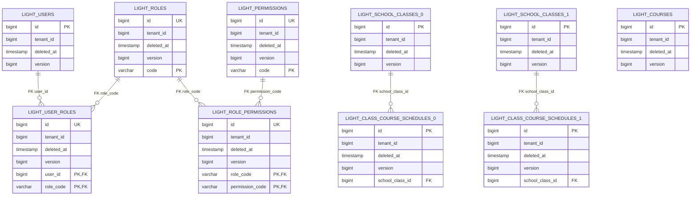

#### 应用 light-open：物理表映射与ER

| ER entity | Physical table | Owner / scope |
| --- | --- | --- |
| LIGHT_OPEN_LIGHT_USERS | light_users | light-open；源DDL所在master-data/shard/Agent schema |
| LIGHT_OPEN_LIGHT_ROLES | light_roles | light-open；源DDL所在master-data/shard/Agent schema |
| LIGHT_OPEN_LIGHT_PERMISSIONS | light_permissions | light-open；源DDL所在master-data/shard/Agent schema |
| LIGHT_OPEN_LIGHT_USER_ROLES | light_user_roles | light-open；源DDL所在master-data/shard/Agent schema |
| LIGHT_OPEN_LIGHT_ROLE_PERMISSIONS | light_role_permissions | light-open；源DDL所在master-data/shard/Agent schema |
| LIGHT_OPEN_LIGHT_COURSES | light_courses | light-open；源DDL所在master-data/shard/Agent schema |
| LIGHT_OPEN_LIGHT_SCHOOL_CLASSES_0 | light_school_classes_0 | light-open；源DDL所在master-data/shard/Agent schema |
| LIGHT_OPEN_LIGHT_SCHOOL_CLASSES_1 | light_school_classes_1 | light-open；源DDL所在master-data/shard/Agent schema |
| LIGHT_OPEN_LIGHT_CLASS_COURSE_SCHEDULES_0 | light_class_course_schedules_0 | light-open；源DDL所在master-data/shard/Agent schema |
| LIGHT_OPEN_LIGHT_CLASS_COURSE_SCHEDULES_1 | light_class_course_schedules_1 | light-open；源DDL所在master-data/shard/Agent schema |

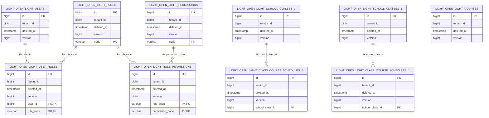

#### 应用 service：物理表映射与ER

| ER entity | Physical table | Owner / scope |
| --- | --- | --- |
| SERVICE_EVALUATION_COURSE | evaluation_course | service；源DDL所在master-data/shard/Agent schema |
| SERVICE_EVALUATION_COURSE_SCHEDULE_0 | evaluation_course_schedule_0 | service；源DDL所在master-data/shard/Agent schema |
| SERVICE_EVALUATION_COURSE_SCHEDULE_1 | evaluation_course_schedule_1 | service；源DDL所在master-data/shard/Agent schema |
| SERVICE_EVALUATION_EXAM_0 | evaluation_exam_0 | service；源DDL所在master-data/shard/Agent schema |
| SERVICE_EVALUATION_EXAM_1 | evaluation_exam_1 | service；源DDL所在master-data/shard/Agent schema |
| SERVICE_EVALUATION_EXAM_PAPER_0 | evaluation_exam_paper_0 | service；源DDL所在master-data/shard/Agent schema |
| SERVICE_EVALUATION_EXAM_PAPER_1 | evaluation_exam_paper_1 | service；源DDL所在master-data/shard/Agent schema |
| SERVICE_EVALUATION_SCORE_0 | evaluation_score_0 | service；源DDL所在master-data/shard/Agent schema |
| SERVICE_EVALUATION_SCORE_1 | evaluation_score_1 | service；源DDL所在master-data/shard/Agent schema |

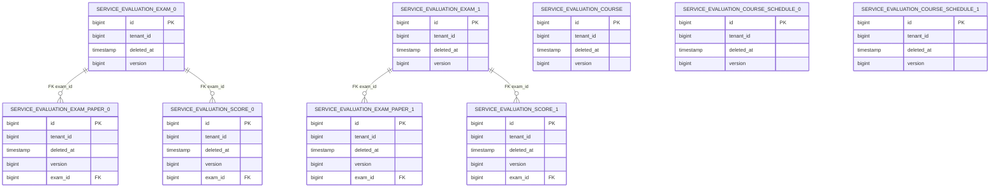

#### 应用 service-open：物理表映射与ER

| ER entity | Physical table | Owner / scope |
| --- | --- | --- |
| SERVICE_OPEN_EVALUATION_COURSE | evaluation_course | service-open；源DDL所在master-data/shard/Agent schema |
| SERVICE_OPEN_EVALUATION_COURSE_SCHEDULE_0 | evaluation_course_schedule_0 | service-open；源DDL所在master-data/shard/Agent schema |
| SERVICE_OPEN_EVALUATION_COURSE_SCHEDULE_1 | evaluation_course_schedule_1 | service-open；源DDL所在master-data/shard/Agent schema |
| SERVICE_OPEN_EVALUATION_EXAM_0 | evaluation_exam_0 | service-open；源DDL所在master-data/shard/Agent schema |
| SERVICE_OPEN_EVALUATION_EXAM_1 | evaluation_exam_1 | service-open；源DDL所在master-data/shard/Agent schema |
| SERVICE_OPEN_EVALUATION_EXAM_PAPER_0 | evaluation_exam_paper_0 | service-open；源DDL所在master-data/shard/Agent schema |
| SERVICE_OPEN_EVALUATION_EXAM_PAPER_1 | evaluation_exam_paper_1 | service-open；源DDL所在master-data/shard/Agent schema |
| SERVICE_OPEN_EVALUATION_SCORE_0 | evaluation_score_0 | service-open；源DDL所在master-data/shard/Agent schema |
| SERVICE_OPEN_EVALUATION_SCORE_1 | evaluation_score_1 | service-open；源DDL所在master-data/shard/Agent schema |

```mermaid
erDiagram
    SERVICE_OPEN_EVALUATION_EXAM_0 ||--o{ SERVICE_OPEN_EVALUATION_EXAM_PAPER_0 : "FK exam_id"
    SERVICE_OPEN_EVALUATION_EXAM_1 ||--o{ SERVICE_OPEN_EVALUATION_EXAM_PAPER_1 : "FK exam_id"
    SERVICE_OPEN_EVALUATION_EXAM_0 ||--o{ SERVICE_OPEN_EVALUATION_SCORE_0 : "FK exam_id"
    SERVICE_OPEN_EVALUATION_EXAM_1 ||--o{ SERVICE_OPEN_EVALUATION_SCORE_1 : "FK exam_id"
    SERVICE_OPEN_EVALUATION_COURSE {
        bigint id PK
        bigint tenant_id
        timestamp deleted_at
        bigint version
    }
    SERVICE_OPEN_EVALUATION_COURSE_SCHEDULE_0 {
        bigint id PK
        bigint tenant_id
        timestamp deleted_at
        bigint version
    }
    SERVICE_OPEN_EVALUATION_COURSE_SCHEDULE_1 {
        bigint id PK
        bigint tenant_id
        timestamp deleted_at
        bigint version
    }
    SERVICE_OPEN_EVALUATION_EXAM_0 {
        bigint id PK
        bigint tenant_id
        timestamp deleted_at
        bigint version
    }
    SERVICE_OPEN_EVALUATION_EXAM_1 {
        bigint id PK
        bigint tenant_id
        timestamp deleted_at
        bigint version
    }
    SERVICE_OPEN_EVALUATION_EXAM_PAPER_0 {
        bigint id PK
        bigint tenant_id
        timestamp deleted_at
        bigint version
        bigint exam_id FK
    }
    SERVICE_OPEN_EVALUATION_EXAM_PAPER_1 {
        bigint id PK
        bigint tenant_id
        timestamp deleted_at
        bigint version
        bigint exam_id FK
    }
    SERVICE_OPEN_EVALUATION_SCORE_0 {
        bigint id PK
        bigint tenant_id
        timestamp deleted_at
        bigint version
        bigint exam_id FK
    }
    SERVICE_OPEN_EVALUATION_SCORE_1 {
        bigint id PK
        bigint tenant_id
        timestamp deleted_at
        bigint version
        bigint exam_id FK
    }
```

#### 应用 web：物理表映射与ER

| ER entity | Physical table | Owner / scope |
| --- | --- | --- |
| WEB_USERS | users | web；源DDL所在master-data/shard/Agent schema |
| WEB_ROLES | roles | web；源DDL所在master-data/shard/Agent schema |
| WEB_PERMISSIONS | permissions | web；源DDL所在master-data/shard/Agent schema |
| WEB_USER_ROLES | user_roles | web；源DDL所在master-data/shard/Agent schema |
| WEB_ROLE_PERMISSIONS | role_permissions | web；源DDL所在master-data/shard/Agent schema |
| WEB_GRADES | grades | web；源DDL所在master-data/shard/Agent schema |
| WEB_SCHOOL_CLASSES_0 | school_classes_0 | web；源DDL所在master-data/shard/Agent schema |
| WEB_SCHOOL_CLASSES_1 | school_classes_1 | web；源DDL所在master-data/shard/Agent schema |
| WEB_SCHOOL_CLASS_USERS_0 | school_class_users_0 | web；源DDL所在master-data/shard/Agent schema |
| WEB_SCHOOL_CLASS_USERS_1 | school_class_users_1 | web；源DDL所在master-data/shard/Agent schema |

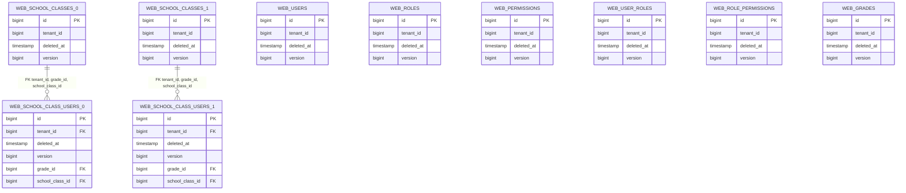

#### 应用 web-open：物理表映射与ER

| ER entity | Physical table | Owner / scope |
| --- | --- | --- |
| WEB_OPEN_USERS | users | web-open；源DDL所在master-data/shard/Agent schema |
| WEB_OPEN_ROLES | roles | web-open；源DDL所在master-data/shard/Agent schema |
| WEB_OPEN_PERMISSIONS | permissions | web-open；源DDL所在master-data/shard/Agent schema |
| WEB_OPEN_USER_ROLES | user_roles | web-open；源DDL所在master-data/shard/Agent schema |
| WEB_OPEN_ROLE_PERMISSIONS | role_permissions | web-open；源DDL所在master-data/shard/Agent schema |
| WEB_OPEN_GRADES | grades | web-open；源DDL所在master-data/shard/Agent schema |
| WEB_OPEN_SCHOOL_CLASSES_0 | school_classes_0 | web-open；源DDL所在master-data/shard/Agent schema |
| WEB_OPEN_SCHOOL_CLASSES_1 | school_classes_1 | web-open；源DDL所在master-data/shard/Agent schema |
| WEB_OPEN_SCHOOL_CLASS_USERS_0 | school_class_users_0 | web-open；源DDL所在master-data/shard/Agent schema |
| WEB_OPEN_SCHOOL_CLASS_USERS_1 | school_class_users_1 | web-open；源DDL所在master-data/shard/Agent schema |

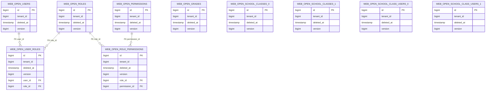

#### 应用 agent：物理表映射与ER

| ER entity | Physical table | Owner / scope |
| --- | --- | --- |
| AGENT_KNOWLEDGE_BASE | knowledge_base | agent；源DDL所在master-data/shard/Agent schema |
| AGENT_KNOWLEDGE_DOCUMENT | knowledge_document | agent；源DDL所在master-data/shard/Agent schema |

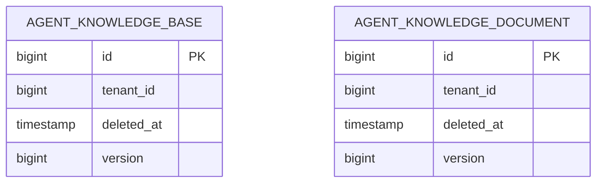

#### 管理与测试模型

| ER entity | Physical table | Owner / scope |
| --- | --- | --- |
| DDL_HISTORY | ddl_history | 六套每个受管physical schema，tenant_id=0 |
| TEST_BUSINESS_RECORD | test_business_record | Common隔离fixture |
| ROUTING_ORDER | routing_order | 逻辑fixture，物理routing_order_t0_b0至routing_order_t3_b1按slot map各创建一份 |
| ROUTING_ORDER_ITEM | routing_order_item | 同上8份routing_order_item_t<t>_b<b>，各与父桶对应 |
| ROUTING_DICTIONARY | routing_dictionary | 各测试PRIMARY的broadcast副本 |
| ROUTING_METADATA | routing_metadata | master_data SINGLE |

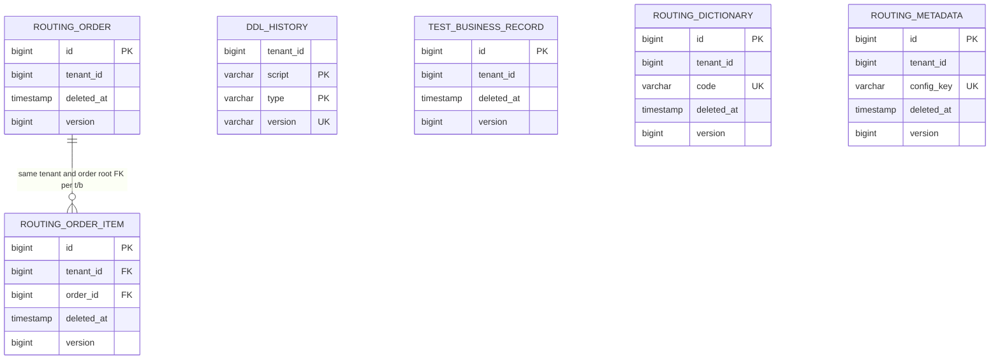

图中的UK标记代表详细设计中的联合/部分唯一键，不能理解为单字段全局UK；history UNIQUE(type,version)，routing字典UNIQUE(tenant_id,code) WHERE active。PG系统catalog、归档Flyway history、Agent Outbox/vector不在本次新关系模型中，保留其拥有方规则，不修改引擎表。

### 11.4 MP DDL runner与接管协议

采用非Bean `IDdl` 目标record和 `PostgreDdlGenerator` 的schema/历史表命名契约；普通Bean只有 `EgonColaPostgreDdlRunner`。它不是后置ApplicationRunner，必须在physical bootstrap内同步调用；不注册IDdl Bean触发MP默认后置runner。用户混配默认runner时启动拒绝。非open删除Flyway runtime依赖和PhysicalDataSourceFlywayMigrator；open虽然此前已有Common MP依赖，本次补齐其DDL接管，而不是声称它此前未使用Starter。

每个目标输入：alias、DataSource、明确schema、role(MASTER_DATA/SHARD)、manifest、immutable routing fingerprint；连接预检PG product、PRIMARY的pg_is_in_recovery=false、schema等于配置。只读取classpath打包资源，拒绝相同本地cwd文件遮蔽、..逃逸和URL资源。目标清单先整体校验：role、primary覆盖、重复schema/alias、资源存在、SHA256、版本排序/唯一性、actualDataNodes对应全部表与tenant列。

状态机：EMPTY表示没有该应用manifest声明的任何业务表；LEGACY_FLYWAY表示现存history与最后受支持版本/脚本校验一致且schema结构匹配；LEGACY_MANUAL表示无history但完整最终manual结构与约束匹配；MANAGED表示本工具history/fingerprint完整；MIXED/UNKNOWN全部拒绝。只支持各family当前最终旧结构；不承诺自动补齐任意中间版/用户自改schema。用户允许破坏式更新使旧ABI/boolean可移除，但不取消识别未知schema的要求。

Flyway接管读取version/script/type/success/checksum，按manifest中已知V/B资源核验；Flyway checksum是独立算法，不与本工具SHA256混用。manifest预先保存锁定Flyway11.15.0生成的校验fixture值，测试侧可以用该版本Flyway建立真实legacy fixture，不给生产runner引入Flyway依赖。B累计baseline与逐V最终状态分别有允许的history序列；额外未知/失败/缺中间V记录拒绝。MANUAL无可验证执行历史，origin=MANUAL并记录结构及资源摘要，只声明接管时结构，不捏造已执行旧脚本记录。

目标处理的完整顺序：获取连接→autoCommit=false→验证schema/PRIMARY→设置本事务lock_timeout=30s/statement_timeout=300s→`pg_advisory_xact_lock`对current_database+schema+固定命名空间加锁→锁内重读状态→EMPTY执行manifest选定的旧B或manual初建+003/004资源→执行V20260912_001（包含history初建和按可信role的业务变更）→准备语句写BASELINE/SQL记录→schema/row-count验证→commit→释放连接。已有MANAGED版本先逐项核验checksum/fingerprint，相同则skip；任何changed hash或route fingerprint没有显式迁移记录则拒绝。

SQL执行用Spring JDBC ScriptUtils的EOF_STATEMENT_SEPARATOR使完整PG脚本以一个Statement交给驱动解析，支持DO dollar blocks和嵌套分号；Connection事务完全由runner控制，不能调用会内部commit的DdlHelper/ScriptRunner路径。INSERT历史使用PreparedStatement绑定，和DDL同连接。禁BEGIN/COMMIT/ROLLBACK/CREATE DATABASE/VACUUM/CREATE INDEX CONCURRENTLY等破坏事务合同的发布脚本；manifest SQL由本仓受审源码提供，静态审查/PG故障fixture验证，而不是不可信运行时SQL解析平台。

发生错误：rollback本目标，记录安全的target/schema/script/SQLState，关闭所有physical pools，禁止创建logical DS；先前target已commit的版本保留，下次验证后skip。commit结果未知时重新读history匹配版本+checksum+schemaFingerprint；无记录但schema不匹配legacy时拒绝并返回差异，不盲重跑。全primary成功后验证副本schema与广播版本/内容摘要到达，默认最多60s，未就绪仍失败关闭；不向replica运行DDL。

### 11.5 源资源不可变清单

以下是在本Spec当前基线实际计算的SHA256，用于确认发现时的源资源字节；不是数据库已执行证明。manifest必须将family、role、canonical资源路径、SHA256、适用EMPTY/LEGACY状态列为类型字段；若实施前源码发生变化，必须重审本清单而不能默默更新history。

| Family | Immutable source resource | SHA-256 |
| --- | --- | --- |
| light | `egon-cola-archetypes/source-projects/egon-cola-source-light/src/main/resources/db/migration/sharding/master-data/B20260825_001__baseline_light_master_data_schema.sql` | `81fd45f6dbb7a692509ab24a9b786ec301b2a9fdb39ded64503c59aa98b8ff32` |
| light | `egon-cola-archetypes/source-projects/egon-cola-source-light/src/main/resources/db/migration/sharding/master-data/V20260726_001__init_light_master_data_schema.sql` | `d23daa4271dc4bcddd2f6c76bad265527e05310632bff1b45527ad073bd7bdcf` |
| light | `egon-cola-archetypes/source-projects/egon-cola-source-light/src/main/resources/db/migration/sharding/master-data/V20260825_001__migrate_light_master_data_to_egon_model.sql` | `562d5f570030d9e52c0dc9c34f0ad34c48f984c1de7423b4121e460946358d6f` |
| light | `egon-cola-archetypes/source-projects/egon-cola-source-light/src/main/resources/db/migration/sharding/shard/B20260825_002__baseline_light_sharded_schema.sql` | `4a84170345e2d65182341ff27a04faad00531bfd300752cfb6baf22fb4ace1f3` |
| light | `egon-cola-archetypes/source-projects/egon-cola-source-light/src/main/resources/db/migration/sharding/shard/V20260726_002__init_light_sharded_schema.sql` | `a745bc196029f89776f4d848513f949ef698a922824afd4545bfc797b4e82abc` |
| light | `egon-cola-archetypes/source-projects/egon-cola-source-light/src/main/resources/db/migration/sharding/shard/V20260825_002__migrate_light_sharded_to_tenant_model.sql` | `acef90ce471db93106543fa15fdf2e695a7753985d5340196a7a794cfce581b4` |
| light-open | `egon-cola-archetypes/source-projects/egon-cola-source-light-open/src/main/resources/db/manual/postgresql/master-data/001__create_light_master_data_schema.sql` | `5b3ff57728cb57589caed1006d12f9f0558261599990a9216cd801c22e8a9bea` |
| light-open | `egon-cola-archetypes/source-projects/egon-cola-source-light-open/src/main/resources/db/manual/postgresql/master-data/003__migrate_light_master_data_to_egon_model.sql` | `9765b9df72563ddc4717f50d3063a8bc0ba3c3a1d9c4a8947d0ccdd62e847e82` |
| light-open | `egon-cola-archetypes/source-projects/egon-cola-source-light-open/src/main/resources/db/manual/postgresql/shard/002__create_light_sharded_schema.sql` | `96b06aec503748457f31f35b038cd828af16874935f8744806aa61be52674a3d` |
| light-open | `egon-cola-archetypes/source-projects/egon-cola-source-light-open/src/main/resources/db/manual/postgresql/shard/004__migrate_light_sharded_to_tenant_model.sql` | `f6113bf70ef76d0a79455caad197a0074185b59b208750670b01147c64969d8c` |
| service | `egon-cola-archetypes/source-projects/egon-cola-source-service/egon-cola-source-service-infrastructure/src/main/resources/db/migration/sharding/master-data/B20260825_001__baseline_evaluation_master_data_schema.sql` | `e227cc34d72cff41a1bab39343fe5a3f2ad39fdc44f78ac1b340c898295fa831` |
| service | `egon-cola-archetypes/source-projects/egon-cola-source-service/egon-cola-source-service-infrastructure/src/main/resources/db/migration/sharding/master-data/V20260726_001__init_evaluation_master_data_schema.sql` | `7ce2cb95d2dcc84a732098c4f3d92da09cd5ffaeb6fbf7c8ba06dcb850466d7a` |
| service | `egon-cola-archetypes/source-projects/egon-cola-source-service/egon-cola-source-service-infrastructure/src/main/resources/db/migration/sharding/master-data/V20260825_001__migrate_evaluation_master_data_to_egon_model.sql` | `c1b6a5585b54a7299703db4b555e2c5a14ee28a2927b0e3ce976d72c6321bcd3` |
| service | `egon-cola-archetypes/source-projects/egon-cola-source-service/egon-cola-source-service-infrastructure/src/main/resources/db/migration/sharding/shard/B20260825_002__baseline_evaluation_sharded_schema.sql` | `4cf45a9db4beff0c7d3ea8ec75ca1f22d6099f1b15f92068ce786c1123b4ee82` |
| service | `egon-cola-archetypes/source-projects/egon-cola-source-service/egon-cola-source-service-infrastructure/src/main/resources/db/migration/sharding/shard/V20260726_002__init_evaluation_sharded_schema.sql` | `789192e9448769cb047b8ba53a49bd2ad814113069f9f58dd0a4c8fa67f6c1d6` |
| service | `egon-cola-archetypes/source-projects/egon-cola-source-service/egon-cola-source-service-infrastructure/src/main/resources/db/migration/sharding/shard/V20260825_002__migrate_evaluation_sharded_to_tenant_model.sql` | `64cabfbbfd845ec9a6770c3aecd5e37ee9e7e1b94bf8ab8aba526592258e6d74` |
| service-open | `egon-cola-archetypes/source-projects/egon-cola-source-service-open/egon-cola-source-service-open-infrastructure/src/main/resources/db/manual/postgresql/master-data/001__create_evaluation_master_data_schema.sql` | `a153c8bbc4753c9bc228ec7032112092bbb0cb367ba8fbd5cfdcb830d419bbb6` |
| service-open | `egon-cola-archetypes/source-projects/egon-cola-source-service-open/egon-cola-source-service-open-infrastructure/src/main/resources/db/manual/postgresql/master-data/003__migrate_evaluation_master_data_to_egon_model.sql` | `d8c1f44d5c235aca94976203b2937c978f0a751dde474626c695f65b0a4f3468` |
| service-open | `egon-cola-archetypes/source-projects/egon-cola-source-service-open/egon-cola-source-service-open-infrastructure/src/main/resources/db/manual/postgresql/shard/002__create_evaluation_sharded_schema.sql` | `ca6abbcf549b22bf6fcec8d83bae9f6431bdb4b939be70c1ad88370abba69446` |
| service-open | `egon-cola-archetypes/source-projects/egon-cola-source-service-open/egon-cola-source-service-open-infrastructure/src/main/resources/db/manual/postgresql/shard/004__migrate_evaluation_sharded_to_tenant_model.sql` | `23573b3c5c5152875e9fc3bf20024e558084fce4305ea26d85ad8b7ea85ddd0c` |
| web | `egon-cola-archetypes/source-projects/egon-cola-source-web/egon-cola-source-web-infrastructure/src/main/resources/db/migration/sharding/master-data/B20260825_003__baseline_organization_master_data_schema.sql` | `0e922d927cf3b00be35872cbad0683c5923ad9de0d052a9d65d6ed388d0fc95c` |
| web | `egon-cola-archetypes/source-projects/egon-cola-source-web/egon-cola-source-web-infrastructure/src/main/resources/db/migration/sharding/master-data/V20260726_001__init_organization_master_data_schema.sql` | `9fe254f95400d4c6ed1bd8b720c6f0576730418dd3cec5d42a981072f3886df2` |
| web | `egon-cola-archetypes/source-projects/egon-cola-source-web/egon-cola-source-web-infrastructure/src/main/resources/db/migration/sharding/master-data/V20260825_003__migrate_organization_master_data_to_egon_model.sql` | `38791f226c0cfcd99dd873f1536eb12765dcc720a81e9451ec4894101ea03cb4` |
| web | `egon-cola-archetypes/source-projects/egon-cola-source-web/egon-cola-source-web-infrastructure/src/main/resources/db/migration/sharding/shard/B20260825_004__baseline_organization_sharded_schema.sql` | `ef3d4199b10dfcedef1befbf70af56c238a9c61585cb6a7b25190e7d0bdc81b5` |
| web | `egon-cola-archetypes/source-projects/egon-cola-source-web/egon-cola-source-web-infrastructure/src/main/resources/db/migration/sharding/shard/V20260726_002__init_organization_sharded_schema.sql` | `628565645e1db2ab155320df0ca6d26fdb25c2ca94123f51439bd06abba3b756` |
| web | `egon-cola-archetypes/source-projects/egon-cola-source-web/egon-cola-source-web-infrastructure/src/main/resources/db/migration/sharding/shard/V20260825_004__migrate_organization_sharded_to_tenant_model.sql` | `a80579953e72c9660bda45ba47f50436a1fa5830c255d22cb7f587e101b7dd0f` |
| web-open | `egon-cola-archetypes/source-projects/egon-cola-source-web-open/egon-cola-source-web-open-infrastructure/src/main/resources/db/manual/postgresql/master-data/001__create_organization_master_data_schema.sql` | `3b6458766ca075e886b080b4a09a4ce28f9201b90fad715463f5c6b188eee71a` |
| web-open | `egon-cola-archetypes/source-projects/egon-cola-source-web-open/egon-cola-source-web-open-infrastructure/src/main/resources/db/manual/postgresql/master-data/003__migrate_organization_master_data_to_egon_model.sql` | `fd74f2d7016cc01bfd6acf4761bded879c7d7ed3def1574f8b84a6dfae44607b` |
| web-open | `egon-cola-archetypes/source-projects/egon-cola-source-web-open/egon-cola-source-web-open-infrastructure/src/main/resources/db/manual/postgresql/shard/002__create_organization_sharded_schema.sql` | `41fb899f1aedc182c5d8dcb2db564b5ba2406924ae69a23428e2dbdbf2265660` |
| web-open | `egon-cola-archetypes/source-projects/egon-cola-source-web-open/egon-cola-source-web-open-infrastructure/src/main/resources/db/manual/postgresql/shard/004__migrate_organization_sharded_to_tenant_model.sql` | `7f109a8ae1b72fd86ded1badc31f296a05a747802b62f8195a9ce76dc391cc77` |
| agent | `egon-cola-archetypes/source-projects/egon-cola-source-agent/egon-cola-source-agent-infrastructure/src/main/resources/db/migration/V20260910_001__create_knowledge_schema.sql` | `7e59a11d910d53b230facc1d6c8e81f0f204adc61ffa7711376e02d0bc1b1e02` |

Flyway的源文件只读保留，MP运行器只为EMPTY按manifest执行明确的baseline序列；源中存在V和B不代表两套都运行。Agent只加一个新纠正migration，其他历史原样。所有本次版本均是设计路径，未创建SQL文件或实际数据库对象。

## 12. Frontend Page Design

Scope disposition: Unchanged。用户明确前端页面暂不考虑；现有adapter/facade的HTTP/RPC/GraphQL route、DTO、ID字符串和业务code不改变。JsonValue只作用真实JSON enum合同，不新增删除时间字段到wire、不增加页/菜单/表单/查询配置页面。新增路由场景由开发者配置与受控测试验证，不向用户暴露物理表名/分片参数。

## 13. Design Patterns and Architecture Principles

| Pattern/principle | Concrete variation point or problem | Placement | Why direct code is insufficient | Repository alignment |
| --- | --- | --- | --- | --- |
| Adapter | 自有ID与MP SPI、Common route与SS standard/complex SPI | EgonColaIdentifierGenerator；六套两个ShardingAlgorithm | 各框架签名不同，复制算法会漂移 | 复用现有LongIdGenerator与shared Strategy |
| Template Method | 公共权威fill与业务可选字段；仓储必经校验 | EgonColaMetaObjectHandler final hooks、EgonColaRepository final受控入口+collaborator accessors | 每Mapper硬编码审计无法统一防伪 | 保留当前final fill/hooks和已验证Lombok继承注入方式 |
| Strategy | LEGACY与TENANT_ID_TWO_LEVEL；SINGLE/BROADCAST责任规则 | immutable profile+TwoLevelRouteStrategy+现有ShardingNodeMap；typed kind绑定策略 | 真实算法差异不能使用散落字符串if/else重复计算 | 同一策略同时供SS和LOCAL guard，不自定义第二套route |
| Facade / 状态表 | physical创建→验证→迁移→就绪→logical DS；EMPTY/LEGACY/MANAGED/拒绝 | 当前ShardingDataSourceBootstrapper+EgonColaPostgreDdlRunner | 生命周期涉及外部资源与部分失败，不能放进任意ApplicationRunner | 原失败关闭资源清理保持 |
| Chain of Responsibility | Model/tenant/block/version/page/dev诊断的SQL阶段 | 已有MybatisPlusInterceptor inner chain+LOCAL Guard | 单巨型拦截器难以验证各阶段顺序 | 官方插件和本地最小guard组合 |

不增加只有一个实现的业务Factory/Registry，不把每个领域对象复制成PO/BO/DTO/VO链；服务组合仓储，技术仓储继承仅为框架契约。SQL Injector、在线扩容服务、额外动态数据源框架和第二套ID都是无当前必要性的替代项，拒绝。接口必要性和交互成本已在每个§9操作独立记录。

## 14. Test Design

### 14.1 官方测试来源与分层

固定MP v3.5.16，与当前manifest一致：

- [BatchTest](https://github.com/baomidou/mybatis-plus/blob/v3.5.16/mybatis-plus/src/test/java/com/baomidou/mybatisplus/test/batch/BatchTest.java)：JUnit Jupiter、隔离fixture、执行后真实行数断言，不用BatchExecutor返回常量当写入数。
- [DdlHelperTest](https://github.com/baomidou/mybatis-plus/blob/v3.5.16/mybatis-plus-extension/src/test/java/com/baomidou/mybatisplus/test/DdlHelperTest.java)：方言/schema场景分开；其中PG @Disabled只是环境示例，不算本项目验收。
- [IllegalSQLInnerInterceptorTest](https://github.com/baomidou/mybatis-plus/blob/v3.5.16/mybatis-plus-jsqlparser-support/mybatis-plus-jsqlparser/src/test/java/com/baomidou/mybatisplus/test/extension/plugins/inner/IllegalSQLInnerInterceptorTest.java)、[DataChangeRecorderInnerInterceptorTest](https://github.com/baomidou/mybatis-plus/blob/v3.5.16/mybatis-plus-jsqlparser-support/mybatis-plus-jsqlparser/src/test/java/com/baomidou/mybatisplus/test/extension/plugins/inner/DataChangeRecorderInnerInterceptorTest.java)：具体SQL正/负用例及结果断言。

SS固定5.5.3：typed SINGLE/BROADCAST YAML与Standard/Complex SPI按官方tag源码测试方式验证，源码树SHA `8d35894433416ef249ebb6ea21f8a8749648e9b6`。不照抄官方test的字段Autowired、硬编码凭据、sleep、println；采用行为组织和断言方法，并保持项目规范。单元测试不连DB；PG/SS/主从IT与H2快速测试分开，缺隔离环境不得以skip申报通过。

### 14.2 Concrete test inventory

| ID | Level | Target | Scenario/input | Expected assertion | Test double/data | Tool/path | Requirements |
| --- | --- | --- | --- | --- | --- | --- | --- |
| TEST-001 | Architecture/contract | IRepository/业务Service/Repository/DAO/PO | 正常依赖、故意Service注DAO/旧IService/AR/chain/static Db/raw JDBC | 违规fixture失败；53项保留/禁写和4项禁查询链签名表正确，Domain无MP依赖 | 源/字节码fixture | T/contract/EgonColaRepositoryArchitectureTest.java，各family architecture tests | REQ-001/002/003/007/028 |
| TEST-002 | Unit/dispatch | 四种QueryChain | IRepository与具体类分派、有参null/合法/非法entity | 同一QUERY_CHAIN_FORBIDDEN，Mapper零交互、entity不改，override为final | fake Mapper | T/contract/EgonColaRepositoryQueryChainTest.java | REQ-007 |
| TEST-003 | Mapper/PG | §9每个显式SQL操作 | A/B租户，active/已删，JOIN右表已删、空IN/页、相同时间tie、Agent筛选 | 精确结果/active条件、tenant每别名、页count一次、原排序；关键SQL代表性EXPLAIN | 独立PG schema；H2仅映射快测 | 各Mapper focused tests + T/integration/EgonColaQuerySqlTest.java | REQ-008/009/019/021 |
| TEST-004 | Unit/metadata | Model/TableInfo/ID/fill | 缺generator/歧义/已有ID/新ID/字段shadow/坏TableId/Version/填充hooks | id不覆盖、生成器异常传播、注解非法启动失败、技术字段权威 | 固定Clock、Providers、fake LongIdGenerator | T/model/EgonModelTest.java、EgonColaIdentifierGeneratorTest.java | REQ-004/006/017/018/020 |
| TEST-005 | PG migration | 每表deletedAt/version | 原false/true、历史哨兵、微秒时区、active部分UK、global UK、旧binary | 总数与标志数保持、true→哨兵；新删除非哨兵；新活跃唯一；全局约束不弱化 | 真实legacy源DDL/数据 | T/integration/EgonColaLogicDeletePostgreSqlTest.java；各family迁移fixture | REQ-005/006/027 |
| TEST-006 | PG concurrency | 单行更新/版本化删、Agent状态 | 同version竞争、delete/update交错、状态不匹配、description清空 | 一胜者；0不覆盖；Agent expected status保留；NULL有意写入；bulk根键删阻止后续worker覆盖 | 两连接+latch明确超时 | T/integration/EgonColaOptimisticLockPostgreSqlTest.java及Agent Repo tests | REQ-020/028 |
| TEST-007 | Unit+Spring TX/PG | MybatisBatch | 5行size2，第二段duplicate，返回后业务失败，tenant漂移，异Factory、-2/-3、重复非nullID | 真调用MybatisBatch；所有flush段回滚；count语义正确，无事务拒绝；empty零SQL | 实际SpringManagedTransaction+PG；H2单独 | T/integration/EgonColaBatchTransactionIntegrationTest.java | REQ-010/015/019 |
| TEST-008 | Auto config/plugin | 排序/dev/dynamic/page/block | base/dev/test/prod/dev+prod，原始无WHERE/1=1/仅tenant或version被自动改写、类型处理器、两个Factory | 非dev无诊断Bean；raw全表写在合成tenant/version前拒绝，update(entity,emptyWrapper)也拒绝；两Factory都保护；敏感值不日志 | ApplicationContextRunner+captured stages | T/autoconfigure/EgonColaMybatisPlusAutoConfigurationTest.java；T/integration/EgonColaPluginOrderTest.java | REQ-016/021/022/023/024 |
| TEST-009 | PG local TX | LOCAL target holder | 第一target写后第二target，catch guard异常后commit，同库多桶，广播写 | 第二SQL不发出且rollback-only阻止第一commit；同group多表可回滚；raw JDBC架构违规 | 两physical PRIMARY，无XA | 各family LocalTransactionBoundaryTest扩展 + T/integration/EgonColaLocalWriteGuardTest.java | REQ-015/030 |
| TEST-010 | Enum/JSON/PG | EnumValue/JsonValue/JSONB | 缺/重复/null code，未知JSON枚举，纯内部enum，JSONB NULL/嵌套 | 不ordinal、不错误默认null；内部enum无误杀；String handler不污染 | Jackson+PG | T/contract/EgonColaEnumContractTest.java；Agent JsonbStringTypeHandlerTest | REQ-011/025 |
| TEST-011 | Unit+PG fault | DDL runner | 文件遮蔽/逃逸/坏checksum、锁争用、DO分号、SQL后history前/commit前/后故障 | 只classpath；同连接原子；锁超时中断；第二schema失败不创建logicalDS；历史幂等 | 注入故障Connection/独立PG | T/ddl/EgonColaPostgreDdlRunnerTest.java；family bootstrap tests | REQ-012/013 |
| TEST-012 | Source/generated | 六family+Agent兼容、hash、DI、配置 | 旧技术泛型/Getter残留、mapper bind缺失、root/env差异、版本SQL新增数 | 所有具名Mapper/Repo/Converter wiring；原SQL SHA256不变；source/generated一致 | 现有Maven/Groovy/JUnit/scripts | D各verify.groovy；scripts/generate_archetypes.sh check | REQ-026/028 |
| TEST-013 | PG adoption | 新/旧Flyway V/B/manual/managed | 完整已知最后版本、缺失中间/失败history、unknown schema、管理表格式冲突 | 只接受manifest状态；不重跑旧DDL；origin准确；同版换名/checksum冲突拒绝 | 用锁定Flyway11.15.0仅test scope建立旧历史 | 各role迁移IT+T/ddl/EgonColaDdlAdoptionTest.java | REQ-012/013/027 |
| TEST-014 | Unit+SS route | 两级hash/Standard/Complex+legacy map | golden向量、1..100000tenant、Snowflake形状、极大Long、bad keys/props、当前legacy全域采样 | pure Strategy与SS adapters一致；均匀性偏差≤5%；legacy不漂移；available交集精确 | 无数据库的SS API fixture | T/routing/EgonColaTwoLevelRouteStrategyTest.java；各SS adapters tests | REQ-031/032/033/034/035 |
| TEST-015 | PG+SS SQL | 两级T4/B2父子/bounded query | tenant+root点查/IN、缺secondary SELECT vs DML、tenant range、binding join、offset/keyset | 精确路由；同root共址；无错tenant槽；缺键写拒绝；fanout≤2；最终结果/count等价 | routing_order/item完整8桶fixture | 各family RoutingScenarioIntegrationTest.java | REQ-031/035/036 |
| TEST-016 | YAML/PG topology | SINGLE/BROADCAST/SHARDING分类 | 同表双归属、wildcard single、缺primary、广播半部署、route fingerprint变化 | typed parser校验拒绝；SingleRule实际DataNode与期望group/schema吻合；不自动改路由 | 官方5.5.3 YAML+测试schema | family ShardingTopologyValidatorTest.java扩展 | REQ-029/030/034 |
| TEST-017 | PG streaming replica IT | Readwrite groups/strong read | PRIMARY/replica真实角色、TX SELECT/SELECT FOR UPDATE、非TX SELECT、Hint范围、lag/断链/错误角色 | DML/TX/强读到主；普通读副本；hint关闭不泄露；lag在合同内；无自动选主/重放 | 运维提供真实PG primary+replica | family PostgreSqlReadwriteIntegrationTest.java | REQ-037 |

### 14.3 算法静态计算证据

本次实际用纯Python的64bit溢出等价模型计算（不是Java或SS运行）：tenant1..100000、T16最大偏差2.192%；100000个ID形状 `((i//4096+1)<<22)|(42<<12)|(i%4096)` 经seed/mix64、B8最大偏差1.448%。两者均低于设计5%门槛。golden：(1,tenantSlot5,secondaryBucket0)、(2,10,6)、(41,5,4)、(Long.MAX_VALUE,13,0)。Java/SS实现必须用同向量回归；不能据此宣称生产热点/QPS均匀。

### 14.4 可行命令与未执行边界

组件入口：`./mvnw -B -ntp -f egon-cola-components/egon-cola-component-common/pom.xml -pl egon-cola-component-common-mybatis-plus-spring-boot-starter -am test`；源/生成一致性 `scripts/generate_archetypes.sh check`；source family编译/测试按现有reactor执行。此Spec阶段不执行这些构建或生成、不引入测试依赖到代码。

PG/SS主从IT只对显式提供的隔离schema/实例运行，缺环境报告未验证；不自动启动Docker或服务。Flyway11.15.0可作为迁移IT的test-only fixture工具，生产六套不保留Flyway。任何新增依赖必须按§6 owner限定，不能因写Spec运行runtime。文档严格校验与源hash/纯算法计算是本次执行证据，其他§14项目是待实施验收。

## 15. Non-functional and Cross-cutting Design

### 15.1 配置key/环境矩阵

Common prefix保持 `egon.cola.component.mybatis-plus`。下列keys在base/dev/test/prod结构一致；默认值集中Properties，profile只覆盖值，不在某环境漏掉key。六套模板是合规消费者，tenant/model/local guard不能配置关闭后仍通过verifier；Common宿主显式enabled=false保留关闭组件含义，不宣称仍受这些守卫保护。

| Key | base | dev | test | prod | Validation / scope |
| --- | --- | --- | --- | --- | --- |
| enabled / meta-fill.enabled / block-attack.enabled / optimistic-locker.enabled | true | true | true | true | 合规模板必须开启 |
| pagination.enabled / max-page-size / overflow | true / 500 / false | 同结构 | 同结构 | 同结构 | size1..500，不静默首页 |
| batch.default-size / max-chunk-size / max-collection-size | 1000 / 1000 / 10000 | 同结构 | 同结构 | 同结构 | default≤chunk≤collection；输入有界 |
| dynamic-table-name.enabled / tables | false / 空映射 | 同结构 | 同结构 | 同结构 | 只支持非SS表、白名单配置；禁止user表名 |
| data-change-recorder.enabled | false | true | false | false | active dev且无prod才注册；安全字段摘要 |
| illegal-sql.enabled | false | true | false | false | dev+prod冲突失败；3.5.16 Deprecated成本明确 |
| ddl.enabled / lock-timeout / statement-timeout / topology-ready-timeout | 六套true；Agent false / PT30S / PT300S / PT60S | 同结构 | 同结构 | 同结构 | 非正duration拒绝；不自动ApplicationRunner |
| local-write-guard.enabled | true | true | true | true | 只一个physical写group，异常置rollback-only |

原app.datasource.mode继续只SHARDING/SHARDING_READWRITE，不新增网络数据源框架。`app.sharding.flyway` 与 `app.sharding-readwrite.flyway` 改为 `.ddl.targets`；每target固定data-source-name、schema、role、manifest属性，main/mode文件通过同结构profile引用。示例环境变量保留原凭据名称，新增 `<FAMILY>_SHARDING_SCHEMA` 默认public，target的schema必须与实际连接一致。六套 `spring.flyway.*`键/依赖退出；Agent原spring.flyway.*保持。

SS YAML是逻辑表规则权威，不额外维护另一张可能漂移的表路由配置。ShardingTopologyValidator使用SS5.5.3 `YamlEngine` 与 `YamlJDBCConfiguration`、typed Single/Broadcast/Sharding/Readwrite规则解析；从同一对象构造不可变Common policy给SS adapters/LOCAL Guard和manifest fingerprint。替换当前按缩进和字符串只能识别none/standard的解析器；保留exact logical group/physical role/target覆盖规则。当前legacy的routing.node-count/node-map和算法行为不改；两级表在它自己的algorithm.props中显式定义version、tenant-slot-count、secondary-bucket-count、tenant-slot-map、secondary-column、secondary-seed、max-read-fanout-tables，各database/table算法必须引用同一profile。

每个SqlSessionFactory单独绑定DataSource、tenant/user/IdentifierGenerator/inner chain/Model validation，禁止只有@Primary工厂受保护。全部SS logical表登记必须tenant_id BIGINT NOT NULL；SINGLE/广播不得加入ignoredTables绕过租户。DDL history允许管理tenant=0但不暴露业务Mapper；归档Flyway/PG catalog属引擎历史边界，保持原格式。

### 15.2 性能、复制和运营边界

SQL性能需给具体查询、参数/数据量/分布、实际nodes、PG EXPLAIN(ANALYZE,BUFFERS)、估计/真实rows、sort/temp IO与耗时，compare原/新正确性后再判断改善。只在隔离SELECT执行EXPLAIN ANALYZE，不借性能验证写DML。顺序扫描可能优于索引，不能设“必须走索引”伪SLO；无生产证据不编造毫秒阈值。两级profile的总物理表数/最大fanout严格受配置和metadata测试约束，业务场景仍需容量采样。

PG复制延迟/连接失败由运维监控；关注pg_is_in_recovery、replay lag、连接池耗尽、SQL/route错误比、每target DDL版本/ready状态。metric标签仅group/profile/result，不用tenant/orderId形成高基数；需要排错的key只在受控trace日志按现有隐私规则记录。插件记录不得包含密码、邮箱、文档全文/JSONB值。副本落后不解释为数据未写；强读走PRIMARY，未知Command提交先核验，不自动重放。

### 15.3 dev记录器的具体适配与证据限制

MP3.5.16的DataChangeRecorderInnerInterceptor **也已Deprecated（3.5.10起）**，并在beforePrepare阶段生成OperationResult，内部部分错误仅记录后返回。因此本插件是开发期SQL变动诊断，不是提交成功审计，不参与“数据写入是否成功”的权威判定；不得把beforePrepare记录称为已提交事件。IllegalSQL同样仅dev，二者不替代SQL/PG执行计划验证。

新增 `J/interceptor/EgonColaDataChangeRecorderInnerInterceptor.java` 继承官方记录器，覆盖 `dealOperationResult(OperationResult)`，使用 `@Slf4j(topic="top.egon.cola.component.common.mybatis.change-summary")` 仅输出operation/tableName/recordStatus/cost，不调用OperationResult.toString或输出changedData。官方父类logger以 `getClass()` 命名，另固定配置 `logging.level.top.egon.cola.component.common.mybatis.interceptor.EgonColaDataChangeRecorderInnerInterceptor=OFF`，屏蔽其内部可能携带SQL文本的日志；safe summary独立topic在dev为DEBUG，其余INFO但插件不注册。两个logging key与值规则进入所有profile的等价键矩阵。dev合同校验确认原始logger实际OFF，否则拒绝启用记录器，不能只写脱敏文案。

测试构造含邮箱/文档正文/JSONB和异常SQL的操作，捕获全部记录确认无原值；同时确认摘要出现、rollback后不会被错误标为commit。真实捕获时机/继承日志来源基于本轮已读取官方v3.5.16源码，不臆造processLog扩展点。记录失败不吞掉真实业务DML异常；父类自己的诊断失败语义单独保留为dev限制，不据此放宽Model/tenant/LOCAL守卫。

## 16. Compatibility, Migration, Rollout, and Rollback

用户允许不兼容更新，故旧IService/ServiceImpl/ActiveRecord/getIsDeleted ABI直接退出，不保留桥接；全部本仓消费者同版更新。外部wire不变，外部依赖者需重编译并按新Repository/CQRS规则迁移。删除字段为LocalDateTime/NULL，旧binary不能在新schema正常运行；升级窗口必须停写并停止旧binary，不能滚动混跑boolean与timestamp两版。

六套每个应用一个V20260912_001，manifest按角色选择源baseline和目标表；同一新SQL根据可信role执行各子段并初建history。旧文件/旧Flyway history只读保留；open接管最终manual结构并标origin=MANUAL，不冒充历史脚本执行事实。Agent只执行自己的新纠正Flyway版本，不移交Outbox/vector建表。DDL失败不放行logical DS，其他库已成功不能声称被rollback；恢复时各target核验checksum后skip或执行未完成版本。

当前SINGLE none→!SINGLE不搬行；legacy分片map原样保留。新two-level能力不会自动给现有表增加secondary key或改actualDataNodes。未来实际改key/T/B/slotmap需要受控新迁移、停写/校验/统一fingerprint发布；不提供未经设计的在线再均衡。LOCAL从不承诺跨physical原子，广播runtime只读，跨库schema/广播数据在部署屏障后才接流量。

回退不是git revert数据库：新timestamp/version写入后旧boolean恢复会丢失信息，必须在明确备份点恢复整组受管schema和相应版本binary，或新建前向修正迁移；不自动drop表/clean/repair，不改已存在迁移。历史true使用明确未知时间哨兵，回退评估要承认无法还原真实删除时刻。所有表原业务PK/FK/UK保留，除旧boolean相关active索引与明确新增查询索引，不扩张业务key重用语义。

## 17. Alternatives and Decisions

| Option | New elements and interactions | Advantages | Disadvantages/risks | Repository fit | Decision and rationale |
| --- | --- | --- | --- | --- | --- |
| 仅IService更名 | 少量Java改动 | 成本低 | 业务仍继承数据访问，QueryChain仍开放 | 不满足职责/CQRS | Rejected |
| COLA+Repository组合 | 本地仓储委托，原模块不变 | 用户已确认分层，SQL可测 | 全体消费者ABI同步 | 匹配现有family | Selected |
| AR双入口兼容 | 保留PO主动SQL | 旧调用可用 | 绕过Repository，双生命周期 | 新目标不适合 | Rejected |
| 默认MP DDL runner | 无额外history/锁设计 | 接入少 | 默认忽错、晚于logical metadata、提交窗口 | 无法承担旧库接管保证 | Rejected |
| 同步MP自定义runner | IDdl对象、manifest、单schema事务/锁/history | 可恢复接管且保留physical启动顺序 | 管理台账/停写运维成本 | 用户明确要求 | Selected |
| 直接tenant/order联合mod | 一个hash输出地址 | 算法短 | 不表达两级，热点/扩容/绑定/LOCAL边界不清 | 原map也不能表达第二键 | Rejected |
| 固定tenant槽→group/一级族→secondary桶 | 纯JavaStrategy+SS adapters+fingerprint | 满足两级、同tenant同DB适合LOCAL | 热点tenant仍有单库上限，表数/fanout成本 | legacy可并存，不自动迁移 | Selected |
| 广播在线多库写+LOCAL | SS会把DML发多个group | 接口看似通用 | 无跨库原子保证，失败不一致 | 用户选LOCAL | Rejected；广播只读+部署维护 |
| XA/额外动态数据源框架 | 新依赖/恢复/路由栈 | 可选能力更大 | 不符合用户LOCAL且多路由权威 | 无当前必要性 | Rejected |
| 全局SQL Injector/JSON handler | 新公共扩展平台 | 表面统一 | 当前XML/局部JSONB够用，污染String | 无当前缺口 | Rejected |

## 18. Risks and Open Questions

| ID | Risk/question | Probability | Impact | Mitigation or decision owner | Status |
| --- | --- | --- | --- | --- | --- |
| RISK-001 | 原Boolean无真实删除时刻 | 已确认 | 不可恢复信息 | true映射epoch未知哨兵，不伪造时间；用户确认timestamp方向 | Closed design |
| RISK-002 | 旧ABI/schema不兼容 | 已确认 | 旧binary不能共存 | 同版升级、停写窗口、备份回退；DEC-003明确允许 | Closed design |
| RISK-003 | LOCAL单写group限制 | 已确认 | 某跨group业务命令会拒绝 | TX holder rollback-only、显式读/写集合、无XA承诺 | Closed design; runtime validation pending |
| RISK-004 | 广播半部署或副本落后 | 中 | 读到不同配置/schema | startup readiness屏障、广播runtime只读、强读PRIMARY | Closed design; PG IT pending |
| RISK-005 | 单热点tenant不能自动跨数据库均匀 | 高于均匀tenant样本 | 热点数据库瓶颈 | profile明确限制，真实场景评估，未来改策略须新Spec/迁移 | Accepted capacity boundary |
| RISK-006 | 未知用户schema/旧中间版本 | 取决部署 | 无法可靠自动接管 | manifest匹配失败关闭，提供差异；不默认清库 | Closed design |
| RISK-007 | IllegalSQL和DataChangeRecorder均Deprecated/误报 | 已确认 | dev解析限制与未来升级成本 | 固定3.5.16，PG正负SQLfixture；不用它替代EXPLAIN | Accepted design risk |
| RISK-008 | 动态表名重复SS路由 | 配置相关 | 错表/越权 | 集合互斥、白名单、启动检查与SQL目标测试 | Closed design |
| RISK-009 | Agent现有无请求版本的端口 | 已确认 | 不提供终端编辑全时段冲突保护 | 保留端口、Repo读取后version保护；原状态谓词保留，明确证明范围 | Closed design |
| RISK-010 | 旧PO注解与新record规范不同 | 前序已决定 | 机械加注解导致重复构造 | 沿用已批准ORM基类/PO例外，新Bean/record按当前规则 | Closed design |

无待用户决定的大项。真实业务表是否启用两级分片需按已定义场景选择合同另行配置/设计，并不阻塞本次提供可测试的能力。

## 19. Traceability Matrix

| Requirement | Use case | Affected area/chapter | Context-only or unchanged boundary | Interface/model/database | Tests | Acceptance evidence |
| --- | --- | --- | --- | --- | --- | --- |
| REQ-001 | UC-001 | Repository/§7–9 | 外部API | EgonColaIRepository、业务Repository | TEST-001/012 | §8/9逐调用方合同 |
| REQ-002 | UC-001 | Repository/§7–9 | 外部API | EgonColaIRepository、业务Repository | TEST-001/012 | §8/9逐调用方合同 |
| REQ-003 | UC-001 | Model/§10/16 | 业务状态 | AR退出/EgonModel | TEST-001/004/012 | 无AR调用残留 |
| REQ-004 | UC-003 | fill/§7/10 | Provider来源 | MetaObjectHandler | TEST-004 | 权威字段+非公共扩展 |
| REQ-005 | UC-003/005 | model/schema/§10/11 | 业务保留约束 | 删除列/TableLogic | TEST-004/005/013 | §11目标字段；实施期PG实测 |
| REQ-006 | UC-003/005 | model/schema/§10/11 | 业务保留约束 | 删除列/TableLogic | TEST-004/005/013 | §11目标字段；实施期PG实测 |
| REQ-007 | UC-001/002 | 禁链/§9 | 外部API | INTERNAL-001至004 | TEST-002 | 抛错、零SQL、静态违规失败 |
| REQ-008 | UC-002 | SQL/§7/15 | wire返回 | 各Mapper XML | TEST-003 | 正确结果+代表性EXPLAIN |
| REQ-009 | UC-002 | SQL/§7/15 | wire返回 | 各Mapper XML | TEST-003 | 正确结果+代表性EXPLAIN |
| REQ-010 | UC-004 | batch/§9 | ID算法 | INTERNAL-005 | TEST-007 | 第二段和后续异常全回滚 |
| REQ-011 | UC-002 | 枚举/§10 | 现有String wire | 元数据/JSON合同 | TEST-010 | 注解边界/unknown值测试 |
| REQ-012 | UC-005 | DDL/§7/11/16 | SS拓扑语义 | runner/逐schema history | TEST-011/013 | §11.4状态机与故障恢复测试 |
| REQ-013 | UC-005 | DDL/§7/11/16 | SS拓扑语义 | runner/逐schema history | TEST-011/013 | §11.4状态机与故障恢复测试 |
| REQ-014 | UC-003/004 | 事务/§7/15 | 非数据库网络 | LOCAL单写目标 | TEST-009 | LOCAL单目标/拒绝第二目标故障测试 |
| REQ-015 | UC-003/004 | 事务/§7/15 | 非数据库网络 | LOCAL单写目标 | TEST-009 | LOCAL单目标/拒绝第二目标故障测试 |
| REQ-016 | UC-002 | 动态名/§7/15 | SS既有管理表 | 动态表名白名单 | TEST-008 | 拒绝双重路由 |
| REQ-017 | UC-003 | ID/§9/10 | LongIdGenerator算法 | INTERNAL-006/TableId | TEST-004 | 正Long、已有ID保留 |
| REQ-018 | UC-003 | ID/§9/10 | LongIdGenerator算法 | INTERNAL-006/TableId | TEST-004 | 正Long、已有ID保留 |
| REQ-019 | UC-002/003/004 | tenant/§7/10 | 现有Provider SPI | tenant_id | TEST-003/006/007 | 伪造/漂移/越权拒绝 |
| REQ-020 | UC-003 | version/§10/11 | 业务规则 | version/sql谓词 | TEST-006 | 竞争仅一胜者 |
| REQ-021 | UC-002/003 | plugins/§7/15 | 分页wire合同 | Pagination/BlockAttack | TEST-003/008 | 无条件写拒绝、分页等价 |
| REQ-022 | UC-002/003 | plugins/§7/15 | 分页wire合同 | Pagination/BlockAttack | TEST-003/008 | 无条件写拒绝、分页等价 |
| REQ-023 | UC-006 | dev plugins/§7/15 | prod业务结果 | 记录/非法SQL插件 | TEST-008 | 非dev无Bean和敏感输出 |
| REQ-024 | UC-006 | dev plugins/§7/15 | prod业务结果 | 记录/非法SQL插件 | TEST-008 | 非dev无Bean和敏感输出 |
| REQ-025 | UC-002 | 扩展评估/§10/17 | Agent JSONB语义 | 局部handler，无新Injector | TEST-010 | String/JSONB映射不污染 |
| REQ-026 | UC-001/006 | 测试/§14 | 上游代码不复制进生产 | 官方tag映射 | TEST-001至013 | fixture/层次/证据分离 |
| REQ-027 | UC-001/005 | DDL/消费/§8/11/16 | 页面、Outbox/向量所有权 | 六family+Agent兼容 | TEST-012/013 | hashes/源生成一致/PG限定 |
| REQ-028 | UC-001/005 | DDL/消费/§8/11/16 | 页面、Outbox/向量所有权 | 六family+Agent兼容 | TEST-012/013 | hashes/源生成一致/PG限定 |


| REQ-029 | UC-008 | SS路由/§7.4、§8、§9、§11、§14、§15、§16 | 外部wire/现有ID算法/legacy不搬迁 | profile/strategy/rules/tenant/PG replica | TEST-016/017 | §4新增原子验收与§7.4明确边界 |
| REQ-030 | UC-008 | SS路由/§7.4、§8、§9、§11、§14、§15、§16 | 外部wire/现有ID算法/legacy不搬迁 | profile/strategy/rules/tenant/PG replica | TEST-016/017 | §4新增原子验收与§7.4明确边界 |
| REQ-031 | UC-007 | SS路由/§7.4、§8、§9、§11、§14、§15、§16 | 外部wire/现有ID算法/legacy不搬迁 | profile/strategy/rules/tenant/PG replica | TEST-014/015 | §4新增原子验收与§7.4明确边界 |
| REQ-032 | UC-007 | SS路由/§7.4、§8、§9、§11、§14、§15、§16 | 外部wire/现有ID算法/legacy不搬迁 | profile/strategy/rules/tenant/PG replica | TEST-014/015 | §4新增原子验收与§7.4明确边界 |
| REQ-033 | UC-007 | SS路由/§7.4、§8、§9、§11、§14、§15、§16 | 外部wire/现有ID算法/legacy不搬迁 | profile/strategy/rules/tenant/PG replica | TEST-014/015 | §4新增原子验收与§7.4明确边界 |
| REQ-034 | UC-007 | SS路由/§7.4、§8、§9、§11、§14、§15、§16 | 外部wire/现有ID算法/legacy不搬迁 | profile/strategy/rules/tenant/PG replica | TEST-014/015 | §4新增原子验收与§7.4明确边界 |
| REQ-035 | UC-007 | SS路由/§7.4、§8、§9、§11、§14、§15、§16 | 外部wire/现有ID算法/legacy不搬迁 | profile/strategy/rules/tenant/PG replica | TEST-014/015 | §4新增原子验收与§7.4明确边界 |
| REQ-036 | UC-007 | SS路由/§7.4、§8、§9、§11、§14、§15、§16 | 外部wire/现有ID算法/legacy不搬迁 | profile/strategy/rules/tenant/PG replica | TEST-014/015 | §4新增原子验收与§7.4明确边界 |
| REQ-037 | UC-008 | SS路由/§7.4、§8、§9、§11、§14、§15、§16 | 外部wire/现有ID算法/legacy不搬迁 | profile/strategy/rules/tenant/PG replica | TEST-016/017 | §4新增原子验收与§7.4明确边界 |

## 20. Review and Acceptance

### 20.1 Original-request fidelity

REQ-001至028覆盖初始迭代；REQ-029至037覆盖后续SS详细要求。用户四项决定完整记录§5：timestamp/NULL、COLA/六套及必要兼容、允许不兼容接管/open、LOCAL。未把允许不兼容解释为自动清库；没有新增生产订单场景或强行给旧表换分片键。

### 20.2 Repository and technical fidelity

基线main `14686db8b023c7e6c76975de3fcc8af4139aa81e`，原工作树干净，本任务仅有此未跟踪Spec。已读用户提供AGENTS；文件扫描未发现其他AGENTS。Common实际MP3.5.16、SS5.5.3、当前六套+Agent依赖/调用/DDL/SQL与官方tag源码均作为证据。源hash为真实计算，不当数据库执行证明；没有使用旧记忆覆盖当前Agent数据库现状。

### 20.3 Cross-section consistency

§7/9/10/11统一deleted_at NULL active、version条件更新、tenant所有应用表、现有LongIdGenerator；SINGLE/BROADCAST/legacy/two-level互斥、LOCAL单group写与广播部署维护相容。所有inventory表有逐表详情/ER，每个内部操作有单独合同；实际接口类型、模式、physical/schema角色与配置范围由§8/9明确。Agent仅基础模型/SQL兼容，Outbox/向量/现有迁移所有权不扩大。

文档Ready仅表示设计和验收合同完整，不等于Java/PG/SS/主从运行通过。测试设计承认样本均匀性≠真实热点均匀、IRepository≠自动CQRS、@Version≠自动补全部XML、LOCAL≠跨库原子、broadcast≠免费在线一致性、SQL生成≠最优计划。

### 20.4 Relationship and effective-design review

Header指向实际前序Spec并限定变更章节；旧AR/IService/boolean/none-only验证规则由本次已确认方向修订。前序用户PO构造例外继续适用，不重新制造阻塞；未改前序正文/metadata。整份Spec状态Review，用户四项选择不被误记为整份Accepted。

### 20.5 Blocking Manual Check

| Check ID | Applicability | Status | Evidence | Finding | Required action/exception |
| --- | --- | --- | --- | --- | --- |
| MC-ARCH-001 | Applicable | PASS | §5 DEC-002、§6.1/8，精确family树/verifier | COLA保持，业务组合Repo、无biz混合 | None |
| MC-REUSE-001 | Applicable | PASS | §6.1；ID/MetaFill/MapStruct/MP/SS源码 | 现有能力优先，无第二ID/JSONB/数据源框架 | None |
| MC-DEP-001 | Applicable | PASS | §6.1/8/14；当前POM | 仅Common ID直接依赖和SS5.5.3 single/broadcast模块；Flyway只test fixture/Agent原边界 | None |
| MC-NAME-001 | Applicable | PASS | §8/10类型清单 | 载体role suffix、行为class职责明确；EgonModel为用户指定名 | None |
| MC-VALID-001 | Applicable | PASS | §9每操作、§10组与§7.4 keys | 所有受影响层用Jakarta/Groups，DDL/route record级联，跨配置由Validator闭合 | None |
| MC-MODEL-001 | Applicable | PASS | §10.2；前序统一Spec§5.1/DEC-005 | 原ORM基类/PO构造例外明确延用；新简单载体record，业务Bean严格Lombok | None |
| MC-CONVERT-001 | Applicable | PASS | §10.3、现有BaseConverter/POConverter | 元数据/expectedVersion通过对应MapStructConverter方法，不新增手写复制链 | None |
| MC-LOG-001 | Applicable | PASS | §7.3.5/15 | Slf4j、安全字段/事件，无raw敏感行 | None |
| MC-BEAN-001 | Applicable | PASS | §8.3.2、family lombok.config | 具名Bean/finalQualifier/RequiredArgs，Common补copyable配置，不用CrudRepository字段Autowired | None |
| MC-UTIL-001 | Applicable | PASS | §6.1/7.4.3 | JDK/原框架能力；hash属于Strategy无Utils库 | None |
| MC-JSON-001 | Applicable | PASS | §10.4/12 | Jackson/EnumValue/JsonValue按边界，String wire与局部JSONB不污染 | None |
| MC-TIME-001 | Applicable | PASS | §10/11 | Instant审计，LocalDateTime UTC微秒，Duration；历史哨兵非真实时间 | None |
| MC-CONFIG-001 | Applicable | PASS | §15.1、typedSS模型 | profiles等价键集、same source policy、primary/replica/role校验 | None |
| MC-PATTERN-001 | Applicable | PASS | §7/13 | Adapter/TemplateMethod/Strategy/Facade/chain对应真实变化 | None |
| MC-SCOPE-001 | Applicable | PASS | §3.3/8/16 | 仅starter/六套消费与Agent必要兼容；未改页面/ID算法/旧迁移 | None |
| MC-TEST-001 | Applicable | PASS | §14 TEST-001至017、官方固定tag | 单元/契约/PG/SS/主从分层设计完整，未把未执行测试标通过 | None |
| MC-BLOCKER-001 | Applicable | PASS | §5.3/5.4/18 | 用户四项已关闭，后续场景选择作为使用合同而非未决设计 | None |

### 20.6 Final verdict

**PASS — Ready for user review**

实际执行的文档验证：

- `python3 .agents/skills/egon-coding-writing-spec/scripts/validate_spec.py docs/egon/spec/2026-09-12-21-11-mybatis-repository-cqrs-postgresql-evolution.md --strict`：PASS，退出码0。
- `validate_skill_resources.py`：PASS，29份Markdown、36项资源完整。
- 独立追踪检查：37/37需求、143/143独立内部操作闭合；源SQL清单31份SHA256重新核对无变化。
- Markdown空白/代码围栏配对、T4/B2两级节点数/唯一性/slot所属group、binding group单字符串项检查通过。系统Python未安装PyYAML，因此没有宣称YAML解析器或SS typed配置执行通过。
- §14.3纯计算样本分布检查已实际完成，结果与golden向量记录一致；不是Java/SS运行验收。
- `git diff --check`通过；新增Spec另行检查行尾空白。最终工作区只新增此Spec；Java编译、组件单测、迁移、PG/SS/主从IT均未运行，也没有创建Plan或实施代码。


## 21. 实施澄清

受重建修订 EC-001 约束：自定义 MP UPDATE 使用 MP_OPTLOCK_VERSION_ORIGINAL 保存期望版本；受用户“继续迭代”授权，真实 PG/SS/复制/迁移/EXPLAIN 验收后置，本地及生成证据见实施 Plan 的 Execution record。旧 SQL 继续不可变，不执行真实库重建。


## 22. PostgreSQL DDL 语句边界

Managed PostgreSQL DDL may contain dollar-quoted procedural blocks. DDLRunner splits only on top-level semicolons and preserves PostgreSQL dollar-quoted bodies, comments and quoted strings; the nontransactional-control precheck remains active. This lexical coverage is locally unit-tested, while execution against PostgreSQL remains part of the manually handed-off runtime gate.
