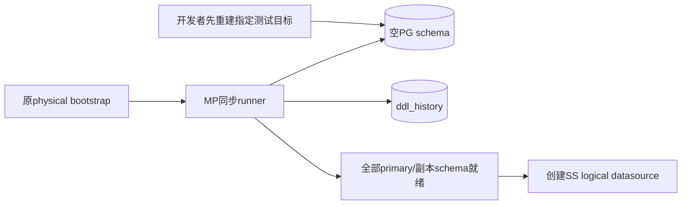
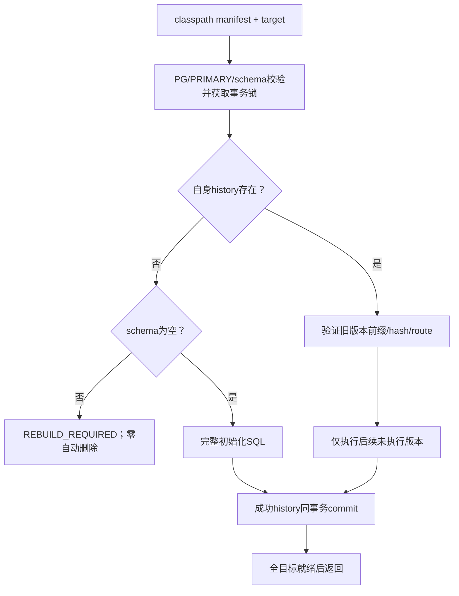
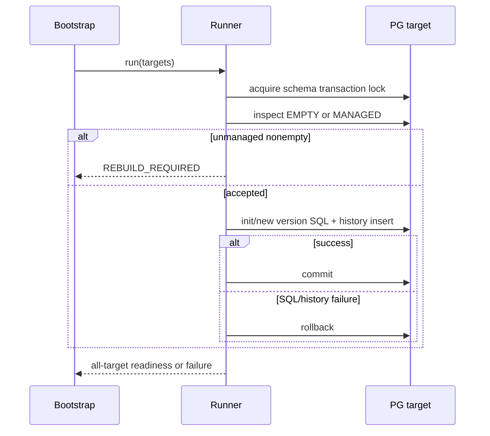
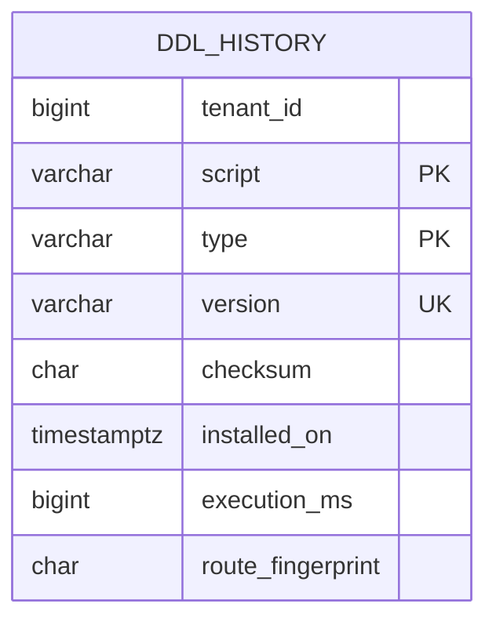

# MyBatis-Plus 快速迭代测试库重建修订

| Field | Value |
| --- | --- |
| Document | `2026-09-13-07-42-mybatis-test-database-rebuild-amendment.md` |
| Template Version | `7` |
| Status | `Accepted` |
| Type | `Architecture` |
| Complexity | `Complex` |
| Complexity Drivers | 六套物理库初始化顺序、管理台账与SQL原子性、测试数据可丢弃、Agent既有迁移边界 |
| Created | `2026-09-13 07:42 Asia/Shanghai` |
| Updated | `2026-09-14 00:28 Asia/Shanghai` |
| Owner | Mario |
| Repository | `Egon-COLA` |
| Scope | 已确认MP/Repository/SS主规格的数据初始化与兼容范围收敛 |
| Change Surface | 移除旧库数据/历史接管；简化DDL manifest/history；六套提供最终schema初始化版本；Agent保留既有Flyway链并做空表纠正 |
| Affected Chapters | §7, §8, §9, §10, §11, §13, §14, §15, §16, §17, §18 |
| Source Requirement | 用户在confirm/请求Plan后明确“可以破坏式更新，最后重建库就行了，现在还是快速迭代阶段”“目前库里都是测试数据，没事的” |
| Baseline Revision | `main @ 14686db8b023c7e6c76975de3fcc8af4139aa81e`；主Spec为本任务未跟踪文档 |
| Amends | [主规格](2026-09-12-21-11-mybatis-repository-cqrs-postgresql-evolution.md) §1、§4 REQ-005/012/013/026/027/028、§5 DEC-001/003、§7.2/7.3 DDL分支、§8.3.1/8.5初始化路径及Flyway测试依赖、§9 INTERNAL-063、§10.1历史哨兵与§10.5 DDL载体、§11历史迁移流程/ddl_history、§14 TEST-005/011/013、§15 ddl配置、§16回退规则、§17旧库接管备选。并澄清§8.3.2的ID复用必须指向Common真实Snowflake而非启动类测试stub。除此之外Repository/CQRS/Model目标/SS/LOCAL等其他设计不变 |
| Supersedes | `None` |
| Depends On | [主规格](2026-09-12-21-11-mybatis-repository-cqrs-postgresql-evolution.md) §4 REQ-001至037、§7/8/9/10/11的目标schema与非历史兼容设计，以及其明确继承的Provider/校验/PO构造规则 |
| Related Specs | `None` |
| Related Plans | [实施Plan](../plan/2026-09-13-07-42-mybatis-repository-sharding-implementation.md) |

## 1. Summary

用户明确测试数据可丢弃，因此本次不实现Flyway/manual历史接管、旧boolean删除时间恢复、原数据保留或兼容旧binary。六套Light/Service/Web及open以重建后的空PG schema为初次启动前提，直接执行最终目标schema版本。保留初始化后幂等重启、后续版本执行、checksum、route fingerprint、事务锁和失败关闭。

这份修订落实用户新增前提。主规格已由confirm批准；用户随后明确批准测试数据可丢弃并调用执行Plan，本修订作为有效执行要求一并接受。它不授权本轮连接数据库或自动运行删库/重建。旧迁移文件仍不改名、不改字节、不删除；新SQL/manifest由已批准的执行Plan创建。

## 2. Background and Current State

| Evidence ID | Classification | Exact path/symbol/decision/command | Observed fact | Design significance | Verification limit/freshness |
| --- | --- | --- | --- | --- | --- |
| EVD-101 | User decision | 本轮两条测试库说明 | 数据可丢弃、最后重建 | 历史兼容成本无当前收益 | 不授权本Plan阶段连接数据库 |
| EVD-102 | Static repository | 主规格§11.4/10.5/14 | 当前设计包含LEGACY_FLYWAY/MANUAL、CRC/结构manifest、删除哨兵 | 需要显式amend，不能藏在Plan里改设计 | 主规格全文快照已核对 |
| EVD-103 | Static repository | source light PhysicalDataSourceFlywayMigrator/Bootstrapper；各db资源 | 迁移在logical DS之前，每primary独立 | 保留正确启动顺序 | 本次未运行 |
| EVD-104 | Static repository | Agent infrastructure db/migration V20260910_001/002 | 原Flyway链拥有knowledge与Outbox，向量归PgVectorStore | 只做模型空表纠正，不扩大数据库所有权 | 用户只批准必要Agent兼容 |

### 2.4 Evidence and current-chain map

| Entry/trigger | Current call chain | Data read/written | External dependency | Consumers | Evidence |
| --- | --- | --- | --- | --- | --- |
| 六套启动 | physical pools→旧Flyway/manual规则→SS logical DS | schema/history | PG/SS | source六套 | EVD-103 |
| 目标首次启动 | 空schema→新版本完整DDL+history→ready→logical DS | 新schema/history | PG/SS | 同上 | 用户新前提与主规格启动顺序 |

## 3. Goals and Non-goals

省去没有当前价值的旧数据兼容和历史引擎，直接让测试库重建得到最终表结构。只移除兼容负担，不削弱tenant/版本/LOCAL/SQL安全或正常后续版本机制。不在应用启动时DROP DATABASE/SCHEMA/TABLE，不自动识别连接地址然后清库；重建为实施末尾明确目标后的受控运维动作。

### 3.3 Change Surface and Design Depth

| Area/layer | Disposition | Exact repository evidence | Changed or preserved behavior/contract | Required Spec treatment | Chapter(s) |
| --- | --- | --- | --- | --- | --- |
| DDL runner/manifest/history | Affected | 主规格J/ddl与INTERNAL-063 | 只处理空库/自身受管状态，移除legacy接管 | 完整新输入、状态、台账与测试 | §7, §8, §9, §10, §11, §13, §14, §15, §16, §17, §18 |
| 六套新SQL/Agent纠正/相关测试 | Affected | 主规格§8.3.1/11/14 | 新库完整初始化、Agent空表纠正，无历史数据回填 | 精确路径/前置状态/验证 | §7, §8, §11, §14, §16, §18 |
| 业务schema最终列/索引/PK/FK | Context-only | 主规格§11.2四十项详细表设计 | deleted_at NULL/version0/tenant等目标不变，只改变抵达方式 | 引用精确目标，禁止增删其他业务语义 | §11 |
| Repository/SQL/ID/SS/LOCAL | Unchanged | 主规格§7.3/7.4/9其他操作/10 | 全部维持已确认合同，legacy路由不自动换key | 主Plan仍完整实施 | §7 |
| 外部API/页面 | Unchanged | 用户原排除项、主规格§12 | 无wire/页面改动 | 简要边界 | §12 |

## 4. Requirements and Acceptance Criteria

REQ-001至037继续来自主规格；以下补充唯一编号，不重编号旧需求。REQ-005原“旧状态有迁移规则”的验收改为“旧库不接管、重建后NULL active”；REQ-012的接管目标改为接管管理职责，不导入旧历史。

| ID | Atomic requirement | Priority | Observable acceptance criteria | Source |
| --- | --- | --- | --- | --- |
| REQ-038 | 测试数据无需保留，初次以空schema重建 | Must | 无旧业务表→成功初始化；旧非受管表存在→REBUILD_REQUIRED，程序不自动删库 | 本轮用户明确 |
| REQ-039 | 删除历史兼容与回填实现 | Must | 不存在LEGACY_FLYWAY/MANUAL分支、CRC转换、baseline导入、1970删除哨兵回填、Flyway fixture依赖 | 快速迭代/可重建 |
| REQ-040 | 保留受管版本和故障正确性 | Must | 初始化/历史记录同事务；重启同hash skip；新版本有序执行；改hash/map拒绝；多primary失败不启动 | 保留原请求数据库管理/SS保证 |
| REQ-041 | 新版本完整DDL与Agent边界明确 | Must | 六套各一个新完整初始化版本；Agent一个新空表纠正版本；全部旧B/V/manual文件未改 | 保留迁移不可变和必要兼容 |
| REQ-042 | 本阶段只完成Spec修订和Plan | Must | 工作树只有文档/关系metadata变化；无数据库/服务启动或DDL执行 | 用户调用writing-plan |

### 4.1 Scenario matrix

| Scenario | Actor/trigger | Preconditions | Main path | Alternative/failure path | Data/state change | Observable result | Requirements |
| --- | --- | --- | --- | --- | --- | --- | --- |
| 首次启动 | 部署者 | 目标schema为空 | 新完整DDL+history同事务 | SQL失败rollback | 空→目标完整结构 | logical DS仅成功后创建 | REQ-038/040/041 |
| 旧测试库 | 部署者 | 有非受管业务表 | 拒绝并报告需重建 | 不自动drop/导入 | 数据不由启动器修改 | REBUILD_REQUIRED | REQ-038/039 |
| 重启/新版本 | 启动器 | 自身history存在 | 同hash skip/后续版本执行 | hash/路由冲突拒绝 | 按实际新版本提交 | 不重复执行已提交SQL | REQ-040 |
| 第二库失败 | 部署者 | 多primary | 逐库事务 | 关闭池，保留已提交库，重启skip | 非全局原子 | 不接流量 | REQ-040 |

### 4.2 Use-case analysis

| Actor ID | Actor/role | Goal and responsibility | Entry/channel | Permission/tenant context | Evidence |
| --- | --- | --- | --- | --- | --- |
| ACTOR-003 | 开发者/部署者 | 重建测试环境并验证 | 明确的测试数据库初始化 | 管理tenant0，不从业务请求取凭据 | 主规格ACTOR-003与用户测试库说明 |

| ID | Use case/goal | Primary actor | Supporting actors/systems | Trigger | Preconditions | Main success outcome | Alternatives/failures | Postconditions | Requirements | Interfaces/pages | Tests |
| --- | --- | --- | --- | --- | --- | --- | --- | --- | --- | --- | --- |
| UC-009 | 从空测试库获得最终结构 | ACTOR-003 | PG/SS/自定义runner | 受控重建后的启动 | 空schema/正确primary/新manifest | tenant/delete/version/索引齐备，SS就绪 | 旧未管理库拒绝/SQL回滚/副本滞后阻塞 | 不产生半schema成功记录 | REQ-038/039/040/041 | INTERNAL-063；无页面 | TEST-018/019 |

## 5. Constraints, Assumptions, and Decisions

用户已说明当前数据均为测试数据且最终重建；没有历史行回填/备份恢复验收。重建本身只在实施后对具体确认的测试目标执行，不在本次文档阶段进行。旧迁移文件不可变仍适用；文件不可变不等于要保留测试数据库里的旧数据。

删除兼容逻辑不改变同tenant同库两级分片、广播runtime只读或LOCAL单物理写目标。新库建立后仍支持后续版本，不退化成每次启动清库。小命名推断：完整初始化新文件用当前日期20260913_001，替代尚未创建的20260912_001路径；不会改动已有版本文件。

## 6. Project Technology Context

Java21/Boot3.5.16/MP3.5.16/SS5.5.3/PG不变；复用主规格选择的纯Java策略、ID和MP/Spring JDBC能力。生产六套移除Flyway依赖，测试也不再为历史接管引入Flyway；Agent的原Flyway依赖继续存在。

### 6.2 User-mandated Java rule compliance

| Literal rule | Affected? | Repository evidence | Exact design decision | Files/types/interfaces | Validation/test evidence | Status/blocker |
| --- | --- | --- | --- | --- | --- | --- |
| Rule 1 | Yes | 主规格J/ddl命名 | DdlTargetBO/ManifestBO/Result仍语义化 | §8/10 | 命名/编译检查 | PASS |
| Rule 2 | Yes | ValidationUtils与record输入 | @Valid/Jakarta约束和runner状态校验 | INTERNAL-063 | TEST-018/019 | PASS |
| Rule 3 | Yes | 原record模型 | 简化record字段，ScriptBO嵌套record；无新复杂PO | §10 | Record编译/绑定 | PASS |
| Rule 4 | Yes | 主规格具名runner注入 | @Slf4j/RequiredArgsConstructor/final Qualifier不变 | runner/config | wiring检查 | PASS |
| Rule 5 | Yes | JDK/Spring/MP已有 | 无新工具库/历史引擎 | runner | imports gate | PASS |
| Rule 6 | Yes | Jackson manifest | Jackson绑定固定record schema，无新外部wire | ManifestBO | serialization测试 | PASS |
| Rule 7 | Yes | 主规格profiles | ddl开关与超时等价，移除legacy keys所有环境同步 | config | key parity | PASS |
| Rule 9 | Yes | 状态流程仍有初始化/升级/失败 | 保留有必要的状态表与Facade，删除legacy策略 | §7/13 | 分支测试 | PASS |
| Rule 10 | Yes | Instant/Duration | history Instant UTC、耗时Duration；不再历史哨兵 | §10/11 | clock/状态测试 | PASS |
| Rule 11 | Yes | 精确COLA/source-projects | 只改原选定位置，不改变架构 | §8 | family verifier | PASS |

## 7. Architecture Design

### 7.0 Minimum-design baseline and element-necessity audit

| Proposed element | Change | Requirements | Existing/direct alternative | Concrete inadequacy of alternative | Added calls/state/coupling/failures/migration/operations | Verdict |
| --- | --- | --- | --- | --- | --- | --- |
| legacy接管/CRC/结构manifest/回填 | Remove | REQ-039 | 重建后直接最终DDL | 用户测试数据无保留需求 | 移除维护/测试/多状态成本 | Remove |
| 同步runner/history/checksum/route锁 | Keep | REQ-040 | 默认忽错runner或每次drop | 不满足初始化时序和幂等故障边界 | 保留每schema管理状态 | Keep |
| 完整初始化SQL | Replace | REQ-041 | 执行旧B/V再ALTER并回填 | 对空库执行兼容中间态没有必要 | 每应用一个新版本 | Add |

| Path | Network calls | Client states | Server contracts/state | Failure and TOCTOU points | Additional user/business value |
| --- | --- | --- | --- | --- | --- |
| 旧接管设计 | 每target多轮legacy/CRC/结构扫描 | 无页面 | 多种旧history状态 | 旧数据不可逆时间/不明history | 当前没有保留价值 |
| 空库重建设计 | 每target必要锁/初始化/history/就绪 | 无页面 | EMPTY/MANAGED/REJECT | SQL事务和跨target部分完成仍处理 | 缩短快速迭代实现路径 |

### 7.1 System Architecture Design

### 7.2 High-Level Design

#### 7.2.2 High-level decision and quality matrix

| Concern/use case | Required behavior | Selected mechanism | Failure/degradation behavior | Trade-off | Verification | Requirements |
| --- | --- | --- | --- | --- | --- | --- |
| 快速迭代 | 不保留无价值兼容分支 | 直接最终DDL | 旧库要求重建 | 测试数据丢弃获授权 | TEST-018 | REQ-038/039 |
| 单库正确性 | DDL/history共同成功 | 同一connection transaction | 任一步异常rollback | 不支持不可事务DDL | TEST-019 | REQ-040 |
| 多库就绪 | 任一失败不接流量 | 原bootstrap屏障/资源清理 | 已commit库保留，重启skip | 无跨库全局事务 | TEST-019 | REQ-040 |

### 7.3 Detailed Design

排序、锁/SQL超时、PRIMARY校验、JDBC单连接事务、classpath防遮蔽、SQL与history原子性、ready屏障、pool关闭和安全日志沿用主规格。EMPTY必须target schema没有用户关系对象（管理表不算空）；非空且没有自身history直接拒绝，不统计旧业务行/不读取flyway_schema_history。MANAGED验证已执行记录恰为manifest脚本序列前缀、每项version/path/SHA256/route一致；同版skip，后续版本按序执行，不自动回填schema漂移。

历史checksum/route不一致时提示修正未发布代码或重建测试库，不自动drop。初始完整DDL含history建表，最后同连接写成功SQL记录；没有BASELINE行、origin字段或旧CRC转换。未知commit结果通过相同版本的history行判定，仍保留故障测试。

#### 7.3.6 Conclusion evidence chain

| Conclusion | Repository/user evidence | Constraint or requirement | Design decision | Consequence and trade-off | Verification and acceptance evidence |
| --- | --- | --- | --- | --- | --- |
| 兼容接管移除 | EVD-101/102 | REQ-038/039 | 全部使用空库前置条件 | 测试数据可丢弃；少两种历史状态和回填 | TEST-018 |
| 版本/锁保留 | EVD-103、原启动时序 | REQ-040 | 不改正确事务与ready边界 | 有最小管理台账但不造旧库引擎 | TEST-019 |

## 8. Package Structure and Code File Tree

沿用主规格别名J/M/S/A；每个具体root仍由主规格§8.3.1精确矩阵定位。

| Operation | Path/package | Symbols | Responsibility | Dependencies | Requirements |
| --- | --- | --- | --- | --- | --- |
| Modify planned | J/ddl/EgonColaPostgreDdlRunner.java | run | 删除legacy分支，EMPTY/MANAGED/REJECT | 已选MP/Spring JDBC | REQ-038/039/040 |
| Modify planned | J/ddl/EgonColaDdlManifestBO.java | record+ScriptBO | 简化版本资源清单 | Jackson/Jakarta | REQ-039 |
| Modify planned | J/ddl/EgonColaDdlResult.java | status | 仅APPLIED/SKIPPED，无ADOPTED | java.time | REQ-039 |
| Replace planned paths | 六套各resources/db/egon-mp/V20260913_001__initialize_repository_schema.sql | 最终完整目标表 | 替代尚未创建的V20260912_001__repository_model.sql | 主规格目标DDL | REQ-041 |
| Modify planned | 六套各resources/db/egon-mp/repository-manifest.json | scripts列表 | 没有baseline/CRC/legacy schema树 | runner | REQ-039/041 |
| Replace planned path | A/src/main/resources/db/migration/V20260913_001__egon_model_repository.sql | 空表纠正 | 在Agent原V001/002之后确保knowledge表为空，再新增deleted_at/version并移除旧boolean/identity | 原Flyway边界 | REQ-041 |
| Modify planned | T/ddl/EgonColaDdlAdoptionTest.java → T/ddl/EgonColaDdlInitializationTest.java | 新建/旧库拒绝/幂等 | 名称与目标改为初始化，无Flyway fixture库 | 当前JUnit/PG测试 | REQ-039/040 |
| Modify planned | 原Spec所有引入Flyway test fixture的POM/测试 | dependency removal | 六套production和test都不为本任务新增Flyway | Agent原依赖不变 | REQ-039 |

旧B/V/manual路径完全不进入Modify/Delete清单。新完整SQL按role分发的方式不变；文件一次生成完整目标，不能先创建空version文件再当旧文件反复改。重建后的六套不执行旧baseline SQL。Agent只在空knowledge表执行其唯一新纠正migration，不复制或接管Outbox/vector DDL。

### 8.1 当前ID Bean证据与必要接线澄清

重新核验发现：Web `OrganizationApplication.longIdGenerator()`无profile限制并固定返回2001L；Web-open同名Bean无profile限制、使用本地AtomicLong。这两者都不是用户要求复用的分布式ID算法。生产应使用已有Common ID Starter的 `SnowflakeIdGenerator`，不保留这两个生产stub；确定性fixture可以仅在test profile保留并统一名为snowflakeIdGenerator。

Web/Web-open两个基础设施服务现有 `@Qualifier("longIdGenerator")` 改为 `snowflakeIdGenerator`，其他按类型注入者无需改wire/API。不要额外声明一个同类型alias Bean导致Common的ConditionalOnMissingBean提前backoff。七套base/dev/test/prod配置补齐现有IdGeneratorProperties的enabled、machine-id、max-clock-backward（默认PT0.005S）；生产/开发machine-id取EGON_ID_MACHINE_ID，test隔离fixture可固定0。Common算法/机器号位布局不修改，真正PG/唯一性验收不使用常量测试替身。

这修正的是主REQ-017/018已经要求的真实算法接线，未新增ID方案。实际源文件为Web/Web-open starter的OrganizationApplication.java、其UserDomainServiceImpl/SchoolClassDomainServiceImpl，以及七套现有application*.yml；Plan只在这些已受影响文件内落实。

## 9. Interface Definitions

### 9.1 Interface Inventory

| ID | Change/necessity verdict | Name/purpose | Kind | API style/CQRS role | Consumer | Owner | Method + URL / GraphQL field / symbol / topic | Operation ID/schema source | Input | Output | Auth/tenant | Error model | Idempotency/version | Requirements |
| --- | --- | --- | --- | --- | --- | --- | --- | --- | --- | --- | --- | --- | --- | --- |
| INTERNAL-063 | Modify/Keep | 从空schema初始化或执行受管后续版本 | Internal Java | Command management | Bootstrap | MP runner | EgonColaPostgreDdlRunner.run(List<EgonColaDdlTargetBO>) | 本修订 | typed targets/scripts | List<DdlResult> | 管理tenant0，PRIMARY | REBUILD_REQUIRED/SQL/config exceptions | path/version/hash/route | REQ-038/039/040 |

### 9.2 Per-interface Detailed Contracts

#### 9.2.1 INTERNAL-063 — 简化运行器

##### Necessity and interaction-cost decision

| Concern | Decision |
| --- | --- |
| Change classification | Modify同一同步runner，删除旧数据接管 |
| Independent consumer goal | 从明确空schema获取最终可用表结构并管理之后版本 |
| Parameter ownership and derivation | target/role/schema来自bootstrap，scripts来自受审classpath manifest，不来自业务请求 |
| Direct/no-new-interface alternative | 原run签名仍够用，不增加reset/预查/备份API |
| Caller use of result | 只有全部目标完成才创建SS logical DS，不转发给其他参数查询 |
| Round trips and failure points | 逐primary锁/DDL/history/ready；移除CRC/legacy探测多次扫描 |
| Verdict | Keep，REQ-038/039/040；不新增可远程触发的删库接口 |

##### Identity and purpose

签名保留 `List<EgonColaDdlResult> run(List<EgonColaDdlTargetBO> targets)`。同步调用、无HTTP/JSON wire暴露。锁/SQL/ready超时与失败关闭按主规格；仅目标schema为EMPTY或自身MANAGED时可执行，任何其他状态都要求先重建。

##### Request parameters

targets非null非空、@Valid级联，physical alias/schema/role唯一且PRIMARY；ManifestBO只有family+有序scripts，每个ScriptBO(version,path,sha256)非null非空、SHA256为64位hex，版本严格递增、路径唯一、仅classpath。routeFingerprint仍由同一SS policy产生。不得传入删除数据库标志、旧Flyway凭据或任意URL脚本。

##### Success response

仅全target和ready屏障成功后返回结果列表，每target含alias/schema/version/checksum、status APPLIED或SKIPPED、非负Duration elapsed；不返回ADOPTED。APPLIED证明该target版本事务已提交；全列表返回才表示所有目标完成，不声称多个库共用全局事务。

##### Error responses

非空未管理schema→IllegalStateException("REBUILD_REQUIRED")，零业务DDL。checksum/route/manifest前缀冲突→现有相应配置异常，不能自动重置history。SQL/history错误保留SQLState/cause，rollback本target，bootstrap关闭池；之前target已提交不逆向擦除。未知结果重新查询自身history，不读取Flyway history来猜测。

##### Interface logic for frontend and consumers

整体校验target/resources→逐target获取锁并锁内重读EMPTY/MANAGED→EMPTY执行完整初始SQL，MANAGED只执行后续版本→同连接写history→commit→所有primary及必要replica schema/广播就绪→返回。没有页面动作或新业务API；不会在启动时DROP现有数据库。

##### Compatibility and verification

替代主Spec同ID旧历史接管合同，其他142个内部操作不变。TEST-018/019分别验证空库/旧库拒绝和后续版本/崩溃恢复；不再引入Flyway11.15.0测试fixture。调用方run签名不变，仅manifest/result枚举与状态语义收敛。

## 10. POJO and Data Model Design

`EgonColaDdlManifestBO`变为record(String family,List<ScriptBO> scripts)，其中ScriptBO为该文件嵌套record(String version,String path,String sha256)，@NotBlank/@NotEmpty/@Valid与不可变复制。移除baselineResourcesByRole、resourceSha256重复Map、flywayChecksums、expectedLegacySchema、expectedTargetSchema；sha256直接随脚本项保存，没有平行字典对齐问题。target已有role/schema/routeFingerprint不改。

`DdlResult.StatusEnum`只保留APPLIED/SKIPPED。EgonModel的LocalDateTime/NULL、Long version、tenant/id/audit不变；删除旧true的epoch哨兵规则从有效设计退出，新数据库从一开始只有deleted_at=NULL。没有新业务DTO/Converter，对外JSON合同保持原状。

## 11. Database Design

### 11.1 Table Inventory

业务表最终结构仍按主Spec§11.2各项，为Context-only；本修订只改变初始化路径和管理台账字段，不重新设计业务PK/FK/业务列。唯一关系模型变化是ddl_history去掉不再需要的legacy管理字段。

| Table | Existing/new | Purpose and owner | Read/write paths | Change | Migration | Requirements |
| --- | --- | --- | --- | --- | --- | --- |
| ddl_history | New planned | runner管理每schema版本，tenant0 | run | 无BASELINE/origin/schema_fingerprint | 各新初始化V20260913_001同事务建表 | REQ-039/040 |

### 11.2 Per-table Detailed Design

#### 11.2.1 ddl_history

##### Purpose, ownership, and lifecycle

每个六套physical schema一张，由同步runner写，业务Mapper禁止使用；保留所有本工具执行版本，tenant_id保留0。记录数按发布版本增长，与业务数据量无关；不承载旧Flyway/manual来源或真实删除时间恢复责任。

##### Complete column design

| Column | Native type | Length/precision | Null | Default | Generated | PK/FK/unique/check | Meaning | Source/mapping | Example |
| --- | --- | --- | --- | --- | --- | --- | --- | --- | --- |
| tenant_id | bigint | 64bit | No | 0 | runner | CHECK=0 | schema管理保留值 | JDBC | 0 |
| script | varchar | 500 | No | 无 | manifest path | PK(script,type) | canonical classpath SQL | ScriptBO.path | db/egon-mp/V20260913_001__initialize_repository_schema.sql |
| type | varchar | 30 | No | SQL | runner | PK；CHECK=SQL | MP管理脚本种类，无BASELINE | 固定常量 | SQL |
| version | varchar | 30 | No | 无 | manifest | UNIQUE(type,version) | 声明实际版本 | ScriptBO.version | 20260913_001 |
| checksum | char | 64 | No | 无 | SHA256 | hex格式 | 文件内容校验 | ScriptBO.sha256 | 64位hex |
| installed_on | timestamptz | 6 | No | CURRENT_TIMESTAMP | DB | 无 | 执行时刻 | Instant | UTC instant |
| execution_ms | bigint | 64bit | No | 无 | elapsed | CHECK>=0 | target执行耗时 | Duration | 120 |
| route_fingerprint | char | 64 | No | 无 | typed routing | hex格式 | 防止无迁移改变地址 | target | 64位hex |

##### Keys, relationships, and constraints

沿用PK(script,type)与UNIQUE(type,version)；没有外键或业务tenant生命周期关联。type仅SQL，移除原拟建origin/schema_fingerprint字段，不存在对已建管理表的ALTER（尚未实施）。原Flyway history不修改，它也不作为本工具MANAGED判断依据。

##### Index inventory and per-index justification

| Index | Type/unique | Ordered columns/expressions | Predicate/include | Query and operation | Cardinality/selectivity | Sort/coverage role | Write/storage cost | Decision |
| --- | --- | --- | --- | --- | --- | --- | --- | --- |
| pk_ddl_history | btree unique | script,type | 无 | 按脚本确认是否已执行 | 每文件一条 | 精确查找 | 每版本一次 | Keep |
| uk_ddl_history_type_version | btree unique | type,version | 无 | 校验manifest有序前缀/同版本换文件 | 唯一 | 小历史集合读取 | 每版本一次 | Keep |

##### Access patterns and SQL shape

| Operation | Caller | Predicate/join/order | Expected rows | Index/constraint | Lock/isolation | Failure/idempotency |
| --- | --- | --- | --- | --- | --- | --- |
| managed校验 | runner.run | script/type或type/version | 0/1或已有版本列表 | PK/UK | schema advisory事务锁 | 同hash skip，冲突拒绝 |
| success写入 | runner.run | PreparedStatement INSERT八列 | 1 | PK/UK | 与DDL同连接事务 | commit前失败一起回滚 |

##### Migration and historical-data handling

在六套新完整初始化脚本中直接创建这八列，无旧历史导入。旧schema有表而无自身history则REBUILD_REQUIRED；人工/受控运维清空目标后重启。后续manifest必须包括已执行前缀，新版本每target有序执行；不能删除旧history来重跑SQL。不存在回填、origin映射、结构指纹生成或旧行保留测试。

##### Transaction, consistency, and recovery

主Spec同schema锁、Connection autoCommit=false、EOF脚本解析、history PreparedStatement和commit规则保留；本库失败全部rollback，多库已成功保留，全部ready才接流量。计划中的回退是重建测试目标并用对应版本初始化，不要求恢复可丢弃旧测试行。

### 11.3 Entity-relationship diagram

Relational model change: Yes，仅拟建管理台账字段收敛。业务模型/关系没有新变化，引用主Spec完整ER。

DDL_HISTORY对应每个目标schema的ddl_history，UK是(type,version)联合键。该表没有与业务表的FK，tenant=0也不是可供业务查询选择的全局租户通道。

## 12. Frontend Page Design

Unchanged：主Spec§12已排除页面和外部wire。重建动作不新增前端删除按钮/API；当前只输出文档。

## 13. Design Patterns and Architecture Principles

删除LEGACY适配策略及结构/CRC引擎，保留Bootstrap Facade、按EMPTY/MANAGED/REJECT登记的状态处理和已有MP IDdl Adapter。不为“未来可能保留生产数据”预造兼容路径；将来真有存量保留要求再单独设计。纯输入约束直接使用Jakarta，复杂状态仍显式表驱动，符合原模式边界。

## 14. Test Design

TEST-001至004/006至012/014至017原非历史部分保持。TEST-005改为新库NULL/version0/删除竞争/active索引，不再旧boolean回填；TEST-013被下面初始化契约替代，无Flyway fixture。

| ID | Level | Target | Scenario/input | Expected assertion | Test double/data | Tool/path | Requirements |
| --- | --- | --- | --- | --- | --- | --- | --- |
| TEST-018 | Unit+PG | 初始化runner/新DDL | 真空schema、未管理旧表、初始化后重启 | 空库目标结构齐备；旧库拒绝且不drop；重启零重复DDL | 独立PG schema/JDBC fake | EgonColaDdlInitializationTest | REQ-038/039/041 |
| TEST-019 | Unit+PG | managed版本/多target | version2、改hash、改route、history写前失败、第二primary失败 | 有序执行；冲突拒绝；单库原子；其他已成功下次skip；不创建logicalDS | 故障Connection/独立PG | EgonColaPostgreDdlRunnerTest | REQ-040 |

普通单元可用mock JDBC状态；PG/SS/副本仍需隔离环境，不能把mock或H2当真实运行证明。Agent空库测试从原Flyway链走到新纠正版本，其已有依赖无需新增；断言knowledge表为空才执行修正，Outbox/vector不改所有权。

### 14.1 H2快速上下文与PG初始化隔离

六套当前application-test.yml通过H2+旧Flyway构造上下文。PG-only新runner不能照搬进这条fast测试路径。生产配置保持PG初始化；默认test profile关闭MP DDL，通过测试源的PersistenceTestSupport使用Spring6.2已有@TestBean按名字替换dataSource、egonColaWriteTargetResolver和snowflakeIdGenerator。其H2 schema使用逻辑表名、八字段与原测试seed；只验证业务/Mapper/装配，不宣称PG部分索引、SS路由或复制。

每个实际@SpringBootTest测试模块在src/test/java的support包新增一个共享测试基类、src/test/resources/mybatis/h2-schema.sql；已有上下文测试继承它，必要H2驱动只在该测试模块scope=test。static无参factory创建唯一内存库并填schema，单目标resolver防止真实bootstrap；ID用局部AtomicLong测试替身。@DirtiesContext(AFTER_EACH_TEST_METHOD)隔离数据库/序列；原测试seed和MockMvc断言保留。PG/SS专用IT不继承该基类且必须实际初始化真实隔离PG。没有生产新方言支持、自动建服务或新增测试框架。

这是原REQ-026“fast与PG验收分开”在现存测试结构上的落实。@TestBean是当前Spring6.2原生测试Bean替换机制，参考[官方6.2文档](https://docs.spring.io/spring-framework/reference/6.2/testing/annotations/integration-spring/annotation-testbean.html)，不引入新依赖框架或业务API。

## 15. Non-functional and Cross-cutting Design

删除legacy keys/manifest字段时六套base/dev/test/prod等价同步；ddl.enabled/timeout/PRIMARY/role/schema/profile要求不变。日志不记录旧业务数据、credential或全SQL值。少掉结构/CRC导入扫描降低启动复杂性，不虚报性能指标；正常managed checksum与route验证仍必须执行。

## 16. Compatibility, Migration, Rollout, and Rollback

代码/表结构不兼容已获授权，所有测试数据可丢弃。实施最后由明确的测试目标重建获得空schema，随后按新初始化脚本启动；本Plan阶段不操作数据库，实施也不通过应用启动器隐式清库。旧SQL文件保留；六套不执行它们，只用于审阅目标业务DDL的源证据。

Agent保留原V001/V002→唯一新纠正版本，在测试库从空链执行；新纠正版本若knowledge表非空则要求先重建，不保留历史标志。失败回退为重建并使用上一份可用初始化artifact，不需要旧测试数据回填；未知数据库目标不得靠猜测连接地址执行drop。

## 17. Alternatives and Decisions

| Option | New elements and interactions | Advantages | Disadvantages/risks | Repository fit | Decision and rationale |
| --- | --- | --- | --- | --- | --- |
| 保留旧接管 | 多legacy状态/CRC/结构树/哨兵 | 可保留旧业务数据 | 当前用户无此需求，实现维护成本大 | 被最新前提替代 | Rejected |
| 空库完整初始化+managed后续版本 | 当前runner的最小必要状态 | 快速迭代、结果直接、故障边界清楚 | 测试旧库需先重建 | 用户已允许丢数据 | Selected |
| 启动时自动drop | 几行危险快捷逻辑 | 看似方便 | 目标误配会自动删除数据、超出文档任务 | 无必要 | Rejected |

## 18. Risks and Open Questions

无需要再次询问的设计决定。真实测试数据库连接/重建执行时机属于后续执行前置条件，Plan写清目标和步骤，不是本次文档完成阻塞。新库无历史兼容，未来生产数据保留需要新规格；不能将本次测试库前提永久推广到所有宿主应用。

## 19. Traceability Matrix

| Requirement | Use case | Affected area/chapter | Context-only or unchanged boundary | Interface/model/database/frontend | Tests | Acceptance evidence |
| --- | --- | --- | --- | --- | --- | --- |
| REQ-005 | UC-009 | 字段验收/§10/11 | 主Spec目标列保持 | 初始化NULL，无旧行哨兵回填 | TEST-018 | 空库字段合同 |
| REQ-038 | UC-009 | 初始化/§7/9/11/16 | 原业务目标schema | EMPTY前置/REBUILD_REQUIRED | TEST-018 | 零自动drop，空库成功 |
| REQ-039 | UC-009 | 精简/§8/10/11/14 | 非历史原142操作 | 简化manifest/history | TEST-018/019 | 无legacy/CRC/回填实现 |
| REQ-040 | UC-009 | 正确性/§7/9/11/15 | LOCAL/SS原保证 | INTERNAL-063 | TEST-019 | 事务/history/ready闭合 |
| REQ-041 | UC-009 | 新SQL/§8/11/16 | 旧B/V/manual不可变 | 六套新初始化+Agent新纠正 | TEST-018 | 一应用一新版本 |
| REQ-042 | UC-009 | 文档/§8/16 | 所有生产/测试代码 | Spec/Plan metadata | 文档校验/diff | 无runtime操作 |

## 20. Review and Acceptance

### 20.1 Original-request fidelity

落实用户“测试数据可丢弃、最后重建”新前提，保留此前确认的功能范围和不启动服务/不改旧迁移要求。

### 20.2 Repository and technical fidelity

原文件路径/POM/Agent边界已重新核验；所有新SQL文件尚未存在。主Spec仅关系/批准状态metadata可更新，历史规范正文通过本amendment覆盖而非原地重写。

### 20.3 Cross-section consistency

EMPTY/MANAGED/REJECT、八列history、两态result、简化manifest、完整初始化SQL和TEST-018/019相互一致；不残留legacy回填验收。

### 20.4 Relationship and effective-design review

本修订精确Amends主规格指定部分，其余原37条需求保留。Plan引用主规格与本修订，状态Review，不声称已经实施。

### 20.5 Blocking Manual Check

| Check ID | Applicability | Status | Evidence | Finding | Required action/exception |
| --- | --- | --- | --- | --- | --- |
| MC-ARCH-001 | Applicable | PASS | §3/8；COLA位置不变 | 对应设计/边界已明确 | None |
| MC-REUSE-001 | Applicable | PASS | §7.0/13；删除无需求历史引擎，复用已选runner | 对应设计/边界已明确 | None |
| MC-DEP-001 | Applicable | PASS | §6/8；删除新增Flyway fixture，其他依赖不变 | 对应设计/边界已明确 | None |
| MC-NAME-001 | Applicable | PASS | §8/10 record与runner明确角色 | 对应设计/边界已明确 | None |
| MC-VALID-001 | Applicable | PASS | §9 inputs与§10 @Valid/Jakarta | 对应设计/边界已明确 | None |
| MC-MODEL-001 | Applicable | PASS | §10两个简单record与嵌套ScriptBO，无新复杂PO | 对应设计/边界已明确 | None |
| MC-CONVERT-001 | Applicable | PASS | 业务Converter不变，沿用主Spec BaseConverter合同 | 对应设计/边界已明确 | None |
| MC-LOG-001 | Applicable | PASS | §15安全日志不打印凭据/行值 | 对应设计/边界已明确 | None |
| MC-BEAN-001 | Applicable | PASS | §6/8；具名runner与RequiredArgs/Qualifier继承原合同 | 对应设计/边界已明确 | None |
| MC-UTIL-001 | Applicable | PASS | §6/13 JDK/Spring/MP，无新增Utils | 对应设计/边界已明确 | None |
| MC-JSON-001 | Applicable | PASS | §10 Jackson typed manifest，无新wire | 对应设计/边界已明确 | None |
| MC-TIME-001 | Applicable | PASS | §11 Instant/Duration，无历史哨兵 | 对应设计/边界已明确 | None |
| MC-CONFIG-001 | Applicable | PASS | §15所有环境删除legacy keys保持等价 | 对应设计/边界已明确 | None |
| MC-PATTERN-001 | Applicable | PASS | §7/13状态表+Facade，删除不必要策略 | 对应设计/边界已明确 | None |
| MC-SCOPE-001 | Applicable | PASS | §3/16仅测试库前提收敛和文档 | 对应设计/边界已明确 | None |
| MC-TEST-001 | Applicable | PASS | §14新初始化/故障测试替代旧接管测试 | 对应设计/边界已明确 | None |
| MC-BLOCKER-001 | Applicable | PASS | §5/18用户新前提明确，无未决大项 | 对应设计/边界已明确 | None |

### 20.6 Final verdict

**PASS — Ready for user review**

这是文档完整性结论，不是代码、数据库或运行环境验证结果。严格校验已执行PASS，退出码0；仅文档验证，不是代码/数据库运行证明。

## 19. 已授权执行澄清与本地证据边界

用户在真实 PG/SS 门禁问题后明确“继续迭代”，将这些门禁后置为手动验收；本地源码、单测、生成验证仍必须通过，不能把跳过用例记作运行通过。

EC-001：MP 3.5.16 对携带 et 的自定义 UPDATE 也先递增实体版本；所有此类 XML 的期望版本必须使用 `MP_OPTLOCK_VERSION_ORIGINAL`，不是修改后的 et.version。该澄清保持主规格乐观锁语义，不改变对外请求合同。状态机更新同时保留 expected status。

EC-002：既有角色/课程等再次保存从同一事务读取当前行，借 MapStruct 保留创建元数据与版本，然后条件更新；已用真实 H2/MyBatis 复现重复插入 RED 并验证修复。生产 ID 使用现有 Common 生成器，计数器仅留在隔离测试。

## 20. PostgreSQL dollar-quote execution澄清 EC-003

PostgreSQL 初始化脚本使用 `$egon$ ... $egon$` 包围 role-aware DO 块。Spring JDBC 6.2.15 `ScriptUtils.splitSqlScript` 保护单/双引号与注释，但不识别 PostgreSQL dollar-quoted bodies，因而会误把 PL/pgSQL 内部分号当成顶层语句分隔符。`EgonColaPostgreDdlRunner` 现以 PostgreSQL 词法状态切分：字符串、标识符、嵌套注释及 dollar-quote 内部分号不分割；只执行完整顶层语句；不执行纯尾注释。分割器仍先接受 `NONTRANSACTIONAL` 拒绝门禁，各 SQL 语句和对应 history 写入仍共享原版本事务。测试固定了含内部分号的 DO body 与常规语句切分，不声称替代真实PG迁移验证。
