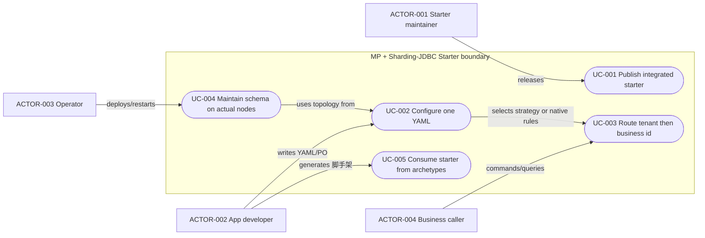
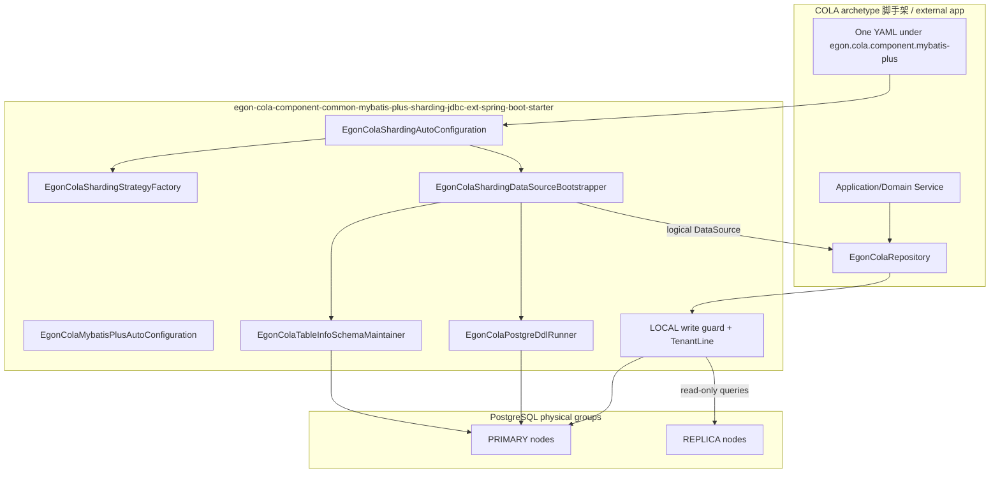
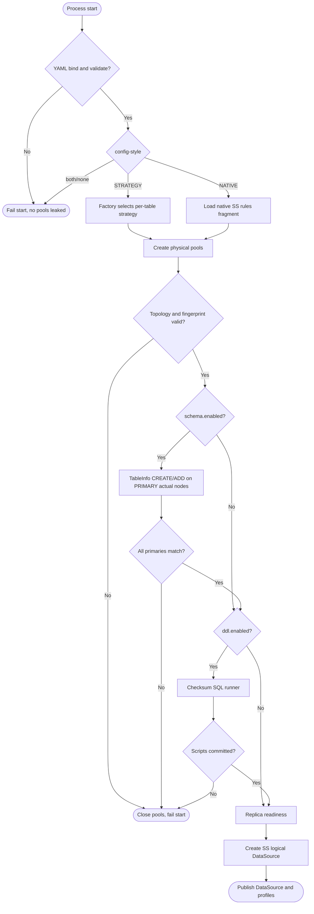
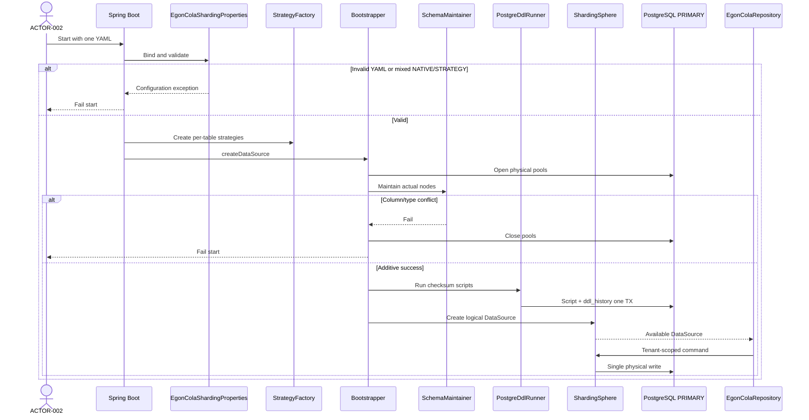
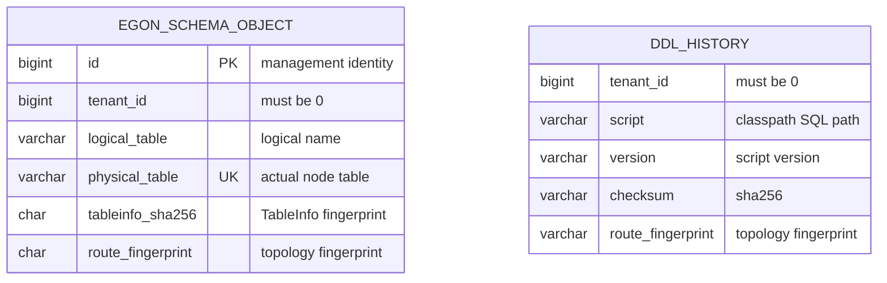

# MyBatis-Plus 与 Sharding-JDBC 整合进公共 Starter 并统一 Archetype 消费

| Field              | Value                                                                                                                                                                                                                                                                                                                                                                             |
|--------------------|-----------------------------------------------------------------------------------------------------------------------------------------------------------------------------------------------------------------------------------------------------------------------------------------------------------------------------------------------------------------------------------|
| Document           | [`2026-09-14-22-05-mp-sharding-jdbc-starter-unification.md`](2026-09-14-22-05-mp-sharding-jdbc-starter-unification.md)                                                                                                                                                                                                                                                            |
| Template Version   | `7`                                                                                                                                                                                                                                                                                                                                                                               |
| Status             | `Accepted`                                                                                                                                                                                                                                                                                                                                                                        |
| Type               | `Architecture`                                                                                                                                                                                                                                                                                                                                                                    |
| Complexity         | `Complex`                                                                                                                                                                                                                                                                                                                                                                         |
| Complexity Drivers | 公共 Starter 接管 ShardingSphere-JDBC 物理池/逻辑数据源/策略分片；六套 archetype 删除重复适配；单 YAML 兼容原生 SS 规则；LOCAL 默认且保留 XA 依赖；PostgreSQL 读写分离；TableInfo 驱动的分片感知表结构自动维护；租户两级分片与广播/单表；Maven 坐标重命名                                                                                                                                                                                                        |
| Created            | `2026-09-14 22:05 CST`                                                                                                                                                                                                                                                                                                                                                            |
| Updated            | `2026-09-14 22:24 CST`                                                                                                                                                                                                                                                                                                                                                            |
| Owner              | Mario / Egon-COLA maintainers                                                                                                                                                                                                                                                                                                                                                     |
| Repository         | `Egon-COLA`                                                                                                                                                                                                                                                                                                                                                                       |
| Scope              | 重命名并扩展 Common MyBatis-Plus Starter，使其成为 PG + MP + ShardingSphere-JDBC + ext 的强制整合点；六套 Light/Service/Web 及 open 与 Agent 均消费该 Starter 并提供合法 SS 拓扑；BOM/文档/verifier 同步                                                                                                                                                                                                                |
| Change Surface     | 模块重命名与 Maven relocation；Starter 新增 SS 依赖、单文件 YAML、策略 SPI、启动编排、TableInfo 表结构维护；删除六套重复 bootstrap/algorithm/YAML 组；保留 Repository/EgonModel/LOCAL 守卫/CQRS SQL 合同                                                                                                                                                                                                                      |
| Affected Chapters  | `§7, §8, §9, §10, §11, §13, §14, §15, §16, §17, §18`                                                                                                                                                                                                                                                                                                                              |
| Source Requirement | 2026-09-14 用户要求：当前 `egon-cola-components-common-mp-starter` 应更名为整合 MP 与 Sharding-JDBC 的 Starter；分片不应再由各 archetype 单独适配；多数据源、事务、分库分表、动态表名、逻辑/广播/单表、均匀分布、分片键/算法/策略、YAML 策略模式并兼容原 SS 配置、README 推荐用法、LOCAL 默认且不排除 XA、PG 读写分离、一个配置文件、全部表 tenant_id、第一层 tenant 第二层业务 ID、基于 MP 高级特性做表结构自动维护并适配分片多数据源；archetypes 全部更新                                                                     |
| Baseline Revision  | `main @ f94a8894435efe8ef53264549e42469f6ca420b5`；发现时工作树干净                                                                                                                                                                                                                                                                                                                        |
| Amends             | [Common MP Starter](2026-08-19-16-11-common-mybatis-plus-starter.md) §3.2 中“Starter 不实现 ShardingSphere”的非目标；[Repository/CQRS/SS 主规格](2026-09-12-21-11-mybatis-repository-cqrs-postgresql-evolution.md) §1、§3.2、§5.3 DEC-004/009、§7–§8 中“Common 无 SS 依赖、宿主自建池/拓扑/双 YAML”的所有权与配置形状；[测试库重建修订](2026-09-13-07-42-mybatis-test-database-rebuild-amendment.md) §7/§11 仅扩展表结构维护机制，不恢复旧库接管 |
| Supersedes         | [主规格](2026-09-12-21-11-mybatis-repository-cqrs-postgresql-evolution.md) §1、§3.2、§7、§8 中“各脚手架自建 `ShardingDataSourceBootstrapper` 以及 `app.sharding` 与 `sharding/shardingsphere-*.yml` 两组配置”的范围；由本文件 §7、§8、§16 替换                                                                                                                                                                    |
| Depends On         | [主规格](2026-09-12-21-11-mybatis-repository-cqrs-postgresql-evolution.md) §4 仓储/CQRS/`EgonModel`/TenantLine/LOCAL 写守卫/两级路由纯函数；[重建修订](2026-09-13-07-42-mybatis-test-database-rebuild-amendment.md) §4 空 schema 初次初始化与旧 B/V/manual 文件不可变；[Archetype MP 统一](2026-08-25-19-09-archetype-mybatis-plus-unification.md) §5.3 的 PO 继承 `EgonModel` 与 domain/infra 方向                         |
| Related Specs      | [ShardingSphere/Flyway 基线](../../superpowers/specs/2026-07-23-archetype-shardingsphere-flyway-design.md)；[Agent RAG](2026-09-10-11-51-agent-archetype-knowledge-rag.md) 的 `PgVectorStore` 向量表所有权保持                                                                                                                                                                                |
| Related Plans      | [实施 Plan](../plan/2026-09-14-22-28-mp-sharding-jdbc-starter-implementation.md)                                                                                                                                                                                                                                                                                                    |

## 1. Summary

当前公共模块 `egon-cola-component-common-mybatis-plus-spring-boot-starter` 已经交付 MyBatis-Plus 3.5.16 的 Repository、
`EgonModel`、租户守卫和脚本型 PostgreSQL DDL 运行器，但明确把 ShardingSphere-JDBC 的物理池、拓扑校验、逻辑数据源和 YAML
规则留给六个 archetype 各自复制。结果是每套脚手架都有近乎相同的 bootstrap 类，并且同时维护 `datasource/sharding*.yml` 与
`sharding/shardingsphere-*.yml` 两组配置。外部项目无法“只引一个 Starter”就得到可运行的分库分表。

本次把该模块重命名为 `egon-cola-component-common-mybatis-plus-sharding-jdbc-ext-spring-boot-starter`，在 Starter 内完成
MP 与 ShardingSphere-JDBC 5.5.3 的整合：单 YAML 描述物理数据源、表类型、策略、读写分离和事务；用策略模式生成或适配原生
`!SHARDING` / `!SINGLE` / `!BROADCAST` / `!READWRITE_SPLITTING` 规则；默认 LOCAL，classpath 保留 XA；表结构由 MP TableInfo
做幂等维护，并按实际数据节点展开到分片/广播/单表。六套 archetype 脚手架删除本地 SS 适配代码，只保留业务表 YAML 与 SQL。消费本
Starter 即强制同时使用 PostgreSQL、MyBatis-Plus、ShardingSphere-JDBC 与本模块增强；排除 SS、省略分片 YAML 或改走纯 MP/H2
不是支持剖面，编译或启动必须失败。Agent 同样引入该 Starter，并用合法 SS 拓扑（知识表可为 SINGLE）；向量表仍由 `PgVectorStore`
拥有。

## 2. Background and Current State

### 2.1 Business and user context

平台维护者需要一个可发布的持久化 Starter，使任意 COLA 应用或生成项目引入后即可获得 PostgreSQL、多数据源、分库分表、读写分离、LOCAL
事务和表结构维护，而不再按 archetype 复制 ShardingSphere 启动链。脚手架使用者需要一份推荐 YAML 和一份兼容原生 SS
规则的逃生舱。运行中的业务命令仍通过既有 Application/Domain Service 进入 Repository，不改变外部 HTTP/RPC/GraphQL 线形。

### 2.2 Repository evidence

| Evidence ID | Classification     | Exact path/symbol/decision/command                                                                                                                                                 | Observed fact                                                                                                                                                | Design significance                            | Verification limit/freshness     |
|-------------|--------------------|------------------------------------------------------------------------------------------------------------------------------------------------------------------------------------|--------------------------------------------------------------------------------------------------------------------------------------------------------------|------------------------------------------------|----------------------------------|
| `EVD-001`   | Static repository  | `egon-cola-components/egon-cola-component-common/egon-cola-component-common-mybatis-plus-spring-boot-starter/pom.xml`                                                              | 现 artifact 为 `egon-cola-component-common-mybatis-plus-spring-boot-starter`；依赖 MP Boot3 Starter、jsqlparser、common-core、id-starter、Validation；无 ShardingSphere | 用户所说 mp-starter 即此模块；SS 必须下沉到本模块               | 2026-09-14 源码；未跑 dependency tree |
| `EVD-002`   | Static repository  | `README.md:47`；`EgonColaMybatisPlusAutoConfiguration#egonColaRoutingProfiles`                                                                                                      | 文档写明 Common 无 SS 依赖，宿主创建池/拓扑/DDL/逻辑 DS；默认 routing profiles 为空 Map                                                                                            | 这正是“各 archetype 还要单独适配”的根因                     | 静态                               |
| `EVD-003`   | Static repository  | Light `infrastructure/config/datasource/` 14 个 Java 类型；Web/Service 及 open 同源复制                                                                                                     | `ShardingDataSourceBootstrapper`、`PhysicalDataSourceFactory`、`LongTenantShardingAlgorithm`、`TenantBusinessTableShardingAlgorithm` 等在六套重复                     | 整合点必须上收，否则无法消灭分脚手架适配                           | 未逐字节 diff，命名与职责一致                |
| `EVD-004`   | Static repository  | Light `application.yml:9-12`；`datasource/sharding.yml`；`datasource/sharding-readwrite.yml`；`sharding/shardingsphere-sharding.yml`；`sharding/shardingsphere-sharding-readwrite.yml` | 运行时按 `APP_DATASOURCE_MODE` 选一组物理 YAML，再加载另一份 SS rules YAML                                                                                                   | 用户看到的“两组配置文件”                                  | 静态                               |
| `EVD-005`   | Static repository  | `ShardingDataSourceBootstrapper.createDataSource`                                                                                                                                  | 顺序为物理池 → 拓扑校验 → `EgonColaPostgreDdlRunner` → 就绪 → `YamlShardingSphereDataSourceFactory`                                                                      | 启动顺序正确，应原样搬进 Starter                           | 未跑真实 PG                          |
| `EVD-006`   | Static repository  | `shardingsphere-sharding.yml` `!SINGLE`/`!SHARDING`/`transaction.defaultType: LOCAL`；readwrite 变体增加 `!READWRITE_SPLITTING` 且 `transactionalReadQueryStrategy: PRIMARY`             | 原生 SS YAML 已存在；算法 class 指向 archetype 包名                                                                                                                      | 兼容原生配置 = 继续接受该 YAML 形状，但 class 改 Starter 包     | 未连 SS                            |
| `EVD-007`   | Static repository  | `src/test/resources/sharding/two-level-readwrite.yml`                                                                                                                              | 已有 tenant + `id`/`order_id` 两级示例、SINGLE 元数据表、BROADCAST 字典表                                                                                                   | README 推荐两级示例可基于此收缩为 Starter 测试资源              | 测试资源                             |
| `EVD-008`   | Static repository  | Light `pom.xml:85-92` 排除 `shardingsphere-transaction-xa-core`；archetypes 父 POM 管理 SS 5.5.3                                                                                         | 当前默认砍掉 XA；SS 版本只在 archetype 父 POM                                                                                                                            | 用户要求不排除 XA；版本管理上收到 components 父 POM/BOM        | 静态                               |
| `EVD-009`   | Static repository  | `EgonModel` 含非空 `tenantId`/`tenant_id`；`EgonColaTwoLevelRouteStrategy` 已实现 SINGLE/BROADCAST_READ_ONLY/TENANT_LEGACY/TENANT_ID_TWO_LEVEL                                            | 租户列与两级纯函数已在 Starter；缺的是 SS 算法与启动编排                                                                                                                           | 复用 routing 包，不重写 mix64                         | 静态                               |
| `EVD-010`   | Static repository  | `EgonColaPostgreDdlRunner` + `repository-manifest.json` + 每个脚手架一份完整 SQL                                                                                                            | 表结构仍靠手写 SQL 与 checksum；对分片实际节点只按 DDL target 列表跑同一份脚本，不按 TableInfo 补列                                                                                         | 用户认为“根据 DDL 更新表不够好”                            | 未跑 live schema                   |
| `EVD-011`   | Official/published | MP 3.5.16 `IDdl`/`PostgreDdlGenerator`/`DdlApplicationRunner`；Spring AI `PgVectorStore.initializeSchema`；Flyway 版本+checksum+history                                                | MP 原生是脚本 runner 且默认 autoCommit；PgVectorStore 用 Java 幂等 `CREATE IF NOT EXISTS`；Flyway 提供有序历史                                                                  | 目标是三者组合：TableInfo 幂等维护 + 脚本历史 + 禁止默认 MP runner | 固定 tag/既有 Agent Spec，非本次运行       |
| `EVD-012`   | Static repository  | Agent `AgentArchitectureTest` 禁止源码/POM 文本含 `shardingsphere`；Agent 已依赖当前 MP Starter；知识表仍由 Flyway + `PgVectorStore`                                                                  | 旧 verifier 与“强制 SS”冲突，必须修订 Agent 测试并提供合法 SS YAML；向量表所有权不变                                                                                                    | 2026-09-14 强制耦合决定覆盖“Agent 可关 SS”               | 静态                               |
| `EVD-013`   | User decision      | 2026-09-14 原文：Starter 整合 MP 与 Sharding-JDBC；YAML 策略且兼容原配置；一个配置文件；LOCAL 不排除 XA；PG 读写分离；tenant 第一层、业务 ID 第二层；表自动维护适配分片；archetypes 都更新                                                | 关闭所有权、配置形状、事务、分层分片和消费面                                                                                                                                       | 不授权本阶段写代码                                      | 本次请求                             |
| `EVD-014`   | Static repository  | `git rev-parse HEAD` = `f94a8894435efe8ef53264549e42469f6ca420b5`；`git status` 空                                                                                                   | 基线干净                                                                                                                                                         | Spec 只新增本文档                                    | 2026-09-14 22:00 CST             |
| `EVD-015`   | User decision      | 2026-09-14 用户确认“可以，按照惯例呗”                                                                                                                                                          | 目标 artifact 锁定为 `egon-cola-component-common-mybatis-plus-sharding-jdbc-ext-spring-boot-starter`，纠正原稿 `shrading`/`springboot`                                 | `DEC-009`、`REQ-001`                            | 仅约束 Maven 坐标与目录名                 |
| `EVD-016`   | User decision      | 2026-09-14 “spec审核过了…外部只需要引入这个starter…必须使用mp和pg和shardingjdbc和ext…不能排除shardingjdbc还可以正常用…可以直接报错”                                                                                    | Spec 批准为 Accepted；无 SS/无 PG/无分片 YAML 不是支持场景                                                                                                                  | `DEC-010`、`REQ-022`                            | 覆盖先前 Agent 可关 SS 的草稿             |

### 2.3 Problem statement and gap

Starter 能保护 SQL 与租户，但不能创建逻辑数据源，也不能按逻辑表类型把 DDL 打到正确的物理节点。六套 archetype 脚手架用两套
YAML 和复制的 CLASS_BASED 算法补上这一层，导致新 archetype 或外部应用必须再写一遍相同适配。现有 DDL 运行器只执行声明脚本，不会根据
`EgonModel`/`@TableName`/`@TableField` 做缺表创建或缺列追加，也没有把广播表/分片实际节点当作一等维护目标。

### 2.4 Evidence and current-chain map

| Entry/trigger        | Current call chain                                                                                                                                                                     | Data read/written              | External dependency                       | Consumers                               | Evidence            |
|----------------------|----------------------------------------------------------------------------------------------------------------------------------------------------------------------------------------|--------------------------------|-------------------------------------------|-----------------------------------------|---------------------|
| Light/Service/Web 启动 | `application.yml` import 物理 YAML → `ShardingDataSourcePropertiesLoader` → `ShardingDataSourceBootstrapper` → 物理池 → 拓扑 → `EgonColaPostgreDdlRunner` → SS 逻辑 DS → MP `SqlSessionFactory` | 各 PRIMARY schema、`ddl_history` | PostgreSQL、ShardingSphere 5.5.3、MP 3.5.16 | 六套 source-projects 与 generated verifier | `EVD-003`–`EVD-006` |
| 业务写                  | Domain/Application Service → `EgonColaRepository` → Mapper → TenantLine/LOCAL 守卫 → 逻辑 DS → 物理节点                                                                                        | 业务表，`tenant_id` 必填             | 同上                                        | 现有 HTTP/RPC/GraphQL 不变                  | `EVD-009`；主规格       |
| 两级路由测试               | 测试 YAML → archetype `TenantBusinessTableShardingAlgorithm` → `EgonColaTwoLevelRouteStrategy.routeCandidates`                                                                           | 无生产写                           | SS 测试配置                                   | Light 等脚手架测试                            | `EVD-007`           |
| Agent 启动             | Flyway 业务表 → `PgVectorStore.initializeSchema` 向量表；MP Starter 无 SS                                                                                                                      | knowledge/outbox/vector_store  | PG、Flyway、Spring AI                       | Agent archetype                         | `EVD-012`           |

## 3. Goals and Non-goals

### 3.1 Goals

1. 将公共模块重命名为整合 MyBatis-Plus 与 Sharding-JDBC 的 Spring Boot Starter，外部项目只声明这一个坐标即可获得分片数据源。
2. 把物理池、拓扑校验、逻辑数据源、分片算法、读写分离、LOCAL 写守卫接入从 archetype 上收到 Starter。
3. 用一份 YAML 同时描述数据源、表类型、策略、事务和 DDL/schema 目标；兼容原生 ShardingSphere rules YAML。
4. 以策略模式配置逻辑表、广播表、单表（元数据）、租户一层与业务 ID 二层分片；给出均匀性与绑定表合同。
5. 默认分布式事务 LOCAL，不排除 XA 依赖，文档说明如何启用 XA。
6. 基于 MP TableInfo 做 PostgreSQL 表结构自动维护，并按 SS 实际数据节点/PRIMARY 展开；保留 checksum 脚本作为复杂 DDL 逃生舱。
7. 六套 archetype 脚手架的 source-projects、definitions、verifier、README 改为消费新 Starter；Agent 同样提供合法 SS 拓扑（知识表可为
   SINGLE）。
8. 引入本 Starter 必须同时使用 PostgreSQL、MyBatis-Plus、ShardingSphere-JDBC 与 ext 增强；排除 SS 或省略分片配置必须编译或启动失败。

### 3.2 Non-goals

- 不修改既有业务 HTTP/RPC/GraphQL/MQ 线形字段，不设计前端页面。
- 不在线重分片、不自动把存量 tenant-only 表改成两级分片、不把热点租户拆到多库。
- 不接管 PostgreSQL 复制集选主、不实现 Seata/BASE。
- 不修改已存在的 B/V/manual Flyway 或 open 手工 SQL 字节；不让默认 `DdlApplicationRunner` 注册 IDdl Bean。
- 不把 `vector_store` 从 `PgVectorStore` 抢过来；不把 Agent 知识域改成两级业务分片。
- 不提供排除 Sharding-JDBC 后仍可用的 MP-only 剖面。
- 不升级 Java/Spring Boot/MyBatis-Plus/ShardingSphere 大版本。
- Spec 与后续 Plan 阶段不改生产代码、不启动数据库。

### 3.3 Change Surface and Design Depth

| Area/layer                                 | Disposition    | Exact repository evidence                            | Changed or preserved behavior/contract                                                   | Required Spec treatment | Chapter(s)                                      |
|--------------------------------------------|----------------|------------------------------------------------------|------------------------------------------------------------------------------------------|-------------------------|-------------------------------------------------|
| Common Starter 模块坐标/POM/BOM/自动配置           | Affected       | `EVD-001`、components BOM、`AutoConfiguration.imports` | 重命名；加入 SS 5.5.3 硬依赖；强制分片与 schema 自动配置                                                    | 完整依赖、失败合同、兼容 relocation | `§7, §8, §16, §17`                              |
| Starter 分片策略/算法/启动编排/单 YAML                | Affected       | `EVD-003`–`EVD-008`；现有 `routing` 包                   | 上收 bootstrap 与 CLASS_BASED 算法；一份 YAML；策略 SPI                                             | 架构、内部合同、失败、配置           | `§7, §8, §9, §10, §13, §14, §15, §16, §17, §18` |
| TableInfo 表结构维护                            | Affected       | `EVD-010`、`EVD-011`、`EgonColaPostgreDdlRunner`       | 在脚本 runner 之前按实际节点幂等建表/加列；新管理表                                                           | 维护顺序、表设计、失败恢复           | `§7, §8, §9, §10, §11, §14, §15, §16`           |
| 六套 archetype 持久化基础设施                       | Affected       | 各脚手架 `config/datasource`、两组 YAML、POM SS 依赖           | 删除复制类与 SS 直接依赖；改引用 Starter 类名与单 YAML                                                     | 文件增删、verifier、配置 parity | `§7, §8, §14, §16, §18`                         |
| Repository/`EgonModel`/TenantLine/CQRS SQL | Context-only   | 主规格与当前 `EgonColaRepository`、`EgonModel`              | 保持命令/显式查询/七公共字段；守卫消费 Starter 发布的 profiles                                                | 回归边界，不重设计仓储 ABI         | `§7, §14`                                       |
| 业务表列/索引/业务语义                               | Unchanged      | 各脚手架现有 PO 与 `V20260913_001` 目标 schema                | 不改业务列含义；只改如何把该形状应用到节点                                                                    | 引用既有 schema，禁止借机改业务     | `§11`                                           |
| Agent 知识域与向量表                              | Affected       | `EVD-012`；`EVD-016`；Agent RAG Spec                   | 换新坐标并提供合法 SS YAML（知识表 SINGLE）；Flyway/`PgVectorStore` 向量表所有权不变；verifier 允许 Starter 带来的 SS | 配置、架构测试与启动失败合同          | `§8, §14, §16`                                  |
| 外部 HTTP/RPC/GraphQL                        | Unchanged      | 主规格 §9 外部合同保持                                        | 无新外部 API，无 wire 变更                                                                       | 简要不变记录                  | `§9`                                            |
| Frontend                                   | Not applicable | components 与 source-projects 无本次页面改动                 | 无路由/组件                                                                                   | 证据化 N/A                 | `§12`                                           |

## 4. Requirements and Acceptance Criteria

| ID        | Atomic requirement                                                    | Priority | Observable acceptance criteria                                                                                                                     | Source                                                     |
|-----------|-----------------------------------------------------------------------|----------|----------------------------------------------------------------------------------------------------------------------------------------------------|------------------------------------------------------------|
| `REQ-001` | 公共模块 artifact 更名为整合 MP 与 Sharding-JDBC 的 Starter                      | Must     | 新坐标可被 BOM 解析；旧坐标模块删除，消费者只引新坐标；源码目录与 reactor 模块名一致                                                                                                  | “应该是叫 …-mybatis-plus-…-jdbc-ext-springboot-starter”        |
| `REQ-002` | Starter 编译期整合 MP 3.5.16 与 ShardingSphere-JDBC 5.5.3                   | Must     | Starter POM 含 `shardingsphere-jdbc` 及现网所需 sharding/single/broadcast/readwrite/parser/hikari/memory 模块；archetype 生产 POM 不再直接声明这些 artifact           | “在 starter 中把 mp 和 shardingjdbc 整合好”                       |
| `REQ-003` | 外部应用只依赖该 Starter 即可获得逻辑 DataSource                                    | Must     | 无本地 bootstrap 类时，存在 `@Primary DataSource` 且类型为 SS 逻辑源；该 Bean 在缺少合法分片 YAML 时不得出现                                                                    | “外部只需要引入这个starter即可使用”                                     |
| `REQ-004` | 六套 archetype 脚手架删除本地 SS 适配，改为消费 Starter                               | Must     | source-projects 与 generated 树不存在 `ShardingDataSourceBootstrapper` 等复制类型；verifier 禁止再引入                                                             | “不然现在不同的 archetype 还要单独适配”                                 |
| `REQ-005` | 一份 YAML 描述物理数据源、规则/策略、事务、DDL/schema 目标                                | Must     | 删除 `datasource/sharding*.yml` 与 `sharding/shardingsphere-*.yml` 的双文件组合；dev/test/prod 核心键集合一致                                                       | “尽量一个配置文件就实现”                                              |
| `REQ-006` | YAML 策略模式可配置表类型、分片键、算法、策略                                             | Must     | `type` 选择 SINGLE/BROADCAST/STANDARD_TENANT_ID/COMPLEX_TENANT_THEN_BUSINESS/NATIVE；未知 type 启动失败                                                     | “通用的策略模式，在 yaml 配置文件中进行配置”                                 |
| `REQ-007` | 兼容原生 ShardingSphere rules 写法                                          | Must     | 可嵌入或指向含 `!SINGLE`/`!SHARDING`/`!BROADCAST`/`!READWRITE_SPLITTING` 的 YAML；与策略块互斥，同时出现则失败                                                            | “需要适配原有的 shardingjdbc 的配置方式”                               |
| `REQ-008` | README 给出推荐 STRATEGY 用法和原生逃生舱                                         | Must     | 中英 README 含完整推荐 YAML（租户+订单两级示例）与原生 rules 示例                                                                                                        | “readme 文档中还要给出推荐使用方式”                                     |
| `REQ-009` | 默认事务 LOCAL；不排除 XA 依赖                                                  | Must     | 生成 YAML `transaction.defaultType=LOCAL`；Starter 不 exclusion `shardingsphere-transaction-xa-core`；文档给出 XA 开关                                        | “分布式事务 LOCAL。但是不排除 XA 的依赖”                                 |
| `REQ-010` | PostgreSQL 读写分离                                                       | Must     | `SHARDING_READWRITE` 下每组一个 PRIMARY 与至少一副本；事务内读主；普通读 ROUND_ROBIN；DDL 只打 PRIMARY                                                                     | “读写分离基于 pgsql”                                             |
| `REQ-011` | 逻辑表、广播表、单表（元数据）互斥归属                                                   | Must     | 每张逻辑表恰好一种；SINGLE 精确节点；BROADCAST 运行时只读，部署窗口逐 PRIMARY 维护                                                                                             | “逻辑表，广播表，单表（元数据）”                                          |
| `REQ-012` | 第一层 tenant_id，第二层业务 ID；同租户父子共置                                        | Must     | 库路由只用正数 `tenant_id`；表路由可用 tenant+业务根 ID；绑定表共享根键                                                                                                    | “第一层基于 tenantid，第二层基于别的 id”                                |
| `REQ-013` | 分片键缺失/跨目标写失败                                                          | Must     | DML 缺 tenant 等值失败；LOCAL 第二物理写目标失败并 rollback-only；广播运行时写失败                                                                                          | “分片键，分片算法，分片策略”与既有 LOCAL                                   |
| `REQ-014` | 均匀分布可测且映射变更拒绝静默重路由                                                    | Must     | mix64-v1 样本测试；`algorithmVersion`/slotMap 指纹变化启动拒绝                                                                                                  | “数据均匀分布”                                                   |
| `REQ-015` | 动态表名默认关，且不得改写 SS actualDataNodes                                      | Must     | 默认关闭；白名单外或与 SS 实际节点双路由则拒绝                                                                                                                          | “动态表名插件”                                                   |
| `REQ-016` | 基于 MP TableInfo 的表结构自动维护，适配多数据源和分库分表                                  | Must     | 缺表 `CREATE TABLE IF NOT EXISTS`；缺列 `ADD COLUMN`；不 DROP；逻辑表展开到全部实际节点；广播打全部 PRIMARY；单表打声明节点                                                          | “基于 mp 的高级特性表结构自动维护，给这个高级特性适配一下 shardingjdbc”              |
| `REQ-017` | 复杂 DDL 仍走 checksum 脚本，且不与默认 MP runner 混用                              | Must     | 现有 `EgonColaPostgreDdlRunner` 保留；无 IDdl Bean；脚本与 TableInfo 维护同 PRIMARY、同锁                                                                          | “还可以参考 flyway”；现有 runner 合同                                |
| `REQ-018` | 所有应用管理表含 `tenant_id`；PO 继续继承 `EgonModel`                              | Must     | 新管理表 `tenant_id=0`；业务 PO 扫描无缺失 tenant 字段                                                                                                           | “所有表字段都需要带 tenantid”“po 都需要继承 egon-model”                  |
| `REQ-019` | Agent 同样消费强制 SS 的 Starter                                             | Must     | Agent POM 使用新 artifact；提供合法 SS YAML；知识/outbox 表可为 SINGLE；启动产生 SS 逻辑 DataSource；向量表仍由 `PgVectorStore`；`AgentArchitectureTest` 不再因 Starter/SS 合法引用失败 | “archetypes 下的也都需要更新”+强制耦合                                 |
| `REQ-020` | 多环境配置键结构一致                                                            | Must     | 每个脚手架的 application.yml/dev/test/prod 对新增 `egon.cola.component.mybatis-plus.sharding`/`schema` 键集合一致，值可不同                                           | Rule 7                                                     |
| `REQ-021` | 不启动外部基础设施完成本 Spec                                                     | Must     | Spec/Plan 阶段工作树仅文档                                                                                                                                 | 用户调用 writing-spec 后 writing-plan                           |
| `REQ-022` | 本 Starter 强制同时使用 PostgreSQL、MyBatis-Plus、ShardingSphere-JDBC 与 ext 增强 | Must     | SS 为非 optional 编译依赖；消费者 exclusion `shardingsphere-jdbc` 后编译或启动失败；缺少分片 YAML、非 PG 驱动、或试图走无 SS 的 DataSource 启动失败；不提供 MP-only/H2-only 支持剖面             | “必须使用mp和pg和shardingjdbc和ext…不能排除shardingjdbc还可以正常用…可以直接报错” |

### 4.1 Scenario matrix

| Scenario                 | Actor/trigger             | Preconditions                         | Main path                                                | Alternative/failure path       | Data/state change   | Observable result             | Requirements                               |
|--------------------------|---------------------------|---------------------------------------|----------------------------------------------------------|--------------------------------|---------------------|-------------------------------|--------------------------------------------|
| `SC-001` 只引 Starter 启动分片 | ACTOR-002 引入依赖            | 一份合法 YAML，空 schema                    | 物理池→校验→TableInfo 建表→脚本→就绪→逻辑 DS                          | 拓扑/键/指纹/缺 YAML/exclusion SS 失败 | 目标 schema 与 history | `@Primary DataSource` 可用或明确失败 | `REQ-003`, `REQ-005`, `REQ-016`, `REQ-022` |
| `SC-002` 原生 rules 逃生舱    | ACTOR-002                 | `config-style=NATIVE` 且无 strategies 表 | 加载 `!SHARDING` YAML，算法 class 为 Starter 包                 | 与 STRATEGY 同时出现→启动失败           | 不写业务行               | 逻辑 DS 规则与文件一致                 | `REQ-007`                                  |
| `SC-003` 两级点写            | ACTOR-004                 | 正数 tenant 与 orderId，COMPLEX 策略        | tenant 槽定库，根 ID 定表，LOCAL 单目标提交                           | 缺二级键/跨组写拒绝                     | 一行落入单节点             | 物理节点与绑定表明细一致                  | `REQ-012`, `REQ-013`                       |
| `SC-004` 读写分离            | ACTOR-004                 | `SHARDING_READWRITE` 且副本可连            | 事务/Command 打 PRIMARY；普通 Query ROUND_ROBIN                | 副本不可用失败，不自动升主                  | 写只在 PRIMARY         | 可观测实际后端                       | `REQ-010`                                  |
| `SC-005` 广播维护            | ACTOR-003                 | 全部 PRIMARY 可达，业务写停止                   | 每 PRIMARY 相同 TableInfo+脚本，比较摘要                           | 中途失败不创建逻辑 DS                   | 逐库提交                | 无半套广播                         | `REQ-011`, `REQ-016`                       |
| `SC-006` 缺列自动追加          | ACTOR-003 发布新字段           | PO 新增可空列，历史 checksum 未改               | TableInfo diff → `ALTER TABLE ADD COLUMN` → 记录 object 指纹 | 类型冲突/非空无默认→拒绝                  | 只加列不加破坏变更           | 启动成功或明确失败                     | `REQ-016`                                  |
| `SC-007` XA 可选启用         | ACTOR-002                 | 依赖未排除 xa-core                         | 默认 LOCAL；设置 `default-type=XA` 后 SS 使用 XA                 | XA 资源不可用→启动失败                  | 无静默降级               | README 步骤可执行                  | `REQ-009`                                  |
| `SC-008` 六套生成            | ACTOR-002 Maven archetype | 新 Starter 已安装                         | 生成项目无本地 SS Java，一份 YAML                                  | verifier 发现复制类/双 YAML/直连 SS 失败 | 仅生成目录               | 六套一致消费                        | `REQ-004`, `REQ-005`, `REQ-020`            |
| `SC-009` Agent 使用强制 SS   | ACTOR-002                 | Agent 依赖新坐标并有合法 SS YAML               | 知识表按 SINGLE 走 SS 逻辑 DS；`PgVectorStore` 仍建向量表             | 缺 YAML/exclusion SS→编译或启动失败    | 知识表按 SS 单表落地        | 有 SS DataSource，向量表所有权不变      | `REQ-019`, `REQ-022`                       |
| `SC-010` 映射变更            | ACTOR-003                 | 已有 history 指纹                         | 相同指纹 skip                                                | slotMap/算法版本变化→拒绝              | 不重路由旧行              | 需显式迁移 Spec                    | `REQ-014`                                  |

### 4.2 Use-case analysis

#### 4.2.1 Actor inventory

| Actor ID    | Actor/role       | Goal and responsibility        | Entry/channel                 | Permission/tenant context | Evidence             |
|-------------|------------------|--------------------------------|-------------------------------|---------------------------|----------------------|
| `ACTOR-001` | 平台/Starter 维护者   | 发布一个可复用的 MP+SS Starter         | 本仓库 components 模块             | 构建权限                      | `EVD-001`, `EVD-013` |
| `ACTOR-002` | Archetype 与应用开发者 | 只引用 Starter 并编写 YAML/PO/Mapper | Maven 依赖、YAML、生成项目            | 无跨租户超级通道                  | `EVD-003`, `EVD-004` |
| `ACTOR-003` | 部署与数据库运维         | 安全初始化、加列、诊断失败节点                | 启动配置、PRIMARY DDL 凭据           | 只接触 PRIMARY               | `EVD-005`, `EVD-010` |
| `ACTOR-004` | 运行时业务命令/查询       | 在正确租户与物理节点读写                   | 既有 Application/Domain Service | 可信 MDC tenant/user        | 主规格、`EVD-009`        |

#### 4.2.2 Use-case artifact



| ID       | Use case/goal   | Primary actor | Supporting actors/systems  | Trigger  | Preconditions                          | Main success outcome           | Alternatives/failures      | Postconditions | Requirements                               | Interfaces/pages               | Tests                              |
|----------|-----------------|---------------|----------------------------|----------|----------------------------------------|--------------------------------|----------------------------|----------------|--------------------------------------------|--------------------------------|------------------------------------|
| `UC-001` | 发布整合后的 Starter  | `ACTOR-001`   | Maven/BOM                  | 合并本设计    | Java 21/Boot 3.5.16/MP 3.5.16/SS 5.5.3 | 新坐标可解析，旧坐标 relocation，SS 为硬依赖  | 排除 SS 编译或启动失败              | 无 MP-only 剖面   | `REQ-001`, `REQ-002`, `REQ-009`, `REQ-022` | Maven 坐标，无页面                   | `TEST-001`, `TEST-002`             |
| `UC-002` | 用一份 YAML 配置拓扑   | `ACTOR-002`   | Starter binder             | 填写配置     | 键在全部 profile 存在                        | STRATEGY 或 NATIVE 之一生效         | 双模式/非法 type/键缺失失败          | 无半初始化 DS       | `REQ-005`, `REQ-006`, `REQ-007`, `REQ-020` | `INTERNAL-002`                 | `TEST-003`, `TEST-004`             |
| `UC-003` | 按租户与业务键路由       | `ACTOR-004`   | SS 逻辑 DS、LOCAL 守卫          | 业务读写     | 正数 tenant，表已归属                         | 单目标提交或有界同库查询                   | `SC-003`/`SC-004`/`SC-010` | 无跨组写           | `REQ-011`–`REQ-015`                        | `INTERNAL-001`, `INTERNAL-003` | `TEST-005`, `TEST-006`, `TEST-007` |
| `UC-004` | 在实际节点维护表结构      | `ACTOR-003`   | TableInfo 维护器、脚本 runner、PG | 启动       | PRIMARY 可写、空库或受管库                      | 逻辑/广播/单表均达声明形状                 | `SC-005`/`SC-006`；类型冲突拒绝   | 失败不创建逻辑 DS     | `REQ-016`, `REQ-017`, `REQ-018`            | `INTERNAL-004`                 | `TEST-008`, `TEST-009`             |
| `UC-005` | 六套脚手架与 Agent 适配 | `ACTOR-002`   | verifier                   | 生成或编译脚手架 | 新 Starter 已安装                          | 六套无本地 SS 代码；Agent 使用合法 SS YAML | 直连 SS/双 YAML/缺分片配置失败       | 业务线形不变         | `REQ-004`, `REQ-008`, `REQ-019`, `REQ-022` | 无外部 API                        | `TEST-010`, `TEST-011`             |

##### UC-003 — 按租户与业务键路由

| Concern                      | Definition                                               |
|------------------------------|----------------------------------------------------------|
| Goal and value               | 调用方一次命令落到唯一物理写目标，查询不跨租户                                  |
| Primary/supporting actors    | `ACTOR-004`；SS、LOCAL 守卫                                  |
| Trigger                      | Repository 命令或显式 Query                                   |
| Preconditions                | 可信正数 tenant；表策略已登记；动态表名未双路由                              |
| Success postconditions       | 一行位于计算节点；绑定表明细同根键                                        |
| Failure postconditions       | 无部分跨组提交；广播写被拒绝                                           |
| Requirements/contracts/tests | `REQ-012`–`REQ-015`；`INTERNAL-003`；`TEST-005`–`TEST-007` |

Main flow:

1. 调用方进入既有 Service → Repository。
2. TenantLine 与 SQL 守卫读取当前 tenant。
3. 策略按表类型计算实际节点。
4. LOCAL 守卫确认本事务仍是同一物理写目标。
5. SS 把 SQL 发到该节点；读写分离在事务内强制主库。

Alternative and failure flows:

| Branch      | Entry condition | Behavior      | State/postcondition | Actor-visible result | Recovery/next action |
|-------------|-----------------|---------------|---------------------|----------------------|----------------------|
| `UC-003-A1` | 缺 tenant 或非正数   | JDBC 前拒绝      | 无写                  | 配置/上下文错误             | 修复 Provider          |
| `UC-003-A2` | 两级 DML 缺业务根键    | 拒绝            | 无写                  | `SHARDING_KEY`       | 补齐键或改 SINGLE         |
| `UC-003-A3` | 第二物理写目标         | rollback-only | 第一目标未提交或按 Spring 回滚 | 跨组写错误                | 拆分事务/部署窗口            |

## 5. Constraints, Assumptions, and Decisions

### 5.1 Confirmed constraints

- Java 21、Spring Boot 3.5.16、MyBatis-Plus 3.5.16、ShardingSphere-JDBC 5.5.3、PostgreSQL 驱动。
- 业务 PO 必须继续继承 `EgonModel`；公共列不可由业务覆盖。
- 既有 B/V/manual 迁移文件不可改字节。
- 默认事务 LOCAL；同事务禁止第二物理写目标。
- Common tenant Provider 仍允许任意非 null Long；分片键在 SS 路径必须为正 Long。
- Agent 知识域 Flyway 与 `PgVectorStore` 所有权保持。
- 字面 Java 规则 1–7、9–11 对新增/触达代码强制生效。

### 5.2 Small-gap assumptions

| ID        | Inference                                                                    | Repository evidence          | Why locally reversible              | Impact if wrong     |
|-----------|------------------------------------------------------------------------------|------------------------------|-------------------------------------|---------------------|
| `ASM-002` | 旧 artifact 立即删除，消费者只引新坐标                                                     | 脚手架与 Agent 已切新坐标             | 曾考虑 relocation 过渡                   | 无双模块                |
| `ASM-003` | 配置前缀继续使用 `egon.cola.component.mybatis-plus`，分片挂 `...sharding`                | 现有 properties 前缀             | 键可再映射                               | archetype 文档示例需同步   |
| `ASM-004` | TableInfo 扫描使用 MyBatis `Configuration` + Mapper/`@TableName` 类，不先创建 SS 逻辑 DS | MP TableInfoHelper 可在无连接下初始化 | 若必须活连接，维护器改用物理 DS 的临时 Configuration | 仅影响启动实现，不影响 YAML 合同 |

### 5.3 Resolved decisions

| ID        | Decision                                                                                                                  | Decision owner             | Evidence and rationale                                                    | Requirements         |
|-----------|---------------------------------------------------------------------------------------------------------------------------|----------------------------|---------------------------------------------------------------------------|----------------------|
| `DEC-001` | SS 启动链与算法上收 Starter，archetype 不再复制                                                                                        | User                       | “外部引用就行了”“不要各 archetype 单独适配”                                             | `REQ-003`, `REQ-004` |
| `DEC-002` | 一份 YAML；STRATEGY 推荐，NATIVE 兼容；二者互斥                                                                                        | User                       | 一组配置 + 兼容原 SS 写法                                                          | `REQ-005`–`REQ-008`  |
| `DEC-003` | 默认 LOCAL，不 exclusion XA；用户可改 `default-type=XA`                                                                            | User                       | 明确 LOCAL 且不排除 XA                                                          | `REQ-009`            |
| `DEC-004` | 读写分离沿用 PRIMARY 事务读 + ROUND_ROBIN                                                                                          | User + 现 YAML              | `EVD-006`                                                                 | `REQ-010`            |
| `DEC-005` | 表结构维护 = TableInfo 幂等增量 + 现有 checksum 脚本；禁止默认 `DdlApplicationRunner`                                                       | User + `EVD-011`           | 参考 PgVectorStore/MP IDdl/Flyway，但不采用 Hibernate `update` 破坏语义              | `REQ-016`, `REQ-017` |
| `DEC-006` | Agent 换新坐标并提供合法 SS 拓扑；知识表可用 SINGLE；向量表仍归 `PgVectorStore`；修订禁止 `shardingsphere` 文本的架构测试                                    | User                       | `EVD-016` 覆盖“可关 SS”；archetypes 都必须适配强制 Starter                            | `REQ-019`, `REQ-022` |
| `DEC-007` | 不静默改存量 tenant-only 业务表为两级；两级作为可配置策略与 README 示例                                                                            | 主规格 DEC-009 + 本次“具体场景具体分析” | `EVD-007`                                                                 | `REQ-012`, `REQ-014` |
| `DEC-008` | `app.sharding` / `app.datasource.mode` 从六套删除，键迁移到 `egon.cola.component.mybatis-plus.sharding`                             | 单文件与 Starter 所有权           | 避免继续两套前缀                                                                  | `REQ-005`, `REQ-020` |
| `DEC-009` | Maven artifact / 目录名为 `egon-cola-component-common-mybatis-plus-sharding-jdbc-ext-spring-boot-starter`；旧坐标 relocation 到该名称 | User                       | 2026-09-14 确认按仓库 `*-spring-boot-starter` 惯例，不采用原稿 `shrading`/`springboot` | `REQ-001`            |
| `DEC-010` | 本 Starter 没有无 Sharding-JDBC 的支持剖面；SS 为编译期硬依赖；缺 YAML/非 PG/exclusion SS 时编译或启动失败，不降级为单数据源 MP                                | User                       | 2026-09-14 审核通过并要求必须同时使用 PG+MP+SS+ext                                     | `REQ-003`, `REQ-022` |

### 5.4 Open major decisions

无。坐标拼写由 `DEC-009` 关闭；强制 SS 由 `DEC-010` 关闭。用户已批准本 Spec。

## 6. Project Technology Context

| Concern          | Current choice                              | Repository evidence                                       | Constraint on design      |
|------------------|---------------------------------------------|-----------------------------------------------------------|---------------------------|
| Language/runtime | Java 21                                     | components 父 POM                                          | 新代码 Java 21               |
| Framework        | Spring Boot 3.5.16                          | 同上                                                        | AutoConfiguration.imports |
| Persistence      | MyBatis-Plus 3.5.16                         | Starter POM；`mybatis-plus.version`                        | 不升级到 3.5.17               |
| Sharding         | ShardingSphere-JDBC 5.5.3                   | archetypes 父 POM                                          | 版本管理上收 components         |
| Database         | PostgreSQL JDBC                             | 物理 YAML 驱动校验                                              | 拒绝非 PG                    |
| ID               | `snowflakeIdGenerator`                      | id-starter                                                | 不新增 ID 算法                 |
| Test             | JUnit Jupiter、H2 合同测试、显式 PG IT              | 现 Starter tests                                           | CPU/H2 不证明 SS/PG          |
| Architecture     | Common Component starter + 精确 archetype 脚手架 | 现包名 `top.egon.cola.component.common.mybatis`；COLA modules | 不引入 `biz.*`，不发明 COLA 层    |

### 6.1 Java architecture profile and capability baseline

| Architecture profile                      | Archetype/template or base package                       | Exact evidence and verifier    | Existing deviations                         | Design action                            |
|-------------------------------------------|----------------------------------------------------------|--------------------------------|---------------------------------------------|------------------------------------------|
| Egon-COLA Common Component starter（本变更主体） | `top.egon.cola.component.common.mybatis`                 | 现 Starter 树；无 `biz.controller` | 无                                           | 保持组件 starter 包，新增 `sharding`/`schema` 子包 |
| 精确 Light/Service/Web 及 open 脚手架（消费者）      | `egon-cola-archetypes/definitions/egon-cola-archetype-*` | 各 `verify.groovy`、ArchUnit     | 基础设施复制了本应属于 Starter 的 SS 代码                 | 删除复制，保留精确 archetype 脚手架模块方向              |
| 精确 Agent 脚手架                              | `egon-cola-archetype-agent`                              | `AgentArchitectureTest`        | 已用 MP Starter + Flyway，禁止 shardingsphere 文本 | 改坐标、加 SS YAML、修订 verifier                |

| Need            | Spring/JDK candidate                 | Spring Boot Starter candidate                                        | Egon-COLA/module candidate            | Proven gap              | Decision/dependency impact    |
|-----------------|--------------------------------------|----------------------------------------------------------------------|---------------------------------------|-------------------------|-------------------------------|
| 逻辑分片 DataSource | 无                                    | 无官方 Boot3 SS starter 被本仓使用；现手写 `YamlShardingSphereDataSourceFactory` | 六套复制 bootstrap                        | 公共 Starter 缺 SS         | 把现网用法搬进 Starter               |
| 分片策略选择          | 无                                    | 无                                                                    | `EgonColaTwoLevelRouteStrategy` 纯函数已有 | 缺 YAML 策略 SPI 与 SS 算法适配 | 新增 Strategy/Factory，复用 mix64  |
| 表结构维护           | JDBC `CREATE IF NOT EXISTS`          | MP `IDdl`/`DdlApplicationRunner`（autoCommit、无 checksum 扩展）           | `EgonColaPostgreDdlRunner` 仅脚本        | 缺 TableInfo 增量与实际节点展开   | 新增维护器；保留脚本 runner；禁止默认 runner |
| 校验              | `spring-boot-starter-validation`     | 已有                                                                   | `ValidationUtils`                     | 无                       | 复用                            |
| 转换              | MapStruct/BaseConverter              | 已有                                                                   | 配置绑定不走 Converter                      | 本变更无 DTO↔PO 新边界         | 不新增 Converter                 |
| XA              | `shardingsphere-transaction-xa-core` | 随 jdbc 传递                                                            | Light 当前 exclusion                    | 用户要求不排除                 | 删除 exclusion                  |

### 6.2 User-mandated Java rule compliance

| Literal rule | Affected? | Repository evidence                                                                  | Exact design decision                                                                                                                                                                    | Files/types/interfaces                                                               | Validation/test evidence | Status/blocker |
|--------------|-----------|--------------------------------------------------------------------------------------|------------------------------------------------------------------------------------------------------------------------------------------------------------------------------------------|--------------------------------------------------------------------------------------|--------------------------|----------------|
| Rule 1       | Yes       | 新增策略/启动/维护类型；禁止 Data/Info/Param/Bean                                                 | 行为类 `*Strategy`/`*Factory`/`*Bootstrapper`/`*Maintainer`/`*Algorithm`；载体 `*Properties`/`*BO`/`*Query`/`*Result`；管理行用 SQL 不建多余 PO                                                         | §8 目标树                                                                               | 命名扫描 `TEST-012`          | PASS           |
| Rule 2       | Yes       | YAML→Properties、Properties→Bootstrapper、RouteQuery→Strategy、MaintainQuery→Maintainer | 每层 `@Validated`/`ValidationUtils`；复用对象用默认组；无电话字段                                                                                                                                         | `EgonColaShardingProperties`、策略输入 `EgonColaRouteQuery`、`EgonColaSchemaMaintainQuery` | 正反校验测试 `TEST-003`        | PASS           |
| Rule 3       | Yes       | 复杂 properties 用完整 Lombok 基线；简单值为 record                                              | `EgonColaShardingProperties` 用 `@Data`+protected `@NoArgsConstructor`+`@AllArgsConstructor`+`@RequiredArgsConstructor`+`@Builder`+`@Accessors(chain=true)`；物理源/策略条目用 record；无新 Converter | properties 与 record                                                                  | 构造冲突检查；无 MapStruct 需求    | PASS           |
| Rule 4       | Yes       | 业务行为类：Bootstrapper、Maintainer、Factory、Resolver                                       | `@Slf4j`；显式 Bean 名；`@RequiredArgsConstructor`；每个依赖 `@Qualifier`；沿用 starter `lombok.config` 复制 Qualifier                                                                                  | 新 Spring 类型                                                                          | 注入/日志测试 `TEST-001`       | PASS           |
| Rule 5       | Yes       | 只允许 JDK/Commons/Guava                                                                | 指纹 SHA-256 用 JDK；集合用 JDK；不新增工具库                                                                                                                                                          | 新类 import                                                                            | import 扫描                | PASS           |
| Rule 6       | Yes       | YAML/JSON 管理清单已用 Jackson `ObjectMapper`                                              | 仅内部清单反序列化；无外部 HTTP JSON 新合同；清单字段按需注解                                                                                                                                                     | `EgonColaDdlManifestBO` 保持                                                           | 无新 wire                  | PASS           |
| Rule 7       | Yes       | 六套 application.yml/dev/test/prod 与 Starter 文档示例                                      | 新增 sharding/schema 键在全部 profile 出现                                                                                                                                                       | 脚手架配置                                                                                | 键 diff `TEST-011`        | PASS           |
| Rule 9       | Yes       | 表类型与算法选择是真实变化轴                                                                       | 强制 Strategy + Factory，禁止按表名 if/else                                                                                                                                                      | `EgonColaShardingStrategy*`                                                          | `TEST-004`, `TEST-005`   | PASS           |
| Rule 10      | Yes       | 维护记录时间                                                                               | `Instant`/`Duration`；PG `timestamptz`                                                                                                                                                    | `egon_schema_object.applied_at`                                                      | 映射测试                     | PASS           |
| Rule 11      | Yes       | 组件 starter + 精确 archetype 脚手架                                                        | 不把 starter 改成 `biz.*`，不把 COLA 模块改成三层                                                                                                                                                     | §6.1/§8                                                                              | verifier/ArchUnit        | PASS           |

## 7. Architecture Design

### 7.0 Minimum-design baseline and element-necessity audit

直接基线是“继续让各 archetype 复制 bootstrap，只在文档里约定 YAML”。它不能满足 `REQ-003`/`REQ-004`。更重的替代是拆两个
Starter（纯 MP + SS-ext）。用户要求一个整合 Starter，且现模块已经是 MP 入口，故扩展并重命名当前模块，用 relocation 保旧坐标。

| Proposed element                              | Change | Requirements                    | Existing/direct alternative | Concrete inadequacy of alternative      | Added calls/state/coupling/failures/migration/operations | Verdict               |
|-----------------------------------------------|--------|---------------------------------|-----------------------------|-----------------------------------------|----------------------------------------------------------|-----------------------|
| 重命名后的整合 Starter                               | Expand | `REQ-001`–`REQ-003`             | 保持旧名、archetype 继续直连 SS      | 用户明确要整合名与外部只引一个坐标                       | Maven relocation；一次依赖上收                                  | Add/Keep 模块，Rename 坐标 |
| `EgonColaShardingStrategy` 族                  | New    | `REQ-006`, `REQ-011`, `REQ-012` | YAML 里写死 class + 每个脚手架复制算法  | 无法通用配置，且 class 包名绑定脚手架                  | 策略注册失败成为启动错误                                             | Add                   |
| 单 YAML binder                                 | Expand | `REQ-005`, `REQ-007`            | 继续两组文件                      | 用户明确否定                                  | 模式互斥校验                                                   | Add                   |
| TableInfo `EgonColaTableInfoSchemaMaintainer` | New    | `REQ-016`                       | 只跑手写 SQL                    | 缺列必须改脚本且不按实际节点展开                        | 新管理表与锁；禁止 DROP                                           | Add                   |
| 保留 `EgonColaPostgreDdlRunner`                 | Keep   | `REQ-017`                       | 改用 Flyway 或默认 MP runner     | Flyway 已被主规格替换；默认 runner 无 checksum/锁合同 | 无新运行时                                                    | Keep                  |
| 默认 `DdlApplicationRunner`                     | Remove | `REQ-017`                       | 注册 IDdl Bean                | 官方 autoCommit 与双 runner                 | 继续契约校验禁止 IDdl Bean                                       | Remove                |
| 新外部 API                                       | Remove | 无                               | 无页面/新 HTTP                  | 无独立消费者目标                                | 无                                                        | Remove                |
| SchemaObject PO/Repository                    | Remove | `REQ-016`                       | 维护器内 JDBC，与现 DDL runner 一致  | 再包一层 Repository 无查询消费者                  | 额外类与事务边界                                                 | Remove                |
| 拆出独立 SS-ext 模块                                | Remove | `REQ-001`                       | 用户要一个整合名                    | 外部仍可能只引 MP 而漏 SS                        | 双坐标                                                      | Remove                |

| Path                  | Network calls | Client states | Server contracts/state | Failure and TOCTOU points | Additional user/business value |
|-----------------------|---------------|---------------|------------------------|---------------------------|--------------------------------|
| Direct baseline（六套复制） | 0 新外部调用       | 两组 YAML       | 6 份 bootstrap 合同       | 脚手架漂移、双文件不一致              | 无，现状即痛点                        |
| Selected design       | 0 新外部调用       | 一份 YAML       | 1 个 Starter 合同         | 启动期拓扑/schema 失败关闭         | 外部只引一个坐标；表结构按节点维护              |

### 7.1 System Architecture Design

Starter 仍是基础设施组件。COLA 应用继续 `adapter → application → domain → infrastructure Repository`；infrastructure 只依赖
Starter，不再实现 SS 启动。Agent 走同一强制 SS 剖面，知识表用 SINGLE。

#### 7.1.1 Architecture Mermaid view



#### 7.1.2 Boundary and responsibility table

| Module/component           | Capability and data owned               | Inputs/outputs                       | Allowed dependencies       | Forbidden responsibility      | Requirements         |
|----------------------------|-----------------------------------------|--------------------------------------|----------------------------|-------------------------------|----------------------|
| MP AutoConfiguration       | 插件链、校验、ID、DDL runner Bean、动态表名          | `egon.cola.component.mybatis-plus.*` | MP、Validation、id-starter   | 不创建 SS DataSource             | 既有 + `REQ-015`       |
| Sharding AutoConfiguration | 物理池、策略、逻辑 DS、profiles 发布                | `...mybatis-plus.sharding.*`         | SS 5.5.3、上述 MP 配置          | 不实现业务仓储                       | `REQ-002`, `REQ-003` |
| Strategy Factory           | 按 YAML `type` 选择策略                      | 表配置 → SS rules 片段 + RoutingProfile   | routing 纯函数                | 不读业务表数据                       | `REQ-006`            |
| Schema Maintainer          | TableInfo 与实际节点 DDL                     | MaintainQuery → 指纹行                  | 物理 DataSource、MP TableInfo | 不 DROP、不改业务语义                 | `REQ-016`            |
| 脚手架 infrastructure         | 业务 PO/DAO/XML 与一份 YAML                  | 业务命令                                 | 只依赖 Starter                | 禁止本地 SS bootstrap             | `REQ-004`            |
| Agent infrastructure       | 知识 PO、合法 SS YAML、Flyway/`PgVectorStore` | 知识命令                                 | 只依赖 Starter                | 禁止本地 SS bootstrap；禁止无 YAML 启动 | `REQ-019`, `REQ-022` |

### 7.2 High-Level Design

推荐路径：开发者在一份 YAML 声明物理源和表策略 → Starter 生成 SS rules 并填充 `EgonColaRoutingProfileBO` → 对每个 PRIMARY
做 TableInfo 维护再跑脚本 → 创建逻辑 DS。原生路径跳过策略生成，直接加载 `!SHARDING` 片段，但仍必须从同一文件读取物理源，并把解析后的节点写回
profiles，供 LOCAL 守卫使用。

#### 7.2.1 Critical business/control flowchart



#### 7.2.2 High-level decision and quality matrix

| Concern/use case | Required behavior | Selected mechanism                   | Failure/degradation behavior | Trade-off           | Verification           | Requirements         |
|------------------|-------------------|--------------------------------------|------------------------------|---------------------|------------------------|----------------------|
| 配置一致性            | 一份文件、profile 键齐   | 单一 prefix + 模式互斥                     | 启动失败                         | 迁移 `app.sharding` 键 | `TEST-003`, `TEST-011` | `REQ-005`, `REQ-020` |
| 分片正确性            | tenant 一层、可选业务二层  | Strategy + mix64-v1 + SS CLASS_BASED | 缺键拒绝                         | 不自动重分片              | `TEST-005`             | `REQ-012`, `REQ-014` |
| 事务               | LOCAL 单写目标        | 既有 LOCAL 守卫 + SS `defaultType`       | 第二目标失败                       | XA 需用户显式打开          | `TEST-006`             | `REQ-009`, `REQ-013` |
| 表结构              | 分片感知增量            | TableInfo 维护器 + 脚本                   | 冲突拒绝，不 DROP                  | 复杂约束仍手写 SQL         | `TEST-008`             | `REQ-016`, `REQ-017` |
| 租户隔离             | 所有应用表 `tenant_id` | `EgonModel` + 管理表填 0                 | 缺上下文失败                       | 管理行不可被业务租户写入        | `TEST-009`             | `REQ-018`            |
| 兼容               | 原生 SS YAML        | NATIVE 模式                            | 与 STRATEGY 共存失败              | 推荐路径不是原生文件          | `TEST-004`             | `REQ-007`, `REQ-008` |

### 7.3 Detailed Design

#### 7.3.1 Detailed component collaboration

| Step | Caller -> callee                                              | Contract/symbol                                                         | Input/output mapping | State/data effect            | Failure behavior            | Requirements         |
|------|---------------------------------------------------------------|-------------------------------------------------------------------------|----------------------|------------------------------|-----------------------------|----------------------|
| `1`  | Spring -> `EgonColaShardingProperties`                        | `@ConfigurationProperties("egon.cola.component.mybatis-plus.sharding")` | YAML → 校验后的不可变视图     | 无 IO                         | 绑定/校验失败不建 Bean              | `REQ-005`            |
| `2`  | AutoConfig -> `EgonColaShardingStrategyFactory#create`        | `INTERNAL-002`                                                          | 每表 `type` → 策略实例     | 无 IO                         | 未知 type 失败                  | `REQ-006`            |
| `3`  | Bootstrapper -> Physical factory                              | 物理 JDBC URL                                                             | 名称→Hikari 池          | 打开连接池                        | 失败关闭已开池                     | `REQ-003`            |
| `4`  | Bootstrapper -> Topology validator                            | 策略规则或原生 YAML                                                            | 指纹 SHA-256           | 无写                           | 非法 SINGLE/广播/两级失败           | `REQ-011`, `REQ-014` |
| `5`  | Bootstrapper -> Schema maintainer                             | `INTERNAL-004`                                                          | TableInfo → 实际节点 DDL | 建表/加列/写 `egon_schema_object` | 冲突回滚当前节点并关闭全部池              | `REQ-016`            |
| `6`  | Bootstrapper -> DDL runner                                    | 既有 `run(targets)`                                                       | checksum SQL         | `ddl_history`                | 未知提交探测后拒绝重试                 | `REQ-017`            |
| `7`  | Bootstrapper -> `YamlShardingSphereDataSourceFactory`         | SS API                                                                  | 物理 map + rules 字节    | 逻辑 DS                        | 失败关闭池                       | `REQ-002`            |
| `8`  | AutoConfig -> `egonColaRoutingProfiles` / WriteTargetResolver | 覆盖 MP 默认空 Map                                                           | profiles 来自拓扑        | 守卫可工作                        | 缺 profiles 且 sharding 开启则失败 | `REQ-013`            |
| `9`  | Repository SQL -> 守卫/TenantLine/SS                            | 既有拦截器链                                                                  | 逻辑 SQL → 物理节点        | 业务行                          | 跨组写/缺键失败                    | `REQ-012`, `REQ-015` |

#### 7.3.2 Critical-path Mermaid swimlane



#### 7.3.3 Transactions, consistency, concurrency, and idempotency

| Concern/state change | Owner and boundary | Mechanism/isolation/lock                   | Concurrent or duplicate behavior | Commit/visibility point | Failure result | Requirements/tests                |
|----------------------|--------------------|--------------------------------------------|----------------------------------|-------------------------|----------------|-----------------------------------|
| 业务写                  | 既有业务事务 + LOCAL 守卫  | SS `defaultType=LOCAL`；同组多表允许              | 第二物理目标拒绝                         | Spring commit           | rollback-only  | `REQ-009`, `REQ-013` / `TEST-006` |
| XA 可选                | 用户显式配置             | classpath 含 xa-core；`default-type=XA`      | 不默认开启                            | SS XA                   | 资源缺失失败启动       | `REQ-009` / `TEST-002`            |
| TableInfo DDL        | Schema maintainer  | 每 PRIMARY 连接 `pg_advisory_xact_lock`；单表单事务 | 多实例串行                            | 该节点 commit              | 关闭全部池          | `REQ-016` / `TEST-008`            |
| 脚本 DDL               | 既有 runner          | 脚本与 history 同事务                            | checksum/指纹 mismatch 拒绝          | 每脚本 commit              | 未知提交探测         | `REQ-017`                         |
| 广播副本                 | 运维窗口               | 逐 PRIMARY 提交，事后摘要比较                        | 中途失败不接流量                         | 全部 PRIMARY 成功后才建逻辑 DS   | 半套拒绝           | `REQ-011`                         |

#### 7.3.4 Failure semantics, recovery, and reconciliation

| Failure point  | Detection                  | Immediate control flow | Data/transaction state | Retry and idempotency | Caller/frontend result | Recovery/reconciliation owner | Verification |
|----------------|----------------------------|------------------------|------------------------|-----------------------|------------------------|-------------------------------|--------------|
| YAML 模式冲突      | Binder/validator           | 不建池                    | 无                      | 不自动重试                 | 启动失败                   | 开发者改配置                        | `TEST-003`   |
| 物理连接失败         | JDBC                       | 关闭已开池                  | 无 schema 改动            | 进程退出                  | 启动失败                   | 运维检查 URL                      | `TEST-001`   |
| TableInfo 类型冲突 | 维护器对比 `information_schema` | 回滚当前节点事务，关闭池           | 无部分加列                  | 禁止自动改类型               | 启动失败信息含表/列             | 运维手写脚本或修正 PO                  | `TEST-008`   |
| 脚本 checksum 漂移 | runner                     | 拒绝                     | 已提交前缀保留                | 不 repair              | 启动失败                   | 新脚本版本，不改旧文件                   | 既有 DDL 测试    |
| 副本未就绪          | readiness 探测               | 不建逻辑 DS                | PRIMARY 可能已迁移          | 等超时失败                 | 启动失败                   | 运维修复制                         | `TEST-007`   |
| 运行时缺分片键        | SQL 守卫/SS auditor          | 不执行                    | 无写                     | 不重试                   | 既有异常映射                 | 调用方补键                         | `TEST-005`   |
| 响应丢失但已提交       | 既有 Repository 合同           | 不二次 insert             | 行已在单节点                 | 业务幂等仍由调用方             | 未知结果按主规格               | 业务重试需带版本/业务键                  | 主规格回归        |

#### 7.3.5 Observability and operational boundaries

| Signal/runbook | Emitting owner and point | Fields/dimensions                     | Sensitive-data rule | Success/failure threshold | Alert/dashboard/operator action | Verification boundary |
|----------------|--------------------------|---------------------------------------|---------------------|---------------------------|---------------------------------|-----------------------|
| 启动日志           | Bootstrapper             | mode、fingerprint 短哈希、PRIMARY 别名、维护表计数 | 禁止 JDBC 密码          | 失败即进程不可用                  | 看失败码：拓扑/checksum/类型冲突           | 日志断言，无密钥              |
| schema 维护日志    | Maintainer               | 逻辑表、物理表、动作 CREATE/ADD/SKIP            | 不打印行数据              | 冲突失败                      | 按表名修 PO 或加脚本                    | `TEST-008`            |
| SQL 守卫         | 既有拦截器                    | 逻辑表、目标组                               | 无报文                 | 跨组写失败                     | 检查绑定表与事务边界                      | 既有守卫测试                |
| XA 启用日志        | Sharding AutoConfig      | `default-type`                        | 无                   | XA 类缺失失败                  | 检查依赖                            | `TEST-002`            |

#### 7.3.6 Conclusion evidence chain

| Conclusion               | Repository/user evidence   | Constraint or requirement | Design decision                                            | Consequence and trade-off   | Verification and acceptance evidence |
|--------------------------|----------------------------|---------------------------|------------------------------------------------------------|-----------------------------|--------------------------------------|
| SS 所有权属于 Starter 而非脚手架   | `EVD-003`, `EVD-013`       | `REQ-003`, `REQ-004`      | 上收 bootstrap/算法/YAML binder                                | 六套删代码；外部只引一个坐标；Agent 必须默认关闭 | verifier 零复制类；Starter IT 创建逻辑 DS     |
| 表结构用 TableInfo 增量而不是只靠脚本 | `EVD-010`, `EVD-011`, 用户原文 | `REQ-016`, `REQ-017`      | PgVectorStore 式 IF NOT EXISTS + Flyway 式 history + 禁止 DROP | 业务加可空列可免脚本；破坏性变更仍要人工 SQL    | 缺表/缺列/类型冲突三测；广播多 PRIMARY 摘要          |
| 一份 YAML 且兼容原生 rules      | `EVD-004`, `EVD-006`       | `REQ-005`–`REQ-008`       | STRATEGY 与 NATIVE 互斥                                       | 推荐路径更短；原生用户不丢能力             | 双模式失败测试；原生 fixtures 仍能解析             |

## 8. Package Structure and Code File Tree

### 8.1 Current relevant tree

```text
egon-cola-components/egon-cola-component-common/
├── pom.xml
└── egon-cola-component-common-mybatis-plus-spring-boot-starter/
    ├── pom.xml
    ├── lombok.config
    ├── README.md
    ├── README.zh-CN.md
    └── src/main/java/top/egon/cola/component/common/mybatis/
        ├── autoconfigure/
        ├── ddl/
        ├── routing/
        └── ...

egon-cola-archetypes/source-projects/egon-cola-source-{light,light-open,service,service-open,web,web-open}/
└── **/infrastructure/config/datasource/   # 复制的 SS 启动链
    resources/datasource/sharding*.yml
    resources/sharding/shardingsphere-*.yml
```

### 8.2 Target tree

```text
egon-cola-components/egon-cola-component-common/
├── pom.xml
└── egon-cola-component-common-mybatis-plus-sharding-jdbc-ext-spring-boot-starter/
    ├── pom.xml
    ├── lombok.config
    ├── README.md
    ├── README.zh-CN.md
    └── src/main/java/top/egon/cola/component/common/mybatis/
        ├── autoconfigure/EgonColaMybatisPlusAutoConfiguration.java     # MODIFY: 默认 profiles 仅在 sharding 关闭时
        ├── autoconfigure/EgonColaShardingAutoConfiguration.java        # CREATE
        ├── sharding/
        │   ├── EgonColaShardingProperties.java                         # CREATE
        │   ├── bootstrap/EgonColaShardingDataSourceBootstrapper.java   # CREATE（搬自脚手架）
        │   ├── bootstrap/EgonColaPhysicalDataSourceFactory.java
        │   ├── bootstrap/EgonColaShardingTopologyValidator.java
        │   ├── bootstrap/EgonColaShardingYamlLoader.java
        │   ├── strategy/EgonColaShardingStrategy.java
        │   ├── strategy/EgonColaShardingStrategyFactory.java
        │   ├── strategy/EgonColaSingleTableShardingStrategy.java
        │   ├── strategy/EgonColaBroadcastReadOnlyShardingStrategy.java
        │   ├── strategy/EgonColaStandardTenantIdShardingStrategy.java
        │   ├── strategy/EgonColaComplexTenantThenBusinessShardingStrategy.java
        │   ├── strategy/EgonColaNativeYamlShardingStrategy.java
        │   ├── algorithm/EgonColaLongTenantShardingAlgorithm.java
        │   ├── algorithm/EgonColaTenantBusinessComplexShardingAlgorithm.java
        │   └── resolver/EgonColaShardingWriteTargetResolver.java
        ├── schema/EgonColaTableInfoSchemaMaintainer.java               # CREATE
        ├── schema/EgonColaSchemaMaintainQuery.java                     # CREATE record
        ├── schema/EgonColaSchemaMaintainResult.java                    # CREATE record
        ├── ddl/EgonColaPostgreDdlRunner.java                           # MODIFY: 与维护器共享锁约定
        └── routing/                                                    # KEEP mix64 纯函数
```

六套 archetype 脚手架：删除 `infrastructure/config/datasource` 下 SS 复制类；删除 `datasource/sharding*.yml` 与
`sharding/shardingsphere-*.yml`；新增一份 `src/main/resources/egon-mybatis-plus-sharding.yml`（名称可按脚手架习惯，但必须被
`spring.config.import` 一次引入）。测试用两级示例移到 Starter `src/test/resources`。

### 8.3 Package and file responsibilities

| Operation | Path/package                                               | Symbols                                   | Responsibility                  | Dependencies                     | Requirements                    |
|-----------|------------------------------------------------------------|-------------------------------------------|---------------------------------|----------------------------------|---------------------------------|
| Create    | `.../sharding/EgonColaShardingProperties.java`             | `EgonColaShardingProperties`              | 单 YAML 绑定与校验                    | Validation                       | `REQ-005`                       |
| Create    | `.../strategy/*`                                           | `EgonColaShardingStrategy`, Factory, 五个实现 | 表类型→SS rules + RoutingProfile   | routing 纯函数                      | `REQ-006`, `REQ-011`, `REQ-012` |
| Create    | `.../algorithm/*`                                          | 两个 CLASS_BASED 算法                         | SS 回调到 mix64                    | SS API、TwoLevelRouteStrategy     | `REQ-012`                       |
| Create    | `.../bootstrap/*`                                          | Bootstrapper 等                            | 物理池到逻辑 DS                       | SS factory、Maintainer、DDL runner | `REQ-003`                       |
| Create    | `.../schema/EgonColaTableInfoSchemaMaintainer.java`        | Maintainer                                | 实际节点表结构增量                       | JDBC、TableInfo                   | `REQ-016`                       |
| Create    | `.../autoconfigure/EgonColaShardingAutoConfiguration.java` | 强制装配                                      | 引入 Starter 就必须创建 SS 逻辑 DS；缺配置失败 | 上述                               | `REQ-003`, `REQ-019`, `REQ-022` |
| Delete    | 旧模块 POM                                                    | 空 relocation 壳                            | 消费者只引新坐标                        | Maven                            | `REQ-001`                       |
| Modify    | components BOM/父 POM                                       | 版本与模块                                     | 管理 SS 5.5.3 与新 artifact         | 现 BOM                            | `REQ-002`                       |
| Delete    | 六套 `config/datasource` 复制类                                 | 原脚手架类型                                    | 职责已上收                           | 无                                | `REQ-004`                       |
| Modify    | 六套 YAML/POM/verifier/README                                | 生成合同                                      | 一份配置、Starter 算法 FQCN            | 新 Starter                        | `REQ-004`, `REQ-008`, `REQ-020` |
| Modify    | Agent domain/infrastructure POM、YAML、架构测试                  | 坐标与 SS YAML                               | 强制 SS；知识表 SINGLE                | 新 Starter                        | `REQ-019`, `REQ-022`            |

## 9. Interface Definitions

Scope disposition: 无外部 HTTP/RPC/GraphQL 变更。本章只展开 Starter 内部启动与维护合同。既有业务 API 保持主规格不变。

### 9.1 Interface Inventory

| ID             | Change/necessity verdict | Name/purpose  | Kind     | API style/CQRS role | Consumer           | Owner   | Method + URL / GraphQL field / symbol / topic                                 | Operation ID/schema source | Input                         | Output                               | Auth/tenant     | Error model | Idempotency/version | Requirements         |
|----------------|--------------------------|---------------|----------|---------------------|--------------------|---------|-------------------------------------------------------------------------------|----------------------------|-------------------------------|--------------------------------------|-----------------|-------------|---------------------|----------------------|
| `INTERNAL-001` | New/Add                  | 创建逻辑数据源       | Internal | N/A non-HTTP        | AutoConfig / 应用上下文 | Starter | `EgonColaShardingDataSourceBootstrapper#createDataSource`                     | Java symbol                | `EgonColaShardingProperties`  | `DataSource` + profiles              | DDL 凭据仅 PRIMARY | 启动期未检查异常    | 指纹相同可重启             | `REQ-003`            |
| `INTERNAL-002` | New/Add                  | 按 YAML 选择分片策略 | Internal | N/A non-HTTP        | Bootstrapper       | Starter | `EgonColaShardingStrategyFactory#create`                                      | Java symbol                | 表配置 `type`                    | `EgonColaShardingStrategy`           | 无用户认证           | 未知 type     | 无                   | `REQ-006`, `REQ-007` |
| `INTERNAL-003` | Modify/Keep              | 计算写目标         | Internal | N/A non-HTTP        | LOCAL 守卫 / SS 算法   | Starter | `EgonColaShardingWriteTargetResolver` + `EgonColaTwoLevelRouteStrategy#route` | Java symbol                | `EgonColaRouteQuery`          | `EgonColaRouteResult`                | 正数 tenant       | 缺键/fanout   | 纯函数                 | `REQ-012`, `REQ-013` |
| `INTERNAL-004` | New/Add                  | 在实际节点维护表结构    | Internal | N/A non-HTTP        | Bootstrapper       | Starter | `EgonColaTableInfoSchemaMaintainer#maintain`                                  | Java symbol                | `EgonColaSchemaMaintainQuery` | `List<EgonColaSchemaMaintainResult>` | PRIMARY only    | 类型冲突        | 指纹 skip             | `REQ-016`            |

### 9.2 Per-interface Detailed Contracts

#### 9.2.1 INTERNAL-001 — 创建逻辑数据源

##### Necessity and interaction-cost decision

| Concern                             | Decision                   |
|-------------------------------------|----------------------------|
| Change classification               | New                        |
| Independent consumer goal           | 应用进程获得唯一逻辑 DataSource      |
| Parameter ownership and derivation  | 拓扑来自 YAML；密码来自环境变量；指纹由规则派生 |
| Direct/no-new-interface alternative | 继续让脚手架自建；无法满足只引 Starter    |
| Caller use of result                | Spring 注入给 MP，不转发到第二个创建入口  |
| Round trips and failure points      | 无额外网络业务调用；失败关闭池            |
| Verdict                             | Add，`REQ-003`              |

##### Identity and purpose

协议为进程内 Java 方法 `EgonColaShardingDataSourceBootstrapper#createDataSource`。超时使用 YAML `topology-ready-timeout`
。无 HTTP。幂等：相同指纹重启跳过已应用 schema/脚本。

##### Request parameters

| Name                      | Location | Type/format      | Required/null         | Default    | Validation/range/enum                               | Meaning    | Example                        | Source |
|---------------------------|----------|------------------|-----------------------|------------|-----------------------------------------------------|------------|--------------------------------|--------|
| `enabled`                 | YAML     | boolean          | Required              | false      | true 才进入本方法                                         | 是否创建 SS DS | `true`                         | 开发者    |
| `mode`                    | YAML     | enum             | Required when enabled | `SHARDING` | `SHARDING` / `SHARDING_READWRITE`                   | 是否带副本      | `SHARDING_READWRITE`           | 开发者    |
| `configStyle`             | YAML     | enum             | Required when enabled | `STRATEGY` | `STRATEGY` / `NATIVE`                               | 规则来源       | `STRATEGY`                     | 开发者    |
| `transaction.defaultType` | YAML     | string           | Required              | `LOCAL`    | `LOCAL` 或 `XA`                                      | SS 事务类型    | `LOCAL`                        | 开发者    |
| `dataSources[]`           | YAML     | record list      | Non-empty             | None       | 驱动必须 `org.postgresql.Driver`；URL `jdbc:postgresql:` | 物理池        | `shard_0` PRIMARY              | 运维密钥   |
| `nativeRulesResource`     | YAML     | classpath string | Required iff NATIVE   | None       | 唯一 classpath 资源                                     | 原生 SS YAML | `classpath:egon-ss-native.yml` | 开发者    |

##### Success response

Non-JSON response：返回 SS 逻辑 `DataSource`，并发布名为 `egonColaRoutingProfiles` 的不可变 Map。无 HTTP 体。

##### Error responses

| Condition   | HTTP/protocol status | Business code                       | Response shape | Retryable  | Frontend handling |
|-------------|----------------------|-------------------------------------|----------------|------------|-------------------|
| 绑定失败        | 进程启动失败               | `SHARDING_CONFIG_INVALID`           | 未检查配置异常        | No         | 无页面；修 YAML        |
| 拓扑失败        | 进程启动失败               | `SHARDING_TOPOLOGY_INVALID`         | 关闭池            | No         | 运维                |
| schema/脚本失败 | 进程启动失败               | `SCHEMA_MAINTAIN_FAILED` / 既有 DDL 码 | 关闭池            | 未知提交后禁止盲重试 | 运维                |

##### Interface logic for frontend and consumers

1. 只要本 Starter 被加载就调用；缺少合法 YAML 则失败，不存在关闭开关。
2. 校验模式互斥、PG 驱动、PRIMARY 存在、READWRITE 每组有副本。
3. 打开物理池。
4. 生成或加载 SS rules 并计算指纹。
5. PRIMARY 上维护 TableInfo 再跑脚本。
6. 副本就绪后创建逻辑 DS；失败关闭全部池。
7. 无前端；启动失败即进程不可用，不轮询。

##### Compatibility and verification

六套与 Agent 都调用本方法。旧 `app.sharding` 不再绑定。测试覆盖 STRATEGY/NATIVE、缺 YAML/exclusion SS 失败、关池。

#### 9.2.2 INTERNAL-002 — 按 YAML 选择分片策略

##### Necessity and interaction-cost decision

| Concern                             | Decision                                              |
|-------------------------------------|-------------------------------------------------------|
| Change classification               | New                                                   |
| Independent consumer goal           | 按表类型选择算法，避免脚手架硬编码                                     |
| Parameter ownership and derivation  | `type` 由开发者声明；节点由物理源派生                                |
| Direct/no-new-interface alternative | 每表 if/else 或复制 CLASS_BASED 类，违反 Rule 9 且无法跨 archetype |
| Caller use of result                | Bootstrapper 生成 rules，不把策略对象暴露给业务                     |
| Round trips and failure points      | 无网络；未知 type 使启动失败                                     |
| Verdict                             | Add，`REQ-006`                                         |

##### Identity and purpose

`EgonColaShardingStrategyFactory#create(String type, ...)`。Spring Bean 名 `egonColaShardingStrategyFactory`。

##### Request parameters

| Name             | Location           | Type/format | Required/null        | Default     | Validation/range/enum                                                       | Meaning | Example                        | Source |
|------------------|--------------------|-------------|----------------------|-------------|-----------------------------------------------------------------------------|---------|--------------------------------|--------|
| `type`           | YAML tables.*.type | enum string | Required in STRATEGY | None        | `SINGLE`, `BROADCAST`, `STANDARD_TENANT_ID`, `COMPLEX_TENANT_THEN_BUSINESS` | 策略选择键   | `COMPLEX_TENANT_THEN_BUSINESS` | 开发者    |
| `shardingColumn` | YAML               | string      | STANDARD 必填          | `tenant_id` | PG 标识符                                                                      | 一层键     | `tenant_id`                    | 约定     |
| `tableColumns`   | YAML               | string list | COMPLEX 必填           | None        | 必须含 `tenant_id` 与一个业务根                                                      | 二层键     | `tenant_id,order_id`           | 场景     |
| `rootKeyName`    | YAML               | string      | COMPLEX 必填           | None        | 与绑定表共享                                                                      | 父子共置根   | `order_id`                     | 场景     |

NATIVE 模式不调用 Factory 的 STRATEGY 实现，改走 `EgonColaNativeYamlShardingStrategy` 解析原生 rules，仍产出 profiles。

##### Success response

Non-JSON response：策略实例。其 `toRulesFragment()` 产出 SS YAML 节点；`toRoutingProfile()` 产出
`EgonColaRoutingProfileBO`。

##### Error responses

未知 type、COMPLEX 缺根键、SINGLE 声明多个节点、BROADCAST 无 PRIMARY 列表：启动失败，不创建 DS。

##### Interface logic for frontend and consumers

1. STRATEGY 模式对每张表读取 `type`。
2. Factory 按显式 Bean 名注册表查找实现。
3. 策略校验键与 actualDataNodes 幂等。
4. 不允许业务代码 `new` 算法类。
5. 无前端。
6. 失败不部分应用表规则。
7. README 只推荐登记过的 type。

##### Compatibility and verification

算法 FQCN 固定为 Starter 包，生成 YAML 不得再写脚手架包名。`TEST-004` 覆盖五类型与未知 type。

#### 9.2.3 INTERNAL-003 — 计算写目标

##### Necessity and interaction-cost decision

| Concern                             | Decision                           |
|-------------------------------------|------------------------------------|
| Change classification               | Modify existing resolver 空实现       |
| Independent consumer goal           | LOCAL 守卫与 SS 算法使用同一地址              |
| Parameter ownership and derivation  | tenant 来自 Provider；业务键来自 SQL       |
| Direct/no-new-interface alternative | 继续空 Map 加脚手架 resolver，无法在无脚手架代码时守卫 |
| Caller use of result                | 守卫比较指纹与目标，不转发给第二个服务                |
| Round trips and failure points      | 纯函数；缺键失败                           |
| Verdict                             | Keep 纯函数，Add Starter 版 resolver    |

##### Identity and purpose

复用 `EgonColaTwoLevelRouteStrategy#route`；新增 `EgonColaShardingWriteTargetResolver` 替换 AutoConfig 中的 plain
fingerprint 默认实现。无 SS profiles 时启动失败，不保留无分片解析器。

##### Request parameters

沿用现有 `EgonColaRouteQuery`：`logicalTable`、正数 `tenantId`、`secondaryValues`、`operation`、`rangeRequested`。Command 在
COMPLEX 下必须等值业务键。

##### Success response

Non-JSON response：既有 `EgonColaRouteResult`（物理目标列表 + 指纹）。

##### Error responses

`UNKNOWN_LOGICAL_TABLE`、`SHARDING_KEY`、`BROADCAST_READ_ONLY`、`READ_FANOUT_LIMIT_EXCEEDED`、跨组写。不可自动重试。

##### Interface logic for frontend and consumers

1. 守卫从 SQL 提取逻辑表与键。
2. 查 profiles。
3. 纯函数计算节点。
4. Command 只允许一个物理组。
5. Query 缺二级键时仅允许同租户有界 fanout。
6. 动态表名映射后仍须落在同一逻辑表规则。
7. 无前端。

##### Compatibility and verification

与 `two-level-readwrite.yml` 期望节点对齐。`TEST-005`/`TEST-006`。

#### 9.2.4 INTERNAL-004 — 在实际节点维护表结构

##### Necessity and interaction-cost decision

| Concern                             | Decision                                   |
|-------------------------------------|--------------------------------------------|
| Change classification               | New                                        |
| Independent consumer goal           | 分片拓扑下表结构达到 EgonModel/PO 声明                 |
| Parameter ownership and derivation  | 列来自 TableInfo；节点来自 profiles；不接受调用方 DDL 字符串 |
| Direct/no-new-interface alternative | 只跑手写 SQL，用户明确不够；也不采用破坏性 ddl-auto           |
| Caller use of result                | Bootstrapper 决定是否继续建逻辑 DS                  |
| Round trips and failure points      | 每 PRIMARY 若干 DDL；冲突失败关池                    |
| Verdict                             | Add，`REQ-016`                              |

##### Identity and purpose

`EgonColaTableInfoSchemaMaintainer#maintain`。在逻辑 DS 之前、脚本 runner 之前，使用物理 PRIMARY 连接。

##### Request parameters

| Name               | Location              | Type/format | Required/null         | Default            | Validation/range/enum | Meaning   | Example                          | Source |
|--------------------|-----------------------|-------------|-----------------------|--------------------|-----------------------|-----------|----------------------------------|--------|
| `enabled`          | YAML `schema.enabled` | boolean     | Required              | false              | 六套 true；Agent false   | 是否自动维护    | `true`                           | 脚手架    |
| `modelPackages`    | YAML                  | string list | Required when enabled | Mapper typeAliases | 必须能扫到 `EgonModel` 子类  | 扫描范围      | `...infrastructure.user.repo.po` | 开发者    |
| `dropExtraColumns` | YAML                  | boolean     | Required              | false              | 必须 false；true 启动失败    | 禁止自动 DROP | `false`                          | 安全默认   |

##### Success response

Non-JSON response：每物理表一个
`EgonColaSchemaMaintainResult(logicalTable, physicalTable, group, action={CREATED,ALTERED,SKIPPED}, fingerprint)`。

##### Error responses

非 PG、只读 PRIMARY、缺 `tenant_id`、类型不兼容、未声明逻辑表：失败并回滚该连接事务。不自动重试。

##### Interface logic for frontend and consumers

1. 无连接初始化 TableInfo。
2. 对每个逻辑表展开 SINGLE/BROADCAST/SHARDING 实际节点。
3. `CREATE TABLE IF NOT EXISTS` 含 EgonModel 列与业务列。
4. 缺列且可空或有默认则 `ADD COLUMN`；否则失败。
5. 写 `egon_schema_object` 指纹；相同 skip。
6. 广播节点摘要必须一致。
7. 无前端。

##### Compatibility and verification

不修改旧 SQL 文件。新可空列可不加脚本。破坏性变更仍走新脚本版本。`TEST-008`/`TEST-009`。

## 10. POJO and Data Model Design

### 10.1 POJO role classification and class necessity

| Object/path                    | Selected role            | Owner/boundary and consumers | Why a distinct class is necessary or reuse is safe | Mapping owner | Requirements |
|--------------------------------|--------------------------|------------------------------|----------------------------------------------------|---------------|--------------|
| `EgonColaShardingProperties`   | Configuration properties | Starter binder               | YAML 根对象，复杂可变绑定                                    | 无 Converter   | `REQ-005`    |
| `PhysicalDataSourceProperties` | record                   | 物理源条目                        | 简单不可变值                                             | 无             | `REQ-005`    |
| `EgonColaShardingStrategy`     | Strategy                 | Factory                      | 表类型变化轴                                             | 无             | `REQ-006`    |
| `EgonColaSchemaMaintainQuery`  | Query                    | Maintainer 输入                | 一次维护意图                                             | 无             | `REQ-016`    |
| `EgonColaSchemaMaintainResult` | Result                   | Maintainer 输出                | 每节点结果                                              | 无             | `REQ-016`    |
| `EgonColaRoutingProfileBO`     | BO Keep                  | 既有 routing                   | 复用                                                 | 无             | `REQ-012`    |
| `EgonModel`                    | PO 基类 Keep               | 业务 PO                        | 不改字段                                               | 无             | `REQ-018`    |

不新增 SchemaObjectPO：管理表由维护器 JDBC 访问，避免无查询消费者的仓储层。

### 10.2 Persistence objects, ORM entities, and business data objects

业务 PO 保持各脚手架现有类型并继续继承 `EgonModel`。本变更不新增业务 PO。

### 10.3 Field design

| Model.field                                         | Type           | Required/null/default    | Validation and semantics        | Source/mapping | Requirements |
|-----------------------------------------------------|----------------|--------------------------|---------------------------------|----------------|--------------|
| `EgonColaShardingProperties.enabled`                | boolean        | Required, default true   | `false` 启动失败；不提供关闭剖面            | YAML           | `REQ-022`    |
| `EgonColaShardingProperties.mode`                   | enum           | Required when enabled    | `SHARDING`/`SHARDING_READWRITE` | YAML           | `REQ-010`    |
| `EgonColaShardingProperties.configStyle`            | enum           | Required when enabled    | `STRATEGY`/`NATIVE` 互斥          | YAML           | `REQ-007`    |
| `EgonColaShardingProperties.transactionDefaultType` | String         | Required, `LOCAL`        | 仅 `LOCAL`/`XA`                  | YAML           | `REQ-009`    |
| `EgonColaSchemaMaintainQuery.modelPackages`         | `List<String>` | Non-empty when schema on | 包名                              | YAML           | `REQ-016`    |
| `EgonModel.tenantId`                                | Long           | Persisted non-null       | 分片路径须 positive                  | 既有 Handler     | `REQ-018`    |

#### 10.3.1 Representation, construction, and validation

| Type                           | Record / class / immutable class | Lombok annotations or compact constructor                                                                                              | Validation annotations/groups | Normalization | Framework/ORM reason | Tests      |
|--------------------------------|----------------------------------|----------------------------------------------------------------------------------------------------------------------------------------|-------------------------------|---------------|----------------------|------------|
| `EgonColaShardingProperties`   | complex class                    | 完整 `@Data` `@NoArgsConstructor(access=PROTECTED)` `@AllArgsConstructor` `@RequiredArgsConstructor` `@Builder` `@Accessors(chain=true)` | `@Validated` 嵌套 `@Valid`      | trim 标识符      | Boot binder 需要无参     | `TEST-003` |
| `PhysicalDataSourceProperties` | record                           | compact：redact password `toString`                                                                                                     | `@NotBlank` URL/driver        | 无             | 简单值                  | `TEST-003` |
| `EgonColaSchemaMaintainQuery`  | record                           | compact 非空 profiles                                                                                                                    | `@NotEmpty`                   | 无             | 一次查询意图               | `TEST-008` |
| `EgonColaSchemaMaintainResult` | record                           | 无规范化                                                                                                                                   | `@NotBlank` 枚举 action         | 无             | 结果                   | `TEST-008` |

`@RequiredArgsConstructor` 与 `@AllArgsConstructor` 在无 `final` 字段的 properties 上不产生重复签名冲突：properties 字段均非
final，RequiredArgs 退化为 protected 无参，与显式保护无参相同，需在实现时用 Lombok 配置确认；若生成重复，将 properties 字段保持非
final 并在 Spec 执行前以 delombok 验证。记录为实施门禁而非静默删注解。

### 10.4 Object flow and mapping relationships

YAML → Properties → Strategy → `EgonColaRoutingProfileBO` / SS YAML 字节。无 DTO/PO 业务转换，不新增 `BaseConverter`。

### 10.5 Reuse, inheritance, and composition decisions

算法类组合 `EgonColaTwoLevelRouteStrategy`，不继承 SS 以外的业务基类。Bootstrapper 组合 factory/maintainer/runner。禁止再做脚手架级
`BaseShardingConfig` 继承树。

### 10.6 State transitions and lifecycle

逻辑 DS：未创建 → 就绪 → 关闭。schema 对象：缺失 → CREATED/ALTERED → SKIPPED（指纹相同）。不允许维护器将状态机设为 DROPPED。

### 10.7 Relational model consistency

新表 `egon_schema_object` 见 §11。业务表 ER 不重画。`ddl_history` 仍由脚本 runner 拥有，与新表无数据库 FK。

## 11. Database Design

Relational model change: Yes — 新增管理表 `egon_schema_object`。业务表列不变。`ddl_history` 保持现有扩展列，不进入本库存货。

### 11.1 Table Inventory

| Table                | Existing/new | Purpose and owner                           | Read/write paths                         | Change                                | Migration                     | Requirements         |
|----------------------|--------------|---------------------------------------------|------------------------------------------|---------------------------------------|-------------------------------|----------------------|
| `egon_schema_object` | New          | TableInfo 维护指纹，Starter schema maintainer 拥有 | `EgonColaTableInfoSchemaMaintainer` JDBC | Create on each managed PRIMARY schema | 维护器 IF NOT EXISTS，无 Flyway 文件 | `REQ-016`, `REQ-018` |

### 11.2 Per-table Detailed Design

#### 11.2.1 egon_schema_object

##### Purpose, ownership, and lifecycle

物理名：各受管 schema 下 `egon_schema_object`。记录一个实际物理表的 TableInfo 指纹。权威写者是 Schema Maintainer；业务
Repository 不得访问。生命周期随应用管理的逻辑表存在；行不删除。租户列固定 0。预期每节点行数等于该节点物理表数。证据仅来自设计，无
live 行数。

##### Complete column design

| Column              | Native type  | Length/precision | Null | Default               | Generated     | PK/FK/unique/check | Meaning     | Source/mapping  | Example                |
|---------------------|--------------|------------------|------|-----------------------|---------------|--------------------|-------------|-----------------|------------------------|
| `id`                | bigint       | 64-bit           | No   | None                  | Snowflake     | PK                 | 管理行身份       | ID starter      | `90001`                |
| `tenant_id`         | bigint       | 64-bit           | No   | `0`                   | Maintainer    | 必须为 0              | 非业务租户       | 常量              | `0`                    |
| `logical_table`     | varchar(63)  | 63               | No   | None                  | YAML 逻辑名      | 部分唯一键              | 逻辑表         | profiles        | `orders`               |
| `physical_table`    | varchar(63)  | 63               | No   | None                  | 实际节点表名        | 与 schema 唯一        | 物理表         | actualDataNodes | `orders_t0_b1`         |
| `data_source`       | varchar(63)  | 63               | No   | None                  | 物理源名          | 无                  | 组/源         | YAML            | `shard_0`              |
| `tableinfo_sha256`  | char(64)     | hex              | No   | None                  | 列类型/空/默认的规范摘要 | 无                  | 变更检测        | TableInfo       | `a4e...`               |
| `route_fingerprint` | char(64)     | hex              | No   | None                  | 拓扑指纹          | 无                  | 映射变更检测      | topology        | `b1c...`               |
| `applied_at`        | timestamptz  | microsecond      | No   | clock UTC             | Maintainer    | 无                  | 应用时刻        | `Instant`       | `2026-09-14T14:05:00Z` |
| `create_user_id`    | varchar(64)  | 64               | No   | `'schema-maintainer'` | 常量            | 无                  | 满足 Egon 列形状 | 系统              | `schema-maintainer`    |
| `create_time`       | timestamptz  | microsecond      | No   | clock                 | 插入            | 无                  | 创建时刻        | `Instant`       | 同 applied              |
| `update_user_id`    | varchar(64)  | 64               | No   | 常量                    | 更新            | 无                  | 审计          | 系统              | `schema-maintainer`    |
| `update_time`       | timestamptz  | microsecond      | No   | clock                 | 更新            | 无                  | 审计          | `Instant`       | 同 applied              |
| `deleted_at`        | timestamp(6) | 6                | Yes  | NULL                  | 永不填充删除        | 逻辑删除列形状            | 管理行保持 NULL  | `EgonModel` 形状  | `NULL`                 |
| `version`           | bigint       | 64-bit           | No   | `0`                   | 更新 +1         | 乐观锁                | 并发维护        | Maintainer      | `1`                    |

##### Keys, relationships, and constraints

主键 `id`。业务唯一 `(physical_table)` 在同一 schema 内唯一（节点本地）。无数据库 FK 到 `ddl_history`。`tenant_id` check 等于
0 由应用强制。与业务表无 FK。

##### Index inventory and per-index justification

| Index                            | Type/unique  | Ordered columns/expressions    | Predicate/include | Query and operation | Cardinality/selectivity | Sort/coverage role | Write/storage cost | Decision |
|----------------------------------|--------------|--------------------------------|-------------------|---------------------|-------------------------|--------------------|--------------------|----------|
| `pk_egon_schema_object`          | btree unique | `(id)`                         | None              | 无业务点查，PK 需要         | 高                       | 身份                 | 强制                 | Add      |
| `uk_egon_schema_object_physical` | btree unique | `(physical_table)`             | None              | 维护器按物理表 skip/update | 每表一行                    | 查找                 | 每 DDL 一次           | Add      |
| `idx_egon_schema_object_logical` | btree        | `(logical_table, data_source)` | None              | 广播摘要比较              | 低                       | 分组                 | 小                  | Add      |

##### Access patterns and SQL shape

| Operation          | Caller     | Predicate/join/order                      | Expected rows | Index/constraint | Lock/isolation | Failure/idempotency |
|--------------------|------------|-------------------------------------------|---------------|------------------|----------------|---------------------|
| Ensure table       | Maintainer | `CREATE TABLE IF NOT EXISTS`              | 0/1 DDL       | 无                | xact lock      | 幂等                  |
| Lookup fingerprint | Maintainer | `physical_table=? AND deleted_at IS NULL` | 0 or 1        | unique           | 同事务            | skip if equal       |
| Upsert fingerprint | Maintainer | insert or versioned update                | 1             | unique + version | 同事务            | 冲突失败                |

##### Migration and historical-data handling

无独立 Flyway 文件。维护器在空 schema 上先创建本表（形状含 Egon 列），再维护业务表。旧库若已有非受管业务表，沿用
`REBUILD_REQUIRED`，不自动 DROP。旧 B/V/manual 文件不改。

##### Transaction, consistency, and recovery

每个物理表的 DDL + 指纹行同一连接事务。广播要求全部 PRIMARY 指纹集合相等才继续。多实例用 advisory lock 串行。失败关闭启动，不创建逻辑
DS。

### 11.3 Entity-relationship diagram

| ER entity            | Physical table                | Scope/change      | Authoritative owner | Notes       |
|----------------------|-------------------------------|-------------------|---------------------|-------------|
| `EGON_SCHEMA_OBJECT` | `{schema}.egon_schema_object` | New               | Schema maintainer   | tenant_id=0 |
| `DDL_HISTORY`        | `{schema}.ddl_history`        | Existing neighbor | PostgreDdlRunner    | 脚本历史，无 FK   |



两者由同一 schema 与同一 `route_fingerprint` 在应用层关联，数据库不建 FK，避免跨工具互相删除。

## 12. Frontend Page Design

N/A。本次仓库变更面无前端模块、路由或页面状态；外部 API 线形不变，不存在可设计的 UI 合同。

## 13. Design Patterns and Architecture Principles

### 13.1 Selected patterns

| Pattern/principle | Concrete variation point or problem | Placement                            | Why direct code is insufficient | Repository alignment               |
|-------------------|-------------------------------------|--------------------------------------|---------------------------------|------------------------------------|
| Strategy          | 表类型与分片算法随 YAML `type` 变化            | `...sharding.strategy`               | 多类型硬编码会在每个脚手架复发                 | 用户要求策略模式；Rule 9                    |
| Factory           | 按 type 解析实现                         | `EgonColaShardingStrategyFactory`    | 需要稳定 Bean 名与失败语义                | 现有 Common 显式 Bean                  |
| Adapter           | 原生 SS YAML → 同一 profiles            | `EgonColaNativeYamlShardingStrategy` | 兼容原配置不能走第二套启动链                  | `EVD-006`                          |
| Template 顺序       | 物理池→schema→脚本→逻辑 DS                 | Bootstrapper                         | 顺序错误会导致 SS 元数据读空库               | 现 `ShardingDataSourceBootstrapper` |
| Facade            | 对应用只暴露 DataSource                   | AutoConfiguration                    | 调用方不应接触 SS API                  | COLA infrastructure 边界             |

### 13.2 Rejected patterns and simpler alternative

不引入 Command 总线、责任链插件市场、动态 SPI 远程注册。不为每张业务表生成 Strategy 子类。不在 Starter 内做 DDD Repository
端口。Schema 维护不使用 Hibernate `ddl-auto=update`。

### 13.3 Architecture principles

依赖方向：adapter/application/domain 不依赖 `org.apache.shardingsphere`；infrastructure 只依赖 Starter。Starter 不依赖
archetype。组合优于继承。信息隐藏：密码 toString 脱敏。YAGNI：不实现在线 rebalance。

## 14. Test Design

### 14.1 Unit tests

Factory 未知 type；各策略 actualDataNodes；mix64 均匀性样本；NATIVE/STRATEGY 互斥；properties 校验；维护器对缺表/缺列/类型冲突的纯
SQL 形状（可用 H2 以外的 SQL 断言或 PG）。

### 14.2 Integration, contract, persistence, component, and end-to-end tests

Starter：强制装配、缺 YAML 失败、exclusion SS 失败、LOCAL 跨组写、READWRITE 事务读主。显式 PG IT 仍用 `egon.pg.routing=true`
手工/CI 标签，不把 H2 当作 SS 证明。六套：生成/源码 verifier 断言无复制类、无双 YAML、无直连 SS、profile 键齐。Agent：新坐标加合法
SS YAML，知识表 SINGLE。

### 14.3 Test cases and data

| ID         | Level        | Target              | Scenario/input                                  | Expected assertion     | Test double/data         | Tool/path       | Requirements                    |
|------------|--------------|---------------------|-------------------------------------------------|------------------------|--------------------------|-----------------|---------------------------------|
| `TEST-001` | Component    | Sharding AutoConfig | 合法 YAML / 缺 YAML / enabled=false / exclusion SS | 成功建逻辑 DS 或启动/编译失败      | ApplicationContextRunner | Starter test    | `REQ-003`, `REQ-019`, `REQ-022` |
| `TEST-002` | Unit/POM     | 依赖                  | 无 xa exclusion；可设 XA                            | POM/enforcer/文档步骤      | 源码断言                     | Maven           | `REQ-002`, `REQ-009`            |
| `TEST-003` | Unit         | Properties          | 缺 URL/双模式                                       | 校验失败                   | YAML fixtures            | Binder          | `REQ-005`, `REQ-020`            |
| `TEST-004` | Unit         | Factory             | 五 type + unknown                                | 正确类/失败                 | 无网络                      | JUnit           | `REQ-006`, `REQ-007`            |
| `TEST-005` | Unit         | 两级路由                | tenant+orderId                                  | 单节点；缺键失败               | 搬迁 two-level fixture     | JUnit           | `REQ-012`, `REQ-013`            |
| `TEST-006` | Integration  | LOCAL 守卫            | 跨组写                                             | rollback-only          | 现守卫测试扩 profiles          | Spring test     | `REQ-013`                       |
| `TEST-007` | Integration  | READWRITE           | 事务读                                             | 命中 PRIMARY             | 需 PG                     | tagged IT       | `REQ-010`                       |
| `TEST-008` | Integration  | Maintainer          | 缺表/缺列/类型冲突                                      | CREATE/ADD/fail        | PG 或精细 SQL 断言            | Starter test    | `REQ-016`                       |
| `TEST-009` | Unit         | 扫描                  | PO 缺 tenant                                     | 启动失败                   | 夹具 PO                    | JUnit           | `REQ-018`                       |
| `TEST-010` | Architecture | 六套 + Agent          | 复制类/双 YAML/shardingsphere 源码                    | verifier 通过            | 生成树                      | Groovy/ArchUnit | `REQ-004`, `REQ-019`            |
| `TEST-011` | Static       | profile 键           | yml/dev/test/prod                               | 键集合相等                  | 文本 diff                  | 测试脚本            | `REQ-020`                       |
| `TEST-012` | Static       | 命名                  | 新类型后缀                                           | 无 Data/Info/Param/Bean | rg                       | `TEST-012`      | Rule 1                          |
| `TEST-013` | Docs         | README              | 推荐 YAML 与 XA/NATIVE                             | 中英同步含订单两级示例            | 文本                       | 人工+快照           | `REQ-008`                       |

## 15. Non-functional and Cross-cutting Design

安全：JDBC 密码不进日志；tenant 不可由请求体伪造。租户：业务表强制 `tenant_id`；管理表 0。性能：启动期 DDL 持锁，运行期无额外远程调用；fanout
上限沿用 routing profile。可用性：副本失败不升主。可观测性见 §7.3.5。可维护性：一个 Starter、一份 YAML。缓存：无新缓存。

## 16. Compatibility, Migration, Rollout, and Rollback

- Maven：发布新 artifact；旧 artifact relocation。消费者可先不改坐标，但 archetypes 在本变更内切新坐标。
- YAML：删除 `app.sharding` 与双文件；无双前缀兼容期，避免继续两组配置。生成项目与源码模板同步切换。
- 行为：存量 tenant-only 表保持原 node-map，不因新策略存在而改键。
- Schema：空库或受管库可启动；非受管表 `REBUILD_REQUIRED`。TableInfo 只加不删。
- 回滚：回退 Starter 版本；已加列保留（前向兼容）。不可靠回滚已创建的逻辑表物理节点。
- Agent：仅坐标变化，默认关闭新能力。
- 外部 API/页面：不变。

## 17. Alternatives and Decisions

| Option                       | New elements and interactions | Advantages          | Disadvantages/risks   | Repository fit | Decision and rationale |
|------------------------------|-------------------------------|---------------------|-----------------------|----------------|------------------------|
| A — 整合并重命名当前 Starter         | 一模块 + relocation              | 满足“一个引用”；与现 MP 入口一致 | 模块名变长；Agent 传递 SS jar | 高              | Selected               |
| B — 保持 archetype 复制          | 无                             | 改动小                 | 直接违反本次请求              | 现状             | Rejected               |
| C — 拆 MP 与 SS-ext 两个 Starter | 两坐标                           | Agent 可不传递 SS       | 外部仍可能漏引；用户要一个名字       | 中              | Rejected               |
| D — Hibernate/JPA ddl-auto   | 无 SS 适配                       | 自动改表                | 已迁离 JPA；破坏性 UPDATE    | 冲突             | Rejected               |
| E — 只增强脚本 runner             | 无 TableInfo                   | 实现简单                | 用户明确不够                | 部分             | 作为逃生舱 Keep，不是唯一机制      |

## 18. Risks and Open Questions

| ID         | Risk/question                    | Probability | Impact      | Mitigation or decision owner                | Status                          |
|------------|----------------------------------|-------------|-------------|---------------------------------------------|---------------------------------|
| `RISK-001` | TableInfo 推导的 PG 类型与手写 SQL 不完全一致 | Medium      | 启动失败或双源 DDL | 维护器以 information_schema 为对照；冲突失败；脚本仍是复杂约束权威 | Open until implementation tests |
| `RISK-002` | Agent 传递 SS jar 被未来更严的依赖树检查拦住    | Low         | Agent 构建失败  | 当前测试只扫源码文本；必要时再把 SS 标 optional 并让分片脚手架显式依赖  | Closed for current verifier     |
| `RISK-003` | artifact 拼写与仓库惯例冲突               | Low         | 坐标与惯例不符     | 用户已确认按惯例；见 `DEC-009`                        | Closed                          |
| `RISK-004` | XA 开启后跨组语义仍非业务补偿                 | Medium      | 误以为全局原子     | README 写明 XA 不等于跨 shard 业务原子；LOCAL 守卫仍可保留   | Closed in docs                  |

## 19. Traceability Matrix

| Requirement | Use case           | Affected area/chapter  | Context-only or unchanged boundary | Interface/model/database/frontend    | Tests                  | Acceptance evidence   |
|-------------|--------------------|------------------------|------------------------------------|--------------------------------------|------------------------|-----------------------|
| `REQ-001`   | `UC-001`           | 模块坐标 / §8, §16         | 业务 API 不变                          | Maven relocation                     | `TEST-002`             | 新坐标可解析                |
| `REQ-002`   | `UC-001`           | POM / §6, §8           | 无 MP-only 剖面                       | SS 硬依赖                               | `TEST-002`             | 脚手架 POM 无直连 SS        |
| `REQ-003`   | `UC-001`           | Bootstrap / §7, §9     | 无                                  | `INTERNAL-001`                       | `TEST-001`             | Primary DataSource    |
| `REQ-004`   | `UC-005`           | archetypes / §8        | 业务 PO 语义不变                         | 删除复制类                                | `TEST-010`             | verifier              |
| `REQ-005`   | `UC-002`           | YAML / §7, §8, §15     | 无                                  | Properties                           | `TEST-003`, `TEST-011` | 单文件                   |
| `REQ-006`   | `UC-002`           | Strategy / §9, §13     | 无                                  | `INTERNAL-002`                       | `TEST-004`             | type 枚举               |
| `REQ-007`   | `UC-002`           | Native adapter / §9    | 无                                  | NATIVE 模式                            | `TEST-004`             | `!SHARDING` fixture   |
| `REQ-008`   | `UC-005`           | README / §8            | 无                                  | 文档                                   | `TEST-013`             | 中英示例                  |
| `REQ-009`   | `UC-001`           | 事务 / §7, §15           | 无 Seata                            | LOCAL 默认                             | `TEST-002`, `TEST-006` | 无 xa exclusion        |
| `REQ-010`   | `UC-003`           | READWRITE / §7         | 不选主                                | mode                                 | `TEST-007`             | 事务读主                  |
| `REQ-011`   | `UC-003`           | 表类型 / §7               | 业务表形状不变                            | Strategy                             | `TEST-004`, `TEST-008` | 互斥归属                  |
| `REQ-012`   | `UC-003`           | 两级 / §7, §9            | 存量 tenant-only 不改键                 | `INTERNAL-003`                       | `TEST-005`             | 订单示例                  |
| `REQ-013`   | `UC-003`           | LOCAL 守卫 / §7          | 无                                  | `INTERNAL-003`                       | `TEST-006`             | 跨组失败                  |
| `REQ-014`   | `UC-004`           | 指纹 / §7, §11           | 无在线重分片                             | route_fingerprint                    | `TEST-005`, `TEST-008` | 变更拒绝                  |
| `REQ-015`   | `UC-003`           | 动态表名 / 既有插件            | 默认关                                | 既有 properties                        | 既有测试+回归                | 不改 actualDataNodes    |
| `REQ-016`   | `UC-004`           | schema / §9, §11       | 业务列语义不变                            | `INTERNAL-004`, `egon_schema_object` | `TEST-008`             | CREATE/ADD            |
| `REQ-017`   | `UC-004`           | DDL runner / §7        | 旧 SQL 文件不变                         | 既有 runner                            | 既有 DDL 测试              | 无 IDdl Bean           |
| `REQ-018`   | `UC-004`           | EgonModel / §10, §11   | 无                                  | tenant_id                            | `TEST-009`             | 扫描失败                  |
| `REQ-019`   | `UC-005`           | Agent / §8, §16        | 向量表所有权不变                           | SS YAML + 坐标                         | `TEST-001`, `TEST-010` | Agent 有 SS DataSource |
| `REQ-022`   | `UC-001`, `UC-005` | 强制耦合 / §7, §8, §9, §16 | 不支持 exclusion SS                   | 硬依赖 + fail-fast                      | `TEST-001`, `TEST-002` | 缺 SS/YAML 失败          |
| `REQ-020`   | `UC-002`           | profiles / §6.2        | 无                                  | YAML keys                            | `TEST-011`             | 键齐                    |
| `REQ-021`   | `UC-001`           | 本文件                    | 无代码                                | 无                                    | 工作树                    | 仅文档                   |

## 20. Review and Acceptance

### 20.1 Original-request fidelity

用户要求的重命名、Starter 内整合、消灭分 archetype 适配、多数据源/事务/分片/动态表名、逻辑/广播/单表、均匀性、键/算法/策略、YAML
策略且兼容原 SS、README、LOCAL 且保留 XA、PG 读写分离、一个配置文件、全部 tenant_id、两级分片示例、更好的表结构维护、archetypes
全更新、审核通过后强制 PG+MP+SS+ext 一体且排除 SS 必须失败，均已落入 `REQ-001`–`REQ-022`。Agent 必须消费同一强制
Starter。未实现在线重分片。

### 20.2 Repository and technical fidelity

基线 `f94a8894435efe8ef53264549e42469f6ca420b5`。MP 3.5.16、SS 5.5.3、现 bootstrap 顺序、双 YAML、XA exclusion、
`EgonModel.tenantId`、两级纯函数、脚本 runner、Agent 禁 `shardingsphere` 源码，均有路径证据。未把静态检查写成 live PG 证明。

### 20.3 Cross-section consistency

架构图、启动序列、INTERNAL 合同、properties、`egon_schema_object`、测试与追踪矩阵描述同一启动链。无外部 API 行，故无 API-GATE
表。业务表不进 §11 存货。§3.3 Affected 章节与 Header 一致。Frontend N/A。

### 20.4 Relationship and effective-design review

本文件修正主规格中“Common 无 SS 依赖、脚手架自建双 YAML”的范围；Repository/CQRS/`EgonModel`/LOCAL
守卫/空库初始化仍有效。不改写已接受文档正文，只通过 Amends/Supersedes 声明。Related Plans 指向本轮实施 Plan。

### 20.5 Blocking Manual Check

| Check ID         | Applicability  | Status | Evidence                                                                | Finding                        | Required action/exception |
|------------------|----------------|--------|-------------------------------------------------------------------------|--------------------------------|---------------------------|
| `MC-ARCH-001`    | Applicable     | PASS   | §6.1：Common Component starter + 精确 archetype 脚手架/Agent                  | 未发明第三套分层，未把 starter 改成 `biz.*` | None                      |
| `MC-REUSE-001`   | Applicable     | PASS   | §6.1 复用账：MP 插件、TwoLevelRouteStrategy、DDL runner、ValidationUtils、SS 现网工厂 | 先复用再新增策略与维护器                   | None                      |
| `MC-DEP-001`     | Applicable     | PASS   | SS 5.5.3 从 archetype 上收；不升级 MP；不引入 Flyway 回潮；XA 不再 exclusion            | 依赖缺口已证明                        | None                      |
| `MC-NAME-001`    | Applicable     | PASS   | §8/§10 类型后缀；无 Data/Info/Param/Bean                                      | 命名合同明确                         | None                      |
| `MC-VALID-001`   | Applicable     | PASS   | YAML→Properties→Factory→Maintainer 均 ValidationUtils/`@Validated`       | 无自定义电话校验器                      | None                      |
| `MC-MODEL-001`   | Applicable     | PASS   | properties 完整 Lombok 基线；简单值为 record；实施时 delombok 确认无重复构造                | 冲突作为实现门禁而非静默删注解                | None                      |
| `MC-CONVERT-001` | Not applicable | N/A    | 无新跨层 DTO/PO 转换；YAML 绑定不是 BaseConverter 场景                               | 不新增 Converter                  | None                      |
| `MC-LOG-001`     | Applicable     | PASS   | Bootstrapper/Maintainer/Factory `@Slf4j`，禁密码                            | 日志维度已列                         | None                      |
| `MC-BEAN-001`    | Applicable     | PASS   | 显式 Bean 名、`@RequiredArgsConstructor`、字段 `@Qualifier`、现有 lombok.config   | 与当前 Starter 一致                 | None                      |
| `MC-UTIL-001`    | Applicable     | PASS   | JDK SHA-256/集合；不新增工具库                                                   | 符合白名单                          | None                      |
| `MC-JSON-001`    | Applicable     | PASS   | 仅内部 Jackson 读 manifest；无新外部 wire                                        | 无 Gson/Fastjson                | None                      |
| `MC-TIME-001`    | Applicable     | PASS   | `Instant`/`Duration`/`timestamptz`                                      | 无 Date                         | None                      |
| `MC-CONFIG-001`  | Applicable     | PASS   | 单 prefix；六套与 Agent 四 profile 键齐；无关闭 SS 的合法值                             | `TEST-011`                     | None                      |
| `MC-PATTERN-001` | Applicable     | PASS   | Strategy+Factory 覆盖表类型变化轴                                               | 禁止 if/else 分发                  | None                      |
| `MC-SCOPE-001`   | Applicable     | PASS   | 不改业务 API/页面/向量表/旧 SQL 字节                                                | 范围与用户请求一致                      | None                      |
| `MC-TEST-001`    | Applicable     | PASS   | `TEST-001`–`TEST-013` 覆盖装配、策略、路由、schema、verifier、文档                     | 不把 H2 当 SS 证明                  | None                      |
| `MC-BLOCKER-001` | Applicable     | PASS   | 无未关闭 MC；用户已批准并关闭强制 SS 决策                                                | 可进入 Plan                       | None                      |

### 20.6 Final verdict

PASS — Ready for user review
