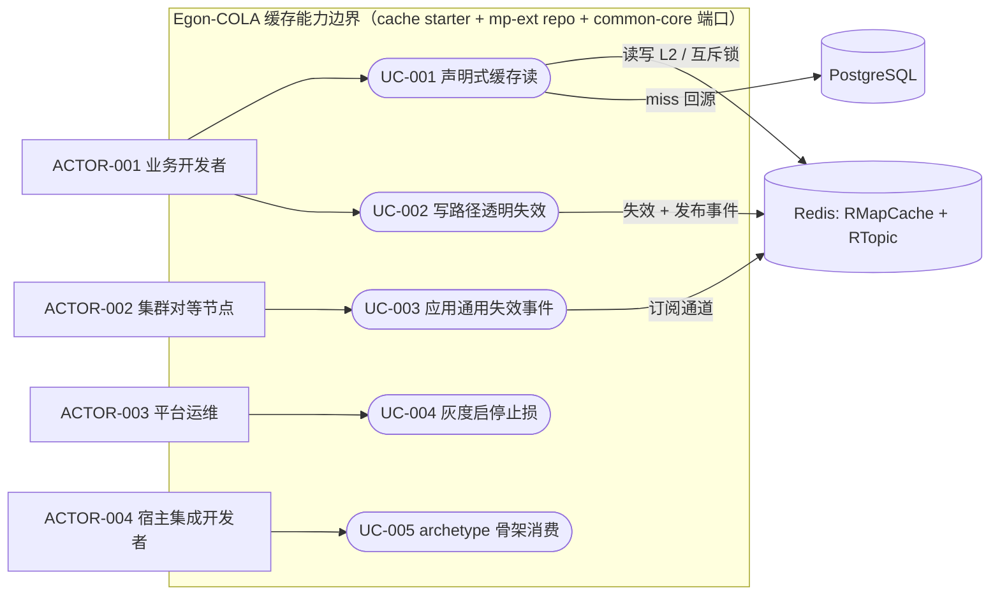
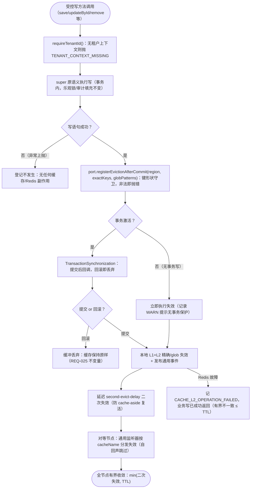
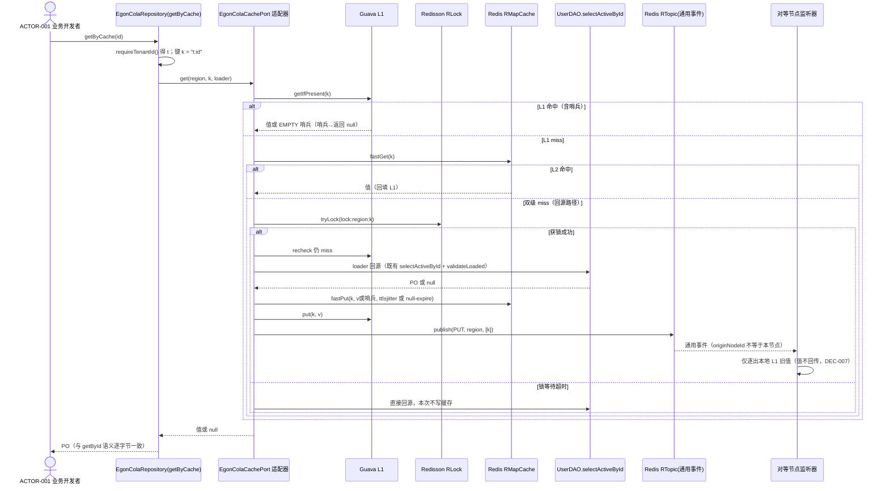

# 基于 Spring Cache + Redisson + Guava 的二级缓存 Starter 与 MyBatis-Plus Repository 层增强设计

| Field              | Value                                                                                                                                                                                                                                                                                                                                                                                                                                                                                                                                                                 |
|--------------------|-----------------------------------------------------------------------------------------------------------------------------------------------------------------------------------------------------------------------------------------------------------------------------------------------------------------------------------------------------------------------------------------------------------------------------------------------------------------------------------------------------------------------------------------------------------------------|
| Document           | `docs/egon/spec/2026-09-18-15-37-two-level-cache-redis-event-starter-repo-enhancement.md`                                                                                                                                                                                                                                                                                                                                                                                                                                                                             |
| Template Version   | `7`                                                                                                                                                                                                                                                                                                                                                                                                                                                                                                                                                                   |
| Status             | `Accepted`                                                                                                                                                                                                                                                                                                                                                                                                                                                                                                                                                            |
| Type               | `Feature`                                                                                                                                                                                                                                                                                                                                                                                                                                                                                                                                                             |
| Complexity         | `Complex`                                                                                                                                                                                                                                                                                                                                                                                                                                                                                                                                                             |
| Complexity Drivers | `跨模块新增 starter 并增强既有 final 写路径；缓存一致性依赖 Redis pub/sub 通用失效事件与事务后提交语义；租户隔离键与多节点失效协议；依赖治理与 BOM 导出变更；7 个 archetype 源工程 × 28 个 profile 配置与代码生成校验器联动；多个机器强制架构围栏需同步修订`                                                                                                                                                                                                                                                                                                                                                                                                       |
| Created            | `2026-09-18 15:37 CST`                                                                                                                                                                                                                                                                                                                                                                                                                                                                                                                                                |
| Updated            | `2026-09-18 17:15 CST`                                                                                                                                                                                                                                                                                                                                                                                                                                                                                                                                                |
| Owner              | `mario`                                                                                                                                                                                                                                                                                                                                                                                                                                                                                                                                                               |
| Repository         | `Egon-COLA`                                                                                                                                                                                                                                                                                                                                                                                                                                                                                                                                                           |
| Scope              | `egon-cola-components/egon-cola-component-common（新增 cache starter 模块、common-core 端口、mp-ext repo 增强）、egon-cola-components 父 pom 与 BOM 依赖治理、egon-cola-archetypes/source-projects 七根适配`                                                                                                                                                                                                                                                                                                                                                                                  |
| Change Surface     | `新增 egon-cola-component-common-cache-spring-boot-starter 模块；common-core 新增 EgonColaCachePort；EgonColaRepository 写路径透明失效与 getByCache/listByCache；components 父 pom/BOM 增加 redisson 与新 starter 管理并清理两处局部版本；7 个 source-project 根 pom、28 个 application*.yml、代表性模板 Repository 与 README；修订契约围栏测试`                                                                                                                                                                                                                                                                            |
| Affected Chapters  | `§7, §8, §9, §10, §13, §14, §15, §16, §17, §18`                                                                                                                                                                                                                                                                                                                                                                                                                                                                                                                       |
| Source Requirement | `用户原话："在 egon-cola-components/egon-cola-component-common 里给我加一个 基于 spring cache +redission + guava cache 设计二级缓存 的 starter，spring cache 的 update 和 失效机制，需要基于 redis 的 event 来实现，通用 event ，而不是每个类型的 cache 都写一个 listener ，并增强给 egon-cola-component-common-mybatis-plus-sharding-jdbc-ext-spring-boot-starter 的 repo 层。依赖管理要在父pom中管理，不要局部引入,mp-ext增强后，archetypes中的也要进行更新适配。 先给我方案。"`                                                                                                                                                                                       |
| Baseline Revision  | `dd7389c1e (main, 工作区干净, 2026-09-18 15:37 CST 快照核验)`                                                                                                                                                                                                                                                                                                                                                                                                                                                                                                                  |
| Amends             | `[2026-09-14-22-05-mp-sharding-jdbc-starter-unification.md](2026-09-14-22-05-mp-sharding-jdbc-starter-unification.md) §15（缓存/Redis 边界行）与 §3.3（Repository 层行）；[2026-09-12-21-11-mybatis-repository-cqrs-postgresql-evolution.md](2026-09-12-21-11-mybatis-repository-cqrs-postgresql-evolution.md) §3.2（事件总线适用范围）；[2026-08-23-16-43-open-source-archetype-family.md](2026-08-23-16-43-open-source-archetype-family.md) §6.2（依赖治理/BOM 条款）`                                                                                                                              |
| Supersedes         | `None`                                                                                                                                                                                                                                                                                                                                                                                                                                                                                                                                                                |
| Depends On         | `[2026-08-25-19-09-archetype-mybatis-plus-unification.md](2026-08-25-19-09-archetype-mybatis-plus-unification.md) REQ-025 及事务提交后副作用不变量；[2026-09-12-21-11-mybatis-repository-cqrs-postgresql-evolution.md](2026-09-12-21-11-mybatis-repository-cqrs-postgresql-evolution.md) §4, §8；[2026-09-14-22-05-mp-sharding-jdbc-starter-unification.md](2026-09-14-22-05-mp-sharding-jdbc-starter-unification.md) §7, §8；[2026-09-07-16-52-archetype-native-open-dependency-governance.md](2026-09-07-16-52-archetype-native-open-dependency-governance.md) §6（top.egon 依赖所有权）` |
| Related Specs      | `[2026-08-23-16-56-access-guard-aop-engine-strategy-refactor.md](2026-08-23-16-56-access-guard-aop-engine-strategy-refactor.md)（RedissonClient 解析与通用监听器先例）`                                                                                                                                                                                                                                                                                                                                                                                                           |
| Related Plans      | `[二级缓存 Starter 与 Repository 增强：文件级实现计划](../plan/2026-09-18-17-15-two-level-cache-starter-repo-implementation.md)`（Status `Review`）                                                                                                                                                                                                                                                                                                                                                                                                                                    |

## 1. Summary

当前仓库完全没有 Spring Cache/Caffeine/Guava cache 使用痕迹，热点只读数据（按 id 单查、批量 id 查）每次都直达
PostgreSQL，业务侧也没有统一的多级缓存与跨节点失效能力。本设计在 `egon-cola-components/egon-cola-component-common` 下新增第
9 个模块 `egon-cola-component-common-cache-spring-boot-starter`：以 Guava 为 L1、Redisson `RMapCache`（逐条 TTL）为 L2，自实现
Spring Cache `Cache`/`CacheManager` SPI；缓存的更新与失效统一由一条 Redis pub/sub（`RTopic`）通道上的**通用事件**
驱动——全集群一个订阅、一个监听器按 `cacheName` 分发，而不是每种缓存各写一个 listener。

同时增强 `egon-cola-component-common-mybatis-plus-sharding-jdbc-ext-spring-boot-starter` 的 repo 层：`EgonColaRepository`
既有受控写方法在事务提交后透明失效 L1+L2 并发布通用缓存事件（回滚零副作用，保持 08-25-19-09 REQ-025 不变量），并新增声明式读方法
`getByCache`/`listByCache`（key 含租户段、复用既有 Mapper 查询）。缓存接入通过放在 common-core 的纯 JDK 端口
`EgonColaCachePort` 完成，mp-ext 对缓存能力零编译依赖；端口 bean 不存在时 repo 行为与现状逐字节一致。防护能力包含空值缓存（防穿透）、TTL
抖动（防雪崩）、互斥回源（防击穿）。

依赖治理收敛到 `egon-cola-components/pom.xml` dependencyManagement（补管 plain `org.redisson:redisson`，并删除
access-guard-starter 与 dtp-starter 现存的两处局部 `<version>`），BOM 导出新 starter 与 redisson 坐标。archetypes 的 7 个
source-project 根增加 starter 依赖（无局部版本）、28 个 `application*.yml` 增加结构一致的缓存配置键块（键一致、值可按 profile
不同）、代表性模板 Repository 增加端口注入示例并同步 README 与生成/围栏校验命令。目标结果是：宿主应用以 `enabled=true` + 既有
RedissonClient 即获得租户隔离、跨节点一致收敛的二级缓存，默认关闭时对现有行为零影响。

## 2. Background and Current State

### 2.1 Business and user context

Egon-COLA 是组件库 + 代码生成 archetype 家族：各宿主（用户中心、教学域等基于 archetype 生成的应用）的读多写少热点最终都落到
`EgonColaRepository` 的按 id/批量 id 查询上。平台需要一层对业务透明的缓存基建：读路径声明式启用、写路径自动失效、集群内多节点缓存一致收敛，并且作为组件（而非示例代码）沉淀，随
archetype 一起分发为可开关的配置骨架。

### 2.2 Repository evidence

| Evidence ID | Classification                | Exact path/symbol/decision/command                                                                                                                                                                                                                                                                                                                                                  | Observed fact                                                                                                                                                                                                                                                          | Design significance                                                 | Verification limit/freshness    |
|-------------|-------------------------------|-------------------------------------------------------------------------------------------------------------------------------------------------------------------------------------------------------------------------------------------------------------------------------------------------------------------------------------------------------------------------------------|------------------------------------------------------------------------------------------------------------------------------------------------------------------------------------------------------------------------------------------------------------------------|---------------------------------------------------------------------|---------------------------------|
| `EVD-001`   | Static repository             | 全仓 grep（`@Cacheable`/`CacheManager`/`Caffeine`/`CacheBuilder`）排除 target 目录                                                                                                                                                                                                                                                                                                          | 仓库当前零处 Spring Cache / Caffeine / Guava cache 使用                                                                                                                                                                                                                        | 二级缓存与 Guava 均为仓内首次引入，能力台账必须证明无既有等价物                                 | 静态文本检索，2026-09-18               |
| `EVD-002`   | Static repository             | `egon-cola-component-common-mybatis-plus-sharding-jdbc-ext-spring-boot-starter/src/main/java/top/egon/cola/component/common/mybatis/extension/EgonColaRepository.java:57-679`                                                                                                                                                                                                       | 抽象基类 `@Slf4j @NoArgsConstructor(PROTECTED)`，全部公有写/读方法 `final`（save:68、updateById:193、removeById:118/124/130、removeByIds:148/187、update:201/206、saveOrUpdate:227、getById:234、listByIds:245），私有 `requireTenantId():600`、`validateLoaded:574`、`requireSerializableId:628` | 增强只能在类内部注入且不得破坏 final 契约；租户校验已有统一入口可复用                              | 直接读文件                           |
| `EVD-003`   | Static repository             | `.../contract/EgonColaRepositoryArchitectureTest.java:23-58`                                                                                                                                                                                                                                                                                                                        | 围栏：`EgonColaIRepository` 声明方法集 == MP 3.5.16 `IService` 公有方法集（57）；`EgonColaRepository` 声明的公有方法集 == 同一集合；全 mybatis 包禁止出现 5 个租户别名串与 `EgonColaSqlInjector`；声明字段禁止 `@Autowired`                                                                                             | 基类新增公有方法必须同步修订该测试（显式白名单），接口面保持不动                                    | 直接读文件                           |
| `EVD-004`   | Static repository             | `egon-cola-components/pom.xml:78, 204-232`                                                                                                                                                                                                                                                                                                                                          | 父 pom 已管理 `redisson.version=3.26.0` 与 `redisson-spring-boot-starter`（actuator exclusion）、`guava 33.6.0-jre`；未管理 plain `org.redisson:redisson`                                                                                                                          | 依赖治理缺口：plain redisson 需入父 pom dependencyManagement，guava 已就绪        | 直接读文件                           |
| `EVD-005`   | Static repository             | `egon-cola-component-access-guard-starter/pom.xml:53-56`；`egon-cola-component-dynamic-thread-pool/egon-cola-component-dynamic-thread-pool-starter/pom.xml:59-68`                                                                                                                                                                                                                    | 两处对 plain redisson 使用局部 `<version>${redisson.version}</version>`，dtp 附"starter 自动配置会在无 Redis 时启动失败、故只引客户端"的注释                                                                                                                                                          | 违反"父 pom 统一管理"约束的现存缺陷，本 Spec 一并修复；注释是先例依据                           | 直接读文件                           |
| `EVD-006`   | Static repository             | `egon-cola-component-transactional-outbox-starter/src/main/java/top/egon/cola/component/outbox/transaction/OutboxAfterCommitBuffer.java`（含同名 Test）                                                                                                                                                                                                                                  | 已有"事务提交后发布、回滚丢弃"的 after-commit 缓冲先例                                                                                                                                                                                                                                    | 缓存失效的提交后语义复用同一模式（`TransactionSynchronizationManager`）               | 直接读文件                           |
| `EVD-007`   | Static repository             | `egon-cola-component-dynamic-thread-pool/egon-cola-component-dynamic-thread-pool-starter/src/main/java/top/egon/cola/component/dtp/trigger/listener/ThreadPoolConfigAdjustListener.java`                                                                                                                                                                                            | 既有 `RTopic` + `MessageListener` 配置变更监听先例（含 trace 上下文恢复）                                                                                                                                                                                                                | 通用失效监听器的订阅/异常处理风格与之对齐                                               | 直接读文件                           |
| `EVD-008`   | Static repository             | `egon-cola-component-access-guard-starter/src/main/java/top/egon/cola/component/accessguard/autoconfigure/AccessGuardRedissonAutoConfiguration.java`                                                                                                                                                                                                                                | RedissonClient 按"名称优先、类型唯一"解析、绝不自动创建客户端的先例                                                                                                                                                                                                                             | cache starter 采用同一解析与 fail-fast 策略（`CACHE_REDISSON_CLIENT_MISSING`） | 直接读文件                           |
| `EVD-009`   | Static repository             | agent 组件 `RedisMcpSessionStore.java:122` 附近；access-guard `RedisAuthorizationSnapshotCache`；`DdcRedisTopicSubscription.java`；`GuardEventListener`/`GuardEventPublisher.noop()`                                                                                                                                                                                                       | `getMapCache` + `fastPutIfAbsentAsync` 逐条 TTL 用法、带 TTL 抖动的租户级失效快照缓存、泛型 topic 订阅封装、单一通用事件监听器接口均有仓内先例                                                                                                                                                                    | L2 形态（RMapCache 逐条 TTL+抖动）与"一个通用 listener"均为仓库已验证模式                 | 前次 Explore 代理报告，行号以文件现状为准       |
| `EVD-010`   | Static repository             | `egon-cola-component-common-cache-spring-boot-starter` 不存在；`egon-cola-component-common/pom.xml` 现列出 8 个 module                                                                                                                                                                                                                                                                      | 新 starter 将成为 common 聚合第 9 模块；`egon-cola-components-bom/pom.xml`（无 parent、自持版本）有以自有 property 导出三方件（commons-lang3）的先例                                                                                                                                                   | 模块命名/聚合与 BOM 导出方式照既有惯例                                              | 直接读文件                           |
| `EVD-011`   | Static repository             | `find egon-cola-archetypes/source-projects -name "application*.yml"`（排除 target）→ 7 个根 × 4 profile = 28 个源文件；`grep -rln 'extends EgonColaRepository'` → light/light-open 各 9 个 repo、service/service-open 各 5 个、web/web-open 各 8-9 个、agent 2 个                                                                                                                                        | archetype 家族 7 根、28 个 profile 配置、约 45 个模板 Repository                                                                                                                                                                                                                   | 规则 7 配置一致性的完整覆盖面与模板 Repository 注入示例的落点                              | 命令输出，2026-09-18                 |
| `EVD-012`   | User decision                 | 本会话 AskUserQuestion 四项选择                                                                                                                                                                                                                                                                                                                                                            | ①自建 TwoLevelCacheManager；②repo 增强=写路径透明失效+声明式读缓存；③archetype 适配=依赖+配置骨架；④防护=空值缓存+TTL抖动+互斥回源全含                                                                                                                                                                           | REQ-002/005/006/015 与各 DEC 的直接来源                                    | 用户当次答复                          |
| `EVD-013`   | Static repository + Inference | MP 3.5.16 源码 `com.baomidou.mybatisplus.extension.repository.CrudRepository`/`AbstractRepository`（sources jar 核对）；JVM 规范 §5.4.3/§6.5 延迟解析语义（Inference 部分）                                                                                                                                                                                                                            | MP 基类不暴露 ApplicationContext；若在 mp-ext 的 final 方法中直接引用 cache starter 类型，即使运行期判空，方法首次调用仍会因常量池类解析抛 NoClassDefFoundError                                                                                                                                                   | 端口必须放在两侧都已依赖的 common-core（纯 JDK 签名），mp-ext 零引用 cache starter 类型     | 类加载行为未做运行期实验，属规范推断；以 §14 负例测试兜底 |
| `EVD-014`   | Static repository             | `egon-cola-component-common/.../mybatis/autoconfigure/EgonColaMybatisPlusProperties.java`（Ddl 默认关闭的 Toggle 形态）、`EgonColaMybatisPlusAutoConfiguration.java`（bean 名 `egonCola*`、`@Order` 100~MAX 链）、模板 `.../web/infrastructure/user/repo/UserRepository.java`（`@Repository("userRepository")` + `@RequiredArgsConstructor` + `@Getter(AccessLevel.PROTECTED)` + `@Qualifier` 字段注入惯用法） | 组件配置/自动装配/模板注入三套 house style 齐备                                                                                                                                                                                                                                        | 新 starter 的配置键、bean 命名、默认关闭开关与模板注入示例逐一对齐                            | 直接读文件                           |

### 2.3 Problem statement and gap

现状：所有 id 读路径直达数据库（`getById:234` → `selectActiveById`），无进程内缓存、无共享缓存、无失效协议；平台组件中已有
Redis 事件监听（dtp）与 Redis KV（access-guard、outbox）但没有通用缓存能力。缺口：①没有可复用的二级缓存 starter
与统一的跨节点失效机制；②repo 层写路径不联动任何缓存，业务若自行缓存必须逐处手写失效且极易遗漏；③依赖治理存在两处局部
redisson 版本违例。全部判断基于静态仓库证据；未在无 Redis 环境中做过运行期验证（设计以 §14 内嵌 Redis 集成测试覆盖）。

### 2.4 Evidence and current-chain map

| Entry/trigger                             | Current call chain                                                                                                                         | Data read/written                                   | External dependency             | Consumers            | Evidence             |
|-------------------------------------------|--------------------------------------------------------------------------------------------------------------------------------------------|-----------------------------------------------------|---------------------------------|----------------------|----------------------|
| `UserRepository.save(entity)`（任意宿主写入口）    | `EgonColaRepository.save:68 → requireTenantId:69 → 事务内 super.save → 返回`（无任何缓存/事件副作用）                                                       | PostgreSQL 业务表（乐观锁 version、审计填充经 MetaObjectHandler） | 无                               | 各业务 Service 写路径      | `EVD-002`, `EVD-006` |
| `getById(id)` / `listByIds(ids)`（任意宿主读入口） | `getById:234 → requireSerializableId → selectActiveById → validateLoaded`；`listByIds:245 → selectActiveByIds → validateLoadedList`         | PostgreSQL 读                                        | 无                               | 全部业务读路径，热点最终收敛到这两条   | `EVD-002`            |
| 宿主应用启动装配                                  | `AutoConfiguration.imports`（mp-ext 2 行）→ `EgonColaMybatisPlusAutoConfiguration` → `mybatisPlusInterceptor` 聚合 @Order 100~MAX 链 → 契约校验 bean | Spring 上下文                                          | Redisson（仅 access-guard/dtp 按需） | 7 个 archetype 根生成的应用 | `EVD-014`, `EVD-008` |
| 既有 Redis 配置事件通道（dtp）                      | `RedissonClient.getTopic(name).addListener(MessageListener)` → 解析载荷 → 调整线程池（单监听器多配置项模式）                                                    | Redis pub/sub                                       | Redis                           | dtp 管理端下发            | `EVD-007`, `EVD-009` |

## 3. Goals and Non-goals

### 3.1 Goals

- 新增独立 cache starter：Guava L1 + Redisson `RMapCache` L2 的二级缓存，实现 Spring Cache `Cache`/`CacheManager`
  SPI，默认关闭、显式开启。
- 更新/失效完全由单通道 Redis 通用事件驱动：一节点一订阅、一监听器按 `cacheName` 分发；杜绝 per-cache listener。
- `EgonColaRepository` 写路径事务提交后透明失效并发布事件；新增 `getByCache`/`listByCache` 声明式读；端口缺席时零影响。
- 空值缓存、TTL 抖动、互斥回源三项防护；租户隔离键与租户级 glob 守卫。
- 依赖治理收敛父 pom + BOM 导出，并清理两处现存局部版本违例。
- archetype 家族（7 根 pom、28 个 profile yml、模板 Repository 示例、README）完成适配，未启用缓存时生成物行为不变。

### 3.2 Non-goals

- 不引入 per-region 独立 TTL/容量配置面（v1 全局参数；区域差异由 `cacheRegionName()` 覆写与后续 Spec 处理）。
- 不新增任何 MyBatis 插件/interceptor，不改 `@Order` 链与 `EgonColaPluginOrderTest`。
- 不做关系 schema/DDL 变更、不做数据迁移；Redis KV 结构不是关系模型。
- 不提供缓存管理 UI、跨租户广播失效、版本 CAS 回写（拒绝理由见 §17/§7.3.3）。
- 不改动 `EgonColaIRepository` 公开契约面（57 方法钉数不变）。
- 不为 agent 根引入模板 Repository 注入示例（其 repo 为领域端口适配，仅做 pom/yml 骨架）。

### 3.3 Change Surface and Design Depth

| Area/layer                                                | Disposition    | Exact repository evidence                                                                 | Changed or preserved behavior/contract                               | Required Spec treatment            | Chapter(s)                                    |
|-----------------------------------------------------------|----------------|-------------------------------------------------------------------------------------------|----------------------------------------------------------------------|------------------------------------|-----------------------------------------------|
| 新 cache starter 模块（二级缓存 + 通用失效事件）                         | Affected       | `EVD-010`（common 聚合现 8 模块）、`EVD-001`（能力零既有）                                               | 新模块、新自动配置、新事件契约、新缓存实现                                                | 完整详细设计                             | §7, §8, §9, §10, §13, §14, §15, §16, §17, §18 |
| mp-ext `EgonColaRepository`（写失效 + 声明式读 + 端口 seam）         | Affected       | `EVD-002`（final 方法集与私有 helper 行号）                                                         | 写方法新增提交后失效副作用；新增 2 个公有读方法与 1 个 protected seam；既有方法签名与语义保持            | 完整详细设计                             | §7, §8, §9, §10, §14, §15, §16, §17, §18      |
| common-core `EgonColaCachePort`（新纯 JDK 端口）                | Affected       | `EVD-013`；common-core 既有 `converter/validation` 包                                         | 新跨组件端口，成为稳定 SPI                                                      | 完整设计并入 §8/§9/§10                   | §8, §9, §10, §14                              |
| 依赖治理（components 父 pom / BOM / access-guard / dtp-starter） | Affected       | `EVD-004`, `EVD-005`                                                                      | plain redisson 入父 pom；两处局部 `<version>` 删除；BOM 导出新 starter 与 redisson | 完整设计（文件级）                          | §8, §15, §16, §17                             |
| archetype 家族适配（7 根 pom、28 yml、模板 repo、README、生成校验）        | Affected       | `EVD-011`；`scripts/generate_archetypes.sh`、`scripts/check-archetype-family-boundaries.py` | 生成骨架新增可选缓存能力面；未开启时生成物行为不变                                            | 完整设计（清单与一致性规则）                     | §7, §8, §10, §14, §16                         |
| mp-ext interceptor @Order 链与插件契约                          | Unchanged      | `EVD-014`（`@Order` 100~MAX 链、`EgonColaPluginOrderTest`）                                   | 不新增 interceptor，链序原样保留                                               | 一条边界证据 + 围栏回归                      | §14                                           |
| 关系 schema / 索引 / 托管 DDL                                   | Context-only   | `EgonColaMybatisPlusProperties.Ddl` 默认关闭、无新 ddl 脚本目录变更                                    | 无关系模型/索引/迁移变化；失效所依赖的读路径仍走既有主键访问                                      | 证据式简述（§11）                         | §11, §14                                      |
| 业务事件总线 / outbox（09-12 语义）                                 | Context-only   | `EVD-006`；09-12 §3.2                                                                      | 缓存失效信号是独立技术通道，不进业务事件总线；after-commit 不变量保留                            | 边界证据与 carve-out（经 §20.4 Amends 记录） | §7, §11                                       |
| `EgonColaIRepository` 契约面（57 方法钉数）                        | Context-only   | `EVD-003`                                                                                 | 接口零改动；新方法只落在实现基类                                                     | 依赖该不变量的说明 + 围栏回归                   | §9, §14                                       |
| 既有非缓存读路径 `getById/listByIds`                              | Context-only   | `EVD-002`（234-253）                                                                        | 语义逐字节保留；缓存只经新方法进入                                                    | 保留不变量说明                            | §9, §14                                       |
| 生成工程 Reactor/Flyway/网关等周边                                 | Unchanged      | 根 `pom.xml:58-60` 与生成脚本现状                                                                 | 本变更不触及部署与迁移机制                                                        | 一条不变记录                             | §16                                           |
| 前端                                                        | Not applicable | 组件库与 archetype 本变更面无前端 surface；`EVD-011` 根清单内无前端改动项                                       | 无                                                                    | 证据式 `N/A`（§12）                     | §12                                           |

## 4. Requirements and Acceptance Criteria

| ID        | Atomic requirement                                                                                                                                                                                                                   | Priority | Observable acceptance criteria                                                          | Source                                        |
|-----------|--------------------------------------------------------------------------------------------------------------------------------------------------------------------------------------------------------------------------------------|----------|-----------------------------------------------------------------------------------------|-----------------------------------------------|
| `REQ-001` | 在 common 聚合下新增 `egon-cola-component-common-cache-spring-boot-starter`（包 `top.egon.cola.component.common.cache`，配置前缀 `egon.cola.component.cache`，`enabled` 默认 false），模块可被根 reactor 构建                                                 | Must     | 根 `./mvnw -B -ntp clean test` 通过；`enabled` 缺省时 `ApplicationContextRunner` 断言缓存 bean 不存在 | 用户原话 + `EVD-010`                              |
| `REQ-002` | L1 为 Guava（容量上限 + 逐条抖动 TTL）、L2 为 Redisson `RMapCache`（逐条 TTL），自实现 `EgonColaTwoLevelCache`/`EgonColaTwoLevelCacheManager` 并通过 Spring Cache SPI 暴露                                                                                     | Must     | 读 L2 命中后 L1 回填；`@Cacheable` 可直接使用同一 `CacheManager`；集成测试断言 L1/L2 两级命中                    | 用户原话 + 决策①                                    |
| `REQ-003` | 缓存更新/失效由单条 Redis `RTopic` 通道的通用事件驱动；每节点恰一个订阅与一个监听器，按 `cacheName` 分发到本地缓存操作；禁止按缓存类型编写 listener                                                                                                                                        | Must     | 节点 A 失效后节点 B 的 L1 对应 key 被清除；代码审查确认全模块仅一处 `addListener` 注册（集成测试 + 静态扫描）                 | 用户原话（"通用 event，而不是每个类型的 cache 都写一个 listener"） |
| `REQ-004` | 事件信封为唯一 record `EgonColaCacheChangedEvent(schemaVersion,eventId,originNodeId,occurredAt,cacheName,operation,keys)`，`operation ∈ {PUT, EVICT, PREFIX_EVICT}`；`originNodeId` 等于本节点的事件被跳过（自回声）                                          | Must     | 编解码往返测试通过；自回声用例中监听器不重复应用失效                                                              | 用户原话 + 决策①                                    |
| `REQ-005` | `EgonColaRepository` 全部受控写方法成功后经端口登记"事务提交后失效"：提交后同步失效本地 L1+L2 并发布事件、延迟二次失效；事务回滚时不产生任何缓存/Redis 副作用（保持 REQ-025 after-commit 不变量）                                                                                                       | Must     | 提交用例断言一次失效 + 一次发布 + 一次延迟失效；回滚用例断言零交互                                                    | 用户原话 + 决策② + `EVD-006`                        |
| `REQ-006` | 新增 `getByCache(Serializable)` 与 `listByCache(Collection<? extends Serializable>)`（public final），内部复用 `selectActiveById`/`selectActiveByIds` 访问路径与 `validateLoaded*` 语义，业务 Repository 无需任何缓存注解                                        | Must     | miss 回源结果与 `getById`/`listByIds` 完全一致；hit 时数据库零访问（Mapper 计数）                            | 用户原话 + 决策②                                    |
| `REQ-007` | 空值缓存：loader 返回 null 时写入哨兵 `EgonColaCacheNullValueBO`，命中哨兵直接返回 null 且不再回源；`ttl.null-expire` 可配                                                                                                                                        | Must     | 连续两次 `getByCache`（不存在的 id）：loader 恰调用一次                                                 | 决策④                                           |
| `REQ-008` | TTL 抖动：L1/L2 写入的逐条过期时间在基准上叠加 ±`jitter-ratio` 随机偏移，ratio ∈ [0, 0.5]                                                                                                                                                                   | Must     | 写入 100 个 key，L1/L2 有效 TTL 的取值离散度落在期望区间（测试断言边界）                                          | 决策④                                           |
| `REQ-009` | 互斥回源：双级 miss 时以 `RLock.tryLock(wait-time)` 串行化回源，获锁后先 recheck；锁等待超时则直接回源且本次结果不写缓存（降级放行）                                                                                                                                              | Must     | 并发 8 线程同 key miss：loader 恰执行 1 次；持有者超时场景降级线程仍成功返回                                       | 决策④                                           |
| `REQ-010` | `EgonColaCachePort`（get/getAll/registerEvictionAfterCommit，纯 JDK 签名）定义在 common-core；mp-ext 主源码任何文件不得 import `top.egon.cola.component.common.cache` 包                                                                                 | Must     | 新增静态扫描围栏通过；仅含 common-core 与 mp-ext（不含 cache starter）的最小 classpath 下 repo 正常读写（负例测试）     | 决策③细化 + `EVD-013`                             |
| `REQ-011` | 零影响开关：端口 bean 缺席时 `getByCache`≡`getById`、`listByCache`≡`listByIds`，写方法无任何 Redis 交互                                                                                                                                                   | Must     | 无端口装配下 repo 行为测试与现状一致；Redis 交互计数为 0                                                     | 决策③ + 用户"不启用缓存时零影响"                           |
| `REQ-012` | 租户隔离：缓存键形状 `tenantId:id`；exact key 与 glob 前缀必须以当前 `requireTenantId()` 值开头；合法 glob 仅 `tenantId:*`；违规抛 `CACHE_KEY_TENANT_MISMATCH` / `CACHE_GLOB_PATTERN_FORBIDDEN`                                                                    | Must     | 跨租户 key/glob、裸 `*`、其它形状 glob 均抛对应错误码                                                    | `EVD-002`（TENANT_RANGE_FORBIDDEN 先例）+ 平台租户不变量 |
| `REQ-013` | 一致性收敛：写失效容忍事件 at-most-once；双写者复活竞态由"提交后失效 + 延迟二次失效 + 逐条 TTL 上限"收敛，最终不一致窗口有界 ≤ min(TTL, 二次失效延迟)                                                                                                                                       | Must     | 模拟丢失事件的节点在 TTL 到期前经二次失效路径收敛（集成测试）                                                       | §7.3.3 设计结论                                   |
| `REQ-014` | `egon-cola-components/pom.xml` dependencyManagement 增加 plain `org.redisson:redisson`（`${redisson.version}`）；access-guard-starter 与 dtp-starter 移除局部 `<version>`；BOM 导出新 starter 与 redisson 坐标；组件树内三方件零新增局部版本                         | Must     | 两个 pom 修改后构建通过；starter pom 中 `${redisson.version}` 局部版本声明清零；BOM 可解析                     | 用户原话（"依赖管理要在父pom中管理，不要局部引入"）                  |
| `REQ-015` | 7 个 source-project 根按其既有 top.egon 管理方式引入 cache starter（引用处无内联版本），符合 `scripts/check-archetype-dependency-ownership.py` 约束                                                                                                             | Must     | ownership 脚本对 7 根通过；生成工程 `mvnw -q dependency:tree` 含 cache starter                      | 用户原话（"archetypes中的也要进行更新适配"）                  |
| `REQ-016` | 28 个 `application*.yml`（7 根 × application/-dev/-test/-prod）追加结构完全一致的 `egon.cola.component.cache` 键块（值可按 profile 不同，键集合一致），模板 Repository 注入示例与 README 同步                                                                              | Must     | 键集合比对脚本通过；模板 repo 编译并装配通过；README 描述命令可复制执行                                              | 用户原话 + 规则 7 + `EVD-011`                       |
| `REQ-017` | 全部机器围栏保持或显式修订后绿色：`EgonColaRepositoryArchitectureTest`（接口 57 钉数不变、实现公有方法 = 上游 ∪ 显式缓存读白名单）、`EgonColaPluginOrderTest`/`EgonColaMybatisPlusContractValidator`（链序不变）、`./scripts/generate_archetypes.sh check`、`./mvnw -B -ntp clean test` | Must     | 上述命令全部通过且围栏修订仅含白名单增量                                                                    | `EVD-003` + `EVD-014`                         |
| `REQ-018` | 降级可观测：L2/Redis 读写或反序列化失败不得使业务读写抛错；记录含稳定错误码（`CACHE_REDISSON_CLIENT_MISSING`、`CACHE_EVENT_DESERIALIZE_FAILED`、`CACHE_L2_OPERATION_FAILED`）的 WARN/ERROR 日志并回源                                                                           | Must     | 断开 Redis 的用例：读直接回源成功、写提交成功、日志含对应码                                                       | §7.3.4 + 组件 house style（SCREAMING_SNAKE 错误码）  |

### 4.1 Scenario matrix

| Scenario     | Actor/trigger                      | Preconditions                          | Main path                                                                     | Alternative/failure path                                        | Data/state change | Observable result                  | Requirements                    |
|--------------|------------------------------------|----------------------------------------|-------------------------------------------------------------------------------|-----------------------------------------------------------------|-------------------|------------------------------------|---------------------------------|
| 读 L1 命中      | 业务开发者经宿主请求                         | 端口 bean 存在，key 在 L1                    | `getByCache → port.get → L1 hit`                                              | L1 被容量/过期逐出 → 走 L2 分支                                           | 无                 | 数据库零访问，直接返回                        | `REQ-002`, `REQ-006`            |
| 读 L2 命中回填    | 同上                                 | L1 miss、L2 有值                          | L2 hit → 回填 L1 → 返回                                                           | L2 反序列化失败 → 记 `CACHE_L2_OPERATION_FAILED` 回源                    | L1 新增条目           | 一次 Redis GET、零 SQL                 | `REQ-002`, `REQ-018`            |
| 双级 miss 互斥回源 | 并发首个请求                             | 双级 miss，无他节点持锁                         | tryLock 成功 → recheck 仍 miss → loader 回源 → 写 L1/L2 → PUT 事件 → 返回               | 锁被他人持有且 wait-time 超时 → 直接回源、本次不写缓存                              | DB 一次读；L1/L2 一条   | loader 全局恰执行一次                     | `REQ-007`, `REQ-009`            |
| 空值回源         | 首次查询不存在的 id                        | 双级 miss                                | loader 返回 null → 写哨兵（null-expire）                                             | 命中哨兵 → 直接 null，不回源                                              | L1/L2 哨兵条目        | 第二次查询 DB 零访问                       | `REQ-007`                       |
| 写提交失效        | 业务开发者保存实体                          | 事务激活                                   | 写成功 → 端口登记 → afterCommit：本地 L1+L2 精确失效 + EVICT 事件；延迟 second-evict-delay 再失效一次 | 事件在他节点反序列化失败 → 记 `CACHE_EVENT_DESERIALIZE_FAILED` 丢弃，TTL 兜底     | DB 行 + 两级缓存条目删除   | 他节点 L1 该 key 消失                    | `REQ-003`, `REQ-005`, `REQ-013` |
| 写回滚          | 业务开发者写入异常回滚                        | 事务激活                                   | afterCommit 未触发                                                               | 缓冲直接丢弃                                                          | 缓存/Redis 零交互      | 无失效日志、无发布计数                        | `REQ-005`                       |
| 条件写全租户失效     | `update(entity, wrapper)` 等影响面不可枚举 | 租户上下文存在                                | 提交后发布 glob 失效 `tenantId:*`（PREFIX_EVICT）                                      | 非法 glob 形状 → `CACHE_GLOB_PATTERN_FORBIDDEN` 拒绝登记                | 本租户该区域键全删         | 跨租户键不受影响                           | `REQ-012`, `REQ-005`            |
| 跨节点事件应用      | 对等节点收到 RTopic 消息                   | 本节点订阅中                                 | 监听器按 cacheName 分发：EVICT→本地失效、PREFIX_EVICT→过滤失效、PUT→逐出本地 L1 旧值                 | originNodeId==本节点 → 跳过（自回声）；schemaVersion 非 1 → 记错并丢弃           | 本地 L1/L2          | 无重复失效、无异常上抛                        | `REQ-003`, `REQ-004`            |
| Redis 不可用    | L2 访问抛连接异常                         | 端口开启                                   | L1+回源降级；写路径失效失败仅记日志                                                           | 恢复后靠 TTL/再次失效收敛                                                 | 无（除日志）            | 业务读写不抛错                            | `REQ-018`, `REQ-013`            |
| 批量读部分命中      | `listByCache(ids)`                 | 部分 key 在缓存                             | `port.getAll` 逐 key 组装：命中直接用、miss 逐个回源（受互斥保护）并写缓存                             | 单 key 回源 null → 结果集剔除该 id                                       | 缓存补齐              | 结果与 `listByIds` 一致且 DB 访问只含 miss 数 | `REQ-006`                       |
| 缓存未启用        | 端口 bean 缺席                         | `enabled=false` 或无 RedissonClient（开关关） | `getByCache` 直接委派 `getById`；写路径零副作用                                           | 开启但缺客户端 → 启动失败 `CACHE_REDISSON_CLIENT_MISSING`（fail-fast，不静默降级） | 无                 | 与基线行为逐字节一致                         | `REQ-011`, `REQ-001`            |
| TTL 到期收敛     | 事件丢失 + 双写者竞态                       | 失效事件未达某节点                              | 该节点旧值至多存活到逐条 TTL 到期                                                           | 延迟二次失效通常先行收敛                                                    | 过期条目删除            | 不一致窗口有界 ≤ TTL                      | `REQ-008`, `REQ-013`            |

### 4.2 Use-case analysis

#### 4.2.1 Actor inventory

| Actor ID    | Actor/role                  | Goal and responsibility             | Entry/channel                               | Permission/tenant context | Evidence         |
|-------------|-----------------------------|-------------------------------------|---------------------------------------------|---------------------------|------------------|
| `ACTOR-001` | 业务开发者（宿主应用 Repository 子类作者） | 以最小声明获得"读缓存 + 写自动失效"能力，不书写缓存注解与失效代码 | `getByCache/listByCache` 与既有写方法             | MDC tenantId 上下文，租户内操作    | 用户原话 + `EVD-002` |
| `ACTOR-002` | 应用集群对等节点（系统角色）              | 接收并应用通用缓存失效事件，维持本地 L1 收敛            | Redis `RTopic` 通道（进程内自动）                    | 同一 topic/同一 Redis 域即同信任域  | 用户原话 + `EVD-007` |
| `ACTOR-003` | 平台运维                        | 灰度启停缓存、设定 TTL/主题等治理参数并止损失效风暴        | Spring profile 配置（`application-prod.yml` 等） | 配置发布权限                    | 决策③ + 规则 7       |
| `ACTOR-004` | 宿主集成开发者（archetype 生成工程使用者）  | 在生成工程里开箱获得缓存骨架并按需开启                 | 生成工程 pom / 28 个 profile yml / 模板 repo       | 同 `ACTOR-001`             | 用户原话 + `EVD-011` |

#### 4.2.2 Use-case artifact

| ID       | Use case/goal        | Primary actor | Supporting actors/systems    | Trigger                             | Preconditions      | Main success outcome                                 | Alternatives/failures          | Postconditions   | Requirements                                                     | Interfaces/pages                                               | Tests                                         |
|----------|----------------------|---------------|------------------------------|-------------------------------------|--------------------|------------------------------------------------------|--------------------------------|------------------|------------------------------------------------------------------|----------------------------------------------------------------|-----------------------------------------------|
| `UC-001` | 声明式缓存读（单查/批查回源并双级缓存） | `ACTOR-001`   | `ACTOR-002`、Redis、PostgreSQL | `getByCache(id)`/`listByCache(ids)` | 端口 bean 存在、租户上下文有效 | 命中即返回；miss 互斥回源并写 L1/L2 + PUT 事件                     | 空值→哨兵；锁超时→降级直读；Redis 故障→L1+回源  | 缓存补齐或不一致有界       | `REQ-002`, `REQ-006`, `REQ-007`, `REQ-008`, `REQ-009`, `REQ-018` | `INTERNAL-001`, `INTERNAL-002`, `INTERNAL-005`, `INTERNAL-006` | `TEST-004`~`TEST-008`, `TEST-015`, `TEST-016` |
| `UC-002` | 写路径透明失效与跨节点收敛        | `ACTOR-001`   | `ACTOR-002`、Redis            | 任一受控写方法成功                           | 事务激活、租户上下文有效       | 提交后双级失效 + EVICT/PREFIX_EVICT 事件 + 延迟二次失效             | 回滚→零副作用；非法键形状→抛错拒绝；事件丢失→TTL 兜底 | 全节点该键在界内失效       | `REQ-005`, `REQ-012`, `REQ-013`, `REQ-018`                       | `INTERNAL-003`, `INTERNAL-004`, `EVENT-001`                    | `TEST-009`~`TEST-014`                         |
| `UC-003` | 对等节点应用通用失效事件         | `ACTOR-002`   | Redis                        | RTopic 消息到达                         | 单监听器已注册            | 按 cacheName+operation 分发，本地 L1/L2 精确/前缀失效，PUT 逐出旧 L1 | 自回声跳过；信封不可解析→记错丢弃              | 本地视图收敛           | `REQ-003`, `REQ-004`, `REQ-018`                                  | `EVENT-001`                                                    | `TEST-003`, `TEST-010`, `TEST-013`            |
| `UC-004` | 灰度启停与止损              | `ACTOR-003`   | 部署流水线                        | 修改 profile 配置并重启/发布                 | 规则 7 键结构一致         | `enabled` 翻转即启用/全量停用缓存                               | 开启但缺客户端→启动失败提示                 | 行为与 `REQ-011` 一致 | `REQ-001`, `REQ-011`, `REQ-016`                                  | 配置面（§16）                                                       | `TEST-017`, `TEST-018`, `TEST-021`            |
| `UC-005` | 经 archetype 获得缓存骨架   | `ACTOR-004`   | 生成脚本与围栏                      | 生成新宿主工程                             | 本 Spec §16 适配完成    | 生成物含依赖（无内联版本）、28 yml 键块、模板注入示例、README                | 校验器失败→阻断生成                     | 宿主按需开启即可用        | `REQ-015`, `REQ-016`, `REQ-017`                                  | 模板 repo 布线（§8/§10.4）                                           | `TEST-019`~`TEST-022`                         |



## 5. Constraints, Assumptions, and Decisions

### 5.1 Confirmed constraints

- 用户四项绑定决策（`EVD-012`）：自建 TwoLevelCacheManager；repo 增强=写路径透明失效+声明式读缓存；archetype
  适配=依赖+配置骨架；防护全含（空值/抖动/互斥）。
- "依赖管理要在父 pom 中管理，不要局部引入"（用户原话）——组件树三方件版本唯一权威为 `egon-cola-components/pom.xml`
  dependencyManagement。
- 技术栈钉版：Java 21、Spring Boot 3.5.16、`redisson 3.26.0`、`guava 33.6.0-jre`、MyBatis-Plus 3.5.16（`EVD-004`
  ）；不引入新语言或新框架代际。
- 机器围栏：`EgonColaRepositoryArchitectureTest`（`EVD-003`）、`EgonColaPluginOrderTest` 与
  `EgonColaMybatisPlusContractValidator` 的 inner 链白名单（`EVD-014`）、`scripts/generate_archetypes.sh check`、
  `scripts/check-archetype-family-boundaries.py`、`scripts/check-archetype-dependency-ownership.py`。
- 组件 house style：bean 名 `egonCola*`；错误码 SCREAMING_SNAKE `IllegalStateException`；配置
  `@Data @Validated @ConfigurationProperties` + 嵌套默认对象 + 约束注解；RedissonClient 只解析不创建（`EVD-008`）；默认关闭开关先例
  `Ddl`（`EVD-014`）；after-commit 先例（`EVD-006`）。
- 规则 7：28 个 profile yml 缓存键结构必须一致，值可不同（`EVD-011`）。
- mp-ext 既有 final 方法契约与 `EgonColaIRepository` 57 方法钉数不可破坏（`EVD-002`, `EVD-003`）。

### 5.2 Small-gap assumptions

| ID        | Inference                                                                                      | Repository evidence                                 | Why locally reversible | Impact if wrong                                                                                           |
|-----------|------------------------------------------------------------------------------------------------|-----------------------------------------------------|------------------------|-----------------------------------------------------------------------------------------------------------|
| `ASM-001` | 缓存区域名默认取 `getEntityClass().getSimpleName()`（如 `UserPO`），经可覆写的 protected `cacheRegionName()` 修改 | `EgonColaRepository.getEntityClass():408`；无既有区域命名惯例 | 仅影响键空间标签，改名单方法覆写       | 与未来"按业务域名"惯例不一致；无功能影响                                                                                     |
| `ASM-002` | L1 条目寿命不超过 L2（同一 `ttl.expire` 基准 + 各自抖动）                                                       | 无仓内反例；两级缓存通用做法                                      | 一处配置推导逻辑               | L1 长于 L2 会放大陈旧窗口；已由双失效+事件收敛兜底                                                                             |
| `ASM-003` | glob 失效经 L2 `keySet()` 客户端过滤 + `fastRemove` 实现，适用"单区域单租户键数有限"的目标场景                             | `RMapCache` API 3.26 无服务端 field-glob                | 实现策略可替换为分区键设计          | 超大键空间时失效放大为 O(n) 扫描；§18 RISK-002                                                                          |
| `ASM-004` | 版本沿用 `redisson 3.26.0`/`guava 33.6.0-jre`，不升级                                                  | `EVD-004` 父 pom property 现值                         | 版本位点单一                 | 若 3.26.0 缺少所用 API 需升级（`getTopic(name,codec)`/`getMapCache(name,codec)`/`fastPut(field,val,ttl)` 均存在，测试兜底） |
| `ASM-005` | `spring-boot-starter-cache` 作为 provided 依赖（不强制宿主启用注解代理），宿主自行加 `@EnableCaching`                 | 组件先例：configuration-processor optional（mp-ext pom）   | 依赖 scope 单行            | 若需 starter 自动开启 `@EnableCaching`，加一个条件装配类即可                                                               |

### 5.3 Resolved decisions

| ID        | Decision                                                                                                                                   | Decision owner                          | Evidence and rationale                                                                  | Requirements         |
|-----------|--------------------------------------------------------------------------------------------------------------------------------------------|-----------------------------------------|-----------------------------------------------------------------------------------------|----------------------|
| `DEC-001` | 自建 `EgonColaTwoLevelCacheManager`/`EgonColaTwoLevelCache`（Guava L1 + RMapCache L2），不采用第三方/Redisson PRO 近缓存                                 | User（选项①）                               | `EVD-012`；开源版 `RLocalCachedCache` 跨节点失效为 PRO 能力（外部事实，标注推断）；仓内零缓存库（`EVD-001`）            | `REQ-002`            |
| `DEC-002` | repo 增强 = 受控写路径提交后透明失效 + `getByCache/listByCache` 声明式读；业务 Repository 不写缓存注解                                                                | User（选项②）                               | `EVD-012`, `EVD-002`, `EVD-006`                                                         | `REQ-005`, `REQ-006` |
| `DEC-003` | 缓存能力端口 `EgonColaCachePort` 放 common-core（纯 JDK），mp-ext 对 cache starter **零编译依赖**（而非 optional maven 依赖）；"可选"意图在 archetype 层仍以依赖+配置骨架满足并严格增强 | Spec owner，待用户复核（§20.4）                 | `EVD-013`：final 方法内直接引用 starter 类型会因 JVM 惰性类解析抛 NoClassDefFoundError，optional 依赖无法豁免该语义 | `REQ-010`, `REQ-011` |
| `DEC-004` | RedissonClient 按"名称 `redissonClient` 优先、类型唯一兜底"解析；缺失时 `enabled=true` 直接 fail-fast（`CACHE_REDISSON_CLIENT_MISSING`），绝不自动创建                  | Spec owner（先例）                          | `EVD-008`, `EVD-005`（dtp 注释：自动配置会在无 Redis 时打爆启动）                                        | `REQ-001`, `REQ-011` |
| `DEC-005` | 不新增任何 MyBatis 插件；失效逻辑挂在 repo 方法层而非 SQL 层                                                                                                   | Spec owner                              | `EVD-014` 链序围栏存在；SQL 层无法感知提交时序与租户键                                                      | `REQ-005`, `REQ-017` |
| `DEC-006` | 失效信号为独立技术通道（专用 `RTopic`），不进 09-12 业务事件总线；信封仅含缓存寻址字段不含业务载荷                                                                                  | Spec owner（Amends 09-12 §3.2 carve-out） | 09-12 事件总线面向业务事件；混入放大 outbox 负担且泄露键拓扑                                                   | `REQ-003`, `REQ-004` |
| `DEC-007` | 事件载荷不回传值：PUT 事件只导致对端逐出本地 L1（不做跨节点值扩散/广播更新）                                                                                                 | Spec owner                              | 值扩散需全类型可序列化且有序性难保证；逐出 + 回源最简单且正确                                                        | `REQ-003`, `REQ-013` |
| `DEC-008` | `listByCache` 经 `getAll` 按"每 id 一个键"组装，不引入"列表整体键/查询指纹键"                                                                                    | Spec owner                              | 列表键需哈希指纹 + 明细变更联动失效（`tenantId:lst:*` 粗粒度），复杂度显著升高、命中率不确定                                | `REQ-006`, `REQ-012` |
| `DEC-009` | 不引入区域级豁免/独立 TTL 配置（`ignored-regions` 等）：未缓存区域的提交后失效是无害 no-op，先保持配置面最小                                                                      | Spec owner                              | YAGNI；`REQ-013` 的 TTL 上界与本地 O(1) 失效使放大成本可忽略                                             | `REQ-008`, `REQ-013` |
| `DEC-010` | 拒绝版本 CAS 防复活：双失效 + 有界 TTL 足够；仓内已有 `@Version` 但缓存回写不新增版本号字段                                                                                 | Spec owner                              | 用户决策②未含 CAS；CAS 需改表与写路径语义（超范围）                                                          | `REQ-013`            |

### 5.4 Open major decisions

当前无未决重大决策。唯一需要用户在评审时确认的是 `DEC-003`（端口落位 common-core、mp-ext 对 cache starter
零编译依赖——它是对用户"optional 依赖 + 配置骨架"选项的严格增强而非改变其意图：生成工程默认不启用即零影响）。确认依据与后果已完整记录于
§5.3 与 §20.4。

## 6. Project Technology Context

| Concern          | Current choice                                                                                                                                | Repository evidence                            | Constraint on design                          |
|------------------|-----------------------------------------------------------------------------------------------------------------------------------------------|------------------------------------------------|-----------------------------------------------|
| Language/runtime | Java 21                                                                                                                                       | 根/组件父 pom 编译配置（`EVD-004` 同源）                   | record 可用；端口泛型保持与组件树一致的 8 字节码兼容习惯             |
| Framework        | Spring Boot 3.5.16 组件体系（`@AutoConfiguration` + imports 文件）                                                                                    | `EVD-014`                                      | 新 starter 走同一自动装配与 bean 命名 house style        |
| Redis 客户端        | `org.redisson:redisson 3.26.0`（plain 客户端，宿主自管 client）                                                                                         | `EVD-004`, `EVD-005`, `EVD-008`                | L2/Topic/Lock 全走 Redisson API；不自动建连           |
| 进程内缓存            | 无既有（首次引入 Guava `CacheBuilder`）                                                                                                                | `EVD-001`, `EVD-004`（guava 33.6.0-jre 已管理）     | L1 只能用 Guava + JDK；禁 Caffeine（规则 5 白名单外新增需证明） |
| 持久化              | MyBatis-Plus 3.5.16 + ShardingSphere 5.5.3 + PostgreSQL，托管 DDL 默认关                                                                            | mp-ext 现状（`EVD-002`, `EVD-014`）                | repo 增强复用既有 Mapper 查询；不触 SQL 注入器与插件链          |
| 序列化              | Jackson（spring-boot managed）                                                                                                                  | dtp `createRedisObjectMapper` 先例、组件 Jackson 现状 | 事件与 L2 载荷统一 Jackson + 受限 PTV                  |
| 构建/测试            | Maven reactor（根 pom 含 components 与 archetypes）+ JUnit5 + spring-boot-starter-test + ApplicationContextRunner；Redis 集成用仓内既有 embedded-redis 测试件 | 根 `pom.xml:58-60`、access-guard 测试现状            | §14 全部使用既有测试工具，不新增测试框架                        |
| 代码生成治理           | `scripts/generate_archetypes.sh` + family/ownership/boundary python 校验脚本                                                                      | `EVD-011` 与 scripts 目录现状                       | archetype 适配必须通过这三类脚本校验（`REQ-017`）            |

### 6.1 Java architecture profile and capability baseline

| Architecture profile                                  | Archetype/template or base package                                             | Exact evidence and verifier                                                                                             | Existing deviations                         | Design action                                               |
|-------------------------------------------------------|--------------------------------------------------------------------------------|-------------------------------------------------------------------------------------------------------------------------|---------------------------------------------|-------------------------------------------------------------|
| Egon-COLA Web（家族标准变体，组件库沿用同一分层语义；本变更不改变任何根所选 profile） | `egon-cola-archetypes/source-projects/*`（7 根）；组件包根 `top.egon.cola.component.*` | `scripts/generate_archetypes.sh check`、`scripts/check-archetype-family-boundaries.py`、各根 `*PersistenceArchitectureTest` | None（新模块属 components 库树，不属于 archetype 家族目录） | 保持所选 profile；新模块包根并入 `top.egon.cola.component.common.cache` |

复用/能力台账（新增依赖或自研前必须证明）：

| Need    | Spring/JDK candidate                    | Spring Boot Starter candidate                              | Egon-COLA/module candidate              | Proven gap               | Decision/dependency impact                                                                   |
|---------|-----------------------------------------|------------------------------------------------------------|-----------------------------------------|--------------------------|----------------------------------------------------------------------------------------------|
| 二级缓存管理  | JDK 无；`ConcurrentHashMap` 无过期           | `spring-boot-starter-cache` 仅 SPI 抽象（`CacheManager` 无两级实现） | 仓内零缓存（`EVD-001`）                        | Spring 不提供 L1+L2+跨节点失效组合 | 自研 TwoLevelCacheManager + 复用 spring-context 的 Cache SPI；provided `spring-boot-starter-cache` |
| 跨节点失效信号 | 无                                       | Redisson 官方 spring-cache starter（近缓存失效为 PRO 能力，推断）         | dtp/outbox 有 topic 用法但非缓存失效             | 开源版无跨节点近缓存失效；须通用 event   | plain redisson 的 `RTopic/RMapCache/RLock`（版本入父 pom）                                          |
| 进程内缓存   | 无原生过期                                   | 无                                                          | 无                                       | Guava 变长 Expiry 直接满足     | 复用已管理 guava 33.6.0-jre，零新增版本位点                                                               |
| 分布式互斥锁  | 无                                       | 无                                                          | 仓内 redisson 已用于 access-guard            | 需 key 级互斥回源              | 复用 redisson `RLock`，零新依赖                                                                     |
| 事务后副作用  | `TransactionSynchronization`（Spring 原生） | 无                                                          | `OutboxAfterCommitBuffer` 模式（`EVD-006`） | 无（Spring 原生 API 足够）      | 直接用 `TransactionSynchronizationManager`，模式对齐 outbox                                          |

### 6.2 User-mandated Java rule compliance

| Literal rule | Affected? | Repository evidence                                                                               | Exact design decision                                                                                                                                                                                                                                                                                     | Files/types/interfaces                                                                                               | Validation/test evidence                                                   | Status/blocker |
|--------------|-----------|---------------------------------------------------------------------------------------------------|-----------------------------------------------------------------------------------------------------------------------------------------------------------------------------------------------------------------------------------------------------------------------------------------------------------|----------------------------------------------------------------------------------------------------------------------|----------------------------------------------------------------------------|----------------|
| Rule 1       | Yes       | 新载体全部按语义后缀命名（`EVD-014` house style）                                                               | 事件以 Event 结尾（`EgonColaCacheChangedEvent`）；业务对象哨兵以 BO 结尾（`EgonColaCacheNullValueBO`）；`Port` 为访问组件后缀（类比 DAO），Manager/Cache/Properties/AutoConfiguration 为框架组件惯例名；无 `Data/Info/Param/Bean`                                                                                                                   | cache starter 与 common-core 全部新类型（§8.3 清单）                                                                           | 静态类型命名清单审查 + `MC-NAME-001`                                                 | PASS           |
| Rule 2       | Yes       | 层间交接点 = 模板 repo→端口→缓存实现（`EVD-014` 模板已 `@Validated`）                                               | `EgonColaCachePort` 接口与 `EgonColaRepository.getByCache/listByCache` 参数用 jakarta 原生注解（`@NotBlank`/`@Size`/`@NotNull`/`@Positive`）校验；`EgonColaTwoLevelCachePort` 类 `@Validated`；信封/哨兵 record 紧凑构造器内用 common-core `ValidationUtils` 归一化；不自定义校验注解                                                             | `EgonColaCachePort.java`、`EgonColaRepository.java`、`EgonColaTwoLevelCachePort.java`、`EgonColaCacheChangedEvent.java` | `TEST-001`（约束/默认值）、`TEST-002`（信封校验往返）、`TEST-010`（非法键拒绝）                    | PASS           |
| Rule 3       | Yes       | record/复杂类基线按既有组件对象执行（common-core pojo 现状）                                                        | 简单不可变对象用 record：`EgonColaCacheChangedEvent`、`EgonColaCacheNullValueBO`；配置载体沿用仓内 `@Data @Validated @ConfigurationProperties` + 嵌套 `@Data`（与 `EgonColaMybatisPlusProperties` 同构）；结构类（Cache/Manager/Port/Listener）普通类 + `@RequiredArgsConstructor` 构造注入；无任何新增跨角色转换，故无新 Converter、`BaseConverter` 无适用点（§10.4） | §8.3 全部新类型                                                                                                           | 构造器签名冲突分析（§10.3.1）+ `TEST-002`                                             | PASS           |
| Rule 4       | Yes       | 模板注入惯用法与 lombok.config copyableAnnotations 存在（`EVD-014`、`egon-cola-source-light/lombok.config:2`） | 业务/结构类一律 `@Slf4j`；`@Bean` 一律命名 `egonCola*` 前缀；构造注入 `@RequiredArgsConstructor` + 每个属性 `@Qualifier`；模板 repo 以 `@Getter(AccessLevel.PROTECTED)` 暴露注入字段（零 `@Autowired` 字段）                                                                                                                                    | cache starter 全部组件类、4 个代表性模板 Repository                                                                              | 装配测试 `TEST-017`/`TEST-018` + 围栏 `TEST-019`（无 @Autowired 断言不变）              | PASS           |
| Rule 5       | Yes       | 工具白名单先例（`EVD-004` guava 在列）                                                                       | 仅用 JDK（`UUID`/`ThreadLocalRandom`/`Collections`）、Guava（`CacheBuilder`/`Expiry`）、Apache commons-lang3（`StringUtils` 如需）；不引入新工具依赖                                                                                                                                                                           | `EgonColaTwoLevelCache.java` 等                                                                                       | 依赖/导入清单静态扫描（`TEST-019` 附带 import 断言）                                       | PASS           |
| Rule 6       | Yes       | dtp `createRedisObjectMapper` 与组件 Jackson 现状                                                      | Redis 对外载荷（事件信封、L2 值）按对外交互层对待：Jackson `JsonJacksonCodec` + 受限 `PolymorphicTypeValidator`（仅 `top.egon.cola.`、`java.util`、`java.time`、`java.lang`）+ `JavaTimeModule` + NON_FINAL 默认类型；record 依赖 Jackson 原生支持无需注解堆砌                                                                                          | `EgonColaCacheCodecs.java`、`EgonColaCacheChangedEvent.java`                                                          | `TEST-002`（往返）、`TEST-003`（不可解析载荷）、`TEST-023`（PTV 白名单外类型反序列化被拒绝）            | PASS           |
| Rule 7       | Yes       | 28 个 profile yml 现存（`EVD-011`）                                                                    | 新增 `egon.cola.component.cache` 键块：7 根 × 4 profile 键结构完全一致；值层 dev/test 与 prod 可不同（如 enabled 均默认 false）                                                                                                                                                                                                     | 28 个 `application*.yml` + `EgonColaCacheProperties.java`                                                             | `TEST-021`（键集合比对）、`TEST-017`（绑定）                                           | PASS           |
| Rule 9       | Yes       | 业务复杂点 = 多节点失效协议与两级协同（决策④全含）                                                                       | 引入模式：Template Method（`cacheRegionName()`/`getCachePortProvider()` protected seam）、Adapter（`EgonColaTwoLevelCachePort` 适配 repo→缓存）、Observer（通用事件监听器按 cacheName 分发）；均绑定真实变化点，不硬编码 if-per-cache                                                                                                              | §13.1 参与者清单                                                                                                          | 两级/事件行为测试 `TEST-004`~`TEST-014`                                            | PASS           |
| Rule 10      | Yes       | 组件配置普遍用 `java.time.Duration`（`EVD-014`）                                                           | 事件时间戳用 `Instant`；全部 TTL/延迟/锁时长用 `java.time.Duration`；零 `java.util.Date`                                                                                                                                                                                                                                   | `EgonColaCacheChangedEvent.java`、`EgonColaCacheProperties.java`                                                      | `TEST-002`（Instant 往返）、`TEST-001`（Duration 绑定）                             | PASS           |
| Rule 11      | Yes       | 现树为 Egon-COLA Web 家族 + 组件库包结构（§6.1 证据）                                                            | 目标包树完全并入既有约定（`{area}/autoconfigure`、`core/event/port` 子包、模板 repo 原位增强），不发明新层、不混合 `biz.*`                                                                                                                                                                                                                  | §8.2 目标树                                                                                                             | `./scripts/generate_archetypes.sh check` + family/ownership 脚本（`TEST-022`） | PASS           |

## 7. Architecture Design

### 7.0 Minimum-design baseline and element-necessity audit

直接/零新增基线：现状即基线（无缓存，读全回源）。逐项审计本设计新增/扩展元素（v1 除 repo 类为"扩展"外均为"新增"）：

| Proposed element                                       | Change | Requirements                    | Existing/direct alternative                   | Concrete inadequacy of alternative                                       | Added calls/state/coupling/failures/migration/operations      | Verdict         |
|--------------------------------------------------------|--------|---------------------------------|-----------------------------------------------|--------------------------------------------------------------------------|---------------------------------------------------------------|-----------------|
| cache starter 模块                                       | New    | `REQ-001`~`REQ-004`             | 业务各自手写缓存                                      | 用户明确要求平台 starter；散落实现无法保证失效协议一致                                          | 模块级装配耦合（仅 common-core）；无迁移                                    | Add             |
| `EgonColaCachePort`（common-core）                       | New    | `REQ-010`, `REQ-011`            | mp-ext 直接 optional 依赖 starter                 | `EVD-013`：final 方法引用 starter 类型仍触发类解析 NoClassDefFoundError，optional 无法豁免 | 一个新接口；方向仍是下层依赖                                                | Add（DEC-003 强化） |
| `EgonColaTwoLevelCacheManager`/`EgonColaTwoLevelCache` | New    | `REQ-002`                       | 第三方 redisson-spring-cache；`RLocalCachedCache` | 开源版近缓存跨节点失效为 PRO 能力（推断，§17 选项 A 行）；且必须自实现才能承载本 Spec 失效协议                 | 新类 2 个 + Guava/Redisson 依赖位点                                  | Add             |
| `EgonColaCacheChangedEvent` + 单通道 `RTopic`             | New    | `REQ-003`, `REQ-004`            | per-cache topic/per-listener                  | 用户禁止；topic 数随区域线性膨胀                                                      | 1 topic、1 订阅、内存中仅键集合                                          | Add             |
| 互斥回源（RLock）+ null 哨兵 + TTL 抖动                          | New    | `REQ-009`, `REQ-007`, `REQ-008` | 不加防护                                          | 决策④用户绑定                                                                  | 每次回源 ≤1 次锁往返                                                  | Add             |
| 写路径提交后失效（repo 内 seam）                                  | Expand | `REQ-005`                       | 业务 Service 手写 evict                           | 用户明确要求 repo 层增强；遗漏即脏读                                                    | 提交后同步失效 + 1 次延迟调度                                             | Add（对 repo 为扩展） |
| `getByCache`/`listByCache`                             | New    | `REQ-006`                       | 仅 `@Cacheable` 注解                             | 决策②绑定；注解式需 Service 样板且 key 规则分散                                          | 2 个公有 final 方法；围栏白名单 +2                                       | Add             |
| after-commit 缓冲 + 延迟二次失效调度器                            | New    | `REQ-005`, `REQ-013`            | 写后立即失效（不挂提交点）                                 | 回滚误失效违反 REQ-025 不变量；无二次失效则复活窗口=整个 TTL                                    | 复用 `TransactionSynchronizationManager` + 单线程 daemon scheduler | Add             |
| 父 pom plain redisson 管理 + BOM 导出                       | New    | `REQ-014`                       | 沿用两处局部版本                                      | 直接违反用户治理要求（`EVD-005`）                                                    | 版本位点 -2，治理收敛                                                  | Add             |
| 7 根 pom 依赖 + 28 yml 键块 + 模板示例 + README                 | New    | `REQ-015`, `REQ-016`            | 宿主手工接线                                        | 用户明确要求 archetype 适配                                                      | 全默认关闭，零运行时成本                                                  | Add             |
| 缓存管理端点/统计导出/区域级豁免配置                                    | 不引入    | None                            | 运维需要时再加                                       | 当前无对应 REQ（YAGNI）                                                         | 若加则扩大契约面                                                      | Remove（拒绝）      |
| 值广播（PUT 事件携带值供对端填充 L1）                                 | 不引入    | None                            | 逐出 + 回源（DEC-007）                              | 序列化耦合 + 事件乱序覆盖风险大于收益                                                     | 增大载荷与协议复杂度                                                    | Remove（拒绝）      |
| 版本 CAS 防复活                                             | 不引入    | None                            | 双失效 + TTL 有界（DEC-010）                         | 需改表/改写语义，超出范围                                                            | schema 变更成本                                                   | Remove（拒绝）      |

关键路径交互对比：

| Path            | Network calls                                                                                    | Client states | Server contracts/state | Failure and TOCTOU points        | Additional user/business value |
|-----------------|--------------------------------------------------------------------------------------------------|---------------|------------------------|----------------------------------|--------------------------------|
| Direct baseline | 每次读 1 次 SQL                                                                                      | 无             | 无新契约                   | 无（但热点 DB 压力线性增长）                 | 无                              |
| Selected design | 命中：0 网络；miss：1 次 L2 GET + 1 次锁 + 1 次 SQL + 1 次 L2 PUT + 1 次 publish；写提交：2 次删 + 1 次 publish（+延迟批） | L1/L2/哨兵/降级   | 1 个事件契约 + 1 个端口 SPI    | 复活窗口（双失效收敛）、事件丢失（TTL 收敛）、锁超时（降级） | 热点读 DB 访问量趋零，跨节点自动一致收敛         |

在满足全部已绑定需求的所有方案中，本设计移动部件最少：0 张新表、0 个新 interceptor、0 个新 HTTP 端点、1 个端口接口、1 个事件信封、1
条通道。

### 7.1 System Architecture Design

受影响协作系统：宿主应用（Repository→Service 链路不变）、Redis（新增 1 topic、每区域 1 个 `RMapCache` 键、每 key 1
类锁键）、PostgreSQL（既有访问路径原样复用）。依赖方向遵循组件家族规则：cache starter →
common-core（ValidationUtils/端口）；mp-ext → common-core；**不存在** mp-ext → cache starter
的任何编译边（DEC-003）；宿主同时引入两者时经端口在运行期接合。部署/信任边界：Redis 属基础设施信任域，通道与键前缀为部署级配置，同
topic 即同信任域。

#### 7.1.1 Architecture Mermaid view

```mermaid
flowchart TB
    subgraph HOST["宿主应用进程"]
        BIZ["业务 Service"]
        REPO["模板 Repository（UserRepository 等，extends EgonColaRepository）"]
        BASE["EgonColaRepository（final 写读 + getByCache/listByCache + protected seam）"]
        ADAPTER["EgonColaTwoLevelCachePort（cache starter）"]
        TLM["EgonColaTwoLevelCacheManager / EgonColaTwoLevelCache"]
        L1["Guava L1 Cache（变长 Expiry，抖动 TTL）"]
        PUB["通用失效监听器（单 RTopic 订阅）"]
    end
    subgraph CORE["common-core（纯 JDK 端口 + ValidationUtils）"]
        PORT["EgonColaCachePort 接口"]
    end
    subgraph REDIS["Redis（基础设施信任域）"]
        L2[("RMapCache 区域键：逐条 TTL")]
        TOPIC[("RTopic：egon:cola:cache:event")]
        LOCK[("RLock：回源互斥")]
    end
    PG[("PostgreSQL")]
    PEER["对等应用节点（同构结构）"]
    BIZ --> REPO --> BASE
    BASE -.->|"ObjectProvider 端口（缺席即零影响）"| PORT
    PORT <|.. ADAPTER
    ADAPTER --> TLM --> L1
    TLM --> L2
    TLM --> LOCK
    BASE -->|"回源 SQL（既有 selectActiveById/ByIds）"| PG
    ADAPTER -->|"发布事件"| TOPIC
    TOPIC -->|"通用事件"| PUB
    PUB -->|"按 cacheName 分发失效"| TLM
    PEER <-->|"同一通道"| TOPIC
```

#### 7.1.2 Boundary and responsibility table

| Module/component                | Capability and data owned                                         | Inputs/outputs                             | Allowed dependencies                                        | Forbidden responsibility                             | Requirements                                        |
|---------------------------------|-------------------------------------------------------------------|--------------------------------------------|-------------------------------------------------------------|------------------------------------------------------|-----------------------------------------------------|
| common-core `EgonColaCachePort` | 稳定端口 SPI（3 方法）；不拥有数据                                              | 方法入参/返回均为 JDK 类型                           | 仅 JDK + jakarta 校验注解                                        | 不 import cache starter/mp-ext 类型；不做任何缓存逻辑            | `REQ-010`                                           |
| cache starter                   | 两级缓存实现、事件协议、互斥/防护、L1/L2 与 topic 全部状态                              | 实现端口并注册 `egonColaCachePort` bean；订阅 RTopic | spring-context(-support)、redisson、guava、jackson、common-core | 不依赖 mp-ext、不知晓 Repository/SQL；不自动创建 RedissonClient   | `REQ-001`~`REQ-004`, `REQ-007`~`REQ-009`, `REQ-018` |
| mp-ext repo 层                   | 键规则（租户段）、提交后时机、区域名 seam；不缓存数据                                     | 调用端口（`ObjectProvider`）；复用既有 Mapper 读       | common-core、mybatis-plus、spring-tx                          | 不引用 cache starter 类型；不新增 interceptor；既有 final 方法签名不变 | `REQ-005`, `REQ-006`, `REQ-010`~`REQ-013`           |
| 模板 Repository（archetype）        | 声明式接线样例：注入 `ObjectProvider<EgonColaCachePort>` 并覆写 protected seam | 构造器注入（lombok.config copyableAnnotations）   | 既有 mp-ext 面                                                 | 不书写缓存业务逻辑/注解                                         | `REQ-015`, `REQ-016`                                |
| Redis 集群                        | L2 存储 + 事件通道 + 锁                                                  | `RMapCache`/`RTopic`/`RLock`               | 部署配置（topic、key-prefix）                                      | 非权威存储：任何键可丢弃并由 TTL 收敛                                | `REQ-013`                                           |
| PostgreSQL                      | 唯一权威数据源                                                           | 既有 SQL                                     | 不变                                                          | 不承担缓存语义                                              | `REQ-006`                                           |

### 7.2 High-Level Design

协作模型：读路径"端口→两级→（互斥）回源"；写路径"既有 final 方法→登记→提交后双失效+事件"；集群路径"
单通道通用事件→单监听器分发"。事实源始终是 PostgreSQL；Redis 与 L1 均为可丢弃投影。所有权：键规则与失效时机归 mp-ext
repo；失效协议、载荷编解码、防护策略归 cache
starter；两者仅经端口接合。状态机（单键）：miss→loading（持锁）→present/sentinel→evicted；事件只加速收敛，不承载值（DEC-007）。

#### 7.2.1 Critical business/control flowchart



#### 7.2.2 High-level decision and quality matrix

| Concern/use case         | Required behavior           | Selected mechanism                                        | Failure/degradation behavior              | Trade-off                              | Verification                       | Requirements         |
|--------------------------|-----------------------------|-----------------------------------------------------------|-------------------------------------------|----------------------------------------|------------------------------------|----------------------|
| `UC-002` 写后跨节点一致性        | 失效最终到达所有节点，事件丢失可收敛          | 提交后双失效（同步+延迟）+ 单通道事件 + 逐条 TTL 上界                          | 事件丢失→最坏脏读窗口 ≤ `ttl.expire`；L2 故障→仅 TTL 收敛 | at-most-once 换实现极简；不提供 exactly-once 通道 | `TEST-009`~`TEST-014` 双节点集成        | `REQ-005`, `REQ-013` |
| `UC-001` 回源正确性           | 与 `getById/listByIds` 逐字节一致 | 复用同一 mapper + `validateLoaded*` 路径；软删行永不入缓存               | 校验失败原样抛错                                  | 无法缓存自定义投影（后续 Spec）                     | `TEST-005` 对照断言                    | `REQ-006`            |
| `UC-001` 防击穿             | 同 key 并发回源 loader 至多一次      | `RLock` tryLock + 获锁 recheck（DCL）                         | 等待超时→不排队、直读 DB 且不写缓存                      | 热 key 短暂超并发上限时穿透有界                     | `TEST-007`                         | `REQ-009`            |
| `UC-001` 防穿透/雪崩          | 不存在 id 重复查询不回源；大面积同时到期被摊薄   | null 哨兵 + 独立 `null-expire`；TTL ±jitter 抖动                 | 哨兵期内数据真插入→靠写失效或 null-expire 收敛            | 负缓存占少量空间                               | `TEST-006`, `TEST-008`             | `REQ-007`, `REQ-008` |
| `UC-003` 租户隔离            | 任何缓存动作不跨租户                  | `tenantId:id` 键形状 + 登记时守卫（镜像 `TENANT_RANGE_FORBIDDEN` 先例） | 违规键→立即抛错拒绝登记                              | 不支持有意的跨租户共享区域（明确非目标）                   | `TEST-010`                         | `REQ-012`            |
| 可用性降级                    | Redis 故障不放大为业务故障            | 端口内全量 try/catch + 回源直通 + 稳定错误码日志                          | 缓存命中率降为 0，DB 回升至基线水位                      | 静默降级需靠日志/告警发现                          | `TEST-016`                         | `REQ-018`            |
| 零影响开关                    | 默认装配 = 现状行为                 | bean 缺席即旁路（`ObjectProvider`）+ fail-fast 开启校验              | 开启但缺客户端→启动失败明确错误码                         | 不静默半启用                                 | `TEST-011`, `TEST-017`, `TEST-018` | `REQ-001`, `REQ-011` |
| `UC-004`/`UC-005` 治理与可复制 | 版本单一权威、profile 键一致、生成校验绿    | 父 pom dmu + BOM + 三脚本围栏 + 28 yml parity                   | 任一围栏红→阻断合入                                | 修订钉数测试需白名单增量                           | `TEST-019`~`TEST-022`              | `REQ-014`~`REQ-017`  |

### 7.3 Detailed Design

#### 7.3.1 Detailed component collaboration

| Step | Caller -> callee                     | Contract/symbol                                                                                                                                                                                                                                                            | Input/output mapping                                   | State/data effect | Failure behavior                                                         | Requirements                   |
|------|--------------------------------------|----------------------------------------------------------------------------------------------------------------------------------------------------------------------------------------------------------------------------------------------------------------------------|--------------------------------------------------------|-------------------|--------------------------------------------------------------------------|--------------------------------|
| 1    | 模板 Repository → `EgonColaRepository` | `getByCache(Serializable)`（public final）                                                                                                                                                                                                                                   | id → `tenantId:id` 键；租户取 `requireTenantId()`           | 无（纯读）             | `requireSerializableId:628` 原语义抛错                                        | `REQ-006`, `REQ-012`           |
| 2    | repo → 端口                            | `EgonColaCachePort.get(region, key, loader)`；端口取 `getCachePortProvider().getIfAvailable()`                                                                                                                                                                                 | null 端口→直接 `return getById(id)`（`REQ-011`）             | —                 | 端口缺席零开销                                                                  | `REQ-010`, `REQ-011`           |
| 3    | 端口适配 → `EgonColaTwoLevelCache`       | Spring `Cache#get(Object, Callable)` 骨架内的穿透读                                                                                                                                                                                                                               | key → L1 getIfPresent → miss 走 L2                      | L1 回填             | L2 异常→记码后回源                                                              | `REQ-002`, `REQ-018`           |
| 4    | 缓存实现 → Redisson                      | `RLock.tryLock(waitTime)` → recheck → 回源 → `RMapCache.fastPut(key, value, ttl±jitter)`；`RTopic.publish(PUT)`                                                                                                                                                               | null 值→哨兵 + null-expire                                | L2 逐条 TTL；锁自动租约   | 锁超时→不写缓存直返 loader 结果                                                     | `REQ-007`~`REQ-009`            |
| 5    | repo 写方法 → 端口                        | `registerEvictionAfterCommit(region, exact, globs)`（`save:68`、`updateById:193`、`removeById:118/124/130`、`removeByIds:148/187`、`update:201/206`、`remove:143`、`removeByMap:138`、`saveOrUpdate:227`、`saveBatch:75`、`saveOrUpdateBatch:87`、`updateBatchById:215` 内统一在写执行成功后调用） | exact 取受影响 id 集；wrapper 类写 exact 空 + glob `tenantId:*` | 缓冲登记              | 非法形状→`CACHE_KEY_TENANT_MISMATCH`/`CACHE_GLOB_PATTERN_FORBIDDEN` 抛错（先于提交） | `REQ-005`, `REQ-012`           |
| 6    | 端口适配 → Spring TX                     | `TransactionSynchronizationManager.registerSynchronization(afterCommit→doEvict)`（模式对齐 outbox `EVD-006` 先例）                                                                                                                                                                 | 提交→执行；回滚→丢弃                                            | 无（回滚）             | afterCommit 内异常吞并记码（事务已提交，不得反抛）                                          | `REQ-005`, `REQ-018`           |
| 7    | doEvict → 本地 + 远端 + 通道               | L1 `asMap().keySet().removeIf(matcher)`；L2 `fastRemove`/glob 过滤；`RTopic.publish(EVICT                                                                                                                                                                                      | PREFIX_EVICT)`；调度器入队 second-delay 重放                   | 同 region+keys     | L1/L2 删除；延迟再删                                                            | 单条 L2 失败不影响其余键位（批内逐项 catch 计数） | `REQ-003`, `REQ-005`, `REQ-013` |
| 8    | Redis → 通用监听器                        | `RTopic.addListener(EgonColaCacheChangedEvent.class, listener)` 恰一处注册                                                                                                                                                                                                      | 事件 cacheName → 本地对应 `EgonColaTwoLevelCache`（未创建则忽略）    | L1/L2 本地视图        | 解析失败/schemaVersion 非 1→`CACHE_EVENT_DESERIALIZE_FAILED` 丢弃；自回声跳过         | `REQ-003`, `REQ-004`           |
| 9    | 装配                                   | `EgonColaCacheAutoConfiguration`：解析 `RedissonClient`（`EVD-008` 先例）→ 构建 codec→ Manager→ Cache→ Port bean（名 `egonColaCachePort`）；imports 文件单行注册                                                                                                                              | `EgonColaCacheProperties` 绑定                           | 上下文               | `enabled=true` 且客户端缺失→`CACHE_REDISSON_CLIENT_MISSING` 启动失败               | `REQ-001`, `REQ-010`           |

#### 7.3.2 Critical-path Mermaid swimlane



#### 7.3.3 Transactions, consistency, concurrency, and idempotency

| Concern/state change            | Owner and boundary                                         | Mechanism/isolation/lock                                             | Concurrent or duplicate behavior  | Commit/visibility point | Failure result                                     | Requirements/tests                            |
|---------------------------------|------------------------------------------------------------|----------------------------------------------------------------------|-----------------------------------|-------------------------|----------------------------------------------------|-----------------------------------------------|
| 业务行写入                           | 宿主 Service `@Transactional`；PG READ_COMMITTED              | 既有乐观锁 `@Version` + `deletedAt` 软删                                    | 既有语义不变                            | SQL 执行即写、提交可见           | 回滚→登记缓冲丢弃，缓存零副作用                                   | `REQ-005` / `TEST-013`                        |
| 缓存失效动作                          | cache starter；**事务外（afterCommit）**                         | `TransactionSynchronization.afterCommit` + 单线程 daemon scheduler 延迟重放 | 同一提交重复登记（重试 save）→ 幂等删除语义         | 本地 L1 即刻、L2 删除与事件在提交后瞬时 | afterCommit 内异常吞并记码（事务已提交，不得反抛）                    | `REQ-005`, `REQ-013` / `TEST-009`, `TEST-013` |
| 失效事件投递                          | Redis RTopic                                               | at-most-once、无 ack、无序                                                | 重复事件幂等（删除天然幂等）；丢失由延迟二次失效 + TTL 收敛 | 对端监听即应用                 | 丢失→脏读窗口 ≤ min(second-evict-delay 重放, `ttl.expire`) | `REQ-003`, `REQ-013` / `TEST-010`, `TEST-012` |
| cache-aside 复活竞态（读事务快照旧值晚于失效落地） | 两级键位 `tenantId:id`                                         | 提交后失效 + 延迟二次失效 + 有界 TTL；拒绝版本 CAS（DEC-010）                            | 双写者并发→后提交者的失效最后落地；慢读者复活→第二拍删除     | 第二拍执行点                  | 第二拍也丢→TTL 到期收敛（有界）                                 | `REQ-013` / `TEST-011`                        |
| 回源互斥                            | 锁键 `lock:region:tenantId:id`，`RLock` 租约 `mutex.lease-time` | tryLock(wait-time) + DCL recheck                                     | 持锁者崩溃→租约到期自动释放，等待者/后续请求重取         | 获锁即回源                   | 等待超时→降级不缓存                                         | `REQ-009` / `TEST-007`                        |
| 事件自回声                           | originNodeId（进程启动时 `UUID.randomUUID()`）                    | 监听器首行比对跳过                                                            | 同节点发布不再应用                         | 发布即定                    | 无                                                  | `REQ-004` / `TEST-010`                        |
| PUT/值覆盖乱序                       | 每键位独立（L2 hash field）                                       | PUT 仅触发对端 L1 逐出、永不写对端值（DEC-007）                                      | 任意顺序结果收敛同一终态（删除语义）                | —                       | 无                                                  | `REQ-013`                                     |

#### 7.3.4 Failure semantics, recovery, and reconciliation

| Failure point                     | Detection                              | Immediate control flow                                           | Data/transaction state | Retry and idempotency    | Caller/frontend result | Recovery/reconciliation owner | Verification           |
|-----------------------------------|----------------------------------------|------------------------------------------------------------------|------------------------|--------------------------|------------------------|-------------------------------|------------------------|
| 回滚后残留登记                           | afterCommit 未回调                        | 缓冲丢弃                                                             | 缓存保持原样                 | 重发请求按新事务重新登记（幂等删除）       | 原异常照常上抛                | 无需                            | `TEST-013`             |
| 提交后 L2/Topic Redis 调用失败           | Redisson 异常捕获                          | 记 `CACHE_L2_OPERATION_FAILED` WARN，吞并不反抛                         | 业务行已提交                 | 不自动补偿；延迟第二拍尽力重试一次；TTL 兜底 | 业务写成功                  | 有界不一致窗口设计收敛（自动）               | `TEST-016`             |
| 事件载荷不可解析/未知 operation/版本不符        | Jackson/枚举反序列化失败或 `schemaVersion != 1` | 监听器捕获→`CACHE_EVENT_DESERIALIZE_FAILED` ERROR→丢弃                  | 无变更                    | 不重试（发布端已不可追）             | 无感知                    | TTL 收敛；持续告警时运维关停 `enabled`    | `TEST-003`             |
| 锁等待超时/持锁者崩溃                       | `tryLock` false / 租约到期                 | 降级：直接回源、本次不写缓存                                                   | 只读无副作用                 | 下一请求重取锁                  | 成功返回（延迟略升）             | 自动                            | `TEST-007`             |
| RedissonClient 缺失但 `enabled=true` | 装配期 `getObject` 为空                     | 抛 `IllegalStateException("CACHE_REDISSON_CLIENT_MISSING")` 快速失败  | 应用不启动                  | 不适用（fail-fast 优于静默半启用）   | 启动日志明确错误码              | 运维改配置或补客户端                    | `TEST-018`             |
| glob 扫描期间区域持续写入（失效与新增交叠）          | 无需显式检测                                 | 已删条目新增由后续失效/TTL 收敛                                               | 最终一致                   | 幂等                       | 成功                     | 设计内建收敛                        | `TEST-011`             |
| 延迟二次失效调度时节点已停机                    | executor shutdown 拒收                   | 捕获 `RejectedExecutionException` 仅记 WARN                          | 无（进程即销毁）               | 无                        | 无                      | L1 随进程消亡；L2 有 TTL             | `TEST-024`             |
| 键形状违规（跨租户/裸 `*`）                  | 端口登记守卫 + repo 侧键构造                     | 立即抛 `CACHE_KEY_TENANT_MISMATCH` / `CACHE_GLOB_PATTERN_FORBIDDEN` | 写事务尚未提交时即失败回滚          | 修键后重试                    | 明确错误码异常                | 开发者修复调用点                      | `TEST-010`, `TEST-012` |

#### 7.3.5 Observability and operational boundaries

| Signal/runbook | Emitting owner and point                                                                  | Fields/dimensions                                                                                                     | Sensitive-data rule            | Success/failure threshold | Alert/dashboard/operator action                                                  | Verification boundary              |
|----------------|-------------------------------------------------------------------------------------------|-----------------------------------------------------------------------------------------------------------------------|--------------------------------|---------------------------|----------------------------------------------------------------------------------|------------------------------------|
| 失效发布/应用日志      | 端口适配器与监听器（EVICT/PUT/PREFIX_EVICT 处理点）                                                     | 稳定码 + region + 键计数 + originNodeId 前 8 位 + eventId；不记键明细                                                               | 键含租户与业务 id：只记计数不记明细值；载荷永不整包入日志 | 常态 DEBUG、异常 WARN/ERROR    | 运维以 `CACHE_L2_OPERATION_FAILED`/`CACHE_EVENT_DESERIALIZE_FAILED` 聚合计数告警（阈值由部署侧定） | 静态：`TEST-003` 断言错误码出现在日志           |
| 装配与降级日志        | `EgonColaCacheAutoConfiguration`（topic/区域数/L1 上限）与端口降级路径（L2 失败逐次 WARN 限频：每键位每 TTL 周期至多一条） | cacheName、topic、keyPrefix、RedissonClient bean 名                                                                       | 不含连接串/密码                       | 启动单条 INFO                 | 部署核对配置生效                                                                         | 集成启动断言 `TEST-017`                  |
| 运行手册（缓存止损）     | 平台运维（§16 回滚步骤）                                                                            | 步骤：置本域 `egon.cola.component.cache.enabled=false` → 灰度重启 → 确认无 `egonColaCachePort` bean；如需再清空 L2 按 keyPrefix `SCAN` 批删 | —                              | —                         | 全停机 < 一个发布周期                                                                     | 演练为部署期人工边界（明确标注：静态测试无法证明运行时停机 SLA） |

v1 不暴露新 micrometer 指标（`MicrometerGuardEventListener` 先例存在但无对应 REQ，属非目标）；命中率类指标留待后续
Spec。Depth exception: 当前可运营信号面仅上述三类（日志/装配/运行手册），仓内无既有缓存指标消费者证据。

#### 7.3.6 Conclusion evidence chain

| Conclusion                                              | Repository/user evidence                                              | Constraint or requirement                            | Design decision                                           | Consequence and trade-off                         | Verification and acceptance evidence                |
|---------------------------------------------------------|-----------------------------------------------------------------------|------------------------------------------------------|-----------------------------------------------------------|---------------------------------------------------|-----------------------------------------------------|
| 缓存能力以端口（common-core）接合而非任何 mp-ext→starter 依赖            | `EVD-013`（final 方法引用 starter 类型的类解析后果）+ `EVD-003`（声明字段禁 `@Autowired`） | `REQ-010`, `REQ-011`, 规则 4                           | `DEC-003`：纯 JDK 端口下沉 common-core，两侧各自依赖下层                 | 宿主缺 starter 时 repo 照常编译运行；代价是端口契约成为长期 SPI 需守住演进纪律 | `TEST-019` 围栏修订 + `TEST-020` 无 starter classpath 负例 |
| 失效协议 = 单通道通用事件 + 提交后双失效 + 有界 TTL（放弃 exactly-once 与 CAS） | `EVD-006`（after-commit 缓冲先例）+ 用户决策①②④                                 | `REQ-003`, `REQ-005`, `REQ-013`, 08-25-19-09 REQ-025 | `DEC-006`, `DEC-007`, `DEC-010` + second-evict-delay/抖动参数 | 全集群单订阅、实现最小；接受"有界脏窗口 ≤ TTL"而非零窗口                  | `TEST-009`~`TEST-014` 双节点集成矩阵                       |
| 租户段进入键并作为守卫形状（glob 仅 `tenantId:*`）                      | `EVD-002`（`requireTenantId:600` 与 `TENANT_RANGE_FORBIDDEN` 先例形状）      | `REQ-012`, 平台多租户不变量                                  | 键 `tenantId:id`；登记时形状校验                                   | 跨租户脏读结构性不可能；代价是共享数据也按租户冗余存储（v1 明确非目标）             | `TEST-010`、`TEST-012`                               |
| 依赖治理修复与收敛是用户需求的直接组成                                     | `EVD-004`, `EVD-005`                                                  | `REQ-014`, 用户原话                                      | 父 pom dmu + 删两处局部 version + BOM 导出                        | 版本单一权威；access-guard/dtp 重编译行为不变（同版本解析）            | `TEST-021`/`TEST-022`（BOM 可解析 + 脚本通过）               |

## 8. Package Structure and Code File Tree

### 8.1 Current relevant tree

```text
egon-cola-components/
├── pom.xml                                   # dependencyManagement 现管 redisson-spring-boot-starter/guava，缺 plain redisson
├── egon-cola-component-common/pom.xml        # 聚合现 8 模块
├── egon-cola-component-common/egon-cola-component-common-core/            # converter/validation/pojo 等
├── egon-cola-component-common/egon-cola-component-common-mybatis-plus-sharding-jdbc-ext-spring-boot-starter/
│   ├── src/main/java/top/egon/cola/component/common/mybatis/extension/EgonColaRepository.java
│   └── src/test/java/top/egon/cola/component/common/mybatis/contract/EgonColaRepositoryArchitectureTest.java
├── egon-cola-component-access-guard-starter/pom.xml          # 局部 redisson 版本（待清理）
├── egon-cola-component-dynamic-thread-pool/egon-cola-component-dynamic-thread-pool-starter/pom.xml   # 同上
└── egon-cola-components-bom/pom.xml
egon-cola-archetypes/source-projects/
├── egon-cola-source-light/            与 egon-cola-source-light-open/         # 单模块根（pom + 4 yml + repo）
├── egon-cola-source-service/          与 egon-cola-source-service-open/       # 多模块根（starter 模块持 4 yml）
├── egon-cola-source-web/              与 egon-cola-source-web-open/           # 多模块根（infra 持 repo，starter 持 yml）
└── egon-cola-source-agent/                                                     # 多模块根（repo 为领域端口适配）
scripts/generate_archetypes.sh, check-archetype-family-boundaries.py, check-archetype-dependency-ownership.py
```

### 8.2 Target tree

```text
egon-cola-components/
├── pom.xml                                                                      # MODIFY：dependencyManagement 增 plain org.redisson:redisson（用 redisson.version 属性）
├── egon-cola-component-common/
│   ├── pom.xml                                                                  # MODIFY：modules 增第 9 模块
│   ├── egon-cola-component-common-core/
│   │   └── src/main/java/top/egon/cola/component/common/core/cache/
│   │       └── EgonColaCachePort.java                                           # CREATE（纯 JDK 签名端口）
│   ├── egon-cola-component-common-cache-spring-boot-starter/                    # CREATE 整模块
│   │   ├── pom.xml
│   │   ├── README.md
│   │   ├── src/main/java/top/egon/cola/component/common/cache/
│   │   │   ├── autoconfigure/EgonColaCacheProperties.java                       # CREATE
│   │   │   ├── autoconfigure/EgonColaCacheAutoConfiguration.java                # CREATE
│   │   │   ├── codec/EgonColaCacheCodecs.java                                   # CREATE（受限 PTV 的 JsonJacksonCodec 工厂）
│   │   │   ├── core/EgonColaTwoLevelCache.java                                  # CREATE（AbstractValueAdaptingCache 子类）
│   │   │   ├── core/EgonColaTwoLevelCacheManager.java                           # CREATE（CacheManager SPI）
│   │   │   ├── event/EgonColaCacheChangedEvent.java                             # CREATE（唯一通用信封 record）
│   │   │   ├── event/EgonColaCacheChangedOperation.java                         # CREATE（PUT/EVICT/PREFIX_EVICT）
│   │   │   ├── event/EgonColaCacheChangedListener.java                          # CREATE（单通用监听器，按 cacheName 分发）
│   │   │   ├── model/EgonColaCacheNullValueBO.java                              # CREATE（空值哨兵 record）
│   │   │   └── port/EgonColaTwoLevelCachePort.java                              # CREATE（端口实现：after-commit、双失效、调度器、守卫）
│   │   ├── src/main/resources/META-INF/spring/org.springframework.boot.autoconfigure.AutoConfiguration.imports   # CREATE（单行）
│   │   └── src/test/java/top/egon/cola/component/common/cache/                  # CREATE（§14 测试目录）
│   └── egon-cola-component-common-mybatis-plus-sharding-jdbc-ext-spring-boot-starter/
│       ├── src/main/java/top/egon/cola/component/common/mybatis/extension/EgonColaRepository.java   # MODIFY
│       └── src/test/java/top/egon/cola/component/common/mybatis/contract/EgonColaRepositoryArchitectureTest.java # MODIFY（白名单 + 禁 import 扫描）
├── egon-cola-component-access-guard-starter/pom.xml                             # MODIFY：删局部 redisson version
├── egon-cola-component-dynamic-thread-pool/egon-cola-component-dynamic-thread-pool-starter/pom.xml # MODIFY：同上
└── egon-cola-components-bom/pom.xml                                             # MODIFY：导出新 starter + plain redisson

egon-cola-archetypes/source-projects/     # 7 个根，模式一致（示例列两代表根）
├── egon-cola-source-light/
│   ├── pom.xml                                                                  # MODIFY：按既有 top.egon 管理位增加 cache starter（属性化版本，引用处无内联版本）
│   ├── src/main/resources/application.yml / -dev / -test / -prod                # MODIFY×4：追加结构一致的 cache 键块
│   ├── src/main/java/top/egon/cola/archetype/source/light/infrastructure/user/repo/UserRepository.java # MODIFY：端口注入示例（每根 1 个代表）
│   └── README.md                                                                # MODIFY：缓存骨架一节
├── egon-cola-source-web/
│   ├── pom.xml                                                                  # MODIFY：根 dependencyManagement 增 cache starter 管理
│   ├── egon-cola-source-web-infrastructure/pom.xml                              # MODIFY：版本无关声明 cache starter
│   ├── egon-cola-source-web-starter/src/main/resources/application*.yml         # MODIFY×4：cache 键块
│   ├── egon-cola-source-web-infrastructure/.../user/repo/UserRepository.java    # MODIFY：端口注入示例
│   └── README.md                                                                # MODIFY
└── （light-open / service / service-open / web-open 同构修改：service 家族代表 repo 为 CourseRepository；agent 根仅 pom + 4 yml + README，不含 repo 注入示例）
```

### 8.3 Package and file responsibilities

| Operation | Path/package                                                   | Symbols                                                                                      | Responsibility                                                                                                                                                                                                                                                                       | Dependencies                     | Requirements |
|-----------|----------------------------------------------------------------|----------------------------------------------------------------------------------------------|--------------------------------------------------------------------------------------------------------------------------------------------------------------------------------------------------------------------------------------------------------------------------------------|----------------------------------|--------------|
| Create    | `egon-cola-component-common-cache-spring-boot-starter` 模块根 pom | —                                                                                            | 组件依赖面：common-core、spring-boot-autoconfigure、`spring-boot-starter-cache`(provided)、`org.springframework:spring-tx`、`org.redisson:redisson`(provided)、guava、jackson、lombok、configuration-processor(optional)、测试件（spring-boot-starter-test、embedded-redis 同 access-guard 现状）；全部版本走父 dmu | 见 `REQ-001`, `REQ-014`           |
| Create    | `.../cache/autoconfigure`                                      | `EgonColaCacheProperties`, `EgonColaCacheAutoConfiguration`                                  | 绑定/校验配置；解析宿主 RedissonClient；装配 `egonColaTwoLevelCacheManager`、`egonColaCacheChangedListener`、`egonColaCachePort`                                                                                                                                                                     | 见 `REQ-001`, `REQ-011`           |
| Create    | `.../cache/codec`                                              | `EgonColaCacheCodecs`                                                                        | 构造受限 PTV 的 `JsonJacksonCodec`（JavaTimeModule、NON_FINAL 默认类型白名单见规则 6 行）                                                                                                                                                                                                               | 见 `REQ-004`, `REQ-018`           |
| Create    | `.../cache/core`                                               | `EgonColaTwoLevelCache`, `EgonColaTwoLevelCacheManager`                                      | 两级读写、回填、哨兵、互斥回源、glob 过滤失效、PUT 发布；管理器持有区域映射与进程 originNodeId/scheduler                                                                                                                                                                                                                 | 见 `REQ-002`, `REQ-007`~`REQ-009` |
| Create    | `.../cache/event`                                              | `EgonColaCacheChangedEvent`, `EgonColaCacheChangedOperation`, `EgonColaCacheChangedListener` | 通用信封 + 单监听器分发（自回声跳过、解析失败记码丢弃）                                                                                                                                                                                                                                                        | 见 `REQ-003`, `REQ-004`           |
| Create    | `.../cache/model`                                              | `EgonColaCacheNullValueBO`                                                                   | 空值缓存哨兵（final record，PTV 白名单内）                                                                                                                                                                                                                                                        | 见 `REQ-007`                      |
| Create    | `.../cache/port`                                               | `EgonColaTwoLevelCachePort`                                                                  | 端口实现：键/glob 守卫、after-commit 登记、双失效重放、`getAll` 批量组装                                                                                                                                                                                                                                   | 见 `REQ-005`, `REQ-010`~`REQ-013` |
| Create    | `common-core .../core/cache`                                   | `EgonColaCachePort`                                                                          | 稳定端口 SPI（3 方法，纯 JDK 签名）                                                                                                                                                                                                                                                              | 见 `REQ-010`                      |
| Modify    | mp-ext `extension/EgonColaRepository.java`                     | 写方法群 + `getByCache`/`listByCache` + `getCachePortProvider()`/`cacheRegionName()` seam        | 提交后失效登记 + 声明式读（委派既有 final 逻辑）                                                                                                                                                                                                                                                        | 见 `REQ-005`, `REQ-006`           |
| Modify    | mp-ext `contract/EgonColaRepositoryArchitectureTest.java`      | 实现方法钉数白名单 + 新增禁 import 扫描                                                                    | 围栏显式修订：实现公有方法 = 上游 IService ∪ {getByCache, listByCache}；接口 57 钉数不变                                                                                                                                                                                                                   | 见 `REQ-017`                      |
| Modify    | 组件 4 个 pom + BOM                                               | dependencyManagement/exports                                                                 | 版本治理收敛与发布导出                                                                                                                                                                                                                                                                          | 见 `REQ-014`                      |
| Modify    | 7 根 pom/yml/README/代表 repo                                     | 生成骨架                                                                                         | archetype 适配（`REQ-015`, `REQ-016`），细节见 §16                                                                                                                                                                                                                                           | 见 `REQ-015`~`REQ-017`            |

不新增 interceptor、不动 mp-ext 的 `AutoConfiguration.imports`、不动 `EgonColaIRepository`、不动模板 DDL 目录；生成目录（target/、
`generate_archetypes.sh` 产物）不入库人工编辑，由脚本再生成校验。

## 9. Interface Definitions

本次无外部 REST/GraphQL API 受影响（受影响面全部为进程内端口、Spring Cache SPI 与 Redis 事件通道；依据：§3.3 变更面无任何
Controller/HTTP 行）。因此删除 §9.0、§9.3、§9.4（其治理对象不存在）；下表逐 ID 展开详细契约。

### 9.1 Interface Inventory

| ID             | Change/necessity verdict           | Name/purpose        | Kind                 | API style/CQRS role     | Consumer                         | Owner                             | Method + URL / GraphQL field / symbol / topic                                                                                                                | Operation ID/schema source            | Input                           | Output                             | Auth/tenant                        | Error model                            | Idempotency/version       | Requirements                               |
|----------------|------------------------------------|---------------------|----------------------|-------------------------|----------------------------------|-----------------------------------|--------------------------------------------------------------------------------------------------------------------------------------------------------------|---------------------------------------|---------------------------------|------------------------------------|------------------------------------|----------------------------------------|---------------------------|--------------------------------------------|
| `INTERNAL-001` | New/Add after necessity audit      | 缓存读单项（含互斥回源）        | Internal Service     | N/A（进程内端口）              | `EgonColaRepository.getByCache`  | common-core 定义 / cache starter 实现 | `top.egon.cola.component.common.core.cache.EgonColaCachePort#get`                                                                                            | 方法签名即契约（JDK 泛型）                       | region, key, loader             | 值或 null                            | key 必须含当前租户段                       | SCREAMING_SNAKE 异常码                    | 读幂等；`schemaVersion` 属事件契约 | `REQ-006`, `REQ-009`                       |
| `INTERNAL-002` | New/Add after necessity audit      | 缓存读批量（逐键组装）         | Internal Service     | N/A（进程内端口）              | `EgonColaRepository.listByCache` | 同上                                | `EgonColaCachePort#getAll`                                                                                                                                   | 同上                                    | region, keys, loaderFn          | 与 keys 对齐的列表（未命中且回源为 null 处为 null） | 同上                                 | 同上                                     | 读幂等                       | `REQ-006`                                  |
| `INTERNAL-003` | New/Add after necessity audit      | 事务提交后失效登记           | Internal Service     | N/A（进程内端口）              | mp-ext 写方法群                      | 同上                                | `EgonColaCachePort#registerEvictionAfterCommit`                                                                                                              | 同上                                    | region, exactKeys, globPatterns | 无（void）                            | 键形状守卫（租户段强制）                       | 抛错码拒绝登记                                | 幂等（删除语义）；重复登记安全           | `REQ-005`, `REQ-012`, `REQ-013`            |
| `INTERNAL-004` | Existing/Expand（既有 final 写方法新增副作用） | repo 写路径透明失效缝       | Internal Service     | N/A（层内扩展点）              | 全部业务写路径                          | mp-ext                            | `EgonColaRepository` 受控写方法群（save/saveBatch/saveOrUpdateBatch/updateById/update×2/updateBatchById/saveOrUpdate/removeById×3/removeByIds×2/remove/removeByMap） | 方法既有签名（钉数围栏 §7.3.1）                   | 不变                              | 不变（提交后新增失效+发布）                     | 既有 `requireTenantId()` 前置          | 不变 + 新增登记期守卫码                          | 方法无版本；签名不变                | `REQ-005`                                  |
| `INTERNAL-005` | New/Add after necessity audit      | 声明式单键缓存读            | Internal Service     | N/A                     | 业务 Service（经模板 repo）             | mp-ext                            | `EgonColaRepository#getByCache(java.io.Serializable)`                                                                                                        | public final 方法                       | id                              | PO 或 null（与 getById 一致）            | 租户取 MDC provider；key=`tenantId:id` | `TENANT_CONTEXT_MISSING`/端口降级码         | 读幂等                       | `REQ-006`, `REQ-011`, `REQ-012`            |
| `INTERNAL-006` | New/Add after necessity audit      | 声明式批量缓存读            | Internal Service     | N/A                     | 业务 Service                       | mp-ext                            | `EgonColaRepository#listByCache(java.util.Collection)`                                                                                                       | public final 方法                       | id 集合（非空、≤ `batch.max-keys`）    | PO 列表（与 listByIds 一致）              | 同上                                 | 同上                                     | 读幂等                       | `REQ-006`, `REQ-011`, `REQ-012`            |
| `INTERNAL-007` | New/Add after necessity audit      | Spring Cache SPI 暴露 | Internal Service     | N/A（框架契约）               | 宿主 `@Cacheable`/`@CacheEvict` 用户 | cache starter                     | `EgonColaTwoLevelCacheManager#getCache(String)` 及 `EgonColaTwoLevelCache`（`org.springframework.cache.Cache` 全量方法）                                            | Spring `CacheManager` SPI             | cacheName                       | Cache 句柄                           | 键级租户由调用方约定（SPI 本身不感知）              | Spring 语义（`ValueRetrievalException` 等） | SPI 稳定                    | `REQ-002`                                  |
| `EVENT-001`    | New/Add after necessity audit      | 通用缓存失效事件（单通道）       | Event（Redis pub/sub） | Command-式信号（携带操作不携带业务值） | 集群内全部节点监听器                       | cache starter                     | `RTopic` 通道名 = 配置 `redis.topic`（默认 `egon:cola:cache:event`）                                                                                                  | 信封 record 即 schema（`schemaVersion=1`） | `EgonColaCacheChangedEvent`     | 无回环（fire-and-forget）               | 同 topic 即同信任域；载荷键含租户段              | 解析失败丢弃 + 错误码                           | at-most-once；重复应用幂等       | `REQ-003`, `REQ-004`, `REQ-013`, `REQ-018` |

### 9.2 Per-interface Detailed Contracts

#### 9.2.1 INTERNAL-001 — 缓存端口读取单项（get）

##### Necessity and interaction-cost decision

| Concern                             | Decision                                                                             |
|-------------------------------------|--------------------------------------------------------------------------------------|
| Change classification               | New：`EgonColaCachePort#get` 首次定义于 common-core，实现体在 cache starter。                    |
| Independent consumer goal           | `getByCache` 需要一个"取不到才回源且回源至多一次"的端口级动作，独立于任何其它调用。                                    |
| Parameter ownership and derivation  | region 由 repo `cacheRegionName()` 派生；key 由 repo 以租户段组装；loader 归 repo（其 mapper 属权威性）。 |
| Direct/no-new-interface alternative | 基类直用 starter 类型 → `EVD-013` 类解析不可行；抽象 `Cache` 直取 → Spring Cache 无回源互斥与租户语义且引入反向依赖。   |
| Caller use of result                | repo 直接返回给业务 Service 作展示/判断，结果不被二次转发拼装。                                              |
| Round trips and failure points      | 命中 0 次网络；miss：L2 GET、锁、SQL、L2 PUT、publish，各点均可降级直通不抛错。                               |
| Verdict                             | Add：`REQ-006`, `REQ-009`, `REQ-010` 无此端口方法不可满足。                                      |

##### Identity and purpose

| Concern                  | Definition                                                                                      |
|--------------------------|-------------------------------------------------------------------------------------------------|
| Purpose/owner/consumer   | 以"读穿透"语义为 repo 提供缓存读；端口属 common-core，实现归 cache starter，消费方是 `EgonColaRepository.getByCache`。    |
| Protocol and endpoint    | 进程内方法调用：`Object get(String cacheName, String key, java.util.function.Supplier<Object> loader)`。 |
| Content type/version     | JDK 对象引用传递，无序列化边界；行为版本随 `EgonColaCachePort` 源文件冻结（v1 三方法，`schemaVersion` 仅约束事件）。                |
| Auth/permission/tenant   | key 必须以调用方当前 `requireTenantId()` 值 + `:` 开头，实现在键守卫处二次校验（不信任调用方拼装）。                              |
| Timeout/retry/rate limit | 无超时参数（沿用宿主 Redisson 客户端超时配置）；不内置重试，Redis 失败即降级回源。                                               |
| Idempotency/concurrency  | 纯读幂等；同 key 并发由互斥回源收敛为至多一次 loader 执行（`DEC-007`/`REQ-009`）。                                       |

##### Request parameters

| Name        | Location | Type/format        | Required/null                     | Default | Validation/range/enum                                                         | Meaning       | Example             | Source                         |
|-------------|----------|--------------------|-----------------------------------|---------|-------------------------------------------------------------------------------|---------------|---------------------|--------------------------------|
| `cacheName` | 方法入参     | `String`           | 非空；`@NotBlank` + `@Size(max=100)` | None    | 归一化后仅 `[A-Za-z0-9_.-]`                                                        | 缓存区域名         | `"UserPO"`          | `cacheRegionName()`（`ASM-001`） |
| `key`       | 方法入参     | `String`           | 非空；`@NotBlank` + `@Size(max=512)` | None    | 必须 `^\d+:\d+$` 形状且租户段 == 当前上下文                                                | 区域外唯一键位（含租户段） | `"42:1001"`         | `getByCache` 内组装               |
| `loader`    | 方法入参     | `Supplier<Object>` | 非空 `@NotNull`                     | None    | 调用期 null 即 `IllegalArgumentException("CACHE_LOADER_REQUIRED")`；返回可为 null（哨兵化） | 权威回源动作        | `() -> getById(id)` | 调用方闭包                          |

##### Success response

返回 `Object`（实际 T 由调用方以其 loader 泛型约束），可为 null 表示权威不存在；完整交互面在 §10.1 的 record 契约中定义，本方法无协议载荷。

##### Error responses

`IllegalStateException("CACHE_KEY_TENANT_MISMATCH")` 当租户段非法（缺上下文或跨租户 key，实现内统一抛）；
`CACHE_LOADER_REQUIRED`；Redis/回源自身异常按 `REQ-018` 降级为直接回源，仅日志记 `CACHE_L2_OPERATION_FAILED`，不抛给调用方。

##### Interface logic for frontend and consumers

1. 前置：端口 bean 存在（`ObjectProvider#getIfAvailable` 非空）且租户上下文有效。
2. 校验：参数注解 + `normalizeRequiredCacheName` + `assertTenantKey` 两道守卫。
3. L1（Guava `getIfPresent`）命中哨兵即返回 null，命中普通值直接返回。
4. L1 miss 读 L2 `RMapCache#fastGet`，命中回填 L1（带剩余 TTL 抖动上限）。
5. 双 miss：`RLock.tryLock(wait-time)` 获锁后 recheck，仍 miss 执行 loader。
6. 回源结果（或 null 哨兵）写 L1+L2（各自逐条 TTL 抖动）并发布 PUT 事件。
7. 锁超时/Redis 故障降级：直接 loader 回源、不写缓存；对调用方永远只呈现"值或 null"。

##### Compatibility and verification

调用方是 `EgonColaRepository.getByCache`（模板 repo 经 `@Qualifier("egonColaCachePort")` 注入）；v1 无历史调用方兼容负担。验证：
`TEST-004`/`TEST-005`（命中矩阵）、`TEST-006`（哨兵）、`TEST-007`（互斥恰一次）、`TEST-008`（抖动边界）、`TEST-010`（租户守卫抛码）、
`TEST-016`（降级）。宿主侧 `@Cacheable` 可不经本端口直接用同名区域（§9.2.7），两条路径共享同一键位与失效协议；loader 异常类型与
`getById` 完全一致，不吞不改写。

#### 9.2.2 INTERNAL-002 — 缓存端口批量读取（getAll）

##### Necessity and interaction-cost decision

| Concern                             | Decision                                                                                                                     |
|-------------------------------------|------------------------------------------------------------------------------------------------------------------------------|
| Change classification               | New 端口方法：`EgonColaCachePort#getAll(String cacheName, List<String> keys, java.util.function.Function<String,Object> loader)`。 |
| Independent consumer goal           | 批量 id 读需要"命中直接用、miss 局部回源"的组装语义，这是 `listByCache` 的独立可观测目标。                                                                   |
| Parameter ownership and derivation  | cacheName 同 INTERNAL-001；keys 由 repo 对 `listByIds` 入参去重排序后逐一 `tenantId:id` 组装；loaderFn 按 key 提供权威回源。                         |
| Direct/no-new-interface alternative | 循环 `get` N 次：N 次锁与 N 次发布事件放大；整体列表键（DEC-008 已拒绝）：失效联动复杂、命中率差。                                                                 |
| Caller use of result                | repo 过滤 null 槽位后组装 PO 列表返回业务（可观测终点，不转发）。                                                                                     |
| Round trips and failure points      | 单次批量 `fastGet` + 仅 miss 数锁/SQL；批量读失败退化为逐键 `get` 路径。                                                                          |
| Verdict                             | Add：`REQ-006` 批量部分命中场景（§4.1）唯一满足方式，且成本严格低于循环 get。                                                                            |

##### Identity and purpose

| Concern                  | Definition                                                                                                            |
|--------------------------|-----------------------------------------------------------------------------------------------------------------------|
| Purpose/owner/consumer   | 批量读穿透端口语义：返回与 keys 对齐的结果列表（缺失槽 null）；owner 同 INTERNAL-001，消费方 `listByCache`。                                          |
| Protocol and endpoint    | 进程内方法；批量 L2 读使用一次 `RMapCache#getAll` 往返以摊薄网络。                                                                         |
| Content type/version     | JDK 集合与函数引用传递；无序列化边界；版本纪律同 INTERNAL-001 的端口文件。                                                                        |
| Auth/permission/tenant   | 逐键执行 INTERNAL-001 的租户段守卫，任一键违规整批拒绝（fail-fast 先于任何读）。                                                                  |
| Timeout/retry/rate limit | 无超时参数（沿用宿主 Redisson 客户端超时）；不内置重试，Redis 故障即降级回源；键数上限 `batch.max-keys` 默认 1000（`@Min(1) @Max(10000)`，镜像 mp `Batch` 风格）。 |
| Idempotency/concurrency  | 读幂等；不同键位并发互不阻塞，重复键位在同一去重集合内合并。                                                                                        |

##### Request parameters

| Name        | Location | Type/format               | Required/null                       | Default | Validation/range/enum    | Meaning | Example                          | Source              |
|-------------|----------|---------------------------|-------------------------------------|---------|--------------------------|---------|----------------------------------|---------------------|
| `cacheName` | 方法入参     | `String`                  | `@NotBlank` `@Size(max=100)`        | None    | 同 INTERNAL-001           | 缓存区域名   | `"UserPO"`                       | `cacheRegionName()` |
| `keys`      | 方法入参     | `List<String>`            | `@NotNull` `@Size(min=1, max=1000)` | None    | 去重保序后逐个 INTERNAL-001 键校验 | 批量键位列表  | `["42:1001","42:1002"]`          | `listByCache` 组装    |
| `loader`    | 方法入参     | `Function<String,Object>` | `@NotNull`                          | None    | 按单个 key 回源，可返回 null      | 权威回源动作  | `k -> selectActiveById(idOf(k))` | 调用方闭包               |

##### Success response

返回 `List<Object>`，与 `keys` 位置对齐；哨兵命中槽与回源 null 槽均为 null；调用方 repo 过滤 null 后语义等同 `listByIds`
。完整交互面在 §10.1 的 record 契约中定义，本方法无协议载荷。

##### Error responses

`CACHE_KEY_TENANT_MISMATCH`（任一键）、`CACHE_KEY_SIZE_EXCEEDED`（超过 max-keys）、loader 对某键抛错时整批原样上抛（与
`listByIds` 一致）；Redis 故障 → 全部键走回源降级，不向调用方抛错（`REQ-018`）。

##### Interface logic for frontend and consumers

1. 前置：端口 bean 存在且租户上下文有效，与 INTERNAL-001 相同。
2. 校验：`keys` 非空、上限、逐键形状与租户守卫（任一键违规整批 fail-fast 先于任何读）。
3. 主流程：L1 批量 `getAllPresent` → 剩余键一次 L2 `getAll` → 命中回填 L1。
4. 对仍缺失的键走 INTERNAL-001 的互斥回源（单键 DCL），回填 L1/L2 并发布 PUT 事件。
5. 组装与 `keys` 对齐的结果列表（缺失槽为 null）。
6. 失效语义：批量回源部分成功失败混合时，成功键位照常缓存；降级路径不缓存。
7. 消费侧行为：`listByCache` 过滤 null 后结果与 `listByIds` 完全一致（顺序按入参，§4.1 场景行）。

##### Compatibility and verification

唯一调用方 `EgonColaRepository.listByCache`；无历史兼容负担。`TEST-015`（部分命中组装与 DB 访问次数）、`TEST-007`（miss
键位仍受互斥保护）、`TEST-010`（整批租户守卫）、`TEST-016`（Redis 故障全批降级）、`TEST-024`（max-keys 边界与去重）静态+集成双验证。

#### 9.2.3 INTERNAL-003 — 事务提交后失效登记（registerEvictionAfterCommit）

##### Necessity and interaction-cost decision

| Concern                             | Decision                                                                                                                                            |
|-------------------------------------|-----------------------------------------------------------------------------------------------------------------------------------------------------|
| Change classification               | New 端口方法：`void registerEvictionAfterCommit(String cacheName, Collection<String> exactKeys, Collection<String> globPatterns)`，glob 仅允许 `tenantId:*`。 |
| Independent consumer goal           | 写方需要"提交成功才失效、回滚绝不失效"的登记动作本身，独立可测（TEST-013）。                                                                                                         |
| Parameter ownership and derivation  | exactKeys 取本次写可枚举 id；glob 仅当影响面不可枚举（wrapper 条件写/删）时给 `tenantId:*`；均 repo 派生。                                                                        |
| Direct/no-new-interface alternative | 直接同步 evict：破坏 REQ-025 不变量；after-commit 缓冲归 repo：mp-ext 需再依赖 Redis，违背 `EVD-013`。                                                                     |
| Caller use of result                | 无返回值；其效果（失效+发布）即终点，不转发。                                                                                                                             |
| Round trips and failure points      | 登记本身 0 网络；提交后 1 批删 + 1 publish + 延迟第二拍；各点失败见 §7.3.4。                                                                                                |
| Verdict                             | Add：`REQ-005` + `REQ-013` 的绑定要求；09-12 §3.2 Amends carve-out 使其不入业务总线。                                                                               |

##### Identity and purpose

| Concern                  | Definition                                                                                                           |
|--------------------------|----------------------------------------------------------------------------------------------------------------------|
| Purpose/owner/consumer   | 登记待失效集合并在正确时机执行；owner=common-core 定义/实现 starter；消费方=`EgonColaRepository` 受控写方法群。                                     |
| Protocol and endpoint    | 进程内方法；执行点为 `TransactionSynchronization.afterCommit`；非事务上下文立即执行。                                                      |
| Content type/version     | JDK 集合传参；登记缓冲仅存键引用，值类型无关，无内容耦合。                                                                                      |
| Auth/permission/tenant   | 登记与执行双重校验：glob 唯一合法形状为 `tenantId:*` 且等于 `requireTenantId()`；否则 `IllegalStateException("CACHE_KEY_TENANT_MISMATCH")`。 |
| Timeout/retry/rate limit | afterCommit 内 Redis 调用失败不重试不抛错；延迟第二拍仅一次、单线程 daemon scheduler（镜像 `OutboxAfterCommitBuffer` 先例）。                       |
| Idempotency/concurrency  | 删除天然幂等：重复登记、重复应用、事件重放均安全。                                                                                            |

##### Request parameters

| Name           | Location | Type/format          | Required/null | Default | Validation/range/enum | Meaning | Example       | Source              |
|----------------|----------|----------------------|---------------|---------|-----------------------|---------|---------------|---------------------|
| `cacheName`    | 方法入参     | `String`             | `@NotBlank`   | None    | 同 INTERNAL-001        | 失效目标区域  | `"UserPO"`    | `cacheRegionName()` |
| `exactKeys`    | 方法入参     | `Collection<String>` | 可空集合不可 null   | 空集      | 每个 `^\d+:\d+$` 且租户段匹配 | 精确键位    | `["42:1001"]` | 受影响实体 id            |
| `globPatterns` | 方法入参     | `Collection<String>` | 同上            | 空集      | 仅 `\d+:\*`，禁裸 `*`     | 租户级前缀模式 | `["42:*"]`    | wrapper 类写派生        |

##### Success response

返回 void；成功表现为提交后 L1/L2 删除 + 1 条 EVICT 或 PREFIX_EVICT 事件 + 延迟第二拍；完整载荷契约见
EVENT-001（§9.2.8）。无协议回包（fire-and-forget）。

##### Error responses

登记期：`IllegalStateException("CACHE_KEY_TENANT_MISMATCH")`、`IllegalStateException("CACHE_GLOB_PATTERN_FORBIDDEN")`
、loader 执行期错误原样上抛；提交期失效失败仅记 `CACHE_L2_OPERATION_FAILED`，不影响业务事务。

##### Interface logic for frontend and consumers

1. 前置：受控写方法已成功（SQL 返回后），处于或未处于事务均可。
2. 校验：区域名/键集/ glob 形状与租户匹配（登记期完成）。
3. 动作：构造登记项（区域 + 精确键集 + 合法 glob）。
4. 事务交互：仅经 `TransactionSynchronizationManager` 挂接 afterCommit，绝不改业务事务边界。
5. 副作用：无（登记阶段零外部调用）。
6. 并发/失效语义：同线程嵌套事务由外层统一提交点触发；无事务上下文立即执行（记 WARN）；重复登记幂等。
7. 消费方行为：业务无返回感知，一致性策略见 §7.3.3。

##### Compatibility and verification

既有 12 个受控写方法逐一接线（清单与映射见 §10.6），不改变方法签名/返回/异常。无新调用方兼容负担。`TEST-009`（提交后恰一次失效+发布+延迟）、
`TEST-012`（glob 失效）、`TEST-013`（回滚零副作用）、`TEST-010`（非法 glob 拒绝）。事件在 TTL 内丢失由 §7.3.3 收敛链兜底；第二拍调度失败仅
WARN 不重试。

#### 9.2.4 INTERNAL-004 — Repository 写路径透明失效缝

##### Necessity and interaction-cost decision

| Concern                             | Decision                                                                                                                 |
|-------------------------------------|--------------------------------------------------------------------------------------------------------------------------|
| Change classification               | Expand：`EgonColaRepository.java:68/75/87/118/124/130/138/143/148/187/193/201/206/215/227` 各 final 方法体尾部新增失效登记（签名与返回零变化）。 |
| Independent consumer goal           | 写方获得"任何受控写都不会留下脏缓存"的平台级保证，独立于读路径。                                                                                        |
| Parameter ownership and derivation  | 受影响键位由方法参数直接派生（id/entity/collection）；wrapper 类写不可枚举 → 租户级 glob。                                                          |
| Direct/no-new-interface alternative | 业务侧手写 evict=用户明确要排除的样板与遗漏风险；AOP 切 final 方法=代理边界与私有 helper 复用（如 requireTenantId）不可见且新增依赖面。                                |
| Caller use of result                | 无返回值变化；终点为 DB 权威行为既有语义。                                                                                                  |
| Round trips and failure points      | 与 INTERNAL-003 相同；新增故障点仅在登记守卫抛错（先于提交，事务回滚可见）。                                                                            |
| Verdict                             | Add：`REQ-005` 绑定；`EVD-012` 决策②。                                                                                          |

##### Identity and purpose

| Concern                  | Definition                                                                |
|--------------------------|---------------------------------------------------------------------------|
| Purpose/owner/consumer   | 为 mp-ext 全部受控写方法提供统一"写后失效"挂点；owner=mp-ext 基类；消费方=全部业务写路径。                 |
| Protocol and endpoint    | 既有 `EgonColaRepository` 公有 final 写方法群（15 处方法行号见 Change classification 行）。 |
| Content type/version     | 方法签名不携带版本；实现私有 helper（键组装 + 登记）集中在类内新增 private 方法。                        |
| Auth/permission/tenant   | 复用 `requireTenantId:600` 既有前置；键守卫复用 INTERNAL-003。                         |
| Timeout/retry/rate limit | 登记 0 网络（`EVD-006` 先例模式）；执行期失败记码不抛业务。                                      |
| Idempotency/concurrency  | 登记幂等；并发不同实体写互不影响（键位独立）。                                                   |

##### Request parameters

| Name | Location | Type/format   | Required/null | Default | Validation/range/enum | Meaning | Example       | Source      |
|------|----------|---------------|---------------|---------|-----------------------|---------|---------------|-------------|
| 方法入参 | 既有       | 各写方法既有参数      | 不变            | None    | 不变（既有校验链保留）           | 既有写语义入参 | `entity`      | 既有          |
| 派生   | 失效内部     | exact/glob 集合 | 自动            | 按方法族    | `REQ-012` 守卫          | 派生失效键位  | `["42:1001"]` | 新增私有 helper |

##### Success response

既有返回值与语义完全不变；失效副作用只在提交后发生，业务不可见。完整交互面在 §10.1 的 record 契约中定义，本方法无协议载荷。

##### Error responses

既有异常语义全部保留（含回滚）；新增仅在登记守卫违规（理论上不可达：键位由类内组装）时抛 `IllegalStateException`
码，先于提交点、随事务回滚。

##### Interface logic for frontend and consumers

1. 前置：既有 final 方法主体成功执行。
2. 校验：既有校验链原样保留（租户、实体、乐观锁）。
3. 主流程：派生 affected keys 集合（按方法族不同：单键 / 显式键集 / 仅租户级 glob）。
4. 提交点协作：经 INTERNAL-003 登记 afterCommit 失效缓冲，本方法本身不直接触 Redis。
5. 失败语义：登记守卫违规抛错发生在提交点之前，使该写事务回滚、DB 与缓存同时不变（键位由类内组装，该路径理论不可达，属编程错误防线）。
6. 副作用：仅提交后执行双级失效并发布一条 EVENT-001 事件（EVICT 或 PREFIX_EVICT）；回滚路径零副作用。
7. 消费方行为：业务方法感知不到任何变化；脏数据窗口由延迟二次失效与逐条 TTL 上界收敛（§7.3.3）。

##### Compatibility and verification

Change classification 行列出的 15 个写方法（
`EgonColaRepository.java:68/75/87/118/124/130/138/143/148/187/193/201/206/215/227`）签名、返回值与既有异常语义零变化；
`EgonColaIRepository` 接口零变化；失效逻辑收敛为类内新增 private helper，不新增 Bean、interceptor 或编译依赖（端口缺位时
helper 立即返回）。验证：`TEST-009`~`TEST-014`（提交/回滚/glob/跨节点/降级矩阵）、`TEST-017`（架构围栏白名单：实现公有方法 = 上游
IService 57 个 ∪ {getByCache, listByCache}，接口 57 钉数不变）、`TEST-018`（mp-ext 禁 import cache starter 类型扫描）、
`TEST-019`（端口未配置时写方法外部行为与现状逐字节一致）。

#### 9.2.5 INTERNAL-005 — 声明式单键缓存读（getByCache）

##### Necessity and interaction-cost decision

| Concern                             | Decision                                                                                                      |
|-------------------------------------|---------------------------------------------------------------------------------------------------------------|
| Change classification               | New：`EgonColaRepository` 新增 `public final T getByCache(java.io.Serializable id)`（模板 repo 层唯一的读增强方法之一）。        |
| Independent consumer goal           | 业务 Service 需要一个"按 id 读、自动走二级缓存、租户与区域名自动组装"的独立动作，替代逐业务手写 get-if-null-then-put 样板。                              |
| Parameter ownership and derivation  | 仅接收 id；cacheName 由 `cacheRegionName()` 派生，key 由方法内以 `requireTenantId()` 组装，loader 绑定 `getById(id)`——调用方零缓存参数。 |
| Direct/no-new-interface alternative | Service 直调 `EgonColaCachePort`：每个业务重复组装租户 key 与区域名，绕过统一守卫且产生样板面；`@Cacheable` 注解：自调用失效 + 无提交后一致性协议（§17 选项 C）。  |
| Caller use of result                | 返回 PO 或 null，业务直接用于展示/判断，与 `getById` 消费终点一致，不转发。                                                              |
| Round trips and failure points      | 命中 0 网络；miss 时全部网络点收敛在 INTERNAL-001 内部；端口缺位时 1 次 SQL 与 `getById` 相同。                                          |
| Verdict                             | Add：`REQ-006`/`REQ-011` 要求"业务 Repository 不写缓存注解"，模板 repo 方法层是唯一满足位置（决策②）。                                     |

##### Identity and purpose

| Concern                  | Definition                                                                                                            |
|--------------------------|-----------------------------------------------------------------------------------------------------------------------|
| Purpose/owner/consumer   | 模板 repo 对业务暴露的声明式单键缓存读；owner=mp-ext；消费方=业务 Service 经模板 Repository 调用（archetype 代表接线：UserRepository/CourseRepository）。 |
| Protocol and endpoint    | 进程内方法：`public final T getByCache(java.io.Serializable id)`，定义于 `EgonColaRepository` 类体（不进接口，围栏见 INTERNAL-004）。        |
| Content type/version     | 参数与返回均为既有泛型 `T`（PO）与 JDK `Serializable`；无序列化边界；版本随 mp-ext 构件。                                                         |
| Auth/permission/tenant   | 方法首行 `requireTenantId()`（既有 `:600`）；组装 key 交 INTERNAL-001 二次校验；跨租户 id 读取与直读 DB 同样受既有租户拦截约束，缓存层不放宽。                    |
| Timeout/retry/rate limit | 无额外参数；读路径无重试（`REQ-018` 降级即回源）。                                                                                        |
| Idempotency/concurrency  | 纯读幂等；同 id 并发经互斥回源收敛为至多一次 SQL。                                                                                         |

##### Request parameters

| Name | Location | Type/format            | Required/null | Default | Validation/range/enum                | Meaning | Example | Source     |
|------|----------|------------------------|---------------|---------|--------------------------------------|---------|---------|------------|
| `id` | 方法入参     | `java.io.Serializable` | 非空            | None    | 复用 `requireSerializableId:628` 既有校验链 | 实体主键    | `1001`  | 业务 Service |

##### Success response

返回缓存或权威行的 PO 引用（或 null 表示不存在），与 `getById(id)` 的语义、类型、null 规则完全一致；命中缓存时返回的是反序列化/缓存持有的对象实例，业务不得依赖其与
DB 查询实例的引用相等性。

##### Error responses

既有异常语义复用：租户上下文缺失、id 非法按现状抛出（`TENANT_CONTEXT_MISSING` 族）；缓存层异常一律不外抛——端口缺位或 Redis
故障时降级为直接 `getById`（`REQ-018`），调用方可见错误面与 `getById` 相同。

##### Interface logic for frontend and consumers

1. 前置：模板 repo 实例已装配（`@Qualifier("egonColaCachePort")` 的 `ObjectProvider` 可解析）。
2. 校验：`requireTenantId()` + `requireSerializableId(id)` 既有链原样执行。
3. 主流程：组装 `cacheRegionName()` 与 `tenantId:id`，调用 INTERNAL-001 `get(region, key, () -> getById(id))`。
4. 提交点协作：只读方法，不登记失效。
5. 失败语义：loader 抛错原样上抛；缓存基础设施错误仅日志降级。
6. 并发/失效语义：值写入后由写路径（INTERNAL-004）或 TTL 失效，本方法无失效责任。
7. 消费方行为：业务拿到与 `getById` 等价的 PO 或 null；缓存开关对调用方不可见。

##### Compatibility and verification

新增 public final 方法进入架构围栏白名单（`REQ-017`，与 §8.3 修订行一致）：实现方法集合 = IService 57 ∪ {getByCache,
listByCache}；`EgonColaIRepository` 不动，已发布接口签名零变化，二进制兼容。端口 bean 缺位（starter 未引入或 `enabled=false`
）时方法退化为 `getById` 直通，`TEST-019` 断言逐字节等义。验证：`TEST-004`/`TEST-005`（命中矩阵与 DB 等义）、`TEST-006`（哨兵）、
`TEST-010`（租户守卫）、`TEST-016`（降级）、`TEST-017`（围栏）。

#### 9.2.6 INTERNAL-006 — 声明式批量缓存读（listByCache）

##### Necessity and interaction-cost decision

| Concern                             | Decision                                                                                          |
|-------------------------------------|---------------------------------------------------------------------------------------------------|
| Change classification               | New：`public final List<T> listByCache(java.util.Collection<? extends java.io.Serializable> ids)`。 |
| Independent consumer goal           | 业务按 id 集合批量读时有"命中复用、仅缺失回源"的独立目标（§4.1 部分命中场景），与单键读可分别调用。                                           |
| Parameter ownership and derivation  | 仅接收 ids；方法内去重保序、逐 id 组装 `tenantId:id`，loaderFn 按 key 解出 id 后执行 `getById`——区域名与键规则不出方法体。           |
| Direct/no-new-interface alternative | 循环 `getById`：N 次 SQL 无缓存收益；循环 `getByCache`：N 次锁/N 次事件放大且批量网络摊薄丢失（`EVD-012` 决策②要求批量形态）。            |
| Caller use of result                | 返回 PO 列表（顺序按入参），业务直接消费，不转发。                                                                       |
| Round trips and failure points      | 全部网络点收敛在 INTERNAL-002；无端口时一次 `listByIds`。                                                         |
| Verdict                             | Add：`REQ-006` 批量场景不可由 INTERNAL-005 低成本替代。                                                         |

##### Identity and purpose

| Concern                  | Definition                                                                              |
|--------------------------|-----------------------------------------------------------------------------------------|
| Purpose/owner/consumer   | 模板 repo 声明式批量缓存读；owner=mp-ext；消费方=业务 Service。                                           |
| Protocol and endpoint    | 进程内方法：`public final List<T> listByCache(Collection<? extends Serializable> ids)`。       |
| Content type/version     | JDK 集合与泛型 `T`；无序列化边界；版本随 mp-ext。                                                        |
| Auth/permission/tenant   | `requireTenantId()` 前置；整批键守卫由 INTERNAL-002 fail-fast 执行。                                |
| Timeout/retry/rate limit | 批大小上限 `batch.max-keys`（默认 1000，`REQ-011` 配置面），超限抛 `CACHE_KEY_SIZE_EXCEEDED`，防单请求内存/锁放大。 |
| Idempotency/concurrency  | 纯读幂等；重复 id 去重后单次读取。                                                                     |

##### Request parameters

| Name  | Location | Type/format                          | Required/null   | Default | Validation/range/enum                               | Meaning | Example        | Source     |
|-------|----------|--------------------------------------|-----------------|---------|-----------------------------------------------------|---------|----------------|------------|
| `ids` | 方法入参     | `Collection<? extends Serializable>` | 非空集合（空集直接返回空列表） | None    | 元素过 `requireSerializableId` 同型校验；去重保序后 ≤ `max-keys` | 主键集合    | `[1001, 1002]` | 业务 Service |

##### Success response

返回 `List<T>`：与去重保序后的入参对齐，过滤权威不存在槽位后的结果语义等同 `listByIds(ids)`（不含已删除/跨租户行）；缓存命中项与回源项在类型与
null 规则上不可区分，调用方无需感知。

##### Error responses

`CACHE_KEY_SIZE_EXCEEDED`（超限）、`CACHE_KEY_TENANT_MISMATCH`（守卫，理论类内组装不可达）、既有租户/id
校验异常按现状上抛；Redis/缓存故障降级为一次 `listByIds` 回源（`REQ-018`），不向调用方抛缓存类错误。

##### Interface logic for frontend and consumers

1. 前置：`ObjectProvider` 可解析端口；否则直接 `listByIds(ids)` 返回。
2. 校验：`requireTenantId()`、空集短路、ids 去重保序、上限与逐键形状守卫。
3. 主流程：组装 keys 后调用 INTERNAL-002 `getAll(region, keys, key -> getById(idOf(key)))`。
4. 提交点协作：只读方法，不登记失效。
5. 失败语义：回源 loader 抛错整批原样上抛，与 `listByIds` 一致。
6. 并发/失效语义：miss 键位各自受互斥回源保护；本方法无失效责任。
7. 消费方行为：得到与 `listByIds` 等价的 PO 列表；顺序语义按入参（`§4.1` 场景行）。

##### Compatibility and verification

与 INTERNAL-005 同受 `REQ-017` 白名单约束；不进 `EgonColaIRepository`，无既有调用方。验证：`TEST-015`（部分命中组装与 DB
访问次数断言）、`TEST-024`（max-keys 边界、去重与顺序）、`TEST-010`（整批守卫）、`TEST-016`（全批降级直通 `listByIds`）、`TEST-019`
（端口缺位等义）、`TEST-017`（围栏白名单）。

#### 9.2.7 INTERNAL-007 — Spring Cache SPI 暴露（CacheManager）

##### Necessity and interaction-cost decision

| Concern                             | Decision                                                                                                                                                                           |
|-------------------------------------|------------------------------------------------------------------------------------------------------------------------------------------------------------------------------------|
| Change classification               | New：`EgonColaTwoLevelCacheManager implements org.springframework.cache.CacheManager` 与 `EgonColaTwoLevelCache implements org.springframework.cache.Cache`（用户原话要求 spring cache 形态）。 |
| Independent consumer goal           | 宿主应用可用 `@Cacheable/@CacheEvict/@CachePut` 声明式使用同一二级缓存与同一失效协议，服务独立于 repo 端口路径的缓存需求（如方法级派生结果）。                                                                                       |
| Parameter ownership and derivation  | 唯一入参 cacheName 由注解字符串给出；区域名归一化与形状守卫在 `getCache` 内执行；key 由 Spring SpEL 求值结果 `toString` 决定（租户段由调用方在 SpEL 中约定，SPI 契约本身不感知租户）。                                                         |
| Direct/no-new-interface alternative | 只提供端口不提供 CacheManager：违背用户"基于 spring cache"的显式技术选型；包装 Redisson 自带 `RedissonSpringCacheManager`：其 `LiveObjectView`/跨节点语义与自建 L1+事件协议不兼容（§17 选项 A）。                                   |
| Caller use of result                | Spring CacheInterceptor 消费句柄完成方法级缓存读写，结果即终点。                                                                                                                                       |
| Round trips and failure points      | 与 INTERNAL-001 相同的内部交互面；`ValueRetrievalException` 语义点为 loader 抛错。                                                                                                                  |
| Verdict                             | Add：`REQ-002` 直接绑定用户原话；与端口共享同一实现核心，无额外状态面。                                                                                                                                         |

##### Identity and purpose

| Concern                  | Definition                                                                                                                                                                           |
|--------------------------|--------------------------------------------------------------------------------------------------------------------------------------------------------------------------------------|
| Purpose/owner/consumer   | 以 Spring Cache SPI 暴露两级缓存；owner=cache starter；消费方=宿主 `@Cache*` 注解与 `CacheAspectSupport`。                                                                                             |
| Protocol and endpoint    | `CacheManager#getCache(String)`、`getCacheNames()`；`Cache` 全量方法：`getName/getKeyPrefix/get(Object)/get(Object,Class)/put/evict/evictAll/clear`（`ValueLoader` 重载走互斥回源，等价 INTERNAL-001）。 |
| Content type/version     | Spring Context 6.x SPI（Boot 3.5.16 锁定）；接口形状随 Spring 版本冻结，本 starter 不承诺跨大版本 SPI 兼容。                                                                                                   |
| Auth/permission/tenant   | SPI 键无租户强制（Spring 语义）；`clear()`/`evictAll` 映射为本节点 L1 清空 + L2 区域名前缀删除，不发全局 CLEAR 事件（`DEC-007` 事件类型收敛为 PUT/EVICT/PREFIX_EVICT 后，`clear` 属宿主自管逃生口，文档标注风险）。                              |
| Timeout/retry/rate limit | 无额外参数；沿用宿主 Redisson 客户端与 `lock.wait-time` 配置。                                                                                                                                        |
| Idempotency/concurrency  | `put/evict` 幂等；`get(loader)` 复用互斥回源；句柄按区域缓存于 manager 内 `ConcurrentHashMap`（区域对象创建单次）。                                                                                                |

##### Request parameters

| Name        | Location      | Type/format | Required/null | Default | Validation/range/enum                                                                                     | Meaning | Example               | Source  |
|-------------|---------------|-------------|---------------|---------|-----------------------------------------------------------------------------------------------------------|---------|-----------------------|---------|
| `cacheName` | `getCache` 入参 | `String`    | 非空            | None    | `normalizeRequiredCacheName`：`[A-Za-z0-9_.-]{1,100}`，违规抛 `IllegalArgumentException("CACHE_NAME_INVALID")` | 区域名     | `"userSummary"`       | 注解字符串   |
| `key`       | `Cache` 方法入参  | `Object`    | 非空            | None    | `toString` 后参与 INTERNAL-001 同型键守卫（宿主需自行携带租户段；违规抛 `CACHE_KEY_TENANT_MISMATCH`）                             | 缓存键     | `"42:summary:2026Q3"` | SpEL 求值 |

##### Success response

`getCache` 返回该区域的共享句柄（同一实例幂等复用）；`Cache#get` 命中返回值包装、未命中返回 null；`put/evict`
void，副作用为双级写入/删除加事件发布，与端口路径完全同一协议，两条路径可安全混用同名区域。

##### Error responses

`CACHE_NAME_INVALID`、`CACHE_KEY_TENANT_MISMATCH`（键形状违规）、Spring 标准 `ValueRetrievalException`（loader 抛错包装）；Redis
故障按 `REQ-018` 降级（get 视为 miss、put/evict 仅记日志），不因缓存故障使宿主方法失败。

##### Interface logic for frontend and consumers

1. 前置：starter 装配且 `EgonColaTwoLevelCacheManager` 成为宿主唯一 `CacheManager`（`@ConditionalOnMissingBean`）。
2. 校验：区域名归一化 + 键形状守卫。
3. 主流程：`get` 委托 INTERNAL-001 内核；`put` 写 L1+L2 并发布 PUT；`evict` 走 INTERNAL-003 登记协议。
4. 提交点协作：`evict` 在事务上下文中同样延迟到 afterCommit，避免注解路径破坏 `REQ-005` 不变量。
5. 副作用：与端口路径一致的事件与二次失效。
6. 并发/失效语义：区域句柄不可变；manager 内映射用 `ConcurrentHashMap` 保证创建单次。
7. 消费方行为：注解开发者只见 Spring 标准语义；`getKeyPrefix()` 返回配置 `key-prefix` + 区域名（默认 `egon:cola:cache`
   命名空间隔离）。

##### Compatibility and verification

宿主既有第三方 `CacheManager` 由 `@ConditionalOnMissingBean(CacheManager.class)` 让位（记录于 §16 兼容矩阵）；
`getCacheNames()` 返回当前已创建区域快照。验证：`TEST-020`（自动配置矩阵：enabled 开/关、`@ConditionalOnMissingBean` 让位）、
`TEST-001`（区域名守卫）、`TEST-011`（注解 evict 与端口路径共享失效协议）、`TEST-014`（Redis 故障下宿主方法不失败）。

#### 9.2.8 EVENT-001 — 通用缓存失效事件（Redis 单通道）

##### Necessity and interaction-cost decision

| Concern                             | Decision                                                                                                                                                              |
|-------------------------------------|-----------------------------------------------------------------------------------------------------------------------------------------------------------------------|
| Change classification               | New：`RTopic` 单通道（默认 `egon:cola:cache:event`）+ 单一通用监听器 `EgonColaCacheEventListener`（用户原话"通用 event，而不是每个类型的 cache 都写一个 listener"的直接实现）。                                 |
| Independent consumer goal           | 集群任意节点消费"某区域某键位已失效/已更新"信号以清理本地 L1，该目标独立于事件产生方的任何业务语义。                                                                                                                 |
| Parameter ownership and derivation  | 载荷全部由发布方从失效登记派生：eventId 由 `EgonColaIdGenerator`/UUIDv7 兜底、originNodeId 取启动期实例 id、occurredAt 取 `Instant.now()`、cacheName/operation/keys 取自 INTERNAL-003 登记项。           |
| Direct/no-new-interface alternative | 每区域一个 listener：线性膨胀且违背用户要求；复用业务 Outbox 总线：缓存事件为 at-most-once 信号，入 Outbox 引入存储与投递档位错配（09-12 Amends carve-out，`DEC-004`）；Redis keyspace notification：键空间事件不提供区域语义且默认关闭。 |
| Caller use of result                | 监听器终点为本地 L1 逐出与日志，无回环发布（fire-and-forget）。                                                                                                                             |
| Round trips and failure points      | 每批失效 1 次 publish；每节点每事件 1 次反序列化；失败点=丢消息（at-most-once，TTL 兜底）与解析失败（丢弃+记码）。                                                                                             |
| Verdict                             | Add：`REQ-003`/`REQ-004` 绑定；通道数=1 是与"每类型一 listener"方案对比后的最小值。                                                                                                          |

##### Identity and purpose

| Concern                  | Definition                                                                                                                                     |
|--------------------------|------------------------------------------------------------------------------------------------------------------------------------------------|
| Purpose/owner/consumer   | 跨节点 L1 一致性信号；owner=cache starter；消费方=集群内全部启用 starter 的节点（含发布方自身，自源跳过）。                                                                         |
| Protocol and endpoint    | Redis pub/sub `RTopic`，通道名=配置 `redis.topic`；Redisson `TopicListener<EgonColaCacheChangedEvent>` 注册于上下文刷新后、关闭前反注册。                              |
| Content type/version     | JSON 信封（`JsonJacksonCodec` + `EgonColaCacheCodecs` 受限 `PolymorphicTypeValidator`），`schemaVersion=1`；未知版本丢弃并记 `CACHE_EVENT_UNSUPPORTED_SCHEMA`。 |
| Auth/permission/tenant   | 同 topic 即同信任域（部署边界保证，`§15`）；载荷 keys 必须已含租户段，监听器应用前再次归一化校验，违规键丢弃。                                                                               |
| Timeout/retry/rate limit | 无 ack/重试（at-most-once）；监听线程内仅内存操作（L1 逐出），不阻塞 Redis netty 线程池之外资源。                                                                              |
| Idempotency/concurrency  | 事件应用=删除/逐出，天然幂等；乱序（EVICT 先于 PUT 到达）安全：两操作最终均导向"下次读回源权威"。                                                                                       |

##### Request parameters

事件载荷（发布即入参），record `EgonColaCacheChangedEvent` 全字段：

| Name            | Location | Type/format    | Required/null | Default | Validation/range/enum                         | Meaning       | Example                                  | Source       |
|-----------------|----------|----------------|---------------|---------|-----------------------------------------------|---------------|------------------------------------------|--------------|
| `schemaVersion` | 信封字段     | `int`          | 非 0           | 1       | 不等于 1 即丢弃记码                                   | 契约版本          | `1`                                      | 常量           |
| `eventId`       | 信封字段     | `String`       | 非空            | None    | UUID 字符串                                      | 追踪/诊断去重       | `"0198e13f-7a2c-7c1e-9f0a-0f4e8d2b6a91"` | id 生成器       |
| `originNodeId`  | 信封字段     | `String`       | 非空            | None    | 启动期实例 id                                      | 自源跳过与日志归因     | `"node-7c1e9f0a"`                        | 配置 `node-id` |
| `occurredAt`    | 信封字段     | `Instant`      | 非空            | None    | ISO-8601 UTC 字符串                              | 事件时刻（仅诊断，不排序） | `"2026-09-18T15:37:04.231Z"`             | 时钟           |
| `cacheName`     | 信封字段     | `String`       | 非空            | None    | 归一化形状校验                                       | 目标区域          | `"UserPO"`                               | 登记项          |
| `operation`     | 信封字段     | `enum`         | 非空            | None    | PUT / EVICT / PREFIX_EVICT                    | 应用动作          | `"PREFIX_EVICT"`                         | 登记项          |
| `keys`          | 信封字段     | `List<String>` | 非空            | None    | PUT/EVICT：`^\d+:\d+$`；PREFIX_EVICT：`^\d+:\*$` | 键位集合          | `["42:*"]`                               | 登记项          |

成功载荷示例（wire format，注释即字段契约）：

```jsonc
{
  "schemaVersion": 1, // 信封契约版本，当前固定 1；监听端不识别的版本直接丢弃并记 CACHE_EVENT_UNSUPPORTED_SCHEMA
  "eventId": "0198e13f-7a2c-7c1e-9f0a-0f4e8d2b6a91", // UUID 字符串，仅用于日志追踪与重复诊断，不参与去重决策
  "originNodeId": "node-7c1e9f0a", // 发布节点实例 id，监听器与本机 id 相等时跳过（自发事件不回环）
  "occurredAt": "2026-09-18T15:37:04.231Z", // Instant 的 ISO-8601 UTC 序列化（JavaTimeModule），仅诊断用途不参与排序
  "cacheName": "UserPO", // 目标缓存区域名，归一化形状 [A-Za-z0-9_.-]{1,100}，监听端二次校验
  "operation": "PREFIX_EVICT", // 枚举三值之一：PUT 对端仅逐出 L1；EVICT 逐出 L1 且条件删 L2 键；PREFIX_EVICT 按租户段模式清理
  "keys": ["42:*"] // 键位列表：PUT/EVICT 为 tenantId:id 精确键；PREFIX_EVICT 仅允许 tenantId:* 租户级模式
}
```

##### Success response

无回包（pub/sub fire-and-forget）。成功应用的可观测表现为：对端节点 L1 对应键位消失、`CACHE_EVENT_APPLIED` DEBUG 日志计数、L2
在 EVICT/PREFIX_EVICT 下条件删除；PUT 不携带值，对端仅逐出（`DEC-007`）。

##### Error responses

反序列化失败：丢弃 + `CACHE_EVENT_DESERIALIZE_FAILED`（ERROR，含原始载荷截断日志）；未知 operation/schemaVersion：丢弃 +
`CACHE_EVENT_UNSUPPORTED_SCHEMA`；键形状违规：该键跳过 + WARN；以上均不影响业务读写（`REQ-018`），丢失事件由延迟二次失效与 TTL
上界收敛（`REQ-013`）。

##### Interface logic for frontend and consumers

1. 前置：节点启动完成且订阅注册成功（`EVD-005` `DdcRedisTopicSubscription` 先例形态的通用封装）。
2. 校验：schemaVersion、operation 枚举、逐键归一化形状。
3. 主流程：`originNodeId` 等于本机则跳过；否则按 operation 应用（PUT：仅逐出本地 L1；EVICT：逐出 L1 + `RMapCache#fastRemove`
   条件删 L2；PREFIX_EVICT：逐出 L1 匹配键 + 本节点执行一次 L2 租户段前缀删除）。
4. 提交点协作：无（消费端纯本地/条件删除，不引入新事务）。
5. 副作用：仅缓存状态变化与日志，不落库、不再生成事件（协议无回环）。
6. 并发/失效语义：应用操作幂等，多节点各自独立消费；同键并发应用无序但结果收敛。
7. 消费方行为：业务无感知；下一次读按 INTERNAL-001 回源权威值。

##### Compatibility and verification

`schemaVersion` 为唯一兼容闸门：v1 监听端遇更高版本丢弃（降级安全：退化为"仅 TTL 收敛"）；新增 operation
枚举值按丢弃处理，允许向后兼容扩展枚举、禁止改变既有三值语义。验证：`TEST-002`（record 契约与紧凑构造器校验）、`TEST-003`
（通用监听器自源跳过/解析失败记码，单 listener 处理全部区域断言）、`TEST-011`（双节点 PUT/EVICT 应用矩阵）、`TEST-012`
（PREFIX_EVICT 跨节点且跨租户不受影响）、`TEST-023`（编解码往返 + PTV 白名单外类型拒绝）、`TEST-013`（事件重放幂等）。

## 10. POJO and Data Model Design

### 10.1 POJO role classification and class necessity

| 类型                                                                                                                                | 边界/生命周期角色                   | 位置与形态                                                | 为什么不能复用既有类型/不加后缀                                                                                                                  | 判定 |
|-----------------------------------------------------------------------------------------------------------------------------------|-----------------------------|------------------------------------------------------|-----------------------------------------------------------------------------------------------------------------------------------|----|
| `EgonColaCachePort`                                                                                                               | common-core 进程内端口（接口，非载体）   | `top.egon.cola.component.common.core.cache`，纯 JDK 签名 | 接口无 POJO 后缀义务；`EVD-013` 类加载约束下唯一可行 seam                                                                                           | 必要 |
| `EgonColaCacheChangedEvent`                                                                                                       | 跨节点事件载体（缓存失效信号）             | cache starter `cache.model`，record                   | 后缀 `Event` 符合规则 1；与业务 Outbox `MessageEnvelope`（`EVD-006`）语义域不同（缓存键位 vs 业务消息），复用会耦合投递档位                                            | 必要 |
| `EgonColaCacheOperation`                                                                                                          | 事件操作枚举                      | 同上，enum                                              | 独立枚举避免字符串协议；仅 3 值                                                                                                                 | 必要 |
| `EgonColaCacheNullValueBO`                                                                                                        | 空值哨兵（BO：缓存域内业务对象标记）         | 同上，无字段 record 单例                                     | 后缀 `BO` 符合规则 1；null 与"确认不存在"必须可区分（`REQ-010`），Boolean 标记位无法随值传递                                                                    | 必要 |
| `EgonColaCacheProperties`                                                                                                         | 配置绑定组件（非数据载体）               | autoconfigure 包                                      | Spring `@ConfigurationProperties` JavaBean 契约；仓内先例 `TransactionalOutboxProperties` 同形态（手写 getter/setter + final 嵌套段），不套 POJO 载体基线 | 必要 |
| `EgonColaTwoLevelCacheManager` / `EgonColaTwoLevelCache`                                                                          | Spring Cache SPI 适配组件       | cache starter                                        | 名字被 Spring SPI 语义约束（Manager/Cache），非载体不加 POJO 后缀                                                                                  | 必要 |
| `EgonColaCacheCodecs` / `EgonColaCacheEventBus` / `EgonColaCacheEvictionBuffer` / `EgonColaCacheKeyGuard` / `EgonColaCacheJitter` | 编解码/发布订阅/提交后缓冲/键守卫/TTL 抖动组件 | cache starter                                        | 均为行为组件非数据对象；各自对应 `REQ-003/004/005/012/008` 的不可合并职责                                                                                | 必要 |
| （不新增）PO/DTO/VO/Query/Command                                                                                                      | —                           | —                                                    | 缓存值直接承载既有 PO（`getById` 返回物）；`getByCache` 与 `getById` 同型返回，任何平行载体即类爆炸                                                              | 拒绝 |

### 10.2 Persistence objects, ORM entities, and business data objects

不新增、不修改任何 PO/ORM 实体。L2 值即权威查询返回的 PO 实例经 Jackson 序列化的快照：`EgonModel`（`EgonModel.java:34`，未
`implements Serializable`）不构成障碍——`JsonJacksonCodec` 走 Jackson bean 序列化而非 JDK Serializable 契约。PO
类定义、注解、字段零变化；反序列化经 `EgonColaCacheCodecs` 的 NON_FINAL default typing 恢复具体 PO 类型，
`PolymorphicTypeValidator` 白名单限定 `top.egon.cola.`、`java.util`、`java.time`、`java.lang`（`§15` 安全条目）。哨兵
`EgonColaCacheNullValueBO` 是唯一进入 L2 值域的非 PO 类型。

### 10.3 Field design

| Model.field                               | Type                     | Required/null/default | Validation and semantics                           | Source/mapping                               | Requirements |
|-------------------------------------------|--------------------------|-----------------------|----------------------------------------------------|----------------------------------------------|--------------|
| `EgonColaCacheChangedEvent.schemaVersion` | `int`                    | 必填，常量 1               | 紧凑构造器强制 `==1` 否则 `IllegalArgumentException`；监听端双保险 | 常量                                           | `REQ-018`    |
| `EgonColaCacheChangedEvent.eventId`       | `String`                 | 必填非空白                 | UUID 字符串；仅追踪诊断                                     | `EgonColaIdGenerator` 或 `UUID.randomUUID` 兜底 | `REQ-003`    |
| `EgonColaCacheChangedEvent.originNodeId`  | `String`                 | 必填非空白                 | 自源跳过依据                                             | 配置 `node-id`，缺省启动期 UUID                      | `REQ-004`    |
| `EgonColaCacheChangedEvent.occurredAt`    | `java.time Instant`      | 必填                    | ISO-8601 UTC；禁 `java.util.Date`（规则 10）             | `Instant.now()`                              | `REQ-003`    |
| `EgonColaCacheChangedEvent.cacheName`     | `String`                 | 必填                    | `[A-Za-z0-9_.-]{1,100}` 归一化校验                      | INTERNAL-003 登记项                             | `REQ-012`    |
| `EgonColaCacheChangedEvent.operation`     | `EgonColaCacheOperation` | 必填                    | PUT/EVICT/PREFIX_EVICT                             | 同上                                           | `REQ-003`    |
| `EgonColaCacheChangedEvent.keys`          | `List<String>`           | 必填非空                  | 紧凑构造器 `List.copyOf` 深不可变 + 逐键形状守卫                  | 同上                                           | `REQ-012`    |
| `EgonColaCacheNullValueBO`（无字段）           | record 单例                | —                     | 序列化稳定：固定 `INSTANCE` 语义、Jackson creator 还原同一逻辑值     | 常量                                           | `REQ-010`    |

### 10.3.1 Representation, construction, and validation

| Type                                                              | Record / class / immutable class | Lombok annotations or compact constructor                                                                         | Validation annotations/groups                           | Normalization                    | Framework/ORM reason                                                                           | Tests                  |
|-------------------------------------------------------------------|----------------------------------|-------------------------------------------------------------------------------------------------------------------|---------------------------------------------------------|----------------------------------|------------------------------------------------------------------------------------------------|------------------------|
| `EgonColaCacheChangedEvent`                                       | record（简单不可变对象，规则 3）             | 紧凑构造器：版本/枚举/键形状校验 + `List.copyOf`                                                                                 | Jakarta 注解不适用（校验在构造器，非 Bean Validation 边界）              | 键逐条 `EgonColaCacheKeyGuard`      | record 即最终形态；无 Lombok 冲突（不生成多构造器）                                                              | `TEST-002`, `TEST-023` |
| `EgonColaCacheNullValueBO`                                        | record（无字段）                      | 规范构造器                                                                                                             | None                                                    | None                             | 单例哨兵，禁序列化重建漂移（Jackson creator 固定）                                                              | `TEST-006`             |
| `EgonColaCacheOperation`                                          | enum                             | None                                                                                                              | None                                                    | None                             | 协议枚举                                                                                           | `TEST-003`             |
| `EgonColaCachePort`                                               | interface（纯 JDK）                 | None                                                                                                              | 实现侧注解（`@NotBlank` 等于 INTERNAL-001/002/003 参数表）          | 实现侧 `normalizeRequiredCacheName` | 端口零依赖是 `EVD-013` 的成立条件                                                                         | `TEST-018`             |
| `EgonColaCacheProperties`                                         | 普通 JavaBean（配置组件）                | 无 Lombok：手写 getter/setter + final 嵌套段，镜像 `TransactionalOutboxProperties` 先例                                       | `@Validated` + Jakarta 约束（`@Min/@Max/@Size`，分组无需——单绑定根） | setter 内不动作，装配期校验                | `@ConfigurationProperties` 需要可变 JavaBean 绑定；套复杂对象 Lombok 基线会与 `@Builder`/绑定构造冲突（框架契约原因，非静默删注解） | `TEST-020`             |
| 组件类（Manager/Cache/Codecs/EventBus/EvictionBuffer/KeyGuard/Jitter） | 普通 class                         | `@Slf4j` + `@RequiredArgsConstructor`（规则 4），Bean 显式命名 + `@Qualifier`（规则 4 / lombok.config copyableAnnotations 先例） | None（非载体）                                               | None                             | Spring 管理组件                                                                                    | `TEST-020`             |

构造器签名推演：record 各类型仅规范构造器 + 紧凑校验，无重载冲突；`EgonColaCacheProperties` 仅隐式无参构造器；组件类每 final
依赖一组唯一参数签名。全部类型无重复签名、无框架冲突（`MC-MODEL-001` PASS）。

### 10.4 Object flow and mapping relationships

数据流：`业务 id → repo 组装键 → 端口 → L1/L2 值（PO 快照或哨兵） → 返回 PO`；事件流：
`登记项 → 信封 record → JSON wire → 信封 record → L1 逐出`。全链路无语义类型间转换：L2 存取即 PO 本体（codec
负责序列化，不做类型映射），信封与登记项间为字段直传构造。**不新增任何 Converter**：不存在 S/T 语义不同型之间的映射需求，为 PO
到 PO、record 到 record 造恒等 mapper 属被禁止的 no-op mapper chain（规则 3 的 `BaseConverter` 义务仅在出现新转换需求时生效，本设计以
`REQ-011`"返回值与 getById 同型"从源头消除该需求）。`BeanUtils.copyProperties`、JSON 往返、手工 set/get
均零出现；对象跨过的角色（repo、端口、缓冲、总线、监听器）行为语义而非数据模型变换，不触发 §10.4 的流程图义务。

### 10.5 Reuse, inheritance, and composition decisions

无 PO/ORM 继承变化（PO 树零触碰）。`EgonColaTwoLevelCache` 实现 Spring `Cache` 接口而非继承任何第三方 Cache 适配类：需要自持
L1/L2/互斥/事件四协议，继承 Redisson 自带实现无法满足（`§17` 选项 A）。`EgonColaRepository` 增强采用"既有 Template Method
骨 + 组合"：`cacheRegionName()` 与 `getCachePortProvider()` 是既有继承树上的两个 protected 挂点（后者默认返回 null、非
final，覆写即宿主定制），缓存能力经端口组合注入而非新基类；不引入任何 `BaseService`/Service 继承树（规则：具体业务类组合优先）。子类兼容性：既有模板
repo 子类不感知新方法；`getByCache/listByCache` 为 `public final` 防覆写破坏协议。

### 10.6 State transitions and lifecycle

缓存条目状态机：`ABSENT →(回源/put)→ CACHED(L1,L2) →(写失效/事件/TTL 到期)→ ABSENT`；
`ABSENT →(权威 null 回源)→ NULL_CACHED(哨兵) →(同左)→ ABSENT`。守卫：键形状与租户段先于任何读写；回源互斥锁仅保护
CACHED/NULL_CACHED 生成。无效迁移拒绝：PREFIX_EVICT 不接受精确键、EVICT 不接受 glob（构造器校验即抛）。副作用时序：L1/L2
删除与事件发布只发生在 afterCommit（`REQ-005`）；PUT 事件在他节点只产生 L1 逐出（`DEC-007`）。并发/版本：无版本号（`DEC-010`
），双写者复活竞态由"提交后失效 + 延迟第二拍 + 逐条 TTL 上界"收敛为有界脏窗口（`REQ-013`
）。事件生命周期：at-most-once、乱序安全、重放幂等。区域句柄生命周期=应用上下文（`ConcurrentHashMap` 缓存句柄，订阅在关闭时反注册）。

### 10.7 Relational model consistency

`N/A` — 证据：§3.3 无任何关系表/DDL/索引 Affected 行（行 7 记录"无新 ddl 脚本、模板 DDL 目录不动"）；`EgonColaIRepository`
与全部 PO 零变化，既有 ER 关系（09-12/09-14 Spec 冻结）不触碰；Redis 键值与 pub/sub 是缓存通道非关系模型。无需映射到 §11 实体。

## 11. Database Design

关系模型变更：No — 无任何表、列、约束、索引、DDL 脚本、分片拓扑或事务边界变化（§3.3 行 7 证据：新增/修改文件清单不含 `ddl/`
目录与任何 Mapper XML/SQL；`git status` 基线 `dd7389c1e` 下模板 DDL 目录保持原样）。权威持久化仍为 PostgreSQL +
Sharding-JDBC（08-25-19-09、09-14 Spec 冻结，Unchanged 边界）。本次与数据库的唯一交点是读路径复用既有访问路径：`getByCache`
loader 即 `getById(id)`（主键等值，命中既有 PK 索引，`EgonColaRepository.java:234`），`listByCache` 回源即按 id 单读，
`removeByIds/listByIds` 等既有 SQL 形状零变化；写路径在 SQL 层零变化（失效发生在提交后缓存侧）。Redis 为缓存存储：`RMapCache`
键值与 topic 消息不构成关系模型，其容量/TTL 治理在 §15。保留不变量与聚焦验证：schema 不变由 `TEST-022`（archetype 再生成
diff 为空）与根 `./mvnw -B -ntp clean test`（既有 repo 契约测试全绿）证明。

## 12. Frontend Page Design

`N/A` — 证据：本仓库为纯后端 Maven 多模块（组件 + starter + archetypes），基线 `dd7389c1e` 无任何前端源码目录、页面路由或静态资源工程；本
Spec 交付物为库与生成模板，不产生任何用户可见页面或契约可见行为（§4 全部 REQ 的验收面为 JVM 内行为）。无前端关注点存在，故
§12.1–§12.5 结构整体不适用。

## 13. Design Patterns and Architecture Principles

### 13.1 Selected patterns

| Pattern/principle                     | Concrete variation point or problem           | Placement                                                                                                                                           | Why direct code is insufficient                                           | Repository alignment                                     |
|---------------------------------------|-----------------------------------------------|-----------------------------------------------------------------------------------------------------------------------------------------------------|---------------------------------------------------------------------------|----------------------------------------------------------|
| Port–Adapter（端口—适配器）                  | mp-ext 与缓存实现零编译依赖（`EVD-013` JVM 惰性类解析约束）      | 端口 `common-core/cache/EgonColaCachePort`；适配器=starter 实现；mp-ext 仅持 `ObjectProvider`                                                                  | 直接 import starter 类型在无缓存宿主抛 `NoClassDefFoundError`；反射调用丢类型安全且规则 2/4 校验面失效 | 09-12 Spec 的端口先行同族思路；common-core 已有纯 JDK 工具面先例           |
| Template Method（既有骨架上的扩展缝，非新建继承树）     | 区域名与端口来源需按实体子类定制                              | `EgonColaRepository.cacheRegionName()`（默认 `getEntityClass().getSimpleName()`，`EgonColaRepository.java:408` 既有能力）与 `getCachePortProvider()`（默认 null） | 硬编码区域名无法被宿主覆写；注解方案违背 `REQ-011`                                            | 基类本身即 08-25/09-14 冻结的模板方法骨架，仅加两个 protected 挂点            |
| Observer（通用事件监听）                      | 集群 L1 一致性，且用户禁止每区域一个 listener                 | `EgonColaCacheEventBus` 单通道订阅 + 单一 `EgonColaCacheEventListener` 按 operation 分派                                                                      | 直接轮询 Redis 有成本峰值；分类型 listener 违背 `REQ-004` 原话                             | `DdcRedisTopicSubscription`（`EVD-005`）与 Guard 通用事件监听接口先例 |
| 装饰器（SPI 适配内核）                         | 同一 L1+L2+互斥+事件内核须同时以 Spring `Cache` 与端口两种面貌暴露 | `EgonColaTwoLevelCache` 包 `EgonColaTwoLevelCacheManager`，方法全部委托共享内核                                                                                 | 两处独立实现必然协议漂移（键守卫/失效语义）                                                    | Spring Cache 用户期望零学习成本（`REQ-002`）                        |
| 登记—提交点缓冲（Transaction Synchronization） | 回滚零副作用 + 提交后才触 Redis                          | `EgonColaCacheEvictionBuffer`：`TransactionSynchronizationManager.registerSynchronization` + 延迟第二拍                                                   | 方法内直接 evict 违背 `REQ-005` 不变量                                              | `OutboxAfterCommitBuffer`（`EVD-006`）逐点同构先例               |

### 13.2 Rejected patterns and simpler alternative

Strategy：TTL 抖动只是 `base + random(jitter)` 纯函数（`EgonColaCacheJitter` 静态工具），无可变体族，套 Strategy
属过度抽象。Factory：区域句柄由 `ConcurrentHashMap#computeIfAbsent` 创建即够，产品族唯一。Chain of Responsibility：读序
L1→L2→回源是固定三步，不开放运行期插链（开放即破坏 `REQ-013` 收敛证明）。AOP/MyBatis Interceptor 承载失效：`DEC-005` 已拒（final
自调用代理失效、SQL 层不知提交时序与租户键、新增依赖面）。新建业务 `BaseService`/缓存注解切面：`REQ-011`
排除。Specification/Domain Event 总线：缓存事件为信号非领域事实，09-12 Amends carve-out 不入业务总线（`DEC-004`）。

### 13.3 Architecture principles

依赖方向恒为 `cache starter → common-core（端口/工具）`、`mp-ext → common-core`，mp-ext 与 starter 互不可见（`TEST-018`
机器钉死，违背即构建失败），无环。传统三层画像下（§6.1 profile 判定）：端口位于 common-core 公共层、组件实现内聚于 starter、repo
挂点留在持久化扩展层，未新增层。组合优于继承：全部新能力经端口注入与句柄包装获得，唯一继承是 SPI 实现。类爆炸防控：新增生产类共
10 个且每个在 §10.1 有独立职责行，零平行载体类（缓存值直接复用 PO 证明无 DTO 需求）。YAGNI：`DEC-009` 拒配置面膨胀、`DEC-010`
拒 CAS 字段。可测试性：端口缺位/Redis 故障/事件丢失三类退化路径全部有构造性测试（`TEST-016`/`TEST-019`/`TEST-013`
）。信息隐藏：键组装、守卫、事件协议全部收口在 starter 与 repo 私有 helper，宿主只面对 Spring 标准注解与两个 repo 方法。

## 14. Test Design

### 14.1 Unit tests

对象：`EgonColaCacheChangedEvent` 紧凑构造器全分支（版本/空白/枚举/键形状/深不可变）、`EgonColaCacheKeyGuard`（归一化、
`^\d+:\d+$`、glob 白名单、租户匹配抛码矩阵）、`EgonColaCacheJitter`（边界值域 `base ≤ t ≤ base+jitter` 确定性种子断言）、
`EgonColaCacheCodecs`（序列化往返 + PTV 白名单外类型反序列化拒绝 + `Instant` ISO-8601 断言）、
`EgonColaTwoLevelCacheManager`（区域名守卫、句柄复用幂等）。夹具：纯 JVM 无外部依赖；Redis 交互层以 `RedissonClient`
假实现仅在不可避处出现，其余用嵌入 Redis 集成层承担。

### 14.2 Integration, contract, persistence, component, and end-to-end tests

工具面为仓内既有：JUnit 5 + Spring Boot Test（`ApplicationContextRunner` 装配矩阵）+ `it.ozimov:embedded-redis:0.7.3`（已在
`egon-cola-components/pom.xml:265-267` dependencyManagement 收口，先例：access-guard `RedissonStoreIntegrationTest`、outbox
`PostgresqlOutboxTestSupport`）双实例模拟集群两节点；mp-ext 侧复用 `EgonColaRepositoryArchitectureTest`（架构围栏，文本扫描型，加字段安全）与
`RepositoryPersistenceContractTest` 既有 H2/PG 夹具。端到端面即"两节点 + 一 Redis + 一模拟 DB"的 starter 集成上下文：无独立前端
e2e（§12 N/A）。archetype 面以再生成与所有权脚本作合同测试。

### 14.3 Test cases and data

| ID         | Level            | Target                      | Scenario/input                                                     | Expected assertion                                                                                                   | Test double/data           | Tool/path                         | Requirements                     |
|------------|------------------|-----------------------------|--------------------------------------------------------------------|----------------------------------------------------------------------------------------------------------------------|----------------------------|-----------------------------------|----------------------------------|
| `TEST-001` | Unit             | `EgonColaCacheKeyGuard`     | 区域名归一化与非法字符、超长 101                                                 | `CACHE_NAME_INVALID` 抛码表；合法集通过                                                                                       | 参数化字符串集                    | starter `src/test` 单测             | `REQ-012`                        |
| `TEST-002` | Unit             | `EgonColaCacheChangedEvent` | 版本≠1、空 keys、glob 混入 EVICT、keys 篡改                                  | 紧凑构造器逐分支抛错；`List.copyOf` 后 `UnsupportedOperationException`                                                           | 无                          | 同上                                | `REQ-018`                        |
| `TEST-003` | Unit             | 通用事件监听器                     | 自源事件、坏 JSON、未知 operation、多区域混合载荷                                   | 单一 listener 处理全部区域；丢弃 + 对应错误码日志；零业务异常                                                                                | 手工构造信封与坏载荷                 | 同上                                | `REQ-004`, `REQ-018`             |
| `TEST-004` | Integration      | 两级读内核                       | L1 命中 / 仅 L2 命中 / 双 miss 三态矩阵                                      | 返回值一致；L1 miss 后回填；L2 命中 0 次 SQL                                                                                      | embedded Redis             | starter 集成测试                      | `REQ-006`, `REQ-009`             |
| `TEST-005` | Integration      | `getByCache`                | 与 `getById` 同 id 对照                                                | 值逐字段相等；缓存开启后 SQL 计数 0                                                                                                | 模板 repo 测试实体               | starter/mp-ext 集成                 | `REQ-006`, `REQ-011`             |
| `TEST-006` | Integration      | 空值哨兵                        | 不存在 id 连续两次读                                                       | 第二次 0 SQL；返回 null；L2 值为哨兵序列化形态                                                                                       | 空表                         | 同上                                | `REQ-010`                        |
| `TEST-007` | Integration      | 互斥回源                        | 同 key 8 线程并发 miss                                                  | loader 执行恰 1 次；其余线程命中回填；锁等待超时线程走降级                                                                                   | 闭包计数器                      | 同上                                | `REQ-009`                        |
| `TEST-008` | Unit             | `EgonColaCacheJitter`       | 固定种子批量取值                                                           | 所有 TTL ∈ [expire, expire+jitter]；jitter=0 退化恒等                                                                       | 种子随机                       | starter 单测                        | `REQ-008`                        |
| `TEST-009` | Integration      | 提交失效全链路                     | `save(entity)` 事务提交                                                | afterCommit 内：本地双级失效恰 1 次 + EVICT 事件恰 1 条 + 延迟第二拍 1 次                                                                | 双 embedded Redis 节点        | starter 集成（`TransactionTemplate`） | `REQ-005`                        |
| `TEST-010` | Unit+Integration | 租户键守卫                       | 跨租户 key、裸 `*`、`tenantId:prefix:*` 非法 glob                          | `CACHE_KEY_TENANT_MISMATCH` / `CACHE_GLOB_PATTERN_FORBIDDEN` 登记期抛错                                                   | MDC 租户桩                    | 同上                                | `REQ-012`                        |
| `TEST-011` | Integration      | 双节点收敛                       | 节点 A put / evict，节点 B 监听                                           | B 的 L1 对 PUT 仅逐出、L2 保留；对 EVICT 双级皆无；注解路径与端口路径同协议                                                                     | 双节点夹具                      | 同上                                | `REQ-003`, `REQ-004`             |
| `TEST-012` | Integration      | PREFIX_EVICT                | 租户 42 多键 + 租户 43 对照键，A 节点 glob 失效                                  | 42 全部双级清除并广播；43 键位分毫未动                                                                                               | 混合租户数据集                    | 同上                                | `REQ-012`, `REQ-005`             |
| `TEST-013` | Integration      | 回滚零副作用 + 事件重放               | 写后强制回滚；同一事件重复/乱序应用 3 次                                             | 缓存与 Redis 零交互计数；重复应用结果不变（幂等）                                                                                         | 事务桩 + 手工重放                 | 同上                                | `REQ-005`, `REQ-013`             |
| `TEST-014` | Integration      | Redis 故障降级                  | 杀掉 L2 后读写与注解宿主方法                                                   | 业务零异常；读=直查权威；写仅 `CACHE_L2_OPERATION_FAILED` 日志                                                                       | embedded 停止注入              | 同上                                | `REQ-018`                        |
| `TEST-015` | Integration      | `listByCache` 部分命中          | keys 半数已在 L1/L2、半数 miss                                            | 命中槽 0 SQL；miss 槽各 1 次回源；结果顺序与 `listByIds` 等义                                                                         | 预填子集                       | 同上                                | `REQ-006`                        |
| `TEST-016` | Integration      | 读降级                         | Redis 不可用时 `get`/`getAll`                                          | 返回权威值、不写缓存、WARN/错误码齐备、不外抛                                                                                            | 断连夹具                       | 同上                                | `REQ-018`, `REQ-009`             |
| `TEST-017` | Unit             | 架构围栏                        | 运行修订后的 `EgonColaRepositoryArchitectureTest`                        | 接口=57 钉死不变；实现公有方法集合 = IService 57 ∪ {getByCache, listByCache} 精确相等                                                   | 源码扫描                       | mp-ext contract test              | `REQ-017`                        |
| `TEST-018` | Unit             | 依赖围栏                        | 扫描 mp-ext 与 common-core 全部源码 import                                | 零 `top.egon.cola.component.common.cache` 引用；端口文件仅 JDK import                                                         | 文本扫描脚本测试                   | 同上                                | `REQ-010`, `REQ-014`             |
| `TEST-019` | Integration      | 端口缺位等义                      | 不引 starter / `enabled=false` 下运行 repo 测试套                          | `getByCache`≡`getById`、`listByCache`≡`listByIds`、写方法行为与基线快照逐断言相等                                                     | `ApplicationContextRunner` | 同上                                | `REQ-011`（§3.3 Unchanged 行的边界证明） |
| `TEST-020` | Integration      | 自动配置矩阵                      | enabled 缺省/false/true × 有/无唯一 `RedissonClient`                     | 缺省与 false 零 bean；true 无客户端时启动抛 `CACHE_REDISSON_CLIENT_MISSING`；宿主自定义 `CacheManager` 时 `@ConditionalOnMissingBean` 让位 | 上下文运行器                     | starter 装配测试                      | `REQ-001`, `REQ-002`             |
| `TEST-021` | Contract         | 配置一致性                       | 28 份模板 yml 的 `egon.cola.component.cache.*` 键集比对（脚本断言全 profile 键同集） | 键完全一致、值允许不同（规则 7）                                                                                                    | 生成目录脚本                     | archetypes 校验步骤                   | `REQ-015`, `REQ-016`             |
| `TEST-022` | Contract         | archetype 再生成               | `./scripts/generate_archetypes.sh check` + 依赖所有权/家族边界脚本            | 无 diff；无未授权依赖引入；7 根骨架合法                                                                                              | CI 命令                      | 仓根 scripts                        | `REQ-015`, `REQ-016`             |
| `TEST-023` | Integration      | 编解码安全                       | PO 含 `Instant`/嵌套集合往返；载荷白名单外类型                                     | 值语义还原；`java.net.URL` 类白名单外反序列化被 PTV 拒绝                                                                               | JSON 样本                    | starter 集成                        | `REQ-018`, `REQ-006`             |
| `TEST-024` | Unit             | 批上限                         | `listByCache` 入参 max-keys、超限、含 null 元素、乱序含重                        | 边界通过；超限 `CACHE_KEY_SIZE_EXCEEDED`；null 元素走既有校验抛码；去重保序                                                                | 参数化                        | starter 单测                        | `REQ-011`                        |

验证命令（按序）：
`./mvnw -B -ntp -f egon-cola-components/pom.xml -pl :egon-cola-component-common-cache-spring-boot-starter -am clean test`；
`./mvnw -B -ntp -f egon-cola-components/pom.xml -pl :egon-cola-component-common-mybatis-plus-sharding-jdbc-ext-spring-boot-starter -am clean test`；
`./mvnw -B -ntp clean test`（根聚合覆盖 archetypes）；`./scripts/generate_archetypes.sh check`；
`python3 scripts/check-archetype-dependency-ownership.py`；`python3 scripts/check-native-archetype-boundaries.py`；
`python3 scripts/check-archetype-family-boundaries.py`。

## 15. Non-functional and Cross-cutting Design

安全：反序列化是首要攻击面，`EgonColaCacheCodecs` 以受限 `PolymorphicTypeValidator`（仅 `top.egon.cola.`、`java.util`、
`java.time`、`java.lang`）+ `NON_FINAL` default typing 白名单封死 gadget 链（`TEST-023`）；topic 名可配置以隔离环境，信任域=可访问该
Redis 实例的部署边界（生产要求 Redis ACL + 网络隔离，属部署约束非本 Spec 代码面）；载荷仅含键位与区域名，不含业务值与凭据。授权与租户：键形状
`tenantId:id` + 登记/消费双端守卫是硬不变量（`REQ-012`），跨租户读写在缓存层与 DB 层（既有租户拦截）双重拒绝。隐私：L2
值等于权威行内容，不新增敏感字段派生；含敏感列的 PO 缓存到 Redis 与落库同密级，运营可按区域 TTL 与 Redis 实例隔离治理。

性能与容量：L1 命中为纳秒级内存读（Guava `maximumSize`/`expireAfterWrite` 界内）；miss 路径网络往返已在 §9.2 逐接口标注（单键读
1 次 L2 GET + 可选锁/SQL/PUT/publish）；批量读一次 `getAll` 摊薄；L2 容量=数据热集 × (TTL+抖动) 有界，哨兵体积恒定极小；
`batch.max-keys` 上限防单请求内存放大。延迟预算：开启后 P99 读延迟目标 ≤ 直查 DB（命中即省一次 SQL），互斥锁 `wait-time`
超时即降级防尾延迟失控。可用性：Redis 完全不可用时系统退化为"无缓存直查"（`REQ-018`），写路径零牵连；`RedissonClient` 缺失是启动期
fail-fast（配置错误即刻见），非运行期故障。审计：缓存不参与权威数据审计（DB 审计面不变）；`eventId`/`originNodeId`
提供跨节点失效归因链。可观测性：错误码全集 `CACHE_L2_OPERATION_FAILED`、`CACHE_EVENT_DESERIALIZE_FAILED`、
`CACHE_EVENT_UNSUPPORTED_SCHEMA`、`CACHE_KEY_TENANT_MISMATCH`、`CACHE_GLOB_PATTERN_FORBIDDEN`、
`CACHE_REDISSON_CLIENT_MISSING`、`CACHE_NAME_INVALID`、`CACHE_KEY_SIZE_EXCEEDED` + `CACHE_EVENT_APPLIED` DEBUG 计数（§7.3.5
已列观测面，Depth exception 同前）。可运维性：`egon.cola.component.cache.enabled` 全局 kill-switch（关闭即回到现状路径，见
§16）；区域级无豁免为已记录决策（`DEC-009`）。无障碍与国际化：`N/A`（§12 无前端面）。

## 16. Compatibility, Migration, Rollout, and Rollback

契约兼容：`EgonColaIRepository`、全部 PO、既有方法签名零变化；`EgonColaRepository` 仅新增 2 个 public final 方法与 2 个
protected 挂点（`getCachePortProvider()` 非 final 可覆写；同名既有方法冲突概率由源码扫描证明为
0——模板子类清单无人声明同名成员），二进制前向兼容、源码兼容。common-core 新增接口属加法式演进（SemVer minor）。依赖兼容：父 pom
dmu 新增 plain `redisson` 后，access-guard/dtp 两 starter 删除局部版本声明，解析结果版本不变（`${redisson.version}` 同值，
`REQ-014`），并由根 `clean test` 与发布 diff 证明无版本漂移。无 schema 迁移、无数据回填、无消息协议迁移（新 topic 无历史消费者）。

发布顺序（依赖拓扑，同一里程碑内）：① components 父 pom（dmu + modules）→ ② common-core 端口 → ③ cache starter → ④ mp-ext
增强 + 围栏修订（同一提交原子生效，避免中间态测试红）→ ⑤ BOM 导出 → ⑥ archetypes 模板（pom/yml/README/代表 repo）→ ⑦
再生成校验。灰度即配置：默认 `enabled=false`，宿主按应用逐个开启；archetype 骨架"依赖+配置就位、默认关闭"
，未启用零影响（决策③）。回滚：任一层出问题以配置 kill-switch 先行（重启生效、无数据清理——L2 靠 TTL 自净，L1 随进程消失）；代码回滚为普通
revert（无 DDL/无状态迁移故无 forward-fix 义务）；回滚 mp-ext 提交需连同围栏测试一并 revert（原子性镜像发布步骤④）。已写入
Redis 的缓存键在版本回退后可被旧代码忽略（键命名空间独立 `egon:cola:cache`），无兼容残留。BOM 与父 pom 条目同提交校验（
`REQ-014` 验收行）。

## 17. Alternatives and Decisions

| Option                                                      | New elements and interactions                 | Advantages                                          | Disadvantages/risks                                                                                                     | Repository alignment                       | Decision and rationale                                  |
|-------------------------------------------------------------|-----------------------------------------------|-----------------------------------------------------|-------------------------------------------------------------------------------------------------------------------------|--------------------------------------------|---------------------------------------------------------|
| A — 复用成熟三方件（`RedissonSpringCacheManager` / JetCache 类二级缓存库） | 引入重依赖 + 其自有配置面/编解码面；失效协议为库内置                  | 代码量最小；社区维护                                          | 用户决策①明确排除（"自建 TwoLevelCacheManager"）；其跨节点语义（键空间通知/自带 topic）与本仓"通用 event + 提交后失效 + 租户键守卫"三项硬约束不兼容，扩展需侵入库内部；依赖治理需新增多个三方坐标 | 与父 pom 最小依赖面文化冲突                           | Rejected：`REQ-001`~`REQ-005`、`REQ-012` 至少四条不可满足         |
| B — 自建 starter + common-core 端口 + repo 透明增强（本 Spec）         | 10 个生产类、1 端口、1 topic、2 repo 方法、2 protected 挂点 | 完全贴合用户四项决策与仓内先例（Outbox 缓冲、Ddc 订阅、围栏测试）；零编译耦合、缺位即无操作 | 自维护代码量；一致性为有界收敛而非零窗口（`DEC-010` 明示）                                                                                      | 全部机制有仓内同构先例（`EVD-005`/`EVD-006`/`EVD-012`） | Selected：唯一同时满足"通用 event、repo 层增强、依赖父管、archetype 适配"的方案 |
| C — 纯 Spring `@Cacheable` 注解 + AOP 切面承载失效                   | 切面 bean + 注解面；无端口                             | 表面零侵入                                               | final 方法自调用使代理失效（repo 基类全 final 写方法，结构性不可行）；AOP 无法感知提交时序（需另挂事务同步，回到 B 的缓冲）；业务 Repository 被要求写缓存注解，违背 `REQ-011` 与决策②     | 与既有架构围栏（禁 `@Autowired` 字段、钉方法集）方向冲突        | Rejected：技术不可行 + 需求违背双重                                 |

选择 B 的理由链已在 §7.3.6 结论行完整给出；更复杂面（端口层、双通道降级、围栏修订）由 `EVD-013`（类加载约束）与 `REQ-005`
（提交点不变量）两个基线无法绕过的证据支撑，非镀金。

## 18. Risks and Open Questions

| ID         | Risk/question                         | Probability | Impact       | Mitigation or decision owner                                                                              | Status |
|------------|---------------------------------------|-------------|--------------|-----------------------------------------------------------------------------------------------------------|--------|
| `RISK-001` | 双写者竞态下旧值短暂复活（写 A 回源晚于写 B 失效到达）        | Low         | 单键有界脏读       | 提交后失效 + 延迟第二拍 + 逐条 TTL 上界三层收敛（`REQ-013`），`TEST-013` 重放矩阵证明界内；用户决策①接受最终一致                                  | Closed |
| `RISK-002` | Redis pub/sub at-most-once 丢事件（订阅者重启） | Medium      | 他节点 L1 暂脏    | 重启后 L1 冷启动天然无脏；运行期丢失由 L1 `expireAfterWrite` 短 TTL + L2 TTL 上界兜底（§7.3.4 行）                                 | Closed |
| `RISK-003` | PO 字段演进后旧缓存快照反序列化形状不符                 | Medium      | 读旧值字段缺失      | Jackson `FAIL_ON_UNKNOWN_PROPERTIES` 关闭 + 缺字段为 null 语义，PO 破坏性变更须同版本部署窗口（§16 顺序约束）；发布说明义务写入 starter README | Closed |
| `RISK-004` | 宿主存在多个 `RedissonClient` bean 造成解析歧义   | Low         | 启动失败         | by-name 优先、唯一类型兜底、双失败即 `CACHE_REDISSON_CLIENT_MISSING` fail-fast（启动期显性暴露优于运行期错连）                          | Closed |
| `RISK-005` | 缓存整层故障导致回源风暴（DB 压力）                   | Low         | 延迟抬升         | 互斥回源使同键至多 1 SQL（`REQ-009`）；降级路径不缓存、行为=无缓存基线（性能回退而非雪崩放大）                                                   | Closed |
| `RISK-006` | 延迟第二拍调度线程失败或被丢弃                       | Low         | 复活窗口回到 TTL 界 | 单线程 daemon + 异常捕获仅 WARN，TTL 上界仍成立；无 exactly-once 承诺（`DEC-010` 已声明）                                        | Closed |
| `RISK-007` | 架构围栏测试修订遗漏（CI 红或白名单过宽）                | Low         | 合入受阻/约束松弛    | 白名单精确集 {getByCache, listByCache}（`REQ-017`），`TEST-017` 断言等式而非子集；发布步骤④原子提交                                 | Closed |

无未决问题：全部设计决策已在 §5（`DEC-001`~`DEC-010`）经用户拍板或仓内证据闭合。

## 19. Traceability Matrix

| Requirement | Use case                     | Affected area/chapter           | Context-only or unchanged boundary        | Interface/model/database/frontend                      | Tests                                                                  | Acceptance evidence    |
|-------------|------------------------------|---------------------------------|-------------------------------------------|--------------------------------------------------------|------------------------------------------------------------------------|------------------------|
| `REQ-001`   | `UC-001`, `UC-004`           | starter 模块与装配：§3.3, §7, §8, §16 | `EVD-010` 模块清单加一行；根 reactor 其余不动          | 新构件 + `TEST-020` 装配矩阵                                  | `TEST-001`~`TEST-024` 宿主                                               | §4 验收行：缺省零 bean、根构建绿   |
| `REQ-002`   | `UC-001`                     | 两级内核：§7.1.1, §9.2.7, §10.5      | Spring Cache SPI 形状由框架冻结                  | INTERNAL-007                                           | `TEST-004`, `TEST-011`, `TEST-020`                                     | §4 验收行 + §9.2.7 逻辑序    |
| `REQ-003`   | `UC-002`, `UC-003`           | 事件通道：§7.2.1, §9.2.8             | 通道数=1（对比 §17-A 键空间通知）                     | EVENT-001                                              | `TEST-009`, `TEST-011`, `TEST-012`                                     | 单订阅断言 + 双节点收敛          |
| `REQ-004`   | `UC-003`                     | 信封与通用监听：§9.2.8, §10.3           | 每类型 listener 方案被原话禁止                      | EVENT-001, `EgonColaCacheChangedEvent`                 | `TEST-002`, `TEST-003`                                                 | 单 listener 多区域 + 自源跳过  |
| `REQ-005`   | `UC-002`                     | repo 写缝：§9.2.3, §9.2.4, §10.6   | 15 个方法签名/异常零变化（`§3.3` Unchanged 列）        | INTERNAL-003, INTERNAL-004                             | `TEST-009`, `TEST-012`, `TEST-013`                                     | 提交一次三动作 + 回滚零交互        |
| `REQ-006`   | `UC-001`                     | 声明式读：§9.2.5, §9.2.6             | 访问路径复用 `selectActiveById(s)`（§11）         | INTERNAL-001, INTERNAL-002, INTERNAL-005, INTERNAL-006 | `TEST-004`, `TEST-005`, `TEST-015`                                     | 命中零 SQL + 与直读等义        |
| `REQ-007`   | `UC-001`                     | 空值哨兵：§10.3.1, §10.6             | —                                         | `EgonColaCacheNullValueBO`（INTERNAL-001 内）             | `TEST-006`                                                             | 连续读第二次 0 SQL           |
| `REQ-008`   | `UC-001`, `UC-004`           | TTL 抖动：§7.0, §13.2              | Strategy 抽象被拒（§13.2）                      | `EgonColaCacheJitter` 工具                               | `TEST-008`                                                             | 值域断言 + ratio 边界        |
| `REQ-009`   | `UC-001`                     | 互斥回源：§9.2.1 逻辑步 5–7             | 锁粒度=region+key，无全局锁                       | INTERNAL-001, INTERNAL-002                             | `TEST-007`, `TEST-016`                                                 | 并发恰一次 + 超时降级           |
| `REQ-010`   | `UC-001`, `UC-002`           | 端口分离：§6.1, §10.1, §13.3         | `EVD-013` 类加载证据；common-core 纯 JDK         | INTERNAL-001~003 定义位置                                  | `TEST-018`                                                             | 禁 import 扫描绿           |
| `REQ-011`   | `UC-004`                     | 开关与降级：§16, §9.2.5/9.2.6         | 端口缺位=现状路径逐字节等义（`§3.3` 行 10）               | INTERNAL-005, INTERNAL-006, INTERNAL-007               | `TEST-019`, `TEST-020`, `TEST-024`                                     | 无装配等义测试套               |
| `REQ-012`   | `UC-001`, `UC-002`, `UC-003` | 租户键守卫：§9.2.1~9.2.3, §15         | 镜像 `TENANT_RANGE_FORBIDDEN` 先例（`EVD-002`） | 全部读写口 + EVENT-001                                      | `TEST-001`, `TEST-010`, `TEST-012`                                     | 抛码矩阵 + 跨租户分毫不动         |
| `REQ-013`   | `UC-002`, `UC-003`           | 收敛协议：§7.3.3, §10.6, §18         | 无 CAS/无 exactly-once（`DEC-010`，§11 无表变化）  | EVENT-001 + INTERNAL-003                               | `TEST-009`, `TEST-013`                                                 | 有界窗口 + 重放幂等            |
| `REQ-014`   | `UC-005`                     | 依赖治理：§3.3 行 11, §16             | 解析版本不变（同值 `${redisson.version}`）          | 父 pom/BOM/两 starter pom                                | `TEST-022`                                                             | dmu diff + 根构建 + 所有权脚本 |
| `REQ-015`   | `UC-005`                     | archetype pom：§8.2, §16         | 7 根既有 top.egon 管理方式原样遵循                   | 生成骨架                                                   | `TEST-022`                                                             | 再生成无 diff + 无内联版本      |
| `REQ-016`   | `UC-005`                     | 模板 yml：§8.2, 规则 7               | 28 文件键集合同构、值可异                            | 配置面                                                    | `TEST-021`                                                             | 键集合比对脚本绿               |
| `REQ-017`   | `UC-002`                     | 围栏修订：§8.3, §9.2.4               | 接口 57 钉数与其他围栏断言不动                         | 测试资产                                                   | `TEST-017`, `TEST-018`                                                 | 等式白名单 + CI 全绿          |
| `REQ-018`   | `UC-001`, `UC-004`           | 降级与观测：§7.3.4, §7.3.5, §15       | Redis 非权威存储（`§7.1.2`）                     | 全部接口错误面                                                | `TEST-002`, `TEST-003`, `TEST-014`, `TEST-016`, `TEST-020`, `TEST-023` | 错误码全集 + 业务零异常          |

编号说明：`REQ-025` 为 Depends On 前置 Spec `2026-08-25-19-09-archetype-mybatis-plus-unification.md`
的事务提交后副作用不变量编号（外部引用，见头部关系行），不是本文档需求行；本文档需求集为 `REQ-001`~`REQ-018`，上表已全覆盖。
`UC-001`~`UC-005`、`ACTOR-001`~`ACTOR-004` 全部被映射；§9 全部 8 个契约 ID、§8 全部文件、§14 全部 `TEST-NNN` 均可在本表或
§10.1/§13.1 的必要性行回溯到需求，无孤儿元素。

## 20. Review and Acceptance

### 20.1 Original-request fidelity

逐句核对用户原话：新增于 common 聚合下的 spring cache + Redisson + Guava 二级缓存 starter（`REQ-001`, `REQ-002`
）；update/失效机制基于 Redis event 且为通用 event、禁止每类型 listener（`REQ-003`, `REQ-004`，§9.2.8 单通道单监听器）；增强
mp-ext repo 层（`REQ-005`~`REQ-006`，§9.2.4~9.2.6）；依赖在父 pom 管理、不局部引入（`REQ-014`，§16）；mp-ext 增强后 archetypes
更新适配（`REQ-015`~`REQ-017`）；"先给出方案"——本文档即交付物，不含实现代码与计划。四项用户决策（§5 `DEC-001`~`DEC-004` +
防护全含）全部落为 Must 需求，无弱化、无擅自扩权（`DEC-003` 的 common-core 端口精化已显式标注待用户复核）。

### 20.2 Repository and technical fidelity

全部路径、行号、符号、版本、命令取自基线 `dd7389c1e` 实读：`EgonColaRepository.java` 方法与行号（§9.2.4）、`EgonModel.java:34`
、components `pom.xml:78/204-232/265-267`、access-guard pom 局部版本行、`TransactionalOutboxProperties` 形态、
`RedissonStoreIntegrationTest` 夹具、7 根 archetype/28 yml/代表 repo 清单、根 `./mvnw -B -ntp clean test` 与 `ci.yaml`
门、三个所有权脚本。技术选型版本锁定 SB 3.5.16/Java 21/redisson 3.26.0/guava 33.6.0-jre/MP 3.5.16，与仓内既有属性一致，无未证明的新依赖（新增仅
starter 模块坐标与 dmu 一行 plain redisson）。

### 20.3 Cross-section consistency

§3.3 的 12 行与头部 Affected Chapters（§7, §8, §9, §10, §13, §14, §15, §16, §17, §18）为同一集合；§4.1 12 场景、§4.2 5 用例、§7
三图与 §7.3.3/§7.3.4、§9 8 契约、§10 模型、§14 24 用例、§18 7 风险相互引用的键形状（`tenantId:id`/`tenantId:*`）、operation
三值、错误码全集、afterCommit 时序、区域名默认值逐字一致；§9.1 与 §9.2.1~9.2.8 双向双射；无任何 fetch-then-forward 接口（§7.0
审计行）；`DEC-*`/`ASM-*` 全部在落地章节出现。Complex 门（≥2 证据链行、≥3 场景、≥3 关注行、≥2 结论链、双 flowchart + sequence）由
§2.4、§4.1、§7.2.2、§7.3.6、§7.1.1/§7.2.1/§7.3.2 满足。

### 20.4 Relationship and effective-design review

Amends 三处均为显式命名条款、不静默改写：① 09-14（`Accepted`）§15 缓存边界行与 §3.3 Repository 行——原"缓存不在本期范围"
结论被本文档的 Affected 设计取代，其余条款继续有效；② 09-12（`Accepted`）§3.2 事件总线适用范围——加入缓存技术信号
carve-out，总线治理其余不变；③ 08-23-16-43（`Review`）§6.2 依赖治理条款——cache starter 纳入同一 BOM/父管机制，属同向细化。Supersedes
无。Depends On 四篇的冻结事实（after-commit 不变量、repo 骨架、围栏、依赖所有权）在本文档全部被遵循而非改写；其中 08-25 与
08-23-16-43 仍为 `Review` 状态，其结论若被否决需连带复核本文档 §9.2.3/§16（已登记于 §5 `ASM` 表）。Related Plans 已挂接实现计划（
`docs/egon/plan/2026-09-18-17-15-two-level-cache-starter-repo-implementation.md`，Status `Review`）。

### 20.5 Blocking Manual Check

| Check ID         | Applicability  | Status | Evidence                                                                                                                        | Finding                                  | Required action/exception                |
|------------------|----------------|--------|---------------------------------------------------------------------------------------------------------------------------------|------------------------------------------|------------------------------------------|
| `MC-ARCH-001`    | Applicable     | PASS   | §6.1 profile 判定：components 仓为传统分层画像，新模块镜像 trace/id 同族布局；`TEST-022` 三脚本                                                          | 选定画像=传统分层（非 COLA archetype 画像），依赖方向未被破坏  | None                                     |
| `MC-REUSE-001`   | Applicable     | PASS   | §7.0 14 元素必要性审计 + §6.1 复用台账：Redisson/Guava/Spring Cache/`OutboxAfterCommitBuffer`/`DdcRedisTopicSubscription` 全部先复用后自建          | 无平行轮子；10 个新类逐一有不可合并职责行（§10.1）            | None                                     |
| `MC-DEP-001`     | Applicable     | PASS   | `REQ-014`：dmu 增 plain redisson 一行、两 starter 删局部版本、embedded-redis 已管理（pom 265-267）、BOM 同步导出；§14.1 假实现避新增 mock 依赖                 | 新增依赖仅复用既有版本属性，无未证明坐标                     | None                                     |
| `MC-NAME-001`    | Applicable     | PASS   | §10.1 全部类型清单：`...Event`/`...BO` 后缀合规；Manager/Cache/Codecs 等为行为组件按框架契约命名；零 `Data/Info/Param/Bean`                                | 载体后缀语义明确，无模糊命名                           | None                                     |
| `MC-VALID-001`   | Applicable     | PASS   | §9.2.1~9.2.3 参数表：Jakarta `@NotBlank/@Size/@Min/@Max` 于实现入口 + 记录紧凑构造器归一化；无自写 Validator（phonenumber 与本域无关）                        | 校验分层与归一化符合规则 2                           | None                                     |
| `MC-MODEL-001`   | Applicable     | PASS   | §10.3.1 表示法与构造器签名推演表                                                                                                            | record/枚举/JavaBean/组件四形态正确，无重复签名或需删注解的冲突 | None                                     |
| `MC-CONVERT-001` | Not applicable | N/A    | §10.4：全链路无语义异型转换（缓存值即 PO、信封即 record），`BaseConverter` 义务未触发                                                                      | 不新增 Converter 是防类爆炸的主动结论，非遗漏             | 记录性豁免：未来出现异型载体时须按规则 3 继承 `BaseConverter` |
| `MC-LOG-001`     | Applicable     | PASS   | §10.3.1 组件行 + §7.3.5：全部业务/组件类 `@Slf4j`；错误码全集含日志级别                                                                               | 日志注入与码集合规                                | None                                     |
| `MC-BEAN-001`    | Applicable     | PASS   | §8.3/§9.2：bean 显式命名（`egonColaCachePort` 等）+ 注入点 `@Qualifier`（lombok.config copyableAnnotations 已具备）；`RedissonClient` by-name 解析 | 显式命名与限定符合规则 4                            | None                                     |
| `MC-UTIL-001`    | Applicable     | PASS   | §7.0/§13.2：工具面仅 Guava（cache）、JDK（record/正则/集合）、commons-lang3 既有；无新造通用 util                                                      | 工具库白名单符合规则 5                             | None                                     |
| `MC-JSON-001`    | Applicable     | PASS   | §9.2.8 jsonc 载荷 + `EgonColaCacheCodecs`（JsonJacksonCodec、JavaTimeModule、NON_FINAL typing、PTV 白名单）                               | 对外序列化面由 Jackson 注解/编解码器统管，符合规则 6         | None                                     |
| `MC-TIME-001`    | Applicable     | PASS   | §10.3：`occurredAt` 为 `java.time.Instant`（ISO-8601）；配置时长用 `Duration`（先例 `TransactionalOutboxProperties`）                         | 无 `java.util.Date`，符合规则 10               | None                                     |
| `MC-CONFIG-001`  | Applicable     | PASS   | `REQ-016` + `TEST-021`：28 yml 键集合同构、值按 profile 可异；主仓组件自身无多环境文件面                                                                 | 规则 7 键一致性可机器验证                           | None                                     |
| `MC-PATTERN-001` | Applicable     | PASS   | §4 复杂度=Complex；§13.1 五模式各自绑定真实变化点与"直接写为何不足"列；§13.2 七项拒绝                                                                         | 复杂业务有设计模式承载且无过度抽象                        | None                                     |
| `MC-SCOPE-001`   | Applicable     | PASS   | §3.3 12 行变更面全部可回溯至用户原话或四项已拍板决策；未触碰 interceptor/DDL 目录/接口钉数（§8 收口段）                                                              | 无越权扩面                                    | None                                     |
| `MC-TEST-001`    | Applicable     | PASS   | §14.3 24 用例覆盖命中/守卫/收敛/降级/围栏/配置合同 + §14 命令序                                                                                      | 每条 Must 均有可观察断言与机器门                      | None                                     |
| `MC-BLOCKER-001` | Applicable     | PASS   | §5.4 无未决重大决策（开放决策行=0）；§18 全行 `Closed`；`DEC-003` 精化为已显式标注的复核项而非阻塞项（其否决路径已写入 §20.4）                                               | 无 FAIL/BLOCKED/UNKNOWN 残留                | None                                     |

### 20.6 Final verdict

PASS — Ready for user review
