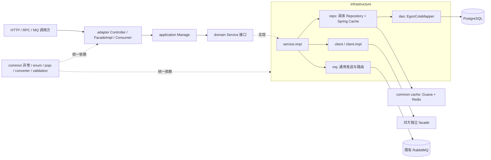
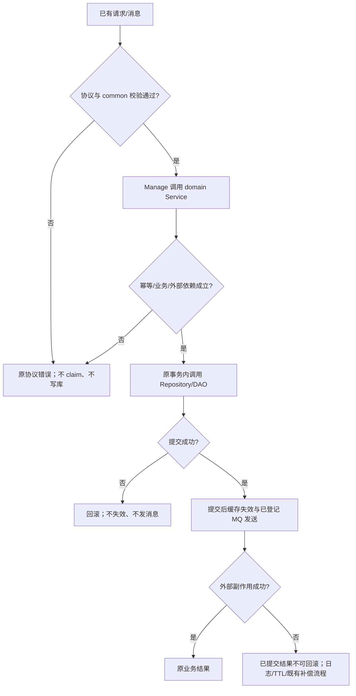
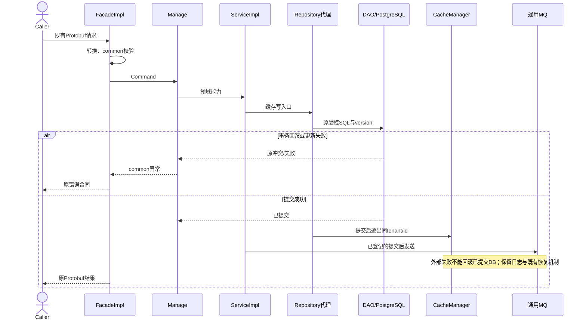

# Archetypes 与 Components 公共规范及分层收敛设计

| Field              | Value                                                                                                                                                                                                                                                                                                                                                                                                                            |
|--------------------|----------------------------------------------------------------------------------------------------------------------------------------------------------------------------------------------------------------------------------------------------------------------------------------------------------------------------------------------------------------------------------------------------------------------------------|
| Document           | `docs/egon/spec/2026-09-20-12-18-archetype-component-contract-convergence.md`                                                                                                                                                                                                                                                                                                                                                    |
| Template Version   | `7`                                                                                                                                                                                                                                                                                                                                                                                                                              |
| Status             | `Draft`                                                                                                                                                                                                                                                                                                                                                                                                                          |
| Type               | `Architecture`                                                                                                                                                                                                                                                                                                                                                                                                                   |
| Complexity         | `Complex`                                                                                                                                                                                                                                                                                                                                                                                                                        |
| Complexity Drivers | 七套源工程、组件公共 ABI、静态 ID/租户生命周期、Protobuf facade 发布、Redis 事务与集群失效、生成器依赖图                                                                                                                                                                                                                                                                                                                                                              |
| Created            | `2026-09-20 12:18 CST`                                                                                                                                                                                                                                                                                                                                                                                                           |
| Updated            | `2026-09-20 12:39 CST`                                                                                                                                                                                                                                                                                                                                                                                                           |
| Owner              | `mario`                                                                                                                                                                                                                                                                                                                                                                                                                          |
| Repository         | `Egon-COLA`                                                                                                                                                                                                                                                                                                                                                                                                                      |
| Scope              | `egon-cola-archetypes` 与 `egon-cola-components`；platforms 自身治理暂缓；平台必要兼容适配待 DEC-004                                                                                                                                                                                                                                                                                                                                               |
| Change Surface     | 公共异常/枚举/转换/校验/载体规范；domain gateway/client 与消息端口迁移；infra repo/dao/po/converter 布局；静态基础能力；缓存默认值/键；facade 所有权；源工程、定义、测试和文档                                                                                                                                                                                                                                                                                                           |
| Affected Chapters  | §7, §8, §9, §10, §11, §13, §14, §15, §16, §17, §18                                                                                                                                                                                                                                                                                                                                                                               |
| Source Requirement | 2026-09-20 用户 18 条要求，以及范围、Protobuf 豁免、infra 交叉引用 facade 的三项确认                                                                                                                                                                                                                                                                                                                                                                    |
| Baseline Revision  | `main @ 330e643499871250df5628c0f30791e3fe7736cc`；开始检查时工作区干净                                                                                                                                                                                                                                                                                                                                                                     |
| Amends             | [MP 演进](2026-09-12-21-11-mybatis-repository-cqrs-postgresql-evolution.md) §7–§10、§15–§16 的注入/包结构；[MP 统一](2026-09-14-22-05-mp-sharding-jdbc-starter-unification.md) §7–§10、§15 的公共服务入口；[缓存](2026-09-18-15-37-two-level-cache-redis-event-starter-repo-enhancement.md) §7、§9、§10、§15–§16 的默认开关、TTL、Repository 接入；[Native/Open](2026-09-07-16-52-archetype-native-open-dependency-governance.md) §7.4、§8–§10、§16 的 facade 所有权与重复转发链 |
| Supersedes         | `None`                                                                                                                                                                                                                                                                                                                                                                                                                           |
| Depends On         | [MP 统一建模](2026-08-25-19-09-archetype-mybatis-plus-unification.md) §5.3 DEC-005 的 PO Lombok 构造决定；[MP 统一](2026-09-14-22-05-mp-sharding-jdbc-starter-unification.md) §11 的 PostgreSQL/LOCAL/DDL 不变量；[两阶段生成](2026-08-27-20-31-archetype-two-stage-source-generation.md) 源工程与 definitions 所有权                                                                                                                                         |
| Related Specs      | [Agent](2026-09-04-16-32-agent-deep-research-archetype.md)、[RAG](2026-09-10-11-34-egon-cola-component-rag-starter.md)、[RPC](2026-08-19-15-36-rpc-runtime-governance-evolution.md)；只修订本稿列出的公共类型与调用位置，不改变其产品流程                                                                                                                                                                                                                     |
| Related Plans      | [逐文件实施计划](../plan/2026-09-20-12-59-archetype-component-contract-implementation.md)（Review；用户确认记录见Plan §2.1）                                                                                                                                                                                                                                                                                                                      |

## 1. Summary

本稿把用户要求落实为两类工作：七套 archetype 的业务分层收敛，以及 components 的公共契约治理。六套目标为 Light、Service、Web
与各自 Open；用户进一步确认 archetypes 全部治理，因此 Agent 同样纳入适用规则。组件保留原有 starter/API/bridge
模块职责，不被机械改造成应用七层结构。

目标调用关系为 Adapter/FacadeImpl → Application Manage → Domain Service → Infrastructure ServiceImpl → 技术
Repository/DAO 或 Client/MQ。Domain 不再持有 gateway/client 包；应用层不再直接使用缓存、Publisher 或基础设施。用户第 14
条末尾的修正优先于第 10 条：**保留独立技术 Repository 作为缓存边界，但 repo 不再作为 dao/po/converter 的父包**。

Native 唯一对外 facade 使用 Protobuf；生成消息明确豁免 common.pojo，手写 DTO/VO/Query/Command/Result 仍遵守公共规范。Native
使用 Egon RPC，Open 保留已有 Dubbo/Triple/gRPC 技术栈。只移除重复的业务 facade → RPC facade 转发，不把 Open 偷换为 Egon
RPC。两个额外共享 facade 工件由 web/service 自有 facade 模块接替，infra 交叉依赖对方 facade。

这是设计文档，不是实现交付。三项后续决策见 §5.4；未关闭前不标记 Review，不写实施 Plan、不修改生产代码、不启动服务或浏览器。

## 2. Background and Current State

### 2.1 路径与检查口径

以下路径别名仅压缩文档，展开后均对应真实目录。

| 别名 | 仓库相对路径                                                                                                                              |
|----|-------------------------------------------------------------------------------------------------------------------------------------|
| C  | `egon-cola-components/egon-cola-component-common/egon-cola-component-common-core/src/main/java/top/egon/cola/component/common/core` |
| M  | `egon-cola-components/egon-cola-component-common/egon-cola-component-common-mybatis-plus-sharding-jdbc-ext-spring-boot-starter`     |
| MJ | `M/src/main/java/top/egon/cola/component/common/mybatis`                                                                            |
| I  | `egon-cola-components/egon-cola-component-common/egon-cola-component-common-id-starter`                                             |
| K  | `egon-cola-components/egon-cola-component-common/egon-cola-component-common-cache-spring-boot-starter`                              |
| S  | `egon-cola-archetypes/source-projects`                                                                                              |
| D  | `egon-cola-archetypes/definitions`                                                                                                  |
| L  | `S/egon-cola-source-light/src/main/java/top/egon/cola/archetype/source/light`                                                       |
| LO | `S/egon-cola-source-light-open/src/main/java/top/egon/cola/archetype/source/lightopen`                                              |
| R  | `egon-cola-components/egon-cola-component-rpc/egon-cola-component-rpc-starter/src/main/java/top/egon/cola/component/rpc`            |
| O  | `egon-cola-components/egon-cola-component-transactional-outbox-starter`                                                             |

扫描排除 `target`、`.generated`、第三方生成 Java；包括 `src/main` 中嵌套异常和枚举。源代码事实不等于运行验证。§8
的清单记录本次快照，后续实施时必须重新扫描，不能只修改示例文件。

### 2.2 Repository evidence

| Evidence ID | Classification    | Exact path/symbol/decision/command                                                                                                                | Observed fact                                                                         | Design significance                              | Verification limit/freshness |
|-------------|-------------------|---------------------------------------------------------------------------------------------------------------------------------------------------|---------------------------------------------------------------------------------------|--------------------------------------------------|------------------------------|
| EVD-001     | Static repository | `L/domain/teaching/gateway/TeachingQueryGateway.java`、`L/application/teaching/manage/impl/CourseManageImpl.java`                                  | Manage 同时依赖 Gateway、CachePort、Publisher 与 DomainService                               | 四种技术能力须收敛至 service 入口                            | 当前源码，未执行课程请求                 |
| EVD-002     | Static repository | `L/infrastructure/teaching/service/impl/CourseDomainServiceImpl.java`、`repo/CourseRepository.java`、`repo/dao/CourseDAO.java`                      | Service 组合 Repository；DAO 是 EgonColaMapper；ID 注入在 Service；properties 注入在 Repository   | 不能把 Repository 与 DAO 当作同一类删除                     | 当前源码                         |
| EVD-003     | Static repository | `C/exception/CommonException.java`、`L/common/exceptions/BaseBusinessException.java`、`R/exception/EgonRpcException.java`                           | Common code 为 int；Light code 为 String；RPC code 为 EgonRpcErrorCode                     | 改父类时必须同步 getter 和所有消费者，保留 wire 错误值               | ABI 未做编译验证                   |
| EVD-004     | Static repository | `C/enums/EgonEnum.java`、`ErrorStatus.java`                                                                                                        | 规范是接口；EgonEnum 提供 int code/message；ErrorStatus 增加 String status                       | Java enum 实现接口，不能继承另一 enum                       | 当前源码                         |
| EVD-005     | Static repository | `C/pojo/BaseRequest.java`、`C/validation/ValidationUtils.java`                                                                                     | BaseRequest 是 record；ValidationUtils 是 final 实例工具，目录无可继承 validator 基类                 | 不能直接 extends；需要在 common 内补齐明确的扩展合同               | 当前源码                         |
| EVD-006     | Static repository | `C/converter/BaseConverter.java`、`L/application/teaching/convertor/TeachingApplicationConvertor.java`                                             | 前者双向接口；后者手工 new，多种输入；BaseConverter 仍有 Date/SimpleDateFormat 和吞异常解析                    | 逐映射对接 BaseConverter；日期治理不能遗漏公共父接口                | 当前源码                         |
| EVD-007     | Static repository | `I/.../snowflake/SnowflakeIdGenerator.java`、`generator/LongIdGenerator.java`                                                                      | Snowflake 是 CAS 有状态实例；LongIdGenerator 只有一个抽象方法                                        | static 是本次目标，不是当前事实；不能每次创建新生成器                   | 并发行为只读源码                     |
| EVD-008     | Static repository | `MJ/business/EgonColaTenantIdProvider.java`、`autoconfigure/EgonColaMybatisPlusAutoConfiguration.java`                                             | provider 是函数接口，自动配置会创建具名 Bean；model validator 也有 Bean                                 | “未被 Spring 管理”与当前源码不符，但按用户目标移除消费侧注入              | 当前源码                         |
| EVD-009     | Static repository | `MJ/extension/EgonColaRepository.java`                                                                                                            | properties 用于 batch/defaultSize/maxCollectionSize/maxChunkSize、pagination/maxPageSize | DAO 不注入；Repository 的有效限额不应删除                     | 当前源码                         |
| EVD-010     | Static repository | `MJ/autoconfigure/EgonColaMybatisPlusAutoConfiguration.java`、`EgonColaMybatisPlusContractValidator.java`                                          | meta-fill 是 MetaObjectHandler 装配条件，也受配置校验                                             | 删除开关而保留强制字段填充，需同步两处及配置测试                         | 当前源码                         |
| EVD-011     | Static repository | `K/.../EgonColaCacheProperties.java`、`EgonColaTwoLevelCache.java`                                                                                 | 默认关闭；两级共用 30 分钟、±10% 抖动；已有逐条截止时间、Redis 事件、区域覆写                                        | 复用内核，改独立 TTL/default 与 profile，不重造缓存             | 当前源码                         |
| EVD-012     | Static repository | `git show 330e64349`、`M/.../EgonColaRepositoryCacheEnhancementTest.java`、`L/infrastructure/user/repo/UserRepository.java`                         | 最新提交明确改为具体 Repository 的 Spring Cache 注解；基类无缓存依赖，final 方法不被缓存代理                        | 保留这次已落地的注解模式；旧 09-18 Spec 的透明缓存描述不能当实现证据         | 本次未运行该测试                     |
| EVD-013     | Static repository | `R/contract/validation/RpcContractValidator.java:100`、`L/facade/rpc/CourseRpcService.java`、`L/adapter/teaching/rpc/CourseRpcProvider.java`        | RPC 要求 Message，Provider 再调用 DTO FacadeImpl，再调用 Manage                                 | 用户已选择唯一 Protobuf facade，合并 Provider 与 FacadeImpl | 不改 RPC 编解码协议                 |
| EVD-014     | Static repository | `S/egon-cola-source-{service,web}/pom.xml`、`egon-cola-archetypes/pom.xml`                                                                         | Native 根当前六模块，自身 facade 由两个共享工件承担；Open 自有 facade                                      | Native 增加自己的 facade 模块后删除共享工件                    | 必须改 source/generated GAV     |
| EVD-015     | Static repository | `D/egon-cola-archetype-*/src/test/resources/projects/basic/verify.groovy`                                                                         | verifier 固定 repo/dao、repo/po、模块数和 RPC 类型                                              | 修改源码必须同步 verifier，不能关闭断言                         | 当前文件                         |
| EVD-016     | Static repository | `O/.../store/PostgresqlJdbcOutboxStore.java`、`O/src/main/resources/db/transactional-outbox/postgresql/V1__create_transactional_outbox_schema.sql` | Outbox id 为 bigint identity；enqueue 不显式写 id                                           | 改 Snowflake 写入，不修改既有 V1                          | 存量数据和 live schema 未检查        |
| EVD-017     | Static repository | `egon-cola-xingyuan/.../DdcAutoConfiguration.java:388`、`.../GatewayDefinitionReportFactory.java:47`                                               | 平台直接构造 SnowflakeIdGenerator(0)                                                        | static 改造与平台完全不动存在编译冲突，DEC-004                   | 只读影响面                        |
| EVD-018     | User decision     | 本会话三项回复                                                                                                                                           | archetypes/components 都治理；platforms 暂缓；Protobuf 豁免；infra 交叉引用 facade                  | 作为本稿有效范围与协议决定                                    | 不等于接受本稿全部设计                  |

### 2.3 六套与扩展范围快照

| Family       | main Java 文件 | domain Gateway | 异常定义文件 | 显式 enum | 命名 Validator | Assembler |
|--------------|--------------|----------------|--------|---------|--------------|-----------|
| light        | 321          | 2              | 8      | 8       | 8            | 2         |
| light-open   | 306          | 2              | 8      | 8       | 8            | 2         |
| service      | 212          | 0              | 7      | 10      | 9            | 0         |
| service-open | 201          | 0              | 7      | 10      | 9            | 0         |
| web          | 296          | 0              | 8      | 9       | 7            | 4         |
| web-open     | 289          | 0              | 8      | 9       | 7            | 4         |

components 初筛 894 个 main Java 文件、53 个异常类声明、78 个 enum 声明；archetypes（含 Agent/共享 facade）1862 个 main Java
文件、50 个异常类声明、65 个 enum 声明。这些是**发现数量**，不是应修改数量；已有合规类型保留。UUIDv7 在生产 Java 与 POM
的本次检索中未发现实现，现有禁用断言继续保留，不能为“移除”而删正常 Snowflake 或 UUIDv4 消息标识。

### 2.4 Evidence and current-chain map

| Entry/trigger | Current call chain                                                                                                                              | Data read/written       | External dependency    | Consumers          | Evidence      |
|---------------|-------------------------------------------------------------------------------------------------------------------------------------------------|-------------------------|------------------------|--------------------|---------------|
| 创建课程          | CourseRpcProvider → CourseFacadeImpl → CourseManageImpl → validator/cache claim → TeachingQueryGateway → CourseDomainService → Repository → DAO | courses；幂等 Redis key；消息 | 外部 HTTP、Redis、RabbitMQ | Native 调用方         | EVD-001、013   |
| 读取用户缓存        | Service 可调用 Repository.findCachedById → Spring Cache → Guava/Redis → final getById → Mapper                                                     | users；UserPO region     | Redis、PostgreSQL       | 用户查询               | EVD-002、012   |
| MP 初始化        | AutoConfiguration → TenantProvider/ModelValidationUtils/MetaObjectHandler/ContractValidator                                                     | 配置与 MDC 读取              | Spring、MyBatis         | 全部 MP 消费工程         | EVD-008–010   |
| 外部评价查询        | web domain/client/EvaluationQueryPort → infra/client/NativeEvaluationQueryClient → evaluation shared facade                                     | 外部只读投影                  | Egon RPC               | OrganizationManage | EVD-014、§8 清单 |

## 3. Goals and Non-goals

### 3.1 Goals

消除六套模板的同类绕过，并让 Agent、组件的适用类型通过同一验证规则。保留现有业务结果、租户隔离、SQL 保护、协议字段和事务后副作用语义；变更的
Java API 必须明确映射与同步调用方。生成结果与正常源工程一致。

### 3.2 Non-goals

不治理平台自己的业务分层、前端与页面；不升级框架版本；不新造 RPC 协议；不新增业务用例；不把所有读取自动缓存；不重建数据库或修改已有
Flyway/DDL 脚本；不部署或发布 Maven 包。外部主键的十进制 JSON 字符串展示不是数据库 String 主键，保留现有精度保护。

### 3.3 Change Surface and Design Depth

| Area/layer                    | Disposition    | Exact repository evidence                                         | Changed or preserved behavior/contract         | Required Spec treatment | Chapter(s)                                    |
|-------------------------------|----------------|-------------------------------------------------------------------|------------------------------------------------|-------------------------|-----------------------------------------------|
| Archetype Java 分层与公共类型        | Affected       | S 七个工程，EVD-001–006、013–015                                        | 包、接口、映射、输入校验与 facade 所有权                       | 精确迁移规则、操作清单、协议不变量       | §7, §8, §9, §10, §13, §14, §16                |
| Components common/ID/MP/cache | Affected       | C、I、M、K                                                           | 基类、静态入口、强制缓存依赖、TTL/key                         | 生命周期、失败与兼容设计            | §7, §8, §9, §10, §13, §14, §15, §16, §17, §18 |
| 其他 components                 | Affected       | §8 类型清单，EVD-003、016                                               | 异常、enum、validator、转换与直接消费者                     | 只改合规差异及必要依赖             | §7, §8, §9, §10, §13, §14, §16, §18           |
| Outbox 持久化身份                  | Affected       | EVD-016                                                           | INSERT 显式 Snowflake bigint，保持既有行/索引            | 生成权、SQL、碰撞与兼容           | §11, §14, §16                                 |
| 定义/生成/构建/配置                   | Affected       | D、S/pom.xml、scripts/generate_archetypes.sh                        | 新路径、facade 工件、profile 键与围栏                     | 发布 DAG 与静态/生成验证         | §8, §14, §15, §16                             |
| 普通业务表与分片拓扑                    | Context-only   | 各 db/egon-mp/repository-manifest.json 与初始化 SQL                    | Long id、tenant_id、deleted_at、version、显式 SQL 不变 | 引用表与事务不变量，不重画全表         | §11                                           |
| HTTP/GraphQL/SSE wire         | Context-only   | 各 adapter Controller、handler、SDL；Agent research/knowledge adapter | 路由、外部字段、状态码、schema、流终止规则不变                     | 保护序列化与错误映射，不引入新 API     | §9, §12                                       |
| 平台产品与 UI                      | Unchanged      | egon-cola-xingyuan                                                | 自身治理暂缓，编译兼容受 DEC-004 限定                        | 无目标产品重构                 | §12, §18                                      |
| 新前端/部署执行                      | Not applicable | 用户要求后端规范，明确 Spec 阶段                                               | 无新增页面、无运行操作                                    | N/A                     | §12                                           |

## 4. Requirements and Acceptance Criteria

| ID      | Atomic requirement                                            | Priority | Observable acceptance criteria                                          | Source               |
|---------|---------------------------------------------------------------|----------|-------------------------------------------------------------------------|----------------------|
| REQ-001 | 删除 domain 下 gateway 包及旧 Gateway 接口/实现，能力迁移 service            | Must     | 七套 main/test/docs/verifier 无旧 domain gateway 依赖；原能力仍可经 Service 调用       | 原 1；范围确认             |
| REQ-002 | 自定义异常只在所属工程 common 内定义                                        | Must     | 扫描顶层/嵌套类，无 application/domain/adapter/infra 中自定义异常                      | 原 2                  |
| REQ-003 | 所有自定义异常继承 common-core 异常体系                                    | Must     | CommonException/BusinessException 祖先校验；原 cause/status/retryable 和传输错误保持 | 原 2                  |
| REQ-004 | 所有手写 enum 实现 EgonEnum 或其规范子接口                                 | Must     | 143 个当前候选逐项归类；固定 code/message；生成 enum 按 DEC-002 豁免                      | 原 3；Protobuf 决定      |
| REQ-005 | 对象转换经 BaseConverter + MapStruct/MapStructPlus                 | Must     | 每个语义映射对有具体泛型；禁止业务手工复制、BeanUtils、JSON 中转                                 | 原 4                  |
| REQ-006 | Adapter/facade 手写载体使用 common.pojo 规范                          | Must     | 继承/实现公共载体合同；Protobuf 生成类型豁免；wire 无额外字段                                  | 原 5；DEC-002          |
| REQ-007 | Validator 继承 common.validation 扩展合同                           | Must     | 不存在仅改类名绕过的 validator；普通规则原生约束；自定义语义有明确 hook                             | 原 6                  |
| REQ-008 | RepositoryMonitorAspect 监控 DAO，基础设施日志匹配新范围                    | Must     | Mapper 代理与继承 SQL 方法有计时；service/cache/转换器不误计 DAO                         | 原 7                  |
| REQ-009 | Client 在 infra/client 与 client.impl；Domain 仅通过 service 提供能力   | Must     | 所有 Client/ClientImpl 成对；domain 无 client 包；cache 不实现 Client              | 原 8                  |
| REQ-010 | Manage 通过 Domain Service 发送业务消息                               | Must     | Manage 无 Publisher/RabbitTemplate/MQ 实现引用；ServiceImpl 使用通用 MQ           | 原 9                  |
| REQ-011 | MQ 拓扑与消息策略由规范 enum 描述，生产/消费共用                                 | Must     | exchange/queue/routingKey/DLQ 来源一致；无 type.startsWith 路由猜测               | 原 9                  |
| REQ-012 | 技术 Repository 独立，dao/po/converter 与 repo 平级                   | Must     | service.impl → repo → dao；repo 不再容纳其他层；不恢复旧 Gateway 语义                  | 原 10 被原 14 末句修正      |
| REQ-013 | 数据身份由 Snowflake/LongIdGenerator 生成 bigint                     | Must     | 业务 PO Long，Outbox INSERT 显式 id；无 UUIDv7；框架台账见 DEC-005                   | 原 11                 |
| REQ-014 | Snowflake 提供 static 入口，LongIdGenerator 不再是函数式接口               | Must     | caller 无 Snowflake 构造/注入；接口至少两个独立抽象操作；同一状态机生成                           | 原 11                 |
| REQ-015 | TenantIdProvider static，每次读取当前可信租户                            | Must     | 无函数式接口/业务注入；缺失/非法/跨租户拒绝；线程不串租户                                          | 原 12                 |
| REQ-016 | ModelValidationUtils static，移除其消费侧构造注入                        | Must     | repo/interceptor 无实例字段；业务、加载、元数据校验保持                                    | 原 12                 |
| REQ-017 | DAO 不注入 EgonColaMybatisPlusProperties                         | Must     | DAO 仅 Mapper；保留技术 Repository 正在使用的批量/分页限额                               | 原 13；EVD-009 的实际使用边界 |
| REQ-018 | 移除 metaFill 字段与配置开关，强制公共字段填充                                  | Must     | 字段/配置/metadata/tests 无旧键；MetaObjectHandler 始终随 MP 启用                    | 原 13                 |
| REQ-019 | MP/模板强制 Redis 与默认启用的二级缓存                                      | Must     | 无 optional Redis、无生产内存替代；缺必需客户端启动失败；未配置 enabled 仍装配                     | 原 14                 |
| REQ-020 | L1 5 分钟 + 0–2 分钟，L2 1 小时 + 0–20 分钟，可配置                        | Must     | 两级独立 Duration 参数，逐条正向抖动，回填不延长 L2 剩余寿命                                   | 原 14；ASM-001         |
| REQ-021 | Repository Spring Cache 使用公共 KeyGenerator 与主动失效               | Must     | key 含 tenant；同一实体读写相同 key；事务回滚不发失效；跨节点事件统一                              | 原 14                 |
| REQ-022 | Native 唯一 Protobuf facade，Open 保留原协议形态，FacadeImpl 直接调用 Manage | Must     | 不存在 RpcProvider → DTO FacadeImpl → Manage 双链；Native 注解满足 validator      | 原 15；DEC-002         |
| REQ-023 | facade assert 依托公共 validation，移除自写重复校验                        | Must     | 无本地 null/range 工具副本，直接/代理入口错误一致                                         | 原 15                 |
| REQ-024 | application 使用 pojo.query/command/result/convertor            | Must     | 无 assembler 包/类；TeachingApplicationValidator 不再 claim 缓存幂等              | 原 16                 |
| REQ-025 | adapter 使用 pojo.vo/dto/convertor                              | Must     | 层内载体/转换器位于规范目录，服务型模板不引入 HTTP VO                                         | 原 17                 |
| REQ-026 | 删除额外 organization/evaluation facade，恢复各项目自有 facade            | Must     | web/service facade 可独立发布；双方 infra 引用对方；Maven 图无环                        | 原 18；DEC-003         |
| REQ-027 | archetypes/components 全量适用规则，平台治理暂缓                           | Must     | Agent 纳入；components 清单覆盖；平台改动只按 DEC-004                                 | 范围确认                 |
| REQ-028 | 同步源码、定义、测试与真实生成结果                                             | Must     | 七套生成校验及确定性通过；无手改 .generated，无不相关格式化                                     | 原结尾与 AGENTS.md       |

### 4.1 Scenario matrix

| Scenario     | Actor/trigger | Preconditions        | Main path                                            | Alternative/failure path   | Data/state change | Observable result            | Requirements        |
|--------------|---------------|----------------------|------------------------------------------------------|----------------------------|-------------------|------------------------------|---------------------|
| 合法课程创建       | ACTOR-002     | 可信租户、有效参数            | FacadeImpl → Manage → Service → Client/Repository/MQ | 外部课程不存在则无写入                | courses 提交后消息     | 原业务结果                        | REQ-001、009、010、022 |
| 校验失败/重复      | ACTOR-002     | 请求格式错误或已有幂等 claim    | Bean Validation 后才进入幂等业务 Service                     | 格式错误不占用 key；重复保留原拒绝行为      | 无业务写              | 原错误 status                   | REQ-007、023、024     |
| 同 ID 跨租户     | ACTOR-002     | tenant A/B 具有相同 id   | KeyGenerator 含 tenant；数据库租户 Guard                    | 缺上下文 fail closed；不读取其他租户缓存 | 无跨租户数据            | 正确隔离                         | REQ-015、021         |
| 缓存 miss/空值   | ACTOR-002     | Redis 可用、缓存空         | Guava → Redis → 显式 SQL；短 TTL 空哨兵                     | 回源异常不缓存异常                  | 可丢弃缓存状态           | 同请求不穿透                       | REQ-019–021         |
| 写回滚/乐观锁失败    | ACTOR-002     | 有事务与旧缓存              | updateCachedById 返回 false/异常                         | 回滚时不失效、不发送消息               | 原行与原缓存保留          | 冲突可见                         | REQ-010、021         |
| 提交后 Redis 失败 | ACTOR-003     | 数据库已提交               | 本地先逐出，远程失效/发布失败记录                                    | 不能回滚已提交数据；TTL/恢复清理收敛       | DB 新值，其他节点可能旧值    | 不宣称强一致                       | REQ-021             |
| RPC 参数缺失     | ACTOR-002     | Protobuf optional 无值 | converter 保留 hasXxx 信息 → validation                  | 不把缺失 ID 转 0 后当有效值          | 无写入               | INVALID_ARGUMENT/既有 envelope | REQ-005–007、022     |
| 静态 ID 重复初始化  | ACTOR-003     | 同 JVM 已初始化           | 相同配置幂等，继续原 CAS 状态                                    | 不同 machineId/时钟参数拒绝，不重置序列  | 不生成重复 ID          | 明确配置错误                       | REQ-013、014         |
| MQ 重复与超时     | ACTOR-002/003 | 消息可能重复投递             | 消费者验证 → 同租户幂等 → Service                              | 明确业务拒绝进入既有 DLQ；未知发送结果不盲重试  | DB 按既有幂等策略        | 可重放与诊断                       | REQ-010、011         |
| 独立项目生成发布     | ACTOR-001     | peer facade 坐标明确     | 先 common/parent/facade，再消费层                          | 缺 peer 工件失败并给出坐标，不动态下载源码   | 仅构建工件             | 无 Maven 环                    | REQ-026、028         |

### 4.2 Use-case analysis

| Actor ID  | Actor/role        | Goal and responsibility | Entry/channel            | Permission/tenant context | Evidence           |
|-----------|-------------------|-------------------------|--------------------------|---------------------------|--------------------|
| ACTOR-001 | 组件/模板维护者          | 生成可构建的合规工程并发布 facade    | Maven、generator、verifier | 仓库维护权                     | S、D、用户需求           |
| ACTOR-002 | 业务 HTTP/RPC/消息调用方 | 按现有合同完成课程、用户、评价、研究能力    | 已有 adapter/facade        | 既有安全上下文；不能由 payload 提升权限  | 当前 source adapters |
| ACTOR-003 | 运维维护者             | 设置机器号、Redis、TTL，诊断失败    | profile/日志/监控            | 部署配置权限                    | ID/cache 配置        |

| ID     | Use case/goal   | Primary actor | Supporting actors/systems | Trigger         | Preconditions                 | Main success outcome  | Alternatives/failures  | Postconditions | Requirements        | Interfaces/pages | Tests        |
|--------|-----------------|---------------|---------------------------|-----------------|-------------------------------|-----------------------|------------------------|----------------|---------------------|------------------|--------------|
| UC-001 | 生成并发布规范工程       | ACTOR-001     | Maven 仓库                  | generate/verify | 坐标与 parent 可解析                | 七套产物符合规则              | 缺 peer facade/类型绕过阻止发布 | 无脏生成输出         | REQ-001–028         | §8、§16           | TEST-001、012 |
| UC-002 | 经唯一入口调用原业务      | ACTOR-002     | Client/MQ/PostgreSQL      | 请求或消费消息         | 校验/身份成立                       | 原结果与状态变更              | 无效、重复、未找到、超时、冲突均有原合同结果 | 成功提交，失败不部分写    | REQ-001–018、022–026 | §9 保持的操作         | TEST-003–008 |
| UC-003 | 一致访问并失效缓存       | ACTOR-002     | Redis、Guava               | 读/写/主动失效        | 可信 tenant，必需缓存组件              | 正确 key 命中或回源          | 回滚零失效，断连有界旧值，不跨租户      | 缓存仍为非权威副本      | REQ-019–021         | INTERNAL-003、004 | TEST-009、010 |
| UC-004 | 安全初始化 ID/租户基础能力 | ACTOR-003     | 应用上下文                     | 应用装配            | 正确 machineId/validator/config | static 消费同一生成状态与请求上下文 | 未初始化/冲突/回拨拒绝           | 不默认机器号、不默认租户   | REQ-013–018         | INTERNAL-001、002 | TEST-007     |

## 5. Constraints, Assumptions, and Decisions

### 5.1 Confirmed constraints

仅 Spec 文档修改。每个逻辑任务最多一个提交，不自动提交本文。已有 Flyway `classpath:db` 文件不可编辑/删除/重命名；DDL 历史同样不可改
checksum。`-open` 使用自身技术栈；Service 不引入 Web/GraphQL；Agent 保留研究/RAG 业务与 SSE。用户“接口有即可，lite
可伪代码”意味着不制造单体对自己的 RPC 调用。

### 5.2 Small-gap assumptions

| ID      | Inference                                                            | Repository evidence                       | Why locally reversible | Impact if wrong                        |
|---------|----------------------------------------------------------------------|-------------------------------------------|------------------------|----------------------------------------|
| ASM-001 | “+随机盐值”解释为均匀正向 Duration 抖动 [0,jitter]，不是 ±ratio                      | 原 14 使用加号且分别给出范围                          | 参数含义清晰，单处 TTL 计算可调整    | 缓存陈旧上界为 L1 7 分钟、L2 80 分钟               |
| ASM-002 | common 是各工程的公共归属；组件异常放自身 `common.exception`，不把所有组件业务类型搬进 common-core | 各 component 拥有自身错误枚举；common-core 不能反向依赖组件 | 包归属可机械迁移               | 若要求全部物理放 common-core，会改变依赖与领域所有权，需重新评审 |
| ASM-003 | 仅包搬迁且字段不变的载体不增加中间 DTO；Java 类名除 Gateway/Client/Assembler 明确要求外按语义保留   | 原要求强调组织方式，已有 caller 生命周期                  | 不变更 wire               | 减少重复模型                                 |

### 5.3 Resolved decisions

| ID      | Decision                                                           | Decision owner               | Evidence and rationale                                  | Requirements    |
|---------|--------------------------------------------------------------------|------------------------------|---------------------------------------------------------|-----------------|
| DEC-001 | archetypes 和 components 全部治理；平台自己的治理暂缓                             | User                         | 本会话范围回复                                                 | REQ-027         |
| DEC-002 | Native 唯一 facade 使用 Protobuf；生成消息/枚举豁免手写 common.pojo/EgonEnum 继承要求 | User                         | 明确选择 Protobuf，生成类不能手改；不增强 Egon RPC DTO 编解码              | REQ-004、006、022 |
| DEC-003 | web/service 各自独立 facade；双方 infra 引用对方 facade；facade POM 无双向依赖      | User                         | 明确确认推荐方案                                                | REQ-026         |
| DEC-006 | 第 14 条后半句替代第 10 条“无 repo”；技术 repo 存在，其他目录平级                        | User wording                 | “现在不这么做了…多一层repo层，在这一层做”                                | REQ-012、021     |
| DEC-007 | 保留当前具体 Repository 的 Spring Cache 注解模式                              | Design from current baseline | `330e64349` 明确删除基类透明缓存；用户仍要求 Spring Cache，在具体 repo 增强足够 | REQ-021         |

### 5.4 Open major decisions

| ID      | Question and options                                      | Recommendation, not decision         | Impact                                                                            | Owner | Status   |
|---------|-----------------------------------------------------------|--------------------------------------|-----------------------------------------------------------------------------------|-------|----------|
| DEC-004 | 平台暂缓是否允许公共 API 变化所必需的 import/API 适配；或完全不改并接受当前 reactor 阻断 | 只允许必要兼容适配，平台自身规范治理继续暂缓               | DdcAutoConfiguration 与 GatewayDefinitionReportFactory 直接构造旧 Snowflake；测试也大量使用函数接口 | User  | Open，已提问 |
| DEC-005 | 框架 ddl_history 是否豁免业务 Long 主键规则；或将框架台账也迁移为 Long 主键        | Outbox 业务记录用 Snowflake；保留框架迁移台账复合身份  | 后者涉及历史台账迁移与运行器校验，不是改 PO 注解即可                                                      | User  | Open，已提问 |
| DEC-008 | 不可逆投影使用新增公共单向基类，或调整BaseConverter本身为单向再增加双向扩展              | 保留现有双向BaseConverter ABI，在同目录增加公共单向合同 | SchoolClassAggregate→SchoolClassResult丢失schedules细节；必须明确技能强制双向合同的例外               | User  | Open，已提问 |

## 6. Project Technology Context

| Concern            | Current choice                                                                         | Repository evidence                   | Constraint on design                             |
|--------------------|----------------------------------------------------------------------------------------|---------------------------------------|--------------------------------------------------|
| Language/runtime   | Java 21；Spring Boot 3.5.16                                                             | 根/组件/archetype POM                    | 不升级版本；record 与 javax→jakarta 无额外迁移               |
| Persistence        | MP 3.5.16、ShardingSphere 5.5.3、PostgreSQL；自有 MP-ext                                    | components/pom.xml、M/pom.xml          | 保留显式 SQL、LOCAL、tenant/version/删除保护               |
| Mapping            | MapStruct 1.6.3、MapStructPlus 1.5.1                                                    | components/archetypes/common-core POM | 用已有 annotation processors，不增加替代转换库               |
| Cache              | Spring Cache、Guava 33.6.0-jre、Redisson 3.26.0                                          | components/pom.xml、K                  | 按现有 Cache SPI 扩展，不能声称 Guava builder 原生支持每条不同 TTL |
| Protocol           | Native Egon RPC Protobuf；Open Dubbo/Triple/gRPC；HTTP/GraphQL 保持                        | R、source/definitions                  | 不改变协议编码；无额外 DTO RPC 层                            |
| Validation/testing | Jakarta Validation、JUnit 5/Mockito/AssertJ、ContextRunner、Maven Invoker、Groovy verifier | common/core tests、source tests、D      | 设计检查与未来运行测试分开                                    |

### 6.1 Java architecture profile and capability baseline

选定 **Egon-COLA Archetype**，分别使用精确 Light/Service/Web/Open 树；Agent 使用其既有 Web 衍生模块树。Light 单模块；Native
Service/Web 当前六模块加自有 facade 后七模块；Open 保持七模块。components 是这些应用的既有基础库，没有业务
Controller/Manage 分层，不为其添加 `biz.*` 或应用七层。bytecode bridge/API 的轻依赖与 Agent 包装仍是基础库技术边界。

| Need        | Spring/JDK candidate            | Spring Boot Starter candidate | Egon-COLA/module candidate                             | Proven gap                  | Decision/dependency impact                |
|-------------|---------------------------------|-------------------------------|--------------------------------------------------------|-----------------------------|-------------------------------------------|
| 公共校验继承      | Jakarta Validator               | validation starter            | ValidationUtils                                        | final 工具没有可继承合同             | 在 C/validation 加 BaseValidator；普通约束仍委托原工具 |
| record 公共标记 | Serializable                    | 无需 starter                    | BaseRequest/ResultRecord 为 record                      | 无法继承 record，也不应强行包一层改变 JSON | C/pojo 增加无字段 BasePojo 接口，现有公共记录及手写边界记录实现  |
| 转换          | MapStruct                       | 现有 processor                  | BaseConverter                                          | 多源/投影转换不能伪造双向恢复             | 一方向按角色确定 S/T；需要的补充方法在同一实现；不可逆方向明确拒绝而非伪造实体 |
| 缓存          | Cache/CacheManager/KeyGenerator | 既有 K                          | TwoLevelCacheManager/Port                              | 默认关闭、同 TTL、key SpEL 重复      | 保留 K，M 传递依赖 K；增加统一 keyGenerator，不复制实现到 M  |
| MQ          | RabbitTemplate/listener         | 既有 AMQP                       | TransactionCompletionExecutor、Outbox                   | 现有按业务重复 Publisher           | 保留发送/事务机制，通用路由合同与一个 sender；不默认加 Outbox 表  |
| ID          | AtomicLong/Duration             | 既有 I                          | Snowflake 算法                                           | caller 仍必须注入/构造             | 提取状态 engine，静态门面；不造第二算法                   |
| 异常/enum     | JVM throwable/enum              | 无需 starter                    | CommonException/BusinessException/EgonEnum/ErrorStatus | 自有类型绕过；返回 code 类型冲突         | 修改父类和直接消费者；不新增平行异常根                       |

### 6.2 User-mandated Java rule compliance

| Literal rule | Affected? | Repository evidence                              | Exact design decision                                                           | Files/types/interfaces      | Validation/test evidence | Status/blocker    |
|--------------|-----------|--------------------------------------------------|---------------------------------------------------------------------------------|-----------------------------|--------------------------|-------------------|
| Rule 1       | Yes       | §8 全量类型清单                                        | 新/实质修改载体有 PO/BO/DTO/VO/Query/Command/Result/Event 语义；行为类按角色命名                   | §8、§10                      | TEST-001                 | PASS              |
| Rule 2       | Yes       | §7.3.2 每层 handoff                                | Jakarta 原生约束、groups、@Valid/@Validated；ValidationUtils 复用，幂等独立                   | BaseValidator、各输入           | TEST-004                 | PASS              |
| Rule 3       | Yes       | BaseConverter、PO 前序 DEC-005                      | 简单 record；不可变非 record 用 @Value；PO 使用已获批五注解，不重引入重复无参构造；新增复杂 carrier 的六注解需构造签名不重复 | §10                         | TEST-003、编译              | PASS，沿用前序明确 PO 例外 |
| Rule 4       | Yes       | source lombok.config                             | 业务类 @Slf4j、显式 Bean 名；实例依赖 final/@Qualifier/@RequiredArgsConstructor；静态工具不注入     | service/client/mq/validator | TEST-005                 | PASS              |
| Rule 5       | Yes       | 既有 Commons/Guava                                 | 工具只用 JDK/列明 Commons/Guava，已有业务组件复用不等于新增工具库                                      | converters/cache            | import gate              | PASS              |
| Rule 6       | Yes       | Jackson/PB 当前边界                                  | JSON 仍用 Boot Jackson；PB 不套 JSON；继承 BasePojo 不增加 wire 字段                         | adapter/facade/error 映射     | TEST-003、006             | PASS              |
| Rule 7       | Yes       | 七根 application.yml/dev/test/prod                 | §15 完整 profile 键集一致，只有值不同                                                       | 28 份配置                      | TEST-011                 | PASS              |
| Rule 9       | Yes       | 多协议 client、MQ 事件类型、缓存失效                          | Adapter/Strategy/Template Method/Observer 对应真实变化点；简单 CRUD 直接组合                  | §13                         | TEST-008–010             | PASS              |
| Rule 10      | Yes       | BaseConverter legacy Date、缓存 Duration、PO Instant | 新转换全部 java.time；处理旧 Date API 调用方，保留协议 ISO 表示                                    | §10、§16                     | date/precision tests     | PASS              |
| Rule 11      | Yes       | source POM 与七个 verifier                          | 精确 Archetype 家族；基础组件保持已有库模块，没有新增应用层                                             | §6.1、§8                     | TEST-001、012             | PASS              |

## 7. Architecture Design

### 7.0 Minimum-design baseline and element-necessity audit

| Proposed element                              | Change         | Requirements    | Existing/direct alternative            | Concrete inadequacy of alternative | Added calls/state/coupling/failures/migration/operations | Verdict |
|-----------------------------------------------|----------------|-----------------|----------------------------------------|------------------------------------|----------------------------------------------------------|---------|
| Domain Service 上收 gateway/client/publisher 能力 | Expand         | REQ-001、009、010 | Manage 直连技术端口                          | 违背用户边界                             | 替换本地调用，不增加网络调用                                           | Merge   |
| 具体技术 Repository + 平级 DAO/PO/converter         | Keep/Move      | REQ-012、021     | ServiceImpl 直接缓存/DAO                   | 缓存所有权不符末条修正                        | 只迁包，缓存仍经代理                                               | Keep    |
| BasePojo                                      | New            | REQ-006         | extends BaseRequest record 或再包 request | 前者不可编译，后者改变外部 JSON                 | 一个无字段 JDK 接口，不增加 RTT/状态                                  | Add     |
| BaseValidator                                 | New            | REQ-007、023     | extends final ValidationUtils          | 不可编译；每层复制校验漂移                      | 一个公共继承点，仍调用原 Validator                                   | Add     |
| Snowflake static facade + 独立状态 engine         | Split existing | REQ-014         | 每次 new/全局可变 machineId                  | 会重复 ID 或污染配置                       | JVM 初始化所有权与配置冲突处理                                        | Add     |
| 公共 KeyGenerator                               | New            | REQ-021         | 每仓库写 MDC SpEL                          | 非默认 tenant key、实体/id 不一致           | 一处实现，无新网络查询                                              | Add     |
| Cache starter 由 MP 传递依赖                       | Expand         | REQ-019         | 可选 cache port                          | 不能保证默认可用                           | Redis 是部署前置条件                                            | Keep    |
| 通用消息路由 enum 合同 + sender                       | New/Merge      | REQ-010、011     | 每种事件一个 Publisher                       | 重复路由/配置/异常处理                       | 一组 enum 与一个 sender，无新 broker                             | Merge   |
| 双 facade/provider                             | Remove         | REQ-022         | 保留 DTO facade 再包装 PB                   | 多余同进程转发与重复校验                       | Java ABI 迁移；PB 字段不变                                      | Remove  |
| 两个共享 facade 工件                                | Remove         | REQ-026         | 与项目自有 facade 同时存在                      | 双事实源                               | 发布顺序和 peer GAV 显式化                                       | Remove  |
| 新业务缓存列表/远程 selector/事件总线                      | No change      | REQ-021 范围      | 已有查询/消息能力                              | 当前无缺口                              | 避免额外缓存索引与 RTT                                            | Remove  |

| Path             | Network calls             | Client states | Server contracts/state | Failure and TOCTOU points | Additional user/business value |
|------------------|---------------------------|---------------|------------------------|---------------------------|--------------------------------|
| 当前 Native facade | 一次 RPC，内部两次 facade 转发     | 原请求状态         | DTO/PB 双公开接口           | 映射重复                      | 原业务结果                          |
| 目标唯一 facade      | 一次 RPC，直接 Manage          | 原状态           | 一个发布接口                 | 保留原业务校验                   | 单一合同与清晰 owner                  |
| 缓存读              | 最多一次 L2 与回源 SQL；锁调用沿用当前实现 | 不增加 UI 状态     | 新 TTL 参数、相同缓存对象        | 并发回填/过期                   | 降低重复 SQL，租户键集中                 |

### 7.1 System Architecture Design



| Module/component            | Capability and data owned | Inputs/outputs            | Allowed dependencies              | Forbidden responsibility           | Requirements        |
|-----------------------------|---------------------------|---------------------------|-----------------------------------|------------------------------------|---------------------|
| common                      | 共享载体/异常/enum/校验分组         | 不带 IO 的合同                 | common-core；必要 JDK/Jakarta        | 依赖 domain/application/infra 反向取类型  | REQ-002–007         |
| facade                      | 对外 Protobuf 合同、必要手写接口     | 既有 PB wire                | 自身 common 与协议运行时                  | Manage/Repository/peer facade 循环依赖 | REQ-022、026         |
| adapter                     | 协议校验、映射、对外实现、错误出口         | PB/JSON ↔ command/result  | facade、application、common         | DAO/client/cache/MQ 发送             | REQ-006、022、025     |
| application                 | 用例编排、原事务范围                | pojo.command/query/result | domain Service、common             | Gateway/Client/Publisher/CachePort | REQ-001、009、010、024 |
| domain                      | 业务状态与能力接口                 | 领域值/结果                    | common                            | 基础设施类型与 client/gateway 包           | REQ-001、009         |
| infrastructure service.impl | 实现领域能力、组合技术能力             | 领域对象 ↔ PO/外部结果            | repo、client、mq、converter          | 对外 facade 实现/应用层反调                 | REQ-009–012         |
| repo/dao                    | 逻辑读写/缓存与物理 SQL            | PO、受控查询                   | EgonColaRepository/EgonColaMapper | 请求 DTO、业务编排、注入静态工具到 DAO            | REQ-012、017、021     |

### 7.2 High-Level Design



#### 7.2.2 High-level decision and quality matrix

| Concern/use case | Required behavior     | Selected mechanism                             | Failure/degradation behavior | Trade-off                | Verification | Requirements |
|------------------|-----------------------|------------------------------------------------|------------------------------|--------------------------|--------------|--------------|
| 租户               | 任意入口不跨 tenant         | static 每次读可信上下文；Cache key tenant + ID          | 缺失/非法拒绝；不默认为 0               | 需维护异步上下文传播               | TEST-007、009 | REQ-015、021  |
| 缓存一致性            | 回滚无副作用；不回填未提交值        | 复用事务感知 CacheManager、统一事件                       | Redis 故障保留有界陈旧而非强一致承诺        | 不能把缓存当幂等权威状态             | TEST-009、010 | REQ-020、021  |
| ABI              | 继承规范后不误换 wire code    | int getCode 与 String getStatus/typed getter 区分 | 漏改调用方编译或合同门禁失败               | Java ABI 允许一次集中迁移，外部字段保持 | TEST-002、006 | REQ-003、026  |
| 发布               | 单独生成也能解析 peer facade  | 显式 peer GAV/package 参数和无环 POM                  | 缺依赖立即报错                      | 先发布合同工件                  | TEST-012     | REQ-026      |
| 日志               | 一个失败边界只记录一次，DAO计时不漏代理 | DAO target/interface 识别；client.impl/mq 边界日志    | 保留异常 cause，不吞重试结果            | 日志不含 payload/secret      | TEST-005、008 | REQ-008      |

### 7.3 Detailed Design

#### 7.3.1 Gateway、Client、Service 与幂等迁移

Light 两套 `TeachingQueryGateway.findExternalCourse(CourseCode)`、`UserQueryGateway` 的方法迁入对应
`domain.*.service.*QueryService`；现有 Rest/Local 实现改为 `infrastructure.<context>.client.impl.*ClientImpl`，实现同层
`client.*Client`。增加 `infrastructure.<context>.service.impl.*QueryServiceImpl` 作为领域能力实现；它调用 Client 并通过
BaseConverter 转换为领域结果。网络次数、404→Optional.empty、TIMEOUT/UNAVAILABLE/CONTRACT_INCOMPATIBLE 分类保持。

Web 的 EvaluationQueryPort 和 Service 的 OrganizationDirectoryPort 同样成为 Domain Service；原 `domain/client` 下的查询结果迁至对应
domain 的业务载体位置，语义相同的结果直接复用，不多造 Client DTO。Agent 的
KnowledgeAnswerGateway、KnowledgeVectorGateway、DeepResearchAgentGateway 迁为对应 service 能力，RAG/模型调用仍由 infra
实现，原流式取消和完成语义保留。

CachePort 全部退出 domain；普通对象缓存由 Repository 负责。**幂等 claim 不是缓存**：原 TeachingApplicationValidator 的
claimIdempotency 迁至独立 `domain.<context>.service.*IdempotencyService`，infra 实现使用 Redis 原子 claim；保持现有 key
scope、TTL、重复结果和失败释放规则，不加“请求结果复用”等新产品语义。校验不产生外部写。原内存幂等实现限于测试夹具，生产必须
Redis。异步消息消费者先恢复可信 tenant，再验证，再调用 Service；finally 清理/恢复上下文。

#### 7.3.2 每层校验合同

| Handoff                      | Input              | Validation/normalization                                         | Failure mapping                      | Verification         |
|------------------------------|--------------------|------------------------------------------------------------------|--------------------------------------|----------------------|
| HTTP → Adapter               | 当前 DTO/Query       | 当前约束/字段名，@Valid；JSON unknown/null 行为保持                           | 当前 handler 的状态码与 body                | 无效输入不触发 Manage       |
| Protobuf → FacadeImpl        | 当前 Message         | BaseConverter 解出 optional，common BaseValidator + 原生约束；不修改生成类     | 原 INVALID_ARGUMENT 或 envelope        | hasXxx=false 与 0 区别  |
| Adapter → Manage             | pojo.command/query | @Validated；跨对象 @Valid；既有 Create/Update 分组不能弱化                    | common 业务异常转原 transport status       | 手动 new 与 Spring 入口等效 |
| Manage → Domain Service      | 领域 command/value   | 方法参数约束；复用 common 校验；状态机规则归 Domain                                | CommonException/BusinessException 子类 | 非 HTTP 调用仍拒绝非法状态     |
| ServiceImpl → Repository/DAO | PO/显式查询参数          | EgonColaModelValidationUtils.static；MP 生命周期/tenant/version Guard | 保留配置/冲突分类                            | 所有写、加载与批量边界          |
| Client 输入/外部输出               | 查询参数/外部 DTO        | native annotations + BaseValidator，不手抄 null/range                | 外部合同错误不当成功空值                         | 404/超时/不兼容分类         |
| MQ Producer → Consumer       | 原 event/schema     | 双端 BaseValidator，可信 tenant 来源不接受 payload 越权                      | 保留 ack/retry/DLQ 类别                  | 重复/未知类型/跨租户拒绝        |

BaseValidator 是 C/validation 的薄抽象扩展类，受保护 `validateBean(T, Class<?>...)` 最终委托现有 ValidationUtils；子类使用具名
final/Qualifier 的 ValidationUtils，Lombok getter 满足基类依赖访问点。`validateRules` 只保留原生约束表达不了的关系/协议规则。禁止在
hook 内 claim、发消息、写数据库。普通纯约束 validator 删除，由调用方直接复用 common 能力；需要保留的业务语义 validator
必须继承基类。静态 facade Assert 不再保留本地判断，调用公共 validation 断言能力。

#### 7.3.3 Static 生命周期

`SnowflakeIdGenerator` 改为不可构造静态门面，`nextLongId()` 和 `nextId()` 委托同一个 `SnowflakeLongIdGenerator` 状态
engine。engine 实现非函数式 LongIdGenerator：`long nextLongId()`、`String nextId()` 都为抽象方法；不添加无业务意义的第二方法。原
41/10/12、epoch、回拨限制、CAS、时钟/溢出/中断行为原封保留。配置阶段只初始化一次；未初始化调用抛 common 配置异常；相同配置重复初始化复用原
engine；不同配置拒绝。严禁 `new SnowflakeIdGenerator(0)` 兜底、自动猜 machineId、每次重置 AtomicLong。测试用 engine
实例注入时钟；static 入口测试在隔离 JVM 验证，不暴露生产 reset API。

`EgonColaTenantIdProvider` 改为 final static 工具：`currentTenantId()` 每次读取已配置 MDC key，不能把 tenant 存入 static
字段；配置只保存 key 名。保留现有 missing/malformed/mismatch/正数要求；系统台账保留值仅由既有受控路径允许。删除
EgonColaMdcTenantIdProvider Bean 和接口、以及 Repository/handler/interceptor 中的 provider 字段。

`EgonColaModelValidationUtils.validateBusiness`、`validate` 改 static。Common ValidationUtils 的 Validator 由原 Spring
自动配置装配后一次绑定到静态模型校验入口，不能每次 buildDefaultValidatorFactory，也不能从任意全局 ApplicationContext
按名查找。重复相同绑定允许，不同活动上下文绑定拒绝并明确报告；上下文关闭不重置仍被使用的 ID 状态。删除 model validator Bean
和各 consumer 的注入参数/abstract getter。普通 Common ValidationUtils 实例的存在与“modelValidationUtils 不注入”不冲突。

#### 7.3.4 Repository、缓存与配置

以当前 `findCachedById(Long)`、`updateCachedById(PO)` 为基线：具体 Repository 的非 final 方法承载 `@Cacheable(sync=true)`/
`@CacheEvict`，ServiceImpl 从 Spring 代理调用；common final CRUD 保留受控持久化，不能在 final
方法上加注解假装代理生效。对已缓存实体，所有新建/更新/逻辑删除/批量写路径必须经过同 region/key 的缓存写入口，包含新建对空哨兵的失效；架构测试禁止
Service 绕回普通写入口。写结果 false 不失效；异常不失效；事务提交后才执行失效。禁止
self-invocation；确需组合写时在一个对外缓存写方法内完成并登记准确影响 key 集。

`EgonColaRepositoryKeyGenerator` 在 M 提供，具名 `egonColaRepositoryKeyGenerator`；支持单个正 Long id 与 `EgonModel` 的
id，使用 static tenant provider 生成 `tenantId:id`。读写用相同 generator，方法名不进入 key。多参数/查询列表/批量 key
不猜测：已有显式 SQL 查询默认不缓存；批量写通过既有 EgonColaCachePort.registerEvictionAfterCommit 对准确 ID 集失效。region
必须包含应用/领域类型隔离，避免不同进程同名 UserPO 共享 Redis 误命中；使用现有 `keyPrefix` 加明确区域名，不把 Java FQCN
当稳定外部合同。

缓存依然实现于 K，M 必需依赖 K 且自动装配 keyGenerator/缓存开关能力，不复制第二套 CacheManager。K 默认 enabled=true，MP
启用时不得因缺 CacheManager/Redis 静默退回内存；没有唯一可用的 RedissonClient 为启动错误。业务根提供已配置
RedissonClient，使用现有 Redis 连接配置，不在 common 隐式连接 localhost。生产原 InMemory*Cache 与按 app.cache.enabled
二选一配置删除；测试 fake 不作为生产 fallback。

两级 TTL 改为独立正向采样：L1 = 5m + U[0,2m]，L2 = 1h + U[0,20m]。Guava 仍用条目 deadline + 容量限制实现，不引入新缓存库。Redis
命中回填 L1 时 deadline = min(新采样 L1 TTL, L2 剩余 TTL)；不得把即将过期的旧值延长到新的 L2 TTL。若剩余 TTL 不可得，不填
L1。空哨兵沿用独立短 TTL（默认 60s），不享受 1h 数据 TTL。区域级覆写保留并按字段继承全局，写清有效值；所有 Duration 必须为正、jitter
非负并防溢出。

重复/乱序失效事件均执行幂等逐出；不传播完整业务值。断连恢复主动清空本地缓存，现有 Redis 通用事件仍按区域分派。Pub/Sub
不承诺必达，延迟二次失效也不是强一致保证；最坏旧值界限受旧 L2 TTL + 合法回填约束控制，不宣称固定 5 秒收敛。

#### 7.3.5 MQ 与 AOP

各领域的 publish 能力迁入已有 Domain Service（没有合适方法时用明确的 `*EventService`，不保留 Publisher 别名接口）。infra
service.impl 调用一个通用 `MqMessageService`；producer 指定规范 `MqRouteEnum`，描述 exchange、queue、routingKey、durable、DLQ
route、payload 类型与 schemaVersion。enum 的固定 code/message 遵守
EgonEnum；名称可配置部分由配置值解析，不能用任意调用方字符串创建任意队列。消费者声明使用同一路由对象，不再复制常量或按事件
type 前缀路由。

复用各家族既有事务后执行机制；业务数据库提交与 broker 不宣称原子。已有 Outbox 的流程保留 Outbox 的一致性/重试；原无 Outbox
的示例不凭此次重构加表或承诺必达。消息 body、type、messageId、routingKey、queue 及 retry/DLQ 值从当前各实现迁移，不能为了统一名称改
wire。只允许明确类别路由，未知事件在发送前以 common 异常拒绝。通用能力用策略选择本地测试/真实 Rabbit；生产不把失败改成成功。

`RepositoryMonitorAspect` 改名 `DaoMonitorAspect`，Bean `daoMonitorAspect`；计时对象为 MyBatis mapper 接口和它继承的
EgonColaMapper 方法。切面必须按目标接口/DAO Bean 识别，不能仅依靠代理运行类的包或 `within(*..dao..*)`。具体采用与现有具名Mapper一致的
`bean(*DAO) && execution(public * *(..))`
代理入口，并用target实际接口属于本工程infrastructure.dao且继承EgonColaMapper进行边界核验；不按声明在common包的继承方法排除它。覆盖
JDK 代理继承方法；计时仅一层，名称 `infrastructure.dao`；标签为低基数 DAO/interface method/result，不含 SQL、tenant、业务 id。
`InfrastructureLogAspect` 使用 @Slf4j，匹配 client.impl 与通用 mq 实现的失败边界；不再匹配删除的业务 cache 包；不重复记录
DAO/Repository 的同一异常。

#### 7.3.5a Critical-path Mermaid swimlane



#### 7.3.6 Conclusion evidence chain

| Conclusion           | Repository/user evidence | Constraint or requirement | Design decision                        | Consequence and trade-off  | Verification and acceptance evidence |
|----------------------|--------------------------|---------------------------|----------------------------------------|----------------------------|--------------------------------------|
| 合并对外两层 facade        | EVD-013、DEC-002          | REQ-022                   | 唯一 Protobuf facade/FacadeImpl → Manage | Java 类型迁移但 wire 保持，不增强 RPC | TEST-006，descriptor 与 provider 注册    |
| 缓存停留具体 Repository    | EVD-012、原 14             | REQ-012、021               | 复用 Spring 注解与事务感知内核，服务只调用代理入口          | 要追踪全部写路径及 self-invocation  | TEST-009、010                         |
| static 不等于无状态        | EVD-007、008              | REQ-014–016               | ID 单 engine；tenant 每次读取；校验单次装配         | 生命周期显式化，跨上下文冲突 fail-fast   | TEST-007                             |
| Properties 只清理真实多余注入 | EVD-009、010              | REQ-017、018               | DAO 零注入；保留 Repository 限额，metaFill 改强制  | 避免误删批量/分页保护                | TEST-007、011                         |

## 8. Package Structure and Code File Tree

### 8.1 Current relevant tree

当前路径以 §2 别名和本章末清单为准。Native Service/Web 无自有 facade 模块，不能假设已经是七模块。Open 已有
facade/proto；Light facade/rpc 与 facade/teaching 等并存。Agent 的 domain/gateway 也纳入删除。

### 8.2 Target tree

```text
source-projects/egon-cola-source-light[-open]/src/main/java/<existing-base>
├── common/{exception,enums,validation,pojo}
├── facade/<context>/*Facade.java                 # Native唯一PB接口
├── application/<context>
│   ├── manage[/impl]
│   ├── validators
│   └── pojo/{query,command,result,convertor}
├── domain/<context>/{service,原业务模型目录}       # 无gateway/client
├── infrastructure/<context>
│   ├── service/impl
│   ├── client/{*Client.java,impl/*ClientImpl.java}
│   ├── repo/*Repository.java                     # 仅技术Repository
│   ├── dao/*DAO.java
│   ├── po/*PO.java
│   └── converter/*POConverter.java
├── infrastructure/{mq,aop,config}
└── adapter/<context>/{facade/impl,pojo/{dto,vo,convertor},原协议入口}

source-projects/egon-cola-source-{service,web}[-open]
├── <root>-common
├── <root>-facade                                # Native新增，Open保留
├── <root>-domain
├── <root>-application
├── <root>-infrastructure
├── <root>-adapter
└── <root>-starter

components/<existing-component>/src/main/java/<existing-base>
├── common/exception/*Exception.java             # 本组件自有异常
└── 原技术职责目录                               # 不新增应用分层
```

`<existing-base>`/`<root>` 仅上图的变量：实际替换为当前
`top.egon.cola.archetype.source.light/lightopen/service/serviceopen/web/webopen/agent` 与对应 `egon-cola-source-*`
，不创建字面变量目录。Agent 没有业务 RPC facade 不新增空 facade 模块，其 application/adapter/domain/infra 使用同样适用迁移规则。

### 8.3 Package and file responsibilities

| Operation          | Path/package                                                                                                                                                                                                   | Symbols                       | Responsibility                        | Dependencies               | Requirements    |
|--------------------|----------------------------------------------------------------------------------------------------------------------------------------------------------------------------------------------------------------|-------------------------------|---------------------------------------|----------------------------|-----------------|
| Create             | C/pojo/BasePojo.java                                                                                                                                                                                           | BasePojo extends Serializable | 无字段、无默认业务方法的公共载体合同                    | JDK                        | REQ-006         |
| Create             | C/validation/BaseValidator.java                                                                                                                                                                                | BaseValidator                 | 委托 ValidationUtils 的继承扩展点             | Jakarta/原工具                | REQ-007、023     |
| Modify             | C/pojo/*.java、C/converter/BaseConverter.java                                                                                                                                                                   | 原公共记录、转换合同                    | 公共记录接 BasePojo，java.time 映射替代旧日期 API  | 原依赖                        | REQ-005、006     |
| Modify/Create      | I/src/main/java/top/egon/cola/component/common/id/{generator/LongIdGenerator.java,snowflake/SnowflakeIdGenerator.java,snowflake/SnowflakeLongIdGenerator.java,autoconfigure/IdGeneratorAutoConfiguration.java} | 两抽象方法接口、static门面、engine、装配    | 统一 ID 来源                              | common-core、原时钟            | REQ-013、014     |
| Modify/Delete      | MJ/business/EgonColaTenantIdProvider.java、EgonColaMdcTenantIdProvider.java；MJ/model/EgonColaModelValidationUtils.java                                                                                          | static工具；删除旧provider实现        | 请求上下文与模型验证                            | 原validator/MDC             | REQ-015、016     |
| Modify             | MJ/autoconfigure/EgonColaMybatisPlusProperties.java、EgonColaMybatisPlusAutoConfiguration.java、EgonColaMybatisPlusContractValidator.java；MJ/extension/EgonColaRepository.java；handler/interceptor/model 的直接消费者  | metaFill及注入挂点                 | 移除旧键/消费注入；保留限额与强制填充                   | 原MP                        | REQ-015–018     |
| Create             | MJ/cache/EgonColaRepositoryKeyGenerator.java                                                                                                                                                                   | KeyGenerator                  | 相同 tenant/id 键                        | Spring Cache、static tenant | REQ-021         |
| Modify             | M/pom.xml；K 的 autoconfigure/core/port/event                                                                                                                                                                    | 依赖、开关、TTL、回填                  | 强制依赖并复用两级内核                           | 原K                         | REQ-019–021     |
| Move/Merge         | S 各 domain/**/gateway、domain/**/client、**/*Publisher.java                                                                                                                                                      | §7.3.1 对应 Service/ClientImpl  | 归还能力 owner，移除旧端口                      | domainService/infra实现      | REQ-001、009、010 |
| Move               | S 各 infrastructure/**/repo/{dao,po,converter}                                                                                                                                                                  | 现有 DAO/PO/Converter           | 与 repo 平级，同步 XML namespace/resultType | MyBatis XML/mapperScan     | REQ-012         |
| Move/Modify        | S 各 application/**/{query,command,result,convertor,assembler}；adapter/**/{dto,vo,converter,convertor}                                                                                                          | 载体与Converter                  | 规范 pojo 子包，Assembler 合并为 Converter    | 全部import/扫描/测试             | REQ-024、025     |
| Merge              | Native facade/rpc/*RpcService.java、adapter/**/rpc/*RpcProvider.java 与 adapter/**/facade/impl                                                                                                                   | 唯一*Facade/*FacadeImpl         | PB→Command→Manage→Result→PB           | 原Egon RPC注解                | REQ-022         |
| Create/Move/Delete | S/egon-cola-source-{service,web}/egon-cola-source-{service,web}-facade；egon-cola-archetypes/egon-cola-{organization,evaluation}-facade                                                                         | 自有 facade/proto；移除额外工件        | 唯一合同所有权                               | peer GAV                   | REQ-026         |
| Modify             | O/.../store/PostgresqlJdbcOutboxStore.java                                                                                                                                                                     | enqueue                       | 显式写 Snowflake id                      | static ID；原事务              | REQ-013         |
| Modify             | D 七套 verify/metadata/post-generate/architecture-docs；source POM/README/tests；scripts 的坐标与结构断言                                                                                                                  | 生成与围栏                         | 同步规范，不降低测试强度                          | generator                  | REQ-028         |

异常清单中的 component 原包统一迁至原 component base 下 `common.exception`，已有
`top.egon.cola.component.common.*.exception` 可保留位置但必须改合法祖先。archetype 异常统一归本工程 `common.exception`
，按业务 context 子包隔离重复名。`GuardOperationException` 两个嵌套类若行为相同合并为一个组件 common 异常；保留两个名字不是需求。

命名 enum 只增接口/code/message 时不改既有常量名；异常用到的 ErrorStatus 放所属 common.enums，禁止 common.exception 反向依赖
application/domain 的错误枚举。Facade protobuf `java_package` 可以迁为自有 base，但 proto `package`/service/method/field
number 保持；生成类只通过 protoc 产生。

### 8.4 完整发现清单

本节由当前源文件抽取，记录路径和声明以防遗漏；对应操作由 §8.3 的确定规则与 §10 的合同控制。库 SPI 中的 Jackson/AMQP
codec、ExceptionMapper 并非对象复制器，仅因类名含 Mapper 不改成 MapStruct。初筛候选最终必须有“修改/保持/删除及原因”，不能把已合规类全部重写。

| 现有精确文件                                                                                                                                                                                                                                                                                                                                                                                                                                                                                                | 分类/适用规则             | 现有声明或符号                                                                                                                                       |
|-------------------------------------------------------------------------------------------------------------------------------------------------------------------------------------------------------------------------------------------------------------------------------------------------------------------------------------------------------------------------------------------------------------------------------------------------------------------------------------------------------|---------------------|-----------------------------------------------------------------------------------------------------------------------------------------------|
| [egon-cola-components/egon-cola-component-access-guard-starter/src/main/java/top/egon/cola/component/accessguard/adapter/aop/GuardBinding.java](../../../egon-cola-components/egon-cola-component-access-guard-starter/src/main/java/top/egon/cola/component/accessguard/adapter/aop/GuardBinding.java)                                                                                                                                                                                               | enum                | enum Kind                                                                                                                                     |
| [egon-cola-components/egon-cola-component-access-guard-starter/src/main/java/top/egon/cola/component/accessguard/api/AccessGuardRejectedException.java](../../../egon-cola-components/egon-cola-component-access-guard-starter/src/main/java/top/egon/cola/component/accessguard/api/AccessGuardRejectedException.java)                                                                                                                                                                               | 异常                  | public final class AccessGuardRejectedException extends RuntimeException                                                                      |
| [egon-cola-components/egon-cola-component-access-guard-starter/src/main/java/top/egon/cola/component/accessguard/autoconfigure/AccessGuardEngine.java](../../../egon-cola-components/egon-cola-component-access-guard-starter/src/main/java/top/egon/cola/component/accessguard/autoconfigure/AccessGuardEngine.java)                                                                                                                                                                                 | enum                | enum AccessGuardEngine                                                                                                                        |
| [egon-cola-components/egon-cola-component-access-guard-starter/src/main/java/top/egon/cola/component/accessguard/autoconfigure/AccessGuardProperties.java](../../../egon-cola-components/egon-cola-component-access-guard-starter/src/main/java/top/egon/cola/component/accessguard/autoconfigure/AccessGuardProperties.java)                                                                                                                                                                         | enum                | enum Storage                                                                                                                                  |
| [egon-cola-components/egon-cola-component-access-guard-starter/src/main/java/top/egon/cola/component/accessguard/autoconfigure/AccessGuardStartupValidator.java](../../../egon-cola-components/egon-cola-component-access-guard-starter/src/main/java/top/egon/cola/component/accessguard/autoconfigure/AccessGuardStartupValidator.java)                                                                                                                                                             | 校验                  | AccessGuardStartupValidator                                                                                                                   |
| [egon-cola-components/egon-cola-component-access-guard-starter/src/main/java/top/egon/cola/component/accessguard/core/GuardDecision.java](../../../egon-cola-components/egon-cola-component-access-guard-starter/src/main/java/top/egon/cola/component/accessguard/core/GuardDecision.java)                                                                                                                                                                                                           | enum                | enum GuardDecision                                                                                                                            |
| [egon-cola-components/egon-cola-component-access-guard-starter/src/main/java/top/egon/cola/component/accessguard/core/GuardEntryType.java](../../../egon-cola-components/egon-cola-component-access-guard-starter/src/main/java/top/egon/cola/component/accessguard/core/GuardEntryType.java)                                                                                                                                                                                                         | enum                | enum GuardEntryType                                                                                                                           |
| [egon-cola-components/egon-cola-component-access-guard-starter/src/main/java/top/egon/cola/component/accessguard/core/GuardInvocationKind.java](../../../egon-cola-components/egon-cola-component-access-guard-starter/src/main/java/top/egon/cola/component/accessguard/core/GuardInvocationKind.java)                                                                                                                                                                                               | enum                | enum GuardInvocationKind                                                                                                                      |
| [egon-cola-components/egon-cola-component-access-guard-starter/src/main/java/top/egon/cola/component/accessguard/core/GuardOutcomeType.java](../../../egon-cola-components/egon-cola-component-access-guard-starter/src/main/java/top/egon/cola/component/accessguard/core/GuardOutcomeType.java)                                                                                                                                                                                                     | enum                | enum GuardOutcomeType                                                                                                                         |
| [egon-cola-components/egon-cola-component-access-guard-starter/src/main/java/top/egon/cola/component/accessguard/core/GuardResolution.java](../../../egon-cola-components/egon-cola-component-access-guard-starter/src/main/java/top/egon/cola/component/accessguard/core/GuardResolution.java)                                                                                                                                                                                                       | enum                | enum GuardResolution                                                                                                                          |
| [egon-cola-components/egon-cola-component-access-guard-starter/src/main/java/top/egon/cola/component/accessguard/core/failure/FailurePoint.java](../../../egon-cola-components/egon-cola-component-access-guard-starter/src/main/java/top/egon/cola/component/accessguard/core/failure/FailurePoint.java)                                                                                                                                                                                             | enum                | enum FailurePoint                                                                                                                             |
| [egon-cola-components/egon-cola-component-access-guard-starter/src/main/java/top/egon/cola/component/accessguard/core/failure/FailurePolicy.java](../../../egon-cola-components/egon-cola-component-access-guard-starter/src/main/java/top/egon/cola/component/accessguard/core/failure/FailurePolicy.java)                                                                                                                                                                                           | enum                | enum FailurePolicy                                                                                                                            |
| [egon-cola-components/egon-cola-component-access-guard-starter/src/main/java/top/egon/cola/component/accessguard/core/plan/AdmissionConfig.java](../../../egon-cola-components/egon-cola-component-access-guard-starter/src/main/java/top/egon/cola/component/accessguard/core/plan/AdmissionConfig.java)                                                                                                                                                                                             | enum                | enum RateLimitAlgorithm                                                                                                                       |
| [egon-cola-components/egon-cola-component-access-guard-starter/src/main/java/top/egon/cola/component/accessguard/core/plan/GuardPlanValidator.java](../../../egon-cola-components/egon-cola-component-access-guard-starter/src/main/java/top/egon/cola/component/accessguard/core/plan/GuardPlanValidator.java)                                                                                                                                                                                       | 校验                  | GuardPlanValidator                                                                                                                            |
| [egon-cola-components/egon-cola-component-access-guard-starter/src/main/java/top/egon/cola/component/accessguard/execution/ExecutorRejectedException.java](../../../egon-cola-components/egon-cola-component-access-guard-starter/src/main/java/top/egon/cola/component/accessguard/execution/ExecutorRejectedException.java)                                                                                                                                                                         | 异常                  | public final class ExecutorRejectedException extends RuntimeException                                                                         |
| [egon-cola-components/egon-cola-component-access-guard-starter/src/main/java/top/egon/cola/component/accessguard/execution/FallbackMethodCache.java](../../../egon-cola-components/egon-cola-component-access-guard-starter/src/main/java/top/egon/cola/component/accessguard/execution/FallbackMethodCache.java)                                                                                                                                                                                     | enum                | enum ArgumentMode                                                                                                                             |
| [egon-cola-components/egon-cola-component-access-guard-starter/src/main/java/top/egon/cola/component/accessguard/execution/RejectionMode.java](../../../egon-cola-components/egon-cola-component-access-guard-starter/src/main/java/top/egon/cola/component/accessguard/execution/RejectionMode.java)                                                                                                                                                                                                 | enum                | enum RejectionMode                                                                                                                            |
| [egon-cola-components/egon-cola-component-access-guard-starter/src/main/java/top/egon/cola/component/accessguard/execution/ThreadPoolTimeLimiter.java](../../../egon-cola-components/egon-cola-component-access-guard-starter/src/main/java/top/egon/cola/component/accessguard/execution/ThreadPoolTimeLimiter.java)                                                                                                                                                                                 | 异常                  | private static final class GuardOperationException extends RuntimeException                                                                   |
| [egon-cola-components/egon-cola-component-access-guard-starter/src/main/java/top/egon/cola/component/accessguard/execution/TimeLimitExceededException.java](../../../egon-cola-components/egon-cola-component-access-guard-starter/src/main/java/top/egon/cola/component/accessguard/execution/TimeLimitExceededException.java)                                                                                                                                                                       | 异常                  | public final class TimeLimitExceededException extends RuntimeException                                                                        |
| [egon-cola-components/egon-cola-component-access-guard-starter/src/main/java/top/egon/cola/component/accessguard/execution/TimeLimitMode.java](../../../egon-cola-components/egon-cola-component-access-guard-starter/src/main/java/top/egon/cola/component/accessguard/execution/TimeLimitMode.java)                                                                                                                                                                                                 | enum                | enum TimeLimitMode                                                                                                                            |
| [egon-cola-components/egon-cola-component-access-guard-starter/src/main/java/top/egon/cola/component/accessguard/execution/TimeLimiterType.java](../../../egon-cola-components/egon-cola-component-access-guard-starter/src/main/java/top/egon/cola/component/accessguard/execution/TimeLimiterType.java)                                                                                                                                                                                             | enum                | enum TimeLimiterType                                                                                                                          |
| [egon-cola-components/egon-cola-component-access-guard-starter/src/main/java/top/egon/cola/component/accessguard/execution/VirtualThreadTimeLimiter.java](../../../egon-cola-components/egon-cola-component-access-guard-starter/src/main/java/top/egon/cola/component/accessguard/execution/VirtualThreadTimeLimiter.java)                                                                                                                                                                           | 异常                  | private static final class GuardOperationException extends RuntimeException                                                                   |
| [egon-cola-components/egon-cola-component-access-guard-starter/src/main/java/top/egon/cola/component/accessguard/key/GuardKeyResolutionException.java](../../../egon-cola-components/egon-cola-component-access-guard-starter/src/main/java/top/egon/cola/component/accessguard/key/GuardKeyResolutionException.java)                                                                                                                                                                                 | 异常                  | public final class GuardKeyResolutionException extends RuntimeException                                                                       |
| [egon-cola-components/egon-cola-component-access-guard-starter/src/main/java/top/egon/cola/component/accessguard/key/GuardKeyScope.java](../../../egon-cola-components/egon-cola-component-access-guard-starter/src/main/java/top/egon/cola/component/accessguard/key/GuardKeyScope.java)                                                                                                                                                                                                             | enum                | enum GuardKeyScope                                                                                                                            |
| [egon-cola-components/egon-cola-component-access-guard-starter/src/main/java/top/egon/cola/component/accessguard/observability/CompositeGuardEventPublisher.java](../../../egon-cola-components/egon-cola-component-access-guard-starter/src/main/java/top/egon/cola/component/accessguard/observability/CompositeGuardEventPublisher.java)                                                                                                                                                           | 消息端口/实现             | CompositeGuardEventPublisher                                                                                                                  |
| [egon-cola-components/egon-cola-component-access-guard-starter/src/main/java/top/egon/cola/component/accessguard/observability/GuardEventPublisher.java](../../../egon-cola-components/egon-cola-component-access-guard-starter/src/main/java/top/egon/cola/component/accessguard/observability/GuardEventPublisher.java)                                                                                                                                                                             | enum、消息端口/实现        | enum NoopGuardEventPublisher implements GuardEventPublisher                                                                                   |
| [egon-cola-components/egon-cola-component-access-guard-starter/src/main/java/top/egon/cola/component/accessguard/policy/GuardPolicyType.java](../../../egon-cola-components/egon-cola-component-access-guard-starter/src/main/java/top/egon/cola/component/accessguard/policy/GuardPolicyType.java)                                                                                                                                                                                                   | enum                | enum GuardPolicyType                                                                                                                          |
| [egon-cola-components/egon-cola-component-access-guard-starter/src/main/java/top/egon/cola/component/accessguard/policy/allow/AllowListMode.java](../../../egon-cola-components/egon-cola-component-access-guard-starter/src/main/java/top/egon/cola/component/accessguard/policy/allow/AllowListMode.java)                                                                                                                                                                                           | enum                | enum AllowListMode                                                                                                                            |
| [egon-cola-components/egon-cola-component-access-guard-starter/src/main/java/top/egon/cola/component/accessguard/store/StoreOperationException.java](../../../egon-cola-components/egon-cola-component-access-guard-starter/src/main/java/top/egon/cola/component/accessguard/store/StoreOperationException.java)                                                                                                                                                                                     | 异常                  | public final class StoreOperationException extends RuntimeException                                                                           |
| [egon-cola-components/egon-cola-component-agent-flow-starter/src/main/java/top/egon/cola/component/agentflow/config/AgentFlowConfigValidator.java](../../../egon-cola-components/egon-cola-component-agent-flow-starter/src/main/java/top/egon/cola/component/agentflow/config/AgentFlowConfigValidator.java)                                                                                                                                                                                         | 校验                  | AgentFlowConfigValidator                                                                                                                      |
| [egon-cola-components/egon-cola-component-agent-flow-starter/src/main/java/top/egon/cola/component/agentflow/config/AgentWorkflowTypeEnum.java](../../../egon-cola-components/egon-cola-component-agent-flow-starter/src/main/java/top/egon/cola/component/agentflow/config/AgentWorkflowTypeEnum.java)                                                                                                                                                                                               | enum                | enum AgentWorkflowTypeEnum                                                                                                                    |
| [egon-cola-components/egon-cola-component-agent-flow-starter/src/main/java/top/egon/cola/component/agentflow/exception/AgentFlowConfigurationException.java](../../../egon-cola-components/egon-cola-component-agent-flow-starter/src/main/java/top/egon/cola/component/agentflow/exception/AgentFlowConfigurationException.java)                                                                                                                                                                     | 异常                  | public class AgentFlowConfigurationException extends AgentFlowException                                                                       |
| [egon-cola-components/egon-cola-component-agent-flow-starter/src/main/java/top/egon/cola/component/agentflow/exception/AgentFlowException.java](../../../egon-cola-components/egon-cola-component-agent-flow-starter/src/main/java/top/egon/cola/component/agentflow/exception/AgentFlowException.java)                                                                                                                                                                                               | 异常                  | public class AgentFlowException extends RuntimeException                                                                                      |
| [egon-cola-components/egon-cola-component-agent-flow-starter/src/main/java/top/egon/cola/component/agentflow/exception/AgentFlowExecutionException.java](../../../egon-cola-components/egon-cola-component-agent-flow-starter/src/main/java/top/egon/cola/component/agentflow/exception/AgentFlowExecutionException.java)                                                                                                                                                                             | 异常                  | public class AgentFlowExecutionException extends AgentFlowException                                                                           |
| [egon-cola-components/egon-cola-component-agent-flow-starter/src/main/java/top/egon/cola/component/agentflow/exception/AgentFlowExecutionTimeoutException.java](../../../egon-cola-components/egon-cola-component-agent-flow-starter/src/main/java/top/egon/cola/component/agentflow/exception/AgentFlowExecutionTimeoutException.java)                                                                                                                                                               | 异常                  | public class AgentFlowExecutionTimeoutException extends AgentFlowException                                                                    |
| [egon-cola-components/egon-cola-component-agent-flow-starter/src/main/java/top/egon/cola/component/agentflow/exception/AgentFlowNotFoundException.java](../../../egon-cola-components/egon-cola-component-agent-flow-starter/src/main/java/top/egon/cola/component/agentflow/exception/AgentFlowNotFoundException.java)                                                                                                                                                                               | 异常                  | public class AgentFlowNotFoundException extends AgentFlowException                                                                            |
| [egon-cola-components/egon-cola-component-agent-flow-starter/src/main/java/top/egon/cola/component/agentflow/exception/AgentFlowSessionBusyException.java](../../../egon-cola-components/egon-cola-component-agent-flow-starter/src/main/java/top/egon/cola/component/agentflow/exception/AgentFlowSessionBusyException.java)                                                                                                                                                                         | 异常                  | public class AgentFlowSessionBusyException extends AgentFlowException                                                                         |
| [egon-cola-components/egon-cola-component-agent-flow-starter/src/main/java/top/egon/cola/component/agentflow/exception/AgentFlowSessionNotFoundException.java](../../../egon-cola-components/egon-cola-component-agent-flow-starter/src/main/java/top/egon/cola/component/agentflow/exception/AgentFlowSessionNotFoundException.java)                                                                                                                                                                 | 异常                  | public class AgentFlowSessionNotFoundException extends AgentFlowException                                                                     |
| [egon-cola-components/egon-cola-component-agent-flow-starter/src/main/java/top/egon/cola/component/agentflow/execution/AgentFlowSessionExecutionGuard.java](../../../egon-cola-components/egon-cola-component-agent-flow-starter/src/main/java/top/egon/cola/component/agentflow/execution/AgentFlowSessionExecutionGuard.java)                                                                                                                                                                       | enum                | enum State                                                                                                                                    |
| [egon-cola-components/egon-cola-component-agent-flow-starter/src/main/java/top/egon/cola/component/agentflow/runtime/DefaultAgentFlowRegistry.java](../../../egon-cola-components/egon-cola-component-agent-flow-starter/src/main/java/top/egon/cola/component/agentflow/runtime/DefaultAgentFlowRegistry.java)                                                                                                                                                                                       | enum                | enum State                                                                                                                                    |
| [egon-cola-components/egon-cola-component-bytecode/egon-cola-component-bytecode-agent/src/main/java/top/egon/cola/component/bytecode/agent/AgentFailurePolicy.java](../../../egon-cola-components/egon-cola-component-bytecode/egon-cola-component-bytecode-agent/src/main/java/top/egon/cola/component/bytecode/agent/AgentFailurePolicy.java)                                                                                                                                                       | enum                | enum AgentFailurePolicy                                                                                                                       |
| [egon-cola-components/egon-cola-component-bytecode/egon-cola-component-bytecode-agent/src/main/java/top/egon/cola/component/bytecode/agent/AgentState.java](../../../egon-cola-components/egon-cola-component-bytecode/egon-cola-component-bytecode-agent/src/main/java/top/egon/cola/component/bytecode/agent/AgentState.java)                                                                                                                                                                       | enum                | enum AgentState                                                                                                                               |
| [egon-cola-components/egon-cola-component-bytecode/egon-cola-component-bytecode-api/src/main/java/top/egon/cola/component/bytecode/api/architecture/ArchitectureLayer.java](../../../egon-cola-components/egon-cola-component-bytecode/egon-cola-component-bytecode-api/src/main/java/top/egon/cola/component/bytecode/api/architecture/ArchitectureLayer.java)                                                                                                                                       | enum                | enum ArchitectureLayer                                                                                                                        |
| [egon-cola-components/egon-cola-component-bytecode/egon-cola-component-bytecode-api/src/main/java/top/egon/cola/component/bytecode/api/architecture/ArchitectureSeverity.java](../../../egon-cola-components/egon-cola-component-bytecode/egon-cola-component-bytecode-api/src/main/java/top/egon/cola/component/bytecode/api/architecture/ArchitectureSeverity.java)                                                                                                                                 | enum                | enum ArchitectureSeverity                                                                                                                     |
| [egon-cola-components/egon-cola-component-bytecode/egon-cola-component-bytecode-api/src/main/java/top/egon/cola/component/bytecode/api/architecture/DependencyKind.java](../../../egon-cola-components/egon-cola-component-bytecode/egon-cola-component-bytecode-api/src/main/java/top/egon/cola/component/bytecode/api/architecture/DependencyKind.java)                                                                                                                                             | enum                | enum DependencyKind                                                                                                                           |
| [egon-cola-components/egon-cola-component-bytecode/egon-cola-component-bytecode-api/src/main/java/top/egon/cola/component/bytecode/api/architecture/LocationKind.java](../../../egon-cola-components/egon-cola-component-bytecode/egon-cola-component-bytecode-api/src/main/java/top/egon/cola/component/bytecode/api/architecture/LocationKind.java)                                                                                                                                                 | enum                | enum LocationKind                                                                                                                             |
| [egon-cola-components/egon-cola-component-bytecode/egon-cola-component-bytecode-api/src/main/java/top/egon/cola/component/bytecode/api/observation/ObservationResult.java](../../../egon-cola-components/egon-cola-component-bytecode/egon-cola-component-bytecode-api/src/main/java/top/egon/cola/component/bytecode/api/observation/ObservationResult.java)                                                                                                                                         | enum                | enum ObservationResult                                                                                                                        |
| [egon-cola-components/egon-cola-component-bytecode/egon-cola-component-bytecode-architecture-maven-plugin/src/main/java/top/egon/cola/component/bytecode/maven/config/ArchitectureFailurePolicy.java](../../../egon-cola-components/egon-cola-component-bytecode/egon-cola-component-bytecode-architecture-maven-plugin/src/main/java/top/egon/cola/component/bytecode/maven/config/ArchitectureFailurePolicy.java)                                                                                   | enum                | enum ArchitectureFailurePolicy                                                                                                                |
| [egon-cola-components/egon-cola-component-bytecode/egon-cola-component-bytecode-architecture-maven-plugin/src/main/java/top/egon/cola/component/bytecode/maven/config/UnknownLayerPolicy.java](../../../egon-cola-components/egon-cola-component-bytecode/egon-cola-component-bytecode-architecture-maven-plugin/src/main/java/top/egon/cola/component/bytecode/maven/config/UnknownLayerPolicy.java)                                                                                                 | enum                | enum UnknownLayerPolicy                                                                                                                       |
| [egon-cola-components/egon-cola-component-bytecode/egon-cola-component-bytecode-benchmark/src/main/java/top/egon/cola/component/bytecode/benchmark/ArchitectureScanBenchmark.java](../../../egon-cola-components/egon-cola-component-bytecode/egon-cola-component-bytecode-benchmark/src/main/java/top/egon/cola/component/bytecode/benchmark/ArchitectureScanBenchmark.java)                                                                                                                         | enum                | enum ArchitectureClassLayer                                                                                                                   |
| [egon-cola-components/egon-cola-component-bytecode/egon-cola-component-bytecode-bridge/src/main/java/top/egon/cola/component/bytecode/bridge/BridgeCapability.java](../../../egon-cola-components/egon-cola-component-bytecode/egon-cola-component-bytecode-bridge/src/main/java/top/egon/cola/component/bytecode/bridge/BridgeCapability.java)                                                                                                                                                       | enum                | enum BridgeCapability                                                                                                                         |
| [egon-cola-components/egon-cola-component-bytecode/egon-cola-component-bytecode-bridge/src/main/java/top/egon/cola/component/bytecode/bridge/DecisionKind.java](../../../egon-cola-components/egon-cola-component-bytecode/egon-cola-component-bytecode-bridge/src/main/java/top/egon/cola/component/bytecode/bridge/DecisionKind.java)                                                                                                                                                               | enum                | enum DecisionKind                                                                                                                             |
| [egon-cola-components/egon-cola-component-bytecode/egon-cola-component-bytecode-core/src/main/java/top/egon/cola/component/bytecode/core/enhance/EnhancementFeature.java](../../../egon-cola-components/egon-cola-component-bytecode/egon-cola-component-bytecode-core/src/main/java/top/egon/cola/component/bytecode/core/enhance/EnhancementFeature.java)                                                                                                                                           | enum                | enum EnhancementFeature                                                                                                                       |
| [egon-cola-components/egon-cola-component-bytecode/egon-cola-component-bytecode-starter/src/main/java/top/egon/cola/component/bytecode/starter/BytecodeStartupValidator.java](../../../egon-cola-components/egon-cola-component-bytecode/egon-cola-component-bytecode-starter/src/main/java/top/egon/cola/component/bytecode/starter/BytecodeStartupValidator.java)                                                                                                                                   | 校验                  | BytecodeStartupValidator                                                                                                                      |
| [egon-cola-components/egon-cola-component-bytecode/egon-cola-component-bytecode-starter/src/main/java/top/egon/cola/component/bytecode/starter/observation/ObservationMetadataValidator.java](../../../egon-cola-components/egon-cola-component-bytecode/egon-cola-component-bytecode-starter/src/main/java/top/egon/cola/component/bytecode/starter/observation/ObservationMetadataValidator.java)                                                                                                   | 校验                  | ObservationMetadataValidator                                                                                                                  |
| [egon-cola-components/egon-cola-component-common/egon-cola-component-common-cache-spring-boot-starter/src/main/java/top/egon/cola/component/common/cache/event/EgonColaCacheChangedOperation.java](../../../egon-cola-components/egon-cola-component-common/egon-cola-component-common-cache-spring-boot-starter/src/main/java/top/egon/cola/component/common/cache/event/EgonColaCacheChangedOperation.java)                                                                                         | enum                | enum EgonColaCacheChangedOperation                                                                                                            |
| [egon-cola-components/egon-cola-component-common/egon-cola-component-common-core/src/main/java/top/egon/cola/component/common/core/converter/BaseConverter.java](../../../egon-cola-components/egon-cola-component-common/egon-cola-component-common-core/src/main/java/top/egon/cola/component/common/core/converter/BaseConverter.java)                                                                                                                                                             | 对象转换候选              | BaseConverter                                                                                                                                 |
| [egon-cola-components/egon-cola-component-common/egon-cola-component-common-core/src/main/java/top/egon/cola/component/common/core/enums/BusinessExceptionEnum.java](../../../egon-cola-components/egon-cola-component-common/egon-cola-component-common-core/src/main/java/top/egon/cola/component/common/core/enums/BusinessExceptionEnum.java)                                                                                                                                                     | enum                | enum BusinessExceptionEnum implements ErrorStatus                                                                                             |
| [egon-cola-components/egon-cola-component-common/egon-cola-component-common-core/src/main/java/top/egon/cola/component/common/core/enums/EgonEnum.java](../../../egon-cola-components/egon-cola-component-common/egon-cola-component-common-core/src/main/java/top/egon/cola/component/common/core/enums/EgonEnum.java)                                                                                                                                                                               | enum                | enum constant. The compiler supplies the concrete * enum type's                                                                               |
| [egon-cola-components/egon-cola-component-common/egon-cola-component-common-core/src/main/java/top/egon/cola/component/common/core/enums/ExceptionLevelEnum.java](../../../egon-cola-components/egon-cola-component-common/egon-cola-component-common-core/src/main/java/top/egon/cola/component/common/core/enums/ExceptionLevelEnum.java)                                                                                                                                                           | enum                | enum ExceptionLevelEnum implements EgonEnum                                                                                                   |
| [egon-cola-components/egon-cola-component-common/egon-cola-component-common-core/src/main/java/top/egon/cola/component/common/core/enums/ResultCode.java](../../../egon-cola-components/egon-cola-component-common/egon-cola-component-common-core/src/main/java/top/egon/cola/component/common/core/enums/ResultCode.java)                                                                                                                                                                           | enum                | enum ResultCode implements ErrorStatus                                                                                                        |
| [egon-cola-components/egon-cola-component-common/egon-cola-component-common-core/src/main/java/top/egon/cola/component/common/core/exception/BusinessException.java](../../../egon-cola-components/egon-cola-component-common/egon-cola-component-common-core/src/main/java/top/egon/cola/component/common/core/exception/BusinessException.java)                                                                                                                                                     | 异常                  | public class BusinessException extends CommonException                                                                                        |
| [egon-cola-components/egon-cola-component-common/egon-cola-component-common-core/src/main/java/top/egon/cola/component/common/core/exception/CommonException.java](../../../egon-cola-components/egon-cola-component-common/egon-cola-component-common-core/src/main/java/top/egon/cola/component/common/core/exception/CommonException.java)                                                                                                                                                         | 异常                  | public class CommonException extends RuntimeException                                                                                         |
| [egon-cola-components/egon-cola-component-common/egon-cola-component-common-core/src/main/java/top/egon/cola/component/common/core/validation/ValidationUtils.java](../../../egon-cola-components/egon-cola-component-common/egon-cola-component-common-core/src/main/java/top/egon/cola/component/common/core/validation/ValidationUtils.java)                                                                                                                                                       | 校验                  | ValidationUtils                                                                                                                               |
| [egon-cola-components/egon-cola-component-common/egon-cola-component-common-data-desensitize-spring-boot-starter/src/main/java/top/egon/cola/component/common/desensitize/annotation/SensitiveScene.java](../../../egon-cola-components/egon-cola-component-common/egon-cola-component-common-data-desensitize-spring-boot-starter/src/main/java/top/egon/cola/component/common/desensitize/annotation/SensitiveScene.java)                                                                           | enum                | enum SensitiveScene                                                                                                                           |
| [egon-cola-components/egon-cola-component-common/egon-cola-component-common-data-desensitize-spring-boot-starter/src/main/java/top/egon/cola/component/common/desensitize/annotation/SensitiveType.java](../../../egon-cola-components/egon-cola-component-common/egon-cola-component-common-data-desensitize-spring-boot-starter/src/main/java/top/egon/cola/component/common/desensitize/annotation/SensitiveType.java)                                                                             | enum                | enum SensitiveType                                                                                                                            |
| [egon-cola-components/egon-cola-component-common/egon-cola-component-common-data-desensitize-spring-boot-starter/src/main/java/top/egon/cola/component/common/desensitize/logback/SensitiveLogConverter.java](../../../egon-cola-components/egon-cola-component-common/egon-cola-component-common-data-desensitize-spring-boot-starter/src/main/java/top/egon/cola/component/common/desensitize/logback/SensitiveLogConverter.java)                                                                   | 对象转换候选              | SensitiveLogConverter                                                                                                                         |
| [egon-cola-components/egon-cola-component-common/egon-cola-component-common-id-starter/src/main/java/top/egon/cola/component/common/id/autoconfigure/IdGeneratorPropertiesValidator.java](../../../egon-cola-components/egon-cola-component-common/egon-cola-component-common-id-starter/src/main/java/top/egon/cola/component/common/id/autoconfigure/IdGeneratorPropertiesValidator.java)                                                                                                           | 校验                  | IdGeneratorPropertiesValidator                                                                                                                |
| [egon-cola-components/egon-cola-component-common/egon-cola-component-common-id-starter/src/main/java/top/egon/cola/component/common/id/exception/ClockMovedBackwardException.java](../../../egon-cola-components/egon-cola-component-common/egon-cola-component-common-id-starter/src/main/java/top/egon/cola/component/common/id/exception/ClockMovedBackwardException.java)                                                                                                                         | 异常                  | public final class ClockMovedBackwardException extends IllegalStateException                                                                  |
| [egon-cola-components/egon-cola-component-common/egon-cola-component-common-id-starter/src/main/java/top/egon/cola/component/common/id/exception/IdGenerationInterruptedException.java](../../../egon-cola-components/egon-cola-component-common/egon-cola-component-common-id-starter/src/main/java/top/egon/cola/component/common/id/exception/IdGenerationInterruptedException.java)                                                                                                               | 异常                  | public final class IdGenerationInterruptedException extends IllegalStateException                                                             |
| [egon-cola-components/egon-cola-component-common/egon-cola-component-common-id-starter/src/main/java/top/egon/cola/component/common/id/exception/SnowflakeTimestampOutOfRangeException.java](../../../egon-cola-components/egon-cola-component-common/egon-cola-component-common-id-starter/src/main/java/top/egon/cola/component/common/id/exception/SnowflakeTimestampOutOfRangeException.java)                                                                                                     | 异常                  | public final class SnowflakeTimestampOutOfRangeException extends IllegalStateException                                                        |
| [egon-cola-components/egon-cola-component-common/egon-cola-component-common-id-starter/src/main/java/top/egon/cola/component/common/id/generator/LongIdGenerator.java](../../../egon-cola-components/egon-cola-component-common/egon-cola-component-common-id-starter/src/main/java/top/egon/cola/component/common/id/generator/LongIdGenerator.java)                                                                                                                                                 | 基础能力消费              | LongIdGenerator                                                                                                                               |
| [egon-cola-components/egon-cola-component-common/egon-cola-component-common-id-starter/src/main/java/top/egon/cola/component/common/id/snowflake/SnowflakeIdGenerator.java](../../../egon-cola-components/egon-cola-component-common/egon-cola-component-common-id-starter/src/main/java/top/egon/cola/component/common/id/snowflake/SnowflakeIdGenerator.java)                                                                                                                                       | 基础能力消费              | SnowflakeIdGenerator                                                                                                                          |
| [egon-cola-components/egon-cola-component-common/egon-cola-component-common-mybatis-plus-sharding-jdbc-ext-spring-boot-starter/src/main/java/top/egon/cola/component/common/mybatis/autoconfigure/EgonColaMybatisPlusAutoConfiguration.java](../../../egon-cola-components/egon-cola-component-common/egon-cola-component-common-mybatis-plus-sharding-jdbc-ext-spring-boot-starter/src/main/java/top/egon/cola/component/common/mybatis/autoconfigure/EgonColaMybatisPlusAutoConfiguration.java)     | 基础能力消费              | EgonColaMybatisPlusAutoConfiguration                                                                                                          |
| [egon-cola-components/egon-cola-component-common/egon-cola-component-common-mybatis-plus-sharding-jdbc-ext-spring-boot-starter/src/main/java/top/egon/cola/component/common/mybatis/autoconfigure/EgonColaMybatisPlusContractValidator.java](../../../egon-cola-components/egon-cola-component-common/egon-cola-component-common-mybatis-plus-sharding-jdbc-ext-spring-boot-starter/src/main/java/top/egon/cola/component/common/mybatis/autoconfigure/EgonColaMybatisPlusContractValidator.java)     | 校验、基础能力消费           | EgonColaMybatisPlusContractValidator                                                                                                          |
| [egon-cola-components/egon-cola-component-common/egon-cola-component-common-mybatis-plus-sharding-jdbc-ext-spring-boot-starter/src/main/java/top/egon/cola/component/common/mybatis/autoconfigure/EgonColaMybatisPlusProperties.java](../../../egon-cola-components/egon-cola-component-common/egon-cola-component-common-mybatis-plus-sharding-jdbc-ext-spring-boot-starter/src/main/java/top/egon/cola/component/common/mybatis/autoconfigure/EgonColaMybatisPlusProperties.java)                   | 基础能力消费              | EgonColaMybatisPlusProperties                                                                                                                 |
| [egon-cola-components/egon-cola-component-common/egon-cola-component-common-mybatis-plus-sharding-jdbc-ext-spring-boot-starter/src/main/java/top/egon/cola/component/common/mybatis/business/EgonColaMdcTenantIdProvider.java](../../../egon-cola-components/egon-cola-component-common/egon-cola-component-common-mybatis-plus-sharding-jdbc-ext-spring-boot-starter/src/main/java/top/egon/cola/component/common/mybatis/business/EgonColaMdcTenantIdProvider.java)                                 | 基础能力消费              | EgonColaMdcTenantIdProvider                                                                                                                   |
| [egon-cola-components/egon-cola-component-common/egon-cola-component-common-mybatis-plus-sharding-jdbc-ext-spring-boot-starter/src/main/java/top/egon/cola/component/common/mybatis/business/EgonColaMdcUserIdProvider.java](../../../egon-cola-components/egon-cola-component-common/egon-cola-component-common-mybatis-plus-sharding-jdbc-ext-spring-boot-starter/src/main/java/top/egon/cola/component/common/mybatis/business/EgonColaMdcUserIdProvider.java)                                     | 基础能力消费              | EgonColaMdcUserIdProvider                                                                                                                     |
| [egon-cola-components/egon-cola-component-common/egon-cola-component-common-mybatis-plus-sharding-jdbc-ext-spring-boot-starter/src/main/java/top/egon/cola/component/common/mybatis/business/EgonColaTenantIdProvider.java](../../../egon-cola-components/egon-cola-component-common/egon-cola-component-common-mybatis-plus-sharding-jdbc-ext-spring-boot-starter/src/main/java/top/egon/cola/component/common/mybatis/business/EgonColaTenantIdProvider.java)                                       | 基础能力消费              | EgonColaTenantIdProvider                                                                                                                      |
| [egon-cola-components/egon-cola-component-common/egon-cola-component-common-mybatis-plus-sharding-jdbc-ext-spring-boot-starter/src/main/java/top/egon/cola/component/common/mybatis/business/EgonColaTenantIdTenantLineHandler.java](../../../egon-cola-components/egon-cola-component-common/egon-cola-component-common-mybatis-plus-sharding-jdbc-ext-spring-boot-starter/src/main/java/top/egon/cola/component/common/mybatis/business/EgonColaTenantIdTenantLineHandler.java)                     | 基础能力消费              | EgonColaTenantIdTenantLineHandler                                                                                                             |
| [egon-cola-components/egon-cola-component-common/egon-cola-component-common-mybatis-plus-sharding-jdbc-ext-spring-boot-starter/src/main/java/top/egon/cola/component/common/mybatis/ddl/EgonColaDdlResult.java](../../../egon-cola-components/egon-cola-component-common/egon-cola-component-common-mybatis-plus-sharding-jdbc-ext-spring-boot-starter/src/main/java/top/egon/cola/component/common/mybatis/ddl/EgonColaDdlResult.java)                                                               | enum                | enum StatusEnum                                                                                                                               |
| [egon-cola-components/egon-cola-component-common/egon-cola-component-common-mybatis-plus-sharding-jdbc-ext-spring-boot-starter/src/main/java/top/egon/cola/component/common/mybatis/ddl/EgonColaDdlTargetBO.java](../../../egon-cola-components/egon-cola-component-common/egon-cola-component-common-mybatis-plus-sharding-jdbc-ext-spring-boot-starter/src/main/java/top/egon/cola/component/common/mybatis/ddl/EgonColaDdlTargetBO.java)                                                           | enum                | enum RoleEnum                                                                                                                                 |
| [egon-cola-components/egon-cola-component-common/egon-cola-component-common-mybatis-plus-sharding-jdbc-ext-spring-boot-starter/src/main/java/top/egon/cola/component/common/mybatis/exception/EgonColaMybatisPlusConfigurationException.java](../../../egon-cola-components/egon-cola-component-common/egon-cola-component-common-mybatis-plus-sharding-jdbc-ext-spring-boot-starter/src/main/java/top/egon/cola/component/common/mybatis/exception/EgonColaMybatisPlusConfigurationException.java)   | 异常                  | public final class EgonColaMybatisPlusConfigurationException extends IllegalStateException                                                    |
| [egon-cola-components/egon-cola-component-common/egon-cola-component-common-mybatis-plus-sharding-jdbc-ext-spring-boot-starter/src/main/java/top/egon/cola/component/common/mybatis/extension/EgonColaRepository.java](../../../egon-cola-components/egon-cola-component-common/egon-cola-component-common-mybatis-plus-sharding-jdbc-ext-spring-boot-starter/src/main/java/top/egon/cola/component/common/mybatis/extension/EgonColaRepository.java)                                                 | enum、基础能力消费         | enum BatchOperation                                                                                                                           |
| [egon-cola-components/egon-cola-component-common/egon-cola-component-common-mybatis-plus-sharding-jdbc-ext-spring-boot-starter/src/main/java/top/egon/cola/component/common/mybatis/handler/EgonColaMetaObjectHandler.java](../../../egon-cola-components/egon-cola-component-common/egon-cola-component-common-mybatis-plus-sharding-jdbc-ext-spring-boot-starter/src/main/java/top/egon/cola/component/common/mybatis/handler/EgonColaMetaObjectHandler.java)                                       | 基础能力消费              | EgonColaMetaObjectHandler                                                                                                                     |
| [egon-cola-components/egon-cola-component-common/egon-cola-component-common-mybatis-plus-sharding-jdbc-ext-spring-boot-starter/src/main/java/top/egon/cola/component/common/mybatis/interceptor/EgonColaModelValidationInterceptor.java](../../../egon-cola-components/egon-cola-component-common/egon-cola-component-common-mybatis-plus-sharding-jdbc-ext-spring-boot-starter/src/main/java/top/egon/cola/component/common/mybatis/interceptor/EgonColaModelValidationInterceptor.java)             | 基础能力消费              | EgonColaModelValidationInterceptor                                                                                                            |
| [egon-cola-components/egon-cola-component-common/egon-cola-component-common-mybatis-plus-sharding-jdbc-ext-spring-boot-starter/src/main/java/top/egon/cola/component/common/mybatis/interceptor/EgonColaOriginalSqlGuardInterceptor.java](../../../egon-cola-components/egon-cola-component-common/egon-cola-component-common-mybatis-plus-sharding-jdbc-ext-spring-boot-starter/src/main/java/top/egon/cola/component/common/mybatis/interceptor/EgonColaOriginalSqlGuardInterceptor.java)           | 基础能力消费              | EgonColaOriginalSqlGuardInterceptor                                                                                                           |
| [egon-cola-components/egon-cola-component-common/egon-cola-component-common-mybatis-plus-sharding-jdbc-ext-spring-boot-starter/src/main/java/top/egon/cola/component/common/mybatis/interceptor/EgonColaTenantIdGuardInnerInterceptor.java](../../../egon-cola-components/egon-cola-component-common/egon-cola-component-common-mybatis-plus-sharding-jdbc-ext-spring-boot-starter/src/main/java/top/egon/cola/component/common/mybatis/interceptor/EgonColaTenantIdGuardInnerInterceptor.java)       | 基础能力消费              | EgonColaTenantIdGuardInnerInterceptor                                                                                                         |
| [egon-cola-components/egon-cola-component-common/egon-cola-component-common-mybatis-plus-sharding-jdbc-ext-spring-boot-starter/src/main/java/top/egon/cola/component/common/mybatis/model/EgonColaIdentifierGenerator.java](../../../egon-cola-components/egon-cola-component-common/egon-cola-component-common-mybatis-plus-sharding-jdbc-ext-spring-boot-starter/src/main/java/top/egon/cola/component/common/mybatis/model/EgonColaIdentifierGenerator.java)                                       | 基础能力消费              | EgonColaIdentifierGenerator                                                                                                                   |
| [egon-cola-components/egon-cola-component-common/egon-cola-component-common-mybatis-plus-sharding-jdbc-ext-spring-boot-starter/src/main/java/top/egon/cola/component/common/mybatis/model/EgonColaModelValidationGroups.java](../../../egon-cola-components/egon-cola-component-common/egon-cola-component-common-mybatis-plus-sharding-jdbc-ext-spring-boot-starter/src/main/java/top/egon/cola/component/common/mybatis/model/EgonColaModelValidationGroups.java)                                   | enum                | enum Operation                                                                                                                                |
| [egon-cola-components/egon-cola-component-common/egon-cola-component-common-mybatis-plus-sharding-jdbc-ext-spring-boot-starter/src/main/java/top/egon/cola/component/common/mybatis/model/EgonColaModelValidationUtils.java](../../../egon-cola-components/egon-cola-component-common/egon-cola-component-common-mybatis-plus-sharding-jdbc-ext-spring-boot-starter/src/main/java/top/egon/cola/component/common/mybatis/model/EgonColaModelValidationUtils.java)                                     | 校验、基础能力消费           | EgonColaModelValidationUtils                                                                                                                  |
| [egon-cola-components/egon-cola-component-common/egon-cola-component-common-mybatis-plus-sharding-jdbc-ext-spring-boot-starter/src/main/java/top/egon/cola/component/common/mybatis/routing/EgonColaRouteQuery.java](../../../egon-cola-components/egon-cola-component-common/egon-cola-component-common-mybatis-plus-sharding-jdbc-ext-spring-boot-starter/src/main/java/top/egon/cola/component/common/mybatis/routing/EgonColaRouteQuery.java)                                                     | enum                | enum OperationEnum                                                                                                                            |
| [egon-cola-components/egon-cola-component-common/egon-cola-component-common-mybatis-plus-sharding-jdbc-ext-spring-boot-starter/src/main/java/top/egon/cola/component/common/mybatis/routing/EgonColaRoutingProfileBO.java](../../../egon-cola-components/egon-cola-component-common/egon-cola-component-common-mybatis-plus-sharding-jdbc-ext-spring-boot-starter/src/main/java/top/egon/cola/component/common/mybatis/routing/EgonColaRoutingProfileBO.java)                                         | enum                | enum TableKindEnum                                                                                                                            |
| [egon-cola-components/egon-cola-component-common/egon-cola-component-common-mybatis-plus-sharding-jdbc-ext-spring-boot-starter/src/main/java/top/egon/cola/component/common/mybatis/sharding/EgonColaShardingProperties.java](../../../egon-cola-components/egon-cola-component-common/egon-cola-component-common-mybatis-plus-sharding-jdbc-ext-spring-boot-starter/src/main/java/top/egon/cola/component/common/mybatis/sharding/EgonColaShardingProperties.java)                                   | enum                | enum ModeEnum；enum ConfigStyleEnum；enum DataSourceRoleEnum                                                                                    |
| [egon-cola-components/egon-cola-component-common/egon-cola-component-common-mybatis-plus-sharding-jdbc-ext-spring-boot-starter/src/main/java/top/egon/cola/component/common/mybatis/sharding/bootstrap/EgonColaShardingTopologyValidator.java](../../../egon-cola-components/egon-cola-component-common/egon-cola-component-common-mybatis-plus-sharding-jdbc-ext-spring-boot-starter/src/main/java/top/egon/cola/component/common/mybatis/sharding/bootstrap/EgonColaShardingTopologyValidator.java) | 校验                  | EgonColaShardingTopologyValidator                                                                                                             |
| [egon-cola-components/egon-cola-component-dynamic-thread-pool/egon-cola-component-dynamic-thread-pool-admin/src/main/java/top/egon/cola/component/dtp/admin/types/Response.java](../../../egon-cola-components/egon-cola-component-dynamic-thread-pool/egon-cola-component-dynamic-thread-pool-admin/src/main/java/top/egon/cola/component/dtp/admin/types/Response.java)                                                                                                                             | enum                | enum Code                                                                                                                                     |
| [egon-cola-components/egon-cola-component-dynamic-thread-pool/egon-cola-component-dynamic-thread-pool-starter/src/main/java/top/egon/cola/component/dtp/domain/model/valobj/ExecutorKind.java](../../../egon-cola-components/egon-cola-component-dynamic-thread-pool/egon-cola-component-dynamic-thread-pool-starter/src/main/java/top/egon/cola/component/dtp/domain/model/valobj/ExecutorKind.java)                                                                                                 | enum                | enum ExecutorKind                                                                                                                             |
| [egon-cola-components/egon-cola-component-dynamic-thread-pool/egon-cola-component-dynamic-thread-pool-starter/src/main/java/top/egon/cola/component/dtp/domain/model/valobj/RegistryEnumVO.java](../../../egon-cola-components/egon-cola-component-dynamic-thread-pool/egon-cola-component-dynamic-thread-pool-starter/src/main/java/top/egon/cola/component/dtp/domain/model/valobj/RegistryEnumVO.java)                                                                                             | enum                | enum RegistryEnumVO                                                                                                                           |
| [egon-cola-components/egon-cola-component-method-extension/egon-cola-component-method-extension-starter/src/main/java/top/egon/cola/component/methodextension/autoconfigure/MethodExtensionAgentEngineValidator.java](../../../egon-cola-components/egon-cola-component-method-extension/egon-cola-component-method-extension-starter/src/main/java/top/egon/cola/component/methodextension/autoconfigure/MethodExtensionAgentEngineValidator.java)                                                   | 校验                  | MethodExtensionAgentEngineValidator                                                                                                           |
| [egon-cola-components/egon-cola-component-method-extension/egon-cola-component-method-extension-starter/src/main/java/top/egon/cola/component/methodextension/autoconfigure/MethodExtensionEngine.java](../../../egon-cola-components/egon-cola-component-method-extension/egon-cola-component-method-extension-starter/src/main/java/top/egon/cola/component/methodextension/autoconfigure/MethodExtensionEngine.java)                                                                               | enum                | enum MethodExtensionEngine                                                                                                                    |
| [egon-cola-components/egon-cola-component-method-extension/egon-cola-component-method-extension-starter/src/main/java/top/egon/cola/component/methodextension/autoconfigure/MethodExtensionNotReadyPolicy.java](../../../egon-cola-components/egon-cola-component-method-extension/egon-cola-component-method-extension-starter/src/main/java/top/egon/cola/component/methodextension/autoconfigure/MethodExtensionNotReadyPolicy.java)                                                               | enum                | enum MethodExtensionNotReadyPolicy                                                                                                            |
| [egon-cola-components/egon-cola-component-method-extension/egon-cola-component-method-extension-starter/src/main/java/top/egon/cola/component/methodextension/event/MethodExtensionEventPublisher.java](../../../egon-cola-components/egon-cola-component-method-extension/egon-cola-component-method-extension-starter/src/main/java/top/egon/cola/component/methodextension/event/MethodExtensionEventPublisher.java)                                                                               | 消息端口/实现             | MethodExtensionEventPublisher                                                                                                                 |
| [egon-cola-components/egon-cola-component-method-extension/egon-cola-component-method-extension-starter/src/main/java/top/egon/cola/component/methodextension/event/NoopMethodExtensionEventPublisher.java](../../../egon-cola-components/egon-cola-component-method-extension/egon-cola-component-method-extension-starter/src/main/java/top/egon/cola/component/methodextension/event/NoopMethodExtensionEventPublisher.java)                                                                       | 消息端口/实现             | NoopMethodExtensionEventPublisher                                                                                                             |
| [egon-cola-components/egon-cola-component-method-extension/egon-cola-component-method-extension-starter/src/main/java/top/egon/cola/component/methodextension/exception/MethodExtensionConfigurationException.java](../../../egon-cola-components/egon-cola-component-method-extension/egon-cola-component-method-extension-starter/src/main/java/top/egon/cola/component/methodextension/exception/MethodExtensionConfigurationException.java)                                                       | 异常                  | public class MethodExtensionConfigurationException extends MethodExtensionException                                                           |
| [egon-cola-components/egon-cola-component-method-extension/egon-cola-component-method-extension-starter/src/main/java/top/egon/cola/component/methodextension/exception/MethodExtensionException.java](../../../egon-cola-components/egon-cola-component-method-extension/egon-cola-component-method-extension-starter/src/main/java/top/egon/cola/component/methodextension/exception/MethodExtensionException.java)                                                                                 | 异常                  | public class MethodExtensionException extends RuntimeException                                                                                |
| [egon-cola-components/egon-cola-component-method-extension/egon-cola-component-method-extension-starter/src/main/java/top/egon/cola/component/methodextension/exception/MethodExtensionResponseException.java](../../../egon-cola-components/egon-cola-component-method-extension/egon-cola-component-method-extension-starter/src/main/java/top/egon/cola/component/methodextension/exception/MethodExtensionResponseException.java)                                                                 | 异常                  | public class MethodExtensionResponseException extends MethodExtensionException                                                                |
| [egon-cola-components/egon-cola-component-method-extension/egon-cola-component-method-extension-starter/src/main/java/top/egon/cola/component/methodextension/response/AsyncReturnType.java](../../../egon-cola-components/egon-cola-component-method-extension/egon-cola-component-method-extension-starter/src/main/java/top/egon/cola/component/methodextension/response/AsyncReturnType.java)                                                                                                     | enum                | enum Kind                                                                                                                                     |
| [egon-cola-components/egon-cola-component-rag-starter/src/main/java/top/egon/cola/component/rag/chunk/RagChunkingStrategyEnum.java](../../../egon-cola-components/egon-cola-component-rag-starter/src/main/java/top/egon/cola/component/rag/chunk/RagChunkingStrategyEnum.java)                                                                                                                                                                                                                       | enum                | enum RagChunkingStrategyEnum                                                                                                                  |
| [egon-cola-components/egon-cola-component-rag-starter/src/main/java/top/egon/cola/component/rag/chunk/RagChunkingStrategyFactory.java](../../../egon-cola-components/egon-cola-component-rag-starter/src/main/java/top/egon/cola/component/rag/chunk/RagChunkingStrategyFactory.java)                                                                                                                                                                                                                 | enum                | enum value without an implementation fails at * start-up instead of at the first ingestion. */ @Slf4j public class RagChunkingStrategyFactory |
| [egon-cola-components/egon-cola-component-rag-starter/src/main/java/top/egon/cola/component/rag/converter/RagChunkConverter.java](../../../egon-cola-components/egon-cola-component-rag-starter/src/main/java/top/egon/cola/component/rag/converter/RagChunkConverter.java)                                                                                                                                                                                                                           | 对象转换候选              | RagChunkConverter                                                                                                                             |
| [egon-cola-components/egon-cola-component-rag-starter/src/main/java/top/egon/cola/component/rag/exception/RagChunkingException.java](../../../egon-cola-components/egon-cola-component-rag-starter/src/main/java/top/egon/cola/component/rag/exception/RagChunkingException.java)                                                                                                                                                                                                                     | 异常                  | public class RagChunkingException extends RagException                                                                                        |
| [egon-cola-components/egon-cola-component-rag-starter/src/main/java/top/egon/cola/component/rag/exception/RagConfigurationException.java](../../../egon-cola-components/egon-cola-component-rag-starter/src/main/java/top/egon/cola/component/rag/exception/RagConfigurationException.java)                                                                                                                                                                                                           | 异常                  | public class RagConfigurationException extends RagException                                                                                   |
| [egon-cola-components/egon-cola-component-rag-starter/src/main/java/top/egon/cola/component/rag/exception/RagException.java](../../../egon-cola-components/egon-cola-component-rag-starter/src/main/java/top/egon/cola/component/rag/exception/RagException.java)                                                                                                                                                                                                                                     | 异常                  | public class RagException extends RuntimeException                                                                                            |
| [egon-cola-components/egon-cola-component-rag-starter/src/main/java/top/egon/cola/component/rag/exception/RagExtractionException.java](../../../egon-cola-components/egon-cola-component-rag-starter/src/main/java/top/egon/cola/component/rag/exception/RagExtractionException.java)                                                                                                                                                                                                                 | 异常                  | public class RagExtractionException extends RagException                                                                                      |
| [egon-cola-components/egon-cola-component-rag-starter/src/main/java/top/egon/cola/component/rag/exception/RagExtractorConflictException.java](../../../egon-cola-components/egon-cola-component-rag-starter/src/main/java/top/egon/cola/component/rag/exception/RagExtractorConflictException.java)                                                                                                                                                                                                   | 异常                  | public class RagExtractorConflictException extends RagException                                                                               |
| [egon-cola-components/egon-cola-component-rag-starter/src/main/java/top/egon/cola/component/rag/exception/RagExtractorMissingException.java](../../../egon-cola-components/egon-cola-component-rag-starter/src/main/java/top/egon/cola/component/rag/exception/RagExtractorMissingException.java)                                                                                                                                                                                                     | 异常                  | public class RagExtractorMissingException extends RagException                                                                                |
| [egon-cola-components/egon-cola-component-rag-starter/src/main/java/top/egon/cola/component/rag/exception/RagModelNotRegisteredException.java](../../../egon-cola-components/egon-cola-component-rag-starter/src/main/java/top/egon/cola/component/rag/exception/RagModelNotRegisteredException.java)                                                                                                                                                                                                 | 异常                  | public class RagModelNotRegisteredException extends RagException                                                                              |
| [egon-cola-components/egon-cola-component-rag-starter/src/main/java/top/egon/cola/component/rag/exception/RagStorageException.java](../../../egon-cola-components/egon-cola-component-rag-starter/src/main/java/top/egon/cola/component/rag/exception/RagStorageException.java)                                                                                                                                                                                                                       | 异常                  | public class RagStorageException extends RagException                                                                                         |
| [egon-cola-components/egon-cola-component-rag-starter/src/main/java/top/egon/cola/component/rag/exception/RagValidationException.java](../../../egon-cola-components/egon-cola-component-rag-starter/src/main/java/top/egon/cola/component/rag/exception/RagValidationException.java)                                                                                                                                                                                                                 | 异常                  | public class RagValidationException extends RagException                                                                                      |
| [egon-cola-components/egon-cola-component-rag-starter/src/main/java/top/egon/cola/component/rag/exception/RagVectorStoreException.java](../../../egon-cola-components/egon-cola-component-rag-starter/src/main/java/top/egon/cola/component/rag/exception/RagVectorStoreException.java)                                                                                                                                                                                                               | 异常                  | public class RagVectorStoreException extends RagException                                                                                     |
| [egon-cola-components/egon-cola-component-rag-starter/src/main/java/top/egon/cola/component/rag/storage/RagDocumentStorageTypeEnum.java](../../../egon-cola-components/egon-cola-component-rag-starter/src/main/java/top/egon/cola/component/rag/storage/RagDocumentStorageTypeEnum.java)                                                                                                                                                                                                             | enum                | enum RagDocumentStorageTypeEnum                                                                                                               |
| [egon-cola-components/egon-cola-component-rpc/egon-cola-component-rpc-starter/src/main/java/top/egon/cola/component/rpc/annotation/FailStrategy.java](../../../egon-cola-components/egon-cola-component-rpc/egon-cola-component-rpc-starter/src/main/java/top/egon/cola/component/rpc/annotation/FailStrategy.java)                                                                                                                                                                                   | enum                | enum FailStrategy                                                                                                                             |
| [egon-cola-components/egon-cola-component-rpc/egon-cola-component-rpc-starter/src/main/java/top/egon/cola/component/rpc/annotation/LoadBalance.java](../../../egon-cola-components/egon-cola-component-rpc/egon-cola-component-rpc-starter/src/main/java/top/egon/cola/component/rpc/annotation/LoadBalance.java)                                                                                                                                                                                     | enum                | enum LoadBalance                                                                                                                              |
| [egon-cola-components/egon-cola-component-rpc/egon-cola-component-rpc-starter/src/main/java/top/egon/cola/component/rpc/consumer/gateway/RpcGatewayState.java](../../../egon-cola-components/egon-cola-component-rpc/egon-cola-component-rpc-starter/src/main/java/top/egon/cola/component/rpc/consumer/gateway/RpcGatewayState.java)                                                                                                                                                                 | enum                | enum RpcGatewayState                                                                                                                          |
| [egon-cola-components/egon-cola-component-rpc/egon-cola-component-rpc-starter/src/main/java/top/egon/cola/component/rpc/consumer/interceptor/RpcConsumerClientInterceptor.java](../../../egon-cola-components/egon-cola-component-rpc/egon-cola-component-rpc-starter/src/main/java/top/egon/cola/component/rpc/consumer/interceptor/RpcConsumerClientInterceptor.java)                                                                                                                               | 基础能力消费              | RpcConsumerClientInterceptor                                                                                                                  |
| [egon-cola-components/egon-cola-component-rpc/egon-cola-component-rpc-starter/src/main/java/top/egon/cola/component/rpc/consumer/invocation/RpcInvocationMode.java](../../../egon-cola-components/egon-cola-component-rpc/egon-cola-component-rpc-starter/src/main/java/top/egon/cola/component/rpc/consumer/invocation/RpcInvocationMode.java)                                                                                                                                                       | enum                | enum RpcInvocationMode                                                                                                                        |
| [egon-cola-components/egon-cola-component-rpc/egon-cola-component-rpc-starter/src/main/java/top/egon/cola/component/rpc/consumer/lifecycle/RpcConsumerRuntimeState.java](../../../egon-cola-components/egon-cola-component-rpc/egon-cola-component-rpc-starter/src/main/java/top/egon/cola/component/rpc/consumer/lifecycle/RpcConsumerRuntimeState.java)                                                                                                                                             | enum                | enum RpcConsumerRuntimeState                                                                                                                  |
| [egon-cola-components/egon-cola-component-rpc/egon-cola-component-rpc-starter/src/main/java/top/egon/cola/component/rpc/consumer/proxy/RpcConsumerProxyFactory.java](../../../egon-cola-components/egon-cola-component-rpc/egon-cola-component-rpc-starter/src/main/java/top/egon/cola/component/rpc/consumer/proxy/RpcConsumerProxyFactory.java)                                                                                                                                                     | 基础能力消费              | RpcConsumerProxyFactory                                                                                                                       |
| [egon-cola-components/egon-cola-component-rpc/egon-cola-component-rpc-starter/src/main/java/top/egon/cola/component/rpc/consumer/reference/RpcReferenceMode.java](../../../egon-cola-components/egon-cola-component-rpc/egon-cola-component-rpc-starter/src/main/java/top/egon/cola/component/rpc/consumer/reference/RpcReferenceMode.java)                                                                                                                                                           | enum                | enum RpcReferenceMode                                                                                                                         |
| [egon-cola-components/egon-cola-component-rpc/egon-cola-component-rpc-starter/src/main/java/top/egon/cola/component/rpc/context/invocation/RpcFailureStage.java](../../../egon-cola-components/egon-cola-component-rpc/egon-cola-component-rpc-starter/src/main/java/top/egon/cola/component/rpc/context/invocation/RpcFailureStage.java)                                                                                                                                                             | enum                | enum RpcFailureStage                                                                                                                          |
| [egon-cola-components/egon-cola-component-rpc/egon-cola-component-rpc-starter/src/main/java/top/egon/cola/component/rpc/contract/descriptor/RpcType.java](../../../egon-cola-components/egon-cola-component-rpc/egon-cola-component-rpc-starter/src/main/java/top/egon/cola/component/rpc/contract/descriptor/RpcType.java)                                                                                                                                                                           | enum                | enum RpcType                                                                                                                                  |
| [egon-cola-components/egon-cola-component-rpc/egon-cola-component-rpc-starter/src/main/java/top/egon/cola/component/rpc/contract/validation/RpcContractValidator.java](../../../egon-cola-components/egon-cola-component-rpc/egon-cola-component-rpc-starter/src/main/java/top/egon/cola/component/rpc/contract/validation/RpcContractValidator.java)                                                                                                                                                 | 校验                  | RpcContractValidator                                                                                                                          |
| [egon-cola-components/egon-cola-component-rpc/egon-cola-component-rpc-starter/src/main/java/top/egon/cola/component/rpc/exception/EgonRpcErrorCode.java](../../../egon-cola-components/egon-cola-component-rpc/egon-cola-component-rpc-starter/src/main/java/top/egon/cola/component/rpc/exception/EgonRpcErrorCode.java)                                                                                                                                                                             | enum                | enum EgonRpcErrorCode                                                                                                                         |
| [egon-cola-components/egon-cola-component-rpc/egon-cola-component-rpc-starter/src/main/java/top/egon/cola/component/rpc/exception/EgonRpcException.java](../../../egon-cola-components/egon-cola-component-rpc/egon-cola-component-rpc-starter/src/main/java/top/egon/cola/component/rpc/exception/EgonRpcException.java)                                                                                                                                                                             | 异常                  | public class EgonRpcException extends RuntimeException                                                                                        |
| [egon-cola-components/egon-cola-component-rpc/egon-cola-component-rpc-starter/src/main/java/top/egon/cola/component/rpc/exception/EgonRpcRejectedException.java](../../../egon-cola-components/egon-cola-component-rpc/egon-cola-component-rpc-starter/src/main/java/top/egon/cola/component/rpc/exception/EgonRpcRejectedException.java)                                                                                                                                                             | 异常                  | public class EgonRpcRejectedException extends EgonRpcException                                                                                |
| [egon-cola-components/egon-cola-component-rpc/egon-cola-component-rpc-starter/src/main/java/top/egon/cola/component/rpc/provider/lifecycle/RpcProviderRuntimeState.java](../../../egon-cola-components/egon-cola-component-rpc/egon-cola-component-rpc-starter/src/main/java/top/egon/cola/component/rpc/provider/lifecycle/RpcProviderRuntimeState.java)                                                                                                                                             | enum                | enum RpcProviderRuntimeState                                                                                                                  |
| [egon-cola-components/egon-cola-component-rpc/egon-cola-component-rpc-starter/src/main/java/top/egon/cola/component/rpc/provider/registration/RpcLeaseOperationResult.java](../../../egon-cola-components/egon-cola-component-rpc/egon-cola-component-rpc-starter/src/main/java/top/egon/cola/component/rpc/provider/registration/RpcLeaseOperationResult.java)                                                                                                                                       | enum                | enum Status                                                                                                                                   |
| [egon-cola-components/egon-cola-component-rpc/egon-cola-component-rpc-starter/src/main/java/top/egon/cola/component/rpc/provider/registration/RpcProviderRegistrationMode.java](../../../egon-cola-components/egon-cola-component-rpc/egon-cola-component-rpc-starter/src/main/java/top/egon/cola/component/rpc/provider/registration/RpcProviderRegistrationMode.java)                                                                                                                               | enum                | enum RpcProviderRegistrationMode                                                                                                              |
| [egon-cola-components/egon-cola-component-rpc/egon-cola-component-rpc-tianshu-adapter/src/main/java/top/egon/cola/component/rpc/tianshu/security/DdcRpcOperation.java](../../../egon-cola-components/egon-cola-component-rpc/egon-cola-component-rpc-tianshu-adapter/src/main/java/top/egon/cola/component/rpc/tianshu/security/DdcRpcOperation.java)                                                                                                                                                 | enum                | enum DdcRpcOperation                                                                                                                          |
| [egon-cola-components/egon-cola-component-rule-engine-starter/src/main/java/top/egon/cola/component/ruleengine/exception/RuleConfigException.java](../../../egon-cola-components/egon-cola-component-rule-engine-starter/src/main/java/top/egon/cola/component/ruleengine/exception/RuleConfigException.java)                                                                                                                                                                                         | 异常                  | public class RuleConfigException extends RuleEngineException                                                                                  |
| [egon-cola-components/egon-cola-component-rule-engine-starter/src/main/java/top/egon/cola/component/ruleengine/exception/RuleEmptyChainException.java](../../../egon-cola-components/egon-cola-component-rule-engine-starter/src/main/java/top/egon/cola/component/ruleengine/exception/RuleEmptyChainException.java)                                                                                                                                                                                 | 异常                  | public class RuleEmptyChainException extends RuleEngineException                                                                              |
| [egon-cola-components/egon-cola-component-rule-engine-starter/src/main/java/top/egon/cola/component/ruleengine/exception/RuleEmptyTreeException.java](../../../egon-cola-components/egon-cola-component-rule-engine-starter/src/main/java/top/egon/cola/component/ruleengine/exception/RuleEmptyTreeException.java)                                                                                                                                                                                   | 异常                  | public class RuleEmptyTreeException extends RuleEngineException                                                                               |
| [egon-cola-components/egon-cola-component-rule-engine-starter/src/main/java/top/egon/cola/component/ruleengine/exception/RuleEngineException.java](../../../egon-cola-components/egon-cola-component-rule-engine-starter/src/main/java/top/egon/cola/component/ruleengine/exception/RuleEngineException.java)                                                                                                                                                                                         | 异常                  | public class RuleEngineException extends RuntimeException                                                                                     |
| [egon-cola-components/egon-cola-component-rule-engine-starter/src/main/java/top/egon/cola/component/ruleengine/exception/RuleMaxStepsExceededException.java](../../../egon-cola-components/egon-cola-component-rule-engine-starter/src/main/java/top/egon/cola/component/ruleengine/exception/RuleMaxStepsExceededException.java)                                                                                                                                                                     | 异常                  | public class RuleMaxStepsExceededException extends RuleEngineException                                                                        |
| [egon-cola-components/egon-cola-component-rule-engine-starter/src/main/java/top/egon/cola/component/ruleengine/exception/RuleNodeException.java](../../../egon-cola-components/egon-cola-component-rule-engine-starter/src/main/java/top/egon/cola/component/ruleengine/exception/RuleNodeException.java)                                                                                                                                                                                             | 异常                  | public class RuleNodeException extends RuleEngineException                                                                                    |
| [egon-cola-components/egon-cola-component-rule-engine-starter/src/main/java/top/egon/cola/component/ruleengine/exception/RuleRouteException.java](../../../egon-cola-components/egon-cola-component-rule-engine-starter/src/main/java/top/egon/cola/component/ruleengine/exception/RuleRouteException.java)                                                                                                                                                                                           | 异常                  | public class RuleRouteException extends RuleEngineException                                                                                   |
| [egon-cola-components/egon-cola-component-rule-engine-starter/src/main/java/top/egon/cola/component/ruleengine/exception/RuleTimeoutException.java](../../../egon-cola-components/egon-cola-component-rule-engine-starter/src/main/java/top/egon/cola/component/ruleengine/exception/RuleTimeoutException.java)                                                                                                                                                                                       | 异常                  | public class RuleTimeoutException extends RuleEngineException                                                                                 |
| [egon-cola-components/egon-cola-component-rule-engine-starter/src/main/java/top/egon/cola/component/ruleengine/result/RuleStatus.java](../../../egon-cola-components/egon-cola-component-rule-engine-starter/src/main/java/top/egon/cola/component/ruleengine/result/RuleStatus.java)                                                                                                                                                                                                                 | enum                | enum RuleStatus                                                                                                                               |
| [egon-cola-components/egon-cola-component-rule-engine-starter/src/main/java/top/egon/cola/component/ruleengine/tree/NodeType.java](../../../egon-cola-components/egon-cola-component-rule-engine-starter/src/main/java/top/egon/cola/component/ruleengine/tree/NodeType.java)                                                                                                                                                                                                                         | enum                | enum NodeType                                                                                                                                 |
| [egon-cola-components/egon-cola-component-transactional-outbox-starter/src/main/java/top/egon/cola/component/outbox/aop/TransactionalMessageMethodValidator.java](../../../egon-cola-components/egon-cola-component-transactional-outbox-starter/src/main/java/top/egon/cola/component/outbox/aop/TransactionalMessageMethodValidator.java)                                                                                                                                                           | 校验                  | TransactionalMessageMethodValidator                                                                                                           |
| [egon-cola-components/egon-cola-component-transactional-outbox-starter/src/main/java/top/egon/cola/component/outbox/autoconfigure/OutboxConfigurationValidator.java](../../../egon-cola-components/egon-cola-component-transactional-outbox-starter/src/main/java/top/egon/cola/component/outbox/autoconfigure/OutboxConfigurationValidator.java)                                                                                                                                                     | 校验                  | OutboxConfigurationValidator                                                                                                                  |
| [egon-cola-components/egon-cola-component-transactional-outbox-starter/src/main/java/top/egon/cola/component/outbox/delivery/DeliveryResult.java](../../../egon-cola-components/egon-cola-component-transactional-outbox-starter/src/main/java/top/egon/cola/component/outbox/delivery/DeliveryResult.java)                                                                                                                                                                                           | enum                | enum Kind                                                                                                                                     |
| [egon-cola-components/egon-cola-component-transactional-outbox-starter/src/main/java/top/egon/cola/component/outbox/delivery/rabbitmq/RabbitMessagePublisher.java](../../../egon-cola-components/egon-cola-component-transactional-outbox-starter/src/main/java/top/egon/cola/component/outbox/delivery/rabbitmq/RabbitMessagePublisher.java)                                                                                                                                                         | 消息端口/实现             | RabbitMessagePublisher                                                                                                                        |
| [egon-cola-components/egon-cola-component-transactional-outbox-starter/src/main/java/top/egon/cola/component/outbox/delivery/rabbitmq/RabbitPublishOutcome.java](../../../egon-cola-components/egon-cola-component-transactional-outbox-starter/src/main/java/top/egon/cola/component/outbox/delivery/rabbitmq/RabbitPublishOutcome.java)                                                                                                                                                             | enum                | enum Kind                                                                                                                                     |
| [egon-cola-components/egon-cola-component-transactional-outbox-starter/src/main/java/top/egon/cola/component/outbox/delivery/rabbitmq/RabbitTemplateMessagePublisher.java](../../../egon-cola-components/egon-cola-component-transactional-outbox-starter/src/main/java/top/egon/cola/component/outbox/delivery/rabbitmq/RabbitTemplateMessagePublisher.java)                                                                                                                                         | 消息端口/实现             | RabbitTemplateMessagePublisher                                                                                                                |
| [egon-cola-components/egon-cola-component-transactional-outbox-starter/src/main/java/top/egon/cola/component/outbox/exception/OutboxConfigurationException.java](../../../egon-cola-components/egon-cola-component-transactional-outbox-starter/src/main/java/top/egon/cola/component/outbox/exception/OutboxConfigurationException.java)                                                                                                                                                             | 异常                  | public class OutboxConfigurationException extends OutboxException                                                                             |
| [egon-cola-components/egon-cola-component-transactional-outbox-starter/src/main/java/top/egon/cola/component/outbox/exception/OutboxException.java](../../../egon-cola-components/egon-cola-component-transactional-outbox-starter/src/main/java/top/egon/cola/component/outbox/exception/OutboxException.java)                                                                                                                                                                                       | 异常                  | public class OutboxException extends RuntimeException                                                                                         |
| [egon-cola-components/egon-cola-component-transactional-outbox-starter/src/main/java/top/egon/cola/component/outbox/exception/OutboxIdempotencyConflictException.java](../../../egon-cola-components/egon-cola-component-transactional-outbox-starter/src/main/java/top/egon/cola/component/outbox/exception/OutboxIdempotencyConflictException.java)                                                                                                                                                 | 异常                  | public class OutboxIdempotencyConflictException extends OutboxException                                                                       |
| [egon-cola-components/egon-cola-component-transactional-outbox-starter/src/main/java/top/egon/cola/component/outbox/exception/OutboxMessageResolutionException.java](../../../egon-cola-components/egon-cola-component-transactional-outbox-starter/src/main/java/top/egon/cola/component/outbox/exception/OutboxMessageResolutionException.java)                                                                                                                                                     | 异常                  | public class OutboxMessageResolutionException extends OutboxException                                                                         |
| [egon-cola-components/egon-cola-component-transactional-outbox-starter/src/main/java/top/egon/cola/component/outbox/exception/OutboxSerializationException.java](../../../egon-cola-components/egon-cola-component-transactional-outbox-starter/src/main/java/top/egon/cola/component/outbox/exception/OutboxSerializationException.java)                                                                                                                                                             | 异常                  | public class OutboxSerializationException extends OutboxException                                                                             |
| [egon-cola-components/egon-cola-component-transactional-outbox-starter/src/main/java/top/egon/cola/component/outbox/exception/OutboxStorageException.java](../../../egon-cola-components/egon-cola-component-transactional-outbox-starter/src/main/java/top/egon/cola/component/outbox/exception/OutboxStorageException.java)                                                                                                                                                                         | 异常                  | public class OutboxStorageException extends OutboxException                                                                                   |
| [egon-cola-components/egon-cola-component-transactional-outbox-starter/src/main/java/top/egon/cola/component/outbox/exception/OutboxTransactionMismatchException.java](../../../egon-cola-components/egon-cola-component-transactional-outbox-starter/src/main/java/top/egon/cola/component/outbox/exception/OutboxTransactionMismatchException.java)                                                                                                                                                 | 异常                  | public class OutboxTransactionMismatchException extends OutboxException                                                                       |
| [egon-cola-components/egon-cola-component-transactional-outbox-starter/src/main/java/top/egon/cola/component/outbox/exception/OutboxTransactionRequiredException.java](../../../egon-cola-components/egon-cola-component-transactional-outbox-starter/src/main/java/top/egon/cola/component/outbox/exception/OutboxTransactionRequiredException.java)                                                                                                                                                 | 异常                  | public class OutboxTransactionRequiredException extends OutboxException                                                                       |
| [egon-cola-components/egon-cola-component-transactional-outbox-starter/src/main/java/top/egon/cola/component/outbox/exception/OutboxTransactionSynchronizationException.java](../../../egon-cola-components/egon-cola-component-transactional-outbox-starter/src/main/java/top/egon/cola/component/outbox/exception/OutboxTransactionSynchronizationException.java)                                                                                                                                   | 异常                  | public class OutboxTransactionSynchronizationException extends OutboxException                                                                |
| [egon-cola-components/egon-cola-component-transactional-outbox-starter/src/main/java/top/egon/cola/component/outbox/exception/OutboxValidationException.java](../../../egon-cola-components/egon-cola-component-transactional-outbox-starter/src/main/java/top/egon/cola/component/outbox/exception/OutboxValidationException.java)                                                                                                                                                                   | 异常                  | public class OutboxValidationException extends OutboxException                                                                                |
| [egon-cola-components/egon-cola-component-transactional-outbox-starter/src/main/java/top/egon/cola/component/outbox/store/OutboxSchemaValidator.java](../../../egon-cola-components/egon-cola-component-transactional-outbox-starter/src/main/java/top/egon/cola/component/outbox/store/OutboxSchemaValidator.java)                                                                                                                                                                                   | 校验                  | OutboxSchemaValidator                                                                                                                         |
| [egon-cola-components/egon-cola-component-transactional-outbox-starter/src/main/java/top/egon/cola/component/outbox/store/OutboxStatus.java](../../../egon-cola-components/egon-cola-component-transactional-outbox-starter/src/main/java/top/egon/cola/component/outbox/store/OutboxStatus.java)                                                                                                                                                                                                     | enum                | enum OutboxStatus                                                                                                                             |
| [egon-cola-components/egon-cola-component-transactional-outbox-starter/src/main/java/top/egon/cola/component/outbox/validation/OutboxMessageValidator.java](../../../egon-cola-components/egon-cola-component-transactional-outbox-starter/src/main/java/top/egon/cola/component/outbox/validation/OutboxMessageValidator.java)                                                                                                                                                                       | 校验                  | OutboxMessageValidator                                                                                                                        |
| [egon-cola-archetypes/egon-cola-evaluation-facade/src/main/java/top/egon/cola/evaluation/facade/enums/EvaluationFacadeErrorCode.java](../../../egon-cola-archetypes/egon-cola-evaluation-facade/src/main/java/top/egon/cola/evaluation/facade/enums/EvaluationFacadeErrorCode.java)                                                                                                                                                                                                                   | enum                | enum EvaluationFacadeErrorCode                                                                                                                |
| [egon-cola-archetypes/egon-cola-evaluation-facade/src/main/java/top/egon/cola/evaluation/facade/enums/EvaluationFacadeStatus.java](../../../egon-cola-archetypes/egon-cola-evaluation-facade/src/main/java/top/egon/cola/evaluation/facade/enums/EvaluationFacadeStatus.java)                                                                                                                                                                                                                         | enum                | enum EvaluationFacadeStatus                                                                                                                   |
| [egon-cola-archetypes/egon-cola-evaluation-facade/src/main/java/top/egon/cola/evaluation/facade/exceptions/EvaluationFacadeException.java](../../../egon-cola-archetypes/egon-cola-evaluation-facade/src/main/java/top/egon/cola/evaluation/facade/exceptions/EvaluationFacadeException.java)                                                                                                                                                                                                         | 异常                  | public final class EvaluationFacadeException extends RuntimeException                                                                         |
| [egon-cola-archetypes/egon-cola-evaluation-facade/src/main/java/top/egon/cola/evaluation/facade/rpc/EvaluationRpcConverter.java](../../../egon-cola-archetypes/egon-cola-evaluation-facade/src/main/java/top/egon/cola/evaluation/facade/rpc/EvaluationRpcConverter.java)                                                                                                                                                                                                                             | 对象转换候选              | EvaluationRpcConverter                                                                                                                        |
| [egon-cola-archetypes/egon-cola-organization-facade/src/main/java/top/egon/cola/organization/facade/exceptions/OrganizationFacadeException.java](../../../egon-cola-archetypes/egon-cola-organization-facade/src/main/java/top/egon/cola/organization/facade/exceptions/OrganizationFacadeException.java)                                                                                                                                                                                             | 异常                  | public class OrganizationFacadeException extends RuntimeException                                                                             |
| [egon-cola-archetypes/egon-cola-organization-facade/src/main/java/top/egon/cola/organization/facade/rpc/OrganizationRpcConverter.java](../../../egon-cola-archetypes/egon-cola-organization-facade/src/main/java/top/egon/cola/organization/facade/rpc/OrganizationRpcConverter.java)                                                                                                                                                                                                                 | 对象转换候选              | OrganizationRpcConverter                                                                                                                      |
| [egon-cola-archetypes/source-projects/egon-cola-source-agent/egon-cola-source-agent-adapter/src/main/java/top/egon/cola/archetype/source/agent/adapter/knowledge/converter/KnowledgeCommandConverter.java](../../../egon-cola-archetypes/source-projects/egon-cola-source-agent/egon-cola-source-agent-adapter/src/main/java/top/egon/cola/archetype/source/agent/adapter/knowledge/converter/KnowledgeCommandConverter.java)                                                                         | 对象转换候选              | KnowledgeCommandConverter                                                                                                                     |
| [egon-cola-archetypes/source-projects/egon-cola-source-agent/egon-cola-source-agent-adapter/src/main/java/top/egon/cola/archetype/source/agent/adapter/knowledge/converter/KnowledgeDocumentVoConverter.java](../../../egon-cola-archetypes/source-projects/egon-cola-source-agent/egon-cola-source-agent-adapter/src/main/java/top/egon/cola/archetype/source/agent/adapter/knowledge/converter/KnowledgeDocumentVoConverter.java)                                                                   | 对象转换候选              | KnowledgeDocumentVoConverter                                                                                                                  |
| [egon-cola-archetypes/source-projects/egon-cola-source-agent/egon-cola-source-agent-adapter/src/main/java/top/egon/cola/archetype/source/agent/adapter/knowledge/converter/KnowledgeEventConverter.java](../../../egon-cola-archetypes/source-projects/egon-cola-source-agent/egon-cola-source-agent-adapter/src/main/java/top/egon/cola/archetype/source/agent/adapter/knowledge/converter/KnowledgeEventConverter.java)                                                                             | 对象转换候选              | KnowledgeEventConverter                                                                                                                       |
| [egon-cola-archetypes/source-projects/egon-cola-source-agent/egon-cola-source-agent-adapter/src/main/java/top/egon/cola/archetype/source/agent/adapter/knowledge/converter/KnowledgeQaCommandConverter.java](../../../egon-cola-archetypes/source-projects/egon-cola-source-agent/egon-cola-source-agent-adapter/src/main/java/top/egon/cola/archetype/source/agent/adapter/knowledge/converter/KnowledgeQaCommandConverter.java)                                                                     | 对象转换候选              | KnowledgeQaCommandConverter                                                                                                                   |
| [egon-cola-archetypes/source-projects/egon-cola-source-agent/egon-cola-source-agent-adapter/src/main/java/top/egon/cola/archetype/source/agent/adapter/knowledge/converter/KnowledgeRetrievalVoConverter.java](../../../egon-cola-archetypes/source-projects/egon-cola-source-agent/egon-cola-source-agent-adapter/src/main/java/top/egon/cola/archetype/source/agent/adapter/knowledge/converter/KnowledgeRetrievalVoConverter.java)                                                                 | 对象转换候选              | KnowledgeRetrievalVoConverter                                                                                                                 |
| [egon-cola-archetypes/source-projects/egon-cola-source-agent/egon-cola-source-agent-adapter/src/main/java/top/egon/cola/archetype/source/agent/adapter/knowledge/converter/KnowledgeVoConverter.java](../../../egon-cola-archetypes/source-projects/egon-cola-source-agent/egon-cola-source-agent-adapter/src/main/java/top/egon/cola/archetype/source/agent/adapter/knowledge/converter/KnowledgeVoConverter.java)                                                                                   | 对象转换候选              | KnowledgeVoConverter                                                                                                                          |
| [egon-cola-archetypes/source-projects/egon-cola-source-agent/egon-cola-source-agent-adapter/src/main/java/top/egon/cola/archetype/source/agent/adapter/knowledge/filter/KnowledgeTenantMdcFilter.java](../../../egon-cola-archetypes/source-projects/egon-cola-source-agent/egon-cola-source-agent-adapter/src/main/java/top/egon/cola/archetype/source/agent/adapter/knowledge/filter/KnowledgeTenantMdcFilter.java)                                                                                 | 基础能力消费              | KnowledgeTenantMdcFilter                                                                                                                      |
| [egon-cola-archetypes/source-projects/egon-cola-source-agent/egon-cola-source-agent-adapter/src/main/java/top/egon/cola/archetype/source/agent/adapter/research/converter/DeepResearchCommandConverter.java](../../../egon-cola-archetypes/source-projects/egon-cola-source-agent/egon-cola-source-agent-adapter/src/main/java/top/egon/cola/archetype/source/agent/adapter/research/converter/DeepResearchCommandConverter.java)                                                                     | 对象转换候选              | DeepResearchCommandConverter                                                                                                                  |
| [egon-cola-archetypes/source-projects/egon-cola-source-agent/egon-cola-source-agent-adapter/src/main/java/top/egon/cola/archetype/source/agent/adapter/research/converter/DeepResearchErrorConverter.java](../../../egon-cola-archetypes/source-projects/egon-cola-source-agent/egon-cola-source-agent-adapter/src/main/java/top/egon/cola/archetype/source/agent/adapter/research/converter/DeepResearchErrorConverter.java)                                                                         | 对象转换候选              | DeepResearchErrorConverter                                                                                                                    |
| [egon-cola-archetypes/source-projects/egon-cola-source-agent/egon-cola-source-agent-adapter/src/main/java/top/egon/cola/archetype/source/agent/adapter/research/converter/ResearchEventConverter.java](../../../egon-cola-archetypes/source-projects/egon-cola-source-agent/egon-cola-source-agent-adapter/src/main/java/top/egon/cola/archetype/source/agent/adapter/research/converter/ResearchEventConverter.java)                                                                                 | 对象转换候选              | ResearchEventConverter                                                                                                                        |
| [egon-cola-archetypes/source-projects/egon-cola-source-agent/egon-cola-source-agent-application/src/main/java/top/egon/cola/archetype/source/agent/application/knowledge/exception/KnowledgeApplicationException.java](../../../egon-cola-archetypes/source-projects/egon-cola-source-agent/egon-cola-source-agent-application/src/main/java/top/egon/cola/archetype/source/agent/application/knowledge/exception/KnowledgeApplicationException.java)                                                 | 异常                  | public class KnowledgeApplicationException extends RuntimeException                                                                           |
| [egon-cola-archetypes/source-projects/egon-cola-source-agent/egon-cola-source-agent-application/src/main/java/top/egon/cola/archetype/source/agent/application/knowledge/manage/impl/KnowledgeBaseManageImpl.java](../../../egon-cola-archetypes/source-projects/egon-cola-source-agent/egon-cola-source-agent-application/src/main/java/top/egon/cola/archetype/source/agent/application/knowledge/manage/impl/KnowledgeBaseManageImpl.java)                                                         | 基础能力消费              | KnowledgeBaseManageImpl                                                                                                                       |
| [egon-cola-archetypes/source-projects/egon-cola-source-agent/egon-cola-source-agent-application/src/main/java/top/egon/cola/archetype/source/agent/application/knowledge/manage/impl/KnowledgeDocumentManageImpl.java](../../../egon-cola-archetypes/source-projects/egon-cola-source-agent/egon-cola-source-agent-application/src/main/java/top/egon/cola/archetype/source/agent/application/knowledge/manage/impl/KnowledgeDocumentManageImpl.java)                                                 | 基础能力消费              | KnowledgeDocumentManageImpl                                                                                                                   |
| [egon-cola-archetypes/source-projects/egon-cola-source-agent/egon-cola-source-agent-application/src/main/java/top/egon/cola/archetype/source/agent/application/research/exception/DeepResearchApplicationException.java](../../../egon-cola-archetypes/source-projects/egon-cola-source-agent/egon-cola-source-agent-application/src/main/java/top/egon/cola/archetype/source/agent/application/research/exception/DeepResearchApplicationException.java)                                             | 异常                  | public class DeepResearchApplicationException extends RuntimeException                                                                        |
| [egon-cola-archetypes/source-projects/egon-cola-source-agent/egon-cola-source-agent-common/src/main/java/top/egon/cola/archetype/source/agent/common/error/KnowledgeErrorCodeEnum.java](../../../egon-cola-archetypes/source-projects/egon-cola-source-agent/egon-cola-source-agent-common/src/main/java/top/egon/cola/archetype/source/agent/common/error/KnowledgeErrorCodeEnum.java)                                                                                                               | enum                | enum KnowledgeErrorCodeEnum                                                                                                                   |
| [egon-cola-archetypes/source-projects/egon-cola-source-agent/egon-cola-source-agent-common/src/main/java/top/egon/cola/archetype/source/agent/common/error/ResearchErrorCodeEnum.java](../../../egon-cola-archetypes/source-projects/egon-cola-source-agent/egon-cola-source-agent-common/src/main/java/top/egon/cola/archetype/source/agent/common/error/ResearchErrorCodeEnum.java)                                                                                                                 | enum                | enum ResearchErrorCodeEnum                                                                                                                    |
| [egon-cola-archetypes/source-projects/egon-cola-source-agent/egon-cola-source-agent-domain/src/main/java/top/egon/cola/archetype/source/agent/domain/knowledge/gateway/KnowledgeAnswerGateway.java](../../../egon-cola-archetypes/source-projects/egon-cola-source-agent/egon-cola-source-agent-domain/src/main/java/top/egon/cola/archetype/source/agent/domain/knowledge/gateway/KnowledgeAnswerGateway.java)                                                                                       | domain端口/载体         | KnowledgeAnswerGateway                                                                                                                        |
| [egon-cola-archetypes/source-projects/egon-cola-source-agent/egon-cola-source-agent-domain/src/main/java/top/egon/cola/archetype/source/agent/domain/knowledge/gateway/KnowledgeVectorGateway.java](../../../egon-cola-archetypes/source-projects/egon-cola-source-agent/egon-cola-source-agent-domain/src/main/java/top/egon/cola/archetype/source/agent/domain/knowledge/gateway/KnowledgeVectorGateway.java)                                                                                       | domain端口/载体         | KnowledgeVectorGateway                                                                                                                        |
| [egon-cola-archetypes/source-projects/egon-cola-source-agent/egon-cola-source-agent-domain/src/main/java/top/egon/cola/archetype/source/agent/domain/knowledge/model/ChunkingStrategyEnum.java](../../../egon-cola-archetypes/source-projects/egon-cola-source-agent/egon-cola-source-agent-domain/src/main/java/top/egon/cola/archetype/source/agent/domain/knowledge/model/ChunkingStrategyEnum.java)                                                                                               | enum                | enum ChunkingStrategyEnum                                                                                                                     |
| [egon-cola-archetypes/source-projects/egon-cola-source-agent/egon-cola-source-agent-domain/src/main/java/top/egon/cola/archetype/source/agent/domain/knowledge/model/DocumentIngestStatusEnum.java](../../../egon-cola-archetypes/source-projects/egon-cola-source-agent/egon-cola-source-agent-domain/src/main/java/top/egon/cola/archetype/source/agent/domain/knowledge/model/DocumentIngestStatusEnum.java)                                                                                       | enum                | enum DocumentIngestStatusEnum                                                                                                                 |
| [egon-cola-archetypes/source-projects/egon-cola-source-agent/egon-cola-source-agent-domain/src/main/java/top/egon/cola/archetype/source/agent/domain/knowledge/model/KnowledgeBaseStatusEnum.java](../../../egon-cola-archetypes/source-projects/egon-cola-source-agent/egon-cola-source-agent-domain/src/main/java/top/egon/cola/archetype/source/agent/domain/knowledge/model/KnowledgeBaseStatusEnum.java)                                                                                         | enum                | enum KnowledgeBaseStatusEnum                                                                                                                  |
| [egon-cola-archetypes/source-projects/egon-cola-source-agent/egon-cola-source-agent-domain/src/main/java/top/egon/cola/archetype/source/agent/domain/knowledge/model/KnowledgeQaEventTypeEnum.java](../../../egon-cola-archetypes/source-projects/egon-cola-source-agent/egon-cola-source-agent-domain/src/main/java/top/egon/cola/archetype/source/agent/domain/knowledge/model/KnowledgeQaEventTypeEnum.java)                                                                                       | enum                | enum KnowledgeQaEventTypeEnum                                                                                                                 |
| [egon-cola-archetypes/source-projects/egon-cola-source-agent/egon-cola-source-agent-domain/src/main/java/top/egon/cola/archetype/source/agent/domain/research/gateway/DeepResearchAgentGateway.java](../../../egon-cola-archetypes/source-projects/egon-cola-source-agent/egon-cola-source-agent-domain/src/main/java/top/egon/cola/archetype/source/agent/domain/research/gateway/DeepResearchAgentGateway.java)                                                                                     | domain端口/载体         | DeepResearchAgentGateway                                                                                                                      |
| [egon-cola-archetypes/source-projects/egon-cola-source-agent/egon-cola-source-agent-domain/src/main/java/top/egon/cola/archetype/source/agent/domain/research/model/ReportLanguageEnum.java](../../../egon-cola-archetypes/source-projects/egon-cola-source-agent/egon-cola-source-agent-domain/src/main/java/top/egon/cola/archetype/source/agent/domain/research/model/ReportLanguageEnum.java)                                                                                                     | enum                | enum ReportLanguageEnum                                                                                                                       |
| [egon-cola-archetypes/source-projects/egon-cola-source-agent/egon-cola-source-agent-domain/src/main/java/top/egon/cola/archetype/source/agent/domain/research/model/ResearchEventTypeEnum.java](../../../egon-cola-archetypes/source-projects/egon-cola-source-agent/egon-cola-source-agent-domain/src/main/java/top/egon/cola/archetype/source/agent/domain/research/model/ResearchEventTypeEnum.java)                                                                                               | enum                | enum ResearchEventTypeEnum                                                                                                                    |
| [egon-cola-archetypes/source-projects/egon-cola-source-agent/egon-cola-source-agent-domain/src/main/java/top/egon/cola/archetype/source/agent/domain/research/model/ResearchStageEnum.java](../../../egon-cola-archetypes/source-projects/egon-cola-source-agent/egon-cola-source-agent-domain/src/main/java/top/egon/cola/archetype/source/agent/domain/research/model/ResearchStageEnum.java)                                                                                                       | enum                | enum ResearchStageEnum                                                                                                                        |
| [egon-cola-archetypes/source-projects/egon-cola-source-agent/egon-cola-source-agent-infrastructure/src/main/java/top/egon/cola/archetype/source/agent/infrastructure/knowledge/gateway/RagKnowledgeVectorGateway.java](../../../egon-cola-archetypes/source-projects/egon-cola-source-agent/egon-cola-source-agent-infrastructure/src/main/java/top/egon/cola/archetype/source/agent/infrastructure/knowledge/gateway/RagKnowledgeVectorGateway.java)                                                 | 基础能力消费              | RagKnowledgeVectorGateway                                                                                                                     |
| [egon-cola-archetypes/source-projects/egon-cola-source-agent/egon-cola-source-agent-infrastructure/src/main/java/top/egon/cola/archetype/source/agent/infrastructure/knowledge/handler/KnowledgeIngestDeliveryHandler.java](../../../egon-cola-archetypes/source-projects/egon-cola-source-agent/egon-cola-source-agent-infrastructure/src/main/java/top/egon/cola/archetype/source/agent/infrastructure/knowledge/handler/KnowledgeIngestDeliveryHandler.java)                                       | 基础能力消费              | KnowledgeIngestDeliveryHandler                                                                                                                |
| [egon-cola-archetypes/source-projects/egon-cola-source-agent/egon-cola-source-agent-infrastructure/src/main/java/top/egon/cola/archetype/source/agent/infrastructure/knowledge/repo/converter/KnowledgeBasePOConverter.java](../../../egon-cola-archetypes/source-projects/egon-cola-source-agent/egon-cola-source-agent-infrastructure/src/main/java/top/egon/cola/archetype/source/agent/infrastructure/knowledge/repo/converter/KnowledgeBasePOConverter.java)                                     | 对象转换候选              | KnowledgeBasePOConverter                                                                                                                      |
| [egon-cola-archetypes/source-projects/egon-cola-source-agent/egon-cola-source-agent-infrastructure/src/main/java/top/egon/cola/archetype/source/agent/infrastructure/knowledge/repo/converter/KnowledgeDocumentPOConverter.java](../../../egon-cola-archetypes/source-projects/egon-cola-source-agent/egon-cola-source-agent-infrastructure/src/main/java/top/egon/cola/archetype/source/agent/infrastructure/knowledge/repo/converter/KnowledgeDocumentPOConverter.java)                             | 对象转换候选              | KnowledgeDocumentPOConverter                                                                                                                  |
| [egon-cola-archetypes/source-projects/egon-cola-source-agent/egon-cola-source-agent-infrastructure/src/main/java/top/egon/cola/archetype/source/agent/infrastructure/knowledge/service/KnowledgeBaseRepositoryImpl.java](../../../egon-cola-archetypes/source-projects/egon-cola-source-agent/egon-cola-source-agent-infrastructure/src/main/java/top/egon/cola/archetype/source/agent/infrastructure/knowledge/service/KnowledgeBaseRepositoryImpl.java)                                             | 基础能力消费              | KnowledgeBaseRepositoryImpl                                                                                                                   |
| [egon-cola-archetypes/source-projects/egon-cola-source-agent/egon-cola-source-agent-infrastructure/src/main/java/top/egon/cola/archetype/source/agent/infrastructure/knowledge/service/KnowledgeDocumentRepositoryImpl.java](../../../egon-cola-archetypes/source-projects/egon-cola-source-agent/egon-cola-source-agent-infrastructure/src/main/java/top/egon/cola/archetype/source/agent/infrastructure/knowledge/service/KnowledgeDocumentRepositoryImpl.java)                                     | 基础能力消费              | KnowledgeDocumentRepositoryImpl                                                                                                               |
| [egon-cola-archetypes/source-projects/egon-cola-source-agent/egon-cola-source-agent-infrastructure/src/main/java/top/egon/cola/archetype/source/agent/infrastructure/research/converter/AgentFlowEventConverter.java](../../../egon-cola-archetypes/source-projects/egon-cola-source-agent/egon-cola-source-agent-infrastructure/src/main/java/top/egon/cola/archetype/source/agent/infrastructure/research/converter/AgentFlowEventConverter.java)                                                   | 对象转换候选              | AgentFlowEventConverter                                                                                                                       |
| [egon-cola-archetypes/source-projects/egon-cola-source-light/src/main/java/top/egon/cola/archetype/source/light/adapter/teaching/convertor/TeachingAdapterConvertor.java](../../../egon-cola-archetypes/source-projects/egon-cola-source-light/src/main/java/top/egon/cola/archetype/source/light/adapter/teaching/convertor/TeachingAdapterConvertor.java)                                                                                                                                           | 对象转换候选              | TeachingAdapterConvertor                                                                                                                      |
| [egon-cola-archetypes/source-projects/egon-cola-source-light/src/main/java/top/egon/cola/archetype/source/light/adapter/teaching/validators/TeachingRequestValidator.java](../../../egon-cola-archetypes/source-projects/egon-cola-source-light/src/main/java/top/egon/cola/archetype/source/light/adapter/teaching/validators/TeachingRequestValidator.java)                                                                                                                                         | 校验                  | TeachingRequestValidator                                                                                                                      |
| [egon-cola-archetypes/source-projects/egon-cola-source-light/src/main/java/top/egon/cola/archetype/source/light/adapter/user/convertor/UserAdapterConvertor.java](../../../egon-cola-archetypes/source-projects/egon-cola-source-light/src/main/java/top/egon/cola/archetype/source/light/adapter/user/convertor/UserAdapterConvertor.java)                                                                                                                                                           | 对象转换候选              | UserAdapterConvertor                                                                                                                          |
| [egon-cola-archetypes/source-projects/egon-cola-source-light/src/main/java/top/egon/cola/archetype/source/light/adapter/user/validators/UserRequestValidator.java](../../../egon-cola-archetypes/source-projects/egon-cola-source-light/src/main/java/top/egon/cola/archetype/source/light/adapter/user/validators/UserRequestValidator.java)                                                                                                                                                         | 校验                  | UserRequestValidator                                                                                                                          |
| [egon-cola-archetypes/source-projects/egon-cola-source-light/src/main/java/top/egon/cola/archetype/source/light/application/teaching/assemblers/TeachingAssembler.java](../../../egon-cola-archetypes/source-projects/egon-cola-source-light/src/main/java/top/egon/cola/archetype/source/light/application/teaching/assemblers/TeachingAssembler.java)                                                                                                                                               | 对象转换候选              | TeachingAssembler                                                                                                                             |
| [egon-cola-archetypes/source-projects/egon-cola-source-light/src/main/java/top/egon/cola/archetype/source/light/application/teaching/convertor/TeachingApplicationConvertor.java](../../../egon-cola-archetypes/source-projects/egon-cola-source-light/src/main/java/top/egon/cola/archetype/source/light/application/teaching/convertor/TeachingApplicationConvertor.java)                                                                                                                           | 对象转换候选              | TeachingApplicationConvertor                                                                                                                  |
| [egon-cola-archetypes/source-projects/egon-cola-source-light/src/main/java/top/egon/cola/archetype/source/light/application/teaching/manage/TeachingUseCaseException.java](../../../egon-cola-archetypes/source-projects/egon-cola-source-light/src/main/java/top/egon/cola/archetype/source/light/application/teaching/manage/TeachingUseCaseException.java)                                                                                                                                         | 异常                  | public class TeachingUseCaseException extends RuntimeException                                                                                |
| [egon-cola-archetypes/source-projects/egon-cola-source-light/src/main/java/top/egon/cola/archetype/source/light/application/teaching/validators/TeachingApplicationValidator.java](../../../egon-cola-archetypes/source-projects/egon-cola-source-light/src/main/java/top/egon/cola/archetype/source/light/application/teaching/validators/TeachingApplicationValidator.java)                                                                                                                         | 校验                  | TeachingApplicationValidator                                                                                                                  |
| [egon-cola-archetypes/source-projects/egon-cola-source-light/src/main/java/top/egon/cola/archetype/source/light/application/user/assemblers/UserAssembler.java](../../../egon-cola-archetypes/source-projects/egon-cola-source-light/src/main/java/top/egon/cola/archetype/source/light/application/user/assemblers/UserAssembler.java)                                                                                                                                                               | 对象转换候选              | UserAssembler                                                                                                                                 |
| [egon-cola-archetypes/source-projects/egon-cola-source-light/src/main/java/top/egon/cola/archetype/source/light/application/user/convertor/UserApplicationConvertor.java](../../../egon-cola-archetypes/source-projects/egon-cola-source-light/src/main/java/top/egon/cola/archetype/source/light/application/user/convertor/UserApplicationConvertor.java)                                                                                                                                           | 对象转换候选              | UserApplicationConvertor                                                                                                                      |
| [egon-cola-archetypes/source-projects/egon-cola-source-light/src/main/java/top/egon/cola/archetype/source/light/application/user/manage/UserUseCaseException.java](../../../egon-cola-archetypes/source-projects/egon-cola-source-light/src/main/java/top/egon/cola/archetype/source/light/application/user/manage/UserUseCaseException.java)                                                                                                                                                         | 异常                  | public class UserUseCaseException extends RuntimeException                                                                                    |
| [egon-cola-archetypes/source-projects/egon-cola-source-light/src/main/java/top/egon/cola/archetype/source/light/application/user/validators/UserApplicationValidator.java](../../../egon-cola-archetypes/source-projects/egon-cola-source-light/src/main/java/top/egon/cola/archetype/source/light/application/user/validators/UserApplicationValidator.java)                                                                                                                                         | 校验                  | UserApplicationValidator                                                                                                                      |
| [egon-cola-archetypes/source-projects/egon-cola-source-light/src/main/java/top/egon/cola/archetype/source/light/common/enums/DeletedStatus.java](../../../egon-cola-archetypes/source-projects/egon-cola-source-light/src/main/java/top/egon/cola/archetype/source/light/common/enums/DeletedStatus.java)                                                                                                                                                                                             | enum                | enum DeletedStatus                                                                                                                            |
| [egon-cola-archetypes/source-projects/egon-cola-source-light/src/main/java/top/egon/cola/archetype/source/light/common/exceptions/BaseBusinessException.java](../../../egon-cola-archetypes/source-projects/egon-cola-source-light/src/main/java/top/egon/cola/archetype/source/light/common/exceptions/BaseBusinessException.java)                                                                                                                                                                   | 异常                  | public class BaseBusinessException extends RuntimeException                                                                                   |
| [egon-cola-archetypes/source-projects/egon-cola-source-light/src/main/java/top/egon/cola/archetype/source/light/domain/teaching/client/CourseCachePort.java](../../../egon-cola-archetypes/source-projects/egon-cola-source-light/src/main/java/top/egon/cola/archetype/source/light/domain/teaching/client/CourseCachePort.java)                                                                                                                                                                     | domain端口/载体         | CourseCachePort                                                                                                                               |
| [egon-cola-archetypes/source-projects/egon-cola-source-light/src/main/java/top/egon/cola/archetype/source/light/domain/teaching/enums/CourseStatus.java](../../../egon-cola-archetypes/source-projects/egon-cola-source-light/src/main/java/top/egon/cola/archetype/source/light/domain/teaching/enums/CourseStatus.java)                                                                                                                                                                             | enum                | enum CourseStatus                                                                                                                             |
| [egon-cola-archetypes/source-projects/egon-cola-source-light/src/main/java/top/egon/cola/archetype/source/light/domain/teaching/enums/SchoolClassStatus.java](../../../egon-cola-archetypes/source-projects/egon-cola-source-light/src/main/java/top/egon/cola/archetype/source/light/domain/teaching/enums/SchoolClassStatus.java)                                                                                                                                                                   | enum                | enum SchoolClassStatus                                                                                                                        |
| [egon-cola-archetypes/source-projects/egon-cola-source-light/src/main/java/top/egon/cola/archetype/source/light/domain/teaching/event/TeachingEventPublisher.java](../../../egon-cola-archetypes/source-projects/egon-cola-source-light/src/main/java/top/egon/cola/archetype/source/light/domain/teaching/event/TeachingEventPublisher.java)                                                                                                                                                         | 消息端口/实现             | TeachingEventPublisher                                                                                                                        |
| [egon-cola-archetypes/source-projects/egon-cola-source-light/src/main/java/top/egon/cola/archetype/source/light/domain/teaching/exceptions/TeachingDomainException.java](../../../egon-cola-archetypes/source-projects/egon-cola-source-light/src/main/java/top/egon/cola/archetype/source/light/domain/teaching/exceptions/TeachingDomainException.java)                                                                                                                                             | 异常                  | public class TeachingDomainException extends BaseBusinessException                                                                            |
| [egon-cola-archetypes/source-projects/egon-cola-source-light/src/main/java/top/egon/cola/archetype/source/light/domain/teaching/gateway/TeachingQueryGateway.java](../../../egon-cola-archetypes/source-projects/egon-cola-source-light/src/main/java/top/egon/cola/archetype/source/light/domain/teaching/gateway/TeachingQueryGateway.java)                                                                                                                                                         | domain端口/载体         | TeachingQueryGateway                                                                                                                          |
| [egon-cola-archetypes/source-projects/egon-cola-source-light/src/main/java/top/egon/cola/archetype/source/light/domain/teaching/validators/TeachingDomainValidator.java](../../../egon-cola-archetypes/source-projects/egon-cola-source-light/src/main/java/top/egon/cola/archetype/source/light/domain/teaching/validators/TeachingDomainValidator.java)                                                                                                                                             | 校验                  | TeachingDomainValidator                                                                                                                       |
| [egon-cola-archetypes/source-projects/egon-cola-source-light/src/main/java/top/egon/cola/archetype/source/light/domain/user/client/UserCachePort.java](../../../egon-cola-archetypes/source-projects/egon-cola-source-light/src/main/java/top/egon/cola/archetype/source/light/domain/user/client/UserCachePort.java)                                                                                                                                                                                 | domain端口/载体         | UserCachePort                                                                                                                                 |
| [egon-cola-archetypes/source-projects/egon-cola-source-light/src/main/java/top/egon/cola/archetype/source/light/domain/user/enums/PermissionStatus.java](../../../egon-cola-archetypes/source-projects/egon-cola-source-light/src/main/java/top/egon/cola/archetype/source/light/domain/user/enums/PermissionStatus.java)                                                                                                                                                                             | enum                | enum PermissionStatus                                                                                                                         |
| [egon-cola-archetypes/source-projects/egon-cola-source-light/src/main/java/top/egon/cola/archetype/source/light/domain/user/enums/RoleStatus.java](../../../egon-cola-archetypes/source-projects/egon-cola-source-light/src/main/java/top/egon/cola/archetype/source/light/domain/user/enums/RoleStatus.java)                                                                                                                                                                                         | enum                | enum RoleStatus                                                                                                                               |
| [egon-cola-archetypes/source-projects/egon-cola-source-light/src/main/java/top/egon/cola/archetype/source/light/domain/user/enums/UserStatus.java](../../../egon-cola-archetypes/source-projects/egon-cola-source-light/src/main/java/top/egon/cola/archetype/source/light/domain/user/enums/UserStatus.java)                                                                                                                                                                                         | enum                | enum UserStatus                                                                                                                               |
| [egon-cola-archetypes/source-projects/egon-cola-source-light/src/main/java/top/egon/cola/archetype/source/light/domain/user/event/UserEventPublisher.java](../../../egon-cola-archetypes/source-projects/egon-cola-source-light/src/main/java/top/egon/cola/archetype/source/light/domain/user/event/UserEventPublisher.java)                                                                                                                                                                         | 消息端口/实现             | UserEventPublisher                                                                                                                            |
| [egon-cola-archetypes/source-projects/egon-cola-source-light/src/main/java/top/egon/cola/archetype/source/light/domain/user/exceptions/UserDomainException.java](../../../egon-cola-archetypes/source-projects/egon-cola-source-light/src/main/java/top/egon/cola/archetype/source/light/domain/user/exceptions/UserDomainException.java)                                                                                                                                                             | 异常                  | public class UserDomainException extends BaseBusinessException                                                                                |
| [egon-cola-archetypes/source-projects/egon-cola-source-light/src/main/java/top/egon/cola/archetype/source/light/domain/user/gateway/UserQueryGateway.java](../../../egon-cola-archetypes/source-projects/egon-cola-source-light/src/main/java/top/egon/cola/archetype/source/light/domain/user/gateway/UserQueryGateway.java)                                                                                                                                                                         | domain端口/载体         | UserQueryGateway                                                                                                                              |
| [egon-cola-archetypes/source-projects/egon-cola-source-light/src/main/java/top/egon/cola/archetype/source/light/domain/user/validators/UserDomainValidator.java](../../../egon-cola-archetypes/source-projects/egon-cola-source-light/src/main/java/top/egon/cola/archetype/source/light/domain/user/validators/UserDomainValidator.java)                                                                                                                                                             | 校验                  | UserDomainValidator                                                                                                                           |
| [egon-cola-archetypes/source-projects/egon-cola-source-light/src/main/java/top/egon/cola/archetype/source/light/facade/rpc/LightRpcConverter.java](../../../egon-cola-archetypes/source-projects/egon-cola-source-light/src/main/java/top/egon/cola/archetype/source/light/facade/rpc/LightRpcConverter.java)                                                                                                                                                                                         | 对象转换候选              | LightRpcConverter                                                                                                                             |
| [egon-cola-archetypes/source-projects/egon-cola-source-light/src/main/java/top/egon/cola/archetype/source/light/facade/teaching/enums/CourseFacadeStatus.java](../../../egon-cola-archetypes/source-projects/egon-cola-source-light/src/main/java/top/egon/cola/archetype/source/light/facade/teaching/enums/CourseFacadeStatus.java)                                                                                                                                                                 | enum                | enum CourseFacadeStatus                                                                                                                       |
| [egon-cola-archetypes/source-projects/egon-cola-source-light/src/main/java/top/egon/cola/archetype/source/light/facade/teaching/exceptions/TeachingFacadeException.java](../../../egon-cola-archetypes/source-projects/egon-cola-source-light/src/main/java/top/egon/cola/archetype/source/light/facade/teaching/exceptions/TeachingFacadeException.java)                                                                                                                                             | 异常                  | public class TeachingFacadeException extends RuntimeException                                                                                 |
| [egon-cola-archetypes/source-projects/egon-cola-source-light/src/main/java/top/egon/cola/archetype/source/light/facade/user/enums/UserFacadeStatus.java](../../../egon-cola-archetypes/source-projects/egon-cola-source-light/src/main/java/top/egon/cola/archetype/source/light/facade/user/enums/UserFacadeStatus.java)                                                                                                                                                                             | enum                | enum UserFacadeStatus                                                                                                                         |
| [egon-cola-archetypes/source-projects/egon-cola-source-light/src/main/java/top/egon/cola/archetype/source/light/facade/user/exceptions/UserFacadeException.java](../../../egon-cola-archetypes/source-projects/egon-cola-source-light/src/main/java/top/egon/cola/archetype/source/light/facade/user/exceptions/UserFacadeException.java)                                                                                                                                                             | 异常                  | public class UserFacadeException extends RuntimeException                                                                                     |
| [egon-cola-archetypes/source-projects/egon-cola-source-light/src/main/java/top/egon/cola/archetype/source/light/infrastructure/teaching/mq/LocalTeachingEventPublisher.java](../../../egon-cola-archetypes/source-projects/egon-cola-source-light/src/main/java/top/egon/cola/archetype/source/light/infrastructure/teaching/mq/LocalTeachingEventPublisher.java)                                                                                                                                     | 消息端口/实现             | LocalTeachingEventPublisher                                                                                                                   |
| [egon-cola-archetypes/source-projects/egon-cola-source-light/src/main/java/top/egon/cola/archetype/source/light/infrastructure/teaching/mq/RabbitTeachingEventPublisher.java](../../../egon-cola-archetypes/source-projects/egon-cola-source-light/src/main/java/top/egon/cola/archetype/source/light/infrastructure/teaching/mq/RabbitTeachingEventPublisher.java)                                                                                                                                   | 消息端口/实现             | RabbitTeachingEventPublisher                                                                                                                  |
| [egon-cola-archetypes/source-projects/egon-cola-source-light/src/main/java/top/egon/cola/archetype/source/light/infrastructure/teaching/repo/ClassCourseScheduleRepository.java](../../../egon-cola-archetypes/source-projects/egon-cola-source-light/src/main/java/top/egon/cola/archetype/source/light/infrastructure/teaching/repo/ClassCourseScheduleRepository.java)                                                                                                                             | 基础能力消费              | ClassCourseScheduleRepository                                                                                                                 |
| [egon-cola-archetypes/source-projects/egon-cola-source-light/src/main/java/top/egon/cola/archetype/source/light/infrastructure/teaching/repo/CourseRepository.java](../../../egon-cola-archetypes/source-projects/egon-cola-source-light/src/main/java/top/egon/cola/archetype/source/light/infrastructure/teaching/repo/CourseRepository.java)                                                                                                                                                       | 基础能力消费              | CourseRepository                                                                                                                              |
| [egon-cola-archetypes/source-projects/egon-cola-source-light/src/main/java/top/egon/cola/archetype/source/light/infrastructure/teaching/repo/SchoolClassRepository.java](../../../egon-cola-archetypes/source-projects/egon-cola-source-light/src/main/java/top/egon/cola/archetype/source/light/infrastructure/teaching/repo/SchoolClassRepository.java)                                                                                                                                             | 基础能力消费              | SchoolClassRepository                                                                                                                         |
| [egon-cola-archetypes/source-projects/egon-cola-source-light/src/main/java/top/egon/cola/archetype/source/light/infrastructure/teaching/repo/converter/CoursePOConverter.java](../../../egon-cola-archetypes/source-projects/egon-cola-source-light/src/main/java/top/egon/cola/archetype/source/light/infrastructure/teaching/repo/converter/CoursePOConverter.java)                                                                                                                                 | 对象转换候选              | CoursePOConverter                                                                                                                             |
| [egon-cola-archetypes/source-projects/egon-cola-source-light/src/main/java/top/egon/cola/archetype/source/light/infrastructure/teaching/repo/converter/SchoolClassPOConverter.java](../../../egon-cola-archetypes/source-projects/egon-cola-source-light/src/main/java/top/egon/cola/archetype/source/light/infrastructure/teaching/repo/converter/SchoolClassPOConverter.java)                                                                                                                       | 对象转换候选              | SchoolClassPOConverter                                                                                                                        |
| [egon-cola-archetypes/source-projects/egon-cola-source-light/src/main/java/top/egon/cola/archetype/source/light/infrastructure/teaching/service/impl/CourseDomainServiceImpl.java](../../../egon-cola-archetypes/source-projects/egon-cola-source-light/src/main/java/top/egon/cola/archetype/source/light/infrastructure/teaching/service/impl/CourseDomainServiceImpl.java)                                                                                                                         | 基础能力消费              | CourseDomainServiceImpl                                                                                                                       |
| [egon-cola-archetypes/source-projects/egon-cola-source-light/src/main/java/top/egon/cola/archetype/source/light/infrastructure/teaching/service/impl/SchoolClassDomainServiceImpl.java](../../../egon-cola-archetypes/source-projects/egon-cola-source-light/src/main/java/top/egon/cola/archetype/source/light/infrastructure/teaching/service/impl/SchoolClassDomainServiceImpl.java)                                                                                                               | 基础能力消费              | SchoolClassDomainServiceImpl                                                                                                                  |
| [egon-cola-archetypes/source-projects/egon-cola-source-light/src/main/java/top/egon/cola/archetype/source/light/infrastructure/teaching/validators/TeachingInfrastructureValidator.java](../../../egon-cola-archetypes/source-projects/egon-cola-source-light/src/main/java/top/egon/cola/archetype/source/light/infrastructure/teaching/validators/TeachingInfrastructureValidator.java)                                                                                                             | 校验                  | TeachingInfrastructureValidator                                                                                                               |
| [egon-cola-archetypes/source-projects/egon-cola-source-light/src/main/java/top/egon/cola/archetype/source/light/infrastructure/user/mq/LocalUserEventPublisher.java](../../../egon-cola-archetypes/source-projects/egon-cola-source-light/src/main/java/top/egon/cola/archetype/source/light/infrastructure/user/mq/LocalUserEventPublisher.java)                                                                                                                                                     | 消息端口/实现             | LocalUserEventPublisher                                                                                                                       |
| [egon-cola-archetypes/source-projects/egon-cola-source-light/src/main/java/top/egon/cola/archetype/source/light/infrastructure/user/mq/RabbitUserEventPublisher.java](../../../egon-cola-archetypes/source-projects/egon-cola-source-light/src/main/java/top/egon/cola/archetype/source/light/infrastructure/user/mq/RabbitUserEventPublisher.java)                                                                                                                                                   | 消息端口/实现             | RabbitUserEventPublisher                                                                                                                      |
| [egon-cola-archetypes/source-projects/egon-cola-source-light/src/main/java/top/egon/cola/archetype/source/light/infrastructure/user/repo/PermissionRepository.java](../../../egon-cola-archetypes/source-projects/egon-cola-source-light/src/main/java/top/egon/cola/archetype/source/light/infrastructure/user/repo/PermissionRepository.java)                                                                                                                                                       | 基础能力消费              | PermissionRepository                                                                                                                          |
| [egon-cola-archetypes/source-projects/egon-cola-source-light/src/main/java/top/egon/cola/archetype/source/light/infrastructure/user/repo/RolePermissionRepository.java](../../../egon-cola-archetypes/source-projects/egon-cola-source-light/src/main/java/top/egon/cola/archetype/source/light/infrastructure/user/repo/RolePermissionRepository.java)                                                                                                                                               | 基础能力消费              | RolePermissionRepository                                                                                                                      |
| [egon-cola-archetypes/source-projects/egon-cola-source-light/src/main/java/top/egon/cola/archetype/source/light/infrastructure/user/repo/RoleRepository.java](../../../egon-cola-archetypes/source-projects/egon-cola-source-light/src/main/java/top/egon/cola/archetype/source/light/infrastructure/user/repo/RoleRepository.java)                                                                                                                                                                   | 基础能力消费              | RoleRepository                                                                                                                                |
| [egon-cola-archetypes/source-projects/egon-cola-source-light/src/main/java/top/egon/cola/archetype/source/light/infrastructure/user/repo/UserRepository.java](../../../egon-cola-archetypes/source-projects/egon-cola-source-light/src/main/java/top/egon/cola/archetype/source/light/infrastructure/user/repo/UserRepository.java)                                                                                                                                                                   | 基础能力消费              | UserRepository                                                                                                                                |
| [egon-cola-archetypes/source-projects/egon-cola-source-light/src/main/java/top/egon/cola/archetype/source/light/infrastructure/user/repo/UserRoleRepository.java](../../../egon-cola-archetypes/source-projects/egon-cola-source-light/src/main/java/top/egon/cola/archetype/source/light/infrastructure/user/repo/UserRoleRepository.java)                                                                                                                                                           | 基础能力消费              | UserRoleRepository                                                                                                                            |
| [egon-cola-archetypes/source-projects/egon-cola-source-light/src/main/java/top/egon/cola/archetype/source/light/infrastructure/user/repo/converter/PermissionPOConverter.java](../../../egon-cola-archetypes/source-projects/egon-cola-source-light/src/main/java/top/egon/cola/archetype/source/light/infrastructure/user/repo/converter/PermissionPOConverter.java)                                                                                                                                 | 对象转换候选              | PermissionPOConverter                                                                                                                         |
| [egon-cola-archetypes/source-projects/egon-cola-source-light/src/main/java/top/egon/cola/archetype/source/light/infrastructure/user/repo/converter/RolePOConverter.java](../../../egon-cola-archetypes/source-projects/egon-cola-source-light/src/main/java/top/egon/cola/archetype/source/light/infrastructure/user/repo/converter/RolePOConverter.java)                                                                                                                                             | 对象转换候选              | RolePOConverter                                                                                                                               |
| [egon-cola-archetypes/source-projects/egon-cola-source-light/src/main/java/top/egon/cola/archetype/source/light/infrastructure/user/repo/converter/UserPOConverter.java](../../../egon-cola-archetypes/source-projects/egon-cola-source-light/src/main/java/top/egon/cola/archetype/source/light/infrastructure/user/repo/converter/UserPOConverter.java)                                                                                                                                             | 对象转换候选              | UserPOConverter                                                                                                                               |
| [egon-cola-archetypes/source-projects/egon-cola-source-light/src/main/java/top/egon/cola/archetype/source/light/infrastructure/user/service/impl/UserDomainServiceImpl.java](../../../egon-cola-archetypes/source-projects/egon-cola-source-light/src/main/java/top/egon/cola/archetype/source/light/infrastructure/user/service/impl/UserDomainServiceImpl.java)                                                                                                                                     | 基础能力消费              | UserDomainServiceImpl                                                                                                                         |
| [egon-cola-archetypes/source-projects/egon-cola-source-light/src/main/java/top/egon/cola/archetype/source/light/infrastructure/user/validators/UserInfrastructureValidator.java](../../../egon-cola-archetypes/source-projects/egon-cola-source-light/src/main/java/top/egon/cola/archetype/source/light/infrastructure/user/validators/UserInfrastructureValidator.java)                                                                                                                             | 校验                  | UserInfrastructureValidator                                                                                                                   |
| [egon-cola-archetypes/source-projects/egon-cola-source-light/src/main/java/top/egon/cola/archetype/source/light/start/StudentManagementApplication.java](../../../egon-cola-archetypes/source-projects/egon-cola-source-light/src/main/java/top/egon/cola/archetype/source/light/start/StudentManagementApplication.java)                                                                                                                                                                             | 基础能力消费              | StudentManagementApplication                                                                                                                  |
| [egon-cola-archetypes/source-projects/egon-cola-source-light/src/main/java/top/egon/cola/archetype/source/light/start/config/encryption/ConfigDecryptException.java](../../../egon-cola-archetypes/source-projects/egon-cola-source-light/src/main/java/top/egon/cola/archetype/source/light/start/config/encryption/ConfigDecryptException.java)                                                                                                                                                     | 异常                  | public class ConfigDecryptException extends RuntimeException                                                                                  |
| [egon-cola-archetypes/source-projects/egon-cola-source-light-open/src/main/java/top/egon/cola/archetype/source/lightopen/adapter/teaching/convertor/TeachingAdapterConvertor.java](../../../egon-cola-archetypes/source-projects/egon-cola-source-light-open/src/main/java/top/egon/cola/archetype/source/lightopen/adapter/teaching/convertor/TeachingAdapterConvertor.java)                                                                                                                         | 对象转换候选              | TeachingAdapterConvertor                                                                                                                      |
| [egon-cola-archetypes/source-projects/egon-cola-source-light-open/src/main/java/top/egon/cola/archetype/source/lightopen/adapter/teaching/validators/TeachingRequestValidator.java](../../../egon-cola-archetypes/source-projects/egon-cola-source-light-open/src/main/java/top/egon/cola/archetype/source/lightopen/adapter/teaching/validators/TeachingRequestValidator.java)                                                                                                                       | 校验                  | TeachingRequestValidator                                                                                                                      |
| [egon-cola-archetypes/source-projects/egon-cola-source-light-open/src/main/java/top/egon/cola/archetype/source/lightopen/adapter/user/convertor/UserAdapterConvertor.java](../../../egon-cola-archetypes/source-projects/egon-cola-source-light-open/src/main/java/top/egon/cola/archetype/source/lightopen/adapter/user/convertor/UserAdapterConvertor.java)                                                                                                                                         | 对象转换候选              | UserAdapterConvertor                                                                                                                          |
| [egon-cola-archetypes/source-projects/egon-cola-source-light-open/src/main/java/top/egon/cola/archetype/source/lightopen/adapter/user/validators/UserRequestValidator.java](../../../egon-cola-archetypes/source-projects/egon-cola-source-light-open/src/main/java/top/egon/cola/archetype/source/lightopen/adapter/user/validators/UserRequestValidator.java)                                                                                                                                       | 校验                  | UserRequestValidator                                                                                                                          |
| [egon-cola-archetypes/source-projects/egon-cola-source-light-open/src/main/java/top/egon/cola/archetype/source/lightopen/application/teaching/assemblers/TeachingAssembler.java](../../../egon-cola-archetypes/source-projects/egon-cola-source-light-open/src/main/java/top/egon/cola/archetype/source/lightopen/application/teaching/assemblers/TeachingAssembler.java)                                                                                                                             | 对象转换候选              | TeachingAssembler                                                                                                                             |
| [egon-cola-archetypes/source-projects/egon-cola-source-light-open/src/main/java/top/egon/cola/archetype/source/lightopen/application/teaching/convertor/TeachingApplicationConvertor.java](../../../egon-cola-archetypes/source-projects/egon-cola-source-light-open/src/main/java/top/egon/cola/archetype/source/lightopen/application/teaching/convertor/TeachingApplicationConvertor.java)                                                                                                         | 对象转换候选              | TeachingApplicationConvertor                                                                                                                  |
| [egon-cola-archetypes/source-projects/egon-cola-source-light-open/src/main/java/top/egon/cola/archetype/source/lightopen/application/teaching/manage/TeachingUseCaseException.java](../../../egon-cola-archetypes/source-projects/egon-cola-source-light-open/src/main/java/top/egon/cola/archetype/source/lightopen/application/teaching/manage/TeachingUseCaseException.java)                                                                                                                       | 异常                  | public class TeachingUseCaseException extends RuntimeException                                                                                |
| [egon-cola-archetypes/source-projects/egon-cola-source-light-open/src/main/java/top/egon/cola/archetype/source/lightopen/application/teaching/validators/TeachingApplicationValidator.java](../../../egon-cola-archetypes/source-projects/egon-cola-source-light-open/src/main/java/top/egon/cola/archetype/source/lightopen/application/teaching/validators/TeachingApplicationValidator.java)                                                                                                       | 校验                  | TeachingApplicationValidator                                                                                                                  |
| [egon-cola-archetypes/source-projects/egon-cola-source-light-open/src/main/java/top/egon/cola/archetype/source/lightopen/application/user/assemblers/UserAssembler.java](../../../egon-cola-archetypes/source-projects/egon-cola-source-light-open/src/main/java/top/egon/cola/archetype/source/lightopen/application/user/assemblers/UserAssembler.java)                                                                                                                                             | 对象转换候选              | UserAssembler                                                                                                                                 |
| [egon-cola-archetypes/source-projects/egon-cola-source-light-open/src/main/java/top/egon/cola/archetype/source/lightopen/application/user/convertor/UserApplicationConvertor.java](../../../egon-cola-archetypes/source-projects/egon-cola-source-light-open/src/main/java/top/egon/cola/archetype/source/lightopen/application/user/convertor/UserApplicationConvertor.java)                                                                                                                         | 对象转换候选              | UserApplicationConvertor                                                                                                                      |
| [egon-cola-archetypes/source-projects/egon-cola-source-light-open/src/main/java/top/egon/cola/archetype/source/lightopen/application/user/manage/UserUseCaseException.java](../../../egon-cola-archetypes/source-projects/egon-cola-source-light-open/src/main/java/top/egon/cola/archetype/source/lightopen/application/user/manage/UserUseCaseException.java)                                                                                                                                       | 异常                  | public class UserUseCaseException extends RuntimeException                                                                                    |
| [egon-cola-archetypes/source-projects/egon-cola-source-light-open/src/main/java/top/egon/cola/archetype/source/lightopen/application/user/validators/UserApplicationValidator.java](../../../egon-cola-archetypes/source-projects/egon-cola-source-light-open/src/main/java/top/egon/cola/archetype/source/lightopen/application/user/validators/UserApplicationValidator.java)                                                                                                                       | 校验                  | UserApplicationValidator                                                                                                                      |
| [egon-cola-archetypes/source-projects/egon-cola-source-light-open/src/main/java/top/egon/cola/archetype/source/lightopen/common/enums/DeletedStatus.java](../../../egon-cola-archetypes/source-projects/egon-cola-source-light-open/src/main/java/top/egon/cola/archetype/source/lightopen/common/enums/DeletedStatus.java)                                                                                                                                                                           | enum                | enum DeletedStatus                                                                                                                            |
| [egon-cola-archetypes/source-projects/egon-cola-source-light-open/src/main/java/top/egon/cola/archetype/source/lightopen/common/exceptions/BaseBusinessException.java](../../../egon-cola-archetypes/source-projects/egon-cola-source-light-open/src/main/java/top/egon/cola/archetype/source/lightopen/common/exceptions/BaseBusinessException.java)                                                                                                                                                 | 异常                  | public class BaseBusinessException extends RuntimeException                                                                                   |
| [egon-cola-archetypes/source-projects/egon-cola-source-light-open/src/main/java/top/egon/cola/archetype/source/lightopen/domain/teaching/client/CourseCachePort.java](../../../egon-cola-archetypes/source-projects/egon-cola-source-light-open/src/main/java/top/egon/cola/archetype/source/lightopen/domain/teaching/client/CourseCachePort.java)                                                                                                                                                   | domain端口/载体         | CourseCachePort                                                                                                                               |
| [egon-cola-archetypes/source-projects/egon-cola-source-light-open/src/main/java/top/egon/cola/archetype/source/lightopen/domain/teaching/enums/CourseStatus.java](../../../egon-cola-archetypes/source-projects/egon-cola-source-light-open/src/main/java/top/egon/cola/archetype/source/lightopen/domain/teaching/enums/CourseStatus.java)                                                                                                                                                           | enum                | enum CourseStatus                                                                                                                             |
| [egon-cola-archetypes/source-projects/egon-cola-source-light-open/src/main/java/top/egon/cola/archetype/source/lightopen/domain/teaching/enums/SchoolClassStatus.java](../../../egon-cola-archetypes/source-projects/egon-cola-source-light-open/src/main/java/top/egon/cola/archetype/source/lightopen/domain/teaching/enums/SchoolClassStatus.java)                                                                                                                                                 | enum                | enum SchoolClassStatus                                                                                                                        |
| [egon-cola-archetypes/source-projects/egon-cola-source-light-open/src/main/java/top/egon/cola/archetype/source/lightopen/domain/teaching/event/TeachingEventPublisher.java](../../../egon-cola-archetypes/source-projects/egon-cola-source-light-open/src/main/java/top/egon/cola/archetype/source/lightopen/domain/teaching/event/TeachingEventPublisher.java)                                                                                                                                       | 消息端口/实现             | TeachingEventPublisher                                                                                                                        |
| [egon-cola-archetypes/source-projects/egon-cola-source-light-open/src/main/java/top/egon/cola/archetype/source/lightopen/domain/teaching/exceptions/TeachingDomainException.java](../../../egon-cola-archetypes/source-projects/egon-cola-source-light-open/src/main/java/top/egon/cola/archetype/source/lightopen/domain/teaching/exceptions/TeachingDomainException.java)                                                                                                                           | 异常                  | public class TeachingDomainException extends BaseBusinessException                                                                            |
| [egon-cola-archetypes/source-projects/egon-cola-source-light-open/src/main/java/top/egon/cola/archetype/source/lightopen/domain/teaching/gateway/TeachingQueryGateway.java](../../../egon-cola-archetypes/source-projects/egon-cola-source-light-open/src/main/java/top/egon/cola/archetype/source/lightopen/domain/teaching/gateway/TeachingQueryGateway.java)                                                                                                                                       | domain端口/载体         | TeachingQueryGateway                                                                                                                          |
| [egon-cola-archetypes/source-projects/egon-cola-source-light-open/src/main/java/top/egon/cola/archetype/source/lightopen/domain/teaching/validators/TeachingDomainValidator.java](../../../egon-cola-archetypes/source-projects/egon-cola-source-light-open/src/main/java/top/egon/cola/archetype/source/lightopen/domain/teaching/validators/TeachingDomainValidator.java)                                                                                                                           | 校验                  | TeachingDomainValidator                                                                                                                       |
| [egon-cola-archetypes/source-projects/egon-cola-source-light-open/src/main/java/top/egon/cola/archetype/source/lightopen/domain/user/client/UserCachePort.java](../../../egon-cola-archetypes/source-projects/egon-cola-source-light-open/src/main/java/top/egon/cola/archetype/source/lightopen/domain/user/client/UserCachePort.java)                                                                                                                                                               | domain端口/载体         | UserCachePort                                                                                                                                 |
| [egon-cola-archetypes/source-projects/egon-cola-source-light-open/src/main/java/top/egon/cola/archetype/source/lightopen/domain/user/enums/PermissionStatus.java](../../../egon-cola-archetypes/source-projects/egon-cola-source-light-open/src/main/java/top/egon/cola/archetype/source/lightopen/domain/user/enums/PermissionStatus.java)                                                                                                                                                           | enum                | enum PermissionStatus                                                                                                                         |
| [egon-cola-archetypes/source-projects/egon-cola-source-light-open/src/main/java/top/egon/cola/archetype/source/lightopen/domain/user/enums/RoleStatus.java](../../../egon-cola-archetypes/source-projects/egon-cola-source-light-open/src/main/java/top/egon/cola/archetype/source/lightopen/domain/user/enums/RoleStatus.java)                                                                                                                                                                       | enum                | enum RoleStatus                                                                                                                               |
| [egon-cola-archetypes/source-projects/egon-cola-source-light-open/src/main/java/top/egon/cola/archetype/source/lightopen/domain/user/enums/UserStatus.java](../../../egon-cola-archetypes/source-projects/egon-cola-source-light-open/src/main/java/top/egon/cola/archetype/source/lightopen/domain/user/enums/UserStatus.java)                                                                                                                                                                       | enum                | enum UserStatus                                                                                                                               |
| [egon-cola-archetypes/source-projects/egon-cola-source-light-open/src/main/java/top/egon/cola/archetype/source/lightopen/domain/user/event/UserEventPublisher.java](../../../egon-cola-archetypes/source-projects/egon-cola-source-light-open/src/main/java/top/egon/cola/archetype/source/lightopen/domain/user/event/UserEventPublisher.java)                                                                                                                                                       | 消息端口/实现             | UserEventPublisher                                                                                                                            |
| [egon-cola-archetypes/source-projects/egon-cola-source-light-open/src/main/java/top/egon/cola/archetype/source/lightopen/domain/user/exceptions/UserDomainException.java](../../../egon-cola-archetypes/source-projects/egon-cola-source-light-open/src/main/java/top/egon/cola/archetype/source/lightopen/domain/user/exceptions/UserDomainException.java)                                                                                                                                           | 异常                  | public class UserDomainException extends BaseBusinessException                                                                                |
| [egon-cola-archetypes/source-projects/egon-cola-source-light-open/src/main/java/top/egon/cola/archetype/source/lightopen/domain/user/gateway/UserQueryGateway.java](../../../egon-cola-archetypes/source-projects/egon-cola-source-light-open/src/main/java/top/egon/cola/archetype/source/lightopen/domain/user/gateway/UserQueryGateway.java)                                                                                                                                                       | domain端口/载体         | UserQueryGateway                                                                                                                              |
| [egon-cola-archetypes/source-projects/egon-cola-source-light-open/src/main/java/top/egon/cola/archetype/source/lightopen/domain/user/validators/UserDomainValidator.java](../../../egon-cola-archetypes/source-projects/egon-cola-source-light-open/src/main/java/top/egon/cola/archetype/source/lightopen/domain/user/validators/UserDomainValidator.java)                                                                                                                                           | 校验                  | UserDomainValidator                                                                                                                           |
| [egon-cola-archetypes/source-projects/egon-cola-source-light-open/src/main/java/top/egon/cola/archetype/source/lightopen/facade/teaching/enums/CourseFacadeStatus.java](../../../egon-cola-archetypes/source-projects/egon-cola-source-light-open/src/main/java/top/egon/cola/archetype/source/lightopen/facade/teaching/enums/CourseFacadeStatus.java)                                                                                                                                               | enum                | enum CourseFacadeStatus                                                                                                                       |
| [egon-cola-archetypes/source-projects/egon-cola-source-light-open/src/main/java/top/egon/cola/archetype/source/lightopen/facade/teaching/exceptions/TeachingFacadeException.java](../../../egon-cola-archetypes/source-projects/egon-cola-source-light-open/src/main/java/top/egon/cola/archetype/source/lightopen/facade/teaching/exceptions/TeachingFacadeException.java)                                                                                                                           | 异常                  | public class TeachingFacadeException extends RuntimeException                                                                                 |
| [egon-cola-archetypes/source-projects/egon-cola-source-light-open/src/main/java/top/egon/cola/archetype/source/lightopen/facade/user/enums/UserFacadeStatus.java](../../../egon-cola-archetypes/source-projects/egon-cola-source-light-open/src/main/java/top/egon/cola/archetype/source/lightopen/facade/user/enums/UserFacadeStatus.java)                                                                                                                                                           | enum                | enum UserFacadeStatus                                                                                                                         |
| [egon-cola-archetypes/source-projects/egon-cola-source-light-open/src/main/java/top/egon/cola/archetype/source/lightopen/facade/user/exceptions/UserFacadeException.java](../../../egon-cola-archetypes/source-projects/egon-cola-source-light-open/src/main/java/top/egon/cola/archetype/source/lightopen/facade/user/exceptions/UserFacadeException.java)                                                                                                                                           | 异常                  | public class UserFacadeException extends RuntimeException                                                                                     |
| [egon-cola-archetypes/source-projects/egon-cola-source-light-open/src/main/java/top/egon/cola/archetype/source/lightopen/infrastructure/teaching/mq/LocalTeachingEventPublisher.java](../../../egon-cola-archetypes/source-projects/egon-cola-source-light-open/src/main/java/top/egon/cola/archetype/source/lightopen/infrastructure/teaching/mq/LocalTeachingEventPublisher.java)                                                                                                                   | 消息端口/实现             | LocalTeachingEventPublisher                                                                                                                   |
| [egon-cola-archetypes/source-projects/egon-cola-source-light-open/src/main/java/top/egon/cola/archetype/source/lightopen/infrastructure/teaching/mq/RabbitTeachingEventPublisher.java](../../../egon-cola-archetypes/source-projects/egon-cola-source-light-open/src/main/java/top/egon/cola/archetype/source/lightopen/infrastructure/teaching/mq/RabbitTeachingEventPublisher.java)                                                                                                                 | 消息端口/实现             | RabbitTeachingEventPublisher                                                                                                                  |
| [egon-cola-archetypes/source-projects/egon-cola-source-light-open/src/main/java/top/egon/cola/archetype/source/lightopen/infrastructure/teaching/repo/ClassCourseScheduleRepository.java](../../../egon-cola-archetypes/source-projects/egon-cola-source-light-open/src/main/java/top/egon/cola/archetype/source/lightopen/infrastructure/teaching/repo/ClassCourseScheduleRepository.java)                                                                                                           | 基础能力消费              | ClassCourseScheduleRepository                                                                                                                 |
| [egon-cola-archetypes/source-projects/egon-cola-source-light-open/src/main/java/top/egon/cola/archetype/source/lightopen/infrastructure/teaching/repo/CourseRepository.java](../../../egon-cola-archetypes/source-projects/egon-cola-source-light-open/src/main/java/top/egon/cola/archetype/source/lightopen/infrastructure/teaching/repo/CourseRepository.java)                                                                                                                                     | 基础能力消费              | CourseRepository                                                                                                                              |
| [egon-cola-archetypes/source-projects/egon-cola-source-light-open/src/main/java/top/egon/cola/archetype/source/lightopen/infrastructure/teaching/repo/SchoolClassRepository.java](../../../egon-cola-archetypes/source-projects/egon-cola-source-light-open/src/main/java/top/egon/cola/archetype/source/lightopen/infrastructure/teaching/repo/SchoolClassRepository.java)                                                                                                                           | 基础能力消费              | SchoolClassRepository                                                                                                                         |
| [egon-cola-archetypes/source-projects/egon-cola-source-light-open/src/main/java/top/egon/cola/archetype/source/lightopen/infrastructure/teaching/repo/converter/CoursePOConverter.java](../../../egon-cola-archetypes/source-projects/egon-cola-source-light-open/src/main/java/top/egon/cola/archetype/source/lightopen/infrastructure/teaching/repo/converter/CoursePOConverter.java)                                                                                                               | 对象转换候选              | CoursePOConverter                                                                                                                             |
| [egon-cola-archetypes/source-projects/egon-cola-source-light-open/src/main/java/top/egon/cola/archetype/source/lightopen/infrastructure/teaching/repo/converter/SchoolClassPOConverter.java](../../../egon-cola-archetypes/source-projects/egon-cola-source-light-open/src/main/java/top/egon/cola/archetype/source/lightopen/infrastructure/teaching/repo/converter/SchoolClassPOConverter.java)                                                                                                     | 对象转换候选              | SchoolClassPOConverter                                                                                                                        |
| [egon-cola-archetypes/source-projects/egon-cola-source-light-open/src/main/java/top/egon/cola/archetype/source/lightopen/infrastructure/teaching/service/impl/CourseDomainServiceImpl.java](../../../egon-cola-archetypes/source-projects/egon-cola-source-light-open/src/main/java/top/egon/cola/archetype/source/lightopen/infrastructure/teaching/service/impl/CourseDomainServiceImpl.java)                                                                                                       | 基础能力消费              | CourseDomainServiceImpl                                                                                                                       |
| [egon-cola-archetypes/source-projects/egon-cola-source-light-open/src/main/java/top/egon/cola/archetype/source/lightopen/infrastructure/teaching/service/impl/SchoolClassDomainServiceImpl.java](../../../egon-cola-archetypes/source-projects/egon-cola-source-light-open/src/main/java/top/egon/cola/archetype/source/lightopen/infrastructure/teaching/service/impl/SchoolClassDomainServiceImpl.java)                                                                                             | 基础能力消费              | SchoolClassDomainServiceImpl                                                                                                                  |
| [egon-cola-archetypes/source-projects/egon-cola-source-light-open/src/main/java/top/egon/cola/archetype/source/lightopen/infrastructure/teaching/validators/TeachingInfrastructureValidator.java](../../../egon-cola-archetypes/source-projects/egon-cola-source-light-open/src/main/java/top/egon/cola/archetype/source/lightopen/infrastructure/teaching/validators/TeachingInfrastructureValidator.java)                                                                                           | 校验                  | TeachingInfrastructureValidator                                                                                                               |
| [egon-cola-archetypes/source-projects/egon-cola-source-light-open/src/main/java/top/egon/cola/archetype/source/lightopen/infrastructure/user/mq/LocalUserEventPublisher.java](../../../egon-cola-archetypes/source-projects/egon-cola-source-light-open/src/main/java/top/egon/cola/archetype/source/lightopen/infrastructure/user/mq/LocalUserEventPublisher.java)                                                                                                                                   | 消息端口/实现             | LocalUserEventPublisher                                                                                                                       |
| [egon-cola-archetypes/source-projects/egon-cola-source-light-open/src/main/java/top/egon/cola/archetype/source/lightopen/infrastructure/user/mq/RabbitUserEventPublisher.java](../../../egon-cola-archetypes/source-projects/egon-cola-source-light-open/src/main/java/top/egon/cola/archetype/source/lightopen/infrastructure/user/mq/RabbitUserEventPublisher.java)                                                                                                                                 | 消息端口/实现             | RabbitUserEventPublisher                                                                                                                      |
| [egon-cola-archetypes/source-projects/egon-cola-source-light-open/src/main/java/top/egon/cola/archetype/source/lightopen/infrastructure/user/repo/PermissionRepository.java](../../../egon-cola-archetypes/source-projects/egon-cola-source-light-open/src/main/java/top/egon/cola/archetype/source/lightopen/infrastructure/user/repo/PermissionRepository.java)                                                                                                                                     | 基础能力消费              | PermissionRepository                                                                                                                          |
| [egon-cola-archetypes/source-projects/egon-cola-source-light-open/src/main/java/top/egon/cola/archetype/source/lightopen/infrastructure/user/repo/RolePermissionRepository.java](../../../egon-cola-archetypes/source-projects/egon-cola-source-light-open/src/main/java/top/egon/cola/archetype/source/lightopen/infrastructure/user/repo/RolePermissionRepository.java)                                                                                                                             | 基础能力消费              | RolePermissionRepository                                                                                                                      |
| [egon-cola-archetypes/source-projects/egon-cola-source-light-open/src/main/java/top/egon/cola/archetype/source/lightopen/infrastructure/user/repo/RoleRepository.java](../../../egon-cola-archetypes/source-projects/egon-cola-source-light-open/src/main/java/top/egon/cola/archetype/source/lightopen/infrastructure/user/repo/RoleRepository.java)                                                                                                                                                 | 基础能力消费              | RoleRepository                                                                                                                                |
| [egon-cola-archetypes/source-projects/egon-cola-source-light-open/src/main/java/top/egon/cola/archetype/source/lightopen/infrastructure/user/repo/UserRepository.java](../../../egon-cola-archetypes/source-projects/egon-cola-source-light-open/src/main/java/top/egon/cola/archetype/source/lightopen/infrastructure/user/repo/UserRepository.java)                                                                                                                                                 | 基础能力消费              | UserRepository                                                                                                                                |
| [egon-cola-archetypes/source-projects/egon-cola-source-light-open/src/main/java/top/egon/cola/archetype/source/lightopen/infrastructure/user/repo/UserRoleRepository.java](../../../egon-cola-archetypes/source-projects/egon-cola-source-light-open/src/main/java/top/egon/cola/archetype/source/lightopen/infrastructure/user/repo/UserRoleRepository.java)                                                                                                                                         | 基础能力消费              | UserRoleRepository                                                                                                                            |
| [egon-cola-archetypes/source-projects/egon-cola-source-light-open/src/main/java/top/egon/cola/archetype/source/lightopen/infrastructure/user/repo/converter/PermissionPOConverter.java](../../../egon-cola-archetypes/source-projects/egon-cola-source-light-open/src/main/java/top/egon/cola/archetype/source/lightopen/infrastructure/user/repo/converter/PermissionPOConverter.java)                                                                                                               | 对象转换候选              | PermissionPOConverter                                                                                                                         |
| [egon-cola-archetypes/source-projects/egon-cola-source-light-open/src/main/java/top/egon/cola/archetype/source/lightopen/infrastructure/user/repo/converter/RolePOConverter.java](../../../egon-cola-archetypes/source-projects/egon-cola-source-light-open/src/main/java/top/egon/cola/archetype/source/lightopen/infrastructure/user/repo/converter/RolePOConverter.java)                                                                                                                           | 对象转换候选              | RolePOConverter                                                                                                                               |
| [egon-cola-archetypes/source-projects/egon-cola-source-light-open/src/main/java/top/egon/cola/archetype/source/lightopen/infrastructure/user/repo/converter/UserPOConverter.java](../../../egon-cola-archetypes/source-projects/egon-cola-source-light-open/src/main/java/top/egon/cola/archetype/source/lightopen/infrastructure/user/repo/converter/UserPOConverter.java)                                                                                                                           | 对象转换候选              | UserPOConverter                                                                                                                               |
| [egon-cola-archetypes/source-projects/egon-cola-source-light-open/src/main/java/top/egon/cola/archetype/source/lightopen/infrastructure/user/service/impl/UserDomainServiceImpl.java](../../../egon-cola-archetypes/source-projects/egon-cola-source-light-open/src/main/java/top/egon/cola/archetype/source/lightopen/infrastructure/user/service/impl/UserDomainServiceImpl.java)                                                                                                                   | 基础能力消费              | UserDomainServiceImpl                                                                                                                         |
| [egon-cola-archetypes/source-projects/egon-cola-source-light-open/src/main/java/top/egon/cola/archetype/source/lightopen/infrastructure/user/validators/UserInfrastructureValidator.java](../../../egon-cola-archetypes/source-projects/egon-cola-source-light-open/src/main/java/top/egon/cola/archetype/source/lightopen/infrastructure/user/validators/UserInfrastructureValidator.java)                                                                                                           | 校验                  | UserInfrastructureValidator                                                                                                                   |
| [egon-cola-archetypes/source-projects/egon-cola-source-light-open/src/main/java/top/egon/cola/archetype/source/lightopen/start/StudentManagementApplication.java](../../../egon-cola-archetypes/source-projects/egon-cola-source-light-open/src/main/java/top/egon/cola/archetype/source/lightopen/start/StudentManagementApplication.java)                                                                                                                                                           | 基础能力消费              | StudentManagementApplication                                                                                                                  |
| [egon-cola-archetypes/source-projects/egon-cola-source-light-open/src/main/java/top/egon/cola/archetype/source/lightopen/start/config/encryption/ConfigDecryptException.java](../../../egon-cola-archetypes/source-projects/egon-cola-source-light-open/src/main/java/top/egon/cola/archetype/source/lightopen/start/config/encryption/ConfigDecryptException.java)                                                                                                                                   | 异常                  | public class ConfigDecryptException extends RuntimeException                                                                                  |
| [egon-cola-archetypes/source-projects/egon-cola-source-service/egon-cola-source-service-adapter/src/main/java/top/egon/cola/archetype/source/service/adapter/course/converter/CourseFacadeConverter.java](../../../egon-cola-archetypes/source-projects/egon-cola-source-service/egon-cola-source-service-adapter/src/main/java/top/egon/cola/archetype/source/service/adapter/course/converter/CourseFacadeConverter.java)                                                                           | 对象转换候选              | CourseFacadeConverter                                                                                                                         |
| [egon-cola-archetypes/source-projects/egon-cola-source-service/egon-cola-source-service-adapter/src/main/java/top/egon/cola/archetype/source/service/adapter/course/validators/CourseFacadeValidator.java](../../../egon-cola-archetypes/source-projects/egon-cola-source-service/egon-cola-source-service-adapter/src/main/java/top/egon/cola/archetype/source/service/adapter/course/validators/CourseFacadeValidator.java)                                                                         | 校验                  | CourseFacadeValidator                                                                                                                         |
| [egon-cola-archetypes/source-projects/egon-cola-source-service/egon-cola-source-service-adapter/src/main/java/top/egon/cola/archetype/source/service/adapter/exam/converter/ExamFacadeConverter.java](../../../egon-cola-archetypes/source-projects/egon-cola-source-service/egon-cola-source-service-adapter/src/main/java/top/egon/cola/archetype/source/service/adapter/exam/converter/ExamFacadeConverter.java)                                                                                   | 对象转换候选              | ExamFacadeConverter                                                                                                                           |
| [egon-cola-archetypes/source-projects/egon-cola-source-service/egon-cola-source-service-adapter/src/main/java/top/egon/cola/archetype/source/service/adapter/exam/converter/ScoreFacadeConverter.java](../../../egon-cola-archetypes/source-projects/egon-cola-source-service/egon-cola-source-service-adapter/src/main/java/top/egon/cola/archetype/source/service/adapter/exam/converter/ScoreFacadeConverter.java)                                                                                 | 对象转换候选              | ScoreFacadeConverter                                                                                                                          |
| [egon-cola-archetypes/source-projects/egon-cola-source-service/egon-cola-source-service-adapter/src/main/java/top/egon/cola/archetype/source/service/adapter/exam/validators/ExamFacadeValidator.java](../../../egon-cola-archetypes/source-projects/egon-cola-source-service/egon-cola-source-service-adapter/src/main/java/top/egon/cola/archetype/source/service/adapter/exam/validators/ExamFacadeValidator.java)                                                                                 | 校验                  | ExamFacadeValidator                                                                                                                           |
| [egon-cola-archetypes/source-projects/egon-cola-source-service/egon-cola-source-service-adapter/src/main/java/top/egon/cola/archetype/source/service/adapter/exam/validators/ScoreFacadeValidator.java](../../../egon-cola-archetypes/source-projects/egon-cola-source-service/egon-cola-source-service-adapter/src/main/java/top/egon/cola/archetype/source/service/adapter/exam/validators/ScoreFacadeValidator.java)                                                                               | 校验                  | ScoreFacadeValidator                                                                                                                          |
| [egon-cola-archetypes/source-projects/egon-cola-source-service/egon-cola-source-service-application/src/main/java/top/egon/cola/archetype/source/service/application/course/converter/CourseApplicationConverter.java](../../../egon-cola-archetypes/source-projects/egon-cola-source-service/egon-cola-source-service-application/src/main/java/top/egon/cola/archetype/source/service/application/course/converter/CourseApplicationConverter.java)                                                 | 对象转换候选              | CourseApplicationConverter                                                                                                                    |
| [egon-cola-archetypes/source-projects/egon-cola-source-service/egon-cola-source-service-application/src/main/java/top/egon/cola/archetype/source/service/application/course/validators/CourseApplicationValidator.java](../../../egon-cola-archetypes/source-projects/egon-cola-source-service/egon-cola-source-service-application/src/main/java/top/egon/cola/archetype/source/service/application/course/validators/CourseApplicationValidator.java)                                               | 校验                  | CourseApplicationValidator                                                                                                                    |
| [egon-cola-archetypes/source-projects/egon-cola-source-service/egon-cola-source-service-application/src/main/java/top/egon/cola/archetype/source/service/application/exam/converter/ExamApplicationConverter.java](../../../egon-cola-archetypes/source-projects/egon-cola-source-service/egon-cola-source-service-application/src/main/java/top/egon/cola/archetype/source/service/application/exam/converter/ExamApplicationConverter.java)                                                         | 对象转换候选              | ExamApplicationConverter                                                                                                                      |
| [egon-cola-archetypes/source-projects/egon-cola-source-service/egon-cola-source-service-application/src/main/java/top/egon/cola/archetype/source/service/application/exam/validators/ExamApplicationValidator.java](../../../egon-cola-archetypes/source-projects/egon-cola-source-service/egon-cola-source-service-application/src/main/java/top/egon/cola/archetype/source/service/application/exam/validators/ExamApplicationValidator.java)                                                       | 校验                  | ExamApplicationValidator                                                                                                                      |
| [egon-cola-archetypes/source-projects/egon-cola-source-service/egon-cola-source-service-application/src/main/java/top/egon/cola/archetype/source/service/application/exceptions/ApplicationErrorCode.java](../../../egon-cola-archetypes/source-projects/egon-cola-source-service/egon-cola-source-service-application/src/main/java/top/egon/cola/archetype/source/service/application/exceptions/ApplicationErrorCode.java)                                                                         | enum                | enum ApplicationErrorCode                                                                                                                     |
| [egon-cola-archetypes/source-projects/egon-cola-source-service/egon-cola-source-service-application/src/main/java/top/egon/cola/archetype/source/service/application/exceptions/ApplicationException.java](../../../egon-cola-archetypes/source-projects/egon-cola-source-service/egon-cola-source-service-application/src/main/java/top/egon/cola/archetype/source/service/application/exceptions/ApplicationException.java)                                                                         | 异常                  | public final class ApplicationException extends RuntimeException                                                                              |
| [egon-cola-archetypes/source-projects/egon-cola-source-service/egon-cola-source-service-common/src/main/java/top/egon/cola/archetype/source/service/common/enums/YesNoEnum.java](../../../egon-cola-archetypes/source-projects/egon-cola-source-service/egon-cola-source-service-common/src/main/java/top/egon/cola/archetype/source/service/common/enums/YesNoEnum.java)                                                                                                                             | enum                | enum YesNoEnum                                                                                                                                |
| [egon-cola-archetypes/source-projects/egon-cola-source-service/egon-cola-source-service-common/src/main/java/top/egon/cola/archetype/source/service/common/exceptions/EvaluationBizException.java](../../../egon-cola-archetypes/source-projects/egon-cola-source-service/egon-cola-source-service-common/src/main/java/top/egon/cola/archetype/source/service/common/exceptions/EvaluationBizException.java)                                                                                         | 异常                  | public class EvaluationBizException extends RuntimeException                                                                                  |
| [egon-cola-archetypes/source-projects/egon-cola-source-service/egon-cola-source-service-common/src/main/java/top/egon/cola/archetype/source/service/common/exceptions/EvaluationErrorCode.java](../../../egon-cola-archetypes/source-projects/egon-cola-source-service/egon-cola-source-service-common/src/main/java/top/egon/cola/archetype/source/service/common/exceptions/EvaluationErrorCode.java)                                                                                               | enum                | enum EvaluationErrorCode implements EvaluationError                                                                                           |
| [egon-cola-archetypes/source-projects/egon-cola-source-service/egon-cola-source-service-common/src/main/java/top/egon/cola/archetype/source/service/common/exceptions/EvaluationNotFoundException.java](../../../egon-cola-archetypes/source-projects/egon-cola-source-service/egon-cola-source-service-common/src/main/java/top/egon/cola/archetype/source/service/common/exceptions/EvaluationNotFoundException.java)                                                                               | 异常                  | public final class EvaluationNotFoundException extends EvaluationBizException                                                                 |
| [egon-cola-archetypes/source-projects/egon-cola-source-service/egon-cola-source-service-domain/src/main/java/top/egon/cola/archetype/source/service/domain/client/ExternalDependencyException.java](../../../egon-cola-archetypes/source-projects/egon-cola-source-service/egon-cola-source-service-domain/src/main/java/top/egon/cola/archetype/source/service/domain/client/ExternalDependencyException.java)                                                                                       | 异常、domain端口/载体      | public final class ExternalDependencyException extends RuntimeException                                                                       |
| [egon-cola-archetypes/source-projects/egon-cola-source-service/egon-cola-source-service-domain/src/main/java/top/egon/cola/archetype/source/service/domain/client/ExternalDependencyFailure.java](../../../egon-cola-archetypes/source-projects/egon-cola-source-service/egon-cola-source-service-domain/src/main/java/top/egon/cola/archetype/source/service/domain/client/ExternalDependencyFailure.java)                                                                                           | enum、domain端口/载体    | enum ExternalDependencyFailure                                                                                                                |
| [egon-cola-archetypes/source-projects/egon-cola-source-service/egon-cola-source-service-domain/src/main/java/top/egon/cola/archetype/source/service/domain/client/organization/OrganizationDirectoryPort.java](../../../egon-cola-archetypes/source-projects/egon-cola-source-service/egon-cola-source-service-domain/src/main/java/top/egon/cola/archetype/source/service/domain/client/organization/OrganizationDirectoryPort.java)                                                                 | domain端口/载体         | OrganizationDirectoryPort                                                                                                                     |
| [egon-cola-archetypes/source-projects/egon-cola-source-service/egon-cola-source-service-domain/src/main/java/top/egon/cola/archetype/source/service/domain/client/organization/OrganizationSchoolClass.java](../../../egon-cola-archetypes/source-projects/egon-cola-source-service/egon-cola-source-service-domain/src/main/java/top/egon/cola/archetype/source/service/domain/client/organization/OrganizationSchoolClass.java)                                                                     | domain端口/载体         | OrganizationSchoolClass                                                                                                                       |
| [egon-cola-archetypes/source-projects/egon-cola-source-service/egon-cola-source-service-domain/src/main/java/top/egon/cola/archetype/source/service/domain/client/organization/OrganizationUser.java](../../../egon-cola-archetypes/source-projects/egon-cola-source-service/egon-cola-source-service-domain/src/main/java/top/egon/cola/archetype/source/service/domain/client/organization/OrganizationUser.java)                                                                                   | domain端口/载体         | OrganizationUser                                                                                                                              |
| [egon-cola-archetypes/source-projects/egon-cola-source-service/egon-cola-source-service-domain/src/main/java/top/egon/cola/archetype/source/service/domain/common/EvaluationDomainErrorCode.java](../../../egon-cola-archetypes/source-projects/egon-cola-source-service/egon-cola-source-service-domain/src/main/java/top/egon/cola/archetype/source/service/domain/common/EvaluationDomainErrorCode.java)                                                                                           | enum                | enum EvaluationDomainErrorCode implements EvaluationError                                                                                     |
| [egon-cola-archetypes/source-projects/egon-cola-source-service/egon-cola-source-service-domain/src/main/java/top/egon/cola/archetype/source/service/domain/common/EvaluationDomainException.java](../../../egon-cola-archetypes/source-projects/egon-cola-source-service/egon-cola-source-service-domain/src/main/java/top/egon/cola/archetype/source/service/domain/common/EvaluationDomainException.java)                                                                                           | 异常                  | public class EvaluationDomainException extends EvaluationBizException                                                                         |
| [egon-cola-archetypes/source-projects/egon-cola-source-service/egon-cola-source-service-domain/src/main/java/top/egon/cola/archetype/source/service/domain/common/EvaluationPortException.java](../../../egon-cola-archetypes/source-projects/egon-cola-source-service/egon-cola-source-service-domain/src/main/java/top/egon/cola/archetype/source/service/domain/common/EvaluationPortException.java)                                                                                               | 异常                  | public final class EvaluationPortException extends EvaluationDomainException                                                                  |
| [egon-cola-archetypes/source-projects/egon-cola-source-service/egon-cola-source-service-domain/src/main/java/top/egon/cola/archetype/source/service/domain/course/enums/CourseScheduleStatus.java](../../../egon-cola-archetypes/source-projects/egon-cola-source-service/egon-cola-source-service-domain/src/main/java/top/egon/cola/archetype/source/service/domain/course/enums/CourseScheduleStatus.java)                                                                                         | enum                | enum CourseScheduleStatus                                                                                                                     |
| [egon-cola-archetypes/source-projects/egon-cola-source-service/egon-cola-source-service-domain/src/main/java/top/egon/cola/archetype/source/service/domain/course/enums/CourseStatus.java](../../../egon-cola-archetypes/source-projects/egon-cola-source-service/egon-cola-source-service-domain/src/main/java/top/egon/cola/archetype/source/service/domain/course/enums/CourseStatus.java)                                                                                                         | enum                | enum CourseStatus                                                                                                                             |
| [egon-cola-archetypes/source-projects/egon-cola-source-service/egon-cola-source-service-domain/src/main/java/top/egon/cola/archetype/source/service/domain/course/event/CourseEventPublisher.java](../../../egon-cola-archetypes/source-projects/egon-cola-source-service/egon-cola-source-service-domain/src/main/java/top/egon/cola/archetype/source/service/domain/course/event/CourseEventPublisher.java)                                                                                         | 消息端口/实现             | CourseEventPublisher                                                                                                                          |
| [egon-cola-archetypes/source-projects/egon-cola-source-service/egon-cola-source-service-domain/src/main/java/top/egon/cola/archetype/source/service/domain/course/validators/CourseDomainValidator.java](../../../egon-cola-archetypes/source-projects/egon-cola-source-service/egon-cola-source-service-domain/src/main/java/top/egon/cola/archetype/source/service/domain/course/validators/CourseDomainValidator.java)                                                                             | 校验                  | CourseDomainValidator                                                                                                                         |
| [egon-cola-archetypes/source-projects/egon-cola-source-service/egon-cola-source-service-domain/src/main/java/top/egon/cola/archetype/source/service/domain/exam/enums/ExamPaperStatus.java](../../../egon-cola-archetypes/source-projects/egon-cola-source-service/egon-cola-source-service-domain/src/main/java/top/egon/cola/archetype/source/service/domain/exam/enums/ExamPaperStatus.java)                                                                                                       | enum                | enum ExamPaperStatus                                                                                                                          |
| [egon-cola-archetypes/source-projects/egon-cola-source-service/egon-cola-source-service-domain/src/main/java/top/egon/cola/archetype/source/service/domain/exam/enums/ExamStatus.java](../../../egon-cola-archetypes/source-projects/egon-cola-source-service/egon-cola-source-service-domain/src/main/java/top/egon/cola/archetype/source/service/domain/exam/enums/ExamStatus.java)                                                                                                                 | enum                | enum ExamStatus                                                                                                                               |
| [egon-cola-archetypes/source-projects/egon-cola-source-service/egon-cola-source-service-domain/src/main/java/top/egon/cola/archetype/source/service/domain/exam/enums/ScoreStatus.java](../../../egon-cola-archetypes/source-projects/egon-cola-source-service/egon-cola-source-service-domain/src/main/java/top/egon/cola/archetype/source/service/domain/exam/enums/ScoreStatus.java)                                                                                                               | enum                | enum ScoreStatus                                                                                                                              |
| [egon-cola-archetypes/source-projects/egon-cola-source-service/egon-cola-source-service-domain/src/main/java/top/egon/cola/archetype/source/service/domain/exam/event/ExamEventPublisher.java](../../../egon-cola-archetypes/source-projects/egon-cola-source-service/egon-cola-source-service-domain/src/main/java/top/egon/cola/archetype/source/service/domain/exam/event/ExamEventPublisher.java)                                                                                                 | 消息端口/实现             | ExamEventPublisher                                                                                                                            |
| [egon-cola-archetypes/source-projects/egon-cola-source-service/egon-cola-source-service-domain/src/main/java/top/egon/cola/archetype/source/service/domain/exam/validators/ExamDomainValidator.java](../../../egon-cola-archetypes/source-projects/egon-cola-source-service/egon-cola-source-service-domain/src/main/java/top/egon/cola/archetype/source/service/domain/exam/validators/ExamDomainValidator.java)                                                                                     | 校验                  | ExamDomainValidator                                                                                                                           |
| [egon-cola-archetypes/source-projects/egon-cola-source-service/egon-cola-source-service-domain/src/main/java/top/egon/cola/archetype/source/service/domain/exam/validators/ScoreDomainValidator.java](../../../egon-cola-archetypes/source-projects/egon-cola-source-service/egon-cola-source-service-domain/src/main/java/top/egon/cola/archetype/source/service/domain/exam/validators/ScoreDomainValidator.java)                                                                                   | 校验                  | ScoreDomainValidator                                                                                                                          |
| [egon-cola-archetypes/source-projects/egon-cola-source-service/egon-cola-source-service-infrastructure/src/main/java/top/egon/cola/archetype/source/service/infrastructure/client/organization/OrganizationDirectoryConverter.java](../../../egon-cola-archetypes/source-projects/egon-cola-source-service/egon-cola-source-service-infrastructure/src/main/java/top/egon/cola/archetype/source/service/infrastructure/client/organization/OrganizationDirectoryConverter.java)                       | 对象转换候选              | OrganizationDirectoryConverter                                                                                                                |
| [egon-cola-archetypes/source-projects/egon-cola-source-service/egon-cola-source-service-infrastructure/src/main/java/top/egon/cola/archetype/source/service/infrastructure/course/mq/LocalCourseEventPublisher.java](../../../egon-cola-archetypes/source-projects/egon-cola-source-service/egon-cola-source-service-infrastructure/src/main/java/top/egon/cola/archetype/source/service/infrastructure/course/mq/LocalCourseEventPublisher.java)                                                     | 消息端口/实现             | LocalCourseEventPublisher                                                                                                                     |
| [egon-cola-archetypes/source-projects/egon-cola-source-service/egon-cola-source-service-infrastructure/src/main/java/top/egon/cola/archetype/source/service/infrastructure/course/mq/RabbitCourseEventPublisher.java](../../../egon-cola-archetypes/source-projects/egon-cola-source-service/egon-cola-source-service-infrastructure/src/main/java/top/egon/cola/archetype/source/service/infrastructure/course/mq/RabbitCourseEventPublisher.java)                                                   | 消息端口/实现             | RabbitCourseEventPublisher                                                                                                                    |
| [egon-cola-archetypes/source-projects/egon-cola-source-service/egon-cola-source-service-infrastructure/src/main/java/top/egon/cola/archetype/source/service/infrastructure/course/repo/CourseRepository.java](../../../egon-cola-archetypes/source-projects/egon-cola-source-service/egon-cola-source-service-infrastructure/src/main/java/top/egon/cola/archetype/source/service/infrastructure/course/repo/CourseRepository.java)                                                                   | 基础能力消费              | CourseRepository                                                                                                                              |
| [egon-cola-archetypes/source-projects/egon-cola-source-service/egon-cola-source-service-infrastructure/src/main/java/top/egon/cola/archetype/source/service/infrastructure/course/repo/CourseScheduleRepository.java](../../../egon-cola-archetypes/source-projects/egon-cola-source-service/egon-cola-source-service-infrastructure/src/main/java/top/egon/cola/archetype/source/service/infrastructure/course/repo/CourseScheduleRepository.java)                                                   | 基础能力消费              | CourseScheduleRepository                                                                                                                      |
| [egon-cola-archetypes/source-projects/egon-cola-source-service/egon-cola-source-service-infrastructure/src/main/java/top/egon/cola/archetype/source/service/infrastructure/course/repo/converter/CourseConverter.java](../../../egon-cola-archetypes/source-projects/egon-cola-source-service/egon-cola-source-service-infrastructure/src/main/java/top/egon/cola/archetype/source/service/infrastructure/course/repo/converter/CourseConverter.java)                                                 | 对象转换候选              | CourseConverter                                                                                                                               |
| [egon-cola-archetypes/source-projects/egon-cola-source-service/egon-cola-source-service-infrastructure/src/main/java/top/egon/cola/archetype/source/service/infrastructure/course/repo/converter/CourseScheduleConverter.java](../../../egon-cola-archetypes/source-projects/egon-cola-source-service/egon-cola-source-service-infrastructure/src/main/java/top/egon/cola/archetype/source/service/infrastructure/course/repo/converter/CourseScheduleConverter.java)                                 | 对象转换候选              | CourseScheduleConverter                                                                                                                       |
| [egon-cola-archetypes/source-projects/egon-cola-source-service/egon-cola-source-service-infrastructure/src/main/java/top/egon/cola/archetype/source/service/infrastructure/course/service/impl/CourseDomainServiceImpl.java](../../../egon-cola-archetypes/source-projects/egon-cola-source-service/egon-cola-source-service-infrastructure/src/main/java/top/egon/cola/archetype/source/service/infrastructure/course/service/impl/CourseDomainServiceImpl.java)                                     | 基础能力消费              | CourseDomainServiceImpl                                                                                                                       |
| [egon-cola-archetypes/source-projects/egon-cola-source-service/egon-cola-source-service-infrastructure/src/main/java/top/egon/cola/archetype/source/service/infrastructure/exam/mq/LocalExamEventPublisher.java](../../../egon-cola-archetypes/source-projects/egon-cola-source-service/egon-cola-source-service-infrastructure/src/main/java/top/egon/cola/archetype/source/service/infrastructure/exam/mq/LocalExamEventPublisher.java)                                                             | 消息端口/实现             | LocalExamEventPublisher                                                                                                                       |
| [egon-cola-archetypes/source-projects/egon-cola-source-service/egon-cola-source-service-infrastructure/src/main/java/top/egon/cola/archetype/source/service/infrastructure/exam/mq/RabbitExamEventPublisher.java](../../../egon-cola-archetypes/source-projects/egon-cola-source-service/egon-cola-source-service-infrastructure/src/main/java/top/egon/cola/archetype/source/service/infrastructure/exam/mq/RabbitExamEventPublisher.java)                                                           | 消息端口/实现             | RabbitExamEventPublisher                                                                                                                      |
| [egon-cola-archetypes/source-projects/egon-cola-source-service/egon-cola-source-service-infrastructure/src/main/java/top/egon/cola/archetype/source/service/infrastructure/exam/repo/ExamPaperRepository.java](../../../egon-cola-archetypes/source-projects/egon-cola-source-service/egon-cola-source-service-infrastructure/src/main/java/top/egon/cola/archetype/source/service/infrastructure/exam/repo/ExamPaperRepository.java)                                                                 | 基础能力消费              | ExamPaperRepository                                                                                                                           |
| [egon-cola-archetypes/source-projects/egon-cola-source-service/egon-cola-source-service-infrastructure/src/main/java/top/egon/cola/archetype/source/service/infrastructure/exam/repo/ExamRepository.java](../../../egon-cola-archetypes/source-projects/egon-cola-source-service/egon-cola-source-service-infrastructure/src/main/java/top/egon/cola/archetype/source/service/infrastructure/exam/repo/ExamRepository.java)                                                                           | 基础能力消费              | ExamRepository                                                                                                                                |
| [egon-cola-archetypes/source-projects/egon-cola-source-service/egon-cola-source-service-infrastructure/src/main/java/top/egon/cola/archetype/source/service/infrastructure/exam/repo/ScoreRepository.java](../../../egon-cola-archetypes/source-projects/egon-cola-source-service/egon-cola-source-service-infrastructure/src/main/java/top/egon/cola/archetype/source/service/infrastructure/exam/repo/ScoreRepository.java)                                                                         | 基础能力消费              | ScoreRepository                                                                                                                               |
| [egon-cola-archetypes/source-projects/egon-cola-source-service/egon-cola-source-service-infrastructure/src/main/java/top/egon/cola/archetype/source/service/infrastructure/exam/repo/converter/ExamConverter.java](../../../egon-cola-archetypes/source-projects/egon-cola-source-service/egon-cola-source-service-infrastructure/src/main/java/top/egon/cola/archetype/source/service/infrastructure/exam/repo/converter/ExamConverter.java)                                                         | 对象转换候选              | ExamConverter                                                                                                                                 |
| [egon-cola-archetypes/source-projects/egon-cola-source-service/egon-cola-source-service-infrastructure/src/main/java/top/egon/cola/archetype/source/service/infrastructure/exam/repo/converter/ExamPaperConverter.java](../../../egon-cola-archetypes/source-projects/egon-cola-source-service/egon-cola-source-service-infrastructure/src/main/java/top/egon/cola/archetype/source/service/infrastructure/exam/repo/converter/ExamPaperConverter.java)                                               | 对象转换候选              | ExamPaperConverter                                                                                                                            |
| [egon-cola-archetypes/source-projects/egon-cola-source-service/egon-cola-source-service-infrastructure/src/main/java/top/egon/cola/archetype/source/service/infrastructure/exam/repo/converter/ScoreConverter.java](../../../egon-cola-archetypes/source-projects/egon-cola-source-service/egon-cola-source-service-infrastructure/src/main/java/top/egon/cola/archetype/source/service/infrastructure/exam/repo/converter/ScoreConverter.java)                                                       | 对象转换候选              | ScoreConverter                                                                                                                                |
| [egon-cola-archetypes/source-projects/egon-cola-source-service/egon-cola-source-service-infrastructure/src/main/java/top/egon/cola/archetype/source/service/infrastructure/exam/service/impl/ExamDomainServiceImpl.java](../../../egon-cola-archetypes/source-projects/egon-cola-source-service/egon-cola-source-service-infrastructure/src/main/java/top/egon/cola/archetype/source/service/infrastructure/exam/service/impl/ExamDomainServiceImpl.java)                                             | 基础能力消费              | ExamDomainServiceImpl                                                                                                                         |
| [egon-cola-archetypes/source-projects/egon-cola-source-service/egon-cola-source-service-infrastructure/src/main/java/top/egon/cola/archetype/source/service/infrastructure/exam/service/impl/ScoreDomainServiceImpl.java](../../../egon-cola-archetypes/source-projects/egon-cola-source-service/egon-cola-source-service-infrastructure/src/main/java/top/egon/cola/archetype/source/service/infrastructure/exam/service/impl/ScoreDomainServiceImpl.java)                                           | 基础能力消费              | ScoreDomainServiceImpl                                                                                                                        |
| [egon-cola-archetypes/source-projects/egon-cola-source-service/egon-cola-source-service-infrastructure/src/main/java/top/egon/cola/archetype/source/service/infrastructure/validators/EvaluationPersistenceValidator.java](../../../egon-cola-archetypes/source-projects/egon-cola-source-service/egon-cola-source-service-infrastructure/src/main/java/top/egon/cola/archetype/source/service/infrastructure/validators/EvaluationPersistenceValidator.java)                                         | 校验                  | EvaluationPersistenceValidator                                                                                                                |
| [egon-cola-archetypes/source-projects/egon-cola-source-service/egon-cola-source-service-starter/src/main/java/top/egon/cola/archetype/source/service/starter/EvaluationServiceApplication.java](../../../egon-cola-archetypes/source-projects/egon-cola-source-service/egon-cola-source-service-starter/src/main/java/top/egon/cola/archetype/source/service/starter/EvaluationServiceApplication.java)                                                                                               | 基础能力消费              | EvaluationServiceApplication                                                                                                                  |
| [egon-cola-archetypes/source-projects/egon-cola-source-service/egon-cola-source-service-starter/src/main/java/top/egon/cola/archetype/source/service/starter/config/encryption/ConfigDecryptException.java](../../../egon-cola-archetypes/source-projects/egon-cola-source-service/egon-cola-source-service-starter/src/main/java/top/egon/cola/archetype/source/service/starter/config/encryption/ConfigDecryptException.java)                                                                       | 异常                  | public class ConfigDecryptException extends RuntimeException                                                                                  |
| [egon-cola-archetypes/source-projects/egon-cola-source-service-open/egon-cola-source-service-open-adapter/src/main/java/top/egon/cola/archetype/source/serviceopen/adapter/course/converter/CourseFacadeConverter.java](../../../egon-cola-archetypes/source-projects/egon-cola-source-service-open/egon-cola-source-service-open-adapter/src/main/java/top/egon/cola/archetype/source/serviceopen/adapter/course/converter/CourseFacadeConverter.java)                                               | 对象转换候选              | CourseFacadeConverter                                                                                                                         |
| [egon-cola-archetypes/source-projects/egon-cola-source-service-open/egon-cola-source-service-open-adapter/src/main/java/top/egon/cola/archetype/source/serviceopen/adapter/course/validators/CourseFacadeValidator.java](../../../egon-cola-archetypes/source-projects/egon-cola-source-service-open/egon-cola-source-service-open-adapter/src/main/java/top/egon/cola/archetype/source/serviceopen/adapter/course/validators/CourseFacadeValidator.java)                                             | 校验                  | CourseFacadeValidator                                                                                                                         |
| [egon-cola-archetypes/source-projects/egon-cola-source-service-open/egon-cola-source-service-open-adapter/src/main/java/top/egon/cola/archetype/source/serviceopen/adapter/exam/converter/ExamFacadeConverter.java](../../../egon-cola-archetypes/source-projects/egon-cola-source-service-open/egon-cola-source-service-open-adapter/src/main/java/top/egon/cola/archetype/source/serviceopen/adapter/exam/converter/ExamFacadeConverter.java)                                                       | 对象转换候选              | ExamFacadeConverter                                                                                                                           |
| [egon-cola-archetypes/source-projects/egon-cola-source-service-open/egon-cola-source-service-open-adapter/src/main/java/top/egon/cola/archetype/source/serviceopen/adapter/exam/converter/ScoreFacadeConverter.java](../../../egon-cola-archetypes/source-projects/egon-cola-source-service-open/egon-cola-source-service-open-adapter/src/main/java/top/egon/cola/archetype/source/serviceopen/adapter/exam/converter/ScoreFacadeConverter.java)                                                     | 对象转换候选              | ScoreFacadeConverter                                                                                                                          |
| [egon-cola-archetypes/source-projects/egon-cola-source-service-open/egon-cola-source-service-open-adapter/src/main/java/top/egon/cola/archetype/source/serviceopen/adapter/exam/validators/ExamFacadeValidator.java](../../../egon-cola-archetypes/source-projects/egon-cola-source-service-open/egon-cola-source-service-open-adapter/src/main/java/top/egon/cola/archetype/source/serviceopen/adapter/exam/validators/ExamFacadeValidator.java)                                                     | 校验                  | ExamFacadeValidator                                                                                                                           |
| [egon-cola-archetypes/source-projects/egon-cola-source-service-open/egon-cola-source-service-open-adapter/src/main/java/top/egon/cola/archetype/source/serviceopen/adapter/exam/validators/ScoreFacadeValidator.java](../../../egon-cola-archetypes/source-projects/egon-cola-source-service-open/egon-cola-source-service-open-adapter/src/main/java/top/egon/cola/archetype/source/serviceopen/adapter/exam/validators/ScoreFacadeValidator.java)                                                   | 校验                  | ScoreFacadeValidator                                                                                                                          |
| [egon-cola-archetypes/source-projects/egon-cola-source-service-open/egon-cola-source-service-open-adapter/src/main/java/top/egon/cola/archetype/source/serviceopen/adapter/handler/GlobalFacadeExceptionHandler.java](../../../egon-cola-archetypes/source-projects/egon-cola-source-service-open/egon-cola-source-service-open-adapter/src/main/java/top/egon/cola/archetype/source/serviceopen/adapter/handler/GlobalFacadeExceptionHandler.java)                                                   | 基础能力消费              | GlobalFacadeExceptionHandler                                                                                                                  |
| [egon-cola-archetypes/source-projects/egon-cola-source-service-open/egon-cola-source-service-open-application/src/main/java/top/egon/cola/archetype/source/serviceopen/application/course/converter/CourseApplicationConverter.java](../../../egon-cola-archetypes/source-projects/egon-cola-source-service-open/egon-cola-source-service-open-application/src/main/java/top/egon/cola/archetype/source/serviceopen/application/course/converter/CourseApplicationConverter.java)                     | 对象转换候选              | CourseApplicationConverter                                                                                                                    |
| [egon-cola-archetypes/source-projects/egon-cola-source-service-open/egon-cola-source-service-open-application/src/main/java/top/egon/cola/archetype/source/serviceopen/application/course/validators/CourseApplicationValidator.java](../../../egon-cola-archetypes/source-projects/egon-cola-source-service-open/egon-cola-source-service-open-application/src/main/java/top/egon/cola/archetype/source/serviceopen/application/course/validators/CourseApplicationValidator.java)                   | 校验                  | CourseApplicationValidator                                                                                                                    |
| [egon-cola-archetypes/source-projects/egon-cola-source-service-open/egon-cola-source-service-open-application/src/main/java/top/egon/cola/archetype/source/serviceopen/application/exam/converter/ExamApplicationConverter.java](../../../egon-cola-archetypes/source-projects/egon-cola-source-service-open/egon-cola-source-service-open-application/src/main/java/top/egon/cola/archetype/source/serviceopen/application/exam/converter/ExamApplicationConverter.java)                             | 对象转换候选              | ExamApplicationConverter                                                                                                                      |
| [egon-cola-archetypes/source-projects/egon-cola-source-service-open/egon-cola-source-service-open-application/src/main/java/top/egon/cola/archetype/source/serviceopen/application/exam/validators/ExamApplicationValidator.java](../../../egon-cola-archetypes/source-projects/egon-cola-source-service-open/egon-cola-source-service-open-application/src/main/java/top/egon/cola/archetype/source/serviceopen/application/exam/validators/ExamApplicationValidator.java)                           | 校验                  | ExamApplicationValidator                                                                                                                      |
| [egon-cola-archetypes/source-projects/egon-cola-source-service-open/egon-cola-source-service-open-application/src/main/java/top/egon/cola/archetype/source/serviceopen/application/exceptions/ApplicationErrorCode.java](../../../egon-cola-archetypes/source-projects/egon-cola-source-service-open/egon-cola-source-service-open-application/src/main/java/top/egon/cola/archetype/source/serviceopen/application/exceptions/ApplicationErrorCode.java)                                             | enum                | enum ApplicationErrorCode                                                                                                                     |
| [egon-cola-archetypes/source-projects/egon-cola-source-service-open/egon-cola-source-service-open-application/src/main/java/top/egon/cola/archetype/source/serviceopen/application/exceptions/ApplicationException.java](../../../egon-cola-archetypes/source-projects/egon-cola-source-service-open/egon-cola-source-service-open-application/src/main/java/top/egon/cola/archetype/source/serviceopen/application/exceptions/ApplicationException.java)                                             | 异常                  | public final class ApplicationException extends RuntimeException                                                                              |
| [egon-cola-archetypes/source-projects/egon-cola-source-service-open/egon-cola-source-service-open-common/src/main/java/top/egon/cola/archetype/source/serviceopen/common/enums/YesNoEnum.java](../../../egon-cola-archetypes/source-projects/egon-cola-source-service-open/egon-cola-source-service-open-common/src/main/java/top/egon/cola/archetype/source/serviceopen/common/enums/YesNoEnum.java)                                                                                                 | enum                | enum YesNoEnum                                                                                                                                |
| [egon-cola-archetypes/source-projects/egon-cola-source-service-open/egon-cola-source-service-open-common/src/main/java/top/egon/cola/archetype/source/serviceopen/common/exceptions/EvaluationBizException.java](../../../egon-cola-archetypes/source-projects/egon-cola-source-service-open/egon-cola-source-service-open-common/src/main/java/top/egon/cola/archetype/source/serviceopen/common/exceptions/EvaluationBizException.java)                                                             | 异常                  | public class EvaluationBizException extends RuntimeException                                                                                  |
| [egon-cola-archetypes/source-projects/egon-cola-source-service-open/egon-cola-source-service-open-common/src/main/java/top/egon/cola/archetype/source/serviceopen/common/exceptions/EvaluationErrorCode.java](../../../egon-cola-archetypes/source-projects/egon-cola-source-service-open/egon-cola-source-service-open-common/src/main/java/top/egon/cola/archetype/source/serviceopen/common/exceptions/EvaluationErrorCode.java)                                                                   | enum                | enum EvaluationErrorCode implements EvaluationError                                                                                           |
| [egon-cola-archetypes/source-projects/egon-cola-source-service-open/egon-cola-source-service-open-common/src/main/java/top/egon/cola/archetype/source/serviceopen/common/exceptions/EvaluationNotFoundException.java](../../../egon-cola-archetypes/source-projects/egon-cola-source-service-open/egon-cola-source-service-open-common/src/main/java/top/egon/cola/archetype/source/serviceopen/common/exceptions/EvaluationNotFoundException.java)                                                   | 异常                  | public final class EvaluationNotFoundException extends EvaluationBizException                                                                 |
| [egon-cola-archetypes/source-projects/egon-cola-source-service-open/egon-cola-source-service-open-domain/src/main/java/top/egon/cola/archetype/source/serviceopen/domain/client/ExternalDependencyException.java](../../../egon-cola-archetypes/source-projects/egon-cola-source-service-open/egon-cola-source-service-open-domain/src/main/java/top/egon/cola/archetype/source/serviceopen/domain/client/ExternalDependencyException.java)                                                           | 异常、domain端口/载体      | public final class ExternalDependencyException extends RuntimeException                                                                       |
| [egon-cola-archetypes/source-projects/egon-cola-source-service-open/egon-cola-source-service-open-domain/src/main/java/top/egon/cola/archetype/source/serviceopen/domain/client/ExternalDependencyFailure.java](../../../egon-cola-archetypes/source-projects/egon-cola-source-service-open/egon-cola-source-service-open-domain/src/main/java/top/egon/cola/archetype/source/serviceopen/domain/client/ExternalDependencyFailure.java)                                                               | enum、domain端口/载体    | enum ExternalDependencyFailure                                                                                                                |
| [egon-cola-archetypes/source-projects/egon-cola-source-service-open/egon-cola-source-service-open-domain/src/main/java/top/egon/cola/archetype/source/serviceopen/domain/client/organization/OrganizationDirectoryPort.java](../../../egon-cola-archetypes/source-projects/egon-cola-source-service-open/egon-cola-source-service-open-domain/src/main/java/top/egon/cola/archetype/source/serviceopen/domain/client/organization/OrganizationDirectoryPort.java)                                     | domain端口/载体         | OrganizationDirectoryPort                                                                                                                     |
| [egon-cola-archetypes/source-projects/egon-cola-source-service-open/egon-cola-source-service-open-domain/src/main/java/top/egon/cola/archetype/source/serviceopen/domain/client/organization/OrganizationSchoolClass.java](../../../egon-cola-archetypes/source-projects/egon-cola-source-service-open/egon-cola-source-service-open-domain/src/main/java/top/egon/cola/archetype/source/serviceopen/domain/client/organization/OrganizationSchoolClass.java)                                         | domain端口/载体         | OrganizationSchoolClass                                                                                                                       |
| [egon-cola-archetypes/source-projects/egon-cola-source-service-open/egon-cola-source-service-open-domain/src/main/java/top/egon/cola/archetype/source/serviceopen/domain/client/organization/OrganizationUser.java](../../../egon-cola-archetypes/source-projects/egon-cola-source-service-open/egon-cola-source-service-open-domain/src/main/java/top/egon/cola/archetype/source/serviceopen/domain/client/organization/OrganizationUser.java)                                                       | domain端口/载体         | OrganizationUser                                                                                                                              |
| [egon-cola-archetypes/source-projects/egon-cola-source-service-open/egon-cola-source-service-open-domain/src/main/java/top/egon/cola/archetype/source/serviceopen/domain/common/EvaluationDomainErrorCode.java](../../../egon-cola-archetypes/source-projects/egon-cola-source-service-open/egon-cola-source-service-open-domain/src/main/java/top/egon/cola/archetype/source/serviceopen/domain/common/EvaluationDomainErrorCode.java)                                                               | enum                | enum EvaluationDomainErrorCode implements EvaluationError                                                                                     |
| [egon-cola-archetypes/source-projects/egon-cola-source-service-open/egon-cola-source-service-open-domain/src/main/java/top/egon/cola/archetype/source/serviceopen/domain/common/EvaluationDomainException.java](../../../egon-cola-archetypes/source-projects/egon-cola-source-service-open/egon-cola-source-service-open-domain/src/main/java/top/egon/cola/archetype/source/serviceopen/domain/common/EvaluationDomainException.java)                                                               | 异常                  | public class EvaluationDomainException extends EvaluationBizException                                                                         |
| [egon-cola-archetypes/source-projects/egon-cola-source-service-open/egon-cola-source-service-open-domain/src/main/java/top/egon/cola/archetype/source/serviceopen/domain/common/EvaluationPortException.java](../../../egon-cola-archetypes/source-projects/egon-cola-source-service-open/egon-cola-source-service-open-domain/src/main/java/top/egon/cola/archetype/source/serviceopen/domain/common/EvaluationPortException.java)                                                                   | 异常                  | public final class EvaluationPortException extends EvaluationDomainException                                                                  |
| [egon-cola-archetypes/source-projects/egon-cola-source-service-open/egon-cola-source-service-open-domain/src/main/java/top/egon/cola/archetype/source/serviceopen/domain/course/enums/CourseScheduleStatus.java](../../../egon-cola-archetypes/source-projects/egon-cola-source-service-open/egon-cola-source-service-open-domain/src/main/java/top/egon/cola/archetype/source/serviceopen/domain/course/enums/CourseScheduleStatus.java)                                                             | enum                | enum CourseScheduleStatus                                                                                                                     |
| [egon-cola-archetypes/source-projects/egon-cola-source-service-open/egon-cola-source-service-open-domain/src/main/java/top/egon/cola/archetype/source/serviceopen/domain/course/enums/CourseStatus.java](../../../egon-cola-archetypes/source-projects/egon-cola-source-service-open/egon-cola-source-service-open-domain/src/main/java/top/egon/cola/archetype/source/serviceopen/domain/course/enums/CourseStatus.java)                                                                             | enum                | enum CourseStatus                                                                                                                             |
| [egon-cola-archetypes/source-projects/egon-cola-source-service-open/egon-cola-source-service-open-domain/src/main/java/top/egon/cola/archetype/source/serviceopen/domain/course/event/CourseEventPublisher.java](../../../egon-cola-archetypes/source-projects/egon-cola-source-service-open/egon-cola-source-service-open-domain/src/main/java/top/egon/cola/archetype/source/serviceopen/domain/course/event/CourseEventPublisher.java)                                                             | 消息端口/实现             | CourseEventPublisher                                                                                                                          |
| [egon-cola-archetypes/source-projects/egon-cola-source-service-open/egon-cola-source-service-open-domain/src/main/java/top/egon/cola/archetype/source/serviceopen/domain/course/validators/CourseDomainValidator.java](../../../egon-cola-archetypes/source-projects/egon-cola-source-service-open/egon-cola-source-service-open-domain/src/main/java/top/egon/cola/archetype/source/serviceopen/domain/course/validators/CourseDomainValidator.java)                                                 | 校验                  | CourseDomainValidator                                                                                                                         |
| [egon-cola-archetypes/source-projects/egon-cola-source-service-open/egon-cola-source-service-open-domain/src/main/java/top/egon/cola/archetype/source/serviceopen/domain/exam/enums/ExamPaperStatus.java](../../../egon-cola-archetypes/source-projects/egon-cola-source-service-open/egon-cola-source-service-open-domain/src/main/java/top/egon/cola/archetype/source/serviceopen/domain/exam/enums/ExamPaperStatus.java)                                                                           | enum                | enum ExamPaperStatus                                                                                                                          |
| [egon-cola-archetypes/source-projects/egon-cola-source-service-open/egon-cola-source-service-open-domain/src/main/java/top/egon/cola/archetype/source/serviceopen/domain/exam/enums/ExamStatus.java](../../../egon-cola-archetypes/source-projects/egon-cola-source-service-open/egon-cola-source-service-open-domain/src/main/java/top/egon/cola/archetype/source/serviceopen/domain/exam/enums/ExamStatus.java)                                                                                     | enum                | enum ExamStatus                                                                                                                               |
| [egon-cola-archetypes/source-projects/egon-cola-source-service-open/egon-cola-source-service-open-domain/src/main/java/top/egon/cola/archetype/source/serviceopen/domain/exam/enums/ScoreStatus.java](../../../egon-cola-archetypes/source-projects/egon-cola-source-service-open/egon-cola-source-service-open-domain/src/main/java/top/egon/cola/archetype/source/serviceopen/domain/exam/enums/ScoreStatus.java)                                                                                   | enum                | enum ScoreStatus                                                                                                                              |
| [egon-cola-archetypes/source-projects/egon-cola-source-service-open/egon-cola-source-service-open-domain/src/main/java/top/egon/cola/archetype/source/serviceopen/domain/exam/event/ExamEventPublisher.java](../../../egon-cola-archetypes/source-projects/egon-cola-source-service-open/egon-cola-source-service-open-domain/src/main/java/top/egon/cola/archetype/source/serviceopen/domain/exam/event/ExamEventPublisher.java)                                                                     | 消息端口/实现             | ExamEventPublisher                                                                                                                            |
| [egon-cola-archetypes/source-projects/egon-cola-source-service-open/egon-cola-source-service-open-domain/src/main/java/top/egon/cola/archetype/source/serviceopen/domain/exam/validators/ExamDomainValidator.java](../../../egon-cola-archetypes/source-projects/egon-cola-source-service-open/egon-cola-source-service-open-domain/src/main/java/top/egon/cola/archetype/source/serviceopen/domain/exam/validators/ExamDomainValidator.java)                                                         | 校验                  | ExamDomainValidator                                                                                                                           |
| [egon-cola-archetypes/source-projects/egon-cola-source-service-open/egon-cola-source-service-open-domain/src/main/java/top/egon/cola/archetype/source/serviceopen/domain/exam/validators/ScoreDomainValidator.java](../../../egon-cola-archetypes/source-projects/egon-cola-source-service-open/egon-cola-source-service-open-domain/src/main/java/top/egon/cola/archetype/source/serviceopen/domain/exam/validators/ScoreDomainValidator.java)                                                       | 校验                  | ScoreDomainValidator                                                                                                                          |
| [egon-cola-archetypes/source-projects/egon-cola-source-service-open/egon-cola-source-service-open-infrastructure/src/main/java/top/egon/cola/archetype/source/serviceopen/infrastructure/course/mq/LocalCourseEventPublisher.java](../../../egon-cola-archetypes/source-projects/egon-cola-source-service-open/egon-cola-source-service-open-infrastructure/src/main/java/top/egon/cola/archetype/source/serviceopen/infrastructure/course/mq/LocalCourseEventPublisher.java)                         | 消息端口/实现             | LocalCourseEventPublisher                                                                                                                     |
| [egon-cola-archetypes/source-projects/egon-cola-source-service-open/egon-cola-source-service-open-infrastructure/src/main/java/top/egon/cola/archetype/source/serviceopen/infrastructure/course/mq/RabbitCourseEventPublisher.java](../../../egon-cola-archetypes/source-projects/egon-cola-source-service-open/egon-cola-source-service-open-infrastructure/src/main/java/top/egon/cola/archetype/source/serviceopen/infrastructure/course/mq/RabbitCourseEventPublisher.java)                       | 消息端口/实现             | RabbitCourseEventPublisher                                                                                                                    |
| [egon-cola-archetypes/source-projects/egon-cola-source-service-open/egon-cola-source-service-open-infrastructure/src/main/java/top/egon/cola/archetype/source/serviceopen/infrastructure/course/repo/CourseRepository.java](../../../egon-cola-archetypes/source-projects/egon-cola-source-service-open/egon-cola-source-service-open-infrastructure/src/main/java/top/egon/cola/archetype/source/serviceopen/infrastructure/course/repo/CourseRepository.java)                                       | 基础能力消费              | CourseRepository                                                                                                                              |
| [egon-cola-archetypes/source-projects/egon-cola-source-service-open/egon-cola-source-service-open-infrastructure/src/main/java/top/egon/cola/archetype/source/serviceopen/infrastructure/course/repo/CourseScheduleRepository.java](../../../egon-cola-archetypes/source-projects/egon-cola-source-service-open/egon-cola-source-service-open-infrastructure/src/main/java/top/egon/cola/archetype/source/serviceopen/infrastructure/course/repo/CourseScheduleRepository.java)                       | 基础能力消费              | CourseScheduleRepository                                                                                                                      |
| [egon-cola-archetypes/source-projects/egon-cola-source-service-open/egon-cola-source-service-open-infrastructure/src/main/java/top/egon/cola/archetype/source/serviceopen/infrastructure/course/repo/converter/CourseConverter.java](../../../egon-cola-archetypes/source-projects/egon-cola-source-service-open/egon-cola-source-service-open-infrastructure/src/main/java/top/egon/cola/archetype/source/serviceopen/infrastructure/course/repo/converter/CourseConverter.java)                     | 对象转换候选              | CourseConverter                                                                                                                               |
| [egon-cola-archetypes/source-projects/egon-cola-source-service-open/egon-cola-source-service-open-infrastructure/src/main/java/top/egon/cola/archetype/source/serviceopen/infrastructure/course/repo/converter/CourseScheduleConverter.java](../../../egon-cola-archetypes/source-projects/egon-cola-source-service-open/egon-cola-source-service-open-infrastructure/src/main/java/top/egon/cola/archetype/source/serviceopen/infrastructure/course/repo/converter/CourseScheduleConverter.java)     | 对象转换候选              | CourseScheduleConverter                                                                                                                       |
| [egon-cola-archetypes/source-projects/egon-cola-source-service-open/egon-cola-source-service-open-infrastructure/src/main/java/top/egon/cola/archetype/source/serviceopen/infrastructure/course/service/impl/CourseDomainServiceImpl.java](../../../egon-cola-archetypes/source-projects/egon-cola-source-service-open/egon-cola-source-service-open-infrastructure/src/main/java/top/egon/cola/archetype/source/serviceopen/infrastructure/course/service/impl/CourseDomainServiceImpl.java)         | 基础能力消费              | CourseDomainServiceImpl                                                                                                                       |
| [egon-cola-archetypes/source-projects/egon-cola-source-service-open/egon-cola-source-service-open-infrastructure/src/main/java/top/egon/cola/archetype/source/serviceopen/infrastructure/exam/mq/LocalExamEventPublisher.java](../../../egon-cola-archetypes/source-projects/egon-cola-source-service-open/egon-cola-source-service-open-infrastructure/src/main/java/top/egon/cola/archetype/source/serviceopen/infrastructure/exam/mq/LocalExamEventPublisher.java)                                 | 消息端口/实现             | LocalExamEventPublisher                                                                                                                       |
| [egon-cola-archetypes/source-projects/egon-cola-source-service-open/egon-cola-source-service-open-infrastructure/src/main/java/top/egon/cola/archetype/source/serviceopen/infrastructure/exam/mq/RabbitExamEventPublisher.java](../../../egon-cola-archetypes/source-projects/egon-cola-source-service-open/egon-cola-source-service-open-infrastructure/src/main/java/top/egon/cola/archetype/source/serviceopen/infrastructure/exam/mq/RabbitExamEventPublisher.java)                               | 消息端口/实现             | RabbitExamEventPublisher                                                                                                                      |
| [egon-cola-archetypes/source-projects/egon-cola-source-service-open/egon-cola-source-service-open-infrastructure/src/main/java/top/egon/cola/archetype/source/serviceopen/infrastructure/exam/repo/ExamPaperRepository.java](../../../egon-cola-archetypes/source-projects/egon-cola-source-service-open/egon-cola-source-service-open-infrastructure/src/main/java/top/egon/cola/archetype/source/serviceopen/infrastructure/exam/repo/ExamPaperRepository.java)                                     | 基础能力消费              | ExamPaperRepository                                                                                                                           |
| [egon-cola-archetypes/source-projects/egon-cola-source-service-open/egon-cola-source-service-open-infrastructure/src/main/java/top/egon/cola/archetype/source/serviceopen/infrastructure/exam/repo/ExamRepository.java](../../../egon-cola-archetypes/source-projects/egon-cola-source-service-open/egon-cola-source-service-open-infrastructure/src/main/java/top/egon/cola/archetype/source/serviceopen/infrastructure/exam/repo/ExamRepository.java)                                               | 基础能力消费              | ExamRepository                                                                                                                                |
| [egon-cola-archetypes/source-projects/egon-cola-source-service-open/egon-cola-source-service-open-infrastructure/src/main/java/top/egon/cola/archetype/source/serviceopen/infrastructure/exam/repo/ScoreRepository.java](../../../egon-cola-archetypes/source-projects/egon-cola-source-service-open/egon-cola-source-service-open-infrastructure/src/main/java/top/egon/cola/archetype/source/serviceopen/infrastructure/exam/repo/ScoreRepository.java)                                             | 基础能力消费              | ScoreRepository                                                                                                                               |
| [egon-cola-archetypes/source-projects/egon-cola-source-service-open/egon-cola-source-service-open-infrastructure/src/main/java/top/egon/cola/archetype/source/serviceopen/infrastructure/exam/repo/converter/ExamConverter.java](../../../egon-cola-archetypes/source-projects/egon-cola-source-service-open/egon-cola-source-service-open-infrastructure/src/main/java/top/egon/cola/archetype/source/serviceopen/infrastructure/exam/repo/converter/ExamConverter.java)                             | 对象转换候选              | ExamConverter                                                                                                                                 |
| [egon-cola-archetypes/source-projects/egon-cola-source-service-open/egon-cola-source-service-open-infrastructure/src/main/java/top/egon/cola/archetype/source/serviceopen/infrastructure/exam/repo/converter/ExamPaperConverter.java](../../../egon-cola-archetypes/source-projects/egon-cola-source-service-open/egon-cola-source-service-open-infrastructure/src/main/java/top/egon/cola/archetype/source/serviceopen/infrastructure/exam/repo/converter/ExamPaperConverter.java)                   | 对象转换候选              | ExamPaperConverter                                                                                                                            |
| [egon-cola-archetypes/source-projects/egon-cola-source-service-open/egon-cola-source-service-open-infrastructure/src/main/java/top/egon/cola/archetype/source/serviceopen/infrastructure/exam/repo/converter/ScoreConverter.java](../../../egon-cola-archetypes/source-projects/egon-cola-source-service-open/egon-cola-source-service-open-infrastructure/src/main/java/top/egon/cola/archetype/source/serviceopen/infrastructure/exam/repo/converter/ScoreConverter.java)                           | 对象转换候选              | ScoreConverter                                                                                                                                |
| [egon-cola-archetypes/source-projects/egon-cola-source-service-open/egon-cola-source-service-open-infrastructure/src/main/java/top/egon/cola/archetype/source/serviceopen/infrastructure/exam/service/impl/ExamDomainServiceImpl.java](../../../egon-cola-archetypes/source-projects/egon-cola-source-service-open/egon-cola-source-service-open-infrastructure/src/main/java/top/egon/cola/archetype/source/serviceopen/infrastructure/exam/service/impl/ExamDomainServiceImpl.java)                 | 基础能力消费              | ExamDomainServiceImpl                                                                                                                         |
| [egon-cola-archetypes/source-projects/egon-cola-source-service-open/egon-cola-source-service-open-infrastructure/src/main/java/top/egon/cola/archetype/source/serviceopen/infrastructure/exam/service/impl/ScoreDomainServiceImpl.java](../../../egon-cola-archetypes/source-projects/egon-cola-source-service-open/egon-cola-source-service-open-infrastructure/src/main/java/top/egon/cola/archetype/source/serviceopen/infrastructure/exam/service/impl/ScoreDomainServiceImpl.java)               | 基础能力消费              | ScoreDomainServiceImpl                                                                                                                        |
| [egon-cola-archetypes/source-projects/egon-cola-source-service-open/egon-cola-source-service-open-infrastructure/src/main/java/top/egon/cola/archetype/source/serviceopen/infrastructure/validators/EvaluationPersistenceValidator.java](../../../egon-cola-archetypes/source-projects/egon-cola-source-service-open/egon-cola-source-service-open-infrastructure/src/main/java/top/egon/cola/archetype/source/serviceopen/infrastructure/validators/EvaluationPersistenceValidator.java)             | 校验                  | EvaluationPersistenceValidator                                                                                                                |
| [egon-cola-archetypes/source-projects/egon-cola-source-service-open/egon-cola-source-service-open-starter/src/main/java/top/egon/cola/archetype/source/serviceopen/starter/EvaluationServiceApplication.java](../../../egon-cola-archetypes/source-projects/egon-cola-source-service-open/egon-cola-source-service-open-starter/src/main/java/top/egon/cola/archetype/source/serviceopen/starter/EvaluationServiceApplication.java)                                                                   | 基础能力消费              | EvaluationServiceApplication                                                                                                                  |
| [egon-cola-archetypes/source-projects/egon-cola-source-service-open/egon-cola-source-service-open-starter/src/main/java/top/egon/cola/archetype/source/serviceopen/starter/config/encryption/ConfigDecryptException.java](../../../egon-cola-archetypes/source-projects/egon-cola-source-service-open/egon-cola-source-service-open-starter/src/main/java/top/egon/cola/archetype/source/serviceopen/starter/config/encryption/ConfigDecryptException.java)                                           | 异常                  | public class ConfigDecryptException extends RuntimeException                                                                                  |
| [egon-cola-archetypes/source-projects/egon-cola-source-web/egon-cola-source-web-adapter/src/main/java/top/egon/cola/archetype/source/web/adapter/mq/RetryableOrganizationMessageException.java](../../../egon-cola-archetypes/source-projects/egon-cola-source-web/egon-cola-source-web-adapter/src/main/java/top/egon/cola/archetype/source/web/adapter/mq/RetryableOrganizationMessageException.java)                                                                                               | 异常                  | public final class RetryableOrganizationMessageException extends RuntimeException                                                             |
| [egon-cola-archetypes/source-projects/egon-cola-source-web/egon-cola-source-web-adapter/src/main/java/top/egon/cola/archetype/source/web/adapter/teaching/converter/GradeAdapterConverter.java](../../../egon-cola-archetypes/source-projects/egon-cola-source-web/egon-cola-source-web-adapter/src/main/java/top/egon/cola/archetype/source/web/adapter/teaching/converter/GradeAdapterConverter.java)                                                                                               | 对象转换候选              | GradeAdapterConverter                                                                                                                         |
| [egon-cola-archetypes/source-projects/egon-cola-source-web/egon-cola-source-web-adapter/src/main/java/top/egon/cola/archetype/source/web/adapter/teaching/converter/SchoolClassAdapterConverter.java](../../../egon-cola-archetypes/source-projects/egon-cola-source-web/egon-cola-source-web-adapter/src/main/java/top/egon/cola/archetype/source/web/adapter/teaching/converter/SchoolClassAdapterConverter.java)                                                                                   | 对象转换候选              | SchoolClassAdapterConverter                                                                                                                   |
| [egon-cola-archetypes/source-projects/egon-cola-source-web/egon-cola-source-web-adapter/src/main/java/top/egon/cola/archetype/source/web/adapter/user/converter/PermissionAdapterConverter.java](../../../egon-cola-archetypes/source-projects/egon-cola-source-web/egon-cola-source-web-adapter/src/main/java/top/egon/cola/archetype/source/web/adapter/user/converter/PermissionAdapterConverter.java)                                                                                             | 对象转换候选              | PermissionAdapterConverter                                                                                                                    |
| [egon-cola-archetypes/source-projects/egon-cola-source-web/egon-cola-source-web-adapter/src/main/java/top/egon/cola/archetype/source/web/adapter/user/converter/RoleAdapterConverter.java](../../../egon-cola-archetypes/source-projects/egon-cola-source-web/egon-cola-source-web-adapter/src/main/java/top/egon/cola/archetype/source/web/adapter/user/converter/RoleAdapterConverter.java)                                                                                                         | 对象转换候选              | RoleAdapterConverter                                                                                                                          |
| [egon-cola-archetypes/source-projects/egon-cola-source-web/egon-cola-source-web-adapter/src/main/java/top/egon/cola/archetype/source/web/adapter/user/converter/UserAdapterConverter.java](../../../egon-cola-archetypes/source-projects/egon-cola-source-web/egon-cola-source-web-adapter/src/main/java/top/egon/cola/archetype/source/web/adapter/user/converter/UserAdapterConverter.java)                                                                                                         | 对象转换候选              | UserAdapterConverter                                                                                                                          |
| [egon-cola-archetypes/source-projects/egon-cola-source-web/egon-cola-source-web-application/src/main/java/top/egon/cola/archetype/source/web/application/exceptions/OrganizationApplicationException.java](../../../egon-cola-archetypes/source-projects/egon-cola-source-web/egon-cola-source-web-application/src/main/java/top/egon/cola/archetype/source/web/application/exceptions/OrganizationApplicationException.java)                                                                         | 异常                  | public class OrganizationApplicationException extends RuntimeException                                                                        |
| [egon-cola-archetypes/source-projects/egon-cola-source-web/egon-cola-source-web-application/src/main/java/top/egon/cola/archetype/source/web/application/exceptions/OrganizationFailureType.java](../../../egon-cola-archetypes/source-projects/egon-cola-source-web/egon-cola-source-web-application/src/main/java/top/egon/cola/archetype/source/web/application/exceptions/OrganizationFailureType.java)                                                                                           | enum                | enum OrganizationFailureType                                                                                                                  |
| [egon-cola-archetypes/source-projects/egon-cola-source-web/egon-cola-source-web-application/src/main/java/top/egon/cola/archetype/source/web/application/teaching/assemblers/GradeAssembler.java](../../../egon-cola-archetypes/source-projects/egon-cola-source-web/egon-cola-source-web-application/src/main/java/top/egon/cola/archetype/source/web/application/teaching/assemblers/GradeAssembler.java)                                                                                           | 对象转换候选              | GradeAssembler                                                                                                                                |
| [egon-cola-archetypes/source-projects/egon-cola-source-web/egon-cola-source-web-application/src/main/java/top/egon/cola/archetype/source/web/application/teaching/assemblers/SchoolClassAssembler.java](../../../egon-cola-archetypes/source-projects/egon-cola-source-web/egon-cola-source-web-application/src/main/java/top/egon/cola/archetype/source/web/application/teaching/assemblers/SchoolClassAssembler.java)                                                                               | 对象转换候选              | SchoolClassAssembler                                                                                                                          |
| [egon-cola-archetypes/source-projects/egon-cola-source-web/egon-cola-source-web-application/src/main/java/top/egon/cola/archetype/source/web/application/teaching/converter/GradeApplicationConverter.java](../../../egon-cola-archetypes/source-projects/egon-cola-source-web/egon-cola-source-web-application/src/main/java/top/egon/cola/archetype/source/web/application/teaching/converter/GradeApplicationConverter.java)                                                                       | 对象转换候选              | GradeApplicationConverter                                                                                                                     |
| [egon-cola-archetypes/source-projects/egon-cola-source-web/egon-cola-source-web-application/src/main/java/top/egon/cola/archetype/source/web/application/teaching/converter/SchoolClassApplicationConverter.java](../../../egon-cola-archetypes/source-projects/egon-cola-source-web/egon-cola-source-web-application/src/main/java/top/egon/cola/archetype/source/web/application/teaching/converter/SchoolClassApplicationConverter.java)                                                           | 对象转换候选              | SchoolClassApplicationConverter                                                                                                               |
| [egon-cola-archetypes/source-projects/egon-cola-source-web/egon-cola-source-web-application/src/main/java/top/egon/cola/archetype/source/web/application/teaching/manage/impl/GradeManageImpl.java](../../../egon-cola-archetypes/source-projects/egon-cola-source-web/egon-cola-source-web-application/src/main/java/top/egon/cola/archetype/source/web/application/teaching/manage/impl/GradeManageImpl.java)                                                                                       | 基础能力消费              | GradeManageImpl                                                                                                                               |
| [egon-cola-archetypes/source-projects/egon-cola-source-web/egon-cola-source-web-application/src/main/java/top/egon/cola/archetype/source/web/application/teaching/manage/impl/SchoolClassManageImpl.java](../../../egon-cola-archetypes/source-projects/egon-cola-source-web/egon-cola-source-web-application/src/main/java/top/egon/cola/archetype/source/web/application/teaching/manage/impl/SchoolClassManageImpl.java)                                                                           | 基础能力消费              | SchoolClassManageImpl                                                                                                                         |
| [egon-cola-archetypes/source-projects/egon-cola-source-web/egon-cola-source-web-application/src/main/java/top/egon/cola/archetype/source/web/application/teaching/validators/GradeApplicationValidator.java](../../../egon-cola-archetypes/source-projects/egon-cola-source-web/egon-cola-source-web-application/src/main/java/top/egon/cola/archetype/source/web/application/teaching/validators/GradeApplicationValidator.java)                                                                     | 校验                  | GradeApplicationValidator                                                                                                                     |
| [egon-cola-archetypes/source-projects/egon-cola-source-web/egon-cola-source-web-application/src/main/java/top/egon/cola/archetype/source/web/application/teaching/validators/TeachingApplicationValidator.java](../../../egon-cola-archetypes/source-projects/egon-cola-source-web/egon-cola-source-web-application/src/main/java/top/egon/cola/archetype/source/web/application/teaching/validators/TeachingApplicationValidator.java)                                                               | 校验                  | TeachingApplicationValidator                                                                                                                  |
| [egon-cola-archetypes/source-projects/egon-cola-source-web/egon-cola-source-web-application/src/main/java/top/egon/cola/archetype/source/web/application/user/assemblers/PermissionAssembler.java](../../../egon-cola-archetypes/source-projects/egon-cola-source-web/egon-cola-source-web-application/src/main/java/top/egon/cola/archetype/source/web/application/user/assemblers/PermissionAssembler.java)                                                                                         | 对象转换候选              | PermissionAssembler                                                                                                                           |
| [egon-cola-archetypes/source-projects/egon-cola-source-web/egon-cola-source-web-application/src/main/java/top/egon/cola/archetype/source/web/application/user/assemblers/UserAssembler.java](../../../egon-cola-archetypes/source-projects/egon-cola-source-web/egon-cola-source-web-application/src/main/java/top/egon/cola/archetype/source/web/application/user/assemblers/UserAssembler.java)                                                                                                     | 对象转换候选              | UserAssembler                                                                                                                                 |
| [egon-cola-archetypes/source-projects/egon-cola-source-web/egon-cola-source-web-application/src/main/java/top/egon/cola/archetype/source/web/application/user/converter/PermissionApplicationConverter.java](../../../egon-cola-archetypes/source-projects/egon-cola-source-web/egon-cola-source-web-application/src/main/java/top/egon/cola/archetype/source/web/application/user/converter/PermissionApplicationConverter.java)                                                                     | 对象转换候选              | PermissionApplicationConverter                                                                                                                |
| [egon-cola-archetypes/source-projects/egon-cola-source-web/egon-cola-source-web-application/src/main/java/top/egon/cola/archetype/source/web/application/user/converter/RoleApplicationConverter.java](../../../egon-cola-archetypes/source-projects/egon-cola-source-web/egon-cola-source-web-application/src/main/java/top/egon/cola/archetype/source/web/application/user/converter/RoleApplicationConverter.java)                                                                                 | 对象转换候选              | RoleApplicationConverter                                                                                                                      |
| [egon-cola-archetypes/source-projects/egon-cola-source-web/egon-cola-source-web-application/src/main/java/top/egon/cola/archetype/source/web/application/user/manage/impl/PermissionManageImpl.java](../../../egon-cola-archetypes/source-projects/egon-cola-source-web/egon-cola-source-web-application/src/main/java/top/egon/cola/archetype/source/web/application/user/manage/impl/PermissionManageImpl.java)                                                                                     | 基础能力消费              | PermissionManageImpl                                                                                                                          |
| [egon-cola-archetypes/source-projects/egon-cola-source-web/egon-cola-source-web-application/src/main/java/top/egon/cola/archetype/source/web/application/user/manage/impl/RoleManageImpl.java](../../../egon-cola-archetypes/source-projects/egon-cola-source-web/egon-cola-source-web-application/src/main/java/top/egon/cola/archetype/source/web/application/user/manage/impl/RoleManageImpl.java)                                                                                                 | 基础能力消费              | RoleManageImpl                                                                                                                                |
| [egon-cola-archetypes/source-projects/egon-cola-source-web/egon-cola-source-web-application/src/main/java/top/egon/cola/archetype/source/web/application/user/manage/impl/UserManageImpl.java](../../../egon-cola-archetypes/source-projects/egon-cola-source-web/egon-cola-source-web-application/src/main/java/top/egon/cola/archetype/source/web/application/user/manage/impl/UserManageImpl.java)                                                                                                 | 基础能力消费              | UserManageImpl                                                                                                                                |
| [egon-cola-archetypes/source-projects/egon-cola-source-web/egon-cola-source-web-application/src/main/java/top/egon/cola/archetype/source/web/application/user/validators/PermissionApplicationValidator.java](../../../egon-cola-archetypes/source-projects/egon-cola-source-web/egon-cola-source-web-application/src/main/java/top/egon/cola/archetype/source/web/application/user/validators/PermissionApplicationValidator.java)                                                                   | 校验                  | PermissionApplicationValidator                                                                                                                |
| [egon-cola-archetypes/source-projects/egon-cola-source-web/egon-cola-source-web-application/src/main/java/top/egon/cola/archetype/source/web/application/user/validators/UserApplicationValidator.java](../../../egon-cola-archetypes/source-projects/egon-cola-source-web/egon-cola-source-web-application/src/main/java/top/egon/cola/archetype/source/web/application/user/validators/UserApplicationValidator.java)                                                                               | 校验                  | UserApplicationValidator                                                                                                                      |
| [egon-cola-archetypes/source-projects/egon-cola-source-web/egon-cola-source-web-common/src/main/java/top/egon/cola/archetype/source/web/common/exceptions/BizException.java](../../../egon-cola-archetypes/source-projects/egon-cola-source-web/egon-cola-source-web-common/src/main/java/top/egon/cola/archetype/source/web/common/exceptions/BizException.java)                                                                                                                                     | 异常                  | public class BizException extends RuntimeException                                                                                            |
| [egon-cola-archetypes/source-projects/egon-cola-source-web/egon-cola-source-web-common/src/main/java/top/egon/cola/archetype/source/web/common/exceptions/NotFoundException.java](../../../egon-cola-archetypes/source-projects/egon-cola-source-web/egon-cola-source-web-common/src/main/java/top/egon/cola/archetype/source/web/common/exceptions/NotFoundException.java)                                                                                                                           | 异常                  | public class NotFoundException extends BizException                                                                                           |
| [egon-cola-archetypes/source-projects/egon-cola-source-web/egon-cola-source-web-domain/src/main/java/top/egon/cola/archetype/source/web/domain/client/CommandIdempotencyPort.java](../../../egon-cola-archetypes/source-projects/egon-cola-source-web/egon-cola-source-web-domain/src/main/java/top/egon/cola/archetype/source/web/domain/client/CommandIdempotencyPort.java)                                                                                                                         | domain端口/载体         | CommandIdempotencyPort                                                                                                                        |
| [egon-cola-archetypes/source-projects/egon-cola-source-web/egon-cola-source-web-domain/src/main/java/top/egon/cola/archetype/source/web/domain/client/ExternalDependencyException.java](../../../egon-cola-archetypes/source-projects/egon-cola-source-web/egon-cola-source-web-domain/src/main/java/top/egon/cola/archetype/source/web/domain/client/ExternalDependencyException.java)                                                                                                               | 异常、domain端口/载体      | public final class ExternalDependencyException extends RuntimeException                                                                       |
| [egon-cola-archetypes/source-projects/egon-cola-source-web/egon-cola-source-web-domain/src/main/java/top/egon/cola/archetype/source/web/domain/client/ExternalDependencyFailure.java](../../../egon-cola-archetypes/source-projects/egon-cola-source-web/egon-cola-source-web-domain/src/main/java/top/egon/cola/archetype/source/web/domain/client/ExternalDependencyFailure.java)                                                                                                                   | enum、domain端口/载体    | enum ExternalDependencyFailure                                                                                                                |
| [egon-cola-archetypes/source-projects/egon-cola-source-web/egon-cola-source-web-domain/src/main/java/top/egon/cola/archetype/source/web/domain/client/OrganizationEventPublisher.java](../../../egon-cola-archetypes/source-projects/egon-cola-source-web/egon-cola-source-web-domain/src/main/java/top/egon/cola/archetype/source/web/domain/client/OrganizationEventPublisher.java)                                                                                                                 | domain端口/载体、消息端口/实现 | OrganizationEventPublisher                                                                                                                    |
| [egon-cola-archetypes/source-projects/egon-cola-source-web/egon-cola-source-web-domain/src/main/java/top/egon/cola/archetype/source/web/domain/client/evaluation/EvaluationCourse.java](../../../egon-cola-archetypes/source-projects/egon-cola-source-web/egon-cola-source-web-domain/src/main/java/top/egon/cola/archetype/source/web/domain/client/evaluation/EvaluationCourse.java)                                                                                                               | domain端口/载体         | EvaluationCourse                                                                                                                              |
| [egon-cola-archetypes/source-projects/egon-cola-source-web/egon-cola-source-web-domain/src/main/java/top/egon/cola/archetype/source/web/domain/client/evaluation/EvaluationExam.java](../../../egon-cola-archetypes/source-projects/egon-cola-source-web/egon-cola-source-web-domain/src/main/java/top/egon/cola/archetype/source/web/domain/client/evaluation/EvaluationExam.java)                                                                                                                   | domain端口/载体         | EvaluationExam                                                                                                                                |
| [egon-cola-archetypes/source-projects/egon-cola-source-web/egon-cola-source-web-domain/src/main/java/top/egon/cola/archetype/source/web/domain/client/evaluation/EvaluationQueryPort.java](../../../egon-cola-archetypes/source-projects/egon-cola-source-web/egon-cola-source-web-domain/src/main/java/top/egon/cola/archetype/source/web/domain/client/evaluation/EvaluationQueryPort.java)                                                                                                         | domain端口/载体         | EvaluationQueryPort                                                                                                                           |
| [egon-cola-archetypes/source-projects/egon-cola-source-web/egon-cola-source-web-domain/src/main/java/top/egon/cola/archetype/source/web/domain/client/evaluation/EvaluationScore.java](../../../egon-cola-archetypes/source-projects/egon-cola-source-web/egon-cola-source-web-domain/src/main/java/top/egon/cola/archetype/source/web/domain/client/evaluation/EvaluationScore.java)                                                                                                                 | domain端口/载体         | EvaluationScore                                                                                                                               |
| [egon-cola-archetypes/source-projects/egon-cola-source-web/egon-cola-source-web-domain/src/main/java/top/egon/cola/archetype/source/web/domain/exceptions/OrganizationDomainErrorCode.java](../../../egon-cola-archetypes/source-projects/egon-cola-source-web/egon-cola-source-web-domain/src/main/java/top/egon/cola/archetype/source/web/domain/exceptions/OrganizationDomainErrorCode.java)                                                                                                       | enum                | enum OrganizationDomainErrorCode                                                                                                              |
| [egon-cola-archetypes/source-projects/egon-cola-source-web/egon-cola-source-web-domain/src/main/java/top/egon/cola/archetype/source/web/domain/exceptions/OrganizationDomainException.java](../../../egon-cola-archetypes/source-projects/egon-cola-source-web/egon-cola-source-web-domain/src/main/java/top/egon/cola/archetype/source/web/domain/exceptions/OrganizationDomainException.java)                                                                                                       | 异常                  | public class OrganizationDomainException extends RuntimeException                                                                             |
| [egon-cola-archetypes/source-projects/egon-cola-source-web/egon-cola-source-web-domain/src/main/java/top/egon/cola/archetype/source/web/domain/exceptions/OrganizationPortException.java](../../../egon-cola-archetypes/source-projects/egon-cola-source-web/egon-cola-source-web-domain/src/main/java/top/egon/cola/archetype/source/web/domain/exceptions/OrganizationPortException.java)                                                                                                           | 异常                  | public class OrganizationPortException extends RuntimeException                                                                               |
| [egon-cola-archetypes/source-projects/egon-cola-source-web/egon-cola-source-web-domain/src/main/java/top/egon/cola/archetype/source/web/domain/teaching/client/GradeCachePort.java](../../../egon-cola-archetypes/source-projects/egon-cola-source-web/egon-cola-source-web-domain/src/main/java/top/egon/cola/archetype/source/web/domain/teaching/client/GradeCachePort.java)                                                                                                                       | domain端口/载体         | GradeCachePort                                                                                                                                |
| [egon-cola-archetypes/source-projects/egon-cola-source-web/egon-cola-source-web-domain/src/main/java/top/egon/cola/archetype/source/web/domain/teaching/client/SchoolClassCachePort.java](../../../egon-cola-archetypes/source-projects/egon-cola-source-web/egon-cola-source-web-domain/src/main/java/top/egon/cola/archetype/source/web/domain/teaching/client/SchoolClassCachePort.java)                                                                                                           | domain端口/载体         | SchoolClassCachePort                                                                                                                          |
| [egon-cola-archetypes/source-projects/egon-cola-source-web/egon-cola-source-web-domain/src/main/java/top/egon/cola/archetype/source/web/domain/teaching/enums/GradeStatus.java](../../../egon-cola-archetypes/source-projects/egon-cola-source-web/egon-cola-source-web-domain/src/main/java/top/egon/cola/archetype/source/web/domain/teaching/enums/GradeStatus.java)                                                                                                                               | enum                | enum GradeStatus                                                                                                                              |
| [egon-cola-archetypes/source-projects/egon-cola-source-web/egon-cola-source-web-domain/src/main/java/top/egon/cola/archetype/source/web/domain/teaching/enums/SchoolClassStatus.java](../../../egon-cola-archetypes/source-projects/egon-cola-source-web/egon-cola-source-web-domain/src/main/java/top/egon/cola/archetype/source/web/domain/teaching/enums/SchoolClassStatus.java)                                                                                                                   | enum                | enum SchoolClassStatus                                                                                                                        |
| [egon-cola-archetypes/source-projects/egon-cola-source-web/egon-cola-source-web-domain/src/main/java/top/egon/cola/archetype/source/web/domain/teaching/validators/TeachingDomainValidator.java](../../../egon-cola-archetypes/source-projects/egon-cola-source-web/egon-cola-source-web-domain/src/main/java/top/egon/cola/archetype/source/web/domain/teaching/validators/TeachingDomainValidator.java)                                                                                             | 校验                  | TeachingDomainValidator                                                                                                                       |
| [egon-cola-archetypes/source-projects/egon-cola-source-web/egon-cola-source-web-domain/src/main/java/top/egon/cola/archetype/source/web/domain/user/client/UserCachePort.java](../../../egon-cola-archetypes/source-projects/egon-cola-source-web/egon-cola-source-web-domain/src/main/java/top/egon/cola/archetype/source/web/domain/user/client/UserCachePort.java)                                                                                                                                 | domain端口/载体         | UserCachePort                                                                                                                                 |
| [egon-cola-archetypes/source-projects/egon-cola-source-web/egon-cola-source-web-domain/src/main/java/top/egon/cola/archetype/source/web/domain/user/enums/PermissionStatus.java](../../../egon-cola-archetypes/source-projects/egon-cola-source-web/egon-cola-source-web-domain/src/main/java/top/egon/cola/archetype/source/web/domain/user/enums/PermissionStatus.java)                                                                                                                             | enum                | enum PermissionStatus                                                                                                                         |
| [egon-cola-archetypes/source-projects/egon-cola-source-web/egon-cola-source-web-domain/src/main/java/top/egon/cola/archetype/source/web/domain/user/enums/PermissionType.java](../../../egon-cola-archetypes/source-projects/egon-cola-source-web/egon-cola-source-web-domain/src/main/java/top/egon/cola/archetype/source/web/domain/user/enums/PermissionType.java)                                                                                                                                 | enum                | enum PermissionType                                                                                                                           |
| [egon-cola-archetypes/source-projects/egon-cola-source-web/egon-cola-source-web-domain/src/main/java/top/egon/cola/archetype/source/web/domain/user/enums/RoleStatus.java](../../../egon-cola-archetypes/source-projects/egon-cola-source-web/egon-cola-source-web-domain/src/main/java/top/egon/cola/archetype/source/web/domain/user/enums/RoleStatus.java)                                                                                                                                         | enum                | enum RoleStatus                                                                                                                               |
| [egon-cola-archetypes/source-projects/egon-cola-source-web/egon-cola-source-web-domain/src/main/java/top/egon/cola/archetype/source/web/domain/user/enums/UserStatus.java](../../../egon-cola-archetypes/source-projects/egon-cola-source-web/egon-cola-source-web-domain/src/main/java/top/egon/cola/archetype/source/web/domain/user/enums/UserStatus.java)                                                                                                                                         | enum                | enum UserStatus                                                                                                                               |
| [egon-cola-archetypes/source-projects/egon-cola-source-web/egon-cola-source-web-domain/src/main/java/top/egon/cola/archetype/source/web/domain/user/validators/UserDomainValidator.java](../../../egon-cola-archetypes/source-projects/egon-cola-source-web/egon-cola-source-web-domain/src/main/java/top/egon/cola/archetype/source/web/domain/user/validators/UserDomainValidator.java)                                                                                                             | 校验                  | UserDomainValidator                                                                                                                           |
| [egon-cola-archetypes/source-projects/egon-cola-source-web/egon-cola-source-web-domain/src/main/java/top/egon/cola/archetype/source/web/domain/validators/OrganizationCodeValidator.java](../../../egon-cola-archetypes/source-projects/egon-cola-source-web/egon-cola-source-web-domain/src/main/java/top/egon/cola/archetype/source/web/domain/validators/OrganizationCodeValidator.java)                                                                                                           | 校验                  | OrganizationCodeValidator                                                                                                                     |
| [egon-cola-archetypes/source-projects/egon-cola-source-web/egon-cola-source-web-infrastructure/src/main/java/top/egon/cola/archetype/source/web/infrastructure/client/evaluation/EvaluationQueryConverter.java](../../../egon-cola-archetypes/source-projects/egon-cola-source-web/egon-cola-source-web-infrastructure/src/main/java/top/egon/cola/archetype/source/web/infrastructure/client/evaluation/EvaluationQueryConverter.java)                                                               | 对象转换候选              | EvaluationQueryConverter                                                                                                                      |
| [egon-cola-archetypes/source-projects/egon-cola-source-web/egon-cola-source-web-infrastructure/src/main/java/top/egon/cola/archetype/source/web/infrastructure/mq/LocalOrganizationEventPublisher.java](../../../egon-cola-archetypes/source-projects/egon-cola-source-web/egon-cola-source-web-infrastructure/src/main/java/top/egon/cola/archetype/source/web/infrastructure/mq/LocalOrganizationEventPublisher.java)                                                                               | 消息端口/实现             | LocalOrganizationEventPublisher                                                                                                               |
| [egon-cola-archetypes/source-projects/egon-cola-source-web/egon-cola-source-web-infrastructure/src/main/java/top/egon/cola/archetype/source/web/infrastructure/mq/RabbitOrganizationEventPublisher.java](../../../egon-cola-archetypes/source-projects/egon-cola-source-web/egon-cola-source-web-infrastructure/src/main/java/top/egon/cola/archetype/source/web/infrastructure/mq/RabbitOrganizationEventPublisher.java)                                                                             | 消息端口/实现             | RabbitOrganizationEventPublisher                                                                                                              |
| [egon-cola-archetypes/source-projects/egon-cola-source-web/egon-cola-source-web-infrastructure/src/main/java/top/egon/cola/archetype/source/web/infrastructure/teaching/repo/GradeRepository.java](../../../egon-cola-archetypes/source-projects/egon-cola-source-web/egon-cola-source-web-infrastructure/src/main/java/top/egon/cola/archetype/source/web/infrastructure/teaching/repo/GradeRepository.java)                                                                                         | 基础能力消费              | GradeRepository                                                                                                                               |
| [egon-cola-archetypes/source-projects/egon-cola-source-web/egon-cola-source-web-infrastructure/src/main/java/top/egon/cola/archetype/source/web/infrastructure/teaching/repo/SchoolClassRepository.java](../../../egon-cola-archetypes/source-projects/egon-cola-source-web/egon-cola-source-web-infrastructure/src/main/java/top/egon/cola/archetype/source/web/infrastructure/teaching/repo/SchoolClassRepository.java)                                                                             | 基础能力消费              | SchoolClassRepository                                                                                                                         |
| [egon-cola-archetypes/source-projects/egon-cola-source-web/egon-cola-source-web-infrastructure/src/main/java/top/egon/cola/archetype/source/web/infrastructure/teaching/repo/SchoolClassUserRepository.java](../../../egon-cola-archetypes/source-projects/egon-cola-source-web/egon-cola-source-web-infrastructure/src/main/java/top/egon/cola/archetype/source/web/infrastructure/teaching/repo/SchoolClassUserRepository.java)                                                                     | 基础能力消费              | SchoolClassUserRepository                                                                                                                     |
| [egon-cola-archetypes/source-projects/egon-cola-source-web/egon-cola-source-web-infrastructure/src/main/java/top/egon/cola/archetype/source/web/infrastructure/teaching/repo/converter/GradePOConverter.java](../../../egon-cola-archetypes/source-projects/egon-cola-source-web/egon-cola-source-web-infrastructure/src/main/java/top/egon/cola/archetype/source/web/infrastructure/teaching/repo/converter/GradePOConverter.java)                                                                   | 对象转换候选              | GradePOConverter                                                                                                                              |
| [egon-cola-archetypes/source-projects/egon-cola-source-web/egon-cola-source-web-infrastructure/src/main/java/top/egon/cola/archetype/source/web/infrastructure/teaching/repo/converter/SchoolClassPOConverter.java](../../../egon-cola-archetypes/source-projects/egon-cola-source-web/egon-cola-source-web-infrastructure/src/main/java/top/egon/cola/archetype/source/web/infrastructure/teaching/repo/converter/SchoolClassPOConverter.java)                                                       | 对象转换候选              | SchoolClassPOConverter                                                                                                                        |
| [egon-cola-archetypes/source-projects/egon-cola-source-web/egon-cola-source-web-infrastructure/src/main/java/top/egon/cola/archetype/source/web/infrastructure/teaching/service/impl/SchoolClassDomainServiceImpl.java](../../../egon-cola-archetypes/source-projects/egon-cola-source-web/egon-cola-source-web-infrastructure/src/main/java/top/egon/cola/archetype/source/web/infrastructure/teaching/service/impl/SchoolClassDomainServiceImpl.java)                                               | 基础能力消费              | SchoolClassDomainServiceImpl                                                                                                                  |
| [egon-cola-archetypes/source-projects/egon-cola-source-web/egon-cola-source-web-infrastructure/src/main/java/top/egon/cola/archetype/source/web/infrastructure/user/repo/PermissionRepository.java](../../../egon-cola-archetypes/source-projects/egon-cola-source-web/egon-cola-source-web-infrastructure/src/main/java/top/egon/cola/archetype/source/web/infrastructure/user/repo/PermissionRepository.java)                                                                                       | 基础能力消费              | PermissionRepository                                                                                                                          |
| [egon-cola-archetypes/source-projects/egon-cola-source-web/egon-cola-source-web-infrastructure/src/main/java/top/egon/cola/archetype/source/web/infrastructure/user/repo/RolePermissionRepository.java](../../../egon-cola-archetypes/source-projects/egon-cola-source-web/egon-cola-source-web-infrastructure/src/main/java/top/egon/cola/archetype/source/web/infrastructure/user/repo/RolePermissionRepository.java)                                                                               | 基础能力消费              | RolePermissionRepository                                                                                                                      |
| [egon-cola-archetypes/source-projects/egon-cola-source-web/egon-cola-source-web-infrastructure/src/main/java/top/egon/cola/archetype/source/web/infrastructure/user/repo/RoleRepository.java](../../../egon-cola-archetypes/source-projects/egon-cola-source-web/egon-cola-source-web-infrastructure/src/main/java/top/egon/cola/archetype/source/web/infrastructure/user/repo/RoleRepository.java)                                                                                                   | 基础能力消费              | RoleRepository                                                                                                                                |
| [egon-cola-archetypes/source-projects/egon-cola-source-web/egon-cola-source-web-infrastructure/src/main/java/top/egon/cola/archetype/source/web/infrastructure/user/repo/UserRepository.java](../../../egon-cola-archetypes/source-projects/egon-cola-source-web/egon-cola-source-web-infrastructure/src/main/java/top/egon/cola/archetype/source/web/infrastructure/user/repo/UserRepository.java)                                                                                                   | 基础能力消费              | UserRepository                                                                                                                                |
| [egon-cola-archetypes/source-projects/egon-cola-source-web/egon-cola-source-web-infrastructure/src/main/java/top/egon/cola/archetype/source/web/infrastructure/user/repo/UserRoleRepository.java](../../../egon-cola-archetypes/source-projects/egon-cola-source-web/egon-cola-source-web-infrastructure/src/main/java/top/egon/cola/archetype/source/web/infrastructure/user/repo/UserRoleRepository.java)                                                                                           | 基础能力消费              | UserRoleRepository                                                                                                                            |
| [egon-cola-archetypes/source-projects/egon-cola-source-web/egon-cola-source-web-infrastructure/src/main/java/top/egon/cola/archetype/source/web/infrastructure/user/repo/converter/PermissionPOConverter.java](../../../egon-cola-archetypes/source-projects/egon-cola-source-web/egon-cola-source-web-infrastructure/src/main/java/top/egon/cola/archetype/source/web/infrastructure/user/repo/converter/PermissionPOConverter.java)                                                                 | 对象转换候选              | PermissionPOConverter                                                                                                                         |
| [egon-cola-archetypes/source-projects/egon-cola-source-web/egon-cola-source-web-infrastructure/src/main/java/top/egon/cola/archetype/source/web/infrastructure/user/repo/converter/RolePOConverter.java](../../../egon-cola-archetypes/source-projects/egon-cola-source-web/egon-cola-source-web-infrastructure/src/main/java/top/egon/cola/archetype/source/web/infrastructure/user/repo/converter/RolePOConverter.java)                                                                             | 对象转换候选              | RolePOConverter                                                                                                                               |
| [egon-cola-archetypes/source-projects/egon-cola-source-web/egon-cola-source-web-infrastructure/src/main/java/top/egon/cola/archetype/source/web/infrastructure/user/repo/converter/UserPOConverter.java](../../../egon-cola-archetypes/source-projects/egon-cola-source-web/egon-cola-source-web-infrastructure/src/main/java/top/egon/cola/archetype/source/web/infrastructure/user/repo/converter/UserPOConverter.java)                                                                             | 对象转换候选              | UserPOConverter                                                                                                                               |
| [egon-cola-archetypes/source-projects/egon-cola-source-web/egon-cola-source-web-infrastructure/src/main/java/top/egon/cola/archetype/source/web/infrastructure/user/service/impl/UserDomainServiceImpl.java](../../../egon-cola-archetypes/source-projects/egon-cola-source-web/egon-cola-source-web-infrastructure/src/main/java/top/egon/cola/archetype/source/web/infrastructure/user/service/impl/UserDomainServiceImpl.java)                                                                     | 基础能力消费              | UserDomainServiceImpl                                                                                                                         |
| [egon-cola-archetypes/source-projects/egon-cola-source-web/egon-cola-source-web-starter/src/main/java/top/egon/cola/archetype/source/web/starter/OrganizationApplication.java](../../../egon-cola-archetypes/source-projects/egon-cola-source-web/egon-cola-source-web-starter/src/main/java/top/egon/cola/archetype/source/web/starter/OrganizationApplication.java)                                                                                                                                 | 基础能力消费              | OrganizationApplication                                                                                                                       |
| [egon-cola-archetypes/source-projects/egon-cola-source-web/egon-cola-source-web-starter/src/main/java/top/egon/cola/archetype/source/web/starter/config/encryption/ConfigDecryptException.java](../../../egon-cola-archetypes/source-projects/egon-cola-source-web/egon-cola-source-web-starter/src/main/java/top/egon/cola/archetype/source/web/starter/config/encryption/ConfigDecryptException.java)                                                                                               | 异常                  | public class ConfigDecryptException extends RuntimeException                                                                                  |
| [egon-cola-archetypes/source-projects/egon-cola-source-web-open/egon-cola-source-web-open-adapter/src/main/java/top/egon/cola/archetype/source/webopen/adapter/facade/impl/OrganizationFacadeSupport.java](../../../egon-cola-archetypes/source-projects/egon-cola-source-web-open/egon-cola-source-web-open-adapter/src/main/java/top/egon/cola/archetype/source/webopen/adapter/facade/impl/OrganizationFacadeSupport.java)                                                                         | 基础能力消费              | OrganizationFacadeSupport                                                                                                                     |
| [egon-cola-archetypes/source-projects/egon-cola-source-web-open/egon-cola-source-web-open-adapter/src/main/java/top/egon/cola/archetype/source/webopen/adapter/filter/OrganizationTraceFilter.java](../../../egon-cola-archetypes/source-projects/egon-cola-source-web-open/egon-cola-source-web-open-adapter/src/main/java/top/egon/cola/archetype/source/webopen/adapter/filter/OrganizationTraceFilter.java)                                                                                       | 基础能力消费              | OrganizationTraceFilter                                                                                                                       |
| [egon-cola-archetypes/source-projects/egon-cola-source-web-open/egon-cola-source-web-open-adapter/src/main/java/top/egon/cola/archetype/source/webopen/adapter/mq/OrganizationMessageSupport.java](../../../egon-cola-archetypes/source-projects/egon-cola-source-web-open/egon-cola-source-web-open-adapter/src/main/java/top/egon/cola/archetype/source/webopen/adapter/mq/OrganizationMessageSupport.java)                                                                                         | 基础能力消费              | OrganizationMessageSupport                                                                                                                    |
| [egon-cola-archetypes/source-projects/egon-cola-source-web-open/egon-cola-source-web-open-adapter/src/main/java/top/egon/cola/archetype/source/webopen/adapter/mq/RetryableOrganizationMessageException.java](../../../egon-cola-archetypes/source-projects/egon-cola-source-web-open/egon-cola-source-web-open-adapter/src/main/java/top/egon/cola/archetype/source/webopen/adapter/mq/RetryableOrganizationMessageException.java)                                                                   | 异常                  | public final class RetryableOrganizationMessageException extends RuntimeException                                                             |
| [egon-cola-archetypes/source-projects/egon-cola-source-web-open/egon-cola-source-web-open-adapter/src/main/java/top/egon/cola/archetype/source/webopen/adapter/teaching/controller/GradeController.java](../../../egon-cola-archetypes/source-projects/egon-cola-source-web-open/egon-cola-source-web-open-adapter/src/main/java/top/egon/cola/archetype/source/webopen/adapter/teaching/controller/GradeController.java)                                                                             | 基础能力消费              | GradeController                                                                                                                               |
| [egon-cola-archetypes/source-projects/egon-cola-source-web-open/egon-cola-source-web-open-adapter/src/main/java/top/egon/cola/archetype/source/webopen/adapter/teaching/controller/SchoolClassController.java](../../../egon-cola-archetypes/source-projects/egon-cola-source-web-open/egon-cola-source-web-open-adapter/src/main/java/top/egon/cola/archetype/source/webopen/adapter/teaching/controller/SchoolClassController.java)                                                                 | 基础能力消费              | SchoolClassController                                                                                                                         |
| [egon-cola-archetypes/source-projects/egon-cola-source-web-open/egon-cola-source-web-open-adapter/src/main/java/top/egon/cola/archetype/source/webopen/adapter/teaching/converter/GradeAdapterConverter.java](../../../egon-cola-archetypes/source-projects/egon-cola-source-web-open/egon-cola-source-web-open-adapter/src/main/java/top/egon/cola/archetype/source/webopen/adapter/teaching/converter/GradeAdapterConverter.java)                                                                   | 对象转换候选              | GradeAdapterConverter                                                                                                                         |
| [egon-cola-archetypes/source-projects/egon-cola-source-web-open/egon-cola-source-web-open-adapter/src/main/java/top/egon/cola/archetype/source/webopen/adapter/teaching/converter/SchoolClassAdapterConverter.java](../../../egon-cola-archetypes/source-projects/egon-cola-source-web-open/egon-cola-source-web-open-adapter/src/main/java/top/egon/cola/archetype/source/webopen/adapter/teaching/converter/SchoolClassAdapterConverter.java)                                                       | 对象转换候选              | SchoolClassAdapterConverter                                                                                                                   |
| [egon-cola-archetypes/source-projects/egon-cola-source-web-open/egon-cola-source-web-open-adapter/src/main/java/top/egon/cola/archetype/source/webopen/adapter/teaching/graphql/SchoolClassResolver.java](../../../egon-cola-archetypes/source-projects/egon-cola-source-web-open/egon-cola-source-web-open-adapter/src/main/java/top/egon/cola/archetype/source/webopen/adapter/teaching/graphql/SchoolClassResolver.java)                                                                           | 基础能力消费              | SchoolClassResolver                                                                                                                           |
| [egon-cola-archetypes/source-projects/egon-cola-source-web-open/egon-cola-source-web-open-adapter/src/main/java/top/egon/cola/archetype/source/webopen/adapter/user/controller/PermissionController.java](../../../egon-cola-archetypes/source-projects/egon-cola-source-web-open/egon-cola-source-web-open-adapter/src/main/java/top/egon/cola/archetype/source/webopen/adapter/user/controller/PermissionController.java)                                                                           | 基础能力消费              | PermissionController                                                                                                                          |
| [egon-cola-archetypes/source-projects/egon-cola-source-web-open/egon-cola-source-web-open-adapter/src/main/java/top/egon/cola/archetype/source/webopen/adapter/user/controller/RoleController.java](../../../egon-cola-archetypes/source-projects/egon-cola-source-web-open/egon-cola-source-web-open-adapter/src/main/java/top/egon/cola/archetype/source/webopen/adapter/user/controller/RoleController.java)                                                                                       | 基础能力消费              | RoleController                                                                                                                                |
| [egon-cola-archetypes/source-projects/egon-cola-source-web-open/egon-cola-source-web-open-adapter/src/main/java/top/egon/cola/archetype/source/webopen/adapter/user/controller/UserController.java](../../../egon-cola-archetypes/source-projects/egon-cola-source-web-open/egon-cola-source-web-open-adapter/src/main/java/top/egon/cola/archetype/source/webopen/adapter/user/controller/UserController.java)                                                                                       | 基础能力消费              | UserController                                                                                                                                |
| [egon-cola-archetypes/source-projects/egon-cola-source-web-open/egon-cola-source-web-open-adapter/src/main/java/top/egon/cola/archetype/source/webopen/adapter/user/converter/PermissionAdapterConverter.java](../../../egon-cola-archetypes/source-projects/egon-cola-source-web-open/egon-cola-source-web-open-adapter/src/main/java/top/egon/cola/archetype/source/webopen/adapter/user/converter/PermissionAdapterConverter.java)                                                                 | 对象转换候选              | PermissionAdapterConverter                                                                                                                    |
| [egon-cola-archetypes/source-projects/egon-cola-source-web-open/egon-cola-source-web-open-adapter/src/main/java/top/egon/cola/archetype/source/webopen/adapter/user/converter/RoleAdapterConverter.java](../../../egon-cola-archetypes/source-projects/egon-cola-source-web-open/egon-cola-source-web-open-adapter/src/main/java/top/egon/cola/archetype/source/webopen/adapter/user/converter/RoleAdapterConverter.java)                                                                             | 对象转换候选              | RoleAdapterConverter                                                                                                                          |
| [egon-cola-archetypes/source-projects/egon-cola-source-web-open/egon-cola-source-web-open-adapter/src/main/java/top/egon/cola/archetype/source/webopen/adapter/user/converter/UserAdapterConverter.java](../../../egon-cola-archetypes/source-projects/egon-cola-source-web-open/egon-cola-source-web-open-adapter/src/main/java/top/egon/cola/archetype/source/webopen/adapter/user/converter/UserAdapterConverter.java)                                                                             | 对象转换候选              | UserAdapterConverter                                                                                                                          |
| [egon-cola-archetypes/source-projects/egon-cola-source-web-open/egon-cola-source-web-open-adapter/src/main/java/top/egon/cola/archetype/source/webopen/adapter/user/graphql/UserResolver.java](../../../egon-cola-archetypes/source-projects/egon-cola-source-web-open/egon-cola-source-web-open-adapter/src/main/java/top/egon/cola/archetype/source/webopen/adapter/user/graphql/UserResolver.java)                                                                                                 | 基础能力消费              | UserResolver                                                                                                                                  |
| [egon-cola-archetypes/source-projects/egon-cola-source-web-open/egon-cola-source-web-open-application/src/main/java/top/egon/cola/archetype/source/webopen/application/exceptions/OrganizationApplicationException.java](../../../egon-cola-archetypes/source-projects/egon-cola-source-web-open/egon-cola-source-web-open-application/src/main/java/top/egon/cola/archetype/source/webopen/application/exceptions/OrganizationApplicationException.java)                                             | 异常                  | public class OrganizationApplicationException extends RuntimeException                                                                        |
| [egon-cola-archetypes/source-projects/egon-cola-source-web-open/egon-cola-source-web-open-application/src/main/java/top/egon/cola/archetype/source/webopen/application/exceptions/OrganizationFailureType.java](../../../egon-cola-archetypes/source-projects/egon-cola-source-web-open/egon-cola-source-web-open-application/src/main/java/top/egon/cola/archetype/source/webopen/application/exceptions/OrganizationFailureType.java)                                                               | enum                | enum OrganizationFailureType                                                                                                                  |
| [egon-cola-archetypes/source-projects/egon-cola-source-web-open/egon-cola-source-web-open-application/src/main/java/top/egon/cola/archetype/source/webopen/application/teaching/assemblers/GradeAssembler.java](../../../egon-cola-archetypes/source-projects/egon-cola-source-web-open/egon-cola-source-web-open-application/src/main/java/top/egon/cola/archetype/source/webopen/application/teaching/assemblers/GradeAssembler.java)                                                               | 对象转换候选              | GradeAssembler                                                                                                                                |
| [egon-cola-archetypes/source-projects/egon-cola-source-web-open/egon-cola-source-web-open-application/src/main/java/top/egon/cola/archetype/source/webopen/application/teaching/assemblers/SchoolClassAssembler.java](../../../egon-cola-archetypes/source-projects/egon-cola-source-web-open/egon-cola-source-web-open-application/src/main/java/top/egon/cola/archetype/source/webopen/application/teaching/assemblers/SchoolClassAssembler.java)                                                   | 对象转换候选              | SchoolClassAssembler                                                                                                                          |
| [egon-cola-archetypes/source-projects/egon-cola-source-web-open/egon-cola-source-web-open-application/src/main/java/top/egon/cola/archetype/source/webopen/application/teaching/converter/GradeApplicationConverter.java](../../../egon-cola-archetypes/source-projects/egon-cola-source-web-open/egon-cola-source-web-open-application/src/main/java/top/egon/cola/archetype/source/webopen/application/teaching/converter/GradeApplicationConverter.java)                                           | 对象转换候选              | GradeApplicationConverter                                                                                                                     |
| [egon-cola-archetypes/source-projects/egon-cola-source-web-open/egon-cola-source-web-open-application/src/main/java/top/egon/cola/archetype/source/webopen/application/teaching/converter/SchoolClassApplicationConverter.java](../../../egon-cola-archetypes/source-projects/egon-cola-source-web-open/egon-cola-source-web-open-application/src/main/java/top/egon/cola/archetype/source/webopen/application/teaching/converter/SchoolClassApplicationConverter.java)                               | 对象转换候选              | SchoolClassApplicationConverter                                                                                                               |
| [egon-cola-archetypes/source-projects/egon-cola-source-web-open/egon-cola-source-web-open-application/src/main/java/top/egon/cola/archetype/source/webopen/application/teaching/manage/impl/GradeManageImpl.java](../../../egon-cola-archetypes/source-projects/egon-cola-source-web-open/egon-cola-source-web-open-application/src/main/java/top/egon/cola/archetype/source/webopen/application/teaching/manage/impl/GradeManageImpl.java)                                                           | 基础能力消费              | GradeManageImpl                                                                                                                               |
| [egon-cola-archetypes/source-projects/egon-cola-source-web-open/egon-cola-source-web-open-application/src/main/java/top/egon/cola/archetype/source/webopen/application/teaching/manage/impl/SchoolClassManageImpl.java](../../../egon-cola-archetypes/source-projects/egon-cola-source-web-open/egon-cola-source-web-open-application/src/main/java/top/egon/cola/archetype/source/webopen/application/teaching/manage/impl/SchoolClassManageImpl.java)                                               | 基础能力消费              | SchoolClassManageImpl                                                                                                                         |
| [egon-cola-archetypes/source-projects/egon-cola-source-web-open/egon-cola-source-web-open-application/src/main/java/top/egon/cola/archetype/source/webopen/application/teaching/validators/GradeApplicationValidator.java](../../../egon-cola-archetypes/source-projects/egon-cola-source-web-open/egon-cola-source-web-open-application/src/main/java/top/egon/cola/archetype/source/webopen/application/teaching/validators/GradeApplicationValidator.java)                                         | 校验                  | GradeApplicationValidator                                                                                                                     |
| [egon-cola-archetypes/source-projects/egon-cola-source-web-open/egon-cola-source-web-open-application/src/main/java/top/egon/cola/archetype/source/webopen/application/teaching/validators/TeachingApplicationValidator.java](../../../egon-cola-archetypes/source-projects/egon-cola-source-web-open/egon-cola-source-web-open-application/src/main/java/top/egon/cola/archetype/source/webopen/application/teaching/validators/TeachingApplicationValidator.java)                                   | 校验                  | TeachingApplicationValidator                                                                                                                  |
| [egon-cola-archetypes/source-projects/egon-cola-source-web-open/egon-cola-source-web-open-application/src/main/java/top/egon/cola/archetype/source/webopen/application/user/assemblers/PermissionAssembler.java](../../../egon-cola-archetypes/source-projects/egon-cola-source-web-open/egon-cola-source-web-open-application/src/main/java/top/egon/cola/archetype/source/webopen/application/user/assemblers/PermissionAssembler.java)                                                             | 对象转换候选              | PermissionAssembler                                                                                                                           |
| [egon-cola-archetypes/source-projects/egon-cola-source-web-open/egon-cola-source-web-open-application/src/main/java/top/egon/cola/archetype/source/webopen/application/user/assemblers/UserAssembler.java](../../../egon-cola-archetypes/source-projects/egon-cola-source-web-open/egon-cola-source-web-open-application/src/main/java/top/egon/cola/archetype/source/webopen/application/user/assemblers/UserAssembler.java)                                                                         | 对象转换候选              | UserAssembler                                                                                                                                 |
| [egon-cola-archetypes/source-projects/egon-cola-source-web-open/egon-cola-source-web-open-application/src/main/java/top/egon/cola/archetype/source/webopen/application/user/converter/PermissionApplicationConverter.java](../../../egon-cola-archetypes/source-projects/egon-cola-source-web-open/egon-cola-source-web-open-application/src/main/java/top/egon/cola/archetype/source/webopen/application/user/converter/PermissionApplicationConverter.java)                                         | 对象转换候选              | PermissionApplicationConverter                                                                                                                |
| [egon-cola-archetypes/source-projects/egon-cola-source-web-open/egon-cola-source-web-open-application/src/main/java/top/egon/cola/archetype/source/webopen/application/user/converter/RoleApplicationConverter.java](../../../egon-cola-archetypes/source-projects/egon-cola-source-web-open/egon-cola-source-web-open-application/src/main/java/top/egon/cola/archetype/source/webopen/application/user/converter/RoleApplicationConverter.java)                                                     | 对象转换候选              | RoleApplicationConverter                                                                                                                      |
| [egon-cola-archetypes/source-projects/egon-cola-source-web-open/egon-cola-source-web-open-application/src/main/java/top/egon/cola/archetype/source/webopen/application/user/manage/impl/PermissionManageImpl.java](../../../egon-cola-archetypes/source-projects/egon-cola-source-web-open/egon-cola-source-web-open-application/src/main/java/top/egon/cola/archetype/source/webopen/application/user/manage/impl/PermissionManageImpl.java)                                                         | 基础能力消费              | PermissionManageImpl                                                                                                                          |
| [egon-cola-archetypes/source-projects/egon-cola-source-web-open/egon-cola-source-web-open-application/src/main/java/top/egon/cola/archetype/source/webopen/application/user/manage/impl/RoleManageImpl.java](../../../egon-cola-archetypes/source-projects/egon-cola-source-web-open/egon-cola-source-web-open-application/src/main/java/top/egon/cola/archetype/source/webopen/application/user/manage/impl/RoleManageImpl.java)                                                                     | 基础能力消费              | RoleManageImpl                                                                                                                                |
| [egon-cola-archetypes/source-projects/egon-cola-source-web-open/egon-cola-source-web-open-application/src/main/java/top/egon/cola/archetype/source/webopen/application/user/manage/impl/UserManageImpl.java](../../../egon-cola-archetypes/source-projects/egon-cola-source-web-open/egon-cola-source-web-open-application/src/main/java/top/egon/cola/archetype/source/webopen/application/user/manage/impl/UserManageImpl.java)                                                                     | 基础能力消费              | UserManageImpl                                                                                                                                |
| [egon-cola-archetypes/source-projects/egon-cola-source-web-open/egon-cola-source-web-open-application/src/main/java/top/egon/cola/archetype/source/webopen/application/user/validators/PermissionApplicationValidator.java](../../../egon-cola-archetypes/source-projects/egon-cola-source-web-open/egon-cola-source-web-open-application/src/main/java/top/egon/cola/archetype/source/webopen/application/user/validators/PermissionApplicationValidator.java)                                       | 校验                  | PermissionApplicationValidator                                                                                                                |
| [egon-cola-archetypes/source-projects/egon-cola-source-web-open/egon-cola-source-web-open-application/src/main/java/top/egon/cola/archetype/source/webopen/application/user/validators/UserApplicationValidator.java](../../../egon-cola-archetypes/source-projects/egon-cola-source-web-open/egon-cola-source-web-open-application/src/main/java/top/egon/cola/archetype/source/webopen/application/user/validators/UserApplicationValidator.java)                                                   | 校验                  | UserApplicationValidator                                                                                                                      |
| [egon-cola-archetypes/source-projects/egon-cola-source-web-open/egon-cola-source-web-open-common/src/main/java/top/egon/cola/archetype/source/webopen/common/exceptions/BizException.java](../../../egon-cola-archetypes/source-projects/egon-cola-source-web-open/egon-cola-source-web-open-common/src/main/java/top/egon/cola/archetype/source/webopen/common/exceptions/BizException.java)                                                                                                         | 异常                  | public class BizException extends RuntimeException                                                                                            |
| [egon-cola-archetypes/source-projects/egon-cola-source-web-open/egon-cola-source-web-open-common/src/main/java/top/egon/cola/archetype/source/webopen/common/exceptions/NotFoundException.java](../../../egon-cola-archetypes/source-projects/egon-cola-source-web-open/egon-cola-source-web-open-common/src/main/java/top/egon/cola/archetype/source/webopen/common/exceptions/NotFoundException.java)                                                                                               | 异常                  | public class NotFoundException extends BizException                                                                                           |
| [egon-cola-archetypes/source-projects/egon-cola-source-web-open/egon-cola-source-web-open-domain/src/main/java/top/egon/cola/archetype/source/webopen/domain/client/CommandIdempotencyPort.java](../../../egon-cola-archetypes/source-projects/egon-cola-source-web-open/egon-cola-source-web-open-domain/src/main/java/top/egon/cola/archetype/source/webopen/domain/client/CommandIdempotencyPort.java)                                                                                             | domain端口/载体         | CommandIdempotencyPort                                                                                                                        |
| [egon-cola-archetypes/source-projects/egon-cola-source-web-open/egon-cola-source-web-open-domain/src/main/java/top/egon/cola/archetype/source/webopen/domain/client/ExternalDependencyException.java](../../../egon-cola-archetypes/source-projects/egon-cola-source-web-open/egon-cola-source-web-open-domain/src/main/java/top/egon/cola/archetype/source/webopen/domain/client/ExternalDependencyException.java)                                                                                   | 异常、domain端口/载体      | public final class ExternalDependencyException extends RuntimeException                                                                       |
| [egon-cola-archetypes/source-projects/egon-cola-source-web-open/egon-cola-source-web-open-domain/src/main/java/top/egon/cola/archetype/source/webopen/domain/client/ExternalDependencyFailure.java](../../../egon-cola-archetypes/source-projects/egon-cola-source-web-open/egon-cola-source-web-open-domain/src/main/java/top/egon/cola/archetype/source/webopen/domain/client/ExternalDependencyFailure.java)                                                                                       | enum、domain端口/载体    | enum ExternalDependencyFailure                                                                                                                |
| [egon-cola-archetypes/source-projects/egon-cola-source-web-open/egon-cola-source-web-open-domain/src/main/java/top/egon/cola/archetype/source/webopen/domain/client/OrganizationEventPublisher.java](../../../egon-cola-archetypes/source-projects/egon-cola-source-web-open/egon-cola-source-web-open-domain/src/main/java/top/egon/cola/archetype/source/webopen/domain/client/OrganizationEventPublisher.java)                                                                                     | domain端口/载体、消息端口/实现 | OrganizationEventPublisher                                                                                                                    |
| [egon-cola-archetypes/source-projects/egon-cola-source-web-open/egon-cola-source-web-open-domain/src/main/java/top/egon/cola/archetype/source/webopen/domain/client/evaluation/EvaluationCourse.java](../../../egon-cola-archetypes/source-projects/egon-cola-source-web-open/egon-cola-source-web-open-domain/src/main/java/top/egon/cola/archetype/source/webopen/domain/client/evaluation/EvaluationCourse.java)                                                                                   | domain端口/载体         | EvaluationCourse                                                                                                                              |
| [egon-cola-archetypes/source-projects/egon-cola-source-web-open/egon-cola-source-web-open-domain/src/main/java/top/egon/cola/archetype/source/webopen/domain/client/evaluation/EvaluationExam.java](../../../egon-cola-archetypes/source-projects/egon-cola-source-web-open/egon-cola-source-web-open-domain/src/main/java/top/egon/cola/archetype/source/webopen/domain/client/evaluation/EvaluationExam.java)                                                                                       | domain端口/载体         | EvaluationExam                                                                                                                                |
| [egon-cola-archetypes/source-projects/egon-cola-source-web-open/egon-cola-source-web-open-domain/src/main/java/top/egon/cola/archetype/source/webopen/domain/client/evaluation/EvaluationQueryPort.java](../../../egon-cola-archetypes/source-projects/egon-cola-source-web-open/egon-cola-source-web-open-domain/src/main/java/top/egon/cola/archetype/source/webopen/domain/client/evaluation/EvaluationQueryPort.java)                                                                             | domain端口/载体         | EvaluationQueryPort                                                                                                                           |
| [egon-cola-archetypes/source-projects/egon-cola-source-web-open/egon-cola-source-web-open-domain/src/main/java/top/egon/cola/archetype/source/webopen/domain/client/evaluation/EvaluationScore.java](../../../egon-cola-archetypes/source-projects/egon-cola-source-web-open/egon-cola-source-web-open-domain/src/main/java/top/egon/cola/archetype/source/webopen/domain/client/evaluation/EvaluationScore.java)                                                                                     | domain端口/载体         | EvaluationScore                                                                                                                               |
| [egon-cola-archetypes/source-projects/egon-cola-source-web-open/egon-cola-source-web-open-domain/src/main/java/top/egon/cola/archetype/source/webopen/domain/exceptions/OrganizationDomainErrorCode.java](../../../egon-cola-archetypes/source-projects/egon-cola-source-web-open/egon-cola-source-web-open-domain/src/main/java/top/egon/cola/archetype/source/webopen/domain/exceptions/OrganizationDomainErrorCode.java)                                                                           | enum                | enum OrganizationDomainErrorCode                                                                                                              |
| [egon-cola-archetypes/source-projects/egon-cola-source-web-open/egon-cola-source-web-open-domain/src/main/java/top/egon/cola/archetype/source/webopen/domain/exceptions/OrganizationDomainException.java](../../../egon-cola-archetypes/source-projects/egon-cola-source-web-open/egon-cola-source-web-open-domain/src/main/java/top/egon/cola/archetype/source/webopen/domain/exceptions/OrganizationDomainException.java)                                                                           | 异常                  | public class OrganizationDomainException extends RuntimeException                                                                             |
| [egon-cola-archetypes/source-projects/egon-cola-source-web-open/egon-cola-source-web-open-domain/src/main/java/top/egon/cola/archetype/source/webopen/domain/exceptions/OrganizationPortException.java](../../../egon-cola-archetypes/source-projects/egon-cola-source-web-open/egon-cola-source-web-open-domain/src/main/java/top/egon/cola/archetype/source/webopen/domain/exceptions/OrganizationPortException.java)                                                                               | 异常                  | public class OrganizationPortException extends RuntimeException                                                                               |
| [egon-cola-archetypes/source-projects/egon-cola-source-web-open/egon-cola-source-web-open-domain/src/main/java/top/egon/cola/archetype/source/webopen/domain/teaching/client/GradeCachePort.java](../../../egon-cola-archetypes/source-projects/egon-cola-source-web-open/egon-cola-source-web-open-domain/src/main/java/top/egon/cola/archetype/source/webopen/domain/teaching/client/GradeCachePort.java)                                                                                           | domain端口/载体         | GradeCachePort                                                                                                                                |
| [egon-cola-archetypes/source-projects/egon-cola-source-web-open/egon-cola-source-web-open-domain/src/main/java/top/egon/cola/archetype/source/webopen/domain/teaching/client/SchoolClassCachePort.java](../../../egon-cola-archetypes/source-projects/egon-cola-source-web-open/egon-cola-source-web-open-domain/src/main/java/top/egon/cola/archetype/source/webopen/domain/teaching/client/SchoolClassCachePort.java)                                                                               | domain端口/载体         | SchoolClassCachePort                                                                                                                          |
| [egon-cola-archetypes/source-projects/egon-cola-source-web-open/egon-cola-source-web-open-domain/src/main/java/top/egon/cola/archetype/source/webopen/domain/teaching/enums/GradeStatus.java](../../../egon-cola-archetypes/source-projects/egon-cola-source-web-open/egon-cola-source-web-open-domain/src/main/java/top/egon/cola/archetype/source/webopen/domain/teaching/enums/GradeStatus.java)                                                                                                   | enum                | enum GradeStatus                                                                                                                              |
| [egon-cola-archetypes/source-projects/egon-cola-source-web-open/egon-cola-source-web-open-domain/src/main/java/top/egon/cola/archetype/source/webopen/domain/teaching/enums/SchoolClassStatus.java](../../../egon-cola-archetypes/source-projects/egon-cola-source-web-open/egon-cola-source-web-open-domain/src/main/java/top/egon/cola/archetype/source/webopen/domain/teaching/enums/SchoolClassStatus.java)                                                                                       | enum                | enum SchoolClassStatus                                                                                                                        |
| [egon-cola-archetypes/source-projects/egon-cola-source-web-open/egon-cola-source-web-open-domain/src/main/java/top/egon/cola/archetype/source/webopen/domain/teaching/validators/TeachingDomainValidator.java](../../../egon-cola-archetypes/source-projects/egon-cola-source-web-open/egon-cola-source-web-open-domain/src/main/java/top/egon/cola/archetype/source/webopen/domain/teaching/validators/TeachingDomainValidator.java)                                                                 | 校验                  | TeachingDomainValidator                                                                                                                       |
| [egon-cola-archetypes/source-projects/egon-cola-source-web-open/egon-cola-source-web-open-domain/src/main/java/top/egon/cola/archetype/source/webopen/domain/user/client/UserCachePort.java](../../../egon-cola-archetypes/source-projects/egon-cola-source-web-open/egon-cola-source-web-open-domain/src/main/java/top/egon/cola/archetype/source/webopen/domain/user/client/UserCachePort.java)                                                                                                     | domain端口/载体         | UserCachePort                                                                                                                                 |
| [egon-cola-archetypes/source-projects/egon-cola-source-web-open/egon-cola-source-web-open-domain/src/main/java/top/egon/cola/archetype/source/webopen/domain/user/enums/PermissionStatus.java](../../../egon-cola-archetypes/source-projects/egon-cola-source-web-open/egon-cola-source-web-open-domain/src/main/java/top/egon/cola/archetype/source/webopen/domain/user/enums/PermissionStatus.java)                                                                                                 | enum                | enum PermissionStatus                                                                                                                         |
| [egon-cola-archetypes/source-projects/egon-cola-source-web-open/egon-cola-source-web-open-domain/src/main/java/top/egon/cola/archetype/source/webopen/domain/user/enums/PermissionType.java](../../../egon-cola-archetypes/source-projects/egon-cola-source-web-open/egon-cola-source-web-open-domain/src/main/java/top/egon/cola/archetype/source/webopen/domain/user/enums/PermissionType.java)                                                                                                     | enum                | enum PermissionType                                                                                                                           |
| [egon-cola-archetypes/source-projects/egon-cola-source-web-open/egon-cola-source-web-open-domain/src/main/java/top/egon/cola/archetype/source/webopen/domain/user/enums/RoleStatus.java](../../../egon-cola-archetypes/source-projects/egon-cola-source-web-open/egon-cola-source-web-open-domain/src/main/java/top/egon/cola/archetype/source/webopen/domain/user/enums/RoleStatus.java)                                                                                                             | enum                | enum RoleStatus                                                                                                                               |
| [egon-cola-archetypes/source-projects/egon-cola-source-web-open/egon-cola-source-web-open-domain/src/main/java/top/egon/cola/archetype/source/webopen/domain/user/enums/UserStatus.java](../../../egon-cola-archetypes/source-projects/egon-cola-source-web-open/egon-cola-source-web-open-domain/src/main/java/top/egon/cola/archetype/source/webopen/domain/user/enums/UserStatus.java)                                                                                                             | enum                | enum UserStatus                                                                                                                               |
| [egon-cola-archetypes/source-projects/egon-cola-source-web-open/egon-cola-source-web-open-domain/src/main/java/top/egon/cola/archetype/source/webopen/domain/user/validators/UserDomainValidator.java](../../../egon-cola-archetypes/source-projects/egon-cola-source-web-open/egon-cola-source-web-open-domain/src/main/java/top/egon/cola/archetype/source/webopen/domain/user/validators/UserDomainValidator.java)                                                                                 | 校验                  | UserDomainValidator                                                                                                                           |
| [egon-cola-archetypes/source-projects/egon-cola-source-web-open/egon-cola-source-web-open-domain/src/main/java/top/egon/cola/archetype/source/webopen/domain/validators/OrganizationCodeValidator.java](../../../egon-cola-archetypes/source-projects/egon-cola-source-web-open/egon-cola-source-web-open-domain/src/main/java/top/egon/cola/archetype/source/webopen/domain/validators/OrganizationCodeValidator.java)                                                                               | 校验                  | OrganizationCodeValidator                                                                                                                     |
| [egon-cola-archetypes/source-projects/egon-cola-source-web-open/egon-cola-source-web-open-infrastructure/src/main/java/top/egon/cola/archetype/source/webopen/infrastructure/mq/LocalOrganizationEventPublisher.java](../../../egon-cola-archetypes/source-projects/egon-cola-source-web-open/egon-cola-source-web-open-infrastructure/src/main/java/top/egon/cola/archetype/source/webopen/infrastructure/mq/LocalOrganizationEventPublisher.java)                                                   | 消息端口/实现             | LocalOrganizationEventPublisher                                                                                                               |
| [egon-cola-archetypes/source-projects/egon-cola-source-web-open/egon-cola-source-web-open-infrastructure/src/main/java/top/egon/cola/archetype/source/webopen/infrastructure/mq/RabbitOrganizationEventPublisher.java](../../../egon-cola-archetypes/source-projects/egon-cola-source-web-open/egon-cola-source-web-open-infrastructure/src/main/java/top/egon/cola/archetype/source/webopen/infrastructure/mq/RabbitOrganizationEventPublisher.java)                                                 | 消息端口/实现             | RabbitOrganizationEventPublisher                                                                                                              |
| [egon-cola-archetypes/source-projects/egon-cola-source-web-open/egon-cola-source-web-open-infrastructure/src/main/java/top/egon/cola/archetype/source/webopen/infrastructure/teaching/repo/GradeRepository.java](../../../egon-cola-archetypes/source-projects/egon-cola-source-web-open/egon-cola-source-web-open-infrastructure/src/main/java/top/egon/cola/archetype/source/webopen/infrastructure/teaching/repo/GradeRepository.java)                                                             | 基础能力消费              | GradeRepository                                                                                                                               |
| [egon-cola-archetypes/source-projects/egon-cola-source-web-open/egon-cola-source-web-open-infrastructure/src/main/java/top/egon/cola/archetype/source/webopen/infrastructure/teaching/repo/SchoolClassRepository.java](../../../egon-cola-archetypes/source-projects/egon-cola-source-web-open/egon-cola-source-web-open-infrastructure/src/main/java/top/egon/cola/archetype/source/webopen/infrastructure/teaching/repo/SchoolClassRepository.java)                                                 | 基础能力消费              | SchoolClassRepository                                                                                                                         |
| [egon-cola-archetypes/source-projects/egon-cola-source-web-open/egon-cola-source-web-open-infrastructure/src/main/java/top/egon/cola/archetype/source/webopen/infrastructure/teaching/repo/SchoolClassUserRepository.java](../../../egon-cola-archetypes/source-projects/egon-cola-source-web-open/egon-cola-source-web-open-infrastructure/src/main/java/top/egon/cola/archetype/source/webopen/infrastructure/teaching/repo/SchoolClassUserRepository.java)                                         | 基础能力消费              | SchoolClassUserRepository                                                                                                                     |
| [egon-cola-archetypes/source-projects/egon-cola-source-web-open/egon-cola-source-web-open-infrastructure/src/main/java/top/egon/cola/archetype/source/webopen/infrastructure/teaching/repo/converter/GradePOConverter.java](../../../egon-cola-archetypes/source-projects/egon-cola-source-web-open/egon-cola-source-web-open-infrastructure/src/main/java/top/egon/cola/archetype/source/webopen/infrastructure/teaching/repo/converter/GradePOConverter.java)                                       | 对象转换候选              | GradePOConverter                                                                                                                              |
| [egon-cola-archetypes/source-projects/egon-cola-source-web-open/egon-cola-source-web-open-infrastructure/src/main/java/top/egon/cola/archetype/source/webopen/infrastructure/teaching/repo/converter/SchoolClassPOConverter.java](../../../egon-cola-archetypes/source-projects/egon-cola-source-web-open/egon-cola-source-web-open-infrastructure/src/main/java/top/egon/cola/archetype/source/webopen/infrastructure/teaching/repo/converter/SchoolClassPOConverter.java)                           | 对象转换候选              | SchoolClassPOConverter                                                                                                                        |
| [egon-cola-archetypes/source-projects/egon-cola-source-web-open/egon-cola-source-web-open-infrastructure/src/main/java/top/egon/cola/archetype/source/webopen/infrastructure/teaching/service/impl/SchoolClassDomainServiceImpl.java](../../../egon-cola-archetypes/source-projects/egon-cola-source-web-open/egon-cola-source-web-open-infrastructure/src/main/java/top/egon/cola/archetype/source/webopen/infrastructure/teaching/service/impl/SchoolClassDomainServiceImpl.java)                   | 基础能力消费              | SchoolClassDomainServiceImpl                                                                                                                  |
| [egon-cola-archetypes/source-projects/egon-cola-source-web-open/egon-cola-source-web-open-infrastructure/src/main/java/top/egon/cola/archetype/source/webopen/infrastructure/user/repo/PermissionRepository.java](../../../egon-cola-archetypes/source-projects/egon-cola-source-web-open/egon-cola-source-web-open-infrastructure/src/main/java/top/egon/cola/archetype/source/webopen/infrastructure/user/repo/PermissionRepository.java)                                                           | 基础能力消费              | PermissionRepository                                                                                                                          |
| [egon-cola-archetypes/source-projects/egon-cola-source-web-open/egon-cola-source-web-open-infrastructure/src/main/java/top/egon/cola/archetype/source/webopen/infrastructure/user/repo/RolePermissionRepository.java](../../../egon-cola-archetypes/source-projects/egon-cola-source-web-open/egon-cola-source-web-open-infrastructure/src/main/java/top/egon/cola/archetype/source/webopen/infrastructure/user/repo/RolePermissionRepository.java)                                                   | 基础能力消费              | RolePermissionRepository                                                                                                                      |
| [egon-cola-archetypes/source-projects/egon-cola-source-web-open/egon-cola-source-web-open-infrastructure/src/main/java/top/egon/cola/archetype/source/webopen/infrastructure/user/repo/RoleRepository.java](../../../egon-cola-archetypes/source-projects/egon-cola-source-web-open/egon-cola-source-web-open-infrastructure/src/main/java/top/egon/cola/archetype/source/webopen/infrastructure/user/repo/RoleRepository.java)                                                                       | 基础能力消费              | RoleRepository                                                                                                                                |
| [egon-cola-archetypes/source-projects/egon-cola-source-web-open/egon-cola-source-web-open-infrastructure/src/main/java/top/egon/cola/archetype/source/webopen/infrastructure/user/repo/UserRepository.java](../../../egon-cola-archetypes/source-projects/egon-cola-source-web-open/egon-cola-source-web-open-infrastructure/src/main/java/top/egon/cola/archetype/source/webopen/infrastructure/user/repo/UserRepository.java)                                                                       | 基础能力消费              | UserRepository                                                                                                                                |
| [egon-cola-archetypes/source-projects/egon-cola-source-web-open/egon-cola-source-web-open-infrastructure/src/main/java/top/egon/cola/archetype/source/webopen/infrastructure/user/repo/UserRoleRepository.java](../../../egon-cola-archetypes/source-projects/egon-cola-source-web-open/egon-cola-source-web-open-infrastructure/src/main/java/top/egon/cola/archetype/source/webopen/infrastructure/user/repo/UserRoleRepository.java)                                                               | 基础能力消费              | UserRoleRepository                                                                                                                            |
| [egon-cola-archetypes/source-projects/egon-cola-source-web-open/egon-cola-source-web-open-infrastructure/src/main/java/top/egon/cola/archetype/source/webopen/infrastructure/user/repo/converter/PermissionPOConverter.java](../../../egon-cola-archetypes/source-projects/egon-cola-source-web-open/egon-cola-source-web-open-infrastructure/src/main/java/top/egon/cola/archetype/source/webopen/infrastructure/user/repo/converter/PermissionPOConverter.java)                                     | 对象转换候选              | PermissionPOConverter                                                                                                                         |
| [egon-cola-archetypes/source-projects/egon-cola-source-web-open/egon-cola-source-web-open-infrastructure/src/main/java/top/egon/cola/archetype/source/webopen/infrastructure/user/repo/converter/RolePOConverter.java](../../../egon-cola-archetypes/source-projects/egon-cola-source-web-open/egon-cola-source-web-open-infrastructure/src/main/java/top/egon/cola/archetype/source/webopen/infrastructure/user/repo/converter/RolePOConverter.java)                                                 | 对象转换候选              | RolePOConverter                                                                                                                               |
| [egon-cola-archetypes/source-projects/egon-cola-source-web-open/egon-cola-source-web-open-infrastructure/src/main/java/top/egon/cola/archetype/source/webopen/infrastructure/user/repo/converter/UserPOConverter.java](../../../egon-cola-archetypes/source-projects/egon-cola-source-web-open/egon-cola-source-web-open-infrastructure/src/main/java/top/egon/cola/archetype/source/webopen/infrastructure/user/repo/converter/UserPOConverter.java)                                                 | 对象转换候选              | UserPOConverter                                                                                                                               |
| [egon-cola-archetypes/source-projects/egon-cola-source-web-open/egon-cola-source-web-open-infrastructure/src/main/java/top/egon/cola/archetype/source/webopen/infrastructure/user/service/impl/UserDomainServiceImpl.java](../../../egon-cola-archetypes/source-projects/egon-cola-source-web-open/egon-cola-source-web-open-infrastructure/src/main/java/top/egon/cola/archetype/source/webopen/infrastructure/user/service/impl/UserDomainServiceImpl.java)                                         | 基础能力消费              | UserDomainServiceImpl                                                                                                                         |
| [egon-cola-archetypes/source-projects/egon-cola-source-web-open/egon-cola-source-web-open-starter/src/main/java/top/egon/cola/archetype/source/webopen/starter/OrganizationApplication.java](../../../egon-cola-archetypes/source-projects/egon-cola-source-web-open/egon-cola-source-web-open-starter/src/main/java/top/egon/cola/archetype/source/webopen/starter/OrganizationApplication.java)                                                                                                     | 基础能力消费              | OrganizationApplication                                                                                                                       |
| [egon-cola-archetypes/source-projects/egon-cola-source-web-open/egon-cola-source-web-open-starter/src/main/java/top/egon/cola/archetype/source/webopen/starter/config/encryption/ConfigDecryptException.java](../../../egon-cola-archetypes/source-projects/egon-cola-source-web-open/egon-cola-source-web-open-starter/src/main/java/top/egon/cola/archetype/source/webopen/starter/config/encryption/ConfigDecryptException.java)                                                                   | 异常                  | public class ConfigDecryptException extends RuntimeException                                                                                  |

发现清单共 581 个文件；列出即纳入核对，不意味着每个文件都需修改。继承合规与传输原值必须逐项核查。

### 8.5 组件轻依赖与 Agent 发布形态

bytecode 的 `BridgeCapability`、`DecisionKind`（`egon-cola-component-bytecode-bridge`）和 API/Agent/插件内 enum 全部实现既有
`EgonEnum`。它本身只引用 JDK，没有 Spring、Jackson 或 Guava 类型；不能因为 common-core 的传递依赖较重而私复制一份同名接口，也不能豁免手写
enum。

准确修改位置为
`egon-cola-components/egon-cola-component-bytecode/egon-cola-component-bytecode-{bridge,api,agent,architecture-maven-plugin}/pom.xml`
中实际使用规范接口的模块及 agent shade 配置。普通库声明 BOM 管理的 common-core 依赖；轻量 bridge/API 排除该声明带来的
common-trace、Jackson annotations、Jakarta Validation、SLF4J、Guava、Commons 等传递依赖，仅链接公共接口。Agent shade 从同版本 *
*common-core 原始工件** 中只纳入 `top/egon/cola/component/common/core/enums/EgonEnum.class`，不复制源码、不改 FQCN、不
relocate 公共合同；其余公共core类及其运行时依赖不打包进Agent。库和Agent使用同一BOM版本，不允许混入不同版本接口。

这是对“JDK-only bridge”文档的明确收窄：执行代码仍只用JDK，但类链接增加统一EgonEnum公共合同。更新 bridge
README/依赖围栏；发布形态测试断言此额外类来自原工件且字节一致、Agent Jar只含这一所需公共core类、无Spring/Redis等运行时、已有
bridge enum 可在原父子classloader调用中使用。`AgentJarManifestTest`、`AgentClassLoaderLeakTest`、
`ExecutorAgentIntegrationTest`/原 `agent-surefire` fixture 增加 assignability 和接口唯一来源断言；不能仅凭源码 implements
就判定 agent 合规。实际打包和独立JVM验证属于实施阶段，本文不声称已执行。

该设计不引入新Maven模块、通用classpath扫描器或第二套enum接口，属于用户明确要求 components 全 enum 治理的必要依赖变化。common-trace
没有本次发现的 enum，不形成 common-core↔trace 循环。

### 8.6 通用 MQ 的明确位置

每个有MQ的源工程仅一套 `infrastructure/mq/MqMessageService.java`、
`infrastructure/mq/impl/RabbitMqMessageServiceImpl.java` 和 `infrastructure/mq/MqRouteEnum.java`；领域差异放该工程的route
enum常量，业务ServiceImpl调用通用sender。测试替身位于 test，不发布第二个“本地成功”生产实现。配置/producer/consumer引用同一个route对象，生成模板承接相同布局。

`MqRouteEnum` 的明确属性为固定 `int code`、`String message`、配置定位用 `String exchangeProperty`、`String queueSuffix`、
`String routingKey`、`String deadLetterRoutingKey`、`boolean durable`、`Class<?> payloadType`、`String schemaVersion`
；实现EgonEnum。infra允许引用domain事件类；不把含domain类型的route enum搬入common造成反向依赖。`payloadType`
只校验预定事件类型，不用于任意反射构造。配置运行时将exchangeProperty解析为既有exchange值，queueSuffix以原spring.application.name前缀展开，不能接受用户随意指定目标。

已有 Outbox 的 `RabbitMessagePublisher`/`RabbitDestinationResolver` 属于持久投递管线，仍由 Outbox
管理确认与重试；普通MQ示例不为了复用几行发送代码强行引入Outbox数据库和调度器。两种pipeline都遵守通用route约束，但不把普通提交后Rabbit发送误称为持久可靠投递。业务event体、schema与routingKey完全保留当前各Publisher/Consumer的原值。

## 9. Interface Definitions

### 9.0 协议范围与公共规则

本次不增加 HTTP/GraphQL/SSE 操作，不修改原路由、请求/响应字段、状态码、SDL 或文档暴露策略。手写载体实现 BasePojo
为无字段变化，异常迁移通过 getStatus 保持原 String code，而不是把整数 getCode 直接返回外部。故这些 wire 边界为
Context-only：必须做现有 Controller/GraphQlTester/SSE/error fixture 回归；若实现发现不能保持，必须升级为受影响 API
并补完整合同，不能以“重构”名义改 JSON。

Native Protobuf facade 的 31 个操作按原 Native/Open Spec §7.4、§9 和三份 proto 保持字段、field numbers、optional
presence、service/method 全名、group/version、deadline、重试幂等注解。变更的是 Java 公开接口名称、归属工件和 provider
编排。下方每项独立记录。Open 现有协议及业务语义不因为目录调整而转换成 Native；Service/Web-Open 已有 Protobuf
服务保持；Light-Open 当前手写 DTO facade 继续执行 common.pojo 规范，不将其误列为生成类型豁免。Light-Open
的本地接口示例可保留对外接口并将自调用移为说明，不制造自身远程调用。

### 9.1 Interface Inventory

| ID           | Change/necessity verdict | Kind           | Consumer          | Owner             | Symbol                                                                                                                            | Input                          | Output                      | Auth/tenant       | Error model                    | Requirements |
|--------------|--------------------------|----------------|-------------------|-------------------|-----------------------------------------------------------------------------------------------------------------------------------|--------------------------------|-----------------------------|-------------------|--------------------------------|--------------|
| INTERNAL-001 | Modify/Keep              | Java static    | 业务ID/MP/Outbox    | common-id         | SnowflakeIdGenerator.nextLongId                                                                                                   | 无用户参数，装配machineId              | 正long                       | 不承担授权             | common配置/时钟异常                  | REQ-013、014  |
| INTERNAL-002 | Modify/Keep              | Java static    | MP/cache key      | MP-ext            | EgonColaTenantIdProvider.currentTenantId                                                                                          | 可信MDC                          | Long                        | 必须现租户             | missing/malformed              | REQ-015      |
| INTERNAL-003 | New/Add                  | Spring SPI     | Spring Cache代理    | MP-ext            | EgonColaRepositoryKeyGenerator.generate                                                                                           | target/method/单id或PO           | tenantId:id                 | static现租户         | 无效形状拒绝                         | REQ-021      |
| INTERNAL-004 | Existing/Keep            | Java           | Repository批量/主动失效 | common-core/cache | EgonColaCachePort.registerEvictionAfterCommit                                                                                     | region/exactKeys/globs         | void                        | 同tenant           | 失败日志与TTL兜底                     | REQ-021      |
| RPC-001      | Move/Merge               | Protobuf unary | light facade消费者   | light自有facade     | `CourseFacade.createCourse` / `top.egon.cola.archetype.source.light.facade.rpc.v1.CourseService/CreateCourse`                     | `CreateCourseRpcRequest`       | `CourseRpcResponse`         | 保留原可信RPC metadata | 原PB envelope / transport error | REQ-022、026  |
| RPC-002      | Move/Merge               | Protobuf unary | light facade消费者   | light自有facade     | `CourseFacade.getCourse` / `top.egon.cola.archetype.source.light.facade.rpc.v1.CourseService/GetCourse`                           | `GetCourseRpcRequest`          | `CourseRpcResponse`         | 保留原可信RPC metadata | 原PB envelope / transport error | REQ-022、026  |
| RPC-003      | Move/Merge               | Protobuf unary | light facade消费者   | light自有facade     | `SchoolClassFacade.createSchoolClass` / `top.egon.cola.archetype.source.light.facade.rpc.v1.SchoolClassService/CreateSchoolClass` | `CreateSchoolClassRpcRequest`  | `SchoolClassRpcResponse`    | 保留原可信RPC metadata | 原PB envelope / transport error | REQ-022、026  |
| RPC-004      | Move/Merge               | Protobuf unary | light facade消费者   | light自有facade     | `SchoolClassFacade.scheduleCourse` / `top.egon.cola.archetype.source.light.facade.rpc.v1.SchoolClassService/ScheduleCourse`       | `ScheduleCourseRpcRequest`     | `SchoolClassRpcResponse`    | 保留原可信RPC metadata | 原PB envelope / transport error | REQ-022、026  |
| RPC-005      | Move/Merge               | Protobuf unary | light facade消费者   | light自有facade     | `SchoolClassFacade.getSchoolClass` / `top.egon.cola.archetype.source.light.facade.rpc.v1.SchoolClassService/GetSchoolClass`       | `GetSchoolClassRpcRequest`     | `SchoolClassRpcResponse`    | 保留原可信RPC metadata | 原PB envelope / transport error | REQ-022、026  |
| RPC-006      | Move/Merge               | Protobuf unary | light facade消费者   | light自有facade     | `UserFacade.createUser` / `top.egon.cola.archetype.source.light.facade.rpc.v1.UserService/CreateUser`                             | `CreateUserRpcRequest`         | `UserRpcResponse`           | 保留原可信RPC metadata | 原PB envelope / transport error | REQ-022、026  |
| RPC-007      | Move/Merge               | Protobuf unary | light facade消费者   | light自有facade     | `UserFacade.assignRole` / `top.egon.cola.archetype.source.light.facade.rpc.v1.UserService/AssignRole`                             | `AssignRoleRpcRequest`         | `UserRpcResponse`           | 保留原可信RPC metadata | 原PB envelope / transport error | REQ-022、026  |
| RPC-008      | Move/Merge               | Protobuf unary | light facade消费者   | light自有facade     | `UserFacade.getUser` / `top.egon.cola.archetype.source.light.facade.rpc.v1.UserService/GetUser`                                   | `GetUserRpcRequest`            | `UserRpcResponse`           | 保留原可信RPC metadata | 原PB envelope / transport error | REQ-022、026  |
| RPC-009      | Move/Merge               | Protobuf unary | light facade消费者   | light自有facade     | `PermissionFacade.grantPermission` / `top.egon.cola.archetype.source.light.facade.rpc.v1.PermissionService/GrantPermission`       | `GrantPermissionRpcRequest`    | `PermissionRpcResponse`     | 保留原可信RPC metadata | 原PB envelope / transport error | REQ-022、026  |
| RPC-010      | Move/Merge               | Protobuf unary | light facade消费者   | light自有facade     | `PermissionFacade.getUserPermissions` / `top.egon.cola.archetype.source.light.facade.rpc.v1.PermissionService/GetUserPermissions` | `GetUserPermissionsRpcRequest` | `PermissionListRpcResponse` | 保留原可信RPC metadata | 原PB envelope / transport error | REQ-022、026  |
| RPC-011      | Move/Merge               | Protobuf unary | web facade消费者     | web自有facade       | `UserFacade.createUser` / `top.egon.cola.organization.facade.rpc.v1.UserService/CreateUser`                                       | `CreateUserRpcRequest`         | `UserRpcResponse`           | 保留原可信RPC metadata | 原PB envelope / transport error | REQ-022、026  |
| RPC-012      | Move/Merge               | Protobuf unary | web facade消费者     | web自有facade       | `UserFacade.getUser` / `top.egon.cola.organization.facade.rpc.v1.UserService/GetUser`                                             | `GetUserRpcRequest`            | `UserRpcResponse`           | 保留原可信RPC metadata | 原PB envelope / transport error | REQ-022、026  |
| RPC-013      | Move/Merge               | Protobuf unary | web facade消费者     | web自有facade       | `RoleFacade.assignRole` / `top.egon.cola.organization.facade.rpc.v1.RoleService/AssignRole`                                       | `AssignRoleRpcRequest`         | `RpcResponse`               | 保留原可信RPC metadata | 原PB envelope / transport error | REQ-022、026  |
| RPC-014      | Move/Merge               | Protobuf unary | web facade消费者     | web自有facade       | `PermissionFacade.grantPermission` / `top.egon.cola.organization.facade.rpc.v1.PermissionService/GrantPermission`                 | `GrantPermissionRpcRequest`    | `RpcResponse`               | 保留原可信RPC metadata | 原PB envelope / transport error | REQ-022、026  |
| RPC-015      | Move/Merge               | Protobuf unary | web facade消费者     | web自有facade       | `PermissionFacade.getPermissionTree` / `top.egon.cola.organization.facade.rpc.v1.PermissionService/GetPermissionTree`             | `GetPermissionTreeRpcRequest`  | `PermissionTreeRpcResponse` | 保留原可信RPC metadata | 原PB envelope / transport error | REQ-022、026  |
| RPC-016      | Move/Merge               | Protobuf unary | web facade消费者     | web自有facade       | `GradeFacade.createGrade` / `top.egon.cola.organization.facade.rpc.v1.GradeService/CreateGrade`                                   | `CreateGradeRpcRequest`        | `GradeRpcResponse`          | 保留原可信RPC metadata | 原PB envelope / transport error | REQ-022、026  |
| RPC-017      | Move/Merge               | Protobuf unary | web facade消费者     | web自有facade       | `GradeFacade.getGrade` / `top.egon.cola.organization.facade.rpc.v1.GradeService/GetGrade`                                         | `GetGradeRpcRequest`           | `GradeRpcResponse`          | 保留原可信RPC metadata | 原PB envelope / transport error | REQ-022、026  |
| RPC-018      | Move/Merge               | Protobuf unary | web facade消费者     | web自有facade       | `SchoolClassFacade.createSchoolClass` / `top.egon.cola.organization.facade.rpc.v1.SchoolClassService/CreateSchoolClass`           | `CreateSchoolClassRpcRequest`  | `SchoolClassRpcResponse`    | 保留原可信RPC metadata | 原PB envelope / transport error | REQ-022、026  |
| RPC-019      | Move/Merge               | Protobuf unary | web facade消费者     | web自有facade       | `SchoolClassFacade.getSchoolClass` / `top.egon.cola.organization.facade.rpc.v1.SchoolClassService/GetSchoolClass`                 | `GetSchoolClassRpcRequest`     | `SchoolClassRpcResponse`    | 保留原可信RPC metadata | 原PB envelope / transport error | REQ-022、026  |
| RPC-020      | Move/Merge               | Protobuf unary | web facade消费者     | web自有facade       | `SchoolClassFacade.assignUser` / `top.egon.cola.organization.facade.rpc.v1.SchoolClassService/AssignUser`                         | `AssignUserRpcRequest`         | `RpcResponse`               | 保留原可信RPC metadata | 原PB envelope / transport error | REQ-022、026  |
| RPC-021      | Move/Merge               | Protobuf unary | service facade消费者 | service自有facade   | `CourseFacade.createCourse` / `top.egon.cola.evaluation.facade.rpc.v1.CourseService/CreateCourse`                                 | `CreateCourseRpcRequest`       | `CourseRpcResponse`         | 保留原可信RPC metadata | 原PB envelope / transport error | REQ-022、026  |
| RPC-022      | Move/Merge               | Protobuf unary | service facade消费者 | service自有facade   | `CourseFacade.scheduleCourse` / `top.egon.cola.evaluation.facade.rpc.v1.CourseService/ScheduleCourse`                             | `ScheduleCourseRpcRequest`     | `CourseScheduleRpcResponse` | 保留原可信RPC metadata | 原PB envelope / transport error | REQ-022、026  |
| RPC-023      | Move/Merge               | Protobuf unary | service facade消费者 | service自有facade   | `CourseFacade.getCourse` / `top.egon.cola.evaluation.facade.rpc.v1.CourseService/GetCourse`                                       | `GetCourseRpcRequest`          | `CourseRpcResponse`         | 保留原可信RPC metadata | 原PB envelope / transport error | REQ-022、026  |
| RPC-024      | Move/Merge               | Protobuf unary | service facade消费者 | service自有facade   | `CourseFacade.pageCourses` / `top.egon.cola.evaluation.facade.rpc.v1.CourseService/PageCourses`                                   | `PageCourseRpcRequest`         | `PageCourseRpcResponse`     | 保留原可信RPC metadata | 原PB envelope / transport error | REQ-022、026  |
| RPC-025      | Move/Merge               | Protobuf unary | service facade消费者 | service自有facade   | `ExamFacade.createExam` / `top.egon.cola.evaluation.facade.rpc.v1.ExamService/CreateExam`                                         | `CreateExamRpcRequest`         | `ExamRpcResponse`           | 保留原可信RPC metadata | 原PB envelope / transport error | REQ-022、026  |
| RPC-026      | Move/Merge               | Protobuf unary | service facade消费者 | service自有facade   | `ExamFacade.attachPaper` / `top.egon.cola.evaluation.facade.rpc.v1.ExamService/AttachPaper`                                       | `AttachExamPaperRpcRequest`    | `ExamPaperRpcResponse`      | 保留原可信RPC metadata | 原PB envelope / transport error | REQ-022、026  |
| RPC-027      | Move/Merge               | Protobuf unary | service facade消费者 | service自有facade   | `ExamFacade.publishExam` / `top.egon.cola.evaluation.facade.rpc.v1.ExamService/PublishExam`                                       | `PublishExamRpcRequest`        | `ExamRpcResponse`           | 保留原可信RPC metadata | 原PB envelope / transport error | REQ-022、026  |
| RPC-028      | Move/Merge               | Protobuf unary | service facade消费者 | service自有facade   | `ExamFacade.getExam` / `top.egon.cola.evaluation.facade.rpc.v1.ExamService/GetExam`                                               | `GetExamRpcRequest`            | `ExamRpcResponse`           | 保留原可信RPC metadata | 原PB envelope / transport error | REQ-022、026  |
| RPC-029      | Move/Merge               | Protobuf unary | service facade消费者 | service自有facade   | `ScoreFacade.recordScore` / `top.egon.cola.evaluation.facade.rpc.v1.ScoreService/RecordScore`                                     | `RecordScoreRpcRequest`        | `ScoreRpcResponse`          | 保留原可信RPC metadata | 原PB envelope / transport error | REQ-022、026  |
| RPC-030      | Move/Merge               | Protobuf unary | service facade消费者 | service自有facade   | `ScoreFacade.getScore` / `top.egon.cola.evaluation.facade.rpc.v1.ScoreService/GetScore`                                           | `GetScoreRpcRequest`           | `ScoreRpcResponse`          | 保留原可信RPC metadata | 原PB envelope / transport error | REQ-022、026  |
| RPC-031      | Move/Merge               | Protobuf unary | service facade消费者 | service自有facade   | `ScoreFacade.pageScores` / `top.egon.cola.evaluation.facade.rpc.v1.ScoreService/PageScores`                                       | `PageScoreRpcRequest`          | `PageScoreRpcResponse`      | 保留原可信RPC metadata | 原PB envelope / transport error | REQ-022、026  |

### 9.2 Per-interface Detailed Contracts

#### INTERNAL-001 — 静态 Long ID

##### Necessity and interaction-cost decision

替代业务构造/注入，不增加网络调用；保持 CAS 算法，新增门面是满足 static 要求的必要生命周期边界。

| Concern                             | Decision                      |
|-------------------------------------|-------------------------------|
| Change classification               | Modify                        |
| Independent consumer goal           | 业务生成正Long主键                   |
| Parameter ownership and derivation  | 配置拥有machineId，调用者无machineId参数 |
| Direct/no-new-interface alternative | 保留当前算法，门面统一生命周期；不新造算法         |
| Caller use of result                | 用于现有业务记录主键或原文本ID              |
| Round trips and failure points      | 0次额外网络；未初始化/配置冲突是明确失败         |
| Verdict                             | Keep：REQ-013、014              |

##### Identity and purpose

`public static long SnowflakeIdGenerator.nextLongId()`；调用者为 MP IdentifierGenerator、领域创建方法与 Outbox
enqueue。另一个静态 `nextId()` 是同算法的十进制表示，仅用于既有文本协议标识。

##### Request parameters

无协议入参；machineId 0–1023、maxClockBackward 与 TimeSource 归初始化配置。不能由业务请求指定机器号。未初始化没有默认值。

##### Success response

一个正 signed 64-bit long；同 engine 的 CAS 成功线性化点保证递增，跨节点不保证全局严格顺序。写入 bigint，原字符串展示规则保留。

##### Error responses

未初始化/不同配置重复初始化为配置错误且不可盲重试；回拨过限、时间范围越界、中断保持原具体错误类别并继承
CommonException。中断标记不清除；不得返回 0 或重复上一个 ID。

##### Interface logic for frontend and consumers

初始化验证 → 取得唯一 engine → 原状态转换 → 返回 ID。无数据库/MQ调用，无业务事务；业务失败可消耗 ID，不回收。调用方以原用例错误处理，不追加
UI 请求。

##### Compatibility and verification

测试隔离时钟、同毫秒并发、序列耗尽、回拨、溢出、中断、重复初始化；所有旧构造点/函数接口 lambda 编译适配。平台受 DEC-004 控制。

#### INTERNAL-002 — 可信租户读取

##### Necessity and interaction-cost decision

移除函数接口与 Bean 注入，复用 MDC 来源，无额外网络预取。

| Concern                             | Decision                  |
|-------------------------------------|---------------------------|
| Change classification               | Modify                    |
| Independent consumer goal           | 在MP和cache前读取可信租户          |
| Parameter ownership and derivation  | 框架入口拥有tenant，static只读取MDC |
| Direct/no-new-interface alternative | 当前MDC实现复用，删除函数接口与注入       |
| Caller use of result                | 限制数据库/缓存访问范围              |
| Round trips and failure points      | 0次网络；缺上下文fail closed      |
| Verdict                             | Keep：REQ-015              |

##### Identity and purpose

`public static Long EgonColaTenantIdProvider.currentTenantId()`；每次操作读取，不缓存请求租户。

##### Request parameters

配置项 `egon.cola.component.mybatis-plus.tenant-id.mdc-key` 保存名称；值由已验证入口写入 MDC。null/blank 拒绝，非法 long
拒绝；trim 语义保持。不能以调用方 body 的 tenant 覆写。

##### Success response

当前请求的 Long tenantId；业务值必须符合既有正数 guard，受控系统台账不隐式套用业务缓存。

##### Error responses

保留 `TENANT_CONTEXT_MISSING`、`TENANT_CONTEXT_MALFORMED` 的稳定 status；新 CommonException code 是内部数值。失效时不得用
0、空字符串或历史线程值生成缓存键。

##### Interface logic for frontend and consumers

先验明可信上下文，再解析，再进入 query/cache；异步入口显式传递并 finally 恢复上下文。无数据库写和重试。缓存 hit 也不能绕过租户验证。

##### Compatibility and verification

并发两租户、线程复用、缺值、错误 key 配置、自定义 MDC key、异步取消清理；删除旧 provider Bean 后装配仍完整。

#### INTERNAL-003 — 缓存 KeyGenerator

##### Necessity and interaction-cost decision

替代重复 SpEL，是读写同 key 的唯一生成点，不增加 RPC/SQL。

| Concern                             | Decision                      |
|-------------------------------------|-------------------------------|
| Change classification               | New                           |
| Independent consumer goal           | 为同一实体的缓存读写生成相同key             |
| Parameter ownership and derivation  | tenant来源为static可信上下文，id由调用者指定 |
| Direct/no-new-interface alternative | 取代重复MDC SpEL，不增加缓存端口          |
| Caller use of result                | 仅内部Cache寻址，前端不持有缓存key         |
| Round trips and failure points      | 0次网络；形状/租户错误同步拒绝              |
| Verdict                             | Add：REQ-021                   |

##### Identity and purpose

`Object generate(Object target, Method method, Object... params)`，Bean 名 `egonColaRepositoryKeyGenerator`；只供明确声明缓存的具体
Repository。

##### Request parameters

params 恰为一个非空正 Long id 或 EgonModel 且 id 非空正数；PO tenant 若存在必须等于可信上下文。target/method 为 Spring
提供；不把参数 toString 作为通用 key。

##### Success response

`tenantId:id` 字符串；例如租户 41、ID 7 得到 `41:7`。region/keyPrefix 已隔离应用与领域，读方法与写方法生成相同键。

##### Error responses

缺 tenant、无效 id、PO tenant mismatch、多参数不支持均在访问 Redis 前拒绝，以 common 异常稳定 status 表达；不能退回
SimpleKey。

##### Interface logic for frontend and consumers

读取 tenant → 判断明确参数形态 → 校验 → 生成键。批量写用 INTERNAL-004，不把集合 hash 拼成实体 key。结果只在缓存内部使用，不透给前端。

##### Compatibility and verification

同 id/PO 等价，不同租户不等价，不同方法同区域等价；default/custom MDC key、非法形态测试；现有 `tenantId:id` Redis guard 兼容。

#### INTERNAL-004 — 通用主动失效

##### Necessity and interaction-cost decision

保留原接口，供批量写/主动失效使用；不建立每种实体的 listener。

| Concern                             | Decision                  |
|-------------------------------------|---------------------------|
| Change classification               | Existing                  |
| Independent consumer goal           | 批量或主动失效正确的租户缓存            |
| Parameter ownership and derivation  | region由仓库声明；准确id集来自成功写结果  |
| Direct/no-new-interface alternative | 现有port和通用事件足够，不新建listener |
| Caller use of result                | 登记提交后动作，不返回业务数据           |
| Round trips and failure points      | 沿用Redis失效/通知；投递成功非全节点确认   |
| Verdict                             | Keep：REQ-021              |

##### Identity and purpose

`void registerEvictionAfterCommit(String cacheName, Collection<String> exactKeys, Collection<String> globPatterns)`，原
EgonColaCachePort 合同。

##### Request parameters

cacheName 为已配置 region；exactKeys 是同 tenant 的 tenantId:id；globPatterns 仅允许同 tenant 的 tenantId:*
；空集合允许，非法/跨租户/不受限星号拒绝。

##### Success response

void 表示登记或完成本地动作，不表示所有节点已确认。事务中只登记；无事务立即执行。提交后逐出本地/L2，发统一事件；回滚零动作。

##### Error responses

格式错误同步拒绝；提交后 Redis 失效/广播失败不能回滚 DB，记录 region/op/result/error。幂等重放逐出，不回传业务数据。不能把
Pub/Sub 发送成功等同于消费成功。

##### Interface logic for frontend and consumers

验证区域/租户/键 → 按事务登记 → 提交后去重逐出 → 通用通知 → 既有延迟失效/TTL
兜底。运维恢复时清理本地陈旧条目。业务返回保持原成功结果与已提交事实，不盲重试创建请求。

##### Compatibility and verification

复用 K 的 port/cluster/annotation 测试，覆盖回滚、false更新、重复事件、断连重连、跨租户、批量准确键、缓存空哨兵后新建。

### 9.3 Native facade 操作迁移与协议冻结

#### RPC-001 — light CourseFacade.createCourse

##### Necessity and interaction-cost decision

| Concern                             | Decision                                               |
|-------------------------------------|--------------------------------------------------------|
| Change classification               | 移动/合并现有 `CourseRpcService.createCourse`，删除同功能双facade转发 |
| Independent consumer goal           | 执行业务命令；当前独立操作为 `CreateCourse`，业务目的与既有消费者不变             |
| Parameter ownership and derivation  | 业务参数来自请求，身份/tenant来自既有可信metadata，不从payload生成权限         |
| Direct/no-new-interface alternative | 使用现有PB合同直达Manage即可，不再增加DTO facade接口                    |
| Caller use of result                | 使用当前业务结果/错误，保留原查询/命令结果语义                               |
| Round trips and failure points      | 保持一次RPC；删同进程中转，不新增网络；原超时/未知提交结果语义保持                    |
| Verdict                             | Merge；REQ-022、026与DEC-002、003                          |

##### Identity and purpose

现有协议身份 `top.egon.cola.archetype.source.light.facade.rpc.v1.CourseService/CreateCourse`
；迁移后保持此descriptor全名、unary与服务发现group/version。Java入口为 `CourseFacade.createCourse`，实现在 adapter 的
`CourseFacadeImpl`，直接注入对应Manage接口。原服务注解值为
`@EgonRpcService(grpcClass = CourseServiceGrpc.class, group = "teaching", version = "1.0.0", retries = 0)`；方法维持
`@EgonRpcMethod(name="CreateCourse", idempotent=false)`。provider使用 `@EgonRpcProvider` 和显式组件名，不并存旧Provider。

权威来源：[CourseRpcService.java](../../../egon-cola-archetypes/source-projects/egon-cola-source-light/src/main/java/top/egon/cola/archetype/source/light/facade/rpc/CourseRpcService.java)、[teaching_user_facade.proto](../../../egon-cola-archetypes/source-projects/egon-cola-source-light/src/main/proto/teaching_user_facade.proto)
；当前字段/响应不引入新决定。消费者保留既有timeout，命令不擅自自动重试；业务失败与transport失败分开。

##### Request parameters

消息载荷保持以下完整Protobuf声明及其引用子消息；`optional`
通过hasXxx保留缺失语义，scalar默认值不替代业务合法性。字段验证仍执行现有该操作的validator/command约束，只迁至common体系；分页上下界、时间先后、非空ID等不得删减。RPC安全metadata仍由框架传递，无新HTTP
Path/Query/Body。

```protobuf
message CreateCourseRpcRequest {
  optional string code = 1;
  optional string name = 2;
  optional string operator_id = 3;
  optional string request_id = 4;
}
```

##### Success response

成功仍为原unary结果，响应及引用消息完整结构如下。success/code/message/data的存在、null/presence、列表顺序与分页计数都遵循原converter结果，不因common异常整数code引入wire类型变化。生成Java类豁免common.pojo，不手改生成源码。

```protobuf
message CourseRpcResponse {
  bool success = 1;
  optional string code = 2;
  optional string message = 3;
  CourseResponse data = 4;
  optional string trace_id = 5;
}

message CourseResponse {
  optional int64 id = 1;
  optional string code = 2;
  optional string name = 3;
  optional string status = 4;
}
```

##### Error responses

保留当前该操作PB envelope的业务code/message；CommonException.getStatus回映原String
code。非法PB参数/校验失败保持现有INVALID_ARGUMENT；连接超时/不可用/合同不兼容通过原RpcProviderExceptionMapper与client
failure mapper分类，不把传输错误伪装为业务成功。命令在未知提交结果时不得仅因超时创建新的幂等身份；查询可按原幂等配置处理。

##### Interface logic for frontend and consumers

1. 接收 `CreateCourseRpcRequest` 与既有可信身份/tenant metadata。
2. 通过BaseConverter（或获批公共单向合同）映射现有Command/Query并用common校验；错误不进入Manage。
3. 唯一 `CourseFacadeImpl` 直接调用原Manage业务操作，删除旧DTO facade委托。
4. Manage经Domain Service进入原数据库/外部服务路径，事务边界与SQL结果保持。
5. 原消息副作用经ServiceImpl通用MQ登记，缓存副作用由Repository负责，不改变本操作原业务结果。
6. 原错误映射/重复/冲突/timeout语义保留；回滚不发消息，不新增自动retry。
7. caller继续消费相同PB结果；不增加UI状态、selector、轮询或二次请求。

##### Compatibility and verification

TEST-006逐操作核对descriptor、Java参数/返回Message、group/version/method/idempotent与provider数量。TEST-003覆盖请求presence、响应嵌套结构、enum/time与错误status；TEST-004、008、009覆盖原校验和副作用。Java包与发布GAV由§16迁移；Protobuf
wire标识与字段号冻结，外部消费者无需为字段变化升级。

#### RPC-002 — light CourseFacade.getCourse

##### Necessity and interaction-cost decision

| Concern                             | Decision                                            |
|-------------------------------------|-----------------------------------------------------|
| Change classification               | 移动/合并现有 `CourseRpcService.getCourse`，删除同功能双facade转发 |
| Independent consumer goal           | 查询；当前独立操作为 `GetCourse`，业务目的与既有消费者不变                 |
| Parameter ownership and derivation  | 业务参数来自请求，身份/tenant来自既有可信metadata，不从payload生成权限      |
| Direct/no-new-interface alternative | 使用现有PB合同直达Manage即可，不再增加DTO facade接口                 |
| Caller use of result                | 使用当前业务结果/错误，保留原查询/命令结果语义                            |
| Round trips and failure points      | 保持一次RPC；删同进程中转，不新增网络；原超时/未知提交结果语义保持                 |
| Verdict                             | Merge；REQ-022、026与DEC-002、003                       |

##### Identity and purpose

现有协议身份 `top.egon.cola.archetype.source.light.facade.rpc.v1.CourseService/GetCourse`
；迁移后保持此descriptor全名、unary与服务发现group/version。Java入口为 `CourseFacade.getCourse`，实现在 adapter 的
`CourseFacadeImpl`，直接注入对应Manage接口。原服务注解值为
`@EgonRpcService(grpcClass = CourseServiceGrpc.class, group = "teaching", version = "1.0.0", retries = 0)`；方法维持
`@EgonRpcMethod(name="GetCourse", idempotent=true)`。provider使用 `@EgonRpcProvider` 和显式组件名，不并存旧Provider。

权威来源：[CourseRpcService.java](../../../egon-cola-archetypes/source-projects/egon-cola-source-light/src/main/java/top/egon/cola/archetype/source/light/facade/rpc/CourseRpcService.java)、[teaching_user_facade.proto](../../../egon-cola-archetypes/source-projects/egon-cola-source-light/src/main/proto/teaching_user_facade.proto)
；当前字段/响应不引入新决定。消费者保留既有timeout，命令不擅自自动重试；业务失败与transport失败分开。

##### Request parameters

消息载荷保持以下完整Protobuf声明及其引用子消息；`optional`
通过hasXxx保留缺失语义，scalar默认值不替代业务合法性。字段验证仍执行现有该操作的validator/command约束，只迁至common体系；分页上下界、时间先后、非空ID等不得删减。RPC安全metadata仍由框架传递，无新HTTP
Path/Query/Body。

```protobuf
message GetCourseRpcRequest {
  optional int64 course_id = 1;
}
```

##### Success response

成功仍为原unary结果，响应及引用消息完整结构如下。success/code/message/data的存在、null/presence、列表顺序与分页计数都遵循原converter结果，不因common异常整数code引入wire类型变化。生成Java类豁免common.pojo，不手改生成源码。

```protobuf
message CourseRpcResponse {
  bool success = 1;
  optional string code = 2;
  optional string message = 3;
  CourseResponse data = 4;
  optional string trace_id = 5;
}

message CourseResponse {
  optional int64 id = 1;
  optional string code = 2;
  optional string name = 3;
  optional string status = 4;
}
```

##### Error responses

保留当前该操作PB envelope的业务code/message；CommonException.getStatus回映原String
code。非法PB参数/校验失败保持现有INVALID_ARGUMENT；连接超时/不可用/合同不兼容通过原RpcProviderExceptionMapper与client
failure mapper分类，不把传输错误伪装为业务成功。命令在未知提交结果时不得仅因超时创建新的幂等身份；查询可按原幂等配置处理。

##### Interface logic for frontend and consumers

1. 接收 `GetCourseRpcRequest` 与既有可信身份/tenant metadata。
2. 通过BaseConverter（或获批公共单向合同）映射现有Command/Query并用common校验；错误不进入Manage。
3. 唯一 `CourseFacadeImpl` 直接调用原Manage业务操作，删除旧DTO facade委托。
4. Manage经Domain Service进入原数据库/外部服务路径，事务边界与SQL结果保持。
5. 原消息副作用经ServiceImpl通用MQ登记，缓存副作用由Repository负责，不改变本操作原业务结果。
6. 原错误映射/重复/冲突/timeout语义保留；回滚不发消息，不新增自动retry。
7. caller继续消费相同PB结果；不增加UI状态、selector、轮询或二次请求。

##### Compatibility and verification

TEST-006逐操作核对descriptor、Java参数/返回Message、group/version/method/idempotent与provider数量。TEST-003覆盖请求presence、响应嵌套结构、enum/time与错误status；TEST-004、008、009覆盖原校验和副作用。Java包与发布GAV由§16迁移；Protobuf
wire标识与字段号冻结，外部消费者无需为字段变化升级。

#### RPC-003 — light SchoolClassFacade.createSchoolClass

##### Necessity and interaction-cost decision

| Concern                             | Decision                                                         |
|-------------------------------------|------------------------------------------------------------------|
| Change classification               | 移动/合并现有 `SchoolClassRpcService.createSchoolClass`，删除同功能双facade转发 |
| Independent consumer goal           | 执行业务命令；当前独立操作为 `CreateSchoolClass`，业务目的与既有消费者不变                  |
| Parameter ownership and derivation  | 业务参数来自请求，身份/tenant来自既有可信metadata，不从payload生成权限                   |
| Direct/no-new-interface alternative | 使用现有PB合同直达Manage即可，不再增加DTO facade接口                              |
| Caller use of result                | 使用当前业务结果/错误，保留原查询/命令结果语义                                         |
| Round trips and failure points      | 保持一次RPC；删同进程中转，不新增网络；原超时/未知提交结果语义保持                              |
| Verdict                             | Merge；REQ-022、026与DEC-002、003                                    |

##### Identity and purpose

现有协议身份 `top.egon.cola.archetype.source.light.facade.rpc.v1.SchoolClassService/CreateSchoolClass`
；迁移后保持此descriptor全名、unary与服务发现group/version。Java入口为 `SchoolClassFacade.createSchoolClass`，实现在 adapter
的 `SchoolClassFacadeImpl`，直接注入对应Manage接口。原服务注解值为
`@EgonRpcService(grpcClass = SchoolClassServiceGrpc.class, group = "teaching", version = "1.0.0", retries = 0)`；方法维持
`@EgonRpcMethod(name="CreateSchoolClass", idempotent=false)`。provider使用 `@EgonRpcProvider` 和显式组件名，不并存旧Provider。

权威来源：[SchoolClassRpcService.java](../../../egon-cola-archetypes/source-projects/egon-cola-source-light/src/main/java/top/egon/cola/archetype/source/light/facade/rpc/SchoolClassRpcService.java)、[teaching_user_facade.proto](../../../egon-cola-archetypes/source-projects/egon-cola-source-light/src/main/proto/teaching_user_facade.proto)
；当前字段/响应不引入新决定。消费者保留既有timeout，命令不擅自自动重试；业务失败与transport失败分开。

##### Request parameters

消息载荷保持以下完整Protobuf声明及其引用子消息；`optional`
通过hasXxx保留缺失语义，scalar默认值不替代业务合法性。字段验证仍执行现有该操作的validator/command约束，只迁至common体系；分页上下界、时间先后、非空ID等不得删减。RPC安全metadata仍由框架传递，无新HTTP
Path/Query/Body。

```protobuf
message CreateSchoolClassRpcRequest {
  optional string name = 1;
  optional string semester = 2;
  optional string operator_id = 3;
  optional string request_id = 4;
}
```

##### Success response

成功仍为原unary结果，响应及引用消息完整结构如下。success/code/message/data的存在、null/presence、列表顺序与分页计数都遵循原converter结果，不因common异常整数code引入wire类型变化。生成Java类豁免common.pojo，不手改生成源码。

```protobuf
message SchoolClassRpcResponse {
  bool success = 1;
  optional string code = 2;
  optional string message = 3;
  SchoolClassResponse data = 4;
  optional string trace_id = 5;
}

message SchoolClassResponse {
  optional int64 id = 1;
  optional string name = 2;
  optional string semester = 3;
  optional string status = 4;
  int32 schedule_count = 5;
}
```

##### Error responses

保留当前该操作PB envelope的业务code/message；CommonException.getStatus回映原String
code。非法PB参数/校验失败保持现有INVALID_ARGUMENT；连接超时/不可用/合同不兼容通过原RpcProviderExceptionMapper与client
failure mapper分类，不把传输错误伪装为业务成功。命令在未知提交结果时不得仅因超时创建新的幂等身份；查询可按原幂等配置处理。

##### Interface logic for frontend and consumers

1. 接收 `CreateSchoolClassRpcRequest` 与既有可信身份/tenant metadata。
2. 通过BaseConverter（或获批公共单向合同）映射现有Command/Query并用common校验；错误不进入Manage。
3. 唯一 `SchoolClassFacadeImpl` 直接调用原Manage业务操作，删除旧DTO facade委托。
4. Manage经Domain Service进入原数据库/外部服务路径，事务边界与SQL结果保持。
5. 原消息副作用经ServiceImpl通用MQ登记，缓存副作用由Repository负责，不改变本操作原业务结果。
6. 原错误映射/重复/冲突/timeout语义保留；回滚不发消息，不新增自动retry。
7. caller继续消费相同PB结果；不增加UI状态、selector、轮询或二次请求。

##### Compatibility and verification

TEST-006逐操作核对descriptor、Java参数/返回Message、group/version/method/idempotent与provider数量。TEST-003覆盖请求presence、响应嵌套结构、enum/time与错误status；TEST-004、008、009覆盖原校验和副作用。Java包与发布GAV由§16迁移；Protobuf
wire标识与字段号冻结，外部消费者无需为字段变化升级。

#### RPC-004 — light SchoolClassFacade.scheduleCourse

##### Necessity and interaction-cost decision

| Concern                             | Decision                                                      |
|-------------------------------------|---------------------------------------------------------------|
| Change classification               | 移动/合并现有 `SchoolClassRpcService.scheduleCourse`，删除同功能双facade转发 |
| Independent consumer goal           | 执行业务命令；当前独立操作为 `ScheduleCourse`，业务目的与既有消费者不变                  |
| Parameter ownership and derivation  | 业务参数来自请求，身份/tenant来自既有可信metadata，不从payload生成权限                |
| Direct/no-new-interface alternative | 使用现有PB合同直达Manage即可，不再增加DTO facade接口                           |
| Caller use of result                | 使用当前业务结果/错误，保留原查询/命令结果语义                                      |
| Round trips and failure points      | 保持一次RPC；删同进程中转，不新增网络；原超时/未知提交结果语义保持                           |
| Verdict                             | Merge；REQ-022、026与DEC-002、003                                 |

##### Identity and purpose

现有协议身份 `top.egon.cola.archetype.source.light.facade.rpc.v1.SchoolClassService/ScheduleCourse`
；迁移后保持此descriptor全名、unary与服务发现group/version。Java入口为 `SchoolClassFacade.scheduleCourse`，实现在 adapter 的
`SchoolClassFacadeImpl`，直接注入对应Manage接口。原服务注解值为
`@EgonRpcService(grpcClass = SchoolClassServiceGrpc.class, group = "teaching", version = "1.0.0", retries = 0)`；方法维持
`@EgonRpcMethod(name="ScheduleCourse", idempotent=false)`。provider使用 `@EgonRpcProvider` 和显式组件名，不并存旧Provider。

权威来源：[SchoolClassRpcService.java](../../../egon-cola-archetypes/source-projects/egon-cola-source-light/src/main/java/top/egon/cola/archetype/source/light/facade/rpc/SchoolClassRpcService.java)、[teaching_user_facade.proto](../../../egon-cola-archetypes/source-projects/egon-cola-source-light/src/main/proto/teaching_user_facade.proto)
；当前字段/响应不引入新决定。消费者保留既有timeout，命令不擅自自动重试；业务失败与transport失败分开。

##### Request parameters

消息载荷保持以下完整Protobuf声明及其引用子消息；`optional`
通过hasXxx保留缺失语义，scalar默认值不替代业务合法性。字段验证仍执行现有该操作的validator/command约束，只迁至common体系；分页上下界、时间先后、非空ID等不得删减。RPC安全metadata仍由框架传递，无新HTTP
Path/Query/Body。

```protobuf
message ScheduleCourseRpcRequest {
  optional int64 school_class_id = 1;
  optional int64 course_id = 2;
  // ISO_LOCAL_DATE_TIME (no zone conversion), including nanoseconds; absent means null.
  optional string starts_at = 3;
  // ISO_LOCAL_DATE_TIME (no zone conversion), including nanoseconds; absent means null.
  optional string ends_at = 4;
  optional string operator_id = 5;
  optional string request_id = 6;
}
```

##### Success response

成功仍为原unary结果，响应及引用消息完整结构如下。success/code/message/data的存在、null/presence、列表顺序与分页计数都遵循原converter结果，不因common异常整数code引入wire类型变化。生成Java类豁免common.pojo，不手改生成源码。

```protobuf
message SchoolClassRpcResponse {
  bool success = 1;
  optional string code = 2;
  optional string message = 3;
  SchoolClassResponse data = 4;
  optional string trace_id = 5;
}

message SchoolClassResponse {
  optional int64 id = 1;
  optional string name = 2;
  optional string semester = 3;
  optional string status = 4;
  int32 schedule_count = 5;
}
```

##### Error responses

保留当前该操作PB envelope的业务code/message；CommonException.getStatus回映原String
code。非法PB参数/校验失败保持现有INVALID_ARGUMENT；连接超时/不可用/合同不兼容通过原RpcProviderExceptionMapper与client
failure mapper分类，不把传输错误伪装为业务成功。命令在未知提交结果时不得仅因超时创建新的幂等身份；查询可按原幂等配置处理。

##### Interface logic for frontend and consumers

1. 接收 `ScheduleCourseRpcRequest` 与既有可信身份/tenant metadata。
2. 通过BaseConverter（或获批公共单向合同）映射现有Command/Query并用common校验；错误不进入Manage。
3. 唯一 `SchoolClassFacadeImpl` 直接调用原Manage业务操作，删除旧DTO facade委托。
4. Manage经Domain Service进入原数据库/外部服务路径，事务边界与SQL结果保持。
5. 原消息副作用经ServiceImpl通用MQ登记，缓存副作用由Repository负责，不改变本操作原业务结果。
6. 原错误映射/重复/冲突/timeout语义保留；回滚不发消息，不新增自动retry。
7. caller继续消费相同PB结果；不增加UI状态、selector、轮询或二次请求。

##### Compatibility and verification

TEST-006逐操作核对descriptor、Java参数/返回Message、group/version/method/idempotent与provider数量。TEST-003覆盖请求presence、响应嵌套结构、enum/time与错误status；TEST-004、008、009覆盖原校验和副作用。Java包与发布GAV由§16迁移；Protobuf
wire标识与字段号冻结，外部消费者无需为字段变化升级。

#### RPC-005 — light SchoolClassFacade.getSchoolClass

##### Necessity and interaction-cost decision

| Concern                             | Decision                                                      |
|-------------------------------------|---------------------------------------------------------------|
| Change classification               | 移动/合并现有 `SchoolClassRpcService.getSchoolClass`，删除同功能双facade转发 |
| Independent consumer goal           | 查询；当前独立操作为 `GetSchoolClass`，业务目的与既有消费者不变                      |
| Parameter ownership and derivation  | 业务参数来自请求，身份/tenant来自既有可信metadata，不从payload生成权限                |
| Direct/no-new-interface alternative | 使用现有PB合同直达Manage即可，不再增加DTO facade接口                           |
| Caller use of result                | 使用当前业务结果/错误，保留原查询/命令结果语义                                      |
| Round trips and failure points      | 保持一次RPC；删同进程中转，不新增网络；原超时/未知提交结果语义保持                           |
| Verdict                             | Merge；REQ-022、026与DEC-002、003                                 |

##### Identity and purpose

现有协议身份 `top.egon.cola.archetype.source.light.facade.rpc.v1.SchoolClassService/GetSchoolClass`
；迁移后保持此descriptor全名、unary与服务发现group/version。Java入口为 `SchoolClassFacade.getSchoolClass`，实现在 adapter 的
`SchoolClassFacadeImpl`，直接注入对应Manage接口。原服务注解值为
`@EgonRpcService(grpcClass = SchoolClassServiceGrpc.class, group = "teaching", version = "1.0.0", retries = 0)`；方法维持
`@EgonRpcMethod(name="GetSchoolClass", idempotent=true)`。provider使用 `@EgonRpcProvider` 和显式组件名，不并存旧Provider。

权威来源：[SchoolClassRpcService.java](../../../egon-cola-archetypes/source-projects/egon-cola-source-light/src/main/java/top/egon/cola/archetype/source/light/facade/rpc/SchoolClassRpcService.java)、[teaching_user_facade.proto](../../../egon-cola-archetypes/source-projects/egon-cola-source-light/src/main/proto/teaching_user_facade.proto)
；当前字段/响应不引入新决定。消费者保留既有timeout，命令不擅自自动重试；业务失败与transport失败分开。

##### Request parameters

消息载荷保持以下完整Protobuf声明及其引用子消息；`optional`
通过hasXxx保留缺失语义，scalar默认值不替代业务合法性。字段验证仍执行现有该操作的validator/command约束，只迁至common体系；分页上下界、时间先后、非空ID等不得删减。RPC安全metadata仍由框架传递，无新HTTP
Path/Query/Body。

```protobuf
message GetSchoolClassRpcRequest {
  optional int64 school_class_id = 1;
}
```

##### Success response

成功仍为原unary结果，响应及引用消息完整结构如下。success/code/message/data的存在、null/presence、列表顺序与分页计数都遵循原converter结果，不因common异常整数code引入wire类型变化。生成Java类豁免common.pojo，不手改生成源码。

```protobuf
message SchoolClassRpcResponse {
  bool success = 1;
  optional string code = 2;
  optional string message = 3;
  SchoolClassResponse data = 4;
  optional string trace_id = 5;
}

message SchoolClassResponse {
  optional int64 id = 1;
  optional string name = 2;
  optional string semester = 3;
  optional string status = 4;
  int32 schedule_count = 5;
}
```

##### Error responses

保留当前该操作PB envelope的业务code/message；CommonException.getStatus回映原String
code。非法PB参数/校验失败保持现有INVALID_ARGUMENT；连接超时/不可用/合同不兼容通过原RpcProviderExceptionMapper与client
failure mapper分类，不把传输错误伪装为业务成功。命令在未知提交结果时不得仅因超时创建新的幂等身份；查询可按原幂等配置处理。

##### Interface logic for frontend and consumers

1. 接收 `GetSchoolClassRpcRequest` 与既有可信身份/tenant metadata。
2. 通过BaseConverter（或获批公共单向合同）映射现有Command/Query并用common校验；错误不进入Manage。
3. 唯一 `SchoolClassFacadeImpl` 直接调用原Manage业务操作，删除旧DTO facade委托。
4. Manage经Domain Service进入原数据库/外部服务路径，事务边界与SQL结果保持。
5. 原消息副作用经ServiceImpl通用MQ登记，缓存副作用由Repository负责，不改变本操作原业务结果。
6. 原错误映射/重复/冲突/timeout语义保留；回滚不发消息，不新增自动retry。
7. caller继续消费相同PB结果；不增加UI状态、selector、轮询或二次请求。

##### Compatibility and verification

TEST-006逐操作核对descriptor、Java参数/返回Message、group/version/method/idempotent与provider数量。TEST-003覆盖请求presence、响应嵌套结构、enum/time与错误status；TEST-004、008、009覆盖原校验和副作用。Java包与发布GAV由§16迁移；Protobuf
wire标识与字段号冻结，外部消费者无需为字段变化升级。

#### RPC-006 — light UserFacade.createUser

##### Necessity and interaction-cost decision

| Concern                             | Decision                                           |
|-------------------------------------|----------------------------------------------------|
| Change classification               | 移动/合并现有 `UserRpcService.createUser`，删除同功能双facade转发 |
| Independent consumer goal           | 执行业务命令；当前独立操作为 `CreateUser`，业务目的与既有消费者不变           |
| Parameter ownership and derivation  | 业务参数来自请求，身份/tenant来自既有可信metadata，不从payload生成权限     |
| Direct/no-new-interface alternative | 使用现有PB合同直达Manage即可，不再增加DTO facade接口                |
| Caller use of result                | 使用当前业务结果/错误，保留原查询/命令结果语义                           |
| Round trips and failure points      | 保持一次RPC；删同进程中转，不新增网络；原超时/未知提交结果语义保持                |
| Verdict                             | Merge；REQ-022、026与DEC-002、003                      |

##### Identity and purpose

现有协议身份 `top.egon.cola.archetype.source.light.facade.rpc.v1.UserService/CreateUser`
；迁移后保持此descriptor全名、unary与服务发现group/version。Java入口为 `UserFacade.createUser`，实现在 adapter 的
`UserFacadeImpl`，直接注入对应Manage接口。原服务注解值为
`@EgonRpcService(grpcClass = UserServiceGrpc.class, group = "user", version = "1.0.0", retries = 0)`；方法维持
`@EgonRpcMethod(name="CreateUser", idempotent=false)`。provider使用 `@EgonRpcProvider` 和显式组件名，不并存旧Provider。

权威来源：[UserRpcService.java](../../../egon-cola-archetypes/source-projects/egon-cola-source-light/src/main/java/top/egon/cola/archetype/source/light/facade/rpc/UserRpcService.java)、[teaching_user_facade.proto](../../../egon-cola-archetypes/source-projects/egon-cola-source-light/src/main/proto/teaching_user_facade.proto)
；当前字段/响应不引入新决定。消费者保留既有timeout，命令不擅自自动重试；业务失败与transport失败分开。

##### Request parameters

消息载荷保持以下完整Protobuf声明及其引用子消息；`optional`
通过hasXxx保留缺失语义，scalar默认值不替代业务合法性。字段验证仍执行现有该操作的validator/command约束，只迁至common体系；分页上下界、时间先后、非空ID等不得删减。RPC安全metadata仍由框架传递，无新HTTP
Path/Query/Body。

```protobuf
message CreateUserRpcRequest {
  optional string external_id = 1;
  optional string name = 2;
  optional string email = 3;
  optional string operator_id = 4;
  optional string request_id = 5;
}
```

##### Success response

成功仍为原unary结果，响应及引用消息完整结构如下。success/code/message/data的存在、null/presence、列表顺序与分页计数都遵循原converter结果，不因common异常整数code引入wire类型变化。生成Java类豁免common.pojo，不手改生成源码。

```protobuf
message UserRpcResponse {
  bool success = 1;
  optional string code = 2;
  optional string message = 3;
  UserResponse data = 4;
  optional string trace_id = 5;
}

message UserResponse {
  optional int64 id = 1;
  optional string name = 2;
  optional string email = 3;
  optional string status = 4;
}
```

##### Error responses

保留当前该操作PB envelope的业务code/message；CommonException.getStatus回映原String
code。非法PB参数/校验失败保持现有INVALID_ARGUMENT；连接超时/不可用/合同不兼容通过原RpcProviderExceptionMapper与client
failure mapper分类，不把传输错误伪装为业务成功。命令在未知提交结果时不得仅因超时创建新的幂等身份；查询可按原幂等配置处理。

##### Interface logic for frontend and consumers

1. 接收 `CreateUserRpcRequest` 与既有可信身份/tenant metadata。
2. 通过BaseConverter（或获批公共单向合同）映射现有Command/Query并用common校验；错误不进入Manage。
3. 唯一 `UserFacadeImpl` 直接调用原Manage业务操作，删除旧DTO facade委托。
4. Manage经Domain Service进入原数据库/外部服务路径，事务边界与SQL结果保持。
5. 原消息副作用经ServiceImpl通用MQ登记，缓存副作用由Repository负责，不改变本操作原业务结果。
6. 原错误映射/重复/冲突/timeout语义保留；回滚不发消息，不新增自动retry。
7. caller继续消费相同PB结果；不增加UI状态、selector、轮询或二次请求。

##### Compatibility and verification

TEST-006逐操作核对descriptor、Java参数/返回Message、group/version/method/idempotent与provider数量。TEST-003覆盖请求presence、响应嵌套结构、enum/time与错误status；TEST-004、008、009覆盖原校验和副作用。Java包与发布GAV由§16迁移；Protobuf
wire标识与字段号冻结，外部消费者无需为字段变化升级。

#### RPC-007 — light UserFacade.assignRole

##### Necessity and interaction-cost decision

| Concern                             | Decision                                           |
|-------------------------------------|----------------------------------------------------|
| Change classification               | 移动/合并现有 `UserRpcService.assignRole`，删除同功能双facade转发 |
| Independent consumer goal           | 执行业务命令；当前独立操作为 `AssignRole`，业务目的与既有消费者不变           |
| Parameter ownership and derivation  | 业务参数来自请求，身份/tenant来自既有可信metadata，不从payload生成权限     |
| Direct/no-new-interface alternative | 使用现有PB合同直达Manage即可，不再增加DTO facade接口                |
| Caller use of result                | 使用当前业务结果/错误，保留原查询/命令结果语义                           |
| Round trips and failure points      | 保持一次RPC；删同进程中转，不新增网络；原超时/未知提交结果语义保持                |
| Verdict                             | Merge；REQ-022、026与DEC-002、003                      |

##### Identity and purpose

现有协议身份 `top.egon.cola.archetype.source.light.facade.rpc.v1.UserService/AssignRole`
；迁移后保持此descriptor全名、unary与服务发现group/version。Java入口为 `UserFacade.assignRole`，实现在 adapter 的
`UserFacadeImpl`，直接注入对应Manage接口。原服务注解值为
`@EgonRpcService(grpcClass = UserServiceGrpc.class, group = "user", version = "1.0.0", retries = 0)`；方法维持
`@EgonRpcMethod(name="AssignRole", idempotent=false)`。provider使用 `@EgonRpcProvider` 和显式组件名，不并存旧Provider。

权威来源：[UserRpcService.java](../../../egon-cola-archetypes/source-projects/egon-cola-source-light/src/main/java/top/egon/cola/archetype/source/light/facade/rpc/UserRpcService.java)、[teaching_user_facade.proto](../../../egon-cola-archetypes/source-projects/egon-cola-source-light/src/main/proto/teaching_user_facade.proto)
；当前字段/响应不引入新决定。消费者保留既有timeout，命令不擅自自动重试；业务失败与transport失败分开。

##### Request parameters

消息载荷保持以下完整Protobuf声明及其引用子消息；`optional`
通过hasXxx保留缺失语义，scalar默认值不替代业务合法性。字段验证仍执行现有该操作的validator/command约束，只迁至common体系；分页上下界、时间先后、非空ID等不得删减。RPC安全metadata仍由框架传递，无新HTTP
Path/Query/Body。

```protobuf
message AssignRoleRpcRequest {
  optional int64 user_id = 1;
  optional string role_code = 2;
  optional string operator_id = 3;
  optional string request_id = 4;
}
```

##### Success response

成功仍为原unary结果，响应及引用消息完整结构如下。success/code/message/data的存在、null/presence、列表顺序与分页计数都遵循原converter结果，不因common异常整数code引入wire类型变化。生成Java类豁免common.pojo，不手改生成源码。

```protobuf
message UserRpcResponse {
  bool success = 1;
  optional string code = 2;
  optional string message = 3;
  UserResponse data = 4;
  optional string trace_id = 5;
}

message UserResponse {
  optional int64 id = 1;
  optional string name = 2;
  optional string email = 3;
  optional string status = 4;
}
```

##### Error responses

保留当前该操作PB envelope的业务code/message；CommonException.getStatus回映原String
code。非法PB参数/校验失败保持现有INVALID_ARGUMENT；连接超时/不可用/合同不兼容通过原RpcProviderExceptionMapper与client
failure mapper分类，不把传输错误伪装为业务成功。命令在未知提交结果时不得仅因超时创建新的幂等身份；查询可按原幂等配置处理。

##### Interface logic for frontend and consumers

1. 接收 `AssignRoleRpcRequest` 与既有可信身份/tenant metadata。
2. 通过BaseConverter（或获批公共单向合同）映射现有Command/Query并用common校验；错误不进入Manage。
3. 唯一 `UserFacadeImpl` 直接调用原Manage业务操作，删除旧DTO facade委托。
4. Manage经Domain Service进入原数据库/外部服务路径，事务边界与SQL结果保持。
5. 原消息副作用经ServiceImpl通用MQ登记，缓存副作用由Repository负责，不改变本操作原业务结果。
6. 原错误映射/重复/冲突/timeout语义保留；回滚不发消息，不新增自动retry。
7. caller继续消费相同PB结果；不增加UI状态、selector、轮询或二次请求。

##### Compatibility and verification

TEST-006逐操作核对descriptor、Java参数/返回Message、group/version/method/idempotent与provider数量。TEST-003覆盖请求presence、响应嵌套结构、enum/time与错误status；TEST-004、008、009覆盖原校验和副作用。Java包与发布GAV由§16迁移；Protobuf
wire标识与字段号冻结，外部消费者无需为字段变化升级。

#### RPC-008 — light UserFacade.getUser

##### Necessity and interaction-cost decision

| Concern                             | Decision                                        |
|-------------------------------------|-------------------------------------------------|
| Change classification               | 移动/合并现有 `UserRpcService.getUser`，删除同功能双facade转发 |
| Independent consumer goal           | 查询；当前独立操作为 `GetUser`，业务目的与既有消费者不变               |
| Parameter ownership and derivation  | 业务参数来自请求，身份/tenant来自既有可信metadata，不从payload生成权限  |
| Direct/no-new-interface alternative | 使用现有PB合同直达Manage即可，不再增加DTO facade接口             |
| Caller use of result                | 使用当前业务结果/错误，保留原查询/命令结果语义                        |
| Round trips and failure points      | 保持一次RPC；删同进程中转，不新增网络；原超时/未知提交结果语义保持             |
| Verdict                             | Merge；REQ-022、026与DEC-002、003                   |

##### Identity and purpose

现有协议身份 `top.egon.cola.archetype.source.light.facade.rpc.v1.UserService/GetUser`
；迁移后保持此descriptor全名、unary与服务发现group/version。Java入口为 `UserFacade.getUser`，实现在 adapter 的
`UserFacadeImpl`，直接注入对应Manage接口。原服务注解值为
`@EgonRpcService(grpcClass = UserServiceGrpc.class, group = "user", version = "1.0.0", retries = 0)`；方法维持
`@EgonRpcMethod(name="GetUser", idempotent=true)`。provider使用 `@EgonRpcProvider` 和显式组件名，不并存旧Provider。

权威来源：[UserRpcService.java](../../../egon-cola-archetypes/source-projects/egon-cola-source-light/src/main/java/top/egon/cola/archetype/source/light/facade/rpc/UserRpcService.java)、[teaching_user_facade.proto](../../../egon-cola-archetypes/source-projects/egon-cola-source-light/src/main/proto/teaching_user_facade.proto)
；当前字段/响应不引入新决定。消费者保留既有timeout，命令不擅自自动重试；业务失败与transport失败分开。

##### Request parameters

消息载荷保持以下完整Protobuf声明及其引用子消息；`optional`
通过hasXxx保留缺失语义，scalar默认值不替代业务合法性。字段验证仍执行现有该操作的validator/command约束，只迁至common体系；分页上下界、时间先后、非空ID等不得删减。RPC安全metadata仍由框架传递，无新HTTP
Path/Query/Body。

```protobuf
message GetUserRpcRequest {
  optional int64 user_id = 1;
}
```

##### Success response

成功仍为原unary结果，响应及引用消息完整结构如下。success/code/message/data的存在、null/presence、列表顺序与分页计数都遵循原converter结果，不因common异常整数code引入wire类型变化。生成Java类豁免common.pojo，不手改生成源码。

```protobuf
message UserRpcResponse {
  bool success = 1;
  optional string code = 2;
  optional string message = 3;
  UserResponse data = 4;
  optional string trace_id = 5;
}

message UserResponse {
  optional int64 id = 1;
  optional string name = 2;
  optional string email = 3;
  optional string status = 4;
}
```

##### Error responses

保留当前该操作PB envelope的业务code/message；CommonException.getStatus回映原String
code。非法PB参数/校验失败保持现有INVALID_ARGUMENT；连接超时/不可用/合同不兼容通过原RpcProviderExceptionMapper与client
failure mapper分类，不把传输错误伪装为业务成功。命令在未知提交结果时不得仅因超时创建新的幂等身份；查询可按原幂等配置处理。

##### Interface logic for frontend and consumers

1. 接收 `GetUserRpcRequest` 与既有可信身份/tenant metadata。
2. 通过BaseConverter（或获批公共单向合同）映射现有Command/Query并用common校验；错误不进入Manage。
3. 唯一 `UserFacadeImpl` 直接调用原Manage业务操作，删除旧DTO facade委托。
4. Manage经Domain Service进入原数据库/外部服务路径，事务边界与SQL结果保持。
5. 原消息副作用经ServiceImpl通用MQ登记，缓存副作用由Repository负责，不改变本操作原业务结果。
6. 原错误映射/重复/冲突/timeout语义保留；回滚不发消息，不新增自动retry。
7. caller继续消费相同PB结果；不增加UI状态、selector、轮询或二次请求。

##### Compatibility and verification

TEST-006逐操作核对descriptor、Java参数/返回Message、group/version/method/idempotent与provider数量。TEST-003覆盖请求presence、响应嵌套结构、enum/time与错误status；TEST-004、008、009覆盖原校验和副作用。Java包与发布GAV由§16迁移；Protobuf
wire标识与字段号冻结，外部消费者无需为字段变化升级。

#### RPC-009 — light PermissionFacade.grantPermission

##### Necessity and interaction-cost decision

| Concern                             | Decision                                                      |
|-------------------------------------|---------------------------------------------------------------|
| Change classification               | 移动/合并现有 `PermissionRpcService.grantPermission`，删除同功能双facade转发 |
| Independent consumer goal           | 执行业务命令；当前独立操作为 `GrantPermission`，业务目的与既有消费者不变                 |
| Parameter ownership and derivation  | 业务参数来自请求，身份/tenant来自既有可信metadata，不从payload生成权限                |
| Direct/no-new-interface alternative | 使用现有PB合同直达Manage即可，不再增加DTO facade接口                           |
| Caller use of result                | 使用当前业务结果/错误，保留原查询/命令结果语义                                      |
| Round trips and failure points      | 保持一次RPC；删同进程中转，不新增网络；原超时/未知提交结果语义保持                           |
| Verdict                             | Merge；REQ-022、026与DEC-002、003                                 |

##### Identity and purpose

现有协议身份 `top.egon.cola.archetype.source.light.facade.rpc.v1.PermissionService/GrantPermission`
；迁移后保持此descriptor全名、unary与服务发现group/version。Java入口为 `PermissionFacade.grantPermission`，实现在 adapter 的
`PermissionFacadeImpl`，直接注入对应Manage接口。原服务注解值为
`@EgonRpcService(grpcClass = PermissionServiceGrpc.class, group = "user", version = "1.0.0", retries = 0)`；方法维持
`@EgonRpcMethod(name="GrantPermission", idempotent=false)`。provider使用 `@EgonRpcProvider` 和显式组件名，不并存旧Provider。

权威来源：[PermissionRpcService.java](../../../egon-cola-archetypes/source-projects/egon-cola-source-light/src/main/java/top/egon/cola/archetype/source/light/facade/rpc/PermissionRpcService.java)、[teaching_user_facade.proto](../../../egon-cola-archetypes/source-projects/egon-cola-source-light/src/main/proto/teaching_user_facade.proto)
；当前字段/响应不引入新决定。消费者保留既有timeout，命令不擅自自动重试；业务失败与transport失败分开。

##### Request parameters

消息载荷保持以下完整Protobuf声明及其引用子消息；`optional`
通过hasXxx保留缺失语义，scalar默认值不替代业务合法性。字段验证仍执行现有该操作的validator/command约束，只迁至common体系；分页上下界、时间先后、非空ID等不得删减。RPC安全metadata仍由框架传递，无新HTTP
Path/Query/Body。

```protobuf
message GrantPermissionRpcRequest {
  optional string role_code = 1;
  optional string permission_code = 2;
  optional string operator_id = 3;
  optional string request_id = 4;
}
```

##### Success response

成功仍为原unary结果，响应及引用消息完整结构如下。success/code/message/data的存在、null/presence、列表顺序与分页计数都遵循原converter结果，不因common异常整数code引入wire类型变化。生成Java类豁免common.pojo，不手改生成源码。

```protobuf
message PermissionRpcResponse {
  bool success = 1;
  optional string code = 2;
  optional string message = 3;
  PermissionResponse data = 4;
  optional string trace_id = 5;
}

message PermissionResponse {
  optional string role_code = 1;
  optional string permission_code = 2;
  optional string status = 3;
}
```

##### Error responses

保留当前该操作PB envelope的业务code/message；CommonException.getStatus回映原String
code。非法PB参数/校验失败保持现有INVALID_ARGUMENT；连接超时/不可用/合同不兼容通过原RpcProviderExceptionMapper与client
failure mapper分类，不把传输错误伪装为业务成功。命令在未知提交结果时不得仅因超时创建新的幂等身份；查询可按原幂等配置处理。

##### Interface logic for frontend and consumers

1. 接收 `GrantPermissionRpcRequest` 与既有可信身份/tenant metadata。
2. 通过BaseConverter（或获批公共单向合同）映射现有Command/Query并用common校验；错误不进入Manage。
3. 唯一 `PermissionFacadeImpl` 直接调用原Manage业务操作，删除旧DTO facade委托。
4. Manage经Domain Service进入原数据库/外部服务路径，事务边界与SQL结果保持。
5. 原消息副作用经ServiceImpl通用MQ登记，缓存副作用由Repository负责，不改变本操作原业务结果。
6. 原错误映射/重复/冲突/timeout语义保留；回滚不发消息，不新增自动retry。
7. caller继续消费相同PB结果；不增加UI状态、selector、轮询或二次请求。

##### Compatibility and verification

TEST-006逐操作核对descriptor、Java参数/返回Message、group/version/method/idempotent与provider数量。TEST-003覆盖请求presence、响应嵌套结构、enum/time与错误status；TEST-004、008、009覆盖原校验和副作用。Java包与发布GAV由§16迁移；Protobuf
wire标识与字段号冻结，外部消费者无需为字段变化升级。

#### RPC-010 — light PermissionFacade.getUserPermissions

##### Necessity and interaction-cost decision

| Concern                             | Decision                                                         |
|-------------------------------------|------------------------------------------------------------------|
| Change classification               | 移动/合并现有 `PermissionRpcService.getUserPermissions`，删除同功能双facade转发 |
| Independent consumer goal           | 查询；当前独立操作为 `GetUserPermissions`，业务目的与既有消费者不变                     |
| Parameter ownership and derivation  | 业务参数来自请求，身份/tenant来自既有可信metadata，不从payload生成权限                   |
| Direct/no-new-interface alternative | 使用现有PB合同直达Manage即可，不再增加DTO facade接口                              |
| Caller use of result                | 使用当前业务结果/错误，保留原查询/命令结果语义                                         |
| Round trips and failure points      | 保持一次RPC；删同进程中转，不新增网络；原超时/未知提交结果语义保持                              |
| Verdict                             | Merge；REQ-022、026与DEC-002、003                                    |

##### Identity and purpose

现有协议身份 `top.egon.cola.archetype.source.light.facade.rpc.v1.PermissionService/GetUserPermissions`
；迁移后保持此descriptor全名、unary与服务发现group/version。Java入口为 `PermissionFacade.getUserPermissions`，实现在 adapter
的 `PermissionFacadeImpl`，直接注入对应Manage接口。原服务注解值为
`@EgonRpcService(grpcClass = PermissionServiceGrpc.class, group = "user", version = "1.0.0", retries = 0)`；方法维持
`@EgonRpcMethod(name="GetUserPermissions", idempotent=true)`。provider使用 `@EgonRpcProvider` 和显式组件名，不并存旧Provider。

权威来源：[PermissionRpcService.java](../../../egon-cola-archetypes/source-projects/egon-cola-source-light/src/main/java/top/egon/cola/archetype/source/light/facade/rpc/PermissionRpcService.java)、[teaching_user_facade.proto](../../../egon-cola-archetypes/source-projects/egon-cola-source-light/src/main/proto/teaching_user_facade.proto)
；当前字段/响应不引入新决定。消费者保留既有timeout，命令不擅自自动重试；业务失败与transport失败分开。

##### Request parameters

消息载荷保持以下完整Protobuf声明及其引用子消息；`optional`
通过hasXxx保留缺失语义，scalar默认值不替代业务合法性。字段验证仍执行现有该操作的validator/command约束，只迁至common体系；分页上下界、时间先后、非空ID等不得删减。RPC安全metadata仍由框架传递，无新HTTP
Path/Query/Body。

```protobuf
message GetUserPermissionsRpcRequest {
  optional int64 user_id = 1;
}
```

##### Success response

成功仍为原unary结果，响应及引用消息完整结构如下。success/code/message/data的存在、null/presence、列表顺序与分页计数都遵循原converter结果，不因common异常整数code引入wire类型变化。生成Java类豁免common.pojo，不手改生成源码。

```protobuf
message PermissionListRpcResponse {
  bool success = 1;
  optional string code = 2;
  optional string message = 3;
  repeated PermissionDetailResponse data = 4;
  optional string trace_id = 5;
}

message PermissionDetailResponse {
  optional string code = 1;
  optional string name = 2;
  repeated PermissionDetailResponse children = 3;
}
```

##### Error responses

保留当前该操作PB envelope的业务code/message；CommonException.getStatus回映原String
code。非法PB参数/校验失败保持现有INVALID_ARGUMENT；连接超时/不可用/合同不兼容通过原RpcProviderExceptionMapper与client
failure mapper分类，不把传输错误伪装为业务成功。命令在未知提交结果时不得仅因超时创建新的幂等身份；查询可按原幂等配置处理。

##### Interface logic for frontend and consumers

1. 接收 `GetUserPermissionsRpcRequest` 与既有可信身份/tenant metadata。
2. 通过BaseConverter（或获批公共单向合同）映射现有Command/Query并用common校验；错误不进入Manage。
3. 唯一 `PermissionFacadeImpl` 直接调用原Manage业务操作，删除旧DTO facade委托。
4. Manage经Domain Service进入原数据库/外部服务路径，事务边界与SQL结果保持。
5. 原消息副作用经ServiceImpl通用MQ登记，缓存副作用由Repository负责，不改变本操作原业务结果。
6. 原错误映射/重复/冲突/timeout语义保留；回滚不发消息，不新增自动retry。
7. caller继续消费相同PB结果；不增加UI状态、selector、轮询或二次请求。

##### Compatibility and verification

TEST-006逐操作核对descriptor、Java参数/返回Message、group/version/method/idempotent与provider数量。TEST-003覆盖请求presence、响应嵌套结构、enum/time与错误status；TEST-004、008、009覆盖原校验和副作用。Java包与发布GAV由§16迁移；Protobuf
wire标识与字段号冻结，外部消费者无需为字段变化升级。

#### RPC-011 — web UserFacade.createUser

##### Necessity and interaction-cost decision

| Concern                             | Decision                                           |
|-------------------------------------|----------------------------------------------------|
| Change classification               | 移动/合并现有 `UserRpcService.createUser`，删除同功能双facade转发 |
| Independent consumer goal           | 执行业务命令；当前独立操作为 `CreateUser`，业务目的与既有消费者不变           |
| Parameter ownership and derivation  | 业务参数来自请求，身份/tenant来自既有可信metadata，不从payload生成权限     |
| Direct/no-new-interface alternative | 使用现有PB合同直达Manage即可，不再增加DTO facade接口                |
| Caller use of result                | 使用当前业务结果/错误，保留原查询/命令结果语义                           |
| Round trips and failure points      | 保持一次RPC；删同进程中转，不新增网络；原超时/未知提交结果语义保持                |
| Verdict                             | Merge；REQ-022、026与DEC-002、003                      |

##### Identity and purpose

现有协议身份 `top.egon.cola.organization.facade.rpc.v1.UserService/CreateUser`
；迁移后保持此descriptor全名、unary与服务发现group/version。Java入口为 `UserFacade.createUser`，实现在 adapter 的
`UserFacadeImpl`，直接注入对应Manage接口。原服务注解值为
`@EgonRpcService(grpcClass = UserServiceGrpc.class, group = "student-management-organization", version = "1.0.0", retries = 0)`
；方法维持 `@EgonRpcMethod(name="CreateUser", idempotent=false)`。provider使用 `@EgonRpcProvider` 和显式组件名，不并存旧Provider。

权威来源：[UserRpcService.java](../../../egon-cola-archetypes/egon-cola-organization-facade/src/main/java/top/egon/cola/organization/facade/rpc/UserRpcService.java)、[organization_facade.proto](../../../egon-cola-archetypes/egon-cola-organization-facade/src/main/proto/organization_facade.proto)
；当前字段/响应不引入新决定。消费者保留既有timeout，命令不擅自自动重试；业务失败与transport失败分开。

##### Request parameters

消息载荷保持以下完整Protobuf声明及其引用子消息；`optional`
通过hasXxx保留缺失语义，scalar默认值不替代业务合法性。字段验证仍执行现有该操作的validator/command约束，只迁至common体系；分页上下界、时间先后、非空ID等不得删减。RPC安全metadata仍由框架传递，无新HTTP
Path/Query/Body。

```protobuf
message CreateUserRpcRequest {
  optional string name = 1;
  optional string email = 2;
}
```

##### Success response

成功仍为原unary结果，响应及引用消息完整结构如下。success/code/message/data的存在、null/presence、列表顺序与分页计数都遵循原converter结果，不因common异常整数code引入wire类型变化。生成Java类豁免common.pojo，不手改生成源码。

```protobuf
message UserRpcResponse {
  bool success = 1;
  optional string code = 2;
  optional string message = 3;
  UserResponse data = 4;
  optional string trace_id = 5;
}

message UserResponse {
  optional int64 id = 1;
  optional string name = 2;
  optional string email = 3;
  optional string status = 4;
  repeated string role_codes = 5;
}
```

##### Error responses

保留当前该操作PB envelope的业务code/message；CommonException.getStatus回映原String
code。非法PB参数/校验失败保持现有INVALID_ARGUMENT；连接超时/不可用/合同不兼容通过原RpcProviderExceptionMapper与client
failure mapper分类，不把传输错误伪装为业务成功。命令在未知提交结果时不得仅因超时创建新的幂等身份；查询可按原幂等配置处理。

##### Interface logic for frontend and consumers

1. 接收 `CreateUserRpcRequest` 与既有可信身份/tenant metadata。
2. 通过BaseConverter（或获批公共单向合同）映射现有Command/Query并用common校验；错误不进入Manage。
3. 唯一 `UserFacadeImpl` 直接调用原Manage业务操作，删除旧DTO facade委托。
4. Manage经Domain Service进入原数据库/外部服务路径，事务边界与SQL结果保持。
5. 原消息副作用经ServiceImpl通用MQ登记，缓存副作用由Repository负责，不改变本操作原业务结果。
6. 原错误映射/重复/冲突/timeout语义保留；回滚不发消息，不新增自动retry。
7. caller继续消费相同PB结果；不增加UI状态、selector、轮询或二次请求。

##### Compatibility and verification

TEST-006逐操作核对descriptor、Java参数/返回Message、group/version/method/idempotent与provider数量。TEST-003覆盖请求presence、响应嵌套结构、enum/time与错误status；TEST-004、008、009覆盖原校验和副作用。Java包与发布GAV由§16迁移；Protobuf
wire标识与字段号冻结，外部消费者无需为字段变化升级。

#### RPC-012 — web UserFacade.getUser

##### Necessity and interaction-cost decision

| Concern                             | Decision                                        |
|-------------------------------------|-------------------------------------------------|
| Change classification               | 移动/合并现有 `UserRpcService.getUser`，删除同功能双facade转发 |
| Independent consumer goal           | 查询；当前独立操作为 `GetUser`，业务目的与既有消费者不变               |
| Parameter ownership and derivation  | 业务参数来自请求，身份/tenant来自既有可信metadata，不从payload生成权限  |
| Direct/no-new-interface alternative | 使用现有PB合同直达Manage即可，不再增加DTO facade接口             |
| Caller use of result                | 使用当前业务结果/错误，保留原查询/命令结果语义                        |
| Round trips and failure points      | 保持一次RPC；删同进程中转，不新增网络；原超时/未知提交结果语义保持             |
| Verdict                             | Merge；REQ-022、026与DEC-002、003                   |

##### Identity and purpose

现有协议身份 `top.egon.cola.organization.facade.rpc.v1.UserService/GetUser`
；迁移后保持此descriptor全名、unary与服务发现group/version。Java入口为 `UserFacade.getUser`，实现在 adapter 的
`UserFacadeImpl`，直接注入对应Manage接口。原服务注解值为
`@EgonRpcService(grpcClass = UserServiceGrpc.class, group = "student-management-organization", version = "1.0.0", retries = 0)`
；方法维持 `@EgonRpcMethod(name="GetUser", idempotent=true)`。provider使用 `@EgonRpcProvider` 和显式组件名，不并存旧Provider。

权威来源：[UserRpcService.java](../../../egon-cola-archetypes/egon-cola-organization-facade/src/main/java/top/egon/cola/organization/facade/rpc/UserRpcService.java)、[organization_facade.proto](../../../egon-cola-archetypes/egon-cola-organization-facade/src/main/proto/organization_facade.proto)
；当前字段/响应不引入新决定。消费者保留既有timeout，命令不擅自自动重试；业务失败与transport失败分开。

##### Request parameters

消息载荷保持以下完整Protobuf声明及其引用子消息；`optional`
通过hasXxx保留缺失语义，scalar默认值不替代业务合法性。字段验证仍执行现有该操作的validator/command约束，只迁至common体系；分页上下界、时间先后、非空ID等不得删减。RPC安全metadata仍由框架传递，无新HTTP
Path/Query/Body。

```protobuf
message GetUserRpcRequest {
  optional int64 user_id = 1;
}
```

##### Success response

成功仍为原unary结果，响应及引用消息完整结构如下。success/code/message/data的存在、null/presence、列表顺序与分页计数都遵循原converter结果，不因common异常整数code引入wire类型变化。生成Java类豁免common.pojo，不手改生成源码。

```protobuf
message UserRpcResponse {
  bool success = 1;
  optional string code = 2;
  optional string message = 3;
  UserResponse data = 4;
  optional string trace_id = 5;
}

message UserResponse {
  optional int64 id = 1;
  optional string name = 2;
  optional string email = 3;
  optional string status = 4;
  repeated string role_codes = 5;
}
```

##### Error responses

保留当前该操作PB envelope的业务code/message；CommonException.getStatus回映原String
code。非法PB参数/校验失败保持现有INVALID_ARGUMENT；连接超时/不可用/合同不兼容通过原RpcProviderExceptionMapper与client
failure mapper分类，不把传输错误伪装为业务成功。命令在未知提交结果时不得仅因超时创建新的幂等身份；查询可按原幂等配置处理。

##### Interface logic for frontend and consumers

1. 接收 `GetUserRpcRequest` 与既有可信身份/tenant metadata。
2. 通过BaseConverter（或获批公共单向合同）映射现有Command/Query并用common校验；错误不进入Manage。
3. 唯一 `UserFacadeImpl` 直接调用原Manage业务操作，删除旧DTO facade委托。
4. Manage经Domain Service进入原数据库/外部服务路径，事务边界与SQL结果保持。
5. 原消息副作用经ServiceImpl通用MQ登记，缓存副作用由Repository负责，不改变本操作原业务结果。
6. 原错误映射/重复/冲突/timeout语义保留；回滚不发消息，不新增自动retry。
7. caller继续消费相同PB结果；不增加UI状态、selector、轮询或二次请求。

##### Compatibility and verification

TEST-006逐操作核对descriptor、Java参数/返回Message、group/version/method/idempotent与provider数量。TEST-003覆盖请求presence、响应嵌套结构、enum/time与错误status；TEST-004、008、009覆盖原校验和副作用。Java包与发布GAV由§16迁移；Protobuf
wire标识与字段号冻结，外部消费者无需为字段变化升级。

#### RPC-013 — web RoleFacade.assignRole

##### Necessity and interaction-cost decision

| Concern                             | Decision                                           |
|-------------------------------------|----------------------------------------------------|
| Change classification               | 移动/合并现有 `RoleRpcService.assignRole`，删除同功能双facade转发 |
| Independent consumer goal           | 执行业务命令；当前独立操作为 `AssignRole`，业务目的与既有消费者不变           |
| Parameter ownership and derivation  | 业务参数来自请求，身份/tenant来自既有可信metadata，不从payload生成权限     |
| Direct/no-new-interface alternative | 使用现有PB合同直达Manage即可，不再增加DTO facade接口                |
| Caller use of result                | 使用当前业务结果/错误，保留原查询/命令结果语义                           |
| Round trips and failure points      | 保持一次RPC；删同进程中转，不新增网络；原超时/未知提交结果语义保持                |
| Verdict                             | Merge；REQ-022、026与DEC-002、003                      |

##### Identity and purpose

现有协议身份 `top.egon.cola.organization.facade.rpc.v1.RoleService/AssignRole`
；迁移后保持此descriptor全名、unary与服务发现group/version。Java入口为 `RoleFacade.assignRole`，实现在 adapter 的
`RoleFacadeImpl`，直接注入对应Manage接口。原服务注解值为
`@EgonRpcService(grpcClass = RoleServiceGrpc.class, group = "student-management-organization", version = "1.0.0", retries = 0)`
；方法维持 `@EgonRpcMethod(name="AssignRole", idempotent=false)`。provider使用 `@EgonRpcProvider` 和显式组件名，不并存旧Provider。

权威来源：[RoleRpcService.java](../../../egon-cola-archetypes/egon-cola-organization-facade/src/main/java/top/egon/cola/organization/facade/rpc/RoleRpcService.java)、[organization_facade.proto](../../../egon-cola-archetypes/egon-cola-organization-facade/src/main/proto/organization_facade.proto)
；当前字段/响应不引入新决定。消费者保留既有timeout，命令不擅自自动重试；业务失败与transport失败分开。

##### Request parameters

消息载荷保持以下完整Protobuf声明及其引用子消息；`optional`
通过hasXxx保留缺失语义，scalar默认值不替代业务合法性。字段验证仍执行现有该操作的validator/command约束，只迁至common体系；分页上下界、时间先后、非空ID等不得删减。RPC安全metadata仍由框架传递，无新HTTP
Path/Query/Body。

```protobuf
message AssignRoleRpcRequest {
  optional int64 user_id = 1;
  optional string role_code = 2;
}
```

##### Success response

成功仍为原unary结果，响应及引用消息完整结构如下。success/code/message/data的存在、null/presence、列表顺序与分页计数都遵循原converter结果，不因common异常整数code引入wire类型变化。生成Java类豁免common.pojo，不手改生成源码。

```protobuf
message RpcResponse {
  bool success = 1;
  optional string code = 2;
  optional string message = 3;
  reserved 4;
  optional string trace_id = 5;
}
```

##### Error responses

保留当前该操作PB envelope的业务code/message；CommonException.getStatus回映原String
code。非法PB参数/校验失败保持现有INVALID_ARGUMENT；连接超时/不可用/合同不兼容通过原RpcProviderExceptionMapper与client
failure mapper分类，不把传输错误伪装为业务成功。命令在未知提交结果时不得仅因超时创建新的幂等身份；查询可按原幂等配置处理。

##### Interface logic for frontend and consumers

1. 接收 `AssignRoleRpcRequest` 与既有可信身份/tenant metadata。
2. 通过BaseConverter（或获批公共单向合同）映射现有Command/Query并用common校验；错误不进入Manage。
3. 唯一 `RoleFacadeImpl` 直接调用原Manage业务操作，删除旧DTO facade委托。
4. Manage经Domain Service进入原数据库/外部服务路径，事务边界与SQL结果保持。
5. 原消息副作用经ServiceImpl通用MQ登记，缓存副作用由Repository负责，不改变本操作原业务结果。
6. 原错误映射/重复/冲突/timeout语义保留；回滚不发消息，不新增自动retry。
7. caller继续消费相同PB结果；不增加UI状态、selector、轮询或二次请求。

##### Compatibility and verification

TEST-006逐操作核对descriptor、Java参数/返回Message、group/version/method/idempotent与provider数量。TEST-003覆盖请求presence、响应嵌套结构、enum/time与错误status；TEST-004、008、009覆盖原校验和副作用。Java包与发布GAV由§16迁移；Protobuf
wire标识与字段号冻结，外部消费者无需为字段变化升级。

#### RPC-014 — web PermissionFacade.grantPermission

##### Necessity and interaction-cost decision

| Concern                             | Decision                                                      |
|-------------------------------------|---------------------------------------------------------------|
| Change classification               | 移动/合并现有 `PermissionRpcService.grantPermission`，删除同功能双facade转发 |
| Independent consumer goal           | 执行业务命令；当前独立操作为 `GrantPermission`，业务目的与既有消费者不变                 |
| Parameter ownership and derivation  | 业务参数来自请求，身份/tenant来自既有可信metadata，不从payload生成权限                |
| Direct/no-new-interface alternative | 使用现有PB合同直达Manage即可，不再增加DTO facade接口                           |
| Caller use of result                | 使用当前业务结果/错误，保留原查询/命令结果语义                                      |
| Round trips and failure points      | 保持一次RPC；删同进程中转，不新增网络；原超时/未知提交结果语义保持                           |
| Verdict                             | Merge；REQ-022、026与DEC-002、003                                 |

##### Identity and purpose

现有协议身份 `top.egon.cola.organization.facade.rpc.v1.PermissionService/GrantPermission`
；迁移后保持此descriptor全名、unary与服务发现group/version。Java入口为 `PermissionFacade.grantPermission`，实现在 adapter 的
`PermissionFacadeImpl`，直接注入对应Manage接口。原服务注解值为
`@EgonRpcService(grpcClass = PermissionServiceGrpc.class, group = "student-management-organization", version = "1.0.0", retries = 0)`
；方法维持 `@EgonRpcMethod(name="GrantPermission", idempotent=false)`。provider使用 `@EgonRpcProvider`
和显式组件名，不并存旧Provider。

权威来源：[PermissionRpcService.java](../../../egon-cola-archetypes/egon-cola-organization-facade/src/main/java/top/egon/cola/organization/facade/rpc/PermissionRpcService.java)、[organization_facade.proto](../../../egon-cola-archetypes/egon-cola-organization-facade/src/main/proto/organization_facade.proto)
；当前字段/响应不引入新决定。消费者保留既有timeout，命令不擅自自动重试；业务失败与transport失败分开。

##### Request parameters

消息载荷保持以下完整Protobuf声明及其引用子消息；`optional`
通过hasXxx保留缺失语义，scalar默认值不替代业务合法性。字段验证仍执行现有该操作的validator/command约束，只迁至common体系；分页上下界、时间先后、非空ID等不得删减。RPC安全metadata仍由框架传递，无新HTTP
Path/Query/Body。

```protobuf
message GrantPermissionRpcRequest {
  optional string role_code = 1;
  optional string permission_code = 2;
}
```

##### Success response

成功仍为原unary结果，响应及引用消息完整结构如下。success/code/message/data的存在、null/presence、列表顺序与分页计数都遵循原converter结果，不因common异常整数code引入wire类型变化。生成Java类豁免common.pojo，不手改生成源码。

```protobuf
message RpcResponse {
  bool success = 1;
  optional string code = 2;
  optional string message = 3;
  reserved 4;
  optional string trace_id = 5;
}
```

##### Error responses

保留当前该操作PB envelope的业务code/message；CommonException.getStatus回映原String
code。非法PB参数/校验失败保持现有INVALID_ARGUMENT；连接超时/不可用/合同不兼容通过原RpcProviderExceptionMapper与client
failure mapper分类，不把传输错误伪装为业务成功。命令在未知提交结果时不得仅因超时创建新的幂等身份；查询可按原幂等配置处理。

##### Interface logic for frontend and consumers

1. 接收 `GrantPermissionRpcRequest` 与既有可信身份/tenant metadata。
2. 通过BaseConverter（或获批公共单向合同）映射现有Command/Query并用common校验；错误不进入Manage。
3. 唯一 `PermissionFacadeImpl` 直接调用原Manage业务操作，删除旧DTO facade委托。
4. Manage经Domain Service进入原数据库/外部服务路径，事务边界与SQL结果保持。
5. 原消息副作用经ServiceImpl通用MQ登记，缓存副作用由Repository负责，不改变本操作原业务结果。
6. 原错误映射/重复/冲突/timeout语义保留；回滚不发消息，不新增自动retry。
7. caller继续消费相同PB结果；不增加UI状态、selector、轮询或二次请求。

##### Compatibility and verification

TEST-006逐操作核对descriptor、Java参数/返回Message、group/version/method/idempotent与provider数量。TEST-003覆盖请求presence、响应嵌套结构、enum/time与错误status；TEST-004、008、009覆盖原校验和副作用。Java包与发布GAV由§16迁移；Protobuf
wire标识与字段号冻结，外部消费者无需为字段变化升级。

#### RPC-015 — web PermissionFacade.getPermissionTree

##### Necessity and interaction-cost decision

| Concern                             | Decision                                                        |
|-------------------------------------|-----------------------------------------------------------------|
| Change classification               | 移动/合并现有 `PermissionRpcService.getPermissionTree`，删除同功能双facade转发 |
| Independent consumer goal           | 查询；当前独立操作为 `GetPermissionTree`，业务目的与既有消费者不变                     |
| Parameter ownership and derivation  | 业务参数来自请求，身份/tenant来自既有可信metadata，不从payload生成权限                  |
| Direct/no-new-interface alternative | 使用现有PB合同直达Manage即可，不再增加DTO facade接口                             |
| Caller use of result                | 使用当前业务结果/错误，保留原查询/命令结果语义                                        |
| Round trips and failure points      | 保持一次RPC；删同进程中转，不新增网络；原超时/未知提交结果语义保持                             |
| Verdict                             | Merge；REQ-022、026与DEC-002、003                                   |

##### Identity and purpose

现有协议身份 `top.egon.cola.organization.facade.rpc.v1.PermissionService/GetPermissionTree`
；迁移后保持此descriptor全名、unary与服务发现group/version。Java入口为 `PermissionFacade.getPermissionTree`，实现在 adapter
的 `PermissionFacadeImpl`，直接注入对应Manage接口。原服务注解值为
`@EgonRpcService(grpcClass = PermissionServiceGrpc.class, group = "student-management-organization", version = "1.0.0", retries = 0)`
；方法维持 `@EgonRpcMethod(name="GetPermissionTree", idempotent=true)`。provider使用 `@EgonRpcProvider`
和显式组件名，不并存旧Provider。

权威来源：[PermissionRpcService.java](../../../egon-cola-archetypes/egon-cola-organization-facade/src/main/java/top/egon/cola/organization/facade/rpc/PermissionRpcService.java)、[organization_facade.proto](../../../egon-cola-archetypes/egon-cola-organization-facade/src/main/proto/organization_facade.proto)
；当前字段/响应不引入新决定。消费者保留既有timeout，命令不擅自自动重试；业务失败与transport失败分开。

##### Request parameters

消息载荷保持以下完整Protobuf声明及其引用子消息；`optional`
通过hasXxx保留缺失语义，scalar默认值不替代业务合法性。字段验证仍执行现有该操作的validator/command约束，只迁至common体系；分页上下界、时间先后、非空ID等不得删减。RPC安全metadata仍由框架传递，无新HTTP
Path/Query/Body。

```protobuf
message GetPermissionTreeRpcRequest {
  optional int64 user_id = 1;
}
```

##### Success response

成功仍为原unary结果，响应及引用消息完整结构如下。success/code/message/data的存在、null/presence、列表顺序与分页计数都遵循原converter结果，不因common异常整数code引入wire类型变化。生成Java类豁免common.pojo，不手改生成源码。

```protobuf
message PermissionTreeRpcResponse {
  bool success = 1;
  optional string code = 2;
  optional string message = 3;
  PermissionTreeResponse data = 4;
  optional string trace_id = 5;
}

message PermissionTreeResponse {
  optional int64 user_id = 1;
  repeated string permission_codes = 2;
}
```

##### Error responses

保留当前该操作PB envelope的业务code/message；CommonException.getStatus回映原String
code。非法PB参数/校验失败保持现有INVALID_ARGUMENT；连接超时/不可用/合同不兼容通过原RpcProviderExceptionMapper与client
failure mapper分类，不把传输错误伪装为业务成功。命令在未知提交结果时不得仅因超时创建新的幂等身份；查询可按原幂等配置处理。

##### Interface logic for frontend and consumers

1. 接收 `GetPermissionTreeRpcRequest` 与既有可信身份/tenant metadata。
2. 通过BaseConverter（或获批公共单向合同）映射现有Command/Query并用common校验；错误不进入Manage。
3. 唯一 `PermissionFacadeImpl` 直接调用原Manage业务操作，删除旧DTO facade委托。
4. Manage经Domain Service进入原数据库/外部服务路径，事务边界与SQL结果保持。
5. 原消息副作用经ServiceImpl通用MQ登记，缓存副作用由Repository负责，不改变本操作原业务结果。
6. 原错误映射/重复/冲突/timeout语义保留；回滚不发消息，不新增自动retry。
7. caller继续消费相同PB结果；不增加UI状态、selector、轮询或二次请求。

##### Compatibility and verification

TEST-006逐操作核对descriptor、Java参数/返回Message、group/version/method/idempotent与provider数量。TEST-003覆盖请求presence、响应嵌套结构、enum/time与错误status；TEST-004、008、009覆盖原校验和副作用。Java包与发布GAV由§16迁移；Protobuf
wire标识与字段号冻结，外部消费者无需为字段变化升级。

#### RPC-016 — web GradeFacade.createGrade

##### Necessity and interaction-cost decision

| Concern                             | Decision                                             |
|-------------------------------------|------------------------------------------------------|
| Change classification               | 移动/合并现有 `GradeRpcService.createGrade`，删除同功能双facade转发 |
| Independent consumer goal           | 执行业务命令；当前独立操作为 `CreateGrade`，业务目的与既有消费者不变            |
| Parameter ownership and derivation  | 业务参数来自请求，身份/tenant来自既有可信metadata，不从payload生成权限       |
| Direct/no-new-interface alternative | 使用现有PB合同直达Manage即可，不再增加DTO facade接口                  |
| Caller use of result                | 使用当前业务结果/错误，保留原查询/命令结果语义                             |
| Round trips and failure points      | 保持一次RPC；删同进程中转，不新增网络；原超时/未知提交结果语义保持                  |
| Verdict                             | Merge；REQ-022、026与DEC-002、003                        |

##### Identity and purpose

现有协议身份 `top.egon.cola.organization.facade.rpc.v1.GradeService/CreateGrade`
；迁移后保持此descriptor全名、unary与服务发现group/version。Java入口为 `GradeFacade.createGrade`，实现在 adapter 的
`GradeFacadeImpl`，直接注入对应Manage接口。原服务注解值为
`@EgonRpcService(grpcClass = GradeServiceGrpc.class, group = "student-management-organization", version = "1.0.0", retries = 0)`
；方法维持 `@EgonRpcMethod(name="CreateGrade", idempotent=false)`。provider使用 `@EgonRpcProvider` 和显式组件名，不并存旧Provider。

权威来源：[GradeRpcService.java](../../../egon-cola-archetypes/egon-cola-organization-facade/src/main/java/top/egon/cola/organization/facade/rpc/GradeRpcService.java)、[organization_facade.proto](../../../egon-cola-archetypes/egon-cola-organization-facade/src/main/proto/organization_facade.proto)
；当前字段/响应不引入新决定。消费者保留既有timeout，命令不擅自自动重试；业务失败与transport失败分开。

##### Request parameters

消息载荷保持以下完整Protobuf声明及其引用子消息；`optional`
通过hasXxx保留缺失语义，scalar默认值不替代业务合法性。字段验证仍执行现有该操作的validator/command约束，只迁至common体系；分页上下界、时间先后、非空ID等不得删减。RPC安全metadata仍由框架传递，无新HTTP
Path/Query/Body。

```protobuf
message CreateGradeRpcRequest {
  optional string code = 1;
  optional string name = 2;
}
```

##### Success response

成功仍为原unary结果，响应及引用消息完整结构如下。success/code/message/data的存在、null/presence、列表顺序与分页计数都遵循原converter结果，不因common异常整数code引入wire类型变化。生成Java类豁免common.pojo，不手改生成源码。

```protobuf
message GradeRpcResponse {
  bool success = 1;
  optional string code = 2;
  optional string message = 3;
  GradeResponse data = 4;
  optional string trace_id = 5;
}

message GradeResponse {
  optional int64 id = 1;
  optional string code = 2;
  optional string name = 3;
  optional string status = 4;
}
```

##### Error responses

保留当前该操作PB envelope的业务code/message；CommonException.getStatus回映原String
code。非法PB参数/校验失败保持现有INVALID_ARGUMENT；连接超时/不可用/合同不兼容通过原RpcProviderExceptionMapper与client
failure mapper分类，不把传输错误伪装为业务成功。命令在未知提交结果时不得仅因超时创建新的幂等身份；查询可按原幂等配置处理。

##### Interface logic for frontend and consumers

1. 接收 `CreateGradeRpcRequest` 与既有可信身份/tenant metadata。
2. 通过BaseConverter（或获批公共单向合同）映射现有Command/Query并用common校验；错误不进入Manage。
3. 唯一 `GradeFacadeImpl` 直接调用原Manage业务操作，删除旧DTO facade委托。
4. Manage经Domain Service进入原数据库/外部服务路径，事务边界与SQL结果保持。
5. 原消息副作用经ServiceImpl通用MQ登记，缓存副作用由Repository负责，不改变本操作原业务结果。
6. 原错误映射/重复/冲突/timeout语义保留；回滚不发消息，不新增自动retry。
7. caller继续消费相同PB结果；不增加UI状态、selector、轮询或二次请求。

##### Compatibility and verification

TEST-006逐操作核对descriptor、Java参数/返回Message、group/version/method/idempotent与provider数量。TEST-003覆盖请求presence、响应嵌套结构、enum/time与错误status；TEST-004、008、009覆盖原校验和副作用。Java包与发布GAV由§16迁移；Protobuf
wire标识与字段号冻结，外部消费者无需为字段变化升级。

#### RPC-017 — web GradeFacade.getGrade

##### Necessity and interaction-cost decision

| Concern                             | Decision                                          |
|-------------------------------------|---------------------------------------------------|
| Change classification               | 移动/合并现有 `GradeRpcService.getGrade`，删除同功能双facade转发 |
| Independent consumer goal           | 查询；当前独立操作为 `GetGrade`，业务目的与既有消费者不变                |
| Parameter ownership and derivation  | 业务参数来自请求，身份/tenant来自既有可信metadata，不从payload生成权限    |
| Direct/no-new-interface alternative | 使用现有PB合同直达Manage即可，不再增加DTO facade接口               |
| Caller use of result                | 使用当前业务结果/错误，保留原查询/命令结果语义                          |
| Round trips and failure points      | 保持一次RPC；删同进程中转，不新增网络；原超时/未知提交结果语义保持               |
| Verdict                             | Merge；REQ-022、026与DEC-002、003                     |

##### Identity and purpose

现有协议身份 `top.egon.cola.organization.facade.rpc.v1.GradeService/GetGrade`
；迁移后保持此descriptor全名、unary与服务发现group/version。Java入口为 `GradeFacade.getGrade`，实现在 adapter 的
`GradeFacadeImpl`，直接注入对应Manage接口。原服务注解值为
`@EgonRpcService(grpcClass = GradeServiceGrpc.class, group = "student-management-organization", version = "1.0.0", retries = 0)`
；方法维持 `@EgonRpcMethod(name="GetGrade", idempotent=true)`。provider使用 `@EgonRpcProvider` 和显式组件名，不并存旧Provider。

权威来源：[GradeRpcService.java](../../../egon-cola-archetypes/egon-cola-organization-facade/src/main/java/top/egon/cola/organization/facade/rpc/GradeRpcService.java)、[organization_facade.proto](../../../egon-cola-archetypes/egon-cola-organization-facade/src/main/proto/organization_facade.proto)
；当前字段/响应不引入新决定。消费者保留既有timeout，命令不擅自自动重试；业务失败与transport失败分开。

##### Request parameters

消息载荷保持以下完整Protobuf声明及其引用子消息；`optional`
通过hasXxx保留缺失语义，scalar默认值不替代业务合法性。字段验证仍执行现有该操作的validator/command约束，只迁至common体系；分页上下界、时间先后、非空ID等不得删减。RPC安全metadata仍由框架传递，无新HTTP
Path/Query/Body。

```protobuf
message GetGradeRpcRequest {
  optional int64 grade_id = 1;
}
```

##### Success response

成功仍为原unary结果，响应及引用消息完整结构如下。success/code/message/data的存在、null/presence、列表顺序与分页计数都遵循原converter结果，不因common异常整数code引入wire类型变化。生成Java类豁免common.pojo，不手改生成源码。

```protobuf
message GradeRpcResponse {
  bool success = 1;
  optional string code = 2;
  optional string message = 3;
  GradeResponse data = 4;
  optional string trace_id = 5;
}

message GradeResponse {
  optional int64 id = 1;
  optional string code = 2;
  optional string name = 3;
  optional string status = 4;
}
```

##### Error responses

保留当前该操作PB envelope的业务code/message；CommonException.getStatus回映原String
code。非法PB参数/校验失败保持现有INVALID_ARGUMENT；连接超时/不可用/合同不兼容通过原RpcProviderExceptionMapper与client
failure mapper分类，不把传输错误伪装为业务成功。命令在未知提交结果时不得仅因超时创建新的幂等身份；查询可按原幂等配置处理。

##### Interface logic for frontend and consumers

1. 接收 `GetGradeRpcRequest` 与既有可信身份/tenant metadata。
2. 通过BaseConverter（或获批公共单向合同）映射现有Command/Query并用common校验；错误不进入Manage。
3. 唯一 `GradeFacadeImpl` 直接调用原Manage业务操作，删除旧DTO facade委托。
4. Manage经Domain Service进入原数据库/外部服务路径，事务边界与SQL结果保持。
5. 原消息副作用经ServiceImpl通用MQ登记，缓存副作用由Repository负责，不改变本操作原业务结果。
6. 原错误映射/重复/冲突/timeout语义保留；回滚不发消息，不新增自动retry。
7. caller继续消费相同PB结果；不增加UI状态、selector、轮询或二次请求。

##### Compatibility and verification

TEST-006逐操作核对descriptor、Java参数/返回Message、group/version/method/idempotent与provider数量。TEST-003覆盖请求presence、响应嵌套结构、enum/time与错误status；TEST-004、008、009覆盖原校验和副作用。Java包与发布GAV由§16迁移；Protobuf
wire标识与字段号冻结，外部消费者无需为字段变化升级。

#### RPC-018 — web SchoolClassFacade.createSchoolClass

##### Necessity and interaction-cost decision

| Concern                             | Decision                                                         |
|-------------------------------------|------------------------------------------------------------------|
| Change classification               | 移动/合并现有 `SchoolClassRpcService.createSchoolClass`，删除同功能双facade转发 |
| Independent consumer goal           | 执行业务命令；当前独立操作为 `CreateSchoolClass`，业务目的与既有消费者不变                  |
| Parameter ownership and derivation  | 业务参数来自请求，身份/tenant来自既有可信metadata，不从payload生成权限                   |
| Direct/no-new-interface alternative | 使用现有PB合同直达Manage即可，不再增加DTO facade接口                              |
| Caller use of result                | 使用当前业务结果/错误，保留原查询/命令结果语义                                         |
| Round trips and failure points      | 保持一次RPC；删同进程中转，不新增网络；原超时/未知提交结果语义保持                              |
| Verdict                             | Merge；REQ-022、026与DEC-002、003                                    |

##### Identity and purpose

现有协议身份 `top.egon.cola.organization.facade.rpc.v1.SchoolClassService/CreateSchoolClass`
；迁移后保持此descriptor全名、unary与服务发现group/version。Java入口为 `SchoolClassFacade.createSchoolClass`，实现在 adapter
的 `SchoolClassFacadeImpl`，直接注入对应Manage接口。原服务注解值为
`@EgonRpcService(grpcClass = SchoolClassServiceGrpc.class, group = "student-management-organization", version = "1.0.0", retries = 0)`
；方法维持 `@EgonRpcMethod(name="CreateSchoolClass", idempotent=false)`。provider使用 `@EgonRpcProvider`
和显式组件名，不并存旧Provider。

权威来源：[SchoolClassRpcService.java](../../../egon-cola-archetypes/egon-cola-organization-facade/src/main/java/top/egon/cola/organization/facade/rpc/SchoolClassRpcService.java)、[organization_facade.proto](../../../egon-cola-archetypes/egon-cola-organization-facade/src/main/proto/organization_facade.proto)
；当前字段/响应不引入新决定。消费者保留既有timeout，命令不擅自自动重试；业务失败与transport失败分开。

##### Request parameters

消息载荷保持以下完整Protobuf声明及其引用子消息；`optional`
通过hasXxx保留缺失语义，scalar默认值不替代业务合法性。字段验证仍执行现有该操作的validator/command约束，只迁至common体系；分页上下界、时间先后、非空ID等不得删减。RPC安全metadata仍由框架传递，无新HTTP
Path/Query/Body。

```protobuf
message CreateSchoolClassRpcRequest {
  optional string name = 1;
  optional string grade_code = 2;
}
```

##### Success response

成功仍为原unary结果，响应及引用消息完整结构如下。success/code/message/data的存在、null/presence、列表顺序与分页计数都遵循原converter结果，不因common异常整数code引入wire类型变化。生成Java类豁免common.pojo，不手改生成源码。

```protobuf
message SchoolClassRpcResponse {
  bool success = 1;
  optional string code = 2;
  optional string message = 3;
  SchoolClassResponse data = 4;
  optional string trace_id = 5;
}

message SchoolClassResponse {
  optional int64 id = 1;
  optional string name = 2;
  optional string grade_code = 3;
  optional string grade_name = 4;
  optional string status = 5;
  repeated int64 user_ids = 6;
}
```

##### Error responses

保留当前该操作PB envelope的业务code/message；CommonException.getStatus回映原String
code。非法PB参数/校验失败保持现有INVALID_ARGUMENT；连接超时/不可用/合同不兼容通过原RpcProviderExceptionMapper与client
failure mapper分类，不把传输错误伪装为业务成功。命令在未知提交结果时不得仅因超时创建新的幂等身份；查询可按原幂等配置处理。

##### Interface logic for frontend and consumers

1. 接收 `CreateSchoolClassRpcRequest` 与既有可信身份/tenant metadata。
2. 通过BaseConverter（或获批公共单向合同）映射现有Command/Query并用common校验；错误不进入Manage。
3. 唯一 `SchoolClassFacadeImpl` 直接调用原Manage业务操作，删除旧DTO facade委托。
4. Manage经Domain Service进入原数据库/外部服务路径，事务边界与SQL结果保持。
5. 原消息副作用经ServiceImpl通用MQ登记，缓存副作用由Repository负责，不改变本操作原业务结果。
6. 原错误映射/重复/冲突/timeout语义保留；回滚不发消息，不新增自动retry。
7. caller继续消费相同PB结果；不增加UI状态、selector、轮询或二次请求。

##### Compatibility and verification

TEST-006逐操作核对descriptor、Java参数/返回Message、group/version/method/idempotent与provider数量。TEST-003覆盖请求presence、响应嵌套结构、enum/time与错误status；TEST-004、008、009覆盖原校验和副作用。Java包与发布GAV由§16迁移；Protobuf
wire标识与字段号冻结，外部消费者无需为字段变化升级。

#### RPC-019 — web SchoolClassFacade.getSchoolClass

##### Necessity and interaction-cost decision

| Concern                             | Decision                                                      |
|-------------------------------------|---------------------------------------------------------------|
| Change classification               | 移动/合并现有 `SchoolClassRpcService.getSchoolClass`，删除同功能双facade转发 |
| Independent consumer goal           | 查询；当前独立操作为 `GetSchoolClass`，业务目的与既有消费者不变                      |
| Parameter ownership and derivation  | 业务参数来自请求，身份/tenant来自既有可信metadata，不从payload生成权限                |
| Direct/no-new-interface alternative | 使用现有PB合同直达Manage即可，不再增加DTO facade接口                           |
| Caller use of result                | 使用当前业务结果/错误，保留原查询/命令结果语义                                      |
| Round trips and failure points      | 保持一次RPC；删同进程中转，不新增网络；原超时/未知提交结果语义保持                           |
| Verdict                             | Merge；REQ-022、026与DEC-002、003                                 |

##### Identity and purpose

现有协议身份 `top.egon.cola.organization.facade.rpc.v1.SchoolClassService/GetSchoolClass`
；迁移后保持此descriptor全名、unary与服务发现group/version。Java入口为 `SchoolClassFacade.getSchoolClass`，实现在 adapter 的
`SchoolClassFacadeImpl`，直接注入对应Manage接口。原服务注解值为
`@EgonRpcService(grpcClass = SchoolClassServiceGrpc.class, group = "student-management-organization", version = "1.0.0", retries = 0)`
；方法维持 `@EgonRpcMethod(name="GetSchoolClass", idempotent=true)`。provider使用 `@EgonRpcProvider` 和显式组件名，不并存旧Provider。

权威来源：[SchoolClassRpcService.java](../../../egon-cola-archetypes/egon-cola-organization-facade/src/main/java/top/egon/cola/organization/facade/rpc/SchoolClassRpcService.java)、[organization_facade.proto](../../../egon-cola-archetypes/egon-cola-organization-facade/src/main/proto/organization_facade.proto)
；当前字段/响应不引入新决定。消费者保留既有timeout，命令不擅自自动重试；业务失败与transport失败分开。

##### Request parameters

消息载荷保持以下完整Protobuf声明及其引用子消息；`optional`
通过hasXxx保留缺失语义，scalar默认值不替代业务合法性。字段验证仍执行现有该操作的validator/command约束，只迁至common体系；分页上下界、时间先后、非空ID等不得删减。RPC安全metadata仍由框架传递，无新HTTP
Path/Query/Body。

```protobuf
message GetSchoolClassRpcRequest {
  optional int64 grade_id = 1;
  optional int64 school_class_id = 2;
}
```

##### Success response

成功仍为原unary结果，响应及引用消息完整结构如下。success/code/message/data的存在、null/presence、列表顺序与分页计数都遵循原converter结果，不因common异常整数code引入wire类型变化。生成Java类豁免common.pojo，不手改生成源码。

```protobuf
message SchoolClassRpcResponse {
  bool success = 1;
  optional string code = 2;
  optional string message = 3;
  SchoolClassResponse data = 4;
  optional string trace_id = 5;
}

message SchoolClassResponse {
  optional int64 id = 1;
  optional string name = 2;
  optional string grade_code = 3;
  optional string grade_name = 4;
  optional string status = 5;
  repeated int64 user_ids = 6;
}
```

##### Error responses

保留当前该操作PB envelope的业务code/message；CommonException.getStatus回映原String
code。非法PB参数/校验失败保持现有INVALID_ARGUMENT；连接超时/不可用/合同不兼容通过原RpcProviderExceptionMapper与client
failure mapper分类，不把传输错误伪装为业务成功。命令在未知提交结果时不得仅因超时创建新的幂等身份；查询可按原幂等配置处理。

##### Interface logic for frontend and consumers

1. 接收 `GetSchoolClassRpcRequest` 与既有可信身份/tenant metadata。
2. 通过BaseConverter（或获批公共单向合同）映射现有Command/Query并用common校验；错误不进入Manage。
3. 唯一 `SchoolClassFacadeImpl` 直接调用原Manage业务操作，删除旧DTO facade委托。
4. Manage经Domain Service进入原数据库/外部服务路径，事务边界与SQL结果保持。
5. 原消息副作用经ServiceImpl通用MQ登记，缓存副作用由Repository负责，不改变本操作原业务结果。
6. 原错误映射/重复/冲突/timeout语义保留；回滚不发消息，不新增自动retry。
7. caller继续消费相同PB结果；不增加UI状态、selector、轮询或二次请求。

##### Compatibility and verification

TEST-006逐操作核对descriptor、Java参数/返回Message、group/version/method/idempotent与provider数量。TEST-003覆盖请求presence、响应嵌套结构、enum/time与错误status；TEST-004、008、009覆盖原校验和副作用。Java包与发布GAV由§16迁移；Protobuf
wire标识与字段号冻结，外部消费者无需为字段变化升级。

#### RPC-020 — web SchoolClassFacade.assignUser

##### Necessity and interaction-cost decision

| Concern                             | Decision                                                  |
|-------------------------------------|-----------------------------------------------------------|
| Change classification               | 移动/合并现有 `SchoolClassRpcService.assignUser`，删除同功能双facade转发 |
| Independent consumer goal           | 执行业务命令；当前独立操作为 `AssignUser`，业务目的与既有消费者不变                  |
| Parameter ownership and derivation  | 业务参数来自请求，身份/tenant来自既有可信metadata，不从payload生成权限            |
| Direct/no-new-interface alternative | 使用现有PB合同直达Manage即可，不再增加DTO facade接口                       |
| Caller use of result                | 使用当前业务结果/错误，保留原查询/命令结果语义                                  |
| Round trips and failure points      | 保持一次RPC；删同进程中转，不新增网络；原超时/未知提交结果语义保持                       |
| Verdict                             | Merge；REQ-022、026与DEC-002、003                             |

##### Identity and purpose

现有协议身份 `top.egon.cola.organization.facade.rpc.v1.SchoolClassService/AssignUser`
；迁移后保持此descriptor全名、unary与服务发现group/version。Java入口为 `SchoolClassFacade.assignUser`，实现在 adapter 的
`SchoolClassFacadeImpl`，直接注入对应Manage接口。原服务注解值为
`@EgonRpcService(grpcClass = SchoolClassServiceGrpc.class, group = "student-management-organization", version = "1.0.0", retries = 0)`
；方法维持 `@EgonRpcMethod(name="AssignUser", idempotent=false)`。provider使用 `@EgonRpcProvider` 和显式组件名，不并存旧Provider。

权威来源：[SchoolClassRpcService.java](../../../egon-cola-archetypes/egon-cola-organization-facade/src/main/java/top/egon/cola/organization/facade/rpc/SchoolClassRpcService.java)、[organization_facade.proto](../../../egon-cola-archetypes/egon-cola-organization-facade/src/main/proto/organization_facade.proto)
；当前字段/响应不引入新决定。消费者保留既有timeout，命令不擅自自动重试；业务失败与transport失败分开。

##### Request parameters

消息载荷保持以下完整Protobuf声明及其引用子消息；`optional`
通过hasXxx保留缺失语义，scalar默认值不替代业务合法性。字段验证仍执行现有该操作的validator/command约束，只迁至common体系；分页上下界、时间先后、非空ID等不得删减。RPC安全metadata仍由框架传递，无新HTTP
Path/Query/Body。

```protobuf
message AssignUserRpcRequest {
  optional int64 grade_id = 1;
  optional int64 user_id = 2;
  optional int64 school_class_id = 3;
}
```

##### Success response

成功仍为原unary结果，响应及引用消息完整结构如下。success/code/message/data的存在、null/presence、列表顺序与分页计数都遵循原converter结果，不因common异常整数code引入wire类型变化。生成Java类豁免common.pojo，不手改生成源码。

```protobuf
message RpcResponse {
  bool success = 1;
  optional string code = 2;
  optional string message = 3;
  reserved 4;
  optional string trace_id = 5;
}
```

##### Error responses

保留当前该操作PB envelope的业务code/message；CommonException.getStatus回映原String
code。非法PB参数/校验失败保持现有INVALID_ARGUMENT；连接超时/不可用/合同不兼容通过原RpcProviderExceptionMapper与client
failure mapper分类，不把传输错误伪装为业务成功。命令在未知提交结果时不得仅因超时创建新的幂等身份；查询可按原幂等配置处理。

##### Interface logic for frontend and consumers

1. 接收 `AssignUserRpcRequest` 与既有可信身份/tenant metadata。
2. 通过BaseConverter（或获批公共单向合同）映射现有Command/Query并用common校验；错误不进入Manage。
3. 唯一 `SchoolClassFacadeImpl` 直接调用原Manage业务操作，删除旧DTO facade委托。
4. Manage经Domain Service进入原数据库/外部服务路径，事务边界与SQL结果保持。
5. 原消息副作用经ServiceImpl通用MQ登记，缓存副作用由Repository负责，不改变本操作原业务结果。
6. 原错误映射/重复/冲突/timeout语义保留；回滚不发消息，不新增自动retry。
7. caller继续消费相同PB结果；不增加UI状态、selector、轮询或二次请求。

##### Compatibility and verification

TEST-006逐操作核对descriptor、Java参数/返回Message、group/version/method/idempotent与provider数量。TEST-003覆盖请求presence、响应嵌套结构、enum/time与错误status；TEST-004、008、009覆盖原校验和副作用。Java包与发布GAV由§16迁移；Protobuf
wire标识与字段号冻结，外部消费者无需为字段变化升级。

#### RPC-021 — service CourseFacade.createCourse

##### Necessity and interaction-cost decision

| Concern                             | Decision                                               |
|-------------------------------------|--------------------------------------------------------|
| Change classification               | 移动/合并现有 `CourseRpcService.createCourse`，删除同功能双facade转发 |
| Independent consumer goal           | 执行业务命令；当前独立操作为 `CreateCourse`，业务目的与既有消费者不变             |
| Parameter ownership and derivation  | 业务参数来自请求，身份/tenant来自既有可信metadata，不从payload生成权限         |
| Direct/no-new-interface alternative | 使用现有PB合同直达Manage即可，不再增加DTO facade接口                    |
| Caller use of result                | 使用当前业务结果/错误，保留原查询/命令结果语义                               |
| Round trips and failure points      | 保持一次RPC；删同进程中转，不新增网络；原超时/未知提交结果语义保持                    |
| Verdict                             | Merge；REQ-022、026与DEC-002、003                          |

##### Identity and purpose

现有协议身份 `top.egon.cola.evaluation.facade.rpc.v1.CourseService/CreateCourse`
；迁移后保持此descriptor全名、unary与服务发现group/version。Java入口为 `CourseFacade.createCourse`，实现在 adapter 的
`CourseFacadeImpl`，直接注入对应Manage接口。原服务注解值为
`@EgonRpcService(grpcClass = CourseServiceGrpc.class, group = "course", version = "1.0.0", retries = 0)`；方法维持
`@EgonRpcMethod(name="CreateCourse", idempotent=false)`。provider使用 `@EgonRpcProvider` 和显式组件名，不并存旧Provider。

权威来源：[CourseRpcService.java](../../../egon-cola-archetypes/egon-cola-evaluation-facade/src/main/java/top/egon/cola/evaluation/facade/rpc/CourseRpcService.java)、[evaluation_facade.proto](../../../egon-cola-archetypes/egon-cola-evaluation-facade/src/main/proto/evaluation_facade.proto)
；当前字段/响应不引入新决定。消费者保留既有timeout，命令不擅自自动重试；业务失败与transport失败分开。

##### Request parameters

消息载荷保持以下完整Protobuf声明及其引用子消息；`optional`
通过hasXxx保留缺失语义，scalar默认值不替代业务合法性。字段验证仍执行现有该操作的validator/command约束，只迁至common体系；分页上下界、时间先后、非空ID等不得删减。RPC安全metadata仍由框架传递，无新HTTP
Path/Query/Body。

```protobuf
message CreateCourseRpcRequest {
  optional string code = 1;
  optional string name = 2;
  int32 credit = 3;
}
```

##### Success response

成功仍为原unary结果，响应及引用消息完整结构如下。success/code/message/data的存在、null/presence、列表顺序与分页计数都遵循原converter结果，不因common异常整数code引入wire类型变化。生成Java类豁免common.pojo，不手改生成源码。

```protobuf
message CourseRpcResponse {
  bool success = 1;
  optional string code = 2;
  optional string message = 3;
  CourseResponse data = 4;
  optional string trace_id = 5;
}

message CourseResponse {
  optional int64 id = 1;
  optional string code = 2;
  optional string name = 3;
  int32 credit = 4;
  optional string status = 5;
}
```

##### Error responses

保留当前该操作PB envelope的业务code/message；CommonException.getStatus回映原String
code。非法PB参数/校验失败保持现有INVALID_ARGUMENT；连接超时/不可用/合同不兼容通过原RpcProviderExceptionMapper与client
failure mapper分类，不把传输错误伪装为业务成功。命令在未知提交结果时不得仅因超时创建新的幂等身份；查询可按原幂等配置处理。

##### Interface logic for frontend and consumers

1. 接收 `CreateCourseRpcRequest` 与既有可信身份/tenant metadata。
2. 通过BaseConverter（或获批公共单向合同）映射现有Command/Query并用common校验；错误不进入Manage。
3. 唯一 `CourseFacadeImpl` 直接调用原Manage业务操作，删除旧DTO facade委托。
4. Manage经Domain Service进入原数据库/外部服务路径，事务边界与SQL结果保持。
5. 原消息副作用经ServiceImpl通用MQ登记，缓存副作用由Repository负责，不改变本操作原业务结果。
6. 原错误映射/重复/冲突/timeout语义保留；回滚不发消息，不新增自动retry。
7. caller继续消费相同PB结果；不增加UI状态、selector、轮询或二次请求。

##### Compatibility and verification

TEST-006逐操作核对descriptor、Java参数/返回Message、group/version/method/idempotent与provider数量。TEST-003覆盖请求presence、响应嵌套结构、enum/time与错误status；TEST-004、008、009覆盖原校验和副作用。Java包与发布GAV由§16迁移；Protobuf
wire标识与字段号冻结，外部消费者无需为字段变化升级。

#### RPC-022 — service CourseFacade.scheduleCourse

##### Necessity and interaction-cost decision

| Concern                             | Decision                                                 |
|-------------------------------------|----------------------------------------------------------|
| Change classification               | 移动/合并现有 `CourseRpcService.scheduleCourse`，删除同功能双facade转发 |
| Independent consumer goal           | 执行业务命令；当前独立操作为 `ScheduleCourse`，业务目的与既有消费者不变             |
| Parameter ownership and derivation  | 业务参数来自请求，身份/tenant来自既有可信metadata，不从payload生成权限           |
| Direct/no-new-interface alternative | 使用现有PB合同直达Manage即可，不再增加DTO facade接口                      |
| Caller use of result                | 使用当前业务结果/错误，保留原查询/命令结果语义                                 |
| Round trips and failure points      | 保持一次RPC；删同进程中转，不新增网络；原超时/未知提交结果语义保持                      |
| Verdict                             | Merge；REQ-022、026与DEC-002、003                            |

##### Identity and purpose

现有协议身份 `top.egon.cola.evaluation.facade.rpc.v1.CourseService/ScheduleCourse`
；迁移后保持此descriptor全名、unary与服务发现group/version。Java入口为 `CourseFacade.scheduleCourse`，实现在 adapter 的
`CourseFacadeImpl`，直接注入对应Manage接口。原服务注解值为
`@EgonRpcService(grpcClass = CourseServiceGrpc.class, group = "course", version = "1.0.0", retries = 0)`；方法维持
`@EgonRpcMethod(name="ScheduleCourse", idempotent=false)`。provider使用 `@EgonRpcProvider` 和显式组件名，不并存旧Provider。

权威来源：[CourseRpcService.java](../../../egon-cola-archetypes/egon-cola-evaluation-facade/src/main/java/top/egon/cola/evaluation/facade/rpc/CourseRpcService.java)、[evaluation_facade.proto](../../../egon-cola-archetypes/egon-cola-evaluation-facade/src/main/proto/evaluation_facade.proto)
；当前字段/响应不引入新决定。消费者保留既有timeout，命令不擅自自动重试；业务失败与transport失败分开。

##### Request parameters

消息载荷保持以下完整Protobuf声明及其引用子消息；`optional`
通过hasXxx保留缺失语义，scalar默认值不替代业务合法性。字段验证仍执行现有该操作的validator/command约束，只迁至common体系；分页上下界、时间先后、非空ID等不得删减。RPC安全metadata仍由框架传递，无新HTTP
Path/Query/Body。

```protobuf
message ScheduleCourseRpcRequest {
  optional int64 course_id = 1;
  optional int64 class_id = 2;
  // ISO_INSTANT (UTC), including nanoseconds; absent means null.
  optional string starts_at = 3;
  // ISO_INSTANT (UTC), including nanoseconds; absent means null.
  optional string ends_at = 4;
}
```

##### Success response

成功仍为原unary结果，响应及引用消息完整结构如下。success/code/message/data的存在、null/presence、列表顺序与分页计数都遵循原converter结果，不因common异常整数code引入wire类型变化。生成Java类豁免common.pojo，不手改生成源码。

```protobuf
message CourseScheduleRpcResponse {
  bool success = 1;
  optional string code = 2;
  optional string message = 3;
  CourseScheduleResponse data = 4;
  optional string trace_id = 5;
}

message CourseScheduleResponse {
  optional int64 id = 1;
  optional int64 course_id = 2;
  optional int64 class_id = 3;
  // ISO_INSTANT (UTC), including nanoseconds; absent means null.
  optional string starts_at = 4;
  // ISO_INSTANT (UTC), including nanoseconds; absent means null.
  optional string ends_at = 5;
  optional string status = 6;
}
```

##### Error responses

保留当前该操作PB envelope的业务code/message；CommonException.getStatus回映原String
code。非法PB参数/校验失败保持现有INVALID_ARGUMENT；连接超时/不可用/合同不兼容通过原RpcProviderExceptionMapper与client
failure mapper分类，不把传输错误伪装为业务成功。命令在未知提交结果时不得仅因超时创建新的幂等身份；查询可按原幂等配置处理。

##### Interface logic for frontend and consumers

1. 接收 `ScheduleCourseRpcRequest` 与既有可信身份/tenant metadata。
2. 通过BaseConverter（或获批公共单向合同）映射现有Command/Query并用common校验；错误不进入Manage。
3. 唯一 `CourseFacadeImpl` 直接调用原Manage业务操作，删除旧DTO facade委托。
4. Manage经Domain Service进入原数据库/外部服务路径，事务边界与SQL结果保持。
5. 原消息副作用经ServiceImpl通用MQ登记，缓存副作用由Repository负责，不改变本操作原业务结果。
6. 原错误映射/重复/冲突/timeout语义保留；回滚不发消息，不新增自动retry。
7. caller继续消费相同PB结果；不增加UI状态、selector、轮询或二次请求。

##### Compatibility and verification

TEST-006逐操作核对descriptor、Java参数/返回Message、group/version/method/idempotent与provider数量。TEST-003覆盖请求presence、响应嵌套结构、enum/time与错误status；TEST-004、008、009覆盖原校验和副作用。Java包与发布GAV由§16迁移；Protobuf
wire标识与字段号冻结，外部消费者无需为字段变化升级。

#### RPC-023 — service CourseFacade.getCourse

##### Necessity and interaction-cost decision

| Concern                             | Decision                                            |
|-------------------------------------|-----------------------------------------------------|
| Change classification               | 移动/合并现有 `CourseRpcService.getCourse`，删除同功能双facade转发 |
| Independent consumer goal           | 查询；当前独立操作为 `GetCourse`，业务目的与既有消费者不变                 |
| Parameter ownership and derivation  | 业务参数来自请求，身份/tenant来自既有可信metadata，不从payload生成权限      |
| Direct/no-new-interface alternative | 使用现有PB合同直达Manage即可，不再增加DTO facade接口                 |
| Caller use of result                | 使用当前业务结果/错误，保留原查询/命令结果语义                            |
| Round trips and failure points      | 保持一次RPC；删同进程中转，不新增网络；原超时/未知提交结果语义保持                 |
| Verdict                             | Merge；REQ-022、026与DEC-002、003                       |

##### Identity and purpose

现有协议身份 `top.egon.cola.evaluation.facade.rpc.v1.CourseService/GetCourse`
；迁移后保持此descriptor全名、unary与服务发现group/version。Java入口为 `CourseFacade.getCourse`，实现在 adapter 的
`CourseFacadeImpl`，直接注入对应Manage接口。原服务注解值为
`@EgonRpcService(grpcClass = CourseServiceGrpc.class, group = "course", version = "1.0.0", retries = 0)`；方法维持
`@EgonRpcMethod(name="GetCourse", idempotent=true)`。provider使用 `@EgonRpcProvider` 和显式组件名，不并存旧Provider。

权威来源：[CourseRpcService.java](../../../egon-cola-archetypes/egon-cola-evaluation-facade/src/main/java/top/egon/cola/evaluation/facade/rpc/CourseRpcService.java)、[evaluation_facade.proto](../../../egon-cola-archetypes/egon-cola-evaluation-facade/src/main/proto/evaluation_facade.proto)
；当前字段/响应不引入新决定。消费者保留既有timeout，命令不擅自自动重试；业务失败与transport失败分开。

##### Request parameters

消息载荷保持以下完整Protobuf声明及其引用子消息；`optional`
通过hasXxx保留缺失语义，scalar默认值不替代业务合法性。字段验证仍执行现有该操作的validator/command约束，只迁至common体系；分页上下界、时间先后、非空ID等不得删减。RPC安全metadata仍由框架传递，无新HTTP
Path/Query/Body。

```protobuf
message GetCourseRpcRequest {
  optional int64 course_id = 1;
}
```

##### Success response

成功仍为原unary结果，响应及引用消息完整结构如下。success/code/message/data的存在、null/presence、列表顺序与分页计数都遵循原converter结果，不因common异常整数code引入wire类型变化。生成Java类豁免common.pojo，不手改生成源码。

```protobuf
message CourseRpcResponse {
  bool success = 1;
  optional string code = 2;
  optional string message = 3;
  CourseResponse data = 4;
  optional string trace_id = 5;
}

message CourseResponse {
  optional int64 id = 1;
  optional string code = 2;
  optional string name = 3;
  int32 credit = 4;
  optional string status = 5;
}
```

##### Error responses

保留当前该操作PB envelope的业务code/message；CommonException.getStatus回映原String
code。非法PB参数/校验失败保持现有INVALID_ARGUMENT；连接超时/不可用/合同不兼容通过原RpcProviderExceptionMapper与client
failure mapper分类，不把传输错误伪装为业务成功。命令在未知提交结果时不得仅因超时创建新的幂等身份；查询可按原幂等配置处理。

##### Interface logic for frontend and consumers

1. 接收 `GetCourseRpcRequest` 与既有可信身份/tenant metadata。
2. 通过BaseConverter（或获批公共单向合同）映射现有Command/Query并用common校验；错误不进入Manage。
3. 唯一 `CourseFacadeImpl` 直接调用原Manage业务操作，删除旧DTO facade委托。
4. Manage经Domain Service进入原数据库/外部服务路径，事务边界与SQL结果保持。
5. 原消息副作用经ServiceImpl通用MQ登记，缓存副作用由Repository负责，不改变本操作原业务结果。
6. 原错误映射/重复/冲突/timeout语义保留；回滚不发消息，不新增自动retry。
7. caller继续消费相同PB结果；不增加UI状态、selector、轮询或二次请求。

##### Compatibility and verification

TEST-006逐操作核对descriptor、Java参数/返回Message、group/version/method/idempotent与provider数量。TEST-003覆盖请求presence、响应嵌套结构、enum/time与错误status；TEST-004、008、009覆盖原校验和副作用。Java包与发布GAV由§16迁移；Protobuf
wire标识与字段号冻结，外部消费者无需为字段变化升级。

#### RPC-024 — service CourseFacade.pageCourses

##### Necessity and interaction-cost decision

| Concern                             | Decision                                              |
|-------------------------------------|-------------------------------------------------------|
| Change classification               | 移动/合并现有 `CourseRpcService.pageCourses`，删除同功能双facade转发 |
| Independent consumer goal           | 查询；当前独立操作为 `PageCourses`，业务目的与既有消费者不变                 |
| Parameter ownership and derivation  | 业务参数来自请求，身份/tenant来自既有可信metadata，不从payload生成权限        |
| Direct/no-new-interface alternative | 使用现有PB合同直达Manage即可，不再增加DTO facade接口                   |
| Caller use of result                | 使用当前业务结果/错误，保留原查询/命令结果语义                              |
| Round trips and failure points      | 保持一次RPC；删同进程中转，不新增网络；原超时/未知提交结果语义保持                   |
| Verdict                             | Merge；REQ-022、026与DEC-002、003                         |

##### Identity and purpose

现有协议身份 `top.egon.cola.evaluation.facade.rpc.v1.CourseService/PageCourses`
；迁移后保持此descriptor全名、unary与服务发现group/version。Java入口为 `CourseFacade.pageCourses`，实现在 adapter 的
`CourseFacadeImpl`，直接注入对应Manage接口。原服务注解值为
`@EgonRpcService(grpcClass = CourseServiceGrpc.class, group = "course", version = "1.0.0", retries = 0)`；方法维持
`@EgonRpcMethod(name="PageCourses", idempotent=true)`。provider使用 `@EgonRpcProvider` 和显式组件名，不并存旧Provider。

权威来源：[CourseRpcService.java](../../../egon-cola-archetypes/egon-cola-evaluation-facade/src/main/java/top/egon/cola/evaluation/facade/rpc/CourseRpcService.java)、[evaluation_facade.proto](../../../egon-cola-archetypes/egon-cola-evaluation-facade/src/main/proto/evaluation_facade.proto)
；当前字段/响应不引入新决定。消费者保留既有timeout，命令不擅自自动重试；业务失败与transport失败分开。

##### Request parameters

消息载荷保持以下完整Protobuf声明及其引用子消息；`optional`
通过hasXxx保留缺失语义，scalar默认值不替代业务合法性。字段验证仍执行现有该操作的validator/command约束，只迁至common体系；分页上下界、时间先后、非空ID等不得删减。RPC安全metadata仍由框架传递，无新HTTP
Path/Query/Body。

```protobuf
message PageCourseRpcRequest {
  int32 current_page = 1;
  int32 page_size = 2;
}
```

##### Success response

成功仍为原unary结果，响应及引用消息完整结构如下。success/code/message/data的存在、null/presence、列表顺序与分页计数都遵循原converter结果，不因common异常整数code引入wire类型变化。生成Java类豁免common.pojo，不手改生成源码。

```protobuf
message PageCourseRpcResponse {
  bool success = 1;
  optional string code = 2;
  optional string message = 3;
  PageCourseResponse data = 4;
  optional string trace_id = 5;
}

message PageCourseResponse {
  repeated CourseResponse records = 1;
  int32 current_page = 2;
  int32 total_pages = 3;
  int32 page_size = 4;
  int64 total_count = 5;
}

message CourseResponse {
  optional int64 id = 1;
  optional string code = 2;
  optional string name = 3;
  int32 credit = 4;
  optional string status = 5;
}
```

##### Error responses

保留当前该操作PB envelope的业务code/message；CommonException.getStatus回映原String
code。非法PB参数/校验失败保持现有INVALID_ARGUMENT；连接超时/不可用/合同不兼容通过原RpcProviderExceptionMapper与client
failure mapper分类，不把传输错误伪装为业务成功。命令在未知提交结果时不得仅因超时创建新的幂等身份；查询可按原幂等配置处理。

##### Interface logic for frontend and consumers

1. 接收 `PageCourseRpcRequest` 与既有可信身份/tenant metadata。
2. 通过BaseConverter（或获批公共单向合同）映射现有Command/Query并用common校验；错误不进入Manage。
3. 唯一 `CourseFacadeImpl` 直接调用原Manage业务操作，删除旧DTO facade委托。
4. Manage经Domain Service进入原数据库/外部服务路径，事务边界与SQL结果保持。
5. 原消息副作用经ServiceImpl通用MQ登记，缓存副作用由Repository负责，不改变本操作原业务结果。
6. 原错误映射/重复/冲突/timeout语义保留；回滚不发消息，不新增自动retry。
7. caller继续消费相同PB结果；不增加UI状态、selector、轮询或二次请求。

##### Compatibility and verification

TEST-006逐操作核对descriptor、Java参数/返回Message、group/version/method/idempotent与provider数量。TEST-003覆盖请求presence、响应嵌套结构、enum/time与错误status；TEST-004、008、009覆盖原校验和副作用。Java包与发布GAV由§16迁移；Protobuf
wire标识与字段号冻结，外部消费者无需为字段变化升级。

#### RPC-025 — service ExamFacade.createExam

##### Necessity and interaction-cost decision

| Concern                             | Decision                                           |
|-------------------------------------|----------------------------------------------------|
| Change classification               | 移动/合并现有 `ExamRpcService.createExam`，删除同功能双facade转发 |
| Independent consumer goal           | 执行业务命令；当前独立操作为 `CreateExam`，业务目的与既有消费者不变           |
| Parameter ownership and derivation  | 业务参数来自请求，身份/tenant来自既有可信metadata，不从payload生成权限     |
| Direct/no-new-interface alternative | 使用现有PB合同直达Manage即可，不再增加DTO facade接口                |
| Caller use of result                | 使用当前业务结果/错误，保留原查询/命令结果语义                           |
| Round trips and failure points      | 保持一次RPC；删同进程中转，不新增网络；原超时/未知提交结果语义保持                |
| Verdict                             | Merge；REQ-022、026与DEC-002、003                      |

##### Identity and purpose

现有协议身份 `top.egon.cola.evaluation.facade.rpc.v1.ExamService/CreateExam`
；迁移后保持此descriptor全名、unary与服务发现group/version。Java入口为 `ExamFacade.createExam`，实现在 adapter 的
`ExamFacadeImpl`，直接注入对应Manage接口。原服务注解值为
`@EgonRpcService(grpcClass = ExamServiceGrpc.class, group = "exam", version = "1.0.0", retries = 0)`；方法维持
`@EgonRpcMethod(name="CreateExam", idempotent=false)`。provider使用 `@EgonRpcProvider` 和显式组件名，不并存旧Provider。

权威来源：[ExamRpcService.java](../../../egon-cola-archetypes/egon-cola-evaluation-facade/src/main/java/top/egon/cola/evaluation/facade/rpc/ExamRpcService.java)、[evaluation_facade.proto](../../../egon-cola-archetypes/egon-cola-evaluation-facade/src/main/proto/evaluation_facade.proto)
；当前字段/响应不引入新决定。消费者保留既有timeout，命令不擅自自动重试；业务失败与transport失败分开。

##### Request parameters

消息载荷保持以下完整Protobuf声明及其引用子消息；`optional`
通过hasXxx保留缺失语义，scalar默认值不替代业务合法性。字段验证仍执行现有该操作的validator/command约束，只迁至common体系；分页上下界、时间先后、非空ID等不得删减。RPC安全metadata仍由框架传递，无新HTTP
Path/Query/Body。

```protobuf
message CreateExamRpcRequest {
  optional int64 course_id = 1;
  optional string title = 2;
  // ISO_INSTANT (UTC), including nanoseconds; absent means null.
  optional string starts_at = 3;
  // ISO_INSTANT (UTC), including nanoseconds; absent means null.
  optional string ends_at = 4;
}
```

##### Success response

成功仍为原unary结果，响应及引用消息完整结构如下。success/code/message/data的存在、null/presence、列表顺序与分页计数都遵循原converter结果，不因common异常整数code引入wire类型变化。生成Java类豁免common.pojo，不手改生成源码。

```protobuf
message ExamRpcResponse {
  bool success = 1;
  optional string code = 2;
  optional string message = 3;
  ExamResponse data = 4;
  optional string trace_id = 5;
}

message ExamResponse {
  optional int64 id = 1;
  optional int64 course_id = 2;
  optional string title = 3;
  // ISO_INSTANT (UTC), including nanoseconds; absent means null.
  optional string starts_at = 4;
  // ISO_INSTANT (UTC), including nanoseconds; absent means null.
  optional string ends_at = 5;
  optional string status = 6;
}
```

##### Error responses

保留当前该操作PB envelope的业务code/message；CommonException.getStatus回映原String
code。非法PB参数/校验失败保持现有INVALID_ARGUMENT；连接超时/不可用/合同不兼容通过原RpcProviderExceptionMapper与client
failure mapper分类，不把传输错误伪装为业务成功。命令在未知提交结果时不得仅因超时创建新的幂等身份；查询可按原幂等配置处理。

##### Interface logic for frontend and consumers

1. 接收 `CreateExamRpcRequest` 与既有可信身份/tenant metadata。
2. 通过BaseConverter（或获批公共单向合同）映射现有Command/Query并用common校验；错误不进入Manage。
3. 唯一 `ExamFacadeImpl` 直接调用原Manage业务操作，删除旧DTO facade委托。
4. Manage经Domain Service进入原数据库/外部服务路径，事务边界与SQL结果保持。
5. 原消息副作用经ServiceImpl通用MQ登记，缓存副作用由Repository负责，不改变本操作原业务结果。
6. 原错误映射/重复/冲突/timeout语义保留；回滚不发消息，不新增自动retry。
7. caller继续消费相同PB结果；不增加UI状态、selector、轮询或二次请求。

##### Compatibility and verification

TEST-006逐操作核对descriptor、Java参数/返回Message、group/version/method/idempotent与provider数量。TEST-003覆盖请求presence、响应嵌套结构、enum/time与错误status；TEST-004、008、009覆盖原校验和副作用。Java包与发布GAV由§16迁移；Protobuf
wire标识与字段号冻结，外部消费者无需为字段变化升级。

#### RPC-026 — service ExamFacade.attachPaper

##### Necessity and interaction-cost decision

| Concern                             | Decision                                            |
|-------------------------------------|-----------------------------------------------------|
| Change classification               | 移动/合并现有 `ExamRpcService.attachPaper`，删除同功能双facade转发 |
| Independent consumer goal           | 执行业务命令；当前独立操作为 `AttachPaper`，业务目的与既有消费者不变           |
| Parameter ownership and derivation  | 业务参数来自请求，身份/tenant来自既有可信metadata，不从payload生成权限      |
| Direct/no-new-interface alternative | 使用现有PB合同直达Manage即可，不再增加DTO facade接口                 |
| Caller use of result                | 使用当前业务结果/错误，保留原查询/命令结果语义                            |
| Round trips and failure points      | 保持一次RPC；删同进程中转，不新增网络；原超时/未知提交结果语义保持                 |
| Verdict                             | Merge；REQ-022、026与DEC-002、003                       |

##### Identity and purpose

现有协议身份 `top.egon.cola.evaluation.facade.rpc.v1.ExamService/AttachPaper`
；迁移后保持此descriptor全名、unary与服务发现group/version。Java入口为 `ExamFacade.attachPaper`，实现在 adapter 的
`ExamFacadeImpl`，直接注入对应Manage接口。原服务注解值为
`@EgonRpcService(grpcClass = ExamServiceGrpc.class, group = "exam", version = "1.0.0", retries = 0)`；方法维持
`@EgonRpcMethod(name="AttachPaper", idempotent=false)`。provider使用 `@EgonRpcProvider` 和显式组件名，不并存旧Provider。

权威来源：[ExamRpcService.java](../../../egon-cola-archetypes/egon-cola-evaluation-facade/src/main/java/top/egon/cola/evaluation/facade/rpc/ExamRpcService.java)、[evaluation_facade.proto](../../../egon-cola-archetypes/egon-cola-evaluation-facade/src/main/proto/evaluation_facade.proto)
；当前字段/响应不引入新决定。消费者保留既有timeout，命令不擅自自动重试；业务失败与transport失败分开。

##### Request parameters

消息载荷保持以下完整Protobuf声明及其引用子消息；`optional`
通过hasXxx保留缺失语义，scalar默认值不替代业务合法性。字段验证仍执行现有该操作的validator/command约束，只迁至common体系；分页上下界、时间先后、非空ID等不得删减。RPC安全metadata仍由框架传递，无新HTTP
Path/Query/Body。

```protobuf
message AttachExamPaperRpcRequest {
  optional int64 exam_id = 1;
  optional string title = 2;
  int32 total_points = 3;
}
```

##### Success response

成功仍为原unary结果，响应及引用消息完整结构如下。success/code/message/data的存在、null/presence、列表顺序与分页计数都遵循原converter结果，不因common异常整数code引入wire类型变化。生成Java类豁免common.pojo，不手改生成源码。

```protobuf
message ExamPaperRpcResponse {
  bool success = 1;
  optional string code = 2;
  optional string message = 3;
  ExamPaperResponse data = 4;
  optional string trace_id = 5;
}

message ExamPaperResponse {
  optional int64 id = 1;
  optional int64 exam_id = 2;
  optional string title = 3;
  int32 total_points = 4;
  optional string status = 5;
}
```

##### Error responses

保留当前该操作PB envelope的业务code/message；CommonException.getStatus回映原String
code。非法PB参数/校验失败保持现有INVALID_ARGUMENT；连接超时/不可用/合同不兼容通过原RpcProviderExceptionMapper与client
failure mapper分类，不把传输错误伪装为业务成功。命令在未知提交结果时不得仅因超时创建新的幂等身份；查询可按原幂等配置处理。

##### Interface logic for frontend and consumers

1. 接收 `AttachExamPaperRpcRequest` 与既有可信身份/tenant metadata。
2. 通过BaseConverter（或获批公共单向合同）映射现有Command/Query并用common校验；错误不进入Manage。
3. 唯一 `ExamFacadeImpl` 直接调用原Manage业务操作，删除旧DTO facade委托。
4. Manage经Domain Service进入原数据库/外部服务路径，事务边界与SQL结果保持。
5. 原消息副作用经ServiceImpl通用MQ登记，缓存副作用由Repository负责，不改变本操作原业务结果。
6. 原错误映射/重复/冲突/timeout语义保留；回滚不发消息，不新增自动retry。
7. caller继续消费相同PB结果；不增加UI状态、selector、轮询或二次请求。

##### Compatibility and verification

TEST-006逐操作核对descriptor、Java参数/返回Message、group/version/method/idempotent与provider数量。TEST-003覆盖请求presence、响应嵌套结构、enum/time与错误status；TEST-004、008、009覆盖原校验和副作用。Java包与发布GAV由§16迁移；Protobuf
wire标识与字段号冻结，外部消费者无需为字段变化升级。

#### RPC-027 — service ExamFacade.publishExam

##### Necessity and interaction-cost decision

| Concern                             | Decision                                            |
|-------------------------------------|-----------------------------------------------------|
| Change classification               | 移动/合并现有 `ExamRpcService.publishExam`，删除同功能双facade转发 |
| Independent consumer goal           | 执行业务命令；当前独立操作为 `PublishExam`，业务目的与既有消费者不变           |
| Parameter ownership and derivation  | 业务参数来自请求，身份/tenant来自既有可信metadata，不从payload生成权限      |
| Direct/no-new-interface alternative | 使用现有PB合同直达Manage即可，不再增加DTO facade接口                 |
| Caller use of result                | 使用当前业务结果/错误，保留原查询/命令结果语义                            |
| Round trips and failure points      | 保持一次RPC；删同进程中转，不新增网络；原超时/未知提交结果语义保持                 |
| Verdict                             | Merge；REQ-022、026与DEC-002、003                       |

##### Identity and purpose

现有协议身份 `top.egon.cola.evaluation.facade.rpc.v1.ExamService/PublishExam`
；迁移后保持此descriptor全名、unary与服务发现group/version。Java入口为 `ExamFacade.publishExam`，实现在 adapter 的
`ExamFacadeImpl`，直接注入对应Manage接口。原服务注解值为
`@EgonRpcService(grpcClass = ExamServiceGrpc.class, group = "exam", version = "1.0.0", retries = 0)`；方法维持
`@EgonRpcMethod(name="PublishExam", idempotent=false)`。provider使用 `@EgonRpcProvider` 和显式组件名，不并存旧Provider。

权威来源：[ExamRpcService.java](../../../egon-cola-archetypes/egon-cola-evaluation-facade/src/main/java/top/egon/cola/evaluation/facade/rpc/ExamRpcService.java)、[evaluation_facade.proto](../../../egon-cola-archetypes/egon-cola-evaluation-facade/src/main/proto/evaluation_facade.proto)
；当前字段/响应不引入新决定。消费者保留既有timeout，命令不擅自自动重试；业务失败与transport失败分开。

##### Request parameters

消息载荷保持以下完整Protobuf声明及其引用子消息；`optional`
通过hasXxx保留缺失语义，scalar默认值不替代业务合法性。字段验证仍执行现有该操作的validator/command约束，只迁至common体系；分页上下界、时间先后、非空ID等不得删减。RPC安全metadata仍由框架传递，无新HTTP
Path/Query/Body。

```protobuf
message PublishExamRpcRequest {
  optional int64 exam_id = 1;
}
```

##### Success response

成功仍为原unary结果，响应及引用消息完整结构如下。success/code/message/data的存在、null/presence、列表顺序与分页计数都遵循原converter结果，不因common异常整数code引入wire类型变化。生成Java类豁免common.pojo，不手改生成源码。

```protobuf
message ExamRpcResponse {
  bool success = 1;
  optional string code = 2;
  optional string message = 3;
  ExamResponse data = 4;
  optional string trace_id = 5;
}

message ExamResponse {
  optional int64 id = 1;
  optional int64 course_id = 2;
  optional string title = 3;
  // ISO_INSTANT (UTC), including nanoseconds; absent means null.
  optional string starts_at = 4;
  // ISO_INSTANT (UTC), including nanoseconds; absent means null.
  optional string ends_at = 5;
  optional string status = 6;
}
```

##### Error responses

保留当前该操作PB envelope的业务code/message；CommonException.getStatus回映原String
code。非法PB参数/校验失败保持现有INVALID_ARGUMENT；连接超时/不可用/合同不兼容通过原RpcProviderExceptionMapper与client
failure mapper分类，不把传输错误伪装为业务成功。命令在未知提交结果时不得仅因超时创建新的幂等身份；查询可按原幂等配置处理。

##### Interface logic for frontend and consumers

1. 接收 `PublishExamRpcRequest` 与既有可信身份/tenant metadata。
2. 通过BaseConverter（或获批公共单向合同）映射现有Command/Query并用common校验；错误不进入Manage。
3. 唯一 `ExamFacadeImpl` 直接调用原Manage业务操作，删除旧DTO facade委托。
4. Manage经Domain Service进入原数据库/外部服务路径，事务边界与SQL结果保持。
5. 原消息副作用经ServiceImpl通用MQ登记，缓存副作用由Repository负责，不改变本操作原业务结果。
6. 原错误映射/重复/冲突/timeout语义保留；回滚不发消息，不新增自动retry。
7. caller继续消费相同PB结果；不增加UI状态、selector、轮询或二次请求。

##### Compatibility and verification

TEST-006逐操作核对descriptor、Java参数/返回Message、group/version/method/idempotent与provider数量。TEST-003覆盖请求presence、响应嵌套结构、enum/time与错误status；TEST-004、008、009覆盖原校验和副作用。Java包与发布GAV由§16迁移；Protobuf
wire标识与字段号冻结，外部消费者无需为字段变化升级。

#### RPC-028 — service ExamFacade.getExam

##### Necessity and interaction-cost decision

| Concern                             | Decision                                        |
|-------------------------------------|-------------------------------------------------|
| Change classification               | 移动/合并现有 `ExamRpcService.getExam`，删除同功能双facade转发 |
| Independent consumer goal           | 查询；当前独立操作为 `GetExam`，业务目的与既有消费者不变               |
| Parameter ownership and derivation  | 业务参数来自请求，身份/tenant来自既有可信metadata，不从payload生成权限  |
| Direct/no-new-interface alternative | 使用现有PB合同直达Manage即可，不再增加DTO facade接口             |
| Caller use of result                | 使用当前业务结果/错误，保留原查询/命令结果语义                        |
| Round trips and failure points      | 保持一次RPC；删同进程中转，不新增网络；原超时/未知提交结果语义保持             |
| Verdict                             | Merge；REQ-022、026与DEC-002、003                   |

##### Identity and purpose

现有协议身份 `top.egon.cola.evaluation.facade.rpc.v1.ExamService/GetExam`
；迁移后保持此descriptor全名、unary与服务发现group/version。Java入口为 `ExamFacade.getExam`，实现在 adapter 的
`ExamFacadeImpl`，直接注入对应Manage接口。原服务注解值为
`@EgonRpcService(grpcClass = ExamServiceGrpc.class, group = "exam", version = "1.0.0", retries = 0)`；方法维持
`@EgonRpcMethod(name="GetExam", idempotent=true)`。provider使用 `@EgonRpcProvider` 和显式组件名，不并存旧Provider。

权威来源：[ExamRpcService.java](../../../egon-cola-archetypes/egon-cola-evaluation-facade/src/main/java/top/egon/cola/evaluation/facade/rpc/ExamRpcService.java)、[evaluation_facade.proto](../../../egon-cola-archetypes/egon-cola-evaluation-facade/src/main/proto/evaluation_facade.proto)
；当前字段/响应不引入新决定。消费者保留既有timeout，命令不擅自自动重试；业务失败与transport失败分开。

##### Request parameters

消息载荷保持以下完整Protobuf声明及其引用子消息；`optional`
通过hasXxx保留缺失语义，scalar默认值不替代业务合法性。字段验证仍执行现有该操作的validator/command约束，只迁至common体系；分页上下界、时间先后、非空ID等不得删减。RPC安全metadata仍由框架传递，无新HTTP
Path/Query/Body。

```protobuf
message GetExamRpcRequest {
  optional int64 exam_id = 1;
}
```

##### Success response

成功仍为原unary结果，响应及引用消息完整结构如下。success/code/message/data的存在、null/presence、列表顺序与分页计数都遵循原converter结果，不因common异常整数code引入wire类型变化。生成Java类豁免common.pojo，不手改生成源码。

```protobuf
message ExamRpcResponse {
  bool success = 1;
  optional string code = 2;
  optional string message = 3;
  ExamResponse data = 4;
  optional string trace_id = 5;
}

message ExamResponse {
  optional int64 id = 1;
  optional int64 course_id = 2;
  optional string title = 3;
  // ISO_INSTANT (UTC), including nanoseconds; absent means null.
  optional string starts_at = 4;
  // ISO_INSTANT (UTC), including nanoseconds; absent means null.
  optional string ends_at = 5;
  optional string status = 6;
}
```

##### Error responses

保留当前该操作PB envelope的业务code/message；CommonException.getStatus回映原String
code。非法PB参数/校验失败保持现有INVALID_ARGUMENT；连接超时/不可用/合同不兼容通过原RpcProviderExceptionMapper与client
failure mapper分类，不把传输错误伪装为业务成功。命令在未知提交结果时不得仅因超时创建新的幂等身份；查询可按原幂等配置处理。

##### Interface logic for frontend and consumers

1. 接收 `GetExamRpcRequest` 与既有可信身份/tenant metadata。
2. 通过BaseConverter（或获批公共单向合同）映射现有Command/Query并用common校验；错误不进入Manage。
3. 唯一 `ExamFacadeImpl` 直接调用原Manage业务操作，删除旧DTO facade委托。
4. Manage经Domain Service进入原数据库/外部服务路径，事务边界与SQL结果保持。
5. 原消息副作用经ServiceImpl通用MQ登记，缓存副作用由Repository负责，不改变本操作原业务结果。
6. 原错误映射/重复/冲突/timeout语义保留；回滚不发消息，不新增自动retry。
7. caller继续消费相同PB结果；不增加UI状态、selector、轮询或二次请求。

##### Compatibility and verification

TEST-006逐操作核对descriptor、Java参数/返回Message、group/version/method/idempotent与provider数量。TEST-003覆盖请求presence、响应嵌套结构、enum/time与错误status；TEST-004、008、009覆盖原校验和副作用。Java包与发布GAV由§16迁移；Protobuf
wire标识与字段号冻结，外部消费者无需为字段变化升级。

#### RPC-029 — service ScoreFacade.recordScore

##### Necessity and interaction-cost decision

| Concern                             | Decision                                             |
|-------------------------------------|------------------------------------------------------|
| Change classification               | 移动/合并现有 `ScoreRpcService.recordScore`，删除同功能双facade转发 |
| Independent consumer goal           | 执行业务命令；当前独立操作为 `RecordScore`，业务目的与既有消费者不变            |
| Parameter ownership and derivation  | 业务参数来自请求，身份/tenant来自既有可信metadata，不从payload生成权限       |
| Direct/no-new-interface alternative | 使用现有PB合同直达Manage即可，不再增加DTO facade接口                  |
| Caller use of result                | 使用当前业务结果/错误，保留原查询/命令结果语义                             |
| Round trips and failure points      | 保持一次RPC；删同进程中转，不新增网络；原超时/未知提交结果语义保持                  |
| Verdict                             | Merge；REQ-022、026与DEC-002、003                        |

##### Identity and purpose

现有协议身份 `top.egon.cola.evaluation.facade.rpc.v1.ScoreService/RecordScore`
；迁移后保持此descriptor全名、unary与服务发现group/version。Java入口为 `ScoreFacade.recordScore`，实现在 adapter 的
`ScoreFacadeImpl`，直接注入对应Manage接口。原服务注解值为
`@EgonRpcService(grpcClass = ScoreServiceGrpc.class, group = "score", version = "1.0.0", retries = 0)`；方法维持
`@EgonRpcMethod(name="RecordScore", idempotent=false)`。provider使用 `@EgonRpcProvider` 和显式组件名，不并存旧Provider。

权威来源：[ScoreRpcService.java](../../../egon-cola-archetypes/egon-cola-evaluation-facade/src/main/java/top/egon/cola/evaluation/facade/rpc/ScoreRpcService.java)、[evaluation_facade.proto](../../../egon-cola-archetypes/egon-cola-evaluation-facade/src/main/proto/evaluation_facade.proto)
；当前字段/响应不引入新决定。消费者保留既有timeout，命令不擅自自动重试；业务失败与transport失败分开。

##### Request parameters

消息载荷保持以下完整Protobuf声明及其引用子消息；`optional`
通过hasXxx保留缺失语义，scalar默认值不替代业务合法性。字段验证仍执行现有该操作的validator/command约束，只迁至common体系；分页上下界、时间先后、非空ID等不得删减。RPC安全metadata仍由框架传递，无新HTTP
Path/Query/Body。

```protobuf
message RecordScoreRpcRequest {
  optional int64 exam_id = 1;
  optional int64 student_id = 2;
  int32 points = 3;
}
```

##### Success response

成功仍为原unary结果，响应及引用消息完整结构如下。success/code/message/data的存在、null/presence、列表顺序与分页计数都遵循原converter结果，不因common异常整数code引入wire类型变化。生成Java类豁免common.pojo，不手改生成源码。

```protobuf
message ScoreRpcResponse {
  bool success = 1;
  optional string code = 2;
  optional string message = 3;
  ScoreResponse data = 4;
  optional string trace_id = 5;
}

message ScoreResponse {
  optional int64 id = 1;
  optional int64 exam_id = 2;
  optional int64 course_id = 3;
  optional int64 student_id = 4;
  int32 points = 5;
  optional string status = 6;
}
```

##### Error responses

保留当前该操作PB envelope的业务code/message；CommonException.getStatus回映原String
code。非法PB参数/校验失败保持现有INVALID_ARGUMENT；连接超时/不可用/合同不兼容通过原RpcProviderExceptionMapper与client
failure mapper分类，不把传输错误伪装为业务成功。命令在未知提交结果时不得仅因超时创建新的幂等身份；查询可按原幂等配置处理。

##### Interface logic for frontend and consumers

1. 接收 `RecordScoreRpcRequest` 与既有可信身份/tenant metadata。
2. 通过BaseConverter（或获批公共单向合同）映射现有Command/Query并用common校验；错误不进入Manage。
3. 唯一 `ScoreFacadeImpl` 直接调用原Manage业务操作，删除旧DTO facade委托。
4. Manage经Domain Service进入原数据库/外部服务路径，事务边界与SQL结果保持。
5. 原消息副作用经ServiceImpl通用MQ登记，缓存副作用由Repository负责，不改变本操作原业务结果。
6. 原错误映射/重复/冲突/timeout语义保留；回滚不发消息，不新增自动retry。
7. caller继续消费相同PB结果；不增加UI状态、selector、轮询或二次请求。

##### Compatibility and verification

TEST-006逐操作核对descriptor、Java参数/返回Message、group/version/method/idempotent与provider数量。TEST-003覆盖请求presence、响应嵌套结构、enum/time与错误status；TEST-004、008、009覆盖原校验和副作用。Java包与发布GAV由§16迁移；Protobuf
wire标识与字段号冻结，外部消费者无需为字段变化升级。

#### RPC-030 — service ScoreFacade.getScore

##### Necessity and interaction-cost decision

| Concern                             | Decision                                          |
|-------------------------------------|---------------------------------------------------|
| Change classification               | 移动/合并现有 `ScoreRpcService.getScore`，删除同功能双facade转发 |
| Independent consumer goal           | 查询；当前独立操作为 `GetScore`，业务目的与既有消费者不变                |
| Parameter ownership and derivation  | 业务参数来自请求，身份/tenant来自既有可信metadata，不从payload生成权限    |
| Direct/no-new-interface alternative | 使用现有PB合同直达Manage即可，不再增加DTO facade接口               |
| Caller use of result                | 使用当前业务结果/错误，保留原查询/命令结果语义                          |
| Round trips and failure points      | 保持一次RPC；删同进程中转，不新增网络；原超时/未知提交结果语义保持               |
| Verdict                             | Merge；REQ-022、026与DEC-002、003                     |

##### Identity and purpose

现有协议身份 `top.egon.cola.evaluation.facade.rpc.v1.ScoreService/GetScore`
；迁移后保持此descriptor全名、unary与服务发现group/version。Java入口为 `ScoreFacade.getScore`，实现在 adapter 的
`ScoreFacadeImpl`，直接注入对应Manage接口。原服务注解值为
`@EgonRpcService(grpcClass = ScoreServiceGrpc.class, group = "score", version = "1.0.0", retries = 0)`；方法维持
`@EgonRpcMethod(name="GetScore", idempotent=true)`。provider使用 `@EgonRpcProvider` 和显式组件名，不并存旧Provider。

权威来源：[ScoreRpcService.java](../../../egon-cola-archetypes/egon-cola-evaluation-facade/src/main/java/top/egon/cola/evaluation/facade/rpc/ScoreRpcService.java)、[evaluation_facade.proto](../../../egon-cola-archetypes/egon-cola-evaluation-facade/src/main/proto/evaluation_facade.proto)
；当前字段/响应不引入新决定。消费者保留既有timeout，命令不擅自自动重试；业务失败与transport失败分开。

##### Request parameters

消息载荷保持以下完整Protobuf声明及其引用子消息；`optional`
通过hasXxx保留缺失语义，scalar默认值不替代业务合法性。字段验证仍执行现有该操作的validator/command约束，只迁至common体系；分页上下界、时间先后、非空ID等不得删减。RPC安全metadata仍由框架传递，无新HTTP
Path/Query/Body。

```protobuf
message GetScoreRpcRequest {
  optional int64 exam_id = 1;
  optional int64 score_id = 2;
}
```

##### Success response

成功仍为原unary结果，响应及引用消息完整结构如下。success/code/message/data的存在、null/presence、列表顺序与分页计数都遵循原converter结果，不因common异常整数code引入wire类型变化。生成Java类豁免common.pojo，不手改生成源码。

```protobuf
message ScoreRpcResponse {
  bool success = 1;
  optional string code = 2;
  optional string message = 3;
  ScoreResponse data = 4;
  optional string trace_id = 5;
}

message ScoreResponse {
  optional int64 id = 1;
  optional int64 exam_id = 2;
  optional int64 course_id = 3;
  optional int64 student_id = 4;
  int32 points = 5;
  optional string status = 6;
}
```

##### Error responses

保留当前该操作PB envelope的业务code/message；CommonException.getStatus回映原String
code。非法PB参数/校验失败保持现有INVALID_ARGUMENT；连接超时/不可用/合同不兼容通过原RpcProviderExceptionMapper与client
failure mapper分类，不把传输错误伪装为业务成功。命令在未知提交结果时不得仅因超时创建新的幂等身份；查询可按原幂等配置处理。

##### Interface logic for frontend and consumers

1. 接收 `GetScoreRpcRequest` 与既有可信身份/tenant metadata。
2. 通过BaseConverter（或获批公共单向合同）映射现有Command/Query并用common校验；错误不进入Manage。
3. 唯一 `ScoreFacadeImpl` 直接调用原Manage业务操作，删除旧DTO facade委托。
4. Manage经Domain Service进入原数据库/外部服务路径，事务边界与SQL结果保持。
5. 原消息副作用经ServiceImpl通用MQ登记，缓存副作用由Repository负责，不改变本操作原业务结果。
6. 原错误映射/重复/冲突/timeout语义保留；回滚不发消息，不新增自动retry。
7. caller继续消费相同PB结果；不增加UI状态、selector、轮询或二次请求。

##### Compatibility and verification

TEST-006逐操作核对descriptor、Java参数/返回Message、group/version/method/idempotent与provider数量。TEST-003覆盖请求presence、响应嵌套结构、enum/time与错误status；TEST-004、008、009覆盖原校验和副作用。Java包与发布GAV由§16迁移；Protobuf
wire标识与字段号冻结，外部消费者无需为字段变化升级。

#### RPC-031 — service ScoreFacade.pageScores

##### Necessity and interaction-cost decision

| Concern                             | Decision                                            |
|-------------------------------------|-----------------------------------------------------|
| Change classification               | 移动/合并现有 `ScoreRpcService.pageScores`，删除同功能双facade转发 |
| Independent consumer goal           | 查询；当前独立操作为 `PageScores`，业务目的与既有消费者不变                |
| Parameter ownership and derivation  | 业务参数来自请求，身份/tenant来自既有可信metadata，不从payload生成权限      |
| Direct/no-new-interface alternative | 使用现有PB合同直达Manage即可，不再增加DTO facade接口                 |
| Caller use of result                | 使用当前业务结果/错误，保留原查询/命令结果语义                            |
| Round trips and failure points      | 保持一次RPC；删同进程中转，不新增网络；原超时/未知提交结果语义保持                 |
| Verdict                             | Merge；REQ-022、026与DEC-002、003                       |

##### Identity and purpose

现有协议身份 `top.egon.cola.evaluation.facade.rpc.v1.ScoreService/PageScores`
；迁移后保持此descriptor全名、unary与服务发现group/version。Java入口为 `ScoreFacade.pageScores`，实现在 adapter 的
`ScoreFacadeImpl`，直接注入对应Manage接口。原服务注解值为
`@EgonRpcService(grpcClass = ScoreServiceGrpc.class, group = "score", version = "1.0.0", retries = 0)`；方法维持
`@EgonRpcMethod(name="PageScores", idempotent=true)`。provider使用 `@EgonRpcProvider` 和显式组件名，不并存旧Provider。

权威来源：[ScoreRpcService.java](../../../egon-cola-archetypes/egon-cola-evaluation-facade/src/main/java/top/egon/cola/evaluation/facade/rpc/ScoreRpcService.java)、[evaluation_facade.proto](../../../egon-cola-archetypes/egon-cola-evaluation-facade/src/main/proto/evaluation_facade.proto)
；当前字段/响应不引入新决定。消费者保留既有timeout，命令不擅自自动重试；业务失败与transport失败分开。

##### Request parameters

消息载荷保持以下完整Protobuf声明及其引用子消息；`optional`
通过hasXxx保留缺失语义，scalar默认值不替代业务合法性。字段验证仍执行现有该操作的validator/command约束，只迁至common体系；分页上下界、时间先后、非空ID等不得删减。RPC安全metadata仍由框架传递，无新HTTP
Path/Query/Body。

```protobuf
message PageScoreRpcRequest {
  optional int64 exam_id = 1;
  int32 current_page = 2;
  int32 page_size = 3;
}
```

##### Success response

成功仍为原unary结果，响应及引用消息完整结构如下。success/code/message/data的存在、null/presence、列表顺序与分页计数都遵循原converter结果，不因common异常整数code引入wire类型变化。生成Java类豁免common.pojo，不手改生成源码。

```protobuf
message PageScoreRpcResponse {
  bool success = 1;
  optional string code = 2;
  optional string message = 3;
  PageScoreResponse data = 4;
  optional string trace_id = 5;
}

message PageScoreResponse {
  repeated ScoreResponse records = 1;
  int32 current_page = 2;
  int32 total_pages = 3;
  int32 page_size = 4;
  int64 total_count = 5;
}

message ScoreResponse {
  optional int64 id = 1;
  optional int64 exam_id = 2;
  optional int64 course_id = 3;
  optional int64 student_id = 4;
  int32 points = 5;
  optional string status = 6;
}
```

##### Error responses

保留当前该操作PB envelope的业务code/message；CommonException.getStatus回映原String
code。非法PB参数/校验失败保持现有INVALID_ARGUMENT；连接超时/不可用/合同不兼容通过原RpcProviderExceptionMapper与client
failure mapper分类，不把传输错误伪装为业务成功。命令在未知提交结果时不得仅因超时创建新的幂等身份；查询可按原幂等配置处理。

##### Interface logic for frontend and consumers

1. 接收 `PageScoreRpcRequest` 与既有可信身份/tenant metadata。
2. 通过BaseConverter（或获批公共单向合同）映射现有Command/Query并用common校验；错误不进入Manage。
3. 唯一 `ScoreFacadeImpl` 直接调用原Manage业务操作，删除旧DTO facade委托。
4. Manage经Domain Service进入原数据库/外部服务路径，事务边界与SQL结果保持。
5. 原消息副作用经ServiceImpl通用MQ登记，缓存副作用由Repository负责，不改变本操作原业务结果。
6. 原错误映射/重复/冲突/timeout语义保留；回滚不发消息，不新增自动retry。
7. caller继续消费相同PB结果；不增加UI状态、selector、轮询或二次请求。

##### Compatibility and verification

TEST-006逐操作核对descriptor、Java参数/返回Message、group/version/method/idempotent与provider数量。TEST-003覆盖请求presence、响应嵌套结构、enum/time与错误status；TEST-004、008、009覆盖原校验和副作用。Java包与发布GAV由§16迁移；Protobuf
wire标识与字段号冻结，外部消费者无需为字段变化升级。

## 10. POJO and Data Model Design

### 10.1 公共基类与异常/enum 合同

`BasePojo extends Serializable` 是规范接口，不含 operator/tenant/time 字段，也不改变 JSON。公共
BaseRequest、ResultRecord、PageResultRecord、PageQuery 等原记录实现它；手写边界 DTO/VO/Command/Query/Result/Event
使用同一合同。已有业务字段严格保留：不为满足“基类”再给每个请求套一层 BaseRequest。Protobuf 生成类和框架固定签名类型的归属见
DEC-002；框架 ResponseEntity/Publisher/StreamObserver 不是自有数据载体，不改其父类。

异常统一归所属 common.exception。规范根 CommonException 自身继承 RuntimeException 是既有体系入口；只允许这一规范根接入
JDK，其他本仓自定义异常必须在其祖先链中包含 CommonException。第三方框架异常类不由本项目改写；业务主动抛错依托公共异常/校验体系。业务规则继承
BusinessException；配置/依赖/技术错误继承 CommonException。每个原 String code 保存到 getStatus；每个原 enum code 提供
`getRpcErrorCode()` 等明确类型 getter，int getCode 始终继承公共合同，不覆盖成 String/enum。异常 handler、Converter、retry
predicate、日志与测试全部按语义选择 getter。保留 cause、安全 message、retryable；不能把原可重试错误变成一律 SYSTEM_ERROR。

每个手写 enum 实现 EgonEnum；错误 enum 实现 ErrorStatus。原有整数业务 code 原值保留；没有整数 code 的枚举按当前声明次序赋显式固定
0..N-1，声明后禁止用 ordinal 动态算码，新增常量只追加新码；原序列化 `.name()`/字符串状态保持，不自动加 @JsonValue/@EnumValue
改协议或数据库表示。code 只需在该类型内唯一；错误数值分类使用既有 common ResultCode，业务细分由稳定 status 保留。嵌套枚举也纳入；PB
生成 enum 不手改。

### 10.2 映射合同

| Boundary         | Source → Target              | Owner                       | Rules                                             |
|------------------|------------------------------|-----------------------------|---------------------------------------------------|
| PB 请求 → 应用输入     | 原 Message → 对应 Command/Query | adapter.pojo.convertor      | hasXxx=false→null；原字符串/日期约束；tenant/权限不由PB默认值生成    |
| 应用结果 → PB 结果     | 对应 Result → 原 Message        | adapter.pojo.convertor      | 字段号/optional/分页顺序不变，错误 status 不用数值替换              |
| DTO → Command    | 原 DTO → 同语义 Command          | adapter.pojo.convertor      | 只跨真实协议语义边界；操作人按现有可信上下文                            |
| Domain → Result  | 现有领域对象 → Result              | application.pojo.convertor  | enum.name与已有聚合计数保持；不复制冗余 snapshot 缓存链             |
| Domain ↔ PO      | 现有实体 → PO，PO →实体             | infrastructure.converter    | 复用已合规 BaseConverter；技术字段由 MP 权威填充，重载元数据不丢 version |
| 远端 DTO/PB → 领域投影 | 原外部对象 →领域结果                  | infrastructure.client 的转换位置 | 空值、未知 enum、时间格式失败保留分类                             |

每个新增/修改对象转换器都必须实现 BaseConverter<S,T>，使用现有 `@Mapper(componentModel="spring")` 或 MapStructPlus
能表达同一合同的生成方式。禁止“extends BaseConverter”后仍在默认方法里批量手抄字段。scalar unwrap/value-object 构造可用具名
@ObjectFactory/@Named，这些是明确领域构造语义，不能吞校验失败。未映射字段使用 ERROR，并逐字段显式 ignore 技术字段。

双向转换仅在可逆语义成立时提供。投影不可恢复完整实体时，S/T 方向必须以真实可构造的传输/结果对设计；不得从 Result
伪造缺失聚合信息。若一个确实只有单向的映射被 BaseConverter 双向签名阻碍，应在公共 converter 体系中明确单向扩展合同再审核，不能默认返回
null 或 UnsupportedOperationException 冒充实现。这一项在 §20 作为转换完整性检查，未解决映射不得进入实施。

### 10.2.1 DEC-008 的可审核候选合同（尚未采用）

推荐新增 `C/converter/BaseForwardConverter.java`，`BaseForwardConverter<S,T>` 只规定 `T toTarget(S source)` 与
`List<T> toTargetList(List<S> sources)`；null单对象按现有MapStruct策略返回null，null/empty列表按原公共合同返回空列表。现有
`BaseConverter<S,T>` 可继承这一单向父接口，原 `toSource/toSourceList`
方法与双向语义保持。这样双向mapper仍是BaseConverter，投影mapper直接实现公共BaseForwardConverter；不是每个业务模块自建mapper父接口。

具体投影示例：`application/teaching/pojo/convertor/SchoolClassAggregateResultConverter` 实现
`BaseForwardConverter<SchoolClassAggregate,SchoolClassResult>`；映射 schoolClass 的既有id/name/semester/status，并以
schedules.size生成既有课程计数字段。反向不存在，不能创建丢失schedules的聚合。所有字段由MapStruct表达，构造/unwrap只允许既有领域构造器语义。若选择第二选项，则
BaseConverter 自身改为单向，新增 `BaseBidirectionalConverter`；这会扩大现有BaseConverter调用方/反射合同变更，故不推荐。

接受第一选项后，技能 Rule 3/MC-CONVERT
的“必须BaseConverter”要求仅对真实单向投影作这一个具名例外；所有转换仍在common规范体系内，仍强制MapStruct。测试必须证明：单向接口不暴露反向方法，双向既有方法集不丢失，投影字段完整，误用反向在编译阶段不可调用；不是返回null/抛异常的假实现。本文未把推荐当用户决定。

### 10.3 建模与构造

简单输入/结果使用 record，紧凑构造器只作确定性规范化，不访问 Redis/数据库。保持旧字段名、null/default、集合顺序、ISO 时间精度。PO
采用前序明确批准的 `@Data @NoArgsConstructor @AllArgsConstructor @Builder @Accessors(chain=true)`，不增加 RequiredArgs
重复无参构造。技术字段继承 EgonModel，Long id/tenant、Instant 审计、LocalDateTime deletedAt、Long version 不改。

所有 material 修改的复杂非 PO 载体必须核对六注解生成构造签名；如果全可变字段导致 RequiredArgs 与 NoArgs 都是 `()`
，不能同时保留并宣称能编译，应复用现有合法模型或报明确例外。配置类是 Spring ConfigurationProperties
的技术装配合同，不能仅为套载体注解破坏绑定；不增加不必要 constructor。

BaseConverter 的旧 `Date ↔ String` overload 移除前必须枚举真实 caller；改为明确
`Instant/LocalDateTime/OffsetDateTime ↔ String` 的具名映射，时区只依照原协议，不能默认系统 zone。格式非法抛 common
validation 异常并保留 cause，不再 catch 后 null。纯协议 codec/格式解析不使用 MapStruct 假装对象转换。

## 11. Database Design

### 11.1 Table Inventory

六套业务 PO 已继承 Long id，当前 `db/egon-mp/V20260913_001__initialize_repository_schema.sql` 与 manifest 继续保留；不因迁包改
SQL checksum。Mapper XML 的 namespace/resultType 跟随 Java 路径修改，where 条件、tenant/deleted/version、索引与分片策略保持。

唯一确定的生成权变化为 `egon_cola_outbox_message.id`：当前 bigint identity；目标显式 Snowflake 写入。DEC-005 决定
ddl_history 是否纳入表模型变更，在它关闭前不设计 destructive 台账迁移。

| Table                    | Existing/new | Purpose and owner | Read/write paths                        | Change | DDL script  | Requirements |
|--------------------------|--------------|-------------------|-----------------------------------------|--------|-------------|--------------|
| egon_cola_outbox_message | Existing     | O消息持久化            | PostgresqlJdbcOutboxStore.enqueue/claim | ID生成来源 | None，既有V1不变 | REQ-013      |

### 11.2 Per-table Detailed Design

#### egon_cola_outbox_message

##### Purpose, ownership, and lifecycle

O 的持久消息状态表，由 PostgresqlJdbcOutboxStore.enqueue 写入；原 claim/reclaim/complete/retry/cleanup 生命周期与 caller
事务不变。此技术表不是 MP 分片业务表，本次不强加 tenant_id 或 STRATEGY 路由；已有部署事务/隔离归 OutboxDataSource/Store 合同。

##### Complete column design

| Column | Native type | Length/precision | Null | Default                    | Generated                       | PK/FK/unique/check | Meaning | Source/mapping    | Example |
|--------|-------------|------------------|------|----------------------------|---------------------------------|--------------------|---------|-------------------|---------|
| id     | bigint      | signed 64-bit    | No   | 保留历史 identity 声明但新路径不依赖默认值 | SnowflakeIdGenerator.nextLongId | PK                 | 内部记录身份  | enqueue INSERT 参数 | 810001  |

其他字段逐字保留 V1 与
NewOutboxRecord/OutboxRecord：message_id/idempotency_key/fingerprint/channel/destination/payload/content_type/schema_version/headers_json/trace_id/status/attempt_count/max_attempts/next_attempt_at/locked_by/locked_until/last_error_code/last_error_message/created_at/updated_at/completed_at。不改
message_id 的文本协议身份，也不把它误当数据库主键。

##### Keys, relationships, and constraints

PK id 不变；message_id 与可空 idempotency_key 的唯一约束不变；无新增 FK。Snowflake 与历史 identity 数值都在 bigint
范围内；既有行不重编号。上线前必须检查当前历史 max(id) 与拟切换生成区间，不能以数字“通常很大”代替核验。

##### Index inventory and per-index justification

| Index                     | Type/unique | Ordered columns/expressions | Predicate/include  | Query and operation  | Cardinality/selectivity | Sort/coverage role | Write/storage cost | Decision |
|---------------------------|-------------|-----------------------------|--------------------|----------------------|-------------------------|--------------------|--------------------|----------|
| 原 PK                      | unique      | id                          | 无                  | claim tie-break/记录身份 | 唯一                      | 顺序游标稳定键            | 无新增                | Retain   |
| uk_outbox_message_id      | unique      | message_id                  | 无                  | 重复enqueue结果定位        | 唯一                      | 精确查询               | 无新增                | Retain   |
| uk_outbox_idempotency_key | unique      | idempotency_key             | IS NOT NULL        | resolveExisting冲突/重复 | 非空唯一                    | 精确查询               | 无新增                | Retain   |
| idx_outbox_claim          | btree       | next_attempt_at,id          | PENDING/RETRY_WAIT | claim                | 本次不做live估计              | 保留轮询排序             | 无新增                | Retain   |
| idx_outbox_reclaim        | btree       | locked_until,id             | PROCESSING         | reclaim              | 同上                      | 到期锁回收              | 无新增                | Retain   |
| idx_outbox_cleanup        | btree       | completed_at,id             | SUCCEEDED          | cleanup              | 同上                      | 保留清理游标             | 无新增                | Retain   |

##### Access patterns and SQL shape

| Operation             | Caller         | Predicate/join/order | Expected rows | Index/constraint   | Lock/isolation | Failure/idempotency      |
|-----------------------|----------------|----------------------|---------------|--------------------|----------------|--------------------------|
| enqueue               | OutboxStore调用者 | 原INSERT增加id参数        | 新请求1条         | 原PK、messageId与幂等UK | 参与原事务          | 保留resolveExisting，id碰撞报错 |
| claim/reclaim/cleanup | 原Outbox后台调度    | 原where/order/limit保持 | 原batch上限      | 原三个调度索引            | 原锁/租约规则        | 本次无状态机变更                 |

现有 enqueue 的 `INSERT ... RETURNING message_id` 增加 id 列与一个绑定参数，参数只由 static generator 生成。原 ON CONFLICT
与 resolveExisting 逻辑保持；不能用 id 冲突冒充 idempotency 命中。原 claim 的 ordering/locks 不变，不能假定 ID 等于提交顺序。

##### Migration and historical-data handling

不创建新 DDL，不修改 V1。旧默认 identity 保留只为存量 schema 兼容，不在新生产 writer 中使用。滚动共存必须验证旧 identity 与新
Snowflake 区间无碰撞，不能自行重置序列；不满足则停止发布并给出后续纠正迁移。若需要移除 identity
默认值，属于另一个有明确停写窗口的变更，不在此次单纯来源调整中夹带。

##### Transaction, consistency, and recovery

ID 在原 enqueue 事务中作为值使用；回滚可以产生 ID 空洞。唯一冲突保持原错误，不无界自动生成重试。消息投递状态与业务幂等键权威性不变。验证涵盖显式
id、回滚、重复 messageId/key、旧数据仍可 claim、并发 id 唯一；本稿未访问数据库。

### 11.3 Entity-relationship diagram

Relational model change: No — 已确定的 Outbox 修改只变 INSERT 的 ID 来源；列类型、PK/UK/FK/索引不变。ddl_history
选项尚未批准，因此没有虚构 ER 迁移图；若用户要求修改框架台账，必须补全 ER、列、运行器升级与一个新迁移设计后才能 Review。

## 12. Frontend Page Design

Scope disposition: Unchanged。平台页面、菜单、权限、前端代码不在治理范围；source HTTP/GraphQL/SSE 只是后端边界，其 wire
不变。N/A：本次没有新增页面或浏览器交互。通过现有 HTTP/GraphQlTester/SSE fixture 保护错误、分页、时间和 ID 精度，不为后端迁包重做
UI。

## 13. Design Patterns and Architecture Principles

| Pattern/principle | Concrete variation point or problem | Placement                          | Why direct code is insufficient | Repository alignment        |
|-------------------|-------------------------------------|------------------------------------|---------------------------------|-----------------------------|
| Adapter           | Rest/Native/Dubbo/gRPC 外部查询         | infra.client.impl                  | 外部类型和错误不能泄露到 domain             | 复用现有 Client 行为              |
| Facade            | 唯一外部业务合同                            | facade + adapter.facade.impl       | 需要稳定发布边界，不需第二层转发                | 用户明确选定                      |
| Strategy          | MQ route/type 与协议发送                 | infra.mq、common enum 合同            | type.startsWith 多分支会漂移          | 复用 Rabbit/Local 策略，Local限测试 |
| Template Method   | 公共校验/ID状态/受控Repository              | common BaseValidator、原MP/ID engine | 必須统一保护点且保留业务规则 hook             | 不让业务Service继承技术Service      |
| Observer          | 缓存跨节点失效                             | K统一event/listener                  | 节点更新不能靠本地调用传播                   | 当前 RTopic 已有实现              |

简单 CRUD 与纯迁包不再增加 Factory/Registry/CommandBus。Domain ServiceImpl 用组合。Repository 继承 EgonColaRepository
是已存在框架合同，不扩散为业务服务继承树。公共基础类型不得依赖具体 component 或某项目的 application/domain。

## 14. Test Design

| ID       | Level                           | Target                        | Scenario/input                                 | Expected assertion                                | Test double/data        | Tool/path                                                              | Requirements            |
|----------|---------------------------------|-------------------------------|------------------------------------------------|---------------------------------------------------|-------------------------|------------------------------------------------------------------------|-------------------------|
| TEST-001 | Static/architecture             | §8全量清单                        | 编译后类图+源码规则                                     | 异常合法祖先与位置、enum接口、无Gateway/domain.client、正确分层      | 全七套+components          | 现有 architecture tests与D verifier                                       | REQ-001–007、012、024–028 |
| TEST-002 | Unit/ABI                        | exceptions/enums              | 每个原错误/enum常量                                   | status/message/cause/retry映射保持，code稳定，所有caller编译  | synthetic failures      | 各原异常/错误映射测试                                                            | REQ-002–004             |
| TEST-003 | Unit/serialization              | 每个BaseConverter/边界记录          | null、PB presence、时间/enum、metadata              | 原字段不变、不丢version、不泄露tenant，非法时间不吞                  | 当前fixtures              | existing Converter/contract tests                                      | REQ-005、006             |
| TEST-004 | Unit/validation                 | 每层validator/assert            | 空白、负ID、无时间、end≤start、groups                    | 各入口一致；校验失败不占幂等key/写库                              | mock service/Redis      | 每套 validator tests                                                     | REQ-007、023、024         |
| TEST-005 | Context/AOP                     | DAO monitor、Bean wiring       | MyBatis/JDK proxy、继承CRUD、自调用                   | DAO计时准确一次；client/mq日志不重复；Qualifier生效              | mapper proxy,registry   | light AOP tests + components ContextRunner                             | REQ-008、017             |
| TEST-006 | Contract                        | 唯一facade                      | 全部PB操作、错误、optional、unknown字段                   | descriptor/group/version不变；仅一个provider注册；直接Manage | 管理层mock                 | NativeRpcContractTest、ProtoDescriptorContractTest                      | REQ-022、026             |
| TEST-007 | Unit/forked JVM                 | ID/tenant/model/metaFill      | 并发、回拨、重初始化、MDC隔离、限额                            | 无重复/串租户/静默fallback；强制fill仍有用                      | engine fake clock、隔离JVM | I/M原测试与新增static合同                                                      | REQ-013–018             |
| TEST-008 | Unit/MQ contract                | service→通用MQ→consumer         | 已知/未知route、重复、失败、回滚                            | 原消息body/拓扑不变；提交后发送；DLQ/retry不漂移                   | RabbitTemplate/mock     | 各mq/consumer tests                                                     | REQ-009–011             |
| TEST-009 | Unit/cache annotation           | 具体Repository与KeyGenerator     | cache hit/miss/null、新建/更新/删除/批量/false/rollback | 准确key与tenant，所有写路径失效；代理确实调用                       | fake clock/CacheManager | K/EgonColaCacheAnnotationTest、M/EgonColaRepositoryCacheEnhancementTest | REQ-019–021             |
| TEST-010 | Component/runtime               | K两节点Redis                     | TTL边界、L2临期回填、乱序/丢事件、断线重连                       | L1不超L2剩余期限；不声称必达；恢复清理                             | 受控Redis两节点              | K port/cluster tests                                                   | REQ-020、021             |
| TEST-011 | Static/config                   | 全profile与metadata             | base/dev/test/prod                             | 旧metaFill去除；两级TTL/keyPrefix/Redis配置结构一致           | 28份profile              | 已有配置/生成测试                                                              | REQ-018–021、028         |
| TEST-012 | Compile/generated/release shape | components、七套source/generated | 独立facade/peer GAV、无缓存M2                        | 所有模块依赖无环、生成确定、无旧共享工件；平台按DEC-004                   | Maven Invoker fixtures  | generator + generated profile                                          | REQ-026–028             |
| TEST-013 | Persistence                     | Outbox enqueue                | 显式id、旧记录、重复key、回滚                              | bigint来自Long generator，idempotency语义不变            | 现有DB夹具                  | O Store tests                                                          | REQ-013                 |

将来实施使用仓库已有命令：`./mvnw -B -ntp -pl <实际受影响模块> -am test` 先测组件与 caller；source reactor 使用
`./mvnw -B -ntp -f egon-cola-archetypes/source-projects/pom.xml verify`；先
`bash scripts/generate_archetypes.sh generate` 再 `bash scripts/generate_archetypes.sh check`；最终
`./mvnw -B -ntp -f egon-cola-archetypes/pom.xml -Pgenerated-archetypes clean integration-test`。模块参数必须由 §8
清单实际展开，不能把本行占位参数直接复制运行。

Spec 阶段只运行文档 validator/静态清单校验。Redis/PostgreSQL/跨进程 RPC、DDL、压测与浏览器都未运行；实现阶段也不自动启动应用或外部基础设施，受控
runtime 验收由用户安排。

## 15. Non-functional and Cross-cutting Design

### 15.1 配置结构

所有七套 base/dev/test/prod 的键结构一致：

| Key                                                                                                    | Default/target | Rule                        |
|--------------------------------------------------------------------------------------------------------|----------------|-----------------------------|
| egon.cola.component.cache.enabled                                                                      | true           | MP启用要求缓存可装配；不自动缺位           |
| egon.cola.component.cache.ttl.l1-expire                                                                | 5m             | >0，逐条                       |
| egon.cola.component.cache.ttl.l1-jitter                                                                | 2m             | ≥0，正向随机上限                   |
| egon.cola.component.cache.ttl.l2-expire                                                                | 1h             | >0，逐条                       |
| egon.cola.component.cache.ttl.l2-jitter                                                                | 20m            | ≥0，正向随机上限                   |
| egon.cola.component.cache.ttl.null-expire                                                              | 60s            | >0，空值独立短TTL                 |
| egon.cola.component.cache.regions                                                                      | 现有区域列表         | 每区域可覆写四TTL参数与nullTTL，未配字段继承 |
| egon.cola.component.cache.key-prefix/node-id/redis.topic/tenant-mdc-key                                | 保留现有键与明确应用隔离值  | tenant key与MP一致，不泄露凭证       |
| egon.cola.component.cache.l1.max-size/lock.wait-time/lock.lease-time/second-evict-delay/batch.max-keys | 保留当前默认及合法边界    | 不用本次TTL修改放宽容量限制             |
| egon.cola.component.mybatis-plus.meta-fill.enabled                                                     | Remove         | 字段填充强制启用；旧键在配置lint中报已移除     |
| egon.cola.component.mybatis-plus.tenant-id.mdc-key、pagination、batch                                    | Keep           | static读取key但限额仍生效           |

旧 `ttl.expire/jitter-ratio` 与新的独立 TTL 冲突时不猜优先级：本次统一 source
profiles，文档列明迁移；启动配置合同显式拒绝混用并告知新键。不得忽略旧键使调用方以为配置还有效。生产 Secret 继续环境引用，不写具体
Redis 密码。组件 unit fixture 可使用 mock client，不等于允许生产无 Redis。

### 15.2 安全、观测与容量

租户来源是已验证的上下文；keyGenerator 不相信 PO 可自行携带的 tenant。缓存只是数据副本，不承担认证/权限决定和命令幂等；删除
domain CachePort 时保留幂等的 Redis 原子性。L1 maxSize 保留，批量限额保留；无界 key/payload 日志禁止。

DAO指标 `infrastructure.dao` 的迁名在发布说明声明，旧 Repository metric 不再代表数据库执行。client/mq/cache 记录
operation、region/route、result、duration、error status、已有 traceId；不记录请求正文、密码、token、完整SQL或用户个人资料。缓存失效失败和
MQ 提交后失败必须可检索；阈值延用原监控配置，不杜撰吞吐/延迟 SLO。DB提交成功不能被日志误写为回滚成功。

## 16. Compatibility, Migration, Rollout, and Rollback

Java package/API 迁移必须原子覆盖 caller、test、XML、SPI resource、reflection类名、native
hint、MapStruct生成引用、Maven与generator替换规则。旧异常类不能留在禁用层做兼容壳；必要 caller 适配受 DEC-004
控制。HTTP/GraphQL/PB wire 值保持，错误 `getCode()` 的返回类型变化只在 Java 内部转换成既有 wire 字符串/枚举。

发布依赖 DAG：已有父 POM/BOM/common-core → ID/cache/MP与其他受影响components → web-common/service-common → 两个自有
facade → 双方 domain/application/infra/adapter/starter。facade 只依赖自己的 common 和协议，infra 依赖 peer facade；不把两个
facade 相互依赖。Open 中 peer proto 不再各复制一份，当 peer facade 引入后各自仅生成自有协议，consumer 改 import；PB protocol
package与descriptor保持，不能因为Java包重定位变更远程服务全名。

独立生成的 peer groupId/artifactId/version/package 作为明确 archetype 参数，默认值对齐配套示例；Maven 不通过 source
relativePath 找对方项目。首次发布需先发布项目 parent/common/facade，只有“先发布facade”而没有其 parent/common 仍会解析失败。生成
fixture 将两方 facade 安装到隔离本地仓库后才验证消费层，不依赖开发机历史缓存掩盖问题。

缓存 TTL 格式变更与默认启用是部署合同变化，升级前必须配置 Redis/机器号。发布使用新的 cache keyPrefix
版本隔离旧格式条目，旧节点下线后自然TTL清理；不能自动 FLUSHDB。回退代码时回退配套组件/parent/BOM/facade坐标，DB行不回滚、不改旧DDL；static
engine 不能在同JVM热重置后继续生成。

## 17. Alternatives and Decisions

| Option                   | New elements and interactions | Advantages             | Disadvantages/risks | Repository fit | Decision and rationale |
|--------------------------|-------------------------------|------------------------|---------------------|----------------|------------------------|
| 保留Gateway/Publisher只改名   | 同数量端口和调用链                     | 改动小                    | Manage仍直接依赖技术能力     | 不满足原1/8/9      | Rejected               |
| 增强RPC支持DTO facade        | 新编解码扩展、转换绑定                   | 保持DTO Java接口           | 扩大RPC核心及兼容面         | 当前只支持PB        | Rejected by DEC-002    |
| 唯一PB facade直接Manage      | 合并Provider与FacadeImpl         | 符合现有RPC协议              | Java接口/工件迁移         | Open已有直接实现先例   | Selected by DEC-002    |
| 缓存在ServiceImpl           | 服务注解/失效逻辑                     | 接近业务写                  | 违反第14条最后修正          | 旧业务CachePort混杂 | Rejected               |
| 具体Repository注解+公共两级Cache | 复用当前非final包装方法和SPI            | 保持最新annotation cache基线 | 必须覆盖所有缓存实体写路径       | 330e64349明确先例  | Selected               |
| facade直接双向POM依赖          | 循环合同                          | 表面双方复用                 | 无法靠发布顺序消除Maven环     | 不可形成DAG        | Rejected by DEC-003    |

## 18. Risks and Open Questions

| ID       | Risk/question                       | Probability | Impact                            | Mitigation or decision owner           | Status           |
|----------|-------------------------------------|-------------|-----------------------------------|----------------------------------------|------------------|
| RISK-001 | 平台完全不动与删除旧构造/异常ABI冲突                | High        | source reactor包含xingyuan，无法宣称全仓编译 | DEC-004                                | Open             |
| RISK-002 | 框架台账主键规则是否纳入                        | High        | DDL运行器历史兼容与迁移                     | DEC-005                                | Open             |
| RISK-003 | BaseConverter不可逆投影                  | High        | 无法伪造反向实体满足接口                      | §10.2，逐项映射检查；需要公共单向合同的项目必须单列设计         | Review gate      |
| RISK-004 | bytecode bridge原JDK-only与EgonEnum依赖 | High        | agent-shade缺类、classloader合同变化     | §8.5原工件精确类打包及assignability/独立JVM门禁     | Designed；运行验证未执行 |
| RISK-005 | 缓存生产切换缺Redis                        | Medium      | 启动失败                              | fail-fast明确；profile/RedissonClient装配验证 | Designed         |
| RISK-006 | PB Java包迁移影响注册/配置                   | Medium      | provider重复、consumer找不到服务          | 服务descriptor保持，注册数量/peer独立构建测试         | Designed         |
| RISK-007 | cached读配普通写或self-invocation         | High        | 旧缓存/注解未生效                         | 对已缓存实体全写路径清单和代理行为测试，不只反射注解             | Designed         |
| RISK-008 | 静态模型校验在多ApplicationContext中绑定冲突     | Medium      | 串配置或错误关闭资源                        | 单一配置绑定、不同配置拒绝，隔离JVM测试；不静态保存tenant值     | Designed         |

## 19. Traceability Matrix

| Requirement | Use case   | Affected area/chapter   | Context-only or unchanged boundary | Interface/model/database/frontend | Tests            | Acceptance evidence |
|-------------|------------|-------------------------|------------------------------------|-----------------------------------|------------------|---------------------|
| REQ-001     | UC-001、002 | 公共合同/§7–§10             | 既有wire/业务表/平台产品保持                  | §8精确清单与§9合同                       | TEST-001–004     | §4同ID验收条件，实施时提供实际证据 |
| REQ-002     | UC-001、002 | 公共合同/§7–§10             | 既有wire/业务表/平台产品保持                  | §8精确清单与§9合同                       | TEST-001–004     | §4同ID验收条件，实施时提供实际证据 |
| REQ-003     | UC-001、002 | 公共合同/§7–§10             | 既有wire/业务表/平台产品保持                  | §8精确清单与§9合同                       | TEST-001–004     | §4同ID验收条件，实施时提供实际证据 |
| REQ-004     | UC-001、002 | 公共合同/§7–§10             | 既有wire/业务表/平台产品保持                  | §8精确清单与§9合同                       | TEST-001–004     | §4同ID验收条件，实施时提供实际证据 |
| REQ-005     | UC-001、002 | 公共合同/§7–§10             | 既有wire/业务表/平台产品保持                  | §8精确清单与§9合同                       | TEST-001–004     | §4同ID验收条件，实施时提供实际证据 |
| REQ-006     | UC-001、002 | 公共合同/§7–§10             | 既有wire/业务表/平台产品保持                  | §8精确清单与§9合同                       | TEST-001–004     | §4同ID验收条件，实施时提供实际证据 |
| REQ-007     | UC-001、002 | 公共合同/§7–§10             | 既有wire/业务表/平台产品保持                  | §8精确清单与§9合同                       | TEST-001–004     | §4同ID验收条件，实施时提供实际证据 |
| REQ-008     | UC-002     | 分层/MQ/AOP/§7–§9         | 既有wire/业务表/平台产品保持                  | §8精确清单与§9合同                       | TEST-005、008     | §4同ID验收条件，实施时提供实际证据 |
| REQ-009     | UC-002     | 分层/MQ/AOP/§7–§9         | 既有wire/业务表/平台产品保持                  | §8精确清单与§9合同                       | TEST-005、008     | §4同ID验收条件，实施时提供实际证据 |
| REQ-010     | UC-002     | 分层/MQ/AOP/§7–§9         | 既有wire/业务表/平台产品保持                  | §8精确清单与§9合同                       | TEST-005、008     | §4同ID验收条件，实施时提供实际证据 |
| REQ-011     | UC-002     | 分层/MQ/AOP/§7–§9         | 既有wire/业务表/平台产品保持                  | §8精确清单与§9合同                       | TEST-005、008     | §4同ID验收条件，实施时提供实际证据 |
| REQ-012     | UC-002     | 分层/MQ/AOP/§7–§9         | 既有wire/业务表/平台产品保持                  | §8精确清单与§9合同                       | TEST-005、008     | §4同ID验收条件，实施时提供实际证据 |
| REQ-013     | UC-004     | static/MP/§7、§9、§11     | 既有wire/业务表/平台产品保持                  | §8精确清单与§9合同                       | TEST-007、011、013 | §4同ID验收条件，实施时提供实际证据 |
| REQ-014     | UC-004     | static/MP/§7、§9、§11     | 既有wire/业务表/平台产品保持                  | §8精确清单与§9合同                       | TEST-007、011、013 | §4同ID验收条件，实施时提供实际证据 |
| REQ-015     | UC-004     | static/MP/§7、§9、§11     | 既有wire/业务表/平台产品保持                  | §8精确清单与§9合同                       | TEST-007、011、013 | §4同ID验收条件，实施时提供实际证据 |
| REQ-016     | UC-004     | static/MP/§7、§9、§11     | 既有wire/业务表/平台产品保持                  | §8精确清单与§9合同                       | TEST-007、011、013 | §4同ID验收条件，实施时提供实际证据 |
| REQ-017     | UC-004     | static/MP/§7、§9、§11     | 既有wire/业务表/平台产品保持                  | §8精确清单与§9合同                       | TEST-007、011、013 | §4同ID验收条件，实施时提供实际证据 |
| REQ-018     | UC-004     | static/MP/§7、§9、§11     | 既有wire/业务表/平台产品保持                  | §8精确清单与§9合同                       | TEST-007、011、013 | §4同ID验收条件，实施时提供实际证据 |
| REQ-019     | UC-003     | cache/§7、§9、§15         | 既有wire/业务表/平台产品保持                  | §8精确清单与§9合同                       | TEST-009–011     | §4同ID验收条件，实施时提供实际证据 |
| REQ-020     | UC-003     | cache/§7、§9、§15         | 既有wire/业务表/平台产品保持                  | §8精确清单与§9合同                       | TEST-009–011     | §4同ID验收条件，实施时提供实际证据 |
| REQ-021     | UC-003     | cache/§7、§9、§15         | 既有wire/业务表/平台产品保持                  | §8精确清单与§9合同                       | TEST-009–011     | §4同ID验收条件，实施时提供实际证据 |
| REQ-022     | UC-001、002 | facade/目录/构建/§8–§10、§16 | 既有wire/业务表/平台产品保持                  | §8精确清单与§9合同                       | TEST-001、006、012 | §4同ID验收条件，实施时提供实际证据 |
| REQ-023     | UC-001、002 | facade/目录/构建/§8–§10、§16 | 既有wire/业务表/平台产品保持                  | §8精确清单与§9合同                       | TEST-001、006、012 | §4同ID验收条件，实施时提供实际证据 |
| REQ-024     | UC-001、002 | facade/目录/构建/§8–§10、§16 | 既有wire/业务表/平台产品保持                  | §8精确清单与§9合同                       | TEST-001、006、012 | §4同ID验收条件，实施时提供实际证据 |
| REQ-025     | UC-001、002 | facade/目录/构建/§8–§10、§16 | 既有wire/业务表/平台产品保持                  | §8精确清单与§9合同                       | TEST-001、006、012 | §4同ID验收条件，实施时提供实际证据 |
| REQ-026     | UC-001、002 | facade/目录/构建/§8–§10、§16 | 既有wire/业务表/平台产品保持                  | §8精确清单与§9合同                       | TEST-001、006、012 | §4同ID验收条件，实施时提供实际证据 |
| REQ-027     | UC-001、002 | facade/目录/构建/§8–§10、§16 | 既有wire/业务表/平台产品保持                  | §8精确清单与§9合同                       | TEST-001、006、012 | §4同ID验收条件，实施时提供实际证据 |
| REQ-028     | UC-001、002 | facade/目录/构建/§8–§10、§16 | 既有wire/业务表/平台产品保持                  | §8精确清单与§9合同                       | TEST-001、006、012 | §4同ID验收条件，实施时提供实际证据 |

## 20. Review and Acceptance

### 20.1 Original-request fidelity

原 18 项均映射至
REQ-001–028；保留第14条后半句优先、Protobuf豁免和治理范围后续确认。DAO与技术Repository按真实代码区分；metaFill并非无用，因此目标是删除开关、保留功能。规范治理不等于重写所有已合规代码。

### 20.2 Repository and technical fidelity

技能资源完整性预检已通过；开始时 main/HEAD/干净状态已核验；本稿事实均为源码或明确用户决定，没有运行应用、数据库、Redis、RPC或浏览器。旧记忆只用来定位前序，当前结论以本次源码为准。

### 20.3 Cross-section consistency

架构三图与调用方向、RPC唯一入口、静态生命周期、缓存owner、异常getter迁移一致。HTTP/GraphQL/SSE为受保护现有边界，既有业务表不因包移动重新设计。未关闭的领域/发布冲突明确列入MC，不把静态发现计数当成已完成修复。

### 20.4 Relationship and effective-design review

本文只修订Header列明的章节。前序PO构造例外继续有效；当前源码`330e64349`的annotation
cache被作为实现基线，本稿明确替换旧缓存Spec与源码不一致的透明缓存表述。未改前序已接受文档正文，也未标记本文Accepted。

### 20.5 Blocking Manual Check

| Check ID       | Applicability | Status  | Evidence                             | Finding                                   | Required action/exception |
|----------------|---------------|---------|--------------------------------------|-------------------------------------------|---------------------------|
| MC-ARCH-001    | Applicable    | PASS    | §6.1、§8、七套verifier                   | 精确Archetype族与已有基础库边界                      | None                      |
| MC-REUSE-001   | Applicable    | PASS    | §6.1、EVD-003–016                     | Common/ID/cache/RPC/Outbox复用已核查           | None                      |
| MC-DEP-001     | Applicable    | PASS    | §8.5、bytecode-agent shade/bridge POM | 仅链接并打包原工件纯JDK EgonEnum，版本与classloader验证明确 | None；实施需执行发布形态测试          |
| MC-NAME-001    | Applicable    | PASS    | §8类型清单和迁移规则                          | Gateway/Client/Assembler与载体命名有明确方向        | None                      |
| MC-VALID-001   | Applicable    | PASS    | §7.3.2                               | 每层校验/幂等分离、Protobuf presence已设计            | None                      |
| MC-MODEL-001   | Applicable    | PASS    | §10.3、前序DEC-005                      | record/PO明确例外与构造检查                        | None                      |
| MC-CONVERT-001 | Applicable    | BLOCKED | §10.2、RISK-003、DEC-008               | 不可逆映射不能伪造双向BaseConverter                  | 用户选择公共单向合同方案后定稿           |
| MC-LOG-001     | Applicable    | PASS    | §7.3.5、§15.2                         | @Slf4j、安全字段和记录边界明确                        | None                      |
| MC-BEAN-001    | Applicable    | PASS    | §6.2、§7.3.3                          | static工具无消费注入、实例业务具名Qualifier             | None                      |
| MC-UTIL-001    | Applicable    | PASS    | §6.1、§10.2                           | 无工具库替换与手工对象复制                             | None                      |
| MC-JSON-001    | Applicable    | PASS    | §9.0、§10                             | 保留JSON/Jackson和PB两类现有wire                 | None                      |
| MC-TIME-001    | Applicable    | PASS    | §7.3.3–4、§10.3                       | Duration与java.time边界明确                    | None                      |
| MC-CONFIG-001  | Applicable    | PASS    | §15.1                                | 七根28份profile键矩阵与旧键处置                      | None                      |
| MC-PATTERN-001 | Applicable    | PASS    | §13                                  | 真实协议/路由/缓存/校验变化点有模式                       | None                      |
| MC-SCOPE-001   | Applicable    | BLOCKED | DEC-004、005                          | 平台必要适配与框架台账范围待答                           | 用户决定                      |
| MC-TEST-001    | Applicable    | BLOCKED | §14、§8.5、DEC-008                     | 发布形态已设计；单向转换的最终类型断言受用户选择影响                | DEC-008关闭后更新转换合同测试        |
| MC-BLOCKER-001 | Applicable    | BLOCKED | §5.4、上列MC                            | 不能给出PASS或进入Plan                           | 关闭用户决定及内部设计缺口             |

### 20.6 Final verdict

BLOCKED — User decision required

此结论仅表示设计尚待 DEC-004、DEC-005、DEC-008 决定及对应收敛；不表示代码已修改或业务验证通过。

已执行的文档验证：

- `python3 .agents/skills/egon-coding-writing-spec/scripts/validate_skill_resources.py`：PASS，29份Markdown、36项资源完整。
-
`python3 .agents/skills/egon-coding-writing-spec/scripts/validate_spec.py docs/egon/spec/2026-09-20-12-18-archetype-component-contract-convergence.md --strict`
：PASS，结构、metadata、链接与追踪关系检查通过。
- 文档有意保留BLOCKED的Manual Check；结构校验通过不等于设计已接受，也不等于单元测试、编译、迁移或运行验证通过。

仅新增本文档；没有创建Plan、提交Git、编辑生产代码/迁移、启动应用/数据库/Redis、打开浏览器。
