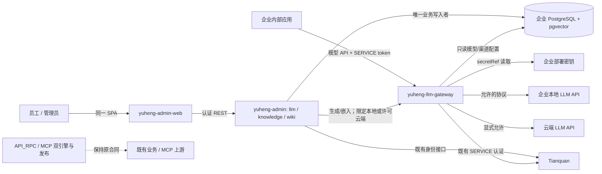
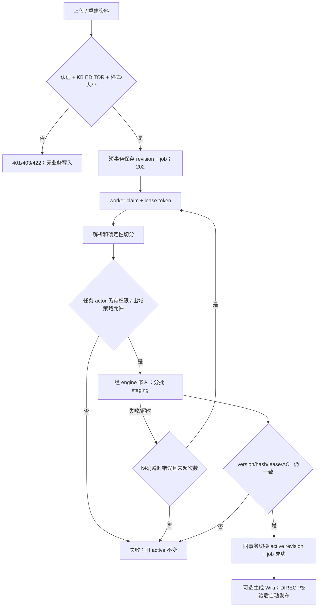
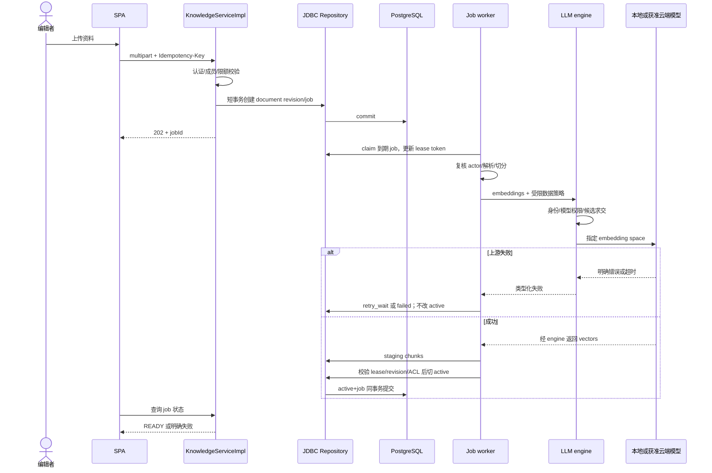
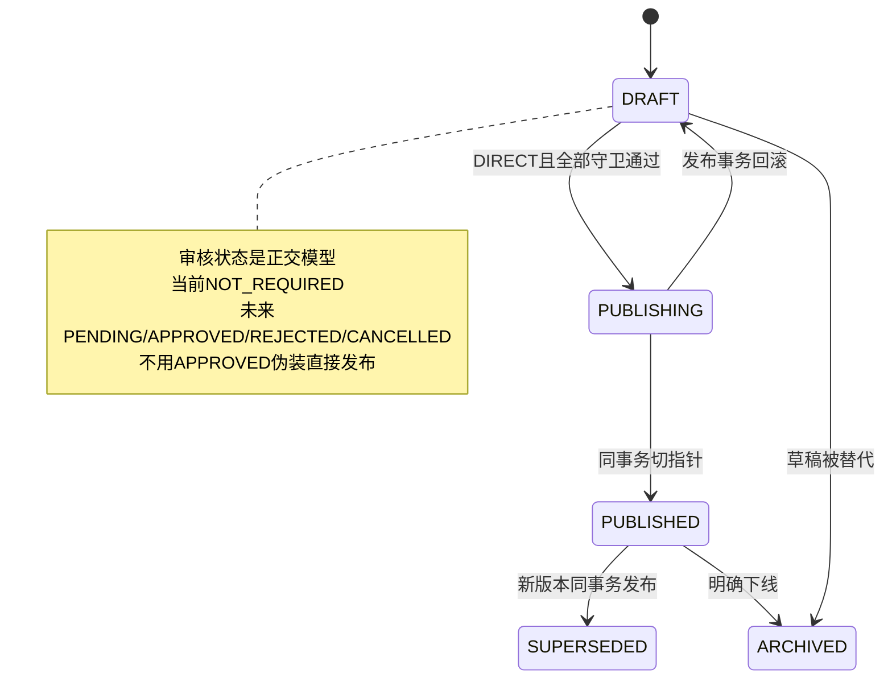
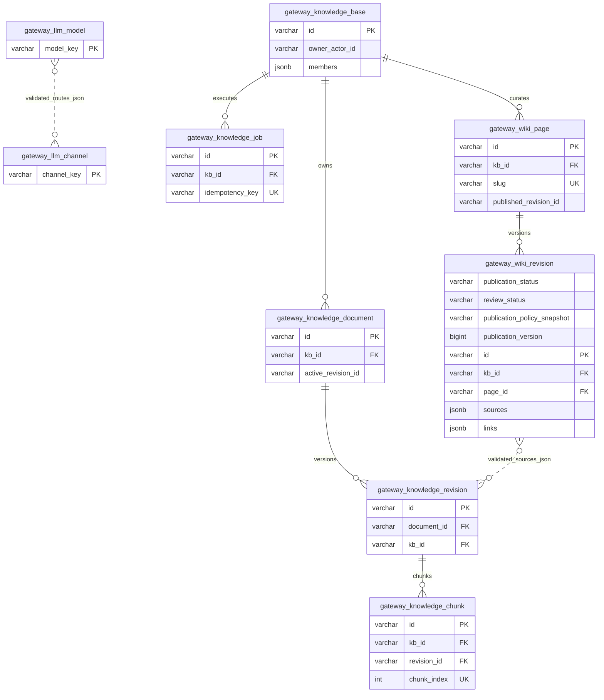

# Yuheng 企业内部 LLM API 网关、知识库与 LLM Wiki 融合设计

| Field | Value |
| --- | --- |
| Document | `docs/egon/spec/2026-09-21-16-58-yuheng-llm-knowledge-wiki-design.md` |
| Template Version | `7` |
| Status | `Review` |
| Type | `Architecture` |
| Complexity | `Complex` |
| Complexity Drivers | 三类业务协作、独立模型数据面、企业内容权限与出域策略、持久异步任务、向量版本一致性、流式协议、Wiki 来源追溯及发布 |
| Created | `2026-09-21 16:58 CST` |
| Updated | `2026-09-21 18:19 CST` |
| Owner | `mario` |
| Repository | `Egon-COLA` |
| Scope | `egon-cola-xingyuan/egon-cola-yuheng`；两个 Downloads 参考项目仅研究 |
| Change Surface | 新增 yuheng-llm-gateway；yuheng-admin 新增 llm/knowledge/wiki 功能域、一个新 Flyway 版本；yuheng-admin-web 扩展一套前端；Yuheng 内构建/部署/测试登记 |
| Affected Chapters | `§7, §8, §9, §10, §11, §12, §13, §14, §15, §16, §17, §18` |
| Source Requirement | 2026-09-21 用户要求研究 waliapi-java-main 与 waliapi-main，将本地/云端 LLM API 网关、企业本地知识库、LLM Wiki 融入 Yuheng；保持简单分层与单前端；只写 Spec 待审核；忽略 archetypes 改造。后续确认保留当前持久化、本地pgvector和本地embedding模型；首版需要Responses与Anthropic Messages；Wiki暂时直接发布，完整维护状态机/状态模型，审核流程后续接入。 |
| Baseline Revision | `06f2afd5f28a9da090f4bb397892372c9e49dec2`；初始三个未跟踪项保留；研究期间archetypes出现用户并发修改，本轮不处理；只新增本文件 |
| Amends | [双引擎隔离](2026-09-02-19-52-gateway-dual-engine-separation.md) §1、§7、§8、§15、§16 的部署数量：增加独立 LLM 数据面；原 API_RPC/MCP 的发布、一致性与角色枚举语义保持。本文尚未批准，不即时改变前文效力。 |
| Supersedes | `None` |
| Depends On | [角色目标分发](2026-09-05-17-10-gateway-role-target-distribution.md) §7、§11、§16 的双目标隔离；[Admin 领域分包](../../superpowers/specs/2026-08-13-gateway-admin-java-type-and-page-scope-design.md) §4、§7 的传统分层与页面级上下文 |
| Related Specs | [RAG starter](2026-09-10-11-34-egon-cola-component-rag-starter.md) §7、§9、§10；[HTTP 流式传输](../../superpowers/specs/2026-07-30-gateway-openai-streaming-transport-design.md) |
| Related Plans | `None` |

## 1. Summary

增加独立可执行 Maven 模块 `yuheng-llm-gateway`，对企业内应用提供统一模型 API，向上游连接企业本地模型服务和合法配置的云端 API。知识库、资料版本、摄取任务、检索问答、Wiki 生成与发布由现有 `yuheng-admin` 承担。当前并不存在 `yuheng-server` 模块；本设计把用户的“server/admin”解释为现有服务端 admin，而不额外制造一个 server 工程。

保留现有 feature-local traditional layered 结构与 PostgreSQL/JPA/JDBC/Flyway；用户已确认使用 pgvector。复用 `yuheng-admin-web` 的 React、Ant Design、React Query、认证与组件，不新增第二个前端。员工知识工作区在同一 SPA 中拥有独立功能权限，不能为了阅读资料而被迫获得全量网关管理权限。

本文包含两个参考项目的源码结论与目标设计。用户已关闭三项范围问题：**本地pgvector+本地embedding；首版同时提供Chat Completions、Embeddings、Responses、Anthropic Messages；Wiki以DIRECT模式发布并完整记录状态，未来审核模式保留合同但不接入流程。** 当前状态Review表示设计待整体审核，不表示已经批准实施。 所有运行结论均未验证；本轮没有启动项目、数据库、容器或浏览器，也没有修改生产代码、旧迁移、archetypes 或参考项目。

## 2. Background and Current State

### 2.1 研究范围与证据缩写

下文路径前缀是精确的可展开别名，不表示省略文件定位：

- `Y` = `egon-cola-xingyuan/egon-cola-yuheng`；原 platforms 已更名为 xingyuan，当前以 POM 和目录为准。
- `A` = `Y/yuheng-admin/src/main/java/top/egon/cola/component/yuheng/admin`。
- `E` = `Y/yuheng-llm-gateway/src/main/java/top/egon/cola/component/yuheng/llm`（拟新增）。
- `F` = `Y/yuheng-admin-web/src`。
- `J` = `/Users/mario/Downloads/waliapi-java-main`；`JD` = `J/waliapi-domain/src/main/java/waliapi/xiaofuge/cn/domain`。
- `R` = `/Users/mario/Downloads/waliapi-main/src-tauri/src`。
- `C` = `egon-cola-components/egon-cola-component-rag-starter/src/main/java/top/egon/cola/component/rag`，仅核实复用能力，不改组件。

初始未跟踪文件为 `docs/egon/plan/2026-09-20-12-59-archetype-component-contract-implementation.md`、`docs/egon/spec/2026-09-20-12-18-archetype-component-contract-convergence.md` 和用户正在改造的 `ArchetypeContractConvergenceTest.java`。本轮不读取其实现作为目标设计、不编辑、不暂存、不提交。研究期间用户的archetypes改造继续产生已修改文件；只观察状态用于边界保护，不把这些变化归入本任务。

### 2.2 Repository evidence

| Evidence ID | Classification | Exact path/symbol/decision/command | Observed fact | Design significance | Verification limit/freshness |
| --- | --- | --- | --- | --- | --- |
| EVD-001 | Static repository | `Y/pom.xml`、`Y/yuheng-admin/pom.xml` | 已有 API/RPC、MCP、Admin 可执行模块；无 server、LLM engine、知识库业务模块 | 独立 LLM 模块，业务留 admin | 2026-09-21 静态，未编译 |
| EVD-002 | Static repository | `A/application/controller/GatewayApplicationController.java`、`A/application/service/GatewayApplicationService.java`、`A/application/repository/GatewayApplicationRepository.java` | 领域内 controller→service→repository；JPA 和 JDBC 同存 | 保留简单分层，不能按 Java 参考项目引入六边形模块 | 不推断运行注册 |
| EVD-003 | Static repository | `Y/yuheng-admin/src/main/resources/application.yml`、`db/migration/V13__freeze_gateway_engine_publication_targets.sql` | Flyway 在 classpath:db/migration；最新 V13，角色 CHECK 只有 API_RPC/MCP | 新增 V14，不编辑 V1–V13；LLM 不写旧双角色 journal | 未连数据库核对历史 |
| EVD-004 | Static repository | `Y/yuheng-contract/src/main/java/top/egon/cola/component/yuheng/contract/runtime/GatewayEngineRoleEnum.java`、`A/runtime/service/GatewayEngineRoleConsistencyStrategy.java#missingRoles` | 枚举仅两值，missingRoles 使用 allOf | 不可随意加 LLM 枚举导致旧环境缺角色 | 当前代码事实 |
| EVD-005 | Static repository | `Y/yuheng-biz-gateway/src/main/java/top/egon/cola/component/yuheng/engine/http/proxy/service/StreamingHttpProxyStrategy.java`、`Y/yuheng-runtime-core/src/main/java/top/egon/cola/component/yuheng/runtime/http/common/buffer/GatewayDataBufferPipeline.java` | 已有分段、取消释放、连接/响应头/流空闲/总超时 | 可复用通用 transport；现有业务 proxy 不等于模型路由器 | 没有证明任意模型协议兼容 |
| EVD-006 | Static repository | `A/config/GatewayAdminSecurityConfiguration.java`、`A/shared/controller/GatewayAdminActorArgumentResolver.java` | Tianquan 用户/服务认证、CAP 权限；actor 从认证身份获得 | 禁止信任 caller 的 actorId；复用登录与授权集成 | AdminActor 本身没有 tenantId，不能伪造多租户模型 |
| EVD-007 | Static repository | `F/app/App.tsx`、`F/api/client.ts`、`F/layouts/AdminLayout.tsx` | 根管理布局要求 yuheng:read；客户端直接读 JSON，mutation 默认不重试 | 员工知识路由需单独守卫；不能自创 code/data 成功包装 | 未运行浏览器 |
| EVD-008 | Static repository | `C/execution/RagIngestionServiceImpl.java`、`RagRetrievalServiceImpl.java` | 先按 documentId 删除再 add；查询强制 collection/model；没有业务版本关联查询 | 不能直接当企业知识库事务；需要版本化写入与可见性 join | 仅源码，非 RAG 质量证明 |
| EVD-009 | Static repository | `C/autoconfigure/RagAutoConfiguration.java`、`C/embed/RagEmbeddingModelRegistry.java` | 自动配置整体启用；具名模型注册在启动时完成；全部模型维度必须一致；VectorStore 自己持有嵌入模型 | 动态 DB 模型不能简单假装为可热切换注册表；选择解析/分块复用 | 不改组件既有合同 |
| EVD-010 | Static repository | `J/waliapi-trigger/src/main/java/waliapi/xiaofuge/cn/trigger/filter/ApiKeyAuthFilter.java`、`J/waliapi-case/src/main/java/waliapi/xiaofuge/cn/cases/gateway/ProxyServiceCase.java`、`JD/gateway/service/proxy/ProxyService.java` | 过滤器有未完成真实 Key 校验标记；case 构造请求；proxy 按 model 选择渠道；已读链没有闭环 Key 权限校验 | 企业身份/模型授权需在 Yuheng 独立闭环 | 不是全仓安全审计，不把 README 的生产级描述当证据 |
| EVD-011 | Static repository | `J/waliapi-infrastructure/src/main/java/waliapi/xiaofuge/cn/infrastructure/adapter/llm/WikiLlmPort.java#chat` | 接收 channelId，但构造 ProxyRequest 时未传递；失败返回空字符串 | 不能照搬渠道约束或空回答成功语义 | 未调用外部模型 |
| EVD-012 | Static repository | `JD/wiki/service/ingest/WikiIngestService.java` | 生成页面后逐个 upsert、重建图谱；embedding 预计算是同步调用，catch 仅警告；页面哈希使用 String.hashCode | 重试/部分成功/来源与人工修改必须单独设计；注释“异步”不构成证明 | 未验证真实数据 |
| EVD-013 | Static repository | `JD/knowledge/service/index/IndexService.java` | 本地文件 HNSW；向量 ID 用列表下标；查询重新加载全部 chunks 并按下标关联 | 不能迁移这个索引身份方案；删除/重排可使索引与文本错配 | 为静态风险，不声称复现事故 |
| EVD-014 | Static repository | `R/endpoint_executor/driver.rs`、`R/endpoint_executor/sse.rs` | 明确第一帧校验/下游提交屏障；提交前候选切换、提交后不重试 | 借鉴流式提交状态与测试矩阵 | 源码结构较完整，不等于企业适用已验证 |
| EVD-015 | Static repository | `R/services/knowledge/embedder.rs`、`retriever.rs` | embedding 无匹配时尝试全部已启用渠道；HNSW 不可用可全库线性扫描；结果组装加载全库 chunks | 企业出域必须先过滤；拒绝无声扩大渠道和无限降级扫描 | 行为是参考项目选择，不复制 |
| EVD-016 | Static repository | `R/services/wiki/ingest.rs`、`project.rs`、`../migrations/017_wiki_module.sql` | Markdown 文件与 SQLite 同时维护；source/task/page/graph/session 分开；生成页面直接进入 active 路径 | 可借鉴页面/来源图谱，企业环境需一个权威来源、发布版本和恢复策略 | reviews 表存在不证明人工审批已接入主链 |
| EVD-017 | Static repository | `J/pom.xml`、`/Users/mario/Downloads/waliapi-main/src-tauri/Cargo.toml`、两个 package/README | Java 是 Spring Boot/MyBatis/MySQL + 内嵌静态 UI；Rust 是 Tauri/Axum/SQLite + React | 借鉴机制和场景，不迁移技术栈/桌面壳/整套 UI | 版本以本地 manifest 为快照 |
| EVD-018 | User decision | 当前会话与 PostgreSQL 选项回复 | 企业内部，三个能力融合，简单分层，单 SPA，保留持久化并用 pgvector，archetypes 排除 | 本文设计边界 | 已由用户后续回复确定本地embedding、四协议与直接发布；生成模型出域按KB策略单独约束 |
| EVD-019 | External primary source | [pgvector](https://github.com/pgvector/pgvector)、[Spring AI PgVectorStore](https://docs.spring.io/spring-ai/reference/api/vectordbs/pgvector.html) | pgvector 支持精确/近似查询；近似过滤影响召回；Spring AI 建表须显式启用 | 先用可证明权限边界的精确查询；建表统一 Flyway | 在线文档可能新于仓库的 Spring AI 1.1.8，签名以本地实现为准 |

### 2.3 两项目结论与迁移取舍

| 能力 | Java 版 | Rust 版 | Yuheng 采用/舍弃 |
| --- | --- | --- | --- |
| 多模型路由 | Dispatcher 优先级+权重，Adapter 按渠道类型 | RoutePlan/AttemptFlow/codec/commit barrier 更细 | 采用 protocol Strategy + eligible candidate 后排序；不按品牌写长分支 |
| 身份/额度 | 字段存在不等于校验闭环；过滤器未完成 | Key/账号/额度和本地用户场景结合 | 使用已有 Tianquan；不引入个人订阅账号登录、充值售卖或对外注册 |
| RAG | MySQL/BLOB + 本地 HNSW，index 与 chunk 下标耦合 | SQLite/FTS5 + HNSW，存在全扫描 | 本地 PG+pgvector；稳定 chunk ID，权限/version 过滤在 SQL 里完成 |
| Wiki | 页面生成、标签、四类边、图谱问答，部分失败可能留中间结果 | Markdown 文件/SQLite 元数据双份事实，桌面事件推送 | 一个 KB 下的 Wiki；DIRECT发布及完整状态模型；来源版本+链接，不另建图数据库 |
| 文档导入 | 文件/目录/URL/Git Strategy | tree-sitter、Git/目录、Tauri 文件权限 | 首版人工上传文本/Markdown/PDF/Office；Git/URL 自动抓取另行决策，不能默认开放服务器目录 |
| UI/架构 | DDD 七模块、静态 JS UI | Tauri + React/Tailwind/Zustand | 保留 Yuheng 分层和 Ant Design SPA；不复制两个项目结构 |
| 可复用程度 | 学习业务拆分，关键规则须重做 | 学习流式状态机与测试，桌面细节不适用 | 以机制参考为主，无整仓复制；Java 根目录未找到许可证文件，不宣称其可自由复制 |

### 2.4 Evidence and current-chain map

| Entry/trigger | Current call chain | Data read/written | External dependency | Consumers | Evidence |
| --- | --- | --- | --- | --- | --- |
| Yuheng 管理操作 | App→apiRequest→GatewayApplicationController→Service→JPA Repository | application、audit | PostgreSQL、Tianquan | 管理员 | EVD-002/006/007 |
| Yuheng HTTP 流 | Listener→proxy Strategy→runtime HTTP adapter | transport context、流数据 | HTTP 上游 | API 客户端 | EVD-005 |
| Java Wiki 摄取 | WikiController→WikiServiceCase→WikiIngestService→WikiLlmPort→ProxyService→Dispatcher | task/page/source/graph/embedding | MySQL、LLM | 静态 Wiki UI | EVD-011/012 |
| Rust Wiki 摄取 | handler→ingest_source→generate_wiki_pages→write_page+repository→graph | filesystem、SQLite | LLM、Tauri progress event | React UI | EVD-016 |
| RAG starter | extract→split；ingest 删除后写；retrieve filter→VectorStore | 外部向量存储 | 宿主 embedding/vector Bean | 引入组件的业务 | EVD-008/009 |

## 3. Goals and Non-goals

### 3.1 Goals

统一企业模型调用、可控本地知识生命周期、由资料衍生可追溯 Wiki。知识和 Wiki 的生成/问答/向量化均经 LLM engine，不能在 admin 再保存另一套供应商客户端与密钥。

### 3.2 Non-goals

不做 SaaS、多组织自助开通、计费充值、个人订阅凭据转 API、桌面托盘、模型训练/推理引擎安装、Agent 平台、自动执行工具、第二套 MCP server、图数据库、任意网页爬取、任意服务器路径扫描。模型服务部署由企业提供；网关连接其 API。首版明确支持§9列出的四类模型操作；不承诺未实现的跨协议语义转换、云端会话托管或自动工具执行。现有 business/MCP API 和登录行为保持。

### 3.3 Change Surface and Design Depth

| Area/layer | Disposition | Exact repository evidence | Changed or preserved behavior/contract | Required Spec treatment | Chapter(s) |
| --- | --- | --- | --- | --- | --- |
| 新 LLM 数据面 | Affected | Y/pom.xml；EVD-001/005 | 新 yuheng-llm-gateway、模型路由和协议入口 | 完整设计；四协议独立适配 | §7, §8, §9, §10, §13, §14, §15, §16, §17, §18 |
| Admin 三功能域及数据 | Affected | A/application/repository；V13 | llm 配置、知识权限/版本/任务、Wiki；V14 | 完整字段/事务/合同 | §7, §8, §9, §10, §11, §13, §14, §15, §16, §17, §18 |
| 一套 SPA | Affected | F/app/App.tsx；F/api/client.ts | 增加员工知识路由和模型管理页 | 具体页面、状态、权限 | §8, §9, §12, §14, §15, §16, §18 |
| 本模块构建部署 | Affected | Y/pom.xml；Y/deployment/compose.yml | 新执行件和 opt-in 部署说明 | 配置/升级/回滚 | §8, §14, §15, §16 |
| 旧双角色发布/一致性 | Unchanged | GatewayEngineRoleEnum；V13 CHECK | 不加枚举，不向旧 journal 写 LLM | 旧发布回归 | §16 |
| Tianquan/Tianshu 内核 | Context-only | EVD-006；现有 starter | 只消费已有用户/服务身份和注册合同 | 不改外部模块；授权配置由运营执行 | §15 |
| 既有幂等记录 | Context-only | A/shared/repository/IdempotencyRepository；V1 gateway_idempotency_record | 复用scope/key/hash原有合同，不改表/Repository | 并发重复创建测试 | §14 |
| 通用 RAG/common/transport | Context-only | EVD-005/008/009 | 只消费已有解析/分块/校验/转换/HTTP 能力 | 定点合同验证 | §14 |
| archetypes | Unchanged | 用户明确排除 | 不分析/修改当前改造 | diff 范围检查 | §16 |
| 桌面应用、GraphQL、收费 | Not applicable | 用户企业内部且现有 REST SPA | 无此目标 | N/A | §17 |

## 4. Requirements and Acceptance Criteria

| ID | Atomic requirement | Priority | Observable acceptance criteria | Source |
| --- | --- | --- | --- | --- |
| REQ-001 | 研究两项目并给出源码差异 | Must | §2 每个主要结论可定位符号，区分 README 与代码 | “分析一下这两个项目” |
| REQ-002 | 独立 LLM API engine 连接本地和云端 | Must | 同一模型 alias 可绑定明确允许的本地/云端 route；无候选明确失败 | “llm api engine 项目” |
| REQ-003 | 首版同时支持Chat/Embeddings/Responses/Messages的原生调用、流式与失败边界 | Must | 兼容矩阵、unsupported 拒绝、首帧/取消/超时测试通过；首版四协议及工具调用往返字段保真，见DEC-002 | “本地部署llm的api和云端的api” |
| REQ-004 | 企业本地知识与成员隔离 | Must | 无成员权限者不能读正文、结果、引用、任务或图谱；存储在企业 PG | 企业内部；用户确认 KB 级权限/pgvector |
| REQ-005 | 使用本地embedding完成可恢复资料摄取与查询向量化 | Must | 失败不删除有效版本；重试不会重复发布；重启能恢复任务 | 企业知识库的必要正确性 |
| REQ-006 | 基于知识生成回答并可追溯 | Must | 引用定位文档版本/chunk；无资料与检索故障可区分 | 知识库融合 |
| REQ-007 | Wiki 生成、编辑、链接与问答 | Must | 来源能追溯；人工修改不被后台无条件覆盖；DIRECT模式校验后直接发布；状态/迁移/audit完整，审核流程以后接入 | “llm wiki 能力” |
| REQ-008 | 三业务复用一套前端与身份 | Must | 现有 SPA 增加入口；员工无管理权限仍能进入授权知识库 | “前端还是只有一套” |
| REQ-009 | 保持 Yuheng 分层和旧网关行为 | Must | 无 archetype/COLA 迁移；旧路由/角色/发布测试不变 | 简单分层；只关注 Yuheng |
| REQ-010 | 保留持久化，新增一个迁移 | Must | PostgreSQL+pgvector，JPA/JDBC；V1–V13 字节不变，仅 V14 | 用户确认与 AGENTS |
| REQ-011 | 内容出域、凭据和审计可控 | Must | 模型候选先受出域/授权限制；日志无正文/secret；向量化固定本地，生成按KB出域策略求交，不允许embedding故障转云 | 企业内部安全必要条件 |
| REQ-012 | 只交 Spec、不实施 | Must | 只有本文变化，无 Plan/服务启动/代码变更 | “写完后，我会审核” |

### 4.1 Scenario matrix

| Scenario | Actor/trigger | Preconditions | Main path | Alternative/failure path | Data/state change | Observable result | Requirements |
| --- | --- | --- | --- | --- | --- | --- | --- |
| 本地推理 | 内部应用 | 有效服务身份和模型权限 | alias→本地候选→流式 | 不支持字段在调用前拒绝 | 仅使用量/运行指标 | 原协议流 | REQ-002/003 |
| 云端候选 | 问答/生成任务 | KB明确允许生成内容出域 | 仅许可生成渠道；embedding始终LOCAL | 本地embedding失败不得fallback云端 | 不扩大授权 | 本地向量化失败明确返回 | REQ-011 |
| 首帧失败 | 应用流请求 | 尚未向下游提交 | 在预算内尝试下一可重试候选 | 发送后失败禁止拼接第二模型回答 | 同请求多 attempt，usage 分别记 | 中断不是成功 | REQ-003 |
| 文档重复上传 | 编辑者 | 相同 KB/hash/idempotency | 返回同一 job/resource | 同 key 不同内容 409 | 一个版本意图 | 不重复索引 | REQ-005 |
| 嵌入部分失败 | 后台任务 | 旧版本已可用 | 新版本 staging | 新块不发布，旧 active 保持 | FAILED，旧 active 不动 | UI 可重试 | REQ-005 |
| 进程崩溃 | worker | 持有任务 lease | lease 到期接管 | 老 worker 的 fencing token 无效 | 最多一个有效发布 | 同 job 恢复 | REQ-005 |
| ACL 撤销 | 知识库 owner | 正在查询/生成 | 发起时和输出前复核 | 权限变化拒绝交付；已发出上游的调用不能撤回 | 无新公开页面 | 引用/图谱也不能泄漏 | REQ-004/011 |
| 空检索 | 员工 | KB 授权且索引可用 | 返回 NO_EVIDENCE | 向量故障返回 503 | 不调用生成 | 可见无证据 | REQ-006 |
| Wiki 编辑竞争 | 编辑者+生成任务 | expectedRevision | 新草稿/新版本 | CAS 冲突保留人工版本，不自动覆盖 | 生成结果留候选 | 可比较/再应用 | REQ-007 |
| 来源删除 | 编辑者 | 有 Wiki 引用 | tombstone 来源并让依赖页面 stale | 发布/回答重新校验拒绝 stale | 无旧内容进入新回答 | 需重建/按当前策略重新发布 | REQ-004/007 |
| 嵌入模型变更 | 管理员 | 已有 active 索引 | 新 embedding alias/version 新建索引 | 不把同维度不同模型视为同一空间 | 新 generation 发布后切换 | 不混检 | REQ-005 |

### 4.2 Use-case analysis

| Actor ID | Actor/role | Goal and responsibility | Entry/channel | Permission/tenant context | Evidence |
| --- | --- | --- | --- | --- | --- |
| ACTOR-001 | 模型管理员 | 配置渠道、模型映射、资源界限 | 同 SPA 管理页 | Tianquan 功能权限 | 用户网关目标/EVD-006 |
| ACTOR-002 | 企业员工 | 检索、阅读 Wiki、问答 | 同 SPA 知识工作区 | 认证主体+KB 成员 | 企业内部目标 |
| ACTOR-003 | 知识编辑者/owner | 上传、重建、编辑/发布/授权 | KB 工作区 | KB EDITOR/OWNER | 企业知识库与用户权限确认 |
| ACTOR-004 | 内部业务应用 | 标准模型 API | LLM engine | 已有 SERVICE token+模型范围 | LLM API 目标 |
| ACTOR-005 | 运维人员 | 配置模型服务/secretRef/恢复任务 | 部署环境、任务页 | 既有运维身份 | 本地部署目标 |
| ID | Use case/goal | Primary actor | Supporting actors/systems | Trigger | Preconditions | Main success outcome | Alternatives/failures | Postconditions | Requirements | Interfaces/pages | Tests |
| --- | --- | --- | --- | --- | --- | --- | --- | --- | --- | --- | --- |
| UC-001 | 发布可用的模型配置 | ACTOR-001 | ACTOR-005 | 保存渠道/model | 有配置权限 | 下次调用读到一致配置 | URL/映射错误、版本冲突 | 配置和审计原子保存 | REQ-002/011 | 模型管理 API/页 | TEST-001/002 |
| UC-002 | 调用企业模型 API | ACTOR-004 | 本地/云模型 | 业务请求 | token、scope、模型能力有效 | JSON/SSE/embedding | 无权限、限流、超时、取消 | 不泄漏上游凭据，不伪造成功 | REQ-002/003 | LLM API | TEST-003/004 |
| UC-003 | 上传并发布可检索资料 | ACTOR-003 | worker、embedding | multipart 上传 | KB 编辑权限 | job 成功、active revision 原子切换 | 重复、解析/嵌入失败、重启 | 旧版本保留且 staging 隔离 | REQ-004/005/010 | 文档/任务页 | TEST-005/006 |
| UC-004 | 基于授权资料问答 | ACTOR-002 | engine、pgvector | 提问 | 成员 READ | 回答和版本引用 | 空结果/依赖失败/权限撤销 | 不扩权、不存原始聊天日志 | REQ-004/006/011 | 问答页 | TEST-007/008 |
| UC-005 | 将资料整理为 Wiki | ACTOR-003 | LLM、资料版本 | 提交生成任务 | 已发布可读资料 | 生成页面、真实证据与已发布状态 | malformed output、来源变动、CAS | 不覆盖人工修改 | REQ-007 | Wiki 页 | TEST-009 |
| UC-006 | 直接发布与阅读 Wiki | ACTOR-003/002 | DIRECT发布策略 | 编辑/发布/阅读 | 对应成员权限 | 可读发布内容及双向链接 | stale、冲突、来源撤销 | 历史版本可追溯 | REQ-007/008 | Wiki 页/图谱 | TEST-010 |
| UC-007 | 审核设计 | 用户 | 本文 | 查看 Spec | 无需运行服务 | 决策和范围可审核 | 设计边界与验证限制明确标注 | 无代码副作用 | REQ-001/009/012 | 本文 | TEST-012 |

## 5. Constraints, Assumptions, and Decisions

### 5.1 Confirmed constraints

仅研究/设计 Yuheng；不实施；不触碰 archetypes。保留 feature-local traditional layered、JPA/JDBC/Flyway 和统一 SPA。先 KB 级 ACL，不宣称文档级行权限或多企业 SaaS。一个逻辑数据库变更只设计一个新 Flyway 文件。源码/Mock 不能替代真实 PG/pgvector 与模型契约验收。

### 5.2 Small-gap assumptions

| ID | Inference | Repository evidence | Why locally reversible | Impact if wrong |
| --- | --- | --- | --- | --- |
| ASM-001 | 新模块暂名 yuheng-llm-gateway | 两个既有 yuheng-*-gateway | 用户说 engine 项目但未规定 artifact 名 | 仅重命名新模块，不改职责 |
| ASM-002 | server/admin 指现有 yuheng-admin | Y/pom.xml 无 yuheng-server | 只解释路径、不增加工程 | 如用户明确要 server 再评估边界 |
| ASM-003 | KB 是 Wiki 的权限和来源边界 | 两能力融合、KB 级成员确认 | 这是推荐设计，Wiki 不再复制 project/ACL/source 系统 | 若需跨 KB Wiki，必须另立权限模型，不静默扩展 |

### 5.3 Resolved decisions

| ID | Decision | Decision owner | Evidence and rationale | Requirements |
| --- | --- | --- | --- | --- |
| DEC-001 | pgvector部署在企业本地；文档和查询embedding全部调用本地embedding模型，不允许云端embedding和故障转云 | User | “本地 pgvector 和 本地的 embedding模型”；生成模型本地/云端目标保留，按KB策略收窄 | REQ-004/005/006/010/011 |
| DEC-002 | 首版包含Chat Completions、Embeddings、Responses、Anthropic Messages与模型目录；文本、函数工具协议与流式事件保真 | User | 对是否还需Responses与Messages回答“2 需要”；具体兼容边界见§9.0.1 | REQ-002/003 |
| DEC-003 | 目前DIRECT直接发布；审核流程后续接入；发布状态、审核状态、策略快照和版本迁移现在完整维护 | User | “审核流程 后续接入，暂时直接发布，但是状态机和状态模型要完整维护” | REQ-007/008/010 |
| DEC-004 | 保留 Yuheng PostgreSQL/JPA/JDBC/Flyway，使用 pgvector；KB 级权限 | User | 异步问题明确选择“保持现有持久化，使用 pgvector” | REQ-004/010 |
| DEC-005 | 简单分层、一套前端、知识/Wiki 在 admin | User | 原始请求 | REQ-008/009 |
| DEC-006 | archetypes 不属于研究/实施范围 | User | 后续明确指令 | REQ-009/012 |

### 5.4 Open major decisions

None。用户已明确关闭此前三个范围阻塞；完整Spec仍需整体审核，不能把这些确认扩大为开始实施的授权。

生成模型与embedding分开：用户“本地模型”此处明确针对embedding。通用生成网关继续保留原始目标中的本地/云端API。知识/Wiki生成默认LOCAL_ONLY，只有KB owner明确选择CLOUD_ALLOWED且管理员允许该渠道才可发送生成上下文；该字段绝不改变embedding固定LOCAL的规则。这是当前可审核的保守产品策略，不表述为用户已允许所有企业资料发云端。

以下是可审核的推荐基线，不等同于批准：独立 LLM 进程直接只读 PG 模型配置（每请求读一致快照，不走旧双角色发布）；engine 从受控 secretRef 读取部署密钥；admin 仅保存 secretRef。原始文件按限额保存在本地 PG 的 revision bytea，避免新增文件服务及多实例共享盘。若用户希望配置也走 Tianshu 发布、密钥直接在 UI 输入或原件上对象存储，属于 §17 的替代方案，需要确定后再冻结合同。

## 6. Project Technology Context

| Concern | Current choice | Repository evidence | Constraint on design |
| --- | --- | --- | --- |
| Java/Boot | Java 21、Boot 3.5.16 | xingyuan/pom.xml、根 pom.xml | 不跟随 archetypes 的变化；不升 JDK/Boot |
| 数据访问 | JPA 与 JdbcTemplate、PostgreSQL、Flyway | yuheng-admin/pom.xml、application-local.yml | 新热点 SQL 用 JDBC/record PO，既有 JPA 保留；不引入 MyBatis/分片 |
| JSON/校验 | Jackson、jakarta.validation、MapStruct 1.6.3 | admin POM | 外部 JSON 全部 Jackson，无 Fastjson |
| 前端 | React19/Router7、AntD6、React Query5、TS6、Vitest/Playwright | admin-web/package.json | 单 SPA，已有 QueryState/RouteGuards/trace 复用 |
| 文档 | springdoc 2.8.17、OpenAPI 3.1 | 根 POM、admin YAML | admin 直接返回 VO、保留 GatewayAdminErrorVO |
| RAG | 已有 starter / Spring AI 1.1.8 依赖基线 | component POM、C | 仅复用抽取/切分；不得从 current 2.x 文档抄签名 |
| 测试 | JUnit5、Spring test、Testcontainers、Vitest | admin/engine/web POM/package | runtime 测试须显式启用，本轮只文档检查 |

### 6.1 Java architecture profile and capability baseline

选择 **Traditional Three-Layer，保留 Yuheng 已批准的 feature-local 命名**：`admin.<feature>.controller → service 接口 → service.impl → repository → repository.jdbc`；`domain.dto/vo/po/enums/exception` 放顶层类型。这里不加入字面 `biz` 包：用户明确沿用现状，前置 Spec §4.3 与架构测试已约束领域优先结构。`impl` 仅作为 service 子包。新 engine 同样按功能域组织，不拆 application/domain/infrastructure Maven 层。

用户 DEC-004 明确覆盖 skill 中默认 MP/ShardingSphere/DDL runner 建议；因此保留 Flyway，不新增 tenant 分片/ddl_history，不替换 JPA。单企业实例的成员边界为 KB，与 Tianquan 的 actor 身份结合；本设计不虚构 AdminActor 不具备的 tenantId。

| Need | Spring/JDK candidate | Spring Boot Starter candidate | Egon-COLA/module candidate | Proven gap | Decision/dependency impact |
| --- | --- | --- | --- | --- | --- |
| 校验/转换 | jakarta.validation、MapStruct | validation starter | common-core ValidationUtils/BaseConverter | 无 | Keep，直接引用已依赖能力 |
| HTTP/SSE | Reactor Netty/Flux | 现有 runtime-core | HttpUpstreamRequest、buffer pipeline | 模型选择与协议约束缺失 | Keep transport，Add 领域 Strategy；不复用业务 proxy 的配置模型 |
| 原文抽取/切分 | 不自行编写 PDF/Office 解析器 | RAG starter 可选 readers | RagExtractionServiceImpl、extractor registry、chunk factory | 无需重造解析；自动配置整体启用不适用动态 DB 模型 | Add admin 内显式具名 Bean 装配，starter enabled=false；组件不改 |
| 企业摄取/检索 | JDBC、事务 | 无需 PgVectorStore starter | 通用 ingest/retrieve | 不能 join active revision/ACL；先删后写；动态模型与固定 VectorStore 绑定不匹配 | Add 业务编排+pgvector 参数 SQL；不包装一个伪动态 VectorStore |
| 向量存储 | PostgreSQL vector 扩展 | 现有 JDBC | 无企业向量表 | 需要向量距离查询 | pgvector 为用户批准的唯一新增存储设施；不新增向量服务 |
| 任务恢复 | TaskScheduler、ThreadPoolTaskExecutor、数据库锁 | 已有 Spring | openapi claim/reconcile 可参考 | 业务阶段、来源版本不同，不能复用 openapi 的表 | Add 一个 knowledge job 表/worker，无 Kafka 新 topic |
| 凭据 | JDK 文件/env读取 | Boot 外部配置 | GatewaySecretProtector 可用于 DB 密钥方案 | engine 不能依赖 admin 解密实现 | 基线只保存 secretRef；不把 admin crypto 移到 core |
| UI | AntD、Query、现有认证 | 已有 SPA | QueryState/RouteGuards/apiRequest | Markdown 安全渲染不存在 | 初版安全纯文本/预格式 Markdown 展示，编辑用 TextArea；富文本依赖单独审核，不凭空加 sanitizer |

### 6.2 User-mandated Java rule compliance

| Literal rule | Affected? | Repository evidence | Exact design decision | Files/types/interfaces | Validation/test evidence | Status/blocker |
| --- | --- | --- | --- | --- | --- | --- |
| Rule 1 | Yes | admin domain.dto/vo/po | §8/10 所有新增类型语义后缀、顶层声明 | DTO/VO/PO/Service/Strategy | TEST-011 | PASS |
| Rule 2 | Yes | validation starter、ValidationUtils | 每个 Controller/Service/Repository/worker re-entry 都校验；groups Create/Update/Execute | §10 边界表 | TEST-011 | PASS |
| Rule 3 | Yes | BaseConverter、record PO 先例 | 新简单 JDBC 行与命令为 record；列表复制；MapStruct 继承 BaseConverter；不新增复杂可变实体，故无 Lombok 构造器碰撞 | §10 | TEST-011 | PASS |
| Rule 4 | Yes | Y/lombok.config | 业务类 @Slf4j、命名 Bean、@RequiredArgsConstructor、final @Qualifier；集合注册提供具名聚合 Bean | §8/13 | wiring/源码门禁 | PASS |
| Rule 5 | Yes | JDK/Spring/commons/common-core | 工具限 JDK/Commons/Guava；文档使用已有可选 Tika 能力 | extraction/config | 依赖扫描 | PASS |
| Rule 6 | Yes | Spring Jackson | 自有 DTO camelCase；LLM snake_case 显式 @JsonProperty；未知字段按协议矩阵拒绝或保持 | §9 | 首版四协议及工具调用往返字段保真，见DEC-002 | PASS |
| Rule 7 | Yes | admin base/local；engine 待新增 | §15 完整新增键在 base/local/operations 一致；不修无关旧键差异 | typed properties | key parity | PASS |
| Rule 9 | Yes | protocol/source/job variation | protocol Strategy、job Strategy、检索 Strategy；事务状态直接 CAS，不加空 State 类 | §13 | TEST-003/006/007 | PASS |
| Rule 10 | Yes | Clock/Instant 既有 | Instant UTC/微秒、Duration；HTTP ISO8601，LLM 协议秒字段单独转换 | 所有时钟边界 | TEST-011 | PASS |
| Rule 11 | Yes | 既有批准领域分层/架构测试 | DEC-005 和前置 Spec 允许的 feature-local traditional；无 COLA/MP 迁移 | §8 | TEST-011 | PASS |

## 7. Architecture Design

### 7.0 Minimum-design baseline and element-necessity audit

直接把三个功能全部加入 admin 最少工程，但长连接推理与资料解析会争抢 web/worker 资源，且不符合用户 engine 项目方向。因此只增加一个 LLM 执行件，知识/Wiki 不再拆服务。

| Proposed element | Change | Requirements | Existing/direct alternative | Concrete inadequacy of alternative | Added calls/state/coupling/failures/migration/operations | Verdict |
| --- | --- | --- | --- | --- | --- | --- |
| llm-gateway 执行件 | New | REQ-002/003 | admin 内推理 Controller | 用户要求独立 engine；SSE 生命周期与文档任务不同 | 一个进程/端口/身份，模型 PG 只读依赖 | Add |
| channel/model 两表 | New | REQ-002 | 泛 HTTP routes/provider | 缺 logical alias、embedding identity、endpoint capability、出域属性 | 2 表；版本 CAS；每请求一次配置读 | Add |
| LLM Tianshu 发布系统 | New candidate | REQ-009 | 当前 PG 权威配置一致读 | 当前尚无离线配置分发/多地需求 | 引入 journal/ACK/GC/schema/旧角色改变 | Remove 首版，§17 保留对比 |
| KB、revision、chunk、job | New | REQ-004/005/006 | RAG component 接口 | 无权限/任务/版本事实 | 事务、lease、幂等及存储开销 | Add |
| Wiki page/revision | New | REQ-007 | 只存 RAG 文档 | 缺人工编辑、发布指针、来源与链接 | 新状态，来源失效传播 | Add；不复制原件/KB/成员系统 |
| 图数据库/graph_edges 表 | New candidate | REQ-007 | 当前发布 revision 的 links 查询 | 首版一跳出入链接/来源图即可满足 | 独立一致性/部署成本 | Remove；链接存在 revision JSON |
| 新权限/登录中心 | New candidate | REQ-004/008 | Tianquan+KB members | 基础身份已具备 | 重复账户和授权 | Remove；KB membership 只补内容授权 |
| 每 endpoint 数据类型 | New | REQ-003–007 | PO 直接暴露 | PO 内部字段/原件/任务锁不能外露 | 必要 DTO/VO；不复制同语义类型 | Add，逐字段映射 §10 |
| 第二前端/global context API | New candidate | REQ-008 | 现有 SPA/page route | 无缺口 | 新加载/认证/状态面 | Remove |
| Path | Network calls | Client states | Server contracts/state | Failure and TOCTOU points | Additional user/business value |
| --- | --- | --- | --- | --- | --- |
| LLM 直接路径 | 应用→engine→模型，2 跳 | 请求/流/中断 | engine 读 PG 一次 | DB/模型错误，读时配置固定 | 模型统一授权/审计 |
| 知识问答 | 浏览器→admin→engine→模型；嵌入与生成各一次 | loading→answer/no evidence/error | 一个问答操作 | ACL 在读前和输出前再校验 | 服务器派生权限、来源及路由，不先取上下文再回传 |
| 文档上传 | 浏览器一次上传，任务页有需要才轮询 | uploaded→processing→ready/failed | 持久 job/status | 重复上传/响应丢失 | 不把长时 LLM 放上传事务 |

### 7.1 System Architecture Design



| Module/component | Capability and data owned | Inputs/outputs | Allowed dependencies | Forbidden responsibility | Requirements |
| --- | --- | --- | --- | --- | --- |
| admin.llm | channel/model 版本配置 | 管理 DTO→VO | 现有身份、JDBC、audit | 不直接调用供应商、不代管推理进程 | REQ-002 |
| llm-gateway | 请求期模型授权、路由、SSE、上游凭据 | 标准模型协议 | runtime-core 通用 transport、只读配置 repository | 不访问 KB/Wiki 正文表，不运行生成任务 | REQ-002/003/011 |
| admin.knowledge | KB ACL/原件/版本/chunk/job/问答 | REST、worker | 既有 RAG 解析/切分、engine、JDBC | 不自选未授权渠道、不把索引当权限来源 | REQ-004–006 |
| admin.wiki | 页面、不可变版本、发布、证据和链接 | REST/生成任务 | knowledge 公共 Service、engine | 不另建文件事实源，不覆盖人工编辑 | REQ-007 |
| SPA | 页面级状态/展示 | admin REST | 既有 auth/query/components | 不下发 actor/成员有效权限，不获取供应商密钥 | REQ-008 |

### 7.2 High-Level Design

#### 7.2.1 Critical business/control flowchart



#### 7.2.2 High-level decision and quality matrix

| Concern/use case | Required behavior | Selected mechanism | Failure/degradation behavior | Trade-off | Verification | Requirements |
| --- | --- | --- | --- | --- | --- | --- |
| 数据隔离 | 未授权文本不能进入 prompt | KB membership 与 active revision SQL join；输出前复核 | 拒绝，无无过滤 fallback | 查询需关系表 | TEST-007/008 | REQ-004 |
| 索引一致性 | 重建不破坏现有知识 | immutable revision + staging chunks + active 指针 | FAILED 保留旧 active | 多一份暂存 | TEST-005/006 | REQ-005 |
| 流式正确性 | 不拼接两次回答 | commit barrier/背压/取消释放 | 已提交仅中断，不重试 | 少量可恢复故障也不能透明恢复 | TEST-004 | REQ-003 |
| 企业运维成本 | 不新增队列/向量进程 | PG job + vector；现有认证 | PG 不可用明确 503 | 数据面依赖 PG，可用性低于配置 LKG | TEST-002/006 | REQ-010 |
| 知识质量 | 来源正确且可复查 | 版本引用、模型输出结构校验、DIRECT发布状态校验 | 无证据/过期证据不作确定回答 | 质量需人工数据集验证 | TEST-009/010 | REQ-006/007 |

### 7.3 Detailed Design

#### 7.3.1 模型路由与 transport

engine数据表使用最小只读账号，连接池独立于admin，配置查询deadline=3s；最多1000渠道、1000模型，每请求按alias只取至多16条route，模型目录读取也有1000上限。健康暂态只在engine内存，不能把一个实例的熔断状态写成全局配置。

所有kind=EMBEDDING的binding必须指向deployment=LOCAL的channel；新增/修改channel为CLOUD时还须反查所有embedding引用并拒绝冲突。query embedding与document embedding同样受限，内部service token不能覆盖。不存在可用本地embedding路由返回503，不将pgvector已有索引误判为可跳过query embedding。

一个模型alias声明kind=CHAT/EMBEDDING（CHAT表示生成模型，不限制其只能使用Chat Completions协议）、允许入口协议、固定 embeddingSpaceId/dimensions（仅嵌入）、有序 route bindings。channel 声明 deployment=LOCAL/CLOUD、baseUrl、协议族、secretRef、enabled、connect/header/idle/total timeout、并发上限。别名不是供应商实际 model；route 保存 upstreamModel。

候选求交顺序：已认证服务允许模型 ∩ alias 启用 ∩ 请求 endpoint 能力 ∩ 数据出域限制 ∩ 显式 bindings ∩ channel 启用/健康/可用配额。先过滤再 priority 降序、同优先级 weight 随机；空集合不改试所有渠道。embedding 候选必须属于同一固定 embeddingSpaceId（供应商/模型版本/维度相同），禁止仅凭同维度容灾到另一嵌入模型。

入口按 route 精确识别 endpoint，不按 body 有 input/messages 猜协议。同协议透明传输仍需保留 usage/error/模型映射合同；首版采用同协议适配：OPENAI_CHAT、OPENAI_EMBEDDING、OPENAI_RESPONSES、ANTHROPIC_MESSAGES各自匹配上游。没有对应协议候选时明确503，不把Messages/Responses强行转换成Chat造成信息丢失。工具调用只传输，不由 gateway 执行工具。

每请求配置只读事务使用 REPEATABLE_READ 获取 model+channels；事务结束后才发 HTTP。禁用配置只影响新请求，不承诺中断已开始流；撤销身份按既有 Tianquan 行为。PG 不可用不使用无期限缓存。可重试预算最多两次候选尝试，仅连接建立失败或上游明确 429/503 且下游未提交可尝试下一候选；已发送且结果未知的超时不自动重放。两次尝试共享 deadline；尊重 Retry-After 但不延长总 deadline。

SSRF：baseUrl 仅管理员配置、无 userinfo/query/fragment；LOCAL 允许部署白名单内私网 CIDR 和显式端口；CLOUD 仅 HTTPS 且白名单主机。默认不跟随重定向；每次解析和连接绑定验证过的地址，DNS 重绑定不靠首次配置检查防护。客户端不得提供任意 baseUrl、Authorization 上游头、Host 或 secretRef。


HTTP承载固定为现有Boot MVC+Tianquan Servlet过滤器。`LlmApiController` 先通过 `LlmInvocationService` 获得状态/安全headers/有界body publisher，再返回 `ResponseEntity<StreamingResponseBody>`；新增 `E/proxy/service/LlmServletStreamComponent.java` 只负责Servlet异步输出桥接，使用具名有界 `llmStreamingExecutor`（64线程、零等待队列，满时在提交前429）。上游依旧Reactor Netty，不对每chunk无限缓存。桥接每次最多预取1个buffer，写完即释放；IOException/Servlet超时/用户取消取消subscription并释放未写buffer；禁止block整个流到byte[]。CONNECTING→FIRST_FRAME_VALIDATED→COMMITTED→COMPLETED/ABORTED 是每请求局部状态，不入数据库。transport资源测试同时验证正常、断连、异步超时与重试分支恰好一次释放。engine不引入WebFlux server，也不移植另一套身份过滤器。

#### 7.3.2 Critical-path Mermaid swimlane



#### 7.3.3 知识所有权、事务与任务恢复

| Concern/state change | Owner and boundary | Mechanism/isolation/lock | Concurrent or duplicate behavior | Commit/visibility point | Failure result | Requirements/tests |
| --- | --- | --- | --- | --- | --- | --- |
| 配置保存 | LlmConfigurationServiceImpl | expectedRevision UPDATE，影响行=1，audit 同事务 | stale 409；创建 key 冲突 409 | PG commit，下次请求可见 | 不部分更新 routes | REQ-002/TEST-001 |
| 原文上传 | KnowledgeServiceImpl | revision bytea+job+幂等 key 原子写 | KB+actor+operation+key 唯一/hash 不同409 | 202 表示已持久，不表示已索引 | 失败不建孤立 job | REQ-005/TEST-005 |
| job claim | KnowledgeJobServiceImpl | FOR UPDATE SKIP LOCKED；leaseOwner/token/expiresAt | 重启接管递增 token；所有写回含 token | claim commit | 过期 worker 不能发布 | REQ-005/TEST-006 |
| chunk 写入 | 同 job | 每批≤64；key=(revisionId,chunkIndex) upsert；stage 完整计数/hash | 同 job 重试覆盖同 staging revision | active 切换前不可检索 | 已写 staging 可恢复/清理 | REQ-005/TEST-006 |
| 切 active | KnowledgeServiceImpl | 短事务 lock document+KB，expectedRevision/sourceHash/lease | 删除或版本变化导致 STALE | activeRevision+job=SUCCEEDED 同 commit | 保留旧 active | REQ-005/TEST-005 |
| Wiki 编辑/发布 | WikiServiceImpl | 不可变 revision；page 指针 CAS；来源全部仍 active | 生成时冻结 basePageRevision；冲突留 candidate | draft 与 published 指针独立 | 不回滚人工版本 | REQ-007/TEST-009/010 |

job status=`QUEUED→RUNNING→SUCCEEDED` 或 `RETRY_WAIT→RUNNING`、`FAILED`、`STALE`、`CANCELLED`。lease=120s，30s 心跳；worker 并发默认2、队列容量32；每次数据库 claim 不超过可用槽。重试最多3次总尝试，延迟5s/30s，仅明确可重试错误；未知推理结果进入 FAILED，人工同 key 重试不是自动 exactly-once。外部模型可能重复计费，持久化发布 exactly-once 由 CAS 保证，不能宣称供应商调用 exactly-once。

资料 active 状态与 job 状态分开：文档已有 active 时新 job FAILED，不把文档整体标成不可用。删除先 tombstone，检索 SQL 即刻排除；后台清理不是可见性屏障。初版无定时物理删除历史，避免未经确认的保留期造成数据丢失；管理员可观测容量，永久清理另定策略。


KB创建（API-009）复用已存在 `A/shared/repository/IdempotencyRepository#find/save` 与 `gateway_idempotency_record`，不加第二张幂等表：scopeType=`KNOWLEDGE_BASE_CREATE`、scopeId=SHA256(认证actorId)的64字符hex、key=请求Idempotency-Key、payloadSha256=规范化创建DTO的hash、resourceId=KB ID、response只存非敏感创建VO、expiresAt=NULL。创建KB/成员初值/幂等记录在同一PG事务。并发相同key由原PK拒绝一方，失败事务整体回滚后新只读事务查winner并比较hash；原记录存在仍重新验证actor对KB可读，不用缓存绕过撤权。既有表结构、其他scope和API不变，属于Context-only复用，不加入新DDL库存。

#### 7.3.4 检索与 Wiki 的正确性

复用 RAG parser/chunker 的显式 Bean，关闭整个 `RagAutoConfiguration` 的 enabled 开关，不伪造 VectorStore 或空 EmbeddingModel 只为让自动配置通过。知识 worker 自己管理 revision/chunk，向 engine 调 embedding，JDBC 绑定规范化有限浮点数组并 CAST 到 vector；必须验证向量数量、index、维度、有限数值、非零范数。

首版部署固定一个 embedding dimension 配置 D，允许多个同维度但不同 embeddingSpaceId，禁止空间混用；具体模型由企业部署配置选择，不默认调用某个商业模型。PG chunk 用无 typmod 的 vector + dimension check，执行查询同时约束 embedding_space_id/dimensions。初版按 KB/active revision 子集精确余弦检索，SQL 排序 `<=>`、score=1-distance、tie-break chunkId；不引入未验证的全局 HNSW 性能承诺。可选 keyword 使用明确子串匹配，不把 PostgreSQL simple 分词宣称为中文全文检索；HYBRID 对两路各≤50结果 RRF(k=60)，topK≤20。SQL 参数转义 `%/_`，不拼接用户 SQL。检索预算5s，超时503，不静默全表 fallback。

Wiki 是 KB 的知识整理视图：页面 title/slug、Markdown、tags、links、sources；来源标记冻结 documentRevisionId/chunkId/hash。生成输出 JSON 必须通过白名单字段/最大页数20/页面128KiB/slug模式/来源 ID 集合校验；模型不能编造 sourceId、权限、路径或执行命令。slug 只是逻辑 key，不是 filesystem path。不存在自动将 Wiki 再当原始资料递归导入；回答可选 DOCUMENTS/WIKI/BOTH，但 Wiki 必须回溯到仍可用来源。

当前发布语义：生成产物先进入DRAFT，结构/来源/权限校验通过后DIRECT策略自动执行发布状态迁移并切换publishedRevisionId，不等待人工审核；来源发生变更时计算 stale，禁止新问答采用 stale Wiki，UI 允许有权限者看历史并标注失效。链接图从当前 published revisions 的 links/sources 构建，一跳、最多100节点/200边；无权限节点、标题、边和计数一律不返回。不是“相关内容就放进同一个 prompt”的无边界图谱增强。


WIKI检索不偷偷新增另一套页面embedding：先在授权active资料chunk上做同一检索，再以 `sources @> [{documentRevisionId:...,chunkId:...}]` 扩展到当前published Wiki。WIKI仅返回这些页面，BOTH将文档chunk与Wiki按来源去重，排序继承最高来源分；关键词模式可另在授权published页面正文内有界匹配，但最终仍须验证全部sources。新写且未入KB来源的Wiki不参与此检索；本文没有无来源自由编辑页面的API。这个取舍复用同一向量空间，代价是纯页面语义未被单独索引，质量验收须衡量。

stale分两类：来源仍可读但有更新版本时可授权查看历史Wiki并标“来源已更新”，不能用于新问答；来源document被删除、跨KB或当前主体失权时，页面正文/摘要/图谱节点/引用全部拒绝返回（404或403），只给有编辑权限者不含旧正文的失效提示。不能仅给泄漏的旧正文贴stale标签就当已撤回。

#### 7.3.5 Observability and operational boundaries

engine 记录 requestId、serviceSubjectHash、alias、channelKey、attempt、状态、首帧时间、总耗时、reported/estimated/unknown usage；默认不留 prompt/output/vector。业务审计复用现有 audit repository，只写 KB/page/doc/job/actor/revision/动作；配置变更日志不含 secretRef 解析值。未报告 usage 记 unknown，不记0，更不能作账单金额。指标标签只用固定结果/协议/配置 alias，requestId 放日志而非 metric label。

worker 记录 QUEUED age、lease expiry、attempt/result；连续 lease 失效、任务失败率和队列积压报警阈值是可调运维配置，不把未测的 QPS/召回率当验收事实。监控 PG 查询耗时、连接池、engine in-flight、SSE 断开及取消释放。源文/回答仅用户响应与授权业务存储可见。

#### 7.3.6 Conclusion evidence chain

| Conclusion | Repository/user evidence | Constraint or requirement | Design decision | Consequence and trade-off | Verification and acceptance evidence |
| --- | --- | --- | --- | --- | --- |
| 一个新 engine 足够 | 用户独立 engine；现有双 executable | REQ-002/008/009 | 模型数据面单独，KB/Wiki admin 内 | 独立资源但有 admin→engine 一跳 | 模块依赖/模型集成测试 |
| 不扩旧发布角色 | V13 CHECK+allOf；已有 accepted 分发合同 | REQ-009 | 新 LLM 配置首版直读 PG，不改旧 enum/journal | 配置强一致简单；PG 故障数据面不可用 | 旧双角色回归+PG unavailable 测试 |
| 只复用 RAG 机制 | 先删后写/静态 registry/无业务 join | REQ-004/005 | extraction/chunk reuse；业务版本与向量 SQL 在 admin | 增加业务编排，避免组件改造 | staging/ACL/模型空间测试 |
| 一个 KB 权限事实 | 企业内部单 SPA+KB 级权限确认 | REQ-004/007/008 | Wiki 继承 KB ACL；资料版本共享 | 不支持首版跨库 Wiki | 越权图谱/引用测试 |


#### 7.3.7 Wiki完整状态机：当前DIRECT，后续接审核流程

**内容不可变、状态可迁移。** `WikiRevisionPO`正文/tags/links/sources/hash一经创建不得改写；生命周期元数据、review元数据、publicationVersion可经受控迁移更新。`page.revision`防页面编辑/指针竞争，`revision.publicationVersion`防同版本状态竞争，两者不可混用。外部API只提交业务命令，不接受直接设置status/reviewer/approvedAt。

当前`WikiPublicationPolicyEnum`有`DIRECT`和`REVIEW_REQUIRED`两个值；部署`yuheng.knowledge.wiki.publication-policy=DIRECT`，`review-adapter-enabled=false`。策略快照在每次新revision创建时保存，途中不因未来系统配置变化而改写。当前配置为REVIEW_REQUIRED会启动校验失败 `WIKI_REVIEW_ADAPTER_NOT_CONFIGURED`；不让系统在没有审核集成的情况下悄悄自动批准。后续的具体审核系统、分配/通知/回调API属于后续Spec，本轮不新增审核任务服务或空接口。

| Model | 完整状态集合 | 含义/当前行为 |
| --- | --- | --- |
| WikiPublicationStatusEnum | DRAFT、PUBLISHING、PUBLISHED、SUPERSEDED、ARCHIVED | 当前五态均维护；DRAFT可编辑为新revision，PUBLISHING仅发布事务中迁移，PUBLISHED为可见版本，SUPERSEDED留历史，ARCHIVED下线 |
| WikiReviewStatusEnum | NOT_REQUIRED、NOT_SUBMITTED、PENDING、APPROVED、REJECTED、CANCELLED | DIRECT固定NOT_REQUIRED；其余审核模式状态现在持久化约束/迁移守卫完整，但无真实审核流程时不可通过外部命令触发 |
| WikiSourceValidityEnum | CURRENT、STALE、INACCESSIBLE | 从来源与ACL派生，不持久化冒充publicationStatus；CURRENT才能发布/检索；STALE只允许仍有权限的历史阅读；INACCESSIBLE不返回正文 |
| KnowledgeJobStatusEnum | QUEUED、RUNNING、RETRY_WAIT、SUCCEEDED、FAILED、STALE、CANCELLED | 处理进度与内容发布分开；job成功必须对应本次目标批次已发布或当前策略明确的合法终态 |
| Event | Before | Guard | After | 原子副作用/失败语义 | 当前支持 |
| --- | --- | --- | --- | --- | --- |
| CREATE_REVISION | 不存在 | EDITOR、同KB、合法内容/来源 | DRAFT + NOT_REQUIRED（DIRECT） | 新不可变revision、policySnapshot、state audit；未来REVIEW_REQUIRED初态为NOT_SUBMITTED；不改变旧published | Yes |
| DIRECT_PUBLISH | DRAFT + NOT_REQUIRED | DIRECT；结构、来源CURRENT、actor仍EDITOR、page expectedRevision、job lease | PUBLISHING + NOT_REQUIRED | 事务内取得锁并记录迁移事件；无网络操作 | Yes，生成后自动/编辑者明确发布 |
| COMMIT_PUBLICATION | PUBLISHING | 同一transaction/lease、未被替换 | PUBLISHED | 旧PUBLISHED→SUPERSEDED，page.publishedRevisionId切换，draft指针若等于本次revision则清NULL、everPublished=true、publishedAt/By、version、audit一起commit | Yes |
| PUBLICATION_FAILURE | 事务中PUBLISHING | CAS/来源/SQL错误 | 回滚为DRAFT | 旧published不动；独立短事务写安全publicationErrorCode和失败审计；基础设施断开由job恢复后写失败 | Yes |
| REPEAT_PUBLICATION | PUBLISHED | page指向同revision且有权 | PUBLISHED不变 | 返回同当前结果，不重复时间/版本/audit；不能借旧expectedRevision覆盖新页 | Yes |
| REPLACE_DRAFT | DRAFT | 编辑者提交新正文且page CAS | 原DRAFT→ARCHIVED；新revision→DRAFT | 仅替代原DRAFT；若draft指针历史上指向PUBLISHED不得将其归档，原published保持；生成草稿与人工draft不互相覆盖 | Yes |
| UNPUBLISH | 当前PUBLISHED | EDITOR、page CAS | ARCHIVED | page.publishedRevisionId=NULL，归档时间/actor、audit同事务；已有draft保留 | Yes，API-031 |
| RESTORE_CONTENT | SUPERSEDED或ARCHIVED | EDITOR、来源仍可读且CURRENT | 新revision DRAFT（DIRECT后续正常发布，未来REVIEW_REQUIRED为NOT_SUBMITTED） | 复制为新ID/new policySnapshot，禁止直接把历史状态改回PUBLISHED；可通过现有draft保存+发布完成 | Yes |
| SUBMIT_REVIEW | DRAFT + NOT_SUBMITTED/REJECTED | 仅REVIEW_REQUIRED策略且真实adapter已启用；当前部署不满足 | DRAFT + PENDING | 新建reviewInstanceId，清空当前reviewer/reviewedAt，旧决定留audit；DIRECT从不进入 | 后续入口，当前守卫拒绝 |
| APPROVE | DRAFT + PENDING | 同revision/hash/reviewInstanceId；可信reviewer、有审核权限、来源CURRENT | DRAFT + APPROVED | reviewerId/reviewedAt/decisionCode与版本CAS；不把审批直接等同发布 | 后续入口，当前不可调用 |
| REJECT | DRAFT + PENDING | 同审核实例/版本、可信reviewer | DRAFT + REJECTED | 保留意见；再次编辑新revision不会沿用旧批准 | 后续入口 |
| CANCEL_REVIEW | DRAFT + PENDING | 来源失效/内容被替代/有权撤回 | DRAFT或ARCHIVED + CANCELLED | 清除可发布资格，晚到callback必须拒绝；审批历史不删 | 后续入口 |
| REVIEWED_PUBLISH | DRAFT + APPROVED | REVIEW_REQUIRED，批准的revision/hash与当前相同，仍通过全部发布守卫 | PUBLISHING→PUBLISHED + APPROVED | 复用同发布事务，不能通过客户端传APPROVED绕过 | 后续入口 |

非法迁移一律409 `WIKI_STATE_CONFLICT`，不得静默成功；当前非法审核入口不注册HTTP路由，内部尝试抛 `WIKI_REVIEW_ADAPTER_NOT_CONFIGURED`。同一审核结果重复投递未来按reviewInstanceId+revisionId+decision处理，不重复推进；不同结果冲突保留原事实。本轮不虚构审核回调HTTP合同或消息队列。

`WikiLifecycleService#transition(WikiTransitionCommandDTO,AdminActor)`是唯一状态变更入口，由`WikiPublicationPolicyStrategy`按snapshot选择DIRECT规则；`DirectWikiPublicationPolicyStrategy`实现当前授权行为，REVIEW_REQUIRED只能在以后真实适配器提供时注册。允许迁移规则是enum-key只读表，不能散落controller的if/switch。`WikiTransitionCommandDTO`包含pageId、revisionId、event、expectedPageRevision、expectedPublicationVersion、reasonCode；worker另携带内部lease上下文。Service验证组Execute；Repository带双version和原状态predicate，更新影响行必须1；零行409，禁止直接Repository改status。

生成任务执行：冻结source集合及已有page baseRevision→模型返回→校验全部页→短事务写所有candidate DRAFT且关联generationJobId→最终发布事务锁KB、来源document、page（均按ID排序）→逐页DRAFT→PUBLISHING→PUBLISHED并旧版本SUPERSEDED→job SUCCEEDED，全部同一commit。某一页冲突即整批发布回滚，job STALE/FAILED，candidate仍DRAFT供编辑者查看，旧published全部保持；不能以部分发布称job成功。重启若已commit则读取job结果直接返回，未commit则按lease接管并重新校验，不重复生成已保存候选。自动生成有pageId时不覆写用户后来提交的draft；无pageId而slug冲突返回409留候选，不抢占现有页。

每次迁移用现有`GatewayAuditLogRepository`记录scope=KB、pageId/revisionId、event、from/to publication+review状态、policySnapshot、操作者/触发jobId、publicationVersion和UTC时间；不写正文。审计失败回滚状态变更，不能只在日志里“记录一下”。DIRECT审计的reviewDecisionCode=`NOT_REQUIRED`，reviewerId/reviewedAt/reviewInstanceId全NULL。不会创造一个假的“系统审核员”。



## 8. Package Structure and Code File Tree

### 8.1 Current relevant tree

`Y/{yuheng-contract,yuheng-core,yuheng-runtime-core,yuheng-biz-gateway,yuheng-mcp-gateway,yuheng-admin,yuheng-admin-web,yuheng-starter,...}`。Admin 当前按 application/release/openapi/mcp 等业务域分包；本次新增 llm/knowledge/wiki，与其并列。既有包不迁移。

### 8.2 Target tree

以下目录下类型均为顶层文件；完整 carrier 命名见 §10、字段由 §9/11 定义。四个协议Strategy均有明确端点/字段/流合同，Responses/Anthropic不是占位实现；详见§9.0.1、API-029/030。

```text
Y/
  pom.xml                                      MODIFY 登记 yuheng-llm-gateway
  yuheng-llm-gateway/pom.xml                    CREATE 唯一新增 executable
  yuheng-llm-gateway/src/main/resources/
    application.yml                           CREATE
    application-local.yml                     CREATE
    application-operations.yml                CREATE
  yuheng-llm-gateway/src/main/java/top/egon/cola/component/yuheng/llm/
    bootstrap/LlmGatewayApplication.java       CREATE
    config/LlmGatewayConfiguration.java        CREATE
    config/LlmGatewayProperties.java           CREATE
    proxy/controller/LlmApiController.java     CREATE
    proxy/service/LlmInvocationService.java     CREATE
    proxy/service/impl/LlmInvocationServiceImpl.java CREATE
    proxy/service/LlmProtocolStrategy.java     CREATE
    proxy/service/OpenAiChatProtocolStrategy.java CREATE
    proxy/service/OpenAiEmbeddingProtocolStrategy.java CREATE
    proxy/service/OpenAiResponsesProtocolStrategy.java CREATE
    proxy/service/AnthropicMessagesProtocolStrategy.java CREATE
    proxy/service/LlmServletStreamComponent.java CREATE Servlet异步输出/有界背压桥接
    proxy/service/LlmRouteSelectionStrategy.java CREATE
    proxy/repository/LlmConfigurationRepository.java CREATE
    proxy/repository/jdbc/JdbcLlmConfigurationRepository.java CREATE
    proxy/domain/dto/LlmInvocationCommandDTO.java CREATE
    proxy/domain/vo/LlmInvocationResultVO.java  CREATE
    proxy/domain/po/LlmModelSnapshotPO.java     CREATE
    proxy/domain/enums/LlmProtocolEnum.java    CREATE
    proxy/domain/enums/LlmCapabilityEnum.java  CREATE
    config/LlmClientCredentialFilter.java      CREATE Messages SDK头适配，仅企业token
  yuheng-admin/src/main/java/top/egon/cola/component/yuheng/admin/
    llm/controller/LlmConfigurationController.java CREATE
    llm/service/LlmConfigurationService.java    CREATE
    llm/service/impl/LlmConfigurationServiceImpl.java CREATE
    llm/repository/LlmConfigurationRepository.java CREATE
    llm/repository/jdbc/JdbcLlmConfigurationRepository.java CREATE
    knowledge/controller/KnowledgeController.java CREATE
    knowledge/controller/KnowledgeDocumentController.java CREATE
    knowledge/controller/KnowledgeJobController.java CREATE
    knowledge/service/KnowledgeService.java    CREATE
    knowledge/service/impl/KnowledgeServiceImpl.java CREATE
    knowledge/service/KnowledgeJobService.java CREATE
    knowledge/service/impl/KnowledgeJobServiceImpl.java CREATE
    knowledge/service/KnowledgeRetrievalService.java CREATE
    knowledge/service/impl/KnowledgeRetrievalServiceImpl.java CREATE
    knowledge/service/KnowledgeJobStrategy.java CREATE
    knowledge/service/DocumentIngestionStrategy.java CREATE
    knowledge/service/KnowledgeSearchStrategy.java CREATE
    knowledge/service/VectorKnowledgeSearchStrategy.java CREATE
    knowledge/service/KeywordKnowledgeSearchStrategy.java CREATE
    knowledge/service/HybridKnowledgeSearchStrategy.java CREATE
    knowledge/service/KnowledgeModelClientService.java CREATE
    knowledge/service/impl/KnowledgeModelClientServiceImpl.java CREATE
    knowledge/repository/KnowledgeRepository.java CREATE
    knowledge/repository/jdbc/JdbcKnowledgeRepository.java CREATE
    knowledge/scheduled/KnowledgeJobWorker.java CREATE
    wiki/controller/WikiController.java        CREATE
    wiki/service/WikiService.java              CREATE
    wiki/service/impl/WikiServiceImpl.java     CREATE
    wiki/service/WikiLifecycleService.java     CREATE
    wiki/service/impl/WikiLifecycleServiceImpl.java CREATE
    wiki/service/WikiPublicationPolicyStrategy.java CREATE
    wiki/service/DirectWikiPublicationPolicyStrategy.java CREATE
    wiki/domain/enums/WikiPublicationStatusEnum.java CREATE
    wiki/domain/enums/WikiReviewStatusEnum.java CREATE
    wiki/domain/enums/WikiPublicationPolicyEnum.java CREATE
    wiki/domain/enums/WikiSourceValidityEnum.java CREATE
    wiki/domain/enums/WikiTransitionEventEnum.java CREATE
    wiki/domain/dto/WikiTransitionCommandDTO.java CREATE
    wiki/domain/vo/WikiTransitionResultVO.java   CREATE 内部迁移结果
    wiki/domain/exception/WikiStateConflictException.java CREATE 非法状态迁移/版本冲突
    wiki/service/WikiGenerationStrategy.java   CREATE 实现 KnowledgeJobStrategy
    wiki/repository/WikiRepository.java        CREATE
    wiki/repository/jdbc/JdbcWikiRepository.java CREATE
    config/KnowledgeConfiguration.java        CREATE 显式 RAG beans
    config/properties/KnowledgeProperties.java CREATE
    config/properties/KnowledgeModelClientProperties.java CREATE
  yuheng-admin/src/main/resources/db/migration/
    V14__add_llm_knowledge_wiki.sql             CREATE 实施时复核无版本占用
  yuheng-admin-web/src/
    app/App.tsx                               MODIFY 知识路由独立 guard
    app/capabilities.tsx                      MODIFY 新功能枚举
    layouts/AdminLayout.tsx                   MODIFY 条件菜单
    api/llm.ts                                CREATE
    api/knowledge.ts                          CREATE
    api/wiki.ts                               CREATE
    features/llm/LlmConfigurationPage.tsx     CREATE
    features/knowledge/KnowledgeBasesPage.tsx CREATE
    features/knowledge/KnowledgeBasePage.tsx  CREATE
    features/knowledge/KnowledgeAnswerPanel.tsx CREATE
    features/knowledge/KnowledgeJobsPanel.tsx CREATE
    features/wiki/WikiPage.tsx                CREATE
    features/wiki/WikiGraphPanel.tsx          CREATE
```

### 8.3 Package and file responsibilities

§8.2 的每个 controller 只依赖同域 service 接口；service.impl 组合 repository、具名 strategy 集合、模型 client，事务归 service；repository.jdbc 只做 SQL/row mapping，不授权或决定模型路由。domain 不依赖服务层。实现构造注入和 converter 归属见 §10。

`Y/yuheng-admin/pom.xml` 只新增 RAG starter 和 PDF/Tika reader、导入已确认 Spring AI 1.1.8 BOM（局部 dependencyManagement，不改 root/组件）；`application.yml/application-local.yml` 同步新配置。`Y/deployment/compose.yml`、`compose.ha.yml`、`README.md/README.zh-CN.md` 增加可选 LLM engine/read-only PG 用户/密钥挂载/pgvector 前置说明；不运行它们。若现有 compose 无统一入口，新增 `compose.llm.yml` opt-in overlay，避免默认启动新增进程。新 engine 不依赖 admin JAR；只读 SQL 是内部 schema 合同。

对应测试位于各所属 module 的 `src/test/java` 相同包，采用 §14 明确类名；前端对应 `.test.tsx`。已有 `GatewayAdminPackageArchitectureTest` 追加新域边界断言，不改变其禁止的 infrastructure/interfaces 嵌套层。除此不修改 root POM、其他平台、components 或 archetypes。

## 9. Interface Definitions

### 9.0 API protocol and documentation governance

| Concern | Decision/evidence |
| --- | --- |
| Protocol selection | REST，自有管理合同沿用当前SPA；四种模型协议及目录已确定，不新增GraphQL |
| CQRS application level | L1：Command/Query校验分离，同PostgreSQL、同Service业务，不加总线 |
| REST source of truth | Code-first：Controller/DTO/Validation/Jackson，operationId见逐项表 |
| GraphQL source of truth | N/A，当前SPA和本任务均不采用GraphQL |
| Springdoc/OpenAPI compatibility | Boot3.5.16、springdoc2.8.17、OAS3.1，版本来自当前根POM/admin YAML |
| Legacy Swagger/Springfox status | 当前admin使用io.swagger.v3，新增不引入Springfox；参考项目不提供规范优先级 |
| Security and documentation exposure | bearerAuth HTTP scheme；实际Tianquan认证+功能/KB权限，docs默认关闭、启用需认证 |
| Contract publication and drift gate | admin MockMvc、engine transport contract测试读取实际OAS，断言operation/status/schema/security；不启动常驻服务 |

推荐基线为 REST + L1（Command/Query DTO 区分、同 PG）；不引入事件总线、GraphQL、独立读库。admin 前缀沿用 `/api/v1/yuheng/admin`，成功直接返回 VO，不包 code/data；鉴权错误保持当前三个字段，业务错误使用 GatewayAdminErrorVO。知识 API 虽在 admin 服务，功能权限不是全局 yuheng:read。

模型入口明确提供Chat Completions、Embeddings、Responses、Anthropic Messages；兼容合同按§9.0.1，不能把四种模型协议都降格为Chat。SDK使用企业签发SERVICE token，不接受上游API Key当企业身份。Messages可用Authorization:Bearer或x-api-key承载同一个企业SERVICE token；LlmClientCredentialFilter在既有身份过滤器之前将仅x-api-key的输入适配为Bearer，二者同时存在且不相同则400；不绕过Tianquan。上游Authorization/x-api-key由engine使用secretRef重建，客户端身份头不转发。知识 worker 用仅授权 engine 的 SERVICE token，并携带受限 local/cloud policy；engine 默认不信任普通调用者声明更宽出域权限。

自有 REST 采用 code-first，Controller 拥有 Spring mappings、`@Operation(operationId=...)`、`@ApiResponses`、真实 security scheme `bearerAuth`（新域配置明确注册 bearer HTTP；不把 CAP 名称当 scheme），DTO 字段 jakarta + Jackson + 必要 @Schema。OAS 3.1/2.8.17 版本源于当前仓库。engine 新 MVC 管理文档与 SSE 不引入 WebFlux starter 混装；Reactor HTTP client 用 runtime-core。docs 默认关闭，开启也需要认证；不能借已有 public OpenAPI 发布端点暴露知识业务数据。


### 9.0.1 四协议兼容矩阵与网关边界

这是网关合同，不是自行实现模型。四种端点均按同协议上游转发：原生请求除受管`model`与明确网关策略字段外保持结构/数值/数组顺序，原生响应除可定位`model`回写客户端alias及敏感错误脱敏外保留全部字段。Jackson `ObjectNode`作为协议文档载体；外层`LlmInvocationCommandDTO`强校验model/协议/大小/身份和能力，协议Strategy校验已知必需字段，不把任意JsonNode当已授权业务对象。

| Protocol enum | 精确入口 | 必须具备的同协议上游能力 | 本版可观察合同 | 不支持时 |
| --- | --- | --- | --- | --- |
| OPENAI_CHAT | POST /v1/chat/completions | Chat JSON/SSE | 文本多轮、system/developer、函数tools和tool结果、usage、finish_reason、stream_options | 400 unsupported_parameter；没有协议route为503 |
| OPENAI_EMBEDDING | POST /v1/embeddings | 本地/float vectors | 有序批量文本、index、固定embeddingSpace/D | cloud配置422；实际cloud候选0调用；本地不可用503 |
| OPENAI_RESPONSES | POST /v1/responses | Responses JSON/typed SSE | input文本或items、instructions、function_call/function_call_output、reasoning opaque items、output items和终态 | 不转换成chat；不支持的状态托管字段400 |
| ANTHROPIC_MESSAGES | POST /v1/messages | Messages JSON/typed SSE | system、messages content blocks、tool_use/tool_result、thinking签名保真、usage、stop_reason | 不套OpenAI error/choices；无同协议route503 |

每个model route新增明确`capabilities`唯一数组（TEXT必填，可选FUNCTION_TOOLS、STRUCTURED_OUTPUT、VISION、REASONING；最多5）。字段类型与当前protocol匹配；protocols必须覆盖至少一个绑定channel的同协议能力。配置声明是准入上限，不代替真实模型合同验收。TEXT/FUNCTION_TOOLS为首版协议合同验收；VISION/REASONING/STRUCTURED_OUTPUT只在route显式声明且测试fixture覆盖时透传，不能丢掉未知字段降级为文本。function工具只是传递调用请求/结果，gateway不执行函数、命令或自动Agent循环；provider-hosted web/file/code工具、外部URL自动抓取不在本版激活清单。

| 共同字段组 | 输入规则与来源 | 保持规则/限制 |
| --- | --- | --- |
| model | Required string，alias key模式；非null/非blank | 路由前鉴权，向上游只改为绑定upstreamModel；响应相应model恢复alias |
| stream | Optional boolean，缺省false，null拒绝 | JSON与SSE按原协议；上游不支持stream明确拒绝，不拼JSON伪造token流 |
| tools | Optional数组0–64；每个函数name为1–64 `[A-Za-z0-9_-]+`唯一；schema对象≤64KiB、嵌套≤32 | 三协议各自形状见下表，不把arguments字符串误当对象；不执行JSON schema中的$ref网络抓取 |
| temperature / top_p | Optional finite number，前者0–2、后者0–1；缺失透传缺失 | 模型更严格约束由同协议上游返回原生400，不擅自把采样参数改成默认值 |
| 输出预算 | Chat max_tokens或max_completion_tokens二选一；Responses max_output_tokens；Messages max_tokens必填 | 正整数≤route允许预算（当前默认8192）；不能以另一个协议字段替换 |
| 多轮内容 | 数组≤100消息或≤1000 Responses items；总请求≤2MiB | 由客户端提交上下文；不从其他用户/模型历史补充；工具ID、opaque reasoning/signature保持原样 |
| 扩展字段 | 已知危险字段（任意upstream_url、credential、host等）拒绝；其余必须属于protocol已声明route能力 | 同协议透传保留未知非安全相关响应字段/事件，禁止静默drop；未声明请求扩展400 |

**Chat的补充字段合同（Chat操作）**：messages[].role为system/developer/user/assistant/tool；content为文本，assistant带tool_calls时可null，tool消息必须tool_call_id且正文有界；tools项为`{type:"function",function:{name,description?,parameters,strict?}}`，parameters为JSON Schema object；tool_choice为none/auto/required或`{type:"function",function:{name}}`并引用已声明函数；parallel_tool_calls可选boolean；stream_options可选`{include_usage:boolean}`仅stream=true可传。n缺省1且只接受1。返回`message.tool_calls[]`/`delta.tool_calls[]`的index/id/type/function.name/function.arguments全部保留，tool_calls终止不是普通stop。response_format仅当STRUCTURED_OUTPUT声明，整体同协议透传。函数结果由客户端在下一次messages中以role=tool/tool_call_id发送；网关不改ID、不执行工具。

**Responses补充合同（Responses操作）**：无状态调用，缺失store补false，显式true拒绝；background=true、conversation、previous_response_id拒绝400，调用者提交完整input/output history；这限定托管功能，不是假装支持服务端会话恢复。include可包含reasoning.encrypted_content；opaque output reasoning项原样回放，不解密、不打印。自定义function工具的参数字符串、call_id与function_call_output必须原样配对，不创建跨用户工具缓存。状态限制属于本地企业网关设计，不表示store=false自动满足供应商零保留条款。协议事实参考[Responses streaming](https://developers.openai.com/api/docs/guides/streaming-responses)、[function calling](https://developers.openai.com/api/docs/guides/function-calling)；本地/云端服务仍须逐协议验证。

**Messages补充合同（Messages操作）**：messages只接受user/assistant，system为顶层文本或text blocks；tool_use在assistant content，tool_result在user content并携带tool_use_id；不能把system伪造成普通user消息。工具定义的input_schema是对象；tool_choice支持auto/none/any/tool(name)，由上游核具体模型能力。thinking/signature与原始content blocks在同协议回放中保留，不当普通文本合并。该API由客户端携带历史，参考[Messages usage](https://platform.claude.com/docs/en/build-with-claude/working-with-messages)和[工具定义](https://platform.claude.com/docs/en/agents-and-tools/tool-use/define-tools)。

| SSE规则 | Chat | Responses | Messages |
| --- | --- | --- | --- |
| frame身份 | data JSON chunk；结束标记[DONE] | event/type、sequence_number与output/content/item标识保持 | event/type与content block index保持 |
| 正常顺序 | role/content或tool delta→finish_reason→可选usage→[DONE] | response.created/in_progress→output/content/delta/done→completed；合法incomplete是独立终态 | message_start→content_block_start/delta/stop→message_delta→message_stop，允许ping |
| 工具流 | arguments字符串片段按tool index保留 | function_call_arguments.delta/done与call_id关联，不能按Chat delta重新包装 | input_json_delta.partial_json保留到对应block，不能对半段JSON强行parse |
| 非成功 | 原生error或断开，不发伪[DONE] | response.failed/error不是completed；incomplete保留incomplete_details | error事件不是message_stop成功；stop_reason=tool_use/max_tokens不是错误 |
| 版本/扩展 | 非安全响应字段保留 | 合法未知event原样转发并记录低基数计数，不伪造状态 | 合法未知event/ping保留；不将input usage重复累加 |

任一协议第一合法完整frame验证后才commit下游；一旦发出任何协议frame，不论是否已有可见文本，都禁止切换模型或重试。EOF缺少本协议终态标记为ABORTED；已有合法failed/incomplete终态按其事实结束而非一律error；下游取消释放上游。总1MiB/frame与2MiB/request限额独立于UTF-8边界；只解析协议结构，不记录thinking/签名/prompt正文。Messages流事件规范核实自[官方streaming文档](https://platform.claude.com/docs/en/build-with-claude/streaming)。

响应OAS策略：外层固定model/stream/error与已知union结构code-first定义；原生response对象`additionalProperties=true`保留供应商同协议可选字段，不能把缩减VO当完整上游response再序列化。请求可扩展结构仅在route capability校验后透传，不开放任意URL/凭据字段。响应示例是一个完整合法实例，其未出现的可选字段并非必须删除。JSON/OpenAPI测试至少覆盖文本、函数调用、函数结果续轮、流、usage空值、终态失败与一个未知扩展。


engine的`LlmGatewayConfiguration`配置独立Spring Security `authenticationEntryPoint/accessDeniedHandler`，根据固定路由映射选择原生错误编码器（不解析未认证正文）：Chat/Embeddings/Responses返回OpenAI error对象，Messages返回type=error及原生error对象；不能复用Admin的业务错误wrapper。`LlmClientCredentialFilter`仅适配Messages企业token头、处理冲突，不承担验证或赋权；身份验证仍由既有Tianquan过滤器完成。过滤器异常也用对应路由的错误编码器，全部禁止回显token。测试覆盖401/403/冲突400在Controller尚未调用时的真实wire shape。

### 9.1 Interface Inventory

本节列明全部原子接口；§9.2 按 ID 给出独立合同。`B`=`/api/v1/yuheng/admin`（完整应用路径前缀，无额外 context-path）；Path ID 为服务端 Snowflake 十进制字符串，key 为 `[a-z][a-z0-9-]{0,63}`。设计合同不是已实现API。

| ID | Change/necessity verdict | Name/purpose | Kind | API style/CQRS role | Consumer | Owner | Method + URL / GraphQL field / symbol / topic | Operation ID/schema source | Input | Output | Auth/tenant | Error model | Idempotency/version | Requirements |
| --- | --- | --- | --- | --- | --- | --- | --- | --- | --- | --- | --- | --- | --- | --- |
| API-001 | New/Add | 企业文本模型推理 | HTTP | REST Command | 内部SDK/KnowledgeModelClient | llm-gateway | `POST /v1/chat/completions` | `createLlmChatCompletion` | §9.2.1 | §9.2.1 | SERVICE | 本节分类错误 | 无推理幂等重放 | REQ-002/003/011 |
| API-002 | New/Add | 统一向量化 | HTTP | REST Command | 内部SDK/KnowledgeModelClient | llm-gateway | `POST /v1/embeddings` | `createLlmEmbeddings` | §9.2.2 | §9.2.2 | SERVICE | 本节分类错误 | 无推理幂等重放 | REQ-002/005/011 |
| API-003 | New/Add | SDK查询有权使用的模型 | HTTP | REST Query | 内部SDK/KnowledgeModelClient | llm-gateway | `GET /v1/models` | `listLlmModels` | §9.2.3 | §9.2.3 | SERVICE | 本节分类错误 | 无推理幂等重放 | REQ-002/003 |
| API-004 | New/Add | 管理员查看渠道 | HTTP | REST Query | 同SPA对应页 | admin | `GET /api/v1/yuheng/admin/llm/channels` | `listLlmChannels` | §9.2.4 | §9.2.4 | LLM_READ | 本节分类错误 | expectedRevision/Idempotency-Key规则 | REQ-002/008 |
| API-005 | New/Add | 管理员完整保存渠道 | HTTP | REST Command | 同SPA对应页 | admin | `PUT /api/v1/yuheng/admin/llm/channels/{channelKey}` | `replaceLlmChannel` | §9.2.5 | §9.2.5 | LLM_WRITE | 本节分类错误 | expectedRevision/Idempotency-Key规则 | REQ-002/011 |
| API-006 | New/Add | 查看模型映射与能力 | HTTP | REST Query | 同SPA对应页 | admin | `GET /api/v1/yuheng/admin/llm/models` | `listLlmModelConfigurations` | §9.2.6 | §9.2.6 | LLM_READ | 本节分类错误 | expectedRevision/Idempotency-Key规则 | REQ-002/008 |
| API-007 | New/Add | 完整保存模型alias | HTTP | REST Command | 同SPA对应页 | admin | `PUT /api/v1/yuheng/admin/llm/models/{modelKey}` | `replaceLlmModel` | §9.2.7 | §9.2.7 | LLM_WRITE | 本节分类错误 | expectedRevision/Idempotency-Key规则 | REQ-002/011 |
| API-008 | New/Add | 员工找到自己的知识库 | HTTP | REST Query | 同SPA对应页 | admin | `GET /api/v1/yuheng/admin/knowledge-bases` | `listKnowledgeBases` | §9.2.8 | §9.2.8 | READER | 本节分类错误 | expectedRevision/Idempotency-Key规则 | REQ-004/008 |
| API-009 | New/Add | 创建知识库 | HTTP | REST Command | 同SPA对应页 | admin | `POST /api/v1/yuheng/admin/knowledge-bases` | `createKnowledgeBase` | §9.2.9 | §9.2.9 | KB_CREATE | 本节分类错误 | expectedRevision/Idempotency-Key规则 | REQ-004/010 |
| API-010 | New/Add | 查看KB配置与当前角色 | HTTP | REST Query | 同SPA对应页 | admin | `GET /api/v1/yuheng/admin/knowledge-bases/{kbId}` | `getKnowledgeBase` | §9.2.10 | §9.2.10 | READER | 本节分类错误 | expectedRevision/Idempotency-Key规则 | REQ-004/008 |
| API-011 | New/Add | owner完整替换KB设置 | HTTP | REST Command | 同SPA对应页 | admin | `PUT /api/v1/yuheng/admin/knowledge-bases/{kbId}` | `replaceKnowledgeBase` | §9.2.11 | §9.2.11 | OWNER | 本节分类错误 | expectedRevision/Idempotency-Key规则 | REQ-004/005/011 |
| API-012 | New/Add | owner审核内容权限 | HTTP | REST Query | 同SPA对应页 | admin | `GET /api/v1/yuheng/admin/knowledge-bases/{kbId}/members` | `listKnowledgeMembers` | §9.2.12 | §9.2.12 | OWNER | 本节分类错误 | expectedRevision/Idempotency-Key规则 | REQ-004 |
| API-013 | New/Add | owner修改成员授权 | HTTP | REST Command | 同SPA对应页 | admin | `PUT /api/v1/yuheng/admin/knowledge-bases/{kbId}/members` | `replaceKnowledgeMembers` | §9.2.13 | §9.2.13 | OWNER | 本节分类错误 | expectedRevision/Idempotency-Key规则 | REQ-004/011 |
| API-014 | New/Add | 浏览文档与摄取状态 | HTTP | REST Query | 同SPA对应页 | admin | `GET /api/v1/yuheng/admin/knowledge-bases/{kbId}/documents` | `listKnowledgeDocuments` | §9.2.14 | §9.2.14 | READER | 本节分类错误 | expectedRevision/Idempotency-Key规则 | REQ-005/008 |
| API-015 | New/Add | 上传并摄取资料 | HTTP | REST Command | 同SPA对应页 | admin | `POST /api/v1/yuheng/admin/knowledge-bases/{kbId}/documents` | `uploadKnowledgeDocument` | §9.2.15 | §9.2.15 | EDITOR | 本节分类错误 | expectedRevision/Idempotency-Key规则 | REQ-005/010 |
| API-016 | New/Add | 查看引用对应的真实原文版本 | HTTP | REST Query | 同SPA对应页 | admin | `GET /api/v1/yuheng/admin/knowledge-bases/{kbId}/documents/{documentId}/revisions/{revisionId}` | `getKnowledgeDocumentRevision` | §9.2.16 | §9.2.16 | READER | 本节分类错误 | expectedRevision/Idempotency-Key规则 | REQ-004/006 |
| API-017 | New/Add | 让资料退出可见知识 | HTTP | REST Command | 同SPA对应页 | admin | `DELETE /api/v1/yuheng/admin/knowledge-bases/{kbId}/documents/{documentId}` | `deleteKnowledgeDocument` | §9.2.17 | §9.2.17 | EDITOR | 本节分类错误 | expectedRevision/Idempotency-Key规则 | REQ-004/005/007 |
| API-018 | New/Add | 重跑现有资料索引 | HTTP | REST Command | 同SPA对应页 | admin | `POST /api/v1/yuheng/admin/knowledge-bases/{kbId}/documents/{documentId}/reindex-jobs` | `createKnowledgeReindexJob` | §9.2.18 | §9.2.18 | EDITOR | 本节分类错误 | expectedRevision/Idempotency-Key规则 | REQ-005 |
| API-019 | New/Add | 查看一个后台任务进度 | HTTP | REST Query | 同SPA对应页 | admin | `GET /api/v1/yuheng/admin/knowledge-jobs/{jobId}` | `getKnowledgeJob` | §9.2.19 | §9.2.19 | READER | 本节分类错误 | expectedRevision/Idempotency-Key规则 | REQ-005/008 |
| API-020 | New/Add | 编辑者查看KB任务与修复失败 | HTTP | REST Query | 同SPA对应页 | admin | `GET /api/v1/yuheng/admin/knowledge-bases/{kbId}/jobs` | `listKnowledgeJobs` | §9.2.20 | §9.2.20 | EDITOR | 本节分类错误 | expectedRevision/Idempotency-Key规则 | REQ-005/008 |
| API-021 | New/Add | 编辑者明确重试失败任务 | HTTP | REST Command | 同SPA对应页 | admin | `POST /api/v1/yuheng/admin/knowledge-jobs/{jobId}/retries` | `retryKnowledgeJob` | §9.2.21 | §9.2.21 | EDITOR | 本节分类错误 | expectedRevision/Idempotency-Key规则 | REQ-005 |
| API-022 | New/Add | 根据授权资料及Wiki回答问题 | HTTP | REST Command | 同SPA对应页 | admin | `POST /api/v1/yuheng/admin/knowledge-bases/{kbId}/answers` | `createKnowledgeAnswer` | §9.2.22 | §9.2.22 | READER | 本节分类错误 | expectedRevision/Idempotency-Key规则 | REQ-004/006/011 |
| API-023 | New/Add | 浏览Wiki主题 | HTTP | REST Query | 同SPA对应页 | admin | `GET /api/v1/yuheng/admin/knowledge-bases/{kbId}/wiki/pages` | `listWikiPages` | §9.2.23 | §9.2.23 | READER | 本节分类错误 | expectedRevision/Idempotency-Key规则 | REQ-007/008 |
| API-024 | New/Add | 把资料整理成Wiki页面 | HTTP | REST Command | 同SPA对应页 | admin | `POST /api/v1/yuheng/admin/knowledge-bases/{kbId}/wiki/generation-jobs` | `createWikiGenerationJob` | §9.2.24 | §9.2.24 | EDITOR | 本节分类错误 | expectedRevision/Idempotency-Key规则 | REQ-007 |
| API-025 | New/Add | 阅读或编辑Wiki版本 | HTTP | REST Query | 同SPA对应页 | admin | `GET /api/v1/yuheng/admin/knowledge-bases/{kbId}/wiki/pages/{pageId}` | `getWikiPage` | §9.2.25 | §9.2.25 | READER | 本节分类错误 | expectedRevision/Idempotency-Key规则 | REQ-007 |
| API-026 | New/Add | 保存人工修订 | HTTP | REST Command | 同SPA对应页 | admin | `PUT /api/v1/yuheng/admin/knowledge-bases/{kbId}/wiki/pages/{pageId}/draft` | `replaceWikiDraft` | §9.2.26 | §9.2.26 | EDITOR | 本节分类错误 | expectedRevision/Idempotency-Key规则 | REQ-007 |
| API-027 | New/Add | 直接发布一个Wiki草稿 | HTTP | REST Command | 同SPA对应页 | admin | `POST /api/v1/yuheng/admin/knowledge-bases/{kbId}/wiki/pages/{pageId}/publications` | `publishWikiRevision` | §9.2.27 | §9.2.27 | EDITOR | 本节分类错误 | expectedRevision/Idempotency-Key规则 | REQ-007 |
| API-028 | New/Add | 查看Wiki关联与来源 | HTTP | REST Query | 同SPA对应页 | admin | `GET /api/v1/yuheng/admin/knowledge-bases/{kbId}/wiki/graph` | `getWikiGraph` | §9.2.28 | §9.2.28 | READER | 本节分类错误 | expectedRevision/Idempotency-Key规则 | REQ-007/008 |
| API-029 | New/Add | Responses模型调用 | HTTP | REST Command | 内部SDK | llm-gateway | `POST /v1/responses` | `createLlmResponse` | Responses协议文档 | 原生Responses JSON或SSE | SERVICE token/模型授权 | Responses原生错误 | 无服务端会话；不重放已提交流 | REQ-002/003/011 |
| API-030 | New/Add | Anthropic消息调用 | HTTP | REST Command | 内部SDK | llm-gateway | `POST /v1/messages` | `createLlmMessage` | Messages协议文档 | 原生Message JSON或SSE | SERVICE token/模型授权 | Anthropic原生错误 | 客户端携带历史；不重放已提交流 | REQ-002/003/011 |
| API-031 | New/Add | 下线Wiki当前发布版本 | HTTP | REST Command | Wiki页面 | admin | `DELETE /api/v1/yuheng/admin/knowledge-bases/{kbId}/wiki/pages/{pageId}/publications/current` | `unpublishWikiPage` | 路径和expectedRevision | 204 No Content | EDITOR和功能write | GatewayAdminErrorVO | page CAS；重复效果幂等 | REQ-007/008/010 |
| INTERNAL-001 | New/Add | Wiki状态原子迁移 | Java Service | Command | WikiServiceImpl/生成worker | admin.wiki | `WikiLifecycleService#transition(WikiTransitionCommandDTO,AdminActor)` | service接口 | command+可信actor | WikiTransitionResultVO | KB EDITOR及后台lease | 类型化异常 | 双version/CAS | REQ-007/010 |

### 9.2 Per-interface Detailed Contracts

共同字段规则：自有 JSON 未列字段拒绝；字符串名称 trim 后1–128，描述0–2000；正文不 trim 丢失排版；列表最多100，无重复 ID。分页 page 从1起，size 默认20、范围1–100，按 createdAt DESC,id DESC；空页 items=[]、total=0，普通 READ_COMMITTED，不保证跨页快照。时间 Instant ISO8601 UTC。expectedRevision≥0 必填，创建时0；更新必须等于现值。持久任务及KB创建的 POST 传 Idempotency-Key（16–64 ASCII），同 KB/actor/操作/key 同 payload 返回原意图结果，不同 payload409；job保存 key/hash；同步配置用revision CAS。问答不持久化/缓存结果，不承诺幂等且不自动重试；Wiki发布由pageId+draftRevisionId+expectedRevision保证请求效果，同一draft已发布则返回当前发布结果，不再次递增版本。

API-001–003、API-029/030 属模型协议面，使用 `/v1`；其余自有 API 使用 B。每个 API 在鉴权后验证输入，然后核对权限和成员，最后访问内容，跨 KB 的实体按404处理。成员角色 READER 可读/问答，EDITOR 可上传/编辑/提交生成，OWNER 还可管理成员和 KB 配置。知识功能 CAP 分别 `yuheng:knowledge:read/write/admin`；模型管理 `yuheng:llm:read/write`；Tianquan 配置中注册并授予，不能在 UI 假装已有授权。

#### 9.2.1 API-001 — 企业文本模型推理

##### Necessity and interaction-cost decision

| Concern | Decision |
| --- | --- |
| Change classification | New |
| Independent consumer goal | 企业文本模型推理，属于 REQ-002/003/011 的可观察业务结果 |
| Parameter ownership and derivation | 用户只提供本节业务字段；actor、有效权限、派生版本与server时间由后台决定 |
| Direct/no-new-interface alternative | 现有 Yuheng 没有本业务资源；同能力不再加参数发现/预验证接口 |
| Caller use of result | 展示业务结果/任务进度或导航，不仅把响应值原样转交下一请求 |
| Round trips and failure points | 一次操作请求；202才按job资源轮询；命令时重校验可变引用，不依赖先前页面读取 |
| Verdict | Add；REQ-002/003/011 |

##### API style and CQRS semantics

| Concern | Decision/evidence |
| --- | --- |
| Protocol style | REST Command |
| CQRS role | Command执行本节业务；推理也是有外部成本的命令 |
| Resource/task semantics | `POST /v1/chat/completions`；资源/独立任务边界 |
| Read/write and side effects | 范围为Chat文本与函数工具、n=1；详细字段见§9.0.1。无KB内容拼装；请求schema、token/alias权限先校验，再按§7.3.1选route。无授权候选403，无健康候选503。函数tools/tool_choice/tool_calls/tool结果按Chat协议保留；Responses专有字段不在此端点转换，多模态扩展只对已声明对应能力的同协议route透传，否则明确unsupported。stream=true按本节SSE说明。 |
| Consistency and idempotency | §7.3和本节控制；查询非跨页快照，写按version/key，模型调用不承诺供应商幂等 |
| Why this style | 复用当前REST消费者与单库L1，不加第二协议或总线 |

##### Identity and purpose

| Concern | Definition |
| --- | --- |
| Purpose/owner/consumer | createLlmChatCompletion；本节title业务；LLM engine/内部SDK |
| Protocol and endpoint | `POST /v1/chat/completions` |
| Content type/version | application/json；v1；multipart/SSE/204按本节明确例外 |
| Auth/permission/tenant | 已验证Tianquan identity；模型scope或KB membership；无caller自报tenant |
| Timeout/retry/rate limit | 查询5s；上传和普通命令30s；模型调用总120s；mutation不自动重放；429遵守Retry-After |
| Idempotency/concurrency | GET只读；PUT/DELETE使用expectedRevision；有持久任务的POST按key/hash，模型推理不承诺幂等 |

`POST /v1/chat/completions`，operationId=`createLlmChatCompletion`；owner=llm-gateway；权限=SERVICE。请求/响应application/json（上传multipart、SSE及204例外）。SERVICE Bearer由Tianquan验证，不能接受任意上游Key。

##### Request parameters

| Name | Location | Type/format | Required/null | Default | Validation/range/enum | Meaning | Example | Source |
| --- | --- | --- | --- | --- | --- | --- | --- | --- |
| Authorization | Header | Bearer | Required，非空；同SPA由既有身份集成提供 | None | 有效身份/资源audience | 企业身份 | Bearer synthetic | 既有登录/服务凭据 |

未列Cookie/其他Header/Query为None；业务详情中明确的可选query见下表。Body字段完整形状及约束如下；字段注释与§10/11同义。

```jsonc
{
  "model": "company-chat", // 客户端稳定alias；转发时映射为upstreamModel，返回恢复alias
  "messages": [ // 文本对话数组1–100；支持system/developer/user/assistant/tool及函数调用往返；多模态按route声明能力
    {
      "role": "user", // READER/EDITOR/OWNER；owner转移本版不支持
      "content": "你好" // 消息或文档内容；按所在协议定义
    }
  ],
  "stream": false, // 是否SSE；缺省false
  "max_tokens": 1024, // Chat输出上限1–8192，最终受模型上限限制
  "temperature": 1 // Chat采样温度0–2；缺失保持缺失交由上游默认
}
```

##### Success response

HTTP 200；返回直接JSON，不包装code/data。

```jsonc
{
  "id": "chatcmpl-78001", // 服务端Snowflake十进制字符串；JavaScript不得转number
  "object": "chat.completion", // 协议固定对象标识
  "created": 1790000000, // Unix秒，协议使用秒，内部Instant转换
  "model": "company-chat", // 客户端稳定alias；转发时映射为upstreamModel，返回恢复alias
  "choices": [ // 候选n=1的回答数组
    {
      "index": 0, // 协议序号，从0开始
      "message": { // 消息对象或安全错误说明，按所在协议
        "role": "assistant", // READER/EDITOR/OWNER；owner转移本版不支持
        "content": "你好。" // 消息或文档内容；按所在协议定义
      },
      "finish_reason": "stop" // stop/length/content_filter/tool_calls；其他上游原协议枚举保留不伪造
    }
  ],
  "usage": { // 上游报告用量；不可用时不伪造0
    "prompt_tokens": 2, // 非负输入token；上游未报则整个usage可空
    "completion_tokens": 3, // 非负输出token
    "total_tokens": 5 // 非负总token
  }
}
```
stream=true时200 text/event-stream，Cache-Control:no-store；逐帧 `data: {"id":"chatcmpl-78001","object":"chat.completion.chunk","created":1790000000,"model":"company-chat","choices":[{"index":0,"delta":{"content":"你好"},"finish_reason":null}]}`，终帧finish_reason=stop后`data: [DONE]`。delta.role仅首角色帧出现；delta.content可缺失但不能臆造；usage按上游与请求能力。首帧验证通过且尚未发下游才提交，传输已提交后错误不得改HTTP状态/重试/发伪DONE。完整SSE约束见§9.0.1，工具delta按index聚合并保留id/name/arguments片段；本例只展示文本分支，不把其当完整兼容矩阵。

##### Error responses

| Condition | HTTP/protocol status | Business code | Response shape | Retryable | Frontend handling |
| --- | --- | --- | --- | --- | --- |
| 协议输入/能力不支持 | 400 | unsupported_parameter | 本节错误JSON | No | 修正请求 |
| 身份无效 | 401 | authentication_error | 本节错误JSON | 认证后 | 刷新凭据 |
| 模型无授权 | 403 | model_forbidden | 本节错误JSON | No | 选择许可模型 |
| 无可用路由 | 503 | model_unavailable | 本节错误JSON | 有界 | 调用方决定新请求 |
| 请求太大 | 413 | request_too_large | 本节错误JSON | No | 减小输入 |
| 并发限额 | 429 | rate_limit_exceeded | 本节错误JSON | 按Retry-After | 退避 |
| 上游协议非法 | 502 | upstream_protocol_error | 本节错误JSON | No | 诊断 |
| 超时/已发送结果未知 | 504 | upstream_timeout | 本节错误JSON | No | 不自动重放 |

```jsonc
{
  "error": { // 协议错误对象，不返回上游凭据/内部地址
    "message": "Request rejected", // 消息对象或安全错误说明，按所在协议
    "type": "invalid_request_error", // 任务/协议类型；按当前schema枚举
    "param": "model", // 协议参数名或null
    "code": "unsupported_parameter" // 稳定安全错误码
  }
}
```

##### Interface logic for frontend and consumers

1. 真实消费者为内部SDK/知识模型client，输入来自用户业务动作/路径；可信actor由身份上下文提供。
2. 认证→格式/大小→功能权限→KB/模型授权→版本/引用验证；未授权不读取正文。
3. 范围为Chat文本与函数工具、n=1；详细字段见§9.0.1。无KB内容拼装；请求schema、token/alias权限先校验，再按§7.3.1选route。无授权候选403，无健康候选503。函数tools/tool_choice/tool_calls/tool结果按Chat协议保留；Responses专有字段不在此端点转换，多模态扩展只对已声明对应能力的同协议route透传，否则明确unsupported。stream=true按本节SSE说明。
4. 配置读取短事务结束后再调用外部模型，不把SSE包在DB事务中。
5. 写操作记录安全审计；查询只记指标；所有日志无prompt/正文/密钥，派生字段由服务端生成。
6. 适用操作以同key/hash或version控制重复；无幂等承诺的问答不缓存结果；未知上游结果不自动重放；错误不映射为成功空字符串，状态与错误如上。
7. 客户端按协议读流/JSON并主动取消；不要求浏览器中转。

##### Documentation contract

| Concern | Decision/evidence |
| --- | --- |
| Documentation authority | Code-first；Controller mappings/DTO Bean Validation/Jackson；按用户已确认范围与§9.0.1协议兼容边界 |
| REST OpenAPI operation / GraphQL SDL operation | operationId=`createLlmChatCompletion` 对应 `POST /v1/chat/completions` |
| Annotation/mapping ownership | mapped Controller方法拥有@Operation/@ApiResponses/@SecurityRequirement(name="bearerAuth") |
| Generated schema elements | 本节全部path/query/header/body、成功和适用错误、Location/Retry-After、§10具体VO；不生成PO/secret/lease |
| Compatibility and drift proof | §9.3 MockMvc读取实际OAS并与本节shape断言；§14 contract测试 |
| Target | Required annotation/configuration | Exact values/source | Generated OAS effect | Verification |
| --- | --- | --- | --- | --- |
| Controller#createLlmChatCompletion | @Operation + Spring mapping + @ApiResponses + bearerAuth | 本节method/path/status/media/字段约束 | 一个唯一operation，真实schema | LlmApiOpenApiContractTest |
| DTO/VO字段 | @Valid/@Schema/必要@JsonProperty | 本节注释及§10 | required、nullable、enum、bounds | validation/serialization assertions |

##### Compatibility and verification

新增端点不替换既有API/MCP合同。消费者为本节列出的SDK/单SPA，字段与错误通过TEST-003/004/011验证。当前Spec为Review；schema/文档检查不代表实现或真实模型兼容性已经验证。


#### 9.2.2 API-002 — 统一向量化

##### Necessity and interaction-cost decision

| Concern | Decision |
| --- | --- |
| Change classification | New |
| Independent consumer goal | 统一向量化，属于 REQ-002/005/011 的可观察业务结果 |
| Parameter ownership and derivation | 用户只提供本节业务字段；actor、有效权限、派生版本与server时间由后台决定 |
| Direct/no-new-interface alternative | 现有 Yuheng 没有本业务资源；同能力不再加参数发现/预验证接口 |
| Caller use of result | 展示业务结果/任务进度或导航，不仅把响应值原样转交下一请求 |
| Round trips and failure points | 一次操作请求；202才按job资源轮询；命令时重校验可变引用，不依赖先前页面读取 |
| Verdict | Add；REQ-002/005/011 |

##### API style and CQRS semantics

| Concern | Decision/evidence |
| --- | --- |
| Protocol style | REST Command |
| CQRS role | Command执行本节业务；推理也是有外部成本的命令 |
| Resource/task semantics | `POST /v1/embeddings`；资源/独立任务边界 |
| Read/write and side effects | 响应向量示例用3维说明结构，实际长度必须等于配置D；配置1024时须1024个数，不能用此短示例当测试向量。以返回index重排，拒绝重复/缺项/错误维度；同维度不同space也拒绝混用。 |
| Consistency and idempotency | §7.3和本节控制；查询非跨页快照，写按version/key，模型调用不承诺供应商幂等 |
| Why this style | 复用当前REST消费者与单库L1，不加第二协议或总线 |

##### Identity and purpose

| Concern | Definition |
| --- | --- |
| Purpose/owner/consumer | createLlmEmbeddings；本节title业务；LLM engine/内部SDK |
| Protocol and endpoint | `POST /v1/embeddings` |
| Content type/version | application/json；v1；multipart/SSE/204按本节明确例外 |
| Auth/permission/tenant | 已验证Tianquan identity；模型scope或KB membership；无caller自报tenant |
| Timeout/retry/rate limit | 查询5s；上传和普通命令30s；模型调用总120s；mutation不自动重放；429遵守Retry-After |
| Idempotency/concurrency | GET只读；PUT/DELETE使用expectedRevision；有持久任务的POST按key/hash，模型推理不承诺幂等 |

`POST /v1/embeddings`，operationId=`createLlmEmbeddings`；owner=llm-gateway；权限=SERVICE。请求/响应application/json（上传multipart、SSE及204例外）。SERVICE Bearer由Tianquan验证，不能接受任意上游Key。

##### Request parameters

| Name | Location | Type/format | Required/null | Default | Validation/range/enum | Meaning | Example | Source |
| --- | --- | --- | --- | --- | --- | --- | --- | --- |
| Authorization | Header | Bearer | Required，非空；同SPA由既有身份集成提供 | None | 有效身份/资源audience | 企业身份 | Bearer synthetic | 既有登录/服务凭据 |

未列Cookie/其他Header/Query为None；业务详情中明确的可选query见下表。Body字段完整形状及约束如下；字段注释与§10/11同义。

```jsonc
{
  "model": "company-embed-v1", // 客户端稳定alias；转发时映射为upstreamModel，返回恢复alias
  "input": ["企业内部资料"], // 文本数组1–64，每项非空；总UTF-8≤256KiB
  "encoding_format": "float" // 仅float，禁止无声改成base64
}
```

##### Success response

HTTP 200；返回直接JSON，不包装code/data。

```jsonc
{
  "object": "list", // 协议固定对象标识
  "data": [ // 协议数据数组，不是Yuheng成功包装
    {
      "object": "embedding", // 协议固定对象标识
      "index": 0, // 协议序号，从0开始
      "embedding": [0.1, 0.2, 0.3] // 有限浮点数组，长度恰为dimensions；不得空/NaN/Inf
    }
  ],
  "model": "company-embed-v1", // 客户端稳定alias；转发时映射为upstreamModel，返回恢复alias
  "usage": { // 上游报告用量；不可用时不伪造0
    "prompt_tokens": 4, // 非负输入token；上游未报则整个usage可空
    "total_tokens": 4 // 非负总token
  }
}
```
vector示例3维是解释用；正式契约测试必须构造D长度数组且计数/index完全对应input。

##### Error responses

| Condition | HTTP/protocol status | Business code | Response shape | Retryable | Frontend handling |
| --- | --- | --- | --- | --- | --- |
| 协议输入/能力不支持 | 400 | unsupported_parameter | 本节错误JSON | No | 修正请求 |
| 身份无效 | 401 | authentication_error | 本节错误JSON | 认证后 | 刷新凭据 |
| 模型无授权 | 403 | model_forbidden | 本节错误JSON | No | 选择许可模型 |
| 无可用路由 | 503 | model_unavailable | 本节错误JSON | 有界 | 调用方决定新请求 |
| 请求太大 | 413 | request_too_large | 本节错误JSON | No | 减小输入 |
| 并发限额 | 429 | rate_limit_exceeded | 本节错误JSON | 按Retry-After | 退避 |
| 上游协议非法 | 502 | upstream_protocol_error | 本节错误JSON | No | 诊断 |
| 超时/已发送结果未知 | 504 | upstream_timeout | 本节错误JSON | No | 不自动重放 |

```jsonc
{
  "error": { // 协议错误对象，不返回上游凭据/内部地址
    "message": "Request rejected", // 消息对象或安全错误说明，按所在协议
    "type": "invalid_request_error", // 任务/协议类型；按当前schema枚举
    "param": "model", // 协议参数名或null
    "code": "unsupported_parameter" // 稳定安全错误码
  }
}
```

##### Interface logic for frontend and consumers

1. 真实消费者为内部SDK/知识模型client，输入来自用户业务动作/路径；可信actor由身份上下文提供。
2. 认证→格式/大小→功能权限→KB/模型授权→版本/引用验证；未授权不读取正文。
3. 响应向量示例用3维说明结构，实际长度必须等于配置D；配置1024时须1024个数，不能用此短示例当测试向量。以返回index重排，拒绝重复/缺项/错误维度；同维度不同space也拒绝混用。
4. 配置读取短事务结束后再调用外部模型，不把SSE包在DB事务中。
5. 写操作记录安全审计；查询只记指标；所有日志无prompt/正文/密钥，派生字段由服务端生成。
6. 适用操作以同key/hash或version控制重复；无幂等承诺的问答不缓存结果；未知上游结果不自动重放；错误不映射为成功空字符串，状态与错误如上。
7. 客户端按协议读流/JSON并主动取消；不要求浏览器中转。

##### Documentation contract

| Concern | Decision/evidence |
| --- | --- |
| Documentation authority | Code-first；Controller mappings/DTO Bean Validation/Jackson；按用户已确认范围与§9.0.1协议兼容边界 |
| REST OpenAPI operation / GraphQL SDL operation | operationId=`createLlmEmbeddings` 对应 `POST /v1/embeddings` |
| Annotation/mapping ownership | mapped Controller方法拥有@Operation/@ApiResponses/@SecurityRequirement(name="bearerAuth") |
| Generated schema elements | 本节全部path/query/header/body、成功和适用错误、Location/Retry-After、§10具体VO；不生成PO/secret/lease |
| Compatibility and drift proof | §9.3 MockMvc读取实际OAS并与本节shape断言；§14 contract测试 |
| Target | Required annotation/configuration | Exact values/source | Generated OAS effect | Verification |
| --- | --- | --- | --- | --- |
| Controller#createLlmEmbeddings | @Operation + Spring mapping + @ApiResponses + bearerAuth | 本节method/path/status/media/字段约束 | 一个唯一operation，真实schema | LlmApiOpenApiContractTest |
| DTO/VO字段 | @Valid/@Schema/必要@JsonProperty | 本节注释及§10 | required、nullable、enum、bounds | validation/serialization assertions |

##### Compatibility and verification

新增端点不替换既有API/MCP合同。消费者为本节列出的SDK/单SPA，字段与错误通过TEST-003/004/011验证。当前Spec为Review；schema/文档检查不代表实现或真实模型兼容性已经验证。


#### 9.2.3 API-003 — SDK查询有权使用的模型

##### Necessity and interaction-cost decision

| Concern | Decision |
| --- | --- |
| Change classification | New |
| Independent consumer goal | SDK查询有权使用的模型，属于 REQ-002/003 的可观察业务结果 |
| Parameter ownership and derivation | 用户只提供本节业务字段；actor、有效权限、派生版本与server时间由后台决定 |
| Direct/no-new-interface alternative | 现有 Yuheng 没有本业务资源；同能力不再加参数发现/预验证接口 |
| Caller use of result | 展示业务结果/任务进度或导航，不仅把响应值原样转交下一请求 |
| Round trips and failure points | 一次操作请求；202才按job资源轮询；命令时重校验可变引用，不依赖先前页面读取 |
| Verdict | Add；REQ-002/003 |

##### API style and CQRS semantics

| Concern | Decision/evidence |
| --- | --- |
| Protocol style | REST Query |
| CQRS role | Query仅读取授权投影，不创建任务/不探测模型 |
| Resource/task semantics | `GET /v1/models`；资源/独立任务边界 |
| Read/write and side effects | 只返回当前身份有权调用且enabled的alias，最多1000；按id升序。不访问上游动态发现，不返回地址/凭据。 |
| Consistency and idempotency | §7.3和本节控制；查询非跨页快照，写按version/key，模型调用不承诺供应商幂等 |
| Why this style | 复用当前REST消费者与单库L1，不加第二协议或总线 |

##### Identity and purpose

| Concern | Definition |
| --- | --- |
| Purpose/owner/consumer | listLlmModels；本节title业务；LLM engine/内部SDK |
| Protocol and endpoint | `GET /v1/models` |
| Content type/version | application/json；v1；multipart/SSE/204按本节明确例外 |
| Auth/permission/tenant | 已验证Tianquan identity；模型scope或KB membership；无caller自报tenant |
| Timeout/retry/rate limit | 查询5s；上传和普通命令30s；模型调用总120s；mutation不自动重放；429遵守Retry-After |
| Idempotency/concurrency | GET只读；PUT/DELETE使用expectedRevision；有持久任务的POST按key/hash，模型推理不承诺幂等 |

`GET /v1/models`，operationId=`listLlmModels`；owner=llm-gateway；权限=SERVICE。请求/响应application/json（上传multipart、SSE及204例外）。SERVICE Bearer由Tianquan验证，不能接受任意上游Key。

##### Request parameters

| Name | Location | Type/format | Required/null | Default | Validation/range/enum | Meaning | Example | Source |
| --- | --- | --- | --- | --- | --- | --- | --- | --- |
| Authorization | Header | Bearer | Required，非空；同SPA由既有身份集成提供 | None | 有效身份/资源audience | 企业身份 | Bearer synthetic | 既有登录/服务凭据 |

未列Cookie/其他Header/Query为None；业务详情中明确的可选query见下表。Body字段完整形状及约束如下；字段注释与§10/11同义。

Body: None。

##### Success response

HTTP 200；返回直接JSON，不包装code/data。

```jsonc
{
  "object": "list", // 协议固定对象标识
  "data": [ // 协议数据数组，不是Yuheng成功包装
    {
      "id": "company-chat", // 服务端Snowflake十进制字符串；JavaScript不得转number
      "object": "model", // 协议固定对象标识
      "created": 1790000000, // Unix秒，协议使用秒，内部Instant转换
      "owned_by": "yuheng" // 固定企业网关标识，不泄漏供应商账号
    }
  ]
}
```

##### Error responses

| Condition | HTTP/protocol status | Business code | Response shape | Retryable | Frontend handling |
| --- | --- | --- | --- | --- | --- |
| 协议输入/能力不支持 | 400 | unsupported_parameter | 本节错误JSON | No | 修正请求 |
| 身份无效 | 401 | authentication_error | 本节错误JSON | 认证后 | 刷新凭据 |
| 模型无授权 | 403 | model_forbidden | 本节错误JSON | No | 选择许可模型 |
| 无可用路由 | 503 | model_unavailable | 本节错误JSON | 有界 | 调用方决定新请求 |
| 请求太大 | 413 | request_too_large | 本节错误JSON | No | 减小输入 |
| 并发限额 | 429 | rate_limit_exceeded | 本节错误JSON | 按Retry-After | 退避 |
| 上游协议非法 | 502 | upstream_protocol_error | 本节错误JSON | No | 诊断 |
| 超时/已发送结果未知 | 504 | upstream_timeout | 本节错误JSON | No | 不自动重放 |

```jsonc
{
  "error": { // 协议错误对象，不返回上游凭据/内部地址
    "message": "Request rejected", // 消息对象或安全错误说明，按所在协议
    "type": "invalid_request_error", // 任务/协议类型；按当前schema枚举
    "param": "model", // 协议参数名或null
    "code": "unsupported_parameter" // 稳定安全错误码
  }
}
```

##### Interface logic for frontend and consumers

1. 真实消费者为内部SDK/知识模型client，输入来自用户业务动作/路径；可信actor由身份上下文提供。
2. 认证→格式/大小→功能权限→KB/模型授权→版本/引用验证；未授权不读取正文。
3. 只返回当前身份有权调用且enabled的alias，最多1000；按id升序。不访问上游动态发现，不返回地址/凭据。
4. 配置读取短事务结束后再调用外部模型，不把SSE包在DB事务中。
5. 写操作记录安全审计；查询只记指标；所有日志无prompt/正文/密钥，派生字段由服务端生成。
6. 适用操作以同key/hash或version控制重复；无幂等承诺的问答不缓存结果；未知上游结果不自动重放；错误不映射为成功空字符串，状态与错误如上。
7. 客户端按协议读流/JSON并主动取消；不要求浏览器中转。

##### Documentation contract

| Concern | Decision/evidence |
| --- | --- |
| Documentation authority | Code-first；Controller mappings/DTO Bean Validation/Jackson；按用户已确认范围与§9.0.1协议兼容边界 |
| REST OpenAPI operation / GraphQL SDL operation | operationId=`listLlmModels` 对应 `GET /v1/models` |
| Annotation/mapping ownership | mapped Controller方法拥有@Operation/@ApiResponses/@SecurityRequirement(name="bearerAuth") |
| Generated schema elements | 本节全部path/query/header/body、成功和适用错误、Location/Retry-After、§10具体VO；不生成PO/secret/lease |
| Compatibility and drift proof | §9.3 MockMvc读取实际OAS并与本节shape断言；§14 contract测试 |
| Target | Required annotation/configuration | Exact values/source | Generated OAS effect | Verification |
| --- | --- | --- | --- | --- |
| Controller#listLlmModels | @Operation + Spring mapping + @ApiResponses + bearerAuth | 本节method/path/status/media/字段约束 | 一个唯一operation，真实schema | LlmApiOpenApiContractTest |
| DTO/VO字段 | @Valid/@Schema/必要@JsonProperty | 本节注释及§10 | required、nullable、enum、bounds | validation/serialization assertions |

##### Compatibility and verification

新增端点不替换既有API/MCP合同。消费者为本节列出的SDK/单SPA，字段与错误通过TEST-003/004/011验证。当前Spec为Review；schema/文档检查不代表实现或真实模型兼容性已经验证。


#### 9.2.4 API-004 — 管理员查看渠道

##### Necessity and interaction-cost decision

| Concern | Decision |
| --- | --- |
| Change classification | New |
| Independent consumer goal | 管理员查看渠道，属于 REQ-002/008 的可观察业务结果 |
| Parameter ownership and derivation | 用户只提供本节业务字段；actor、有效权限、派生版本与server时间由后台决定 |
| Direct/no-new-interface alternative | 现有 Yuheng 没有本业务资源；同能力不再加参数发现/预验证接口 |
| Caller use of result | 展示业务结果/任务进度或导航，不仅把响应值原样转交下一请求 |
| Round trips and failure points | 一次操作请求；202才按job资源轮询；命令时重校验可变引用，不依赖先前页面读取 |
| Verdict | Add；REQ-002/008 |

##### API style and CQRS semantics

| Concern | Decision/evidence |
| --- | --- |
| Protocol style | REST Query |
| CQRS role | Query仅读取授权投影，不创建任务/不探测模型 |
| Resource/task semantics | `GET /api/v1/yuheng/admin/llm/channels`；资源/独立任务边界 |
| Read/write and side effects | 分页只读channel配置，含secretRef名不含值；不自动发健康探测。 |
| Consistency and idempotency | §7.3和本节控制；查询非跨页快照，写按version/key，模型调用不承诺供应商幂等 |
| Why this style | 复用当前REST消费者与单库L1，不加第二协议或总线 |

##### Identity and purpose

| Concern | Definition |
| --- | --- |
| Purpose/owner/consumer | listLlmChannels；本节title业务；Admin/同SPA对应页面 |
| Protocol and endpoint | `GET /api/v1/yuheng/admin/llm/channels` |
| Content type/version | application/json；v1；multipart/SSE/204按本节明确例外 |
| Auth/permission/tenant | 已验证Tianquan identity；模型scope或KB membership；无caller自报tenant |
| Timeout/retry/rate limit | 查询5s；上传和普通命令30s；模型调用总120s；mutation不自动重放；429遵守Retry-After |
| Idempotency/concurrency | GET只读；PUT/DELETE使用expectedRevision；有持久任务的POST按key/hash，模型推理不承诺幂等 |

`GET /api/v1/yuheng/admin/llm/channels`，operationId=`listLlmChannels`；owner=admin；权限=LLM_READ。请求/响应application/json（上传multipart、SSE及204例外）。使用现有认证上下文；跨KB资源按404，不泄漏存在性。

##### Request parameters

| Name | Location | Type/format | Required/null | Default | Validation/range/enum | Meaning | Example | Source |
| --- | --- | --- | --- | --- | --- | --- | --- | --- |
| Authorization | Header | Bearer | Required，非空；同SPA由既有身份集成提供 | None | 有效身份/资源audience | 企业身份 | Bearer synthetic | 既有登录/服务凭据 |
| page / size | Query | integer | Optional；显式null/非法值422 | 1 / 20 | page≥1；1≤size≤100 | 分页；createdAt DESC,id DESC | 1 / 20 | 页面筛选 |

未列Cookie/其他Header/Query为None；业务详情中明确的可选query见下表。Body字段完整形状及约束如下；字段注释与§10/11同义。

Body: None。

##### Success response

HTTP 200；返回直接JSON，不包装code/data。

```jsonc
{
  "items": [ // 当前页项目，空结果为空数组，不为null
    {
      "key": "local-main", // 稳定配置键，创建后不改名；1–64小写字母数字连字符
      "name": "企业模型服务", // 展示名称，trim后1–128字符
      "deployment": "LOCAL", // LOCAL或CLOUD；候选出域策略使用此可信配置
      "protocol": "OPENAI_CHAT", // OPENAI_CHAT/OPENAI_EMBEDDING/OPENAI_RESPONSES/ANTHROPIC_MESSAGES四选一
      "baseUrl": "https://llm.internal/v1", // 管理员输入的受白名单约束绝对API根地址
      "secretRef": "llm/local-main", // 部署密钥引用；可为null仅当LOCAL无认证；绝不返回密钥解析值
      "enabled": true, // 是否用于新调用；false不承诺中断已开始请求
      "connectTimeoutMs": 3000, // 连接超时1–10000ms
      "headerTimeoutMs": 30000, // 响应头超时1–120000ms
      "idleTimeoutMs": 30000, // 流空闲超时1–120000ms
      "totalTimeoutMs": 120000, // 全请求含重试截止1–600000ms
      "maxConcurrent": 16, // 单engine/channel最大并发1–256，非全局配额
      "revision": 1 // 已提交乐观版本，正整数
    }
  ],
  "page": 1, // 页码从1开始
  "size": 20, // 有效页大小1–100，默认20
  "total": 1 // 本次查询匹配总数，非跨页快照
}
```

##### Error responses

| Condition | HTTP/protocol status | Business code | Response shape | Retryable | Frontend handling |
| --- | --- | --- | --- | --- | --- |
| JSON语法错误 | 400 | YUHENG_REQUEST_MALFORMED | 本节错误JSON | No | 修正请求 |
| 缺失/无效身份 | 401 | YUHENG_ADMIN_AUTHENTICATION_REQUIRED | 本节错误JSON | 认证后 | 恢复登录/服务token |
| 功能/模型权限不足 | 403 | YUHENG_ADMIN_CAPABILITY_REQUIRED | 本节错误JSON | No | 禁止；清除内容 |
| 对象不存在或不属于KB | 404 | YUHENG_ADMIN_NOT_FOUND | 本节错误JSON | No | 返回列表 |
| 版本/key/状态冲突 | 409 | YUHENG_ADMIN_REVISION_CONFLICT | 本节错误JSON | No | 保留草稿，刷新比较 |
| 字段不合法 | 422 | YUHENG_ADMIN_VALIDATION_FAILED | 本节错误JSON | No | 焦点第一字段 |
| 限流 | 429 | YUHENG_LIMIT_EXCEEDED | 本节错误JSON | 按Retry-After | 提示稍后 |
| 依赖不可用 | 503 | YUHENG_DEPENDENCY_UNAVAILABLE | 本节错误JSON | 有界/人工 | 保留输入，不自动重放推理 |

```jsonc
{
  "code": "YUHENG_ADMIN_VALIDATION_FAILED", // 稳定安全错误码
  "message": "request validation failed", // 消息对象或安全错误说明，按所在协议
  "currentRevision": null, // 乐观冲突现值，其他错误null
  "errors": [ // 字段错误数组，无字段错误为空
    {
      "field": "name", // 失败字段路径
      "code": "INVALID", // 稳定安全错误码
      "message": "must not be blank" // 消息对象或安全错误说明，按所在协议
    }
  ],
  "timestamp": "2026-09-21T08:00:00Z" // 服务端错误时间，UTC
}
```
401/403由既有过滤器产生，其完整形状为 `{"code":"YUHENG_ADMIN_CAPABILITY_REQUIRED","message":"YUHENG_ADMIN_CAPABILITY_REQUIRED","timestamp":"2026-09-21T08:00:00Z"}`；没有currentRevision/errors。业务错误使用上面完整VO，客户端兼容两者。错误码不是新成功wrapper。

##### Interface logic for frontend and consumers

1. 真实消费者为§12对应页面，输入来自用户业务动作/路径；可信actor由身份上下文提供。
2. 认证→格式/大小→功能权限→KB/模型授权→版本/引用验证；未授权不读取正文。
3. 分页只读channel配置，含secretRef名不含值；不自动发健康探测。
4. 数据库写在Service短事务内；解析/模型调用在事务外，job publication按§7.3 CAS。查询只读。
5. 写操作记录安全审计；查询只记指标；所有日志无prompt/正文/密钥，派生字段由服务端生成。
6. 适用操作以同key/hash或version控制重复；无幂等承诺的问答不缓存结果；未知上游结果不自动重放；错误不映射为成功空字符串，状态与错误如上。
7. 页面请求时loading/禁重复提交；成功刷新对应query，422聚焦字段，409保留草稿，401/403清敏感缓存；202按status轮询，普通200不轮询。

##### Documentation contract

| Concern | Decision/evidence |
| --- | --- |
| Documentation authority | Code-first；Controller mappings/DTO Bean Validation/Jackson；按用户已确认范围与§9.0.1协议兼容边界 |
| REST OpenAPI operation / GraphQL SDL operation | operationId=`listLlmChannels` 对应 `GET /api/v1/yuheng/admin/llm/channels` |
| Annotation/mapping ownership | mapped Controller方法拥有@Operation/@ApiResponses/@SecurityRequirement(name="bearerAuth") |
| Generated schema elements | 本节全部path/query/header/body、成功和适用错误、Location/Retry-After、§10具体VO；不生成PO/secret/lease |
| Compatibility and drift proof | §9.3 MockMvc读取实际OAS并与本节shape断言；§14 contract测试 |
| Target | Required annotation/configuration | Exact values/source | Generated OAS effect | Verification |
| --- | --- | --- | --- | --- |
| Controller#listLlmChannels | @Operation + Spring mapping + @ApiResponses + bearerAuth | 本节method/path/status/media/字段约束 | 一个唯一operation，真实schema | KnowledgeOpenApiContractTest |
| DTO/VO字段 | @Valid/@Schema/必要@JsonProperty | 本节注释及§10 | required、nullable、enum、bounds | validation/serialization assertions |

##### Compatibility and verification

新增端点不替换既有API/MCP合同。消费者为本节列出的SDK/单SPA，字段与错误通过TEST-005/007/008/009/010/011验证。当前Spec为Review；schema/文档检查不代表实现或真实模型兼容性已经验证。


#### 9.2.5 API-005 — 管理员完整保存渠道

##### Necessity and interaction-cost decision

| Concern | Decision |
| --- | --- |
| Change classification | New |
| Independent consumer goal | 管理员完整保存渠道，属于 REQ-002/011 的可观察业务结果 |
| Parameter ownership and derivation | 用户只提供本节业务字段；actor、有效权限、派生版本与server时间由后台决定 |
| Direct/no-new-interface alternative | 现有 Yuheng 没有本业务资源；同能力不再加参数发现/预验证接口 |
| Caller use of result | 展示业务结果/任务进度或导航，不仅把响应值原样转交下一请求 |
| Round trips and failure points | 一次操作请求；202才按job资源轮询；命令时重校验可变引用，不依赖先前页面读取 |
| Verdict | Add；REQ-002/011 |

##### API style and CQRS semantics

| Concern | Decision/evidence |
| --- | --- |
| Protocol style | REST Command |
| CQRS role | Command执行本节业务；推理也是有外部成本的命令 |
| Resource/task semantics | `PUT /api/v1/yuheng/admin/llm/channels/{channelKey}`；资源/独立任务边界 |
| Read/write and side effects | 路径channelKey与body.key必须一致。不存在且expectedRevision=0创建，返回201+Location；存在时完整替换返回200。验证SSRF/协议/secretRef配置形状、timeouts关系，审计同事务。停用不删历史引用。 |
| Consistency and idempotency | §7.3和本节控制；查询非跨页快照，写按version/key，模型调用不承诺供应商幂等 |
| Why this style | 复用当前REST消费者与单库L1，不加第二协议或总线 |

##### Identity and purpose

| Concern | Definition |
| --- | --- |
| Purpose/owner/consumer | replaceLlmChannel；本节title业务；Admin/同SPA对应页面 |
| Protocol and endpoint | `PUT /api/v1/yuheng/admin/llm/channels/{channelKey}` |
| Content type/version | application/json；v1；multipart/SSE/204按本节明确例外 |
| Auth/permission/tenant | 已验证Tianquan identity；模型scope或KB membership；无caller自报tenant |
| Timeout/retry/rate limit | 查询5s；上传和普通命令30s；模型调用总120s；mutation不自动重放；429遵守Retry-After |
| Idempotency/concurrency | GET只读；PUT/DELETE使用expectedRevision；有持久任务的POST按key/hash，模型推理不承诺幂等 |

`PUT /api/v1/yuheng/admin/llm/channels/{channelKey}`，operationId=`replaceLlmChannel`；owner=admin；权限=LLM_WRITE。请求/响应application/json（上传multipart、SSE及204例外）。使用现有认证上下文；跨KB资源按404，不泄漏存在性。

##### Request parameters

| Name | Location | Type/format | Required/null | Default | Validation/range/enum | Meaning | Example | Source |
| --- | --- | --- | --- | --- | --- | --- | --- | --- |
| Authorization | Header | Bearer | Required，非空；同SPA由既有身份集成提供 | None | 有效身份/资源audience | 企业身份 | Bearer synthetic | 既有登录/服务凭据 |
| channelKey | Path | string | Required，非null | None | key模式；父子关联验证 | 本资源标识 | local-main | 页面路由/资源结果 |

未列Cookie/其他Header/Query为None；业务详情中明确的可选query见下表。Body字段完整形状及约束如下；字段注释与§10/11同义。

```jsonc
{
  "key": "local-main", // 稳定配置键，创建后不改名；1–64小写字母数字连字符
  "name": "企业模型服务", // 展示名称，trim后1–128字符
  "deployment": "LOCAL", // LOCAL或CLOUD；候选出域策略使用此可信配置
  "protocol": "OPENAI_CHAT", // OPENAI_CHAT/OPENAI_EMBEDDING/OPENAI_RESPONSES/ANTHROPIC_MESSAGES四选一
  "baseUrl": "https://llm.internal/v1", // 管理员输入的受白名单约束绝对API根地址
  "secretRef": "llm/local-main", // 部署密钥引用；可为null仅当LOCAL无认证；绝不返回密钥解析值
  "enabled": true, // 是否用于新调用；false不承诺中断已开始请求
  "connectTimeoutMs": 3000, // 连接超时1–10000ms
  "headerTimeoutMs": 30000, // 响应头超时1–120000ms
  "idleTimeoutMs": 30000, // 流空闲超时1–120000ms
  "totalTimeoutMs": 120000, // 全请求含重试截止1–600000ms
  "maxConcurrent": 16, // 单engine/channel最大并发1–256，非全局配额
  "expectedRevision": 0 // 创建为0；替换/状态命令须等于当前revision
}
```

##### Success response

HTTP 200；返回直接JSON，不包装code/data。

```jsonc
{
  "key": "local-main", // 稳定配置键，创建后不改名；1–64小写字母数字连字符
  "name": "企业模型服务", // 展示名称，trim后1–128字符
  "deployment": "LOCAL", // LOCAL或CLOUD；候选出域策略使用此可信配置
  "protocol": "OPENAI_CHAT", // OPENAI_CHAT/OPENAI_EMBEDDING/OPENAI_RESPONSES/ANTHROPIC_MESSAGES四选一
  "baseUrl": "https://llm.internal/v1", // 管理员输入的受白名单约束绝对API根地址
  "secretRef": "llm/local-main", // 部署密钥引用；可为null仅当LOCAL无认证；绝不返回密钥解析值
  "enabled": true, // 是否用于新调用；false不承诺中断已开始请求
  "connectTimeoutMs": 3000, // 连接超时1–10000ms
  "headerTimeoutMs": 30000, // 响应头超时1–120000ms
  "idleTimeoutMs": 30000, // 流空闲超时1–120000ms
  "totalTimeoutMs": 120000, // 全请求含重试截止1–600000ms
  "maxConcurrent": 16, // 单engine/channel最大并发1–256，非全局配额
  "revision": 1 // 已提交乐观版本，正整数
}
```
不存在且expectedRevision=0时201，Location为同一路径；已存在替换200。

##### Error responses

| Condition | HTTP/protocol status | Business code | Response shape | Retryable | Frontend handling |
| --- | --- | --- | --- | --- | --- |
| JSON语法错误 | 400 | YUHENG_REQUEST_MALFORMED | 本节错误JSON | No | 修正请求 |
| 缺失/无效身份 | 401 | YUHENG_ADMIN_AUTHENTICATION_REQUIRED | 本节错误JSON | 认证后 | 恢复登录/服务token |
| 功能/模型权限不足 | 403 | YUHENG_ADMIN_CAPABILITY_REQUIRED | 本节错误JSON | No | 禁止；清除内容 |
| 对象不存在或不属于KB | 404 | YUHENG_ADMIN_NOT_FOUND | 本节错误JSON | No | 返回列表 |
| 版本/key/状态冲突 | 409 | YUHENG_ADMIN_REVISION_CONFLICT | 本节错误JSON | No | 保留草稿，刷新比较 |
| 字段不合法 | 422 | YUHENG_ADMIN_VALIDATION_FAILED | 本节错误JSON | No | 焦点第一字段 |
| 限流 | 429 | YUHENG_LIMIT_EXCEEDED | 本节错误JSON | 按Retry-After | 提示稍后 |
| 依赖不可用 | 503 | YUHENG_DEPENDENCY_UNAVAILABLE | 本节错误JSON | 有界/人工 | 保留输入，不自动重放推理 |

```jsonc
{
  "code": "YUHENG_ADMIN_VALIDATION_FAILED", // 稳定安全错误码
  "message": "request validation failed", // 消息对象或安全错误说明，按所在协议
  "currentRevision": null, // 乐观冲突现值，其他错误null
  "errors": [ // 字段错误数组，无字段错误为空
    {
      "field": "name", // 失败字段路径
      "code": "INVALID", // 稳定安全错误码
      "message": "must not be blank" // 消息对象或安全错误说明，按所在协议
    }
  ],
  "timestamp": "2026-09-21T08:00:00Z" // 服务端错误时间，UTC
}
```
401/403由既有过滤器产生，其完整形状为 `{"code":"YUHENG_ADMIN_CAPABILITY_REQUIRED","message":"YUHENG_ADMIN_CAPABILITY_REQUIRED","timestamp":"2026-09-21T08:00:00Z"}`；没有currentRevision/errors。业务错误使用上面完整VO，客户端兼容两者。错误码不是新成功wrapper。

##### Interface logic for frontend and consumers

1. 真实消费者为§12对应页面，输入来自用户业务动作/路径；可信actor由身份上下文提供。
2. 认证→格式/大小→功能权限→KB/模型授权→版本/引用验证；未授权不读取正文。
3. 路径channelKey与body.key必须一致。不存在且expectedRevision=0创建，返回201+Location；存在时完整替换返回200。验证SSRF/协议/secretRef配置形状、timeouts关系，审计同事务。停用不删历史引用。
4. 数据库写在Service短事务内；解析/模型调用在事务外，job publication按§7.3 CAS。查询只读。
5. 写操作记录安全审计；查询只记指标；所有日志无prompt/正文/密钥，派生字段由服务端生成。
6. 适用操作以同key/hash或version控制重复；无幂等承诺的问答不缓存结果；未知上游结果不自动重放；错误不映射为成功空字符串，状态与错误如上。
7. 页面请求时loading/禁重复提交；成功刷新对应query，422聚焦字段，409保留草稿，401/403清敏感缓存；202按status轮询，普通200不轮询。

##### Documentation contract

| Concern | Decision/evidence |
| --- | --- |
| Documentation authority | Code-first；Controller mappings/DTO Bean Validation/Jackson；按用户已确认范围与§9.0.1协议兼容边界 |
| REST OpenAPI operation / GraphQL SDL operation | operationId=`replaceLlmChannel` 对应 `PUT /api/v1/yuheng/admin/llm/channels/{channelKey}` |
| Annotation/mapping ownership | mapped Controller方法拥有@Operation/@ApiResponses/@SecurityRequirement(name="bearerAuth") |
| Generated schema elements | 本节全部path/query/header/body、成功和适用错误、Location/Retry-After、§10具体VO；不生成PO/secret/lease |
| Compatibility and drift proof | §9.3 MockMvc读取实际OAS并与本节shape断言；§14 contract测试 |
| Target | Required annotation/configuration | Exact values/source | Generated OAS effect | Verification |
| --- | --- | --- | --- | --- |
| Controller#replaceLlmChannel | @Operation + Spring mapping + @ApiResponses + bearerAuth | 本节method/path/status/media/字段约束 | 一个唯一operation，真实schema | KnowledgeOpenApiContractTest |
| DTO/VO字段 | @Valid/@Schema/必要@JsonProperty | 本节注释及§10 | required、nullable、enum、bounds | validation/serialization assertions |

##### Compatibility and verification

新增端点不替换既有API/MCP合同。消费者为本节列出的SDK/单SPA，字段与错误通过TEST-005/007/008/009/010/011验证。当前Spec为Review；schema/文档检查不代表实现或真实模型兼容性已经验证。


#### 9.2.6 API-006 — 查看模型映射与能力

##### Necessity and interaction-cost decision

| Concern | Decision |
| --- | --- |
| Change classification | New |
| Independent consumer goal | 查看模型映射与能力，属于 REQ-002/008 的可观察业务结果 |
| Parameter ownership and derivation | 用户只提供本节业务字段；actor、有效权限、派生版本与server时间由后台决定 |
| Direct/no-new-interface alternative | 现有 Yuheng 没有本业务资源；同能力不再加参数发现/预验证接口 |
| Caller use of result | 展示业务结果/任务进度或导航，不仅把响应值原样转交下一请求 |
| Round trips and failure points | 一次操作请求；202才按job资源轮询；命令时重校验可变引用，不依赖先前页面读取 |
| Verdict | Add；REQ-002/008 |

##### API style and CQRS semantics

| Concern | Decision/evidence |
| --- | --- |
| Protocol style | REST Query |
| CQRS role | Query仅读取授权投影，不创建任务/不探测模型 |
| Resource/task semantics | `GET /api/v1/yuheng/admin/llm/models`；资源/独立任务边界 |
| Read/write and side effects | 此操作仅模型管理员可读完整配置。KB owner在创建表单填写管理员提供的模型alias，后端验证该alias允许knowledge-service subject且enabled；前端不需要LLM_READ，不调用此管理接口换取参数。动态友好模型选择器不在首版候选范围。 |
| Consistency and idempotency | §7.3和本节控制；查询非跨页快照，写按version/key，模型调用不承诺供应商幂等 |
| Why this style | 复用当前REST消费者与单库L1，不加第二协议或总线 |

##### Identity and purpose

| Concern | Definition |
| --- | --- |
| Purpose/owner/consumer | listLlmModelConfigurations；本节title业务；Admin/同SPA对应页面 |
| Protocol and endpoint | `GET /api/v1/yuheng/admin/llm/models` |
| Content type/version | application/json；v1；multipart/SSE/204按本节明确例外 |
| Auth/permission/tenant | 已验证Tianquan identity；模型scope或KB membership；无caller自报tenant |
| Timeout/retry/rate limit | 查询5s；上传和普通命令30s；模型调用总120s；mutation不自动重放；429遵守Retry-After |
| Idempotency/concurrency | GET只读；PUT/DELETE使用expectedRevision；有持久任务的POST按key/hash，模型推理不承诺幂等 |

`GET /api/v1/yuheng/admin/llm/models`，operationId=`listLlmModelConfigurations`；owner=admin；权限=LLM_READ。请求/响应application/json（上传multipart、SSE及204例外）。使用现有认证上下文；跨KB资源按404，不泄漏存在性。

##### Request parameters

| Name | Location | Type/format | Required/null | Default | Validation/range/enum | Meaning | Example | Source |
| --- | --- | --- | --- | --- | --- | --- | --- | --- |
| Authorization | Header | Bearer | Required，非空；同SPA由既有身份集成提供 | None | 有效身份/资源audience | 企业身份 | Bearer synthetic | 既有登录/服务凭据 |
| page / size | Query | integer | Optional；显式null/非法值422 | 1 / 20 | page≥1；1≤size≤100 | 分页；createdAt DESC,id DESC | 1 / 20 | 页面筛选 |

未列Cookie/其他Header/Query为None；业务详情中明确的可选query见下表。Body字段完整形状及约束如下；字段注释与§10/11同义。

Body: None。

##### Success response

HTTP 200；返回直接JSON，不包装code/data。

```jsonc
{
  "items": [ // 当前页项目，空结果为空数组，不为null
    {
      "key": "company-chat", // 稳定配置键，创建后不改名；1–64小写字母数字连字符
      "name": "企业问答", // 展示名称，trim后1–128字符
      "kind": "CHAT", // CHAT或EMBEDDING
      "protocols": ["OPENAI_CHAT"], // 支持入口协议集合，1–4唯一枚举，见§9.0.1
      "enabled": true, // 是否用于新调用；false不承诺中断已开始请求
      "dimensions": null, // 嵌入维度，CHAT为null；embedding为正整数并等于部署D
      "embeddingSpaceId": null, // 不可变嵌入空间版本标识；CHAT为null；不能仅用维度代替
      "allowedSubjects": ["knowledge-service"], // 可调用此模型的已验证SERVICE subject列表，1–100；不是请求方自报身份
      "routes": [ // 显式模型渠道映射，1–16；无匹配不扩大到全部渠道
        {
          "channelKey": "local-main", // 已存在且能力匹配的channel稳定key
          "upstreamModel": "enterprise-chat", // 上游精确模型名，1–128，不作为新的客户端权限
          "capabilities": ["TEXT", "FUNCTION_TOOLS"], // 此绑定允许的协议特性；有界唯一枚举
          "priority": 100, // 候选优先级，0–1000，越大越优先
          "weight": 1 // 同优先级随机权重1–1000
        }
      ],
      "revision": 1 // 已提交乐观版本，正整数
    }
  ],
  "page": 1, // 页码从1开始
  "size": 20, // 有效页大小1–100，默认20
  "total": 1 // 本次查询匹配总数，非跨页快照
}
```

##### Error responses

| Condition | HTTP/protocol status | Business code | Response shape | Retryable | Frontend handling |
| --- | --- | --- | --- | --- | --- |
| JSON语法错误 | 400 | YUHENG_REQUEST_MALFORMED | 本节错误JSON | No | 修正请求 |
| 缺失/无效身份 | 401 | YUHENG_ADMIN_AUTHENTICATION_REQUIRED | 本节错误JSON | 认证后 | 恢复登录/服务token |
| 功能/模型权限不足 | 403 | YUHENG_ADMIN_CAPABILITY_REQUIRED | 本节错误JSON | No | 禁止；清除内容 |
| 对象不存在或不属于KB | 404 | YUHENG_ADMIN_NOT_FOUND | 本节错误JSON | No | 返回列表 |
| 版本/key/状态冲突 | 409 | YUHENG_ADMIN_REVISION_CONFLICT | 本节错误JSON | No | 保留草稿，刷新比较 |
| 字段不合法 | 422 | YUHENG_ADMIN_VALIDATION_FAILED | 本节错误JSON | No | 焦点第一字段 |
| 限流 | 429 | YUHENG_LIMIT_EXCEEDED | 本节错误JSON | 按Retry-After | 提示稍后 |
| 依赖不可用 | 503 | YUHENG_DEPENDENCY_UNAVAILABLE | 本节错误JSON | 有界/人工 | 保留输入，不自动重放推理 |

```jsonc
{
  "code": "YUHENG_ADMIN_VALIDATION_FAILED", // 稳定安全错误码
  "message": "request validation failed", // 消息对象或安全错误说明，按所在协议
  "currentRevision": null, // 乐观冲突现值，其他错误null
  "errors": [ // 字段错误数组，无字段错误为空
    {
      "field": "name", // 失败字段路径
      "code": "INVALID", // 稳定安全错误码
      "message": "must not be blank" // 消息对象或安全错误说明，按所在协议
    }
  ],
  "timestamp": "2026-09-21T08:00:00Z" // 服务端错误时间，UTC
}
```
401/403由既有过滤器产生，其完整形状为 `{"code":"YUHENG_ADMIN_CAPABILITY_REQUIRED","message":"YUHENG_ADMIN_CAPABILITY_REQUIRED","timestamp":"2026-09-21T08:00:00Z"}`；没有currentRevision/errors。业务错误使用上面完整VO，客户端兼容两者。错误码不是新成功wrapper。

##### Interface logic for frontend and consumers

1. 真实消费者为§12对应页面，输入来自用户业务动作/路径；可信actor由身份上下文提供。
2. 认证→格式/大小→功能权限→KB/模型授权→版本/引用验证；未授权不读取正文。
3. 此操作仅模型管理员可读完整配置。KB owner在创建表单填写管理员提供的模型alias，后端验证该alias允许knowledge-service subject且enabled；前端不需要LLM_READ，不调用此管理接口换取参数。动态友好模型选择器不在首版候选范围。
4. 数据库写在Service短事务内；解析/模型调用在事务外，job publication按§7.3 CAS。查询只读。
5. 写操作记录安全审计；查询只记指标；所有日志无prompt/正文/密钥，派生字段由服务端生成。
6. 适用操作以同key/hash或version控制重复；无幂等承诺的问答不缓存结果；未知上游结果不自动重放；错误不映射为成功空字符串，状态与错误如上。
7. 页面请求时loading/禁重复提交；成功刷新对应query，422聚焦字段，409保留草稿，401/403清敏感缓存；202按status轮询，普通200不轮询。

##### Documentation contract

| Concern | Decision/evidence |
| --- | --- |
| Documentation authority | Code-first；Controller mappings/DTO Bean Validation/Jackson；按用户已确认范围与§9.0.1协议兼容边界 |
| REST OpenAPI operation / GraphQL SDL operation | operationId=`listLlmModelConfigurations` 对应 `GET /api/v1/yuheng/admin/llm/models` |
| Annotation/mapping ownership | mapped Controller方法拥有@Operation/@ApiResponses/@SecurityRequirement(name="bearerAuth") |
| Generated schema elements | 本节全部path/query/header/body、成功和适用错误、Location/Retry-After、§10具体VO；不生成PO/secret/lease |
| Compatibility and drift proof | §9.3 MockMvc读取实际OAS并与本节shape断言；§14 contract测试 |
| Target | Required annotation/configuration | Exact values/source | Generated OAS effect | Verification |
| --- | --- | --- | --- | --- |
| Controller#listLlmModelConfigurations | @Operation + Spring mapping + @ApiResponses + bearerAuth | 本节method/path/status/media/字段约束 | 一个唯一operation，真实schema | KnowledgeOpenApiContractTest |
| DTO/VO字段 | @Valid/@Schema/必要@JsonProperty | 本节注释及§10 | required、nullable、enum、bounds | validation/serialization assertions |

##### Compatibility and verification

新增端点不替换既有API/MCP合同。消费者为本节列出的SDK/单SPA，字段与错误通过TEST-005/007/008/009/010/011验证。当前Spec为Review；schema/文档检查不代表实现或真实模型兼容性已经验证。


#### 9.2.7 API-007 — 完整保存模型alias

##### Necessity and interaction-cost decision

| Concern | Decision |
| --- | --- |
| Change classification | New |
| Independent consumer goal | 完整保存模型alias，属于 REQ-002/011 的可观察业务结果 |
| Parameter ownership and derivation | 用户只提供本节业务字段；actor、有效权限、派生版本与server时间由后台决定 |
| Direct/no-new-interface alternative | 现有 Yuheng 没有本业务资源；同能力不再加参数发现/预验证接口 |
| Caller use of result | 展示业务结果/任务进度或导航，不仅把响应值原样转交下一请求 |
| Round trips and failure points | 一次操作请求；202才按job资源轮询；命令时重校验可变引用，不依赖先前页面读取 |
| Verdict | Add；REQ-002/011 |

##### API style and CQRS semantics

| Concern | Decision/evidence |
| --- | --- |
| Protocol style | REST Command |
| CQRS role | Command执行本节业务；推理也是有外部成本的命令 |
| Resource/task semantics | `PUT /api/v1/yuheng/admin/llm/models/{modelKey}`；资源/独立任务边界 |
| Read/write and side effects | key与路径一致，create201/update200。所有route必须指向已存在合适协议channel。EMBEDDING要求spaceId/dimensions且所有channel为LOCAL，CHAT两者必须null；已有使用空间的模型不可改变space/upstream语义，需新alias。 |
| Consistency and idempotency | §7.3和本节控制；查询非跨页快照，写按version/key，模型调用不承诺供应商幂等 |
| Why this style | 复用当前REST消费者与单库L1，不加第二协议或总线 |

##### Identity and purpose

| Concern | Definition |
| --- | --- |
| Purpose/owner/consumer | replaceLlmModel；本节title业务；Admin/同SPA对应页面 |
| Protocol and endpoint | `PUT /api/v1/yuheng/admin/llm/models/{modelKey}` |
| Content type/version | application/json；v1；multipart/SSE/204按本节明确例外 |
| Auth/permission/tenant | 已验证Tianquan identity；模型scope或KB membership；无caller自报tenant |
| Timeout/retry/rate limit | 查询5s；上传和普通命令30s；模型调用总120s；mutation不自动重放；429遵守Retry-After |
| Idempotency/concurrency | GET只读；PUT/DELETE使用expectedRevision；有持久任务的POST按key/hash，模型推理不承诺幂等 |

`PUT /api/v1/yuheng/admin/llm/models/{modelKey}`，operationId=`replaceLlmModel`；owner=admin；权限=LLM_WRITE。请求/响应application/json（上传multipart、SSE及204例外）。使用现有认证上下文；跨KB资源按404，不泄漏存在性。

##### Request parameters

| Name | Location | Type/format | Required/null | Default | Validation/range/enum | Meaning | Example | Source |
| --- | --- | --- | --- | --- | --- | --- | --- | --- |
| Authorization | Header | Bearer | Required，非空；同SPA由既有身份集成提供 | None | 有效身份/资源audience | 企业身份 | Bearer synthetic | 既有登录/服务凭据 |
| modelKey | Path | string | Required，非null | None | key模式；父子关联验证 | 本资源标识 | local-main | 页面路由/资源结果 |

未列Cookie/其他Header/Query为None；业务详情中明确的可选query见下表。Body字段完整形状及约束如下；字段注释与§10/11同义。

```jsonc
{
  "key": "company-chat", // 稳定配置键，创建后不改名；1–64小写字母数字连字符
  "name": "企业问答", // 展示名称，trim后1–128字符
  "kind": "CHAT", // CHAT或EMBEDDING
  "protocols": ["OPENAI_CHAT"], // 支持入口协议集合，1–4唯一枚举，见§9.0.1
  "enabled": true, // 是否用于新调用；false不承诺中断已开始请求
  "dimensions": null, // 嵌入维度，CHAT为null；embedding为正整数并等于部署D
  "embeddingSpaceId": null, // 不可变嵌入空间版本标识；CHAT为null；不能仅用维度代替
  "allowedSubjects": ["knowledge-service"], // 可调用此模型的已验证SERVICE subject列表，1–100；不是请求方自报身份
  "routes": [ // 显式模型渠道映射，1–16；无匹配不扩大到全部渠道
    {
      "channelKey": "local-main", // 已存在且能力匹配的channel稳定key
      "upstreamModel": "enterprise-chat", // 上游精确模型名，1–128，不作为新的客户端权限
      "capabilities": ["TEXT", "FUNCTION_TOOLS"], // 此绑定允许的协议特性；有界唯一枚举
      "priority": 100, // 候选优先级，0–1000，越大越优先
      "weight": 1 // 同优先级随机权重1–1000
    }
  ],
  "expectedRevision": 0 // 创建为0；替换/状态命令须等于当前revision
}
```

##### Success response

HTTP 200；返回直接JSON，不包装code/data。

```jsonc
{
  "key": "company-chat", // 稳定配置键，创建后不改名；1–64小写字母数字连字符
  "name": "企业问答", // 展示名称，trim后1–128字符
  "kind": "CHAT", // CHAT或EMBEDDING
  "protocols": ["OPENAI_CHAT"], // 支持入口协议集合，1–4唯一枚举，见§9.0.1
  "enabled": true, // 是否用于新调用；false不承诺中断已开始请求
  "dimensions": null, // 嵌入维度，CHAT为null；embedding为正整数并等于部署D
  "embeddingSpaceId": null, // 不可变嵌入空间版本标识；CHAT为null；不能仅用维度代替
  "allowedSubjects": ["knowledge-service"], // 可调用此模型的已验证SERVICE subject列表，1–100；不是请求方自报身份
  "routes": [ // 显式模型渠道映射，1–16；无匹配不扩大到全部渠道
    {
      "channelKey": "local-main", // 已存在且能力匹配的channel稳定key
      "upstreamModel": "enterprise-chat", // 上游精确模型名，1–128，不作为新的客户端权限
      "capabilities": ["TEXT", "FUNCTION_TOOLS"], // 此绑定允许的协议特性；有界唯一枚举
      "priority": 100, // 候选优先级，0–1000，越大越优先
      "weight": 1 // 同优先级随机权重1–1000
    }
  ],
  "revision": 1 // 已提交乐观版本，正整数
}
```
不存在且expectedRevision=0时201，Location为同一路径；已存在替换200。

##### Error responses

| Condition | HTTP/protocol status | Business code | Response shape | Retryable | Frontend handling |
| --- | --- | --- | --- | --- | --- |
| JSON语法错误 | 400 | YUHENG_REQUEST_MALFORMED | 本节错误JSON | No | 修正请求 |
| 缺失/无效身份 | 401 | YUHENG_ADMIN_AUTHENTICATION_REQUIRED | 本节错误JSON | 认证后 | 恢复登录/服务token |
| 功能/模型权限不足 | 403 | YUHENG_ADMIN_CAPABILITY_REQUIRED | 本节错误JSON | No | 禁止；清除内容 |
| 对象不存在或不属于KB | 404 | YUHENG_ADMIN_NOT_FOUND | 本节错误JSON | No | 返回列表 |
| 版本/key/状态冲突 | 409 | YUHENG_ADMIN_REVISION_CONFLICT | 本节错误JSON | No | 保留草稿，刷新比较 |
| 字段不合法 | 422 | YUHENG_ADMIN_VALIDATION_FAILED | 本节错误JSON | No | 焦点第一字段 |
| 限流 | 429 | YUHENG_LIMIT_EXCEEDED | 本节错误JSON | 按Retry-After | 提示稍后 |
| 依赖不可用 | 503 | YUHENG_DEPENDENCY_UNAVAILABLE | 本节错误JSON | 有界/人工 | 保留输入，不自动重放推理 |

```jsonc
{
  "code": "YUHENG_ADMIN_VALIDATION_FAILED", // 稳定安全错误码
  "message": "request validation failed", // 消息对象或安全错误说明，按所在协议
  "currentRevision": null, // 乐观冲突现值，其他错误null
  "errors": [ // 字段错误数组，无字段错误为空
    {
      "field": "name", // 失败字段路径
      "code": "INVALID", // 稳定安全错误码
      "message": "must not be blank" // 消息对象或安全错误说明，按所在协议
    }
  ],
  "timestamp": "2026-09-21T08:00:00Z" // 服务端错误时间，UTC
}
```
401/403由既有过滤器产生，其完整形状为 `{"code":"YUHENG_ADMIN_CAPABILITY_REQUIRED","message":"YUHENG_ADMIN_CAPABILITY_REQUIRED","timestamp":"2026-09-21T08:00:00Z"}`；没有currentRevision/errors。业务错误使用上面完整VO，客户端兼容两者。错误码不是新成功wrapper。

##### Interface logic for frontend and consumers

1. 真实消费者为§12对应页面，输入来自用户业务动作/路径；可信actor由身份上下文提供。
2. 认证→格式/大小→功能权限→KB/模型授权→版本/引用验证；未授权不读取正文。
3. key与路径一致，create201/update200。所有route必须指向已存在合适协议channel。EMBEDDING要求spaceId/dimensions且所有channel为LOCAL，CHAT两者必须null；已有使用空间的模型不可改变space/upstream语义，需新alias。
4. 数据库写在Service短事务内；解析/模型调用在事务外，job publication按§7.3 CAS。查询只读。
5. 写操作记录安全审计；查询只记指标；所有日志无prompt/正文/密钥，派生字段由服务端生成。
6. 适用操作以同key/hash或version控制重复；无幂等承诺的问答不缓存结果；未知上游结果不自动重放；错误不映射为成功空字符串，状态与错误如上。
7. 页面请求时loading/禁重复提交；成功刷新对应query，422聚焦字段，409保留草稿，401/403清敏感缓存；202按status轮询，普通200不轮询。

##### Documentation contract

| Concern | Decision/evidence |
| --- | --- |
| Documentation authority | Code-first；Controller mappings/DTO Bean Validation/Jackson；按用户已确认范围与§9.0.1协议兼容边界 |
| REST OpenAPI operation / GraphQL SDL operation | operationId=`replaceLlmModel` 对应 `PUT /api/v1/yuheng/admin/llm/models/{modelKey}` |
| Annotation/mapping ownership | mapped Controller方法拥有@Operation/@ApiResponses/@SecurityRequirement(name="bearerAuth") |
| Generated schema elements | 本节全部path/query/header/body、成功和适用错误、Location/Retry-After、§10具体VO；不生成PO/secret/lease |
| Compatibility and drift proof | §9.3 MockMvc读取实际OAS并与本节shape断言；§14 contract测试 |
| Target | Required annotation/configuration | Exact values/source | Generated OAS effect | Verification |
| --- | --- | --- | --- | --- |
| Controller#replaceLlmModel | @Operation + Spring mapping + @ApiResponses + bearerAuth | 本节method/path/status/media/字段约束 | 一个唯一operation，真实schema | KnowledgeOpenApiContractTest |
| DTO/VO字段 | @Valid/@Schema/必要@JsonProperty | 本节注释及§10 | required、nullable、enum、bounds | validation/serialization assertions |

##### Compatibility and verification

新增端点不替换既有API/MCP合同。消费者为本节列出的SDK/单SPA，字段与错误通过TEST-005/007/008/009/010/011验证。当前Spec为Review；schema/文档检查不代表实现或真实模型兼容性已经验证。


#### 9.2.8 API-008 — 员工找到自己的知识库

##### Necessity and interaction-cost decision

| Concern | Decision |
| --- | --- |
| Change classification | New |
| Independent consumer goal | 员工找到自己的知识库，属于 REQ-004/008 的可观察业务结果 |
| Parameter ownership and derivation | 用户只提供本节业务字段；actor、有效权限、派生版本与server时间由后台决定 |
| Direct/no-new-interface alternative | 现有 Yuheng 没有本业务资源；同能力不再加参数发现/预验证接口 |
| Caller use of result | 展示业务结果/任务进度或导航，不仅把响应值原样转交下一请求 |
| Round trips and failure points | 一次操作请求；202才按job资源轮询；命令时重校验可变引用，不依赖先前页面读取 |
| Verdict | Add；REQ-004/008 |

##### API style and CQRS semantics

| Concern | Decision/evidence |
| --- | --- |
| Protocol style | REST Query |
| CQRS role | Query仅读取授权投影，不创建任务/不探测模型 |
| Resource/task semantics | `GET /api/v1/yuheng/admin/knowledge-bases`；资源/独立任务边界 |
| Read/write and side effects | 只列当前actor在members内的KB，创建能力不等于所有KB可读。name可选查询；数据库先权限筛选再计数/分页。 |
| Consistency and idempotency | §7.3和本节控制；查询非跨页快照，写按version/key，模型调用不承诺供应商幂等 |
| Why this style | 复用当前REST消费者与单库L1，不加第二协议或总线 |

##### Identity and purpose

| Concern | Definition |
| --- | --- |
| Purpose/owner/consumer | listKnowledgeBases；本节title业务；Admin/同SPA对应页面 |
| Protocol and endpoint | `GET /api/v1/yuheng/admin/knowledge-bases` |
| Content type/version | application/json；v1；multipart/SSE/204按本节明确例外 |
| Auth/permission/tenant | 已验证Tianquan identity；模型scope或KB membership；无caller自报tenant |
| Timeout/retry/rate limit | 查询5s；上传和普通命令30s；模型调用总120s；mutation不自动重放；429遵守Retry-After |
| Idempotency/concurrency | GET只读；PUT/DELETE使用expectedRevision；有持久任务的POST按key/hash，模型推理不承诺幂等 |

`GET /api/v1/yuheng/admin/knowledge-bases`，operationId=`listKnowledgeBases`；owner=admin；权限=READER。请求/响应application/json（上传multipart、SSE及204例外）。使用现有认证上下文；跨KB资源按404，不泄漏存在性。

##### Request parameters

| Name | Location | Type/format | Required/null | Default | Validation/range/enum | Meaning | Example | Source |
| --- | --- | --- | --- | --- | --- | --- | --- | --- |
| Authorization | Header | Bearer | Required，非空；同SPA由既有身份集成提供 | None | 有效身份/资源audience | 企业身份 | Bearer synthetic | 既有登录/服务凭据 |
| page / size | Query | integer | Optional；显式null/非法值422 | 1 / 20 | page≥1；1≤size≤100 | 分页；createdAt DESC,id DESC | 1 / 20 | 页面筛选 |

未列Cookie/其他Header/Query为None；业务详情中明确的可选query见下表。Body字段完整形状及约束如下；字段注释与§10/11同义。

| Query | 类型 | 规则 |
| --- | --- | --- |
| name | string | 可选，trim后0–128，子串；默认无过滤 |

Body: None。

##### Success response

HTTP 200；返回直接JSON，不包装code/data。

```jsonc
{
  "items": [ // 当前页项目，空结果为空数组，不为null
    {
      "id": "71001", // 服务端Snowflake十进制字符串；JavaScript不得转number
      "name": "研发知识库", // 展示名称，trim后1–128字符
      "description": "", // 描述0–2000字符，可空不可null
      "ownerActorId": "employee-1", // 由创建时可信认证身份派生，不接受body自报
      "myRole": "OWNER", // 当前主体在KB中的READER/EDITOR/OWNER
      "egressPolicy": "LOCAL_ONLY", // LOCAL_ONLY或CLOUD_ALLOWED，仅控制生成上下文出域；embedding始终LOCAL
      "chatModel": "company-chat", // 允许的CHAT alias，命令时服务端复核
      "embeddingModel": "company-embed-v1", // EMBEDDING alias；已有索引时不得原地改变空间
      "embeddingSpaceId": "company-embed-v1", // 不可变嵌入空间版本标识；CHAT为null；不能仅用维度代替
      "dimensions": 1024, // 嵌入维度，CHAT为null；embedding为正整数并等于部署D
      "revision": 1 // 已提交乐观版本，正整数
    }
  ],
  "page": 1, // 页码从1开始
  "size": 20, // 有效页大小1–100，默认20
  "total": 1 // 本次查询匹配总数，非跨页快照
}
```

##### Error responses

| Condition | HTTP/protocol status | Business code | Response shape | Retryable | Frontend handling |
| --- | --- | --- | --- | --- | --- |
| JSON语法错误 | 400 | YUHENG_REQUEST_MALFORMED | 本节错误JSON | No | 修正请求 |
| 缺失/无效身份 | 401 | YUHENG_ADMIN_AUTHENTICATION_REQUIRED | 本节错误JSON | 认证后 | 恢复登录/服务token |
| 功能/模型权限不足 | 403 | YUHENG_ADMIN_CAPABILITY_REQUIRED | 本节错误JSON | No | 禁止；清除内容 |
| 对象不存在或不属于KB | 404 | YUHENG_ADMIN_NOT_FOUND | 本节错误JSON | No | 返回列表 |
| 版本/key/状态冲突 | 409 | YUHENG_ADMIN_REVISION_CONFLICT | 本节错误JSON | No | 保留草稿，刷新比较 |
| 字段不合法 | 422 | YUHENG_ADMIN_VALIDATION_FAILED | 本节错误JSON | No | 焦点第一字段 |
| 限流 | 429 | YUHENG_LIMIT_EXCEEDED | 本节错误JSON | 按Retry-After | 提示稍后 |
| 依赖不可用 | 503 | YUHENG_DEPENDENCY_UNAVAILABLE | 本节错误JSON | 有界/人工 | 保留输入，不自动重放推理 |

```jsonc
{
  "code": "YUHENG_ADMIN_VALIDATION_FAILED", // 稳定安全错误码
  "message": "request validation failed", // 消息对象或安全错误说明，按所在协议
  "currentRevision": null, // 乐观冲突现值，其他错误null
  "errors": [ // 字段错误数组，无字段错误为空
    {
      "field": "name", // 失败字段路径
      "code": "INVALID", // 稳定安全错误码
      "message": "must not be blank" // 消息对象或安全错误说明，按所在协议
    }
  ],
  "timestamp": "2026-09-21T08:00:00Z" // 服务端错误时间，UTC
}
```
401/403由既有过滤器产生，其完整形状为 `{"code":"YUHENG_ADMIN_CAPABILITY_REQUIRED","message":"YUHENG_ADMIN_CAPABILITY_REQUIRED","timestamp":"2026-09-21T08:00:00Z"}`；没有currentRevision/errors。业务错误使用上面完整VO，客户端兼容两者。错误码不是新成功wrapper。

##### Interface logic for frontend and consumers

1. 真实消费者为§12对应页面，输入来自用户业务动作/路径；可信actor由身份上下文提供。
2. 认证→格式/大小→功能权限→KB/模型授权→版本/引用验证；未授权不读取正文。
3. 只列当前actor在members内的KB，创建能力不等于所有KB可读。name可选查询；数据库先权限筛选再计数/分页。
4. 数据库写在Service短事务内；解析/模型调用在事务外，job publication按§7.3 CAS。查询只读。
5. 写操作记录安全审计；查询只记指标；所有日志无prompt/正文/密钥，派生字段由服务端生成。
6. 适用操作以同key/hash或version控制重复；无幂等承诺的问答不缓存结果；未知上游结果不自动重放；错误不映射为成功空字符串，状态与错误如上。
7. 页面请求时loading/禁重复提交；成功刷新对应query，422聚焦字段，409保留草稿，401/403清敏感缓存；202按status轮询，普通200不轮询。

##### Documentation contract

| Concern | Decision/evidence |
| --- | --- |
| Documentation authority | Code-first；Controller mappings/DTO Bean Validation/Jackson；按用户已确认范围与§9.0.1协议兼容边界 |
| REST OpenAPI operation / GraphQL SDL operation | operationId=`listKnowledgeBases` 对应 `GET /api/v1/yuheng/admin/knowledge-bases` |
| Annotation/mapping ownership | mapped Controller方法拥有@Operation/@ApiResponses/@SecurityRequirement(name="bearerAuth") |
| Generated schema elements | 本节全部path/query/header/body、成功和适用错误、Location/Retry-After、§10具体VO；不生成PO/secret/lease |
| Compatibility and drift proof | §9.3 MockMvc读取实际OAS并与本节shape断言；§14 contract测试 |
| Target | Required annotation/configuration | Exact values/source | Generated OAS effect | Verification |
| --- | --- | --- | --- | --- |
| Controller#listKnowledgeBases | @Operation + Spring mapping + @ApiResponses + bearerAuth | 本节method/path/status/media/字段约束 | 一个唯一operation，真实schema | KnowledgeOpenApiContractTest |
| DTO/VO字段 | @Valid/@Schema/必要@JsonProperty | 本节注释及§10 | required、nullable、enum、bounds | validation/serialization assertions |

##### Compatibility and verification

新增端点不替换既有API/MCP合同。消费者为本节列出的SDK/单SPA，字段与错误通过TEST-005/007/008/009/010/011验证。当前Spec为Review；schema/文档检查不代表实现或真实模型兼容性已经验证。


#### 9.2.9 API-009 — 创建知识库

##### Necessity and interaction-cost decision

| Concern | Decision |
| --- | --- |
| Change classification | New |
| Independent consumer goal | 创建知识库，属于 REQ-004/010 的可观察业务结果 |
| Parameter ownership and derivation | 用户只提供本节业务字段；actor、有效权限、派生版本与server时间由后台决定 |
| Direct/no-new-interface alternative | 现有 Yuheng 没有本业务资源；同能力不再加参数发现/预验证接口 |
| Caller use of result | 展示业务结果/任务进度或导航，不仅把响应值原样转交下一请求 |
| Round trips and failure points | 一次操作请求；202才按job资源轮询；命令时重校验可变引用，不依赖先前页面读取 |
| Verdict | Add；REQ-004/010 |

##### API style and CQRS semantics

| Concern | Decision/evidence |
| --- | --- |
| Protocol style | REST Command |
| CQRS role | Command执行本节业务；推理也是有外部成本的命令 |
| Resource/task semantics | `POST /api/v1/yuheng/admin/knowledge-bases`；资源/独立任务边界 |
| Read/write and side effects | actor派生owner，初始化members仅当前OWNER；模型alias校验enabled、kind、对knowledge-service的allowedSubjects及KB生成出域规则；embedding还必须所有候选LOCAL。创建本身无模型网络调用。egressPolicy默认LOCAL_ONLY；CLOUD_ALLOWED只影响生成，embedding固定本地。 |
| Consistency and idempotency | §7.3和本节控制；查询非跨页快照，写按version/key，模型调用不承诺供应商幂等 |
| Why this style | 复用当前REST消费者与单库L1，不加第二协议或总线 |

##### Identity and purpose

| Concern | Definition |
| --- | --- |
| Purpose/owner/consumer | createKnowledgeBase；本节title业务；Admin/同SPA对应页面 |
| Protocol and endpoint | `POST /api/v1/yuheng/admin/knowledge-bases` |
| Content type/version | application/json；v1；multipart/SSE/204按本节明确例外 |
| Auth/permission/tenant | 已验证Tianquan identity；模型scope或KB membership；无caller自报tenant |
| Timeout/retry/rate limit | 查询5s；上传和普通命令30s；模型调用总120s；mutation不自动重放；429遵守Retry-After |
| Idempotency/concurrency | GET只读；PUT/DELETE使用expectedRevision；有持久任务的POST按key/hash，模型推理不承诺幂等 |

`POST /api/v1/yuheng/admin/knowledge-bases`，operationId=`createKnowledgeBase`；owner=admin；权限=KB_CREATE。请求/响应application/json（上传multipart、SSE及204例外）。使用现有认证上下文；跨KB资源按404，不泄漏存在性。

##### Request parameters

| Name | Location | Type/format | Required/null | Default | Validation/range/enum | Meaning | Example | Source |
| --- | --- | --- | --- | --- | --- | --- | --- | --- |
| Authorization | Header | Bearer | Required，非空；同SPA由既有身份集成提供 | None | 有效身份/资源audience | 企业身份 | Bearer synthetic | 既有登录/服务凭据 |
| Idempotency-Key | Header | ASCII | Required | None | 16–64字符；同意图复用 | 防重复业务意图 | submission-key-0001 | SPA生成 |

未列Cookie/其他Header/Query为None；业务详情中明确的可选query见下表。Body字段完整形状及约束如下；字段注释与§10/11同义。

```jsonc
{
  "name": "研发知识库", // 展示名称，trim后1–128字符
  "description": "", // 描述0–2000字符，可空不可null
  "egressPolicy": "LOCAL_ONLY", // LOCAL_ONLY或CLOUD_ALLOWED，仅控制生成上下文出域；embedding始终LOCAL
  "chatModel": "company-chat", // 允许的CHAT alias，命令时服务端复核
  "embeddingModel": "company-embed-v1" // EMBEDDING alias；已有索引时不得原地改变空间
}
```

##### Success response

HTTP 201；返回直接JSON，不包装code/data。

```jsonc
{
  "id": "71001", // 服务端Snowflake十进制字符串；JavaScript不得转number
  "name": "研发知识库", // 展示名称，trim后1–128字符
  "description": "", // 描述0–2000字符，可空不可null
  "ownerActorId": "employee-1", // 由创建时可信认证身份派生，不接受body自报
  "myRole": "OWNER", // 当前主体在KB中的READER/EDITOR/OWNER
  "egressPolicy": "LOCAL_ONLY", // LOCAL_ONLY或CLOUD_ALLOWED，仅控制生成上下文出域；embedding始终LOCAL
  "chatModel": "company-chat", // 允许的CHAT alias，命令时服务端复核
  "embeddingModel": "company-embed-v1", // EMBEDDING alias；已有索引时不得原地改变空间
  "embeddingSpaceId": "company-embed-v1", // 不可变嵌入空间版本标识；CHAT为null；不能仅用维度代替
  "dimensions": 1024, // 嵌入维度，CHAT为null；embedding为正整数并等于部署D
  "revision": 1 // 已提交乐观版本，正整数
}
```

##### Error responses

| Condition | HTTP/protocol status | Business code | Response shape | Retryable | Frontend handling |
| --- | --- | --- | --- | --- | --- |
| JSON语法错误 | 400 | YUHENG_REQUEST_MALFORMED | 本节错误JSON | No | 修正请求 |
| 缺失/无效身份 | 401 | YUHENG_ADMIN_AUTHENTICATION_REQUIRED | 本节错误JSON | 认证后 | 恢复登录/服务token |
| 功能/模型权限不足 | 403 | YUHENG_ADMIN_CAPABILITY_REQUIRED | 本节错误JSON | No | 禁止；清除内容 |
| 对象不存在或不属于KB | 404 | YUHENG_ADMIN_NOT_FOUND | 本节错误JSON | No | 返回列表 |
| 版本/key/状态冲突 | 409 | YUHENG_ADMIN_REVISION_CONFLICT | 本节错误JSON | No | 保留草稿，刷新比较 |
| 字段不合法 | 422 | YUHENG_ADMIN_VALIDATION_FAILED | 本节错误JSON | No | 焦点第一字段 |
| 限流 | 429 | YUHENG_LIMIT_EXCEEDED | 本节错误JSON | 按Retry-After | 提示稍后 |
| 依赖不可用 | 503 | YUHENG_DEPENDENCY_UNAVAILABLE | 本节错误JSON | 有界/人工 | 保留输入，不自动重放推理 |

```jsonc
{
  "code": "YUHENG_ADMIN_VALIDATION_FAILED", // 稳定安全错误码
  "message": "request validation failed", // 消息对象或安全错误说明，按所在协议
  "currentRevision": null, // 乐观冲突现值，其他错误null
  "errors": [ // 字段错误数组，无字段错误为空
    {
      "field": "name", // 失败字段路径
      "code": "INVALID", // 稳定安全错误码
      "message": "must not be blank" // 消息对象或安全错误说明，按所在协议
    }
  ],
  "timestamp": "2026-09-21T08:00:00Z" // 服务端错误时间，UTC
}
```
401/403由既有过滤器产生，其完整形状为 `{"code":"YUHENG_ADMIN_CAPABILITY_REQUIRED","message":"YUHENG_ADMIN_CAPABILITY_REQUIRED","timestamp":"2026-09-21T08:00:00Z"}`；没有currentRevision/errors。业务错误使用上面完整VO，客户端兼容两者。错误码不是新成功wrapper。

##### Interface logic for frontend and consumers

1. 真实消费者为§12对应页面，输入来自用户业务动作/路径；可信actor由身份上下文提供。
2. 认证→格式/大小→功能权限→KB/模型授权→版本/引用验证；未授权不读取正文。
3. actor派生owner，初始化members仅当前OWNER；模型alias校验enabled、kind、对knowledge-service的allowedSubjects及KB生成出域规则；embedding还必须所有候选LOCAL。创建本身无模型网络调用。egressPolicy默认LOCAL_ONLY；CLOUD_ALLOWED只影响生成，embedding固定本地。
4. 数据库写在Service短事务内；解析/模型调用在事务外，job publication按§7.3 CAS。查询只读。
5. 写操作记录安全审计；查询只记指标；所有日志无prompt/正文/密钥，派生字段由服务端生成。
6. 适用操作以同key/hash或version控制重复；无幂等承诺的问答不缓存结果；未知上游结果不自动重放；错误不映射为成功空字符串，状态与错误如上。
7. 页面请求时loading/禁重复提交；成功刷新对应query，422聚焦字段，409保留草稿，401/403清敏感缓存；202按status轮询，普通200不轮询。

##### Documentation contract

| Concern | Decision/evidence |
| --- | --- |
| Documentation authority | Code-first；Controller mappings/DTO Bean Validation/Jackson；按用户已确认范围与§9.0.1协议兼容边界 |
| REST OpenAPI operation / GraphQL SDL operation | operationId=`createKnowledgeBase` 对应 `POST /api/v1/yuheng/admin/knowledge-bases` |
| Annotation/mapping ownership | mapped Controller方法拥有@Operation/@ApiResponses/@SecurityRequirement(name="bearerAuth") |
| Generated schema elements | 本节全部path/query/header/body、成功和适用错误、Location/Retry-After、§10具体VO；不生成PO/secret/lease |
| Compatibility and drift proof | §9.3 MockMvc读取实际OAS并与本节shape断言；§14 contract测试 |
| Target | Required annotation/configuration | Exact values/source | Generated OAS effect | Verification |
| --- | --- | --- | --- | --- |
| Controller#createKnowledgeBase | @Operation + Spring mapping + @ApiResponses + bearerAuth | 本节method/path/status/media/字段约束 | 一个唯一operation，真实schema | KnowledgeOpenApiContractTest |
| DTO/VO字段 | @Valid/@Schema/必要@JsonProperty | 本节注释及§10 | required、nullable、enum、bounds | validation/serialization assertions |

##### Compatibility and verification

新增端点不替换既有API/MCP合同。消费者为本节列出的SDK/单SPA，字段与错误通过TEST-005/007/008/009/010/011验证。当前Spec为Review；schema/文档检查不代表实现或真实模型兼容性已经验证。


#### 9.2.10 API-010 — 查看KB配置与当前角色

##### Necessity and interaction-cost decision

| Concern | Decision |
| --- | --- |
| Change classification | New |
| Independent consumer goal | 查看KB配置与当前角色，属于 REQ-004/008 的可观察业务结果 |
| Parameter ownership and derivation | 用户只提供本节业务字段；actor、有效权限、派生版本与server时间由后台决定 |
| Direct/no-new-interface alternative | 现有 Yuheng 没有本业务资源；同能力不再加参数发现/预验证接口 |
| Caller use of result | 展示业务结果/任务进度或导航，不仅把响应值原样转交下一请求 |
| Round trips and failure points | 一次操作请求；202才按job资源轮询；命令时重校验可变引用，不依赖先前页面读取 |
| Verdict | Add；REQ-004/008 |

##### API style and CQRS semantics

| Concern | Decision/evidence |
| --- | --- |
| Protocol style | REST Query |
| CQRS role | Query仅读取授权投影，不创建任务/不探测模型 |
| Resource/task semantics | `GET /api/v1/yuheng/admin/knowledge-bases/{kbId}`；资源/独立任务边界 |
| Read/write and side effects | 只返回读者需要的配置；不返回其他member身份。角色由数据库计算，不信任query/body。 |
| Consistency and idempotency | §7.3和本节控制；查询非跨页快照，写按version/key，模型调用不承诺供应商幂等 |
| Why this style | 复用当前REST消费者与单库L1，不加第二协议或总线 |

##### Identity and purpose

| Concern | Definition |
| --- | --- |
| Purpose/owner/consumer | getKnowledgeBase；本节title业务；Admin/同SPA对应页面 |
| Protocol and endpoint | `GET /api/v1/yuheng/admin/knowledge-bases/{kbId}` |
| Content type/version | application/json；v1；multipart/SSE/204按本节明确例外 |
| Auth/permission/tenant | 已验证Tianquan identity；模型scope或KB membership；无caller自报tenant |
| Timeout/retry/rate limit | 查询5s；上传和普通命令30s；模型调用总120s；mutation不自动重放；429遵守Retry-After |
| Idempotency/concurrency | GET只读；PUT/DELETE使用expectedRevision；有持久任务的POST按key/hash，模型推理不承诺幂等 |

`GET /api/v1/yuheng/admin/knowledge-bases/{kbId}`，operationId=`getKnowledgeBase`；owner=admin；权限=READER。请求/响应application/json（上传multipart、SSE及204例外）。使用现有认证上下文；跨KB资源按404，不泄漏存在性。

##### Request parameters

| Name | Location | Type/format | Required/null | Default | Validation/range/enum | Meaning | Example | Source |
| --- | --- | --- | --- | --- | --- | --- | --- | --- |
| Authorization | Header | Bearer | Required，非空；同SPA由既有身份集成提供 | None | 有效身份/资源audience | 企业身份 | Bearer synthetic | 既有登录/服务凭据 |
| kbId | Path | string | Required，非null | None | 十进制ID，1–20字符，正值；父子关联验证 | 本资源标识 | 71001 | 页面路由/资源结果 |

未列Cookie/其他Header/Query为None；业务详情中明确的可选query见下表。Body字段完整形状及约束如下；字段注释与§10/11同义。

Body: None。

##### Success response

HTTP 200；返回直接JSON，不包装code/data。

```jsonc
{
  "id": "71001", // 服务端Snowflake十进制字符串；JavaScript不得转number
  "name": "研发知识库", // 展示名称，trim后1–128字符
  "description": "", // 描述0–2000字符，可空不可null
  "ownerActorId": "employee-1", // 由创建时可信认证身份派生，不接受body自报
  "myRole": "OWNER", // 当前主体在KB中的READER/EDITOR/OWNER
  "egressPolicy": "LOCAL_ONLY", // LOCAL_ONLY或CLOUD_ALLOWED，仅控制生成上下文出域；embedding始终LOCAL
  "chatModel": "company-chat", // 允许的CHAT alias，命令时服务端复核
  "embeddingModel": "company-embed-v1", // EMBEDDING alias；已有索引时不得原地改变空间
  "embeddingSpaceId": "company-embed-v1", // 不可变嵌入空间版本标识；CHAT为null；不能仅用维度代替
  "dimensions": 1024, // 嵌入维度，CHAT为null；embedding为正整数并等于部署D
  "revision": 1 // 已提交乐观版本，正整数
}
```

##### Error responses

| Condition | HTTP/protocol status | Business code | Response shape | Retryable | Frontend handling |
| --- | --- | --- | --- | --- | --- |
| JSON语法错误 | 400 | YUHENG_REQUEST_MALFORMED | 本节错误JSON | No | 修正请求 |
| 缺失/无效身份 | 401 | YUHENG_ADMIN_AUTHENTICATION_REQUIRED | 本节错误JSON | 认证后 | 恢复登录/服务token |
| 功能/模型权限不足 | 403 | YUHENG_ADMIN_CAPABILITY_REQUIRED | 本节错误JSON | No | 禁止；清除内容 |
| 对象不存在或不属于KB | 404 | YUHENG_ADMIN_NOT_FOUND | 本节错误JSON | No | 返回列表 |
| 版本/key/状态冲突 | 409 | YUHENG_ADMIN_REVISION_CONFLICT | 本节错误JSON | No | 保留草稿，刷新比较 |
| 字段不合法 | 422 | YUHENG_ADMIN_VALIDATION_FAILED | 本节错误JSON | No | 焦点第一字段 |
| 限流 | 429 | YUHENG_LIMIT_EXCEEDED | 本节错误JSON | 按Retry-After | 提示稍后 |
| 依赖不可用 | 503 | YUHENG_DEPENDENCY_UNAVAILABLE | 本节错误JSON | 有界/人工 | 保留输入，不自动重放推理 |

```jsonc
{
  "code": "YUHENG_ADMIN_VALIDATION_FAILED", // 稳定安全错误码
  "message": "request validation failed", // 消息对象或安全错误说明，按所在协议
  "currentRevision": null, // 乐观冲突现值，其他错误null
  "errors": [ // 字段错误数组，无字段错误为空
    {
      "field": "name", // 失败字段路径
      "code": "INVALID", // 稳定安全错误码
      "message": "must not be blank" // 消息对象或安全错误说明，按所在协议
    }
  ],
  "timestamp": "2026-09-21T08:00:00Z" // 服务端错误时间，UTC
}
```
401/403由既有过滤器产生，其完整形状为 `{"code":"YUHENG_ADMIN_CAPABILITY_REQUIRED","message":"YUHENG_ADMIN_CAPABILITY_REQUIRED","timestamp":"2026-09-21T08:00:00Z"}`；没有currentRevision/errors。业务错误使用上面完整VO，客户端兼容两者。错误码不是新成功wrapper。

##### Interface logic for frontend and consumers

1. 真实消费者为§12对应页面，输入来自用户业务动作/路径；可信actor由身份上下文提供。
2. 认证→格式/大小→功能权限→KB/模型授权→版本/引用验证；未授权不读取正文。
3. 只返回读者需要的配置；不返回其他member身份。角色由数据库计算，不信任query/body。
4. 数据库写在Service短事务内；解析/模型调用在事务外，job publication按§7.3 CAS。查询只读。
5. 写操作记录安全审计；查询只记指标；所有日志无prompt/正文/密钥，派生字段由服务端生成。
6. 适用操作以同key/hash或version控制重复；无幂等承诺的问答不缓存结果；未知上游结果不自动重放；错误不映射为成功空字符串，状态与错误如上。
7. 页面请求时loading/禁重复提交；成功刷新对应query，422聚焦字段，409保留草稿，401/403清敏感缓存；202按status轮询，普通200不轮询。

##### Documentation contract

| Concern | Decision/evidence |
| --- | --- |
| Documentation authority | Code-first；Controller mappings/DTO Bean Validation/Jackson；按用户已确认范围与§9.0.1协议兼容边界 |
| REST OpenAPI operation / GraphQL SDL operation | operationId=`getKnowledgeBase` 对应 `GET /api/v1/yuheng/admin/knowledge-bases/{kbId}` |
| Annotation/mapping ownership | mapped Controller方法拥有@Operation/@ApiResponses/@SecurityRequirement(name="bearerAuth") |
| Generated schema elements | 本节全部path/query/header/body、成功和适用错误、Location/Retry-After、§10具体VO；不生成PO/secret/lease |
| Compatibility and drift proof | §9.3 MockMvc读取实际OAS并与本节shape断言；§14 contract测试 |
| Target | Required annotation/configuration | Exact values/source | Generated OAS effect | Verification |
| --- | --- | --- | --- | --- |
| Controller#getKnowledgeBase | @Operation + Spring mapping + @ApiResponses + bearerAuth | 本节method/path/status/media/字段约束 | 一个唯一operation，真实schema | KnowledgeOpenApiContractTest |
| DTO/VO字段 | @Valid/@Schema/必要@JsonProperty | 本节注释及§10 | required、nullable、enum、bounds | validation/serialization assertions |

##### Compatibility and verification

新增端点不替换既有API/MCP合同。消费者为本节列出的SDK/单SPA，字段与错误通过TEST-005/007/008/009/010/011验证。当前Spec为Review；schema/文档检查不代表实现或真实模型兼容性已经验证。


#### 9.2.11 API-011 — owner完整替换KB设置

##### Necessity and interaction-cost decision

| Concern | Decision |
| --- | --- |
| Change classification | New |
| Independent consumer goal | owner完整替换KB设置，属于 REQ-004/005/011 的可观察业务结果 |
| Parameter ownership and derivation | 用户只提供本节业务字段；actor、有效权限、派生版本与server时间由后台决定 |
| Direct/no-new-interface alternative | 现有 Yuheng 没有本业务资源；同能力不再加参数发现/预验证接口 |
| Caller use of result | 展示业务结果/任务进度或导航，不仅把响应值原样转交下一请求 |
| Round trips and failure points | 一次操作请求；202才按job资源轮询；命令时重校验可变引用，不依赖先前页面读取 |
| Verdict | Add；REQ-004/005/011 |

##### API style and CQRS semantics

| Concern | Decision/evidence |
| --- | --- |
| Protocol style | REST Command |
| CQRS role | Command执行本节业务；推理也是有外部成本的命令 |
| Resource/task semantics | `PUT /api/v1/yuheng/admin/knowledge-bases/{kbId}`；资源/独立任务边界 |
| Read/write and side effects | name/description/chatModel/egressPolicy可变；存在active资料时embedding空间不可原地变更，409要求新库或未来批准的全量重建流程。本版不宣称具备完整换模迁移API。 |
| Consistency and idempotency | §7.3和本节控制；查询非跨页快照，写按version/key，模型调用不承诺供应商幂等 |
| Why this style | 复用当前REST消费者与单库L1，不加第二协议或总线 |

##### Identity and purpose

| Concern | Definition |
| --- | --- |
| Purpose/owner/consumer | replaceKnowledgeBase；本节title业务；Admin/同SPA对应页面 |
| Protocol and endpoint | `PUT /api/v1/yuheng/admin/knowledge-bases/{kbId}` |
| Content type/version | application/json；v1；multipart/SSE/204按本节明确例外 |
| Auth/permission/tenant | 已验证Tianquan identity；模型scope或KB membership；无caller自报tenant |
| Timeout/retry/rate limit | 查询5s；上传和普通命令30s；模型调用总120s；mutation不自动重放；429遵守Retry-After |
| Idempotency/concurrency | GET只读；PUT/DELETE使用expectedRevision；有持久任务的POST按key/hash，模型推理不承诺幂等 |

`PUT /api/v1/yuheng/admin/knowledge-bases/{kbId}`，operationId=`replaceKnowledgeBase`；owner=admin；权限=OWNER。请求/响应application/json（上传multipart、SSE及204例外）。使用现有认证上下文；跨KB资源按404，不泄漏存在性。

##### Request parameters

| Name | Location | Type/format | Required/null | Default | Validation/range/enum | Meaning | Example | Source |
| --- | --- | --- | --- | --- | --- | --- | --- | --- |
| Authorization | Header | Bearer | Required，非空；同SPA由既有身份集成提供 | None | 有效身份/资源audience | 企业身份 | Bearer synthetic | 既有登录/服务凭据 |
| kbId | Path | string | Required，非null | None | 十进制ID，1–20字符，正值；父子关联验证 | 本资源标识 | 71001 | 页面路由/资源结果 |

未列Cookie/其他Header/Query为None；业务详情中明确的可选query见下表。Body字段完整形状及约束如下；字段注释与§10/11同义。

```jsonc
{
  "name": "研发知识库", // 展示名称，trim后1–128字符
  "description": "", // 描述0–2000字符，可空不可null
  "egressPolicy": "LOCAL_ONLY", // LOCAL_ONLY或CLOUD_ALLOWED，仅控制生成上下文出域；embedding始终LOCAL
  "chatModel": "company-chat", // 允许的CHAT alias，命令时服务端复核
  "embeddingModel": "company-embed-v1", // EMBEDDING alias；已有索引时不得原地改变空间
  "expectedRevision": 1 // 创建为0；替换/状态命令须等于当前revision
}
```

##### Success response

HTTP 200；返回直接JSON，不包装code/data。

```jsonc
{
  "id": "71001", // 服务端Snowflake十进制字符串；JavaScript不得转number
  "name": "研发知识库", // 展示名称，trim后1–128字符
  "description": "", // 描述0–2000字符，可空不可null
  "ownerActorId": "employee-1", // 由创建时可信认证身份派生，不接受body自报
  "myRole": "OWNER", // 当前主体在KB中的READER/EDITOR/OWNER
  "egressPolicy": "LOCAL_ONLY", // LOCAL_ONLY或CLOUD_ALLOWED，仅控制生成上下文出域；embedding始终LOCAL
  "chatModel": "company-chat", // 允许的CHAT alias，命令时服务端复核
  "embeddingModel": "company-embed-v1", // EMBEDDING alias；已有索引时不得原地改变空间
  "embeddingSpaceId": "company-embed-v1", // 不可变嵌入空间版本标识；CHAT为null；不能仅用维度代替
  "dimensions": 1024, // 嵌入维度，CHAT为null；embedding为正整数并等于部署D
  "revision": 2 // 已提交乐观版本，正整数
}
```

##### Error responses

| Condition | HTTP/protocol status | Business code | Response shape | Retryable | Frontend handling |
| --- | --- | --- | --- | --- | --- |
| JSON语法错误 | 400 | YUHENG_REQUEST_MALFORMED | 本节错误JSON | No | 修正请求 |
| 缺失/无效身份 | 401 | YUHENG_ADMIN_AUTHENTICATION_REQUIRED | 本节错误JSON | 认证后 | 恢复登录/服务token |
| 功能/模型权限不足 | 403 | YUHENG_ADMIN_CAPABILITY_REQUIRED | 本节错误JSON | No | 禁止；清除内容 |
| 对象不存在或不属于KB | 404 | YUHENG_ADMIN_NOT_FOUND | 本节错误JSON | No | 返回列表 |
| 版本/key/状态冲突 | 409 | YUHENG_ADMIN_REVISION_CONFLICT | 本节错误JSON | No | 保留草稿，刷新比较 |
| 字段不合法 | 422 | YUHENG_ADMIN_VALIDATION_FAILED | 本节错误JSON | No | 焦点第一字段 |
| 限流 | 429 | YUHENG_LIMIT_EXCEEDED | 本节错误JSON | 按Retry-After | 提示稍后 |
| 依赖不可用 | 503 | YUHENG_DEPENDENCY_UNAVAILABLE | 本节错误JSON | 有界/人工 | 保留输入，不自动重放推理 |

```jsonc
{
  "code": "YUHENG_ADMIN_VALIDATION_FAILED", // 稳定安全错误码
  "message": "request validation failed", // 消息对象或安全错误说明，按所在协议
  "currentRevision": null, // 乐观冲突现值，其他错误null
  "errors": [ // 字段错误数组，无字段错误为空
    {
      "field": "name", // 失败字段路径
      "code": "INVALID", // 稳定安全错误码
      "message": "must not be blank" // 消息对象或安全错误说明，按所在协议
    }
  ],
  "timestamp": "2026-09-21T08:00:00Z" // 服务端错误时间，UTC
}
```
401/403由既有过滤器产生，其完整形状为 `{"code":"YUHENG_ADMIN_CAPABILITY_REQUIRED","message":"YUHENG_ADMIN_CAPABILITY_REQUIRED","timestamp":"2026-09-21T08:00:00Z"}`；没有currentRevision/errors。业务错误使用上面完整VO，客户端兼容两者。错误码不是新成功wrapper。

##### Interface logic for frontend and consumers

1. 真实消费者为§12对应页面，输入来自用户业务动作/路径；可信actor由身份上下文提供。
2. 认证→格式/大小→功能权限→KB/模型授权→版本/引用验证；未授权不读取正文。
3. name/description/chatModel/egressPolicy可变；存在active资料时embedding空间不可原地变更，409要求新库或未来批准的全量重建流程。本版不宣称具备完整换模迁移API。
4. 数据库写在Service短事务内；解析/模型调用在事务外，job publication按§7.3 CAS。查询只读。
5. 写操作记录安全审计；查询只记指标；所有日志无prompt/正文/密钥，派生字段由服务端生成。
6. 适用操作以同key/hash或version控制重复；无幂等承诺的问答不缓存结果；未知上游结果不自动重放；错误不映射为成功空字符串，状态与错误如上。
7. 页面请求时loading/禁重复提交；成功刷新对应query，422聚焦字段，409保留草稿，401/403清敏感缓存；202按status轮询，普通200不轮询。

##### Documentation contract

| Concern | Decision/evidence |
| --- | --- |
| Documentation authority | Code-first；Controller mappings/DTO Bean Validation/Jackson；按用户已确认范围与§9.0.1协议兼容边界 |
| REST OpenAPI operation / GraphQL SDL operation | operationId=`replaceKnowledgeBase` 对应 `PUT /api/v1/yuheng/admin/knowledge-bases/{kbId}` |
| Annotation/mapping ownership | mapped Controller方法拥有@Operation/@ApiResponses/@SecurityRequirement(name="bearerAuth") |
| Generated schema elements | 本节全部path/query/header/body、成功和适用错误、Location/Retry-After、§10具体VO；不生成PO/secret/lease |
| Compatibility and drift proof | §9.3 MockMvc读取实际OAS并与本节shape断言；§14 contract测试 |
| Target | Required annotation/configuration | Exact values/source | Generated OAS effect | Verification |
| --- | --- | --- | --- | --- |
| Controller#replaceKnowledgeBase | @Operation + Spring mapping + @ApiResponses + bearerAuth | 本节method/path/status/media/字段约束 | 一个唯一operation，真实schema | KnowledgeOpenApiContractTest |
| DTO/VO字段 | @Valid/@Schema/必要@JsonProperty | 本节注释及§10 | required、nullable、enum、bounds | validation/serialization assertions |

##### Compatibility and verification

新增端点不替换既有API/MCP合同。消费者为本节列出的SDK/单SPA，字段与错误通过TEST-005/007/008/009/010/011验证。当前Spec为Review；schema/文档检查不代表实现或真实模型兼容性已经验证。


#### 9.2.12 API-012 — owner审核内容权限

##### Necessity and interaction-cost decision

| Concern | Decision |
| --- | --- |
| Change classification | New |
| Independent consumer goal | owner审核内容权限，属于 REQ-004 的可观察业务结果 |
| Parameter ownership and derivation | 用户只提供本节业务字段；actor、有效权限、派生版本与server时间由后台决定 |
| Direct/no-new-interface alternative | 现有 Yuheng 没有本业务资源；同能力不再加参数发现/预验证接口 |
| Caller use of result | 展示业务结果/任务进度或导航，不仅把响应值原样转交下一请求 |
| Round trips and failure points | 一次操作请求；202才按job资源轮询；命令时重校验可变引用，不依赖先前页面读取 |
| Verdict | Add；REQ-004 |

##### API style and CQRS semantics

| Concern | Decision/evidence |
| --- | --- |
| Protocol style | REST Query |
| CQRS role | Query仅读取授权投影，不创建任务/不探测模型 |
| Resource/task semantics | `GET /api/v1/yuheng/admin/knowledge-bases/{kbId}/members`；资源/独立任务边界 |
| Read/write and side effects | 成员展示独立审计目的，不是获取当前tenant再转交的机械API；最多100，无分页。 |
| Consistency and idempotency | §7.3和本节控制；查询非跨页快照，写按version/key，模型调用不承诺供应商幂等 |
| Why this style | 复用当前REST消费者与单库L1，不加第二协议或总线 |

##### Identity and purpose

| Concern | Definition |
| --- | --- |
| Purpose/owner/consumer | listKnowledgeMembers；本节title业务；Admin/同SPA对应页面 |
| Protocol and endpoint | `GET /api/v1/yuheng/admin/knowledge-bases/{kbId}/members` |
| Content type/version | application/json；v1；multipart/SSE/204按本节明确例外 |
| Auth/permission/tenant | 已验证Tianquan identity；模型scope或KB membership；无caller自报tenant |
| Timeout/retry/rate limit | 查询5s；上传和普通命令30s；模型调用总120s；mutation不自动重放；429遵守Retry-After |
| Idempotency/concurrency | GET只读；PUT/DELETE使用expectedRevision；有持久任务的POST按key/hash，模型推理不承诺幂等 |

`GET /api/v1/yuheng/admin/knowledge-bases/{kbId}/members`，operationId=`listKnowledgeMembers`；owner=admin；权限=OWNER。请求/响应application/json（上传multipart、SSE及204例外）。使用现有认证上下文；跨KB资源按404，不泄漏存在性。

##### Request parameters

| Name | Location | Type/format | Required/null | Default | Validation/range/enum | Meaning | Example | Source |
| --- | --- | --- | --- | --- | --- | --- | --- | --- |
| Authorization | Header | Bearer | Required，非空；同SPA由既有身份集成提供 | None | 有效身份/资源audience | 企业身份 | Bearer synthetic | 既有登录/服务凭据 |
| kbId | Path | string | Required，非null | None | 十进制ID，1–20字符，正值；父子关联验证 | 本资源标识 | 71001 | 页面路由/资源结果 |

未列Cookie/其他Header/Query为None；业务详情中明确的可选query见下表。Body字段完整形状及约束如下；字段注释与§10/11同义。

Body: None。

##### Success response

HTTP 200；返回直接JSON，不包装code/data。

```jsonc
{
  "members": [ // 完整显式成员数组，最多100，主体唯一，包含且仅包含一个OWNER
    {
      "actorId": "employee-1", // 企业身份subject；成员配置时校验稳定subject语法和当前owner授权；不捏造身份目录接口
      "role": "OWNER" // READER/EDITOR/OWNER；owner转移本版不支持
    }
  ],
  "revision": 1 // 已提交乐观版本，正整数
}
```

##### Error responses

| Condition | HTTP/protocol status | Business code | Response shape | Retryable | Frontend handling |
| --- | --- | --- | --- | --- | --- |
| JSON语法错误 | 400 | YUHENG_REQUEST_MALFORMED | 本节错误JSON | No | 修正请求 |
| 缺失/无效身份 | 401 | YUHENG_ADMIN_AUTHENTICATION_REQUIRED | 本节错误JSON | 认证后 | 恢复登录/服务token |
| 功能/模型权限不足 | 403 | YUHENG_ADMIN_CAPABILITY_REQUIRED | 本节错误JSON | No | 禁止；清除内容 |
| 对象不存在或不属于KB | 404 | YUHENG_ADMIN_NOT_FOUND | 本节错误JSON | No | 返回列表 |
| 版本/key/状态冲突 | 409 | YUHENG_ADMIN_REVISION_CONFLICT | 本节错误JSON | No | 保留草稿，刷新比较 |
| 字段不合法 | 422 | YUHENG_ADMIN_VALIDATION_FAILED | 本节错误JSON | No | 焦点第一字段 |
| 限流 | 429 | YUHENG_LIMIT_EXCEEDED | 本节错误JSON | 按Retry-After | 提示稍后 |
| 依赖不可用 | 503 | YUHENG_DEPENDENCY_UNAVAILABLE | 本节错误JSON | 有界/人工 | 保留输入，不自动重放推理 |

```jsonc
{
  "code": "YUHENG_ADMIN_VALIDATION_FAILED", // 稳定安全错误码
  "message": "request validation failed", // 消息对象或安全错误说明，按所在协议
  "currentRevision": null, // 乐观冲突现值，其他错误null
  "errors": [ // 字段错误数组，无字段错误为空
    {
      "field": "name", // 失败字段路径
      "code": "INVALID", // 稳定安全错误码
      "message": "must not be blank" // 消息对象或安全错误说明，按所在协议
    }
  ],
  "timestamp": "2026-09-21T08:00:00Z" // 服务端错误时间，UTC
}
```
401/403由既有过滤器产生，其完整形状为 `{"code":"YUHENG_ADMIN_CAPABILITY_REQUIRED","message":"YUHENG_ADMIN_CAPABILITY_REQUIRED","timestamp":"2026-09-21T08:00:00Z"}`；没有currentRevision/errors。业务错误使用上面完整VO，客户端兼容两者。错误码不是新成功wrapper。

##### Interface logic for frontend and consumers

1. 真实消费者为§12对应页面，输入来自用户业务动作/路径；可信actor由身份上下文提供。
2. 认证→格式/大小→功能权限→KB/模型授权→版本/引用验证；未授权不读取正文。
3. 成员展示独立审计目的，不是获取当前tenant再转交的机械API；最多100，无分页。
4. 数据库写在Service短事务内；解析/模型调用在事务外，job publication按§7.3 CAS。查询只读。
5. 写操作记录安全审计；查询只记指标；所有日志无prompt/正文/密钥，派生字段由服务端生成。
6. 适用操作以同key/hash或version控制重复；无幂等承诺的问答不缓存结果；未知上游结果不自动重放；错误不映射为成功空字符串，状态与错误如上。
7. 页面请求时loading/禁重复提交；成功刷新对应query，422聚焦字段，409保留草稿，401/403清敏感缓存；202按status轮询，普通200不轮询。

##### Documentation contract

| Concern | Decision/evidence |
| --- | --- |
| Documentation authority | Code-first；Controller mappings/DTO Bean Validation/Jackson；按用户已确认范围与§9.0.1协议兼容边界 |
| REST OpenAPI operation / GraphQL SDL operation | operationId=`listKnowledgeMembers` 对应 `GET /api/v1/yuheng/admin/knowledge-bases/{kbId}/members` |
| Annotation/mapping ownership | mapped Controller方法拥有@Operation/@ApiResponses/@SecurityRequirement(name="bearerAuth") |
| Generated schema elements | 本节全部path/query/header/body、成功和适用错误、Location/Retry-After、§10具体VO；不生成PO/secret/lease |
| Compatibility and drift proof | §9.3 MockMvc读取实际OAS并与本节shape断言；§14 contract测试 |
| Target | Required annotation/configuration | Exact values/source | Generated OAS effect | Verification |
| --- | --- | --- | --- | --- |
| Controller#listKnowledgeMembers | @Operation + Spring mapping + @ApiResponses + bearerAuth | 本节method/path/status/media/字段约束 | 一个唯一operation，真实schema | KnowledgeOpenApiContractTest |
| DTO/VO字段 | @Valid/@Schema/必要@JsonProperty | 本节注释及§10 | required、nullable、enum、bounds | validation/serialization assertions |

##### Compatibility and verification

新增端点不替换既有API/MCP合同。消费者为本节列出的SDK/单SPA，字段与错误通过TEST-005/007/008/009/010/011验证。当前Spec为Review；schema/文档检查不代表实现或真实模型兼容性已经验证。


#### 9.2.13 API-013 — owner修改成员授权

##### Necessity and interaction-cost decision

| Concern | Decision |
| --- | --- |
| Change classification | New |
| Independent consumer goal | owner修改成员授权，属于 REQ-004/011 的可观察业务结果 |
| Parameter ownership and derivation | 用户只提供本节业务字段；actor、有效权限、派生版本与server时间由后台决定 |
| Direct/no-new-interface alternative | 现有 Yuheng 没有本业务资源；同能力不再加参数发现/预验证接口 |
| Caller use of result | 展示业务结果/任务进度或导航，不仅把响应值原样转交下一请求 |
| Round trips and failure points | 一次操作请求；202才按job资源轮询；命令时重校验可变引用，不依赖先前页面读取 |
| Verdict | Add；REQ-004/011 |

##### API style and CQRS semantics

| Concern | Decision/evidence |
| --- | --- |
| Protocol style | REST Command |
| CQRS role | Command执行本节业务；推理也是有外部成本的命令 |
| Resource/task semantics | `PUT /api/v1/yuheng/admin/knowledge-bases/{kbId}/members`；资源/独立任务边界 |
| Read/write and side effects | 完整替换；不能删/转移当前owner，不能任意设置第二owner；actorId为owner从现有企业身份管理取得的稳定subject，格式1–128；此服务不新建身份，也不声称存在主体搜索API。不存在的subject不能登录取得内容，后续目录选择器需另行设计。修改revision使正在执行输出再次授权。 |
| Consistency and idempotency | §7.3和本节控制；查询非跨页快照，写按version/key，模型调用不承诺供应商幂等 |
| Why this style | 复用当前REST消费者与单库L1，不加第二协议或总线 |

##### Identity and purpose

| Concern | Definition |
| --- | --- |
| Purpose/owner/consumer | replaceKnowledgeMembers；本节title业务；Admin/同SPA对应页面 |
| Protocol and endpoint | `PUT /api/v1/yuheng/admin/knowledge-bases/{kbId}/members` |
| Content type/version | application/json；v1；multipart/SSE/204按本节明确例外 |
| Auth/permission/tenant | 已验证Tianquan identity；模型scope或KB membership；无caller自报tenant |
| Timeout/retry/rate limit | 查询5s；上传和普通命令30s；模型调用总120s；mutation不自动重放；429遵守Retry-After |
| Idempotency/concurrency | GET只读；PUT/DELETE使用expectedRevision；有持久任务的POST按key/hash，模型推理不承诺幂等 |

`PUT /api/v1/yuheng/admin/knowledge-bases/{kbId}/members`，operationId=`replaceKnowledgeMembers`；owner=admin；权限=OWNER。请求/响应application/json（上传multipart、SSE及204例外）。使用现有认证上下文；跨KB资源按404，不泄漏存在性。

##### Request parameters

| Name | Location | Type/format | Required/null | Default | Validation/range/enum | Meaning | Example | Source |
| --- | --- | --- | --- | --- | --- | --- | --- | --- |
| Authorization | Header | Bearer | Required，非空；同SPA由既有身份集成提供 | None | 有效身份/资源audience | 企业身份 | Bearer synthetic | 既有登录/服务凭据 |
| kbId | Path | string | Required，非null | None | 十进制ID，1–20字符，正值；父子关联验证 | 本资源标识 | 71001 | 页面路由/资源结果 |

未列Cookie/其他Header/Query为None；业务详情中明确的可选query见下表。Body字段完整形状及约束如下；字段注释与§10/11同义。

```jsonc
{
  "members": [ // 完整显式成员数组，最多100，主体唯一，包含且仅包含一个OWNER
    {
      "actorId": "employee-1", // 企业身份subject；成员配置时校验稳定subject语法和当前owner授权；不捏造身份目录接口
      "role": "OWNER" // READER/EDITOR/OWNER；owner转移本版不支持
    },
    {
      "actorId": "employee-2", // 企业身份subject；成员配置时校验稳定subject语法和当前owner授权；不捏造身份目录接口
      "role": "READER" // READER/EDITOR/OWNER；owner转移本版不支持
    }
  ],
  "expectedRevision": 1 // 创建为0；替换/状态命令须等于当前revision
}
```

##### Success response

HTTP 200；返回直接JSON，不包装code/data。

```jsonc
{
  "members": [ // 完整显式成员数组，最多100，主体唯一，包含且仅包含一个OWNER
    {
      "actorId": "employee-1", // 企业身份subject；成员配置时校验稳定subject语法和当前owner授权；不捏造身份目录接口
      "role": "OWNER" // READER/EDITOR/OWNER；owner转移本版不支持
    },
    {
      "actorId": "employee-2", // 企业身份subject；成员配置时校验稳定subject语法和当前owner授权；不捏造身份目录接口
      "role": "READER" // READER/EDITOR/OWNER；owner转移本版不支持
    }
  ],
  "revision": 2 // 已提交乐观版本，正整数
}
```

##### Error responses

| Condition | HTTP/protocol status | Business code | Response shape | Retryable | Frontend handling |
| --- | --- | --- | --- | --- | --- |
| JSON语法错误 | 400 | YUHENG_REQUEST_MALFORMED | 本节错误JSON | No | 修正请求 |
| 缺失/无效身份 | 401 | YUHENG_ADMIN_AUTHENTICATION_REQUIRED | 本节错误JSON | 认证后 | 恢复登录/服务token |
| 功能/模型权限不足 | 403 | YUHENG_ADMIN_CAPABILITY_REQUIRED | 本节错误JSON | No | 禁止；清除内容 |
| 对象不存在或不属于KB | 404 | YUHENG_ADMIN_NOT_FOUND | 本节错误JSON | No | 返回列表 |
| 版本/key/状态冲突 | 409 | YUHENG_ADMIN_REVISION_CONFLICT | 本节错误JSON | No | 保留草稿，刷新比较 |
| 字段不合法 | 422 | YUHENG_ADMIN_VALIDATION_FAILED | 本节错误JSON | No | 焦点第一字段 |
| 限流 | 429 | YUHENG_LIMIT_EXCEEDED | 本节错误JSON | 按Retry-After | 提示稍后 |
| 依赖不可用 | 503 | YUHENG_DEPENDENCY_UNAVAILABLE | 本节错误JSON | 有界/人工 | 保留输入，不自动重放推理 |

```jsonc
{
  "code": "YUHENG_ADMIN_VALIDATION_FAILED", // 稳定安全错误码
  "message": "request validation failed", // 消息对象或安全错误说明，按所在协议
  "currentRevision": null, // 乐观冲突现值，其他错误null
  "errors": [ // 字段错误数组，无字段错误为空
    {
      "field": "name", // 失败字段路径
      "code": "INVALID", // 稳定安全错误码
      "message": "must not be blank" // 消息对象或安全错误说明，按所在协议
    }
  ],
  "timestamp": "2026-09-21T08:00:00Z" // 服务端错误时间，UTC
}
```
401/403由既有过滤器产生，其完整形状为 `{"code":"YUHENG_ADMIN_CAPABILITY_REQUIRED","message":"YUHENG_ADMIN_CAPABILITY_REQUIRED","timestamp":"2026-09-21T08:00:00Z"}`；没有currentRevision/errors。业务错误使用上面完整VO，客户端兼容两者。错误码不是新成功wrapper。

##### Interface logic for frontend and consumers

1. 真实消费者为§12对应页面，输入来自用户业务动作/路径；可信actor由身份上下文提供。
2. 认证→格式/大小→功能权限→KB/模型授权→版本/引用验证；未授权不读取正文。
3. 完整替换；不能删/转移当前owner，不能任意设置第二owner；actorId为owner从现有企业身份管理取得的稳定subject，格式1–128；此服务不新建身份，也不声称存在主体搜索API。不存在的subject不能登录取得内容，后续目录选择器需另行设计。修改revision使正在执行输出再次授权。
4. 数据库写在Service短事务内；解析/模型调用在事务外，job publication按§7.3 CAS。查询只读。
5. 写操作记录安全审计；查询只记指标；所有日志无prompt/正文/密钥，派生字段由服务端生成。
6. 适用操作以同key/hash或version控制重复；无幂等承诺的问答不缓存结果；未知上游结果不自动重放；错误不映射为成功空字符串，状态与错误如上。
7. 页面请求时loading/禁重复提交；成功刷新对应query，422聚焦字段，409保留草稿，401/403清敏感缓存；202按status轮询，普通200不轮询。

##### Documentation contract

| Concern | Decision/evidence |
| --- | --- |
| Documentation authority | Code-first；Controller mappings/DTO Bean Validation/Jackson；按用户已确认范围与§9.0.1协议兼容边界 |
| REST OpenAPI operation / GraphQL SDL operation | operationId=`replaceKnowledgeMembers` 对应 `PUT /api/v1/yuheng/admin/knowledge-bases/{kbId}/members` |
| Annotation/mapping ownership | mapped Controller方法拥有@Operation/@ApiResponses/@SecurityRequirement(name="bearerAuth") |
| Generated schema elements | 本节全部path/query/header/body、成功和适用错误、Location/Retry-After、§10具体VO；不生成PO/secret/lease |
| Compatibility and drift proof | §9.3 MockMvc读取实际OAS并与本节shape断言；§14 contract测试 |
| Target | Required annotation/configuration | Exact values/source | Generated OAS effect | Verification |
| --- | --- | --- | --- | --- |
| Controller#replaceKnowledgeMembers | @Operation + Spring mapping + @ApiResponses + bearerAuth | 本节method/path/status/media/字段约束 | 一个唯一operation，真实schema | KnowledgeOpenApiContractTest |
| DTO/VO字段 | @Valid/@Schema/必要@JsonProperty | 本节注释及§10 | required、nullable、enum、bounds | validation/serialization assertions |

##### Compatibility and verification

新增端点不替换既有API/MCP合同。消费者为本节列出的SDK/单SPA，字段与错误通过TEST-005/007/008/009/010/011验证。当前Spec为Review；schema/文档检查不代表实现或真实模型兼容性已经验证。


#### 9.2.14 API-014 — 浏览文档与摄取状态

##### Necessity and interaction-cost decision

| Concern | Decision |
| --- | --- |
| Change classification | New |
| Independent consumer goal | 浏览文档与摄取状态，属于 REQ-005/008 的可观察业务结果 |
| Parameter ownership and derivation | 用户只提供本节业务字段；actor、有效权限、派生版本与server时间由后台决定 |
| Direct/no-new-interface alternative | 现有 Yuheng 没有本业务资源；同能力不再加参数发现/预验证接口 |
| Caller use of result | 展示业务结果/任务进度或导航，不仅把响应值原样转交下一请求 |
| Round trips and failure points | 一次操作请求；202才按job资源轮询；命令时重校验可变引用，不依赖先前页面读取 |
| Verdict | Add；REQ-005/008 |

##### API style and CQRS semantics

| Concern | Decision/evidence |
| --- | --- |
| Protocol style | REST Query |
| CQRS role | Query仅读取授权投影，不创建任务/不探测模型 |
| Resource/task semantics | `GET /api/v1/yuheng/admin/knowledge-bases/{kbId}/documents`；资源/独立任务边界 |
| Read/write and side effects | 列active或自身可见摄取元数据；正文不在列表返回。latestJobId的任务访问仍复核KB权限。 |
| Consistency and idempotency | §7.3和本节控制；查询非跨页快照，写按version/key，模型调用不承诺供应商幂等 |
| Why this style | 复用当前REST消费者与单库L1，不加第二协议或总线 |

##### Identity and purpose

| Concern | Definition |
| --- | --- |
| Purpose/owner/consumer | listKnowledgeDocuments；本节title业务；Admin/同SPA对应页面 |
| Protocol and endpoint | `GET /api/v1/yuheng/admin/knowledge-bases/{kbId}/documents` |
| Content type/version | application/json；v1；multipart/SSE/204按本节明确例外 |
| Auth/permission/tenant | 已验证Tianquan identity；模型scope或KB membership；无caller自报tenant |
| Timeout/retry/rate limit | 查询5s；上传和普通命令30s；模型调用总120s；mutation不自动重放；429遵守Retry-After |
| Idempotency/concurrency | GET只读；PUT/DELETE使用expectedRevision；有持久任务的POST按key/hash，模型推理不承诺幂等 |

`GET /api/v1/yuheng/admin/knowledge-bases/{kbId}/documents`，operationId=`listKnowledgeDocuments`；owner=admin；权限=READER。请求/响应application/json（上传multipart、SSE及204例外）。使用现有认证上下文；跨KB资源按404，不泄漏存在性。

##### Request parameters

| Name | Location | Type/format | Required/null | Default | Validation/range/enum | Meaning | Example | Source |
| --- | --- | --- | --- | --- | --- | --- | --- | --- |
| Authorization | Header | Bearer | Required，非空；同SPA由既有身份集成提供 | None | 有效身份/资源audience | 企业身份 | Bearer synthetic | 既有登录/服务凭据 |
| kbId | Path | string | Required，非null | None | 十进制ID，1–20字符，正值；父子关联验证 | 本资源标识 | 71001 | 页面路由/资源结果 |
| page / size | Query | integer | Optional；显式null/非法值422 | 1 / 20 | page≥1；1≤size≤100 | 分页；createdAt DESC,id DESC | 1 / 20 | 页面筛选 |

未列Cookie/其他Header/Query为None；业务详情中明确的可选query见下表。Body字段完整形状及约束如下；字段注释与§10/11同义。

Body: None。

##### Success response

HTTP 200；返回直接JSON，不包装code/data。

```jsonc
{
  "items": [ // 当前页项目，空结果为空数组，不为null
    {
      "id": "72001", // 服务端Snowflake十进制字符串；JavaScript不得转number
      "kbId": "71001", // 所属知识库ID，服务端验证关系；非租户自由输入
      "fileName": "guide.md", // 原始文件显示名，1–255；不作为路径
      "activeRevisionId": "73001", // 已可见版本ID；首次摄取未成功时null
      "latestJobId": "75001", // 最近摄取任务ID；可用于独立进度展示
      "revision": 1, // 已提交乐观版本，正整数
      "status": "READY", // 状态枚举，细节见当前API说明
      "createdAt": "2026-09-21T08:00:00Z" // 服务端Instant，ISO8601 UTC；微秒存储
    }
  ],
  "page": 1, // 页码从1开始
  "size": 20, // 有效页大小1–100，默认20
  "total": 1 // 本次查询匹配总数，非跨页快照
}
```

##### Error responses

| Condition | HTTP/protocol status | Business code | Response shape | Retryable | Frontend handling |
| --- | --- | --- | --- | --- | --- |
| JSON语法错误 | 400 | YUHENG_REQUEST_MALFORMED | 本节错误JSON | No | 修正请求 |
| 缺失/无效身份 | 401 | YUHENG_ADMIN_AUTHENTICATION_REQUIRED | 本节错误JSON | 认证后 | 恢复登录/服务token |
| 功能/模型权限不足 | 403 | YUHENG_ADMIN_CAPABILITY_REQUIRED | 本节错误JSON | No | 禁止；清除内容 |
| 对象不存在或不属于KB | 404 | YUHENG_ADMIN_NOT_FOUND | 本节错误JSON | No | 返回列表 |
| 版本/key/状态冲突 | 409 | YUHENG_ADMIN_REVISION_CONFLICT | 本节错误JSON | No | 保留草稿，刷新比较 |
| 字段不合法 | 422 | YUHENG_ADMIN_VALIDATION_FAILED | 本节错误JSON | No | 焦点第一字段 |
| 限流 | 429 | YUHENG_LIMIT_EXCEEDED | 本节错误JSON | 按Retry-After | 提示稍后 |
| 依赖不可用 | 503 | YUHENG_DEPENDENCY_UNAVAILABLE | 本节错误JSON | 有界/人工 | 保留输入，不自动重放推理 |

```jsonc
{
  "code": "YUHENG_ADMIN_VALIDATION_FAILED", // 稳定安全错误码
  "message": "request validation failed", // 消息对象或安全错误说明，按所在协议
  "currentRevision": null, // 乐观冲突现值，其他错误null
  "errors": [ // 字段错误数组，无字段错误为空
    {
      "field": "name", // 失败字段路径
      "code": "INVALID", // 稳定安全错误码
      "message": "must not be blank" // 消息对象或安全错误说明，按所在协议
    }
  ],
  "timestamp": "2026-09-21T08:00:00Z" // 服务端错误时间，UTC
}
```
401/403由既有过滤器产生，其完整形状为 `{"code":"YUHENG_ADMIN_CAPABILITY_REQUIRED","message":"YUHENG_ADMIN_CAPABILITY_REQUIRED","timestamp":"2026-09-21T08:00:00Z"}`；没有currentRevision/errors。业务错误使用上面完整VO，客户端兼容两者。错误码不是新成功wrapper。

##### Interface logic for frontend and consumers

1. 真实消费者为§12对应页面，输入来自用户业务动作/路径；可信actor由身份上下文提供。
2. 认证→格式/大小→功能权限→KB/模型授权→版本/引用验证；未授权不读取正文。
3. 列active或自身可见摄取元数据；正文不在列表返回。latestJobId的任务访问仍复核KB权限。
4. 数据库写在Service短事务内；解析/模型调用在事务外，job publication按§7.3 CAS。查询只读。
5. 写操作记录安全审计；查询只记指标；所有日志无prompt/正文/密钥，派生字段由服务端生成。
6. 适用操作以同key/hash或version控制重复；无幂等承诺的问答不缓存结果；未知上游结果不自动重放；错误不映射为成功空字符串，状态与错误如上。
7. 页面请求时loading/禁重复提交；成功刷新对应query，422聚焦字段，409保留草稿，401/403清敏感缓存；202按status轮询，普通200不轮询。

##### Documentation contract

| Concern | Decision/evidence |
| --- | --- |
| Documentation authority | Code-first；Controller mappings/DTO Bean Validation/Jackson；按用户已确认范围与§9.0.1协议兼容边界 |
| REST OpenAPI operation / GraphQL SDL operation | operationId=`listKnowledgeDocuments` 对应 `GET /api/v1/yuheng/admin/knowledge-bases/{kbId}/documents` |
| Annotation/mapping ownership | mapped Controller方法拥有@Operation/@ApiResponses/@SecurityRequirement(name="bearerAuth") |
| Generated schema elements | 本节全部path/query/header/body、成功和适用错误、Location/Retry-After、§10具体VO；不生成PO/secret/lease |
| Compatibility and drift proof | §9.3 MockMvc读取实际OAS并与本节shape断言；§14 contract测试 |
| Target | Required annotation/configuration | Exact values/source | Generated OAS effect | Verification |
| --- | --- | --- | --- | --- |
| Controller#listKnowledgeDocuments | @Operation + Spring mapping + @ApiResponses + bearerAuth | 本节method/path/status/media/字段约束 | 一个唯一operation，真实schema | KnowledgeOpenApiContractTest |
| DTO/VO字段 | @Valid/@Schema/必要@JsonProperty | 本节注释及§10 | required、nullable、enum、bounds | validation/serialization assertions |

##### Compatibility and verification

新增端点不替换既有API/MCP合同。消费者为本节列出的SDK/单SPA，字段与错误通过TEST-005/007/008/009/010/011验证。当前Spec为Review；schema/文档检查不代表实现或真实模型兼容性已经验证。


#### 9.2.15 API-015 — 上传并摄取资料

##### Necessity and interaction-cost decision

| Concern | Decision |
| --- | --- |
| Change classification | New |
| Independent consumer goal | 上传并摄取资料，属于 REQ-005/010 的可观察业务结果 |
| Parameter ownership and derivation | 用户只提供本节业务字段；actor、有效权限、派生版本与server时间由后台决定 |
| Direct/no-new-interface alternative | 现有 Yuheng 没有本业务资源；同能力不再加参数发现/预验证接口 |
| Caller use of result | 展示业务结果/任务进度或导航，不仅把响应值原样转交下一请求 |
| Round trips and failure points | 一次操作请求；202才按job资源轮询；命令时重校验可变引用，不依赖先前页面读取 |
| Verdict | Add；REQ-005/010 |

##### API style and CQRS semantics

| Concern | Decision/evidence |
| --- | --- |
| Protocol style | REST Command |
| CQRS role | Command执行本节业务；推理也是有外部成本的命令 |
| Resource/task semantics | `POST /api/v1/yuheng/admin/knowledge-bases/{kbId}/documents`；资源/独立任务边界 |
| Read/write and side effects | FormData包含file必填；可选documentId用于新版本，expectedRevision在更新时必填；无documentId创建新的document。保存原件、hash、revision、job同事务，返回Location=/.../knowledge-jobs/75001。 |
| Consistency and idempotency | §7.3和本节控制；查询非跨页快照，写按version/key，模型调用不承诺供应商幂等 |
| Why this style | 复用当前REST消费者与单库L1，不加第二协议或总线 |

##### Identity and purpose

| Concern | Definition |
| --- | --- |
| Purpose/owner/consumer | uploadKnowledgeDocument；本节title业务；Admin/同SPA对应页面 |
| Protocol and endpoint | `POST /api/v1/yuheng/admin/knowledge-bases/{kbId}/documents` |
| Content type/version | application/json；v1；multipart/SSE/204按本节明确例外 |
| Auth/permission/tenant | 已验证Tianquan identity；模型scope或KB membership；无caller自报tenant |
| Timeout/retry/rate limit | 查询5s；上传和普通命令30s；模型调用总120s；mutation不自动重放；429遵守Retry-After |
| Idempotency/concurrency | GET只读；PUT/DELETE使用expectedRevision；有持久任务的POST按key/hash，模型推理不承诺幂等 |

`POST /api/v1/yuheng/admin/knowledge-bases/{kbId}/documents`，operationId=`uploadKnowledgeDocument`；owner=admin；权限=EDITOR。请求/响应application/json（上传multipart、SSE及204例外）。使用现有认证上下文；跨KB资源按404，不泄漏存在性。

##### Request parameters

| Name | Location | Type/format | Required/null | Default | Validation/range/enum | Meaning | Example | Source |
| --- | --- | --- | --- | --- | --- | --- | --- | --- |
| Authorization | Header | Bearer | Required，非空；同SPA由既有身份集成提供 | None | 有效身份/资源audience | 企业身份 | Bearer synthetic | 既有登录/服务凭据 |
| kbId | Path | string | Required，非null | None | 十进制ID，1–20字符，正值；父子关联验证 | 本资源标识 | 71001 | 页面路由/资源结果 |
| Idempotency-Key | Header | ASCII | Required | None | 16–64字符；同意图复用 | 防重复业务意图 | submission-key-0001 | SPA生成 |

未列Cookie/其他Header/Query为None；业务详情中明确的可选query见下表。Body字段完整形状及约束如下；字段注释与§10/11同义。

| Multipart字段 | 类型/必填 | 规则/来源 |
| --- | --- | --- |
| file | binary Required | 1–20MiB；mime和实际内容联合验证；MD/TXT/PDF/DOCX/XLSX；不接受空文件 |
| documentId | string Optional | 更新已有资料时必填，须属于kbId；缺失表示创建 |
| expectedRevision | long Conditional | 有documentId时必填≥1，否则不传 |

##### Success response

HTTP 202；返回直接JSON，不包装code/data。

```jsonc
{
  "documentId": "72001", // 资料稳定ID；同KB校验
  "revisionId": "73001", // 版本ID，服务端验证父子关系
  "jobId": "75001", // 持久任务ID，不代表已完成
  "status": "QUEUED" // 状态枚举，细节见当前API说明
}
```
Location为返回jobId/id对应的GET knowledge-jobs地址；Retry-After: 2。前端2秒轮询，后台/离开停止，terminal停止；这不是处理成功状态。

##### Error responses

| Condition | HTTP/protocol status | Business code | Response shape | Retryable | Frontend handling |
| --- | --- | --- | --- | --- | --- |
| JSON语法错误 | 400 | YUHENG_REQUEST_MALFORMED | 本节错误JSON | No | 修正请求 |
| 缺失/无效身份 | 401 | YUHENG_ADMIN_AUTHENTICATION_REQUIRED | 本节错误JSON | 认证后 | 恢复登录/服务token |
| 功能/模型权限不足 | 403 | YUHENG_ADMIN_CAPABILITY_REQUIRED | 本节错误JSON | No | 禁止；清除内容 |
| 对象不存在或不属于KB | 404 | YUHENG_ADMIN_NOT_FOUND | 本节错误JSON | No | 返回列表 |
| 版本/key/状态冲突 | 409 | YUHENG_ADMIN_REVISION_CONFLICT | 本节错误JSON | No | 保留草稿，刷新比较 |
| 字段不合法 | 422 | YUHENG_ADMIN_VALIDATION_FAILED | 本节错误JSON | No | 焦点第一字段 |
| 限流 | 429 | YUHENG_LIMIT_EXCEEDED | 本节错误JSON | 按Retry-After | 提示稍后 |
| 依赖不可用 | 503 | YUHENG_DEPENDENCY_UNAVAILABLE | 本节错误JSON | 有界/人工 | 保留输入，不自动重放推理 |
| 文件过大 | 413 | KNOWLEDGE_FILE_TOO_LARGE | 本节错误JSON | No | 缩小文件 |
| 解析类型未支持 | 415 | KNOWLEDGE_MEDIA_UNSUPPORTED | 本节错误JSON | No | 转换格式 |

```jsonc
{
  "code": "YUHENG_ADMIN_VALIDATION_FAILED", // 稳定安全错误码
  "message": "request validation failed", // 消息对象或安全错误说明，按所在协议
  "currentRevision": null, // 乐观冲突现值，其他错误null
  "errors": [ // 字段错误数组，无字段错误为空
    {
      "field": "name", // 失败字段路径
      "code": "INVALID", // 稳定安全错误码
      "message": "must not be blank" // 消息对象或安全错误说明，按所在协议
    }
  ],
  "timestamp": "2026-09-21T08:00:00Z" // 服务端错误时间，UTC
}
```
401/403由既有过滤器产生，其完整形状为 `{"code":"YUHENG_ADMIN_CAPABILITY_REQUIRED","message":"YUHENG_ADMIN_CAPABILITY_REQUIRED","timestamp":"2026-09-21T08:00:00Z"}`；没有currentRevision/errors。业务错误使用上面完整VO，客户端兼容两者。错误码不是新成功wrapper。

##### Interface logic for frontend and consumers

1. 真实消费者为§12对应页面，输入来自用户业务动作/路径；可信actor由身份上下文提供。
2. 认证→格式/大小→功能权限→KB/模型授权→版本/引用验证；未授权不读取正文。
3. FormData包含file必填；可选documentId用于新版本，expectedRevision在更新时必填；无documentId创建新的document。保存原件、hash、revision、job同事务，返回Location=/.../knowledge-jobs/75001。
4. 数据库写在Service短事务内；解析/模型调用在事务外，job publication按§7.3 CAS。查询只读。
5. 写操作记录安全审计；查询只记指标；所有日志无prompt/正文/密钥，派生字段由服务端生成。
6. 适用操作以同key/hash或version控制重复；无幂等承诺的问答不缓存结果；未知上游结果不自动重放；错误不映射为成功空字符串，状态与错误如上。
7. 页面请求时loading/禁重复提交；成功刷新对应query，422聚焦字段，409保留草稿，401/403清敏感缓存；202按status轮询，普通200不轮询。

##### Documentation contract

| Concern | Decision/evidence |
| --- | --- |
| Documentation authority | Code-first；Controller mappings/DTO Bean Validation/Jackson；按用户已确认范围与§9.0.1协议兼容边界 |
| REST OpenAPI operation / GraphQL SDL operation | operationId=`uploadKnowledgeDocument` 对应 `POST /api/v1/yuheng/admin/knowledge-bases/{kbId}/documents` |
| Annotation/mapping ownership | mapped Controller方法拥有@Operation/@ApiResponses/@SecurityRequirement(name="bearerAuth") |
| Generated schema elements | 本节全部path/query/header/body、成功和适用错误、Location/Retry-After、§10具体VO；不生成PO/secret/lease |
| Compatibility and drift proof | §9.3 MockMvc读取实际OAS并与本节shape断言；§14 contract测试 |
| Target | Required annotation/configuration | Exact values/source | Generated OAS effect | Verification |
| --- | --- | --- | --- | --- |
| Controller#uploadKnowledgeDocument | @Operation + Spring mapping + @ApiResponses + bearerAuth | 本节method/path/status/media/字段约束 | 一个唯一operation，真实schema | KnowledgeOpenApiContractTest |
| DTO/VO字段 | @Valid/@Schema/必要@JsonProperty | 本节注释及§10 | required、nullable、enum、bounds | validation/serialization assertions |

##### Compatibility and verification

新增端点不替换既有API/MCP合同。消费者为本节列出的SDK/单SPA，字段与错误通过TEST-005/007/008/009/010/011验证。当前Spec为Review；schema/文档检查不代表实现或真实模型兼容性已经验证。


#### 9.2.16 API-016 — 查看引用对应的真实原文版本

##### Necessity and interaction-cost decision

| Concern | Decision |
| --- | --- |
| Change classification | New |
| Independent consumer goal | 查看引用对应的真实原文版本，属于 REQ-004/006 的可观察业务结果 |
| Parameter ownership and derivation | 用户只提供本节业务字段；actor、有效权限、派生版本与server时间由后台决定 |
| Direct/no-new-interface alternative | 现有 Yuheng 没有本业务资源；同能力不再加参数发现/预验证接口 |
| Caller use of result | 展示业务结果/任务进度或导航，不仅把响应值原样转交下一请求 |
| Round trips and failure points | 一次操作请求；202才按job资源轮询；命令时重校验可变引用，不依赖先前页面读取 |
| Verdict | Add；REQ-004/006 |

##### API style and CQRS semantics

| Concern | Decision/evidence |
| --- | --- |
| Protocol style | REST Query |
| CQRS role | Query仅读取授权投影，不创建任务/不探测模型 |
| Resource/task semantics | `GET /api/v1/yuheng/admin/knowledge-bases/{kbId}/documents/{documentId}/revisions/{revisionId}`；资源/独立任务边界 |
| Read/write and side effects | 按kb/document/revision联合匹配；历史版本可读仅限仍有KB权限且document未tombstone，失效资料遵循用户删除语义；不返回原件bytea或server路径。 |
| Consistency and idempotency | §7.3和本节控制；查询非跨页快照，写按version/key，模型调用不承诺供应商幂等 |
| Why this style | 复用当前REST消费者与单库L1，不加第二协议或总线 |

##### Identity and purpose

| Concern | Definition |
| --- | --- |
| Purpose/owner/consumer | getKnowledgeDocumentRevision；本节title业务；Admin/同SPA对应页面 |
| Protocol and endpoint | `GET /api/v1/yuheng/admin/knowledge-bases/{kbId}/documents/{documentId}/revisions/{revisionId}` |
| Content type/version | application/json；v1；multipart/SSE/204按本节明确例外 |
| Auth/permission/tenant | 已验证Tianquan identity；模型scope或KB membership；无caller自报tenant |
| Timeout/retry/rate limit | 查询5s；上传和普通命令30s；模型调用总120s；mutation不自动重放；429遵守Retry-After |
| Idempotency/concurrency | GET只读；PUT/DELETE使用expectedRevision；有持久任务的POST按key/hash，模型推理不承诺幂等 |

`GET /api/v1/yuheng/admin/knowledge-bases/{kbId}/documents/{documentId}/revisions/{revisionId}`，operationId=`getKnowledgeDocumentRevision`；owner=admin；权限=READER。请求/响应application/json（上传multipart、SSE及204例外）。使用现有认证上下文；跨KB资源按404，不泄漏存在性。

##### Request parameters

| Name | Location | Type/format | Required/null | Default | Validation/range/enum | Meaning | Example | Source |
| --- | --- | --- | --- | --- | --- | --- | --- | --- |
| Authorization | Header | Bearer | Required，非空；同SPA由既有身份集成提供 | None | 有效身份/资源audience | 企业身份 | Bearer synthetic | 既有登录/服务凭据 |
| kbId | Path | string | Required，非null | None | 十进制ID，1–20字符，正值；父子关联验证 | 本资源标识 | 71001 | 页面路由/资源结果 |
| documentId | Path | string | Required，非null | None | 十进制ID，1–20字符，正值；父子关联验证 | 本资源标识 | 71001 | 页面路由/资源结果 |
| revisionId | Path | string | Required，非null | None | 十进制ID，1–20字符，正值；父子关联验证 | 本资源标识 | 71001 | 页面路由/资源结果 |

未列Cookie/其他Header/Query为None；业务详情中明确的可选query见下表。Body字段完整形状及约束如下；字段注释与§10/11同义。

Body: None。

##### Success response

HTTP 200；返回直接JSON，不包装code/data。

```jsonc
{
  "id": "73001", // 服务端Snowflake十进制字符串；JavaScript不得转number
  "documentId": "72001", // 资料稳定ID；同KB校验
  "kbId": "71001", // 所属知识库ID，服务端验证关系；非租户自由输入
  "fileName": "guide.md", // 原始文件显示名，1–255；不作为路径
  "mediaType": "text/markdown", // 受支持媒体类型；不能仅信任客户端Content-Type
  "byteCount": 128, // 原件字节数，1–20971520
  "text": "# 使用指南\n企业内部资料。", // 授权版本的完整抽取文本/模型输入；有界UTF-8
  "hash": "aaaaaaaaaaaaaaaaaaaaaaaaaaaaaaaaaaaaaaaaaaaaaaaaaaaaaaaaaaaaaaaa", // 原件/正文规范化SHA-256小写hex64，具体源见合同
  "status": "READY", // 状态枚举，细节见当前API说明
  "createdAt": "2026-09-21T08:00:00Z" // 服务端Instant，ISO8601 UTC；微秒存储
}
```

##### Error responses

| Condition | HTTP/protocol status | Business code | Response shape | Retryable | Frontend handling |
| --- | --- | --- | --- | --- | --- |
| JSON语法错误 | 400 | YUHENG_REQUEST_MALFORMED | 本节错误JSON | No | 修正请求 |
| 缺失/无效身份 | 401 | YUHENG_ADMIN_AUTHENTICATION_REQUIRED | 本节错误JSON | 认证后 | 恢复登录/服务token |
| 功能/模型权限不足 | 403 | YUHENG_ADMIN_CAPABILITY_REQUIRED | 本节错误JSON | No | 禁止；清除内容 |
| 对象不存在或不属于KB | 404 | YUHENG_ADMIN_NOT_FOUND | 本节错误JSON | No | 返回列表 |
| 版本/key/状态冲突 | 409 | YUHENG_ADMIN_REVISION_CONFLICT | 本节错误JSON | No | 保留草稿，刷新比较 |
| 字段不合法 | 422 | YUHENG_ADMIN_VALIDATION_FAILED | 本节错误JSON | No | 焦点第一字段 |
| 限流 | 429 | YUHENG_LIMIT_EXCEEDED | 本节错误JSON | 按Retry-After | 提示稍后 |
| 依赖不可用 | 503 | YUHENG_DEPENDENCY_UNAVAILABLE | 本节错误JSON | 有界/人工 | 保留输入，不自动重放推理 |

```jsonc
{
  "code": "YUHENG_ADMIN_VALIDATION_FAILED", // 稳定安全错误码
  "message": "request validation failed", // 消息对象或安全错误说明，按所在协议
  "currentRevision": null, // 乐观冲突现值，其他错误null
  "errors": [ // 字段错误数组，无字段错误为空
    {
      "field": "name", // 失败字段路径
      "code": "INVALID", // 稳定安全错误码
      "message": "must not be blank" // 消息对象或安全错误说明，按所在协议
    }
  ],
  "timestamp": "2026-09-21T08:00:00Z" // 服务端错误时间，UTC
}
```
401/403由既有过滤器产生，其完整形状为 `{"code":"YUHENG_ADMIN_CAPABILITY_REQUIRED","message":"YUHENG_ADMIN_CAPABILITY_REQUIRED","timestamp":"2026-09-21T08:00:00Z"}`；没有currentRevision/errors。业务错误使用上面完整VO，客户端兼容两者。错误码不是新成功wrapper。

##### Interface logic for frontend and consumers

1. 真实消费者为§12对应页面，输入来自用户业务动作/路径；可信actor由身份上下文提供。
2. 认证→格式/大小→功能权限→KB/模型授权→版本/引用验证；未授权不读取正文。
3. 按kb/document/revision联合匹配；历史版本可读仅限仍有KB权限且document未tombstone，失效资料遵循用户删除语义；不返回原件bytea或server路径。
4. 数据库写在Service短事务内；解析/模型调用在事务外，job publication按§7.3 CAS。查询只读。
5. 写操作记录安全审计；查询只记指标；所有日志无prompt/正文/密钥，派生字段由服务端生成。
6. 适用操作以同key/hash或version控制重复；无幂等承诺的问答不缓存结果；未知上游结果不自动重放；错误不映射为成功空字符串，状态与错误如上。
7. 页面请求时loading/禁重复提交；成功刷新对应query，422聚焦字段，409保留草稿，401/403清敏感缓存；202按status轮询，普通200不轮询。

##### Documentation contract

| Concern | Decision/evidence |
| --- | --- |
| Documentation authority | Code-first；Controller mappings/DTO Bean Validation/Jackson；按用户已确认范围与§9.0.1协议兼容边界 |
| REST OpenAPI operation / GraphQL SDL operation | operationId=`getKnowledgeDocumentRevision` 对应 `GET /api/v1/yuheng/admin/knowledge-bases/{kbId}/documents/{documentId}/revisions/{revisionId}` |
| Annotation/mapping ownership | mapped Controller方法拥有@Operation/@ApiResponses/@SecurityRequirement(name="bearerAuth") |
| Generated schema elements | 本节全部path/query/header/body、成功和适用错误、Location/Retry-After、§10具体VO；不生成PO/secret/lease |
| Compatibility and drift proof | §9.3 MockMvc读取实际OAS并与本节shape断言；§14 contract测试 |
| Target | Required annotation/configuration | Exact values/source | Generated OAS effect | Verification |
| --- | --- | --- | --- | --- |
| Controller#getKnowledgeDocumentRevision | @Operation + Spring mapping + @ApiResponses + bearerAuth | 本节method/path/status/media/字段约束 | 一个唯一operation，真实schema | KnowledgeOpenApiContractTest |
| DTO/VO字段 | @Valid/@Schema/必要@JsonProperty | 本节注释及§10 | required、nullable、enum、bounds | validation/serialization assertions |

##### Compatibility and verification

新增端点不替换既有API/MCP合同。消费者为本节列出的SDK/单SPA，字段与错误通过TEST-005/007/008/009/010/011验证。当前Spec为Review；schema/文档检查不代表实现或真实模型兼容性已经验证。


#### 9.2.17 API-017 — 让资料退出可见知识

##### Necessity and interaction-cost decision

| Concern | Decision |
| --- | --- |
| Change classification | New |
| Independent consumer goal | 让资料退出可见知识，属于 REQ-004/005/007 的可观察业务结果 |
| Parameter ownership and derivation | 用户只提供本节业务字段；actor、有效权限、派生版本与server时间由后台决定 |
| Direct/no-new-interface alternative | 现有 Yuheng 没有本业务资源；同能力不再加参数发现/预验证接口 |
| Caller use of result | 展示业务结果/任务进度或导航，不仅把响应值原样转交下一请求 |
| Round trips and failure points | 一次操作请求；202才按job资源轮询；命令时重校验可变引用，不依赖先前页面读取 |
| Verdict | Add；REQ-004/005/007 |

##### API style and CQRS semantics

| Concern | Decision/evidence |
| --- | --- |
| Protocol style | REST Command |
| CQRS role | Command执行本节业务；推理也是有外部成本的命令 |
| Resource/task semantics | `DELETE /api/v1/yuheng/admin/knowledge-bases/{kbId}/documents/{documentId}`；资源/独立任务边界 |
| Read/write and side effects | Query expectedRevision必填；tombstone后新检索及依赖Wiki立即无效，取消未开始任务。重复删除同可见父KB返回204；不物理删除原件/历史。 |
| Consistency and idempotency | §7.3和本节控制；查询非跨页快照，写按version/key，模型调用不承诺供应商幂等 |
| Why this style | 复用当前REST消费者与单库L1，不加第二协议或总线 |

##### Identity and purpose

| Concern | Definition |
| --- | --- |
| Purpose/owner/consumer | deleteKnowledgeDocument；本节title业务；Admin/同SPA对应页面 |
| Protocol and endpoint | `DELETE /api/v1/yuheng/admin/knowledge-bases/{kbId}/documents/{documentId}` |
| Content type/version | application/json；v1；multipart/SSE/204按本节明确例外 |
| Auth/permission/tenant | 已验证Tianquan identity；模型scope或KB membership；无caller自报tenant |
| Timeout/retry/rate limit | 查询5s；上传和普通命令30s；模型调用总120s；mutation不自动重放；429遵守Retry-After |
| Idempotency/concurrency | GET只读；PUT/DELETE使用expectedRevision；有持久任务的POST按key/hash，模型推理不承诺幂等 |

`DELETE /api/v1/yuheng/admin/knowledge-bases/{kbId}/documents/{documentId}`，operationId=`deleteKnowledgeDocument`；owner=admin；权限=EDITOR。请求/响应application/json（上传multipart、SSE及204例外）。使用现有认证上下文；跨KB资源按404，不泄漏存在性。

##### Request parameters

| Name | Location | Type/format | Required/null | Default | Validation/range/enum | Meaning | Example | Source |
| --- | --- | --- | --- | --- | --- | --- | --- | --- |
| Authorization | Header | Bearer | Required，非空；同SPA由既有身份集成提供 | None | 有效身份/资源audience | 企业身份 | Bearer synthetic | 既有登录/服务凭据 |
| kbId | Path | string | Required，非null | None | 十进制ID，1–20字符，正值；父子关联验证 | 本资源标识 | 71001 | 页面路由/资源结果 |
| documentId | Path | string | Required，非null | None | 十进制ID，1–20字符，正值；父子关联验证 | 本资源标识 | 71001 | 页面路由/资源结果 |
| expectedRevision | Query | long | Required | None | ≥1且等于当前值 | 删除并发保护 | 1 | 当前文档 |

未列Cookie/其他Header/Query为None；业务详情中明确的可选query见下表。Body字段完整形状及约束如下；字段注释与§10/11同义。

Body: None。

##### Success response

HTTP 204 No Content；无响应Body，OAS responses.204 不得含content；请求成功只意味着逻辑删除已提交，历史数据仍保留，不要求前端解析JSON。


##### Error responses

| Condition | HTTP/protocol status | Business code | Response shape | Retryable | Frontend handling |
| --- | --- | --- | --- | --- | --- |
| JSON语法错误 | 400 | YUHENG_REQUEST_MALFORMED | 本节错误JSON | No | 修正请求 |
| 缺失/无效身份 | 401 | YUHENG_ADMIN_AUTHENTICATION_REQUIRED | 本节错误JSON | 认证后 | 恢复登录/服务token |
| 功能/模型权限不足 | 403 | YUHENG_ADMIN_CAPABILITY_REQUIRED | 本节错误JSON | No | 禁止；清除内容 |
| 对象不存在或不属于KB | 404 | YUHENG_ADMIN_NOT_FOUND | 本节错误JSON | No | 返回列表 |
| 版本/key/状态冲突 | 409 | YUHENG_ADMIN_REVISION_CONFLICT | 本节错误JSON | No | 保留草稿，刷新比较 |
| 字段不合法 | 422 | YUHENG_ADMIN_VALIDATION_FAILED | 本节错误JSON | No | 焦点第一字段 |
| 限流 | 429 | YUHENG_LIMIT_EXCEEDED | 本节错误JSON | 按Retry-After | 提示稍后 |
| 依赖不可用 | 503 | YUHENG_DEPENDENCY_UNAVAILABLE | 本节错误JSON | 有界/人工 | 保留输入，不自动重放推理 |

```jsonc
{
  "code": "YUHENG_ADMIN_VALIDATION_FAILED", // 稳定安全错误码
  "message": "request validation failed", // 消息对象或安全错误说明，按所在协议
  "currentRevision": null, // 乐观冲突现值，其他错误null
  "errors": [ // 字段错误数组，无字段错误为空
    {
      "field": "name", // 失败字段路径
      "code": "INVALID", // 稳定安全错误码
      "message": "must not be blank" // 消息对象或安全错误说明，按所在协议
    }
  ],
  "timestamp": "2026-09-21T08:00:00Z" // 服务端错误时间，UTC
}
```
401/403由既有过滤器产生，其完整形状为 `{"code":"YUHENG_ADMIN_CAPABILITY_REQUIRED","message":"YUHENG_ADMIN_CAPABILITY_REQUIRED","timestamp":"2026-09-21T08:00:00Z"}`；没有currentRevision/errors。业务错误使用上面完整VO，客户端兼容两者。错误码不是新成功wrapper。

##### Interface logic for frontend and consumers

1. 真实消费者为§12对应页面，输入来自用户业务动作/路径；可信actor由身份上下文提供。
2. 认证→格式/大小→功能权限→KB/模型授权→版本/引用验证；未授权不读取正文。
3. Query expectedRevision必填；tombstone后新检索及依赖Wiki立即无效，取消未开始任务。重复删除同可见父KB返回204；不物理删除原件/历史。
4. 数据库写在Service短事务内；解析/模型调用在事务外，job publication按§7.3 CAS。查询只读。
5. 写操作记录安全审计；查询只记指标；所有日志无prompt/正文/密钥，派生字段由服务端生成。
6. 适用操作以同key/hash或version控制重复；无幂等承诺的问答不缓存结果；未知上游结果不自动重放；错误不映射为成功空字符串，状态与错误如上。
7. 页面请求时loading/禁重复提交；成功刷新对应query，422聚焦字段，409保留草稿，401/403清敏感缓存；202按status轮询，普通200不轮询。

##### Documentation contract

| Concern | Decision/evidence |
| --- | --- |
| Documentation authority | Code-first；Controller mappings/DTO Bean Validation/Jackson；按用户已确认范围与§9.0.1协议兼容边界 |
| REST OpenAPI operation / GraphQL SDL operation | operationId=`deleteKnowledgeDocument` 对应 `DELETE /api/v1/yuheng/admin/knowledge-bases/{kbId}/documents/{documentId}` |
| Annotation/mapping ownership | mapped Controller方法拥有@Operation/@ApiResponses/@SecurityRequirement(name="bearerAuth") |
| Generated schema elements | 本节全部path/query/header/body、成功和适用错误、Location/Retry-After、§10具体VO；不生成PO/secret/lease |
| Compatibility and drift proof | §9.3 MockMvc读取实际OAS并与本节shape断言；§14 contract测试 |
| Target | Required annotation/configuration | Exact values/source | Generated OAS effect | Verification |
| --- | --- | --- | --- | --- |
| Controller#deleteKnowledgeDocument | @Operation + Spring mapping + @ApiResponses + bearerAuth | 本节method/path/status/media/字段约束 | 一个唯一operation，真实schema | KnowledgeOpenApiContractTest |
| DTO/VO字段 | @Valid/@Schema/必要@JsonProperty | 本节注释及§10 | required、nullable、enum、bounds | validation/serialization assertions |

##### Compatibility and verification

新增端点不替换既有API/MCP合同。消费者为本节列出的SDK/单SPA，字段与错误通过TEST-005/007/008/009/010/011验证。当前Spec为Review；schema/文档检查不代表实现或真实模型兼容性已经验证。


#### 9.2.18 API-018 — 重跑现有资料索引

##### Necessity and interaction-cost decision

| Concern | Decision |
| --- | --- |
| Change classification | New |
| Independent consumer goal | 重跑现有资料索引，属于 REQ-005 的可观察业务结果 |
| Parameter ownership and derivation | 用户只提供本节业务字段；actor、有效权限、派生版本与server时间由后台决定 |
| Direct/no-new-interface alternative | 现有 Yuheng 没有本业务资源；同能力不再加参数发现/预验证接口 |
| Caller use of result | 展示业务结果/任务进度或导航，不仅把响应值原样转交下一请求 |
| Round trips and failure points | 一次操作请求；202才按job资源轮询；命令时重校验可变引用，不依赖先前页面读取 |
| Verdict | Add；REQ-005 |

##### API style and CQRS semantics

| Concern | Decision/evidence |
| --- | --- |
| Protocol style | REST Command |
| CQRS role | Command执行本节业务；推理也是有外部成本的命令 |
| Resource/task semantics | `POST /api/v1/yuheng/admin/knowledge-bases/{kbId}/documents/{documentId}/reindex-jobs`；资源/独立任务边界 |
| Read/write and side effects | 创建新的staging revision或新的job工作版本，冻结原件和embeddingSpace；不调用通用先删后写接口影响active。允许重新解析同一原件；同Key不再建job。 |
| Consistency and idempotency | §7.3和本节控制；查询非跨页快照，写按version/key，模型调用不承诺供应商幂等 |
| Why this style | 复用当前REST消费者与单库L1，不加第二协议或总线 |

##### Identity and purpose

| Concern | Definition |
| --- | --- |
| Purpose/owner/consumer | createKnowledgeReindexJob；本节title业务；Admin/同SPA对应页面 |
| Protocol and endpoint | `POST /api/v1/yuheng/admin/knowledge-bases/{kbId}/documents/{documentId}/reindex-jobs` |
| Content type/version | application/json；v1；multipart/SSE/204按本节明确例外 |
| Auth/permission/tenant | 已验证Tianquan identity；模型scope或KB membership；无caller自报tenant |
| Timeout/retry/rate limit | 查询5s；上传和普通命令30s；模型调用总120s；mutation不自动重放；429遵守Retry-After |
| Idempotency/concurrency | GET只读；PUT/DELETE使用expectedRevision；有持久任务的POST按key/hash，模型推理不承诺幂等 |

`POST /api/v1/yuheng/admin/knowledge-bases/{kbId}/documents/{documentId}/reindex-jobs`，operationId=`createKnowledgeReindexJob`；owner=admin；权限=EDITOR。请求/响应application/json（上传multipart、SSE及204例外）。使用现有认证上下文；跨KB资源按404，不泄漏存在性。

##### Request parameters

| Name | Location | Type/format | Required/null | Default | Validation/range/enum | Meaning | Example | Source |
| --- | --- | --- | --- | --- | --- | --- | --- | --- |
| Authorization | Header | Bearer | Required，非空；同SPA由既有身份集成提供 | None | 有效身份/资源audience | 企业身份 | Bearer synthetic | 既有登录/服务凭据 |
| kbId | Path | string | Required，非null | None | 十进制ID，1–20字符，正值；父子关联验证 | 本资源标识 | 71001 | 页面路由/资源结果 |
| documentId | Path | string | Required，非null | None | 十进制ID，1–20字符，正值；父子关联验证 | 本资源标识 | 71001 | 页面路由/资源结果 |
| Idempotency-Key | Header | ASCII | Required | None | 16–64字符；同意图复用 | 防重复业务意图 | submission-key-0001 | SPA生成 |

未列Cookie/其他Header/Query为None；业务详情中明确的可选query见下表。Body字段完整形状及约束如下；字段注释与§10/11同义。

```jsonc
{
  "sourceRevisionId": "73001", // 用于重建的资料版本ID，不允许跨KB
  "expectedRevision": 1 // 创建为0；替换/状态命令须等于当前revision
}
```

##### Success response

HTTP 202；返回直接JSON，不包装code/data。

```jsonc
{
  "id": "75001", // 服务端Snowflake十进制字符串；JavaScript不得转number
  "kbId": "71001", // 所属知识库ID，服务端验证关系；非租户自由输入
  "type": "DOCUMENT_INGEST", // 任务/协议类型；按当前schema枚举
  "resourceId": "72001", // 任务关联document/page ID或KB ID
  "status": "QUEUED", // 状态枚举，细节见当前API说明
  "stage": "QUEUED", // QUEUED/PARSE/EMBED/GENERATE/PUBLISH/DONE枚举；不是伪百分比
  "revision": 1, // 当前任务乐观版本；retry命令expectedRevision引用
  "attempt": 0, // 已开始尝试次数，0–3
  "errorCode": null, // 安全稳定失败码；非失败时null；不暴露模型原始错误正文
  "createdAt": "2026-09-21T08:00:00Z", // 服务端Instant，ISO8601 UTC；微秒存储
  "updatedAt": "2026-09-21T08:00:00Z" // 最近服务端更新时间，ISO8601 UTC
}
```
Location为返回jobId/id对应的GET knowledge-jobs地址；Retry-After: 2。前端2秒轮询，后台/离开停止，terminal停止；这不是处理成功状态。

##### Error responses

| Condition | HTTP/protocol status | Business code | Response shape | Retryable | Frontend handling |
| --- | --- | --- | --- | --- | --- |
| JSON语法错误 | 400 | YUHENG_REQUEST_MALFORMED | 本节错误JSON | No | 修正请求 |
| 缺失/无效身份 | 401 | YUHENG_ADMIN_AUTHENTICATION_REQUIRED | 本节错误JSON | 认证后 | 恢复登录/服务token |
| 功能/模型权限不足 | 403 | YUHENG_ADMIN_CAPABILITY_REQUIRED | 本节错误JSON | No | 禁止；清除内容 |
| 对象不存在或不属于KB | 404 | YUHENG_ADMIN_NOT_FOUND | 本节错误JSON | No | 返回列表 |
| 版本/key/状态冲突 | 409 | YUHENG_ADMIN_REVISION_CONFLICT | 本节错误JSON | No | 保留草稿，刷新比较 |
| 字段不合法 | 422 | YUHENG_ADMIN_VALIDATION_FAILED | 本节错误JSON | No | 焦点第一字段 |
| 限流 | 429 | YUHENG_LIMIT_EXCEEDED | 本节错误JSON | 按Retry-After | 提示稍后 |
| 依赖不可用 | 503 | YUHENG_DEPENDENCY_UNAVAILABLE | 本节错误JSON | 有界/人工 | 保留输入，不自动重放推理 |

```jsonc
{
  "code": "YUHENG_ADMIN_VALIDATION_FAILED", // 稳定安全错误码
  "message": "request validation failed", // 消息对象或安全错误说明，按所在协议
  "currentRevision": null, // 乐观冲突现值，其他错误null
  "errors": [ // 字段错误数组，无字段错误为空
    {
      "field": "name", // 失败字段路径
      "code": "INVALID", // 稳定安全错误码
      "message": "must not be blank" // 消息对象或安全错误说明，按所在协议
    }
  ],
  "timestamp": "2026-09-21T08:00:00Z" // 服务端错误时间，UTC
}
```
401/403由既有过滤器产生，其完整形状为 `{"code":"YUHENG_ADMIN_CAPABILITY_REQUIRED","message":"YUHENG_ADMIN_CAPABILITY_REQUIRED","timestamp":"2026-09-21T08:00:00Z"}`；没有currentRevision/errors。业务错误使用上面完整VO，客户端兼容两者。错误码不是新成功wrapper。

##### Interface logic for frontend and consumers

1. 真实消费者为§12对应页面，输入来自用户业务动作/路径；可信actor由身份上下文提供。
2. 认证→格式/大小→功能权限→KB/模型授权→版本/引用验证；未授权不读取正文。
3. 创建新的staging revision或新的job工作版本，冻结原件和embeddingSpace；不调用通用先删后写接口影响active。允许重新解析同一原件；同Key不再建job。
4. 数据库写在Service短事务内；解析/模型调用在事务外，job publication按§7.3 CAS。查询只读。
5. 写操作记录安全审计；查询只记指标；所有日志无prompt/正文/密钥，派生字段由服务端生成。
6. 适用操作以同key/hash或version控制重复；无幂等承诺的问答不缓存结果；未知上游结果不自动重放；错误不映射为成功空字符串，状态与错误如上。
7. 页面请求时loading/禁重复提交；成功刷新对应query，422聚焦字段，409保留草稿，401/403清敏感缓存；202按status轮询，普通200不轮询。

##### Documentation contract

| Concern | Decision/evidence |
| --- | --- |
| Documentation authority | Code-first；Controller mappings/DTO Bean Validation/Jackson；按用户已确认范围与§9.0.1协议兼容边界 |
| REST OpenAPI operation / GraphQL SDL operation | operationId=`createKnowledgeReindexJob` 对应 `POST /api/v1/yuheng/admin/knowledge-bases/{kbId}/documents/{documentId}/reindex-jobs` |
| Annotation/mapping ownership | mapped Controller方法拥有@Operation/@ApiResponses/@SecurityRequirement(name="bearerAuth") |
| Generated schema elements | 本节全部path/query/header/body、成功和适用错误、Location/Retry-After、§10具体VO；不生成PO/secret/lease |
| Compatibility and drift proof | §9.3 MockMvc读取实际OAS并与本节shape断言；§14 contract测试 |
| Target | Required annotation/configuration | Exact values/source | Generated OAS effect | Verification |
| --- | --- | --- | --- | --- |
| Controller#createKnowledgeReindexJob | @Operation + Spring mapping + @ApiResponses + bearerAuth | 本节method/path/status/media/字段约束 | 一个唯一operation，真实schema | KnowledgeOpenApiContractTest |
| DTO/VO字段 | @Valid/@Schema/必要@JsonProperty | 本节注释及§10 | required、nullable、enum、bounds | validation/serialization assertions |

##### Compatibility and verification

新增端点不替换既有API/MCP合同。消费者为本节列出的SDK/单SPA，字段与错误通过TEST-005/007/008/009/010/011验证。当前Spec为Review；schema/文档检查不代表实现或真实模型兼容性已经验证。


#### 9.2.19 API-019 — 查看一个后台任务进度

##### Necessity and interaction-cost decision

| Concern | Decision |
| --- | --- |
| Change classification | New |
| Independent consumer goal | 查看一个后台任务进度，属于 REQ-005/008 的可观察业务结果 |
| Parameter ownership and derivation | 用户只提供本节业务字段；actor、有效权限、派生版本与server时间由后台决定 |
| Direct/no-new-interface alternative | 现有 Yuheng 没有本业务资源；同能力不再加参数发现/预验证接口 |
| Caller use of result | 展示业务结果/任务进度或导航，不仅把响应值原样转交下一请求 |
| Round trips and failure points | 一次操作请求；202才按job资源轮询；命令时重校验可变引用，不依赖先前页面读取 |
| Verdict | Add；REQ-005/008 |

##### API style and CQRS semantics

| Concern | Decision/evidence |
| --- | --- |
| Protocol style | REST Query |
| CQRS role | Query仅读取授权投影，不创建任务/不探测模型 |
| Resource/task semantics | `GET /api/v1/yuheng/admin/knowledge-jobs/{jobId}`；资源/独立任务边界 |
| Read/write and side effects | 先解析job所属KB再成员校验；返回安全错误码和stage，不返回prompt/payload/lease。任务型202按该URL轮询。 |
| Consistency and idempotency | §7.3和本节控制；查询非跨页快照，写按version/key，模型调用不承诺供应商幂等 |
| Why this style | 复用当前REST消费者与单库L1，不加第二协议或总线 |

##### Identity and purpose

| Concern | Definition |
| --- | --- |
| Purpose/owner/consumer | getKnowledgeJob；本节title业务；Admin/同SPA对应页面 |
| Protocol and endpoint | `GET /api/v1/yuheng/admin/knowledge-jobs/{jobId}` |
| Content type/version | application/json；v1；multipart/SSE/204按本节明确例外 |
| Auth/permission/tenant | 已验证Tianquan identity；模型scope或KB membership；无caller自报tenant |
| Timeout/retry/rate limit | 查询5s；上传和普通命令30s；模型调用总120s；mutation不自动重放；429遵守Retry-After |
| Idempotency/concurrency | GET只读；PUT/DELETE使用expectedRevision；有持久任务的POST按key/hash，模型推理不承诺幂等 |

`GET /api/v1/yuheng/admin/knowledge-jobs/{jobId}`，operationId=`getKnowledgeJob`；owner=admin；权限=READER。请求/响应application/json（上传multipart、SSE及204例外）。使用现有认证上下文；跨KB资源按404，不泄漏存在性。

##### Request parameters

| Name | Location | Type/format | Required/null | Default | Validation/range/enum | Meaning | Example | Source |
| --- | --- | --- | --- | --- | --- | --- | --- | --- |
| Authorization | Header | Bearer | Required，非空；同SPA由既有身份集成提供 | None | 有效身份/资源audience | 企业身份 | Bearer synthetic | 既有登录/服务凭据 |
| jobId | Path | string | Required，非null | None | 十进制ID，1–20字符，正值；父子关联验证 | 本资源标识 | 71001 | 页面路由/资源结果 |

未列Cookie/其他Header/Query为None；业务详情中明确的可选query见下表。Body字段完整形状及约束如下；字段注释与§10/11同义。

Body: None。

##### Success response

HTTP 200；返回直接JSON，不包装code/data。

```jsonc
{
  "id": "75001", // 服务端Snowflake十进制字符串；JavaScript不得转number
  "kbId": "71001", // 所属知识库ID，服务端验证关系；非租户自由输入
  "type": "DOCUMENT_INGEST", // 任务/协议类型；按当前schema枚举
  "resourceId": "72001", // 任务关联document/page ID或KB ID
  "status": "QUEUED", // 状态枚举，细节见当前API说明
  "stage": "QUEUED", // QUEUED/PARSE/EMBED/GENERATE/PUBLISH/DONE枚举；不是伪百分比
  "revision": 1, // 当前任务乐观版本；retry命令expectedRevision引用
  "attempt": 0, // 已开始尝试次数，0–3
  "errorCode": null, // 安全稳定失败码；非失败时null；不暴露模型原始错误正文
  "createdAt": "2026-09-21T08:00:00Z", // 服务端Instant，ISO8601 UTC；微秒存储
  "updatedAt": "2026-09-21T08:00:00Z" // 最近服务端更新时间，ISO8601 UTC
}
```

##### Error responses

| Condition | HTTP/protocol status | Business code | Response shape | Retryable | Frontend handling |
| --- | --- | --- | --- | --- | --- |
| JSON语法错误 | 400 | YUHENG_REQUEST_MALFORMED | 本节错误JSON | No | 修正请求 |
| 缺失/无效身份 | 401 | YUHENG_ADMIN_AUTHENTICATION_REQUIRED | 本节错误JSON | 认证后 | 恢复登录/服务token |
| 功能/模型权限不足 | 403 | YUHENG_ADMIN_CAPABILITY_REQUIRED | 本节错误JSON | No | 禁止；清除内容 |
| 对象不存在或不属于KB | 404 | YUHENG_ADMIN_NOT_FOUND | 本节错误JSON | No | 返回列表 |
| 版本/key/状态冲突 | 409 | YUHENG_ADMIN_REVISION_CONFLICT | 本节错误JSON | No | 保留草稿，刷新比较 |
| 字段不合法 | 422 | YUHENG_ADMIN_VALIDATION_FAILED | 本节错误JSON | No | 焦点第一字段 |
| 限流 | 429 | YUHENG_LIMIT_EXCEEDED | 本节错误JSON | 按Retry-After | 提示稍后 |
| 依赖不可用 | 503 | YUHENG_DEPENDENCY_UNAVAILABLE | 本节错误JSON | 有界/人工 | 保留输入，不自动重放推理 |

```jsonc
{
  "code": "YUHENG_ADMIN_VALIDATION_FAILED", // 稳定安全错误码
  "message": "request validation failed", // 消息对象或安全错误说明，按所在协议
  "currentRevision": null, // 乐观冲突现值，其他错误null
  "errors": [ // 字段错误数组，无字段错误为空
    {
      "field": "name", // 失败字段路径
      "code": "INVALID", // 稳定安全错误码
      "message": "must not be blank" // 消息对象或安全错误说明，按所在协议
    }
  ],
  "timestamp": "2026-09-21T08:00:00Z" // 服务端错误时间，UTC
}
```
401/403由既有过滤器产生，其完整形状为 `{"code":"YUHENG_ADMIN_CAPABILITY_REQUIRED","message":"YUHENG_ADMIN_CAPABILITY_REQUIRED","timestamp":"2026-09-21T08:00:00Z"}`；没有currentRevision/errors。业务错误使用上面完整VO，客户端兼容两者。错误码不是新成功wrapper。

##### Interface logic for frontend and consumers

1. 真实消费者为§12对应页面，输入来自用户业务动作/路径；可信actor由身份上下文提供。
2. 认证→格式/大小→功能权限→KB/模型授权→版本/引用验证；未授权不读取正文。
3. 先解析job所属KB再成员校验；返回安全错误码和stage，不返回prompt/payload/lease。任务型202按该URL轮询。
4. 数据库写在Service短事务内；解析/模型调用在事务外，job publication按§7.3 CAS。查询只读。
5. 写操作记录安全审计；查询只记指标；所有日志无prompt/正文/密钥，派生字段由服务端生成。
6. 适用操作以同key/hash或version控制重复；无幂等承诺的问答不缓存结果；未知上游结果不自动重放；错误不映射为成功空字符串，状态与错误如上。
7. 页面请求时loading/禁重复提交；成功刷新对应query，422聚焦字段，409保留草稿，401/403清敏感缓存；202按status轮询，普通200不轮询。

##### Documentation contract

| Concern | Decision/evidence |
| --- | --- |
| Documentation authority | Code-first；Controller mappings/DTO Bean Validation/Jackson；按用户已确认范围与§9.0.1协议兼容边界 |
| REST OpenAPI operation / GraphQL SDL operation | operationId=`getKnowledgeJob` 对应 `GET /api/v1/yuheng/admin/knowledge-jobs/{jobId}` |
| Annotation/mapping ownership | mapped Controller方法拥有@Operation/@ApiResponses/@SecurityRequirement(name="bearerAuth") |
| Generated schema elements | 本节全部path/query/header/body、成功和适用错误、Location/Retry-After、§10具体VO；不生成PO/secret/lease |
| Compatibility and drift proof | §9.3 MockMvc读取实际OAS并与本节shape断言；§14 contract测试 |
| Target | Required annotation/configuration | Exact values/source | Generated OAS effect | Verification |
| --- | --- | --- | --- | --- |
| Controller#getKnowledgeJob | @Operation + Spring mapping + @ApiResponses + bearerAuth | 本节method/path/status/media/字段约束 | 一个唯一operation，真实schema | KnowledgeOpenApiContractTest |
| DTO/VO字段 | @Valid/@Schema/必要@JsonProperty | 本节注释及§10 | required、nullable、enum、bounds | validation/serialization assertions |

##### Compatibility and verification

新增端点不替换既有API/MCP合同。消费者为本节列出的SDK/单SPA，字段与错误通过TEST-005/007/008/009/010/011验证。当前Spec为Review；schema/文档检查不代表实现或真实模型兼容性已经验证。


#### 9.2.20 API-020 — 编辑者查看KB任务与修复失败

##### Necessity and interaction-cost decision

| Concern | Decision |
| --- | --- |
| Change classification | New |
| Independent consumer goal | 编辑者查看KB任务与修复失败，属于 REQ-005/008 的可观察业务结果 |
| Parameter ownership and derivation | 用户只提供本节业务字段；actor、有效权限、派生版本与server时间由后台决定 |
| Direct/no-new-interface alternative | 现有 Yuheng 没有本业务资源；同能力不再加参数发现/预验证接口 |
| Caller use of result | 展示业务结果/任务进度或导航，不仅把响应值原样转交下一请求 |
| Round trips and failure points | 一次操作请求；202才按job资源轮询；命令时重校验可变引用，不依赖先前页面读取 |
| Verdict | Add；REQ-005/008 |

##### API style and CQRS semantics

| Concern | Decision/evidence |
| --- | --- |
| Protocol style | REST Query |
| CQRS role | Query仅读取授权投影，不创建任务/不探测模型 |
| Resource/task semantics | `GET /api/v1/yuheng/admin/knowledge-bases/{kbId}/jobs`；资源/独立任务边界 |
| Read/write and side effects | 分页按createdAt/id倒序，status可选有限枚举；不触发重试，不在list请求推进状态。 |
| Consistency and idempotency | §7.3和本节控制；查询非跨页快照，写按version/key，模型调用不承诺供应商幂等 |
| Why this style | 复用当前REST消费者与单库L1，不加第二协议或总线 |

##### Identity and purpose

| Concern | Definition |
| --- | --- |
| Purpose/owner/consumer | listKnowledgeJobs；本节title业务；Admin/同SPA对应页面 |
| Protocol and endpoint | `GET /api/v1/yuheng/admin/knowledge-bases/{kbId}/jobs` |
| Content type/version | application/json；v1；multipart/SSE/204按本节明确例外 |
| Auth/permission/tenant | 已验证Tianquan identity；模型scope或KB membership；无caller自报tenant |
| Timeout/retry/rate limit | 查询5s；上传和普通命令30s；模型调用总120s；mutation不自动重放；429遵守Retry-After |
| Idempotency/concurrency | GET只读；PUT/DELETE使用expectedRevision；有持久任务的POST按key/hash，模型推理不承诺幂等 |

`GET /api/v1/yuheng/admin/knowledge-bases/{kbId}/jobs`，operationId=`listKnowledgeJobs`；owner=admin；权限=EDITOR。请求/响应application/json（上传multipart、SSE及204例外）。使用现有认证上下文；跨KB资源按404，不泄漏存在性。

##### Request parameters

| Name | Location | Type/format | Required/null | Default | Validation/range/enum | Meaning | Example | Source |
| --- | --- | --- | --- | --- | --- | --- | --- | --- |
| Authorization | Header | Bearer | Required，非空；同SPA由既有身份集成提供 | None | 有效身份/资源audience | 企业身份 | Bearer synthetic | 既有登录/服务凭据 |
| kbId | Path | string | Required，非null | None | 十进制ID，1–20字符，正值；父子关联验证 | 本资源标识 | 71001 | 页面路由/资源结果 |
| page / size | Query | integer | Optional；显式null/非法值422 | 1 / 20 | page≥1；1≤size≤100 | 分页；createdAt DESC,id DESC | 1 / 20 | 页面筛选 |

未列Cookie/其他Header/Query为None；业务详情中明确的可选query见下表。Body字段完整形状及约束如下；字段注释与§10/11同义。

| Query | 类型 | 规则 |
| --- | --- | --- |
| status | enum | 可选，§7 job enum，默认全部 |

Body: None。

##### Success response

HTTP 200；返回直接JSON，不包装code/data。

```jsonc
{
  "items": [ // 当前页项目，空结果为空数组，不为null
    {
      "id": "75001", // 服务端Snowflake十进制字符串；JavaScript不得转number
      "kbId": "71001", // 所属知识库ID，服务端验证关系；非租户自由输入
      "type": "DOCUMENT_INGEST", // 任务/协议类型；按当前schema枚举
      "resourceId": "72001", // 任务关联document/page ID或KB ID
      "status": "QUEUED", // 状态枚举，细节见当前API说明
      "stage": "QUEUED", // QUEUED/PARSE/EMBED/GENERATE/PUBLISH/DONE枚举；不是伪百分比
      "revision": 1, // 当前任务乐观版本；retry命令expectedRevision引用
  "attempt": 0, // 已开始尝试次数，0–3
      "errorCode": null, // 安全稳定失败码；非失败时null；不暴露模型原始错误正文
      "createdAt": "2026-09-21T08:00:00Z", // 服务端Instant，ISO8601 UTC；微秒存储
      "updatedAt": "2026-09-21T08:00:00Z" // 最近服务端更新时间，ISO8601 UTC
    }
  ],
  "page": 1, // 页码从1开始
  "size": 20, // 有效页大小1–100，默认20
  "total": 1 // 本次查询匹配总数，非跨页快照
}
```

##### Error responses

| Condition | HTTP/protocol status | Business code | Response shape | Retryable | Frontend handling |
| --- | --- | --- | --- | --- | --- |
| JSON语法错误 | 400 | YUHENG_REQUEST_MALFORMED | 本节错误JSON | No | 修正请求 |
| 缺失/无效身份 | 401 | YUHENG_ADMIN_AUTHENTICATION_REQUIRED | 本节错误JSON | 认证后 | 恢复登录/服务token |
| 功能/模型权限不足 | 403 | YUHENG_ADMIN_CAPABILITY_REQUIRED | 本节错误JSON | No | 禁止；清除内容 |
| 对象不存在或不属于KB | 404 | YUHENG_ADMIN_NOT_FOUND | 本节错误JSON | No | 返回列表 |
| 版本/key/状态冲突 | 409 | YUHENG_ADMIN_REVISION_CONFLICT | 本节错误JSON | No | 保留草稿，刷新比较 |
| 字段不合法 | 422 | YUHENG_ADMIN_VALIDATION_FAILED | 本节错误JSON | No | 焦点第一字段 |
| 限流 | 429 | YUHENG_LIMIT_EXCEEDED | 本节错误JSON | 按Retry-After | 提示稍后 |
| 依赖不可用 | 503 | YUHENG_DEPENDENCY_UNAVAILABLE | 本节错误JSON | 有界/人工 | 保留输入，不自动重放推理 |

```jsonc
{
  "code": "YUHENG_ADMIN_VALIDATION_FAILED", // 稳定安全错误码
  "message": "request validation failed", // 消息对象或安全错误说明，按所在协议
  "currentRevision": null, // 乐观冲突现值，其他错误null
  "errors": [ // 字段错误数组，无字段错误为空
    {
      "field": "name", // 失败字段路径
      "code": "INVALID", // 稳定安全错误码
      "message": "must not be blank" // 消息对象或安全错误说明，按所在协议
    }
  ],
  "timestamp": "2026-09-21T08:00:00Z" // 服务端错误时间，UTC
}
```
401/403由既有过滤器产生，其完整形状为 `{"code":"YUHENG_ADMIN_CAPABILITY_REQUIRED","message":"YUHENG_ADMIN_CAPABILITY_REQUIRED","timestamp":"2026-09-21T08:00:00Z"}`；没有currentRevision/errors。业务错误使用上面完整VO，客户端兼容两者。错误码不是新成功wrapper。

##### Interface logic for frontend and consumers

1. 真实消费者为§12对应页面，输入来自用户业务动作/路径；可信actor由身份上下文提供。
2. 认证→格式/大小→功能权限→KB/模型授权→版本/引用验证；未授权不读取正文。
3. 分页按createdAt/id倒序，status可选有限枚举；不触发重试，不在list请求推进状态。
4. 数据库写在Service短事务内；解析/模型调用在事务外，job publication按§7.3 CAS。查询只读。
5. 写操作记录安全审计；查询只记指标；所有日志无prompt/正文/密钥，派生字段由服务端生成。
6. 适用操作以同key/hash或version控制重复；无幂等承诺的问答不缓存结果；未知上游结果不自动重放；错误不映射为成功空字符串，状态与错误如上。
7. 页面请求时loading/禁重复提交；成功刷新对应query，422聚焦字段，409保留草稿，401/403清敏感缓存；202按status轮询，普通200不轮询。

##### Documentation contract

| Concern | Decision/evidence |
| --- | --- |
| Documentation authority | Code-first；Controller mappings/DTO Bean Validation/Jackson；按用户已确认范围与§9.0.1协议兼容边界 |
| REST OpenAPI operation / GraphQL SDL operation | operationId=`listKnowledgeJobs` 对应 `GET /api/v1/yuheng/admin/knowledge-bases/{kbId}/jobs` |
| Annotation/mapping ownership | mapped Controller方法拥有@Operation/@ApiResponses/@SecurityRequirement(name="bearerAuth") |
| Generated schema elements | 本节全部path/query/header/body、成功和适用错误、Location/Retry-After、§10具体VO；不生成PO/secret/lease |
| Compatibility and drift proof | §9.3 MockMvc读取实际OAS并与本节shape断言；§14 contract测试 |
| Target | Required annotation/configuration | Exact values/source | Generated OAS effect | Verification |
| --- | --- | --- | --- | --- |
| Controller#listKnowledgeJobs | @Operation + Spring mapping + @ApiResponses + bearerAuth | 本节method/path/status/media/字段约束 | 一个唯一operation，真实schema | KnowledgeOpenApiContractTest |
| DTO/VO字段 | @Valid/@Schema/必要@JsonProperty | 本节注释及§10 | required、nullable、enum、bounds | validation/serialization assertions |

##### Compatibility and verification

新增端点不替换既有API/MCP合同。消费者为本节列出的SDK/单SPA，字段与错误通过TEST-005/007/008/009/010/011验证。当前Spec为Review；schema/文档检查不代表实现或真实模型兼容性已经验证。


#### 9.2.21 API-021 — 编辑者明确重试失败任务

##### Necessity and interaction-cost decision

| Concern | Decision |
| --- | --- |
| Change classification | New |
| Independent consumer goal | 编辑者明确重试失败任务，属于 REQ-005 的可观察业务结果 |
| Parameter ownership and derivation | 用户只提供本节业务字段；actor、有效权限、派生版本与server时间由后台决定 |
| Direct/no-new-interface alternative | 现有 Yuheng 没有本业务资源；同能力不再加参数发现/预验证接口 |
| Caller use of result | 展示业务结果/任务进度或导航，不仅把响应值原样转交下一请求 |
| Round trips and failure points | 一次操作请求；202才按job资源轮询；命令时重校验可变引用，不依赖先前页面读取 |
| Verdict | Add；REQ-005 |

##### API style and CQRS semantics

| Concern | Decision/evidence |
| --- | --- |
| Protocol style | REST Command |
| CQRS role | Command执行本节业务；推理也是有外部成本的命令 |
| Resource/task semantics | `POST /api/v1/yuheng/admin/knowledge-jobs/{jobId}/retries`；资源/独立任务边界 |
| Read/write and side effects | 仅FAILED/STALE可建后继job；重新冻结有效来源/权限，原job不可篡改为未执行；新key作用域包含retry_of_job_id（以type=原类型且requestHash包含原jobId规范化），相同key对不同原job请求409。请求相同idempotency返回同后继job；上游可能再次计费必须提示。 |
| Consistency and idempotency | §7.3和本节控制；查询非跨页快照，写按version/key，模型调用不承诺供应商幂等 |
| Why this style | 复用当前REST消费者与单库L1，不加第二协议或总线 |

##### Identity and purpose

| Concern | Definition |
| --- | --- |
| Purpose/owner/consumer | retryKnowledgeJob；本节title业务；Admin/同SPA对应页面 |
| Protocol and endpoint | `POST /api/v1/yuheng/admin/knowledge-jobs/{jobId}/retries` |
| Content type/version | application/json；v1；multipart/SSE/204按本节明确例外 |
| Auth/permission/tenant | 已验证Tianquan identity；模型scope或KB membership；无caller自报tenant |
| Timeout/retry/rate limit | 查询5s；上传和普通命令30s；模型调用总120s；mutation不自动重放；429遵守Retry-After |
| Idempotency/concurrency | GET只读；PUT/DELETE使用expectedRevision；有持久任务的POST按key/hash，模型推理不承诺幂等 |

`POST /api/v1/yuheng/admin/knowledge-jobs/{jobId}/retries`，operationId=`retryKnowledgeJob`；owner=admin；权限=EDITOR。请求/响应application/json（上传multipart、SSE及204例外）。使用现有认证上下文；跨KB资源按404，不泄漏存在性。

##### Request parameters

| Name | Location | Type/format | Required/null | Default | Validation/range/enum | Meaning | Example | Source |
| --- | --- | --- | --- | --- | --- | --- | --- | --- |
| Authorization | Header | Bearer | Required，非空；同SPA由既有身份集成提供 | None | 有效身份/资源audience | 企业身份 | Bearer synthetic | 既有登录/服务凭据 |
| jobId | Path | string | Required，非null | None | 十进制ID，1–20字符，正值；父子关联验证 | 本资源标识 | 71001 | 页面路由/资源结果 |
| Idempotency-Key | Header | ASCII | Required | None | 16–64字符；同意图复用 | 防重复业务意图 | submission-key-0001 | SPA生成 |

未列Cookie/其他Header/Query为None；业务详情中明确的可选query见下表。Body字段完整形状及约束如下；字段注释与§10/11同义。

```jsonc
{
  "expectedRevision": 1 // 创建为0；替换/状态命令须等于当前revision
}
```

##### Success response

HTTP 202；返回直接JSON，不包装code/data。

```jsonc
{
  "id": "75001", // 服务端Snowflake十进制字符串；JavaScript不得转number
  "kbId": "71001", // 所属知识库ID，服务端验证关系；非租户自由输入
  "type": "DOCUMENT_INGEST", // 任务/协议类型；按当前schema枚举
  "resourceId": "72001", // 任务关联document/page ID或KB ID
  "status": "QUEUED", // 状态枚举，细节见当前API说明
  "stage": "QUEUED", // QUEUED/PARSE/EMBED/GENERATE/PUBLISH/DONE枚举；不是伪百分比
  "revision": 1, // 当前任务乐观版本；retry命令expectedRevision引用
  "attempt": 0, // 已开始尝试次数，0–3
  "errorCode": null, // 安全稳定失败码；非失败时null；不暴露模型原始错误正文
  "createdAt": "2026-09-21T08:00:00Z", // 服务端Instant，ISO8601 UTC；微秒存储
  "updatedAt": "2026-09-21T08:00:00Z" // 最近服务端更新时间，ISO8601 UTC
}
```
Location为返回jobId/id对应的GET knowledge-jobs地址；Retry-After: 2。前端2秒轮询，后台/离开停止，terminal停止；这不是处理成功状态。

##### Error responses

| Condition | HTTP/protocol status | Business code | Response shape | Retryable | Frontend handling |
| --- | --- | --- | --- | --- | --- |
| JSON语法错误 | 400 | YUHENG_REQUEST_MALFORMED | 本节错误JSON | No | 修正请求 |
| 缺失/无效身份 | 401 | YUHENG_ADMIN_AUTHENTICATION_REQUIRED | 本节错误JSON | 认证后 | 恢复登录/服务token |
| 功能/模型权限不足 | 403 | YUHENG_ADMIN_CAPABILITY_REQUIRED | 本节错误JSON | No | 禁止；清除内容 |
| 对象不存在或不属于KB | 404 | YUHENG_ADMIN_NOT_FOUND | 本节错误JSON | No | 返回列表 |
| 版本/key/状态冲突 | 409 | YUHENG_ADMIN_REVISION_CONFLICT | 本节错误JSON | No | 保留草稿，刷新比较 |
| 字段不合法 | 422 | YUHENG_ADMIN_VALIDATION_FAILED | 本节错误JSON | No | 焦点第一字段 |
| 限流 | 429 | YUHENG_LIMIT_EXCEEDED | 本节错误JSON | 按Retry-After | 提示稍后 |
| 依赖不可用 | 503 | YUHENG_DEPENDENCY_UNAVAILABLE | 本节错误JSON | 有界/人工 | 保留输入，不自动重放推理 |

```jsonc
{
  "code": "YUHENG_ADMIN_VALIDATION_FAILED", // 稳定安全错误码
  "message": "request validation failed", // 消息对象或安全错误说明，按所在协议
  "currentRevision": null, // 乐观冲突现值，其他错误null
  "errors": [ // 字段错误数组，无字段错误为空
    {
      "field": "name", // 失败字段路径
      "code": "INVALID", // 稳定安全错误码
      "message": "must not be blank" // 消息对象或安全错误说明，按所在协议
    }
  ],
  "timestamp": "2026-09-21T08:00:00Z" // 服务端错误时间，UTC
}
```
401/403由既有过滤器产生，其完整形状为 `{"code":"YUHENG_ADMIN_CAPABILITY_REQUIRED","message":"YUHENG_ADMIN_CAPABILITY_REQUIRED","timestamp":"2026-09-21T08:00:00Z"}`；没有currentRevision/errors。业务错误使用上面完整VO，客户端兼容两者。错误码不是新成功wrapper。

##### Interface logic for frontend and consumers

1. 真实消费者为§12对应页面，输入来自用户业务动作/路径；可信actor由身份上下文提供。
2. 认证→格式/大小→功能权限→KB/模型授权→版本/引用验证；未授权不读取正文。
3. 仅FAILED/STALE可建后继job；重新冻结有效来源/权限，原job不可篡改为未执行；新key作用域包含retry_of_job_id（以type=原类型且requestHash包含原jobId规范化），相同key对不同原job请求409。请求相同idempotency返回同后继job；上游可能再次计费必须提示。
4. 数据库写在Service短事务内；解析/模型调用在事务外，job publication按§7.3 CAS。查询只读。
5. 写操作记录安全审计；查询只记指标；所有日志无prompt/正文/密钥，派生字段由服务端生成。
6. 适用操作以同key/hash或version控制重复；无幂等承诺的问答不缓存结果；未知上游结果不自动重放；错误不映射为成功空字符串，状态与错误如上。
7. 页面请求时loading/禁重复提交；成功刷新对应query，422聚焦字段，409保留草稿，401/403清敏感缓存；202按status轮询，普通200不轮询。

##### Documentation contract

| Concern | Decision/evidence |
| --- | --- |
| Documentation authority | Code-first；Controller mappings/DTO Bean Validation/Jackson；按用户已确认范围与§9.0.1协议兼容边界 |
| REST OpenAPI operation / GraphQL SDL operation | operationId=`retryKnowledgeJob` 对应 `POST /api/v1/yuheng/admin/knowledge-jobs/{jobId}/retries` |
| Annotation/mapping ownership | mapped Controller方法拥有@Operation/@ApiResponses/@SecurityRequirement(name="bearerAuth") |
| Generated schema elements | 本节全部path/query/header/body、成功和适用错误、Location/Retry-After、§10具体VO；不生成PO/secret/lease |
| Compatibility and drift proof | §9.3 MockMvc读取实际OAS并与本节shape断言；§14 contract测试 |
| Target | Required annotation/configuration | Exact values/source | Generated OAS effect | Verification |
| --- | --- | --- | --- | --- |
| Controller#retryKnowledgeJob | @Operation + Spring mapping + @ApiResponses + bearerAuth | 本节method/path/status/media/字段约束 | 一个唯一operation，真实schema | KnowledgeOpenApiContractTest |
| DTO/VO字段 | @Valid/@Schema/必要@JsonProperty | 本节注释及§10 | required、nullable、enum、bounds | validation/serialization assertions |

##### Compatibility and verification

新增端点不替换既有API/MCP合同。消费者为本节列出的SDK/单SPA，字段与错误通过TEST-005/007/008/009/010/011验证。当前Spec为Review；schema/文档检查不代表实现或真实模型兼容性已经验证。


#### 9.2.22 API-022 — 根据授权资料及Wiki回答问题

##### Necessity and interaction-cost decision

| Concern | Decision |
| --- | --- |
| Change classification | New |
| Independent consumer goal | 根据授权资料及Wiki回答问题，属于 REQ-004/006/011 的可观察业务结果 |
| Parameter ownership and derivation | 用户只提供本节业务字段；actor、有效权限、派生版本与server时间由后台决定 |
| Direct/no-new-interface alternative | 现有 Yuheng 没有本业务资源；同能力不再加参数发现/预验证接口 |
| Caller use of result | 展示业务结果/任务进度或导航，不仅把响应值原样转交下一请求 |
| Round trips and failure points | 一次操作请求；202才按job资源轮询；命令时重校验可变引用，不依赖先前页面读取 |
| Verdict | Add；REQ-004/006/011 |

##### API style and CQRS semantics

| Concern | Decision/evidence |
| --- | --- |
| Protocol style | REST Command |
| CQRS role | Command执行本节业务；推理也是有外部成本的命令 |
| Resource/task semantics | `POST /api/v1/yuheng/admin/knowledge-bases/{kbId}/answers`；资源/独立任务边界 |
| Read/write and side effects | 先校验KB权限和出域，再embedding/检索，再有证据才调用chat。所有citation从服务端候选集选择，不能直接信模型source字符串；输出前复核来源与ACL。无结果200 NO_EVIDENCE+空citations，不调用chat；依赖故障503。同步最长120s；不持久化对话历史，本版不提供聊天会话产品。 |
| Consistency and idempotency | §7.3和本节控制；查询非跨页快照，写按version/key，模型调用不承诺供应商幂等 |
| Why this style | 复用当前REST消费者与单库L1，不加第二协议或总线 |

##### Identity and purpose

| Concern | Definition |
| --- | --- |
| Purpose/owner/consumer | createKnowledgeAnswer；本节title业务；Admin/同SPA对应页面 |
| Protocol and endpoint | `POST /api/v1/yuheng/admin/knowledge-bases/{kbId}/answers` |
| Content type/version | application/json；v1；multipart/SSE/204按本节明确例外 |
| Auth/permission/tenant | 已验证Tianquan identity；模型scope或KB membership；无caller自报tenant |
| Timeout/retry/rate limit | 查询5s；上传和普通命令30s；模型调用总120s；mutation不自动重放；429遵守Retry-After |
| Idempotency/concurrency | GET只读；PUT/DELETE使用expectedRevision；本操作按§9.2共同规则：问答无幂等承诺；Wiki同draft发布保持请求效果 |

`POST /api/v1/yuheng/admin/knowledge-bases/{kbId}/answers`，operationId=`createKnowledgeAnswer`；owner=admin；权限=READER。请求/响应application/json（上传multipart、SSE及204例外）。使用现有认证上下文；跨KB资源按404，不泄漏存在性。

##### Request parameters

| Name | Location | Type/format | Required/null | Default | Validation/range/enum | Meaning | Example | Source |
| --- | --- | --- | --- | --- | --- | --- | --- | --- |
| Authorization | Header | Bearer | Required，非空；同SPA由既有身份集成提供 | None | 有效身份/资源audience | 企业身份 | Bearer synthetic | 既有登录/服务凭据 |
| kbId | Path | string | Required，非null | None | 十进制ID，1–20字符，正值；父子关联验证 | 本资源标识 | 71001 | 页面路由/资源结果 |

未列Cookie/其他Header/Query为None；业务详情中明确的可选query见下表。Body字段完整形状及约束如下；字段注释与§10/11同义。

```jsonc
{
  "question": "接口如何鉴权？", // 用户问题1–8000字符；不作为系统指令
  "sourceMode": "BOTH", // DOCUMENTS/WIKI/BOTH；仍仅在当前KB
  "topK": 8, // 返回证据数1–20，默认8
  "searchMode": "VECTOR" // VECTOR/KEYWORD/HYBRID，默认VECTOR
}
```

##### Success response

HTTP 200；返回直接JSON，不包装code/data。

```jsonc
{
  "outcome": "ANSWERED", // ANSWERED或NO_EVIDENCE；依赖错误用非2xx
  "answer": "请使用企业服务身份。", // 回答文本；无证据时固定说明，不由LLM编造
  "citations": [ // 已验证引用数组；无证据为空
    {
      "documentRevisionId": "73001", // 冻结资料版本ID；检索/发布时复核仍有效
      "chunkId": "74001", // 稳定分块ID；不使用查询列表下标
      "sourceHash": "aaaaaaaaaaaaaaaaaaaaaaaaaaaaaaaaaaaaaaaaaaaaaaaaaaaaaaaaaaaaaaaa", // 冻结来源hash，用于stale检查
      "documentId": "72001", // 资料稳定ID；同KB校验
      "fileName": "guide.md", // 原始文件显示名，1–255；不作为路径
      "pageId": null, // Wiki页面稳定ID
      "excerpt": "使用企业服务身份。", // 授权证据节选，最多1000字符
      "score": 0.8 // 检索排序分数，非真实性置信概率
    }
  ],
  "model": "company-chat" // 客户端稳定alias；转发时映射为upstreamModel，返回恢复alias
}
```

##### Error responses

| Condition | HTTP/protocol status | Business code | Response shape | Retryable | Frontend handling |
| --- | --- | --- | --- | --- | --- |
| JSON语法错误 | 400 | YUHENG_REQUEST_MALFORMED | 本节错误JSON | No | 修正请求 |
| 缺失/无效身份 | 401 | YUHENG_ADMIN_AUTHENTICATION_REQUIRED | 本节错误JSON | 认证后 | 恢复登录/服务token |
| 功能/模型权限不足 | 403 | YUHENG_ADMIN_CAPABILITY_REQUIRED | 本节错误JSON | No | 禁止；清除内容 |
| 对象不存在或不属于KB | 404 | YUHENG_ADMIN_NOT_FOUND | 本节错误JSON | No | 返回列表 |
| 版本/key/状态冲突 | 409 | YUHENG_ADMIN_REVISION_CONFLICT | 本节错误JSON | No | 保留草稿，刷新比较 |
| 字段不合法 | 422 | YUHENG_ADMIN_VALIDATION_FAILED | 本节错误JSON | No | 焦点第一字段 |
| 限流 | 429 | YUHENG_LIMIT_EXCEEDED | 本节错误JSON | 按Retry-After | 提示稍后 |
| 依赖不可用 | 503 | YUHENG_DEPENDENCY_UNAVAILABLE | 本节错误JSON | 有界/人工 | 保留输入，不自动重放推理 |

```jsonc
{
  "code": "YUHENG_ADMIN_VALIDATION_FAILED", // 稳定安全错误码
  "message": "request validation failed", // 消息对象或安全错误说明，按所在协议
  "currentRevision": null, // 乐观冲突现值，其他错误null
  "errors": [ // 字段错误数组，无字段错误为空
    {
      "field": "name", // 失败字段路径
      "code": "INVALID", // 稳定安全错误码
      "message": "must not be blank" // 消息对象或安全错误说明，按所在协议
    }
  ],
  "timestamp": "2026-09-21T08:00:00Z" // 服务端错误时间，UTC
}
```
401/403由既有过滤器产生，其完整形状为 `{"code":"YUHENG_ADMIN_CAPABILITY_REQUIRED","message":"YUHENG_ADMIN_CAPABILITY_REQUIRED","timestamp":"2026-09-21T08:00:00Z"}`；没有currentRevision/errors。业务错误使用上面完整VO，客户端兼容两者。错误码不是新成功wrapper。

##### Interface logic for frontend and consumers

1. 真实消费者为§12对应页面，输入来自用户业务动作/路径；可信actor由身份上下文提供。
2. 认证→格式/大小→功能权限→KB/模型授权→版本/引用验证；未授权不读取正文。
3. 先校验KB权限和出域，再embedding/检索，再有证据才调用chat。所有citation从服务端候选集选择，不能直接信模型source字符串；输出前复核来源与ACL。无结果200 NO_EVIDENCE+空citations，不调用chat；依赖故障503。同步最长120s；不持久化对话历史，本版不提供聊天会话产品。
4. 数据库写在Service短事务内；解析/模型调用在事务外，job publication按§7.3 CAS。查询只读。
5. 写操作记录安全审计；查询只记指标；所有日志无prompt/正文/密钥，派生字段由服务端生成。
6. 适用操作以同key/hash或version控制重复；无幂等承诺的问答不缓存结果；未知上游结果不自动重放；错误不映射为成功空字符串，状态与错误如上。
7. 页面请求时loading/禁重复提交；成功刷新对应query，422聚焦字段，409保留草稿，401/403清敏感缓存；202按status轮询，普通200不轮询。

##### Documentation contract

| Concern | Decision/evidence |
| --- | --- |
| Documentation authority | Code-first；Controller mappings/DTO Bean Validation/Jackson；按用户已确认范围与§9.0.1协议兼容边界 |
| REST OpenAPI operation / GraphQL SDL operation | operationId=`createKnowledgeAnswer` 对应 `POST /api/v1/yuheng/admin/knowledge-bases/{kbId}/answers` |
| Annotation/mapping ownership | mapped Controller方法拥有@Operation/@ApiResponses/@SecurityRequirement(name="bearerAuth") |
| Generated schema elements | 本节全部path/query/header/body、成功和适用错误、Location/Retry-After、§10具体VO；不生成PO/secret/lease |
| Compatibility and drift proof | §9.3 MockMvc读取实际OAS并与本节shape断言；§14 contract测试 |
| Target | Required annotation/configuration | Exact values/source | Generated OAS effect | Verification |
| --- | --- | --- | --- | --- |
| Controller#createKnowledgeAnswer | @Operation + Spring mapping + @ApiResponses + bearerAuth | 本节method/path/status/media/字段约束 | 一个唯一operation，真实schema | KnowledgeOpenApiContractTest |
| DTO/VO字段 | @Valid/@Schema/必要@JsonProperty | 本节注释及§10 | required、nullable、enum、bounds | validation/serialization assertions |

##### Compatibility and verification

新增端点不替换既有API/MCP合同。消费者为本节列出的SDK/单SPA，字段与错误通过TEST-005/007/008/009/010/011验证。当前Spec为Review；schema/文档检查不代表实现或真实模型兼容性已经验证。


#### 9.2.23 API-023 — 浏览Wiki主题

##### Necessity and interaction-cost decision

| Concern | Decision |
| --- | --- |
| Change classification | New |
| Independent consumer goal | 浏览Wiki主题，属于 REQ-007/008 的可观察业务结果 |
| Parameter ownership and derivation | 用户只提供本节业务字段；actor、有效权限、派生版本与server时间由后台决定 |
| Direct/no-new-interface alternative | 现有 Yuheng 没有本业务资源；同能力不再加参数发现/预验证接口 |
| Caller use of result | 展示业务结果/任务进度或导航，不仅把响应值原样转交下一请求 |
| Round trips and failure points | 一次操作请求；202才按job资源轮询；命令时重校验可变引用，不依赖先前页面读取 |
| Verdict | Add；REQ-007/008 |

##### API style and CQRS semantics

| Concern | Decision/evidence |
| --- | --- |
| Protocol style | REST Query |
| CQRS role | Query仅读取授权投影，不创建任务/不探测模型 |
| Resource/task semantics | `GET /api/v1/yuheng/admin/knowledge-bases/{kbId}/wiki/pages`；资源/独立任务边界 |
| Read/write and side effects | reader只见已发布页面；EDITOR可选includeDraft=true，默认false；title/slug搜索和tags过滤均成员后执行。为避免无明确摘要字段，本接口与下方JSON一致返回有界完整页面VO；page size在Wiki限制最大20以限制正文总量，正式容量验证后再决定独立摘要投影。 |
| Consistency and idempotency | §7.3和本节控制；查询非跨页快照，写按version/key，模型调用不承诺供应商幂等 |
| Why this style | 复用当前REST消费者与单库L1，不加第二协议或总线 |

##### Identity and purpose

| Concern | Definition |
| --- | --- |
| Purpose/owner/consumer | listWikiPages；本节title业务；Admin/同SPA对应页面 |
| Protocol and endpoint | `GET /api/v1/yuheng/admin/knowledge-bases/{kbId}/wiki/pages` |
| Content type/version | application/json；v1；multipart/SSE/204按本节明确例外 |
| Auth/permission/tenant | 已验证Tianquan identity；模型scope或KB membership；无caller自报tenant |
| Timeout/retry/rate limit | 查询5s；上传和普通命令30s；模型调用总120s；mutation不自动重放；429遵守Retry-After |
| Idempotency/concurrency | GET只读；PUT/DELETE使用expectedRevision；有持久任务的POST按key/hash，模型推理不承诺幂等 |

`GET /api/v1/yuheng/admin/knowledge-bases/{kbId}/wiki/pages`，operationId=`listWikiPages`；owner=admin；权限=READER。请求/响应application/json（上传multipart、SSE及204例外）。使用现有认证上下文；跨KB资源按404，不泄漏存在性。

##### Request parameters

| Name | Location | Type/format | Required/null | Default | Validation/range/enum | Meaning | Example | Source |
| --- | --- | --- | --- | --- | --- | --- | --- | --- |
| Authorization | Header | Bearer | Required，非空；同SPA由既有身份集成提供 | None | 有效身份/资源audience | 企业身份 | Bearer synthetic | 既有登录/服务凭据 |
| kbId | Path | string | Required，非null | None | 十进制ID，1–20字符，正值；父子关联验证 | 本资源标识 | 71001 | 页面路由/资源结果 |
| page / size | Query | integer | Optional；显式null/非法值422 | 1 / 20 | page≥1；1≤size≤100 | 分页；createdAt DESC,id DESC | 1 / 20 | 页面筛选 |

未列Cookie/其他Header/Query为None；业务详情中明确的可选query见下表。Body字段完整形状及约束如下；字段注释与§10/11同义。

| Query | 类型 | 规则 |
| --- | --- | --- |
| includeDraft | boolean | 默认false；true必须EDITOR |
| search | string | 可选trim 0–128，title/slug子串 |
| tag | string | 可选1–32，精确标签 |

Body: None。

##### Success response

HTTP 200；返回直接JSON，不包装code/data。

```jsonc
{
  "items": [ // 当前页项目，空结果为空数组，不为null
    {
      "id": "76001", // 服务端Snowflake十进制字符串；JavaScript不得转number
      "kbId": "71001", // 所属知识库ID，服务端验证关系；非租户自由输入
      "slug": "service-guide", // 逻辑地址，[a-z0-9][a-z0-9-]{0,63}，不是磁盘路径
      "title": "服务使用指南", // 页面标题1–128
      "draftRevisionId": null, // 草稿版本ID，可null
      "publishedRevisionId": "77001", // 已发布版本ID，null表示未发布
      "publicationStatus": "PUBLISHED", // 所返回contentRevision的发布状态
      "reviewStatus": "NOT_REQUIRED", // DIRECT无需审核，不伪造APPROVED
      "publicationPolicySnapshot": "DIRECT", // 此revision创建时冻结策略
      "publicationVersion": 3, // 状态CAS版本；与page.revision不同
      "publicationErrorCode": null, // 最近安全发布失败码；无错误为null
      "contentRevisionId": "77001", // 当前返回正文对应版本ID，非page的乐观计数
      "markdown": "# 使用指南", // 原始Markdown文本，1–131072字节；不执行HTML/脚本
      "tags": ["指南"], // 最多20个唯一标签，每个1–32字符
      "links": [], // 同KB页面稳定ID数组，最多100；生成未解析链接保留告警，不伪造目标
      "sources": [ // 证据列表，1–100，仅来自任务冻结且可读来源
        {
          "documentRevisionId": "73001", // 冻结资料版本ID；检索/发布时复核仍有效
          "chunkId": "74001", // 稳定分块ID；不使用查询列表下标
          "sourceHash": "aaaaaaaaaaaaaaaaaaaaaaaaaaaaaaaaaaaaaaaaaaaaaaaaaaaaaaaaaaaaaaaa" // 冻结来源hash，用于stale检查
        }
      ],
      "stale": false, // 任一来源非当前active或被删为true
      "revision": 1 // 已提交乐观版本，正整数
    }
  ],
  "page": 1, // 页码从1开始
  "size": 20, // 有效页大小1–100，默认20
  "total": 1 // 本次查询匹配总数，非跨页快照
}
```

##### Error responses

| Condition | HTTP/protocol status | Business code | Response shape | Retryable | Frontend handling |
| --- | --- | --- | --- | --- | --- |
| JSON语法错误 | 400 | YUHENG_REQUEST_MALFORMED | 本节错误JSON | No | 修正请求 |
| 缺失/无效身份 | 401 | YUHENG_ADMIN_AUTHENTICATION_REQUIRED | 本节错误JSON | 认证后 | 恢复登录/服务token |
| 功能/模型权限不足 | 403 | YUHENG_ADMIN_CAPABILITY_REQUIRED | 本节错误JSON | No | 禁止；清除内容 |
| 对象不存在或不属于KB | 404 | YUHENG_ADMIN_NOT_FOUND | 本节错误JSON | No | 返回列表 |
| 版本/key/状态冲突 | 409 | YUHENG_ADMIN_REVISION_CONFLICT | 本节错误JSON | No | 保留草稿，刷新比较 |
| 字段不合法 | 422 | YUHENG_ADMIN_VALIDATION_FAILED | 本节错误JSON | No | 焦点第一字段 |
| 限流 | 429 | YUHENG_LIMIT_EXCEEDED | 本节错误JSON | 按Retry-After | 提示稍后 |
| 依赖不可用 | 503 | YUHENG_DEPENDENCY_UNAVAILABLE | 本节错误JSON | 有界/人工 | 保留输入，不自动重放推理 |

```jsonc
{
  "code": "YUHENG_ADMIN_VALIDATION_FAILED", // 稳定安全错误码
  "message": "request validation failed", // 消息对象或安全错误说明，按所在协议
  "currentRevision": null, // 乐观冲突现值，其他错误null
  "errors": [ // 字段错误数组，无字段错误为空
    {
      "field": "name", // 失败字段路径
      "code": "INVALID", // 稳定安全错误码
      "message": "must not be blank" // 消息对象或安全错误说明，按所在协议
    }
  ],
  "timestamp": "2026-09-21T08:00:00Z" // 服务端错误时间，UTC
}
```
401/403由既有过滤器产生，其完整形状为 `{"code":"YUHENG_ADMIN_CAPABILITY_REQUIRED","message":"YUHENG_ADMIN_CAPABILITY_REQUIRED","timestamp":"2026-09-21T08:00:00Z"}`；没有currentRevision/errors。业务错误使用上面完整VO，客户端兼容两者。错误码不是新成功wrapper。

##### Interface logic for frontend and consumers

1. 真实消费者为§12对应页面，输入来自用户业务动作/路径；可信actor由身份上下文提供。
2. 认证→格式/大小→功能权限→KB/模型授权→版本/引用验证；未授权不读取正文。
3. reader只见已发布页面；EDITOR可选includeDraft=true，默认false；title/slug搜索和tags过滤均成员后执行。为避免无明确摘要字段，本接口与下方JSON一致返回有界完整页面VO；page size在Wiki限制最大20以限制正文总量，正式容量验证后再决定独立摘要投影。
4. 数据库写在Service短事务内；解析/模型调用在事务外，job publication按§7.3 CAS。查询只读。
5. 写操作记录安全审计；查询只记指标；所有日志无prompt/正文/密钥，派生字段由服务端生成。
6. 适用操作以同key/hash或version控制重复；无幂等承诺的问答不缓存结果；未知上游结果不自动重放；错误不映射为成功空字符串，状态与错误如上。
7. 页面请求时loading/禁重复提交；成功刷新对应query，422聚焦字段，409保留草稿，401/403清敏感缓存；202按status轮询，普通200不轮询。

##### Documentation contract

| Concern | Decision/evidence |
| --- | --- |
| Documentation authority | Code-first；Controller mappings/DTO Bean Validation/Jackson；按用户已确认范围与§9.0.1协议兼容边界 |
| REST OpenAPI operation / GraphQL SDL operation | operationId=`listWikiPages` 对应 `GET /api/v1/yuheng/admin/knowledge-bases/{kbId}/wiki/pages` |
| Annotation/mapping ownership | mapped Controller方法拥有@Operation/@ApiResponses/@SecurityRequirement(name="bearerAuth") |
| Generated schema elements | 本节全部path/query/header/body、成功和适用错误、Location/Retry-After、§10具体VO；不生成PO/secret/lease |
| Compatibility and drift proof | §9.3 MockMvc读取实际OAS并与本节shape断言；§14 contract测试 |
| Target | Required annotation/configuration | Exact values/source | Generated OAS effect | Verification |
| --- | --- | --- | --- | --- |
| Controller#listWikiPages | @Operation + Spring mapping + @ApiResponses + bearerAuth | 本节method/path/status/media/字段约束 | 一个唯一operation，真实schema | KnowledgeOpenApiContractTest |
| DTO/VO字段 | @Valid/@Schema/必要@JsonProperty | 本节注释及§10 | required、nullable、enum、bounds | validation/serialization assertions |

##### Compatibility and verification

新增端点不替换既有API/MCP合同。消费者为本节列出的SDK/单SPA，字段与错误通过TEST-005/007/008/009/010/011验证。当前Spec为Review；schema/文档检查不代表实现或真实模型兼容性已经验证。


#### 9.2.24 API-024 — 把资料整理成Wiki页面

##### Necessity and interaction-cost decision

| Concern | Decision |
| --- | --- |
| Change classification | New |
| Independent consumer goal | 把资料整理成Wiki页面，属于 REQ-007 的可观察业务结果 |
| Parameter ownership and derivation | 用户只提供本节业务字段；actor、有效权限、派生版本与server时间由后台决定 |
| Direct/no-new-interface alternative | 现有 Yuheng 没有本业务资源；同能力不再加参数发现/预验证接口 |
| Caller use of result | 展示业务结果/任务进度或导航，不仅把响应值原样转交下一请求 |
| Round trips and failure points | 一次操作请求；202才按job资源轮询；命令时重校验可变引用，不依赖先前页面读取 |
| Verdict | Add；REQ-007 |

##### API style and CQRS semantics

| Concern | Decision/evidence |
| --- | --- |
| Protocol style | REST Command |
| CQRS role | Command执行本节业务；推理也是有外部成本的命令 |
| Resource/task semantics | `POST /api/v1/yuheng/admin/knowledge-bases/{kbId}/wiki/generation-jobs`；资源/独立任务边界 |
| Read/write and side effects | 新页面pageId=null/expectedRevision=0；更新既有页必须id+revision。来源仅同KB active，冻结hash。生成最多20页，后台校验结构/来源/链接后保存DRAFT，然后DIRECT自动发布；整批成功发布才job=SUCCEEDED，来源过期/CAS失败保持旧published不动并记录失败，详情见§7.3.7。 |
| Consistency and idempotency | §7.3和本节控制；查询非跨页快照，写按version/key，模型调用不承诺供应商幂等 |
| Why this style | 复用当前REST消费者与单库L1，不加第二协议或总线 |

##### Identity and purpose

| Concern | Definition |
| --- | --- |
| Purpose/owner/consumer | createWikiGenerationJob；本节title业务；Admin/同SPA对应页面 |
| Protocol and endpoint | `POST /api/v1/yuheng/admin/knowledge-bases/{kbId}/wiki/generation-jobs` |
| Content type/version | application/json；v1；multipart/SSE/204按本节明确例外 |
| Auth/permission/tenant | 已验证Tianquan identity；模型scope或KB membership；无caller自报tenant |
| Timeout/retry/rate limit | 查询5s；上传和普通命令30s；模型调用总120s；mutation不自动重放；429遵守Retry-After |
| Idempotency/concurrency | GET只读；PUT/DELETE使用expectedRevision；有持久任务的POST按key/hash，模型推理不承诺幂等 |

`POST /api/v1/yuheng/admin/knowledge-bases/{kbId}/wiki/generation-jobs`，operationId=`createWikiGenerationJob`；owner=admin；权限=EDITOR。请求/响应application/json（上传multipart、SSE及204例外）。使用现有认证上下文；跨KB资源按404，不泄漏存在性。

##### Request parameters

| Name | Location | Type/format | Required/null | Default | Validation/range/enum | Meaning | Example | Source |
| --- | --- | --- | --- | --- | --- | --- | --- | --- |
| Authorization | Header | Bearer | Required，非空；同SPA由既有身份集成提供 | None | 有效身份/资源audience | 企业身份 | Bearer synthetic | 既有登录/服务凭据 |
| kbId | Path | string | Required，非null | None | 十进制ID，1–20字符，正值；父子关联验证 | 本资源标识 | 71001 | 页面路由/资源结果 |
| Idempotency-Key | Header | ASCII | Required | None | 16–64字符；同意图复用 | 防重复业务意图 | submission-key-0001 | SPA生成 |

未列Cookie/其他Header/Query为None；业务详情中明确的可选query见下表。Body字段完整形状及约束如下；字段注释与§10/11同义。

```jsonc
{
  "sourceRevisionIds": ["73001"], // 同KB、active且可读的来源版本ID，1–20，不接受任意文件路径
  "pageId": null, // Wiki页面稳定ID
  "expectedRevision": 0 // 创建为0；替换/状态命令须等于当前revision
}
```

##### Success response

HTTP 202；返回直接JSON，不包装code/data。

```jsonc
{
  "id": "75002", // 服务端Snowflake十进制字符串；JavaScript不得转number
  "kbId": "71001", // 所属知识库ID，服务端验证关系；非租户自由输入
  "type": "WIKI_GENERATE", // 任务/协议类型；按当前schema枚举
  "resourceId": "72001", // 任务关联document/page ID或KB ID
  "status": "QUEUED", // 状态枚举，细节见当前API说明
  "stage": "QUEUED", // QUEUED/PARSE/EMBED/GENERATE/PUBLISH/DONE枚举；不是伪百分比
  "revision": 1, // 当前任务乐观版本；retry命令expectedRevision引用
  "attempt": 0, // 已开始尝试次数，0–3
  "errorCode": null, // 安全稳定失败码；非失败时null；不暴露模型原始错误正文
  "createdAt": "2026-09-21T08:00:00Z", // 服务端Instant，ISO8601 UTC；微秒存储
  "updatedAt": "2026-09-21T08:00:00Z" // 最近服务端更新时间，ISO8601 UTC
}
```
Location为返回jobId/id对应的GET knowledge-jobs地址；Retry-After: 2。前端2秒轮询，后台/离开停止，terminal停止；这不是处理成功状态。

##### Error responses

| Condition | HTTP/protocol status | Business code | Response shape | Retryable | Frontend handling |
| --- | --- | --- | --- | --- | --- |
| JSON语法错误 | 400 | YUHENG_REQUEST_MALFORMED | 本节错误JSON | No | 修正请求 |
| 缺失/无效身份 | 401 | YUHENG_ADMIN_AUTHENTICATION_REQUIRED | 本节错误JSON | 认证后 | 恢复登录/服务token |
| 功能/模型权限不足 | 403 | YUHENG_ADMIN_CAPABILITY_REQUIRED | 本节错误JSON | No | 禁止；清除内容 |
| 对象不存在或不属于KB | 404 | YUHENG_ADMIN_NOT_FOUND | 本节错误JSON | No | 返回列表 |
| 版本/key/状态冲突 | 409 | YUHENG_ADMIN_REVISION_CONFLICT | 本节错误JSON | No | 保留草稿，刷新比较 |
| 字段不合法 | 422 | YUHENG_ADMIN_VALIDATION_FAILED | 本节错误JSON | No | 焦点第一字段 |
| 限流 | 429 | YUHENG_LIMIT_EXCEEDED | 本节错误JSON | 按Retry-After | 提示稍后 |
| 依赖不可用 | 503 | YUHENG_DEPENDENCY_UNAVAILABLE | 本节错误JSON | 有界/人工 | 保留输入，不自动重放推理 |

```jsonc
{
  "code": "YUHENG_ADMIN_VALIDATION_FAILED", // 稳定安全错误码
  "message": "request validation failed", // 消息对象或安全错误说明，按所在协议
  "currentRevision": null, // 乐观冲突现值，其他错误null
  "errors": [ // 字段错误数组，无字段错误为空
    {
      "field": "name", // 失败字段路径
      "code": "INVALID", // 稳定安全错误码
      "message": "must not be blank" // 消息对象或安全错误说明，按所在协议
    }
  ],
  "timestamp": "2026-09-21T08:00:00Z" // 服务端错误时间，UTC
}
```
401/403由既有过滤器产生，其完整形状为 `{"code":"YUHENG_ADMIN_CAPABILITY_REQUIRED","message":"YUHENG_ADMIN_CAPABILITY_REQUIRED","timestamp":"2026-09-21T08:00:00Z"}`；没有currentRevision/errors。业务错误使用上面完整VO，客户端兼容两者。错误码不是新成功wrapper。

##### Interface logic for frontend and consumers

1. 真实消费者为§12对应页面，输入来自用户业务动作/路径；可信actor由身份上下文提供。
2. 认证→格式/大小→功能权限→KB/模型授权→版本/引用验证；未授权不读取正文。
3. 新页面pageId=null/expectedRevision=0；更新既有页必须id+revision。来源仅同KB active，冻结hash。生成最多20页，后台校验结构/来源/链接后保存DRAFT，然后DIRECT自动发布；整批成功发布才job=SUCCEEDED，来源过期/CAS失败保持旧published不动并记录失败，详情见§7.3.7。
4. 数据库写在Service短事务内；解析/模型调用在事务外，job publication按§7.3 CAS。查询只读。
5. 写操作记录安全审计；查询只记指标；所有日志无prompt/正文/密钥，派生字段由服务端生成。
6. 适用操作以同key/hash或version控制重复；无幂等承诺的问答不缓存结果；未知上游结果不自动重放；错误不映射为成功空字符串，状态与错误如上。
7. 页面请求时loading/禁重复提交；成功刷新对应query，422聚焦字段，409保留草稿，401/403清敏感缓存；202按status轮询，普通200不轮询。

##### Documentation contract

| Concern | Decision/evidence |
| --- | --- |
| Documentation authority | Code-first；Controller mappings/DTO Bean Validation/Jackson；按用户已确认范围与§9.0.1协议兼容边界 |
| REST OpenAPI operation / GraphQL SDL operation | operationId=`createWikiGenerationJob` 对应 `POST /api/v1/yuheng/admin/knowledge-bases/{kbId}/wiki/generation-jobs` |
| Annotation/mapping ownership | mapped Controller方法拥有@Operation/@ApiResponses/@SecurityRequirement(name="bearerAuth") |
| Generated schema elements | 本节全部path/query/header/body、成功和适用错误、Location/Retry-After、§10具体VO；不生成PO/secret/lease |
| Compatibility and drift proof | §9.3 MockMvc读取实际OAS并与本节shape断言；§14 contract测试 |
| Target | Required annotation/configuration | Exact values/source | Generated OAS effect | Verification |
| --- | --- | --- | --- | --- |
| Controller#createWikiGenerationJob | @Operation + Spring mapping + @ApiResponses + bearerAuth | 本节method/path/status/media/字段约束 | 一个唯一operation，真实schema | KnowledgeOpenApiContractTest |
| DTO/VO字段 | @Valid/@Schema/必要@JsonProperty | 本节注释及§10 | required、nullable、enum、bounds | validation/serialization assertions |

##### Compatibility and verification

新增端点不替换既有API/MCP合同。消费者为本节列出的SDK/单SPA，字段与错误通过TEST-005/007/008/009/010/011验证。当前Spec为Review；schema/文档检查不代表实现或真实模型兼容性已经验证。


#### 9.2.25 API-025 — 阅读或编辑Wiki版本

##### Necessity and interaction-cost decision

| Concern | Decision |
| --- | --- |
| Change classification | New |
| Independent consumer goal | 阅读或编辑Wiki版本，属于 REQ-007 的可观察业务结果 |
| Parameter ownership and derivation | 用户只提供本节业务字段；actor、有效权限、派生版本与server时间由后台决定 |
| Direct/no-new-interface alternative | 现有 Yuheng 没有本业务资源；同能力不再加参数发现/预验证接口 |
| Caller use of result | 展示业务结果/任务进度或导航，不仅把响应值原样转交下一请求 |
| Round trips and failure points | 一次操作请求；202才按job资源轮询；命令时重校验可变引用，不依赖先前页面读取 |
| Verdict | Add；REQ-007 |

##### API style and CQRS semantics

| Concern | Decision/evidence |
| --- | --- |
| Protocol style | REST Query |
| CQRS role | Query仅读取授权投影，不创建任务/不探测模型 |
| Resource/task semantics | `GET /api/v1/yuheng/admin/knowledge-bases/{kbId}/wiki/pages/{pageId}`；资源/独立任务边界 |
| Read/write and side effects | Query revisionId可选；reader仅允许当前published或授权历史published，draft只给EDITOR。正文标题/来源/links都必须经当前KB权限与source有效性检查；仅来源更新且仍可读时stale历史可展示；来源删除/越权按§7.3.4拒绝正文，不参与回答。 |
| Consistency and idempotency | §7.3和本节控制；查询非跨页快照，写按version/key，模型调用不承诺供应商幂等 |
| Why this style | 复用当前REST消费者与单库L1，不加第二协议或总线 |

##### Identity and purpose

| Concern | Definition |
| --- | --- |
| Purpose/owner/consumer | getWikiPage；本节title业务；Admin/同SPA对应页面 |
| Protocol and endpoint | `GET /api/v1/yuheng/admin/knowledge-bases/{kbId}/wiki/pages/{pageId}` |
| Content type/version | application/json；v1；multipart/SSE/204按本节明确例外 |
| Auth/permission/tenant | 已验证Tianquan identity；模型scope或KB membership；无caller自报tenant |
| Timeout/retry/rate limit | 查询5s；上传和普通命令30s；模型调用总120s；mutation不自动重放；429遵守Retry-After |
| Idempotency/concurrency | GET只读；PUT/DELETE使用expectedRevision；有持久任务的POST按key/hash，模型推理不承诺幂等 |

`GET /api/v1/yuheng/admin/knowledge-bases/{kbId}/wiki/pages/{pageId}`，operationId=`getWikiPage`；owner=admin；权限=READER。请求/响应application/json（上传multipart、SSE及204例外）。使用现有认证上下文；跨KB资源按404，不泄漏存在性。

##### Request parameters

| Name | Location | Type/format | Required/null | Default | Validation/range/enum | Meaning | Example | Source |
| --- | --- | --- | --- | --- | --- | --- | --- | --- |
| Authorization | Header | Bearer | Required，非空；同SPA由既有身份集成提供 | None | 有效身份/资源audience | 企业身份 | Bearer synthetic | 既有登录/服务凭据 |
| kbId | Path | string | Required，非null | None | 十进制ID，1–20字符，正值；父子关联验证 | 本资源标识 | 71001 | 页面路由/资源结果 |
| pageId | Path | string | Required，非null | None | 十进制ID，1–20字符，正值；父子关联验证 | 本资源标识 | 71001 | 页面路由/资源结果 |

未列Cookie/其他Header/Query为None；业务详情中明确的可选query见下表。Body字段完整形状及约束如下；字段注释与§10/11同义。

| Query | 类型 | 规则 |
| --- | --- | --- |
| revisionId | string | 可选正十进制，须属于page；默认published，EDITOR可读draft |

Body: None。

##### Success response

HTTP 200；返回直接JSON，不包装code/data。

```jsonc
{
  "id": "76001", // 服务端Snowflake十进制字符串；JavaScript不得转number
  "kbId": "71001", // 所属知识库ID，服务端验证关系；非租户自由输入
  "slug": "service-guide", // 逻辑地址，[a-z0-9][a-z0-9-]{0,63}，不是磁盘路径
  "title": "服务使用指南", // 页面标题1–128
  "draftRevisionId": null, // 草稿版本ID，可null
  "publishedRevisionId": "77001", // 已发布版本ID，null表示未发布
  "publicationStatus": "PUBLISHED", // 所返回contentRevision的发布状态
  "reviewStatus": "NOT_REQUIRED", // DIRECT无需审核，不伪造APPROVED
  "publicationPolicySnapshot": "DIRECT", // 此revision创建时冻结策略
  "publicationVersion": 3, // 状态CAS版本；与page.revision不同
  "publicationErrorCode": null, // 最近安全发布失败码；无错误为null
  "contentRevisionId": "77001", // 当前返回正文对应版本ID，非page的乐观计数
  "markdown": "# 使用指南", // 原始Markdown文本，1–131072字节；不执行HTML/脚本
  "tags": ["指南"], // 最多20个唯一标签，每个1–32字符
  "links": [], // 同KB页面稳定ID数组，最多100；生成未解析链接保留告警，不伪造目标
  "sources": [ // 证据列表，1–100，仅来自任务冻结且可读来源
    {
      "documentRevisionId": "73001", // 冻结资料版本ID；检索/发布时复核仍有效
      "chunkId": "74001", // 稳定分块ID；不使用查询列表下标
      "sourceHash": "aaaaaaaaaaaaaaaaaaaaaaaaaaaaaaaaaaaaaaaaaaaaaaaaaaaaaaaaaaaaaaaa" // 冻结来源hash，用于stale检查
    }
  ],
  "stale": false, // 任一来源非当前active或被删为true
  "revision": 1 // 已提交乐观版本，正整数
}
```

##### Error responses

| Condition | HTTP/protocol status | Business code | Response shape | Retryable | Frontend handling |
| --- | --- | --- | --- | --- | --- |
| JSON语法错误 | 400 | YUHENG_REQUEST_MALFORMED | 本节错误JSON | No | 修正请求 |
| 缺失/无效身份 | 401 | YUHENG_ADMIN_AUTHENTICATION_REQUIRED | 本节错误JSON | 认证后 | 恢复登录/服务token |
| 功能/模型权限不足 | 403 | YUHENG_ADMIN_CAPABILITY_REQUIRED | 本节错误JSON | No | 禁止；清除内容 |
| 对象不存在或不属于KB | 404 | YUHENG_ADMIN_NOT_FOUND | 本节错误JSON | No | 返回列表 |
| 版本/key/状态冲突 | 409 | YUHENG_ADMIN_REVISION_CONFLICT | 本节错误JSON | No | 保留草稿，刷新比较 |
| 字段不合法 | 422 | YUHENG_ADMIN_VALIDATION_FAILED | 本节错误JSON | No | 焦点第一字段 |
| 限流 | 429 | YUHENG_LIMIT_EXCEEDED | 本节错误JSON | 按Retry-After | 提示稍后 |
| 依赖不可用 | 503 | YUHENG_DEPENDENCY_UNAVAILABLE | 本节错误JSON | 有界/人工 | 保留输入，不自动重放推理 |

```jsonc
{
  "code": "YUHENG_ADMIN_VALIDATION_FAILED", // 稳定安全错误码
  "message": "request validation failed", // 消息对象或安全错误说明，按所在协议
  "currentRevision": null, // 乐观冲突现值，其他错误null
  "errors": [ // 字段错误数组，无字段错误为空
    {
      "field": "name", // 失败字段路径
      "code": "INVALID", // 稳定安全错误码
      "message": "must not be blank" // 消息对象或安全错误说明，按所在协议
    }
  ],
  "timestamp": "2026-09-21T08:00:00Z" // 服务端错误时间，UTC
}
```
401/403由既有过滤器产生，其完整形状为 `{"code":"YUHENG_ADMIN_CAPABILITY_REQUIRED","message":"YUHENG_ADMIN_CAPABILITY_REQUIRED","timestamp":"2026-09-21T08:00:00Z"}`；没有currentRevision/errors。业务错误使用上面完整VO，客户端兼容两者。错误码不是新成功wrapper。

##### Interface logic for frontend and consumers

1. 真实消费者为§12对应页面，输入来自用户业务动作/路径；可信actor由身份上下文提供。
2. 认证→格式/大小→功能权限→KB/模型授权→版本/引用验证；未授权不读取正文。
3. Query revisionId可选；reader仅允许当前published或授权历史published，draft只给EDITOR。正文标题/来源/links都必须经当前KB权限与source有效性检查；仅来源更新且仍可读时stale历史可展示；来源删除/越权按§7.3.4拒绝正文，不参与回答。
4. 数据库写在Service短事务内；解析/模型调用在事务外，job publication按§7.3 CAS。查询只读。
5. 写操作记录安全审计；查询只记指标；所有日志无prompt/正文/密钥，派生字段由服务端生成。
6. 适用操作以同key/hash或version控制重复；无幂等承诺的问答不缓存结果；未知上游结果不自动重放；错误不映射为成功空字符串，状态与错误如上。
7. 页面请求时loading/禁重复提交；成功刷新对应query，422聚焦字段，409保留草稿，401/403清敏感缓存；202按status轮询，普通200不轮询。

##### Documentation contract

| Concern | Decision/evidence |
| --- | --- |
| Documentation authority | Code-first；Controller mappings/DTO Bean Validation/Jackson；按用户已确认范围与§9.0.1协议兼容边界 |
| REST OpenAPI operation / GraphQL SDL operation | operationId=`getWikiPage` 对应 `GET /api/v1/yuheng/admin/knowledge-bases/{kbId}/wiki/pages/{pageId}` |
| Annotation/mapping ownership | mapped Controller方法拥有@Operation/@ApiResponses/@SecurityRequirement(name="bearerAuth") |
| Generated schema elements | 本节全部path/query/header/body、成功和适用错误、Location/Retry-After、§10具体VO；不生成PO/secret/lease |
| Compatibility and drift proof | §9.3 MockMvc读取实际OAS并与本节shape断言；§14 contract测试 |
| Target | Required annotation/configuration | Exact values/source | Generated OAS effect | Verification |
| --- | --- | --- | --- | --- |
| Controller#getWikiPage | @Operation + Spring mapping + @ApiResponses + bearerAuth | 本节method/path/status/media/字段约束 | 一个唯一operation，真实schema | KnowledgeOpenApiContractTest |
| DTO/VO字段 | @Valid/@Schema/必要@JsonProperty | 本节注释及§10 | required、nullable、enum、bounds | validation/serialization assertions |

##### Compatibility and verification

新增端点不替换既有API/MCP合同。消费者为本节列出的SDK/单SPA，字段与错误通过TEST-005/007/008/009/010/011验证。当前Spec为Review；schema/文档检查不代表实现或真实模型兼容性已经验证。


#### 9.2.26 API-026 — 保存人工修订

##### Necessity and interaction-cost decision

| Concern | Decision |
| --- | --- |
| Change classification | New |
| Independent consumer goal | 保存人工修订，属于 REQ-007 的可观察业务结果 |
| Parameter ownership and derivation | 用户只提供本节业务字段；actor、有效权限、派生版本与server时间由后台决定 |
| Direct/no-new-interface alternative | 现有 Yuheng 没有本业务资源；同能力不再加参数发现/预验证接口 |
| Caller use of result | 展示业务结果/任务进度或导航，不仅把响应值原样转交下一请求 |
| Round trips and failure points | 一次操作请求；202才按job资源轮询；命令时重校验可变引用，不依赖先前页面读取 |
| Verdict | Add；REQ-007 |

##### API style and CQRS semantics

| Concern | Decision/evidence |
| --- | --- |
| Protocol style | REST Command |
| CQRS role | Command执行本节业务；推理也是有外部成本的命令 |
| Resource/task semantics | `PUT /api/v1/yuheng/admin/knowledge-bases/{kbId}/wiki/pages/{pageId}/draft`；资源/独立任务边界 |
| Read/write and side effects | 完整保存draft，不直接覆盖published正文；sources必须验证为同KB有效证据；pageRevision CAS保证并发编辑409。slug创建后不在此变更，避免链接漂移。 |
| Consistency and idempotency | §7.3和本节控制；查询非跨页快照，写按version/key，模型调用不承诺供应商幂等 |
| Why this style | 复用当前REST消费者与单库L1，不加第二协议或总线 |

##### Identity and purpose

| Concern | Definition |
| --- | --- |
| Purpose/owner/consumer | replaceWikiDraft；本节title业务；Admin/同SPA对应页面 |
| Protocol and endpoint | `PUT /api/v1/yuheng/admin/knowledge-bases/{kbId}/wiki/pages/{pageId}/draft` |
| Content type/version | application/json；v1；multipart/SSE/204按本节明确例外 |
| Auth/permission/tenant | 已验证Tianquan identity；模型scope或KB membership；无caller自报tenant |
| Timeout/retry/rate limit | 查询5s；上传和普通命令30s；模型调用总120s；mutation不自动重放；429遵守Retry-After |
| Idempotency/concurrency | GET只读；PUT/DELETE使用expectedRevision；有持久任务的POST按key/hash，模型推理不承诺幂等 |

`PUT /api/v1/yuheng/admin/knowledge-bases/{kbId}/wiki/pages/{pageId}/draft`，operationId=`replaceWikiDraft`；owner=admin；权限=EDITOR。请求/响应application/json（上传multipart、SSE及204例外）。使用现有认证上下文；跨KB资源按404，不泄漏存在性。

##### Request parameters

| Name | Location | Type/format | Required/null | Default | Validation/range/enum | Meaning | Example | Source |
| --- | --- | --- | --- | --- | --- | --- | --- | --- |
| Authorization | Header | Bearer | Required，非空；同SPA由既有身份集成提供 | None | 有效身份/资源audience | 企业身份 | Bearer synthetic | 既有登录/服务凭据 |
| kbId | Path | string | Required，非null | None | 十进制ID，1–20字符，正值；父子关联验证 | 本资源标识 | 71001 | 页面路由/资源结果 |
| pageId | Path | string | Required，非null | None | 十进制ID，1–20字符，正值；父子关联验证 | 本资源标识 | 71001 | 页面路由/资源结果 |

未列Cookie/其他Header/Query为None；业务详情中明确的可选query见下表。Body字段完整形状及约束如下；字段注释与§10/11同义。

```jsonc
{
  "title": "服务使用指南", // 页面标题1–128
  "markdown": "# 使用指南", // 原始Markdown文本，1–131072字节；不执行HTML/脚本
  "tags": ["指南"], // 最多20个唯一标签，每个1–32字符
  "links": [], // 同KB页面稳定ID数组，最多100；生成未解析链接保留告警，不伪造目标
  "sources": [ // 证据列表，1–100，仅来自任务冻结且可读来源
    {
      "documentRevisionId": "73001", // 冻结资料版本ID；检索/发布时复核仍有效
      "chunkId": "74001", // 稳定分块ID；不使用查询列表下标
      "sourceHash": "aaaaaaaaaaaaaaaaaaaaaaaaaaaaaaaaaaaaaaaaaaaaaaaaaaaaaaaaaaaaaaaa" // 冻结来源hash，用于stale检查
    }
  ],
  "expectedRevision": 1 // 创建为0；替换/状态命令须等于当前revision
}
```

##### Success response

HTTP 200；返回直接JSON，不包装code/data。

```jsonc
{
  "id": "76001", // 服务端Snowflake十进制字符串；JavaScript不得转number
  "kbId": "71001", // 所属知识库ID，服务端验证关系；非租户自由输入
  "slug": "service-guide", // 逻辑地址，[a-z0-9][a-z0-9-]{0,63}，不是磁盘路径
  "title": "服务使用指南", // 页面标题1–128
  "draftRevisionId": "77001", // 草稿版本ID，可null
  "publishedRevisionId": null, // 已发布版本ID，null表示未发布
  "publicationStatus": "DRAFT", // 所返回contentRevision的发布状态
  "reviewStatus": "NOT_REQUIRED", // DIRECT无需审核，不伪造APPROVED
  "publicationPolicySnapshot": "DIRECT", // 此revision创建时冻结策略
  "publicationVersion": 1, // 状态CAS版本；与page.revision不同
  "publicationErrorCode": null, // 最近安全发布失败码；无错误为null
  "contentRevisionId": "77001", // 当前返回正文对应版本ID，非page的乐观计数
  "markdown": "# 使用指南", // 原始Markdown文本，1–131072字节；不执行HTML/脚本
  "tags": ["指南"], // 最多20个唯一标签，每个1–32字符
  "links": [], // 同KB页面稳定ID数组，最多100；生成未解析链接保留告警，不伪造目标
  "sources": [ // 证据列表，1–100，仅来自任务冻结且可读来源
    {
      "documentRevisionId": "73001", // 冻结资料版本ID；检索/发布时复核仍有效
      "chunkId": "74001", // 稳定分块ID；不使用查询列表下标
      "sourceHash": "aaaaaaaaaaaaaaaaaaaaaaaaaaaaaaaaaaaaaaaaaaaaaaaaaaaaaaaaaaaaaaaa" // 冻结来源hash，用于stale检查
    }
  ],
  "stale": false, // 任一来源非当前active或被删为true
  "revision": 2 // 已提交乐观版本，正整数
}
```

##### Error responses

| Condition | HTTP/protocol status | Business code | Response shape | Retryable | Frontend handling |
| --- | --- | --- | --- | --- | --- |
| JSON语法错误 | 400 | YUHENG_REQUEST_MALFORMED | 本节错误JSON | No | 修正请求 |
| 缺失/无效身份 | 401 | YUHENG_ADMIN_AUTHENTICATION_REQUIRED | 本节错误JSON | 认证后 | 恢复登录/服务token |
| 功能/模型权限不足 | 403 | YUHENG_ADMIN_CAPABILITY_REQUIRED | 本节错误JSON | No | 禁止；清除内容 |
| 对象不存在或不属于KB | 404 | YUHENG_ADMIN_NOT_FOUND | 本节错误JSON | No | 返回列表 |
| 版本/key/状态冲突 | 409 | YUHENG_ADMIN_REVISION_CONFLICT | 本节错误JSON | No | 保留草稿，刷新比较 |
| 字段不合法 | 422 | YUHENG_ADMIN_VALIDATION_FAILED | 本节错误JSON | No | 焦点第一字段 |
| 限流 | 429 | YUHENG_LIMIT_EXCEEDED | 本节错误JSON | 按Retry-After | 提示稍后 |
| 依赖不可用 | 503 | YUHENG_DEPENDENCY_UNAVAILABLE | 本节错误JSON | 有界/人工 | 保留输入，不自动重放推理 |

```jsonc
{
  "code": "YUHENG_ADMIN_VALIDATION_FAILED", // 稳定安全错误码
  "message": "request validation failed", // 消息对象或安全错误说明，按所在协议
  "currentRevision": null, // 乐观冲突现值，其他错误null
  "errors": [ // 字段错误数组，无字段错误为空
    {
      "field": "name", // 失败字段路径
      "code": "INVALID", // 稳定安全错误码
      "message": "must not be blank" // 消息对象或安全错误说明，按所在协议
    }
  ],
  "timestamp": "2026-09-21T08:00:00Z" // 服务端错误时间，UTC
}
```
401/403由既有过滤器产生，其完整形状为 `{"code":"YUHENG_ADMIN_CAPABILITY_REQUIRED","message":"YUHENG_ADMIN_CAPABILITY_REQUIRED","timestamp":"2026-09-21T08:00:00Z"}`；没有currentRevision/errors。业务错误使用上面完整VO，客户端兼容两者。错误码不是新成功wrapper。

##### Interface logic for frontend and consumers

1. 真实消费者为§12对应页面，输入来自用户业务动作/路径；可信actor由身份上下文提供。
2. 认证→格式/大小→功能权限→KB/模型授权→版本/引用验证；未授权不读取正文。
3. 完整保存draft，不直接覆盖published正文；sources必须验证为同KB有效证据；pageRevision CAS保证并发编辑409。slug创建后不在此变更，避免链接漂移。
4. 数据库写在Service短事务内；解析/模型调用在事务外，job publication按§7.3 CAS。查询只读。
5. 写操作记录安全审计；查询只记指标；所有日志无prompt/正文/密钥，派生字段由服务端生成。
6. 适用操作以同key/hash或version控制重复；无幂等承诺的问答不缓存结果；未知上游结果不自动重放；错误不映射为成功空字符串，状态与错误如上。
7. 页面请求时loading/禁重复提交；成功刷新对应query，422聚焦字段，409保留草稿，401/403清敏感缓存；202按status轮询，普通200不轮询。

##### Documentation contract

| Concern | Decision/evidence |
| --- | --- |
| Documentation authority | Code-first；Controller mappings/DTO Bean Validation/Jackson；按用户已确认范围与§9.0.1协议兼容边界 |
| REST OpenAPI operation / GraphQL SDL operation | operationId=`replaceWikiDraft` 对应 `PUT /api/v1/yuheng/admin/knowledge-bases/{kbId}/wiki/pages/{pageId}/draft` |
| Annotation/mapping ownership | mapped Controller方法拥有@Operation/@ApiResponses/@SecurityRequirement(name="bearerAuth") |
| Generated schema elements | 本节全部path/query/header/body、成功和适用错误、Location/Retry-After、§10具体VO；不生成PO/secret/lease |
| Compatibility and drift proof | §9.3 MockMvc读取实际OAS并与本节shape断言；§14 contract测试 |
| Target | Required annotation/configuration | Exact values/source | Generated OAS effect | Verification |
| --- | --- | --- | --- | --- |
| Controller#replaceWikiDraft | @Operation + Spring mapping + @ApiResponses + bearerAuth | 本节method/path/status/media/字段约束 | 一个唯一operation，真实schema | KnowledgeOpenApiContractTest |
| DTO/VO字段 | @Valid/@Schema/必要@JsonProperty | 本节注释及§10 | required、nullable、enum、bounds | validation/serialization assertions |

##### Compatibility and verification

新增端点不替换既有API/MCP合同。消费者为本节列出的SDK/单SPA，字段与错误通过TEST-005/007/008/009/010/011验证。当前Spec为Review；schema/文档检查不代表实现或真实模型兼容性已经验证。


#### 9.2.27 API-027 — 直接发布一个Wiki草稿

##### Necessity and interaction-cost decision

| Concern | Decision |
| --- | --- |
| Change classification | New |
| Independent consumer goal | 直接发布一个Wiki草稿，属于 REQ-007 的可观察业务结果 |
| Parameter ownership and derivation | 用户只提供本节业务字段；actor、有效权限、派生版本与server时间由后台决定 |
| Direct/no-new-interface alternative | 现有 Yuheng 没有本业务资源；同能力不再加参数发现/预验证接口 |
| Caller use of result | 展示业务结果/任务进度或导航，不仅把响应值原样转交下一请求 |
| Round trips and failure points | 一次操作请求；202才按job资源轮询；命令时重校验可变引用，不依赖先前页面读取 |
| Verdict | Add；REQ-007 |

##### API style and CQRS semantics

| Concern | Decision/evidence |
| --- | --- |
| Protocol style | REST Command |
| CQRS role | Command执行本节业务；推理也是有外部成本的命令 |
| Resource/task semantics | `POST /api/v1/yuheng/admin/knowledge-bases/{kbId}/wiki/pages/{pageId}/publications`；资源/独立任务边界 |
| Read/write and side effects | DIRECT发布合同：校验正文/来源/权限/版本后经过PUBLISHING→PUBLISHED迁移并原子切published指针；reviewStatus保持NOT_REQUIRED，不能伪造审核通过。任何来源已删除/变更/失权则409 WIKI_SOURCE_STALE，不自动重新生成或以旧证据发布。 |
| Consistency and idempotency | §7.3和本节控制；查询非跨页快照，写按version/key，模型调用不承诺供应商幂等 |
| Why this style | 复用当前REST消费者与单库L1，不加第二协议或总线 |

##### Identity and purpose

| Concern | Definition |
| --- | --- |
| Purpose/owner/consumer | publishWikiRevision；本节title业务；Admin/同SPA对应页面 |
| Protocol and endpoint | `POST /api/v1/yuheng/admin/knowledge-bases/{kbId}/wiki/pages/{pageId}/publications` |
| Content type/version | application/json；v1；multipart/SSE/204按本节明确例外 |
| Auth/permission/tenant | 已验证Tianquan identity；模型scope或KB membership；无caller自报tenant |
| Timeout/retry/rate limit | 查询5s；上传和普通命令30s；模型调用总120s；mutation不自动重放；429遵守Retry-After |
| Idempotency/concurrency | GET只读；PUT/DELETE使用expectedRevision；本操作按§9.2共同规则：问答无幂等承诺；Wiki同draft发布保持请求效果 |

`POST /api/v1/yuheng/admin/knowledge-bases/{kbId}/wiki/pages/{pageId}/publications`，operationId=`publishWikiRevision`；owner=admin；权限=EDITOR。请求/响应application/json（上传multipart、SSE及204例外）。使用现有认证上下文；跨KB资源按404，不泄漏存在性。

##### Request parameters

| Name | Location | Type/format | Required/null | Default | Validation/range/enum | Meaning | Example | Source |
| --- | --- | --- | --- | --- | --- | --- | --- | --- |
| Authorization | Header | Bearer | Required，非空；同SPA由既有身份集成提供 | None | 有效身份/资源audience | 企业身份 | Bearer synthetic | 既有登录/服务凭据 |
| kbId | Path | string | Required，非null | None | 十进制ID，1–20字符，正值；父子关联验证 | 本资源标识 | 71001 | 页面路由/资源结果 |
| pageId | Path | string | Required，非null | None | 十进制ID，1–20字符，正值；父子关联验证 | 本资源标识 | 71001 | 页面路由/资源结果 |

未列Cookie/其他Header/Query为None；业务详情中明确的可选query见下表。Body字段完整形状及约束如下；字段注释与§10/11同义。

```jsonc
{
  "draftRevisionId": "77001", // 草稿版本ID，可null
  "expectedRevision": 2 // 创建为0；替换/状态命令须等于当前revision
}
```

##### Success response

HTTP 200；返回直接JSON，不包装code/data。

```jsonc
{
  "id": "76001", // 服务端Snowflake十进制字符串；JavaScript不得转number
  "kbId": "71001", // 所属知识库ID，服务端验证关系；非租户自由输入
  "slug": "service-guide", // 逻辑地址，[a-z0-9][a-z0-9-]{0,63}，不是磁盘路径
  "title": "服务使用指南", // 页面标题1–128
  "draftRevisionId": null, // 草稿版本ID，可null
  "publishedRevisionId": "77001", // 已发布版本ID，null表示未发布
  "publicationStatus": "PUBLISHED", // 所返回contentRevision的发布状态
  "reviewStatus": "NOT_REQUIRED", // DIRECT无需审核，不伪造APPROVED
  "publicationPolicySnapshot": "DIRECT", // 此revision创建时冻结策略
  "publicationVersion": 3, // 状态CAS版本；与page.revision不同
  "publicationErrorCode": null, // 最近安全发布失败码；无错误为null
  "contentRevisionId": "77001", // 当前返回正文对应版本ID，非page的乐观计数
  "markdown": "# 使用指南", // 原始Markdown文本，1–131072字节；不执行HTML/脚本
  "tags": ["指南"], // 最多20个唯一标签，每个1–32字符
  "links": [], // 同KB页面稳定ID数组，最多100；生成未解析链接保留告警，不伪造目标
  "sources": [ // 证据列表，1–100，仅来自任务冻结且可读来源
    {
      "documentRevisionId": "73001", // 冻结资料版本ID；检索/发布时复核仍有效
      "chunkId": "74001", // 稳定分块ID；不使用查询列表下标
      "sourceHash": "aaaaaaaaaaaaaaaaaaaaaaaaaaaaaaaaaaaaaaaaaaaaaaaaaaaaaaaaaaaaaaaa" // 冻结来源hash，用于stale检查
    }
  ],
  "stale": false, // 任一来源非当前active或被删为true
  "revision": 3 // 已提交乐观版本，正整数
}
```

##### Error responses

| Condition | HTTP/protocol status | Business code | Response shape | Retryable | Frontend handling |
| --- | --- | --- | --- | --- | --- |
| JSON语法错误 | 400 | YUHENG_REQUEST_MALFORMED | 本节错误JSON | No | 修正请求 |
| 缺失/无效身份 | 401 | YUHENG_ADMIN_AUTHENTICATION_REQUIRED | 本节错误JSON | 认证后 | 恢复登录/服务token |
| 功能/模型权限不足 | 403 | YUHENG_ADMIN_CAPABILITY_REQUIRED | 本节错误JSON | No | 禁止；清除内容 |
| 对象不存在或不属于KB | 404 | YUHENG_ADMIN_NOT_FOUND | 本节错误JSON | No | 返回列表 |
| 版本/key/状态冲突 | 409 | YUHENG_ADMIN_REVISION_CONFLICT | 本节错误JSON | No | 保留草稿，刷新比较 |
| 字段不合法 | 422 | YUHENG_ADMIN_VALIDATION_FAILED | 本节错误JSON | No | 焦点第一字段 |
| 限流 | 429 | YUHENG_LIMIT_EXCEEDED | 本节错误JSON | 按Retry-After | 提示稍后 |
| 依赖不可用 | 503 | YUHENG_DEPENDENCY_UNAVAILABLE | 本节错误JSON | 有界/人工 | 保留输入，不自动重放推理 |

```jsonc
{
  "code": "YUHENG_ADMIN_VALIDATION_FAILED", // 稳定安全错误码
  "message": "request validation failed", // 消息对象或安全错误说明，按所在协议
  "currentRevision": null, // 乐观冲突现值，其他错误null
  "errors": [ // 字段错误数组，无字段错误为空
    {
      "field": "name", // 失败字段路径
      "code": "INVALID", // 稳定安全错误码
      "message": "must not be blank" // 消息对象或安全错误说明，按所在协议
    }
  ],
  "timestamp": "2026-09-21T08:00:00Z" // 服务端错误时间，UTC
}
```
401/403由既有过滤器产生，其完整形状为 `{"code":"YUHENG_ADMIN_CAPABILITY_REQUIRED","message":"YUHENG_ADMIN_CAPABILITY_REQUIRED","timestamp":"2026-09-21T08:00:00Z"}`；没有currentRevision/errors。业务错误使用上面完整VO，客户端兼容两者。错误码不是新成功wrapper。

##### Interface logic for frontend and consumers

1. 真实消费者为§12对应页面，输入来自用户业务动作/路径；可信actor由身份上下文提供。
2. 认证→格式/大小→功能权限→KB/模型授权→版本/引用验证；未授权不读取正文。
3. DIRECT发布合同：校验正文/来源/权限/版本后经过PUBLISHING→PUBLISHED迁移并原子切published指针；reviewStatus保持NOT_REQUIRED，不能伪造审核通过。任何来源已删除/变更/失权则409 WIKI_SOURCE_STALE，不自动重新生成或以旧证据发布。
4. 数据库写在Service短事务内；解析/模型调用在事务外，job publication按§7.3 CAS。查询只读。
5. 写操作记录安全审计；查询只记指标；所有日志无prompt/正文/密钥，派生字段由服务端生成。
6. 适用操作以同key/hash或version控制重复；无幂等承诺的问答不缓存结果；未知上游结果不自动重放；错误不映射为成功空字符串，状态与错误如上。
7. 页面请求时loading/禁重复提交；成功刷新对应query，422聚焦字段，409保留草稿，401/403清敏感缓存；202按status轮询，普通200不轮询。

##### Documentation contract

| Concern | Decision/evidence |
| --- | --- |
| Documentation authority | Code-first；Controller mappings/DTO Bean Validation/Jackson；按用户已确认范围与§9.0.1协议兼容边界 |
| REST OpenAPI operation / GraphQL SDL operation | operationId=`publishWikiRevision` 对应 `POST /api/v1/yuheng/admin/knowledge-bases/{kbId}/wiki/pages/{pageId}/publications` |
| Annotation/mapping ownership | mapped Controller方法拥有@Operation/@ApiResponses/@SecurityRequirement(name="bearerAuth") |
| Generated schema elements | 本节全部path/query/header/body、成功和适用错误、Location/Retry-After、§10具体VO；不生成PO/secret/lease |
| Compatibility and drift proof | §9.3 MockMvc读取实际OAS并与本节shape断言；§14 contract测试 |
| Target | Required annotation/configuration | Exact values/source | Generated OAS effect | Verification |
| --- | --- | --- | --- | --- |
| Controller#publishWikiRevision | @Operation + Spring mapping + @ApiResponses + bearerAuth | 本节method/path/status/media/字段约束 | 一个唯一operation，真实schema | KnowledgeOpenApiContractTest |
| DTO/VO字段 | @Valid/@Schema/必要@JsonProperty | 本节注释及§10 | required、nullable、enum、bounds | validation/serialization assertions |

##### Compatibility and verification

新增端点不替换既有API/MCP合同。消费者为本节列出的SDK/单SPA，字段与错误通过TEST-005/007/008/009/010/011验证。当前Spec为Review；schema/文档检查不代表实现或真实模型兼容性已经验证。


#### 9.2.28 API-028 — 查看Wiki关联与来源

##### Necessity and interaction-cost decision

| Concern | Decision |
| --- | --- |
| Change classification | New |
| Independent consumer goal | 查看Wiki关联与来源，属于 REQ-007/008 的可观察业务结果 |
| Parameter ownership and derivation | 用户只提供本节业务字段；actor、有效权限、派生版本与server时间由后台决定 |
| Direct/no-new-interface alternative | 现有 Yuheng 没有本业务资源；同能力不再加参数发现/预验证接口 |
| Caller use of result | 展示业务结果/任务进度或导航，不仅把响应值原样转交下一请求 |
| Round trips and failure points | 一次操作请求；202才按job资源轮询；命令时重校验可变引用，不依赖先前页面读取 |
| Verdict | Add；REQ-007/008 |

##### API style and CQRS semantics

| Concern | Decision/evidence |
| --- | --- |
| Protocol style | REST Query |
| CQRS role | Query仅读取授权投影，不创建任务/不探测模型 |
| Resource/task semantics | `GET /api/v1/yuheng/admin/knowledge-bases/{kbId}/wiki/graph`；资源/独立任务边界 |
| Read/write and side effects | Query pageId可选，limit默认100最大100；限定当前可见published页面一跳，最多200边，按id稳定截断。只展示真实明确links，tags仅用于筛选，不推断同tag就是事实关系。 |
| Consistency and idempotency | §7.3和本节控制；查询非跨页快照，写按version/key，模型调用不承诺供应商幂等 |
| Why this style | 复用当前REST消费者与单库L1，不加第二协议或总线 |

##### Identity and purpose

| Concern | Definition |
| --- | --- |
| Purpose/owner/consumer | getWikiGraph；本节title业务；Admin/同SPA对应页面 |
| Protocol and endpoint | `GET /api/v1/yuheng/admin/knowledge-bases/{kbId}/wiki/graph` |
| Content type/version | application/json；v1；multipart/SSE/204按本节明确例外 |
| Auth/permission/tenant | 已验证Tianquan identity；模型scope或KB membership；无caller自报tenant |
| Timeout/retry/rate limit | 查询5s；上传和普通命令30s；模型调用总120s；mutation不自动重放；429遵守Retry-After |
| Idempotency/concurrency | GET只读；PUT/DELETE使用expectedRevision；有持久任务的POST按key/hash，模型推理不承诺幂等 |

`GET /api/v1/yuheng/admin/knowledge-bases/{kbId}/wiki/graph`，operationId=`getWikiGraph`；owner=admin；权限=READER。请求/响应application/json（上传multipart、SSE及204例外）。使用现有认证上下文；跨KB资源按404，不泄漏存在性。

##### Request parameters

| Name | Location | Type/format | Required/null | Default | Validation/range/enum | Meaning | Example | Source |
| --- | --- | --- | --- | --- | --- | --- | --- | --- |
| Authorization | Header | Bearer | Required，非空；同SPA由既有身份集成提供 | None | 有效身份/资源audience | 企业身份 | Bearer synthetic | 既有登录/服务凭据 |
| kbId | Path | string | Required，非null | None | 十进制ID，1–20字符，正值；父子关联验证 | 本资源标识 | 71001 | 页面路由/资源结果 |

未列Cookie/其他Header/Query为None；业务详情中明确的可选query见下表。Body字段完整形状及约束如下；字段注释与§10/11同义。

| Query | 类型 | 规则 |
| --- | --- | --- |
| pageId | string | 可选正十进制，默认KB图 |
| limit | int | 默认100，1–100 |

Body: None。

##### Success response

HTTP 200；返回直接JSON，不包装code/data。

```jsonc
{
  "nodes": [ // 授权发布页面图节点，最多100
    {
      "id": "76001", // 服务端Snowflake十进制字符串；JavaScript不得转number
      "title": "服务使用指南" // 页面标题1–128
    }
  ],
  "edges": [], // 可见节点之间一跳链接，最多200
  "truncated": false // 达到图输出上限时true，UI提示缩小范围
}
```

##### Error responses

| Condition | HTTP/protocol status | Business code | Response shape | Retryable | Frontend handling |
| --- | --- | --- | --- | --- | --- |
| JSON语法错误 | 400 | YUHENG_REQUEST_MALFORMED | 本节错误JSON | No | 修正请求 |
| 缺失/无效身份 | 401 | YUHENG_ADMIN_AUTHENTICATION_REQUIRED | 本节错误JSON | 认证后 | 恢复登录/服务token |
| 功能/模型权限不足 | 403 | YUHENG_ADMIN_CAPABILITY_REQUIRED | 本节错误JSON | No | 禁止；清除内容 |
| 对象不存在或不属于KB | 404 | YUHENG_ADMIN_NOT_FOUND | 本节错误JSON | No | 返回列表 |
| 版本/key/状态冲突 | 409 | YUHENG_ADMIN_REVISION_CONFLICT | 本节错误JSON | No | 保留草稿，刷新比较 |
| 字段不合法 | 422 | YUHENG_ADMIN_VALIDATION_FAILED | 本节错误JSON | No | 焦点第一字段 |
| 限流 | 429 | YUHENG_LIMIT_EXCEEDED | 本节错误JSON | 按Retry-After | 提示稍后 |
| 依赖不可用 | 503 | YUHENG_DEPENDENCY_UNAVAILABLE | 本节错误JSON | 有界/人工 | 保留输入，不自动重放推理 |

```jsonc
{
  "code": "YUHENG_ADMIN_VALIDATION_FAILED", // 稳定安全错误码
  "message": "request validation failed", // 消息对象或安全错误说明，按所在协议
  "currentRevision": null, // 乐观冲突现值，其他错误null
  "errors": [ // 字段错误数组，无字段错误为空
    {
      "field": "name", // 失败字段路径
      "code": "INVALID", // 稳定安全错误码
      "message": "must not be blank" // 消息对象或安全错误说明，按所在协议
    }
  ],
  "timestamp": "2026-09-21T08:00:00Z" // 服务端错误时间，UTC
}
```
401/403由既有过滤器产生，其完整形状为 `{"code":"YUHENG_ADMIN_CAPABILITY_REQUIRED","message":"YUHENG_ADMIN_CAPABILITY_REQUIRED","timestamp":"2026-09-21T08:00:00Z"}`；没有currentRevision/errors。业务错误使用上面完整VO，客户端兼容两者。错误码不是新成功wrapper。

##### Interface logic for frontend and consumers

1. 真实消费者为§12对应页面，输入来自用户业务动作/路径；可信actor由身份上下文提供。
2. 认证→格式/大小→功能权限→KB/模型授权→版本/引用验证；未授权不读取正文。
3. Query pageId可选，limit默认100最大100；限定当前可见published页面一跳，最多200边，按id稳定截断。只展示真实明确links，tags仅用于筛选，不推断同tag就是事实关系。
4. 数据库写在Service短事务内；解析/模型调用在事务外，job publication按§7.3 CAS。查询只读。
5. 写操作记录安全审计；查询只记指标；所有日志无prompt/正文/密钥，派生字段由服务端生成。
6. 适用操作以同key/hash或version控制重复；无幂等承诺的问答不缓存结果；未知上游结果不自动重放；错误不映射为成功空字符串，状态与错误如上。
7. 页面请求时loading/禁重复提交；成功刷新对应query，422聚焦字段，409保留草稿，401/403清敏感缓存；202按status轮询，普通200不轮询。

##### Documentation contract

| Concern | Decision/evidence |
| --- | --- |
| Documentation authority | Code-first；Controller mappings/DTO Bean Validation/Jackson；按用户已确认范围与§9.0.1协议兼容边界 |
| REST OpenAPI operation / GraphQL SDL operation | operationId=`getWikiGraph` 对应 `GET /api/v1/yuheng/admin/knowledge-bases/{kbId}/wiki/graph` |
| Annotation/mapping ownership | mapped Controller方法拥有@Operation/@ApiResponses/@SecurityRequirement(name="bearerAuth") |
| Generated schema elements | 本节全部path/query/header/body、成功和适用错误、Location/Retry-After、§10具体VO；不生成PO/secret/lease |
| Compatibility and drift proof | §9.3 MockMvc读取实际OAS并与本节shape断言；§14 contract测试 |
| Target | Required annotation/configuration | Exact values/source | Generated OAS effect | Verification |
| --- | --- | --- | --- | --- |
| Controller#getWikiGraph | @Operation + Spring mapping + @ApiResponses + bearerAuth | 本节method/path/status/media/字段约束 | 一个唯一operation，真实schema | KnowledgeOpenApiContractTest |
| DTO/VO字段 | @Valid/@Schema/必要@JsonProperty | 本节注释及§10 | required、nullable、enum、bounds | validation/serialization assertions |

##### Compatibility and verification

新增端点不替换既有API/MCP合同。消费者为本节列出的SDK/单SPA，字段与错误通过TEST-005/007/008/009/010/011验证。当前Spec为Review；schema/文档检查不代表实现或真实模型兼容性已经验证。


#### 9.2.29 API-029 — Responses模型调用

##### Necessity and interaction-cost decision

| Concern | Decision |
| --- | --- |
| Change classification | New |
| Independent consumer goal | Responses模型调用；用户明确REQ-003/007所需 |
| Parameter ownership and derivation | model/内容由调用者提供；认证actor、route、secretRef与Wiki状态由服务端决定 |
| Direct/no-new-interface alternative | Chat不能表达本协议消息和事件，必须独立入口 |
| Caller use of result | 消费原生SDK响应/流/函数调用 |
| Round trips and failure points | 一次命令；无获取参数再转交；模型外部调用失败不自动重复业务效果 |
| Verdict | Add；REQ-002/003/011 |

##### API style and CQRS semantics

| Concern | Decision/evidence |
| --- | --- |
| Protocol style | REST Command |
| CQRS role | 执行有外部成本的模型调用，不伪装Query |
| Resource/task semantics | `POST /v1/responses` |
| Read/write and side effects | 校验模型/Responses能力，保留输入items与function调用关联，同协议转发，解析和透传全部output/SSE item；不创建托管会话。 |
| Consistency and idempotency | 不保存会话，提交流后不重试，前置失败受全局attempt/deadline约束 |
| Why this style | 在同REST框架保留独立业务语义，不创建代理前置接口 |

##### Identity and purpose

| Concern | Definition |
| --- | --- |
| Purpose/owner/consumer | Responses模型调用；LLM engine/企业SDK |
| Protocol and endpoint | `POST /v1/responses` |
| Content type/version | application/json或text/event-stream；v1；不套Yuheng成功wrapper |
| Auth/permission/tenant | Tianquan SERVICE token，audience为engine，subject必须有model授权 |
| Timeout/retry/rate limit | 共享120s总deadline；单channel并发；429保留Retry-After；未知结果不自动重放 |
| Idempotency/concurrency | 一请求固定配置快照；不承诺上游exactly-once，无新幂等缓存 |

##### Request parameters

| Name | Location | Type/format | Required/null | Default | Validation/range/enum | Meaning | Example | Source |
| --- | --- | --- | --- | --- | --- | --- | --- | --- |
| Authorization | Header | Bearer token | Required | None | 企业SERVICE资源身份 | 身份校验 | Bearer synthetic | SDK配置 |
| model / input | Body | string / string或items | Required非null | None | §9.0.1及下表 | 模型和输入 | company-responses | 调用者 |

```jsonc
{
  "model": "company-responses", // 必填企业alias；不是上游凭据
  "input": [ // 必填文本或items；本例消息item
    {
      "role": "user", // 当前消息身份；历史assistant与工具items按原协议
      "content": "请解释发布流程。" // 文本输入；保留排版，不当系统指令
    }
  ],
  "instructions": "仅根据提供的资料回答。", // 可选系统指令，0–16000字符
  "max_output_tokens": 1024, // 可选正预算，不超过route上限
  "stream": false, // false返回JSON，true返回Responses SSE
  "store": false // 企业网关无托管会话；缺失补false，true拒绝
}
```

| Body field | 完整规则 |
| --- | --- |
| input | 非空string≤2MiB或1–1000items；message(role user/assistant/system/developer,content文本或parts)、function_call(type/id?/call_id/name/arguments字符串)、function_call_output(type/call_id/output文本或原生parts)、reasoning历史item允许按REASONING能力不透明回放；没有item类型时按原生消息简写校验 |
| tools / tool_choice | tools≤64，仅function；每项type=function,name,description?,parameters object,strict?；tool_choice=none/auto/required或{type:function,name}；引用函数必须存在；parallel_tool_calls可选boolean |
| include / reasoning / text | include数组仅允许route已声明字段，reasoning、text.format按REASONING/STRUCTURED_OUTPUT开关同协议透传；不读取encrypted_content |
| store/background/conversation/previous_response_id | store=false默认；background缺失或false；conversation/previous_response_id不可用，出现拒绝400，不无声忽略 |

输出function_call item保留id/call_id/name/arguments/status；下一轮function_call_output的call_id对应原调用，output保持原协议。SSE使用§9.0.1 Responses列的完整事件族；未知合法事件保留，终态failed/error不自动重试。这里不实现GET/DELETE/cancel response托管API，错误明确unsupported，不返回假历史。

##### Success response

HTTP200；JSON与SSE二选一；Cache-Control:no-store，透传安全request-id，其他hop-by-hop头剥离。JSON是一个完整同协议实例，保留上游其他可选字段，已知字段的类型/语义见上文。

```jsonc
{
  "id": "resp_synthetic_01", // 上游响应ID保真；非网关会话ID
  "object": "response", // 协议对象标识
  "created_at": 1790000000, // 原协议Unix秒
  "status": "completed", // completed/incomplete/failed等原生状态保真
  "error": null, // 无错误；失败时为原生安全错误对象
  "incomplete_details": null, // 未截断；截断时保留reason
  "model": "company-responses", // 恢复客户端alias
  "output": [ // 多个原生item，不能只取首文本
    {
      "id": "msg_synthetic_01", // item ID保真
      "type": "message", // message/function_call/reasoning等判别字段
      "status": "completed", // item状态，不替代外层状态
      "role": "assistant", // 输出角色
      "content": [ // 原生content parts
        {
          "type": "output_text", // 输出文本类型
          "text": "校验后直接发布，并保留版本状态。", // 模型生成文本
          "annotations": [] // 原生注释保留；不是企业来源证明
        }
      ]
    }
  ],
  "usage": { // 上游统计；未报告时null
    "input_tokens": 12, // 输入token
    "output_tokens": 10, // 输出token
    "total_tokens": 22 // 总token，不计算费用
  },
  "store": false // 与请求无状态策略一致
}
```

##### Error responses

| Condition | HTTP/protocol status | Business code | Response shape | Retryable | Frontend handling |
| --- | --- | --- | --- | --- | --- |
| 语法/能力/字段非法 | 400或422（自有API） | invalid_request_error或YUHENG_ADMIN_VALIDATION_FAILED | 本节JSON | No | 修正字段 |
| 缺失/无效身份 | 401 | authentication_error或既有认证码 | 本节协议形状；admin过滤器为既有三字段 | 重新认证后 | 刷新企业凭据 |
| 权限不足 | 403 | permission_error或YUHENG_ADMIN_CAPABILITY_REQUIRED | 本节JSON | No | 不返回内容 |
| 无可用同协议route/依赖失败 | 503 | model_unavailable或YUHENG_DEPENDENCY_UNAVAILABLE | 本节JSON | 仅提交前明确可重试 | 不伪造成功 |
| 超时 | 504 | upstream_timeout | 本节JSON，已流式提交则协议错误或断开 | No，结果可能未知 | 结束本次流 |
| 版本/状态不一致（Wiki） | 409 | WIKI_STATE_CONFLICT | GatewayAdminErrorVO | No | 保留草稿/刷新版本 |

```jsonc
{
  "error": { // Responses非流协议错误
    "message": "Requested capability is unavailable", // 安全文本，无内部URL/secret
    "type": "invalid_request_error", // 原生错误类型
    "param": "previous_response_id", // 错误字段，通用错误可null
    "code": "unsupported_parameter" // 稳定网关错误码
  }
}
```

##### Interface logic for frontend and consumers

1. 读取已验证身份及本节业务输入；不接受caller提供的上游凭据或状态值。
2. 认证→大小/协议类型→功能/模型/KB权限→引用/版本；本节全部校验在外部调用/写入前执行。
3. 校验模型/Responses能力，保留输入items与function调用关联，同协议转发，解析和透传全部output/SSE item；不创建托管会话。
4. REPEATABLE_READ取配置后结束事务，按同协议Strategy发送；Flux资源交给有界Servlet桥接。
5. 元数据审计不含prompt/正文/secret；模型usage按原协议保留，unknown不伪造0。
6. 严格区分COMMITTED前后，Responses/Messages不发Chat [DONE]；客户端取消释放subscription。
7. SDK按协议消费事件和工具ID，客户端持有多轮历史；网关不执行工具。

##### Documentation contract

| Concern | Decision/evidence |
| --- | --- |
| Documentation authority | Code-first Controller/Validation/Jackson；模型原生可选对象按§9.0.1扩展规则保留 |
| REST OpenAPI operation / GraphQL SDL operation | operationId=`createLlmResponse`；`POST /v1/responses` |
| Annotation/mapping ownership | LlmApiController或WikiController，@Operation/@ApiResponses/@SecurityRequirement(bearerAuth) |
| Generated schema elements | 本节header/body/状态/原生error、JSON/SSE媒体；额外字段透传规则不伪造固定简化VO |
| Compatibility and drift proof | TEST-013/015及LlmApiOpenApiContractTest/KnowledgeOpenApiContractTest断言路径、required、schema、安全和状态 |
| Target | Required annotation/configuration | Exact values/source | Generated OAS effect | Verification |
| --- | --- | --- | --- | --- |
| Controller#createLlmResponse | Spring mapping、@Operation、@ApiResponses、bearerAuth | 本节method/path/operationId/status | 独立唯一operation | MockMvc OAS合同检查 |
| 模型/错误schema | @Schema和Jakarta约束；JSON固定字段与原生扩展一致 | 本节shape及§9.0.1 | union/media/additionalProperties/constraints | JSON及协议fixture |

##### Compatibility and verification

不替换旧业务/MCP协议。使用企业SDK测试非流/流/工具往返/opaque字段/失败终态与取消；不把文本示例当唯一响应形态。单元/Mock合同不代表已调用真实模型或PG；后续实施才执行TEST-013/015。

#### 9.2.30 API-030 — Anthropic Messages调用

##### Necessity and interaction-cost decision

| Concern | Decision |
| --- | --- |
| Change classification | New |
| Independent consumer goal | Anthropic Messages调用；用户明确REQ-003/007所需 |
| Parameter ownership and derivation | model/内容由调用者提供；认证actor、route、secretRef与Wiki状态由服务端决定 |
| Direct/no-new-interface alternative | Chat不能表达本协议消息和事件，必须独立入口 |
| Caller use of result | 消费原生SDK响应/流/函数调用 |
| Round trips and failure points | 一次命令；无获取参数再转交；模型外部调用失败不自动重复业务效果 |
| Verdict | Add；REQ-002/003/011 |

##### API style and CQRS semantics

| Concern | Decision/evidence |
| --- | --- |
| Protocol style | REST Command |
| CQRS role | 执行有外部成本的模型调用，不伪装Query |
| Resource/task semantics | `POST /v1/messages` |
| Read/write and side effects | 按Messages版本/blocks/tool语义校验，经企业身份后选择同协议route，保留system、工具和thinking结构，不转为Chat。 |
| Consistency and idempotency | 不保存会话，提交流后不重试，前置失败受全局attempt/deadline约束 |
| Why this style | 在同REST框架保留独立业务语义，不创建代理前置接口 |

##### Identity and purpose

| Concern | Definition |
| --- | --- |
| Purpose/owner/consumer | Anthropic Messages调用；LLM engine/企业SDK |
| Protocol and endpoint | `POST /v1/messages` |
| Content type/version | application/json或text/event-stream；v1；不套Yuheng成功wrapper |
| Auth/permission/tenant | Tianquan SERVICE token，audience为engine，subject必须有model授权 |
| Timeout/retry/rate limit | 共享120s总deadline；单channel并发；429保留Retry-After；未知结果不自动重放 |
| Idempotency/concurrency | 一请求固定配置快照；不承诺上游exactly-once，无新幂等缓存 |

##### Request parameters

| Name | Location | Type/format | Required/null | Default | Validation/range/enum | Meaning | Example | Source |
| --- | --- | --- | --- | --- | --- | --- | --- | --- |
| Authorization / x-api-key | Header | 企业SERVICE token | 至少一个非空 | None | 二者冲突400，其他身份非法401 | 企业身份，不是供应商Key | synthetic-token | SDK配置 |
| anthropic-version | Header | string | Required | None | 2023-06-01 | 协议版本 | 2023-06-01 | SDK |
| model/max_tokens/messages | Body | string/int/array | Required非null | None | §9.0.1和下表 | 模型调用内容 | company-messages | 调用者 |

```jsonc
{
  "model": "company-messages", // 必填企业alias
  "max_tokens": 1024, // Messages必填正整数输出预算
  "system": "回答企业内部问题。", // 可选顶层system文本或text blocks
  "messages": [ // 必填1–100条，客户端携带历史
    {
      "role": "user", // 仅user/assistant；system必须在顶层
      "content": [ // 文本或原生内容blocks
        {
          "type": "text", // 当前block类型
          "text": "请解释发布流程。" // 文本保真
        }
      ]
    }
  ],
  "stream": false // true使用Messages事件族
}
```

| Body/header field | 完整规则 |
| --- | --- |
| anthropic-version | 必填header，首版支持2023-06-01；其他版本400；上游同值；anthropic-beta默认不允许，未知beta明确400，后续逐项契约开放 |
| system/messages | system为文本或text blocks；messages[].role=user/assistant。内容TEXT直接保留；tool_use={type,id,name,input object}只能assistant，tool_result={type,tool_use_id,content文本或text blocks,is_error?}只能user。tool ID1–128，不能为空；不自动执行工具 |
| tools/tool_choice | 工具每项name/description?/input_schema object，最多64且name唯一；tool_choice={type:auto/none/any/tool,name仅tool必填,disable_parallel_tool_use?}；函数名引用核实 |
| stop_sequences/metadata/thinking | stop_sequences最多4文本项，每项≤200；metadata.user_id可选≤256不入日志；thinking仅REASONING能力同协议透传，thinking/redacted_thinking和signature不改写 |
| x-api-key/Authorization | 至少一个企业SERVICE token；相同值可接受、冲突400；x-api-key仅在Messages路径适配为Bearer后走同身份校验；上游认证头重建 |

原生Message可返回tool_use block(id/name/input object)，不能改为Chat tool_calls；返回工具结果的下一轮必须保留tool_use_id。SSE event/type一致，content_block索引独立，message_delta usage累计值不重复加；message_stop为终结，流内error则按原错误结束。企业SDK可使用auth_token或将企业token作为api_key配置，不能使用云供应商Key绕过企业身份。

##### Success response

HTTP200；JSON与SSE二选一；Cache-Control:no-store，透传安全request-id，其他hop-by-hop头剥离。JSON是一个完整同协议实例，保留上游其他可选字段，已知字段的类型/语义见上文。

```jsonc
{
  "id": "msg_synthetic_02", // 上游message ID保留
  "type": "message", // 原生对象类型
  "role": "assistant", // 输出角色
  "model": "company-messages", // 返回客户端alias
  "content": [ // 保留全部block，不能只取首文本
    {
      "type": "text", // text/tool_use/thinking等原生类型
      "text": "校验后直接发布。" // 输出文本
    }
  ],
  "stop_reason": "end_turn", // tool_use/max_tokens/stop_sequence等按原语义保留
  "stop_sequence": null, // 未触发自定义停止序列
  "usage": { // 原生统计；cache字段若上游给出则保留
    "input_tokens": 12, // 输入token
    "output_tokens": 8 // 输出token，不重复累计流式usage
  }
}
```

##### Error responses

| Condition | HTTP/protocol status | Business code | Response shape | Retryable | Frontend handling |
| --- | --- | --- | --- | --- | --- |
| 语法/能力/字段非法 | 400或422（自有API） | invalid_request_error或YUHENG_ADMIN_VALIDATION_FAILED | 本节JSON | No | 修正字段 |
| 缺失/无效身份 | 401 | authentication_error或既有认证码 | 本节协议形状；admin过滤器为既有三字段 | 重新认证后 | 刷新企业凭据 |
| 权限不足 | 403 | permission_error或YUHENG_ADMIN_CAPABILITY_REQUIRED | 本节JSON | No | 不返回内容 |
| 无可用同协议route/依赖失败 | 503 | model_unavailable或YUHENG_DEPENDENCY_UNAVAILABLE | 本节JSON | 仅提交前明确可重试 | 不伪造成功 |
| 超时 | 504 | upstream_timeout | 本节JSON，已流式提交则协议错误或断开 | No，结果可能未知 | 结束本次流 |
| 版本/状态不一致（Wiki） | 409 | WIKI_STATE_CONFLICT | GatewayAdminErrorVO | No | 保留草稿/刷新版本 |

```jsonc
{
  "type": "error", // Messages错误对象标识
  "error": { // 原生error容器，不改为OpenAI error结构
    "type": "invalid_request_error", // 协议错误类别
    "message": "Unsupported message capability" // 安全说明，无上游凭据
  },
  "request_id": "req_synthetic_02" // 安全诊断ID，来源为网关/上游请求ID
}
```

##### Interface logic for frontend and consumers

1. 读取已验证身份及本节业务输入；不接受caller提供的上游凭据或状态值。
2. 认证→大小/协议类型→功能/模型/KB权限→引用/版本；本节全部校验在外部调用/写入前执行。
3. 按Messages版本/blocks/tool语义校验，经企业身份后选择同协议route，保留system、工具和thinking结构，不转为Chat。
4. REPEATABLE_READ取配置后结束事务，按同协议Strategy发送；Flux资源交给有界Servlet桥接。
5. 元数据审计不含prompt/正文/secret；模型usage按原协议保留，unknown不伪造0。
6. 严格区分COMMITTED前后，Responses/Messages不发Chat [DONE]；客户端取消释放subscription。
7. SDK按协议消费事件和工具ID，客户端持有多轮历史；网关不执行工具。

##### Documentation contract

| Concern | Decision/evidence |
| --- | --- |
| Documentation authority | Code-first Controller/Validation/Jackson；模型原生可选对象按§9.0.1扩展规则保留 |
| REST OpenAPI operation / GraphQL SDL operation | operationId=`createLlmMessage`；`POST /v1/messages` |
| Annotation/mapping ownership | LlmApiController或WikiController，@Operation/@ApiResponses/@SecurityRequirement(bearerAuth) |
| Generated schema elements | 本节header/body/状态/原生error、JSON/SSE媒体；额外字段透传规则不伪造固定简化VO |
| Compatibility and drift proof | TEST-013/015及LlmApiOpenApiContractTest/KnowledgeOpenApiContractTest断言路径、required、schema、安全和状态 |
| Target | Required annotation/configuration | Exact values/source | Generated OAS effect | Verification |
| --- | --- | --- | --- | --- |
| Controller#createLlmMessage | Spring mapping、@Operation、@ApiResponses、bearerAuth | 本节method/path/operationId/status | 独立唯一operation | MockMvc OAS合同检查 |
| 模型/错误schema | @Schema和Jakarta约束；JSON固定字段与原生扩展一致 | 本节shape及§9.0.1 | union/media/additionalProperties/constraints | JSON及协议fixture |

##### Compatibility and verification

不替换旧业务/MCP协议。使用企业SDK测试非流/流/工具往返/opaque字段/失败终态与取消；不把文本示例当唯一响应形态。单元/Mock合同不代表已调用真实模型或PG；后续实施才执行TEST-013/015。

#### 9.2.31 API-031 — 下线Wiki当前发布版本

##### Necessity and interaction-cost decision

| Concern | Decision |
| --- | --- |
| Change classification | New |
| Independent consumer goal | 下线Wiki当前发布版本；用户明确REQ-003/007所需 |
| Parameter ownership and derivation | model/内容由调用者提供；认证actor、route、secretRef与Wiki状态由服务端决定 |
| Direct/no-new-interface alternative | 删除资料或草稿不能表达撤回发布，需要当前publication资源删除 |
| Caller use of result | 撤回页面可见性并刷新列表/图谱 |
| Round trips and failure points | 一次命令；无获取参数再转交；模型外部调用失败不自动重复业务效果 |
| Verdict | Add；REQ-007/008/010 |

##### API style and CQRS semantics

| Concern | Decision/evidence |
| --- | --- |
| Protocol style | REST Command |
| CQRS role | 移除当前公开publication，保留历史内容 |
| Resource/task semantics | `DELETE /api/v1/yuheng/admin/knowledge-bases/{kbId}/wiki/pages/{pageId}/publications/current` |
| Read/write and side effects | 调用UNPUBLISH事件，将当前PUBLISHED变为ARCHIVED，清page.publishedRevisionId，保留publishedAt和everPublished历史，记录archivedAt/By。 |
| Consistency and idempotency | page版本CAS、状态/指针/audit同事务；重复当前已空返回204 |
| Why this style | 在同REST框架保留独立业务语义，不创建代理前置接口 |

##### Identity and purpose

| Concern | Definition |
| --- | --- |
| Purpose/owner/consumer | 下线Wiki当前发布版本；Admin/WikiPage |
| Protocol and endpoint | `DELETE /api/v1/yuheng/admin/knowledge-bases/{kbId}/wiki/pages/{pageId}/publications/current` |
| Content type/version | DELETE无body，204无content |
| Auth/permission/tenant | 认证actor+CAP knowledge write+KB EDITOR/OWNER |
| Timeout/retry/rate limit | 30s命令；数据库错误不假成功；409刷新后重试 |
| Idempotency/concurrency | expectedRevision必须当前page.revision；已无publication返回204前仍验证KB权限 |

##### Request parameters

| Name | Location | Type/format | Required/null | Default | Validation/range/enum | Meaning | Example | Source |
| --- | --- | --- | --- | --- | --- | --- | --- | --- |
| kbId/pageId | Path | decimal string | Required | None | 正十进制1–20字符；父子同KB | 资源身份 | 71001/76001 | 页面 |
| expectedRevision | Query | long | Required | None | ≥1并等于当前page.revision | 乐观锁 | 3 | 最近页面结果 |
| Authorization | Header | Bearer | Required | None | 既有用户身份 | 调用主体 | Bearer synthetic | 登录态 |

Body: None；其他Query/Header/Cookie无新增业务字段。

无当前published且权限有效时返回204；存在当前版本必须CAS通过。下线是当前内容可见性变化，不物理删除原件、版本或审计。恢复通过新draft→DIRECT发布，不能把已归档历史原地复活。

##### Success response

HTTP204 No Content，无Body/Content-Type；OAS的204不声明content。已提交状态和审计后才成功，前端不得解析JSON。


##### Error responses

| Condition | HTTP/protocol status | Business code | Response shape | Retryable | Frontend handling |
| --- | --- | --- | --- | --- | --- |
| 语法/能力/字段非法 | 400或422（自有API） | invalid_request_error或YUHENG_ADMIN_VALIDATION_FAILED | 本节JSON | No | 修正字段 |
| 缺失/无效身份 | 401 | authentication_error或既有认证码 | 本节协议形状；admin过滤器为既有三字段 | 重新认证后 | 刷新企业凭据 |
| 权限不足 | 403 | permission_error或YUHENG_ADMIN_CAPABILITY_REQUIRED | 本节JSON | No | 不返回内容 |
| 无可用同协议route/依赖失败 | 503 | model_unavailable或YUHENG_DEPENDENCY_UNAVAILABLE | 本节JSON | 仅提交前明确可重试 | 不伪造成功 |
| 超时 | 504 | upstream_timeout | 本节JSON，已流式提交则协议错误或断开 | No，结果可能未知 | 结束本次流 |
| 版本/状态不一致（Wiki） | 409 | WIKI_STATE_CONFLICT | GatewayAdminErrorVO | No | 保留草稿/刷新版本 |

```jsonc
{
  "code": "WIKI_STATE_CONFLICT", // 状态或expectedRevision冲突
  "message": "Publication changed; refresh before retry", // 安全说明
  "currentRevision": 4, // 当前page.revision
  "errors": [], // 无字段错误
  "timestamp": "2026-09-21T08:00:00Z" // UTC错误时间
}
```

##### Interface logic for frontend and consumers

1. 读取已验证身份及本节业务输入；不接受caller提供的上游凭据或状态值。
2. 认证→大小/协议类型→功能/模型/KB权限→引用/版本；本节全部校验在外部调用/写入前执行。
3. 调用UNPUBLISH事件，将当前PUBLISHED变为ARCHIVED，清page.publishedRevisionId，保留publishedAt和everPublished历史，记录archivedAt/By。
4. 短事务锁page/current revision，走WikiLifecycleService，切NULL和ARCHIVED并写audit。
5. 元数据审计不含prompt/正文/secret；记录from/to/version/actor/UTC，不抹历史。
6. CAS失败回滚；重复已经下线返回204；不可把历史直接改回PUBLISHED。
7. Wiki页面下线确认后禁双击，成功清published正文/列表/graph缓存，409刷新，403清敏感数据。

##### Documentation contract

| Concern | Decision/evidence |
| --- | --- |
| Documentation authority | Code-first Controller/Validation/Jackson；模型原生可选对象按§9.0.1扩展规则保留 |
| REST OpenAPI operation / GraphQL SDL operation | operationId=`unpublishWikiPage`；`DELETE /api/v1/yuheng/admin/knowledge-bases/{kbId}/wiki/pages/{pageId}/publications/current` |
| Annotation/mapping ownership | LlmApiController或WikiController，@Operation/@ApiResponses/@SecurityRequirement(bearerAuth) |
| Generated schema elements | 本节header/body/状态/原生error、JSON/SSE媒体；额外字段透传规则不伪造固定简化VO |
| Compatibility and drift proof | TEST-013/015及LlmApiOpenApiContractTest/KnowledgeOpenApiContractTest断言路径、required、schema、安全和状态 |
| Target | Required annotation/configuration | Exact values/source | Generated OAS effect | Verification |
| --- | --- | --- | --- | --- |
| Controller#unpublishWikiPage | Spring mapping、@Operation、@ApiResponses、bearerAuth | 本节method/path/operationId/status | 独立唯一operation | MockMvc OAS合同检查 |
| 模型/错误schema | @Schema和Jakarta约束；JSON固定字段与原生扩展一致 | 本节shape及§9.0.1 | union/media/additionalProperties/constraints | JSON及协议fixture |

##### Compatibility and verification

不替换旧业务/MCP协议。验证下线事务、重复命令、竞争发布、权限撤销、历史版本和graph同步不可见。单元/Mock合同不代表已调用真实模型或PG；后续实施才执行TEST-013/015。

#### 9.2.32 INTERNAL-001 — Wiki状态原子迁移

##### Necessity and interaction-cost decision

| Concern | Decision |
| --- | --- |
| Change classification | New，同进程Service契约 |
| Independent consumer goal | 自动发布/人工发布/下线共享同一状态迁移与审计规则 |
| Parameter ownership and derivation | event来自业务操作，actor来自认证/任务，policy和当前状态从PG派生 |
| Direct/no-new-interface alternative | 各调用者直接写status会绕过版本/审核守卫；HTTP状态设置API没有独立价值 |
| Caller use of result | 校验发布结果并映射页面或完成job，而非取参数原样转交 |
| Round trips and failure points | 0网络跳转，加入同一PG事务，CAS/audit失败原子回滚 |
| Verdict | Add；REQ-007/010，不引入新状态存储或流程服务 |


状态由自动生成、人工发布、下线和未来审核共同修改，必须共用一个规则入口，不能在各Controller/worker分别设置status。独立HTTP入口会增加不必要调用且允许caller直接改状态，因此只增加同进程Service接口；无网络round trip、无新表/队列。Add，REQ-007/010。

##### Identity and purpose

`WikiTransitionResultVO WikiLifecycleService#transition(@Valid WikiTransitionCommandDTO command, AdminActor actor)`；接口位于`A/wiki/service`，实现位于service.impl；调用者为`WikiServiceImpl`或持有已验证lease的生成事务。同步调用，加入调用者本地PG事务，禁止REQUIRES_NEW把状态与page指针/审计拆开；命令DTO验证组Execute，actor由认证/持久job恢复，不由请求体提供。§7.3.7定义唯一允许迁移表。

##### Request parameters

| 参数 | 类型/必填 | 精确语义 |
| --- | --- | --- |
| command.pageId/revisionId | String，必填 | 正十进制1–20，必须同KB和page，当前actor有权 |
| command.event | WikiTransitionEventEnum，必填 | §7.3.7所有event，未注册审核adapter不得执行审核event |
| command.expectedPageRevision | long≥1 | page并发控制；后台从任务冻结的base及已完成自己写入推导，禁止用当前值盲覆盖 |
| command.expectedPublicationVersion | long≥1 | 状态并发控制，在受控事务读取/验证，不让前端机械转发 |
| command.reasonCode | String 1–64 | `[A-Z][A-Z0-9_]*`安全原因码，无自由敏感正文 |
| actor | AdminActor，必填 | 可信身份，仍检查当前KB成员；worker恢复主体不获得系统超权 |
| worker lease | 内部事务上下文，条件必填 | 生成任务时必须核jobId/leaseToken有效，HTTP人工操作无此字段 |

##### Success response

返回record `WikiTransitionResultVO(pageId,revisionId,publicationStatus,reviewStatus,publicationVersion,pageRevision,changed)`；ID均String、状态为§7.3.7 enum、两个version为正long、changed为boolean。只允许迁移成功或相同发布已生效时返回；重复效果changed=false且版本不增长。它是内部调用结果，不是额外HTTP wrapper；外部WikiPageVO从同事务authoritative状态映射。事务最终rollback时调用者不得向客户端交付这个暂态结果。

##### Error responses

非法事件/组合抛`WikiStateConflictException`映射409 WIKI_STATE_CONFLICT；缺资源404；当前成员不足403；未来审核无adapter为WIKI_REVIEW_ADAPTER_NOT_CONFIGURED；来源不再CURRENT为409 WIKI_SOURCE_STALE；CAS零行或lease丢失拒绝写回，SQL/审计异常回滚整个发布事务。所有异常保留安全ID/码，不含正文；数据库恢复前不伪造状态成功。不为内部方法捏造JSON错误body。

##### Interface logic for frontend and consumers

1. 调用者先提供可信actor和已冻结command，HTTP输入不能包含publication/review状态值。
2. Execute验证→KB权限→来源状态→page/revision所属关系→policySnapshot→event守卫。
3. 按§7.3.7规则计算from/to，重复已生效事件返回changed=false。
4. 同事务按排序锁KB/source/page，用两个version和原状态条件更新；必要page指针/旧PUBLISHED→SUPERSEDED同时更新。
5. 写existing audit记录event、状态前后、版本、actor、job；不写正文。
6. 任意CAS/来源/lease/audit错误回滚；不自动变更event重试，不把DIRECT当APPROVED。
7. 外层Service在commit后映射HTTP结果并刷新UI；worker整批发布成功才标job SUCCEEDED，部分成功不能交付。

##### Compatibility and verification

新增内部接口不改旧GatewayReleaseService/双引擎发布；未来审核接入只能扩展具名策略与真实adapter合同，不新增绕过此方法的status写路径。TEST-015逐event测试所有合法/非法组合、双worker、审核状态重复/冲突、审计失败原子回滚；architecture测试禁止controller直调repository或写status。没有运行现有应用来声称此合同已实现。

### 9.3 OpenAPI 3 and springdoc annotation plan

| Target | Required annotation/configuration | Exact values/source | Generated OAS effect | Verification |
| --- | --- | --- | --- | --- |
| 各Controller的本章31个mapped操作 | @Operation、@ApiResponses、@SecurityRequirement；只用io.swagger.v3 | operationId与Method+URL逐项见§9.2 | 一操作一合同，全部输入/状态/错误 | KnowledgeOpenApiContractTest/LlmApiOpenApiContractTest |
| 新模型DTO/VO | Bean Validation、Jackson、必要@Schema | 本章字段表、nullable/枚举/limit | 生成真实required/schema，不含PO内部字段 | 验证/序列化/OAS逐项对照 |
| 新域文档配置 | bearerAuth @SecurityScheme；现有springdoc group | HTTP bearer；OAS3.1；默认关闭 | components.securitySchemes与每操作security一致 | 配置parity与访问拒绝测试 |

每个 §9.2 端点 Controller 方法的 operationId、requestBody/parameters、成功状态、400/401/403/404/409/413/415/422/429/502/503/504 的实际适用集合逐项声明；不能用 default 代替。multipart 正确表示 binary file 与其他 form 字段；204 不含 content；202 返回 Location/status job 字段；SSE 明确 text/event-stream 与非流 JSON 为互斥内容。新类型只用 io.swagger.v3；枚举、writeOnly、长度、nullable 与 Jackson 一致。LLM endpoint的固定字段与明确透传扩展按§9.0.1、API-001/002/029/030生成OAS，未知字段不能被悄悄删除；完整模型对象是上游同协议返回，网关不重新造一个缩减Response。

新 `LlmApiOpenApiContractTest`、`KnowledgeOpenApiContractTest` 使用 MockMvc 测试上下文读取 `/v3/api-docs` JSON，无独立常驻进程。断言每个 paths/method/operationId、安全 scheme、状态、约束、错误结构与全部 schema required 字段，额外断言没有 secret/rawBytes/leaseToken。文档 exposure 在 base/local/operations 等价键测试；旧 `GatewayAdminOpenApiContractTest` 回归。

### 9.4 API contract generation and blocking gate

| Gate ID | Applicability | Status | Evidence | Finding | Required action/exception |
| --- | --- | --- | --- | --- | --- |
| API-GATE-001 | Applicable | PASS | §9.1/9.2 | 原子合同都有独立消费目的；无参数中转 API | None |
| API-GATE-002 | Applicable | PASS | DEC-002、§9.0.1、API-029/030 | 四协议独立REST Command；无GraphQL或协议降格 | None |
| API-GATE-003 | Applicable | PASS | §9.2各原子合同、API-031 | DIRECT发布/下线HTTP效果、CAS、非流/SSE边界一致 | None |
| API-GATE-004 | Not applicable | N/A | 现有 REST SPA；§3 | 不引入 GraphQL | None |
| API-GATE-005 | Applicable | PASS | §9.0.1、§10、TEST-013/015 | 原生协议扩展字段保真；Wiki双状态及policy字段有schema映射 | None |
| API-GATE-006 | Applicable | PASS | DEC-001、§7.3.1、§15、TEST-014 | embedding四边界固定LOCAL；生成独立KB出域，身份不取上游Key | None |
| API-GATE-007 | Applicable | PASS | 当前 springdoc/§9.3 | OAS3.1 code-first，Controller ownership | None |
| API-GATE-008 | Applicable | PASS | §14、§9.3 | MockMvc/OAS 测试与命令明确，未执行实现测试 | None |
| API-GATE-009 | Applicable | PASS | §7.3.7/9/10/11/12/14/19 | 状态、指针、schema、UI和测试已按三项确认对齐 | None |

## 10. POJO and Data Model Design

### 10.1 模型角色与字段映射

所有新增 carrier 为顶层 record，保存有限字段；大正文/byte[] 并不自动意味着需要复杂可变实体，record 构造时复制 byte[]/List/Map，访问敏感原件不得暴露可变引用。无新 JPA entity 和继承树。PO 仅 JDBC 映射，不能作为 Controller 输出。协议解析树用 Jackson JsonNode 但必须根据最终协议进行边界/schema 检查，不能把它当无类型业务状态。

§9 每个 body 生成对应 `<Operation>CommandDTO`（查询用 QueryDTO），返回投影生成 VO；只在字段/权限/生命周期一致时共享，如 `KnowledgeJobVO`、`KnowledgePageVO`、`WikiPageVO`。具体固定类型：

| Object/path | Selected role | Owner/boundary and consumers | Why a distinct class is necessary or reuse is safe | Mapping owner | Requirements |
| --- | --- | --- | --- | --- | --- |
| `A/llm/domain/dto/LlmChannelCommandDTO.java` | Command DTO | 模型配置创建/替换 | 输入 secretRef，但无解析值；含 expectedRevision | LlmChannelConverter | REQ-002 |
| `A/llm/domain/vo/LlmChannelVO.java` | VO | 配置页 | 与 command 区分 revision/audit 字段 | 同 converter | REQ-002 |
| `A/llm/domain/dto/LlmModelCommandDTO.java`、`domain/vo/LlmModelVO.java` | DTO/VO | 模型 alias/route | 区分 expectedRevision 与实际 revision | LlmModelConverter | REQ-002 |
| `A/knowledge/domain/dto/KnowledgeBaseCommandDTO.java`、`domain/vo/KnowledgeBaseVO.java` | DTO/VO | KB 配置/成员/列表 | write 模型不可冒充 owner；展示有效角色 | KnowledgeBaseConverter | REQ-004 |
| `A/knowledge/domain/dto/KnowledgeUploadCommandDTO.java` | DTO | multipart→Service | bytes/name/hash；actor 从可信参数入 | 无 PO 暴露 | REQ-005 |
| `A/knowledge/domain/vo/KnowledgeDocumentVO.java`、`KnowledgeDocumentRevisionVO.java` | VO | 文档列表/证据正文 | 列表不返回原始 bytea；详情不泄露任务内部状态 | KnowledgeDocumentConverter | REQ-005/006 |
| `A/knowledge/domain/vo/KnowledgeJobVO.java` | VO | 任务状态 | 无 leaseToken/payload/内部错误正文 | KnowledgeJobConverter | REQ-005 |
| `A/knowledge/domain/dto/KnowledgeAnswerCommandDTO.java`、`domain/vo/KnowledgeAnswerVO.java`、`KnowledgeCitationVO.java` | DTO/VO | 问答 | 引用不是随意文本，用稳定 ID/hash | KnowledgeCitationConverter | REQ-006 |
| `A/wiki/domain/dto/WikiGenerationCommandDTO.java`、`WikiDraftCommandDTO.java`、`WikiPublicationCommandDTO.java` | DTO | 生成/人工编辑/发布 | 三行为验证与持久副作用不同 | WikiRevisionConverter | REQ-007 |
| `A/wiki/domain/vo/WikiPageVO.java`、`WikiGraphVO.java` | VO | 页面/关系视图 | 生成图而非关系表；不返回越权标题 | WikiPageConverter | REQ-007 |
| 各领域 `domain/po/<TableSemantic>PO.java` | PO | §11 全部表的一对一 JDBC row | 行模型与业务外部脱敏边界不同 | 同领域 converter | REQ-010 |
| 各领域 `domain/enums/*Enum.java` | Enum | §7/9/11 的有限协议/状态 | 防字符串 switch 扩散；不改旧 role enum | Jackson name/PG varchar | REQ-003/005/007 |

字段类型以 §9 完整 wire shape 和 §11 native schema 对照：id/key/hash/enum→String/enum；revision→long；byteCount→long；dimensions/topK/attempt→int；timeout→Duration；时间→Instant；vectors→List<float[]> 并禁止 NaN/Inf；正文→String；route/member/source/link 列表各使用一个顶层 record DTO，不使用任意 Map 代替鉴权数据。SQL JSONB 仅保存结构明确的 routes/members/sources/links，Jackson 禁止 default typing。

### 10.2 转换、构造与每层校验

Converter 文件放 `A/<feature>/converter`，例如 `LlmChannelConverter extends BaseConverter<LlmChannelCommandDTO,LlmChannelPO>`、`KnowledgeCitationConverter extends BaseConverter<KnowledgeChunkPO,KnowledgeCitationVO>`；MapStruct `unmappedTargetPolicy=ERROR`。单向不可还原字段在 reverse 方法明确拒绝使用并由测试禁止业务调用，必要读投影另有 `toView` 方法逐字段 @Mapping；不能 JSON round-trip。Mapper 使用现有静态 INSTANCE 模式，非 Spring Bean；业务 Bean 均具名、qualified final constructor injection。

| Handoff | Input/validation | Activation/group | Normalize | Error/test |
| --- | --- | --- | --- | --- |
| HTTP→Controller | @Valid DTO；native @NotBlank/@Size/@Min/@Max/@Pattern | Controller @Validated；Create/Update | key/name trim；正文保真 | 422 fields；大小413/类型415 |
| Controller→Service | @Valid command + 已认证 actor | service interface/impl @Validated | 不再从 body 读 actor | 正负/group TEST-011 |
| Service→Repository | ID/版本/条件 record；集合 bounded | @Validated；Execute | PO 用 converter | 零影响行409，非法 ID422 |
| worker→Service | jobId/leaseToken/actor DTO | 显式 ValidationUtils；Execute | 从 PG 恢复可信 actor，仍需复核成员 | lease无效不写回 |
| admin→engine | model protocol DTO+SERVICE token+数据策略 | client validate；engine再次校验 | provider naming 在 adapter | 401/403/422/502 |
| engine→upstream | protocol schema 与能力 matrix | 策略边界；Execute | Jackson snake_case | 未声明能力字段调用前拒绝 |

无电话字段，libphonenumber 为 N/A。`@Slf4j` 记录 stable IDs/result，不记录正文。所有 @Bean 指定名称；策略集合分别 `llmProtocolStrategies`、`knowledgeJobStrategies`、`knowledgeSearchStrategies`；重复 key 启动失败而非覆盖。

### 10.3 状态与映射一致性

job/revision/active/ Wiki published 的所有状态参见 §7.3 和 §11，DTO 枚举不得另立同义词。复杂可变模型本次为零；若实施发现必须新增此类，需重新计算完整 Lombok baseline 的构造签名，不能悄悄删注解。现有复杂 JPA 类型完全不改，不能把本轮当作注解整改任务。


### 10.3.1 本轮新增状态与协议模型的字段映射

`LlmCapabilityEnum`是顶层枚举；各route的capabilities保存在model.routes JSONB，对应`LlmRouteBindingDTO.capabilities`。`LlmInvocationCommandDTO`包含协议enum、alias、stream、已校验原生ObjectNode、可信身份上下文；固定字段Jakarta验证，schema/function items由具名Strategy验证；不经JSON序列化做PO映射。模型输出原生对象用Jackson直接协议透传，这是协议编解码而非跨业务层PO转换。

`WikiPageVO`新增publicationStatus、reviewStatus、publicationPolicySnapshot、publicationVersion、publicationErrorCode，描述的是contentRevisionId所指版本；没有正文revision时这些字段全null，不能用page状态顶替。reviewInstanceId/reviewer/审核意见等内部流程资料首版不对reader提供；publishedAt/By/archivedAt/By保存PG和审计，当前VO不重复暴露。`WikiRevisionPO`完整字段见§11.2.9；MapStruct WikiPageConverter从选定revision映射这五字段，缺失指针必须返回不可见/空态而非虚构PUBLISHED。

`WikiTransitionCommandDTO`是record：pageId/revisionId正十进制必填，event为WikiTransitionEventEnum必填，expectedPageRevision/expectedPublicationVersion均≥1，reasonCode1–64大写安全码；Validation Group Execute。当前HTTP发布只传draftRevisionId/expectedRevision，内部expectedPublicationVersion由短事务读取，不强迫前端先取另一个参数。状态值、审查人和策略快照始终服务端派生。`WikiLifecycleServiceImpl`、`DirectWikiPublicationPolicyStrategy`、`LlmClientCredentialFilter`具名Bean+@Slf4j+Lombok/Qualifier，状态审计复用已有audit，禁止新增手工logger/第二种JSON栈。

### 10.4 剩余字段/DTO精度与映射约束

成员记录 `KnowledgeMemberDTO(actorId:String,role:KnowledgeMemberRoleEnum)`、route记录 `LlmRouteBindingDTO(channelKey:String,upstreamModel:String,priority:int,weight:int,capabilities:Set<LlmCapabilityEnum>)`、来源 `WikiSourceDTO(documentRevisionId:String,chunkId:String,sourceHash:String)` 均是独立顶层record，对应JSONB结构一一映射。URI使用java.net.URI；secretRef限制`[a-zA-Z0-9][a-zA-Z0-9/_-]{0,127}`且规范化后不允许`..`/绝对路径，解析时必须在配置root之下。所有数组去重规则是拒绝重复而非静默合并。更新不允许传null清空必填字段；明确nullable字段null与缺失在完整PUT中均意味着指定空值。

`KnowledgeDocumentVO.status`为服务端派生：存在active且未deleted→READY；无active且job未终态→PROCESSING；无active且job失败→FAILED；已deleted不出列表。重建失败但有active仍READY，错误在latestJobId对应job展示。Wiki保留publicationStatus与reviewStatus两条正交状态，以及publicationPolicySnapshot、publicationVersion、review元数据；published指针负责可见性，状态负责迁移校验，动态stale只表示来源有效性，不能替代生命周期。所有id字符串长度1–20且匹配正十进制；PG varchar(64)是沿用现有存储兼容容量，不放宽API。模型配置key列表排序实际为createdAt DESC,key DESC，不使用不存在的numeric id。

## 11. Database Design

### 11.1 Table Inventory

Relational model change: Yes。生产 PostgreSQL，schema 为现有 connection current_schema（默认 public，禁止硬编码动态用户 schema）；JPA/JDBC/Flyway。用户 DEC-004 选择现有非分片持久化，STRATEGY type/shard key/2n topology **N/A**：本模块没有 ShardingSphere 路由，不引入 tenant_id 和 DDL runner。模型 PG 只读账号仅获 channel/model SELECT，不授予任何 KB 表。

仅新增 `Y/yuheng-admin/src/main/resources/db/migration/V14__add_llm_knowledge_wiki.sql`；运行前再次检查最新版本与冲突。pgvector extension 必须由运维在企业本地 PG 预先安装并授权，迁移检查其存在；禁止应用启动偷偷创建扩展/向量表。版本基线建议 pgvector 0.8.x，精确检索不依赖 iterative scan；实际上线扩展版本属于环境验收。V14 只创建本次新表/约束/索引，不修改历史迁移。

| Table | Existing/new | Purpose and owner | Read/write paths | Change | DDL script | Requirements |
| --- | --- | --- | --- | --- | --- | --- |
| `gateway_llm_channel` | New | llm；模型渠道连接配置；Admin唯一写入，engine只读；停用而不删除以保留历史配置引用。 | 下节LlmChannelPO对应Repository | Create | V14__add_llm_knowledge_wiki.sql | REQ-002/011 |
| `gateway_llm_model` | New | llm；统一模型别名；模型管理员唯一写入，engine读；CHAT/EMBEDDING身份不同，space一旦被资料引用不得变更。 | 下节LlmModelPO对应Repository | Create | V14__add_llm_knowledge_wiki.sql | REQ-002/011 |
| `gateway_knowledge_base` | New | knowledge；企业知识库与内容授权事实；owner维护成员，资料/Wiki共享边界。单企业实例，不自创tenantId。 | 下节KnowledgeBasePO对应Repository | Create | V14__add_llm_knowledge_wiki.sql | REQ-004/005/006/007/010 |
| `gateway_knowledge_document` | New | knowledge；资料稳定身份，维护当前active指针；删除tombstone即时阻止新检索，历史原件不物理删除。 | 下节KnowledgeDocumentPO对应Repository | Create | V14__add_llm_knowledge_wiki.sql | REQ-004/005/006/007/010 |
| `gateway_knowledge_revision` | New | knowledge；每次上传/重建的不可变来源版本；raw_bytes与抽取文本在企业PG保存，工作状态可以变更但来源hash不可变。 | 下节KnowledgeDocumentRevisionPO对应Repository | Create | V14__add_llm_knowledge_wiki.sql | REQ-004/005/006/007/010 |
| `gateway_knowledge_chunk` | New | knowledge；有界资料分块与向量；只可见active READY revision，唯一稳定chunkId不依赖列表位置。 | 下节KnowledgeChunkPO对应Repository | Create | V14__add_llm_knowledge_wiki.sql | REQ-004/005/006/007/010 |
| `gateway_knowledge_job` | New | knowledge；资料摄取和Wiki生成共享一个持久任务表；状态/尝试/lease可变，任务输入冻结；无额外消息队列。 | 下节KnowledgeJobPO对应Repository | Create | V14__add_llm_knowledge_wiki.sql | REQ-004/005/006/007/010 |
| `gateway_wiki_page` | New | wiki；Wiki稳定页面身份；属于一个KB；draft与published指针分离。页面不拥有新ACL。 | 下节WikiPagePO对应Repository | Create | V14__add_llm_knowledge_wiki.sql | REQ-004/005/006/007/010 |
| `gateway_wiki_revision` | New | wiki；Wiki正文与证据不可变，publication/review生命周期元数据可经§7.3.7迁移；JSON sources/links为白名单验证过的引用。正文与关系一次提交，不双写Markdown文件。 | 下节WikiRevisionPO对应Repository | Create | V14__add_llm_knowledge_wiki.sql | REQ-004/005/006/007/010 |

### 11.2 Per-table Detailed Design

#### 11.2.1 gateway_llm_channel

##### Purpose, ownership, and lifecycle

模型渠道连接配置；Admin唯一写入，engine只读；停用而不删除以保留历史配置引用。 对应 `A/llm/domain/po/LlmChannelPO.java`，读取者为本域Repository及授权Service；模型两表另授engine只读。行量尚未实测：channel/model配置通常有界（服务端最大各1000），KB/member/文档增长须上线评估，不编造当前行数。全文/原件/向量均为企业敏感业务数据；无自动历史物理删除。非分片，STRATEGY/2n/shard key为N/A，依据DEC-004和§11.1。

##### Complete column design

| Column | Native type | Length/precision | Null | Default | Generated | PK/FK/unique/check | Meaning | Source/mapping | Example |
| --- | --- | --- | --- | --- | --- | --- | --- | --- | --- |
| `channel_key` | varchar(64) | 类型中声明；text/bytea限额见意义 | No | None | 命令/派生值 | PK | PK；key模式且不可改名 | LlmChannelPO.channel_key→§9同义camelCase，内部字段不暴露 | 依本列枚举/§9示例 |
| `name` | varchar(128) | 类型中声明；text/bytea限额见意义 | No | None | 命令/派生值 | 展示名称 | 展示名称 | LlmChannelPO.name→§9同义camelCase，内部字段不暴露 | 依本列枚举/§9示例 |
| `deployment` | varchar(8) | 类型中声明；text/bytea限额见意义 | No | None | 命令/派生值 | CHECK LOCAL/CLOUD | CHECK LOCAL/CLOUD | LlmChannelPO.deployment→§9同义camelCase，内部字段不暴露 | 依本列枚举/§9示例 |
| `protocol` | varchar(32) | 类型中声明；text/bytea限额见意义 | No | None | 命令/派生值 | OPENAI_CHAT/OPENAI_EMBEDDING/OPENAI_RESPONSES/ANTHROPIC_MESSAGES | OPENAI_CHAT/OPENAI_EMBEDDING/OPENAI_RESPONSES/ANTHROPIC_MESSAGES，CHECK四选一 | LlmChannelPO.protocol→§9同义camelCase，内部字段不暴露 | 依本列枚举/§9示例 |
| `base_url` | varchar(2048) | 类型中声明；text/bytea限额见意义 | No | None | 命令/派生值 | 受白名单约束API根URL，无userinfo/query/fragment | 受白名单约束API根URL，无userinfo/query/fragment | LlmChannelPO.base_url→§9同义camelCase，内部字段不暴露 | 依本列枚举/§9示例 |
| `secret_ref` | varchar(128) | 类型中声明；text/bytea限额见意义 | Yes | NULL | 命令/派生值 | 部署引用名 | 部署引用名；不存secret值 | LlmChannelPO.secret_ref→§9同义camelCase，内部字段不暴露 | NULL |
| `enabled` | boolean | 类型中声明；text/bytea限额见意义 | No | false | 命令/派生值 | 新调用启用位 | 新调用启用位 | LlmChannelPO.enabled→§9同义camelCase，内部字段不暴露 | false |
| `connect_timeout_ms` | integer | 类型中声明；text/bytea限额见意义 | No | 3000 | 命令/派生值 | CHECK 1..10000 | CHECK 1..10000 | LlmChannelPO.connect_timeout_ms→§9同义camelCase，内部字段不暴露 | 1 |
| `header_timeout_ms` | integer | 类型中声明；text/bytea限额见意义 | No | 30000 | 命令/派生值 | CHECK 1..120000 | CHECK 1..120000 | LlmChannelPO.header_timeout_ms→§9同义camelCase，内部字段不暴露 | 1 |
| `idle_timeout_ms` | integer | 类型中声明；text/bytea限额见意义 | No | 30000 | 命令/派生值 | CHECK 1..120000 | CHECK 1..120000 | LlmChannelPO.idle_timeout_ms→§9同义camelCase，内部字段不暴露 | 1 |
| `total_timeout_ms` | integer | 类型中声明；text/bytea限额见意义 | No | 120000 | 命令/派生值 | CHECK 1..600000且>=其他timeout | CHECK 1..600000且>=其他timeout | LlmChannelPO.total_timeout_ms→§9同义camelCase，内部字段不暴露 | 1 |
| `max_concurrent` | integer | 类型中声明；text/bytea限额见意义 | No | 16 | 命令/派生值 | CHECK 1..256 | CHECK 1..256；每engine/channel限制 | LlmChannelPO.max_concurrent→§9同义camelCase，内部字段不暴露 | 1 |
| `created_at` | timestamptz(6) | 类型中声明；text/bytea限额见意义 | No | None | Clock | Clock UTC创建时刻 | Clock UTC创建时刻；Instant | LlmChannelPO.created_at→§9同义camelCase，内部字段不暴露 | 2026-09-21T08:00:00Z |
| `updated_at` | timestamptz(6) | 类型中声明；text/bytea限额见意义 | No | None | Clock | Clock UTC最后状态变更 | Clock UTC最后状态变更 | LlmChannelPO.updated_at→§9同义camelCase，内部字段不暴露 | 2026-09-21T08:00:00Z |
| `revision` | bigint | 类型中声明；text/bytea限额见意义 | No | 1 | Service/CAS | 乐观锁 | 乐观锁；每次更新+1，CHECK >0 | LlmChannelPO.revision→§9同义camelCase，内部字段不暴露 | 1 |

缺失/null/空值：未标Yes的列禁止NULL；可空指针表示未创建/未完成，不用空字符串代替；JSON集合必须[]而非null。数字0只在列明确允许时合法。IDs不可修改；Clock统一UTC；revision不得客户端指定为新值。不同sourceHash/chunkHash/contentHash的计算输入按列含义，不能混用。

##### Keys, relationships, and constraints

所有PK/UK见本列和下表；同KB父子关系使用复合FK，ON UPDATE RESTRICT/ON DELETE RESTRICT，业务删除tombstone，不级联删历史。JSON内引用是Service校验的逻辑关系，不能在ER或测试中假装数据库自动保证。创建/更新状态约束与§7一致；查不到父对象返回404，expectedRevision不符409。无KB父关系；模型routes的channelKey由应用验证，禁止物理删除引用channel。

##### Index inventory and per-index justification

| Index | Type/unique | Ordered columns/expressions | Predicate/include | Query and operation | Cardinality/selectivity | Sort/coverage role | Write/storage cost | Decision |
| --- | --- | --- | --- | --- | --- | --- | --- | --- |
| `pk_gateway_llm_channel` | UNIQUE BTREE | `(channel_key)` | 定义中的WHERE，无INCLUDE | 按配置key点查/模型route批量IN；唯一且高选择性 | 唯一键高选择性；列表/JSON选择性待真实数据EXPLAIN | 按定义，等值键在排序键之前 | 键更新禁止，必需PK，无额外重复索引 | Add |
| `ix_llm_channel_page` | BTREE | `(created_at DESC, channel_key DESC)` | 定义中的WHERE，无INCLUDE | 管理员分页/稳定顺序 | 唯一键高选择性；列表/JSON选择性待真实数据EXPLAIN | 按定义，等值键在排序键之前 | 不覆盖全部字段；每写维护一个索引 | Add |

每个索引的确切定义是上表native definition；V14在空新表中普通CREATE INDEX，同事务失败回滚，禁止用CONCURRENTLY塞进Flyway事务。上线EXPLAIN(ANALYZE,BUFFERS)须在脱敏代表数据执行；源码不能证明排序/GIN组合一定采用该索引。新增索引仅服务上述已知查询；没有全局text、未授权跨库或推测报表索引。

##### Access patterns and SQL shape

| Operation | Caller | Predicate/join/order | Expected rows | Index/constraint | Lock/isolation | Failure/idempotency |
| --- | --- | --- | --- | --- | --- | --- |
| 本表查询 | 下段具体Repository方法，由同域Service调用 | 下段精确访问式；所有父资源/权限范围先限定 | detail0..1，page≤100，batch≤64 | 上述具名索引/复合FK | read-only；engine快照REPEATABLE_READ，其他READ_COMMITTED | 未授权不返回结果/404；异常不能空成功 |
| 本表变更 | 同域Service持有事务，Repository执行 | 主键+expectedRevision；job额外leaseToken/currentState | 必须1；batch核实际数 | PK/UK与状态CHECK | 短事务/CAS，网络调用在外 | 0行409/lease失效；同意图按key/hash |

JdbcLlmConfigurationRepository.findChannel/key-IN/findChannelPage；UPDATE WHERE channel_key=:key AND revision=:expected，0行409；每次engine读取与model同只读快照。

Read返回0..pageSize/有界topK；detail0或1，batch<=64。Service持有正常事务，repository不新开独立业务事务。WHERE包含稳定ID/父KB/expectedRevision或lease，必须检查affectedRows，禁止忽略0行。只读engine配置为REPEATABLE_READ；其他短事务READ_COMMITTED+必要行锁/CAS；不得在网络调用期间持锁。

##### Migration and historical-data handling

同一 `Y/yuheng-admin/src/main/resources/db/migration/V14__add_llm_knowledge_wiki.sql` 创建此表及上述索引。顺序：extension存在检查→channel/model→KB→document(空active)→document revision→chunk/job→Wiki page(空指针)→Wiki revision→补循环复合FK。已有数据不变、无回填。Flyway自身历史/checksum管理，不建立SHA256 DDL manifest或ddl_history；本文不编造尚未生成SQL的checksum。核验当前schema新表/约束/索引数量与清单完全一致，旧V1–V13 hash不变；拒绝同名未知既有表，不用IF NOT EXISTS吞掉漂移。

##### Transaction, consistency, and recovery

本表写入与相关业务状态按§7.3.3；权限复核先于内容查询/外部发送。任务与原件创建原子；外部LLM不属于PG事务；staging写部分成功不能改变active/published。未知提交结果按同idempotency key查询authoritative PG，不重新制造业务意图。回滚只关闭功能保留新表/记录；未来纠正新增迁移，不改V14已应用文本。

#### 11.2.2 gateway_llm_model

##### Purpose, ownership, and lifecycle

统一模型别名；模型管理员唯一写入，engine读；CHAT/EMBEDDING身份不同，space一旦被资料引用不得变更。 对应 `A/llm/domain/po/LlmModelPO.java`，读取者为本域Repository及授权Service；模型两表另授engine只读。行量尚未实测：channel/model配置通常有界（服务端最大各1000），KB/member/文档增长须上线评估，不编造当前行数。全文/原件/向量均为企业敏感业务数据；无自动历史物理删除。非分片，STRATEGY/2n/shard key为N/A，依据DEC-004和§11.1。

##### Complete column design

| Column | Native type | Length/precision | Null | Default | Generated | PK/FK/unique/check | Meaning | Source/mapping | Example |
| --- | --- | --- | --- | --- | --- | --- | --- | --- | --- |
| `model_key` | varchar(64) | 类型中声明；text/bytea限额见意义 | No | None | 命令/派生值 | PK | PK；客户端稳定alias | LlmModelPO.model_key→§9同义camelCase，内部字段不暴露 | 依本列枚举/§9示例 |
| `name` | varchar(128) | 类型中声明；text/bytea限额见意义 | No | None | 命令/派生值 | 展示名称 | 展示名称 | LlmModelPO.name→§9同义camelCase，内部字段不暴露 | 依本列枚举/§9示例 |
| `kind` | varchar(16) | 类型中声明；text/bytea限额见意义 | No | None | 命令/派生值 | CHECK CHAT/EMBEDDING | CHECK CHAT/EMBEDDING | LlmModelPO.kind→§9同义camelCase，内部字段不暴露 | 依本列枚举/§9示例 |
| `protocols` | jsonb | 类型中声明；text/bytea限额见意义 | No | None | 命令/派生值 | 非空唯一协议枚举数组，1–4 | 非空唯一协议枚举数组，1–4；由Jackson/Service验证 | LlmModelPO.protocols→§9同义camelCase，内部字段不暴露 | 见§9完整JSON |
| `enabled` | boolean | 类型中声明；text/bytea限额见意义 | No | false | 命令/派生值 | 新请求可见性 | 新请求可见性 | LlmModelPO.enabled→§9同义camelCase，内部字段不暴露 | false |
| `dimensions` | integer | 类型中声明；text/bytea限额见意义 | Yes | NULL | 命令/派生值 | EMBEDDING必须1..16000并等于部署D | EMBEDDING必须1..16000并等于部署D；CHAT必须NULL | LlmModelPO.dimensions→§9同义camelCase，内部字段不暴露 | 1 |
| `embedding_space_id` | varchar(128) | 类型中声明；text/bytea限额见意义 | Yes | NULL | 命令/派生值 | 嵌入模型版本稳定身份 | 嵌入模型版本稳定身份；EMBEDDING非空/CHAT NULL | LlmModelPO.embedding_space_id→§9同义camelCase，内部字段不暴露 | 71001 |
| `allowed_subjects` | jsonb | 类型中声明；text/bytea限额见意义 | No | None | 命令/派生值 | 1–100唯一SERVICE subject字符串，空禁止全部 | 1–100唯一SERVICE subject字符串，空禁止全部 | LlmModelPO.allowed_subjects→§9同义camelCase，内部字段不暴露 | 见§9完整JSON |
| `routes` | jsonb | 类型中声明；text/bytea限额见意义 | No | None | 命令/派生值 | 1–16有序route记录：channelKey/upstreamModel/priority/weight/capabilities | 1–16有序route记录：channelKey/upstreamModel/priority/weight/capabilities；Service事务验证 | LlmModelPO.routes→§9同义camelCase，内部字段不暴露 | 见§9完整JSON |
| `created_at` | timestamptz(6) | 类型中声明；text/bytea限额见意义 | No | None | Clock | Clock UTC创建时刻 | Clock UTC创建时刻；Instant | LlmModelPO.created_at→§9同义camelCase，内部字段不暴露 | 2026-09-21T08:00:00Z |
| `updated_at` | timestamptz(6) | 类型中声明；text/bytea限额见意义 | No | None | Clock | Clock UTC最后状态变更 | Clock UTC最后状态变更 | LlmModelPO.updated_at→§9同义camelCase，内部字段不暴露 | 2026-09-21T08:00:00Z |
| `revision` | bigint | 类型中声明；text/bytea限额见意义 | No | 1 | Service/CAS | 乐观锁 | 乐观锁；每次更新+1，CHECK >0 | LlmModelPO.revision→§9同义camelCase，内部字段不暴露 | 1 |

缺失/null/空值：未标Yes的列禁止NULL；可空指针表示未创建/未完成，不用空字符串代替；JSON集合必须[]而非null。数字0只在列明确允许时合法。IDs不可修改；Clock统一UTC；revision不得客户端指定为新值。不同sourceHash/chunkHash/contentHash的计算输入按列含义，不能混用。

##### Keys, relationships, and constraints

所有PK/UK见本列和下表；同KB父子关系使用复合FK，ON UPDATE RESTRICT/ON DELETE RESTRICT，业务删除tombstone，不级联删历史。JSON内引用是Service校验的逻辑关系，不能在ER或测试中假装数据库自动保证。创建/更新状态约束与§7一致；查不到父对象返回404，expectedRevision不符409。无KB父关系；模型routes的channelKey由应用验证，禁止物理删除引用channel。

##### Index inventory and per-index justification

| Index | Type/unique | Ordered columns/expressions | Predicate/include | Query and operation | Cardinality/selectivity | Sort/coverage role | Write/storage cost | Decision |
| --- | --- | --- | --- | --- | --- | --- | --- | --- |
| `pk_gateway_llm_model` | UNIQUE BTREE | `(model_key)` | 定义中的WHERE，无INCLUDE | engine按alias读取；KB配置验证 | 唯一键高选择性；列表/JSON选择性待真实数据EXPLAIN | 按定义，等值键在排序键之前 | 保留稳定key点查 | Add |
| `ix_llm_model_page` | BTREE | `(created_at DESC, model_key DESC)` | 定义中的WHERE，无INCLUDE | 管理页分页 | 唯一键高选择性；列表/JSON选择性待真实数据EXPLAIN | 按定义，等值键在排序键之前 | 小配置表，不另加JSON全文GIN | Add |

每个索引的确切定义是上表native definition；V14在空新表中普通CREATE INDEX，同事务失败回滚，禁止用CONCURRENTLY塞进Flyway事务。上线EXPLAIN(ANALYZE,BUFFERS)须在脱敏代表数据执行；源码不能证明排序/GIN组合一定采用该索引。新增索引仅服务上述已知查询；没有全局text、未授权跨库或推测报表索引。

##### Access patterns and SQL shape

| Operation | Caller | Predicate/join/order | Expected rows | Index/constraint | Lock/isolation | Failure/idempotency |
| --- | --- | --- | --- | --- | --- | --- |
| 本表查询 | 下段具体Repository方法，由同域Service调用 | 下段精确访问式；所有父资源/权限范围先限定 | detail0..1，page≤100，batch≤64 | 上述具名索引/复合FK | read-only；engine快照REPEATABLE_READ，其他READ_COMMITTED | 未授权不返回结果/404；异常不能空成功 |
| 本表变更 | 同域Service持有事务，Repository执行 | 主键+expectedRevision；job额外leaseToken/currentState | 必须1；batch核实际数 | PK/UK与状态CHECK | 短事务/CAS，网络调用在外 | 0行409/lease失效；同意图按key/hash |

JdbcLlmConfigurationRepository.findModel/findModelPage；routes各channel存在/协议/deployment校验，不加JSON伪FK。禁用不级联删KB；使用中的模型停用后任务明确失败，不迁移到任意模型。

Read返回0..pageSize/有界topK；detail0或1，batch<=64。Service持有正常事务，repository不新开独立业务事务。WHERE包含稳定ID/父KB/expectedRevision或lease，必须检查affectedRows，禁止忽略0行。只读engine配置为REPEATABLE_READ；其他短事务READ_COMMITTED+必要行锁/CAS；不得在网络调用期间持锁。

##### Migration and historical-data handling

同一 `Y/yuheng-admin/src/main/resources/db/migration/V14__add_llm_knowledge_wiki.sql` 创建此表及上述索引。顺序：extension存在检查→channel/model→KB→document(空active)→document revision→chunk/job→Wiki page(空指针)→Wiki revision→补循环复合FK。已有数据不变、无回填。Flyway自身历史/checksum管理，不建立SHA256 DDL manifest或ddl_history；本文不编造尚未生成SQL的checksum。核验当前schema新表/约束/索引数量与清单完全一致，旧V1–V13 hash不变；拒绝同名未知既有表，不用IF NOT EXISTS吞掉漂移。

##### Transaction, consistency, and recovery

本表写入与相关业务状态按§7.3.3；权限复核先于内容查询/外部发送。任务与原件创建原子；外部LLM不属于PG事务；staging写部分成功不能改变active/published。未知提交结果按同idempotency key查询authoritative PG，不重新制造业务意图。回滚只关闭功能保留新表/记录；未来纠正新增迁移，不改V14已应用文本。

#### 11.2.3 gateway_knowledge_base

##### Purpose, ownership, and lifecycle

企业知识库与内容授权事实；owner维护成员，资料/Wiki共享边界。单企业实例，不自创tenantId。 对应 `A/knowledge/domain/po/KnowledgeBasePO.java`，读取者为本域Repository及授权Service；模型两表另授engine只读。行量尚未实测：channel/model配置通常有界（服务端最大各1000），KB/member/文档增长须上线评估，不编造当前行数。全文/原件/向量均为企业敏感业务数据；无自动历史物理删除。非分片，STRATEGY/2n/shard key为N/A，依据DEC-004和§11.1。

##### Complete column design

| Column | Native type | Length/precision | Null | Default | Generated | PK/FK/unique/check | Meaning | Source/mapping | Example |
| --- | --- | --- | --- | --- | --- | --- | --- | --- | --- |
| `id` | varchar(64) | 类型中声明；text/bytea限额见意义 | No | Snowflake | Snowflake | PK | PK；文本十进制，与当前Yuheng ID风格一致 | KnowledgeBasePO.id→§9同义camelCase，内部字段不暴露 | 71001 |
| `name` | varchar(128) | 类型中声明；text/bytea限额见意义 | No | None | 命令/派生值 | 名称，不强加全实例唯一 | 名称，不强加全实例唯一 | KnowledgeBasePO.name→§9同义camelCase，内部字段不暴露 | 依本列枚举/§9示例 |
| `description` | text | 类型中声明；text/bytea限额见意义 | No | '' | 命令/派生值 | 0–2000字符 | 0–2000字符 | KnowledgeBasePO.description→§9同义camelCase，内部字段不暴露 | 依本列枚举/§9示例 |
| `owner_actor_id` | varchar(128) | 类型中声明；text/bytea限额见意义 | No | None | 命令/派生值 | 认证actor派生，首版不可转移 | 认证actor派生，首版不可转移 | KnowledgeBasePO.owner_actor_id→§9同义camelCase，内部字段不暴露 | 71001 |
| `members` | jsonb | 类型中声明；text/bytea限额见意义 | No | None | 命令/派生值 | 数组actorId/role，最多100 | 数组actorId/role，最多100；当前owner唯一；每条精确匹配，不使用包含子串 | KnowledgeBasePO.members→§9同义camelCase，内部字段不暴露 | 见§9完整JSON |
| `egress_policy` | varchar(32) | 类型中声明；text/bytea限额见意义 | No | 'LOCAL_ONLY' | 命令/派生值 | LOCAL_ONLY/CLOUD_ALLOWED | LOCAL_ONLY/CLOUD_ALLOWED，仅控制生成上下文，embedding不受此字段放开 | KnowledgeBasePO.egress_policy→§9同义camelCase，内部字段不暴露 | 依本列枚举/§9示例 |
| `chat_model` | varchar(64) | 类型中声明；text/bytea限额见意义 | No | None | 命令/派生值 | 已校验CHAT alias | 已校验CHAT alias；运行仍校验启用 | KnowledgeBasePO.chat_model→§9同义camelCase，内部字段不暴露 | 依本列枚举/§9示例 |
| `embedding_model` | varchar(64) | 类型中声明；text/bytea限额见意义 | No | None | 命令/派生值 | 已校验EMBEDDING alias | 已校验EMBEDDING alias | KnowledgeBasePO.embedding_model→§9同义camelCase，内部字段不暴露 | 依本列枚举/§9示例 |
| `embedding_space_id` | varchar(128) | 类型中声明；text/bytea限额见意义 | No | None | 命令/派生值 | 创建时冻结空间，不从请求body任意指定 | 创建时冻结空间，不从请求body任意指定 | KnowledgeBasePO.embedding_space_id→§9同义camelCase，内部字段不暴露 | 71001 |
| `dimensions` | integer | 类型中声明；text/bytea限额见意义 | No | None | 命令/派生值 | 冻结正维度D，不能因模型默认变化混库 | 冻结正维度D，不能因模型默认变化混库 | KnowledgeBasePO.dimensions→§9同义camelCase，内部字段不暴露 | 1 |
| `created_at` | timestamptz(6) | 类型中声明；text/bytea限额见意义 | No | None | Clock | Clock UTC创建时刻 | Clock UTC创建时刻；Instant | KnowledgeBasePO.created_at→§9同义camelCase，内部字段不暴露 | 2026-09-21T08:00:00Z |
| `updated_at` | timestamptz(6) | 类型中声明；text/bytea限额见意义 | No | None | Clock | Clock UTC最后状态变更 | Clock UTC最后状态变更 | KnowledgeBasePO.updated_at→§9同义camelCase，内部字段不暴露 | 2026-09-21T08:00:00Z |
| `revision` | bigint | 类型中声明；text/bytea限额见意义 | No | 1 | Service/CAS | 乐观锁 | 乐观锁；每次更新+1，CHECK >0 | KnowledgeBasePO.revision→§9同义camelCase，内部字段不暴露 | 1 |

缺失/null/空值：未标Yes的列禁止NULL；可空指针表示未创建/未完成，不用空字符串代替；JSON集合必须[]而非null。数字0只在列明确允许时合法。IDs不可修改；Clock统一UTC；revision不得客户端指定为新值。不同sourceHash/chunkHash/contentHash的计算输入按列含义，不能混用。

##### Keys, relationships, and constraints

所有PK/UK见本列和下表；同KB父子关系使用复合FK，ON UPDATE RESTRICT/ON DELETE RESTRICT，业务删除tombstone，不级联删历史。JSON内引用是Service校验的逻辑关系，不能在ER或测试中假装数据库自动保证。创建/更新状态约束与§7一致；查不到父对象返回404，expectedRevision不符409。内容读取必须加入KB成员和当前可见版本条件，外层Controller权限不能代替SQL范围。

##### Index inventory and per-index justification

| Index | Type/unique | Ordered columns/expressions | Predicate/include | Query and operation | Cardinality/selectivity | Sort/coverage role | Write/storage cost | Decision |
| --- | --- | --- | --- | --- | --- | --- | --- | --- |
| `pk_gateway_knowledge_base` | UNIQUE BTREE | `(id)` | 定义中的WHERE，无INCLUDE | 所有KB访问点查并核成员 | 唯一键高选择性；列表/JSON选择性待真实数据EXPLAIN | 按定义，等值键在排序键之前 | PK主路径 | Add |
| `ix_knowledge_base_members` | GIN jsonb_path_ops | `(members)` | 定义中的WHERE，无INCLUDE | listVisible: members @> [{actorId:authenticatedSubject}]，先权限过滤再计数 | 唯一键高选择性；列表/JSON选择性待真实数据EXPLAIN | 按定义，等值键在排序键之前 | 成员变化需更新GIN；权限不是全文搜索 | Add |
| `ix_knowledge_base_page` | BTREE | `(created_at DESC,id DESC)` | 定义中的WHERE，无INCLUDE | listVisible排序，PG可结合权限索引或小表scan | 唯一键高选择性；列表/JSON选择性待真实数据EXPLAIN | 按定义，等值键在排序键之前 | 不承诺index-only；EXPLAIN待真实数据 | Add |

每个索引的确切定义是上表native definition；V14在空新表中普通CREATE INDEX，同事务失败回滚，禁止用CONCURRENTLY塞进Flyway事务。上线EXPLAIN(ANALYZE,BUFFERS)须在脱敏代表数据执行；源码不能证明排序/GIN组合一定采用该索引。新增索引仅服务上述已知查询；没有全局text、未授权跨库或推测报表索引。

##### Access patterns and SQL shape

| Operation | Caller | Predicate/join/order | Expected rows | Index/constraint | Lock/isolation | Failure/idempotency |
| --- | --- | --- | --- | --- | --- | --- |
| 本表查询 | 下段具体Repository方法，由同域Service调用 | 下段精确访问式；所有父资源/权限范围先限定 | detail0..1，page≤100，batch≤64 | 上述具名索引/复合FK | read-only；engine快照REPEATABLE_READ，其他READ_COMMITTED | 未授权不返回结果/404；异常不能空成功 |
| 本表变更 | 同域Service持有事务，Repository执行 | 主键+expectedRevision；job额外leaseToken/currentState | 必须1；batch核实际数 | PK/UK与状态CHECK | 短事务/CAS，网络调用在外 | 0行409/lease失效；同意图按key/hash |

JdbcKnowledgeRepository.findVisibleBase/listVisibleBases/updateMembers；版本锁防并发覆盖。JSON成员上限100是明确首版规模界限，不宣称大组织角色继承已经实现。创建后owner和members一起写。

Read返回0..pageSize/有界topK；detail0或1，batch<=64。Service持有正常事务，repository不新开独立业务事务。WHERE包含稳定ID/父KB/expectedRevision或lease，必须检查affectedRows，禁止忽略0行。只读engine配置为REPEATABLE_READ；其他短事务READ_COMMITTED+必要行锁/CAS；不得在网络调用期间持锁。

##### Migration and historical-data handling

同一 `Y/yuheng-admin/src/main/resources/db/migration/V14__add_llm_knowledge_wiki.sql` 创建此表及上述索引。顺序：extension存在检查→channel/model→KB→document(空active)→document revision→chunk/job→Wiki page(空指针)→Wiki revision→补循环复合FK。已有数据不变、无回填。Flyway自身历史/checksum管理，不建立SHA256 DDL manifest或ddl_history；本文不编造尚未生成SQL的checksum。核验当前schema新表/约束/索引数量与清单完全一致，旧V1–V13 hash不变；拒绝同名未知既有表，不用IF NOT EXISTS吞掉漂移。

##### Transaction, consistency, and recovery

本表写入与相关业务状态按§7.3.3；权限复核先于内容查询/外部发送。任务与原件创建原子；外部LLM不属于PG事务；staging写部分成功不能改变active/published。未知提交结果按同idempotency key查询authoritative PG，不重新制造业务意图。回滚只关闭功能保留新表/记录；未来纠正新增迁移，不改V14已应用文本。

#### 11.2.4 gateway_knowledge_document

##### Purpose, ownership, and lifecycle

资料稳定身份，维护当前active指针；删除tombstone即时阻止新检索，历史原件不物理删除。 对应 `A/knowledge/domain/po/KnowledgeDocumentPO.java`，读取者为本域Repository及授权Service；模型两表另授engine只读。行量尚未实测：channel/model配置通常有界（服务端最大各1000），KB/member/文档增长须上线评估，不编造当前行数。全文/原件/向量均为企业敏感业务数据；无自动历史物理删除。非分片，STRATEGY/2n/shard key为N/A，依据DEC-004和§11.1。

##### Complete column design

| Column | Native type | Length/precision | Null | Default | Generated | PK/FK/unique/check | Meaning | Source/mapping | Example |
| --- | --- | --- | --- | --- | --- | --- | --- | --- | --- |
| `id` | varchar(64) | 类型中声明；text/bytea限额见意义 | No | Snowflake | Snowflake | PK | PK | KnowledgeDocumentPO.id→§9同义camelCase，内部字段不暴露 | 71001 |
| `kb_id` | varchar(64) | 类型中声明；text/bytea限额见意义 | No | None | 命令/派生值 | FK knowledge_base(id)，同库校验 | FK knowledge_base(id)，同库校验 | KnowledgeDocumentPO.kb_id→§9同义camelCase，内部字段不暴露 | 71001 |
| `file_name` | varchar(255) | 类型中声明；text/bytea限额见意义 | No | None | 命令/派生值 | 当前显示名，不做路径 | 当前显示名，不做路径 | KnowledgeDocumentPO.file_name→§9同义camelCase，内部字段不暴露 | 依本列枚举/§9示例 |
| `active_revision_id` | varchar(64) | 类型中声明；text/bytea限额见意义 | Yes | NULL | 命令/派生值 | FK同kb/document的revision | FK同kb/document的revision；首次摄取未完成为NULL | KnowledgeDocumentPO.active_revision_id→§9同义camelCase，内部字段不暴露 | 71001 |
| `latest_job_id` | varchar(64) | 类型中声明；text/bytea限额见意义 | Yes | NULL | 命令/派生值 | 最近job逻辑引用，Service校验同KB/document | 最近job逻辑引用，Service校验同KB/document | KnowledgeDocumentPO.latest_job_id→§9同义camelCase，内部字段不暴露 | 71001 |
| `deleted` | boolean | 类型中声明；text/bytea限额见意义 | No | false | 命令/派生值 | 逻辑删除 | 逻辑删除；true永远不进入检索 | KnowledgeDocumentPO.deleted→§9同义camelCase，内部字段不暴露 | false |
| `created_at` | timestamptz(6) | 类型中声明；text/bytea限额见意义 | No | None | Clock | Clock UTC创建时刻 | Clock UTC创建时刻；Instant | KnowledgeDocumentPO.created_at→§9同义camelCase，内部字段不暴露 | 2026-09-21T08:00:00Z |
| `updated_at` | timestamptz(6) | 类型中声明；text/bytea限额见意义 | No | None | Clock | Clock UTC最后状态变更 | Clock UTC最后状态变更 | KnowledgeDocumentPO.updated_at→§9同义camelCase，内部字段不暴露 | 2026-09-21T08:00:00Z |
| `revision` | bigint | 类型中声明；text/bytea限额见意义 | No | 1 | Service/CAS | 乐观锁 | 乐观锁；每次更新+1，CHECK >0 | KnowledgeDocumentPO.revision→§9同义camelCase，内部字段不暴露 | 1 |

缺失/null/空值：未标Yes的列禁止NULL；可空指针表示未创建/未完成，不用空字符串代替；JSON集合必须[]而非null。数字0只在列明确允许时合法。IDs不可修改；Clock统一UTC；revision不得客户端指定为新值。不同sourceHash/chunkHash/contentHash的计算输入按列含义，不能混用。

##### Keys, relationships, and constraints

所有PK/UK见本列和下表；同KB父子关系使用复合FK，ON UPDATE RESTRICT/ON DELETE RESTRICT，业务删除tombstone，不级联删历史。JSON内引用是Service校验的逻辑关系，不能在ER或测试中假装数据库自动保证。创建/更新状态约束与§7一致；查不到父对象返回404，expectedRevision不符409。内容读取必须加入KB成员和当前可见版本条件，外层Controller权限不能代替SQL范围。

##### Index inventory and per-index justification

| Index | Type/unique | Ordered columns/expressions | Predicate/include | Query and operation | Cardinality/selectivity | Sort/coverage role | Write/storage cost | Decision |
| --- | --- | --- | --- | --- | --- | --- | --- | --- |
| `pk_gateway_knowledge_document` | UNIQUE BTREE | `(id)` | 定义中的WHERE，无INCLUDE | 按documentId点查 | 唯一键高选择性；列表/JSON选择性待真实数据EXPLAIN | 按定义，等值键在排序键之前 | PK | Add |
| `uq_knowledge_document_kb_id` | UNIQUE BTREE | `(kb_id,id)` | 定义中的WHERE，无INCLUDE | 子revision的复合FK引用 | 唯一键高选择性；列表/JSON选择性待真实数据EXPLAIN | 按定义，等值键在排序键之前 | 虽id唯一仍为同KB FK目标必须的索引 | Add |
| `ix_knowledge_document_page` | BTREE | `(kb_id,created_at DESC,id DESC) WHERE deleted=false` | 定义中的WHERE，无INCLUDE | listDocuments与count，kb等值/稳定排序 | 唯一键高选择性；列表/JSON选择性待真实数据EXPLAIN | 按定义，等值键在排序键之前 | 软删除partial减少热索引；删除维护 | Add |

每个索引的确切定义是上表native definition；V14在空新表中普通CREATE INDEX，同事务失败回滚，禁止用CONCURRENTLY塞进Flyway事务。上线EXPLAIN(ANALYZE,BUFFERS)须在脱敏代表数据执行；源码不能证明排序/GIN组合一定采用该索引。新增索引仅服务上述已知查询；没有全局text、未授权跨库或推测报表索引。

##### Access patterns and SQL shape

| Operation | Caller | Predicate/join/order | Expected rows | Index/constraint | Lock/isolation | Failure/idempotency |
| --- | --- | --- | --- | --- | --- | --- |
| 本表查询 | 下段具体Repository方法，由同域Service调用 | 下段精确访问式；所有父资源/权限范围先限定 | detail0..1，page≤100，batch≤64 | 上述具名索引/复合FK | read-only；engine快照REPEATABLE_READ，其他READ_COMMITTED | 未授权不返回结果/404；异常不能空成功 |
| 本表变更 | 同域Service持有事务，Repository执行 | 主键+expectedRevision；job额外leaseToken/currentState | 必须1；batch核实际数 | PK/UK与状态CHECK | 短事务/CAS，网络调用在外 | 0行409/lease失效；同意图按key/hash |

JdbcKnowledgeRepository.insertDocument/findDocument/listDocuments/tombstone；SELECT WHERE kb_id=:kb AND id=:doc AND deleted=false；active切换WHERE revision=:expected；父KB存在且成员由Service验证。

Read返回0..pageSize/有界topK；detail0或1，batch<=64。Service持有正常事务，repository不新开独立业务事务。WHERE包含稳定ID/父KB/expectedRevision或lease，必须检查affectedRows，禁止忽略0行。只读engine配置为REPEATABLE_READ；其他短事务READ_COMMITTED+必要行锁/CAS；不得在网络调用期间持锁。

##### Migration and historical-data handling

同一 `Y/yuheng-admin/src/main/resources/db/migration/V14__add_llm_knowledge_wiki.sql` 创建此表及上述索引。顺序：extension存在检查→channel/model→KB→document(空active)→document revision→chunk/job→Wiki page(空指针)→Wiki revision→补循环复合FK。已有数据不变、无回填。Flyway自身历史/checksum管理，不建立SHA256 DDL manifest或ddl_history；本文不编造尚未生成SQL的checksum。核验当前schema新表/约束/索引数量与清单完全一致，旧V1–V13 hash不变；拒绝同名未知既有表，不用IF NOT EXISTS吞掉漂移。

##### Transaction, consistency, and recovery

本表写入与相关业务状态按§7.3.3；权限复核先于内容查询/外部发送。任务与原件创建原子；外部LLM不属于PG事务；staging写部分成功不能改变active/published。未知提交结果按同idempotency key查询authoritative PG，不重新制造业务意图。回滚只关闭功能保留新表/记录；未来纠正新增迁移，不改V14已应用文本。

#### 11.2.5 gateway_knowledge_revision

##### Purpose, ownership, and lifecycle

每次上传/重建的不可变来源版本；raw_bytes与抽取文本在企业PG保存，工作状态可以变更但来源hash不可变。 对应 `A/knowledge/domain/po/KnowledgeDocumentRevisionPO.java`，读取者为本域Repository及授权Service；模型两表另授engine只读。行量尚未实测：channel/model配置通常有界（服务端最大各1000），KB/member/文档增长须上线评估，不编造当前行数。全文/原件/向量均为企业敏感业务数据；无自动历史物理删除。非分片，STRATEGY/2n/shard key为N/A，依据DEC-004和§11.1。

##### Complete column design

| Column | Native type | Length/precision | Null | Default | Generated | PK/FK/unique/check | Meaning | Source/mapping | Example |
| --- | --- | --- | --- | --- | --- | --- | --- | --- | --- |
| `id` | varchar(64) | 类型中声明；text/bytea限额见意义 | No | Snowflake | Snowflake | PK | PK | KnowledgeDocumentRevisionPO.id→§9同义camelCase，内部字段不暴露 | 71001 |
| `kb_id` | varchar(64) | 类型中声明；text/bytea限额见意义 | No | None | 命令/派生值 | 复合FK组成 | 复合FK组成 | KnowledgeDocumentRevisionPO.kb_id→§9同义camelCase，内部字段不暴露 | 71001 |
| `document_id` | varchar(64) | 类型中声明；text/bytea限额见意义 | No | None | 命令/派生值 | (kb_id,document_id) FK document(kb_id,id) | (kb_id,document_id) FK document(kb_id,id) | KnowledgeDocumentRevisionPO.document_id→§9同义camelCase，内部字段不暴露 | 71001 |
| `file_name` | varchar(255) | 类型中声明；text/bytea限额见意义 | No | None | 命令/派生值 | 该版本原文件名 | 该版本原文件名 | KnowledgeDocumentRevisionPO.file_name→§9同义camelCase，内部字段不暴露 | 依本列枚举/§9示例 |
| `media_type` | varchar(128) | 类型中声明；text/bytea限额见意义 | No | None | 命令/派生值 | 验证过的媒体类型 | 验证过的媒体类型 | KnowledgeDocumentRevisionPO.media_type→§9同义camelCase，内部字段不暴露 | 依本列枚举/§9示例 |
| `raw_bytes` | bytea | 类型中声明；text/bytea限额见意义 | No | None | 命令/派生值 | 原件1..20MiB | 原件1..20MiB；不在列表/日志返回 | KnowledgeDocumentRevisionPO.raw_bytes→§9同义camelCase，内部字段不暴露 | 依本列枚举/§9示例 |
| `byte_count` | bigint | 类型中声明；text/bytea限额见意义 | No | None | 命令/派生值 | CHECK >0 <=20971520 | CHECK >0 <=20971520；等于octet_length(raw_bytes) | KnowledgeDocumentRevisionPO.byte_count→§9同义camelCase，内部字段不暴露 | 1 |
| `content_hash` | char(64) | 类型中声明；text/bytea限额见意义 | No | None | 命令/派生值 | raw_bytes SHA256小写hex，Wiki sourceHash使用此值 | raw_bytes SHA256小写hex，Wiki sourceHash使用此值 | KnowledgeDocumentRevisionPO.content_hash→§9同义camelCase，内部字段不暴露 | SHA256 hex64 |
| `extracted_text` | text | 类型中声明；text/bytea限额见意义 | Yes | NULL | 命令/派生值 | PARSE前NULL，解析成功可空但空文本判失败 | PARSE前NULL，解析成功可空但空文本判失败 | KnowledgeDocumentRevisionPO.extracted_text→§9同义camelCase，内部字段不暴露 | NULL |
| `embedding_space_id` | varchar(128) | 类型中声明；text/bytea限额见意义 | No | None | 命令/派生值 | 冻结模型空间 | 冻结模型空间 | KnowledgeDocumentRevisionPO.embedding_space_id→§9同义camelCase，内部字段不暴露 | 71001 |
| `dimensions` | integer | 类型中声明；text/bytea限额见意义 | No | None | 命令/派生值 | 冻结维度D | 冻结维度D | KnowledgeDocumentRevisionPO.dimensions→§9同义camelCase，内部字段不暴露 | 1 |
| `chunking_config` | jsonb | 类型中声明；text/bytea限额见意义 | No | None | 命令/派生值 | strategy/chunkSize/overlap/maxChunks | strategy/chunkSize/overlap/maxChunks；冻结RAG规则 | KnowledgeDocumentRevisionPO.chunking_config→§9同义camelCase，内部字段不暴露 | 见§9完整JSON |
| `status` | varchar(24) | 类型中声明；text/bytea限额见意义 | No | 'STAGING' | 命令/派生值 | CHECK STAGING/READY/FAILED | CHECK STAGING/READY/FAILED；active只指向READY | KnowledgeDocumentRevisionPO.status→§9同义camelCase，内部字段不暴露 | 依本列枚举/§9示例 |
| `chunk_count` | integer | 类型中声明；text/bytea限额见意义 | No | 0 | 命令/派生值 | 成功发布前核对实际完整chunk数 | 成功发布前核对实际完整chunk数 | KnowledgeDocumentRevisionPO.chunk_count→§9同义camelCase，内部字段不暴露 | 1 |
| `created_at` | timestamptz(6) | 类型中声明；text/bytea限额见意义 | No | None | Clock | Clock UTC创建时刻 | Clock UTC创建时刻；Instant | KnowledgeDocumentRevisionPO.created_at→§9同义camelCase，内部字段不暴露 | 2026-09-21T08:00:00Z |
| `updated_at` | timestamptz(6) | 类型中声明；text/bytea限额见意义 | No | None | Clock | Clock UTC最后状态变更 | Clock UTC最后状态变更 | KnowledgeDocumentRevisionPO.updated_at→§9同义camelCase，内部字段不暴露 | 2026-09-21T08:00:00Z |
| `revision` | bigint | 类型中声明；text/bytea限额见意义 | No | 1 | Service/CAS | 乐观锁 | 乐观锁；每次更新+1，CHECK >0 | KnowledgeDocumentRevisionPO.revision→§9同义camelCase，内部字段不暴露 | 1 |

缺失/null/空值：未标Yes的列禁止NULL；可空指针表示未创建/未完成，不用空字符串代替；JSON集合必须[]而非null。数字0只在列明确允许时合法。IDs不可修改；Clock统一UTC；revision不得客户端指定为新值。不同sourceHash/chunkHash/contentHash的计算输入按列含义，不能混用。

##### Keys, relationships, and constraints

所有PK/UK见本列和下表；同KB父子关系使用复合FK，ON UPDATE RESTRICT/ON DELETE RESTRICT，业务删除tombstone，不级联删历史。JSON内引用是Service校验的逻辑关系，不能在ER或测试中假装数据库自动保证。创建/更新状态约束与§7一致；查不到父对象返回404，expectedRevision不符409。内容读取必须加入KB成员和当前可见版本条件，外层Controller权限不能代替SQL范围。

##### Index inventory and per-index justification

| Index | Type/unique | Ordered columns/expressions | Predicate/include | Query and operation | Cardinality/selectivity | Sort/coverage role | Write/storage cost | Decision |
| --- | --- | --- | --- | --- | --- | --- | --- | --- |
| `pk_gateway_knowledge_revision` | UNIQUE BTREE | `(id)` | 定义中的WHERE，无INCLUDE | 版本原文读取 | 唯一键高选择性；列表/JSON选择性待真实数据EXPLAIN | 按定义，等值键在排序键之前 | PK | Add |
| `uq_knowledge_revision_owner` | UNIQUE BTREE | `(kb_id,document_id,id)` | 定义中的WHERE，无INCLUDE | document.active复合FK精确防串document | 唯一键高选择性；列表/JSON选择性待真实数据EXPLAIN | 按定义，等值键在排序键之前 | 必要FK目标 | Add |
| `uq_knowledge_revision_kb` | UNIQUE BTREE | `(kb_id,id)` | 定义中的WHERE，无INCLUDE | chunk同KB FK目标 | 唯一键高选择性；列表/JSON选择性待真实数据EXPLAIN | 按定义，等值键在排序键之前 | 关联完整性成本，不能伪称可省 | Add |
| `ix_knowledge_revision_history` | BTREE | `(document_id,created_at DESC,id DESC)` | 定义中的WHERE，无INCLUDE | 历史/重建来源读取；kb额外guard | 唯一键高选择性；列表/JSON选择性待真实数据EXPLAIN | 按定义，等值键在排序键之前 | 不按raw_bytes/text建索引 | Add |

每个索引的确切定义是上表native definition；V14在空新表中普通CREATE INDEX，同事务失败回滚，禁止用CONCURRENTLY塞进Flyway事务。上线EXPLAIN(ANALYZE,BUFFERS)须在脱敏代表数据执行；源码不能证明排序/GIN组合一定采用该索引。新增索引仅服务上述已知查询；没有全局text、未授权跨库或推测报表索引。

##### Access patterns and SQL shape

| Operation | Caller | Predicate/join/order | Expected rows | Index/constraint | Lock/isolation | Failure/idempotency |
| --- | --- | --- | --- | --- | --- | --- |
| 本表查询 | 下段具体Repository方法，由同域Service调用 | 下段精确访问式；所有父资源/权限范围先限定 | detail0..1，page≤100，batch≤64 | 上述具名索引/复合FK | read-only；engine快照REPEATABLE_READ，其他READ_COMMITTED | 未授权不返回结果/404；异常不能空成功 |
| 本表变更 | 同域Service持有事务，Repository执行 | 主键+expectedRevision；job额外leaseToken/currentState | 必须1；batch核实际数 | PK/UK与状态CHECK | 短事务/CAS，网络调用在外 | 0行409/lease失效；同意图按key/hash |

JdbcKnowledgeRepository.insertRevision/saveExtraction/findRevision/publishRevision；原件与job一次事务；解析在外，回写含job fencing判定；active复合FK可DEFERRABLE INITIALLY DEFERRED，publish短事务严格锁父。

Read返回0..pageSize/有界topK；detail0或1，batch<=64。Service持有正常事务，repository不新开独立业务事务。WHERE包含稳定ID/父KB/expectedRevision或lease，必须检查affectedRows，禁止忽略0行。只读engine配置为REPEATABLE_READ；其他短事务READ_COMMITTED+必要行锁/CAS；不得在网络调用期间持锁。

##### Migration and historical-data handling

同一 `Y/yuheng-admin/src/main/resources/db/migration/V14__add_llm_knowledge_wiki.sql` 创建此表及上述索引。顺序：extension存在检查→channel/model→KB→document(空active)→document revision→chunk/job→Wiki page(空指针)→Wiki revision→补循环复合FK。已有数据不变、无回填。Flyway自身历史/checksum管理，不建立SHA256 DDL manifest或ddl_history；本文不编造尚未生成SQL的checksum。核验当前schema新表/约束/索引数量与清单完全一致，旧V1–V13 hash不变；拒绝同名未知既有表，不用IF NOT EXISTS吞掉漂移。

##### Transaction, consistency, and recovery

本表写入与相关业务状态按§7.3.3；权限复核先于内容查询/外部发送。任务与原件创建原子；外部LLM不属于PG事务；staging写部分成功不能改变active/published。未知提交结果按同idempotency key查询authoritative PG，不重新制造业务意图。回滚只关闭功能保留新表/记录；未来纠正新增迁移，不改V14已应用文本。

#### 11.2.6 gateway_knowledge_chunk

##### Purpose, ownership, and lifecycle

有界资料分块与向量；只可见active READY revision，唯一稳定chunkId不依赖列表位置。 对应 `A/knowledge/domain/po/KnowledgeChunkPO.java`，读取者为本域Repository及授权Service；模型两表另授engine只读。行量尚未实测：channel/model配置通常有界（服务端最大各1000），KB/member/文档增长须上线评估，不编造当前行数。全文/原件/向量均为企业敏感业务数据；无自动历史物理删除。非分片，STRATEGY/2n/shard key为N/A，依据DEC-004和§11.1。

##### Complete column design

| Column | Native type | Length/precision | Null | Default | Generated | PK/FK/unique/check | Meaning | Source/mapping | Example |
| --- | --- | --- | --- | --- | --- | --- | --- | --- | --- |
| `id` | varchar(64) | 类型中声明；text/bytea限额见意义 | No | Snowflake | Snowflake | PK | PK；同revision/chunkIndex重试保留旧ID | KnowledgeChunkPO.id→§9同义camelCase，内部字段不暴露 | 71001 |
| `kb_id` | varchar(64) | 类型中声明；text/bytea限额见意义 | No | None | 命令/派生值 | 复合FK(revision_id,kb_id)→revision | 复合FK(revision_id,kb_id)→revision | KnowledgeChunkPO.kb_id→§9同义camelCase，内部字段不暴露 | 71001 |
| `revision_id` | varchar(64) | 类型中声明；text/bytea限额见意义 | No | None | 命令/派生值 | 资料不可变revision | 资料不可变revision | KnowledgeChunkPO.revision_id→§9同义camelCase，内部字段不暴露 | 71001 |
| `chunk_index` | integer | 类型中声明；text/bytea限额见意义 | No | None | 命令/派生值 | CHECK 0..9999 | CHECK 0..9999；版本内唯一 | KnowledgeChunkPO.chunk_index→§9同义camelCase，内部字段不暴露 | 1 |
| `content` | text | 类型中声明；text/bytea限额见意义 | No | None | 命令/派生值 | 分块正文，有界切分，参数SQL | 分块正文，有界切分，参数SQL | KnowledgeChunkPO.content→§9同义camelCase，内部字段不暴露 | 依本列枚举/§9示例 |
| `metadata` | jsonb | 类型中声明；text/bytea限额见意义 | No | '{}' | 命令/派生值 | 结构化页码/heading/offset，只保存解析器可信定位 | 结构化页码/heading/offset，只保存解析器可信定位；不得带caller ACL | KnowledgeChunkPO.metadata→§9同义camelCase，内部字段不暴露 | 见§9完整JSON |
| `content_hash` | char(64) | 类型中声明；text/bytea限额见意义 | No | None | 命令/派生值 | chunk UTF8 SHA256 | chunk UTF8 SHA256；用于向量重建完整性 | KnowledgeChunkPO.content_hash→§9同义camelCase，内部字段不暴露 | SHA256 hex64 |
| `embedding_space_id` | varchar(128) | 类型中声明；text/bytea限额见意义 | No | None | 命令/派生值 | 必须与revision相同 | 必须与revision相同 | KnowledgeChunkPO.embedding_space_id→§9同义camelCase，内部字段不暴露 | 71001 |
| `dimensions` | integer | 类型中声明；text/bytea限额见意义 | No | None | 命令/派生值 | 正整数，与KB/模型/revision一致 | 正整数，与KB/模型/revision一致 | KnowledgeChunkPO.dimensions→§9同义camelCase，内部字段不暴露 | 1 |
| `embedding` | vector | 类型中声明；text/bytea限额见意义 | No | None | 命令/派生值 | 无typmod | 无typmod；CHECK vector_dims(embedding)=dimensions，写入校验有限非零 | KnowledgeChunkPO.embedding→§9同义camelCase，内部字段不暴露 | 依本列枚举/§9示例 |
| `created_at` | timestamptz(6) | 类型中声明；text/bytea限额见意义 | No | None | Clock | Clock UTC创建时刻 | Clock UTC创建时刻；Instant | KnowledgeChunkPO.created_at→§9同义camelCase，内部字段不暴露 | 2026-09-21T08:00:00Z |
| `updated_at` | timestamptz(6) | 类型中声明；text/bytea限额见意义 | No | None | Clock | Clock UTC最后状态变更 | Clock UTC最后状态变更 | KnowledgeChunkPO.updated_at→§9同义camelCase，内部字段不暴露 | 2026-09-21T08:00:00Z |
| `revision` | bigint | 类型中声明；text/bytea限额见意义 | No | 1 | Service/CAS | 乐观锁 | 乐观锁；每次更新+1，CHECK >0 | KnowledgeChunkPO.revision→§9同义camelCase，内部字段不暴露 | 1 |

缺失/null/空值：未标Yes的列禁止NULL；可空指针表示未创建/未完成，不用空字符串代替；JSON集合必须[]而非null。数字0只在列明确允许时合法。IDs不可修改；Clock统一UTC；revision不得客户端指定为新值。不同sourceHash/chunkHash/contentHash的计算输入按列含义，不能混用。

##### Keys, relationships, and constraints

所有PK/UK见本列和下表；同KB父子关系使用复合FK，ON UPDATE RESTRICT/ON DELETE RESTRICT，业务删除tombstone，不级联删历史。JSON内引用是Service校验的逻辑关系，不能在ER或测试中假装数据库自动保证。创建/更新状态约束与§7一致；查不到父对象返回404，expectedRevision不符409。内容读取必须加入KB成员和当前可见版本条件，外层Controller权限不能代替SQL范围。

##### Index inventory and per-index justification

| Index | Type/unique | Ordered columns/expressions | Predicate/include | Query and operation | Cardinality/selectivity | Sort/coverage role | Write/storage cost | Decision |
| --- | --- | --- | --- | --- | --- | --- | --- | --- |
| `pk_gateway_knowledge_chunk` | UNIQUE BTREE | `(id)` | 定义中的WHERE，无INCLUDE | citation点查 | 唯一键高选择性；列表/JSON选择性待真实数据EXPLAIN | 按定义，等值键在排序键之前 | PK | Add |
| `uq_knowledge_chunk_revision_index` | UNIQUE BTREE | `(revision_id,chunk_index)` | 定义中的WHERE，无INCLUDE | 幂等batch upsert、原文有序分块 | 唯一键高选择性；列表/JSON选择性待真实数据EXPLAIN | 按定义，等值键在排序键之前 | 每次写唯一性保护 | Add |
| `ix_knowledge_chunk_scope` | BTREE | `(kb_id,embedding_space_id,revision_id)` | 定义中的WHERE，无INCLUDE | 先限定KB/space/active版本，再精确距离排序 | 唯一键高选择性；列表/JSON选择性待真实数据EXPLAIN | 按定义，等值键在排序键之前 | 不加全局HNSW；不承诺该btree替代距离排序 | Add |

每个索引的确切定义是上表native definition；V14在空新表中普通CREATE INDEX，同事务失败回滚，禁止用CONCURRENTLY塞进Flyway事务。上线EXPLAIN(ANALYZE,BUFFERS)须在脱敏代表数据执行；源码不能证明排序/GIN组合一定采用该索引。新增索引仅服务上述已知查询；没有全局text、未授权跨库或推测报表索引。

##### Access patterns and SQL shape

| Operation | Caller | Predicate/join/order | Expected rows | Index/constraint | Lock/isolation | Failure/idempotency |
| --- | --- | --- | --- | --- | --- | --- |
| 本表查询 | 下段具体Repository方法，由同域Service调用 | 下段精确访问式；所有父资源/权限范围先限定 | detail0..1，page≤100，batch≤64 | 上述具名索引/复合FK | read-only；engine快照REPEATABLE_READ，其他READ_COMMITTED | 未授权不返回结果/404；异常不能空成功 |
| 本表变更 | 同域Service持有事务，Repository执行 | 主键+expectedRevision；job额外leaseToken/currentState | 必须1；batch核实际数 | PK/UK与状态CHECK | 短事务/CAS，网络调用在外 | 0行409/lease失效；同意图按key/hash |

JdbcKnowledgeRepository.searchVector：JOIN document d ON d.kb_id=c.kb_id AND d.active_revision_id=c.revision_id AND d.deleted=false JOIN base b ON b.id=c.kb_id；WHERE membership AND c.kb_id=:kb AND c.embedding_space_id=:space AND c.dimensions=:D；ORDER BY c.embedding <=> CAST(:vector AS vector),c.id LIMIT :k。所有参数绑定；keyword用同join+escaped ILIKE；无权限先filter。

Read返回0..pageSize/有界topK；detail0或1，batch<=64。Service持有正常事务，repository不新开独立业务事务。WHERE包含稳定ID/父KB/expectedRevision或lease，必须检查affectedRows，禁止忽略0行。只读engine配置为REPEATABLE_READ；其他短事务READ_COMMITTED+必要行锁/CAS；不得在网络调用期间持锁。

##### Migration and historical-data handling

同一 `Y/yuheng-admin/src/main/resources/db/migration/V14__add_llm_knowledge_wiki.sql` 创建此表及上述索引。顺序：extension存在检查→channel/model→KB→document(空active)→document revision→chunk/job→Wiki page(空指针)→Wiki revision→补循环复合FK。已有数据不变、无回填。Flyway自身历史/checksum管理，不建立SHA256 DDL manifest或ddl_history；本文不编造尚未生成SQL的checksum。核验当前schema新表/约束/索引数量与清单完全一致，旧V1–V13 hash不变；拒绝同名未知既有表，不用IF NOT EXISTS吞掉漂移。

##### Transaction, consistency, and recovery

本表写入与相关业务状态按§7.3.3；权限复核先于内容查询/外部发送。任务与原件创建原子；外部LLM不属于PG事务；staging写部分成功不能改变active/published。未知提交结果按同idempotency key查询authoritative PG，不重新制造业务意图。回滚只关闭功能保留新表/记录；未来纠正新增迁移，不改V14已应用文本。

#### 11.2.7 gateway_knowledge_job

##### Purpose, ownership, and lifecycle

资料摄取和Wiki生成共享一个持久任务表；状态/尝试/lease可变，任务输入冻结；无额外消息队列。 对应 `A/knowledge/domain/po/KnowledgeJobPO.java`，读取者为本域Repository及授权Service；模型两表另授engine只读。行量尚未实测：channel/model配置通常有界（服务端最大各1000），KB/member/文档增长须上线评估，不编造当前行数。全文/原件/向量均为企业敏感业务数据；无自动历史物理删除。非分片，STRATEGY/2n/shard key为N/A，依据DEC-004和§11.1。

##### Complete column design

| Column | Native type | Length/precision | Null | Default | Generated | PK/FK/unique/check | Meaning | Source/mapping | Example |
| --- | --- | --- | --- | --- | --- | --- | --- | --- | --- |
| `id` | varchar(64) | 类型中声明；text/bytea限额见意义 | No | Snowflake | Snowflake | PK | PK | KnowledgeJobPO.id→§9同义camelCase，内部字段不暴露 | 71001 |
| `kb_id` | varchar(64) | 类型中声明；text/bytea限额见意义 | No | None | 命令/派生值 | FK base | FK base；worker/查询都需KB边界 | KnowledgeJobPO.kb_id→§9同义camelCase，内部字段不暴露 | 71001 |
| `type` | varchar(24) | 类型中声明；text/bytea限额见意义 | No | None | 命令/派生值 | CHECK DOCUMENT_INGEST/WIKI_GENERATE | CHECK DOCUMENT_INGEST/WIKI_GENERATE | KnowledgeJobPO.type→§9同义camelCase，内部字段不暴露 | 依本列枚举/§9示例 |
| `resource_id` | varchar(64) | 类型中声明；text/bytea限额见意义 | No | None | 命令/派生值 | document/page/KB稳定ID，依type应用校验 | document/page/KB稳定ID，依type应用校验 | KnowledgeJobPO.resource_id→§9同义camelCase，内部字段不暴露 | 71001 |
| `actor_id` | varchar(128) | 类型中声明；text/bytea限额见意义 | No | None | 命令/派生值 | 发起主体 | 发起主体；运行时重新校验成员，不能赋系统超权 | KnowledgeJobPO.actor_id→§9同义camelCase，内部字段不暴露 | 71001 |
| `payload` | jsonb | 类型中声明；text/bytea限额见意义 | No | None | 命令/派生值 | 冻结revision IDs/source hashes/model/space/basePageRevision | 冻结revision IDs/source hashes/model/space/basePageRevision；不存密钥 | KnowledgeJobPO.payload→§9同义camelCase，内部字段不暴露 | 见§9完整JSON |
| `idempotency_key` | varchar(64) | 类型中声明；text/bytea限额见意义 | No | None | 命令/派生值 | ASCII 16–64，按actor+kb+type作用域唯一 | ASCII 16–64，按actor+kb+type作用域唯一 | KnowledgeJobPO.idempotency_key→§9同义camelCase，内部字段不暴露 | 依本列枚举/§9示例 |
| `request_hash` | char(64) | 类型中声明；text/bytea限额见意义 | No | None | 命令/派生值 | 规范化命令SHA256，同key不同hash409 | 规范化命令SHA256，同key不同hash409 | KnowledgeJobPO.request_hash→§9同义camelCase，内部字段不暴露 | SHA256 hex64 |
| `status` | varchar(24) | 类型中声明；text/bytea限额见意义 | No | 'QUEUED' | 命令/派生值 | §7 job完整枚举 | §7 job完整枚举 | KnowledgeJobPO.status→§9同义camelCase，内部字段不暴露 | 依本列枚举/§9示例 |
| `stage` | varchar(24) | 类型中声明；text/bytea限额见意义 | No | 'QUEUED' | 命令/派生值 | QUEUED/PARSE/EMBED/GENERATE/PUBLISH/DONE | QUEUED/PARSE/EMBED/GENERATE/PUBLISH/DONE | KnowledgeJobPO.stage→§9同义camelCase，内部字段不暴露 | 依本列枚举/§9示例 |
| `attempt` | integer | 类型中声明；text/bytea限额见意义 | No | 0 | 命令/派生值 | CHECK 0..3 | CHECK 0..3 | KnowledgeJobPO.attempt→§9同义camelCase，内部字段不暴露 | 1 |
| `next_attempt_at` | timestamptz(6) | 类型中声明；text/bytea限额见意义 | No | None | 命令/派生值 | UTC首次now | UTC首次now；明确重试使用5s/30s | KnowledgeJobPO.next_attempt_at→§9同义camelCase，内部字段不暴露 | 2026-09-21T08:00:00Z |
| `lease_owner` | varchar(128) | 类型中声明；text/bytea限额见意义 | Yes | NULL | 命令/派生值 | worker实例标识 | worker实例标识；无运行任务时NULL | KnowledgeJobPO.lease_owner→§9同义camelCase，内部字段不暴露 | NULL |
| `lease_token` | bigint | 类型中声明；text/bytea限额见意义 | No | 0 | Service/CAS | 每次claim单调+1，所有状态回写必须匹配 | 每次claim单调+1，所有状态回写必须匹配 | KnowledgeJobPO.lease_token→§9同义camelCase，内部字段不暴露 | 1 |
| `lease_expires_at` | timestamptz(6) | 类型中声明；text/bytea限额见意义 | Yes | NULL | 命令/派生值 | RUNNING必填，120s租约 | RUNNING必填，120s租约 | KnowledgeJobPO.lease_expires_at→§9同义camelCase，内部字段不暴露 | 2026-09-21T08:00:00Z |
| `error_code` | varchar(128) | 类型中声明；text/bytea限额见意义 | Yes | NULL | 命令/派生值 | 仅安全错误码，不存上游正文 | 仅安全错误码，不存上游正文 | KnowledgeJobPO.error_code→§9同义camelCase，内部字段不暴露 | NULL |
| `result` | jsonb | 类型中声明；text/bytea限额见意义 | Yes | NULL | 命令/派生值 | 成功输出的resource/revision IDs，限额64KiB | 成功输出的resource/revision IDs，限额64KiB | KnowledgeJobPO.result→§9同义camelCase，内部字段不暴露 | 见§9完整JSON |
| `retry_of_job_id` | varchar(64) | 类型中声明；text/bytea限额见意义 | Yes | NULL | 命令/派生值 | 人工重试的历史job引用，不覆盖原job | 人工重试的历史job引用，不覆盖原job | KnowledgeJobPO.retry_of_job_id→§9同义camelCase，内部字段不暴露 | 71001 |
| `created_at` | timestamptz(6) | 类型中声明；text/bytea限额见意义 | No | None | Clock | Clock UTC创建时刻 | Clock UTC创建时刻；Instant | KnowledgeJobPO.created_at→§9同义camelCase，内部字段不暴露 | 2026-09-21T08:00:00Z |
| `updated_at` | timestamptz(6) | 类型中声明；text/bytea限额见意义 | No | None | Clock | Clock UTC最后状态变更 | Clock UTC最后状态变更 | KnowledgeJobPO.updated_at→§9同义camelCase，内部字段不暴露 | 2026-09-21T08:00:00Z |
| `revision` | bigint | 类型中声明；text/bytea限额见意义 | No | 1 | Service/CAS | 乐观锁 | 乐观锁；每次更新+1，CHECK >0 | KnowledgeJobPO.revision→§9同义camelCase，内部字段不暴露 | 1 |

缺失/null/空值：未标Yes的列禁止NULL；可空指针表示未创建/未完成，不用空字符串代替；JSON集合必须[]而非null。数字0只在列明确允许时合法。IDs不可修改；Clock统一UTC；revision不得客户端指定为新值。不同sourceHash/chunkHash/contentHash的计算输入按列含义，不能混用。

##### Keys, relationships, and constraints

所有PK/UK见本列和下表；同KB父子关系使用复合FK，ON UPDATE RESTRICT/ON DELETE RESTRICT，业务删除tombstone，不级联删历史。JSON内引用是Service校验的逻辑关系，不能在ER或测试中假装数据库自动保证。创建/更新状态约束与§7一致；查不到父对象返回404，expectedRevision不符409。内容读取必须加入KB成员和当前可见版本条件，外层Controller权限不能代替SQL范围。

##### Index inventory and per-index justification

| Index | Type/unique | Ordered columns/expressions | Predicate/include | Query and operation | Cardinality/selectivity | Sort/coverage role | Write/storage cost | Decision |
| --- | --- | --- | --- | --- | --- | --- | --- | --- |
| `pk_gateway_knowledge_job` | UNIQUE BTREE | `(id)` | 定义中的WHERE，无INCLUDE | job状态查询/心跳/回写 | 唯一键高选择性；列表/JSON选择性待真实数据EXPLAIN | 按定义，等值键在排序键之前 | PK | Add |
| `uq_knowledge_job_intent` | UNIQUE BTREE | `(kb_id,actor_id,type,idempotency_key)` | 定义中的WHERE，无INCLUDE | 上传/生成/人工重试去重 | 唯一键高选择性；列表/JSON选择性待真实数据EXPLAIN | 按定义，等值键在排序键之前 | 不按status过滤，保留历史防重放 | Add |
| `ix_knowledge_job_claim` | BTREE | `(next_attempt_at,id) WHERE status IN ('QUEUED','RETRY_WAIT')` | 定义中的WHERE，无INCLUDE | worker有槽时claim，FOR UPDATE SKIP LOCKED | 唯一键高选择性；列表/JSON选择性待真实数据EXPLAIN | 按定义，等值键在排序键之前 | 避免扫描全历史；每状态更新维护 | Add |
| `ix_knowledge_job_expired` | BTREE | `(lease_expires_at,id) WHERE status='RUNNING'` | 定义中的WHERE，无INCLUDE | 到期claim接管与报警 | 唯一键高选择性；列表/JSON选择性待真实数据EXPLAIN | 按定义，等值键在排序键之前 | 需要独立expired路径，不能靠正常队列索引 | Add |
| `ix_knowledge_job_page` | BTREE | `(kb_id,created_at DESC,id DESC)` | 定义中的WHERE，无INCLUDE | 任务页list，不跨KB计数 | 唯一键高选择性；列表/JSON选择性待真实数据EXPLAIN | 按定义，等值键在排序键之前 | 页查询索引不冗余于claim | Add |

每个索引的确切定义是上表native definition；V14在空新表中普通CREATE INDEX，同事务失败回滚，禁止用CONCURRENTLY塞进Flyway事务。上线EXPLAIN(ANALYZE,BUFFERS)须在脱敏代表数据执行；源码不能证明排序/GIN组合一定采用该索引。新增索引仅服务上述已知查询；没有全局text、未授权跨库或推测报表索引。

##### Access patterns and SQL shape

| Operation | Caller | Predicate/join/order | Expected rows | Index/constraint | Lock/isolation | Failure/idempotency |
| --- | --- | --- | --- | --- | --- | --- |
| 本表查询 | 下段具体Repository方法，由同域Service调用 | 下段精确访问式；所有父资源/权限范围先限定 | detail0..1，page≤100，batch≤64 | 上述具名索引/复合FK | read-only；engine快照REPEATABLE_READ，其他READ_COMMITTED | 未授权不返回结果/404；异常不能空成功 |
| 本表变更 | 同域Service持有事务，Repository执行 | 主键+expectedRevision；job额外leaseToken/currentState | 必须1；batch核实际数 | PK/UK与状态CHECK | 短事务/CAS，网络调用在外 | 0行409/lease失效；同意图按key/hash |

JdbcKnowledgeRepository.claimJob/heartbeat/completeJob/failJob/listJobs；claim/写回短事务；SELECT FOR UPDATE SKIP LOCKED LIMIT slots；写回WHERE id=:id AND lease_token=:token AND status=RUNNING AND lease_expires_at>now。0行意味着失去所有权而非成功。

Read返回0..pageSize/有界topK；detail0或1，batch<=64。Service持有正常事务，repository不新开独立业务事务。WHERE包含稳定ID/父KB/expectedRevision或lease，必须检查affectedRows，禁止忽略0行。只读engine配置为REPEATABLE_READ；其他短事务READ_COMMITTED+必要行锁/CAS；不得在网络调用期间持锁。

##### Migration and historical-data handling

同一 `Y/yuheng-admin/src/main/resources/db/migration/V14__add_llm_knowledge_wiki.sql` 创建此表及上述索引。顺序：extension存在检查→channel/model→KB→document(空active)→document revision→chunk/job→Wiki page(空指针)→Wiki revision→补循环复合FK。已有数据不变、无回填。Flyway自身历史/checksum管理，不建立SHA256 DDL manifest或ddl_history；本文不编造尚未生成SQL的checksum。核验当前schema新表/约束/索引数量与清单完全一致，旧V1–V13 hash不变；拒绝同名未知既有表，不用IF NOT EXISTS吞掉漂移。

##### Transaction, consistency, and recovery

本表写入与相关业务状态按§7.3.3；权限复核先于内容查询/外部发送。任务与原件创建原子；外部LLM不属于PG事务；staging写部分成功不能改变active/published。未知提交结果按同idempotency key查询authoritative PG，不重新制造业务意图。回滚只关闭功能保留新表/记录；未来纠正新增迁移，不改V14已应用文本。

#### 11.2.8 gateway_wiki_page

##### Purpose, ownership, and lifecycle

Wiki稳定页面身份；属于一个KB；draft与published指针分离。页面不拥有新ACL。 对应 `A/wiki/domain/po/WikiPagePO.java`，读取者为本域Repository及授权Service；模型两表另授engine只读。行量尚未实测：channel/model配置通常有界（服务端最大各1000），KB/member/文档增长须上线评估，不编造当前行数。全文/原件/向量均为企业敏感业务数据；无自动历史物理删除。非分片，STRATEGY/2n/shard key为N/A，依据DEC-004和§11.1。

##### Complete column design

| Column | Native type | Length/precision | Null | Default | Generated | PK/FK/unique/check | Meaning | Source/mapping | Example |
| --- | --- | --- | --- | --- | --- | --- | --- | --- | --- |
| `id` | varchar(64) | 类型中声明；text/bytea限额见意义 | No | Snowflake | Snowflake | PK | PK | WikiPagePO.id→§9同义camelCase，内部字段不暴露 | 71001 |
| `kb_id` | varchar(64) | 类型中声明；text/bytea限额见意义 | No | None | 命令/派生值 | FK base(id) | FK base(id) | WikiPagePO.kb_id→§9同义camelCase，内部字段不暴露 | 71001 |
| `slug` | varchar(64) | 类型中声明；text/bytea限额见意义 | No | None | 命令/派生值 | KB内唯一 | KB内唯一；逻辑key，不是路径 | WikiPagePO.slug→§9同义camelCase，内部字段不暴露 | 依本列枚举/§9示例 |
| `draft_revision_id` | varchar(64) | 类型中声明；text/bytea限额见意义 | Yes | NULL | 命令/派生值 | FK同kb/page的wiki_revision | FK同kb/page的wiki_revision | WikiPagePO.draft_revision_id→§9同义camelCase，内部字段不暴露 | 71001 |
| `published_revision_id` | varchar(64) | 类型中声明；text/bytea限额见意义 | Yes | NULL | 命令/派生值 | FK同kb/page的wiki_revision，首次发布前NULL | FK同kb/page的wiki_revision，首次发布前NULL | WikiPagePO.published_revision_id→§9同义camelCase，内部字段不暴露 | 71001 |
| `created_at` | timestamptz(6) | 类型中声明；text/bytea限额见意义 | No | None | Clock | Clock UTC创建时刻 | Clock UTC创建时刻；Instant | WikiPagePO.created_at→§9同义camelCase，内部字段不暴露 | 2026-09-21T08:00:00Z |
| `updated_at` | timestamptz(6) | 类型中声明；text/bytea限额见意义 | No | None | Clock | Clock UTC最后状态变更 | Clock UTC最后状态变更 | WikiPagePO.updated_at→§9同义camelCase，内部字段不暴露 | 2026-09-21T08:00:00Z |
| `revision` | bigint | 类型中声明；text/bytea限额见意义 | No | 1 | Service/CAS | 乐观锁 | 乐观锁；每次更新+1，CHECK >0 | WikiPagePO.revision→§9同义camelCase，内部字段不暴露 | 1 |

缺失/null/空值：未标Yes的列禁止NULL；可空指针表示未创建/未完成，不用空字符串代替；JSON集合必须[]而非null。数字0只在列明确允许时合法。IDs不可修改；Clock统一UTC；revision不得客户端指定为新值。不同sourceHash/chunkHash/contentHash的计算输入按列含义，不能混用。

##### Keys, relationships, and constraints

所有PK/UK见本列和下表；同KB父子关系使用复合FK，ON UPDATE RESTRICT/ON DELETE RESTRICT，业务删除tombstone，不级联删历史。JSON内引用是Service校验的逻辑关系，不能在ER或测试中假装数据库自动保证。创建/更新状态约束与§7一致；查不到父对象返回404，expectedRevision不符409。内容读取必须加入KB成员和当前可见版本条件，外层Controller权限不能代替SQL范围。

##### Index inventory and per-index justification

| Index | Type/unique | Ordered columns/expressions | Predicate/include | Query and operation | Cardinality/selectivity | Sort/coverage role | Write/storage cost | Decision |
| --- | --- | --- | --- | --- | --- | --- | --- | --- |
| `pk_gateway_wiki_page` | UNIQUE BTREE | `(id)` | 定义中的WHERE，无INCLUDE | page详情 | 唯一键高选择性；列表/JSON选择性待真实数据EXPLAIN | 按定义，等值键在排序键之前 | PK | Add |
| `uq_wiki_page_slug` | UNIQUE BTREE | `(kb_id,slug)` | 定义中的WHERE，无INCLUDE | 生成/人工更新防主题key重名 | 唯一键高选择性；列表/JSON选择性待真实数据EXPLAIN | 按定义，等值键在排序键之前 | 冲突时返回候选，不覆盖别人的页面 | Add |
| `uq_wiki_page_owner` | UNIQUE BTREE | `(kb_id,id)` | 定义中的WHERE，无INCLUDE | revision同KB/page FK | 唯一键高选择性；列表/JSON选择性待真实数据EXPLAIN | 按定义，等值键在排序键之前 | 必要FK目标 | Add |
| `ix_wiki_page_list` | BTREE | `(kb_id,created_at DESC,id DESC)` | 定义中的WHERE，无INCLUDE | 列表/图谱有界读取 | 唯一键高选择性；列表/JSON选择性待真实数据EXPLAIN | 按定义，等值键在排序键之前 | reader加published非NULL条件；无额外状态索引 | Add |

每个索引的确切定义是上表native definition；V14在空新表中普通CREATE INDEX，同事务失败回滚，禁止用CONCURRENTLY塞进Flyway事务。上线EXPLAIN(ANALYZE,BUFFERS)须在脱敏代表数据执行；源码不能证明排序/GIN组合一定采用该索引。新增索引仅服务上述已知查询；没有全局text、未授权跨库或推测报表索引。

##### Access patterns and SQL shape

| Operation | Caller | Predicate/join/order | Expected rows | Index/constraint | Lock/isolation | Failure/idempotency |
| --- | --- | --- | --- | --- | --- | --- |
| 本表查询 | 下段具体Repository方法，由同域Service调用 | 下段精确访问式；所有父资源/权限范围先限定 | detail0..1，page≤100，batch≤64 | 上述具名索引/复合FK | read-only；engine快照REPEATABLE_READ，其他READ_COMMITTED | 未授权不返回结果/404；异常不能空成功 |
| 本表变更 | 同域Service持有事务，Repository执行 | 主键+expectedRevision；job额外leaseToken/currentState | 必须1；batch核实际数 | PK/UK与状态CHECK | 短事务/CAS，网络调用在外 | 0行409/lease失效；同意图按key/hash |

JdbcWikiRepository.findPage/listPages/saveDraft/publishRevision；先校验KB成员，再选择可见版本；pageRevision CAS。仅发布时更新published指针；生成task失败不动其原值。

Read返回0..pageSize/有界topK；detail0或1，batch<=64。Service持有正常事务，repository不新开独立业务事务。WHERE包含稳定ID/父KB/expectedRevision或lease，必须检查affectedRows，禁止忽略0行。只读engine配置为REPEATABLE_READ；其他短事务READ_COMMITTED+必要行锁/CAS；不得在网络调用期间持锁。

##### Migration and historical-data handling

同一 `Y/yuheng-admin/src/main/resources/db/migration/V14__add_llm_knowledge_wiki.sql` 创建此表及上述索引。顺序：extension存在检查→channel/model→KB→document(空active)→document revision→chunk/job→Wiki page(空指针)→Wiki revision→补循环复合FK。已有数据不变、无回填。Flyway自身历史/checksum管理，不建立SHA256 DDL manifest或ddl_history；本文不编造尚未生成SQL的checksum。核验当前schema新表/约束/索引数量与清单完全一致，旧V1–V13 hash不变；拒绝同名未知既有表，不用IF NOT EXISTS吞掉漂移。

##### Transaction, consistency, and recovery

本表写入与相关业务状态按§7.3.3；权限复核先于内容查询/外部发送。任务与原件创建原子；外部LLM不属于PG事务；staging写部分成功不能改变active/published。未知提交结果按同idempotency key查询authoritative PG，不重新制造业务意图。回滚只关闭功能保留新表/记录；未来纠正新增迁移，不改V14已应用文本。

#### 11.2.9 gateway_wiki_revision

##### Purpose, ownership, and lifecycle

Wiki正文与证据不可变，publication/review生命周期元数据可经§7.3.7迁移；JSON sources/links为白名单验证过的引用。正文与关系一次提交，不双写Markdown文件。 对应 `A/wiki/domain/po/WikiRevisionPO.java`，读取者为本域Repository及授权Service；模型两表另授engine只读。行量尚未实测：channel/model配置通常有界（服务端最大各1000），KB/member/文档增长须上线评估，不编造当前行数。全文/原件/向量均为企业敏感业务数据；无自动历史物理删除。非分片，STRATEGY/2n/shard key为N/A，依据DEC-004和§11.1。

##### Complete column design

| Column | Native type | Length/precision | Null | Default | Generated | PK/FK/unique/check | Meaning | Source/mapping | Example |
| --- | --- | --- | --- | --- | --- | --- | --- | --- | --- |
| `id` | varchar(64) | 类型中声明；text/bytea限额见意义 | No | Snowflake | Snowflake | PK | PK | WikiRevisionPO.id→§9同义camelCase，内部字段不暴露 | 71001 |
| `kb_id` | varchar(64) | 类型中声明；text/bytea限额见意义 | No | None | 命令/派生值 | 复合FK组成 | 复合FK组成 | WikiRevisionPO.kb_id→§9同义camelCase，内部字段不暴露 | 71001 |
| `page_id` | varchar(64) | 类型中声明；text/bytea限额见意义 | No | None | 命令/派生值 | (kb_id,page_id) FK page(kb_id,id) | (kb_id,page_id) FK page(kb_id,id) | WikiRevisionPO.page_id→§9同义camelCase，内部字段不暴露 | 71001 |
| `title` | varchar(128) | 类型中声明；text/bytea限额见意义 | No | None | 命令/派生值 | 标题 | 标题 | WikiRevisionPO.title→§9同义camelCase，内部字段不暴露 | 依本列枚举/§9示例 |
| `markdown` | text | 类型中声明；text/bytea限额见意义 | No | None | 命令/派生值 | 1..131072 UTF8 bytes | 1..131072 UTF8 bytes | WikiRevisionPO.markdown→§9同义camelCase，内部字段不暴露 | 依本列枚举/§9示例 |
| `tags` | jsonb | 类型中声明；text/bytea限额见意义 | No | '[]' | 命令/派生值 | 最多20标签，唯一1–32字符 | 最多20标签，唯一1–32字符 | WikiRevisionPO.tags→§9同义camelCase，内部字段不暴露 | 见§9完整JSON |
| `links` | jsonb | 类型中声明；text/bytea限额见意义 | No | '[]' | 命令/派生值 | 最多100同KB pageId | 最多100同KB pageId；应用验证，不伪FK | WikiRevisionPO.links→§9同义camelCase，内部字段不暴露 | 见§9完整JSON |
| `sources` | jsonb | 类型中声明；text/bytea限额见意义 | No | None | 命令/派生值 | 1–100{documentRevisionId,chunkId,sourceHash} | 1–100{documentRevisionId,chunkId,sourceHash}；必须真实且同KB | WikiRevisionPO.sources→§9同义camelCase，内部字段不暴露 | 见§9完整JSON |
| `content_hash` | char(64) | 类型中声明；text/bytea限额见意义 | No | None | 命令/派生值 | Markdown UTF8 SHA256 | Markdown UTF8 SHA256 | WikiRevisionPO.content_hash→§9同义camelCase，内部字段不暴露 | SHA256 hex64 |
| `author_actor_id` | varchar(128) | 类型中声明；text/bytea限额见意义 | No | None | 命令/派生值 | 发起者/人工编辑者 | 发起者/人工编辑者；不接受model伪造 | WikiRevisionPO.author_actor_id→§9同义camelCase，内部字段不暴露 | 71001 |
| `generation_job_id` | varchar(64) | 类型中声明；text/bytea限额见意义 | Yes | NULL | 命令/派生值 | 自动生成来源job | 自动生成来源job；人工为NULL | WikiRevisionPO.generation_job_id→§9同义camelCase，内部字段不暴露 | 71001 |
| `publication_status` | varchar(16) | 类型中声明 | No | 'DRAFT' | Service迁移 | CHECK DRAFT/PUBLISHING/PUBLISHED/SUPERSEDED/ARCHIVED；唯一生命周期入口维护 | CHECK DRAFT/PUBLISHING/PUBLISHED/SUPERSEDED/ARCHIVED；唯一生命周期入口维护 | WikiRevisionPO.publication_status→VO同义camelCase，内部审核引用不对reader暴露 | 按本列状态 |
| `review_status` | varchar(16) | 类型中声明 | No | 'NOT_REQUIRED' | Service迁移 | CHECK NOT_REQUIRED/NOT_SUBMITTED/PENDING/APPROVED/REJECTED/CANCELLED；DIRECT仅NOT_REQUIRED | CHECK NOT_REQUIRED/NOT_SUBMITTED/PENDING/APPROVED/REJECTED/CANCELLED；DIRECT仅NOT_REQUIRED | WikiRevisionPO.review_status→VO同义camelCase，内部审核引用不对reader暴露 | 按本列状态 |
| `publication_policy_snapshot` | varchar(24) | 类型中声明 | No | 'DIRECT' | Service迁移 | DIRECT/REVIEW_REQUIRED；创建revision时冻结不可改；当前只产生DIRECT | DIRECT/REVIEW_REQUIRED；创建revision时冻结不可改；当前只产生DIRECT | WikiRevisionPO.publication_policy_snapshot→VO同义camelCase，内部审核引用不对reader暴露 | 按本列状态 |
| `publication_version` | bigint | 类型中声明 | No | 1 | Service迁移 | CHECK >0；每次状态迁移CAS+1，区别于page.revision | CHECK >0；每次状态迁移CAS+1，区别于page.revision | WikiRevisionPO.publication_version→VO同义camelCase，内部审核引用不对reader暴露 | 按本列状态 |
| `review_instance_id` | varchar(128) | 类型中声明 | Yes | NULL | Service迁移 | 未来审核系统实例ID；DIRECT必须NULL | 未来审核系统实例ID；DIRECT必须NULL | WikiRevisionPO.review_instance_id→VO同义camelCase，内部审核引用不对reader暴露 | 按本列状态 |
| `reviewer_actor_id` | varchar(128) | 类型中声明 | Yes | NULL | Service迁移 | 未来可信审核者；DIRECT/NOT_SUBMITTED/PENDING为NULL | 未来可信审核者；DIRECT/NOT_SUBMITTED/PENDING为NULL | WikiRevisionPO.reviewer_actor_id→VO同义camelCase，内部审核引用不对reader暴露 | 按本列状态 |
| `reviewed_at` | timestamptz(6) | 类型中声明 | Yes | NULL | Service迁移 | 未来审核决策时间；DIRECT为NULL | 未来审核决策时间；DIRECT为NULL | WikiRevisionPO.reviewed_at→VO同义camelCase，内部审核引用不对reader暴露 | 按本列状态 |
| `review_decision_code` | varchar(64) | 类型中声明 | No | 'NOT_REQUIRED' | Service迁移 | DIRECT=NOT_REQUIRED；未来NOT_SUBMITTED/PENDING/APPROVED/REJECTED/CANCELLED安全结果码 | DIRECT=NOT_REQUIRED；未来NOT_SUBMITTED/PENDING/APPROVED/REJECTED/CANCELLED安全结果码 | WikiRevisionPO.review_decision_code→VO同义camelCase，内部审核引用不对reader暴露 | 按本列状态 |
| `published_at` | timestamptz(6) | 类型中声明 | Yes | NULL | Service迁移 | 首次成功发布UTC时间；归档/替代后保留 | 首次成功发布UTC时间；归档/替代后保留 | WikiRevisionPO.published_at→VO同义camelCase，内部审核引用不对reader暴露 | 按本列状态 |
| `published_by_actor_id` | varchar(128) | 类型中声明 | Yes | NULL | Service迁移 | 发布发起actor；自动发布仍记录job发起者并在audit记录worker | 发布发起actor；自动发布仍记录job发起者并在audit记录worker | WikiRevisionPO.published_by_actor_id→VO同义camelCase，内部审核引用不对reader暴露 | 按本列状态 |
| `archived_at` | timestamptz(6) | 类型中声明 | Yes | NULL | Service迁移 | 归档UTC时刻；未归档NULL | 归档UTC时刻；未归档NULL | WikiRevisionPO.archived_at→VO同义camelCase，内部审核引用不对reader暴露 | 按本列状态 |
| `archived_by_actor_id` | varchar(128) | 类型中声明 | Yes | NULL | Service迁移 | 归档触发actor | 归档触发actor | WikiRevisionPO.archived_by_actor_id→VO同义camelCase，内部审核引用不对reader暴露 | 按本列状态 |
| `publication_error_code` | varchar(128) | 类型中声明 | Yes | NULL | Service迁移 | 最近发布失败安全码，成功清空；不保存上游正文 | 最近发布失败安全码，成功清空；不保存上游正文 | WikiRevisionPO.publication_error_code→VO同义camelCase，内部审核引用不对reader暴露 | 按本列状态 |
| `ever_published` | boolean | 类型中声明；text/bytea限额见意义 | No | false | 命令/派生值 | 历史发布标志，仅发布事务可false→true | 历史发布标志，仅发布事务可false→true | WikiRevisionPO.ever_published→§9同义camelCase，内部字段不暴露 | false |
| `created_at` | timestamptz(6) | 类型中声明；text/bytea限额见意义 | No | None | Clock | Clock UTC创建时刻 | Clock UTC创建时刻；Instant | WikiRevisionPO.created_at→§9同义camelCase，内部字段不暴露 | 2026-09-21T08:00:00Z |
| `updated_at` | timestamptz(6) | 类型中声明；text/bytea限额见意义 | No | None | Clock | Clock UTC最后状态变更 | Clock UTC最后状态变更 | WikiRevisionPO.updated_at→§9同义camelCase，内部字段不暴露 | 2026-09-21T08:00:00Z |
| `revision` | bigint | 类型中声明；text/bytea限额见意义 | No | 1 | Service/CAS | 乐观锁 | 乐观锁；每次更新+1，CHECK >0 | WikiRevisionPO.revision→§9同义camelCase，内部字段不暴露 | 1 |

缺失/null/空值：未标Yes的列禁止NULL；可空指针表示未创建/未完成，不用空字符串代替；JSON集合必须[]而非null。数字0只在列明确允许时合法。IDs不可修改；Clock统一UTC；revision不得客户端指定为新值。不同sourceHash/chunkHash/contentHash的计算输入按列含义，不能混用。

##### Keys, relationships, and constraints

新增状态组合CHECK：DIRECT要求review_status=NOT_REQUIRED且review_instance_id/reviewer_actor_id/reviewed_at全NULL；REVIEW_REQUIRED禁止NOT_REQUIRED，初始为NOT_SUBMITTED；进入PUBLISHING/PUBLISHED/SUPERSEDED时必须APPROVED；PENDING/APPROVED/REJECTED/CANCELLED必须有review_instance_id，APPROVED/REJECTED必须有reviewer_actor_id/reviewed_at；published_at/published_by_actor_id成对非空当且仅当ever_published=true；ARCHIVED要求archived_at/archived_by_actor_id成对非空。对于从未发布便被替代的DRAFT→ARCHIVED，ever_published仍false。CURRENT页面指针必须指向PUBLISHED状态且同KB/page，跨行约束由同事务Service和集成测试保证；数据库部分唯一索引为最后防线。


所有PK/UK见本列和下表；同KB父子关系使用复合FK，ON UPDATE RESTRICT/ON DELETE RESTRICT，业务删除tombstone，不级联删历史。JSON内引用是Service校验的逻辑关系，不能在ER或测试中假装数据库自动保证。创建/更新状态约束与§7一致；查不到父对象返回404，expectedRevision不符409。内容读取必须加入KB成员和当前可见版本条件，外层Controller权限不能代替SQL范围。

##### Index inventory and per-index justification

| Index | Type/unique | Ordered columns/expressions | Predicate/include | Query and operation | Cardinality/selectivity | Sort/coverage role | Write/storage cost | Decision |
| --- | --- | --- | --- | --- | --- | --- | --- | --- |
| `pk_gateway_wiki_revision` | UNIQUE BTREE | `(id)` | 定义中的WHERE，无INCLUDE | 详情和历史正文 | 唯一键高选择性；列表/JSON选择性待真实数据EXPLAIN | 按定义，等值键在排序键之前 | PK | Add |
| `uq_wiki_revision_owner` | UNIQUE BTREE | `(kb_id,page_id,id)` | 定义中的WHERE，无INCLUDE | draft/published复合FK | 唯一键高选择性；列表/JSON选择性待真实数据EXPLAIN | 按定义，等值键在排序键之前 | 防串page/KB | Add |
| `uq_wiki_revision_current_published` | UNIQUE BTREE | `(page_id) WHERE publication_status='PUBLISHED'` | 同定义；无INCLUDE | publish CAS后同page最多一个PUBLISHED，先旧状态更新再新状态更新 | 一个page一行唯一 | 防多个当前版本 | 每次发布维护一次；不替代FK/version | Add |
| `ix_wiki_revision_history` | BTREE | `(page_id,created_at DESC,id DESC)` | 定义中的WHERE，无INCLUDE | 历史可见版本读取 | 唯一键高选择性；列表/JSON选择性待真实数据EXPLAIN | 按定义，等值键在排序键之前 | 不为不存在的全局全文检索加索引 | Add |
| `ix_wiki_revision_sources` | GIN jsonb_path_ops | `(sources)` | 定义中的WHERE，无INCLUDE | 由文档revision反查当前published页面/计算失效/来源检索扩展 | 唯一键高选择性；列表/JSON选择性待真实数据EXPLAIN | 按定义，等值键在排序键之前 | 只有sources containment实际访问路径；不对全JSON任意建GIN | Add |

每个索引的确切定义是上表native definition；V14在空新表中普通CREATE INDEX，同事务失败回滚，禁止用CONCURRENTLY塞进Flyway事务。上线EXPLAIN(ANALYZE,BUFFERS)须在脱敏代表数据执行；源码不能证明排序/GIN组合一定采用该索引。新增索引仅服务上述已知查询；没有全局text、未授权跨库或推测报表索引。

##### Access patterns and SQL shape

| Operation | Caller | Predicate/join/order | Expected rows | Index/constraint | Lock/isolation | Failure/idempotency |
| --- | --- | --- | --- | --- | --- | --- |
| 本表查询 | 下段具体Repository方法，由同域Service调用 | 下段精确访问式；所有父资源/权限范围先限定 | detail0..1，page≤100，batch≤64 | 上述具名索引/复合FK | read-only；engine快照REPEATABLE_READ，其他READ_COMMITTED | 未授权不返回结果/404；异常不能空成功 |
| 本表变更 | 同域Service持有事务，Repository执行 | 主键+expectedRevision；job额外leaseToken/currentState | 必须1；batch核实际数 | PK/UK与状态CHECK | 短事务/CAS，网络调用在外 | 0行409/lease失效；同意图按key/hash |

JdbcWikiRepository.insertRevision/getVisibleRevision/findPublishedBySources/findGraph；source变动时查询动态stale=任一source非对应document.active或deleted，不依赖延迟回写stale标志。图谱只从授权published指针且publicationStatus=PUBLISHED的版本读取，一跳/分页限额；不可只用everPublished筛选当前内容。

Read返回0..pageSize/有界topK；detail0或1，batch<=64。Service持有正常事务，repository不新开独立业务事务。WHERE包含稳定ID/父KB/expectedRevision或lease，必须检查affectedRows，禁止忽略0行。只读engine配置为REPEATABLE_READ；其他短事务READ_COMMITTED+必要行锁/CAS；不得在网络调用期间持锁。

##### Migration and historical-data handling

同一 `Y/yuheng-admin/src/main/resources/db/migration/V14__add_llm_knowledge_wiki.sql` 创建此表及上述索引。顺序：extension存在检查→channel/model→KB→document(空active)→document revision→chunk/job→Wiki page(空指针)→Wiki revision→补循环复合FK。已有数据不变、无回填。Flyway自身历史/checksum管理，不建立SHA256 DDL manifest或ddl_history；本文不编造尚未生成SQL的checksum。核验当前schema新表/约束/索引数量与清单完全一致，旧V1–V13 hash不变；拒绝同名未知既有表，不用IF NOT EXISTS吞掉漂移。

##### Transaction, consistency, and recovery

本表写入与相关业务状态按§7.3.3；权限复核先于内容查询/外部发送。任务与原件创建原子；外部LLM不属于PG事务；staging写部分成功不能改变active/published。未知提交结果按同idempotency key查询authoritative PG，不重新制造业务意图。回滚只关闭功能保留新表/记录；未来纠正新增迁移，不改V14已应用文本。


### 11.3 Entity-relationship diagram

下面实体名即 physical table 的无 schema 名；均位于上述 current_schema。图中同名 ID 不表示跨库关联；关系都限制在同 KB，数据库复合 FK 负责跨 KB 约束。模型配置是独立字典，KB 对 model alias 的可用性由 service 在命令时验证并限制停用，不做 cascade 删除。



JSON sources/routes 为应用校验关联（虚线），不是伪造数据库 FK；引用列表不可清理历史目标，tombstone 后用于审计但不可用于新生成。page/document active 指针与父记录循环依赖用同事务先插入父（指针 NULL）再版本、最终更新，FK 为可延期或按插入顺序保证，不用级联删除。

## 12. Frontend Page Design

### 12.1 单 SPA 路由与权限

| Page | Route/deep link | Navigation entry | Owner | Permission/tenant guard | Unauthorized/missing behavior | Requirements |
| --- | --- | --- | --- | --- | --- | --- |
| 模型管理 | `/llm/configuration?tab=channels` 或 models | 管理导航“模型网关” | LlmConfigurationPage | RequireAuth + yuheng:llm:read；write 控制操作 | 401登录，403禁止，密钥值从不显示 | REQ-002/008 |
| 知识库列表 | `/knowledge` | “企业知识” | KnowledgeBasesPage | RequireAuth + knowledge:read | 只显示成员 KB；空态区分无权限/无 KB | REQ-004/008 |
| KB 工作区 | `/knowledge/:kbId?tab=documents/wiki/ask/jobs/settings` | 同知识入口 | KnowledgeBasePage | 功能权限 + 服务端返回 membership | 404不泄漏对象；设置仅owner | REQ-004–008 |
| Wiki 页面 | `/knowledge/:kbId/wiki/:pageId?revision=...` | KB wiki 列表 | WikiPage | KB reader/ editor | 历史/失效明显标识；失权清除正文缓存 | REQ-007 |

现有管理根 RequireCapability(yuheng:read) 保持用于旧页面；知识工作区作为同 AuthProvider 下独立路由分支，不能通过放宽旧 guard 解决员工访问。复用 AdminLayout 的结构或参数化菜单权限，不 fork 一份完整布局。页面级 kbId 来自 URL，账号切换清空 knowledge query cache。

### 12.2 布局、组件与交互

模型管理页 tabs=channels/models：表格、启停状态、编辑 drawer。表单 baseUrl/deployment/protocol/secretRef/timeout 逐字段与 §9 对齐；secretRef 是部署引用名，不是密码输入框，保存后的错误不回显解析值。模型 editor 展示 alias→upstreamModel/channel priority/weight 映射，embedding model 标明空间和维度不可原地替换。

KB 工作区：header(name/当前角色/状态) + tabs。Documents 表格显示 name、activeRevision、最新 job、ready/error，Upload 抽屉提交 FormData；Jobs 面板轮询正在查看的任务，后台/页面离开停止，terminal 停止；Ask panel 选择 DOCUMENTS/WIKI/BOTH、展示文字回答和引用列表；Wiki 页面左列表/中间 Markdown 文本/右来源与链接；显示publicationStatus、reviewStatus、策略快照和失败码。当前“直接发布，无需审核”，不显示待办审核/通过/拒绝按钮；生成成功即刷新已发布页，失败保留当前发布版与未发布草稿。“保存草稿”不立即改变公开内容，“发布”直接执行策略而非发起人工审核，另有“下线”确认动作。初版 Markdown 以安全文本显示，不使用 dangerouslySetInnerHTML；链接只允许本系统 pageId 路由，不自动打开文档里的外部 URL。

编辑状态组件本地持有 unsaved markdown，React Query 持有服务端状态；不增加 Zustand/store/provider。mutation 成功按 `[knowledge,kbId]`、`[wiki,kbId,pageId]`、`[job,jobId]` 失效；写操作悲观更新，409显示冲突并保留本地草稿，不自动覆盖最新版本。

### 12.3 UI state and API/data mapping

| UI state | Entry condition | Visible components/copy | Enabled actions | Data/cache state | Exit transition | Test |
| --- | --- | --- | --- | --- | --- | --- |
| Initial/Loading | 首次读 | 既有 LoadingBlock；保持导航 | 禁止重复提交 | 无 stale 正文闪现 | 成功/失败 | TEST-010 |
| Empty | 无文档/页面 | “暂无资料”；有写权限才显示上传 | 上传/刷新 | [] 非null | 新资料 | TEST-010 |
| Processing | job queued/running | 分阶段状态、attempt，无伪百分比 | 读旧active/查看任务 | 不把 staging 放列表可用内容 | ready/failed | TEST-006/010 |
| Failed | 解析/模型错误 | 安全错误码、trace/job ID | 明确可重试才显示重试 | 旧active保留 | 人工重试 | TEST-010 |
| No evidence | 问答NO_EVIDENCE | “未找到可引用资料” | 修改问题 | 不生成假引用 | 再查询 | TEST-007 |
| Partial/stale | 旧active+新job失败/来源过期 | “当前使用已发布版本”/“来源已变化” | 读授权历史，重新生成 | 明确版本 | 重新发布 | TEST-009 |
| Conflict | expectedRevision不匹配 | 比较/刷新提示，保留编辑文本 | 刷新后重新提交 | 禁自动重试 | 用户决策 | TEST-010 |
| Denied | 403/成员被移除 | 禁止访问；清正文/引用/图谱缓存 | 返回列表 | 立即清除敏感结果 | 登录/授权恢复 | TEST-008 |
| Disabled/read-only | reader或模型停用 | 按钮不可用并说明原因 | 已授权读 | 禁藏权限检查 | 授权变化 | TEST-010 |

日期只展示本地时区，提交仍 UTC；ID 字符串不转 JS number；API enum 显示标签由本地 typed registry 完成，不加“获取所有枚举”接口。键盘可达 tabs/对话框/引用，错误 aria-live，打开 drawer focus 第一个字段、关闭恢复触发按钮；窄屏 tabs 横向滚动/表格 overflow，正文换行。删除文档/修改出域/发布必须确认，上传防双击；离开未保存编辑提示。这些为行为设计，不调用 Superdesign、浏览器或绘制另一套 UI。

## 13. Design Patterns and Architecture Principles

| Pattern/principle | Concrete variation point or problem | Placement | Why direct code is insufficient | Repository alignment |
| --- | --- | --- | --- | --- |
| Strategy + Adapter | 不同模型 endpoint/协议传输 | LlmProtocolStrategy；OpenAiChat/Embedding 实现 | stream/error/body 能力不同，禁止品牌 switch | 既有 GatewayHttpProxyStrategy |
| Strategy | DOCUMENT_INGEST / WIKI_GENERATE 任务 | KnowledgeJobStrategy；DocumentIngestionStrategy/WikiGenerationStrategy | 相同 lease/retry 框架，业务步骤不同 | 现有调度+策略风格 |
| Strategy + composition | VECTOR/KEYWORD/HYBRID | KnowledgeSearchStrategy；Hybrid 组合前两者 | 评分和失败语义不同 | RAG 自带 chunk strategy 先例 |
| Repository | SQL/业务分离 | feature.repository + jdbc | SQL version/claim 与业务状态职责独立 | 当前 Yuheng 结构 |

注册为具名 List，构造时按 enum 建只读 EnumMap，重复/缺失配置失败；拓展一个协议必须增加 adapter+能力矩阵+契约测试，不修改所有 Controller。状态跃迁由WikiLifecycleService与具名WikiPublicationPolicyStrategy维护；DIRECT策略现已实现设计，REVIEW_REQUIRED策略合同完整但外部流程适配后续接入，不为每个状态创建空类。无 service 继承树、无 DDD aggregate、无事件溯源、无 Spring AI 自动 Agent。共享切分/校验/转换以已有组件为准。

## 14. Test Design

| ID | Level | Target | Scenario/input | Expected assertion | Test double/data | Tool/path | Requirements |
| --- | --- | --- | --- | --- | --- | --- | --- |
| TEST-001 | Unit/contract | LlmConfigurationServiceTest | baseUrl/secretRef/routes/CAS | 422/409；无明文secret；embedding空间不可变 | mock repo | admin src/test 同包 | REQ-002/011 |
| TEST-002 | PG integration | LlmConfigurationRepositoryTest | 并发修改渠道/model、PG断开 | 请求快照一致；错误503；只读账号拒KB表 | 专用测试 PG | 新engine src/test | REQ-002/009 |
| TEST-003 | Unit/contract | LlmRoutingContractTest | 本地/云端/不支持协议/空候选/错维度 | 交集后选择；无fallback泄漏；正确snake_case | 假上游 | engine src/test | REQ-002/003/011 |
| TEST-004 | Component | LlmStreamingContractTest | UTF8跨buffer/SSE半帧/tool delta/取消/首帧前后失败 | 提交后0次重试，缓冲有上限，取消释放 | Reactor测试HTTP上游 | engine src/test | REQ-003 |
| TEST-005 | PG integration | KnowledgeRevisionRepositoryTest | 重复上传/索引写半数/切active失败 | 一个intent；旧active始终可读 | 有old/new revisions | admin src/test | REQ-005/010 |
| TEST-006 | Unit+PG | KnowledgeJobWorkerTest | lease过期、双worker、响应丢失、崩溃恢复 | token fencing，最多一个发布，retry耗尽FAILED | 可控Clock/线程barrier | admin src/test | REQ-005 |
| TEST-007 | PG+unit | KnowledgeRetrievalServiceTest | 两KB同内容、两embedding空间、空库、pgvector失败 | 不串库/空间；NO_EVIDENCE≠503；引用真实版本 | 真实vector类型+假LLM | admin src/test | REQ-004/006 |
| TEST-008 | Security | KnowledgeAuthorizationTest | reader/editor/owner/service、撤销、来源删除 | 403/404；输出前复核；无越权计数/标题 | Spring Security+成员表 | admin src/test | REQ-004/011 |
| TEST-009 | Unit+PG | WikiGenerationServiceTest | 模型伪造source/错误JSON/人工并发编辑 | reject；草稿不覆盖；stale来源不能发布；DIRECT自动发布必须写完整状态，reviewStatus不得APPROVED | 冻结资料版本 | admin src/test | REQ-007 |
| TEST-010 | Frontend | KnowledgeBasePage/WikiPage/LlmConfigurationPage tests | loading/empty/error/409/read-only/失权/轮询停止 | 行为与§12一致，知识用户不需管理read | Vitest+Testing Library | 相邻.test.tsx | REQ-008 |
| TEST-011 | Architecture/OAS/config | KnowledgeOpenApiContractTest、LlmApiOpenApiContractTest、KnowledgeArchitectureTest | DTO字段/Qualifier/record/时间/全profile键 | 全端点schema、required、安全、错误符合；无PO泄漏 | MockMvc context，无常驻服务 | admin/engine src/test | REQ-009/010 |
| TEST-013 | Unit/contract | ResponsesProtocolStrategyTest、AnthropicMessagesProtocolStrategyTest | 文本/工具结果往返、流frame拆分、incomplete/failed/error、unknown event、原生schema | 不降格为Chat；模型alias改写不破坏tool IDs/opaque fields；终态不重试 | 合成协议fixtures+假上游 | engine src/test对应包 | REQ-003 |
| TEST-014 | Unit+PG | LocalEmbeddingPolicyTest | 文档/查询调用、CLOUD embedding binding、LOCAL改CLOUD、local故障 | 四入口均拒绝云embedding；0次cloud调用；PG在企业本地，无外部vector客户端 | 两种channel+调用spy | admin/engine src/test | REQ-004/005/011 |
| TEST-015 | Unit+PG | WikiLifecycleServiceTest | DIRECT自动发布/失败回滚/重试/替代/下线/同page并发、未来审核无适配器 | 状态与指针/audit原子；DIRECT永远NOT_REQUIRED；未来规则非法组合拒绝；没有伪审核记录 | 可控Clock/row barriers/Strategy假适配器只测守卫 | admin wiki src/test | REQ-007/010 |
| TEST-012 | Document | 本Spec、前置引用、git diff | 验证器strict+链接/范围检查 | 准确报告Review/设计完成，不伪造实现或运行验证通过 | 本地文档 | skill validate_spec.py | REQ-001/012 |

后续实施验证命令（**本轮未执行**）：`./mvnw -pl egon-cola-xingyuan/egon-cola-yuheng/yuheng-admin,egon-cola-xingyuan/egon-cola-yuheng/yuheng-llm-gateway -am -DskipTests compile`；定点 `-Dtest=... -Dsurefire.failIfNoSpecifiedTests=false test`；在 `Y/yuheng-admin-web` 执行 `npm run typecheck`、`npm test -- --run`、`npm run build`。PG/pgvector Testcontainers 和真实模型/身份/SSRF 连通测试只能在用户授权环境运行，不能把 H2/Mock当其证明。旧 GatewayEngineRoleEnumTest、GatewayEngineRoleConsistencyStrategyTest、GatewayAdminOpenApiContractTest、旧 streaming tests 是最小保留边界回归。

验收数据集由企业提供脱敏中文文档、相似标题、互相矛盾版本、无答案问题、撤销权限来源；量化引用准确率/召回率与延迟后才制定上线阈值。没有数据量/硬件证据时不承诺固定 QPS 或百万文档容量。

## 15. Non-functional and Cross-cutting Design

数据面独立SERVICE资源身份，admin知识调用使用专用服务身份而不是用户密码/上游Key；用户身份和KB成员校验留 admin。运行时 gateway 仅读模型两表，凭据由部署secretRef本地解析，allowlist中的ref不可转换为任意文件路径。上游证书验证默认开启，本地自签用企业CA；开发HTTP仅LOCAL+白名单显式允许。CORS 同源/明确企业域名，不能照搬Rust Any。

请求限额默认：模型JSON 2MiB、单SSE frame 1MiB、连接3s/响应头30s/空闲30s/总120s；embedding batch≤64，text总量≤256KiB；upload≤20MiB/解析结果≤2百万字符/每文档≤10000chunks。边界失败413/422；无无界内存聚合。企业可在批准范围下调整，并通过 typed properties @Min/@Max 约束。DOCX/Excel zip 解析启用 Tika安全限制，拒绝宏执行/外部实体/压缩炸弹，PDF不运行脚本；无OCR承诺。engine channel in-flight limit 是每进程限制，文档不得宣称全局精确token额度；首版不实施财务预算账本。

配置新增键：

| Prefix/key set | admin application.yml | admin application-local.yml | engine base/local/operations | Defaults/security |
| --- | --- | --- | --- | --- |
| yuheng.knowledge.enabled、worker-enabled、worker-concurrency、claim-size、lease、heartbeat、max-attempts、retry-delays | 全部 | 同集合 | N/A | false/false/2/2/PT2M/PT30S/3/[PT5S,PT30S] |
| yuheng.knowledge.wiki.publication-policy、review-adapter-enabled | DIRECT / false | DIRECT / false | N/A | REVIEW_REQUIRED无真实适配器则启动失败，不自动通过审核 |
| yuheng.knowledge.max-upload-bytes、max-extracted-chars、max-chunks、embedding-dimensions、max-top-k | 全部 | 同集合 | N/A | 20MiB/2000000/10000/D/20；D启用时必填 |
| yuheng.knowledge.model-client.base-url、resource-uri、connect-timeout、read-timeout | 全部 | 同集合 | N/A | URL/资源必填；SERVICE token 外部secret，禁止正文日志 |
| egon.cola.component.rag.enabled | false | false | N/A | 显式装配解析/分块，避免整体自动配置 |
| yuheng.llm.enabled、allowed-local-cidrs、allowed-cloud-hosts、secrets-root、max-request-bytes、max-frame-bytes、maximum-attempts、streaming-threads | N/A | N/A | 三者全等键 | false/空/空/企业挂载路径/2MiB/1MiB/2/64；空白名单不调用 |
| yuheng.llm.identity.resource-uri、service-token-audience；spring.datasource只读凭据 | N/A | N/A | 三者全等键 | 外部注入，无硬编码默认密码 |
| springdoc.api-docs.enabled/version；文档访问保护 | 保持现有+新group | 同结构 | 三者全等键 | false/OPENAPI_3_1 |

KB egressPolicy只用于生成；embedding.LOCAL约束为不可放宽规则，在配置保存、job执行、查询向量化和engine路由四处校验。local/operations 的值可不同，键集合一致。无需把旧不相关 profile 的历史差异一并修复。

## 16. Compatibility, Migration, Rollout, and Rollback

V1–V13不变。V14新表无业务历史回填；ID沿用Snowflake文本，不把既有varchar主键批量改BIGINT。用户批准保留当前持久化优先于 skill 的 MP 默认。初始 feature=false，不更改旧default启动流程。用户运行迁移前确认pgvector已安装、数据库备份、extension版本与单文件版本无冲突。仅Admin执行Flyway，engine不迁移。

新LLM不注册为旧 `GatewayEngineRoleEnum` 节点，不进入旧节点一致性/双目标发布；可用Tianshu现有HTTP服务注册为独立 `yuheng-llm-gateway` 服务，metadata 不冒充API_RPC/MCP，部署独立 resource/app identity。旧GatewayRuleContent格式、V13 CHECK、Release API、MCP session完全不改。

回滚关闭新入口/worker，再停engine；保留新表与原件/版本，不自动DROP/降extension；取消未开始job，已进行任务由lease与禁用开关终止发布。老admin忽略新表，旧网关继续运行。模型API流中断不能恢复或声称已回滚供应商成本。新frontend可隐藏入口但服务端权限仍需执行。

## 17. Alternatives and Decisions

| Option | New elements and interactions | Advantages | Disadvantages/risks | Repository fit | Decision and rationale |
| --- | --- | --- | --- | --- | --- |
| A 全部放admin | 零新进程 | 运维最少 | 长连接/解析/管理资源耦合；不满足engine方向 | 可做但不优先 | 推荐拒绝；用户目标单独engine |
| B 独立engine，只读PG配置 | 一个新模块/只读账号；admin经engine调模型 | 不动旧发布合同；配置无缓存失效；简单 | 模型调用依赖PG；schema读合同需测试 | 与MCP有PG依赖的部署风格相容 | 推荐基线，待用户整体审核 |
| C LLM加入Tianshu版本发布 | 新LLM artifact/journal/ACK/LKG；修双角色边界 | 配置可离线服务、可灰度 | 显著扩大发布代码/DDL/一致性UI | 可行但非当前最小方案 | 用户明确需要后再冻结；不得仅add enum |
| D 原件PG bytea | 无新存储服务，多实例一致 | 上传+job事务简单，备份完整 | 大文件推高PG/WAL，需要限额 | 与本地企业首版相容 | 推荐有界上传基线 |
| E 原件共享盘/对象存储 | 新挂载/客户端/补偿清理 | 更适合大文档量 | 文件写与PG不原子，多实例运维 | 目前无现成Yuheng文件设施 | 容量证据出现后设计 |
| F 直接Spring AI PgVectorStore | 常规vector表/启动模型Bean | 标准实现省SQL | 不能直接join有效版本/成员；动态space和ID需适配 | 当前RAG合同不直接满足 | 解析切分复用；业务向量SQL自有，拒绝伪装全复用 |

## 18. Risks and Open Questions

| ID | Risk/question | Probability | Impact | Mitigation or decision owner | Status |
| --- | --- | --- | --- | --- | --- |
| RISK-001 | DEC-001–003范围决策 | 已关闭 | 本地embedding、四协议、DIRECT发布现已明确 | 本轮按用户回复更新合同和状态模型 | Closed |
| RISK-002 | 参考项目README强于已读实现 | 已证据 | 安全/恢复能力误判 | §2代码证据优先，不复制未闭环路径 | 已纳入设计 |
| RISK-003 | 新engine每请求依赖PG | 高 | PG中断时拒绝推理 | §17明确权衡，连接池/限额/超时；不伪称独立故障域完整 | 待整体审核 |
| RISK-004 | 模型服务版本/能力未提供 | 高 | 泛OpenAI兼容不保证工具/stream/embedding兼容 | 保存能力矩阵，真实契约测试，不默认转译 | 实施验收 |
| RISK-005 | pgvector精确检索与bytea容量未知 | 中 | 企业规模增加后性能/备份压力 | 上线前代表数据EXPLAIN/压测；规模证据后再加ANN/对象存储 | 实施验收 |
| RISK-006 | RAG生成正确性/提示注入 | 高 | 错误知识或泄漏 | 资料不作指令、无工具执行、权限/出域先约束、来源结构校验；人工审核流程后续接入 | 持续评估 |
| RISK-007 | 旧 accepted Specs 仍是双engine | 已证据 | 实施绕过历史约束 | 本文明确 amendment范围，未批准前不改规范 | 待审核 |

## 19. Traceability Matrix

| Requirement | Use case | Affected area/chapter | Context-only or unchanged boundary | Interface/model/database/frontend | Tests | Acceptance evidence |
| --- | --- | --- | --- | --- | --- | --- |
| REQ-001 | UC-007 | §2 | 两参考项目只读 | EVD-010–017 | TEST-012 | 可定位源码差异 |
| REQ-002 | UC-001/002 | §7–11/15–17 | 旧双角色发布 | llm APIs/channel/model/配置页 | TEST-001/002/003/013/014 | 本地/云模型候选正确 |
| REQ-003 | UC-002 | §7/9/13–15 | 通用transport | LLM protocol/Strategy/API-029/030 | TEST-003/004/013 | 四协议合同与真实模型验收 |
| REQ-004 | UC-003、UC-004、UC-006 | §7/9–12/15 | Tianquan内核 | KB members/所有内容查询 | TEST-007/008 | 跨库/失权0泄漏 |
| REQ-005 | UC-003 | §7/9–11/14/16 | RAG组件机制 | document/revision/chunk/job | TEST-005/006 | 崩溃/重试不破坏active |
| REQ-006 | UC-004 | §7/9/10/12/14 | 模型部署 | answer/citation | TEST-007/008 | 来源可追溯/空与错区分 |
| REQ-007 | UC-005、UC-006 | §7/9–14 | 原资料版本 | wiki page/revision/双状态/API-027/031 | TEST-009/010/015 | DIRECT迁移与未来审核守卫验收 |
| REQ-008 | UC-001、UC-004、UC-006 | §8/12/14 | AuthProvider/旧管理路由 | 同SPA新feature | TEST-010 | 无第二前端、员工独立guard |
| REQ-009 | UC-001/007 | §6–8/13/16 | archetypes/旧网关 | feature-local分层 | TEST-011/012 | diff/旧合同测试 |
| REQ-010 | UC-003 | §11/16 | V1–V13 | 单V14/pgvector | TEST-005/007/011 | 真实PG验收待实施 |
| REQ-011 | UC-001–006 | §7/9/15 | 既有身份 | 本地embedding/生成出域/secretRef/审计 | TEST-003/008/014 | 本地embedding硬约束与生成出域验证 |
| REQ-012 | UC-007 | §20 | 全部生产代码 | 仅本Spec | TEST-012 | git范围与命令记录 |

## 20. Review and Acceptance

### 20.1 Original-request fidelity

覆盖两个参考项目、三能力融合、独立engine、admin归属、单前端、简单分层和pgvector确认；不把archetypes改造混入。已按用户后续回复确定四协议、本地embedding和DIRECT发布，同时完整建模未来审核状态；没有把确认范围扩成代码实施授权。

### 20.2 Repository and technical fidelity

源码证明Yuheng当前目录为xingyuan、JDK21、JPA/JDBC/Flyway、双固定role；未声称参考项目生产可用。组件仅定点复用，不因模板默认规定强行迁移持久化。所有运行测试留作实施验收，本轮只能证明文档和路径。

### 20.3 Cross-section consistency

engine不访问KB数据，admin不绕过engine调供应商；不可变revision/active指针/job lease统一；Wiki继承KB而非新project ACL；单SPA权限分支；旧发布双role不变。四协议和DIRECT/未来审核两套迁移规则在本轮对齐；本地embedding没有任何云端fallback，生成策略独立；§14加入对应反例验收。

### 20.4 Relationship and effective-design review

新增engine只修订双引擎文档中“仅两数据面进程”边界；不替换现有API_RPC/MCP分发/ACK/GC设计。RAG组件仅Related，本文不会把其当前静态Bean协议改为动态配置，也不会改写前置文档。

### 20.5 Blocking Manual Check

| Check ID | Applicability | Status | Evidence | Finding | Required action/exception |
| --- | --- | --- | --- | --- | --- |
| MC-ARCH-001 | Applicable | PASS | §6.1/§8；前置分包§4，用户DEC-005 | 保留feature-local traditional，无COLA迁移 | None |
| MC-REUSE-001 | Applicable | PASS | §6.1，C自动配置/ingest/retrieve源码 | 解析切分复用，未假定动态模型/业务权限已具备 | None |
| MC-DEP-001 | Applicable | PASS | DEC-004、admin POM/§6.1 | pgvector已确认；解析器按已有组件依赖版本，不引入独立向量服务 | None |
| MC-NAME-001 | Applicable | PASS | §8/10/11 | 所有新carrier语义后缀，顶层record | None |
| MC-VALID-001 | Applicable | PASS | §9.0.1/9.2/10、TEST-013/014/015 | 四协议字段/能力、LOCAL约束和状态迁移校验边界完整 | None |
| MC-MODEL-001 | Applicable | PASS | §10和JDBC record选择 | 新简单行模型record，不引入复杂可变PO/构造冲突 | None |
| MC-CONVERT-001 | Applicable | PASS | §10 BaseConverter/MapStruct规则 | 转换集中且内部敏感字段禁止透出 | None |
| MC-LOG-001 | Applicable | PASS | §7.3.5/15 | 具名业务日志无正文/凭据 | None |
| MC-BEAN-001 | Applicable | PASS | Y/lombok.config、§10/13 | Qualifier复制已存在，新业务具名Bean+Lombok构造注入 | None |
| MC-UTIL-001 | Applicable | PASS | §6.1/10 | JDK/Commons/Guava/已有Tika解析，无新Utils库 | None |
| MC-JSON-001 | Applicable | PASS | API-GATE-005、§9.0.1、JSONC检查 | Jackson协议保真与Wiki状态字段对齐；不新增JSON库 | None |
| MC-TIME-001 | Applicable | PASS | §10/11/15 | Instant UTC/Duration，协议epoch秒显式转换 | None |
| MC-CONFIG-001 | Applicable | PASS | §15配置矩阵 | 新增键parity，既有无关差异不整改 | None |
| MC-PATTERN-001 | Applicable | PASS | §13 | 协议/任务/检索真实Strategy变化轴 | None |
| MC-SCOPE-001 | Applicable | PASS | §3.3/8，初始git状态 | 只新增Spec，目标仅Yuheng，archetypes排除 | None |
| MC-TEST-001 | Applicable | PASS | §14/9.4、TEST-013/014/015 | 四协议、本地embedding和DIRECT/未来审核守卫已有正反测试设计；未声称执行实现测试 | None |
| MC-BLOCKER-001 | Applicable | PASS | §5.3/5.4、完整MC/API-GATE表 | 三项范围决定已由用户确认，无范围阻塞；仍待整体Spec审核 | None |

### 20.6 Final verdict

**PASS — Ready for user review**

本轮依用户最新回复修订同一份尚未Accepted的Spec：本地pgvector+本地embedding、四协议入口、Wiki DIRECT发布及完整正交状态模型。当前Status=Review，不是Accepted/Implemented；用户尚未授权编写Plan或生产代码。审核流程的真实系统接入、回调/通知/审核页面明确留给后续Spec，当前不运行空审核流程，也不假造APPROVED。

验证记录：skill资源preflight通过；最终文档已完成strict结构/元数据/链接/traceability校验、75个JSONC示例解析、31个原子HTTP合同及一个状态迁移内部合同库存对照、状态字段/schema/UI/test一致性复审。本轮仅更新本文件；未启动项目、模型、数据库、容器或浏览器，未修改archetypes、生产代码或任何迁移。
