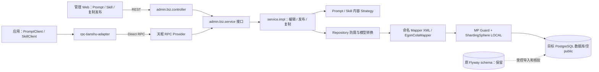
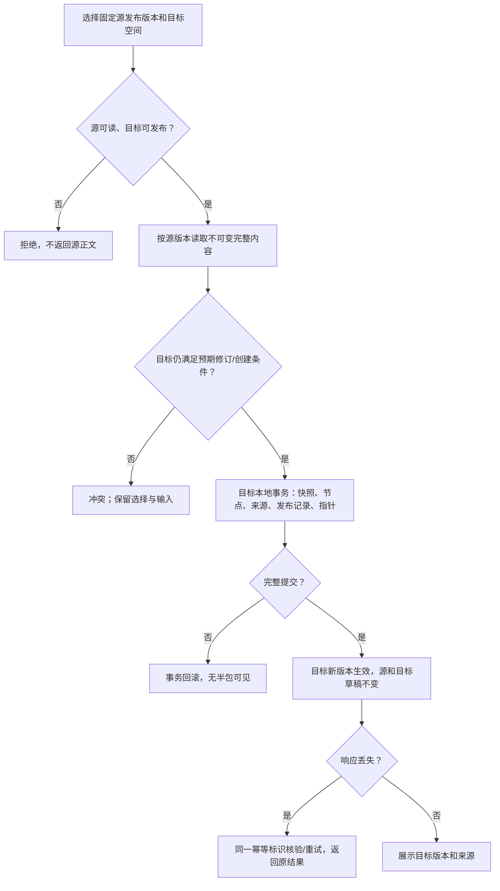
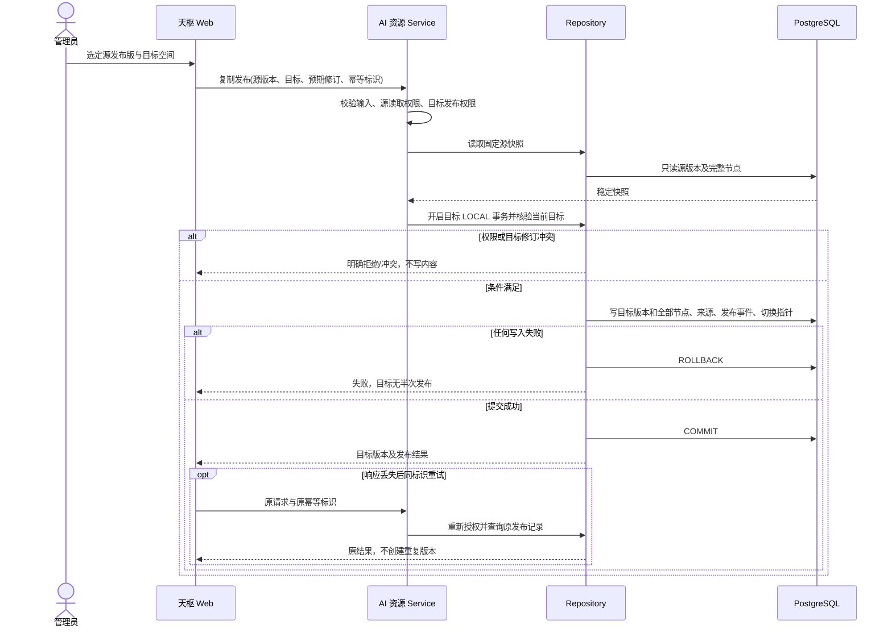
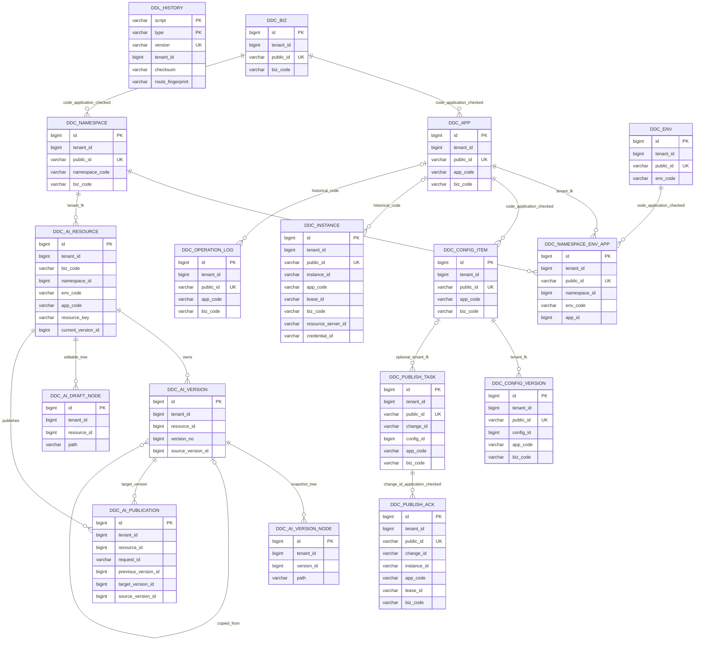

# 天枢多租户组件迁移与 Prompt / Skill 版本管理

| Field | Value |
| --- | --- |
| Document | `2026-09-21-17-18-tianshu-prompt-skill-management.md` |
| Template Version | `7` |
| Status | `Review` |
| Type | `Feature / Refactor` |
| Complexity | `Complex` |
| Complexity Drivers | 全量持久化迁移、多租户认证与Redis隔离、版本快照、跨namespace发布、并发与幂等、旧数据和接口兼容 |
| Created | `2026-09-21 17:18 Asia/Shanghai` |
| Updated | `2026-09-21 21:43 Asia/Shanghai` |
| Owner | mario |
| Repository | Egon-COLA |
| Scope | 天枢全量关系持久化和运行时租户隔离；Prompt/Skill管理、跨ns发布、starter、必要RPC适配和组件DDL family扩展 |
| Change Surface | 11张旧业务表迁移、5张AI新业务表、组件ddl_history；传统规范分层、租户身份/MDC/Redis v4、管理REST与Direct RPC、管理页面和调用方租户配置 |
| Affected Chapters | §7, §8, §9, §10, §11, §12, §13, §14, §15, §16, §17, §18 |
| Source Requirement | 用户原始需求及三轮决策：全量迁移MP组件；草稿/不可变发布版/回滚；两个starter能力默认关闭按需读取；四维隔离、跨namespace复制发布；真正多租户 |
| Baseline Revision | `main@06f2afd5f`；当前未提交工作存在，仅更新本Spec，其他工作保留 |
| Amends | [Namespace设计](../../superpowers/specs/2026-08-01-ddc-namespace-visibility-gateway-integration-design.md) §3.2/3.3：所有天枢身份外围增加tenant；仅AI资源增加namespace归属；[Direct RPC设计](../../superpowers/specs/2026-08-09-ddc-direct-rpc-facade-migration-design.md) §1：机器传输仍Direct，签名升级v2及租户绑定 |
| Supersedes | None |
| Depends On | None |
| Related Specs | [Namespace设计](../../superpowers/specs/2026-08-01-ddc-namespace-visibility-gateway-integration-design.md) §5的旧库事实；[Direct RPC设计](../../superpowers/specs/2026-08-09-ddc-direct-rpc-facade-migration-design.md) §1的传输边界 |
| Related Plans | None |

## 1. Summary

天枢整体改为真正多租户；现有11类关系持久化全部迁移到当前 `top.egon:egon-cola-component-common-mybatis-plus-sharding-jdbc-ext-spring-boot-starter:5.4.0`，不保留JPA/SQLite业务访问双栈。该坐标是用户所称MP分片扩展starter在当前仓库中的实际artifactId，不新增另一个缩写组件。

Prompt/Skill独立于现有YAML配置。资源身份是 **tenant + biz + namespace + env + app + kind + resourceKey**；Skill在线编辑完整文本目录树。草稿可修改，发布快照不可变；按资源生成业务版本，当前发布指针可以回滚。跨ns推广在同一租户内复制精确源版本并创建目标独立版本，保留来源与发布记录，不覆盖源或目标已有草稿。

starter 的 Prompt、Skill 分别默认关闭；启用后按需读取指定或当前已发布版本，走既有Direct RPC。不会自动执行内容、调用模型、同步订阅或创建客户端内容缓存。全量多租户同时覆盖SQL、MDC、Redis键/Topic、本地缓存、后台任务和机器凭据，不能只加tenant_id列。

本稿已吸收用户全部决策，状态为Review，等待用户审核；不是Accepted，不包含生产实现或实施Plan。文档/设计验证与后续PG/SS、RPC、浏览器和迁移运行验证明确分开。

审核重点可先看：[数据表、索引与ER](#11-database-design)、[租户与Redis隔离](#15-non-functional-and-cross-cutting-design)、[迁移及回退](#16-compatibility-migration-rollout-and-rollback)、[逐操作接口](#9-interface-definitions)。后续章节的详细字段与门禁用于防止实施自行补业务决策。

## 2. Background and Current State

### 2.1 仓库与现场边界

用户所称 `platforms/tianshu` 在当前仓库对应 `egon-cola-xingyuan/egon-cola-tianshu`。以下路径缩写仅用于文档阅读，均为实际仓库相对路径：

| 缩写 | 实际路径 |
| --- | --- |
| T | `egon-cola-xingyuan/egon-cola-tianshu` |
| A | `egon-cola-xingyuan/egon-cola-tianshu/egon-cola-tianshu-admin` |
| W | `egon-cola-xingyuan/egon-cola-tianshu/egon-cola-tianshu-admin-web` |
| S | `egon-cola-xingyuan/egon-cola-tianshu/egon-cola-tianshu-starter` |
| R | `egon-cola-components/egon-cola-component-rpc/egon-cola-component-rpc-tianshu-adapter` |
| C | `egon-cola-components/egon-cola-component-common/egon-cola-component-common-core` |
| AJ | `A/src/main/java/top/egon/cola/component/tianshu/admin` |
| SJ | `S/src/main/java/top/egon/cola/component/tianshu` |

仓库及父目录未发现额外适用的 `AGENTS.md` 文件；采用用户在会话中提供的规则。开始时工作区有四个未跟踪文件，本轮不修改：

- `docs/egon/plan/2026-09-20-12-59-archetype-component-contract-implementation.md`
- `docs/egon/spec/2026-09-20-12-18-archetype-component-contract-convergence.md`
- `docs/egon/spec/2026-09-21-16-58-yuheng-llm-knowledge-wiki-design.md`
- `egon-cola-archetypes/source-projects/egon-cola-source-service/egon-cola-source-service-starter/src/test/java/top/egon/cola/archetype/source/service/architecture/ArchetypeContractConvergenceTest.java`

### 2.2 Repository evidence

| Evidence ID | Classification | Exact path/symbol/decision/command | Observed fact | Design significance | Verification limit/freshness |
| --- | --- | --- | --- | --- | --- |
| EVD-001 | Static repository | `A/pom.xml`；`AJ/controller/config/DdcConfigController.java`；`AJ/service/config/DdcConfigService.java` | Spring MVC Controller → 具体 Service → Spring Data JPA Repository；不是精确 biz.* 或 COLA Archetype | 不能未经确认迁移结构或改为 MyBatis | 当前源码；未启动 |
| EVD-002 | Static repository | `AJ/service/config/DdcConfigService.java#validateDraft`、`SUPPORTED_RESOURCE_NAMES`、`findScopeConfig` | 配置仅接受 application.yml/yaml，每个 biz/env/app 只允许一份配置资源 | 不能把 Prompt 和 Skill 当作现有配置项直接写入 | 当前源码 |
| EVD-003 | Static repository | `A/src/main/resources/db/postgresql/V7__add_namespace_env_app_visibility.sql`；`AJ/repository/DdcNamespaceEnvAppBindingRepository.java` | namespace 是 biz 下的可见性分组，绑定 namespace/env/app；配置物理唯一键不包含 namespace | 新资源的归属不能照搬 Nacos namespace 含义 | 当前源码和历史 DDL；非线上数据库 |
| EVD-004 | Static repository | `A/src/main/resources/db/{postgresql,sqlite}/V9__enforce_global_biz_app_codes.sql` | 两方言最高版本均为 V9；app_code 全局唯一 | 本任务只能新增一个逻辑版本，不能修改 V1～V9 | 未运行 Flyway |
| EVD-005 | Static repository | `SJ/autoconfigure/DdcAutoConfiguration.java`；`SJ/autoconfigure/properties/DdcProperties.java` | 总开关默认 false；启用后涉及配置注入、租约、Redis 订阅、刷新；registry 另有开关 | AI 资源开关不能意外启用整套配置运行时 | 未验证实际自动装配 |
| EVD-006 | Static repository | `R/src/main/java/top/egon/cola/component/rpc/tianshu/autoconfigure/DdcRpcAutoConfiguration.java`；`R/src/main/proto/tianshu_config_runtime.proto` | 机器端口在 starter，传输实现和 proto 在 adapter | 消费端新增能力要经过已有 Direct RPC 边界 | 未建立连接 |
| EVD-007 | Static repository | `AJ/security/management/DdcAdminSecurityConfiguration.java`、`DdcAdminCapability.java` | 管理端 JWT/能力检查，READ/WRITE/PUBLISH/CACHE，未匹配路由 denyAll | 新接口必须显式声明权限与路径规则 | 不能由存在 namespace 表推断已有逐资源授权 |
| EVD-008 | Static repository | `AJ/security/rpc/DdcServicePrincipal.java` | RPC Principal 带业务、环境、应用与 allowedOperations | 应用不能仅凭传入 appCode 取得读取资格 | 新操作授权还未设计 |
| EVD-009 | Static repository | `AJ/config/DdcGlobalExceptionHandler.java`；`C/src/main/java/top/egon/cola/component/common/core/pojo/ResultRecord.java` | 统一结果含 success/code/status/message/data/traceId/timestamp；现有 Advice 未逐个设置 HTTP status | 不可编造三字段 envelope 或声称已存在 409 映射 | 静态序列化定义 |
| EVD-010 | Static repository | `W/package.json`、`W/src/App.tsx`、`W/src/pages/ConfigEditorDialog.tsx`、`W/src/api/client.ts` | React/Ant Design/React Query；现有配置编辑与版本页面能力 | 复用现有前端基础，不另起 UI 技术栈 | 未打开浏览器 |
| EVD-011 | User decision | 本轮用户原文 | Skill 是一组文件；先按 txt 文本展示；需要版本；starter 默认关闭 | 文本与整树一致性为必须项 | 未确认额外治理能力 |
| EVD-012 | External primary source | Nacos 官方管理员 API、客户端 API、3.2 发布说明，见 §2.3 | 3.2 系列有 Prompt/Skill、版本与治理能力，细项按小版本演进 | 作为参考，不等于要求全量兼容 | 文档 latest 可变化；截至本次检索 |

### 2.3 Nacos 参考边界

[Nacos 管理员 API](https://nacos.io/docs/latest/manual/admin/admin-api/)区分 Prompt/Skill 管理和版本操作，并标注各操作起始版本；[客户端 API](https://nacos.io/docs/latest/manual/user/open-api/)体现按版本或标签读取的消费方式。[3.2 发布说明](https://www.nacos.io/blog/nacos-gvr7dx_awbbpb_eerxlks19kgclceq/)说明了 Prompt Registry 与 Skill Registry 的用途。

本次只取“资源、版本、消费入口”的产品参考，不默认复制 Nacos API、底层配置存储、审核流水线、灰度、Copilot、ZIP 导入导出或格式渲染。3.2.* 不是单一冻结契约，必须通过 DEC-002 明确采用范围。

### 2.4 Evidence and current-chain map

| Entry/trigger | Current call chain | Data read/written | External dependency | Consumers | Evidence |
| --- | --- | --- | --- | --- | --- |
| 配置页面保存 | ConfigsPage / ConfigEditorDialog → DdcConfigController → DdcConfigService → JPA Repository | ddc_config_item、ddc_config_version、ddc_operation_log | 数据库 | 配置管理人员 | EVD-001/002/009/010 |
| 应用读取配置 | DdcConfigClient → RpcDdcConfigClient → Direct RPC → DdcConfigRpcProvider → DdcConfigFacade → DdcConfigService.pull | publishedVersion 指向的历史内容 | gRPC、数据库 | 配置消费者 | EVD-002/005/006 |
| namespace 筛选 | DdcNamespaceEnvAppBindingRepository.findVisiblePhysicalScopes/findVisibleNamespaceCodes | namespace/env/app 绑定 | 数据库 | 管理查询 | EVD-003 |
### 2.5 本轮核验的当前组件和租户证据

| Evidence ID | Classification | Exact path/symbol/decision/command | Observed fact | Design significance | Verification limit/freshness |
| --- | --- | --- | --- | --- | --- |
| EVD-013 | Static repository | MP模块pom.xml/model/EgonModel.java | 5.4.0；Long id/tenantId/version，Instant审计，LocalDateTime deletedAt | 新PO不能保持String内部主键 | 只读源码 |
| EVD-014 | Static repository | MP/business/EgonColaTenantIdProvider.java、handler/EgonColaMetaObjectHandler.java | tenant来自MDC静态入口；用户上下文必需；旧注入Provider方案已变更 | 覆盖HTTP/RPC/任务/回调的可信绑定和finally恢复 | 非运行授权证明 |
| EVD-015 | Static repository | MP/extension/EgonColaRepository.java、autoconfigure/EgonColaMybatisPlusContractValidator.java | 只需mapper/properties getter，标准三项XML与Guard强制；JPA不能混用 | 全量查询与写路径迁移 | 非编译证明 |
| EVD-016 | Static repository | MP/ddl/EgonColaPostgreDdlRunner.java#installedPrefix | 非空无受管history拒绝；SQL/history一事务 | 独立目标数据库，不伪造接管 | 未访问旧库 |
| EVD-017 | Static repository | MP/ddl/EgonColaDdlManifestBO.java | family只接受六种archetype；版本yyyyMMdd_NNN | 最小增加tianshu，不冒用family | 源码确认 |
| EVD-018 | Static repository | AJ/security/registration/IdpJwtDdcRegistrationCredentialVerifier.java#validateToken | PLATFORM token必须无tenant | 注册JWT与HMAC租户绑定分别验证，不能把无tenant当全租户 | 本轮静态核对；未运行集成 |
| EVD-019 | Static repository | SJ/redis/DdcRedisKeys.java | v3键/Topic和global catalog无tenant | v4必须包含tenant；旧v3不能混读 | 本轮静态核对；未运行集成 |
| EVD-020 | Static repository | Tianquan-Jianshen starter/security/Rbac3UserDetails.java | USER tenant与授权snapshot相同；permissions为字符串集合，dataScopes没有namespace字段 | 用已认证tenant映射和namespace permission，不挪用org/dept ID | 本轮静态核对；未运行集成 |
| EVD-021 | Static repository | MP/sharding/strategy/EgonColaStandardTenantIdShardingStrategy.java | 当前物理节点public.logical_t0；bootstrap不自动执行DDL | 独立目标数据库空public；受控初始化先于Admin启动 | 本轮静态核对；未运行集成 |
| EVD-022 | Local isolated probe | javac --release 21＋Lombok 1.18.46 | 基类SuperBuilder与子类完整注解/businessBuilder、callSuper=true组合成功，exit0无警告 | 构造器设计可行；不代表全部目标PO已编译 | 仅临时目录Java片段 |
| EVD-023 | Local class inspection | Spring Web 6.2.12 javap | AbstractJackson2HttpMessageConverter有registerObjectMappersForType | 新AI Command局部严格Jackson，不改变旧JSON规则 | 编译期能力核对 |

MP为 `egon-cola-components/egon-cola-component-common/egon-cola-component-common-mybatis-plus-sharding-jdbc-ext-spring-boot-starter/src/main/java/top/egon/cola/component/common/mybatis`。后续此缩写用于精确相对文件定位；当前表格EVD-018～021未重复写限制的单元格均为本轮静态源码，未运行系统。


## 3. Goals and Non-goals

目标：Prompt/Skill 在线管理、纯文本树编辑、完整版本与跨 namespace 复制发布；应用按需消费；天枢既有持久化全量迁移到当前组件。

本期不做审核/灰度/命名标签、LLM 调试调用、脚本执行、AI 框架自动执行、二进制优化展示、ZIP/Git 同步、客户端订阅/定时同步/内容缓存、跨集群发布、多目标分布式事务。用户“调试好”表示推广前提，不自动扩大为在天枢内建设模型调试平台。

### 3.3 Change Surface and Design Depth

| Area/layer | Disposition | Exact repository evidence | Changed or preserved behavior/contract | Required Spec treatment | Chapter(s) |
| --- | --- | --- | --- | --- | --- |
| admin 全部关系持久化链 | Affected | 11 个 Entity、JPA Repository、现有 Service；DEC-001 | 全量采用规范分层、MP 组件、命名 XML；既有业务行为保留 | 逐类、逐查询、事务、映射、兼容与测试 | §7, §8, §10, §13, §14 |
| AI 管理与机器消费契约 | Affected | 用户 DEC-002/003/004；现有 MVC/Direct RPC | 新建资源、草稿、版本、发布/回滚/推广和读取 | 逐操作 wire、权限、错误、OpenAPI/RPC 验证 | §9, §15 |
| 数据库迁移及新表 | Affected | 现有 V1～V9；EVD-013～017 | Long 主键/上下文、旧 ID 兼容、新 AI 表、DDL与切换 | 逐表/索引/ER、源目标核对 | §11, §16 |
| starter 和 RPC adapter | Affected | DdcAutoConfiguration、DdcRpcAutoConfiguration | 新独立开关、公开端口与传输适配 | 真值表、生命周期、关闭/自定义实现 | §7, §8, §9, §14, §15, §16 |
| MP 组件 DDL family | Affected | EgonColaDdlManifestBO 白名单 | 必要的 tianshu 支持，保留原六种 family | 精确最小变更和回归 | §8, §11, §14, §16 |
| 管理前端 | Affected | W/src/App.tsx、页面和作用域组件 | 新资源/版本/推广交互，原公共接口兼容 | 路由、字段、状态、目标选择、文本编辑 | §12, §14 |
| 租户认证、Redis/Topic/任务/本地缓存 | Affected | EVD-014/018/019/020；用户明确多租户 | 所有入口、键、锁和异步作用域加入tenant；HTTP身份映射/HMAC v2 | 端到端隔离、兼容升级与回归 | §7, §8, §9, §14, §15, §16 |
| 既有部署调用方租户参数 | Affected | T及R客户端被其他平台/源脚手架引用 | 仅补充必需tenant配置和测试，不迁移其业务代码 | 配置入口与升级清单 | §8, §14, §16 |
| 方案比较与风险 | Affected | 新需求与组件不兼容点 | 决策和迁移边界显式化 | 拒绝错误默认值和双写假设 | §17, §18 |
| 旧管理 REST/公开配置与注册业务payload | Context-only | DdcConfigController、原三个 Ddc*Client 端口、已有 proto | 业务payload/URL保持；租户签名、隔离、配置升级在独立Affected行设计 | 契约回归，不能把内部迁移说成接口不变的自动证明 | §9, §16 |
| 天权及玉衡核心 | Context-only | 现有身份过滤器、PLATFORM token、Direct RPC | 只通过天枢适配消费，不迁移其他平台 | 依赖边界及认证契约核对 | §9, §15 |
| 二进制展示和执行环境 | Not applicable | 用户只要求文本，DEC-003 无自动执行 | 不建执行/渲染子系统 | N/A | §12 |

## 4. Requirements and Acceptance Criteria

| ID | Atomic requirement | Priority | Observable acceptance criteria | Source |
| --- | --- | --- | --- | --- |
| REQ-001 | 天枢提供 Prompt 在线管理 | Must | 可建立资源、编辑文本、查询详情和目录；原文存取，不渲染模板 | “prompt…管理功能” |
| REQ-002 | 天枢提供 Skill 在线管理 | Must | 一个 Skill 管理一组文件，资源之间相互隔离 | “skill 管理功能” |
| REQ-003 | Skill 文件以树状结构在线编辑 | Must | 可表示多级目录、读取/修改文本、增删与重命名节点；不得产生冲突路径或环 | “在线管理和编辑树状文件” |
| REQ-004 | 内容统一按文本处理 | Must | 文本可原样读取保存；不根据扩展名执行文件或优化格式展示 | “目前当作txt文本即可” |
| REQ-005 | Prompt 支持版本机制 | Must | 能明确识别和查询不同版本；发布与回滚按已确认 DEC-002 | “还需要支持版本机制” |
| REQ-006 | Skill 支持整组文件的版本机制 | Must | 同一版本的读取结果来自同一个完整文件树，不能混合不同版本的文件 | 同上及“一组文件” |
| REQ-007 | starter 支持显式自定义启用 | Must | 配置可启用相应能力，消费行为按已确认 DEC-003 | “starter中支持配置自定义启用” |
| REQ-008 | starter 默认不启用新能力 | Must | 不配置时不注册新功能客户端/监听器，不产生新功能网络请求；原有能力不改变 | “默认不启用” |
| REQ-009 | 表结构有完整可审核设计 | Must | 明确字段、主外键、唯一约束、索引依据、事务、并发、迁移、ER；§11/16完整定义 | “表结构好好设计一下” |
| REQ-010 | 先审核 Spec，不开始实施 | Must | 本轮只改规格文档；无生产代码、DDL 文件、Plan 或服务启动 | “我会审核spec”及技能范围 |
| REQ-011 | 天枢全量迁移最新 Egon-COLA 组件 | Must | 11 类既有关系表及所有读写链使用当前 MP 扩展组件；生产不残留 JPA/SQLite 访问；既有数据及对外行为有兼容证明 | 用户追补“需要全量迁移” |
| REQ-012 | Prompt/Skill 跨 namespace 复制发布 | Must | 从 dev/test 中明确选定的稳定版本复制至目标空间并发布；源不变；目标有独立版本和来源记录；Skill 整树复制 | 用户追补“跨ns 直接复制发布” |
| REQ-013 | 天枢为真正多租户 | Must | 同biz/ns/env/app/key可出现在不同tenant；SQL、Redis/Topic、缓存、签名和后台任务均不跨tenant | 用户“2 改成多租户的” |
| REQ-014 | AI资源按四维隔离 | Must | tenant内部biz/namespace/env/app任一不同则资源独立，复制须明确目标四维 | 用户“1 隔离” |

### 4.1 Scenario matrix

| Scenario | Actor/trigger | Preconditions | Main path | Alternative/failure path | Data/state change | Observable result | Requirements |
| --- | --- | --- | --- | --- | --- | --- | --- |
| 编辑 Prompt | 管理员保存 | 已登录、有权限 | 保存文本 | 校验失败保留编辑；并发不能静默覆盖 | 可编辑草稿＋不可变发布快照 | 能重新读取保存内容 | REQ-001/005 |
| 编辑 Skill 树 | 管理员增删改名 | 已打开 Skill | 编辑目录和文本 | 重复路径、父级不存在、环、非法路径拒绝 | 根锁下完整树事务保存 | 无孤儿节点和半次目录改名 | REQ-002/003/004 |
| 读取历史 Skill | 应用或管理员选择版本 | 有读取权限 | 返回一个版本全部内容 | 不存在/越权不得返回其他版本冒充成功 | 只读 | 不混版 | REQ-006 |
| 并发发布 | 两个管理员发布 | 同一资源 | 一次发布完整生效 | 冲突显式返回，不覆盖另一人的草稿 | 组件 LOCAL 事务，同tenant内完整四维scope | 历史版本稳定 | REQ-005/006/009 |
| 请求提交后响应丢失 | 管理端重试 | 提交结果未知 | 查询或按幂等身份重试 | 不盲目再生成一个发布版本 | 同tenant Idempotency-Key＋发布回执UK | 能判定是否成功 | REQ-005/006/009 |
| starter 缺省 | 普通应用启动 | 无新配置 | 无新能力装配 | 不应要求额外网络/凭据 | 无新功能副作用 | 原应用兼容 | REQ-007/008 |
| 越权、空目录、资源不存在 | 管理端或应用访问 | 相应边界条件 | 分别呈现结果 | 不泄露内容、不把错误变成空文本 | 无写入 | 状态可区分且受权限约束 | REQ-001/002/007 |
| 跨空间复制发布 | 管理员推广调试好的版本 | 来源版本固定，具备源读取和目标发布权限 | 服务端复制内容并创建目标发布快照 | 同名并发、目标变化、复制中失败、响应丢失 | 成功完整发布，失败不暴露半包 | 源不变，目标有独立历史 | REQ-012 |
| 全量持久化迁移 | 运维执行切换 | 旧库保留、目标经过核验 | 初始化新结构、导入核对、停写切换 | 映射失败/数据不一致时停止 | 未切换时旧系统仍是权威 | 不自动丢弃或重置旧数据 | REQ-011 |
| 两租户同名资源 | 管理员或机器读取 | 所有业务编码相同、tenant不同 | 在已认证tenant查找 | 改body/header/token/Redis channel不得越权 | 一方写入不会影响另一方 | 隔离可验证 | REQ-013/014 |
| 后台任务线程复用 | 超时扫描/ACK回调 | 两个tenant先后执行 | 显式绑定各自上下文 | 前一任务异常仍finally恢复 | 不串MDC/锁/缓存 | 无跨租户副作用 | REQ-013 |

### 4.2 Use-case analysis

| Actor ID | Actor/role | Goal and responsibility | Entry/channel | Permission/tenant context | Evidence |
| --- | --- | --- | --- | --- | --- |
| ACTOR-001 | 天枢管理员 | 管理文本资源及版本 | 管理页面/REST | 现有 JWT/能力权限；同tenant四维scope和namespace权限 | EVD-007/010/011 |
| ACTOR-002 | 接入天枢的应用开发者/应用 | 显式启用并消费资源 | starter | 机器身份；HMAC v2绑定tenant＋AI_READ＋namespace grant | EVD-005/006/008/011 |

| ID | Use case/goal | Primary actor | Supporting actors/systems | Trigger | Preconditions | Main success outcome | Alternatives/failures | Postconditions | Requirements | Interfaces/pages | Tests |
| --- | --- | --- | --- | --- | --- | --- | --- | --- | --- | --- | --- |
| UC-001 | 编写和维护 Prompt | ACTOR-001 | 天枢存储 | 打开编辑器保存 | 登录与管理权限 | 持久保存并重新读取文本 | 非法输入、冲突、存储失败 | 成功完整保存，失败不覆盖已提交内容 | REQ-001/004/005 | 新管理页面与契约 | TEST-001/004 |
| UC-002 | 维护完整 Skill 文件集合 | ACTOR-001 | 天枢存储 | 树中编辑节点 | Skill 可编辑 | 文件内容与目录关系正确保存 | 路径冲突、环、并发改名、部分写失败 | 无半次树变更 | REQ-002/003/004/006 | 文件树页面；契约待决策 | TEST-002/004 |
| UC-003 | 查询并选择历史版本 | ACTOR-001 | 天枢存储 | 打开版本记录 | 有读取权限 | 获取确定版本的完整内容 | 未发布、不存在、权限失效 | 不修改历史 | REQ-005/006 | 版本页面；回滚仅切换当前发布指针 | TEST-003/004 |
| UC-004 | 通过 starter 使用资源 | ACTOR-002 | 天枢 Direct RPC | 显式启用并调用 | 有机器凭据及业务范围 | 获得所选资源版本 | 关闭、无权限、超时、无发布版 | 错误不能冒充空内容 | REQ-007/008 | 独立客户端与 Direct RPC | TEST-005/006 |
| UC-005 | 将调试好的资源推广到后续空间 | ACTOR-001 | 天枢存储 | 选择源版本和目标后发布 | 源可读取、目标可发布 | 目标独立版本完整生效且可追溯 | 同名冲突、并发、失去权限、响应丢失 | 源不变；目标全成或全败 | REQ-012 | 复制发布入口 | TEST-009 |
| UC-006 | 保留业务行为迁移组件 | ACTOR-003 | 天枢数据库 | 受控迁移切换 | 旧库保留并有核验报告 | 旧资源与历史仍可使用 | 无法映射或核验失败时停止 | 不覆盖原库；不自动清理数据 | REQ-011 | 迁移工具及运维流程 | TEST-010 |

ACTOR-003 为天枢部署/迁移运维者，来源是用户新确认的全量迁移要求；不新增业务角色权限。
UC-007（ACTOR-001/ACTOR-002）：在所属租户独立管理和消费同名资源。触发为已验证USER请求或绑定tenant的机器调用；前置为租户已登记且身份/凭据有效。成功只观察本tenant；未知/停用/冲突tenant拒绝且不回退默认值，失败无写入。接口§9.5和全部AI操作、SQL/Redis§11/15；TEST-011覆盖请求、后台、缓存/Topic和身份切换。ACTOR-003只在受控部署/迁移通道管理租户登记与数据导入，不向普通用户提供跨租户查询接口。


## 5. Constraints, Assumptions, and Decisions

### 5.1 Confirmed constraints

只写Spec；不写Plan、不实现、不运行数据库迁移、不启动应用/服务/Docker/浏览器，不修改其他工作。V1～V9 Flyway原文件、旧历史和旧数据库不改。多租户与组件迁移是明确授权的设计范围，不等于允许清空旧数据。

### 5.2 Small-gap assumptions

| ID | Inference | Repository evidence | Why locally reversible | Impact if wrong |
| --- | --- | --- | --- | --- |
| ASM-001 | platforms/tianshu指当前Tianshu模块 | 当前目录/POM及品牌迁移记录 | 文档定位 | 仅修正路径 |
| ASM-002 | 全量限天枢和直接必要适配，不迁移其他平台业务 | 用户原第1项对象是天枢 | 范围限定 | 额外平台需要独立范围 |
| ASM-003 | 用户MP简称映射真实5.4.0完整坐标 | 当前组件POM/BOM | 不创建假artifact | 若另有外部组件则重新评估 |
| ASM-004 | 首期容量采用256KiB单文件、1MiB整Skill、256非根节点、16层、1024字节路径 | 用户文本范围与既有4MiB RPC限制；没有线上容量数据 | 参数上限可后续评审调整，设计中各层同步 | 改限额需同步HTTP/RPC/校验/测试 |

### 5.3 Resolved decisions

| ID | Decision | Decision owner | Evidence and rationale | Requirements |
| --- | --- | --- | --- | --- |
| DEC-001 | 11类旧持久化全量迁移当前组件，退出JPA/SQLite业务运行 | User | “需要全量迁移” | REQ-011 |
| DEC-002 | 草稿＋不可变发布版＋当前指针＋回滚；无审核/灰度/标签 | User | 第2项确认 | REQ-005/006 |
| DEC-003 | 两能力默认关闭、按需读取、Direct RPC；不做同步/自动执行 | User | 第3项确认 | REQ-007/008 |
| DEC-004 | 支持跨ns服务端复制发布 | User | dev/test推广后续ns | REQ-012 |
| DEC-005 | tenant内biz/namespace/env/app隔离 | User | “1 隔离” | REQ-014 |
| DEC-006 | 真正多租户，不用固定平台存储tenant | User | “2 改成多租户的” | REQ-013 |
| DEC-007 | admin采用传统规范分层；starter/RPC为技术模块 | Spec设计，随本文审核 | 比新增多模块COLA更贴近现状，满足迁移目标 | REQ-011 |
| DEC-008 | 独立目标PostgreSQL数据库空public，默认1×1标准租户分片 | Spec设计，随本文审核 | 当前组件物理节点约束及非空库拒绝接管；不猜数据规模 | REQ-011/013 |
| DEC-009 | 同tenant推广；源固定版本，目标独立版本与来源链；已有目标草稿保留 | Spec设计，随本文审核 | 最小安全复制语义和用户明确隔离 | REQ-012/014 |

### 5.4 Open major decisions

None。用户已关闭业务选择；本稿仍需其整体审核，不把Review当Accepted。部署时实际tenant映射、数据库连接、旧数据行归属和Redis ACL凭据是§16规定的运维输入，缺失即阻止实际切换，不是可由模型猜测的默认值。


## 6. Project Technology Context

| Concern | Current choice | Repository evidence | Constraint on design |
| --- | --- | --- | --- |
| Runtime | Java21；Boot3.5.16；Lombok1.18.46 | 根/Xingyuan POM | 不顺带升级 |
| Persistence source | JPA、PG、SQLite测试、Flyway V1～V9 | A/POM和resources/db | 源数据事实，目标退出JPA |
| Persistence target | 当前MP扩展5.4.0、EgonModel、命名XML、PG/SS LOCAL | EVD-013～017/021 | 不复制组件Guard/ID/DDL实现 |
| API | MVC、springdoc2.8.17、OAS3.1、ResultRecord/PageResultRecord | 根POM/A配置/C源码 | 新AI局部错误映射，旧wire不变 |
| Frontend | React19、Ant Design6、React Query、TypeScript、Vitest | W/package.json | 复用已有组件，无富编辑器新依赖 |
| Tests | JUnit/Spring Test、Vitest、既有Testcontainers/Playwright | A/W manifests | 数据库/浏览器测试须受控；本轮只做静态设计检查 |

### 6.1 Java architecture profile and capability baseline

选择 **Traditional Three-Layer**：`admin.biz.controller → service → service.impl → repository → dao`；PO在repository内部，Mapper纯SQL。技术配置/security/RPC Provider仍位于技术包并委托Service，不能形成第二条业务写链。旧文件逐项映射见§8；不再依赖JPA Page/Entity穿层。

| Need | Spring/JDK candidate | Spring Boot Starter candidate | Egon-COLA/module candidate | Proven gap | Decision/dependency impact |
| --- | --- | --- | --- | --- | --- |
| 校验 | Jakarta Validation/Binder | validation starter | ValidationUtils | 所有新边界必须显式分组/激活 | 复用，不建通用Utils |
| 转换 | MapStruct1.6.3 | 无额外框架 | BaseConverter<S,T> | common-core的MapStruct是test scope，不会自动传入A/R编译 | A/R显式MapStruct/processor1.6.3＋Lombok binding0.2.0；保留既有Lombok/Boot processor |
| ID/租户/锁 | JDK类型、Spring事务 | MP扩展 | EgonModel、Snowflake、Guard | 原String ID与无tenant不兼容 | Long内部ID、public_id兼容、可信租户上下文 |
| DDL | JDBC/事务 | MP扩展runner | EgonColaPostgreDdlRunner | family未含tianshu；bootstrap未自动调用run | 最小family扩展；独立迁移CLI调用现成factory/validator/runner |
| JSON | Boot ObjectMapper | 既有MVC | ResultRecord/PageResultRecord | 新Command需严格未知字段/重复键，旧规则保留 | 通过已验证registerObjectMappersForType局部注册copy mapper |
| 缓存/通知 | 现有Redis | common-cache | DdcRedisKeys、本地状态 | 原键无tenant | v4前缀、租户ACL、MDC key；AI不增加内容缓存 |
| 文本/摘要 | MessageDigest、UTF-8、Arrays.compareUnsigned | 无 | 无需文件格式引擎 | 树摘要需固定编码 | JDK规范实现，非新工具库 |

### 6.2 User-mandated Java rule compliance

| Literal rule | Affected? | Repository evidence | Exact design decision | Files/types/interfaces | Validation/test evidence | Status/blocker |
| --- | --- | --- | --- | --- | --- | --- |
| Rule 1 | Yes | §8/10清单 | PO/BO/DTO/VO/Query/Command/Result及行为后缀；旧公开类型可保留，内部不新造Data/Info/Bean | 全部目标类型 | 名称/源码门禁TEST-013 | PASS |
| Rule 2 | Yes | ValidationUtils、§10.3 | HTTP/RPC→Service→Strategy/Repository逐边界@Valid/@Validated与组；直接路径ValidationUtils | Commands/Queries/BOs | TEST-001/002/006/011 | PASS |
| Rule 3 | Yes | EgonModel、EVD-022、BaseConverter | 简单不可变carrier record；复杂PO完整Lombok＋NonNull必需字段；businessBuilder不遮蔽基类 | §10全部PO/Converter | Java21隔离注解探针成功；后续逐PO编译/转换TEST-013 | PASS |
| Rule 4 | Yes | 原bean惯例及Qualifier传播要求 | 每个业务类Slf4j、显式bean名、RequiredArgsConstructor、final依赖+Qualifier；局部lombok.config | §8/10具名清单 | TEST-013/装配TEST-005 | PASS |
| Rule 5 | Yes | JDK/既有依赖 | JDK、已允许Commons/Guava；无Tika/渲染工具 | 路径/hash/ID处理 | import检查TEST-013 | PASS |
| Rule 6 | Yes | C实际wrapper、EVD-023 | Boot Jackson唯一；新JSON必填/null/字符串Long/UTC明示，旧局部规则保持 | §9/10 | 逐wire fixture和OAS TEST-006/012 | PASS |
| Rule 7 | Yes | base/local/test及starter资源 | 共享键矩阵在每profile一致；值可不同，不猜tenant/secret | §15配置表 | 解析有效配置与条件装配TEST-005/013 | PASS |
| Rule 9 | Yes | 两类内容＋迁移variation | Content Strategy；现成Repository模板；导入按表映射Strategy | §13 | 类型/失败/并发测试 | PASS |
| Rule 10 | Yes | 新EgonModel与旧LocalDateTime字段 | 新审计InstantUTC；旧业务timestamp原样LocalDateTime，所有Duration用java.time | §10/11 | 时间fixture/迁移TEST-010 | PASS |
| Rule 11 | Yes | §8精确传统分层 | 不新增Archetype模块或混合第三种业务层 | admin.biz | 静态依赖门禁TEST-013 | PASS |


## 7. Architecture Design

### 7.0 Minimum-design baseline and element-necessity audit

| Proposed element | Change | Requirements | Existing/direct alternative | Concrete inadequacy of alternative | Added calls/state/coupling/failures/migration/operations | Verdict |
| --- | --- | --- | --- | --- | --- | --- |
| MP 扩展组件与规范 Repository/Mapper | 替换 | REQ-011 | 保留 JPA | 用户明确要求全量迁移 | 11 类表、全部业务查询、上下文与迁移测试 | Add；替换旧持久化，不双写 |
| 原配置表直接承载 AI 资源 | 候选 | REQ-001～006 | 独立 AI 模型 | EVD-002 限制 application.yml/yaml，且发布有原 ACK 语义 | 会改变原配置语义 | Remove |
| AI 资源、版本、树节点和发布记录 | 新增 | REQ-001～009、REQ-012 | 每文件独立版本或 JSON 大字段 | 无法同时提供整包版本、节点约束和明确发布追溯 | 关系存储、快照复制、事务与幂等 | Add，§11逐表定义 |
| 内容 Strategy | 新增 | REQ-001/003/006/012 | 两套复制/发布流程 | 相同版本生命周期有两种校验/快照内容，重复流程易漂移 | 两个实现，无外部注册机制 | Add |
| 独立客户端开关 | 新增 | REQ-007/008 | 复用配置客户端总开关 | 会顺带触发旧 YAML 租约、Redis、刷新 | 两类端口与条件装配 | Add |
| 通用文件中心、对象存储、Git、格式渲染 | 候选 | REQ-004 | 数据库文本 | 需求没有要求额外平台 | 多余服务、成本和状态 | Remove |
| 订阅/定时同步/客户端内容缓存 | 候选 | REQ-007 | 按需 Direct RPC | 用户已确认首期按需读取 | 增加过期、撤权、重连状态 | Remove |
| DDL manifest family 支持 tianshu | 必要组件扩展 | REQ-011 | 冒用 light/service family 或自制 runner | 当前白名单不支持平台名；不能伪装架构或重复 DDL 引擎 | 共享组件需做兼容测试 | Add 的必要性已证实，纳入同一 Spec 评审 |

| Path | Network calls | Client states | Server contracts/state | Failure and TOCTOU points | Additional user/business value |
| --- | --- | --- | --- | --- | --- |
| 前端下载再上传复制 | 读源＋上传目标两次正文传输 | 下载、缓存正文、上传 | 客户端成为内容搬运者 | 来源与提交内容可能不同，容易混版 | 无额外业务价值 |
| 服务端复制发布 | 一次推广 Command；源版本页面和目标选择各有独立展示目的 | 提交、成功、冲突 | 固定源版本＋目标新快照＋发布记录 | 目标以修订令牌重新验证 | 不把敏感正文交给客户端搬运，整树原子发布 |
| starter 按需读取 | 一次 Direct RPC | pending/success/error | 无客户端内容状态 | 每次校验身份/范围/版本 | 获得指定或当前发布内容 |

### 7.1 System Architecture Design

采用已获迁移授权的传统规范分层，技术 RPC Provider/Facade 委托同一 Service，不能绕过业务授权和事务。



管理用户和机器调用者的身份由现有体系验证。存储 tenant 上下文来源见§9.5/§15，使用已认证业务租户，不能接受请求正文或任意 MDC 原值作为授权证明。绑定/切换 MDC 后必须 finally 恢复，异步任务必须显式进入相同边界，不能指望 ThreadLocal 自动传播。

### 7.2 High-Level Design

Prompt 发布单份文本；Skill 发布完整目录与文本文件集合。草稿不对 starter 可见。发布快照不可变，回滚切换当前发布指针，不改写旧快照。namespace 复制生成目标自己的快照和版本；不形成运行时跨 namespace 引用。



#### 7.2.2 High-level decision and quality matrix

| Concern/use case | Required behavior | Selected mechanism | Failure/degradation behavior | Trade-off | Verification | Requirements |
| --- | --- | --- | --- | --- | --- | --- |
| Skill 不混版 | 一次读取同一完整版本 | 完整快照，节点归属于精确版本 ID | 任一节点失败整个发布回滚 | 每版存储完整内容 | TEST-003/004/009 | REQ-006/012 |
| 既有行为兼容 | 所有旧资源和历史可用 | 保留公共 ID 与业务版本语义，替换内部持久化 | 无法核验则停止切换 | 迁移复杂度明确增加 | TEST-010 | REQ-011 |
| 默认关闭 | 新功能关闭不产生新网络访问 | 两个独立默认 false 条件 | 关闭时不验证新功能凭据 | 单项启用矩阵 | TEST-005 | REQ-008 |
| 权限 | 源读权限与目标写/发布权限同时满足 | 当前权威范围重新验证；不信前端选择器 | 拒绝不复制、不泄露内容 | 完整scope与已认证tenant | TEST-006/009 | REQ-012 |

### 7.3 Detailed Design

#### 7.3.1 版本和复制发布规则

- 草稿保存与发布分离；保存不会改变当前发布版本。Prompt 内容、Skill 节点集合和资源描述需要定义共同快照，版本详情不回读当前元数据冒充旧值。
- 发布必须绑定预期资源修订；源一旦是已发布版本，之后源草稿编辑不会影响复制内容。若调试成果还在草稿，先发布为确定快照，再选择该版本推广；不提供“复制正在变化的草稿”入口。
- 每个目标资源有自己的单调版本序列；目标版本号不直接复制源版本号。相同内容可有不同目标版本号，来源 version ID 和内容 hash 用于追溯，不能靠版本字符串推断来源。
- 同名目标存在时新增版本，不替换历史；目标不存在时在同一事务创建资源与首个版本。发布已有目标时保留其未发布草稿；创建新目标可用源内容初始化草稿，两者都必须在结果中明确。
- 普通发布、复制发布、回滚都要有发布记录，携带操作者、时间、目标资源、之前/之后指针和稳定幂等标识。相同幂等标识与不同请求内容冲突；结果未知时只能复用原标识核验，不能生成新标识盲重试。
- 回滚只选择目标资源自己的历史快照，不把来源版本 ID 当目标版本 ID。回滚仅切换指针并记录事件，不能减少版本计数、覆盖草稿或改写历史正文。
- 首期一次推广一个资源到一个明确目标；不引入跨集群发布、跨租户迁移或无序多目标事务。批量推广若后续要求，再定义部分成功模型。



#### 7.3.2 starter 开关与生命周期

定义新增键：`egon.cola.component.tianshu.prompt.enabled=false`、`egon.cola.component.tianshu.skill.enabled=false`。不依赖原 `tianshu.enabled` 才能单独启用新客户端；原总开关仍只控制现有配置运行时，原 registry 开关不变。

| prompt.enabled | skill.enabled | 新能力装配 | 新能力网络行为 |
| --- | --- | --- | --- |
| 缺省/false | 缺省/false | 无 Prompt/Skill 客户端及专用 handle | 无 |
| true | false | 只装配 Prompt 端口及必要 Direct RPC 适配 | 调用 Prompt 端口时读取 |
| false | true | 只装配 Skill 端口及必要 Direct RPC 适配 | 调用 Skill 端口时读取 |
| true | true | 两端口启用，传输资源由适配层统一释放 | 按调用读取，不定时同步 |

`@ConditionalOnMissingBean` 支持应用提供自定义端口；关闭开关只禁止默认装配，不删除用户自定义 Bean。启用却缺少 adapter/端口实现时给明确配置错误，不能静默返回空内容。参数/凭据仅在对应能力启用时校验；关闭时不新建连接、监听器或线程。保持 starter 不反向依赖 RPC，实际客户端仍由 adapter 提供。容器关闭时关闭其拥有的 handle，不关闭应用提供的客户端。

#### 7.3.3 迁移一致性与事务边界

迁移使用独立目标 PostgreSQL 数据库的空public，不自动接管或重命名原 Flyway schema。导入、核验与切换是受控运维过程，不在日常启动中自动迁移旧数据。旧业务写操作通过 Service 开启 Spring 本地事务，Repository 参与同一事务；不在 Repository 独立开启业务 REQUIRES_NEW。原发布失败记录等确有独立事务语义的现有路径需逐项保留并测试，不能机械合并。

目标发布事务只能在一个物理组提交；已经选择真实业务租户；源读取与目标写入必须是同一个认证tenant，不启用 XA 或伪装跨租户 LOCAL 原子性。快照加载固定源版本，事务前加载不可变内容时仍应在提交前复核授权有效性和目标状态。

#### 7.3.6 Conclusion evidence chain

| Conclusion | Repository/user evidence | Constraint or requirement | Design decision | Consequence and trade-off | Verification and acceptance evidence |
| --- | --- | --- | --- | --- | --- |
| 全量持久化迁移 | 用户 DEC-001；EVD-013～017 | REQ-011 | EgonModel＋Repository＋命名 XML，替换 JPA | 必须处理主键/审计/租户/DDL，不能只改依赖 | TEST-010 |
| AI 资源空间副本 | 用户 DEC-004；既有 namespace 仅可见性 | REQ-012 | 新资源在目标空间独立版本，服务端复制固定快照 | 与原配置空间语义明确区分 | TEST-009 |
| 默认不启用 | 用户 DEC-003；旧总开关带配置副作用 | REQ-007/008 | 新客户端独立条件，无内容同步 | 保留现有启动兼容 | TEST-005 |
#### 7.3.4 一致性、锁顺序与未知结果的精确定义

所有AI命令通过具名 `ddcAiTransactionTemplate`（Spring TransactionTemplate，READ_COMMITTED）执行，异常捕获位于execute之外，避免在已回滚事务内查询幂等结果。事务中先按固定类型顺序锁scope父行（biz→namespace→env→app；同类型按内部ID升序），再将源/目标资源根按ID升序FOR UPDATE；普通保存仅锁对应scope/根。元数据禁用/删除遵循同一顺序。读取当前草稿/当前发布先锁根FOR SHARE再读节点/固定version，防头/节点撕裂；历史内容本身不可变。

发布/回滚/推广先重新验证权限并查tenant/requestId回执；已存在则核验请求摘要和原源/目标权限，返回原事件结果。首次请求锁目标根、分配lastVersionNo（Math.addExact，溢出明确409/56314）、复制全部节点、写事件、切换根指针/技术version，一个事务提交。根不存在的并发创建靠scope UK；requestId竞争靠发布记录UK。唯一冲突回滚后才查询已提交回执：相同key/hash返回原结果，不同hash409；无回执且资源键竞争409。**不新增PG advisory业务锁、分布式锁或幂等服务**，数据库UK＋根锁已足够。DDL runner自身的advisory锁保持不变。

新根create自身不承诺请求回执幂等：scope/key唯一阻止重复资源；响应丢失后用户按scope/key检索确认，禁止自动换key重建。PUT草稿/DELETE用expectedRevision；响应丢失后条件重试可能409，刷新后判断，不自动覆盖。发布记录长期保留，幂等key在tenant内不复用。

当前版本只是资源内指针；历史版本不可编辑、删除或降号。复制只允许目标完整身份不同，支持跨ns，以及同ns不同env/app的明确目标，不人为把ns当env。跨tenant复制没有入口，不能用目标body tenantId绕过身份。已有目标只更新发布指针/计数/技术审计，不改其草稿名称、描述或节点；新建目标用源快照初始化草稿，再激活目标版本。

#### 7.3.5 内容与请求摘要

正文禁止U+0000和非法Unicode代理项（PG text无法表示），其余文本包括空串、LF/CRLF按原样保存。路径/parent_path列与其索引显式COLLATE "C"，路径按UTF-8字节无符号序排序，不能以Java UTF-16排序冒充字节序。内容SHA256编码：固定UTF-8 `tianshu-ai-content-v1`＋一个0字节＋kind标记（PROMPT=1/SKILL=2）；Prompt写uint64BE正文byte长度和正文；Skill写uint32BE含根节点数，再逐节点写uint64BE路径长度、路径bytes、类型标记（目录0/文件1），文件另写uint64BE正文长度＋正文。目录不写正文，保证NULL与空文件区分。发布摘要不包含namespace、版本号、名称或描述，因此跨scope复制正文摘要一致；元数据仍冻结在版本头。

发布回执的targetVersionNo通过同tenant已冻结targetVersion_id关联读取，createdAt来自发布行create_time；旧previous_version_id仅作审计，currentVersion由根查询，不用回执冒充当前状态。

幂等请求摘要用固定域 `tianshu-ai-command-v1`＋按同一length-prefix规则编码动作、已认证actor、源root/version、目标四维/key、nullable expectedRevision标记与值、changeNote。只覆盖明确输入，不回读变化后的草稿计算重试hash；同requestId不同actor也冲突。trace/timestamp不进入摘要。File hash为原文UTF-8 SHA256，root整包hash与file hash不是一个口径。

SQL故障在事务提交前全部回滚；超时/断连发生于提交附近属于未知结果，按同requestId查询回执。只有数据库提交才能说明“发布完成”，没有Redis/异步ACK参与AI发布。旧YAML的ACK状态机不因本设计简化，仍保留其prepare/dispatch/recover/ack逻辑并加tenant。


## 8. Package Structure and Code File Tree

### 8.1 Current relevant tree

源结构AJ/controller、service、repository、model/entity/dto/vo；A/resources/db的V1～V9为不可变旧库依据。S拥有公共端口，R拥有proto和Direct传输。下列路径均以§2别名展开，AJ=`A/src/main/java/top/egon/cola/component/tianshu/admin`，SJ同§2；RJ=`R/src/main/java/top/egon/cola/component/rpc/tianshu`。

### 8.2 Target tree

```text
A/src/main/java/top/egon/cola/component/tianshu/admin/
├── biz/
│   ├── controller/          # 旧管理入口迁入，新增DdcAiResourceController
│   ├── service/             # 具名Service接口；只用domain对象
│   │   └── impl/            # 原业务逻辑迁入；事务、Content Strategy
│   ├── repository/          # 业务Repository接口
│   │   └── impl/            # EgonColaRepository＋BaseConverter
│   ├── dao/                 # EgonColaMapper接口
│   ├── domain/{po,bo,dto,vo,query,command,convertor}/
│   └── config/              # Mapper扫描、严格局部Jackson/OpenAPI
├── security/                # HTTP/RPC可信租户绑定；不执行业务写
├── rpc/provider/            # 薄Provider委托同一Service
└── migration/               # 仅显式CLI的版本化导入/核验，不作后台服务
A/src/main/resources/mybatis/mapper/tianshu/*.xml
A/src/main/resources/db/postgresql/V10__migrate_tianshu_components_and_ai_resources.sql
A/src/main/resources/db/tianshu-ddl-manifest.json
S/src/main/java/top/egon/cola/component/tianshu/{api/client,model/ai,autoconfigure}/
R/src/main/proto/tianshu_ai_resource.proto
W/src/pages/{AiResourcesPage,AiResourceEditorPage,AiVersionsPanel,AiPromotionDialog}.tsx
```

### 8.3 全量已有持久化映射

下面每行是精确类型/文件映射，均CREATE目标PO/BO/Converter/Mapper/XML/Repository，替换源JPA Repository；旧Entity不保留在运行依赖。每个BO含该PO全部字段用于真实双向BaseConverter；公开VO/Result只投影旧合同字段。接口不携带PO或Spring Data Page。

| Source entity / repository | Target files under AJ/biz | XML under A/resources/mybatis/mapper/tianshu | Responsibility / requirement |
| --- | --- | --- | --- |
| model/entity/DdcAppEntity.java；repository/DdcAppRepository.java | domain/po/DdcAppPO.java；domain/bo/DdcAppBO.java；domain/convertor/DdcAppConverter.java；dao/DdcAppMapper.java；repository/DdcAppRepository.java；repository/impl/DdcAppRepositoryImpl.java | DdcAppMapper.xml | §11同表全字段/语义迁移，REQ-011/013 |
| model/entity/DdcBizEntity.java；repository/DdcBizRepository.java | domain/po/DdcBizPO.java；domain/bo/DdcBizBO.java；domain/convertor/DdcBizConverter.java；dao/DdcBizMapper.java；repository/DdcBizRepository.java；repository/impl/DdcBizRepositoryImpl.java | DdcBizMapper.xml | §11同表全字段/语义迁移，REQ-011/013 |
| model/entity/DdcConfigItemEntity.java；repository/DdcConfigItemRepository.java | domain/po/DdcConfigItemPO.java；domain/bo/DdcConfigItemBO.java；domain/convertor/DdcConfigItemConverter.java；dao/DdcConfigItemMapper.java；repository/DdcConfigItemRepository.java；repository/impl/DdcConfigItemRepositoryImpl.java | DdcConfigItemMapper.xml | §11同表全字段/语义迁移，REQ-011/013 |
| model/entity/DdcConfigVersionEntity.java；repository/DdcConfigVersionRepository.java | domain/po/DdcConfigVersionPO.java；domain/bo/DdcConfigVersionBO.java；domain/convertor/DdcConfigVersionConverter.java；dao/DdcConfigVersionMapper.java；repository/DdcConfigVersionRepository.java；repository/impl/DdcConfigVersionRepositoryImpl.java | DdcConfigVersionMapper.xml | §11同表全字段/语义迁移，REQ-011/013 |
| model/entity/DdcEnvEntity.java；repository/DdcEnvRepository.java | domain/po/DdcEnvPO.java；domain/bo/DdcEnvBO.java；domain/convertor/DdcEnvConverter.java；dao/DdcEnvMapper.java；repository/DdcEnvRepository.java；repository/impl/DdcEnvRepositoryImpl.java | DdcEnvMapper.xml | §11同表全字段/语义迁移，REQ-011/013 |
| model/entity/DdcInstanceEntity.java；repository/DdcInstanceRepository.java | domain/po/DdcInstancePO.java；domain/bo/DdcInstanceBO.java；domain/convertor/DdcInstanceConverter.java；dao/DdcInstanceMapper.java；repository/DdcInstanceRepository.java；repository/impl/DdcInstanceRepositoryImpl.java | DdcInstanceMapper.xml | §11同表全字段/语义迁移，REQ-011/013 |
| model/entity/DdcNamespaceEntity.java；repository/DdcNamespaceRepository.java | domain/po/DdcNamespacePO.java；domain/bo/DdcNamespaceBO.java；domain/convertor/DdcNamespaceConverter.java；dao/DdcNamespaceMapper.java；repository/DdcNamespaceRepository.java；repository/impl/DdcNamespaceRepositoryImpl.java | DdcNamespaceMapper.xml | §11同表全字段/语义迁移，REQ-011/013 |
| model/entity/DdcNamespaceEnvAppBindingEntity.java；repository/DdcNamespaceEnvAppBindingRepository.java | domain/po/DdcNamespaceEnvAppBindingPO.java；domain/bo/DdcNamespaceEnvAppBindingBO.java；domain/convertor/DdcNamespaceEnvAppBindingConverter.java；dao/DdcNamespaceEnvAppBindingMapper.java；repository/DdcNamespaceEnvAppBindingRepository.java；repository/impl/DdcNamespaceEnvAppBindingRepositoryImpl.java | DdcNamespaceEnvAppBindingMapper.xml | §11同表全字段/语义迁移，REQ-011/013 |
| model/entity/DdcOperationLogEntity.java；repository/DdcOperationLogRepository.java | domain/po/DdcOperationLogPO.java；domain/bo/DdcOperationLogBO.java；domain/convertor/DdcOperationLogConverter.java；dao/DdcOperationLogMapper.java；repository/DdcOperationLogRepository.java；repository/impl/DdcOperationLogRepositoryImpl.java | DdcOperationLogMapper.xml | §11同表全字段/语义迁移，REQ-011/013 |
| model/entity/DdcPublishAckEntity.java；repository/DdcPublishAckRepository.java | domain/po/DdcPublishAckPO.java；domain/bo/DdcPublishAckBO.java；domain/convertor/DdcPublishAckConverter.java；dao/DdcPublishAckMapper.java；repository/DdcPublishAckRepository.java；repository/impl/DdcPublishAckRepositoryImpl.java | DdcPublishAckMapper.xml | §11同表全字段/语义迁移，REQ-011/013 |
| model/entity/DdcPublishTaskEntity.java；repository/DdcPublishTaskRepository.java | domain/po/DdcPublishTaskPO.java；domain/bo/DdcPublishTaskBO.java；domain/convertor/DdcPublishTaskConverter.java；dao/DdcPublishTaskMapper.java；repository/DdcPublishTaskRepository.java；repository/impl/DdcPublishTaskRepositoryImpl.java | DdcPublishTaskMapper.xml | §11同表全字段/语义迁移，REQ-011/013 |

所有AJ/controller/**.java保持原URL和JSON类型含义，迁到biz/controller同相对子目录并改依赖为service接口；所有原*Service.java具体业务类迁为biz/service/impl同主题下的*ServiceImpl.java，实现biz/service同主题下同名*Service接口；原Facade/Coordinator/Registry等具体现有协作者保留名称并迁入impl主题包，不为每个助手造一个接口。Service接口位于biz/service同主题子目录，方法按下方源签名映射，不重新发明业务操作。类型原名已有语义后缀者保留；Facade作为现成适配边界允许保留，但不能继续暴露JPA Entity。原model/dto的*Request在新内部域改为同前缀*Command（QueryRequest→Query）；旧公开starter Request只做边界复用，不改其字段编号/JSON。旧VO保留字段，去掉静态Entity.from，MapStruct投影在Converter中。

所有旧Repository非继承方法的源清单如下：Query方法迁命名XML，同名/重载以参数签名区分；JPQL改SQL必须保持筛选/排序/NULL/coalesce/计数语义；默认findAll/findById/save/delete调用逐个替换为受控Repository业务方法，绝不保留跨tenant泛型findAll。更新状态的方法先查业务key取内部id/version，再保留原状态/时间谓词写SQL。FOR UPDATE、claim、CAS及REQUIRES_NEW等原事务语义必须由差异测试固定。

| Source repository | Exact methods to migrate | Contract invariant |
| --- | --- | --- |
| DdcAppRepository.java | findByBizCodeAndAppCode(String bizCode, String appCode)；findFirstByAppCodeOrderByBizCodeAsc(String appCode)；existsByAppCode(String appCode)；existsByBizCodeAndAppCode(String bizCode, String appCode)；existsByBizCode(String bizCode)；findByBizCode(String bizCode)；findAllByIdIn(List<String> ids)；findByAppCodeContainingIgnoreCaseOrAppNameContainingIgnoreCase(String appCode, String appName)；findByBizCodeAndAppCodeContainingIgnoreCaseOrBizCodeAndAppNameContainingIgnoreCase(String bizCode, String appCode, String bizCode2, String appName)；search(String bizCode, String namespaceCode, String env, String keyword, Pageable pageable) | 原声明和Query为基线；参数公开ID经public_id映射，Mapper返回BO投影，JPQL条件/状态/分页保留并加tenant；TEST-010 |
| DdcBizRepository.java | findByBizCode(String bizCode)；existsByBizCode(String bizCode)；existsByBizCodeAndIdNot(String bizCode, String id)；findByBizCodeContainingIgnoreCaseOrBizNameContainingIgnoreCase(String bizCode, String bizName)；search(String keyword, Pageable pageable) | 原声明和Query为基线；参数公开ID经public_id映射，Mapper返回BO投影，JPQL条件/状态/分页保留并加tenant；TEST-010 |
| DdcConfigItemRepository.java | findByBizCodeAndEnvAndAppCodeAndResourceName(String bizCode, String env, String appCode, String resourceName)；findForPublishByBizCodeAndEnvAndAppCodeAndResourceName(String bizCode, String env, String appCode, String resourceName)；existsByEnv(String env)；existsByBizCodeAndAppCode(String bizCode, String appCode)；findByBizCodeAndEnvAndAppCode(String bizCode, String env, String appCode)；findByBizCodeAndEnvAndAppCodeAndDeletedFalse(String bizCode, String env, String appCode)；search(String bizCode, String namespaceCode, String env, String appCode, String resourceName, boolean includeDeleted)；search(String bizCode, String namespaceCode, String env, String appCode, String resourceName, boolean includeDeleted, Pageable pageable)；advancePublishedVersion(String configId, Long expectedPublishedVersion, Long targetVersion, java.time.LocalDateTime updatedAt) | 原声明和Query为基线；参数公开ID经public_id映射，Mapper返回BO投影，JPQL条件/状态/分页保留并加tenant；TEST-010 |
| DdcConfigVersionRepository.java | findByConfigIdOrderByVersionDesc(String configId)；findByConfigIdOrderByVersionDescIdDesc(String configId, Pageable pageable)；findByConfigIdAndVersion(String configId, Long version)；findByBizCodeAndEnvAndAppCodeAndResourceName(String bizCode, String env, String appCode, String resourceName)；findPublishedRuntimeVersions(String bizCode, String env, String appCode, String deleteType, Pageable pageable) | 原声明和Query为基线；参数公开ID经public_id映射，Mapper返回BO投影，JPQL条件/状态/分页保留并加tenant；TEST-010 |
| DdcEnvRepository.java | findByEnvCode(String envCode)；existsByEnvCode(String envCode)；existsByEnvCodeAndIdNot(String envCode, String id)；findAllByOrderBySortOrderAsc()；findByEnvCodeContainingIgnoreCaseOrDescriptionContainingIgnoreCase(String envCode, String description)；search(String bizCode, String namespaceCode, String keyword, Pageable pageable) | 原声明和Query为基线；参数公开ID经public_id映射，Mapper返回BO投影，JPQL条件/状态/分页保留并加tenant；TEST-010 |
| DdcInstanceRepository.java | findByInstanceId(String instanceId)；findByBizCodeAndEnvAndAppCode(String bizCode, String env, String appCode)；findByBizCodeAndEnvAndAppCode(String bizCode, String env, String appCode, Pageable pageable)；findByBizCodeAndEnvAndAppCodeAndStatus(String bizCode, String env, String appCode, String status)；findByStatusAndLeaseExpireAtLessThanEqual(String status, LocalDateTime leaseExpireAt)；markOfflineIfLeaseMatches(String instanceId, String leaseId, String status, LocalDateTime updatedAt)；markResourceAdmissionOfflineAt(String resourceServerId, String bizCode, String env, String appCode, long resourceVersion, LocalDateTime updatedAt) | 原声明和Query为基线；参数公开ID经public_id映射，Mapper返回BO投影，JPQL条件/状态/分页保留并加tenant；TEST-010 |
| DdcNamespaceEnvAppBindingRepository.java | existsByNamespaceId(String namespaceId)；existsByAppId(String appId)；existsByEnvCode(String envCode)；existsByNamespaceIdAndEnvCodeAndAppId(String namespaceId, String envCode, String appId)；existsByNamespaceIdAndEnvCodeAndAppIdAndIdNot(String namespaceId, String envCode, String appId, String id)；findByNamespaceIdAndEnvCodeAndEnabledTrue(String namespaceId, String envCode)；findByNamespaceIdAndEnabledTrue(String namespaceId)；findVisibleNamespaceCodes(String bizCode, String env, String appCode)；findVisiblePhysicalScopes(String bizCode, String namespaceCode)；search(String bizCode, String namespaceCode, String env, String appCode, Pageable pageable) | 原声明和Query为基线；参数公开ID经public_id映射，Mapper返回BO投影，JPQL条件/状态/分页保留并加tenant；TEST-010 |
| DdcNamespaceRepository.java | existsByBizCode(String bizCode)；existsByBizCodeAndNamespace(String bizCode, String namespace)；existsByBizCodeAndNamespaceAndIdNot(String bizCode, String namespace, String id)；existsByBizCodeAndNamespaceCode(String bizCode, String namespaceCode)；existsByBizCodeAndNamespaceCodeAndIdNot(String bizCode, String namespaceCode, String id)；findByBizCodeAndNamespaceCode(String bizCode, String namespaceCode)；findByBizCode(String bizCode)；findByBizCodeAndNamespaceContainingIgnoreCaseOrBizCodeAndNamespaceCodeContainingIgnoreCase(String bizCode, String namespace, String bizCode2, String namespaceCode)；search(String bizCode, String keyword, Pageable pageable) | 原声明和Query为基线；参数公开ID经public_id映射，Mapper返回BO投影，JPQL条件/状态/分页保留并加tenant；TEST-010 |
| DdcOperationLogRepository.java | findByBizCodeAndEnvAndAppCode(String bizCode, String env, String appCode) | 原声明和Query为基线；参数公开ID经public_id映射，Mapper返回BO投影，JPQL条件/状态/分页保留并加tenant；TEST-010 |
| DdcPublishAckRepository.java | findByChangeIdAndInstanceIdAndLeaseId(String changeId, String instanceId, String leaseId)；findForUpdateByChangeIdAndInstanceIdAndLeaseId(String changeId, String instanceId, String leaseId)；findByChangeId(String changeId)；markIncompleteTimeout(String changeId, String timeoutStatus, LocalDateTime ackAt)；resetTargets(String changeId) | 原声明和Query为基线；参数公开ID经public_id映射，Mapper返回BO投影，JPQL条件/状态/分页保留并加tenant；TEST-010 |
| DdcPublishTaskRepository.java | findByChangeId(String changeId)；findForUpdateByChangeId(String changeId)；findByStatusIn(Collection<String> statuses)；findByStatusInAndUpdatedAtBefore(Collection<String> statuses, LocalDateTime updatedAt)；search(String bizCode, String env, String appCode, String status, String changeId, Pageable pageable)；claimStaleForRecovery(String changeId, Collection<String> activeStatuses, LocalDateTime staleBefore, LocalDateTime claimedAt)；findFirstByBizCodeAndEnvAndAppCodeAndResourceNameAndStatusIn(String bizCode, String env, String appCode, String resourceName, Collection<String> statuses)；transitionToPublishing(String changeId, Collection<String> dispatchableStatuses, String pendingStatus, String publishingStatus, LocalDateTime dispatchedAt)；updateCounters(String changeId, int ackCount, int failedCount, int ignoredCount, int timeoutCount, LocalDateTime updatedAt)；transitionToTerminal(String changeId, String terminalStatus, LocalDateTime completedAt, String failureStage, String errorMessage, Collection<String> activeStatuses)；resetForRetry(String changeId, String pendingStatus, String operator, LocalDateTime updatedAt, Collection<String> retryableStatuses)；markRetryLeaseExpired(String changeId, String failedStatus, LocalDateTime completedAt, String failureStage, String errorMessage, Collection<String> retryableStatuses) | 原声明和Query为基线；参数公开ID经public_id映射，Mapper返回BO投影，JPQL条件/状态/分页保留并加tenant；TEST-010 |

### 8.4 新增功能与技术边界的精确文件

| Operation | Path/package | Symbols / named bean | Responsibility | Dependencies | Requirements |
| --- | --- | --- | --- | --- | --- |
| Create | AJ/biz/controller/DdcAiResourceController.java | ddcAiResourceController | §9的11个REST操作 | ddcAiResourceService | REQ-001～008/012 |
| Create | AJ/biz/service/DdcAiResourceService.java；impl/DdcAiResourceServiceImpl.java | ddcAiResourceService | §9同名方法/TransactionTemplate业务边界 | AI repositories、策略、scope validator | REQ-001～008/012/013 |
| Create | AJ/biz/service/impl/ai/DdcAiContentStrategy.java；DdcPromptContentStrategy.java；DdcSkillContentStrategy.java | ddcPromptContentStrategy、ddcSkillContentStrategy | 类型差异校验、确定性快照 | ValidationUtils/JDK | REQ-003/004/006 |
| Create | AJ/biz/service/impl/ai/DdcAiScopeValidator.java | ddcAiScopeValidator | 同tenant四维/binding/namespace权限/锁顺序 | 旧元数据Repository接口 | REQ-013/014 |
| Create | AJ/biz/domain/{po,bo,convertor} 和 dao/repository | DdcAiResource、DdcAiVersion、DdcAiDraftNode、DdcAiVersionNode、DdcAiPublication分别后缀PO/BO/Converter/Mapper/Repository/RepositoryImpl | §11五张新表及§10转换；所有确切后缀各一文件 | MP/BaseConverter | REQ-001～009/012 |
| Create | AJ/biz/config/DdcAiWebConfiguration.java、DdcAiOpenApiConfiguration.java、DdcAiTransactionConfiguration.java | ddcAiStrictMapper、ddcAiTransactionTemplate、tianshuBearerAuth | 局部Jackson/OAS、现有Spring事务装配 | Boot mapper/transactionManager | REQ-001～009 |
| Create | AJ/biz/controller/DdcAiExceptionAdvice.java | ddcAiExceptionAdvice | 只限新Controller的HTTP映射 | ResultRecord/DdcErrorStatus | REQ-001～009 |
| Create | AJ/security/tenancy/DdcTenantContextFilter.java、DdcTenantContextExecutor.java、DdcTenantRegistry.java、DdcTenantAdminProperties.java | 同类名lowerCamelCase | 可信主体→正Long租户绑定，任务finally恢复；配置租户表 | 已有身份/权限；ValidationUtils | REQ-013 |
| Modify | AJ/security/rpc/DdcServicePrincipal.java、DdcRpcServerInterceptor.java、DdcHmacCredential.java、DdcRpcScopeExtractor.java | 现有技术对象 | 签名v2和exact tenant；scope不能覆盖tenant | 租户注册配置 | REQ-013 |
| Create | AJ/rpc/provider/DdcAiResourceRpcProvider.java | ddcAiResourceRpcProvider | 两个只读RPC | ddcAiResourceService | REQ-007/008 |
| Create | SJ/api/client/DdcPromptClient.java、DdcSkillClient.java；SJ/model/ai/*.java | §10明确DTO列表 | 公开读取端口，无管理写能力 | 不依赖RPC/MP/JPA | REQ-007/008 |
| Create | SJ/autoconfigure/DdcAiResourceAutoConfiguration.java；properties/DdcAiResourceProperties.java、DdcTenantProperties.java | ddcAiResourceProperties、ddcTenantProperties | Boot Binder独立具名不可变配置；现有DdcProperties不重写 | Spring Binder/Validation | REQ-007/008/013 |
| Modify | S/META-INF/spring/...AutoConfiguration.imports；S/META-INF/egon-cola-tianshu.properties | 配置注册/元数据 | 缺省false、租户无默认值 | 既有配置资源 | REQ-008/013 |
| Create | RJ/client/ai/RpcDdcPromptClient.java、RpcDdcSkillClient.java、DdcAiProtoConverter.java | rpcDdcPromptClient/rpcDdcSkillClient/ddcAiProtoConverterImpl | port到proto转换，关闭自有handle | BaseConverter/既有Factory | REQ-007/008 |
| Create/Modify | R/proto/tianshu_ai_resource.proto；RJ/autoconfigure/DdcRpcAutoConfiguration.java；client/DdcRpcClientFactory.java | 新AI service、条件handle | 仅启用所需AI端口，不创建旧config/registry | §9.5 | REQ-007/008/013 |
| Modify | RJ/security/DdcRpcCanonicalRequest.java、DdcRpcMetadataKeys.java、DdcRpcClientInterceptorFactory.java | HMAC v2 | tenant被签名，旧v1不降级 | JDK已有签名工具 | REQ-013 |
| Modify | SJ/redis/DdcRedisKeys.java、DdcRedisClientFactory.java、listener/**、state/**；AJ/repository/*RedisRepository.java、service/lease/**、service/publish/**、service/registry/** | 原键/Topic/本地锁和回调 | §15统一tenant前缀、envelope和所有回调绑定，保留业务算法 | 既有Redis/common-cache | REQ-011/013 |
| Create | AJ/migration/DdcPersistenceMigrationCli.java、DdcLegacyImportService.java、DdcLegacyTableStrategy.java、DdcLegacyRowDTO.java、DdcMigrationReportResult.java；config/DdcDatabaseReadyValidator.java | CLI不注册web；validator具名 | §16受控初始化/导入/核验，启动只校验不导入 | 现成物理factory/yamlLoader/topologyValidator/DDL runner | REQ-011/013 |
| Modify | MP/ddl/EgonColaDdlManifestBO.java及对应test | supported families | 仅新增tianshu，不改版本/path/hash历史契约 | 现成runner | REQ-011 |
| Modify | A/pom.xml、R/pom.xml、T/pom.xml；A/base/local/test yml；T/lombok.config、R/lombok.config | 显式版本/processor/config parity | 退出JPA/SQLite runtime（含必要transitive exclusions），显式禁用Flyway/JPA自动配置，加入MP、MapStruct/processor/binding；copyable Qualifier | 当前BOM | REQ-011 |
| Modify | W/src/App.tsx、layouts/AdminLayout.tsx、auth/AuthContext.tsx、api/client.ts/types.ts、query/queryClient.ts | 新路由、tenant身份、query cache隔离 | §12；旧请求wire兼容 | 既有React/Antd | REQ-001～008/013 |
| Create | W/src/pages/AiResourcesPage.tsx、AiResourceEditorPage.tsx、AiVersionsPanel.tsx、AiPromotionDialog.tsx；api/ai.ts；对应.test.tsx | 页面与客户端 | §12指定页面流程 | Antd Tree/Input.TextArea | REQ-001～008/012 |

其他平台/源脚手架/部署脚本的业务代码不迁移；凡现有Tianshu客户端启用的application*.yml/启动参数，加入必填 `TIANSHU_TENANT_ID` 和Redis ACL username入口，绑定到新增DdcTenantProperties。精确消费者文件集为当前仓库 `rg -l 'egon.cola.component.tianshu|TIANSHU_RPC|TIANSHU_.*ENABLED' egon-cola-xingyuan egon-cola-archetypes/source-projects scripts` 中实际配置/脚本文件，实施时只能补这些租户参数，不能借机修改其业务；未启用的客户端不强迫填租户。生成archetype只改source/definition，不能手改生成输出。

公开Java调用方迁移目录：S/HTTP-registration-starter、R、T/test、A所有Provider/Service、Xingyuan中现有Tianshu客户端。旧业务消息字段不加tenant；tenant放在v2传输envelope/配置。DdcRedisKeys原方法签名必须增加显式Long tenantId并更新所有编译期调用者；不通过静态全局变量猜tenant。


## 9. Interface Definitions

### 9.0 API protocol and documentation governance

| Concern | Decision/evidence |
| --- | --- |
| Protocol selection | 管理端 REST；机器 Direct RPC。人工端不新增 GraphQL，机器端不重新引入已删除HTTP OpenAPI |
| CQRS application level | L1：Query/Command 分开输入和事务，仍共享数据库/Service，不加总线、read-store或事件溯源 |
| REST source of truth | code-first：Controller mappings、Bean Validation、Jackson、OpenAPI注解 |
| GraphQL source of truth | N/A；本需求与当前系统无GraphQL入口 |
| Springdoc/OpenAPI compatibility | 根POM springdoc 2.8.17＋Boot 3.5.16，A已有MVC/OpenAPI starter；application.yml输出OPENAPI_3_1 |
| Legacy Swagger/Springfox status | 新实现只用 io.swagger.v3.oas.annotations；不加Springfox或注解专用interface |
| Security and documentation exposure | 新AI operations使用 tianshuBearerAuth；既有文档默认false及denyAll保护保持。测试显式开文档并使用授权用户 |
| Contract publication and drift gate | DdcAiOpenApiContractTest使用测试上下文MockMvc获取实际/v3/api-docs/tianshu并Jackson解析；断言所有下述path/operationId/参数/required/null/响应/安全scheme；不手写静态OAS当真值 |

既有管理/配置/注册接口的业务消息、URL和结果字段保持；多租户是其认证上下文与存储行为的明确变化，统一由 §9.5 传输/授权契约覆盖，逐route回归清单由 §8 原Controller映射直接生成，不为不变的业务payload复制第二套定义。旧可选过滤仍只扩大到“当前认证租户”，不能扩大到全库。

### 9.0.1 共用 wire、输入与权限规则

所有JSON严格application/json，UTF-8；完整成功wrapper沿用C的ResultRecord/PageResultRecord，success code=10000/status=SUCCESS。新API的Long ID、业务versionNo和revision均JSON十进制字符串，范围1..Long.MAX_VALUE（revision/lastVersionNo允许0）；实体层仍Long，用Jackson @JsonFormat(shape=STRING)+@Schema(type=string,pattern)对齐。旧API数值字段不因此改变。新时间ISO8601 UTC Instant，微秒精度；wrapper timestamp仍毫秒数值。字段不省略NULL，@JsonInclude(ALWAYS)，与示例一致；未知JSON字段在新Command局部反序列化拒绝为400，不全局改旧Jackson行为。JSON重复键在新AI请求的局部Jackson读取边界启用STRICT_DUPLICATE_DETECTION并拒绝，不自写JSON解析器。

scope的bizCode/namespaceCode/appCode为trim后1..128字符，env为1..32；拒绝控制字符/CR/LF，不改变大小写；按已有目录精确查找，不替用户创建元数据。命令scope必须完整；tenant/actor/时间/摘要/版本号由服务端派生，不在body接受。有效AI资源身份是tenant+biz+namespace+env+app+kind+resourceKey。binding和四个父范围必须同tenant、同biz且active；读草稿/历史可检查停用状态但不向机器返回停用资源。

AI管理权限采用现有Rbac3UserDetails.permissions()：`TIANSHU_AI_READ/WRITE/PUBLISH` 表示该租户全范围对应操作；或 `TIANSHU_AI_READ:<namespacePublicId>`（WRITE/PUBLISH同理）表示对应namespace，`*`仍只在认证tenant内生效。动态namespace权限是既有字符串permission能力的应用，不把org/dept数据范围当namespace。现有DataScopeDecision不能表达namespace，因此不伪装复用其orgIds。没有所需permission则拒绝；UI隐藏不是授权。PROMOTE要求源READ和目标PUBLISH；新建目标还需目标WRITE。保留旧TIANSHU_READ作为进入天枢外壳/元数据选择权限，新AI权限须明确分配，不能从旧READ自动推导。

内容输入为DdcAiContentDTO(promptText,nodes)。PROMPT nodes=[]且promptText非NULL（草稿可空，发布须至少一个非空白字符）；SKILL promptText=NULL，nodes包含唯一根path=''，草稿0..256非根节点，至少一个FILE才可发布。每个node是DdcAiNodeDTO(path,nodeType,content)：路径UTF-8≤1024、深度≤16，不能有绝对路径/反斜杠/空段/点段/控制字符；目录content=NULL，文件非NULL且UTF-8≤262144字节。整Skill正文≤1048576字节；允许空目录/空文件，不强制SKILL.md、不解析frontmatter或执行扩展名。U+0000和非法Unicode代理项拒绝，不替换成乱码。正文不trim、不统一换行，摘要依§7 canonical规则。

管理Web在取得bootstrap后，所有请求携带`X-Egon-Tianshu-Tenant`，值为encodeURIComponent(bootstrap.user.tenantId)。这是“用户正在操作的身份租户”预期值，不是授权来源。新AI API必填；旧REST为兼容外部调用可省略，但升级后的Web始终发送。Filter先按可信主体确定tenant，再将header严格UTF-8百分号解码一次（拒绝非法编码/控制字符）并比较identityTenantId；不匹配或新AI缺失时403，沿两字段安全形状返回code/message=`TIANSHU_ADMIN_TENANT_MISMATCH`。Web收到后清空旧查询与编辑上下文、重新bootstrap，禁止自动重发原写命令。这样另一浏览器标签页切换Cookie租户也不会让旧页以相同业务编码向新tenant误创建资源。必要的现有网关header透传/CORS allowHeaders需允许此精确头，但身份平台不改变授权算法。

请求来源：Path id/versionNo来自所查看资源；scope/key/name/description/content来自用户输入；expectedRevision来自用户已查看的资源修订，服务端再次CAS；推广预期目标来自用户查看的目标资源，NULL只表示“必须新建”，不是忽略并发。非GET请求前端禁用重复提交；GET retry上限1次仅网络故障，新命令默认不自动retry。

管理请求超时使用 AbortController 10s；对应服务数据库statement timeout不超过8s、锁等待2s（事务SET LOCAL），请求断开不代表回滚。超时后发布/回滚/推广保留Idempotency-Key用于重试，读取回执/刷新状态。最大AI请求体8MiB覆盖1MiB文本JSON转义；在新路径入口限制，不改旧接口上限。响应Cache-Control:no-store；不返回ETag或异步202。GET无body，DELETE无body。

身份失败保留现有DdcAdminAuthenticationEntryPoint的两字段形状：
```jsonc
{
  "code": "TIANSHU_ADMIN_AUTHENTICATION_REQUIRED", // 稳定数值业务码；成功10000
  "message": "TIANSHU_ADMIN_AUTHENTICATION_REQUIRED" // 安全说明文本，不作为分支依据
}
```
业务校验/版本冲突等沿用七字段ResultRecord。新AI专用Advice限定DdcAiResourceController，不改变旧全局Advice的HTTP映射。400语法/校验56301；404资源/版本不存在56302（也用于跨tenant ID，避免泄露）；409修订56303、重复键56304、幂等载荷不一致56305；404未发布56306；403范围/权限56307；400类型56308；409版本计数耗尽56314；500内容完整性56309；503可信tenant上下文丢失56310；409元数据被AI引用56311；413大小超限56312；503数据库/锁超时56313；500其他56999。消息不含正文、SQL、异常类或其他tenant存在性。身份/粗粒度权限过滤器401/403是两字段code:string；Service业务403是ResultRecord/code:number，OpenAPI用oneOf精确表示，两者均保留现有客户端错误兼容。429不主动生成，若网关已有策略则沿用其既有契约，不承诺未实现限流。

### 9.1 Interface Inventory

| ID | Change/necessity verdict | Name/purpose | Kind | API style/CQRS role | Consumer | Owner | Method + URL / GraphQL field / symbol / topic | Operation ID/schema source | Input | Output | Auth/tenant | Error model | Idempotency/version | Requirements |
| --- | --- | --- | --- | --- | --- | --- | --- | --- | --- | --- | --- | --- | --- | --- |
| API-001 | New/Add | 浏览范围内资源 | HTTP | REST Query | AI管理页面 | DdcAiResourceController/page→DdcAiResourceService.page | GET /api/v1/tianshu/ai/resources | pageAiResources | DdcAiPageQuery | PageResultRecord | 可信tenant；READ | §9.0.1 | 条件修订、UK或只读 | REQ-001～008/012/013 |
| API-002 | New/Add | 创建草稿资源 | HTTP | REST Command | AI管理页面 | DdcAiResourceController/create→DdcAiResourceService.create | POST /api/v1/tianshu/ai/resources | createAiResource | DdcAiCreateCommand | ResultRecord | 可信tenant；WRITE | §9.0.1 | 条件修订、UK或只读 | REQ-001～008/012/013 |
| API-003 | New/Add | 读取草稿和当前状态 | HTTP | REST Query | AI管理页面 | DdcAiResourceController/get→DdcAiResourceService.get | GET /api/v1/tianshu/ai/resources/{id} | getAiResource | DdcAiIdQuery | ResultRecord | 可信tenant；READ | §9.0.1 | 条件修订、UK或只读 | REQ-001～008/012/013 |
| API-004 | New/Add | 完整保存草稿 | HTTP | REST Command | AI管理页面 | DdcAiResourceController/replaceDraft→DdcAiResourceService.replaceDraft | PUT /api/v1/tianshu/ai/resources/{id}/draft | replaceAiDraft | DdcAiDraftCommand | ResultRecord | 可信tenant；WRITE | §9.0.1 | 条件修订、UK或只读 | REQ-001～008/012/013 |
| API-005 | New/Add | 删除资源可见性 | HTTP | REST Command | AI管理页面 | DdcAiResourceController/delete→DdcAiResourceService.delete | DELETE /api/v1/tianshu/ai/resources/{id} | deleteAiResource | DdcAiDeleteCommand | 204 | 可信tenant；WRITE | §9.0.1 | 条件修订、UK或只读 | REQ-001～008/012/013 |
| API-006 | New/Add | 浏览不可变版本 | HTTP | REST Query | AI管理页面 | DdcAiResourceController/pageVersions→DdcAiResourceService.pageVersions | GET /api/v1/tianshu/ai/resources/{id}/versions | pageAiVersions | DdcAiVersionPageQuery | PageResultRecord | 可信tenant；READ | §9.0.1 | 条件修订、UK或只读 | REQ-001～008/012/013 |
| API-007 | New/Add | 读取完整历史快照 | HTTP | REST Query | AI管理页面 | DdcAiResourceController/getVersion→DdcAiResourceService.getVersion | GET /api/v1/tianshu/ai/resources/{id}/versions/{versionNo} | getAiVersion | DdcAiVersionQuery | ResultRecord | 可信tenant；READ | §9.0.1 | 条件修订、UK或只读 | REQ-001～008/012/013 |
| API-008 | New/Add | 发布当前草稿 | HTTP | REST Command | AI管理页面 | DdcAiResourceController/publish→DdcAiResourceService.publish | POST /api/v1/tianshu/ai/resources/{id}/publications | publishAiDraft | DdcAiPublishCommand | ResultRecord | 可信tenant；PUBLISH | §9.0.1 | Idempotency-Key | REQ-001～008/012/013 |
| API-009 | New/Add | 回滚当前发布指针 | HTTP | REST Command | AI管理页面 | DdcAiResourceController/rollback→DdcAiResourceService.rollback | POST /api/v1/tianshu/ai/resources/{id}/rollbacks | rollbackAiPublication | DdcAiRollbackCommand | ResultRecord | 可信tenant；PUBLISH | §9.0.1 | Idempotency-Key | REQ-001～008/012/013 |
| API-010 | New/Add | 跨namespace复制并发布 | HTTP | REST Command | AI管理页面 | DdcAiResourceController/promote→DdcAiResourceService.promote | POST /api/v1/tianshu/ai/resources/{id}/promotions | promoteAiVersion | DdcAiPromotionCommand | ResultRecord | 可信tenant；PROMOTE | §9.0.1 | Idempotency-Key | REQ-001～008/012/013 |
| API-011 | New/Add | 浏览发布与推广审计 | HTTP | REST Query | AI管理页面 | DdcAiResourceController/pagePublications→DdcAiResourceService.pagePublications | GET /api/v1/tianshu/ai/resources/{id}/publications | pageAiPublications | DdcAiPublicationPageQuery | PageResultRecord | 可信tenant；READ | §9.0.1 | 条件修订、UK或只读 | REQ-001～008/012/013 |
| RPC-001 | New/Add | 读取Prompt | RPC | Query | DdcPromptClient | DdcAiResourceRpcProvider | egon.tianshu.v1.DdcAiResourceService/GetPrompt | tianshu_ai_resource.proto | AiResourceQuery | AiPromptResult | HMAC v2＋tenant＋scope | 既有status/trailer模式 | 只读 | REQ-007/008/013 |
| RPC-002 | New/Add | 读取Skill | RPC | Query | DdcSkillClient | DdcAiResourceRpcProvider | egon.tianshu.v1.DdcAiResourceService/GetSkill | tianshu_ai_resource.proto | AiResourceQuery | AiSkillResult | HMAC v2＋tenant＋scope | 既有status/trailer模式 | 只读 | REQ-007/008/013 |

### 9.2 Per-interface Detailed Contracts

#### 9.2.1 API-001 — 浏览范围内资源

##### Necessity and interaction-cost decision

| Concern | Decision |
| --- | --- |
| Change classification | New |
| Independent consumer goal | 浏览范围内资源；展示内容、版本或审计供实际阅读/选择，不是只取转发参数 |
| Parameter ownership and derivation | §9.0.1：用户只选择业务值；tenant/actor/内容hash由服务端派生 |
| Direct/no-new-interface alternative | 原YAML端点受文件名/单配置/ACK限制，不能复用；不另加操作上下文preflight |
| Caller use of result | 列表/版本/内容展示，允许用户独立决定下一步 |
| Round trips and failure points | 一次业务调用；命令复核可变状态，查询不作为后续授权证明 |
| Verdict | Add：用户可观察目标，覆盖REQ-001～008/012 |

##### API style and CQRS semantics

| Concern | Decision/evidence |
| --- | --- |
| Protocol style | REST Query |
| CQRS role | L1；只读，不新增持久业务状态 |
| Resource/task semantics | GET /api/v1/tianshu/ai/resources；浏览范围内资源 |
| Read/write and side effects | 仅查询与观测日志 |
| Consistency and idempotency | 固定历史不可变；目录分页为READ COMMITTED |
| Why this style | 当前React/REST消费者，新增GraphQL或异步总线无必要 |

##### Identity and purpose

| Concern | Definition |
| --- | --- |
| Purpose/owner/consumer | 浏览范围内资源；Controller/page→Service/page，AI管理页 |
| Protocol and endpoint | HTTP GET /api/v1/tianshu/ai/resources；沿现有/api/v1/tianshu前缀，无新增context-path |
| Content type/version | application/json UTF-8；204无正文；v1资源API |
| Auth/permission/tenant | §9.0.1 READ；tenant只取已验证主体和已配置租户绑定 |
| Timeout/retry/rate limit | 10s客户端/8s事务语句/2s锁；§9.0.1；不新增速率计数状态 |
| Idempotency/concurrency | 读取安全；创建UK防重复；保存/删除必须预期revision；无无条件覆盖 |

##### Request parameters

| Name | Location | Type/format | Required/null | Default | Validation/range/enum | Meaning | Example | Source |
| --- | --- | --- | --- | --- | --- | --- | --- | --- |
| Authorization | Header | Bearer | Yes | 无 | 现有JWT验证＋RBAC主体绑定 | 当前用户及tenant | Bearer synthetic | 认证链，不接受operator |
| X-Egon-Tianshu-Tenant | Header | string / URI-encoded身份tenantId | Yes | 无 | 解码一次后必须等于可信主体tenant；不用于选择tenant | 防止浏览器旧tenant页面误操作 | 1001 | bootstrap.user.tenantId |
| 本接口查询参数 | Query | 按§9.0.1的scalar | scope/kind必填 | pageNo=1,pageSize=20 | scope四个字段、kind必填；pageNo=1/pageSize=20，1..100；resourceKeyPrefix可选，最大128，仅前缀匹配，空串=不筛选 | 用户筛选/并发控制 | pageNo=1 | 页面/已读取资源 |

Cookie/Multipart: None。Request Body: None。
Query展开：bizCode、namespaceCode、env、appCode、kind、resourceKeyPrefix、pageNo、pageSize；无body/任意sort参数。ORDER BY update_time DESC,id DESC。Prefix按原样escape SQL通配符，%/_不作为通配符。

##### Success response

HTTP 200；Cache-Control:no-store。
```jsonc
{
  "success": true, // 本次操作是否成功
  "code": 10000, // 稳定数值业务码；成功10000
  "status": "SUCCESS", // 稳定状态标识，供客户端分支
  "message": "success", // 安全说明文本，不作为分支依据
  "records": [ // 有序分页记录，空时[]
    {
      "id": "810001", // 当前对象ID，正Long十进制字符串
      "scope": { // 业务范围；租户只来自认证上下文
        "bizCode": "retail", // 业务域编码，1..128
        "namespaceCode": "dev-space", // namespace编码，1..128
        "env": "dev", // 环境编码，1..32
        "appCode": "assistant-app" // 应用编码，1..128
      },
      "kind": "SKILL", // PROMPT或SKILL；创建后不可变
      "resourceKey": "review-order", // 稳定键，ASCII字母数字起始，后续字母数字点下划线横线，1..128
      "displayName": "订单审核", // 名称，trim后1..128字符
      "description": "文本技能", // 描述，0..2048字符，空串允许
      "revision": "3", // 资源技术并发令牌，非负Long十进制字符串
      "lastVersionNo": "1", // 已分配业务版本计数，0表示尚无版本
      "currentVersionId": "820001", // 当前发布版本ID；未发布NULL
      "currentVersionNo": "1", // 当前业务版本号；未发布NULL
      "updatedAt": "2026-09-21T10:00:00Z" // UTC ISO8601 Instant，微秒精度
    }
  ],
  "page": { // 分页元数据
    "total": 1, // 同一查询时刻符合条件的总数
    "pageNo": 1, // 1起始页码
    "pageSize": 20, // 每页数量，1..100
    "pages": 1, // 总页数，空数据0
    "hasNext": false, // 是否有下一页
    "hasPrevious": false // 是否有上一页
  },
  "traceId": "trace-example", // 请求追踪标识，可为NULL
  "timestamp": 1790000000000 // 响应时刻Unix毫秒
}
```

##### Error responses

| Condition | HTTP/protocol status | Business code | Response shape | Retryable | Frontend handling |
| --- | --- | --- | --- | --- | --- |
| 参数/类型/树校验失败 | 400 | 56301或56308 | ResultRecord | 修正后 | 保留输入、显示字段路径，不返回正文 |
| 未登录/权限过滤失败 | 401/403 | 既有TIANSHU_ADMIN_*字符串 | 两字段安全错误 | 重新认证后 | 登录或权限页 |
| 跨租户ID/不存在 | 404 | 56302 | ResultRecord | No | 不暴露其他tenant存在性 |
| namespace/binding权限或停用 | 403 | 56307 | ResultRecord | No | 保留视图并禁用提交 |
| 数据库/锁超时 | 503 | 56313 | ResultRecord | 受控 | 保留请求身份，未知结果先核验 |
| 内容完整性或意外异常 | 500 | 56309/56999 | ResultRecord | No自动重试 | traceId反馈，不泄露内部细节 |
```jsonc
{
  "success": false, // 本次操作是否成功
  "code": 56302, // 稳定数值业务码；成功10000
  "status": "TIANSHU_AI_NOT_FOUND", // 稳定状态标识，供客户端分支
  "message": "Resource or version not found", // 安全说明文本，不作为分支依据
  "data": null, // 业务结果；失败时NULL
  "traceId": "trace-example", // 请求追踪标识，可为NULL
  "timestamp": 1790000000000 // 响应时刻Unix毫秒
}
```
401/过滤器403完整JSON见§9.0.1；该共享实际安全wrapper不由新业务Advice改写。

##### Interface logic for frontend and consumers

1. 取得§9.0.1可信身份/tenant和用户输入；拒绝租户覆盖字段。
2. 依序做HTTP字符串/类型校验、Bean Validation、权限与同租户scope验证；Service/Repository再次验证其输入。
3. 按完整范围+kind和许可namespace过滤，再做count和page；不把当前tenant过滤放在内存；返回summary不带正文。
4. Query不写业务数据，无后台任务。
5. 仅记录ID/tenant/动作/结果/耗时/trace；不记录内容和令牌。
6. 并发/超时/重试遵守本接口及§7的明确规则；查询失败不得变成空文本。
7. 前端pending禁用提交，成功刷新本scope资源/版本/发布历史；冲突保留本地编辑和目标选择，刷新后由用户决定，不强制覆盖或无条件重试。

##### Documentation contract

| Concern | Decision/evidence |
| --- | --- |
| Documentation authority | DdcAiResourceController.page与输入类型DdcAiPageQuery；code-first |
| REST OpenAPI operation / GraphQL SDL operation | pageAiResources；GET /api/v1/tianshu/ai/resources |
| Annotation/mapping ownership | 同一Controller方法持有Spring mapping/@Operation/@ApiResponses/@SecurityRequirement(name="tianshuBearerAuth") |
| Generated schema elements | 本接口所有Path/Query/Header、body、200、400/401/403/404/503/500；long-string/date/null、实际wrapper、Location（201）/Cache-Control |
| Compatibility and drift proof | DdcAiOpenApiContractTest逐项assert该operationId/route/安全/响应/schema；DdcAiResourceControllerTest逐个wire fixture对照 |

| Target | Required annotation/configuration | Exact values/source | Generated OAS effect | Verification |
| --- | --- | --- | --- | --- |
| Controller#page | @Operation、@ApiResponses、@SecurityRequirement | summary=浏览范围内资源；operationId=pageAiResources；description含本操作并发/幂等规则 | 精确GET operation | TEST-006/012 |
| DdcAiPageQuery/结果record | Bean Validation、Jackson、必要@Schema | §9/10字段类型、范围、required、nullable；没有假wrapper子类 | 正确生成泛型ResultRecord/PageResultRecord | TEST-006/012 |

##### Compatibility and verification

新路径不覆盖原configs/registry URL；旧代码不能调用新资源写逻辑。针对本操作的正例、边界、权限、同名跨tenant、错误状态和JSON fixture进入TEST-006；页面状态TEST-007，推广/幂等TEST-009，并发TEST-004；实际生成OAS进入TEST-012。命令不能绕过当前租户和乐观锁；公开ID不会暴露PO。

#### 9.2.2 API-002 — 创建草稿资源

##### Necessity and interaction-cost decision

| Concern | Decision |
| --- | --- |
| Change classification | New |
| Independent consumer goal | 创建草稿资源；直接完成用户提交的业务操作 |
| Parameter ownership and derivation | §9.0.1：用户只选择业务值；tenant/actor/内容hash由服务端派生 |
| Direct/no-new-interface alternative | 原YAML端点受文件名/单配置/ACK限制，不能复用；不另加操作上下文preflight |
| Caller use of result | 显示操作结果，刷新资源和历史；不会复制正文再上传 |
| Round trips and failure points | 一次业务调用；命令复核可变状态，查询不作为后续授权证明 |
| Verdict | Add：用户可观察目标，覆盖REQ-001～008/012 |

##### API style and CQRS semantics

| Concern | Decision/evidence |
| --- | --- |
| Protocol style | REST Command |
| CQRS role | L1；状态变更由Service的LOCAL事务拥有 |
| Resource/task semantics | POST /api/v1/tianshu/ai/resources；创建草稿资源 |
| Read/write and side effects | 只写本操作涉及的当前租户资源；发布类另写回执，提交前不可见 |
| Consistency and idempotency | §7锁/修订/UK；不自动重试，未知结果先刷新；DELETE重复效果幂等 |
| Why this style | 当前React/REST消费者，新增GraphQL或异步总线无必要 |

##### Identity and purpose

| Concern | Definition |
| --- | --- |
| Purpose/owner/consumer | 创建草稿资源；Controller/create→Service/create，AI管理页 |
| Protocol and endpoint | HTTP POST /api/v1/tianshu/ai/resources；沿现有/api/v1/tianshu前缀，无新增context-path |
| Content type/version | application/json UTF-8；204无正文；v1资源API |
| Auth/permission/tenant | §9.0.1 WRITE；tenant只取已验证主体和已配置租户绑定 |
| Timeout/retry/rate limit | 10s客户端/8s事务语句/2s锁；§9.0.1；不新增速率计数状态 |
| Idempotency/concurrency | 读取安全；创建UK防重复；保存/删除必须预期revision；无无条件覆盖 |

##### Request parameters

| Name | Location | Type/format | Required/null | Default | Validation/range/enum | Meaning | Example | Source |
| --- | --- | --- | --- | --- | --- | --- | --- | --- |
| Authorization | Header | Bearer | Yes | 无 | 现有JWT验证＋RBAC主体绑定 | 当前用户及tenant | Bearer synthetic | 认证链，不接受operator |
| X-Egon-Tianshu-Tenant | Header | string / URI-encoded身份tenantId | Yes | 无 | 解码一次后必须等于可信主体tenant；不用于选择tenant | 防止浏览器旧tenant页面误操作 | 1001 | bootstrap.user.tenantId |

Cookie/Multipart: None。Body为 `DdcAiCreateCommand`；所有以下字段必须出现，允许NULL仅限规则明确标注者；完整字段约束见§9.0.1/§10。
```jsonc
{
  "scope": { // 业务范围；租户只来自认证上下文
    "bizCode": "retail", // 业务域编码，1..128
    "namespaceCode": "dev-space", // namespace编码，1..128
    "env": "dev", // 环境编码，1..32
    "appCode": "assistant-app" // 应用编码，1..128
  },
  "kind": "SKILL", // PROMPT或SKILL；创建后不可变
  "resourceKey": "review-order", // 稳定键，ASCII字母数字起始，后续字母数字点下划线横线，1..128
  "displayName": "订单审核", // 名称，trim后1..128字符
  "description": "文本技能", // 描述，0..2048字符，空串允许
  "draft": { // 可编辑完整内容，不表示已发布
    "promptText": null, // PROMPT为非NULL文本，SKILL必须NULL；不trim
    "nodes": [ // SKILL完整节点树含根；PROMPT必须[]
      {
        "path": "", // 规范相对路径；根为空串，UTF-8不超过1024字节
        "nodeType": "DIRECTORY", // DIRECTORY或FILE
        "content": null // FILE的原文可为空串；DIRECTORY必须NULL
      },
      {
        "path": "SKILL.md", // 规范相对路径；根为空串，UTF-8不超过1024字节
        "nodeType": "FILE", // DIRECTORY或FILE
        "content": "检查订单字段。\n" // FILE的原文可为空串；DIRECTORY必须NULL
      }
    ]
  }
}
```

##### Success response

HTTP 201；Cache-Control:no-store。 Location 为目标资源详情（创建）或本次版本详情（发布/推广），由已提交ID/版本生成，不拼接请求Host。重复幂等请求仍返回相同201/Location/发布回执；wrapper trace/timestamp可反映本次响应。
```jsonc
{
  "success": true, // 本次操作是否成功
  "code": 10000, // 稳定数值业务码；成功10000
  "status": "SUCCESS", // 稳定状态标识，供客户端分支
  "message": "success", // 安全说明文本，不作为分支依据
  "data": { // 业务结果；失败时NULL
    "resource": { // 资源头及当前状态
      "id": "810001", // 当前对象ID，正Long十进制字符串
      "scope": { // 业务范围；租户只来自认证上下文
        "bizCode": "retail", // 业务域编码，1..128
        "namespaceCode": "dev-space", // namespace编码，1..128
        "env": "dev", // 环境编码，1..32
        "appCode": "assistant-app" // 应用编码，1..128
      },
      "kind": "SKILL", // PROMPT或SKILL；创建后不可变
      "resourceKey": "review-order", // 稳定键，ASCII字母数字起始，后续字母数字点下划线横线，1..128
      "displayName": "订单审核", // 名称，trim后1..128字符
      "description": "文本技能", // 描述，0..2048字符，空串允许
      "revision": "0", // 资源技术并发令牌，非负Long十进制字符串
      "lastVersionNo": "0", // 已分配业务版本计数，0表示尚无版本
      "currentVersionId": null, // 当前发布版本ID；未发布NULL
      "currentVersionNo": null, // 当前业务版本号；未发布NULL
      "updatedAt": "2026-09-21T10:00:00Z" // UTC ISO8601 Instant，微秒精度
    },
    "draft": { // 可编辑完整内容，不表示已发布
      "promptText": null, // PROMPT为非NULL文本，SKILL必须NULL；不trim
      "nodes": [ // SKILL完整节点树含根；PROMPT必须[]
        {
          "path": "", // 规范相对路径；根为空串，UTF-8不超过1024字节
          "nodeType": "DIRECTORY", // DIRECTORY或FILE
          "content": null // FILE的原文可为空串；DIRECTORY必须NULL
        },
        {
          "path": "SKILL.md", // 规范相对路径；根为空串，UTF-8不超过1024字节
          "nodeType": "FILE", // DIRECTORY或FILE
          "content": "检查订单字段。\n" // FILE的原文可为空串；DIRECTORY必须NULL
        }
      ]
    }
  },
  "traceId": "trace-example", // 请求追踪标识，可为NULL
  "timestamp": 1790000000000 // 响应时刻Unix毫秒
}
```

##### Error responses

| Condition | HTTP/protocol status | Business code | Response shape | Retryable | Frontend handling |
| --- | --- | --- | --- | --- | --- |
| 参数/类型/树校验失败 | 400 | 56301或56308 | ResultRecord | 修正后 | 保留输入、显示字段路径，不返回正文 |
| 未登录/权限过滤失败 | 401/403 | 既有TIANSHU_ADMIN_*字符串 | 两字段安全错误 | 重新认证后 | 登录或权限页 |
| 跨租户ID/不存在 | 404 | 56302 | ResultRecord | No | 不暴露其他tenant存在性 |
| namespace/binding权限或停用 | 403 | 56307 | ResultRecord | No | 保留视图并禁用提交 |
| 修订/同名/幂等载荷冲突 | 409 | 56303/56304/56305 | ResultRecord | 刷新后显式决定 | 不覆盖草稿；幂等冲突禁止换key自动重发 |
| 正文超过上限 | 413 | 56312 | ResultRecord | 修正后 | 保留本地输入并提示上限 |
| 数据库/锁超时 | 503 | 56313 | ResultRecord | 受控 | 保留请求身份，未知结果先核验 |
| 内容完整性或意外异常 | 500 | 56309/56999 | ResultRecord | No自动重试 | traceId反馈，不泄露内部细节 |
```jsonc
{
  "success": false, // 本次操作是否成功
  "code": 56303, // 稳定数值业务码；成功10000
  "status": "TIANSHU_AI_REVISION_CONFLICT", // 稳定状态标识，供客户端分支
  "message": "Resource revision changed", // 安全说明文本，不作为分支依据
  "data": null, // 业务结果；失败时NULL
  "traceId": "trace-example", // 请求追踪标识，可为NULL
  "timestamp": 1790000000000 // 响应时刻Unix毫秒
}
```
401/过滤器403完整JSON见§9.0.1；该共享实际安全wrapper不由新业务Advice改写。

##### Interface logic for frontend and consumers

1. 取得§9.0.1可信身份/tenant和用户输入；拒绝租户覆盖字段。
2. 依序做HTTP字符串/类型校验、Bean Validation、权限与同租户scope验证；Service/Repository再次验证其输入。
3. 锁定同租户scope父行，验证binding；检查根业务唯一键；创建根和Skill根/节点，revision=0、lastVersionNo=0、currentVersionId=NULL。创建成功响应示例中的发布字段应为NULL/0，不会自动发布。若响应丢失，再次POST可能409；用户以范围/key检索现存资源确认，不自动生成新key。
4. 所有数据库变更处于一次LOCAL事务；任一异常整体回滚，影响行数必须精确；外部Redis不参与AI内容发布。
5. 仅记录ID/tenant/动作/结果/耗时/trace；不记录内容和令牌。
6. 并发/超时/重试遵守本接口及§7的明确规则；查询失败不得变成空文本。
7. 前端pending禁用提交，成功刷新本scope资源/版本/发布历史；冲突保留本地编辑和目标选择，刷新后由用户决定，不强制覆盖或无条件重试。

##### Documentation contract

| Concern | Decision/evidence |
| --- | --- |
| Documentation authority | DdcAiResourceController.create与输入类型DdcAiCreateCommand；code-first |
| REST OpenAPI operation / GraphQL SDL operation | createAiResource；POST /api/v1/tianshu/ai/resources |
| Annotation/mapping ownership | 同一Controller方法持有Spring mapping/@Operation/@ApiResponses/@SecurityRequirement(name="tianshuBearerAuth") |
| Generated schema elements | 本接口所有Path/Query/Header、body、201、400/401/403/404/503/500/409/413；long-string/date/null、实际wrapper、Location（201）/Cache-Control |
| Compatibility and drift proof | DdcAiOpenApiContractTest逐项assert该operationId/route/安全/响应/schema；DdcAiResourceControllerTest逐个wire fixture对照 |

| Target | Required annotation/configuration | Exact values/source | Generated OAS effect | Verification |
| --- | --- | --- | --- | --- |
| Controller#create | @Operation、@ApiResponses、@SecurityRequirement | summary=创建草稿资源；operationId=createAiResource；description含本操作并发/幂等规则 | 精确POST operation | TEST-006/012 |
| DdcAiCreateCommand/结果record | Bean Validation、Jackson、必要@Schema | §9/10字段类型、范围、required、nullable；没有假wrapper子类 | 正确生成泛型ResultRecord/PageResultRecord | TEST-006/012 |

##### Compatibility and verification

新路径不覆盖原configs/registry URL；旧代码不能调用新资源写逻辑。针对本操作的正例、边界、权限、同名跨tenant、错误状态和JSON fixture进入TEST-006；页面状态TEST-007，推广/幂等TEST-009，并发TEST-004；实际生成OAS进入TEST-012。命令不能绕过当前租户和乐观锁；公开ID不会暴露PO。

#### 9.2.3 API-003 — 读取草稿和当前状态

##### Necessity and interaction-cost decision

| Concern | Decision |
| --- | --- |
| Change classification | New |
| Independent consumer goal | 读取草稿和当前状态；展示内容、版本或审计供实际阅读/选择，不是只取转发参数 |
| Parameter ownership and derivation | §9.0.1：用户只选择业务值；tenant/actor/内容hash由服务端派生 |
| Direct/no-new-interface alternative | 原YAML端点受文件名/单配置/ACK限制，不能复用；不另加操作上下文preflight |
| Caller use of result | 列表/版本/内容展示，允许用户独立决定下一步 |
| Round trips and failure points | 一次业务调用；命令复核可变状态，查询不作为后续授权证明 |
| Verdict | Add：用户可观察目标，覆盖REQ-001～008/012 |

##### API style and CQRS semantics

| Concern | Decision/evidence |
| --- | --- |
| Protocol style | REST Query |
| CQRS role | L1；只读，不新增持久业务状态 |
| Resource/task semantics | GET /api/v1/tianshu/ai/resources/{id}；读取草稿和当前状态 |
| Read/write and side effects | 仅查询与观测日志 |
| Consistency and idempotency | 固定历史不可变；目录分页为READ COMMITTED |
| Why this style | 当前React/REST消费者，新增GraphQL或异步总线无必要 |

##### Identity and purpose

| Concern | Definition |
| --- | --- |
| Purpose/owner/consumer | 读取草稿和当前状态；Controller/get→Service/get，AI管理页 |
| Protocol and endpoint | HTTP GET /api/v1/tianshu/ai/resources/{id}；沿现有/api/v1/tianshu前缀，无新增context-path |
| Content type/version | application/json UTF-8；204无正文；v1资源API |
| Auth/permission/tenant | §9.0.1 READ；tenant只取已验证主体和已配置租户绑定 |
| Timeout/retry/rate limit | 10s客户端/8s事务语句/2s锁；§9.0.1；不新增速率计数状态 |
| Idempotency/concurrency | 读取安全；创建UK防重复；保存/删除必须预期revision；无无条件覆盖 |

##### Request parameters

| Name | Location | Type/format | Required/null | Default | Validation/range/enum | Meaning | Example | Source |
| --- | --- | --- | --- | --- | --- | --- | --- | --- |
| Authorization | Header | Bearer | Yes | 无 | 现有JWT验证＋RBAC主体绑定 | 当前用户及tenant | Bearer synthetic | 认证链，不接受operator |
| X-Egon-Tianshu-Tenant | Header | string / URI-encoded身份tenantId | Yes | 无 | 解码一次后必须等于可信主体tenant；不用于选择tenant | 防止浏览器旧tenant页面误操作 | 1001 | bootstrap.user.tenantId |
| id | Path | string/Long | Yes | 无 | 正Long十进制，资源必须同tenant | 根资源标识 | 810001 | 当前页面资源 |

Cookie/Multipart: None。Request Body: None。

##### Success response

HTTP 200；Cache-Control:no-store。
```jsonc
{
  "success": true, // 本次操作是否成功
  "code": 10000, // 稳定数值业务码；成功10000
  "status": "SUCCESS", // 稳定状态标识，供客户端分支
  "message": "success", // 安全说明文本，不作为分支依据
  "data": { // 业务结果；失败时NULL
    "resource": { // 资源头及当前状态
      "id": "810001", // 当前对象ID，正Long十进制字符串
      "scope": { // 业务范围；租户只来自认证上下文
        "bizCode": "retail", // 业务域编码，1..128
        "namespaceCode": "dev-space", // namespace编码，1..128
        "env": "dev", // 环境编码，1..32
        "appCode": "assistant-app" // 应用编码，1..128
      },
      "kind": "SKILL", // PROMPT或SKILL；创建后不可变
      "resourceKey": "review-order", // 稳定键，ASCII字母数字起始，后续字母数字点下划线横线，1..128
      "displayName": "订单审核", // 名称，trim后1..128字符
      "description": "文本技能", // 描述，0..2048字符，空串允许
      "revision": "3", // 资源技术并发令牌，非负Long十进制字符串
      "lastVersionNo": "1", // 已分配业务版本计数，0表示尚无版本
      "currentVersionId": "820001", // 当前发布版本ID；未发布NULL
      "currentVersionNo": "1", // 当前业务版本号；未发布NULL
      "updatedAt": "2026-09-21T10:00:00Z" // UTC ISO8601 Instant，微秒精度
    },
    "draft": { // 可编辑完整内容，不表示已发布
      "promptText": null, // PROMPT为非NULL文本，SKILL必须NULL；不trim
      "nodes": [ // SKILL完整节点树含根；PROMPT必须[]
        {
          "path": "", // 规范相对路径；根为空串，UTF-8不超过1024字节
          "nodeType": "DIRECTORY", // DIRECTORY或FILE
          "content": null // FILE的原文可为空串；DIRECTORY必须NULL
        },
        {
          "path": "SKILL.md", // 规范相对路径；根为空串，UTF-8不超过1024字节
          "nodeType": "FILE", // DIRECTORY或FILE
          "content": "检查订单字段。\n" // FILE的原文可为空串；DIRECTORY必须NULL
        }
      ]
    }
  },
  "traceId": "trace-example", // 请求追踪标识，可为NULL
  "timestamp": 1790000000000 // 响应时刻Unix毫秒
}
```

##### Error responses

| Condition | HTTP/protocol status | Business code | Response shape | Retryable | Frontend handling |
| --- | --- | --- | --- | --- | --- |
| 参数/类型/树校验失败 | 400 | 56301或56308 | ResultRecord | 修正后 | 保留输入、显示字段路径，不返回正文 |
| 未登录/权限过滤失败 | 401/403 | 既有TIANSHU_ADMIN_*字符串 | 两字段安全错误 | 重新认证后 | 登录或权限页 |
| 跨租户ID/不存在 | 404 | 56302 | ResultRecord | No | 不暴露其他tenant存在性 |
| namespace/binding权限或停用 | 403 | 56307 | ResultRecord | No | 保留视图并禁用提交 |
| 数据库/锁超时 | 503 | 56313 | ResultRecord | 受控 | 保留请求身份，未知结果先核验 |
| 内容完整性或意外异常 | 500 | 56309/56999 | ResultRecord | No自动重试 | traceId反馈，不泄露内部细节 |
```jsonc
{
  "success": false, // 本次操作是否成功
  "code": 56302, // 稳定数值业务码；成功10000
  "status": "TIANSHU_AI_NOT_FOUND", // 稳定状态标识，供客户端分支
  "message": "Resource or version not found", // 安全说明文本，不作为分支依据
  "data": null, // 业务结果；失败时NULL
  "traceId": "trace-example", // 请求追踪标识，可为NULL
  "timestamp": 1790000000000 // 响应时刻Unix毫秒
}
```
401/过滤器403完整JSON见§9.0.1；该共享实际安全wrapper不由新业务Advice改写。

##### Interface logic for frontend and consumers

1. 取得§9.0.1可信身份/tenant和用户输入；拒绝租户覆盖字段。
2. 依序做HTTP字符串/类型校验、Bean Validation、权限与同租户scope验证；Service/Repository再次验证其输入。
3. 按tenant+id读取根、权限和草稿节点；同一READ COMMITTED事务先锁根FOR SHARE以避免头/节点撕裂，返回完整树及修订。
4. Query不写业务数据，无后台任务。
5. 仅记录ID/tenant/动作/结果/耗时/trace；不记录内容和令牌。
6. 并发/超时/重试遵守本接口及§7的明确规则；查询失败不得变成空文本。
7. 前端pending禁用提交，成功刷新本scope资源/版本/发布历史；冲突保留本地编辑和目标选择，刷新后由用户决定，不强制覆盖或无条件重试。

##### Documentation contract

| Concern | Decision/evidence |
| --- | --- |
| Documentation authority | DdcAiResourceController.get与输入类型DdcAiIdQuery；code-first |
| REST OpenAPI operation / GraphQL SDL operation | getAiResource；GET /api/v1/tianshu/ai/resources/{id} |
| Annotation/mapping ownership | 同一Controller方法持有Spring mapping/@Operation/@ApiResponses/@SecurityRequirement(name="tianshuBearerAuth") |
| Generated schema elements | 本接口所有Path/Query/Header、body、200、400/401/403/404/503/500；long-string/date/null、实际wrapper、Location（201）/Cache-Control |
| Compatibility and drift proof | DdcAiOpenApiContractTest逐项assert该operationId/route/安全/响应/schema；DdcAiResourceControllerTest逐个wire fixture对照 |

| Target | Required annotation/configuration | Exact values/source | Generated OAS effect | Verification |
| --- | --- | --- | --- | --- |
| Controller#get | @Operation、@ApiResponses、@SecurityRequirement | summary=读取草稿和当前状态；operationId=getAiResource；description含本操作并发/幂等规则 | 精确GET operation | TEST-006/012 |
| DdcAiIdQuery/结果record | Bean Validation、Jackson、必要@Schema | §9/10字段类型、范围、required、nullable；没有假wrapper子类 | 正确生成泛型ResultRecord/PageResultRecord | TEST-006/012 |

##### Compatibility and verification

新路径不覆盖原configs/registry URL；旧代码不能调用新资源写逻辑。针对本操作的正例、边界、权限、同名跨tenant、错误状态和JSON fixture进入TEST-006；页面状态TEST-007，推广/幂等TEST-009，并发TEST-004；实际生成OAS进入TEST-012。命令不能绕过当前租户和乐观锁；公开ID不会暴露PO。

#### 9.2.4 API-004 — 完整保存草稿

##### Necessity and interaction-cost decision

| Concern | Decision |
| --- | --- |
| Change classification | New |
| Independent consumer goal | 完整保存草稿；直接完成用户提交的业务操作 |
| Parameter ownership and derivation | §9.0.1：用户只选择业务值；tenant/actor/内容hash由服务端派生 |
| Direct/no-new-interface alternative | 原YAML端点受文件名/单配置/ACK限制，不能复用；不另加操作上下文preflight |
| Caller use of result | 显示操作结果，刷新资源和历史；不会复制正文再上传 |
| Round trips and failure points | 一次业务调用；命令复核可变状态，查询不作为后续授权证明 |
| Verdict | Add：用户可观察目标，覆盖REQ-001～008/012 |

##### API style and CQRS semantics

| Concern | Decision/evidence |
| --- | --- |
| Protocol style | REST Command |
| CQRS role | L1；状态变更由Service的LOCAL事务拥有 |
| Resource/task semantics | PUT /api/v1/tianshu/ai/resources/{id}/draft；完整保存草稿 |
| Read/write and side effects | 只写本操作涉及的当前租户资源；发布类另写回执，提交前不可见 |
| Consistency and idempotency | §7锁/修订/UK；不自动重试，未知结果先刷新；DELETE重复效果幂等 |
| Why this style | 当前React/REST消费者，新增GraphQL或异步总线无必要 |

##### Identity and purpose

| Concern | Definition |
| --- | --- |
| Purpose/owner/consumer | 完整保存草稿；Controller/replaceDraft→Service/replaceDraft，AI管理页 |
| Protocol and endpoint | HTTP PUT /api/v1/tianshu/ai/resources/{id}/draft；沿现有/api/v1/tianshu前缀，无新增context-path |
| Content type/version | application/json UTF-8；204无正文；v1资源API |
| Auth/permission/tenant | §9.0.1 WRITE；tenant只取已验证主体和已配置租户绑定 |
| Timeout/retry/rate limit | 10s客户端/8s事务语句/2s锁；§9.0.1；不新增速率计数状态 |
| Idempotency/concurrency | 读取安全；创建UK防重复；保存/删除必须预期revision；无无条件覆盖 |

##### Request parameters

| Name | Location | Type/format | Required/null | Default | Validation/range/enum | Meaning | Example | Source |
| --- | --- | --- | --- | --- | --- | --- | --- | --- |
| Authorization | Header | Bearer | Yes | 无 | 现有JWT验证＋RBAC主体绑定 | 当前用户及tenant | Bearer synthetic | 认证链，不接受operator |
| X-Egon-Tianshu-Tenant | Header | string / URI-encoded身份tenantId | Yes | 无 | 解码一次后必须等于可信主体tenant；不用于选择tenant | 防止浏览器旧tenant页面误操作 | 1001 | bootstrap.user.tenantId |
| id | Path | string/Long | Yes | 无 | 正Long十进制，资源必须同tenant | 根资源标识 | 810001 | 当前页面资源 |

Cookie/Multipart: None。Body为 `DdcAiDraftCommand`；所有以下字段必须出现，允许NULL仅限规则明确标注者；完整字段约束见§9.0.1/§10。
```jsonc
{
  "expectedRevision": "3", // 预期当前根修订，非负Long十进制字符串
  "displayName": "订单审核", // 名称，trim后1..128字符
  "description": "文本技能", // 描述，0..2048字符，空串允许
  "draft": { // 可编辑完整内容，不表示已发布
    "promptText": null, // PROMPT为非NULL文本，SKILL必须NULL；不trim
    "nodes": [ // SKILL完整节点树含根；PROMPT必须[]
      {
        "path": "", // 规范相对路径；根为空串，UTF-8不超过1024字节
        "nodeType": "DIRECTORY", // DIRECTORY或FILE
        "content": null // FILE的原文可为空串；DIRECTORY必须NULL
      },
      {
        "path": "SKILL.md", // 规范相对路径；根为空串，UTF-8不超过1024字节
        "nodeType": "FILE", // DIRECTORY或FILE
        "content": "检查订单字段。\n" // FILE的原文可为空串；DIRECTORY必须NULL
      }
    ]
  }
}
```

##### Success response

HTTP 200；Cache-Control:no-store。
```jsonc
{
  "success": true, // 本次操作是否成功
  "code": 10000, // 稳定数值业务码；成功10000
  "status": "SUCCESS", // 稳定状态标识，供客户端分支
  "message": "success", // 安全说明文本，不作为分支依据
  "data": { // 业务结果；失败时NULL
    "resource": { // 资源头及当前状态
      "id": "810001", // 当前对象ID，正Long十进制字符串
      "scope": { // 业务范围；租户只来自认证上下文
        "bizCode": "retail", // 业务域编码，1..128
        "namespaceCode": "dev-space", // namespace编码，1..128
        "env": "dev", // 环境编码，1..32
        "appCode": "assistant-app" // 应用编码，1..128
      },
      "kind": "SKILL", // PROMPT或SKILL；创建后不可变
      "resourceKey": "review-order", // 稳定键，ASCII字母数字起始，后续字母数字点下划线横线，1..128
      "displayName": "订单审核", // 名称，trim后1..128字符
      "description": "文本技能", // 描述，0..2048字符，空串允许
      "revision": "4", // 资源技术并发令牌，非负Long十进制字符串
      "lastVersionNo": "1", // 已分配业务版本计数，0表示尚无版本
      "currentVersionId": "820001", // 当前发布版本ID；未发布NULL
      "currentVersionNo": "1", // 当前业务版本号；未发布NULL
      "updatedAt": "2026-09-21T10:00:00Z" // UTC ISO8601 Instant，微秒精度
    },
    "draft": { // 可编辑完整内容，不表示已发布
      "promptText": null, // PROMPT为非NULL文本，SKILL必须NULL；不trim
      "nodes": [ // SKILL完整节点树含根；PROMPT必须[]
        {
          "path": "", // 规范相对路径；根为空串，UTF-8不超过1024字节
          "nodeType": "DIRECTORY", // DIRECTORY或FILE
          "content": null // FILE的原文可为空串；DIRECTORY必须NULL
        },
        {
          "path": "SKILL.md", // 规范相对路径；根为空串，UTF-8不超过1024字节
          "nodeType": "FILE", // DIRECTORY或FILE
          "content": "检查订单字段。\n" // FILE的原文可为空串；DIRECTORY必须NULL
        }
      ]
    }
  },
  "traceId": "trace-example", // 请求追踪标识，可为NULL
  "timestamp": 1790000000000 // 响应时刻Unix毫秒
}
```

##### Error responses

| Condition | HTTP/protocol status | Business code | Response shape | Retryable | Frontend handling |
| --- | --- | --- | --- | --- | --- |
| 参数/类型/树校验失败 | 400 | 56301或56308 | ResultRecord | 修正后 | 保留输入、显示字段路径，不返回正文 |
| 未登录/权限过滤失败 | 401/403 | 既有TIANSHU_ADMIN_*字符串 | 两字段安全错误 | 重新认证后 | 登录或权限页 |
| 跨租户ID/不存在 | 404 | 56302 | ResultRecord | No | 不暴露其他tenant存在性 |
| namespace/binding权限或停用 | 403 | 56307 | ResultRecord | No | 保留视图并禁用提交 |
| 修订/同名/幂等载荷冲突 | 409 | 56303/56304/56305 | ResultRecord | 刷新后显式决定 | 不覆盖草稿；幂等冲突禁止换key自动重发 |
| 正文超过上限 | 413 | 56312 | ResultRecord | 修正后 | 保留本地输入并提示上限 |
| 数据库/锁超时 | 503 | 56313 | ResultRecord | 受控 | 保留请求身份，未知结果先核验 |
| 内容完整性或意外异常 | 500 | 56309/56999 | ResultRecord | No自动重试 | traceId反馈，不泄露内部细节 |
```jsonc
{
  "success": false, // 本次操作是否成功
  "code": 56303, // 稳定数值业务码；成功10000
  "status": "TIANSHU_AI_REVISION_CONFLICT", // 稳定状态标识，供客户端分支
  "message": "Resource revision changed", // 安全说明文本，不作为分支依据
  "data": null, // 业务结果；失败时NULL
  "traceId": "trace-example", // 请求追踪标识，可为NULL
  "timestamp": 1790000000000 // 响应时刻Unix毫秒
}
```
401/过滤器403完整JSON见§9.0.1；该共享实际安全wrapper不由新业务Advice改写。

##### Interface logic for frontend and consumers

1. 取得§9.0.1可信身份/tenant和用户输入；拒绝租户覆盖字段。
2. 依序做HTTP字符串/类型校验、Bean Validation、权限与同租户scope验证；Service/Repository再次验证其输入。
3. PUT是名称/描述/完整草稿的整体替换，不是部分patch。锁根，核验expectedRevision，构造并验证完整树；路径级diff保存、重命名视为删除旧路径+创建新路径，根持有锁且父路径FK延迟到提交检查；更新根revision。保存不分配业务版本或更新发布指针。
4. 所有数据库变更处于一次LOCAL事务；任一异常整体回滚，影响行数必须精确；外部Redis不参与AI内容发布。
5. 仅记录ID/tenant/动作/结果/耗时/trace；不记录内容和令牌。
6. 并发/超时/重试遵守本接口及§7的明确规则；查询失败不得变成空文本。
7. 前端pending禁用提交，成功刷新本scope资源/版本/发布历史；冲突保留本地编辑和目标选择，刷新后由用户决定，不强制覆盖或无条件重试。

##### Documentation contract

| Concern | Decision/evidence |
| --- | --- |
| Documentation authority | DdcAiResourceController.replaceDraft与输入类型DdcAiDraftCommand；code-first |
| REST OpenAPI operation / GraphQL SDL operation | replaceAiDraft；PUT /api/v1/tianshu/ai/resources/{id}/draft |
| Annotation/mapping ownership | 同一Controller方法持有Spring mapping/@Operation/@ApiResponses/@SecurityRequirement(name="tianshuBearerAuth") |
| Generated schema elements | 本接口所有Path/Query/Header、body、200、400/401/403/404/503/500/409/413；long-string/date/null、实际wrapper、Location（201）/Cache-Control |
| Compatibility and drift proof | DdcAiOpenApiContractTest逐项assert该operationId/route/安全/响应/schema；DdcAiResourceControllerTest逐个wire fixture对照 |

| Target | Required annotation/configuration | Exact values/source | Generated OAS effect | Verification |
| --- | --- | --- | --- | --- |
| Controller#replaceDraft | @Operation、@ApiResponses、@SecurityRequirement | summary=完整保存草稿；operationId=replaceAiDraft；description含本操作并发/幂等规则 | 精确PUT operation | TEST-006/012 |
| DdcAiDraftCommand/结果record | Bean Validation、Jackson、必要@Schema | §9/10字段类型、范围、required、nullable；没有假wrapper子类 | 正确生成泛型ResultRecord/PageResultRecord | TEST-006/012 |

##### Compatibility and verification

新路径不覆盖原configs/registry URL；旧代码不能调用新资源写逻辑。针对本操作的正例、边界、权限、同名跨tenant、错误状态和JSON fixture进入TEST-006；页面状态TEST-007，推广/幂等TEST-009，并发TEST-004；实际生成OAS进入TEST-012。命令不能绕过当前租户和乐观锁；公开ID不会暴露PO。

#### 9.2.5 API-005 — 删除资源可见性

##### Necessity and interaction-cost decision

| Concern | Decision |
| --- | --- |
| Change classification | New |
| Independent consumer goal | 删除资源可见性；直接完成用户提交的业务操作 |
| Parameter ownership and derivation | §9.0.1：用户只选择业务值；tenant/actor/内容hash由服务端派生 |
| Direct/no-new-interface alternative | 原YAML端点受文件名/单配置/ACK限制，不能复用；不另加操作上下文preflight |
| Caller use of result | 显示操作结果，刷新资源和历史；不会复制正文再上传 |
| Round trips and failure points | 一次业务调用；命令复核可变状态，查询不作为后续授权证明 |
| Verdict | Add：用户可观察目标，覆盖REQ-001～008/012 |

##### API style and CQRS semantics

| Concern | Decision/evidence |
| --- | --- |
| Protocol style | REST Command |
| CQRS role | L1；状态变更由Service的LOCAL事务拥有 |
| Resource/task semantics | DELETE /api/v1/tianshu/ai/resources/{id}；删除资源可见性 |
| Read/write and side effects | 只写本操作涉及的当前租户资源；发布类另写回执，提交前不可见 |
| Consistency and idempotency | §7锁/修订/UK；不自动重试，未知结果先刷新；DELETE重复效果幂等 |
| Why this style | 当前React/REST消费者，新增GraphQL或异步总线无必要 |

##### Identity and purpose

| Concern | Definition |
| --- | --- |
| Purpose/owner/consumer | 删除资源可见性；Controller/delete→Service/delete，AI管理页 |
| Protocol and endpoint | HTTP DELETE /api/v1/tianshu/ai/resources/{id}；沿现有/api/v1/tianshu前缀，无新增context-path |
| Content type/version | application/json UTF-8；204无正文；v1资源API |
| Auth/permission/tenant | §9.0.1 WRITE；tenant只取已验证主体和已配置租户绑定 |
| Timeout/retry/rate limit | 10s客户端/8s事务语句/2s锁；§9.0.1；不新增速率计数状态 |
| Idempotency/concurrency | 读取安全；创建UK防重复；保存/删除必须预期revision；无无条件覆盖 |

##### Request parameters

| Name | Location | Type/format | Required/null | Default | Validation/range/enum | Meaning | Example | Source |
| --- | --- | --- | --- | --- | --- | --- | --- | --- |
| Authorization | Header | Bearer | Yes | 无 | 现有JWT验证＋RBAC主体绑定 | 当前用户及tenant | Bearer synthetic | 认证链，不接受operator |
| X-Egon-Tianshu-Tenant | Header | string / URI-encoded身份tenantId | Yes | 无 | 解码一次后必须等于可信主体tenant；不用于选择tenant | 防止浏览器旧tenant页面误操作 | 1001 | bootstrap.user.tenantId |
| id | Path | string/Long | Yes | 无 | 正Long十进制，资源必须同tenant | 根资源标识 | 810001 | 当前页面资源 |
| 本接口查询参数 | Query | 按§9.0.1的scalar | 见规则 | 无 | expectedRevision必填，非负Long十进制；重复删除同租户同对象直接204，不恢复资源 | 用户筛选/并发控制 | pageNo=1 | 页面/已读取资源 |

Cookie/Multipart: None。Request Body: None。

##### Success response

HTTP 204；Cache-Control:no-store。
No Content；没有JSON envelope；OpenAPI 204不得声明content。

##### Error responses

| Condition | HTTP/protocol status | Business code | Response shape | Retryable | Frontend handling |
| --- | --- | --- | --- | --- | --- |
| 参数/类型/树校验失败 | 400 | 56301或56308 | ResultRecord | 修正后 | 保留输入、显示字段路径，不返回正文 |
| 未登录/权限过滤失败 | 401/403 | 既有TIANSHU_ADMIN_*字符串 | 两字段安全错误 | 重新认证后 | 登录或权限页 |
| 跨租户ID/不存在 | 404 | 56302 | ResultRecord | No | 不暴露其他tenant存在性 |
| namespace/binding权限或停用 | 403 | 56307 | ResultRecord | No | 保留视图并禁用提交 |
| 修订/同名/幂等载荷冲突 | 409 | 56303/56304/56305 | ResultRecord | 刷新后显式决定 | 不覆盖草稿；幂等冲突禁止换key自动重发 |
| 数据库/锁超时 | 503 | 56313 | ResultRecord | 受控 | 保留请求身份，未知结果先核验 |
| 内容完整性或意外异常 | 500 | 56309/56999 | ResultRecord | No自动重试 | traceId反馈，不泄露内部细节 |
```jsonc
{
  "success": false, // 本次操作是否成功
  "code": 56303, // 稳定数值业务码；成功10000
  "status": "TIANSHU_AI_REVISION_CONFLICT", // 稳定状态标识，供客户端分支
  "message": "Resource revision changed", // 安全说明文本，不作为分支依据
  "data": null, // 业务结果；失败时NULL
  "traceId": "trace-example", // 请求追踪标识，可为NULL
  "timestamp": 1790000000000 // 响应时刻Unix毫秒
}
```
401/过滤器403完整JSON见§9.0.1；该共享实际安全wrapper不由新业务Advice改写。

##### Interface logic for frontend and consumers

1. 取得§9.0.1可信身份/tenant和用户输入；拒绝租户覆盖字段。
2. 依序做HTTP字符串/类型校验、Bean Validation、权限与同租户scope验证；Service/Repository再次验证其输入。
3. 验证WRITE；锁根并核验revision，逻辑删除根并递增修订；历史和已发布节点保留，机器立即以根删除状态拒绝；同业务key永久保留以避免旧引用指向新资源。重复DELETE同tenant且已删除返回204。
4. 所有数据库变更处于一次LOCAL事务；任一异常整体回滚，影响行数必须精确；外部Redis不参与AI内容发布。
5. 仅记录ID/tenant/动作/结果/耗时/trace；不记录内容和令牌。
6. 并发/超时/重试遵守本接口及§7的明确规则；查询失败不得变成空文本。
7. 前端pending禁用提交，成功刷新本scope资源/版本/发布历史；冲突保留本地编辑和目标选择，刷新后由用户决定，不强制覆盖或无条件重试。

##### Documentation contract

| Concern | Decision/evidence |
| --- | --- |
| Documentation authority | DdcAiResourceController.delete与输入类型DdcAiDeleteCommand；code-first |
| REST OpenAPI operation / GraphQL SDL operation | deleteAiResource；DELETE /api/v1/tianshu/ai/resources/{id} |
| Annotation/mapping ownership | 同一Controller方法持有Spring mapping/@Operation/@ApiResponses/@SecurityRequirement(name="tianshuBearerAuth") |
| Generated schema elements | 本接口所有Path/Query/Header、body、204、400/401/403/404/503/500/409；long-string/date/null、实际wrapper、Location（201）/Cache-Control |
| Compatibility and drift proof | DdcAiOpenApiContractTest逐项assert该operationId/route/安全/响应/schema；DdcAiResourceControllerTest逐个wire fixture对照 |

| Target | Required annotation/configuration | Exact values/source | Generated OAS effect | Verification |
| --- | --- | --- | --- | --- |
| Controller#delete | @Operation、@ApiResponses、@SecurityRequirement | summary=删除资源可见性；operationId=deleteAiResource；description含本操作并发/幂等规则 | 精确DELETE operation | TEST-006/012 |
| DdcAiDeleteCommand/结果record | Bean Validation、Jackson、必要@Schema | §9/10字段类型、范围、required、nullable；没有假wrapper子类 | 正确生成泛型ResultRecord/PageResultRecord | TEST-006/012 |

##### Compatibility and verification

新路径不覆盖原configs/registry URL；旧代码不能调用新资源写逻辑。针对本操作的正例、边界、权限、同名跨tenant、错误状态和JSON fixture进入TEST-006；页面状态TEST-007，推广/幂等TEST-009，并发TEST-004；实际生成OAS进入TEST-012。命令不能绕过当前租户和乐观锁；公开ID不会暴露PO。

#### 9.2.6 API-006 — 浏览不可变版本

##### Necessity and interaction-cost decision

| Concern | Decision |
| --- | --- |
| Change classification | New |
| Independent consumer goal | 浏览不可变版本；展示内容、版本或审计供实际阅读/选择，不是只取转发参数 |
| Parameter ownership and derivation | §9.0.1：用户只选择业务值；tenant/actor/内容hash由服务端派生 |
| Direct/no-new-interface alternative | 原YAML端点受文件名/单配置/ACK限制，不能复用；不另加操作上下文preflight |
| Caller use of result | 列表/版本/内容展示，允许用户独立决定下一步 |
| Round trips and failure points | 一次业务调用；命令复核可变状态，查询不作为后续授权证明 |
| Verdict | Add：用户可观察目标，覆盖REQ-001～008/012 |

##### API style and CQRS semantics

| Concern | Decision/evidence |
| --- | --- |
| Protocol style | REST Query |
| CQRS role | L1；只读，不新增持久业务状态 |
| Resource/task semantics | GET /api/v1/tianshu/ai/resources/{id}/versions；浏览不可变版本 |
| Read/write and side effects | 仅查询与观测日志 |
| Consistency and idempotency | 固定历史不可变；目录分页为READ COMMITTED |
| Why this style | 当前React/REST消费者，新增GraphQL或异步总线无必要 |

##### Identity and purpose

| Concern | Definition |
| --- | --- |
| Purpose/owner/consumer | 浏览不可变版本；Controller/pageVersions→Service/pageVersions，AI管理页 |
| Protocol and endpoint | HTTP GET /api/v1/tianshu/ai/resources/{id}/versions；沿现有/api/v1/tianshu前缀，无新增context-path |
| Content type/version | application/json UTF-8；204无正文；v1资源API |
| Auth/permission/tenant | §9.0.1 READ；tenant只取已验证主体和已配置租户绑定 |
| Timeout/retry/rate limit | 10s客户端/8s事务语句/2s锁；§9.0.1；不新增速率计数状态 |
| Idempotency/concurrency | 读取安全；创建UK防重复；保存/删除必须预期revision；无无条件覆盖 |

##### Request parameters

| Name | Location | Type/format | Required/null | Default | Validation/range/enum | Meaning | Example | Source |
| --- | --- | --- | --- | --- | --- | --- | --- | --- |
| Authorization | Header | Bearer | Yes | 无 | 现有JWT验证＋RBAC主体绑定 | 当前用户及tenant | Bearer synthetic | 认证链，不接受operator |
| X-Egon-Tianshu-Tenant | Header | string / URI-encoded身份tenantId | Yes | 无 | 解码一次后必须等于可信主体tenant；不用于选择tenant | 防止浏览器旧tenant页面误操作 | 1001 | bootstrap.user.tenantId |
| id | Path | string/Long | Yes | 无 | 正Long十进制，资源必须同tenant | 根资源标识 | 810001 | 当前页面资源 |
| 本接口查询参数 | Query | 按§9.0.1的scalar | 见规则 | pageNo=1,pageSize=20 | pageNo=1/pageSize=20，1..100；默认versionNo DESC、id DESC | 用户筛选/并发控制 | pageNo=1 | 页面/已读取资源 |

Cookie/Multipart: None。Request Body: None。

##### Success response

HTTP 200；Cache-Control:no-store。
```jsonc
{
  "success": true, // 本次操作是否成功
  "code": 10000, // 稳定数值业务码；成功10000
  "status": "SUCCESS", // 稳定状态标识，供客户端分支
  "message": "success", // 安全说明文本，不作为分支依据
  "records": [ // 有序分页记录，空时[]
    {
      "id": "820001", // 当前对象ID，正Long十进制字符串
      "resourceId": "810001", // 所属资源ID，正Long十进制字符串
      "versionNo": "1", // 资源内业务版本号，正Long十进制字符串
      "kind": "SKILL", // PROMPT或SKILL；创建后不可变
      "displayName": "订单审核", // 名称，trim后1..128字符
      "description": "文本技能", // 描述，0..2048字符，空串允许
      "contentSha256": "db88421cd0cee7040d45511aa28f8dbf5b22725c1e02b5931bae8886149437a9", // 服务端内容SHA256，小写64位；示例按§7固定编码计算
      "contentBytes": 22, // UTF-8文件正文总字节数，不含目录
      "nodeCount": 1, // 非根节点数
      "sourceVersionId": null, // 复制的直接来源版本ID，普通发布NULL
      "changeNote": "首版", // 版本说明，0..512字符
      "createdAt": "2026-09-21T10:00:00Z", // UTC ISO8601 Instant，微秒精度
      "createdBy": "user:42" // 可信主体审计名，不来自请求operator
    }
  ],
  "page": { // 分页元数据
    "total": 1, // 同一查询时刻符合条件的总数
    "pageNo": 1, // 1起始页码
    "pageSize": 20, // 每页数量，1..100
    "pages": 1, // 总页数，空数据0
    "hasNext": false, // 是否有下一页
    "hasPrevious": false // 是否有上一页
  },
  "traceId": "trace-example", // 请求追踪标识，可为NULL
  "timestamp": 1790000000000 // 响应时刻Unix毫秒
}
```

##### Error responses

| Condition | HTTP/protocol status | Business code | Response shape | Retryable | Frontend handling |
| --- | --- | --- | --- | --- | --- |
| 参数/类型/树校验失败 | 400 | 56301或56308 | ResultRecord | 修正后 | 保留输入、显示字段路径，不返回正文 |
| 未登录/权限过滤失败 | 401/403 | 既有TIANSHU_ADMIN_*字符串 | 两字段安全错误 | 重新认证后 | 登录或权限页 |
| 跨租户ID/不存在 | 404 | 56302 | ResultRecord | No | 不暴露其他tenant存在性 |
| namespace/binding权限或停用 | 403 | 56307 | ResultRecord | No | 保留视图并禁用提交 |
| 数据库/锁超时 | 503 | 56313 | ResultRecord | 受控 | 保留请求身份，未知结果先核验 |
| 内容完整性或意外异常 | 500 | 56309/56999 | ResultRecord | No自动重试 | traceId反馈，不泄露内部细节 |
```jsonc
{
  "success": false, // 本次操作是否成功
  "code": 56302, // 稳定数值业务码；成功10000
  "status": "TIANSHU_AI_NOT_FOUND", // 稳定状态标识，供客户端分支
  "message": "Resource or version not found", // 安全说明文本，不作为分支依据
  "data": null, // 业务结果；失败时NULL
  "traceId": "trace-example", // 请求追踪标识，可为NULL
  "timestamp": 1790000000000 // 响应时刻Unix毫秒
}
```
401/过滤器403完整JSON见§9.0.1；该共享实际安全wrapper不由新业务Advice改写。

##### Interface logic for frontend and consumers

1. 取得§9.0.1可信身份/tenant和用户输入；拒绝租户覆盖字段。
2. 依序做HTTP字符串/类型校验、Bean Validation、权限与同租户scope验证；Service/Repository再次验证其输入。
3. 验证源READ，按root/versionNo DESC,id DESC分页；不读取节点正文；sourceVersionId只作为溯源标识，点击来源必须再次鉴权。
4. Query不写业务数据，无后台任务。
5. 仅记录ID/tenant/动作/结果/耗时/trace；不记录内容和令牌。
6. 并发/超时/重试遵守本接口及§7的明确规则；查询失败不得变成空文本。
7. 前端pending禁用提交，成功刷新本scope资源/版本/发布历史；冲突保留本地编辑和目标选择，刷新后由用户决定，不强制覆盖或无条件重试。

##### Documentation contract

| Concern | Decision/evidence |
| --- | --- |
| Documentation authority | DdcAiResourceController.pageVersions与输入类型DdcAiVersionPageQuery；code-first |
| REST OpenAPI operation / GraphQL SDL operation | pageAiVersions；GET /api/v1/tianshu/ai/resources/{id}/versions |
| Annotation/mapping ownership | 同一Controller方法持有Spring mapping/@Operation/@ApiResponses/@SecurityRequirement(name="tianshuBearerAuth") |
| Generated schema elements | 本接口所有Path/Query/Header、body、200、400/401/403/404/503/500；long-string/date/null、实际wrapper、Location（201）/Cache-Control |
| Compatibility and drift proof | DdcAiOpenApiContractTest逐项assert该operationId/route/安全/响应/schema；DdcAiResourceControllerTest逐个wire fixture对照 |

| Target | Required annotation/configuration | Exact values/source | Generated OAS effect | Verification |
| --- | --- | --- | --- | --- |
| Controller#pageVersions | @Operation、@ApiResponses、@SecurityRequirement | summary=浏览不可变版本；operationId=pageAiVersions；description含本操作并发/幂等规则 | 精确GET operation | TEST-006/012 |
| DdcAiVersionPageQuery/结果record | Bean Validation、Jackson、必要@Schema | §9/10字段类型、范围、required、nullable；没有假wrapper子类 | 正确生成泛型ResultRecord/PageResultRecord | TEST-006/012 |

##### Compatibility and verification

新路径不覆盖原configs/registry URL；旧代码不能调用新资源写逻辑。针对本操作的正例、边界、权限、同名跨tenant、错误状态和JSON fixture进入TEST-006；页面状态TEST-007，推广/幂等TEST-009，并发TEST-004；实际生成OAS进入TEST-012。命令不能绕过当前租户和乐观锁；公开ID不会暴露PO。

#### 9.2.7 API-007 — 读取完整历史快照

##### Necessity and interaction-cost decision

| Concern | Decision |
| --- | --- |
| Change classification | New |
| Independent consumer goal | 读取完整历史快照；展示内容、版本或审计供实际阅读/选择，不是只取转发参数 |
| Parameter ownership and derivation | §9.0.1：用户只选择业务值；tenant/actor/内容hash由服务端派生 |
| Direct/no-new-interface alternative | 原YAML端点受文件名/单配置/ACK限制，不能复用；不另加操作上下文preflight |
| Caller use of result | 列表/版本/内容展示，允许用户独立决定下一步 |
| Round trips and failure points | 一次业务调用；命令复核可变状态，查询不作为后续授权证明 |
| Verdict | Add：用户可观察目标，覆盖REQ-001～008/012 |

##### API style and CQRS semantics

| Concern | Decision/evidence |
| --- | --- |
| Protocol style | REST Query |
| CQRS role | L1；只读，不新增持久业务状态 |
| Resource/task semantics | GET /api/v1/tianshu/ai/resources/{id}/versions/{versionNo}；读取完整历史快照 |
| Read/write and side effects | 仅查询与观测日志 |
| Consistency and idempotency | 固定历史不可变；目录分页为READ COMMITTED |
| Why this style | 当前React/REST消费者，新增GraphQL或异步总线无必要 |

##### Identity and purpose

| Concern | Definition |
| --- | --- |
| Purpose/owner/consumer | 读取完整历史快照；Controller/getVersion→Service/getVersion，AI管理页 |
| Protocol and endpoint | HTTP GET /api/v1/tianshu/ai/resources/{id}/versions/{versionNo}；沿现有/api/v1/tianshu前缀，无新增context-path |
| Content type/version | application/json UTF-8；204无正文；v1资源API |
| Auth/permission/tenant | §9.0.1 READ；tenant只取已验证主体和已配置租户绑定 |
| Timeout/retry/rate limit | 10s客户端/8s事务语句/2s锁；§9.0.1；不新增速率计数状态 |
| Idempotency/concurrency | 读取安全；创建UK防重复；保存/删除必须预期revision；无无条件覆盖 |

##### Request parameters

| Name | Location | Type/format | Required/null | Default | Validation/range/enum | Meaning | Example | Source |
| --- | --- | --- | --- | --- | --- | --- | --- | --- |
| Authorization | Header | Bearer | Yes | 无 | 现有JWT验证＋RBAC主体绑定 | 当前用户及tenant | Bearer synthetic | 认证链，不接受operator |
| X-Egon-Tianshu-Tenant | Header | string / URI-encoded身份tenantId | Yes | 无 | 解码一次后必须等于可信主体tenant；不用于选择tenant | 防止浏览器旧tenant页面误操作 | 1001 | bootstrap.user.tenantId |
| id | Path | string/Long | Yes | 无 | 正Long十进制，资源必须同tenant | 根资源标识 | 810001 | 当前页面资源 |
| versionNo | Path | string/Long | Yes | 无 | 1..Long.MAX_VALUE；精确根内版本 | 历史版本 | 1 | 用户版本选择 |

Cookie/Multipart: None。Request Body: None。

##### Success response

HTTP 200；Cache-Control:no-store。
```jsonc
{
  "success": true, // 本次操作是否成功
  "code": 10000, // 稳定数值业务码；成功10000
  "status": "SUCCESS", // 稳定状态标识，供客户端分支
  "message": "success", // 安全说明文本，不作为分支依据
  "data": { // 业务结果；失败时NULL
    "version": { // 版本头；业务版本与技术revision不同
      "id": "820001", // 当前对象ID，正Long十进制字符串
      "resourceId": "810001", // 所属资源ID，正Long十进制字符串
      "versionNo": "1", // 资源内业务版本号，正Long十进制字符串
      "kind": "SKILL", // PROMPT或SKILL；创建后不可变
      "displayName": "订单审核", // 名称，trim后1..128字符
      "description": "文本技能", // 描述，0..2048字符，空串允许
      "contentSha256": "db88421cd0cee7040d45511aa28f8dbf5b22725c1e02b5931bae8886149437a9", // 服务端内容SHA256，小写64位；示例按§7固定编码计算
      "contentBytes": 22, // UTF-8文件正文总字节数，不含目录
      "nodeCount": 1, // 非根节点数
      "sourceVersionId": null, // 复制的直接来源版本ID，普通发布NULL
      "changeNote": "首版", // 版本说明，0..512字符
      "createdAt": "2026-09-21T10:00:00Z", // UTC ISO8601 Instant，微秒精度
      "createdBy": "user:42" // 可信主体审计名，不来自请求operator
    },
    "content": { // FILE的原文可为空串；DIRECTORY必须NULL
      "promptText": null, // PROMPT为非NULL文本，SKILL必须NULL；不trim
      "nodes": [ // SKILL完整节点树含根；PROMPT必须[]
        {
          "path": "", // 规范相对路径；根为空串，UTF-8不超过1024字节
          "nodeType": "DIRECTORY", // DIRECTORY或FILE
          "content": null // FILE的原文可为空串；DIRECTORY必须NULL
        },
        {
          "path": "SKILL.md", // 规范相对路径；根为空串，UTF-8不超过1024字节
          "nodeType": "FILE", // DIRECTORY或FILE
          "content": "检查订单字段。\n" // FILE的原文可为空串；DIRECTORY必须NULL
        }
      ]
    }
  },
  "traceId": "trace-example", // 请求追踪标识，可为NULL
  "timestamp": 1790000000000 // 响应时刻Unix毫秒
}
```

##### Error responses

| Condition | HTTP/protocol status | Business code | Response shape | Retryable | Frontend handling |
| --- | --- | --- | --- | --- | --- |
| 参数/类型/树校验失败 | 400 | 56301或56308 | ResultRecord | 修正后 | 保留输入、显示字段路径，不返回正文 |
| 未登录/权限过滤失败 | 401/403 | 既有TIANSHU_ADMIN_*字符串 | 两字段安全错误 | 重新认证后 | 登录或权限页 |
| 跨租户ID/不存在 | 404 | 56302 | ResultRecord | No | 不暴露其他tenant存在性 |
| namespace/binding权限或停用 | 403 | 56307 | ResultRecord | No | 保留视图并禁用提交 |
| 数据库/锁超时 | 503 | 56313 | ResultRecord | 受控 | 保留请求身份，未知结果先核验 |
| 内容完整性或意外异常 | 500 | 56309/56999 | ResultRecord | No自动重试 | traceId反馈，不泄露内部细节 |
```jsonc
{
  "success": false, // 本次操作是否成功
  "code": 56302, // 稳定数值业务码；成功10000
  "status": "TIANSHU_AI_NOT_FOUND", // 稳定状态标识，供客户端分支
  "message": "Resource or version not found", // 安全说明文本，不作为分支依据
  "data": null, // 业务结果；失败时NULL
  "traceId": "trace-example", // 请求追踪标识，可为NULL
  "timestamp": 1790000000000 // 响应时刻Unix毫秒
}
```
401/过滤器403完整JSON见§9.0.1；该共享实际安全wrapper不由新业务Advice改写。

##### Interface logic for frontend and consumers

1. 取得§9.0.1可信身份/tenant和用户输入；拒绝租户覆盖字段。
2. 依序做HTTP字符串/类型校验、Bean Validation、权限与同租户scope验证；Service/Repository再次验证其输入。
3. 先验证根READ，再按tenant+root+versionNo取不可变头和节点；不拼接当前草稿名称/描述；核对count、bytes、hash后返回。
4. Query不写业务数据，无后台任务。
5. 仅记录ID/tenant/动作/结果/耗时/trace；不记录内容和令牌。
6. 并发/超时/重试遵守本接口及§7的明确规则；查询失败不得变成空文本。
7. 前端pending禁用提交，成功刷新本scope资源/版本/发布历史；冲突保留本地编辑和目标选择，刷新后由用户决定，不强制覆盖或无条件重试。

##### Documentation contract

| Concern | Decision/evidence |
| --- | --- |
| Documentation authority | DdcAiResourceController.getVersion与输入类型DdcAiVersionQuery；code-first |
| REST OpenAPI operation / GraphQL SDL operation | getAiVersion；GET /api/v1/tianshu/ai/resources/{id}/versions/{versionNo} |
| Annotation/mapping ownership | 同一Controller方法持有Spring mapping/@Operation/@ApiResponses/@SecurityRequirement(name="tianshuBearerAuth") |
| Generated schema elements | 本接口所有Path/Query/Header、body、200、400/401/403/404/503/500；long-string/date/null、实际wrapper、Location（201）/Cache-Control |
| Compatibility and drift proof | DdcAiOpenApiContractTest逐项assert该operationId/route/安全/响应/schema；DdcAiResourceControllerTest逐个wire fixture对照 |

| Target | Required annotation/configuration | Exact values/source | Generated OAS effect | Verification |
| --- | --- | --- | --- | --- |
| Controller#getVersion | @Operation、@ApiResponses、@SecurityRequirement | summary=读取完整历史快照；operationId=getAiVersion；description含本操作并发/幂等规则 | 精确GET operation | TEST-006/012 |
| DdcAiVersionQuery/结果record | Bean Validation、Jackson、必要@Schema | §9/10字段类型、范围、required、nullable；没有假wrapper子类 | 正确生成泛型ResultRecord/PageResultRecord | TEST-006/012 |

##### Compatibility and verification

新路径不覆盖原configs/registry URL；旧代码不能调用新资源写逻辑。针对本操作的正例、边界、权限、同名跨tenant、错误状态和JSON fixture进入TEST-006；页面状态TEST-007，推广/幂等TEST-009，并发TEST-004；实际生成OAS进入TEST-012。命令不能绕过当前租户和乐观锁；公开ID不会暴露PO。

#### 9.2.8 API-008 — 发布当前草稿

##### Necessity and interaction-cost decision

| Concern | Decision |
| --- | --- |
| Change classification | New |
| Independent consumer goal | 发布当前草稿；直接完成用户提交的业务操作 |
| Parameter ownership and derivation | §9.0.1：用户只选择业务值；tenant/actor/内容hash由服务端派生 |
| Direct/no-new-interface alternative | 原YAML端点受文件名/单配置/ACK限制，不能复用；不另加操作上下文preflight |
| Caller use of result | 显示操作结果，刷新资源和历史；不会复制正文再上传 |
| Round trips and failure points | 一次业务调用；命令复核可变状态，查询不作为后续授权证明 |
| Verdict | Add：用户可观察目标，覆盖REQ-001～008/012 |

##### API style and CQRS semantics

| Concern | Decision/evidence |
| --- | --- |
| Protocol style | REST Command |
| CQRS role | L1；状态变更由Service的LOCAL事务拥有 |
| Resource/task semantics | POST /api/v1/tianshu/ai/resources/{id}/publications；发布当前草稿 |
| Read/write and side effects | 只写本操作涉及的当前租户资源；发布类另写回执，提交前不可见 |
| Consistency and idempotency | §7锁/修订/UK；稳定Idempotency-Key回执 |
| Why this style | 当前React/REST消费者，新增GraphQL或异步总线无必要 |

##### Identity and purpose

| Concern | Definition |
| --- | --- |
| Purpose/owner/consumer | 发布当前草稿；Controller/publish→Service/publish，AI管理页 |
| Protocol and endpoint | HTTP POST /api/v1/tianshu/ai/resources/{id}/publications；沿现有/api/v1/tianshu前缀，无新增context-path |
| Content type/version | application/json UTF-8；204无正文；v1资源API |
| Auth/permission/tenant | §9.0.1 PUBLISH；tenant只取已验证主体和已配置租户绑定 |
| Timeout/retry/rate limit | 10s客户端/8s事务语句/2s锁；§9.0.1；不新增速率计数状态 |
| Idempotency/concurrency | Idempotency-Key必填、16..64 ASCII；同tenant内相同载荷返回原回执，不同载荷409 |

##### Request parameters

| Name | Location | Type/format | Required/null | Default | Validation/range/enum | Meaning | Example | Source |
| --- | --- | --- | --- | --- | --- | --- | --- | --- |
| Authorization | Header | Bearer | Yes | 无 | 现有JWT验证＋RBAC主体绑定 | 当前用户及tenant | Bearer synthetic | 认证链，不接受operator |
| X-Egon-Tianshu-Tenant | Header | string / URI-encoded身份tenantId | Yes | 无 | 解码一次后必须等于可信主体tenant；不用于选择tenant | 防止浏览器旧tenant页面误操作 | 1001 | bootstrap.user.tenantId |
| id | Path | string/Long | Yes | 无 | 正Long十进制，资源必须同tenant | 根资源标识 | 810001 | 当前页面资源 |
| Idempotency-Key | Header | string | Yes | 无 | [A-Za-z0-9_-]{16,64}；同提交重试保持 | 幂等身份 | promote_order_0001 | 前端一次提交生成 |
| 本接口查询参数 | Query | 按§9.0.1的scalar | 见规则 | 无 | 无；Idempotency-Key必填 | 用户筛选/并发控制 | pageNo=1 | 页面/已读取资源 |

Cookie/Multipart: None。Body为 `DdcAiPublishCommand`；所有以下字段必须出现，允许NULL仅限规则明确标注者；完整字段约束见§9.0.1/§10。
```jsonc
{
  "expectedRevision": "3", // 预期当前根修订，非负Long十进制字符串
  "changeNote": "首版" // 版本说明，0..512字符
}
```

##### Success response

HTTP 201；Cache-Control:no-store。 Location 为目标资源详情（创建）或本次版本详情（发布/推广），由已提交ID/版本生成，不拼接请求Host。重复幂等请求仍返回相同201/Location/发布回执；wrapper trace/timestamp可反映本次响应。
```jsonc
{
  "success": true, // 本次操作是否成功
  "code": 10000, // 稳定数值业务码；成功10000
  "status": "SUCCESS", // 稳定状态标识，供客户端分支
  "message": "success", // 安全说明文本，不作为分支依据
  "data": { // 业务结果；失败时NULL
    "id": "830001", // 当前对象ID，正Long十进制字符串
    "resourceId": "810001", // 所属资源ID，正Long十进制字符串
    "operation": "PUBLISH", // PUBLISH、ROLLBACK或PROMOTE
    "previousVersionId": null, // 此操作前目标指针，首次发布NULL
    "targetVersionId": "820001", // 此操作后目标自己的版本ID
    "targetVersionNo": "1", // 目标自己的业务版本号，不照抄来源编号
    "sourceVersionId": null, // 复制的直接来源版本ID，普通发布NULL
    "resourceRevision": "4", // 本次提交后的目标修订；重试返回原值
    "targetCreated": false, // 该次推广是否创建了目标根
    "createdAt": "2026-09-21T10:00:00Z" // UTC ISO8601 Instant，微秒精度
  },
  "traceId": "trace-example", // 请求追踪标识，可为NULL
  "timestamp": 1790000000000 // 响应时刻Unix毫秒
}
```

##### Error responses

| Condition | HTTP/protocol status | Business code | Response shape | Retryable | Frontend handling |
| --- | --- | --- | --- | --- | --- |
| 参数/类型/树校验失败 | 400 | 56301或56308 | ResultRecord | 修正后 | 保留输入、显示字段路径，不返回正文 |
| 未登录/权限过滤失败 | 401/403 | 既有TIANSHU_ADMIN_*字符串 | 两字段安全错误 | 重新认证后 | 登录或权限页 |
| 跨租户ID/不存在 | 404 | 56302 | ResultRecord | No | 不暴露其他tenant存在性 |
| namespace/binding权限或停用 | 403 | 56307 | ResultRecord | No | 保留视图并禁用提交 |
| 修订/同名/幂等载荷冲突 | 409 | 56303/56304/56305 | ResultRecord | 刷新后显式决定 | 不覆盖草稿；幂等冲突禁止换key自动重发 |
| 正文超过上限 | 413 | 56312 | ResultRecord | 修正后 | 保留本地输入并提示上限 |
| 数据库/锁超时 | 503 | 56313 | ResultRecord | 受控 | 保留请求身份，未知结果先核验 |
| 内容完整性或意外异常 | 500 | 56309/56999 | ResultRecord | No自动重试 | traceId反馈，不泄露内部细节 |
```jsonc
{
  "success": false, // 本次操作是否成功
  "code": 56303, // 稳定数值业务码；成功10000
  "status": "TIANSHU_AI_REVISION_CONFLICT", // 稳定状态标识，供客户端分支
  "message": "Resource revision changed", // 安全说明文本，不作为分支依据
  "data": null, // 业务结果；失败时NULL
  "traceId": "trace-example", // 请求追踪标识，可为NULL
  "timestamp": 1790000000000 // 响应时刻Unix毫秒
}
```
401/过滤器403完整JSON见§9.0.1；该共享实际安全wrapper不由新业务Advice改写。

##### Interface logic for frontend and consumers

1. 取得§9.0.1可信身份/tenant和用户输入；拒绝租户覆盖字段。
2. 依序做HTTP字符串/类型校验、Bean Validation、权限与同租户scope验证；Service/Repository再次验证其输入。
3. 同tenant requestId回执校验→重新授权→核验已存回执/载荷→scope父行与根锁→expectedRevision校验→验证完整草稿→lastVersionNo+1→独立版本/节点→发布记录→根指针和修订一次提交。
4. 所有数据库变更处于一次LOCAL事务；任一异常整体回滚，影响行数必须精确；外部Redis不参与AI内容发布。
5. 仅记录ID/tenant/动作/结果/耗时/trace；不记录内容和令牌。
6. 并发/超时/重试遵守本接口及§7的明确规则；查询失败不得变成空文本。
7. 前端pending禁用提交，成功刷新本scope资源/版本/发布历史；冲突保留本地编辑和目标选择，刷新后由用户决定，不强制覆盖或无条件重试。

##### Documentation contract

| Concern | Decision/evidence |
| --- | --- |
| Documentation authority | DdcAiResourceController.publish与输入类型DdcAiPublishCommand；code-first |
| REST OpenAPI operation / GraphQL SDL operation | publishAiDraft；POST /api/v1/tianshu/ai/resources/{id}/publications |
| Annotation/mapping ownership | 同一Controller方法持有Spring mapping/@Operation/@ApiResponses/@SecurityRequirement(name="tianshuBearerAuth") |
| Generated schema elements | 本接口所有Path/Query/Header、body、201、400/401/403/404/503/500/409/413；long-string/date/null、实际wrapper、Location（201）/Cache-Control |
| Compatibility and drift proof | DdcAiOpenApiContractTest逐项assert该operationId/route/安全/响应/schema；DdcAiResourceControllerTest逐个wire fixture对照 |

| Target | Required annotation/configuration | Exact values/source | Generated OAS effect | Verification |
| --- | --- | --- | --- | --- |
| Controller#publish | @Operation、@ApiResponses、@SecurityRequirement | summary=发布当前草稿；operationId=publishAiDraft；description含本操作并发/幂等规则 | 精确POST operation | TEST-006/012 |
| DdcAiPublishCommand/结果record | Bean Validation、Jackson、必要@Schema | §9/10字段类型、范围、required、nullable；没有假wrapper子类 | 正确生成泛型ResultRecord/PageResultRecord | TEST-006/012 |

##### Compatibility and verification

新路径不覆盖原configs/registry URL；旧代码不能调用新资源写逻辑。针对本操作的正例、边界、权限、同名跨tenant、错误状态和JSON fixture进入TEST-006；页面状态TEST-007，推广/幂等TEST-009，并发TEST-004；实际生成OAS进入TEST-012。命令不能绕过当前租户和乐观锁；公开ID不会暴露PO。

#### 9.2.9 API-009 — 回滚当前发布指针

##### Necessity and interaction-cost decision

| Concern | Decision |
| --- | --- |
| Change classification | New |
| Independent consumer goal | 回滚当前发布指针；直接完成用户提交的业务操作 |
| Parameter ownership and derivation | §9.0.1：用户只选择业务值；tenant/actor/内容hash由服务端派生 |
| Direct/no-new-interface alternative | 原YAML端点受文件名/单配置/ACK限制，不能复用；不另加操作上下文preflight |
| Caller use of result | 显示操作结果，刷新资源和历史；不会复制正文再上传 |
| Round trips and failure points | 一次业务调用；命令复核可变状态，查询不作为后续授权证明 |
| Verdict | Add：用户可观察目标，覆盖REQ-001～008/012 |

##### API style and CQRS semantics

| Concern | Decision/evidence |
| --- | --- |
| Protocol style | REST Command |
| CQRS role | L1；状态变更由Service的LOCAL事务拥有 |
| Resource/task semantics | POST /api/v1/tianshu/ai/resources/{id}/rollbacks；回滚当前发布指针 |
| Read/write and side effects | 只写本操作涉及的当前租户资源；发布类另写回执，提交前不可见 |
| Consistency and idempotency | §7锁/修订/UK；稳定Idempotency-Key回执 |
| Why this style | 当前React/REST消费者，新增GraphQL或异步总线无必要 |

##### Identity and purpose

| Concern | Definition |
| --- | --- |
| Purpose/owner/consumer | 回滚当前发布指针；Controller/rollback→Service/rollback，AI管理页 |
| Protocol and endpoint | HTTP POST /api/v1/tianshu/ai/resources/{id}/rollbacks；沿现有/api/v1/tianshu前缀，无新增context-path |
| Content type/version | application/json UTF-8；204无正文；v1资源API |
| Auth/permission/tenant | §9.0.1 PUBLISH；tenant只取已验证主体和已配置租户绑定 |
| Timeout/retry/rate limit | 10s客户端/8s事务语句/2s锁；§9.0.1；不新增速率计数状态 |
| Idempotency/concurrency | Idempotency-Key必填、16..64 ASCII；同tenant内相同载荷返回原回执，不同载荷409 |

##### Request parameters

| Name | Location | Type/format | Required/null | Default | Validation/range/enum | Meaning | Example | Source |
| --- | --- | --- | --- | --- | --- | --- | --- | --- |
| Authorization | Header | Bearer | Yes | 无 | 现有JWT验证＋RBAC主体绑定 | 当前用户及tenant | Bearer synthetic | 认证链，不接受operator |
| X-Egon-Tianshu-Tenant | Header | string / URI-encoded身份tenantId | Yes | 无 | 解码一次后必须等于可信主体tenant；不用于选择tenant | 防止浏览器旧tenant页面误操作 | 1001 | bootstrap.user.tenantId |
| id | Path | string/Long | Yes | 无 | 正Long十进制，资源必须同tenant | 根资源标识 | 810001 | 当前页面资源 |
| Idempotency-Key | Header | string | Yes | 无 | [A-Za-z0-9_-]{16,64}；同提交重试保持 | 幂等身份 | promote_order_0001 | 前端一次提交生成 |
| 本接口查询参数 | Query | 按§9.0.1的scalar | 见规则 | 无 | 无；Idempotency-Key必填 | 用户筛选/并发控制 | pageNo=1 | 页面/已读取资源 |

Cookie/Multipart: None。Body为 `DdcAiRollbackCommand`；所有以下字段必须出现，允许NULL仅限规则明确标注者；完整字段约束见§9.0.1/§10。
```jsonc
{
  "expectedRevision": "4", // 预期当前根修订，非负Long十进制字符串
  "versionNo": "1", // 资源内业务版本号，正Long十进制字符串
  "changeNote": "回滚稳定版" // 版本说明，0..512字符
}
```

##### Success response

HTTP 200；Cache-Control:no-store。
```jsonc
{
  "success": true, // 本次操作是否成功
  "code": 10000, // 稳定数值业务码；成功10000
  "status": "SUCCESS", // 稳定状态标识，供客户端分支
  "message": "success", // 安全说明文本，不作为分支依据
  "data": { // 业务结果；失败时NULL
    "id": "830001", // 当前对象ID，正Long十进制字符串
    "resourceId": "810001", // 所属资源ID，正Long十进制字符串
    "operation": "ROLLBACK", // PUBLISH、ROLLBACK或PROMOTE
    "previousVersionId": "820002", // 此操作前目标指针，首次发布NULL
    "targetVersionId": "820001", // 此操作后目标自己的版本ID
    "targetVersionNo": "1", // 目标自己的业务版本号，不照抄来源编号
    "sourceVersionId": null, // 复制的直接来源版本ID，普通发布NULL
    "resourceRevision": "4", // 本次提交后的目标修订；重试返回原值
    "targetCreated": false, // 该次推广是否创建了目标根
    "createdAt": "2026-09-21T10:00:00Z" // UTC ISO8601 Instant，微秒精度
  },
  "traceId": "trace-example", // 请求追踪标识，可为NULL
  "timestamp": 1790000000000 // 响应时刻Unix毫秒
}
```

##### Error responses

| Condition | HTTP/protocol status | Business code | Response shape | Retryable | Frontend handling |
| --- | --- | --- | --- | --- | --- |
| 参数/类型/树校验失败 | 400 | 56301或56308 | ResultRecord | 修正后 | 保留输入、显示字段路径，不返回正文 |
| 未登录/权限过滤失败 | 401/403 | 既有TIANSHU_ADMIN_*字符串 | 两字段安全错误 | 重新认证后 | 登录或权限页 |
| 跨租户ID/不存在 | 404 | 56302 | ResultRecord | No | 不暴露其他tenant存在性 |
| namespace/binding权限或停用 | 403 | 56307 | ResultRecord | No | 保留视图并禁用提交 |
| 修订/同名/幂等载荷冲突 | 409 | 56303/56304/56305 | ResultRecord | 刷新后显式决定 | 不覆盖草稿；幂等冲突禁止换key自动重发 |
| 正文超过上限 | 413 | 56312 | ResultRecord | 修正后 | 保留本地输入并提示上限 |
| 数据库/锁超时 | 503 | 56313 | ResultRecord | 受控 | 保留请求身份，未知结果先核验 |
| 内容完整性或意外异常 | 500 | 56309/56999 | ResultRecord | No自动重试 | traceId反馈，不泄露内部细节 |
```jsonc
{
  "success": false, // 本次操作是否成功
  "code": 56303, // 稳定数值业务码；成功10000
  "status": "TIANSHU_AI_REVISION_CONFLICT", // 稳定状态标识，供客户端分支
  "message": "Resource revision changed", // 安全说明文本，不作为分支依据
  "data": null, // 业务结果；失败时NULL
  "traceId": "trace-example", // 请求追踪标识，可为NULL
  "timestamp": 1790000000000 // 响应时刻Unix毫秒
}
```
401/过滤器403完整JSON见§9.0.1；该共享实际安全wrapper不由新业务Advice改写。

##### Interface logic for frontend and consumers

1. 取得§9.0.1可信身份/tenant和用户输入；拒绝租户覆盖字段。
2. 依序做HTTP字符串/类型校验、Bean Validation、权限与同租户scope验证；Service/Repository再次验证其输入。
3. 同幂等回执和权限顺序；按同root精确历史versionNo取版本，target必须属于本根；只切换指针和递增根revision，写ROLLBACK记录；草稿、lastVersionNo和版本正文均不变。
4. 所有数据库变更处于一次LOCAL事务；任一异常整体回滚，影响行数必须精确；外部Redis不参与AI内容发布。
5. 仅记录ID/tenant/动作/结果/耗时/trace；不记录内容和令牌。
6. 并发/超时/重试遵守本接口及§7的明确规则；查询失败不得变成空文本。
7. 前端pending禁用提交，成功刷新本scope资源/版本/发布历史；冲突保留本地编辑和目标选择，刷新后由用户决定，不强制覆盖或无条件重试。

##### Documentation contract

| Concern | Decision/evidence |
| --- | --- |
| Documentation authority | DdcAiResourceController.rollback与输入类型DdcAiRollbackCommand；code-first |
| REST OpenAPI operation / GraphQL SDL operation | rollbackAiPublication；POST /api/v1/tianshu/ai/resources/{id}/rollbacks |
| Annotation/mapping ownership | 同一Controller方法持有Spring mapping/@Operation/@ApiResponses/@SecurityRequirement(name="tianshuBearerAuth") |
| Generated schema elements | 本接口所有Path/Query/Header、body、200、400/401/403/404/503/500/409/413；long-string/date/null、实际wrapper、Location（201）/Cache-Control |
| Compatibility and drift proof | DdcAiOpenApiContractTest逐项assert该operationId/route/安全/响应/schema；DdcAiResourceControllerTest逐个wire fixture对照 |

| Target | Required annotation/configuration | Exact values/source | Generated OAS effect | Verification |
| --- | --- | --- | --- | --- |
| Controller#rollback | @Operation、@ApiResponses、@SecurityRequirement | summary=回滚当前发布指针；operationId=rollbackAiPublication；description含本操作并发/幂等规则 | 精确POST operation | TEST-006/012 |
| DdcAiRollbackCommand/结果record | Bean Validation、Jackson、必要@Schema | §9/10字段类型、范围、required、nullable；没有假wrapper子类 | 正确生成泛型ResultRecord/PageResultRecord | TEST-006/012 |

##### Compatibility and verification

新路径不覆盖原configs/registry URL；旧代码不能调用新资源写逻辑。针对本操作的正例、边界、权限、同名跨tenant、错误状态和JSON fixture进入TEST-006；页面状态TEST-007，推广/幂等TEST-009，并发TEST-004；实际生成OAS进入TEST-012。命令不能绕过当前租户和乐观锁；公开ID不会暴露PO。

#### 9.2.10 API-010 — 跨namespace复制并发布

##### Necessity and interaction-cost decision

| Concern | Decision |
| --- | --- |
| Change classification | New |
| Independent consumer goal | 跨namespace复制并发布；直接完成用户提交的业务操作 |
| Parameter ownership and derivation | §9.0.1：用户只选择业务值；tenant/actor/内容hash由服务端派生 |
| Direct/no-new-interface alternative | 原YAML端点受文件名/单配置/ACK限制，不能复用；不另加操作上下文preflight |
| Caller use of result | 显示操作结果，刷新资源和历史；不会复制正文再上传 |
| Round trips and failure points | 一次业务调用；源选择和目标审阅有独立价值，命令再次校验来源/目标 |
| Verdict | Add：用户可观察目标，覆盖REQ-001～008/012 |

##### API style and CQRS semantics

| Concern | Decision/evidence |
| --- | --- |
| Protocol style | REST Command |
| CQRS role | L1；状态变更由Service的LOCAL事务拥有 |
| Resource/task semantics | POST /api/v1/tianshu/ai/resources/{id}/promotions；跨namespace复制并发布 |
| Read/write and side effects | 只写本操作涉及的当前租户资源；发布类另写回执，提交前不可见 |
| Consistency and idempotency | §7锁/修订/UK；稳定Idempotency-Key回执 |
| Why this style | 当前React/REST消费者，新增GraphQL或异步总线无必要 |

##### Identity and purpose

| Concern | Definition |
| --- | --- |
| Purpose/owner/consumer | 跨namespace复制并发布；Controller/promote→Service/promote，AI管理页 |
| Protocol and endpoint | HTTP POST /api/v1/tianshu/ai/resources/{id}/promotions；沿现有/api/v1/tianshu前缀，无新增context-path |
| Content type/version | application/json UTF-8；204无正文；v1资源API |
| Auth/permission/tenant | §9.0.1 PROMOTE；tenant只取已验证主体和已配置租户绑定 |
| Timeout/retry/rate limit | 10s客户端/8s事务语句/2s锁；§9.0.1；不新增速率计数状态 |
| Idempotency/concurrency | Idempotency-Key必填、16..64 ASCII；同tenant内相同载荷返回原回执，不同载荷409 |

##### Request parameters

| Name | Location | Type/format | Required/null | Default | Validation/range/enum | Meaning | Example | Source |
| --- | --- | --- | --- | --- | --- | --- | --- | --- |
| Authorization | Header | Bearer | Yes | 无 | 现有JWT验证＋RBAC主体绑定 | 当前用户及tenant | Bearer synthetic | 认证链，不接受operator |
| X-Egon-Tianshu-Tenant | Header | string / URI-encoded身份tenantId | Yes | 无 | 解码一次后必须等于可信主体tenant；不用于选择tenant | 防止浏览器旧tenant页面误操作 | 1001 | bootstrap.user.tenantId |
| id | Path | string/Long | Yes | 无 | 正Long十进制，资源必须同tenant | 根资源标识 | 810001 | 当前页面资源 |
| Idempotency-Key | Header | string | Yes | 无 | [A-Za-z0-9_-]{16,64}；同提交重试保持 | 幂等身份 | promote_order_0001 | 前端一次提交生成 |
| 本接口查询参数 | Query | 按§9.0.1的scalar | 见规则 | 无 | 无；Idempotency-Key必填 | 用户筛选/并发控制 | pageNo=1 | 页面/已读取资源 |

Cookie/Multipart: None。Body为 `DdcAiPromotionCommand`；所有以下字段必须出现，允许NULL仅限规则明确标注者；完整字段约束见§9.0.1/§10。
```jsonc
{
  "sourceVersionNo": "1", // 精确源业务版本，不能省略为latest
  "targetScope": { // 用户选择的目标范围；不可含tenantId
    "bizCode": "retail", // 业务域编码，1..128
    "namespaceCode": "prod-space", // namespace编码，1..128
    "env": "prod", // 环境编码，1..32
    "appCode": "assistant-app" // 应用编码，1..128
  },
  "targetResourceKey": "review-order", // 目标稳定资源键，规则同resourceKey
  "expectedTargetRevision": null, // NULL要求目标不存在；非NULL要求目标存在且修订精确相等
  "changeNote": "推广已验证版本" // 版本说明，0..512字符
}
```
Path id是源资源，sourceVersionNo精确必填；targetScope四维必填，targetResourceKey必填。expectedTargetRevision为NULL则要求目标不存在；非NULL必须为非负Long十进制且要求目标存在。源/目标完整资源身份必须不同（允许同ns不同env/app），tenant必须相同且没有可提交tenant字段；不允许通过目标key碰撞覆盖草稿。

##### Success response

HTTP 201；Cache-Control:no-store。 Location 为目标资源详情（创建）或本次版本详情（发布/推广），由已提交ID/版本生成，不拼接请求Host。重复幂等请求仍返回相同201/Location/发布回执；wrapper trace/timestamp可反映本次响应。
```jsonc
{
  "success": true, // 本次操作是否成功
  "code": 10000, // 稳定数值业务码；成功10000
  "status": "SUCCESS", // 稳定状态标识，供客户端分支
  "message": "success", // 安全说明文本，不作为分支依据
  "data": { // 业务结果；失败时NULL
    "id": "830001", // 当前对象ID，正Long十进制字符串
    "resourceId": "810002", // 所属资源ID，正Long十进制字符串
    "operation": "PROMOTE", // PUBLISH、ROLLBACK或PROMOTE
    "previousVersionId": null, // 此操作前目标指针，首次发布NULL
    "targetVersionId": "820101", // 此操作后目标自己的版本ID
    "targetVersionNo": "1", // 目标自己的业务版本号，不照抄来源编号
    "sourceVersionId": "820001", // 复制的直接来源版本ID，普通发布NULL
    "resourceRevision": "1", // 本次提交后的目标修订；重试返回原值
    "targetCreated": true, // 该次推广是否创建了目标根
    "createdAt": "2026-09-21T10:00:00Z" // UTC ISO8601 Instant，微秒精度
  },
  "traceId": "trace-example", // 请求追踪标识，可为NULL
  "timestamp": 1790000000000 // 响应时刻Unix毫秒
}
```

##### Error responses

| Condition | HTTP/protocol status | Business code | Response shape | Retryable | Frontend handling |
| --- | --- | --- | --- | --- | --- |
| 参数/类型/树校验失败 | 400 | 56301或56308 | ResultRecord | 修正后 | 保留输入、显示字段路径，不返回正文 |
| 未登录/权限过滤失败 | 401/403 | 既有TIANSHU_ADMIN_*字符串 | 两字段安全错误 | 重新认证后 | 登录或权限页 |
| 跨租户ID/不存在 | 404 | 56302 | ResultRecord | No | 不暴露其他tenant存在性 |
| namespace/binding权限或停用 | 403 | 56307 | ResultRecord | No | 保留视图并禁用提交 |
| 修订/同名/幂等载荷冲突 | 409 | 56303/56304/56305 | ResultRecord | 刷新后显式决定 | 不覆盖草稿；幂等冲突禁止换key自动重发 |
| 正文超过上限 | 413 | 56312 | ResultRecord | 修正后 | 保留本地输入并提示上限 |
| 数据库/锁超时 | 503 | 56313 | ResultRecord | 受控 | 保留请求身份，未知结果先核验 |
| 内容完整性或意外异常 | 500 | 56309/56999 | ResultRecord | No自动重试 | traceId反馈，不泄露内部细节 |
```jsonc
{
  "success": false, // 本次操作是否成功
  "code": 56303, // 稳定数值业务码；成功10000
  "status": "TIANSHU_AI_REVISION_CONFLICT", // 稳定状态标识，供客户端分支
  "message": "Resource revision changed", // 安全说明文本，不作为分支依据
  "data": null, // 业务结果；失败时NULL
  "traceId": "trace-example", // 请求追踪标识，可为NULL
  "timestamp": 1790000000000 // 响应时刻Unix毫秒
}
```
401/过滤器403完整JSON见§9.0.1；该共享实际安全wrapper不由新业务Advice改写。

##### Interface logic for frontend and consumers

1. 取得§9.0.1可信身份/tenant和用户输入；拒绝租户覆盖字段。
2. 依序做HTTP字符串/类型校验、Bean Validation、权限与同租户scope验证；Service/Repository再次验证其输入。
3. 核验同tenant幂等回执，验证源READ/目标PUBLISH（创建再WRITE），固定源快照；按§7全局锁顺序锁scope父行和源/目标根；重新验证源存在和目标预期；target不存在则创建并初始化草稿，存在则保留其草稿；复制版本头和整树节点、分配目标业务版本、记录sourceVersionId和PROMOTE事件，切换目标指针；没有中间远程上传或异步未完成态。
4. 所有数据库变更处于一次LOCAL事务；任一异常整体回滚，影响行数必须精确；外部Redis不参与AI内容发布。
5. 仅记录ID/tenant/动作/结果/耗时/trace；不记录内容和令牌。
6. 并发/超时/重试遵守本接口及§7的明确规则；查询失败不得变成空文本。
7. 前端pending禁用提交，成功刷新本scope资源/版本/发布历史；冲突保留本地编辑和目标选择，刷新后由用户决定，不强制覆盖或无条件重试。

##### Documentation contract

| Concern | Decision/evidence |
| --- | --- |
| Documentation authority | DdcAiResourceController.promote与输入类型DdcAiPromotionCommand；code-first |
| REST OpenAPI operation / GraphQL SDL operation | promoteAiVersion；POST /api/v1/tianshu/ai/resources/{id}/promotions |
| Annotation/mapping ownership | 同一Controller方法持有Spring mapping/@Operation/@ApiResponses/@SecurityRequirement(name="tianshuBearerAuth") |
| Generated schema elements | 本接口所有Path/Query/Header、body、201、400/401/403/404/503/500/409/413；long-string/date/null、实际wrapper、Location（201）/Cache-Control |
| Compatibility and drift proof | DdcAiOpenApiContractTest逐项assert该operationId/route/安全/响应/schema；DdcAiResourceControllerTest逐个wire fixture对照 |

| Target | Required annotation/configuration | Exact values/source | Generated OAS effect | Verification |
| --- | --- | --- | --- | --- |
| Controller#promote | @Operation、@ApiResponses、@SecurityRequirement | summary=跨namespace复制并发布；operationId=promoteAiVersion；description含本操作并发/幂等规则 | 精确POST operation | TEST-006/012 |
| DdcAiPromotionCommand/结果record | Bean Validation、Jackson、必要@Schema | §9/10字段类型、范围、required、nullable；没有假wrapper子类 | 正确生成泛型ResultRecord/PageResultRecord | TEST-006/012 |

##### Compatibility and verification

新路径不覆盖原configs/registry URL；旧代码不能调用新资源写逻辑。针对本操作的正例、边界、权限、同名跨tenant、错误状态和JSON fixture进入TEST-006；页面状态TEST-007，推广/幂等TEST-009，并发TEST-004；实际生成OAS进入TEST-012。命令不能绕过当前租户和乐观锁；公开ID不会暴露PO。

#### 9.2.11 API-011 — 浏览发布与推广审计

##### Necessity and interaction-cost decision

| Concern | Decision |
| --- | --- |
| Change classification | New |
| Independent consumer goal | 浏览发布与推广审计；展示内容、版本或审计供实际阅读/选择，不是只取转发参数 |
| Parameter ownership and derivation | §9.0.1：用户只选择业务值；tenant/actor/内容hash由服务端派生 |
| Direct/no-new-interface alternative | 原YAML端点受文件名/单配置/ACK限制，不能复用；不另加操作上下文preflight |
| Caller use of result | 列表/版本/内容展示，允许用户独立决定下一步 |
| Round trips and failure points | 一次业务调用；命令复核可变状态，查询不作为后续授权证明 |
| Verdict | Add：用户可观察目标，覆盖REQ-001～008/012 |

##### API style and CQRS semantics

| Concern | Decision/evidence |
| --- | --- |
| Protocol style | REST Query |
| CQRS role | L1；只读，不新增持久业务状态 |
| Resource/task semantics | GET /api/v1/tianshu/ai/resources/{id}/publications；浏览发布与推广审计 |
| Read/write and side effects | 仅查询与观测日志 |
| Consistency and idempotency | 固定历史不可变；目录分页为READ COMMITTED |
| Why this style | 当前React/REST消费者，新增GraphQL或异步总线无必要 |

##### Identity and purpose

| Concern | Definition |
| --- | --- |
| Purpose/owner/consumer | 浏览发布与推广审计；Controller/pagePublications→Service/pagePublications，AI管理页 |
| Protocol and endpoint | HTTP GET /api/v1/tianshu/ai/resources/{id}/publications；沿现有/api/v1/tianshu前缀，无新增context-path |
| Content type/version | application/json UTF-8；204无正文；v1资源API |
| Auth/permission/tenant | §9.0.1 READ；tenant只取已验证主体和已配置租户绑定 |
| Timeout/retry/rate limit | 10s客户端/8s事务语句/2s锁；§9.0.1；不新增速率计数状态 |
| Idempotency/concurrency | 读取安全；创建UK防重复；保存/删除必须预期revision；无无条件覆盖 |

##### Request parameters

| Name | Location | Type/format | Required/null | Default | Validation/range/enum | Meaning | Example | Source |
| --- | --- | --- | --- | --- | --- | --- | --- | --- |
| Authorization | Header | Bearer | Yes | 无 | 现有JWT验证＋RBAC主体绑定 | 当前用户及tenant | Bearer synthetic | 认证链，不接受operator |
| X-Egon-Tianshu-Tenant | Header | string / URI-encoded身份tenantId | Yes | 无 | 解码一次后必须等于可信主体tenant；不用于选择tenant | 防止浏览器旧tenant页面误操作 | 1001 | bootstrap.user.tenantId |
| id | Path | string/Long | Yes | 无 | 正Long十进制，资源必须同tenant | 根资源标识 | 810001 | 当前页面资源 |
| 本接口查询参数 | Query | 按§9.0.1的scalar | 见规则 | pageNo=1,pageSize=20 | pageNo=1/pageSize=20，1..100；requestId可选，16..64ASCII标识；id DESC | 用户筛选/并发控制 | pageNo=1 | 页面/已读取资源 |

Cookie/Multipart: None。Request Body: None。

##### Success response

HTTP 200；Cache-Control:no-store。
```jsonc
{
  "success": true, // 本次操作是否成功
  "code": 10000, // 稳定数值业务码；成功10000
  "status": "SUCCESS", // 稳定状态标识，供客户端分支
  "message": "success", // 安全说明文本，不作为分支依据
  "records": [ // 有序分页记录，空时[]
    {
      "id": "830001", // 当前对象ID，正Long十进制字符串
      "resourceId": "810001", // 所属资源ID，正Long十进制字符串
      "operation": "PUBLISH", // PUBLISH、ROLLBACK或PROMOTE
      "previousVersionId": null, // 此操作前目标指针，首次发布NULL
      "targetVersionId": "820001", // 此操作后目标自己的版本ID
      "targetVersionNo": "1", // 目标自己的业务版本号，不照抄来源编号
      "sourceVersionId": null, // 复制的直接来源版本ID，普通发布NULL
      "resourceRevision": "4", // 本次提交后的目标修订；重试返回原值
      "targetCreated": false, // 该次推广是否创建了目标根
      "createdAt": "2026-09-21T10:00:00Z" // UTC ISO8601 Instant，微秒精度
    }
  ],
  "page": { // 分页元数据
    "total": 1, // 同一查询时刻符合条件的总数
    "pageNo": 1, // 1起始页码
    "pageSize": 20, // 每页数量，1..100
    "pages": 1, // 总页数，空数据0
    "hasNext": false, // 是否有下一页
    "hasPrevious": false // 是否有上一页
  },
  "traceId": "trace-example", // 请求追踪标识，可为NULL
  "timestamp": 1790000000000 // 响应时刻Unix毫秒
}
```

##### Error responses

| Condition | HTTP/protocol status | Business code | Response shape | Retryable | Frontend handling |
| --- | --- | --- | --- | --- | --- |
| 参数/类型/树校验失败 | 400 | 56301或56308 | ResultRecord | 修正后 | 保留输入、显示字段路径，不返回正文 |
| 未登录/权限过滤失败 | 401/403 | 既有TIANSHU_ADMIN_*字符串 | 两字段安全错误 | 重新认证后 | 登录或权限页 |
| 跨租户ID/不存在 | 404 | 56302 | ResultRecord | No | 不暴露其他tenant存在性 |
| namespace/binding权限或停用 | 403 | 56307 | ResultRecord | No | 保留视图并禁用提交 |
| 数据库/锁超时 | 503 | 56313 | ResultRecord | 受控 | 保留请求身份，未知结果先核验 |
| 内容完整性或意外异常 | 500 | 56309/56999 | ResultRecord | No自动重试 | traceId反馈，不泄露内部细节 |
```jsonc
{
  "success": false, // 本次操作是否成功
  "code": 56302, // 稳定数值业务码；成功10000
  "status": "TIANSHU_AI_NOT_FOUND", // 稳定状态标识，供客户端分支
  "message": "Resource or version not found", // 安全说明文本，不作为分支依据
  "data": null, // 业务结果；失败时NULL
  "traceId": "trace-example", // 请求追踪标识，可为NULL
  "timestamp": 1790000000000 // 响应时刻Unix毫秒
}
```
401/过滤器403完整JSON见§9.0.1；该共享实际安全wrapper不由新业务Advice改写。

##### Interface logic for frontend and consumers

1. 取得§9.0.1可信身份/tenant和用户输入；拒绝租户覆盖字段。
2. 依序做HTTP字符串/类型校验、Bean Validation、权限与同租户scope验证；Service/Repository再次验证其输入。
3. 验证目标READ后按root、可选requestId和id DESC查询审计；用于审阅发布/回滚/推广与超时核验，不包含正文。
4. Query不写业务数据，无后台任务。
5. 仅记录ID/tenant/动作/结果/耗时/trace；不记录内容和令牌。
6. 并发/超时/重试遵守本接口及§7的明确规则；查询失败不得变成空文本。
7. 前端pending禁用提交，成功刷新本scope资源/版本/发布历史；冲突保留本地编辑和目标选择，刷新后由用户决定，不强制覆盖或无条件重试。

##### Documentation contract

| Concern | Decision/evidence |
| --- | --- |
| Documentation authority | DdcAiResourceController.pagePublications与输入类型DdcAiPublicationPageQuery；code-first |
| REST OpenAPI operation / GraphQL SDL operation | pageAiPublications；GET /api/v1/tianshu/ai/resources/{id}/publications |
| Annotation/mapping ownership | 同一Controller方法持有Spring mapping/@Operation/@ApiResponses/@SecurityRequirement(name="tianshuBearerAuth") |
| Generated schema elements | 本接口所有Path/Query/Header、body、200、400/401/403/404/503/500；long-string/date/null、实际wrapper、Location（201）/Cache-Control |
| Compatibility and drift proof | DdcAiOpenApiContractTest逐项assert该operationId/route/安全/响应/schema；DdcAiResourceControllerTest逐个wire fixture对照 |

| Target | Required annotation/configuration | Exact values/source | Generated OAS effect | Verification |
| --- | --- | --- | --- | --- |
| Controller#pagePublications | @Operation、@ApiResponses、@SecurityRequirement | summary=浏览发布与推广审计；operationId=pageAiPublications；description含本操作并发/幂等规则 | 精确GET operation | TEST-006/012 |
| DdcAiPublicationPageQuery/结果record | Bean Validation、Jackson、必要@Schema | §9/10字段类型、范围、required、nullable；没有假wrapper子类 | 正确生成泛型ResultRecord/PageResultRecord | TEST-006/012 |

##### Compatibility and verification

新路径不覆盖原configs/registry URL；旧代码不能调用新资源写逻辑。针对本操作的正例、边界、权限、同名跨tenant、错误状态和JSON fixture进入TEST-006；页面状态TEST-007，推广/幂等TEST-009，并发TEST-004；实际生成OAS进入TEST-012。命令不能绕过当前租户和乐观锁；公开ID不会暴露PO。

#### 9.2.12 RPC-001 — GetPrompt

##### Necessity and interaction-cost decision

| Concern | Decision |
| --- | --- |
| Change classification | New |
| Independent consumer goal | DdcPromptClient应用按需读取一份确定的发布内容 |
| Parameter ownership and derivation | biz/env/app由客户端配置，namespace/key/version由调用者选择；tenant由签名和server credential共同约束 |
| Direct/no-new-interface alternative | 普通YAML配置端口不支持该资源，不新增机器HTTP层 |
| Caller use of result | 应用读取并使用内容，而非复制参数给另一个接口 |
| Round trips and failure points | 一次Direct RPC；scope/tenant/版本在本次调用重新验证；无同步缓存 |
| Verdict | Add，REQ-007/008/013 |


Add；DdcPromptClient.get 是应用独立读取目标；一次Direct RPC，不经过玉衡发现天枢、不拉取草稿、不下载再转发到其他接口。参数scope来自客户端已校验配置，namespace/key/version来自调用者选择；服务端以凭据范围重新验证，不信客户端声明租户。

##### Identity and purpose

`egon.tianshu.v1.DdcAiResourceService/GetPrompt`；Provider为DdcAiResourceRpcProvider；S拥有端口和DTO，R拥有proto/实现。Query只读。沿R当前connect-timeout=PT3S、default-timeout=PT10S、max-inbound-message-size=4194304，启用时校验上限至少覆盖1MiB文本和257节点；不在启动获取内容，RPC库不得为本操作自动retry。TLS/签名/租户绑定沿§9.5。

##### Request parameters

共用AiResourceQuery：biz_code#1 string、namespace_code#2 string、env#3 string、app_code#4 string、resource_key#5 string、optional int64 version_no#6。字段1～5同§9.0.1范围且必填；6缺省选当前发布，出现必须>0，不把0当latest。tenant只在HMAC v2签名metadata，须与服务端凭据owner一致。Java公开查询DdcAiResourceQuery(namespaceCode,resourceKey,Long versionNo)，源biz/env/app由配置派生；生成proto仅在适配层。

##### Success response

返回gRPC OK，proto消息AiPromptResult（Java公开端口返回DdcPromptResult）对应如下语义（JSON仅为proto字段可读表示）：
```jsonc
{
  "resourceId": "810001", // 所属资源ID，正Long十进制字符串
  "resourceKey": "review-order", // 稳定键，ASCII字母数字起始，后续字母数字点下划线横线，1..128
  "versionId": "820001", // 选定不可变发布版本ID
  "versionNo": "1", // 资源内业务版本号，正Long十进制字符串
  "contentSha256": "00b241dfffa5cd526b1ea705c1d9e1007b5e25fa1bd84f5aa8bcfaabf1e8fd68", // 服务端内容SHA256，小写64位；示例按§7固定编码计算
  "template": "检查订单字段。\n" // Prompt原始文本，不渲染变量、不执行
}
```
proto字段编号：resource_id#1 string、resource_key#2 string、version_id#3 string、version_no#4 int64、content_sha256#5 string；template#6 string。结果为固定版本内容；无租户字段，不返回其他namespace正文或草稿。摘要为服务端真实计算，Skill示例摘要按§7计算；Prompt示例见其原文摘要规则。

##### Error responses

INVALID_ARGUMENT=56301/56308/56312；UNAUTHENTICATED=既有签名错误；PERMISSION_DENIED=56307/租户绑定拒绝；NOT_FOUND=56302/56306（不存在/未发布）；UNAVAILABLE=56313；INTERNAL=56309/56999。沿现有DdcRpcProviderExceptionMapper的status/trailer模型传递安全code/message/retryable，不返回半个Skill。deadline由gRPC DEADLINE_EXCEEDED表达；SDK转成既有DdcClientTransportException或新增带DdcErrorStatus的AI读取异常，不能返回NULL/空内容冒充失败。

##### Interface logic for frontend and consumers

先认证签名租户并校验凭据允许AI_READ和namespace；然后检查biz/app/env/namespace及binding有效，按scope+kind+key定位根并排除删除，选显式历史版或当前指针；一次一致读取并验证完整性后返回。无CLIENT内容缓存、订阅、自动执行或磁盘写入；业务调用者可以保留返回对象但SDK不承诺随后自动刷新。每次调用重新授权，跨租户即使key相同也不能命中。

##### Compatibility and verification

新增proto服务不改原三个服务的字段编号。HMAC v2与tenant必填为全量多租户升级的明确兼容边界；旧客户端必须升级/配置后才能连接。TEST-005验证两个开关与自定义端口；TEST-006/011验证tenant绑定、未发布、指定历史、超时与完整树；实际grpc集成只能在授权测试环境运行。

#### 9.2.13 RPC-002 — GetSkill

##### Necessity and interaction-cost decision

| Concern | Decision |
| --- | --- |
| Change classification | New |
| Independent consumer goal | DdcSkillClient应用按需读取一份确定的发布内容 |
| Parameter ownership and derivation | biz/env/app由客户端配置，namespace/key/version由调用者选择；tenant由签名和server credential共同约束 |
| Direct/no-new-interface alternative | 普通YAML配置端口不支持该资源，不新增机器HTTP层 |
| Caller use of result | 应用读取并使用内容，而非复制参数给另一个接口 |
| Round trips and failure points | 一次Direct RPC；scope/tenant/版本在本次调用重新验证；无同步缓存 |
| Verdict | Add，REQ-007/008/013 |


Add；DdcSkillClient.get 是应用独立读取目标；一次Direct RPC，不经过玉衡发现天枢、不拉取草稿、不下载再转发到其他接口。参数scope来自客户端已校验配置，namespace/key/version来自调用者选择；服务端以凭据范围重新验证，不信客户端声明租户。

##### Identity and purpose

`egon.tianshu.v1.DdcAiResourceService/GetSkill`；Provider为DdcAiResourceRpcProvider；S拥有端口和DTO，R拥有proto/实现。Query只读。沿R当前connect-timeout=PT3S、default-timeout=PT10S、max-inbound-message-size=4194304，启用时校验上限至少覆盖1MiB文本和257节点；不在启动获取内容，RPC库不得为本操作自动retry。TLS/签名/租户绑定沿§9.5。

##### Request parameters

共用AiResourceQuery：biz_code#1 string、namespace_code#2 string、env#3 string、app_code#4 string、resource_key#5 string、optional int64 version_no#6。字段1～5同§9.0.1范围且必填；6缺省选当前发布，出现必须>0，不把0当latest。tenant只在HMAC v2签名metadata，须与服务端凭据owner一致。Java公开查询DdcAiResourceQuery(namespaceCode,resourceKey,Long versionNo)，源biz/env/app由配置派生；生成proto仅在适配层。

##### Success response

返回gRPC OK，proto消息AiSkillResult（Java公开端口返回DdcSkillResult）对应如下语义（JSON仅为proto字段可读表示）：
```jsonc
{
  "resourceId": "810001", // 所属资源ID，正Long十进制字符串
  "resourceKey": "review-order", // 稳定键，ASCII字母数字起始，后续字母数字点下划线横线，1..128
  "versionId": "820001", // 选定不可变发布版本ID
  "versionNo": "1", // 资源内业务版本号，正Long十进制字符串
  "contentSha256": "db88421cd0cee7040d45511aa28f8dbf5b22725c1e02b5931bae8886149437a9", // 服务端内容SHA256，小写64位；示例按§7固定编码计算
  "files": [ // 完整Skill目录和文件数组，含根
    {
      "path": "", // 规范相对路径；根为空串，UTF-8不超过1024字节
      "nodeType": "DIRECTORY", // DIRECTORY或FILE
      "content": null // FILE的原文可为空串；DIRECTORY必须NULL
    },
    {
      "path": "SKILL.md", // 规范相对路径；根为空串，UTF-8不超过1024字节
      "nodeType": "FILE", // DIRECTORY或FILE
      "content": "检查订单字段。\n" // FILE的原文可为空串；DIRECTORY必须NULL
    }
  ]
}
```
proto字段编号：resource_id#1 string、resource_key#2 string、version_id#3 string、version_no#4 int64、content_sha256#5 string；repeated AiNode files#6；AiNode(path#1 string,node_type#2 enum,optional content#3 string)，DIRECTORY content absent，FILE含空文本也present。结果为固定版本内容；无租户字段，不返回其他namespace正文或草稿。摘要为服务端真实计算，Skill示例摘要按§7计算；Prompt示例见其原文摘要规则。

##### Error responses

INVALID_ARGUMENT=56301/56308/56312；UNAUTHENTICATED=既有签名错误；PERMISSION_DENIED=56307/租户绑定拒绝；NOT_FOUND=56302/56306（不存在/未发布）；UNAVAILABLE=56313；INTERNAL=56309/56999。沿现有DdcRpcProviderExceptionMapper的status/trailer模型传递安全code/message/retryable，不返回半个Skill。deadline由gRPC DEADLINE_EXCEEDED表达；SDK转成既有DdcClientTransportException或新增带DdcErrorStatus的AI读取异常，不能返回NULL/空内容冒充失败。

##### Interface logic for frontend and consumers

先认证签名租户并校验凭据允许AI_READ和namespace；然后检查biz/app/env/namespace及binding有效，按scope+kind+key定位根并排除删除，选显式历史版或当前指针；一次一致读取并验证完整性后返回。无CLIENT内容缓存、订阅、自动执行或磁盘写入；业务调用者可以保留返回对象但SDK不承诺随后自动刷新。每次调用重新授权，跨租户即使key相同也不能命中。

##### Compatibility and verification

新增proto服务不改原三个服务的字段编号。HMAC v2与tenant必填为全量多租户升级的明确兼容边界；旧客户端必须升级/配置后才能连接。TEST-005验证两个开关与自定义端口；TEST-006/011验证tenant绑定、未发布、指定历史、超时与完整树；实际grpc集成只能在授权测试环境运行。


新文件 `R/src/main/proto/tianshu_ai_resource.proto` 的完整新增协议形状如下（这是合同定义，不是已经生成的代码）：

```proto
syntax = "proto3";
package egon.tianshu.v1;
option java_multiple_files = true;
option java_package = "top.egon.cola.component.rpc.tianshu.contract.proto.v1";
option java_outer_classname = "DdcAiResourceProto";
service DdcAiResourceService {
  rpc GetPrompt(AiResourceQuery) returns (AiPromptResult);
  rpc GetSkill(AiResourceQuery) returns (AiSkillResult);
}
message AiResourceQuery {
  string biz_code = 1;
  string namespace_code = 2;
  string env = 3;
  string app_code = 4;
  string resource_key = 5;
  optional int64 version_no = 6;
}
enum AiNodeType {
  AI_NODE_TYPE_UNSPECIFIED = 0;
  DIRECTORY = 1;
  FILE = 2;
}
message AiNode {
  string path = 1;
  AiNodeType node_type = 2;
  optional string content = 3;
}
message AiPromptResult {
  string resource_id = 1;
  string resource_key = 2;
  string version_id = 3;
  int64 version_no = 4;
  string content_sha256 = 5;
  string template = 6;
}
message AiSkillResult {
  string resource_id = 1;
  string resource_key = 2;
  string version_id = 3;
  int64 version_no = 4;
  string content_sha256 = 5;
  repeated AiNode files = 6;
}
```

node_type=UNSPECIFIED或未知枚举一律拒绝，不映射成FILE；未提供version_no与提供0不是同义。语义结果例中目录content=NULL对应proto optional absent，空文件必须content present且为空串。输出不能超过现有4MiB接收上限，§7/9文本和节点限额确保正常响应有余量；恶意超限输入在转换/校验前按传输限制拒绝。

### 9.3 OpenAPI 3 and springdoc annotation plan

新增 `DdcAiOpenApiConfiguration` 显式 `@SecurityScheme(name="tianshuBearerAuth", type=HTTP, scheme="bearer", bearerFormat="JWT")`；复用现有 `/api/v1/tianshu/**` 分组。Controller @Tag("Tianshu AI Resources")；每个operationId如上，均全局唯一。不改root openapi.info与环境server地址，不加Swagger UI认证旁路；docs默认false，测试profile仅在专用contract测试属性中打开并提供JWT测试身份。

DdcAiResourceController本身持有注解，不增加注解转发接口。分页和单值直接用现有泛型record；模型required/null、Long字符串、微秒UTC、限长、enum和数组上限显式assert。401/403两种wrapper以oneOf准确描述；204 content为空。未实施前不提交手写JSON冒充生成OAS。

| Target | Required annotation/configuration | Exact values/source | Generated OAS effect | Verification |
| --- | --- | --- | --- | --- |
| DdcAiOpenApiConfiguration | @SecurityScheme(name="tianshuBearerAuth",type=HTTP,scheme="bearer",bearerFormat="JWT") | §9.0/9.3；已验证USER身份 | components.securitySchemes.tianshuBearerAuth | TEST-012 |
| 11个Controller操作 | @Operation(operationId="pageAiResources",summary="浏览范围内资源")等各§9.2的明确值；@ApiResponse(responseCode="200")等各操作实际状态 | 每个操作分别使用其inventory值，不重复生成id | 对应path/method和完整responses/headers/security | TEST-006/012 |
| Command/Query/Result字段 | Native Validation、Jackson、@Schema | §9/10的精确required/null/格式/范围 | 真实泛型wrapper/schema，204无content | TEST-006/012 |

### 9.4 API contract generation and blocking gate

| Gate ID | Applicability | Status | Evidence | Finding | Required action/exception |
| --- | --- | --- | --- | --- | --- |
| API-GATE-001 | Applicable | PASS | §9.1逐项、§9.2必要性 | 11个独立REST与2个RPC；无机械取参数接口 | None |
| API-GATE-002 | Applicable | PASS | §9.0/9.2 | REST Query/Command＋RPC Query，L1共享存储 | None |
| API-GATE-003 | Applicable | PASS | 各HTTP契约、§7 | GET无写；PUT完整替换；DELETE204；发布幂等；稳定分页 | None |
| API-GATE-004 | Not applicable | N/A | 当前MVC/Direct RPC，无GraphQL需求 | 不设计SDL | None |
| API-GATE-005 | Applicable | PASS | §9.0.1、§10 | Jackson/null/Long/string/节点规则与模型一致 | None |
| API-GATE-006 | Applicable | PASS | §9.0.1/9.5/§15 | tenant/namespace双边授权、错误脱敏、文档默认关闭 | None |
| API-GATE-007 | Applicable | PASS | 根POM、A/application.yml、§9.3 | 既有springdoc/OAS3.1，Controller持有注解 | None |
| API-GATE-008 | Applicable | PASS | TEST-012与§14命令 | 从实际测试上下文生成文档并解析断言，不称已运行 | None |
| API-GATE-009 | Applicable | PASS | §7/10/11/12/16与追踪表 | 版本/草稿/当前指针/推广字段及回退边界一致 | None |

### 9.5 多租户公共传输和内部合同

以下是整个天枢生效的认证/传输变更，已有REST/proto业务body不重写。完整可信上下文为DdcTenantContextDTO(Long tenantId,String identityTenantId,String actor)，不存在“默认租户”或“任意tenant查询”。

| Contract | 输入及来源 | 输出/效果 | 失败/重试 | 验证与边界 |
| --- | --- | --- | --- | --- |
| HTTP `DdcTenantContextFilter#doFilterInternal` | 已验证Rbac3UserDetails，identity.tenantId与snapshot一致；server tenantBindings映射 | 对整个请求绑定tenantId/userId MDC，finally恢复；旧与新Controller都经过 | 无principal/未登记/停用/错误映射拒绝401/403；不采纳body/header覆盖 | TEST-011；不改身份平台认证算法 |
| RPC `DdcRpcServerInterceptor#authenticate` | HMAC v2 signed tenant ID＋server credential exact tenantId＋原operation/biz/env/app约束 | 绑定DdcServicePrincipal.tenantId及当前callback MDC；namespace权限在AI Service再验 | v1/缺tenant/映射不符拒绝，不能猜租户；每个callback finally恢复 | TEST-011；所有原RPC operation一并覆盖 |
| SDK `DdcRpcCanonicalRequest#canonicalValue` | v2、tenantId、fullMethodName、timestamp、nonce、body SHA256 | 6行UTF-8无尾换行；顺序严格如输入列；加metadata x-egon-tianshu-tenant-id | HMAC不匹配UNAUTHENTICATED；同nonce重放保持旧拒绝策略 | 改签名为明确协议升级，旧v1不会自动降级 |
| 调度/消息 `DdcTenantContextExecutor#run` | 服务端已登记tenant binding＋system:task名，或已验证envelope tenant与订阅tenant相同 | 在执行SQL/Redis前绑定，finally恢复；后台逐tenant独立事务 | 未登记/停用/缺actor fail closed；单tenant失败不带脏上下文继续另一个 | TEST-011/010；不全库扫业务表枚举tenant |
| `DdcAiResourceService`公共方法 | §9.1逐操作映射的同名Command/Query＋可信context；@Validated、@Valid、显式组 | §9 wire数据的业务DTO；无PO、无Spring Data Page | §9.2顺序和异常，Service事务先于Repo，不接受tenant body | 各API ID同时界定其Service handoff，无复制第二份语义 |
| `DdcAiResourceRepository`命令 | 验证后的Command/BO、目标根id/version；PO转换内部完成 | 精确提交的BO/回执；Mapper0行转冲突 | named XML查询/guarded save/update/physical draft delete；禁止Wrapper | TEST-003/004，字段§10/11 |

应用 `DdcProperties.tenantId` 为期望的正Long，启用任一配置/registry/AI能力时必填；与server credential绑定tenant不同即拒绝。若只使用自定义无网络AI端口，其装配由应用负责；默认适配器不能绕过此规则。

生产及可访问的开发Admin必须启用HMAC签名；旧signature-enabled=false只在隔离测试用显式测试主体替代拦截器，不保留可选择任意tenant的localPrincipal后门。

HMAC credential一项只绑定一个tenant，不允许tenant通配符。现有 PLATFORM 注册JWT保留原resource/biz/env/app绑定验证，仍不携带tenant；它与HMAC租户授权是两项同时满足的校验，不能用PLATFORM token授权任意租户。管理HTTP tenant来自USER身份而非服务端固定技术租户。

新增AiResourceQuery proto没有tenant body；机器作用域不可通过对象重写credential tenant。Redis v4 key与消息envelope tenant见§15，旧v3不自动混读。

§9.5中所有新增DTO/校验方法是协议/内部边界，不改变原业务payload字段。身份和传输策略统一覆盖原Controller/三个RPC service的全部operation，§8逐源清单与TEST-010/011保证无遗漏。新Service的所有公共方法名、输入和输出与对应API inventory一一映射；不存在Service重定义另一套发布语义。


HTTP租户Filter只覆盖已受保护的`/api/v1/tianshu/**`业务路由和兼容的`/api/v1/auth/bootstrap`；健康/info等公开Actuator与关闭/受控文档路径不进入业务tenant绑定，不给匿名健康检查分配默认tenant。新AI业务Advice显式高于旧全局Advice并限定Controller范围；415媒体类型不符返回56301的ResultRecord，401/403认证过滤器仍用现有两字段错误。旧业务Advice不受影响。新expected-tenant header拒绝复用两字段安全writer；DdcAdminAuthenticationEntryPoint增加命名handleTenantMismatch入口，不新造错误框架。

ConfigData是另一个必须覆盖的早期入口：修改 `RJ/configdata/DdcConfigDataLocationResolver.java`、`DdcConfigDataResource.java`、`DdcConfigDataFetcher.java`、`DdcConfigDataLoader.java`。Resolver在原enabled=false时仍直接跳过；启用时用已有context.getBinder绑定DdcTenantProperties并在创建bootstrap client前验证tenant，Fetcher传入同一tenant给DdcRpcClientFactory/HMAC v2。Resource的equals/hashCode/诊断身份加入tenantId，早期Fetcher缓存固定在该启动tenant，不能因profile后变而重用另一tenant快照。optional:只容许原规则的资源不存在，不吞缺失/冲突tenant等安全配置错误。该阶段没有普通Spring Bean，因此不能只在运行时AutoConfiguration补tenant。测试增加两个tenant同scope资源身份不等、bootstrap与运行时tenant一致、关闭不访问网络。

`SJ/environment/DdcReservedConfigurationKeys.java`已保护整个egon.cola.component.tianshu前缀，保持此规则；新tenant-id、凭据、RPC目标和AI开关同样只能由本地引导配置决定，不能被远程YAML更改。扩展测试即可，不新建一份保留键实现。框架要求的ConfigDataResource是immutable非record框架扩展，用@Value及保留super(optional)的值构造器；该构造不是Spring DI，不与@RequiredArgsConstructor的注入规则混淆。

## 10. POJO and Data Model Design


两个新RPC方法在`RJ/security/DdcRpcOperation.java`与`DdcRpcOperationResolver.java`映射为新增只读`AI_READ`；`AJ/security/rpc/DdcRpcScopeExtractor.java`严格识别AiResourceQuery并提取clientType=`SDK`及biz/env/app。`DdcRpcServerInterceptor#write`将AI_READ归为Query，沿既有只读nonce存储故障策略，但签名、tenant与scope检查永不跳过。复用原HMAC credential.allowedOperations的AI_READ（或显式*），不在tenant-binding再维护一套重复operation权限；新增绑定只补tenant和namespacePatterns。namespacePatterns为空则AI拒绝，旧config/registry操作不凭此新增授权。上述三个源文件及其测试属于§8必要适配修改。

管理SecurityFilterChain在denyAll前将`/api/v1/tianshu/ai/**`限定authenticated，具体AI/namespace权限在Service验证，不能用只认全局权限的hasAuthority把合法namespace级授权误拒。没有权限的认证用户也不能读正文或发布。

### 10.1 角色、字段与最少类型

16个PO/BO/Converter系列由§8.3/8.4与§11逐表一一对应，PO仅repository内部，BO为Service与Repository之间的完整独立载体；不同于外部投影，双向BaseConverter有实际完整字段映射。共用技术八字段、旧public_id和全部业务列均由§11唯一说明，表列→PO驼峰→BO同语义，不复制通用Entity基类。

| Type/path | Role and fields | Representation / validation | Mapping and consumers | Necessity |
| --- | --- | --- | --- | --- |
| SJ/model/ai/DdcAiScopeDTO | bizCode,namespaceCode,env,appCode | record；范围Native@NotBlank/@Size，compact trim | 管理DTO与proto scope | 真实四维复用；无tenant字段 |
| SJ/model/ai/DdcAiNodeDTO | path,nodeType,content | record；@NotNull path/type、@Size path、内容nullable；不trim正文 | 草稿/快照传输 | 文件/目录区别不生成两套类 |
| SJ/model/ai/DdcAiContentDTO | promptText,List<DdcAiNodeDTO> nodes | record；List.copyOf，@NotNull/@Valid/@Size(max=257) | 两种内容载体 | 无可变生命周期，record合理，类型语义由Strategy校验 |
| SJ/model/ai/DdcAiResourceQuery | namespaceCode,resourceKey,Long versionNo nullable | record；前两项必填，versionNo若有必须positive | 两个公开Client.get | biz/env/app从配置派生，避免透传冗余scope |
| SJ/model/ai/DdcPromptResult | resourceId,resourceKey,versionId,versionNo,contentSha256,template | record；Long/时间wire同§9；文本非NULL | PromptClient.get | 最小运行时投影，不泄露草稿/来源管理字段 |
| SJ/model/ai/DdcSkillResult | 同上前5项＋files | record；不可变完整节点列表 | SkillClient.get | 完整快照 |
| AJ/biz/domain/dto/DdcAiResourceSummaryDTO | §9 summary全部字段；scope/kind/key、revision、lastVersionNo、currentVersionId/No、updatedAt | record；Long wire为string，InstantUTC | page以及detail.resource | 列表不带内容，投影有独立价值 |
| AJ/biz/domain/vo/DdcAiResourceResult | resource:SummaryDTO,draft:ContentDTO | record、非NULL、@Valid | create/get/replace | 避免复制summary字段 |
| AJ/biz/domain/dto/DdcAiVersionSummaryDTO | §9版本头全部字段 | record | 版本页与版本详情 | 查询投影 |
| AJ/biz/domain/vo/DdcAiVersionResult | version:VersionSummaryDTO,content:ContentDTO | record | 历史完整读取 | 与草稿分离 |
| AJ/biz/domain/vo/DdcAiPublicationResult | §9回执全部字段 | record | 发布/回滚/推广/历史 | 提交结果可幂等重放 |
| AJ/biz/domain/command/DdcAiCreateCommand | scope,kind,resourceKey,displayName,description,draft | record；全部出现，允许NULL只在Content内 | Controller→Service→Repository | 创建独有输入，无expectedRevision |
| AJ/biz/domain/command/DdcAiDraftCommand | expectedRevision,displayName,description,draft | record；@PositiveOrZero、完整替换 | replaceDraft | 保存不能改身份 |
| AJ/biz/domain/command/DdcAiPublishCommand | expectedRevision,changeNote | record；非空key由header独立参数 | publish | 分配新业务版 |
| AJ/biz/domain/command/DdcAiRollbackCommand | expectedRevision,versionNo,changeNote | record；positive versionNo | rollback | 不创建新快照 |
| AJ/biz/domain/command/DdcAiPromotionCommand | sourceVersionNo,targetScope,targetResourceKey,nullable expectedTargetRevision,changeNote | record；NULL表示目标必须不存在 | promote | 目标命令，正文由服务端复制 |
| AJ/biz/domain/command/DdcAiDeleteCommand | id,expectedRevision | record；HTTP字符串正id、非负revision，内部映射Long | delete | 明确条件删除，无body |
| AJ/biz/domain/query/DdcAiIdQuery / DdcAiVersionQuery | id / id+versionNo | record；HTTP十进制字符串校验后转Long | get/getVersion | 精确键 |
| AJ/biz/domain/query/DdcAiPageQuery | scope,kind,resourceKeyPrefix,pageNo,pageSize | record；1起始/最大100 | page | 完整scope与固定sort |
| AJ/biz/domain/query/DdcAiVersionPageQuery / DdcAiPublicationPageQuery | id,pageNo,pageSize / 另有nullable requestId | record | versions/publications | 独立目录用途 |
| AJ/security/tenancy/DdcTenantContextDTO | tenantId,identityTenantId,actor | record；positive/nonblank，List无 | 可信入口，不是HTTP body | 异步传播身份值 |
| SJ/autoconfigure/properties/DdcTenantProperties | tenantId,RedisAuthDTO redis(username) | record；对应能力启动时分组校验，缺省不启用时可空 | client/Redis v4 | 不重写旧DdcProperties大类，两个binder可读取同根不同字段 |
| SJ/autoconfigure/properties/DdcAiResourceProperties | prompt:DdcAiToggleDTO,skill:DdcAiToggleDTO | record；各toggle缺省false | 条件装配 | 同一无状态布尔DTO复用 |
| AJ/security/tenancy/DdcTenantAdminProperties | bindings列表、credentialBindings列表 | record、@Valid、不可变；字段见§15 | DdcTenantRegistry | 部署可信映射，不维护第二套租户DB |

枚举：`DdcAiKindEnum(PROMPT,SKILL)`、`DdcAiNodeTypeEnum(DIRECTORY,FILE)`、`DdcAiPublicationOperationEnum(PUBLISH,ROLLBACK,PROMOTE)`。持久化值与wire同名字符串；@EnumValue/@JsonValue明确，禁止ordinal，未知值拒绝400。部署属性enum按Boot Binder现有规则，对外JSON只接受准确值。

HTTP Command和Path/Query中的id、versionNo、expectedRevision、expectedTargetRevision使用String字段，按`[1-9][0-9]{0,18}`或`0|[1-9][0-9]{0,18}`及原生@DecimalMax("9223372036854775807")校验，允许NULL仅依§9。新AI输入ObjectMapper的Textual coercion对数字/浮点/布尔设Fail，并开启FAIL_ON_MISSING_CREATOR_PROPERTIES；@JsonProperty(required=true)区分“必须出现但可NULL”与缺失。校验后由MapStruct命名转换转为内部Long查询/BO，禁止在XML用未验证String拼SQL。公开SDK的DdcAiResourceQuery.versionNo仍是Long，proto同int64，不混淆HTTP wire与Java SDK边界。结果ID/version/revision是内部Long配@JsonFormat(STRING)，其余有界count/bytes保留数值。

### 10.2 构造器、Bean与转换合同

PO使用@Data、@NoArgsConstructor(access=PROTECTED)、@AllArgsConstructor、@RequiredArgsConstructor、@Builder(builderMethodName="businessBuilder")、@Accessors(chain=true)、@EqualsAndHashCode(callSuper=true)、@TableName。至少一个真实必需业务字段@NonNull（旧PO为publicId；AI根resourceKey；AI版resourceId；节点path；发布requestId），使required构造器不同于无参和全参；PO业务字段均多于required集。基类八字段不重新声明，不能@SuperBuilder替换用户要求的@Builder。EVD-022已证明该组合在Java21/Lombok1.18.46可编译，但各实体仍需目标编译测试。

所有新/迁移业务类@Slf4j、显式bean名，final依赖＋@Qualifier＋@RequiredArgsConstructor；T/lombok.config与R/lombok.config配置 `lombok.copyableAnnotations += org.springframework.beans.factory.annotation.Qualifier`。RepositoryImpl的bean名是类型lowerCamelCase去Impl，例如ddcAiResourceRepository；Controller/Service/Strategy清单见§8；Mapper用`@Mapper`及明确@Component("ddcAiResourceMapper")，确保注入名。配置值bean由带name的@Bean调用Boot Binder+ValidationUtils绑定record，避免匿名ConfigurationProperties名称漂移。

每个 `DdcXConverter extends BaseConverter<DdcXPO,DdcXBO>`，MapStruct `@Mapper(componentModel="spring",unmappedTargetPolicy=ERROR,implementationName="DdcXConverterImpl")`，Spring生成bean名ddcXConverterImpl，所有注入@Qualifier此精确名。toTarget/toSource双向映射全部持久字段；另外在同一个Converter定义经过输入校验的十进制String↔Long命名转换（JDK Long.valueOf）和公开DTO/VO投影方法（不新增假双向public mapper）。旧public_id↔旧wire.id，config_revision↔旧wire.version，config_key↔resourceName，config_value/new_value↔content/newContent，value_type↔format；旧created_at等LocalDateTime原样，技术Instant不混入旧VO。NULL不默认变空串，runtime_metadata用字段级Jackson TypeHandler返回Map<String,String>，不覆盖全局String handler。可信tenant/audit不允许从任何外部Command的映射赋值，技术写由组件填充。

AI创建/更新Command通过具体Converter方法与已锁根BO合成；保留id/tenant/create metadata/version，更新只映射业务白名单。根/版本/节点组装在Service负责关系与派生摘要，字段赋值转换由MapStruct负责；不让mapper决定授权/版本分配。Proto Converter实现BaseConverter<AiQueryDTO,生成AiResourceQuery>，optional versionNo明确hasVersionNo→nullable；同一个DdcAiProtoConverter额外定义toPromptProto/toPromptResult/toSkillProto/toSkillResult方法，分别映射DdcPromptResult↔AiPromptResult、DdcSkillResult↔AiSkillResult；其BaseConverter主类型仍为完整Query对，不额外制造三个转发Converter，byte/string/enum显式映射且拒绝未知枚举。生成proto不手改，MapStruct代码不提交。

补充确切值类型文件：`SJ/model/ai/DdcAiKindEnum.java`、`DdcAiNodeTypeEnum.java`、`AJ/biz/domain/dto/DdcAiPublicationOperationEnum.java`；`SJ/autoconfigure/properties/DdcAiToggleDTO.java`、`DdcRedisAuthDTO.java`；`AJ/security/tenancy/DdcTenantBindingDTO.java`、`DdcCredentialTenantDTO.java`；`AJ/biz/domain/dto/DdcAiValidationGroups.java`；`RJ/client/ai/DdcAiQueryDTO.java`（包含proto需要的完整scope和nullable versionNo）；`AJ/biz/controller/DdcAdminSecurityErrorResult.java`（仅文档复用实际code/message两个字段，不改变过滤器返回）。所有record无业务状态机；列表在compact constructor防御性复制；enum的值/注解以§9/§10为准。新业务异常沿既有CommonException＋DdcErrorStatus，不新建第二套错误协议。

### 10.3 每层Validation与错误

| Boundary | Input / group | Activation / normalization | Rejection / test |
| --- | --- | --- | --- |
| HTTP→Controller | 对应Command/Query；Create/Save/Publish/Read/Promotion/Delete | @Valid/@Validated；数字解析→compact trim标识→Native constraints；新路径严格Jackson | 400/413；TEST-006 |
| RPC→Provider | proto转换后DdcAiResourceQuery＋scope；Read | ValidationUtils.validate显式检查optional与Long范围，认证先于资源查询 | INVALID_ARGUMENT/PERMISSION_DENIED；TEST-006/011 |
| Controller/Provider→Service | 同一安全Command/Query；显式group | service实现@Validated，公共方法@Valid；可信context另验 | 同语义失败；不可仅依赖Controller；TEST-001/006 |
| Service→ContentStrategy | ContentDTO；Save或Publish | ValidationUtils分组；原生约束覆盖长度/必填；跨节点无环/父目录/字节限额需实际业务validator | Save允许空稿，Publish拒绝空Prompt/无FILE Skill；TEST-002 |
| Service→Repository | BO/命名Query；Read/Write | @Validated和ValidationUtils，PO转换后组件Insert/Update/Delete组 | tenant/id/audit/version Guard，0行冲突；TEST-003/004 |
| Task/回调→Service | tenant context＋原操作DTO | executor绑定finally恢复、ValidationUtils；禁止无租户重入 | 缺tenant失败不默认；TEST-011 |

groups为`DdcAiValidationGroups`的嵌套marker接口，复用ContentDTO在Save/Publish不同语义。路径树完整性、类型互斥与UTF-8字节上限不是简单@NotBlank/@Size能表达，因此由ContentStrategy中的命名业务校验方法承载，非新通用ConstraintValidator框架。没有电话字段，libphonenumber N/A。


## 11. Database Design

### 11.0 统一存储决策

Relational model change: Yes。以下 16 张逻辑业务表全部归天枢，全部采用当前 MP 扩展组件、EgonModel、STANDARD_TENANT_ID、正 Long tenant_id、LOCAL 事务。默认交付拓扑 **1 个 PRIMARY 组 tianshu_0 × 每逻辑表 1 个物理表（2^0×2^0）**；多租户隔离依靠认证、Guard、SQL、约束，不能把只有一个物理组说成没有多租户。组拓扑升级属于单独迁移，不在本功能中偷偷扩容。

**与组件当前源码对齐**：`EgonColaStandardTenantIdShardingStrategy#toRoutingProfile` 当前产生 public 下 `<logical>_t0` 节点。因此使用一座独立目标 PostgreSQL 数据库的空 public schema，不能沿用前稿的任意新 schema 假设。下文逻辑名 ddc_x 映射到精确物理名 `public.ddc_x_t0`。数据库名/连接由部署配置提供，无硬编码主机。保留原数据库及原 Flyway history，不接管或覆盖它。

SQL 方言 PostgreSQL；不因本功能升级服务器版本。实际版本和组件兼容性由§16 preflight核验，本文不冒称已验证线上版本。

技术八字段重复写入每张字段表，避免不清楚继承与业务列的边界。旧业务 `created_at/updated_at/ack_at` 等 timestamp 原样保留为 LocalDateTime，保持已有公开字段和值；新 `create_time/update_time` 是组件行审计 Instant。这是有意区分业务历史时间与迁移/持久化时间，不猜旧数据时区。所有新时间只用 java.time。

逻辑表 id 全局分布式生成；数据库保留 `UNIQUE(tenant_id,id)` 支撑真正携带租户的 FK。所有 FK 默认 RESTRICT、NOT DEFERRABLE；特别列明的当前版本和树父路径 FK 使用 DEFERRABLE INITIALLY DEFERRED，仅为同事务写顺序，不放弃提交时完整性。没有数据库级 CASCADE 删除历史。

新AI CHECK必须落到DDL：kind/node_type/operation闭集；资源PROMPT→draft_prompt非NULL、SKILL→NULL；版本同型prompt_text规则与node_count界限；version_no>0、技术version/last_version_no>=0；hash列匹配`^[0-9a-f]{64}$`；文件bytes在0..262144且等于octet_length(content)，目录content/hash为NULL且bytes=0；path/parent_path/resource_key为COLLATE "C"且octet_length≤1024。树父类型与跨表scope启用/业务归属不能写成非法跨表CHECK，明确由持有父根锁的Service验证。整包总bytes/node_count/hash在同事务校验；数据库允许空草稿但不替Service判断可发布性。

### 11.1 Table Inventory

| Table | Existing/new | Purpose and owner | Read/write paths | Change | DDL script | Requirements |
| --- | --- | --- | --- | --- | --- | --- |
| ddc_biz | Existing | 天枢 / 业务域 | DdcBizRepository → DdcBizMapper.xml | 迁移到独立目标库；原库不变 | DDL-001（§16唯一新增SQL） | REQ-011/013 |
| ddc_env | Existing | 天枢 / 租户自己的环境目录 | DdcEnvRepository → DdcEnvMapper.xml | 迁移到独立目标库；原库不变 | DDL-001（§16唯一新增SQL） | REQ-011/013 |
| ddc_app | Existing | 天枢 / 应用及业务归属 | DdcAppRepository → DdcAppMapper.xml | 迁移到独立目标库；原库不变 | DDL-001（§16唯一新增SQL） | REQ-011/013 |
| ddc_namespace | Existing | 天枢 / 业务域下的命名空间 | DdcNamespaceRepository → DdcNamespaceMapper.xml | 迁移到独立目标库；原库不变 | DDL-001（§16唯一新增SQL） | REQ-011/013 |
| ddc_namespace_env_app | Existing | 天枢 / namespace/env/app 可见绑定 | DdcNamespaceEnvAppBindingRepository → DdcNamespaceEnvAppBindingMapper.xml | 迁移到独立目标库；原库不变 | DDL-001（§16唯一新增SQL） | REQ-011/013 |
| ddc_config_item | Existing | 天枢 / YAML 配置当前态 | DdcConfigItemRepository → DdcConfigItemMapper.xml | 迁移到独立目标库；原库不变 | DDL-001（§16唯一新增SQL） | REQ-011/013 |
| ddc_config_version | Existing | 天枢 / YAML 配置历史 | DdcConfigVersionRepository → DdcConfigVersionMapper.xml | 迁移到独立目标库；原库不变 | DDL-001（§16唯一新增SQL） | REQ-011/013 |
| ddc_publish_task | Existing | 天枢 / 原 YAML 发布状态机 | DdcPublishTaskRepository → DdcPublishTaskMapper.xml | 迁移到独立目标库；原库不变 | DDL-001（§16唯一新增SQL） | REQ-011/013 |
| ddc_publish_ack | Existing | 天枢 / 实例/租约发布回执 | DdcPublishAckRepository → DdcPublishAckMapper.xml | 迁移到独立目标库；原库不变 | DDL-001（§16唯一新增SQL） | REQ-011/013 |
| ddc_instance | Existing | 天枢 / 配置实例、租约与资源准入审计 | DdcInstanceRepository → DdcInstanceMapper.xml | 迁移到独立目标库；原库不变 | DDL-001（§16唯一新增SQL） | REQ-011/013 |
| ddc_operation_log | Existing | 天枢 / 原业务操作审计 | DdcOperationLogRepository → DdcOperationLogMapper.xml | 迁移到独立目标库；原库不变 | DDL-001（§16唯一新增SQL） | REQ-011/013 |
| ddc_ai_resource | New | 天枢 / AI resource | DdcAiResourceRepository → DdcAiResourceMapper.xml | Create | DDL-001（§16唯一新增SQL） | REQ-001～009/012/013 |
| ddc_ai_version | New | 天枢 / AI version | DdcAiVersionRepository → DdcAiVersionMapper.xml | Create | DDL-001（§16唯一新增SQL） | REQ-001～009/012/013 |
| ddc_ai_draft_node | New | 天枢 / AI draft_node | DdcAiDraftNodeRepository → DdcAiDraftNodeMapper.xml | Create | DDL-001（§16唯一新增SQL） | REQ-001～009/012/013 |
| ddc_ai_version_node | New | 天枢 / AI version_node | DdcAiVersionNodeRepository → DdcAiVersionNodeMapper.xml | Create | DDL-001（§16唯一新增SQL） | REQ-001～009/012/013 |
| ddc_ai_publication | New | 天枢 / AI publication | DdcAiPublicationRepository → DdcAiPublicationMapper.xml | Create | DDL-001（§16唯一新增SQL） | REQ-001～009/012/013 |
| ddl_history | New | 组件技术历史 | runner/readiness JDBC | Create；精确复用组件定义 | DDL-001 | REQ-011 |

### 11.2 Per-table Detailed Design

#### 11.2.1 ddc_biz

##### Purpose, ownership, and lifecycle

逻辑 `ddc_biz`，物理 `public.ddc_biz_t0`；`DdcBizRepository` 为持久化边界，所属 Service 是业务事务所有者。用途：业务域。表类型/分片键/2n拓扑严格采用 §11.0；新旧数据量未经线上访问，当前不声称规模或执行计划。已有业务历史、状态和原时间列全部迁入，公共 ID 原样保存。除原配置的可恢复 deleted 业务标记外，元数据的可见删除用基础 deleted_at；其旧编码允许重建时以有效行部分唯一索引保持行为。引用检查在相同父行锁内执行，新 AI 引用存在时明确返回 IN_USE。

##### Complete column design

| Column | Native type | Length/precision | Null | Default | Generated | PK/FK/unique/check | Meaning | Source/mapping | Example |
| --- | --- | --- | --- | --- | --- | --- | --- | --- | --- |
| id | bigint | bigint | No | 无 | SnowflakeIdGenerator/ASSIGN_ID | PK；>0 | 内部主键，外部 AI ID 用十进制字符串 | EgonModel.id | 810001 |
| tenant_id | bigint | bigint | No | 无 | 认证边界 | >0；与 id 联合 UK | 真实业务租户，非 namespace/固定平台租户 | EgonModel.tenantId | 1001 |
| create_user_id | varchar(512) | varchar(512) | No | 无 | MetaObjectHandler | 1..512 | 创建审计身份 | EgonModel.createUserId | user:42 |
| create_time | timestamptz(6) | timestamptz(6) | No | 无 | Clock UTC | 微秒 | 技术行创建时间，导入时为导入审计时间 | EgonModel.createTime | 2026-09-21T10:00:00Z |
| update_user_id | varchar(512) | varchar(512) | No | 无 | MetaObjectHandler | 1..512 | 最后技术变更身份 | EgonModel.updateUserId | user:42 |
| update_time | timestamptz(6) | timestamptz(6) | No | 无 | Clock UTC | 微秒 | 技术更新时间 | EgonModel.updateTime | 2026-09-21T10:00:00Z |
| deleted_at | timestamp(6) | timestamp(6) | Yes | NULL | 逻辑删除 | UTC 本地表示 | 基础设施逻辑删除；旧 config.deleted 另保留 | EgonModel.deletedAt | NULL |
| version | bigint | bigint | No | 0 | 组件 | >=0 | 技术乐观锁；与业务版本独立 | EgonModel.version | 0 |
| public_id | varchar(64) | 64 chars | No | 无 | 旧id原样；新行=id十进制 | 租户内UK | 兼容旧API/RPC的String ID；不自动解析为内部ID | 原id→PO.publicId→旧wire.id | biz-default / 810001 |
| biz_code | varchar(128) | varchar(128) | No | 无 | 业务输入/原行 | 按原可空性；不扩大合法状态 | 保留原 biz_code 业务含义 | `V5__add_biz_env_and_detach_namespace_env.sql` 的 biz_code→DdcBizPO | 原值逐字段保留 |
| biz_name | varchar(128) | varchar(128) | No | 无 | 业务输入/原行 | 按原可空性；不扩大合法状态 | 保留原 biz_name 业务含义 | `V5__add_biz_env_and_detach_namespace_env.sql` 的 biz_name→DdcBizPO | 原值逐字段保留 |
| description | varchar(512) | varchar(512) | Yes | 无 | 业务输入/原行 | 按原可空性；不扩大合法状态 | 保留原 description 业务含义 | `V5__add_biz_env_and_detach_namespace_env.sql` 的 description→DdcBizPO | NULL（允许时） |
| enabled | boolean | boolean | No | true | 业务输入/原行 | 按原可空性；不扩大合法状态 | 保留原 enabled 业务含义 | `V5__add_biz_env_and_detach_namespace_env.sql` 的 enabled→DdcBizPO | 原值逐字段保留 |
| created_at | timestamp(6) | timestamp(6) | No | 无 | 业务输入/原行 | 按原可空性；不扩大合法状态 | 保留原 created_at 业务含义 | `V5__add_biz_env_and_detach_namespace_env.sql` 的 created_at→DdcBizPO | 原值逐字段保留 |
| updated_at | timestamp(6) | timestamp(6) | No | 无 | 业务输入/原行 | 按原可空性；不扩大合法状态 | 保留原 updated_at 业务含义 | `V5__add_biz_env_and_detach_namespace_env.sql` 的 updated_at→DdcBizPO | 原值逐字段保留 |

##### Keys, relationships, and constraints

PK(id)，UK(tenant_id,id)；租户字段不可变。UK(tenant_id,public_id)，禁止将数值型公共ID与内部ID混用。

##### Index inventory and per-index justification

| Index | Type/unique | Ordered columns/expressions | Predicate/include | Query and operation | Cardinality/selectivity | Sort/coverage role | Write/storage cost | Decision |
| --- | --- | --- | --- | --- | --- | --- | --- | --- |
| pk_biz | UNIQUE PK | (id) | 无；无INCLUDE | DdcBizMapper / 内部单行CRUD | 唯一键精确0/1；列表选择率需PG实测 | 等值前缀在先；倒序/稳定ID见本表 | 每次相关写维护一项B-tree；新空表常规建索引，无CONCURRENTLY | Add到新物理表 |
| uk_biz_tenant_id | UNIQUE | (tenant_id, id) | 无；无INCLUDE | DdcBizMapper / 租户FK支撑/租户内ID查询 | 唯一键精确0/1；列表选择率需PG实测 | 等值前缀在先；倒序/稳定ID见本表 | 每次相关写维护一项B-tree；新空表常规建索引，无CONCURRENTLY | Add到新物理表 |
| uk_biz_public | UNIQUE | (tenant_id, public_id) | 无；无INCLUDE | DdcBizMapper / 旧公开ID定位；保留全部历史身份 | 唯一键精确0/1；列表选择率需PG实测 | 等值前缀在先；倒序/稳定ID见本表 | 每次相关写维护一项B-tree；新空表常规建索引，无CONCURRENTLY | Add到新物理表 |
| uk_biz_business | UNIQUE | (tenant_id, biz_code) | WHERE deleted_at IS NULL；无INCLUDE | DdcBizMapper / 业务键定位/并发创建唯一性；每个租户独立 | 唯一键精确0/1；列表选择率需PG实测 | 等值前缀在先；倒序/稳定ID见本表 | 每次相关写维护一项B-tree；新空表常规建索引，无CONCURRENTLY | Add到新物理表 |

DDL 名称在单目标 public schema 内唯一；普通 BTREE 为 `CREATE INDEX name ON ddc_biz_t0(cols) predicate`，UNIQUE 为对应 UNIQUE INDEX（ACK保留PostgreSQL原NULL唯一语义）。上述 PK/UK 不再创建同字段冗余索引。正文/描述包含搜索不承诺 B-tree 命中，不加猜测的全文索引。验收需以对应XML绑定真实参数做 EXPLAIN (ANALYZE, BUFFERS)，覆盖空、小租户和大租户，不声称已测。

##### Access patterns and SQL shape

| Operation | Caller | Predicate/join/order | Expected rows | Index/constraint | Lock/isolation | Failure/idempotency |
| --- | --- | --- | --- | --- | --- | --- |
| 单行 | DdcBizRepository | tenant_id=:trusted AND id=:id；旧API先按public_id查询 | 0/1 | tenant/id或public UK | READ COMMITTED；命令父根FOR UPDATE | 无行=范围内不存在；更新0行=冲突 |
| 页/目录 | DdcBizMapper.selectPage | tenant_id=:trusted；业务过滤按§8源查询映射；ORDER BY biz_code, id | <=100新API；旧PageQuery仍默认10/最大500并保留其归一化语义 | 本表page/business索引 | READ COMMITTED；count与页不承诺跨请求快照 | 空records=[]，跨页并发允许重新刷新 |
| 写/删除 | DdcBizRepository | 实体id＋tenant_id＋expected version；UPDATE绑定MP_OPTLOCK_VERSION_ORIGINAL并保留业务前置状态 | 精确1 | PK/UK/FK | Service LOCAL；全部写同一组 | 任一冲突回滚；历史表不暴露写API |

##### Migration and historical-data handling

来源是旧库 `ddc_biz` 的V9最终状态。DDL-001在独立目标数据库建立本表及索引；IMPORT-001按§16经过签名/审核的行级tenant映射和公共ID对照导入。原行一对一迁入其确认租户；相关父子必须同租户。技术审计字段标记导入，原业务时间列逐字义保留；config lock映射技术version，历史business version映射独立列。按主键窗口≤1000行可重入导入；已导入同ID不同源hash停止，不能覆盖。检查COUNT、public_id集合、字段hash、UK重复、孤儿、关联和状态。旧DDL/history/源行均不改动。

##### Transaction, consistency, and recovery

采用本节Service事务及§7统一锁/租户机制；禁止跨租户写、JVM锁替代数据库锁、JPA/MP双写。迁移保留原事务和异步失败语义；所有调度/租约/ACK入库重新绑定租户/user上下文。common-cache键和原Redis状态全部tenant隔离；元数据禁用/删除失效在提交后传播，AI权限读取不走旧5秒scope缓存。提交后响应丢失不得判定未提交；重入读取同租户权威记录。任何失败不删除源库，切换前可停止导入；切换后回退条件和前向修复见§16。

#### 11.2.2 ddc_env

##### Purpose, ownership, and lifecycle

逻辑 `ddc_env`，物理 `public.ddc_env_t0`；`DdcEnvRepository` 为持久化边界，所属 Service 是业务事务所有者。用途：租户自己的环境目录。表类型/分片键/2n拓扑严格采用 §11.0；新旧数据量未经线上访问，当前不声称规模或执行计划。已有业务历史、状态和原时间列全部迁入，公共 ID 原样保存。除原配置的可恢复 deleted 业务标记外，元数据的可见删除用基础 deleted_at；其旧编码允许重建时以有效行部分唯一索引保持行为。引用检查在相同父行锁内执行，新 AI 引用存在时明确返回 IN_USE。

##### Complete column design

| Column | Native type | Length/precision | Null | Default | Generated | PK/FK/unique/check | Meaning | Source/mapping | Example |
| --- | --- | --- | --- | --- | --- | --- | --- | --- | --- |
| id | bigint | bigint | No | 无 | SnowflakeIdGenerator/ASSIGN_ID | PK；>0 | 内部主键，外部 AI ID 用十进制字符串 | EgonModel.id | 810001 |
| tenant_id | bigint | bigint | No | 无 | 认证边界 | >0；与 id 联合 UK | 真实业务租户，非 namespace/固定平台租户 | EgonModel.tenantId | 1001 |
| create_user_id | varchar(512) | varchar(512) | No | 无 | MetaObjectHandler | 1..512 | 创建审计身份 | EgonModel.createUserId | user:42 |
| create_time | timestamptz(6) | timestamptz(6) | No | 无 | Clock UTC | 微秒 | 技术行创建时间，导入时为导入审计时间 | EgonModel.createTime | 2026-09-21T10:00:00Z |
| update_user_id | varchar(512) | varchar(512) | No | 无 | MetaObjectHandler | 1..512 | 最后技术变更身份 | EgonModel.updateUserId | user:42 |
| update_time | timestamptz(6) | timestamptz(6) | No | 无 | Clock UTC | 微秒 | 技术更新时间 | EgonModel.updateTime | 2026-09-21T10:00:00Z |
| deleted_at | timestamp(6) | timestamp(6) | Yes | NULL | 逻辑删除 | UTC 本地表示 | 基础设施逻辑删除；旧 config.deleted 另保留 | EgonModel.deletedAt | NULL |
| version | bigint | bigint | No | 0 | 组件 | >=0 | 技术乐观锁；与业务版本独立 | EgonModel.version | 0 |
| public_id | varchar(64) | 64 chars | No | 无 | 旧id原样；新行=id十进制 | 租户内UK | 兼容旧API/RPC的String ID；不自动解析为内部ID | 原id→PO.publicId→旧wire.id | biz-default / 810001 |
| env_code | varchar(32) | varchar(32) | No | 无 | 业务输入/原行 | 按原可空性；不扩大合法状态 | 保留原 env_code 业务含义 | `V5__add_biz_env_and_detach_namespace_env.sql` 的 env_code→DdcEnvPO | 原值逐字段保留 |
| description | varchar(256) | varchar(256) | Yes | 无 | 业务输入/原行 | 按原可空性；不扩大合法状态 | 保留原 description 业务含义 | `V5__add_biz_env_and_detach_namespace_env.sql` 的 description→DdcEnvPO | NULL（允许时） |
| sort_order | integer | integer | No | 0 | 业务输入/原行 | 按原可空性；不扩大合法状态 | 保留原 sort_order 业务含义 | `V5__add_biz_env_and_detach_namespace_env.sql` 的 sort_order→DdcEnvPO | 原值逐字段保留 |
| enabled | boolean | boolean | No | true | 业务输入/原行 | 按原可空性；不扩大合法状态 | 保留原 enabled 业务含义 | `V5__add_biz_env_and_detach_namespace_env.sql` 的 enabled→DdcEnvPO | 原值逐字段保留 |
| created_at | timestamp(6) | timestamp(6) | No | 无 | 业务输入/原行 | 按原可空性；不扩大合法状态 | 保留原 created_at 业务含义 | `V5__add_biz_env_and_detach_namespace_env.sql` 的 created_at→DdcEnvPO | 原值逐字段保留 |
| updated_at | timestamp(6) | timestamp(6) | No | 无 | 业务输入/原行 | 按原可空性；不扩大合法状态 | 保留原 updated_at 业务含义 | `V5__add_biz_env_and_detach_namespace_env.sql` 的 updated_at→DdcEnvPO | 原值逐字段保留 |

##### Keys, relationships, and constraints

PK(id)，UK(tenant_id,id)；租户字段不可变。UK(tenant_id,public_id)，禁止将数值型公共ID与内部ID混用。

##### Index inventory and per-index justification

| Index | Type/unique | Ordered columns/expressions | Predicate/include | Query and operation | Cardinality/selectivity | Sort/coverage role | Write/storage cost | Decision |
| --- | --- | --- | --- | --- | --- | --- | --- | --- |
| pk_env | UNIQUE PK | (id) | 无；无INCLUDE | DdcEnvMapper / 内部单行CRUD | 唯一键精确0/1；列表选择率需PG实测 | 等值前缀在先；倒序/稳定ID见本表 | 每次相关写维护一项B-tree；新空表常规建索引，无CONCURRENTLY | Add到新物理表 |
| uk_env_tenant_id | UNIQUE | (tenant_id, id) | 无；无INCLUDE | DdcEnvMapper / 租户FK支撑/租户内ID查询 | 唯一键精确0/1；列表选择率需PG实测 | 等值前缀在先；倒序/稳定ID见本表 | 每次相关写维护一项B-tree；新空表常规建索引，无CONCURRENTLY | Add到新物理表 |
| uk_env_public | UNIQUE | (tenant_id, public_id) | 无；无INCLUDE | DdcEnvMapper / 旧公开ID定位；保留全部历史身份 | 唯一键精确0/1；列表选择率需PG实测 | 等值前缀在先；倒序/稳定ID见本表 | 每次相关写维护一项B-tree；新空表常规建索引，无CONCURRENTLY | Add到新物理表 |
| uk_env_business | UNIQUE | (tenant_id, env_code) | WHERE deleted_at IS NULL；无INCLUDE | DdcEnvMapper / 业务键定位/并发创建唯一性；每个租户独立 | 唯一键精确0/1；列表选择率需PG实测 | 等值前缀在先；倒序/稳定ID见本表 | 每次相关写维护一项B-tree；新空表常规建索引，无CONCURRENTLY | Add到新物理表 |
| ix_env_page | BTREE | (tenant_id, sort_order, env_code, id) | WHERE deleted_at IS NULL；无INCLUDE | DdcEnvMapper / 原分页排序/租户访问；按前缀有效，不承诺任意可选过滤无排序 | 唯一键精确0/1；列表选择率需PG实测 | 等值前缀在先；倒序/稳定ID见本表 | 每次相关写维护一项B-tree；新空表常规建索引，无CONCURRENTLY | Add到新物理表 |

DDL 名称在单目标 public schema 内唯一；普通 BTREE 为 `CREATE INDEX name ON ddc_env_t0(cols) predicate`，UNIQUE 为对应 UNIQUE INDEX（ACK保留PostgreSQL原NULL唯一语义）。上述 PK/UK 不再创建同字段冗余索引。正文/描述包含搜索不承诺 B-tree 命中，不加猜测的全文索引。验收需以对应XML绑定真实参数做 EXPLAIN (ANALYZE, BUFFERS)，覆盖空、小租户和大租户，不声称已测。

##### Access patterns and SQL shape

| Operation | Caller | Predicate/join/order | Expected rows | Index/constraint | Lock/isolation | Failure/idempotency |
| --- | --- | --- | --- | --- | --- | --- |
| 单行 | DdcEnvRepository | tenant_id=:trusted AND id=:id；旧API先按public_id查询 | 0/1 | tenant/id或public UK | READ COMMITTED；命令父根FOR UPDATE | 无行=范围内不存在；更新0行=冲突 |
| 页/目录 | DdcEnvMapper.selectPage | tenant_id=:trusted；业务过滤按§8源查询映射；ORDER BY sort_order, env_code, id | <=100新API；旧PageQuery仍默认10/最大500并保留其归一化语义 | 本表page/business索引 | READ COMMITTED；count与页不承诺跨请求快照 | 空records=[]，跨页并发允许重新刷新 |
| 写/删除 | DdcEnvRepository | 实体id＋tenant_id＋expected version；UPDATE绑定MP_OPTLOCK_VERSION_ORIGINAL并保留业务前置状态 | 精确1 | PK/UK/FK | Service LOCAL；全部写同一组 | 任一冲突回滚；历史表不暴露写API |

##### Migration and historical-data handling

来源是旧库 `ddc_env` 的V9最终状态。DDL-001在独立目标数据库建立本表及索引；IMPORT-001按§16经过签名/审核的行级tenant映射和公共ID对照导入。该全局环境目录按实际迁入租户复制，每份保留公共env ID；其他业务行只允许一个目标tenant。技术审计字段标记导入，原业务时间列逐字义保留；config lock映射技术version，历史business version映射独立列。按主键窗口≤1000行可重入导入；已导入同ID不同源hash停止，不能覆盖。检查COUNT、public_id集合、字段hash、UK重复、孤儿、关联和状态。旧DDL/history/源行均不改动。

##### Transaction, consistency, and recovery

采用本节Service事务及§7统一锁/租户机制；禁止跨租户写、JVM锁替代数据库锁、JPA/MP双写。迁移保留原事务和异步失败语义；所有调度/租约/ACK入库重新绑定租户/user上下文。common-cache键和原Redis状态全部tenant隔离；元数据禁用/删除失效在提交后传播，AI权限读取不走旧5秒scope缓存。提交后响应丢失不得判定未提交；重入读取同租户权威记录。任何失败不删除源库，切换前可停止导入；切换后回退条件和前向修复见§16。

#### 11.2.3 ddc_app

##### Purpose, ownership, and lifecycle

逻辑 `ddc_app`，物理 `public.ddc_app_t0`；`DdcAppRepository` 为持久化边界，所属 Service 是业务事务所有者。用途：应用及业务归属。表类型/分片键/2n拓扑严格采用 §11.0；新旧数据量未经线上访问，当前不声称规模或执行计划。已有业务历史、状态和原时间列全部迁入，公共 ID 原样保存。除原配置的可恢复 deleted 业务标记外，元数据的可见删除用基础 deleted_at；其旧编码允许重建时以有效行部分唯一索引保持行为。引用检查在相同父行锁内执行，新 AI 引用存在时明确返回 IN_USE。

##### Complete column design

| Column | Native type | Length/precision | Null | Default | Generated | PK/FK/unique/check | Meaning | Source/mapping | Example |
| --- | --- | --- | --- | --- | --- | --- | --- | --- | --- |
| id | bigint | bigint | No | 无 | SnowflakeIdGenerator/ASSIGN_ID | PK；>0 | 内部主键，外部 AI ID 用十进制字符串 | EgonModel.id | 810001 |
| tenant_id | bigint | bigint | No | 无 | 认证边界 | >0；与 id 联合 UK | 真实业务租户，非 namespace/固定平台租户 | EgonModel.tenantId | 1001 |
| create_user_id | varchar(512) | varchar(512) | No | 无 | MetaObjectHandler | 1..512 | 创建审计身份 | EgonModel.createUserId | user:42 |
| create_time | timestamptz(6) | timestamptz(6) | No | 无 | Clock UTC | 微秒 | 技术行创建时间，导入时为导入审计时间 | EgonModel.createTime | 2026-09-21T10:00:00Z |
| update_user_id | varchar(512) | varchar(512) | No | 无 | MetaObjectHandler | 1..512 | 最后技术变更身份 | EgonModel.updateUserId | user:42 |
| update_time | timestamptz(6) | timestamptz(6) | No | 无 | Clock UTC | 微秒 | 技术更新时间 | EgonModel.updateTime | 2026-09-21T10:00:00Z |
| deleted_at | timestamp(6) | timestamp(6) | Yes | NULL | 逻辑删除 | UTC 本地表示 | 基础设施逻辑删除；旧 config.deleted 另保留 | EgonModel.deletedAt | NULL |
| version | bigint | bigint | No | 0 | 组件 | >=0 | 技术乐观锁；与业务版本独立 | EgonModel.version | 0 |
| public_id | varchar(64) | 64 chars | No | 无 | 旧id原样；新行=id十进制 | 租户内UK | 兼容旧API/RPC的String ID；不自动解析为内部ID | 原id→PO.publicId→旧wire.id | biz-default / 810001 |
| app_code | varchar(128) | varchar(128) | No | 无 | 业务输入/原行 | 按原可空性；不扩大合法状态 | 保留原 app_code 业务含义 | `V1__create_ddc_schema.sql` 的 app_code→DdcAppPO | 原值逐字段保留 |
| app_name | varchar(128) | varchar(128) | No | 无 | 业务输入/原行 | 按原可空性；不扩大合法状态 | 保留原 app_name 业务含义 | `V1__create_ddc_schema.sql` 的 app_name→DdcAppPO | 原值逐字段保留 |
| owner | varchar(128) | varchar(128) | Yes | 无 | 业务输入/原行 | 按原可空性；不扩大合法状态 | 保留原 owner 业务含义 | `V1__create_ddc_schema.sql` 的 owner→DdcAppPO | NULL（允许时） |
| description | varchar(512) | varchar(512) | Yes | 无 | 业务输入/原行 | 按原可空性；不扩大合法状态 | 保留原 description 业务含义 | `V1__create_ddc_schema.sql` 的 description→DdcAppPO | NULL（允许时） |
| enabled | boolean | boolean | No | true | 业务输入/原行 | 按原可空性；不扩大合法状态 | 保留原 enabled 业务含义 | `V1__create_ddc_schema.sql` 的 enabled→DdcAppPO | 原值逐字段保留 |
| created_at | timestamp(6) | timestamp(6) | No | 无 | 业务输入/原行 | 按原可空性；不扩大合法状态 | 保留原 created_at 业务含义 | `V1__create_ddc_schema.sql` 的 created_at→DdcAppPO | 原值逐字段保留 |
| updated_at | timestamp(6) | timestamp(6) | No | 无 | 业务输入/原行 | 按原可空性；不扩大合法状态 | 保留原 updated_at 业务含义 | `V1__create_ddc_schema.sql` 的 updated_at→DdcAppPO | 原值逐字段保留 |
| biz_code | varchar(128) | varchar(128) | No | 无 | 业务输入/原行 | 按原可空性；不扩大合法状态 | 保留原 biz_code 业务含义 | `V5__add_biz_env_and_detach_namespace_env.sql` 的 biz_code→DdcAppPO | 原值逐字段保留 |

##### Keys, relationships, and constraints

PK(id)，UK(tenant_id,id)；租户字段不可变。UK(tenant_id,public_id)，禁止将数值型公共ID与内部ID混用。

##### Index inventory and per-index justification

| Index | Type/unique | Ordered columns/expressions | Predicate/include | Query and operation | Cardinality/selectivity | Sort/coverage role | Write/storage cost | Decision |
| --- | --- | --- | --- | --- | --- | --- | --- | --- |
| pk_app | UNIQUE PK | (id) | 无；无INCLUDE | DdcAppMapper / 内部单行CRUD | 唯一键精确0/1；列表选择率需PG实测 | 等值前缀在先；倒序/稳定ID见本表 | 每次相关写维护一项B-tree；新空表常规建索引，无CONCURRENTLY | Add到新物理表 |
| uk_app_tenant_id | UNIQUE | (tenant_id, id) | 无；无INCLUDE | DdcAppMapper / 租户FK支撑/租户内ID查询 | 唯一键精确0/1；列表选择率需PG实测 | 等值前缀在先；倒序/稳定ID见本表 | 每次相关写维护一项B-tree；新空表常规建索引，无CONCURRENTLY | Add到新物理表 |
| uk_app_public | UNIQUE | (tenant_id, public_id) | 无；无INCLUDE | DdcAppMapper / 旧公开ID定位；保留全部历史身份 | 唯一键精确0/1；列表选择率需PG实测 | 等值前缀在先；倒序/稳定ID见本表 | 每次相关写维护一项B-tree；新空表常规建索引，无CONCURRENTLY | Add到新物理表 |
| uk_app_business | UNIQUE | (tenant_id, app_code) | WHERE deleted_at IS NULL；无INCLUDE | DdcAppMapper / 业务键定位/并发创建唯一性；每个租户独立 | 唯一键精确0/1；列表选择率需PG实测 | 等值前缀在先；倒序/稳定ID见本表 | 每次相关写维护一项B-tree；新空表常规建索引，无CONCURRENTLY | Add到新物理表 |
| ix_app_page | BTREE | (tenant_id, biz_code, app_code, id) | WHERE deleted_at IS NULL；无INCLUDE | DdcAppMapper / 原分页排序/租户访问；按前缀有效，不承诺任意可选过滤无排序 | 唯一键精确0/1；列表选择率需PG实测 | 等值前缀在先；倒序/稳定ID见本表 | 每次相关写维护一项B-tree；新空表常规建索引，无CONCURRENTLY | Add到新物理表 |

DDL 名称在单目标 public schema 内唯一；普通 BTREE 为 `CREATE INDEX name ON ddc_app_t0(cols) predicate`，UNIQUE 为对应 UNIQUE INDEX（ACK保留PostgreSQL原NULL唯一语义）。上述 PK/UK 不再创建同字段冗余索引。正文/描述包含搜索不承诺 B-tree 命中，不加猜测的全文索引。验收需以对应XML绑定真实参数做 EXPLAIN (ANALYZE, BUFFERS)，覆盖空、小租户和大租户，不声称已测。

##### Access patterns and SQL shape

| Operation | Caller | Predicate/join/order | Expected rows | Index/constraint | Lock/isolation | Failure/idempotency |
| --- | --- | --- | --- | --- | --- | --- |
| 单行 | DdcAppRepository | tenant_id=:trusted AND id=:id；旧API先按public_id查询 | 0/1 | tenant/id或public UK | READ COMMITTED；命令父根FOR UPDATE | 无行=范围内不存在；更新0行=冲突 |
| 页/目录 | DdcAppMapper.selectPage | tenant_id=:trusted；业务过滤按§8源查询映射；ORDER BY biz_code, app_code, id | <=100新API；旧PageQuery仍默认10/最大500并保留其归一化语义 | 本表page/business索引 | READ COMMITTED；count与页不承诺跨请求快照 | 空records=[]，跨页并发允许重新刷新 |
| 写/删除 | DdcAppRepository | 实体id＋tenant_id＋expected version；UPDATE绑定MP_OPTLOCK_VERSION_ORIGINAL并保留业务前置状态 | 精确1 | PK/UK/FK | Service LOCAL；全部写同一组 | 任一冲突回滚；历史表不暴露写API |

##### Migration and historical-data handling

来源是旧库 `ddc_app` 的V9最终状态。DDL-001在独立目标数据库建立本表及索引；IMPORT-001按§16经过签名/审核的行级tenant映射和公共ID对照导入。原行一对一迁入其确认租户；相关父子必须同租户。技术审计字段标记导入，原业务时间列逐字义保留；config lock映射技术version，历史business version映射独立列。按主键窗口≤1000行可重入导入；已导入同ID不同源hash停止，不能覆盖。检查COUNT、public_id集合、字段hash、UK重复、孤儿、关联和状态。旧DDL/history/源行均不改动。

##### Transaction, consistency, and recovery

采用本节Service事务及§7统一锁/租户机制；禁止跨租户写、JVM锁替代数据库锁、JPA/MP双写。迁移保留原事务和异步失败语义；所有调度/租约/ACK入库重新绑定租户/user上下文。common-cache键和原Redis状态全部tenant隔离；元数据禁用/删除失效在提交后传播，AI权限读取不走旧5秒scope缓存。提交后响应丢失不得判定未提交；重入读取同租户权威记录。任何失败不删除源库，切换前可停止导入；切换后回退条件和前向修复见§16。

#### 11.2.4 ddc_namespace

##### Purpose, ownership, and lifecycle

逻辑 `ddc_namespace`，物理 `public.ddc_namespace_t0`；`DdcNamespaceRepository` 为持久化边界，所属 Service 是业务事务所有者。用途：业务域下的命名空间。表类型/分片键/2n拓扑严格采用 §11.0；新旧数据量未经线上访问，当前不声称规模或执行计划。已有业务历史、状态和原时间列全部迁入，公共 ID 原样保存。除原配置的可恢复 deleted 业务标记外，元数据的可见删除用基础 deleted_at；其旧编码允许重建时以有效行部分唯一索引保持行为。引用检查在相同父行锁内执行，新 AI 引用存在时明确返回 IN_USE。

##### Complete column design

| Column | Native type | Length/precision | Null | Default | Generated | PK/FK/unique/check | Meaning | Source/mapping | Example |
| --- | --- | --- | --- | --- | --- | --- | --- | --- | --- |
| id | bigint | bigint | No | 无 | SnowflakeIdGenerator/ASSIGN_ID | PK；>0 | 内部主键，外部 AI ID 用十进制字符串 | EgonModel.id | 810001 |
| tenant_id | bigint | bigint | No | 无 | 认证边界 | >0；与 id 联合 UK | 真实业务租户，非 namespace/固定平台租户 | EgonModel.tenantId | 1001 |
| create_user_id | varchar(512) | varchar(512) | No | 无 | MetaObjectHandler | 1..512 | 创建审计身份 | EgonModel.createUserId | user:42 |
| create_time | timestamptz(6) | timestamptz(6) | No | 无 | Clock UTC | 微秒 | 技术行创建时间，导入时为导入审计时间 | EgonModel.createTime | 2026-09-21T10:00:00Z |
| update_user_id | varchar(512) | varchar(512) | No | 无 | MetaObjectHandler | 1..512 | 最后技术变更身份 | EgonModel.updateUserId | user:42 |
| update_time | timestamptz(6) | timestamptz(6) | No | 无 | Clock UTC | 微秒 | 技术更新时间 | EgonModel.updateTime | 2026-09-21T10:00:00Z |
| deleted_at | timestamp(6) | timestamp(6) | Yes | NULL | 逻辑删除 | UTC 本地表示 | 基础设施逻辑删除；旧 config.deleted 另保留 | EgonModel.deletedAt | NULL |
| version | bigint | bigint | No | 0 | 组件 | >=0 | 技术乐观锁；与业务版本独立 | EgonModel.version | 0 |
| public_id | varchar(64) | 64 chars | No | 无 | 旧id原样；新行=id十进制 | 租户内UK | 兼容旧API/RPC的String ID；不自动解析为内部ID | 原id→PO.publicId→旧wire.id | biz-default / 810001 |
| namespace | varchar(128) | varchar(128) | No | 无 | 业务输入/原行 | 按原可空性；不扩大合法状态 | 保留原 namespace 业务含义；历史范围/名称，不作为原配置物理身份 | `V1__create_ddc_schema.sql` 的 namespace→DdcNamespacePO | 原值逐字段保留 |
| description | varchar(512) | varchar(512) | Yes | 无 | 业务输入/原行 | 按原可空性；不扩大合法状态 | 保留原 description 业务含义 | `V1__create_ddc_schema.sql` 的 description→DdcNamespacePO | NULL（允许时） |
| enabled | boolean | boolean | No | true | 业务输入/原行 | 按原可空性；不扩大合法状态 | 保留原 enabled 业务含义 | `V1__create_ddc_schema.sql` 的 enabled→DdcNamespacePO | 原值逐字段保留 |
| created_at | timestamp(6) | timestamp(6) | No | 无 | 业务输入/原行 | 按原可空性；不扩大合法状态 | 保留原 created_at 业务含义 | `V1__create_ddc_schema.sql` 的 created_at→DdcNamespacePO | 原值逐字段保留 |
| updated_at | timestamp(6) | timestamp(6) | No | 无 | 业务输入/原行 | 按原可空性；不扩大合法状态 | 保留原 updated_at 业务含义 | `V1__create_ddc_schema.sql` 的 updated_at→DdcNamespacePO | 原值逐字段保留 |
| namespace_code | varchar(128) | varchar(128) | No | 无 | 业务输入/原行 | 按原可空性；不扩大合法状态 | 保留原 namespace_code 业务含义 | `V6__add_namespace_code.sql` 的 namespace_code→DdcNamespacePO | 原值逐字段保留 |
| biz_code | varchar(128) | varchar(128) | No | 无 | 业务输入/原行 | 按原可空性；不扩大合法状态 | 保留原 biz_code 业务含义 | `V7__add_namespace_env_app_visibility.sql` 的 biz_code→DdcNamespacePO | 原值逐字段保留 |

##### Keys, relationships, and constraints

PK(id)，UK(tenant_id,id)；租户字段不可变。UK(tenant_id,public_id)，禁止将数值型公共ID与内部ID混用。

##### Index inventory and per-index justification

| Index | Type/unique | Ordered columns/expressions | Predicate/include | Query and operation | Cardinality/selectivity | Sort/coverage role | Write/storage cost | Decision |
| --- | --- | --- | --- | --- | --- | --- | --- | --- |
| pk_namespace | UNIQUE PK | (id) | 无；无INCLUDE | DdcNamespaceMapper / 内部单行CRUD | 唯一键精确0/1；列表选择率需PG实测 | 等值前缀在先；倒序/稳定ID见本表 | 每次相关写维护一项B-tree；新空表常规建索引，无CONCURRENTLY | Add到新物理表 |
| uk_namespace_tenant_id | UNIQUE | (tenant_id, id) | 无；无INCLUDE | DdcNamespaceMapper / 租户FK支撑/租户内ID查询 | 唯一键精确0/1；列表选择率需PG实测 | 等值前缀在先；倒序/稳定ID见本表 | 每次相关写维护一项B-tree；新空表常规建索引，无CONCURRENTLY | Add到新物理表 |
| uk_namespace_public | UNIQUE | (tenant_id, public_id) | 无；无INCLUDE | DdcNamespaceMapper / 旧公开ID定位；保留全部历史身份 | 唯一键精确0/1；列表选择率需PG实测 | 等值前缀在先；倒序/稳定ID见本表 | 每次相关写维护一项B-tree；新空表常规建索引，无CONCURRENTLY | Add到新物理表 |
| uk_namespace_business | UNIQUE | (tenant_id, biz_code, namespace_code) | WHERE deleted_at IS NULL；无INCLUDE | DdcNamespaceMapper / 业务键定位/并发创建唯一性；每个租户独立 | 唯一键精确0/1；列表选择率需PG实测 | 等值前缀在先；倒序/稳定ID见本表 | 每次相关写维护一项B-tree；新空表常规建索引，无CONCURRENTLY | Add到新物理表 |
| ix_namespace_page | BTREE | (tenant_id, biz_code, namespace_code, id) | WHERE deleted_at IS NULL；无INCLUDE | DdcNamespaceMapper / 原分页排序/租户访问；按前缀有效，不承诺任意可选过滤无排序 | 唯一键精确0/1；列表选择率需PG实测 | 等值前缀在先；倒序/稳定ID见本表 | 每次相关写维护一项B-tree；新空表常规建索引，无CONCURRENTLY | Add到新物理表 |

DDL 名称在单目标 public schema 内唯一；普通 BTREE 为 `CREATE INDEX name ON ddc_namespace_t0(cols) predicate`，UNIQUE 为对应 UNIQUE INDEX（ACK保留PostgreSQL原NULL唯一语义）。上述 PK/UK 不再创建同字段冗余索引。正文/描述包含搜索不承诺 B-tree 命中，不加猜测的全文索引。验收需以对应XML绑定真实参数做 EXPLAIN (ANALYZE, BUFFERS)，覆盖空、小租户和大租户，不声称已测。

##### Access patterns and SQL shape

| Operation | Caller | Predicate/join/order | Expected rows | Index/constraint | Lock/isolation | Failure/idempotency |
| --- | --- | --- | --- | --- | --- | --- |
| 单行 | DdcNamespaceRepository | tenant_id=:trusted AND id=:id；旧API先按public_id查询 | 0/1 | tenant/id或public UK | READ COMMITTED；命令父根FOR UPDATE | 无行=范围内不存在；更新0行=冲突 |
| 页/目录 | DdcNamespaceMapper.selectPage | tenant_id=:trusted；业务过滤按§8源查询映射；ORDER BY biz_code, namespace_code, id | <=100新API；旧PageQuery仍默认10/最大500并保留其归一化语义 | 本表page/business索引 | READ COMMITTED；count与页不承诺跨请求快照 | 空records=[]，跨页并发允许重新刷新 |
| 写/删除 | DdcNamespaceRepository | 实体id＋tenant_id＋expected version；UPDATE绑定MP_OPTLOCK_VERSION_ORIGINAL并保留业务前置状态 | 精确1 | PK/UK/FK | Service LOCAL；全部写同一组 | 任一冲突回滚；历史表不暴露写API |

##### Migration and historical-data handling

来源是旧库 `ddc_namespace` 的V9最终状态。DDL-001在独立目标数据库建立本表及索引；IMPORT-001按§16经过签名/审核的行级tenant映射和公共ID对照导入。原行一对一迁入其确认租户；相关父子必须同租户。技术审计字段标记导入，原业务时间列逐字义保留；config lock映射技术version，历史business version映射独立列。按主键窗口≤1000行可重入导入；已导入同ID不同源hash停止，不能覆盖。检查COUNT、public_id集合、字段hash、UK重复、孤儿、关联和状态。旧DDL/history/源行均不改动。

##### Transaction, consistency, and recovery

采用本节Service事务及§7统一锁/租户机制；禁止跨租户写、JVM锁替代数据库锁、JPA/MP双写。迁移保留原事务和异步失败语义；所有调度/租约/ACK入库重新绑定租户/user上下文。common-cache键和原Redis状态全部tenant隔离；元数据禁用/删除失效在提交后传播，AI权限读取不走旧5秒scope缓存。提交后响应丢失不得判定未提交；重入读取同租户权威记录。任何失败不删除源库，切换前可停止导入；切换后回退条件和前向修复见§16。

#### 11.2.5 ddc_namespace_env_app

##### Purpose, ownership, and lifecycle

逻辑 `ddc_namespace_env_app`，物理 `public.ddc_namespace_env_app_t0`；`DdcNamespaceEnvAppBindingRepository` 为持久化边界，所属 Service 是业务事务所有者。用途：namespace/env/app 可见绑定。表类型/分片键/2n拓扑严格采用 §11.0；新旧数据量未经线上访问，当前不声称规模或执行计划。已有业务历史、状态和原时间列全部迁入，公共 ID 原样保存。除原配置的可恢复 deleted 业务标记外，元数据的可见删除用基础 deleted_at；其旧编码允许重建时以有效行部分唯一索引保持行为。引用检查在相同父行锁内执行，新 AI 引用存在时明确返回 IN_USE。

##### Complete column design

| Column | Native type | Length/precision | Null | Default | Generated | PK/FK/unique/check | Meaning | Source/mapping | Example |
| --- | --- | --- | --- | --- | --- | --- | --- | --- | --- |
| id | bigint | bigint | No | 无 | SnowflakeIdGenerator/ASSIGN_ID | PK；>0 | 内部主键，外部 AI ID 用十进制字符串 | EgonModel.id | 810001 |
| tenant_id | bigint | bigint | No | 无 | 认证边界 | >0；与 id 联合 UK | 真实业务租户，非 namespace/固定平台租户 | EgonModel.tenantId | 1001 |
| create_user_id | varchar(512) | varchar(512) | No | 无 | MetaObjectHandler | 1..512 | 创建审计身份 | EgonModel.createUserId | user:42 |
| create_time | timestamptz(6) | timestamptz(6) | No | 无 | Clock UTC | 微秒 | 技术行创建时间，导入时为导入审计时间 | EgonModel.createTime | 2026-09-21T10:00:00Z |
| update_user_id | varchar(512) | varchar(512) | No | 无 | MetaObjectHandler | 1..512 | 最后技术变更身份 | EgonModel.updateUserId | user:42 |
| update_time | timestamptz(6) | timestamptz(6) | No | 无 | Clock UTC | 微秒 | 技术更新时间 | EgonModel.updateTime | 2026-09-21T10:00:00Z |
| deleted_at | timestamp(6) | timestamp(6) | Yes | NULL | 逻辑删除 | UTC 本地表示 | 基础设施逻辑删除；旧 config.deleted 另保留 | EgonModel.deletedAt | NULL |
| version | bigint | bigint | No | 0 | 组件 | >=0 | 技术乐观锁；与业务版本独立 | EgonModel.version | 0 |
| public_id | varchar(64) | 64 chars | No | 无 | 旧id原样；新行=id十进制 | 租户内UK | 兼容旧API/RPC的String ID；不自动解析为内部ID | 原id→PO.publicId→旧wire.id | biz-default / 810001 |
| namespace_id | bigint | bigint | No | 无 | 业务输入/原行 | 同租户FK | 保留原 namespace_id 业务含义；原字符串引用按同租户public_id对照转内部Long | `V7__add_namespace_env_app_visibility.sql` 的 namespace_id→DdcNamespaceEnvAppBindingPO | 原值逐字段保留 |
| env_code | varchar(32) | varchar(32) | No | 无 | 业务输入/原行 | 按原可空性；不扩大合法状态 | 保留原 env_code 业务含义 | `V7__add_namespace_env_app_visibility.sql` 的 env_code→DdcNamespaceEnvAppBindingPO | 原值逐字段保留 |
| app_id | bigint | bigint | No | 无 | 业务输入/原行 | 同租户FK | 保留原 app_id 业务含义；原字符串引用按同租户public_id对照转内部Long | `V7__add_namespace_env_app_visibility.sql` 的 app_id→DdcNamespaceEnvAppBindingPO | 原值逐字段保留 |
| enabled | boolean | boolean | No | true | 业务输入/原行 | 按原可空性；不扩大合法状态 | 保留原 enabled 业务含义 | `V7__add_namespace_env_app_visibility.sql` 的 enabled→DdcNamespaceEnvAppBindingPO | 原值逐字段保留 |
| created_at | timestamp(6) | timestamp(6) | No | 无 | 业务输入/原行 | 按原可空性；不扩大合法状态 | 保留原 created_at 业务含义 | `V7__add_namespace_env_app_visibility.sql` 的 created_at→DdcNamespaceEnvAppBindingPO | 原值逐字段保留 |
| updated_at | timestamp(6) | timestamp(6) | No | 无 | 业务输入/原行 | 按原可空性；不扩大合法状态 | 保留原 updated_at 业务含义 | `V7__add_namespace_env_app_visibility.sql` 的 updated_at→DdcNamespaceEnvAppBindingPO | 原值逐字段保留 |

##### Keys, relationships, and constraints

PK(id)，UK(tenant_id,id)；租户字段不可变。UK(tenant_id,public_id)，禁止将数值型公共ID与内部ID混用。 `FOREIGN KEY(tenant_id,namespace_id) REFERENCES ddc_namespace_t0(tenant_id,id) ON DELETE RESTRICT`；父行不存在或属于另一租户拒绝。 `FOREIGN KEY(tenant_id,app_id) REFERENCES ddc_app_t0(tenant_id,id) ON DELETE RESTRICT`；父行不存在或属于另一租户拒绝。

##### Index inventory and per-index justification

| Index | Type/unique | Ordered columns/expressions | Predicate/include | Query and operation | Cardinality/selectivity | Sort/coverage role | Write/storage cost | Decision |
| --- | --- | --- | --- | --- | --- | --- | --- | --- |
| pk_namespace_env_app | UNIQUE PK | (id) | 无；无INCLUDE | DdcNamespaceEnvAppBindingMapper / 内部单行CRUD | 唯一键精确0/1；列表选择率需PG实测 | 等值前缀在先；倒序/稳定ID见本表 | 每次相关写维护一项B-tree；新空表常规建索引，无CONCURRENTLY | Add到新物理表 |
| uk_namespace_env_app_tenant_id | UNIQUE | (tenant_id, id) | 无；无INCLUDE | DdcNamespaceEnvAppBindingMapper / 租户FK支撑/租户内ID查询 | 唯一键精确0/1；列表选择率需PG实测 | 等值前缀在先；倒序/稳定ID见本表 | 每次相关写维护一项B-tree；新空表常规建索引，无CONCURRENTLY | Add到新物理表 |
| uk_namespace_env_app_public | UNIQUE | (tenant_id, public_id) | 无；无INCLUDE | DdcNamespaceEnvAppBindingMapper / 旧公开ID定位；保留全部历史身份 | 唯一键精确0/1；列表选择率需PG实测 | 等值前缀在先；倒序/稳定ID见本表 | 每次相关写维护一项B-tree；新空表常规建索引，无CONCURRENTLY | Add到新物理表 |
| uk_namespace_env_app_business | UNIQUE | (tenant_id, namespace_id, env_code, app_id) | WHERE deleted_at IS NULL；无INCLUDE | DdcNamespaceEnvAppBindingMapper / 业务键定位/并发创建唯一性；每个租户独立 | 唯一键精确0/1；列表选择率需PG实测 | 等值前缀在先；倒序/稳定ID见本表 | 每次相关写维护一项B-tree；新空表常规建索引，无CONCURRENTLY | Add到新物理表 |
| ix_namespace_env_app_page | BTREE | (tenant_id, namespace_id, env_code, app_id, id) | WHERE deleted_at IS NULL；无INCLUDE | DdcNamespaceEnvAppBindingMapper / 原分页排序/租户访问；按前缀有效，不承诺任意可选过滤无排序 | 唯一键精确0/1；列表选择率需PG实测 | 等值前缀在先；倒序/稳定ID见本表 | 每次相关写维护一项B-tree；新空表常规建索引，无CONCURRENTLY | Add到新物理表 |
| ix_binding_app | BTREE | (tenant_id, app_id, env_code, namespace_id) | WHERE deleted_at IS NULL；无INCLUDE | DdcNamespaceEnvAppBindingMapper / 原 findVisibleNamespaceCodes/app删除引用检查 | 唯一键精确0/1；列表选择率需PG实测 | 等值前缀在先；倒序/稳定ID见本表 | 每次相关写维护一项B-tree；新空表常规建索引，无CONCURRENTLY | Add到新物理表 |

DDL 名称在单目标 public schema 内唯一；普通 BTREE 为 `CREATE INDEX name ON ddc_namespace_env_app_t0(cols) predicate`，UNIQUE 为对应 UNIQUE INDEX（ACK保留PostgreSQL原NULL唯一语义）。上述 PK/UK 不再创建同字段冗余索引。正文/描述包含搜索不承诺 B-tree 命中，不加猜测的全文索引。验收需以对应XML绑定真实参数做 EXPLAIN (ANALYZE, BUFFERS)，覆盖空、小租户和大租户，不声称已测。

##### Access patterns and SQL shape

| Operation | Caller | Predicate/join/order | Expected rows | Index/constraint | Lock/isolation | Failure/idempotency |
| --- | --- | --- | --- | --- | --- | --- |
| 单行 | DdcNamespaceEnvAppBindingRepository | tenant_id=:trusted AND id=:id；旧API先按public_id查询 | 0/1 | tenant/id或public UK | READ COMMITTED；命令父根FOR UPDATE | 无行=范围内不存在；更新0行=冲突 |
| 页/目录 | DdcNamespaceEnvAppBindingMapper.selectPage | tenant_id=:trusted；业务过滤按§8源查询映射；ORDER BY namespace_id, env_code, app_id, id | <=100新API；旧PageQuery仍默认10/最大500并保留其归一化语义 | 本表page/business索引 | READ COMMITTED；count与页不承诺跨请求快照 | 空records=[]，跨页并发允许重新刷新 |
| 写/删除 | DdcNamespaceEnvAppBindingRepository | 实体id＋tenant_id＋expected version；UPDATE绑定MP_OPTLOCK_VERSION_ORIGINAL并保留业务前置状态 | 精确1 | PK/UK/FK | Service LOCAL；全部写同一组 | 任一冲突回滚；历史表不暴露写API |

##### Migration and historical-data handling

来源是旧库 `ddc_namespace_env_app` 的V9最终状态。DDL-001在独立目标数据库建立本表及索引；IMPORT-001按§16经过签名/审核的行级tenant映射和公共ID对照导入。原行一对一迁入其确认租户；相关父子必须同租户。技术审计字段标记导入，原业务时间列逐字义保留；config lock映射技术version，历史business version映射独立列。按主键窗口≤1000行可重入导入；已导入同ID不同源hash停止，不能覆盖。检查COUNT、public_id集合、字段hash、UK重复、孤儿、关联和状态。旧DDL/history/源行均不改动。

##### Transaction, consistency, and recovery

采用本节Service事务及§7统一锁/租户机制；禁止跨租户写、JVM锁替代数据库锁、JPA/MP双写。迁移保留原事务和异步失败语义；所有调度/租约/ACK入库重新绑定租户/user上下文。common-cache键和原Redis状态全部tenant隔离；元数据禁用/删除失效在提交后传播，AI权限读取不走旧5秒scope缓存。提交后响应丢失不得判定未提交；重入读取同租户权威记录。任何失败不删除源库，切换前可停止导入；切换后回退条件和前向修复见§16。

#### 11.2.6 ddc_config_item

##### Purpose, ownership, and lifecycle

逻辑 `ddc_config_item`，物理 `public.ddc_config_item_t0`；`DdcConfigItemRepository` 为持久化边界，所属 Service 是业务事务所有者。用途：YAML 配置当前态。表类型/分片键/2n拓扑严格采用 §11.0；新旧数据量未经线上访问，当前不声称规模或执行计划。已有业务历史、状态和原时间列全部迁入，公共 ID 原样保存。除原配置的可恢复 deleted 业务标记外，元数据的可见删除用基础 deleted_at；其旧编码允许重建时以有效行部分唯一索引保持行为。引用检查在相同父行锁内执行，新 AI 引用存在时明确返回 IN_USE。

##### Complete column design

| Column | Native type | Length/precision | Null | Default | Generated | PK/FK/unique/check | Meaning | Source/mapping | Example |
| --- | --- | --- | --- | --- | --- | --- | --- | --- | --- |
| id | bigint | bigint | No | 无 | SnowflakeIdGenerator/ASSIGN_ID | PK；>0 | 内部主键，外部 AI ID 用十进制字符串 | EgonModel.id | 810001 |
| tenant_id | bigint | bigint | No | 无 | 认证边界 | >0；与 id 联合 UK | 真实业务租户，非 namespace/固定平台租户 | EgonModel.tenantId | 1001 |
| create_user_id | varchar(512) | varchar(512) | No | 无 | MetaObjectHandler | 1..512 | 创建审计身份 | EgonModel.createUserId | user:42 |
| create_time | timestamptz(6) | timestamptz(6) | No | 无 | Clock UTC | 微秒 | 技术行创建时间，导入时为导入审计时间 | EgonModel.createTime | 2026-09-21T10:00:00Z |
| update_user_id | varchar(512) | varchar(512) | No | 无 | MetaObjectHandler | 1..512 | 最后技术变更身份 | EgonModel.updateUserId | user:42 |
| update_time | timestamptz(6) | timestamptz(6) | No | 无 | Clock UTC | 微秒 | 技术更新时间 | EgonModel.updateTime | 2026-09-21T10:00:00Z |
| deleted_at | timestamp(6) | timestamp(6) | Yes | NULL | 逻辑删除 | UTC 本地表示 | 基础设施逻辑删除；旧 config.deleted 另保留 | EgonModel.deletedAt | NULL |
| version | bigint | bigint | No | 0 | 组件 | >=0 | 技术乐观锁；与业务版本独立；导入原 lock_version，NULL映射0，当前配置修订不受影响 | EgonModel.version | 0 |
| public_id | varchar(64) | 64 chars | No | 无 | 旧id原样；新行=id十进制 | 租户内UK | 兼容旧API/RPC的String ID；不自动解析为内部ID | 原id→PO.publicId→旧wire.id | biz-default / 810001 |
| app_code | varchar(128) | varchar(128) | No | 无 | 业务输入/原行 | 按原可空性；不扩大合法状态 | 保留原 app_code 业务含义 | `V1__create_ddc_schema.sql` 的 app_code→DdcConfigItemPO | 原值逐字段保留 |
| env | varchar(32) | varchar(32) | No | 无 | 业务输入/原行 | 按原可空性；不扩大合法状态 | 保留原 env 业务含义 | `V1__create_ddc_schema.sql` 的 env→DdcConfigItemPO | 原值逐字段保留 |
| namespace | varchar(128) | varchar(128) | Yes | 无 | 业务输入/原行 | 按原可空性；不扩大合法状态 | 保留原 namespace 业务含义；历史范围/名称，不作为原配置物理身份 | `V1__create_ddc_schema.sql` 的 namespace→DdcConfigItemPO | NULL（允许时） |
| config_key | varchar(256) | varchar(256) | No | 无 | 业务输入/原行 | 按原可空性；不扩大合法状态 | 保留原 config_key 业务含义 | `V1__create_ddc_schema.sql` 的 config_key→DdcConfigItemPO | 原值逐字段保留 |
| config_value | text | text | Yes | 无 | 业务输入/原行 | 按原可空性；不扩大合法状态 | 保留原 config_value 业务含义 | `V1__create_ddc_schema.sql` 的 config_value→DdcConfigItemPO | NULL（允许时） |
| default_value | text | text | Yes | 无 | 业务输入/原行 | 按原可空性；不扩大合法状态 | 保留原 default_value 业务含义 | `V1__create_ddc_schema.sql` 的 default_value→DdcConfigItemPO | NULL（允许时） |
| value_type | varchar(32) | varchar(32) | No | 无 | 业务输入/原行 | 按原可空性；不扩大合法状态 | 保留原 value_type 业务含义 | `V1__create_ddc_schema.sql` 的 value_type→DdcConfigItemPO | 原值逐字段保留 |
| current_version | bigint | bigint | No | 无 | 业务输入/原行 | 按原可空性；不扩大合法状态 | 保留原 current_version 业务含义 | `V1__create_ddc_schema.sql` 的 current_version→DdcConfigItemPO | 原值逐字段保留 |
| description | varchar(512) | varchar(512) | Yes | 无 | 业务输入/原行 | 按原可空性；不扩大合法状态 | 保留原 description 业务含义 | `V1__create_ddc_schema.sql` 的 description→DdcConfigItemPO | NULL（允许时） |
| enabled | boolean | boolean | No | true | 业务输入/原行 | 按原可空性；不扩大合法状态 | 保留原 enabled 业务含义 | `V1__create_ddc_schema.sql` 的 enabled→DdcConfigItemPO | 原值逐字段保留 |
| deleted | boolean | boolean | No | false | 业务输入/原行 | boolean | 原可恢复配置删除标记；不使用基础deleted_at承载，rollback可恢复 | `V1__create_ddc_schema.sql` 的 deleted→DdcConfigItemPO | 原值逐字段保留 |
| created_at | timestamp(6) | timestamp(6) | No | 无 | 业务输入/原行 | 按原可空性；不扩大合法状态 | 保留原 created_at 业务含义 | `V1__create_ddc_schema.sql` 的 created_at→DdcConfigItemPO | 原值逐字段保留 |
| updated_at | timestamp(6) | timestamp(6) | No | 无 | 业务输入/原行 | 按原可空性；不扩大合法状态 | 保留原 updated_at 业务含义 | `V1__create_ddc_schema.sql` 的 updated_at→DdcConfigItemPO | 原值逐字段保留 |
| published_version | bigint | bigint | Yes | 无 | 业务输入/原行 | 按原可空性；不扩大合法状态 | 保留原 published_version 业务含义 | `V4__add_published_config_pointer.sql` 的 published_version→DdcConfigItemPO | NULL（允许时） |
| biz_code | varchar(128) | varchar(128) | No | 无 | 业务输入/原行 | 按原可空性；不扩大合法状态 | 保留原 biz_code 业务含义 | `V7__add_namespace_env_app_visibility.sql` 的 biz_code→DdcConfigItemPO | 原值逐字段保留 |

##### Keys, relationships, and constraints

PK(id)，UK(tenant_id,id)；租户字段不可变。UK(tenant_id,public_id)，禁止将数值型公共ID与内部ID混用。

##### Index inventory and per-index justification

| Index | Type/unique | Ordered columns/expressions | Predicate/include | Query and operation | Cardinality/selectivity | Sort/coverage role | Write/storage cost | Decision |
| --- | --- | --- | --- | --- | --- | --- | --- | --- |
| pk_config_item | UNIQUE PK | (id) | 无；无INCLUDE | DdcConfigItemMapper / 内部单行CRUD | 唯一键精确0/1；列表选择率需PG实测 | 等值前缀在先；倒序/稳定ID见本表 | 每次相关写维护一项B-tree；新空表常规建索引，无CONCURRENTLY | Add到新物理表 |
| uk_config_item_tenant_id | UNIQUE | (tenant_id, id) | 无；无INCLUDE | DdcConfigItemMapper / 租户FK支撑/租户内ID查询 | 唯一键精确0/1；列表选择率需PG实测 | 等值前缀在先；倒序/稳定ID见本表 | 每次相关写维护一项B-tree；新空表常规建索引，无CONCURRENTLY | Add到新物理表 |
| uk_config_item_public | UNIQUE | (tenant_id, public_id) | 无；无INCLUDE | DdcConfigItemMapper / 旧公开ID定位；保留全部历史身份 | 唯一键精确0/1；列表选择率需PG实测 | 等值前缀在先；倒序/稳定ID见本表 | 每次相关写维护一项B-tree；新空表常规建索引，无CONCURRENTLY | Add到新物理表 |
| uk_config_item_business | UNIQUE | (tenant_id, biz_code, env, app_code, config_key) | 无；无INCLUDE | DdcConfigItemMapper / 业务键定位/并发创建唯一性；每个租户独立 | 唯一键精确0/1；列表选择率需PG实测 | 等值前缀在先；倒序/稳定ID见本表 | 每次相关写维护一项B-tree；新空表常规建索引，无CONCURRENTLY | Add到新物理表 |
| ix_config_item_page | BTREE | (tenant_id, biz_code, env, app_code, config_key, id) | WHERE deleted_at IS NULL；无INCLUDE | DdcConfigItemMapper / 原分页排序/租户访问；按前缀有效，不承诺任意可选过滤无排序 | 唯一键精确0/1；列表选择率需PG实测 | 等值前缀在先；倒序/稳定ID见本表 | 每次相关写维护一项B-tree；新空表常规建索引，无CONCURRENTLY | Add到新物理表 |

DDL 名称在单目标 public schema 内唯一；普通 BTREE 为 `CREATE INDEX name ON ddc_config_item_t0(cols) predicate`，UNIQUE 为对应 UNIQUE INDEX（ACK保留PostgreSQL原NULL唯一语义）。上述 PK/UK 不再创建同字段冗余索引。正文/描述包含搜索不承诺 B-tree 命中，不加猜测的全文索引。验收需以对应XML绑定真实参数做 EXPLAIN (ANALYZE, BUFFERS)，覆盖空、小租户和大租户，不声称已测。

##### Access patterns and SQL shape

| Operation | Caller | Predicate/join/order | Expected rows | Index/constraint | Lock/isolation | Failure/idempotency |
| --- | --- | --- | --- | --- | --- | --- |
| 单行 | DdcConfigItemRepository | tenant_id=:trusted AND id=:id；旧API先按public_id查询 | 0/1 | tenant/id或public UK | READ COMMITTED；命令父根FOR UPDATE | 无行=范围内不存在；更新0行=冲突 |
| 页/目录 | DdcConfigItemMapper.selectPage | tenant_id=:trusted；业务过滤按§8源查询映射；ORDER BY biz_code, env, app_code, config_key, id | <=100新API；旧PageQuery仍默认10/最大500并保留其归一化语义 | 本表page/business索引 | READ COMMITTED；count与页不承诺跨请求快照 | 空records=[]，跨页并发允许重新刷新 |
| 写/删除 | DdcConfigItemRepository | 实体id＋tenant_id＋expected version；UPDATE绑定MP_OPTLOCK_VERSION_ORIGINAL并保留业务前置状态 | 精确1 | PK/UK/FK | Service LOCAL；全部写同一组 | 任一冲突回滚；历史表不暴露写API |

##### Migration and historical-data handling

来源是旧库 `ddc_config_item` 的V9最终状态。DDL-001在独立目标数据库建立本表及索引；IMPORT-001按§16经过签名/审核的行级tenant映射和公共ID对照导入。原行一对一迁入其确认租户；相关父子必须同租户。技术审计字段标记导入，原业务时间列逐字义保留；config lock映射技术version，历史business version映射独立列。按主键窗口≤1000行可重入导入；已导入同ID不同源hash停止，不能覆盖。检查COUNT、public_id集合、字段hash、UK重复、孤儿、关联和状态。旧DDL/history/源行均不改动。

##### Transaction, consistency, and recovery

采用本节Service事务及§7统一锁/租户机制；禁止跨租户写、JVM锁替代数据库锁、JPA/MP双写。迁移保留原事务和异步失败语义；所有调度/租约/ACK入库重新绑定租户/user上下文。common-cache键和原Redis状态全部tenant隔离；元数据禁用/删除失效在提交后传播，AI权限读取不走旧5秒scope缓存。提交后响应丢失不得判定未提交；重入读取同租户权威记录。任何失败不删除源库，切换前可停止导入；切换后回退条件和前向修复见§16。

#### 11.2.7 ddc_config_version

##### Purpose, ownership, and lifecycle

逻辑 `ddc_config_version`，物理 `public.ddc_config_version_t0`；`DdcConfigVersionRepository` 为持久化边界，所属 Service 是业务事务所有者。用途：YAML 配置历史。表类型/分片键/2n拓扑严格采用 §11.0；新旧数据量未经线上访问，当前不声称规模或执行计划。已有业务历史、状态和原时间列全部迁入，公共 ID 原样保存。除原配置的可恢复 deleted 业务标记外，元数据的可见删除用基础 deleted_at；其旧编码允许重建时以有效行部分唯一索引保持行为。引用检查在相同父行锁内执行，新 AI 引用存在时明确返回 IN_USE。

##### Complete column design

| Column | Native type | Length/precision | Null | Default | Generated | PK/FK/unique/check | Meaning | Source/mapping | Example |
| --- | --- | --- | --- | --- | --- | --- | --- | --- | --- |
| id | bigint | bigint | No | 无 | SnowflakeIdGenerator/ASSIGN_ID | PK；>0 | 内部主键，外部 AI ID 用十进制字符串 | EgonModel.id | 810001 |
| tenant_id | bigint | bigint | No | 无 | 认证边界 | >0；与 id 联合 UK | 真实业务租户，非 namespace/固定平台租户 | EgonModel.tenantId | 1001 |
| create_user_id | varchar(512) | varchar(512) | No | 无 | MetaObjectHandler | 1..512 | 创建审计身份 | EgonModel.createUserId | user:42 |
| create_time | timestamptz(6) | timestamptz(6) | No | 无 | Clock UTC | 微秒 | 技术行创建时间，导入时为导入审计时间 | EgonModel.createTime | 2026-09-21T10:00:00Z |
| update_user_id | varchar(512) | varchar(512) | No | 无 | MetaObjectHandler | 1..512 | 最后技术变更身份 | EgonModel.updateUserId | user:42 |
| update_time | timestamptz(6) | timestamptz(6) | No | 无 | Clock UTC | 微秒 | 技术更新时间 | EgonModel.updateTime | 2026-09-21T10:00:00Z |
| deleted_at | timestamp(6) | timestamp(6) | Yes | NULL | 逻辑删除 | UTC 本地表示 | 基础设施逻辑删除；旧 config.deleted 另保留 | EgonModel.deletedAt | NULL |
| version | bigint | bigint | No | 0 | 组件 | >=0 | 技术乐观锁；与业务版本独立 | EgonModel.version | 0 |
| public_id | varchar(64) | 64 chars | No | 无 | 旧id原样；新行=id十进制 | 租户内UK | 兼容旧API/RPC的String ID；不自动解析为内部ID | 原id→PO.publicId→旧wire.id | biz-default / 810001 |
| config_id | bigint | bigint | No | 无 | 业务输入/原行 | 同租户FK | 保留原 config_id 业务含义；原字符串引用按同租户public_id对照转内部Long | `V1__create_ddc_schema.sql` 的 config_id→DdcConfigVersionPO | 原值逐字段保留 |
| app_code | varchar(128) | varchar(128) | No | 无 | 业务输入/原行 | 按原可空性；不扩大合法状态 | 保留原 app_code 业务含义 | `V1__create_ddc_schema.sql` 的 app_code→DdcConfigVersionPO | 原值逐字段保留 |
| env | varchar(32) | varchar(32) | No | 无 | 业务输入/原行 | 按原可空性；不扩大合法状态 | 保留原 env 业务含义 | `V1__create_ddc_schema.sql` 的 env→DdcConfigVersionPO | 原值逐字段保留 |
| namespace | varchar(128) | varchar(128) | Yes | 无 | 业务输入/原行 | 按原可空性；不扩大合法状态 | 保留原 namespace 业务含义；历史范围/名称，不作为原配置物理身份 | `V1__create_ddc_schema.sql` 的 namespace→DdcConfigVersionPO | NULL（允许时） |
| config_key | varchar(256) | varchar(256) | No | 无 | 业务输入/原行 | 按原可空性；不扩大合法状态 | 保留原 config_key 业务含义 | `V1__create_ddc_schema.sql` 的 config_key→DdcConfigVersionPO | 原值逐字段保留 |
| config_revision | bigint | bigint | No | 无 | 业务输入/原行 | >0；与config_id联合唯一 | 原历史业务version；对外仍叫version，不是技术锁 | `V1__create_ddc_schema.sql` 的 version→DdcConfigVersionPO | 原值逐字段保留 |
| old_value | text | text | Yes | 无 | 业务输入/原行 | 按原可空性；不扩大合法状态 | 保留原 old_value 业务含义 | `V1__create_ddc_schema.sql` 的 old_value→DdcConfigVersionPO | NULL（允许时） |
| new_value | text | text | Yes | 无 | 业务输入/原行 | 按原可空性；不扩大合法状态 | 保留原 new_value 业务含义 | `V1__create_ddc_schema.sql` 的 new_value→DdcConfigVersionPO | NULL（允许时） |
| value_type | varchar(32) | varchar(32) | Yes | 无 | 业务输入/原行 | 按原可空性；不扩大合法状态 | 保留原 value_type 业务含义 | `V1__create_ddc_schema.sql` 的 value_type→DdcConfigVersionPO | NULL（允许时） |
| change_type | varchar(32) | varchar(32) | Yes | 无 | 业务输入/原行 | 按原可空性；不扩大合法状态 | 保留原 change_type 业务含义 | `V1__create_ddc_schema.sql` 的 change_type→DdcConfigVersionPO | NULL（允许时） |
| change_reason | varchar(512) | varchar(512) | Yes | 无 | 业务输入/原行 | 按原可空性；不扩大合法状态 | 保留原 change_reason 业务含义 | `V1__create_ddc_schema.sql` 的 change_reason→DdcConfigVersionPO | NULL（允许时） |
| operator | varchar(128) | varchar(128) | Yes | 无 | 业务输入/原行 | 按原可空性；不扩大合法状态 | 保留原 operator 业务含义 | `V1__create_ddc_schema.sql` 的 operator→DdcConfigVersionPO | NULL（允许时） |
| operator_ip | varchar(64) | varchar(64) | Yes | 无 | 业务输入/原行 | 按原可空性；不扩大合法状态 | 保留原 operator_ip 业务含义 | `V1__create_ddc_schema.sql` 的 operator_ip→DdcConfigVersionPO | NULL（允许时） |
| created_at | timestamp(6) | timestamp(6) | No | 无 | 业务输入/原行 | 按原可空性；不扩大合法状态 | 保留原 created_at 业务含义 | `V1__create_ddc_schema.sql` 的 created_at→DdcConfigVersionPO | 原值逐字段保留 |
| biz_code | varchar(128) | varchar(128) | Yes | 无 | 业务输入/原行 | 按原可空性；不扩大合法状态 | 保留原 biz_code 业务含义 | `V7__add_namespace_env_app_visibility.sql` 的 biz_code→DdcConfigVersionPO | NULL（允许时） |

##### Keys, relationships, and constraints

PK(id)，UK(tenant_id,id)；租户字段不可变。UK(tenant_id,public_id)，禁止将数值型公共ID与内部ID混用。 `FOREIGN KEY(tenant_id,config_id) REFERENCES ddc_config_item_t0(tenant_id,id) ON DELETE RESTRICT`；父行不存在或属于另一租户拒绝。

##### Index inventory and per-index justification

| Index | Type/unique | Ordered columns/expressions | Predicate/include | Query and operation | Cardinality/selectivity | Sort/coverage role | Write/storage cost | Decision |
| --- | --- | --- | --- | --- | --- | --- | --- | --- |
| pk_config_version | UNIQUE PK | (id) | 无；无INCLUDE | DdcConfigVersionMapper / 内部单行CRUD | 唯一键精确0/1；列表选择率需PG实测 | 等值前缀在先；倒序/稳定ID见本表 | 每次相关写维护一项B-tree；新空表常规建索引，无CONCURRENTLY | Add到新物理表 |
| uk_config_version_tenant_id | UNIQUE | (tenant_id, id) | 无；无INCLUDE | DdcConfigVersionMapper / 租户FK支撑/租户内ID查询 | 唯一键精确0/1；列表选择率需PG实测 | 等值前缀在先；倒序/稳定ID见本表 | 每次相关写维护一项B-tree；新空表常规建索引，无CONCURRENTLY | Add到新物理表 |
| uk_config_version_public | UNIQUE | (tenant_id, public_id) | 无；无INCLUDE | DdcConfigVersionMapper / 旧公开ID定位；保留全部历史身份 | 唯一键精确0/1；列表选择率需PG实测 | 等值前缀在先；倒序/稳定ID见本表 | 每次相关写维护一项B-tree；新空表常规建索引，无CONCURRENTLY | Add到新物理表 |
| uk_config_version_business | UNIQUE | (tenant_id, config_id, config_revision) | 无；无INCLUDE | DdcConfigVersionMapper / 业务键定位/并发创建唯一性；每个租户独立 | 唯一键精确0/1；列表选择率需PG实测 | 等值前缀在先；倒序/稳定ID见本表 | 每次相关写维护一项B-tree；新空表常规建索引，无CONCURRENTLY | Add到新物理表 |

DDL 名称在单目标 public schema 内唯一；普通 BTREE 为 `CREATE INDEX name ON ddc_config_version_t0(cols) predicate`，UNIQUE 为对应 UNIQUE INDEX（ACK保留PostgreSQL原NULL唯一语义）。上述 PK/UK 不再创建同字段冗余索引。正文/描述包含搜索不承诺 B-tree 命中，不加猜测的全文索引。验收需以对应XML绑定真实参数做 EXPLAIN (ANALYZE, BUFFERS)，覆盖空、小租户和大租户，不声称已测。

##### Access patterns and SQL shape

| Operation | Caller | Predicate/join/order | Expected rows | Index/constraint | Lock/isolation | Failure/idempotency |
| --- | --- | --- | --- | --- | --- | --- |
| 单行 | DdcConfigVersionRepository | tenant_id=:trusted AND id=:id；旧API先按public_id查询 | 0/1 | tenant/id或public UK | READ COMMITTED；命令父根FOR UPDATE | 无行=范围内不存在；更新0行=冲突 |
| 页/目录 | DdcConfigVersionMapper.selectPage | tenant_id=:trusted；业务过滤按§8源查询映射；ORDER BY config_id, config_revision DESC, id DESC | <=100新API；旧PageQuery仍默认10/最大500并保留其归一化语义 | 本表page/business索引 | READ COMMITTED；count与页不承诺跨请求快照 | 空records=[]，跨页并发允许重新刷新 |
| 写/删除 | DdcConfigVersionRepository | 实体id＋tenant_id＋expected version；UPDATE绑定MP_OPTLOCK_VERSION_ORIGINAL并保留业务前置状态 | 精确1 | PK/UK/FK | Service LOCAL；全部写同一组 | 任一冲突回滚；历史表不暴露写API |

##### Migration and historical-data handling

来源是旧库 `ddc_config_version` 的V9最终状态。DDL-001在独立目标数据库建立本表及索引；IMPORT-001按§16经过签名/审核的行级tenant映射和公共ID对照导入。原行一对一迁入其确认租户；相关父子必须同租户。技术审计字段标记导入，原业务时间列逐字义保留；config lock映射技术version，历史business version映射独立列。按主键窗口≤1000行可重入导入；已导入同ID不同源hash停止，不能覆盖。检查COUNT、public_id集合、字段hash、UK重复、孤儿、关联和状态。旧DDL/history/源行均不改动。

##### Transaction, consistency, and recovery

采用本节Service事务及§7统一锁/租户机制；禁止跨租户写、JVM锁替代数据库锁、JPA/MP双写。迁移保留原事务和异步失败语义；所有调度/租约/ACK入库重新绑定租户/user上下文。common-cache键和原Redis状态全部tenant隔离；元数据禁用/删除失效在提交后传播，AI权限读取不走旧5秒scope缓存。提交后响应丢失不得判定未提交；重入读取同租户权威记录。任何失败不删除源库，切换前可停止导入；切换后回退条件和前向修复见§16。

#### 11.2.8 ddc_publish_task

##### Purpose, ownership, and lifecycle

逻辑 `ddc_publish_task`，物理 `public.ddc_publish_task_t0`；`DdcPublishTaskRepository` 为持久化边界，所属 Service 是业务事务所有者。用途：原 YAML 发布状态机。表类型/分片键/2n拓扑严格采用 §11.0；新旧数据量未经线上访问，当前不声称规模或执行计划。已有业务历史、状态和原时间列全部迁入，公共 ID 原样保存。除原配置的可恢复 deleted 业务标记外，元数据的可见删除用基础 deleted_at；其旧编码允许重建时以有效行部分唯一索引保持行为。引用检查在相同父行锁内执行，新 AI 引用存在时明确返回 IN_USE。

##### Complete column design

| Column | Native type | Length/precision | Null | Default | Generated | PK/FK/unique/check | Meaning | Source/mapping | Example |
| --- | --- | --- | --- | --- | --- | --- | --- | --- | --- |
| id | bigint | bigint | No | 无 | SnowflakeIdGenerator/ASSIGN_ID | PK；>0 | 内部主键，外部 AI ID 用十进制字符串 | EgonModel.id | 810001 |
| tenant_id | bigint | bigint | No | 无 | 认证边界 | >0；与 id 联合 UK | 真实业务租户，非 namespace/固定平台租户 | EgonModel.tenantId | 1001 |
| create_user_id | varchar(512) | varchar(512) | No | 无 | MetaObjectHandler | 1..512 | 创建审计身份 | EgonModel.createUserId | user:42 |
| create_time | timestamptz(6) | timestamptz(6) | No | 无 | Clock UTC | 微秒 | 技术行创建时间，导入时为导入审计时间 | EgonModel.createTime | 2026-09-21T10:00:00Z |
| update_user_id | varchar(512) | varchar(512) | No | 无 | MetaObjectHandler | 1..512 | 最后技术变更身份 | EgonModel.updateUserId | user:42 |
| update_time | timestamptz(6) | timestamptz(6) | No | 无 | Clock UTC | 微秒 | 技术更新时间 | EgonModel.updateTime | 2026-09-21T10:00:00Z |
| deleted_at | timestamp(6) | timestamp(6) | Yes | NULL | 逻辑删除 | UTC 本地表示 | 基础设施逻辑删除；旧 config.deleted 另保留 | EgonModel.deletedAt | NULL |
| version | bigint | bigint | No | 0 | 组件 | >=0 | 技术乐观锁；与业务版本独立 | EgonModel.version | 0 |
| public_id | varchar(64) | 64 chars | No | 无 | 旧id原样；新行=id十进制 | 租户内UK | 兼容旧API/RPC的String ID；不自动解析为内部ID | 原id→PO.publicId→旧wire.id | biz-default / 810001 |
| change_id | varchar(64) | varchar(64) | No | 无 | 业务输入/原行 | 按原可空性；不扩大合法状态 | 保留原 change_id 业务含义 | `V1__create_ddc_schema.sql` 的 change_id→DdcPublishTaskPO | 原值逐字段保留 |
| config_id | bigint | bigint | Yes | 无 | 业务输入/原行 | 同租户FK | 保留原 config_id 业务含义；原字符串引用按同租户public_id对照转内部Long | `V1__create_ddc_schema.sql` 的 config_id→DdcPublishTaskPO | NULL（允许时） |
| app_code | varchar(128) | varchar(128) | Yes | 无 | 业务输入/原行 | 按原可空性；不扩大合法状态 | 保留原 app_code 业务含义 | `V1__create_ddc_schema.sql` 的 app_code→DdcPublishTaskPO | NULL（允许时） |
| env | varchar(32) | varchar(32) | Yes | 无 | 业务输入/原行 | 按原可空性；不扩大合法状态 | 保留原 env 业务含义 | `V1__create_ddc_schema.sql` 的 env→DdcPublishTaskPO | NULL（允许时） |
| namespace | varchar(128) | varchar(128) | Yes | 无 | 业务输入/原行 | 按原可空性；不扩大合法状态 | 保留原 namespace 业务含义；历史范围/名称，不作为原配置物理身份 | `V1__create_ddc_schema.sql` 的 namespace→DdcPublishTaskPO | NULL（允许时） |
| config_key | varchar(256) | varchar(256) | Yes | 无 | 业务输入/原行 | 按原可空性；不扩大合法状态 | 保留原 config_key 业务含义 | `V1__create_ddc_schema.sql` 的 config_key→DdcPublishTaskPO | NULL（允许时） |
| target_version | bigint | bigint | Yes | 无 | 业务输入/原行 | 按原可空性；不扩大合法状态 | 保留原 target_version 业务含义 | `V1__create_ddc_schema.sql` 的 target_version→DdcPublishTaskPO | NULL（允许时） |
| publish_mode | varchar(32) | varchar(32) | Yes | 无 | 业务输入/原行 | 按原可空性；不扩大合法状态 | 保留原 publish_mode 业务含义 | `V1__create_ddc_schema.sql` 的 publish_mode→DdcPublishTaskPO | NULL（允许时） |
| status | varchar(32) | varchar(32) | Yes | 无 | 业务输入/原行 | 按原可空性；不扩大合法状态 | 保留原 status 业务含义 | `V1__create_ddc_schema.sql` 的 status→DdcPublishTaskPO | NULL（允许时） |
| target_count | integer | integer | Yes | 0 | 业务输入/原行 | 按原可空性；不扩大合法状态 | 保留原 target_count 业务含义 | `V1__create_ddc_schema.sql` 的 target_count→DdcPublishTaskPO | NULL（允许时） |
| ack_count | integer | integer | Yes | 0 | 业务输入/原行 | 按原可空性；不扩大合法状态 | 保留原 ack_count 业务含义 | `V1__create_ddc_schema.sql` 的 ack_count→DdcPublishTaskPO | NULL（允许时） |
| failed_count | integer | integer | Yes | 0 | 业务输入/原行 | 按原可空性；不扩大合法状态 | 保留原 failed_count 业务含义 | `V1__create_ddc_schema.sql` 的 failed_count→DdcPublishTaskPO | NULL（允许时） |
| ignored_count | integer | integer | Yes | 0 | 业务输入/原行 | 按原可空性；不扩大合法状态 | 保留原 ignored_count 业务含义 | `V1__create_ddc_schema.sql` 的 ignored_count→DdcPublishTaskPO | NULL（允许时） |
| timeout_count | integer | integer | Yes | 0 | 业务输入/原行 | 按原可空性；不扩大合法状态 | 保留原 timeout_count 业务含义 | `V1__create_ddc_schema.sql` 的 timeout_count→DdcPublishTaskPO | NULL（允许时） |
| timeout_ms | bigint | bigint | Yes | 无 | 业务输入/原行 | 按原可空性；不扩大合法状态 | 保留原 timeout_ms 业务含义 | `V1__create_ddc_schema.sql` 的 timeout_ms→DdcPublishTaskPO | NULL（允许时） |
| operator | varchar(128) | varchar(128) | Yes | 无 | 业务输入/原行 | 按原可空性；不扩大合法状态 | 保留原 operator 业务含义 | `V1__create_ddc_schema.sql` 的 operator→DdcPublishTaskPO | NULL（允许时） |
| error_message | text | text | Yes | 无 | 业务输入/原行 | 按原可空性；不扩大合法状态 | 保留原 error_message 业务含义 | `V1__create_ddc_schema.sql` 的 error_message→DdcPublishTaskPO | NULL（允许时） |
| created_at | timestamp(6) | timestamp(6) | No | 无 | 业务输入/原行 | 按原可空性；不扩大合法状态 | 保留原 created_at 业务含义 | `V1__create_ddc_schema.sql` 的 created_at→DdcPublishTaskPO | 原值逐字段保留 |
| updated_at | timestamp(6) | timestamp(6) | No | 无 | 业务输入/原行 | 按原可空性；不扩大合法状态 | 保留原 updated_at 业务含义 | `V1__create_ddc_schema.sql` 的 updated_at→DdcPublishTaskPO | 原值逐字段保留 |
| content_checksum | varchar(64) | varchar(64) | Yes | 无 | 业务输入/原行 | 按原可空性；不扩大合法状态 | 保留原 content_checksum 业务含义 | `V2__add_lease_and_sync_publish.sql` 的 content_checksum→DdcPublishTaskPO | NULL（允许时） |
| attempt_count | integer | integer | No | 0 | 业务输入/原行 | 按原可空性；不扩大合法状态 | 保留原 attempt_count 业务含义 | `V2__add_lease_and_sync_publish.sql` 的 attempt_count→DdcPublishTaskPO | 原值逐字段保留 |
| dispatched_at | timestamp(6) | timestamp(6) | Yes | 无 | 业务输入/原行 | 按原可空性；不扩大合法状态 | 保留原 dispatched_at 业务含义 | `V2__add_lease_and_sync_publish.sql` 的 dispatched_at→DdcPublishTaskPO | NULL（允许时） |
| completed_at | timestamp(6) | timestamp(6) | Yes | 无 | 业务输入/原行 | 按原可空性；不扩大合法状态 | 保留原 completed_at 业务含义 | `V2__add_lease_and_sync_publish.sql` 的 completed_at→DdcPublishTaskPO | NULL（允许时） |
| failure_stage | varchar(64) | varchar(64) | Yes | 无 | 业务输入/原行 | 按原可空性；不扩大合法状态 | 保留原 failure_stage 业务含义 | `V2__add_lease_and_sync_publish.sql` 的 failure_stage→DdcPublishTaskPO | NULL（允许时） |
| biz_code | varchar(128) | varchar(128) | Yes | 无 | 业务输入/原行 | 按原可空性；不扩大合法状态 | 保留原 biz_code 业务含义 | `V7__add_namespace_env_app_visibility.sql` 的 biz_code→DdcPublishTaskPO | NULL（允许时） |

##### Keys, relationships, and constraints

PK(id)，UK(tenant_id,id)；租户字段不可变。UK(tenant_id,public_id)，禁止将数值型公共ID与内部ID混用。 `FOREIGN KEY(tenant_id,config_id) REFERENCES ddc_config_item_t0(tenant_id,id) ON DELETE RESTRICT`；父行不存在或属于另一租户拒绝。

##### Index inventory and per-index justification

| Index | Type/unique | Ordered columns/expressions | Predicate/include | Query and operation | Cardinality/selectivity | Sort/coverage role | Write/storage cost | Decision |
| --- | --- | --- | --- | --- | --- | --- | --- | --- |
| pk_publish_task | UNIQUE PK | (id) | 无；无INCLUDE | DdcPublishTaskMapper / 内部单行CRUD | 唯一键精确0/1；列表选择率需PG实测 | 等值前缀在先；倒序/稳定ID见本表 | 每次相关写维护一项B-tree；新空表常规建索引，无CONCURRENTLY | Add到新物理表 |
| uk_publish_task_tenant_id | UNIQUE | (tenant_id, id) | 无；无INCLUDE | DdcPublishTaskMapper / 租户FK支撑/租户内ID查询 | 唯一键精确0/1；列表选择率需PG实测 | 等值前缀在先；倒序/稳定ID见本表 | 每次相关写维护一项B-tree；新空表常规建索引，无CONCURRENTLY | Add到新物理表 |
| uk_publish_task_public | UNIQUE | (tenant_id, public_id) | 无；无INCLUDE | DdcPublishTaskMapper / 旧公开ID定位；保留全部历史身份 | 唯一键精确0/1；列表选择率需PG实测 | 等值前缀在先；倒序/稳定ID见本表 | 每次相关写维护一项B-tree；新空表常规建索引，无CONCURRENTLY | Add到新物理表 |
| uk_publish_task_business | UNIQUE | (tenant_id, change_id) | 无；无INCLUDE | DdcPublishTaskMapper / 业务键定位/并发创建唯一性；每个租户独立 | 唯一键精确0/1；列表选择率需PG实测 | 等值前缀在先；倒序/稳定ID见本表 | 每次相关写维护一项B-tree；新空表常规建索引，无CONCURRENTLY | Add到新物理表 |
| ix_publish_task_page | BTREE | (tenant_id, created_at DESC, id DESC) | WHERE deleted_at IS NULL；无INCLUDE | DdcPublishTaskMapper / 原分页排序/租户访问；按前缀有效，不承诺任意可选过滤无排序 | 唯一键精确0/1；列表选择率需PG实测 | 等值前缀在先；倒序/稳定ID见本表 | 每次相关写维护一项B-tree；新空表常规建索引，无CONCURRENTLY | Add到新物理表 |
| ix_publish_recover | BTREE | (tenant_id, status, updated_at, id) | WHERE deleted_at IS NULL；无INCLUDE | DdcPublishTaskMapper / 恢复任务：status IN + updated_at cutoff；FOR UPDATE SKIP LOCKED/版本CAS | 唯一键精确0/1；列表选择率需PG实测 | 等值前缀在先；倒序/稳定ID见本表 | 每次相关写维护一项B-tree；新空表常规建索引，无CONCURRENTLY | Add到新物理表 |

DDL 名称在单目标 public schema 内唯一；普通 BTREE 为 `CREATE INDEX name ON ddc_publish_task_t0(cols) predicate`，UNIQUE 为对应 UNIQUE INDEX（ACK保留PostgreSQL原NULL唯一语义）。上述 PK/UK 不再创建同字段冗余索引。正文/描述包含搜索不承诺 B-tree 命中，不加猜测的全文索引。验收需以对应XML绑定真实参数做 EXPLAIN (ANALYZE, BUFFERS)，覆盖空、小租户和大租户，不声称已测。

##### Access patterns and SQL shape

| Operation | Caller | Predicate/join/order | Expected rows | Index/constraint | Lock/isolation | Failure/idempotency |
| --- | --- | --- | --- | --- | --- | --- |
| 单行 | DdcPublishTaskRepository | tenant_id=:trusted AND id=:id；旧API先按public_id查询 | 0/1 | tenant/id或public UK | READ COMMITTED；命令父根FOR UPDATE | 无行=范围内不存在；更新0行=冲突 |
| 页/目录 | DdcPublishTaskMapper.selectPage | tenant_id=:trusted；业务过滤按§8源查询映射；ORDER BY created_at DESC, id DESC | <=100新API；旧PageQuery仍默认10/最大500并保留其归一化语义 | 本表page/business索引 | READ COMMITTED；count与页不承诺跨请求快照 | 空records=[]，跨页并发允许重新刷新 |
| 写/删除 | DdcPublishTaskRepository | 实体id＋tenant_id＋expected version；UPDATE绑定MP_OPTLOCK_VERSION_ORIGINAL并保留业务前置状态 | 精确1 | PK/UK/FK | Service LOCAL；全部写同一组 | 任一冲突回滚；历史表不暴露写API |
| 状态迁移/抢占 | 原publish/recovery服务 | 先按tenant/change_id锁行得到id/version，再保留旧status/updatedAt/attemptCount/计数谓词更新 | 0/1 | change UK/recovery index | 原业务事务边界不变 | 0=被其他实例抢占；不得把claim仅替换成无谓词updateById |

##### Migration and historical-data handling

来源是旧库 `ddc_publish_task` 的V9最终状态。DDL-001在独立目标数据库建立本表及索引；IMPORT-001按§16经过签名/审核的行级tenant映射和公共ID对照导入。原行一对一迁入其确认租户；相关父子必须同租户。技术审计字段标记导入，原业务时间列逐字义保留；config lock映射技术version，历史business version映射独立列。按主键窗口≤1000行可重入导入；已导入同ID不同源hash停止，不能覆盖。检查COUNT、public_id集合、字段hash、UK重复、孤儿、关联和状态。旧DDL/history/源行均不改动。

##### Transaction, consistency, and recovery

采用本节Service事务及§7统一锁/租户机制；禁止跨租户写、JVM锁替代数据库锁、JPA/MP双写。迁移保留原事务和异步失败语义；所有调度/租约/ACK入库重新绑定租户/user上下文。common-cache键和原Redis状态全部tenant隔离；元数据禁用/删除失效在提交后传播，AI权限读取不走旧5秒scope缓存。提交后响应丢失不得判定未提交；重入读取同租户权威记录。任何失败不删除源库，切换前可停止导入；切换后回退条件和前向修复见§16。

#### 11.2.9 ddc_publish_ack

##### Purpose, ownership, and lifecycle

逻辑 `ddc_publish_ack`，物理 `public.ddc_publish_ack_t0`；`DdcPublishAckRepository` 为持久化边界，所属 Service 是业务事务所有者。用途：实例/租约发布回执。表类型/分片键/2n拓扑严格采用 §11.0；新旧数据量未经线上访问，当前不声称规模或执行计划。已有业务历史、状态和原时间列全部迁入，公共 ID 原样保存。除原配置的可恢复 deleted 业务标记外，元数据的可见删除用基础 deleted_at；其旧编码允许重建时以有效行部分唯一索引保持行为。引用检查在相同父行锁内执行，新 AI 引用存在时明确返回 IN_USE。

##### Complete column design

| Column | Native type | Length/precision | Null | Default | Generated | PK/FK/unique/check | Meaning | Source/mapping | Example |
| --- | --- | --- | --- | --- | --- | --- | --- | --- | --- |
| id | bigint | bigint | No | 无 | SnowflakeIdGenerator/ASSIGN_ID | PK；>0 | 内部主键，外部 AI ID 用十进制字符串 | EgonModel.id | 810001 |
| tenant_id | bigint | bigint | No | 无 | 认证边界 | >0；与 id 联合 UK | 真实业务租户，非 namespace/固定平台租户 | EgonModel.tenantId | 1001 |
| create_user_id | varchar(512) | varchar(512) | No | 无 | MetaObjectHandler | 1..512 | 创建审计身份 | EgonModel.createUserId | user:42 |
| create_time | timestamptz(6) | timestamptz(6) | No | 无 | Clock UTC | 微秒 | 技术行创建时间，导入时为导入审计时间 | EgonModel.createTime | 2026-09-21T10:00:00Z |
| update_user_id | varchar(512) | varchar(512) | No | 无 | MetaObjectHandler | 1..512 | 最后技术变更身份 | EgonModel.updateUserId | user:42 |
| update_time | timestamptz(6) | timestamptz(6) | No | 无 | Clock UTC | 微秒 | 技术更新时间 | EgonModel.updateTime | 2026-09-21T10:00:00Z |
| deleted_at | timestamp(6) | timestamp(6) | Yes | NULL | 逻辑删除 | UTC 本地表示 | 基础设施逻辑删除；旧 config.deleted 另保留 | EgonModel.deletedAt | NULL |
| version | bigint | bigint | No | 0 | 组件 | >=0 | 技术乐观锁；与业务版本独立 | EgonModel.version | 0 |
| public_id | varchar(64) | 64 chars | No | 无 | 旧id原样；新行=id十进制 | 租户内UK | 兼容旧API/RPC的String ID；不自动解析为内部ID | 原id→PO.publicId→旧wire.id | biz-default / 810001 |
| change_id | varchar(64) | varchar(64) | No | 无 | 业务输入/原行 | 按原可空性；不扩大合法状态 | 保留原 change_id 业务含义 | `V1__create_ddc_schema.sql` 的 change_id→DdcPublishAckPO | 原值逐字段保留 |
| instance_id | varchar(256) | varchar(256) | No | 无 | 业务输入/原行 | 按原可空性；不扩大合法状态 | 保留原 instance_id 业务含义 | `V1__create_ddc_schema.sql` 的 instance_id→DdcPublishAckPO | 原值逐字段保留 |
| app_code | varchar(128) | varchar(128) | Yes | 无 | 业务输入/原行 | 按原可空性；不扩大合法状态 | 保留原 app_code 业务含义 | `V1__create_ddc_schema.sql` 的 app_code→DdcPublishAckPO | NULL（允许时） |
| env | varchar(32) | varchar(32) | Yes | 无 | 业务输入/原行 | 按原可空性；不扩大合法状态 | 保留原 env 业务含义 | `V1__create_ddc_schema.sql` 的 env→DdcPublishAckPO | NULL（允许时） |
| namespace | varchar(128) | varchar(128) | Yes | 无 | 业务输入/原行 | 按原可空性；不扩大合法状态 | 保留原 namespace 业务含义；历史范围/名称，不作为原配置物理身份 | `V1__create_ddc_schema.sql` 的 namespace→DdcPublishAckPO | NULL（允许时） |
| config_key | varchar(256) | varchar(256) | Yes | 无 | 业务输入/原行 | 按原可空性；不扩大合法状态 | 保留原 config_key 业务含义 | `V1__create_ddc_schema.sql` 的 config_key→DdcPublishAckPO | NULL（允许时） |
| target_version | bigint | bigint | Yes | 无 | 业务输入/原行 | 按原可空性；不扩大合法状态 | 保留原 target_version 业务含义 | `V1__create_ddc_schema.sql` 的 target_version→DdcPublishAckPO | NULL（允许时） |
| current_version | bigint | bigint | Yes | 无 | 业务输入/原行 | 按原可空性；不扩大合法状态 | 保留原 current_version 业务含义 | `V1__create_ddc_schema.sql` 的 current_version→DdcPublishAckPO | NULL（允许时） |
| ack_status | varchar(32) | varchar(32) | Yes | 无 | 业务输入/原行 | 按原可空性；不扩大合法状态 | 保留原 ack_status 业务含义 | `V1__create_ddc_schema.sql` 的 ack_status→DdcPublishAckPO | NULL（允许时） |
| error_message | text | text | Yes | 无 | 业务输入/原行 | 按原可空性；不扩大合法状态 | 保留原 error_message 业务含义 | `V1__create_ddc_schema.sql` 的 error_message→DdcPublishAckPO | NULL（允许时） |
| ack_at | timestamp(6) | timestamp(6) | Yes | 无 | 业务输入/原行 | 按原可空性；不扩大合法状态 | 保留原 ack_at 业务含义 | `V1__create_ddc_schema.sql` 的 ack_at→DdcPublishAckPO | NULL（允许时） |
| lease_id | varchar(64) | varchar(64) | Yes | 无 | 业务输入/原行 | 按原可空性；不扩大合法状态 | 保留原 lease_id 业务含义 | `V2__add_lease_and_sync_publish.sql` 的 lease_id→DdcPublishAckPO | NULL（允许时） |
| content_checksum | varchar(64) | varchar(64) | Yes | 无 | 业务输入/原行 | 按原可空性；不扩大合法状态 | 保留原 content_checksum 业务含义 | `V2__add_lease_and_sync_publish.sql` 的 content_checksum→DdcPublishAckPO | NULL（允许时） |
| biz_code | varchar(128) | varchar(128) | Yes | 无 | 业务输入/原行 | 按原可空性；不扩大合法状态 | 保留原 biz_code 业务含义 | `V7__add_namespace_env_app_visibility.sql` 的 biz_code→DdcPublishAckPO | NULL（允许时） |

##### Keys, relationships, and constraints

PK(id)，UK(tenant_id,id)；租户字段不可变。UK(tenant_id,public_id)，禁止将数值型公共ID与内部ID混用。

##### Index inventory and per-index justification

| Index | Type/unique | Ordered columns/expressions | Predicate/include | Query and operation | Cardinality/selectivity | Sort/coverage role | Write/storage cost | Decision |
| --- | --- | --- | --- | --- | --- | --- | --- | --- |
| pk_publish_ack | UNIQUE PK | (id) | 无；无INCLUDE | DdcPublishAckMapper / 内部单行CRUD | 唯一键精确0/1；列表选择率需PG实测 | 等值前缀在先；倒序/稳定ID见本表 | 每次相关写维护一项B-tree；新空表常规建索引，无CONCURRENTLY | Add到新物理表 |
| uk_publish_ack_tenant_id | UNIQUE | (tenant_id, id) | 无；无INCLUDE | DdcPublishAckMapper / 租户FK支撑/租户内ID查询 | 唯一键精确0/1；列表选择率需PG实测 | 等值前缀在先；倒序/稳定ID见本表 | 每次相关写维护一项B-tree；新空表常规建索引，无CONCURRENTLY | Add到新物理表 |
| uk_publish_ack_public | UNIQUE | (tenant_id, public_id) | 无；无INCLUDE | DdcPublishAckMapper / 旧公开ID定位；保留全部历史身份 | 唯一键精确0/1；列表选择率需PG实测 | 等值前缀在先；倒序/稳定ID见本表 | 每次相关写维护一项B-tree；新空表常规建索引，无CONCURRENTLY | Add到新物理表 |
| uk_publish_ack_target | UNIQUE | (tenant_id, change_id, instance_id, lease_id) | 无；无INCLUDE | DdcPublishAckMapper / 保留旧nullable lease_id唯一语义，NULL不视作相等；历史重复NULL行原样迁移，新的运行租约必须非NULL | 唯一键精确0/1；列表选择率需PG实测 | 等值前缀在先；倒序/稳定ID见本表 | 每次相关写维护一项B-tree；新空表常规建索引，无CONCURRENTLY | Add到新物理表 |
| ix_publish_ack_page | BTREE | (tenant_id, change_id, instance_id, id) | WHERE deleted_at IS NULL；无INCLUDE | DdcPublishAckMapper / 原分页排序/租户访问；按前缀有效，不承诺任意可选过滤无排序 | 唯一键精确0/1；列表选择率需PG实测 | 等值前缀在先；倒序/稳定ID见本表 | 每次相关写维护一项B-tree；新空表常规建索引，无CONCURRENTLY | Add到新物理表 |

DDL 名称在单目标 public schema 内唯一；普通 BTREE 为 `CREATE INDEX name ON ddc_publish_ack_t0(cols) predicate`，UNIQUE 为对应 UNIQUE INDEX（ACK保留PostgreSQL原NULL唯一语义）。上述 PK/UK 不再创建同字段冗余索引。正文/描述包含搜索不承诺 B-tree 命中，不加猜测的全文索引。验收需以对应XML绑定真实参数做 EXPLAIN (ANALYZE, BUFFERS)，覆盖空、小租户和大租户，不声称已测。

##### Access patterns and SQL shape

| Operation | Caller | Predicate/join/order | Expected rows | Index/constraint | Lock/isolation | Failure/idempotency |
| --- | --- | --- | --- | --- | --- | --- |
| 单行 | DdcPublishAckRepository | tenant_id=:trusted AND id=:id；旧API先按public_id查询 | 0/1 | tenant/id或public UK | READ COMMITTED；命令父根FOR UPDATE | 无行=范围内不存在；更新0行=冲突 |
| 页/目录 | DdcPublishAckMapper.selectPage | tenant_id=:trusted；业务过滤按§8源查询映射；ORDER BY change_id, instance_id, id | <=100新API；旧PageQuery仍默认10/最大500并保留其归一化语义 | 本表page/business索引 | READ COMMITTED；count与页不承诺跨请求快照 | 空records=[]，跨页并发允许重新刷新 |
| 写/删除 | DdcPublishAckRepository | 实体id＋tenant_id＋expected version；UPDATE绑定MP_OPTLOCK_VERSION_ORIGINAL并保留业务前置状态 | 精确1 | PK/UK/FK | Service LOCAL；全部写同一组 | 任一冲突回滚；历史表不暴露写API |

##### Migration and historical-data handling

来源是旧库 `ddc_publish_ack` 的V9最终状态。DDL-001在独立目标数据库建立本表及索引；IMPORT-001按§16经过签名/审核的行级tenant映射和公共ID对照导入。原行一对一迁入其确认租户；相关父子必须同租户。技术审计字段标记导入，原业务时间列逐字义保留；config lock映射技术version，历史business version映射独立列。按主键窗口≤1000行可重入导入；已导入同ID不同源hash停止，不能覆盖。检查COUNT、public_id集合、字段hash、UK重复、孤儿、关联和状态。旧DDL/history/源行均不改动。

##### Transaction, consistency, and recovery

采用本节Service事务及§7统一锁/租户机制；禁止跨租户写、JVM锁替代数据库锁、JPA/MP双写。迁移保留原事务和异步失败语义；所有调度/租约/ACK入库重新绑定租户/user上下文。common-cache键和原Redis状态全部tenant隔离；元数据禁用/删除失效在提交后传播，AI权限读取不走旧5秒scope缓存。提交后响应丢失不得判定未提交；重入读取同租户权威记录。任何失败不删除源库，切换前可停止导入；切换后回退条件和前向修复见§16。

#### 11.2.10 ddc_instance

##### Purpose, ownership, and lifecycle

逻辑 `ddc_instance`，物理 `public.ddc_instance_t0`；`DdcInstanceRepository` 为持久化边界，所属 Service 是业务事务所有者。用途：配置实例、租约与资源准入审计。表类型/分片键/2n拓扑严格采用 §11.0；新旧数据量未经线上访问，当前不声称规模或执行计划。已有业务历史、状态和原时间列全部迁入，公共 ID 原样保存。除原配置的可恢复 deleted 业务标记外，元数据的可见删除用基础 deleted_at；其旧编码允许重建时以有效行部分唯一索引保持行为。引用检查在相同父行锁内执行，新 AI 引用存在时明确返回 IN_USE。

##### Complete column design

| Column | Native type | Length/precision | Null | Default | Generated | PK/FK/unique/check | Meaning | Source/mapping | Example |
| --- | --- | --- | --- | --- | --- | --- | --- | --- | --- |
| id | bigint | bigint | No | 无 | SnowflakeIdGenerator/ASSIGN_ID | PK；>0 | 内部主键，外部 AI ID 用十进制字符串 | EgonModel.id | 810001 |
| tenant_id | bigint | bigint | No | 无 | 认证边界 | >0；与 id 联合 UK | 真实业务租户，非 namespace/固定平台租户 | EgonModel.tenantId | 1001 |
| create_user_id | varchar(512) | varchar(512) | No | 无 | MetaObjectHandler | 1..512 | 创建审计身份 | EgonModel.createUserId | user:42 |
| create_time | timestamptz(6) | timestamptz(6) | No | 无 | Clock UTC | 微秒 | 技术行创建时间，导入时为导入审计时间 | EgonModel.createTime | 2026-09-21T10:00:00Z |
| update_user_id | varchar(512) | varchar(512) | No | 无 | MetaObjectHandler | 1..512 | 最后技术变更身份 | EgonModel.updateUserId | user:42 |
| update_time | timestamptz(6) | timestamptz(6) | No | 无 | Clock UTC | 微秒 | 技术更新时间 | EgonModel.updateTime | 2026-09-21T10:00:00Z |
| deleted_at | timestamp(6) | timestamp(6) | Yes | NULL | 逻辑删除 | UTC 本地表示 | 基础设施逻辑删除；旧 config.deleted 另保留 | EgonModel.deletedAt | NULL |
| version | bigint | bigint | No | 0 | 组件 | >=0 | 技术乐观锁；与业务版本独立 | EgonModel.version | 0 |
| public_id | varchar(64) | 64 chars | No | 无 | 旧id原样；新行=id十进制 | 租户内UK | 兼容旧API/RPC的String ID；不自动解析为内部ID | 原id→PO.publicId→旧wire.id | biz-default / 810001 |
| instance_id | varchar(256) | varchar(256) | No | 无 | 业务输入/原行 | 按原可空性；不扩大合法状态 | 保留原 instance_id 业务含义 | `V1__create_ddc_schema.sql` 的 instance_id→DdcInstancePO | 原值逐字段保留 |
| app_code | varchar(128) | varchar(128) | Yes | 无 | 业务输入/原行 | 按原可空性；不扩大合法状态 | 保留原 app_code 业务含义 | `V1__create_ddc_schema.sql` 的 app_code→DdcInstancePO | NULL（允许时） |
| env | varchar(32) | varchar(32) | Yes | 无 | 业务输入/原行 | 按原可空性；不扩大合法状态 | 保留原 env 业务含义 | `V1__create_ddc_schema.sql` 的 env→DdcInstancePO | NULL（允许时） |
| namespace | varchar(128) | varchar(128) | Yes | 无 | 业务输入/原行 | 按原可空性；不扩大合法状态 | 保留原 namespace 业务含义；历史范围/名称，不作为原配置物理身份 | `V1__create_ddc_schema.sql` 的 namespace→DdcInstancePO | NULL（允许时） |
| host | varchar(128) | varchar(128) | Yes | 无 | 业务输入/原行 | 按原可空性；不扩大合法状态 | 保留原 host 业务含义 | `V1__create_ddc_schema.sql` 的 host→DdcInstancePO | NULL（允许时） |
| port | integer | integer | Yes | 无 | 业务输入/原行 | 按原可空性；不扩大合法状态 | 保留原 port 业务含义 | `V1__create_ddc_schema.sql` 的 port→DdcInstancePO | NULL（允许时） |
| pid | varchar(128) | varchar(128) | Yes | 无 | 业务输入/原行 | 按原可空性；不扩大合法状态 | 保留原 pid 业务含义 | `V1__create_ddc_schema.sql` 的 pid→DdcInstancePO | NULL（允许时） |
| sdk_version | varchar(64) | varchar(64) | Yes | 无 | 业务输入/原行 | 按原可空性；不扩大合法状态 | 保留原 sdk_version 业务含义 | `V1__create_ddc_schema.sql` 的 sdk_version→DdcInstancePO | NULL（允许时） |
| status | varchar(32) | varchar(32) | Yes | 无 | 业务输入/原行 | 按原可空性；不扩大合法状态 | 保留原 status 业务含义 | `V1__create_ddc_schema.sql` 的 status→DdcInstancePO | NULL（允许时） |
| last_heartbeat_at | timestamp(6) | timestamp(6) | Yes | 无 | 业务输入/原行 | 按原可空性；不扩大合法状态 | 保留原 last_heartbeat_at 业务含义 | `V1__create_ddc_schema.sql` 的 last_heartbeat_at→DdcInstancePO | NULL（允许时） |
| created_at | timestamp(6) | timestamp(6) | No | 无 | 业务输入/原行 | 按原可空性；不扩大合法状态 | 保留原 created_at 业务含义 | `V1__create_ddc_schema.sql` 的 created_at→DdcInstancePO | 原值逐字段保留 |
| updated_at | timestamp(6) | timestamp(6) | No | 无 | 业务输入/原行 | 按原可空性；不扩大合法状态 | 保留原 updated_at 业务含义 | `V1__create_ddc_schema.sql` 的 updated_at→DdcInstancePO | 原值逐字段保留 |
| lease_id | varchar(64) | varchar(64) | Yes | 无 | 业务输入/原行 | 按原可空性；不扩大合法状态 | 保留原 lease_id 业务含义 | `V2__add_lease_and_sync_publish.sql` 的 lease_id→DdcInstancePO | NULL（允许时） |
| lease_expire_at | timestamp(6) | timestamp(6) | Yes | 无 | 业务输入/原行 | 按原可空性；不扩大合法状态 | 保留原 lease_expire_at 业务含义 | `V2__add_lease_and_sync_publish.sql` 的 lease_expire_at→DdcInstancePO | NULL（允许时） |
| runtime_metadata | text | text | No | '{}' | 业务输入/原行 | 按原可空性；不扩大合法状态 | 保留 JSON 文本语义，用字段级 Jackson TypeHandler；不替换全局String handler | `V3__add_instance_runtime_metadata.sql` 的 runtime_metadata→DdcInstancePO | 原值逐字段保留 |
| biz_code | varchar(128) | varchar(128) | Yes | 无 | 业务输入/原行 | 按原可空性；不扩大合法状态 | 保留原 biz_code 业务含义 | `V7__add_namespace_env_app_visibility.sql` 的 biz_code→DdcInstancePO | NULL（允许时） |
| resource_server_id | varchar(128) | varchar(128) | Yes | 无 | 业务输入/原行 | 按原可空性；不扩大合法状态 | 保留原 resource_server_id 业务含义 | `V8__add_resource_admission_audit.sql` 的 resource_server_id→DdcInstancePO | NULL（允许时） |
| resource_version | bigint | bigint | Yes | 无 | 业务输入/原行 | 按原可空性；不扩大合法状态 | 保留原 resource_version 业务含义 | `V8__add_resource_admission_audit.sql` 的 resource_version→DdcInstancePO | NULL（允许时） |
| credential_id | varchar(128) | varchar(128) | Yes | 无 | 业务输入/原行 | 按原可空性；不扩大合法状态 | 保留原 credential_id 业务含义 | `V8__add_resource_admission_audit.sql` 的 credential_id→DdcInstancePO | NULL（允许时） |
| admission_expires_at | timestamp(6) | timestamp(6) | Yes | 无 | 业务输入/原行 | 按原可空性；不扩大合法状态 | 保留原 admission_expires_at 业务含义 | `V8__add_resource_admission_audit.sql` 的 admission_expires_at→DdcInstancePO | NULL（允许时） |

##### Keys, relationships, and constraints

PK(id)，UK(tenant_id,id)；租户字段不可变。UK(tenant_id,public_id)，禁止将数值型公共ID与内部ID混用。

##### Index inventory and per-index justification

| Index | Type/unique | Ordered columns/expressions | Predicate/include | Query and operation | Cardinality/selectivity | Sort/coverage role | Write/storage cost | Decision |
| --- | --- | --- | --- | --- | --- | --- | --- | --- |
| pk_instance | UNIQUE PK | (id) | 无；无INCLUDE | DdcInstanceMapper / 内部单行CRUD | 唯一键精确0/1；列表选择率需PG实测 | 等值前缀在先；倒序/稳定ID见本表 | 每次相关写维护一项B-tree；新空表常规建索引，无CONCURRENTLY | Add到新物理表 |
| uk_instance_tenant_id | UNIQUE | (tenant_id, id) | 无；无INCLUDE | DdcInstanceMapper / 租户FK支撑/租户内ID查询 | 唯一键精确0/1；列表选择率需PG实测 | 等值前缀在先；倒序/稳定ID见本表 | 每次相关写维护一项B-tree；新空表常规建索引，无CONCURRENTLY | Add到新物理表 |
| uk_instance_public | UNIQUE | (tenant_id, public_id) | 无；无INCLUDE | DdcInstanceMapper / 旧公开ID定位；保留全部历史身份 | 唯一键精确0/1；列表选择率需PG实测 | 等值前缀在先；倒序/稳定ID见本表 | 每次相关写维护一项B-tree；新空表常规建索引，无CONCURRENTLY | Add到新物理表 |
| uk_instance_business | UNIQUE | (tenant_id, instance_id) | 无；无INCLUDE | DdcInstanceMapper / 业务键定位/并发创建唯一性；每个租户独立 | 唯一键精确0/1；列表选择率需PG实测 | 等值前缀在先；倒序/稳定ID见本表 | 每次相关写维护一项B-tree；新空表常规建索引，无CONCURRENTLY | Add到新物理表 |
| ix_instance_page | BTREE | (tenant_id, biz_code, env, app_code, instance_id, id) | WHERE deleted_at IS NULL；无INCLUDE | DdcInstanceMapper / 原分页排序/租户访问；按前缀有效，不承诺任意可选过滤无排序 | 唯一键精确0/1；列表选择率需PG实测 | 等值前缀在先；倒序/稳定ID见本表 | 每次相关写维护一项B-tree；新空表常规建索引，无CONCURRENTLY | Add到新物理表 |
| ix_instance_admission | BTREE | (tenant_id, resource_server_id, resource_version, admission_expires_at) | 无；无INCLUDE | DdcInstanceMapper / 资源准入过期/撤销查询，保留V8索引语义并加tenant | 唯一键精确0/1；列表选择率需PG实测 | 等值前缀在先；倒序/稳定ID见本表 | 每次相关写维护一项B-tree；新空表常规建索引，无CONCURRENTLY | Add到新物理表 |

DDL 名称在单目标 public schema 内唯一；普通 BTREE 为 `CREATE INDEX name ON ddc_instance_t0(cols) predicate`，UNIQUE 为对应 UNIQUE INDEX（ACK保留PostgreSQL原NULL唯一语义）。上述 PK/UK 不再创建同字段冗余索引。正文/描述包含搜索不承诺 B-tree 命中，不加猜测的全文索引。验收需以对应XML绑定真实参数做 EXPLAIN (ANALYZE, BUFFERS)，覆盖空、小租户和大租户，不声称已测。

##### Access patterns and SQL shape

| Operation | Caller | Predicate/join/order | Expected rows | Index/constraint | Lock/isolation | Failure/idempotency |
| --- | --- | --- | --- | --- | --- | --- |
| 单行 | DdcInstanceRepository | tenant_id=:trusted AND id=:id；旧API先按public_id查询 | 0/1 | tenant/id或public UK | READ COMMITTED；命令父根FOR UPDATE | 无行=范围内不存在；更新0行=冲突 |
| 页/目录 | DdcInstanceMapper.selectPage | tenant_id=:trusted；业务过滤按§8源查询映射；ORDER BY biz_code, env, app_code, instance_id, id | <=100新API；旧PageQuery仍默认10/最大500并保留其归一化语义 | 本表page/business索引 | READ COMMITTED；count与页不承诺跨请求快照 | 空records=[]，跨页并发允许重新刷新 |
| 写/删除 | DdcInstanceRepository | 实体id＋tenant_id＋expected version；UPDATE绑定MP_OPTLOCK_VERSION_ORIGINAL并保留业务前置状态 | 精确1 | PK/UK/FK | Service LOCAL；全部写同一组 | 任一冲突回滚；历史表不暴露写API |

##### Migration and historical-data handling

来源是旧库 `ddc_instance` 的V9最终状态。DDL-001在独立目标数据库建立本表及索引；IMPORT-001按§16经过签名/审核的行级tenant映射和公共ID对照导入。原行一对一迁入其确认租户；相关父子必须同租户。技术审计字段标记导入，原业务时间列逐字义保留；config lock映射技术version，历史business version映射独立列。按主键窗口≤1000行可重入导入；已导入同ID不同源hash停止，不能覆盖。检查COUNT、public_id集合、字段hash、UK重复、孤儿、关联和状态。旧DDL/history/源行均不改动。

##### Transaction, consistency, and recovery

采用本节Service事务及§7统一锁/租户机制；禁止跨租户写、JVM锁替代数据库锁、JPA/MP双写。迁移保留原事务和异步失败语义；所有调度/租约/ACK入库重新绑定租户/user上下文。common-cache键和原Redis状态全部tenant隔离；元数据禁用/删除失效在提交后传播，AI权限读取不走旧5秒scope缓存。提交后响应丢失不得判定未提交；重入读取同租户权威记录。任何失败不删除源库，切换前可停止导入；切换后回退条件和前向修复见§16。

#### 11.2.11 ddc_operation_log

##### Purpose, ownership, and lifecycle

逻辑 `ddc_operation_log`，物理 `public.ddc_operation_log_t0`；`DdcOperationLogRepository` 为持久化边界，所属 Service 是业务事务所有者。用途：原业务操作审计。表类型/分片键/2n拓扑严格采用 §11.0；新旧数据量未经线上访问，当前不声称规模或执行计划。已有业务历史、状态和原时间列全部迁入，公共 ID 原样保存。除原配置的可恢复 deleted 业务标记外，元数据的可见删除用基础 deleted_at；其旧编码允许重建时以有效行部分唯一索引保持行为。引用检查在相同父行锁内执行，新 AI 引用存在时明确返回 IN_USE。

##### Complete column design

| Column | Native type | Length/precision | Null | Default | Generated | PK/FK/unique/check | Meaning | Source/mapping | Example |
| --- | --- | --- | --- | --- | --- | --- | --- | --- | --- |
| id | bigint | bigint | No | 无 | SnowflakeIdGenerator/ASSIGN_ID | PK；>0 | 内部主键，外部 AI ID 用十进制字符串 | EgonModel.id | 810001 |
| tenant_id | bigint | bigint | No | 无 | 认证边界 | >0；与 id 联合 UK | 真实业务租户，非 namespace/固定平台租户 | EgonModel.tenantId | 1001 |
| create_user_id | varchar(512) | varchar(512) | No | 无 | MetaObjectHandler | 1..512 | 创建审计身份 | EgonModel.createUserId | user:42 |
| create_time | timestamptz(6) | timestamptz(6) | No | 无 | Clock UTC | 微秒 | 技术行创建时间，导入时为导入审计时间 | EgonModel.createTime | 2026-09-21T10:00:00Z |
| update_user_id | varchar(512) | varchar(512) | No | 无 | MetaObjectHandler | 1..512 | 最后技术变更身份 | EgonModel.updateUserId | user:42 |
| update_time | timestamptz(6) | timestamptz(6) | No | 无 | Clock UTC | 微秒 | 技术更新时间 | EgonModel.updateTime | 2026-09-21T10:00:00Z |
| deleted_at | timestamp(6) | timestamp(6) | Yes | NULL | 逻辑删除 | UTC 本地表示 | 基础设施逻辑删除；旧 config.deleted 另保留 | EgonModel.deletedAt | NULL |
| version | bigint | bigint | No | 0 | 组件 | >=0 | 技术乐观锁；与业务版本独立 | EgonModel.version | 0 |
| public_id | varchar(64) | 64 chars | No | 无 | 旧id原样；新行=id十进制 | 租户内UK | 兼容旧API/RPC的String ID；不自动解析为内部ID | 原id→PO.publicId→旧wire.id | biz-default / 810001 |
| app_code | varchar(128) | varchar(128) | Yes | 无 | 业务输入/原行 | 按原可空性；不扩大合法状态 | 保留原 app_code 业务含义 | `V1__create_ddc_schema.sql` 的 app_code→DdcOperationLogPO | NULL（允许时） |
| env | varchar(32) | varchar(32) | Yes | 无 | 业务输入/原行 | 按原可空性；不扩大合法状态 | 保留原 env 业务含义 | `V1__create_ddc_schema.sql` 的 env→DdcOperationLogPO | NULL（允许时） |
| namespace | varchar(128) | varchar(128) | Yes | 无 | 业务输入/原行 | 按原可空性；不扩大合法状态 | 保留原 namespace 业务含义；历史范围/名称，不作为原配置物理身份 | `V1__create_ddc_schema.sql` 的 namespace→DdcOperationLogPO | NULL（允许时） |
| config_key | varchar(256) | varchar(256) | Yes | 无 | 业务输入/原行 | 按原可空性；不扩大合法状态 | 保留原 config_key 业务含义 | `V1__create_ddc_schema.sql` 的 config_key→DdcOperationLogPO | NULL（允许时） |
| operation_type | varchar(64) | varchar(64) | Yes | 无 | 业务输入/原行 | 按原可空性；不扩大合法状态 | 保留原 operation_type 业务含义 | `V1__create_ddc_schema.sql` 的 operation_type→DdcOperationLogPO | NULL（允许时） |
| operator | varchar(128) | varchar(128) | Yes | 无 | 业务输入/原行 | 按原可空性；不扩大合法状态 | 保留原 operator 业务含义 | `V1__create_ddc_schema.sql` 的 operator→DdcOperationLogPO | NULL（允许时） |
| operator_ip | varchar(64) | varchar(64) | Yes | 无 | 业务输入/原行 | 按原可空性；不扩大合法状态 | 保留原 operator_ip 业务含义 | `V1__create_ddc_schema.sql` 的 operator_ip→DdcOperationLogPO | NULL（允许时） |
| operation_content | text | text | Yes | 无 | 业务输入/原行 | 按原可空性；不扩大合法状态 | 保留原 operation_content 业务含义 | `V1__create_ddc_schema.sql` 的 operation_content→DdcOperationLogPO | NULL（允许时） |
| created_at | timestamp(6) | timestamp(6) | No | 无 | 业务输入/原行 | 按原可空性；不扩大合法状态 | 保留原 created_at 业务含义 | `V1__create_ddc_schema.sql` 的 created_at→DdcOperationLogPO | 原值逐字段保留 |
| biz_code | varchar(128) | varchar(128) | Yes | 无 | 业务输入/原行 | 按原可空性；不扩大合法状态 | 保留原 biz_code 业务含义 | `V7__add_namespace_env_app_visibility.sql` 的 biz_code→DdcOperationLogPO | NULL（允许时） |

##### Keys, relationships, and constraints

PK(id)，UK(tenant_id,id)；租户字段不可变。UK(tenant_id,public_id)，禁止将数值型公共ID与内部ID混用。

##### Index inventory and per-index justification

| Index | Type/unique | Ordered columns/expressions | Predicate/include | Query and operation | Cardinality/selectivity | Sort/coverage role | Write/storage cost | Decision |
| --- | --- | --- | --- | --- | --- | --- | --- | --- |
| pk_operation_log | UNIQUE PK | (id) | 无；无INCLUDE | DdcOperationLogMapper / 内部单行CRUD | 唯一键精确0/1；列表选择率需PG实测 | 等值前缀在先；倒序/稳定ID见本表 | 每次相关写维护一项B-tree；新空表常规建索引，无CONCURRENTLY | Add到新物理表 |
| uk_operation_log_tenant_id | UNIQUE | (tenant_id, id) | 无；无INCLUDE | DdcOperationLogMapper / 租户FK支撑/租户内ID查询 | 唯一键精确0/1；列表选择率需PG实测 | 等值前缀在先；倒序/稳定ID见本表 | 每次相关写维护一项B-tree；新空表常规建索引，无CONCURRENTLY | Add到新物理表 |
| uk_operation_log_public | UNIQUE | (tenant_id, public_id) | 无；无INCLUDE | DdcOperationLogMapper / 旧公开ID定位；保留全部历史身份 | 唯一键精确0/1；列表选择率需PG实测 | 等值前缀在先；倒序/稳定ID见本表 | 每次相关写维护一项B-tree；新空表常规建索引，无CONCURRENTLY | Add到新物理表 |
| ix_operation_log_page | BTREE | (tenant_id, created_at DESC, id DESC) | WHERE deleted_at IS NULL；无INCLUDE | DdcOperationLogMapper / 原分页排序/租户访问；按前缀有效，不承诺任意可选过滤无排序 | 唯一键精确0/1；列表选择率需PG实测 | 等值前缀在先；倒序/稳定ID见本表 | 每次相关写维护一项B-tree；新空表常规建索引，无CONCURRENTLY | Add到新物理表 |

DDL 名称在单目标 public schema 内唯一；普通 BTREE 为 `CREATE INDEX name ON ddc_operation_log_t0(cols) predicate`，UNIQUE 为对应 UNIQUE INDEX（ACK保留PostgreSQL原NULL唯一语义）。上述 PK/UK 不再创建同字段冗余索引。正文/描述包含搜索不承诺 B-tree 命中，不加猜测的全文索引。验收需以对应XML绑定真实参数做 EXPLAIN (ANALYZE, BUFFERS)，覆盖空、小租户和大租户，不声称已测。

##### Access patterns and SQL shape

| Operation | Caller | Predicate/join/order | Expected rows | Index/constraint | Lock/isolation | Failure/idempotency |
| --- | --- | --- | --- | --- | --- | --- |
| 单行 | DdcOperationLogRepository | tenant_id=:trusted AND id=:id；旧API先按public_id查询 | 0/1 | tenant/id或public UK | READ COMMITTED；命令父根FOR UPDATE | 无行=范围内不存在；更新0行=冲突 |
| 页/目录 | DdcOperationLogMapper.selectPage | tenant_id=:trusted；业务过滤按§8源查询映射；ORDER BY created_at DESC, id DESC | <=100新API；旧PageQuery仍默认10/最大500并保留其归一化语义 | 本表page/business索引 | READ COMMITTED；count与页不承诺跨请求快照 | 空records=[]，跨页并发允许重新刷新 |
| 写/删除 | DdcOperationLogRepository | 实体id＋tenant_id＋expected version；UPDATE绑定MP_OPTLOCK_VERSION_ORIGINAL并保留业务前置状态 | 精确1 | PK/UK/FK | Service LOCAL；全部写同一组 | 任一冲突回滚；历史表不暴露写API |

##### Migration and historical-data handling

来源是旧库 `ddc_operation_log` 的V9最终状态。DDL-001在独立目标数据库建立本表及索引；IMPORT-001按§16经过签名/审核的行级tenant映射和公共ID对照导入。原行一对一迁入其确认租户；相关父子必须同租户。技术审计字段标记导入，原业务时间列逐字义保留；config lock映射技术version，历史business version映射独立列。按主键窗口≤1000行可重入导入；已导入同ID不同源hash停止，不能覆盖。检查COUNT、public_id集合、字段hash、UK重复、孤儿、关联和状态。旧DDL/history/源行均不改动。

##### Transaction, consistency, and recovery

采用本节Service事务及§7统一锁/租户机制；禁止跨租户写、JVM锁替代数据库锁、JPA/MP双写。迁移保留原事务和异步失败语义；所有调度/租约/ACK入库重新绑定租户/user上下文。common-cache键和原Redis状态全部tenant隔离；元数据禁用/删除失效在提交后传播，AI权限读取不走旧5秒scope缓存。提交后响应丢失不得判定未提交；重入读取同租户权威记录。任何失败不删除源库，切换前可停止导入；切换后回退条件和前向修复见§16。

#### 11.2.12 ddc_ai_resource

##### Purpose, ownership, and lifecycle

逻辑 `ddc_ai_resource`，物理 `public.ddc_ai_resource_t0`；`DdcAiResourceRepository` 为持久化边界，所属 Service 是业务事务所有者。用途：AI resource。表类型/分片键/2n拓扑严格采用 §11.0；新旧数据量未经线上访问，当前不声称规模或执行计划。AI 根删除保留历史并禁止同业务键复用；发布版本/版本节点/发布记录不提供更新或删除 API；草稿节点是可变工作区，显式文件删除用有 ID、tenant、version 的物理 DELETE，旧已发布版本不受影响。容量见 §7。

##### Complete column design

| Column | Native type | Length/precision | Null | Default | Generated | PK/FK/unique/check | Meaning | Source/mapping | Example |
| --- | --- | --- | --- | --- | --- | --- | --- | --- | --- |
| id | bigint | bigint | No | 无 | SnowflakeIdGenerator/ASSIGN_ID | PK；>0 | 内部主键，外部 AI ID 用十进制字符串 | EgonModel.id | 810001 |
| tenant_id | bigint | bigint | No | 无 | 认证边界 | >0；与 id 联合 UK | 真实业务租户，非 namespace/固定平台租户 | EgonModel.tenantId | 1001 |
| create_user_id | varchar(512) | varchar(512) | No | 无 | MetaObjectHandler | 1..512 | 创建审计身份 | EgonModel.createUserId | user:42 |
| create_time | timestamptz(6) | timestamptz(6) | No | 无 | Clock UTC | 微秒 | 技术行创建时间，导入时为导入审计时间 | EgonModel.createTime | 2026-09-21T10:00:00Z |
| update_user_id | varchar(512) | varchar(512) | No | 无 | MetaObjectHandler | 1..512 | 最后技术变更身份 | EgonModel.updateUserId | user:42 |
| update_time | timestamptz(6) | timestamptz(6) | No | 无 | Clock UTC | 微秒 | 技术更新时间 | EgonModel.updateTime | 2026-09-21T10:00:00Z |
| deleted_at | timestamp(6) | timestamp(6) | Yes | NULL | 逻辑删除 | UTC 本地表示 | 基础设施逻辑删除；旧 config.deleted 另保留 | EgonModel.deletedAt | NULL |
| version | bigint | bigint | No | 0 | 组件 | >=0 | 技术乐观锁；与业务版本独立 | EgonModel.version | 0 |
| biz_code | varchar(128) | varchar(128) | No | 无 | Service/Mapper | 与 namespace/app 的 biz 一致 | 业务域编码 | DdcAiResourcePO.bizCode | 按§9示例 |
| namespace_id | bigint | bigint | No | 无 | Service/Mapper | 同租户 FK | 所属 namespace 内部 ID | DdcAiResourcePO.namespaceId | 按§9示例 |
| env_code | varchar(32) | varchar(32) | No | 无 | Service/Mapper | 同租户有效环境 | 环境编码 | DdcAiResourcePO.envCode | 按§9示例 |
| app_code | varchar(128) | varchar(128) | No | 无 | Service/Mapper | 同租户同 biz 有效应用 | 应用编码 | DdcAiResourcePO.appCode | 按§9示例 |
| kind | varchar(16) | varchar(16) | No | 无 | Service/Mapper | PROMPT/SKILL | 内容类型 | DdcAiResourcePO.kind | 按§9示例 |
| resource_key | varchar(128) | varchar(128) | No | 无 | Service/Mapper | [A-Za-z0-9][A-Za-z0-9._-]{0,127} | 稳定资源键 | DdcAiResourcePO.resourceKey | 按§9示例 |
| display_name | varchar(128) | varchar(128) | No | 无 | Service/Mapper | 1..128 | 草稿显示名称 | DdcAiResourcePO.displayName | 按§9示例 |
| description | varchar(2048) | varchar(2048) | No | '' | Service/Mapper | 0..2048 | 草稿描述 | DdcAiResourcePO.description | 按§9示例 |
| draft_prompt | text | text | Yes | NULL | Service/Mapper | PROMPT 非NULL；SKILL NULL | Prompt 草稿；Skill 不使用 | DdcAiResourcePO.draftPrompt | NULL（可空时） |
| last_version_no | bigint | bigint | No | 0 | Service/Mapper | >=0，不因回滚递减 | 已分配业务版本最大值 | DdcAiResourcePO.lastVersionNo | 按§9示例 |
| current_version_id | bigint | bigint | Yes | NULL | Service/Mapper | 同资源同租户 FK；NULL=未发布 | 当前激活快照 | DdcAiResourcePO.currentVersionId | NULL（可空时） |

##### Keys, relationships, and constraints

PK(id)，UK(tenant_id,id)；租户字段不可变。 `FOREIGN KEY(tenant_id,namespace_id) REFERENCES ddc_namespace_t0(tenant_id,id) ON DELETE RESTRICT`；父行不存在或属于另一租户拒绝。 `FOREIGN KEY(tenant_id,id,current_version_id) REFERENCES ddc_ai_version_t0(tenant_id,resource_id,id) DEFERRABLE INITIALLY DEFERRED`，不可激活其他资源版本。biz/env/app 由 §7 ScopeValidator 在持有其同租户父行锁后按代码关联；namespace→biz 与 app→biz 一致且 binding 必须有效。跨scope关系不伪造数据库FK，删除元数据采用相同锁顺序和引用检查。

##### Index inventory and per-index justification

| Index | Type/unique | Ordered columns/expressions | Predicate/include | Query and operation | Cardinality/selectivity | Sort/coverage role | Write/storage cost | Decision |
| --- | --- | --- | --- | --- | --- | --- | --- | --- |
| pk_ai_resource | UNIQUE PK | (id) | 无；无INCLUDE | DdcAiResourceMapper / 内部单行CRUD | 唯一键精确0/1；列表选择率需PG实测 | 等值前缀在先；倒序/稳定ID见本表 | 每次相关写维护一项B-tree；新空表常规建索引，无CONCURRENTLY | Add到新物理表 |
| uk_ai_resource_tenant_id | UNIQUE | (tenant_id, id) | 无；无INCLUDE | DdcAiResourceMapper / 租户FK支撑/租户内ID查询 | 唯一键精确0/1；列表选择率需PG实测 | 等值前缀在先；倒序/稳定ID见本表 | 每次相关写维护一项B-tree；新空表常规建索引，无CONCURRENTLY | Add到新物理表 |
| uk_ai_resource_scope | UNIQUE | (tenant_id, biz_code, namespace_id, env_code, app_code, kind, resource_key) | 无；无INCLUDE | DdcAiResourceMapper / 精确消费和禁止删除后复用相同资源键；历史身份保留 | 唯一键精确0/1；列表选择率需PG实测 | 等值前缀在先；倒序/稳定ID见本表 | 每次相关写维护一项B-tree；新空表常规建索引，无CONCURRENTLY | Add到新物理表 |
| ix_ai_resource_page | BTREE | (tenant_id, biz_code, namespace_id, env_code, app_code, kind, update_time DESC, id DESC) | WHERE deleted_at IS NULL；无INCLUDE | DdcAiResourceMapper / 必须给完整范围和kind的管理分页 | 唯一键精确0/1；列表选择率需PG实测 | 等值前缀在先；倒序/稳定ID见本表 | 每次相关写维护一项B-tree；新空表常规建索引，无CONCURRENTLY | Add到新物理表 |
| uk_ai_resource_kind | UNIQUE | (tenant_id, id, kind) | 无；无INCLUDE | DdcAiResourceMapper / 版本到根的同类型FK支撑 | 唯一键精确0/1；列表选择率需PG实测 | 等值前缀在先；倒序/稳定ID见本表 | 每次相关写维护一项B-tree；新空表常规建索引，无CONCURRENTLY | Add到新物理表 |

DDL 名称在单目标 public schema 内唯一；普通 BTREE 为 `CREATE INDEX name ON ddc_ai_resource_t0(cols) predicate`，UNIQUE 为对应 UNIQUE INDEX（ACK保留PostgreSQL原NULL唯一语义）。上述 PK/UK 不再创建同字段冗余索引。正文/描述包含搜索不承诺 B-tree 命中，不加猜测的全文索引。验收需以对应XML绑定真实参数做 EXPLAIN (ANALYZE, BUFFERS)，覆盖空、小租户和大租户，不声称已测。

##### Access patterns and SQL shape

| Operation | Caller | Predicate/join/order | Expected rows | Index/constraint | Lock/isolation | Failure/idempotency |
| --- | --- | --- | --- | --- | --- | --- |
| 单行 | DdcAiResourceRepository | tenant_id=:trusted AND id=:id；旧API先按public_id查询 | 0/1 | tenant/id或public UK | READ COMMITTED；命令父根FOR UPDATE | 无行=范围内不存在；更新0行=冲突 |
| 页/目录 | DdcAiResourceMapper.selectPage | tenant_id=:trusted AND biz_code=:biz AND namespace_id=:namespace AND env_code=:env AND app_code=:app AND kind=:kind AND deleted_at IS NULL；可选key前缀；ORDER BY update_time DESC, id DESC | <=100新API；旧PageQuery仍默认10/最大500并保留其归一化语义 | 本表page/business索引 | READ COMMITTED；count与页不承诺跨请求快照 | 空records=[]，跨页并发允许重新刷新 |
| 写/删除 | DdcAiResourceRepository | 实体id＋tenant_id＋expected version；UPDATE绑定MP_OPTLOCK_VERSION_ORIGINAL并保留业务前置状态 | 精确1 | PK/UK/FK | Service LOCAL；全部写同一组 | 任一冲突回滚；历史表不暴露写API |

##### Migration and historical-data handling

DDL-001创建空表，无旧数据回填。使用同一SQL/manifest，不为每张表创建迁移版本。建表/索引/约束在一个目标事务；成功后才允许业务访问。没有自动历史清理；表规模来自根数×草稿节点/发布数，当前无实测。

##### Transaction, consistency, and recovery

采用本节Service事务及§7统一锁/租户机制；禁止跨租户写、JVM锁替代数据库锁、JPA/MP双写。草稿保存锁资源根并检查revision；发布/推广/回滚先核验request_id回执，再锁目标根、分配版本/写节点/记录发布并切换指针。request_id UK为并发重试最终防线；唯一冲突整体回滚后在事务外查原回执比对hash，不引入业务advisory锁。提交后响应丢失不得判定未提交；重入读取同租户权威记录。任何失败不删除源库，切换前可停止导入；切换后回退条件和前向修复见§16。

#### 11.2.13 ddc_ai_version

##### Purpose, ownership, and lifecycle

逻辑 `ddc_ai_version`，物理 `public.ddc_ai_version_t0`；`DdcAiVersionRepository` 为持久化边界，所属 Service 是业务事务所有者。用途：AI version。表类型/分片键/2n拓扑严格采用 §11.0；新旧数据量未经线上访问，当前不声称规模或执行计划。AI 根删除保留历史并禁止同业务键复用；发布版本/版本节点/发布记录不提供更新或删除 API；草稿节点是可变工作区，显式文件删除用有 ID、tenant、version 的物理 DELETE，旧已发布版本不受影响。容量见 §7。

##### Complete column design

| Column | Native type | Length/precision | Null | Default | Generated | PK/FK/unique/check | Meaning | Source/mapping | Example |
| --- | --- | --- | --- | --- | --- | --- | --- | --- | --- |
| id | bigint | bigint | No | 无 | SnowflakeIdGenerator/ASSIGN_ID | PK；>0 | 内部主键，外部 AI ID 用十进制字符串 | EgonModel.id | 810001 |
| tenant_id | bigint | bigint | No | 无 | 认证边界 | >0；与 id 联合 UK | 真实业务租户，非 namespace/固定平台租户 | EgonModel.tenantId | 1001 |
| create_user_id | varchar(512) | varchar(512) | No | 无 | MetaObjectHandler | 1..512 | 创建审计身份 | EgonModel.createUserId | user:42 |
| create_time | timestamptz(6) | timestamptz(6) | No | 无 | Clock UTC | 微秒 | 技术行创建时间，导入时为导入审计时间 | EgonModel.createTime | 2026-09-21T10:00:00Z |
| update_user_id | varchar(512) | varchar(512) | No | 无 | MetaObjectHandler | 1..512 | 最后技术变更身份 | EgonModel.updateUserId | user:42 |
| update_time | timestamptz(6) | timestamptz(6) | No | 无 | Clock UTC | 微秒 | 技术更新时间 | EgonModel.updateTime | 2026-09-21T10:00:00Z |
| deleted_at | timestamp(6) | timestamp(6) | Yes | NULL | 逻辑删除 | UTC 本地表示 | 基础设施逻辑删除；旧 config.deleted 另保留 | EgonModel.deletedAt | NULL |
| version | bigint | bigint | No | 0 | 组件 | >=0 | 技术乐观锁；与业务版本独立 | EgonModel.version | 0 |
| resource_id | bigint | bigint | No | 无 | Service/Mapper | 同租户 FK | 所属资源 | DdcAiVersionPO.resourceId | 按§9示例 |
| version_no | bigint | bigint | No | 无 | Service/Mapper | >0；资源内唯一 | 资源内业务版本号 | DdcAiVersionPO.versionNo | 按§9示例 |
| kind | varchar(16) | varchar(16) | No | 无 | Service/Mapper | 与资源相同 | 冻结内容类型 | DdcAiVersionPO.kind | 按§9示例 |
| display_name | varchar(128) | varchar(128) | No | 无 | Service/Mapper | 1..128 | 冻结名称 | DdcAiVersionPO.displayName | 按§9示例 |
| description | varchar(2048) | varchar(2048) | No | '' | Service/Mapper | 0..2048 | 冻结描述 | DdcAiVersionPO.description | 按§9示例 |
| prompt_text | text | text | Yes | NULL | Service/Mapper | PROMPT 非NULL；SKILL NULL | Prompt 冻结原文 | DdcAiVersionPO.promptText | NULL（可空时） |
| content_sha256 | char(64) | char(64) | No | 无 | Service/Mapper | 小写SHA256 | 整份内容摘要 | DdcAiVersionPO.contentSha256 | 按§9示例 |
| content_bytes | bigint | bigint | No | 无 | Service/Mapper | >=0 | 正文 UTF-8 总字节 | DdcAiVersionPO.contentBytes | 按§9示例 |
| node_count | integer | integer | No | 0 | Service/Mapper | PROMPT=0；SKILL 1..256 | 非根节点数 | DdcAiVersionPO.nodeCount | 按§9示例 |
| source_version_id | bigint | bigint | Yes | NULL | Service/Mapper | 同租户同kind版本；普通发布NULL | 直接复制来源 | DdcAiVersionPO.sourceVersionId | NULL（可空时） |
| change_note | varchar(512) | varchar(512) | No | '' | Service/Mapper | 0..512 | 版本说明 | DdcAiVersionPO.changeNote | 按§9示例 |

##### Keys, relationships, and constraints

PK(id)，UK(tenant_id,id)；租户字段不可变。 `FOREIGN KEY(tenant_id,resource_id) REFERENCES ddc_ai_resource_t0(tenant_id,id) ON DELETE RESTRICT`；父行不存在或属于另一租户拒绝。 根类型 FK(tenant_id,resource_id,kind)→resource(tenant_id,id,kind)；来源 FK(tenant_id,source_version_id,kind)→version(tenant_id,id,kind)，源可跨ns但不能跨tenant或跨类型；source先存在使来源链按创建顺序无环。CHECK kind/content/node_count 与字段表一致。

##### Index inventory and per-index justification

| Index | Type/unique | Ordered columns/expressions | Predicate/include | Query and operation | Cardinality/selectivity | Sort/coverage role | Write/storage cost | Decision |
| --- | --- | --- | --- | --- | --- | --- | --- | --- |
| pk_ai_version | UNIQUE PK | (id) | 无；无INCLUDE | DdcAiVersionMapper / 内部单行CRUD | 唯一键精确0/1；列表选择率需PG实测 | 等值前缀在先；倒序/稳定ID见本表 | 每次相关写维护一项B-tree；新空表常规建索引，无CONCURRENTLY | Add到新物理表 |
| uk_ai_version_tenant_id | UNIQUE | (tenant_id, id) | 无；无INCLUDE | DdcAiVersionMapper / 租户FK支撑/租户内ID查询 | 唯一键精确0/1；列表选择率需PG实测 | 等值前缀在先；倒序/稳定ID见本表 | 每次相关写维护一项B-tree；新空表常规建索引，无CONCURRENTLY | Add到新物理表 |
| uk_ai_version_no | UNIQUE | (tenant_id, resource_id, version_no) | 无；无INCLUDE | DdcAiVersionMapper / 版本唯一；倒序扫描支持资源版本分页 | 唯一键精确0/1；列表选择率需PG实测 | 等值前缀在先；倒序/稳定ID见本表 | 每次相关写维护一项B-tree；新空表常规建索引，无CONCURRENTLY | Add到新物理表 |
| uk_ai_version_owner | UNIQUE | (tenant_id, resource_id, id) | 无；无INCLUDE | DdcAiVersionMapper / 当前/之前/目标指针同资源FK支撑 | 唯一键精确0/1；列表选择率需PG实测 | 等值前缀在先；倒序/稳定ID见本表 | 每次相关写维护一项B-tree；新空表常规建索引，无CONCURRENTLY | Add到新物理表 |
| uk_ai_version_kind | UNIQUE | (tenant_id, id, kind) | 无；无INCLUDE | DdcAiVersionMapper / 来源同类型FK支撑 | 唯一键精确0/1；列表选择率需PG实测 | 等值前缀在先；倒序/稳定ID见本表 | 每次相关写维护一项B-tree；新空表常规建索引，无CONCURRENTLY | Add到新物理表 |

DDL 名称在单目标 public schema 内唯一；普通 BTREE 为 `CREATE INDEX name ON ddc_ai_version_t0(cols) predicate`，UNIQUE 为对应 UNIQUE INDEX（ACK保留PostgreSQL原NULL唯一语义）。上述 PK/UK 不再创建同字段冗余索引。正文/描述包含搜索不承诺 B-tree 命中，不加猜测的全文索引。验收需以对应XML绑定真实参数做 EXPLAIN (ANALYZE, BUFFERS)，覆盖空、小租户和大租户，不声称已测。

##### Access patterns and SQL shape

| Operation | Caller | Predicate/join/order | Expected rows | Index/constraint | Lock/isolation | Failure/idempotency |
| --- | --- | --- | --- | --- | --- | --- |
| 单行 | DdcAiVersionRepository | tenant_id=:trusted AND id=:id；旧API先按public_id查询 | 0/1 | tenant/id或public UK | READ COMMITTED；命令父根FOR UPDATE | 无行=范围内不存在；更新0行=冲突 |
| 页/目录 | DdcAiVersionMapper.selectPage | tenant_id=:trusted AND resource_id=:root；ORDER BY version_no DESC, id DESC | <=100新API；旧PageQuery仍默认10/最大500并保留其归一化语义 | 本表page/business索引 | READ COMMITTED；count与页不承诺跨请求快照 | 空records=[]，跨页并发允许重新刷新 |
| 写/删除 | DdcAiVersionRepository | 实体id＋tenant_id＋expected version；UPDATE绑定MP_OPTLOCK_VERSION_ORIGINAL并保留业务前置状态 | 精确1 | PK/UK/FK | Service LOCAL；全部写同一组 | 任一冲突回滚；历史表不暴露写API |

##### Migration and historical-data handling

DDL-001创建空表，无旧数据回填。使用同一SQL/manifest，不为每张表创建迁移版本。建表/索引/约束在一个目标事务；成功后才允许业务访问。没有自动历史清理；表规模来自根数×草稿节点/发布数，当前无实测。

##### Transaction, consistency, and recovery

采用本节Service事务及§7统一锁/租户机制；禁止跨租户写、JVM锁替代数据库锁、JPA/MP双写。草稿保存锁资源根并检查revision；发布/推广/回滚先核验request_id回执，再锁目标根、分配版本/写节点/记录发布并切换指针。request_id UK为并发重试最终防线；唯一冲突整体回滚后在事务外查原回执比对hash，不引入业务advisory锁。提交后响应丢失不得判定未提交；重入读取同租户权威记录。任何失败不删除源库，切换前可停止导入；切换后回退条件和前向修复见§16。

#### 11.2.14 ddc_ai_draft_node

##### Purpose, ownership, and lifecycle

逻辑 `ddc_ai_draft_node`，物理 `public.ddc_ai_draft_node_t0`；`DdcAiDraftNodeRepository` 为持久化边界，所属 Service 是业务事务所有者。用途：AI draft_node。表类型/分片键/2n拓扑严格采用 §11.0；新旧数据量未经线上访问，当前不声称规模或执行计划。AI 根删除保留历史并禁止同业务键复用；发布版本/版本节点/发布记录不提供更新或删除 API；草稿节点是可变工作区，显式文件删除用有 ID、tenant、version 的物理 DELETE，旧已发布版本不受影响。容量见 §7。

##### Complete column design

| Column | Native type | Length/precision | Null | Default | Generated | PK/FK/unique/check | Meaning | Source/mapping | Example |
| --- | --- | --- | --- | --- | --- | --- | --- | --- | --- |
| id | bigint | bigint | No | 无 | SnowflakeIdGenerator/ASSIGN_ID | PK；>0 | 内部主键，外部 AI ID 用十进制字符串 | EgonModel.id | 810001 |
| tenant_id | bigint | bigint | No | 无 | 认证边界 | >0；与 id 联合 UK | 真实业务租户，非 namespace/固定平台租户 | EgonModel.tenantId | 1001 |
| create_user_id | varchar(512) | varchar(512) | No | 无 | MetaObjectHandler | 1..512 | 创建审计身份 | EgonModel.createUserId | user:42 |
| create_time | timestamptz(6) | timestamptz(6) | No | 无 | Clock UTC | 微秒 | 技术行创建时间，导入时为导入审计时间 | EgonModel.createTime | 2026-09-21T10:00:00Z |
| update_user_id | varchar(512) | varchar(512) | No | 无 | MetaObjectHandler | 1..512 | 最后技术变更身份 | EgonModel.updateUserId | user:42 |
| update_time | timestamptz(6) | timestamptz(6) | No | 无 | Clock UTC | 微秒 | 技术更新时间 | EgonModel.updateTime | 2026-09-21T10:00:00Z |
| deleted_at | timestamp(6) | timestamp(6) | Yes | NULL | 逻辑删除 | UTC 本地表示 | 基础设施逻辑删除；旧 config.deleted 另保留 | EgonModel.deletedAt | NULL |
| version | bigint | bigint | No | 0 | 组件 | >=0 | 技术乐观锁；与业务版本独立 | EgonModel.version | 0 |
| resource_id | bigint | bigint | No | 无 | Service/Mapper | 同租户 SKILL 根 | 所属 Skill | DdcAiDraftNodePO.resourceId | 按§9示例 |
| parent_path | varchar(1024) | varchar(1024) | Yes | NULL | Service/Mapper | 根NULL；其他=dirname(path) | 父目录规范路径 | DdcAiDraftNodePO.parentPath | NULL（可空时） |
| path | varchar(1024) | varchar(1024) | No | 无 | Service/Mapper | UTF-8<=1024；树内唯一 | 根空串或规范相对路径 | DdcAiDraftNodePO.path | 按§9示例 |
| node_type | varchar(16) | varchar(16) | No | 无 | Service/Mapper | DIRECTORY/FILE | 节点类型 | DdcAiDraftNodePO.nodeType | 按§9示例 |
| content | text | text | Yes | NULL | Service/Mapper | 目录NULL；文件非NULL | 文件原文 | DdcAiDraftNodePO.content | NULL（可空时） |
| content_sha256 | char(64) | char(64) | Yes | NULL | Service/Mapper | 目录NULL；文件小写SHA256 | 文件原文摘要 | DdcAiDraftNodePO.contentSha256 | NULL（可空时） |
| content_bytes | bigint | bigint | No | 0 | Service/Mapper | 目录0；文件>=0 | UTF-8正文长度 | DdcAiDraftNodePO.contentBytes | 按§9示例 |

##### Keys, relationships, and constraints

PK(id)，UK(tenant_id,id)；租户字段不可变。 `FOREIGN KEY(tenant_id,resource_id) REFERENCES ddc_ai_resource_t0(tenant_id,id) ON DELETE RESTRICT`；父行不存在或属于另一租户拒绝。 自引用 FK(tenant_id,resource_id,parent_path)→本表(tenant_id,resource_id,path) DEFERRABLE INITIALLY DEFERRED。CHECK 根path空串时parent_path NULL且DIRECTORY；其他parent_path严格等于路径的dirname且非NULL，排除环；父节点必须DIRECTORY由同事务整树校验保障。CHECK目录content/hash为NULL且bytes=0；文件content/hash非NULL。正文hash/byte由服务校验，DB检查长度范围。

##### Index inventory and per-index justification

| Index | Type/unique | Ordered columns/expressions | Predicate/include | Query and operation | Cardinality/selectivity | Sort/coverage role | Write/storage cost | Decision |
| --- | --- | --- | --- | --- | --- | --- | --- | --- |
| pk_ai_draft_node | UNIQUE PK | (id) | 无；无INCLUDE | DdcAiDraftNodeMapper / 内部单行CRUD | 唯一键精确0/1；列表选择率需PG实测 | 等值前缀在先；倒序/稳定ID见本表 | 每次相关写维护一项B-tree；新空表常规建索引，无CONCURRENTLY | Add到新物理表 |
| uk_ai_draft_node_tenant_id | UNIQUE | (tenant_id, id) | 无；无INCLUDE | DdcAiDraftNodeMapper / 租户FK支撑/租户内ID查询 | 唯一键精确0/1；列表选择率需PG实测 | 等值前缀在先；倒序/稳定ID见本表 | 每次相关写维护一项B-tree；新空表常规建索引，无CONCURRENTLY | Add到新物理表 |
| uk_ai_draft_path | UNIQUE | (tenant_id, resource_id, path) | 无；无INCLUDE | DdcAiDraftNodeMapper / 整树加载、单路径定位、父路径FK；根path空串唯一 | 唯一键精确0/1；列表选择率需PG实测 | 等值前缀在先；倒序/稳定ID见本表 | 每次相关写维护一项B-tree；新空表常规建索引，无CONCURRENTLY | Add到新物理表 |

DDL 名称在单目标 public schema 内唯一；普通 BTREE 为 `CREATE INDEX name ON ddc_ai_draft_node_t0(cols) predicate`，UNIQUE 为对应 UNIQUE INDEX（ACK保留PostgreSQL原NULL唯一语义）。上述 PK/UK 不再创建同字段冗余索引。正文/描述包含搜索不承诺 B-tree 命中，不加猜测的全文索引。验收需以对应XML绑定真实参数做 EXPLAIN (ANALYZE, BUFFERS)，覆盖空、小租户和大租户，不声称已测。

##### Access patterns and SQL shape

| Operation | Caller | Predicate/join/order | Expected rows | Index/constraint | Lock/isolation | Failure/idempotency |
| --- | --- | --- | --- | --- | --- | --- |
| 单行 | DdcAiDraftNodeRepository | tenant_id=:trusted AND id=:id；旧API先按public_id查询 | 0/1 | tenant/id或public UK | READ COMMITTED；命令父根FOR UPDATE | 无行=范围内不存在；更新0行=冲突 |
| 整树 | DdcAiDraftNodeMapper.selectTree | tenant_id=:trusted AND resource_id=:owner ORDER BY path COLLATE "C" | <=257含根 | path UK前缀 | 草稿先锁根；历史从不可变version读取 | 超限/无根/摘要不符=完整性错误 |
| 写/删除 | DdcAiDraftNodeRepository | 实体id＋tenant_id＋expected version；UPDATE绑定MP_OPTLOCK_VERSION_ORIGINAL并保留业务前置状态 | 精确1 | PK/UK/FK | Service LOCAL；全部写同一组 | 任一冲突回滚；历史表不暴露写API |

##### Migration and historical-data handling

DDL-001创建空表，无旧数据回填。使用同一SQL/manifest，不为每张表创建迁移版本。建表/索引/约束在一个目标事务；成功后才允许业务访问。没有自动历史清理；表规模来自根数×草稿节点/发布数，当前无实测。

##### Transaction, consistency, and recovery

采用本节Service事务及§7统一锁/租户机制；禁止跨租户写、JVM锁替代数据库锁、JPA/MP双写。草稿保存锁资源根并检查revision；发布/推广/回滚先核验request_id回执，再锁目标根、分配版本/写节点/记录发布并切换指针。request_id UK为并发重试最终防线；唯一冲突整体回滚后在事务外查原回执比对hash，不引入业务advisory锁。提交后响应丢失不得判定未提交；重入读取同租户权威记录。任何失败不删除源库，切换前可停止导入；切换后回退条件和前向修复见§16。

#### 11.2.15 ddc_ai_version_node

##### Purpose, ownership, and lifecycle

逻辑 `ddc_ai_version_node`，物理 `public.ddc_ai_version_node_t0`；`DdcAiVersionNodeRepository` 为持久化边界，所属 Service 是业务事务所有者。用途：AI version_node。表类型/分片键/2n拓扑严格采用 §11.0；新旧数据量未经线上访问，当前不声称规模或执行计划。AI 根删除保留历史并禁止同业务键复用；发布版本/版本节点/发布记录不提供更新或删除 API；草稿节点是可变工作区，显式文件删除用有 ID、tenant、version 的物理 DELETE，旧已发布版本不受影响。容量见 §7。

##### Complete column design

| Column | Native type | Length/precision | Null | Default | Generated | PK/FK/unique/check | Meaning | Source/mapping | Example |
| --- | --- | --- | --- | --- | --- | --- | --- | --- | --- |
| id | bigint | bigint | No | 无 | SnowflakeIdGenerator/ASSIGN_ID | PK；>0 | 内部主键，外部 AI ID 用十进制字符串 | EgonModel.id | 810001 |
| tenant_id | bigint | bigint | No | 无 | 认证边界 | >0；与 id 联合 UK | 真实业务租户，非 namespace/固定平台租户 | EgonModel.tenantId | 1001 |
| create_user_id | varchar(512) | varchar(512) | No | 无 | MetaObjectHandler | 1..512 | 创建审计身份 | EgonModel.createUserId | user:42 |
| create_time | timestamptz(6) | timestamptz(6) | No | 无 | Clock UTC | 微秒 | 技术行创建时间，导入时为导入审计时间 | EgonModel.createTime | 2026-09-21T10:00:00Z |
| update_user_id | varchar(512) | varchar(512) | No | 无 | MetaObjectHandler | 1..512 | 最后技术变更身份 | EgonModel.updateUserId | user:42 |
| update_time | timestamptz(6) | timestamptz(6) | No | 无 | Clock UTC | 微秒 | 技术更新时间 | EgonModel.updateTime | 2026-09-21T10:00:00Z |
| deleted_at | timestamp(6) | timestamp(6) | Yes | NULL | 逻辑删除 | UTC 本地表示 | 基础设施逻辑删除；旧 config.deleted 另保留 | EgonModel.deletedAt | NULL |
| version | bigint | bigint | No | 0 | 组件 | >=0 | 技术乐观锁；与业务版本独立 | EgonModel.version | 0 |
| version_id | bigint | bigint | No | 无 | Service/Mapper | 同租户版本 FK | 所属 Skill 快照 | DdcAiVersionNodePO.versionId | 按§9示例 |
| parent_path | varchar(1024) | varchar(1024) | Yes | NULL | Service/Mapper | 根NULL；其他=dirname(path) | 冻结父目录路径 | DdcAiVersionNodePO.parentPath | NULL（可空时） |
| path | varchar(1024) | varchar(1024) | No | 无 | Service/Mapper | UTF-8<=1024；版本内唯一 | 冻结规范路径 | DdcAiVersionNodePO.path | 按§9示例 |
| node_type | varchar(16) | varchar(16) | No | 无 | Service/Mapper | DIRECTORY/FILE | 冻结节点类型 | DdcAiVersionNodePO.nodeType | 按§9示例 |
| content | text | text | Yes | NULL | Service/Mapper | 目录NULL；文件非NULL | 冻结原文 | DdcAiVersionNodePO.content | NULL（可空时） |
| content_sha256 | char(64) | char(64) | Yes | NULL | Service/Mapper | 目录NULL；文件小写SHA256 | 文件原文摘要 | DdcAiVersionNodePO.contentSha256 | NULL（可空时） |
| content_bytes | bigint | bigint | No | 0 | Service/Mapper | 目录0；文件>=0 | UTF-8正文长度 | DdcAiVersionNodePO.contentBytes | 按§9示例 |

##### Keys, relationships, and constraints

PK(id)，UK(tenant_id,id)；租户字段不可变。 `FOREIGN KEY(tenant_id,version_id) REFERENCES ddc_ai_version_t0(tenant_id,id) ON DELETE RESTRICT`；父行不存在或属于另一租户拒绝。 自引用 FK(tenant_id,version_id,parent_path)→本表(tenant_id,version_id,path) DEFERRABLE INITIALLY DEFERRED。CHECK 根path空串时parent_path NULL且DIRECTORY；其他parent_path严格等于路径的dirname且非NULL，排除环；父节点必须DIRECTORY由同事务整树校验保障。CHECK目录content/hash为NULL且bytes=0；文件content/hash非NULL。正文hash/byte由服务校验，DB检查长度范围。

##### Index inventory and per-index justification

| Index | Type/unique | Ordered columns/expressions | Predicate/include | Query and operation | Cardinality/selectivity | Sort/coverage role | Write/storage cost | Decision |
| --- | --- | --- | --- | --- | --- | --- | --- | --- |
| pk_ai_version_node | UNIQUE PK | (id) | 无；无INCLUDE | DdcAiVersionNodeMapper / 内部单行CRUD | 唯一键精确0/1；列表选择率需PG实测 | 等值前缀在先；倒序/稳定ID见本表 | 每次相关写维护一项B-tree；新空表常规建索引，无CONCURRENTLY | Add到新物理表 |
| uk_ai_version_node_tenant_id | UNIQUE | (tenant_id, id) | 无；无INCLUDE | DdcAiVersionNodeMapper / 租户FK支撑/租户内ID查询 | 唯一键精确0/1；列表选择率需PG实测 | 等值前缀在先；倒序/稳定ID见本表 | 每次相关写维护一项B-tree；新空表常规建索引，无CONCURRENTLY | Add到新物理表 |
| uk_ai_version_path | UNIQUE | (tenant_id, version_id, path) | 无；无INCLUDE | DdcAiVersionNodeMapper / 固定版本树加载和父路径FK；不另加冗余前缀索引 | 唯一键精确0/1；列表选择率需PG实测 | 等值前缀在先；倒序/稳定ID见本表 | 每次相关写维护一项B-tree；新空表常规建索引，无CONCURRENTLY | Add到新物理表 |

DDL 名称在单目标 public schema 内唯一；普通 BTREE 为 `CREATE INDEX name ON ddc_ai_version_node_t0(cols) predicate`，UNIQUE 为对应 UNIQUE INDEX（ACK保留PostgreSQL原NULL唯一语义）。上述 PK/UK 不再创建同字段冗余索引。正文/描述包含搜索不承诺 B-tree 命中，不加猜测的全文索引。验收需以对应XML绑定真实参数做 EXPLAIN (ANALYZE, BUFFERS)，覆盖空、小租户和大租户，不声称已测。

##### Access patterns and SQL shape

| Operation | Caller | Predicate/join/order | Expected rows | Index/constraint | Lock/isolation | Failure/idempotency |
| --- | --- | --- | --- | --- | --- | --- |
| 单行 | DdcAiVersionNodeRepository | tenant_id=:trusted AND id=:id；旧API先按public_id查询 | 0/1 | tenant/id或public UK | READ COMMITTED；命令父根FOR UPDATE | 无行=范围内不存在；更新0行=冲突 |
| 整树 | DdcAiVersionNodeMapper.selectTree | tenant_id=:trusted AND version_id=:owner ORDER BY path COLLATE "C" | <=257含根 | path UK前缀 | 草稿先锁根；历史从不可变version读取 | 超限/无根/摘要不符=完整性错误 |
| 写/删除 | DdcAiVersionNodeRepository | 实体id＋tenant_id＋expected version；UPDATE绑定MP_OPTLOCK_VERSION_ORIGINAL并保留业务前置状态 | 精确1 | PK/UK/FK | Service LOCAL；全部写同一组 | 任一冲突回滚；历史表不暴露写API |

##### Migration and historical-data handling

DDL-001创建空表，无旧数据回填。使用同一SQL/manifest，不为每张表创建迁移版本。建表/索引/约束在一个目标事务；成功后才允许业务访问。没有自动历史清理；表规模来自根数×草稿节点/发布数，当前无实测。

##### Transaction, consistency, and recovery

采用本节Service事务及§7统一锁/租户机制；禁止跨租户写、JVM锁替代数据库锁、JPA/MP双写。草稿保存锁资源根并检查revision；发布/推广/回滚先核验request_id回执，再锁目标根、分配版本/写节点/记录发布并切换指针。request_id UK为并发重试最终防线；唯一冲突整体回滚后在事务外查原回执比对hash，不引入业务advisory锁。提交后响应丢失不得判定未提交；重入读取同租户权威记录。任何失败不删除源库，切换前可停止导入；切换后回退条件和前向修复见§16。

#### 11.2.16 ddc_ai_publication

##### Purpose, ownership, and lifecycle

逻辑 `ddc_ai_publication`，物理 `public.ddc_ai_publication_t0`；`DdcAiPublicationRepository` 为持久化边界，所属 Service 是业务事务所有者。用途：AI publication。表类型/分片键/2n拓扑严格采用 §11.0；新旧数据量未经线上访问，当前不声称规模或执行计划。AI 根删除保留历史并禁止同业务键复用；发布版本/版本节点/发布记录不提供更新或删除 API；草稿节点是可变工作区，显式文件删除用有 ID、tenant、version 的物理 DELETE，旧已发布版本不受影响。容量见 §7。

##### Complete column design

| Column | Native type | Length/precision | Null | Default | Generated | PK/FK/unique/check | Meaning | Source/mapping | Example |
| --- | --- | --- | --- | --- | --- | --- | --- | --- | --- |
| id | bigint | bigint | No | 无 | SnowflakeIdGenerator/ASSIGN_ID | PK；>0 | 内部主键，外部 AI ID 用十进制字符串 | EgonModel.id | 810001 |
| tenant_id | bigint | bigint | No | 无 | 认证边界 | >0；与 id 联合 UK | 真实业务租户，非 namespace/固定平台租户 | EgonModel.tenantId | 1001 |
| create_user_id | varchar(512) | varchar(512) | No | 无 | MetaObjectHandler | 1..512 | 创建审计身份 | EgonModel.createUserId | user:42 |
| create_time | timestamptz(6) | timestamptz(6) | No | 无 | Clock UTC | 微秒 | 技术行创建时间，导入时为导入审计时间 | EgonModel.createTime | 2026-09-21T10:00:00Z |
| update_user_id | varchar(512) | varchar(512) | No | 无 | MetaObjectHandler | 1..512 | 最后技术变更身份 | EgonModel.updateUserId | user:42 |
| update_time | timestamptz(6) | timestamptz(6) | No | 无 | Clock UTC | 微秒 | 技术更新时间 | EgonModel.updateTime | 2026-09-21T10:00:00Z |
| deleted_at | timestamp(6) | timestamp(6) | Yes | NULL | 逻辑删除 | UTC 本地表示 | 基础设施逻辑删除；旧 config.deleted 另保留 | EgonModel.deletedAt | NULL |
| version | bigint | bigint | No | 0 | 组件 | >=0 | 技术乐观锁；与业务版本独立 | EgonModel.version | 0 |
| resource_id | bigint | bigint | No | 无 | Service/Mapper | 同租户 FK | 目标资源 | DdcAiPublicationPO.resourceId | 按§9示例 |
| operation | varchar(16) | varchar(16) | No | 无 | Service/Mapper | PUBLISH/ROLLBACK/PROMOTE | 发布行为 | DdcAiPublicationPO.operation | 按§9示例 |
| request_id | varchar(64) | varchar(64) | No | 无 | Service/Mapper | 租户内唯一；[A-Za-z0-9_-]{16,64} | 操作幂等标识 | DdcAiPublicationPO.requestId | 按§9示例 |
| request_sha256 | char(64) | char(64) | No | 无 | Service/Mapper | 相同标识不同载荷冲突 | 规范请求摘要 | DdcAiPublicationPO.requestSha256 | 按§9示例 |
| previous_version_id | bigint | bigint | Yes | NULL | Service/Mapper | 同目标资源；首次NULL | 操作前目标发布指针 | DdcAiPublicationPO.previousVersionId | NULL（可空时） |
| target_version_id | bigint | bigint | No | 无 | Service/Mapper | 同目标资源 | 操作后目标发布指针 | DdcAiPublicationPO.targetVersionId | 按§9示例 |
| source_version_id | bigint | bigint | Yes | NULL | Service/Mapper | PROMOTE非NULL；其他NULL | 跨空间来源 | DdcAiPublicationPO.sourceVersionId | NULL（可空时） |
| result_revision | bigint | bigint | No | 无 | Service/Mapper | >=0；用于重试回执 | 操作提交后根修订 | DdcAiPublicationPO.resultRevision | 按§9示例 |
| target_created | boolean | boolean | No | false | Service/Mapper | 目标已存在时false | 推广是否新建目标根 | DdcAiPublicationPO.targetCreated | 按§9示例 |

##### Keys, relationships, and constraints

PK(id)，UK(tenant_id,id)；租户字段不可变。 `FOREIGN KEY(tenant_id,resource_id) REFERENCES ddc_ai_resource_t0(tenant_id,id) ON DELETE RESTRICT`；父行不存在或属于另一租户拒绝。 previous/target 指针分别以(tenant_id,resource_id,version_id)引用 version 的(tenant_id,resource_id,id)；source以(tenant_id,source_version_id)引用版本；PROMOTE源必填且kind与目标由版本创建和Service共同校验。发布行只在成功事务提交，失败没有伪成功记录。

##### Index inventory and per-index justification

| Index | Type/unique | Ordered columns/expressions | Predicate/include | Query and operation | Cardinality/selectivity | Sort/coverage role | Write/storage cost | Decision |
| --- | --- | --- | --- | --- | --- | --- | --- | --- |
| pk_ai_publication | UNIQUE PK | (id) | 无；无INCLUDE | DdcAiPublicationMapper / 内部单行CRUD | 唯一键精确0/1；列表选择率需PG实测 | 等值前缀在先；倒序/稳定ID见本表 | 每次相关写维护一项B-tree；新空表常规建索引，无CONCURRENTLY | Add到新物理表 |
| uk_ai_publication_tenant_id | UNIQUE | (tenant_id, id) | 无；无INCLUDE | DdcAiPublicationMapper / 租户FK支撑/租户内ID查询 | 唯一键精确0/1；列表选择率需PG实测 | 等值前缀在先；倒序/稳定ID见本表 | 每次相关写维护一项B-tree；新空表常规建索引，无CONCURRENTLY | Add到新物理表 |
| uk_ai_publication_request | UNIQUE | (tenant_id, request_id) | 无；无INCLUDE | DdcAiPublicationMapper / 响应丢失/并发重试：唯一幂等入口 | 唯一键精确0/1；列表选择率需PG实测 | 等值前缀在先；倒序/稳定ID见本表 | 每次相关写维护一项B-tree；新空表常规建索引，无CONCURRENTLY | Add到新物理表 |
| ix_ai_publication_history | BTREE | (tenant_id, resource_id, id DESC) | 无；无INCLUDE | DdcAiPublicationMapper / 资源发布审计与回执核验 | 唯一键精确0/1；列表选择率需PG实测 | 等值前缀在先；倒序/稳定ID见本表 | 每次相关写维护一项B-tree；新空表常规建索引，无CONCURRENTLY | Add到新物理表 |

DDL 名称在单目标 public schema 内唯一；普通 BTREE 为 `CREATE INDEX name ON ddc_ai_publication_t0(cols) predicate`，UNIQUE 为对应 UNIQUE INDEX（ACK保留PostgreSQL原NULL唯一语义）。上述 PK/UK 不再创建同字段冗余索引。正文/描述包含搜索不承诺 B-tree 命中，不加猜测的全文索引。验收需以对应XML绑定真实参数做 EXPLAIN (ANALYZE, BUFFERS)，覆盖空、小租户和大租户，不声称已测。

##### Access patterns and SQL shape

| Operation | Caller | Predicate/join/order | Expected rows | Index/constraint | Lock/isolation | Failure/idempotency |
| --- | --- | --- | --- | --- | --- | --- |
| 单行 | DdcAiPublicationRepository | tenant_id=:trusted AND id=:id；旧API先按public_id查询 | 0/1 | tenant/id或public UK | READ COMMITTED；命令父根FOR UPDATE | 无行=范围内不存在；更新0行=冲突 |
| 页/目录 | DdcAiPublicationMapper.selectPage | tenant_id=:trusted AND resource_id=:root；可选request_id=:requestId；ORDER BY id DESC | <=100新API；旧PageQuery仍默认10/最大500并保留其归一化语义 | 本表page/business索引 | READ COMMITTED；count与页不承诺跨请求快照 | 空records=[]，跨页并发允许重新刷新 |
| 写/删除 | DdcAiPublicationRepository | 实体id＋tenant_id＋expected version；UPDATE绑定MP_OPTLOCK_VERSION_ORIGINAL并保留业务前置状态 | 精确1 | PK/UK/FK | Service LOCAL；全部写同一组 | 任一冲突回滚；历史表不暴露写API |

##### Migration and historical-data handling

DDL-001创建空表，无旧数据回填。使用同一SQL/manifest，不为每张表创建迁移版本。建表/索引/约束在一个目标事务；成功后才允许业务访问。没有自动历史清理；表规模来自根数×草稿节点/发布数，当前无实测。

##### Transaction, consistency, and recovery

采用本节Service事务及§7统一锁/租户机制；禁止跨租户写、JVM锁替代数据库锁、JPA/MP双写。草稿保存锁资源根并检查revision；发布/推广/回滚先核验request_id回执，再锁目标根、分配版本/写节点/记录发布并切换指针。request_id UK为并发重试最终防线；唯一冲突整体回滚后在事务外查原回执比对hash，不引入业务advisory锁。提交后响应丢失不得判定未提交；重入读取同租户权威记录。任何失败不删除源库，切换前可停止导入；切换后回退条件和前向修复见§16。


#### 11.2.17 ddl_history

##### Purpose, ownership, and lifecycle

物理public.ddl_history是组件runner拥有的技术表，SINGLE、tianshu_0、无业务分片；系统0只用于此表，由组件权威合同明确，业务16表仍必须正Long租户。无PO/Mapper或普通Service CRUD，不混入业务实体清单。每个SQL版本只追加一次，不repair/改checksum。

##### Complete column design

| Column | Native type | Length/precision | Null | Default | Generated | PK/FK/unique/check | Meaning | Source/mapping | Example |
| --- | --- | --- | --- | --- | --- | --- | --- | --- | --- |
| tenant_id | bigint | 64bit | No | 0 | runner | CHECK=0 | 技术全局历史，不代表业务租户 | MP测试initial-test.sql | 0 |
| script | varchar(500) | 500 | No | 无 | manifest | PK(script,type) | classpath SQL路径 | DDL-001 | db/postgresql/V10__migrate_tianshu_components_and_ai_resources.sql |
| type | varchar(30) | 30 | No | SQL | runner | CHECK='SQL' | 脚本类型 | runner | SQL |
| version | varchar(30) | 30 | No | 无 | manifest | UK(type,version) | 组件版本号 | manifest | 20260921_001 |
| checksum | char(64) | 64 | No | 无 | runner | SHA256小写CHECK | SQL真实字节摘要 | 最终SQL | 真实计算值 |
| installed_on | timestamptz(6) | 微秒 | No | CURRENT_TIMESTAMP | DB | 无 | 受管提交时间 | runner | UTC时间 |
| execution_ms | bigint | 64bit | No | 无 | runner | >=0 | SQL执行耗时 | Clock | 30 |
| route_fingerprint | char(64) | 64 | No | 无 | topology validator | SHA256小写CHECK | 目标路由指纹 | TopologyBO | 实际validator结果 |

##### Keys, relationships, and constraints

无业务FK。PK(script,type)与UK(type,version)及CHECK严格复用MP/src/test/resources/ddl/initial-test.sql，不发明EgonModel id/audit列。技术tenant0不进入任何业务查询权限。

##### Index inventory and per-index justification

| Index | Type/unique | Ordered columns/expressions | Predicate/include | Query and operation | Cardinality/selectivity | Sort/coverage role | Write/storage cost | Decision |
| --- | --- | --- | --- | --- | --- | --- | --- | --- |
| pk_ddl_history | PK unique btree | script,type | 无 | runner前缀校验与插入 | 每脚本唯一 | 精确定位 | 每版一次 | 复用组件定义 |
| uk_ddl_history_type_version | unique btree | type,version | 无 | 顺序历史和版本重复检查 | 每SQL版本唯一 | 本期仅一行，不另加排序索引 | 每版一次 | 复用 |

##### Access patterns and SQL shape

| Operation | Caller | Predicate/join/order | Expected rows | Index/constraint | Lock/isolation | Failure/idempotency |
| --- | --- | --- | --- | --- | --- | --- |
| history核验 | EgonColaPostgreDdlRunner / readiness | 明确物理schema，ORDER BY version | 本期1行 | PK与type/version UK | 组件schema锁；readiness只读 | 漂移/未受管失败，不repair |
| history追加 | EgonColaPostgreDdlRunner | 一条manifest SQL提交对应一条记录 | 1 | PK/UK | 与SQL同一物理事务 | 提交未知新连接核实，相同manifest重入SKIPPED |

runner `SELECT script,type,version,checksum,route_fingerprint,tenant_id ... ORDER BY version`核对完整前缀；同一个物理连接/事务执行SQL与INSERT history；确认未知提交时用新连接校验。应用readiness只读当前history与表合同，普通租户不可访问。

##### Migration and historical-data handling

DDL-001在空目标public一次创建，无旧Flyway history导入。相同SQL后续SKIPPED；不匹配history/checksum/fingerprint停止；不调用Flyway repair。该表不导入旧业务数据。

##### Transaction, consistency, and recovery

组件schema advisory lock、PRIMARY校验、timeout、同事务SQL/history保证不重复接管；中途失败回滚本目标事务，多个物理目标的已成功提交不会被伪装为全局回滚（本期一个PRIMARY）。恢复仅重入相同manifest，不修改已应用条目。

### 11.3 Entity-relationship diagram

| ER entity | Physical table | Scope/change | Authoritative owner | Notes |
| --- | --- | --- | --- | --- |
| DDL_HISTORY | public.ddl_history | 新建 | 组件runner | 技术tenant0，无业务关系 |
| DDC_BIZ | public.ddc_biz_t0 | 迁移 | Tianshu | PK id；tenant参与FK/UK；与原库同名逻辑表区分 |
| DDC_ENV | public.ddc_env_t0 | 迁移 | Tianshu | PK id；tenant参与FK/UK；与原库同名逻辑表区分 |
| DDC_APP | public.ddc_app_t0 | 迁移 | Tianshu | PK id；tenant参与FK/UK；与原库同名逻辑表区分 |
| DDC_NAMESPACE | public.ddc_namespace_t0 | 迁移 | Tianshu | PK id；tenant参与FK/UK；与原库同名逻辑表区分 |
| DDC_NAMESPACE_ENV_APP | public.ddc_namespace_env_app_t0 | 迁移 | Tianshu | PK id；tenant参与FK/UK；与原库同名逻辑表区分 |
| DDC_CONFIG_ITEM | public.ddc_config_item_t0 | 迁移 | Tianshu | PK id；tenant参与FK/UK；与原库同名逻辑表区分 |
| DDC_CONFIG_VERSION | public.ddc_config_version_t0 | 迁移 | Tianshu | PK id；tenant参与FK/UK；与原库同名逻辑表区分 |
| DDC_PUBLISH_TASK | public.ddc_publish_task_t0 | 迁移 | Tianshu | PK id；tenant参与FK/UK；与原库同名逻辑表区分 |
| DDC_PUBLISH_ACK | public.ddc_publish_ack_t0 | 迁移 | Tianshu | PK id；tenant参与FK/UK；与原库同名逻辑表区分 |
| DDC_INSTANCE | public.ddc_instance_t0 | 迁移 | Tianshu | PK id；tenant参与FK/UK；与原库同名逻辑表区分 |
| DDC_OPERATION_LOG | public.ddc_operation_log_t0 | 迁移 | Tianshu | PK id；tenant参与FK/UK；与原库同名逻辑表区分 |
| DDC_AI_RESOURCE | public.ddc_ai_resource_t0 | 新建 | Tianshu | PK id；tenant参与FK/UK；与原库同名逻辑表区分 |
| DDC_AI_VERSION | public.ddc_ai_version_t0 | 新建 | Tianshu | PK id；tenant参与FK/UK；与原库同名逻辑表区分 |
| DDC_AI_DRAFT_NODE | public.ddc_ai_draft_node_t0 | 新建 | Tianshu | PK id；tenant参与FK/UK；与原库同名逻辑表区分 |
| DDC_AI_VERSION_NODE | public.ddc_ai_version_node_t0 | 新建 | Tianshu | PK id；tenant参与FK/UK；与原库同名逻辑表区分 |
| DDC_AI_PUBLICATION | public.ddc_ai_publication_t0 | 新建 | Tianshu | PK id；tenant参与FK/UK；与原库同名逻辑表区分 |



标为 application_checked/historical_code 的线是代码关联，不冒充物理FK；历史nullable范围可能没有现存app，保留原审计事实。AI当前指针另有本章同资源复合FK；两个树的父路径是本表复合FK并依dirname规则无环。普通配置的 namespace 仍是可见性；AI namespace 是资源身份。所有关联查找都含可信tenant，同代码出现在其他租户不构成关联。


## 12. Frontend Page Design

### 12.1 Routes / ownership

| Page | Route/deep link | Navigation entry | Owner | Permission/tenant guard | Unauthorized/missing behavior | Requirements |
| --- | --- | --- | --- | --- | --- | --- |
| AiResourcesPage | /ai/prompts、/ai/skills；URL含biz/namespace/env/app/page | Prompt管理/Skill管理 | W | AuthContext已认证tenant＋AI READ权限 | 拒绝页；不显示其他tenant缓存 | REQ-001/002/013/014 |
| AiResourceEditorPage | /ai/resources/:id | 列表详情 | W | 同tenant＋namespace READ；WRITE才可编辑 | 404/只读历史/无权 | REQ-001～006 |
| AiVersionsPanel | editor的versions tab，versionNo在URL | 版本历史 | W | READ；PUBLISH才可发布/回滚 | 保留只读列表 | REQ-005/006 |
| AiPromotionDialog | 版本行“复制发布” | 选定源发布版 | W | 源READ＋目标PUBLISH，创建目标再WRITE | 后端再次验证；无权目标不可提交 | REQ-012 |

### 12.2 Component tree and state ownership

AiResourcesPage：AdminPageHeader→现有ScopeSelects（四维必选）→key前缀搜索→Antd Table→分页；kind由路由固定。Editor：资源/当前发布信息→版本操作→Prompt TextArea或SplitPane(Tree＋TextArea)→保存状态。Tree节点path作为UI key，选中/展开/未保存buffer只属于该编辑页；React Query保存服务器快照，不能把未提交输入覆盖到query缓存。

默认新建Skill草稿可显示根和空SKILL.md便于输入，但文件名不被后端强制，用户可删除/改名。目录/文件增删、移动和改名先更新页面完整树，明确点击“保存草稿”通过API-004整体验证提交；不为每个文件增建一个HTTP端点。目录删除显示受影响节点数并确认；历史快照无编辑按钮。

### 12.3 Interaction and API mapping

| Flow | Contract | Ordered behavior | Failure / recovery |
| --- | --- | --- | --- |
| 查询/创建 | API-001/002 | 选择有效四维→列表；创建填写key/kind不可变、名称、描述、草稿 | 校验错误保留输入；创建超时先按key查找确认，不换key自动重建 |
| 编辑/保存 | API-003/004 | 读取resource.revision和draft→本地修改→完整PUT | 409同时保留本地草稿和服务端新版，用户手动合并；不自动重放覆盖 |
| 历史详情 | API-006/007 | 页列表不带正文，选versionNo再加载整个快照 | 历史只读；NULL source显示“本地发布”，来源点击需重新授权 |
| 发布/回滚 | API-008/009 | 先确认草稿已保存→生成一个key→提交；回滚明确选目标自身旧版 | 超时保留原key；成功刷新根、版本、发布记录；回滚不清空草稿 |
| 跨scope推广 | API-010 | 固定源版→目标scope/key→如已有目标先显示其当前版本与草稿状态/读取revision→确认→服务端复制 | 目标不存在用expectedTargetRevision=NULL；冲突刷新；保留选择；不下载正文再上传 |
| 发布审计 | API-011 | 展示事件/来源/之前与之后版本/操作者时间，可按requestId核验 | 回执表示当次提交结果，不能把重试旧revision当最新状态 |
| 删除 | API-005 | 明确告知运行读取将不可用且历史保留→提交revision | 204后退出详情；不能重用同scope/key创建新身份 |

所有表单字段对应§9字段，scope来自已有元数据选择；代码字符串展示原样，版本/revision字符串不可转JS number；updatedAt/createdAt仅显示时本地化，wire仍UTC。查询key至少包含`['tianshu', tenantId, kind, scope, resourceId, operation, page, versionNo]`相关维度，不能省tenant。

### 12.4 UI states

| UI state | Visible / allowed actions | Data behavior | Test |
| --- | --- | --- | --- |
| Loading | skeleton；编辑提交禁用 | 保留scope，不显示上一个tenant数据 | TEST-007/011 |
| Empty | 空列表和创建入口（有WRITE时） | records=[]不是错误或未发布正文 | TEST-007 |
| Dirty | “未保存”＋保存/放弃 | query刷新不覆盖本地buffer | TEST-007 |
| Saving/publishing | 局部pending＋禁用重复点击 | 保存原revision/key | TEST-007 |
| Saved/published | 明确草稿修订/当前发布版两个标签 | 刷新正确query集合，避免混淆 | TEST-007 |
| Version read-only | 冻结元数据与树 | 无写操作；回滚/推广另行确认 | TEST-007 |
| Conflict | 保留本地文本，展示需刷新/合并 | 不自动强制overwrite | TEST-004/007 |
| Forbidden/not-found/disabled | 拒绝/不存在/停用提示 | 不展示部分正文 | TEST-006/007 |
| Network/unknown commit | 错误＋trace；提供原key核验 | 不宣称失败即回滚 | TEST-007/009 |
| Tenant switch/logout | 清空页面、取消所有旧请求 | QueryClient.clear()、登录/退出递增sessionGeneration、取消并忽略不属于当前generation的旧响应；未保存内容需确认离开，不跨tenant保留 | TEST-011 |

### 12.5 Accessibility and interaction safety

Tree支持箭头展开/选择、Enter打开；TextArea有路径label，错误aria-live；弹窗首焦点为目标scope，关闭后回到版本行按钮。节点类型同时用文字和图标，不靠颜色；长路径可横滚/换行。窄屏树与编辑器上下布局。切文件、切资源、切历史版/tenant、离开页面时保护未保存buffer；只渲染纯文本，禁止dangerouslySetInnerHTML和Markdown执行。支持键盘保存按钮，不截获编辑器普通输入。浏览器验收由用户授权后执行，本轮不打开GUI。


## 13. Design Patterns and Architecture Principles

Content Strategy：接口`DdcAiContentStrategy`暴露kind、validateForSave/Publish、snapshot；Prompt/Skill两个具名实现。`ddcAiContentStrategies`为显式EnumMap聚合@Bean，构建时验证每种kind恰好一个；未知/重复/缺失启动失败。类型规则不在Controller/Repository用多处分支复制。Service拥有权限/事务/版本/回执，策略只处理内容，不查远端或独立开事务。

Repository Template Method直接复用组件EgonColaRepository；Service采用组合，不继承CRUD基类。各Repository只暴露命名业务读写，MapStruct隔离PO。旧11类迁移使用`DdcLegacyTableStrategy`按版本化表清单注册行映射（同一导入主循环、每表明确列/ID关系/校验），不凭反射把任意表复制到任意表；此Strategy仅迁移CLI可用，不是运行时通用数据库工具。

不加审核State机、消息总线、事件溯源、对象存储、Git或分布式事务。数据库UK和根行锁足以处理当前并发；不新增业务advisory锁/Redis幂等服务。common-cache继续采用现有组件协议和tenant key，不复制缓存框架。


## 14. Test Design

### 14.1 Unit tests

内容测试隔离数据库：树路径/UTF8/字节/目录类型/空根/非法代理项/U+0000；Prompt原文保存与发布非空白；确定性hash在节点输入顺序变化时稳定，在文件字节/类型/路径变化时变化。策略重复/缺失注册测试。Service测试使用Repository fake证明事务请求、角色/tenant、源目标区分，不以Mock证明数据库并发。

### 14.2 Integration and contract responsibilities

| ID | Level | Target | Scenario/input | Expected assertion | Test double/data | Tool/path | Requirements |
| --- | --- | --- | --- | --- | --- | --- | --- |
| TEST-001 | Unit | DdcPromptContentStrategy | 空/边界/CRLF/Unicode | Save允许空稿，Publish拒空白，原文不改 | 合成文本 | A/.../DdcPromptContentStrategyTest.java | REQ-001/004/005 |
| TEST-002 | Unit | DdcSkillContentStrategy | root/空目录/环/父文件/重复path/越限 | 完整树拒绝不合法，摘要确定 | 257节点及byte边界 | A/.../DdcSkillContentStrategyTest.java | REQ-002/003/004/006 |
| TEST-003 | Persistence | AI Mapper/Repository | 快照后继续编辑、指定旧版、错owner FK | 不混版；跨tenant/root FK失败 | 两租户同key、多版树 | A/.../DdcAiPersistenceIT.java，PG/SS | REQ-005/006/009/013 |
| TEST-004 | Concurrency | Publish/save/rollback | 两连接同root、不同root同key、响应丢失、节点插入故障 | 一次完整提交、UK回执、无丢失更新/半树 | 两独立数据库连接/故障点 | A/.../DdcAiConcurrencyIT.java | REQ-005/006/012 |
| TEST-005 | AutoConfiguration | S/R新开关 | 四组合＋旧global开关＋自定义port＋缺tenant | 关闭无新连接/线程/凭据校验；只启对应port；自定义port无默认handle | ApplicationContextRunner，计数fake | S/R/.../DdcAiAutoConfigurationTest.java | REQ-007/008 |
| TEST-006 | REST/RPC contract | §9每项操作 | 全部body/query/null/unknown/duplicate/permission/status/headers | 实际wrapper正确；204无body；无权不泄漏 | MockMvc/生成proto/fake业务 | A/.../DdcAiResourceControllerTest.java；R/.../DdcAiRpcContractTest.java | REQ-001～008/012 |
| TEST-007 | Frontend | §12页面 | 保存冲突、未保存离开、历史只读、空/错误/pending | buffer保护、正确API/刷新/权限/焦点 | Vitest/Testing Library | W/src/pages/Ai*.test.tsx | REQ-001～006/012 |
| TEST-008 | DDL | DDL-001/history/family | 空目标/已有正确history/漂移/非空未受管/初始化中断 | 正确APPLIED/SKIPPED；错误不接管、不repair | MP测试规范PG目标 | A/.../DdcTianshuDdlIT.java；MP/.../DdlManifestTest.java | REQ-009/011 |
| TEST-009 | Promotion | 跨ns目标新建/存在 | 源固定、目标草稿、target revision、跨tenant、重复key | 源不变，目标版本独立，existing草稿不变，双边权限 | 两ns、dev/prod、两个tenant | A/.../DdcAiPromotionIT.java | REQ-012/014 |
| TEST-010 | Migration/regression | 全部旧11类表/原业务链 | 非数值id、nullable历史、已删除配置回滚、publish状态与ACK、时区原值、重入导入 | public_id/业务字段/版本一致；原SQL谓词保留；JPA无残留；不能默认tenant | 冻结V9样本＋映射清单，非线上数据 | A/.../DdcLegacyMigrationIT.java、DdcLegacyBehaviorContractTest.java | REQ-011 |
| TEST-011 | Security/tenancy | HTTP/RPC/MDC/Redis/本地缓存 | 同biz/ns/key跨tenant、签名tenant篡改、PLATFORM token无HMAC、旧v1、线程异常复用、tenant切换延迟响应、多标签页Cookie切租户时expected-tenant拒绝、Redis错channel | 全链隔离，finally恢复，旧v3不读，ACL不能订阅他租户 | fake安全主体＋受控Redis/ACL集成 | A/S/R/.../DdcTenantIsolationTest.java；DdcTenantRedisIT.java；W/auth测试 | REQ-013/014 |
| TEST-012 | Generated OAS | 实际/v3/api-docs/tianshu | 文档开启测试上下文；默认关闭配置 | 路径和11个operationId、参数/枚举/null/格式/响应/security全部吻合，无内部schema泄漏 | Jackson解析实际文档 | A/.../DdcAiOpenApiContractTest.java | REQ-009/010 |
| TEST-013 | Static/compile | 全量新类型/架构/配置 | package依赖、semantic名称、Qualifier、BO映射、PO构造、profile键 | 无Controller→Mapper、PO泄漏、JPA、Wrapper、遗漏校验/绑定 | 当前源码/目标编译 | A/.../DdcArchitectureContractTest.java；配置静态检查 | REQ-011/013 |

### 14.3 Feasible commands and evidence boundaries

实现后的局部单测/合同：`./mvnw -pl :egon-cola-tianshu-admin,:egon-cola-tianshu-starter,:egon-cola-component-rpc-tianshu-adapter -am -Dtest=DdcAiResourceControllerTest,DdcAiOpenApiContractTest,DdcAiAutoConfigurationTest,DdcTenantIsolationTest,DdcArchitectureContractTest -Dsurefire.failIfNoSpecifiedTests=false test`。各目标测试类放在实际模块的src/test/java对应主题包，名称按表。A默认单测不启动外部资源；PG/SS/Redis IT用显式Maven profile `tianshu-ai-persistence-it` 与Failsafe `*IT`，用户提供隔离连接或明确启用Testcontainers后才运行 `verify`；profile未启用不隐式拉起数据库。

W：`npm run typecheck`、`npm run test -- --run`、`npm run lint`；真实浏览器Playwright `npm run e2e`是单独授权人工/集成验收，不能代替静态/单测结果。本轮只运行Spec严格校验、文档一致性检查、Java21构造器隔离探针，未运行上述功能命令。


## 15. Non-functional and Cross-cutting Design

### 15.1 真正多租户与可信身份

`DdcTenantAdminProperties`在`egon.cola.component.tianshu.admin.tenancy`下定义`bindings[]=(tenantId:positive Long,identityTenantId:nonblank String,enabled:boolean)`，两ID各自唯一；允许已有IAM字符串tenant映射到稳定Long，不猜其可否parse，也不把namespace当tenant。`credentialBindings[]=(credentialId,tenantId,namespacePatterns)`；credentialId须存在于旧HMAC registry，一个credential只绑定一个登记tenant，不能有tenant wildcard。管理员经受控部署配置登记租户，不在本次建立第二套租户账户/授权平台或自注册API；后台任务枚举enabled bindings，每个tenant单独事务，未知tenant拒绝。这是多个业务租户的明确归属表，不是一个固定平台tenant。

HTTP主体的identityTenantId来自经过JWT验证且与RBAC snapshot绑定的Rbac3UserDetails；映射到storage tenantId后，只允许该tenant。CLI数据迁移必须提供业务数据对应的明确target tenantId。namespace权限字符串见§9；HMAC读取必须满足exact tenant＋operation＋原biz/env/app匹配＋namespacePatterns。认证/上下文失败不能当查询结果空集。系统审计actor=`user:<subject>`、`service:<credentialId>`或`system:<task>`，技术actor长度1..512验证且不截断身份，不允许请求operator覆盖可信前缀；原业务operator列保持历史128上限及旧兼容映射。

### 15.2 Redis / cache / topics

旧`tianshu:v3:`只作为迁移前状态，不自动混读。所有新键和channel为`tianshu:v4:tenant:<tenantId>:{<slotHash>}:<suffix>`；global registry catalog变为**租户内**catalog，slotHash也编码tenant。保留旧后缀与业务哈希算法输入的语义，仅在外层/slot输入加入正Long tenant。每个DdcRedisKeys方法第一个参数显式Long tenantId，所有调用者从可信server context或已验证client配置取得；不使用static全局tenant。

配置发布/注册事件使用`DdcTenantMessageDTO<T>(Long tenantId,T payload)`外层，payload旧字段保持；消费者先验证envelope tenant与订阅tenant/自身配置相等再处理，丢弃并告警错tenant消息，不能切换到消息给出的tenant继续执行。所有本地map、waiter、lock、idempotency/recovery索引改以`(tenantId,existingKey)`组合键，原业务状态/ACK算法不变。Redis nonce以credentialId＋nonce全局唯一保持可拒重放，credential本身exact tenant；不能退回弱跨tenant nonce策略。

前缀隔离不是Redis权限。部署为每个消费tenant配置专用Redis ACL用户，只准其v4键pattern和channel pattern；Admin持有受控多租户运行账户。S的`DdcTenantProperties.redis.username`进入现有DdcRedisClientFactory，password沿已有秘密配置，禁止用拥有全库权限的共享消费凭据声称租户安全。ACL真实拒绝订阅/访问其他tenant是TEST-011受控验收项，本轮不创建账户或修改Redis。

common-cache的数据key已经有可信tenant前缀，继续用组件keyGenerator和事务提交/回滚机制。旧DdcScopeGate的短期本地缓存加入tenant；AI授权/有效性检查不使用过期缓存，直接查当前scope/binding。客户端AI结果不缓存，不订阅、不自动刷新；浏览器query缓存含tenant且切换清空。

### 15.3 Configuration parity and operability

新配置键在A/base/local/test及现有启用客户端profile保持同结构；通过共享资源并逐profile解析有效键集验证，必要时各profile显式声明同键，不能只改local。记录如下：

| Key / owner | Default/required | Profiles and exact behavior | Verification |
| --- | --- | --- | --- |
| tianshu.prompt.enabled / skill.enabled | false/false | S共享默认；A/base/local/test均false；消费应用显式开启 | TEST-005全部组合 |
| tianshu.tenant-id | 无默认；默认适配器启用任一功能时positive必填 | 来自TIANSHU_TENANT_ID；关闭时不强迫填；不得1/0兜底 | 绑定失败/错tenant测试 |
| tianshu.redis.username | 使用Redis的消费应用必填 | per-tenant ACL username；密码仍现有secret渠道 | Redis ACL测试 |
| tianshu.admin.tenancy.bindings / credential-bindings | 无全局默认租户 | server配置列表及test fixture；重复/未知引用启动拒绝 | TEST-011/013 |
| egon.cola.component.mybatis-plus.* | 启用；tenant-id.mdc-key=tenantId，audit.user-id-mdc-key=userId | block-attack/optimistic/local-write-guard=true；ignored-tables=[]；dynamic-table-name=false；max-page-size500；batch1000/10000；illegal-sql=false | 组件启动合同/静态检查 |
| ...mybatis-plus.sharding.* | enabled=true,STRATEGY,SHARDING,LOCAL | dataSources仅tianshu_0 PRIMARY PG；16业务表STANDARD_TENANT_ID；ddl_history SINGLE dataSource=tianshu_0；初始1×1 | 真PG路由与指纹核验 |
| ...mybatis-plus.ddl.* | enabled=true；30s锁/300s语句/60s就绪 | 供显式初始化runner；应用启动只verify，无旧数据自动导入 | DDL测试 |
| egon.cola.component.id.* | enabled=true；唯一machine-id必填 | 继承当前ID组件配置，不在业务实现第二个算法 | 编译/启动合同 |
| egon.cola.component.cache.* | 组件保持启用，key tenantId | A复用现有Admin Redisson资源并满足两级CacheManager合同；测试显式fake或隔离Redis | no无意义第二Redis客户端 |
| springdoc.api-docs.enabled/version | false / OPENAPI_3_1 | base/local/test默认false；只在合同测试显式开启 | TEST-012 |

A新增共享`egon-tianshu-persistence.yml`列出以上16表及技术history路由；每个原application配置保留原identity/业务key，只替换datasource/JPA/Flyway运行配置。R继承现有RPC 3s/10s/4MiB；不加隐藏无限retry。参数/密码不写日志或文档样例。

### 15.4 Signals and limits

编辑/发布/推广/回滚日志记录tenant、rootId、versionId、operation、requestId的hash、结果、耗时、trace；不含正文、token、数据库密码。Micrometer计数按operation/result分类，tenant/root不作高基数metric tag，仅在日志/trace。完整性错误、越权、连续数据库失败为可操作错误；由现有运维告警体系接入，不新增监控平台或声称某个延迟SLO已经达标。容量§9限额可验证，线上吞吐/EXPLAIN/锁时间另由IT验收。


## 16. Compatibility, Migration, Rollout, and Rollback

### 16.1 DDL-001：一次逻辑迁移和真实组件执行权

唯一新增SQL为`A/src/main/resources/db/postgresql/V10__migrate_tianshu_components_and_ai_resources.sql`，按父表→子表→AI根（指针先NULL）→AI版本→节点→发布→补充循环FK→索引的DDL顺序，含组件规定的ddl_history定义。既有V1～V9 PostgreSQL/SQLite文件原字节保留；不用Flyway repair，不在旧库插入假history。

目标为独立PG数据库的空public，16表实际名按§11为*_t0，history不带后缀。manifest `A/src/main/resources/db/tianshu-ddl-manifest.json`：family=tianshu，唯一entry version=20260921_001、path=db/postgresql/V10__migrate_tianshu_components_and_ai_resources.sql、sha256=实施时对最终SQL字节计算的真实值；Spec不伪造尚未生成SQL的checksum。Flyway文件名V10与组件manifest版本是两个不同历史命名，只有组件在目标执行同一SQL，绝不双跑。MP family白名单仅增加tianshu，其他六种及版本/path/hash检查保持。

组件bootstrap当前只建立物理/逻辑数据源，不能把“依赖存在”当作已执行DDL。`DdcPersistenceMigrationCli initialize`直接复用EgonColaPhysicalDataSourceFactory、YamlLoader、TopologyValidator生成当前配置的真实routeFingerprint，再调用EgonColaPostgreDdlRunner.run对明确PRIMARY/SHARD目标执行；关闭CLI拥有的池。不把EgonColaDdlTargetBO注册成IDdl bean，不调用默认DdlApplicationRunner，不自行生成DDL/复制bootstrap。

正常Admin启动必须在已有目标结构上创建逻辑数据源，`DdcDatabaseReadyValidator`作为SmartInitializingSingleton，在ContextRefreshed调度和ApplicationRunner恢复任务前只经SINGLE history读取并核对family版本/SQL checksum/routeFingerprint及预期表列/约束，不做CREATE/导入。缺DDL/漂移/未受管数据库fail closed，绝不自动接管。ddl_history结构由组件源码/测试SQL决定，技术tenant=0例外仅用于此基础设施，不用于业务数据。

### 16.2 IMPORT-001：数据归属与恢复合同

CLI命令形态（仅设计，当前不执行）：`DdcPersistenceMigrationCli validate|initialize|import|verify --source-config <受保护配置文件> --target-config <受保护配置文件> --mapping <映射清单> --report-dir <空或匹配job的目录>`。凭据只从权限受限文件读取，不放命令行、Spec或日志；mode不能省略为import。CLI无Web Server、无ApplicationRunner后台自动导入。exit0表示该mode完成；非0给报告阶段/表/公共ID/hash错误，不输出正文/秘密。

mapping必须含source数据库指纹与V9历史checksum清单、目标routeFingerprint、registered tenantId/identityTenantId对照、每个旧biz/app/namespace或无法归属的审计行的明确tenant规则。环境目录可按实际迁入tenant复制；其他业务行精确归属一个tenant，父子必须同tenant。无归属、冲突归属、跨tenant关联、无法解析历史值、重复非NULL业务唯一键均停止，不能默认tenant1或丢弃行。

按§11旧字段逐列复制，原id→public_id，内部id由当前Snowflake生成（CLI machine-id必须唯一）；已有target(tenant,public_id)行只允许在来源hash与字段完全相同时跳过，差异即停止，不覆盖。父ID对照以目标public_id查询重建，不信客户端数字转换。旧config lock_version→技术version，原config历史version→config_revision；其余技术审计标记system:migration:<job>。旧业务timestamp原样LocalDateTime，不猜UTC/本地时区；目标库UTF-8、旧字段collation按源环境核对以保持旧比较语义，新AI path/key显式C collation；旧历史内容、nullable namespace/operator、JSON metadata全部保留。

Importer使用版本化11表映射Strategy，受控JDBC只用于离线数据搬迁，不能成为运行时绕过MP的入口；不使用ORM AutoDDL。每批≤1000行一个目标事务，父表先导入，checkpoint只保存job/source hash/table/最后原ID/行数，目标UK和来源hash核验才是重入真值。中断后从成功批次继续，既有目标不一致停止；原库只读。新AI表无历史回填。

verify逐表比较公共ID集合、行数（环境复制按tenant解释）、每个业务字段规范hash、父子引用、tenant一致性、当前配置发布指针及完整历史、ACK/发布状态、metadata。差异报告必须零未解释项才能切换。PostgreSQL执行计划/SS落点和FK/Guard需真实IT，不能把脚本可读或SQLite create-drop当验证。

### 16.3 Cutover / compatibility

先部署具备新依赖但尚未切流的目标环境并完成initialize/import/verify；正式切换冻结旧HTTP/RPC管理写、调度、ACK/发布恢复等所有写者，原未完成发布必须按既有流程收敛或阻塞切换，不自动改状态；再做最终数据核对。切换后只允许新MP实例写目标，不做JPA/MP双写。

全体Tianshu客户端必须配置expected tenant和对应exact-tenant HMAC凭据并升级签名v2/Redis v4后切流。旧v1/无tenant和v3客户端明确不兼容，不提供默认为平台tenant的灰色兼容层。原REST URL/proto业务字段/业务version含义保持，业务ID只在认证tenant内有效。SDK开关false仅关闭新AI客户端，不让持久化退回JPA。

Redis v3保留到验收结束，不自动搬运跨tenant不明键；新v4从权威数据库和客户端重新注册/租约流程建立。instanceId/changeId等业务身份保持，过期租约不能因数据库导入复活。旧KEY或Topic不混读；必要的短暂停机窗口由部署安排，Spec不虚称零停机。

### 16.4 Rollback / retention

切换前可停止目标并继续旧系统，目标数据保留核验。新系统产生写入后旧库已落后，不能直接切回承诺无损；优先前向修复。若要回退，必须停写并审核反向转换/校验，保留新AI数据与目标库（旧应用不理解不能成为删库理由）。新AI历史、发布回执、来源链本期不自动清理；根删除只是不可消费并保留key/历史。数据库容量评估和后续保留策略需另行审批，不在本次引入清理job。


## 17. Alternatives and Decisions

| Option | New elements and interactions | Advantages | Disadvantages/risks | Repository fit | Decision and rationale |
| --- | --- | --- | --- | --- | --- |
| 只给新AI表用MP | JPA/MP两套事务 | 初始改动少 | 不满足全量迁移 | 不符用户决定 | Rejected |
| 全量现有组件＋规范分层 | 11旧表＋5AI表/Guard/tenant | 技术合同统一 | 必须数据和调用方切换 | 用户明确授权 | Selected |
| 固定平台tenant或直接用ns做tenant | 少配置 | 无需真实归属映射 | 不是真多租户或串scope | 违背用户决定 | Rejected |
| USER/HMAC可信tenant＋显式部署映射 | 真实每tenant归属 | 支持IAM字符串ID，后台可遍历登记tenant | 新tenant需运维登记，非自服务 | 复用身份系统 | Selected |
| 独立Prompt/Skill两套发布表/流程 | 约6内容表及重复发布事件 | 内容列无类型NULL | 相同发布/回滚/推广/幂等重复 | 可行但更多重复 | Rejected，统一生命周期更直接 |
| 5个AI业务表＋Content Strategy | 头/版本/两类树/发布事件 | 共享生命周期，快照与编辑隔离 | 两种类型要有明确CHECK | 对应当前两类变化 | Selected |
| 运行时跨ns引用/前端下载上传 | 指针或两次正文传输 | 少存储或易拼UI | 源变化传播/来源不可证/混版 | 不符合复制含义 | Rejected |
| 服务端固定版本复制 | 一次命令和目标事务 | 整树独立、来源明确 | 完整快照有空间成本 | 用户要求 | Selected |
| 强行接管非空旧库 | 修改history/关闭保护 | 少搬迁 | 违反组件和历史不可变 | 不允许 | Rejected |
| 独立目标数据库＋现成runner | 清晰初始化/导入/核对 | 保护原数据 | 需要切换和受控回退 | 当前public_t0约束 | Selected |


## 18. Risks and Open Questions

| ID | Risk/question | Probability | Impact | Mitigation or decision owner | Status |
| --- | --- | --- | --- | --- | --- |
| RISK-001 | 原库数据没有tenant归属证据 | High | 无法安全导入 | IMPORT-001要求明确映射；缺失拒绝运行，不猜测 | Runtime acceptance required |
| RISK-002 | 客户端漏升级签名/Redis键 | Medium | 连接拒绝或旧状态不恢复 | §8调用方配置/§16切换清单＋TEST-011 | Runtime acceptance required |
| RISK-003 | 组件DDL family/物理节点假设漂移 | Medium | 初始化失败 | 当前源码证据＋最小family扩展/routeFingerprint验证 | Designed |
| RISK-004 | SQL/锁/索引在真实PG/SS有差异 | Medium | 性能/并发不满足 | TEST-003/004/008/010，真实EXPLAIN | Not yet runtime-verified |
| RISK-005 | 只做key前缀未做Redis ACL | High | 消费方可主动读其他tenant | §15要求per-tenant ACL并实际拒绝测试 | Runtime acceptance required |
| RISK-006 | 后台线程MDC未恢复或本地key漏tenant | Medium | 串租户 | 全局key/回调inventory＋异常复用TEST-011 | Designed |
| RISK-007 | 切换后直接回旧库 | High | 新写丢失 | §16.4禁止无核对切回；保留目标和新AI历史 | Designed |
| RISK-008 | 草稿/发布/推广字段或UI状态漂移 | Medium | 覆盖未发布内容或混版 | 原子快照/双边权限/回执、OAS与UI测试 | Designed |

无待用户选择的业务歧义。表中的“运行验收”是实施后必须取得的证据，不是本Spec的未决设计，也不能在Spec任务中自动启动环境去取得。


## 19. Traceability Matrix

| Requirement | Use case | Affected area/chapter | Context-only or unchanged boundary | Interface/model/database/frontend | Tests | Acceptance evidence |
| --- | --- | --- | --- | --- | --- | --- |
| REQ-001 | UC-001 | §7～§12 | 原YAML语义 | API-001～004、PROMPT策略/资源/版本 | TEST-001/006/007 | 原文保存和管理合同 |
| REQ-002 | UC-002 | §7～§12 | 不建通用文件平台 | AI根与Skill树 | TEST-002/006/007 | 完整树管理 |
| REQ-003 | UC-002 | §10/11/12 | 不落任意服务器文件路径 | 草稿节点/完整PUT/Tree编辑 | TEST-002/007 | 路径/目录/原子保存 |
| REQ-004 | UC-001、UC-002 | §7/9/12/15 | 无格式渲染/执行 | ContentDTO纯文本 | TEST-001/002/007 | 不trim/不执行 |
| REQ-005 | UC-003 | §7/9/11 | 原config业务version保持 | API-006～009、不可变版本/current pointer | TEST-003/004 | 回滚不改历史/草稿 |
| REQ-006 | UC-002、UC-003 | §7/11 | 原YAML ACK不复用 | 整树快照、hash和count | TEST-003/004/009 | 同版完整性 |
| REQ-007 | UC-004 | §7/8/9/15 | Direct RPC技术边界 | RPC-001/002、两个port | TEST-005/006 | 按需指定/当前版 |
| REQ-008 | UC-004 | §7/15 | 旧global开关含义 | 独立false与custom bean | TEST-005 | 缺省无新网络行为 |
| REQ-009 | UC-001～UC-007 | §10/11/16 | 旧脚本不可变 | 16业务表＋技术history逐表/索引/ER | TEST-003/008/010 | 本稿物理设计与后续运行门禁 |
| REQ-010 | 全部 | 全文 | 其他工作不变 | 本Spec唯一交付 | 文档校验/实际变更核对 | 未实施、未启动 |
| REQ-011 | UC-006 | §6/8/10/11/16 | 其他平台业务不迁移 | 全11旧PO/SQL/公共ID/DDL切换 | TEST-010/013 | 全量无JPA、原数据不丢 |
| REQ-012 | UC-005 | §7/9/11/12 | 源和已有目标草稿保留 | API-010、sourceVersionId、PROMOTE回执 | TEST-004/009 | 跨ns独立发布 |
| REQ-013 | UC-007 | §9.5/11/15/16 | IAM租户系统不重建 | tenantBindings、HMACv2、MDC、Redisv4 | TEST-011/010 | 真正端到端多租户 |
| REQ-014 | UC-005、UC-007 | §7/9/11/12 | 旧配置ns仍可见性 | 完整四维scope/目标选择/UK | TEST-009/011 | 维度任一变化独立 |


## 20. Review and Acceptance

### 20.1 Original-request fidelity

原需求、全量组件迁移、跨namespace复制发布、四维隔离和真实多租户全部进入REQ-001～014。确认的简单版本/默认关闭/按需读取未重新变成未决项；没有添加审核、灰度、LLM调用、格式展示优化或AI执行。

### 20.2 Repository and technical fidelity

已核对实际artifactId/BOM、EgonModel、MDC静态tenant、Repository getter、组件public_t0落点、DDL family/非空库保护、实际安全wrapper、PageMetaRecord、USER与PLATFORM身份、Redis v3缺tenant。旧源码仅作基线；目标是明确迁移设计，不声称已有实现。

### 20.3 Cross-section consistency

架构、流程、sequence、逐接口、PO/BO与表、scope/tenant、版本/修订、来源指针、UI、测试和切换按同一设计：同tenant四维资源、不可变整包、已有目标草稿保留、一次目标事务和回执UK。原业务String ID通过public_id隔离，不让Long主键或技术version改写旧wire。主体/tenant不可由body覆盖，所有缓存/Topic与后台边界在同一影响范围。

### 20.4 Relationship and effective-design review

只修订历史设计中与本次多租户及AI namespace归属相关的范围；旧YAML namespace可见性和Direct RPC传输仍有效。原规范不回写，关系使用实际相对链接。当前Review不是Accepted；用户审核后才可能进入后续Plan。

### 20.5 Blocking Manual Check

| Check ID | Applicability | Status | Evidence | Finding | Required action/exception |
| --- | --- | --- | --- | --- | --- |
| MC-ARCH-001 | Applicable | PASS | §6.1/8完整传统结构、原类/Repository方法清单 | 单一传统业务profile，技术入口委托Service | None |
| MC-REUSE-001 | Applicable | PASS | §6.1、EVD-013～023 | 复用当前校验/转换/ID/Guard/DDL/身份/MVC/RPC，识别真实缺口 | None |
| MC-DEP-001 | Applicable | PASS | A/R processor缺口、§8/16 | MP与MapStruct现有版本，family仅增tianshu；无重复框架 | None |
| MC-NAME-001 | Applicable | PASS | §8/10清单与确定性文件后缀 | 类型角色明确，旧公开类型仅兼容复用 | None |
| MC-VALID-001 | Applicable | PASS | §10.3、API-GATE-005/006 | 每层激活/分组/字节树规则/错误均定义 | None |
| MC-MODEL-001 | Applicable | PASS | §10.2、EVD-022 | 完整PO注解构造器方案已用Java21隔离验证；目标编译仍列测试 | None |
| MC-CONVERT-001 | Applicable | PASS | §10.2、BaseConverter、SQL/旧wire字段映射 | 双向PO↔BO，公开投影不假造反向映射 | None |
| MC-LOG-001 | Applicable | PASS | §10.2/15.4 | 业务Slf4j、动作/ID/结果/trace，禁止正文秘密 | None |
| MC-BEAN-001 | Applicable | PASS | §8/10.2的bean命名、Qualifier/局部lombok.config | 构造注入及配置record具名Binder路径明确 | None |
| MC-UTIL-001 | Applicable | PASS | §6.1/7 hash/path设计 | JDK与允许工具，无新格式库/重复Utils | None |
| MC-JSON-001 | Applicable | PASS | §9完整jsonc/实际两种error wrapper、API-GATE-005/007 | Jackson/OAS/null/string Long一致，旧JSON规则保留 | None |
| MC-TIME-001 | Applicable | PASS | §10/11/16 | 新Instant UTC，旧业务LocalDateTime原样，无java.util日期 | None |
| MC-CONFIG-001 | Applicable | PASS | §15.3、API-GATE-007 | profile有效键矩阵，tenant/secret无默认，关闭不验证新能力 | None |
| MC-PATTERN-001 | Applicable | PASS | §13、§8参与者 | 两类Content Strategy＋现成Repository模板＋受控导入映射策略 | None |
| MC-SCOPE-001 | Applicable | PASS | 用户DEC-001/005/006、§3.3 | 全量迁移/租户链均获范围授权，必要调用方只补配置 | None |
| MC-TEST-001 | Applicable | PASS | §14、API-GATE-008、TEST-001～013 | 单测/合同/生成文档/真实DB/Redis/迁移/浏览器边界分明 | None |
| MC-BLOCKER-001 | Applicable | PASS | §5.4、§9.4、全表核对 | 无未决业务选择；运行验收是后续实施门禁 | None |

### 20.6 Final verdict

**PASS — Ready for user review**

PASS仅代表规格内部完成、供用户审核，不代表实现、数据库迁移或运行验收通过。本轮实际完成的技术探针只有Java21/Lombok构造器组合和Spring局部ObjectMapper API检查；最终文档严格校验与一致性检查结果在交付说明记录。未修改生产代码、未执行迁移、未启动服务、未创建Plan/commit。


### 20.7 本轮实际验证记录

- `python3 .agents/skills/egon-coding-writing-spec/scripts/validate_spec.py docs/egon/spec/2026-09-21-17-18-tianshu-prompt-skill-management.md --strict`：通过。
- 全部文档JSONC示例去注释后可解析；Markdown表列数一致；11个REST、2个RPC、17张表详细节与库存一致；无遗留未决标记。
- Java21＋Lombok1.18.46完整PO注解组合隔离编译通过（exit0）；Spring局部ObjectMapper注册API通过本机字节码检查。
- 没有运行应用功能测试、数据库迁移/PG/SS/Redis、浏览器验收或生产服务；这些只作为后续实施验收设计，不能据此声称运行功能通过。
