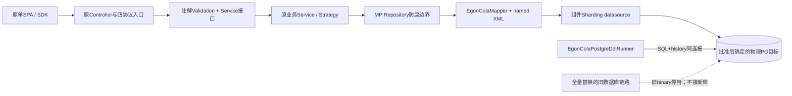
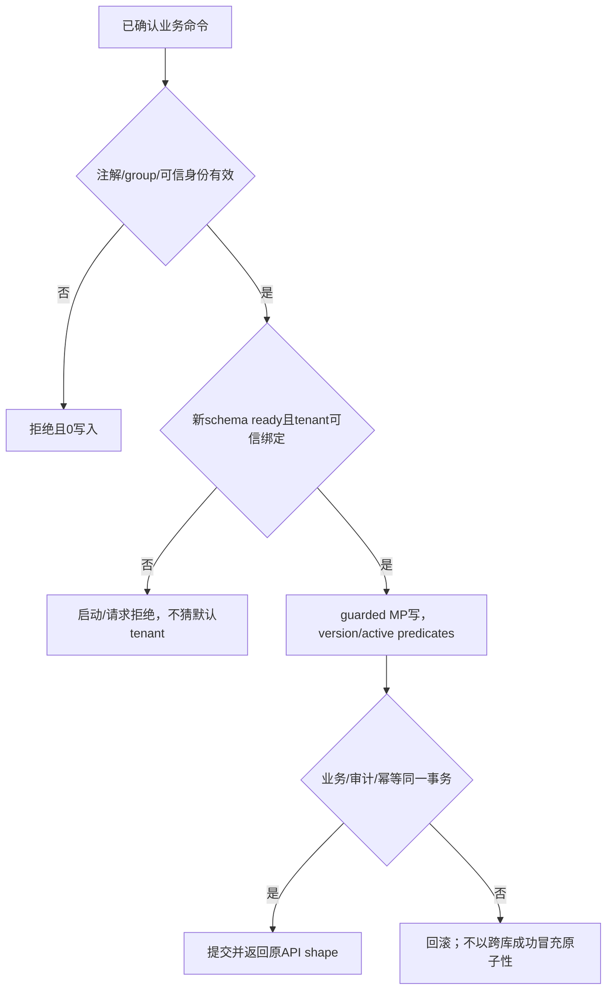
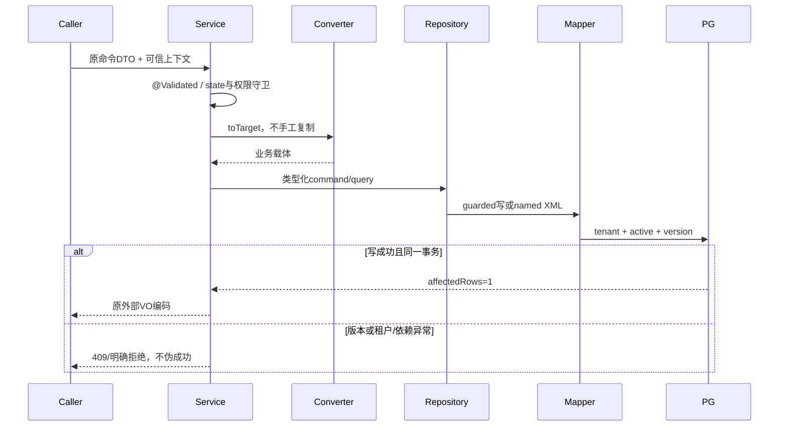

# Yuheng LLM、知识库与 Wiki：Java/CQE 最新规范修订

| Field | Value |
| --- | --- |
| Document | `docs/egon/spec/2026-09-22-16-30-yuheng-java-cqe-standards-amendment.md` |
| Template Version | `7` |
| Status | `Review` |
| Type | `Architecture amendment` |
| Complexity | `Complex` |
| Complexity Drivers | 已批准旧设计与新MP/DDL规范冲突、身份与事务/数据源边界、普通class替换record、软删除唯一性、分布式DDL恢复 |
| Created | `2026-09-22 16:30 CST` |
| Updated | `2026-09-23 06:25 CST` |
| Owner | `mario` |
| Repository | `Egon-COLA` |
| Scope | Yuheng admin既有40表与9个AI新表全量MP/DDL迁移，以及MCP两个共享表适配器；不迁旧数据 |
| Change Surface | 既有admin全部数据库访问改MP、空库受管DDL、MCP共享存储适配、三AI能力及类型/校验/枚举/配置；不改archetypes或generator |
| Affected Chapters | `§7, §8, §10, §11, §13, §14, §15, §16, §17, §18` |
| Source Requirement | 2026-09-22用户确认前稿，要求适配最新writing-spec规范并写writing-plan；明确本次不使用code generator；随后确认“迁移一下，旧数据不考虑，直接破坏式更新”。 |
| Baseline Revision | `31638eea8a9c99c543d3f172e2a861bdfd19bd19`；开始时git status --short为空；本轮只写文档 |
| Amends | [原业务Spec](2026-09-21-16-58-yuheng-llm-knowledge-wiki-design.md) §3.3、§5.1/5.3 DEC-004、§6、§7持久化/校验/CQE、§8类型及数据访问、§9的CQE术语和内部映射、§10、§11、§13–§20相关规范；原API-001–031、INTERNAL-001、业务状态/页面合同保留 |
| Supersedes | `None` |
| Depends On | [原业务Spec](2026-09-21-16-58-yuheng-llm-knowledge-wiki-design.md) §4、§7.3、§9、§12及其现有双角色发布/传统分层依赖；不继承被本文替换的record/JDBC/Flyway目标方案 |
| Related Specs | [双角色目标隔离](2026-09-05-17-10-gateway-role-target-distribution.md) §7、§11、§16；[RAG机制](2026-09-10-11-34-egon-cola-component-rag-starter.md) §7、§9 |
| Related Plans | [逐文件实施计划](../plan/2026-09-22-16-30-yuheng-llm-knowledge-wiki-implementation.md) |

## 1. Summary

原业务目标已经用户确认：独立LLM engine、Chat/Embeddings/Responses/Messages、本地pgvector与本地embedding、知识/Wiki在admin、单SPA、DIRECT直接发布并维护完整审核/发布状态。本修订仅使该设计遵守2026-09-22最新Java/CQE合同；不回头改变已经确认的业务范围，也不开始代码实现。

普通PO/DTO/VO/Command/Query改为class，持久化PO继承当前EgonModel；不可逆投影使用BaseForwardConverter，枚举显式DB/JSON编码，校验由注解/分组/ConstraintValidator承载。持久化必须采用真实Egon MP Starter、受管DDL，不能把旧稿的JDBC record和新增Flyway V14当作继续有效。**DEC-101已确认全量迁移：既有admin不保留JPA/Flyway运行链路，全部数据使用新空库重建；无copy/backfill/dual-read。** 这是Spec/Plan范围确认，本轮不执行DROP/DDL或实际数据库操作。

本次不使用code generator是用户明确授权的例外；后续实施由计划逐文件人工编写本次源码/SQL/manifest，禁止自制替代生成器、虚构命令或加入FreeMarker/Velocity等工具依赖。MapStruct/Lombok编译期annotation processor不属于本次停用的DDL后端generator。

## 2. Background and Current State

路径别名与原Spec一致：Y=`egon-cola-xingyuan/egon-cola-yuheng`，A为admin Java根，E为拟新增llm Java根，F为现有SPA src。M=`egon-cola-components/egon-cola-component-common/egon-cola-component-common-mybatis-plus-sharding-jdbc-ext-spring-boot-starter/src/main/java/top/egon/cola/component/common/mybatis`，C=`egon-cola-components/egon-cola-component-common/egon-cola-component-common-core/src/main/java/top/egon/cola/component/common/core`。

| Evidence ID | Classification | Exact path/symbol/decision/command | Observed fact | Design significance | Verification limit/freshness |
| --- | --- | --- | --- | --- | --- |
| EVD-101 | User decision | 本轮“确认…别的规范需要适配…本次不使用” | 批准原业务方向并授权规范修订/Plan，不使用generator | 业务保留、规范更新、无需工具等待 | 非生产实施授权 |
| EVD-102 | Static repository | `Y/yuheng-admin/pom.xml`、application.yml | JPA/Flyway仍在，目标新三功能尚未实现 | 新MP不等同换Maven名称；旧链路全量迁移已确定 | 未运行数据库 |
| EVD-103 | Static repository | `M/model/EgonModel.java` | class，@SuperBuilder，Long id/tenantId，Instant审计，LocalDateTime deletedAt，Long version | PO继承链兼容；不能沿用旧record/varchar主键目标 | 2026-09-22当前源码，旧记忆的builder限制不适用 |
| EVD-104 | Static repository | `C/converter/BaseForwardConverter.java` | 真实toTarget及list合同 | 删除旧稿“反向抛异常”伪双向设计 | 静态API |
| EVD-105 | Static repository | `M/autoconfigure/EgonColaShardingAutoConfiguration.java#dataSource` | 固定具名dataSource且@Primary，sharding缺失抛SHARDING_REQUIRED | 新旧数据源/JPA/JDBC事务不能假设自动共存 | 启动装配未运行 |
| EVD-106 | Static repository | `M/ddl/EgonColaPostgreDdlRunner.java`、`ddl/EgonColaDdlTargetBO.java` | 按物理target与script管理history/checksum/fingerprint，非空未管理库拒绝接管 | 不采用原Flyway库伪造history；不改旧SQL | 未验证当前数据库内容 |
| EVD-107 | Static repository | `M/extension/EgonColaRepository.java`、`M/business/EgonColaTenantIdProvider.java` | guarded save/update/delete，queries需named Mapper；tenant来自MDC，无值失败 | 身份、worker/响应线程必须管理tenant上下文 | 必须选定可信tenant映射 |
| EVD-108 | Static repository | `Y/lombok.config` | 已有Qualifier注解传播 | 不修改无关根配置 | 静态配置 |
| EVD-109 | Static repository | 原Spec §10/11、Y源码文件扫描 | 普通record、不可逆强行BaseConverter、九新表均未实现 | 规范改动尚无新业务数据迁移；旧admin仍有独立既有表 | 不代表旧部署没有数据 |

### 2.4 Evidence and current-chain map

| Entry/trigger | Current call chain | Data read/written | External dependency | Consumers | Evidence |
| --- | --- | --- | --- | --- | --- |
| 旧admin管理 | Controller→Service→JpaRepository/JDBC→原PG | 旧gateway表/Flyway history | PostgreSQL/Tianquan | 现有SPA | EVD-102 |
| MP启动 | MybatisPlusAutoConfiguration→ShardingAutoConfiguration→Bootstrapper→逻辑dataSource | topology/routing profiles | 物理PG | MP Repository | EVD-103/105 |
| 新AI目标 | 尚无实现；原Spec设计Admin→知识任务→engine | 九新增业务表 | 本地embedding/pgvector | 原31接口 | EVD-109 |

## 3. Goals and Non-goals

### 3.1 Goals

保留原REQ-001–012并增加REQ-013–016作为规范验收；Plan引用本文及原Spec形成明确有效设计。使每条规则落到类型、API编码、查询、DDL/唯一性和测试，而非仅换术语。

### 3.2 Non-goals

不修改生成器/archetypes；不执行generator/Maven生成/数据库/模型调用；不自动增加Event、缓存、额外前端或DDD层；旧admin全量迁移已获授权；其他平台和组件实现不改；不把已批准旧稿正文重写成另一个规范。

### 3.3 Change Surface and Design Depth

| Area/layer | Disposition | Exact repository evidence | Changed or preserved behavior/contract | Required Spec treatment | Chapter(s) |
| --- | --- | --- | --- | --- | --- |
| 新Java类型/校验/枚举/转换 | Affected | 原§8/10，EVD-103/104 | class默认、稳定编码、注解驱动、单向投影 | 精确类型与验证规则 | §7, §8, §10, §13, §14 |
| 持久化/DDL/配置/事务 | Affected | EVD-102–107 | MP/manifest/tenant/deletedAt；旧链路全量迁移已确定 | 完整目标/DDL/字段/事务设计 | §7, §8, §10, §11, §14, §15, §16, §17, §18 |
| 外部31合同和页面 | Unchanged | 原§9/12 | 路径、JSON、权限、SSE、DIRECT业务语义不变 | 不复制完整合同，定点序列化回归 | §14 |
| 既有双角色发布 | Unchanged | 原§16；V13 | API_RPC/MCP不加LLM枚举 | 旧发布回归 | §16 |
| generator/archetypes | Unchanged | 用户明确范围 | 无运行/写入/依赖 | 范围检查 | §16 |
| 新AI异步Event外发 | Not applicable | 原AI job是持久命令，无新增事件消费者 | 新AI不发Event；既有Kafka Event实际消费持久化另列 | 不制造Outbox依赖和假事件 | §13 |
| 既有Kafka消费/共享MCP存储 | Affected | GatewayKafkaCallEventConsumer、两个JdbcMcp runtime适配器 | 底层全部MP，保留原消息/协议shape、owner与offset语义 | 明确消费事务/两进程对齐 | §7, §8, §13, §14, §15, §16 |

## 4. Requirements and Acceptance Criteria

原REQ-001–012及所有UC/API/状态/验收由原§4/19继续生效；REQ-010中“新Flyway版本”被本轮明确最新规则替换为“一次逻辑变更一个MP-SDJ SQL+manifest”，旧脚本不变。

| ID | Atomic requirement | Priority | Observable acceptance criteria | Source |
| --- | --- | --- | --- | --- |
| REQ-013 | 最新Java/CQE模型与校验规范 | Must | 普通类型class，PO继承EgonModel，enum DB/JSON显式码，forward converter，注解/分组负例通过 | 最新skill规则1–10 |
| REQ-014 | MP+受管DDL与软删除唯一性 | Must | Repository/Mapper/XML，tenant/active/version全链路；唯一键含deleted_at并真正限制active；每target可恢复 | 最新规则11 |
| REQ-015 | 本次不用code generator | Must | 无generator命令/依赖；手写产物范围明确，保留annotation processing | 用户显式指令 |
| REQ-016 | 按已确认全量空库边界迁移旧持久化 | Must | admin既有40表、新9表及MCP共享消费者均列入文件/验收；无旧数据迁移或旧runtime保留 | 用户原范围与skill scope gate |

### 4.1 Scenario matrix

| Scenario | Actor/trigger | Preconditions | Main path | Alternative/failure path | Data/state change | Observable result | Requirements |
| --- | --- | --- | --- | --- | --- | --- | --- |
| DTO输入和直接worker重入 | 用户/worker | 同合法命令 | 注解与group校验 | 无代理路径ValidationUtils触发同元数据 | 非法输入0写入 | 422/类型化失败 | REQ-013 |
| 不可逆PO投影 | API查询 | 有权可见资料 | BaseForwardConverter脱敏投影 | 禁止反向生成PO | 无写入 | JSON不增加tenant/内部锁字段 | REQ-013 |
| 重复业务key | 同tenant并发 | active deleted_at=NULL | DB active UK唯一赢家 | 另一方409 | 不产生第二active | 可删后重建 | REQ-014 |
| DDL部分target失败 | 启动管理者 | 已批准新空目标 | 每script+history一事务 | 后target失败保留前target，不全局回滚 | 可续跑 | 明确失败目标 | REQ-014 |
| scope已确认 | 实施者/运维 | 用户全量空库决策 | 统一49表及共享消费者 | 不允许旧binary连接新库/自动adopt | 本轮无生产改动 | 后续空库验收，无旧数据迁移 | REQ-016 |

### 4.2 Use-case analysis

ACTOR-101=用户/设计审核者（本轮明确请求）；ACTOR-102=后续实施者/运维（DDL执行与恢复责任）；ACTOR-103=原业务用户（原Spec ACTOR-001–005）。

| ID | Use case/goal | Primary actor | Supporting actors/systems | Trigger | Preconditions | Main success outcome | Alternatives/failures | Postconditions | Requirements | Interfaces/pages | Tests |
| --- | --- | --- | --- | --- | --- | --- | --- | --- | --- | --- | --- |
| UC-101 | 审核最新规范适配 | 用户 | 作者/当前组件源码 | 确认并要求Plan | 原业务已确认 | 规则有具体落点 | 迁移scope冲突列明 | 不实施 | REQ-013/015/016 | 本文/Plan | TEST-101 |
| UC-102 | 安全落地新持久化 | 实施者/运维 | MP runner/PG | 后续批准实施 | 全量空库范围/§7.3.1身份/目标明确 | 一次DDL可重试/可验证 | 非空未管理库拒绝 | 旧数据不自动接管 | REQ-014/016 | 原API业务 | TEST-102/103 |
| UC-103 | 保持企业功能合同 | 企业用户 | 同一SPA | 原31业务操作 | 原权限有效 | 外部接口和DIRECT不漂移 | tenant/版本/约束非法拒绝 | 不转云embedding | 原REQ-002–011、REQ-013 | 原UC-001–006 | 原TEST-001–015 |

## 5. Constraints, Assumptions, and Decisions

### 5.1 Confirmed constraints

三层结构不变；本地pgvector/embedding、四协议、Wiki DIRECT+完整状态均不变。最新规范覆盖原普通record/JPA-JDBC/Flyway目标；最新用户回复进一步明确迁移旧admin全部持久化、忽略旧数据。用户已明确跳过generator，不能再次要求安装它。

### 5.2 Small-gap assumptions

None。无新增重大业务假设；单企业部署绑定的持久化tenant配置没有默认值，见§7.3.1。

### 5.3 Resolved decisions

DEC-101：用户选择admin全量MP/DDL迁移，旧数据不考虑、破坏式空库重建；旧SQL历史文件仍不改。DEC-102：原业务Spec已由2026-09-22“确认”接受。DEC-103：generator本次停用，人工编写批准范围内模板产物；原编译器处理器保留。DEC-104：遵循最新class/enum/validation/CQE，充分复用当前components。

### 5.4 Open major decisions

None。DEC-101已经用户明确关闭：全量迁移admin和MCP共享表消费者，目标新空库，不考虑旧数据。当前文档Review仅待整体审核，不是实施授权。

## 6. Project Technology Context

当前Java21、Boot3.5.16、MapStruct1.6.3、springdoc2.8.17；MP坐标是`top.egon:egon-cola-component-common-mybatis-plus-sharding-jdbc-ext-spring-boot-starter`，版本由本仓5.4.0/BOM管理，禁止创造简称artifact。已核实EgonModel父类现在有兼容SuperBuilder。

### 6.1 Java architecture profile and capability baseline

保持Yuheng feature-local traditional：`controller→service接口→service.impl→repository接口→repository实现→dao Mapper/XML`。只新增实际needed packages，不加COLA Maven分层，不改现有业务目录。

| Need | Spring/JDK candidate | Spring Boot Starter candidate | Egon-COLA/module candidate | Proven gap | Decision/dependency impact |
| --- | --- | --- | --- | --- | --- |
| PO生命周期 | 普通Lombok class | 已有validation | EgonModel/SuperBuilder | 旧record不能继承base | 新PO改class，不能复制base字段 |
| 投影 | MapStruct已有 | 无新工具 | BaseForwardConverter | 旧双向接口不适合脱敏投影 | 复用forward，禁止reverse抛异常 |
| 校验 | Jakarta原生+ConstraintValidator | 现有validation | ValidationUtils只通用触发 | 新领域跨字段规则需注解 | 两个局部业务约束，不新Utils |
| 持久化与DDL | 不自制runner | 已有组件 | MP Starter/Repository/Mapper/Runner | admin未消费MP，固定dataSource与旧装配冲突 | 精确引入admin、mcp-gateway和llm-gateway，§7.3.1给出唯一受管目标 |
| Event | 无事件消费者 | 不新增MQ | Outbox可用但本次不需 | None | 不引依赖；未来有Event必须另定真实投递合同 |
| generator | 用户禁用本次 | 不新增 | 正在制作，不调查其输出作为基线 | 非本次必要 | 用户已授权人工模板，不BLOCKED_TOOLING |

### 6.2 User-mandated Java rule compliance

```text
1 类名规范，必须以 java的pojo规范命名。以dao po bo vo dto query command event等结尾
2 每层之间必须被 springboot-validation 校验，复用对象使用分组校验；基于原生和自定义约束注解、@Valid、@Validated 及 ConstraintValidator 扩展实现。ValidationUtils 只承担通用手工校验，不承载全部业务校验；电话号码复用 libphonenumber。
3 Java POJO 默认使用 class，注解为 @Data @NoArgsConstructor @AllArgsConstructor @Accessors(chain = true)，按构造目标选择 @Builder 或 @SuperBuilder；父类状态参与相等性时使用 @EqualsAndHashCode(callSuper = true)。只有不可变 value object 可以使用 record，并豁免 class 的 Lombok 规范；普通实体不能因简单而使用 record。使用 MapStruct、MapStructPlus 和 egon-cola-component-common-core 的 BaseConverter（双向）或 BaseForwardConverter（不可逆投影）进行转换。
4业务类必须使用@Slf4j注解注入log对象。如果业务类被spring管理，必须指定名称，如果是单例的情况下，参考@Service("userService")。如果需要依赖注入，必须@RequiredArgsConstructor进行修饰，不要代码中写。且属性必须被@qualify修饰。
5 工具类只允许使用jdk原生、Apache Commons(commons-lang3、commons-collections4、commons-io、commons-text、commons-codec、commons-beanutils)、Guava。针对Tika按需引入。
6 JSON 使用 Spring Boot Jackson；持久化枚举值使用 @EnumValue，向前端输出的枚举值使用 @JsonValue，禁止 ordinal 作为业务编码。
7 springboot 多环境配置文件，必须保持配置一致，但值不一定一致。
9 复杂业务必须引入设计模式，不允许硬编码
10 日期相关的必须使用java.time下的实体类，不允许使用java.util下的
11 只允许现有三层结构或当前 egon-cola-archetypes 的 DDD 结构，三层结构保持现状。必须尽量复用 egon-cola-components；持久化模块必须使用 Egon COLA MP Starter，DDL 统一由 egon-mp-sdj-ext-starter 分布式管理。业务唯一键必须组合业务列与 deletedAt（数据库 deleted_at），并验证 NULL、租户及重复软删除语义。采用 CQE（Command Query Event）；Event 必须经 egon-cola-component-transactional-outbox-starter 或 MQ 中间件投递。
```

| Literal rule | Affected? | Repository evidence | Exact design decision | Files/types/interfaces | Validation/test evidence | Status/blocker |
| --- | --- | --- | --- | --- | --- | --- |
| Rule 1 | Yes | 原§8/10类型 | 语义后缀和顶层类型保留，snapshot读投影改BO | §8/10 | TYPE/architecture测试 | PASS |
| Rule 2 | Yes | Jakarta/ValidationUtils | 注解+分组+类级ConstraintValidator；工具不承载业务规则 | 约束/command/worker | TEST-101正反例 | PASS |
| Rule 3 | Yes | EgonModel/BaseForwardConverter | class+完整Lombok，PO SuperBuilder/callSuper；无新record | §10 | 构造/投影编译测试 | PASS |
| Rule 4 | Yes | Y/lombok.config | @Slf4j、具名Bean、final Qualifier+RequiredArgsConstructor | 新业务类 | 上下文注入测试 | PASS |
| Rule 5 | Yes | 已批准已有依赖 | JDK/Commons/Guava/Tika按原文本解析范围 | 同原依赖 | import门禁 | PASS |
| Rule 6 | Yes | Jackson/EgonEnum | DB @EnumValue；JSON @JsonValue；显式未知码拒绝 | §10枚举 | 编码快照测试 | PASS |
| Rule 7 | Yes | base/local配置 | 所有新增键同集合，migration scope影响最终内容 | §15 | §15完整profile同键测试 | PASS |
| Rule 9 | Yes | 四协议/任务/发布变化轴 | 保留原Strategy，不用switch | 原§13 | 原TEST-013/015 | PASS |
| Rule 10 | Yes | EgonModel时间字段 | Instant审计，UTC LocalDateTime deletedAt，统一微秒 | §11 | 时间/重复软删测试 | PASS |
| Rule 11 | Yes | EVD-102–107 | MP/DDL强制、CQE C/Q；不静默迁移旧数据 | §7/11/16 | DEC-101全量空库方案；§11完整49表/§7.3.1装配 | PASS |

## 7. Architecture Design

### 7.0 Minimum-design baseline and element-necessity audit

| Proposed element | Change | Requirements | Existing/direct alternative | Concrete inadequacy of alternative | Added calls/state/coupling/failures/migration/operations | Verdict |
| --- | --- | --- | --- | --- | --- | --- |
| 新PO class/MP继承 | Modify design | REQ-013/014 | record/JDBC PO | 不满足最新强制合同 | 无额外业务调用；有base映射 | Add |
| BaseForwardConverter | Replace design | REQ-013 | reverse抛异常 | 伪合同、不能可靠复用 | 减少无用反向方法 | Keep组件能力 |
| Mapper/XML与MP Repository | Replace design | REQ-014 | JDBC直写 | 无MP guarded/version/tenant规则 | 文件增加但使用既有框架，scope待决 | Add |
| 新Outbox/MQ事件 | Candidate | REQ-013 | 持久job命令+事务审计 | 已满足当前无独立消费者的用例 | 新设施/投递/幂等无业务必要性 | Remove |
| generator工具/模板引擎依赖 | Candidate | REQ-015 | 用户授权人工本次文件 | 用户明确不使用 | 工具成本无必要 | Remove |

| Path | Network calls | Client states | Server contracts/state | Failure and TOCTOU points | Additional user/business value |
| --- | --- | --- | --- | --- | --- |
| 原外部合同 | 原SDK/SPA直接业务调用 | 不增加预取状态 | 原31API | 原权限/version校验 | 业务语义已确认 |
| 规范适配 | 与原合同相同 | 无新增租户/参数预取 | 类型/校验/MP内部改变 | 新空库DDL/所有共享消费者同版本部署 | 统一规范而不增加业务调用 |

### 7.1 System Architecture Design



MP是唯一业务DataSource，旧JPA/Flyway runtime移除；虚线表示旧binary退出，而不是两套数据库共存。原双角色发布业务语义保持，底层journal/audit/幂等全部落同一MP事务。

### 7.2 High-Level Design



#### 7.2.2 High-level decision and quality matrix

| Concern/use case | Required behavior | Selected mechanism | Failure/degradation behavior | Trade-off | Verification | Requirements |
| --- | --- | --- | --- | --- | --- | --- |
| API稳定 | class替换不改JSON | Jackson/forward mappings/OAS对照 | schema drift失败 | 更多注解，不新增字段 | TEST-101 | REQ-013 |
| 数据保护 | 旧库不能自动接管 | runner拒非空未知schema | REBUILD_REQUIRED/blocked | 需要范围/迁移设计 | TEST-102 | REQ-014/016 |
| 唯一性 | active唯一且历史可重复软删 | composite+active partial UK | 冲突409，软删时间冲突不能假成功 | 索引/生命周期成本 | TEST-103 | REQ-014 |

### 7.3 Detailed Design



#### 7.3.1 统一数据源与受管DDL启动时序

Admin一个`dataSource`由组件EgonColaShardingAutoConfiguration创建，保留其唯一@Primary，移除全部旧JPA entityManager/Flyway扫描，新增具名`gatewayTransactionManager`（DataSourceTransactionManager）和单一MP SqlSessionFactory。所有admin旧/新业务Repository、audit、幂等/journal同dataSource/TM，禁止按功能域偷偷造第二个连接池。sqlSessionFactory的Mapper扫描为admin各feature.dao；原Service显式@Transactional(transactionManager="gatewayTransactionManager")，现有TransactionTemplate也限定该TM。

`A/config/GatewayManagedDdlConfiguration.java`提供组件现有扩展点名`egonColaShardingLogicalDataSourceFactory`；`GatewayManagedDdlFactory implements EgonColaShardingDataSourceBootstrapper.LogicalDataSourceFactory`由组件已创建的physical map与validated yaml进入：再次调用既有TopologyValidator得到相同profiles/schema/fingerprint→从admin classpath读取并用Jackson解析唯一manifest→把PRIMARY yuheng_0/public按RoleEnum.SHARD形成普通EgonColaDdlTargetBO→runner.run(targets)→仅成功后调用原YamlShardingSphereDataSourceFactory。不得将targets注册为IDdl Bean，不复制bootstrapper、不自行重造fingerprint hash算法。组件当前manifest family只允许内置六个值，本项目采用web作为DDL family标识；这不是把传统分层迁成Web archetype。

Schema-maintainer只能辅助TableInfo核对，不能替代含pgvector/约束/index的显式SQL。runtime flag `egon.cola.component.mybatis-plus.ddl.enabled=true`在admin为必需；mcp/llm读写消费者为false，只校验相同schema-version=20260922_001、SQL SHA256、组件topology fingerprint与数据库history一致后ready。消费者通过各自宿主configuration消费同一组件bootstrapper与同一49逻辑表/1×1拓扑；不依赖admin executable JAR。Readiness metadata检查只读physical metadata，不能用于业务SQL绕过MP。

MCP与LLM仅改各自已有/新增宿主装配，不把MP依赖放入yuheng-contract、core或runtime-core，让API_RPC进程意外携带数据库。所有宿主配置有相同49表拓扑键集合，连接权限按角色限制：admin业务读写/DDL；MCP仅task/approval必要表；LLM仅channel/model SELECT，DDL/KB读取均拒绝。公共schema bootstrap不修改真实外部服务注册/证书身份合同。

#### 7.3.2 单企业可信持久化上下文

配置`yuheng.persistence.tenant-id`为必填正Long，无默认1；`identity-tenant-id`为本部署受信任企业身份tenant字符串、`service-user-id`为本进程内部任务审计主体。数据源本身绑定单企业安装域，不开放多租户切换UI。用户认证成功后若身份带tenant，必须等于配置identity-tenant-id；PLATFORM SERVICE token只在既有audience/scopes/CAP策略通过后映射到该部署域。header/body tenant值从不作为事实来源。MCP owner.tenantId字符串保留到subject_tenant_id，仍参与token/task所有权比较，不与Long持久化tenant混用。

新增宿主`GatewayPersistenceContextComponent`从已验证auth+部署配置产生MDC tenantId/userId；在每次Repository实际执行的线程设置，finally恢复原MDC。Servlet过滤器置于认证后；worker、定时GC、OpenAPI后台、release reconcile、Kafka handle和MCP boundedElastic都在实际SQL supplier内部进入上下文，不能只在创建Mono时设置。服务重入Validation分组保持；缺失部署配置/不匹配身份fail-closed。业务Actor ID与worker审计身份分开记录，不因为worker执行就给发起者超权。

#### 7.3.3 MP写保护、BO与PO职责

真实表PO继承EgonModel并使用完整class/SuperBuilder/callSuper规范。为使机械迁移编译可分步，已有Service载体同名时真实row类型命名为同根RecordPO（仍是普通Java class），原PO迁BO后删除，不保留三套类型。现有31个名为PO的Service载体迁为同feature.domain.bo的同语义BO class，保留其业务字段/公开ID/业务revision/access语义；真正row PO留domain.po，Service不持有PO。复合投影（StoredReport/CapabilityDraft/RecoverableAttempt等）只有BO，不强行映射假表。PO↔BO/VO由MapStruct与BaseForwardConverter处理；新增MP每表PersistenceRepository消费guarded CRUD，原复合Repository facade组合对应PersistenceRepository，不复制通用save/update/remove逻辑。

全部原Jdbc实现移除，由同feature.repository.impl的Mp实现替代，SQL逐条移入精确DAO/XML。普通save先由Service加载当前BO作业务检查，再Repository在同事务加载PO和technical version，映射业务变更，guarded update并检查row count；不得依赖JPA脏检查/flush或Service伪造technical version。旧公开revision按原逻辑保留0起点；新AI按原合同1起点；新MP version独立从0开始。所有自定义状态更新同时携带技术原version和原业务state/lease/revision条件。

旧bulk expiry/sync replace/metric update必须改成先取active id+version，再bounded guarded writes；不能继续无id条件UPDATE或PHYSICAL DELETE。MCP token消费按tokenDigest+owner查active row并锁定/读取version，再id/version/PENDING/expiry/owner CAS；两进程只能一个consume成功。MCP task_key保持base64不变，审批approval_key保持UUID，MP内部id由Snowflake分配，不更改这些协议身份。

#### 7.3.4 pgvector与JSON SQL

所有知识检索在named Mapper XML中限定每个alias的tenant_id=:ctx及deleted_at IS NULL，加入当前document.active revision、member和embedding_space_id/dimensions条件。距离表达用`cosine_distance(c.embedding,CAST(#{queryVectorText} AS vector))`，评分1-distance，stable chunk id排序；函数来自[pgvector官方SQL](https://github.com/pgvector/pgvector/blob/master/sql/vector.sql)，不是新Java数学实现。用JSONB原生函数或支持的JSON操作表达成员/来源，但完整SQL必须通过当前JSQLParser+ShardingSphere测试；禁止忽略tenant/active拦截器来让测试变绿。

`GatewayJsonbTypeHandler`只负责Jackson JSON列编解码；`GatewayVectorTypeHandler`只负责有界有限float[]的JDBC参数/结果表示（JDK JDBC Types.OTHER与vector cast），不新增pgvector-java/数据库驱动第二版本。DTO/PO映射仍走MapStruct，不用这些TypeHandler绕过业务转换。原raw文件bytea上限/解析/本地embedding规则保持。

#### 7.3.5 共享MCP与既有Kafka一致性

`yuheng-mcp-gateway/.../JdbcMcpRuntimeTaskStore`和`.../security/JdbcMcpApprovalAdapter`替换为同模块Mp适配器及两个row DAO/PO/XML；注册处McpGatewayEngineConfiguration同步修改，保持McpTaskStore/McpApprovalPort接口、opaque IDs、owner/lease/state语义。不可只迁admin而把另一个进程留在旧表名/旧String tenant列上。

已有KafkaGatewayCallEventSink真正使用KafkaProducer、acks=all、enable.idempotence=true，但不是DB事务outbox，不承诺应用状态和事件发送原子；producer未纳入本次重写。consumer `GatewayKafkaCallEventConsumer`在handler成功后commitSync，commit失败会seek回放。迁移后的Handler把eventId幂等记录、summary和minute aggregate同一MP事务提交；相同eventId重投不重复计数；poison/failure记录也必须成功持久化后才推进offset。已有event envelope/topic/header语义保持，不新增消费者消息字段。默认不开Kafka时不宣称Event已被可靠外发；新AI job仍是持久Command而不是假Event。

#### 7.3.6 Conclusion evidence chain

| Conclusion | Repository/user evidence | Constraint or requirement | Design decision | Consequence and trade-off | Verification and acceptance evidence |
| --- | --- | --- | --- | --- | --- |
| 普通record必须取消 | 新规则3；EgonModel class | REQ-013 | PO/DTO/VO class；PO SuperBuilder | Wire通过mapper保留，内部构造变动 | constructor+JSON快照 |
| 不可逆转换不再伪双向 | EVD-104 | REQ-013 | BaseForwardConverter | 禁止reverse抛异常 | 编译/敏感字段测试 |
| 不能假设只加MP依赖 | EVD-105/106 | REQ-014/016 | 全量空库、统一MP数据源、保留原业务合同 | 具体装配/旧消费者/测试全部列入Plan | 用户全量空库确认+49表/启动配置测试 |

## 8. Package Structure and Code File Tree

本节为全量目标文件库存，与Plan §5一一对应。业务三层不改；旧Service carrier转BO，真实row同名冲突时用RecordPO class；每表DAO/XML/MP PersistenceRepository负责技术生命周期，复合业务Repository只组合，不复制CRUD。所有新class/enum/typehandler/测试均为人工拥有源文件，不调用后端generator；MapStruct/Lombok产物仅target不提交。

旧JDBC文件在机械BO编译适配后删除；库存只列最终处置，Plan将临时适配与最终删除分步骤明确。曾服务原JPA实体的interface变业务BO接口；新McpApprovalAdminService修正原Controller直接访问Repository的边界，不改变HTTP合同。未改动既有DTO/VO纯合同只复用，不顺手重构其他平台。

| Operation | Path/package | Symbols | Responsibility | Dependencies | Requirements |
| --- | --- | --- | --- | --- | --- |
| MODIFY | `egon-cola-xingyuan/egon-cola-yuheng/pom.xml` | modules/dependencyManagement | 批准坐标/版本与编译消费者 | 原当前符号/Spec§7/10/11；Plan Step 1 | REQ-013/014/016及原对应功能REQ |
| MODIFY | `egon-cola-xingyuan/egon-cola-yuheng/yuheng-admin/pom.xml` | admin dependencies | final dependency cutover: remove spring-boot-starter-data-jpa/flyway-core/flyway-database-postgresql | 原当前符号/Spec§7/10/11；Plan Step 1,9 | REQ-013/014/016及原对应功能REQ |
| CREATE | `egon-cola-xingyuan/egon-cola-yuheng/yuheng-admin/src/test/java/top/egon/cola/component/yuheng/admin/architecture/GatewayAiModuleContractTest.java` | GatewayAiModuleContractTest | dependency/module resources present, pure yuheng-contract/core/runtime-core have no MP inheritance | 原当前符号/Spec§7/10/11；Plan Step 1 | REQ-013/014/016及原对应功能REQ |
| CREATE | `egon-cola-xingyuan/egon-cola-yuheng/yuheng-llm-gateway/pom.xml` | llm executable POM | 批准坐标/版本与编译消费者 | 原当前符号/Spec§7/10/11；Plan Step 1 | REQ-013/014/016及原对应功能REQ |
| CREATE | `egon-cola-xingyuan/egon-cola-yuheng/yuheng-llm-gateway/src/main/java/top/egon/cola/component/yuheng/llm/bootstrap/LlmGatewayApplication.java` | LlmGatewayApplication | single executable main, component scan llm only | 原当前符号/Spec§7/10/11；Plan Step 1 | REQ-013/014/016及原对应功能REQ |
| MODIFY | `egon-cola-xingyuan/egon-cola-yuheng/yuheng-mcp-gateway/pom.xml` | MCP MP dependency | 批准坐标/版本与编译消费者 | 原当前符号/Spec§7/10/11；Plan Step 1 | REQ-013/014/016及原对应功能REQ |
| MODIFY | `egon-cola-xingyuan/egon-cola-yuheng/yuheng-admin/src/main/java/top/egon/cola/component/yuheng/admin/catalog/domain/enums/GatewayCatalogProtocolEnum.java` | GatewayCatalogProtocolEnum | 保留当前所有enum常量/原wire字符串/状态方法 | 原当前符号/Spec§7/10/11；Plan Step 2 | REQ-013/014/016及原对应功能REQ |
| CREATE | `egon-cola-xingyuan/egon-cola-yuheng/yuheng-admin/src/main/java/top/egon/cola/component/yuheng/admin/config/GatewayAiJsonConfiguration.java` | GatewayAiJsonConfiguration | only newAI DTO strict binding, legacyDTO/protocol JSON behavior unchanged | 原当前符号/Spec§7/10/11；Plan Step 2 | REQ-013/014/016及原对应功能REQ |
| CREATE | `egon-cola-xingyuan/egon-cola-yuheng/yuheng-admin/src/main/java/top/egon/cola/component/yuheng/admin/knowledge/domain/dto/KnowledgeAnswerCommandDTO.java` | KnowledgeAnswerCommandDTO | question/sourceMode/topK/searchMode | 原当前符号/Spec§7/10/11；Plan Step 2 | REQ-013/014/016及原对应功能REQ |
| CREATE | `egon-cola-xingyuan/egon-cola-yuheng/yuheng-admin/src/main/java/top/egon/cola/component/yuheng/admin/knowledge/domain/dto/KnowledgeBaseCommandDTO.java` | KnowledgeBaseCommandDTO | name/description/egressPolicy/chatModel/embeddingModel/expectedRevision；Create/Update分组 | 原当前符号/Spec§7/10/11；Plan Step 2 | REQ-013/014/016及原对应功能REQ |
| CREATE | `egon-cola-xingyuan/egon-cola-yuheng/yuheng-admin/src/main/java/top/egon/cola/component/yuheng/admin/knowledge/domain/dto/KnowledgeMemberDTO.java` | KnowledgeMemberDTO | actorId/role | 原当前符号/Spec§7/10/11；Plan Step 2 | REQ-013/014/016及原对应功能REQ |
| CREATE | `egon-cola-xingyuan/egon-cola-yuheng/yuheng-admin/src/main/java/top/egon/cola/component/yuheng/admin/knowledge/domain/dto/KnowledgeUploadCommandDTO.java` | KnowledgeUploadCommandDTO | fileName/mediaType/content bytes/documentId?/expectedRevision?；copy bytes | 原当前符号/Spec§7/10/11；Plan Step 2 | REQ-013/014/016及原对应功能REQ |
| CREATE | `egon-cola-xingyuan/egon-cola-yuheng/yuheng-admin/src/main/java/top/egon/cola/component/yuheng/admin/knowledge/domain/enums/KnowledgeEgressPolicyEnum.java` | KnowledgeEgressPolicyEnum | LOCAL_ONLY, CLOUD_ALLOWED | 原当前符号/Spec§7/10/11；Plan Step 2 | REQ-013/014/016及原对应功能REQ |
| CREATE | `egon-cola-xingyuan/egon-cola-yuheng/yuheng-admin/src/main/java/top/egon/cola/component/yuheng/admin/knowledge/domain/enums/KnowledgeJobStageEnum.java` | KnowledgeJobStageEnum | QUEUED, PARSE, EMBED, GENERATE, PUBLISH, DONE | 原当前符号/Spec§7/10/11；Plan Step 2 | REQ-013/014/016及原对应功能REQ |
| CREATE | `egon-cola-xingyuan/egon-cola-yuheng/yuheng-admin/src/main/java/top/egon/cola/component/yuheng/admin/knowledge/domain/enums/KnowledgeJobStatusEnum.java` | KnowledgeJobStatusEnum | QUEUED,RUNNING,RETRY_WAIT,SUCCEEDED,FAILED,STALE,CANCELLED | 原当前符号/Spec§7/10/11；Plan Step 2 | REQ-013/014/016及原对应功能REQ |
| CREATE | `egon-cola-xingyuan/egon-cola-yuheng/yuheng-admin/src/main/java/top/egon/cola/component/yuheng/admin/knowledge/domain/enums/KnowledgeJobTypeEnum.java` | KnowledgeJobTypeEnum | DOCUMENT_INGEST, WIKI_GENERATE | 原当前符号/Spec§7/10/11；Plan Step 2 | REQ-013/014/016及原对应功能REQ |
| CREATE | `egon-cola-xingyuan/egon-cola-yuheng/yuheng-admin/src/main/java/top/egon/cola/component/yuheng/admin/knowledge/domain/enums/KnowledgeMemberRoleEnum.java` | KnowledgeMemberRoleEnum | READER,EDITOR,OWNER | 原当前符号/Spec§7/10/11；Plan Step 2 | REQ-013/014/016及原对应功能REQ |
| CREATE | `egon-cola-xingyuan/egon-cola-yuheng/yuheng-admin/src/main/java/top/egon/cola/component/yuheng/admin/knowledge/domain/enums/KnowledgeRevisionStatusEnum.java` | KnowledgeRevisionStatusEnum | STAGING, READY, FAILED | 原当前符号/Spec§7/10/11；Plan Step 2 | REQ-013/014/016及原对应功能REQ |
| CREATE | `egon-cola-xingyuan/egon-cola-yuheng/yuheng-admin/src/main/java/top/egon/cola/component/yuheng/admin/knowledge/domain/vo/KnowledgeAnswerVO.java` | KnowledgeAnswerVO | outcome/answer/citations/model | 原当前符号/Spec§7/10/11；Plan Step 2 | REQ-013/014/016及原对应功能REQ |
| CREATE | `egon-cola-xingyuan/egon-cola-yuheng/yuheng-admin/src/main/java/top/egon/cola/component/yuheng/admin/knowledge/domain/vo/KnowledgeBaseVO.java` | KnowledgeBaseVO | 原API-008–011完整结果；id字符串/current role/space/dimensions/revision | 原当前符号/Spec§7/10/11；Plan Step 2 | REQ-013/014/016及原对应功能REQ |
| CREATE | `egon-cola-xingyuan/egon-cola-yuheng/yuheng-admin/src/main/java/top/egon/cola/component/yuheng/admin/knowledge/domain/vo/KnowledgeCitationVO.java` | KnowledgeCitationVO | documentRevisionId/chunkId/sourceHash/documentId/fileName/pageId?/excerpt/score | 原当前符号/Spec§7/10/11；Plan Step 2 | REQ-013/014/016及原对应功能REQ |
| CREATE | `egon-cola-xingyuan/egon-cola-yuheng/yuheng-admin/src/main/java/top/egon/cola/component/yuheng/admin/knowledge/domain/vo/KnowledgeDocumentRevisionVO.java` | KnowledgeDocumentRevisionVO | 原API-016文本和hash；不包含raw_bytes | 原当前符号/Spec§7/10/11；Plan Step 2 | REQ-013/014/016及原对应功能REQ |
| CREATE | `egon-cola-xingyuan/egon-cola-yuheng/yuheng-admin/src/main/java/top/egon/cola/component/yuheng/admin/knowledge/domain/vo/KnowledgeDocumentVO.java` | KnowledgeDocumentVO | id/kbId/fileName/activeRevisionId/latestJobId/revision/status/createdAt | 原当前符号/Spec§7/10/11；Plan Step 2 | REQ-013/014/016及原对应功能REQ |
| CREATE | `egon-cola-xingyuan/egon-cola-yuheng/yuheng-admin/src/main/java/top/egon/cola/component/yuheng/admin/knowledge/domain/vo/KnowledgeJobVO.java` | KnowledgeJobVO | 原job result含stage/attempt/errorCode/revision；无leaseToken | 原当前符号/Spec§7/10/11；Plan Step 2 | REQ-013/014/016及原对应功能REQ |
| CREATE | `egon-cola-xingyuan/egon-cola-yuheng/yuheng-admin/src/main/java/top/egon/cola/component/yuheng/admin/knowledge/domain/vo/KnowledgePageVO.java` | KnowledgePageVO | items/page/size/total泛型page，不增加wrapper | 原当前符号/Spec§7/10/11；Plan Step 2 | REQ-013/014/016及原对应功能REQ |
| CREATE | `egon-cola-xingyuan/egon-cola-yuheng/yuheng-admin/src/main/java/top/egon/cola/component/yuheng/admin/llm/domain/dto/LlmChannelCommandDTO.java` | LlmChannelCommandDTO | key/name/deployment/protocol/baseUrl/secretRef/enabled/timeouts/maxConcurrent/expectedRevision | 原当前符号/Spec§7/10/11；Plan Step 2 | REQ-013/014/016及原对应功能REQ |
| CREATE | `egon-cola-xingyuan/egon-cola-yuheng/yuheng-admin/src/main/java/top/egon/cola/component/yuheng/admin/llm/domain/dto/LlmModelCommandDTO.java` | LlmModelCommandDTO | key/name/kind/protocols/dimensions/embeddingSpaceId/allowedSubjects/routes/expectedRevision | 原当前符号/Spec§7/10/11；Plan Step 2 | REQ-013/014/016及原对应功能REQ |
| CREATE | `egon-cola-xingyuan/egon-cola-yuheng/yuheng-admin/src/main/java/top/egon/cola/component/yuheng/admin/llm/domain/dto/LlmRouteBindingDTO.java` | LlmRouteBindingDTO | channelKey/upstreamModel/priority/weight/capabilities | 原当前符号/Spec§7/10/11；Plan Step 2 | REQ-013/014/016及原对应功能REQ |
| CREATE | `egon-cola-xingyuan/egon-cola-yuheng/yuheng-admin/src/main/java/top/egon/cola/component/yuheng/admin/llm/domain/enums/LlmCapabilityEnum.java` | LlmCapabilityEnum | TEXT, FUNCTION_TOOLS, STRUCTURED_OUTPUT, VISION, REASONING | 原当前符号/Spec§7/10/11；Plan Step 2 | REQ-013/014/016及原对应功能REQ |
| CREATE | `egon-cola-xingyuan/egon-cola-yuheng/yuheng-admin/src/main/java/top/egon/cola/component/yuheng/admin/llm/domain/enums/LlmDeploymentEnum.java` | LlmDeploymentEnum | LOCAL, CLOUD | 原当前符号/Spec§7/10/11；Plan Step 2 | REQ-013/014/016及原对应功能REQ |
| CREATE | `egon-cola-xingyuan/egon-cola-yuheng/yuheng-admin/src/main/java/top/egon/cola/component/yuheng/admin/llm/domain/enums/LlmModelKindEnum.java` | LlmModelKindEnum | CHAT, EMBEDDING | 原当前符号/Spec§7/10/11；Plan Step 2 | REQ-013/014/016及原对应功能REQ |
| CREATE | `egon-cola-xingyuan/egon-cola-yuheng/yuheng-admin/src/main/java/top/egon/cola/component/yuheng/admin/llm/domain/enums/LlmProtocolEnum.java` | LlmProtocolEnum | OPENAI_CHAT, OPENAI_EMBEDDING, OPENAI_RESPONSES, ANTHROPIC_MESSAGES | 原当前符号/Spec§7/10/11；Plan Step 2 | REQ-013/014/016及原对应功能REQ |
| CREATE | `egon-cola-xingyuan/egon-cola-yuheng/yuheng-admin/src/main/java/top/egon/cola/component/yuheng/admin/llm/domain/vo/LlmChannelVO.java` | LlmChannelVO | 原API-004/005完整投影，revision>0，secretRef名但无值 | 原当前符号/Spec§7/10/11；Plan Step 2 | REQ-013/014/016及原对应功能REQ |
| CREATE | `egon-cola-xingyuan/egon-cola-yuheng/yuheng-admin/src/main/java/top/egon/cola/component/yuheng/admin/llm/domain/vo/LlmModelVO.java` | LlmModelVO | 原API-006/007完整projection；string enums及route capabilities | 原当前符号/Spec§7/10/11；Plan Step 2 | REQ-013/014/016及原对应功能REQ |
| CREATE | `egon-cola-xingyuan/egon-cola-yuheng/yuheng-admin/src/main/java/top/egon/cola/component/yuheng/admin/llm/validation/LlmModelValidator.java` | LlmModelValidator | EMBEDDING demands dimensions and space and only LOCAL eligible routes; CHAT space fields null | 原当前符号/Spec§7/10/11；Plan Step 2 | REQ-013/014/016及原对应功能REQ |
| CREATE | `egon-cola-xingyuan/egon-cola-yuheng/yuheng-admin/src/main/java/top/egon/cola/component/yuheng/admin/llm/validation/ValidLlmModel.java` | ValidLlmModel | EMBEDDING demands dimensions and space and only LOCAL eligible routes; CHAT space fields null | 原当前符号/Spec§7/10/11；Plan Step 2 | REQ-013/014/016及原对应功能REQ |
| CREATE | `egon-cola-xingyuan/egon-cola-yuheng/yuheng-admin/src/main/java/top/egon/cola/component/yuheng/admin/mcp/domain/enums/McpArtifactStatusEnum.java` | McpArtifactStatusEnum | ACTIVE, REVOKED | 原当前符号/Spec§7/10/11；Plan Step 2 | REQ-013/014/016及原对应功能REQ |
| MODIFY | `egon-cola-xingyuan/egon-cola-yuheng/yuheng-admin/src/main/java/top/egon/cola/component/yuheng/admin/mcp/domain/enums/McpCapabilityKindEnum.java` | McpCapabilityKindEnum | 保留当前所有enum常量/原wire字符串/状态方法 | 原当前符号/Spec§7/10/11；Plan Step 2 | REQ-013/014/016及原对应功能REQ |
| CREATE | `egon-cola-xingyuan/egon-cola-yuheng/yuheng-admin/src/main/java/top/egon/cola/component/yuheng/admin/mcp/domain/enums/McpPersistentApprovalStatusEnum.java` | McpPersistentApprovalStatusEnum | PENDING, CONSUMED, EXPIRED, REVOKED | 原当前符号/Spec§7/10/11；Plan Step 2 | REQ-013/014/016及原对应功能REQ |
| CREATE | `egon-cola-xingyuan/egon-cola-yuheng/yuheng-admin/src/main/java/top/egon/cola/component/yuheng/admin/mcp/domain/enums/McpPersistentDialectEnum.java` | McpPersistentDialectEnum | STABLE_2025_11_25, RC_2026_07_28, LEGACY_2024_SSE | 原当前符号/Spec§7/10/11；Plan Step 2 | REQ-013/014/016及原对应功能REQ |
| CREATE | `egon-cola-xingyuan/egon-cola-yuheng/yuheng-admin/src/main/java/top/egon/cola/component/yuheng/admin/mcp/domain/enums/McpPersistentRiskLevelEnum.java` | McpPersistentRiskLevelEnum | LOW, MEDIUM, HIGH, CRITICAL | 原当前符号/Spec§7/10/11；Plan Step 2 | REQ-013/014/016及原对应功能REQ |
| CREATE | `egon-cola-xingyuan/egon-cola-yuheng/yuheng-admin/src/main/java/top/egon/cola/component/yuheng/admin/mcp/domain/enums/McpPersistentTaskStateEnum.java` | McpPersistentTaskStateEnum | WORKING, INPUT_REQUIRED, COMPLETED, FAILED, CANCELLED | 原当前符号/Spec§7/10/11；Plan Step 2 | REQ-013/014/016及原对应功能REQ |
| CREATE | `egon-cola-xingyuan/egon-cola-yuheng/yuheng-admin/src/main/java/top/egon/cola/component/yuheng/admin/mcp/domain/enums/McpPromptSourceEnum.java` | McpPromptSourceEnum | LOCAL_TEMPLATE, STATIC_TEMPLATE, STRICT_TEMPLATE, LOCAL_OPERATION, REMOTE_MCP | 原当前符号/Spec§7/10/11；Plan Step 2 | REQ-013/014/016及原对应功能REQ |
| CREATE | `egon-cola-xingyuan/egon-cola-yuheng/yuheng-admin/src/main/java/top/egon/cola/component/yuheng/admin/mcp/domain/enums/McpProviderStatusEnum.java` | McpProviderStatusEnum | CONFIGURED, SYNCED, DEGRADED, DISABLED | 原当前符号/Spec§7/10/11；Plan Step 2 | REQ-013/014/016及原对应功能REQ |
| CREATE | `egon-cola-xingyuan/egon-cola-yuheng/yuheng-admin/src/main/java/top/egon/cola/component/yuheng/admin/mcp/domain/enums/McpResourceDriverEnum.java` | McpResourceDriverEnum | STATIC_TEXT, STATIC_BLOB, LOCAL_OPERATION, OBJECT_STORAGE, DATABASE_SCHEMA, APP_UI, REMOTE_MCP | 原当前符号/Spec§7/10/11；Plan Step 2 | REQ-013/014/016及原对应功能REQ |
| CREATE | `egon-cola-xingyuan/egon-cola-yuheng/yuheng-admin/src/main/java/top/egon/cola/component/yuheng/admin/mcp/domain/enums/McpTransportTypeEnum.java` | McpTransportTypeEnum | STREAMABLE_HTTP, LEGACY_SSE, STDIO_MANAGED | 原当前符号/Spec§7/10/11；Plan Step 2 | REQ-013/014/016及原对应功能REQ |
| MODIFY | `egon-cola-xingyuan/egon-cola-yuheng/yuheng-admin/src/main/java/top/egon/cola/component/yuheng/admin/observability/domain/enums/GatewayCallEventConsumeResultEnum.java` | GatewayCallEventConsumeResultEnum | 保留当前所有enum常量/原wire字符串/状态方法 | 原当前符号/Spec§7/10/11；Plan Step 2 | REQ-013/014/016及原对应功能REQ |
| MODIFY | `egon-cola-xingyuan/egon-cola-yuheng/yuheng-admin/src/main/java/top/egon/cola/component/yuheng/admin/openapi/domain/enums/GatewayOpenApiSyncStateEnum.java` | GatewayOpenApiSyncStateEnum | 保留当前所有enum常量/原wire字符串/状态方法 | 原当前符号/Spec§7/10/11；Plan Step 2 | REQ-013/014/016及原对应功能REQ |
| CREATE | `egon-cola-xingyuan/egon-cola-yuheng/yuheng-admin/src/main/java/top/egon/cola/component/yuheng/admin/openapi/domain/enums/GatewayOpenApiValidationStatusEnum.java` | GatewayOpenApiValidationStatusEnum | VALID, INVALID | 原当前符号/Spec§7/10/11；Plan Step 2 | REQ-013/014/016及原对应功能REQ |
| MODIFY | `egon-cola-xingyuan/egon-cola-yuheng/yuheng-admin/src/main/java/top/egon/cola/component/yuheng/admin/release/domain/enums/GatewayPublicationPhaseEnum.java` | GatewayPublicationPhaseEnum | 保留当前所有enum常量/原wire字符串/状态方法 | 原当前符号/Spec§7/10/11；Plan Step 2 | REQ-013/014/016及原对应功能REQ |
| MODIFY | `egon-cola-xingyuan/egon-cola-yuheng/yuheng-admin/src/main/java/top/egon/cola/component/yuheng/admin/release/domain/enums/GatewayPublicationStatusEnum.java` | GatewayPublicationStatusEnum | 保留当前所有enum常量/原wire字符串/状态方法 | 原当前符号/Spec§7/10/11；Plan Step 2 | REQ-013/014/016及原对应功能REQ |
| MODIFY | `egon-cola-xingyuan/egon-cola-yuheng/yuheng-admin/src/main/java/top/egon/cola/component/yuheng/admin/release/domain/enums/GatewayReleaseStatus.java` | GatewayReleaseStatus | 保留当前所有enum常量/原wire字符串/状态方法 | 原当前符号/Spec§7/10/11；Plan Step 2 | REQ-013/014/016及原对应功能REQ |
| MODIFY | `egon-cola-xingyuan/egon-cola-yuheng/yuheng-admin/src/main/java/top/egon/cola/component/yuheng/admin/shared/domain/enums/AdminActorTypeEnum.java` | AdminActorTypeEnum | 保留当前所有enum常量/原wire字符串/状态方法 | 原当前符号/Spec§7/10/11；Plan Step 2 | REQ-013/014/016及原对应功能REQ |
| CREATE | `egon-cola-xingyuan/egon-cola-yuheng/yuheng-admin/src/main/java/top/egon/cola/component/yuheng/admin/shared/domain/validation/CreateGroup.java` | CreateGroup | 顶层校验group marker；无字段/构造器 | 原当前符号/Spec§7/10/11；Plan Step 2 | REQ-013/014/016及原对应功能REQ |
| CREATE | `egon-cola-xingyuan/egon-cola-yuheng/yuheng-admin/src/main/java/top/egon/cola/component/yuheng/admin/shared/domain/validation/ExecuteGroup.java` | ExecuteGroup | 顶层校验group marker；无字段/构造器 | 原当前符号/Spec§7/10/11；Plan Step 2 | REQ-013/014/016及原对应功能REQ |
| CREATE | `egon-cola-xingyuan/egon-cola-yuheng/yuheng-admin/src/main/java/top/egon/cola/component/yuheng/admin/shared/domain/validation/UpdateGroup.java` | UpdateGroup | 顶层校验group marker；无字段/构造器 | 原当前符号/Spec§7/10/11；Plan Step 2 | REQ-013/014/016及原对应功能REQ |
| CREATE | `egon-cola-xingyuan/egon-cola-yuheng/yuheng-admin/src/main/java/top/egon/cola/component/yuheng/admin/wiki/domain/dto/WikiDraftCommandDTO.java` | WikiDraftCommandDTO | title/markdown/tags/links/sources/expectedRevision | 原当前符号/Spec§7/10/11；Plan Step 2 | REQ-013/014/016及原对应功能REQ |
| CREATE | `egon-cola-xingyuan/egon-cola-yuheng/yuheng-admin/src/main/java/top/egon/cola/component/yuheng/admin/wiki/domain/dto/WikiGenerationCommandDTO.java` | WikiGenerationCommandDTO | sourceRevisionIds/pageId?/expectedRevision | 原当前符号/Spec§7/10/11；Plan Step 2 | REQ-013/014/016及原对应功能REQ |
| CREATE | `egon-cola-xingyuan/egon-cola-yuheng/yuheng-admin/src/main/java/top/egon/cola/component/yuheng/admin/wiki/domain/dto/WikiPublicationCommandDTO.java` | WikiPublicationCommandDTO | draftRevisionId/expectedRevision | 原当前符号/Spec§7/10/11；Plan Step 2 | REQ-013/014/016及原对应功能REQ |
| CREATE | `egon-cola-xingyuan/egon-cola-yuheng/yuheng-admin/src/main/java/top/egon/cola/component/yuheng/admin/wiki/domain/dto/WikiSourceDTO.java` | WikiSourceDTO | documentRevisionId/chunkId/sourceHash | 原当前符号/Spec§7/10/11；Plan Step 2 | REQ-013/014/016及原对应功能REQ |
| CREATE | `egon-cola-xingyuan/egon-cola-yuheng/yuheng-admin/src/main/java/top/egon/cola/component/yuheng/admin/wiki/domain/dto/WikiTransitionCommandDTO.java` | WikiTransitionCommandDTO | pageId/revisionId/event/expectedPageRevision/expectedPublicationVersion/reasonCode | 原当前符号/Spec§7/10/11；Plan Step 2 | REQ-013/014/016及原对应功能REQ |
| CREATE | `egon-cola-xingyuan/egon-cola-yuheng/yuheng-admin/src/main/java/top/egon/cola/component/yuheng/admin/wiki/domain/enums/WikiPublicationPolicyEnum.java` | WikiPublicationPolicyEnum | DIRECT,REVIEW_REQUIRED | 原当前符号/Spec§7/10/11；Plan Step 2 | REQ-013/014/016及原对应功能REQ |
| CREATE | `egon-cola-xingyuan/egon-cola-yuheng/yuheng-admin/src/main/java/top/egon/cola/component/yuheng/admin/wiki/domain/enums/WikiPublicationStatusEnum.java` | WikiPublicationStatusEnum | DRAFT,PUBLISHING,PUBLISHED,SUPERSEDED,ARCHIVED | 原当前符号/Spec§7/10/11；Plan Step 2 | REQ-013/014/016及原对应功能REQ |
| CREATE | `egon-cola-xingyuan/egon-cola-yuheng/yuheng-admin/src/main/java/top/egon/cola/component/yuheng/admin/wiki/domain/enums/WikiReviewStatusEnum.java` | WikiReviewStatusEnum | NOT_REQUIRED,NOT_SUBMITTED,PENDING,APPROVED,REJECTED,CANCELLED | 原当前符号/Spec§7/10/11；Plan Step 2 | REQ-013/014/016及原对应功能REQ |
| CREATE | `egon-cola-xingyuan/egon-cola-yuheng/yuheng-admin/src/main/java/top/egon/cola/component/yuheng/admin/wiki/domain/enums/WikiSourceValidityEnum.java` | WikiSourceValidityEnum | CURRENT,STALE,INACCESSIBLE | 原当前符号/Spec§7/10/11；Plan Step 2 | REQ-013/014/016及原对应功能REQ |
| CREATE | `egon-cola-xingyuan/egon-cola-yuheng/yuheng-admin/src/main/java/top/egon/cola/component/yuheng/admin/wiki/domain/enums/WikiTransitionEventEnum.java` | WikiTransitionEventEnum | CREATE_REVISION,DIRECT_PUBLISH,COMMIT_PUBLICATION,PUBLICATION_FAILURE,REPEAT_PUBLICATION,REPLACE_DRAFT,UNPUBLISH,RESTORE_CONTENT,SUBMIT_REVIEW,APPROVE,REJECT,CANCEL_REVIEW,REVIEWED_PUBLISH | 原当前符号/Spec§7/10/11；Plan Step 2 | REQ-013/014/016及原对应功能REQ |
| CREATE | `egon-cola-xingyuan/egon-cola-yuheng/yuheng-admin/src/main/java/top/egon/cola/component/yuheng/admin/wiki/domain/vo/WikiGraphVO.java` | WikiGraphVO | nodes/edges/truncated，节点/边均限定可见published | 原当前符号/Spec§7/10/11；Plan Step 2 | REQ-013/014/016及原对应功能REQ |
| CREATE | `egon-cola-xingyuan/egon-cola-yuheng/yuheng-admin/src/main/java/top/egon/cola/component/yuheng/admin/wiki/domain/vo/WikiPageVO.java` | WikiPageVO | 原API-023–027完整页面和五状态字段，内部review metadata不外露 | 原当前符号/Spec§7/10/11；Plan Step 2 | REQ-013/014/016及原对应功能REQ |
| CREATE | `egon-cola-xingyuan/egon-cola-yuheng/yuheng-admin/src/main/java/top/egon/cola/component/yuheng/admin/wiki/domain/vo/WikiTransitionResultVO.java` | WikiTransitionResultVO | pageId/revisionId/publicationStatus/reviewStatus/publicationVersion/pageRevision/changed | 原当前符号/Spec§7/10/11；Plan Step 2 | REQ-013/014/016及原对应功能REQ |
| CREATE | `egon-cola-xingyuan/egon-cola-yuheng/yuheng-admin/src/main/java/top/egon/cola/component/yuheng/admin/wiki/validation/ValidWikiTransition.java` | ValidWikiTransition | event and version fields required; no caller review state/reviewer override | 原当前符号/Spec§7/10/11；Plan Step 2 | REQ-013/014/016及原对应功能REQ |
| CREATE | `egon-cola-xingyuan/egon-cola-yuheng/yuheng-admin/src/main/java/top/egon/cola/component/yuheng/admin/wiki/validation/WikiTransitionValidator.java` | WikiTransitionValidator | event and version fields required; no caller review state/reviewer override | 原当前符号/Spec§7/10/11；Plan Step 2 | REQ-013/014/016及原对应功能REQ |
| CREATE | `egon-cola-xingyuan/egon-cola-yuheng/yuheng-admin/src/test/java/top/egon/cola/component/yuheng/admin/architecture/AiCarrierContractTest.java` | AiCarrierContractTest | ordinary POJO is class; enum wire value snapshot stable; group and custom constraints reject inconsistent models | 原当前符号/Spec§7/10/11；Plan Step 2 | REQ-013/014/016及原对应功能REQ |
| CREATE | `egon-cola-xingyuan/egon-cola-yuheng/yuheng-llm-gateway/src/main/java/top/egon/cola/component/yuheng/llm/proxy/domain/enums/LlmCapabilityEnum.java` | LlmCapabilityEnum | TEXT,FUNCTION_TOOLS,STRUCTURED_OUTPUT,VISION,REASONING | 原当前符号/Spec§7/10/11；Plan Step 2 | REQ-013/014/016及原对应功能REQ |
| CREATE | `egon-cola-xingyuan/egon-cola-yuheng/yuheng-llm-gateway/src/main/java/top/egon/cola/component/yuheng/llm/proxy/domain/enums/LlmDeploymentEnum.java` | LlmDeploymentEnum | LOCAL, CLOUD | 原当前符号/Spec§7/10/11；Plan Step 2 | REQ-013/014/016及原对应功能REQ |
| CREATE | `egon-cola-xingyuan/egon-cola-yuheng/yuheng-llm-gateway/src/main/java/top/egon/cola/component/yuheng/llm/proxy/domain/enums/LlmModelKindEnum.java` | LlmModelKindEnum | CHAT, EMBEDDING | 原当前符号/Spec§7/10/11；Plan Step 2 | REQ-013/014/016及原对应功能REQ |
| CREATE | `egon-cola-xingyuan/egon-cola-yuheng/yuheng-llm-gateway/src/main/java/top/egon/cola/component/yuheng/llm/proxy/domain/enums/LlmProtocolEnum.java` | LlmProtocolEnum | OPENAI_CHAT,OPENAI_EMBEDDING,OPENAI_RESPONSES,ANTHROPIC_MESSAGES | 原当前符号/Spec§7/10/11；Plan Step 2 | REQ-013/014/016及原对应功能REQ |
| CREATE | `egon-cola-xingyuan/egon-cola-yuheng/yuheng-mcp-gateway/src/main/java/top/egon/cola/component/yuheng/mcp/engine/mcp/domain/enums/McpPersistentApprovalStatusEnum.java` | McpPersistentApprovalStatusEnum | PENDING, CONSUMED, EXPIRED, REVOKED | 原当前符号/Spec§7/10/11；Plan Step 2 | REQ-013/014/016及原对应功能REQ |
| CREATE | `egon-cola-xingyuan/egon-cola-yuheng/yuheng-mcp-gateway/src/main/java/top/egon/cola/component/yuheng/mcp/engine/mcp/domain/enums/McpPersistentTaskStateEnum.java` | McpPersistentTaskStateEnum | WORKING, INPUT_REQUIRED, COMPLETED, FAILED, CANCELLED | 原当前符号/Spec§7/10/11；Plan Step 2 | REQ-013/014/016及原对应功能REQ |
| CREATE | `egon-cola-xingyuan/egon-cola-yuheng/yuheng-admin/src/main/java/top/egon/cola/component/yuheng/admin/application/dao/GatewayApplicationDAO.java` | GatewayApplicationDAO | EgonColaMapper<GatewayApplicationRecordPO>; mandatory methods + original scoped named queries | 原当前符号/Spec§7/10/11；Plan Step 3 | REQ-013/014/016及原对应功能REQ |
| CREATE | `egon-cola-xingyuan/egon-cola-yuheng/yuheng-admin/src/main/java/top/egon/cola/component/yuheng/admin/application/domain/po/GatewayApplicationRecordPO.java` | GatewayApplicationRecordPO | application_code:varchar(128), display_name:varchar(256), env:varchar(64), namespace:varchar(128), description:varchar(1024), revision:bigint, biz_code:varchar(128) | 原当前符号/Spec§7/10/11；Plan Step 3 | REQ-013/014/016及原对应功能REQ |
| CREATE | `egon-cola-xingyuan/egon-cola-yuheng/yuheng-admin/src/main/java/top/egon/cola/component/yuheng/admin/application/repository/mp/GatewayApplicationPersistenceRepository.java` | GatewayApplicationPersistenceRepository | EgonColaRepository<GatewayApplicationDAO,GatewayApplicationRecordPO> | 原当前符号/Spec§7/10/11；Plan Step 3 | REQ-013/014/016及原对应功能REQ |
| CREATE | `egon-cola-xingyuan/egon-cola-yuheng/yuheng-admin/src/main/java/top/egon/cola/component/yuheng/admin/catalog/dao/GatewayBusinessDomainDAO.java` | GatewayBusinessDomainDAO | EgonColaMapper<GatewayBusinessDomainPO>; mandatory methods + original scoped named queries | 原当前符号/Spec§7/10/11；Plan Step 3 | REQ-013/014/016及原对应功能REQ |
| CREATE | `egon-cola-xingyuan/egon-cola-yuheng/yuheng-admin/src/main/java/top/egon/cola/component/yuheng/admin/catalog/dao/GatewayEntityDomainDAO.java` | GatewayEntityDomainDAO | EgonColaMapper<GatewayEntityDomainPO>; mandatory methods + original scoped named queries | 原当前符号/Spec§7/10/11；Plan Step 3 | REQ-013/014/016及原对应功能REQ |
| CREATE | `egon-cola-xingyuan/egon-cola-yuheng/yuheng-admin/src/main/java/top/egon/cola/component/yuheng/admin/catalog/dao/GatewayInterfaceGroupDAO.java` | GatewayInterfaceGroupDAO | EgonColaMapper<GatewayInterfaceGroupPO>; mandatory methods + original scoped named queries | 原当前符号/Spec§7/10/11；Plan Step 3 | REQ-013/014/016及原对应功能REQ |
| CREATE | `egon-cola-xingyuan/egon-cola-yuheng/yuheng-admin/src/main/java/top/egon/cola/component/yuheng/admin/catalog/dao/GatewayOperationDAO.java` | GatewayOperationDAO | EgonColaMapper<GatewayOperationRecordPO>; mandatory methods + original scoped named queries | 原当前符号/Spec§7/10/11；Plan Step 3 | REQ-013/014/016及原对应功能REQ |
| CREATE | `egon-cola-xingyuan/egon-cola-yuheng/yuheng-admin/src/main/java/top/egon/cola/component/yuheng/admin/catalog/dao/GatewayOperationDefinitionDAO.java` | GatewayOperationDefinitionDAO | EgonColaMapper<GatewayOperationDefinitionRecordPO>; mandatory methods + original scoped named queries | 原当前符号/Spec§7/10/11；Plan Step 3 | REQ-013/014/016及原对应功能REQ |
| CREATE | `egon-cola-xingyuan/egon-cola-yuheng/yuheng-admin/src/main/java/top/egon/cola/component/yuheng/admin/catalog/domain/po/GatewayBusinessDomainPO.java` | GatewayBusinessDomainPO | application_id:bigint, code:varchar(128), display_name:varchar(256), description:varchar(1024) | 原当前符号/Spec§7/10/11；Plan Step 3 | REQ-013/014/016及原对应功能REQ |
| CREATE | `egon-cola-xingyuan/egon-cola-yuheng/yuheng-admin/src/main/java/top/egon/cola/component/yuheng/admin/catalog/domain/po/GatewayEntityDomainPO.java` | GatewayEntityDomainPO | business_domain_id:bigint, code:varchar(128), display_name:varchar(256), description:varchar(1024) | 原当前符号/Spec§7/10/11；Plan Step 3 | REQ-013/014/016及原对应功能REQ |
| CREATE | `egon-cola-xingyuan/egon-cola-yuheng/yuheng-admin/src/main/java/top/egon/cola/component/yuheng/admin/catalog/domain/po/GatewayInterfaceGroupPO.java` | GatewayInterfaceGroupPO | entity_domain_id:bigint, code:varchar(256), display_name:varchar(256), source_type:varchar(32), class_name:varchar(512), description:varchar(1024) | 原当前符号/Spec§7/10/11；Plan Step 3 | REQ-013/014/016及原对应功能REQ |
| CREATE | `egon-cola-xingyuan/egon-cola-yuheng/yuheng-admin/src/main/java/top/egon/cola/component/yuheng/admin/catalog/domain/po/GatewayOperationDefinitionRecordPO.java` | GatewayOperationDefinitionRecordPO | operation_id:bigint, definition_set_id:bigint, definition_version:bigint, definition_sha256:varchar(64), summary:varchar(1024), tags:jsonb, request_schema:jsonb, response_schema:jsonb, error_schema:jsonb, descriptor_snapshot:jsonb, attributes:jsonb, external_accessible:boolean | 原当前符号/Spec§7/10/11；Plan Step 3 | REQ-013/014/016及原对应功能REQ |
| CREATE | `egon-cola-xingyuan/egon-cola-yuheng/yuheng-admin/src/main/java/top/egon/cola/component/yuheng/admin/catalog/domain/po/GatewayOperationRecordPO.java` | GatewayOperationRecordPO | application_id:bigint, interface_group_id:bigint, operation_key:varchar(512), protocol:varchar(32), method_identity:varchar(1024), external_accessible:boolean, provider_service_identity:jsonb, source_type:varchar(32), lifecycle_status:varchar(32), current_definition_id:bigint, deprecated_at:timestamptz, revision:bigint | 原当前符号/Spec§7/10/11；Plan Step 3 | REQ-013/014/016及原对应功能REQ |
| CREATE | `egon-cola-xingyuan/egon-cola-yuheng/yuheng-admin/src/main/java/top/egon/cola/component/yuheng/admin/catalog/repository/mp/GatewayBusinessDomainPersistenceRepository.java` | GatewayBusinessDomainPersistenceRepository | EgonColaRepository<GatewayBusinessDomainDAO,GatewayBusinessDomainPO> | 原当前符号/Spec§7/10/11；Plan Step 3 | REQ-013/014/016及原对应功能REQ |
| CREATE | `egon-cola-xingyuan/egon-cola-yuheng/yuheng-admin/src/main/java/top/egon/cola/component/yuheng/admin/catalog/repository/mp/GatewayEntityDomainPersistenceRepository.java` | GatewayEntityDomainPersistenceRepository | EgonColaRepository<GatewayEntityDomainDAO,GatewayEntityDomainPO> | 原当前符号/Spec§7/10/11；Plan Step 3 | REQ-013/014/016及原对应功能REQ |
| CREATE | `egon-cola-xingyuan/egon-cola-yuheng/yuheng-admin/src/main/java/top/egon/cola/component/yuheng/admin/catalog/repository/mp/GatewayInterfaceGroupPersistenceRepository.java` | GatewayInterfaceGroupPersistenceRepository | EgonColaRepository<GatewayInterfaceGroupDAO,GatewayInterfaceGroupPO> | 原当前符号/Spec§7/10/11；Plan Step 3 | REQ-013/014/016及原对应功能REQ |
| CREATE | `egon-cola-xingyuan/egon-cola-yuheng/yuheng-admin/src/main/java/top/egon/cola/component/yuheng/admin/catalog/repository/mp/GatewayOperationDefinitionPersistenceRepository.java` | GatewayOperationDefinitionPersistenceRepository | EgonColaRepository<GatewayOperationDefinitionDAO,GatewayOperationDefinitionRecordPO> | 原当前符号/Spec§7/10/11；Plan Step 3 | REQ-013/014/016及原对应功能REQ |
| CREATE | `egon-cola-xingyuan/egon-cola-yuheng/yuheng-admin/src/main/java/top/egon/cola/component/yuheng/admin/catalog/repository/mp/GatewayOperationPersistenceRepository.java` | GatewayOperationPersistenceRepository | EgonColaRepository<GatewayOperationDAO,GatewayOperationRecordPO> | 原当前符号/Spec§7/10/11；Plan Step 3 | REQ-013/014/016及原对应功能REQ |
| CREATE | `egon-cola-xingyuan/egon-cola-yuheng/yuheng-admin/src/main/java/top/egon/cola/component/yuheng/admin/credential/dao/GatewayCredentialDAO.java` | GatewayCredentialDAO | EgonColaMapper<GatewayCredentialRecordPO>; mandatory methods + original scoped named queries | 原当前符号/Spec§7/10/11；Plan Step 3 | REQ-013/014/016及原对应功能REQ |
| CREATE | `egon-cola-xingyuan/egon-cola-yuheng/yuheng-admin/src/main/java/top/egon/cola/component/yuheng/admin/credential/domain/po/GatewayCredentialRecordPO.java` | GatewayCredentialRecordPO | application_id:bigint, access_key:varchar(128), secret_ciphertext:text, secret_reference:varchar(512), key_version:varchar(64), status:varchar(32), valid_from:timestamptz, valid_until:timestamptz | 原当前符号/Spec§7/10/11；Plan Step 3 | REQ-013/014/016及原对应功能REQ |
| CREATE | `egon-cola-xingyuan/egon-cola-yuheng/yuheng-admin/src/main/java/top/egon/cola/component/yuheng/admin/credential/repository/mp/GatewayCredentialPersistenceRepository.java` | GatewayCredentialPersistenceRepository | EgonColaRepository<GatewayCredentialDAO,GatewayCredentialRecordPO> | 原当前符号/Spec§7/10/11；Plan Step 3 | REQ-013/014/016及原对应功能REQ |
| CREATE | `egon-cola-xingyuan/egon-cola-yuheng/yuheng-admin/src/main/java/top/egon/cola/component/yuheng/admin/group/dao/GatewayGroupDAO.java` | GatewayGroupDAO | EgonColaMapper<GatewayGroupRecordPO>; mandatory methods + original scoped named queries | 原当前符号/Spec§7/10/11；Plan Step 3 | REQ-013/014/016及原对应功能REQ |
| CREATE | `egon-cola-xingyuan/egon-cola-yuheng/yuheng-admin/src/main/java/top/egon/cola/component/yuheng/admin/group/domain/po/GatewayGroupRecordPO.java` | GatewayGroupRecordPO | gateway_group_code:varchar(128), display_name:varchar(256), env:varchar(64), namespace:varchar(128), description:varchar(1024), enabled:boolean, revision:bigint | 原当前符号/Spec§7/10/11；Plan Step 3 | REQ-013/014/016及原对应功能REQ |
| CREATE | `egon-cola-xingyuan/egon-cola-yuheng/yuheng-admin/src/main/java/top/egon/cola/component/yuheng/admin/group/repository/mp/GatewayGroupPersistenceRepository.java` | GatewayGroupPersistenceRepository | EgonColaRepository<GatewayGroupDAO,GatewayGroupRecordPO> | 原当前符号/Spec§7/10/11；Plan Step 3 | REQ-013/014/016及原对应功能REQ |
| CREATE | `egon-cola-xingyuan/egon-cola-yuheng/yuheng-admin/src/main/java/top/egon/cola/component/yuheng/admin/knowledge/dao/KnowledgeBaseDAO.java` | KnowledgeBaseDAO | EgonColaMapper<KnowledgeBasePO>; mandatory methods + original scoped named queries | 原当前符号/Spec§7/10/11；Plan Step 3 | REQ-013/014/016及原对应功能REQ |
| CREATE | `egon-cola-xingyuan/egon-cola-yuheng/yuheng-admin/src/main/java/top/egon/cola/component/yuheng/admin/knowledge/dao/KnowledgeChunkDAO.java` | KnowledgeChunkDAO | EgonColaMapper<KnowledgeChunkPO>; mandatory methods + original scoped named queries | 原当前符号/Spec§7/10/11；Plan Step 3 | REQ-013/014/016及原对应功能REQ |
| CREATE | `egon-cola-xingyuan/egon-cola-yuheng/yuheng-admin/src/main/java/top/egon/cola/component/yuheng/admin/knowledge/dao/KnowledgeDocumentDAO.java` | KnowledgeDocumentDAO | EgonColaMapper<KnowledgeDocumentPO>; mandatory methods + original scoped named queries | 原当前符号/Spec§7/10/11；Plan Step 3 | REQ-013/014/016及原对应功能REQ |
| CREATE | `egon-cola-xingyuan/egon-cola-yuheng/yuheng-admin/src/main/java/top/egon/cola/component/yuheng/admin/knowledge/dao/KnowledgeDocumentRevisionDAO.java` | KnowledgeDocumentRevisionDAO | EgonColaMapper<KnowledgeDocumentRevisionPO>; mandatory methods + original scoped named queries | 原当前符号/Spec§7/10/11；Plan Step 3 | REQ-013/014/016及原对应功能REQ |
| CREATE | `egon-cola-xingyuan/egon-cola-yuheng/yuheng-admin/src/main/java/top/egon/cola/component/yuheng/admin/knowledge/dao/KnowledgeJobDAO.java` | KnowledgeJobDAO | EgonColaMapper<KnowledgeJobPO>; mandatory methods + original scoped named queries | 原当前符号/Spec§7/10/11；Plan Step 3 | REQ-013/014/016及原对应功能REQ |
| CREATE | `egon-cola-xingyuan/egon-cola-yuheng/yuheng-admin/src/main/java/top/egon/cola/component/yuheng/admin/knowledge/domain/po/KnowledgeBasePO.java` | KnowledgeBasePO | name:varchar(128), description:text, owner_actor_id:varchar(128), members:jsonb, egress_policy:varchar(32), chat_model:varchar(64), embedding_model:varchar(64), embedding_space_id:varchar(128), dimensions:integer, revision:bigint | 原当前符号/Spec§7/10/11；Plan Step 3 | REQ-013/014/016及原对应功能REQ |
| CREATE | `egon-cola-xingyuan/egon-cola-yuheng/yuheng-admin/src/main/java/top/egon/cola/component/yuheng/admin/knowledge/domain/po/KnowledgeChunkPO.java` | KnowledgeChunkPO | kb_id:bigint, revision_id:bigint, chunk_index:integer, content:text, metadata:jsonb, content_hash:char(64), embedding_space_id:varchar(128), dimensions:integer, embedding:vector, revision:bigint | 原当前符号/Spec§7/10/11；Plan Step 3 | REQ-013/014/016及原对应功能REQ |
| CREATE | `egon-cola-xingyuan/egon-cola-yuheng/yuheng-admin/src/main/java/top/egon/cola/component/yuheng/admin/knowledge/domain/po/KnowledgeDocumentPO.java` | KnowledgeDocumentPO | kb_id:bigint, file_name:varchar(255), active_revision_id:bigint, latest_job_id:bigint, revision:bigint | 原当前符号/Spec§7/10/11；Plan Step 3 | REQ-013/014/016及原对应功能REQ |
| CREATE | `egon-cola-xingyuan/egon-cola-yuheng/yuheng-admin/src/main/java/top/egon/cola/component/yuheng/admin/knowledge/domain/po/KnowledgeDocumentRevisionPO.java` | KnowledgeDocumentRevisionPO | kb_id:bigint, document_id:bigint, file_name:varchar(255), media_type:varchar(128), raw_bytes:bytea, byte_count:bigint, content_hash:char(64), extracted_text:text, embedding_space_id:varchar(128), dimensions:integer, chunking_config:jsonb, status:varchar(24), chunk_count:integer, revision:bigint | 原当前符号/Spec§7/10/11；Plan Step 3 | REQ-013/014/016及原对应功能REQ |
| CREATE | `egon-cola-xingyuan/egon-cola-yuheng/yuheng-admin/src/main/java/top/egon/cola/component/yuheng/admin/knowledge/domain/po/KnowledgeJobPO.java` | KnowledgeJobPO | kb_id:bigint, type:varchar(24), resource_id:varchar(64), actor_id:varchar(128), payload:jsonb, idempotency_key:varchar(64), request_hash:char(64), status:varchar(24), stage:varchar(24), attempt:integer, next_attempt_at:timestamptz(6), lease_owner:varchar(128), lease_token:bigint, lease_expires_at:timestamptz(6), error_code:varchar(128), result:jsonb, retry_of_job_id:bigint, revision:bigint | 原当前符号/Spec§7/10/11；Plan Step 3 | REQ-013/014/016及原对应功能REQ |
| CREATE | `egon-cola-xingyuan/egon-cola-yuheng/yuheng-admin/src/main/java/top/egon/cola/component/yuheng/admin/knowledge/repository/mp/KnowledgeBasePersistenceRepository.java` | KnowledgeBasePersistenceRepository | EgonColaRepository<KnowledgeBaseDAO,KnowledgeBasePO> | 原当前符号/Spec§7/10/11；Plan Step 3 | REQ-013/014/016及原对应功能REQ |
| CREATE | `egon-cola-xingyuan/egon-cola-yuheng/yuheng-admin/src/main/java/top/egon/cola/component/yuheng/admin/knowledge/repository/mp/KnowledgeChunkPersistenceRepository.java` | KnowledgeChunkPersistenceRepository | EgonColaRepository<KnowledgeChunkDAO,KnowledgeChunkPO> | 原当前符号/Spec§7/10/11；Plan Step 3 | REQ-013/014/016及原对应功能REQ |
| CREATE | `egon-cola-xingyuan/egon-cola-yuheng/yuheng-admin/src/main/java/top/egon/cola/component/yuheng/admin/knowledge/repository/mp/KnowledgeDocumentPersistenceRepository.java` | KnowledgeDocumentPersistenceRepository | EgonColaRepository<KnowledgeDocumentDAO,KnowledgeDocumentPO> | 原当前符号/Spec§7/10/11；Plan Step 3 | REQ-013/014/016及原对应功能REQ |
| CREATE | `egon-cola-xingyuan/egon-cola-yuheng/yuheng-admin/src/main/java/top/egon/cola/component/yuheng/admin/knowledge/repository/mp/KnowledgeDocumentRevisionPersistenceRepository.java` | KnowledgeDocumentRevisionPersistenceRepository | EgonColaRepository<KnowledgeDocumentRevisionDAO,KnowledgeDocumentRevisionPO> | 原当前符号/Spec§7/10/11；Plan Step 3 | REQ-013/014/016及原对应功能REQ |
| CREATE | `egon-cola-xingyuan/egon-cola-yuheng/yuheng-admin/src/main/java/top/egon/cola/component/yuheng/admin/knowledge/repository/mp/KnowledgeJobPersistenceRepository.java` | KnowledgeJobPersistenceRepository | EgonColaRepository<KnowledgeJobDAO,KnowledgeJobPO> | 原当前符号/Spec§7/10/11；Plan Step 3 | REQ-013/014/016及原对应功能REQ |
| CREATE | `egon-cola-xingyuan/egon-cola-yuheng/yuheng-admin/src/main/java/top/egon/cola/component/yuheng/admin/llm/dao/LlmChannelDAO.java` | LlmChannelDAO | EgonColaMapper<LlmChannelPO>; mandatory methods + original scoped named queries | 原当前符号/Spec§7/10/11；Plan Step 3 | REQ-013/014/016及原对应功能REQ |
| CREATE | `egon-cola-xingyuan/egon-cola-yuheng/yuheng-admin/src/main/java/top/egon/cola/component/yuheng/admin/llm/dao/LlmModelDAO.java` | LlmModelDAO | EgonColaMapper<LlmModelPO>; mandatory methods + original scoped named queries | 原当前符号/Spec§7/10/11；Plan Step 3 | REQ-013/014/016及原对应功能REQ |
| CREATE | `egon-cola-xingyuan/egon-cola-yuheng/yuheng-admin/src/main/java/top/egon/cola/component/yuheng/admin/llm/domain/po/LlmChannelPO.java` | LlmChannelPO | channel_key:varchar(64), name:varchar(128), deployment:varchar(8), protocol:varchar(32), base_url:varchar(2048), secret_ref:varchar(128), enabled:boolean, connect_timeout_ms:integer, header_timeout_ms:integer, idle_timeout_ms:integer, total_timeout_ms:integer, max_concurrent:integer, revision:bigint | 原当前符号/Spec§7/10/11；Plan Step 3 | REQ-013/014/016及原对应功能REQ |
| CREATE | `egon-cola-xingyuan/egon-cola-yuheng/yuheng-admin/src/main/java/top/egon/cola/component/yuheng/admin/llm/domain/po/LlmModelPO.java` | LlmModelPO | model_key:varchar(64), name:varchar(128), kind:varchar(16), protocols:jsonb, enabled:boolean, dimensions:integer, embedding_space_id:varchar(128), allowed_subjects:jsonb, routes:jsonb, revision:bigint | 原当前符号/Spec§7/10/11；Plan Step 3 | REQ-013/014/016及原对应功能REQ |
| CREATE | `egon-cola-xingyuan/egon-cola-yuheng/yuheng-admin/src/main/java/top/egon/cola/component/yuheng/admin/llm/repository/mp/LlmChannelPersistenceRepository.java` | LlmChannelPersistenceRepository | EgonColaRepository<LlmChannelDAO,LlmChannelPO> | 原当前符号/Spec§7/10/11；Plan Step 3 | REQ-013/014/016及原对应功能REQ |
| CREATE | `egon-cola-xingyuan/egon-cola-yuheng/yuheng-admin/src/main/java/top/egon/cola/component/yuheng/admin/llm/repository/mp/LlmModelPersistenceRepository.java` | LlmModelPersistenceRepository | EgonColaRepository<LlmModelDAO,LlmModelPO> | 原当前符号/Spec§7/10/11；Plan Step 3 | REQ-013/014/016及原对应功能REQ |
| CREATE | `egon-cola-xingyuan/egon-cola-yuheng/yuheng-admin/src/main/java/top/egon/cola/component/yuheng/admin/mcp/dao/McpAppBindingDraftDAO.java` | McpAppBindingDraftDAO | EgonColaMapper<McpAppBindingDraftPO>; mandatory methods + original scoped named queries | 原当前符号/Spec§7/10/11；Plan Step 3 | REQ-013/014/016及原对应功能REQ |
| CREATE | `egon-cola-xingyuan/egon-cola-yuheng/yuheng-admin/src/main/java/top/egon/cola/component/yuheng/admin/mcp/dao/McpApprovalDAO.java` | McpApprovalDAO | EgonColaMapper<McpApprovalRecordPO>; mandatory methods + original scoped named queries | 原当前符号/Spec§7/10/11；Plan Step 3 | REQ-013/014/016及原对应功能REQ |
| CREATE | `egon-cola-xingyuan/egon-cola-yuheng/yuheng-admin/src/main/java/top/egon/cola/component/yuheng/admin/mcp/dao/McpArtifactMetadataDAO.java` | McpArtifactMetadataDAO | EgonColaMapper<McpArtifactMetadataRecordPO>; mandatory methods + original scoped named queries | 原当前符号/Spec§7/10/11；Plan Step 3 | REQ-013/014/016及原对应功能REQ |
| CREATE | `egon-cola-xingyuan/egon-cola-yuheng/yuheng-admin/src/main/java/top/egon/cola/component/yuheng/admin/mcp/dao/McpManagedToolOverrideDAO.java` | McpManagedToolOverrideDAO | EgonColaMapper<McpManagedToolOverrideRecordPO>; mandatory methods + original scoped named queries | 原当前符号/Spec§7/10/11；Plan Step 3 | REQ-013/014/016及原对应功能REQ |
| CREATE | `egon-cola-xingyuan/egon-cola-yuheng/yuheng-admin/src/main/java/top/egon/cola/component/yuheng/admin/mcp/dao/McpPromptDraftDAO.java` | McpPromptDraftDAO | EgonColaMapper<McpPromptDraftPO>; mandatory methods + original scoped named queries | 原当前符号/Spec§7/10/11；Plan Step 3 | REQ-013/014/016及原对应功能REQ |
| CREATE | `egon-cola-xingyuan/egon-cola-yuheng/yuheng-admin/src/main/java/top/egon/cola/component/yuheng/admin/mcp/dao/McpRemoteCapabilityDAO.java` | McpRemoteCapabilityDAO | EgonColaMapper<McpRemoteCapabilityRecordPO>; mandatory methods + original scoped named queries | 原当前符号/Spec§7/10/11；Plan Step 3 | REQ-013/014/016及原对应功能REQ |
| CREATE | `egon-cola-xingyuan/egon-cola-yuheng/yuheng-admin/src/main/java/top/egon/cola/component/yuheng/admin/mcp/dao/McpRemoteMountDraftDAO.java` | McpRemoteMountDraftDAO | EgonColaMapper<McpRemoteMountDraftRecordPO>; mandatory methods + original scoped named queries | 原当前符号/Spec§7/10/11；Plan Step 3 | REQ-013/014/016及原对应功能REQ |
| CREATE | `egon-cola-xingyuan/egon-cola-yuheng/yuheng-admin/src/main/java/top/egon/cola/component/yuheng/admin/mcp/dao/McpRemoteProviderDraftDAO.java` | McpRemoteProviderDraftDAO | EgonColaMapper<McpRemoteProviderDraftRecordPO>; mandatory methods + original scoped named queries | 原当前符号/Spec§7/10/11；Plan Step 3 | REQ-013/014/016及原对应功能REQ |
| CREATE | `egon-cola-xingyuan/egon-cola-yuheng/yuheng-admin/src/main/java/top/egon/cola/component/yuheng/admin/mcp/dao/McpRemoteToolDraftDAO.java` | McpRemoteToolDraftDAO | EgonColaMapper<McpRemoteToolDraftRecordPO>; mandatory methods + original scoped named queries | 原当前符号/Spec§7/10/11；Plan Step 3 | REQ-013/014/016及原对应功能REQ |
| CREATE | `egon-cola-xingyuan/egon-cola-yuheng/yuheng-admin/src/main/java/top/egon/cola/component/yuheng/admin/mcp/dao/McpResourceDraftDAO.java` | McpResourceDraftDAO | EgonColaMapper<McpResourceDraftPO>; mandatory methods + original scoped named queries | 原当前符号/Spec§7/10/11；Plan Step 3 | REQ-013/014/016及原对应功能REQ |
| CREATE | `egon-cola-xingyuan/egon-cola-yuheng/yuheng-admin/src/main/java/top/egon/cola/component/yuheng/admin/mcp/dao/McpResourceTemplateDraftDAO.java` | McpResourceTemplateDraftDAO | EgonColaMapper<McpResourceTemplateDraftPO>; mandatory methods + original scoped named queries | 原当前符号/Spec§7/10/11；Plan Step 3 | REQ-013/014/016及原对应功能REQ |
| CREATE | `egon-cola-xingyuan/egon-cola-yuheng/yuheng-admin/src/main/java/top/egon/cola/component/yuheng/admin/mcp/dao/McpServerDAO.java` | McpServerDAO | EgonColaMapper<McpServerRecordPO>; mandatory methods + original scoped named queries | 原当前符号/Spec§7/10/11；Plan Step 3 | REQ-013/014/016及原对应功能REQ |
| CREATE | `egon-cola-xingyuan/egon-cola-yuheng/yuheng-admin/src/main/java/top/egon/cola/component/yuheng/admin/mcp/dao/McpTaskDAO.java` | McpTaskDAO | EgonColaMapper<McpTaskRecordPO>; mandatory methods + original scoped named queries | 原当前符号/Spec§7/10/11；Plan Step 3 | REQ-013/014/016及原对应功能REQ |
| CREATE | `egon-cola-xingyuan/egon-cola-yuheng/yuheng-admin/src/main/java/top/egon/cola/component/yuheng/admin/mcp/dao/McpTaskPolicyDraftDAO.java` | McpTaskPolicyDraftDAO | EgonColaMapper<McpTaskPolicyDraftPO>; mandatory methods + original scoped named queries | 原当前符号/Spec§7/10/11；Plan Step 3 | REQ-013/014/016及原对应功能REQ |
| CREATE | `egon-cola-xingyuan/egon-cola-yuheng/yuheng-admin/src/main/java/top/egon/cola/component/yuheng/admin/mcp/domain/po/McpAppBindingDraftPO.java` | McpAppBindingDraftPO | gateway_group_id:bigint, server_id:bigint, tool_name:varchar(256), app_artifact_id:bigint, content:jsonb, enabled:boolean, revision:bigint | 原当前符号/Spec§7/10/11；Plan Step 3 | REQ-013/014/016及原对应功能REQ |
| CREATE | `egon-cola-xingyuan/egon-cola-yuheng/yuheng-admin/src/main/java/top/egon/cola/component/yuheng/admin/mcp/domain/po/McpApprovalRecordPO.java` | McpApprovalRecordPO | token_digest:varchar(64), subject_id:varchar(128), client_id:varchar(128), server_code:varchar(128), tool_name:varchar(256), argument_digest:varchar(64), status:varchar(32), revision:bigint, issued_at:timestamptz, expires_at:timestamptz, consumed_at:timestamptz, approval_key:varchar(64), subject_tenant_id:varchar(128) | 原当前符号/Spec§7/10/11；Plan Step 3 | REQ-013/014/016及原对应功能REQ |
| CREATE | `egon-cola-xingyuan/egon-cola-yuheng/yuheng-admin/src/main/java/top/egon/cola/component/yuheng/admin/mcp/domain/po/McpArtifactMetadataRecordPO.java` | McpArtifactMetadataRecordPO | gateway_group_id:bigint, app_code:varchar(128), app_version:varchar(64), display_name:varchar(256), resource_uri:varchar(1024), artifact_reference:varchar(1024), artifact_sha256:varchar(64), size_bytes:bigint, mime_type:varchar(128), content_security_policy:text, permission_manifest:jsonb, allowed_origins:jsonb, status:varchar(32) | 原当前符号/Spec§7/10/11；Plan Step 3 | REQ-013/014/016及原对应功能REQ |
| CREATE | `egon-cola-xingyuan/egon-cola-yuheng/yuheng-admin/src/main/java/top/egon/cola/component/yuheng/admin/mcp/domain/po/McpManagedToolOverrideRecordPO.java` | McpManagedToolOverrideRecordPO | tool_id:varchar(64), gateway_group_id:bigint, operation_id:bigint, server_id:bigint, additional_permissions:jsonb, minimum_risk_level:varchar(16), enabled:boolean, revision:bigint | 原当前符号/Spec§7/10/11；Plan Step 3 | REQ-013/014/016及原对应功能REQ |
| CREATE | `egon-cola-xingyuan/egon-cola-yuheng/yuheng-admin/src/main/java/top/egon/cola/component/yuheng/admin/mcp/domain/po/McpPromptDraftPO.java` | McpPromptDraftPO | gateway_group_id:bigint, server_id:bigint, prompt_name:varchar(256), source_type:varchar(32), operation_id:bigint, remote_mount_id:bigint, content:jsonb, enabled:boolean, revision:bigint | 原当前符号/Spec§7/10/11；Plan Step 3 | REQ-013/014/016及原对应功能REQ |
| CREATE | `egon-cola-xingyuan/egon-cola-yuheng/yuheng-admin/src/main/java/top/egon/cola/component/yuheng/admin/mcp/domain/po/McpRemoteCapabilityRecordPO.java` | McpRemoteCapabilityRecordPO | provider_id:bigint, primitive_type:varchar(32), remote_name:varchar(512), descriptor:jsonb, capability_fingerprint:varchar(128), synced_at:timestamptz | 原当前符号/Spec§7/10/11；Plan Step 3 | REQ-013/014/016及原对应功能REQ |
| CREATE | `egon-cola-xingyuan/egon-cola-yuheng/yuheng-admin/src/main/java/top/egon/cola/component/yuheng/admin/mcp/domain/po/McpRemoteMountDraftRecordPO.java` | McpRemoteMountDraftRecordPO | gateway_group_id:bigint, server_id:bigint, provider_id:bigint, namespace:varchar(256), capability_fingerprint:varchar(128), content:jsonb, enabled:boolean, revision:bigint | 原当前符号/Spec§7/10/11；Plan Step 3 | REQ-013/014/016及原对应功能REQ |
| CREATE | `egon-cola-xingyuan/egon-cola-yuheng/yuheng-admin/src/main/java/top/egon/cola/component/yuheng/admin/mcp/domain/po/McpRemoteProviderDraftRecordPO.java` | McpRemoteProviderDraftRecordPO | gateway_group_id:bigint, provider_code:varchar(128), display_name:varchar(256), dialect:varchar(32), transport_type:varchar(32), endpoint_reference:varchar(1024), auth_profile_reference:varchar(512), tls_profile_reference:varchar(512), capability_fingerprint:varchar(128), status:varchar(32), enabled:boolean, revision:bigint | 原当前符号/Spec§7/10/11；Plan Step 3 | REQ-013/014/016及原对应功能REQ |
| CREATE | `egon-cola-xingyuan/egon-cola-yuheng/yuheng-admin/src/main/java/top/egon/cola/component/yuheng/admin/mcp/domain/po/McpRemoteToolDraftRecordPO.java` | McpRemoteToolDraftRecordPO | gateway_group_id:bigint, server_id:bigint, tool_name:varchar(256), remote_mount_id:bigint, content:jsonb, enabled:boolean, revision:bigint | 原当前符号/Spec§7/10/11；Plan Step 3 | REQ-013/014/016及原对应功能REQ |
| CREATE | `egon-cola-xingyuan/egon-cola-yuheng/yuheng-admin/src/main/java/top/egon/cola/component/yuheng/admin/mcp/domain/po/McpResourceDraftPO.java` | McpResourceDraftPO | gateway_group_id:bigint, server_id:bigint, resource_name:varchar(256), resource_uri:varchar(1024), driver_type:varchar(32), operation_id:bigint, remote_mount_id:bigint, content:jsonb, enabled:boolean, revision:bigint | 原当前符号/Spec§7/10/11；Plan Step 3 | REQ-013/014/016及原对应功能REQ |
| CREATE | `egon-cola-xingyuan/egon-cola-yuheng/yuheng-admin/src/main/java/top/egon/cola/component/yuheng/admin/mcp/domain/po/McpResourceTemplateDraftPO.java` | McpResourceTemplateDraftPO | gateway_group_id:bigint, server_id:bigint, template_name:varchar(256), uri_template:varchar(2048), driver_type:varchar(32), operation_id:bigint, remote_mount_id:bigint, content:jsonb, enabled:boolean, revision:bigint | 原当前符号/Spec§7/10/11；Plan Step 3 | REQ-013/014/016及原对应功能REQ |
| CREATE | `egon-cola-xingyuan/egon-cola-yuheng/yuheng-admin/src/main/java/top/egon/cola/component/yuheng/admin/mcp/domain/po/McpServerRecordPO.java` | McpServerRecordPO | gateway_group_id:bigint, server_code:varchar(128), display_name:varchar(256), description:varchar(2048), instructions:text, dialects:jsonb, resource_uri:varchar(256), list_cache_ttl_seconds:bigint, enabled:boolean, revision:bigint | 原当前符号/Spec§7/10/11；Plan Step 3 | REQ-013/014/016及原对应功能REQ |
| CREATE | `egon-cola-xingyuan/egon-cola-yuheng/yuheng-admin/src/main/java/top/egon/cola/component/yuheng/admin/mcp/domain/po/McpTaskPolicyDraftPO.java` | McpTaskPolicyDraftPO | gateway_group_id:bigint, server_id:bigint, tool_name:varchar(256), content:jsonb, enabled:boolean, revision:bigint | 原当前符号/Spec§7/10/11；Plan Step 3 | REQ-013/014/016及原对应功能REQ |
| CREATE | `egon-cola-xingyuan/egon-cola-yuheng/yuheng-admin/src/main/java/top/egon/cola/component/yuheng/admin/mcp/domain/po/McpTaskRecordPO.java` | McpTaskRecordPO | principal_fingerprint:varchar(128), subject_id:varchar(128), client_id:varchar(128), server_code:varchar(128), tool_name:varchar(256), request_digest:varchar(64), state:varchar(32), input_payload:jsonb, result_payload:jsonb, error_payload:jsonb, worker_owner:varchar(256), lease_until:timestamptz, execution_deadline:timestamptz, expires_at:timestamptz, attempt_count:integer, max_attempts:integer, revision:bigint, task_key:varchar(64), subject_tenant_id:varchar(128) | 原当前符号/Spec§7/10/11；Plan Step 3 | REQ-013/014/016及原对应功能REQ |
| CREATE | `egon-cola-xingyuan/egon-cola-yuheng/yuheng-admin/src/main/java/top/egon/cola/component/yuheng/admin/mcp/repository/mp/McpAppBindingDraftPersistenceRepository.java` | McpAppBindingDraftPersistenceRepository | EgonColaRepository<McpAppBindingDraftDAO,McpAppBindingDraftPO> | 原当前符号/Spec§7/10/11；Plan Step 3 | REQ-013/014/016及原对应功能REQ |
| CREATE | `egon-cola-xingyuan/egon-cola-yuheng/yuheng-admin/src/main/java/top/egon/cola/component/yuheng/admin/mcp/repository/mp/McpApprovalPersistenceRepository.java` | McpApprovalPersistenceRepository | EgonColaRepository<McpApprovalDAO,McpApprovalRecordPO> | 原当前符号/Spec§7/10/11；Plan Step 3 | REQ-013/014/016及原对应功能REQ |
| CREATE | `egon-cola-xingyuan/egon-cola-yuheng/yuheng-admin/src/main/java/top/egon/cola/component/yuheng/admin/mcp/repository/mp/McpArtifactMetadataPersistenceRepository.java` | McpArtifactMetadataPersistenceRepository | EgonColaRepository<McpArtifactMetadataDAO,McpArtifactMetadataRecordPO> | 原当前符号/Spec§7/10/11；Plan Step 3 | REQ-013/014/016及原对应功能REQ |
| CREATE | `egon-cola-xingyuan/egon-cola-yuheng/yuheng-admin/src/main/java/top/egon/cola/component/yuheng/admin/mcp/repository/mp/McpManagedToolOverridePersistenceRepository.java` | McpManagedToolOverridePersistenceRepository | EgonColaRepository<McpManagedToolOverrideDAO,McpManagedToolOverrideRecordPO> | 原当前符号/Spec§7/10/11；Plan Step 3 | REQ-013/014/016及原对应功能REQ |
| CREATE | `egon-cola-xingyuan/egon-cola-yuheng/yuheng-admin/src/main/java/top/egon/cola/component/yuheng/admin/mcp/repository/mp/McpPromptDraftPersistenceRepository.java` | McpPromptDraftPersistenceRepository | EgonColaRepository<McpPromptDraftDAO,McpPromptDraftPO> | 原当前符号/Spec§7/10/11；Plan Step 3 | REQ-013/014/016及原对应功能REQ |
| CREATE | `egon-cola-xingyuan/egon-cola-yuheng/yuheng-admin/src/main/java/top/egon/cola/component/yuheng/admin/mcp/repository/mp/McpRemoteCapabilityPersistenceRepository.java` | McpRemoteCapabilityPersistenceRepository | EgonColaRepository<McpRemoteCapabilityDAO,McpRemoteCapabilityRecordPO> | 原当前符号/Spec§7/10/11；Plan Step 3 | REQ-013/014/016及原对应功能REQ |
| CREATE | `egon-cola-xingyuan/egon-cola-yuheng/yuheng-admin/src/main/java/top/egon/cola/component/yuheng/admin/mcp/repository/mp/McpRemoteMountDraftPersistenceRepository.java` | McpRemoteMountDraftPersistenceRepository | EgonColaRepository<McpRemoteMountDraftDAO,McpRemoteMountDraftRecordPO> | 原当前符号/Spec§7/10/11；Plan Step 3 | REQ-013/014/016及原对应功能REQ |
| CREATE | `egon-cola-xingyuan/egon-cola-yuheng/yuheng-admin/src/main/java/top/egon/cola/component/yuheng/admin/mcp/repository/mp/McpRemoteProviderDraftPersistenceRepository.java` | McpRemoteProviderDraftPersistenceRepository | EgonColaRepository<McpRemoteProviderDraftDAO,McpRemoteProviderDraftRecordPO> | 原当前符号/Spec§7/10/11；Plan Step 3 | REQ-013/014/016及原对应功能REQ |
| CREATE | `egon-cola-xingyuan/egon-cola-yuheng/yuheng-admin/src/main/java/top/egon/cola/component/yuheng/admin/mcp/repository/mp/McpRemoteToolDraftPersistenceRepository.java` | McpRemoteToolDraftPersistenceRepository | EgonColaRepository<McpRemoteToolDraftDAO,McpRemoteToolDraftRecordPO> | 原当前符号/Spec§7/10/11；Plan Step 3 | REQ-013/014/016及原对应功能REQ |
| CREATE | `egon-cola-xingyuan/egon-cola-yuheng/yuheng-admin/src/main/java/top/egon/cola/component/yuheng/admin/mcp/repository/mp/McpResourceDraftPersistenceRepository.java` | McpResourceDraftPersistenceRepository | EgonColaRepository<McpResourceDraftDAO,McpResourceDraftPO> | 原当前符号/Spec§7/10/11；Plan Step 3 | REQ-013/014/016及原对应功能REQ |
| CREATE | `egon-cola-xingyuan/egon-cola-yuheng/yuheng-admin/src/main/java/top/egon/cola/component/yuheng/admin/mcp/repository/mp/McpResourceTemplateDraftPersistenceRepository.java` | McpResourceTemplateDraftPersistenceRepository | EgonColaRepository<McpResourceTemplateDraftDAO,McpResourceTemplateDraftPO> | 原当前符号/Spec§7/10/11；Plan Step 3 | REQ-013/014/016及原对应功能REQ |
| CREATE | `egon-cola-xingyuan/egon-cola-yuheng/yuheng-admin/src/main/java/top/egon/cola/component/yuheng/admin/mcp/repository/mp/McpServerPersistenceRepository.java` | McpServerPersistenceRepository | EgonColaRepository<McpServerDAO,McpServerRecordPO> | 原当前符号/Spec§7/10/11；Plan Step 3 | REQ-013/014/016及原对应功能REQ |
| CREATE | `egon-cola-xingyuan/egon-cola-yuheng/yuheng-admin/src/main/java/top/egon/cola/component/yuheng/admin/mcp/repository/mp/McpTaskPersistenceRepository.java` | McpTaskPersistenceRepository | EgonColaRepository<McpTaskDAO,McpTaskRecordPO> | 原当前符号/Spec§7/10/11；Plan Step 3 | REQ-013/014/016及原对应功能REQ |
| CREATE | `egon-cola-xingyuan/egon-cola-yuheng/yuheng-admin/src/main/java/top/egon/cola/component/yuheng/admin/mcp/repository/mp/McpTaskPolicyDraftPersistenceRepository.java` | McpTaskPolicyDraftPersistenceRepository | EgonColaRepository<McpTaskPolicyDraftDAO,McpTaskPolicyDraftPO> | 原当前符号/Spec§7/10/11；Plan Step 3 | REQ-013/014/016及原对应功能REQ |
| CREATE | `egon-cola-xingyuan/egon-cola-yuheng/yuheng-admin/src/main/java/top/egon/cola/component/yuheng/admin/observability/dao/GatewayAuditLogDAO.java` | GatewayAuditLogDAO | EgonColaMapper<GatewayAuditLogRecordPO>; mandatory methods + original scoped named queries | 原当前符号/Spec§7/10/11；Plan Step 3 | REQ-013/014/016及原对应功能REQ |
| CREATE | `egon-cola-xingyuan/egon-cola-yuheng/yuheng-admin/src/main/java/top/egon/cola/component/yuheng/admin/observability/dao/GatewayCallEventSummaryDAO.java` | GatewayCallEventSummaryDAO | EgonColaMapper<GatewayCallEventSummaryPO>; mandatory methods + original scoped named queries | 原当前符号/Spec§7/10/11；Plan Step 3 | REQ-013/014/016及原对应功能REQ |
| CREATE | `egon-cola-xingyuan/egon-cola-yuheng/yuheng-admin/src/main/java/top/egon/cola/component/yuheng/admin/observability/dao/GatewayCallMetricMinuteDAO.java` | GatewayCallMetricMinuteDAO | EgonColaMapper<GatewayCallMetricMinutePO>; mandatory methods + original scoped named queries | 原当前符号/Spec§7/10/11；Plan Step 3 | REQ-013/014/016及原对应功能REQ |
| CREATE | `egon-cola-xingyuan/egon-cola-yuheng/yuheng-admin/src/main/java/top/egon/cola/component/yuheng/admin/observability/dao/GatewayConsumeFailureDAO.java` | GatewayConsumeFailureDAO | EgonColaMapper<GatewayConsumeFailureRecordPO>; mandatory methods + original scoped named queries | 原当前符号/Spec§7/10/11；Plan Step 3 | REQ-013/014/016及原对应功能REQ |
| CREATE | `egon-cola-xingyuan/egon-cola-yuheng/yuheng-admin/src/main/java/top/egon/cola/component/yuheng/admin/observability/domain/po/GatewayAuditLogRecordPO.java` | GatewayAuditLogRecordPO | actor_id:varchar(128), actor_type:varchar(32), source:varchar(64), request_id:varchar(128), trace_id:varchar(128), resource_type:varchar(64), resource_id:varchar(128), action:varchar(128), before_summary:jsonb, after_summary:jsonb, draft_revision:bigint, release_id:varchar(64), successful:boolean, error_code:varchar(128), occurred_at:timestamptz | 原当前符号/Spec§7/10/11；Plan Step 3 | REQ-013/014/016及原对应功能REQ |
| CREATE | `egon-cola-xingyuan/egon-cola-yuheng/yuheng-admin/src/main/java/top/egon/cola/component/yuheng/admin/observability/domain/po/GatewayCallEventSummaryPO.java` | GatewayCallEventSummaryPO | event_id:varchar(64), trace_id:varchar(32), occurred_at:timestamptz, completed_at:timestamptz, duration_ms:bigint, protocol:varchar(16), access_zone:varchar(16), env:varchar(64), namespace:varchar(128), gateway_group_id:varchar(64), operation_id:varchar(128), route_id:varchar(128), result_category:varchar(32), gateway_error_code:varchar(128), http_status:integer, grpc_status:varchar(64), engine_node_id:varchar(256), provider_service:varchar(512), attempt_count:integer, expires_at:timestamptz | 原当前符号/Spec§7/10/11；Plan Step 3 | REQ-013/014/016及原对应功能REQ |
| CREATE | `egon-cola-xingyuan/egon-cola-yuheng/yuheng-admin/src/main/java/top/egon/cola/component/yuheng/admin/observability/domain/po/GatewayCallMetricMinutePO.java` | GatewayCallMetricMinutePO | bucket_at:timestamptz, env:varchar(64), namespace:varchar(128), protocol:varchar(16), gateway_group_id:varchar(64), request_count:bigint, error_count:bigint, duration_total_ms:bigint, duration_max_ms:bigint | 原当前符号/Spec§7/10/11；Plan Step 3 | REQ-013/014/016及原对应功能REQ |
| CREATE | `egon-cola-xingyuan/egon-cola-yuheng/yuheng-admin/src/main/java/top/egon/cola/component/yuheng/admin/observability/domain/po/GatewayConsumeFailureRecordPO.java` | GatewayConsumeFailureRecordPO | topic:varchar(256), partition_no:integer, offset_no:bigint, event_id:varchar(64), failure_code:varchar(128), failure_message:varchar(1024), payload_sha256:varchar(64), payload_size:integer, occurred_at:timestamptz | 原当前符号/Spec§7/10/11；Plan Step 3 | REQ-013/014/016及原对应功能REQ |
| CREATE | `egon-cola-xingyuan/egon-cola-yuheng/yuheng-admin/src/main/java/top/egon/cola/component/yuheng/admin/observability/repository/mp/GatewayAuditLogPersistenceRepository.java` | GatewayAuditLogPersistenceRepository | EgonColaRepository<GatewayAuditLogDAO,GatewayAuditLogRecordPO> | 原当前符号/Spec§7/10/11；Plan Step 3 | REQ-013/014/016及原对应功能REQ |
| CREATE | `egon-cola-xingyuan/egon-cola-yuheng/yuheng-admin/src/main/java/top/egon/cola/component/yuheng/admin/observability/repository/mp/GatewayCallEventSummaryPersistenceRepository.java` | GatewayCallEventSummaryPersistenceRepository | EgonColaRepository<GatewayCallEventSummaryDAO,GatewayCallEventSummaryPO> | 原当前符号/Spec§7/10/11；Plan Step 3 | REQ-013/014/016及原对应功能REQ |
| CREATE | `egon-cola-xingyuan/egon-cola-yuheng/yuheng-admin/src/main/java/top/egon/cola/component/yuheng/admin/observability/repository/mp/GatewayCallMetricMinutePersistenceRepository.java` | GatewayCallMetricMinutePersistenceRepository | EgonColaRepository<GatewayCallMetricMinuteDAO,GatewayCallMetricMinutePO> | 原当前符号/Spec§7/10/11；Plan Step 3 | REQ-013/014/016及原对应功能REQ |
| CREATE | `egon-cola-xingyuan/egon-cola-yuheng/yuheng-admin/src/main/java/top/egon/cola/component/yuheng/admin/observability/repository/mp/GatewayConsumeFailurePersistenceRepository.java` | GatewayConsumeFailurePersistenceRepository | EgonColaRepository<GatewayConsumeFailureDAO,GatewayConsumeFailureRecordPO> | 原当前符号/Spec§7/10/11；Plan Step 3 | REQ-013/014/016及原对应功能REQ |
| CREATE | `egon-cola-xingyuan/egon-cola-yuheng/yuheng-admin/src/main/java/top/egon/cola/component/yuheng/admin/openapi/dao/GatewayOpenApiSnapshotDAO.java` | GatewayOpenApiSnapshotDAO | EgonColaMapper<GatewayOpenApiSnapshotRecordPO>; mandatory methods + original scoped named queries | 原当前符号/Spec§7/10/11；Plan Step 3 | REQ-013/014/016及原对应功能REQ |
| CREATE | `egon-cola-xingyuan/egon-cola-yuheng/yuheng-admin/src/main/java/top/egon/cola/component/yuheng/admin/openapi/dao/GatewayOpenApiSyncDAO.java` | GatewayOpenApiSyncDAO | EgonColaMapper<GatewayOpenApiSyncRecordPO>; mandatory methods + original scoped named queries | 原当前符号/Spec§7/10/11；Plan Step 3 | REQ-013/014/016及原对应功能REQ |
| CREATE | `egon-cola-xingyuan/egon-cola-yuheng/yuheng-admin/src/main/java/top/egon/cola/component/yuheng/admin/openapi/domain/po/GatewayOpenApiSnapshotRecordPO.java` | GatewayOpenApiSnapshotRecordPO | application_id:bigint, definition_set_id:bigint, build_id:varchar(256), artifact_version:varchar(128), openapi_group:varchar(128), openapi_version:varchar(32), document_sha256:char(64), canonical_sha256:char(64), document_json:jsonb, validation_status:varchar(32), validation_messages:jsonb, operation_count:integer, schema_count:integer, fetched_from_instance_id:varchar(256), fetched_at:timestamptz, validated_at:timestamptz | 原当前符号/Spec§7/10/11；Plan Step 3 | REQ-013/014/016及原对应功能REQ |
| CREATE | `egon-cola-xingyuan/egon-cola-yuheng/yuheng-admin/src/main/java/top/egon/cola/component/yuheng/admin/openapi/domain/po/GatewayOpenApiSyncRecordPO.java` | GatewayOpenApiSyncRecordPO | application_id:bigint, build_id:varchar(256), artifact_version:varchar(128), openapi_group:varchar(128), provider_service_name:varchar(256), provider_group:varchar(128), provider_version:varchar(128), status:varchar(32), latest_snapshot_id:bigint, definition_set_id:bigint, last_instance_id:varchar(256), attempt_count:integer, last_error_code:varchar(128), last_error_message:varchar(1024), first_discovered_at:timestamptz, last_attempt_at:timestamptz, last_success_at:timestamptz, next_retry_at:timestamptz, revision:bigint | 原当前符号/Spec§7/10/11；Plan Step 3 | REQ-013/014/016及原对应功能REQ |
| CREATE | `egon-cola-xingyuan/egon-cola-yuheng/yuheng-admin/src/main/java/top/egon/cola/component/yuheng/admin/openapi/repository/mp/GatewayOpenApiSnapshotPersistenceRepository.java` | GatewayOpenApiSnapshotPersistenceRepository | EgonColaRepository<GatewayOpenApiSnapshotDAO,GatewayOpenApiSnapshotRecordPO> | 原当前符号/Spec§7/10/11；Plan Step 3 | REQ-013/014/016及原对应功能REQ |
| CREATE | `egon-cola-xingyuan/egon-cola-yuheng/yuheng-admin/src/main/java/top/egon/cola/component/yuheng/admin/openapi/repository/mp/GatewayOpenApiSyncPersistenceRepository.java` | GatewayOpenApiSyncPersistenceRepository | EgonColaRepository<GatewayOpenApiSyncDAO,GatewayOpenApiSyncRecordPO> | 原当前符号/Spec§7/10/11；Plan Step 3 | REQ-013/014/016及原对应功能REQ |
| CREATE | `egon-cola-xingyuan/egon-cola-yuheng/yuheng-admin/src/main/java/top/egon/cola/component/yuheng/admin/release/dao/GatewayReleaseAttemptDAO.java` | GatewayReleaseAttemptDAO | EgonColaMapper<GatewayReleaseAttemptRecordPO>; mandatory methods + original scoped named queries | 原当前符号/Spec§7/10/11；Plan Step 3 | REQ-013/014/016及原对应功能REQ |
| CREATE | `egon-cola-xingyuan/egon-cola-yuheng/yuheng-admin/src/main/java/top/egon/cola/component/yuheng/admin/release/dao/GatewayReleaseContentDAO.java` | GatewayReleaseContentDAO | EgonColaMapper<GatewayReleaseContentPO>; mandatory methods + original scoped named queries | 原当前符号/Spec§7/10/11；Plan Step 3 | REQ-013/014/016及原对应功能REQ |
| CREATE | `egon-cola-xingyuan/egon-cola-yuheng/yuheng-admin/src/main/java/top/egon/cola/component/yuheng/admin/release/dao/GatewayReleaseDAO.java` | GatewayReleaseDAO | EgonColaMapper<GatewayReleaseRecordPO>; mandatory methods + original scoped named queries | 原当前符号/Spec§7/10/11；Plan Step 3 | REQ-013/014/016及原对应功能REQ |
| CREATE | `egon-cola-xingyuan/egon-cola-yuheng/yuheng-admin/src/main/java/top/egon/cola/component/yuheng/admin/release/dao/GatewayReleasePublicationDAO.java` | GatewayReleasePublicationDAO | EgonColaMapper<GatewayReleasePublicationRecordPO>; mandatory methods + original scoped named queries | 原当前符号/Spec§7/10/11；Plan Step 3 | REQ-013/014/016及原对应功能REQ |
| CREATE | `egon-cola-xingyuan/egon-cola-yuheng/yuheng-admin/src/main/java/top/egon/cola/component/yuheng/admin/release/dao/GatewayReleaseTargetDAO.java` | GatewayReleaseTargetDAO | EgonColaMapper<GatewayReleaseTargetRecordPO>; mandatory methods + original scoped named queries | 原当前符号/Spec§7/10/11；Plan Step 3 | REQ-013/014/016及原对应功能REQ |
| CREATE | `egon-cola-xingyuan/egon-cola-yuheng/yuheng-admin/src/main/java/top/egon/cola/component/yuheng/admin/release/domain/po/GatewayReleaseAttemptRecordPO.java` | GatewayReleaseAttemptRecordPO | release_id:bigint, attempt_no:integer, status:varchar(32), change_id:varchar(128), lease_owner:varchar(128), lease_until:timestamptz, started_at:timestamptz, completed_at:timestamptz, error_code:varchar(128), error_message:varchar(1024) | 原当前符号/Spec§7/10/11；Plan Step 3 | REQ-013/014/016及原对应功能REQ |
| CREATE | `egon-cola-xingyuan/egon-cola-yuheng/yuheng-admin/src/main/java/top/egon/cola/component/yuheng/admin/release/domain/po/GatewayReleaseContentPO.java` | GatewayReleaseContentPO | release_id:bigint, rule_content_sha256:varchar(64), artifact_sha256:varchar(64), canonical_snapshot:jsonb, activation_content:jsonb, chunk_manifest:jsonb, snapshot_size:bigint | 原当前符号/Spec§7/10/11；Plan Step 3 | REQ-013/014/016及原对应功能REQ |
| CREATE | `egon-cola-xingyuan/egon-cola-yuheng/yuheng-admin/src/main/java/top/egon/cola/component/yuheng/admin/release/domain/po/GatewayReleasePublicationRecordPO.java` | GatewayReleasePublicationRecordPO | release_id:bigint, attempt_no:bigint, phase_order:integer, phase_type:varchar(32), config_key:varchar(512), content_value:text, content_sha256:varchar(64), expected_version:bigint, change_id:varchar(128), ddc_target_version:bigint, ddc_status:varchar(32), error_code:varchar(128), error_message:varchar(1024), target_role:varchar(32), target_biz_code:varchar(128), target_env:varchar(64), target_app_code:varchar(128) | 原当前符号/Spec§7/10/11；Plan Step 3 | REQ-013/014/016及原对应功能REQ |
| CREATE | `egon-cola-xingyuan/egon-cola-yuheng/yuheng-admin/src/main/java/top/egon/cola/component/yuheng/admin/release/domain/po/GatewayReleaseRecordPO.java` | GatewayReleaseRecordPO | gateway_group_id:bigint, draft_revision:bigint, based_on_release_id:varchar(64), rollback_of_release_id:varchar(64), status:varchar(32), partial_applied:boolean, change_id:varchar(128), validation_report:jsonb, structured_diff:jsonb, change_reason:varchar(1024) | 原当前符号/Spec§7/10/11；Plan Step 3 | REQ-013/014/016及原对应功能REQ |
| CREATE | `egon-cola-xingyuan/egon-cola-yuheng/yuheng-admin/src/main/java/top/egon/cola/component/yuheng/admin/release/domain/po/GatewayReleaseTargetRecordPO.java` | GatewayReleaseTargetRecordPO | release_id:bigint, attempt_no:bigint, instance_id:varchar(256), lease_id:varchar(256), status:varchar(32), applied_version:bigint, applied_artifact_sha256:varchar(64), error_code:varchar(128), observed_at:timestamptz, engine_role:varchar(32) | 原当前符号/Spec§7/10/11；Plan Step 3 | REQ-013/014/016及原对应功能REQ |
| CREATE | `egon-cola-xingyuan/egon-cola-yuheng/yuheng-admin/src/main/java/top/egon/cola/component/yuheng/admin/release/repository/mp/GatewayReleaseAttemptPersistenceRepository.java` | GatewayReleaseAttemptPersistenceRepository | EgonColaRepository<GatewayReleaseAttemptDAO,GatewayReleaseAttemptRecordPO> | 原当前符号/Spec§7/10/11；Plan Step 3 | REQ-013/014/016及原对应功能REQ |
| CREATE | `egon-cola-xingyuan/egon-cola-yuheng/yuheng-admin/src/main/java/top/egon/cola/component/yuheng/admin/release/repository/mp/GatewayReleaseContentPersistenceRepository.java` | GatewayReleaseContentPersistenceRepository | EgonColaRepository<GatewayReleaseContentDAO,GatewayReleaseContentPO> | 原当前符号/Spec§7/10/11；Plan Step 3 | REQ-013/014/016及原对应功能REQ |
| CREATE | `egon-cola-xingyuan/egon-cola-yuheng/yuheng-admin/src/main/java/top/egon/cola/component/yuheng/admin/release/repository/mp/GatewayReleasePersistenceRepository.java` | GatewayReleasePersistenceRepository | EgonColaRepository<GatewayReleaseDAO,GatewayReleaseRecordPO> | 原当前符号/Spec§7/10/11；Plan Step 3 | REQ-013/014/016及原对应功能REQ |
| CREATE | `egon-cola-xingyuan/egon-cola-yuheng/yuheng-admin/src/main/java/top/egon/cola/component/yuheng/admin/release/repository/mp/GatewayReleasePublicationPersistenceRepository.java` | GatewayReleasePublicationPersistenceRepository | EgonColaRepository<GatewayReleasePublicationDAO,GatewayReleasePublicationRecordPO> | 原当前符号/Spec§7/10/11；Plan Step 3 | REQ-013/014/016及原对应功能REQ |
| CREATE | `egon-cola-xingyuan/egon-cola-yuheng/yuheng-admin/src/main/java/top/egon/cola/component/yuheng/admin/release/repository/mp/GatewayReleaseTargetPersistenceRepository.java` | GatewayReleaseTargetPersistenceRepository | EgonColaRepository<GatewayReleaseTargetDAO,GatewayReleaseTargetRecordPO> | 原当前符号/Spec§7/10/11；Plan Step 3 | REQ-013/014/016及原对应功能REQ |
| CREATE | `egon-cola-xingyuan/egon-cola-yuheng/yuheng-admin/src/main/java/top/egon/cola/component/yuheng/admin/reporting/dao/GatewayDefinitionSetDAO.java` | GatewayDefinitionSetDAO | EgonColaMapper<GatewayDefinitionSetPO>; mandatory methods + original scoped named queries | 原当前符号/Spec§7/10/11；Plan Step 3 | REQ-013/014/016及原对应功能REQ |
| CREATE | `egon-cola-xingyuan/egon-cola-yuheng/yuheng-admin/src/main/java/top/egon/cola/component/yuheng/admin/reporting/dao/GatewayDefinitionSetOperationDAO.java` | GatewayDefinitionSetOperationDAO | EgonColaMapper<GatewayDefinitionSetOperationPO>; mandatory methods + original scoped named queries | 原当前符号/Spec§7/10/11；Plan Step 3 | REQ-013/014/016及原对应功能REQ |
| CREATE | `egon-cola-xingyuan/egon-cola-yuheng/yuheng-admin/src/main/java/top/egon/cola/component/yuheng/admin/reporting/dao/GatewayHmacNonceDAO.java` | GatewayHmacNonceDAO | EgonColaMapper<GatewayHmacNoncePO>; mandatory methods + original scoped named queries | 原当前符号/Spec§7/10/11；Plan Step 3 | REQ-013/014/016及原对应功能REQ |
| CREATE | `egon-cola-xingyuan/egon-cola-yuheng/yuheng-admin/src/main/java/top/egon/cola/component/yuheng/admin/reporting/domain/po/GatewayDefinitionSetOperationPO.java` | GatewayDefinitionSetOperationPO | definition_set_id:bigint, operation_id:bigint, definition_id:bigint, method_identity:varchar(1024), provider_service_identity:jsonb, external_accessible:boolean, deprecated:boolean | 原当前符号/Spec§7/10/11；Plan Step 3 | REQ-013/014/016及原对应功能REQ |
| CREATE | `egon-cola-xingyuan/egon-cola-yuheng/yuheng-admin/src/main/java/top/egon/cola/component/yuheng/admin/reporting/domain/po/GatewayDefinitionSetPO.java` | GatewayDefinitionSetPO | application_id:bigint, report_id:varchar(128), build_id:varchar(256), protocol:varchar(32), fingerprint:varchar(64), complete_set:boolean, status:varchar(32), operation_count:integer, accepted_count:integer, conflict_count:integer, received_at:timestamptz, completed_at:timestamptz, activated_at:timestamptz, retired_at:timestamptz | 原当前符号/Spec§7/10/11；Plan Step 3 | REQ-013/014/016及原对应功能REQ |
| CREATE | `egon-cola-xingyuan/egon-cola-yuheng/yuheng-admin/src/main/java/top/egon/cola/component/yuheng/admin/reporting/domain/po/GatewayHmacNoncePO.java` | GatewayHmacNoncePO | access_key:varchar(128), nonce:varchar(256), expires_at:timestamptz | 原当前符号/Spec§7/10/11；Plan Step 3 | REQ-013/014/016及原对应功能REQ |
| CREATE | `egon-cola-xingyuan/egon-cola-yuheng/yuheng-admin/src/main/java/top/egon/cola/component/yuheng/admin/reporting/repository/mp/GatewayDefinitionSetOperationPersistenceRepository.java` | GatewayDefinitionSetOperationPersistenceRepository | EgonColaRepository<GatewayDefinitionSetOperationDAO,GatewayDefinitionSetOperationPO> | 原当前符号/Spec§7/10/11；Plan Step 3 | REQ-013/014/016及原对应功能REQ |
| CREATE | `egon-cola-xingyuan/egon-cola-yuheng/yuheng-admin/src/main/java/top/egon/cola/component/yuheng/admin/reporting/repository/mp/GatewayDefinitionSetPersistenceRepository.java` | GatewayDefinitionSetPersistenceRepository | EgonColaRepository<GatewayDefinitionSetDAO,GatewayDefinitionSetPO> | 原当前符号/Spec§7/10/11；Plan Step 3 | REQ-013/014/016及原对应功能REQ |
| CREATE | `egon-cola-xingyuan/egon-cola-yuheng/yuheng-admin/src/main/java/top/egon/cola/component/yuheng/admin/reporting/repository/mp/GatewayHmacNoncePersistenceRepository.java` | GatewayHmacNoncePersistenceRepository | EgonColaRepository<GatewayHmacNonceDAO,GatewayHmacNoncePO> | 原当前符号/Spec§7/10/11；Plan Step 3 | REQ-013/014/016及原对应功能REQ |
| CREATE | `egon-cola-xingyuan/egon-cola-yuheng/yuheng-admin/src/main/java/top/egon/cola/component/yuheng/admin/routing/dao/GatewayDraftDAO.java` | GatewayDraftDAO | EgonColaMapper<GatewayDraftRecordPO>; mandatory methods + original scoped named queries | 原当前符号/Spec§7/10/11；Plan Step 3 | REQ-013/014/016及原对应功能REQ |
| CREATE | `egon-cola-xingyuan/egon-cola-yuheng/yuheng-admin/src/main/java/top/egon/cola/component/yuheng/admin/routing/dao/GatewayPolicyDraftDAO.java` | GatewayPolicyDraftDAO | EgonColaMapper<GatewayPolicyDraftRecordPO>; mandatory methods + original scoped named queries | 原当前符号/Spec§7/10/11；Plan Step 3 | REQ-013/014/016及原对应功能REQ |
| CREATE | `egon-cola-xingyuan/egon-cola-yuheng/yuheng-admin/src/main/java/top/egon/cola/component/yuheng/admin/routing/dao/GatewayRouteDraftDAO.java` | GatewayRouteDraftDAO | EgonColaMapper<GatewayRouteDraftRecordPO>; mandatory methods + original scoped named queries | 原当前符号/Spec§7/10/11；Plan Step 3 | REQ-013/014/016及原对应功能REQ |
| CREATE | `egon-cola-xingyuan/egon-cola-yuheng/yuheng-admin/src/main/java/top/egon/cola/component/yuheng/admin/routing/domain/po/GatewayDraftRecordPO.java` | GatewayDraftRecordPO | gateway_group_id:bigint, revision:bigint, based_on_release_id:varchar(64), status:varchar(32), change_summary:varchar(1024) | 原当前符号/Spec§7/10/11；Plan Step 3 | REQ-013/014/016及原对应功能REQ |
| CREATE | `egon-cola-xingyuan/egon-cola-yuheng/yuheng-admin/src/main/java/top/egon/cola/component/yuheng/admin/routing/domain/po/GatewayPolicyDraftRecordPO.java` | GatewayPolicyDraftRecordPO | gateway_group_id:bigint, policy_id:varchar(128), policy_type:varchar(64), policy_scope:varchar(64), policy_content:jsonb, enabled:boolean | 原当前符号/Spec§7/10/11；Plan Step 3 | REQ-013/014/016及原对应功能REQ |
| CREATE | `egon-cola-xingyuan/egon-cola-yuheng/yuheng-admin/src/main/java/top/egon/cola/component/yuheng/admin/routing/domain/po/GatewayRouteDraftRecordPO.java` | GatewayRouteDraftRecordPO | gateway_group_id:bigint, route_id:varchar(128), operation_id:bigint, route_content:jsonb, enabled:boolean | 原当前符号/Spec§7/10/11；Plan Step 3 | REQ-013/014/016及原对应功能REQ |
| CREATE | `egon-cola-xingyuan/egon-cola-yuheng/yuheng-admin/src/main/java/top/egon/cola/component/yuheng/admin/routing/repository/mp/GatewayDraftPersistenceRepository.java` | GatewayDraftPersistenceRepository | EgonColaRepository<GatewayDraftDAO,GatewayDraftRecordPO> | 原当前符号/Spec§7/10/11；Plan Step 3 | REQ-013/014/016及原对应功能REQ |
| CREATE | `egon-cola-xingyuan/egon-cola-yuheng/yuheng-admin/src/main/java/top/egon/cola/component/yuheng/admin/routing/repository/mp/GatewayPolicyDraftPersistenceRepository.java` | GatewayPolicyDraftPersistenceRepository | EgonColaRepository<GatewayPolicyDraftDAO,GatewayPolicyDraftRecordPO> | 原当前符号/Spec§7/10/11；Plan Step 3 | REQ-013/014/016及原对应功能REQ |
| CREATE | `egon-cola-xingyuan/egon-cola-yuheng/yuheng-admin/src/main/java/top/egon/cola/component/yuheng/admin/routing/repository/mp/GatewayRouteDraftPersistenceRepository.java` | GatewayRouteDraftPersistenceRepository | EgonColaRepository<GatewayRouteDraftDAO,GatewayRouteDraftRecordPO> | 原当前符号/Spec§7/10/11；Plan Step 3 | REQ-013/014/016及原对应功能REQ |
| CREATE | `egon-cola-xingyuan/egon-cola-yuheng/yuheng-admin/src/main/java/top/egon/cola/component/yuheng/admin/shared/dao/IdempotencyDAO.java` | IdempotencyDAO | EgonColaMapper<IdempotencyRecordPO>; mandatory methods + original scoped named queries | 原当前符号/Spec§7/10/11；Plan Step 3 | REQ-013/014/016及原对应功能REQ |
| CREATE | `egon-cola-xingyuan/egon-cola-yuheng/yuheng-admin/src/main/java/top/egon/cola/component/yuheng/admin/shared/dao/typehandler/GatewayJsonbTypeHandler.java` | GatewayJsonbTypeHandler | Jackson JSONcolumn encoding only, noDTO/PO roundtrip mapping; typed node/structuredcollections | 原当前符号/Spec§7/10/11；Plan Step 3 | REQ-013/014/016及原对应功能REQ |
| CREATE | `egon-cola-xingyuan/egon-cola-yuheng/yuheng-admin/src/main/java/top/egon/cola/component/yuheng/admin/shared/dao/typehandler/GatewayVectorTypeHandler.java` | GatewayVectorTypeHandler | finite nonzero float[] validated before binding; JDK JDBC Types.OTHER/vectorCAST; exactcount/dimension onresult | 原当前符号/Spec§7/10/11；Plan Step 3 | REQ-013/014/016及原对应功能REQ |
| CREATE | `egon-cola-xingyuan/egon-cola-yuheng/yuheng-admin/src/main/java/top/egon/cola/component/yuheng/admin/shared/domain/po/IdempotencyRecordPO.java` | IdempotencyRecordPO | scope_type:varchar(64), scope_id:varchar(128), idempotency_key:varchar(256), payload_sha256:varchar(64), resource_id:varchar(128), response_content:jsonb, expires_at:timestamptz | 原当前符号/Spec§7/10/11；Plan Step 3 | REQ-013/014/016及原对应功能REQ |
| CREATE | `egon-cola-xingyuan/egon-cola-yuheng/yuheng-admin/src/main/java/top/egon/cola/component/yuheng/admin/shared/repository/mp/IdempotencyPersistenceRepository.java` | IdempotencyPersistenceRepository | EgonColaRepository<IdempotencyDAO,IdempotencyRecordPO> | 原当前符号/Spec§7/10/11；Plan Step 3 | REQ-013/014/016及原对应功能REQ |
| CREATE | `egon-cola-xingyuan/egon-cola-yuheng/yuheng-admin/src/main/java/top/egon/cola/component/yuheng/admin/wiki/dao/WikiPageDAO.java` | WikiPageDAO | EgonColaMapper<WikiPagePO>; mandatory methods + original scoped named queries | 原当前符号/Spec§7/10/11；Plan Step 3 | REQ-013/014/016及原对应功能REQ |
| CREATE | `egon-cola-xingyuan/egon-cola-yuheng/yuheng-admin/src/main/java/top/egon/cola/component/yuheng/admin/wiki/dao/WikiRevisionDAO.java` | WikiRevisionDAO | EgonColaMapper<WikiRevisionPO>; mandatory methods + original scoped named queries | 原当前符号/Spec§7/10/11；Plan Step 3 | REQ-013/014/016及原对应功能REQ |
| CREATE | `egon-cola-xingyuan/egon-cola-yuheng/yuheng-admin/src/main/java/top/egon/cola/component/yuheng/admin/wiki/domain/po/WikiPagePO.java` | WikiPagePO | kb_id:bigint, slug:varchar(64), draft_revision_id:bigint, published_revision_id:bigint, revision:bigint | 原当前符号/Spec§7/10/11；Plan Step 3 | REQ-013/014/016及原对应功能REQ |
| CREATE | `egon-cola-xingyuan/egon-cola-yuheng/yuheng-admin/src/main/java/top/egon/cola/component/yuheng/admin/wiki/domain/po/WikiRevisionPO.java` | WikiRevisionPO | kb_id:bigint, page_id:bigint, title:varchar(128), markdown:text, tags:jsonb, links:jsonb, sources:jsonb, content_hash:char(64), author_actor_id:varchar(128), generation_job_id:bigint, publication_status:varchar(16), review_status:varchar(16), publication_policy_snapshot:varchar(24), publication_version:bigint, review_instance_id:varchar(128), reviewer_actor_id:varchar(128), reviewed_at:timestamptz(6), review_decision_code:varchar(64), published_at:timestamptz(6), published_by_actor_id:varchar(128), archived_at:timestamptz(6), archived_by_actor_id:varchar(128), publication_error_code:varchar(128), ever_published:boolean, revision:bigint | 原当前符号/Spec§7/10/11；Plan Step 3 | REQ-013/014/016及原对应功能REQ |
| CREATE | `egon-cola-xingyuan/egon-cola-yuheng/yuheng-admin/src/main/java/top/egon/cola/component/yuheng/admin/wiki/repository/mp/WikiPagePersistenceRepository.java` | WikiPagePersistenceRepository | EgonColaRepository<WikiPageDAO,WikiPagePO> | 原当前符号/Spec§7/10/11；Plan Step 3 | REQ-013/014/016及原对应功能REQ |
| CREATE | `egon-cola-xingyuan/egon-cola-yuheng/yuheng-admin/src/main/java/top/egon/cola/component/yuheng/admin/wiki/repository/mp/WikiRevisionPersistenceRepository.java` | WikiRevisionPersistenceRepository | EgonColaRepository<WikiRevisionDAO,WikiRevisionPO> | 原当前符号/Spec§7/10/11；Plan Step 3 | REQ-013/014/016及原对应功能REQ |
| CREATE | `egon-cola-xingyuan/egon-cola-yuheng/yuheng-admin/src/main/resources/mybatis/mapper/application/GatewayApplicationDAO.xml` | GatewayApplicationDAO | 完整49表字段mapping；原查询/约束见Spec11.2对应表 | 原当前符号/Spec§7/10/11；Plan Step 3 | REQ-013/014/016及原对应功能REQ |
| CREATE | `egon-cola-xingyuan/egon-cola-yuheng/yuheng-admin/src/main/resources/mybatis/mapper/catalog/GatewayBusinessDomainDAO.xml` | GatewayBusinessDomainDAO | 完整49表字段mapping；原查询/约束见Spec11.2对应表 | 原当前符号/Spec§7/10/11；Plan Step 3 | REQ-013/014/016及原对应功能REQ |
| CREATE | `egon-cola-xingyuan/egon-cola-yuheng/yuheng-admin/src/main/resources/mybatis/mapper/catalog/GatewayEntityDomainDAO.xml` | GatewayEntityDomainDAO | 完整49表字段mapping；原查询/约束见Spec11.2对应表 | 原当前符号/Spec§7/10/11；Plan Step 3 | REQ-013/014/016及原对应功能REQ |
| CREATE | `egon-cola-xingyuan/egon-cola-yuheng/yuheng-admin/src/main/resources/mybatis/mapper/catalog/GatewayInterfaceGroupDAO.xml` | GatewayInterfaceGroupDAO | 完整49表字段mapping；原查询/约束见Spec11.2对应表 | 原当前符号/Spec§7/10/11；Plan Step 3 | REQ-013/014/016及原对应功能REQ |
| CREATE | `egon-cola-xingyuan/egon-cola-yuheng/yuheng-admin/src/main/resources/mybatis/mapper/catalog/GatewayOperationDAO.xml` | GatewayOperationDAO | 完整49表字段mapping；原查询/约束见Spec11.2对应表 | 原当前符号/Spec§7/10/11；Plan Step 3 | REQ-013/014/016及原对应功能REQ |
| CREATE | `egon-cola-xingyuan/egon-cola-yuheng/yuheng-admin/src/main/resources/mybatis/mapper/catalog/GatewayOperationDefinitionDAO.xml` | GatewayOperationDefinitionDAO | 完整49表字段mapping；原查询/约束见Spec11.2对应表 | 原当前符号/Spec§7/10/11；Plan Step 3 | REQ-013/014/016及原对应功能REQ |
| CREATE | `egon-cola-xingyuan/egon-cola-yuheng/yuheng-admin/src/main/resources/mybatis/mapper/credential/GatewayCredentialDAO.xml` | GatewayCredentialDAO | 完整49表字段mapping；原查询/约束见Spec11.2对应表 | 原当前符号/Spec§7/10/11；Plan Step 3 | REQ-013/014/016及原对应功能REQ |
| CREATE | `egon-cola-xingyuan/egon-cola-yuheng/yuheng-admin/src/main/resources/mybatis/mapper/group/GatewayGroupDAO.xml` | GatewayGroupDAO | 完整49表字段mapping；原查询/约束见Spec11.2对应表 | 原当前符号/Spec§7/10/11；Plan Step 3 | REQ-013/014/016及原对应功能REQ |
| CREATE | `egon-cola-xingyuan/egon-cola-yuheng/yuheng-admin/src/main/resources/mybatis/mapper/knowledge/KnowledgeBaseDAO.xml` | KnowledgeBaseDAO | 完整49表字段mapping；原查询/约束见Spec11.2对应表 | 原当前符号/Spec§7/10/11；Plan Step 3 | REQ-013/014/016及原对应功能REQ |
| CREATE | `egon-cola-xingyuan/egon-cola-yuheng/yuheng-admin/src/main/resources/mybatis/mapper/knowledge/KnowledgeChunkDAO.xml` | KnowledgeChunkDAO | 完整49表字段mapping；原查询/约束见Spec11.2对应表 | 原当前符号/Spec§7/10/11；Plan Step 3 | REQ-013/014/016及原对应功能REQ |
| CREATE | `egon-cola-xingyuan/egon-cola-yuheng/yuheng-admin/src/main/resources/mybatis/mapper/knowledge/KnowledgeDocumentDAO.xml` | KnowledgeDocumentDAO | 完整49表字段mapping；原查询/约束见Spec11.2对应表 | 原当前符号/Spec§7/10/11；Plan Step 3 | REQ-013/014/016及原对应功能REQ |
| CREATE | `egon-cola-xingyuan/egon-cola-yuheng/yuheng-admin/src/main/resources/mybatis/mapper/knowledge/KnowledgeDocumentRevisionDAO.xml` | KnowledgeDocumentRevisionDAO | 完整49表字段mapping；原查询/约束见Spec11.2对应表 | 原当前符号/Spec§7/10/11；Plan Step 3 | REQ-013/014/016及原对应功能REQ |
| CREATE | `egon-cola-xingyuan/egon-cola-yuheng/yuheng-admin/src/main/resources/mybatis/mapper/knowledge/KnowledgeJobDAO.xml` | KnowledgeJobDAO | 完整49表字段mapping；原查询/约束见Spec11.2对应表 | 原当前符号/Spec§7/10/11；Plan Step 3 | REQ-013/014/016及原对应功能REQ |
| CREATE | `egon-cola-xingyuan/egon-cola-yuheng/yuheng-admin/src/main/resources/mybatis/mapper/llm/LlmChannelDAO.xml` | LlmChannelDAO | 完整49表字段mapping；原查询/约束见Spec11.2对应表 | 原当前符号/Spec§7/10/11；Plan Step 3 | REQ-013/014/016及原对应功能REQ |
| CREATE | `egon-cola-xingyuan/egon-cola-yuheng/yuheng-admin/src/main/resources/mybatis/mapper/llm/LlmModelDAO.xml` | LlmModelDAO | 完整49表字段mapping；原查询/约束见Spec11.2对应表 | 原当前符号/Spec§7/10/11；Plan Step 3 | REQ-013/014/016及原对应功能REQ |
| CREATE | `egon-cola-xingyuan/egon-cola-yuheng/yuheng-admin/src/main/resources/mybatis/mapper/mcp/McpAppBindingDraftDAO.xml` | McpAppBindingDraftDAO | 完整49表字段mapping；原查询/约束见Spec11.2对应表 | 原当前符号/Spec§7/10/11；Plan Step 3 | REQ-013/014/016及原对应功能REQ |
| CREATE | `egon-cola-xingyuan/egon-cola-yuheng/yuheng-admin/src/main/resources/mybatis/mapper/mcp/McpApprovalDAO.xml` | McpApprovalDAO | 完整49表字段mapping；原查询/约束见Spec11.2对应表 | 原当前符号/Spec§7/10/11；Plan Step 3 | REQ-013/014/016及原对应功能REQ |
| CREATE | `egon-cola-xingyuan/egon-cola-yuheng/yuheng-admin/src/main/resources/mybatis/mapper/mcp/McpArtifactMetadataDAO.xml` | McpArtifactMetadataDAO | 完整49表字段mapping；原查询/约束见Spec11.2对应表 | 原当前符号/Spec§7/10/11；Plan Step 3 | REQ-013/014/016及原对应功能REQ |
| CREATE | `egon-cola-xingyuan/egon-cola-yuheng/yuheng-admin/src/main/resources/mybatis/mapper/mcp/McpManagedToolOverrideDAO.xml` | McpManagedToolOverrideDAO | 完整49表字段mapping；原查询/约束见Spec11.2对应表 | 原当前符号/Spec§7/10/11；Plan Step 3 | REQ-013/014/016及原对应功能REQ |
| CREATE | `egon-cola-xingyuan/egon-cola-yuheng/yuheng-admin/src/main/resources/mybatis/mapper/mcp/McpPromptDraftDAO.xml` | McpPromptDraftDAO | 完整49表字段mapping；原查询/约束见Spec11.2对应表 | 原当前符号/Spec§7/10/11；Plan Step 3 | REQ-013/014/016及原对应功能REQ |
| CREATE | `egon-cola-xingyuan/egon-cola-yuheng/yuheng-admin/src/main/resources/mybatis/mapper/mcp/McpRemoteCapabilityDAO.xml` | McpRemoteCapabilityDAO | 完整49表字段mapping；原查询/约束见Spec11.2对应表 | 原当前符号/Spec§7/10/11；Plan Step 3 | REQ-013/014/016及原对应功能REQ |
| CREATE | `egon-cola-xingyuan/egon-cola-yuheng/yuheng-admin/src/main/resources/mybatis/mapper/mcp/McpRemoteMountDraftDAO.xml` | McpRemoteMountDraftDAO | 完整49表字段mapping；原查询/约束见Spec11.2对应表 | 原当前符号/Spec§7/10/11；Plan Step 3 | REQ-013/014/016及原对应功能REQ |
| CREATE | `egon-cola-xingyuan/egon-cola-yuheng/yuheng-admin/src/main/resources/mybatis/mapper/mcp/McpRemoteProviderDraftDAO.xml` | McpRemoteProviderDraftDAO | 完整49表字段mapping；原查询/约束见Spec11.2对应表 | 原当前符号/Spec§7/10/11；Plan Step 3 | REQ-013/014/016及原对应功能REQ |
| CREATE | `egon-cola-xingyuan/egon-cola-yuheng/yuheng-admin/src/main/resources/mybatis/mapper/mcp/McpRemoteToolDraftDAO.xml` | McpRemoteToolDraftDAO | 完整49表字段mapping；原查询/约束见Spec11.2对应表 | 原当前符号/Spec§7/10/11；Plan Step 3 | REQ-013/014/016及原对应功能REQ |
| CREATE | `egon-cola-xingyuan/egon-cola-yuheng/yuheng-admin/src/main/resources/mybatis/mapper/mcp/McpResourceDraftDAO.xml` | McpResourceDraftDAO | 完整49表字段mapping；原查询/约束见Spec11.2对应表 | 原当前符号/Spec§7/10/11；Plan Step 3 | REQ-013/014/016及原对应功能REQ |
| CREATE | `egon-cola-xingyuan/egon-cola-yuheng/yuheng-admin/src/main/resources/mybatis/mapper/mcp/McpResourceTemplateDraftDAO.xml` | McpResourceTemplateDraftDAO | 完整49表字段mapping；原查询/约束见Spec11.2对应表 | 原当前符号/Spec§7/10/11；Plan Step 3 | REQ-013/014/016及原对应功能REQ |
| CREATE | `egon-cola-xingyuan/egon-cola-yuheng/yuheng-admin/src/main/resources/mybatis/mapper/mcp/McpServerDAO.xml` | McpServerDAO | 完整49表字段mapping；原查询/约束见Spec11.2对应表 | 原当前符号/Spec§7/10/11；Plan Step 3 | REQ-013/014/016及原对应功能REQ |
| CREATE | `egon-cola-xingyuan/egon-cola-yuheng/yuheng-admin/src/main/resources/mybatis/mapper/mcp/McpTaskDAO.xml` | McpTaskDAO | 完整49表字段mapping；原查询/约束见Spec11.2对应表 | 原当前符号/Spec§7/10/11；Plan Step 3 | REQ-013/014/016及原对应功能REQ |
| CREATE | `egon-cola-xingyuan/egon-cola-yuheng/yuheng-admin/src/main/resources/mybatis/mapper/mcp/McpTaskPolicyDraftDAO.xml` | McpTaskPolicyDraftDAO | 完整49表字段mapping；原查询/约束见Spec11.2对应表 | 原当前符号/Spec§7/10/11；Plan Step 3 | REQ-013/014/016及原对应功能REQ |
| CREATE | `egon-cola-xingyuan/egon-cola-yuheng/yuheng-admin/src/main/resources/mybatis/mapper/observability/GatewayAuditLogDAO.xml` | GatewayAuditLogDAO | 完整49表字段mapping；原查询/约束见Spec11.2对应表 | 原当前符号/Spec§7/10/11；Plan Step 3 | REQ-013/014/016及原对应功能REQ |
| CREATE | `egon-cola-xingyuan/egon-cola-yuheng/yuheng-admin/src/main/resources/mybatis/mapper/observability/GatewayCallEventSummaryDAO.xml` | GatewayCallEventSummaryDAO | 完整49表字段mapping；原查询/约束见Spec11.2对应表 | 原当前符号/Spec§7/10/11；Plan Step 3 | REQ-013/014/016及原对应功能REQ |
| CREATE | `egon-cola-xingyuan/egon-cola-yuheng/yuheng-admin/src/main/resources/mybatis/mapper/observability/GatewayCallMetricMinuteDAO.xml` | GatewayCallMetricMinuteDAO | 完整49表字段mapping；原查询/约束见Spec11.2对应表 | 原当前符号/Spec§7/10/11；Plan Step 3 | REQ-013/014/016及原对应功能REQ |
| CREATE | `egon-cola-xingyuan/egon-cola-yuheng/yuheng-admin/src/main/resources/mybatis/mapper/observability/GatewayConsumeFailureDAO.xml` | GatewayConsumeFailureDAO | 完整49表字段mapping；原查询/约束见Spec11.2对应表 | 原当前符号/Spec§7/10/11；Plan Step 3 | REQ-013/014/016及原对应功能REQ |
| CREATE | `egon-cola-xingyuan/egon-cola-yuheng/yuheng-admin/src/main/resources/mybatis/mapper/openapi/GatewayOpenApiSnapshotDAO.xml` | GatewayOpenApiSnapshotDAO | 完整49表字段mapping；原查询/约束见Spec11.2对应表 | 原当前符号/Spec§7/10/11；Plan Step 3 | REQ-013/014/016及原对应功能REQ |
| CREATE | `egon-cola-xingyuan/egon-cola-yuheng/yuheng-admin/src/main/resources/mybatis/mapper/openapi/GatewayOpenApiSyncDAO.xml` | GatewayOpenApiSyncDAO | 完整49表字段mapping；原查询/约束见Spec11.2对应表 | 原当前符号/Spec§7/10/11；Plan Step 3 | REQ-013/014/016及原对应功能REQ |
| CREATE | `egon-cola-xingyuan/egon-cola-yuheng/yuheng-admin/src/main/resources/mybatis/mapper/release/GatewayReleaseAttemptDAO.xml` | GatewayReleaseAttemptDAO | 完整49表字段mapping；原查询/约束见Spec11.2对应表 | 原当前符号/Spec§7/10/11；Plan Step 3 | REQ-013/014/016及原对应功能REQ |
| CREATE | `egon-cola-xingyuan/egon-cola-yuheng/yuheng-admin/src/main/resources/mybatis/mapper/release/GatewayReleaseContentDAO.xml` | GatewayReleaseContentDAO | 完整49表字段mapping；原查询/约束见Spec11.2对应表 | 原当前符号/Spec§7/10/11；Plan Step 3 | REQ-013/014/016及原对应功能REQ |
| CREATE | `egon-cola-xingyuan/egon-cola-yuheng/yuheng-admin/src/main/resources/mybatis/mapper/release/GatewayReleaseDAO.xml` | GatewayReleaseDAO | 完整49表字段mapping；原查询/约束见Spec11.2对应表 | 原当前符号/Spec§7/10/11；Plan Step 3 | REQ-013/014/016及原对应功能REQ |
| CREATE | `egon-cola-xingyuan/egon-cola-yuheng/yuheng-admin/src/main/resources/mybatis/mapper/release/GatewayReleasePublicationDAO.xml` | GatewayReleasePublicationDAO | 完整49表字段mapping；原查询/约束见Spec11.2对应表 | 原当前符号/Spec§7/10/11；Plan Step 3 | REQ-013/014/016及原对应功能REQ |
| CREATE | `egon-cola-xingyuan/egon-cola-yuheng/yuheng-admin/src/main/resources/mybatis/mapper/release/GatewayReleaseTargetDAO.xml` | GatewayReleaseTargetDAO | 完整49表字段mapping；原查询/约束见Spec11.2对应表 | 原当前符号/Spec§7/10/11；Plan Step 3 | REQ-013/014/016及原对应功能REQ |
| CREATE | `egon-cola-xingyuan/egon-cola-yuheng/yuheng-admin/src/main/resources/mybatis/mapper/reporting/GatewayDefinitionSetDAO.xml` | GatewayDefinitionSetDAO | 完整49表字段mapping；原查询/约束见Spec11.2对应表 | 原当前符号/Spec§7/10/11；Plan Step 3 | REQ-013/014/016及原对应功能REQ |
| CREATE | `egon-cola-xingyuan/egon-cola-yuheng/yuheng-admin/src/main/resources/mybatis/mapper/reporting/GatewayDefinitionSetOperationDAO.xml` | GatewayDefinitionSetOperationDAO | 完整49表字段mapping；原查询/约束见Spec11.2对应表 | 原当前符号/Spec§7/10/11；Plan Step 3 | REQ-013/014/016及原对应功能REQ |
| CREATE | `egon-cola-xingyuan/egon-cola-yuheng/yuheng-admin/src/main/resources/mybatis/mapper/reporting/GatewayHmacNonceDAO.xml` | GatewayHmacNonceDAO | 完整49表字段mapping；原查询/约束见Spec11.2对应表 | 原当前符号/Spec§7/10/11；Plan Step 3 | REQ-013/014/016及原对应功能REQ |
| CREATE | `egon-cola-xingyuan/egon-cola-yuheng/yuheng-admin/src/main/resources/mybatis/mapper/routing/GatewayDraftDAO.xml` | GatewayDraftDAO | 完整49表字段mapping；原查询/约束见Spec11.2对应表 | 原当前符号/Spec§7/10/11；Plan Step 3 | REQ-013/014/016及原对应功能REQ |
| CREATE | `egon-cola-xingyuan/egon-cola-yuheng/yuheng-admin/src/main/resources/mybatis/mapper/routing/GatewayPolicyDraftDAO.xml` | GatewayPolicyDraftDAO | 完整49表字段mapping；原查询/约束见Spec11.2对应表 | 原当前符号/Spec§7/10/11；Plan Step 3 | REQ-013/014/016及原对应功能REQ |
| CREATE | `egon-cola-xingyuan/egon-cola-yuheng/yuheng-admin/src/main/resources/mybatis/mapper/routing/GatewayRouteDraftDAO.xml` | GatewayRouteDraftDAO | 完整49表字段mapping；原查询/约束见Spec11.2对应表 | 原当前符号/Spec§7/10/11；Plan Step 3 | REQ-013/014/016及原对应功能REQ |
| CREATE | `egon-cola-xingyuan/egon-cola-yuheng/yuheng-admin/src/main/resources/mybatis/mapper/shared/IdempotencyDAO.xml` | IdempotencyDAO | 完整49表字段mapping；原查询/约束见Spec11.2对应表 | 原当前符号/Spec§7/10/11；Plan Step 3 | REQ-013/014/016及原对应功能REQ |
| CREATE | `egon-cola-xingyuan/egon-cola-yuheng/yuheng-admin/src/main/resources/mybatis/mapper/wiki/WikiPageDAO.xml` | WikiPageDAO | 完整49表字段mapping；原查询/约束见Spec11.2对应表 | 原当前符号/Spec§7/10/11；Plan Step 3 | REQ-013/014/016及原对应功能REQ |
| CREATE | `egon-cola-xingyuan/egon-cola-yuheng/yuheng-admin/src/main/resources/mybatis/mapper/wiki/WikiRevisionDAO.xml` | WikiRevisionDAO | 完整49表字段mapping；原查询/约束见Spec11.2对应表 | 原当前符号/Spec§7/10/11；Plan Step 3 | REQ-013/014/016及原对应功能REQ |
| CREATE | `egon-cola-xingyuan/egon-cola-yuheng/yuheng-admin/src/test/java/top/egon/cola/component/yuheng/admin/architecture/AiMpRepositoryContractTest.java` | AiMpRepositoryContractTest | all49 PO extend EgonModel; each DAO has active selects and guarded delete XML; no Wrapper/ActiveRecord bypass | 原当前符号/Spec§7/10/11；Plan Step 3 | REQ-013/014/016及原对应功能REQ |
| CREATE | `egon-cola-xingyuan/egon-cola-yuheng/yuheng-admin/src/main/java/top/egon/cola/component/yuheng/admin/application/domain/bo/GatewayApplicationBO.java` | GatewayApplicationBO | 保留原业务载体字段/公开String IDs/business revision；来源 GatewayApplicationPO | 原当前符号/Spec§7/10/11；Plan Step 4 | REQ-013/014/016及原对应功能REQ |
| DELETE | `egon-cola-xingyuan/egon-cola-yuheng/yuheng-admin/src/main/java/top/egon/cola/component/yuheng/admin/application/domain/po/GatewayApplicationPO.java` | GatewayApplicationPO | 原Service载体已转BO，真实row模型使用独立RecordPO | 原当前符号/Spec§7/10/11；Plan Step 4 | REQ-013/014/016及原对应功能REQ |
| MODIFY | `egon-cola-xingyuan/egon-cola-yuheng/yuheng-admin/src/main/java/top/egon/cola/component/yuheng/admin/application/repository/GatewayApplicationRepository.java` | GatewayApplicationRepository | 后续符号接线：declare only named methods required by current consumers; save returns persistedBO; repository implementation delegates MP guardedwrites, not managedentity dirtychecking | 原当前符号/Spec§7/10/11；Plan Step 4,5 | REQ-013/014/016及原对应功能REQ |
| MODIFY | `egon-cola-xingyuan/egon-cola-yuheng/yuheng-admin/src/main/java/top/egon/cola/component/yuheng/admin/application/service/GatewayApplicationService.java` | GatewayApplicationService | PO→GatewayApplicationBO字段/方法调用类型迁移 | 原当前符号/Spec§7/10/11；Plan Step 4 | REQ-013/014/016及原对应功能REQ |
| CREATE | `egon-cola-xingyuan/egon-cola-yuheng/yuheng-admin/src/main/java/top/egon/cola/component/yuheng/admin/catalog/domain/bo/GatewayOperationBO.java` | GatewayOperationBO | 保留原业务载体字段/公开String IDs/business revision；来源 GatewayOperationPO | 原当前符号/Spec§7/10/11；Plan Step 4 | REQ-013/014/016及原对应功能REQ |
| CREATE | `egon-cola-xingyuan/egon-cola-yuheng/yuheng-admin/src/main/java/top/egon/cola/component/yuheng/admin/catalog/domain/bo/GatewayOperationDefinitionBO.java` | GatewayOperationDefinitionBO | 保留原业务载体字段/公开String IDs/business revision；来源 GatewayOperationDefinitionPO | 原当前符号/Spec§7/10/11；Plan Step 4 | REQ-013/014/016及原对应功能REQ |
| DELETE | `egon-cola-xingyuan/egon-cola-yuheng/yuheng-admin/src/main/java/top/egon/cola/component/yuheng/admin/catalog/domain/po/GatewayOperationDefinitionPO.java` | GatewayOperationDefinitionPO | 原Service载体已转BO，真实row模型使用独立RecordPO | 原当前符号/Spec§7/10/11；Plan Step 4 | REQ-013/014/016及原对应功能REQ |
| DELETE | `egon-cola-xingyuan/egon-cola-yuheng/yuheng-admin/src/main/java/top/egon/cola/component/yuheng/admin/catalog/domain/po/GatewayOperationPO.java` | GatewayOperationPO | 原Service载体已转BO，真实row模型使用独立RecordPO | 原当前符号/Spec§7/10/11；Plan Step 4 | REQ-013/014/016及原对应功能REQ |
| MODIFY | `egon-cola-xingyuan/egon-cola-yuheng/yuheng-admin/src/main/java/top/egon/cola/component/yuheng/admin/catalog/domain/vo/GatewayCurrentOperationDefinitionVO.java` | GatewayCurrentOperationDefinitionVO | PO→GatewayOperationBO字段/方法调用类型迁移 | 原当前符号/Spec§7/10/11；Plan Step 4 | REQ-013/014/016及原对应功能REQ |
| MODIFY | `egon-cola-xingyuan/egon-cola-yuheng/yuheng-admin/src/main/java/top/egon/cola/component/yuheng/admin/catalog/domain/vo/GatewayOperationDetailVO.java` | GatewayOperationDetailVO | PO→GatewayOperationBO字段/方法调用类型迁移 | 原当前符号/Spec§7/10/11；Plan Step 4 | REQ-013/014/016及原对应功能REQ |
| MODIFY | `egon-cola-xingyuan/egon-cola-yuheng/yuheng-admin/src/main/java/top/egon/cola/component/yuheng/admin/catalog/repository/GatewayCatalogRepository.java` | GatewayCatalogRepository | 后续符号接线：replace PO generics/return carriers with domainBO where needed; preserve method names, scope checks and optional results; no SpringData inheritance or DAO direct leak | 原当前符号/Spec§7/10/11；Plan Step 4,5 | REQ-013/014/016及原对应功能REQ |
| DELETE | `egon-cola-xingyuan/egon-cola-yuheng/yuheng-admin/src/main/java/top/egon/cola/component/yuheng/admin/catalog/repository/jdbc/JdbcGatewayCatalogRepository.java` | JdbcGatewayCatalogRepository | 旧JDBC实现被MP facade替换 | 原当前符号/Spec§7/10/11；Plan Step 4,5 | REQ-013/014/016及原对应功能REQ |
| MODIFY | `egon-cola-xingyuan/egon-cola-yuheng/yuheng-admin/src/main/java/top/egon/cola/component/yuheng/admin/catalog/service/GatewayCatalogService.java` | GatewayCatalogService | PO→GatewayAuditLogBO字段/方法调用类型迁移 | 原当前符号/Spec§7/10/11；Plan Step 4 | REQ-013/014/016及原对应功能REQ |
| CREATE | `egon-cola-xingyuan/egon-cola-yuheng/yuheng-admin/src/main/java/top/egon/cola/component/yuheng/admin/credential/domain/bo/GatewayCredentialBO.java` | GatewayCredentialBO | 保留原业务载体字段/公开String IDs/business revision；来源 GatewayCredentialPO | 原当前符号/Spec§7/10/11；Plan Step 4 | REQ-013/014/016及原对应功能REQ |
| DELETE | `egon-cola-xingyuan/egon-cola-yuheng/yuheng-admin/src/main/java/top/egon/cola/component/yuheng/admin/credential/domain/po/GatewayCredentialPO.java` | GatewayCredentialPO | 原Service载体已转BO，真实row模型使用独立RecordPO | 原当前符号/Spec§7/10/11；Plan Step 4 | REQ-013/014/016及原对应功能REQ |
| MODIFY | `egon-cola-xingyuan/egon-cola-yuheng/yuheng-admin/src/main/java/top/egon/cola/component/yuheng/admin/credential/repository/GatewayCredentialRepository.java` | GatewayCredentialRepository | 后续符号接线：replace PO generics/return carriers with domainBO where needed; preserve method names, scope checks and optional results; no SpringData inheritance or DAO direct leak | 原当前符号/Spec§7/10/11；Plan Step 4,5 | REQ-013/014/016及原对应功能REQ |
| DELETE | `egon-cola-xingyuan/egon-cola-yuheng/yuheng-admin/src/main/java/top/egon/cola/component/yuheng/admin/credential/repository/jdbc/JdbcGatewayCredentialRepository.java` | JdbcGatewayCredentialRepository | 旧JDBC实现被MP facade替换 | 原当前符号/Spec§7/10/11；Plan Step 4,5 | REQ-013/014/016及原对应功能REQ |
| MODIFY | `egon-cola-xingyuan/egon-cola-yuheng/yuheng-admin/src/main/java/top/egon/cola/component/yuheng/admin/credential/service/GatewayCredentialService.java` | GatewayCredentialService | PO→GatewayAuditLogBO字段/方法调用类型迁移 | 原当前符号/Spec§7/10/11；Plan Step 4 | REQ-013/014/016及原对应功能REQ |
| CREATE | `egon-cola-xingyuan/egon-cola-yuheng/yuheng-admin/src/main/java/top/egon/cola/component/yuheng/admin/group/domain/bo/GatewayGroupBO.java` | GatewayGroupBO | 保留原业务载体字段/公开String IDs/business revision；来源 GatewayGroupPO | 原当前符号/Spec§7/10/11；Plan Step 4 | REQ-013/014/016及原对应功能REQ |
| DELETE | `egon-cola-xingyuan/egon-cola-yuheng/yuheng-admin/src/main/java/top/egon/cola/component/yuheng/admin/group/domain/po/GatewayGroupPO.java` | GatewayGroupPO | 原Service载体已转BO，真实row模型使用独立RecordPO | 原当前符号/Spec§7/10/11；Plan Step 4 | REQ-013/014/016及原对应功能REQ |
| MODIFY | `egon-cola-xingyuan/egon-cola-yuheng/yuheng-admin/src/main/java/top/egon/cola/component/yuheng/admin/group/repository/GatewayGroupRepository.java` | GatewayGroupRepository | 后续符号接线：declare only named methods required by current consumers; save returns persistedBO; repository implementation delegates MP guardedwrites, not managedentity dirtychecking | 原当前符号/Spec§7/10/11；Plan Step 4,5 | REQ-013/014/016及原对应功能REQ |
| MODIFY | `egon-cola-xingyuan/egon-cola-yuheng/yuheng-admin/src/main/java/top/egon/cola/component/yuheng/admin/group/service/GatewayGroupService.java` | GatewayGroupService | PO→GatewayDraftBO字段/方法调用类型迁移 | 原当前符号/Spec§7/10/11；Plan Step 4 | REQ-013/014/016及原对应功能REQ |
| MODIFY | `egon-cola-xingyuan/egon-cola-yuheng/yuheng-admin/src/main/java/top/egon/cola/component/yuheng/admin/mcp/controller/McpAppAdminController.java` | McpAppAdminController | PO→McpArtifactMetadataBO字段/方法调用类型迁移 | 原当前符号/Spec§7/10/11；Plan Step 4 | REQ-013/014/016及原对应功能REQ |
| MODIFY | `egon-cola-xingyuan/egon-cola-yuheng/yuheng-admin/src/main/java/top/egon/cola/component/yuheng/admin/mcp/controller/McpApprovalController.java` | McpApprovalController | 后续符号接线：replace concrete JDBC use with named business Repository interface and MP facade bean; no Controller->Repository direct access; qualifier and Lombok constructor match configured bean | 原当前符号/Spec§7/10/11；Plan Step 4,7 | REQ-013/014/016及原对应功能REQ |
| MODIFY | `egon-cola-xingyuan/egon-cola-yuheng/yuheng-admin/src/main/java/top/egon/cola/component/yuheng/admin/mcp/controller/McpCapabilityController.java` | McpCapabilityController | PO→McpCapabilityRecordBO字段/方法调用类型迁移 | 原当前符号/Spec§7/10/11；Plan Step 4 | REQ-013/014/016及原对应功能REQ |
| MODIFY | `egon-cola-xingyuan/egon-cola-yuheng/yuheng-admin/src/main/java/top/egon/cola/component/yuheng/admin/mcp/controller/McpRemoteProviderController.java` | McpRemoteProviderController | PO→McpRemoteProviderDraftBO字段/方法调用类型迁移 | 原当前符号/Spec§7/10/11；Plan Step 4 | REQ-013/014/016及原对应功能REQ |
| MODIFY | `egon-cola-xingyuan/egon-cola-yuheng/yuheng-admin/src/main/java/top/egon/cola/component/yuheng/admin/mcp/controller/McpTaskAdminController.java` | McpTaskAdminController | PO→McpTaskBO字段/方法调用类型迁移 | 原当前符号/Spec§7/10/11；Plan Step 4 | REQ-013/014/016及原对应功能REQ |
| CREATE | `egon-cola-xingyuan/egon-cola-yuheng/yuheng-admin/src/main/java/top/egon/cola/component/yuheng/admin/mcp/domain/bo/McpApprovalBO.java` | McpApprovalBO | 保留原业务载体字段/公开String IDs/business revision；来源 McpApprovalPO | 原当前符号/Spec§7/10/11；Plan Step 4 | REQ-013/014/016及原对应功能REQ |
| CREATE | `egon-cola-xingyuan/egon-cola-yuheng/yuheng-admin/src/main/java/top/egon/cola/component/yuheng/admin/mcp/domain/bo/McpArtifactMetadataBO.java` | McpArtifactMetadataBO | 保留原业务载体字段/公开String IDs/business revision；来源 McpArtifactMetadataPO | 原当前符号/Spec§7/10/11；Plan Step 4 | REQ-013/014/016及原对应功能REQ |
| CREATE | `egon-cola-xingyuan/egon-cola-yuheng/yuheng-admin/src/main/java/top/egon/cola/component/yuheng/admin/mcp/domain/bo/McpCapabilityDraftBO.java` | McpCapabilityDraftBO | 保留原业务载体字段/公开String IDs/business revision；来源 McpCapabilityDraftPO | 原当前符号/Spec§7/10/11；Plan Step 4 | REQ-013/014/016及原对应功能REQ |
| CREATE | `egon-cola-xingyuan/egon-cola-yuheng/yuheng-admin/src/main/java/top/egon/cola/component/yuheng/admin/mcp/domain/bo/McpCapabilityRecordBO.java` | McpCapabilityRecordBO | 保留原业务载体字段/公开String IDs/business revision；来源 McpCapabilityRecordPO | 原当前符号/Spec§7/10/11；Plan Step 4 | REQ-013/014/016及原对应功能REQ |
| CREATE | `egon-cola-xingyuan/egon-cola-yuheng/yuheng-admin/src/main/java/top/egon/cola/component/yuheng/admin/mcp/domain/bo/McpManagedToolOverrideBO.java` | McpManagedToolOverrideBO | 保留原业务载体字段/公开String IDs/business revision；来源 McpManagedToolOverridePO | 原当前符号/Spec§7/10/11；Plan Step 4 | REQ-013/014/016及原对应功能REQ |
| CREATE | `egon-cola-xingyuan/egon-cola-yuheng/yuheng-admin/src/main/java/top/egon/cola/component/yuheng/admin/mcp/domain/bo/McpRemoteCapabilityBO.java` | McpRemoteCapabilityBO | 保留原业务载体字段/公开String IDs/business revision；来源 McpRemoteCapabilityPO | 原当前符号/Spec§7/10/11；Plan Step 4 | REQ-013/014/016及原对应功能REQ |
| CREATE | `egon-cola-xingyuan/egon-cola-yuheng/yuheng-admin/src/main/java/top/egon/cola/component/yuheng/admin/mcp/domain/bo/McpRemoteMountDraftBO.java` | McpRemoteMountDraftBO | 保留原业务载体字段/公开String IDs/business revision；来源 McpRemoteMountDraftPO | 原当前符号/Spec§7/10/11；Plan Step 4 | REQ-013/014/016及原对应功能REQ |
| CREATE | `egon-cola-xingyuan/egon-cola-yuheng/yuheng-admin/src/main/java/top/egon/cola/component/yuheng/admin/mcp/domain/bo/McpRemoteProviderDraftBO.java` | McpRemoteProviderDraftBO | 保留原业务载体字段/公开String IDs/business revision；来源 McpRemoteProviderDraftPO | 原当前符号/Spec§7/10/11；Plan Step 4 | REQ-013/014/016及原对应功能REQ |
| CREATE | `egon-cola-xingyuan/egon-cola-yuheng/yuheng-admin/src/main/java/top/egon/cola/component/yuheng/admin/mcp/domain/bo/McpRemoteToolDraftBO.java` | McpRemoteToolDraftBO | 保留原业务载体字段/公开String IDs/business revision；来源 McpRemoteToolDraftPO | 原当前符号/Spec§7/10/11；Plan Step 4 | REQ-013/014/016及原对应功能REQ |
| CREATE | `egon-cola-xingyuan/egon-cola-yuheng/yuheng-admin/src/main/java/top/egon/cola/component/yuheng/admin/mcp/domain/bo/McpServerBO.java` | McpServerBO | 保留原业务载体字段/公开String IDs/business revision；来源 McpServerPO | 原当前符号/Spec§7/10/11；Plan Step 4 | REQ-013/014/016及原对应功能REQ |
| CREATE | `egon-cola-xingyuan/egon-cola-yuheng/yuheng-admin/src/main/java/top/egon/cola/component/yuheng/admin/mcp/domain/bo/McpTaskBO.java` | McpTaskBO | 保留原业务载体字段/公开String IDs/business revision；来源 McpTaskPO | 原当前符号/Spec§7/10/11；Plan Step 4 | REQ-013/014/016及原对应功能REQ |
| DELETE | `egon-cola-xingyuan/egon-cola-yuheng/yuheng-admin/src/main/java/top/egon/cola/component/yuheng/admin/mcp/domain/po/McpApprovalPO.java` | McpApprovalPO | 原Service载体已转BO，真实row模型使用独立RecordPO | 原当前符号/Spec§7/10/11；Plan Step 4 | REQ-013/014/016及原对应功能REQ |
| DELETE | `egon-cola-xingyuan/egon-cola-yuheng/yuheng-admin/src/main/java/top/egon/cola/component/yuheng/admin/mcp/domain/po/McpArtifactMetadataPO.java` | McpArtifactMetadataPO | 原Service载体已转BO，真实row模型使用独立RecordPO | 原当前符号/Spec§7/10/11；Plan Step 4 | REQ-013/014/016及原对应功能REQ |
| DELETE | `egon-cola-xingyuan/egon-cola-yuheng/yuheng-admin/src/main/java/top/egon/cola/component/yuheng/admin/mcp/domain/po/McpCapabilityDraftPO.java` | McpCapabilityDraftPO | 复合PO职责迁到BO，不创建假数据库表 | 原当前符号/Spec§7/10/11；Plan Step 4 | REQ-013/014/016及原对应功能REQ |
| DELETE | `egon-cola-xingyuan/egon-cola-yuheng/yuheng-admin/src/main/java/top/egon/cola/component/yuheng/admin/mcp/domain/po/McpCapabilityRecordPO.java` | McpCapabilityRecordPO | 复合PO职责迁到BO，不创建假数据库表 | 原当前符号/Spec§7/10/11；Plan Step 4 | REQ-013/014/016及原对应功能REQ |
| DELETE | `egon-cola-xingyuan/egon-cola-yuheng/yuheng-admin/src/main/java/top/egon/cola/component/yuheng/admin/mcp/domain/po/McpManagedToolOverridePO.java` | McpManagedToolOverridePO | 原Service载体已转BO，真实row模型使用独立RecordPO | 原当前符号/Spec§7/10/11；Plan Step 4 | REQ-013/014/016及原对应功能REQ |
| DELETE | `egon-cola-xingyuan/egon-cola-yuheng/yuheng-admin/src/main/java/top/egon/cola/component/yuheng/admin/mcp/domain/po/McpRemoteCapabilityPO.java` | McpRemoteCapabilityPO | 原Service载体已转BO，真实row模型使用独立RecordPO | 原当前符号/Spec§7/10/11；Plan Step 4 | REQ-013/014/016及原对应功能REQ |
| DELETE | `egon-cola-xingyuan/egon-cola-yuheng/yuheng-admin/src/main/java/top/egon/cola/component/yuheng/admin/mcp/domain/po/McpRemoteMountDraftPO.java` | McpRemoteMountDraftPO | 原Service载体已转BO，真实row模型使用独立RecordPO | 原当前符号/Spec§7/10/11；Plan Step 4 | REQ-013/014/016及原对应功能REQ |
| DELETE | `egon-cola-xingyuan/egon-cola-yuheng/yuheng-admin/src/main/java/top/egon/cola/component/yuheng/admin/mcp/domain/po/McpRemoteProviderDraftPO.java` | McpRemoteProviderDraftPO | 原Service载体已转BO，真实row模型使用独立RecordPO | 原当前符号/Spec§7/10/11；Plan Step 4 | REQ-013/014/016及原对应功能REQ |
| DELETE | `egon-cola-xingyuan/egon-cola-yuheng/yuheng-admin/src/main/java/top/egon/cola/component/yuheng/admin/mcp/domain/po/McpRemoteToolDraftPO.java` | McpRemoteToolDraftPO | 原Service载体已转BO，真实row模型使用独立RecordPO | 原当前符号/Spec§7/10/11；Plan Step 4 | REQ-013/014/016及原对应功能REQ |
| DELETE | `egon-cola-xingyuan/egon-cola-yuheng/yuheng-admin/src/main/java/top/egon/cola/component/yuheng/admin/mcp/domain/po/McpServerPO.java` | McpServerPO | 原Service载体已转BO，真实row模型使用独立RecordPO | 原当前符号/Spec§7/10/11；Plan Step 4 | REQ-013/014/016及原对应功能REQ |
| DELETE | `egon-cola-xingyuan/egon-cola-yuheng/yuheng-admin/src/main/java/top/egon/cola/component/yuheng/admin/mcp/domain/po/McpTaskPO.java` | McpTaskPO | 原Service载体已转BO，真实row模型使用独立RecordPO | 原当前符号/Spec§7/10/11；Plan Step 4 | REQ-013/014/016及原对应功能REQ |
| CREATE | `egon-cola-xingyuan/egon-cola-yuheng/yuheng-admin/src/main/java/top/egon/cola/component/yuheng/admin/mcp/repository/McpApprovalRepository.java` | McpApprovalRepository | 当前JdbcMcpApprovalRepository公开实例方法保持，PO返回改BO | 原当前符号/Spec§7/10/11；Plan Step 4 | REQ-013/014/016及原对应功能REQ |
| CREATE | `egon-cola-xingyuan/egon-cola-yuheng/yuheng-admin/src/main/java/top/egon/cola/component/yuheng/admin/mcp/repository/McpArtifactMetadataRepository.java` | McpArtifactMetadataRepository | 当前JdbcMcpArtifactMetadataRepository公开实例方法保持，PO返回改BO | 原当前符号/Spec§7/10/11；Plan Step 4 | REQ-013/014/016及原对应功能REQ |
| CREATE | `egon-cola-xingyuan/egon-cola-yuheng/yuheng-admin/src/main/java/top/egon/cola/component/yuheng/admin/mcp/repository/McpCapabilityDraftRepository.java` | McpCapabilityDraftRepository | 当前JdbcMcpCapabilityDraftRepository公开实例方法保持，PO返回改BO | 原当前符号/Spec§7/10/11；Plan Step 4 | REQ-013/014/016及原对应功能REQ |
| CREATE | `egon-cola-xingyuan/egon-cola-yuheng/yuheng-admin/src/main/java/top/egon/cola/component/yuheng/admin/mcp/repository/McpManagedToolOverrideRepository.java` | McpManagedToolOverrideRepository | 当前JdbcMcpManagedToolOverrideRepository公开实例方法保持，PO返回改BO | 原当前符号/Spec§7/10/11；Plan Step 4 | REQ-013/014/016及原对应功能REQ |
| CREATE | `egon-cola-xingyuan/egon-cola-yuheng/yuheng-admin/src/main/java/top/egon/cola/component/yuheng/admin/mcp/repository/McpRemoteProviderRepository.java` | McpRemoteProviderRepository | 当前JdbcMcpRemoteProviderRepository公开实例方法保持，PO返回改BO | 原当前符号/Spec§7/10/11；Plan Step 4 | REQ-013/014/016及原对应功能REQ |
| CREATE | `egon-cola-xingyuan/egon-cola-yuheng/yuheng-admin/src/main/java/top/egon/cola/component/yuheng/admin/mcp/repository/McpRemoteToolDraftRepository.java` | McpRemoteToolDraftRepository | 当前JdbcMcpRemoteToolDraftRepository公开实例方法保持，PO返回改BO | 原当前符号/Spec§7/10/11；Plan Step 4 | REQ-013/014/016及原对应功能REQ |
| MODIFY | `egon-cola-xingyuan/egon-cola-yuheng/yuheng-admin/src/main/java/top/egon/cola/component/yuheng/admin/mcp/repository/McpServerRepository.java` | McpServerRepository | 后续符号接线：declare only named methods required by current consumers; save returns persistedBO; repository implementation delegates MP guardedwrites, not managedentity dirtychecking | 原当前符号/Spec§7/10/11；Plan Step 4,7 | REQ-013/014/016及原对应功能REQ |
| CREATE | `egon-cola-xingyuan/egon-cola-yuheng/yuheng-admin/src/main/java/top/egon/cola/component/yuheng/admin/mcp/repository/McpTaskRepository.java` | McpTaskRepository | 当前JdbcMcpTaskRepository公开实例方法保持，PO返回改BO | 原当前符号/Spec§7/10/11；Plan Step 4 | REQ-013/014/016及原对应功能REQ |
| DELETE | `egon-cola-xingyuan/egon-cola-yuheng/yuheng-admin/src/main/java/top/egon/cola/component/yuheng/admin/mcp/repository/jdbc/JdbcMcpApprovalRepository.java` | JdbcMcpApprovalRepository | 旧JDBC实现被MP facade替换 | 原当前符号/Spec§7/10/11；Plan Step 4,7 | REQ-013/014/016及原对应功能REQ |
| DELETE | `egon-cola-xingyuan/egon-cola-yuheng/yuheng-admin/src/main/java/top/egon/cola/component/yuheng/admin/mcp/repository/jdbc/JdbcMcpArtifactMetadataRepository.java` | JdbcMcpArtifactMetadataRepository | 旧JDBC实现被MP facade替换 | 原当前符号/Spec§7/10/11；Plan Step 4,7 | REQ-013/014/016及原对应功能REQ |
| DELETE | `egon-cola-xingyuan/egon-cola-yuheng/yuheng-admin/src/main/java/top/egon/cola/component/yuheng/admin/mcp/repository/jdbc/JdbcMcpCapabilityDraftRepository.java` | JdbcMcpCapabilityDraftRepository | 旧JDBC实现被MP facade替换 | 原当前符号/Spec§7/10/11；Plan Step 4,7 | REQ-013/014/016及原对应功能REQ |
| DELETE | `egon-cola-xingyuan/egon-cola-yuheng/yuheng-admin/src/main/java/top/egon/cola/component/yuheng/admin/mcp/repository/jdbc/JdbcMcpManagedToolOverrideRepository.java` | JdbcMcpManagedToolOverrideRepository | 旧JDBC实现被MP facade替换 | 原当前符号/Spec§7/10/11；Plan Step 4,7 | REQ-013/014/016及原对应功能REQ |
| DELETE | `egon-cola-xingyuan/egon-cola-yuheng/yuheng-admin/src/main/java/top/egon/cola/component/yuheng/admin/mcp/repository/jdbc/JdbcMcpRemoteProviderRepository.java` | JdbcMcpRemoteProviderRepository | 旧JDBC实现被MP facade替换 | 原当前符号/Spec§7/10/11；Plan Step 4,7 | REQ-013/014/016及原对应功能REQ |
| DELETE | `egon-cola-xingyuan/egon-cola-yuheng/yuheng-admin/src/main/java/top/egon/cola/component/yuheng/admin/mcp/repository/jdbc/JdbcMcpRemoteToolDraftRepository.java` | JdbcMcpRemoteToolDraftRepository | 旧JDBC实现被MP facade替换 | 原当前符号/Spec§7/10/11；Plan Step 4,7 | REQ-013/014/016及原对应功能REQ |
| DELETE | `egon-cola-xingyuan/egon-cola-yuheng/yuheng-admin/src/main/java/top/egon/cola/component/yuheng/admin/mcp/repository/jdbc/JdbcMcpTaskRepository.java` | JdbcMcpTaskRepository | 旧JDBC实现被MP facade替换 | 原当前符号/Spec§7/10/11；Plan Step 4,7 | REQ-013/014/016及原对应功能REQ |
| MODIFY | `egon-cola-xingyuan/egon-cola-yuheng/yuheng-admin/src/main/java/top/egon/cola/component/yuheng/admin/mcp/service/McpControlPlaneService.java` | McpControlPlaneService | 后续符号接线：replace concrete JDBC use with named business Repository interface and MP facade bean; no Controller->Repository direct access; qualifier and Lombok constructor match configured bean | 原当前符号/Spec§7/10/11；Plan Step 4,7 | REQ-013/014/016及原对应功能REQ |
| MODIFY | `egon-cola-xingyuan/egon-cola-yuheng/yuheng-admin/src/main/java/top/egon/cola/component/yuheng/admin/mcp/service/McpReleaseContentFactory.java` | McpReleaseContentFactory | 后续符号接线：replace concrete JDBC use with named business Repository interface and MP facade bean; no Controller->Repository direct access; qualifier and Lombok constructor match configured bean | 原当前符号/Spec§7/10/11；Plan Step 4,7 | REQ-013/014/016及原对应功能REQ |
| MODIFY | `egon-cola-xingyuan/egon-cola-yuheng/yuheng-admin/src/main/java/top/egon/cola/component/yuheng/admin/mcp/service/McpToolAdminService.java` | McpToolAdminService | 后续符号接线：replace concrete JDBC use with named business Repository interface and MP facade bean; no Controller->Repository direct access; qualifier and Lombok constructor match configured bean | 原当前符号/Spec§7/10/11；Plan Step 4,7 | REQ-013/014/016及原对应功能REQ |
| MODIFY | `egon-cola-xingyuan/egon-cola-yuheng/yuheng-admin/src/main/java/top/egon/cola/component/yuheng/admin/observability/controller/message/GatewayCallEventConsumerHandler.java` | GatewayCallEventConsumerHandler | 后续符号接线：run DBprojection in gatewayTransactionManager; trusted worker tenant MDC; summary+metric idempotency sameTX; commitSync after success; offsetfail replay no doublecount; poison row failure mustnot ack | 原当前符号/Spec§7/10/11；Plan Step 4,8 | REQ-013/014/016及原对应功能REQ |
| CREATE | `egon-cola-xingyuan/egon-cola-yuheng/yuheng-admin/src/main/java/top/egon/cola/component/yuheng/admin/observability/domain/bo/GatewayAuditLogBO.java` | GatewayAuditLogBO | 保留原业务载体字段/公开String IDs/business revision；来源 GatewayAuditLogPO | 原当前符号/Spec§7/10/11；Plan Step 4 | REQ-013/014/016及原对应功能REQ |
| CREATE | `egon-cola-xingyuan/egon-cola-yuheng/yuheng-admin/src/main/java/top/egon/cola/component/yuheng/admin/observability/domain/bo/GatewayConsumeFailureBO.java` | GatewayConsumeFailureBO | 保留原业务载体字段/公开String IDs/business revision；来源 GatewayConsumeFailurePO | 原当前符号/Spec§7/10/11；Plan Step 4 | REQ-013/014/016及原对应功能REQ |
| DELETE | `egon-cola-xingyuan/egon-cola-yuheng/yuheng-admin/src/main/java/top/egon/cola/component/yuheng/admin/observability/domain/po/GatewayAuditLogPO.java` | GatewayAuditLogPO | 原Service载体已转BO，真实row模型使用独立RecordPO | 原当前符号/Spec§7/10/11；Plan Step 4 | REQ-013/014/016及原对应功能REQ |
| DELETE | `egon-cola-xingyuan/egon-cola-yuheng/yuheng-admin/src/main/java/top/egon/cola/component/yuheng/admin/observability/domain/po/GatewayConsumeFailurePO.java` | GatewayConsumeFailurePO | 原Service载体已转BO，真实row模型使用独立RecordPO | 原当前符号/Spec§7/10/11；Plan Step 4 | REQ-013/014/016及原对应功能REQ |
| MODIFY | `egon-cola-xingyuan/egon-cola-yuheng/yuheng-admin/src/main/java/top/egon/cola/component/yuheng/admin/observability/repository/GatewayAuditLogRepository.java` | GatewayAuditLogRepository | 后续符号接线：declare only named methods required by current consumers; save returns persistedBO; repository implementation delegates MP guardedwrites, not managedentity dirtychecking | 原当前符号/Spec§7/10/11；Plan Step 4,8 | REQ-013/014/016及原对应功能REQ |
| MODIFY | `egon-cola-xingyuan/egon-cola-yuheng/yuheng-admin/src/main/java/top/egon/cola/component/yuheng/admin/observability/repository/GatewayObservabilityRepository.java` | GatewayObservabilityRepository | 后续符号接线：replace PO generics/return carriers with domainBO where needed; preserve method names, scope checks and optional results; no SpringData inheritance or DAO direct leak | 原当前符号/Spec§7/10/11；Plan Step 4,8 | REQ-013/014/016及原对应功能REQ |
| DELETE | `egon-cola-xingyuan/egon-cola-yuheng/yuheng-admin/src/main/java/top/egon/cola/component/yuheng/admin/observability/repository/jdbc/JdbcGatewayObservabilityRepository.java` | JdbcGatewayObservabilityRepository | 旧JDBC实现被MP facade替换 | 原当前符号/Spec§7/10/11；Plan Step 4,8 | REQ-013/014/016及原对应功能REQ |
| MODIFY | `egon-cola-xingyuan/egon-cola-yuheng/yuheng-admin/src/main/java/top/egon/cola/component/yuheng/admin/observability/service/GatewayCallEventIngestService.java` | GatewayCallEventIngestService | 后续符号接线：run DBprojection in gatewayTransactionManager; trusted worker tenant MDC; summary+metric idempotency sameTX; commitSync after success; offsetfail replay no doublecount; poison row failure mustnot ack | 原当前符号/Spec§7/10/11；Plan Step 4,8 | REQ-013/014/016及原对应功能REQ |
| CREATE | `egon-cola-xingyuan/egon-cola-yuheng/yuheng-admin/src/main/java/top/egon/cola/component/yuheng/admin/openapi/domain/bo/GatewayOpenApiSnapshotBO.java` | GatewayOpenApiSnapshotBO | 保留原业务载体字段/公开String IDs/business revision；来源 GatewayOpenApiSnapshotPO | 原当前符号/Spec§7/10/11；Plan Step 4 | REQ-013/014/016及原对应功能REQ |
| CREATE | `egon-cola-xingyuan/egon-cola-yuheng/yuheng-admin/src/main/java/top/egon/cola/component/yuheng/admin/openapi/domain/bo/GatewayOpenApiSyncBO.java` | GatewayOpenApiSyncBO | 保留原业务载体字段/公开String IDs/business revision；来源 GatewayOpenApiSyncPO | 原当前符号/Spec§7/10/11；Plan Step 4 | REQ-013/014/016及原对应功能REQ |
| DELETE | `egon-cola-xingyuan/egon-cola-yuheng/yuheng-admin/src/main/java/top/egon/cola/component/yuheng/admin/openapi/domain/po/GatewayOpenApiSnapshotPO.java` | GatewayOpenApiSnapshotPO | 原Service载体已转BO，真实row模型使用独立RecordPO | 原当前符号/Spec§7/10/11；Plan Step 4 | REQ-013/014/016及原对应功能REQ |
| DELETE | `egon-cola-xingyuan/egon-cola-yuheng/yuheng-admin/src/main/java/top/egon/cola/component/yuheng/admin/openapi/domain/po/GatewayOpenApiSyncPO.java` | GatewayOpenApiSyncPO | 原Service载体已转BO，真实row模型使用独立RecordPO | 原当前符号/Spec§7/10/11；Plan Step 4 | REQ-013/014/016及原对应功能REQ |
| MODIFY | `egon-cola-xingyuan/egon-cola-yuheng/yuheng-admin/src/main/java/top/egon/cola/component/yuheng/admin/openapi/repository/GatewayOpenApiSnapshotRepository.java` | GatewayOpenApiSnapshotRepository | 后续符号接线：replace PO generics/return carriers with domainBO where needed; preserve method names, scope checks and optional results; no SpringData inheritance or DAO direct leak | 原当前符号/Spec§7/10/11；Plan Step 4,6 | REQ-013/014/016及原对应功能REQ |
| MODIFY | `egon-cola-xingyuan/egon-cola-yuheng/yuheng-admin/src/main/java/top/egon/cola/component/yuheng/admin/openapi/repository/GatewayOpenApiSyncRepository.java` | GatewayOpenApiSyncRepository | 后续符号接线：replace PO generics/return carriers with domainBO where needed; preserve method names, scope checks and optional results; no SpringData inheritance or DAO direct leak | 原当前符号/Spec§7/10/11；Plan Step 4,6 | REQ-013/014/016及原对应功能REQ |
| DELETE | `egon-cola-xingyuan/egon-cola-yuheng/yuheng-admin/src/main/java/top/egon/cola/component/yuheng/admin/openapi/repository/jdbc/JdbcGatewayOpenApiSnapshotRepository.java` | JdbcGatewayOpenApiSnapshotRepository | 旧JDBC实现被MP facade替换 | 原当前符号/Spec§7/10/11；Plan Step 4,6 | REQ-013/014/016及原对应功能REQ |
| DELETE | `egon-cola-xingyuan/egon-cola-yuheng/yuheng-admin/src/main/java/top/egon/cola/component/yuheng/admin/openapi/repository/jdbc/JdbcGatewayOpenApiSyncRepository.java` | JdbcGatewayOpenApiSyncRepository | 旧JDBC实现被MP facade替换 | 原当前符号/Spec§7/10/11；Plan Step 4,6 | REQ-013/014/016及原对应功能REQ |
| MODIFY | `egon-cola-xingyuan/egon-cola-yuheng/yuheng-admin/src/main/java/top/egon/cola/component/yuheng/admin/openapi/service/GatewayOpenApiQueryService.java` | GatewayOpenApiQueryService | PO→GatewayApplicationBO字段/方法调用类型迁移 | 原当前符号/Spec§7/10/11；Plan Step 4 | REQ-013/014/016及原对应功能REQ |
| MODIFY | `egon-cola-xingyuan/egon-cola-yuheng/yuheng-admin/src/main/java/top/egon/cola/component/yuheng/admin/openapi/service/GatewayOpenApiSyncService.java` | GatewayOpenApiSyncService | PO→GatewayApplicationBO字段/方法调用类型迁移 | 原当前符号/Spec§7/10/11；Plan Step 4 | REQ-013/014/016及原对应功能REQ |
| MODIFY | `egon-cola-xingyuan/egon-cola-yuheng/yuheng-admin/src/main/java/top/egon/cola/component/yuheng/admin/release/controller/scheduled/GatewayReleaseReconciler.java` | GatewayReleaseReconciler | PO→GatewayDraftBO字段/方法调用类型迁移 | 原当前符号/Spec§7/10/11；Plan Step 4 | REQ-013/014/016及原对应功能REQ |
| MODIFY | `egon-cola-xingyuan/egon-cola-yuheng/yuheng-admin/src/main/java/top/egon/cola/component/yuheng/admin/release/controller/scheduled/GatewayRuleChunkGarbageCollector.java` | GatewayRuleChunkGarbageCollector | PO→GatewayChunkCleanupCandidateBO字段/方法调用类型迁移 | 原当前符号/Spec§7/10/11；Plan Step 4 | REQ-013/014/016及原对应功能REQ |
| CREATE | `egon-cola-xingyuan/egon-cola-yuheng/yuheng-admin/src/main/java/top/egon/cola/component/yuheng/admin/release/domain/bo/GatewayChunkCleanupCandidateBO.java` | GatewayChunkCleanupCandidateBO | 保留原业务载体字段/公开String IDs/business revision；来源 GatewayChunkCleanupCandidatePO | 原当前符号/Spec§7/10/11；Plan Step 4 | REQ-013/014/016及原对应功能REQ |
| CREATE | `egon-cola-xingyuan/egon-cola-yuheng/yuheng-admin/src/main/java/top/egon/cola/component/yuheng/admin/release/domain/bo/GatewayRecoverableReleaseAttemptBO.java` | GatewayRecoverableReleaseAttemptBO | 保留原业务载体字段/公开String IDs/business revision；来源 GatewayRecoverableReleaseAttemptPO | 原当前符号/Spec§7/10/11；Plan Step 4 | REQ-013/014/016及原对应功能REQ |
| CREATE | `egon-cola-xingyuan/egon-cola-yuheng/yuheng-admin/src/main/java/top/egon/cola/component/yuheng/admin/release/domain/bo/GatewayReleaseAttemptBO.java` | GatewayReleaseAttemptBO | 保留原业务载体字段/公开String IDs/business revision；来源 GatewayReleaseAttemptPO | 原当前符号/Spec§7/10/11；Plan Step 4 | REQ-013/014/016及原对应功能REQ |
| CREATE | `egon-cola-xingyuan/egon-cola-yuheng/yuheng-admin/src/main/java/top/egon/cola/component/yuheng/admin/release/domain/bo/GatewayReleaseBO.java` | GatewayReleaseBO | 保留原业务载体字段/公开String IDs/business revision；来源 GatewayReleasePO | 原当前符号/Spec§7/10/11；Plan Step 4 | REQ-013/014/016及原对应功能REQ |
| CREATE | `egon-cola-xingyuan/egon-cola-yuheng/yuheng-admin/src/main/java/top/egon/cola/component/yuheng/admin/release/domain/bo/GatewayReleasePublicationBO.java` | GatewayReleasePublicationBO | 保留原业务载体字段/公开String IDs/business revision；来源 GatewayReleasePublicationPO | 原当前符号/Spec§7/10/11；Plan Step 4 | REQ-013/014/016及原对应功能REQ |
| CREATE | `egon-cola-xingyuan/egon-cola-yuheng/yuheng-admin/src/main/java/top/egon/cola/component/yuheng/admin/release/domain/bo/GatewayReleaseTargetBO.java` | GatewayReleaseTargetBO | 保留原业务载体字段/公开String IDs/business revision；来源 GatewayReleaseTargetPO | 原当前符号/Spec§7/10/11；Plan Step 4 | REQ-013/014/016及原对应功能REQ |
| DELETE | `egon-cola-xingyuan/egon-cola-yuheng/yuheng-admin/src/main/java/top/egon/cola/component/yuheng/admin/release/domain/po/GatewayChunkCleanupCandidatePO.java` | GatewayChunkCleanupCandidatePO | 复合PO职责迁到BO，不创建假数据库表 | 原当前符号/Spec§7/10/11；Plan Step 4 | REQ-013/014/016及原对应功能REQ |
| DELETE | `egon-cola-xingyuan/egon-cola-yuheng/yuheng-admin/src/main/java/top/egon/cola/component/yuheng/admin/release/domain/po/GatewayRecoverableReleaseAttemptPO.java` | GatewayRecoverableReleaseAttemptPO | 复合PO职责迁到BO，不创建假数据库表 | 原当前符号/Spec§7/10/11；Plan Step 4 | REQ-013/014/016及原对应功能REQ |
| DELETE | `egon-cola-xingyuan/egon-cola-yuheng/yuheng-admin/src/main/java/top/egon/cola/component/yuheng/admin/release/domain/po/GatewayReleaseAttemptPO.java` | GatewayReleaseAttemptPO | 原Service载体已转BO，真实row模型使用独立RecordPO | 原当前符号/Spec§7/10/11；Plan Step 4 | REQ-013/014/016及原对应功能REQ |
| DELETE | `egon-cola-xingyuan/egon-cola-yuheng/yuheng-admin/src/main/java/top/egon/cola/component/yuheng/admin/release/domain/po/GatewayReleasePO.java` | GatewayReleasePO | 原Service载体已转BO，真实row模型使用独立RecordPO | 原当前符号/Spec§7/10/11；Plan Step 4 | REQ-013/014/016及原对应功能REQ |
| DELETE | `egon-cola-xingyuan/egon-cola-yuheng/yuheng-admin/src/main/java/top/egon/cola/component/yuheng/admin/release/domain/po/GatewayReleasePublicationPO.java` | GatewayReleasePublicationPO | 原Service载体已转BO，真实row模型使用独立RecordPO | 原当前符号/Spec§7/10/11；Plan Step 4 | REQ-013/014/016及原对应功能REQ |
| DELETE | `egon-cola-xingyuan/egon-cola-yuheng/yuheng-admin/src/main/java/top/egon/cola/component/yuheng/admin/release/domain/po/GatewayReleaseTargetPO.java` | GatewayReleaseTargetPO | 原Service载体已转BO，真实row模型使用独立RecordPO | 原当前符号/Spec§7/10/11；Plan Step 4 | REQ-013/014/016及原对应功能REQ |
| MODIFY | `egon-cola-xingyuan/egon-cola-yuheng/yuheng-admin/src/main/java/top/egon/cola/component/yuheng/admin/release/domain/vo/GatewayPublicationOutcomeVO.java` | GatewayPublicationOutcomeVO | PO→GatewayReleaseTargetBO字段/方法调用类型迁移 | 原当前符号/Spec§7/10/11；Plan Step 4 | REQ-013/014/016及原对应功能REQ |
| MODIFY | `egon-cola-xingyuan/egon-cola-yuheng/yuheng-admin/src/main/java/top/egon/cola/component/yuheng/admin/release/domain/vo/GatewayReleaseVO.java` | GatewayReleaseVO | PO→GatewayReleaseAttemptBO字段/方法调用类型迁移 | 原当前符号/Spec§7/10/11；Plan Step 4 | REQ-013/014/016及原对应功能REQ |
| MODIFY | `egon-cola-xingyuan/egon-cola-yuheng/yuheng-admin/src/main/java/top/egon/cola/component/yuheng/admin/release/repository/GatewayReleasePublicationRepository.java` | GatewayReleasePublicationRepository | 后续符号接线：replace PO generics/return carriers with domainBO where needed; preserve method names, scope checks and optional results; no SpringData inheritance or DAO direct leak | 原当前符号/Spec§7/10/11；Plan Step 4,6 | REQ-013/014/016及原对应功能REQ |
| MODIFY | `egon-cola-xingyuan/egon-cola-yuheng/yuheng-admin/src/main/java/top/egon/cola/component/yuheng/admin/release/repository/GatewayReleaseRepository.java` | GatewayReleaseRepository | 后续符号接线：replace PO generics/return carriers with domainBO where needed; preserve method names, scope checks and optional results; no SpringData inheritance or DAO direct leak | 原当前符号/Spec§7/10/11；Plan Step 4,6 | REQ-013/014/016及原对应功能REQ |
| DELETE | `egon-cola-xingyuan/egon-cola-yuheng/yuheng-admin/src/main/java/top/egon/cola/component/yuheng/admin/release/repository/jdbc/JdbcGatewayReleasePublicationRepository.java` | JdbcGatewayReleasePublicationRepository | 旧JDBC实现被MP facade替换 | 原当前符号/Spec§7/10/11；Plan Step 4,6 | REQ-013/014/016及原对应功能REQ |
| DELETE | `egon-cola-xingyuan/egon-cola-yuheng/yuheng-admin/src/main/java/top/egon/cola/component/yuheng/admin/release/repository/jdbc/JdbcGatewayReleaseRepository.java` | JdbcGatewayReleaseRepository | 旧JDBC实现被MP facade替换 | 原当前符号/Spec§7/10/11；Plan Step 4,6 | REQ-013/014/016及原对应功能REQ |
| MODIFY | `egon-cola-xingyuan/egon-cola-yuheng/yuheng-admin/src/main/java/top/egon/cola/component/yuheng/admin/release/service/GatewayReleasePublicationCoordinator.java` | GatewayReleasePublicationCoordinator | PO→GatewayReleaseTargetBO字段/方法调用类型迁移 | 原当前符号/Spec§7/10/11；Plan Step 4 | REQ-013/014/016及原对应功能REQ |
| MODIFY | `egon-cola-xingyuan/egon-cola-yuheng/yuheng-admin/src/main/java/top/egon/cola/component/yuheng/admin/release/service/GatewayReleaseService.java` | GatewayReleaseService | PO→GatewayPolicyDraftBO字段/方法调用类型迁移 | 原当前符号/Spec§7/10/11；Plan Step 4 | REQ-013/014/016及原对应功能REQ |
| MODIFY | `egon-cola-xingyuan/egon-cola-yuheng/yuheng-admin/src/main/java/top/egon/cola/component/yuheng/admin/release/service/PreparedGatewayRelease.java` | PreparedGatewayRelease | PO→GatewayReleaseBO字段/方法调用类型迁移 | 原当前符号/Spec§7/10/11；Plan Step 4 | REQ-013/014/016及原对应功能REQ |
| MODIFY | `egon-cola-xingyuan/egon-cola-yuheng/yuheng-admin/src/main/java/top/egon/cola/component/yuheng/admin/reporting/controller/openapi/GatewayReportHmacFilter.java` | GatewayReportHmacFilter | PO→GatewayApplicationBO字段/方法调用类型迁移 | 原当前符号/Spec§7/10/11；Plan Step 4 | REQ-013/014/016及原对应功能REQ |
| MODIFY | `egon-cola-xingyuan/egon-cola-yuheng/yuheng-admin/src/main/java/top/egon/cola/component/yuheng/admin/reporting/controller/scheduled/GatewayDefinitionLifecycleReconciler.java` | GatewayDefinitionLifecycleReconciler | PO→GatewayApplicationBO字段/方法调用类型迁移 | 原当前符号/Spec§7/10/11；Plan Step 4 | REQ-013/014/016及原对应功能REQ |
| CREATE | `egon-cola-xingyuan/egon-cola-yuheng/yuheng-admin/src/main/java/top/egon/cola/component/yuheng/admin/reporting/domain/bo/GatewayStoredReportBO.java` | GatewayStoredReportBO | 保留原业务载体字段/公开String IDs/business revision；来源 GatewayStoredReportPO | 原当前符号/Spec§7/10/11；Plan Step 4 | REQ-013/014/016及原对应功能REQ |
| DELETE | `egon-cola-xingyuan/egon-cola-yuheng/yuheng-admin/src/main/java/top/egon/cola/component/yuheng/admin/reporting/domain/po/GatewayStoredReportPO.java` | GatewayStoredReportPO | 复合PO职责迁到BO，不创建假数据库表 | 原当前符号/Spec§7/10/11；Plan Step 4 | REQ-013/014/016及原对应功能REQ |
| MODIFY | `egon-cola-xingyuan/egon-cola-yuheng/yuheng-admin/src/main/java/top/egon/cola/component/yuheng/admin/reporting/repository/GatewayDefinitionReportRepository.java` | GatewayDefinitionReportRepository | 后续符号接线：replace PO generics/return carriers with domainBO where needed; preserve method names, scope checks and optional results; no SpringData inheritance or DAO direct leak | 原当前符号/Spec§7/10/11；Plan Step 4,6 | REQ-013/014/016及原对应功能REQ |
| DELETE | `egon-cola-xingyuan/egon-cola-yuheng/yuheng-admin/src/main/java/top/egon/cola/component/yuheng/admin/reporting/repository/jdbc/JdbcGatewayDefinitionLifecycleRepository.java` | JdbcGatewayDefinitionLifecycleRepository | 旧JDBC实现被MP facade替换 | 原当前符号/Spec§7/10/11；Plan Step 4,6 | REQ-013/014/016及原对应功能REQ |
| DELETE | `egon-cola-xingyuan/egon-cola-yuheng/yuheng-admin/src/main/java/top/egon/cola/component/yuheng/admin/reporting/repository/jdbc/JdbcGatewayDefinitionReportRepository.java` | JdbcGatewayDefinitionReportRepository | 旧JDBC实现被MP facade替换 | 原当前符号/Spec§7/10/11；Plan Step 4,6 | REQ-013/014/016及原对应功能REQ |
| DELETE | `egon-cola-xingyuan/egon-cola-yuheng/yuheng-admin/src/main/java/top/egon/cola/component/yuheng/admin/reporting/repository/jdbc/JdbcGatewayHmacNonceRepository.java` | JdbcGatewayHmacNonceRepository | 旧JDBC实现被MP facade替换 | 原当前符号/Spec§7/10/11；Plan Step 4,6 | REQ-013/014/016及原对应功能REQ |
| MODIFY | `egon-cola-xingyuan/egon-cola-yuheng/yuheng-admin/src/main/java/top/egon/cola/component/yuheng/admin/reporting/service/GatewayDefinitionIngestionService.java` | GatewayDefinitionIngestionService | PO→GatewayOpenApiSnapshotBO字段/方法调用类型迁移 | 原当前符号/Spec§7/10/11；Plan Step 4 | REQ-013/014/016及原对应功能REQ |
| MODIFY | `egon-cola-xingyuan/egon-cola-yuheng/yuheng-admin/src/main/java/top/egon/cola/component/yuheng/admin/reporting/service/GatewayDefinitionReportService.java` | GatewayDefinitionReportService | PO→IdempotencyBO字段/方法调用类型迁移 | 原当前符号/Spec§7/10/11；Plan Step 4 | REQ-013/014/016及原对应功能REQ |
| CREATE | `egon-cola-xingyuan/egon-cola-yuheng/yuheng-admin/src/main/java/top/egon/cola/component/yuheng/admin/routing/domain/bo/GatewayDraftBO.java` | GatewayDraftBO | 保留原业务载体字段/公开String IDs/business revision；来源 GatewayDraftPO | 原当前符号/Spec§7/10/11；Plan Step 4 | REQ-013/014/016及原对应功能REQ |
| CREATE | `egon-cola-xingyuan/egon-cola-yuheng/yuheng-admin/src/main/java/top/egon/cola/component/yuheng/admin/routing/domain/bo/GatewayPolicyDraftBO.java` | GatewayPolicyDraftBO | 保留原业务载体字段/公开String IDs/business revision；来源 GatewayPolicyDraftPO | 原当前符号/Spec§7/10/11；Plan Step 4 | REQ-013/014/016及原对应功能REQ |
| CREATE | `egon-cola-xingyuan/egon-cola-yuheng/yuheng-admin/src/main/java/top/egon/cola/component/yuheng/admin/routing/domain/bo/GatewayRouteDraftBO.java` | GatewayRouteDraftBO | 保留原业务载体字段/公开String IDs/business revision；来源 GatewayRouteDraftPO | 原当前符号/Spec§7/10/11；Plan Step 4 | REQ-013/014/016及原对应功能REQ |
| DELETE | `egon-cola-xingyuan/egon-cola-yuheng/yuheng-admin/src/main/java/top/egon/cola/component/yuheng/admin/routing/domain/po/GatewayDraftPO.java` | GatewayDraftPO | 原Service载体已转BO，真实row模型使用独立RecordPO | 原当前符号/Spec§7/10/11；Plan Step 4 | REQ-013/014/016及原对应功能REQ |
| DELETE | `egon-cola-xingyuan/egon-cola-yuheng/yuheng-admin/src/main/java/top/egon/cola/component/yuheng/admin/routing/domain/po/GatewayPolicyDraftPO.java` | GatewayPolicyDraftPO | 原Service载体已转BO，真实row模型使用独立RecordPO | 原当前符号/Spec§7/10/11；Plan Step 4 | REQ-013/014/016及原对应功能REQ |
| DELETE | `egon-cola-xingyuan/egon-cola-yuheng/yuheng-admin/src/main/java/top/egon/cola/component/yuheng/admin/routing/domain/po/GatewayRouteDraftPO.java` | GatewayRouteDraftPO | 原Service载体已转BO，真实row模型使用独立RecordPO | 原当前符号/Spec§7/10/11；Plan Step 4 | REQ-013/014/016及原对应功能REQ |
| MODIFY | `egon-cola-xingyuan/egon-cola-yuheng/yuheng-admin/src/main/java/top/egon/cola/component/yuheng/admin/routing/domain/vo/GatewayDraftVO.java` | GatewayDraftVO | PO→GatewayPolicyDraftBO字段/方法调用类型迁移 | 原当前符号/Spec§7/10/11；Plan Step 4 | REQ-013/014/016及原对应功能REQ |
| MODIFY | `egon-cola-xingyuan/egon-cola-yuheng/yuheng-admin/src/main/java/top/egon/cola/component/yuheng/admin/routing/repository/GatewayDraftJpaRepository.java` | GatewayDraftJpaRepository | 后续符号接线：replace direct JpaRepository inheritance and its callers; preserve draft head business methods and0revision; after new port wired deleteold interface | 原当前符号/Spec§7/10/11；Plan Step 4,5 | REQ-013/014/016及原对应功能REQ |
| MODIFY | `egon-cola-xingyuan/egon-cola-yuheng/yuheng-admin/src/main/java/top/egon/cola/component/yuheng/admin/routing/repository/GatewayDraftRepository.java` | GatewayDraftRepository | 后续符号接线：replace PO generics/return carriers with domainBO where needed; preserve method names, scope checks and optional results; no SpringData inheritance or DAO direct leak | 原当前符号/Spec§7/10/11；Plan Step 4,5 | REQ-013/014/016及原对应功能REQ |
| DELETE | `egon-cola-xingyuan/egon-cola-yuheng/yuheng-admin/src/main/java/top/egon/cola/component/yuheng/admin/routing/repository/jdbc/JdbcGatewayDraftRepository.java` | JdbcGatewayDraftRepository | 旧JDBC实现被MP facade替换 | 原当前符号/Spec§7/10/11；Plan Step 4,5 | REQ-013/014/016及原对应功能REQ |
| MODIFY | `egon-cola-xingyuan/egon-cola-yuheng/yuheng-admin/src/main/java/top/egon/cola/component/yuheng/admin/routing/service/GatewayDraftService.java` | GatewayDraftService | PO→GatewayPolicyDraftBO字段/方法调用类型迁移 | 原当前符号/Spec§7/10/11；Plan Step 4 | REQ-013/014/016及原对应功能REQ |
| MODIFY | `egon-cola-xingyuan/egon-cola-yuheng/yuheng-admin/src/main/java/top/egon/cola/component/yuheng/admin/runtime/service/GatewayProjectionService.java` | GatewayProjectionService | PO→GatewayReleasePublicationBO字段/方法调用类型迁移 | 原当前符号/Spec§7/10/11；Plan Step 4 | REQ-013/014/016及原对应功能REQ |
| MODIFY | `egon-cola-xingyuan/egon-cola-yuheng/yuheng-admin/src/main/java/top/egon/cola/component/yuheng/admin/scope/service/GatewayScopeService.java` | GatewayScopeService | PO→GatewayApplicationBO字段/方法调用类型迁移 | 原当前符号/Spec§7/10/11；Plan Step 4 | REQ-013/014/016及原对应功能REQ |
| CREATE | `egon-cola-xingyuan/egon-cola-yuheng/yuheng-admin/src/main/java/top/egon/cola/component/yuheng/admin/shared/domain/bo/IdempotencyBO.java` | IdempotencyBO | 保留原业务载体字段/公开String IDs/business revision；来源 IdempotencyPO | 原当前符号/Spec§7/10/11；Plan Step 4 | REQ-013/014/016及原对应功能REQ |
| DELETE | `egon-cola-xingyuan/egon-cola-yuheng/yuheng-admin/src/main/java/top/egon/cola/component/yuheng/admin/shared/domain/po/IdempotencyPO.java` | IdempotencyPO | 原Service载体已转BO，真实row模型使用独立RecordPO | 原当前符号/Spec§7/10/11；Plan Step 4 | REQ-013/014/016及原对应功能REQ |
| MODIFY | `egon-cola-xingyuan/egon-cola-yuheng/yuheng-admin/src/main/java/top/egon/cola/component/yuheng/admin/shared/repository/IdempotencyRepository.java` | IdempotencyRepository | 后续符号接线：replace PO generics/return carriers with domainBO where needed; preserve method names, scope checks and optional results; no SpringData inheritance or DAO direct leak | 原当前符号/Spec§7/10/11；Plan Step 4,8 | REQ-013/014/016及原对应功能REQ |
| DELETE | `egon-cola-xingyuan/egon-cola-yuheng/yuheng-admin/src/main/java/top/egon/cola/component/yuheng/admin/shared/repository/jdbc/JdbcIdempotencyRepository.java` | JdbcIdempotencyRepository | 旧JDBC实现被MP facade替换 | 原当前符号/Spec§7/10/11；Plan Step 4,8 | REQ-013/014/016及原对应功能REQ |
| MODIFY | `egon-cola-xingyuan/egon-cola-yuheng/yuheng-admin/src/test/java/top/egon/cola/component/yuheng/admin/application/GatewayApplicationServiceTest.java` | GatewayApplicationServiceTest | 保留当前业务断言，适配BO/MP/migrationfixtures | 原当前符号/Spec§7/10/11；Plan Step 4,16 | REQ-013/014/016及原对应功能REQ |
| MODIFY | `egon-cola-xingyuan/egon-cola-yuheng/yuheng-admin/src/test/java/top/egon/cola/component/yuheng/admin/application/catalog/GatewayCatalogServiceTest.java` | GatewayCatalogServiceTest | 保留当前业务断言，适配BO/MP/migrationfixtures | 原当前符号/Spec§7/10/11；Plan Step 4,16 | REQ-013/014/016及原对应功能REQ |
| MODIFY | `egon-cola-xingyuan/egon-cola-yuheng/yuheng-admin/src/test/java/top/egon/cola/component/yuheng/admin/application/projection/GatewayProjectionServiceTest.java` | GatewayProjectionServiceTest | 保留当前业务断言，适配BO/MP/migrationfixtures | 原当前符号/Spec§7/10/11；Plan Step 4,16 | REQ-013/014/016及原对应功能REQ |
| MODIFY | `egon-cola-xingyuan/egon-cola-yuheng/yuheng-admin/src/test/java/top/egon/cola/component/yuheng/admin/application/release/GatewayReleasePublicationCoordinatorTest.java` | GatewayReleasePublicationCoordinatorTest | 保留当前业务断言，适配BO/MP/migrationfixtures | 原当前符号/Spec§7/10/11；Plan Step 4,16 | REQ-013/014/016及原对应功能REQ |
| MODIFY | `egon-cola-xingyuan/egon-cola-yuheng/yuheng-admin/src/test/java/top/egon/cola/component/yuheng/admin/application/release/GatewayReleaseServiceTest.java` | GatewayReleaseServiceTest | 保留当前业务断言，适配BO/MP/migrationfixtures | 原当前符号/Spec§7/10/11；Plan Step 4,16 | REQ-013/014/016及原对应功能REQ |
| MODIFY | `egon-cola-xingyuan/egon-cola-yuheng/yuheng-admin/src/test/java/top/egon/cola/component/yuheng/admin/application/routing/GatewayDraftServiceTest.java` | GatewayDraftServiceTest | 保留当前业务断言，适配BO/MP/migrationfixtures | 原当前符号/Spec§7/10/11；Plan Step 4,16 | REQ-013/014/016及原对应功能REQ |
| MODIFY | `egon-cola-xingyuan/egon-cola-yuheng/yuheng-admin/src/test/java/top/egon/cola/component/yuheng/admin/application/routing/GatewayDraftTransportWorkflowTest.java` | GatewayDraftTransportWorkflowTest | 保留当前业务断言，适配BO/MP/migrationfixtures | 原当前符号/Spec§7/10/11；Plan Step 4,16 | REQ-013/014/016及原对应功能REQ |
| MODIFY | `egon-cola-xingyuan/egon-cola-yuheng/yuheng-admin/src/test/java/top/egon/cola/component/yuheng/admin/application/scope/GatewayScopeServiceTest.java` | GatewayScopeServiceTest | 保留当前业务断言，适配BO/MP/migrationfixtures | 原当前符号/Spec§7/10/11；Plan Step 4,16 | REQ-013/014/016及原对应功能REQ |
| CREATE | `egon-cola-xingyuan/egon-cola-yuheng/yuheng-admin/src/test/java/top/egon/cola/component/yuheng/admin/architecture/GatewayPersistenceBoundaryTest.java` | GatewayPersistenceBoundaryTest | service signatures use BO/DTO not PO generics; old API fields and opaque IDs preserved | 原当前符号/Spec§7/10/11；Plan Step 4 | REQ-013/014/016及原对应功能REQ |
| MODIFY | `egon-cola-xingyuan/egon-cola-yuheng/yuheng-admin/src/test/java/top/egon/cola/component/yuheng/admin/infrastructure/persistence/GatewayPublicationTargetsPostgresqlIT.java` | GatewayPublicationTargetsPostgresqlIT | 保留当前业务断言，适配BO/MP/migrationfixtures | 原当前符号/Spec§7/10/11；Plan Step 4,16 | REQ-013/014/016及原对应功能REQ |
| MODIFY | `egon-cola-xingyuan/egon-cola-yuheng/yuheng-admin/src/test/java/top/egon/cola/component/yuheng/admin/infrastructure/persistence/JdbcGatewayDefinitionLifecycleStoreTest.java` | JdbcGatewayDefinitionLifecycleStoreTest | 保留当前业务断言，适配BO/MP/migrationfixtures | 原当前符号/Spec§7/10/11；Plan Step 4,16 | REQ-013/014/016及原对应功能REQ |
| MODIFY | `egon-cola-xingyuan/egon-cola-yuheng/yuheng-admin/src/test/java/top/egon/cola/component/yuheng/admin/infrastructure/persistence/JdbcGatewayObservabilityStoreTest.java` | JdbcGatewayObservabilityStoreTest | 保留当前业务断言，适配BO/MP/migrationfixtures | 原当前符号/Spec§7/10/11；Plan Step 4,16 | REQ-013/014/016及原对应功能REQ |
| MODIFY | `egon-cola-xingyuan/egon-cola-yuheng/yuheng-admin/src/test/java/top/egon/cola/component/yuheng/admin/infrastructure/persistence/JdbcGatewayReleasePublicationStoreTest.java` | JdbcGatewayReleasePublicationStoreTest | 保留当前业务断言，适配BO/MP/migrationfixtures | 原当前符号/Spec§7/10/11；Plan Step 4,16 | REQ-013/014/016及原对应功能REQ |
| MODIFY | `egon-cola-xingyuan/egon-cola-yuheng/yuheng-admin/src/test/java/top/egon/cola/component/yuheng/admin/infrastructure/persistence/JdbcGatewayReleaseStoreTest.java` | JdbcGatewayReleaseStoreTest | 保留当前业务断言，适配BO/MP/migrationfixtures | 原当前符号/Spec§7/10/11；Plan Step 4,16 | REQ-013/014/016及原对应功能REQ |
| MODIFY | `egon-cola-xingyuan/egon-cola-yuheng/yuheng-admin/src/test/java/top/egon/cola/component/yuheng/admin/infrastructure/persistence/JdbcGatewayTemporalBindingTest.java` | JdbcGatewayTemporalBindingTest | 保留当前业务断言，适配BO/MP/migrationfixtures | 原当前符号/Spec§7/10/11；Plan Step 4,16 | REQ-013/014/016及原对应功能REQ |
| MODIFY | `egon-cola-xingyuan/egon-cola-yuheng/yuheng-admin/src/test/java/top/egon/cola/component/yuheng/admin/interfaces/openapi/GatewayReportHmacFilterTest.java` | GatewayReportHmacFilterTest | 保留当前业务断言，适配BO/MP/migrationfixtures | 原当前符号/Spec§7/10/11；Plan Step 4,16 | REQ-013/014/016及原对应功能REQ |
| MODIFY | `egon-cola-xingyuan/egon-cola-yuheng/yuheng-admin/src/test/java/top/egon/cola/component/yuheng/admin/interfaces/scheduled/GatewayDefinitionLifecycleReconcilerTest.java` | GatewayDefinitionLifecycleReconcilerTest | 保留当前业务断言，适配BO/MP/migrationfixtures | 原当前符号/Spec§7/10/11；Plan Step 4,16 | REQ-013/014/016及原对应功能REQ |
| MODIFY | `egon-cola-xingyuan/egon-cola-yuheng/yuheng-admin/src/test/java/top/egon/cola/component/yuheng/admin/interfaces/scheduled/GatewayReleaseReconcilerTest.java` | GatewayReleaseReconcilerTest | 保留当前业务断言，适配BO/MP/migrationfixtures | 原当前符号/Spec§7/10/11；Plan Step 4,16 | REQ-013/014/016及原对应功能REQ |
| MODIFY | `egon-cola-xingyuan/egon-cola-yuheng/yuheng-admin/src/test/java/top/egon/cola/component/yuheng/admin/interfaces/scheduled/GatewayRuleChunkGarbageCollectorTest.java` | GatewayRuleChunkGarbageCollectorTest | 保留当前业务断言，适配BO/MP/migrationfixtures | 原当前符号/Spec§7/10/11；Plan Step 4,16 | REQ-013/014/016及原对应功能REQ |
| MODIFY | `egon-cola-xingyuan/egon-cola-yuheng/yuheng-admin/src/test/java/top/egon/cola/component/yuheng/admin/mcp/application/McpReleaseContentFactoryTest.java` | McpReleaseContentFactoryTest | 保留当前业务断言，适配BO/MP/migrationfixtures | 原当前符号/Spec§7/10/11；Plan Step 4,16 | REQ-013/014/016及原对应功能REQ |
| MODIFY | `egon-cola-xingyuan/egon-cola-yuheng/yuheng-admin/src/test/java/top/egon/cola/component/yuheng/admin/mcp/application/McpToolAdminServiceTest.java` | McpToolAdminServiceTest | 保留当前业务断言，适配BO/MP/migrationfixtures | 原当前符号/Spec§7/10/11；Plan Step 4,16 | REQ-013/014/016及原对应功能REQ |
| MODIFY | `egon-cola-xingyuan/egon-cola-yuheng/yuheng-admin/src/test/java/top/egon/cola/component/yuheng/admin/mcp/application/McpUnifiedReleaseTest.java` | McpUnifiedReleaseTest | 保留当前业务断言，适配BO/MP/migrationfixtures | 原当前符号/Spec§7/10/11；Plan Step 4,16 | REQ-013/014/016及原对应功能REQ |
| MODIFY | `egon-cola-xingyuan/egon-cola-yuheng/yuheng-admin/src/test/java/top/egon/cola/component/yuheng/admin/mcp/interfaces/McpApprovalControllerTest.java` | McpApprovalControllerTest | 保留当前业务断言，适配BO/MP/migrationfixtures | 原当前符号/Spec§7/10/11；Plan Step 4,16 | REQ-013/014/016及原对应功能REQ |
| MODIFY | `egon-cola-xingyuan/egon-cola-yuheng/yuheng-admin/src/test/java/top/egon/cola/component/yuheng/admin/mcp/persistence/GatewayMcpFlywayPostgresqlIT.java` | GatewayMcpFlywayPostgresqlIT | 保留当前业务断言，适配BO/MP/migrationfixtures | 原当前符号/Spec§7/10/11；Plan Step 4,16 | REQ-013/014/016及原对应功能REQ |
| MODIFY | `egon-cola-xingyuan/egon-cola-yuheng/yuheng-admin/src/test/java/top/egon/cola/component/yuheng/admin/mcp/persistence/JdbcMcpControlPlaneStoreTest.java` | JdbcMcpControlPlaneStoreTest | 保留当前业务断言，适配BO/MP/migrationfixtures | 原当前符号/Spec§7/10/11；Plan Step 4,16 | REQ-013/014/016及原对应功能REQ |
| MODIFY | `egon-cola-xingyuan/egon-cola-yuheng/yuheng-admin/src/test/java/top/egon/cola/component/yuheng/admin/migration/GatewayV11MigrationTest.java` | GatewayV11MigrationTest | 保留当前业务断言，适配BO/MP/migrationfixtures | 原当前符号/Spec§7/10/11；Plan Step 4,16 | REQ-013/014/016及原对应功能REQ |
| MODIFY | `egon-cola-xingyuan/egon-cola-yuheng/yuheng-admin/src/test/java/top/egon/cola/component/yuheng/admin/migration/GatewayV4MigrationTest.java` | GatewayV4MigrationTest | 保留当前业务断言，适配BO/MP/migrationfixtures | 原当前符号/Spec§7/10/11；Plan Step 4,16 | REQ-013/014/016及原对应功能REQ |
| MODIFY | `egon-cola-xingyuan/egon-cola-yuheng/yuheng-admin/src/test/java/top/egon/cola/component/yuheng/admin/migration/GatewayV6MigrationTest.java` | GatewayV6MigrationTest | 保留当前业务断言，适配BO/MP/migrationfixtures | 原当前符号/Spec§7/10/11；Plan Step 4,16 | REQ-013/014/016及原对应功能REQ |
| MODIFY | `egon-cola-xingyuan/egon-cola-yuheng/yuheng-admin/src/test/java/top/egon/cola/component/yuheng/admin/openapi/domain/GatewayOpenApiPersistenceModelTest.java` | GatewayOpenApiPersistenceModelTest | 保留当前业务断言，适配BO/MP/migrationfixtures | 原当前符号/Spec§7/10/11；Plan Step 4,16 | REQ-013/014/016及原对应功能REQ |
| MODIFY | `egon-cola-xingyuan/egon-cola-yuheng/yuheng-admin/src/test/java/top/egon/cola/component/yuheng/admin/openapi/persistence/GatewayOpenApiFlywayPostgresqlIT.java` | GatewayOpenApiFlywayPostgresqlIT | 保留当前业务断言，适配BO/MP/migrationfixtures | 原当前符号/Spec§7/10/11；Plan Step 4,16 | REQ-013/014/016及原对应功能REQ |
| MODIFY | `egon-cola-xingyuan/egon-cola-yuheng/yuheng-admin/src/test/java/top/egon/cola/component/yuheng/admin/openapi/repository/jdbc/JdbcGatewayOpenApiSnapshotRepositoryTest.java` | JdbcGatewayOpenApiSnapshotRepositoryTest | 保留当前业务断言，适配BO/MP/migrationfixtures | 原当前符号/Spec§7/10/11；Plan Step 4,16 | REQ-013/014/016及原对应功能REQ |
| MODIFY | `egon-cola-xingyuan/egon-cola-yuheng/yuheng-admin/src/test/java/top/egon/cola/component/yuheng/admin/openapi/repository/jdbc/JdbcGatewayOpenApiSyncRepositoryTest.java` | JdbcGatewayOpenApiSyncRepositoryTest | 保留当前业务断言，适配BO/MP/migrationfixtures | 原当前符号/Spec§7/10/11；Plan Step 4,16 | REQ-013/014/016及原对应功能REQ |
| MODIFY | `egon-cola-xingyuan/egon-cola-yuheng/yuheng-admin/src/test/java/top/egon/cola/component/yuheng/admin/openapi/service/GatewayOpenApiQueryServiceTest.java` | GatewayOpenApiQueryServiceTest | 保留当前业务断言，适配BO/MP/migrationfixtures | 原当前符号/Spec§7/10/11；Plan Step 4,16 | REQ-013/014/016及原对应功能REQ |
| MODIFY | `egon-cola-xingyuan/egon-cola-yuheng/yuheng-admin/src/test/java/top/egon/cola/component/yuheng/admin/openapi/service/GatewayOpenApiSyncServiceTest.java` | GatewayOpenApiSyncServiceTest | 保留当前业务断言，适配BO/MP/migrationfixtures | 原当前符号/Spec§7/10/11；Plan Step 4,16 | REQ-013/014/016及原对应功能REQ |
| MODIFY | `egon-cola-xingyuan/egon-cola-yuheng/yuheng-admin/src/test/java/top/egon/cola/component/yuheng/admin/persistence/GatewayAdminSchemaTest.java` | GatewayAdminSchemaTest | 保留当前业务断言，适配BO/MP/migrationfixtures | 原当前符号/Spec§7/10/11；Plan Step 4,16 | REQ-013/014/016及原对应功能REQ |
| MODIFY | `egon-cola-xingyuan/egon-cola-yuheng/yuheng-admin/src/test/java/top/egon/cola/component/yuheng/admin/reporting/service/GatewayDefinitionIngestionServiceTest.java` | GatewayDefinitionIngestionServiceTest | 保留当前业务断言，适配BO/MP/migrationfixtures | 原当前符号/Spec§7/10/11；Plan Step 4,16 | REQ-013/014/016及原对应功能REQ |
| CREATE | `egon-cola-xingyuan/egon-cola-yuheng/yuheng-admin/src/main/java/top/egon/cola/component/yuheng/admin/application/converter/GatewayApplicationPersistenceConverter.java` | GatewayApplicationPersistenceConverter | GatewayApplicationRecordPO -> GatewayApplicationBO; additional generated applyBusiness/newRow methods for trusted commands | 原当前符号/Spec§7/10/11；Plan Step 5 | REQ-013/014/016及原对应功能REQ |
| CREATE | `egon-cola-xingyuan/egon-cola-yuheng/yuheng-admin/src/main/java/top/egon/cola/component/yuheng/admin/application/repository/impl/MpGatewayApplicationRepository.java` | MpGatewayApplicationRepository | implement GatewayApplicationRepository methods exactly, domainBO only | 原当前符号/Spec§7/10/11；Plan Step 5 | REQ-013/014/016及原对应功能REQ |
| CREATE | `egon-cola-xingyuan/egon-cola-yuheng/yuheng-admin/src/main/java/top/egon/cola/component/yuheng/admin/catalog/converter/GatewayOperationDefinitionPersistenceConverter.java` | GatewayOperationDefinitionPersistenceConverter | GatewayOperationDefinitionRecordPO -> GatewayOperationDefinitionBO; additional generated applyBusiness/newRow methods for trusted commands | 原当前符号/Spec§7/10/11；Plan Step 5 | REQ-013/014/016及原对应功能REQ |
| CREATE | `egon-cola-xingyuan/egon-cola-yuheng/yuheng-admin/src/main/java/top/egon/cola/component/yuheng/admin/catalog/converter/GatewayOperationPersistenceConverter.java` | GatewayOperationPersistenceConverter | GatewayOperationRecordPO -> GatewayOperationBO; additional generated applyBusiness/newRow methods for trusted commands | 原当前符号/Spec§7/10/11；Plan Step 5 | REQ-013/014/016及原对应功能REQ |
| CREATE | `egon-cola-xingyuan/egon-cola-yuheng/yuheng-admin/src/main/java/top/egon/cola/component/yuheng/admin/catalog/repository/impl/GatewayCatalogMutableBusiness.java` | GatewayCatalogMutableBusiness | 原查询/树组装临时状态；普通class | 原当前符号/Spec§7/10/11；Plan Step 5 | REQ-013/014/016及原对应功能REQ |
| CREATE | `egon-cola-xingyuan/egon-cola-yuheng/yuheng-admin/src/main/java/top/egon/cola/component/yuheng/admin/catalog/repository/impl/GatewayCatalogMutableEntity.java` | GatewayCatalogMutableEntity | 原查询/树组装临时状态；普通class | 原当前符号/Spec§7/10/11；Plan Step 5 | REQ-013/014/016及原对应功能REQ |
| CREATE | `egon-cola-xingyuan/egon-cola-yuheng/yuheng-admin/src/main/java/top/egon/cola/component/yuheng/admin/catalog/repository/impl/GatewayCatalogMutableGroup.java` | GatewayCatalogMutableGroup | 原查询/树组装临时状态；普通class | 原当前符号/Spec§7/10/11；Plan Step 5 | REQ-013/014/016及原对应功能REQ |
| CREATE | `egon-cola-xingyuan/egon-cola-yuheng/yuheng-admin/src/main/java/top/egon/cola/component/yuheng/admin/catalog/repository/impl/MpGatewayCatalogRepository.java` | MpGatewayCatalogRepository | preserved typed methods: loadCatalog, createManualHierarchy, findInterfaceGroup, findOperation, findOperation, loadDefinitions, loadCurrentOperationDefinitions, insertOperation, appendDefinition, pointToDefinition, deprecate | 原当前符号/Spec§7/10/11；Plan Step 5 | REQ-013/014/016及原对应功能REQ |
| DELETE | `egon-cola-xingyuan/egon-cola-yuheng/yuheng-admin/src/main/java/top/egon/cola/component/yuheng/admin/catalog/repository/jdbc/GatewayCatalogMutableBusiness.java` | GatewayCatalogMutableBusiness | 路径迁移到repository.impl同名helper | 原当前符号/Spec§7/10/11；Plan Step 5 | REQ-013/014/016及原对应功能REQ |
| DELETE | `egon-cola-xingyuan/egon-cola-yuheng/yuheng-admin/src/main/java/top/egon/cola/component/yuheng/admin/catalog/repository/jdbc/GatewayCatalogMutableEntity.java` | GatewayCatalogMutableEntity | 路径迁移到repository.impl同名helper | 原当前符号/Spec§7/10/11；Plan Step 5 | REQ-013/014/016及原对应功能REQ |
| DELETE | `egon-cola-xingyuan/egon-cola-yuheng/yuheng-admin/src/main/java/top/egon/cola/component/yuheng/admin/catalog/repository/jdbc/GatewayCatalogMutableGroup.java` | GatewayCatalogMutableGroup | 路径迁移到repository.impl同名helper | 原当前符号/Spec§7/10/11；Plan Step 5 | REQ-013/014/016及原对应功能REQ |
| CREATE | `egon-cola-xingyuan/egon-cola-yuheng/yuheng-admin/src/main/java/top/egon/cola/component/yuheng/admin/credential/converter/GatewayCredentialPersistenceConverter.java` | GatewayCredentialPersistenceConverter | GatewayCredentialRecordPO -> GatewayCredentialBO; additional generated applyBusiness/newRow methods for trusted commands | 原当前符号/Spec§7/10/11；Plan Step 5 | REQ-013/014/016及原对应功能REQ |
| CREATE | `egon-cola-xingyuan/egon-cola-yuheng/yuheng-admin/src/main/java/top/egon/cola/component/yuheng/admin/credential/repository/impl/MpGatewayCredentialRepository.java` | MpGatewayCredentialRepository | preserved typed methods: insert, find, findByAccessKey, list, overlap, revoke | 原当前符号/Spec§7/10/11；Plan Step 5 | REQ-013/014/016及原对应功能REQ |
| CREATE | `egon-cola-xingyuan/egon-cola-yuheng/yuheng-admin/src/main/java/top/egon/cola/component/yuheng/admin/group/converter/GatewayGroupPersistenceConverter.java` | GatewayGroupPersistenceConverter | GatewayGroupRecordPO -> GatewayGroupBO; additional generated applyBusiness/newRow methods for trusted commands | 原当前符号/Spec§7/10/11；Plan Step 5 | REQ-013/014/016及原对应功能REQ |
| CREATE | `egon-cola-xingyuan/egon-cola-yuheng/yuheng-admin/src/main/java/top/egon/cola/component/yuheng/admin/group/repository/impl/MpGatewayGroupRepository.java` | MpGatewayGroupRepository | implement GatewayGroupRepository methods exactly, domainBO only | 原当前符号/Spec§7/10/11；Plan Step 5 | REQ-013/014/016及原对应功能REQ |
| CREATE | `egon-cola-xingyuan/egon-cola-yuheng/yuheng-admin/src/main/java/top/egon/cola/component/yuheng/admin/routing/converter/GatewayDraftPersistenceConverter.java` | GatewayDraftPersistenceConverter | GatewayDraftRecordPO -> GatewayDraftBO; additional generated applyBusiness/newRow methods for trusted commands | 原当前符号/Spec§7/10/11；Plan Step 5 | REQ-013/014/016及原对应功能REQ |
| CREATE | `egon-cola-xingyuan/egon-cola-yuheng/yuheng-admin/src/main/java/top/egon/cola/component/yuheng/admin/routing/converter/GatewayPolicyDraftPersistenceConverter.java` | GatewayPolicyDraftPersistenceConverter | GatewayPolicyDraftRecordPO -> GatewayPolicyDraftBO; additional generated applyBusiness/newRow methods for trusted commands | 原当前符号/Spec§7/10/11；Plan Step 5 | REQ-013/014/016及原对应功能REQ |
| CREATE | `egon-cola-xingyuan/egon-cola-yuheng/yuheng-admin/src/main/java/top/egon/cola/component/yuheng/admin/routing/converter/GatewayRouteDraftPersistenceConverter.java` | GatewayRouteDraftPersistenceConverter | GatewayRouteDraftRecordPO -> GatewayRouteDraftBO; additional generated applyBusiness/newRow methods for trusted commands | 原当前符号/Spec§7/10/11；Plan Step 5 | REQ-013/014/016及原对应功能REQ |
| CREATE | `egon-cola-xingyuan/egon-cola-yuheng/yuheng-admin/src/main/java/top/egon/cola/component/yuheng/admin/routing/repository/GatewayDraftMetadataRepository.java` | GatewayDraftMetadataRepository | find/save draft head BO; no PO generic | 原当前符号/Spec§7/10/11；Plan Step 5 | REQ-013/014/016及原对应功能REQ |
| CREATE | `egon-cola-xingyuan/egon-cola-yuheng/yuheng-admin/src/main/java/top/egon/cola/component/yuheng/admin/routing/repository/impl/MpGatewayDraftMetadataRepository.java` | MpGatewayDraftMetadataRepository | implement GatewayDraftMetadataRepository methods exactly, domainBO only | 原当前符号/Spec§7/10/11；Plan Step 5 | REQ-013/014/016及原对应功能REQ |
| CREATE | `egon-cola-xingyuan/egon-cola-yuheng/yuheng-admin/src/main/java/top/egon/cola/component/yuheng/admin/routing/repository/impl/MpGatewayDraftRepository.java` | MpGatewayDraftRepository | preserved typed methods: routes, policies, upsertRoute, deleteRoute, upsertPolicy, deletePolicy | 原当前符号/Spec§7/10/11；Plan Step 5 | REQ-013/014/016及原对应功能REQ |
| CREATE | `egon-cola-xingyuan/egon-cola-yuheng/yuheng-admin/src/test/java/top/egon/cola/component/yuheng/admin/integration/GatewayCatalogMpTest.java` | GatewayCatalogMpTest | application/group business unique key and active filtering work; draft replace increments original business revision | 原当前符号/Spec§7/10/11；Plan Step 5 | REQ-013/014/016及原对应功能REQ |
| CREATE | `egon-cola-xingyuan/egon-cola-yuheng/yuheng-admin/src/main/java/top/egon/cola/component/yuheng/admin/openapi/converter/GatewayOpenApiSnapshotPersistenceConverter.java` | GatewayOpenApiSnapshotPersistenceConverter | GatewayOpenApiSnapshotRecordPO -> GatewayOpenApiSnapshotBO; additional generated applyBusiness/newRow methods for trusted commands | 原当前符号/Spec§7/10/11；Plan Step 6 | REQ-013/014/016及原对应功能REQ |
| CREATE | `egon-cola-xingyuan/egon-cola-yuheng/yuheng-admin/src/main/java/top/egon/cola/component/yuheng/admin/openapi/converter/GatewayOpenApiSyncPersistenceConverter.java` | GatewayOpenApiSyncPersistenceConverter | GatewayOpenApiSyncRecordPO -> GatewayOpenApiSyncBO; additional generated applyBusiness/newRow methods for trusted commands | 原当前符号/Spec§7/10/11；Plan Step 6 | REQ-013/014/016及原对应功能REQ |
| CREATE | `egon-cola-xingyuan/egon-cola-yuheng/yuheng-admin/src/main/java/top/egon/cola/component/yuheng/admin/openapi/repository/impl/MpGatewayOpenApiSnapshotRepository.java` | MpGatewayOpenApiSnapshotRepository | preserved typed methods: findById, findByContract, findByApplicationGroupAndCanonicalSha256, insertOrReuse, findByBuildGroups, linkAllToDefinitionSet, findByDefinitionSetId | 原当前符号/Spec§7/10/11；Plan Step 6 | REQ-013/014/016及原对应功能REQ |
| CREATE | `egon-cola-xingyuan/egon-cola-yuheng/yuheng-admin/src/main/java/top/egon/cola/component/yuheng/admin/openapi/repository/impl/MpGatewayOpenApiSyncRepository.java` | MpGatewayOpenApiSyncRepository | preserved typed methods: findByKey, findById, findByApplicationId, findByStatus, upsertDiscovered, findDue, claim, transition, setValid, markFailure | 原当前符号/Spec§7/10/11；Plan Step 6 | REQ-013/014/016及原对应功能REQ |
| CREATE | `egon-cola-xingyuan/egon-cola-yuheng/yuheng-admin/src/main/java/top/egon/cola/component/yuheng/admin/release/converter/GatewayReleaseAttemptPersistenceConverter.java` | GatewayReleaseAttemptPersistenceConverter | GatewayReleaseAttemptRecordPO -> GatewayReleaseAttemptBO; additional generated applyBusiness/newRow methods for trusted commands | 原当前符号/Spec§7/10/11；Plan Step 6 | REQ-013/014/016及原对应功能REQ |
| CREATE | `egon-cola-xingyuan/egon-cola-yuheng/yuheng-admin/src/main/java/top/egon/cola/component/yuheng/admin/release/converter/GatewayReleasePersistenceConverter.java` | GatewayReleasePersistenceConverter | GatewayReleaseRecordPO -> GatewayReleaseBO; additional generated applyBusiness/newRow methods for trusted commands | 原当前符号/Spec§7/10/11；Plan Step 6 | REQ-013/014/016及原对应功能REQ |
| CREATE | `egon-cola-xingyuan/egon-cola-yuheng/yuheng-admin/src/main/java/top/egon/cola/component/yuheng/admin/release/converter/GatewayReleasePublicationPersistenceConverter.java` | GatewayReleasePublicationPersistenceConverter | GatewayReleasePublicationRecordPO -> GatewayReleasePublicationBO; additional generated applyBusiness/newRow methods for trusted commands | 原当前符号/Spec§7/10/11；Plan Step 6 | REQ-013/014/016及原对应功能REQ |
| CREATE | `egon-cola-xingyuan/egon-cola-yuheng/yuheng-admin/src/main/java/top/egon/cola/component/yuheng/admin/release/converter/GatewayReleaseTargetPersistenceConverter.java` | GatewayReleaseTargetPersistenceConverter | GatewayReleaseTargetRecordPO -> GatewayReleaseTargetBO; additional generated applyBusiness/newRow methods for trusted commands | 原当前符号/Spec§7/10/11；Plan Step 6 | REQ-013/014/016及原对应功能REQ |
| CREATE | `egon-cola-xingyuan/egon-cola-yuheng/yuheng-admin/src/main/java/top/egon/cola/component/yuheng/admin/release/repository/impl/MpGatewayReleasePublicationRepository.java` | MpGatewayReleasePublicationRepository | preserved typed methods: insertAll, findAttempt, findAttemptMetadata, findOperation, nextIncomplete, findChunkCleanupCandidates, resolveDocument, markSubmitted, markResult, markChunkCleaned | 原当前符号/Spec§7/10/11；Plan Step 6 | REQ-013/014/016及原对应功能REQ |
| CREATE | `egon-cola-xingyuan/egon-cola-yuheng/yuheng-admin/src/main/java/top/egon/cola/component/yuheng/admin/release/repository/impl/MpGatewayReleaseRepository.java` | MpGatewayReleaseRepository | preserved typed methods: insert, find, history, recoverable, attempts, latestAttempt, loadCompiled, nextAttempt, beginAttempt, completeAttempt, findArtifactSha256, hasReleaseInProgress | 原当前符号/Spec§7/10/11；Plan Step 6 | REQ-013/014/016及原对应功能REQ |
| MODIFY | `egon-cola-xingyuan/egon-cola-yuheng/yuheng-admin/src/main/java/top/egon/cola/component/yuheng/admin/reporting/repository/GatewayDefinitionLifecycleRepository.java` | GatewayDefinitionLifecycleRepository | 原业务方法BO/DTO边界保持，见当前interface源码 | 原当前符号/Spec§7/10/11；Plan Step 6 | REQ-013/014/016及原对应功能REQ |
| MODIFY | `egon-cola-xingyuan/egon-cola-yuheng/yuheng-admin/src/main/java/top/egon/cola/component/yuheng/admin/reporting/repository/GatewayHmacNonceRepository.java` | GatewayHmacNonceRepository | 原业务方法BO/DTO边界保持，见当前interface源码 | 原当前符号/Spec§7/10/11；Plan Step 6 | REQ-013/014/016及原对应功能REQ |
| CREATE | `egon-cola-xingyuan/egon-cola-yuheng/yuheng-admin/src/main/java/top/egon/cola/component/yuheng/admin/reporting/repository/impl/GatewayDefinitionGroupRow.java` | GatewayDefinitionGroupRow | 原查询/树组装临时状态；普通class | 原当前符号/Spec§7/10/11；Plan Step 6 | REQ-013/014/016及原对应功能REQ |
| CREATE | `egon-cola-xingyuan/egon-cola-yuheng/yuheng-admin/src/main/java/top/egon/cola/component/yuheng/admin/reporting/repository/impl/GatewayDefinitionOperationRow.java` | GatewayDefinitionOperationRow | 原查询/树组装临时状态；普通class | 原当前符号/Spec§7/10/11；Plan Step 6 | REQ-013/014/016及原对应功能REQ |
| CREATE | `egon-cola-xingyuan/egon-cola-yuheng/yuheng-admin/src/main/java/top/egon/cola/component/yuheng/admin/reporting/repository/impl/GatewayMutableStoredReport.java` | GatewayMutableStoredReport | 原查询/树组装临时状态；普通class | 原当前符号/Spec§7/10/11；Plan Step 6 | REQ-013/014/016及原对应功能REQ |
| CREATE | `egon-cola-xingyuan/egon-cola-yuheng/yuheng-admin/src/main/java/top/egon/cola/component/yuheng/admin/reporting/repository/impl/MpGatewayDefinitionLifecycleRepository.java` | MpGatewayDefinitionLifecycleRepository | preserved typed methods: reconcile, activeOpenApiDefinitionSetIds | 原当前符号/Spec§7/10/11；Plan Step 6 | REQ-013/014/016及原对应功能REQ |
| CREATE | `egon-cola-xingyuan/egon-cola-yuheng/yuheng-admin/src/main/java/top/egon/cola/component/yuheng/admin/reporting/repository/impl/MpGatewayDefinitionReportRepository.java` | MpGatewayDefinitionReportRepository | preserved typed methods: findBuildFingerprint, findBuildFingerprint, definitionSetExists, countStarterOperations, ingest | 原当前符号/Spec§7/10/11；Plan Step 6 | REQ-013/014/016及原对应功能REQ |
| CREATE | `egon-cola-xingyuan/egon-cola-yuheng/yuheng-admin/src/main/java/top/egon/cola/component/yuheng/admin/reporting/repository/impl/MpGatewayHmacNonceRepository.java` | MpGatewayHmacNonceRepository | preserved typed methods: claim, deleteExpired | 原当前符号/Spec§7/10/11；Plan Step 6 | REQ-013/014/016及原对应功能REQ |
| DELETE | `egon-cola-xingyuan/egon-cola-yuheng/yuheng-admin/src/main/java/top/egon/cola/component/yuheng/admin/reporting/repository/jdbc/GatewayDefinitionGroupRow.java` | GatewayDefinitionGroupRow | 路径迁移到repository.impl同名helper | 原当前符号/Spec§7/10/11；Plan Step 6 | REQ-013/014/016及原对应功能REQ |
| DELETE | `egon-cola-xingyuan/egon-cola-yuheng/yuheng-admin/src/main/java/top/egon/cola/component/yuheng/admin/reporting/repository/jdbc/GatewayDefinitionOperationRow.java` | GatewayDefinitionOperationRow | 路径迁移到repository.impl同名helper | 原当前符号/Spec§7/10/11；Plan Step 6 | REQ-013/014/016及原对应功能REQ |
| DELETE | `egon-cola-xingyuan/egon-cola-yuheng/yuheng-admin/src/main/java/top/egon/cola/component/yuheng/admin/reporting/repository/jdbc/GatewayMutableStoredReport.java` | GatewayMutableStoredReport | 路径迁移到repository.impl同名helper | 原当前符号/Spec§7/10/11；Plan Step 6 | REQ-013/014/016及原对应功能REQ |
| CREATE | `egon-cola-xingyuan/egon-cola-yuheng/yuheng-admin/src/test/java/top/egon/cola/component/yuheng/admin/integration/GatewayPublicationMpTest.java` | GatewayPublicationMpTest | same release/SHA and frozen API_RPC/MCP targets persist atomically; retry and GC never cross roles | 原当前符号/Spec§7/10/11；Plan Step 6 | REQ-013/014/016及原对应功能REQ |
| CREATE | `egon-cola-xingyuan/egon-cola-yuheng/yuheng-admin/src/main/java/top/egon/cola/component/yuheng/admin/mcp/converter/McpApprovalPersistenceConverter.java` | McpApprovalPersistenceConverter | McpApprovalRecordPO -> McpApprovalBO; additional generated applyBusiness/newRow methods for trusted commands | 原当前符号/Spec§7/10/11；Plan Step 7 | REQ-013/014/016及原对应功能REQ |
| CREATE | `egon-cola-xingyuan/egon-cola-yuheng/yuheng-admin/src/main/java/top/egon/cola/component/yuheng/admin/mcp/converter/McpArtifactMetadataPersistenceConverter.java` | McpArtifactMetadataPersistenceConverter | McpArtifactMetadataRecordPO -> McpArtifactMetadataBO; additional generated applyBusiness/newRow methods for trusted commands | 原当前符号/Spec§7/10/11；Plan Step 7 | REQ-013/014/016及原对应功能REQ |
| CREATE | `egon-cola-xingyuan/egon-cola-yuheng/yuheng-admin/src/main/java/top/egon/cola/component/yuheng/admin/mcp/converter/McpManagedToolOverridePersistenceConverter.java` | McpManagedToolOverridePersistenceConverter | McpManagedToolOverrideRecordPO -> McpManagedToolOverrideBO; additional generated applyBusiness/newRow methods for trusted commands | 原当前符号/Spec§7/10/11；Plan Step 7 | REQ-013/014/016及原对应功能REQ |
| CREATE | `egon-cola-xingyuan/egon-cola-yuheng/yuheng-admin/src/main/java/top/egon/cola/component/yuheng/admin/mcp/converter/McpRemoteCapabilityPersistenceConverter.java` | McpRemoteCapabilityPersistenceConverter | McpRemoteCapabilityRecordPO -> McpRemoteCapabilityBO; additional generated applyBusiness/newRow methods for trusted commands | 原当前符号/Spec§7/10/11；Plan Step 7 | REQ-013/014/016及原对应功能REQ |
| CREATE | `egon-cola-xingyuan/egon-cola-yuheng/yuheng-admin/src/main/java/top/egon/cola/component/yuheng/admin/mcp/converter/McpRemoteMountDraftPersistenceConverter.java` | McpRemoteMountDraftPersistenceConverter | McpRemoteMountDraftRecordPO -> McpRemoteMountDraftBO; additional generated applyBusiness/newRow methods for trusted commands | 原当前符号/Spec§7/10/11；Plan Step 7 | REQ-013/014/016及原对应功能REQ |
| CREATE | `egon-cola-xingyuan/egon-cola-yuheng/yuheng-admin/src/main/java/top/egon/cola/component/yuheng/admin/mcp/converter/McpRemoteProviderDraftPersistenceConverter.java` | McpRemoteProviderDraftPersistenceConverter | McpRemoteProviderDraftRecordPO -> McpRemoteProviderDraftBO; additional generated applyBusiness/newRow methods for trusted commands | 原当前符号/Spec§7/10/11；Plan Step 7 | REQ-013/014/016及原对应功能REQ |
| CREATE | `egon-cola-xingyuan/egon-cola-yuheng/yuheng-admin/src/main/java/top/egon/cola/component/yuheng/admin/mcp/converter/McpRemoteToolDraftPersistenceConverter.java` | McpRemoteToolDraftPersistenceConverter | McpRemoteToolDraftRecordPO -> McpRemoteToolDraftBO; additional generated applyBusiness/newRow methods for trusted commands | 原当前符号/Spec§7/10/11；Plan Step 7 | REQ-013/014/016及原对应功能REQ |
| CREATE | `egon-cola-xingyuan/egon-cola-yuheng/yuheng-admin/src/main/java/top/egon/cola/component/yuheng/admin/mcp/converter/McpServerPersistenceConverter.java` | McpServerPersistenceConverter | McpServerRecordPO -> McpServerBO; additional generated applyBusiness/newRow methods for trusted commands | 原当前符号/Spec§7/10/11；Plan Step 7 | REQ-013/014/016及原对应功能REQ |
| CREATE | `egon-cola-xingyuan/egon-cola-yuheng/yuheng-admin/src/main/java/top/egon/cola/component/yuheng/admin/mcp/converter/McpTaskPersistenceConverter.java` | McpTaskPersistenceConverter | McpTaskRecordPO -> McpTaskBO; additional generated applyBusiness/newRow methods for trusted commands | 原当前符号/Spec§7/10/11；Plan Step 7 | REQ-013/014/016及原对应功能REQ |
| CREATE | `egon-cola-xingyuan/egon-cola-yuheng/yuheng-admin/src/main/java/top/egon/cola/component/yuheng/admin/mcp/repository/impl/McpCapabilityBinding.java` | McpCapabilityBinding | 原查询/树组装临时状态；普通class | 原当前符号/Spec§7/10/11；Plan Step 7 | REQ-013/014/016及原对应功能REQ |
| CREATE | `egon-cola-xingyuan/egon-cola-yuheng/yuheng-admin/src/main/java/top/egon/cola/component/yuheng/admin/mcp/repository/impl/MpMcpApprovalRepository.java` | MpMcpApprovalRepository | preserved typed methods: issue, consume, find, expire, revoke | 原当前符号/Spec§7/10/11；Plan Step 7 | REQ-013/014/016及原对应功能REQ |
| CREATE | `egon-cola-xingyuan/egon-cola-yuheng/yuheng-admin/src/main/java/top/egon/cola/component/yuheng/admin/mcp/repository/impl/MpMcpArtifactMetadataRepository.java` | MpMcpArtifactMetadataRepository | preserved typed methods: save, find, list, revoke | 原当前符号/Spec§7/10/11；Plan Step 7 | REQ-013/014/016及原对应功能REQ |
| CREATE | `egon-cola-xingyuan/egon-cola-yuheng/yuheng-admin/src/main/java/top/egon/cola/component/yuheng/admin/mcp/repository/impl/MpMcpCapabilityDraftRepository.java` | MpMcpCapabilityDraftRepository | preserved typed methods: load, save, softDelete | 原当前符号/Spec§7/10/11；Plan Step 7 | REQ-013/014/016及原对应功能REQ |
| CREATE | `egon-cola-xingyuan/egon-cola-yuheng/yuheng-admin/src/main/java/top/egon/cola/component/yuheng/admin/mcp/repository/impl/MpMcpManagedToolOverrideRepository.java` | MpMcpManagedToolOverrideRepository | preserved typed methods: load, save, delete | 原当前符号/Spec§7/10/11；Plan Step 7 | REQ-013/014/016及原对应功能REQ |
| CREATE | `egon-cola-xingyuan/egon-cola-yuheng/yuheng-admin/src/main/java/top/egon/cola/component/yuheng/admin/mcp/repository/impl/MpMcpRemoteProviderRepository.java` | MpMcpRemoteProviderRepository | preserved typed methods: providers, saveProvider, capabilities, replaceCapabilities, mounts, saveMount, softDeleteProvider, softDeleteMount | 原当前符号/Spec§7/10/11；Plan Step 7 | REQ-013/014/016及原对应功能REQ |
| CREATE | `egon-cola-xingyuan/egon-cola-yuheng/yuheng-admin/src/main/java/top/egon/cola/component/yuheng/admin/mcp/repository/impl/MpMcpRemoteToolDraftRepository.java` | MpMcpRemoteToolDraftRepository | preserved typed methods: load, save, softDelete | 原当前符号/Spec§7/10/11；Plan Step 7 | REQ-013/014/016及原对应功能REQ |
| CREATE | `egon-cola-xingyuan/egon-cola-yuheng/yuheng-admin/src/main/java/top/egon/cola/component/yuheng/admin/mcp/repository/impl/MpMcpServerRepository.java` | MpMcpServerRepository | implement McpServerRepository methods exactly, domainBO only | 原当前符号/Spec§7/10/11；Plan Step 7 | REQ-013/014/016及原对应功能REQ |
| CREATE | `egon-cola-xingyuan/egon-cola-yuheng/yuheng-admin/src/main/java/top/egon/cola/component/yuheng/admin/mcp/repository/impl/MpMcpTaskRepository.java` | MpMcpTaskRepository | preserved typed methods: create, find, list, claim, transition, cancel, state | 原当前符号/Spec§7/10/11；Plan Step 7 | REQ-013/014/016及原对应功能REQ |
| DELETE | `egon-cola-xingyuan/egon-cola-yuheng/yuheng-admin/src/main/java/top/egon/cola/component/yuheng/admin/mcp/repository/jdbc/McpCapabilityBinding.java` | McpCapabilityBinding | 路径迁移到repository.impl同名helper | 原当前符号/Spec§7/10/11；Plan Step 7 | REQ-013/014/016及原对应功能REQ |
| DELETE | `egon-cola-xingyuan/egon-cola-yuheng/yuheng-admin/src/main/java/top/egon/cola/component/yuheng/admin/mcp/repository/jdbc/McpJdbcJson.java` | McpJdbcJson | SQL时间/JSON转换由mapper/typehandler替代 | 原当前符号/Spec§7/10/11；Plan Step 7 | REQ-013/014/016及原对应功能REQ |
| CREATE | `egon-cola-xingyuan/egon-cola-yuheng/yuheng-admin/src/main/java/top/egon/cola/component/yuheng/admin/mcp/service/McpApprovalAdminService.java` | McpApprovalAdminService | 现有审批HTTP合同不变 | 原当前符号/Spec§7/10/11；Plan Step 7 | REQ-013/014/016及原对应功能REQ |
| MODIFY | `egon-cola-xingyuan/egon-cola-yuheng/yuheng-admin/src/main/java/top/egon/cola/component/yuheng/admin/mcp/service/McpValidationService.java` | McpValidationService | update concrete dependencies JdbcMcpArtifactMetadataRepository | 原当前符号/Spec§7/10/11；Plan Step 7 | REQ-013/014/016及原对应功能REQ |
| CREATE | `egon-cola-xingyuan/egon-cola-yuheng/yuheng-admin/src/main/java/top/egon/cola/component/yuheng/admin/mcp/service/impl/McpApprovalAdminServiceImpl.java` | McpApprovalAdminServiceImpl | 现有审批HTTP合同不变 | 原当前符号/Spec§7/10/11；Plan Step 7 | REQ-013/014/016及原对应功能REQ |
| CREATE | `egon-cola-xingyuan/egon-cola-yuheng/yuheng-admin/src/test/java/top/egon/cola/component/yuheng/admin/integration/McpSharedPersistenceIT.java` | McpSharedPersistenceIT | admin and MCP share table CAS; UUID approval/base64 task keys and subject tenant matching preserved | 原当前符号/Spec§7/10/11；Plan Step 7 | REQ-013/014/016及原对应功能REQ |
| MODIFY | `egon-cola-xingyuan/egon-cola-yuheng/yuheng-mcp-gateway/src/main/java/top/egon/cola/component/yuheng/mcp/engine/bootstrap/config/McpGatewayEngineConfiguration.java` | McpGatewayEngineConfiguration | 共享持久化适配器注册 | 原当前符号/Spec§7/10/11；Plan Step 7 | REQ-013/014/016及原对应功能REQ |
| DELETE | `egon-cola-xingyuan/egon-cola-yuheng/yuheng-mcp-gateway/src/main/java/top/egon/cola/component/yuheng/mcp/engine/mcp/adapter/JdbcMcpRuntimeTaskStore.java` | JdbcMcpRuntimeTaskStore | 原raw JDBC适配器删除 | 原当前符号/Spec§7/10/11；Plan Step 7 | REQ-013/014/016及原对应功能REQ |
| CREATE | `egon-cola-xingyuan/egon-cola-yuheng/yuheng-mcp-gateway/src/main/java/top/egon/cola/component/yuheng/mcp/engine/mcp/adapter/MpMcpRuntimeTaskStore.java` | MpMcpRuntimeTaskStore | McpTaskStore或McpApprovalPort同签名 | 原当前符号/Spec§7/10/11；Plan Step 7 | REQ-013/014/016及原对应功能REQ |
| DELETE | `egon-cola-xingyuan/egon-cola-yuheng/yuheng-mcp-gateway/src/main/java/top/egon/cola/component/yuheng/mcp/engine/mcp/adapter/security/JdbcMcpApprovalAdapter.java` | JdbcMcpApprovalAdapter | 原raw JDBC适配器删除 | 原当前符号/Spec§7/10/11；Plan Step 7 | REQ-013/014/016及原对应功能REQ |
| CREATE | `egon-cola-xingyuan/egon-cola-yuheng/yuheng-mcp-gateway/src/main/java/top/egon/cola/component/yuheng/mcp/engine/mcp/adapter/security/MpMcpApprovalAdapter.java` | MpMcpApprovalAdapter | McpTaskStore或McpApprovalPort同签名 | 原当前符号/Spec§7/10/11；Plan Step 7 | REQ-013/014/016及原对应功能REQ |
| CREATE | `egon-cola-xingyuan/egon-cola-yuheng/yuheng-mcp-gateway/src/main/java/top/egon/cola/component/yuheng/mcp/engine/mcp/dao/McpApprovalDAO.java` | McpApprovalDAO | same sharedschema mapping asadmin gateway_mcp_approval | 原当前符号/Spec§7/10/11；Plan Step 7 | REQ-013/014/016及原对应功能REQ |
| CREATE | `egon-cola-xingyuan/egon-cola-yuheng/yuheng-mcp-gateway/src/main/java/top/egon/cola/component/yuheng/mcp/engine/mcp/dao/McpTaskDAO.java` | McpTaskDAO | same sharedschema mapping asadmin gateway_mcp_task_instance | 原当前符号/Spec§7/10/11；Plan Step 7 | REQ-013/014/016及原对应功能REQ |
| CREATE | `egon-cola-xingyuan/egon-cola-yuheng/yuheng-mcp-gateway/src/main/java/top/egon/cola/component/yuheng/mcp/engine/mcp/domain/po/McpApprovalRecordPO.java` | McpApprovalRecordPO | same sharedschema mapping asadmin gateway_mcp_approval | 原当前符号/Spec§7/10/11；Plan Step 7 | REQ-013/014/016及原对应功能REQ |
| CREATE | `egon-cola-xingyuan/egon-cola-yuheng/yuheng-mcp-gateway/src/main/java/top/egon/cola/component/yuheng/mcp/engine/mcp/domain/po/McpTaskRecordPO.java` | McpTaskRecordPO | same sharedschema mapping asadmin gateway_mcp_task_instance | 原当前符号/Spec§7/10/11；Plan Step 7 | REQ-013/014/016及原对应功能REQ |
| CREATE | `egon-cola-xingyuan/egon-cola-yuheng/yuheng-mcp-gateway/src/main/java/top/egon/cola/component/yuheng/mcp/engine/mcp/repository/McpApprovalPersistenceRepository.java` | McpApprovalPersistenceRepository | same sharedschema mapping asadmin gateway_mcp_approval | 原当前符号/Spec§7/10/11；Plan Step 7 | REQ-013/014/016及原对应功能REQ |
| CREATE | `egon-cola-xingyuan/egon-cola-yuheng/yuheng-mcp-gateway/src/main/java/top/egon/cola/component/yuheng/mcp/engine/mcp/repository/McpTaskPersistenceRepository.java` | McpTaskPersistenceRepository | same sharedschema mapping asadmin gateway_mcp_task_instance | 原当前符号/Spec§7/10/11；Plan Step 7 | REQ-013/014/016及原对应功能REQ |
| CREATE | `egon-cola-xingyuan/egon-cola-yuheng/yuheng-mcp-gateway/src/main/resources/mybatis/mapper/mcp/McpApprovalDAO.xml` | McpApprovalDAO | 同admin共享表查询/CAS | 原当前符号/Spec§7/10/11；Plan Step 7 | REQ-013/014/016及原对应功能REQ |
| CREATE | `egon-cola-xingyuan/egon-cola-yuheng/yuheng-mcp-gateway/src/main/resources/mybatis/mapper/mcp/McpTaskDAO.xml` | McpTaskDAO | 同admin共享表查询/CAS | 原当前符号/Spec§7/10/11；Plan Step 7 | REQ-013/014/016及原对应功能REQ |
| MODIFY | `egon-cola-xingyuan/egon-cola-yuheng/yuheng-admin/src/main/java/top/egon/cola/component/yuheng/admin/bootstrap/GatewayAdminConfiguration.java` | GatewayAdminConfiguration | update concrete dependencies JdbcGatewayObservabilityRepository | 原当前符号/Spec§7/10/11；Plan Step 8 | REQ-013/014/016及原对应功能REQ |
| MODIFY | `egon-cola-xingyuan/egon-cola-yuheng/yuheng-admin/src/main/java/top/egon/cola/component/yuheng/admin/observability/controller/message/GatewayKafkaCallEventConsumer.java` | GatewayKafkaCallEventConsumer | 原Kafkaevent schema/commit/dedup语义 | 原当前符号/Spec§7/10/11；Plan Step 8 | REQ-013/014/016及原对应功能REQ |
| CREATE | `egon-cola-xingyuan/egon-cola-yuheng/yuheng-admin/src/main/java/top/egon/cola/component/yuheng/admin/observability/converter/GatewayAuditLogPersistenceConverter.java` | GatewayAuditLogPersistenceConverter | GatewayAuditLogRecordPO -> GatewayAuditLogBO; additional generated applyBusiness/newRow methods for trusted commands | 原当前符号/Spec§7/10/11；Plan Step 8 | REQ-013/014/016及原对应功能REQ |
| CREATE | `egon-cola-xingyuan/egon-cola-yuheng/yuheng-admin/src/main/java/top/egon/cola/component/yuheng/admin/observability/converter/GatewayConsumeFailurePersistenceConverter.java` | GatewayConsumeFailurePersistenceConverter | GatewayConsumeFailureRecordPO -> GatewayConsumeFailureBO; additional generated applyBusiness/newRow methods for trusted commands | 原当前符号/Spec§7/10/11；Plan Step 8 | REQ-013/014/016及原对应功能REQ |
| CREATE | `egon-cola-xingyuan/egon-cola-yuheng/yuheng-admin/src/main/java/top/egon/cola/component/yuheng/admin/observability/repository/impl/GatewayObservabilitySqlFilter.java` | GatewayObservabilitySqlFilter | 原查询/树组装临时状态；普通class | 原当前符号/Spec§7/10/11；Plan Step 8 | REQ-013/014/016及原对应功能REQ |
| CREATE | `egon-cola-xingyuan/egon-cola-yuheng/yuheng-admin/src/main/java/top/egon/cola/component/yuheng/admin/observability/repository/impl/MpGatewayAuditLogRepository.java` | MpGatewayAuditLogRepository | implement GatewayAuditLogRepository methods exactly, domainBO only | 原当前符号/Spec§7/10/11；Plan Step 8 | REQ-013/014/016及原对应功能REQ |
| CREATE | `egon-cola-xingyuan/egon-cola-yuheng/yuheng-admin/src/main/java/top/egon/cola/component/yuheng/admin/observability/repository/impl/MpGatewayObservabilityRepository.java` | MpGatewayObservabilityRepository | preserved typed methods: project, recordFailure, traces, dashboard, audits, deleteExpired | 原当前符号/Spec§7/10/11；Plan Step 8 | REQ-013/014/016及原对应功能REQ |
| DELETE | `egon-cola-xingyuan/egon-cola-yuheng/yuheng-admin/src/main/java/top/egon/cola/component/yuheng/admin/observability/repository/jdbc/GatewayObservabilitySqlFilter.java` | GatewayObservabilitySqlFilter | 路径迁移到repository.impl同名helper | 原当前符号/Spec§7/10/11；Plan Step 8 | REQ-013/014/016及原对应功能REQ |
| CREATE | `egon-cola-xingyuan/egon-cola-yuheng/yuheng-admin/src/main/java/top/egon/cola/component/yuheng/admin/shared/converter/IdempotencyPersistenceConverter.java` | IdempotencyPersistenceConverter | IdempotencyRecordPO -> IdempotencyBO; additional generated applyBusiness/newRow methods for trusted commands | 原当前符号/Spec§7/10/11；Plan Step 8 | REQ-013/014/016及原对应功能REQ |
| CREATE | `egon-cola-xingyuan/egon-cola-yuheng/yuheng-admin/src/main/java/top/egon/cola/component/yuheng/admin/shared/repository/impl/MpIdempotencyRepository.java` | MpIdempotencyRepository | preserved typed methods: find, save | 原当前符号/Spec§7/10/11；Plan Step 8 | REQ-013/014/016及原对应功能REQ |
| DELETE | `egon-cola-xingyuan/egon-cola-yuheng/yuheng-admin/src/main/java/top/egon/cola/component/yuheng/admin/shared/repository/jdbc/GatewayJdbcParameters.java` | GatewayJdbcParameters | SQL时间/JSON转换由mapper/typehandler替代 | 原当前符号/Spec§7/10/11；Plan Step 8 | REQ-013/014/016及原对应功能REQ |
| CREATE | `egon-cola-xingyuan/egon-cola-yuheng/yuheng-admin/src/test/java/top/egon/cola/component/yuheng/admin/integration/GatewayKafkaMpProjectionTest.java` | GatewayKafkaMpProjectionTest | database rollback does not advance offset; commitSync replay deduplicates event and aggregate | 原当前符号/Spec§7/10/11；Plan Step 8 | REQ-013/014/016及原对应功能REQ |
| MODIFY | `egon-cola-xingyuan/egon-cola-yuheng/yuheng-admin/src/main/java/top/egon/cola/component/yuheng/admin/bootstrap/GatewayAdminApplication.java` | GatewayAdminApplication | remove EntityScan/EnableJpaRepositories, enable exactMapperScan | 原当前符号/Spec§7/10/11；Plan Step 9 | REQ-013/014/016及原对应功能REQ |
| CREATE | `egon-cola-xingyuan/egon-cola-yuheng/yuheng-admin/src/main/java/top/egon/cola/component/yuheng/admin/config/GatewayManagedDdlConfiguration.java` | GatewayManagedDdlConfiguration | override exact component LogicalDataSourceFactory bean; adminrunner before logical datasource | 原当前符号/Spec§7/10/11；Plan Step 9 | REQ-013/014/016及原对应功能REQ |
| CREATE | `egon-cola-xingyuan/egon-cola-yuheng/yuheng-admin/src/main/java/top/egon/cola/component/yuheng/admin/config/GatewayManagedDdlFactory.java` | GatewayManagedDdlFactory | physical map from component; TopologyValidator samefingerprint; existingrunner targets PRIMARY/public/SHARD; only after success delegate originalYaml factory | 原当前符号/Spec§7/10/11；Plan Step 9 | REQ-013/014/016及原对应功能REQ |
| CREATE | `egon-cola-xingyuan/egon-cola-yuheng/yuheng-admin/src/main/java/top/egon/cola/component/yuheng/admin/config/GatewayPersistenceConfiguration.java` | GatewayPersistenceConfiguration | single component logicaldataSource/SqlSessionFactory/TM bindings; consumers DDLfalse/admin DDLtrue | 原当前符号/Spec§7/10/11；Plan Step 9 | REQ-013/014/016及原对应功能REQ |
| CREATE | `egon-cola-xingyuan/egon-cola-yuheng/yuheng-admin/src/main/java/top/egon/cola/component/yuheng/admin/config/GatewayPersistenceContextComponent.java` | GatewayPersistenceContextComponent | validated deploymenttenant+identity mapping; MDC set at execution thread andfinally restore | 原当前符号/Spec§7/10/11；Plan Step 9 | REQ-013/014/016及原对应功能REQ |
| CREATE | `egon-cola-xingyuan/egon-cola-yuheng/yuheng-admin/src/main/java/top/egon/cola/component/yuheng/admin/config/GatewayPersistenceContextFilter.java` | GatewayPersistenceContextFilter | after verified auth check identitytenant and establish configured installation persistence context; no body/header tenancy | 原当前符号/Spec§7/10/11；Plan Step 9 | REQ-013/014/016及原对应功能REQ |
| CREATE | `egon-cola-xingyuan/egon-cola-yuheng/yuheng-admin/src/main/java/top/egon/cola/component/yuheng/admin/config/GatewayPersistenceProperties.java` | GatewayPersistenceProperties | mandatory positive tenantId, identityTenantId, serviceUserId, expectedSchemaVersion/SHA; no default tenant1 | 原当前符号/Spec§7/10/11；Plan Step 9 | REQ-013/014/016及原对应功能REQ |
| MODIFY | `egon-cola-xingyuan/egon-cola-yuheng/yuheng-admin/src/main/java/top/egon/cola/component/yuheng/admin/shared/controller/GatewayAdminExceptionHandler.java` | GatewayAdminExceptionHandler | MP CAS/soft-delete timestamp conflict -> originaltypedHTTPerrors | 原当前符号/Spec§7/10/11；Plan Step 9 | REQ-013/014/016及原对应功能REQ |
| MODIFY | `egon-cola-xingyuan/egon-cola-yuheng/yuheng-admin/src/main/resources/application-local.yml` | admin MP properties | 49logical tables/PRIMARY/public/DDL enabled/localcontext/newAI keys | 原当前符号/Spec§7/10/11；Plan Step 9 | REQ-013/014/016及原对应功能REQ |
| MODIFY | `egon-cola-xingyuan/egon-cola-yuheng/yuheng-admin/src/main/resources/application.yml` | admin MP properties | 49logical tables/PRIMARY/public/DDL enabled/localcontext/newAI keys | 原当前符号/Spec§7/10/11；Plan Step 9 | REQ-013/014/016及原对应功能REQ |
| CREATE | `egon-cola-xingyuan/egon-cola-yuheng/yuheng-admin/src/main/resources/db/egon-mp/20260922_001_yuheng_schema.sql` | 49-table empty baseline | effectiveSchema49 public *_t0 + constraints/indexes, nolegacyrows | 原当前符号/Spec§7/10/11；Plan Step 9 | REQ-013/014/016及原对应功能REQ |
| CREATE | `egon-cola-xingyuan/egon-cola-yuheng/yuheng-admin/src/main/resources/db/egon-mp/repository-manifest.json` | EgonColaDdlManifestBO | family web; version20260922_001; exactclasspathpath andrealSHA256 | 原当前符号/Spec§7/10/11；Plan Step 9 | REQ-013/014/016及原对应功能REQ |
| CREATE | `egon-cola-xingyuan/egon-cola-yuheng/yuheng-admin/src/test/java/top/egon/cola/component/yuheng/admin/architecture/GatewayManagedDdlConfigurationTest.java` | GatewayManagedDdlConfigurationTest | MP is unique datasource/TM; no JPA/Flyway runtime; empty schema49tables and history; nonempty/drift fail closed | 原当前符号/Spec§7/10/11；Plan Step 9 | REQ-013/014/016及原对应功能REQ |
| CREATE | `egon-cola-xingyuan/egon-cola-yuheng/yuheng-llm-gateway/src/main/java/top/egon/cola/component/yuheng/llm/config/LlmPersistenceConfiguration.java` | LlmPersistenceConfiguration | single component logicaldataSource/SqlSessionFactory/TM bindings; consumers DDLfalse/admin DDLtrue | 原当前符号/Spec§7/10/11；Plan Step 9 | REQ-013/014/016及原对应功能REQ |
| CREATE | `egon-cola-xingyuan/egon-cola-yuheng/yuheng-llm-gateway/src/main/java/top/egon/cola/component/yuheng/llm/config/LlmPersistenceContextComponent.java` | LlmPersistenceContextComponent | validated deploymenttenant+identity mapping; MDC set at execution thread andfinally restore | 原当前符号/Spec§7/10/11；Plan Step 9 | REQ-013/014/016及原对应功能REQ |
| CREATE | `egon-cola-xingyuan/egon-cola-yuheng/yuheng-llm-gateway/src/main/java/top/egon/cola/component/yuheng/llm/config/LlmPersistenceProperties.java` | LlmPersistenceProperties | mandatory positive tenantId, identityTenantId, serviceUserId, expectedSchemaVersion/SHA; no default tenant1 | 原当前符号/Spec§7/10/11；Plan Step 9 | REQ-013/014/016及原对应功能REQ |
| CREATE | `egon-cola-xingyuan/egon-cola-yuheng/yuheng-llm-gateway/src/main/resources/application-local.yml` | consumer MP properties | same49table fingerprint; ddlfalse; expected20260922_001/hash; roleDBpermissions | 原当前符号/Spec§7/10/11；Plan Step 9 | REQ-013/014/016及原对应功能REQ |
| CREATE | `egon-cola-xingyuan/egon-cola-yuheng/yuheng-llm-gateway/src/main/resources/application-operations.yml` | consumer MP properties | same49table fingerprint; ddlfalse; expected20260922_001/hash; roleDBpermissions | 原当前符号/Spec§7/10/11；Plan Step 9 | REQ-013/014/016及原对应功能REQ |
| CREATE | `egon-cola-xingyuan/egon-cola-yuheng/yuheng-llm-gateway/src/main/resources/application.yml` | consumer MP properties | same49table fingerprint; ddlfalse; expected20260922_001/hash; roleDBpermissions | 原当前符号/Spec§7/10/11；Plan Step 9 | REQ-013/014/016及原对应功能REQ |
| CREATE | `egon-cola-xingyuan/egon-cola-yuheng/yuheng-mcp-gateway/src/main/java/top/egon/cola/component/yuheng/mcp/engine/config/McpPersistenceConfiguration.java` | McpPersistenceConfiguration | single component logicaldataSource/SqlSessionFactory/TM bindings; consumers DDLfalse/admin DDLtrue | 原当前符号/Spec§7/10/11；Plan Step 9 | REQ-013/014/016及原对应功能REQ |
| CREATE | `egon-cola-xingyuan/egon-cola-yuheng/yuheng-mcp-gateway/src/main/java/top/egon/cola/component/yuheng/mcp/engine/config/McpPersistenceContextComponent.java` | McpPersistenceContextComponent | validated deploymenttenant+identity mapping; MDC set at execution thread andfinally restore | 原当前符号/Spec§7/10/11；Plan Step 9 | REQ-013/014/016及原对应功能REQ |
| CREATE | `egon-cola-xingyuan/egon-cola-yuheng/yuheng-mcp-gateway/src/main/java/top/egon/cola/component/yuheng/mcp/engine/config/McpPersistenceProperties.java` | McpPersistenceProperties | mandatory positive tenantId, identityTenantId, serviceUserId, expectedSchemaVersion/SHA; no default tenant1 | 原当前符号/Spec§7/10/11；Plan Step 9 | REQ-013/014/016及原对应功能REQ |
| MODIFY | `egon-cola-xingyuan/egon-cola-yuheng/yuheng-mcp-gateway/src/main/resources/application-operations.yml` | consumer MP properties | same49table fingerprint; ddlfalse; expected20260922_001/hash; roleDBpermissions | 原当前符号/Spec§7/10/11；Plan Step 9 | REQ-013/014/016及原对应功能REQ |
| MODIFY | `egon-cola-xingyuan/egon-cola-yuheng/yuheng-mcp-gateway/src/main/resources/application.yml` | consumer MP properties | same49table fingerprint; ddlfalse; expected20260922_001/hash; roleDBpermissions | 原当前符号/Spec§7/10/11；Plan Step 9 | REQ-013/014/016及原对应功能REQ |
| CREATE | `egon-cola-xingyuan/egon-cola-yuheng/yuheng-admin/src/main/java/top/egon/cola/component/yuheng/admin/llm/controller/LlmConfigurationController.java` | LlmConfigurationController | API-004–007 management C/Q andauth | 原当前符号/Spec§7/10/11；Plan Step 10 | REQ-013/014/016及原对应功能REQ |
| CREATE | `egon-cola-xingyuan/egon-cola-yuheng/yuheng-admin/src/main/java/top/egon/cola/component/yuheng/admin/llm/converter/LlmChannelConverter.java` | LlmChannelConverter | LlmChannelCommandDTO -> LlmChannelPO | 原当前符号/Spec§7/10/11；Plan Step 10 | REQ-013/014/016及原对应功能REQ |
| CREATE | `egon-cola-xingyuan/egon-cola-yuheng/yuheng-admin/src/main/java/top/egon/cola/component/yuheng/admin/llm/converter/LlmChannelPersistenceConverter.java` | LlmChannelPersistenceConverter | LlmChannelPO -> LlmChannelBO; additional generated applyBusiness/newRow methods for trusted commands | 原当前符号/Spec§7/10/11；Plan Step 10 | REQ-013/014/016及原对应功能REQ |
| CREATE | `egon-cola-xingyuan/egon-cola-yuheng/yuheng-admin/src/main/java/top/egon/cola/component/yuheng/admin/llm/converter/LlmModelConverter.java` | LlmModelConverter | LlmModelCommandDTO -> LlmModelPO | 原当前符号/Spec§7/10/11；Plan Step 10 | REQ-013/014/016及原对应功能REQ |
| CREATE | `egon-cola-xingyuan/egon-cola-yuheng/yuheng-admin/src/main/java/top/egon/cola/component/yuheng/admin/llm/converter/LlmModelPersistenceConverter.java` | LlmModelPersistenceConverter | LlmModelPO -> LlmModelBO; additional generated applyBusiness/newRow methods for trusted commands | 原当前符号/Spec§7/10/11；Plan Step 10 | REQ-013/014/016及原对应功能REQ |
| CREATE | `egon-cola-xingyuan/egon-cola-yuheng/yuheng-admin/src/main/java/top/egon/cola/component/yuheng/admin/llm/domain/bo/LlmChannelBO.java` | LlmChannelBO | domainstate forRepository/worker, businessfields only; no genericPO | 原当前符号/Spec§7/10/11；Plan Step 10 | REQ-013/014/016及原对应功能REQ |
| CREATE | `egon-cola-xingyuan/egon-cola-yuheng/yuheng-admin/src/main/java/top/egon/cola/component/yuheng/admin/llm/domain/bo/LlmModelBO.java` | LlmModelBO | domainstate forRepository/worker, businessfields only; no genericPO | 原当前符号/Spec§7/10/11；Plan Step 10 | REQ-013/014/016及原对应功能REQ |
| CREATE | `egon-cola-xingyuan/egon-cola-yuheng/yuheng-admin/src/main/java/top/egon/cola/component/yuheng/admin/llm/repository/LlmConfigurationRepository.java` | LlmConfigurationRepository | typed configuration business query/command | 原当前符号/Spec§7/10/11；Plan Step 10 | REQ-013/014/016及原对应功能REQ |
| CREATE | `egon-cola-xingyuan/egon-cola-yuheng/yuheng-admin/src/main/java/top/egon/cola/component/yuheng/admin/llm/repository/impl/MpLlmConfigurationRepository.java` | MpLlmConfigurationRepository | compose channel/model PersistenceRepositories; snapshot readTX endsbeforeHTTP | 原当前符号/Spec§7/10/11；Plan Step 10 | REQ-013/014/016及原对应功能REQ |
| CREATE | `egon-cola-xingyuan/egon-cola-yuheng/yuheng-admin/src/main/java/top/egon/cola/component/yuheng/admin/llm/service/LlmConfigurationService.java` | LlmConfigurationService | channel/model businessconfiguration interface | 原当前符号/Spec§7/10/11；Plan Step 10 | REQ-013/014/016及原对应功能REQ |
| CREATE | `egon-cola-xingyuan/egon-cola-yuheng/yuheng-admin/src/main/java/top/egon/cola/component/yuheng/admin/llm/service/impl/LlmConfigurationServiceImpl.java` | LlmConfigurationServiceImpl | validate LOCALembedding reverse references, CASaudit | 原当前符号/Spec§7/10/11；Plan Step 10 | REQ-013/014/016及原对应功能REQ |
| CREATE | `egon-cola-xingyuan/egon-cola-yuheng/yuheng-llm-gateway/src/main/java/top/egon/cola/component/yuheng/llm/config/LlmClientCredentialFilter.java` | LlmClientCredentialFilter | Messages onlyenterprise x-api-key->Bearer beforeexistingauth; conflictingheaders400, providerheaders rebuilt | 原当前符号/Spec§7/10/11；Plan Step 10 | REQ-013/014/016及原对应功能REQ |
| CREATE | `egon-cola-xingyuan/egon-cola-yuheng/yuheng-llm-gateway/src/main/java/top/egon/cola/component/yuheng/llm/config/LlmGatewayConfiguration.java` | LlmGatewayConfiguration | MVCsecurity nativeerror entrypoints, fourqualifiedStrategyregistry, bounded64stream executor | 原当前符号/Spec§7/10/11；Plan Step 10 | REQ-013/014/016及原对应功能REQ |
| CREATE | `egon-cola-xingyuan/egon-cola-yuheng/yuheng-llm-gateway/src/main/java/top/egon/cola/component/yuheng/llm/config/LlmGatewayProperties.java` | LlmGatewayProperties | whitelists/secrets-root/limits/timings/attempts; allprofiles parity | 原当前符号/Spec§7/10/11；Plan Step 10 | REQ-013/014/016及原对应功能REQ |
| CREATE | `egon-cola-xingyuan/egon-cola-yuheng/yuheng-llm-gateway/src/main/java/top/egon/cola/component/yuheng/llm/proxy/dao/LlmChannelDAO.java` | LlmChannelDAO | readonly samephysicaltable entity/query mapping | 原当前符号/Spec§7/10/11；Plan Step 10 | REQ-013/014/016及原对应功能REQ |
| CREATE | `egon-cola-xingyuan/egon-cola-yuheng/yuheng-llm-gateway/src/main/java/top/egon/cola/component/yuheng/llm/proxy/dao/LlmModelDAO.java` | LlmModelDAO | readonly samephysicaltable entity/query mapping | 原当前符号/Spec§7/10/11；Plan Step 10 | REQ-013/014/016及原对应功能REQ |
| CREATE | `egon-cola-xingyuan/egon-cola-yuheng/yuheng-llm-gateway/src/main/java/top/egon/cola/component/yuheng/llm/proxy/domain/bo/LlmModelSnapshotBO.java` | LlmModelSnapshotBO | readonly coherent channel/model businesssnapshot, notORMidentity | 原当前符号/Spec§7/10/11；Plan Step 10 | REQ-013/014/016及原对应功能REQ |
| CREATE | `egon-cola-xingyuan/egon-cola-yuheng/yuheng-llm-gateway/src/main/java/top/egon/cola/component/yuheng/llm/proxy/domain/dto/LlmInvocationCommandDTO.java` | LlmInvocationCommandDTO | protocol/model/stream/rawprotocolJSON andtrustedidentity envelope | 原当前符号/Spec§7/10/11；Plan Step 10 | REQ-013/014/016及原对应功能REQ |
| CREATE | `egon-cola-xingyuan/egon-cola-yuheng/yuheng-llm-gateway/src/main/java/top/egon/cola/component/yuheng/llm/proxy/domain/po/LlmChannelPO.java` | LlmChannelPO | readonly samephysicaltable entity/query mapping | 原当前符号/Spec§7/10/11；Plan Step 10 | REQ-013/014/016及原对应功能REQ |
| CREATE | `egon-cola-xingyuan/egon-cola-yuheng/yuheng-llm-gateway/src/main/java/top/egon/cola/component/yuheng/llm/proxy/domain/po/LlmModelPO.java` | LlmModelPO | readonly samephysicaltable entity/query mapping | 原当前符号/Spec§7/10/11；Plan Step 10 | REQ-013/014/016及原对应功能REQ |
| CREATE | `egon-cola-xingyuan/egon-cola-yuheng/yuheng-llm-gateway/src/main/java/top/egon/cola/component/yuheng/llm/proxy/domain/vo/LlmInvocationResultVO.java` | LlmInvocationResultVO | native status/safeheaders/boundedpublisher; noadminwrapper | 原当前符号/Spec§7/10/11；Plan Step 10 | REQ-013/014/016及原对应功能REQ |
| CREATE | `egon-cola-xingyuan/egon-cola-yuheng/yuheng-llm-gateway/src/main/java/top/egon/cola/component/yuheng/llm/proxy/repository/LlmConfigurationRepository.java` | LlmConfigurationRepository | read snapshot/catalog typedBO only | 原当前符号/Spec§7/10/11；Plan Step 10 | REQ-013/014/016及原对应功能REQ |
| CREATE | `egon-cola-xingyuan/egon-cola-yuheng/yuheng-llm-gateway/src/main/java/top/egon/cola/component/yuheng/llm/proxy/repository/impl/MpLlmConfigurationRepository.java` | MpLlmConfigurationRepository | readMP named queries intoBO withsame49tabletopology, no KB grants | 原当前符号/Spec§7/10/11；Plan Step 10 | REQ-013/014/016及原对应功能REQ |
| CREATE | `egon-cola-xingyuan/egon-cola-yuheng/yuheng-llm-gateway/src/main/java/top/egon/cola/component/yuheng/llm/proxy/service/LlmInvocationService.java` | LlmInvocationService | invoke(LlmInvocationCommandDTO) -> LlmInvocationResultVO | 原当前符号/Spec§7/10/11；Plan Step 10 | REQ-013/014/016及原对应功能REQ |
| CREATE | `egon-cola-xingyuan/egon-cola-yuheng/yuheng-llm-gateway/src/main/java/top/egon/cola/component/yuheng/llm/proxy/service/LlmRouteSelectionStrategy.java` | LlmRouteSelectionStrategy | eligible routes input -> bounded ordered candidate list | 原当前符号/Spec§7/10/11；Plan Step 10 | REQ-013/014/016及原对应功能REQ |
| CREATE | `egon-cola-xingyuan/egon-cola-yuheng/yuheng-llm-gateway/src/main/java/top/egon/cola/component/yuheng/llm/proxy/service/impl/LlmInvocationServiceImpl.java` | LlmInvocationServiceImpl | request config snapshot -> selected attempt -> output publisher | 原当前符号/Spec§7/10/11；Plan Step 10 | REQ-013/014/016及原对应功能REQ |
| CREATE | `egon-cola-xingyuan/egon-cola-yuheng/yuheng-llm-gateway/src/main/resources/mybatis/mapper/llm/LlmChannelDAO.xml` | LlmChannelDAO | readonly configuration named queries | 原当前符号/Spec§7/10/11；Plan Step 10 | REQ-013/014/016及原对应功能REQ |
| CREATE | `egon-cola-xingyuan/egon-cola-yuheng/yuheng-llm-gateway/src/main/resources/mybatis/mapper/llm/LlmModelDAO.xml` | LlmModelDAO | readonly configuration named queries | 原当前符号/Spec§7/10/11；Plan Step 10 | REQ-013/014/016及原对应功能REQ |
| CREATE | `egon-cola-xingyuan/egon-cola-yuheng/yuheng-llm-gateway/src/test/java/top/egon/cola/component/yuheng/llm/integration/LlmRoutingContractTest.java` | LlmRoutingContractTest | authorization/capability/local embedding filtering precede weighted selection; zero cloud embedding attempts | 原当前符号/Spec§7/10/11；Plan Step 10 | REQ-013/014/016及原对应功能REQ |
| CREATE | `egon-cola-xingyuan/egon-cola-yuheng/yuheng-llm-gateway/src/main/java/top/egon/cola/component/yuheng/llm/proxy/controller/LlmApiController.java` | LlmApiController | 原API-001/002/003/029/030 operationIds原样 | 原当前符号/Spec§7/10/11；Plan Step 11 | REQ-013/014/016及原对应功能REQ |
| CREATE | `egon-cola-xingyuan/egon-cola-yuheng/yuheng-llm-gateway/src/main/java/top/egon/cola/component/yuheng/llm/proxy/domain/exception/LlmInvocationException.java` | LlmInvocationException | safe native error status/code/param/retryable, no secret/fullpayload | 原当前符号/Spec§7/10/11；Plan Step 11 | REQ-013/014/016及原对应功能REQ |
| CREATE | `egon-cola-xingyuan/egon-cola-yuheng/yuheng-llm-gateway/src/main/java/top/egon/cola/component/yuheng/llm/proxy/service/AnthropicMessagesProtocolStrategy.java` | AnthropicMessagesProtocolStrategy | Messages system/content blocks/tool_result/thinking signature/event types | 原当前符号/Spec§7/10/11；Plan Step 11 | REQ-013/014/016及原对应功能REQ |
| CREATE | `egon-cola-xingyuan/egon-cola-yuheng/yuheng-llm-gateway/src/main/java/top/egon/cola/component/yuheng/llm/proxy/service/LlmProtocolStrategy.java` | LlmProtocolStrategy | 同协议编码/首帧/终态/安全错误SPI | 原当前符号/Spec§7/10/11；Plan Step 11 | REQ-013/014/016及原对应功能REQ |
| CREATE | `egon-cola-xingyuan/egon-cola-yuheng/yuheng-llm-gateway/src/main/java/top/egon/cola/component/yuheng/llm/proxy/service/LlmServletStreamComponent.java` | LlmServletStreamComponent | StreamingResponseBody; prefetch1; 64线程0队列; cancel/release | 原当前符号/Spec§7/10/11；Plan Step 11 | REQ-013/014/016及原对应功能REQ |
| CREATE | `egon-cola-xingyuan/egon-cola-yuheng/yuheng-llm-gateway/src/main/java/top/egon/cola/component/yuheng/llm/proxy/service/OpenAiChatProtocolStrategy.java` | OpenAiChatProtocolStrategy | Chat choices/delta/tool_calls/usage/[DONE] | 原当前符号/Spec§7/10/11；Plan Step 11 | REQ-013/014/016及原对应功能REQ |
| CREATE | `egon-cola-xingyuan/egon-cola-yuheng/yuheng-llm-gateway/src/main/java/top/egon/cola/component/yuheng/llm/proxy/service/OpenAiEmbeddingProtocolStrategy.java` | OpenAiEmbeddingProtocolStrategy | 本地float vectors/count/index/dimension | 原当前符号/Spec§7/10/11；Plan Step 11 | REQ-013/014/016及原对应功能REQ |
| CREATE | `egon-cola-xingyuan/egon-cola-yuheng/yuheng-llm-gateway/src/main/java/top/egon/cola/component/yuheng/llm/proxy/service/OpenAiResponsesProtocolStrategy.java` | OpenAiResponsesProtocolStrategy | Responses output items/function_call_output/typed SSE; store=false | 原当前符号/Spec§7/10/11；Plan Step 11 | REQ-013/014/016及原对应功能REQ |
| CREATE | `egon-cola-xingyuan/egon-cola-yuheng/yuheng-llm-gateway/src/test/java/top/egon/cola/component/yuheng/llm/integration/LlmProtocolContractTest.java` | LlmProtocolContractTest | all four native tools/SSE/terminal/error shapes preserved; cancel releases buffers once | 原当前符号/Spec§7/10/11；Plan Step 11 | REQ-013/014/016及原对应功能REQ |
| CREATE | `egon-cola-xingyuan/egon-cola-yuheng/yuheng-admin/src/main/java/top/egon/cola/component/yuheng/admin/config/KnowledgeConfiguration.java` | KnowledgeConfiguration | explicit reuse RAG extraction/chunkStrategy beans with fullautomatic RAG disabled | 原当前符号/Spec§7/10/11；Plan Step 12 | REQ-013/014/016及原对应功能REQ |
| CREATE | `egon-cola-xingyuan/egon-cola-yuheng/yuheng-admin/src/main/java/top/egon/cola/component/yuheng/admin/config/properties/KnowledgeModelClientProperties.java` | KnowledgeModelClientProperties | typed engine URL/resource/deadlines, external credentials | 原当前符号/Spec§7/10/11；Plan Step 12 | REQ-013/014/016及原对应功能REQ |
| CREATE | `egon-cola-xingyuan/egon-cola-yuheng/yuheng-admin/src/main/java/top/egon/cola/component/yuheng/admin/config/properties/KnowledgeProperties.java` | KnowledgeProperties | bounded upload/chunk/job/embeddingdimensions/wikiDIRECT configuration | 原当前符号/Spec§7/10/11；Plan Step 12 | REQ-013/014/016及原对应功能REQ |
| CREATE | `egon-cola-xingyuan/egon-cola-yuheng/yuheng-admin/src/main/java/top/egon/cola/component/yuheng/admin/knowledge/controller/KnowledgeController.java` | KnowledgeController | API-008–013/022 member andanswer contracts | 原当前符号/Spec§7/10/11；Plan Step 12 | REQ-013/014/016及原对应功能REQ |
| CREATE | `egon-cola-xingyuan/egon-cola-yuheng/yuheng-admin/src/main/java/top/egon/cola/component/yuheng/admin/knowledge/controller/KnowledgeDocumentController.java` | KnowledgeDocumentController | API-014–018 upload/read/delete/reindex contracts | 原当前符号/Spec§7/10/11；Plan Step 12 | REQ-013/014/016及原对应功能REQ |
| CREATE | `egon-cola-xingyuan/egon-cola-yuheng/yuheng-admin/src/main/java/top/egon/cola/component/yuheng/admin/knowledge/controller/KnowledgeJobController.java` | KnowledgeJobController | API-019–021 status/list/retry contracts | 原当前符号/Spec§7/10/11；Plan Step 12 | REQ-013/014/016及原对应功能REQ |
| CREATE | `egon-cola-xingyuan/egon-cola-yuheng/yuheng-admin/src/main/java/top/egon/cola/component/yuheng/admin/knowledge/converter/KnowledgeBasePersistenceConverter.java` | KnowledgeBasePersistenceConverter | KnowledgeBasePO -> KnowledgeBaseBO; additional generated applyBusiness/newRow methods for trusted commands | 原当前符号/Spec§7/10/11；Plan Step 12 | REQ-013/014/016及原对应功能REQ |
| CREATE | `egon-cola-xingyuan/egon-cola-yuheng/yuheng-admin/src/main/java/top/egon/cola/component/yuheng/admin/knowledge/converter/KnowledgeChunkPersistenceConverter.java` | KnowledgeChunkPersistenceConverter | KnowledgeChunkPO -> KnowledgeChunkBO; additional generated applyBusiness/newRow methods for trusted commands | 原当前符号/Spec§7/10/11；Plan Step 12 | REQ-013/014/016及原对应功能REQ |
| CREATE | `egon-cola-xingyuan/egon-cola-yuheng/yuheng-admin/src/main/java/top/egon/cola/component/yuheng/admin/knowledge/converter/KnowledgeCitationConverter.java` | KnowledgeCitationConverter | KnowledgeChunkPO -> KnowledgeCitationVO | 原当前符号/Spec§7/10/11；Plan Step 12 | REQ-013/014/016及原对应功能REQ |
| CREATE | `egon-cola-xingyuan/egon-cola-yuheng/yuheng-admin/src/main/java/top/egon/cola/component/yuheng/admin/knowledge/converter/KnowledgeDocumentPersistenceConverter.java` | KnowledgeDocumentPersistenceConverter | KnowledgeDocumentPO -> KnowledgeDocumentBO; additional generated applyBusiness/newRow methods for trusted commands | 原当前符号/Spec§7/10/11；Plan Step 12 | REQ-013/014/016及原对应功能REQ |
| CREATE | `egon-cola-xingyuan/egon-cola-yuheng/yuheng-admin/src/main/java/top/egon/cola/component/yuheng/admin/knowledge/converter/KnowledgeDocumentRevisionPersistenceConverter.java` | KnowledgeDocumentRevisionPersistenceConverter | KnowledgeDocumentRevisionPO -> KnowledgeDocumentRevisionBO; additional generated applyBusiness/newRow methods for trusted commands | 原当前符号/Spec§7/10/11；Plan Step 12 | REQ-013/014/016及原对应功能REQ |
| CREATE | `egon-cola-xingyuan/egon-cola-yuheng/yuheng-admin/src/main/java/top/egon/cola/component/yuheng/admin/knowledge/converter/KnowledgeJobPersistenceConverter.java` | KnowledgeJobPersistenceConverter | KnowledgeJobPO -> KnowledgeJobBO; additional generated applyBusiness/newRow methods for trusted commands | 原当前符号/Spec§7/10/11；Plan Step 12 | REQ-013/014/016及原对应功能REQ |
| CREATE | `egon-cola-xingyuan/egon-cola-yuheng/yuheng-admin/src/main/java/top/egon/cola/component/yuheng/admin/knowledge/domain/bo/KnowledgeBaseBO.java` | KnowledgeBaseBO | domainstate forRepository/worker, businessfields only; no genericPO | 原当前符号/Spec§7/10/11；Plan Step 12 | REQ-013/014/016及原对应功能REQ |
| CREATE | `egon-cola-xingyuan/egon-cola-yuheng/yuheng-admin/src/main/java/top/egon/cola/component/yuheng/admin/knowledge/domain/bo/KnowledgeChunkBO.java` | KnowledgeChunkBO | domainstate forRepository/worker, businessfields only; no genericPO | 原当前符号/Spec§7/10/11；Plan Step 12 | REQ-013/014/016及原对应功能REQ |
| CREATE | `egon-cola-xingyuan/egon-cola-yuheng/yuheng-admin/src/main/java/top/egon/cola/component/yuheng/admin/knowledge/domain/bo/KnowledgeDocumentBO.java` | KnowledgeDocumentBO | domainstate forRepository/worker, businessfields only; no genericPO | 原当前符号/Spec§7/10/11；Plan Step 12 | REQ-013/014/016及原对应功能REQ |
| CREATE | `egon-cola-xingyuan/egon-cola-yuheng/yuheng-admin/src/main/java/top/egon/cola/component/yuheng/admin/knowledge/domain/bo/KnowledgeDocumentRevisionBO.java` | KnowledgeDocumentRevisionBO | domainstate forRepository/worker, businessfields only; no genericPO | 原当前符号/Spec§7/10/11；Plan Step 12 | REQ-013/014/016及原对应功能REQ |
| CREATE | `egon-cola-xingyuan/egon-cola-yuheng/yuheng-admin/src/main/java/top/egon/cola/component/yuheng/admin/knowledge/domain/bo/KnowledgeJobBO.java` | KnowledgeJobBO | domainstate forRepository/worker, businessfields only; no genericPO | 原当前符号/Spec§7/10/11；Plan Step 12 | REQ-013/014/016及原对应功能REQ |
| CREATE | `egon-cola-xingyuan/egon-cola-yuheng/yuheng-admin/src/main/java/top/egon/cola/component/yuheng/admin/knowledge/domain/dto/KnowledgeMembersCommandDTO.java` | KnowledgeMembersCommandDTO | members/expectedRevision | 原当前符号/Spec§7/10/11；Plan Step 12 | REQ-013/014/016及原对应功能REQ |
| CREATE | `egon-cola-xingyuan/egon-cola-yuheng/yuheng-admin/src/main/java/top/egon/cola/component/yuheng/admin/knowledge/domain/dto/KnowledgePageQueryDTO.java` | KnowledgePageQueryDTO | page/size/status?/search? | 原当前符号/Spec§7/10/11；Plan Step 12 | REQ-013/014/016及原对应功能REQ |
| CREATE | `egon-cola-xingyuan/egon-cola-yuheng/yuheng-admin/src/main/java/top/egon/cola/component/yuheng/admin/knowledge/domain/dto/KnowledgeReindexCommandDTO.java` | KnowledgeReindexCommandDTO | sourceRevisionId/expectedRevision | 原当前符号/Spec§7/10/11；Plan Step 12 | REQ-013/014/016及原对应功能REQ |
| CREATE | `egon-cola-xingyuan/egon-cola-yuheng/yuheng-admin/src/main/java/top/egon/cola/component/yuheng/admin/knowledge/domain/dto/KnowledgeRetryCommandDTO.java` | KnowledgeRetryCommandDTO | expectedRevision | 原当前符号/Spec§7/10/11；Plan Step 12 | REQ-013/014/016及原对应功能REQ |
| CREATE | `egon-cola-xingyuan/egon-cola-yuheng/yuheng-admin/src/main/java/top/egon/cola/component/yuheng/admin/knowledge/repository/KnowledgeRepository.java` | KnowledgeRepository | typed document/base/chunk/job methods andnoPOgeneric | 原当前符号/Spec§7/10/11；Plan Step 12 | REQ-013/014/016及原对应功能REQ |
| CREATE | `egon-cola-xingyuan/egon-cola-yuheng/yuheng-admin/src/main/java/top/egon/cola/component/yuheng/admin/knowledge/repository/impl/MpKnowledgeRepository.java` | MpKnowledgeRepository | compose tablePersistenceRepositories, upload atomicjob+raw+revision andCASactive | 原当前符号/Spec§7/10/11；Plan Step 12 | REQ-013/014/016及原对应功能REQ |
| CREATE | `egon-cola-xingyuan/egon-cola-yuheng/yuheng-admin/src/main/java/top/egon/cola/component/yuheng/admin/knowledge/scheduled/KnowledgeJobWorker.java` | KnowledgeJobWorker | bounded2workers/32queue/claim<=slots | 原当前符号/Spec§7/10/11；Plan Step 12 | REQ-013/014/016及原对应功能REQ |
| CREATE | `egon-cola-xingyuan/egon-cola-yuheng/yuheng-admin/src/main/java/top/egon/cola/component/yuheng/admin/knowledge/service/DocumentIngestionStrategy.java` | DocumentIngestionStrategy | 解析/切分/local embedding/staging/activation | 原当前符号/Spec§7/10/11；Plan Step 12 | REQ-013/014/016及原对应功能REQ |
| CREATE | `egon-cola-xingyuan/egon-cola-yuheng/yuheng-admin/src/main/java/top/egon/cola/component/yuheng/admin/knowledge/service/KnowledgeJobService.java` | KnowledgeJobService | claim/heartbeat/complete/fail/retry | 原当前符号/Spec§7/10/11；Plan Step 12 | REQ-013/014/016及原对应功能REQ |
| CREATE | `egon-cola-xingyuan/egon-cola-yuheng/yuheng-admin/src/main/java/top/egon/cola/component/yuheng/admin/knowledge/service/KnowledgeJobStrategy.java` | KnowledgeJobStrategy | document-ingest/wiki-generation typed dispatch | 原当前符号/Spec§7/10/11；Plan Step 12 | REQ-013/014/016及原对应功能REQ |
| CREATE | `egon-cola-xingyuan/egon-cola-yuheng/yuheng-admin/src/main/java/top/egon/cola/component/yuheng/admin/knowledge/service/KnowledgeModelClientService.java` | KnowledgeModelClientService | sameenterprise engineSERVICE token calls, no vendor client | 原当前符号/Spec§7/10/11；Plan Step 12 | REQ-013/014/016及原对应功能REQ |
| CREATE | `egon-cola-xingyuan/egon-cola-yuheng/yuheng-admin/src/main/java/top/egon/cola/component/yuheng/admin/knowledge/service/KnowledgeService.java` | KnowledgeService | 原create/upload/delete/reindex成员权限合同 | 原当前符号/Spec§7/10/11；Plan Step 12 | REQ-013/014/016及原对应功能REQ |
| CREATE | `egon-cola-xingyuan/egon-cola-yuheng/yuheng-admin/src/main/java/top/egon/cola/component/yuheng/admin/knowledge/service/impl/KnowledgeJobServiceImpl.java` | KnowledgeJobServiceImpl | claim SQL及fencing与3attempt | 原当前符号/Spec§7/10/11；Plan Step 12 | REQ-013/014/016及原对应功能REQ |
| CREATE | `egon-cola-xingyuan/egon-cola-yuheng/yuheng-admin/src/main/java/top/egon/cola/component/yuheng/admin/knowledge/service/impl/KnowledgeModelClientServiceImpl.java` | KnowledgeModelClientServiceImpl | invoke localembedding andapprovedgeneration aliases throughengine; verify vector/schema | 原当前符号/Spec§7/10/11；Plan Step 12 | REQ-013/014/016及原对应功能REQ |
| CREATE | `egon-cola-xingyuan/egon-cola-yuheng/yuheng-admin/src/main/java/top/egon/cola/component/yuheng/admin/knowledge/service/impl/KnowledgeServiceImpl.java` | KnowledgeServiceImpl | 同KB上传/原件+revision+job；active切换 | 原当前符号/Spec§7/10/11；Plan Step 12 | REQ-013/014/016及原对应功能REQ |
| CREATE | `egon-cola-xingyuan/egon-cola-yuheng/yuheng-admin/src/test/java/top/egon/cola/component/yuheng/admin/integration/KnowledgeJobWorkerTest.java` | KnowledgeJobWorkerTest | upload original+revision+job is atomic; stale lease cannot publish; partial embedding leaves old active | 原当前符号/Spec§7/10/11；Plan Step 12 | REQ-013/014/016及原对应功能REQ |
| CREATE | `egon-cola-xingyuan/egon-cola-yuheng/yuheng-admin/src/main/java/top/egon/cola/component/yuheng/admin/knowledge/service/HybridKnowledgeSearchStrategy.java` | HybridKnowledgeSearchStrategy | compose two authorized queries, each<=50, RRF60, deduplicate stable chunk IDs | 原当前符号/Spec§7/10/11；Plan Step 13 | REQ-013/014/016及原对应功能REQ |
| CREATE | `egon-cola-xingyuan/egon-cola-yuheng/yuheng-admin/src/main/java/top/egon/cola/component/yuheng/admin/knowledge/service/KeywordKnowledgeSearchStrategy.java` | KeywordKnowledgeSearchStrategy | same permission/active SQL with escaped literal keyword; no unrestricted fallback | 原当前符号/Spec§7/10/11；Plan Step 13 | REQ-013/014/016及原对应功能REQ |
| CREATE | `egon-cola-xingyuan/egon-cola-yuheng/yuheng-admin/src/main/java/top/egon/cola/component/yuheng/admin/knowledge/service/KnowledgeRetrievalService.java` | KnowledgeRetrievalService | retrieve/answer typed command/query interface; no external side-effect in metadata Query | 原当前符号/Spec§7/10/11；Plan Step 13 | REQ-013/014/016及原对应功能REQ |
| CREATE | `egon-cola-xingyuan/egon-cola-yuheng/yuheng-admin/src/main/java/top/egon/cola/component/yuheng/admin/knowledge/service/KnowledgeSearchStrategy.java` | KnowledgeSearchStrategy | VECTOR/KEYWORD/HYBRID typed strategy contract | 原当前符号/Spec§7/10/11；Plan Step 13 | REQ-013/014/016及原对应功能REQ |
| CREATE | `egon-cola-xingyuan/egon-cola-yuheng/yuheng-admin/src/main/java/top/egon/cola/component/yuheng/admin/knowledge/service/VectorKnowledgeSearchStrategy.java` | VectorKnowledgeSearchStrategy | SQL tenant/KB/member/active/space filters before cosine sort; topK<=20 and deterministic IDtie | 原当前符号/Spec§7/10/11；Plan Step 13 | REQ-013/014/016及原对应功能REQ |
| CREATE | `egon-cola-xingyuan/egon-cola-yuheng/yuheng-admin/src/main/java/top/egon/cola/component/yuheng/admin/knowledge/service/impl/KnowledgeRetrievalServiceImpl.java` | KnowledgeRetrievalServiceImpl | query local embedding; retrieve same space active chunks; verify citations; generate only with evidence and permitted egress | 原当前符号/Spec§7/10/11；Plan Step 13 | REQ-013/014/016及原对应功能REQ |
| CREATE | `egon-cola-xingyuan/egon-cola-yuheng/yuheng-admin/src/test/java/top/egon/cola/component/yuheng/admin/integration/KnowledgeRetrievalServiceTest.java` | KnowledgeRetrievalServiceTest | each alias has tenant/active/KB filter; no evidence differs503; output source reauthorization | 原当前符号/Spec§7/10/11；Plan Step 13 | REQ-013/014/016及原对应功能REQ |
| CREATE | `egon-cola-xingyuan/egon-cola-yuheng/yuheng-admin/src/main/java/top/egon/cola/component/yuheng/admin/wiki/controller/WikiController.java` | WikiController | 原API-023–028/031及operationIds | 原当前符号/Spec§7/10/11；Plan Step 14 | REQ-013/014/016及原对应功能REQ |
| CREATE | `egon-cola-xingyuan/egon-cola-yuheng/yuheng-admin/src/main/java/top/egon/cola/component/yuheng/admin/wiki/converter/WikiPagePersistenceConverter.java` | WikiPagePersistenceConverter | WikiPagePO -> WikiPageBO; additional generated applyBusiness/newRow methods for trusted commands | 原当前符号/Spec§7/10/11；Plan Step 14 | REQ-013/014/016及原对应功能REQ |
| CREATE | `egon-cola-xingyuan/egon-cola-yuheng/yuheng-admin/src/main/java/top/egon/cola/component/yuheng/admin/wiki/converter/WikiRevisionConverter.java` | WikiRevisionConverter | WikiDraftCommandDTO -> WikiRevisionPO | 原当前符号/Spec§7/10/11；Plan Step 14 | REQ-013/014/016及原对应功能REQ |
| CREATE | `egon-cola-xingyuan/egon-cola-yuheng/yuheng-admin/src/main/java/top/egon/cola/component/yuheng/admin/wiki/converter/WikiRevisionPersistenceConverter.java` | WikiRevisionPersistenceConverter | WikiRevisionPO -> WikiRevisionBO; additional generated applyBusiness/newRow methods for trusted commands | 原当前符号/Spec§7/10/11；Plan Step 14 | REQ-013/014/016及原对应功能REQ |
| CREATE | `egon-cola-xingyuan/egon-cola-yuheng/yuheng-admin/src/main/java/top/egon/cola/component/yuheng/admin/wiki/domain/bo/WikiPageBO.java` | WikiPageBO | domainstate forRepository/worker, businessfields only; no genericPO | 原当前符号/Spec§7/10/11；Plan Step 14 | REQ-013/014/016及原对应功能REQ |
| CREATE | `egon-cola-xingyuan/egon-cola-yuheng/yuheng-admin/src/main/java/top/egon/cola/component/yuheng/admin/wiki/domain/bo/WikiRevisionBO.java` | WikiRevisionBO | domainstate forRepository/worker, businessfields only; no genericPO | 原当前符号/Spec§7/10/11；Plan Step 14 | REQ-013/014/016及原对应功能REQ |
| CREATE | `egon-cola-xingyuan/egon-cola-yuheng/yuheng-admin/src/main/java/top/egon/cola/component/yuheng/admin/wiki/domain/dto/WikiPageQueryDTO.java` | WikiPageQueryDTO | page/size/search/tag/includeDraft | 原当前符号/Spec§7/10/11；Plan Step 14 | REQ-013/014/016及原对应功能REQ |
| CREATE | `egon-cola-xingyuan/egon-cola-yuheng/yuheng-admin/src/main/java/top/egon/cola/component/yuheng/admin/wiki/repository/WikiRepository.java` | WikiRepository | typed source/page/revision/graph port | 原当前符号/Spec§7/10/11；Plan Step 14 | REQ-013/014/016及原对应功能REQ |
| CREATE | `egon-cola-xingyuan/egon-cola-yuheng/yuheng-admin/src/main/java/top/egon/cola/component/yuheng/admin/wiki/repository/impl/MpWikiRepository.java` | MpWikiRepository | compose twoMP rowrepos+sameTX audit; published partialunique | 原当前符号/Spec§7/10/11；Plan Step 14 | REQ-013/014/016及原对应功能REQ |
| CREATE | `egon-cola-xingyuan/egon-cola-yuheng/yuheng-admin/src/main/java/top/egon/cola/component/yuheng/admin/wiki/service/DirectWikiPublicationPolicyStrategy.java` | DirectWikiPublicationPolicyStrategy | DRAFT/NOT_REQUIRED→PUBLISHING→PUBLISHED | 原当前符号/Spec§7/10/11；Plan Step 14 | REQ-013/014/016及原对应功能REQ |
| CREATE | `egon-cola-xingyuan/egon-cola-yuheng/yuheng-admin/src/main/java/top/egon/cola/component/yuheng/admin/wiki/service/WikiGenerationStrategy.java` | WikiGenerationStrategy | 模型JSON/source校验与批次发布 | 原当前符号/Spec§7/10/11；Plan Step 14 | REQ-013/014/016及原对应功能REQ |
| CREATE | `egon-cola-xingyuan/egon-cola-yuheng/yuheng-admin/src/main/java/top/egon/cola/component/yuheng/admin/wiki/service/WikiLifecycleService.java` | WikiLifecycleService | INTERNAL-001原签名 | 原当前符号/Spec§7/10/11；Plan Step 14 | REQ-013/014/016及原对应功能REQ |
| CREATE | `egon-cola-xingyuan/egon-cola-yuheng/yuheng-admin/src/main/java/top/egon/cola/component/yuheng/admin/wiki/service/WikiPublicationPolicyStrategy.java` | WikiPublicationPolicyStrategy | DIRECT vsfutureREVIEW_REQUIRED selection contract | 原当前符号/Spec§7/10/11；Plan Step 14 | REQ-013/014/016及原对应功能REQ |
| CREATE | `egon-cola-xingyuan/egon-cola-yuheng/yuheng-admin/src/main/java/top/egon/cola/component/yuheng/admin/wiki/service/WikiService.java` | WikiService | original page/list/generate/edit/publish/unpublish/graph publicbusiness port | 原当前符号/Spec§7/10/11；Plan Step 14 | REQ-013/014/016及原对应功能REQ |
| CREATE | `egon-cola-xingyuan/egon-cola-yuheng/yuheng-admin/src/main/java/top/egon/cola/component/yuheng/admin/wiki/service/impl/WikiLifecycleServiceImpl.java` | WikiLifecycleServiceImpl | 双version、来源、发布/review状态 | 原当前符号/Spec§7/10/11；Plan Step 14 | REQ-013/014/016及原对应功能REQ |
| CREATE | `egon-cola-xingyuan/egon-cola-yuheng/yuheng-admin/src/main/java/top/egon/cola/component/yuheng/admin/wiki/service/impl/WikiServiceImpl.java` | WikiServiceImpl | source/ACL/candidate/expectedrevision orchestration; returnclassVO | 原当前符号/Spec§7/10/11；Plan Step 14 | REQ-013/014/016及原对应功能REQ |
| CREATE | `egon-cola-xingyuan/egon-cola-yuheng/yuheng-admin/src/test/java/top/egon/cola/component/yuheng/admin/integration/WikiLifecycleServiceTest.java` | WikiLifecycleServiceTest | DIRECT never sets APPROVED; batch publication state/pointer/audit atomic; failed CAS keeps oldpublished | 原当前符号/Spec§7/10/11；Plan Step 14 | REQ-013/014/016及原对应功能REQ |
| CREATE | `egon-cola-xingyuan/egon-cola-yuheng/yuheng-admin-web/src/api/knowledge.ts` | knowledge | API-008–022 exacttyped queries/mutations; FormData; no actor/tenant fields | 原当前符号/Spec§7/10/11；Plan Step 15 | REQ-013/014/016及原对应功能REQ |
| CREATE | `egon-cola-xingyuan/egon-cola-yuheng/yuheng-admin-web/src/api/llm.ts` | llm | API-004–007 typedconfig clients andstable errors | 原当前符号/Spec§7/10/11；Plan Step 15 | REQ-013/014/016及原对应功能REQ |
| CREATE | `egon-cola-xingyuan/egon-cola-yuheng/yuheng-admin-web/src/api/wiki.ts` | wiki | API-023–028/031 typed lifecycle/page/graph clients | 原当前符号/Spec§7/10/11；Plan Step 15 | REQ-013/014/016及原对应功能REQ |
| MODIFY | `egon-cola-xingyuan/egon-cola-yuheng/yuheng-admin-web/src/app/App.tsx` | App route wiring | 单SPA、知识分支RequireAuth+knowledge capability；旧管理guard不放宽 | 原当前符号/Spec§7/10/11；Plan Step 15 | REQ-013/014/016及原对应功能REQ |
| MODIFY | `egon-cola-xingyuan/egon-cola-yuheng/yuheng-admin-web/src/app/capabilities.tsx` | capabilities | newAIcapabilityregistration,not grantingglobalread | 原当前符号/Spec§7/10/11；Plan Step 15 | REQ-013/014/016及原对应功能REQ |
| CREATE | `egon-cola-xingyuan/egon-cola-yuheng/yuheng-admin-web/src/features/knowledge/KnowledgeAnswerPanel.tsx` | KnowledgeAnswerPanel | DOCUMENTS/WIKI/BOTH andverifiedcitations/NO_EVIDENCE | 原当前符号/Spec§7/10/11；Plan Step 15 | REQ-013/014/016及原对应功能REQ |
| CREATE | `egon-cola-xingyuan/egon-cola-yuheng/yuheng-admin-web/src/features/knowledge/KnowledgeBasePage.test.tsx` | KnowledgeBasePageTest | separate employee guard; upload/process/active/failed tabs, logout clears cache | 原当前符号/Spec§7/10/11；Plan Step 15 | REQ-013/014/016及原对应功能REQ |
| CREATE | `egon-cola-xingyuan/egon-cola-yuheng/yuheng-admin-web/src/features/knowledge/KnowledgeBasePage.tsx` | KnowledgeBasePage | separate employee guard; upload/process/active/failed tabs, logout clears cache | 原当前符号/Spec§7/10/11；Plan Step 15 | REQ-013/014/016及原对应功能REQ |
| CREATE | `egon-cola-xingyuan/egon-cola-yuheng/yuheng-admin-web/src/features/knowledge/KnowledgeBasesPage.tsx` | KnowledgeBasesPage | memberonlylist/empty/error/create | 原当前符号/Spec§7/10/11；Plan Step 15 | REQ-013/014/016及原对应功能REQ |
| CREATE | `egon-cola-xingyuan/egon-cola-yuheng/yuheng-admin-web/src/features/knowledge/KnowledgeJobsPanel.tsx` | KnowledgeJobsPanel | visibleactivejobpoll2s,terminal/offscreenstop | 原当前符号/Spec§7/10/11；Plan Step 15 | REQ-013/014/016及原对应功能REQ |
| CREATE | `egon-cola-xingyuan/egon-cola-yuheng/yuheng-admin-web/src/features/llm/LlmConfigurationPage.test.tsx` | LlmConfigurationPageTest | channel/model forms, secretRef name only, reject CLOUD embedding route | 原当前符号/Spec§7/10/11；Plan Step 15 | REQ-013/014/016及原对应功能REQ |
| CREATE | `egon-cola-xingyuan/egon-cola-yuheng/yuheng-admin-web/src/features/llm/LlmConfigurationPage.tsx` | LlmConfigurationPage | channel/model forms, secretRef name only, reject CLOUD embedding route | 原当前符号/Spec§7/10/11；Plan Step 15 | REQ-013/014/016及原对应功能REQ |
| CREATE | `egon-cola-xingyuan/egon-cola-yuheng/yuheng-admin-web/src/features/wiki/WikiGraphPanel.tsx` | WikiGraphPanel | authorizedpublishednodes only,truncatedhint | 原当前符号/Spec§7/10/11；Plan Step 15 | REQ-013/014/016及原对应功能REQ |
| CREATE | `egon-cola-xingyuan/egon-cola-yuheng/yuheng-admin-web/src/features/wiki/WikiPage.test.tsx` | WikiPageTest | DRAFT/PUBLISHED/read-only/stale/conflict plus DIRECT/NOT_REQUIRED; no reviewer action UI | 原当前符号/Spec§7/10/11；Plan Step 15 | REQ-013/014/016及原对应功能REQ |
| CREATE | `egon-cola-xingyuan/egon-cola-yuheng/yuheng-admin-web/src/features/wiki/WikiPage.tsx` | WikiPage | DRAFT/PUBLISHED/read-only/stale/conflict plus DIRECT/NOT_REQUIRED; no reviewer action UI | 原当前符号/Spec§7/10/11；Plan Step 15 | REQ-013/014/016及原对应功能REQ |
| MODIFY | `egon-cola-xingyuan/egon-cola-yuheng/yuheng-admin-web/src/layouts/AdminLayout.tsx` | AdminLayout | same layout withcapabilitymenus,knowledgerootguard separate | 原当前符号/Spec§7/10/11；Plan Step 15 | REQ-013/014/016及原对应功能REQ |
| MODIFY | `egon-cola-xingyuan/egon-cola-yuheng/deployment/.env.example` | .env.example | newmanagedDB/tenant/schemahash properties withsyntheticno-secretvalues | 原当前符号/Spec§7/10/11；Plan Step 16 | REQ-013/014/016及原对应功能REQ |
| MODIFY | `egon-cola-xingyuan/egon-cola-yuheng/deployment/README.md` | README.md | full destructiveemptytarget procedure andno olddata/backfill; no mixedversions | 原当前符号/Spec§7/10/11；Plan Step 16 | REQ-013/014/016及原对应功能REQ |
| MODIFY | `egon-cola-xingyuan/egon-cola-yuheng/deployment/README.zh-CN.md` | README.zh-CN.md | 同步中文空库重建/恢复/历史SQL不改/验收边界 | 原当前符号/Spec§7/10/11；Plan Step 16 | REQ-013/014/016及原对应功能REQ |
| MODIFY | `egon-cola-xingyuan/egon-cola-yuheng/deployment/compose.ha.yml` | compose.ha.yml | twoadminrace samehistory/advisorylock; oneprimaryshared; identity rolesunchanged | 原当前符号/Spec§7/10/11；Plan Step 16 | REQ-013/014/016及原对应功能REQ |
| CREATE | `egon-cola-xingyuan/egon-cola-yuheng/deployment/compose.llm.yml` | compose.llm.yml | optinnewengine/DBreadonly/secretsmount withoutstartingit | 原当前符号/Spec§7/10/11；Plan Step 16 | REQ-013/014/016及原对应功能REQ |
| MODIFY | `egon-cola-xingyuan/egon-cola-yuheng/deployment/compose.yml` | compose.yml | newemptyPG URL/pgvector prerequisite andadminstartupownership; noimplicitDROP | 原当前符号/Spec§7/10/11；Plan Step 16 | REQ-013/014/016及原对应功能REQ |
| CREATE | `egon-cola-xingyuan/egon-cola-yuheng/yuheng-admin/src/test/java/top/egon/cola/component/yuheng/admin/architecture/YuhengAiConformanceTest.java` | YuhengAiConformanceTest | all requirements and protected scopes verified; no generator execution or historical SQL modification | 原当前符号/Spec§7/10/11；Plan Step 16 | REQ-013/014/016及原对应功能REQ |
| CREATE | `egon-cola-xingyuan/egon-cola-yuheng/yuheng-admin/src/test/java/top/egon/cola/component/yuheng/admin/integration/GatewayManagedSchemaIT.java` | GatewayManagedSchemaIT | 49tablerows/FK/UK/softdeleteNULL/collision/pgvectorSQL throughMP/sharding | 原当前符号/Spec§7/10/11；Plan Step 16 | REQ-013/014/016及原对应功能REQ |
| CREATE | `egon-cola-xingyuan/egon-cola-yuheng/yuheng-admin/src/test/java/top/egon/cola/component/yuheng/admin/integration/GatewayPersistenceContextTest.java` | GatewayPersistenceContextTest | Servlet/worker/Kafka/MCPexecute thread correcttenant andfinallyrestore | 原当前符号/Spec§7/10/11；Plan Step 16 | REQ-013/014/016及原对应功能REQ |
| CREATE | `egon-cola-xingyuan/egon-cola-yuheng/yuheng-admin/src/test/java/top/egon/cola/component/yuheng/admin/integration/GatewayProfileParityTest.java` | GatewayProfileParityTest | admin/MCP/LLMallprofiles same49table keys/fingerprint andcorekeys | 原当前符号/Spec§7/10/11；Plan Step 16 | REQ-013/014/016及原对应功能REQ |
| CREATE | `egon-cola-xingyuan/egon-cola-yuheng/yuheng-admin/src/test/java/top/egon/cola/component/yuheng/admin/integration/KnowledgeOpenApiContractTest.java` | KnowledgeOpenApiContractTest | 31 exactAPI path/method/operationIds/status/security/enum/null shape; noPOinternalfields | 原当前符号/Spec§7/10/11；Plan Step 16 | REQ-013/014/016及原对应功能REQ |
| CREATE | `egon-cola-xingyuan/egon-cola-yuheng/yuheng-llm-gateway/src/test/java/top/egon/cola/component/yuheng/llm/integration/LlmApiOpenApiContractTest.java` | LlmApiOpenApiContractTest | 4nativeprotocol andmodels/OAS31/runtimeerror fixtures | 原当前符号/Spec§7/10/11；Plan Step 16 | REQ-013/014/016及原对应功能REQ |
| MODIFY | `egon-cola-xingyuan/egon-cola-yuheng/yuheng-mcp-gateway/src/test/java/top/egon/cola/component/yuheng/mcp/engine/mcp/adapter/McpTaskRecoveryPostgresqlIT.java` | McpTaskRecoveryPostgresqlIT | 共享MCPschema/opaqueID/owner/CAS反例 | 原当前符号/Spec§7/10/11；Plan Step 16 | REQ-013/014/016及原对应功能REQ |

数据层的每表字段/索引/访问SQL在§11；API/业务状态由原Spec§9/7.3保持，本文只替换内部持久化/模型/装配。DDL只一个20260922_001版本+manifest；历史V1–V13不在写集合。

## 9. Interface Definitions

Scope disposition: Unchanged。原§9完整31个Method+URL、INTERNAL-001、JSON实例、SSE/错误/权限语义继续有效；只将CQRS术语规范为CQE（Command Query Event）。Query不写业务状态；Command保留原幂等、事务、成本和错误语义；没有新增Event发布。

class getters不得改变字段名；原DTO record accessor改get/is方法只影响实现，不影响wire。DB增tenant/deletedAt/审计字段不自动输出到API。原`expectedRevision`保持外部正整数，内部MP version从0开始并独立于原业务revision；公开计数保持原0/1起点，Repository另绑定technical version。该映射不改变Wiki业务publicationVersion的独立语义。

## 10. POJO and Data Model Design

### 10.1 普通class与继承

原§10及各API的DTO/VO/Command/Query/Result、九表PO均为普通class，不因为字段少或一次性传输而叫value object。注解统一`@Data @NoArgsConstructor @AllArgsConstructor @Accessors(chain=true)`。无父状态普通class用@Builder，不加callSuper；PO extends EgonModel<自身PO>用@SuperBuilder与@EqualsAndHashCode(callSuper=true)，父类现已兼容。数据类不用@RequiredArgsConstructor，业务Bean才使用。零字段marker只保留interface，不生成Lombok构造器。

本次新增record数量为0。已有Common不可变value-object record合同只消费，不整改组件。所有集合仍防御性复制以避免输入被异步任务外部修改；Command进入任务时持久化规范化快照，不能依赖record标签证明immutability。

### 10.2 转换方向

- `LlmChannelConverter extends BaseForwardConverter<LlmChannelCommandDTO,LlmChannelPO>`；只负责业务字段，id/tenant/create/version由可信基础设施/Service上下文提供；PO到外部VO用另一个真实forward投影方法/interface，不能编造toSource恢复secret或lease。
- `KnowledgeCitationConverter extends BaseForwardConverter<KnowledgeChunkPO,KnowledgeCitationVO>`；正文只映射授权excerpt，内置metadata/向量/tenant/删除时间不暴露。
- 原`WikiPageConverter`按page+选定revision投影业务VO；多源映射使用明确MapStruct方法，基础契约的单源forward仅用于真正单源，不为了继承写错误泛型。需要组合的内部BO是class且有具体只读快照角色。
- 只有可逆字段完全对称时使用BaseConverter；不添加会抛UnsupportedOperationException的反向方法。MapStruct unmappedTargetPolicy=ERROR，mapper generated code不手写。

### 10.3 枚举

既有外部code字符串保持，例如LOCAL、CLOUD、CHAT、EMBEDDING、四protocol、DIRECT、NOT_REQUIRED及完整Wiki/job states。每个新enum明确final int code（按声明分配固定十位间隔，发布后不变）、final String wireValue、message；实现EgonEnum时getCode返回int，getMessage返回说明。数据库列存wireValue VARCHAR并@EnumValue修饰wireValue；前端@JsonValue同wireValue，避免破坏原CHECK与JSON；整数code仅组件统一内部标识，禁止ordinal。@JsonCreator查不可变wire map，未知值422/配置失败，null只在原合同明确nullable时接受。

### 10.4 校验边界

Controller @Valid；Service/Repository代理入口@Validated；复用DTO按Create/Update/Execute groups；nested routes/members/sources显式@Valid。自调用不假设代理生效，改成外部业务入口调用或在worker用ValidationUtils触发同一annotation metadata。两个类级ConstraintValidator只做输入跨字段规则，不访问DB；tenant/permission/版本/来源校验保留Service事务。无电话字段，不新增libphonenumber依赖。

## 11. Database Design

### 11.1 Table Inventory

DEC-101已关闭：**全量迁移admin现有40张有效表，加9张AI新表，共49张业务表；旧数据不搬迁、不兼容读取，使用全新空PostgreSQL数据库的public schema。** V10已经删除的gateway_mcp_tool_draft不复活；V11 resource_uri、V8/V9 driver/source枚举、V13双角色目标约束以最终状态重建。全部历史V1–V13保留为档案，移除Flyway运行依赖/扫描，不执行其SQL；新版本统一`20260922_001`，唯一文件`db/egon-mp/20260922_001_yuheng_schema.sql`配`db/egon-mp/repository-manifest.json`，version、path与SHA256严格对应。

拓扑固定STRATEGY / SHARDING / LOCAL；一个PRIMARY，name=logical-name=`yuheng_0`，全部表STANDARD_TENANT_ID，sharding-column=tenant_id。当前组件该策略实际产生`public.<logical>_t0`，1数据库×1物理表（2^0×2^0），不承诺未实现的多分片行为，也不把README双层示例当默认。业务SQL使用逻辑名、DDL使用本章物理名。后续扩大拓扑须新设计，fingerprint变化不自动接管。

基础列在每张表完整列出。PO继承EgonModel，基础version是行级乐观锁；原revision和Wiki publication_version是业务公开编辑/生命周期计数，保留独立意义（lease/audit变化可只增技术version），不粗暴删除或把原0起点改1。new AI原HTTP revision1等语义原样。普通ID/FK存Long，wire保持字符串；MCP task随机base64和approval UUID必须另存task_key/approval_key，不以Long.parseLong破坏协议。

`tenant_id`是受信任部署绑定的正Long，所有SQL显式等值；MCP原String tenant_id重命名subject_tenant_id保存owner校验。复合FK均含tenant_id且同一physical group；父表补UNIQUE(tenant_id,id)以作FK目标。路由/策略草稿gateway_group_id引用group技术ID，active draft存在性由同事务Service验证，不把软删除业务UK当历史可重复FK目标。

| Table | Existing/new | Purpose and owner | Read/write paths | Change | DDL script | Requirements |
| --- | --- | --- | --- | --- | --- | --- |
| `gateway_group` | Existing design / destructive rebuild | admin.group，GatewayGroupRecordPO | GatewayGroupDAO named XML；详本表 | 新空库Create，不ALTER旧库 | `Y/yuheng-admin/src/main/resources/db/egon-mp/20260922_001_yuheng_schema.sql` | REQ-014/016、原功能需求 |
| `gateway_application` | Existing design / destructive rebuild | admin.application，GatewayApplicationRecordPO | GatewayApplicationDAO named XML；详本表 | 新空库Create，不ALTER旧库 | `Y/yuheng-admin/src/main/resources/db/egon-mp/20260922_001_yuheng_schema.sql` | REQ-014/016、原功能需求 |
| `gateway_application_credential` | Existing design / destructive rebuild | admin.credential，GatewayCredentialRecordPO | GatewayCredentialDAO named XML；详本表 | 新空库Create，不ALTER旧库 | `Y/yuheng-admin/src/main/resources/db/egon-mp/20260922_001_yuheng_schema.sql` | REQ-014/016、原功能需求 |
| `gateway_hmac_nonce` | Existing design / destructive rebuild | admin.reporting，GatewayHmacNoncePO | GatewayHmacNonceDAO named XML；详本表 | 新空库Create，不ALTER旧库 | `Y/yuheng-admin/src/main/resources/db/egon-mp/20260922_001_yuheng_schema.sql` | REQ-014/016、原功能需求 |
| `gateway_business_domain` | Existing design / destructive rebuild | admin.catalog，GatewayBusinessDomainPO | GatewayBusinessDomainDAO named XML；详本表 | 新空库Create，不ALTER旧库 | `Y/yuheng-admin/src/main/resources/db/egon-mp/20260922_001_yuheng_schema.sql` | REQ-014/016、原功能需求 |
| `gateway_entity_domain` | Existing design / destructive rebuild | admin.catalog，GatewayEntityDomainPO | GatewayEntityDomainDAO named XML；详本表 | 新空库Create，不ALTER旧库 | `Y/yuheng-admin/src/main/resources/db/egon-mp/20260922_001_yuheng_schema.sql` | REQ-014/016、原功能需求 |
| `gateway_interface_group` | Existing design / destructive rebuild | admin.catalog，GatewayInterfaceGroupPO | GatewayInterfaceGroupDAO named XML；详本表 | 新空库Create，不ALTER旧库 | `Y/yuheng-admin/src/main/resources/db/egon-mp/20260922_001_yuheng_schema.sql` | REQ-014/016、原功能需求 |
| `gateway_definition_set` | Existing design / destructive rebuild | admin.reporting，GatewayDefinitionSetPO | GatewayDefinitionSetDAO named XML；详本表 | 新空库Create，不ALTER旧库 | `Y/yuheng-admin/src/main/resources/db/egon-mp/20260922_001_yuheng_schema.sql` | REQ-014/016、原功能需求 |
| `gateway_operation` | Existing design / destructive rebuild | admin.catalog，GatewayOperationRecordPO | GatewayOperationDAO named XML；详本表 | 新空库Create，不ALTER旧库 | `Y/yuheng-admin/src/main/resources/db/egon-mp/20260922_001_yuheng_schema.sql` | REQ-014/016、原功能需求 |
| `gateway_operation_definition` | Existing design / destructive rebuild | admin.catalog，GatewayOperationDefinitionRecordPO | GatewayOperationDefinitionDAO named XML；详本表 | 新空库Create，不ALTER旧库 | `Y/yuheng-admin/src/main/resources/db/egon-mp/20260922_001_yuheng_schema.sql` | REQ-014/016、原功能需求 |
| `gateway_draft` | Existing design / destructive rebuild | admin.routing，GatewayDraftRecordPO | GatewayDraftDAO named XML；详本表 | 新空库Create，不ALTER旧库 | `Y/yuheng-admin/src/main/resources/db/egon-mp/20260922_001_yuheng_schema.sql` | REQ-014/016、原功能需求 |
| `gateway_route_draft` | Existing design / destructive rebuild | admin.routing，GatewayRouteDraftRecordPO | GatewayRouteDraftDAO named XML；详本表 | 新空库Create，不ALTER旧库 | `Y/yuheng-admin/src/main/resources/db/egon-mp/20260922_001_yuheng_schema.sql` | REQ-014/016、原功能需求 |
| `gateway_policy_draft` | Existing design / destructive rebuild | admin.routing，GatewayPolicyDraftRecordPO | GatewayPolicyDraftDAO named XML；详本表 | 新空库Create，不ALTER旧库 | `Y/yuheng-admin/src/main/resources/db/egon-mp/20260922_001_yuheng_schema.sql` | REQ-014/016、原功能需求 |
| `gateway_release` | Existing design / destructive rebuild | admin.release，GatewayReleaseRecordPO | GatewayReleaseDAO named XML；详本表 | 新空库Create，不ALTER旧库 | `Y/yuheng-admin/src/main/resources/db/egon-mp/20260922_001_yuheng_schema.sql` | REQ-014/016、原功能需求 |
| `gateway_release_content` | Existing design / destructive rebuild | admin.release，GatewayReleaseContentPO | GatewayReleaseContentDAO named XML；详本表 | 新空库Create，不ALTER旧库 | `Y/yuheng-admin/src/main/resources/db/egon-mp/20260922_001_yuheng_schema.sql` | REQ-014/016、原功能需求 |
| `gateway_release_attempt` | Existing design / destructive rebuild | admin.release，GatewayReleaseAttemptRecordPO | GatewayReleaseAttemptDAO named XML；详本表 | 新空库Create，不ALTER旧库 | `Y/yuheng-admin/src/main/resources/db/egon-mp/20260922_001_yuheng_schema.sql` | REQ-014/016、原功能需求 |
| `gateway_release_target` | Existing design / destructive rebuild | admin.release，GatewayReleaseTargetRecordPO | GatewayReleaseTargetDAO named XML；详本表 | 新空库Create，不ALTER旧库 | `Y/yuheng-admin/src/main/resources/db/egon-mp/20260922_001_yuheng_schema.sql` | REQ-014/016、原功能需求 |
| `gateway_idempotency_record` | Existing design / destructive rebuild | admin.shared，IdempotencyRecordPO | IdempotencyDAO named XML；详本表 | 新空库Create，不ALTER旧库 | `Y/yuheng-admin/src/main/resources/db/egon-mp/20260922_001_yuheng_schema.sql` | REQ-014/016、原功能需求 |
| `gateway_audit_log` | Existing design / destructive rebuild | admin.observability，GatewayAuditLogRecordPO | GatewayAuditLogDAO named XML；详本表 | 新空库Create，不ALTER旧库 | `Y/yuheng-admin/src/main/resources/db/egon-mp/20260922_001_yuheng_schema.sql` | REQ-014/016、原功能需求 |
| `gateway_call_event_summary` | Existing design / destructive rebuild | admin.observability，GatewayCallEventSummaryPO | GatewayCallEventSummaryDAO named XML；详本表 | 新空库Create，不ALTER旧库 | `Y/yuheng-admin/src/main/resources/db/egon-mp/20260922_001_yuheng_schema.sql` | REQ-014/016、原功能需求 |
| `gateway_call_metric_minute` | Existing design / destructive rebuild | admin.observability，GatewayCallMetricMinutePO | GatewayCallMetricMinuteDAO named XML；详本表 | 新空库Create，不ALTER旧库 | `Y/yuheng-admin/src/main/resources/db/egon-mp/20260922_001_yuheng_schema.sql` | REQ-014/016、原功能需求 |
| `gateway_call_event_consume_failure` | Existing design / destructive rebuild | admin.observability，GatewayConsumeFailureRecordPO | GatewayConsumeFailureDAO named XML；详本表 | 新空库Create，不ALTER旧库 | `Y/yuheng-admin/src/main/resources/db/egon-mp/20260922_001_yuheng_schema.sql` | REQ-014/016、原功能需求 |
| `gateway_definition_set_operation` | Existing design / destructive rebuild | admin.reporting，GatewayDefinitionSetOperationPO | GatewayDefinitionSetOperationDAO named XML；详本表 | 新空库Create，不ALTER旧库 | `Y/yuheng-admin/src/main/resources/db/egon-mp/20260922_001_yuheng_schema.sql` | REQ-014/016、原功能需求 |
| `gateway_release_publication` | Existing design / destructive rebuild | admin.release，GatewayReleasePublicationRecordPO | GatewayReleasePublicationDAO named XML；详本表 | 新空库Create，不ALTER旧库 | `Y/yuheng-admin/src/main/resources/db/egon-mp/20260922_001_yuheng_schema.sql` | REQ-014/016、原功能需求 |
| `gateway_mcp_server` | Existing design / destructive rebuild | admin.mcp，McpServerRecordPO | McpServerDAO named XML；详本表 | 新空库Create，不ALTER旧库 | `Y/yuheng-admin/src/main/resources/db/egon-mp/20260922_001_yuheng_schema.sql` | REQ-014/016、原功能需求 |
| `gateway_mcp_resource_draft` | Existing design / destructive rebuild | admin.mcp，McpResourceDraftPO | McpResourceDraftDAO named XML；详本表 | 新空库Create，不ALTER旧库 | `Y/yuheng-admin/src/main/resources/db/egon-mp/20260922_001_yuheng_schema.sql` | REQ-014/016、原功能需求 |
| `gateway_mcp_resource_template_draft` | Existing design / destructive rebuild | admin.mcp，McpResourceTemplateDraftPO | McpResourceTemplateDraftDAO named XML；详本表 | 新空库Create，不ALTER旧库 | `Y/yuheng-admin/src/main/resources/db/egon-mp/20260922_001_yuheng_schema.sql` | REQ-014/016、原功能需求 |
| `gateway_mcp_prompt_draft` | Existing design / destructive rebuild | admin.mcp，McpPromptDraftPO | McpPromptDraftDAO named XML；详本表 | 新空库Create，不ALTER旧库 | `Y/yuheng-admin/src/main/resources/db/egon-mp/20260922_001_yuheng_schema.sql` | REQ-014/016、原功能需求 |
| `gateway_mcp_task_policy_draft` | Existing design / destructive rebuild | admin.mcp，McpTaskPolicyDraftPO | McpTaskPolicyDraftDAO named XML；详本表 | 新空库Create，不ALTER旧库 | `Y/yuheng-admin/src/main/resources/db/egon-mp/20260922_001_yuheng_schema.sql` | REQ-014/016、原功能需求 |
| `gateway_mcp_app_artifact` | Existing design / destructive rebuild | admin.mcp，McpArtifactMetadataRecordPO | McpArtifactMetadataDAO named XML；详本表 | 新空库Create，不ALTER旧库 | `Y/yuheng-admin/src/main/resources/db/egon-mp/20260922_001_yuheng_schema.sql` | REQ-014/016、原功能需求 |
| `gateway_mcp_app_binding_draft` | Existing design / destructive rebuild | admin.mcp，McpAppBindingDraftPO | McpAppBindingDraftDAO named XML；详本表 | 新空库Create，不ALTER旧库 | `Y/yuheng-admin/src/main/resources/db/egon-mp/20260922_001_yuheng_schema.sql` | REQ-014/016、原功能需求 |
| `gateway_mcp_remote_provider` | Existing design / destructive rebuild | admin.mcp，McpRemoteProviderDraftRecordPO | McpRemoteProviderDraftDAO named XML；详本表 | 新空库Create，不ALTER旧库 | `Y/yuheng-admin/src/main/resources/db/egon-mp/20260922_001_yuheng_schema.sql` | REQ-014/016、原功能需求 |
| `gateway_mcp_remote_capability` | Existing design / destructive rebuild | admin.mcp，McpRemoteCapabilityRecordPO | McpRemoteCapabilityDAO named XML；详本表 | 新空库Create，不ALTER旧库 | `Y/yuheng-admin/src/main/resources/db/egon-mp/20260922_001_yuheng_schema.sql` | REQ-014/016、原功能需求 |
| `gateway_mcp_remote_mount_draft` | Existing design / destructive rebuild | admin.mcp，McpRemoteMountDraftRecordPO | McpRemoteMountDraftDAO named XML；详本表 | 新空库Create，不ALTER旧库 | `Y/yuheng-admin/src/main/resources/db/egon-mp/20260922_001_yuheng_schema.sql` | REQ-014/016、原功能需求 |
| `gateway_mcp_approval` | Existing design / destructive rebuild | admin.mcp，McpApprovalRecordPO | McpApprovalDAO named XML；详本表 | 新空库Create，不ALTER旧库 | `Y/yuheng-admin/src/main/resources/db/egon-mp/20260922_001_yuheng_schema.sql` | REQ-014/016、原功能需求 |
| `gateway_mcp_task_instance` | Existing design / destructive rebuild | admin.mcp，McpTaskRecordPO | McpTaskDAO named XML；详本表 | 新空库Create，不ALTER旧库 | `Y/yuheng-admin/src/main/resources/db/egon-mp/20260922_001_yuheng_schema.sql` | REQ-014/016、原功能需求 |
| `gateway_mcp_managed_tool_override` | Existing design / destructive rebuild | admin.mcp，McpManagedToolOverrideRecordPO | McpManagedToolOverrideDAO named XML；详本表 | 新空库Create，不ALTER旧库 | `Y/yuheng-admin/src/main/resources/db/egon-mp/20260922_001_yuheng_schema.sql` | REQ-014/016、原功能需求 |
| `gateway_mcp_remote_tool_draft` | Existing design / destructive rebuild | admin.mcp，McpRemoteToolDraftRecordPO | McpRemoteToolDraftDAO named XML；详本表 | 新空库Create，不ALTER旧库 | `Y/yuheng-admin/src/main/resources/db/egon-mp/20260922_001_yuheng_schema.sql` | REQ-014/016、原功能需求 |
| `gateway_openapi_snapshot` | Existing design / destructive rebuild | admin.openapi，GatewayOpenApiSnapshotRecordPO | GatewayOpenApiSnapshotDAO named XML；详本表 | 新空库Create，不ALTER旧库 | `Y/yuheng-admin/src/main/resources/db/egon-mp/20260922_001_yuheng_schema.sql` | REQ-014/016、原功能需求 |
| `gateway_openapi_sync_state` | Existing design / destructive rebuild | admin.openapi，GatewayOpenApiSyncRecordPO | GatewayOpenApiSyncDAO named XML；详本表 | 新空库Create，不ALTER旧库 | `Y/yuheng-admin/src/main/resources/db/egon-mp/20260922_001_yuheng_schema.sql` | REQ-014/016、原功能需求 |
| `gateway_llm_channel` | New | admin.llm，LlmChannelPO | LlmChannelDAO named XML；详本表 | 新空库Create，不ALTER旧库 | `Y/yuheng-admin/src/main/resources/db/egon-mp/20260922_001_yuheng_schema.sql` | REQ-014/016、原功能需求 |
| `gateway_llm_model` | New | admin.llm，LlmModelPO | LlmModelDAO named XML；详本表 | 新空库Create，不ALTER旧库 | `Y/yuheng-admin/src/main/resources/db/egon-mp/20260922_001_yuheng_schema.sql` | REQ-014/016、原功能需求 |
| `gateway_knowledge_base` | New | admin.knowledge，KnowledgeBasePO | KnowledgeBaseDAO named XML；详本表 | 新空库Create，不ALTER旧库 | `Y/yuheng-admin/src/main/resources/db/egon-mp/20260922_001_yuheng_schema.sql` | REQ-014/016、原功能需求 |
| `gateway_knowledge_document` | New | admin.knowledge，KnowledgeDocumentPO | KnowledgeDocumentDAO named XML；详本表 | 新空库Create，不ALTER旧库 | `Y/yuheng-admin/src/main/resources/db/egon-mp/20260922_001_yuheng_schema.sql` | REQ-014/016、原功能需求 |
| `gateway_knowledge_revision` | New | admin.knowledge，KnowledgeDocumentRevisionPO | KnowledgeDocumentRevisionDAO named XML；详本表 | 新空库Create，不ALTER旧库 | `Y/yuheng-admin/src/main/resources/db/egon-mp/20260922_001_yuheng_schema.sql` | REQ-014/016、原功能需求 |
| `gateway_knowledge_chunk` | New | admin.knowledge，KnowledgeChunkPO | KnowledgeChunkDAO named XML；详本表 | 新空库Create，不ALTER旧库 | `Y/yuheng-admin/src/main/resources/db/egon-mp/20260922_001_yuheng_schema.sql` | REQ-014/016、原功能需求 |
| `gateway_knowledge_job` | New | admin.knowledge，KnowledgeJobPO | KnowledgeJobDAO named XML；详本表 | 新空库Create，不ALTER旧库 | `Y/yuheng-admin/src/main/resources/db/egon-mp/20260922_001_yuheng_schema.sql` | REQ-014/016、原功能需求 |
| `gateway_wiki_page` | New | admin.wiki，WikiPagePO | WikiPageDAO named XML；详本表 | 新空库Create，不ALTER旧库 | `Y/yuheng-admin/src/main/resources/db/egon-mp/20260922_001_yuheng_schema.sql` | REQ-014/016、原功能需求 |
| `gateway_wiki_revision` | New | admin.wiki，WikiRevisionPO | WikiRevisionDAO named XML；详本表 | 新空库Create，不ALTER旧库 | `Y/yuheng-admin/src/main/resources/db/egon-mp/20260922_001_yuheng_schema.sql` | REQ-014/016、原功能需求 |

#### 同父资源指针的完整约束

knowledge_document补UNIQUE(tenant_id,kb_id,id)，knowledge_revision补UNIQUE(tenant_id,kb_id,id)及UNIQUE(tenant_id,kb_id,document_id,id)；document的(tenant_id,kb_id,id,active_revision_id)延期FK指向revision对应四列，chunk的(tenant_id,kb_id,revision_id)FK指向revision三列。wiki_page补UNIQUE(tenant_id,kb_id,id)，wiki_revision补UNIQUE(tenant_id,kb_id,page_id,id)；page的draft/published指针各以(tenant_id,kb_id,id,revisionId)延期FK指向对应revision四列。所有指针允许NULL初态，FK RESTRICT、不cascade；同名id不能越KB或父资源。以上UK是技术FK目标，不是可重建业务名称，不加deleted_at。每表下文的基础(tenant_id,id)FK与这些更强约束同时成立，不能只保留较弱版本。

#### 通用唯一性、删除、事务与恢复约束

业务UK必须同时具备UNIQUE(tenant_id,业务列,deleted_at)与UNIQUE(tenant_id,业务列) WHERE deleted_at IS NULL；主键/事件、artifact版本、job意图等永久技术去重另列；nonce有效窗口和managed tool override属于可重建生命周期键，禁止为了可重建而弱化它们。每个业务key列本版非NULL；不允许nullable字段掩盖唯一性。创建并发由active UK唯一赢家；删除/重建保留旧row，恢复历史不直接清deleted_at，而创建新业务revision并重新通过active UK。

当前组件的SQL guard只允许`deleteVersionedById`把deleted_at设置为`CURRENT_TIMESTAMP AT TIME ZONE 'UTC'`，不允许自定义单调时间表达式，也禁止读取deleted行或PHYSICAL DELETE。故同key同微秒重复软删除若命中历史复合UK：整个命令回滚，返回409 `YUHENG_ADMIN_RESOURCE_CONFLICT`，调用者可在新事务重试；同事务delete/recreate/delete不承诺成功。不得加入id稀释业务唯一键、绕过guard查历史或引入私有时钟算法。测试必须断言冲突不吞、不丢当前active，不假称绝不冲突。

所有UPDATE/逻辑DELETE必须绑定Long技术id、tenant_id、deleted_at IS NULL、原version（MP_OPTLOCK_VERSION_ORIGINAL）及业务state/lease条件；同时更新version+1、update_user_id、Instant update_time。定时扫描先取active IDs+versions，然后≤64逐行/guarded batch，不用原来的无id条件批量UPDATE/DELETE。过期nonce/trace/task只软删除退出可见查询，物理容量清理是运维后续策略；本轮不声称数据库空间已被自动回收。

DDL不在旧库运行，不自动DROP数据库/schema；部署人员依已授权破坏式方案提供空目标后启动。Admin在组件logical datasource factory的可替换扩展点调用既有runner（§7.3.1），不自制bootstrapper；MP默认IDdl/DdlApplicationRunner禁用。script+ddl_history同连接同事务，per-target advisory lock；未知提交结果新连接核history再决定重试；后target失败不会撤销前target。这里只新增一个SQL版本，不重放历史迁移中的INSERT/backfill/DROP。


基础`EgonColaMapper.selectActiveById/Ids`只接收id/ids，原始XML不得引用不存在的`trustedTenantId`参数；它保留`deleted_at IS NULL`，由组件TenantLine从可信MDC注入tenant_id，再由最终SQL guard检查每个别名。业务自定义具名查询若自行声明tenant参数，必须绑定与当前可信MDC相同的值并保留每个别名的active条件；LEFT JOIN右表条件置于ON。`deleteVersionedById`以已有`et.tenantId`绑定租户和原version。以上以组件当前`EgonColaMapper`、`EgonColaRepository`和拦截器顺序为准，集成测试必须真实执行命名XML，不以字符串检查代替。

### 11.2 Per-table Detailed Design

#### 11.2.1 gateway_group

##### Purpose, ownership, and lifecycle

Physical=`public.gateway_group_t0`，logical=`gateway_group`，owner=`admin.group`，PO=`A/group/domain/po/GatewayGroupRecordPO.java`。原表从空目标重建，读取最终历史DDL定义而非保留旧行。 STRATEGY=STANDARD_TENANT_ID，tenant_id路由，1×1 PRIMARY/LOCAL；不跨数据域，审计/幂等/业务可以用同一transactionManager。来源：`egon-cola-xingyuan/egon-cola-yuheng/yuheng-admin/src/main/resources/db/migration/V1__create_gateway_admin_schema.sql`。真实行数/峰值未知，不虚构容量；数据/密钥摘要/文档按原安全分类，不把PO给前端。

##### Complete column design

| Column | Native type | Length/precision | Null | Default | Generated | PK/FK/unique/check | Meaning | Source/mapping | Example |
| --- | --- | --- | --- | --- | --- | --- | --- | --- | --- |
| `id` | bigint | 类型所示；text/JSON沿原有业务限额 | No | None | Egon MetaObjectHandler/ID/version | NOT NULL PRIMARY KEY | 组件LongIdGenerator分配技术ID，不以opaque token作Long | GatewayGroupRecordPO.id，MapStruct到原业务字段 | NULL仅本列可空时；其他按原合同fixture |
| `tenant_id` | bigint | 类型所示；text/JSON沿原有业务限额 | No | None | Egon MetaObjectHandler/ID/version | NOT NULL CHECK (tenant_id > 0) | 部署绑定的持久化租户，不接收caller自报 | GatewayGroupRecordPO.tenant_id，MapStruct到原业务字段 | NULL仅本列可空时；其他按原合同fixture |
| `create_user_id` | varchar(128) | 类型所示；text/JSON沿原有业务限额 | No | None | Egon MetaObjectHandler/ID/version | NOT NULL | Common MetaObjectHandler从可信MDC填充 | GatewayGroupRecordPO.create_user_id，MapStruct到原业务字段 | NULL仅本列可空时；其他按原合同fixture |
| `create_time` | timestamptz(6) | 类型所示；text/JSON沿原有业务限额 | No | None | Egon MetaObjectHandler/ID/version | NOT NULL | Instant UTC创建审计 | GatewayGroupRecordPO.create_time，MapStruct到原业务字段 | 2026-09-22T08:00:00Z |
| `update_user_id` | varchar(128) | 类型所示；text/JSON沿原有业务限额 | No | None | Egon MetaObjectHandler/ID/version | NOT NULL | 当前可信actor/worker审计 | GatewayGroupRecordPO.update_user_id，MapStruct到原业务字段 | NULL仅本列可空时；其他按原合同fixture |
| `update_time` | timestamptz(6) | 类型所示；text/JSON沿原有业务限额 | No | None | Egon MetaObjectHandler/ID/version | NOT NULL | Instant UTC更新审计 | GatewayGroupRecordPO.update_time，MapStruct到原业务字段 | 2026-09-22T08:00:00Z |
| `deleted_at` | timestamp(6) | 类型所示；text/JSON沿原有业务限额 | Yes | None | Egon MetaObjectHandler/ID/version | NULL | NULL=active；UTC LocalDateTime；只由deleteVersionedById设置 | GatewayGroupRecordPO.deleted_at，MapStruct到原业务字段 | NULL仅本列可空时；其他按原合同fixture |
| `version` | bigint | 类型所示；text/JSON沿原有业务限额 | No | 0 | Egon MetaObjectHandler/ID/version | NOT NULL DEFAULT 0 | Common行乐观锁，每次受保护写+1 | GatewayGroupRecordPO.version，MapStruct到原业务字段 | 0 |
| `gateway_group_code` | varchar(128) | 类型所示；text/JSON沿原有业务限额 | No | None | 原命令/服务派生 | NOT NULL | gateway group code；当前业务列含义/JSON映射保持，见本表读写者 | GatewayGroupRecordPO.gateway_group_code，MapStruct到原业务字段 | NULL仅本列可空时；其他按原合同fixture |
| `display_name` | varchar(256) | 类型所示；text/JSON沿原有业务限额 | No | None | 原命令/服务派生 | NOT NULL | display name；当前业务列含义/JSON映射保持，见本表读写者 | GatewayGroupRecordPO.display_name，MapStruct到原业务字段 | NULL仅本列可空时；其他按原合同fixture |
| `env` | varchar(64) | 类型所示；text/JSON沿原有业务限额 | No | None | 原命令/服务派生 | NOT NULL | env；当前业务列含义/JSON映射保持，见本表读写者 | GatewayGroupRecordPO.env，MapStruct到原业务字段 | NULL仅本列可空时；其他按原合同fixture |
| `namespace` | varchar(128) | 类型所示；text/JSON沿原有业务限额 | No | None | 原命令/服务派生 | NOT NULL | namespace；当前业务列含义/JSON映射保持，见本表读写者 | GatewayGroupRecordPO.namespace，MapStruct到原业务字段 | NULL仅本列可空时；其他按原合同fixture |
| `description` | varchar(1024) | 类型所示；text/JSON沿原有业务限额 | Yes | None | 原命令/服务派生 | 本节FK/UK；无默认 | description；当前业务列含义/JSON映射保持，见本表读写者 | GatewayGroupRecordPO.description，MapStruct到原业务字段 | NULL仅本列可空时；其他按原合同fixture |
| `enabled` | boolean | 类型所示；text/JSON沿原有业务限额 | No | TRUE | 原命令/服务派生 | NOT NULL DEFAULT TRUE | enabled；当前业务列含义/JSON映射保持，见本表读写者 | GatewayGroupRecordPO.enabled，MapStruct到原业务字段 | NULL仅本列可空时；其他按原合同fixture |
| `revision` | bigint | 类型所示；text/JSON沿原有业务限额 | No | 0 | 原命令/服务派生 | NOT NULL DEFAULT 0 | 原业务编辑/公开版本计数；与基础version独立，保持既有0/1起点 | GatewayGroupRecordPO.revision，MapStruct到原业务字段 | NULL仅本列可空时；其他按原合同fixture |

字段未明确的默认值不添加。原业务状态/JSON CHECK保持最终有效DDL；持久化枚举wireValue经@EnumValue，JSON经@JsonValue，未知码拒绝。create_time/update_time是基础审计，issued_at/occurred_at/expires_at等业务时间不合并。

##### Keys, relationships, and constraints

无数据库父FK；JSON routes/sources引用按原Service同tenant/同KB验证，不能伪造数据库自动保障。
永久技术键：None（id为永久技术身份）。业务生命周期键：(tenant_id,gateway_group_code,env,namespace,deleted_at)。所有表有PK(id)、父引用所需UK(tenant_id,id)。

##### Index inventory and per-index justification

| Index | Type/unique | Ordered columns/expressions | Predicate/include | Query and operation | Cardinality/selectivity | Sort/coverage role | Write/storage cost | Decision |
| --- | --- | --- | --- | --- | --- | --- | --- | --- |
| `pk_group` | UNIQUE BTREE | `(id)` | None | GatewayGroupDAO.selectActiveById，带tenant/active校验 | 唯一 | 点查，非脱离tenant授权 | 每row必需 | Add |
| `uq_group_tenant_id` | UNIQUE BTREE | `(tenant_id,id)` | None | 本表子表复合FK/带租户点查 | 唯一 | FK目标，不作另一套业务key | 每row额外UK，必要关联校验 | Add |
| `uq_group_life_1` | UNIQUE BTREE | `(tenant_id,gateway_group_code,env,namespace,deleted_at)` | None | GatewayGroupDAO按业务key查询/软删重建 | 历史按时刻区分 | 明确NULL不能独自限active | 删除同微秒可409 | Add |
| `uq_group_active_1` | UNIQUE BTREE | `(tenant_id,gateway_group_code,env,namespace)` | deleted_at IS NULL | 同key并发create/当前配置查找 | active唯一 | active guard，不能代替上行复合键 | 每活跃row一次唯一检查 | Add |

##### Access patterns and SQL shape

| Operation | Caller | Predicate/join/order | Expected rows | Index/constraint | Lock/isolation | Failure/idempotency |
| --- | --- | --- | --- | --- | --- | --- |
| 读/列表 | GatewayGroupDAO与同域Repository | tenant_id=:trustedTenant AND deleted_at IS NULL；原filter/order，加id稳定tie；join每alias同tenant/active | 单值0..1；分页<=100 | 本表上列真实键/索引 | read-only；无网络持锁 | 跨域与missing不可泄漏 |
| 写/CAS | GatewayGroupMP Repository | id=:Long AND tenant_id=:trustedTenant AND deleted_at IS NULL AND version=:original，另含原业务state/lease | 必须1 | PK/业务/技术UK | 同一DataSourceTransactionManager/LOCAL | 0行409或lease失败；事务rollback |
| 过期/批量 | 所属原定时任务 | 先named查询active IDs+version，再<=64个受保护CAS/soft-delete | 有界64 | 本表expiry/status原索引 | 不跨group；无无条件批量UPDATE | 保留未处理条目，下次扫描 |

实际源码读写者：`egon-cola-xingyuan/egon-cola-yuheng/yuheng-admin/src/main/java/top/egon/cola/component/yuheng/admin/observability/repository/jdbc/JdbcGatewayObservabilityRepository.java` 的 project, recordFailure, traces, dashboard, audits, deleteExpired；`egon-cola-xingyuan/egon-cola-yuheng/yuheng-admin/src/main/java/top/egon/cola/component/yuheng/admin/catalog/repository/jdbc/JdbcGatewayCatalogRepository.java` 的 loadCatalog, createManualHierarchy, findInterfaceGroup, findOperation, findOperation, loadDefinitions, loadCurrentOperationDefinitions, insertOperation, appendDefinition, pointToDefinition, deprecate；`egon-cola-xingyuan/egon-cola-yuheng/yuheng-admin/src/main/java/top/egon/cola/component/yuheng/admin/group/domain/po/GatewayGroupRecordPO.java` 的 update, setEnabled, getId, getGatewayGroupCode, getDisplayName, getEnv, getNamespace, getDescription, isEnabled, getRevision, isDeleted, getCreatedAt。所有其中SQL迁至`GatewayGroupDAO.xml`命名语句，查询projection由BO/VO mapper转换，服务不得直接取PO/原始Connection。版本计数公开含义沿旧Service保留；只有技术MP version按每次写递增。

##### Migration and historical-data handling

一次空库基线脚本`Y/yuheng-admin/src/main/resources/db/egon-mp/20260922_001_yuheng_schema.sql`创建`public.gateway_group_t0`；version=20260922_001，manifest family=web（组件当前允许的脚本family值，仅DDL校验域，不采用Web archetype）。SQL内容在实施后计算真实SHA256并写manifest，本文不伪造尚未编写SQL的hash。无旧数据copy/backfill/repair，旧脚本/hash原样。上线核information_schema/pg_constraint/pg_indexes与本表清单；重新运行只有history校验，不重建。非空未管理schema拒绝，而不是静默IF NOT EXISTS通过。

##### Transaction, consistency, and recovery

Admin唯一ddl owner；本表业务写与其audit/幂等同逻辑DataSource同LOCAL transaction。MCP两共享表由已适配engine访问，其他engine仅读许可配置。网络/LLM调用在事务外，状态/journal/lease与原业务状态机一致。失败回滚本次业务，不恢复被用户明确弃用的旧数据；rollback到旧binary需另一个空旧schema，不允许新旧binary共享目标。

#### 11.2.2 gateway_application

##### Purpose, ownership, and lifecycle

Physical=`public.gateway_application_t0`，logical=`gateway_application`，owner=`admin.application`，PO=`A/application/domain/po/GatewayApplicationRecordPO.java`。原表从空目标重建，读取最终历史DDL定义而非保留旧行。 STRATEGY=STANDARD_TENANT_ID，tenant_id路由，1×1 PRIMARY/LOCAL；不跨数据域，审计/幂等/业务可以用同一transactionManager。来源：`egon-cola-xingyuan/egon-cola-yuheng/yuheng-admin/src/main/resources/db/migration/V1__create_gateway_admin_schema.sql`。真实行数/峰值未知，不虚构容量；数据/密钥摘要/文档按原安全分类，不把PO给前端。

##### Complete column design

| Column | Native type | Length/precision | Null | Default | Generated | PK/FK/unique/check | Meaning | Source/mapping | Example |
| --- | --- | --- | --- | --- | --- | --- | --- | --- | --- |
| `id` | bigint | 类型所示；text/JSON沿原有业务限额 | No | None | Egon MetaObjectHandler/ID/version | NOT NULL PRIMARY KEY | 组件LongIdGenerator分配技术ID，不以opaque token作Long | GatewayApplicationRecordPO.id，MapStruct到原业务字段 | NULL仅本列可空时；其他按原合同fixture |
| `tenant_id` | bigint | 类型所示；text/JSON沿原有业务限额 | No | None | Egon MetaObjectHandler/ID/version | NOT NULL CHECK (tenant_id > 0) | 部署绑定的持久化租户，不接收caller自报 | GatewayApplicationRecordPO.tenant_id，MapStruct到原业务字段 | NULL仅本列可空时；其他按原合同fixture |
| `create_user_id` | varchar(128) | 类型所示；text/JSON沿原有业务限额 | No | None | Egon MetaObjectHandler/ID/version | NOT NULL | Common MetaObjectHandler从可信MDC填充 | GatewayApplicationRecordPO.create_user_id，MapStruct到原业务字段 | NULL仅本列可空时；其他按原合同fixture |
| `create_time` | timestamptz(6) | 类型所示；text/JSON沿原有业务限额 | No | None | Egon MetaObjectHandler/ID/version | NOT NULL | Instant UTC创建审计 | GatewayApplicationRecordPO.create_time，MapStruct到原业务字段 | 2026-09-22T08:00:00Z |
| `update_user_id` | varchar(128) | 类型所示；text/JSON沿原有业务限额 | No | None | Egon MetaObjectHandler/ID/version | NOT NULL | 当前可信actor/worker审计 | GatewayApplicationRecordPO.update_user_id，MapStruct到原业务字段 | NULL仅本列可空时；其他按原合同fixture |
| `update_time` | timestamptz(6) | 类型所示；text/JSON沿原有业务限额 | No | None | Egon MetaObjectHandler/ID/version | NOT NULL | Instant UTC更新审计 | GatewayApplicationRecordPO.update_time，MapStruct到原业务字段 | 2026-09-22T08:00:00Z |
| `deleted_at` | timestamp(6) | 类型所示；text/JSON沿原有业务限额 | Yes | None | Egon MetaObjectHandler/ID/version | NULL | NULL=active；UTC LocalDateTime；只由deleteVersionedById设置 | GatewayApplicationRecordPO.deleted_at，MapStruct到原业务字段 | NULL仅本列可空时；其他按原合同fixture |
| `version` | bigint | 类型所示；text/JSON沿原有业务限额 | No | 0 | Egon MetaObjectHandler/ID/version | NOT NULL DEFAULT 0 | Common行乐观锁，每次受保护写+1 | GatewayApplicationRecordPO.version，MapStruct到原业务字段 | 0 |
| `application_code` | varchar(128) | 类型所示；text/JSON沿原有业务限额 | No | None | 原命令/服务派生 | NOT NULL | application code；当前业务列含义/JSON映射保持，见本表读写者 | GatewayApplicationRecordPO.application_code，MapStruct到原业务字段 | NULL仅本列可空时；其他按原合同fixture |
| `display_name` | varchar(256) | 类型所示；text/JSON沿原有业务限额 | No | None | 原命令/服务派生 | NOT NULL | display name；当前业务列含义/JSON映射保持，见本表读写者 | GatewayApplicationRecordPO.display_name，MapStruct到原业务字段 | NULL仅本列可空时；其他按原合同fixture |
| `env` | varchar(64) | 类型所示；text/JSON沿原有业务限额 | No | None | 原命令/服务派生 | NOT NULL | env；当前业务列含义/JSON映射保持，见本表读写者 | GatewayApplicationRecordPO.env，MapStruct到原业务字段 | NULL仅本列可空时；其他按原合同fixture |
| `namespace` | varchar(128) | 类型所示；text/JSON沿原有业务限额 | No | None | 原命令/服务派生 | NOT NULL | namespace；当前业务列含义/JSON映射保持，见本表读写者 | GatewayApplicationRecordPO.namespace，MapStruct到原业务字段 | NULL仅本列可空时；其他按原合同fixture |
| `description` | varchar(1024) | 类型所示；text/JSON沿原有业务限额 | Yes | None | 原命令/服务派生 | 本节FK/UK；无默认 | description；当前业务列含义/JSON映射保持，见本表读写者 | GatewayApplicationRecordPO.description，MapStruct到原业务字段 | NULL仅本列可空时；其他按原合同fixture |
| `revision` | bigint | 类型所示；text/JSON沿原有业务限额 | No | 0 | 原命令/服务派生 | NOT NULL DEFAULT 0 | 原业务编辑/公开版本计数；与基础version独立，保持既有0/1起点 | GatewayApplicationRecordPO.revision，MapStruct到原业务字段 | NULL仅本列可空时；其他按原合同fixture |
| `biz_code` | varchar(128) | 类型所示；text/JSON沿原有业务限额 | No | None | 原命令/服务派生 | NOT NULL | biz code；当前业务列含义/JSON映射保持，见本表读写者 | GatewayApplicationRecordPO.biz_code，MapStruct到原业务字段 | NULL仅本列可空时；其他按原合同fixture |

字段未明确的默认值不添加。原业务状态/JSON CHECK保持最终有效DDL；持久化枚举wireValue经@EnumValue，JSON经@JsonValue，未知码拒绝。create_time/update_time是基础审计，issued_at/occurred_at/expires_at等业务时间不合并。

##### Keys, relationships, and constraints

无数据库父FK；JSON routes/sources引用按原Service同tenant/同KB验证，不能伪造数据库自动保障。
永久技术键：None（id为永久技术身份）。业务生命周期键：(tenant_id,biz_code,application_code,env,deleted_at)。所有表有PK(id)、父引用所需UK(tenant_id,id)。

##### Index inventory and per-index justification

| Index | Type/unique | Ordered columns/expressions | Predicate/include | Query and operation | Cardinality/selectivity | Sort/coverage role | Write/storage cost | Decision |
| --- | --- | --- | --- | --- | --- | --- | --- | --- |
| `pk_application` | UNIQUE BTREE | `(id)` | None | GatewayApplicationDAO.selectActiveById，带tenant/active校验 | 唯一 | 点查，非脱离tenant授权 | 每row必需 | Add |
| `uq_application_tenant_id` | UNIQUE BTREE | `(tenant_id,id)` | None | 本表子表复合FK/带租户点查 | 唯一 | FK目标，不作另一套业务key | 每row额外UK，必要关联校验 | Add |
| `uq_application_life_1` | UNIQUE BTREE | `(tenant_id,biz_code,application_code,env,deleted_at)` | None | GatewayApplicationDAO按业务key查询/软删重建 | 历史按时刻区分 | 明确NULL不能独自限active | 删除同微秒可409 | Add |
| `uq_application_active_1` | UNIQUE BTREE | `(tenant_id,biz_code,application_code,env)` | deleted_at IS NULL | 同key并发create/当前配置查找 | active唯一 | active guard，不能代替上行复合键 | 每活跃row一次唯一检查 | Add |

##### Access patterns and SQL shape

| Operation | Caller | Predicate/join/order | Expected rows | Index/constraint | Lock/isolation | Failure/idempotency |
| --- | --- | --- | --- | --- | --- | --- |
| 读/列表 | GatewayApplicationDAO与同域Repository | tenant_id=:trustedTenant AND deleted_at IS NULL；原filter/order，加id稳定tie；join每alias同tenant/active | 单值0..1；分页<=100 | 本表上列真实键/索引 | read-only；无网络持锁 | 跨域与missing不可泄漏 |
| 写/CAS | GatewayApplicationMP Repository | id=:Long AND tenant_id=:trustedTenant AND deleted_at IS NULL AND version=:original，另含原业务state/lease | 必须1 | PK/业务/技术UK | 同一DataSourceTransactionManager/LOCAL | 0行409或lease失败；事务rollback |
| 过期/批量 | 所属原定时任务 | 先named查询active IDs+version，再<=64个受保护CAS/soft-delete | 有界64 | 本表expiry/status原索引 | 不跨group；无无条件批量UPDATE | 保留未处理条目，下次扫描 |

实际源码读写者：`egon-cola-xingyuan/egon-cola-yuheng/yuheng-admin/src/main/java/top/egon/cola/component/yuheng/admin/application/domain/po/GatewayApplicationRecordPO.java` 的 update, getId, getApplicationCode, getBizCode, getDisplayName, getEnv, getNamespace, getDescription, getRevision, getCreatedAt, getUpdatedAt；`egon-cola-xingyuan/egon-cola-yuheng/yuheng-admin/src/main/java/top/egon/cola/component/yuheng/admin/catalog/repository/jdbc/JdbcGatewayCatalogRepository.java` 的 loadCatalog, createManualHierarchy, findInterfaceGroup, findOperation, findOperation, loadDefinitions, loadCurrentOperationDefinitions, insertOperation, appendDefinition, pointToDefinition, deprecate。所有其中SQL迁至`GatewayApplicationDAO.xml`命名语句，查询projection由BO/VO mapper转换，服务不得直接取PO/原始Connection。版本计数公开含义沿旧Service保留；只有技术MP version按每次写递增。

##### Migration and historical-data handling

一次空库基线脚本`Y/yuheng-admin/src/main/resources/db/egon-mp/20260922_001_yuheng_schema.sql`创建`public.gateway_application_t0`；version=20260922_001，manifest family=web（组件当前允许的脚本family值，仅DDL校验域，不采用Web archetype）。SQL内容在实施后计算真实SHA256并写manifest，本文不伪造尚未编写SQL的hash。无旧数据copy/backfill/repair，旧脚本/hash原样。上线核information_schema/pg_constraint/pg_indexes与本表清单；重新运行只有history校验，不重建。非空未管理schema拒绝，而不是静默IF NOT EXISTS通过。

##### Transaction, consistency, and recovery

Admin唯一ddl owner；本表业务写与其audit/幂等同逻辑DataSource同LOCAL transaction。MCP两共享表由已适配engine访问，其他engine仅读许可配置。网络/LLM调用在事务外，状态/journal/lease与原业务状态机一致。失败回滚本次业务，不恢复被用户明确弃用的旧数据；rollback到旧binary需另一个空旧schema，不允许新旧binary共享目标。

#### 11.2.3 gateway_application_credential

##### Purpose, ownership, and lifecycle

Physical=`public.gateway_application_credential_t0`，logical=`gateway_application_credential`，owner=`admin.credential`，PO=`A/credential/domain/po/GatewayCredentialRecordPO.java`。原表从空目标重建，读取最终历史DDL定义而非保留旧行。 STRATEGY=STANDARD_TENANT_ID，tenant_id路由，1×1 PRIMARY/LOCAL；不跨数据域，审计/幂等/业务可以用同一transactionManager。来源：`egon-cola-xingyuan/egon-cola-yuheng/yuheng-admin/src/main/resources/db/migration/V1__create_gateway_admin_schema.sql`。真实行数/峰值未知，不虚构容量；数据/密钥摘要/文档按原安全分类，不把PO给前端。

##### Complete column design

| Column | Native type | Length/precision | Null | Default | Generated | PK/FK/unique/check | Meaning | Source/mapping | Example |
| --- | --- | --- | --- | --- | --- | --- | --- | --- | --- |
| `id` | bigint | 类型所示；text/JSON沿原有业务限额 | No | None | Egon MetaObjectHandler/ID/version | NOT NULL PRIMARY KEY | 组件LongIdGenerator分配技术ID，不以opaque token作Long | GatewayCredentialRecordPO.id，MapStruct到原业务字段 | NULL仅本列可空时；其他按原合同fixture |
| `tenant_id` | bigint | 类型所示；text/JSON沿原有业务限额 | No | None | Egon MetaObjectHandler/ID/version | NOT NULL CHECK (tenant_id > 0) | 部署绑定的持久化租户，不接收caller自报 | GatewayCredentialRecordPO.tenant_id，MapStruct到原业务字段 | NULL仅本列可空时；其他按原合同fixture |
| `create_user_id` | varchar(128) | 类型所示；text/JSON沿原有业务限额 | No | None | Egon MetaObjectHandler/ID/version | NOT NULL | Common MetaObjectHandler从可信MDC填充 | GatewayCredentialRecordPO.create_user_id，MapStruct到原业务字段 | NULL仅本列可空时；其他按原合同fixture |
| `create_time` | timestamptz(6) | 类型所示；text/JSON沿原有业务限额 | No | None | Egon MetaObjectHandler/ID/version | NOT NULL | Instant UTC创建审计 | GatewayCredentialRecordPO.create_time，MapStruct到原业务字段 | 2026-09-22T08:00:00Z |
| `update_user_id` | varchar(128) | 类型所示；text/JSON沿原有业务限额 | No | None | Egon MetaObjectHandler/ID/version | NOT NULL | 当前可信actor/worker审计 | GatewayCredentialRecordPO.update_user_id，MapStruct到原业务字段 | NULL仅本列可空时；其他按原合同fixture |
| `update_time` | timestamptz(6) | 类型所示；text/JSON沿原有业务限额 | No | None | Egon MetaObjectHandler/ID/version | NOT NULL | Instant UTC更新审计 | GatewayCredentialRecordPO.update_time，MapStruct到原业务字段 | 2026-09-22T08:00:00Z |
| `deleted_at` | timestamp(6) | 类型所示；text/JSON沿原有业务限额 | Yes | None | Egon MetaObjectHandler/ID/version | NULL | NULL=active；UTC LocalDateTime；只由deleteVersionedById设置 | GatewayCredentialRecordPO.deleted_at，MapStruct到原业务字段 | NULL仅本列可空时；其他按原合同fixture |
| `version` | bigint | 类型所示；text/JSON沿原有业务限额 | No | 0 | Egon MetaObjectHandler/ID/version | NOT NULL DEFAULT 0 | Common行乐观锁，每次受保护写+1 | GatewayCredentialRecordPO.version，MapStruct到原业务字段 | 0 |
| `application_id` | bigint | 类型所示；text/JSON沿原有业务限额 | No | None | 原命令/服务派生 | NOT NULL | application id；当前业务列含义/JSON映射保持，见本表读写者 | GatewayCredentialRecordPO.application_id，MapStruct到原业务字段 | NULL仅本列可空时；其他按原合同fixture |
| `access_key` | varchar(128) | 类型所示；text/JSON沿原有业务限额 | No | None | 原命令/服务派生 | NOT NULL UNIQUE | access key；当前业务列含义/JSON映射保持，见本表读写者 | GatewayCredentialRecordPO.access_key，MapStruct到原业务字段 | NULL仅本列可空时；其他按原合同fixture |
| `secret_ciphertext` | text | 类型所示；text/JSON沿原有业务限额 | Yes | None | 原命令/服务派生 | 本节FK/UK；无默认 | secret ciphertext；当前业务列含义/JSON映射保持，见本表读写者 | GatewayCredentialRecordPO.secret_ciphertext，MapStruct到原业务字段 | NULL仅本列可空时；其他按原合同fixture |
| `secret_reference` | varchar(512) | 类型所示；text/JSON沿原有业务限额 | Yes | None | 原命令/服务派生 | 本节FK/UK；无默认 | secret reference；当前业务列含义/JSON映射保持，见本表读写者 | GatewayCredentialRecordPO.secret_reference，MapStruct到原业务字段 | NULL仅本列可空时；其他按原合同fixture |
| `key_version` | varchar(64) | 类型所示；text/JSON沿原有业务限额 | No | None | 原命令/服务派生 | NOT NULL | key version；当前业务列含义/JSON映射保持，见本表读写者 | GatewayCredentialRecordPO.key_version，MapStruct到原业务字段 | NULL仅本列可空时；其他按原合同fixture |
| `status` | varchar(32) | 类型所示；text/JSON沿原有业务限额 | No | None | 原命令/服务派生 | NOT NULL | status；当前业务列含义/JSON映射保持，见本表读写者 | GatewayCredentialRecordPO.status，MapStruct到原业务字段 | NULL仅本列可空时；其他按原合同fixture |
| `valid_from` | timestamptz | 类型所示；text/JSON沿原有业务限额 | No | None | 原命令/服务派生 | NOT NULL | valid from；当前业务列含义/JSON映射保持，见本表读写者 | GatewayCredentialRecordPO.valid_from，MapStruct到原业务字段 | 2026-09-22T08:00:00Z |
| `valid_until` | timestamptz | 类型所示；text/JSON沿原有业务限额 | Yes | None | 原命令/服务派生 | 本节FK/UK；无默认 | valid until；当前业务列含义/JSON映射保持，见本表读写者 | GatewayCredentialRecordPO.valid_until，MapStruct到原业务字段 | 2026-09-22T08:00:00Z |

字段未明确的默认值不添加。原业务状态/JSON CHECK保持最终有效DDL；持久化枚举wireValue经@EnumValue，JSON经@JsonValue，未知码拒绝。create_time/update_time是基础审计，issued_at/occurred_at/expires_at等业务时间不合并。
保留的业务CHECK（revision为业务计数）：

- `CONSTRAINT ck_gateway_credential_secret CHECK ((secret_ciphertext IS NOT NULL) <> (secret_reference IS NOT NULL))`

##### Keys, relationships, and constraints

- FK `(tenant_id,application_id)` → `public.gateway_application_t0(tenant_id,id)`；保持本列nullability，RESTRICT update/delete，不级联删历史。
永久技术键：(tenant_id,access_key)。业务生命周期键：None，不制造无需求唯一键。所有表有PK(id)、父引用所需UK(tenant_id,id)。

##### Index inventory and per-index justification

| Index | Type/unique | Ordered columns/expressions | Predicate/include | Query and operation | Cardinality/selectivity | Sort/coverage role | Write/storage cost | Decision |
| --- | --- | --- | --- | --- | --- | --- | --- | --- |
| `pk_application_credential` | UNIQUE BTREE | `(id)` | None | GatewayCredentialDAO.selectActiveById，带tenant/active校验 | 唯一 | 点查，非脱离tenant授权 | 每row必需 | Add |
| `uq_application_credential_tenant_id` | UNIQUE BTREE | `(tenant_id,id)` | None | 本表子表复合FK/带租户点查 | 唯一 | FK目标，不作另一套业务key | 每row额外UK，必要关联校验 | Add |
| `uq_application_credential_intent_1` | UNIQUE BTREE | `(tenant_id,access_key)` | None；不随soft-delete释放 | GatewayCredentialDAO技术身份/去重查找 | 永久唯一 | 防重放，不加入deleted_at | 重复按原幂等协议处理 | Add |

##### Access patterns and SQL shape

| Operation | Caller | Predicate/join/order | Expected rows | Index/constraint | Lock/isolation | Failure/idempotency |
| --- | --- | --- | --- | --- | --- | --- |
| 读/列表 | GatewayCredentialDAO与同域Repository | tenant_id=:trustedTenant AND deleted_at IS NULL；原filter/order，加id稳定tie；join每alias同tenant/active | 单值0..1；分页<=100 | 本表上列真实键/索引 | read-only；无网络持锁 | 跨域与missing不可泄漏 |
| 写/CAS | GatewayCredentialMP Repository | id=:Long AND tenant_id=:trustedTenant AND deleted_at IS NULL AND version=:original，另含原业务state/lease | 必须1 | PK/业务/技术UK | 同一DataSourceTransactionManager/LOCAL | 0行409或lease失败；事务rollback |
| 过期/批量 | 所属原定时任务 | 先named查询active IDs+version，再<=64个受保护CAS/soft-delete | 有界64 | 本表expiry/status原索引 | 不跨group；无无条件批量UPDATE | 保留未处理条目，下次扫描 |

实际源码读写者：`egon-cola-xingyuan/egon-cola-yuheng/yuheng-admin/src/main/java/top/egon/cola/component/yuheng/admin/credential/repository/jdbc/JdbcGatewayCredentialRepository.java` 的 insert, find, findByAccessKey, list, overlap, revoke。所有其中SQL迁至`GatewayCredentialDAO.xml`命名语句，查询projection由BO/VO mapper转换，服务不得直接取PO/原始Connection。版本计数公开含义沿旧Service保留；只有技术MP version按每次写递增。

##### Migration and historical-data handling

一次空库基线脚本`Y/yuheng-admin/src/main/resources/db/egon-mp/20260922_001_yuheng_schema.sql`创建`public.gateway_application_credential_t0`；version=20260922_001，manifest family=web（组件当前允许的脚本family值，仅DDL校验域，不采用Web archetype）。SQL内容在实施后计算真实SHA256并写manifest，本文不伪造尚未编写SQL的hash。无旧数据copy/backfill/repair，旧脚本/hash原样。上线核information_schema/pg_constraint/pg_indexes与本表清单；重新运行只有history校验，不重建。非空未管理schema拒绝，而不是静默IF NOT EXISTS通过。

##### Transaction, consistency, and recovery

Admin唯一ddl owner；本表业务写与其audit/幂等同逻辑DataSource同LOCAL transaction。MCP两共享表由已适配engine访问，其他engine仅读许可配置。网络/LLM调用在事务外，状态/journal/lease与原业务状态机一致。失败回滚本次业务，不恢复被用户明确弃用的旧数据；rollback到旧binary需另一个空旧schema，不允许新旧binary共享目标。

#### 11.2.4 gateway_hmac_nonce

##### Purpose, ownership, and lifecycle

Physical=`public.gateway_hmac_nonce_t0`，logical=`gateway_hmac_nonce`，owner=`admin.reporting`，PO=`A/reporting/domain/po/GatewayHmacNoncePO.java`。原表从空目标重建，读取最终历史DDL定义而非保留旧行。 STRATEGY=STANDARD_TENANT_ID，tenant_id路由，1×1 PRIMARY/LOCAL；不跨数据域，审计/幂等/业务可以用同一transactionManager。来源：`egon-cola-xingyuan/egon-cola-yuheng/yuheng-admin/src/main/resources/db/migration/V1__create_gateway_admin_schema.sql`。真实行数/峰值未知，不虚构容量；数据/密钥摘要/文档按原安全分类，不把PO给前端。

##### Complete column design

| Column | Native type | Length/precision | Null | Default | Generated | PK/FK/unique/check | Meaning | Source/mapping | Example |
| --- | --- | --- | --- | --- | --- | --- | --- | --- | --- |
| `id` | bigint | 类型所示；text/JSON沿原有业务限额 | No | None | Egon MetaObjectHandler/ID/version | NOT NULL PRIMARY KEY | 组件LongIdGenerator分配技术ID，不以opaque token作Long | GatewayHmacNoncePO.id，MapStruct到原业务字段 | NULL仅本列可空时；其他按原合同fixture |
| `tenant_id` | bigint | 类型所示；text/JSON沿原有业务限额 | No | None | Egon MetaObjectHandler/ID/version | NOT NULL CHECK (tenant_id > 0) | 部署绑定的持久化租户，不接收caller自报 | GatewayHmacNoncePO.tenant_id，MapStruct到原业务字段 | NULL仅本列可空时；其他按原合同fixture |
| `create_user_id` | varchar(128) | 类型所示；text/JSON沿原有业务限额 | No | None | Egon MetaObjectHandler/ID/version | NOT NULL | Common MetaObjectHandler从可信MDC填充 | GatewayHmacNoncePO.create_user_id，MapStruct到原业务字段 | NULL仅本列可空时；其他按原合同fixture |
| `create_time` | timestamptz(6) | 类型所示；text/JSON沿原有业务限额 | No | None | Egon MetaObjectHandler/ID/version | NOT NULL | Instant UTC创建审计 | GatewayHmacNoncePO.create_time，MapStruct到原业务字段 | 2026-09-22T08:00:00Z |
| `update_user_id` | varchar(128) | 类型所示；text/JSON沿原有业务限额 | No | None | Egon MetaObjectHandler/ID/version | NOT NULL | 当前可信actor/worker审计 | GatewayHmacNoncePO.update_user_id，MapStruct到原业务字段 | NULL仅本列可空时；其他按原合同fixture |
| `update_time` | timestamptz(6) | 类型所示；text/JSON沿原有业务限额 | No | None | Egon MetaObjectHandler/ID/version | NOT NULL | Instant UTC更新审计 | GatewayHmacNoncePO.update_time，MapStruct到原业务字段 | 2026-09-22T08:00:00Z |
| `deleted_at` | timestamp(6) | 类型所示；text/JSON沿原有业务限额 | Yes | None | Egon MetaObjectHandler/ID/version | NULL | NULL=active；UTC LocalDateTime；只由deleteVersionedById设置 | GatewayHmacNoncePO.deleted_at，MapStruct到原业务字段 | NULL仅本列可空时；其他按原合同fixture |
| `version` | bigint | 类型所示；text/JSON沿原有业务限额 | No | 0 | Egon MetaObjectHandler/ID/version | NOT NULL DEFAULT 0 | Common行乐观锁，每次受保护写+1 | GatewayHmacNoncePO.version，MapStruct到原业务字段 | 0 |
| `access_key` | varchar(128) | 类型所示；text/JSON沿原有业务限额 | No | None | 原命令/服务派生 | NOT NULL | access key；当前业务列含义/JSON映射保持，见本表读写者 | GatewayHmacNoncePO.access_key，MapStruct到原业务字段 | NULL仅本列可空时；其他按原合同fixture |
| `nonce` | varchar(256) | 类型所示；text/JSON沿原有业务限额 | No | None | 原命令/服务派生 | NOT NULL | nonce；当前业务列含义/JSON映射保持，见本表读写者 | GatewayHmacNoncePO.nonce，MapStruct到原业务字段 | NULL仅本列可空时；其他按原合同fixture |
| `expires_at` | timestamptz | 类型所示；text/JSON沿原有业务限额 | No | None | 原命令/服务派生 | NOT NULL | 业务过期时刻；不等同物理清除 | GatewayHmacNoncePO.expires_at，MapStruct到原业务字段 | 2026-09-22T08:00:00Z |

字段未明确的默认值不添加。原业务状态/JSON CHECK保持最终有效DDL；持久化枚举wireValue经@EnumValue，JSON经@JsonValue，未知码拒绝。create_time/update_time是基础审计，issued_at/occurred_at/expires_at等业务时间不合并。

##### Keys, relationships, and constraints

无数据库父FK；JSON routes/sources引用按原Service同tenant/同KB验证，不能伪造数据库自动保障。
永久技术键：None（id为技术身份）。业务生命周期键：(tenant_id,access_key,nonce,deleted_at)。所有表有PK(id)、父引用所需UK(tenant_id,id)。

##### Index inventory and per-index justification

| Index | Type/unique | Ordered columns/expressions | Predicate/include | Query and operation | Cardinality/selectivity | Sort/coverage role | Write/storage cost | Decision |
| --- | --- | --- | --- | --- | --- | --- | --- | --- |
| `pk_hmac_nonce` | UNIQUE BTREE | `(id)` | None | GatewayHmacNonceDAO.selectActiveById，带tenant/active校验 | 唯一 | 点查，非脱离tenant授权 | 每row必需 | Add |
| `uq_hmac_nonce_tenant_id` | UNIQUE BTREE | `(tenant_id,id)` | None | 本表子表复合FK/带租户点查 | 唯一 | FK目标，不作另一套业务key | 每row额外UK，必要关联校验 | Add |
| `uq_hmac_nonce_life_1` | UNIQUE BTREE | `(tenant_id,access_key,nonce,deleted_at)` | None | 生命周期复用键；nonce过期或override移除后允许重建 | 历史区分 | 需下行限制NULL active | 每软删维护 | Add |
| `uq_hmac_nonce_active_1` | UNIQUE BTREE | `(tenant_id,access_key,nonce)` | deleted_at IS NULL | 同scope只有一个active | active唯一 | 当前nonce窗口/当前override，不是永久去重 | 同微秒冲突显式回滚 | Add |
| `idx_gateway_hmac_nonce_expiry` | BTREE | `(tenant_id, expires_at) WHERE deleted_at IS NULL` | 原过滤条件+active，None INCLUDE | 下列原访问链对应filter/order保持 | 数据规模未知，需EXPLAIN | tenant等值前置；其余沿原查询顺序 | 新空表普通索引，不CONCURRENTLY | Add |

##### Access patterns and SQL shape

| Operation | Caller | Predicate/join/order | Expected rows | Index/constraint | Lock/isolation | Failure/idempotency |
| --- | --- | --- | --- | --- | --- | --- |
| 读/列表 | GatewayHmacNonceDAO与同域Repository | tenant_id=:trustedTenant AND deleted_at IS NULL；原filter/order，加id稳定tie；join每alias同tenant/active | 单值0..1；分页<=100 | 本表上列真实键/索引 | read-only；无网络持锁 | 跨域与missing不可泄漏 |
| 写/CAS | GatewayHmacNonceMP Repository | id=:Long AND tenant_id=:trustedTenant AND deleted_at IS NULL AND version=:original，另含原业务state/lease | 必须1 | PK/业务/技术UK | 同一DataSourceTransactionManager/LOCAL | 0行409或lease失败；事务rollback |
| 过期/批量 | 所属原定时任务 | 先named查询active IDs+version，再<=64个受保护CAS/soft-delete | 有界64 | 本表expiry/status原索引 | 不跨group；无无条件批量UPDATE | 保留未处理条目，下次扫描 |

实际源码读写者：`egon-cola-xingyuan/egon-cola-yuheng/yuheng-admin/src/main/java/top/egon/cola/component/yuheng/admin/reporting/repository/jdbc/JdbcGatewayHmacNonceRepository.java` 的 claim, deleteExpired。所有其中SQL迁至`GatewayHmacNonceDAO.xml`命名语句，查询projection由BO/VO mapper转换，服务不得直接取PO/原始Connection。版本计数公开含义沿旧Service保留；只有技术MP version按每次写递增。

##### Migration and historical-data handling

一次空库基线脚本`Y/yuheng-admin/src/main/resources/db/egon-mp/20260922_001_yuheng_schema.sql`创建`public.gateway_hmac_nonce_t0`；version=20260922_001，manifest family=web（组件当前允许的脚本family值，仅DDL校验域，不采用Web archetype）。SQL内容在实施后计算真实SHA256并写manifest，本文不伪造尚未编写SQL的hash。无旧数据copy/backfill/repair，旧脚本/hash原样。上线核information_schema/pg_constraint/pg_indexes与本表清单；重新运行只有history校验，不重建。非空未管理schema拒绝，而不是静默IF NOT EXISTS通过。

##### Transaction, consistency, and recovery

Admin唯一ddl owner；本表业务写与其audit/幂等同逻辑DataSource同LOCAL transaction。MCP两共享表由已适配engine访问，其他engine仅读许可配置。网络/LLM调用在事务外，状态/journal/lease与原业务状态机一致。失败回滚本次业务，不恢复被用户明确弃用的旧数据；rollback到旧binary需另一个空旧schema，不允许新旧binary共享目标。

生命周期说明：nonce仅保证有效窗口不重用；过期任务走受保护soft-delete释放active key，历史不查询/不物理删除。

#### 11.2.5 gateway_business_domain

##### Purpose, ownership, and lifecycle

Physical=`public.gateway_business_domain_t0`，logical=`gateway_business_domain`，owner=`admin.catalog`，PO=`A/catalog/domain/po/GatewayBusinessDomainPO.java`。原表从空目标重建，读取最终历史DDL定义而非保留旧行。 STRATEGY=STANDARD_TENANT_ID，tenant_id路由，1×1 PRIMARY/LOCAL；不跨数据域，审计/幂等/业务可以用同一transactionManager。来源：`egon-cola-xingyuan/egon-cola-yuheng/yuheng-admin/src/main/resources/db/migration/V1__create_gateway_admin_schema.sql`。真实行数/峰值未知，不虚构容量；数据/密钥摘要/文档按原安全分类，不把PO给前端。

##### Complete column design

| Column | Native type | Length/precision | Null | Default | Generated | PK/FK/unique/check | Meaning | Source/mapping | Example |
| --- | --- | --- | --- | --- | --- | --- | --- | --- | --- |
| `id` | bigint | 类型所示；text/JSON沿原有业务限额 | No | None | Egon MetaObjectHandler/ID/version | NOT NULL PRIMARY KEY | 组件LongIdGenerator分配技术ID，不以opaque token作Long | GatewayBusinessDomainPO.id，MapStruct到原业务字段 | NULL仅本列可空时；其他按原合同fixture |
| `tenant_id` | bigint | 类型所示；text/JSON沿原有业务限额 | No | None | Egon MetaObjectHandler/ID/version | NOT NULL CHECK (tenant_id > 0) | 部署绑定的持久化租户，不接收caller自报 | GatewayBusinessDomainPO.tenant_id，MapStruct到原业务字段 | NULL仅本列可空时；其他按原合同fixture |
| `create_user_id` | varchar(128) | 类型所示；text/JSON沿原有业务限额 | No | None | Egon MetaObjectHandler/ID/version | NOT NULL | Common MetaObjectHandler从可信MDC填充 | GatewayBusinessDomainPO.create_user_id，MapStruct到原业务字段 | NULL仅本列可空时；其他按原合同fixture |
| `create_time` | timestamptz(6) | 类型所示；text/JSON沿原有业务限额 | No | None | Egon MetaObjectHandler/ID/version | NOT NULL | Instant UTC创建审计 | GatewayBusinessDomainPO.create_time，MapStruct到原业务字段 | 2026-09-22T08:00:00Z |
| `update_user_id` | varchar(128) | 类型所示；text/JSON沿原有业务限额 | No | None | Egon MetaObjectHandler/ID/version | NOT NULL | 当前可信actor/worker审计 | GatewayBusinessDomainPO.update_user_id，MapStruct到原业务字段 | NULL仅本列可空时；其他按原合同fixture |
| `update_time` | timestamptz(6) | 类型所示；text/JSON沿原有业务限额 | No | None | Egon MetaObjectHandler/ID/version | NOT NULL | Instant UTC更新审计 | GatewayBusinessDomainPO.update_time，MapStruct到原业务字段 | 2026-09-22T08:00:00Z |
| `deleted_at` | timestamp(6) | 类型所示；text/JSON沿原有业务限额 | Yes | None | Egon MetaObjectHandler/ID/version | NULL | NULL=active；UTC LocalDateTime；只由deleteVersionedById设置 | GatewayBusinessDomainPO.deleted_at，MapStruct到原业务字段 | NULL仅本列可空时；其他按原合同fixture |
| `version` | bigint | 类型所示；text/JSON沿原有业务限额 | No | 0 | Egon MetaObjectHandler/ID/version | NOT NULL DEFAULT 0 | Common行乐观锁，每次受保护写+1 | GatewayBusinessDomainPO.version，MapStruct到原业务字段 | 0 |
| `application_id` | bigint | 类型所示；text/JSON沿原有业务限额 | No | None | 原命令/服务派生 | NOT NULL | application id；当前业务列含义/JSON映射保持，见本表读写者 | GatewayBusinessDomainPO.application_id，MapStruct到原业务字段 | NULL仅本列可空时；其他按原合同fixture |
| `code` | varchar(128) | 类型所示；text/JSON沿原有业务限额 | No | None | 原命令/服务派生 | NOT NULL | code；当前业务列含义/JSON映射保持，见本表读写者 | GatewayBusinessDomainPO.code，MapStruct到原业务字段 | NULL仅本列可空时；其他按原合同fixture |
| `display_name` | varchar(256) | 类型所示；text/JSON沿原有业务限额 | No | None | 原命令/服务派生 | NOT NULL | display name；当前业务列含义/JSON映射保持，见本表读写者 | GatewayBusinessDomainPO.display_name，MapStruct到原业务字段 | NULL仅本列可空时；其他按原合同fixture |
| `description` | varchar(1024) | 类型所示；text/JSON沿原有业务限额 | Yes | None | 原命令/服务派生 | 本节FK/UK；无默认 | description；当前业务列含义/JSON映射保持，见本表读写者 | GatewayBusinessDomainPO.description，MapStruct到原业务字段 | NULL仅本列可空时；其他按原合同fixture |

字段未明确的默认值不添加。原业务状态/JSON CHECK保持最终有效DDL；持久化枚举wireValue经@EnumValue，JSON经@JsonValue，未知码拒绝。create_time/update_time是基础审计，issued_at/occurred_at/expires_at等业务时间不合并。

##### Keys, relationships, and constraints

- FK `(tenant_id,application_id)` → `public.gateway_application_t0(tenant_id,id)`；保持本列nullability，RESTRICT update/delete，不级联删历史。
永久技术键：None（id为永久技术身份）。业务生命周期键：(tenant_id,application_id,code,deleted_at)。所有表有PK(id)、父引用所需UK(tenant_id,id)。

##### Index inventory and per-index justification

| Index | Type/unique | Ordered columns/expressions | Predicate/include | Query and operation | Cardinality/selectivity | Sort/coverage role | Write/storage cost | Decision |
| --- | --- | --- | --- | --- | --- | --- | --- | --- |
| `pk_business_domain` | UNIQUE BTREE | `(id)` | None | GatewayBusinessDomainDAO.selectActiveById，带tenant/active校验 | 唯一 | 点查，非脱离tenant授权 | 每row必需 | Add |
| `uq_business_domain_tenant_id` | UNIQUE BTREE | `(tenant_id,id)` | None | 本表子表复合FK/带租户点查 | 唯一 | FK目标，不作另一套业务key | 每row额外UK，必要关联校验 | Add |
| `uq_business_domain_life_1` | UNIQUE BTREE | `(tenant_id,application_id,code,deleted_at)` | None | GatewayBusinessDomainDAO按业务key查询/软删重建 | 历史按时刻区分 | 明确NULL不能独自限active | 删除同微秒可409 | Add |
| `uq_business_domain_active_1` | UNIQUE BTREE | `(tenant_id,application_id,code)` | deleted_at IS NULL | 同key并发create/当前配置查找 | active唯一 | active guard，不能代替上行复合键 | 每活跃row一次唯一检查 | Add |

##### Access patterns and SQL shape

| Operation | Caller | Predicate/join/order | Expected rows | Index/constraint | Lock/isolation | Failure/idempotency |
| --- | --- | --- | --- | --- | --- | --- |
| 读/列表 | GatewayBusinessDomainDAO与同域Repository | tenant_id=:trustedTenant AND deleted_at IS NULL；原filter/order，加id稳定tie；join每alias同tenant/active | 单值0..1；分页<=100 | 本表上列真实键/索引 | read-only；无网络持锁 | 跨域与missing不可泄漏 |
| 写/CAS | GatewayBusinessDomainMP Repository | id=:Long AND tenant_id=:trustedTenant AND deleted_at IS NULL AND version=:original，另含原业务state/lease | 必须1 | PK/业务/技术UK | 同一DataSourceTransactionManager/LOCAL | 0行409或lease失败；事务rollback |
| 过期/批量 | 所属原定时任务 | 先named查询active IDs+version，再<=64个受保护CAS/soft-delete | 有界64 | 本表expiry/status原索引 | 不跨group；无无条件批量UPDATE | 保留未处理条目，下次扫描 |

实际源码读写者：`egon-cola-xingyuan/egon-cola-yuheng/yuheng-admin/src/main/java/top/egon/cola/component/yuheng/admin/catalog/repository/jdbc/JdbcGatewayCatalogRepository.java` 的 loadCatalog, createManualHierarchy, findInterfaceGroup, findOperation, findOperation, loadDefinitions, loadCurrentOperationDefinitions, insertOperation, appendDefinition, pointToDefinition, deprecate；`egon-cola-xingyuan/egon-cola-yuheng/yuheng-admin/src/main/java/top/egon/cola/component/yuheng/admin/reporting/repository/jdbc/JdbcGatewayDefinitionReportRepository.java` 的 findBuildFingerprint, findBuildFingerprint, definitionSetExists, countStarterOperations, ingest。所有其中SQL迁至`GatewayBusinessDomainDAO.xml`命名语句，查询projection由BO/VO mapper转换，服务不得直接取PO/原始Connection。版本计数公开含义沿旧Service保留；只有技术MP version按每次写递增。

##### Migration and historical-data handling

一次空库基线脚本`Y/yuheng-admin/src/main/resources/db/egon-mp/20260922_001_yuheng_schema.sql`创建`public.gateway_business_domain_t0`；version=20260922_001，manifest family=web（组件当前允许的脚本family值，仅DDL校验域，不采用Web archetype）。SQL内容在实施后计算真实SHA256并写manifest，本文不伪造尚未编写SQL的hash。无旧数据copy/backfill/repair，旧脚本/hash原样。上线核information_schema/pg_constraint/pg_indexes与本表清单；重新运行只有history校验，不重建。非空未管理schema拒绝，而不是静默IF NOT EXISTS通过。

##### Transaction, consistency, and recovery

Admin唯一ddl owner；本表业务写与其audit/幂等同逻辑DataSource同LOCAL transaction。MCP两共享表由已适配engine访问，其他engine仅读许可配置。网络/LLM调用在事务外，状态/journal/lease与原业务状态机一致。失败回滚本次业务，不恢复被用户明确弃用的旧数据；rollback到旧binary需另一个空旧schema，不允许新旧binary共享目标。

#### 11.2.6 gateway_entity_domain

##### Purpose, ownership, and lifecycle

Physical=`public.gateway_entity_domain_t0`，logical=`gateway_entity_domain`，owner=`admin.catalog`，PO=`A/catalog/domain/po/GatewayEntityDomainPO.java`。原表从空目标重建，读取最终历史DDL定义而非保留旧行。 STRATEGY=STANDARD_TENANT_ID，tenant_id路由，1×1 PRIMARY/LOCAL；不跨数据域，审计/幂等/业务可以用同一transactionManager。来源：`egon-cola-xingyuan/egon-cola-yuheng/yuheng-admin/src/main/resources/db/migration/V1__create_gateway_admin_schema.sql`。真实行数/峰值未知，不虚构容量；数据/密钥摘要/文档按原安全分类，不把PO给前端。

##### Complete column design

| Column | Native type | Length/precision | Null | Default | Generated | PK/FK/unique/check | Meaning | Source/mapping | Example |
| --- | --- | --- | --- | --- | --- | --- | --- | --- | --- |
| `id` | bigint | 类型所示；text/JSON沿原有业务限额 | No | None | Egon MetaObjectHandler/ID/version | NOT NULL PRIMARY KEY | 组件LongIdGenerator分配技术ID，不以opaque token作Long | GatewayEntityDomainPO.id，MapStruct到原业务字段 | NULL仅本列可空时；其他按原合同fixture |
| `tenant_id` | bigint | 类型所示；text/JSON沿原有业务限额 | No | None | Egon MetaObjectHandler/ID/version | NOT NULL CHECK (tenant_id > 0) | 部署绑定的持久化租户，不接收caller自报 | GatewayEntityDomainPO.tenant_id，MapStruct到原业务字段 | NULL仅本列可空时；其他按原合同fixture |
| `create_user_id` | varchar(128) | 类型所示；text/JSON沿原有业务限额 | No | None | Egon MetaObjectHandler/ID/version | NOT NULL | Common MetaObjectHandler从可信MDC填充 | GatewayEntityDomainPO.create_user_id，MapStruct到原业务字段 | NULL仅本列可空时；其他按原合同fixture |
| `create_time` | timestamptz(6) | 类型所示；text/JSON沿原有业务限额 | No | None | Egon MetaObjectHandler/ID/version | NOT NULL | Instant UTC创建审计 | GatewayEntityDomainPO.create_time，MapStruct到原业务字段 | 2026-09-22T08:00:00Z |
| `update_user_id` | varchar(128) | 类型所示；text/JSON沿原有业务限额 | No | None | Egon MetaObjectHandler/ID/version | NOT NULL | 当前可信actor/worker审计 | GatewayEntityDomainPO.update_user_id，MapStruct到原业务字段 | NULL仅本列可空时；其他按原合同fixture |
| `update_time` | timestamptz(6) | 类型所示；text/JSON沿原有业务限额 | No | None | Egon MetaObjectHandler/ID/version | NOT NULL | Instant UTC更新审计 | GatewayEntityDomainPO.update_time，MapStruct到原业务字段 | 2026-09-22T08:00:00Z |
| `deleted_at` | timestamp(6) | 类型所示；text/JSON沿原有业务限额 | Yes | None | Egon MetaObjectHandler/ID/version | NULL | NULL=active；UTC LocalDateTime；只由deleteVersionedById设置 | GatewayEntityDomainPO.deleted_at，MapStruct到原业务字段 | NULL仅本列可空时；其他按原合同fixture |
| `version` | bigint | 类型所示；text/JSON沿原有业务限额 | No | 0 | Egon MetaObjectHandler/ID/version | NOT NULL DEFAULT 0 | Common行乐观锁，每次受保护写+1 | GatewayEntityDomainPO.version，MapStruct到原业务字段 | 0 |
| `business_domain_id` | bigint | 类型所示；text/JSON沿原有业务限额 | No | None | 原命令/服务派生 | NOT NULL | business domain id；当前业务列含义/JSON映射保持，见本表读写者 | GatewayEntityDomainPO.business_domain_id，MapStruct到原业务字段 | NULL仅本列可空时；其他按原合同fixture |
| `code` | varchar(128) | 类型所示；text/JSON沿原有业务限额 | No | None | 原命令/服务派生 | NOT NULL | code；当前业务列含义/JSON映射保持，见本表读写者 | GatewayEntityDomainPO.code，MapStruct到原业务字段 | NULL仅本列可空时；其他按原合同fixture |
| `display_name` | varchar(256) | 类型所示；text/JSON沿原有业务限额 | No | None | 原命令/服务派生 | NOT NULL | display name；当前业务列含义/JSON映射保持，见本表读写者 | GatewayEntityDomainPO.display_name，MapStruct到原业务字段 | NULL仅本列可空时；其他按原合同fixture |
| `description` | varchar(1024) | 类型所示；text/JSON沿原有业务限额 | Yes | None | 原命令/服务派生 | 本节FK/UK；无默认 | description；当前业务列含义/JSON映射保持，见本表读写者 | GatewayEntityDomainPO.description，MapStruct到原业务字段 | NULL仅本列可空时；其他按原合同fixture |

字段未明确的默认值不添加。原业务状态/JSON CHECK保持最终有效DDL；持久化枚举wireValue经@EnumValue，JSON经@JsonValue，未知码拒绝。create_time/update_time是基础审计，issued_at/occurred_at/expires_at等业务时间不合并。

##### Keys, relationships, and constraints

- FK `(tenant_id,business_domain_id)` → `public.gateway_business_domain_t0(tenant_id,id)`；保持本列nullability，RESTRICT update/delete，不级联删历史。
永久技术键：None（id为永久技术身份）。业务生命周期键：(tenant_id,business_domain_id,code,deleted_at)。所有表有PK(id)、父引用所需UK(tenant_id,id)。

##### Index inventory and per-index justification

| Index | Type/unique | Ordered columns/expressions | Predicate/include | Query and operation | Cardinality/selectivity | Sort/coverage role | Write/storage cost | Decision |
| --- | --- | --- | --- | --- | --- | --- | --- | --- |
| `pk_entity_domain` | UNIQUE BTREE | `(id)` | None | GatewayEntityDomainDAO.selectActiveById，带tenant/active校验 | 唯一 | 点查，非脱离tenant授权 | 每row必需 | Add |
| `uq_entity_domain_tenant_id` | UNIQUE BTREE | `(tenant_id,id)` | None | 本表子表复合FK/带租户点查 | 唯一 | FK目标，不作另一套业务key | 每row额外UK，必要关联校验 | Add |
| `uq_entity_domain_life_1` | UNIQUE BTREE | `(tenant_id,business_domain_id,code,deleted_at)` | None | GatewayEntityDomainDAO按业务key查询/软删重建 | 历史按时刻区分 | 明确NULL不能独自限active | 删除同微秒可409 | Add |
| `uq_entity_domain_active_1` | UNIQUE BTREE | `(tenant_id,business_domain_id,code)` | deleted_at IS NULL | 同key并发create/当前配置查找 | active唯一 | active guard，不能代替上行复合键 | 每活跃row一次唯一检查 | Add |

##### Access patterns and SQL shape

| Operation | Caller | Predicate/join/order | Expected rows | Index/constraint | Lock/isolation | Failure/idempotency |
| --- | --- | --- | --- | --- | --- | --- |
| 读/列表 | GatewayEntityDomainDAO与同域Repository | tenant_id=:trustedTenant AND deleted_at IS NULL；原filter/order，加id稳定tie；join每alias同tenant/active | 单值0..1；分页<=100 | 本表上列真实键/索引 | read-only；无网络持锁 | 跨域与missing不可泄漏 |
| 写/CAS | GatewayEntityDomainMP Repository | id=:Long AND tenant_id=:trustedTenant AND deleted_at IS NULL AND version=:original，另含原业务state/lease | 必须1 | PK/业务/技术UK | 同一DataSourceTransactionManager/LOCAL | 0行409或lease失败；事务rollback |
| 过期/批量 | 所属原定时任务 | 先named查询active IDs+version，再<=64个受保护CAS/soft-delete | 有界64 | 本表expiry/status原索引 | 不跨group；无无条件批量UPDATE | 保留未处理条目，下次扫描 |

实际源码读写者：`egon-cola-xingyuan/egon-cola-yuheng/yuheng-admin/src/main/java/top/egon/cola/component/yuheng/admin/catalog/repository/jdbc/JdbcGatewayCatalogRepository.java` 的 loadCatalog, createManualHierarchy, findInterfaceGroup, findOperation, findOperation, loadDefinitions, loadCurrentOperationDefinitions, insertOperation, appendDefinition, pointToDefinition, deprecate；`egon-cola-xingyuan/egon-cola-yuheng/yuheng-admin/src/main/java/top/egon/cola/component/yuheng/admin/reporting/repository/jdbc/JdbcGatewayDefinitionReportRepository.java` 的 findBuildFingerprint, findBuildFingerprint, definitionSetExists, countStarterOperations, ingest。所有其中SQL迁至`GatewayEntityDomainDAO.xml`命名语句，查询projection由BO/VO mapper转换，服务不得直接取PO/原始Connection。版本计数公开含义沿旧Service保留；只有技术MP version按每次写递增。

##### Migration and historical-data handling

一次空库基线脚本`Y/yuheng-admin/src/main/resources/db/egon-mp/20260922_001_yuheng_schema.sql`创建`public.gateway_entity_domain_t0`；version=20260922_001，manifest family=web（组件当前允许的脚本family值，仅DDL校验域，不采用Web archetype）。SQL内容在实施后计算真实SHA256并写manifest，本文不伪造尚未编写SQL的hash。无旧数据copy/backfill/repair，旧脚本/hash原样。上线核information_schema/pg_constraint/pg_indexes与本表清单；重新运行只有history校验，不重建。非空未管理schema拒绝，而不是静默IF NOT EXISTS通过。

##### Transaction, consistency, and recovery

Admin唯一ddl owner；本表业务写与其audit/幂等同逻辑DataSource同LOCAL transaction。MCP两共享表由已适配engine访问，其他engine仅读许可配置。网络/LLM调用在事务外，状态/journal/lease与原业务状态机一致。失败回滚本次业务，不恢复被用户明确弃用的旧数据；rollback到旧binary需另一个空旧schema，不允许新旧binary共享目标。

#### 11.2.7 gateway_interface_group

##### Purpose, ownership, and lifecycle

Physical=`public.gateway_interface_group_t0`，logical=`gateway_interface_group`，owner=`admin.catalog`，PO=`A/catalog/domain/po/GatewayInterfaceGroupPO.java`。原表从空目标重建，读取最终历史DDL定义而非保留旧行。 STRATEGY=STANDARD_TENANT_ID，tenant_id路由，1×1 PRIMARY/LOCAL；不跨数据域，审计/幂等/业务可以用同一transactionManager。来源：`egon-cola-xingyuan/egon-cola-yuheng/yuheng-admin/src/main/resources/db/migration/V1__create_gateway_admin_schema.sql`。真实行数/峰值未知，不虚构容量；数据/密钥摘要/文档按原安全分类，不把PO给前端。

##### Complete column design

| Column | Native type | Length/precision | Null | Default | Generated | PK/FK/unique/check | Meaning | Source/mapping | Example |
| --- | --- | --- | --- | --- | --- | --- | --- | --- | --- |
| `id` | bigint | 类型所示；text/JSON沿原有业务限额 | No | None | Egon MetaObjectHandler/ID/version | NOT NULL PRIMARY KEY | 组件LongIdGenerator分配技术ID，不以opaque token作Long | GatewayInterfaceGroupPO.id，MapStruct到原业务字段 | NULL仅本列可空时；其他按原合同fixture |
| `tenant_id` | bigint | 类型所示；text/JSON沿原有业务限额 | No | None | Egon MetaObjectHandler/ID/version | NOT NULL CHECK (tenant_id > 0) | 部署绑定的持久化租户，不接收caller自报 | GatewayInterfaceGroupPO.tenant_id，MapStruct到原业务字段 | NULL仅本列可空时；其他按原合同fixture |
| `create_user_id` | varchar(128) | 类型所示；text/JSON沿原有业务限额 | No | None | Egon MetaObjectHandler/ID/version | NOT NULL | Common MetaObjectHandler从可信MDC填充 | GatewayInterfaceGroupPO.create_user_id，MapStruct到原业务字段 | NULL仅本列可空时；其他按原合同fixture |
| `create_time` | timestamptz(6) | 类型所示；text/JSON沿原有业务限额 | No | None | Egon MetaObjectHandler/ID/version | NOT NULL | Instant UTC创建审计 | GatewayInterfaceGroupPO.create_time，MapStruct到原业务字段 | 2026-09-22T08:00:00Z |
| `update_user_id` | varchar(128) | 类型所示；text/JSON沿原有业务限额 | No | None | Egon MetaObjectHandler/ID/version | NOT NULL | 当前可信actor/worker审计 | GatewayInterfaceGroupPO.update_user_id，MapStruct到原业务字段 | NULL仅本列可空时；其他按原合同fixture |
| `update_time` | timestamptz(6) | 类型所示；text/JSON沿原有业务限额 | No | None | Egon MetaObjectHandler/ID/version | NOT NULL | Instant UTC更新审计 | GatewayInterfaceGroupPO.update_time，MapStruct到原业务字段 | 2026-09-22T08:00:00Z |
| `deleted_at` | timestamp(6) | 类型所示；text/JSON沿原有业务限额 | Yes | None | Egon MetaObjectHandler/ID/version | NULL | NULL=active；UTC LocalDateTime；只由deleteVersionedById设置 | GatewayInterfaceGroupPO.deleted_at，MapStruct到原业务字段 | NULL仅本列可空时；其他按原合同fixture |
| `version` | bigint | 类型所示；text/JSON沿原有业务限额 | No | 0 | Egon MetaObjectHandler/ID/version | NOT NULL DEFAULT 0 | Common行乐观锁，每次受保护写+1 | GatewayInterfaceGroupPO.version，MapStruct到原业务字段 | 0 |
| `entity_domain_id` | bigint | 类型所示；text/JSON沿原有业务限额 | No | None | 原命令/服务派生 | NOT NULL | entity domain id；当前业务列含义/JSON映射保持，见本表读写者 | GatewayInterfaceGroupPO.entity_domain_id，MapStruct到原业务字段 | NULL仅本列可空时；其他按原合同fixture |
| `code` | varchar(256) | 类型所示；text/JSON沿原有业务限额 | No | None | 原命令/服务派生 | NOT NULL | code；当前业务列含义/JSON映射保持，见本表读写者 | GatewayInterfaceGroupPO.code，MapStruct到原业务字段 | NULL仅本列可空时；其他按原合同fixture |
| `display_name` | varchar(256) | 类型所示；text/JSON沿原有业务限额 | No | None | 原命令/服务派生 | NOT NULL | display name；当前业务列含义/JSON映射保持，见本表读写者 | GatewayInterfaceGroupPO.display_name，MapStruct到原业务字段 | NULL仅本列可空时；其他按原合同fixture |
| `source_type` | varchar(32) | 类型所示；text/JSON沿原有业务限额 | No | None | 原命令/服务派生 | NOT NULL | source type；当前业务列含义/JSON映射保持，见本表读写者 | GatewayInterfaceGroupPO.source_type，MapStruct到原业务字段 | NULL仅本列可空时；其他按原合同fixture |
| `class_name` | varchar(512) | 类型所示；text/JSON沿原有业务限额 | Yes | None | 原命令/服务派生 | 本节FK/UK；无默认 | class name；当前业务列含义/JSON映射保持，见本表读写者 | GatewayInterfaceGroupPO.class_name，MapStruct到原业务字段 | NULL仅本列可空时；其他按原合同fixture |
| `description` | varchar(1024) | 类型所示；text/JSON沿原有业务限额 | Yes | None | 原命令/服务派生 | 本节FK/UK；无默认 | description；当前业务列含义/JSON映射保持，见本表读写者 | GatewayInterfaceGroupPO.description，MapStruct到原业务字段 | NULL仅本列可空时；其他按原合同fixture |

字段未明确的默认值不添加。原业务状态/JSON CHECK保持最终有效DDL；持久化枚举wireValue经@EnumValue，JSON经@JsonValue，未知码拒绝。create_time/update_time是基础审计，issued_at/occurred_at/expires_at等业务时间不合并。

##### Keys, relationships, and constraints

- FK `(tenant_id,entity_domain_id)` → `public.gateway_entity_domain_t0(tenant_id,id)`；保持本列nullability，RESTRICT update/delete，不级联删历史。
永久技术键：None（id为永久技术身份）。业务生命周期键：(tenant_id,entity_domain_id,code,deleted_at)。所有表有PK(id)、父引用所需UK(tenant_id,id)。

##### Index inventory and per-index justification

| Index | Type/unique | Ordered columns/expressions | Predicate/include | Query and operation | Cardinality/selectivity | Sort/coverage role | Write/storage cost | Decision |
| --- | --- | --- | --- | --- | --- | --- | --- | --- |
| `pk_interface_group` | UNIQUE BTREE | `(id)` | None | GatewayInterfaceGroupDAO.selectActiveById，带tenant/active校验 | 唯一 | 点查，非脱离tenant授权 | 每row必需 | Add |
| `uq_interface_group_tenant_id` | UNIQUE BTREE | `(tenant_id,id)` | None | 本表子表复合FK/带租户点查 | 唯一 | FK目标，不作另一套业务key | 每row额外UK，必要关联校验 | Add |
| `uq_interface_group_life_1` | UNIQUE BTREE | `(tenant_id,entity_domain_id,code,deleted_at)` | None | GatewayInterfaceGroupDAO按业务key查询/软删重建 | 历史按时刻区分 | 明确NULL不能独自限active | 删除同微秒可409 | Add |
| `uq_interface_group_active_1` | UNIQUE BTREE | `(tenant_id,entity_domain_id,code)` | deleted_at IS NULL | 同key并发create/当前配置查找 | active唯一 | active guard，不能代替上行复合键 | 每活跃row一次唯一检查 | Add |

##### Access patterns and SQL shape

| Operation | Caller | Predicate/join/order | Expected rows | Index/constraint | Lock/isolation | Failure/idempotency |
| --- | --- | --- | --- | --- | --- | --- |
| 读/列表 | GatewayInterfaceGroupDAO与同域Repository | tenant_id=:trustedTenant AND deleted_at IS NULL；原filter/order，加id稳定tie；join每alias同tenant/active | 单值0..1；分页<=100 | 本表上列真实键/索引 | read-only；无网络持锁 | 跨域与missing不可泄漏 |
| 写/CAS | GatewayInterfaceGroupMP Repository | id=:Long AND tenant_id=:trustedTenant AND deleted_at IS NULL AND version=:original，另含原业务state/lease | 必须1 | PK/业务/技术UK | 同一DataSourceTransactionManager/LOCAL | 0行409或lease失败；事务rollback |
| 过期/批量 | 所属原定时任务 | 先named查询active IDs+version，再<=64个受保护CAS/soft-delete | 有界64 | 本表expiry/status原索引 | 不跨group；无无条件批量UPDATE | 保留未处理条目，下次扫描 |

实际源码读写者：`egon-cola-xingyuan/egon-cola-yuheng/yuheng-admin/src/main/java/top/egon/cola/component/yuheng/admin/catalog/repository/jdbc/JdbcGatewayCatalogRepository.java` 的 loadCatalog, createManualHierarchy, findInterfaceGroup, findOperation, findOperation, loadDefinitions, loadCurrentOperationDefinitions, insertOperation, appendDefinition, pointToDefinition, deprecate；`egon-cola-xingyuan/egon-cola-yuheng/yuheng-admin/src/main/java/top/egon/cola/component/yuheng/admin/reporting/repository/jdbc/JdbcGatewayDefinitionReportRepository.java` 的 findBuildFingerprint, findBuildFingerprint, definitionSetExists, countStarterOperations, ingest。所有其中SQL迁至`GatewayInterfaceGroupDAO.xml`命名语句，查询projection由BO/VO mapper转换，服务不得直接取PO/原始Connection。版本计数公开含义沿旧Service保留；只有技术MP version按每次写递增。

##### Migration and historical-data handling

一次空库基线脚本`Y/yuheng-admin/src/main/resources/db/egon-mp/20260922_001_yuheng_schema.sql`创建`public.gateway_interface_group_t0`；version=20260922_001，manifest family=web（组件当前允许的脚本family值，仅DDL校验域，不采用Web archetype）。SQL内容在实施后计算真实SHA256并写manifest，本文不伪造尚未编写SQL的hash。无旧数据copy/backfill/repair，旧脚本/hash原样。上线核information_schema/pg_constraint/pg_indexes与本表清单；重新运行只有history校验，不重建。非空未管理schema拒绝，而不是静默IF NOT EXISTS通过。

##### Transaction, consistency, and recovery

Admin唯一ddl owner；本表业务写与其audit/幂等同逻辑DataSource同LOCAL transaction。MCP两共享表由已适配engine访问，其他engine仅读许可配置。网络/LLM调用在事务外，状态/journal/lease与原业务状态机一致。失败回滚本次业务，不恢复被用户明确弃用的旧数据；rollback到旧binary需另一个空旧schema，不允许新旧binary共享目标。

#### 11.2.8 gateway_definition_set

##### Purpose, ownership, and lifecycle

Physical=`public.gateway_definition_set_t0`，logical=`gateway_definition_set`，owner=`admin.reporting`，PO=`A/reporting/domain/po/GatewayDefinitionSetPO.java`。原表从空目标重建，读取最终历史DDL定义而非保留旧行。 STRATEGY=STANDARD_TENANT_ID，tenant_id路由，1×1 PRIMARY/LOCAL；不跨数据域，审计/幂等/业务可以用同一transactionManager。来源：`egon-cola-xingyuan/egon-cola-yuheng/yuheng-admin/src/main/resources/db/migration/V1__create_gateway_admin_schema.sql`。真实行数/峰值未知，不虚构容量；数据/密钥摘要/文档按原安全分类，不把PO给前端。

##### Complete column design

| Column | Native type | Length/precision | Null | Default | Generated | PK/FK/unique/check | Meaning | Source/mapping | Example |
| --- | --- | --- | --- | --- | --- | --- | --- | --- | --- |
| `id` | bigint | 类型所示；text/JSON沿原有业务限额 | No | None | Egon MetaObjectHandler/ID/version | NOT NULL PRIMARY KEY | 组件LongIdGenerator分配技术ID，不以opaque token作Long | GatewayDefinitionSetPO.id，MapStruct到原业务字段 | NULL仅本列可空时；其他按原合同fixture |
| `tenant_id` | bigint | 类型所示；text/JSON沿原有业务限额 | No | None | Egon MetaObjectHandler/ID/version | NOT NULL CHECK (tenant_id > 0) | 部署绑定的持久化租户，不接收caller自报 | GatewayDefinitionSetPO.tenant_id，MapStruct到原业务字段 | NULL仅本列可空时；其他按原合同fixture |
| `create_user_id` | varchar(128) | 类型所示；text/JSON沿原有业务限额 | No | None | Egon MetaObjectHandler/ID/version | NOT NULL | Common MetaObjectHandler从可信MDC填充 | GatewayDefinitionSetPO.create_user_id，MapStruct到原业务字段 | NULL仅本列可空时；其他按原合同fixture |
| `create_time` | timestamptz(6) | 类型所示；text/JSON沿原有业务限额 | No | None | Egon MetaObjectHandler/ID/version | NOT NULL | Instant UTC创建审计 | GatewayDefinitionSetPO.create_time，MapStruct到原业务字段 | 2026-09-22T08:00:00Z |
| `update_user_id` | varchar(128) | 类型所示；text/JSON沿原有业务限额 | No | None | Egon MetaObjectHandler/ID/version | NOT NULL | 当前可信actor/worker审计 | GatewayDefinitionSetPO.update_user_id，MapStruct到原业务字段 | NULL仅本列可空时；其他按原合同fixture |
| `update_time` | timestamptz(6) | 类型所示；text/JSON沿原有业务限额 | No | None | Egon MetaObjectHandler/ID/version | NOT NULL | Instant UTC更新审计 | GatewayDefinitionSetPO.update_time，MapStruct到原业务字段 | 2026-09-22T08:00:00Z |
| `deleted_at` | timestamp(6) | 类型所示；text/JSON沿原有业务限额 | Yes | None | Egon MetaObjectHandler/ID/version | NULL | NULL=active；UTC LocalDateTime；只由deleteVersionedById设置 | GatewayDefinitionSetPO.deleted_at，MapStruct到原业务字段 | NULL仅本列可空时；其他按原合同fixture |
| `version` | bigint | 类型所示；text/JSON沿原有业务限额 | No | 0 | Egon MetaObjectHandler/ID/version | NOT NULL DEFAULT 0 | Common行乐观锁，每次受保护写+1 | GatewayDefinitionSetPO.version，MapStruct到原业务字段 | 0 |
| `application_id` | bigint | 类型所示；text/JSON沿原有业务限额 | No | None | 原命令/服务派生 | NOT NULL | application id；当前业务列含义/JSON映射保持，见本表读写者 | GatewayDefinitionSetPO.application_id，MapStruct到原业务字段 | NULL仅本列可空时；其他按原合同fixture |
| `report_id` | varchar(128) | 类型所示；text/JSON沿原有业务限额 | No | None | 原命令/服务派生 | NOT NULL | report id；当前业务列含义/JSON映射保持，见本表读写者 | GatewayDefinitionSetPO.report_id，MapStruct到原业务字段 | NULL仅本列可空时；其他按原合同fixture |
| `build_id` | varchar(256) | 类型所示；text/JSON沿原有业务限额 | No | None | 原命令/服务派生 | NOT NULL | build id；当前业务列含义/JSON映射保持，见本表读写者 | GatewayDefinitionSetPO.build_id，MapStruct到原业务字段 | NULL仅本列可空时；其他按原合同fixture |
| `protocol` | varchar(32) | 类型所示；text/JSON沿原有业务限额 | No | None | 原命令/服务派生 | NOT NULL | protocol；当前业务列含义/JSON映射保持，见本表读写者 | GatewayDefinitionSetPO.protocol，MapStruct到原业务字段 | NULL仅本列可空时；其他按原合同fixture |
| `fingerprint` | varchar(64) | 类型所示；text/JSON沿原有业务限额 | No | None | 原命令/服务派生 | NOT NULL | fingerprint；当前业务列含义/JSON映射保持，见本表读写者 | GatewayDefinitionSetPO.fingerprint，MapStruct到原业务字段 | NULL仅本列可空时；其他按原合同fixture |
| `complete_set` | boolean | 类型所示；text/JSON沿原有业务限额 | No | None | 原命令/服务派生 | NOT NULL | complete set；当前业务列含义/JSON映射保持，见本表读写者 | GatewayDefinitionSetPO.complete_set，MapStruct到原业务字段 | NULL仅本列可空时；其他按原合同fixture |
| `status` | varchar(32) | 类型所示；text/JSON沿原有业务限额 | No | None | 原命令/服务派生 | NOT NULL | status；当前业务列含义/JSON映射保持，见本表读写者 | GatewayDefinitionSetPO.status，MapStruct到原业务字段 | NULL仅本列可空时；其他按原合同fixture |
| `operation_count` | integer | 类型所示；text/JSON沿原有业务限额 | No | None | 原命令/服务派生 | NOT NULL | operation count；当前业务列含义/JSON映射保持，见本表读写者 | GatewayDefinitionSetPO.operation_count，MapStruct到原业务字段 | NULL仅本列可空时；其他按原合同fixture |
| `accepted_count` | integer | 类型所示；text/JSON沿原有业务限额 | No | 0 | 原命令/服务派生 | NOT NULL DEFAULT 0 | accepted count；当前业务列含义/JSON映射保持，见本表读写者 | GatewayDefinitionSetPO.accepted_count，MapStruct到原业务字段 | NULL仅本列可空时；其他按原合同fixture |
| `conflict_count` | integer | 类型所示；text/JSON沿原有业务限额 | No | 0 | 原命令/服务派生 | NOT NULL DEFAULT 0 | conflict count；当前业务列含义/JSON映射保持，见本表读写者 | GatewayDefinitionSetPO.conflict_count，MapStruct到原业务字段 | NULL仅本列可空时；其他按原合同fixture |
| `received_at` | timestamptz | 类型所示；text/JSON沿原有业务限额 | No | None | 原命令/服务派生 | NOT NULL | received at；当前业务列含义/JSON映射保持，见本表读写者 | GatewayDefinitionSetPO.received_at，MapStruct到原业务字段 | 2026-09-22T08:00:00Z |
| `completed_at` | timestamptz | 类型所示；text/JSON沿原有业务限额 | Yes | None | 原命令/服务派生 | 本节FK/UK；无默认 | completed at；当前业务列含义/JSON映射保持，见本表读写者 | GatewayDefinitionSetPO.completed_at，MapStruct到原业务字段 | 2026-09-22T08:00:00Z |
| `activated_at` | timestamptz | 类型所示；text/JSON沿原有业务限额 | Yes | None | 原命令/服务派生 | 本节FK/UK；无默认 | activated at；当前业务列含义/JSON映射保持，见本表读写者 | GatewayDefinitionSetPO.activated_at，MapStruct到原业务字段 | 2026-09-22T08:00:00Z |
| `retired_at` | timestamptz | 类型所示；text/JSON沿原有业务限额 | Yes | None | 原命令/服务派生 | 本节FK/UK；无默认 | retired at；当前业务列含义/JSON映射保持，见本表读写者 | GatewayDefinitionSetPO.retired_at，MapStruct到原业务字段 | 2026-09-22T08:00:00Z |

字段未明确的默认值不添加。原业务状态/JSON CHECK保持最终有效DDL；持久化枚举wireValue经@EnumValue，JSON经@JsonValue，未知码拒绝。create_time/update_time是基础审计，issued_at/occurred_at/expires_at等业务时间不合并。

##### Keys, relationships, and constraints

- FK `(tenant_id,application_id)` → `public.gateway_application_t0(tenant_id,id)`；保持本列nullability，RESTRICT update/delete，不级联删历史。
永久技术键：(tenant_id,application_id,build_id,protocol,fingerprint); (tenant_id,application_id,report_id)。业务生命周期键：None，不制造无需求唯一键。所有表有PK(id)、父引用所需UK(tenant_id,id)。

##### Index inventory and per-index justification

| Index | Type/unique | Ordered columns/expressions | Predicate/include | Query and operation | Cardinality/selectivity | Sort/coverage role | Write/storage cost | Decision |
| --- | --- | --- | --- | --- | --- | --- | --- | --- |
| `pk_definition_set` | UNIQUE BTREE | `(id)` | None | GatewayDefinitionSetDAO.selectActiveById，带tenant/active校验 | 唯一 | 点查，非脱离tenant授权 | 每row必需 | Add |
| `uq_definition_set_tenant_id` | UNIQUE BTREE | `(tenant_id,id)` | None | 本表子表复合FK/带租户点查 | 唯一 | FK目标，不作另一套业务key | 每row额外UK，必要关联校验 | Add |
| `uq_definition_set_intent_1` | UNIQUE BTREE | `(tenant_id,application_id,build_id,protocol,fingerprint)` | None；不随soft-delete释放 | GatewayDefinitionSetDAO技术身份/去重查找 | 永久唯一 | 防重放，不加入deleted_at | 重复按原幂等协议处理 | Add |
| `uq_definition_set_intent_2` | UNIQUE BTREE | `(tenant_id,application_id,report_id)` | None；不随soft-delete释放 | GatewayDefinitionSetDAO技术身份/去重查找 | 永久唯一 | 防重放，不加入deleted_at | 重复按原幂等协议处理 | Add |

##### Access patterns and SQL shape

| Operation | Caller | Predicate/join/order | Expected rows | Index/constraint | Lock/isolation | Failure/idempotency |
| --- | --- | --- | --- | --- | --- | --- |
| 读/列表 | GatewayDefinitionSetDAO与同域Repository | tenant_id=:trustedTenant AND deleted_at IS NULL；原filter/order，加id稳定tie；join每alias同tenant/active | 单值0..1；分页<=100 | 本表上列真实键/索引 | read-only；无网络持锁 | 跨域与missing不可泄漏 |
| 写/CAS | GatewayDefinitionSetMP Repository | id=:Long AND tenant_id=:trustedTenant AND deleted_at IS NULL AND version=:original，另含原业务state/lease | 必须1 | PK/业务/技术UK | 同一DataSourceTransactionManager/LOCAL | 0行409或lease失败；事务rollback |
| 过期/批量 | 所属原定时任务 | 先named查询active IDs+version，再<=64个受保护CAS/soft-delete | 有界64 | 本表expiry/status原索引 | 不跨group；无无条件批量UPDATE | 保留未处理条目，下次扫描 |

实际源码读写者：`egon-cola-xingyuan/egon-cola-yuheng/yuheng-admin/src/main/java/top/egon/cola/component/yuheng/admin/reporting/repository/jdbc/JdbcGatewayDefinitionLifecycleRepository.java` 的 reconcile, activeOpenApiDefinitionSetIds；`egon-cola-xingyuan/egon-cola-yuheng/yuheng-admin/src/main/java/top/egon/cola/component/yuheng/admin/reporting/repository/jdbc/JdbcGatewayDefinitionReportRepository.java` 的 findBuildFingerprint, findBuildFingerprint, definitionSetExists, countStarterOperations, ingest。所有其中SQL迁至`GatewayDefinitionSetDAO.xml`命名语句，查询projection由BO/VO mapper转换，服务不得直接取PO/原始Connection。版本计数公开含义沿旧Service保留；只有技术MP version按每次写递增。

##### Migration and historical-data handling

一次空库基线脚本`Y/yuheng-admin/src/main/resources/db/egon-mp/20260922_001_yuheng_schema.sql`创建`public.gateway_definition_set_t0`；version=20260922_001，manifest family=web（组件当前允许的脚本family值，仅DDL校验域，不采用Web archetype）。SQL内容在实施后计算真实SHA256并写manifest，本文不伪造尚未编写SQL的hash。无旧数据copy/backfill/repair，旧脚本/hash原样。上线核information_schema/pg_constraint/pg_indexes与本表清单；重新运行只有history校验，不重建。非空未管理schema拒绝，而不是静默IF NOT EXISTS通过。

##### Transaction, consistency, and recovery

Admin唯一ddl owner；本表业务写与其audit/幂等同逻辑DataSource同LOCAL transaction。MCP两共享表由已适配engine访问，其他engine仅读许可配置。网络/LLM调用在事务外，状态/journal/lease与原业务状态机一致。失败回滚本次业务，不恢复被用户明确弃用的旧数据；rollback到旧binary需另一个空旧schema，不允许新旧binary共享目标。

#### 11.2.9 gateway_operation

##### Purpose, ownership, and lifecycle

Physical=`public.gateway_operation_t0`，logical=`gateway_operation`，owner=`admin.catalog`，PO=`A/catalog/domain/po/GatewayOperationRecordPO.java`。原表从空目标重建，读取最终历史DDL定义而非保留旧行。 STRATEGY=STANDARD_TENANT_ID，tenant_id路由，1×1 PRIMARY/LOCAL；不跨数据域，审计/幂等/业务可以用同一transactionManager。来源：`egon-cola-xingyuan/egon-cola-yuheng/yuheng-admin/src/main/resources/db/migration/V1__create_gateway_admin_schema.sql`。真实行数/峰值未知，不虚构容量；数据/密钥摘要/文档按原安全分类，不把PO给前端。

##### Complete column design

| Column | Native type | Length/precision | Null | Default | Generated | PK/FK/unique/check | Meaning | Source/mapping | Example |
| --- | --- | --- | --- | --- | --- | --- | --- | --- | --- |
| `id` | bigint | 类型所示；text/JSON沿原有业务限额 | No | None | Egon MetaObjectHandler/ID/version | NOT NULL PRIMARY KEY | 组件LongIdGenerator分配技术ID，不以opaque token作Long | GatewayOperationRecordPO.id，MapStruct到原业务字段 | NULL仅本列可空时；其他按原合同fixture |
| `tenant_id` | bigint | 类型所示；text/JSON沿原有业务限额 | No | None | Egon MetaObjectHandler/ID/version | NOT NULL CHECK (tenant_id > 0) | 部署绑定的持久化租户，不接收caller自报 | GatewayOperationRecordPO.tenant_id，MapStruct到原业务字段 | NULL仅本列可空时；其他按原合同fixture |
| `create_user_id` | varchar(128) | 类型所示；text/JSON沿原有业务限额 | No | None | Egon MetaObjectHandler/ID/version | NOT NULL | Common MetaObjectHandler从可信MDC填充 | GatewayOperationRecordPO.create_user_id，MapStruct到原业务字段 | NULL仅本列可空时；其他按原合同fixture |
| `create_time` | timestamptz(6) | 类型所示；text/JSON沿原有业务限额 | No | None | Egon MetaObjectHandler/ID/version | NOT NULL | Instant UTC创建审计 | GatewayOperationRecordPO.create_time，MapStruct到原业务字段 | 2026-09-22T08:00:00Z |
| `update_user_id` | varchar(128) | 类型所示；text/JSON沿原有业务限额 | No | None | Egon MetaObjectHandler/ID/version | NOT NULL | 当前可信actor/worker审计 | GatewayOperationRecordPO.update_user_id，MapStruct到原业务字段 | NULL仅本列可空时；其他按原合同fixture |
| `update_time` | timestamptz(6) | 类型所示；text/JSON沿原有业务限额 | No | None | Egon MetaObjectHandler/ID/version | NOT NULL | Instant UTC更新审计 | GatewayOperationRecordPO.update_time，MapStruct到原业务字段 | 2026-09-22T08:00:00Z |
| `deleted_at` | timestamp(6) | 类型所示；text/JSON沿原有业务限额 | Yes | None | Egon MetaObjectHandler/ID/version | NULL | NULL=active；UTC LocalDateTime；只由deleteVersionedById设置 | GatewayOperationRecordPO.deleted_at，MapStruct到原业务字段 | NULL仅本列可空时；其他按原合同fixture |
| `version` | bigint | 类型所示；text/JSON沿原有业务限额 | No | 0 | Egon MetaObjectHandler/ID/version | NOT NULL DEFAULT 0 | Common行乐观锁，每次受保护写+1 | GatewayOperationRecordPO.version，MapStruct到原业务字段 | 0 |
| `application_id` | bigint | 类型所示；text/JSON沿原有业务限额 | No | None | 原命令/服务派生 | NOT NULL | application id；当前业务列含义/JSON映射保持，见本表读写者 | GatewayOperationRecordPO.application_id，MapStruct到原业务字段 | NULL仅本列可空时；其他按原合同fixture |
| `interface_group_id` | bigint | 类型所示；text/JSON沿原有业务限额 | No | None | 原命令/服务派生 | NOT NULL | interface group id；当前业务列含义/JSON映射保持，见本表读写者 | GatewayOperationRecordPO.interface_group_id，MapStruct到原业务字段 | NULL仅本列可空时；其他按原合同fixture |
| `operation_key` | varchar(512) | 类型所示；text/JSON沿原有业务限额 | No | None | 原命令/服务派生 | NOT NULL | operation key；当前业务列含义/JSON映射保持，见本表读写者 | GatewayOperationRecordPO.operation_key，MapStruct到原业务字段 | NULL仅本列可空时；其他按原合同fixture |
| `protocol` | varchar(32) | 类型所示；text/JSON沿原有业务限额 | No | None | 原命令/服务派生 | NOT NULL | protocol；当前业务列含义/JSON映射保持，见本表读写者 | GatewayOperationRecordPO.protocol，MapStruct到原业务字段 | NULL仅本列可空时；其他按原合同fixture |
| `method_identity` | varchar(1024) | 类型所示；text/JSON沿原有业务限额 | No | None | 原命令/服务派生 | NOT NULL | method identity；当前业务列含义/JSON映射保持，见本表读写者 | GatewayOperationRecordPO.method_identity，MapStruct到原业务字段 | NULL仅本列可空时；其他按原合同fixture |
| `external_accessible` | boolean | 类型所示；text/JSON沿原有业务限额 | No | FALSE | 原命令/服务派生 | NOT NULL DEFAULT FALSE | external accessible；当前业务列含义/JSON映射保持，见本表读写者 | GatewayOperationRecordPO.external_accessible，MapStruct到原业务字段 | NULL仅本列可空时；其他按原合同fixture |
| `provider_service_identity` | jsonb | 类型所示；text/JSON沿原有业务限额 | No | None | 原命令/服务派生 | NOT NULL | provider service identity；当前业务列含义/JSON映射保持，见本表读写者 | GatewayOperationRecordPO.provider_service_identity，MapStruct到原业务字段 | NULL仅本列可空时；其他按原合同fixture |
| `source_type` | varchar(32) | 类型所示；text/JSON沿原有业务限额 | No | None | 原命令/服务派生 | NOT NULL | source type；当前业务列含义/JSON映射保持，见本表读写者 | GatewayOperationRecordPO.source_type，MapStruct到原业务字段 | NULL仅本列可空时；其他按原合同fixture |
| `lifecycle_status` | varchar(32) | 类型所示；text/JSON沿原有业务限额 | No | None | 原命令/服务派生 | NOT NULL | lifecycle status；当前业务列含义/JSON映射保持，见本表读写者 | GatewayOperationRecordPO.lifecycle_status，MapStruct到原业务字段 | NULL仅本列可空时；其他按原合同fixture |
| `current_definition_id` | bigint | 类型所示；text/JSON沿原有业务限额 | Yes | None | 原命令/服务派生 | 本节FK/UK；无默认 | current definition id；当前业务列含义/JSON映射保持，见本表读写者 | GatewayOperationRecordPO.current_definition_id，MapStruct到原业务字段 | NULL仅本列可空时；其他按原合同fixture |
| `deprecated_at` | timestamptz | 类型所示；text/JSON沿原有业务限额 | Yes | None | 原命令/服务派生 | 本节FK/UK；无默认 | deprecated at；当前业务列含义/JSON映射保持，见本表读写者 | GatewayOperationRecordPO.deprecated_at，MapStruct到原业务字段 | 2026-09-22T08:00:00Z |
| `revision` | bigint | 类型所示；text/JSON沿原有业务限额 | No | 0 | 原命令/服务派生 | NOT NULL DEFAULT 0 | 原业务编辑/公开版本计数；与基础version独立，保持既有0/1起点 | GatewayOperationRecordPO.revision，MapStruct到原业务字段 | NULL仅本列可空时；其他按原合同fixture |

字段未明确的默认值不添加。原业务状态/JSON CHECK保持最终有效DDL；持久化枚举wireValue经@EnumValue，JSON经@JsonValue，未知码拒绝。create_time/update_time是基础审计，issued_at/occurred_at/expires_at等业务时间不合并。

##### Keys, relationships, and constraints

- FK `(tenant_id,application_id)` → `public.gateway_application_t0(tenant_id,id)`；保持本列nullability，RESTRICT update/delete，不级联删历史。
- FK `(tenant_id,interface_group_id)` → `public.gateway_interface_group_t0(tenant_id,id)`；保持本列nullability，RESTRICT update/delete，不级联删历史。
- FK `(tenant_id,current_definition_id)` → `public.gateway_operation_definition_t0(tenant_id,id)`；保持本列nullability，RESTRICT update/delete，不级联删历史。
永久技术键：None（id为永久技术身份）。业务生命周期键：(tenant_id,application_id,operation_key,deleted_at)。所有表有PK(id)、父引用所需UK(tenant_id,id)。

##### Index inventory and per-index justification

| Index | Type/unique | Ordered columns/expressions | Predicate/include | Query and operation | Cardinality/selectivity | Sort/coverage role | Write/storage cost | Decision |
| --- | --- | --- | --- | --- | --- | --- | --- | --- |
| `pk_operation` | UNIQUE BTREE | `(id)` | None | GatewayOperationDAO.selectActiveById，带tenant/active校验 | 唯一 | 点查，非脱离tenant授权 | 每row必需 | Add |
| `uq_operation_tenant_id` | UNIQUE BTREE | `(tenant_id,id)` | None | 本表子表复合FK/带租户点查 | 唯一 | FK目标，不作另一套业务key | 每row额外UK，必要关联校验 | Add |
| `uq_operation_life_1` | UNIQUE BTREE | `(tenant_id,application_id,operation_key,deleted_at)` | None | GatewayOperationDAO按业务key查询/软删重建 | 历史按时刻区分 | 明确NULL不能独自限active | 删除同微秒可409 | Add |
| `uq_operation_active_1` | UNIQUE BTREE | `(tenant_id,application_id,operation_key)` | deleted_at IS NULL | 同key并发create/当前配置查找 | active唯一 | active guard，不能代替上行复合键 | 每活跃row一次唯一检查 | Add |

##### Access patterns and SQL shape

| Operation | Caller | Predicate/join/order | Expected rows | Index/constraint | Lock/isolation | Failure/idempotency |
| --- | --- | --- | --- | --- | --- | --- |
| 读/列表 | GatewayOperationDAO与同域Repository | tenant_id=:trustedTenant AND deleted_at IS NULL；原filter/order，加id稳定tie；join每alias同tenant/active | 单值0..1；分页<=100 | 本表上列真实键/索引 | read-only；无网络持锁 | 跨域与missing不可泄漏 |
| 写/CAS | GatewayOperationMP Repository | id=:Long AND tenant_id=:trustedTenant AND deleted_at IS NULL AND version=:original，另含原业务state/lease | 必须1 | PK/业务/技术UK | 同一DataSourceTransactionManager/LOCAL | 0行409或lease失败；事务rollback |
| 过期/批量 | 所属原定时任务 | 先named查询active IDs+version，再<=64个受保护CAS/soft-delete | 有界64 | 本表expiry/status原索引 | 不跨group；无无条件批量UPDATE | 保留未处理条目，下次扫描 |

实际源码读写者：`egon-cola-xingyuan/egon-cola-yuheng/yuheng-admin/src/main/java/top/egon/cola/component/yuheng/admin/catalog/repository/jdbc/JdbcGatewayCatalogRepository.java` 的 loadCatalog, createManualHierarchy, findInterfaceGroup, findOperation, findOperation, loadDefinitions, loadCurrentOperationDefinitions, insertOperation, appendDefinition, pointToDefinition, deprecate；`egon-cola-xingyuan/egon-cola-yuheng/yuheng-admin/src/main/java/top/egon/cola/component/yuheng/admin/reporting/repository/jdbc/JdbcGatewayDefinitionLifecycleRepository.java` 的 reconcile, activeOpenApiDefinitionSetIds；`egon-cola-xingyuan/egon-cola-yuheng/yuheng-admin/src/main/java/top/egon/cola/component/yuheng/admin/reporting/repository/jdbc/JdbcGatewayDefinitionReportRepository.java` 的 findBuildFingerprint, findBuildFingerprint, definitionSetExists, countStarterOperations, ingest。所有其中SQL迁至`GatewayOperationDAO.xml`命名语句，查询projection由BO/VO mapper转换，服务不得直接取PO/原始Connection。版本计数公开含义沿旧Service保留；只有技术MP version按每次写递增。

##### Migration and historical-data handling

一次空库基线脚本`Y/yuheng-admin/src/main/resources/db/egon-mp/20260922_001_yuheng_schema.sql`创建`public.gateway_operation_t0`；version=20260922_001，manifest family=web（组件当前允许的脚本family值，仅DDL校验域，不采用Web archetype）。SQL内容在实施后计算真实SHA256并写manifest，本文不伪造尚未编写SQL的hash。无旧数据copy/backfill/repair，旧脚本/hash原样。上线核information_schema/pg_constraint/pg_indexes与本表清单；重新运行只有history校验，不重建。非空未管理schema拒绝，而不是静默IF NOT EXISTS通过。

##### Transaction, consistency, and recovery

Admin唯一ddl owner；本表业务写与其audit/幂等同逻辑DataSource同LOCAL transaction。MCP两共享表由已适配engine访问，其他engine仅读许可配置。网络/LLM调用在事务外，状态/journal/lease与原业务状态机一致。失败回滚本次业务，不恢复被用户明确弃用的旧数据；rollback到旧binary需另一个空旧schema，不允许新旧binary共享目标。

#### 11.2.10 gateway_operation_definition

##### Purpose, ownership, and lifecycle

Physical=`public.gateway_operation_definition_t0`，logical=`gateway_operation_definition`，owner=`admin.catalog`，PO=`A/catalog/domain/po/GatewayOperationDefinitionRecordPO.java`。原表从空目标重建，读取最终历史DDL定义而非保留旧行。 STRATEGY=STANDARD_TENANT_ID，tenant_id路由，1×1 PRIMARY/LOCAL；不跨数据域，审计/幂等/业务可以用同一transactionManager。来源：`egon-cola-xingyuan/egon-cola-yuheng/yuheng-admin/src/main/resources/db/migration/V1__create_gateway_admin_schema.sql`。真实行数/峰值未知，不虚构容量；数据/密钥摘要/文档按原安全分类，不把PO给前端。

##### Complete column design

| Column | Native type | Length/precision | Null | Default | Generated | PK/FK/unique/check | Meaning | Source/mapping | Example |
| --- | --- | --- | --- | --- | --- | --- | --- | --- | --- |
| `id` | bigint | 类型所示；text/JSON沿原有业务限额 | No | None | Egon MetaObjectHandler/ID/version | NOT NULL PRIMARY KEY | 组件LongIdGenerator分配技术ID，不以opaque token作Long | GatewayOperationDefinitionRecordPO.id，MapStruct到原业务字段 | NULL仅本列可空时；其他按原合同fixture |
| `tenant_id` | bigint | 类型所示；text/JSON沿原有业务限额 | No | None | Egon MetaObjectHandler/ID/version | NOT NULL CHECK (tenant_id > 0) | 部署绑定的持久化租户，不接收caller自报 | GatewayOperationDefinitionRecordPO.tenant_id，MapStruct到原业务字段 | NULL仅本列可空时；其他按原合同fixture |
| `create_user_id` | varchar(128) | 类型所示；text/JSON沿原有业务限额 | No | None | Egon MetaObjectHandler/ID/version | NOT NULL | Common MetaObjectHandler从可信MDC填充 | GatewayOperationDefinitionRecordPO.create_user_id，MapStruct到原业务字段 | NULL仅本列可空时；其他按原合同fixture |
| `create_time` | timestamptz(6) | 类型所示；text/JSON沿原有业务限额 | No | None | Egon MetaObjectHandler/ID/version | NOT NULL | Instant UTC创建审计 | GatewayOperationDefinitionRecordPO.create_time，MapStruct到原业务字段 | 2026-09-22T08:00:00Z |
| `update_user_id` | varchar(128) | 类型所示；text/JSON沿原有业务限额 | No | None | Egon MetaObjectHandler/ID/version | NOT NULL | 当前可信actor/worker审计 | GatewayOperationDefinitionRecordPO.update_user_id，MapStruct到原业务字段 | NULL仅本列可空时；其他按原合同fixture |
| `update_time` | timestamptz(6) | 类型所示；text/JSON沿原有业务限额 | No | None | Egon MetaObjectHandler/ID/version | NOT NULL | Instant UTC更新审计 | GatewayOperationDefinitionRecordPO.update_time，MapStruct到原业务字段 | 2026-09-22T08:00:00Z |
| `deleted_at` | timestamp(6) | 类型所示；text/JSON沿原有业务限额 | Yes | None | Egon MetaObjectHandler/ID/version | NULL | NULL=active；UTC LocalDateTime；只由deleteVersionedById设置 | GatewayOperationDefinitionRecordPO.deleted_at，MapStruct到原业务字段 | NULL仅本列可空时；其他按原合同fixture |
| `version` | bigint | 类型所示；text/JSON沿原有业务限额 | No | 0 | Egon MetaObjectHandler/ID/version | NOT NULL DEFAULT 0 | Common行乐观锁，每次受保护写+1 | GatewayOperationDefinitionRecordPO.version，MapStruct到原业务字段 | 0 |
| `operation_id` | bigint | 类型所示；text/JSON沿原有业务限额 | No | None | 原命令/服务派生 | NOT NULL | operation id；当前业务列含义/JSON映射保持，见本表读写者 | GatewayOperationDefinitionRecordPO.operation_id，MapStruct到原业务字段 | NULL仅本列可空时；其他按原合同fixture |
| `definition_set_id` | bigint | 类型所示；text/JSON沿原有业务限额 | Yes | None | 原命令/服务派生 | 本节FK/UK；无默认 | definition set id；当前业务列含义/JSON映射保持，见本表读写者 | GatewayOperationDefinitionRecordPO.definition_set_id，MapStruct到原业务字段 | NULL仅本列可空时；其他按原合同fixture |
| `definition_version` | bigint | 类型所示；text/JSON沿原有业务限额 | No | None | 原命令/服务派生 | NOT NULL | definition version；当前业务列含义/JSON映射保持，见本表读写者 | GatewayOperationDefinitionRecordPO.definition_version，MapStruct到原业务字段 | NULL仅本列可空时；其他按原合同fixture |
| `definition_sha256` | varchar(64) | 类型所示；text/JSON沿原有业务限额 | No | None | 原命令/服务派生 | NOT NULL | definition sha256；当前业务列含义/JSON映射保持，见本表读写者 | GatewayOperationDefinitionRecordPO.definition_sha256，MapStruct到原业务字段 | NULL仅本列可空时；其他按原合同fixture |
| `summary` | varchar(1024) | 类型所示；text/JSON沿原有业务限额 | Yes | None | 原命令/服务派生 | 本节FK/UK；无默认 | summary；当前业务列含义/JSON映射保持，见本表读写者 | GatewayOperationDefinitionRecordPO.summary，MapStruct到原业务字段 | NULL仅本列可空时；其他按原合同fixture |
| `tags` | jsonb | 类型所示；text/JSON沿原有业务限额 | No | '[]'::jsonb | 原命令/服务派生 | NOT NULL DEFAULT '[]'::jsonb | tags；当前业务列含义/JSON映射保持，见本表读写者 | GatewayOperationDefinitionRecordPO.tags，MapStruct到原业务字段 | NULL仅本列可空时；其他按原合同fixture |
| `request_schema` | jsonb | 类型所示；text/JSON沿原有业务限额 | No | None | 原命令/服务派生 | NOT NULL | request schema；当前业务列含义/JSON映射保持，见本表读写者 | GatewayOperationDefinitionRecordPO.request_schema，MapStruct到原业务字段 | NULL仅本列可空时；其他按原合同fixture |
| `response_schema` | jsonb | 类型所示；text/JSON沿原有业务限额 | No | None | 原命令/服务派生 | NOT NULL | response schema；当前业务列含义/JSON映射保持，见本表读写者 | GatewayOperationDefinitionRecordPO.response_schema，MapStruct到原业务字段 | NULL仅本列可空时；其他按原合同fixture |
| `error_schema` | jsonb | 类型所示；text/JSON沿原有业务限额 | No | '[]'::jsonb | 原命令/服务派生 | NOT NULL DEFAULT '[]'::jsonb | error schema；当前业务列含义/JSON映射保持，见本表读写者 | GatewayOperationDefinitionRecordPO.error_schema，MapStruct到原业务字段 | NULL仅本列可空时；其他按原合同fixture |
| `descriptor_snapshot` | jsonb | 类型所示；text/JSON沿原有业务限额 | Yes | None | 原命令/服务派生 | 本节FK/UK；无默认 | descriptor snapshot；当前业务列含义/JSON映射保持，见本表读写者 | GatewayOperationDefinitionRecordPO.descriptor_snapshot，MapStruct到原业务字段 | NULL仅本列可空时；其他按原合同fixture |
| `attributes` | jsonb | 类型所示；text/JSON沿原有业务限额 | No | '{}'::jsonb | 原命令/服务派生 | NOT NULL DEFAULT '{}'::jsonb | attributes；当前业务列含义/JSON映射保持，见本表读写者 | GatewayOperationDefinitionRecordPO.attributes，MapStruct到原业务字段 | NULL仅本列可空时；其他按原合同fixture |
| `external_accessible` | boolean | 类型所示；text/JSON沿原有业务限额 | No | FALSE | 原命令/服务派生 | NOT NULL DEFAULT FALSE | external accessible；当前业务列含义/JSON映射保持，见本表读写者 | GatewayOperationDefinitionRecordPO.external_accessible，MapStruct到原业务字段 | NULL仅本列可空时；其他按原合同fixture |

字段未明确的默认值不添加。原业务状态/JSON CHECK保持最终有效DDL；持久化枚举wireValue经@EnumValue，JSON经@JsonValue，未知码拒绝。create_time/update_time是基础审计，issued_at/occurred_at/expires_at等业务时间不合并。

##### Keys, relationships, and constraints

- FK `(tenant_id,operation_id)` → `public.gateway_operation_t0(tenant_id,id)`；保持本列nullability，RESTRICT update/delete，不级联删历史。
- FK `(tenant_id,definition_set_id)` → `public.gateway_definition_set_t0(tenant_id,id)`；保持本列nullability，RESTRICT update/delete，不级联删历史。
永久技术键：(tenant_id,operation_id,definition_version); (tenant_id,operation_id,definition_sha256)。业务生命周期键：None，不制造无需求唯一键。所有表有PK(id)、父引用所需UK(tenant_id,id)。

##### Index inventory and per-index justification

| Index | Type/unique | Ordered columns/expressions | Predicate/include | Query and operation | Cardinality/selectivity | Sort/coverage role | Write/storage cost | Decision |
| --- | --- | --- | --- | --- | --- | --- | --- | --- |
| `pk_operation_definition` | UNIQUE BTREE | `(id)` | None | GatewayOperationDefinitionDAO.selectActiveById，带tenant/active校验 | 唯一 | 点查，非脱离tenant授权 | 每row必需 | Add |
| `uq_operation_definition_tenant_id` | UNIQUE BTREE | `(tenant_id,id)` | None | 本表子表复合FK/带租户点查 | 唯一 | FK目标，不作另一套业务key | 每row额外UK，必要关联校验 | Add |
| `uq_operation_definition_intent_1` | UNIQUE BTREE | `(tenant_id,operation_id,definition_version)` | None；不随soft-delete释放 | GatewayOperationDefinitionDAO技术身份/去重查找 | 永久唯一 | 防重放，不加入deleted_at | 重复按原幂等协议处理 | Add |
| `uq_operation_definition_intent_2` | UNIQUE BTREE | `(tenant_id,operation_id,definition_sha256)` | None；不随soft-delete释放 | GatewayOperationDefinitionDAO技术身份/去重查找 | 永久唯一 | 防重放，不加入deleted_at | 重复按原幂等协议处理 | Add |

##### Access patterns and SQL shape

| Operation | Caller | Predicate/join/order | Expected rows | Index/constraint | Lock/isolation | Failure/idempotency |
| --- | --- | --- | --- | --- | --- | --- |
| 读/列表 | GatewayOperationDefinitionDAO与同域Repository | tenant_id=:trustedTenant AND deleted_at IS NULL；原filter/order，加id稳定tie；join每alias同tenant/active | 单值0..1；分页<=100 | 本表上列真实键/索引 | read-only；无网络持锁 | 跨域与missing不可泄漏 |
| 写/CAS | GatewayOperationDefinitionMP Repository | id=:Long AND tenant_id=:trustedTenant AND deleted_at IS NULL AND version=:original，另含原业务state/lease | 必须1 | PK/业务/技术UK | 同一DataSourceTransactionManager/LOCAL | 0行409或lease失败；事务rollback |
| 过期/批量 | 所属原定时任务 | 先named查询active IDs+version，再<=64个受保护CAS/soft-delete | 有界64 | 本表expiry/status原索引 | 不跨group；无无条件批量UPDATE | 保留未处理条目，下次扫描 |

实际源码读写者：`egon-cola-xingyuan/egon-cola-yuheng/yuheng-admin/src/main/java/top/egon/cola/component/yuheng/admin/catalog/repository/jdbc/JdbcGatewayCatalogRepository.java` 的 loadCatalog, createManualHierarchy, findInterfaceGroup, findOperation, findOperation, loadDefinitions, loadCurrentOperationDefinitions, insertOperation, appendDefinition, pointToDefinition, deprecate；`egon-cola-xingyuan/egon-cola-yuheng/yuheng-admin/src/main/java/top/egon/cola/component/yuheng/admin/reporting/repository/jdbc/JdbcGatewayDefinitionReportRepository.java` 的 findBuildFingerprint, findBuildFingerprint, definitionSetExists, countStarterOperations, ingest。所有其中SQL迁至`GatewayOperationDefinitionDAO.xml`命名语句，查询projection由BO/VO mapper转换，服务不得直接取PO/原始Connection。版本计数公开含义沿旧Service保留；只有技术MP version按每次写递增。

##### Migration and historical-data handling

一次空库基线脚本`Y/yuheng-admin/src/main/resources/db/egon-mp/20260922_001_yuheng_schema.sql`创建`public.gateway_operation_definition_t0`；version=20260922_001，manifest family=web（组件当前允许的脚本family值，仅DDL校验域，不采用Web archetype）。SQL内容在实施后计算真实SHA256并写manifest，本文不伪造尚未编写SQL的hash。无旧数据copy/backfill/repair，旧脚本/hash原样。上线核information_schema/pg_constraint/pg_indexes与本表清单；重新运行只有history校验，不重建。非空未管理schema拒绝，而不是静默IF NOT EXISTS通过。

##### Transaction, consistency, and recovery

Admin唯一ddl owner；本表业务写与其audit/幂等同逻辑DataSource同LOCAL transaction。MCP两共享表由已适配engine访问，其他engine仅读许可配置。网络/LLM调用在事务外，状态/journal/lease与原业务状态机一致。失败回滚本次业务，不恢复被用户明确弃用的旧数据；rollback到旧binary需另一个空旧schema，不允许新旧binary共享目标。

#### 11.2.11 gateway_draft

##### Purpose, ownership, and lifecycle

Physical=`public.gateway_draft_t0`，logical=`gateway_draft`，owner=`admin.routing`，PO=`A/routing/domain/po/GatewayDraftRecordPO.java`。原表从空目标重建，读取最终历史DDL定义而非保留旧行。 STRATEGY=STANDARD_TENANT_ID，tenant_id路由，1×1 PRIMARY/LOCAL；不跨数据域，审计/幂等/业务可以用同一transactionManager。来源：`egon-cola-xingyuan/egon-cola-yuheng/yuheng-admin/src/main/resources/db/migration/V1__create_gateway_admin_schema.sql`。真实行数/峰值未知，不虚构容量；数据/密钥摘要/文档按原安全分类，不把PO给前端。

##### Complete column design

| Column | Native type | Length/precision | Null | Default | Generated | PK/FK/unique/check | Meaning | Source/mapping | Example |
| --- | --- | --- | --- | --- | --- | --- | --- | --- | --- |
| `id` | bigint | 类型所示；text/JSON沿原有业务限额 | No | None | Egon MetaObjectHandler/ID/version | NOT NULL PRIMARY KEY | 组件LongIdGenerator分配技术ID，不以opaque token作Long | GatewayDraftRecordPO.id，MapStruct到原业务字段 | NULL仅本列可空时；其他按原合同fixture |
| `tenant_id` | bigint | 类型所示；text/JSON沿原有业务限额 | No | None | Egon MetaObjectHandler/ID/version | NOT NULL CHECK (tenant_id > 0) | 部署绑定的持久化租户，不接收caller自报 | GatewayDraftRecordPO.tenant_id，MapStruct到原业务字段 | NULL仅本列可空时；其他按原合同fixture |
| `create_user_id` | varchar(128) | 类型所示；text/JSON沿原有业务限额 | No | None | Egon MetaObjectHandler/ID/version | NOT NULL | Common MetaObjectHandler从可信MDC填充 | GatewayDraftRecordPO.create_user_id，MapStruct到原业务字段 | NULL仅本列可空时；其他按原合同fixture |
| `create_time` | timestamptz(6) | 类型所示；text/JSON沿原有业务限额 | No | None | Egon MetaObjectHandler/ID/version | NOT NULL | Instant UTC创建审计 | GatewayDraftRecordPO.create_time，MapStruct到原业务字段 | 2026-09-22T08:00:00Z |
| `update_user_id` | varchar(128) | 类型所示；text/JSON沿原有业务限额 | No | None | Egon MetaObjectHandler/ID/version | NOT NULL | 当前可信actor/worker审计 | GatewayDraftRecordPO.update_user_id，MapStruct到原业务字段 | NULL仅本列可空时；其他按原合同fixture |
| `update_time` | timestamptz(6) | 类型所示；text/JSON沿原有业务限额 | No | None | Egon MetaObjectHandler/ID/version | NOT NULL | Instant UTC更新审计 | GatewayDraftRecordPO.update_time，MapStruct到原业务字段 | 2026-09-22T08:00:00Z |
| `deleted_at` | timestamp(6) | 类型所示；text/JSON沿原有业务限额 | Yes | None | Egon MetaObjectHandler/ID/version | NULL | NULL=active；UTC LocalDateTime；只由deleteVersionedById设置 | GatewayDraftRecordPO.deleted_at，MapStruct到原业务字段 | NULL仅本列可空时；其他按原合同fixture |
| `version` | bigint | 类型所示；text/JSON沿原有业务限额 | No | 0 | Egon MetaObjectHandler/ID/version | NOT NULL DEFAULT 0 | Common行乐观锁，每次受保护写+1 | GatewayDraftRecordPO.version，MapStruct到原业务字段 | 0 |
| `gateway_group_id` | bigint | 类型所示；text/JSON沿原有业务限额 | No | None | 原命令/服务派生 | NOT NULL | 所属网关组；metric空字符串是原聚合维度，不改为Long | GatewayDraftRecordPO.gateway_group_id，MapStruct到原业务字段 | NULL仅本列可空时；其他按原合同fixture |
| `revision` | bigint | 类型所示；text/JSON沿原有业务限额 | No | 0 | 原命令/服务派生 | NOT NULL DEFAULT 0 | 原业务编辑/公开版本计数；与基础version独立，保持既有0/1起点 | GatewayDraftRecordPO.revision，MapStruct到原业务字段 | NULL仅本列可空时；其他按原合同fixture |
| `based_on_release_id` | varchar(64) | 类型所示；text/JSON沿原有业务限额 | Yes | None | 原命令/服务派生 | 本节FK/UK；无默认 | based on release id；当前业务列含义/JSON映射保持，见本表读写者 | GatewayDraftRecordPO.based_on_release_id，MapStruct到原业务字段 | NULL仅本列可空时；其他按原合同fixture |
| `status` | varchar(32) | 类型所示；text/JSON沿原有业务限额 | No | None | 原命令/服务派生 | NOT NULL | status；当前业务列含义/JSON映射保持，见本表读写者 | GatewayDraftRecordPO.status，MapStruct到原业务字段 | NULL仅本列可空时；其他按原合同fixture |
| `change_summary` | varchar(1024) | 类型所示；text/JSON沿原有业务限额 | Yes | None | 原命令/服务派生 | 本节FK/UK；无默认 | change summary；当前业务列含义/JSON映射保持，见本表读写者 | GatewayDraftRecordPO.change_summary，MapStruct到原业务字段 | NULL仅本列可空时；其他按原合同fixture |

字段未明确的默认值不添加。原业务状态/JSON CHECK保持最终有效DDL；持久化枚举wireValue经@EnumValue，JSON经@JsonValue，未知码拒绝。create_time/update_time是基础审计，issued_at/occurred_at/expires_at等业务时间不合并。

##### Keys, relationships, and constraints

- FK `(tenant_id,gateway_group_id)` → `public.gateway_group_t0(tenant_id,id)`；保持本列nullability，RESTRICT update/delete，不级联删历史。
永久技术键：None（id为永久技术身份）。业务生命周期键：(tenant_id,gateway_group_id,deleted_at)。所有表有PK(id)、父引用所需UK(tenant_id,id)。

##### Index inventory and per-index justification

| Index | Type/unique | Ordered columns/expressions | Predicate/include | Query and operation | Cardinality/selectivity | Sort/coverage role | Write/storage cost | Decision |
| --- | --- | --- | --- | --- | --- | --- | --- | --- |
| `pk_draft` | UNIQUE BTREE | `(id)` | None | GatewayDraftDAO.selectActiveById，带tenant/active校验 | 唯一 | 点查，非脱离tenant授权 | 每row必需 | Add |
| `uq_draft_tenant_id` | UNIQUE BTREE | `(tenant_id,id)` | None | 本表子表复合FK/带租户点查 | 唯一 | FK目标，不作另一套业务key | 每row额外UK，必要关联校验 | Add |
| `uq_draft_life_1` | UNIQUE BTREE | `(tenant_id,gateway_group_id,deleted_at)` | None | GatewayDraftDAO按业务key查询/软删重建 | 历史按时刻区分 | 明确NULL不能独自限active | 删除同微秒可409 | Add |
| `uq_draft_active_1` | UNIQUE BTREE | `(tenant_id,gateway_group_id)` | deleted_at IS NULL | 同key并发create/当前配置查找 | active唯一 | active guard，不能代替上行复合键 | 每活跃row一次唯一检查 | Add |

##### Access patterns and SQL shape

| Operation | Caller | Predicate/join/order | Expected rows | Index/constraint | Lock/isolation | Failure/idempotency |
| --- | --- | --- | --- | --- | --- | --- |
| 读/列表 | GatewayDraftDAO与同域Repository | tenant_id=:trustedTenant AND deleted_at IS NULL；原filter/order，加id稳定tie；join每alias同tenant/active | 单值0..1；分页<=100 | 本表上列真实键/索引 | read-only；无网络持锁 | 跨域与missing不可泄漏 |
| 写/CAS | GatewayDraftMP Repository | id=:Long AND tenant_id=:trustedTenant AND deleted_at IS NULL AND version=:original，另含原业务state/lease | 必须1 | PK/业务/技术UK | 同一DataSourceTransactionManager/LOCAL | 0行409或lease失败；事务rollback |
| 过期/批量 | 所属原定时任务 | 先named查询active IDs+version，再<=64个受保护CAS/soft-delete | 有界64 | 本表expiry/status原索引 | 不跨group；无无条件批量UPDATE | 保留未处理条目，下次扫描 |

实际源码读写者：`egon-cola-xingyuan/egon-cola-yuheng/yuheng-admin/src/main/java/top/egon/cola/component/yuheng/admin/routing/domain/po/GatewayDraftRecordPO.java` 的 assertEditable, touch, changeStatus, baseOn, getGatewayGroupId, getRevision, getBasedOnReleaseId, getStatus, getChangeSummary, getUpdatedAt；`egon-cola-xingyuan/egon-cola-yuheng/yuheng-admin/src/main/java/top/egon/cola/component/yuheng/admin/release/repository/jdbc/JdbcGatewayReleasePublicationRepository.java` 的 insertAll, findAttempt, findAttemptMetadata, findOperation, nextIncomplete, findChunkCleanupCandidates, resolveDocument, markSubmitted, markResult, markChunkCleaned。所有其中SQL迁至`GatewayDraftDAO.xml`命名语句，查询projection由BO/VO mapper转换，服务不得直接取PO/原始Connection。版本计数公开含义沿旧Service保留；只有技术MP version按每次写递增。

##### Migration and historical-data handling

一次空库基线脚本`Y/yuheng-admin/src/main/resources/db/egon-mp/20260922_001_yuheng_schema.sql`创建`public.gateway_draft_t0`；version=20260922_001，manifest family=web（组件当前允许的脚本family值，仅DDL校验域，不采用Web archetype）。SQL内容在实施后计算真实SHA256并写manifest，本文不伪造尚未编写SQL的hash。无旧数据copy/backfill/repair，旧脚本/hash原样。上线核information_schema/pg_constraint/pg_indexes与本表清单；重新运行只有history校验，不重建。非空未管理schema拒绝，而不是静默IF NOT EXISTS通过。

##### Transaction, consistency, and recovery

Admin唯一ddl owner；本表业务写与其audit/幂等同逻辑DataSource同LOCAL transaction。MCP两共享表由已适配engine访问，其他engine仅读许可配置。网络/LLM调用在事务外，状态/journal/lease与原业务状态机一致。失败回滚本次业务，不恢复被用户明确弃用的旧数据；rollback到旧binary需另一个空旧schema，不允许新旧binary共享目标。

#### 11.2.12 gateway_route_draft

##### Purpose, ownership, and lifecycle

Physical=`public.gateway_route_draft_t0`，logical=`gateway_route_draft`，owner=`admin.routing`，PO=`A/routing/domain/po/GatewayRouteDraftRecordPO.java`。原表从空目标重建，读取最终历史DDL定义而非保留旧行。 STRATEGY=STANDARD_TENANT_ID，tenant_id路由，1×1 PRIMARY/LOCAL；不跨数据域，审计/幂等/业务可以用同一transactionManager。来源：`egon-cola-xingyuan/egon-cola-yuheng/yuheng-admin/src/main/resources/db/migration/V1__create_gateway_admin_schema.sql`。真实行数/峰值未知，不虚构容量；数据/密钥摘要/文档按原安全分类，不把PO给前端。

##### Complete column design

| Column | Native type | Length/precision | Null | Default | Generated | PK/FK/unique/check | Meaning | Source/mapping | Example |
| --- | --- | --- | --- | --- | --- | --- | --- | --- | --- |
| `id` | bigint | 类型所示；text/JSON沿原有业务限额 | No | None | Egon MetaObjectHandler/ID/version | NOT NULL PRIMARY KEY | 组件LongIdGenerator分配技术ID，不以opaque token作Long | GatewayRouteDraftRecordPO.id，MapStruct到原业务字段 | NULL仅本列可空时；其他按原合同fixture |
| `tenant_id` | bigint | 类型所示；text/JSON沿原有业务限额 | No | None | Egon MetaObjectHandler/ID/version | NOT NULL CHECK (tenant_id > 0) | 部署绑定的持久化租户，不接收caller自报 | GatewayRouteDraftRecordPO.tenant_id，MapStruct到原业务字段 | NULL仅本列可空时；其他按原合同fixture |
| `create_user_id` | varchar(128) | 类型所示；text/JSON沿原有业务限额 | No | None | Egon MetaObjectHandler/ID/version | NOT NULL | Common MetaObjectHandler从可信MDC填充 | GatewayRouteDraftRecordPO.create_user_id，MapStruct到原业务字段 | NULL仅本列可空时；其他按原合同fixture |
| `create_time` | timestamptz(6) | 类型所示；text/JSON沿原有业务限额 | No | None | Egon MetaObjectHandler/ID/version | NOT NULL | Instant UTC创建审计 | GatewayRouteDraftRecordPO.create_time，MapStruct到原业务字段 | 2026-09-22T08:00:00Z |
| `update_user_id` | varchar(128) | 类型所示；text/JSON沿原有业务限额 | No | None | Egon MetaObjectHandler/ID/version | NOT NULL | 当前可信actor/worker审计 | GatewayRouteDraftRecordPO.update_user_id，MapStruct到原业务字段 | NULL仅本列可空时；其他按原合同fixture |
| `update_time` | timestamptz(6) | 类型所示；text/JSON沿原有业务限额 | No | None | Egon MetaObjectHandler/ID/version | NOT NULL | Instant UTC更新审计 | GatewayRouteDraftRecordPO.update_time，MapStruct到原业务字段 | 2026-09-22T08:00:00Z |
| `deleted_at` | timestamp(6) | 类型所示；text/JSON沿原有业务限额 | Yes | None | Egon MetaObjectHandler/ID/version | NULL | NULL=active；UTC LocalDateTime；只由deleteVersionedById设置 | GatewayRouteDraftRecordPO.deleted_at，MapStruct到原业务字段 | NULL仅本列可空时；其他按原合同fixture |
| `version` | bigint | 类型所示；text/JSON沿原有业务限额 | No | 0 | Egon MetaObjectHandler/ID/version | NOT NULL DEFAULT 0 | Common行乐观锁，每次受保护写+1 | GatewayRouteDraftRecordPO.version，MapStruct到原业务字段 | 0 |
| `gateway_group_id` | bigint | 类型所示；text/JSON沿原有业务限额 | No | None | 原命令/服务派生 | NOT NULL | 所属网关组；metric空字符串是原聚合维度，不改为Long | GatewayRouteDraftRecordPO.gateway_group_id，MapStruct到原业务字段 | NULL仅本列可空时；其他按原合同fixture |
| `route_id` | varchar(128) | 类型所示；text/JSON沿原有业务限额 | No | None | 原命令/服务派生 | NOT NULL | route id；当前业务列含义/JSON映射保持，见本表读写者 | GatewayRouteDraftRecordPO.route_id，MapStruct到原业务字段 | NULL仅本列可空时；其他按原合同fixture |
| `operation_id` | bigint | 类型所示；text/JSON沿原有业务限额 | No | None | 原命令/服务派生 | NOT NULL | operation id；当前业务列含义/JSON映射保持，见本表读写者 | GatewayRouteDraftRecordPO.operation_id，MapStruct到原业务字段 | NULL仅本列可空时；其他按原合同fixture |
| `route_content` | jsonb | 类型所示；text/JSON沿原有业务限额 | No | None | 原命令/服务派生 | NOT NULL | route content；当前业务列含义/JSON映射保持，见本表读写者 | GatewayRouteDraftRecordPO.route_content，MapStruct到原业务字段 | NULL仅本列可空时；其他按原合同fixture |
| `enabled` | boolean | 类型所示；text/JSON沿原有业务限额 | No | TRUE | 原命令/服务派生 | NOT NULL DEFAULT TRUE | enabled；当前业务列含义/JSON映射保持，见本表读写者 | GatewayRouteDraftRecordPO.enabled，MapStruct到原业务字段 | NULL仅本列可空时；其他按原合同fixture |

字段未明确的默认值不添加。原业务状态/JSON CHECK保持最终有效DDL；持久化枚举wireValue经@EnumValue，JSON经@JsonValue，未知码拒绝。create_time/update_time是基础审计，issued_at/occurred_at/expires_at等业务时间不合并。

##### Keys, relationships, and constraints

- FK `(tenant_id,gateway_group_id)` → `public.gateway_group_t0(tenant_id,id)`；保持本列nullability，RESTRICT update/delete，不级联删历史。
- FK `(tenant_id,operation_id)` → `public.gateway_operation_t0(tenant_id,id)`；保持本列nullability，RESTRICT update/delete，不级联删历史。
永久技术键：None（id为永久技术身份）。业务生命周期键：(tenant_id,gateway_group_id,route_id,deleted_at)。所有表有PK(id)、父引用所需UK(tenant_id,id)。

##### Index inventory and per-index justification

| Index | Type/unique | Ordered columns/expressions | Predicate/include | Query and operation | Cardinality/selectivity | Sort/coverage role | Write/storage cost | Decision |
| --- | --- | --- | --- | --- | --- | --- | --- | --- |
| `pk_route_draft` | UNIQUE BTREE | `(id)` | None | GatewayRouteDraftDAO.selectActiveById，带tenant/active校验 | 唯一 | 点查，非脱离tenant授权 | 每row必需 | Add |
| `uq_route_draft_tenant_id` | UNIQUE BTREE | `(tenant_id,id)` | None | 本表子表复合FK/带租户点查 | 唯一 | FK目标，不作另一套业务key | 每row额外UK，必要关联校验 | Add |
| `uq_route_draft_life_1` | UNIQUE BTREE | `(tenant_id,gateway_group_id,route_id,deleted_at)` | None | GatewayRouteDraftDAO按业务key查询/软删重建 | 历史按时刻区分 | 明确NULL不能独自限active | 删除同微秒可409 | Add |
| `uq_route_draft_active_1` | UNIQUE BTREE | `(tenant_id,gateway_group_id,route_id)` | deleted_at IS NULL | 同key并发create/当前配置查找 | active唯一 | active guard，不能代替上行复合键 | 每活跃row一次唯一检查 | Add |

##### Access patterns and SQL shape

| Operation | Caller | Predicate/join/order | Expected rows | Index/constraint | Lock/isolation | Failure/idempotency |
| --- | --- | --- | --- | --- | --- | --- |
| 读/列表 | GatewayRouteDraftDAO与同域Repository | tenant_id=:trustedTenant AND deleted_at IS NULL；原filter/order，加id稳定tie；join每alias同tenant/active | 单值0..1；分页<=100 | 本表上列真实键/索引 | read-only；无网络持锁 | 跨域与missing不可泄漏 |
| 写/CAS | GatewayRouteDraftMP Repository | id=:Long AND tenant_id=:trustedTenant AND deleted_at IS NULL AND version=:original，另含原业务state/lease | 必须1 | PK/业务/技术UK | 同一DataSourceTransactionManager/LOCAL | 0行409或lease失败；事务rollback |
| 过期/批量 | 所属原定时任务 | 先named查询active IDs+version，再<=64个受保护CAS/soft-delete | 有界64 | 本表expiry/status原索引 | 不跨group；无无条件批量UPDATE | 保留未处理条目，下次扫描 |

实际源码读写者：`egon-cola-xingyuan/egon-cola-yuheng/yuheng-admin/src/main/java/top/egon/cola/component/yuheng/admin/routing/repository/jdbc/JdbcGatewayDraftRepository.java` 的 routes, policies, upsertRoute, deleteRoute, upsertPolicy, deletePolicy。所有其中SQL迁至`GatewayRouteDraftDAO.xml`命名语句，查询projection由BO/VO mapper转换，服务不得直接取PO/原始Connection。版本计数公开含义沿旧Service保留；只有技术MP version按每次写递增。

##### Migration and historical-data handling

一次空库基线脚本`Y/yuheng-admin/src/main/resources/db/egon-mp/20260922_001_yuheng_schema.sql`创建`public.gateway_route_draft_t0`；version=20260922_001，manifest family=web（组件当前允许的脚本family值，仅DDL校验域，不采用Web archetype）。SQL内容在实施后计算真实SHA256并写manifest，本文不伪造尚未编写SQL的hash。无旧数据copy/backfill/repair，旧脚本/hash原样。上线核information_schema/pg_constraint/pg_indexes与本表清单；重新运行只有history校验，不重建。非空未管理schema拒绝，而不是静默IF NOT EXISTS通过。

##### Transaction, consistency, and recovery

Admin唯一ddl owner；本表业务写与其audit/幂等同逻辑DataSource同LOCAL transaction。MCP两共享表由已适配engine访问，其他engine仅读许可配置。网络/LLM调用在事务外，状态/journal/lease与原业务状态机一致。失败回滚本次业务，不恢复被用户明确弃用的旧数据；rollback到旧binary需另一个空旧schema，不允许新旧binary共享目标。

#### 11.2.13 gateway_policy_draft

##### Purpose, ownership, and lifecycle

Physical=`public.gateway_policy_draft_t0`，logical=`gateway_policy_draft`，owner=`admin.routing`，PO=`A/routing/domain/po/GatewayPolicyDraftRecordPO.java`。原表从空目标重建，读取最终历史DDL定义而非保留旧行。 STRATEGY=STANDARD_TENANT_ID，tenant_id路由，1×1 PRIMARY/LOCAL；不跨数据域，审计/幂等/业务可以用同一transactionManager。来源：`egon-cola-xingyuan/egon-cola-yuheng/yuheng-admin/src/main/resources/db/migration/V1__create_gateway_admin_schema.sql`。真实行数/峰值未知，不虚构容量；数据/密钥摘要/文档按原安全分类，不把PO给前端。

##### Complete column design

| Column | Native type | Length/precision | Null | Default | Generated | PK/FK/unique/check | Meaning | Source/mapping | Example |
| --- | --- | --- | --- | --- | --- | --- | --- | --- | --- |
| `id` | bigint | 类型所示；text/JSON沿原有业务限额 | No | None | Egon MetaObjectHandler/ID/version | NOT NULL PRIMARY KEY | 组件LongIdGenerator分配技术ID，不以opaque token作Long | GatewayPolicyDraftRecordPO.id，MapStruct到原业务字段 | NULL仅本列可空时；其他按原合同fixture |
| `tenant_id` | bigint | 类型所示；text/JSON沿原有业务限额 | No | None | Egon MetaObjectHandler/ID/version | NOT NULL CHECK (tenant_id > 0) | 部署绑定的持久化租户，不接收caller自报 | GatewayPolicyDraftRecordPO.tenant_id，MapStruct到原业务字段 | NULL仅本列可空时；其他按原合同fixture |
| `create_user_id` | varchar(128) | 类型所示；text/JSON沿原有业务限额 | No | None | Egon MetaObjectHandler/ID/version | NOT NULL | Common MetaObjectHandler从可信MDC填充 | GatewayPolicyDraftRecordPO.create_user_id，MapStruct到原业务字段 | NULL仅本列可空时；其他按原合同fixture |
| `create_time` | timestamptz(6) | 类型所示；text/JSON沿原有业务限额 | No | None | Egon MetaObjectHandler/ID/version | NOT NULL | Instant UTC创建审计 | GatewayPolicyDraftRecordPO.create_time，MapStruct到原业务字段 | 2026-09-22T08:00:00Z |
| `update_user_id` | varchar(128) | 类型所示；text/JSON沿原有业务限额 | No | None | Egon MetaObjectHandler/ID/version | NOT NULL | 当前可信actor/worker审计 | GatewayPolicyDraftRecordPO.update_user_id，MapStruct到原业务字段 | NULL仅本列可空时；其他按原合同fixture |
| `update_time` | timestamptz(6) | 类型所示；text/JSON沿原有业务限额 | No | None | Egon MetaObjectHandler/ID/version | NOT NULL | Instant UTC更新审计 | GatewayPolicyDraftRecordPO.update_time，MapStruct到原业务字段 | 2026-09-22T08:00:00Z |
| `deleted_at` | timestamp(6) | 类型所示；text/JSON沿原有业务限额 | Yes | None | Egon MetaObjectHandler/ID/version | NULL | NULL=active；UTC LocalDateTime；只由deleteVersionedById设置 | GatewayPolicyDraftRecordPO.deleted_at，MapStruct到原业务字段 | NULL仅本列可空时；其他按原合同fixture |
| `version` | bigint | 类型所示；text/JSON沿原有业务限额 | No | 0 | Egon MetaObjectHandler/ID/version | NOT NULL DEFAULT 0 | Common行乐观锁，每次受保护写+1 | GatewayPolicyDraftRecordPO.version，MapStruct到原业务字段 | 0 |
| `gateway_group_id` | bigint | 类型所示；text/JSON沿原有业务限额 | No | None | 原命令/服务派生 | NOT NULL | 所属网关组；metric空字符串是原聚合维度，不改为Long | GatewayPolicyDraftRecordPO.gateway_group_id，MapStruct到原业务字段 | NULL仅本列可空时；其他按原合同fixture |
| `policy_id` | varchar(128) | 类型所示；text/JSON沿原有业务限额 | No | None | 原命令/服务派生 | NOT NULL | policy id；当前业务列含义/JSON映射保持，见本表读写者 | GatewayPolicyDraftRecordPO.policy_id，MapStruct到原业务字段 | NULL仅本列可空时；其他按原合同fixture |
| `policy_type` | varchar(64) | 类型所示；text/JSON沿原有业务限额 | No | None | 原命令/服务派生 | NOT NULL | policy type；当前业务列含义/JSON映射保持，见本表读写者 | GatewayPolicyDraftRecordPO.policy_type，MapStruct到原业务字段 | NULL仅本列可空时；其他按原合同fixture |
| `policy_scope` | varchar(64) | 类型所示；text/JSON沿原有业务限额 | No | None | 原命令/服务派生 | NOT NULL | policy scope；当前业务列含义/JSON映射保持，见本表读写者 | GatewayPolicyDraftRecordPO.policy_scope，MapStruct到原业务字段 | NULL仅本列可空时；其他按原合同fixture |
| `policy_content` | jsonb | 类型所示；text/JSON沿原有业务限额 | No | None | 原命令/服务派生 | NOT NULL | policy content；当前业务列含义/JSON映射保持，见本表读写者 | GatewayPolicyDraftRecordPO.policy_content，MapStruct到原业务字段 | NULL仅本列可空时；其他按原合同fixture |
| `enabled` | boolean | 类型所示；text/JSON沿原有业务限额 | No | TRUE | 原命令/服务派生 | NOT NULL DEFAULT TRUE | enabled；当前业务列含义/JSON映射保持，见本表读写者 | GatewayPolicyDraftRecordPO.enabled，MapStruct到原业务字段 | NULL仅本列可空时；其他按原合同fixture |

字段未明确的默认值不添加。原业务状态/JSON CHECK保持最终有效DDL；持久化枚举wireValue经@EnumValue，JSON经@JsonValue，未知码拒绝。create_time/update_time是基础审计，issued_at/occurred_at/expires_at等业务时间不合并。

##### Keys, relationships, and constraints

- FK `(tenant_id,gateway_group_id)` → `public.gateway_group_t0(tenant_id,id)`；保持本列nullability，RESTRICT update/delete，不级联删历史。
永久技术键：None（id为永久技术身份）。业务生命周期键：(tenant_id,gateway_group_id,policy_id,deleted_at)。所有表有PK(id)、父引用所需UK(tenant_id,id)。

##### Index inventory and per-index justification

| Index | Type/unique | Ordered columns/expressions | Predicate/include | Query and operation | Cardinality/selectivity | Sort/coverage role | Write/storage cost | Decision |
| --- | --- | --- | --- | --- | --- | --- | --- | --- |
| `pk_policy_draft` | UNIQUE BTREE | `(id)` | None | GatewayPolicyDraftDAO.selectActiveById，带tenant/active校验 | 唯一 | 点查，非脱离tenant授权 | 每row必需 | Add |
| `uq_policy_draft_tenant_id` | UNIQUE BTREE | `(tenant_id,id)` | None | 本表子表复合FK/带租户点查 | 唯一 | FK目标，不作另一套业务key | 每row额外UK，必要关联校验 | Add |
| `uq_policy_draft_life_1` | UNIQUE BTREE | `(tenant_id,gateway_group_id,policy_id,deleted_at)` | None | GatewayPolicyDraftDAO按业务key查询/软删重建 | 历史按时刻区分 | 明确NULL不能独自限active | 删除同微秒可409 | Add |
| `uq_policy_draft_active_1` | UNIQUE BTREE | `(tenant_id,gateway_group_id,policy_id)` | deleted_at IS NULL | 同key并发create/当前配置查找 | active唯一 | active guard，不能代替上行复合键 | 每活跃row一次唯一检查 | Add |

##### Access patterns and SQL shape

| Operation | Caller | Predicate/join/order | Expected rows | Index/constraint | Lock/isolation | Failure/idempotency |
| --- | --- | --- | --- | --- | --- | --- |
| 读/列表 | GatewayPolicyDraftDAO与同域Repository | tenant_id=:trustedTenant AND deleted_at IS NULL；原filter/order，加id稳定tie；join每alias同tenant/active | 单值0..1；分页<=100 | 本表上列真实键/索引 | read-only；无网络持锁 | 跨域与missing不可泄漏 |
| 写/CAS | GatewayPolicyDraftMP Repository | id=:Long AND tenant_id=:trustedTenant AND deleted_at IS NULL AND version=:original，另含原业务state/lease | 必须1 | PK/业务/技术UK | 同一DataSourceTransactionManager/LOCAL | 0行409或lease失败；事务rollback |
| 过期/批量 | 所属原定时任务 | 先named查询active IDs+version，再<=64个受保护CAS/soft-delete | 有界64 | 本表expiry/status原索引 | 不跨group；无无条件批量UPDATE | 保留未处理条目，下次扫描 |

实际源码读写者：`egon-cola-xingyuan/egon-cola-yuheng/yuheng-admin/src/main/java/top/egon/cola/component/yuheng/admin/routing/repository/jdbc/JdbcGatewayDraftRepository.java` 的 routes, policies, upsertRoute, deleteRoute, upsertPolicy, deletePolicy。所有其中SQL迁至`GatewayPolicyDraftDAO.xml`命名语句，查询projection由BO/VO mapper转换，服务不得直接取PO/原始Connection。版本计数公开含义沿旧Service保留；只有技术MP version按每次写递增。

##### Migration and historical-data handling

一次空库基线脚本`Y/yuheng-admin/src/main/resources/db/egon-mp/20260922_001_yuheng_schema.sql`创建`public.gateway_policy_draft_t0`；version=20260922_001，manifest family=web（组件当前允许的脚本family值，仅DDL校验域，不采用Web archetype）。SQL内容在实施后计算真实SHA256并写manifest，本文不伪造尚未编写SQL的hash。无旧数据copy/backfill/repair，旧脚本/hash原样。上线核information_schema/pg_constraint/pg_indexes与本表清单；重新运行只有history校验，不重建。非空未管理schema拒绝，而不是静默IF NOT EXISTS通过。

##### Transaction, consistency, and recovery

Admin唯一ddl owner；本表业务写与其audit/幂等同逻辑DataSource同LOCAL transaction。MCP两共享表由已适配engine访问，其他engine仅读许可配置。网络/LLM调用在事务外，状态/journal/lease与原业务状态机一致。失败回滚本次业务，不恢复被用户明确弃用的旧数据；rollback到旧binary需另一个空旧schema，不允许新旧binary共享目标。

#### 11.2.14 gateway_release

##### Purpose, ownership, and lifecycle

Physical=`public.gateway_release_t0`，logical=`gateway_release`，owner=`admin.release`，PO=`A/release/domain/po/GatewayReleaseRecordPO.java`。原表从空目标重建，读取最终历史DDL定义而非保留旧行。 STRATEGY=STANDARD_TENANT_ID，tenant_id路由，1×1 PRIMARY/LOCAL；不跨数据域，审计/幂等/业务可以用同一transactionManager。来源：`egon-cola-xingyuan/egon-cola-yuheng/yuheng-admin/src/main/resources/db/migration/V1__create_gateway_admin_schema.sql`。真实行数/峰值未知，不虚构容量；数据/密钥摘要/文档按原安全分类，不把PO给前端。

##### Complete column design

| Column | Native type | Length/precision | Null | Default | Generated | PK/FK/unique/check | Meaning | Source/mapping | Example |
| --- | --- | --- | --- | --- | --- | --- | --- | --- | --- |
| `id` | bigint | 类型所示；text/JSON沿原有业务限额 | No | None | Egon MetaObjectHandler/ID/version | NOT NULL PRIMARY KEY | 组件LongIdGenerator分配技术ID，不以opaque token作Long | GatewayReleaseRecordPO.id，MapStruct到原业务字段 | NULL仅本列可空时；其他按原合同fixture |
| `tenant_id` | bigint | 类型所示；text/JSON沿原有业务限额 | No | None | Egon MetaObjectHandler/ID/version | NOT NULL CHECK (tenant_id > 0) | 部署绑定的持久化租户，不接收caller自报 | GatewayReleaseRecordPO.tenant_id，MapStruct到原业务字段 | NULL仅本列可空时；其他按原合同fixture |
| `create_user_id` | varchar(128) | 类型所示；text/JSON沿原有业务限额 | No | None | Egon MetaObjectHandler/ID/version | NOT NULL | Common MetaObjectHandler从可信MDC填充 | GatewayReleaseRecordPO.create_user_id，MapStruct到原业务字段 | NULL仅本列可空时；其他按原合同fixture |
| `create_time` | timestamptz(6) | 类型所示；text/JSON沿原有业务限额 | No | None | Egon MetaObjectHandler/ID/version | NOT NULL | Instant UTC创建审计 | GatewayReleaseRecordPO.create_time，MapStruct到原业务字段 | 2026-09-22T08:00:00Z |
| `update_user_id` | varchar(128) | 类型所示；text/JSON沿原有业务限额 | No | None | Egon MetaObjectHandler/ID/version | NOT NULL | 当前可信actor/worker审计 | GatewayReleaseRecordPO.update_user_id，MapStruct到原业务字段 | NULL仅本列可空时；其他按原合同fixture |
| `update_time` | timestamptz(6) | 类型所示；text/JSON沿原有业务限额 | No | None | Egon MetaObjectHandler/ID/version | NOT NULL | Instant UTC更新审计 | GatewayReleaseRecordPO.update_time，MapStruct到原业务字段 | 2026-09-22T08:00:00Z |
| `deleted_at` | timestamp(6) | 类型所示；text/JSON沿原有业务限额 | Yes | None | Egon MetaObjectHandler/ID/version | NULL | NULL=active；UTC LocalDateTime；只由deleteVersionedById设置 | GatewayReleaseRecordPO.deleted_at，MapStruct到原业务字段 | NULL仅本列可空时；其他按原合同fixture |
| `version` | bigint | 类型所示；text/JSON沿原有业务限额 | No | 0 | Egon MetaObjectHandler/ID/version | NOT NULL DEFAULT 0 | Common行乐观锁，每次受保护写+1 | GatewayReleaseRecordPO.version，MapStruct到原业务字段 | 0 |
| `gateway_group_id` | bigint | 类型所示；text/JSON沿原有业务限额 | No | None | 原命令/服务派生 | NOT NULL | 所属网关组；metric空字符串是原聚合维度，不改为Long | GatewayReleaseRecordPO.gateway_group_id，MapStruct到原业务字段 | NULL仅本列可空时；其他按原合同fixture |
| `draft_revision` | bigint | 类型所示；text/JSON沿原有业务限额 | No | None | 原命令/服务派生 | NOT NULL | draft revision；当前业务列含义/JSON映射保持，见本表读写者 | GatewayReleaseRecordPO.draft_revision，MapStruct到原业务字段 | NULL仅本列可空时；其他按原合同fixture |
| `based_on_release_id` | varchar(64) | 类型所示；text/JSON沿原有业务限额 | Yes | None | 原命令/服务派生 | 本节FK/UK；无默认 | based on release id；当前业务列含义/JSON映射保持，见本表读写者 | GatewayReleaseRecordPO.based_on_release_id，MapStruct到原业务字段 | NULL仅本列可空时；其他按原合同fixture |
| `rollback_of_release_id` | varchar(64) | 类型所示；text/JSON沿原有业务限额 | Yes | None | 原命令/服务派生 | 本节FK/UK；无默认 | rollback of release id；当前业务列含义/JSON映射保持，见本表读写者 | GatewayReleaseRecordPO.rollback_of_release_id，MapStruct到原业务字段 | NULL仅本列可空时；其他按原合同fixture |
| `status` | varchar(32) | 类型所示；text/JSON沿原有业务限额 | No | None | 原命令/服务派生 | NOT NULL | status；当前业务列含义/JSON映射保持，见本表读写者 | GatewayReleaseRecordPO.status，MapStruct到原业务字段 | NULL仅本列可空时；其他按原合同fixture |
| `partial_applied` | boolean | 类型所示；text/JSON沿原有业务限额 | No | FALSE | 原命令/服务派生 | NOT NULL DEFAULT FALSE | partial applied；当前业务列含义/JSON映射保持，见本表读写者 | GatewayReleaseRecordPO.partial_applied，MapStruct到原业务字段 | NULL仅本列可空时；其他按原合同fixture |
| `change_id` | varchar(128) | 类型所示；text/JSON沿原有业务限额 | Yes | None | 原命令/服务派生 | 本节FK/UK；无默认 | change id；当前业务列含义/JSON映射保持，见本表读写者 | GatewayReleaseRecordPO.change_id，MapStruct到原业务字段 | NULL仅本列可空时；其他按原合同fixture |
| `validation_report` | jsonb | 类型所示；text/JSON沿原有业务限额 | No | None | 原命令/服务派生 | NOT NULL | validation report；当前业务列含义/JSON映射保持，见本表读写者 | GatewayReleaseRecordPO.validation_report，MapStruct到原业务字段 | NULL仅本列可空时；其他按原合同fixture |
| `structured_diff` | jsonb | 类型所示；text/JSON沿原有业务限额 | No | None | 原命令/服务派生 | NOT NULL | structured diff；当前业务列含义/JSON映射保持，见本表读写者 | GatewayReleaseRecordPO.structured_diff，MapStruct到原业务字段 | NULL仅本列可空时；其他按原合同fixture |
| `change_reason` | varchar(1024) | 类型所示；text/JSON沿原有业务限额 | No | None | 原命令/服务派生 | NOT NULL | change reason；当前业务列含义/JSON映射保持，见本表读写者 | GatewayReleaseRecordPO.change_reason，MapStruct到原业务字段 | NULL仅本列可空时；其他按原合同fixture |

字段未明确的默认值不添加。原业务状态/JSON CHECK保持最终有效DDL；持久化枚举wireValue经@EnumValue，JSON经@JsonValue，未知码拒绝。create_time/update_time是基础审计，issued_at/occurred_at/expires_at等业务时间不合并。

##### Keys, relationships, and constraints

- FK `(tenant_id,gateway_group_id)` → `public.gateway_group_t0(tenant_id,id)`；保持本列nullability，RESTRICT update/delete，不级联删历史。
永久技术键：None（id为永久技术身份）。业务生命周期键：None，不制造无需求唯一键。所有表有PK(id)、父引用所需UK(tenant_id,id)。

##### Index inventory and per-index justification

| Index | Type/unique | Ordered columns/expressions | Predicate/include | Query and operation | Cardinality/selectivity | Sort/coverage role | Write/storage cost | Decision |
| --- | --- | --- | --- | --- | --- | --- | --- | --- |
| `pk_release` | UNIQUE BTREE | `(id)` | None | GatewayReleaseDAO.selectActiveById，带tenant/active校验 | 唯一 | 点查，非脱离tenant授权 | 每row必需 | Add |
| `uq_release_tenant_id` | UNIQUE BTREE | `(tenant_id,id)` | None | 本表子表复合FK/带租户点查 | 唯一 | FK目标，不作另一套业务key | 每row额外UK，必要关联校验 | Add |
| `idx_gateway_release_group_created` | BTREE | `(tenant_id, gateway_group_id, create_time DESC) WHERE deleted_at IS NULL` | 原过滤条件+active，None INCLUDE | 下列原访问链对应filter/order保持 | 数据规模未知，需EXPLAIN | tenant等值前置；其余沿原查询顺序 | 新空表普通索引，不CONCURRENTLY | Add |
| `idx_gateway_release_status` | BTREE | `(tenant_id, status) WHERE deleted_at IS NULL` | 原过滤条件+active，None INCLUDE | 下列原访问链对应filter/order保持 | 数据规模未知，需EXPLAIN | tenant等值前置；其余沿原查询顺序 | 新空表普通索引，不CONCURRENTLY | Add |

##### Access patterns and SQL shape

| Operation | Caller | Predicate/join/order | Expected rows | Index/constraint | Lock/isolation | Failure/idempotency |
| --- | --- | --- | --- | --- | --- | --- |
| 读/列表 | GatewayReleaseDAO与同域Repository | tenant_id=:trustedTenant AND deleted_at IS NULL；原filter/order，加id稳定tie；join每alias同tenant/active | 单值0..1；分页<=100 | 本表上列真实键/索引 | read-only；无网络持锁 | 跨域与missing不可泄漏 |
| 写/CAS | GatewayReleaseMP Repository | id=:Long AND tenant_id=:trustedTenant AND deleted_at IS NULL AND version=:original，另含原业务state/lease | 必须1 | PK/业务/技术UK | 同一DataSourceTransactionManager/LOCAL | 0行409或lease失败；事务rollback |
| 过期/批量 | 所属原定时任务 | 先named查询active IDs+version，再<=64个受保护CAS/soft-delete | 有界64 | 本表expiry/status原索引 | 不跨group；无无条件批量UPDATE | 保留未处理条目，下次扫描 |

实际源码读写者：`egon-cola-xingyuan/egon-cola-yuheng/yuheng-admin/src/main/java/top/egon/cola/component/yuheng/admin/observability/repository/jdbc/JdbcGatewayObservabilityRepository.java` 的 project, recordFailure, traces, dashboard, audits, deleteExpired；`egon-cola-xingyuan/egon-cola-yuheng/yuheng-admin/src/main/java/top/egon/cola/component/yuheng/admin/release/repository/jdbc/JdbcGatewayReleasePublicationRepository.java` 的 insertAll, findAttempt, findAttemptMetadata, findOperation, nextIncomplete, findChunkCleanupCandidates, resolveDocument, markSubmitted, markResult, markChunkCleaned；`egon-cola-xingyuan/egon-cola-yuheng/yuheng-admin/src/main/java/top/egon/cola/component/yuheng/admin/release/repository/jdbc/JdbcGatewayReleaseRepository.java` 的 insert, find, history, recoverable, attempts, latestAttempt, loadCompiled, nextAttempt, beginAttempt, completeAttempt, findArtifactSha256, hasReleaseInProgress。所有其中SQL迁至`GatewayReleaseDAO.xml`命名语句，查询projection由BO/VO mapper转换，服务不得直接取PO/原始Connection。版本计数公开含义沿旧Service保留；只有技术MP version按每次写递增。

##### Migration and historical-data handling

一次空库基线脚本`Y/yuheng-admin/src/main/resources/db/egon-mp/20260922_001_yuheng_schema.sql`创建`public.gateway_release_t0`；version=20260922_001，manifest family=web（组件当前允许的脚本family值，仅DDL校验域，不采用Web archetype）。SQL内容在实施后计算真实SHA256并写manifest，本文不伪造尚未编写SQL的hash。无旧数据copy/backfill/repair，旧脚本/hash原样。上线核information_schema/pg_constraint/pg_indexes与本表清单；重新运行只有history校验，不重建。非空未管理schema拒绝，而不是静默IF NOT EXISTS通过。

##### Transaction, consistency, and recovery

Admin唯一ddl owner；本表业务写与其audit/幂等同逻辑DataSource同LOCAL transaction。MCP两共享表由已适配engine访问，其他engine仅读许可配置。网络/LLM调用在事务外，状态/journal/lease与原业务状态机一致。失败回滚本次业务，不恢复被用户明确弃用的旧数据；rollback到旧binary需另一个空旧schema，不允许新旧binary共享目标。

#### 11.2.15 gateway_release_content

##### Purpose, ownership, and lifecycle

Physical=`public.gateway_release_content_t0`，logical=`gateway_release_content`，owner=`admin.release`，PO=`A/release/domain/po/GatewayReleaseContentPO.java`。原表从空目标重建，读取最终历史DDL定义而非保留旧行。 STRATEGY=STANDARD_TENANT_ID，tenant_id路由，1×1 PRIMARY/LOCAL；不跨数据域，审计/幂等/业务可以用同一transactionManager。来源：`egon-cola-xingyuan/egon-cola-yuheng/yuheng-admin/src/main/resources/db/migration/V1__create_gateway_admin_schema.sql`。真实行数/峰值未知，不虚构容量；数据/密钥摘要/文档按原安全分类，不把PO给前端。

##### Complete column design

| Column | Native type | Length/precision | Null | Default | Generated | PK/FK/unique/check | Meaning | Source/mapping | Example |
| --- | --- | --- | --- | --- | --- | --- | --- | --- | --- |
| `id` | bigint | 类型所示；text/JSON沿原有业务限额 | No | None | Egon MetaObjectHandler/ID/version | NOT NULL PRIMARY KEY | 组件LongIdGenerator分配技术ID，不以opaque token作Long | GatewayReleaseContentPO.id，MapStruct到原业务字段 | NULL仅本列可空时；其他按原合同fixture |
| `tenant_id` | bigint | 类型所示；text/JSON沿原有业务限额 | No | None | Egon MetaObjectHandler/ID/version | NOT NULL CHECK (tenant_id > 0) | 部署绑定的持久化租户，不接收caller自报 | GatewayReleaseContentPO.tenant_id，MapStruct到原业务字段 | NULL仅本列可空时；其他按原合同fixture |
| `create_user_id` | varchar(128) | 类型所示；text/JSON沿原有业务限额 | No | None | Egon MetaObjectHandler/ID/version | NOT NULL | Common MetaObjectHandler从可信MDC填充 | GatewayReleaseContentPO.create_user_id，MapStruct到原业务字段 | NULL仅本列可空时；其他按原合同fixture |
| `create_time` | timestamptz(6) | 类型所示；text/JSON沿原有业务限额 | No | None | Egon MetaObjectHandler/ID/version | NOT NULL | Instant UTC创建审计 | GatewayReleaseContentPO.create_time，MapStruct到原业务字段 | 2026-09-22T08:00:00Z |
| `update_user_id` | varchar(128) | 类型所示；text/JSON沿原有业务限额 | No | None | Egon MetaObjectHandler/ID/version | NOT NULL | 当前可信actor/worker审计 | GatewayReleaseContentPO.update_user_id，MapStruct到原业务字段 | NULL仅本列可空时；其他按原合同fixture |
| `update_time` | timestamptz(6) | 类型所示；text/JSON沿原有业务限额 | No | None | Egon MetaObjectHandler/ID/version | NOT NULL | Instant UTC更新审计 | GatewayReleaseContentPO.update_time，MapStruct到原业务字段 | 2026-09-22T08:00:00Z |
| `deleted_at` | timestamp(6) | 类型所示；text/JSON沿原有业务限额 | Yes | None | Egon MetaObjectHandler/ID/version | NULL | NULL=active；UTC LocalDateTime；只由deleteVersionedById设置 | GatewayReleaseContentPO.deleted_at，MapStruct到原业务字段 | NULL仅本列可空时；其他按原合同fixture |
| `version` | bigint | 类型所示；text/JSON沿原有业务限额 | No | 0 | Egon MetaObjectHandler/ID/version | NOT NULL DEFAULT 0 | Common行乐观锁，每次受保护写+1 | GatewayReleaseContentPO.version，MapStruct到原业务字段 | 0 |
| `release_id` | bigint | 类型所示；text/JSON沿原有业务限额 | No | None | 原命令/服务派生 | NOT NULL | release id；当前业务列含义/JSON映射保持，见本表读写者 | GatewayReleaseContentPO.release_id，MapStruct到原业务字段 | NULL仅本列可空时；其他按原合同fixture |
| `rule_content_sha256` | varchar(64) | 类型所示；text/JSON沿原有业务限额 | No | None | 原命令/服务派生 | NOT NULL | rule content sha256；当前业务列含义/JSON映射保持，见本表读写者 | GatewayReleaseContentPO.rule_content_sha256，MapStruct到原业务字段 | NULL仅本列可空时；其他按原合同fixture |
| `artifact_sha256` | varchar(64) | 类型所示；text/JSON沿原有业务限额 | No | None | 原命令/服务派生 | NOT NULL | artifact sha256；当前业务列含义/JSON映射保持，见本表读写者 | GatewayReleaseContentPO.artifact_sha256，MapStruct到原业务字段 | NULL仅本列可空时；其他按原合同fixture |
| `canonical_snapshot` | jsonb | 类型所示；text/JSON沿原有业务限额 | No | None | 原命令/服务派生 | NOT NULL | canonical snapshot；当前业务列含义/JSON映射保持，见本表读写者 | GatewayReleaseContentPO.canonical_snapshot，MapStruct到原业务字段 | NULL仅本列可空时；其他按原合同fixture |
| `activation_content` | jsonb | 类型所示；text/JSON沿原有业务限额 | No | None | 原命令/服务派生 | NOT NULL | activation content；当前业务列含义/JSON映射保持，见本表读写者 | GatewayReleaseContentPO.activation_content，MapStruct到原业务字段 | NULL仅本列可空时；其他按原合同fixture |
| `chunk_manifest` | jsonb | 类型所示；text/JSON沿原有业务限额 | No | None | 原命令/服务派生 | NOT NULL | chunk manifest；当前业务列含义/JSON映射保持，见本表读写者 | GatewayReleaseContentPO.chunk_manifest，MapStruct到原业务字段 | NULL仅本列可空时；其他按原合同fixture |
| `snapshot_size` | bigint | 类型所示；text/JSON沿原有业务限额 | No | None | 原命令/服务派生 | NOT NULL | snapshot size；当前业务列含义/JSON映射保持，见本表读写者 | GatewayReleaseContentPO.snapshot_size，MapStruct到原业务字段 | NULL仅本列可空时；其他按原合同fixture |

字段未明确的默认值不添加。原业务状态/JSON CHECK保持最终有效DDL；持久化枚举wireValue经@EnumValue，JSON经@JsonValue，未知码拒绝。create_time/update_time是基础审计，issued_at/occurred_at/expires_at等业务时间不合并。

##### Keys, relationships, and constraints

- FK `(tenant_id,release_id)` → `public.gateway_release_t0(tenant_id,id)`；保持本列nullability，RESTRICT update/delete，不级联删历史。
永久技术键：(tenant_id,release_id)。业务生命周期键：None，不制造无需求唯一键。所有表有PK(id)、父引用所需UK(tenant_id,id)。

##### Index inventory and per-index justification

| Index | Type/unique | Ordered columns/expressions | Predicate/include | Query and operation | Cardinality/selectivity | Sort/coverage role | Write/storage cost | Decision |
| --- | --- | --- | --- | --- | --- | --- | --- | --- |
| `pk_release_content` | UNIQUE BTREE | `(id)` | None | GatewayReleaseContentDAO.selectActiveById，带tenant/active校验 | 唯一 | 点查，非脱离tenant授权 | 每row必需 | Add |
| `uq_release_content_tenant_id` | UNIQUE BTREE | `(tenant_id,id)` | None | 本表子表复合FK/带租户点查 | 唯一 | FK目标，不作另一套业务key | 每row额外UK，必要关联校验 | Add |
| `uq_release_content_intent_1` | UNIQUE BTREE | `(tenant_id,release_id)` | None；不随soft-delete释放 | GatewayReleaseContentDAO技术身份/去重查找 | 永久唯一 | 防重放，不加入deleted_at | 重复按原幂等协议处理 | Add |
| `idx_gateway_release_content_rule_sha` | BTREE | `(tenant_id, rule_content_sha256) WHERE deleted_at IS NULL` | 原过滤条件+active，None INCLUDE | 下列原访问链对应filter/order保持 | 数据规模未知，需EXPLAIN | tenant等值前置；其余沿原查询顺序 | 新空表普通索引，不CONCURRENTLY | Add |
| `idx_gateway_release_content_artifact_sha` | BTREE | `(tenant_id, artifact_sha256) WHERE deleted_at IS NULL` | 原过滤条件+active，None INCLUDE | 下列原访问链对应filter/order保持 | 数据规模未知，需EXPLAIN | tenant等值前置；其余沿原查询顺序 | 新空表普通索引，不CONCURRENTLY | Add |

##### Access patterns and SQL shape

| Operation | Caller | Predicate/join/order | Expected rows | Index/constraint | Lock/isolation | Failure/idempotency |
| --- | --- | --- | --- | --- | --- | --- |
| 读/列表 | GatewayReleaseContentDAO与同域Repository | tenant_id=:trustedTenant AND deleted_at IS NULL；原filter/order，加id稳定tie；join每alias同tenant/active | 单值0..1；分页<=100 | 本表上列真实键/索引 | read-only；无网络持锁 | 跨域与missing不可泄漏 |
| 写/CAS | GatewayReleaseContentMP Repository | id=:Long AND tenant_id=:trustedTenant AND deleted_at IS NULL AND version=:original，另含原业务state/lease | 必须1 | PK/业务/技术UK | 同一DataSourceTransactionManager/LOCAL | 0行409或lease失败；事务rollback |
| 过期/批量 | 所属原定时任务 | 先named查询active IDs+version，再<=64个受保护CAS/soft-delete | 有界64 | 本表expiry/status原索引 | 不跨group；无无条件批量UPDATE | 保留未处理条目，下次扫描 |

实际源码读写者：`egon-cola-xingyuan/egon-cola-yuheng/yuheng-admin/src/main/java/top/egon/cola/component/yuheng/admin/release/repository/jdbc/JdbcGatewayReleasePublicationRepository.java` 的 insertAll, findAttempt, findAttemptMetadata, findOperation, nextIncomplete, findChunkCleanupCandidates, resolveDocument, markSubmitted, markResult, markChunkCleaned；`egon-cola-xingyuan/egon-cola-yuheng/yuheng-admin/src/main/java/top/egon/cola/component/yuheng/admin/release/repository/jdbc/JdbcGatewayReleaseRepository.java` 的 insert, find, history, recoverable, attempts, latestAttempt, loadCompiled, nextAttempt, beginAttempt, completeAttempt, findArtifactSha256, hasReleaseInProgress。所有其中SQL迁至`GatewayReleaseContentDAO.xml`命名语句，查询projection由BO/VO mapper转换，服务不得直接取PO/原始Connection。版本计数公开含义沿旧Service保留；只有技术MP version按每次写递增。

##### Migration and historical-data handling

一次空库基线脚本`Y/yuheng-admin/src/main/resources/db/egon-mp/20260922_001_yuheng_schema.sql`创建`public.gateway_release_content_t0`；version=20260922_001，manifest family=web（组件当前允许的脚本family值，仅DDL校验域，不采用Web archetype）。SQL内容在实施后计算真实SHA256并写manifest，本文不伪造尚未编写SQL的hash。无旧数据copy/backfill/repair，旧脚本/hash原样。上线核information_schema/pg_constraint/pg_indexes与本表清单；重新运行只有history校验，不重建。非空未管理schema拒绝，而不是静默IF NOT EXISTS通过。

##### Transaction, consistency, and recovery

Admin唯一ddl owner；本表业务写与其audit/幂等同逻辑DataSource同LOCAL transaction。MCP两共享表由已适配engine访问，其他engine仅读许可配置。网络/LLM调用在事务外，状态/journal/lease与原业务状态机一致。失败回滚本次业务，不恢复被用户明确弃用的旧数据；rollback到旧binary需另一个空旧schema，不允许新旧binary共享目标。

#### 11.2.16 gateway_release_attempt

##### Purpose, ownership, and lifecycle

Physical=`public.gateway_release_attempt_t0`，logical=`gateway_release_attempt`，owner=`admin.release`，PO=`A/release/domain/po/GatewayReleaseAttemptRecordPO.java`。原表从空目标重建，读取最终历史DDL定义而非保留旧行。 STRATEGY=STANDARD_TENANT_ID，tenant_id路由，1×1 PRIMARY/LOCAL；不跨数据域，审计/幂等/业务可以用同一transactionManager。来源：`egon-cola-xingyuan/egon-cola-yuheng/yuheng-admin/src/main/resources/db/migration/V1__create_gateway_admin_schema.sql`。真实行数/峰值未知，不虚构容量；数据/密钥摘要/文档按原安全分类，不把PO给前端。

##### Complete column design

| Column | Native type | Length/precision | Null | Default | Generated | PK/FK/unique/check | Meaning | Source/mapping | Example |
| --- | --- | --- | --- | --- | --- | --- | --- | --- | --- |
| `id` | bigint | 类型所示；text/JSON沿原有业务限额 | No | None | Egon MetaObjectHandler/ID/version | NOT NULL PRIMARY KEY | 组件LongIdGenerator分配技术ID，不以opaque token作Long | GatewayReleaseAttemptRecordPO.id，MapStruct到原业务字段 | NULL仅本列可空时；其他按原合同fixture |
| `tenant_id` | bigint | 类型所示；text/JSON沿原有业务限额 | No | None | Egon MetaObjectHandler/ID/version | NOT NULL CHECK (tenant_id > 0) | 部署绑定的持久化租户，不接收caller自报 | GatewayReleaseAttemptRecordPO.tenant_id，MapStruct到原业务字段 | NULL仅本列可空时；其他按原合同fixture |
| `create_user_id` | varchar(128) | 类型所示；text/JSON沿原有业务限额 | No | None | Egon MetaObjectHandler/ID/version | NOT NULL | Common MetaObjectHandler从可信MDC填充 | GatewayReleaseAttemptRecordPO.create_user_id，MapStruct到原业务字段 | NULL仅本列可空时；其他按原合同fixture |
| `create_time` | timestamptz(6) | 类型所示；text/JSON沿原有业务限额 | No | None | Egon MetaObjectHandler/ID/version | NOT NULL | Instant UTC创建审计 | GatewayReleaseAttemptRecordPO.create_time，MapStruct到原业务字段 | 2026-09-22T08:00:00Z |
| `update_user_id` | varchar(128) | 类型所示；text/JSON沿原有业务限额 | No | None | Egon MetaObjectHandler/ID/version | NOT NULL | 当前可信actor/worker审计 | GatewayReleaseAttemptRecordPO.update_user_id，MapStruct到原业务字段 | NULL仅本列可空时；其他按原合同fixture |
| `update_time` | timestamptz(6) | 类型所示；text/JSON沿原有业务限额 | No | None | Egon MetaObjectHandler/ID/version | NOT NULL | Instant UTC更新审计 | GatewayReleaseAttemptRecordPO.update_time，MapStruct到原业务字段 | 2026-09-22T08:00:00Z |
| `deleted_at` | timestamp(6) | 类型所示；text/JSON沿原有业务限额 | Yes | None | Egon MetaObjectHandler/ID/version | NULL | NULL=active；UTC LocalDateTime；只由deleteVersionedById设置 | GatewayReleaseAttemptRecordPO.deleted_at，MapStruct到原业务字段 | NULL仅本列可空时；其他按原合同fixture |
| `version` | bigint | 类型所示；text/JSON沿原有业务限额 | No | 0 | Egon MetaObjectHandler/ID/version | NOT NULL DEFAULT 0 | Common行乐观锁，每次受保护写+1 | GatewayReleaseAttemptRecordPO.version，MapStruct到原业务字段 | 0 |
| `release_id` | bigint | 类型所示；text/JSON沿原有业务限额 | No | None | 原命令/服务派生 | NOT NULL | release id；当前业务列含义/JSON映射保持，见本表读写者 | GatewayReleaseAttemptRecordPO.release_id，MapStruct到原业务字段 | NULL仅本列可空时；其他按原合同fixture |
| `attempt_no` | integer | 类型所示；text/JSON沿原有业务限额 | No | None | 原命令/服务派生 | NOT NULL | attempt no；当前业务列含义/JSON映射保持，见本表读写者 | GatewayReleaseAttemptRecordPO.attempt_no，MapStruct到原业务字段 | NULL仅本列可空时；其他按原合同fixture |
| `status` | varchar(32) | 类型所示；text/JSON沿原有业务限额 | No | None | 原命令/服务派生 | NOT NULL | status；当前业务列含义/JSON映射保持，见本表读写者 | GatewayReleaseAttemptRecordPO.status，MapStruct到原业务字段 | NULL仅本列可空时；其他按原合同fixture |
| `change_id` | varchar(128) | 类型所示；text/JSON沿原有业务限额 | Yes | None | 原命令/服务派生 | 本节FK/UK；无默认 | change id；当前业务列含义/JSON映射保持，见本表读写者 | GatewayReleaseAttemptRecordPO.change_id，MapStruct到原业务字段 | NULL仅本列可空时；其他按原合同fixture |
| `lease_owner` | varchar(128) | 类型所示；text/JSON沿原有业务限额 | Yes | None | 原命令/服务派生 | 本节FK/UK；无默认 | lease owner；当前业务列含义/JSON映射保持，见本表读写者 | GatewayReleaseAttemptRecordPO.lease_owner，MapStruct到原业务字段 | NULL仅本列可空时；其他按原合同fixture |
| `lease_until` | timestamptz | 类型所示；text/JSON沿原有业务限额 | Yes | None | 原命令/服务派生 | 本节FK/UK；无默认 | lease until；当前业务列含义/JSON映射保持，见本表读写者 | GatewayReleaseAttemptRecordPO.lease_until，MapStruct到原业务字段 | 2026-09-22T08:00:00Z |
| `started_at` | timestamptz | 类型所示；text/JSON沿原有业务限额 | No | None | 原命令/服务派生 | NOT NULL | started at；当前业务列含义/JSON映射保持，见本表读写者 | GatewayReleaseAttemptRecordPO.started_at，MapStruct到原业务字段 | 2026-09-22T08:00:00Z |
| `completed_at` | timestamptz | 类型所示；text/JSON沿原有业务限额 | Yes | None | 原命令/服务派生 | 本节FK/UK；无默认 | completed at；当前业务列含义/JSON映射保持，见本表读写者 | GatewayReleaseAttemptRecordPO.completed_at，MapStruct到原业务字段 | 2026-09-22T08:00:00Z |
| `error_code` | varchar(128) | 类型所示；text/JSON沿原有业务限额 | Yes | None | 原命令/服务派生 | 本节FK/UK；无默认 | error code；当前业务列含义/JSON映射保持，见本表读写者 | GatewayReleaseAttemptRecordPO.error_code，MapStruct到原业务字段 | NULL仅本列可空时；其他按原合同fixture |
| `error_message` | varchar(1024) | 类型所示；text/JSON沿原有业务限额 | Yes | None | 原命令/服务派生 | 本节FK/UK；无默认 | error message；当前业务列含义/JSON映射保持，见本表读写者 | GatewayReleaseAttemptRecordPO.error_message，MapStruct到原业务字段 | NULL仅本列可空时；其他按原合同fixture |

字段未明确的默认值不添加。原业务状态/JSON CHECK保持最终有效DDL；持久化枚举wireValue经@EnumValue，JSON经@JsonValue，未知码拒绝。create_time/update_time是基础审计，issued_at/occurred_at/expires_at等业务时间不合并。

##### Keys, relationships, and constraints

- FK `(tenant_id,release_id)` → `public.gateway_release_t0(tenant_id,id)`；保持本列nullability，RESTRICT update/delete，不级联删历史。
永久技术键：(tenant_id,release_id,attempt_no)。业务生命周期键：None，不制造无需求唯一键。所有表有PK(id)、父引用所需UK(tenant_id,id)。

##### Index inventory and per-index justification

| Index | Type/unique | Ordered columns/expressions | Predicate/include | Query and operation | Cardinality/selectivity | Sort/coverage role | Write/storage cost | Decision |
| --- | --- | --- | --- | --- | --- | --- | --- | --- |
| `pk_release_attempt` | UNIQUE BTREE | `(id)` | None | GatewayReleaseAttemptDAO.selectActiveById，带tenant/active校验 | 唯一 | 点查，非脱离tenant授权 | 每row必需 | Add |
| `uq_release_attempt_tenant_id` | UNIQUE BTREE | `(tenant_id,id)` | None | 本表子表复合FK/带租户点查 | 唯一 | FK目标，不作另一套业务key | 每row额外UK，必要关联校验 | Add |
| `uq_release_attempt_intent_1` | UNIQUE BTREE | `(tenant_id,release_id,attempt_no)` | None；不随soft-delete释放 | GatewayReleaseAttemptDAO技术身份/去重查找 | 永久唯一 | 防重放，不加入deleted_at | 重复按原幂等协议处理 | Add |

##### Access patterns and SQL shape

| Operation | Caller | Predicate/join/order | Expected rows | Index/constraint | Lock/isolation | Failure/idempotency |
| --- | --- | --- | --- | --- | --- | --- |
| 读/列表 | GatewayReleaseAttemptDAO与同域Repository | tenant_id=:trustedTenant AND deleted_at IS NULL；原filter/order，加id稳定tie；join每alias同tenant/active | 单值0..1；分页<=100 | 本表上列真实键/索引 | read-only；无网络持锁 | 跨域与missing不可泄漏 |
| 写/CAS | GatewayReleaseAttemptMP Repository | id=:Long AND tenant_id=:trustedTenant AND deleted_at IS NULL AND version=:original，另含原业务state/lease | 必须1 | PK/业务/技术UK | 同一DataSourceTransactionManager/LOCAL | 0行409或lease失败；事务rollback |
| 过期/批量 | 所属原定时任务 | 先named查询active IDs+version，再<=64个受保护CAS/soft-delete | 有界64 | 本表expiry/status原索引 | 不跨group；无无条件批量UPDATE | 保留未处理条目，下次扫描 |

实际源码读写者：`egon-cola-xingyuan/egon-cola-yuheng/yuheng-admin/src/main/java/top/egon/cola/component/yuheng/admin/release/repository/jdbc/JdbcGatewayReleaseRepository.java` 的 insert, find, history, recoverable, attempts, latestAttempt, loadCompiled, nextAttempt, beginAttempt, completeAttempt, findArtifactSha256, hasReleaseInProgress。所有其中SQL迁至`GatewayReleaseAttemptDAO.xml`命名语句，查询projection由BO/VO mapper转换，服务不得直接取PO/原始Connection。版本计数公开含义沿旧Service保留；只有技术MP version按每次写递增。

##### Migration and historical-data handling

一次空库基线脚本`Y/yuheng-admin/src/main/resources/db/egon-mp/20260922_001_yuheng_schema.sql`创建`public.gateway_release_attempt_t0`；version=20260922_001，manifest family=web（组件当前允许的脚本family值，仅DDL校验域，不采用Web archetype）。SQL内容在实施后计算真实SHA256并写manifest，本文不伪造尚未编写SQL的hash。无旧数据copy/backfill/repair，旧脚本/hash原样。上线核information_schema/pg_constraint/pg_indexes与本表清单；重新运行只有history校验，不重建。非空未管理schema拒绝，而不是静默IF NOT EXISTS通过。

##### Transaction, consistency, and recovery

Admin唯一ddl owner；本表业务写与其audit/幂等同逻辑DataSource同LOCAL transaction。MCP两共享表由已适配engine访问，其他engine仅读许可配置。网络/LLM调用在事务外，状态/journal/lease与原业务状态机一致。失败回滚本次业务，不恢复被用户明确弃用的旧数据；rollback到旧binary需另一个空旧schema，不允许新旧binary共享目标。

#### 11.2.17 gateway_release_target

##### Purpose, ownership, and lifecycle

Physical=`public.gateway_release_target_t0`，logical=`gateway_release_target`，owner=`admin.release`，PO=`A/release/domain/po/GatewayReleaseTargetRecordPO.java`。原表从空目标重建，读取最终历史DDL定义而非保留旧行。 STRATEGY=STANDARD_TENANT_ID，tenant_id路由，1×1 PRIMARY/LOCAL；不跨数据域，审计/幂等/业务可以用同一transactionManager。来源：`egon-cola-xingyuan/egon-cola-yuheng/yuheng-admin/src/main/resources/db/migration/V1__create_gateway_admin_schema.sql`。真实行数/峰值未知，不虚构容量；数据/密钥摘要/文档按原安全分类，不把PO给前端。

##### Complete column design

| Column | Native type | Length/precision | Null | Default | Generated | PK/FK/unique/check | Meaning | Source/mapping | Example |
| --- | --- | --- | --- | --- | --- | --- | --- | --- | --- |
| `id` | bigint | 类型所示；text/JSON沿原有业务限额 | No | None | Egon MetaObjectHandler/ID/version | NOT NULL PRIMARY KEY | 组件LongIdGenerator分配技术ID，不以opaque token作Long | GatewayReleaseTargetRecordPO.id，MapStruct到原业务字段 | NULL仅本列可空时；其他按原合同fixture |
| `tenant_id` | bigint | 类型所示；text/JSON沿原有业务限额 | No | None | Egon MetaObjectHandler/ID/version | NOT NULL CHECK (tenant_id > 0) | 部署绑定的持久化租户，不接收caller自报 | GatewayReleaseTargetRecordPO.tenant_id，MapStruct到原业务字段 | NULL仅本列可空时；其他按原合同fixture |
| `create_user_id` | varchar(128) | 类型所示；text/JSON沿原有业务限额 | No | None | Egon MetaObjectHandler/ID/version | NOT NULL | Common MetaObjectHandler从可信MDC填充 | GatewayReleaseTargetRecordPO.create_user_id，MapStruct到原业务字段 | NULL仅本列可空时；其他按原合同fixture |
| `create_time` | timestamptz(6) | 类型所示；text/JSON沿原有业务限额 | No | None | Egon MetaObjectHandler/ID/version | NOT NULL | Instant UTC创建审计 | GatewayReleaseTargetRecordPO.create_time，MapStruct到原业务字段 | 2026-09-22T08:00:00Z |
| `update_user_id` | varchar(128) | 类型所示；text/JSON沿原有业务限额 | No | None | Egon MetaObjectHandler/ID/version | NOT NULL | 当前可信actor/worker审计 | GatewayReleaseTargetRecordPO.update_user_id，MapStruct到原业务字段 | NULL仅本列可空时；其他按原合同fixture |
| `update_time` | timestamptz(6) | 类型所示；text/JSON沿原有业务限额 | No | None | Egon MetaObjectHandler/ID/version | NOT NULL | Instant UTC更新审计 | GatewayReleaseTargetRecordPO.update_time，MapStruct到原业务字段 | 2026-09-22T08:00:00Z |
| `deleted_at` | timestamp(6) | 类型所示；text/JSON沿原有业务限额 | Yes | None | Egon MetaObjectHandler/ID/version | NULL | NULL=active；UTC LocalDateTime；只由deleteVersionedById设置 | GatewayReleaseTargetRecordPO.deleted_at，MapStruct到原业务字段 | NULL仅本列可空时；其他按原合同fixture |
| `version` | bigint | 类型所示；text/JSON沿原有业务限额 | No | 0 | Egon MetaObjectHandler/ID/version | NOT NULL DEFAULT 0 | Common行乐观锁，每次受保护写+1 | GatewayReleaseTargetRecordPO.version，MapStruct到原业务字段 | 0 |
| `release_id` | bigint | 类型所示；text/JSON沿原有业务限额 | No | None | 原命令/服务派生 | NOT NULL | release id；当前业务列含义/JSON映射保持，见本表读写者 | GatewayReleaseTargetRecordPO.release_id，MapStruct到原业务字段 | NULL仅本列可空时；其他按原合同fixture |
| `attempt_no` | bigint | 类型所示；text/JSON沿原有业务限额 | No | None | 原命令/服务派生 | NOT NULL | attempt no；当前业务列含义/JSON映射保持，见本表读写者 | GatewayReleaseTargetRecordPO.attempt_no，MapStruct到原业务字段 | NULL仅本列可空时；其他按原合同fixture |
| `instance_id` | varchar(256) | 类型所示；text/JSON沿原有业务限额 | No | None | 原命令/服务派生 | NOT NULL | instance id；当前业务列含义/JSON映射保持，见本表读写者 | GatewayReleaseTargetRecordPO.instance_id，MapStruct到原业务字段 | NULL仅本列可空时；其他按原合同fixture |
| `lease_id` | varchar(256) | 类型所示；text/JSON沿原有业务限额 | No | None | 原命令/服务派生 | NOT NULL | lease id；当前业务列含义/JSON映射保持，见本表读写者 | GatewayReleaseTargetRecordPO.lease_id，MapStruct到原业务字段 | NULL仅本列可空时；其他按原合同fixture |
| `status` | varchar(32) | 类型所示；text/JSON沿原有业务限额 | No | None | 原命令/服务派生 | NOT NULL | status；当前业务列含义/JSON映射保持，见本表读写者 | GatewayReleaseTargetRecordPO.status，MapStruct到原业务字段 | NULL仅本列可空时；其他按原合同fixture |
| `applied_version` | bigint | 类型所示；text/JSON沿原有业务限额 | Yes | None | 原命令/服务派生 | 本节FK/UK；无默认 | applied version；当前业务列含义/JSON映射保持，见本表读写者 | GatewayReleaseTargetRecordPO.applied_version，MapStruct到原业务字段 | NULL仅本列可空时；其他按原合同fixture |
| `applied_artifact_sha256` | varchar(64) | 类型所示；text/JSON沿原有业务限额 | Yes | None | 原命令/服务派生 | 本节FK/UK；无默认 | applied artifact sha256；当前业务列含义/JSON映射保持，见本表读写者 | GatewayReleaseTargetRecordPO.applied_artifact_sha256，MapStruct到原业务字段 | NULL仅本列可空时；其他按原合同fixture |
| `error_code` | varchar(128) | 类型所示；text/JSON沿原有业务限额 | Yes | None | 原命令/服务派生 | 本节FK/UK；无默认 | error code；当前业务列含义/JSON映射保持，见本表读写者 | GatewayReleaseTargetRecordPO.error_code，MapStruct到原业务字段 | NULL仅本列可空时；其他按原合同fixture |
| `observed_at` | timestamptz | 类型所示；text/JSON沿原有业务限额 | No | None | 原命令/服务派生 | NOT NULL | observed at；当前业务列含义/JSON映射保持，见本表读写者 | GatewayReleaseTargetRecordPO.observed_at，MapStruct到原业务字段 | 2026-09-22T08:00:00Z |
| `engine_role` | varchar(32) | 类型所示；text/JSON沿原有业务限额 | Yes | None | 原命令/服务派生 | 本节FK/UK；无默认 | engine role；当前业务列含义/JSON映射保持，见本表读写者 | GatewayReleaseTargetRecordPO.engine_role，MapStruct到原业务字段 | NULL仅本列可空时；其他按原合同fixture |

字段未明确的默认值不添加。原业务状态/JSON CHECK保持最终有效DDL；持久化枚举wireValue经@EnumValue，JSON经@JsonValue，未知码拒绝。create_time/update_time是基础审计，issued_at/occurred_at/expires_at等业务时间不合并。

##### Keys, relationships, and constraints

- FK `(tenant_id,release_id, attempt_no)` → `public.gateway_release_attempt_t0(tenant_id,release_id, attempt_no)`；保持本列nullability，RESTRICT update/delete，不级联删历史。
永久技术键：(tenant_id,release_id,attempt_no,instance_id,lease_id)。业务生命周期键：None，不制造无需求唯一键。所有表有PK(id)、父引用所需UK(tenant_id,id)。

##### Index inventory and per-index justification

| Index | Type/unique | Ordered columns/expressions | Predicate/include | Query and operation | Cardinality/selectivity | Sort/coverage role | Write/storage cost | Decision |
| --- | --- | --- | --- | --- | --- | --- | --- | --- |
| `pk_release_target` | UNIQUE BTREE | `(id)` | None | GatewayReleaseTargetDAO.selectActiveById，带tenant/active校验 | 唯一 | 点查，非脱离tenant授权 | 每row必需 | Add |
| `uq_release_target_tenant_id` | UNIQUE BTREE | `(tenant_id,id)` | None | 本表子表复合FK/带租户点查 | 唯一 | FK目标，不作另一套业务key | 每row额外UK，必要关联校验 | Add |
| `uq_release_target_intent_1` | UNIQUE BTREE | `(tenant_id,release_id,attempt_no,instance_id,lease_id)` | None；不随soft-delete释放 | GatewayReleaseTargetDAO技术身份/去重查找 | 永久唯一 | 防重放，不加入deleted_at | 重复按原幂等协议处理 | Add |

##### Access patterns and SQL shape

| Operation | Caller | Predicate/join/order | Expected rows | Index/constraint | Lock/isolation | Failure/idempotency |
| --- | --- | --- | --- | --- | --- | --- |
| 读/列表 | GatewayReleaseTargetDAO与同域Repository | tenant_id=:trustedTenant AND deleted_at IS NULL；原filter/order，加id稳定tie；join每alias同tenant/active | 单值0..1；分页<=100 | 本表上列真实键/索引 | read-only；无网络持锁 | 跨域与missing不可泄漏 |
| 写/CAS | GatewayReleaseTargetMP Repository | id=:Long AND tenant_id=:trustedTenant AND deleted_at IS NULL AND version=:original，另含原业务state/lease | 必须1 | PK/业务/技术UK | 同一DataSourceTransactionManager/LOCAL | 0行409或lease失败；事务rollback |
| 过期/批量 | 所属原定时任务 | 先named查询active IDs+version，再<=64个受保护CAS/soft-delete | 有界64 | 本表expiry/status原索引 | 不跨group；无无条件批量UPDATE | 保留未处理条目，下次扫描 |

实际源码读写者：`egon-cola-xingyuan/egon-cola-yuheng/yuheng-admin/src/main/java/top/egon/cola/component/yuheng/admin/release/repository/jdbc/JdbcGatewayReleaseRepository.java` 的 insert, find, history, recoverable, attempts, latestAttempt, loadCompiled, nextAttempt, beginAttempt, completeAttempt, findArtifactSha256, hasReleaseInProgress。所有其中SQL迁至`GatewayReleaseTargetDAO.xml`命名语句，查询projection由BO/VO mapper转换，服务不得直接取PO/原始Connection。版本计数公开含义沿旧Service保留；只有技术MP version按每次写递增。

##### Migration and historical-data handling

一次空库基线脚本`Y/yuheng-admin/src/main/resources/db/egon-mp/20260922_001_yuheng_schema.sql`创建`public.gateway_release_target_t0`；version=20260922_001，manifest family=web（组件当前允许的脚本family值，仅DDL校验域，不采用Web archetype）。SQL内容在实施后计算真实SHA256并写manifest，本文不伪造尚未编写SQL的hash。无旧数据copy/backfill/repair，旧脚本/hash原样。上线核information_schema/pg_constraint/pg_indexes与本表清单；重新运行只有history校验，不重建。非空未管理schema拒绝，而不是静默IF NOT EXISTS通过。

##### Transaction, consistency, and recovery

Admin唯一ddl owner；本表业务写与其audit/幂等同逻辑DataSource同LOCAL transaction。MCP两共享表由已适配engine访问，其他engine仅读许可配置。网络/LLM调用在事务外，状态/journal/lease与原业务状态机一致。失败回滚本次业务，不恢复被用户明确弃用的旧数据；rollback到旧binary需另一个空旧schema，不允许新旧binary共享目标。

#### 11.2.18 gateway_idempotency_record

##### Purpose, ownership, and lifecycle

Physical=`public.gateway_idempotency_record_t0`，logical=`gateway_idempotency_record`，owner=`admin.shared`，PO=`A/shared/domain/po/IdempotencyRecordPO.java`。原表从空目标重建，读取最终历史DDL定义而非保留旧行。 STRATEGY=STANDARD_TENANT_ID，tenant_id路由，1×1 PRIMARY/LOCAL；不跨数据域，审计/幂等/业务可以用同一transactionManager。来源：`egon-cola-xingyuan/egon-cola-yuheng/yuheng-admin/src/main/resources/db/migration/V1__create_gateway_admin_schema.sql`。真实行数/峰值未知，不虚构容量；数据/密钥摘要/文档按原安全分类，不把PO给前端。

##### Complete column design

| Column | Native type | Length/precision | Null | Default | Generated | PK/FK/unique/check | Meaning | Source/mapping | Example |
| --- | --- | --- | --- | --- | --- | --- | --- | --- | --- |
| `id` | bigint | 类型所示；text/JSON沿原有业务限额 | No | None | Egon MetaObjectHandler/ID/version | NOT NULL PRIMARY KEY | 组件LongIdGenerator分配技术ID，不以opaque token作Long | IdempotencyRecordPO.id，MapStruct到原业务字段 | NULL仅本列可空时；其他按原合同fixture |
| `tenant_id` | bigint | 类型所示；text/JSON沿原有业务限额 | No | None | Egon MetaObjectHandler/ID/version | NOT NULL CHECK (tenant_id > 0) | 部署绑定的持久化租户，不接收caller自报 | IdempotencyRecordPO.tenant_id，MapStruct到原业务字段 | NULL仅本列可空时；其他按原合同fixture |
| `create_user_id` | varchar(128) | 类型所示；text/JSON沿原有业务限额 | No | None | Egon MetaObjectHandler/ID/version | NOT NULL | Common MetaObjectHandler从可信MDC填充 | IdempotencyRecordPO.create_user_id，MapStruct到原业务字段 | NULL仅本列可空时；其他按原合同fixture |
| `create_time` | timestamptz(6) | 类型所示；text/JSON沿原有业务限额 | No | None | Egon MetaObjectHandler/ID/version | NOT NULL | Instant UTC创建审计 | IdempotencyRecordPO.create_time，MapStruct到原业务字段 | 2026-09-22T08:00:00Z |
| `update_user_id` | varchar(128) | 类型所示；text/JSON沿原有业务限额 | No | None | Egon MetaObjectHandler/ID/version | NOT NULL | 当前可信actor/worker审计 | IdempotencyRecordPO.update_user_id，MapStruct到原业务字段 | NULL仅本列可空时；其他按原合同fixture |
| `update_time` | timestamptz(6) | 类型所示；text/JSON沿原有业务限额 | No | None | Egon MetaObjectHandler/ID/version | NOT NULL | Instant UTC更新审计 | IdempotencyRecordPO.update_time，MapStruct到原业务字段 | 2026-09-22T08:00:00Z |
| `deleted_at` | timestamp(6) | 类型所示；text/JSON沿原有业务限额 | Yes | None | Egon MetaObjectHandler/ID/version | NULL | NULL=active；UTC LocalDateTime；只由deleteVersionedById设置 | IdempotencyRecordPO.deleted_at，MapStruct到原业务字段 | NULL仅本列可空时；其他按原合同fixture |
| `version` | bigint | 类型所示；text/JSON沿原有业务限额 | No | 0 | Egon MetaObjectHandler/ID/version | NOT NULL DEFAULT 0 | Common行乐观锁，每次受保护写+1 | IdempotencyRecordPO.version，MapStruct到原业务字段 | 0 |
| `scope_type` | varchar(64) | 类型所示；text/JSON沿原有业务限额 | No | None | 原命令/服务派生 | NOT NULL | scope type；当前业务列含义/JSON映射保持，见本表读写者 | IdempotencyRecordPO.scope_type，MapStruct到原业务字段 | NULL仅本列可空时；其他按原合同fixture |
| `scope_id` | varchar(128) | 类型所示；text/JSON沿原有业务限额 | No | None | 原命令/服务派生 | NOT NULL | scope id；当前业务列含义/JSON映射保持，见本表读写者 | IdempotencyRecordPO.scope_id，MapStruct到原业务字段 | NULL仅本列可空时；其他按原合同fixture |
| `idempotency_key` | varchar(256) | 类型所示；text/JSON沿原有业务限额 | No | None | 原命令/服务派生 | NOT NULL | idempotency key；当前业务列含义/JSON映射保持，见本表读写者 | IdempotencyRecordPO.idempotency_key，MapStruct到原业务字段 | NULL仅本列可空时；其他按原合同fixture |
| `payload_sha256` | varchar(64) | 类型所示；text/JSON沿原有业务限额 | No | None | 原命令/服务派生 | NOT NULL | payload sha256；当前业务列含义/JSON映射保持，见本表读写者 | IdempotencyRecordPO.payload_sha256，MapStruct到原业务字段 | NULL仅本列可空时；其他按原合同fixture |
| `resource_id` | varchar(128) | 类型所示；text/JSON沿原有业务限额 | No | None | 原命令/服务派生 | NOT NULL | 多资源审计/幂等引用字符串，保持opaque身份 | IdempotencyRecordPO.resource_id，MapStruct到原业务字段 | NULL仅本列可空时；其他按原合同fixture |
| `response_content` | jsonb | 类型所示；text/JSON沿原有业务限额 | No | None | 原命令/服务派生 | NOT NULL | response content；当前业务列含义/JSON映射保持，见本表读写者 | IdempotencyRecordPO.response_content，MapStruct到原业务字段 | NULL仅本列可空时；其他按原合同fixture |
| `expires_at` | timestamptz | 类型所示；text/JSON沿原有业务限额 | Yes | None | 原命令/服务派生 | 本节FK/UK；无默认 | 业务过期时刻；不等同物理清除 | IdempotencyRecordPO.expires_at，MapStruct到原业务字段 | 2026-09-22T08:00:00Z |

字段未明确的默认值不添加。原业务状态/JSON CHECK保持最终有效DDL；持久化枚举wireValue经@EnumValue，JSON经@JsonValue，未知码拒绝。create_time/update_time是基础审计，issued_at/occurred_at/expires_at等业务时间不合并。

##### Keys, relationships, and constraints

无数据库父FK；JSON routes/sources引用按原Service同tenant/同KB验证，不能伪造数据库自动保障。
永久技术键：(tenant_id,scope_type,scope_id,idempotency_key)。业务生命周期键：None，不制造无需求唯一键。所有表有PK(id)、父引用所需UK(tenant_id,id)。

##### Index inventory and per-index justification

| Index | Type/unique | Ordered columns/expressions | Predicate/include | Query and operation | Cardinality/selectivity | Sort/coverage role | Write/storage cost | Decision |
| --- | --- | --- | --- | --- | --- | --- | --- | --- |
| `pk_idempotency_record` | UNIQUE BTREE | `(id)` | None | IdempotencyDAO.selectActiveById，带tenant/active校验 | 唯一 | 点查，非脱离tenant授权 | 每row必需 | Add |
| `uq_idempotency_record_tenant_id` | UNIQUE BTREE | `(tenant_id,id)` | None | 本表子表复合FK/带租户点查 | 唯一 | FK目标，不作另一套业务key | 每row额外UK，必要关联校验 | Add |
| `uq_idempotency_record_intent_1` | UNIQUE BTREE | `(tenant_id,scope_type,scope_id,idempotency_key)` | None；不随soft-delete释放 | IdempotencyDAO技术身份/去重查找 | 永久唯一 | 防重放，不加入deleted_at | 重复按原幂等协议处理 | Add |

##### Access patterns and SQL shape

| Operation | Caller | Predicate/join/order | Expected rows | Index/constraint | Lock/isolation | Failure/idempotency |
| --- | --- | --- | --- | --- | --- | --- |
| 读/列表 | IdempotencyDAO与同域Repository | tenant_id=:trustedTenant AND deleted_at IS NULL；原filter/order，加id稳定tie；join每alias同tenant/active | 单值0..1；分页<=100 | 本表上列真实键/索引 | read-only；无网络持锁 | 跨域与missing不可泄漏 |
| 写/CAS | IdempotencyMP Repository | id=:Long AND tenant_id=:trustedTenant AND deleted_at IS NULL AND version=:original，另含原业务state/lease | 必须1 | PK/业务/技术UK | 同一DataSourceTransactionManager/LOCAL | 0行409或lease失败；事务rollback |
| 过期/批量 | 所属原定时任务 | 先named查询active IDs+version，再<=64个受保护CAS/soft-delete | 有界64 | 本表expiry/status原索引 | 不跨group；无无条件批量UPDATE | 保留未处理条目，下次扫描 |

实际源码读写者：`egon-cola-xingyuan/egon-cola-yuheng/yuheng-admin/src/main/java/top/egon/cola/component/yuheng/admin/shared/repository/jdbc/JdbcIdempotencyRepository.java` 的 find, save。所有其中SQL迁至`IdempotencyDAO.xml`命名语句，查询projection由BO/VO mapper转换，服务不得直接取PO/原始Connection。版本计数公开含义沿旧Service保留；只有技术MP version按每次写递增。

##### Migration and historical-data handling

一次空库基线脚本`Y/yuheng-admin/src/main/resources/db/egon-mp/20260922_001_yuheng_schema.sql`创建`public.gateway_idempotency_record_t0`；version=20260922_001，manifest family=web（组件当前允许的脚本family值，仅DDL校验域，不采用Web archetype）。SQL内容在实施后计算真实SHA256并写manifest，本文不伪造尚未编写SQL的hash。无旧数据copy/backfill/repair，旧脚本/hash原样。上线核information_schema/pg_constraint/pg_indexes与本表清单；重新运行只有history校验，不重建。非空未管理schema拒绝，而不是静默IF NOT EXISTS通过。

##### Transaction, consistency, and recovery

Admin唯一ddl owner；本表业务写与其audit/幂等同逻辑DataSource同LOCAL transaction。MCP两共享表由已适配engine访问，其他engine仅读许可配置。网络/LLM调用在事务外，状态/journal/lease与原业务状态机一致。失败回滚本次业务，不恢复被用户明确弃用的旧数据；rollback到旧binary需另一个空旧schema，不允许新旧binary共享目标。

#### 11.2.19 gateway_audit_log

##### Purpose, ownership, and lifecycle

Physical=`public.gateway_audit_log_t0`，logical=`gateway_audit_log`，owner=`admin.observability`，PO=`A/observability/domain/po/GatewayAuditLogRecordPO.java`。原表从空目标重建，读取最终历史DDL定义而非保留旧行。 STRATEGY=STANDARD_TENANT_ID，tenant_id路由，1×1 PRIMARY/LOCAL；不跨数据域，审计/幂等/业务可以用同一transactionManager。来源：`egon-cola-xingyuan/egon-cola-yuheng/yuheng-admin/src/main/resources/db/migration/V1__create_gateway_admin_schema.sql`。真实行数/峰值未知，不虚构容量；数据/密钥摘要/文档按原安全分类，不把PO给前端。

##### Complete column design

| Column | Native type | Length/precision | Null | Default | Generated | PK/FK/unique/check | Meaning | Source/mapping | Example |
| --- | --- | --- | --- | --- | --- | --- | --- | --- | --- |
| `id` | bigint | 类型所示；text/JSON沿原有业务限额 | No | None | Egon MetaObjectHandler/ID/version | NOT NULL PRIMARY KEY | 组件LongIdGenerator分配技术ID，不以opaque token作Long | GatewayAuditLogRecordPO.id，MapStruct到原业务字段 | NULL仅本列可空时；其他按原合同fixture |
| `tenant_id` | bigint | 类型所示；text/JSON沿原有业务限额 | No | None | Egon MetaObjectHandler/ID/version | NOT NULL CHECK (tenant_id > 0) | 部署绑定的持久化租户，不接收caller自报 | GatewayAuditLogRecordPO.tenant_id，MapStruct到原业务字段 | NULL仅本列可空时；其他按原合同fixture |
| `create_user_id` | varchar(128) | 类型所示；text/JSON沿原有业务限额 | No | None | Egon MetaObjectHandler/ID/version | NOT NULL | Common MetaObjectHandler从可信MDC填充 | GatewayAuditLogRecordPO.create_user_id，MapStruct到原业务字段 | NULL仅本列可空时；其他按原合同fixture |
| `create_time` | timestamptz(6) | 类型所示；text/JSON沿原有业务限额 | No | None | Egon MetaObjectHandler/ID/version | NOT NULL | Instant UTC创建审计 | GatewayAuditLogRecordPO.create_time，MapStruct到原业务字段 | 2026-09-22T08:00:00Z |
| `update_user_id` | varchar(128) | 类型所示；text/JSON沿原有业务限额 | No | None | Egon MetaObjectHandler/ID/version | NOT NULL | 当前可信actor/worker审计 | GatewayAuditLogRecordPO.update_user_id，MapStruct到原业务字段 | NULL仅本列可空时；其他按原合同fixture |
| `update_time` | timestamptz(6) | 类型所示；text/JSON沿原有业务限额 | No | None | Egon MetaObjectHandler/ID/version | NOT NULL | Instant UTC更新审计 | GatewayAuditLogRecordPO.update_time，MapStruct到原业务字段 | 2026-09-22T08:00:00Z |
| `deleted_at` | timestamp(6) | 类型所示；text/JSON沿原有业务限额 | Yes | None | Egon MetaObjectHandler/ID/version | NULL | NULL=active；UTC LocalDateTime；只由deleteVersionedById设置 | GatewayAuditLogRecordPO.deleted_at，MapStruct到原业务字段 | NULL仅本列可空时；其他按原合同fixture |
| `version` | bigint | 类型所示；text/JSON沿原有业务限额 | No | 0 | Egon MetaObjectHandler/ID/version | NOT NULL DEFAULT 0 | Common行乐观锁，每次受保护写+1 | GatewayAuditLogRecordPO.version，MapStruct到原业务字段 | 0 |
| `actor_id` | varchar(128) | 类型所示；text/JSON沿原有业务限额 | No | None | 原命令/服务派生 | NOT NULL | actor id；当前业务列含义/JSON映射保持，见本表读写者 | GatewayAuditLogRecordPO.actor_id，MapStruct到原业务字段 | NULL仅本列可空时；其他按原合同fixture |
| `actor_type` | varchar(32) | 类型所示；text/JSON沿原有业务限额 | No | None | 原命令/服务派生 | NOT NULL | actor type；当前业务列含义/JSON映射保持，见本表读写者 | GatewayAuditLogRecordPO.actor_type，MapStruct到原业务字段 | NULL仅本列可空时；其他按原合同fixture |
| `source` | varchar(64) | 类型所示；text/JSON沿原有业务限额 | No | None | 原命令/服务派生 | NOT NULL | source；当前业务列含义/JSON映射保持，见本表读写者 | GatewayAuditLogRecordPO.source，MapStruct到原业务字段 | NULL仅本列可空时；其他按原合同fixture |
| `request_id` | varchar(128) | 类型所示；text/JSON沿原有业务限额 | Yes | None | 原命令/服务派生 | 本节FK/UK；无默认 | request id；当前业务列含义/JSON映射保持，见本表读写者 | GatewayAuditLogRecordPO.request_id，MapStruct到原业务字段 | NULL仅本列可空时；其他按原合同fixture |
| `trace_id` | varchar(128) | 类型所示；text/JSON沿原有业务限额 | Yes | None | 原命令/服务派生 | 本节FK/UK；无默认 | trace id；当前业务列含义/JSON映射保持，见本表读写者 | GatewayAuditLogRecordPO.trace_id，MapStruct到原业务字段 | NULL仅本列可空时；其他按原合同fixture |
| `resource_type` | varchar(64) | 类型所示；text/JSON沿原有业务限额 | No | None | 原命令/服务派生 | NOT NULL | resource type；当前业务列含义/JSON映射保持，见本表读写者 | GatewayAuditLogRecordPO.resource_type，MapStruct到原业务字段 | NULL仅本列可空时；其他按原合同fixture |
| `resource_id` | varchar(128) | 类型所示；text/JSON沿原有业务限额 | No | None | 原命令/服务派生 | NOT NULL | 多资源审计/幂等引用字符串，保持opaque身份 | GatewayAuditLogRecordPO.resource_id，MapStruct到原业务字段 | NULL仅本列可空时；其他按原合同fixture |
| `action` | varchar(128) | 类型所示；text/JSON沿原有业务限额 | No | None | 原命令/服务派生 | NOT NULL | action；当前业务列含义/JSON映射保持，见本表读写者 | GatewayAuditLogRecordPO.action，MapStruct到原业务字段 | NULL仅本列可空时；其他按原合同fixture |
| `before_summary` | jsonb | 类型所示；text/JSON沿原有业务限额 | Yes | None | 原命令/服务派生 | 本节FK/UK；无默认 | before summary；当前业务列含义/JSON映射保持，见本表读写者 | GatewayAuditLogRecordPO.before_summary，MapStruct到原业务字段 | NULL仅本列可空时；其他按原合同fixture |
| `after_summary` | jsonb | 类型所示；text/JSON沿原有业务限额 | Yes | None | 原命令/服务派生 | 本节FK/UK；无默认 | after summary；当前业务列含义/JSON映射保持，见本表读写者 | GatewayAuditLogRecordPO.after_summary，MapStruct到原业务字段 | NULL仅本列可空时；其他按原合同fixture |
| `draft_revision` | bigint | 类型所示；text/JSON沿原有业务限额 | Yes | None | 原命令/服务派生 | 本节FK/UK；无默认 | draft revision；当前业务列含义/JSON映射保持，见本表读写者 | GatewayAuditLogRecordPO.draft_revision，MapStruct到原业务字段 | NULL仅本列可空时；其他按原合同fixture |
| `release_id` | varchar(64) | 类型所示；text/JSON沿原有业务限额 | Yes | None | 原命令/服务派生 | 本节FK/UK；无默认 | release id；当前业务列含义/JSON映射保持，见本表读写者 | GatewayAuditLogRecordPO.release_id，MapStruct到原业务字段 | NULL仅本列可空时；其他按原合同fixture |
| `successful` | boolean | 类型所示；text/JSON沿原有业务限额 | No | None | 原命令/服务派生 | NOT NULL | successful；当前业务列含义/JSON映射保持，见本表读写者 | GatewayAuditLogRecordPO.successful，MapStruct到原业务字段 | NULL仅本列可空时；其他按原合同fixture |
| `error_code` | varchar(128) | 类型所示；text/JSON沿原有业务限额 | Yes | None | 原命令/服务派生 | 本节FK/UK；无默认 | error code；当前业务列含义/JSON映射保持，见本表读写者 | GatewayAuditLogRecordPO.error_code，MapStruct到原业务字段 | NULL仅本列可空时；其他按原合同fixture |
| `occurred_at` | timestamptz | 类型所示；text/JSON沿原有业务限额 | No | None | 原命令/服务派生 | NOT NULL | 事件业务发生时刻 | GatewayAuditLogRecordPO.occurred_at，MapStruct到原业务字段 | 2026-09-22T08:00:00Z |

字段未明确的默认值不添加。原业务状态/JSON CHECK保持最终有效DDL；持久化枚举wireValue经@EnumValue，JSON经@JsonValue，未知码拒绝。create_time/update_time是基础审计，issued_at/occurred_at/expires_at等业务时间不合并。

##### Keys, relationships, and constraints

无数据库父FK；JSON routes/sources引用按原Service同tenant/同KB验证，不能伪造数据库自动保障。
永久技术键：None（id为永久技术身份）。业务生命周期键：None，不制造无需求唯一键。所有表有PK(id)、父引用所需UK(tenant_id,id)。

##### Index inventory and per-index justification

| Index | Type/unique | Ordered columns/expressions | Predicate/include | Query and operation | Cardinality/selectivity | Sort/coverage role | Write/storage cost | Decision |
| --- | --- | --- | --- | --- | --- | --- | --- | --- |
| `pk_audit_log` | UNIQUE BTREE | `(id)` | None | GatewayAuditLogDAO.selectActiveById，带tenant/active校验 | 唯一 | 点查，非脱离tenant授权 | 每row必需 | Add |
| `uq_audit_log_tenant_id` | UNIQUE BTREE | `(tenant_id,id)` | None | 本表子表复合FK/带租户点查 | 唯一 | FK目标，不作另一套业务key | 每row额外UK，必要关联校验 | Add |
| `idx_gateway_audit_resource` | BTREE | `(tenant_id, resource_type, resource_id, occurred_at DESC) WHERE deleted_at IS NULL` | 原过滤条件+active，None INCLUDE | 下列原访问链对应filter/order保持 | 数据规模未知，需EXPLAIN | tenant等值前置；其余沿原查询顺序 | 新空表普通索引，不CONCURRENTLY | Add |

##### Access patterns and SQL shape

| Operation | Caller | Predicate/join/order | Expected rows | Index/constraint | Lock/isolation | Failure/idempotency |
| --- | --- | --- | --- | --- | --- | --- |
| 读/列表 | GatewayAuditLogDAO与同域Repository | tenant_id=:trustedTenant AND deleted_at IS NULL；原filter/order，加id稳定tie；join每alias同tenant/active | 单值0..1；分页<=100 | 本表上列真实键/索引 | read-only；无网络持锁 | 跨域与missing不可泄漏 |
| 写/CAS | GatewayAuditLogMP Repository | id=:Long AND tenant_id=:trustedTenant AND deleted_at IS NULL AND version=:original，另含原业务state/lease | 必须1 | PK/业务/技术UK | 同一DataSourceTransactionManager/LOCAL | 0行409或lease失败；事务rollback |
| 过期/批量 | 所属原定时任务 | 先named查询active IDs+version，再<=64个受保护CAS/soft-delete | 有界64 | 本表expiry/status原索引 | 不跨group；无无条件批量UPDATE | 保留未处理条目，下次扫描 |

实际源码读写者：`egon-cola-xingyuan/egon-cola-yuheng/yuheng-admin/src/main/java/top/egon/cola/component/yuheng/admin/observability/domain/po/GatewayAuditLogRecordPO.java` 的 ；`egon-cola-xingyuan/egon-cola-yuheng/yuheng-admin/src/main/java/top/egon/cola/component/yuheng/admin/observability/repository/jdbc/JdbcGatewayObservabilityRepository.java` 的 project, recordFailure, traces, dashboard, audits, deleteExpired。所有其中SQL迁至`GatewayAuditLogDAO.xml`命名语句，查询projection由BO/VO mapper转换，服务不得直接取PO/原始Connection。版本计数公开含义沿旧Service保留；只有技术MP version按每次写递增。

##### Migration and historical-data handling

一次空库基线脚本`Y/yuheng-admin/src/main/resources/db/egon-mp/20260922_001_yuheng_schema.sql`创建`public.gateway_audit_log_t0`；version=20260922_001，manifest family=web（组件当前允许的脚本family值，仅DDL校验域，不采用Web archetype）。SQL内容在实施后计算真实SHA256并写manifest，本文不伪造尚未编写SQL的hash。无旧数据copy/backfill/repair，旧脚本/hash原样。上线核information_schema/pg_constraint/pg_indexes与本表清单；重新运行只有history校验，不重建。非空未管理schema拒绝，而不是静默IF NOT EXISTS通过。

##### Transaction, consistency, and recovery

Admin唯一ddl owner；本表业务写与其audit/幂等同逻辑DataSource同LOCAL transaction。MCP两共享表由已适配engine访问，其他engine仅读许可配置。网络/LLM调用在事务外，状态/journal/lease与原业务状态机一致。失败回滚本次业务，不恢复被用户明确弃用的旧数据；rollback到旧binary需另一个空旧schema，不允许新旧binary共享目标。

#### 11.2.20 gateway_call_event_summary

##### Purpose, ownership, and lifecycle

Physical=`public.gateway_call_event_summary_t0`，logical=`gateway_call_event_summary`，owner=`admin.observability`，PO=`A/observability/domain/po/GatewayCallEventSummaryPO.java`。原表从空目标重建，读取最终历史DDL定义而非保留旧行。 STRATEGY=STANDARD_TENANT_ID，tenant_id路由，1×1 PRIMARY/LOCAL；不跨数据域，审计/幂等/业务可以用同一transactionManager。来源：`egon-cola-xingyuan/egon-cola-yuheng/yuheng-admin/src/main/resources/db/migration/V2__add_gateway_observability_projection.sql`。真实行数/峰值未知，不虚构容量；数据/密钥摘要/文档按原安全分类，不把PO给前端。

##### Complete column design

| Column | Native type | Length/precision | Null | Default | Generated | PK/FK/unique/check | Meaning | Source/mapping | Example |
| --- | --- | --- | --- | --- | --- | --- | --- | --- | --- |
| `id` | bigint | 类型所示；text/JSON沿原有业务限额 | No | None | Egon MetaObjectHandler/ID/version | NOT NULL PRIMARY KEY | 组件LongIdGenerator分配技术ID，不以opaque token作Long | GatewayCallEventSummaryPO.id，MapStruct到原业务字段 | NULL仅本列可空时；其他按原合同fixture |
| `tenant_id` | bigint | 类型所示；text/JSON沿原有业务限额 | No | None | Egon MetaObjectHandler/ID/version | NOT NULL CHECK (tenant_id > 0) | 部署绑定的持久化租户，不接收caller自报 | GatewayCallEventSummaryPO.tenant_id，MapStruct到原业务字段 | NULL仅本列可空时；其他按原合同fixture |
| `create_user_id` | varchar(128) | 类型所示；text/JSON沿原有业务限额 | No | None | Egon MetaObjectHandler/ID/version | NOT NULL | Common MetaObjectHandler从可信MDC填充 | GatewayCallEventSummaryPO.create_user_id，MapStruct到原业务字段 | NULL仅本列可空时；其他按原合同fixture |
| `create_time` | timestamptz(6) | 类型所示；text/JSON沿原有业务限额 | No | None | Egon MetaObjectHandler/ID/version | NOT NULL | Instant UTC创建审计 | GatewayCallEventSummaryPO.create_time，MapStruct到原业务字段 | 2026-09-22T08:00:00Z |
| `update_user_id` | varchar(128) | 类型所示；text/JSON沿原有业务限额 | No | None | Egon MetaObjectHandler/ID/version | NOT NULL | 当前可信actor/worker审计 | GatewayCallEventSummaryPO.update_user_id，MapStruct到原业务字段 | NULL仅本列可空时；其他按原合同fixture |
| `update_time` | timestamptz(6) | 类型所示；text/JSON沿原有业务限额 | No | None | Egon MetaObjectHandler/ID/version | NOT NULL | Instant UTC更新审计 | GatewayCallEventSummaryPO.update_time，MapStruct到原业务字段 | 2026-09-22T08:00:00Z |
| `deleted_at` | timestamp(6) | 类型所示；text/JSON沿原有业务限额 | Yes | None | Egon MetaObjectHandler/ID/version | NULL | NULL=active；UTC LocalDateTime；只由deleteVersionedById设置 | GatewayCallEventSummaryPO.deleted_at，MapStruct到原业务字段 | NULL仅本列可空时；其他按原合同fixture |
| `version` | bigint | 类型所示；text/JSON沿原有业务限额 | No | 0 | Egon MetaObjectHandler/ID/version | NOT NULL DEFAULT 0 | Common行乐观锁，每次受保护写+1 | GatewayCallEventSummaryPO.version，MapStruct到原业务字段 | 0 |
| `event_id` | varchar(64) | 类型所示；text/JSON沿原有业务限额 | No | None | 原命令/服务派生 | NOT NULL | 现有事件幂等身份，不转换为数字 | GatewayCallEventSummaryPO.event_id，MapStruct到原业务字段 | NULL仅本列可空时；其他按原合同fixture |
| `trace_id` | varchar(32) | 类型所示；text/JSON沿原有业务限额 | No | None | 原命令/服务派生 | NOT NULL | trace id；当前业务列含义/JSON映射保持，见本表读写者 | GatewayCallEventSummaryPO.trace_id，MapStruct到原业务字段 | NULL仅本列可空时；其他按原合同fixture |
| `occurred_at` | timestamptz | 类型所示；text/JSON沿原有业务限额 | No | None | 原命令/服务派生 | NOT NULL | 事件业务发生时刻 | GatewayCallEventSummaryPO.occurred_at，MapStruct到原业务字段 | 2026-09-22T08:00:00Z |
| `completed_at` | timestamptz | 类型所示；text/JSON沿原有业务限额 | No | None | 原命令/服务派生 | NOT NULL | completed at；当前业务列含义/JSON映射保持，见本表读写者 | GatewayCallEventSummaryPO.completed_at，MapStruct到原业务字段 | 2026-09-22T08:00:00Z |
| `duration_ms` | bigint | 类型所示；text/JSON沿原有业务限额 | No | None | 原命令/服务派生 | NOT NULL | duration ms；当前业务列含义/JSON映射保持，见本表读写者 | GatewayCallEventSummaryPO.duration_ms，MapStruct到原业务字段 | NULL仅本列可空时；其他按原合同fixture |
| `protocol` | varchar(16) | 类型所示；text/JSON沿原有业务限额 | No | None | 原命令/服务派生 | NOT NULL | protocol；当前业务列含义/JSON映射保持，见本表读写者 | GatewayCallEventSummaryPO.protocol，MapStruct到原业务字段 | NULL仅本列可空时；其他按原合同fixture |
| `access_zone` | varchar(16) | 类型所示；text/JSON沿原有业务限额 | No | None | 原命令/服务派生 | NOT NULL | access zone；当前业务列含义/JSON映射保持，见本表读写者 | GatewayCallEventSummaryPO.access_zone，MapStruct到原业务字段 | NULL仅本列可空时；其他按原合同fixture |
| `env` | varchar(64) | 类型所示；text/JSON沿原有业务限额 | No | None | 原命令/服务派生 | NOT NULL | env；当前业务列含义/JSON映射保持，见本表读写者 | GatewayCallEventSummaryPO.env，MapStruct到原业务字段 | NULL仅本列可空时；其他按原合同fixture |
| `namespace` | varchar(128) | 类型所示；text/JSON沿原有业务限额 | No | None | 原命令/服务派生 | NOT NULL | namespace；当前业务列含义/JSON映射保持，见本表读写者 | GatewayCallEventSummaryPO.namespace，MapStruct到原业务字段 | NULL仅本列可空时；其他按原合同fixture |
| `gateway_group_id` | varchar(64) | 类型所示；text/JSON沿原有业务限额 | Yes | None | 原命令/服务派生 | 本节FK/UK；无默认 | 所属网关组；metric空字符串是原聚合维度，不改为Long | GatewayCallEventSummaryPO.gateway_group_id，MapStruct到原业务字段 | NULL仅本列可空时；其他按原合同fixture |
| `operation_id` | varchar(128) | 类型所示；text/JSON沿原有业务限额 | Yes | None | 原命令/服务派生 | 本节FK/UK；无默认 | operation id；当前业务列含义/JSON映射保持，见本表读写者 | GatewayCallEventSummaryPO.operation_id，MapStruct到原业务字段 | NULL仅本列可空时；其他按原合同fixture |
| `route_id` | varchar(128) | 类型所示；text/JSON沿原有业务限额 | Yes | None | 原命令/服务派生 | 本节FK/UK；无默认 | route id；当前业务列含义/JSON映射保持，见本表读写者 | GatewayCallEventSummaryPO.route_id，MapStruct到原业务字段 | NULL仅本列可空时；其他按原合同fixture |
| `result_category` | varchar(32) | 类型所示；text/JSON沿原有业务限额 | No | None | 原命令/服务派生 | NOT NULL | result category；当前业务列含义/JSON映射保持，见本表读写者 | GatewayCallEventSummaryPO.result_category，MapStruct到原业务字段 | NULL仅本列可空时；其他按原合同fixture |
| `gateway_error_code` | varchar(128) | 类型所示；text/JSON沿原有业务限额 | Yes | None | 原命令/服务派生 | 本节FK/UK；无默认 | gateway error code；当前业务列含义/JSON映射保持，见本表读写者 | GatewayCallEventSummaryPO.gateway_error_code，MapStruct到原业务字段 | NULL仅本列可空时；其他按原合同fixture |
| `http_status` | integer | 类型所示；text/JSON沿原有业务限额 | Yes | None | 原命令/服务派生 | 本节FK/UK；无默认 | http status；当前业务列含义/JSON映射保持，见本表读写者 | GatewayCallEventSummaryPO.http_status，MapStruct到原业务字段 | NULL仅本列可空时；其他按原合同fixture |
| `grpc_status` | varchar(64) | 类型所示；text/JSON沿原有业务限额 | Yes | None | 原命令/服务派生 | 本节FK/UK；无默认 | grpc status；当前业务列含义/JSON映射保持，见本表读写者 | GatewayCallEventSummaryPO.grpc_status，MapStruct到原业务字段 | NULL仅本列可空时；其他按原合同fixture |
| `engine_node_id` | varchar(256) | 类型所示；text/JSON沿原有业务限额 | No | None | 原命令/服务派生 | NOT NULL | engine node id；当前业务列含义/JSON映射保持，见本表读写者 | GatewayCallEventSummaryPO.engine_node_id，MapStruct到原业务字段 | NULL仅本列可空时；其他按原合同fixture |
| `provider_service` | varchar(512) | 类型所示；text/JSON沿原有业务限额 | Yes | None | 原命令/服务派生 | 本节FK/UK；无默认 | provider service；当前业务列含义/JSON映射保持，见本表读写者 | GatewayCallEventSummaryPO.provider_service，MapStruct到原业务字段 | NULL仅本列可空时；其他按原合同fixture |
| `attempt_count` | integer | 类型所示；text/JSON沿原有业务限额 | No | None | 原命令/服务派生 | NOT NULL | attempt count；当前业务列含义/JSON映射保持，见本表读写者 | GatewayCallEventSummaryPO.attempt_count，MapStruct到原业务字段 | NULL仅本列可空时；其他按原合同fixture |
| `expires_at` | timestamptz | 类型所示；text/JSON沿原有业务限额 | No | None | 原命令/服务派生 | NOT NULL | 业务过期时刻；不等同物理清除 | GatewayCallEventSummaryPO.expires_at，MapStruct到原业务字段 | 2026-09-22T08:00:00Z |

字段未明确的默认值不添加。原业务状态/JSON CHECK保持最终有效DDL；持久化枚举wireValue经@EnumValue，JSON经@JsonValue，未知码拒绝。create_time/update_time是基础审计，issued_at/occurred_at/expires_at等业务时间不合并。

##### Keys, relationships, and constraints

无数据库父FK；JSON routes/sources引用按原Service同tenant/同KB验证，不能伪造数据库自动保障。
永久技术键：(tenant_id,event_id)。业务生命周期键：None，不制造无需求唯一键。所有表有PK(id)、父引用所需UK(tenant_id,id)。

##### Index inventory and per-index justification

| Index | Type/unique | Ordered columns/expressions | Predicate/include | Query and operation | Cardinality/selectivity | Sort/coverage role | Write/storage cost | Decision |
| --- | --- | --- | --- | --- | --- | --- | --- | --- |
| `pk_call_event_summary` | UNIQUE BTREE | `(id)` | None | GatewayCallEventSummaryDAO.selectActiveById，带tenant/active校验 | 唯一 | 点查，非脱离tenant授权 | 每row必需 | Add |
| `uq_call_event_summary_tenant_id` | UNIQUE BTREE | `(tenant_id,id)` | None | 本表子表复合FK/带租户点查 | 唯一 | FK目标，不作另一套业务key | 每row额外UK，必要关联校验 | Add |
| `uq_call_event_summary_intent_1` | UNIQUE BTREE | `(tenant_id,event_id)` | None；不随soft-delete释放 | GatewayCallEventSummaryDAO技术身份/去重查找 | 永久唯一 | 防重放，不加入deleted_at | 重复按原幂等协议处理 | Add |
| `idx_gateway_call_trace` | BTREE | `(tenant_id, trace_id, occurred_at DESC) WHERE deleted_at IS NULL` | 原过滤条件+active，None INCLUDE | 下列原访问链对应filter/order保持 | 数据规模未知，需EXPLAIN | tenant等值前置；其余沿原查询顺序 | 新空表普通索引，不CONCURRENTLY | Add |
| `idx_gateway_call_scope_time` | BTREE | `(tenant_id, env, namespace, occurred_at DESC) WHERE deleted_at IS NULL` | 原过滤条件+active，None INCLUDE | 下列原访问链对应filter/order保持 | 数据规模未知，需EXPLAIN | tenant等值前置；其余沿原查询顺序 | 新空表普通索引，不CONCURRENTLY | Add |
| `idx_gateway_call_group_time` | BTREE | `(tenant_id, gateway_group_id, occurred_at DESC) WHERE deleted_at IS NULL` | 原过滤条件+active，None INCLUDE | 下列原访问链对应filter/order保持 | 数据规模未知，需EXPLAIN | tenant等值前置；其余沿原查询顺序 | 新空表普通索引，不CONCURRENTLY | Add |

##### Access patterns and SQL shape

| Operation | Caller | Predicate/join/order | Expected rows | Index/constraint | Lock/isolation | Failure/idempotency |
| --- | --- | --- | --- | --- | --- | --- |
| 读/列表 | GatewayCallEventSummaryDAO与同域Repository | tenant_id=:trustedTenant AND deleted_at IS NULL；原filter/order，加id稳定tie；join每alias同tenant/active | 单值0..1；分页<=100 | 本表上列真实键/索引 | read-only；无网络持锁 | 跨域与missing不可泄漏 |
| 写/CAS | GatewayCallEventSummaryMP Repository | id=:Long AND tenant_id=:trustedTenant AND deleted_at IS NULL AND version=:original，另含原业务state/lease | 必须1 | PK/业务/技术UK | 同一DataSourceTransactionManager/LOCAL | 0行409或lease失败；事务rollback |
| 过期/批量 | 所属原定时任务 | 先named查询active IDs+version，再<=64个受保护CAS/soft-delete | 有界64 | 本表expiry/status原索引 | 不跨group；无无条件批量UPDATE | 保留未处理条目，下次扫描 |

实际源码读写者：`egon-cola-xingyuan/egon-cola-yuheng/yuheng-admin/src/main/java/top/egon/cola/component/yuheng/admin/observability/repository/jdbc/JdbcGatewayObservabilityRepository.java` 的 project, recordFailure, traces, dashboard, audits, deleteExpired。所有其中SQL迁至`GatewayCallEventSummaryDAO.xml`命名语句，查询projection由BO/VO mapper转换，服务不得直接取PO/原始Connection。版本计数公开含义沿旧Service保留；只有技术MP version按每次写递增。

##### Migration and historical-data handling

一次空库基线脚本`Y/yuheng-admin/src/main/resources/db/egon-mp/20260922_001_yuheng_schema.sql`创建`public.gateway_call_event_summary_t0`；version=20260922_001，manifest family=web（组件当前允许的脚本family值，仅DDL校验域，不采用Web archetype）。SQL内容在实施后计算真实SHA256并写manifest，本文不伪造尚未编写SQL的hash。无旧数据copy/backfill/repair，旧脚本/hash原样。上线核information_schema/pg_constraint/pg_indexes与本表清单；重新运行只有history校验，不重建。非空未管理schema拒绝，而不是静默IF NOT EXISTS通过。

##### Transaction, consistency, and recovery

Admin唯一ddl owner；本表业务写与其audit/幂等同逻辑DataSource同LOCAL transaction。MCP两共享表由已适配engine访问，其他engine仅读许可配置。网络/LLM调用在事务外，状态/journal/lease与原业务状态机一致。失败回滚本次业务，不恢复被用户明确弃用的旧数据；rollback到旧binary需另一个空旧schema，不允许新旧binary共享目标。

#### 11.2.21 gateway_call_metric_minute

##### Purpose, ownership, and lifecycle

Physical=`public.gateway_call_metric_minute_t0`，logical=`gateway_call_metric_minute`，owner=`admin.observability`，PO=`A/observability/domain/po/GatewayCallMetricMinutePO.java`。原表从空目标重建，读取最终历史DDL定义而非保留旧行。 STRATEGY=STANDARD_TENANT_ID，tenant_id路由，1×1 PRIMARY/LOCAL；不跨数据域，审计/幂等/业务可以用同一transactionManager。来源：`egon-cola-xingyuan/egon-cola-yuheng/yuheng-admin/src/main/resources/db/migration/V2__add_gateway_observability_projection.sql`。真实行数/峰值未知，不虚构容量；数据/密钥摘要/文档按原安全分类，不把PO给前端。

##### Complete column design

| Column | Native type | Length/precision | Null | Default | Generated | PK/FK/unique/check | Meaning | Source/mapping | Example |
| --- | --- | --- | --- | --- | --- | --- | --- | --- | --- |
| `id` | bigint | 类型所示；text/JSON沿原有业务限额 | No | None | Egon MetaObjectHandler/ID/version | NOT NULL PRIMARY KEY | 组件LongIdGenerator分配技术ID，不以opaque token作Long | GatewayCallMetricMinutePO.id，MapStruct到原业务字段 | NULL仅本列可空时；其他按原合同fixture |
| `tenant_id` | bigint | 类型所示；text/JSON沿原有业务限额 | No | None | Egon MetaObjectHandler/ID/version | NOT NULL CHECK (tenant_id > 0) | 部署绑定的持久化租户，不接收caller自报 | GatewayCallMetricMinutePO.tenant_id，MapStruct到原业务字段 | NULL仅本列可空时；其他按原合同fixture |
| `create_user_id` | varchar(128) | 类型所示；text/JSON沿原有业务限额 | No | None | Egon MetaObjectHandler/ID/version | NOT NULL | Common MetaObjectHandler从可信MDC填充 | GatewayCallMetricMinutePO.create_user_id，MapStruct到原业务字段 | NULL仅本列可空时；其他按原合同fixture |
| `create_time` | timestamptz(6) | 类型所示；text/JSON沿原有业务限额 | No | None | Egon MetaObjectHandler/ID/version | NOT NULL | Instant UTC创建审计 | GatewayCallMetricMinutePO.create_time，MapStruct到原业务字段 | 2026-09-22T08:00:00Z |
| `update_user_id` | varchar(128) | 类型所示；text/JSON沿原有业务限额 | No | None | Egon MetaObjectHandler/ID/version | NOT NULL | 当前可信actor/worker审计 | GatewayCallMetricMinutePO.update_user_id，MapStruct到原业务字段 | NULL仅本列可空时；其他按原合同fixture |
| `update_time` | timestamptz(6) | 类型所示；text/JSON沿原有业务限额 | No | None | Egon MetaObjectHandler/ID/version | NOT NULL | Instant UTC更新审计 | GatewayCallMetricMinutePO.update_time，MapStruct到原业务字段 | 2026-09-22T08:00:00Z |
| `deleted_at` | timestamp(6) | 类型所示；text/JSON沿原有业务限额 | Yes | None | Egon MetaObjectHandler/ID/version | NULL | NULL=active；UTC LocalDateTime；只由deleteVersionedById设置 | GatewayCallMetricMinutePO.deleted_at，MapStruct到原业务字段 | NULL仅本列可空时；其他按原合同fixture |
| `version` | bigint | 类型所示；text/JSON沿原有业务限额 | No | 0 | Egon MetaObjectHandler/ID/version | NOT NULL DEFAULT 0 | Common行乐观锁，每次受保护写+1 | GatewayCallMetricMinutePO.version，MapStruct到原业务字段 | 0 |
| `bucket_at` | timestamptz | 类型所示；text/JSON沿原有业务限额 | No | None | 原命令/服务派生 | NOT NULL | bucket at；当前业务列含义/JSON映射保持，见本表读写者 | GatewayCallMetricMinutePO.bucket_at，MapStruct到原业务字段 | 2026-09-22T08:00:00Z |
| `env` | varchar(64) | 类型所示；text/JSON沿原有业务限额 | No | None | 原命令/服务派生 | NOT NULL | env；当前业务列含义/JSON映射保持，见本表读写者 | GatewayCallMetricMinutePO.env，MapStruct到原业务字段 | NULL仅本列可空时；其他按原合同fixture |
| `namespace` | varchar(128) | 类型所示；text/JSON沿原有业务限额 | No | None | 原命令/服务派生 | NOT NULL | namespace；当前业务列含义/JSON映射保持，见本表读写者 | GatewayCallMetricMinutePO.namespace，MapStruct到原业务字段 | NULL仅本列可空时；其他按原合同fixture |
| `protocol` | varchar(16) | 类型所示；text/JSON沿原有业务限额 | No | None | 原命令/服务派生 | NOT NULL | protocol；当前业务列含义/JSON映射保持，见本表读写者 | GatewayCallMetricMinutePO.protocol，MapStruct到原业务字段 | NULL仅本列可空时；其他按原合同fixture |
| `gateway_group_id` | varchar(64) | 类型所示；text/JSON沿原有业务限额 | No | '' | 原命令/服务派生 | NOT NULL DEFAULT '' | 所属网关组；metric空字符串是原聚合维度，不改为Long | GatewayCallMetricMinutePO.gateway_group_id，MapStruct到原业务字段 | NULL仅本列可空时；其他按原合同fixture |
| `request_count` | bigint | 类型所示；text/JSON沿原有业务限额 | No | None | 原命令/服务派生 | NOT NULL | request count；当前业务列含义/JSON映射保持，见本表读写者 | GatewayCallMetricMinutePO.request_count，MapStruct到原业务字段 | NULL仅本列可空时；其他按原合同fixture |
| `error_count` | bigint | 类型所示；text/JSON沿原有业务限额 | No | None | 原命令/服务派生 | NOT NULL | error count；当前业务列含义/JSON映射保持，见本表读写者 | GatewayCallMetricMinutePO.error_count，MapStruct到原业务字段 | NULL仅本列可空时；其他按原合同fixture |
| `duration_total_ms` | bigint | 类型所示；text/JSON沿原有业务限额 | No | None | 原命令/服务派生 | NOT NULL | duration total ms；当前业务列含义/JSON映射保持，见本表读写者 | GatewayCallMetricMinutePO.duration_total_ms，MapStruct到原业务字段 | NULL仅本列可空时；其他按原合同fixture |
| `duration_max_ms` | bigint | 类型所示；text/JSON沿原有业务限额 | No | None | 原命令/服务派生 | NOT NULL | duration max ms；当前业务列含义/JSON映射保持，见本表读写者 | GatewayCallMetricMinutePO.duration_max_ms，MapStruct到原业务字段 | NULL仅本列可空时；其他按原合同fixture |

字段未明确的默认值不添加。原业务状态/JSON CHECK保持最终有效DDL；持久化枚举wireValue经@EnumValue，JSON经@JsonValue，未知码拒绝。create_time/update_time是基础审计，issued_at/occurred_at/expires_at等业务时间不合并。

##### Keys, relationships, and constraints

无数据库父FK；JSON routes/sources引用按原Service同tenant/同KB验证，不能伪造数据库自动保障。
永久技术键：(tenant_id,bucket_at,env,namespace,protocol,gateway_group_id)。业务生命周期键：None，不制造无需求唯一键。所有表有PK(id)、父引用所需UK(tenant_id,id)。

##### Index inventory and per-index justification

| Index | Type/unique | Ordered columns/expressions | Predicate/include | Query and operation | Cardinality/selectivity | Sort/coverage role | Write/storage cost | Decision |
| --- | --- | --- | --- | --- | --- | --- | --- | --- |
| `pk_call_metric_minute` | UNIQUE BTREE | `(id)` | None | GatewayCallMetricMinuteDAO.selectActiveById，带tenant/active校验 | 唯一 | 点查，非脱离tenant授权 | 每row必需 | Add |
| `uq_call_metric_minute_tenant_id` | UNIQUE BTREE | `(tenant_id,id)` | None | 本表子表复合FK/带租户点查 | 唯一 | FK目标，不作另一套业务key | 每row额外UK，必要关联校验 | Add |
| `uq_call_metric_minute_intent_1` | UNIQUE BTREE | `(tenant_id,bucket_at,env,namespace,protocol,gateway_group_id)` | None；不随soft-delete释放 | GatewayCallMetricMinuteDAO技术身份/去重查找 | 永久唯一 | 防重放，不加入deleted_at | 重复按原幂等协议处理 | Add |
| `idx_gateway_call_metric_scope_time` | BTREE | `(tenant_id, env, namespace, bucket_at DESC) WHERE deleted_at IS NULL` | 原过滤条件+active，None INCLUDE | 下列原访问链对应filter/order保持 | 数据规模未知，需EXPLAIN | tenant等值前置；其余沿原查询顺序 | 新空表普通索引，不CONCURRENTLY | Add |

##### Access patterns and SQL shape

| Operation | Caller | Predicate/join/order | Expected rows | Index/constraint | Lock/isolation | Failure/idempotency |
| --- | --- | --- | --- | --- | --- | --- |
| 读/列表 | GatewayCallMetricMinuteDAO与同域Repository | tenant_id=:trustedTenant AND deleted_at IS NULL；原filter/order，加id稳定tie；join每alias同tenant/active | 单值0..1；分页<=100 | 本表上列真实键/索引 | read-only；无网络持锁 | 跨域与missing不可泄漏 |
| 写/CAS | GatewayCallMetricMinuteMP Repository | id=:Long AND tenant_id=:trustedTenant AND deleted_at IS NULL AND version=:original，另含原业务state/lease | 必须1 | PK/业务/技术UK | 同一DataSourceTransactionManager/LOCAL | 0行409或lease失败；事务rollback |
| 过期/批量 | 所属原定时任务 | 先named查询active IDs+version，再<=64个受保护CAS/soft-delete | 有界64 | 本表expiry/status原索引 | 不跨group；无无条件批量UPDATE | 保留未处理条目，下次扫描 |

实际源码读写者：`egon-cola-xingyuan/egon-cola-yuheng/yuheng-admin/src/main/java/top/egon/cola/component/yuheng/admin/observability/repository/jdbc/JdbcGatewayObservabilityRepository.java` 的 project, recordFailure, traces, dashboard, audits, deleteExpired。所有其中SQL迁至`GatewayCallMetricMinuteDAO.xml`命名语句，查询projection由BO/VO mapper转换，服务不得直接取PO/原始Connection。版本计数公开含义沿旧Service保留；只有技术MP version按每次写递增。

##### Migration and historical-data handling

一次空库基线脚本`Y/yuheng-admin/src/main/resources/db/egon-mp/20260922_001_yuheng_schema.sql`创建`public.gateway_call_metric_minute_t0`；version=20260922_001，manifest family=web（组件当前允许的脚本family值，仅DDL校验域，不采用Web archetype）。SQL内容在实施后计算真实SHA256并写manifest，本文不伪造尚未编写SQL的hash。无旧数据copy/backfill/repair，旧脚本/hash原样。上线核information_schema/pg_constraint/pg_indexes与本表清单；重新运行只有history校验，不重建。非空未管理schema拒绝，而不是静默IF NOT EXISTS通过。

##### Transaction, consistency, and recovery

Admin唯一ddl owner；本表业务写与其audit/幂等同逻辑DataSource同LOCAL transaction。MCP两共享表由已适配engine访问，其他engine仅读许可配置。网络/LLM调用在事务外，状态/journal/lease与原业务状态机一致。失败回滚本次业务，不恢复被用户明确弃用的旧数据；rollback到旧binary需另一个空旧schema，不允许新旧binary共享目标。

#### 11.2.22 gateway_call_event_consume_failure

##### Purpose, ownership, and lifecycle

Physical=`public.gateway_call_event_consume_failure_t0`，logical=`gateway_call_event_consume_failure`，owner=`admin.observability`，PO=`A/observability/domain/po/GatewayConsumeFailureRecordPO.java`。原表从空目标重建，读取最终历史DDL定义而非保留旧行。 STRATEGY=STANDARD_TENANT_ID，tenant_id路由，1×1 PRIMARY/LOCAL；不跨数据域，审计/幂等/业务可以用同一transactionManager。来源：`egon-cola-xingyuan/egon-cola-yuheng/yuheng-admin/src/main/resources/db/migration/V2__add_gateway_observability_projection.sql`。真实行数/峰值未知，不虚构容量；数据/密钥摘要/文档按原安全分类，不把PO给前端。

##### Complete column design

| Column | Native type | Length/precision | Null | Default | Generated | PK/FK/unique/check | Meaning | Source/mapping | Example |
| --- | --- | --- | --- | --- | --- | --- | --- | --- | --- |
| `id` | bigint | 类型所示；text/JSON沿原有业务限额 | No | None | Egon MetaObjectHandler/ID/version | NOT NULL PRIMARY KEY | 组件LongIdGenerator分配技术ID，不以opaque token作Long | GatewayConsumeFailureRecordPO.id，MapStruct到原业务字段 | NULL仅本列可空时；其他按原合同fixture |
| `tenant_id` | bigint | 类型所示；text/JSON沿原有业务限额 | No | None | Egon MetaObjectHandler/ID/version | NOT NULL CHECK (tenant_id > 0) | 部署绑定的持久化租户，不接收caller自报 | GatewayConsumeFailureRecordPO.tenant_id，MapStruct到原业务字段 | NULL仅本列可空时；其他按原合同fixture |
| `create_user_id` | varchar(128) | 类型所示；text/JSON沿原有业务限额 | No | None | Egon MetaObjectHandler/ID/version | NOT NULL | Common MetaObjectHandler从可信MDC填充 | GatewayConsumeFailureRecordPO.create_user_id，MapStruct到原业务字段 | NULL仅本列可空时；其他按原合同fixture |
| `create_time` | timestamptz(6) | 类型所示；text/JSON沿原有业务限额 | No | None | Egon MetaObjectHandler/ID/version | NOT NULL | Instant UTC创建审计 | GatewayConsumeFailureRecordPO.create_time，MapStruct到原业务字段 | 2026-09-22T08:00:00Z |
| `update_user_id` | varchar(128) | 类型所示；text/JSON沿原有业务限额 | No | None | Egon MetaObjectHandler/ID/version | NOT NULL | 当前可信actor/worker审计 | GatewayConsumeFailureRecordPO.update_user_id，MapStruct到原业务字段 | NULL仅本列可空时；其他按原合同fixture |
| `update_time` | timestamptz(6) | 类型所示；text/JSON沿原有业务限额 | No | None | Egon MetaObjectHandler/ID/version | NOT NULL | Instant UTC更新审计 | GatewayConsumeFailureRecordPO.update_time，MapStruct到原业务字段 | 2026-09-22T08:00:00Z |
| `deleted_at` | timestamp(6) | 类型所示；text/JSON沿原有业务限额 | Yes | None | Egon MetaObjectHandler/ID/version | NULL | NULL=active；UTC LocalDateTime；只由deleteVersionedById设置 | GatewayConsumeFailureRecordPO.deleted_at，MapStruct到原业务字段 | NULL仅本列可空时；其他按原合同fixture |
| `version` | bigint | 类型所示；text/JSON沿原有业务限额 | No | 0 | Egon MetaObjectHandler/ID/version | NOT NULL DEFAULT 0 | Common行乐观锁，每次受保护写+1 | GatewayConsumeFailureRecordPO.version，MapStruct到原业务字段 | 0 |
| `topic` | varchar(256) | 类型所示；text/JSON沿原有业务限额 | No | None | 原命令/服务派生 | NOT NULL | topic；当前业务列含义/JSON映射保持，见本表读写者 | GatewayConsumeFailureRecordPO.topic，MapStruct到原业务字段 | NULL仅本列可空时；其他按原合同fixture |
| `partition_no` | integer | 类型所示；text/JSON沿原有业务限额 | No | None | 原命令/服务派生 | NOT NULL | partition no；当前业务列含义/JSON映射保持，见本表读写者 | GatewayConsumeFailureRecordPO.partition_no，MapStruct到原业务字段 | NULL仅本列可空时；其他按原合同fixture |
| `offset_no` | bigint | 类型所示；text/JSON沿原有业务限额 | No | None | 原命令/服务派生 | NOT NULL | offset no；当前业务列含义/JSON映射保持，见本表读写者 | GatewayConsumeFailureRecordPO.offset_no，MapStruct到原业务字段 | NULL仅本列可空时；其他按原合同fixture |
| `event_id` | varchar(64) | 类型所示；text/JSON沿原有业务限额 | Yes | None | 原命令/服务派生 | 本节FK/UK；无默认 | 现有事件幂等身份，不转换为数字 | GatewayConsumeFailureRecordPO.event_id，MapStruct到原业务字段 | NULL仅本列可空时；其他按原合同fixture |
| `failure_code` | varchar(128) | 类型所示；text/JSON沿原有业务限额 | No | None | 原命令/服务派生 | NOT NULL | failure code；当前业务列含义/JSON映射保持，见本表读写者 | GatewayConsumeFailureRecordPO.failure_code，MapStruct到原业务字段 | NULL仅本列可空时；其他按原合同fixture |
| `failure_message` | varchar(1024) | 类型所示；text/JSON沿原有业务限额 | Yes | None | 原命令/服务派生 | 本节FK/UK；无默认 | failure message；当前业务列含义/JSON映射保持，见本表读写者 | GatewayConsumeFailureRecordPO.failure_message，MapStruct到原业务字段 | NULL仅本列可空时；其他按原合同fixture |
| `payload_sha256` | varchar(64) | 类型所示；text/JSON沿原有业务限额 | No | None | 原命令/服务派生 | NOT NULL | payload sha256；当前业务列含义/JSON映射保持，见本表读写者 | GatewayConsumeFailureRecordPO.payload_sha256，MapStruct到原业务字段 | NULL仅本列可空时；其他按原合同fixture |
| `payload_size` | integer | 类型所示；text/JSON沿原有业务限额 | No | None | 原命令/服务派生 | NOT NULL | payload size；当前业务列含义/JSON映射保持，见本表读写者 | GatewayConsumeFailureRecordPO.payload_size，MapStruct到原业务字段 | NULL仅本列可空时；其他按原合同fixture |
| `occurred_at` | timestamptz | 类型所示；text/JSON沿原有业务限额 | No | None | 原命令/服务派生 | NOT NULL | 事件业务发生时刻 | GatewayConsumeFailureRecordPO.occurred_at，MapStruct到原业务字段 | 2026-09-22T08:00:00Z |

字段未明确的默认值不添加。原业务状态/JSON CHECK保持最终有效DDL；持久化枚举wireValue经@EnumValue，JSON经@JsonValue，未知码拒绝。create_time/update_time是基础审计，issued_at/occurred_at/expires_at等业务时间不合并。

##### Keys, relationships, and constraints

无数据库父FK；JSON routes/sources引用按原Service同tenant/同KB验证，不能伪造数据库自动保障。
永久技术键：(tenant_id,topic,partition_no,offset_no)。业务生命周期键：None，不制造无需求唯一键。所有表有PK(id)、父引用所需UK(tenant_id,id)。

##### Index inventory and per-index justification

| Index | Type/unique | Ordered columns/expressions | Predicate/include | Query and operation | Cardinality/selectivity | Sort/coverage role | Write/storage cost | Decision |
| --- | --- | --- | --- | --- | --- | --- | --- | --- |
| `pk_call_event_consume_failure` | UNIQUE BTREE | `(id)` | None | GatewayConsumeFailureDAO.selectActiveById，带tenant/active校验 | 唯一 | 点查，非脱离tenant授权 | 每row必需 | Add |
| `uq_call_event_consume_failure_tenant_id` | UNIQUE BTREE | `(tenant_id,id)` | None | 本表子表复合FK/带租户点查 | 唯一 | FK目标，不作另一套业务key | 每row额外UK，必要关联校验 | Add |
| `uq_call_event_consume_failure_intent_1` | UNIQUE BTREE | `(tenant_id,topic,partition_no,offset_no)` | None；不随soft-delete释放 | GatewayConsumeFailureDAO技术身份/去重查找 | 永久唯一 | 防重放，不加入deleted_at | 重复按原幂等协议处理 | Add |
| `idx_gateway_call_failure_time` | BTREE | `(tenant_id, occurred_at DESC) WHERE deleted_at IS NULL` | 原过滤条件+active，None INCLUDE | 下列原访问链对应filter/order保持 | 数据规模未知，需EXPLAIN | tenant等值前置；其余沿原查询顺序 | 新空表普通索引，不CONCURRENTLY | Add |

##### Access patterns and SQL shape

| Operation | Caller | Predicate/join/order | Expected rows | Index/constraint | Lock/isolation | Failure/idempotency |
| --- | --- | --- | --- | --- | --- | --- |
| 读/列表 | GatewayConsumeFailureDAO与同域Repository | tenant_id=:trustedTenant AND deleted_at IS NULL；原filter/order，加id稳定tie；join每alias同tenant/active | 单值0..1；分页<=100 | 本表上列真实键/索引 | read-only；无网络持锁 | 跨域与missing不可泄漏 |
| 写/CAS | GatewayConsumeFailureMP Repository | id=:Long AND tenant_id=:trustedTenant AND deleted_at IS NULL AND version=:original，另含原业务state/lease | 必须1 | PK/业务/技术UK | 同一DataSourceTransactionManager/LOCAL | 0行409或lease失败；事务rollback |
| 过期/批量 | 所属原定时任务 | 先named查询active IDs+version，再<=64个受保护CAS/soft-delete | 有界64 | 本表expiry/status原索引 | 不跨group；无无条件批量UPDATE | 保留未处理条目，下次扫描 |

实际源码读写者：`egon-cola-xingyuan/egon-cola-yuheng/yuheng-admin/src/main/java/top/egon/cola/component/yuheng/admin/observability/repository/jdbc/JdbcGatewayObservabilityRepository.java` 的 project, recordFailure, traces, dashboard, audits, deleteExpired。所有其中SQL迁至`GatewayConsumeFailureDAO.xml`命名语句，查询projection由BO/VO mapper转换，服务不得直接取PO/原始Connection。版本计数公开含义沿旧Service保留；只有技术MP version按每次写递增。

##### Migration and historical-data handling

一次空库基线脚本`Y/yuheng-admin/src/main/resources/db/egon-mp/20260922_001_yuheng_schema.sql`创建`public.gateway_call_event_consume_failure_t0`；version=20260922_001，manifest family=web（组件当前允许的脚本family值，仅DDL校验域，不采用Web archetype）。SQL内容在实施后计算真实SHA256并写manifest，本文不伪造尚未编写SQL的hash。无旧数据copy/backfill/repair，旧脚本/hash原样。上线核information_schema/pg_constraint/pg_indexes与本表清单；重新运行只有history校验，不重建。非空未管理schema拒绝，而不是静默IF NOT EXISTS通过。

##### Transaction, consistency, and recovery

Admin唯一ddl owner；本表业务写与其audit/幂等同逻辑DataSource同LOCAL transaction。MCP两共享表由已适配engine访问，其他engine仅读许可配置。网络/LLM调用在事务外，状态/journal/lease与原业务状态机一致。失败回滚本次业务，不恢复被用户明确弃用的旧数据；rollback到旧binary需另一个空旧schema，不允许新旧binary共享目标。

#### 11.2.23 gateway_definition_set_operation

##### Purpose, ownership, and lifecycle

Physical=`public.gateway_definition_set_operation_t0`，logical=`gateway_definition_set_operation`，owner=`admin.reporting`，PO=`A/reporting/domain/po/GatewayDefinitionSetOperationPO.java`。原表从空目标重建，读取最终历史DDL定义而非保留旧行。 STRATEGY=STANDARD_TENANT_ID，tenant_id路由，1×1 PRIMARY/LOCAL；不跨数据域，审计/幂等/业务可以用同一transactionManager。来源：`egon-cola-xingyuan/egon-cola-yuheng/yuheng-admin/src/main/resources/db/migration/V3__add_definition_lifecycle_membership.sql`。真实行数/峰值未知，不虚构容量；数据/密钥摘要/文档按原安全分类，不把PO给前端。

##### Complete column design

| Column | Native type | Length/precision | Null | Default | Generated | PK/FK/unique/check | Meaning | Source/mapping | Example |
| --- | --- | --- | --- | --- | --- | --- | --- | --- | --- |
| `id` | bigint | 类型所示；text/JSON沿原有业务限额 | No | None | Egon MetaObjectHandler/ID/version | NOT NULL PRIMARY KEY | 组件LongIdGenerator分配技术ID，不以opaque token作Long | GatewayDefinitionSetOperationPO.id，MapStruct到原业务字段 | NULL仅本列可空时；其他按原合同fixture |
| `tenant_id` | bigint | 类型所示；text/JSON沿原有业务限额 | No | None | Egon MetaObjectHandler/ID/version | NOT NULL CHECK (tenant_id > 0) | 部署绑定的持久化租户，不接收caller自报 | GatewayDefinitionSetOperationPO.tenant_id，MapStruct到原业务字段 | NULL仅本列可空时；其他按原合同fixture |
| `create_user_id` | varchar(128) | 类型所示；text/JSON沿原有业务限额 | No | None | Egon MetaObjectHandler/ID/version | NOT NULL | Common MetaObjectHandler从可信MDC填充 | GatewayDefinitionSetOperationPO.create_user_id，MapStruct到原业务字段 | NULL仅本列可空时；其他按原合同fixture |
| `create_time` | timestamptz(6) | 类型所示；text/JSON沿原有业务限额 | No | None | Egon MetaObjectHandler/ID/version | NOT NULL | Instant UTC创建审计 | GatewayDefinitionSetOperationPO.create_time，MapStruct到原业务字段 | 2026-09-22T08:00:00Z |
| `update_user_id` | varchar(128) | 类型所示；text/JSON沿原有业务限额 | No | None | Egon MetaObjectHandler/ID/version | NOT NULL | 当前可信actor/worker审计 | GatewayDefinitionSetOperationPO.update_user_id，MapStruct到原业务字段 | NULL仅本列可空时；其他按原合同fixture |
| `update_time` | timestamptz(6) | 类型所示；text/JSON沿原有业务限额 | No | None | Egon MetaObjectHandler/ID/version | NOT NULL | Instant UTC更新审计 | GatewayDefinitionSetOperationPO.update_time，MapStruct到原业务字段 | 2026-09-22T08:00:00Z |
| `deleted_at` | timestamp(6) | 类型所示；text/JSON沿原有业务限额 | Yes | None | Egon MetaObjectHandler/ID/version | NULL | NULL=active；UTC LocalDateTime；只由deleteVersionedById设置 | GatewayDefinitionSetOperationPO.deleted_at，MapStruct到原业务字段 | NULL仅本列可空时；其他按原合同fixture |
| `version` | bigint | 类型所示；text/JSON沿原有业务限额 | No | 0 | Egon MetaObjectHandler/ID/version | NOT NULL DEFAULT 0 | Common行乐观锁，每次受保护写+1 | GatewayDefinitionSetOperationPO.version，MapStruct到原业务字段 | 0 |
| `definition_set_id` | bigint | 类型所示；text/JSON沿原有业务限额 | No | None | 原命令/服务派生 | NOT NULL | definition set id；当前业务列含义/JSON映射保持，见本表读写者 | GatewayDefinitionSetOperationPO.definition_set_id，MapStruct到原业务字段 | NULL仅本列可空时；其他按原合同fixture |
| `operation_id` | bigint | 类型所示；text/JSON沿原有业务限额 | No | None | 原命令/服务派生 | NOT NULL | operation id；当前业务列含义/JSON映射保持，见本表读写者 | GatewayDefinitionSetOperationPO.operation_id，MapStruct到原业务字段 | NULL仅本列可空时；其他按原合同fixture |
| `definition_id` | bigint | 类型所示；text/JSON沿原有业务限额 | No | None | 原命令/服务派生 | NOT NULL | definition id；当前业务列含义/JSON映射保持，见本表读写者 | GatewayDefinitionSetOperationPO.definition_id，MapStruct到原业务字段 | NULL仅本列可空时；其他按原合同fixture |
| `method_identity` | varchar(1024) | 类型所示；text/JSON沿原有业务限额 | No | None | 原命令/服务派生 | NOT NULL | method identity；当前业务列含义/JSON映射保持，见本表读写者 | GatewayDefinitionSetOperationPO.method_identity，MapStruct到原业务字段 | NULL仅本列可空时；其他按原合同fixture |
| `provider_service_identity` | jsonb | 类型所示；text/JSON沿原有业务限额 | No | None | 原命令/服务派生 | NOT NULL | provider service identity；当前业务列含义/JSON映射保持，见本表读写者 | GatewayDefinitionSetOperationPO.provider_service_identity，MapStruct到原业务字段 | NULL仅本列可空时；其他按原合同fixture |
| `external_accessible` | boolean | 类型所示；text/JSON沿原有业务限额 | No | None | 原命令/服务派生 | NOT NULL | external accessible；当前业务列含义/JSON映射保持，见本表读写者 | GatewayDefinitionSetOperationPO.external_accessible，MapStruct到原业务字段 | NULL仅本列可空时；其他按原合同fixture |
| `deprecated` | boolean | 类型所示；text/JSON沿原有业务限额 | No | FALSE | 原命令/服务派生 | NOT NULL DEFAULT FALSE | deprecated；当前业务列含义/JSON映射保持，见本表读写者 | GatewayDefinitionSetOperationPO.deprecated，MapStruct到原业务字段 | NULL仅本列可空时；其他按原合同fixture |

字段未明确的默认值不添加。原业务状态/JSON CHECK保持最终有效DDL；持久化枚举wireValue经@EnumValue，JSON经@JsonValue，未知码拒绝。create_time/update_time是基础审计，issued_at/occurred_at/expires_at等业务时间不合并。

##### Keys, relationships, and constraints

- FK `(tenant_id,definition_set_id)` → `public.gateway_definition_set_t0(tenant_id,id)`；保持本列nullability，RESTRICT update/delete，不级联删历史。
- FK `(tenant_id,operation_id)` → `public.gateway_operation_t0(tenant_id,id)`；保持本列nullability，RESTRICT update/delete，不级联删历史。
- FK `(tenant_id,definition_id)` → `public.gateway_operation_definition_t0(tenant_id,id)`；保持本列nullability，RESTRICT update/delete，不级联删历史。
永久技术键：(tenant_id,definition_set_id,operation_id)。业务生命周期键：None，不制造无需求唯一键。所有表有PK(id)、父引用所需UK(tenant_id,id)。

##### Index inventory and per-index justification

| Index | Type/unique | Ordered columns/expressions | Predicate/include | Query and operation | Cardinality/selectivity | Sort/coverage role | Write/storage cost | Decision |
| --- | --- | --- | --- | --- | --- | --- | --- | --- |
| `pk_definition_set_operation` | UNIQUE BTREE | `(id)` | None | GatewayDefinitionSetOperationDAO.selectActiveById，带tenant/active校验 | 唯一 | 点查，非脱离tenant授权 | 每row必需 | Add |
| `uq_definition_set_operation_tenant_id` | UNIQUE BTREE | `(tenant_id,id)` | None | 本表子表复合FK/带租户点查 | 唯一 | FK目标，不作另一套业务key | 每row额外UK，必要关联校验 | Add |
| `uq_definition_set_operation_intent_1` | UNIQUE BTREE | `(tenant_id,definition_set_id,operation_id)` | None；不随soft-delete释放 | GatewayDefinitionSetOperationDAO技术身份/去重查找 | 永久唯一 | 防重放，不加入deleted_at | 重复按原幂等协议处理 | Add |
| `idx_gateway_definition_membership_operation` | BTREE | `(tenant_id, operation_id, definition_set_id) WHERE deleted_at IS NULL` | 原过滤条件+active，None INCLUDE | 下列原访问链对应filter/order保持 | 数据规模未知，需EXPLAIN | tenant等值前置；其余沿原查询顺序 | 新空表普通索引，不CONCURRENTLY | Add |

##### Access patterns and SQL shape

| Operation | Caller | Predicate/join/order | Expected rows | Index/constraint | Lock/isolation | Failure/idempotency |
| --- | --- | --- | --- | --- | --- | --- |
| 读/列表 | GatewayDefinitionSetOperationDAO与同域Repository | tenant_id=:trustedTenant AND deleted_at IS NULL；原filter/order，加id稳定tie；join每alias同tenant/active | 单值0..1；分页<=100 | 本表上列真实键/索引 | read-only；无网络持锁 | 跨域与missing不可泄漏 |
| 写/CAS | GatewayDefinitionSetOperationMP Repository | id=:Long AND tenant_id=:trustedTenant AND deleted_at IS NULL AND version=:original，另含原业务state/lease | 必须1 | PK/业务/技术UK | 同一DataSourceTransactionManager/LOCAL | 0行409或lease失败；事务rollback |
| 过期/批量 | 所属原定时任务 | 先named查询active IDs+version，再<=64个受保护CAS/soft-delete | 有界64 | 本表expiry/status原索引 | 不跨group；无无条件批量UPDATE | 保留未处理条目，下次扫描 |

实际源码读写者：`egon-cola-xingyuan/egon-cola-yuheng/yuheng-admin/src/main/java/top/egon/cola/component/yuheng/admin/reporting/repository/jdbc/JdbcGatewayDefinitionLifecycleRepository.java` 的 reconcile, activeOpenApiDefinitionSetIds；`egon-cola-xingyuan/egon-cola-yuheng/yuheng-admin/src/main/java/top/egon/cola/component/yuheng/admin/reporting/repository/jdbc/JdbcGatewayDefinitionReportRepository.java` 的 findBuildFingerprint, findBuildFingerprint, definitionSetExists, countStarterOperations, ingest。所有其中SQL迁至`GatewayDefinitionSetOperationDAO.xml`命名语句，查询projection由BO/VO mapper转换，服务不得直接取PO/原始Connection。版本计数公开含义沿旧Service保留；只有技术MP version按每次写递增。

##### Migration and historical-data handling

一次空库基线脚本`Y/yuheng-admin/src/main/resources/db/egon-mp/20260922_001_yuheng_schema.sql`创建`public.gateway_definition_set_operation_t0`；version=20260922_001，manifest family=web（组件当前允许的脚本family值，仅DDL校验域，不采用Web archetype）。SQL内容在实施后计算真实SHA256并写manifest，本文不伪造尚未编写SQL的hash。无旧数据copy/backfill/repair，旧脚本/hash原样。上线核information_schema/pg_constraint/pg_indexes与本表清单；重新运行只有history校验，不重建。非空未管理schema拒绝，而不是静默IF NOT EXISTS通过。

##### Transaction, consistency, and recovery

Admin唯一ddl owner；本表业务写与其audit/幂等同逻辑DataSource同LOCAL transaction。MCP两共享表由已适配engine访问，其他engine仅读许可配置。网络/LLM调用在事务外，状态/journal/lease与原业务状态机一致。失败回滚本次业务，不恢复被用户明确弃用的旧数据；rollback到旧binary需另一个空旧schema，不允许新旧binary共享目标。

#### 11.2.24 gateway_release_publication

##### Purpose, ownership, and lifecycle

Physical=`public.gateway_release_publication_t0`，logical=`gateway_release_publication`，owner=`admin.release`，PO=`A/release/domain/po/GatewayReleasePublicationRecordPO.java`。原表从空目标重建，读取最终历史DDL定义而非保留旧行。 STRATEGY=STANDARD_TENANT_ID，tenant_id路由，1×1 PRIMARY/LOCAL；不跨数据域，审计/幂等/业务可以用同一transactionManager。来源：`egon-cola-xingyuan/egon-cola-yuheng/yuheng-admin/src/main/resources/db/migration/V4__add_release_publication_journal.sql`。真实行数/峰值未知，不虚构容量；数据/密钥摘要/文档按原安全分类，不把PO给前端。

##### Complete column design

| Column | Native type | Length/precision | Null | Default | Generated | PK/FK/unique/check | Meaning | Source/mapping | Example |
| --- | --- | --- | --- | --- | --- | --- | --- | --- | --- |
| `id` | bigint | 类型所示；text/JSON沿原有业务限额 | No | None | Egon MetaObjectHandler/ID/version | NOT NULL PRIMARY KEY | 组件LongIdGenerator分配技术ID，不以opaque token作Long | GatewayReleasePublicationRecordPO.id，MapStruct到原业务字段 | NULL仅本列可空时；其他按原合同fixture |
| `tenant_id` | bigint | 类型所示；text/JSON沿原有业务限额 | No | None | Egon MetaObjectHandler/ID/version | NOT NULL CHECK (tenant_id > 0) | 部署绑定的持久化租户，不接收caller自报 | GatewayReleasePublicationRecordPO.tenant_id，MapStruct到原业务字段 | NULL仅本列可空时；其他按原合同fixture |
| `create_user_id` | varchar(128) | 类型所示；text/JSON沿原有业务限额 | No | None | Egon MetaObjectHandler/ID/version | NOT NULL | Common MetaObjectHandler从可信MDC填充 | GatewayReleasePublicationRecordPO.create_user_id，MapStruct到原业务字段 | NULL仅本列可空时；其他按原合同fixture |
| `create_time` | timestamptz(6) | 类型所示；text/JSON沿原有业务限额 | No | None | Egon MetaObjectHandler/ID/version | NOT NULL | Instant UTC创建审计 | GatewayReleasePublicationRecordPO.create_time，MapStruct到原业务字段 | 2026-09-22T08:00:00Z |
| `update_user_id` | varchar(128) | 类型所示；text/JSON沿原有业务限额 | No | None | Egon MetaObjectHandler/ID/version | NOT NULL | 当前可信actor/worker审计 | GatewayReleasePublicationRecordPO.update_user_id，MapStruct到原业务字段 | NULL仅本列可空时；其他按原合同fixture |
| `update_time` | timestamptz(6) | 类型所示；text/JSON沿原有业务限额 | No | None | Egon MetaObjectHandler/ID/version | NOT NULL | Instant UTC更新审计 | GatewayReleasePublicationRecordPO.update_time，MapStruct到原业务字段 | 2026-09-22T08:00:00Z |
| `deleted_at` | timestamp(6) | 类型所示；text/JSON沿原有业务限额 | Yes | None | Egon MetaObjectHandler/ID/version | NULL | NULL=active；UTC LocalDateTime；只由deleteVersionedById设置 | GatewayReleasePublicationRecordPO.deleted_at，MapStruct到原业务字段 | NULL仅本列可空时；其他按原合同fixture |
| `version` | bigint | 类型所示；text/JSON沿原有业务限额 | No | 0 | Egon MetaObjectHandler/ID/version | NOT NULL DEFAULT 0 | Common行乐观锁，每次受保护写+1 | GatewayReleasePublicationRecordPO.version，MapStruct到原业务字段 | 0 |
| `release_id` | bigint | 类型所示；text/JSON沿原有业务限额 | No | None | 原命令/服务派生 | NOT NULL | release id；当前业务列含义/JSON映射保持，见本表读写者 | GatewayReleasePublicationRecordPO.release_id，MapStruct到原业务字段 | NULL仅本列可空时；其他按原合同fixture |
| `attempt_no` | bigint | 类型所示；text/JSON沿原有业务限额 | No | None | 原命令/服务派生 | NOT NULL CHECK (attempt_no > 0) | attempt no；当前业务列含义/JSON映射保持，见本表读写者 | GatewayReleasePublicationRecordPO.attempt_no，MapStruct到原业务字段 | NULL仅本列可空时；其他按原合同fixture |
| `phase_order` | integer | 类型所示；text/JSON沿原有业务限额 | No | None | 原命令/服务派生 | NOT NULL CHECK (phase_order >= 0) | phase order；当前业务列含义/JSON映射保持，见本表读写者 | GatewayReleasePublicationRecordPO.phase_order，MapStruct到原业务字段 | NULL仅本列可空时；其他按原合同fixture |
| `phase_type` | varchar(32) | 类型所示；text/JSON沿原有业务限额 | No | None | 原命令/服务派生 | NOT NULL CHECK ( phase_type IN ('CHUNK', 'ACTIVATION') ) | phase type；当前业务列含义/JSON映射保持，见本表读写者 | GatewayReleasePublicationRecordPO.phase_type，MapStruct到原业务字段 | NULL仅本列可空时；其他按原合同fixture |
| `config_key` | varchar(512) | 类型所示；text/JSON沿原有业务限额 | No | None | 原命令/服务派生 | NOT NULL | config key；当前业务列含义/JSON映射保持，见本表读写者 | GatewayReleasePublicationRecordPO.config_key，MapStruct到原业务字段 | NULL仅本列可空时；其他按原合同fixture |
| `content_value` | text | 类型所示；text/JSON沿原有业务限额 | No | None | 原命令/服务派生 | NOT NULL | content value；当前业务列含义/JSON映射保持，见本表读写者 | GatewayReleasePublicationRecordPO.content_value，MapStruct到原业务字段 | NULL仅本列可空时；其他按原合同fixture |
| `content_sha256` | varchar(64) | 类型所示；text/JSON沿原有业务限额 | No | None | 原命令/服务派生 | NOT NULL CHECK ( length(content_sha256) = 64 ) | content sha256；当前业务列含义/JSON映射保持，见本表读写者 | GatewayReleasePublicationRecordPO.content_sha256，MapStruct到原业务字段 | NULL仅本列可空时；其他按原合同fixture |
| `expected_version` | bigint | 类型所示；text/JSON沿原有业务限额 | Yes | None | 原命令/服务派生 | 本节FK/UK；无默认 | expected version；当前业务列含义/JSON映射保持，见本表读写者 | GatewayReleasePublicationRecordPO.expected_version，MapStruct到原业务字段 | NULL仅本列可空时；其他按原合同fixture |
| `change_id` | varchar(128) | 类型所示；text/JSON沿原有业务限额 | No | None | 原命令/服务派生 | NOT NULL | change id；当前业务列含义/JSON映射保持，见本表读写者 | GatewayReleasePublicationRecordPO.change_id，MapStruct到原业务字段 | NULL仅本列可空时；其他按原合同fixture |
| `ddc_target_version` | bigint | 类型所示；text/JSON沿原有业务限额 | Yes | None | 原命令/服务派生 | 本节FK/UK；无默认 | ddc target version；当前业务列含义/JSON映射保持，见本表读写者 | GatewayReleasePublicationRecordPO.ddc_target_version，MapStruct到原业务字段 | NULL仅本列可空时；其他按原合同fixture |
| `ddc_status` | varchar(32) | 类型所示；text/JSON沿原有业务限额 | No | None | 原命令/服务派生 | NOT NULL CHECK ( ddc_status IN ( 'PLANNED', 'RESOLVED', 'SUBMITTED', 'SUCCESS', 'FAILED', 'PARTIAL_SUCCESS', 'TIMEOUT', 'UNKNOWN' ) ) | ddc status；当前业务列含义/JSON映射保持，见本表读写者 | GatewayReleasePublicationRecordPO.ddc_status，MapStruct到原业务字段 | NULL仅本列可空时；其他按原合同fixture |
| `error_code` | varchar(128) | 类型所示；text/JSON沿原有业务限额 | Yes | None | 原命令/服务派生 | 本节FK/UK；无默认 | error code；当前业务列含义/JSON映射保持，见本表读写者 | GatewayReleasePublicationRecordPO.error_code，MapStruct到原业务字段 | NULL仅本列可空时；其他按原合同fixture |
| `error_message` | varchar(1024) | 类型所示；text/JSON沿原有业务限额 | Yes | None | 原命令/服务派生 | 本节FK/UK；无默认 | error message；当前业务列含义/JSON映射保持，见本表读写者 | GatewayReleasePublicationRecordPO.error_message，MapStruct到原业务字段 | NULL仅本列可空时；其他按原合同fixture |
| `target_role` | varchar(32) | 类型所示；text/JSON沿原有业务限额 | Yes | None | 原命令/服务派生 | 本节FK/UK；无默认 | target role；当前业务列含义/JSON映射保持，见本表读写者 | GatewayReleasePublicationRecordPO.target_role，MapStruct到原业务字段 | NULL仅本列可空时；其他按原合同fixture |
| `target_biz_code` | varchar(128) | 类型所示；text/JSON沿原有业务限额 | Yes | None | 原命令/服务派生 | 本节FK/UK；无默认 | target biz code；当前业务列含义/JSON映射保持，见本表读写者 | GatewayReleasePublicationRecordPO.target_biz_code，MapStruct到原业务字段 | NULL仅本列可空时；其他按原合同fixture |
| `target_env` | varchar(64) | 类型所示；text/JSON沿原有业务限额 | Yes | None | 原命令/服务派生 | 本节FK/UK；无默认 | target env；当前业务列含义/JSON映射保持，见本表读写者 | GatewayReleasePublicationRecordPO.target_env，MapStruct到原业务字段 | NULL仅本列可空时；其他按原合同fixture |
| `target_app_code` | varchar(128) | 类型所示；text/JSON沿原有业务限额 | Yes | None | 原命令/服务派生 | 本节FK/UK；无默认 | target app code；当前业务列含义/JSON映射保持，见本表读写者 | GatewayReleasePublicationRecordPO.target_app_code，MapStruct到原业务字段 | NULL仅本列可空时；其他按原合同fixture |

字段未明确的默认值不添加。原业务状态/JSON CHECK保持最终有效DDL；持久化枚举wireValue经@EnumValue，JSON经@JsonValue，未知码拒绝。create_time/update_time是基础审计，issued_at/occurred_at/expires_at等业务时间不合并。
保留的业务CHECK（revision为业务计数）：

- `CHECK (ddc_status = 'PLANNED' OR expected_version IS NOT NULL)`
- `CHECK (ddc_status <> 'SUCCESS' OR ddc_target_version IS NOT NULL)`
V13的target_role/target_biz_code/target_env/target_app_code“全NULL或全有效”CHECK与API_RPC/MCP枚举保留，不加入LLM；expected_version仍是Tianshu目标版本，不与MP version混用。

##### Keys, relationships, and constraints

- FK `(tenant_id,release_id, attempt_no)` → `public.gateway_release_attempt_t0(tenant_id,release_id, attempt_no)`；保持本列nullability，RESTRICT update/delete，不级联删历史。
永久技术键：(tenant_id,release_id,attempt_no,phase_order); (tenant_id,change_id); (tenant_id,release_id,attempt_no,target_role,config_key)。业务生命周期键：None，不制造无需求唯一键。所有表有PK(id)、父引用所需UK(tenant_id,id)。

##### Index inventory and per-index justification

| Index | Type/unique | Ordered columns/expressions | Predicate/include | Query and operation | Cardinality/selectivity | Sort/coverage role | Write/storage cost | Decision |
| --- | --- | --- | --- | --- | --- | --- | --- | --- |
| `pk_release_publication` | UNIQUE BTREE | `(id)` | None | GatewayReleasePublicationDAO.selectActiveById，带tenant/active校验 | 唯一 | 点查，非脱离tenant授权 | 每row必需 | Add |
| `uq_release_publication_tenant_id` | UNIQUE BTREE | `(tenant_id,id)` | None | 本表子表复合FK/带租户点查 | 唯一 | FK目标，不作另一套业务key | 每row额外UK，必要关联校验 | Add |
| `uq_release_publication_intent_1` | UNIQUE BTREE | `(tenant_id,release_id,attempt_no,phase_order)` | None；不随soft-delete释放 | GatewayReleasePublicationDAO技术身份/去重查找 | 永久唯一 | 防重放，不加入deleted_at | 重复按原幂等协议处理 | Add |
| `uq_release_publication_intent_2` | UNIQUE BTREE | `(tenant_id,change_id)` | None；不随soft-delete释放 | GatewayReleasePublicationDAO技术身份/去重查找 | 永久唯一 | 防重放，不加入deleted_at | 重复按原幂等协议处理 | Add |
| `uq_release_publication_intent_3` | UNIQUE BTREE | `(tenant_id,release_id,attempt_no,target_role,config_key)` | None；不随soft-delete释放 | GatewayReleasePublicationDAO技术身份/去重查找 | 永久唯一 | 防重放，不加入deleted_at | 重复按原幂等协议处理 | Add |
| `idx_gateway_release_publication_incomplete` | BTREE | `(tenant_id, release_id, attempt_no, phase_order) WHERE ddc_status <> 'SUCCESS' AND deleted_at IS NULL` | 原过滤条件+active，None INCLUDE | 下列原访问链对应filter/order保持 | 数据规模未知，需EXPLAIN | tenant等值前置；其余沿原查询顺序 | 新空表普通索引，不CONCURRENTLY | Add |

##### Access patterns and SQL shape

| Operation | Caller | Predicate/join/order | Expected rows | Index/constraint | Lock/isolation | Failure/idempotency |
| --- | --- | --- | --- | --- | --- | --- |
| 读/列表 | GatewayReleasePublicationDAO与同域Repository | tenant_id=:trustedTenant AND deleted_at IS NULL；原filter/order，加id稳定tie；join每alias同tenant/active | 单值0..1；分页<=100 | 本表上列真实键/索引 | read-only；无网络持锁 | 跨域与missing不可泄漏 |
| 写/CAS | GatewayReleasePublicationMP Repository | id=:Long AND tenant_id=:trustedTenant AND deleted_at IS NULL AND version=:original，另含原业务state/lease | 必须1 | PK/业务/技术UK | 同一DataSourceTransactionManager/LOCAL | 0行409或lease失败；事务rollback |
| 过期/批量 | 所属原定时任务 | 先named查询active IDs+version，再<=64个受保护CAS/soft-delete | 有界64 | 本表expiry/status原索引 | 不跨group；无无条件批量UPDATE | 保留未处理条目，下次扫描 |

实际源码读写者：`egon-cola-xingyuan/egon-cola-yuheng/yuheng-admin/src/main/java/top/egon/cola/component/yuheng/admin/release/repository/jdbc/JdbcGatewayReleasePublicationRepository.java` 的 insertAll, findAttempt, findAttemptMetadata, findOperation, nextIncomplete, findChunkCleanupCandidates, resolveDocument, markSubmitted, markResult, markChunkCleaned；`egon-cola-xingyuan/egon-cola-yuheng/yuheng-admin/src/main/java/top/egon/cola/component/yuheng/admin/release/repository/jdbc/JdbcGatewayReleaseRepository.java` 的 insert, find, history, recoverable, attempts, latestAttempt, loadCompiled, nextAttempt, beginAttempt, completeAttempt, findArtifactSha256, hasReleaseInProgress。所有其中SQL迁至`GatewayReleasePublicationDAO.xml`命名语句，查询projection由BO/VO mapper转换，服务不得直接取PO/原始Connection。版本计数公开含义沿旧Service保留；只有技术MP version按每次写递增。

##### Migration and historical-data handling

一次空库基线脚本`Y/yuheng-admin/src/main/resources/db/egon-mp/20260922_001_yuheng_schema.sql`创建`public.gateway_release_publication_t0`；version=20260922_001，manifest family=web（组件当前允许的脚本family值，仅DDL校验域，不采用Web archetype）。SQL内容在实施后计算真实SHA256并写manifest，本文不伪造尚未编写SQL的hash。无旧数据copy/backfill/repair，旧脚本/hash原样。上线核information_schema/pg_constraint/pg_indexes与本表清单；重新运行只有history校验，不重建。非空未管理schema拒绝，而不是静默IF NOT EXISTS通过。

##### Transaction, consistency, and recovery

Admin唯一ddl owner；本表业务写与其audit/幂等同逻辑DataSource同LOCAL transaction。MCP两共享表由已适配engine访问，其他engine仅读许可配置。网络/LLM调用在事务外，状态/journal/lease与原业务状态机一致。失败回滚本次业务，不恢复被用户明确弃用的旧数据；rollback到旧binary需另一个空旧schema，不允许新旧binary共享目标。

#### 11.2.25 gateway_mcp_server

##### Purpose, ownership, and lifecycle

Physical=`public.gateway_mcp_server_t0`，logical=`gateway_mcp_server`，owner=`admin.mcp`，PO=`A/mcp/domain/po/McpServerRecordPO.java`。原表从空目标重建，读取最终历史DDL定义而非保留旧行。 STRATEGY=STANDARD_TENANT_ID，tenant_id路由，1×1 PRIMARY/LOCAL；不跨数据域，审计/幂等/业务可以用同一transactionManager。来源：`egon-cola-xingyuan/egon-cola-yuheng/yuheng-admin/src/main/resources/db/migration/V7__add_gateway_mcp_control_plane.sql`。真实行数/峰值未知，不虚构容量；数据/密钥摘要/文档按原安全分类，不把PO给前端。

##### Complete column design

| Column | Native type | Length/precision | Null | Default | Generated | PK/FK/unique/check | Meaning | Source/mapping | Example |
| --- | --- | --- | --- | --- | --- | --- | --- | --- | --- |
| `id` | bigint | 类型所示；text/JSON沿原有业务限额 | No | None | Egon MetaObjectHandler/ID/version | NOT NULL PRIMARY KEY | 组件LongIdGenerator分配技术ID，不以opaque token作Long | McpServerRecordPO.id，MapStruct到原业务字段 | NULL仅本列可空时；其他按原合同fixture |
| `tenant_id` | bigint | 类型所示；text/JSON沿原有业务限额 | No | None | Egon MetaObjectHandler/ID/version | NOT NULL CHECK (tenant_id > 0) | 部署绑定的持久化租户，不接收caller自报 | McpServerRecordPO.tenant_id，MapStruct到原业务字段 | NULL仅本列可空时；其他按原合同fixture |
| `create_user_id` | varchar(128) | 类型所示；text/JSON沿原有业务限额 | No | None | Egon MetaObjectHandler/ID/version | NOT NULL | Common MetaObjectHandler从可信MDC填充 | McpServerRecordPO.create_user_id，MapStruct到原业务字段 | NULL仅本列可空时；其他按原合同fixture |
| `create_time` | timestamptz(6) | 类型所示；text/JSON沿原有业务限额 | No | None | Egon MetaObjectHandler/ID/version | NOT NULL | Instant UTC创建审计 | McpServerRecordPO.create_time，MapStruct到原业务字段 | 2026-09-22T08:00:00Z |
| `update_user_id` | varchar(128) | 类型所示；text/JSON沿原有业务限额 | No | None | Egon MetaObjectHandler/ID/version | NOT NULL | 当前可信actor/worker审计 | McpServerRecordPO.update_user_id，MapStruct到原业务字段 | NULL仅本列可空时；其他按原合同fixture |
| `update_time` | timestamptz(6) | 类型所示；text/JSON沿原有业务限额 | No | None | Egon MetaObjectHandler/ID/version | NOT NULL | Instant UTC更新审计 | McpServerRecordPO.update_time，MapStruct到原业务字段 | 2026-09-22T08:00:00Z |
| `deleted_at` | timestamp(6) | 类型所示；text/JSON沿原有业务限额 | Yes | None | Egon MetaObjectHandler/ID/version | NULL | NULL=active；UTC LocalDateTime；只由deleteVersionedById设置 | McpServerRecordPO.deleted_at，MapStruct到原业务字段 | NULL仅本列可空时；其他按原合同fixture |
| `version` | bigint | 类型所示；text/JSON沿原有业务限额 | No | 0 | Egon MetaObjectHandler/ID/version | NOT NULL DEFAULT 0 | Common行乐观锁，每次受保护写+1 | McpServerRecordPO.version，MapStruct到原业务字段 | 0 |
| `gateway_group_id` | bigint | 类型所示；text/JSON沿原有业务限额 | No | None | 原命令/服务派生 | NOT NULL | 所属网关组；metric空字符串是原聚合维度，不改为Long | McpServerRecordPO.gateway_group_id，MapStruct到原业务字段 | NULL仅本列可空时；其他按原合同fixture |
| `server_code` | varchar(128) | 类型所示；text/JSON沿原有业务限额 | No | None | 原命令/服务派生 | NOT NULL | server code；当前业务列含义/JSON映射保持，见本表读写者 | McpServerRecordPO.server_code，MapStruct到原业务字段 | NULL仅本列可空时；其他按原合同fixture |
| `display_name` | varchar(256) | 类型所示；text/JSON沿原有业务限额 | No | None | 原命令/服务派生 | NOT NULL | display name；当前业务列含义/JSON映射保持，见本表读写者 | McpServerRecordPO.display_name，MapStruct到原业务字段 | NULL仅本列可空时；其他按原合同fixture |
| `description` | varchar(2048) | 类型所示；text/JSON沿原有业务限额 | Yes | None | 原命令/服务派生 | 本节FK/UK；无默认 | description；当前业务列含义/JSON映射保持，见本表读写者 | McpServerRecordPO.description，MapStruct到原业务字段 | NULL仅本列可空时；其他按原合同fixture |
| `instructions` | text | 类型所示；text/JSON沿原有业务限额 | Yes | None | 原命令/服务派生 | 本节FK/UK；无默认 | instructions；当前业务列含义/JSON映射保持，见本表读写者 | McpServerRecordPO.instructions，MapStruct到原业务字段 | NULL仅本列可空时；其他按原合同fixture |
| `dialects` | jsonb | 类型所示；text/JSON沿原有业务限额 | No | '[]'::jsonb | 原命令/服务派生 | NOT NULL DEFAULT '[]'::jsonb | dialects；当前业务列含义/JSON映射保持，见本表读写者 | McpServerRecordPO.dialects，MapStruct到原业务字段 | NULL仅本列可空时；其他按原合同fixture |
| `resource_uri` | varchar(256) | 类型所示；text/JSON沿原有业务限额 | No | None | 原命令/服务派生 | NOT NULL | resource uri；当前业务列含义/JSON映射保持，见本表读写者 | McpServerRecordPO.resource_uri，MapStruct到原业务字段 | NULL仅本列可空时；其他按原合同fixture |
| `list_cache_ttl_seconds` | bigint | 类型所示；text/JSON沿原有业务限额 | No | 30 | 原命令/服务派生 | NOT NULL DEFAULT 30 | list cache ttl seconds；当前业务列含义/JSON映射保持，见本表读写者 | McpServerRecordPO.list_cache_ttl_seconds，MapStruct到原业务字段 | NULL仅本列可空时；其他按原合同fixture |
| `enabled` | boolean | 类型所示；text/JSON沿原有业务限额 | No | TRUE | 原命令/服务派生 | NOT NULL DEFAULT TRUE | enabled；当前业务列含义/JSON映射保持，见本表读写者 | McpServerRecordPO.enabled，MapStruct到原业务字段 | NULL仅本列可空时；其他按原合同fixture |
| `revision` | bigint | 类型所示；text/JSON沿原有业务限额 | No | 0 | 原命令/服务派生 | NOT NULL DEFAULT 0 | 原业务编辑/公开版本计数；与基础version独立，保持既有0/1起点 | McpServerRecordPO.revision，MapStruct到原业务字段 | NULL仅本列可空时；其他按原合同fixture |

字段未明确的默认值不添加。原业务状态/JSON CHECK保持最终有效DDL；持久化枚举wireValue经@EnumValue，JSON经@JsonValue，未知码拒绝。create_time/update_time是基础审计，issued_at/occurred_at/expires_at等业务时间不合并。
保留的业务CHECK（revision为业务计数）：

- `CONSTRAINT ck_gateway_mcp_server_dialects CHECK (jsonb_typeof(dialects) = 'array')`
- `CONSTRAINT ck_gateway_mcp_server_cache_ttl CHECK (list_cache_ttl_seconds >= 0)`
- `CONSTRAINT ck_gateway_mcp_server_revision CHECK (revision >= 0)`

##### Keys, relationships, and constraints

- FK `(tenant_id,gateway_group_id)` → `public.gateway_group_t0(tenant_id,id)`；保持本列nullability，RESTRICT update/delete，不级联删历史。
永久技术键：None（id为永久技术身份）。业务生命周期键：(tenant_id,gateway_group_id,server_code,deleted_at)。所有表有PK(id)、父引用所需UK(tenant_id,id)。

##### Index inventory and per-index justification

| Index | Type/unique | Ordered columns/expressions | Predicate/include | Query and operation | Cardinality/selectivity | Sort/coverage role | Write/storage cost | Decision |
| --- | --- | --- | --- | --- | --- | --- | --- | --- |
| `pk_mcp_server` | UNIQUE BTREE | `(id)` | None | McpServerDAO.selectActiveById，带tenant/active校验 | 唯一 | 点查，非脱离tenant授权 | 每row必需 | Add |
| `uq_mcp_server_tenant_id` | UNIQUE BTREE | `(tenant_id,id)` | None | 本表子表复合FK/带租户点查 | 唯一 | FK目标，不作另一套业务key | 每row额外UK，必要关联校验 | Add |
| `uq_mcp_server_life_1` | UNIQUE BTREE | `(tenant_id,gateway_group_id,server_code,deleted_at)` | None | McpServerDAO按业务key查询/软删重建 | 历史按时刻区分 | 明确NULL不能独自限active | 删除同微秒可409 | Add |
| `uq_mcp_server_active_1` | UNIQUE BTREE | `(tenant_id,gateway_group_id,server_code)` | deleted_at IS NULL | 同key并发create/当前配置查找 | active唯一 | active guard，不能代替上行复合键 | 每活跃row一次唯一检查 | Add |
| `idx_gateway_mcp_server_group` | BTREE | `(tenant_id, gateway_group_id, enabled, server_code) WHERE deleted_at IS NULL` | 原过滤条件+active，None INCLUDE | 下列原访问链对应filter/order保持 | 数据规模未知，需EXPLAIN | tenant等值前置；其余沿原查询顺序 | 新空表普通索引，不CONCURRENTLY | Add |

##### Access patterns and SQL shape

| Operation | Caller | Predicate/join/order | Expected rows | Index/constraint | Lock/isolation | Failure/idempotency |
| --- | --- | --- | --- | --- | --- | --- |
| 读/列表 | McpServerDAO与同域Repository | tenant_id=:trustedTenant AND deleted_at IS NULL；原filter/order，加id稳定tie；join每alias同tenant/active | 单值0..1；分页<=100 | 本表上列真实键/索引 | read-only；无网络持锁 | 跨域与missing不可泄漏 |
| 写/CAS | McpServerMP Repository | id=:Long AND tenant_id=:trustedTenant AND deleted_at IS NULL AND version=:original，另含原业务state/lease | 必须1 | PK/业务/技术UK | 同一DataSourceTransactionManager/LOCAL | 0行409或lease失败；事务rollback |
| 过期/批量 | 所属原定时任务 | 先named查询active IDs+version，再<=64个受保护CAS/soft-delete | 有界64 | 本表expiry/status原索引 | 不跨group；无无条件批量UPDATE | 保留未处理条目，下次扫描 |

实际源码读写者：`egon-cola-xingyuan/egon-cola-yuheng/yuheng-admin/src/main/java/top/egon/cola/component/yuheng/admin/mcp/domain/po/McpServerRecordPO.java` 的 update, softDelete, assertRevision, getId, getGatewayGroupId, getServerCode, getDisplayName, getDescription, getInstructions, getDialects, getResourceUri, getListCacheTtlSeconds。所有其中SQL迁至`McpServerDAO.xml`命名语句，查询projection由BO/VO mapper转换，服务不得直接取PO/原始Connection。版本计数公开含义沿旧Service保留；只有技术MP version按每次写递增。

##### Migration and historical-data handling

一次空库基线脚本`Y/yuheng-admin/src/main/resources/db/egon-mp/20260922_001_yuheng_schema.sql`创建`public.gateway_mcp_server_t0`；version=20260922_001，manifest family=web（组件当前允许的脚本family值，仅DDL校验域，不采用Web archetype）。SQL内容在实施后计算真实SHA256并写manifest，本文不伪造尚未编写SQL的hash。无旧数据copy/backfill/repair，旧脚本/hash原样。上线核information_schema/pg_constraint/pg_indexes与本表清单；重新运行只有history校验，不重建。非空未管理schema拒绝，而不是静默IF NOT EXISTS通过。

##### Transaction, consistency, and recovery

Admin唯一ddl owner；本表业务写与其audit/幂等同逻辑DataSource同LOCAL transaction。MCP两共享表由已适配engine访问，其他engine仅读许可配置。网络/LLM调用在事务外，状态/journal/lease与原业务状态机一致。失败回滚本次业务，不恢复被用户明确弃用的旧数据；rollback到旧binary需另一个空旧schema，不允许新旧binary共享目标。

#### 11.2.26 gateway_mcp_resource_draft

##### Purpose, ownership, and lifecycle

Physical=`public.gateway_mcp_resource_draft_t0`，logical=`gateway_mcp_resource_draft`，owner=`admin.mcp`，PO=`A/mcp/domain/po/McpResourceDraftPO.java`。原表从空目标重建，读取最终历史DDL定义而非保留旧行。 STRATEGY=STANDARD_TENANT_ID，tenant_id路由，1×1 PRIMARY/LOCAL；不跨数据域，审计/幂等/业务可以用同一transactionManager。来源：`egon-cola-xingyuan/egon-cola-yuheng/yuheng-admin/src/main/resources/db/migration/V7__add_gateway_mcp_control_plane.sql`。真实行数/峰值未知，不虚构容量；数据/密钥摘要/文档按原安全分类，不把PO给前端。

##### Complete column design

| Column | Native type | Length/precision | Null | Default | Generated | PK/FK/unique/check | Meaning | Source/mapping | Example |
| --- | --- | --- | --- | --- | --- | --- | --- | --- | --- |
| `id` | bigint | 类型所示；text/JSON沿原有业务限额 | No | None | Egon MetaObjectHandler/ID/version | NOT NULL PRIMARY KEY | 组件LongIdGenerator分配技术ID，不以opaque token作Long | McpResourceDraftPO.id，MapStruct到原业务字段 | NULL仅本列可空时；其他按原合同fixture |
| `tenant_id` | bigint | 类型所示；text/JSON沿原有业务限额 | No | None | Egon MetaObjectHandler/ID/version | NOT NULL CHECK (tenant_id > 0) | 部署绑定的持久化租户，不接收caller自报 | McpResourceDraftPO.tenant_id，MapStruct到原业务字段 | NULL仅本列可空时；其他按原合同fixture |
| `create_user_id` | varchar(128) | 类型所示；text/JSON沿原有业务限额 | No | None | Egon MetaObjectHandler/ID/version | NOT NULL | Common MetaObjectHandler从可信MDC填充 | McpResourceDraftPO.create_user_id，MapStruct到原业务字段 | NULL仅本列可空时；其他按原合同fixture |
| `create_time` | timestamptz(6) | 类型所示；text/JSON沿原有业务限额 | No | None | Egon MetaObjectHandler/ID/version | NOT NULL | Instant UTC创建审计 | McpResourceDraftPO.create_time，MapStruct到原业务字段 | 2026-09-22T08:00:00Z |
| `update_user_id` | varchar(128) | 类型所示；text/JSON沿原有业务限额 | No | None | Egon MetaObjectHandler/ID/version | NOT NULL | 当前可信actor/worker审计 | McpResourceDraftPO.update_user_id，MapStruct到原业务字段 | NULL仅本列可空时；其他按原合同fixture |
| `update_time` | timestamptz(6) | 类型所示；text/JSON沿原有业务限额 | No | None | Egon MetaObjectHandler/ID/version | NOT NULL | Instant UTC更新审计 | McpResourceDraftPO.update_time，MapStruct到原业务字段 | 2026-09-22T08:00:00Z |
| `deleted_at` | timestamp(6) | 类型所示；text/JSON沿原有业务限额 | Yes | None | Egon MetaObjectHandler/ID/version | NULL | NULL=active；UTC LocalDateTime；只由deleteVersionedById设置 | McpResourceDraftPO.deleted_at，MapStruct到原业务字段 | NULL仅本列可空时；其他按原合同fixture |
| `version` | bigint | 类型所示；text/JSON沿原有业务限额 | No | 0 | Egon MetaObjectHandler/ID/version | NOT NULL DEFAULT 0 | Common行乐观锁，每次受保护写+1 | McpResourceDraftPO.version，MapStruct到原业务字段 | 0 |
| `gateway_group_id` | bigint | 类型所示；text/JSON沿原有业务限额 | No | None | 原命令/服务派生 | NOT NULL | 所属网关组；metric空字符串是原聚合维度，不改为Long | McpResourceDraftPO.gateway_group_id，MapStruct到原业务字段 | NULL仅本列可空时；其他按原合同fixture |
| `server_id` | bigint | 类型所示；text/JSON沿原有业务限额 | No | None | 原命令/服务派生 | NOT NULL | server id；当前业务列含义/JSON映射保持，见本表读写者 | McpResourceDraftPO.server_id，MapStruct到原业务字段 | NULL仅本列可空时；其他按原合同fixture |
| `resource_name` | varchar(256) | 类型所示；text/JSON沿原有业务限额 | No | None | 原命令/服务派生 | NOT NULL | resource name；当前业务列含义/JSON映射保持，见本表读写者 | McpResourceDraftPO.resource_name，MapStruct到原业务字段 | NULL仅本列可空时；其他按原合同fixture |
| `resource_uri` | varchar(1024) | 类型所示；text/JSON沿原有业务限额 | No | None | 原命令/服务派生 | NOT NULL | resource uri；当前业务列含义/JSON映射保持，见本表读写者 | McpResourceDraftPO.resource_uri，MapStruct到原业务字段 | NULL仅本列可空时；其他按原合同fixture |
| `driver_type` | varchar(32) | 类型所示；text/JSON沿原有业务限额 | No | None | 原命令/服务派生 | NOT NULL | driver type；当前业务列含义/JSON映射保持，见本表读写者 | McpResourceDraftPO.driver_type，MapStruct到原业务字段 | NULL仅本列可空时；其他按原合同fixture |
| `operation_id` | bigint | 类型所示；text/JSON沿原有业务限额 | Yes | None | 原命令/服务派生 | 本节FK/UK；无默认 | operation id；当前业务列含义/JSON映射保持，见本表读写者 | McpResourceDraftPO.operation_id，MapStruct到原业务字段 | NULL仅本列可空时；其他按原合同fixture |
| `remote_mount_id` | bigint | 类型所示；text/JSON沿原有业务限额 | Yes | None | 原命令/服务派生 | 本节FK/UK；无默认 | remote mount id；当前业务列含义/JSON映射保持，见本表读写者 | McpResourceDraftPO.remote_mount_id，MapStruct到原业务字段 | NULL仅本列可空时；其他按原合同fixture |
| `content` | jsonb | 类型所示；text/JSON沿原有业务限额 | No | '{}'::jsonb | 原命令/服务派生 | NOT NULL DEFAULT '{}'::jsonb | content；当前业务列含义/JSON映射保持，见本表读写者 | McpResourceDraftPO.content，MapStruct到原业务字段 | NULL仅本列可空时；其他按原合同fixture |
| `enabled` | boolean | 类型所示；text/JSON沿原有业务限额 | No | TRUE | 原命令/服务派生 | NOT NULL DEFAULT TRUE | enabled；当前业务列含义/JSON映射保持，见本表读写者 | McpResourceDraftPO.enabled，MapStruct到原业务字段 | NULL仅本列可空时；其他按原合同fixture |
| `revision` | bigint | 类型所示；text/JSON沿原有业务限额 | No | 0 | 原命令/服务派生 | NOT NULL DEFAULT 0 | 原业务编辑/公开版本计数；与基础version独立，保持既有0/1起点 | McpResourceDraftPO.revision，MapStruct到原业务字段 | NULL仅本列可空时；其他按原合同fixture |

字段未明确的默认值不添加。原业务状态/JSON CHECK保持最终有效DDL；持久化枚举wireValue经@EnumValue，JSON经@JsonValue，未知码拒绝。create_time/update_time是基础审计，issued_at/occurred_at/expires_at等业务时间不合并。
保留的业务CHECK（revision为业务计数）：

- `CONSTRAINT ck_gateway_mcp_resource_content CHECK (jsonb_typeof(content) = 'object')`
- `CONSTRAINT ck_gateway_mcp_resource_revision CHECK (revision >= 0)`
- `CHECK (driver_type IN ('STATIC_TEXT','STATIC_BLOB','LOCAL_OPERATION','OBJECT_STORAGE','DATABASE_SCHEMA','APP_UI','REMOTE_MCP'))`

##### Keys, relationships, and constraints

- FK `(tenant_id,gateway_group_id)` → `public.gateway_group_t0(tenant_id,id)`；保持本列nullability，RESTRICT update/delete，不级联删历史。
- FK `(tenant_id,server_id)` → `public.gateway_mcp_server_t0(tenant_id,id)`；保持本列nullability，RESTRICT update/delete，不级联删历史。
- FK `(tenant_id,operation_id)` → `public.gateway_operation_t0(tenant_id,id)`；保持本列nullability，RESTRICT update/delete，不级联删历史。
- FK `(tenant_id,remote_mount_id)` → `public.gateway_mcp_remote_mount_draft_t0(tenant_id,id)`；保持本列nullability，RESTRICT update/delete，不级联删历史。
永久技术键：None（id为永久技术身份）。业务生命周期键：(tenant_id,server_id,resource_name,deleted_at); (tenant_id,server_id,resource_uri,deleted_at)。所有表有PK(id)、父引用所需UK(tenant_id,id)。

##### Index inventory and per-index justification

| Index | Type/unique | Ordered columns/expressions | Predicate/include | Query and operation | Cardinality/selectivity | Sort/coverage role | Write/storage cost | Decision |
| --- | --- | --- | --- | --- | --- | --- | --- | --- |
| `pk_mcp_resource_draft` | UNIQUE BTREE | `(id)` | None | McpResourceDraftDAO.selectActiveById，带tenant/active校验 | 唯一 | 点查，非脱离tenant授权 | 每row必需 | Add |
| `uq_mcp_resource_draft_tenant_id` | UNIQUE BTREE | `(tenant_id,id)` | None | 本表子表复合FK/带租户点查 | 唯一 | FK目标，不作另一套业务key | 每row额外UK，必要关联校验 | Add |
| `uq_mcp_resource_draft_life_1` | UNIQUE BTREE | `(tenant_id,server_id,resource_name,deleted_at)` | None | McpResourceDraftDAO按业务key查询/软删重建 | 历史按时刻区分 | 明确NULL不能独自限active | 删除同微秒可409 | Add |
| `uq_mcp_resource_draft_active_1` | UNIQUE BTREE | `(tenant_id,server_id,resource_name)` | deleted_at IS NULL | 同key并发create/当前配置查找 | active唯一 | active guard，不能代替上行复合键 | 每活跃row一次唯一检查 | Add |
| `uq_mcp_resource_draft_life_2` | UNIQUE BTREE | `(tenant_id,server_id,resource_uri,deleted_at)` | None | McpResourceDraftDAO按业务key查询/软删重建 | 历史按时刻区分 | 明确NULL不能独自限active | 删除同微秒可409 | Add |
| `uq_mcp_resource_draft_active_2` | UNIQUE BTREE | `(tenant_id,server_id,resource_uri)` | deleted_at IS NULL | 同key并发create/当前配置查找 | active唯一 | active guard，不能代替上行复合键 | 每活跃row一次唯一检查 | Add |
| `idx_gateway_mcp_resource_group_server` | BTREE | `(tenant_id, gateway_group_id, server_id, enabled) WHERE deleted_at IS NULL` | 原过滤条件+active，None INCLUDE | 下列原访问链对应filter/order保持 | 数据规模未知，需EXPLAIN | tenant等值前置；其余沿原查询顺序 | 新空表普通索引，不CONCURRENTLY | Add |

##### Access patterns and SQL shape

| Operation | Caller | Predicate/join/order | Expected rows | Index/constraint | Lock/isolation | Failure/idempotency |
| --- | --- | --- | --- | --- | --- | --- |
| 读/列表 | McpResourceDraftDAO与同域Repository | tenant_id=:trustedTenant AND deleted_at IS NULL；原filter/order，加id稳定tie；join每alias同tenant/active | 单值0..1；分页<=100 | 本表上列真实键/索引 | read-only；无网络持锁 | 跨域与missing不可泄漏 |
| 写/CAS | McpResourceDraftMP Repository | id=:Long AND tenant_id=:trustedTenant AND deleted_at IS NULL AND version=:original，另含原业务state/lease | 必须1 | PK/业务/技术UK | 同一DataSourceTransactionManager/LOCAL | 0行409或lease失败；事务rollback |
| 过期/批量 | 所属原定时任务 | 先named查询active IDs+version，再<=64个受保护CAS/soft-delete | 有界64 | 本表expiry/status原索引 | 不跨group；无无条件批量UPDATE | 保留未处理条目，下次扫描 |

实际源码读写者：`egon-cola-xingyuan/egon-cola-yuheng/yuheng-admin/src/main/java/top/egon/cola/component/yuheng/admin/mcp/domain/enums/McpCapabilityKindEnum.java` 的 table, nameColumn。所有其中SQL迁至`McpResourceDraftDAO.xml`命名语句，查询projection由BO/VO mapper转换，服务不得直接取PO/原始Connection。版本计数公开含义沿旧Service保留；只有技术MP version按每次写递增。

##### Migration and historical-data handling

一次空库基线脚本`Y/yuheng-admin/src/main/resources/db/egon-mp/20260922_001_yuheng_schema.sql`创建`public.gateway_mcp_resource_draft_t0`；version=20260922_001，manifest family=web（组件当前允许的脚本family值，仅DDL校验域，不采用Web archetype）。SQL内容在实施后计算真实SHA256并写manifest，本文不伪造尚未编写SQL的hash。无旧数据copy/backfill/repair，旧脚本/hash原样。上线核information_schema/pg_constraint/pg_indexes与本表清单；重新运行只有history校验，不重建。非空未管理schema拒绝，而不是静默IF NOT EXISTS通过。

##### Transaction, consistency, and recovery

Admin唯一ddl owner；本表业务写与其audit/幂等同逻辑DataSource同LOCAL transaction。MCP两共享表由已适配engine访问，其他engine仅读许可配置。网络/LLM调用在事务外，状态/journal/lease与原业务状态机一致。失败回滚本次业务，不恢复被用户明确弃用的旧数据；rollback到旧binary需另一个空旧schema，不允许新旧binary共享目标。

#### 11.2.27 gateway_mcp_resource_template_draft

##### Purpose, ownership, and lifecycle

Physical=`public.gateway_mcp_resource_template_draft_t0`，logical=`gateway_mcp_resource_template_draft`，owner=`admin.mcp`，PO=`A/mcp/domain/po/McpResourceTemplateDraftPO.java`。原表从空目标重建，读取最终历史DDL定义而非保留旧行。 STRATEGY=STANDARD_TENANT_ID，tenant_id路由，1×1 PRIMARY/LOCAL；不跨数据域，审计/幂等/业务可以用同一transactionManager。来源：`egon-cola-xingyuan/egon-cola-yuheng/yuheng-admin/src/main/resources/db/migration/V7__add_gateway_mcp_control_plane.sql`。真实行数/峰值未知，不虚构容量；数据/密钥摘要/文档按原安全分类，不把PO给前端。

##### Complete column design

| Column | Native type | Length/precision | Null | Default | Generated | PK/FK/unique/check | Meaning | Source/mapping | Example |
| --- | --- | --- | --- | --- | --- | --- | --- | --- | --- |
| `id` | bigint | 类型所示；text/JSON沿原有业务限额 | No | None | Egon MetaObjectHandler/ID/version | NOT NULL PRIMARY KEY | 组件LongIdGenerator分配技术ID，不以opaque token作Long | McpResourceTemplateDraftPO.id，MapStruct到原业务字段 | NULL仅本列可空时；其他按原合同fixture |
| `tenant_id` | bigint | 类型所示；text/JSON沿原有业务限额 | No | None | Egon MetaObjectHandler/ID/version | NOT NULL CHECK (tenant_id > 0) | 部署绑定的持久化租户，不接收caller自报 | McpResourceTemplateDraftPO.tenant_id，MapStruct到原业务字段 | NULL仅本列可空时；其他按原合同fixture |
| `create_user_id` | varchar(128) | 类型所示；text/JSON沿原有业务限额 | No | None | Egon MetaObjectHandler/ID/version | NOT NULL | Common MetaObjectHandler从可信MDC填充 | McpResourceTemplateDraftPO.create_user_id，MapStruct到原业务字段 | NULL仅本列可空时；其他按原合同fixture |
| `create_time` | timestamptz(6) | 类型所示；text/JSON沿原有业务限额 | No | None | Egon MetaObjectHandler/ID/version | NOT NULL | Instant UTC创建审计 | McpResourceTemplateDraftPO.create_time，MapStruct到原业务字段 | 2026-09-22T08:00:00Z |
| `update_user_id` | varchar(128) | 类型所示；text/JSON沿原有业务限额 | No | None | Egon MetaObjectHandler/ID/version | NOT NULL | 当前可信actor/worker审计 | McpResourceTemplateDraftPO.update_user_id，MapStruct到原业务字段 | NULL仅本列可空时；其他按原合同fixture |
| `update_time` | timestamptz(6) | 类型所示；text/JSON沿原有业务限额 | No | None | Egon MetaObjectHandler/ID/version | NOT NULL | Instant UTC更新审计 | McpResourceTemplateDraftPO.update_time，MapStruct到原业务字段 | 2026-09-22T08:00:00Z |
| `deleted_at` | timestamp(6) | 类型所示；text/JSON沿原有业务限额 | Yes | None | Egon MetaObjectHandler/ID/version | NULL | NULL=active；UTC LocalDateTime；只由deleteVersionedById设置 | McpResourceTemplateDraftPO.deleted_at，MapStruct到原业务字段 | NULL仅本列可空时；其他按原合同fixture |
| `version` | bigint | 类型所示；text/JSON沿原有业务限额 | No | 0 | Egon MetaObjectHandler/ID/version | NOT NULL DEFAULT 0 | Common行乐观锁，每次受保护写+1 | McpResourceTemplateDraftPO.version，MapStruct到原业务字段 | 0 |
| `gateway_group_id` | bigint | 类型所示；text/JSON沿原有业务限额 | No | None | 原命令/服务派生 | NOT NULL | 所属网关组；metric空字符串是原聚合维度，不改为Long | McpResourceTemplateDraftPO.gateway_group_id，MapStruct到原业务字段 | NULL仅本列可空时；其他按原合同fixture |
| `server_id` | bigint | 类型所示；text/JSON沿原有业务限额 | No | None | 原命令/服务派生 | NOT NULL | server id；当前业务列含义/JSON映射保持，见本表读写者 | McpResourceTemplateDraftPO.server_id，MapStruct到原业务字段 | NULL仅本列可空时；其他按原合同fixture |
| `template_name` | varchar(256) | 类型所示；text/JSON沿原有业务限额 | No | None | 原命令/服务派生 | NOT NULL | template name；当前业务列含义/JSON映射保持，见本表读写者 | McpResourceTemplateDraftPO.template_name，MapStruct到原业务字段 | NULL仅本列可空时；其他按原合同fixture |
| `uri_template` | varchar(2048) | 类型所示；text/JSON沿原有业务限额 | No | None | 原命令/服务派生 | NOT NULL | uri template；当前业务列含义/JSON映射保持，见本表读写者 | McpResourceTemplateDraftPO.uri_template，MapStruct到原业务字段 | NULL仅本列可空时；其他按原合同fixture |
| `driver_type` | varchar(32) | 类型所示；text/JSON沿原有业务限额 | No | None | 原命令/服务派生 | NOT NULL | driver type；当前业务列含义/JSON映射保持，见本表读写者 | McpResourceTemplateDraftPO.driver_type，MapStruct到原业务字段 | NULL仅本列可空时；其他按原合同fixture |
| `operation_id` | bigint | 类型所示；text/JSON沿原有业务限额 | Yes | None | 原命令/服务派生 | 本节FK/UK；无默认 | operation id；当前业务列含义/JSON映射保持，见本表读写者 | McpResourceTemplateDraftPO.operation_id，MapStruct到原业务字段 | NULL仅本列可空时；其他按原合同fixture |
| `remote_mount_id` | bigint | 类型所示；text/JSON沿原有业务限额 | Yes | None | 原命令/服务派生 | 本节FK/UK；无默认 | remote mount id；当前业务列含义/JSON映射保持，见本表读写者 | McpResourceTemplateDraftPO.remote_mount_id，MapStruct到原业务字段 | NULL仅本列可空时；其他按原合同fixture |
| `content` | jsonb | 类型所示；text/JSON沿原有业务限额 | No | '{}'::jsonb | 原命令/服务派生 | NOT NULL DEFAULT '{}'::jsonb | content；当前业务列含义/JSON映射保持，见本表读写者 | McpResourceTemplateDraftPO.content，MapStruct到原业务字段 | NULL仅本列可空时；其他按原合同fixture |
| `enabled` | boolean | 类型所示；text/JSON沿原有业务限额 | No | TRUE | 原命令/服务派生 | NOT NULL DEFAULT TRUE | enabled；当前业务列含义/JSON映射保持，见本表读写者 | McpResourceTemplateDraftPO.enabled，MapStruct到原业务字段 | NULL仅本列可空时；其他按原合同fixture |
| `revision` | bigint | 类型所示；text/JSON沿原有业务限额 | No | 0 | 原命令/服务派生 | NOT NULL DEFAULT 0 | 原业务编辑/公开版本计数；与基础version独立，保持既有0/1起点 | McpResourceTemplateDraftPO.revision，MapStruct到原业务字段 | NULL仅本列可空时；其他按原合同fixture |

字段未明确的默认值不添加。原业务状态/JSON CHECK保持最终有效DDL；持久化枚举wireValue经@EnumValue，JSON经@JsonValue，未知码拒绝。create_time/update_time是基础审计，issued_at/occurred_at/expires_at等业务时间不合并。
保留的业务CHECK（revision为业务计数）：

- `CONSTRAINT ck_gateway_mcp_template_content CHECK (jsonb_typeof(content) = 'object')`
- `CONSTRAINT ck_gateway_mcp_template_revision CHECK (revision >= 0)`
- `CHECK (driver_type IN ('STATIC_TEXT','STATIC_BLOB','LOCAL_OPERATION','OBJECT_STORAGE','DATABASE_SCHEMA','APP_UI','REMOTE_MCP'))`

##### Keys, relationships, and constraints

- FK `(tenant_id,gateway_group_id)` → `public.gateway_group_t0(tenant_id,id)`；保持本列nullability，RESTRICT update/delete，不级联删历史。
- FK `(tenant_id,server_id)` → `public.gateway_mcp_server_t0(tenant_id,id)`；保持本列nullability，RESTRICT update/delete，不级联删历史。
- FK `(tenant_id,operation_id)` → `public.gateway_operation_t0(tenant_id,id)`；保持本列nullability，RESTRICT update/delete，不级联删历史。
- FK `(tenant_id,remote_mount_id)` → `public.gateway_mcp_remote_mount_draft_t0(tenant_id,id)`；保持本列nullability，RESTRICT update/delete，不级联删历史。
永久技术键：None（id为永久技术身份）。业务生命周期键：(tenant_id,server_id,template_name,deleted_at); (tenant_id,server_id,uri_template,deleted_at)。所有表有PK(id)、父引用所需UK(tenant_id,id)。

##### Index inventory and per-index justification

| Index | Type/unique | Ordered columns/expressions | Predicate/include | Query and operation | Cardinality/selectivity | Sort/coverage role | Write/storage cost | Decision |
| --- | --- | --- | --- | --- | --- | --- | --- | --- |
| `pk_mcp_resource_template_draft` | UNIQUE BTREE | `(id)` | None | McpResourceTemplateDraftDAO.selectActiveById，带tenant/active校验 | 唯一 | 点查，非脱离tenant授权 | 每row必需 | Add |
| `uq_mcp_resource_template_draft_tenant_id` | UNIQUE BTREE | `(tenant_id,id)` | None | 本表子表复合FK/带租户点查 | 唯一 | FK目标，不作另一套业务key | 每row额外UK，必要关联校验 | Add |
| `uq_mcp_resource_template_draft_life_1` | UNIQUE BTREE | `(tenant_id,server_id,template_name,deleted_at)` | None | McpResourceTemplateDraftDAO按业务key查询/软删重建 | 历史按时刻区分 | 明确NULL不能独自限active | 删除同微秒可409 | Add |
| `uq_mcp_resource_template_draft_active_1` | UNIQUE BTREE | `(tenant_id,server_id,template_name)` | deleted_at IS NULL | 同key并发create/当前配置查找 | active唯一 | active guard，不能代替上行复合键 | 每活跃row一次唯一检查 | Add |
| `uq_mcp_resource_template_draft_life_2` | UNIQUE BTREE | `(tenant_id,server_id,uri_template,deleted_at)` | None | McpResourceTemplateDraftDAO按业务key查询/软删重建 | 历史按时刻区分 | 明确NULL不能独自限active | 删除同微秒可409 | Add |
| `uq_mcp_resource_template_draft_active_2` | UNIQUE BTREE | `(tenant_id,server_id,uri_template)` | deleted_at IS NULL | 同key并发create/当前配置查找 | active唯一 | active guard，不能代替上行复合键 | 每活跃row一次唯一检查 | Add |
| `idx_gateway_mcp_template_group_server` | BTREE | `(tenant_id, gateway_group_id, server_id, enabled) WHERE deleted_at IS NULL` | 原过滤条件+active，None INCLUDE | 下列原访问链对应filter/order保持 | 数据规模未知，需EXPLAIN | tenant等值前置；其余沿原查询顺序 | 新空表普通索引，不CONCURRENTLY | Add |

##### Access patterns and SQL shape

| Operation | Caller | Predicate/join/order | Expected rows | Index/constraint | Lock/isolation | Failure/idempotency |
| --- | --- | --- | --- | --- | --- | --- |
| 读/列表 | McpResourceTemplateDraftDAO与同域Repository | tenant_id=:trustedTenant AND deleted_at IS NULL；原filter/order，加id稳定tie；join每alias同tenant/active | 单值0..1；分页<=100 | 本表上列真实键/索引 | read-only；无网络持锁 | 跨域与missing不可泄漏 |
| 写/CAS | McpResourceTemplateDraftMP Repository | id=:Long AND tenant_id=:trustedTenant AND deleted_at IS NULL AND version=:original，另含原业务state/lease | 必须1 | PK/业务/技术UK | 同一DataSourceTransactionManager/LOCAL | 0行409或lease失败；事务rollback |
| 过期/批量 | 所属原定时任务 | 先named查询active IDs+version，再<=64个受保护CAS/soft-delete | 有界64 | 本表expiry/status原索引 | 不跨group；无无条件批量UPDATE | 保留未处理条目，下次扫描 |

实际源码读写者：`egon-cola-xingyuan/egon-cola-yuheng/yuheng-admin/src/main/java/top/egon/cola/component/yuheng/admin/mcp/domain/enums/McpCapabilityKindEnum.java` 的 table, nameColumn。所有其中SQL迁至`McpResourceTemplateDraftDAO.xml`命名语句，查询projection由BO/VO mapper转换，服务不得直接取PO/原始Connection。版本计数公开含义沿旧Service保留；只有技术MP version按每次写递增。

##### Migration and historical-data handling

一次空库基线脚本`Y/yuheng-admin/src/main/resources/db/egon-mp/20260922_001_yuheng_schema.sql`创建`public.gateway_mcp_resource_template_draft_t0`；version=20260922_001，manifest family=web（组件当前允许的脚本family值，仅DDL校验域，不采用Web archetype）。SQL内容在实施后计算真实SHA256并写manifest，本文不伪造尚未编写SQL的hash。无旧数据copy/backfill/repair，旧脚本/hash原样。上线核information_schema/pg_constraint/pg_indexes与本表清单；重新运行只有history校验，不重建。非空未管理schema拒绝，而不是静默IF NOT EXISTS通过。

##### Transaction, consistency, and recovery

Admin唯一ddl owner；本表业务写与其audit/幂等同逻辑DataSource同LOCAL transaction。MCP两共享表由已适配engine访问，其他engine仅读许可配置。网络/LLM调用在事务外，状态/journal/lease与原业务状态机一致。失败回滚本次业务，不恢复被用户明确弃用的旧数据；rollback到旧binary需另一个空旧schema，不允许新旧binary共享目标。

#### 11.2.28 gateway_mcp_prompt_draft

##### Purpose, ownership, and lifecycle

Physical=`public.gateway_mcp_prompt_draft_t0`，logical=`gateway_mcp_prompt_draft`，owner=`admin.mcp`，PO=`A/mcp/domain/po/McpPromptDraftPO.java`。原表从空目标重建，读取最终历史DDL定义而非保留旧行。 STRATEGY=STANDARD_TENANT_ID，tenant_id路由，1×1 PRIMARY/LOCAL；不跨数据域，审计/幂等/业务可以用同一transactionManager。来源：`egon-cola-xingyuan/egon-cola-yuheng/yuheng-admin/src/main/resources/db/migration/V7__add_gateway_mcp_control_plane.sql`。真实行数/峰值未知，不虚构容量；数据/密钥摘要/文档按原安全分类，不把PO给前端。

##### Complete column design

| Column | Native type | Length/precision | Null | Default | Generated | PK/FK/unique/check | Meaning | Source/mapping | Example |
| --- | --- | --- | --- | --- | --- | --- | --- | --- | --- |
| `id` | bigint | 类型所示；text/JSON沿原有业务限额 | No | None | Egon MetaObjectHandler/ID/version | NOT NULL PRIMARY KEY | 组件LongIdGenerator分配技术ID，不以opaque token作Long | McpPromptDraftPO.id，MapStruct到原业务字段 | NULL仅本列可空时；其他按原合同fixture |
| `tenant_id` | bigint | 类型所示；text/JSON沿原有业务限额 | No | None | Egon MetaObjectHandler/ID/version | NOT NULL CHECK (tenant_id > 0) | 部署绑定的持久化租户，不接收caller自报 | McpPromptDraftPO.tenant_id，MapStruct到原业务字段 | NULL仅本列可空时；其他按原合同fixture |
| `create_user_id` | varchar(128) | 类型所示；text/JSON沿原有业务限额 | No | None | Egon MetaObjectHandler/ID/version | NOT NULL | Common MetaObjectHandler从可信MDC填充 | McpPromptDraftPO.create_user_id，MapStruct到原业务字段 | NULL仅本列可空时；其他按原合同fixture |
| `create_time` | timestamptz(6) | 类型所示；text/JSON沿原有业务限额 | No | None | Egon MetaObjectHandler/ID/version | NOT NULL | Instant UTC创建审计 | McpPromptDraftPO.create_time，MapStruct到原业务字段 | 2026-09-22T08:00:00Z |
| `update_user_id` | varchar(128) | 类型所示；text/JSON沿原有业务限额 | No | None | Egon MetaObjectHandler/ID/version | NOT NULL | 当前可信actor/worker审计 | McpPromptDraftPO.update_user_id，MapStruct到原业务字段 | NULL仅本列可空时；其他按原合同fixture |
| `update_time` | timestamptz(6) | 类型所示；text/JSON沿原有业务限额 | No | None | Egon MetaObjectHandler/ID/version | NOT NULL | Instant UTC更新审计 | McpPromptDraftPO.update_time，MapStruct到原业务字段 | 2026-09-22T08:00:00Z |
| `deleted_at` | timestamp(6) | 类型所示；text/JSON沿原有业务限额 | Yes | None | Egon MetaObjectHandler/ID/version | NULL | NULL=active；UTC LocalDateTime；只由deleteVersionedById设置 | McpPromptDraftPO.deleted_at，MapStruct到原业务字段 | NULL仅本列可空时；其他按原合同fixture |
| `version` | bigint | 类型所示；text/JSON沿原有业务限额 | No | 0 | Egon MetaObjectHandler/ID/version | NOT NULL DEFAULT 0 | Common行乐观锁，每次受保护写+1 | McpPromptDraftPO.version，MapStruct到原业务字段 | 0 |
| `gateway_group_id` | bigint | 类型所示；text/JSON沿原有业务限额 | No | None | 原命令/服务派生 | NOT NULL | 所属网关组；metric空字符串是原聚合维度，不改为Long | McpPromptDraftPO.gateway_group_id，MapStruct到原业务字段 | NULL仅本列可空时；其他按原合同fixture |
| `server_id` | bigint | 类型所示；text/JSON沿原有业务限额 | No | None | 原命令/服务派生 | NOT NULL | server id；当前业务列含义/JSON映射保持，见本表读写者 | McpPromptDraftPO.server_id，MapStruct到原业务字段 | NULL仅本列可空时；其他按原合同fixture |
| `prompt_name` | varchar(256) | 类型所示；text/JSON沿原有业务限额 | No | None | 原命令/服务派生 | NOT NULL | prompt name；当前业务列含义/JSON映射保持，见本表读写者 | McpPromptDraftPO.prompt_name，MapStruct到原业务字段 | NULL仅本列可空时；其他按原合同fixture |
| `source_type` | varchar(32) | 类型所示；text/JSON沿原有业务限额 | No | None | 原命令/服务派生 | NOT NULL | source type；当前业务列含义/JSON映射保持，见本表读写者 | McpPromptDraftPO.source_type，MapStruct到原业务字段 | NULL仅本列可空时；其他按原合同fixture |
| `operation_id` | bigint | 类型所示；text/JSON沿原有业务限额 | Yes | None | 原命令/服务派生 | 本节FK/UK；无默认 | operation id；当前业务列含义/JSON映射保持，见本表读写者 | McpPromptDraftPO.operation_id，MapStruct到原业务字段 | NULL仅本列可空时；其他按原合同fixture |
| `remote_mount_id` | bigint | 类型所示；text/JSON沿原有业务限额 | Yes | None | 原命令/服务派生 | 本节FK/UK；无默认 | remote mount id；当前业务列含义/JSON映射保持，见本表读写者 | McpPromptDraftPO.remote_mount_id，MapStruct到原业务字段 | NULL仅本列可空时；其他按原合同fixture |
| `content` | jsonb | 类型所示；text/JSON沿原有业务限额 | No | '{}'::jsonb | 原命令/服务派生 | NOT NULL DEFAULT '{}'::jsonb | content；当前业务列含义/JSON映射保持，见本表读写者 | McpPromptDraftPO.content，MapStruct到原业务字段 | NULL仅本列可空时；其他按原合同fixture |
| `enabled` | boolean | 类型所示；text/JSON沿原有业务限额 | No | TRUE | 原命令/服务派生 | NOT NULL DEFAULT TRUE | enabled；当前业务列含义/JSON映射保持，见本表读写者 | McpPromptDraftPO.enabled，MapStruct到原业务字段 | NULL仅本列可空时；其他按原合同fixture |
| `revision` | bigint | 类型所示；text/JSON沿原有业务限额 | No | 0 | 原命令/服务派生 | NOT NULL DEFAULT 0 | 原业务编辑/公开版本计数；与基础version独立，保持既有0/1起点 | McpPromptDraftPO.revision，MapStruct到原业务字段 | NULL仅本列可空时；其他按原合同fixture |

字段未明确的默认值不添加。原业务状态/JSON CHECK保持最终有效DDL；持久化枚举wireValue经@EnumValue，JSON经@JsonValue，未知码拒绝。create_time/update_time是基础审计，issued_at/occurred_at/expires_at等业务时间不合并。
保留的业务CHECK（revision为业务计数）：

- `CONSTRAINT ck_gateway_mcp_prompt_content CHECK (jsonb_typeof(content) = 'object')`
- `CONSTRAINT ck_gateway_mcp_prompt_revision CHECK (revision >= 0)`
- `CHECK (source_type IN ('LOCAL_TEMPLATE','STATIC_TEMPLATE','STRICT_TEMPLATE','LOCAL_OPERATION','REMOTE_MCP'))`

##### Keys, relationships, and constraints

- FK `(tenant_id,gateway_group_id)` → `public.gateway_group_t0(tenant_id,id)`；保持本列nullability，RESTRICT update/delete，不级联删历史。
- FK `(tenant_id,server_id)` → `public.gateway_mcp_server_t0(tenant_id,id)`；保持本列nullability，RESTRICT update/delete，不级联删历史。
- FK `(tenant_id,operation_id)` → `public.gateway_operation_t0(tenant_id,id)`；保持本列nullability，RESTRICT update/delete，不级联删历史。
- FK `(tenant_id,remote_mount_id)` → `public.gateway_mcp_remote_mount_draft_t0(tenant_id,id)`；保持本列nullability，RESTRICT update/delete，不级联删历史。
永久技术键：None（id为永久技术身份）。业务生命周期键：(tenant_id,server_id,prompt_name,deleted_at)。所有表有PK(id)、父引用所需UK(tenant_id,id)。

##### Index inventory and per-index justification

| Index | Type/unique | Ordered columns/expressions | Predicate/include | Query and operation | Cardinality/selectivity | Sort/coverage role | Write/storage cost | Decision |
| --- | --- | --- | --- | --- | --- | --- | --- | --- |
| `pk_mcp_prompt_draft` | UNIQUE BTREE | `(id)` | None | McpPromptDraftDAO.selectActiveById，带tenant/active校验 | 唯一 | 点查，非脱离tenant授权 | 每row必需 | Add |
| `uq_mcp_prompt_draft_tenant_id` | UNIQUE BTREE | `(tenant_id,id)` | None | 本表子表复合FK/带租户点查 | 唯一 | FK目标，不作另一套业务key | 每row额外UK，必要关联校验 | Add |
| `uq_mcp_prompt_draft_life_1` | UNIQUE BTREE | `(tenant_id,server_id,prompt_name,deleted_at)` | None | McpPromptDraftDAO按业务key查询/软删重建 | 历史按时刻区分 | 明确NULL不能独自限active | 删除同微秒可409 | Add |
| `uq_mcp_prompt_draft_active_1` | UNIQUE BTREE | `(tenant_id,server_id,prompt_name)` | deleted_at IS NULL | 同key并发create/当前配置查找 | active唯一 | active guard，不能代替上行复合键 | 每活跃row一次唯一检查 | Add |
| `idx_gateway_mcp_prompt_group_server` | BTREE | `(tenant_id, gateway_group_id, server_id, enabled) WHERE deleted_at IS NULL` | 原过滤条件+active，None INCLUDE | 下列原访问链对应filter/order保持 | 数据规模未知，需EXPLAIN | tenant等值前置；其余沿原查询顺序 | 新空表普通索引，不CONCURRENTLY | Add |

##### Access patterns and SQL shape

| Operation | Caller | Predicate/join/order | Expected rows | Index/constraint | Lock/isolation | Failure/idempotency |
| --- | --- | --- | --- | --- | --- | --- |
| 读/列表 | McpPromptDraftDAO与同域Repository | tenant_id=:trustedTenant AND deleted_at IS NULL；原filter/order，加id稳定tie；join每alias同tenant/active | 单值0..1；分页<=100 | 本表上列真实键/索引 | read-only；无网络持锁 | 跨域与missing不可泄漏 |
| 写/CAS | McpPromptDraftMP Repository | id=:Long AND tenant_id=:trustedTenant AND deleted_at IS NULL AND version=:original，另含原业务state/lease | 必须1 | PK/业务/技术UK | 同一DataSourceTransactionManager/LOCAL | 0行409或lease失败；事务rollback |
| 过期/批量 | 所属原定时任务 | 先named查询active IDs+version，再<=64个受保护CAS/soft-delete | 有界64 | 本表expiry/status原索引 | 不跨group；无无条件批量UPDATE | 保留未处理条目，下次扫描 |

实际源码读写者：`egon-cola-xingyuan/egon-cola-yuheng/yuheng-admin/src/main/java/top/egon/cola/component/yuheng/admin/mcp/domain/enums/McpCapabilityKindEnum.java` 的 table, nameColumn。所有其中SQL迁至`McpPromptDraftDAO.xml`命名语句，查询projection由BO/VO mapper转换，服务不得直接取PO/原始Connection。版本计数公开含义沿旧Service保留；只有技术MP version按每次写递增。

##### Migration and historical-data handling

一次空库基线脚本`Y/yuheng-admin/src/main/resources/db/egon-mp/20260922_001_yuheng_schema.sql`创建`public.gateway_mcp_prompt_draft_t0`；version=20260922_001，manifest family=web（组件当前允许的脚本family值，仅DDL校验域，不采用Web archetype）。SQL内容在实施后计算真实SHA256并写manifest，本文不伪造尚未编写SQL的hash。无旧数据copy/backfill/repair，旧脚本/hash原样。上线核information_schema/pg_constraint/pg_indexes与本表清单；重新运行只有history校验，不重建。非空未管理schema拒绝，而不是静默IF NOT EXISTS通过。

##### Transaction, consistency, and recovery

Admin唯一ddl owner；本表业务写与其audit/幂等同逻辑DataSource同LOCAL transaction。MCP两共享表由已适配engine访问，其他engine仅读许可配置。网络/LLM调用在事务外，状态/journal/lease与原业务状态机一致。失败回滚本次业务，不恢复被用户明确弃用的旧数据；rollback到旧binary需另一个空旧schema，不允许新旧binary共享目标。

#### 11.2.29 gateway_mcp_task_policy_draft

##### Purpose, ownership, and lifecycle

Physical=`public.gateway_mcp_task_policy_draft_t0`，logical=`gateway_mcp_task_policy_draft`，owner=`admin.mcp`，PO=`A/mcp/domain/po/McpTaskPolicyDraftPO.java`。原表从空目标重建，读取最终历史DDL定义而非保留旧行。 STRATEGY=STANDARD_TENANT_ID，tenant_id路由，1×1 PRIMARY/LOCAL；不跨数据域，审计/幂等/业务可以用同一transactionManager。来源：`egon-cola-xingyuan/egon-cola-yuheng/yuheng-admin/src/main/resources/db/migration/V7__add_gateway_mcp_control_plane.sql`。真实行数/峰值未知，不虚构容量；数据/密钥摘要/文档按原安全分类，不把PO给前端。

##### Complete column design

| Column | Native type | Length/precision | Null | Default | Generated | PK/FK/unique/check | Meaning | Source/mapping | Example |
| --- | --- | --- | --- | --- | --- | --- | --- | --- | --- |
| `id` | bigint | 类型所示；text/JSON沿原有业务限额 | No | None | Egon MetaObjectHandler/ID/version | NOT NULL PRIMARY KEY | 组件LongIdGenerator分配技术ID，不以opaque token作Long | McpTaskPolicyDraftPO.id，MapStruct到原业务字段 | NULL仅本列可空时；其他按原合同fixture |
| `tenant_id` | bigint | 类型所示；text/JSON沿原有业务限额 | No | None | Egon MetaObjectHandler/ID/version | NOT NULL CHECK (tenant_id > 0) | 部署绑定的持久化租户，不接收caller自报 | McpTaskPolicyDraftPO.tenant_id，MapStruct到原业务字段 | NULL仅本列可空时；其他按原合同fixture |
| `create_user_id` | varchar(128) | 类型所示；text/JSON沿原有业务限额 | No | None | Egon MetaObjectHandler/ID/version | NOT NULL | Common MetaObjectHandler从可信MDC填充 | McpTaskPolicyDraftPO.create_user_id，MapStruct到原业务字段 | NULL仅本列可空时；其他按原合同fixture |
| `create_time` | timestamptz(6) | 类型所示；text/JSON沿原有业务限额 | No | None | Egon MetaObjectHandler/ID/version | NOT NULL | Instant UTC创建审计 | McpTaskPolicyDraftPO.create_time，MapStruct到原业务字段 | 2026-09-22T08:00:00Z |
| `update_user_id` | varchar(128) | 类型所示；text/JSON沿原有业务限额 | No | None | Egon MetaObjectHandler/ID/version | NOT NULL | 当前可信actor/worker审计 | McpTaskPolicyDraftPO.update_user_id，MapStruct到原业务字段 | NULL仅本列可空时；其他按原合同fixture |
| `update_time` | timestamptz(6) | 类型所示；text/JSON沿原有业务限额 | No | None | Egon MetaObjectHandler/ID/version | NOT NULL | Instant UTC更新审计 | McpTaskPolicyDraftPO.update_time，MapStruct到原业务字段 | 2026-09-22T08:00:00Z |
| `deleted_at` | timestamp(6) | 类型所示；text/JSON沿原有业务限额 | Yes | None | Egon MetaObjectHandler/ID/version | NULL | NULL=active；UTC LocalDateTime；只由deleteVersionedById设置 | McpTaskPolicyDraftPO.deleted_at，MapStruct到原业务字段 | NULL仅本列可空时；其他按原合同fixture |
| `version` | bigint | 类型所示；text/JSON沿原有业务限额 | No | 0 | Egon MetaObjectHandler/ID/version | NOT NULL DEFAULT 0 | Common行乐观锁，每次受保护写+1 | McpTaskPolicyDraftPO.version，MapStruct到原业务字段 | 0 |
| `gateway_group_id` | bigint | 类型所示；text/JSON沿原有业务限额 | No | None | 原命令/服务派生 | NOT NULL | 所属网关组；metric空字符串是原聚合维度，不改为Long | McpTaskPolicyDraftPO.gateway_group_id，MapStruct到原业务字段 | NULL仅本列可空时；其他按原合同fixture |
| `server_id` | bigint | 类型所示；text/JSON沿原有业务限额 | No | None | 原命令/服务派生 | NOT NULL | server id；当前业务列含义/JSON映射保持，见本表读写者 | McpTaskPolicyDraftPO.server_id，MapStruct到原业务字段 | NULL仅本列可空时；其他按原合同fixture |
| `tool_name` | varchar(256) | 类型所示；text/JSON沿原有业务限额 | No | None | 原命令/服务派生 | NOT NULL | tool name；当前业务列含义/JSON映射保持，见本表读写者 | McpTaskPolicyDraftPO.tool_name，MapStruct到原业务字段 | NULL仅本列可空时；其他按原合同fixture |
| `content` | jsonb | 类型所示；text/JSON沿原有业务限额 | No | '{}'::jsonb | 原命令/服务派生 | NOT NULL DEFAULT '{}'::jsonb | content；当前业务列含义/JSON映射保持，见本表读写者 | McpTaskPolicyDraftPO.content，MapStruct到原业务字段 | NULL仅本列可空时；其他按原合同fixture |
| `enabled` | boolean | 类型所示；text/JSON沿原有业务限额 | No | TRUE | 原命令/服务派生 | NOT NULL DEFAULT TRUE | enabled；当前业务列含义/JSON映射保持，见本表读写者 | McpTaskPolicyDraftPO.enabled，MapStruct到原业务字段 | NULL仅本列可空时；其他按原合同fixture |
| `revision` | bigint | 类型所示；text/JSON沿原有业务限额 | No | 0 | 原命令/服务派生 | NOT NULL DEFAULT 0 | 原业务编辑/公开版本计数；与基础version独立，保持既有0/1起点 | McpTaskPolicyDraftPO.revision，MapStruct到原业务字段 | NULL仅本列可空时；其他按原合同fixture |

字段未明确的默认值不添加。原业务状态/JSON CHECK保持最终有效DDL；持久化枚举wireValue经@EnumValue，JSON经@JsonValue，未知码拒绝。create_time/update_time是基础审计，issued_at/occurred_at/expires_at等业务时间不合并。
保留的业务CHECK（revision为业务计数）：

- `CONSTRAINT ck_gateway_mcp_task_policy_content CHECK (jsonb_typeof(content) = 'object')`
- `CONSTRAINT ck_gateway_mcp_task_policy_revision CHECK (revision >= 0)`

##### Keys, relationships, and constraints

- FK `(tenant_id,gateway_group_id)` → `public.gateway_group_t0(tenant_id,id)`；保持本列nullability，RESTRICT update/delete，不级联删历史。
- FK `(tenant_id,server_id)` → `public.gateway_mcp_server_t0(tenant_id,id)`；保持本列nullability，RESTRICT update/delete，不级联删历史。
永久技术键：None（id为永久技术身份）。业务生命周期键：(tenant_id,server_id,tool_name,deleted_at)。所有表有PK(id)、父引用所需UK(tenant_id,id)。

##### Index inventory and per-index justification

| Index | Type/unique | Ordered columns/expressions | Predicate/include | Query and operation | Cardinality/selectivity | Sort/coverage role | Write/storage cost | Decision |
| --- | --- | --- | --- | --- | --- | --- | --- | --- |
| `pk_mcp_task_policy_draft` | UNIQUE BTREE | `(id)` | None | McpTaskPolicyDraftDAO.selectActiveById，带tenant/active校验 | 唯一 | 点查，非脱离tenant授权 | 每row必需 | Add |
| `uq_mcp_task_policy_draft_tenant_id` | UNIQUE BTREE | `(tenant_id,id)` | None | 本表子表复合FK/带租户点查 | 唯一 | FK目标，不作另一套业务key | 每row额外UK，必要关联校验 | Add |
| `uq_mcp_task_policy_draft_life_1` | UNIQUE BTREE | `(tenant_id,server_id,tool_name,deleted_at)` | None | McpTaskPolicyDraftDAO按业务key查询/软删重建 | 历史按时刻区分 | 明确NULL不能独自限active | 删除同微秒可409 | Add |
| `uq_mcp_task_policy_draft_active_1` | UNIQUE BTREE | `(tenant_id,server_id,tool_name)` | deleted_at IS NULL | 同key并发create/当前配置查找 | active唯一 | active guard，不能代替上行复合键 | 每活跃row一次唯一检查 | Add |
| `idx_gateway_mcp_task_policy_group` | BTREE | `(tenant_id, gateway_group_id, server_id) WHERE deleted_at IS NULL` | 原过滤条件+active，None INCLUDE | 下列原访问链对应filter/order保持 | 数据规模未知，需EXPLAIN | tenant等值前置；其余沿原查询顺序 | 新空表普通索引，不CONCURRENTLY | Add |

##### Access patterns and SQL shape

| Operation | Caller | Predicate/join/order | Expected rows | Index/constraint | Lock/isolation | Failure/idempotency |
| --- | --- | --- | --- | --- | --- | --- |
| 读/列表 | McpTaskPolicyDraftDAO与同域Repository | tenant_id=:trustedTenant AND deleted_at IS NULL；原filter/order，加id稳定tie；join每alias同tenant/active | 单值0..1；分页<=100 | 本表上列真实键/索引 | read-only；无网络持锁 | 跨域与missing不可泄漏 |
| 写/CAS | McpTaskPolicyDraftMP Repository | id=:Long AND tenant_id=:trustedTenant AND deleted_at IS NULL AND version=:original，另含原业务state/lease | 必须1 | PK/业务/技术UK | 同一DataSourceTransactionManager/LOCAL | 0行409或lease失败；事务rollback |
| 过期/批量 | 所属原定时任务 | 先named查询active IDs+version，再<=64个受保护CAS/soft-delete | 有界64 | 本表expiry/status原索引 | 不跨group；无无条件批量UPDATE | 保留未处理条目，下次扫描 |

实际源码读写者：`egon-cola-xingyuan/egon-cola-yuheng/yuheng-admin/src/main/java/top/egon/cola/component/yuheng/admin/mcp/domain/enums/McpCapabilityKindEnum.java` 的 table, nameColumn。所有其中SQL迁至`McpTaskPolicyDraftDAO.xml`命名语句，查询projection由BO/VO mapper转换，服务不得直接取PO/原始Connection。版本计数公开含义沿旧Service保留；只有技术MP version按每次写递增。

##### Migration and historical-data handling

一次空库基线脚本`Y/yuheng-admin/src/main/resources/db/egon-mp/20260922_001_yuheng_schema.sql`创建`public.gateway_mcp_task_policy_draft_t0`；version=20260922_001，manifest family=web（组件当前允许的脚本family值，仅DDL校验域，不采用Web archetype）。SQL内容在实施后计算真实SHA256并写manifest，本文不伪造尚未编写SQL的hash。无旧数据copy/backfill/repair，旧脚本/hash原样。上线核information_schema/pg_constraint/pg_indexes与本表清单；重新运行只有history校验，不重建。非空未管理schema拒绝，而不是静默IF NOT EXISTS通过。

##### Transaction, consistency, and recovery

Admin唯一ddl owner；本表业务写与其audit/幂等同逻辑DataSource同LOCAL transaction。MCP两共享表由已适配engine访问，其他engine仅读许可配置。网络/LLM调用在事务外，状态/journal/lease与原业务状态机一致。失败回滚本次业务，不恢复被用户明确弃用的旧数据；rollback到旧binary需另一个空旧schema，不允许新旧binary共享目标。

#### 11.2.30 gateway_mcp_app_artifact

##### Purpose, ownership, and lifecycle

Physical=`public.gateway_mcp_app_artifact_t0`，logical=`gateway_mcp_app_artifact`，owner=`admin.mcp`，PO=`A/mcp/domain/po/McpArtifactMetadataRecordPO.java`。原表从空目标重建，读取最终历史DDL定义而非保留旧行。 STRATEGY=STANDARD_TENANT_ID，tenant_id路由，1×1 PRIMARY/LOCAL；不跨数据域，审计/幂等/业务可以用同一transactionManager。来源：`egon-cola-xingyuan/egon-cola-yuheng/yuheng-admin/src/main/resources/db/migration/V7__add_gateway_mcp_control_plane.sql`。真实行数/峰值未知，不虚构容量；数据/密钥摘要/文档按原安全分类，不把PO给前端。

##### Complete column design

| Column | Native type | Length/precision | Null | Default | Generated | PK/FK/unique/check | Meaning | Source/mapping | Example |
| --- | --- | --- | --- | --- | --- | --- | --- | --- | --- |
| `id` | bigint | 类型所示；text/JSON沿原有业务限额 | No | None | Egon MetaObjectHandler/ID/version | NOT NULL PRIMARY KEY | 组件LongIdGenerator分配技术ID，不以opaque token作Long | McpArtifactMetadataRecordPO.id，MapStruct到原业务字段 | NULL仅本列可空时；其他按原合同fixture |
| `tenant_id` | bigint | 类型所示；text/JSON沿原有业务限额 | No | None | Egon MetaObjectHandler/ID/version | NOT NULL CHECK (tenant_id > 0) | 部署绑定的持久化租户，不接收caller自报 | McpArtifactMetadataRecordPO.tenant_id，MapStruct到原业务字段 | NULL仅本列可空时；其他按原合同fixture |
| `create_user_id` | varchar(128) | 类型所示；text/JSON沿原有业务限额 | No | None | Egon MetaObjectHandler/ID/version | NOT NULL | Common MetaObjectHandler从可信MDC填充 | McpArtifactMetadataRecordPO.create_user_id，MapStruct到原业务字段 | NULL仅本列可空时；其他按原合同fixture |
| `create_time` | timestamptz(6) | 类型所示；text/JSON沿原有业务限额 | No | None | Egon MetaObjectHandler/ID/version | NOT NULL | Instant UTC创建审计 | McpArtifactMetadataRecordPO.create_time，MapStruct到原业务字段 | 2026-09-22T08:00:00Z |
| `update_user_id` | varchar(128) | 类型所示；text/JSON沿原有业务限额 | No | None | Egon MetaObjectHandler/ID/version | NOT NULL | 当前可信actor/worker审计 | McpArtifactMetadataRecordPO.update_user_id，MapStruct到原业务字段 | NULL仅本列可空时；其他按原合同fixture |
| `update_time` | timestamptz(6) | 类型所示；text/JSON沿原有业务限额 | No | None | Egon MetaObjectHandler/ID/version | NOT NULL | Instant UTC更新审计 | McpArtifactMetadataRecordPO.update_time，MapStruct到原业务字段 | 2026-09-22T08:00:00Z |
| `deleted_at` | timestamp(6) | 类型所示；text/JSON沿原有业务限额 | Yes | None | Egon MetaObjectHandler/ID/version | NULL | NULL=active；UTC LocalDateTime；只由deleteVersionedById设置 | McpArtifactMetadataRecordPO.deleted_at，MapStruct到原业务字段 | NULL仅本列可空时；其他按原合同fixture |
| `version` | bigint | 类型所示；text/JSON沿原有业务限额 | No | 0 | Egon MetaObjectHandler/ID/version | NOT NULL DEFAULT 0 | Common行乐观锁，每次受保护写+1 | McpArtifactMetadataRecordPO.version，MapStruct到原业务字段 | 0 |
| `gateway_group_id` | bigint | 类型所示；text/JSON沿原有业务限额 | No | None | 原命令/服务派生 | NOT NULL | 所属网关组；metric空字符串是原聚合维度，不改为Long | McpArtifactMetadataRecordPO.gateway_group_id，MapStruct到原业务字段 | NULL仅本列可空时；其他按原合同fixture |
| `app_code` | varchar(128) | 类型所示；text/JSON沿原有业务限额 | No | None | 原命令/服务派生 | NOT NULL | app code；当前业务列含义/JSON映射保持，见本表读写者 | McpArtifactMetadataRecordPO.app_code，MapStruct到原业务字段 | NULL仅本列可空时；其他按原合同fixture |
| `app_version` | varchar(64) | 类型所示；text/JSON沿原有业务限额 | No | None | 原命令/服务派生 | NOT NULL | app version；当前业务列含义/JSON映射保持，见本表读写者 | McpArtifactMetadataRecordPO.app_version，MapStruct到原业务字段 | NULL仅本列可空时；其他按原合同fixture |
| `display_name` | varchar(256) | 类型所示；text/JSON沿原有业务限额 | No | None | 原命令/服务派生 | NOT NULL | display name；当前业务列含义/JSON映射保持，见本表读写者 | McpArtifactMetadataRecordPO.display_name，MapStruct到原业务字段 | NULL仅本列可空时；其他按原合同fixture |
| `resource_uri` | varchar(1024) | 类型所示；text/JSON沿原有业务限额 | No | None | 原命令/服务派生 | NOT NULL | resource uri；当前业务列含义/JSON映射保持，见本表读写者 | McpArtifactMetadataRecordPO.resource_uri，MapStruct到原业务字段 | NULL仅本列可空时；其他按原合同fixture |
| `artifact_reference` | varchar(1024) | 类型所示；text/JSON沿原有业务限额 | No | None | 原命令/服务派生 | NOT NULL | artifact reference；当前业务列含义/JSON映射保持，见本表读写者 | McpArtifactMetadataRecordPO.artifact_reference，MapStruct到原业务字段 | NULL仅本列可空时；其他按原合同fixture |
| `artifact_sha256` | varchar(64) | 类型所示；text/JSON沿原有业务限额 | No | None | 原命令/服务派生 | NOT NULL | artifact sha256；当前业务列含义/JSON映射保持，见本表读写者 | McpArtifactMetadataRecordPO.artifact_sha256，MapStruct到原业务字段 | NULL仅本列可空时；其他按原合同fixture |
| `size_bytes` | bigint | 类型所示；text/JSON沿原有业务限额 | No | None | 原命令/服务派生 | NOT NULL | size bytes；当前业务列含义/JSON映射保持，见本表读写者 | McpArtifactMetadataRecordPO.size_bytes，MapStruct到原业务字段 | NULL仅本列可空时；其他按原合同fixture |
| `mime_type` | varchar(128) | 类型所示；text/JSON沿原有业务限额 | No | None | 原命令/服务派生 | NOT NULL | mime type；当前业务列含义/JSON映射保持，见本表读写者 | McpArtifactMetadataRecordPO.mime_type，MapStruct到原业务字段 | NULL仅本列可空时；其他按原合同fixture |
| `content_security_policy` | text | 类型所示；text/JSON沿原有业务限额 | No | None | 原命令/服务派生 | NOT NULL | content security policy；当前业务列含义/JSON映射保持，见本表读写者 | McpArtifactMetadataRecordPO.content_security_policy，MapStruct到原业务字段 | NULL仅本列可空时；其他按原合同fixture |
| `permission_manifest` | jsonb | 类型所示；text/JSON沿原有业务限额 | No | '[]'::jsonb | 原命令/服务派生 | NOT NULL DEFAULT '[]'::jsonb | permission manifest；当前业务列含义/JSON映射保持，见本表读写者 | McpArtifactMetadataRecordPO.permission_manifest，MapStruct到原业务字段 | NULL仅本列可空时；其他按原合同fixture |
| `allowed_origins` | jsonb | 类型所示；text/JSON沿原有业务限额 | No | '[]'::jsonb | 原命令/服务派生 | NOT NULL DEFAULT '[]'::jsonb | allowed origins；当前业务列含义/JSON映射保持，见本表读写者 | McpArtifactMetadataRecordPO.allowed_origins，MapStruct到原业务字段 | NULL仅本列可空时；其他按原合同fixture |
| `status` | varchar(32) | 类型所示；text/JSON沿原有业务限额 | No | 'ACTIVE' | 原命令/服务派生 | NOT NULL DEFAULT 'ACTIVE' | status；当前业务列含义/JSON映射保持，见本表读写者 | McpArtifactMetadataRecordPO.status，MapStruct到原业务字段 | NULL仅本列可空时；其他按原合同fixture |

字段未明确的默认值不添加。原业务状态/JSON CHECK保持最终有效DDL；持久化枚举wireValue经@EnumValue，JSON经@JsonValue，未知码拒绝。create_time/update_time是基础审计，issued_at/occurred_at/expires_at等业务时间不合并。
保留的业务CHECK（revision为业务计数）：

- `CONSTRAINT ck_gateway_mcp_app_sha CHECK ( length(artifact_sha256) = 64 )`
- `CONSTRAINT ck_gateway_mcp_app_size CHECK ( size_bytes >= 0 AND size_bytes <= 16777216 )`
- `CONSTRAINT ck_gateway_mcp_app_mime CHECK ( mime_type = 'text/html;profile=mcp-app' )`
- `CONSTRAINT ck_gateway_mcp_app_status CHECK ( status IN ('ACTIVE', 'REVOKED') )`
- `CONSTRAINT ck_gateway_mcp_app_permissions CHECK ( jsonb_typeof(permission_manifest) = 'array' )`
- `CONSTRAINT ck_gateway_mcp_app_origins CHECK ( jsonb_typeof(allowed_origins) = 'array' )`

##### Keys, relationships, and constraints

- FK `(tenant_id,gateway_group_id)` → `public.gateway_group_t0(tenant_id,id)`；保持本列nullability，RESTRICT update/delete，不级联删历史。
永久技术键：(tenant_id,app_code,app_version); (tenant_id,resource_uri)。业务生命周期键：None，不制造无需求唯一键。所有表有PK(id)、父引用所需UK(tenant_id,id)。

##### Index inventory and per-index justification

| Index | Type/unique | Ordered columns/expressions | Predicate/include | Query and operation | Cardinality/selectivity | Sort/coverage role | Write/storage cost | Decision |
| --- | --- | --- | --- | --- | --- | --- | --- | --- |
| `pk_mcp_app_artifact` | UNIQUE BTREE | `(id)` | None | McpArtifactMetadataDAO.selectActiveById，带tenant/active校验 | 唯一 | 点查，非脱离tenant授权 | 每row必需 | Add |
| `uq_mcp_app_artifact_tenant_id` | UNIQUE BTREE | `(tenant_id,id)` | None | 本表子表复合FK/带租户点查 | 唯一 | FK目标，不作另一套业务key | 每row额外UK，必要关联校验 | Add |
| `uq_mcp_app_artifact_intent_1` | UNIQUE BTREE | `(tenant_id,app_code,app_version)` | None；不随soft-delete释放 | McpArtifactMetadataDAO技术身份/去重查找 | 永久唯一 | 防重放，不加入deleted_at | 重复按原幂等协议处理 | Add |
| `uq_mcp_app_artifact_intent_2` | UNIQUE BTREE | `(tenant_id,resource_uri)` | None；不随soft-delete释放 | McpArtifactMetadataDAO技术身份/去重查找 | 永久唯一 | 防重放，不加入deleted_at | 重复按原幂等协议处理 | Add |
| `idx_gateway_mcp_app_group_status` | BTREE | `(tenant_id, gateway_group_id, status, create_time DESC) WHERE deleted_at IS NULL` | 原过滤条件+active，None INCLUDE | 下列原访问链对应filter/order保持 | 数据规模未知，需EXPLAIN | tenant等值前置；其余沿原查询顺序 | 新空表普通索引，不CONCURRENTLY | Add |

##### Access patterns and SQL shape

| Operation | Caller | Predicate/join/order | Expected rows | Index/constraint | Lock/isolation | Failure/idempotency |
| --- | --- | --- | --- | --- | --- | --- |
| 读/列表 | McpArtifactMetadataDAO与同域Repository | tenant_id=:trustedTenant AND deleted_at IS NULL；原filter/order，加id稳定tie；join每alias同tenant/active | 单值0..1；分页<=100 | 本表上列真实键/索引 | read-only；无网络持锁 | 跨域与missing不可泄漏 |
| 写/CAS | McpArtifactMetadataMP Repository | id=:Long AND tenant_id=:trustedTenant AND deleted_at IS NULL AND version=:original，另含原业务state/lease | 必须1 | PK/业务/技术UK | 同一DataSourceTransactionManager/LOCAL | 0行409或lease失败；事务rollback |
| 过期/批量 | 所属原定时任务 | 先named查询active IDs+version，再<=64个受保护CAS/soft-delete | 有界64 | 本表expiry/status原索引 | 不跨group；无无条件批量UPDATE | 保留未处理条目，下次扫描 |

实际源码读写者：`egon-cola-xingyuan/egon-cola-yuheng/yuheng-admin/src/main/java/top/egon/cola/component/yuheng/admin/mcp/repository/jdbc/JdbcMcpArtifactMetadataRepository.java` 的 save, find, list, revoke。所有其中SQL迁至`McpArtifactMetadataDAO.xml`命名语句，查询projection由BO/VO mapper转换，服务不得直接取PO/原始Connection。版本计数公开含义沿旧Service保留；只有技术MP version按每次写递增。

##### Migration and historical-data handling

一次空库基线脚本`Y/yuheng-admin/src/main/resources/db/egon-mp/20260922_001_yuheng_schema.sql`创建`public.gateway_mcp_app_artifact_t0`；version=20260922_001，manifest family=web（组件当前允许的脚本family值，仅DDL校验域，不采用Web archetype）。SQL内容在实施后计算真实SHA256并写manifest，本文不伪造尚未编写SQL的hash。无旧数据copy/backfill/repair，旧脚本/hash原样。上线核information_schema/pg_constraint/pg_indexes与本表清单；重新运行只有history校验，不重建。非空未管理schema拒绝，而不是静默IF NOT EXISTS通过。

##### Transaction, consistency, and recovery

Admin唯一ddl owner；本表业务写与其audit/幂等同逻辑DataSource同LOCAL transaction。MCP两共享表由已适配engine访问，其他engine仅读许可配置。网络/LLM调用在事务外，状态/journal/lease与原业务状态机一致。失败回滚本次业务，不恢复被用户明确弃用的旧数据；rollback到旧binary需另一个空旧schema，不允许新旧binary共享目标。

#### 11.2.31 gateway_mcp_app_binding_draft

##### Purpose, ownership, and lifecycle

Physical=`public.gateway_mcp_app_binding_draft_t0`，logical=`gateway_mcp_app_binding_draft`，owner=`admin.mcp`，PO=`A/mcp/domain/po/McpAppBindingDraftPO.java`。原表从空目标重建，读取最终历史DDL定义而非保留旧行。 STRATEGY=STANDARD_TENANT_ID，tenant_id路由，1×1 PRIMARY/LOCAL；不跨数据域，审计/幂等/业务可以用同一transactionManager。来源：`egon-cola-xingyuan/egon-cola-yuheng/yuheng-admin/src/main/resources/db/migration/V7__add_gateway_mcp_control_plane.sql`。真实行数/峰值未知，不虚构容量；数据/密钥摘要/文档按原安全分类，不把PO给前端。

##### Complete column design

| Column | Native type | Length/precision | Null | Default | Generated | PK/FK/unique/check | Meaning | Source/mapping | Example |
| --- | --- | --- | --- | --- | --- | --- | --- | --- | --- |
| `id` | bigint | 类型所示；text/JSON沿原有业务限额 | No | None | Egon MetaObjectHandler/ID/version | NOT NULL PRIMARY KEY | 组件LongIdGenerator分配技术ID，不以opaque token作Long | McpAppBindingDraftPO.id，MapStruct到原业务字段 | NULL仅本列可空时；其他按原合同fixture |
| `tenant_id` | bigint | 类型所示；text/JSON沿原有业务限额 | No | None | Egon MetaObjectHandler/ID/version | NOT NULL CHECK (tenant_id > 0) | 部署绑定的持久化租户，不接收caller自报 | McpAppBindingDraftPO.tenant_id，MapStruct到原业务字段 | NULL仅本列可空时；其他按原合同fixture |
| `create_user_id` | varchar(128) | 类型所示；text/JSON沿原有业务限额 | No | None | Egon MetaObjectHandler/ID/version | NOT NULL | Common MetaObjectHandler从可信MDC填充 | McpAppBindingDraftPO.create_user_id，MapStruct到原业务字段 | NULL仅本列可空时；其他按原合同fixture |
| `create_time` | timestamptz(6) | 类型所示；text/JSON沿原有业务限额 | No | None | Egon MetaObjectHandler/ID/version | NOT NULL | Instant UTC创建审计 | McpAppBindingDraftPO.create_time，MapStruct到原业务字段 | 2026-09-22T08:00:00Z |
| `update_user_id` | varchar(128) | 类型所示；text/JSON沿原有业务限额 | No | None | Egon MetaObjectHandler/ID/version | NOT NULL | 当前可信actor/worker审计 | McpAppBindingDraftPO.update_user_id，MapStruct到原业务字段 | NULL仅本列可空时；其他按原合同fixture |
| `update_time` | timestamptz(6) | 类型所示；text/JSON沿原有业务限额 | No | None | Egon MetaObjectHandler/ID/version | NOT NULL | Instant UTC更新审计 | McpAppBindingDraftPO.update_time，MapStruct到原业务字段 | 2026-09-22T08:00:00Z |
| `deleted_at` | timestamp(6) | 类型所示；text/JSON沿原有业务限额 | Yes | None | Egon MetaObjectHandler/ID/version | NULL | NULL=active；UTC LocalDateTime；只由deleteVersionedById设置 | McpAppBindingDraftPO.deleted_at，MapStruct到原业务字段 | NULL仅本列可空时；其他按原合同fixture |
| `version` | bigint | 类型所示；text/JSON沿原有业务限额 | No | 0 | Egon MetaObjectHandler/ID/version | NOT NULL DEFAULT 0 | Common行乐观锁，每次受保护写+1 | McpAppBindingDraftPO.version，MapStruct到原业务字段 | 0 |
| `gateway_group_id` | bigint | 类型所示；text/JSON沿原有业务限额 | No | None | 原命令/服务派生 | NOT NULL | 所属网关组；metric空字符串是原聚合维度，不改为Long | McpAppBindingDraftPO.gateway_group_id，MapStruct到原业务字段 | NULL仅本列可空时；其他按原合同fixture |
| `server_id` | bigint | 类型所示；text/JSON沿原有业务限额 | No | None | 原命令/服务派生 | NOT NULL | server id；当前业务列含义/JSON映射保持，见本表读写者 | McpAppBindingDraftPO.server_id，MapStruct到原业务字段 | NULL仅本列可空时；其他按原合同fixture |
| `tool_name` | varchar(256) | 类型所示；text/JSON沿原有业务限额 | No | None | 原命令/服务派生 | NOT NULL | tool name；当前业务列含义/JSON映射保持，见本表读写者 | McpAppBindingDraftPO.tool_name，MapStruct到原业务字段 | NULL仅本列可空时；其他按原合同fixture |
| `app_artifact_id` | bigint | 类型所示；text/JSON沿原有业务限额 | No | None | 原命令/服务派生 | NOT NULL | app artifact id；当前业务列含义/JSON映射保持，见本表读写者 | McpAppBindingDraftPO.app_artifact_id，MapStruct到原业务字段 | NULL仅本列可空时；其他按原合同fixture |
| `content` | jsonb | 类型所示；text/JSON沿原有业务限额 | No | '{}'::jsonb | 原命令/服务派生 | NOT NULL DEFAULT '{}'::jsonb | content；当前业务列含义/JSON映射保持，见本表读写者 | McpAppBindingDraftPO.content，MapStruct到原业务字段 | NULL仅本列可空时；其他按原合同fixture |
| `enabled` | boolean | 类型所示；text/JSON沿原有业务限额 | No | TRUE | 原命令/服务派生 | NOT NULL DEFAULT TRUE | enabled；当前业务列含义/JSON映射保持，见本表读写者 | McpAppBindingDraftPO.enabled，MapStruct到原业务字段 | NULL仅本列可空时；其他按原合同fixture |
| `revision` | bigint | 类型所示；text/JSON沿原有业务限额 | No | 0 | 原命令/服务派生 | NOT NULL DEFAULT 0 | 原业务编辑/公开版本计数；与基础version独立，保持既有0/1起点 | McpAppBindingDraftPO.revision，MapStruct到原业务字段 | NULL仅本列可空时；其他按原合同fixture |

字段未明确的默认值不添加。原业务状态/JSON CHECK保持最终有效DDL；持久化枚举wireValue经@EnumValue，JSON经@JsonValue，未知码拒绝。create_time/update_time是基础审计，issued_at/occurred_at/expires_at等业务时间不合并。
保留的业务CHECK（revision为业务计数）：

- `CONSTRAINT ck_gateway_mcp_app_binding_content CHECK (jsonb_typeof(content) = 'object')`
- `CONSTRAINT ck_gateway_mcp_app_binding_revision CHECK (revision >= 0)`

##### Keys, relationships, and constraints

- FK `(tenant_id,gateway_group_id)` → `public.gateway_group_t0(tenant_id,id)`；保持本列nullability，RESTRICT update/delete，不级联删历史。
- FK `(tenant_id,server_id)` → `public.gateway_mcp_server_t0(tenant_id,id)`；保持本列nullability，RESTRICT update/delete，不级联删历史。
- FK `(tenant_id,app_artifact_id)` → `public.gateway_mcp_app_artifact_t0(tenant_id,id)`；保持本列nullability，RESTRICT update/delete，不级联删历史。
永久技术键：None（id为永久技术身份）。业务生命周期键：(tenant_id,server_id,tool_name,app_artifact_id,deleted_at)。所有表有PK(id)、父引用所需UK(tenant_id,id)。

##### Index inventory and per-index justification

| Index | Type/unique | Ordered columns/expressions | Predicate/include | Query and operation | Cardinality/selectivity | Sort/coverage role | Write/storage cost | Decision |
| --- | --- | --- | --- | --- | --- | --- | --- | --- |
| `pk_mcp_app_binding_draft` | UNIQUE BTREE | `(id)` | None | McpAppBindingDraftDAO.selectActiveById，带tenant/active校验 | 唯一 | 点查，非脱离tenant授权 | 每row必需 | Add |
| `uq_mcp_app_binding_draft_tenant_id` | UNIQUE BTREE | `(tenant_id,id)` | None | 本表子表复合FK/带租户点查 | 唯一 | FK目标，不作另一套业务key | 每row额外UK，必要关联校验 | Add |
| `uq_mcp_app_binding_draft_life_1` | UNIQUE BTREE | `(tenant_id,server_id,tool_name,app_artifact_id,deleted_at)` | None | McpAppBindingDraftDAO按业务key查询/软删重建 | 历史按时刻区分 | 明确NULL不能独自限active | 删除同微秒可409 | Add |
| `uq_mcp_app_binding_draft_active_1` | UNIQUE BTREE | `(tenant_id,server_id,tool_name,app_artifact_id)` | deleted_at IS NULL | 同key并发create/当前配置查找 | active唯一 | active guard，不能代替上行复合键 | 每活跃row一次唯一检查 | Add |
| `idx_gateway_mcp_app_binding_group` | BTREE | `(tenant_id, gateway_group_id, server_id) WHERE deleted_at IS NULL` | 原过滤条件+active，None INCLUDE | 下列原访问链对应filter/order保持 | 数据规模未知，需EXPLAIN | tenant等值前置；其余沿原查询顺序 | 新空表普通索引，不CONCURRENTLY | Add |

##### Access patterns and SQL shape

| Operation | Caller | Predicate/join/order | Expected rows | Index/constraint | Lock/isolation | Failure/idempotency |
| --- | --- | --- | --- | --- | --- | --- |
| 读/列表 | McpAppBindingDraftDAO与同域Repository | tenant_id=:trustedTenant AND deleted_at IS NULL；原filter/order，加id稳定tie；join每alias同tenant/active | 单值0..1；分页<=100 | 本表上列真实键/索引 | read-only；无网络持锁 | 跨域与missing不可泄漏 |
| 写/CAS | McpAppBindingDraftMP Repository | id=:Long AND tenant_id=:trustedTenant AND deleted_at IS NULL AND version=:original，另含原业务state/lease | 必须1 | PK/业务/技术UK | 同一DataSourceTransactionManager/LOCAL | 0行409或lease失败；事务rollback |
| 过期/批量 | 所属原定时任务 | 先named查询active IDs+version，再<=64个受保护CAS/soft-delete | 有界64 | 本表expiry/status原索引 | 不跨group；无无条件批量UPDATE | 保留未处理条目，下次扫描 |

实际源码读写者：`egon-cola-xingyuan/egon-cola-yuheng/yuheng-admin/src/main/java/top/egon/cola/component/yuheng/admin/mcp/domain/enums/McpCapabilityKindEnum.java` 的 table, nameColumn。所有其中SQL迁至`McpAppBindingDraftDAO.xml`命名语句，查询projection由BO/VO mapper转换，服务不得直接取PO/原始Connection。版本计数公开含义沿旧Service保留；只有技术MP version按每次写递增。

##### Migration and historical-data handling

一次空库基线脚本`Y/yuheng-admin/src/main/resources/db/egon-mp/20260922_001_yuheng_schema.sql`创建`public.gateway_mcp_app_binding_draft_t0`；version=20260922_001，manifest family=web（组件当前允许的脚本family值，仅DDL校验域，不采用Web archetype）。SQL内容在实施后计算真实SHA256并写manifest，本文不伪造尚未编写SQL的hash。无旧数据copy/backfill/repair，旧脚本/hash原样。上线核information_schema/pg_constraint/pg_indexes与本表清单；重新运行只有history校验，不重建。非空未管理schema拒绝，而不是静默IF NOT EXISTS通过。

##### Transaction, consistency, and recovery

Admin唯一ddl owner；本表业务写与其audit/幂等同逻辑DataSource同LOCAL transaction。MCP两共享表由已适配engine访问，其他engine仅读许可配置。网络/LLM调用在事务外，状态/journal/lease与原业务状态机一致。失败回滚本次业务，不恢复被用户明确弃用的旧数据；rollback到旧binary需另一个空旧schema，不允许新旧binary共享目标。

#### 11.2.32 gateway_mcp_remote_provider

##### Purpose, ownership, and lifecycle

Physical=`public.gateway_mcp_remote_provider_t0`，logical=`gateway_mcp_remote_provider`，owner=`admin.mcp`，PO=`A/mcp/domain/po/McpRemoteProviderDraftRecordPO.java`。原表从空目标重建，读取最终历史DDL定义而非保留旧行。 STRATEGY=STANDARD_TENANT_ID，tenant_id路由，1×1 PRIMARY/LOCAL；不跨数据域，审计/幂等/业务可以用同一transactionManager。来源：`egon-cola-xingyuan/egon-cola-yuheng/yuheng-admin/src/main/resources/db/migration/V7__add_gateway_mcp_control_plane.sql`。真实行数/峰值未知，不虚构容量；数据/密钥摘要/文档按原安全分类，不把PO给前端。

##### Complete column design

| Column | Native type | Length/precision | Null | Default | Generated | PK/FK/unique/check | Meaning | Source/mapping | Example |
| --- | --- | --- | --- | --- | --- | --- | --- | --- | --- |
| `id` | bigint | 类型所示；text/JSON沿原有业务限额 | No | None | Egon MetaObjectHandler/ID/version | NOT NULL PRIMARY KEY | 组件LongIdGenerator分配技术ID，不以opaque token作Long | McpRemoteProviderDraftRecordPO.id，MapStruct到原业务字段 | NULL仅本列可空时；其他按原合同fixture |
| `tenant_id` | bigint | 类型所示；text/JSON沿原有业务限额 | No | None | Egon MetaObjectHandler/ID/version | NOT NULL CHECK (tenant_id > 0) | 部署绑定的持久化租户，不接收caller自报 | McpRemoteProviderDraftRecordPO.tenant_id，MapStruct到原业务字段 | NULL仅本列可空时；其他按原合同fixture |
| `create_user_id` | varchar(128) | 类型所示；text/JSON沿原有业务限额 | No | None | Egon MetaObjectHandler/ID/version | NOT NULL | Common MetaObjectHandler从可信MDC填充 | McpRemoteProviderDraftRecordPO.create_user_id，MapStruct到原业务字段 | NULL仅本列可空时；其他按原合同fixture |
| `create_time` | timestamptz(6) | 类型所示；text/JSON沿原有业务限额 | No | None | Egon MetaObjectHandler/ID/version | NOT NULL | Instant UTC创建审计 | McpRemoteProviderDraftRecordPO.create_time，MapStruct到原业务字段 | 2026-09-22T08:00:00Z |
| `update_user_id` | varchar(128) | 类型所示；text/JSON沿原有业务限额 | No | None | Egon MetaObjectHandler/ID/version | NOT NULL | 当前可信actor/worker审计 | McpRemoteProviderDraftRecordPO.update_user_id，MapStruct到原业务字段 | NULL仅本列可空时；其他按原合同fixture |
| `update_time` | timestamptz(6) | 类型所示；text/JSON沿原有业务限额 | No | None | Egon MetaObjectHandler/ID/version | NOT NULL | Instant UTC更新审计 | McpRemoteProviderDraftRecordPO.update_time，MapStruct到原业务字段 | 2026-09-22T08:00:00Z |
| `deleted_at` | timestamp(6) | 类型所示；text/JSON沿原有业务限额 | Yes | None | Egon MetaObjectHandler/ID/version | NULL | NULL=active；UTC LocalDateTime；只由deleteVersionedById设置 | McpRemoteProviderDraftRecordPO.deleted_at，MapStruct到原业务字段 | NULL仅本列可空时；其他按原合同fixture |
| `version` | bigint | 类型所示；text/JSON沿原有业务限额 | No | 0 | Egon MetaObjectHandler/ID/version | NOT NULL DEFAULT 0 | Common行乐观锁，每次受保护写+1 | McpRemoteProviderDraftRecordPO.version，MapStruct到原业务字段 | 0 |
| `gateway_group_id` | bigint | 类型所示；text/JSON沿原有业务限额 | No | None | 原命令/服务派生 | NOT NULL | 所属网关组；metric空字符串是原聚合维度，不改为Long | McpRemoteProviderDraftRecordPO.gateway_group_id，MapStruct到原业务字段 | NULL仅本列可空时；其他按原合同fixture |
| `provider_code` | varchar(128) | 类型所示；text/JSON沿原有业务限额 | No | None | 原命令/服务派生 | NOT NULL | provider code；当前业务列含义/JSON映射保持，见本表读写者 | McpRemoteProviderDraftRecordPO.provider_code，MapStruct到原业务字段 | NULL仅本列可空时；其他按原合同fixture |
| `display_name` | varchar(256) | 类型所示；text/JSON沿原有业务限额 | No | None | 原命令/服务派生 | NOT NULL | display name；当前业务列含义/JSON映射保持，见本表读写者 | McpRemoteProviderDraftRecordPO.display_name，MapStruct到原业务字段 | NULL仅本列可空时；其他按原合同fixture |
| `dialect` | varchar(32) | 类型所示；text/JSON沿原有业务限额 | No | None | 原命令/服务派生 | NOT NULL | dialect；当前业务列含义/JSON映射保持，见本表读写者 | McpRemoteProviderDraftRecordPO.dialect，MapStruct到原业务字段 | NULL仅本列可空时；其他按原合同fixture |
| `transport_type` | varchar(32) | 类型所示；text/JSON沿原有业务限额 | No | None | 原命令/服务派生 | NOT NULL | transport type；当前业务列含义/JSON映射保持，见本表读写者 | McpRemoteProviderDraftRecordPO.transport_type，MapStruct到原业务字段 | NULL仅本列可空时；其他按原合同fixture |
| `endpoint_reference` | varchar(1024) | 类型所示；text/JSON沿原有业务限额 | No | None | 原命令/服务派生 | NOT NULL | endpoint reference；当前业务列含义/JSON映射保持，见本表读写者 | McpRemoteProviderDraftRecordPO.endpoint_reference，MapStruct到原业务字段 | NULL仅本列可空时；其他按原合同fixture |
| `auth_profile_reference` | varchar(512) | 类型所示；text/JSON沿原有业务限额 | Yes | None | 原命令/服务派生 | 本节FK/UK；无默认 | auth profile reference；当前业务列含义/JSON映射保持，见本表读写者 | McpRemoteProviderDraftRecordPO.auth_profile_reference，MapStruct到原业务字段 | NULL仅本列可空时；其他按原合同fixture |
| `tls_profile_reference` | varchar(512) | 类型所示；text/JSON沿原有业务限额 | Yes | None | 原命令/服务派生 | 本节FK/UK；无默认 | tls profile reference；当前业务列含义/JSON映射保持，见本表读写者 | McpRemoteProviderDraftRecordPO.tls_profile_reference，MapStruct到原业务字段 | NULL仅本列可空时；其他按原合同fixture |
| `capability_fingerprint` | varchar(128) | 类型所示；text/JSON沿原有业务限额 | Yes | None | 原命令/服务派生 | 本节FK/UK；无默认 | capability fingerprint；当前业务列含义/JSON映射保持，见本表读写者 | McpRemoteProviderDraftRecordPO.capability_fingerprint，MapStruct到原业务字段 | NULL仅本列可空时；其他按原合同fixture |
| `status` | varchar(32) | 类型所示；text/JSON沿原有业务限额 | No | 'CONFIGURED' | 原命令/服务派生 | NOT NULL DEFAULT 'CONFIGURED' | status；当前业务列含义/JSON映射保持，见本表读写者 | McpRemoteProviderDraftRecordPO.status，MapStruct到原业务字段 | NULL仅本列可空时；其他按原合同fixture |
| `enabled` | boolean | 类型所示；text/JSON沿原有业务限额 | No | TRUE | 原命令/服务派生 | NOT NULL DEFAULT TRUE | enabled；当前业务列含义/JSON映射保持，见本表读写者 | McpRemoteProviderDraftRecordPO.enabled，MapStruct到原业务字段 | NULL仅本列可空时；其他按原合同fixture |
| `revision` | bigint | 类型所示；text/JSON沿原有业务限额 | No | 0 | 原命令/服务派生 | NOT NULL DEFAULT 0 | 原业务编辑/公开版本计数；与基础version独立，保持既有0/1起点 | McpRemoteProviderDraftRecordPO.revision，MapStruct到原业务字段 | NULL仅本列可空时；其他按原合同fixture |

字段未明确的默认值不添加。原业务状态/JSON CHECK保持最终有效DDL；持久化枚举wireValue经@EnumValue，JSON经@JsonValue，未知码拒绝。create_time/update_time是基础审计，issued_at/occurred_at/expires_at等业务时间不合并。
保留的业务CHECK（revision为业务计数）：

- `CONSTRAINT ck_gateway_mcp_provider_dialect CHECK ( dialect IN ( 'STABLE_2025_11_25', 'RC_2026_07_28', 'LEGACY_2024_SSE' ) )`
- `CONSTRAINT ck_gateway_mcp_provider_transport CHECK ( transport_type IN ( 'STREAMABLE_HTTP', 'LEGACY_SSE', 'STDIO_MANAGED' ) )`
- `CONSTRAINT ck_gateway_mcp_provider_status CHECK ( status IN ('CONFIGURED', 'SYNCED', 'DEGRADED', 'DISABLED') )`
- `CONSTRAINT ck_gateway_mcp_provider_revision CHECK (revision >= 0)`

##### Keys, relationships, and constraints

- FK `(tenant_id,gateway_group_id)` → `public.gateway_group_t0(tenant_id,id)`；保持本列nullability，RESTRICT update/delete，不级联删历史。
永久技术键：None（id为永久技术身份）。业务生命周期键：(tenant_id,gateway_group_id,provider_code,deleted_at)。所有表有PK(id)、父引用所需UK(tenant_id,id)。

##### Index inventory and per-index justification

| Index | Type/unique | Ordered columns/expressions | Predicate/include | Query and operation | Cardinality/selectivity | Sort/coverage role | Write/storage cost | Decision |
| --- | --- | --- | --- | --- | --- | --- | --- | --- |
| `pk_mcp_remote_provider` | UNIQUE BTREE | `(id)` | None | McpRemoteProviderDraftDAO.selectActiveById，带tenant/active校验 | 唯一 | 点查，非脱离tenant授权 | 每row必需 | Add |
| `uq_mcp_remote_provider_tenant_id` | UNIQUE BTREE | `(tenant_id,id)` | None | 本表子表复合FK/带租户点查 | 唯一 | FK目标，不作另一套业务key | 每row额外UK，必要关联校验 | Add |
| `uq_mcp_remote_provider_life_1` | UNIQUE BTREE | `(tenant_id,gateway_group_id,provider_code,deleted_at)` | None | McpRemoteProviderDraftDAO按业务key查询/软删重建 | 历史按时刻区分 | 明确NULL不能独自限active | 删除同微秒可409 | Add |
| `uq_mcp_remote_provider_active_1` | UNIQUE BTREE | `(tenant_id,gateway_group_id,provider_code)` | deleted_at IS NULL | 同key并发create/当前配置查找 | active唯一 | active guard，不能代替上行复合键 | 每活跃row一次唯一检查 | Add |
| `idx_gateway_mcp_provider_group_status` | BTREE | `(tenant_id, gateway_group_id, status, enabled) WHERE deleted_at IS NULL` | 原过滤条件+active，None INCLUDE | 下列原访问链对应filter/order保持 | 数据规模未知，需EXPLAIN | tenant等值前置；其余沿原查询顺序 | 新空表普通索引，不CONCURRENTLY | Add |

##### Access patterns and SQL shape

| Operation | Caller | Predicate/join/order | Expected rows | Index/constraint | Lock/isolation | Failure/idempotency |
| --- | --- | --- | --- | --- | --- | --- |
| 读/列表 | McpRemoteProviderDraftDAO与同域Repository | tenant_id=:trustedTenant AND deleted_at IS NULL；原filter/order，加id稳定tie；join每alias同tenant/active | 单值0..1；分页<=100 | 本表上列真实键/索引 | read-only；无网络持锁 | 跨域与missing不可泄漏 |
| 写/CAS | McpRemoteProviderDraftMP Repository | id=:Long AND tenant_id=:trustedTenant AND deleted_at IS NULL AND version=:original，另含原业务state/lease | 必须1 | PK/业务/技术UK | 同一DataSourceTransactionManager/LOCAL | 0行409或lease失败；事务rollback |
| 过期/批量 | 所属原定时任务 | 先named查询active IDs+version，再<=64个受保护CAS/soft-delete | 有界64 | 本表expiry/status原索引 | 不跨group；无无条件批量UPDATE | 保留未处理条目，下次扫描 |

实际源码读写者：`egon-cola-xingyuan/egon-cola-yuheng/yuheng-admin/src/main/java/top/egon/cola/component/yuheng/admin/mcp/repository/jdbc/JdbcMcpRemoteProviderRepository.java` 的 providers, saveProvider, capabilities, replaceCapabilities, mounts, saveMount, softDeleteProvider, softDeleteMount。所有其中SQL迁至`McpRemoteProviderDraftDAO.xml`命名语句，查询projection由BO/VO mapper转换，服务不得直接取PO/原始Connection。版本计数公开含义沿旧Service保留；只有技术MP version按每次写递增。

##### Migration and historical-data handling

一次空库基线脚本`Y/yuheng-admin/src/main/resources/db/egon-mp/20260922_001_yuheng_schema.sql`创建`public.gateway_mcp_remote_provider_t0`；version=20260922_001，manifest family=web（组件当前允许的脚本family值，仅DDL校验域，不采用Web archetype）。SQL内容在实施后计算真实SHA256并写manifest，本文不伪造尚未编写SQL的hash。无旧数据copy/backfill/repair，旧脚本/hash原样。上线核information_schema/pg_constraint/pg_indexes与本表清单；重新运行只有history校验，不重建。非空未管理schema拒绝，而不是静默IF NOT EXISTS通过。

##### Transaction, consistency, and recovery

Admin唯一ddl owner；本表业务写与其audit/幂等同逻辑DataSource同LOCAL transaction。MCP两共享表由已适配engine访问，其他engine仅读许可配置。网络/LLM调用在事务外，状态/journal/lease与原业务状态机一致。失败回滚本次业务，不恢复被用户明确弃用的旧数据；rollback到旧binary需另一个空旧schema，不允许新旧binary共享目标。

#### 11.2.33 gateway_mcp_remote_capability

##### Purpose, ownership, and lifecycle

Physical=`public.gateway_mcp_remote_capability_t0`，logical=`gateway_mcp_remote_capability`，owner=`admin.mcp`，PO=`A/mcp/domain/po/McpRemoteCapabilityRecordPO.java`。原表从空目标重建，读取最终历史DDL定义而非保留旧行。 STRATEGY=STANDARD_TENANT_ID，tenant_id路由，1×1 PRIMARY/LOCAL；不跨数据域，审计/幂等/业务可以用同一transactionManager。来源：`egon-cola-xingyuan/egon-cola-yuheng/yuheng-admin/src/main/resources/db/migration/V7__add_gateway_mcp_control_plane.sql`。真实行数/峰值未知，不虚构容量；数据/密钥摘要/文档按原安全分类，不把PO给前端。

##### Complete column design

| Column | Native type | Length/precision | Null | Default | Generated | PK/FK/unique/check | Meaning | Source/mapping | Example |
| --- | --- | --- | --- | --- | --- | --- | --- | --- | --- |
| `id` | bigint | 类型所示；text/JSON沿原有业务限额 | No | None | Egon MetaObjectHandler/ID/version | NOT NULL PRIMARY KEY | 组件LongIdGenerator分配技术ID，不以opaque token作Long | McpRemoteCapabilityRecordPO.id，MapStruct到原业务字段 | NULL仅本列可空时；其他按原合同fixture |
| `tenant_id` | bigint | 类型所示；text/JSON沿原有业务限额 | No | None | Egon MetaObjectHandler/ID/version | NOT NULL CHECK (tenant_id > 0) | 部署绑定的持久化租户，不接收caller自报 | McpRemoteCapabilityRecordPO.tenant_id，MapStruct到原业务字段 | NULL仅本列可空时；其他按原合同fixture |
| `create_user_id` | varchar(128) | 类型所示；text/JSON沿原有业务限额 | No | None | Egon MetaObjectHandler/ID/version | NOT NULL | Common MetaObjectHandler从可信MDC填充 | McpRemoteCapabilityRecordPO.create_user_id，MapStruct到原业务字段 | NULL仅本列可空时；其他按原合同fixture |
| `create_time` | timestamptz(6) | 类型所示；text/JSON沿原有业务限额 | No | None | Egon MetaObjectHandler/ID/version | NOT NULL | Instant UTC创建审计 | McpRemoteCapabilityRecordPO.create_time，MapStruct到原业务字段 | 2026-09-22T08:00:00Z |
| `update_user_id` | varchar(128) | 类型所示；text/JSON沿原有业务限额 | No | None | Egon MetaObjectHandler/ID/version | NOT NULL | 当前可信actor/worker审计 | McpRemoteCapabilityRecordPO.update_user_id，MapStruct到原业务字段 | NULL仅本列可空时；其他按原合同fixture |
| `update_time` | timestamptz(6) | 类型所示；text/JSON沿原有业务限额 | No | None | Egon MetaObjectHandler/ID/version | NOT NULL | Instant UTC更新审计 | McpRemoteCapabilityRecordPO.update_time，MapStruct到原业务字段 | 2026-09-22T08:00:00Z |
| `deleted_at` | timestamp(6) | 类型所示；text/JSON沿原有业务限额 | Yes | None | Egon MetaObjectHandler/ID/version | NULL | NULL=active；UTC LocalDateTime；只由deleteVersionedById设置 | McpRemoteCapabilityRecordPO.deleted_at，MapStruct到原业务字段 | NULL仅本列可空时；其他按原合同fixture |
| `version` | bigint | 类型所示；text/JSON沿原有业务限额 | No | 0 | Egon MetaObjectHandler/ID/version | NOT NULL DEFAULT 0 | Common行乐观锁，每次受保护写+1 | McpRemoteCapabilityRecordPO.version，MapStruct到原业务字段 | 0 |
| `provider_id` | bigint | 类型所示；text/JSON沿原有业务限额 | No | None | 原命令/服务派生 | NOT NULL | provider id；当前业务列含义/JSON映射保持，见本表读写者 | McpRemoteCapabilityRecordPO.provider_id，MapStruct到原业务字段 | NULL仅本列可空时；其他按原合同fixture |
| `primitive_type` | varchar(32) | 类型所示；text/JSON沿原有业务限额 | No | None | 原命令/服务派生 | NOT NULL | primitive type；当前业务列含义/JSON映射保持，见本表读写者 | McpRemoteCapabilityRecordPO.primitive_type，MapStruct到原业务字段 | NULL仅本列可空时；其他按原合同fixture |
| `remote_name` | varchar(512) | 类型所示；text/JSON沿原有业务限额 | No | None | 原命令/服务派生 | NOT NULL | remote name；当前业务列含义/JSON映射保持，见本表读写者 | McpRemoteCapabilityRecordPO.remote_name，MapStruct到原业务字段 | NULL仅本列可空时；其他按原合同fixture |
| `descriptor` | jsonb | 类型所示；text/JSON沿原有业务限额 | No | '{}'::jsonb | 原命令/服务派生 | NOT NULL DEFAULT '{}'::jsonb | descriptor；当前业务列含义/JSON映射保持，见本表读写者 | McpRemoteCapabilityRecordPO.descriptor，MapStruct到原业务字段 | NULL仅本列可空时；其他按原合同fixture |
| `capability_fingerprint` | varchar(128) | 类型所示；text/JSON沿原有业务限额 | No | None | 原命令/服务派生 | NOT NULL | capability fingerprint；当前业务列含义/JSON映射保持，见本表读写者 | McpRemoteCapabilityRecordPO.capability_fingerprint，MapStruct到原业务字段 | NULL仅本列可空时；其他按原合同fixture |
| `synced_at` | timestamptz | 类型所示；text/JSON沿原有业务限额 | No | None | 原命令/服务派生 | NOT NULL | synced at；当前业务列含义/JSON映射保持，见本表读写者 | McpRemoteCapabilityRecordPO.synced_at，MapStruct到原业务字段 | 2026-09-22T08:00:00Z |

字段未明确的默认值不添加。原业务状态/JSON CHECK保持最终有效DDL；持久化枚举wireValue经@EnumValue，JSON经@JsonValue，未知码拒绝。create_time/update_time是基础审计，issued_at/occurred_at/expires_at等业务时间不合并。
保留的业务CHECK（revision为业务计数）：

- `CONSTRAINT ck_gateway_mcp_remote_primitive CHECK ( primitive_type IN ( 'TOOL', 'RESOURCE', 'RESOURCE_TEMPLATE', 'PROMPT', 'APP' ) )`
- `CONSTRAINT ck_gateway_mcp_remote_descriptor CHECK (jsonb_typeof(descriptor) = 'object')`

##### Keys, relationships, and constraints

- FK `(tenant_id,provider_id)` → `public.gateway_mcp_remote_provider_t0(tenant_id,id)`；保持本列nullability，RESTRICT update/delete，不级联删历史。
永久技术键：None（id为永久技术身份）。业务生命周期键：(tenant_id,provider_id,primitive_type,remote_name,deleted_at)。所有表有PK(id)、父引用所需UK(tenant_id,id)。

##### Index inventory and per-index justification

| Index | Type/unique | Ordered columns/expressions | Predicate/include | Query and operation | Cardinality/selectivity | Sort/coverage role | Write/storage cost | Decision |
| --- | --- | --- | --- | --- | --- | --- | --- | --- |
| `pk_mcp_remote_capability` | UNIQUE BTREE | `(id)` | None | McpRemoteCapabilityDAO.selectActiveById，带tenant/active校验 | 唯一 | 点查，非脱离tenant授权 | 每row必需 | Add |
| `uq_mcp_remote_capability_tenant_id` | UNIQUE BTREE | `(tenant_id,id)` | None | 本表子表复合FK/带租户点查 | 唯一 | FK目标，不作另一套业务key | 每row额外UK，必要关联校验 | Add |
| `uq_mcp_remote_capability_life_1` | UNIQUE BTREE | `(tenant_id,provider_id,primitive_type,remote_name,deleted_at)` | None | McpRemoteCapabilityDAO按业务key查询/软删重建 | 历史按时刻区分 | 明确NULL不能独自限active | 删除同微秒可409 | Add |
| `uq_mcp_remote_capability_active_1` | UNIQUE BTREE | `(tenant_id,provider_id,primitive_type,remote_name)` | deleted_at IS NULL | 同key并发create/当前配置查找 | active唯一 | active guard，不能代替上行复合键 | 每活跃row一次唯一检查 | Add |
| `idx_gateway_mcp_remote_capability_fingerprint` | BTREE | `(tenant_id, provider_id, capability_fingerprint) WHERE deleted_at IS NULL` | 原过滤条件+active，None INCLUDE | 下列原访问链对应filter/order保持 | 数据规模未知，需EXPLAIN | tenant等值前置；其余沿原查询顺序 | 新空表普通索引，不CONCURRENTLY | Add |

##### Access patterns and SQL shape

| Operation | Caller | Predicate/join/order | Expected rows | Index/constraint | Lock/isolation | Failure/idempotency |
| --- | --- | --- | --- | --- | --- | --- |
| 读/列表 | McpRemoteCapabilityDAO与同域Repository | tenant_id=:trustedTenant AND deleted_at IS NULL；原filter/order，加id稳定tie；join每alias同tenant/active | 单值0..1；分页<=100 | 本表上列真实键/索引 | read-only；无网络持锁 | 跨域与missing不可泄漏 |
| 写/CAS | McpRemoteCapabilityMP Repository | id=:Long AND tenant_id=:trustedTenant AND deleted_at IS NULL AND version=:original，另含原业务state/lease | 必须1 | PK/业务/技术UK | 同一DataSourceTransactionManager/LOCAL | 0行409或lease失败；事务rollback |
| 过期/批量 | 所属原定时任务 | 先named查询active IDs+version，再<=64个受保护CAS/soft-delete | 有界64 | 本表expiry/status原索引 | 不跨group；无无条件批量UPDATE | 保留未处理条目，下次扫描 |

实际源码读写者：`egon-cola-xingyuan/egon-cola-yuheng/yuheng-admin/src/main/java/top/egon/cola/component/yuheng/admin/mcp/repository/jdbc/JdbcMcpRemoteProviderRepository.java` 的 providers, saveProvider, capabilities, replaceCapabilities, mounts, saveMount, softDeleteProvider, softDeleteMount。所有其中SQL迁至`McpRemoteCapabilityDAO.xml`命名语句，查询projection由BO/VO mapper转换，服务不得直接取PO/原始Connection。版本计数公开含义沿旧Service保留；只有技术MP version按每次写递增。

##### Migration and historical-data handling

一次空库基线脚本`Y/yuheng-admin/src/main/resources/db/egon-mp/20260922_001_yuheng_schema.sql`创建`public.gateway_mcp_remote_capability_t0`；version=20260922_001，manifest family=web（组件当前允许的脚本family值，仅DDL校验域，不采用Web archetype）。SQL内容在实施后计算真实SHA256并写manifest，本文不伪造尚未编写SQL的hash。无旧数据copy/backfill/repair，旧脚本/hash原样。上线核information_schema/pg_constraint/pg_indexes与本表清单；重新运行只有history校验，不重建。非空未管理schema拒绝，而不是静默IF NOT EXISTS通过。

##### Transaction, consistency, and recovery

Admin唯一ddl owner；本表业务写与其audit/幂等同逻辑DataSource同LOCAL transaction。MCP两共享表由已适配engine访问，其他engine仅读许可配置。网络/LLM调用在事务外，状态/journal/lease与原业务状态机一致。失败回滚本次业务，不恢复被用户明确弃用的旧数据；rollback到旧binary需另一个空旧schema，不允许新旧binary共享目标。

#### 11.2.34 gateway_mcp_remote_mount_draft

##### Purpose, ownership, and lifecycle

Physical=`public.gateway_mcp_remote_mount_draft_t0`，logical=`gateway_mcp_remote_mount_draft`，owner=`admin.mcp`，PO=`A/mcp/domain/po/McpRemoteMountDraftRecordPO.java`。原表从空目标重建，读取最终历史DDL定义而非保留旧行。 STRATEGY=STANDARD_TENANT_ID，tenant_id路由，1×1 PRIMARY/LOCAL；不跨数据域，审计/幂等/业务可以用同一transactionManager。来源：`egon-cola-xingyuan/egon-cola-yuheng/yuheng-admin/src/main/resources/db/migration/V7__add_gateway_mcp_control_plane.sql`。真实行数/峰值未知，不虚构容量；数据/密钥摘要/文档按原安全分类，不把PO给前端。

##### Complete column design

| Column | Native type | Length/precision | Null | Default | Generated | PK/FK/unique/check | Meaning | Source/mapping | Example |
| --- | --- | --- | --- | --- | --- | --- | --- | --- | --- |
| `id` | bigint | 类型所示；text/JSON沿原有业务限额 | No | None | Egon MetaObjectHandler/ID/version | NOT NULL PRIMARY KEY | 组件LongIdGenerator分配技术ID，不以opaque token作Long | McpRemoteMountDraftRecordPO.id，MapStruct到原业务字段 | NULL仅本列可空时；其他按原合同fixture |
| `tenant_id` | bigint | 类型所示；text/JSON沿原有业务限额 | No | None | Egon MetaObjectHandler/ID/version | NOT NULL CHECK (tenant_id > 0) | 部署绑定的持久化租户，不接收caller自报 | McpRemoteMountDraftRecordPO.tenant_id，MapStruct到原业务字段 | NULL仅本列可空时；其他按原合同fixture |
| `create_user_id` | varchar(128) | 类型所示；text/JSON沿原有业务限额 | No | None | Egon MetaObjectHandler/ID/version | NOT NULL | Common MetaObjectHandler从可信MDC填充 | McpRemoteMountDraftRecordPO.create_user_id，MapStruct到原业务字段 | NULL仅本列可空时；其他按原合同fixture |
| `create_time` | timestamptz(6) | 类型所示；text/JSON沿原有业务限额 | No | None | Egon MetaObjectHandler/ID/version | NOT NULL | Instant UTC创建审计 | McpRemoteMountDraftRecordPO.create_time，MapStruct到原业务字段 | 2026-09-22T08:00:00Z |
| `update_user_id` | varchar(128) | 类型所示；text/JSON沿原有业务限额 | No | None | Egon MetaObjectHandler/ID/version | NOT NULL | 当前可信actor/worker审计 | McpRemoteMountDraftRecordPO.update_user_id，MapStruct到原业务字段 | NULL仅本列可空时；其他按原合同fixture |
| `update_time` | timestamptz(6) | 类型所示；text/JSON沿原有业务限额 | No | None | Egon MetaObjectHandler/ID/version | NOT NULL | Instant UTC更新审计 | McpRemoteMountDraftRecordPO.update_time，MapStruct到原业务字段 | 2026-09-22T08:00:00Z |
| `deleted_at` | timestamp(6) | 类型所示；text/JSON沿原有业务限额 | Yes | None | Egon MetaObjectHandler/ID/version | NULL | NULL=active；UTC LocalDateTime；只由deleteVersionedById设置 | McpRemoteMountDraftRecordPO.deleted_at，MapStruct到原业务字段 | NULL仅本列可空时；其他按原合同fixture |
| `version` | bigint | 类型所示；text/JSON沿原有业务限额 | No | 0 | Egon MetaObjectHandler/ID/version | NOT NULL DEFAULT 0 | Common行乐观锁，每次受保护写+1 | McpRemoteMountDraftRecordPO.version，MapStruct到原业务字段 | 0 |
| `gateway_group_id` | bigint | 类型所示；text/JSON沿原有业务限额 | No | None | 原命令/服务派生 | NOT NULL | 所属网关组；metric空字符串是原聚合维度，不改为Long | McpRemoteMountDraftRecordPO.gateway_group_id，MapStruct到原业务字段 | NULL仅本列可空时；其他按原合同fixture |
| `server_id` | bigint | 类型所示；text/JSON沿原有业务限额 | No | None | 原命令/服务派生 | NOT NULL | server id；当前业务列含义/JSON映射保持，见本表读写者 | McpRemoteMountDraftRecordPO.server_id，MapStruct到原业务字段 | NULL仅本列可空时；其他按原合同fixture |
| `provider_id` | bigint | 类型所示；text/JSON沿原有业务限额 | No | None | 原命令/服务派生 | NOT NULL | provider id；当前业务列含义/JSON映射保持，见本表读写者 | McpRemoteMountDraftRecordPO.provider_id，MapStruct到原业务字段 | NULL仅本列可空时；其他按原合同fixture |
| `namespace` | varchar(256) | 类型所示；text/JSON沿原有业务限额 | No | None | 原命令/服务派生 | NOT NULL | namespace；当前业务列含义/JSON映射保持，见本表读写者 | McpRemoteMountDraftRecordPO.namespace，MapStruct到原业务字段 | NULL仅本列可空时；其他按原合同fixture |
| `capability_fingerprint` | varchar(128) | 类型所示；text/JSON沿原有业务限额 | No | None | 原命令/服务派生 | NOT NULL | capability fingerprint；当前业务列含义/JSON映射保持，见本表读写者 | McpRemoteMountDraftRecordPO.capability_fingerprint，MapStruct到原业务字段 | NULL仅本列可空时；其他按原合同fixture |
| `content` | jsonb | 类型所示；text/JSON沿原有业务限额 | No | '{}'::jsonb | 原命令/服务派生 | NOT NULL DEFAULT '{}'::jsonb | content；当前业务列含义/JSON映射保持，见本表读写者 | McpRemoteMountDraftRecordPO.content，MapStruct到原业务字段 | NULL仅本列可空时；其他按原合同fixture |
| `enabled` | boolean | 类型所示；text/JSON沿原有业务限额 | No | TRUE | 原命令/服务派生 | NOT NULL DEFAULT TRUE | enabled；当前业务列含义/JSON映射保持，见本表读写者 | McpRemoteMountDraftRecordPO.enabled，MapStruct到原业务字段 | NULL仅本列可空时；其他按原合同fixture |
| `revision` | bigint | 类型所示；text/JSON沿原有业务限额 | No | 0 | 原命令/服务派生 | NOT NULL DEFAULT 0 | 原业务编辑/公开版本计数；与基础version独立，保持既有0/1起点 | McpRemoteMountDraftRecordPO.revision，MapStruct到原业务字段 | NULL仅本列可空时；其他按原合同fixture |

字段未明确的默认值不添加。原业务状态/JSON CHECK保持最终有效DDL；持久化枚举wireValue经@EnumValue，JSON经@JsonValue，未知码拒绝。create_time/update_time是基础审计，issued_at/occurred_at/expires_at等业务时间不合并。
保留的业务CHECK（revision为业务计数）：

- `CONSTRAINT ck_gateway_mcp_mount_content CHECK (jsonb_typeof(content) = 'object')`
- `CONSTRAINT ck_gateway_mcp_mount_revision CHECK (revision >= 0)`

##### Keys, relationships, and constraints

- FK `(tenant_id,gateway_group_id)` → `public.gateway_group_t0(tenant_id,id)`；保持本列nullability，RESTRICT update/delete，不级联删历史。
- FK `(tenant_id,server_id)` → `public.gateway_mcp_server_t0(tenant_id,id)`；保持本列nullability，RESTRICT update/delete，不级联删历史。
- FK `(tenant_id,provider_id)` → `public.gateway_mcp_remote_provider_t0(tenant_id,id)`；保持本列nullability，RESTRICT update/delete，不级联删历史。
永久技术键：None（id为永久技术身份）。业务生命周期键：(tenant_id,server_id,namespace,deleted_at)。所有表有PK(id)、父引用所需UK(tenant_id,id)。

##### Index inventory and per-index justification

| Index | Type/unique | Ordered columns/expressions | Predicate/include | Query and operation | Cardinality/selectivity | Sort/coverage role | Write/storage cost | Decision |
| --- | --- | --- | --- | --- | --- | --- | --- | --- |
| `pk_mcp_remote_mount_draft` | UNIQUE BTREE | `(id)` | None | McpRemoteMountDraftDAO.selectActiveById，带tenant/active校验 | 唯一 | 点查，非脱离tenant授权 | 每row必需 | Add |
| `uq_mcp_remote_mount_draft_tenant_id` | UNIQUE BTREE | `(tenant_id,id)` | None | 本表子表复合FK/带租户点查 | 唯一 | FK目标，不作另一套业务key | 每row额外UK，必要关联校验 | Add |
| `uq_mcp_remote_mount_draft_life_1` | UNIQUE BTREE | `(tenant_id,server_id,namespace,deleted_at)` | None | McpRemoteMountDraftDAO按业务key查询/软删重建 | 历史按时刻区分 | 明确NULL不能独自限active | 删除同微秒可409 | Add |
| `uq_mcp_remote_mount_draft_active_1` | UNIQUE BTREE | `(tenant_id,server_id,namespace)` | deleted_at IS NULL | 同key并发create/当前配置查找 | active唯一 | active guard，不能代替上行复合键 | 每活跃row一次唯一检查 | Add |
| `idx_gateway_mcp_mount_group_provider` | BTREE | `(tenant_id, gateway_group_id, provider_id, enabled) WHERE deleted_at IS NULL` | 原过滤条件+active，None INCLUDE | 下列原访问链对应filter/order保持 | 数据规模未知，需EXPLAIN | tenant等值前置；其余沿原查询顺序 | 新空表普通索引，不CONCURRENTLY | Add |

##### Access patterns and SQL shape

| Operation | Caller | Predicate/join/order | Expected rows | Index/constraint | Lock/isolation | Failure/idempotency |
| --- | --- | --- | --- | --- | --- | --- |
| 读/列表 | McpRemoteMountDraftDAO与同域Repository | tenant_id=:trustedTenant AND deleted_at IS NULL；原filter/order，加id稳定tie；join每alias同tenant/active | 单值0..1；分页<=100 | 本表上列真实键/索引 | read-only；无网络持锁 | 跨域与missing不可泄漏 |
| 写/CAS | McpRemoteMountDraftMP Repository | id=:Long AND tenant_id=:trustedTenant AND deleted_at IS NULL AND version=:original，另含原业务state/lease | 必须1 | PK/业务/技术UK | 同一DataSourceTransactionManager/LOCAL | 0行409或lease失败；事务rollback |
| 过期/批量 | 所属原定时任务 | 先named查询active IDs+version，再<=64个受保护CAS/soft-delete | 有界64 | 本表expiry/status原索引 | 不跨group；无无条件批量UPDATE | 保留未处理条目，下次扫描 |

实际源码读写者：`egon-cola-xingyuan/egon-cola-yuheng/yuheng-admin/src/main/java/top/egon/cola/component/yuheng/admin/mcp/repository/jdbc/JdbcMcpRemoteProviderRepository.java` 的 providers, saveProvider, capabilities, replaceCapabilities, mounts, saveMount, softDeleteProvider, softDeleteMount。所有其中SQL迁至`McpRemoteMountDraftDAO.xml`命名语句，查询projection由BO/VO mapper转换，服务不得直接取PO/原始Connection。版本计数公开含义沿旧Service保留；只有技术MP version按每次写递增。

##### Migration and historical-data handling

一次空库基线脚本`Y/yuheng-admin/src/main/resources/db/egon-mp/20260922_001_yuheng_schema.sql`创建`public.gateway_mcp_remote_mount_draft_t0`；version=20260922_001，manifest family=web（组件当前允许的脚本family值，仅DDL校验域，不采用Web archetype）。SQL内容在实施后计算真实SHA256并写manifest，本文不伪造尚未编写SQL的hash。无旧数据copy/backfill/repair，旧脚本/hash原样。上线核information_schema/pg_constraint/pg_indexes与本表清单；重新运行只有history校验，不重建。非空未管理schema拒绝，而不是静默IF NOT EXISTS通过。

##### Transaction, consistency, and recovery

Admin唯一ddl owner；本表业务写与其audit/幂等同逻辑DataSource同LOCAL transaction。MCP两共享表由已适配engine访问，其他engine仅读许可配置。网络/LLM调用在事务外，状态/journal/lease与原业务状态机一致。失败回滚本次业务，不恢复被用户明确弃用的旧数据；rollback到旧binary需另一个空旧schema，不允许新旧binary共享目标。

#### 11.2.35 gateway_mcp_approval

##### Purpose, ownership, and lifecycle

Physical=`public.gateway_mcp_approval_t0`，logical=`gateway_mcp_approval`，owner=`admin.mcp`，PO=`A/mcp/domain/po/McpApprovalRecordPO.java`。原表从空目标重建，读取最终历史DDL定义而非保留旧行。 STRATEGY=STANDARD_TENANT_ID，tenant_id路由，1×1 PRIMARY/LOCAL；不跨数据域，审计/幂等/业务可以用同一transactionManager。来源：`egon-cola-xingyuan/egon-cola-yuheng/yuheng-admin/src/main/resources/db/migration/V7__add_gateway_mcp_control_plane.sql`。真实行数/峰值未知，不虚构容量；数据/密钥摘要/文档按原安全分类，不把PO给前端。

##### Complete column design

| Column | Native type | Length/precision | Null | Default | Generated | PK/FK/unique/check | Meaning | Source/mapping | Example |
| --- | --- | --- | --- | --- | --- | --- | --- | --- | --- |
| `id` | bigint | 类型所示；text/JSON沿原有业务限额 | No | None | Egon MetaObjectHandler/ID/version | NOT NULL PRIMARY KEY | 组件LongIdGenerator分配技术ID，不以opaque token作Long | McpApprovalRecordPO.id，MapStruct到原业务字段 | NULL仅本列可空时；其他按原合同fixture |
| `tenant_id` | bigint | 类型所示；text/JSON沿原有业务限额 | No | None | Egon MetaObjectHandler/ID/version | NOT NULL CHECK (tenant_id > 0) | 部署绑定的持久化租户，不接收caller自报 | McpApprovalRecordPO.tenant_id，MapStruct到原业务字段 | NULL仅本列可空时；其他按原合同fixture |
| `create_user_id` | varchar(128) | 类型所示；text/JSON沿原有业务限额 | No | None | Egon MetaObjectHandler/ID/version | NOT NULL | Common MetaObjectHandler从可信MDC填充 | McpApprovalRecordPO.create_user_id，MapStruct到原业务字段 | NULL仅本列可空时；其他按原合同fixture |
| `create_time` | timestamptz(6) | 类型所示；text/JSON沿原有业务限额 | No | None | Egon MetaObjectHandler/ID/version | NOT NULL | Instant UTC创建审计 | McpApprovalRecordPO.create_time，MapStruct到原业务字段 | 2026-09-22T08:00:00Z |
| `update_user_id` | varchar(128) | 类型所示；text/JSON沿原有业务限额 | No | None | Egon MetaObjectHandler/ID/version | NOT NULL | 当前可信actor/worker审计 | McpApprovalRecordPO.update_user_id，MapStruct到原业务字段 | NULL仅本列可空时；其他按原合同fixture |
| `update_time` | timestamptz(6) | 类型所示；text/JSON沿原有业务限额 | No | None | Egon MetaObjectHandler/ID/version | NOT NULL | Instant UTC更新审计 | McpApprovalRecordPO.update_time，MapStruct到原业务字段 | 2026-09-22T08:00:00Z |
| `deleted_at` | timestamp(6) | 类型所示；text/JSON沿原有业务限额 | Yes | None | Egon MetaObjectHandler/ID/version | NULL | NULL=active；UTC LocalDateTime；只由deleteVersionedById设置 | McpApprovalRecordPO.deleted_at，MapStruct到原业务字段 | NULL仅本列可空时；其他按原合同fixture |
| `version` | bigint | 类型所示；text/JSON沿原有业务限额 | No | 0 | Egon MetaObjectHandler/ID/version | NOT NULL DEFAULT 0 | Common行乐观锁，每次受保护写+1 | McpApprovalRecordPO.version，MapStruct到原业务字段 | 0 |
| `token_digest` | varchar(64) | 类型所示；text/JSON沿原有业务限额 | No | None | 原命令/服务派生 | NOT NULL | token digest；当前业务列含义/JSON映射保持，见本表读写者 | McpApprovalRecordPO.token_digest，MapStruct到原业务字段 | NULL仅本列可空时；其他按原合同fixture |
| `subject_id` | varchar(128) | 类型所示；text/JSON沿原有业务限额 | No | None | 原命令/服务派生 | NOT NULL | subject id；当前业务列含义/JSON映射保持，见本表读写者 | McpApprovalRecordPO.subject_id，MapStruct到原业务字段 | NULL仅本列可空时；其他按原合同fixture |
| `client_id` | varchar(128) | 类型所示；text/JSON沿原有业务限额 | No | None | 原命令/服务派生 | NOT NULL | client id；当前业务列含义/JSON映射保持，见本表读写者 | McpApprovalRecordPO.client_id，MapStruct到原业务字段 | NULL仅本列可空时；其他按原合同fixture |
| `server_code` | varchar(128) | 类型所示；text/JSON沿原有业务限额 | No | None | 原命令/服务派生 | NOT NULL | server code；当前业务列含义/JSON映射保持，见本表读写者 | McpApprovalRecordPO.server_code，MapStruct到原业务字段 | NULL仅本列可空时；其他按原合同fixture |
| `tool_name` | varchar(256) | 类型所示；text/JSON沿原有业务限额 | No | None | 原命令/服务派生 | NOT NULL | tool name；当前业务列含义/JSON映射保持，见本表读写者 | McpApprovalRecordPO.tool_name，MapStruct到原业务字段 | NULL仅本列可空时；其他按原合同fixture |
| `argument_digest` | varchar(64) | 类型所示；text/JSON沿原有业务限额 | No | None | 原命令/服务派生 | NOT NULL | argument digest；当前业务列含义/JSON映射保持，见本表读写者 | McpApprovalRecordPO.argument_digest，MapStruct到原业务字段 | NULL仅本列可空时；其他按原合同fixture |
| `status` | varchar(32) | 类型所示；text/JSON沿原有业务限额 | No | 'PENDING' | 原命令/服务派生 | NOT NULL DEFAULT 'PENDING' | status；当前业务列含义/JSON映射保持，见本表读写者 | McpApprovalRecordPO.status，MapStruct到原业务字段 | NULL仅本列可空时；其他按原合同fixture |
| `revision` | bigint | 类型所示；text/JSON沿原有业务限额 | No | 0 | 原命令/服务派生 | NOT NULL DEFAULT 0 | 原业务编辑/公开版本计数；与基础version独立，保持既有0/1起点 | McpApprovalRecordPO.revision，MapStruct到原业务字段 | NULL仅本列可空时；其他按原合同fixture |
| `issued_at` | timestamptz | 类型所示；text/JSON沿原有业务限额 | No | None | 原命令/服务派生 | NOT NULL | 令牌签发业务时刻 | McpApprovalRecordPO.issued_at，MapStruct到原业务字段 | 2026-09-22T08:00:00Z |
| `expires_at` | timestamptz | 类型所示；text/JSON沿原有业务限额 | No | None | 原命令/服务派生 | NOT NULL | 业务过期时刻；不等同物理清除 | McpApprovalRecordPO.expires_at，MapStruct到原业务字段 | 2026-09-22T08:00:00Z |
| `consumed_at` | timestamptz | 类型所示；text/JSON沿原有业务限额 | Yes | None | 原命令/服务派生 | 本节FK/UK；无默认 | consumed at；当前业务列含义/JSON映射保持，见本表读写者 | McpApprovalRecordPO.consumed_at，MapStruct到原业务字段 | 2026-09-22T08:00:00Z |
| `approval_key` | varchar(64) | 类型所示；text/JSON沿原有业务限额 | No | None | 原命令/服务派生 | NOT NULL | 保留当前UUID/随机base64协议ID；MP id单独Long技术身份 | McpApprovalRecordPO.approval_key，MapStruct到原业务字段 | NULL仅本列可空时；其他按原合同fixture |
| `subject_tenant_id` | varchar(128) | 类型所示；text/JSON沿原有业务限额 | No | None | 原命令/服务派生 | NOT NULL | 原MCP owner.tenantId字符串；不与部署持久化tenant_id混用 | McpApprovalRecordPO.subject_tenant_id，MapStruct到原业务字段 | NULL仅本列可空时；其他按原合同fixture |

字段未明确的默认值不添加。原业务状态/JSON CHECK保持最终有效DDL；持久化枚举wireValue经@EnumValue，JSON经@JsonValue，未知码拒绝。create_time/update_time是基础审计，issued_at/occurred_at/expires_at等业务时间不合并。
保留的业务CHECK（revision为业务计数）：

- `CONSTRAINT ck_gateway_mcp_approval_token_digest CHECK ( length(token_digest) = 64 )`
- `CONSTRAINT ck_gateway_mcp_approval_argument_digest CHECK ( length(argument_digest) = 64 )`
- `CONSTRAINT ck_gateway_mcp_approval_status CHECK ( status IN ('PENDING', 'CONSUMED', 'EXPIRED', 'REVOKED') )`
- `CONSTRAINT ck_gateway_mcp_approval_expiry CHECK (expires_at > issued_at)`
- `CONSTRAINT ck_gateway_mcp_approval_consumed CHECK ( (status = 'CONSUMED' AND consumed_at IS NOT NULL) OR (status <> 'CONSUMED') )`
- `CONSTRAINT ck_gateway_mcp_approval_revision CHECK (revision >= 0)`

##### Keys, relationships, and constraints

无数据库父FK；JSON routes/sources引用按原Service同tenant/同KB验证，不能伪造数据库自动保障。
永久技术键：(tenant_id,approval_key); (tenant_id,token_digest)。业务生命周期键：None，不制造无需求唯一键。所有表有PK(id)、父引用所需UK(tenant_id,id)。

##### Index inventory and per-index justification

| Index | Type/unique | Ordered columns/expressions | Predicate/include | Query and operation | Cardinality/selectivity | Sort/coverage role | Write/storage cost | Decision |
| --- | --- | --- | --- | --- | --- | --- | --- | --- |
| `pk_mcp_approval` | UNIQUE BTREE | `(id)` | None | McpApprovalDAO.selectActiveById，带tenant/active校验 | 唯一 | 点查，非脱离tenant授权 | 每row必需 | Add |
| `uq_mcp_approval_tenant_id` | UNIQUE BTREE | `(tenant_id,id)` | None | 本表子表复合FK/带租户点查 | 唯一 | FK目标，不作另一套业务key | 每row额外UK，必要关联校验 | Add |
| `uq_mcp_approval_intent_1` | UNIQUE BTREE | `(tenant_id,approval_key)` | None；不随soft-delete释放 | McpApprovalDAO技术身份/去重查找 | 永久唯一 | 防重放，不加入deleted_at | 重复按原幂等协议处理 | Add |
| `uq_mcp_approval_intent_2` | UNIQUE BTREE | `(tenant_id,token_digest)` | None；不随soft-delete释放 | McpApprovalDAO技术身份/去重查找 | 永久唯一 | 防重放，不加入deleted_at | 重复按原幂等协议处理 | Add |
| `idx_gateway_mcp_approval_owner` | BTREE | `(tenant_id, subject_id, tenant_id, client_id, server_code, tool_name) WHERE deleted_at IS NULL` | 原过滤条件+active，None INCLUDE | 下列原访问链对应filter/order保持 | 数据规模未知，需EXPLAIN | tenant等值前置；其余沿原查询顺序 | 新空表普通索引，不CONCURRENTLY | Add |
| `idx_gateway_mcp_approval_pending_expiry` | BTREE | `(tenant_id, expires_at) WHERE status = 'PENDING' AND deleted_at IS NULL` | 原过滤条件+active，None INCLUDE | 下列原访问链对应filter/order保持 | 数据规模未知，需EXPLAIN | tenant等值前置；其余沿原查询顺序 | 新空表普通索引，不CONCURRENTLY | Add |

##### Access patterns and SQL shape

| Operation | Caller | Predicate/join/order | Expected rows | Index/constraint | Lock/isolation | Failure/idempotency |
| --- | --- | --- | --- | --- | --- | --- |
| 读/列表 | McpApprovalDAO与同域Repository | tenant_id=:trustedTenant AND deleted_at IS NULL；原filter/order，加id稳定tie；join每alias同tenant/active | 单值0..1；分页<=100 | 本表上列真实键/索引 | read-only；无网络持锁 | 跨域与missing不可泄漏 |
| 写/CAS | McpApprovalMP Repository | id=:Long AND tenant_id=:trustedTenant AND deleted_at IS NULL AND version=:original，另含原业务state/lease | 必须1 | PK/业务/技术UK | 同一DataSourceTransactionManager/LOCAL | 0行409或lease失败；事务rollback |
| 过期/批量 | 所属原定时任务 | 先named查询active IDs+version，再<=64个受保护CAS/soft-delete | 有界64 | 本表expiry/status原索引 | 不跨group；无无条件批量UPDATE | 保留未处理条目，下次扫描 |

实际源码读写者：`egon-cola-xingyuan/egon-cola-yuheng/yuheng-admin/src/main/java/top/egon/cola/component/yuheng/admin/mcp/repository/jdbc/JdbcMcpApprovalRepository.java` 的 issue, consume, find, expire, revoke。所有其中SQL迁至`McpApprovalDAO.xml`命名语句，查询projection由BO/VO mapper转换，服务不得直接取PO/原始Connection。版本计数公开含义沿旧Service保留；只有技术MP version按每次写递增。

##### Migration and historical-data handling

一次空库基线脚本`Y/yuheng-admin/src/main/resources/db/egon-mp/20260922_001_yuheng_schema.sql`创建`public.gateway_mcp_approval_t0`；version=20260922_001，manifest family=web（组件当前允许的脚本family值，仅DDL校验域，不采用Web archetype）。SQL内容在实施后计算真实SHA256并写manifest，本文不伪造尚未编写SQL的hash。无旧数据copy/backfill/repair，旧脚本/hash原样。上线核information_schema/pg_constraint/pg_indexes与本表清单；重新运行只有history校验，不重建。非空未管理schema拒绝，而不是静默IF NOT EXISTS通过。

##### Transaction, consistency, and recovery

Admin唯一ddl owner；本表业务写与其audit/幂等同逻辑DataSource同LOCAL transaction。MCP两共享表由已适配engine访问，其他engine仅读许可配置。网络/LLM调用在事务外，状态/journal/lease与原业务状态机一致。失败回滚本次业务，不恢复被用户明确弃用的旧数据；rollback到旧binary需另一个空旧schema，不允许新旧binary共享目标。

#### 11.2.36 gateway_mcp_task_instance

##### Purpose, ownership, and lifecycle

Physical=`public.gateway_mcp_task_instance_t0`，logical=`gateway_mcp_task_instance`，owner=`admin.mcp`，PO=`A/mcp/domain/po/McpTaskRecordPO.java`。原表从空目标重建，读取最终历史DDL定义而非保留旧行。 STRATEGY=STANDARD_TENANT_ID，tenant_id路由，1×1 PRIMARY/LOCAL；不跨数据域，审计/幂等/业务可以用同一transactionManager。来源：`egon-cola-xingyuan/egon-cola-yuheng/yuheng-admin/src/main/resources/db/migration/V7__add_gateway_mcp_control_plane.sql`。真实行数/峰值未知，不虚构容量；数据/密钥摘要/文档按原安全分类，不把PO给前端。

##### Complete column design

| Column | Native type | Length/precision | Null | Default | Generated | PK/FK/unique/check | Meaning | Source/mapping | Example |
| --- | --- | --- | --- | --- | --- | --- | --- | --- | --- |
| `id` | bigint | 类型所示；text/JSON沿原有业务限额 | No | None | Egon MetaObjectHandler/ID/version | NOT NULL PRIMARY KEY | 组件LongIdGenerator分配技术ID，不以opaque token作Long | McpTaskRecordPO.id，MapStruct到原业务字段 | NULL仅本列可空时；其他按原合同fixture |
| `tenant_id` | bigint | 类型所示；text/JSON沿原有业务限额 | No | None | Egon MetaObjectHandler/ID/version | NOT NULL CHECK (tenant_id > 0) | 部署绑定的持久化租户，不接收caller自报 | McpTaskRecordPO.tenant_id，MapStruct到原业务字段 | NULL仅本列可空时；其他按原合同fixture |
| `create_user_id` | varchar(128) | 类型所示；text/JSON沿原有业务限额 | No | None | Egon MetaObjectHandler/ID/version | NOT NULL | Common MetaObjectHandler从可信MDC填充 | McpTaskRecordPO.create_user_id，MapStruct到原业务字段 | NULL仅本列可空时；其他按原合同fixture |
| `create_time` | timestamptz(6) | 类型所示；text/JSON沿原有业务限额 | No | None | Egon MetaObjectHandler/ID/version | NOT NULL | Instant UTC创建审计 | McpTaskRecordPO.create_time，MapStruct到原业务字段 | 2026-09-22T08:00:00Z |
| `update_user_id` | varchar(128) | 类型所示；text/JSON沿原有业务限额 | No | None | Egon MetaObjectHandler/ID/version | NOT NULL | 当前可信actor/worker审计 | McpTaskRecordPO.update_user_id，MapStruct到原业务字段 | NULL仅本列可空时；其他按原合同fixture |
| `update_time` | timestamptz(6) | 类型所示；text/JSON沿原有业务限额 | No | None | Egon MetaObjectHandler/ID/version | NOT NULL | Instant UTC更新审计 | McpTaskRecordPO.update_time，MapStruct到原业务字段 | 2026-09-22T08:00:00Z |
| `deleted_at` | timestamp(6) | 类型所示；text/JSON沿原有业务限额 | Yes | None | Egon MetaObjectHandler/ID/version | NULL | NULL=active；UTC LocalDateTime；只由deleteVersionedById设置 | McpTaskRecordPO.deleted_at，MapStruct到原业务字段 | NULL仅本列可空时；其他按原合同fixture |
| `version` | bigint | 类型所示；text/JSON沿原有业务限额 | No | 0 | Egon MetaObjectHandler/ID/version | NOT NULL DEFAULT 0 | Common行乐观锁，每次受保护写+1 | McpTaskRecordPO.version，MapStruct到原业务字段 | 0 |
| `principal_fingerprint` | varchar(128) | 类型所示；text/JSON沿原有业务限额 | No | None | 原命令/服务派生 | NOT NULL | principal fingerprint；当前业务列含义/JSON映射保持，见本表读写者 | McpTaskRecordPO.principal_fingerprint，MapStruct到原业务字段 | NULL仅本列可空时；其他按原合同fixture |
| `subject_id` | varchar(128) | 类型所示；text/JSON沿原有业务限额 | No | None | 原命令/服务派生 | NOT NULL | subject id；当前业务列含义/JSON映射保持，见本表读写者 | McpTaskRecordPO.subject_id，MapStruct到原业务字段 | NULL仅本列可空时；其他按原合同fixture |
| `client_id` | varchar(128) | 类型所示；text/JSON沿原有业务限额 | No | None | 原命令/服务派生 | NOT NULL | client id；当前业务列含义/JSON映射保持，见本表读写者 | McpTaskRecordPO.client_id，MapStruct到原业务字段 | NULL仅本列可空时；其他按原合同fixture |
| `server_code` | varchar(128) | 类型所示；text/JSON沿原有业务限额 | No | None | 原命令/服务派生 | NOT NULL | server code；当前业务列含义/JSON映射保持，见本表读写者 | McpTaskRecordPO.server_code，MapStruct到原业务字段 | NULL仅本列可空时；其他按原合同fixture |
| `tool_name` | varchar(256) | 类型所示；text/JSON沿原有业务限额 | No | None | 原命令/服务派生 | NOT NULL | tool name；当前业务列含义/JSON映射保持，见本表读写者 | McpTaskRecordPO.tool_name，MapStruct到原业务字段 | NULL仅本列可空时；其他按原合同fixture |
| `request_digest` | varchar(64) | 类型所示；text/JSON沿原有业务限额 | No | None | 原命令/服务派生 | NOT NULL | request digest；当前业务列含义/JSON映射保持，见本表读写者 | McpTaskRecordPO.request_digest，MapStruct到原业务字段 | NULL仅本列可空时；其他按原合同fixture |
| `state` | varchar(32) | 类型所示；text/JSON沿原有业务限额 | No | None | 原命令/服务派生 | NOT NULL | state；当前业务列含义/JSON映射保持，见本表读写者 | McpTaskRecordPO.state，MapStruct到原业务字段 | NULL仅本列可空时；其他按原合同fixture |
| `input_payload` | jsonb | 类型所示；text/JSON沿原有业务限额 | Yes | None | 原命令/服务派生 | 本节FK/UK；无默认 | input payload；当前业务列含义/JSON映射保持，见本表读写者 | McpTaskRecordPO.input_payload，MapStruct到原业务字段 | NULL仅本列可空时；其他按原合同fixture |
| `result_payload` | jsonb | 类型所示；text/JSON沿原有业务限额 | Yes | None | 原命令/服务派生 | 本节FK/UK；无默认 | result payload；当前业务列含义/JSON映射保持，见本表读写者 | McpTaskRecordPO.result_payload，MapStruct到原业务字段 | NULL仅本列可空时；其他按原合同fixture |
| `error_payload` | jsonb | 类型所示；text/JSON沿原有业务限额 | Yes | None | 原命令/服务派生 | 本节FK/UK；无默认 | error payload；当前业务列含义/JSON映射保持，见本表读写者 | McpTaskRecordPO.error_payload，MapStruct到原业务字段 | NULL仅本列可空时；其他按原合同fixture |
| `worker_owner` | varchar(256) | 类型所示；text/JSON沿原有业务限额 | Yes | None | 原命令/服务派生 | 本节FK/UK；无默认 | worker owner；当前业务列含义/JSON映射保持，见本表读写者 | McpTaskRecordPO.worker_owner，MapStruct到原业务字段 | NULL仅本列可空时；其他按原合同fixture |
| `lease_until` | timestamptz | 类型所示；text/JSON沿原有业务限额 | Yes | None | 原命令/服务派生 | 本节FK/UK；无默认 | lease until；当前业务列含义/JSON映射保持，见本表读写者 | McpTaskRecordPO.lease_until，MapStruct到原业务字段 | 2026-09-22T08:00:00Z |
| `execution_deadline` | timestamptz | 类型所示；text/JSON沿原有业务限额 | No | None | 原命令/服务派生 | NOT NULL | execution deadline；当前业务列含义/JSON映射保持，见本表读写者 | McpTaskRecordPO.execution_deadline，MapStruct到原业务字段 | 2026-09-22T08:00:00Z |
| `expires_at` | timestamptz | 类型所示；text/JSON沿原有业务限额 | No | None | 原命令/服务派生 | NOT NULL | 业务过期时刻；不等同物理清除 | McpTaskRecordPO.expires_at，MapStruct到原业务字段 | 2026-09-22T08:00:00Z |
| `attempt_count` | integer | 类型所示；text/JSON沿原有业务限额 | No | 0 | 原命令/服务派生 | NOT NULL DEFAULT 0 | attempt count；当前业务列含义/JSON映射保持，见本表读写者 | McpTaskRecordPO.attempt_count，MapStruct到原业务字段 | NULL仅本列可空时；其他按原合同fixture |
| `max_attempts` | integer | 类型所示；text/JSON沿原有业务限额 | No | None | 原命令/服务派生 | NOT NULL | max attempts；当前业务列含义/JSON映射保持，见本表读写者 | McpTaskRecordPO.max_attempts，MapStruct到原业务字段 | NULL仅本列可空时；其他按原合同fixture |
| `revision` | bigint | 类型所示；text/JSON沿原有业务限额 | No | 0 | 原命令/服务派生 | NOT NULL DEFAULT 0 | 原业务编辑/公开版本计数；与基础version独立，保持既有0/1起点 | McpTaskRecordPO.revision，MapStruct到原业务字段 | NULL仅本列可空时；其他按原合同fixture |
| `task_key` | varchar(64) | 类型所示；text/JSON沿原有业务限额 | No | None | 原命令/服务派生 | NOT NULL | 保留当前UUID/随机base64协议ID；MP id单独Long技术身份 | McpTaskRecordPO.task_key，MapStruct到原业务字段 | NULL仅本列可空时；其他按原合同fixture |
| `subject_tenant_id` | varchar(128) | 类型所示；text/JSON沿原有业务限额 | No | None | 原命令/服务派生 | NOT NULL | 原MCP owner.tenantId字符串；不与部署持久化tenant_id混用 | McpTaskRecordPO.subject_tenant_id，MapStruct到原业务字段 | NULL仅本列可空时；其他按原合同fixture |

字段未明确的默认值不添加。原业务状态/JSON CHECK保持最终有效DDL；持久化枚举wireValue经@EnumValue，JSON经@JsonValue，未知码拒绝。create_time/update_time是基础审计，issued_at/occurred_at/expires_at等业务时间不合并。
保留的业务CHECK（revision为业务计数）：

- `CONSTRAINT ck_gateway_mcp_task_request_digest CHECK ( length(request_digest) = 64 )`
- `CONSTRAINT ck_gateway_mcp_task_state CHECK ( state IN ( 'WORKING', 'INPUT_REQUIRED', 'COMPLETED', 'FAILED', 'CANCELLED' ) )`
- `CONSTRAINT ck_gateway_mcp_task_attempts CHECK ( attempt_count >= 0 AND max_attempts > 0 AND attempt_count <= max_attempts )`
- `CONSTRAINT ck_gateway_mcp_task_expiry CHECK ( expires_at > create_time AND execution_deadline > create_time )`
- `CONSTRAINT ck_gateway_mcp_task_lease CHECK ( (worker_owner IS NULL AND lease_until IS NULL) OR (worker_owner IS NOT NULL AND lease_until IS NOT NULL) )`
- `CONSTRAINT ck_gateway_mcp_task_revision CHECK (revision >= 0)`

##### Keys, relationships, and constraints

无数据库父FK；JSON routes/sources引用按原Service同tenant/同KB验证，不能伪造数据库自动保障。
永久技术键：(tenant_id,task_key)。业务生命周期键：None，不制造无需求唯一键。所有表有PK(id)、父引用所需UK(tenant_id,id)。

##### Index inventory and per-index justification

| Index | Type/unique | Ordered columns/expressions | Predicate/include | Query and operation | Cardinality/selectivity | Sort/coverage role | Write/storage cost | Decision |
| --- | --- | --- | --- | --- | --- | --- | --- | --- |
| `pk_mcp_task_instance` | UNIQUE BTREE | `(id)` | None | McpTaskDAO.selectActiveById，带tenant/active校验 | 唯一 | 点查，非脱离tenant授权 | 每row必需 | Add |
| `uq_mcp_task_instance_tenant_id` | UNIQUE BTREE | `(tenant_id,id)` | None | 本表子表复合FK/带租户点查 | 唯一 | FK目标，不作另一套业务key | 每row额外UK，必要关联校验 | Add |
| `uq_mcp_task_instance_intent_1` | UNIQUE BTREE | `(tenant_id,task_key)` | None；不随soft-delete释放 | McpTaskDAO技术身份/去重查找 | 永久唯一 | 防重放，不加入deleted_at | 重复按原幂等协议处理 | Add |
| `idx_gateway_mcp_task_owner` | BTREE | `(tenant_id, principal_fingerprint, tenant_id, client_id, create_time DESC) WHERE deleted_at IS NULL` | 原过滤条件+active，None INCLUDE | 下列原访问链对应filter/order保持 | 数据规模未知，需EXPLAIN | tenant等值前置；其余沿原查询顺序 | 新空表普通索引，不CONCURRENTLY | Add |
| `idx_gateway_mcp_task_status_expiry` | BTREE | `(tenant_id, state, expires_at) WHERE deleted_at IS NULL` | 原过滤条件+active，None INCLUDE | 下列原访问链对应filter/order保持 | 数据规模未知，需EXPLAIN | tenant等值前置；其余沿原查询顺序 | 新空表普通索引，不CONCURRENTLY | Add |
| `idx_gateway_mcp_task_pending_worker` | BTREE | `(tenant_id, lease_until, create_time) WHERE state = 'WORKING' AND deleted_at IS NULL` | 原过滤条件+active，None INCLUDE | 下列原访问链对应filter/order保持 | 数据规模未知，需EXPLAIN | tenant等值前置；其余沿原查询顺序 | 新空表普通索引，不CONCURRENTLY | Add |

##### Access patterns and SQL shape

| Operation | Caller | Predicate/join/order | Expected rows | Index/constraint | Lock/isolation | Failure/idempotency |
| --- | --- | --- | --- | --- | --- | --- |
| 读/列表 | McpTaskDAO与同域Repository | tenant_id=:trustedTenant AND deleted_at IS NULL；原filter/order，加id稳定tie；join每alias同tenant/active | 单值0..1；分页<=100 | 本表上列真实键/索引 | read-only；无网络持锁 | 跨域与missing不可泄漏 |
| 写/CAS | McpTaskMP Repository | id=:Long AND tenant_id=:trustedTenant AND deleted_at IS NULL AND version=:original，另含原业务state/lease | 必须1 | PK/业务/技术UK | 同一DataSourceTransactionManager/LOCAL | 0行409或lease失败；事务rollback |
| 过期/批量 | 所属原定时任务 | 先named查询active IDs+version，再<=64个受保护CAS/soft-delete | 有界64 | 本表expiry/status原索引 | 不跨group；无无条件批量UPDATE | 保留未处理条目，下次扫描 |

实际源码读写者：`egon-cola-xingyuan/egon-cola-yuheng/yuheng-admin/src/main/java/top/egon/cola/component/yuheng/admin/mcp/repository/jdbc/JdbcMcpTaskRepository.java` 的 create, find, list, claim, transition, cancel, state。所有其中SQL迁至`McpTaskDAO.xml`命名语句，查询projection由BO/VO mapper转换，服务不得直接取PO/原始Connection。版本计数公开含义沿旧Service保留；只有技术MP version按每次写递增。

##### Migration and historical-data handling

一次空库基线脚本`Y/yuheng-admin/src/main/resources/db/egon-mp/20260922_001_yuheng_schema.sql`创建`public.gateway_mcp_task_instance_t0`；version=20260922_001，manifest family=web（组件当前允许的脚本family值，仅DDL校验域，不采用Web archetype）。SQL内容在实施后计算真实SHA256并写manifest，本文不伪造尚未编写SQL的hash。无旧数据copy/backfill/repair，旧脚本/hash原样。上线核information_schema/pg_constraint/pg_indexes与本表清单；重新运行只有history校验，不重建。非空未管理schema拒绝，而不是静默IF NOT EXISTS通过。

##### Transaction, consistency, and recovery

Admin唯一ddl owner；本表业务写与其audit/幂等同逻辑DataSource同LOCAL transaction。MCP两共享表由已适配engine访问，其他engine仅读许可配置。网络/LLM调用在事务外，状态/journal/lease与原业务状态机一致。失败回滚本次业务，不恢复被用户明确弃用的旧数据；rollback到旧binary需另一个空旧schema，不允许新旧binary共享目标。

#### 11.2.37 gateway_mcp_managed_tool_override

##### Purpose, ownership, and lifecycle

Physical=`public.gateway_mcp_managed_tool_override_t0`，logical=`gateway_mcp_managed_tool_override`，owner=`admin.mcp`，PO=`A/mcp/domain/po/McpManagedToolOverrideRecordPO.java`。原表从空目标重建，读取最终历史DDL定义而非保留旧行。 STRATEGY=STANDARD_TENANT_ID，tenant_id路由，1×1 PRIMARY/LOCAL；不跨数据域，审计/幂等/业务可以用同一transactionManager。来源：`egon-cola-xingyuan/egon-cola-yuheng/yuheng-admin/src/main/resources/db/migration/V10__project_annotation_managed_mcp_tools.sql`。真实行数/峰值未知，不虚构容量；数据/密钥摘要/文档按原安全分类，不把PO给前端。

##### Complete column design

| Column | Native type | Length/precision | Null | Default | Generated | PK/FK/unique/check | Meaning | Source/mapping | Example |
| --- | --- | --- | --- | --- | --- | --- | --- | --- | --- |
| `id` | bigint | 类型所示；text/JSON沿原有业务限额 | No | None | Egon MetaObjectHandler/ID/version | NOT NULL PRIMARY KEY | 组件LongIdGenerator分配技术ID，不以opaque token作Long | McpManagedToolOverrideRecordPO.id，MapStruct到原业务字段 | NULL仅本列可空时；其他按原合同fixture |
| `tenant_id` | bigint | 类型所示；text/JSON沿原有业务限额 | No | None | Egon MetaObjectHandler/ID/version | NOT NULL CHECK (tenant_id > 0) | 部署绑定的持久化租户，不接收caller自报 | McpManagedToolOverrideRecordPO.tenant_id，MapStruct到原业务字段 | NULL仅本列可空时；其他按原合同fixture |
| `create_user_id` | varchar(128) | 类型所示；text/JSON沿原有业务限额 | No | None | Egon MetaObjectHandler/ID/version | NOT NULL | Common MetaObjectHandler从可信MDC填充 | McpManagedToolOverrideRecordPO.create_user_id，MapStruct到原业务字段 | NULL仅本列可空时；其他按原合同fixture |
| `create_time` | timestamptz(6) | 类型所示；text/JSON沿原有业务限额 | No | None | Egon MetaObjectHandler/ID/version | NOT NULL | Instant UTC创建审计 | McpManagedToolOverrideRecordPO.create_time，MapStruct到原业务字段 | 2026-09-22T08:00:00Z |
| `update_user_id` | varchar(128) | 类型所示；text/JSON沿原有业务限额 | No | None | Egon MetaObjectHandler/ID/version | NOT NULL | 当前可信actor/worker审计 | McpManagedToolOverrideRecordPO.update_user_id，MapStruct到原业务字段 | NULL仅本列可空时；其他按原合同fixture |
| `update_time` | timestamptz(6) | 类型所示；text/JSON沿原有业务限额 | No | None | Egon MetaObjectHandler/ID/version | NOT NULL | Instant UTC更新审计 | McpManagedToolOverrideRecordPO.update_time，MapStruct到原业务字段 | 2026-09-22T08:00:00Z |
| `deleted_at` | timestamp(6) | 类型所示；text/JSON沿原有业务限额 | Yes | None | Egon MetaObjectHandler/ID/version | NULL | NULL=active；UTC LocalDateTime；只由deleteVersionedById设置 | McpManagedToolOverrideRecordPO.deleted_at，MapStruct到原业务字段 | NULL仅本列可空时；其他按原合同fixture |
| `version` | bigint | 类型所示；text/JSON沿原有业务限额 | No | 0 | Egon MetaObjectHandler/ID/version | NOT NULL DEFAULT 0 | Common行乐观锁，每次受保护写+1 | McpManagedToolOverrideRecordPO.version，MapStruct到原业务字段 | 0 |
| `tool_id` | varchar(64) | 类型所示；text/JSON沿原有业务限额 | No | None | 原命令/服务派生 | NOT NULL | tool id；当前业务列含义/JSON映射保持，见本表读写者 | McpManagedToolOverrideRecordPO.tool_id，MapStruct到原业务字段 | NULL仅本列可空时；其他按原合同fixture |
| `gateway_group_id` | bigint | 类型所示；text/JSON沿原有业务限额 | No | None | 原命令/服务派生 | NOT NULL | 所属网关组；metric空字符串是原聚合维度，不改为Long | McpManagedToolOverrideRecordPO.gateway_group_id，MapStruct到原业务字段 | NULL仅本列可空时；其他按原合同fixture |
| `operation_id` | bigint | 类型所示；text/JSON沿原有业务限额 | No | None | 原命令/服务派生 | NOT NULL | operation id；当前业务列含义/JSON映射保持，见本表读写者 | McpManagedToolOverrideRecordPO.operation_id，MapStruct到原业务字段 | NULL仅本列可空时；其他按原合同fixture |
| `server_id` | bigint | 类型所示；text/JSON沿原有业务限额 | Yes | None | 原命令/服务派生 | 本节FK/UK；无默认 | server id；当前业务列含义/JSON映射保持，见本表读写者 | McpManagedToolOverrideRecordPO.server_id，MapStruct到原业务字段 | NULL仅本列可空时；其他按原合同fixture |
| `additional_permissions` | jsonb | 类型所示；text/JSON沿原有业务限额 | No | '[]'::jsonb | 原命令/服务派生 | NOT NULL DEFAULT '[]'::jsonb | additional permissions；当前业务列含义/JSON映射保持，见本表读写者 | McpManagedToolOverrideRecordPO.additional_permissions，MapStruct到原业务字段 | NULL仅本列可空时；其他按原合同fixture |
| `minimum_risk_level` | varchar(16) | 类型所示；text/JSON沿原有业务限额 | Yes | None | 原命令/服务派生 | 本节FK/UK；无默认 | minimum risk level；当前业务列含义/JSON映射保持，见本表读写者 | McpManagedToolOverrideRecordPO.minimum_risk_level，MapStruct到原业务字段 | NULL仅本列可空时；其他按原合同fixture |
| `enabled` | boolean | 类型所示；text/JSON沿原有业务限额 | Yes | None | 原命令/服务派生 | 本节FK/UK；无默认 | enabled；当前业务列含义/JSON映射保持，见本表读写者 | McpManagedToolOverrideRecordPO.enabled，MapStruct到原业务字段 | NULL仅本列可空时；其他按原合同fixture |
| `revision` | bigint | 类型所示；text/JSON沿原有业务限额 | No | 0 | 原命令/服务派生 | NOT NULL DEFAULT 0 | 原业务编辑/公开版本计数；与基础version独立，保持既有0/1起点 | McpManagedToolOverrideRecordPO.revision，MapStruct到原业务字段 | NULL仅本列可空时；其他按原合同fixture |

字段未明确的默认值不添加。原业务状态/JSON CHECK保持最终有效DDL；持久化枚举wireValue经@EnumValue，JSON经@JsonValue，未知码拒绝。create_time/update_time是基础审计，issued_at/occurred_at/expires_at等业务时间不合并。
保留的业务CHECK（revision为业务计数）：

- `CONSTRAINT ck_gateway_mcp_managed_tool_permissions CHECK (jsonb_typeof(additional_permissions) = 'array')`
- `CONSTRAINT ck_gateway_mcp_managed_tool_risk CHECK ( minimum_risk_level IS NULL OR minimum_risk_level IN ('LOW', 'MEDIUM', 'HIGH', 'CRITICAL') )`
- `CONSTRAINT ck_gateway_mcp_managed_tool_enabled CHECK (enabled IS NULL OR enabled = FALSE)`
- `CONSTRAINT ck_gateway_mcp_managed_tool_override CHECK ( server_id IS NOT NULL OR jsonb_array_length(additional_permissions) > 0 OR minimum_risk_level IS NOT NULL OR enabled = FALSE )`
- `CONSTRAINT ck_gateway_mcp_managed_tool_revision CHECK (revision >= 0)`

##### Keys, relationships, and constraints

- FK `(tenant_id,gateway_group_id)` → `public.gateway_group_t0(tenant_id,id)`；保持本列nullability，RESTRICT update/delete，不级联删历史。
- FK `(tenant_id,operation_id)` → `public.gateway_operation_t0(tenant_id,id)`；保持本列nullability，RESTRICT update/delete，不级联删历史。
- FK `(tenant_id,server_id)` → `public.gateway_mcp_server_t0(tenant_id,id)`；保持本列nullability，RESTRICT update/delete，不级联删历史。
永久技术键：None（id为技术身份）。业务生命周期键：(tenant_id,gateway_group_id,operation_id,deleted_at); (tenant_id,tool_id,deleted_at)。所有表有PK(id)、父引用所需UK(tenant_id,id)。

##### Index inventory and per-index justification

| Index | Type/unique | Ordered columns/expressions | Predicate/include | Query and operation | Cardinality/selectivity | Sort/coverage role | Write/storage cost | Decision |
| --- | --- | --- | --- | --- | --- | --- | --- | --- |
| `pk_mcp_managed_tool_override` | UNIQUE BTREE | `(id)` | None | McpManagedToolOverrideDAO.selectActiveById，带tenant/active校验 | 唯一 | 点查，非脱离tenant授权 | 每row必需 | Add |
| `uq_mcp_managed_tool_override_tenant_id` | UNIQUE BTREE | `(tenant_id,id)` | None | 本表子表复合FK/带租户点查 | 唯一 | FK目标，不作另一套业务key | 每row额外UK，必要关联校验 | Add |
| `uq_mcp_managed_tool_override_life_1` | UNIQUE BTREE | `(tenant_id,gateway_group_id,operation_id,deleted_at)` | None | McpManagedToolOverrideDAO按业务key查询/软删重建 | 历史按时刻区分 | 明确NULL不能独自限active | 删除同微秒可409 | Add |
| `uq_mcp_managed_tool_override_active_1` | UNIQUE BTREE | `(tenant_id,gateway_group_id,operation_id)` | deleted_at IS NULL | 同key并发create/当前配置查找 | active唯一 | active guard，不能代替上行复合键 | 每活跃row一次唯一检查 | Add |
| `uq_mcp_managed_tool_override_life_2` | UNIQUE BTREE | `(tenant_id,tool_id,deleted_at)` | None | 生命周期复用键；nonce过期或override移除后允许重建 | 历史区分 | 需下行限制NULL active | 每软删维护 | Add |
| `uq_mcp_managed_tool_override_active_2` | UNIQUE BTREE | `(tenant_id,tool_id)` | deleted_at IS NULL | 同scope只有一个active | active唯一 | 当前nonce窗口/当前override，不是永久去重 | 同微秒冲突显式回滚 | Add |
| `idx_gateway_mcp_managed_tool_group` | BTREE | `(tenant_id, gateway_group_id, operation_id) WHERE deleted_at IS NULL` | 原过滤条件+active，None INCLUDE | 下列原访问链对应filter/order保持 | 数据规模未知，需EXPLAIN | tenant等值前置；其余沿原查询顺序 | 新空表普通索引，不CONCURRENTLY | Add |

##### Access patterns and SQL shape

| Operation | Caller | Predicate/join/order | Expected rows | Index/constraint | Lock/isolation | Failure/idempotency |
| --- | --- | --- | --- | --- | --- | --- |
| 读/列表 | McpManagedToolOverrideDAO与同域Repository | tenant_id=:trustedTenant AND deleted_at IS NULL；原filter/order，加id稳定tie；join每alias同tenant/active | 单值0..1；分页<=100 | 本表上列真实键/索引 | read-only；无网络持锁 | 跨域与missing不可泄漏 |
| 写/CAS | McpManagedToolOverrideMP Repository | id=:Long AND tenant_id=:trustedTenant AND deleted_at IS NULL AND version=:original，另含原业务state/lease | 必须1 | PK/业务/技术UK | 同一DataSourceTransactionManager/LOCAL | 0行409或lease失败；事务rollback |
| 过期/批量 | 所属原定时任务 | 先named查询active IDs+version，再<=64个受保护CAS/soft-delete | 有界64 | 本表expiry/status原索引 | 不跨group；无无条件批量UPDATE | 保留未处理条目，下次扫描 |

实际源码读写者：`egon-cola-xingyuan/egon-cola-yuheng/yuheng-admin/src/main/java/top/egon/cola/component/yuheng/admin/mcp/repository/jdbc/JdbcMcpManagedToolOverrideRepository.java` 的 load, save, delete。所有其中SQL迁至`McpManagedToolOverrideDAO.xml`命名语句，查询projection由BO/VO mapper转换，服务不得直接取PO/原始Connection。版本计数公开含义沿旧Service保留；只有技术MP version按每次写递增。

##### Migration and historical-data handling

一次空库基线脚本`Y/yuheng-admin/src/main/resources/db/egon-mp/20260922_001_yuheng_schema.sql`创建`public.gateway_mcp_managed_tool_override_t0`；version=20260922_001，manifest family=web（组件当前允许的脚本family值，仅DDL校验域，不采用Web archetype）。SQL内容在实施后计算真实SHA256并写manifest，本文不伪造尚未编写SQL的hash。无旧数据copy/backfill/repair，旧脚本/hash原样。上线核information_schema/pg_constraint/pg_indexes与本表清单；重新运行只有history校验，不重建。非空未管理schema拒绝，而不是静默IF NOT EXISTS通过。

##### Transaction, consistency, and recovery

Admin唯一ddl owner；本表业务写与其audit/幂等同逻辑DataSource同LOCAL transaction。MCP两共享表由已适配engine访问，其他engine仅读许可配置。网络/LLM调用在事务外，状态/journal/lease与原业务状态机一致。失败回滚本次业务，不恢复被用户明确弃用的旧数据；rollback到旧binary需另一个空旧schema，不允许新旧binary共享目标。

生命周期说明：tool_id是稳定工具身份，同一工具删除override后可重新覆盖；不能用永久UK阻断此流程。

#### 11.2.38 gateway_mcp_remote_tool_draft

##### Purpose, ownership, and lifecycle

Physical=`public.gateway_mcp_remote_tool_draft_t0`，logical=`gateway_mcp_remote_tool_draft`，owner=`admin.mcp`，PO=`A/mcp/domain/po/McpRemoteToolDraftRecordPO.java`。原表从空目标重建，读取最终历史DDL定义而非保留旧行。 STRATEGY=STANDARD_TENANT_ID，tenant_id路由，1×1 PRIMARY/LOCAL；不跨数据域，审计/幂等/业务可以用同一transactionManager。来源：`egon-cola-xingyuan/egon-cola-yuheng/yuheng-admin/src/main/resources/db/migration/V10__project_annotation_managed_mcp_tools.sql`。真实行数/峰值未知，不虚构容量；数据/密钥摘要/文档按原安全分类，不把PO给前端。

##### Complete column design

| Column | Native type | Length/precision | Null | Default | Generated | PK/FK/unique/check | Meaning | Source/mapping | Example |
| --- | --- | --- | --- | --- | --- | --- | --- | --- | --- |
| `id` | bigint | 类型所示；text/JSON沿原有业务限额 | No | None | Egon MetaObjectHandler/ID/version | NOT NULL PRIMARY KEY | 组件LongIdGenerator分配技术ID，不以opaque token作Long | McpRemoteToolDraftRecordPO.id，MapStruct到原业务字段 | NULL仅本列可空时；其他按原合同fixture |
| `tenant_id` | bigint | 类型所示；text/JSON沿原有业务限额 | No | None | Egon MetaObjectHandler/ID/version | NOT NULL CHECK (tenant_id > 0) | 部署绑定的持久化租户，不接收caller自报 | McpRemoteToolDraftRecordPO.tenant_id，MapStruct到原业务字段 | NULL仅本列可空时；其他按原合同fixture |
| `create_user_id` | varchar(128) | 类型所示；text/JSON沿原有业务限额 | No | None | Egon MetaObjectHandler/ID/version | NOT NULL | Common MetaObjectHandler从可信MDC填充 | McpRemoteToolDraftRecordPO.create_user_id，MapStruct到原业务字段 | NULL仅本列可空时；其他按原合同fixture |
| `create_time` | timestamptz(6) | 类型所示；text/JSON沿原有业务限额 | No | None | Egon MetaObjectHandler/ID/version | NOT NULL | Instant UTC创建审计 | McpRemoteToolDraftRecordPO.create_time，MapStruct到原业务字段 | 2026-09-22T08:00:00Z |
| `update_user_id` | varchar(128) | 类型所示；text/JSON沿原有业务限额 | No | None | Egon MetaObjectHandler/ID/version | NOT NULL | 当前可信actor/worker审计 | McpRemoteToolDraftRecordPO.update_user_id，MapStruct到原业务字段 | NULL仅本列可空时；其他按原合同fixture |
| `update_time` | timestamptz(6) | 类型所示；text/JSON沿原有业务限额 | No | None | Egon MetaObjectHandler/ID/version | NOT NULL | Instant UTC更新审计 | McpRemoteToolDraftRecordPO.update_time，MapStruct到原业务字段 | 2026-09-22T08:00:00Z |
| `deleted_at` | timestamp(6) | 类型所示；text/JSON沿原有业务限额 | Yes | None | Egon MetaObjectHandler/ID/version | NULL | NULL=active；UTC LocalDateTime；只由deleteVersionedById设置 | McpRemoteToolDraftRecordPO.deleted_at，MapStruct到原业务字段 | NULL仅本列可空时；其他按原合同fixture |
| `version` | bigint | 类型所示；text/JSON沿原有业务限额 | No | 0 | Egon MetaObjectHandler/ID/version | NOT NULL DEFAULT 0 | Common行乐观锁，每次受保护写+1 | McpRemoteToolDraftRecordPO.version，MapStruct到原业务字段 | 0 |
| `gateway_group_id` | bigint | 类型所示；text/JSON沿原有业务限额 | No | None | 原命令/服务派生 | NOT NULL | 所属网关组；metric空字符串是原聚合维度，不改为Long | McpRemoteToolDraftRecordPO.gateway_group_id，MapStruct到原业务字段 | NULL仅本列可空时；其他按原合同fixture |
| `server_id` | bigint | 类型所示；text/JSON沿原有业务限额 | No | None | 原命令/服务派生 | NOT NULL | server id；当前业务列含义/JSON映射保持，见本表读写者 | McpRemoteToolDraftRecordPO.server_id，MapStruct到原业务字段 | NULL仅本列可空时；其他按原合同fixture |
| `tool_name` | varchar(256) | 类型所示；text/JSON沿原有业务限额 | No | None | 原命令/服务派生 | NOT NULL | tool name；当前业务列含义/JSON映射保持，见本表读写者 | McpRemoteToolDraftRecordPO.tool_name，MapStruct到原业务字段 | NULL仅本列可空时；其他按原合同fixture |
| `remote_mount_id` | bigint | 类型所示；text/JSON沿原有业务限额 | No | None | 原命令/服务派生 | NOT NULL | remote mount id；当前业务列含义/JSON映射保持，见本表读写者 | McpRemoteToolDraftRecordPO.remote_mount_id，MapStruct到原业务字段 | NULL仅本列可空时；其他按原合同fixture |
| `content` | jsonb | 类型所示；text/JSON沿原有业务限额 | No | '{}'::jsonb | 原命令/服务派生 | NOT NULL DEFAULT '{}'::jsonb | content；当前业务列含义/JSON映射保持，见本表读写者 | McpRemoteToolDraftRecordPO.content，MapStruct到原业务字段 | NULL仅本列可空时；其他按原合同fixture |
| `enabled` | boolean | 类型所示；text/JSON沿原有业务限额 | No | TRUE | 原命令/服务派生 | NOT NULL DEFAULT TRUE | enabled；当前业务列含义/JSON映射保持，见本表读写者 | McpRemoteToolDraftRecordPO.enabled，MapStruct到原业务字段 | NULL仅本列可空时；其他按原合同fixture |
| `revision` | bigint | 类型所示；text/JSON沿原有业务限额 | No | 0 | 原命令/服务派生 | NOT NULL DEFAULT 0 | 原业务编辑/公开版本计数；与基础version独立，保持既有0/1起点 | McpRemoteToolDraftRecordPO.revision，MapStruct到原业务字段 | NULL仅本列可空时；其他按原合同fixture |

字段未明确的默认值不添加。原业务状态/JSON CHECK保持最终有效DDL；持久化枚举wireValue经@EnumValue，JSON经@JsonValue，未知码拒绝。create_time/update_time是基础审计，issued_at/occurred_at/expires_at等业务时间不合并。
保留的业务CHECK（revision为业务计数）：

- `CONSTRAINT ck_gateway_mcp_remote_tool_content CHECK (jsonb_typeof(content) = 'object')`
- `CONSTRAINT ck_gateway_mcp_remote_tool_revision CHECK (revision >= 0)`

##### Keys, relationships, and constraints

- FK `(tenant_id,gateway_group_id)` → `public.gateway_group_t0(tenant_id,id)`；保持本列nullability，RESTRICT update/delete，不级联删历史。
- FK `(tenant_id,server_id)` → `public.gateway_mcp_server_t0(tenant_id,id)`；保持本列nullability，RESTRICT update/delete，不级联删历史。
- FK `(tenant_id,remote_mount_id)` → `public.gateway_mcp_remote_mount_draft_t0(tenant_id,id)`；保持本列nullability，RESTRICT update/delete，不级联删历史。
永久技术键：None（id为永久技术身份）。业务生命周期键：(tenant_id,server_id,tool_name,deleted_at)。所有表有PK(id)、父引用所需UK(tenant_id,id)。

##### Index inventory and per-index justification

| Index | Type/unique | Ordered columns/expressions | Predicate/include | Query and operation | Cardinality/selectivity | Sort/coverage role | Write/storage cost | Decision |
| --- | --- | --- | --- | --- | --- | --- | --- | --- |
| `pk_mcp_remote_tool_draft` | UNIQUE BTREE | `(id)` | None | McpRemoteToolDraftDAO.selectActiveById，带tenant/active校验 | 唯一 | 点查，非脱离tenant授权 | 每row必需 | Add |
| `uq_mcp_remote_tool_draft_tenant_id` | UNIQUE BTREE | `(tenant_id,id)` | None | 本表子表复合FK/带租户点查 | 唯一 | FK目标，不作另一套业务key | 每row额外UK，必要关联校验 | Add |
| `uq_mcp_remote_tool_draft_life_1` | UNIQUE BTREE | `(tenant_id,server_id,tool_name,deleted_at)` | None | McpRemoteToolDraftDAO按业务key查询/软删重建 | 历史按时刻区分 | 明确NULL不能独自限active | 删除同微秒可409 | Add |
| `uq_mcp_remote_tool_draft_active_1` | UNIQUE BTREE | `(tenant_id,server_id,tool_name)` | deleted_at IS NULL | 同key并发create/当前配置查找 | active唯一 | active guard，不能代替上行复合键 | 每活跃row一次唯一检查 | Add |
| `idx_gateway_mcp_remote_tool_group_server` | BTREE | `(tenant_id, gateway_group_id, server_id, enabled) WHERE deleted_at IS NULL` | 原过滤条件+active，None INCLUDE | 下列原访问链对应filter/order保持 | 数据规模未知，需EXPLAIN | tenant等值前置；其余沿原查询顺序 | 新空表普通索引，不CONCURRENTLY | Add |
| `idx_gateway_mcp_remote_tool_mount` | BTREE | `(tenant_id, remote_mount_id) WHERE deleted_at IS NULL` | 原过滤条件+active，None INCLUDE | 下列原访问链对应filter/order保持 | 数据规模未知，需EXPLAIN | tenant等值前置；其余沿原查询顺序 | 新空表普通索引，不CONCURRENTLY | Add |

##### Access patterns and SQL shape

| Operation | Caller | Predicate/join/order | Expected rows | Index/constraint | Lock/isolation | Failure/idempotency |
| --- | --- | --- | --- | --- | --- | --- |
| 读/列表 | McpRemoteToolDraftDAO与同域Repository | tenant_id=:trustedTenant AND deleted_at IS NULL；原filter/order，加id稳定tie；join每alias同tenant/active | 单值0..1；分页<=100 | 本表上列真实键/索引 | read-only；无网络持锁 | 跨域与missing不可泄漏 |
| 写/CAS | McpRemoteToolDraftMP Repository | id=:Long AND tenant_id=:trustedTenant AND deleted_at IS NULL AND version=:original，另含原业务state/lease | 必须1 | PK/业务/技术UK | 同一DataSourceTransactionManager/LOCAL | 0行409或lease失败；事务rollback |
| 过期/批量 | 所属原定时任务 | 先named查询active IDs+version，再<=64个受保护CAS/soft-delete | 有界64 | 本表expiry/status原索引 | 不跨group；无无条件批量UPDATE | 保留未处理条目，下次扫描 |

实际源码读写者：`egon-cola-xingyuan/egon-cola-yuheng/yuheng-admin/src/main/java/top/egon/cola/component/yuheng/admin/mcp/repository/jdbc/JdbcMcpRemoteToolDraftRepository.java` 的 load, save, softDelete。所有其中SQL迁至`McpRemoteToolDraftDAO.xml`命名语句，查询projection由BO/VO mapper转换，服务不得直接取PO/原始Connection。版本计数公开含义沿旧Service保留；只有技术MP version按每次写递增。

##### Migration and historical-data handling

一次空库基线脚本`Y/yuheng-admin/src/main/resources/db/egon-mp/20260922_001_yuheng_schema.sql`创建`public.gateway_mcp_remote_tool_draft_t0`；version=20260922_001，manifest family=web（组件当前允许的脚本family值，仅DDL校验域，不采用Web archetype）。SQL内容在实施后计算真实SHA256并写manifest，本文不伪造尚未编写SQL的hash。无旧数据copy/backfill/repair，旧脚本/hash原样。上线核information_schema/pg_constraint/pg_indexes与本表清单；重新运行只有history校验，不重建。非空未管理schema拒绝，而不是静默IF NOT EXISTS通过。

##### Transaction, consistency, and recovery

Admin唯一ddl owner；本表业务写与其audit/幂等同逻辑DataSource同LOCAL transaction。MCP两共享表由已适配engine访问，其他engine仅读许可配置。网络/LLM调用在事务外，状态/journal/lease与原业务状态机一致。失败回滚本次业务，不恢复被用户明确弃用的旧数据；rollback到旧binary需另一个空旧schema，不允许新旧binary共享目标。

#### 11.2.39 gateway_openapi_snapshot

##### Purpose, ownership, and lifecycle

Physical=`public.gateway_openapi_snapshot_t0`，logical=`gateway_openapi_snapshot`，owner=`admin.openapi`，PO=`A/openapi/domain/po/GatewayOpenApiSnapshotRecordPO.java`。原表从空目标重建，读取最终历史DDL定义而非保留旧行。 STRATEGY=STANDARD_TENANT_ID，tenant_id路由，1×1 PRIMARY/LOCAL；不跨数据域，审计/幂等/业务可以用同一transactionManager。来源：`egon-cola-xingyuan/egon-cola-yuheng/yuheng-admin/src/main/resources/db/migration/V12__add_gateway_openapi_sync.sql`。真实行数/峰值未知，不虚构容量；数据/密钥摘要/文档按原安全分类，不把PO给前端。

##### Complete column design

| Column | Native type | Length/precision | Null | Default | Generated | PK/FK/unique/check | Meaning | Source/mapping | Example |
| --- | --- | --- | --- | --- | --- | --- | --- | --- | --- |
| `id` | bigint | 类型所示；text/JSON沿原有业务限额 | No | None | Egon MetaObjectHandler/ID/version | NOT NULL PRIMARY KEY | 组件LongIdGenerator分配技术ID，不以opaque token作Long | GatewayOpenApiSnapshotRecordPO.id，MapStruct到原业务字段 | NULL仅本列可空时；其他按原合同fixture |
| `tenant_id` | bigint | 类型所示；text/JSON沿原有业务限额 | No | None | Egon MetaObjectHandler/ID/version | NOT NULL CHECK (tenant_id > 0) | 部署绑定的持久化租户，不接收caller自报 | GatewayOpenApiSnapshotRecordPO.tenant_id，MapStruct到原业务字段 | NULL仅本列可空时；其他按原合同fixture |
| `create_user_id` | varchar(128) | 类型所示；text/JSON沿原有业务限额 | No | None | Egon MetaObjectHandler/ID/version | NOT NULL | Common MetaObjectHandler从可信MDC填充 | GatewayOpenApiSnapshotRecordPO.create_user_id，MapStruct到原业务字段 | NULL仅本列可空时；其他按原合同fixture |
| `create_time` | timestamptz(6) | 类型所示；text/JSON沿原有业务限额 | No | None | Egon MetaObjectHandler/ID/version | NOT NULL | Instant UTC创建审计 | GatewayOpenApiSnapshotRecordPO.create_time，MapStruct到原业务字段 | 2026-09-22T08:00:00Z |
| `update_user_id` | varchar(128) | 类型所示；text/JSON沿原有业务限额 | No | None | Egon MetaObjectHandler/ID/version | NOT NULL | 当前可信actor/worker审计 | GatewayOpenApiSnapshotRecordPO.update_user_id，MapStruct到原业务字段 | NULL仅本列可空时；其他按原合同fixture |
| `update_time` | timestamptz(6) | 类型所示；text/JSON沿原有业务限额 | No | None | Egon MetaObjectHandler/ID/version | NOT NULL | Instant UTC更新审计 | GatewayOpenApiSnapshotRecordPO.update_time，MapStruct到原业务字段 | 2026-09-22T08:00:00Z |
| `deleted_at` | timestamp(6) | 类型所示；text/JSON沿原有业务限额 | Yes | None | Egon MetaObjectHandler/ID/version | NULL | NULL=active；UTC LocalDateTime；只由deleteVersionedById设置 | GatewayOpenApiSnapshotRecordPO.deleted_at，MapStruct到原业务字段 | NULL仅本列可空时；其他按原合同fixture |
| `version` | bigint | 类型所示；text/JSON沿原有业务限额 | No | 0 | Egon MetaObjectHandler/ID/version | NOT NULL DEFAULT 0 | Common行乐观锁，每次受保护写+1 | GatewayOpenApiSnapshotRecordPO.version，MapStruct到原业务字段 | 0 |
| `application_id` | bigint | 类型所示；text/JSON沿原有业务限额 | No | None | 原命令/服务派生 | NOT NULL | application id；当前业务列含义/JSON映射保持，见本表读写者 | GatewayOpenApiSnapshotRecordPO.application_id，MapStruct到原业务字段 | NULL仅本列可空时；其他按原合同fixture |
| `definition_set_id` | bigint | 类型所示；text/JSON沿原有业务限额 | Yes | None | 原命令/服务派生 | 本节FK/UK；无默认 | definition set id；当前业务列含义/JSON映射保持，见本表读写者 | GatewayOpenApiSnapshotRecordPO.definition_set_id，MapStruct到原业务字段 | NULL仅本列可空时；其他按原合同fixture |
| `build_id` | varchar(256) | 类型所示；text/JSON沿原有业务限额 | No | None | 原命令/服务派生 | NOT NULL | build id；当前业务列含义/JSON映射保持，见本表读写者 | GatewayOpenApiSnapshotRecordPO.build_id，MapStruct到原业务字段 | NULL仅本列可空时；其他按原合同fixture |
| `artifact_version` | varchar(128) | 类型所示；text/JSON沿原有业务限额 | No | None | 原命令/服务派生 | NOT NULL | artifact version；当前业务列含义/JSON映射保持，见本表读写者 | GatewayOpenApiSnapshotRecordPO.artifact_version，MapStruct到原业务字段 | NULL仅本列可空时；其他按原合同fixture |
| `openapi_group` | varchar(128) | 类型所示；text/JSON沿原有业务限额 | No | 'default' | 原命令/服务派生 | NOT NULL DEFAULT 'default' | openapi group；当前业务列含义/JSON映射保持，见本表读写者 | GatewayOpenApiSnapshotRecordPO.openapi_group，MapStruct到原业务字段 | NULL仅本列可空时；其他按原合同fixture |
| `openapi_version` | varchar(32) | 类型所示；text/JSON沿原有业务限额 | No | None | 原命令/服务派生 | NOT NULL | openapi version；当前业务列含义/JSON映射保持，见本表读写者 | GatewayOpenApiSnapshotRecordPO.openapi_version，MapStruct到原业务字段 | NULL仅本列可空时；其他按原合同fixture |
| `document_sha256` | char(64) | 类型所示；text/JSON沿原有业务限额 | No | None | 原命令/服务派生 | NOT NULL | document sha256；当前业务列含义/JSON映射保持，见本表读写者 | GatewayOpenApiSnapshotRecordPO.document_sha256，MapStruct到原业务字段 | NULL仅本列可空时；其他按原合同fixture |
| `canonical_sha256` | char(64) | 类型所示；text/JSON沿原有业务限额 | No | None | 原命令/服务派生 | NOT NULL | canonical sha256；当前业务列含义/JSON映射保持，见本表读写者 | GatewayOpenApiSnapshotRecordPO.canonical_sha256，MapStruct到原业务字段 | NULL仅本列可空时；其他按原合同fixture |
| `document_json` | jsonb | 类型所示；text/JSON沿原有业务限额 | No | None | 原命令/服务派生 | NOT NULL | document json；当前业务列含义/JSON映射保持，见本表读写者 | GatewayOpenApiSnapshotRecordPO.document_json，MapStruct到原业务字段 | NULL仅本列可空时；其他按原合同fixture |
| `validation_status` | varchar(32) | 类型所示；text/JSON沿原有业务限额 | No | None | 原命令/服务派生 | NOT NULL | validation status；当前业务列含义/JSON映射保持，见本表读写者 | GatewayOpenApiSnapshotRecordPO.validation_status，MapStruct到原业务字段 | NULL仅本列可空时；其他按原合同fixture |
| `validation_messages` | jsonb | 类型所示；text/JSON沿原有业务限额 | No | '[]'::jsonb | 原命令/服务派生 | NOT NULL DEFAULT '[]'::jsonb | validation messages；当前业务列含义/JSON映射保持，见本表读写者 | GatewayOpenApiSnapshotRecordPO.validation_messages，MapStruct到原业务字段 | NULL仅本列可空时；其他按原合同fixture |
| `operation_count` | integer | 类型所示；text/JSON沿原有业务限额 | No | 0 | 原命令/服务派生 | NOT NULL DEFAULT 0 | operation count；当前业务列含义/JSON映射保持，见本表读写者 | GatewayOpenApiSnapshotRecordPO.operation_count，MapStruct到原业务字段 | NULL仅本列可空时；其他按原合同fixture |
| `schema_count` | integer | 类型所示；text/JSON沿原有业务限额 | No | 0 | 原命令/服务派生 | NOT NULL DEFAULT 0 | schema count；当前业务列含义/JSON映射保持，见本表读写者 | GatewayOpenApiSnapshotRecordPO.schema_count，MapStruct到原业务字段 | NULL仅本列可空时；其他按原合同fixture |
| `fetched_from_instance_id` | varchar(256) | 类型所示；text/JSON沿原有业务限额 | No | None | 原命令/服务派生 | NOT NULL | fetched from instance id；当前业务列含义/JSON映射保持，见本表读写者 | GatewayOpenApiSnapshotRecordPO.fetched_from_instance_id，MapStruct到原业务字段 | NULL仅本列可空时；其他按原合同fixture |
| `fetched_at` | timestamptz | 类型所示；text/JSON沿原有业务限额 | No | None | 原命令/服务派生 | NOT NULL | fetched at；当前业务列含义/JSON映射保持，见本表读写者 | GatewayOpenApiSnapshotRecordPO.fetched_at，MapStruct到原业务字段 | 2026-09-22T08:00:00Z |
| `validated_at` | timestamptz | 类型所示；text/JSON沿原有业务限额 | No | None | 原命令/服务派生 | NOT NULL | validated at；当前业务列含义/JSON映射保持，见本表读写者 | GatewayOpenApiSnapshotRecordPO.validated_at，MapStruct到原业务字段 | 2026-09-22T08:00:00Z |

字段未明确的默认值不添加。原业务状态/JSON CHECK保持最终有效DDL；持久化枚举wireValue经@EnumValue，JSON经@JsonValue，未知码拒绝。create_time/update_time是基础审计，issued_at/occurred_at/expires_at等业务时间不合并。
保留的业务CHECK（revision为业务计数）：

- `CONSTRAINT ck_gateway_openapi_snapshot_group CHECK ( openapi_group ~ '^[a-z][a-z0-9-]{0,63}$' )`
- `CONSTRAINT ck_gateway_openapi_snapshot_version CHECK ( openapi_version LIKE '3.1.%' )`
- `CONSTRAINT ck_gateway_openapi_snapshot_document_sha CHECK ( document_sha256 ~ '^[0-9a-f]{64}$' )`
- `CONSTRAINT ck_gateway_openapi_snapshot_canonical_sha CHECK ( canonical_sha256 ~ '^[0-9a-f]{64}$' )`
- `CONSTRAINT ck_gateway_openapi_snapshot_document_json CHECK ( jsonb_typeof(document_json) = 'object' )`
- `CONSTRAINT ck_gateway_openapi_snapshot_validation_status CHECK ( validation_status IN ('VALID', 'INVALID') )`
- `CONSTRAINT ck_gateway_openapi_snapshot_validation_messages CHECK ( jsonb_typeof(validation_messages) = 'array' )`
- `CONSTRAINT ck_gateway_openapi_snapshot_operation_count CHECK ( operation_count >= 0 )`
- `CONSTRAINT ck_gateway_openapi_snapshot_schema_count CHECK ( schema_count >= 0 )`

##### Keys, relationships, and constraints

- FK `(tenant_id,application_id)` → `public.gateway_application_t0(tenant_id,id)`；保持本列nullability，RESTRICT update/delete，不级联删历史。
- FK `(tenant_id,definition_set_id)` → `public.gateway_definition_set_t0(tenant_id,id)`；保持本列nullability，RESTRICT update/delete，不级联删历史。
永久技术键：(tenant_id,application_id,build_id,openapi_group,canonical_sha256)。业务生命周期键：None，不制造无需求唯一键。所有表有PK(id)、父引用所需UK(tenant_id,id)。

##### Index inventory and per-index justification

| Index | Type/unique | Ordered columns/expressions | Predicate/include | Query and operation | Cardinality/selectivity | Sort/coverage role | Write/storage cost | Decision |
| --- | --- | --- | --- | --- | --- | --- | --- | --- |
| `pk_openapi_snapshot` | UNIQUE BTREE | `(id)` | None | GatewayOpenApiSnapshotDAO.selectActiveById，带tenant/active校验 | 唯一 | 点查，非脱离tenant授权 | 每row必需 | Add |
| `uq_openapi_snapshot_tenant_id` | UNIQUE BTREE | `(tenant_id,id)` | None | 本表子表复合FK/带租户点查 | 唯一 | FK目标，不作另一套业务key | 每row额外UK，必要关联校验 | Add |
| `uq_openapi_snapshot_intent_1` | UNIQUE BTREE | `(tenant_id,application_id,build_id,openapi_group,canonical_sha256)` | None；不随soft-delete释放 | GatewayOpenApiSnapshotDAO技术身份/去重查找 | 永久唯一 | 防重放，不加入deleted_at | 重复按原幂等协议处理 | Add |
| `idx_gateway_openapi_snapshot_definition` | BTREE | `(tenant_id,  definition_set_id, openapi_group, id ) WHERE definition_set_id IS NOT NULL AND deleted_at IS NULL` | 原过滤条件+active，None INCLUDE | 下列原访问链对应filter/order保持 | 数据规模未知，需EXPLAIN | tenant等值前置；其余沿原查询顺序 | 新空表普通索引，不CONCURRENTLY | Add |
| `idx_gateway_openapi_snapshot_app_time` | BTREE | `(tenant_id,  application_id, fetched_at DESC, id DESC ) WHERE deleted_at IS NULL` | 原过滤条件+active，None INCLUDE | 下列原访问链对应filter/order保持 | 数据规模未知，需EXPLAIN | tenant等值前置；其余沿原查询顺序 | 新空表普通索引，不CONCURRENTLY | Add |

##### Access patterns and SQL shape

| Operation | Caller | Predicate/join/order | Expected rows | Index/constraint | Lock/isolation | Failure/idempotency |
| --- | --- | --- | --- | --- | --- | --- |
| 读/列表 | GatewayOpenApiSnapshotDAO与同域Repository | tenant_id=:trustedTenant AND deleted_at IS NULL；原filter/order，加id稳定tie；join每alias同tenant/active | 单值0..1；分页<=100 | 本表上列真实键/索引 | read-only；无网络持锁 | 跨域与missing不可泄漏 |
| 写/CAS | GatewayOpenApiSnapshotMP Repository | id=:Long AND tenant_id=:trustedTenant AND deleted_at IS NULL AND version=:original，另含原业务state/lease | 必须1 | PK/业务/技术UK | 同一DataSourceTransactionManager/LOCAL | 0行409或lease失败；事务rollback |
| 过期/批量 | 所属原定时任务 | 先named查询active IDs+version，再<=64个受保护CAS/soft-delete | 有界64 | 本表expiry/status原索引 | 不跨group；无无条件批量UPDATE | 保留未处理条目，下次扫描 |

实际源码读写者：`egon-cola-xingyuan/egon-cola-yuheng/yuheng-admin/src/main/java/top/egon/cola/component/yuheng/admin/openapi/repository/jdbc/JdbcGatewayOpenApiSnapshotRepository.java` 的 findById, findByContract, findByApplicationGroupAndCanonicalSha256, insertOrReuse, findByBuildGroups, linkAllToDefinitionSet, findByDefinitionSetId。所有其中SQL迁至`GatewayOpenApiSnapshotDAO.xml`命名语句，查询projection由BO/VO mapper转换，服务不得直接取PO/原始Connection。版本计数公开含义沿旧Service保留；只有技术MP version按每次写递增。

##### Migration and historical-data handling

一次空库基线脚本`Y/yuheng-admin/src/main/resources/db/egon-mp/20260922_001_yuheng_schema.sql`创建`public.gateway_openapi_snapshot_t0`；version=20260922_001，manifest family=web（组件当前允许的脚本family值，仅DDL校验域，不采用Web archetype）。SQL内容在实施后计算真实SHA256并写manifest，本文不伪造尚未编写SQL的hash。无旧数据copy/backfill/repair，旧脚本/hash原样。上线核information_schema/pg_constraint/pg_indexes与本表清单；重新运行只有history校验，不重建。非空未管理schema拒绝，而不是静默IF NOT EXISTS通过。

##### Transaction, consistency, and recovery

Admin唯一ddl owner；本表业务写与其audit/幂等同逻辑DataSource同LOCAL transaction。MCP两共享表由已适配engine访问，其他engine仅读许可配置。网络/LLM调用在事务外，状态/journal/lease与原业务状态机一致。失败回滚本次业务，不恢复被用户明确弃用的旧数据；rollback到旧binary需另一个空旧schema，不允许新旧binary共享目标。

#### 11.2.40 gateway_openapi_sync_state

##### Purpose, ownership, and lifecycle

Physical=`public.gateway_openapi_sync_state_t0`，logical=`gateway_openapi_sync_state`，owner=`admin.openapi`，PO=`A/openapi/domain/po/GatewayOpenApiSyncRecordPO.java`。原表从空目标重建，读取最终历史DDL定义而非保留旧行。 STRATEGY=STANDARD_TENANT_ID，tenant_id路由，1×1 PRIMARY/LOCAL；不跨数据域，审计/幂等/业务可以用同一transactionManager。来源：`egon-cola-xingyuan/egon-cola-yuheng/yuheng-admin/src/main/resources/db/migration/V12__add_gateway_openapi_sync.sql`。真实行数/峰值未知，不虚构容量；数据/密钥摘要/文档按原安全分类，不把PO给前端。

##### Complete column design

| Column | Native type | Length/precision | Null | Default | Generated | PK/FK/unique/check | Meaning | Source/mapping | Example |
| --- | --- | --- | --- | --- | --- | --- | --- | --- | --- |
| `id` | bigint | 类型所示；text/JSON沿原有业务限额 | No | None | Egon MetaObjectHandler/ID/version | NOT NULL PRIMARY KEY | 组件LongIdGenerator分配技术ID，不以opaque token作Long | GatewayOpenApiSyncRecordPO.id，MapStruct到原业务字段 | NULL仅本列可空时；其他按原合同fixture |
| `tenant_id` | bigint | 类型所示；text/JSON沿原有业务限额 | No | None | Egon MetaObjectHandler/ID/version | NOT NULL CHECK (tenant_id > 0) | 部署绑定的持久化租户，不接收caller自报 | GatewayOpenApiSyncRecordPO.tenant_id，MapStruct到原业务字段 | NULL仅本列可空时；其他按原合同fixture |
| `create_user_id` | varchar(128) | 类型所示；text/JSON沿原有业务限额 | No | None | Egon MetaObjectHandler/ID/version | NOT NULL | Common MetaObjectHandler从可信MDC填充 | GatewayOpenApiSyncRecordPO.create_user_id，MapStruct到原业务字段 | NULL仅本列可空时；其他按原合同fixture |
| `create_time` | timestamptz(6) | 类型所示；text/JSON沿原有业务限额 | No | None | Egon MetaObjectHandler/ID/version | NOT NULL | Instant UTC创建审计 | GatewayOpenApiSyncRecordPO.create_time，MapStruct到原业务字段 | 2026-09-22T08:00:00Z |
| `update_user_id` | varchar(128) | 类型所示；text/JSON沿原有业务限额 | No | None | Egon MetaObjectHandler/ID/version | NOT NULL | 当前可信actor/worker审计 | GatewayOpenApiSyncRecordPO.update_user_id，MapStruct到原业务字段 | NULL仅本列可空时；其他按原合同fixture |
| `update_time` | timestamptz(6) | 类型所示；text/JSON沿原有业务限额 | No | None | Egon MetaObjectHandler/ID/version | NOT NULL | Instant UTC更新审计 | GatewayOpenApiSyncRecordPO.update_time，MapStruct到原业务字段 | 2026-09-22T08:00:00Z |
| `deleted_at` | timestamp(6) | 类型所示；text/JSON沿原有业务限额 | Yes | None | Egon MetaObjectHandler/ID/version | NULL | NULL=active；UTC LocalDateTime；只由deleteVersionedById设置 | GatewayOpenApiSyncRecordPO.deleted_at，MapStruct到原业务字段 | NULL仅本列可空时；其他按原合同fixture |
| `version` | bigint | 类型所示；text/JSON沿原有业务限额 | No | 0 | Egon MetaObjectHandler/ID/version | NOT NULL DEFAULT 0 | Common行乐观锁，每次受保护写+1 | GatewayOpenApiSyncRecordPO.version，MapStruct到原业务字段 | 0 |
| `application_id` | bigint | 类型所示；text/JSON沿原有业务限额 | No | None | 原命令/服务派生 | NOT NULL | application id；当前业务列含义/JSON映射保持，见本表读写者 | GatewayOpenApiSyncRecordPO.application_id，MapStruct到原业务字段 | NULL仅本列可空时；其他按原合同fixture |
| `build_id` | varchar(256) | 类型所示；text/JSON沿原有业务限额 | No | None | 原命令/服务派生 | NOT NULL | build id；当前业务列含义/JSON映射保持，见本表读写者 | GatewayOpenApiSyncRecordPO.build_id，MapStruct到原业务字段 | NULL仅本列可空时；其他按原合同fixture |
| `artifact_version` | varchar(128) | 类型所示；text/JSON沿原有业务限额 | No | None | 原命令/服务派生 | NOT NULL | artifact version；当前业务列含义/JSON映射保持，见本表读写者 | GatewayOpenApiSyncRecordPO.artifact_version，MapStruct到原业务字段 | NULL仅本列可空时；其他按原合同fixture |
| `openapi_group` | varchar(128) | 类型所示；text/JSON沿原有业务限额 | No | 'default' | 原命令/服务派生 | NOT NULL DEFAULT 'default' | openapi group；当前业务列含义/JSON映射保持，见本表读写者 | GatewayOpenApiSyncRecordPO.openapi_group，MapStruct到原业务字段 | NULL仅本列可空时；其他按原合同fixture |
| `provider_service_name` | varchar(256) | 类型所示；text/JSON沿原有业务限额 | No | None | 原命令/服务派生 | NOT NULL | provider service name；当前业务列含义/JSON映射保持，见本表读写者 | GatewayOpenApiSyncRecordPO.provider_service_name，MapStruct到原业务字段 | NULL仅本列可空时；其他按原合同fixture |
| `provider_group` | varchar(128) | 类型所示；text/JSON沿原有业务限额 | No | 'default' | 原命令/服务派生 | NOT NULL DEFAULT 'default' | provider group；当前业务列含义/JSON映射保持，见本表读写者 | GatewayOpenApiSyncRecordPO.provider_group，MapStruct到原业务字段 | NULL仅本列可空时；其他按原合同fixture |
| `provider_version` | varchar(128) | 类型所示；text/JSON沿原有业务限额 | No | None | 原命令/服务派生 | NOT NULL | provider version；当前业务列含义/JSON映射保持，见本表读写者 | GatewayOpenApiSyncRecordPO.provider_version，MapStruct到原业务字段 | NULL仅本列可空时；其他按原合同fixture |
| `status` | varchar(32) | 类型所示；text/JSON沿原有业务限额 | No | 'DISCOVERED' | 原命令/服务派生 | NOT NULL DEFAULT 'DISCOVERED' | status；当前业务列含义/JSON映射保持，见本表读写者 | GatewayOpenApiSyncRecordPO.status，MapStruct到原业务字段 | NULL仅本列可空时；其他按原合同fixture |
| `latest_snapshot_id` | bigint | 类型所示；text/JSON沿原有业务限额 | Yes | None | 原命令/服务派生 | 本节FK/UK；无默认 | latest snapshot id；当前业务列含义/JSON映射保持，见本表读写者 | GatewayOpenApiSyncRecordPO.latest_snapshot_id，MapStruct到原业务字段 | NULL仅本列可空时；其他按原合同fixture |
| `definition_set_id` | bigint | 类型所示；text/JSON沿原有业务限额 | Yes | None | 原命令/服务派生 | 本节FK/UK；无默认 | definition set id；当前业务列含义/JSON映射保持，见本表读写者 | GatewayOpenApiSyncRecordPO.definition_set_id，MapStruct到原业务字段 | NULL仅本列可空时；其他按原合同fixture |
| `last_instance_id` | varchar(256) | 类型所示；text/JSON沿原有业务限额 | Yes | None | 原命令/服务派生 | 本节FK/UK；无默认 | last instance id；当前业务列含义/JSON映射保持，见本表读写者 | GatewayOpenApiSyncRecordPO.last_instance_id，MapStruct到原业务字段 | NULL仅本列可空时；其他按原合同fixture |
| `attempt_count` | integer | 类型所示；text/JSON沿原有业务限额 | No | 0 | 原命令/服务派生 | NOT NULL DEFAULT 0 | attempt count；当前业务列含义/JSON映射保持，见本表读写者 | GatewayOpenApiSyncRecordPO.attempt_count，MapStruct到原业务字段 | NULL仅本列可空时；其他按原合同fixture |
| `last_error_code` | varchar(128) | 类型所示；text/JSON沿原有业务限额 | Yes | None | 原命令/服务派生 | 本节FK/UK；无默认 | last error code；当前业务列含义/JSON映射保持，见本表读写者 | GatewayOpenApiSyncRecordPO.last_error_code，MapStruct到原业务字段 | NULL仅本列可空时；其他按原合同fixture |
| `last_error_message` | varchar(1024) | 类型所示；text/JSON沿原有业务限额 | Yes | None | 原命令/服务派生 | 本节FK/UK；无默认 | last error message；当前业务列含义/JSON映射保持，见本表读写者 | GatewayOpenApiSyncRecordPO.last_error_message，MapStruct到原业务字段 | NULL仅本列可空时；其他按原合同fixture |
| `first_discovered_at` | timestamptz | 类型所示；text/JSON沿原有业务限额 | No | None | 原命令/服务派生 | NOT NULL | first discovered at；当前业务列含义/JSON映射保持，见本表读写者 | GatewayOpenApiSyncRecordPO.first_discovered_at，MapStruct到原业务字段 | 2026-09-22T08:00:00Z |
| `last_attempt_at` | timestamptz | 类型所示；text/JSON沿原有业务限额 | Yes | None | 原命令/服务派生 | 本节FK/UK；无默认 | last attempt at；当前业务列含义/JSON映射保持，见本表读写者 | GatewayOpenApiSyncRecordPO.last_attempt_at，MapStruct到原业务字段 | 2026-09-22T08:00:00Z |
| `last_success_at` | timestamptz | 类型所示；text/JSON沿原有业务限额 | Yes | None | 原命令/服务派生 | 本节FK/UK；无默认 | last success at；当前业务列含义/JSON映射保持，见本表读写者 | GatewayOpenApiSyncRecordPO.last_success_at，MapStruct到原业务字段 | 2026-09-22T08:00:00Z |
| `next_retry_at` | timestamptz | 类型所示；text/JSON沿原有业务限额 | Yes | None | 原命令/服务派生 | 本节FK/UK；无默认 | next retry at；当前业务列含义/JSON映射保持，见本表读写者 | GatewayOpenApiSyncRecordPO.next_retry_at，MapStruct到原业务字段 | 2026-09-22T08:00:00Z |
| `revision` | bigint | 类型所示；text/JSON沿原有业务限额 | No | 0 | 原命令/服务派生 | NOT NULL DEFAULT 0 | 原业务编辑/公开版本计数；与基础version独立，保持既有0/1起点 | GatewayOpenApiSyncRecordPO.revision，MapStruct到原业务字段 | NULL仅本列可空时；其他按原合同fixture |

字段未明确的默认值不添加。原业务状态/JSON CHECK保持最终有效DDL；持久化枚举wireValue经@EnumValue，JSON经@JsonValue，未知码拒绝。create_time/update_time是基础审计，issued_at/occurred_at/expires_at等业务时间不合并。
保留的业务CHECK（revision为业务计数）：

- `CONSTRAINT ck_gateway_openapi_sync_group CHECK ( openapi_group ~ '^[a-z][a-z0-9-]{0,63}$' )`
- `CONSTRAINT ck_gateway_openapi_sync_status CHECK ( status IN ( 'DISCOVERED', 'FETCHING', 'VALIDATING', 'INVALID', 'INCONSISTENT_BUILD', 'INGESTING', 'VALID', 'INGEST_FAILED', 'FETCH_FAILED', 'STALE' ) )`
- `CONSTRAINT ck_gateway_openapi_sync_attempt_count CHECK ( attempt_count >= 0 )`
- `CONSTRAINT ck_gateway_openapi_sync_revision CHECK ( revision >= 0 )`

##### Keys, relationships, and constraints

- FK `(tenant_id,application_id)` → `public.gateway_application_t0(tenant_id,id)`；保持本列nullability，RESTRICT update/delete，不级联删历史。
- FK `(tenant_id,latest_snapshot_id)` → `public.gateway_openapi_snapshot_t0(tenant_id,id)`；保持本列nullability，RESTRICT update/delete，不级联删历史。
- FK `(tenant_id,definition_set_id)` → `public.gateway_definition_set_t0(tenant_id,id)`；保持本列nullability，RESTRICT update/delete，不级联删历史。
永久技术键：(tenant_id,application_id,build_id,openapi_group)。业务生命周期键：None，不制造无需求唯一键。所有表有PK(id)、父引用所需UK(tenant_id,id)。

##### Index inventory and per-index justification

| Index | Type/unique | Ordered columns/expressions | Predicate/include | Query and operation | Cardinality/selectivity | Sort/coverage role | Write/storage cost | Decision |
| --- | --- | --- | --- | --- | --- | --- | --- | --- |
| `pk_openapi_sync_state` | UNIQUE BTREE | `(id)` | None | GatewayOpenApiSyncDAO.selectActiveById，带tenant/active校验 | 唯一 | 点查，非脱离tenant授权 | 每row必需 | Add |
| `uq_openapi_sync_state_tenant_id` | UNIQUE BTREE | `(tenant_id,id)` | None | 本表子表复合FK/带租户点查 | 唯一 | FK目标，不作另一套业务key | 每row额外UK，必要关联校验 | Add |
| `uq_openapi_sync_state_intent_1` | UNIQUE BTREE | `(tenant_id,application_id,build_id,openapi_group)` | None；不随soft-delete释放 | GatewayOpenApiSyncDAO技术身份/去重查找 | 永久唯一 | 防重放，不加入deleted_at | 重复按原幂等协议处理 | Add |
| `idx_gateway_openapi_sync_due` | BTREE | `(tenant_id, next_retry_at, id) WHERE status IN ( 'DISCOVERED', 'FETCH_FAILED', 'INGEST_FAILED', 'STALE' ) AND deleted_at IS NULL` | 原过滤条件+active，None INCLUDE | 下列原访问链对应filter/order保持 | 数据规模未知，需EXPLAIN | tenant等值前置；其余沿原查询顺序 | 新空表普通索引，不CONCURRENTLY | Add |
| `idx_gateway_openapi_sync_app` | BTREE | `(tenant_id,  application_id, update_time DESC, id DESC ) WHERE deleted_at IS NULL` | 原过滤条件+active，None INCLUDE | 下列原访问链对应filter/order保持 | 数据规模未知，需EXPLAIN | tenant等值前置；其余沿原查询顺序 | 新空表普通索引，不CONCURRENTLY | Add |

##### Access patterns and SQL shape

| Operation | Caller | Predicate/join/order | Expected rows | Index/constraint | Lock/isolation | Failure/idempotency |
| --- | --- | --- | --- | --- | --- | --- |
| 读/列表 | GatewayOpenApiSyncDAO与同域Repository | tenant_id=:trustedTenant AND deleted_at IS NULL；原filter/order，加id稳定tie；join每alias同tenant/active | 单值0..1；分页<=100 | 本表上列真实键/索引 | read-only；无网络持锁 | 跨域与missing不可泄漏 |
| 写/CAS | GatewayOpenApiSyncMP Repository | id=:Long AND tenant_id=:trustedTenant AND deleted_at IS NULL AND version=:original，另含原业务state/lease | 必须1 | PK/业务/技术UK | 同一DataSourceTransactionManager/LOCAL | 0行409或lease失败；事务rollback |
| 过期/批量 | 所属原定时任务 | 先named查询active IDs+version，再<=64个受保护CAS/soft-delete | 有界64 | 本表expiry/status原索引 | 不跨group；无无条件批量UPDATE | 保留未处理条目，下次扫描 |

实际源码读写者：`egon-cola-xingyuan/egon-cola-yuheng/yuheng-admin/src/main/java/top/egon/cola/component/yuheng/admin/openapi/repository/jdbc/JdbcGatewayOpenApiSyncRepository.java` 的 findByKey, findById, findByApplicationId, findByStatus, upsertDiscovered, findDue, claim, transition, setValid, markFailure；`egon-cola-xingyuan/egon-cola-yuheng/yuheng-admin/src/main/java/top/egon/cola/component/yuheng/admin/reporting/repository/jdbc/JdbcGatewayDefinitionLifecycleRepository.java` 的 reconcile, activeOpenApiDefinitionSetIds。所有其中SQL迁至`GatewayOpenApiSyncDAO.xml`命名语句，查询projection由BO/VO mapper转换，服务不得直接取PO/原始Connection。版本计数公开含义沿旧Service保留；只有技术MP version按每次写递增。

##### Migration and historical-data handling

一次空库基线脚本`Y/yuheng-admin/src/main/resources/db/egon-mp/20260922_001_yuheng_schema.sql`创建`public.gateway_openapi_sync_state_t0`；version=20260922_001，manifest family=web（组件当前允许的脚本family值，仅DDL校验域，不采用Web archetype）。SQL内容在实施后计算真实SHA256并写manifest，本文不伪造尚未编写SQL的hash。无旧数据copy/backfill/repair，旧脚本/hash原样。上线核information_schema/pg_constraint/pg_indexes与本表清单；重新运行只有history校验，不重建。非空未管理schema拒绝，而不是静默IF NOT EXISTS通过。

##### Transaction, consistency, and recovery

Admin唯一ddl owner；本表业务写与其audit/幂等同逻辑DataSource同LOCAL transaction。MCP两共享表由已适配engine访问，其他engine仅读许可配置。网络/LLM调用在事务外，状态/journal/lease与原业务状态机一致。失败回滚本次业务，不恢复被用户明确弃用的旧数据；rollback到旧binary需另一个空旧schema，不允许新旧binary共享目标。

#### 11.2.41 gateway_llm_channel

##### Purpose, ownership, and lifecycle

Physical=`public.gateway_llm_channel_t0`，logical=`gateway_llm_channel`，owner=`admin.llm`，PO=`A/llm/domain/po/LlmChannelPO.java`。新增AI业务表，原Spec业务生命周期保留。 STRATEGY=STANDARD_TENANT_ID，tenant_id路由，1×1 PRIMARY/LOCAL；不跨数据域，审计/幂等/业务可以用同一transactionManager。来源：`docs/egon/spec/2026-09-21-16-58-yuheng-llm-knowledge-wiki-design.md §11.2`。真实行数/峰值未知，不虚构容量；数据/密钥摘要/文档按原安全分类，不把PO给前端。

##### Complete column design

| Column | Native type | Length/precision | Null | Default | Generated | PK/FK/unique/check | Meaning | Source/mapping | Example |
| --- | --- | --- | --- | --- | --- | --- | --- | --- | --- |
| `id` | bigint | 类型所示；text/JSON沿原有业务限额 | No | None | Egon MetaObjectHandler/ID/version | NOT NULL PRIMARY KEY | 组件LongIdGenerator分配技术ID，不以opaque token作Long | LlmChannelPO.id，MapStruct到原业务字段 | NULL仅本列可空时；其他按原合同fixture |
| `tenant_id` | bigint | 类型所示；text/JSON沿原有业务限额 | No | None | Egon MetaObjectHandler/ID/version | NOT NULL CHECK (tenant_id > 0) | 部署绑定的持久化租户，不接收caller自报 | LlmChannelPO.tenant_id，MapStruct到原业务字段 | NULL仅本列可空时；其他按原合同fixture |
| `create_user_id` | varchar(128) | 类型所示；text/JSON沿原有业务限额 | No | None | Egon MetaObjectHandler/ID/version | NOT NULL | Common MetaObjectHandler从可信MDC填充 | LlmChannelPO.create_user_id，MapStruct到原业务字段 | NULL仅本列可空时；其他按原合同fixture |
| `create_time` | timestamptz(6) | 类型所示；text/JSON沿原有业务限额 | No | None | Egon MetaObjectHandler/ID/version | NOT NULL | Instant UTC创建审计 | LlmChannelPO.create_time，MapStruct到原业务字段 | 2026-09-22T08:00:00Z |
| `update_user_id` | varchar(128) | 类型所示；text/JSON沿原有业务限额 | No | None | Egon MetaObjectHandler/ID/version | NOT NULL | 当前可信actor/worker审计 | LlmChannelPO.update_user_id，MapStruct到原业务字段 | NULL仅本列可空时；其他按原合同fixture |
| `update_time` | timestamptz(6) | 类型所示；text/JSON沿原有业务限额 | No | None | Egon MetaObjectHandler/ID/version | NOT NULL | Instant UTC更新审计 | LlmChannelPO.update_time，MapStruct到原业务字段 | 2026-09-22T08:00:00Z |
| `deleted_at` | timestamp(6) | 类型所示；text/JSON沿原有业务限额 | Yes | None | Egon MetaObjectHandler/ID/version | NULL | NULL=active；UTC LocalDateTime；只由deleteVersionedById设置 | LlmChannelPO.deleted_at，MapStruct到原业务字段 | NULL仅本列可空时；其他按原合同fixture |
| `version` | bigint | 类型所示；text/JSON沿原有业务限额 | No | 0 | Egon MetaObjectHandler/ID/version | NOT NULL DEFAULT 0 | Common行乐观锁，每次受保护写+1 | LlmChannelPO.version，MapStruct到原业务字段 | 0 |
| `channel_key` | varchar(64) | 类型所示；text/JSON沿原有业务限额 | No | None | 原命令/服务派生 | NOT NULL | PK；key模式且不可改名 | LlmChannelPO.channel_key，MapStruct到原业务字段 | NULL仅本列可空时；其他按原合同fixture |
| `name` | varchar(128) | 类型所示；text/JSON沿原有业务限额 | No | None | 原命令/服务派生 | NOT NULL | 展示名称 | LlmChannelPO.name，MapStruct到原业务字段 | NULL仅本列可空时；其他按原合同fixture |
| `deployment` | varchar(8) | 类型所示；text/JSON沿原有业务限额 | No | None | 原命令/服务派生 | NOT NULL | CHECK LOCAL/CLOUD | LlmChannelPO.deployment，MapStruct到原业务字段 | NULL仅本列可空时；其他按原合同fixture |
| `protocol` | varchar(32) | 类型所示；text/JSON沿原有业务限额 | No | None | 原命令/服务派生 | NOT NULL | OPENAI_CHAT/OPENAI_EMBEDDING/OPENAI_RESPONSES/ANTHROPIC_MESSAGES，CHECK四选一 | LlmChannelPO.protocol，MapStruct到原业务字段 | NULL仅本列可空时；其他按原合同fixture |
| `base_url` | varchar(2048) | 类型所示；text/JSON沿原有业务限额 | No | None | 原命令/服务派生 | NOT NULL | 受白名单约束API根URL，无userinfo/query/fragment | LlmChannelPO.base_url，MapStruct到原业务字段 | NULL仅本列可空时；其他按原合同fixture |
| `secret_ref` | varchar(128) | 类型所示；text/JSON沿原有业务限额 | Yes | None | 原命令/服务派生 | 本节FK/UK；无默认 | 部署引用名；不存secret值 | LlmChannelPO.secret_ref，MapStruct到原业务字段 | NULL仅本列可空时；其他按原合同fixture |
| `enabled` | boolean | 类型所示；text/JSON沿原有业务限额 | No | false | 原命令/服务派生 | NOT NULL DEFAULT false | 新调用启用位 | LlmChannelPO.enabled，MapStruct到原业务字段 | NULL仅本列可空时；其他按原合同fixture |
| `connect_timeout_ms` | integer | 类型所示；text/JSON沿原有业务限额 | No | 3000 | 原命令/服务派生 | NOT NULL DEFAULT 3000 | CHECK 1..10000 | LlmChannelPO.connect_timeout_ms，MapStruct到原业务字段 | NULL仅本列可空时；其他按原合同fixture |
| `header_timeout_ms` | integer | 类型所示；text/JSON沿原有业务限额 | No | 30000 | 原命令/服务派生 | NOT NULL DEFAULT 30000 | CHECK 1..120000 | LlmChannelPO.header_timeout_ms，MapStruct到原业务字段 | NULL仅本列可空时；其他按原合同fixture |
| `idle_timeout_ms` | integer | 类型所示；text/JSON沿原有业务限额 | No | 30000 | 原命令/服务派生 | NOT NULL DEFAULT 30000 | CHECK 1..120000 | LlmChannelPO.idle_timeout_ms，MapStruct到原业务字段 | NULL仅本列可空时；其他按原合同fixture |
| `total_timeout_ms` | integer | 类型所示；text/JSON沿原有业务限额 | No | 120000 | 原命令/服务派生 | NOT NULL DEFAULT 120000 | CHECK 1..600000且>=其他timeout | LlmChannelPO.total_timeout_ms，MapStruct到原业务字段 | NULL仅本列可空时；其他按原合同fixture |
| `max_concurrent` | integer | 类型所示；text/JSON沿原有业务限额 | No | 16 | 原命令/服务派生 | NOT NULL DEFAULT 16 | CHECK 1..256；每engine/channel限制 | LlmChannelPO.max_concurrent，MapStruct到原业务字段 | NULL仅本列可空时；其他按原合同fixture |
| `revision` | bigint | 类型所示；text/JSON沿原有业务限额 | No | 1 | 原命令/服务派生 | NOT NULL DEFAULT 1 | 乐观锁；每次更新+1，CHECK >0 | LlmChannelPO.revision，MapStruct到原业务字段 | NULL仅本列可空时；其他按原合同fixture |

字段未明确的默认值不添加。原业务状态/JSON CHECK保持最终有效DDL；持久化枚举wireValue经@EnumValue，JSON经@JsonValue，未知码拒绝。create_time/update_time是基础审计，issued_at/occurred_at/expires_at等业务时间不合并。

##### Keys, relationships, and constraints

无数据库父FK；JSON routes/sources引用按原Service同tenant/同KB验证，不能伪造数据库自动保障。
永久技术键：None（id为永久技术身份）。业务生命周期键：(tenant_id,channel_key,deleted_at)。所有表有PK(id)、父引用所需UK(tenant_id,id)。

##### Index inventory and per-index justification

| Index | Type/unique | Ordered columns/expressions | Predicate/include | Query and operation | Cardinality/selectivity | Sort/coverage role | Write/storage cost | Decision |
| --- | --- | --- | --- | --- | --- | --- | --- | --- |
| `pk_llm_channel` | UNIQUE BTREE | `(id)` | None | LlmChannelDAO.selectActiveById，带tenant/active校验 | 唯一 | 点查，非脱离tenant授权 | 每row必需 | Add |
| `uq_llm_channel_tenant_id` | UNIQUE BTREE | `(tenant_id,id)` | None | 本表子表复合FK/带租户点查 | 唯一 | FK目标，不作另一套业务key | 每row额外UK，必要关联校验 | Add |
| `uq_llm_channel_life_1` | UNIQUE BTREE | `(tenant_id,channel_key,deleted_at)` | None | LlmChannelDAO按业务key查询/软删重建 | 历史按时刻区分 | 明确NULL不能独自限active | 删除同微秒可409 | Add |
| `uq_llm_channel_active_1` | UNIQUE BTREE | `(tenant_id,channel_key)` | deleted_at IS NULL | 同key并发create/当前配置查找 | active唯一 | active guard，不能代替上行复合键 | 每活跃row一次唯一检查 | Add |
| `ix_llm_channel_page` | BTREE | `(tenant_id,create_time DESC,id DESC)` | deleted_at IS NULL | 原Spec对应list/page | 待压测 | 稳定排序；查询实际按相同列 | 每次写一次，无冗余单tenant索引 | Add |

##### Access patterns and SQL shape

| Operation | Caller | Predicate/join/order | Expected rows | Index/constraint | Lock/isolation | Failure/idempotency |
| --- | --- | --- | --- | --- | --- | --- |
| 读/列表 | LlmChannelDAO与同域Repository | tenant_id=:trustedTenant AND deleted_at IS NULL；原filter/order，加id稳定tie；join每alias同tenant/active | 单值0..1；分页<=100 | 本表上列真实键/索引 | read-only；无网络持锁 | 跨域与missing不可泄漏 |
| 写/CAS | LlmChannelMP Repository | id=:Long AND tenant_id=:trustedTenant AND deleted_at IS NULL AND version=:original，另含原业务state/lease | 必须1 | PK/业务/技术UK | 同一DataSourceTransactionManager/LOCAL | 0行409或lease失败；事务rollback |
| 过期/批量 | 所属原定时任务 | 先named查询active IDs+version，再<=64个受保护CAS/soft-delete | 有界64 | 本表expiry/status原索引 | 不跨group；无无条件批量UPDATE | 保留未处理条目，下次扫描 |

实际源码读写者：原业务Spec §9接口→llm Service→LlmChannelDAO。所有其中SQL迁至`LlmChannelDAO.xml`命名语句，查询projection由BO/VO mapper转换，服务不得直接取PO/原始Connection。版本计数公开含义沿旧Service保留；只有技术MP version按每次写递增。

##### Migration and historical-data handling

一次空库基线脚本`Y/yuheng-admin/src/main/resources/db/egon-mp/20260922_001_yuheng_schema.sql`创建`public.gateway_llm_channel_t0`；version=20260922_001，manifest family=web（组件当前允许的脚本family值，仅DDL校验域，不采用Web archetype）。SQL内容在实施后计算真实SHA256并写manifest，本文不伪造尚未编写SQL的hash。无旧数据copy/backfill/repair，旧脚本/hash原样。上线核information_schema/pg_constraint/pg_indexes与本表清单；重新运行只有history校验，不重建。非空未管理schema拒绝，而不是静默IF NOT EXISTS通过。

##### Transaction, consistency, and recovery

Admin唯一ddl owner；本表业务写与其audit/幂等同逻辑DataSource同LOCAL transaction。MCP两共享表由已适配engine访问，其他engine仅读许可配置。网络/LLM调用在事务外，状态/journal/lease与原业务状态机一致。失败回滚本次业务，不恢复被用户明确弃用的旧数据；rollback到旧binary需另一个空旧schema，不允许新旧binary共享目标。

#### 11.2.42 gateway_llm_model

##### Purpose, ownership, and lifecycle

Physical=`public.gateway_llm_model_t0`，logical=`gateway_llm_model`，owner=`admin.llm`，PO=`A/llm/domain/po/LlmModelPO.java`。新增AI业务表，原Spec业务生命周期保留。 STRATEGY=STANDARD_TENANT_ID，tenant_id路由，1×1 PRIMARY/LOCAL；不跨数据域，审计/幂等/业务可以用同一transactionManager。来源：`docs/egon/spec/2026-09-21-16-58-yuheng-llm-knowledge-wiki-design.md §11.2`。真实行数/峰值未知，不虚构容量；数据/密钥摘要/文档按原安全分类，不把PO给前端。

##### Complete column design

| Column | Native type | Length/precision | Null | Default | Generated | PK/FK/unique/check | Meaning | Source/mapping | Example |
| --- | --- | --- | --- | --- | --- | --- | --- | --- | --- |
| `id` | bigint | 类型所示；text/JSON沿原有业务限额 | No | None | Egon MetaObjectHandler/ID/version | NOT NULL PRIMARY KEY | 组件LongIdGenerator分配技术ID，不以opaque token作Long | LlmModelPO.id，MapStruct到原业务字段 | NULL仅本列可空时；其他按原合同fixture |
| `tenant_id` | bigint | 类型所示；text/JSON沿原有业务限额 | No | None | Egon MetaObjectHandler/ID/version | NOT NULL CHECK (tenant_id > 0) | 部署绑定的持久化租户，不接收caller自报 | LlmModelPO.tenant_id，MapStruct到原业务字段 | NULL仅本列可空时；其他按原合同fixture |
| `create_user_id` | varchar(128) | 类型所示；text/JSON沿原有业务限额 | No | None | Egon MetaObjectHandler/ID/version | NOT NULL | Common MetaObjectHandler从可信MDC填充 | LlmModelPO.create_user_id，MapStruct到原业务字段 | NULL仅本列可空时；其他按原合同fixture |
| `create_time` | timestamptz(6) | 类型所示；text/JSON沿原有业务限额 | No | None | Egon MetaObjectHandler/ID/version | NOT NULL | Instant UTC创建审计 | LlmModelPO.create_time，MapStruct到原业务字段 | 2026-09-22T08:00:00Z |
| `update_user_id` | varchar(128) | 类型所示；text/JSON沿原有业务限额 | No | None | Egon MetaObjectHandler/ID/version | NOT NULL | 当前可信actor/worker审计 | LlmModelPO.update_user_id，MapStruct到原业务字段 | NULL仅本列可空时；其他按原合同fixture |
| `update_time` | timestamptz(6) | 类型所示；text/JSON沿原有业务限额 | No | None | Egon MetaObjectHandler/ID/version | NOT NULL | Instant UTC更新审计 | LlmModelPO.update_time，MapStruct到原业务字段 | 2026-09-22T08:00:00Z |
| `deleted_at` | timestamp(6) | 类型所示；text/JSON沿原有业务限额 | Yes | None | Egon MetaObjectHandler/ID/version | NULL | NULL=active；UTC LocalDateTime；只由deleteVersionedById设置 | LlmModelPO.deleted_at，MapStruct到原业务字段 | NULL仅本列可空时；其他按原合同fixture |
| `version` | bigint | 类型所示；text/JSON沿原有业务限额 | No | 0 | Egon MetaObjectHandler/ID/version | NOT NULL DEFAULT 0 | Common行乐观锁，每次受保护写+1 | LlmModelPO.version，MapStruct到原业务字段 | 0 |
| `model_key` | varchar(64) | 类型所示；text/JSON沿原有业务限额 | No | None | 原命令/服务派生 | NOT NULL | PK；客户端稳定alias | LlmModelPO.model_key，MapStruct到原业务字段 | NULL仅本列可空时；其他按原合同fixture |
| `name` | varchar(128) | 类型所示；text/JSON沿原有业务限额 | No | None | 原命令/服务派生 | NOT NULL | 展示名称 | LlmModelPO.name，MapStruct到原业务字段 | NULL仅本列可空时；其他按原合同fixture |
| `kind` | varchar(16) | 类型所示；text/JSON沿原有业务限额 | No | None | 原命令/服务派生 | NOT NULL | CHECK CHAT/EMBEDDING | LlmModelPO.kind，MapStruct到原业务字段 | NULL仅本列可空时；其他按原合同fixture |
| `protocols` | jsonb | 类型所示；text/JSON沿原有业务限额 | No | None | 原命令/服务派生 | NOT NULL | 非空唯一协议枚举数组，1–4；由Jackson/Service验证 | LlmModelPO.protocols，MapStruct到原业务字段 | NULL仅本列可空时；其他按原合同fixture |
| `enabled` | boolean | 类型所示；text/JSON沿原有业务限额 | No | false | 原命令/服务派生 | NOT NULL DEFAULT false | 新请求可见性 | LlmModelPO.enabled，MapStruct到原业务字段 | NULL仅本列可空时；其他按原合同fixture |
| `dimensions` | integer | 类型所示；text/JSON沿原有业务限额 | Yes | None | 原命令/服务派生 | 本节FK/UK；无默认 | EMBEDDING必须1..16000并等于部署D；CHAT必须NULL | LlmModelPO.dimensions，MapStruct到原业务字段 | NULL仅本列可空时；其他按原合同fixture |
| `embedding_space_id` | varchar(128) | 类型所示；text/JSON沿原有业务限额 | Yes | None | 原命令/服务派生 | 本节FK/UK；无默认 | 嵌入模型版本稳定身份；EMBEDDING非空/CHAT NULL | LlmModelPO.embedding_space_id，MapStruct到原业务字段 | NULL仅本列可空时；其他按原合同fixture |
| `allowed_subjects` | jsonb | 类型所示；text/JSON沿原有业务限额 | No | None | 原命令/服务派生 | NOT NULL | 1–100唯一SERVICE subject字符串，空禁止全部 | LlmModelPO.allowed_subjects，MapStruct到原业务字段 | NULL仅本列可空时；其他按原合同fixture |
| `routes` | jsonb | 类型所示；text/JSON沿原有业务限额 | No | None | 原命令/服务派生 | NOT NULL | 1–16有序route记录：channelKey/upstreamModel/priority/weight/capabilities；Service事务验证 | LlmModelPO.routes，MapStruct到原业务字段 | NULL仅本列可空时；其他按原合同fixture |
| `revision` | bigint | 类型所示；text/JSON沿原有业务限额 | No | 1 | 原命令/服务派生 | NOT NULL DEFAULT 1 | 乐观锁；每次更新+1，CHECK >0 | LlmModelPO.revision，MapStruct到原业务字段 | NULL仅本列可空时；其他按原合同fixture |

字段未明确的默认值不添加。原业务状态/JSON CHECK保持最终有效DDL；持久化枚举wireValue经@EnumValue，JSON经@JsonValue，未知码拒绝。create_time/update_time是基础审计，issued_at/occurred_at/expires_at等业务时间不合并。

##### Keys, relationships, and constraints

无数据库父FK；JSON routes/sources引用按原Service同tenant/同KB验证，不能伪造数据库自动保障。
永久技术键：None（id为永久技术身份）。业务生命周期键：(tenant_id,model_key,deleted_at)。所有表有PK(id)、父引用所需UK(tenant_id,id)。

##### Index inventory and per-index justification

| Index | Type/unique | Ordered columns/expressions | Predicate/include | Query and operation | Cardinality/selectivity | Sort/coverage role | Write/storage cost | Decision |
| --- | --- | --- | --- | --- | --- | --- | --- | --- |
| `pk_llm_model` | UNIQUE BTREE | `(id)` | None | LlmModelDAO.selectActiveById，带tenant/active校验 | 唯一 | 点查，非脱离tenant授权 | 每row必需 | Add |
| `uq_llm_model_tenant_id` | UNIQUE BTREE | `(tenant_id,id)` | None | 本表子表复合FK/带租户点查 | 唯一 | FK目标，不作另一套业务key | 每row额外UK，必要关联校验 | Add |
| `uq_llm_model_life_1` | UNIQUE BTREE | `(tenant_id,model_key,deleted_at)` | None | LlmModelDAO按业务key查询/软删重建 | 历史按时刻区分 | 明确NULL不能独自限active | 删除同微秒可409 | Add |
| `uq_llm_model_active_1` | UNIQUE BTREE | `(tenant_id,model_key)` | deleted_at IS NULL | 同key并发create/当前配置查找 | active唯一 | active guard，不能代替上行复合键 | 每活跃row一次唯一检查 | Add |
| `ix_llm_model_page` | BTREE | `(tenant_id,create_time DESC,id DESC)` | deleted_at IS NULL | 原Spec对应list/page | 待压测 | 稳定排序；查询实际按相同列 | 每次写一次，无冗余单tenant索引 | Add |

##### Access patterns and SQL shape

| Operation | Caller | Predicate/join/order | Expected rows | Index/constraint | Lock/isolation | Failure/idempotency |
| --- | --- | --- | --- | --- | --- | --- |
| 读/列表 | LlmModelDAO与同域Repository | tenant_id=:trustedTenant AND deleted_at IS NULL；原filter/order，加id稳定tie；join每alias同tenant/active | 单值0..1；分页<=100 | 本表上列真实键/索引 | read-only；无网络持锁 | 跨域与missing不可泄漏 |
| 写/CAS | LlmModelMP Repository | id=:Long AND tenant_id=:trustedTenant AND deleted_at IS NULL AND version=:original，另含原业务state/lease | 必须1 | PK/业务/技术UK | 同一DataSourceTransactionManager/LOCAL | 0行409或lease失败；事务rollback |
| 过期/批量 | 所属原定时任务 | 先named查询active IDs+version，再<=64个受保护CAS/soft-delete | 有界64 | 本表expiry/status原索引 | 不跨group；无无条件批量UPDATE | 保留未处理条目，下次扫描 |

实际源码读写者：原业务Spec §9接口→llm Service→LlmModelDAO。所有其中SQL迁至`LlmModelDAO.xml`命名语句，查询projection由BO/VO mapper转换，服务不得直接取PO/原始Connection。版本计数公开含义沿旧Service保留；只有技术MP version按每次写递增。

##### Migration and historical-data handling

一次空库基线脚本`Y/yuheng-admin/src/main/resources/db/egon-mp/20260922_001_yuheng_schema.sql`创建`public.gateway_llm_model_t0`；version=20260922_001，manifest family=web（组件当前允许的脚本family值，仅DDL校验域，不采用Web archetype）。SQL内容在实施后计算真实SHA256并写manifest，本文不伪造尚未编写SQL的hash。无旧数据copy/backfill/repair，旧脚本/hash原样。上线核information_schema/pg_constraint/pg_indexes与本表清单；重新运行只有history校验，不重建。非空未管理schema拒绝，而不是静默IF NOT EXISTS通过。

##### Transaction, consistency, and recovery

Admin唯一ddl owner；本表业务写与其audit/幂等同逻辑DataSource同LOCAL transaction。MCP两共享表由已适配engine访问，其他engine仅读许可配置。网络/LLM调用在事务外，状态/journal/lease与原业务状态机一致。失败回滚本次业务，不恢复被用户明确弃用的旧数据；rollback到旧binary需另一个空旧schema，不允许新旧binary共享目标。

#### 11.2.43 gateway_knowledge_base

##### Purpose, ownership, and lifecycle

Physical=`public.gateway_knowledge_base_t0`，logical=`gateway_knowledge_base`，owner=`admin.knowledge`，PO=`A/knowledge/domain/po/KnowledgeBasePO.java`。新增AI业务表，原Spec业务生命周期保留。 STRATEGY=STANDARD_TENANT_ID，tenant_id路由，1×1 PRIMARY/LOCAL；不跨数据域，审计/幂等/业务可以用同一transactionManager。来源：`docs/egon/spec/2026-09-21-16-58-yuheng-llm-knowledge-wiki-design.md §11.2`。真实行数/峰值未知，不虚构容量；数据/密钥摘要/文档按原安全分类，不把PO给前端。

##### Complete column design

| Column | Native type | Length/precision | Null | Default | Generated | PK/FK/unique/check | Meaning | Source/mapping | Example |
| --- | --- | --- | --- | --- | --- | --- | --- | --- | --- |
| `id` | bigint | 类型所示；text/JSON沿原有业务限额 | No | None | Egon MetaObjectHandler/ID/version | NOT NULL PRIMARY KEY | 组件LongIdGenerator分配技术ID，不以opaque token作Long | KnowledgeBasePO.id，MapStruct到原业务字段 | NULL仅本列可空时；其他按原合同fixture |
| `tenant_id` | bigint | 类型所示；text/JSON沿原有业务限额 | No | None | Egon MetaObjectHandler/ID/version | NOT NULL CHECK (tenant_id > 0) | 部署绑定的持久化租户，不接收caller自报 | KnowledgeBasePO.tenant_id，MapStruct到原业务字段 | NULL仅本列可空时；其他按原合同fixture |
| `create_user_id` | varchar(128) | 类型所示；text/JSON沿原有业务限额 | No | None | Egon MetaObjectHandler/ID/version | NOT NULL | Common MetaObjectHandler从可信MDC填充 | KnowledgeBasePO.create_user_id，MapStruct到原业务字段 | NULL仅本列可空时；其他按原合同fixture |
| `create_time` | timestamptz(6) | 类型所示；text/JSON沿原有业务限额 | No | None | Egon MetaObjectHandler/ID/version | NOT NULL | Instant UTC创建审计 | KnowledgeBasePO.create_time，MapStruct到原业务字段 | 2026-09-22T08:00:00Z |
| `update_user_id` | varchar(128) | 类型所示；text/JSON沿原有业务限额 | No | None | Egon MetaObjectHandler/ID/version | NOT NULL | 当前可信actor/worker审计 | KnowledgeBasePO.update_user_id，MapStruct到原业务字段 | NULL仅本列可空时；其他按原合同fixture |
| `update_time` | timestamptz(6) | 类型所示；text/JSON沿原有业务限额 | No | None | Egon MetaObjectHandler/ID/version | NOT NULL | Instant UTC更新审计 | KnowledgeBasePO.update_time，MapStruct到原业务字段 | 2026-09-22T08:00:00Z |
| `deleted_at` | timestamp(6) | 类型所示；text/JSON沿原有业务限额 | Yes | None | Egon MetaObjectHandler/ID/version | NULL | NULL=active；UTC LocalDateTime；只由deleteVersionedById设置 | KnowledgeBasePO.deleted_at，MapStruct到原业务字段 | NULL仅本列可空时；其他按原合同fixture |
| `version` | bigint | 类型所示；text/JSON沿原有业务限额 | No | 0 | Egon MetaObjectHandler/ID/version | NOT NULL DEFAULT 0 | Common行乐观锁，每次受保护写+1 | KnowledgeBasePO.version，MapStruct到原业务字段 | 0 |
| `name` | varchar(128) | 类型所示；text/JSON沿原有业务限额 | No | None | 原命令/服务派生 | NOT NULL | 名称，不强加全实例唯一 | KnowledgeBasePO.name，MapStruct到原业务字段 | NULL仅本列可空时；其他按原合同fixture |
| `description` | text | 类型所示；text/JSON沿原有业务限额 | No | '' | 原命令/服务派生 | NOT NULL DEFAULT '' | 0–2000字符 | KnowledgeBasePO.description，MapStruct到原业务字段 | NULL仅本列可空时；其他按原合同fixture |
| `owner_actor_id` | varchar(128) | 类型所示；text/JSON沿原有业务限额 | No | None | 原命令/服务派生 | NOT NULL | 认证actor派生，首版不可转移 | KnowledgeBasePO.owner_actor_id，MapStruct到原业务字段 | NULL仅本列可空时；其他按原合同fixture |
| `members` | jsonb | 类型所示；text/JSON沿原有业务限额 | No | None | 原命令/服务派生 | NOT NULL | 数组actorId/role，最多100；当前owner唯一；每条精确匹配，不使用包含子串 | KnowledgeBasePO.members，MapStruct到原业务字段 | NULL仅本列可空时；其他按原合同fixture |
| `egress_policy` | varchar(32) | 类型所示；text/JSON沿原有业务限额 | No | 'LOCAL_ONLY' | 原命令/服务派生 | NOT NULL DEFAULT 'LOCAL_ONLY' | LOCAL_ONLY/CLOUD_ALLOWED，仅控制生成上下文，embedding不受此字段放开 | KnowledgeBasePO.egress_policy，MapStruct到原业务字段 | NULL仅本列可空时；其他按原合同fixture |
| `chat_model` | varchar(64) | 类型所示；text/JSON沿原有业务限额 | No | None | 原命令/服务派生 | NOT NULL | 已校验CHAT alias；运行仍校验启用 | KnowledgeBasePO.chat_model，MapStruct到原业务字段 | NULL仅本列可空时；其他按原合同fixture |
| `embedding_model` | varchar(64) | 类型所示；text/JSON沿原有业务限额 | No | None | 原命令/服务派生 | NOT NULL | 已校验EMBEDDING alias | KnowledgeBasePO.embedding_model，MapStruct到原业务字段 | NULL仅本列可空时；其他按原合同fixture |
| `embedding_space_id` | varchar(128) | 类型所示；text/JSON沿原有业务限额 | No | None | 原命令/服务派生 | NOT NULL | 创建时冻结空间，不从请求body任意指定 | KnowledgeBasePO.embedding_space_id，MapStruct到原业务字段 | NULL仅本列可空时；其他按原合同fixture |
| `dimensions` | integer | 类型所示；text/JSON沿原有业务限额 | No | None | 原命令/服务派生 | NOT NULL | 冻结正维度D，不能因模型默认变化混库 | KnowledgeBasePO.dimensions，MapStruct到原业务字段 | NULL仅本列可空时；其他按原合同fixture |
| `revision` | bigint | 类型所示；text/JSON沿原有业务限额 | No | 1 | 原命令/服务派生 | NOT NULL DEFAULT 1 | 乐观锁；每次更新+1，CHECK >0 | KnowledgeBasePO.revision，MapStruct到原业务字段 | NULL仅本列可空时；其他按原合同fixture |

字段未明确的默认值不添加。原业务状态/JSON CHECK保持最终有效DDL；持久化枚举wireValue经@EnumValue，JSON经@JsonValue，未知码拒绝。create_time/update_time是基础审计，issued_at/occurred_at/expires_at等业务时间不合并。

##### Keys, relationships, and constraints

无数据库父FK；JSON routes/sources引用按原Service同tenant/同KB验证，不能伪造数据库自动保障。
永久技术键：None（id为永久技术身份）。业务生命周期键：None，不制造无需求唯一键。所有表有PK(id)、父引用所需UK(tenant_id,id)。

##### Index inventory and per-index justification

| Index | Type/unique | Ordered columns/expressions | Predicate/include | Query and operation | Cardinality/selectivity | Sort/coverage role | Write/storage cost | Decision |
| --- | --- | --- | --- | --- | --- | --- | --- | --- |
| `pk_knowledge_base` | UNIQUE BTREE | `(id)` | None | KnowledgeBaseDAO.selectActiveById，带tenant/active校验 | 唯一 | 点查，非脱离tenant授权 | 每row必需 | Add |
| `uq_knowledge_base_tenant_id` | UNIQUE BTREE | `(tenant_id,id)` | None | 本表子表复合FK/带租户点查 | 唯一 | FK目标，不作另一套业务key | 每row额外UK，必要关联校验 | Add |
| `ix_knowledge_base_members` | GIN jsonb_path_ops | `(members)` | None | visibleKB list成员过滤，另有tenant/active predicate | 待真实分布EXPLAIN | 权限先过滤再计数分页 | 成员变更维护GIN，不替代授权 | Add |
| `ix_knowledge_base_page` | BTREE | `(tenant_id,create_time DESC,id DESC)` | deleted_at IS NULL | 原Spec对应list/page | 待压测 | 稳定排序；查询实际按相同列 | 每次写一次，无冗余单tenant索引 | Add |

##### Access patterns and SQL shape

| Operation | Caller | Predicate/join/order | Expected rows | Index/constraint | Lock/isolation | Failure/idempotency |
| --- | --- | --- | --- | --- | --- | --- |
| 读/列表 | KnowledgeBaseDAO与同域Repository | tenant_id=:trustedTenant AND deleted_at IS NULL；原filter/order，加id稳定tie；join每alias同tenant/active | 单值0..1；分页<=100 | 本表上列真实键/索引 | read-only；无网络持锁 | 跨域与missing不可泄漏 |
| 写/CAS | KnowledgeBaseMP Repository | id=:Long AND tenant_id=:trustedTenant AND deleted_at IS NULL AND version=:original，另含原业务state/lease | 必须1 | PK/业务/技术UK | 同一DataSourceTransactionManager/LOCAL | 0行409或lease失败；事务rollback |
| 过期/批量 | 所属原定时任务 | 先named查询active IDs+version，再<=64个受保护CAS/soft-delete | 有界64 | 本表expiry/status原索引 | 不跨group；无无条件批量UPDATE | 保留未处理条目，下次扫描 |

实际源码读写者：原业务Spec §9接口→knowledge Service→KnowledgeBaseDAO。所有其中SQL迁至`KnowledgeBaseDAO.xml`命名语句，查询projection由BO/VO mapper转换，服务不得直接取PO/原始Connection。版本计数公开含义沿旧Service保留；只有技术MP version按每次写递增。

##### Migration and historical-data handling

一次空库基线脚本`Y/yuheng-admin/src/main/resources/db/egon-mp/20260922_001_yuheng_schema.sql`创建`public.gateway_knowledge_base_t0`；version=20260922_001，manifest family=web（组件当前允许的脚本family值，仅DDL校验域，不采用Web archetype）。SQL内容在实施后计算真实SHA256并写manifest，本文不伪造尚未编写SQL的hash。无旧数据copy/backfill/repair，旧脚本/hash原样。上线核information_schema/pg_constraint/pg_indexes与本表清单；重新运行只有history校验，不重建。非空未管理schema拒绝，而不是静默IF NOT EXISTS通过。

##### Transaction, consistency, and recovery

Admin唯一ddl owner；本表业务写与其audit/幂等同逻辑DataSource同LOCAL transaction。MCP两共享表由已适配engine访问，其他engine仅读许可配置。网络/LLM调用在事务外，状态/journal/lease与原业务状态机一致。失败回滚本次业务，不恢复被用户明确弃用的旧数据；rollback到旧binary需另一个空旧schema，不允许新旧binary共享目标。

#### 11.2.44 gateway_knowledge_document

##### Purpose, ownership, and lifecycle

Physical=`public.gateway_knowledge_document_t0`，logical=`gateway_knowledge_document`，owner=`admin.knowledge`，PO=`A/knowledge/domain/po/KnowledgeDocumentPO.java`。新增AI业务表，原Spec业务生命周期保留。 STRATEGY=STANDARD_TENANT_ID，tenant_id路由，1×1 PRIMARY/LOCAL；不跨数据域，审计/幂等/业务可以用同一transactionManager。来源：`docs/egon/spec/2026-09-21-16-58-yuheng-llm-knowledge-wiki-design.md §11.2`。真实行数/峰值未知，不虚构容量；数据/密钥摘要/文档按原安全分类，不把PO给前端。

##### Complete column design

| Column | Native type | Length/precision | Null | Default | Generated | PK/FK/unique/check | Meaning | Source/mapping | Example |
| --- | --- | --- | --- | --- | --- | --- | --- | --- | --- |
| `id` | bigint | 类型所示；text/JSON沿原有业务限额 | No | None | Egon MetaObjectHandler/ID/version | NOT NULL PRIMARY KEY | 组件LongIdGenerator分配技术ID，不以opaque token作Long | KnowledgeDocumentPO.id，MapStruct到原业务字段 | NULL仅本列可空时；其他按原合同fixture |
| `tenant_id` | bigint | 类型所示；text/JSON沿原有业务限额 | No | None | Egon MetaObjectHandler/ID/version | NOT NULL CHECK (tenant_id > 0) | 部署绑定的持久化租户，不接收caller自报 | KnowledgeDocumentPO.tenant_id，MapStruct到原业务字段 | NULL仅本列可空时；其他按原合同fixture |
| `create_user_id` | varchar(128) | 类型所示；text/JSON沿原有业务限额 | No | None | Egon MetaObjectHandler/ID/version | NOT NULL | Common MetaObjectHandler从可信MDC填充 | KnowledgeDocumentPO.create_user_id，MapStruct到原业务字段 | NULL仅本列可空时；其他按原合同fixture |
| `create_time` | timestamptz(6) | 类型所示；text/JSON沿原有业务限额 | No | None | Egon MetaObjectHandler/ID/version | NOT NULL | Instant UTC创建审计 | KnowledgeDocumentPO.create_time，MapStruct到原业务字段 | 2026-09-22T08:00:00Z |
| `update_user_id` | varchar(128) | 类型所示；text/JSON沿原有业务限额 | No | None | Egon MetaObjectHandler/ID/version | NOT NULL | 当前可信actor/worker审计 | KnowledgeDocumentPO.update_user_id，MapStruct到原业务字段 | NULL仅本列可空时；其他按原合同fixture |
| `update_time` | timestamptz(6) | 类型所示；text/JSON沿原有业务限额 | No | None | Egon MetaObjectHandler/ID/version | NOT NULL | Instant UTC更新审计 | KnowledgeDocumentPO.update_time，MapStruct到原业务字段 | 2026-09-22T08:00:00Z |
| `deleted_at` | timestamp(6) | 类型所示；text/JSON沿原有业务限额 | Yes | None | Egon MetaObjectHandler/ID/version | NULL | NULL=active；UTC LocalDateTime；只由deleteVersionedById设置 | KnowledgeDocumentPO.deleted_at，MapStruct到原业务字段 | NULL仅本列可空时；其他按原合同fixture |
| `version` | bigint | 类型所示；text/JSON沿原有业务限额 | No | 0 | Egon MetaObjectHandler/ID/version | NOT NULL DEFAULT 0 | Common行乐观锁，每次受保护写+1 | KnowledgeDocumentPO.version，MapStruct到原业务字段 | 0 |
| `kb_id` | bigint | 类型所示；text/JSON沿原有业务限额 | No | None | 原命令/服务派生 | NOT NULL | FK knowledge_base(id)，同库校验 | KnowledgeDocumentPO.kb_id，MapStruct到原业务字段 | NULL仅本列可空时；其他按原合同fixture |
| `file_name` | varchar(255) | 类型所示；text/JSON沿原有业务限额 | No | None | 原命令/服务派生 | NOT NULL | 当前显示名，不做路径 | KnowledgeDocumentPO.file_name，MapStruct到原业务字段 | NULL仅本列可空时；其他按原合同fixture |
| `active_revision_id` | bigint | 类型所示；text/JSON沿原有业务限额 | Yes | None | 原命令/服务派生 | 本节FK/UK；无默认 | FK同kb/document的revision；首次摄取未完成为NULL | KnowledgeDocumentPO.active_revision_id，MapStruct到原业务字段 | NULL仅本列可空时；其他按原合同fixture |
| `latest_job_id` | bigint | 类型所示；text/JSON沿原有业务限额 | Yes | None | 原命令/服务派生 | 本节FK/UK；无默认 | 最近job逻辑引用，Service校验同KB/document | KnowledgeDocumentPO.latest_job_id，MapStruct到原业务字段 | NULL仅本列可空时；其他按原合同fixture |
| `revision` | bigint | 类型所示；text/JSON沿原有业务限额 | No | 1 | 原命令/服务派生 | NOT NULL DEFAULT 1 | 乐观锁；每次更新+1，CHECK >0 | KnowledgeDocumentPO.revision，MapStruct到原业务字段 | NULL仅本列可空时；其他按原合同fixture |

字段未明确的默认值不添加。原业务状态/JSON CHECK保持最终有效DDL；持久化枚举wireValue经@EnumValue，JSON经@JsonValue，未知码拒绝。create_time/update_time是基础审计，issued_at/occurred_at/expires_at等业务时间不合并。

##### Keys, relationships, and constraints

- FK `(tenant_id,kb_id)` → `public.gateway_knowledge_base_t0(tenant_id,id)`；保持本列nullability，RESTRICT update/delete，不级联删历史。
永久技术键：None（id为永久技术身份）。业务生命周期键：None，不制造无需求唯一键。所有表有PK(id)、父引用所需UK(tenant_id,id)。

##### Index inventory and per-index justification

| Index | Type/unique | Ordered columns/expressions | Predicate/include | Query and operation | Cardinality/selectivity | Sort/coverage role | Write/storage cost | Decision |
| --- | --- | --- | --- | --- | --- | --- | --- | --- |
| `pk_knowledge_document` | UNIQUE BTREE | `(id)` | None | KnowledgeDocumentDAO.selectActiveById，带tenant/active校验 | 唯一 | 点查，非脱离tenant授权 | 每row必需 | Add |
| `uq_knowledge_document_tenant_id` | UNIQUE BTREE | `(tenant_id,id)` | None | 本表子表复合FK/带租户点查 | 唯一 | FK目标，不作另一套业务key | 每row额外UK，必要关联校验 | Add |
| `ix_knowledge_document_page` | BTREE | `(tenant_id,kb_id,create_time DESC,id DESC)` | deleted_at IS NULL | 原Spec对应list/page | 待压测 | 稳定排序；查询实际按相同列 | 每次写一次，无冗余单tenant索引 | Add |

##### Access patterns and SQL shape

| Operation | Caller | Predicate/join/order | Expected rows | Index/constraint | Lock/isolation | Failure/idempotency |
| --- | --- | --- | --- | --- | --- | --- |
| 读/列表 | KnowledgeDocumentDAO与同域Repository | tenant_id=:trustedTenant AND deleted_at IS NULL；原filter/order，加id稳定tie；join每alias同tenant/active | 单值0..1；分页<=100 | 本表上列真实键/索引 | read-only；无网络持锁 | 跨域与missing不可泄漏 |
| 写/CAS | KnowledgeDocumentMP Repository | id=:Long AND tenant_id=:trustedTenant AND deleted_at IS NULL AND version=:original，另含原业务state/lease | 必须1 | PK/业务/技术UK | 同一DataSourceTransactionManager/LOCAL | 0行409或lease失败；事务rollback |
| 过期/批量 | 所属原定时任务 | 先named查询active IDs+version，再<=64个受保护CAS/soft-delete | 有界64 | 本表expiry/status原索引 | 不跨group；无无条件批量UPDATE | 保留未处理条目，下次扫描 |

实际源码读写者：原业务Spec §9接口→knowledge Service→KnowledgeDocumentDAO。所有其中SQL迁至`KnowledgeDocumentDAO.xml`命名语句，查询projection由BO/VO mapper转换，服务不得直接取PO/原始Connection。版本计数公开含义沿旧Service保留；只有技术MP version按每次写递增。

##### Migration and historical-data handling

一次空库基线脚本`Y/yuheng-admin/src/main/resources/db/egon-mp/20260922_001_yuheng_schema.sql`创建`public.gateway_knowledge_document_t0`；version=20260922_001，manifest family=web（组件当前允许的脚本family值，仅DDL校验域，不采用Web archetype）。SQL内容在实施后计算真实SHA256并写manifest，本文不伪造尚未编写SQL的hash。无旧数据copy/backfill/repair，旧脚本/hash原样。上线核information_schema/pg_constraint/pg_indexes与本表清单；重新运行只有history校验，不重建。非空未管理schema拒绝，而不是静默IF NOT EXISTS通过。

##### Transaction, consistency, and recovery

Admin唯一ddl owner；本表业务写与其audit/幂等同逻辑DataSource同LOCAL transaction。MCP两共享表由已适配engine访问，其他engine仅读许可配置。网络/LLM调用在事务外，状态/journal/lease与原业务状态机一致。失败回滚本次业务，不恢复被用户明确弃用的旧数据；rollback到旧binary需另一个空旧schema，不允许新旧binary共享目标。

#### 11.2.45 gateway_knowledge_revision

##### Purpose, ownership, and lifecycle

Physical=`public.gateway_knowledge_revision_t0`，logical=`gateway_knowledge_revision`，owner=`admin.knowledge`，PO=`A/knowledge/domain/po/KnowledgeDocumentRevisionPO.java`。新增AI业务表，原Spec业务生命周期保留。 STRATEGY=STANDARD_TENANT_ID，tenant_id路由，1×1 PRIMARY/LOCAL；不跨数据域，审计/幂等/业务可以用同一transactionManager。来源：`docs/egon/spec/2026-09-21-16-58-yuheng-llm-knowledge-wiki-design.md §11.2`。真实行数/峰值未知，不虚构容量；数据/密钥摘要/文档按原安全分类，不把PO给前端。

##### Complete column design

| Column | Native type | Length/precision | Null | Default | Generated | PK/FK/unique/check | Meaning | Source/mapping | Example |
| --- | --- | --- | --- | --- | --- | --- | --- | --- | --- |
| `id` | bigint | 类型所示；text/JSON沿原有业务限额 | No | None | Egon MetaObjectHandler/ID/version | NOT NULL PRIMARY KEY | 组件LongIdGenerator分配技术ID，不以opaque token作Long | KnowledgeDocumentRevisionPO.id，MapStruct到原业务字段 | NULL仅本列可空时；其他按原合同fixture |
| `tenant_id` | bigint | 类型所示；text/JSON沿原有业务限额 | No | None | Egon MetaObjectHandler/ID/version | NOT NULL CHECK (tenant_id > 0) | 部署绑定的持久化租户，不接收caller自报 | KnowledgeDocumentRevisionPO.tenant_id，MapStruct到原业务字段 | NULL仅本列可空时；其他按原合同fixture |
| `create_user_id` | varchar(128) | 类型所示；text/JSON沿原有业务限额 | No | None | Egon MetaObjectHandler/ID/version | NOT NULL | Common MetaObjectHandler从可信MDC填充 | KnowledgeDocumentRevisionPO.create_user_id，MapStruct到原业务字段 | NULL仅本列可空时；其他按原合同fixture |
| `create_time` | timestamptz(6) | 类型所示；text/JSON沿原有业务限额 | No | None | Egon MetaObjectHandler/ID/version | NOT NULL | Instant UTC创建审计 | KnowledgeDocumentRevisionPO.create_time，MapStruct到原业务字段 | 2026-09-22T08:00:00Z |
| `update_user_id` | varchar(128) | 类型所示；text/JSON沿原有业务限额 | No | None | Egon MetaObjectHandler/ID/version | NOT NULL | 当前可信actor/worker审计 | KnowledgeDocumentRevisionPO.update_user_id，MapStruct到原业务字段 | NULL仅本列可空时；其他按原合同fixture |
| `update_time` | timestamptz(6) | 类型所示；text/JSON沿原有业务限额 | No | None | Egon MetaObjectHandler/ID/version | NOT NULL | Instant UTC更新审计 | KnowledgeDocumentRevisionPO.update_time，MapStruct到原业务字段 | 2026-09-22T08:00:00Z |
| `deleted_at` | timestamp(6) | 类型所示；text/JSON沿原有业务限额 | Yes | None | Egon MetaObjectHandler/ID/version | NULL | NULL=active；UTC LocalDateTime；只由deleteVersionedById设置 | KnowledgeDocumentRevisionPO.deleted_at，MapStruct到原业务字段 | NULL仅本列可空时；其他按原合同fixture |
| `version` | bigint | 类型所示；text/JSON沿原有业务限额 | No | 0 | Egon MetaObjectHandler/ID/version | NOT NULL DEFAULT 0 | Common行乐观锁，每次受保护写+1 | KnowledgeDocumentRevisionPO.version，MapStruct到原业务字段 | 0 |
| `kb_id` | bigint | 类型所示；text/JSON沿原有业务限额 | No | None | 原命令/服务派生 | NOT NULL | 复合FK组成 | KnowledgeDocumentRevisionPO.kb_id，MapStruct到原业务字段 | NULL仅本列可空时；其他按原合同fixture |
| `document_id` | bigint | 类型所示；text/JSON沿原有业务限额 | No | None | 原命令/服务派生 | NOT NULL | (kb_id,document_id) FK document(kb_id,id) | KnowledgeDocumentRevisionPO.document_id，MapStruct到原业务字段 | NULL仅本列可空时；其他按原合同fixture |
| `file_name` | varchar(255) | 类型所示；text/JSON沿原有业务限额 | No | None | 原命令/服务派生 | NOT NULL | 该版本原文件名 | KnowledgeDocumentRevisionPO.file_name，MapStruct到原业务字段 | NULL仅本列可空时；其他按原合同fixture |
| `media_type` | varchar(128) | 类型所示；text/JSON沿原有业务限额 | No | None | 原命令/服务派生 | NOT NULL | 验证过的媒体类型 | KnowledgeDocumentRevisionPO.media_type，MapStruct到原业务字段 | NULL仅本列可空时；其他按原合同fixture |
| `raw_bytes` | bytea | 类型所示；text/JSON沿原有业务限额 | No | None | 原命令/服务派生 | NOT NULL | 原件1..20MiB；不在列表/日志返回 | KnowledgeDocumentRevisionPO.raw_bytes，MapStruct到原业务字段 | NULL仅本列可空时；其他按原合同fixture |
| `byte_count` | bigint | 类型所示；text/JSON沿原有业务限额 | No | None | 原命令/服务派生 | NOT NULL | CHECK >0 <=20971520；等于octet_length(raw_bytes) | KnowledgeDocumentRevisionPO.byte_count，MapStruct到原业务字段 | NULL仅本列可空时；其他按原合同fixture |
| `content_hash` | char(64) | 类型所示；text/JSON沿原有业务限额 | No | None | 原命令/服务派生 | NOT NULL | raw_bytes SHA256小写hex，Wiki sourceHash使用此值 | KnowledgeDocumentRevisionPO.content_hash，MapStruct到原业务字段 | NULL仅本列可空时；其他按原合同fixture |
| `extracted_text` | text | 类型所示；text/JSON沿原有业务限额 | Yes | None | 原命令/服务派生 | 本节FK/UK；无默认 | PARSE前NULL，解析成功可空但空文本判失败 | KnowledgeDocumentRevisionPO.extracted_text，MapStruct到原业务字段 | NULL仅本列可空时；其他按原合同fixture |
| `embedding_space_id` | varchar(128) | 类型所示；text/JSON沿原有业务限额 | No | None | 原命令/服务派生 | NOT NULL | 冻结模型空间 | KnowledgeDocumentRevisionPO.embedding_space_id，MapStruct到原业务字段 | NULL仅本列可空时；其他按原合同fixture |
| `dimensions` | integer | 类型所示；text/JSON沿原有业务限额 | No | None | 原命令/服务派生 | NOT NULL | 冻结维度D | KnowledgeDocumentRevisionPO.dimensions，MapStruct到原业务字段 | NULL仅本列可空时；其他按原合同fixture |
| `chunking_config` | jsonb | 类型所示；text/JSON沿原有业务限额 | No | None | 原命令/服务派生 | NOT NULL | strategy/chunkSize/overlap/maxChunks；冻结RAG规则 | KnowledgeDocumentRevisionPO.chunking_config，MapStruct到原业务字段 | NULL仅本列可空时；其他按原合同fixture |
| `status` | varchar(24) | 类型所示；text/JSON沿原有业务限额 | No | 'STAGING' | 原命令/服务派生 | NOT NULL DEFAULT 'STAGING' | CHECK STAGING/READY/FAILED；active只指向READY | KnowledgeDocumentRevisionPO.status，MapStruct到原业务字段 | NULL仅本列可空时；其他按原合同fixture |
| `chunk_count` | integer | 类型所示；text/JSON沿原有业务限额 | No | 0 | 原命令/服务派生 | NOT NULL DEFAULT 0 | 成功发布前核对实际完整chunk数 | KnowledgeDocumentRevisionPO.chunk_count，MapStruct到原业务字段 | NULL仅本列可空时；其他按原合同fixture |
| `revision` | bigint | 类型所示；text/JSON沿原有业务限额 | No | 1 | 原命令/服务派生 | NOT NULL DEFAULT 1 | 乐观锁；每次更新+1，CHECK >0 | KnowledgeDocumentRevisionPO.revision，MapStruct到原业务字段 | NULL仅本列可空时；其他按原合同fixture |

字段未明确的默认值不添加。原业务状态/JSON CHECK保持最终有效DDL；持久化枚举wireValue经@EnumValue，JSON经@JsonValue，未知码拒绝。create_time/update_time是基础审计，issued_at/occurred_at/expires_at等业务时间不合并。

##### Keys, relationships, and constraints

- FK `(tenant_id,document_id)` → `public.gateway_knowledge_document_t0(tenant_id,id)`；保持本列nullability，RESTRICT update/delete，不级联删历史。
- FK `(tenant_id,kb_id)` → `public.gateway_knowledge_base_t0(tenant_id,id)`；保持本列nullability，RESTRICT update/delete，不级联删历史。
永久技术键：None（id为永久技术身份）。业务生命周期键：None，不制造无需求唯一键。所有表有PK(id)、父引用所需UK(tenant_id,id)。

##### Index inventory and per-index justification

| Index | Type/unique | Ordered columns/expressions | Predicate/include | Query and operation | Cardinality/selectivity | Sort/coverage role | Write/storage cost | Decision |
| --- | --- | --- | --- | --- | --- | --- | --- | --- |
| `pk_knowledge_revision` | UNIQUE BTREE | `(id)` | None | KnowledgeDocumentRevisionDAO.selectActiveById，带tenant/active校验 | 唯一 | 点查，非脱离tenant授权 | 每row必需 | Add |
| `uq_knowledge_revision_tenant_id` | UNIQUE BTREE | `(tenant_id,id)` | None | 本表子表复合FK/带租户点查 | 唯一 | FK目标，不作另一套业务key | 每row额外UK，必要关联校验 | Add |
| `ix_knowledge_revision_page` | BTREE | `(tenant_id,kb_id,create_time DESC,id DESC)` | deleted_at IS NULL | 原Spec对应list/page | 待压测 | 稳定排序；查询实际按相同列 | 每次写一次，无冗余单tenant索引 | Add |

| `ix_knowledge_revision_history` | BTREE | `(tenant_id,document_id,create_time DESC,id DESC)` | deleted_at IS NULL | 单文档历史版本分页 | 待真实分布EXPLAIN | document等值后稳定排序 | 增加一项写维护以避免全KB历史扫描 | Add |

##### Access patterns and SQL shape

| Operation | Caller | Predicate/join/order | Expected rows | Index/constraint | Lock/isolation | Failure/idempotency |
| --- | --- | --- | --- | --- | --- | --- |
| 读/列表 | KnowledgeDocumentRevisionDAO与同域Repository | tenant_id=:trustedTenant AND deleted_at IS NULL；原filter/order，加id稳定tie；join每alias同tenant/active | 单值0..1；分页<=100 | 本表上列真实键/索引 | read-only；无网络持锁 | 跨域与missing不可泄漏 |
| 写/CAS | KnowledgeDocumentRevisionMP Repository | id=:Long AND tenant_id=:trustedTenant AND deleted_at IS NULL AND version=:original，另含原业务state/lease | 必须1 | PK/业务/技术UK | 同一DataSourceTransactionManager/LOCAL | 0行409或lease失败；事务rollback |
| 过期/批量 | 所属原定时任务 | 先named查询active IDs+version，再<=64个受保护CAS/soft-delete | 有界64 | 本表expiry/status原索引 | 不跨group；无无条件批量UPDATE | 保留未处理条目，下次扫描 |

实际源码读写者：原业务Spec §9接口→knowledge Service→KnowledgeDocumentRevisionDAO。所有其中SQL迁至`KnowledgeDocumentRevisionDAO.xml`命名语句，查询projection由BO/VO mapper转换，服务不得直接取PO/原始Connection。版本计数公开含义沿旧Service保留；只有技术MP version按每次写递增。

##### Migration and historical-data handling

一次空库基线脚本`Y/yuheng-admin/src/main/resources/db/egon-mp/20260922_001_yuheng_schema.sql`创建`public.gateway_knowledge_revision_t0`；version=20260922_001，manifest family=web（组件当前允许的脚本family值，仅DDL校验域，不采用Web archetype）。SQL内容在实施后计算真实SHA256并写manifest，本文不伪造尚未编写SQL的hash。无旧数据copy/backfill/repair，旧脚本/hash原样。上线核information_schema/pg_constraint/pg_indexes与本表清单；重新运行只有history校验，不重建。非空未管理schema拒绝，而不是静默IF NOT EXISTS通过。

##### Transaction, consistency, and recovery

Admin唯一ddl owner；本表业务写与其audit/幂等同逻辑DataSource同LOCAL transaction。MCP两共享表由已适配engine访问，其他engine仅读许可配置。网络/LLM调用在事务外，状态/journal/lease与原业务状态机一致。失败回滚本次业务，不恢复被用户明确弃用的旧数据；rollback到旧binary需另一个空旧schema，不允许新旧binary共享目标。

#### 11.2.46 gateway_knowledge_chunk

##### Purpose, ownership, and lifecycle

Physical=`public.gateway_knowledge_chunk_t0`，logical=`gateway_knowledge_chunk`，owner=`admin.knowledge`，PO=`A/knowledge/domain/po/KnowledgeChunkPO.java`。新增AI业务表，原Spec业务生命周期保留。 STRATEGY=STANDARD_TENANT_ID，tenant_id路由，1×1 PRIMARY/LOCAL；不跨数据域，审计/幂等/业务可以用同一transactionManager。来源：`docs/egon/spec/2026-09-21-16-58-yuheng-llm-knowledge-wiki-design.md §11.2`。真实行数/峰值未知，不虚构容量；数据/密钥摘要/文档按原安全分类，不把PO给前端。

##### Complete column design

| Column | Native type | Length/precision | Null | Default | Generated | PK/FK/unique/check | Meaning | Source/mapping | Example |
| --- | --- | --- | --- | --- | --- | --- | --- | --- | --- |
| `id` | bigint | 类型所示；text/JSON沿原有业务限额 | No | None | Egon MetaObjectHandler/ID/version | NOT NULL PRIMARY KEY | 组件LongIdGenerator分配技术ID，不以opaque token作Long | KnowledgeChunkPO.id，MapStruct到原业务字段 | NULL仅本列可空时；其他按原合同fixture |
| `tenant_id` | bigint | 类型所示；text/JSON沿原有业务限额 | No | None | Egon MetaObjectHandler/ID/version | NOT NULL CHECK (tenant_id > 0) | 部署绑定的持久化租户，不接收caller自报 | KnowledgeChunkPO.tenant_id，MapStruct到原业务字段 | NULL仅本列可空时；其他按原合同fixture |
| `create_user_id` | varchar(128) | 类型所示；text/JSON沿原有业务限额 | No | None | Egon MetaObjectHandler/ID/version | NOT NULL | Common MetaObjectHandler从可信MDC填充 | KnowledgeChunkPO.create_user_id，MapStruct到原业务字段 | NULL仅本列可空时；其他按原合同fixture |
| `create_time` | timestamptz(6) | 类型所示；text/JSON沿原有业务限额 | No | None | Egon MetaObjectHandler/ID/version | NOT NULL | Instant UTC创建审计 | KnowledgeChunkPO.create_time，MapStruct到原业务字段 | 2026-09-22T08:00:00Z |
| `update_user_id` | varchar(128) | 类型所示；text/JSON沿原有业务限额 | No | None | Egon MetaObjectHandler/ID/version | NOT NULL | 当前可信actor/worker审计 | KnowledgeChunkPO.update_user_id，MapStruct到原业务字段 | NULL仅本列可空时；其他按原合同fixture |
| `update_time` | timestamptz(6) | 类型所示；text/JSON沿原有业务限额 | No | None | Egon MetaObjectHandler/ID/version | NOT NULL | Instant UTC更新审计 | KnowledgeChunkPO.update_time，MapStruct到原业务字段 | 2026-09-22T08:00:00Z |
| `deleted_at` | timestamp(6) | 类型所示；text/JSON沿原有业务限额 | Yes | None | Egon MetaObjectHandler/ID/version | NULL | NULL=active；UTC LocalDateTime；只由deleteVersionedById设置 | KnowledgeChunkPO.deleted_at，MapStruct到原业务字段 | NULL仅本列可空时；其他按原合同fixture |
| `version` | bigint | 类型所示；text/JSON沿原有业务限额 | No | 0 | Egon MetaObjectHandler/ID/version | NOT NULL DEFAULT 0 | Common行乐观锁，每次受保护写+1 | KnowledgeChunkPO.version，MapStruct到原业务字段 | 0 |
| `kb_id` | bigint | 类型所示；text/JSON沿原有业务限额 | No | None | 原命令/服务派生 | NOT NULL | 复合FK(revision_id,kb_id)→revision | KnowledgeChunkPO.kb_id，MapStruct到原业务字段 | NULL仅本列可空时；其他按原合同fixture |
| `revision_id` | bigint | 类型所示；text/JSON沿原有业务限额 | No | None | 原命令/服务派生 | NOT NULL | 资料不可变revision | KnowledgeChunkPO.revision_id，MapStruct到原业务字段 | NULL仅本列可空时；其他按原合同fixture |
| `chunk_index` | integer | 类型所示；text/JSON沿原有业务限额 | No | None | 原命令/服务派生 | NOT NULL | CHECK 0..9999；版本内唯一 | KnowledgeChunkPO.chunk_index，MapStruct到原业务字段 | NULL仅本列可空时；其他按原合同fixture |
| `content` | text | 类型所示；text/JSON沿原有业务限额 | No | None | 原命令/服务派生 | NOT NULL | 分块正文，有界切分，参数SQL | KnowledgeChunkPO.content，MapStruct到原业务字段 | NULL仅本列可空时；其他按原合同fixture |
| `metadata` | jsonb | 类型所示；text/JSON沿原有业务限额 | No | '{}' | 原命令/服务派生 | NOT NULL DEFAULT '{}' | 结构化页码/heading/offset，只保存解析器可信定位；不得带caller ACL | KnowledgeChunkPO.metadata，MapStruct到原业务字段 | NULL仅本列可空时；其他按原合同fixture |
| `content_hash` | char(64) | 类型所示；text/JSON沿原有业务限额 | No | None | 原命令/服务派生 | NOT NULL | chunk UTF8 SHA256；用于向量重建完整性 | KnowledgeChunkPO.content_hash，MapStruct到原业务字段 | NULL仅本列可空时；其他按原合同fixture |
| `embedding_space_id` | varchar(128) | 类型所示；text/JSON沿原有业务限额 | No | None | 原命令/服务派生 | NOT NULL | 必须与revision相同 | KnowledgeChunkPO.embedding_space_id，MapStruct到原业务字段 | NULL仅本列可空时；其他按原合同fixture |
| `dimensions` | integer | 类型所示；text/JSON沿原有业务限额 | No | None | 原命令/服务派生 | NOT NULL | 正整数，与KB/模型/revision一致 | KnowledgeChunkPO.dimensions，MapStruct到原业务字段 | NULL仅本列可空时；其他按原合同fixture |
| `embedding` | vector | 类型所示；text/JSON沿原有业务限额 | No | None | 原命令/服务派生 | NOT NULL | 无typmod；CHECK vector_dims(embedding)=dimensions，写入校验有限非零 | KnowledgeChunkPO.embedding，MapStruct到原业务字段 | NULL仅本列可空时；其他按原合同fixture |
| `revision` | bigint | 类型所示；text/JSON沿原有业务限额 | No | 1 | 原命令/服务派生 | NOT NULL DEFAULT 1 | 乐观锁；每次更新+1，CHECK >0 | KnowledgeChunkPO.revision，MapStruct到原业务字段 | NULL仅本列可空时；其他按原合同fixture |

字段未明确的默认值不添加。原业务状态/JSON CHECK保持最终有效DDL；持久化枚举wireValue经@EnumValue，JSON经@JsonValue，未知码拒绝。create_time/update_time是基础审计，issued_at/occurred_at/expires_at等业务时间不合并。

##### Keys, relationships, and constraints

- FK `(tenant_id,revision_id)` → `public.gateway_knowledge_revision_t0(tenant_id,id)`；保持本列nullability，RESTRICT update/delete，不级联删历史。
- FK `(tenant_id,kb_id)` → `public.gateway_knowledge_base_t0(tenant_id,id)`；保持本列nullability，RESTRICT update/delete，不级联删历史。
永久技术键：(tenant_id,revision_id,chunk_index)。业务生命周期键：None，不制造无需求唯一键。所有表有PK(id)、父引用所需UK(tenant_id,id)。

##### Index inventory and per-index justification

| Index | Type/unique | Ordered columns/expressions | Predicate/include | Query and operation | Cardinality/selectivity | Sort/coverage role | Write/storage cost | Decision |
| --- | --- | --- | --- | --- | --- | --- | --- | --- |
| `pk_knowledge_chunk` | UNIQUE BTREE | `(id)` | None | KnowledgeChunkDAO.selectActiveById，带tenant/active校验 | 唯一 | 点查，非脱离tenant授权 | 每row必需 | Add |
| `uq_knowledge_chunk_tenant_id` | UNIQUE BTREE | `(tenant_id,id)` | None | 本表子表复合FK/带租户点查 | 唯一 | FK目标，不作另一套业务key | 每row额外UK，必要关联校验 | Add |
| `uq_knowledge_chunk_intent_1` | UNIQUE BTREE | `(tenant_id,revision_id,chunk_index)` | None；不随soft-delete释放 | KnowledgeChunkDAO技术身份/去重查找 | 永久唯一 | 防重放，不加入deleted_at | 重复按原幂等协议处理 | Add |
| `ix_knowledge_chunk_page` | BTREE | `(tenant_id,kb_id,create_time DESC,id DESC)` | deleted_at IS NULL | 原Spec对应list/page | 待压测 | 稳定排序；查询实际按相同列 | 每次写一次，无冗余单tenant索引 | Add |
| `ix_knowledge_chunk_scope` | BTREE | `(tenant_id,kb_id,embedding_space_id,revision_id)` | deleted_at IS NULL | 向量精确查询先限域 | 看KB和space实际数据 | 不假称BTREE加速距离排序 | 无全局HNSW | Add |

##### Access patterns and SQL shape

| Operation | Caller | Predicate/join/order | Expected rows | Index/constraint | Lock/isolation | Failure/idempotency |
| --- | --- | --- | --- | --- | --- | --- |
| 读/列表 | KnowledgeChunkDAO与同域Repository | tenant_id=:trustedTenant AND deleted_at IS NULL；原filter/order，加id稳定tie；join每alias同tenant/active | 单值0..1；分页<=100 | 本表上列真实键/索引 | read-only；无网络持锁 | 跨域与missing不可泄漏 |
| 写/CAS | KnowledgeChunkMP Repository | id=:Long AND tenant_id=:trustedTenant AND deleted_at IS NULL AND version=:original，另含原业务state/lease | 必须1 | PK/业务/技术UK | 同一DataSourceTransactionManager/LOCAL | 0行409或lease失败；事务rollback |
| 过期/批量 | 所属原定时任务 | 先named查询active IDs+version，再<=64个受保护CAS/soft-delete | 有界64 | 本表expiry/status原索引 | 不跨group；无无条件批量UPDATE | 保留未处理条目，下次扫描 |

实际源码读写者：原业务Spec §9接口→knowledge Service→KnowledgeChunkDAO。所有其中SQL迁至`KnowledgeChunkDAO.xml`命名语句，查询projection由BO/VO mapper转换，服务不得直接取PO/原始Connection。版本计数公开含义沿旧Service保留；只有技术MP version按每次写递增。

##### Migration and historical-data handling

一次空库基线脚本`Y/yuheng-admin/src/main/resources/db/egon-mp/20260922_001_yuheng_schema.sql`创建`public.gateway_knowledge_chunk_t0`；version=20260922_001，manifest family=web（组件当前允许的脚本family值，仅DDL校验域，不采用Web archetype）。SQL内容在实施后计算真实SHA256并写manifest，本文不伪造尚未编写SQL的hash。无旧数据copy/backfill/repair，旧脚本/hash原样。上线核information_schema/pg_constraint/pg_indexes与本表清单；重新运行只有history校验，不重建。非空未管理schema拒绝，而不是静默IF NOT EXISTS通过。

##### Transaction, consistency, and recovery

Admin唯一ddl owner；本表业务写与其audit/幂等同逻辑DataSource同LOCAL transaction。MCP两共享表由已适配engine访问，其他engine仅读许可配置。网络/LLM调用在事务外，状态/journal/lease与原业务状态机一致。失败回滚本次业务，不恢复被用户明确弃用的旧数据；rollback到旧binary需另一个空旧schema，不允许新旧binary共享目标。

#### 11.2.47 gateway_knowledge_job

##### Purpose, ownership, and lifecycle

Physical=`public.gateway_knowledge_job_t0`，logical=`gateway_knowledge_job`，owner=`admin.knowledge`，PO=`A/knowledge/domain/po/KnowledgeJobPO.java`。新增AI业务表，原Spec业务生命周期保留。 STRATEGY=STANDARD_TENANT_ID，tenant_id路由，1×1 PRIMARY/LOCAL；不跨数据域，审计/幂等/业务可以用同一transactionManager。来源：`docs/egon/spec/2026-09-21-16-58-yuheng-llm-knowledge-wiki-design.md §11.2`。真实行数/峰值未知，不虚构容量；数据/密钥摘要/文档按原安全分类，不把PO给前端。

##### Complete column design

| Column | Native type | Length/precision | Null | Default | Generated | PK/FK/unique/check | Meaning | Source/mapping | Example |
| --- | --- | --- | --- | --- | --- | --- | --- | --- | --- |
| `id` | bigint | 类型所示；text/JSON沿原有业务限额 | No | None | Egon MetaObjectHandler/ID/version | NOT NULL PRIMARY KEY | 组件LongIdGenerator分配技术ID，不以opaque token作Long | KnowledgeJobPO.id，MapStruct到原业务字段 | NULL仅本列可空时；其他按原合同fixture |
| `tenant_id` | bigint | 类型所示；text/JSON沿原有业务限额 | No | None | Egon MetaObjectHandler/ID/version | NOT NULL CHECK (tenant_id > 0) | 部署绑定的持久化租户，不接收caller自报 | KnowledgeJobPO.tenant_id，MapStruct到原业务字段 | NULL仅本列可空时；其他按原合同fixture |
| `create_user_id` | varchar(128) | 类型所示；text/JSON沿原有业务限额 | No | None | Egon MetaObjectHandler/ID/version | NOT NULL | Common MetaObjectHandler从可信MDC填充 | KnowledgeJobPO.create_user_id，MapStruct到原业务字段 | NULL仅本列可空时；其他按原合同fixture |
| `create_time` | timestamptz(6) | 类型所示；text/JSON沿原有业务限额 | No | None | Egon MetaObjectHandler/ID/version | NOT NULL | Instant UTC创建审计 | KnowledgeJobPO.create_time，MapStruct到原业务字段 | 2026-09-22T08:00:00Z |
| `update_user_id` | varchar(128) | 类型所示；text/JSON沿原有业务限额 | No | None | Egon MetaObjectHandler/ID/version | NOT NULL | 当前可信actor/worker审计 | KnowledgeJobPO.update_user_id，MapStruct到原业务字段 | NULL仅本列可空时；其他按原合同fixture |
| `update_time` | timestamptz(6) | 类型所示；text/JSON沿原有业务限额 | No | None | Egon MetaObjectHandler/ID/version | NOT NULL | Instant UTC更新审计 | KnowledgeJobPO.update_time，MapStruct到原业务字段 | 2026-09-22T08:00:00Z |
| `deleted_at` | timestamp(6) | 类型所示；text/JSON沿原有业务限额 | Yes | None | Egon MetaObjectHandler/ID/version | NULL | NULL=active；UTC LocalDateTime；只由deleteVersionedById设置 | KnowledgeJobPO.deleted_at，MapStruct到原业务字段 | NULL仅本列可空时；其他按原合同fixture |
| `version` | bigint | 类型所示；text/JSON沿原有业务限额 | No | 0 | Egon MetaObjectHandler/ID/version | NOT NULL DEFAULT 0 | Common行乐观锁，每次受保护写+1 | KnowledgeJobPO.version，MapStruct到原业务字段 | 0 |
| `kb_id` | bigint | 类型所示；text/JSON沿原有业务限额 | No | None | 原命令/服务派生 | NOT NULL | FK base；worker/查询都需KB边界 | KnowledgeJobPO.kb_id，MapStruct到原业务字段 | NULL仅本列可空时；其他按原合同fixture |
| `type` | varchar(24) | 类型所示；text/JSON沿原有业务限额 | No | None | 原命令/服务派生 | NOT NULL | CHECK DOCUMENT_INGEST/WIKI_GENERATE | KnowledgeJobPO.type，MapStruct到原业务字段 | NULL仅本列可空时；其他按原合同fixture |
| `resource_id` | varchar(64) | 类型所示；text/JSON沿原有业务限额 | No | None | 原命令/服务派生 | NOT NULL | document/page/KB稳定ID，依type应用校验 | KnowledgeJobPO.resource_id，MapStruct到原业务字段 | NULL仅本列可空时；其他按原合同fixture |
| `actor_id` | varchar(128) | 类型所示；text/JSON沿原有业务限额 | No | None | 原命令/服务派生 | NOT NULL | 发起主体；运行时重新校验成员，不能赋系统超权 | KnowledgeJobPO.actor_id，MapStruct到原业务字段 | NULL仅本列可空时；其他按原合同fixture |
| `payload` | jsonb | 类型所示；text/JSON沿原有业务限额 | No | None | 原命令/服务派生 | NOT NULL | 冻结revision IDs/source hashes/model/space/basePageRevision；不存密钥 | KnowledgeJobPO.payload，MapStruct到原业务字段 | NULL仅本列可空时；其他按原合同fixture |
| `idempotency_key` | varchar(64) | 类型所示；text/JSON沿原有业务限额 | No | None | 原命令/服务派生 | NOT NULL | ASCII 16–64，按actor+kb+type作用域唯一 | KnowledgeJobPO.idempotency_key，MapStruct到原业务字段 | NULL仅本列可空时；其他按原合同fixture |
| `request_hash` | char(64) | 类型所示；text/JSON沿原有业务限额 | No | None | 原命令/服务派生 | NOT NULL | 规范化命令SHA256，同key不同hash409 | KnowledgeJobPO.request_hash，MapStruct到原业务字段 | NULL仅本列可空时；其他按原合同fixture |
| `status` | varchar(24) | 类型所示；text/JSON沿原有业务限额 | No | 'QUEUED' | 原命令/服务派生 | NOT NULL DEFAULT 'QUEUED' | §7 job完整枚举 | KnowledgeJobPO.status，MapStruct到原业务字段 | NULL仅本列可空时；其他按原合同fixture |
| `stage` | varchar(24) | 类型所示；text/JSON沿原有业务限额 | No | 'QUEUED' | 原命令/服务派生 | NOT NULL DEFAULT 'QUEUED' | QUEUED/PARSE/EMBED/GENERATE/PUBLISH/DONE | KnowledgeJobPO.stage，MapStruct到原业务字段 | NULL仅本列可空时；其他按原合同fixture |
| `attempt` | integer | 类型所示；text/JSON沿原有业务限额 | No | 0 | 原命令/服务派生 | NOT NULL DEFAULT 0 | CHECK 0..3 | KnowledgeJobPO.attempt，MapStruct到原业务字段 | NULL仅本列可空时；其他按原合同fixture |
| `next_attempt_at` | timestamptz(6) | 类型所示；text/JSON沿原有业务限额 | No | None | 原命令/服务派生 | NOT NULL | UTC首次now；明确重试使用5s/30s | KnowledgeJobPO.next_attempt_at，MapStruct到原业务字段 | 2026-09-22T08:00:00Z |
| `lease_owner` | varchar(128) | 类型所示；text/JSON沿原有业务限额 | Yes | None | 原命令/服务派生 | 本节FK/UK；无默认 | worker实例标识；无运行任务时NULL | KnowledgeJobPO.lease_owner，MapStruct到原业务字段 | NULL仅本列可空时；其他按原合同fixture |
| `lease_token` | bigint | 类型所示；text/JSON沿原有业务限额 | No | 0 | 原命令/服务派生 | NOT NULL DEFAULT 0 | 每次claim单调+1，所有状态回写必须匹配 | KnowledgeJobPO.lease_token，MapStruct到原业务字段 | NULL仅本列可空时；其他按原合同fixture |
| `lease_expires_at` | timestamptz(6) | 类型所示；text/JSON沿原有业务限额 | Yes | None | 原命令/服务派生 | 本节FK/UK；无默认 | RUNNING必填，120s租约 | KnowledgeJobPO.lease_expires_at，MapStruct到原业务字段 | 2026-09-22T08:00:00Z |
| `error_code` | varchar(128) | 类型所示；text/JSON沿原有业务限额 | Yes | None | 原命令/服务派生 | 本节FK/UK；无默认 | 仅安全错误码，不存上游正文 | KnowledgeJobPO.error_code，MapStruct到原业务字段 | NULL仅本列可空时；其他按原合同fixture |
| `result` | jsonb | 类型所示；text/JSON沿原有业务限额 | Yes | None | 原命令/服务派生 | 本节FK/UK；无默认 | 成功输出的resource/revision IDs，限额64KiB | KnowledgeJobPO.result，MapStruct到原业务字段 | NULL仅本列可空时；其他按原合同fixture |
| `retry_of_job_id` | bigint | 类型所示；text/JSON沿原有业务限额 | Yes | None | 原命令/服务派生 | 本节FK/UK；无默认 | 人工重试的历史job引用，不覆盖原job | KnowledgeJobPO.retry_of_job_id，MapStruct到原业务字段 | NULL仅本列可空时；其他按原合同fixture |
| `revision` | bigint | 类型所示；text/JSON沿原有业务限额 | No | 1 | 原命令/服务派生 | NOT NULL DEFAULT 1 | 乐观锁；每次更新+1，CHECK >0 | KnowledgeJobPO.revision，MapStruct到原业务字段 | NULL仅本列可空时；其他按原合同fixture |

字段未明确的默认值不添加。原业务状态/JSON CHECK保持最终有效DDL；持久化枚举wireValue经@EnumValue，JSON经@JsonValue，未知码拒绝。create_time/update_time是基础审计，issued_at/occurred_at/expires_at等业务时间不合并。

##### Keys, relationships, and constraints

- FK `(tenant_id,kb_id)` → `public.gateway_knowledge_base_t0(tenant_id,id)`；保持本列nullability，RESTRICT update/delete，不级联删历史。
永久技术键：(tenant_id,kb_id,actor_id,type,idempotency_key)。业务生命周期键：None，不制造无需求唯一键。所有表有PK(id)、父引用所需UK(tenant_id,id)。

##### Index inventory and per-index justification

| Index | Type/unique | Ordered columns/expressions | Predicate/include | Query and operation | Cardinality/selectivity | Sort/coverage role | Write/storage cost | Decision |
| --- | --- | --- | --- | --- | --- | --- | --- | --- |
| `pk_knowledge_job` | UNIQUE BTREE | `(id)` | None | KnowledgeJobDAO.selectActiveById，带tenant/active校验 | 唯一 | 点查，非脱离tenant授权 | 每row必需 | Add |
| `uq_knowledge_job_tenant_id` | UNIQUE BTREE | `(tenant_id,id)` | None | 本表子表复合FK/带租户点查 | 唯一 | FK目标，不作另一套业务key | 每row额外UK，必要关联校验 | Add |
| `uq_knowledge_job_intent_1` | UNIQUE BTREE | `(tenant_id,kb_id,actor_id,type,idempotency_key)` | None；不随soft-delete释放 | KnowledgeJobDAO技术身份/去重查找 | 永久唯一 | 防重放，不加入deleted_at | 重复按原幂等协议处理 | Add |
| `ix_knowledge_job_page` | BTREE | `(tenant_id,kb_id,create_time DESC,id DESC)` | deleted_at IS NULL | 原Spec对应list/page | 待压测 | 稳定排序；查询实际按相同列 | 每次写一次，无冗余单tenant索引 | Add |
| `ix_knowledge_job_claim` | BTREE | `(tenant_id,next_attempt_at,id)` | active且QUEUED/RETRY_WAIT | claimJob先限tenant且SKIP LOCKED | 待容量数据 | 有界claim | 状态迁移更新索引 | Add |
| `ix_knowledge_job_lease` | BTREE | `(tenant_id,lease_expires_at,id)` | active且RUNNING | 到期接管 | 待运行数据 | 按到期时间扫描 | 心跳维护成本 | Add |

##### Access patterns and SQL shape

| Operation | Caller | Predicate/join/order | Expected rows | Index/constraint | Lock/isolation | Failure/idempotency |
| --- | --- | --- | --- | --- | --- | --- |
| 读/列表 | KnowledgeJobDAO与同域Repository | tenant_id=:trustedTenant AND deleted_at IS NULL；原filter/order，加id稳定tie；join每alias同tenant/active | 单值0..1；分页<=100 | 本表上列真实键/索引 | read-only；无网络持锁 | 跨域与missing不可泄漏 |
| 写/CAS | KnowledgeJobMP Repository | id=:Long AND tenant_id=:trustedTenant AND deleted_at IS NULL AND version=:original，另含原业务state/lease | 必须1 | PK/业务/技术UK | 同一DataSourceTransactionManager/LOCAL | 0行409或lease失败；事务rollback |
| 过期/批量 | 所属原定时任务 | 先named查询active IDs+version，再<=64个受保护CAS/soft-delete | 有界64 | 本表expiry/status原索引 | 不跨group；无无条件批量UPDATE | 保留未处理条目，下次扫描 |

实际源码读写者：原业务Spec §9接口→knowledge Service→KnowledgeJobDAO。所有其中SQL迁至`KnowledgeJobDAO.xml`命名语句，查询projection由BO/VO mapper转换，服务不得直接取PO/原始Connection。版本计数公开含义沿旧Service保留；只有技术MP version按每次写递增。

##### Migration and historical-data handling

一次空库基线脚本`Y/yuheng-admin/src/main/resources/db/egon-mp/20260922_001_yuheng_schema.sql`创建`public.gateway_knowledge_job_t0`；version=20260922_001，manifest family=web（组件当前允许的脚本family值，仅DDL校验域，不采用Web archetype）。SQL内容在实施后计算真实SHA256并写manifest，本文不伪造尚未编写SQL的hash。无旧数据copy/backfill/repair，旧脚本/hash原样。上线核information_schema/pg_constraint/pg_indexes与本表清单；重新运行只有history校验，不重建。非空未管理schema拒绝，而不是静默IF NOT EXISTS通过。

##### Transaction, consistency, and recovery

Admin唯一ddl owner；本表业务写与其audit/幂等同逻辑DataSource同LOCAL transaction。MCP两共享表由已适配engine访问，其他engine仅读许可配置。网络/LLM调用在事务外，状态/journal/lease与原业务状态机一致。失败回滚本次业务，不恢复被用户明确弃用的旧数据；rollback到旧binary需另一个空旧schema，不允许新旧binary共享目标。

#### 11.2.48 gateway_wiki_page

##### Purpose, ownership, and lifecycle

Physical=`public.gateway_wiki_page_t0`，logical=`gateway_wiki_page`，owner=`admin.wiki`，PO=`A/wiki/domain/po/WikiPagePO.java`。新增AI业务表，原Spec业务生命周期保留。 STRATEGY=STANDARD_TENANT_ID，tenant_id路由，1×1 PRIMARY/LOCAL；不跨数据域，审计/幂等/业务可以用同一transactionManager。来源：`docs/egon/spec/2026-09-21-16-58-yuheng-llm-knowledge-wiki-design.md §11.2`。真实行数/峰值未知，不虚构容量；数据/密钥摘要/文档按原安全分类，不把PO给前端。

##### Complete column design

| Column | Native type | Length/precision | Null | Default | Generated | PK/FK/unique/check | Meaning | Source/mapping | Example |
| --- | --- | --- | --- | --- | --- | --- | --- | --- | --- |
| `id` | bigint | 类型所示；text/JSON沿原有业务限额 | No | None | Egon MetaObjectHandler/ID/version | NOT NULL PRIMARY KEY | 组件LongIdGenerator分配技术ID，不以opaque token作Long | WikiPagePO.id，MapStruct到原业务字段 | NULL仅本列可空时；其他按原合同fixture |
| `tenant_id` | bigint | 类型所示；text/JSON沿原有业务限额 | No | None | Egon MetaObjectHandler/ID/version | NOT NULL CHECK (tenant_id > 0) | 部署绑定的持久化租户，不接收caller自报 | WikiPagePO.tenant_id，MapStruct到原业务字段 | NULL仅本列可空时；其他按原合同fixture |
| `create_user_id` | varchar(128) | 类型所示；text/JSON沿原有业务限额 | No | None | Egon MetaObjectHandler/ID/version | NOT NULL | Common MetaObjectHandler从可信MDC填充 | WikiPagePO.create_user_id，MapStruct到原业务字段 | NULL仅本列可空时；其他按原合同fixture |
| `create_time` | timestamptz(6) | 类型所示；text/JSON沿原有业务限额 | No | None | Egon MetaObjectHandler/ID/version | NOT NULL | Instant UTC创建审计 | WikiPagePO.create_time，MapStruct到原业务字段 | 2026-09-22T08:00:00Z |
| `update_user_id` | varchar(128) | 类型所示；text/JSON沿原有业务限额 | No | None | Egon MetaObjectHandler/ID/version | NOT NULL | 当前可信actor/worker审计 | WikiPagePO.update_user_id，MapStruct到原业务字段 | NULL仅本列可空时；其他按原合同fixture |
| `update_time` | timestamptz(6) | 类型所示；text/JSON沿原有业务限额 | No | None | Egon MetaObjectHandler/ID/version | NOT NULL | Instant UTC更新审计 | WikiPagePO.update_time，MapStruct到原业务字段 | 2026-09-22T08:00:00Z |
| `deleted_at` | timestamp(6) | 类型所示；text/JSON沿原有业务限额 | Yes | None | Egon MetaObjectHandler/ID/version | NULL | NULL=active；UTC LocalDateTime；只由deleteVersionedById设置 | WikiPagePO.deleted_at，MapStruct到原业务字段 | NULL仅本列可空时；其他按原合同fixture |
| `version` | bigint | 类型所示；text/JSON沿原有业务限额 | No | 0 | Egon MetaObjectHandler/ID/version | NOT NULL DEFAULT 0 | Common行乐观锁，每次受保护写+1 | WikiPagePO.version，MapStruct到原业务字段 | 0 |
| `kb_id` | bigint | 类型所示；text/JSON沿原有业务限额 | No | None | 原命令/服务派生 | NOT NULL | FK base(id) | WikiPagePO.kb_id，MapStruct到原业务字段 | NULL仅本列可空时；其他按原合同fixture |
| `slug` | varchar(64) | 类型所示；text/JSON沿原有业务限额 | No | None | 原命令/服务派生 | NOT NULL | KB内唯一；逻辑key，不是路径 | WikiPagePO.slug，MapStruct到原业务字段 | NULL仅本列可空时；其他按原合同fixture |
| `draft_revision_id` | bigint | 类型所示；text/JSON沿原有业务限额 | Yes | None | 原命令/服务派生 | 本节FK/UK；无默认 | FK同kb/page的wiki_revision | WikiPagePO.draft_revision_id，MapStruct到原业务字段 | NULL仅本列可空时；其他按原合同fixture |
| `published_revision_id` | bigint | 类型所示；text/JSON沿原有业务限额 | Yes | None | 原命令/服务派生 | 本节FK/UK；无默认 | FK同kb/page的wiki_revision，首次发布前NULL | WikiPagePO.published_revision_id，MapStruct到原业务字段 | NULL仅本列可空时；其他按原合同fixture |
| `revision` | bigint | 类型所示；text/JSON沿原有业务限额 | No | 1 | 原命令/服务派生 | NOT NULL DEFAULT 1 | 乐观锁；每次更新+1，CHECK >0 | WikiPagePO.revision，MapStruct到原业务字段 | NULL仅本列可空时；其他按原合同fixture |

字段未明确的默认值不添加。原业务状态/JSON CHECK保持最终有效DDL；持久化枚举wireValue经@EnumValue，JSON经@JsonValue，未知码拒绝。create_time/update_time是基础审计，issued_at/occurred_at/expires_at等业务时间不合并。

##### Keys, relationships, and constraints

- FK `(tenant_id,kb_id)` → `public.gateway_knowledge_base_t0(tenant_id,id)`；保持本列nullability，RESTRICT update/delete，不级联删历史。
永久技术键：None（id为永久技术身份）。业务生命周期键：(tenant_id,kb_id,slug,deleted_at)。所有表有PK(id)、父引用所需UK(tenant_id,id)。

##### Index inventory and per-index justification

| Index | Type/unique | Ordered columns/expressions | Predicate/include | Query and operation | Cardinality/selectivity | Sort/coverage role | Write/storage cost | Decision |
| --- | --- | --- | --- | --- | --- | --- | --- | --- |
| `pk_wiki_page` | UNIQUE BTREE | `(id)` | None | WikiPageDAO.selectActiveById，带tenant/active校验 | 唯一 | 点查，非脱离tenant授权 | 每row必需 | Add |
| `uq_wiki_page_tenant_id` | UNIQUE BTREE | `(tenant_id,id)` | None | 本表子表复合FK/带租户点查 | 唯一 | FK目标，不作另一套业务key | 每row额外UK，必要关联校验 | Add |
| `uq_wiki_page_life_1` | UNIQUE BTREE | `(tenant_id,kb_id,slug,deleted_at)` | None | WikiPageDAO按业务key查询/软删重建 | 历史按时刻区分 | 明确NULL不能独自限active | 删除同微秒可409 | Add |
| `uq_wiki_page_active_1` | UNIQUE BTREE | `(tenant_id,kb_id,slug)` | deleted_at IS NULL | 同key并发create/当前配置查找 | active唯一 | active guard，不能代替上行复合键 | 每活跃row一次唯一检查 | Add |
| `ix_wiki_page_page` | BTREE | `(tenant_id,kb_id,create_time DESC,id DESC)` | deleted_at IS NULL | 原Spec对应list/page | 待压测 | 稳定排序；查询实际按相同列 | 每次写一次，无冗余单tenant索引 | Add |

##### Access patterns and SQL shape

| Operation | Caller | Predicate/join/order | Expected rows | Index/constraint | Lock/isolation | Failure/idempotency |
| --- | --- | --- | --- | --- | --- | --- |
| 读/列表 | WikiPageDAO与同域Repository | tenant_id=:trustedTenant AND deleted_at IS NULL；原filter/order，加id稳定tie；join每alias同tenant/active | 单值0..1；分页<=100 | 本表上列真实键/索引 | read-only；无网络持锁 | 跨域与missing不可泄漏 |
| 写/CAS | WikiPageMP Repository | id=:Long AND tenant_id=:trustedTenant AND deleted_at IS NULL AND version=:original，另含原业务state/lease | 必须1 | PK/业务/技术UK | 同一DataSourceTransactionManager/LOCAL | 0行409或lease失败；事务rollback |
| 过期/批量 | 所属原定时任务 | 先named查询active IDs+version，再<=64个受保护CAS/soft-delete | 有界64 | 本表expiry/status原索引 | 不跨group；无无条件批量UPDATE | 保留未处理条目，下次扫描 |

实际源码读写者：原业务Spec §9接口→wiki Service→WikiPageDAO。所有其中SQL迁至`WikiPageDAO.xml`命名语句，查询projection由BO/VO mapper转换，服务不得直接取PO/原始Connection。版本计数公开含义沿旧Service保留；只有技术MP version按每次写递增。

##### Migration and historical-data handling

一次空库基线脚本`Y/yuheng-admin/src/main/resources/db/egon-mp/20260922_001_yuheng_schema.sql`创建`public.gateway_wiki_page_t0`；version=20260922_001，manifest family=web（组件当前允许的脚本family值，仅DDL校验域，不采用Web archetype）。SQL内容在实施后计算真实SHA256并写manifest，本文不伪造尚未编写SQL的hash。无旧数据copy/backfill/repair，旧脚本/hash原样。上线核information_schema/pg_constraint/pg_indexes与本表清单；重新运行只有history校验，不重建。非空未管理schema拒绝，而不是静默IF NOT EXISTS通过。

##### Transaction, consistency, and recovery

Admin唯一ddl owner；本表业务写与其audit/幂等同逻辑DataSource同LOCAL transaction。MCP两共享表由已适配engine访问，其他engine仅读许可配置。网络/LLM调用在事务外，状态/journal/lease与原业务状态机一致。失败回滚本次业务，不恢复被用户明确弃用的旧数据；rollback到旧binary需另一个空旧schema，不允许新旧binary共享目标。

#### 11.2.49 gateway_wiki_revision

##### Purpose, ownership, and lifecycle

Physical=`public.gateway_wiki_revision_t0`，logical=`gateway_wiki_revision`，owner=`admin.wiki`，PO=`A/wiki/domain/po/WikiRevisionPO.java`。新增AI业务表，原Spec业务生命周期保留。 STRATEGY=STANDARD_TENANT_ID，tenant_id路由，1×1 PRIMARY/LOCAL；不跨数据域，审计/幂等/业务可以用同一transactionManager。来源：`docs/egon/spec/2026-09-21-16-58-yuheng-llm-knowledge-wiki-design.md §11.2`。真实行数/峰值未知，不虚构容量；数据/密钥摘要/文档按原安全分类，不把PO给前端。

##### Complete column design

| Column | Native type | Length/precision | Null | Default | Generated | PK/FK/unique/check | Meaning | Source/mapping | Example |
| --- | --- | --- | --- | --- | --- | --- | --- | --- | --- |
| `id` | bigint | 类型所示；text/JSON沿原有业务限额 | No | None | Egon MetaObjectHandler/ID/version | NOT NULL PRIMARY KEY | 组件LongIdGenerator分配技术ID，不以opaque token作Long | WikiRevisionPO.id，MapStruct到原业务字段 | NULL仅本列可空时；其他按原合同fixture |
| `tenant_id` | bigint | 类型所示；text/JSON沿原有业务限额 | No | None | Egon MetaObjectHandler/ID/version | NOT NULL CHECK (tenant_id > 0) | 部署绑定的持久化租户，不接收caller自报 | WikiRevisionPO.tenant_id，MapStruct到原业务字段 | NULL仅本列可空时；其他按原合同fixture |
| `create_user_id` | varchar(128) | 类型所示；text/JSON沿原有业务限额 | No | None | Egon MetaObjectHandler/ID/version | NOT NULL | Common MetaObjectHandler从可信MDC填充 | WikiRevisionPO.create_user_id，MapStruct到原业务字段 | NULL仅本列可空时；其他按原合同fixture |
| `create_time` | timestamptz(6) | 类型所示；text/JSON沿原有业务限额 | No | None | Egon MetaObjectHandler/ID/version | NOT NULL | Instant UTC创建审计 | WikiRevisionPO.create_time，MapStruct到原业务字段 | 2026-09-22T08:00:00Z |
| `update_user_id` | varchar(128) | 类型所示；text/JSON沿原有业务限额 | No | None | Egon MetaObjectHandler/ID/version | NOT NULL | 当前可信actor/worker审计 | WikiRevisionPO.update_user_id，MapStruct到原业务字段 | NULL仅本列可空时；其他按原合同fixture |
| `update_time` | timestamptz(6) | 类型所示；text/JSON沿原有业务限额 | No | None | Egon MetaObjectHandler/ID/version | NOT NULL | Instant UTC更新审计 | WikiRevisionPO.update_time，MapStruct到原业务字段 | 2026-09-22T08:00:00Z |
| `deleted_at` | timestamp(6) | 类型所示；text/JSON沿原有业务限额 | Yes | None | Egon MetaObjectHandler/ID/version | NULL | NULL=active；UTC LocalDateTime；只由deleteVersionedById设置 | WikiRevisionPO.deleted_at，MapStruct到原业务字段 | NULL仅本列可空时；其他按原合同fixture |
| `version` | bigint | 类型所示；text/JSON沿原有业务限额 | No | 0 | Egon MetaObjectHandler/ID/version | NOT NULL DEFAULT 0 | Common行乐观锁，每次受保护写+1 | WikiRevisionPO.version，MapStruct到原业务字段 | 0 |
| `kb_id` | bigint | 类型所示；text/JSON沿原有业务限额 | No | None | 原命令/服务派生 | NOT NULL | 复合FK组成 | WikiRevisionPO.kb_id，MapStruct到原业务字段 | NULL仅本列可空时；其他按原合同fixture |
| `page_id` | bigint | 类型所示；text/JSON沿原有业务限额 | No | None | 原命令/服务派生 | NOT NULL | (kb_id,page_id) FK page(kb_id,id) | WikiRevisionPO.page_id，MapStruct到原业务字段 | NULL仅本列可空时；其他按原合同fixture |
| `title` | varchar(128) | 类型所示；text/JSON沿原有业务限额 | No | None | 原命令/服务派生 | NOT NULL | 标题 | WikiRevisionPO.title，MapStruct到原业务字段 | NULL仅本列可空时；其他按原合同fixture |
| `markdown` | text | 类型所示；text/JSON沿原有业务限额 | No | None | 原命令/服务派生 | NOT NULL | 1..131072 UTF8 bytes | WikiRevisionPO.markdown，MapStruct到原业务字段 | NULL仅本列可空时；其他按原合同fixture |
| `tags` | jsonb | 类型所示；text/JSON沿原有业务限额 | No | '[]' | 原命令/服务派生 | NOT NULL DEFAULT '[]' | 最多20标签，唯一1–32字符 | WikiRevisionPO.tags，MapStruct到原业务字段 | NULL仅本列可空时；其他按原合同fixture |
| `links` | jsonb | 类型所示；text/JSON沿原有业务限额 | No | '[]' | 原命令/服务派生 | NOT NULL DEFAULT '[]' | 最多100同KB pageId；应用验证，不伪FK | WikiRevisionPO.links，MapStruct到原业务字段 | NULL仅本列可空时；其他按原合同fixture |
| `sources` | jsonb | 类型所示；text/JSON沿原有业务限额 | No | None | 原命令/服务派生 | NOT NULL | 1–100{documentRevisionId,chunkId,sourceHash}；必须真实且同KB | WikiRevisionPO.sources，MapStruct到原业务字段 | NULL仅本列可空时；其他按原合同fixture |
| `content_hash` | char(64) | 类型所示；text/JSON沿原有业务限额 | No | None | 原命令/服务派生 | NOT NULL | Markdown UTF8 SHA256 | WikiRevisionPO.content_hash，MapStruct到原业务字段 | NULL仅本列可空时；其他按原合同fixture |
| `author_actor_id` | varchar(128) | 类型所示；text/JSON沿原有业务限额 | No | None | 原命令/服务派生 | NOT NULL | 发起者/人工编辑者；不接受model伪造 | WikiRevisionPO.author_actor_id，MapStruct到原业务字段 | NULL仅本列可空时；其他按原合同fixture |
| `generation_job_id` | bigint | 类型所示；text/JSON沿原有业务限额 | Yes | None | 原命令/服务派生 | 本节FK/UK；无默认 | 自动生成来源job；人工为NULL | WikiRevisionPO.generation_job_id，MapStruct到原业务字段 | NULL仅本列可空时；其他按原合同fixture |
| `publication_status` | varchar(16) | 类型所示；text/JSON沿原有业务限额 | No | 'DRAFT' | 原命令/服务派生 | NOT NULL DEFAULT 'DRAFT' | CHECK DRAFT/PUBLISHING/PUBLISHED/SUPERSEDED/ARCHIVED；唯一生命周期入口维护 | WikiRevisionPO.publication_status，MapStruct到原业务字段 | NULL仅本列可空时；其他按原合同fixture |
| `review_status` | varchar(16) | 类型所示；text/JSON沿原有业务限额 | No | 'NOT_REQUIRED' | 原命令/服务派生 | NOT NULL DEFAULT 'NOT_REQUIRED' | CHECK NOT_REQUIRED/NOT_SUBMITTED/PENDING/APPROVED/REJECTED/CANCELLED；DIRECT仅NOT_REQUIRED | WikiRevisionPO.review_status，MapStruct到原业务字段 | NULL仅本列可空时；其他按原合同fixture |
| `publication_policy_snapshot` | varchar(24) | 类型所示；text/JSON沿原有业务限额 | No | 'DIRECT' | 原命令/服务派生 | NOT NULL DEFAULT 'DIRECT' | DIRECT/REVIEW_REQUIRED；创建revision时冻结不可改；当前只产生DIRECT | WikiRevisionPO.publication_policy_snapshot，MapStruct到原业务字段 | NULL仅本列可空时；其他按原合同fixture |
| `publication_version` | bigint | 类型所示；text/JSON沿原有业务限额 | No | 1 | 原命令/服务派生 | NOT NULL DEFAULT 1 | CHECK >0；每次状态迁移CAS+1，区别于page.revision | WikiRevisionPO.publication_version，MapStruct到原业务字段 | NULL仅本列可空时；其他按原合同fixture |
| `review_instance_id` | varchar(128) | 类型所示；text/JSON沿原有业务限额 | Yes | None | 原命令/服务派生 | 本节FK/UK；无默认 | 未来审核系统实例ID；DIRECT必须NULL | WikiRevisionPO.review_instance_id，MapStruct到原业务字段 | NULL仅本列可空时；其他按原合同fixture |
| `reviewer_actor_id` | varchar(128) | 类型所示；text/JSON沿原有业务限额 | Yes | None | 原命令/服务派生 | 本节FK/UK；无默认 | 未来可信审核者；DIRECT/NOT_SUBMITTED/PENDING为NULL | WikiRevisionPO.reviewer_actor_id，MapStruct到原业务字段 | NULL仅本列可空时；其他按原合同fixture |
| `reviewed_at` | timestamptz(6) | 类型所示；text/JSON沿原有业务限额 | Yes | None | 原命令/服务派生 | 本节FK/UK；无默认 | 未来审核决策时间；DIRECT为NULL | WikiRevisionPO.reviewed_at，MapStruct到原业务字段 | 2026-09-22T08:00:00Z |
| `review_decision_code` | varchar(64) | 类型所示；text/JSON沿原有业务限额 | No | 'NOT_REQUIRED' | 原命令/服务派生 | NOT NULL DEFAULT 'NOT_REQUIRED' | DIRECT=NOT_REQUIRED；未来NOT_SUBMITTED/PENDING/APPROVED/REJECTED/CANCELLED安全结果码 | WikiRevisionPO.review_decision_code，MapStruct到原业务字段 | NULL仅本列可空时；其他按原合同fixture |
| `published_at` | timestamptz(6) | 类型所示；text/JSON沿原有业务限额 | Yes | None | 原命令/服务派生 | 本节FK/UK；无默认 | 首次成功发布UTC时间；归档/替代后保留 | WikiRevisionPO.published_at，MapStruct到原业务字段 | 2026-09-22T08:00:00Z |
| `published_by_actor_id` | varchar(128) | 类型所示；text/JSON沿原有业务限额 | Yes | None | 原命令/服务派生 | 本节FK/UK；无默认 | 发布发起actor；自动发布仍记录job发起者并在audit记录worker | WikiRevisionPO.published_by_actor_id，MapStruct到原业务字段 | NULL仅本列可空时；其他按原合同fixture |
| `archived_at` | timestamptz(6) | 类型所示；text/JSON沿原有业务限额 | Yes | None | 原命令/服务派生 | 本节FK/UK；无默认 | 归档UTC时刻；未归档NULL | WikiRevisionPO.archived_at，MapStruct到原业务字段 | 2026-09-22T08:00:00Z |
| `archived_by_actor_id` | varchar(128) | 类型所示；text/JSON沿原有业务限额 | Yes | None | 原命令/服务派生 | 本节FK/UK；无默认 | 归档触发actor | WikiRevisionPO.archived_by_actor_id，MapStruct到原业务字段 | NULL仅本列可空时；其他按原合同fixture |
| `publication_error_code` | varchar(128) | 类型所示；text/JSON沿原有业务限额 | Yes | None | 原命令/服务派生 | 本节FK/UK；无默认 | 最近发布失败安全码，成功清空；不保存上游正文 | WikiRevisionPO.publication_error_code，MapStruct到原业务字段 | NULL仅本列可空时；其他按原合同fixture |
| `ever_published` | boolean | 类型所示；text/JSON沿原有业务限额 | No | false | 原命令/服务派生 | NOT NULL DEFAULT false | 历史发布标志，仅发布事务可false→true | WikiRevisionPO.ever_published，MapStruct到原业务字段 | NULL仅本列可空时；其他按原合同fixture |
| `revision` | bigint | 类型所示；text/JSON沿原有业务限额 | No | 1 | 原命令/服务派生 | NOT NULL DEFAULT 1 | 乐观锁；每次更新+1，CHECK >0 | WikiRevisionPO.revision，MapStruct到原业务字段 | NULL仅本列可空时；其他按原合同fixture |

字段未明确的默认值不添加。原业务状态/JSON CHECK保持最终有效DDL；持久化枚举wireValue经@EnumValue，JSON经@JsonValue，未知码拒绝。create_time/update_time是基础审计，issued_at/occurred_at/expires_at等业务时间不合并。
原Spec §11.2.9的DIRECT/NOT_REQUIRED、REVIEW_REQUIRED/NOT_SUBMITTED/APPROVED、published/archived字段成对CHECK完整保留；publication_version与基础version独立，row技术version不能替代业务状态事件序号。

##### Keys, relationships, and constraints

- FK `(tenant_id,page_id)` → `public.gateway_wiki_page_t0(tenant_id,id)`；保持本列nullability，RESTRICT update/delete，不级联删历史。
- FK `(tenant_id,kb_id)` → `public.gateway_knowledge_base_t0(tenant_id,id)`；保持本列nullability，RESTRICT update/delete，不级联删历史。
永久技术键：None（id为永久技术身份）。业务生命周期键：None，不制造无需求唯一键。所有表有PK(id)、父引用所需UK(tenant_id,id)。

##### Index inventory and per-index justification

| Index | Type/unique | Ordered columns/expressions | Predicate/include | Query and operation | Cardinality/selectivity | Sort/coverage role | Write/storage cost | Decision |
| --- | --- | --- | --- | --- | --- | --- | --- | --- |
| `pk_wiki_revision` | UNIQUE BTREE | `(id)` | None | WikiRevisionDAO.selectActiveById，带tenant/active校验 | 唯一 | 点查，非脱离tenant授权 | 每row必需 | Add |
| `uq_wiki_revision_tenant_id` | UNIQUE BTREE | `(tenant_id,id)` | None | 本表子表复合FK/带租户点查 | 唯一 | FK目标，不作另一套业务key | 每row额外UK，必要关联校验 | Add |
| `ix_wiki_revision_page` | BTREE | `(tenant_id,kb_id,create_time DESC,id DESC)` | deleted_at IS NULL | 原Spec对应list/page | 待压测 | 稳定排序；查询实际按相同列 | 每次写一次，无冗余单tenant索引 | Add |
| `uq_wiki_revision_published` | UNIQUE BTREE | `(tenant_id,page_id)` | deleted_at IS NULL AND publication_status='PUBLISHED' | 同page只一个当前发布版 | 唯一状态约束，非可重用业务名称 | 先旧SUPERSEDED再新PUBLISHED | 与指针同事务 | Add |
| `ix_wiki_revision_sources` | GIN jsonb_path_ops | `(sources)` | None | 来源定位/失效查询，必须同时tenant/active过滤 | 来源集合选择性待实测 | 不代替授权；不按此索引跨域查询 | 写revision维护一次 | Add |

| `ix_wiki_revision_history` | BTREE | `(tenant_id,page_id,create_time DESC,id DESC)` | deleted_at IS NULL | 单页历史版本分页 | 待真实分布EXPLAIN | page等值后稳定排序 | 增加一项写维护以避免全KB历史扫描 | Add |

##### Access patterns and SQL shape

| Operation | Caller | Predicate/join/order | Expected rows | Index/constraint | Lock/isolation | Failure/idempotency |
| --- | --- | --- | --- | --- | --- | --- |
| 读/列表 | WikiRevisionDAO与同域Repository | tenant_id=:trustedTenant AND deleted_at IS NULL；原filter/order，加id稳定tie；join每alias同tenant/active | 单值0..1；分页<=100 | 本表上列真实键/索引 | read-only；无网络持锁 | 跨域与missing不可泄漏 |
| 写/CAS | WikiRevisionMP Repository | id=:Long AND tenant_id=:trustedTenant AND deleted_at IS NULL AND version=:original，另含原业务state/lease | 必须1 | PK/业务/技术UK | 同一DataSourceTransactionManager/LOCAL | 0行409或lease失败；事务rollback |
| 过期/批量 | 所属原定时任务 | 先named查询active IDs+version，再<=64个受保护CAS/soft-delete | 有界64 | 本表expiry/status原索引 | 不跨group；无无条件批量UPDATE | 保留未处理条目，下次扫描 |

实际源码读写者：原业务Spec §9接口→wiki Service→WikiRevisionDAO。所有其中SQL迁至`WikiRevisionDAO.xml`命名语句，查询projection由BO/VO mapper转换，服务不得直接取PO/原始Connection。版本计数公开含义沿旧Service保留；只有技术MP version按每次写递增。

##### Migration and historical-data handling

一次空库基线脚本`Y/yuheng-admin/src/main/resources/db/egon-mp/20260922_001_yuheng_schema.sql`创建`public.gateway_wiki_revision_t0`；version=20260922_001，manifest family=web（组件当前允许的脚本family值，仅DDL校验域，不采用Web archetype）。SQL内容在实施后计算真实SHA256并写manifest，本文不伪造尚未编写SQL的hash。无旧数据copy/backfill/repair，旧脚本/hash原样。上线核information_schema/pg_constraint/pg_indexes与本表清单；重新运行只有history校验，不重建。非空未管理schema拒绝，而不是静默IF NOT EXISTS通过。

##### Transaction, consistency, and recovery

Admin唯一ddl owner；本表业务写与其audit/幂等同逻辑DataSource同LOCAL transaction。MCP两共享表由已适配engine访问，其他engine仅读许可配置。网络/LLM调用在事务外，状态/journal/lease与原业务状态机一致。失败回滚本次业务，不恢复被用户明确弃用的旧数据；rollback到旧binary需另一个空旧schema，不允许新旧binary共享目标。

### 11.3 Entity-relationship diagram

```mermaid
erDiagram
    gateway_application ||--o{ gateway_application_credential : "application_id"
    gateway_application ||--o{ gateway_business_domain : "application_id"
    gateway_business_domain ||--o{ gateway_entity_domain : "business_domain_id"
    gateway_entity_domain ||--o{ gateway_interface_group : "entity_domain_id"
    gateway_application ||--o{ gateway_definition_set : "application_id"
    gateway_application ||--o{ gateway_operation : "application_id"
    gateway_interface_group ||--o{ gateway_operation : "interface_group_id"
    gateway_operation ||--o{ gateway_operation_definition : "operation_id"
    gateway_definition_set ||--o{ gateway_operation_definition : "definition_set_id"
    gateway_group ||--o{ gateway_draft : "gateway_group_id"
    gateway_group ||--o{ gateway_route_draft : "gateway_group_id"
    gateway_operation ||--o{ gateway_route_draft : "operation_id"
    gateway_group ||--o{ gateway_policy_draft : "gateway_group_id"
    gateway_group ||--o{ gateway_release : "gateway_group_id"
    gateway_release ||--o{ gateway_release_content : "release_id"
    gateway_release ||--o{ gateway_release_attempt : "release_id"
    gateway_release_attempt ||--o{ gateway_release_target : "release_id, attempt_no"
    gateway_definition_set ||--o{ gateway_definition_set_operation : "definition_set_id"
    gateway_operation ||--o{ gateway_definition_set_operation : "operation_id"
    gateway_operation_definition ||--o{ gateway_definition_set_operation : "definition_id"
    gateway_release_attempt ||--o{ gateway_release_publication : "release_id, attempt_no"
    gateway_group ||--o{ gateway_mcp_server : "gateway_group_id"
    gateway_group ||--o{ gateway_mcp_resource_draft : "gateway_group_id"
    gateway_mcp_server ||--o{ gateway_mcp_resource_draft : "server_id"
    gateway_group ||--o{ gateway_mcp_resource_template_draft : "gateway_group_id"
    gateway_mcp_server ||--o{ gateway_mcp_resource_template_draft : "server_id"
    gateway_group ||--o{ gateway_mcp_prompt_draft : "gateway_group_id"
    gateway_mcp_server ||--o{ gateway_mcp_prompt_draft : "server_id"
    gateway_group ||--o{ gateway_mcp_task_policy_draft : "gateway_group_id"
    gateway_mcp_server ||--o{ gateway_mcp_task_policy_draft : "server_id"
    gateway_group ||--o{ gateway_mcp_app_artifact : "gateway_group_id"
    gateway_group ||--o{ gateway_mcp_app_binding_draft : "gateway_group_id"
    gateway_mcp_server ||--o{ gateway_mcp_app_binding_draft : "server_id"
    gateway_mcp_app_artifact ||--o{ gateway_mcp_app_binding_draft : "app_artifact_id"
    gateway_group ||--o{ gateway_mcp_remote_provider : "gateway_group_id"
    gateway_mcp_remote_provider ||--o{ gateway_mcp_remote_capability : "provider_id"
    gateway_group ||--o{ gateway_mcp_remote_mount_draft : "gateway_group_id"
    gateway_mcp_server ||--o{ gateway_mcp_remote_mount_draft : "server_id"
    gateway_mcp_remote_provider ||--o{ gateway_mcp_remote_mount_draft : "provider_id"
    gateway_group ||--o{ gateway_mcp_managed_tool_override : "gateway_group_id"
    gateway_operation ||--o{ gateway_mcp_managed_tool_override : "operation_id"
    gateway_mcp_server ||--o{ gateway_mcp_managed_tool_override : "server_id"
    gateway_group ||--o{ gateway_mcp_remote_tool_draft : "gateway_group_id"
    gateway_mcp_server ||--o{ gateway_mcp_remote_tool_draft : "server_id"
    gateway_mcp_remote_mount_draft ||--o{ gateway_mcp_remote_tool_draft : "remote_mount_id"
    gateway_application ||--o{ gateway_openapi_snapshot : "application_id"
    gateway_definition_set ||--o{ gateway_openapi_snapshot : "definition_set_id"
    gateway_application ||--o{ gateway_openapi_sync_state : "application_id"
    gateway_openapi_snapshot ||--o{ gateway_openapi_sync_state : "latest_snapshot_id"
    gateway_definition_set ||--o{ gateway_openapi_sync_state : "definition_set_id"
    gateway_operation_definition ||--o{ gateway_operation : "current_definition_id"
    gateway_operation ||--o{ gateway_mcp_resource_draft : "operation_id"
    gateway_mcp_remote_mount_draft ||--o{ gateway_mcp_resource_draft : "remote_mount_id"
    gateway_operation ||--o{ gateway_mcp_resource_template_draft : "operation_id"
    gateway_mcp_remote_mount_draft ||--o{ gateway_mcp_resource_template_draft : "remote_mount_id"
    gateway_operation ||--o{ gateway_mcp_prompt_draft : "operation_id"
    gateway_mcp_remote_mount_draft ||--o{ gateway_mcp_prompt_draft : "remote_mount_id"
    gateway_knowledge_base ||--o{ gateway_knowledge_document : "kb_id"
    gateway_knowledge_document ||--o{ gateway_knowledge_revision : "document_id"
    gateway_knowledge_base ||--o{ gateway_knowledge_revision : "kb_id"
    gateway_knowledge_revision ||--o{ gateway_knowledge_chunk : "revision_id"
    gateway_knowledge_base ||--o{ gateway_knowledge_chunk : "kb_id"
    gateway_knowledge_base ||--o{ gateway_knowledge_job : "kb_id"
    gateway_knowledge_base ||--o{ gateway_wiki_page : "kb_id"
    gateway_wiki_page ||--o{ gateway_wiki_revision : "page_id"
    gateway_knowledge_base ||--o{ gateway_wiki_revision : "kb_id"
    gateway_llm_model }o..o{ gateway_llm_channel : "route key"
    gateway_wiki_revision }o..o{ gateway_knowledge_revision : "source evidence"
    gateway_group {
        bigint id PK
        bigint tenant_id
        timestamp deleted_at
        bigint version
        varchar gateway_group_code UK
        varchar env UK
        varchar namespace UK
    }
    gateway_application {
        bigint id PK
        bigint tenant_id
        timestamp deleted_at
        bigint version
        varchar biz_code UK
        varchar application_code UK
        varchar env UK
    }
    gateway_application_credential {
        bigint id PK
        bigint tenant_id
        timestamp deleted_at
        bigint version
    }
    gateway_hmac_nonce {
        bigint id PK
        bigint tenant_id
        timestamp deleted_at
        bigint version
    }
    gateway_business_domain {
        bigint id PK
        bigint tenant_id
        timestamp deleted_at
        bigint version
        bigint application_id UK
        varchar code UK
    }
    gateway_entity_domain {
        bigint id PK
        bigint tenant_id
        timestamp deleted_at
        bigint version
        bigint business_domain_id UK
        varchar code UK
    }
    gateway_interface_group {
        bigint id PK
        bigint tenant_id
        timestamp deleted_at
        bigint version
        bigint entity_domain_id UK
        varchar code UK
    }
    gateway_definition_set {
        bigint id PK
        bigint tenant_id
        timestamp deleted_at
        bigint version
    }
    gateway_operation {
        bigint id PK
        bigint tenant_id
        timestamp deleted_at
        bigint version
        bigint application_id UK
        varchar operation_key UK
    }
    gateway_operation_definition {
        bigint id PK
        bigint tenant_id
        timestamp deleted_at
        bigint version
    }
    gateway_draft {
        bigint id PK
        bigint tenant_id
        timestamp deleted_at
        bigint version
        bigint gateway_group_id UK
    }
    gateway_route_draft {
        bigint id PK
        bigint tenant_id
        timestamp deleted_at
        bigint version
        bigint gateway_group_id UK
        varchar route_id UK
    }
    gateway_policy_draft {
        bigint id PK
        bigint tenant_id
        timestamp deleted_at
        bigint version
        bigint gateway_group_id UK
        varchar policy_id UK
    }
    gateway_release {
        bigint id PK
        bigint tenant_id
        timestamp deleted_at
        bigint version
    }
    gateway_release_content {
        bigint id PK
        bigint tenant_id
        timestamp deleted_at
        bigint version
    }
    gateway_release_attempt {
        bigint id PK
        bigint tenant_id
        timestamp deleted_at
        bigint version
    }
    gateway_release_target {
        bigint id PK
        bigint tenant_id
        timestamp deleted_at
        bigint version
    }
    gateway_idempotency_record {
        bigint id PK
        bigint tenant_id
        timestamp deleted_at
        bigint version
    }
    gateway_audit_log {
        bigint id PK
        bigint tenant_id
        timestamp deleted_at
        bigint version
    }
    gateway_call_event_summary {
        bigint id PK
        bigint tenant_id
        timestamp deleted_at
        bigint version
    }
    gateway_call_metric_minute {
        bigint id PK
        bigint tenant_id
        timestamp deleted_at
        bigint version
    }
    gateway_call_event_consume_failure {
        bigint id PK
        bigint tenant_id
        timestamp deleted_at
        bigint version
    }
    gateway_definition_set_operation {
        bigint id PK
        bigint tenant_id
        timestamp deleted_at
        bigint version
    }
    gateway_release_publication {
        bigint id PK
        bigint tenant_id
        timestamp deleted_at
        bigint version
    }
    gateway_mcp_server {
        bigint id PK
        bigint tenant_id
        timestamp deleted_at
        bigint version
        bigint gateway_group_id UK
        varchar server_code UK
    }
    gateway_mcp_resource_draft {
        bigint id PK
        bigint tenant_id
        timestamp deleted_at
        bigint version
        bigint server_id UK
        varchar resource_name UK
        varchar resource_uri UK
    }
    gateway_mcp_resource_template_draft {
        bigint id PK
        bigint tenant_id
        timestamp deleted_at
        bigint version
        bigint server_id UK
        varchar template_name UK
        varchar uri_template UK
    }
    gateway_mcp_prompt_draft {
        bigint id PK
        bigint tenant_id
        timestamp deleted_at
        bigint version
        bigint server_id UK
        varchar prompt_name UK
    }
    gateway_mcp_task_policy_draft {
        bigint id PK
        bigint tenant_id
        timestamp deleted_at
        bigint version
        bigint server_id UK
        varchar tool_name UK
    }
    gateway_mcp_app_artifact {
        bigint id PK
        bigint tenant_id
        timestamp deleted_at
        bigint version
    }
    gateway_mcp_app_binding_draft {
        bigint id PK
        bigint tenant_id
        timestamp deleted_at
        bigint version
        bigint server_id UK
        varchar tool_name UK
        bigint app_artifact_id UK
    }
    gateway_mcp_remote_provider {
        bigint id PK
        bigint tenant_id
        timestamp deleted_at
        bigint version
        bigint gateway_group_id UK
        varchar provider_code UK
    }
    gateway_mcp_remote_capability {
        bigint id PK
        bigint tenant_id
        timestamp deleted_at
        bigint version
        bigint provider_id UK
        varchar primitive_type UK
        varchar remote_name UK
    }
    gateway_mcp_remote_mount_draft {
        bigint id PK
        bigint tenant_id
        timestamp deleted_at
        bigint version
        bigint server_id UK
        varchar namespace UK
    }
    gateway_mcp_approval {
        bigint id PK
        bigint tenant_id
        timestamp deleted_at
        bigint version
    }
    gateway_mcp_task_instance {
        bigint id PK
        bigint tenant_id
        timestamp deleted_at
        bigint version
    }
    gateway_mcp_managed_tool_override {
        bigint id PK
        bigint tenant_id
        timestamp deleted_at
        bigint version
        bigint gateway_group_id UK
        bigint operation_id UK
    }
    gateway_mcp_remote_tool_draft {
        bigint id PK
        bigint tenant_id
        timestamp deleted_at
        bigint version
        bigint server_id UK
        varchar tool_name UK
    }
    gateway_openapi_snapshot {
        bigint id PK
        bigint tenant_id
        timestamp deleted_at
        bigint version
    }
    gateway_openapi_sync_state {
        bigint id PK
        bigint tenant_id
        timestamp deleted_at
        bigint version
    }
    gateway_llm_channel {
        bigint id PK
        bigint tenant_id
        timestamp deleted_at
        bigint version
        varchar channel_key UK
    }
    gateway_llm_model {
        bigint id PK
        bigint tenant_id
        timestamp deleted_at
        bigint version
        varchar model_key UK
    }
    gateway_knowledge_base {
        bigint id PK
        bigint tenant_id
        timestamp deleted_at
        bigint version
    }
    gateway_knowledge_document {
        bigint id PK
        bigint tenant_id
        timestamp deleted_at
        bigint version
    }
    gateway_knowledge_revision {
        bigint id PK
        bigint tenant_id
        timestamp deleted_at
        bigint version
    }
    gateway_knowledge_chunk {
        bigint id PK
        bigint tenant_id
        timestamp deleted_at
        bigint version
    }
    gateway_knowledge_job {
        bigint id PK
        bigint tenant_id
        timestamp deleted_at
        bigint version
    }
    gateway_wiki_page {
        bigint id PK
        bigint tenant_id
        timestamp deleted_at
        bigint version
        bigint kb_id UK
        varchar slug UK
    }
    gateway_wiki_revision {
        bigint id PK
        bigint tenant_id
        timestamp deleted_at
        bigint version
    }
```

Relational model change: Yes。下面49实体名均为logical名，逐项physical映射固定为public.<logical>_t0，已在每表给出。实线数据库FK含tenant；虚线仅JSON业务引用；member/来源权限仍由Service验证。没有gateway_mcp_tool_draft实体，因为它已被V10删除。



## 12. Frontend Page Design

Unchanged。原§12同SPA/RouteGuards/knowledge路由、DIRECT发布按钮和NOT_REQUIRED文案保持；不给前端加tenantId/MP版本预取接口。JSON对照测试证明class/enum转换没有改变字段。缺少权限仍清正文/引用/图谱缓存。

## 13. Design Patterns and Architecture Principles

保留原protocol/job/search/publication Strategy，新增MP Repository只是强制持久化防腐实现，不引DDD层。CQE的Command=配置/上传/问答成本调用/发布，Query=列表/检索元数据，新AI Event=无独立消费者，因此不新增发布；既有Kafka Event保留真实投递/消费合同。job是持久命令不是事件；audit行是事务记录不是消息，SSE是协议响应流不是业务Event。

未来为AI定义Event时只能组件Outbox或MQ，必须设计producer/consumer/schema/幂等/重试/DLQ。当前不为“CQE”三个字引入outbox、队列、额外表、afterCommit假消息；也不声称Kafka依赖存在就证明实际投递。

## 14. Test Design

| ID | Level | Target | Scenario/input | Expected assertion | Test double/data | Tool/path | Requirements |
| --- | --- | --- | --- | --- | --- | --- | --- |
| TEST-101 | Unit/compile/contract | carrier/enum/converter/validation | 非法码、group、自调用/worker、PO敏感字段 | class+builder编译、wire原样、422/0写入 | 原API fixtures | 新模型合同测试 | REQ-013 |
| TEST-102 | PG/integration | datasource/DDL | 空库/非空库/checksum drift/第二target失败/commit未知 | 不adopt，逐目标恢复，旧库不损坏 | 用户控制PG | 本章TEST-105/106/107精确case | REQ-014/016 |
| TEST-103 | PG/integration | soft uniqueness | 同tenant concurrent create、null active、删后重建、同微秒重复删除、跨tenant同key | 恰一active，历史不丢，版本冲突可观察 | 两tenant/重复key | 新Mapper/Repository测试 | REQ-014 |
| TEST-105 | Configuration/PG | 全量空库bootstrap | 非空旧schema、未知history、重启、profile drift、旧JPA/Flyway classpath残留 | only MP datasource/TM；49表/history正确；拒adopt | 空PG与独立负例schema | GatewayManagedDdlConfigurationTest/GatewayManagedSchemaIT | REQ-014/016 |
| TEST-106 | PG/2process | MCP task/approval两个消费者 | UUID/base64 ID、不同owner、并发consume/lease恢复 | 只有一成功；owner字符串不和MPtenant混用 | admin+MCP同schema | McpSharedPersistenceIT | REQ-014/016 |
| TEST-107 | Kafka/PG contract | 原call event projection | DB失败、commitSync失败后重投、poison记录失败 | 无丢offset/双重metric；无假outbox保证 | MockConsumer+真实PG | GatewayKafkaMpProjectionTest | REQ-014 |
| TEST-104 | Static/doc | generator边界与CQE | 扫描计划命令和依赖 | 无generator命令/工具依赖/伪事件 | 文档与POM检查 | strict validators | REQ-015 |

原TEST-001–015继续覆盖功能；未执行编译/PG/模型/前端运行。当前只验证文档。迁移scope不定前不得编造GREEN命令已通过。

## 15. Non-functional and Cross-cutting Design

旧日志/密钥/出域/限额保持；新增tenant上下文必须可信并在执行线程finally恢复MDC，避免线程池/Flux串tenant。DTO反序列化拒绝未知枚举，DB未知码拒绝加载，不降级默认权限。MP cache使用现有组件合同，但本次不新增缓存注解或Redis需求来填空。

新MP/sharding/ddl配置在admin base/local、MCP base/operations、LLM base/local/operations具相同核心键集合；目标public *_t0，统一49逻辑表配置，无旧Bean隔离。admin ddl.enabled=true，两个消费者false；版本/fingerprint/SHA就绪检查和角色只读权限列入配置测试。

## 16. Compatibility, Migration, Rollout, and Rollback

DEC-101全量破坏式空库方案已授权。实现时移除admin的JPA/Flyway runtime依赖、@EntityScan/@EnableJpaRepositories、全部JpaRepository和数据库JdbcTemplate/Connection业务路径；旧V1–V13只保留归档，禁止编辑或执行。新数据库/schema由部署者提供，应用本身不执行DROP DATABASE/SCHEMA，也不自动接管非空未受管schema；若选择复用数据库名称，操作者必须先显式销毁旧目标并创建空public，不能靠启动脚本偷偷DROP。

上线顺序：停止旧admin及共享MCP写入→部署空PG/本地pgvector与受控凭据/tenant配置→Admin组件runner创建49表+ddl_history并ready→启动已适配MCP与LLM engine→使用新Tianshu Yuheng目标app与全新LKG/artifact目录，再重新接入应用/上报定义/配置渠道/上传文档→切换同SPA。旧历史release/report/token/task/文档不搬迁；旧引擎LKG若仍携旧resource IDs必须退出服务并重新注册/发布，不能把旧ACK/LKG当新admin状态。无跨版本滚动共写窗口。不得让新空admin启动后从旧Tianshu app自动加载旧Yuheng规则：部署配置为API_RPC/MCP选择新隔离target-app，并按既有身份机制授予对应发布/订阅scope，两个角色关系仍一致；不清理Tianshu其他项目数据、不改Tianshu源码。

失败时：本次SQL+history在单目标回滚；多目标组件验收保留已提交target并可续跑，不能承诺全局回滚。停止新进程可回滚应用发布，但不得将旧binary连新schema；若回退旧binary，只能使用另一个按旧版本重建的空旧schema。用户已决定不保旧数据，因此不存在数据还原/双读承诺。文档阶段不执行任何重建动作。

MCP task_key/approval_key保留当前opaque协议ID，owner.subjectTenantId独立于部署tenant_id；不擅自把外部ID变成Long。原API/JSON/枚举wireValue/双角色发布、Kafka event envelope保持，存储schema、rowVersion和BO/PO内部合同明确换新。

## 17. Alternatives and Decisions

| Option | New elements and interactions | Advantages | Disadvantages/risks | Repository fit | Decision and rationale |
| --- | --- | --- | --- | --- | --- |
| 全量admin MP+新空库 | 一套MP datasource/TM，49表与共享消费者 | 最新规范一致，audit/幂等/业务同事务，不保留两数据源迁移复杂度 | 旧数据丢弃；需要同时升级MCP共享消费者 | 用户已明确授权；组件runner拒绝旧库adopt | Selected DEC-101 |
| 新旧两持久化并存 | 旧JPA/Flyway+新MP | 旧数据可保留 | 双数据源/事务边界/默认Bean冲突，非用户最终选择 | 非当前scope | Rejected |
| 原库原地接管history | 注入/伪造ddl_history | 看似省库 | 违背runner checksum/非空校验，迁移风险不可证明 | 组件明确拒绝 | Rejected |

## 18. Risks and Open Questions

无未关闭用户范围决定。风险是运行验收而非设计借口：pgvector SQL必须通过真实MyBatis/SQL guard/ShardingSphere/PG链路验证；本文使用cosine_distance函数形式减轻特殊操作符解析风险，若失败禁止raw JDBC绕过guard，必须修正命名SQL或回报精确组件缺口。DDL双进程争锁/未知提交测试、MCP两进程CAS、Kafka commit后重投去重与资源全部重注册都列入Plan验收。

依赖范围仅采用用户明确规范要求的MP组件和原已确认业务Spec的RAG/readers，无generator/template engine、无新MQ/Outbox。旧数据无需兼容不代表可忽略新系统并发/权限/幂等/恢复，也不代表本轮可以执行数据库删除。

## 19. Traceability Matrix

| Requirement | Use case | Affected area/chapter | Context-only or unchanged boundary | Interface/model/database/frontend | Tests | Acceptance evidence |
| --- | --- | --- | --- | --- | --- | --- |
| REQ-013 | UC-101、UC-103 | §7/8/10/13/14 | 原31wire及页面 | class/enum/Validation/BaseForward | TEST-101 | §6.2逐规则 |
| REQ-014 | UC-102 | §7/8/10/11/14–18 | 旧SQL不可变 | MP/tenant/UK/DDL | TEST-102/103 | §11逐表/§7.3.1装配完成 |
| REQ-015 | UC-101 | §8/14/16 | generator不动 | 人工源码/SQL清单 | TEST-104 | 无工具调用 |
| REQ-016 | UC-101、UC-102 | §7/11/16–18 | 旧admin scope | 数据边界与计划库存 | TEST-102 | 用户“旧数据不考虑，直接破坏式更新” |

## 20. Review and Acceptance

原功能确认独立于新规范适配。原Spec仅更新Accepted/关系元数据，正文保留历史批准事实；本修订按用户最终选择覆盖record/JDBC/Flyway目标及全量破坏式新库方案。当前Review等待整体审核，Plan亦为Review而非Ready；本轮没有实施。

### 20.5 Blocking Manual Check

| Check ID | Applicability | Status | Evidence | Finding | Required action/exception |
| --- | --- | --- | --- | --- | --- |
| MC-ARCH-001 | Applicable | PASS | §6.2/8/10/13和当前component源码 | 本项规范有明确组件/类型/注解设计，不以运行检查冒充证据 | None |
| MC-REUSE-001 | Applicable | PASS | §6.2/8/10/13和当前component源码 | 本项规范有明确组件/类型/注解设计，不以运行检查冒充证据 | None |
| MC-DEP-001 | Applicable | PASS | §5.4/11/16与EVD-102–107 | 本轮全量边界已明确；49表/统一事务/共享消费者/测试已设计，尚未运行 | None |
| MC-NAME-001 | Applicable | PASS | §6.2/8/10/13和当前component源码 | 本项规范有明确组件/类型/注解设计，不以运行检查冒充证据 | None |
| MC-VALID-001 | Applicable | PASS | §6.2/8/10/13和当前component源码 | 本项规范有明确组件/类型/注解设计，不以运行检查冒充证据 | None |
| MC-MODEL-001 | Applicable | PASS | §5.4/11/16与EVD-102–107 | 本轮全量边界已明确；49表/统一事务/共享消费者/测试已设计，尚未运行 | None |
| MC-CONVERT-001 | Applicable | PASS | §6.2/8/10/13和当前component源码 | 本项规范有明确组件/类型/注解设计，不以运行检查冒充证据 | None |
| MC-LOG-001 | Applicable | PASS | §6.2/8/10/13和当前component源码 | 本项规范有明确组件/类型/注解设计，不以运行检查冒充证据 | None |
| MC-BEAN-001 | Applicable | PASS | §6.2/8/10/13和当前component源码 | 本项规范有明确组件/类型/注解设计，不以运行检查冒充证据 | None |
| MC-UTIL-001 | Applicable | PASS | §6.2/8/10/13和当前component源码 | 本项规范有明确组件/类型/注解设计，不以运行检查冒充证据 | None |
| MC-JSON-001 | Applicable | PASS | §6.2/8/10/13和当前component源码 | 本项规范有明确组件/类型/注解设计，不以运行检查冒充证据 | None |
| MC-TIME-001 | Applicable | PASS | §6.2/8/10/13和当前component源码 | 本项规范有明确组件/类型/注解设计，不以运行检查冒充证据 | None |
| MC-CONFIG-001 | Applicable | PASS | §5.4/11/16与EVD-102–107 | 本轮全量边界已明确；49表/统一事务/共享消费者/测试已设计，尚未运行 | None |
| MC-PATTERN-001 | Applicable | PASS | §6.2/8/10/13和当前component源码 | 本项规范有明确组件/类型/注解设计，不以运行检查冒充证据 | None |
| MC-SCOPE-001 | Applicable | PASS | §5.4/11/16与EVD-102–107 | 本轮全量边界已明确；49表/统一事务/共享消费者/测试已设计，尚未运行 | None |
| MC-TEST-001 | Applicable | PASS | §5.4/11/16与EVD-102–107 | 本轮全量边界已明确；49表/统一事务/共享消费者/测试已设计，尚未运行 | None |
| MC-BLOCKER-001 | Applicable | PASS | §5.4/11/16与EVD-102–107 | 本轮全量边界已明确；49表/统一事务/共享消费者/测试已设计，尚未运行 | None |

### 20.6 Final verdict

**PASS — Ready for user review**

DEC-101已关闭；本地embedding、四协议、Wiki完整状态、generator例外保持。全量空库迁移和共享消费者包含在Spec/Plan内；文档验收不表示代码/数据库已实施或测试通过。
