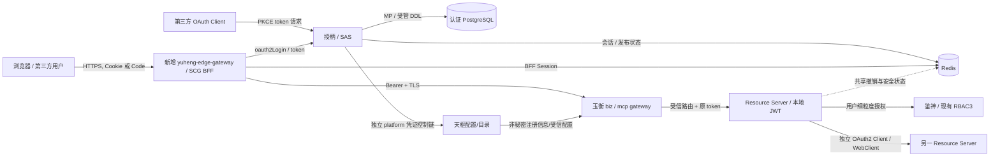
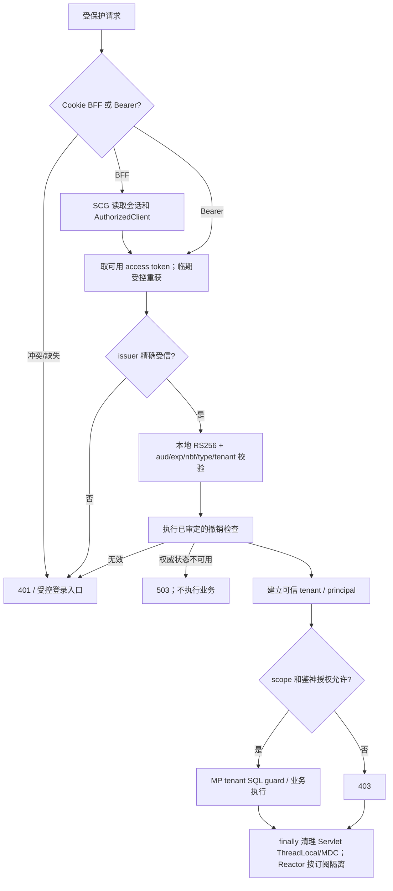
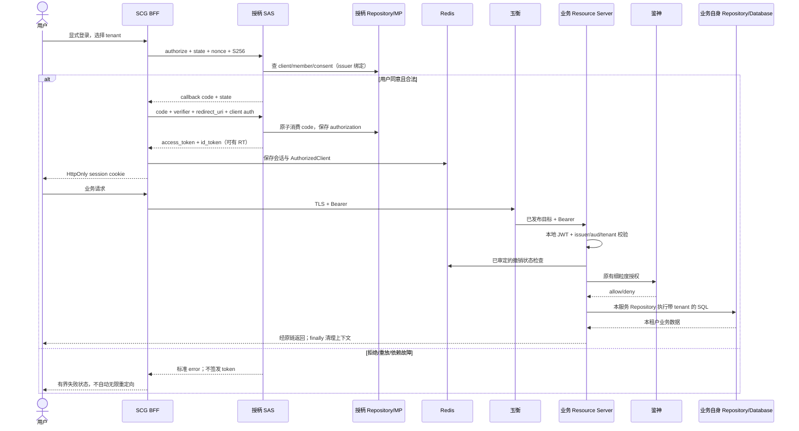
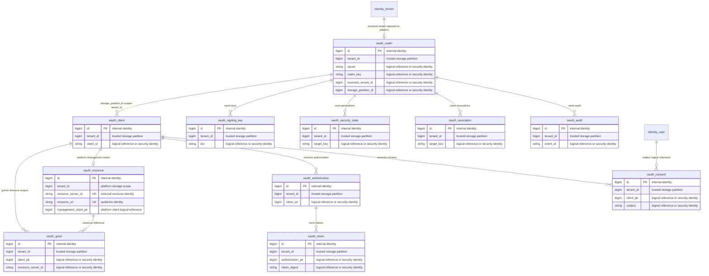

# 天权多租户 OAuth2 / OIDC 与 SCG 入口融合设计

| Field | Value |
| --- | --- |
| Document | `2026-09-22-17-14-tianquan-multitenant-oauth-oidc-design.md` |
| Template Version | `7` |
| Status | `Accepted` |
| Type | `Architecture` |
| Complexity | `Complex` |
| Complexity Drivers | 多 issuer 信任、两类主体、SAS/SCG/玉衡/鉴神/天枢协作、旧登录协议替换、JPA 到 MP、撤销一致性、密钥轮换 |
| Created | `2026-09-22 17:14 Asia/Shanghai` |
| Updated | `2026-09-23 10:51 Asia/Shanghai` |
| Owner | mario |
| Repository | Egon-COLA |
| Scope | 授柄 OAuth/OIDC 及 Starter、鉴神认证入口、玉衡身份适配、新 SCG/BFF、天枢控制面凭证、共享前端认证 |
| Change Surface | 协议过滤链、issuer/claim/密钥/授权状态、出站客户端、租户上下文与 SQL 隔离、认证存储迁移、登录与配置；详见 §3.3 |
| Affected Chapters | §7, §8, §9, §10, §11, §12, §13, §14, §15, §16, §17, §18 |
| Source Requirement | 2026-09-22 用户要求分析现状并融合 Spring Security OAuth2、OIDC 1.0、SAS、多租户、SCG、JWT、即时撤销及最新 Java/CQE 规范；只写 Spec，用户审核；本次不用 code generator |
| Baseline Revision | `main@af30120b25fca57ea6d5e2a3fe010f67c11b1e5e`；从原审查基线 ade975ec 到此 HEAD，xingyuan、common 组件与 Spec 技能无提交差异；工作树其他 Wiki/生成器工作不属于本设计 |
| Amends | [OAuth Client 与租户权威设计](2026-08-21-07-51-idp-oauth-client-tenant-ownership.md) §7–§11、§15–§16 中 client 存储、单 issuer、凭证和持久化方案；[Gateway 身份种子](2026-09-05-16-00-gateway-oauth-resource-bootstrap.md) §7、§15–§16 中 issuer 配置与凭证引导 |
| Supersedes | [无 Session JWT 设计](../../superpowers/specs/2026-08-13-unified-identity-stateless-jwt-session-removal-design.md) §7–§11、§13–§16 中无浏览器会话、固定 RT、统一 audience、单密钥及仅撤销 RT 的认证契约；替换范围在 §16 逐项列出，需本 Spec 获批后生效 |
| Depends On | None |
| Related Specs | [统一身份平台设计](../../superpowers/specs/2026-08-01-unified-identity-platform-design.md) §7–§13；[RBAC3 授权分层](2026-08-24-17-30-rbac3-resource-grants-layering.md)；[玉衡双引擎](2026-09-02-19-52-gateway-dual-engine-separation.md) |
| Related Plans | [天权多租户 OAuth2 / OIDC 实施 Plan](../plan/2026-09-23-10-42-tianquan-oauth-oidc-implementation.md) |

## 1. Summary

结论：保留「授柄负责身份和令牌、鉴神负责细粒度授权、天枢负责目录/配置、玉衡负责业务路由」的分工，在授柄中用 Spring Authorization Server（SAS）替换自研 OAuth 协议实现，在玉衡前增加独立 Spring Cloud Gateway（SCG）入口/BFF。微服务可同时作为 Resource Server 和 OAuth2 Client，但两种角色使用独立安全上下文和凭证。

这不是增加几个 Security 配置即可完成的升级。当前代码已经有 RS256、服务令牌缓存、租户上下文和鉴神权限快照，但 USER Token/固定 Refresh Token、单 issuer/单密钥、全局 Client、JPA/Flyway 与本次目标存在实质差异。应迁移协议与认证状态，保留授权资产、用户标识、天枢服务身份及玉衡双引擎。

用户已确认八项决策（§5.3），包括共享 Redis 每次检查撤销且故障拒绝、切换时重新登录、客户端 secret 逐个轮换为 bcrypt。本版补齐协议/管理契约、认证表与索引、Java 类型和配置、迁移及故障恢复。用户于 2026-09-23 明确确认本 Spec 并要求据此编写 Plan，因此状态更新为 **Accepted**；确认不代表已实施或通过运行验收。

**审阅重点**：§7 保持模块边界；§9 定义标准协议和管理接口；§11 使用隔离的新认证 schema，旧历史只读；§15.1 明确即时撤销的成功点与恢复栅栏；§16 规定逐租户切流、重新登录和凭证轮换。生产容量、真实数据库数据与故障演练仍是实施后的验收，本文不宣称已有生产运行证明。

## 2. Background and Current State

### 2.1 现状定位

实际路径不是嵌套的 `xingyuan/tianquan/jianshen`：当前 Maven 模块为 `egon-cola-xingyuan/egon-cola-tianquan-jianshen` 与同级 `egon-cola-tianquan-shoubing`。下文缩写路径均可机械展开，不代表新增目录：

| 缩写 | 仓库根相对路径 |
| --- | --- |
| S | `egon-cola-xingyuan/egon-cola-tianquan-shoubing` |
| SA | `S/egon-cola-tianquan-shoubing-admin` |
| SJ | `SA/src/main/java/top/egon/cola/platform/tianquan/shoubing/admin` |
| SS | `S/egon-cola-tianquan-shoubing-starter` |
| SC | `S/egon-cola-tianquan-shoubing-core` |
| SG | `S/egon-cola-tianquan-shoubing-gateway-adapter` |
| J | `egon-cola-xingyuan/egon-cola-tianquan-jianshen` |
| Y | `egon-cola-xingyuan/egon-cola-yuheng` |
| T | `egon-cola-xingyuan/egon-cola-tianshu` |
| W | `egon-cola-xingyuan/egon-cola-xingyuan-admin-web-shared` |
| MP | `egon-cola-components/egon-cola-component-common/egon-cola-component-common-mybatis-plus-sharding-jdbc-ext-spring-boot-starter` |
| OB | `egon-cola-components/egon-cola-component-transactional-outbox-starter` |

### 2.2 Repository evidence

| Evidence ID | Classification | Exact path/symbol/decision/command | Observed fact | Design significance | Verification limit/freshness |
| --- | --- | --- | --- | --- | --- |
| EVD-001 | Static repository | 根 `pom.xml`；`egon-cola-xingyuan/pom.xml` | Boot 3.5.16、Java 21、springdoc 2.8.17、Lombok 1.18.46 | 使用 Boot 管理的 Security/SAS，不直接采用在线 Security 7 示例 | 2026-09-22 源码；本地未取得该 Boot BOM 的解析证据 |
| EVD-002 | Static repository | `SA/pom.xml` | JPA、Flyway、Security、Resource Server、Outbox 已存在；没有 SAS starter | SAS 是明确的新协议能力；MP 迁移不可误称已完成 | 未运行 dependency:tree |
| EVD-003 | Static repository | `SJ/oauth/controller/OAuthTokenController.java#token` | 只分派 client_credentials 与自定义 Cookie refresh_token | 不具备此处要求的标准授权码换令牌链 | 未启动服务 |
| EVD-004 | Static repository | `SJ/oauth/controller/OAuthMetadataController.java` | 只发布 OAuth metadata 与 `/oauth2/jwks`；grant 列表无 authorization_code；JWKS 代码要求一把 key | 不能把当前服务称作完整 OIDC Provider；不能直接重用单键响应检查 | 静态端点检查 |
| EVD-005 | Static repository | `SJ/token/service/impl/Rs256TokenService.java` | 固定 issuer/RSA；USER `tid`、平台 audience；SERVICE 有 client_id、source、resource_version、TENANT/PLATFORM | 迁移 claim/issuer，保留机器来源与资源约束 | 不证明密钥部署现状 |
| EVD-006 | Static repository | `SS/src/main/java/top/egon/cola/platform/tianquan/shoubing/starter/security/IdpJwtVerifier.java` | USER 禁止部分 claim，纯无状态；SERVICE 验 Client/Resource runtime state；兼容 verify 路径可能重复 decode | 接入标准 Authentication 后只做一次验签，不能丢弃已有授权 guard | 不是性能测量 |
| EVD-007 | Static repository | `SS/.../starter/client/IdpServiceOAuth2Client.java` 与 `ServiceAuthorizationKey` | 已有 AuthorizedClientManager、本地缓存、renewalSkew、per-key single-flight、finally 清理 converter | 扩展缓存键与 WebClient，避免重造 token manager | ConcurrentHashMap 的容量/故障清理需补齐 |
| EVD-008 | Static repository | `J/...-admin/src/main/java/top/egon/cola/platform/tianquan/jianshen/admin/shared/tenant/controller/filter/TenantContextFilter.java` | TenantContext 已在 finally 清理 | 复用清理模式，但还需 MP MDC 和异步边界 | 未做线程复用压力测试 |
| EVD-009 | Static repository | `MP/.../business/EgonColaTenantIdProvider.java`；`EgonColaMybatisPlusAutoConfiguration` | MP 从 MDC `tenantId` 读取 Long，已装配 TenantLineInnerInterceptor 和写守卫 | 仅设置鉴神自有 ThreadLocal 不足以隔离 SQL | 需验证 MDC/SQL 链的联测 |
| EVD-010 | Static repository | `Y/yuheng-biz-gateway/pom.xml`；`yuheng-mcp-gateway/pom.xml` | 自研 Reactor Netty 数据面与独立 MCP 进程，不是 SCG | SCG 前置；不要把现有玉衡替换或向其 MVC 进程塞 WebFlux Gateway | 未测部署端口 |
| EVD-011 | Static repository | `SJ/token/service/impl/SigningKeyServiceImpl.java`、`ExternalPemSigningKeyRuntime.java` | 有发布/激活管理记录，但 runtime 只接受挂载的 configuredKid | 管理表状态不等于生产热轮换能力 | 没有实际轮换证明 |
| EVD-012 | Static repository | `SJ/oauth/service/impl/OAuthClientServiceImpl.java`、`identity/service/impl/SpringPasswordHashAdapter.java` | Client Secret 共用默认 Argon2 的 PasswordHashPort；兼容 bcrypt | “当前已 bcrypt”不成立；不能把哈希直接再哈希当迁移 | 未读取数据库/秘密 |
| EVD-013 | Static repository | `SA/src/main/resources/db/migration/V1__create_idp_schema.sql`、V2、V5、V6 | Client 全局；tenant 是数字文本；签名键无 tenant；JPA/Flyway 历史 | issuer 隔离必须覆盖实际数据访问，保留历史不可改 | 实际行数/溢出/重复未知 |
| EVD-014 | Static repository | `W/src/auth/gatewayAuthClient.ts` | JSON 密码登录、HttpOnly AT/RT、手工 CSRF、stepUp、userinfo | BFF/OIDC 会改变共享认证客户端而非仅后端 | 前端未启动 |
| EVD-015 | Static repository | `J/...-starter/.../security/Rbac3BearerAuthenticationFilter.java` | 仅识别 IdpAuthenticationToken，转 Rbac3AuthenticationToken 后 finally 清理 | 直接换 JwtAuthenticationToken 会绕过原加载器，需明确转换桥 | 静态调用链 |
| EVD-016 | Static repository | `OB/.../api/TransactionalOutbox.java`、`transaction/DefaultTransactionalOutbox.java`、`delivery/DeliveryHandler.java` | enqueue 要求指定事务，已有 transport registry/retry/delivery 边界 | 复用 Outbox；Spring 本地 event 不作为跨进程可靠投递 | 未验证 live delivery |
| EVD-017 | User decision | 本轮两次选项回复 | 确认 SAS 归授柄、SCG 前置、传统分包和认证 MP 迁移、隔离 PLATFORM、Spring Session Redis 依赖 | 关闭归属/入口/基本依赖决策 | 不代表整份 Spec 已接受 |

### 2.3 差异与协议校正

| 设想 | 融合后的准确解释 |
| --- | --- |
| 每租户 OAuth2TokenService | SAS 的对应 SPI 是 `OAuth2AuthorizationService` 与 `OAuth2TokenGenerator`；同时隔离 `OAuth2AuthorizationConsentService`，不虚构旧 Spring OAuth 的 TokenServices |
| 两种授权模式 | authorization_code + PKCE；client_credentials。refresh_token 是人员授权的续期能力，不给 SERVICE 使用；开启 OIDC 才有 ID Token/UserInfo |
| JWT 本地校验 | 验签和 claim 校验本地完成；首次/轮换时获取 JWKS。撤销实时状态若严格即时，则另有共享状态读，不能宣称全离线 |
| 动态 issuer | 仅允许受信注册表中的精确 issuer；不依据未验签 iss 任意联网，也不用 endsWith 模糊匹配 |
| 网关注入身份头 | 清除外部同名头，网关重建仅作追踪；资源服务器只从自身验签结果建 principal；Bearer 仍必须透传 |
| ThreadLocal 多租户 | Servlet 请求可用 ThreadLocal + finally；SCG/WebFlux 用 Reactor Context，不能把 ThreadLocal 跨线程当上下文 |
| client_secret bcrypt 加密 | bcrypt 是不可逆密码哈希；服务端存哈希，调用方仍需安全保存原 secret；两者不能混淆 |
| `/.well-known/jwks.json` | 可配置的 JWKS 地址，不是 OIDC 强制固定名称；以 discovery 的 jwks_uri 为准，本设计采用用户要求的路径 |
| 全链路 HTTPS | SCG→授柄/玉衡、玉衡→HTTP Provider 也用 TLS；gRPC 用 TLS 等价保护，不因内网自动降级 |

协议依据：SAS [多 issuer 与租户 SPI](https://docs.spring.io/spring-authorization-server/reference/guides/how-to-multitenancy.html)、[配置模型](https://docs.spring.io/spring-authorization-server/reference/configuration-model.html)；Security [受信 issuer 解析](https://docs.spring.io/spring-security/reference/servlet/oauth2/resource-server/multitenancy.html)；[RFC 6749 §4.4](https://www.rfc-editor.org/rfc/rfc6749.html#section-4.4)、[OIDC Core](https://openid.net/specs/openid-connect-core-1_0.html)。这些是协议/扩展点依据，不是仓库已经实现的证明。

### 2.4 Evidence and current-chain map

| Entry/trigger | Current call chain | Data read/written | External dependency | Consumers | Evidence |
| --- | --- | --- | --- | --- | --- |
| 浏览器登录 | gatewayAuthClient→OAuthLoginController→TokenFacade→Rs256TokenService | 用户/凭据、RT Redis、AT/RT Cookie | 玉衡、Redis、PostgreSQL | Portal 和四套 Admin Web | EVD-003/005/014 |
| 服务申请令牌 | IdpServiceOAuth2Client→OAuthTokenController→ClientCredentialsTokenService→ClientCredentialsAccessPolicy | client/secret/resource/grant 与本地 token cache | 授柄 | 天枢注册、鉴神快照、业务服务 | EVD-003/007/013 |
| 资源请求 | IdpBearerAuthenticationFilter→IdpJwtVerifier→Rbac3BearerAuthenticationFilter→授权决策 | JWT、资源状态、权限快照 | Redis/鉴神 | 各 Resource Server | EVD-006/015 |
| 密钥激活 | SigningKeyController→SigningKeyServiceImpl→ExternalPemSigningKeyRuntime | signing_key 管理行；固定 PEM | 挂载秘密 | 授柄签名运行时 | EVD-011 |

## 3. Goals and Non-goals

目标是让第三方使用标准 OIDC 登录/授权、平台服务使用独立机器身份、租户在 issuer/密钥/状态/SQL/缓存/异步上下文各边界均隔离，保留既有 RBAC3 细粒度能力，并给出能验证的迁移路径。

本轮不编写 Plan、不改 Java/POM/YAML/SQL、不启动服务/容器/浏览器、不连接数据库、不提交或发布。本次显式不使用 code generator，不把工具未完成列为阻塞。目标设计不新增通用 JWT 组件、不替换玉衡 MCP 引擎、不重建 DDC、不全面重构 RBAC3 表、不开启动态客户端自注册/password grant/implicit grant/token exchange。

### 3.3 Change Surface and Design Depth

| Area/layer | Disposition | Exact repository evidence | Changed or preserved behavior/contract | Required Spec treatment | Chapter(s) |
| --- | --- | --- | --- | --- | --- |
| 授柄 OAuth 协议/租户 SPI | Affected | EVD-002–006、SA/SJ | 替换自研协议、增加 OIDC、issuer 隔离 | 完整协议、数据和消费者边界 | §7, §8, §9, §10, §13, §14, §15, §16, §17, §18 |
| 认证存储和受管 DDL | Affected | EVD-013、MP/OB | 租户 client/授权/consent/key/revocation 及有直接FK依赖的OAuth资源目录、MP/DDL迁移 | 数据所有权、SQL 隔离、迁移门禁；范围决策见 §11 | §7, §8, §10, §11, §14, §16, §18 |
| SCG/BFF 与共享登录 | Affected | EVD-010/014/017 | 新进程、Code/PKCE、服务端会话、Token Relay | 边界、路由、会话及页面状态 | §7, §8, §9, §10, §12, §13, §14, §15, §16, §17 |
| Starter/玉衡/鉴神认证入口/天枢凭证 | Affected | EVD-007–009/015 | 多 issuer、claim bridge、WebClient、控制面拒绝业务使用 | 具体连接点、缓存、并发/错误契约 | §7, §8, §9, §10, §13, §14, §15, §16 |
| 鉴神角色、SoD、Fence、资源授权模型 | Unchanged | `J/...-core`；EVD-015 | 授权结论与版本规则不变；JWT scope 不代替角色权限 | 聚焦旧授权结果回归，不重绘权限 ER | §14 |
| 天枢服务目录与玉衡规则发布 | Context-only | `T`；`Y/yuheng-core` | 路由目标 biz/app/env 仍来自目录和已发布规则 | 只核查凭证匹配，不重写发现/编译链 | §14 |
| 用户资料、组织、无关管理 UI | Unchanged | `SJ/identity`；各 Admin Web 业务页面 | 不改变身份权威和业务功能；被迁移存储另列 §11 | 禁止借机全面平台改造 | §16 |
| GraphQL/移动端 | Not applicable | 本次协议与现有消费者为 HTTP/OIDC/已有 RPC | 不新增 GraphQL API 或移动端 | N/A | §9 |

## 4. Requirements and Acceptance Criteria

| ID | Atomic requirement | Priority | Observable acceptance criteria | Source |
| --- | --- | --- | --- | --- |
| REQ-001 | 授柄使用 SAS，保持鉴神/天枢/玉衡职责 | Must | 只有授柄签发令牌，鉴神不保存密码/私钥 | 原请求及 DEC-001 |
| REQ-002 | 路径 issuer 隔离租户客户端、授权状态、consent、JWK | Must | A 租户 code/client/key 对 B 不可用；未知 issuer 无出站请求 | 原请求 |
| REQ-003 | 第三方 Code 强制 S256 PKCE、redirect 白名单 | Must | 缺 PKCE/plain/错 verifier/URI 通配符/重复 code 均拒绝 | 原请求 |
| REQ-004 | OIDC discovery、ID Token、UserInfo | Must | iss/aud/nonce 校验、UserInfo sub 一致，ID Token 不能访问业务 | 原请求 |
| REQ-005 | 每微服务独立 client_id 与最小 scope | Must | SERVICE 无 refresh_token/ID Token；scope/resource 超授权拒绝 | 原请求 |
| REQ-006 | RS256 本地验签及 aud/时间/主体校验 | Must | 有缓存公钥时不逐请求调用授权服务器；错 aud/alg 拒绝 | 原请求 |
| REQ-007 | tenant_id 可信上下文与 finally 清理 | Must | ThreadLocal、MDC、异步取消/异常均无跨请求污染 | 原请求 |
| REQ-008 | SQL 级租户隔离 | Must | 两租户相同业务 ID、批处理/自定义 SQL/逻辑删除不能串租户 | 原请求及最新规范 |
| REQ-009 | WebClient 自动令牌与临期重获 | Must | 键隔离、同键并发仅一次获取、访问令牌 300–600 秒 | 原请求 |
| REQ-010 | SCG OAuth2 Client/BFF 入口 | Must | 浏览器只持 HttpOnly 会话 cookie；下游仍自行验签 | 原请求及 DEC-002 |
| REQ-011 | HTTPS 与 secret 哈希 | Must | 生产 HTTP/明文 RPC 配置拒绝；新 client secret bcrypt | 原请求 |
| REQ-012 | 即时撤销 | Must | 撤销返回成功后新鉴权拒绝，Redis 不可用返回503，在途请求不取消 | 原请求及 DEC-006 |
| REQ-013 | 密钥定期轮换 | Must | 多键重叠，旧 token 可验证至到期，泄露键可紧急拒绝 | 原请求 |
| REQ-014 | token 申请/使用/撤销全量脱敏审计 | Must | 不记录原 token/secret/code/password，投递有恢复证据 | 原请求 |
| REQ-015 | 指标与告警 | Must | JWT 延迟、缓存命中、失败授权、撤销依赖/投递积压可观测 | 原请求 |
| REQ-016 | 保留隔离 PLATFORM 控制面 | Must | `/platform` 只服务控制面；业务 tenant token 必含 tenant_id | 已确认 DEC-004 |
| REQ-017 | 旧链迁移且保留业务数据 | Must | 用户/tenant/client/grant 映射可审计；切换/回退界限明确 | “之前的代码该迁移的就迁移” |
| REQ-018 | 按最新 Java/CQE/MP/DDL 规范 | Must | §6.2、§20 每项证据闭合；保留传统业务分包 | 最新 skill 和 DEC-003 |
| REQ-019 | 仅 Spec、禁 generator | Must | git diff 只有本 Spec；无 Plan/代码/运行态动作 | 原请求 |

### 4.1 Scenario matrix

| Scenario | Actor/trigger | Preconditions | Main path | Alternative/failure path | Data/state change | Observable result | Requirements |
| --- | --- | --- | --- | --- | --- | --- | --- |
| 第三方首次授权 | 用户与第三方 | 租户 ACTIVE、注册有效、membership 有效 | 登录→consent→code→换 token | 拒绝 consent 不发 code；错误 redirect 不跳转 | 一次性授权状态 | 标准 OAuth/OIDC 结果 | REQ-002/003/004 |
| code 并发重放 | 第三方两次换码 | 相同 code | 原子消费成功一次 | 后续 invalid_grant；不得重复发 token | 单一消费状态 | 只有一个成功 | REQ-003 |
| 服务 A 调 B 再调 C | 服务 | 每个目标独立 grant | B 验 A→B token；B 用自身身份申请 B→C | A→B token 不可冒充 B→C | 两个独立 token cache 项 | aud/scope 最小化 | REQ-005/009 |
| 用户透传到下游 | BFF/玉衡 | token aud 授权目标 | 原 token 透传，本地再验 | 目标不在 aud 则拒绝，不静默换 SERVICE token | 无新增授权 | 保留真实用户语义 | REQ-006/010 |
| 未知 issuer/恶意 jku | 攻击者 | 构造 JWT | allowlist 先筛选 | 无 DNS/JWKS 出站；统一 401 | 无 cache 污染 | 拒绝并限流 | REQ-002/006 |
| issuer 与 tenant claim 冲突 | 攻击者/错配 | 签名仍可能有效 | registry tenant 与 claim 相等 | 401，无 SQL | 无副作用 | 拒绝跨租户 | REQ-007/008 |
| Redis 撤销状态故障 | 任意资源请求 | key 已缓存 | 本地签名与共享状态检查区分 | 503 fail-closed；已确认 DEC-006 | 无业务执行 | 不把依赖故障冒充坏密码 | REQ-012 |
| 刷新/重获并发 | 多请求 | 临期 token | single-flight、CAS 更新 | 超时不复用过期 token；禁止无限重试 | 一次重获 | 不串 tenant/aud/scope | REQ-009 |
| key 轮换/实例落后 | 运维调度 | 新公钥已发布 | 新 key 激活；旧公钥保留 | 未加载 key 的实例撤下 readiness | 版本单调增加 | 无 key 缺失窗口 | REQ-013 |
| DDL/导入中断 | 运维 | 新 schema，历史只读 | 每目标锁与 SQL/history 原子提交 | unknown commit 先查证；失败暂停切流 | 已提交进度保留 | 可恢复、无旧库清理 | REQ-017/018 |
| PLATFORM 凭证访问业务 | 控制服务/攻击者 | 有效 platform token | 控制面允许 | 租户资源拒绝，无 tenant 默认值 | 无租户业务写 | 控制面不等于超级租户 | REQ-016 |
| ThreadLocal 异常/线程池复用 | Servlet/异步 worker | 已验 JWT | 绑定→执行业务→finally remove | 异常/取消也清理；嵌套作用域恢复外层 | 清理上下文 | 后续请求读不到前人 tenant | REQ-007 |

### 4.2 Use-case analysis

| Actor ID | Actor/role | Goal and responsibility | Entry/channel | Permission/tenant context | Evidence |
| --- | --- | --- | --- | --- | --- |
| ACTOR-001 | 租户用户 | 登录、同意第三方授权、退出 | 浏览器/OIDC | 用户身份与 ACTIVE membership | 原请求、EVD-014 |
| ACTOR-002 | 第三方应用 | 经用户同意访问资源 | Code/PKCE | 注册 client、redirect、scope/resource | 原请求 |
| ACTOR-003 | 平台微服务 | 用自己的机器身份访问目标 | token endpoint/WebClient/RPC | issuer/client/grant | EVD-007 |
| ACTOR-004 | 安全管理员/运维 | 维护注册、撤销、轮换、迁移 | 现有管理面及受控发布 | 既有鉴神管理权限、强认证 | EVD-011/013 |

| ID | Use case/goal | Primary actor | Supporting actors/systems | Trigger | Preconditions | Main success outcome | Alternatives/failures | Postconditions | Requirements | Interfaces/pages | Tests |
| --- | --- | --- | --- | --- | --- | --- | --- | --- | --- | --- | --- |
| UC-001 | 授权第三方访问 | ACTOR-001 | ACTOR-002、授柄 | 第三方登录按钮 | ACTIVE client/member，redirect/PKCE 有效 | 获得受限 AT/ID Token | 拒绝/错码/错 scope | consent/code 状态可信，无越权签发 | REQ-001/002/003/004/011 | §9 协议面、consent 页 | TEST-001, TEST-002 |
| UC-002 | 微服务安全调用 | ACTOR-003 | 授柄/目标服务 | 出站调用 | 独立 client、grant、目标 aud | B 执行业务 | 无 grant、临期重获失败 | 无用户身份冒用或缓存串用 | REQ-005/006/009/016 | §9 token/WebClient | TEST-003, TEST-004 |
| UC-003 | 租户用户访问业务 | ACTOR-001 | SCG/玉衡/鉴神/SQL | 浏览器业务请求 | BFF 会话、目标 aud、权限有效 | 当前租户内得到授权结果 | 401/403/503，UI 不无限跳转 | tenant/权限/SQL 一致且清理 | REQ-007/008/010 | §12 登录与业务状态 | TEST-005, TEST-006 |
| UC-004 | 撤销与轮换 | ACTOR-004 | 授柄/Redis/所有资源服务器 | 撤销或轮换调度 | 管理权限、可用权威存储 | 按已审定语义撤销/平滑换 key | 缓存故障/实例落后/提交未知 | 审计可追踪，失败不谎报完成 | REQ-012/013/014/015 | §15 运维契约 | TEST-007, TEST-008 |
| UC-005 | 安全迁移到新认证体系 | ACTOR-004 | 全部消费者 | 审批切流 | 数据映射/秘钥/配置/回归合格 | 新 issuer 生效，业务事实保留 | 异常停止并按阶段恢复 | 旧历史不改、权限不扩大 | REQ-017/018/019 | §16 迁移 | TEST-009, TEST-010 |

## 5. Constraints, Assumptions, and Decisions

### 5.1 Confirmed constraints

执行本轮显式授权优先。保留本次开始前已有的 Wiki 文档修改。原 Flyway B/V 文件不可编辑、重排、删除或修 checksum；新增受管 DDL 另建 schema/版本，不在旧非空 schema 自动 adopt。既有传统业务分包继续保留，`service.impl` 不移到 service 旁边。生成器本轮禁用，设计文档可继续。

### 5.2 Small-gap assumptions

| ID | Inference | Repository evidence | Why locally reversible | Impact if wrong |
| --- | --- | --- | --- | --- |
| ASM-001 | 新入口模块名 `yuheng-edge-gateway` | Y 已有 biz/mcp gateway 命名 | 仅未发布模块命名，未改变协议/部署决定 | 调整目标文件名 |
| ASM-002 | 示例 tenant 为 `1001`，外部 ID 一律字符串 | identity_tenant 数字文本及 MP Long 契约 | 文档测试数据 | 不作为已有真实租户 |
| ASM-003 | OIDC 最小 profile 返回 sub/name；不默认给 email/phone | 现有 displayName 与身份主体 | 无新增个人资料需求 | 若需额外属性，单独明确 scope/来源 |

### 5.3 Resolved decisions

| ID | Decision | Decision owner | Evidence and rationale | Requirements |
| --- | --- | --- | --- | --- |
| DEC-001 | SAS 在授柄；鉴神保留 RBAC3 | mario | 首轮问题 1 明确选择 | REQ-001 |
| DEC-002 | 新增 SCG 入口/BFF，保留玉衡 | mario | 首轮问题 2 明确选择；增加部署单元已告知 | REQ-010 |
| DEC-003 | 认证相关 MP/DDL 迁移、保留传统业务分包，不整体迁 DDD/无关 RBAC 表 | mario | 首轮问题 3 明确选择 | REQ-008/017/018 |
| DEC-004 | 保留 `/platform` issuer 控制面，租户业务隔离 | mario | 第二轮问题 1 明确选择 | REQ-016 |
| DEC-005 | SCG 和授柄引入 Spring Session Redis；Boot 管理 OAuth2 Client/WebFlux，SCG 配套 Cloud 2025.0.x | mario | 第三轮问题 1 明确选择；无自建 session framework | REQ-010/018 |
| DEC-006 | 每次受保护请求读取共享 Redis 撤销状态；故障拒绝；成功撤销后的新鉴权拒绝，在途请求不追溯取消 | mario | 本轮回复“1 采用” | REQ-012 |
| DEC-007 | 逐租户切流时旧 AT/RT/Cookie 会话失效，人员重新登录，不保留无感旧会话 | mario | 本轮回复“2 接受” | REQ-017 |
| DEC-008 | 每个旧 confidential client 轮换新 bcrypt secret，调用方更新确认后才切新 issuer；用户密码不改算法 | mario | 本轮回复“3 轮换” | REQ-011/017 |

### 5.4 Open major decisions

None。八项重大架构/兼容选择已确认。本版中的数值（TTL、缓存上限、限流、保留期）是明确的可审工程默认值，通过本 Spec 审核成为实施配置基线；性能是否达到目标须实测。不会再以未回复 DEC-006/007/008 阻塞，亦不会把运行态验收未执行等同于设计尚无决策。

## 6. Project Technology Context

| Concern | Current choice | Repository evidence | Constraint on design |
| --- | --- | --- | --- |
| Runtime | Java 21 / Boot 3.5.16 | EVD-001 | 不升级 Boot/JDK；Security/SAS 版本由同一 BOM 解析 |
| 文档 | springdoc 2.8.17 / OpenAPI 3.1 | 根 POM、SA application.yml | 保留业务 API 注解；SAS Filter endpoint 不创建假 Controller |
| 存储 | PostgreSQL/JPA/Flyway + Redis | SA POM/YAML/V1–V6 | 当前不等于目标；认证持久化 MP/受管 DDL |
| 网关 | 自研 Reactor Netty + 双数据面 | EVD-010 | 新 SCG 独立 WebFlux 进程，不混合 Servlet context |
| 测试 | JUnit 5 / Spring Security Test / H2 / Vitest | SA/SS POM、W package.json | H2 不证明 PostgreSQL/Redis/跨实例一致性 |
| 构建 | Maven 多模块；前端独立 package | 根 POM、W package.json | 无自动 npm publish，无服务启动 |

### 6.1 Java architecture profile and capability baseline

**选定 Traditional Three-Layer，依据 DEC-003 保留 `admin.<业务域>.controller/service/service.impl/repository/dao/domain`。** 现有 `repo`/JPA、Controller 直接调用 impl、自定义 core/port 是迁移点，不是重新引入七层 DDD 的理由。共享 core/starter/rpc-contract 是已有技术模块；业务编排回到对应 service，纯契约保留原模块职责。新增 SCG 是已批准的独立技术入口，内部仅 config/filter/session/controller/service，不能生成空 DDD 层。

| Need | Spring/JDK candidate | Spring Boot Starter candidate | Egon-COLA/module candidate | Proven gap | Decision/dependency impact |
| --- | --- | --- | --- | --- | --- |
| 标准授权服务器 | SAS SPI/Configurer | `org.springframework.boot:spring-boot-starter-oauth2-authorization-server` | 当前自研 Controller | 无完整授权码/OIDC | 用户原请求已批准，SA 增加 |
| Client/Resource Server | OAuth2AuthorizedClientManager、JwtIssuerAuthenticationManagerResolver | oauth2-client/resource-server | SS 现有 Security 依赖 | 动态 issuer/非阻塞 WebClient 适配 | 复用；WebFlux 由 DEC-005 批准 |
| 新入口 | SCG TokenRelay | `org.springframework.cloud:spring-cloud-starter-gateway-server-webflux` | 玉衡继续后置 | 原生玉衡不是 SCG | DEC-002/005；Cloud BOM 采用仓库 archetypes 已有 2025.0.3 系列，实施前检查实际解析兼容 |
| HA 会话 | Spring Session / Redis | `org.springframework.session:spring-session-data-redis` | 已有 Redis | 默认内存 session/authorized client 无法跨实例恢复 | DEC-005，分别隔离 SAS 与 BFF namespace |
| SQL 隔离 | MP TenantLine | MP 完整坐标见 MP 目录 | EgonModel/EgonColaRepository/EgonColaMapper | SA 未接入 | DEC-003；不再另加 Hibernate tenant provider |
| 验证/映射 | Jakarta Validation、MapStructPlus | validation | common-core BaseConverter/BaseForwardConverter | 改动 POJO 与边界需要适配 | 复用仓库 BOM，不新建 Utils |
| 可靠事件 | Outbox enqueue/DeliveryHandler | 既有 OB starter | EVD-016 | 状态投递要接真实 handler，不是本地 event | 不新增 MQ 必选项，先复用 Outbox 扩展点 |
| 时间/哈希 | Clock/Instant/Duration、PasswordEncoder | Security crypto 已有 | SpringPasswordHashAdapter | client 与人员编码器需要分开 | 不新增密码学库，不改人员密码策略；新随机 client secret 使用 32 字节 CSPRNG 再 base64url 编码，长度低于 bcrypt 72 字节输入上限，bcrypt cost 初定 12 并做容量测量 |

在线 Spring Cloud 兼容表确认 2025.0 对应 Boot 3.5：[Spring Cloud](https://spring.io/projects/spring-cloud/)。本轮没有解析/下载依赖，具体 SAS/Security patch 版本不能凭在线 latest 猜测；Plan 前必须得到 effective-pom/dependency:tree 证据，不得临时升级整条版本线。

### 6.2 User-mandated Java rule compliance

| Literal rule | Affected? | Repository evidence | Exact design decision | Files/types/interfaces | Validation/test evidence | Status/blocker |
| --- | --- | --- | --- | --- | --- | --- |
| Rule 1 | Yes | EVD-003/005/013 | 新增承载类型用 PO/BO/DTO/VO/Command/Query/Event/Result；业务对象不新建 Request/Response 同义副本 | §8/10 | 类型清单及编译检查 | PASS：§8.4/10完整类型展开及既有DTO迁移，字段来源§9/11 |
| Rule 2 | Yes | SA validation、MP model groups | 注解驱动，边界 @Validated/@Valid；SAS SPI 入口手工触发同一约束，不把业务规则都塞 ValidationUtils | §7.3/10 | 非 HTTP 入口、自调用、嵌套负例 | PASS：§10.2六类边界/分组/SPI手动校验、负例 |
| Rule 3 | Yes | EgonModel 与 common converter | 普通 class + 四注解；root @Builder、PO @SuperBuilder/callSuper；不可变值对象才 record | §10 | 构造器/mapper 字段验证 | PASS：§10.1逐类型class/Lombok/框架immutable转换 |
| Rule 4 | Yes | SA lombok.config 已复制 Qualifier | 所有改动业务 Bean @Slf4j、显式名字、final @Qualifier、@RequiredArgsConstructor | §8/10 | Lombok 参数与装配检查 | PASS：§8.4具名Bean和qualified依赖/Qualifier传播 |
| Rule 5 | Yes | JDK/Security/common-core | 工具仅 JDK/批准 Commons/Guava；本范围不用 Tika/电话库 | §6.1 | import/dependency diff | PASS：§6.1/15.3 JDK与现有Redis/Outbox，无新Utils库 |
| Rule 6 | Yes | Boot Jackson、IdpClaimNames | JSON 单一 Jackson；枚举 DB @EnumValue/输出 @JsonValue，未知值拒绝；不持久化 ordinal | §10 | JWT/JSON/OAS 一致性 | PASS：§9完整wire+§10枚举/JSON/敏感字段 |
| Rule 7 | Yes | SA application.yml/application-local.yml | 所有变更叶子键在每个 profile 成对，包含 TLS/docs/session/issuer/DDL | §15 | key-set diff/Properties bind | PASS：§15.5叶子键/原生map元素schema与profile一致性 |
| Rule 9 | Yes | ClientCredentialsAccessPolicy、Security Provider 链 | Strategy/Adapter 处理双 grant 与多 issuer；复用 SAS Provider，不写大 grant_type switch | §13 | grant/issuer 分派负例 | PASS：§13 Provider/Adapter/安全链/状态并发守卫 |
| Rule 10 | Yes | EgonModel/Clock | JWT NumericDate↔Instant；TTL Duration；deletedAt LocalDateTime(UTC)，禁 Date/Calendar | §10/11 | 边界精度、时钟偏移测试 | PASS：§10/11 UTC Instant/Duration/LocalDateTime/NumericDate |
| Rule 11 | Yes | DEC-003、MP/OB 源码 | 传统分层；认证 MP、受管 DDL；业务键+deleted_at+活跃行唯一；CQE Event 经 Outbox | §7/11/13 | 数据与架构门禁 | PASS：§6/8/11传统分包、OAuth MP/受管DDL、事件实际delivery |

十条规则按本版设计逐项核对；PASS指设计有具体机制与验证，不代表Java已修改或测试通过。本次只更新Spec，不修改技能文件，不进入实施Plan。

## 7. Architecture Design

### 7.0 Minimum-design baseline and element-necessity audit

| Proposed element | Change | Requirements | Existing/direct alternative | Concrete inadequacy of alternative | Added calls/state/coupling/failures/migration/operations | Verdict |
| --- | --- | --- | --- | --- | --- | --- |
| SAS protocol engine | New | REQ-001/003/004 | 扩展 OAuthTokenController | 需自行承担完整协议/重放/consent/发现 | 协议状态迁移、SPI 适配 | Add |
| 多 issuer 路由与实例集合 | Expand | REQ-002 | 单 issuer + tid | 无每租户 key/client/consent 隔离 | registry 生命周期、cache 上限 | Add |
| SCG 入口/BFF | New | REQ-010 | 玉衡直接加 OAuth login | 用户已选择原生 SCG 能力并保留玉衡 | 一跳转发、会话/配置/部署 | Add |
| 鉴神权限模型 | Keep | REQ-001/006 | 把 permissions 全放 JWT | 不能保留动态角色/SoD/Fence/数据字段规则 | 既有权限快照依赖 | Keep |
| 微服务 token 缓存 | Expand | REQ-009 | 每次取 token | 增加 AS 负载且已有实现 | bounded eviction、issuer/secret 版本键 | Keep |
| WebClient 装配 | Expand | REQ-009 | 调用点拼 Bearer | 容易泄露或忘带凭证 | 目标白名单、错误处理 | Add |
| MP SQL/DDL | Expand | REQ-008/018 | 仅 ThreadLocal，保留 OAuth JPA | 上下文不等于 SQL 隔离，违反本次规范 | 数据迁移、SQL/schema gate | Add |
| 撤销权威状态 | New | REQ-012 | 纯 JWT 等到 exp | 不满足即时撤销 | 共享依赖、恢复/一致性成本 | Add，严格共享检查 |
| JWK 状态与轮换 | Expand | REQ-013 | 原固定 PEM | 无多租户/多键重叠 | 加密密钥存储、投递、租约 | Add |
| 通用认证微服务/自研 session/cache bus | New candidate | REQ-001/010 | 既有授柄/Session/Outbox | 已有直接实现足够 | 冗余模块与状态 | Remove |
| tenant 参数查询后再原样回传 API | New candidate | REQ-007 | 目标从受信 issuer/认证 principal 推导 | 无独立用户价值 | TOCTOU 和 RTT | Remove |

| Path | Network calls | Client states | Server contracts/state | Failure and TOCTOU points | Additional user/business value |
| --- | --- | --- | --- | --- | --- |
| 当前 USER 命中 AT | 浏览器→玉衡→Provider；授权快照依赖仍可能存在 | 已登录/过期 | AT/RT Cookie、单 issuer | RT 无效、快照过期 | 当前内部登录 |
| 新 BFF 命中 AT | 浏览器→SCG→玉衡→Provider；AS 调用 0 | 会话/重定向/授权拒绝 | BFF Session+AuthorizedClient | 多一跳、会话 Redis；撤销检查另计 | 标准 OAuth 客户端且令牌不落浏览器 |
| 新 SERVICE 命中 cache | A→目标 B；AS 调用 0 | 无浏览器状态 | issuer/client/aud/scope/tenant 完整 cache key | 撤销状态与网络失败 | 最小权限调用 |
| 缓存 miss/临期 | 上述加一次 client_credentials token 请求；JWKS miss 单独缓存 | pending/失败 | per-key single-flight | 超时或 secret 轮换 | 不把每次调用变成 AS 同步依赖 |

### 7.1 System Architecture Design



| Module/component | Capability and data owned | Inputs/outputs | Allowed dependencies | Forbidden responsibility | Requirements |
| --- | --- | --- | --- | --- | --- |
| 授柄 | 用户/tenant 权威；issuer、Client、Consent、Authorization、JWK、撤销事实 | OAuth/OIDC、身份 RPC | MP、Redis、Outbox、已有目录/身份服务 | 不把 RBAC 权限塞进 access token | REQ-001/002 |
| 鉴神 | 最小授权主体、角色/资源/数据/字段/SoD/Fence | 验证后的 principal→决策 | 授柄认证结果、既有快照 | 不签 JWT、不决定 issuer/key | REQ-001/006 |
| SCG/BFF | OAuth 请求关联、浏览器会话、AuthorizedClient、入口 TLS | Session→Bearer；外部 Bearer→原 Bearer | 授柄、玉衡、Redis | 不改 JWT claims，不替第三方持有客户端 secret | REQ-010 |
| 玉衡 | 已发布路由、Provider、协议执行、边界授权 | SCG/Bearer→目标请求 | 授柄验证器、鉴神、天枢 | 不再负责浏览器 RT 刷新，不转发信任任意身份头 | REQ-006/010 |
| Resource Server | JWT/撤销/tenant/scope/aud、业务授权、SQL | 验证 JWT→业务上下文 | Starter、鉴神、MP | 不因网关已验就放行；ID Token 禁用 | REQ-006/007/008 |
| 天枢 | 目录/配置、provider 生命周期 | platform service credential | 受信 issuer/key/public metadata | 不保存/分发 client secret、私钥，不成为 AS 启动的循环前提 | REQ-016 |

### 7.2 High-Level Design

issuer 模板为 `https://认证公开域/tenants/{tenantId}`；`tenantId` 是无前导零的正 Long 十进制字符串。不能从 Host/Forwarded 任意构造信任关系：公开 origin 配置固定，可信代理集合明确，SCG 清洗转发头。受信 registry 记录 exact issuer、tenantId/realm 类型、jwksUri、状态、版本；启用后动态增加对应 AuthenticationManager，停用同时撤出且失效已有缓存。

`/platform` 是明确的独立授权域，仅支持 client_credentials。其 token 有 `scope_context=PLATFORM`、不含业务 `tenant_id`，aud 只能为控制面资源。TENANT Token 必须有 `scope_context=TENANT` 和 tenant_id。不是使用 `tenant_id=0` 或默认超级租户来绕过 SQL。



#### 7.2.2 High-level decision and quality matrix

| Concern/use case | Required behavior | Selected mechanism | Failure/degradation behavior | Trade-off | Verification | Requirements |
| --- | --- | --- | --- | --- | --- | --- |
| 信任边界 | 不可任意 issuer/JWKS SSRF | allowlist + 固定 TLS origin + 精确匹配 | 401，不尝试请求恶意地址 | 新租户需受控注册 | TEST-001, TEST-004 | REQ-002/006 |
| 延迟 | 稳态不请求 AS | 本地验签/JWK cache/token cache | unknown kid 受限刷新，未知仍拒绝 | 冷启动需拉公钥 | TEST-004 | REQ-006/009 |
| 隔离 | token/context/SQL/cache 一致 | tenant claim 与 issuer registry 比对、MP 守卫 | 缺上下文禁止 SQL | 非 Web 任务必须显式绑定 | TEST-005, TEST-006 | REQ-007/008 |
| 即时撤销 | 明确成功点 | DEC-006 推荐共享状态读 | 推荐 unavailable→503 | 可用性依赖 Redis | TEST-007 | REQ-012 |
| 密钥恢复 | 不随机换 key | 持久化/挂载加密 key，按 tenant+kid 版本载入 | 启动拿不到正确 key 不 ready | 运维保管与备份成本 | TEST-008 | REQ-013 |

### 7.3 Detailed Design

#### 7.3.1 授权服务器

SAS SecurityFilterChain 使用 `AuthorizationServerSettings.multipleIssuersAllowed(true)`，不固定单个 issuer。OIDC 显式启用。租户解析先通过 allowlist 再进入组件委派；不得直接抄示例中的 endsWith 匹配。每 issuer 独立绑定 RegisteredClientRepository、OAuth2AuthorizationService、OAuth2AuthorizationConsentService 和 JWKSource；可共享 Java 类及连接池，**不能共享未加租户条件的存储空间、secret 或私钥**。

客户端分两类：第三方/SCG 人员客户端允许 authorization_code（confidential 的续期可允许 refresh_token），强制 requireProofKey=true、S256、精确 redirect；机器客户端只允许 client_credentials，无 redirect、openid、ID Token、Refresh Token。不得一个 client_id 同时承担这两个角色。实例共享同一服务 client_id 可以，同环境不同微服务不能共用。每 issuer 下分别注册，跨 issuer 默认不复用 secret。

ClientSettings/TokenSettings 配置外再补行为 guard：禁 plain PKCE；redirect_uri 完整字符串匹配、禁 fragment/通配符/用户信息段/开放重定向；生产只 HTTPS；本轮不加入 native loopback 特例。state/nonce 随机并与一次 authorization request、issuer、registration、浏览器会话绑定。code 短期一次性，兑换需 client+issuer+redirect+verifier 完全匹配。用户拒绝 consent 返回 access_denied，不发令牌。

OIDC scope 仅授权身份披露，业务 scope 由已注册资源与 grant 的交集产生。ID Token audience 是 client_id；access token audience 是被授权 Resource Server 的 canonical resource URI。两者必须分别校验，不能把 ID Token 作为 API Bearer。第三方 AT 默认单目标 resource；SCG 是第一方客户端，可以预注册有限的管理资源 audience 集合，服务逐个验证自己在 aud 内。请求不能自行添加新 audience；不默认平台通配 audience。

授权码/RT 的消费不能只依赖 SAS 示例 save：Repository 必须以数据库条件写/版本锁保证跨实例最多一次成功。授权成功后响应丢失，重复 code 不返回原 token；客户端重新走授权。BFF 的 RT 轮换采用跨实例 single-flight 与版本 CAS，失败后不回退使用已消费 RT。按 DEC-007 不迁移旧 refresh token；新授权状态从重新登录产生。


**SAS实际扩展装配**：新增`SJ/oauth/service/impl/TransactionalOAuthAuthenticationProvider.java`实现AuthenticationProvider的Decorator；分别为框架AuthorizationCode/RefreshToken/ClientCredentials provider创建具名包装Bean并注册到真实token endpoint provider list（移除对应未包装实例，防并行旁路）。包装器复用默认协议处理，先验证已认证client与受信realm，TransactionTemplate使用同一transactionManager，在一次事务内调用INTERNAL-001涉及的锁/授权策略、delegate.authenticate、SAS AuthorizationService.save、token/audit/outbox；失败整体回滚。业务scope/resource检查复用ClientCredentialsAccessPolicy及用户grant/consent交集；不重写密码学/标准grant算法。文件中依赖全部final @Qualifier，Lombok构造；factory配置负责明确三个delegates，不能用grant_type大switch。`OAuthTokenIssueService`及Impl放SJ/oauth/service和service/impl，作为INTERNAL-001的业务入口；原先接口名OAuthTokenIssueService.consumeAndIssue在本设计中准确指该业务Service而非伪称SAS标准SPI有该方法。

`TenantLoginController`（SJ/oauth/controller，bean tenantLoginController）提供API-018页面，`TenantLoginAuthenticationFilter`（SJ/oauth/controller/filter，bean tenantLoginAuthenticationFilter）提供API-019动态tenant matcher，复用原IdentityFacade密码/锁定/must-change-password约束，不能直接发token。默认SAS consent页面由真实authorize端点返回200 HTML，表单POST同issuer authorize；不新增假Controller或另一个未列consent URL。复用CentralLoginPage的身份输入/错误组件，未登录/凭据错/membership错/必须改密码按已有身份流程展示，尚不满足账号策略不完成授权。三条SecurityFilterChain次序：SAS协议及登录会话链→管理ResourceServer链→旧协议410/fallback deny链；新会话SessionCreationPolicy.IF_REQUIRED只在登录链，业务RS仍无Session依赖。

#### 7.3.2 资源服务器和租户上下文

Servlet 使用 `JwtIssuerAuthenticationManagerResolver` 对受信 issuer 解析 AuthenticationManager；每个 manager 的 NimbusJwtDecoder 只允许 RS256、公钥来自绑定 JWKS，校验 iss/aud/exp/nbf/iat/typ、USER/SERVICE 和 tenant。Reactor 使用对应 reactive manager resolver/Jwt decoder，不能把 Servlet resolver 直接用于 WebFlux。冷启动或 unknown kid 可取 JWKS；缓存有上限/TTL、同 issuer 请求合并，刷新失败只允许已缓存且仍有效的已知 key，不能放行未知 key。

验签后转换为既有 IdpAuthenticationToken/IdentityPrincipal 兼容桥，再进入 Rbac3BearerAuthenticationFilter。scope 映射为 SCOPE_* 与既有细粒度权限 **同时** 检查；不把 scope 文本当 RBAC permission 的等价物。现有 SERVICE Client/Resource 状态约束保留，按 tenant+issuer 扩展，不因换框架而删除。

Servlet tenant bridge 必须位于认证完成之后、鉴神/Controller/事务之前。核对 registry tenant、JWT tenant_id、目标资源 tenant；建立既有 TenantContext，同时写 `MDC[tenantId]` 与 `MDC[userId]`，让 EgonColaTenantIdProvider 真正读到它。最外层 `try/finally` 清理 ThreadLocal、tenant/user MDC 和请求附加状态；嵌套内部作用域恢复原值，外层请求结束仍 remove。异常、403、下游抛错均走 finally。不要用 InheritableThreadLocal。

SCG/Reactor 链只用 Reactor Context。需要调用阻塞 MP 时，将已认证 tenant 显式带入 bounded worker 的同步作用域，在 worker 内绑定并 finally 清理；禁止在 event-loop 执行 JDBC/Redis 阻塞操作。任务/消息/RPC 入口各自验证凭证/封套后绑定上下文，取消订阅不能导致线程状态遗留。

数据层复用 MP 的 TenantLineInnerInterceptor、EgonColaTenantIdGuardInnerInterceptor、EgonColaLocalWriteGuard。查询用具名 Mapper XML，必须同时有 tenant、active row 和业务路由条件；自定义 JOIN/subquery/batch/UPDATE/DELETE 都测。忽略表名单只限有证据的技术全局目录/组件 outbox，不能把业务表加入 ignore 来跑通迁移。不能同时给一个新认证库引入 Hibernate 多租户方案。

#### 7.3.3 微服务调用与缓存

保留 `IdpServiceOAuth2Client` 现有授权门面，完整 key 扩展为 `(issuer, registrationId, clientId, credentialVersion, resourceAudience, scopeContext, tenantId-or-PLATFORM, sortedScopes)`。AuthorizedClientManager 底层存储使用同一分区语义；只改外层缓存键而底层仍按 registrationId+固定 principal 会串令牌，必须一起测试。

Access Token 默认 300 秒、配置最大 600 秒，clock skew 30 秒、renewalSkew 60 秒。热点 key 临期主动重获，冷 key 下一次调用懒重获；只为活跃 key 安排有上限的后台续期任务，加入抖动和 per-key single-flight。client_credentials 不产生 refresh_token；JWT header 通过 SAS token customizer 明确设为 typ=at+jwt、alg=RS256，ID Token 使用其 OIDC 类型，资源解码器必须与此配置一致。缓存最大 10,000 项、到 exp 清理；失效凭证/tenant/issuer 事件精准清除；获取失败不缓存异常、不重用过期值，不能并发风暴。

WebClient 的授权 filter 只装配到声明目标服务的 named WebClient；每次请求显式选择 registration/resource，禁止全局默认 authorized client 导致向任意 URL 泄露 token。限制 scheme/host/port 与目录的实际 Provider 身份一致，禁止带 Authorization 跨 origin 自动重定向。401 最多使 cache 失效后重获一次，只有幂等请求可自动重发；POST 等命令必须有业务幂等契约才能重试。403 不重试，token endpoint 4xx 不循环获取。

A→B 的请求认证与 B→C 的出站机器认证互相独立。若 B 是替用户访问 C，必须使用对 C 有效的用户 token，或拒绝并要求显式用户授权；本期不偷偷引入 Token Exchange，也不以 SERVICE scope 代替用户权限。已有 gRPC/Direct RPC 继续在 metadata 携带 Bearer，目标 audience 为最终 Provider，不因经玉衡中转而变成网关 audience。

#### 7.3.4 SCG/BFF 与玉衡

SCG 只负责 TLS、标准 oauth2Login、会话、Token Relay、CORS/CSRF 与入口过滤；动态业务路由仍由玉衡发布规则决定。保留独立 biz/mcp 目标，两者不合并。第三方 Bearer 请求不需要 BFF 会话；API 缺凭证返回 401，不能对 XHR/MCP 返回登录 HTML/302。只有明确浏览器登录端点发起重定向。

BFF Cookie 仅 opaque session id，`Secure; HttpOnly; SameSite=Lax; Path=/`，不设 Domain；生产使用 __Host- 前缀。会话固定攻击防护在登录成功时换 session id。AuthorizedClient/RT/PKCE verifier 留服务端，Redis 中敏感值需加密/访问控制，TTL 不超过会话/refresh 有效期；SAS 与 BFF 使用不同 namespace/cookie。Spring Session 不自动保证默认 TokenRelay 的内存 AuthorizedClient 持久化，必须单独配置 Redis 会话绑定的 authorized-client repository。

多租户会话中 authorized client key 必含 issuer/tenant/client，切换 tenant 需新授权请求和 membership 验证，不只是改页面头。用户业务请求的 tenant 来自已选且验过的会话绑定；前端 tenant path 是选择意图，不是授权事实。跨 Admin 应用 SSO 使用同一受信公开入口和 SAS 登录状态，鉴神仍维持现有“租户+用户+应用”角色激活语义，不把 BFF sessionId 引入 RBAC 授权主键。

外部请求的 tenant_id/user_id/scope 及既有同义 X-* 身份头全部删除。验证后可写 `X-Egon-Tenant-Id`、`X-Egon-User-Id`（USER 才有）、`X-Egon-Scopes`；值长度有界、禁止 CRLF、scope 排序。Bearer 原样 Relay，业务服务从 JWT 自建身份；有头且与 token 不符时拒绝并审计。网关到下游使用 TLS 和网络访问策略；不得把请求头当服务间信任协议。

#### 7.3.5 启动依赖与控制面

授柄启动所需 DataSource、Redis、公开 origin、key 解密凭证、platform trust bootstrap 由本地安全配置/挂载提供，不能必须先向天枢取 token 才能读取自身签名配置。天枢首次启动通过预置受信 platform issuer/JWK 公钥配置验签；SAS protocol 路由在 SCG 通过静态启动路由直达授柄，不依赖登录成功后的动态 DDC 拉取。天枢注册完成后才发布业务 Provider；这消除 AS↔DDC↔Gateway 循环依赖。

PLATFORM service token 仍校验来源 app/biz/env 与注册请求一致，scope 限于对应登记/心跳操作；不恢复已删除的 Admission Ticket。DB 内控制面技术记录的存储归属与业务 tenant 身份必须分开定义，不能以 scope_context=PLATFORM 推导业务 tenant；§11 使用独立 issuer storagePartitionId；该技术存储归属不进入 PLATFORM token 的业务 tenant claim。

#### 7.3.5a Critical-path Mermaid swimlane



图中 D 属授柄认证库，BD 属业务服务数据库；业务请求不调用授柄 DAO，事务不跨这两类数据库。

#### 7.3.6 Conclusion evidence chain

| Conclusion | Repository/user evidence | Constraint or requirement | Design decision | Consequence and trade-off | Verification and acceptance evidence |
| --- | --- | --- | --- | --- | --- |
| 授柄替换协议而非迁身份到鉴神 | EVD-003/005/015 + DEC-001 | REQ-001/004 | SAS 放 SA，Principal bridge 保持鉴神消费者 | 集中签发，需移除旧 Controller 碰撞 | TEST-001, TEST-002, TEST-005 |
| 新增 SCG 不替换玉衡 | EVD-010 + DEC-002 | REQ-010 | 独立 edge 进程，玉衡路由/双引擎保留 | 增一跳与 session 运维 | TEST-003, TEST-010 |
| 租户上下文需连接到 SQL | EVD-008/009 | REQ-007/008 | JWT→ThreadLocal/MDC→MP 守卫，finally 清理 | 异步入口需显式 bridge | TEST-006 |
| 迁移不能只改依赖 | EVD-011/012/013 | REQ-002/011/013/017 | client/key/授权状态及 secret 切换分别审定 | 有数据和凭证发布门禁 | TEST-008, TEST-009 |

## 8. Package Structure and Code File Tree

### 8.1 Current relevant tree

```text
SA
├── pom.xml                         # JPA/Flyway，尚无 SAS
├── lombok.config
└── src/main
    ├── java/.../admin
    │   ├── oauth/controller        # 自研协议与 Client 管理
    │   ├── oauth/service/impl
    │   ├── oauth/repo              # JPA
    │   ├── token/service/impl      # 单 key Rs256TokenService
    │   ├── token/repo
    │   ├── tenant                 # tenant/membership 权威
    │   └── support/security
    └── resources
        ├── application.yml
        ├── application-local.yml
        └── db/migration            # 历史只读
```

### 8.2 Target tree

以下是目标连接点，不是实现顺序。§8.4/§10/§11 给出完整认证表对应的类型、Repository、Mapper 文件及装配，使用明确的展开规则避免重复路径。

```text
Y/yuheng-edge-gateway/                                      [CREATE]
├── pom.xml
├── lombok.config
└── src/main
    ├── java/top/egon/cola/component/yuheng/edge
    │   ├── GatewayEdgeApplication.java
    │   ├── config/EdgeSecurityConfiguration.java
    │   ├── config/EdgeOAuthProperties.java
    │   ├── filter/TrustedIdentityHeaderFilter.java
    │   ├── controller/EdgeSessionController.java
    │   └── service/impl/EdgeAuthorizedClientServiceImpl.java
    └── resources/application.yml, application-local.yml
SJ
├── oauth/config/AuthorizationServerConfiguration.java      [CREATE]
├── oauth/service/TenantIssuerService.java                  [CREATE]
├── oauth/service/impl/TenantIssuerServiceImpl.java          [CREATE]
├── oauth/repository/TenantRegisteredClientRepository.java  [CREATE, SAS SPI]
├── oauth/service/impl/TenantAuthorizationServiceImpl.java   [CREATE, SAS SPI]
├── oauth/service/impl/TenantConsentServiceImpl.java         [CREATE, SAS SPI]
├── token/service/impl/TenantJwkSourceComponent.java         [CREATE]
├── token/service/impl/TokenRevocationServiceImpl.java       [CREATE]
├── token/service/impl/SigningKeyServiceImpl.java            [MODIFY]
└── oauth/controller/OAuthTokenController.java              [REPLACE]
SS/src/main/java/top/egon/cola/platform/tianquan/shoubing/starter
├── security/IdpJwtVerifier.java                            [MODIFY]
├── security/TenantIssuerAuthenticationManagerComponent.java [CREATE]
├── security/VerifiedTenantContextFilter.java               [CREATE]
├── client/IdpServiceOAuth2Client.java                       [MODIFY]
└── client/ServiceTokenWebClientConfiguration.java           [CREATE]
```

### 8.3 Package and file responsibilities

| Operation | Path/package | Symbols | Responsibility | Dependencies | Requirements |
| --- | --- | --- | --- | --- | --- |
| Modify | `SA/pom.xml`, `SS/pom.xml`, `Y/pom.xml`, `egon-cola-xingyuan/pom.xml` | dependency/module management | SAS/MP/Session/WebFlux/Cloud 管理及新模块 | §6.1 已授权坐标 | REQ-001/009/010/018 |
| Create | `SJ/oauth/config/AuthorizationServerConfiguration.java` | named SecurityFilterChain/settings | 协议入口和 OIDC 开关、Filter 排序、CSRF 边界 | SAS/已有用户认证服务 | REQ-001/003/004 |
| Create | `SJ/oauth/service/impl/TenantIssuerServiceImpl.java` | tenantIssuerService | 精确 registry 与不可变 tenant component 集合 | 认证配置 Repository | REQ-002/016 |
| Modify | `SJ/oauth/service/impl/OAuthClientServiceImpl.java` | client lifecycle | bcrypt 与 per-issuer 注册；Controller 改依赖 Service interface | MP Repository/PasswordEncoder | REQ-002/005/011 |
| Replace | `SJ/token/service/impl/Rs256TokenService.java`、`ExternalPemSigningKeyRuntime.java` | 单 issuer/单键实现 | 最终切流后移除，保留迁移证据 | TenantJwkSource/SAS generator | REQ-013/017 |
| Modify | `SG/src/main/java/top/egon/cola/platform/tianquan/shoubing/yuheng/security/IdpGatewaySecurityProvider.java` | 身份验证插件 | 改为多 issuer Bearer 验证；撤除 Cookie RT 自动刷新职责 | SS | REQ-006/010 |
| Modify | `J/egon-cola-tianquan-jianshen-starter/src/main/java/top/egon/cola/platform/tianquan/jianshen/starter/security/Rbac3BearerAuthenticationFilter.java` | principal bridge 消费 | 确保标准 JWT 认证后既有授权链不跳过 | 既有 Rbac3UserDetailsLoader | REQ-006/018 |
| Modify | `J/...-admin/.../shared/tenant/controller/filter/TenantContextFilter.java` | context lifecycle | 与 starter bridge 不重复绑定；MDC 和 finally 一致 | MP tenant provider | REQ-007/008 |
| Modify | `W/src/auth/gatewayAuthClient.ts` 与各 Admin AuthContext/LoginPage、Portal auth | shared auth client | 转向 BFF 登录、会话查询、CSRF/logout；保留 no-token-in-browser | 已有 React UI | REQ-010/017 |
| Modify | `scripts/unified-xingyuan/prepare-local-stack.sh`、`test-direct-run-contract.sh`、`test-live-frontend-login.sh` | bootstrap/验证脚本 | 新 issuer/凭证/SCG/TLS 配置及人工运行验收入口 | 既有脚本 | REQ-011/017 |

`SA/src/main/resources/db/migration/V1`–`V6` 以及所有既有 B/V 文件操作为 **Keep**。本轮不创建 SQL。新受管资源拟定 `SA/src/main/resources/db/egon-mp/V20260922_001__initialize_oauth_tenant_schema.sql` 与 `repository-manifest.json`；本次源码确认此模块没有 db/egon-mp 历史，故新 family=tianquan-oauth、version=20260922_001；实施前重新核查是否有并发新版本，发现冲突即重新选未使用版本，不改历史。checksum 由实际 SQL 字节计算，本 Spec 不编造尚未存在文件的 hash。

### 8.4 精确类型和持久化文件展开

下表每行的Type和Domain是精确值（不是任意通配符）；对每行固定创建以下六个路径：`SJ/{Domain}/domain/po/{Type}PO.java`、`SJ/{Domain}/domain/bo/{Type}BO.java`、`SJ/{Domain}/repository/{Type}Repository.java`、`SJ/{Domain}/repository/impl/{Type}RepositoryImpl.java`、`SJ/{Domain}/dao/{Type}Mapper.java`、`SA/src/main/resources/mapper/{Domain}/{Type}Mapper.xml`，以及 `SJ/{Domain}/domain/converter/{Type}Converter.java`。这些是文档清单展开，本次不运行任何代码生成器。Repository实现继承EgonColaRepository，接口只暴露BO/Query/Command，不把PO带出边界。每个Mapper具有selectActiveById/selectActiveByIds/deleteVersionedById及§11具名查询；不使用QueryWrapper/ActiveRecord。BO仅因隔离MP审计/持久化注解与SAS/Service生命周期而存在，没有再加一层DO/Entity。

| Type | Domain | Physical table | Necessity/requirements |
| --- | --- | --- | --- |
| OAuthRealm | oauth | tianquan_oauth.oauth_realm | §11同表MP边界；REQ-002/008/012/013/014/017 |
| OAuthClient | oauth | tianquan_oauth.oauth_client | §11同表MP边界；REQ-002/008/012/013/014/017 |
| OAuthGrant | resource | tianquan_oauth.oauth_grant | §11同表MP边界；REQ-002/008/012/013/014/017 |
| OAuthAuthorization | oauth | tianquan_oauth.oauth_authorization | §11同表MP边界；REQ-002/008/012/013/014/017 |
| OAuthToken | token | tianquan_oauth.oauth_token | §11同表MP边界；REQ-002/008/012/013/014/017 |
| OAuthConsent | oauth | tianquan_oauth.oauth_consent | §11同表MP边界；REQ-002/008/012/013/014/017 |
| OAuthSigningKey | token | tianquan_oauth.oauth_signing_key | §11同表MP边界；REQ-002/008/012/013/014/017 |
| OAuthSecurityState | token | tianquan_oauth.oauth_security_state | §11同表MP边界；REQ-002/008/012/013/014/017 |
| OAuthRevocation | token | tianquan_oauth.oauth_revocation | §11同表MP边界；REQ-002/008/012/013/014/017 |
| OAuthResource | resource | tianquan_oauth.oauth_resource | 资源身份及管理client旧FK直接依赖，REQ-005/017 |
| OAuthAudit | audit | tianquan_oauth.oauth_audit | §11同表MP边界；REQ-002/008/012/013/014/017 |

另外创建/修改的行为文件与装配名如下；所有业务类型必须 @Slf4j，Spring业务Bean用 @RequiredArgsConstructor、final字段且每项@Qualifier按下表，SA已有lombok.config复制Qualifier，SS/SG/SCG补同配置。日志只使用§15允许字段。配置类的@Bean方法显式命名同表，框架生成Bean不为此手工重写构造器。非Spring PO/BO不套RequiredArgsConstructor。

| File | Bean name | Qualified dependencies | Responsibility |
| --- | --- | --- | --- |
| SJ/oauth/service/impl/TenantIssuerServiceImpl.java | tenantIssuerService | oauthRealmRepository | 精确issuer→realm分区；不suffix匹配 |
| SJ/oauth/repository/TenantRegisteredClientRepository.java | tenantRegisteredClientRepository | tenantIssuerService,oauthClientRepository,sasRegisteredClientConverter | RegisteredClientRepository标准SPI |
| SJ/oauth/service/impl/TenantAuthorizationServiceImpl.java | tenantAuthorizationService | tenantIssuerService,oauthAuthorizationRepository,oauthTokenRepository,sasAuthorizationConverter | OAuth2AuthorizationService |
| SJ/oauth/service/impl/TenantConsentServiceImpl.java | tenantConsentService | tenantIssuerService,oauthConsentRepository,sasConsentConverter | OAuth2AuthorizationConsentService |
| SJ/token/service/impl/TenantJwkSourceComponent.java | tenantJwkSourceComponent | tenantIssuerService,oauthSigningKeyRepository,oauthKeyCipherComponent | JWKSource，仅加载本realm |
| SJ/token/service/impl/TokenRevocationServiceImpl.java | tokenRevocationService | oauthSecurityStateRepository,oauthRevocationRepository,oauthAuthorizationRepository,transactionalOutbox,oauthSecurityProjectionComponent,idpClock | 事务+共享投影确认 |
| SJ/token/service/impl/OAuthSecurityProjectionComponent.java | oauthSecurityProjectionComponent | redissonClient,tenantIssuerService,idpClock | 版本EVAL/ready栅栏/恢复 |
| SJ/token/service/impl/OAuthKeyCipherComponent.java | oauthKeyCipherComponent | oauthKeyEncryptionProperties,oauthSecureRandom | JDK JCA AES-GCM，仅本域加密用途，不新建通用Utils |
| SJ/token/service/impl/OAuthSigningKeyRotationServiceImpl.java | oauthSigningKeyRotationService | oauthSigningKeyRepository,oauthRealmRepository,tenantJwkSourceComponent,transactionalOutbox,idpClock,oauthSecureRandom | 状态轮换与幂等 |
| SJ/token/support/outbox/OAuthSecurityDeliveryHandler.java | oauthSecurityDeliveryHandler | oauthSecurityProjectionComponent,tenantIssuerService,objectMapper | 复用DeliveryHandler，channel=oauth-security |
| SS/.../starter/security/VerifiedTenantContextFilter.java | verifiedTenantContextFilter | tenantIssuerServiceClient | 已验身份→ThreadLocal/MDC作用域；外层finally |
| SS/.../starter/security/TenantIssuerAuthenticationManagerComponent.java | tenantIssuerAuthenticationManagerComponent | trustedIssuerRegistry,oauthRevocationReader,verifiedPrincipalConverter | Spring resolver manager注册，不二次解码 |
| SS/.../starter/audit/TokenUsageAuditComponent.java | tokenUsageAuditComponent | redissonClient,objectMapper,idpClock,oauthAuditProperties | Redis Stream实际MQ+失败持久日志；有必要的独立审计边界 |
| Y/yuheng-edge-gateway/.../service/impl/EdgeAuthorizedClientServiceImpl.java | edgeAuthorizedClientService | reactiveOAuth2AuthorizedClientManager,reactiveSessionRepository,edgeOAuthProperties | 会话绑定的authorized-client存储与刷新CAS |
| Y/yuheng-edge-gateway/.../controller/EdgeSessionController.java | edgeSessionController | edgeAuthorizedClientService,edgeOAuthProperties | BFF session/csrf/logout协议 |

`SS/...`精确展开为`SS/src/main/java/top/egon/cola/platform/tianquan/shoubing`；新edge中的`...`精确展开为`src/main/java/top/egon/cola/component/yuheng/edge`。表内依赖如果为新SPI bean，必须在AuthorizationServerConfiguration/IdpStarterAutoConfiguration/EdgeSecurityConfiguration创建，不能依赖不确定组件扫描名称。`tenantIssuerServiceClient`与`trustedIssuerRegistry`是同一受信本地快照的只读视图@Bean，调用时不逐次RPC回AS；`oauthRevocationReader`为共享Redis只读组件@Bean；无额外传输层。

固定生成Converter/Repository Bean名：Type首字母小写+`Converter`/`Repository`（例如oauthClientRepository），RepositoryImpl对应@Repository该名字，Mapper使用显式@MapperScan name generator保证同名首字母小写。注入modelValidationUtils/tenantIdProvider/properties均使用MP现有Bean的实际名称；Plan的装配测试读取当前MP auto-configuration核对这些框架Bean，不发明alias掩盖版本漂移。所有普通业务Service继续组合Repository；只有实现框架SPI/继承EgonColaRepository是必要继承。

删除边界：新部署停用旧OAuthTokenController、OAuthMetadataController、OAuthLoginController、OAuthStepUpController、OAuthUserInfoController、InternalRefreshTokenController的协议映射，由LegacyOAuthRetirementFilter（具名Bean）返回§9旧端点410。旧TokenFacade签发/refresh、Rs256TokenService、ExternalPemSigningKeyRuntime、RedisRefreshTokenStore不参与新issuer；保留其源文件直到仓库所有调用转向新Service后再删除，不能仅删除声明造成旧identity revokeSubject调用悬空。该兼容入口改接INTERNAL-002，不保留双签发实现。用户/tenant/资源目录DTO和SQL不作无关重命名。

## 9. Interface Definitions

### 9.0 API protocol and documentation governance

| Concern | Decision/evidence |
| --- | --- |
| Protocol selection | OAuth2/OIDC标准HTTP协议 + 已有管理REST；不改标准authorize/token命名来凑CRUD；没有GraphQL |
| CQE application level | L1 Command/Query。OAuth authorize/login标准GET交互可能产生临时授权状态，明确列Command并作为协议规范例外；不能把它当业务safe GET |
| REST source of truth | 管理Controller code-first；SAS真实Filter路由由AuthorizationServerSettings与窄范围OpenApiCustomizer生成文档，契约测试保证一致 |
| GraphQL source of truth | N/A：本设计无GraphQL操作，不引入SDL/resolver |
| Springdoc/OpenAPI compatibility | Boot3.5.16 / springdoc2.8.17 / OAS3.1；SA MVC、SCG WebFlux；沿用Egon OpenAPI组件 |
| Legacy Swagger/Springfox status | 当前SA使用io.swagger.v3，不引入Springfox或Swagger2注解 |
| Security and documentation exposure | OAuth/BFF按各操作安全规则；管理bearerAuth加原权限；生产docs关闭或受管理网络权限保护，测试允许Mock访问 |
| Contract publication and drift gate | OAuthOpenApiContractTest解析/v3/api-docs，逐操作断言path/method/operationId/schema/header/status/security，与metadata对照 |

协议公网origin按部署配置确定，文中 auth.example/api.example/third.example 是合成示例，不是真实域名。所有新增协议路径无context-path二次前缀，SCG到AS保留原path。无租户根OIDC discovery返回404；平台不启用OIDC人员授权/注册/introspection/device/PAR，实际Filter与discovery必须同步禁用。

管理接口保留原URL与权限码，新增可选 query `realm`（`tenant:<正Long>` 或 `platform`，≤64），缺省为已验USER principal的tenant。tenant realm必须等于principal tenant；platform要求principal tenant等于部署已有平台管理员归属tenant，并通过原操作权限、强认证(acr及auth_time≤5分钟)；该真实管理tenant配置不得由请求决定，不为跨租户管理自动授新权限。scope选择是管理员明确操作意图，不是可信身份头。不可把普通tenant管理员提升为platform管理员。所有修改body≤64KiB、JSON未知字段400、重复参数400、未授权先拒绝再读目标。clientId/kid/resourceServerId路径均精确ASCII 1–128，unknown target按404不泄露其他realm。原权限对应oauth-client read/create/update、signing-key read/publish/activate/retire、resource-grant原管理权限；不改码值，只增加realm guard。

统一超时/限流设计：protocol请求body≤16KiB，client token 60次/分、burst20；authorize/login每IP 20次/分及每用户名失败策略沿用旧实现；管理每主体120次/分；JWK每来源300次/分并缓存。分布式限流复用Redis，故障对签发/写操作503；公网静态公钥可用缓存。默认token网络connect2s/read5s，总10s，重试最多一次且仅无副作用可重试操作；code/rotate/非幂等业务不透明重试。401认证失败、403授权失败、409版本/状态冲突、429限流、503依赖不ready，不把5xx转成401。

Token form矩阵（API tenant_token/platform_token共用）：

| grant_type | 必填额外字段 | 认证 | 状态/返回 |
| --- | --- | --- | --- |
| authorization_code | code(1–512)、redirect_uri(≤2048精确)、code_verifier(43–128 RFC7636)、public的client_id | confidential Basic或已注册public none | code一次消费；openid时ID Token；仅confidential允许RT |
| client_credentials | resource(单个预注册URI)、scope(空格1–64项) | Basic，secret只在header | SERVICE，AT而无ID/RT；tenant由issuer决定 |
| refresh_token | refresh_token(1–16384)，scope可省或原授权子集 | 仅confidential Basic | 原client/issuer/family，RT轮换；aud不能增加；不收旧JWT RT |

authorization_code返回AT、token_type、expires_in、scope；openid才增加id_token，confidential且已批准续期才增加refresh_token。refresh响应新的AT/RT和scope，不强制再发ID Token；SERVICE只返回下列示例四字段。public不发RT。所有token响应no-store。撤销200空body遵循RFC7009，未知token不泄露；scope错误invalid_scope、resource错误invalid_target。ID Token是client audience，AT是resource audience。JWT与元数据字段严格按§10。

### 9.1 Interface Inventory

| ID | Change/necessity verdict | Name/purpose | Kind | API style/CQE role | Consumer | Owner | Method + URL / GraphQL field / symbol / topic | Operation ID/schema source | Input | Output | Auth/tenant | Error model | Idempotency/version | Requirements |
| --- | --- | --- | --- | --- | --- | --- | --- | --- | --- | --- | --- | --- | --- | --- |
| API-001 | New、Add | tenant_oidc_discovery | HTTP | REST Query | OIDC Client | SAS | GET /tenants/{tenantId}/.well-known/openid-configuration | oauthTenantOidcDiscovery | 本节字段表、共享矩阵 | 完整成功样例或无body | Public | OAuth error、管理code-message | 读幂等；写见逻辑、expectedVersion | REQ-002,REQ-004 |
| API-002 | New、Add | tenant_oauth_metadata | HTTP | REST Query | SERVICE Client | SAS | GET /.well-known/oauth-authorization-server/tenants/{tenantId} | oauthTenantOauthMetadata | 本节字段表、共享矩阵 | 完整成功样例或无body | Public | OAuth error、管理code-message | 读幂等；写见逻辑、expectedVersion | REQ-002,REQ-005 |
| API-003 | New、Add | tenant_jwks | HTTP | REST Query | Resource Server | SAS | GET /tenants/{tenantId}/.well-known/jwks.json | oauthTenantJwks | 本节字段表、共享矩阵 | 完整成功样例或无body | Public | OAuth error、管理code-message | 读幂等；写见逻辑、expectedVersion | REQ-002,REQ-006,REQ-013 |
| API-004 | New、Add | authorization_request | HTTP | REST Command | 第三方、SCG浏览器 | SAS | GET /tenants/{tenantId}/oauth2/authorize | oauthAuthorizationRequest | 本节字段表、共享矩阵 | 完整成功样例或无body | Public | OAuth error、管理code-message | 读幂等；写见逻辑、expectedVersion | REQ-003,REQ-004 |
| API-005 | New、Add | authorization_consent | HTTP | REST Command | 授柄同意页 | SAS | POST /tenants/{tenantId}/oauth2/authorize | oauthAuthorizationConsent | 本节字段表、共享矩阵 | 完整成功样例或无body | SAS Session + CSRF | OAuth error、管理code-message | 读幂等；写见逻辑、expectedVersion | REQ-003,REQ-004 |
| API-006 | New、Add | tenant_token | HTTP | REST Command | 第三方、SCG、微服务 | SAS | POST /tenants/{tenantId}/oauth2/token | oauthTenantToken | 本节字段表、共享矩阵 | 完整成功样例或无body | client_secret_basic 或已注册 public client none | OAuth error、管理code-message | 读幂等；写见逻辑、expectedVersion | REQ-003,REQ-004,REQ-005,REQ-009 |
| API-007 | New、Add | tenant_revoke | HTTP | REST Command | 所属客户端 | SAS | POST /tenants/{tenantId}/oauth2/revoke | oauthTenantRevoke | 本节字段表、共享矩阵 | 完整成功样例或无body | 客户端认证；public client以client_id绑定 | OAuth error、管理code-message | 读幂等；写见逻辑、expectedVersion | REQ-012 |
| API-008 | New、Add | tenant_userinfo | HTTP | REST Query | OIDC Client | SAS | GET /tenants/{tenantId}/userinfo | oauthTenantUserinfo | 本节字段表、共享矩阵 | 完整成功样例或无body | Bearer USER + openid | OAuth error、管理code-message | 读幂等；写见逻辑、expectedVersion | REQ-004 |
| API-009 | New、Add | platform_metadata | HTTP | REST Query | 控制面服务 | SAS | GET /.well-known/oauth-authorization-server/platform | oauthPlatformMetadata | 本节字段表、共享矩阵 | 完整成功样例或无body | Public | OAuth error、管理code-message | 读幂等；写见逻辑、expectedVersion | REQ-016 |
| API-010 | New、Add | platform_jwks | HTTP | REST Query | 控制面服务 | SAS | GET /platform/.well-known/jwks.json | oauthPlatformJwks | 本节字段表、共享矩阵 | 完整成功样例或无body | Public | OAuth error、管理code-message | 读幂等；写见逻辑、expectedVersion | REQ-016 |
| API-011 | New、Add | platform_token | HTTP | REST Command | 天枢、平台控制微服务 | SAS | POST /platform/oauth2/token | oauthPlatformToken | 本节字段表、共享矩阵 | 完整成功样例或无body | client_secret_basic | OAuth error、管理code-message | 读幂等；写见逻辑、expectedVersion | REQ-005,REQ-016 |
| API-012 | New、Add | platform_revoke | HTTP | REST Command | 控制面客户端 | SAS | POST /platform/oauth2/revoke | oauthPlatformRevoke | 本节字段表、共享矩阵 | 完整成功样例或无body | client_secret_basic | OAuth error、管理code-message | 读幂等；写见逻辑、expectedVersion | REQ-012,REQ-016 |
| API-013 | New、Add | bff_login | HTTP | REST Command | 浏览器 | SCG | GET /oauth2/authorization/{registrationId} | oauthBffLogin | 本节字段表、共享矩阵 | 完整成功样例或无body | Public | OAuth error、管理code-message | 读幂等；写见逻辑、expectedVersion | REQ-010 |
| API-014 | New、Add | bff_callback | HTTP | REST Command | 浏览器回调 | SCG | GET /login/oauth2/code/{registrationId} | oauthBffCallback | 本节字段表、共享矩阵 | 完整成功样例或无body | Public | OAuth error、管理code-message | 读幂等；写见逻辑、expectedVersion | REQ-010 |
| API-015 | New、Add | bff_session | HTTP | REST Query | 各Admin AuthContext | SCG | GET /bff/session | oauthBffSession | 本节字段表、共享矩阵 | 完整成功样例或无body | BFF session | OAuth error、管理code-message | 读幂等；写见逻辑、expectedVersion | REQ-010 |
| API-016 | New、Add | bff_csrf | HTTP | REST Query | 共享认证客户端 | SCG | GET /bff/csrf | oauthBffCsrf | 本节字段表、共享矩阵 | 完整成功样例或无body | Public | OAuth error、管理code-message | 读幂等；写见逻辑、expectedVersion | REQ-010 |
| API-017 | New、Add | bff_logout | HTTP | REST Command | 浏览器 | SCG | POST /bff/logout | oauthBffLogout | 本节字段表、共享矩阵 | 完整成功样例或无body | BFF session + CSRF | OAuth error、管理code-message | 读幂等；写见逻辑、expectedVersion | REQ-010,REQ-012,REQ-017 |
| API-018 | New、Add | sas_login_page | HTTP | REST Query | 授权流程中的浏览器 | 授柄登录页 | GET /tenants/{tenantId}/login | oauthSasLoginPage | 本节字段表、共享矩阵 | 完整成功样例或无body | Public | OAuth error、管理code-message | 读幂等；写见逻辑、expectedVersion | REQ-003 |
| API-019 | New、Add | sas_login_submit | HTTP | REST Command | 授柄登录页 | SAS | POST /tenants/{tenantId}/login | oauthSasLoginSubmit | 本节字段表、共享矩阵 | 完整成功样例或无body | SAS request session + CSRF | OAuth error、管理code-message | 读幂等；写见逻辑、expectedVersion | REQ-003 |
| API-020 | Modify、Keep | client_list | HTTP | REST Query | ClientListPage | OAuthClientController | GET /api/v1/tianquan-shoubing/clients | oauthClientList | 本节字段表、共享矩阵 | 完整成功样例或无body | Bearer USER + 原有操作权限 + §9.0 realm管理边界 | OAuth error、管理code-message | 读幂等；写见逻辑、expectedVersion | REQ-002,REQ-005 |
| API-021 | Modify、Keep | client_create | HTTP | REST Command | ClientListPage | OAuthClientController | POST /api/v1/tianquan-shoubing/clients | oauthClientCreate | 本节字段表、共享矩阵 | 完整成功样例或无body | Bearer USER + 原有操作权限 + §9.0 realm管理边界 | OAuth error、管理code-message | 读幂等；写见逻辑、expectedVersion | REQ-002,REQ-003,REQ-005,REQ-011 |
| API-022 | Modify、Keep | client_update | HTTP | REST Command | ClientListPage | OAuthClientController | PATCH /api/v1/tianquan-shoubing/clients/{clientId} | oauthClientUpdate | 本节字段表、共享矩阵 | 完整成功样例或无body | Bearer USER + 原有操作权限 + §9.0 realm管理边界 | OAuth error、管理code-message | 读幂等；写见逻辑、expectedVersion | REQ-002,REQ-005,REQ-012 |
| API-023 | Modify、Keep | client_secret_rotate | HTTP | REST Command | ClientListPage | OAuthClientController | POST /api/v1/tianquan-shoubing/clients/{clientId}/secret-rotations | oauthClientSecretRotate | 本节字段表、共享矩阵 | 完整成功样例或无body | Bearer USER + 原有操作权限 + §9.0 realm管理边界 | OAuth error、管理code-message | 读幂等；写见逻辑、expectedVersion | REQ-011,REQ-017 |
| API-024 | Modify、Keep | client_redirect_put | HTTP | REST Command | ClientListPage | OAuthClientController | PUT /api/v1/tianquan-shoubing/clients/{clientId}/redirect-uris | oauthClientRedirectPut | 本节字段表、共享矩阵 | 完整成功样例或无body | Bearer USER + 原有操作权限 + §9.0 realm管理边界 | OAuth error、管理code-message | 读幂等；写见逻辑、expectedVersion | REQ-003,REQ-005 |
| API-025 | Modify、Keep | client_redirect_delete | HTTP | REST Command | ClientListPage | OAuthClientController | DELETE /api/v1/tianquan-shoubing/clients/{clientId}/redirect-uris | oauthClientRedirectDelete | 本节字段表、共享矩阵 | 完整成功样例或无body | Bearer USER + 原有操作权限 + §9.0 realm管理边界 | OAuth error、管理code-message | 读幂等；写见逻辑、expectedVersion | REQ-003,REQ-005 |
| API-026 | Modify、Keep | client_resource_put | HTTP | REST Command | ClientListPage | OAuthClientController | PUT /api/v1/tianquan-shoubing/clients/{clientId}/resource-uris | oauthClientResourcePut | 本节字段表、共享矩阵 | 完整成功样例或无body | Bearer USER + 原有操作权限 + §9.0 realm管理边界 | OAuth error、管理code-message | 读幂等；写见逻辑、expectedVersion | REQ-003,REQ-005 |
| API-027 | Modify、Keep | client_resource_delete | HTTP | REST Command | ClientListPage | OAuthClientController | DELETE /api/v1/tianquan-shoubing/clients/{clientId}/resource-uris | oauthClientResourceDelete | 本节字段表、共享矩阵 | 完整成功样例或无body | Bearer USER + 原有操作权限 + §9.0 realm管理边界 | OAuth error、管理code-message | 读幂等；写见逻辑、expectedVersion | REQ-003,REQ-005 |
| API-028 | Modify、Keep | grant_upsert | HTTP | REST Command | ResourceGrant管理页 | ClientResourceGrantController | PUT /api/v1/tianquan-shoubing/clients/{clientId}/resources/{resourceServerId} | oauthGrantUpsert | 本节字段表、共享矩阵 | 完整成功样例或无body | Bearer USER + 原有操作权限 + §9.0 realm管理边界 | OAuth error、管理code-message | 读幂等；写见逻辑、expectedVersion | REQ-002,REQ-005,REQ-012 |
| API-029 | Modify、Keep | grant_delete | HTTP | REST Command | ResourceGrant管理页 | ClientResourceGrantController | DELETE /api/v1/tianquan-shoubing/clients/{clientId}/resources/{resourceServerId} | oauthGrantDelete | 本节字段表、共享矩阵 | 完整成功样例或无body | Bearer USER + 原有操作权限 + §9.0 realm管理边界 | OAuth error、管理code-message | 读幂等；写见逻辑、expectedVersion | REQ-002,REQ-005,REQ-012 |
| API-030 | Modify、Keep | grant_batch | HTTP | REST Command | ResourceGrant管理页 | ClientResourceGrantController | POST /api/v1/tianquan-shoubing/clients/{clientId}/resource-grants/actions/batch | oauthGrantBatch | 本节字段表、共享矩阵 | 完整成功样例或无body | Bearer USER + 原有操作权限 + §9.0 realm管理边界 | OAuth error、管理code-message | 读幂等；写见逻辑、expectedVersion | REQ-002,REQ-005,REQ-012 |
| API-031 | Modify、Keep | key_list | HTTP | REST Query | SigningKey管理页 | SigningKeyController | GET /api/v1/tianquan-shoubing/signing-keys | oauthKeyList | 本节字段表、共享矩阵 | 完整成功样例或无body | Bearer USER + 原有操作权限 + §9.0 realm管理边界 | OAuth error、管理code-message | 读幂等；写见逻辑、expectedVersion | REQ-013 |
| API-032 | Modify、Keep | key_publish | HTTP | REST Command | SigningKey管理页 | SigningKeyController | POST /api/v1/tianquan-shoubing/signing-keys | oauthKeyPublish | 本节字段表、共享矩阵 | 完整成功样例或无body | Bearer USER + 原有操作权限 + §9.0 realm管理边界 | OAuth error、管理code-message | 读幂等；写见逻辑、expectedVersion | REQ-013 |
| API-033 | Modify、Keep | key_activate | HTTP | REST Command | SigningKey管理页 | SigningKeyController | POST /api/v1/tianquan-shoubing/signing-keys/{kid}/activate | oauthKeyActivate | 本节字段表、共享矩阵 | 完整成功样例或无body | Bearer USER + 原有操作权限 + §9.0 realm管理边界 | OAuth error、管理code-message | 读幂等；写见逻辑、expectedVersion | REQ-013 |
| API-034 | Modify、Keep | key_retire | HTTP | REST Command | SigningKey管理页 | SigningKeyController | POST /api/v1/tianquan-shoubing/signing-keys/{kid}/retire | oauthKeyRetire | 本节字段表、共享矩阵 | 完整成功样例或无body | Bearer USER + 原有操作权限 + §9.0 realm管理边界 | OAuth error、管理code-message | 读幂等；写见逻辑、expectedVersion | REQ-013 |
| API-035 | Remove（legacy） | legacy_retired_1 | HTTP | REST Query | 旧共享前端、Starter（切流后须为0） | LegacyOAuthRetirementFilter | GET /.well-known/oauth-authorization-server | oauthLegacyRetired1 | 本节字段表、共享矩阵 | 完整成功样例或无body | Public | OAuth error、管理code-message | 读幂等；写见逻辑、expectedVersion | REQ-017 |
| API-036 | Remove（legacy） | legacy_retired_2 | HTTP | REST Query | 旧共享前端、Starter（切流后须为0） | LegacyOAuthRetirementFilter | GET /oauth2/jwks | oauthLegacyRetired2 | 本节字段表、共享矩阵 | 完整成功样例或无body | Public | OAuth error、管理code-message | 读幂等；写见逻辑、expectedVersion | REQ-017 |
| API-037 | Remove（legacy） | legacy_retired_3 | HTTP | REST Query | 旧共享前端、Starter（切流后须为0） | LegacyOAuthRetirementFilter | GET /oauth2/login/csrf | oauthLegacyRetired3 | 本节字段表、共享矩阵 | 完整成功样例或无body | Public | OAuth error、管理code-message | 读幂等；写见逻辑、expectedVersion | REQ-017 |
| API-038 | Remove（legacy） | legacy_retired_4 | HTTP | REST Command | 旧共享前端、Starter（切流后须为0） | LegacyOAuthRetirementFilter | POST /oauth2/login | oauthLegacyRetired4 | 本节字段表、共享矩阵 | 完整成功样例或无body | Public | OAuth error、管理code-message | 读幂等；写见逻辑、expectedVersion | REQ-017 |
| API-039 | Remove（legacy） | legacy_retired_5 | HTTP | REST Command | 旧共享前端、Starter（切流后须为0） | LegacyOAuthRetirementFilter | POST /oauth2/token | oauthLegacyRetired5 | 本节字段表、共享矩阵 | 完整成功样例或无body | Public | OAuth error、管理code-message | 读幂等；写见逻辑、expectedVersion | REQ-017 |
| API-040 | Remove（legacy） | legacy_retired_6 | HTTP | REST Command | 旧共享前端、Starter（切流后须为0） | LegacyOAuthRetirementFilter | POST /oauth2/revoke | oauthLegacyRetired6 | 本节字段表、共享矩阵 | 完整成功样例或无body | Public | OAuth error、管理code-message | 读幂等；写见逻辑、expectedVersion | REQ-017 |
| API-041 | Remove（legacy） | legacy_retired_7 | HTTP | REST Command | 旧共享前端、Starter（切流后须为0） | LegacyOAuthRetirementFilter | POST /oauth2/logout | oauthLegacyRetired7 | 本节字段表、共享矩阵 | 完整成功样例或无body | Public | OAuth error、管理code-message | 读幂等；写见逻辑、expectedVersion | REQ-017 |
| API-042 | Remove（legacy） | legacy_retired_8 | HTTP | REST Command | 旧共享前端、Starter（切流后须为0） | LegacyOAuthRetirementFilter | POST /oauth2/step-up | oauthLegacyRetired8 | 本节字段表、共享矩阵 | 完整成功样例或无body | Public | OAuth error、管理code-message | 读幂等；写见逻辑、expectedVersion | REQ-017 |
| API-043 | Remove（legacy） | legacy_retired_9 | HTTP | REST Query | 旧共享前端、Starter（切流后须为0） | LegacyOAuthRetirementFilter | GET /oauth2/userinfo | oauthLegacyRetired9 | 本节字段表、共享矩阵 | 完整成功样例或无body | Public | OAuth error、管理code-message | 读幂等；写见逻辑、expectedVersion | REQ-017 |
| API-044 | Remove（legacy） | legacy_retired_10 | HTTP | REST Command | 旧共享前端、Starter（切流后须为0） | LegacyOAuthRetirementFilter | POST /internal/v1/oauth2/refresh-token/validate | oauthLegacyRetired10 | 本节字段表、共享矩阵 | 完整成功样例或无body | Public | OAuth error、管理code-message | 读幂等；写见逻辑、expectedVersion | REQ-017 |

| EVENT-001 | New/Add或既有边界扩展 | OAuthSecurityChangedEvent | Outbox | Command/Query/Event按协议 | TokenRevocationService/SigningKeyService→OAuthSecurityDeliveryHandler | OAuthSecurityChangedEvent | oauth-security / redis-security-projection-v1 | schemaVersion=1/精确symbol | eventId/schemaVersion/issuer/realmKey/revision/targetType/targetKey/generation?/expiresAt?/reasonCode/occurredAt/traceId? | 确认单调投影；重复同revision同payload为成功 | trusted realm、已认证调用 | typed failure/retry | eventId/revision/version | REQ-012,REQ-013,REQ-014 |
| EVENT-002 | New/Add或既有边界扩展 | TokenUsageAuditEvent | Redis Streams MQ | Command/Query/Event按协议 | TokenUsageAuditComponent→OAuthAuditConsumer | TokenUsageAuditEvent | egon:oauth:audit:v1 | schemaVersion=1/精确symbol | §10.1全部事件字段；每事件≤16KiB；eventId永久幂等 | XADD确认持久接收；consumer DB按eventId唯一后XACK | trusted realm、已认证调用 | typed failure/retry | eventId/revision/version | REQ-014,REQ-015 |
| JOB-001 | New/Add或既有边界扩展 | OAuthSigningKeyRotationService.rotateDueRealms | Scheduled job | Command/Query/Event按协议 | 受控调度→签名key Service | OAuthSigningKeyRotationService.rotateDueRealms | 每日02:00 UTC；逐issuer检查90天周期 | schemaVersion=1/精确symbol | 当前UTC、realm registry；无外部body | 每realm发布/激活/退役审计结果 | trusted realm、已认证调用 | typed failure/retry | eventId/revision/version | REQ-013,REQ-015 |
| JOB-002 | New/Add或既有边界扩展 | OAuthRetentionService.cleanExpired | Scheduled job | Command/Query/Event按协议 | 受控调度→各Repository | OAuthRetentionService.cleanExpired | 每小时；每realm每批500 | schemaVersion=1/精确symbol | Clock、realm、last-id checkpoint | 删除已超留存的expired行数，状态可续跑 | trusted realm、已认证调用 | typed failure/retry | eventId/revision/version | REQ-014,REQ-017,REQ-018 |
| INTERNAL-001 | New/Add或既有边界扩展 | OAuthTokenIssueService.consumeAndIssue | Internal Service Command | Command/Query/Event按协议 | SAS Provider→授权Service | OAuthTokenIssueService.consumeAndIssue | consumeAndIssue(TrustedRealmBO, ConsumeOAuthTokenCommand) | schemaVersion=1/精确symbol | §10.1Command + authenticated client；token原文只在SPI边界 | OAuth2Authorization/token响应；无重复签发 | trusted realm、已认证调用 | typed failure/retry | eventId/revision/version | REQ-003,REQ-004,REQ-005 |
| INTERNAL-002 | New/Add或既有边界扩展 | TokenRevocationService.revokeSubject | Internal Service Command | Command/Query/Event按协议 | 现有用户安全操作/TokenFacade兼容入口→撤销Service | TokenRevocationService.revokeSubject | revokeSubject(OAuthSubjectRevokeCommand) | schemaVersion=1/精确symbol | 已授权的subject/reason；不是外部tenant header | 全subject所有授权realm世代升级与可见确认 | trusted realm、已认证调用 | typed failure/retry | eventId/revision/version | REQ-012,REQ-017 |
| INTERNAL-003 | New/Add或既有边界扩展 | OAuthRevocationReader.check | Internal Service Query | Command/Query/Event按协议 | 每个RS/SCG/玉衡认证过滤链 | OAuthRevocationReader.check | check(VerifiedJwtBO) | schemaVersion=1/精确symbol | 签名已验的issuer/jti/kid/authorizationId/clientRegistrationId/securityVersion/exp | VALID / REVOKED / UNAVAILABLE | trusted realm、已认证调用 | typed failure/retry | eventId/revision/version | REQ-006,REQ-012 |
| INTERNAL-004 | New/Add或既有边界扩展 | IdpServiceOAuth2Client.authorize | Internal Service Command | Command/Query/Event按协议 | 具名WebClient filter或RPC client | IdpServiceOAuth2Client.authorize | authorize(IdpServiceTokenRequest) | schemaVersion=1/精确symbol | 原request+registry派生issuer/credentialVersion，不接任意URL | 可用OAuth2AccessToken | trusted realm、已认证调用 | typed failure/retry | eventId/revision/version | REQ-005,REQ-009 |


### 9.2 Per-interface Detailed Contracts

#### 9.2.1 API-001 — tenant_oidc_discovery

##### Necessity and interaction-cost decision

| Concern | Decision |
| --- | --- |
| Change classification | New标准协议/BFF操作 |
| Independent consumer goal | OIDC Client执行tenant_oidc_discovery，结果用于登录/授权/资源管理，非参数搬运 |
| Parameter ownership and derivation | issuer/tenant来自registry及已认证principal；请求仅选择经授权目标，不接受身份伪造 |
| Direct/no-new-interface alternative | 复用现有controller与SAS/SCG真实过滤端点；不增加查询参数再转发的API |
| Caller use of result | 读取展示、执行授权结果或终止旧调用；token仅由有权客户端消费 |
| Round trips and failure points | 此操作一RTT；需要AS exchange/Redis/事务的明确列于逻辑，超时不能推断成功 |
| Verdict | Add满足002/004 |

##### API style and CQE semantics

| Concern | Decision/evidence |
| --- | --- |
| Protocol style | REST Query；OAuth端点以标准协议语义优先 |
| CQE role | Query由SAS负责；Query不更改业务授权 |
| Resource/task semantics | GET /tenants/{tenantId}/.well-known/openid-configuration |
| Read/write and side effects | 读取启用 realm 的协议设置；只公布已启用能力；不创建授权状态。 |
| Consistency and idempotency | 查询无业务写；集合PUT/DELETE幂等；code/RT一次消费、管理expectedVersion及§15投影成功点 |
| Why this style | 用户明确OAuth/OIDC与现有管理UI；L1足够，不增加GraphQL或事件溯源 |

##### Identity and purpose

| Concern | Definition |
| --- | --- |
| Purpose/owner/consumer | tenant_oidc_discovery；SAS；OIDC Client |
| Protocol and endpoint | GET /tenants/{tenantId}/.well-known/openid-configuration |
| Content type/version | 按本操作管理JSON/协议form/页面HTML；标准OAuth或既有v1 |
| Auth/permission/tenant | Public；issuer或已验证realm上下文 |
| Timeout/retry/rate limit | §9.0具体超时与限流；非幂等不自动重发 |
| Idempotency/concurrency | 读取启用 realm 的协议设置；只公布已启用能力；不创建授权状态。 |

- Owner `SAS`；消费者 `OIDC Client`；精确操作 `GET /tenants/{tenantId}/.well-known/openid-configuration`。
- Auth/tenant：Public。版本为当前OAuth/OIDC协议或既有v1管理URL；媒体类型：管理为application/json，token/revoke/login/consent为application/x-www-form-urlencoded，页面text/html，其他JSON。
- timeout/rate/retry按§9.0；审计记录操作/issuer/结果，秘密字段不输出。读取启用 realm 的协议设置；只公布已启用能力；不创建授权状态。

##### Request parameters

| Name | Location | Type/format | Required/null | Default | Validation/range/enum | Meaning | Example | Source |
| --- | --- | --- | --- | --- | --- | --- | --- | --- |
| tenantId | Path | string | 必填 | None | 正Long十进制且无前导零 | 当前操作目标而非任意身份 | 1001 | 注册目录/调用方选择 |


Request Body: None。未列出的Query/Header/Cookie无业务意义，不得作为身份/租户覆盖源。

tenantId：Path，必填，正 Long 十进制无前导零，来自管理员注册的 tenant。

##### Success response

HTTP **200**；token/会话/管理敏感响应 `Cache-Control:no-store`；公开discovery/JWK `Cache-Control:public,max-age=60`，缓存不可跨issuer。管理响应沿用裸VO/列表，不套新wrapper。201创建只返回注册对象，不虚构不存在的Location详情API。

```jsonc
{
  "issuer": "https://auth.example/tenants/1001", // issuer：含义、类型及边界见本操作字段表与 §10。
  "authorization_endpoint": "https://auth.example/tenants/1001/oauth2/authorize", // authorization_endpoint：含义、类型及边界见本操作字段表与 §10。
  "token_endpoint": "https://auth.example/tenants/1001/oauth2/token", // token_endpoint：含义、类型及边界见本操作字段表与 §10。
  "jwks_uri": "https://auth.example/tenants/1001/.well-known/jwks.json", // jwks_uri：含义、类型及边界见本操作字段表与 §10。
  "revocation_endpoint": "https://auth.example/tenants/1001/oauth2/revoke", // revocation_endpoint：含义、类型及边界见本操作字段表与 §10。
  "userinfo_endpoint": "https://auth.example/tenants/1001/userinfo", // userinfo_endpoint：含义、类型及边界见本操作字段表与 §10。
  "response_types_supported": [ // response_types_supported：含义、类型及边界见本操作字段表与 §10。
    "code"
  ],
  "grant_types_supported": [ // grant_types_supported：含义、类型及边界见本操作字段表与 §10。
    "authorization_code",
    "client_credentials",
    "refresh_token"
  ],
  "subject_types_supported": [ // subject_types_supported：含义、类型及边界见本操作字段表与 §10。
    "public"
  ],
  "id_token_signing_alg_values_supported": [ // id_token_signing_alg_values_supported：含义、类型及边界见本操作字段表与 §10。
    "RS256"
  ],
  "token_endpoint_auth_methods_supported": [ // token_endpoint_auth_methods_supported：含义、类型及边界见本操作字段表与 §10。
    "client_secret_basic",
    "none"
  ],
  "code_challenge_methods_supported": [ // code_challenge_methods_supported：含义、类型及边界见本操作字段表与 §10。
    "S256"
  ],
  "scopes_supported": [ // scopes_supported：含义、类型及边界见本操作字段表与 §10。
    "openid",
    "profile"
  ]
}
```

| Field path | Type/format | Required/null/default | Validation/enum/precision | Meaning/source | Frontend use |
| --- | --- | --- | --- | --- | --- |
| issuer | string uri | 必填（明确可省/null的除外） | 受信realm精确HTTPS URI，输出派生 | 本操作Service/registry/数据库派生 | 展示/安全校验，不改变身份来源 |
| authorization_endpoint | 由完整示例类型定义 | 必填（明确可省/null的除外） | 协议输出，来源见操作逻辑；不允许null，除示例明确null | 本操作Service/registry/数据库派生 | 展示/安全校验，不改变身份来源 |
| token_endpoint | 由完整示例类型定义 | 必填（明确可省/null的除外） | 协议输出，来源见操作逻辑；不允许null，除示例明确null | 本操作Service/registry/数据库派生 | 展示/安全校验，不改变身份来源 |
| jwks_uri | 由完整示例类型定义 | 必填（明确可省/null的除外） | 协议输出，来源见操作逻辑；不允许null，除示例明确null | 本操作Service/registry/数据库派生 | 展示/安全校验，不改变身份来源 |
| revocation_endpoint | 由完整示例类型定义 | 必填（明确可省/null的除外） | 协议输出，来源见操作逻辑；不允许null，除示例明确null | 本操作Service/registry/数据库派生 | 展示/安全校验，不改变身份来源 |
| userinfo_endpoint | 由完整示例类型定义 | 必填（明确可省/null的除外） | 协议输出，来源见操作逻辑；不允许null，除示例明确null | 本操作Service/registry/数据库派生 | 展示/安全校验，不改变身份来源 |
| response_types_supported | 由完整示例类型定义 | 必填（明确可省/null的除外） | 协议输出，来源见操作逻辑；不允许null，除示例明确null | 本操作Service/registry/数据库派生 | 展示/安全校验，不改变身份来源 |
| grant_types_supported | 由完整示例类型定义 | 必填（明确可省/null的除外） | 协议输出，来源见操作逻辑；不允许null，除示例明确null | 本操作Service/registry/数据库派生 | 展示/安全校验，不改变身份来源 |
| subject_types_supported | 由完整示例类型定义 | 必填（明确可省/null的除外） | 协议输出，来源见操作逻辑；不允许null，除示例明确null | 本操作Service/registry/数据库派生 | 展示/安全校验，不改变身份来源 |
| id_token_signing_alg_values_supported | 由完整示例类型定义 | 必填（明确可省/null的除外） | 协议输出，来源见操作逻辑；不允许null，除示例明确null | 本操作Service/registry/数据库派生 | 展示/安全校验，不改变身份来源 |
| token_endpoint_auth_methods_supported | 由完整示例类型定义 | 必填（明确可省/null的除外） | 协议输出，来源见操作逻辑；不允许null，除示例明确null | 本操作Service/registry/数据库派生 | 展示/安全校验，不改变身份来源 |
| code_challenge_methods_supported | 由完整示例类型定义 | 必填（明确可省/null的除外） | 协议输出，来源见操作逻辑；不允许null，除示例明确null | 本操作Service/registry/数据库派生 | 展示/安全校验，不改变身份来源 |
| scopes_supported | 由完整示例类型定义 | 必填（明确可省/null的除外） | 协议输出，来源见操作逻辑；不允许null，除示例明确null | 本操作Service/registry/数据库派生 | 展示/安全校验，不改变身份来源 |


##### Error responses

| Condition | HTTP/protocol status | Business code | Response shape | Retryable | Frontend handling |
| --- | --- | --- | --- | --- | --- |
| 非法路径/重复参数 | 400 | invalid_request | OAuth错误 | 修正后 | 检查注册配置 |
| 未知/非公开realm | 404 | not_found | OAuth错误 | No | 不泄露tenant存在 |
| 限流 | 429 | rate_limited | OAuth错误+Retry-After | 退避 | 保留有效公钥缓存 |
| 数据/公钥不可用 | 503 | temporarily_unavailable | OAuth错误 | 有界 | 未知key拒绝 |

```jsonc
{
  "error": "invalid_request", // error：含义、类型及边界见本操作字段表与 §10。
  "error_description": "Request rejected" // error_description：含义、类型及边界见本操作字段表与 §10。
}
```

仅适用于本操作实际认证/写入路径的错误。公开metadata未知realm为404，内部错误统一503；不制造不存在的权限检查。

##### Interface logic for frontend and consumers

1. 按§9.0解析、校验输入及媒体类型，拒重复/未知敏感参数；公开端点不要求Bearer。
2. 校验实际操作所需身份、issuer/realm、CSRF和权限，再读取对应分区；不跨租户检索。
3. 读取启用 realm 的协议设置；只公布已启用能力；不创建授权状态。
4. 写操作在§11同PRIMARY事务，必要安全状态投影按§15确认后成功；只读不发布业务事件。失败回滚或返回可判定PENDING，不假装原子跨Redis。
5. 生成实际结果和脱敏审计，响应不暴露secret/hash/private key（一次secret专用结果除外）。
6. 重复/并发/响应丢失按本操作逻辑与§10.3处理；code/secret不透明重试，依赖失败不掩盖为成功。
7. 消费者成功后更新本realm视图/会话；空列表显示空态，403无权限，503保留可重试状态，提交中禁双击，不无限重定向。

##### Documentation contract

| Concern | Decision/evidence |
| --- | --- |
| Documentation authority | 现有管理code-first @Operation；SAS/SCG由真实Filter设置补OpenAPI，不创建假Controller |
| REST OpenAPI operation / GraphQL SDL operation | operationId=oauthTenantOidcDiscovery，唯一 GET /tenants/{tenantId}/.well-known/openid-configuration |
| Annotation/mapping ownership | SAS拥有映射/协议设置；@Operation/@ApiResponses由对应Controller或窄范围Customizer提供 |
| Generated schema elements | 本操作完整参数、媒体类型、上列成功/错误与headers/security；无body=无content |
| Compatibility and drift proof | OAuthOpenApiContractTest逐操作断言并与MockMvc/WebTestClient真实响应比较，§14命令 |

| Target | Required annotation/configuration | Exact values/source | Generated OAS effect | Verification |
| --- | --- | --- | --- | --- |
| SAS | @Operation/@ApiResponses/@SecurityRequirement 或Filter customizer | oauthTenantOidcDiscovery；Public | 单一method/path、完整schema/状态/安全，无重复或secret示例 | TEST-011及本操作正负例 |

##### Compatibility and verification

消费者 `OIDC Client` 与共享UI/Starter按§16一起更新；旧协议只在旧部署过渡，新部署明确410，禁止无感双链。管理新增realm选择默认本租户，第三方只用正式issuer metadata。API-001必须有一次成功、每个输入负例、跨issuer/tenant拒绝、错误/重试、序列化与OAS断言；对应 TEST-001–011 中的协议、client、key、revocation或UI组，真实外部消费者完成迁移登记后才能退役旧路由。

#### 9.2.2 API-002 — tenant_oauth_metadata

##### Necessity and interaction-cost decision

| Concern | Decision |
| --- | --- |
| Change classification | New标准协议/BFF操作 |
| Independent consumer goal | SERVICE Client执行tenant_oauth_metadata，结果用于登录/授权/资源管理，非参数搬运 |
| Parameter ownership and derivation | issuer/tenant来自registry及已认证principal；请求仅选择经授权目标，不接受身份伪造 |
| Direct/no-new-interface alternative | 复用现有controller与SAS/SCG真实过滤端点；不增加查询参数再转发的API |
| Caller use of result | 读取展示、执行授权结果或终止旧调用；token仅由有权客户端消费 |
| Round trips and failure points | 此操作一RTT；需要AS exchange/Redis/事务的明确列于逻辑，超时不能推断成功 |
| Verdict | Add满足002/005 |

##### API style and CQE semantics

| Concern | Decision/evidence |
| --- | --- |
| Protocol style | REST Query；OAuth端点以标准协议语义优先 |
| CQE role | Query由SAS负责；Query不更改业务授权 |
| Resource/task semantics | GET /.well-known/oauth-authorization-server/tenants/{tenantId} |
| Read/write and side effects | 按 RFC8414 路径定位 issuer；返回同一 authority 的 metadata。 |
| Consistency and idempotency | 查询无业务写；集合PUT/DELETE幂等；code/RT一次消费、管理expectedVersion及§15投影成功点 |
| Why this style | 用户明确OAuth/OIDC与现有管理UI；L1足够，不增加GraphQL或事件溯源 |

##### Identity and purpose

| Concern | Definition |
| --- | --- |
| Purpose/owner/consumer | tenant_oauth_metadata；SAS；SERVICE Client |
| Protocol and endpoint | GET /.well-known/oauth-authorization-server/tenants/{tenantId} |
| Content type/version | 按本操作管理JSON/协议form/页面HTML；标准OAuth或既有v1 |
| Auth/permission/tenant | Public；issuer或已验证realm上下文 |
| Timeout/retry/rate limit | §9.0具体超时与限流；非幂等不自动重发 |
| Idempotency/concurrency | 按 RFC8414 路径定位 issuer；返回同一 authority 的 metadata。 |

- Owner `SAS`；消费者 `SERVICE Client`；精确操作 `GET /.well-known/oauth-authorization-server/tenants/{tenantId}`。
- Auth/tenant：Public。版本为当前OAuth/OIDC协议或既有v1管理URL；媒体类型：管理为application/json，token/revoke/login/consent为application/x-www-form-urlencoded，页面text/html，其他JSON。
- timeout/rate/retry按§9.0；审计记录操作/issuer/结果，秘密字段不输出。按 RFC8414 路径定位 issuer；返回同一 authority 的 metadata。

##### Request parameters

| Name | Location | Type/format | Required/null | Default | Validation/range/enum | Meaning | Example | Source |
| --- | --- | --- | --- | --- | --- | --- | --- | --- |
| tenantId | Path | string | 必填 | None | 正Long十进制且无前导零 | 当前操作目标而非任意身份 | 1001 | 注册目录/调用方选择 |


Request Body: None。未列出的Query/Header/Cookie无业务意义，不得作为身份/租户覆盖源。

tenantId：Path，规则同 tenant OIDC discovery。

##### Success response

HTTP **200**；token/会话/管理敏感响应 `Cache-Control:no-store`；公开discovery/JWK `Cache-Control:public,max-age=60`，缓存不可跨issuer。管理响应沿用裸VO/列表，不套新wrapper。201创建只返回注册对象，不虚构不存在的Location详情API。

```jsonc
{
  "issuer": "https://auth.example/tenants/1001", // issuer：含义、类型及边界见本操作字段表与 §10。
  "authorization_endpoint": "https://auth.example/tenants/1001/oauth2/authorize", // authorization_endpoint：含义、类型及边界见本操作字段表与 §10。
  "token_endpoint": "https://auth.example/tenants/1001/oauth2/token", // token_endpoint：含义、类型及边界见本操作字段表与 §10。
  "jwks_uri": "https://auth.example/tenants/1001/.well-known/jwks.json", // jwks_uri：含义、类型及边界见本操作字段表与 §10。
  "revocation_endpoint": "https://auth.example/tenants/1001/oauth2/revoke", // revocation_endpoint：含义、类型及边界见本操作字段表与 §10。
  "response_types_supported": [ // response_types_supported：含义、类型及边界见本操作字段表与 §10。
    "code"
  ],
  "grant_types_supported": [ // grant_types_supported：含义、类型及边界见本操作字段表与 §10。
    "authorization_code",
    "client_credentials",
    "refresh_token"
  ],
  "token_endpoint_auth_methods_supported": [ // token_endpoint_auth_methods_supported：含义、类型及边界见本操作字段表与 §10。
    "client_secret_basic",
    "none"
  ],
  "code_challenge_methods_supported": [ // code_challenge_methods_supported：含义、类型及边界见本操作字段表与 §10。
    "S256"
  ],
  "scopes_supported": [ // scopes_supported：含义、类型及边界见本操作字段表与 §10。
    "openid",
    "profile"
  ]
}
```

| Field path | Type/format | Required/null/default | Validation/enum/precision | Meaning/source | Frontend use |
| --- | --- | --- | --- | --- | --- |
| issuer | string uri | 必填（明确可省/null的除外） | 受信realm精确HTTPS URI，输出派生 | 本操作Service/registry/数据库派生 | 展示/安全校验，不改变身份来源 |
| authorization_endpoint | 由完整示例类型定义 | 必填（明确可省/null的除外） | 协议输出，来源见操作逻辑；不允许null，除示例明确null | 本操作Service/registry/数据库派生 | 展示/安全校验，不改变身份来源 |
| token_endpoint | 由完整示例类型定义 | 必填（明确可省/null的除外） | 协议输出，来源见操作逻辑；不允许null，除示例明确null | 本操作Service/registry/数据库派生 | 展示/安全校验，不改变身份来源 |
| jwks_uri | 由完整示例类型定义 | 必填（明确可省/null的除外） | 协议输出，来源见操作逻辑；不允许null，除示例明确null | 本操作Service/registry/数据库派生 | 展示/安全校验，不改变身份来源 |
| revocation_endpoint | 由完整示例类型定义 | 必填（明确可省/null的除外） | 协议输出，来源见操作逻辑；不允许null，除示例明确null | 本操作Service/registry/数据库派生 | 展示/安全校验，不改变身份来源 |
| response_types_supported | 由完整示例类型定义 | 必填（明确可省/null的除外） | 协议输出，来源见操作逻辑；不允许null，除示例明确null | 本操作Service/registry/数据库派生 | 展示/安全校验，不改变身份来源 |
| grant_types_supported | 由完整示例类型定义 | 必填（明确可省/null的除外） | 协议输出，来源见操作逻辑；不允许null，除示例明确null | 本操作Service/registry/数据库派生 | 展示/安全校验，不改变身份来源 |
| token_endpoint_auth_methods_supported | 由完整示例类型定义 | 必填（明确可省/null的除外） | 协议输出，来源见操作逻辑；不允许null，除示例明确null | 本操作Service/registry/数据库派生 | 展示/安全校验，不改变身份来源 |
| code_challenge_methods_supported | 由完整示例类型定义 | 必填（明确可省/null的除外） | 协议输出，来源见操作逻辑；不允许null，除示例明确null | 本操作Service/registry/数据库派生 | 展示/安全校验，不改变身份来源 |
| scopes_supported | 由完整示例类型定义 | 必填（明确可省/null的除外） | 协议输出，来源见操作逻辑；不允许null，除示例明确null | 本操作Service/registry/数据库派生 | 展示/安全校验，不改变身份来源 |


##### Error responses

| Condition | HTTP/protocol status | Business code | Response shape | Retryable | Frontend handling |
| --- | --- | --- | --- | --- | --- |
| 非法路径/重复参数 | 400 | invalid_request | OAuth错误 | 修正后 | 检查注册配置 |
| 未知/非公开realm | 404 | not_found | OAuth错误 | No | 不泄露tenant存在 |
| 限流 | 429 | rate_limited | OAuth错误+Retry-After | 退避 | 保留有效公钥缓存 |
| 数据/公钥不可用 | 503 | temporarily_unavailable | OAuth错误 | 有界 | 未知key拒绝 |

```jsonc
{
  "error": "invalid_request", // error：含义、类型及边界见本操作字段表与 §10。
  "error_description": "Request rejected" // error_description：含义、类型及边界见本操作字段表与 §10。
}
```

仅适用于本操作实际认证/写入路径的错误。公开metadata未知realm为404，内部错误统一503；不制造不存在的权限检查。

##### Interface logic for frontend and consumers

1. 按§9.0解析、校验输入及媒体类型，拒重复/未知敏感参数；公开端点不要求Bearer。
2. 校验实际操作所需身份、issuer/realm、CSRF和权限，再读取对应分区；不跨租户检索。
3. 按 RFC8414 路径定位 issuer；返回同一 authority 的 metadata。
4. 写操作在§11同PRIMARY事务，必要安全状态投影按§15确认后成功；只读不发布业务事件。失败回滚或返回可判定PENDING，不假装原子跨Redis。
5. 生成实际结果和脱敏审计，响应不暴露secret/hash/private key（一次secret专用结果除外）。
6. 重复/并发/响应丢失按本操作逻辑与§10.3处理；code/secret不透明重试，依赖失败不掩盖为成功。
7. 消费者成功后更新本realm视图/会话；空列表显示空态，403无权限，503保留可重试状态，提交中禁双击，不无限重定向。

##### Documentation contract

| Concern | Decision/evidence |
| --- | --- |
| Documentation authority | 现有管理code-first @Operation；SAS/SCG由真实Filter设置补OpenAPI，不创建假Controller |
| REST OpenAPI operation / GraphQL SDL operation | operationId=oauthTenantOauthMetadata，唯一 GET /.well-known/oauth-authorization-server/tenants/{tenantId} |
| Annotation/mapping ownership | SAS拥有映射/协议设置；@Operation/@ApiResponses由对应Controller或窄范围Customizer提供 |
| Generated schema elements | 本操作完整参数、媒体类型、上列成功/错误与headers/security；无body=无content |
| Compatibility and drift proof | OAuthOpenApiContractTest逐操作断言并与MockMvc/WebTestClient真实响应比较，§14命令 |

| Target | Required annotation/configuration | Exact values/source | Generated OAS effect | Verification |
| --- | --- | --- | --- | --- |
| SAS | @Operation/@ApiResponses/@SecurityRequirement 或Filter customizer | oauthTenantOauthMetadata；Public | 单一method/path、完整schema/状态/安全，无重复或secret示例 | TEST-011及本操作正负例 |

##### Compatibility and verification

消费者 `SERVICE Client` 与共享UI/Starter按§16一起更新；旧协议只在旧部署过渡，新部署明确410，禁止无感双链。管理新增realm选择默认本租户，第三方只用正式issuer metadata。API-002必须有一次成功、每个输入负例、跨issuer/tenant拒绝、错误/重试、序列化与OAS断言；对应 TEST-001–011 中的协议、client、key、revocation或UI组，真实外部消费者完成迁移登记后才能退役旧路由。

#### 9.2.3 API-003 — tenant_jwks

##### Necessity and interaction-cost decision

| Concern | Decision |
| --- | --- |
| Change classification | New标准协议/BFF操作 |
| Independent consumer goal | Resource Server执行tenant_jwks，结果用于登录/授权/资源管理，非参数搬运 |
| Parameter ownership and derivation | issuer/tenant来自registry及已认证principal；请求仅选择经授权目标，不接受身份伪造 |
| Direct/no-new-interface alternative | 复用现有controller与SAS/SCG真实过滤端点；不增加查询参数再转发的API |
| Caller use of result | 读取展示、执行授权结果或终止旧调用；token仅由有权客户端消费 |
| Round trips and failure points | 此操作一RTT；需要AS exchange/Redis/事务的明确列于逻辑，超时不能推断成功 |
| Verdict | Add满足002/006/013 |

##### API style and CQE semantics

| Concern | Decision/evidence |
| --- | --- |
| Protocol style | REST Query；OAuth端点以标准协议语义优先 |
| CQE role | Query由SAS负责；Query不更改业务授权 |
| Resource/task semantics | GET /tenants/{tenantId}/.well-known/jwks.json |
| Read/write and side effects | 取 ACTIVE/PUBLISHED/VERIFY_ONLY 的公钥；COMPROMISED/RETIRED 不返回；最多8把。 |
| Consistency and idempotency | 查询无业务写；集合PUT/DELETE幂等；code/RT一次消费、管理expectedVersion及§15投影成功点 |
| Why this style | 用户明确OAuth/OIDC与现有管理UI；L1足够，不增加GraphQL或事件溯源 |

##### Identity and purpose

| Concern | Definition |
| --- | --- |
| Purpose/owner/consumer | tenant_jwks；SAS；Resource Server |
| Protocol and endpoint | GET /tenants/{tenantId}/.well-known/jwks.json |
| Content type/version | 按本操作管理JSON/协议form/页面HTML；标准OAuth或既有v1 |
| Auth/permission/tenant | Public；issuer或已验证realm上下文 |
| Timeout/retry/rate limit | §9.0具体超时与限流；非幂等不自动重发 |
| Idempotency/concurrency | 取 ACTIVE/PUBLISHED/VERIFY_ONLY 的公钥；COMPROMISED/RETIRED 不返回；最多8把。 |

- Owner `SAS`；消费者 `Resource Server`；精确操作 `GET /tenants/{tenantId}/.well-known/jwks.json`。
- Auth/tenant：Public。版本为当前OAuth/OIDC协议或既有v1管理URL；媒体类型：管理为application/json，token/revoke/login/consent为application/x-www-form-urlencoded，页面text/html，其他JSON。
- timeout/rate/retry按§9.0；审计记录操作/issuer/结果，秘密字段不输出。取 ACTIVE/PUBLISHED/VERIFY_ONLY 的公钥；COMPROMISED/RETIRED 不返回；最多8把。

##### Request parameters

| Name | Location | Type/format | Required/null | Default | Validation/range/enum | Meaning | Example | Source |
| --- | --- | --- | --- | --- | --- | --- | --- | --- |
| tenantId | Path | string | 必填 | None | 正Long十进制且无前导零 | 当前操作目标而非任意身份 | 1001 | 注册目录/调用方选择 |


Request Body: None。未列出的Query/Header/Cookie无业务意义，不得作为身份/租户覆盖源。

tenantId：Path，正 Long；无其他输入。

##### Success response

HTTP **200**；token/会话/管理敏感响应 `Cache-Control:no-store`；公开discovery/JWK `Cache-Control:public,max-age=60`，缓存不可跨issuer。管理响应沿用裸VO/列表，不套新wrapper。201创建只返回注册对象，不虚构不存在的Location详情API。

```jsonc
{
  "keys": [ // keys：含义、类型及边界见本操作字段表与 §10。
    {
      "kty": "RSA", // kty：含义、类型及边界见本操作字段表与 §10。
      "use": "sig", // use：含义、类型及边界见本操作字段表与 §10。
      "alg": "RS256", // alg：含义、类型及边界见本操作字段表与 §10。
      "kid": "1001-20260922-k1", // kid：含义、类型及边界见本操作字段表与 §10。
      "n": "synthetic-modulus", // n：含义、类型及边界见本操作字段表与 §10。
      "e": "AQAB" // e：含义、类型及边界见本操作字段表与 §10。
    }
  ]
}
```

| Field path | Type/format | Required/null/default | Validation/enum/precision | Meaning/source | Frontend use |
| --- | --- | --- | --- | --- | --- |
| keys | 由完整示例类型定义 | 必填（明确可省/null的除外） | 协议输出，来源见操作逻辑；不允许null，除示例明确null | 本操作Service/registry/数据库派生 | 展示/安全校验，不改变身份来源 |
| keys[].kty | 由完整示例类型定义 | 必填（明确可省/null的除外） | 协议输出，来源见操作逻辑；不允许null，除示例明确null | 本操作Service/registry/数据库派生 | 展示/安全校验，不改变身份来源 |
| keys[].use | 由完整示例类型定义 | 必填（明确可省/null的除外） | 协议输出，来源见操作逻辑；不允许null，除示例明确null | 本操作Service/registry/数据库派生 | 展示/安全校验，不改变身份来源 |
| keys[].alg | 由完整示例类型定义 | 必填（明确可省/null的除外） | 协议输出，来源见操作逻辑；不允许null，除示例明确null | 本操作Service/registry/数据库派生 | 展示/安全校验，不改变身份来源 |
| keys[].kid | string | 必填（明确可省/null的除外） | 1–128 [A-Za-z0-9_-]+，issuer内永不复用 | 本操作Service/registry/数据库派生 | 展示/安全校验，不改变身份来源 |
| keys[].n | 由完整示例类型定义 | 必填（明确可省/null的除外） | 协议输出，来源见操作逻辑；不允许null，除示例明确null | 本操作Service/registry/数据库派生 | 展示/安全校验，不改变身份来源 |
| keys[].e | 由完整示例类型定义 | 必填（明确可省/null的除外） | 协议输出，来源见操作逻辑；不允许null，除示例明确null | 本操作Service/registry/数据库派生 | 展示/安全校验，不改变身份来源 |


##### Error responses

| Condition | HTTP/protocol status | Business code | Response shape | Retryable | Frontend handling |
| --- | --- | --- | --- | --- | --- |
| 非法路径/重复参数 | 400 | invalid_request | OAuth错误 | 修正后 | 检查注册配置 |
| 未知/非公开realm | 404 | not_found | OAuth错误 | No | 不泄露tenant存在 |
| 限流 | 429 | rate_limited | OAuth错误+Retry-After | 退避 | 保留有效公钥缓存 |
| 数据/公钥不可用 | 503 | temporarily_unavailable | OAuth错误 | 有界 | 未知key拒绝 |

```jsonc
{
  "error": "invalid_request", // error：含义、类型及边界见本操作字段表与 §10。
  "error_description": "Request rejected" // error_description：含义、类型及边界见本操作字段表与 §10。
}
```

仅适用于本操作实际认证/写入路径的错误。公开metadata未知realm为404，内部错误统一503；不制造不存在的权限检查。

##### Interface logic for frontend and consumers

1. 按§9.0解析、校验输入及媒体类型，拒重复/未知敏感参数；公开端点不要求Bearer。
2. 校验实际操作所需身份、issuer/realm、CSRF和权限，再读取对应分区；不跨租户检索。
3. 取 ACTIVE/PUBLISHED/VERIFY_ONLY 的公钥；COMPROMISED/RETIRED 不返回；最多8把。
4. 写操作在§11同PRIMARY事务，必要安全状态投影按§15确认后成功；只读不发布业务事件。失败回滚或返回可判定PENDING，不假装原子跨Redis。
5. 生成实际结果和脱敏审计，响应不暴露secret/hash/private key（一次secret专用结果除外）。
6. 重复/并发/响应丢失按本操作逻辑与§10.3处理；code/secret不透明重试，依赖失败不掩盖为成功。
7. 消费者成功后更新本realm视图/会话；空列表显示空态，403无权限，503保留可重试状态，提交中禁双击，不无限重定向。

##### Documentation contract

| Concern | Decision/evidence |
| --- | --- |
| Documentation authority | 现有管理code-first @Operation；SAS/SCG由真实Filter设置补OpenAPI，不创建假Controller |
| REST OpenAPI operation / GraphQL SDL operation | operationId=oauthTenantJwks，唯一 GET /tenants/{tenantId}/.well-known/jwks.json |
| Annotation/mapping ownership | SAS拥有映射/协议设置；@Operation/@ApiResponses由对应Controller或窄范围Customizer提供 |
| Generated schema elements | 本操作完整参数、媒体类型、上列成功/错误与headers/security；无body=无content |
| Compatibility and drift proof | OAuthOpenApiContractTest逐操作断言并与MockMvc/WebTestClient真实响应比较，§14命令 |

| Target | Required annotation/configuration | Exact values/source | Generated OAS effect | Verification |
| --- | --- | --- | --- | --- |
| SAS | @Operation/@ApiResponses/@SecurityRequirement 或Filter customizer | oauthTenantJwks；Public | 单一method/path、完整schema/状态/安全，无重复或secret示例 | TEST-011及本操作正负例 |

##### Compatibility and verification

消费者 `Resource Server` 与共享UI/Starter按§16一起更新；旧协议只在旧部署过渡，新部署明确410，禁止无感双链。管理新增realm选择默认本租户，第三方只用正式issuer metadata。API-003必须有一次成功、每个输入负例、跨issuer/tenant拒绝、错误/重试、序列化与OAS断言；对应 TEST-001–011 中的协议、client、key、revocation或UI组，真实外部消费者完成迁移登记后才能退役旧路由。

#### 9.2.4 API-004 — authorization_request

##### Necessity and interaction-cost decision

| Concern | Decision |
| --- | --- |
| Change classification | New标准协议/BFF操作 |
| Independent consumer goal | 第三方/SCG浏览器执行authorization_request，结果用于登录/授权/资源管理，非参数搬运 |
| Parameter ownership and derivation | issuer/tenant来自registry及已认证principal；请求仅选择经授权目标，不接受身份伪造 |
| Direct/no-new-interface alternative | 复用现有controller与SAS/SCG真实过滤端点；不增加查询参数再转发的API |
| Caller use of result | 读取展示、执行授权结果或终止旧调用；token仅由有权客户端消费 |
| Round trips and failure points | 此操作一RTT；需要AS exchange/Redis/事务的明确列于逻辑，超时不能推断成功 |
| Verdict | Add满足003/004 |

##### API style and CQE semantics

| Concern | Decision/evidence |
| --- | --- |
| Protocol style | REST Command；OAuth端点以标准协议语义优先 |
| CQE role | Command由SAS负责；Query不更改业务授权 |
| Resource/task semantics | GET /tenants/{tenantId}/oauth2/authorize |
| Read/write and side effects | 先检查 client/redirect/PKCE，再登录和 membership；已有同意可签单次 code，否则呈同意页。协议 GET 可能创建授权交易，明确是 OAuth 标准交互而非普通 REST 安全查询。 |
| Consistency and idempotency | 查询无业务写；集合PUT/DELETE幂等；code/RT一次消费、管理expectedVersion及§15投影成功点 |
| Why this style | 用户明确OAuth/OIDC与现有管理UI；L1足够，不增加GraphQL或事件溯源 |

##### Identity and purpose

| Concern | Definition |
| --- | --- |
| Purpose/owner/consumer | authorization_request；SAS；第三方/SCG浏览器 |
| Protocol and endpoint | GET /tenants/{tenantId}/oauth2/authorize |
| Content type/version | 按本操作管理JSON/协议form/页面HTML；标准OAuth或既有v1 |
| Auth/permission/tenant | Public；issuer或已验证realm上下文 |
| Timeout/retry/rate limit | §9.0具体超时与限流；非幂等不自动重发 |
| Idempotency/concurrency | 先检查 client/redirect/PKCE，再登录和 membership；已有同意可签单次 code，否则呈同意页。协议 GET 可能创建授权交易，明确是 OAuth 标准交互而非普通 REST 安全查询。 |

- Owner `SAS`；消费者 `第三方/SCG浏览器`；精确操作 `GET /tenants/{tenantId}/oauth2/authorize`。
- Auth/tenant：Public。版本为当前OAuth/OIDC协议或既有v1管理URL；媒体类型：管理为application/json，token/revoke/login/consent为application/x-www-form-urlencoded，页面text/html，其他JSON。
- timeout/rate/retry按§9.0；审计记录操作/issuer/结果，秘密字段不输出。先检查 client/redirect/PKCE，再登录和 membership；已有同意可签单次 code，否则呈同意页。协议 GET 可能创建授权交易，明确是 OAuth 标准交互而非普通 REST 安全查询。

##### Request parameters

| Name | Location | Type/format | Required/null | Default | Validation/range/enum | Meaning | Example | Source |
| --- | --- | --- | --- | --- | --- | --- | --- | --- |
| tenantId | Path | string | 必填 | None | 正Long十进制且无前导零 | 当前操作目标而非任意身份 | 1001 | 注册目录/调用方选择 |


Request Body: None。未列出的Query/Header/Cookie无业务意义，不得作为身份/租户覆盖源。

Path tenantId；Query client_id(1–128)、response_type=code、redirect_uri(≤2048精确HTTPS)、scope(1–64词)、resource(单个预注册URI)、state(32–512)、nonce(32–512)、code_challenge(43 base64url)、code_challenge_method=S256 均必填；prompt 仅 login/consent/none，max_age 为0–86400整秒且可缺省；Cookie仅SAS会话。

##### Success response

HTTP **200（登录/同意HTML）或302（已验证跳转）**；token/会话/管理敏感响应 `Cache-Control:no-store`；公开discovery/JWK `Cache-Control:public,max-age=60`，缓存不可跨issuer。管理响应沿用裸VO/列表，不套新wrapper。201创建只返回注册对象，不虚构不存在的Location详情API。

Non-JSON response: 浏览器HTML表单或重定向，无JSON body；由真实SAS/SCG浏览器Filter响应，Location及HTML媒体类型如下。 Location为已验证redirect_uri，成功query为code、state、iss；拒绝query为error、state、iss；Referrer-Policy:no-referrer。
集合输出每项结构与 §10 命名视图字段表一致；无body操作不创建Response DTO。

##### Error responses

| Condition | HTTP/protocol status | Business code | Response shape | Retryable | Frontend handling |
| --- | --- | --- | --- | --- | --- |
| 输入/CSRF校验失败 | 400 | invalid_request / OAUTH_REQUEST_INVALID | 本节错误shape | 修正后 | 保留非秘密字段 |
| 需要的认证无效 | 401 | invalid_token / invalid_client | 真实机制的认证错误与挑战 | 重登录或更新凭证后 | 不暴力重试 |
| 已认证但scope/权限/realm不足 | 403 | access_denied / insufficient_scope | 本节安全错误 | No | 权限提示 |
| 过期/消费冲突 | 400（OAuth grant）或409（管理写） | invalid_grant / VERSION_CONFLICT | 按实际协议错误 | 按本操作专门规则 | 不覆盖并发更新 |
| 限流/依赖不可用 | 429 / 503 | temporarily_unavailable | 本节shape+必要Retry-After | 有界 | 不把失败说成功 |

```jsonc
{
  "error": "invalid_request", // error：含义、类型及边界见本操作字段表与 §10。
  "error_description": "Request rejected" // error_description：含义、类型及边界见本操作字段表与 §10。
}
```

错误 redirect/client：本地400 HTML不跳转；合法回调下拒绝：302 error=access_denied&state；prompt=none 且无登录/同意：login_required/consent_required。

##### Interface logic for frontend and consumers

1. 按§9.0解析、校验输入及媒体类型，拒重复/未知敏感参数；公开端点不要求Bearer。
2. 校验实际操作所需身份、issuer/realm、CSRF和权限，再读取对应分区；不跨租户检索。
3. 先检查 client/redirect/PKCE，再登录和 membership；已有同意可签单次 code，否则呈同意页。协议 GET 可能创建授权交易，明确是 OAuth 标准交互而非普通 REST 安全查询。
4. 写操作在§11同PRIMARY事务，必要安全状态投影按§15确认后成功；只读不发布业务事件。失败回滚或返回可判定PENDING，不假装原子跨Redis。
5. 生成实际结果和脱敏审计，响应不暴露secret/hash/private key（一次secret专用结果除外）。
6. 重复/并发/响应丢失按本操作逻辑与§10.3处理；code/secret不透明重试，依赖失败不掩盖为成功。
7. 消费者成功后更新本realm视图/会话；空列表显示空态，403无权限，503保留可重试状态，提交中禁双击，不无限重定向。

##### Documentation contract

| Concern | Decision/evidence |
| --- | --- |
| Documentation authority | 现有管理code-first @Operation；SAS/SCG由真实Filter设置补OpenAPI，不创建假Controller |
| REST OpenAPI operation / GraphQL SDL operation | operationId=oauthAuthorizationRequest，唯一 GET /tenants/{tenantId}/oauth2/authorize |
| Annotation/mapping ownership | SAS拥有映射/协议设置；@Operation/@ApiResponses由对应Controller或窄范围Customizer提供 |
| Generated schema elements | 本操作完整参数、媒体类型、上列成功/错误与headers/security；无body=无content |
| Compatibility and drift proof | OAuthOpenApiContractTest逐操作断言并与MockMvc/WebTestClient真实响应比较，§14命令 |

| Target | Required annotation/configuration | Exact values/source | Generated OAS effect | Verification |
| --- | --- | --- | --- | --- |
| SAS | @Operation/@ApiResponses/@SecurityRequirement 或Filter customizer | oauthAuthorizationRequest；Public | 单一method/path、完整schema/状态/安全，无重复或secret示例 | TEST-011及本操作正负例 |

##### Compatibility and verification

消费者 `第三方/SCG浏览器` 与共享UI/Starter按§16一起更新；旧协议只在旧部署过渡，新部署明确410，禁止无感双链。管理新增realm选择默认本租户，第三方只用正式issuer metadata。API-004必须有一次成功、每个输入负例、跨issuer/tenant拒绝、错误/重试、序列化与OAS断言；对应 TEST-001–011 中的协议、client、key、revocation或UI组，真实外部消费者完成迁移登记后才能退役旧路由。

#### 9.2.5 API-005 — authorization_consent

##### Necessity and interaction-cost decision

| Concern | Decision |
| --- | --- |
| Change classification | New标准协议/BFF操作 |
| Independent consumer goal | 授柄同意页执行authorization_consent，结果用于登录/授权/资源管理，非参数搬运 |
| Parameter ownership and derivation | issuer/tenant来自registry及已认证principal；请求仅选择经授权目标，不接受身份伪造 |
| Direct/no-new-interface alternative | 复用现有controller与SAS/SCG真实过滤端点；不增加查询参数再转发的API |
| Caller use of result | 读取展示、执行授权结果或终止旧调用；token仅由有权客户端消费 |
| Round trips and failure points | 此操作一RTT；需要AS exchange/Redis/事务的明确列于逻辑，超时不能推断成功 |
| Verdict | Add满足003/004 |

##### API style and CQE semantics

| Concern | Decision/evidence |
| --- | --- |
| Protocol style | REST Command；OAuth端点以标准协议语义优先 |
| CQE role | Command由SAS负责；Query不更改业务授权 |
| Resource/task semantics | POST /tenants/{tenantId}/oauth2/authorize |
| Read/write and side effects | 表单仅确认服务端授权交易的 scope 子集；从已认证会话确定subject。CSRF+state单次消费；拒绝不写Consent，允许写Consent并发code；scope空集合按拒绝。 |
| Consistency and idempotency | 查询无业务写；集合PUT/DELETE幂等；code/RT一次消费、管理expectedVersion及§15投影成功点 |
| Why this style | 用户明确OAuth/OIDC与现有管理UI；L1足够，不增加GraphQL或事件溯源 |

##### Identity and purpose

| Concern | Definition |
| --- | --- |
| Purpose/owner/consumer | authorization_consent；SAS；授柄同意页 |
| Protocol and endpoint | POST /tenants/{tenantId}/oauth2/authorize |
| Content type/version | 按本操作管理JSON/协议form/页面HTML；标准OAuth或既有v1 |
| Auth/permission/tenant | SAS Session + CSRF；issuer或已验证realm上下文 |
| Timeout/retry/rate limit | §9.0具体超时与限流；非幂等不自动重发 |
| Idempotency/concurrency | 表单仅确认服务端授权交易的 scope 子集；从已认证会话确定subject。CSRF+state单次消费；拒绝不写Consent，允许写Consent并发code；scope空集合按拒绝。 |

- Owner `SAS`；消费者 `授柄同意页`；精确操作 `POST /tenants/{tenantId}/oauth2/authorize`。
- Auth/tenant：SAS Session + CSRF。版本为当前OAuth/OIDC协议或既有v1管理URL；媒体类型：管理为application/json，token/revoke/login/consent为application/x-www-form-urlencoded，页面text/html，其他JSON。
- timeout/rate/retry按§9.0；审计记录操作/issuer/结果，秘密字段不输出。表单仅确认服务端授权交易的 scope 子集；从已认证会话确定subject。CSRF+state单次消费；拒绝不写Consent，允许写Consent并发code；scope空集合按拒绝。

##### Request parameters

| Name | Location | Type/format | Required/null | Default | Validation/range/enum | Meaning | Example | Source |
| --- | --- | --- | --- | --- | --- | --- | --- | --- |
| tenantId | Path | string | 必填 | None | 正Long十进制且无前导零 | 当前操作目标而非任意身份 | 1001 | 注册目录/调用方选择 |
| Authorization 或指定会话Cookie | Header/Cookie | string | 按本操作Auth必需 | None | SAS Session + CSRF；冲突凭证400 | 认证凭据 | 合成凭据 | 受信认证系统 |


```jsonc
{
  "client_id": "web-client", // client_id：含义、类型及边界见本操作字段表与 §10。
  "state": "synthetic-state", // state：含义、类型及边界见本操作字段表与 §10。
  "scope": [ // scope：含义、类型及边界见本操作字段表与 §10。
    "openid",
    "profile"
  ],
  "_csrf": "synthetic-csrf" // _csrf：含义、类型及边界见本操作字段表与 §10。
}
```
| Field | Type | Required/null | Validation and meaning |
| --- | --- | --- | --- |
| client_id | string | 必填（明确可省/null的除外） | 注册clientId，精确匹配，不接受重复 |
| state | string | 必填（明确可省/null的除外） | 32–512随机关联值，需和一次交易及session一致 |
| scope | string/array form | 必填（明确可省/null的除外） | token请求空格scope；consent是多表单scope；规则见token矩阵 |
| _csrf | string | 必填（明确可省/null的除外） | Spring CSRF生成值，必填且与会话一致 |

Path tenantId；Body为form不是JSON，字段见例；client_id/state必填匹配交易，scope重复表单字段1–64项且不能增加；_csrf必填。

##### Success response

HTTP **302**；token/会话/管理敏感响应 `Cache-Control:no-store`；公开discovery/JWK `Cache-Control:public,max-age=60`，缓存不可跨issuer。管理响应沿用裸VO/列表，不套新wrapper。201创建只返回注册对象，不虚构不存在的Location详情API。

Non-JSON response: 浏览器HTML表单或重定向，无JSON body；由真实SAS/SCG浏览器Filter响应，Location及HTML媒体类型如下。 Location为已验证redirect_uri，成功query为code、state、iss；拒绝query为error、state、iss；Referrer-Policy:no-referrer。
集合输出每项结构与 §10 命名视图字段表一致；无body操作不创建Response DTO。

##### Error responses

| Condition | HTTP/protocol status | Business code | Response shape | Retryable | Frontend handling |
| --- | --- | --- | --- | --- | --- |
| 输入/CSRF校验失败 | 400 | invalid_request / OAUTH_REQUEST_INVALID | 本节错误shape | 修正后 | 保留非秘密字段 |
| 需要的认证无效 | 401 | invalid_token / invalid_client | 真实机制的认证错误与挑战 | 重登录或更新凭证后 | 不暴力重试 |
| 已认证但scope/权限/realm不足 | 403 | access_denied / insufficient_scope | 本节安全错误 | No | 权限提示 |
| 过期/消费冲突 | 400（OAuth grant）或409（管理写） | invalid_grant / VERSION_CONFLICT | 按实际协议错误 | 按本操作专门规则 | 不覆盖并发更新 |
| 限流/依赖不可用 | 429 / 503 | temporarily_unavailable | 本节shape+必要Retry-After | 有界 | 不把失败说成功 |

```jsonc
{
  "error": "invalid_request", // error：含义、类型及边界见本操作字段表与 §10。
  "error_description": "Request rejected" // error_description：含义、类型及边界见本操作字段表与 §10。
}
```

仅适用于本操作实际认证/写入路径的错误。公开metadata未知realm为404，内部错误统一503；不制造不存在的权限检查。

##### Interface logic for frontend and consumers

1. 按§9.0解析、校验输入及媒体类型，拒重复/未知敏感参数；公开端点不要求Bearer。
2. 校验实际操作所需身份、issuer/realm、CSRF和权限，再读取对应分区；不跨租户检索。
3. 表单仅确认服务端授权交易的 scope 子集；从已认证会话确定subject。CSRF+state单次消费；拒绝不写Consent，允许写Consent并发code；scope空集合按拒绝。
4. 写操作在§11同PRIMARY事务，必要安全状态投影按§15确认后成功；只读不发布业务事件。失败回滚或返回可判定PENDING，不假装原子跨Redis。
5. 生成实际结果和脱敏审计，响应不暴露secret/hash/private key（一次secret专用结果除外）。
6. 重复/并发/响应丢失按本操作逻辑与§10.3处理；code/secret不透明重试，依赖失败不掩盖为成功。
7. 消费者成功后更新本realm视图/会话；空列表显示空态，403无权限，503保留可重试状态，提交中禁双击，不无限重定向。

##### Documentation contract

| Concern | Decision/evidence |
| --- | --- |
| Documentation authority | 现有管理code-first @Operation；SAS/SCG由真实Filter设置补OpenAPI，不创建假Controller |
| REST OpenAPI operation / GraphQL SDL operation | operationId=oauthAuthorizationConsent，唯一 POST /tenants/{tenantId}/oauth2/authorize |
| Annotation/mapping ownership | SAS拥有映射/协议设置；@Operation/@ApiResponses由对应Controller或窄范围Customizer提供 |
| Generated schema elements | 本操作完整参数、媒体类型、上列成功/错误与headers/security；无body=无content |
| Compatibility and drift proof | OAuthOpenApiContractTest逐操作断言并与MockMvc/WebTestClient真实响应比较，§14命令 |

| Target | Required annotation/configuration | Exact values/source | Generated OAS effect | Verification |
| --- | --- | --- | --- | --- |
| SAS | @Operation/@ApiResponses/@SecurityRequirement 或Filter customizer | oauthAuthorizationConsent；SAS Session + CSRF | 单一method/path、完整schema/状态/安全，无重复或secret示例 | TEST-011及本操作正负例 |

##### Compatibility and verification

消费者 `授柄同意页` 与共享UI/Starter按§16一起更新；旧协议只在旧部署过渡，新部署明确410，禁止无感双链。管理新增realm选择默认本租户，第三方只用正式issuer metadata。API-005必须有一次成功、每个输入负例、跨issuer/tenant拒绝、错误/重试、序列化与OAS断言；对应 TEST-001–011 中的协议、client、key、revocation或UI组，真实外部消费者完成迁移登记后才能退役旧路由。

#### 9.2.6 API-006 — tenant_token

##### Necessity and interaction-cost decision

| Concern | Decision |
| --- | --- |
| Change classification | New标准协议/BFF操作 |
| Independent consumer goal | 第三方/SCG/微服务执行tenant_token，结果用于登录/授权/资源管理，非参数搬运 |
| Parameter ownership and derivation | issuer/tenant来自registry及已认证principal；请求仅选择经授权目标，不接受身份伪造 |
| Direct/no-new-interface alternative | 复用现有controller与SAS/SCG真实过滤端点；不增加查询参数再转发的API |
| Caller use of result | 读取展示、执行授权结果或终止旧调用；token仅由有权客户端消费 |
| Round trips and failure points | 此操作一RTT；需要AS exchange/Redis/事务的明确列于逻辑，超时不能推断成功 |
| Verdict | Add满足003/004/005/009 |

##### API style and CQE semantics

| Concern | Decision/evidence |
| --- | --- |
| Protocol style | REST Command；OAuth端点以标准协议语义优先 |
| CQE role | Command由SAS负责；Query不更改业务授权 |
| Resource/task semantics | POST /tenants/{tenantId}/oauth2/token |
| Read/write and side effects | 按 §9.0 token参数矩阵处理三类grant；scope/resource取交集；原子消费code/RT，写authorization/token/outbox后返回。client_credentials无RT/ID Token。 |
| Consistency and idempotency | 查询无业务写；集合PUT/DELETE幂等；code/RT一次消费、管理expectedVersion及§15投影成功点 |
| Why this style | 用户明确OAuth/OIDC与现有管理UI；L1足够，不增加GraphQL或事件溯源 |

##### Identity and purpose

| Concern | Definition |
| --- | --- |
| Purpose/owner/consumer | tenant_token；SAS；第三方/SCG/微服务 |
| Protocol and endpoint | POST /tenants/{tenantId}/oauth2/token |
| Content type/version | 按本操作管理JSON/协议form/页面HTML；标准OAuth或既有v1 |
| Auth/permission/tenant | client_secret_basic 或已注册 public client none；issuer或已验证realm上下文 |
| Timeout/retry/rate limit | §9.0具体超时与限流；非幂等不自动重发 |
| Idempotency/concurrency | 按 §9.0 token参数矩阵处理三类grant；scope/resource取交集；原子消费code/RT，写authorization/token/outbox后返回。client_credentials无RT/ID Token。 |

- Owner `SAS`；消费者 `第三方/SCG/微服务`；精确操作 `POST /tenants/{tenantId}/oauth2/token`。
- Auth/tenant：client_secret_basic 或已注册 public client none。版本为当前OAuth/OIDC协议或既有v1管理URL；媒体类型：管理为application/json，token/revoke/login/consent为application/x-www-form-urlencoded，页面text/html，其他JSON。
- timeout/rate/retry按§9.0；审计记录操作/issuer/结果，秘密字段不输出。按 §9.0 token参数矩阵处理三类grant；scope/resource取交集；原子消费code/RT，写authorization/token/outbox后返回。client_credentials无RT/ID Token。

##### Request parameters

| Name | Location | Type/format | Required/null | Default | Validation/range/enum | Meaning | Example | Source |
| --- | --- | --- | --- | --- | --- | --- | --- | --- |
| tenantId | Path | string | 必填 | None | 正Long十进制且无前导零 | 当前操作目标而非任意身份 | 1001 | 注册目录/调用方选择 |
| Authorization 或指定会话Cookie | Header/Cookie | string | 按本操作Auth必需 | None | client_secret_basic 或已注册 public client none；冲突凭证400 | 认证凭据 | 合成凭据 | 受信认证系统 |


```jsonc
{
  "grant_type": "client_credentials", // grant_type：含义、类型及边界见本操作字段表与 §10。
  "resource": "https://api.example/orders", // resource：含义、类型及边界见本操作字段表与 §10。
  "scope": "orders:read" // scope：含义、类型及边界见本操作字段表与 §10。
}
```
| Field | Type | Required/null | Validation and meaning |
| --- | --- | --- | --- |
| grant_type | string | 必填（明确可省/null的除外） | authorization_code/client_credentials/refresh_token，platform仅client_credentials |
| resource | URI | 必填（明确可省/null的除外） | 单个已注册canonicalHTTPS、≤2048；SAS验证grant拥有该resource |
| scope | string/array form | 必填（明确可省/null的除外） | token请求空格scope；consent是多表单scope；规则见token矩阵 |

Path tenantId；form grant_type必填三选一；其余见 §9.0；禁止重复参数，scope最多64项，body≤16KiB。

##### Success response

HTTP **200**；token/会话/管理敏感响应 `Cache-Control:no-store`；公开discovery/JWK `Cache-Control:public,max-age=60`，缓存不可跨issuer。管理响应沿用裸VO/列表，不套新wrapper。201创建只返回注册对象，不虚构不存在的Location详情API。

```jsonc
{
  "access_token": "synthetic-at", // access_token：含义、类型及边界见本操作字段表与 §10。
  "token_type": "Bearer", // token_type：含义、类型及边界见本操作字段表与 §10。
  "expires_in": 300, // expires_in：含义、类型及边界见本操作字段表与 §10。
  "scope": "orders:read" // scope：含义、类型及边界见本操作字段表与 §10。
}
```

| Field path | Type/format | Required/null/default | Validation/enum/precision | Meaning/source | Frontend use |
| --- | --- | --- | --- | --- | --- |
| access_token | 由完整示例类型定义 | 必填（明确可省/null的除外） | 协议输出，来源见操作逻辑；不允许null，除示例明确null | 本操作Service/registry/数据库派生 | 展示/安全校验，不改变身份来源 |
| token_type | 由完整示例类型定义 | 必填（明确可省/null的除外） | 协议输出，来源见操作逻辑；不允许null，除示例明确null | 本操作Service/registry/数据库派生 | 展示/安全校验，不改变身份来源 |
| expires_in | 由完整示例类型定义 | 必填（明确可省/null的除外） | 协议输出，来源见操作逻辑；不允许null，除示例明确null | 本操作Service/registry/数据库派生 | 展示/安全校验，不改变身份来源 |
| scope | string/array form | 必填（明确可省/null的除外） | token请求空格scope；consent是多表单scope；规则见token矩阵 | 本操作Service/registry/数据库派生 | 展示/安全校验，不改变身份来源 |


##### Error responses

| Condition | HTTP/protocol status | Business code | Response shape | Retryable | Frontend handling |
| --- | --- | --- | --- | --- | --- |
| 输入/CSRF校验失败 | 400 | invalid_request / OAUTH_REQUEST_INVALID | 本节错误shape | 修正后 | 保留非秘密字段 |
| 需要的认证无效 | 401 | invalid_token / invalid_client | 真实机制的认证错误与挑战 | 重登录或更新凭证后 | 不暴力重试 |
| 已认证但scope/权限/realm不足 | 403 | access_denied / insufficient_scope | 本节安全错误 | No | 权限提示 |
| 过期/消费冲突 | 400（OAuth grant）或409（管理写） | invalid_grant / VERSION_CONFLICT | 按实际协议错误 | 按本操作专门规则 | 不覆盖并发更新 |
| 限流/依赖不可用 | 429 / 503 | temporarily_unavailable | 本节shape+必要Retry-After | 有界 | 不把失败说成功 |

```jsonc
{
  "error": "invalid_request", // error：含义、类型及边界见本操作字段表与 §10。
  "error_description": "Request rejected" // error_description：含义、类型及边界见本操作字段表与 §10。
}
```

invalid_grant/invalid_scope/invalid_target/unauthorized_client/unsupported_grant_type=400；invalid_client=401+Basic挑战；依赖未ready=503。

##### Interface logic for frontend and consumers

1. 按§9.0解析、校验输入及媒体类型，拒重复/未知敏感参数；公开端点不要求Bearer。
2. 校验实际操作所需身份、issuer/realm、CSRF和权限，再读取对应分区；不跨租户检索。
3. 按 §9.0 token参数矩阵处理三类grant；scope/resource取交集；原子消费code/RT，写authorization/token/outbox后返回。client_credentials无RT/ID Token。
4. 写操作在§11同PRIMARY事务，必要安全状态投影按§15确认后成功；只读不发布业务事件。失败回滚或返回可判定PENDING，不假装原子跨Redis。
5. 生成实际结果和脱敏审计，响应不暴露secret/hash/private key（一次secret专用结果除外）。
6. 重复/并发/响应丢失按本操作逻辑与§10.3处理；code/secret不透明重试，依赖失败不掩盖为成功。
7. 消费者成功后更新本realm视图/会话；空列表显示空态，403无权限，503保留可重试状态，提交中禁双击，不无限重定向。

##### Documentation contract

| Concern | Decision/evidence |
| --- | --- |
| Documentation authority | 现有管理code-first @Operation；SAS/SCG由真实Filter设置补OpenAPI，不创建假Controller |
| REST OpenAPI operation / GraphQL SDL operation | operationId=oauthTenantToken，唯一 POST /tenants/{tenantId}/oauth2/token |
| Annotation/mapping ownership | SAS拥有映射/协议设置；@Operation/@ApiResponses由对应Controller或窄范围Customizer提供 |
| Generated schema elements | 本操作完整参数、媒体类型、上列成功/错误与headers/security；无body=无content |
| Compatibility and drift proof | OAuthOpenApiContractTest逐操作断言并与MockMvc/WebTestClient真实响应比较，§14命令 |

| Target | Required annotation/configuration | Exact values/source | Generated OAS effect | Verification |
| --- | --- | --- | --- | --- |
| SAS | @Operation/@ApiResponses/@SecurityRequirement 或Filter customizer | oauthTenantToken；client_secret_basic 或已注册 public client none | 单一method/path、完整schema/状态/安全，无重复或secret示例 | TEST-011及本操作正负例 |

##### Compatibility and verification

消费者 `第三方/SCG/微服务` 与共享UI/Starter按§16一起更新；旧协议只在旧部署过渡，新部署明确410，禁止无感双链。管理新增realm选择默认本租户，第三方只用正式issuer metadata。API-006必须有一次成功、每个输入负例、跨issuer/tenant拒绝、错误/重试、序列化与OAS断言；对应 TEST-001–011 中的协议、client、key、revocation或UI组，真实外部消费者完成迁移登记后才能退役旧路由。

#### 9.2.7 API-007 — tenant_revoke

##### Necessity and interaction-cost decision

| Concern | Decision |
| --- | --- |
| Change classification | New标准协议/BFF操作 |
| Independent consumer goal | 所属客户端执行tenant_revoke，结果用于登录/授权/资源管理，非参数搬运 |
| Parameter ownership and derivation | issuer/tenant来自registry及已认证principal；请求仅选择经授权目标，不接受身份伪造 |
| Direct/no-new-interface alternative | 复用现有controller与SAS/SCG真实过滤端点；不增加查询参数再转发的API |
| Caller use of result | 读取展示、执行授权结果或终止旧调用；token仅由有权客户端消费 |
| Round trips and failure points | 此操作一RTT；需要AS exchange/Redis/事务的明确列于逻辑，超时不能推断成功 |
| Verdict | Add满足012 |

##### API style and CQE semantics

| Concern | Decision/evidence |
| --- | --- |
| Protocol style | REST Command；OAuth端点以标准协议语义优先 |
| CQE role | Command由SAS负责；Query不更改业务授权 |
| Resource/task semantics | POST /tenants/{tenantId}/oauth2/revoke |
| Read/write and side effects | 验证client与issuer归属；AT撤销jti，RT撤销authorization family，递增持久化revision并同步投影Redis；只有共享可见后200。未知/非所属token按RFC7009无泄露200且不执行别人的撤销。 |
| Consistency and idempotency | 查询无业务写；集合PUT/DELETE幂等；code/RT一次消费、管理expectedVersion及§15投影成功点 |
| Why this style | 用户明确OAuth/OIDC与现有管理UI；L1足够，不增加GraphQL或事件溯源 |

##### Identity and purpose

| Concern | Definition |
| --- | --- |
| Purpose/owner/consumer | tenant_revoke；SAS；所属客户端 |
| Protocol and endpoint | POST /tenants/{tenantId}/oauth2/revoke |
| Content type/version | 按本操作管理JSON/协议form/页面HTML；标准OAuth或既有v1 |
| Auth/permission/tenant | 客户端认证；public client以client_id绑定；issuer或已验证realm上下文 |
| Timeout/retry/rate limit | §9.0具体超时与限流；非幂等不自动重发 |
| Idempotency/concurrency | 验证client与issuer归属；AT撤销jti，RT撤销authorization family，递增持久化revision并同步投影Redis；只有共享可见后200。未知/非所属token按RFC7009无泄露200且不执行别人的撤销。 |

- Owner `SAS`；消费者 `所属客户端`；精确操作 `POST /tenants/{tenantId}/oauth2/revoke`。
- Auth/tenant：客户端认证；public client以client_id绑定。版本为当前OAuth/OIDC协议或既有v1管理URL；媒体类型：管理为application/json，token/revoke/login/consent为application/x-www-form-urlencoded，页面text/html，其他JSON。
- timeout/rate/retry按§9.0；审计记录操作/issuer/结果，秘密字段不输出。验证client与issuer归属；AT撤销jti，RT撤销authorization family，递增持久化revision并同步投影Redis；只有共享可见后200。未知/非所属token按RFC7009无泄露200且不执行别人的撤销。

##### Request parameters

| Name | Location | Type/format | Required/null | Default | Validation/range/enum | Meaning | Example | Source |
| --- | --- | --- | --- | --- | --- | --- | --- | --- |
| tenantId | Path | string | 必填 | None | 正Long十进制且无前导零 | 当前操作目标而非任意身份 | 1001 | 注册目录/调用方选择 |
| Authorization 或指定会话Cookie | Header/Cookie | string | 按本操作Auth必需 | None | 客户端认证；public client以client_id绑定；冲突凭证400 | 认证凭据 | 合成凭据 | 受信认证系统 |


```jsonc
{
  "token": "synthetic-token", // token：含义、类型及边界见本操作字段表与 §10。
  "token_type_hint": "refresh_token" // token_type_hint：含义、类型及边界见本操作字段表与 §10。
}
```
| Field | Type | Required/null | Validation and meaning |
| --- | --- | --- | --- |
| token | string | 必填（明确可省/null的除外） | 1–16384原token，仅内存处理，禁止记录 |
| token_type_hint | string | 必填（明确可省/null的除外） | 可省，access_token/refresh_token；未知值按RFC忽略 |

token form必填1–16384字符；hint可省，仅access_token/refresh_token；未知hint按RFC忽略；Path tenantId。

##### Success response

HTTP **200**；token/会话/管理敏感响应 `Cache-Control:no-store`；公开discovery/JWK `Cache-Control:public,max-age=60`，缓存不可跨issuer。管理响应沿用裸VO/列表，不套新wrapper。201创建只返回注册对象，不虚构不存在的Location详情API。

No Content：响应body为空；HTTP状态保持本操作声明值，200撤销不擅改204，OpenAPI对应response不声明content。
集合输出每项结构与 §10 命名视图字段表一致；无body操作不创建Response DTO。

##### Error responses

| Condition | HTTP/protocol status | Business code | Response shape | Retryable | Frontend handling |
| --- | --- | --- | --- | --- | --- |
| 输入/CSRF校验失败 | 400 | invalid_request / OAUTH_REQUEST_INVALID | 本节错误shape | 修正后 | 保留非秘密字段 |
| 需要的认证无效 | 401 | invalid_token / invalid_client | 真实机制的认证错误与挑战 | 重登录或更新凭证后 | 不暴力重试 |
| 已认证但scope/权限/realm不足 | 403 | access_denied / insufficient_scope | 本节安全错误 | No | 权限提示 |
| 过期/消费冲突 | 400（OAuth grant）或409（管理写） | invalid_grant / VERSION_CONFLICT | 按实际协议错误 | 按本操作专门规则 | 不覆盖并发更新 |
| 限流/依赖不可用 | 429 / 503 | temporarily_unavailable | 本节shape+必要Retry-After | 有界 | 不把失败说成功 |

```jsonc
{
  "error": "invalid_request", // error：含义、类型及边界见本操作字段表与 §10。
  "error_description": "Request rejected" // error_description：含义、类型及边界见本操作字段表与 §10。
}
```

Redis/DB/恢复栅栏异常503，不报告成功；重试同token幂等，无响应体。

##### Interface logic for frontend and consumers

1. 按§9.0解析、校验输入及媒体类型，拒重复/未知敏感参数；公开端点不要求Bearer。
2. 校验实际操作所需身份、issuer/realm、CSRF和权限，再读取对应分区；不跨租户检索。
3. 验证client与issuer归属；AT撤销jti，RT撤销authorization family，递增持久化revision并同步投影Redis；只有共享可见后200。未知/非所属token按RFC7009无泄露200且不执行别人的撤销。
4. 写操作在§11同PRIMARY事务，必要安全状态投影按§15确认后成功；只读不发布业务事件。失败回滚或返回可判定PENDING，不假装原子跨Redis。
5. 生成实际结果和脱敏审计，响应不暴露secret/hash/private key（一次secret专用结果除外）。
6. 重复/并发/响应丢失按本操作逻辑与§10.3处理；code/secret不透明重试，依赖失败不掩盖为成功。
7. 消费者成功后更新本realm视图/会话；空列表显示空态，403无权限，503保留可重试状态，提交中禁双击，不无限重定向。

##### Documentation contract

| Concern | Decision/evidence |
| --- | --- |
| Documentation authority | 现有管理code-first @Operation；SAS/SCG由真实Filter设置补OpenAPI，不创建假Controller |
| REST OpenAPI operation / GraphQL SDL operation | operationId=oauthTenantRevoke，唯一 POST /tenants/{tenantId}/oauth2/revoke |
| Annotation/mapping ownership | SAS拥有映射/协议设置；@Operation/@ApiResponses由对应Controller或窄范围Customizer提供 |
| Generated schema elements | 本操作完整参数、媒体类型、上列成功/错误与headers/security；无body=无content |
| Compatibility and drift proof | OAuthOpenApiContractTest逐操作断言并与MockMvc/WebTestClient真实响应比较，§14命令 |

| Target | Required annotation/configuration | Exact values/source | Generated OAS effect | Verification |
| --- | --- | --- | --- | --- |
| SAS | @Operation/@ApiResponses/@SecurityRequirement 或Filter customizer | oauthTenantRevoke；客户端认证；public client以client_id绑定 | 单一method/path、完整schema/状态/安全，无重复或secret示例 | TEST-011及本操作正负例 |

##### Compatibility and verification

消费者 `所属客户端` 与共享UI/Starter按§16一起更新；旧协议只在旧部署过渡，新部署明确410，禁止无感双链。管理新增realm选择默认本租户，第三方只用正式issuer metadata。API-007必须有一次成功、每个输入负例、跨issuer/tenant拒绝、错误/重试、序列化与OAS断言；对应 TEST-001–011 中的协议、client、key、revocation或UI组，真实外部消费者完成迁移登记后才能退役旧路由。

#### 9.2.8 API-008 — tenant_userinfo

##### Necessity and interaction-cost decision

| Concern | Decision |
| --- | --- |
| Change classification | New标准协议/BFF操作 |
| Independent consumer goal | OIDC Client执行tenant_userinfo，结果用于登录/授权/资源管理，非参数搬运 |
| Parameter ownership and derivation | issuer/tenant来自registry及已认证principal；请求仅选择经授权目标，不接受身份伪造 |
| Direct/no-new-interface alternative | 复用现有controller与SAS/SCG真实过滤端点；不增加查询参数再转发的API |
| Caller use of result | 读取展示、执行授权结果或终止旧调用；token仅由有权客户端消费 |
| Round trips and failure points | 此操作一RTT；需要AS exchange/Redis/事务的明确列于逻辑，超时不能推断成功 |
| Verdict | Add满足004 |

##### API style and CQE semantics

| Concern | Decision/evidence |
| --- | --- |
| Protocol style | REST Query；OAuth端点以标准协议语义优先 |
| CQE role | Query由SAS负责；Query不更改业务授权 |
| Resource/task semantics | GET /tenants/{tenantId}/userinfo |
| Read/write and side effects | 仅USER access token+openid，issuer绑定；sub必有，name仅profile被授权时出现；不返回未授权个人字段。 |
| Consistency and idempotency | 查询无业务写；集合PUT/DELETE幂等；code/RT一次消费、管理expectedVersion及§15投影成功点 |
| Why this style | 用户明确OAuth/OIDC与现有管理UI；L1足够，不增加GraphQL或事件溯源 |

##### Identity and purpose

| Concern | Definition |
| --- | --- |
| Purpose/owner/consumer | tenant_userinfo；SAS；OIDC Client |
| Protocol and endpoint | GET /tenants/{tenantId}/userinfo |
| Content type/version | 按本操作管理JSON/协议form/页面HTML；标准OAuth或既有v1 |
| Auth/permission/tenant | Bearer USER + openid；issuer或已验证realm上下文 |
| Timeout/retry/rate limit | §9.0具体超时与限流；非幂等不自动重发 |
| Idempotency/concurrency | 仅USER access token+openid，issuer绑定；sub必有，name仅profile被授权时出现；不返回未授权个人字段。 |

- Owner `SAS`；消费者 `OIDC Client`；精确操作 `GET /tenants/{tenantId}/userinfo`。
- Auth/tenant：Bearer USER + openid。版本为当前OAuth/OIDC协议或既有v1管理URL；媒体类型：管理为application/json，token/revoke/login/consent为application/x-www-form-urlencoded，页面text/html，其他JSON。
- timeout/rate/retry按§9.0；审计记录操作/issuer/结果，秘密字段不输出。仅USER access token+openid，issuer绑定；sub必有，name仅profile被授权时出现；不返回未授权个人字段。

##### Request parameters

| Name | Location | Type/format | Required/null | Default | Validation/range/enum | Meaning | Example | Source |
| --- | --- | --- | --- | --- | --- | --- | --- | --- |
| tenantId | Path | string | 必填 | None | 正Long十进制且无前导零 | 当前操作目标而非任意身份 | 1001 | 注册目录/调用方选择 |
| Authorization 或指定会话Cookie | Header/Cookie | string | 按本操作Auth必需 | None | Bearer USER + openid；冲突凭证400 | 认证凭据 | 合成凭据 | 受信认证系统 |


Request Body: None。未列出的Query/Header/Cookie无业务意义，不得作为身份/租户覆盖源。

Path tenantId；Header Authorization必填Bearer；无body/query。

##### Success response

HTTP **200**；token/会话/管理敏感响应 `Cache-Control:no-store`；公开discovery/JWK `Cache-Control:public,max-age=60`，缓存不可跨issuer。管理响应沿用裸VO/列表，不套新wrapper。201创建只返回注册对象，不虚构不存在的Location详情API。

```jsonc
{
  "sub": "legacy-user-sub", // sub：含义、类型及边界见本操作字段表与 §10。
  "name": "示例用户" // name：含义、类型及边界见本操作字段表与 §10。
}
```

| Field path | Type/format | Required/null/default | Validation/enum/precision | Meaning/source | Frontend use |
| --- | --- | --- | --- | --- | --- |
| sub | 由完整示例类型定义 | 必填（明确可省/null的除外） | 协议输出，来源见操作逻辑；不允许null，除示例明确null | 本操作Service/registry/数据库派生 | 展示/安全校验，不改变身份来源 |
| name | 由完整示例类型定义 | 必填（明确可省/null的除外） | 协议输出，来源见操作逻辑；不允许null，除示例明确null | 本操作Service/registry/数据库派生 | 展示/安全校验，不改变身份来源 |


##### Error responses

| Condition | HTTP/protocol status | Business code | Response shape | Retryable | Frontend handling |
| --- | --- | --- | --- | --- | --- |
| 输入/CSRF校验失败 | 400 | invalid_request / OAUTH_REQUEST_INVALID | 本节错误shape | 修正后 | 保留非秘密字段 |
| 需要的认证无效 | 401 | invalid_token / invalid_client | 真实机制的认证错误与挑战 | 重登录或更新凭证后 | 不暴力重试 |
| 已认证但scope/权限/realm不足 | 403 | access_denied / insufficient_scope | 本节安全错误 | No | 权限提示 |
| 过期/消费冲突 | 400（OAuth grant）或409（管理写） | invalid_grant / VERSION_CONFLICT | 按实际协议错误 | 按本操作专门规则 | 不覆盖并发更新 |
| 限流/依赖不可用 | 429 / 503 | temporarily_unavailable | 本节shape+必要Retry-After | 有界 | 不把失败说成功 |

```jsonc
{
  "error": "invalid_request", // error：含义、类型及边界见本操作字段表与 §10。
  "error_description": "Request rejected" // error_description：含义、类型及边界见本操作字段表与 §10。
}
```

401 invalid_token；403 insufficient_scope；ID Token/SERVICE拒绝。

##### Interface logic for frontend and consumers

1. 按§9.0解析、校验输入及媒体类型，拒重复/未知敏感参数；公开端点不要求Bearer。
2. 校验实际操作所需身份、issuer/realm、CSRF和权限，再读取对应分区；不跨租户检索。
3. 仅USER access token+openid，issuer绑定；sub必有，name仅profile被授权时出现；不返回未授权个人字段。
4. 写操作在§11同PRIMARY事务，必要安全状态投影按§15确认后成功；只读不发布业务事件。失败回滚或返回可判定PENDING，不假装原子跨Redis。
5. 生成实际结果和脱敏审计，响应不暴露secret/hash/private key（一次secret专用结果除外）。
6. 重复/并发/响应丢失按本操作逻辑与§10.3处理；code/secret不透明重试，依赖失败不掩盖为成功。
7. 消费者成功后更新本realm视图/会话；空列表显示空态，403无权限，503保留可重试状态，提交中禁双击，不无限重定向。

##### Documentation contract

| Concern | Decision/evidence |
| --- | --- |
| Documentation authority | 现有管理code-first @Operation；SAS/SCG由真实Filter设置补OpenAPI，不创建假Controller |
| REST OpenAPI operation / GraphQL SDL operation | operationId=oauthTenantUserinfo，唯一 GET /tenants/{tenantId}/userinfo |
| Annotation/mapping ownership | SAS拥有映射/协议设置；@Operation/@ApiResponses由对应Controller或窄范围Customizer提供 |
| Generated schema elements | 本操作完整参数、媒体类型、上列成功/错误与headers/security；无body=无content |
| Compatibility and drift proof | OAuthOpenApiContractTest逐操作断言并与MockMvc/WebTestClient真实响应比较，§14命令 |

| Target | Required annotation/configuration | Exact values/source | Generated OAS effect | Verification |
| --- | --- | --- | --- | --- |
| SAS | @Operation/@ApiResponses/@SecurityRequirement 或Filter customizer | oauthTenantUserinfo；Bearer USER + openid | 单一method/path、完整schema/状态/安全，无重复或secret示例 | TEST-011及本操作正负例 |

##### Compatibility and verification

消费者 `OIDC Client` 与共享UI/Starter按§16一起更新；旧协议只在旧部署过渡，新部署明确410，禁止无感双链。管理新增realm选择默认本租户，第三方只用正式issuer metadata。API-008必须有一次成功、每个输入负例、跨issuer/tenant拒绝、错误/重试、序列化与OAS断言；对应 TEST-001–011 中的协议、client、key、revocation或UI组，真实外部消费者完成迁移登记后才能退役旧路由。

#### 9.2.9 API-009 — platform_metadata

##### Necessity and interaction-cost decision

| Concern | Decision |
| --- | --- |
| Change classification | New标准协议/BFF操作 |
| Independent consumer goal | 控制面服务执行platform_metadata，结果用于登录/授权/资源管理，非参数搬运 |
| Parameter ownership and derivation | issuer/tenant来自registry及已认证principal；请求仅选择经授权目标，不接受身份伪造 |
| Direct/no-new-interface alternative | 复用现有controller与SAS/SCG真实过滤端点；不增加查询参数再转发的API |
| Caller use of result | 读取展示、执行授权结果或终止旧调用；token仅由有权客户端消费 |
| Round trips and failure points | 此操作一RTT；需要AS exchange/Redis/事务的明确列于逻辑，超时不能推断成功 |
| Verdict | Add满足016 |

##### API style and CQE semantics

| Concern | Decision/evidence |
| --- | --- |
| Protocol style | REST Query；OAuth端点以标准协议语义优先 |
| CQE role | Query由SAS负责；Query不更改业务授权 |
| Resource/task semantics | GET /.well-known/oauth-authorization-server/platform |
| Read/write and side effects | 只读独立platform registry/key，不能回退到任何租户；JWKS示例kid实际替换为platform专有key。 |
| Consistency and idempotency | 查询无业务写；集合PUT/DELETE幂等；code/RT一次消费、管理expectedVersion及§15投影成功点 |
| Why this style | 用户明确OAuth/OIDC与现有管理UI；L1足够，不增加GraphQL或事件溯源 |

##### Identity and purpose

| Concern | Definition |
| --- | --- |
| Purpose/owner/consumer | platform_metadata；SAS；控制面服务 |
| Protocol and endpoint | GET /.well-known/oauth-authorization-server/platform |
| Content type/version | 按本操作管理JSON/协议form/页面HTML；标准OAuth或既有v1 |
| Auth/permission/tenant | Public；issuer或已验证realm上下文 |
| Timeout/retry/rate limit | §9.0具体超时与限流；非幂等不自动重发 |
| Idempotency/concurrency | 只读独立platform registry/key，不能回退到任何租户；JWKS示例kid实际替换为platform专有key。 |

- Owner `SAS`；消费者 `控制面服务`；精确操作 `GET /.well-known/oauth-authorization-server/platform`。
- Auth/tenant：Public。版本为当前OAuth/OIDC协议或既有v1管理URL；媒体类型：管理为application/json，token/revoke/login/consent为application/x-www-form-urlencoded，页面text/html，其他JSON。
- timeout/rate/retry按§9.0；审计记录操作/issuer/结果，秘密字段不输出。只读独立platform registry/key，不能回退到任何租户；JWKS示例kid实际替换为platform专有key。

##### Request parameters

| Name | Location | Type/format | Required/null | Default | Validation/range/enum | Meaning | Example | Source |
| --- | --- | --- | --- | --- | --- | --- | --- | --- |
| 无额外业务参数 | None | None | 无 | None | 仅标准HTTP缓存/追踪头，不接受其覆盖身份 | 公开协议读取或旧路径拒绝 | None | 真实协议配置 |


Request Body: None。未列出的Query/Header/Cookie无业务意义，不得作为身份/租户覆盖源。

本操作无额外query/path参数；管理realm和安全参数遵循§9.0。

##### Success response

HTTP **200**；token/会话/管理敏感响应 `Cache-Control:no-store`；公开discovery/JWK `Cache-Control:public,max-age=60`，缓存不可跨issuer。管理响应沿用裸VO/列表，不套新wrapper。201创建只返回注册对象，不虚构不存在的Location详情API。

```jsonc
{
  "issuer": "https://auth.example/platform", // issuer：含义、类型及边界见本操作字段表与 §10。
  "token_endpoint": "https://auth.example/platform/oauth2/token", // token_endpoint：含义、类型及边界见本操作字段表与 §10。
  "revocation_endpoint": "https://auth.example/platform/oauth2/revoke", // revocation_endpoint：含义、类型及边界见本操作字段表与 §10。
  "jwks_uri": "https://auth.example/platform/.well-known/jwks.json", // jwks_uri：含义、类型及边界见本操作字段表与 §10。
  "grant_types_supported": [ // grant_types_supported：含义、类型及边界见本操作字段表与 §10。
    "client_credentials"
  ],
  "token_endpoint_auth_methods_supported": [ // token_endpoint_auth_methods_supported：含义、类型及边界见本操作字段表与 §10。
    "client_secret_basic"
  ],
  "scopes_supported": [ // scopes_supported：含义、类型及边界见本操作字段表与 §10。
    "tianshu:registration:write"
  ]
}
```

| Field path | Type/format | Required/null/default | Validation/enum/precision | Meaning/source | Frontend use |
| --- | --- | --- | --- | --- | --- |
| issuer | string uri | 必填（明确可省/null的除外） | 受信realm精确HTTPS URI，输出派生 | 本操作Service/registry/数据库派生 | 展示/安全校验，不改变身份来源 |
| token_endpoint | 由完整示例类型定义 | 必填（明确可省/null的除外） | 协议输出，来源见操作逻辑；不允许null，除示例明确null | 本操作Service/registry/数据库派生 | 展示/安全校验，不改变身份来源 |
| revocation_endpoint | 由完整示例类型定义 | 必填（明确可省/null的除外） | 协议输出，来源见操作逻辑；不允许null，除示例明确null | 本操作Service/registry/数据库派生 | 展示/安全校验，不改变身份来源 |
| jwks_uri | 由完整示例类型定义 | 必填（明确可省/null的除外） | 协议输出，来源见操作逻辑；不允许null，除示例明确null | 本操作Service/registry/数据库派生 | 展示/安全校验，不改变身份来源 |
| grant_types_supported | 由完整示例类型定义 | 必填（明确可省/null的除外） | 协议输出，来源见操作逻辑；不允许null，除示例明确null | 本操作Service/registry/数据库派生 | 展示/安全校验，不改变身份来源 |
| token_endpoint_auth_methods_supported | 由完整示例类型定义 | 必填（明确可省/null的除外） | 协议输出，来源见操作逻辑；不允许null，除示例明确null | 本操作Service/registry/数据库派生 | 展示/安全校验，不改变身份来源 |
| scopes_supported | 由完整示例类型定义 | 必填（明确可省/null的除外） | 协议输出，来源见操作逻辑；不允许null，除示例明确null | 本操作Service/registry/数据库派生 | 展示/安全校验，不改变身份来源 |


##### Error responses

| Condition | HTTP/protocol status | Business code | Response shape | Retryable | Frontend handling |
| --- | --- | --- | --- | --- | --- |
| 非法路径/重复参数 | 400 | invalid_request | OAuth错误 | 修正后 | 检查注册配置 |
| 未知/非公开realm | 404 | not_found | OAuth错误 | No | 不泄露tenant存在 |
| 限流 | 429 | rate_limited | OAuth错误+Retry-After | 退避 | 保留有效公钥缓存 |
| 数据/公钥不可用 | 503 | temporarily_unavailable | OAuth错误 | 有界 | 未知key拒绝 |

```jsonc
{
  "error": "invalid_request", // error：含义、类型及边界见本操作字段表与 §10。
  "error_description": "Request rejected" // error_description：含义、类型及边界见本操作字段表与 §10。
}
```

仅适用于本操作实际认证/写入路径的错误。公开metadata未知realm为404，内部错误统一503；不制造不存在的权限检查。

##### Interface logic for frontend and consumers

1. 按§9.0解析、校验输入及媒体类型，拒重复/未知敏感参数；公开端点不要求Bearer。
2. 校验实际操作所需身份、issuer/realm、CSRF和权限，再读取对应分区；不跨租户检索。
3. 只读独立platform registry/key，不能回退到任何租户；JWKS示例kid实际替换为platform专有key。
4. 写操作在§11同PRIMARY事务，必要安全状态投影按§15确认后成功；只读不发布业务事件。失败回滚或返回可判定PENDING，不假装原子跨Redis。
5. 生成实际结果和脱敏审计，响应不暴露secret/hash/private key（一次secret专用结果除外）。
6. 重复/并发/响应丢失按本操作逻辑与§10.3处理；code/secret不透明重试，依赖失败不掩盖为成功。
7. 消费者成功后更新本realm视图/会话；空列表显示空态，403无权限，503保留可重试状态，提交中禁双击，不无限重定向。

##### Documentation contract

| Concern | Decision/evidence |
| --- | --- |
| Documentation authority | 现有管理code-first @Operation；SAS/SCG由真实Filter设置补OpenAPI，不创建假Controller |
| REST OpenAPI operation / GraphQL SDL operation | operationId=oauthPlatformMetadata，唯一 GET /.well-known/oauth-authorization-server/platform |
| Annotation/mapping ownership | SAS拥有映射/协议设置；@Operation/@ApiResponses由对应Controller或窄范围Customizer提供 |
| Generated schema elements | 本操作完整参数、媒体类型、上列成功/错误与headers/security；无body=无content |
| Compatibility and drift proof | OAuthOpenApiContractTest逐操作断言并与MockMvc/WebTestClient真实响应比较，§14命令 |

| Target | Required annotation/configuration | Exact values/source | Generated OAS effect | Verification |
| --- | --- | --- | --- | --- |
| SAS | @Operation/@ApiResponses/@SecurityRequirement 或Filter customizer | oauthPlatformMetadata；Public | 单一method/path、完整schema/状态/安全，无重复或secret示例 | TEST-011及本操作正负例 |

##### Compatibility and verification

消费者 `控制面服务` 与共享UI/Starter按§16一起更新；旧协议只在旧部署过渡，新部署明确410，禁止无感双链。管理新增realm选择默认本租户，第三方只用正式issuer metadata。API-009必须有一次成功、每个输入负例、跨issuer/tenant拒绝、错误/重试、序列化与OAS断言；对应 TEST-001–011 中的协议、client、key、revocation或UI组，真实外部消费者完成迁移登记后才能退役旧路由。

#### 9.2.10 API-010 — platform_jwks

##### Necessity and interaction-cost decision

| Concern | Decision |
| --- | --- |
| Change classification | New标准协议/BFF操作 |
| Independent consumer goal | 控制面服务执行platform_jwks，结果用于登录/授权/资源管理，非参数搬运 |
| Parameter ownership and derivation | issuer/tenant来自registry及已认证principal；请求仅选择经授权目标，不接受身份伪造 |
| Direct/no-new-interface alternative | 复用现有controller与SAS/SCG真实过滤端点；不增加查询参数再转发的API |
| Caller use of result | 读取展示、执行授权结果或终止旧调用；token仅由有权客户端消费 |
| Round trips and failure points | 此操作一RTT；需要AS exchange/Redis/事务的明确列于逻辑，超时不能推断成功 |
| Verdict | Add满足016 |

##### API style and CQE semantics

| Concern | Decision/evidence |
| --- | --- |
| Protocol style | REST Query；OAuth端点以标准协议语义优先 |
| CQE role | Query由SAS负责；Query不更改业务授权 |
| Resource/task semantics | GET /platform/.well-known/jwks.json |
| Read/write and side effects | 只读独立platform registry/key，不能回退到任何租户；JWKS示例kid实际替换为platform专有key。 |
| Consistency and idempotency | 查询无业务写；集合PUT/DELETE幂等；code/RT一次消费、管理expectedVersion及§15投影成功点 |
| Why this style | 用户明确OAuth/OIDC与现有管理UI；L1足够，不增加GraphQL或事件溯源 |

##### Identity and purpose

| Concern | Definition |
| --- | --- |
| Purpose/owner/consumer | platform_jwks；SAS；控制面服务 |
| Protocol and endpoint | GET /platform/.well-known/jwks.json |
| Content type/version | 按本操作管理JSON/协议form/页面HTML；标准OAuth或既有v1 |
| Auth/permission/tenant | Public；issuer或已验证realm上下文 |
| Timeout/retry/rate limit | §9.0具体超时与限流；非幂等不自动重发 |
| Idempotency/concurrency | 只读独立platform registry/key，不能回退到任何租户；JWKS示例kid实际替换为platform专有key。 |

- Owner `SAS`；消费者 `控制面服务`；精确操作 `GET /platform/.well-known/jwks.json`。
- Auth/tenant：Public。版本为当前OAuth/OIDC协议或既有v1管理URL；媒体类型：管理为application/json，token/revoke/login/consent为application/x-www-form-urlencoded，页面text/html，其他JSON。
- timeout/rate/retry按§9.0；审计记录操作/issuer/结果，秘密字段不输出。只读独立platform registry/key，不能回退到任何租户；JWKS示例kid实际替换为platform专有key。

##### Request parameters

| Name | Location | Type/format | Required/null | Default | Validation/range/enum | Meaning | Example | Source |
| --- | --- | --- | --- | --- | --- | --- | --- | --- |
| 无额外业务参数 | None | None | 无 | None | 仅标准HTTP缓存/追踪头，不接受其覆盖身份 | 公开协议读取或旧路径拒绝 | None | 真实协议配置 |


Request Body: None。未列出的Query/Header/Cookie无业务意义，不得作为身份/租户覆盖源。

本操作无额外query/path参数；管理realm和安全参数遵循§9.0。

##### Success response

HTTP **200**；token/会话/管理敏感响应 `Cache-Control:no-store`；公开discovery/JWK `Cache-Control:public,max-age=60`，缓存不可跨issuer。管理响应沿用裸VO/列表，不套新wrapper。201创建只返回注册对象，不虚构不存在的Location详情API。

```jsonc
{
  "keys": [ // keys：含义、类型及边界见本操作字段表与 §10。
    {
      "kty": "RSA", // kty：含义、类型及边界见本操作字段表与 §10。
      "use": "sig", // use：含义、类型及边界见本操作字段表与 §10。
      "alg": "RS256", // alg：含义、类型及边界见本操作字段表与 §10。
      "kid": "platform-20260922-k1", // kid：含义、类型及边界见本操作字段表与 §10。
      "n": "synthetic-modulus", // n：含义、类型及边界见本操作字段表与 §10。
      "e": "AQAB" // e：含义、类型及边界见本操作字段表与 §10。
    }
  ]
}
```

| Field path | Type/format | Required/null/default | Validation/enum/precision | Meaning/source | Frontend use |
| --- | --- | --- | --- | --- | --- |
| keys | 由完整示例类型定义 | 必填（明确可省/null的除外） | 协议输出，来源见操作逻辑；不允许null，除示例明确null | 本操作Service/registry/数据库派生 | 展示/安全校验，不改变身份来源 |
| keys[].kty | 由完整示例类型定义 | 必填（明确可省/null的除外） | 协议输出，来源见操作逻辑；不允许null，除示例明确null | 本操作Service/registry/数据库派生 | 展示/安全校验，不改变身份来源 |
| keys[].use | 由完整示例类型定义 | 必填（明确可省/null的除外） | 协议输出，来源见操作逻辑；不允许null，除示例明确null | 本操作Service/registry/数据库派生 | 展示/安全校验，不改变身份来源 |
| keys[].alg | 由完整示例类型定义 | 必填（明确可省/null的除外） | 协议输出，来源见操作逻辑；不允许null，除示例明确null | 本操作Service/registry/数据库派生 | 展示/安全校验，不改变身份来源 |
| keys[].kid | string | 必填（明确可省/null的除外） | 1–128 [A-Za-z0-9_-]+，issuer内永不复用 | 本操作Service/registry/数据库派生 | 展示/安全校验，不改变身份来源 |
| keys[].n | 由完整示例类型定义 | 必填（明确可省/null的除外） | 协议输出，来源见操作逻辑；不允许null，除示例明确null | 本操作Service/registry/数据库派生 | 展示/安全校验，不改变身份来源 |
| keys[].e | 由完整示例类型定义 | 必填（明确可省/null的除外） | 协议输出，来源见操作逻辑；不允许null，除示例明确null | 本操作Service/registry/数据库派生 | 展示/安全校验，不改变身份来源 |


##### Error responses

| Condition | HTTP/protocol status | Business code | Response shape | Retryable | Frontend handling |
| --- | --- | --- | --- | --- | --- |
| 非法路径/重复参数 | 400 | invalid_request | OAuth错误 | 修正后 | 检查注册配置 |
| 未知/非公开realm | 404 | not_found | OAuth错误 | No | 不泄露tenant存在 |
| 限流 | 429 | rate_limited | OAuth错误+Retry-After | 退避 | 保留有效公钥缓存 |
| 数据/公钥不可用 | 503 | temporarily_unavailable | OAuth错误 | 有界 | 未知key拒绝 |

```jsonc
{
  "error": "invalid_request", // error：含义、类型及边界见本操作字段表与 §10。
  "error_description": "Request rejected" // error_description：含义、类型及边界见本操作字段表与 §10。
}
```

仅适用于本操作实际认证/写入路径的错误。公开metadata未知realm为404，内部错误统一503；不制造不存在的权限检查。

##### Interface logic for frontend and consumers

1. 按§9.0解析、校验输入及媒体类型，拒重复/未知敏感参数；公开端点不要求Bearer。
2. 校验实际操作所需身份、issuer/realm、CSRF和权限，再读取对应分区；不跨租户检索。
3. 只读独立platform registry/key，不能回退到任何租户；JWKS示例kid实际替换为platform专有key。
4. 写操作在§11同PRIMARY事务，必要安全状态投影按§15确认后成功；只读不发布业务事件。失败回滚或返回可判定PENDING，不假装原子跨Redis。
5. 生成实际结果和脱敏审计，响应不暴露secret/hash/private key（一次secret专用结果除外）。
6. 重复/并发/响应丢失按本操作逻辑与§10.3处理；code/secret不透明重试，依赖失败不掩盖为成功。
7. 消费者成功后更新本realm视图/会话；空列表显示空态，403无权限，503保留可重试状态，提交中禁双击，不无限重定向。

##### Documentation contract

| Concern | Decision/evidence |
| --- | --- |
| Documentation authority | 现有管理code-first @Operation；SAS/SCG由真实Filter设置补OpenAPI，不创建假Controller |
| REST OpenAPI operation / GraphQL SDL operation | operationId=oauthPlatformJwks，唯一 GET /platform/.well-known/jwks.json |
| Annotation/mapping ownership | SAS拥有映射/协议设置；@Operation/@ApiResponses由对应Controller或窄范围Customizer提供 |
| Generated schema elements | 本操作完整参数、媒体类型、上列成功/错误与headers/security；无body=无content |
| Compatibility and drift proof | OAuthOpenApiContractTest逐操作断言并与MockMvc/WebTestClient真实响应比较，§14命令 |

| Target | Required annotation/configuration | Exact values/source | Generated OAS effect | Verification |
| --- | --- | --- | --- | --- |
| SAS | @Operation/@ApiResponses/@SecurityRequirement 或Filter customizer | oauthPlatformJwks；Public | 单一method/path、完整schema/状态/安全，无重复或secret示例 | TEST-011及本操作正负例 |

##### Compatibility and verification

消费者 `控制面服务` 与共享UI/Starter按§16一起更新；旧协议只在旧部署过渡，新部署明确410，禁止无感双链。管理新增realm选择默认本租户，第三方只用正式issuer metadata。API-010必须有一次成功、每个输入负例、跨issuer/tenant拒绝、错误/重试、序列化与OAS断言；对应 TEST-001–011 中的协议、client、key、revocation或UI组，真实外部消费者完成迁移登记后才能退役旧路由。

#### 9.2.11 API-011 — platform_token

##### Necessity and interaction-cost decision

| Concern | Decision |
| --- | --- |
| Change classification | New标准协议/BFF操作 |
| Independent consumer goal | 天枢/平台控制微服务执行platform_token，结果用于登录/授权/资源管理，非参数搬运 |
| Parameter ownership and derivation | issuer/tenant来自registry及已认证principal；请求仅选择经授权目标，不接受身份伪造 |
| Direct/no-new-interface alternative | 复用现有controller与SAS/SCG真实过滤端点；不增加查询参数再转发的API |
| Caller use of result | 读取展示、执行授权结果或终止旧调用；token仅由有权客户端消费 |
| Round trips and failure points | 此操作一RTT；需要AS exchange/Redis/事务的明确列于逻辑，超时不能推断成功 |
| Verdict | Add满足005/016 |

##### API style and CQE semantics

| Concern | Decision/evidence |
| --- | --- |
| Protocol style | REST Command；OAuth端点以标准协议语义优先 |
| CQE role | Command由SAS负责；Query不更改业务授权 |
| Resource/task semantics | POST /platform/oauth2/token |
| Read/write and side effects | 只允许client_credentials；resource在控制面allowlist，source与独立微服务绑定，scope最小化；不发业务tenant_id。 |
| Consistency and idempotency | 查询无业务写；集合PUT/DELETE幂等；code/RT一次消费、管理expectedVersion及§15投影成功点 |
| Why this style | 用户明确OAuth/OIDC与现有管理UI；L1足够，不增加GraphQL或事件溯源 |

##### Identity and purpose

| Concern | Definition |
| --- | --- |
| Purpose/owner/consumer | platform_token；SAS；天枢/平台控制微服务 |
| Protocol and endpoint | POST /platform/oauth2/token |
| Content type/version | 按本操作管理JSON/协议form/页面HTML；标准OAuth或既有v1 |
| Auth/permission/tenant | client_secret_basic；issuer或已验证realm上下文 |
| Timeout/retry/rate limit | §9.0具体超时与限流；非幂等不自动重发 |
| Idempotency/concurrency | 只允许client_credentials；resource在控制面allowlist，source与独立微服务绑定，scope最小化；不发业务tenant_id。 |

- Owner `SAS`；消费者 `天枢/平台控制微服务`；精确操作 `POST /platform/oauth2/token`。
- Auth/tenant：client_secret_basic。版本为当前OAuth/OIDC协议或既有v1管理URL；媒体类型：管理为application/json，token/revoke/login/consent为application/x-www-form-urlencoded，页面text/html，其他JSON。
- timeout/rate/retry按§9.0；审计记录操作/issuer/结果，秘密字段不输出。只允许client_credentials；resource在控制面allowlist，source与独立微服务绑定，scope最小化；不发业务tenant_id。

##### Request parameters

| Name | Location | Type/format | Required/null | Default | Validation/range/enum | Meaning | Example | Source |
| --- | --- | --- | --- | --- | --- | --- | --- | --- |
| Authorization 或指定会话Cookie | Header/Cookie | string | 按本操作Auth必需 | None | client_secret_basic；冲突凭证400 | 认证凭据 | 合成凭据 | 受信认证系统 |


```jsonc
{
  "grant_type": "client_credentials", // grant_type：含义、类型及边界见本操作字段表与 §10。
  "resource": "https://api.example/tianshu", // resource：含义、类型及边界见本操作字段表与 §10。
  "scope": "tianshu:registration:write" // scope：含义、类型及边界见本操作字段表与 §10。
}
```
| Field | Type | Required/null | Validation and meaning |
| --- | --- | --- | --- |
| grant_type | string | 必填（明确可省/null的除外） | authorization_code/client_credentials/refresh_token，platform仅client_credentials |
| resource | URI | 必填（明确可省/null的除外） | 单个已注册canonicalHTTPS、≤2048；SAS验证grant拥有该resource |
| scope | string/array form | 必填（明确可省/null的除外） | token请求空格scope；consent是多表单scope；规则见token矩阵 |

form三字段必填；规则同租户token；出现tenant_id或openid即400。

##### Success response

HTTP **200**；token/会话/管理敏感响应 `Cache-Control:no-store`；公开discovery/JWK `Cache-Control:public,max-age=60`，缓存不可跨issuer。管理响应沿用裸VO/列表，不套新wrapper。201创建只返回注册对象，不虚构不存在的Location详情API。

```jsonc
{
  "access_token": "synthetic-at", // access_token：含义、类型及边界见本操作字段表与 §10。
  "token_type": "Bearer", // token_type：含义、类型及边界见本操作字段表与 §10。
  "expires_in": 300, // expires_in：含义、类型及边界见本操作字段表与 §10。
  "scope": "tianshu:registration:write" // scope：含义、类型及边界见本操作字段表与 §10。
}
```

| Field path | Type/format | Required/null/default | Validation/enum/precision | Meaning/source | Frontend use |
| --- | --- | --- | --- | --- | --- |
| access_token | 由完整示例类型定义 | 必填（明确可省/null的除外） | 协议输出，来源见操作逻辑；不允许null，除示例明确null | 本操作Service/registry/数据库派生 | 展示/安全校验，不改变身份来源 |
| token_type | 由完整示例类型定义 | 必填（明确可省/null的除外） | 协议输出，来源见操作逻辑；不允许null，除示例明确null | 本操作Service/registry/数据库派生 | 展示/安全校验，不改变身份来源 |
| expires_in | 由完整示例类型定义 | 必填（明确可省/null的除外） | 协议输出，来源见操作逻辑；不允许null，除示例明确null | 本操作Service/registry/数据库派生 | 展示/安全校验，不改变身份来源 |
| scope | string/array form | 必填（明确可省/null的除外） | token请求空格scope；consent是多表单scope；规则见token矩阵 | 本操作Service/registry/数据库派生 | 展示/安全校验，不改变身份来源 |


##### Error responses

| Condition | HTTP/protocol status | Business code | Response shape | Retryable | Frontend handling |
| --- | --- | --- | --- | --- | --- |
| 输入/CSRF校验失败 | 400 | invalid_request / OAUTH_REQUEST_INVALID | 本节错误shape | 修正后 | 保留非秘密字段 |
| 需要的认证无效 | 401 | invalid_token / invalid_client | 真实机制的认证错误与挑战 | 重登录或更新凭证后 | 不暴力重试 |
| 已认证但scope/权限/realm不足 | 403 | access_denied / insufficient_scope | 本节安全错误 | No | 权限提示 |
| 过期/消费冲突 | 400（OAuth grant）或409（管理写） | invalid_grant / VERSION_CONFLICT | 按实际协议错误 | 按本操作专门规则 | 不覆盖并发更新 |
| 限流/依赖不可用 | 429 / 503 | temporarily_unavailable | 本节shape+必要Retry-After | 有界 | 不把失败说成功 |

```jsonc
{
  "error": "invalid_request", // error：含义、类型及边界见本操作字段表与 §10。
  "error_description": "Request rejected" // error_description：含义、类型及边界见本操作字段表与 §10。
}
```

仅适用于本操作实际认证/写入路径的错误。公开metadata未知realm为404，内部错误统一503；不制造不存在的权限检查。

##### Interface logic for frontend and consumers

1. 按§9.0解析、校验输入及媒体类型，拒重复/未知敏感参数；公开端点不要求Bearer。
2. 校验实际操作所需身份、issuer/realm、CSRF和权限，再读取对应分区；不跨租户检索。
3. 只允许client_credentials；resource在控制面allowlist，source与独立微服务绑定，scope最小化；不发业务tenant_id。
4. 写操作在§11同PRIMARY事务，必要安全状态投影按§15确认后成功；只读不发布业务事件。失败回滚或返回可判定PENDING，不假装原子跨Redis。
5. 生成实际结果和脱敏审计，响应不暴露secret/hash/private key（一次secret专用结果除外）。
6. 重复/并发/响应丢失按本操作逻辑与§10.3处理；code/secret不透明重试，依赖失败不掩盖为成功。
7. 消费者成功后更新本realm视图/会话；空列表显示空态，403无权限，503保留可重试状态，提交中禁双击，不无限重定向。

##### Documentation contract

| Concern | Decision/evidence |
| --- | --- |
| Documentation authority | 现有管理code-first @Operation；SAS/SCG由真实Filter设置补OpenAPI，不创建假Controller |
| REST OpenAPI operation / GraphQL SDL operation | operationId=oauthPlatformToken，唯一 POST /platform/oauth2/token |
| Annotation/mapping ownership | SAS拥有映射/协议设置；@Operation/@ApiResponses由对应Controller或窄范围Customizer提供 |
| Generated schema elements | 本操作完整参数、媒体类型、上列成功/错误与headers/security；无body=无content |
| Compatibility and drift proof | OAuthOpenApiContractTest逐操作断言并与MockMvc/WebTestClient真实响应比较，§14命令 |

| Target | Required annotation/configuration | Exact values/source | Generated OAS effect | Verification |
| --- | --- | --- | --- | --- |
| SAS | @Operation/@ApiResponses/@SecurityRequirement 或Filter customizer | oauthPlatformToken；client_secret_basic | 单一method/path、完整schema/状态/安全，无重复或secret示例 | TEST-011及本操作正负例 |

##### Compatibility and verification

消费者 `天枢/平台控制微服务` 与共享UI/Starter按§16一起更新；旧协议只在旧部署过渡，新部署明确410，禁止无感双链。管理新增realm选择默认本租户，第三方只用正式issuer metadata。API-011必须有一次成功、每个输入负例、跨issuer/tenant拒绝、错误/重试、序列化与OAS断言；对应 TEST-001–011 中的协议、client、key、revocation或UI组，真实外部消费者完成迁移登记后才能退役旧路由。

#### 9.2.12 API-012 — platform_revoke

##### Necessity and interaction-cost decision

| Concern | Decision |
| --- | --- |
| Change classification | New标准协议/BFF操作 |
| Independent consumer goal | 控制面客户端执行platform_revoke，结果用于登录/授权/资源管理，非参数搬运 |
| Parameter ownership and derivation | issuer/tenant来自registry及已认证principal；请求仅选择经授权目标，不接受身份伪造 |
| Direct/no-new-interface alternative | 复用现有controller与SAS/SCG真实过滤端点；不增加查询参数再转发的API |
| Caller use of result | 读取展示、执行授权结果或终止旧调用；token仅由有权客户端消费 |
| Round trips and failure points | 此操作一RTT；需要AS exchange/Redis/事务的明确列于逻辑，超时不能推断成功 |
| Verdict | Add满足012/016 |

##### API style and CQE semantics

| Concern | Decision/evidence |
| --- | --- |
| Protocol style | REST Command；OAuth端点以标准协议语义优先 |
| CQE role | Command由SAS负责；Query不更改业务授权 |
| Resource/task semantics | POST /platform/oauth2/revoke |
| Read/write and side effects | 只撤销所属platform token；成功点/幂等/恢复与租户撤销相同。 |
| Consistency and idempotency | 查询无业务写；集合PUT/DELETE幂等；code/RT一次消费、管理expectedVersion及§15投影成功点 |
| Why this style | 用户明确OAuth/OIDC与现有管理UI；L1足够，不增加GraphQL或事件溯源 |

##### Identity and purpose

| Concern | Definition |
| --- | --- |
| Purpose/owner/consumer | platform_revoke；SAS；控制面客户端 |
| Protocol and endpoint | POST /platform/oauth2/revoke |
| Content type/version | 按本操作管理JSON/协议form/页面HTML；标准OAuth或既有v1 |
| Auth/permission/tenant | client_secret_basic；issuer或已验证realm上下文 |
| Timeout/retry/rate limit | §9.0具体超时与限流；非幂等不自动重发 |
| Idempotency/concurrency | 只撤销所属platform token；成功点/幂等/恢复与租户撤销相同。 |

- Owner `SAS`；消费者 `控制面客户端`；精确操作 `POST /platform/oauth2/revoke`。
- Auth/tenant：client_secret_basic。版本为当前OAuth/OIDC协议或既有v1管理URL；媒体类型：管理为application/json，token/revoke/login/consent为application/x-www-form-urlencoded，页面text/html，其他JSON。
- timeout/rate/retry按§9.0；审计记录操作/issuer/结果，秘密字段不输出。只撤销所属platform token；成功点/幂等/恢复与租户撤销相同。

##### Request parameters

| Name | Location | Type/format | Required/null | Default | Validation/range/enum | Meaning | Example | Source |
| --- | --- | --- | --- | --- | --- | --- | --- | --- |
| Authorization 或指定会话Cookie | Header/Cookie | string | 按本操作Auth必需 | None | client_secret_basic；冲突凭证400 | 认证凭据 | 合成凭据 | 受信认证系统 |


```jsonc
{
  "token": "synthetic-platform-at", // token：含义、类型及边界见本操作字段表与 §10。
  "token_type_hint": "access_token" // token_type_hint：含义、类型及边界见本操作字段表与 §10。
}
```
| Field | Type | Required/null | Validation and meaning |
| --- | --- | --- | --- |
| token | string | 必填（明确可省/null的除外） | 1–16384原token，仅内存处理，禁止记录 |
| token_type_hint | string | 必填（明确可省/null的除外） | 可省，access_token/refresh_token；未知值按RFC忽略 |

form token必填1–16384；hint可省；不接tenant参数。

##### Success response

HTTP **200**；token/会话/管理敏感响应 `Cache-Control:no-store`；公开discovery/JWK `Cache-Control:public,max-age=60`，缓存不可跨issuer。管理响应沿用裸VO/列表，不套新wrapper。201创建只返回注册对象，不虚构不存在的Location详情API。

No Content：响应body为空；HTTP状态保持本操作声明值，200撤销不擅改204，OpenAPI对应response不声明content。
集合输出每项结构与 §10 命名视图字段表一致；无body操作不创建Response DTO。

##### Error responses

| Condition | HTTP/protocol status | Business code | Response shape | Retryable | Frontend handling |
| --- | --- | --- | --- | --- | --- |
| 输入/CSRF校验失败 | 400 | invalid_request / OAUTH_REQUEST_INVALID | 本节错误shape | 修正后 | 保留非秘密字段 |
| 需要的认证无效 | 401 | invalid_token / invalid_client | 真实机制的认证错误与挑战 | 重登录或更新凭证后 | 不暴力重试 |
| 已认证但scope/权限/realm不足 | 403 | access_denied / insufficient_scope | 本节安全错误 | No | 权限提示 |
| 过期/消费冲突 | 400（OAuth grant）或409（管理写） | invalid_grant / VERSION_CONFLICT | 按实际协议错误 | 按本操作专门规则 | 不覆盖并发更新 |
| 限流/依赖不可用 | 429 / 503 | temporarily_unavailable | 本节shape+必要Retry-After | 有界 | 不把失败说成功 |

```jsonc
{
  "error": "invalid_request", // error：含义、类型及边界见本操作字段表与 §10。
  "error_description": "Request rejected" // error_description：含义、类型及边界见本操作字段表与 §10。
}
```

非所属token不泄露；依赖不ready=503。

##### Interface logic for frontend and consumers

1. 按§9.0解析、校验输入及媒体类型，拒重复/未知敏感参数；公开端点不要求Bearer。
2. 校验实际操作所需身份、issuer/realm、CSRF和权限，再读取对应分区；不跨租户检索。
3. 只撤销所属platform token；成功点/幂等/恢复与租户撤销相同。
4. 写操作在§11同PRIMARY事务，必要安全状态投影按§15确认后成功；只读不发布业务事件。失败回滚或返回可判定PENDING，不假装原子跨Redis。
5. 生成实际结果和脱敏审计，响应不暴露secret/hash/private key（一次secret专用结果除外）。
6. 重复/并发/响应丢失按本操作逻辑与§10.3处理；code/secret不透明重试，依赖失败不掩盖为成功。
7. 消费者成功后更新本realm视图/会话；空列表显示空态，403无权限，503保留可重试状态，提交中禁双击，不无限重定向。

##### Documentation contract

| Concern | Decision/evidence |
| --- | --- |
| Documentation authority | 现有管理code-first @Operation；SAS/SCG由真实Filter设置补OpenAPI，不创建假Controller |
| REST OpenAPI operation / GraphQL SDL operation | operationId=oauthPlatformRevoke，唯一 POST /platform/oauth2/revoke |
| Annotation/mapping ownership | SAS拥有映射/协议设置；@Operation/@ApiResponses由对应Controller或窄范围Customizer提供 |
| Generated schema elements | 本操作完整参数、媒体类型、上列成功/错误与headers/security；无body=无content |
| Compatibility and drift proof | OAuthOpenApiContractTest逐操作断言并与MockMvc/WebTestClient真实响应比较，§14命令 |

| Target | Required annotation/configuration | Exact values/source | Generated OAS effect | Verification |
| --- | --- | --- | --- | --- |
| SAS | @Operation/@ApiResponses/@SecurityRequirement 或Filter customizer | oauthPlatformRevoke；client_secret_basic | 单一method/path、完整schema/状态/安全，无重复或secret示例 | TEST-011及本操作正负例 |

##### Compatibility and verification

消费者 `控制面客户端` 与共享UI/Starter按§16一起更新；旧协议只在旧部署过渡，新部署明确410，禁止无感双链。管理新增realm选择默认本租户，第三方只用正式issuer metadata。API-012必须有一次成功、每个输入负例、跨issuer/tenant拒绝、错误/重试、序列化与OAS断言；对应 TEST-001–011 中的协议、client、key、revocation或UI组，真实外部消费者完成迁移登记后才能退役旧路由。

#### 9.2.13 API-013 — bff_login

##### Necessity and interaction-cost decision

| Concern | Decision |
| --- | --- |
| Change classification | New标准协议/BFF操作 |
| Independent consumer goal | 浏览器执行bff_login，结果用于登录/授权/资源管理，非参数搬运 |
| Parameter ownership and derivation | issuer/tenant来自registry及已认证principal；请求仅选择经授权目标，不接受身份伪造 |
| Direct/no-new-interface alternative | 复用现有controller与SAS/SCG真实过滤端点；不增加查询参数再转发的API |
| Caller use of result | 读取展示、执行授权结果或终止旧调用；token仅由有权客户端消费 |
| Round trips and failure points | 此操作一RTT；需要AS exchange/Redis/事务的明确列于逻辑，超时不能推断成功 |
| Verdict | Add满足010 |

##### API style and CQE semantics

| Concern | Decision/evidence |
| --- | --- |
| Protocol style | REST Command；OAuth端点以标准协议语义优先 |
| CQE role | Command由SCG负责；Query不更改业务授权 |
| Resource/task semantics | GET /oauth2/authorization/{registrationId} |
| Read/write and side effects | registration由配置绑定issuer/client/audience；生成并保存state/nonce/verifier，returnTo保存站内path，不把其作为AS redirect。 |
| Consistency and idempotency | 查询无业务写；集合PUT/DELETE幂等；code/RT一次消费、管理expectedVersion及§15投影成功点 |
| Why this style | 用户明确OAuth/OIDC与现有管理UI；L1足够，不增加GraphQL或事件溯源 |

##### Identity and purpose

| Concern | Definition |
| --- | --- |
| Purpose/owner/consumer | bff_login；SCG；浏览器 |
| Protocol and endpoint | GET /oauth2/authorization/{registrationId} |
| Content type/version | 按本操作管理JSON/协议form/页面HTML；标准OAuth或既有v1 |
| Auth/permission/tenant | Public；issuer或已验证realm上下文 |
| Timeout/retry/rate limit | §9.0具体超时与限流；非幂等不自动重发 |
| Idempotency/concurrency | registration由配置绑定issuer/client/audience；生成并保存state/nonce/verifier，returnTo保存站内path，不把其作为AS redirect。 |

- Owner `SCG`；消费者 `浏览器`；精确操作 `GET /oauth2/authorization/{registrationId}`。
- Auth/tenant：Public。版本为当前OAuth/OIDC协议或既有v1管理URL；媒体类型：管理为application/json，token/revoke/login/consent为application/x-www-form-urlencoded，页面text/html，其他JSON。
- timeout/rate/retry按§9.0；审计记录操作/issuer/结果，秘密字段不输出。registration由配置绑定issuer/client/audience；生成并保存state/nonce/verifier，returnTo保存站内path，不把其作为AS redirect。

##### Request parameters

| Name | Location | Type/format | Required/null | Default | Validation/range/enum | Meaning | Example | Source |
| --- | --- | --- | --- | --- | --- | --- | --- | --- |
| registrationId | Path | string | 必填 | None | 1–128 ASCII [A-Za-z0-9._-]+，精确注册匹配 | 当前操作目标而非任意身份 | registered-key | 注册目录/调用方选择 |


Request Body: None。未列出的Query/Header/Cookie无业务意义，不得作为身份/租户覆盖源。

registrationId Path 1–128 [a-zA-Z0-9_-]+；Query returnTo可省默认/，最多2048且站内相对路径、无//或反斜杠；prompt/max_age只由stepUp操作选择。

##### Success response

HTTP **302**；token/会话/管理敏感响应 `Cache-Control:no-store`；公开discovery/JWK `Cache-Control:public,max-age=60`，缓存不可跨issuer。管理响应沿用裸VO/列表，不套新wrapper。201创建只返回注册对象，不虚构不存在的Location详情API。

Non-JSON response: 浏览器HTML表单或重定向，无JSON body；由真实SAS/SCG浏览器Filter响应，Location及HTML媒体类型如下。 Location仅服务器保存的AS授权URL或站内returnTo；登录页200 text/html，字段和CSRF见请求。
集合输出每项结构与 §10 命名视图字段表一致；无body操作不创建Response DTO。

##### Error responses

| Condition | HTTP/protocol status | Business code | Response shape | Retryable | Frontend handling |
| --- | --- | --- | --- | --- | --- |
| 输入/CSRF校验失败 | 400 | invalid_request / OAUTH_REQUEST_INVALID | 本节错误shape | 修正后 | 保留非秘密字段 |
| 需要的认证无效 | 401 | invalid_token / invalid_client | 真实机制的认证错误与挑战 | 重登录或更新凭证后 | 不暴力重试 |
| 已认证但scope/权限/realm不足 | 403 | access_denied / insufficient_scope | 本节安全错误 | No | 权限提示 |
| 过期/消费冲突 | 400（OAuth grant）或409（管理写） | invalid_grant / VERSION_CONFLICT | 按实际协议错误 | 按本操作专门规则 | 不覆盖并发更新 |
| 限流/依赖不可用 | 429 / 503 | temporarily_unavailable | 本节shape+必要Retry-After | 有界 | 不把失败说成功 |

```jsonc
{
  "code": "OAUTH_REQUEST_INVALID", // code：含义、类型及边界见本操作字段表与 §10。
  "message": "请求无效" // message：含义、类型及边界见本操作字段表与 §10。
}
```

仅适用于本操作实际认证/写入路径的错误。公开metadata未知realm为404，内部错误统一503；不制造不存在的权限检查。

##### Interface logic for frontend and consumers

1. 按§9.0解析、校验输入及媒体类型，拒重复/未知敏感参数；公开端点不要求Bearer。
2. 校验实际操作所需身份、issuer/realm、CSRF和权限，再读取对应分区；不跨租户检索。
3. registration由配置绑定issuer/client/audience；生成并保存state/nonce/verifier，returnTo保存站内path，不把其作为AS redirect。
4. 写操作在§11同PRIMARY事务，必要安全状态投影按§15确认后成功；只读不发布业务事件。失败回滚或返回可判定PENDING，不假装原子跨Redis。
5. 生成实际结果和脱敏审计，响应不暴露secret/hash/private key（一次secret专用结果除外）。
6. 重复/并发/响应丢失按本操作逻辑与§10.3处理；code/secret不透明重试，依赖失败不掩盖为成功。
7. 消费者成功后更新本realm视图/会话；空列表显示空态，403无权限，503保留可重试状态，提交中禁双击，不无限重定向。

##### Documentation contract

| Concern | Decision/evidence |
| --- | --- |
| Documentation authority | 现有管理code-first @Operation；SAS/SCG由真实Filter设置补OpenAPI，不创建假Controller |
| REST OpenAPI operation / GraphQL SDL operation | operationId=oauthBffLogin，唯一 GET /oauth2/authorization/{registrationId} |
| Annotation/mapping ownership | SCG拥有映射/协议设置；@Operation/@ApiResponses由对应Controller或窄范围Customizer提供 |
| Generated schema elements | 本操作完整参数、媒体类型、上列成功/错误与headers/security；无body=无content |
| Compatibility and drift proof | OAuthOpenApiContractTest逐操作断言并与MockMvc/WebTestClient真实响应比较，§14命令 |

| Target | Required annotation/configuration | Exact values/source | Generated OAS effect | Verification |
| --- | --- | --- | --- | --- |
| SCG | @Operation/@ApiResponses/@SecurityRequirement 或Filter customizer | oauthBffLogin；Public | 单一method/path、完整schema/状态/安全，无重复或secret示例 | TEST-011及本操作正负例 |

##### Compatibility and verification

消费者 `浏览器` 与共享UI/Starter按§16一起更新；旧协议只在旧部署过渡，新部署明确410，禁止无感双链。管理新增realm选择默认本租户，第三方只用正式issuer metadata。API-013必须有一次成功、每个输入负例、跨issuer/tenant拒绝、错误/重试、序列化与OAS断言；对应 TEST-001–011 中的协议、client、key、revocation或UI组，真实外部消费者完成迁移登记后才能退役旧路由。

#### 9.2.14 API-014 — bff_callback

##### Necessity and interaction-cost decision

| Concern | Decision |
| --- | --- |
| Change classification | New标准协议/BFF操作 |
| Independent consumer goal | 浏览器回调执行bff_callback，结果用于登录/授权/资源管理，非参数搬运 |
| Parameter ownership and derivation | issuer/tenant来自registry及已认证principal；请求仅选择经授权目标，不接受身份伪造 |
| Direct/no-new-interface alternative | 复用现有controller与SAS/SCG真实过滤端点；不增加查询参数再转发的API |
| Caller use of result | 读取展示、执行授权结果或终止旧调用；token仅由有权客户端消费 |
| Round trips and failure points | 此操作一RTT；需要AS exchange/Redis/事务的明确列于逻辑，超时不能推断成功 |
| Verdict | Add满足010 |

##### API style and CQE semantics

| Concern | Decision/evidence |
| --- | --- |
| Protocol style | REST Command；OAuth端点以标准协议语义优先 |
| CQE role | Command由SCG负责；Query不更改业务授权 |
| Resource/task semantics | GET /login/oauth2/code/{registrationId} |
| Read/write and side effects | 原子取state交易，验issuer/registration，再向AS换code；验ID Token iss/aud/nonce；轮换sessionId并保存AuthorizedClient；303跳returnTo。 |
| Consistency and idempotency | 查询无业务写；集合PUT/DELETE幂等；code/RT一次消费、管理expectedVersion及§15投影成功点 |
| Why this style | 用户明确OAuth/OIDC与现有管理UI；L1足够，不增加GraphQL或事件溯源 |

##### Identity and purpose

| Concern | Definition |
| --- | --- |
| Purpose/owner/consumer | bff_callback；SCG；浏览器回调 |
| Protocol and endpoint | GET /login/oauth2/code/{registrationId} |
| Content type/version | 按本操作管理JSON/协议form/页面HTML；标准OAuth或既有v1 |
| Auth/permission/tenant | Public；issuer或已验证realm上下文 |
| Timeout/retry/rate limit | §9.0具体超时与限流；非幂等不自动重发 |
| Idempotency/concurrency | 原子取state交易，验issuer/registration，再向AS换code；验ID Token iss/aud/nonce；轮换sessionId并保存AuthorizedClient；303跳returnTo。 |

- Owner `SCG`；消费者 `浏览器回调`；精确操作 `GET /login/oauth2/code/{registrationId}`。
- Auth/tenant：Public。版本为当前OAuth/OIDC协议或既有v1管理URL；媒体类型：管理为application/json，token/revoke/login/consent为application/x-www-form-urlencoded，页面text/html，其他JSON。
- timeout/rate/retry按§9.0；审计记录操作/issuer/结果，秘密字段不输出。原子取state交易，验issuer/registration，再向AS换code；验ID Token iss/aud/nonce；轮换sessionId并保存AuthorizedClient；303跳returnTo。

##### Request parameters

| Name | Location | Type/format | Required/null | Default | Validation/range/enum | Meaning | Example | Source |
| --- | --- | --- | --- | --- | --- | --- | --- | --- |
| registrationId | Path | string | 必填 | None | 1–128 ASCII [A-Za-z0-9._-]+，精确注册匹配 | 当前操作目标而非任意身份 | registered-key | 注册目录/调用方选择 |


Request Body: None。未列出的Query/Header/Cookie无业务意义，不得作为身份/租户覆盖源。

registrationId同登录；Query code或error二选一，state必填匹配；OAuth授权响应iss若存在必须匹配；Cookie请求会话必有。

##### Success response

HTTP **303**；token/会话/管理敏感响应 `Cache-Control:no-store`；公开discovery/JWK `Cache-Control:public,max-age=60`，缓存不可跨issuer。管理响应沿用裸VO/列表，不套新wrapper。201创建只返回注册对象，不虚构不存在的Location详情API。

Non-JSON response: 浏览器HTML表单或重定向，无JSON body；由真实SAS/SCG浏览器Filter响应，Location及HTML媒体类型如下。 Location仅服务器保存的AS授权URL或站内returnTo；登录页200 text/html，字段和CSRF见请求。
集合输出每项结构与 §10 命名视图字段表一致；无body操作不创建Response DTO。

##### Error responses

| Condition | HTTP/protocol status | Business code | Response shape | Retryable | Frontend handling |
| --- | --- | --- | --- | --- | --- |
| 输入/CSRF校验失败 | 400 | invalid_request / OAUTH_REQUEST_INVALID | 本节错误shape | 修正后 | 保留非秘密字段 |
| 需要的认证无效 | 401 | invalid_token / invalid_client | 真实机制的认证错误与挑战 | 重登录或更新凭证后 | 不暴力重试 |
| 已认证但scope/权限/realm不足 | 403 | access_denied / insufficient_scope | 本节安全错误 | No | 权限提示 |
| 过期/消费冲突 | 400（OAuth grant）或409（管理写） | invalid_grant / VERSION_CONFLICT | 按实际协议错误 | 按本操作专门规则 | 不覆盖并发更新 |
| 限流/依赖不可用 | 429 / 503 | temporarily_unavailable | 本节shape+必要Retry-After | 有界 | 不把失败说成功 |

```jsonc
{
  "code": "OAUTH_REQUEST_INVALID", // code：含义、类型及边界见本操作字段表与 §10。
  "message": "请求无效" // message：含义、类型及边界见本操作字段表与 §10。
}
```

state/issuer/nonce错400安全页，不发session；token换取失败显示可重新登录，不循环自动跳转。

##### Interface logic for frontend and consumers

1. 按§9.0解析、校验输入及媒体类型，拒重复/未知敏感参数；公开端点不要求Bearer。
2. 校验实际操作所需身份、issuer/realm、CSRF和权限，再读取对应分区；不跨租户检索。
3. 原子取state交易，验issuer/registration，再向AS换code；验ID Token iss/aud/nonce；轮换sessionId并保存AuthorizedClient；303跳returnTo。
4. 写操作在§11同PRIMARY事务，必要安全状态投影按§15确认后成功；只读不发布业务事件。失败回滚或返回可判定PENDING，不假装原子跨Redis。
5. 生成实际结果和脱敏审计，响应不暴露secret/hash/private key（一次secret专用结果除外）。
6. 重复/并发/响应丢失按本操作逻辑与§10.3处理；code/secret不透明重试，依赖失败不掩盖为成功。
7. 消费者成功后更新本realm视图/会话；空列表显示空态，403无权限，503保留可重试状态，提交中禁双击，不无限重定向。

##### Documentation contract

| Concern | Decision/evidence |
| --- | --- |
| Documentation authority | 现有管理code-first @Operation；SAS/SCG由真实Filter设置补OpenAPI，不创建假Controller |
| REST OpenAPI operation / GraphQL SDL operation | operationId=oauthBffCallback，唯一 GET /login/oauth2/code/{registrationId} |
| Annotation/mapping ownership | SCG拥有映射/协议设置；@Operation/@ApiResponses由对应Controller或窄范围Customizer提供 |
| Generated schema elements | 本操作完整参数、媒体类型、上列成功/错误与headers/security；无body=无content |
| Compatibility and drift proof | OAuthOpenApiContractTest逐操作断言并与MockMvc/WebTestClient真实响应比较，§14命令 |

| Target | Required annotation/configuration | Exact values/source | Generated OAS effect | Verification |
| --- | --- | --- | --- | --- |
| SCG | @Operation/@ApiResponses/@SecurityRequirement 或Filter customizer | oauthBffCallback；Public | 单一method/path、完整schema/状态/安全，无重复或secret示例 | TEST-011及本操作正负例 |

##### Compatibility and verification

消费者 `浏览器回调` 与共享UI/Starter按§16一起更新；旧协议只在旧部署过渡，新部署明确410，禁止无感双链。管理新增realm选择默认本租户，第三方只用正式issuer metadata。API-014必须有一次成功、每个输入负例、跨issuer/tenant拒绝、错误/重试、序列化与OAS断言；对应 TEST-001–011 中的协议、client、key、revocation或UI组，真实外部消费者完成迁移登记后才能退役旧路由。

#### 9.2.15 API-015 — bff_session

##### Necessity and interaction-cost decision

| Concern | Decision |
| --- | --- |
| Change classification | New标准协议/BFF操作 |
| Independent consumer goal | 各Admin AuthContext执行bff_session，结果用于登录/授权/资源管理，非参数搬运 |
| Parameter ownership and derivation | issuer/tenant来自registry及已认证principal；请求仅选择经授权目标，不接受身份伪造 |
| Direct/no-new-interface alternative | 复用现有controller与SAS/SCG真实过滤端点；不增加查询参数再转发的API |
| Caller use of result | 读取展示、执行授权结果或终止旧调用；token仅由有权客户端消费 |
| Round trips and failure points | 此操作一RTT；需要AS exchange/Redis/事务的明确列于逻辑，超时不能推断成功 |
| Verdict | Add满足010 |

##### API style and CQE semantics

| Concern | Decision/evidence |
| --- | --- |
| Protocol style | REST Query；OAuth端点以标准协议语义优先 |
| CQE role | Query由SCG负责；Query不更改业务授权 |
| Resource/task semantics | GET /bff/session |
| Read/write and side effects | 只读会话视图并检查realm/subject/client安全状态；本接口不触发token刷新；失效401，不返回半身份。 |
| Consistency and idempotency | 查询无业务写；集合PUT/DELETE幂等；code/RT一次消费、管理expectedVersion及§15投影成功点 |
| Why this style | 用户明确OAuth/OIDC与现有管理UI；L1足够，不增加GraphQL或事件溯源 |

##### Identity and purpose

| Concern | Definition |
| --- | --- |
| Purpose/owner/consumer | bff_session；SCG；各Admin AuthContext |
| Protocol and endpoint | GET /bff/session |
| Content type/version | 按本操作管理JSON/协议form/页面HTML；标准OAuth或既有v1 |
| Auth/permission/tenant | BFF session；issuer或已验证realm上下文 |
| Timeout/retry/rate limit | §9.0具体超时与限流；非幂等不自动重发 |
| Idempotency/concurrency | 只读会话视图并检查realm/subject/client安全状态；本接口不触发token刷新；失效401，不返回半身份。 |

- Owner `SCG`；消费者 `各Admin AuthContext`；精确操作 `GET /bff/session`。
- Auth/tenant：BFF session。版本为当前OAuth/OIDC协议或既有v1管理URL；媒体类型：管理为application/json，token/revoke/login/consent为application/x-www-form-urlencoded，页面text/html，其他JSON。
- timeout/rate/retry按§9.0；审计记录操作/issuer/结果，秘密字段不输出。只读会话视图并检查realm/subject/client安全状态；本接口不触发token刷新；失效401，不返回半身份。

##### Request parameters

| Name | Location | Type/format | Required/null | Default | Validation/range/enum | Meaning | Example | Source |
| --- | --- | --- | --- | --- | --- | --- | --- | --- |
| Authorization 或指定会话Cookie | Header/Cookie | string | 按本操作Auth必需 | None | BFF session；冲突凭证400 | 认证凭据 | 合成凭据 | 受信认证系统 |


Request Body: None。未列出的Query/Header/Cookie无业务意义，不得作为身份/租户覆盖源。

Cookie __Host-egon_bff必填，opaque；不接受任意tenant header。

##### Success response

HTTP **200**；token/会话/管理敏感响应 `Cache-Control:no-store`；公开discovery/JWK `Cache-Control:public,max-age=60`，缓存不可跨issuer。管理响应沿用裸VO/列表，不套新wrapper。201创建只返回注册对象，不虚构不存在的Location详情API。

```jsonc
{
  "authenticated": true, // authenticated：含义、类型及边界见本操作字段表与 §10。
  "tenantId": "1001", // tenantId：含义、类型及边界见本操作字段表与 §10。
  "subject": "legacy-user-sub", // subject：含义、类型及边界见本操作字段表与 §10。
  "displayName": "示例用户" // displayName：含义、类型及边界见本操作字段表与 §10。
}
```

| Field path | Type/format | Required/null/default | Validation/enum/precision | Meaning/source | Frontend use |
| --- | --- | --- | --- | --- | --- |
| authenticated | 由完整示例类型定义 | 必填（明确可省/null的除外） | 协议输出，来源见操作逻辑；不允许null，除示例明确null | 本操作Service/registry/数据库派生 | 展示/安全校验，不改变身份来源 |
| tenantId | string/null | 必填（明确可省/null的除外） | 租户realm为正Long十进制且匹配registry；PLATFORM为null；不是调用方可换租户的凭据 | 本操作Service/registry/数据库派生 | 展示/安全校验，不改变身份来源 |
| subject | 由完整示例类型定义 | 必填（明确可省/null的除外） | 协议输出，来源见操作逻辑；不允许null，除示例明确null | 本操作Service/registry/数据库派生 | 展示/安全校验，不改变身份来源 |
| displayName | 由完整示例类型定义 | 必填（明确可省/null的除外） | 协议输出，来源见操作逻辑；不允许null，除示例明确null | 本操作Service/registry/数据库派生 | 展示/安全校验，不改变身份来源 |


##### Error responses

| Condition | HTTP/protocol status | Business code | Response shape | Retryable | Frontend handling |
| --- | --- | --- | --- | --- | --- |
| 输入/CSRF校验失败 | 400 | invalid_request / OAUTH_REQUEST_INVALID | 本节错误shape | 修正后 | 保留非秘密字段 |
| 需要的认证无效 | 401 | invalid_token / invalid_client | 真实机制的认证错误与挑战 | 重登录或更新凭证后 | 不暴力重试 |
| 已认证但scope/权限/realm不足 | 403 | access_denied / insufficient_scope | 本节安全错误 | No | 权限提示 |
| 过期/消费冲突 | 400（OAuth grant）或409（管理写） | invalid_grant / VERSION_CONFLICT | 按实际协议错误 | 按本操作专门规则 | 不覆盖并发更新 |
| 限流/依赖不可用 | 429 / 503 | temporarily_unavailable | 本节shape+必要Retry-After | 有界 | 不把失败说成功 |

```jsonc
{
  "code": "OAUTH_REQUEST_INVALID", // code：含义、类型及边界见本操作字段表与 §10。
  "message": "请求无效" // message：含义、类型及边界见本操作字段表与 §10。
}
```

仅适用于本操作实际认证/写入路径的错误。公开metadata未知realm为404，内部错误统一503；不制造不存在的权限检查。

##### Interface logic for frontend and consumers

1. 按§9.0解析、校验输入及媒体类型，拒重复/未知敏感参数；公开端点不要求Bearer。
2. 校验实际操作所需身份、issuer/realm、CSRF和权限，再读取对应分区；不跨租户检索。
3. 只读会话视图并检查realm/subject/client安全状态；本接口不触发token刷新；失效401，不返回半身份。
4. 写操作在§11同PRIMARY事务，必要安全状态投影按§15确认后成功；只读不发布业务事件。失败回滚或返回可判定PENDING，不假装原子跨Redis。
5. 生成实际结果和脱敏审计，响应不暴露secret/hash/private key（一次secret专用结果除外）。
6. 重复/并发/响应丢失按本操作逻辑与§10.3处理；code/secret不透明重试，依赖失败不掩盖为成功。
7. 消费者成功后更新本realm视图/会话；空列表显示空态，403无权限，503保留可重试状态，提交中禁双击，不无限重定向。

##### Documentation contract

| Concern | Decision/evidence |
| --- | --- |
| Documentation authority | 现有管理code-first @Operation；SAS/SCG由真实Filter设置补OpenAPI，不创建假Controller |
| REST OpenAPI operation / GraphQL SDL operation | operationId=oauthBffSession，唯一 GET /bff/session |
| Annotation/mapping ownership | SCG拥有映射/协议设置；@Operation/@ApiResponses由对应Controller或窄范围Customizer提供 |
| Generated schema elements | 本操作完整参数、媒体类型、上列成功/错误与headers/security；无body=无content |
| Compatibility and drift proof | OAuthOpenApiContractTest逐操作断言并与MockMvc/WebTestClient真实响应比较，§14命令 |

| Target | Required annotation/configuration | Exact values/source | Generated OAS effect | Verification |
| --- | --- | --- | --- | --- |
| SCG | @Operation/@ApiResponses/@SecurityRequirement 或Filter customizer | oauthBffSession；BFF session | 单一method/path、完整schema/状态/安全，无重复或secret示例 | TEST-011及本操作正负例 |

##### Compatibility and verification

消费者 `各Admin AuthContext` 与共享UI/Starter按§16一起更新；旧协议只在旧部署过渡，新部署明确410，禁止无感双链。管理新增realm选择默认本租户，第三方只用正式issuer metadata。API-015必须有一次成功、每个输入负例、跨issuer/tenant拒绝、错误/重试、序列化与OAS断言；对应 TEST-001–011 中的协议、client、key、revocation或UI组，真实外部消费者完成迁移登记后才能退役旧路由。

#### 9.2.16 API-016 — bff_csrf

##### Necessity and interaction-cost decision

| Concern | Decision |
| --- | --- |
| Change classification | New标准协议/BFF操作 |
| Independent consumer goal | 共享认证客户端执行bff_csrf，结果用于登录/授权/资源管理，非参数搬运 |
| Parameter ownership and derivation | issuer/tenant来自registry及已认证principal；请求仅选择经授权目标，不接受身份伪造 |
| Direct/no-new-interface alternative | 复用现有controller与SAS/SCG真实过滤端点；不增加查询参数再转发的API |
| Caller use of result | 读取展示、执行授权结果或终止旧调用；token仅由有权客户端消费 |
| Round trips and failure points | 此操作一RTT；需要AS exchange/Redis/事务的明确列于逻辑，超时不能推断成功 |
| Verdict | Add满足010 |

##### API style and CQE semantics

| Concern | Decision/evidence |
| --- | --- |
| Protocol style | REST Query；OAuth端点以标准协议语义优先 |
| CQE role | Query由SCG负责；Query不更改业务授权 |
| Resource/task semantics | GET /bff/csrf |
| Read/write and side effects | 生成/读取会话安全挑战，no-store；这只是安全上下文初始化，不是业务Query隐藏写入；不读业务数据。 |
| Consistency and idempotency | 查询无业务写；集合PUT/DELETE幂等；code/RT一次消费、管理expectedVersion及§15投影成功点 |
| Why this style | 用户明确OAuth/OIDC与现有管理UI；L1足够，不增加GraphQL或事件溯源 |

##### Identity and purpose

| Concern | Definition |
| --- | --- |
| Purpose/owner/consumer | bff_csrf；SCG；共享认证客户端 |
| Protocol and endpoint | GET /bff/csrf |
| Content type/version | 按本操作管理JSON/协议form/页面HTML；标准OAuth或既有v1 |
| Auth/permission/tenant | Public；issuer或已验证realm上下文 |
| Timeout/retry/rate limit | §9.0具体超时与限流；非幂等不自动重发 |
| Idempotency/concurrency | 生成/读取会话安全挑战，no-store；这只是安全上下文初始化，不是业务Query隐藏写入；不读业务数据。 |

- Owner `SCG`；消费者 `共享认证客户端`；精确操作 `GET /bff/csrf`。
- Auth/tenant：Public。版本为当前OAuth/OIDC协议或既有v1管理URL；媒体类型：管理为application/json，token/revoke/login/consent为application/x-www-form-urlencoded，页面text/html，其他JSON。
- timeout/rate/retry按§9.0；审计记录操作/issuer/结果，秘密字段不输出。生成/读取会话安全挑战，no-store；这只是安全上下文初始化，不是业务Query隐藏写入；不读业务数据。

##### Request parameters

| Name | Location | Type/format | Required/null | Default | Validation/range/enum | Meaning | Example | Source |
| --- | --- | --- | --- | --- | --- | --- | --- | --- |
| 无额外业务参数 | None | None | 无 | None | 仅标准HTTP缓存/追踪头，不接受其覆盖身份 | 公开协议读取或旧路径拒绝 | None | 真实协议配置 |


Request Body: None。未列出的Query/Header/Cookie无业务意义，不得作为身份/租户覆盖源。

Cookie可选，缺失建立匿名会话；Origin只允许本站；不开放跨站CORS。

##### Success response

HTTP **200**；token/会话/管理敏感响应 `Cache-Control:no-store`；公开discovery/JWK `Cache-Control:public,max-age=60`，缓存不可跨issuer。管理响应沿用裸VO/列表，不套新wrapper。201创建只返回注册对象，不虚构不存在的Location详情API。

```jsonc
{
  "headerName": "X-CSRF-TOKEN", // headerName：含义、类型及边界见本操作字段表与 §10。
  "token": "synthetic-csrf" // token：含义、类型及边界见本操作字段表与 §10。
}
```

| Field path | Type/format | Required/null/default | Validation/enum/precision | Meaning/source | Frontend use |
| --- | --- | --- | --- | --- | --- |
| headerName | 由完整示例类型定义 | 必填（明确可省/null的除外） | 协议输出，来源见操作逻辑；不允许null，除示例明确null | 本操作Service/registry/数据库派生 | 展示/安全校验，不改变身份来源 |
| token | string | 必填（明确可省/null的除外） | 1–16384原token，仅内存处理，禁止记录 | 本操作Service/registry/数据库派生 | 展示/安全校验，不改变身份来源 |


##### Error responses

| Condition | HTTP/protocol status | Business code | Response shape | Retryable | Frontend handling |
| --- | --- | --- | --- | --- | --- |
| 输入/CSRF校验失败 | 400 | invalid_request / OAUTH_REQUEST_INVALID | 本节错误shape | 修正后 | 保留非秘密字段 |
| 需要的认证无效 | 401 | invalid_token / invalid_client | 真实机制的认证错误与挑战 | 重登录或更新凭证后 | 不暴力重试 |
| 已认证但scope/权限/realm不足 | 403 | access_denied / insufficient_scope | 本节安全错误 | No | 权限提示 |
| 过期/消费冲突 | 400（OAuth grant）或409（管理写） | invalid_grant / VERSION_CONFLICT | 按实际协议错误 | 按本操作专门规则 | 不覆盖并发更新 |
| 限流/依赖不可用 | 429 / 503 | temporarily_unavailable | 本节shape+必要Retry-After | 有界 | 不把失败说成功 |

```jsonc
{
  "code": "OAUTH_REQUEST_INVALID", // code：含义、类型及边界见本操作字段表与 §10。
  "message": "请求无效" // message：含义、类型及边界见本操作字段表与 §10。
}
```

仅适用于本操作实际认证/写入路径的错误。公开metadata未知realm为404，内部错误统一503；不制造不存在的权限检查。

##### Interface logic for frontend and consumers

1. 按§9.0解析、校验输入及媒体类型，拒重复/未知敏感参数；公开端点不要求Bearer。
2. 校验实际操作所需身份、issuer/realm、CSRF和权限，再读取对应分区；不跨租户检索。
3. 生成/读取会话安全挑战，no-store；这只是安全上下文初始化，不是业务Query隐藏写入；不读业务数据。
4. 写操作在§11同PRIMARY事务，必要安全状态投影按§15确认后成功；只读不发布业务事件。失败回滚或返回可判定PENDING，不假装原子跨Redis。
5. 生成实际结果和脱敏审计，响应不暴露secret/hash/private key（一次secret专用结果除外）。
6. 重复/并发/响应丢失按本操作逻辑与§10.3处理；code/secret不透明重试，依赖失败不掩盖为成功。
7. 消费者成功后更新本realm视图/会话；空列表显示空态，403无权限，503保留可重试状态，提交中禁双击，不无限重定向。

##### Documentation contract

| Concern | Decision/evidence |
| --- | --- |
| Documentation authority | 现有管理code-first @Operation；SAS/SCG由真实Filter设置补OpenAPI，不创建假Controller |
| REST OpenAPI operation / GraphQL SDL operation | operationId=oauthBffCsrf，唯一 GET /bff/csrf |
| Annotation/mapping ownership | SCG拥有映射/协议设置；@Operation/@ApiResponses由对应Controller或窄范围Customizer提供 |
| Generated schema elements | 本操作完整参数、媒体类型、上列成功/错误与headers/security；无body=无content |
| Compatibility and drift proof | OAuthOpenApiContractTest逐操作断言并与MockMvc/WebTestClient真实响应比较，§14命令 |

| Target | Required annotation/configuration | Exact values/source | Generated OAS effect | Verification |
| --- | --- | --- | --- | --- |
| SCG | @Operation/@ApiResponses/@SecurityRequirement 或Filter customizer | oauthBffCsrf；Public | 单一method/path、完整schema/状态/安全，无重复或secret示例 | TEST-011及本操作正负例 |

##### Compatibility and verification

消费者 `共享认证客户端` 与共享UI/Starter按§16一起更新；旧协议只在旧部署过渡，新部署明确410，禁止无感双链。管理新增realm选择默认本租户，第三方只用正式issuer metadata。API-016必须有一次成功、每个输入负例、跨issuer/tenant拒绝、错误/重试、序列化与OAS断言；对应 TEST-001–011 中的协议、client、key、revocation或UI组，真实外部消费者完成迁移登记后才能退役旧路由。

#### 9.2.17 API-017 — bff_logout

##### Necessity and interaction-cost decision

| Concern | Decision |
| --- | --- |
| Change classification | New标准协议/BFF操作 |
| Independent consumer goal | 浏览器执行bff_logout，结果用于登录/授权/资源管理，非参数搬运 |
| Parameter ownership and derivation | issuer/tenant来自registry及已认证principal；请求仅选择经授权目标，不接受身份伪造 |
| Direct/no-new-interface alternative | 复用现有controller与SAS/SCG真实过滤端点；不增加查询参数再转发的API |
| Caller use of result | 读取展示、执行授权结果或终止旧调用；token仅由有权客户端消费 |
| Round trips and failure points | 此操作一RTT；需要AS exchange/Redis/事务的明确列于逻辑，超时不能推断成功 |
| Verdict | Add满足010/012/017 |

##### API style and CQE semantics

| Concern | Decision/evidence |
| --- | --- |
| Protocol style | REST Command；OAuth端点以标准协议语义优先 |
| CQE role | Command由SCG负责；Query不更改业务授权 |
| Resource/task semantics | POST /bff/logout |
| Read/write and side effects | 保存所属RT用于请求，立即失效本地Session并清Cookie，向SAS撤销授权family；撤销已确认204；失败503并明确本地已退出，后端持久化会话撤销意图重试，不把失败说成功。 |
| Consistency and idempotency | 查询无业务写；集合PUT/DELETE幂等；code/RT一次消费、管理expectedVersion及§15投影成功点 |
| Why this style | 用户明确OAuth/OIDC与现有管理UI；L1足够，不增加GraphQL或事件溯源 |

##### Identity and purpose

| Concern | Definition |
| --- | --- |
| Purpose/owner/consumer | bff_logout；SCG；浏览器 |
| Protocol and endpoint | POST /bff/logout |
| Content type/version | 按本操作管理JSON/协议form/页面HTML；标准OAuth或既有v1 |
| Auth/permission/tenant | BFF session + CSRF；issuer或已验证realm上下文 |
| Timeout/retry/rate limit | §9.0具体超时与限流；非幂等不自动重发 |
| Idempotency/concurrency | 保存所属RT用于请求，立即失效本地Session并清Cookie，向SAS撤销授权family；撤销已确认204；失败503并明确本地已退出，后端持久化会话撤销意图重试，不把失败说成功。 |

- Owner `SCG`；消费者 `浏览器`；精确操作 `POST /bff/logout`。
- Auth/tenant：BFF session + CSRF。版本为当前OAuth/OIDC协议或既有v1管理URL；媒体类型：管理为application/json，token/revoke/login/consent为application/x-www-form-urlencoded，页面text/html，其他JSON。
- timeout/rate/retry按§9.0；审计记录操作/issuer/结果，秘密字段不输出。保存所属RT用于请求，立即失效本地Session并清Cookie，向SAS撤销授权family；撤销已确认204；失败503并明确本地已退出，后端持久化会话撤销意图重试，不把失败说成功。

##### Request parameters

| Name | Location | Type/format | Required/null | Default | Validation/range/enum | Meaning | Example | Source |
| --- | --- | --- | --- | --- | --- | --- | --- | --- |
| Authorization 或指定会话Cookie | Header/Cookie | string | 按本操作Auth必需 | None | BFF session + CSRF；冲突凭证400 | 认证凭据 | 合成凭据 | 受信认证系统 |


Request Body: None。未列出的Query/Header/Cookie无业务意义，不得作为身份/租户覆盖源。

Cookie会话；Header X-CSRF-TOKEN必填；无body。已无会话仍检查Origin并幂等204。

##### Success response

HTTP **204**；token/会话/管理敏感响应 `Cache-Control:no-store`；公开discovery/JWK `Cache-Control:public,max-age=60`，缓存不可跨issuer。管理响应沿用裸VO/列表，不套新wrapper。201创建只返回注册对象，不虚构不存在的Location详情API。

No Content：响应body为空；HTTP状态保持本操作声明值，200撤销不擅改204，OpenAPI对应response不声明content。
集合输出每项结构与 §10 命名视图字段表一致；无body操作不创建Response DTO。

##### Error responses

| Condition | HTTP/protocol status | Business code | Response shape | Retryable | Frontend handling |
| --- | --- | --- | --- | --- | --- |
| 输入/CSRF校验失败 | 400 | invalid_request / OAUTH_REQUEST_INVALID | 本节错误shape | 修正后 | 保留非秘密字段 |
| 需要的认证无效 | 401 | invalid_token / invalid_client | 真实机制的认证错误与挑战 | 重登录或更新凭证后 | 不暴力重试 |
| 已认证但scope/权限/realm不足 | 403 | access_denied / insufficient_scope | 本节安全错误 | No | 权限提示 |
| 过期/消费冲突 | 400（OAuth grant）或409（管理写） | invalid_grant / VERSION_CONFLICT | 按实际协议错误 | 按本操作专门规则 | 不覆盖并发更新 |
| 限流/依赖不可用 | 429 / 503 | temporarily_unavailable | 本节shape+必要Retry-After | 有界 | 不把失败说成功 |

```jsonc
{
  "code": "REMOTE_REVOCATION_PENDING", // code：含义、类型及边界见本操作字段表与 §10。
  "message": "本地已退出，远端撤销待恢复", // message：含义、类型及边界见本操作字段表与 §10。
  "localLoggedOut": true, // localLoggedOut：含义、类型及边界见本操作字段表与 §10。
  "remoteState": "PENDING" // remoteState：含义、类型及边界见本操作字段表与 §10。
}
```

503 code=REMOTE_REVOCATION_PENDING且localLoggedOut=true；本地intent落盘也失败则严重告警并显示remoteState=UNKNOWN。

##### Interface logic for frontend and consumers

1. 按§9.0解析、校验输入及媒体类型，拒重复/未知敏感参数；公开端点不要求Bearer。
2. 校验实际操作所需身份、issuer/realm、CSRF和权限，再读取对应分区；不跨租户检索。
3. 保存所属RT用于请求，立即失效本地Session并清Cookie，向SAS撤销授权family；撤销已确认204；失败503并明确本地已退出，后端持久化会话撤销意图重试，不把失败说成功。
4. 写操作在§11同PRIMARY事务，必要安全状态投影按§15确认后成功；只读不发布业务事件。失败回滚或返回可判定PENDING，不假装原子跨Redis。
5. 生成实际结果和脱敏审计，响应不暴露secret/hash/private key（一次secret专用结果除外）。
6. 重复/并发/响应丢失按本操作逻辑与§10.3处理；code/secret不透明重试，依赖失败不掩盖为成功。
7. 消费者成功后更新本realm视图/会话；空列表显示空态，403无权限，503保留可重试状态，提交中禁双击，不无限重定向。

##### Documentation contract

| Concern | Decision/evidence |
| --- | --- |
| Documentation authority | 现有管理code-first @Operation；SAS/SCG由真实Filter设置补OpenAPI，不创建假Controller |
| REST OpenAPI operation / GraphQL SDL operation | operationId=oauthBffLogout，唯一 POST /bff/logout |
| Annotation/mapping ownership | SCG拥有映射/协议设置；@Operation/@ApiResponses由对应Controller或窄范围Customizer提供 |
| Generated schema elements | 本操作完整参数、媒体类型、上列成功/错误与headers/security；无body=无content |
| Compatibility and drift proof | OAuthOpenApiContractTest逐操作断言并与MockMvc/WebTestClient真实响应比较，§14命令 |

| Target | Required annotation/configuration | Exact values/source | Generated OAS effect | Verification |
| --- | --- | --- | --- | --- |
| SCG | @Operation/@ApiResponses/@SecurityRequirement 或Filter customizer | oauthBffLogout；BFF session + CSRF | 单一method/path、完整schema/状态/安全，无重复或secret示例 | TEST-011及本操作正负例 |

##### Compatibility and verification

消费者 `浏览器` 与共享UI/Starter按§16一起更新；旧协议只在旧部署过渡，新部署明确410，禁止无感双链。管理新增realm选择默认本租户，第三方只用正式issuer metadata。API-017必须有一次成功、每个输入负例、跨issuer/tenant拒绝、错误/重试、序列化与OAS断言；对应 TEST-001–011 中的协议、client、key、revocation或UI组，真实外部消费者完成迁移登记后才能退役旧路由。

#### 9.2.18 API-018 — sas_login_page

##### Necessity and interaction-cost decision

| Concern | Decision |
| --- | --- |
| Change classification | New标准协议/BFF操作 |
| Independent consumer goal | 授权流程中的浏览器执行sas_login_page，结果用于登录/授权/资源管理，非参数搬运 |
| Parameter ownership and derivation | issuer/tenant来自registry及已认证principal；请求仅选择经授权目标，不接受身份伪造 |
| Direct/no-new-interface alternative | 复用现有controller与SAS/SCG真实过滤端点；不增加查询参数再转发的API |
| Caller use of result | 读取展示、执行授权结果或终止旧调用；token仅由有权客户端消费 |
| Round trips and failure points | 此操作一RTT；需要AS exchange/Redis/事务的明确列于逻辑，超时不能推断成功 |
| Verdict | Add满足003 |

##### API style and CQE semantics

| Concern | Decision/evidence |
| --- | --- |
| Protocol style | REST Query；OAuth端点以标准协议语义优先 |
| CQE role | Query由授柄登录页负责；Query不更改业务授权 |
| Resource/task semantics | GET /tenants/{tenantId}/login |
| Read/write and side effects | 仅有合法授权交易时返回登录表单，tenant来自交易；匿名页面不披露账号存在。 |
| Consistency and idempotency | 查询无业务写；集合PUT/DELETE幂等；code/RT一次消费、管理expectedVersion及§15投影成功点 |
| Why this style | 用户明确OAuth/OIDC与现有管理UI；L1足够，不增加GraphQL或事件溯源 |

##### Identity and purpose

| Concern | Definition |
| --- | --- |
| Purpose/owner/consumer | sas_login_page；授柄登录页；授权流程中的浏览器 |
| Protocol and endpoint | GET /tenants/{tenantId}/login |
| Content type/version | 按本操作管理JSON/协议form/页面HTML；标准OAuth或既有v1 |
| Auth/permission/tenant | Public；issuer或已验证realm上下文 |
| Timeout/retry/rate limit | §9.0具体超时与限流；非幂等不自动重发 |
| Idempotency/concurrency | 仅有合法授权交易时返回登录表单，tenant来自交易；匿名页面不披露账号存在。 |

- Owner `授柄登录页`；消费者 `授权流程中的浏览器`；精确操作 `GET /tenants/{tenantId}/login`。
- Auth/tenant：Public。版本为当前OAuth/OIDC协议或既有v1管理URL；媒体类型：管理为application/json，token/revoke/login/consent为application/x-www-form-urlencoded，页面text/html，其他JSON。
- timeout/rate/retry按§9.0；审计记录操作/issuer/结果，秘密字段不输出。仅有合法授权交易时返回登录表单，tenant来自交易；匿名页面不披露账号存在。

##### Request parameters

| Name | Location | Type/format | Required/null | Default | Validation/range/enum | Meaning | Example | Source |
| --- | --- | --- | --- | --- | --- | --- | --- | --- |
| tenantId | Path | string | 必填 | None | 正Long十进制且无前导零 | 当前操作目标而非任意身份 | 1001 | 注册目录/调用方选择 |


Request Body: None。未列出的Query/Header/Cookie无业务意义，不得作为身份/租户覆盖源。

Path tenantId；Cookie SAS session；无外部returnTo。

##### Success response

HTTP **200**；token/会话/管理敏感响应 `Cache-Control:no-store`；公开discovery/JWK `Cache-Control:public,max-age=60`，缓存不可跨issuer。管理响应沿用裸VO/列表，不套新wrapper。201创建只返回注册对象，不虚构不存在的Location详情API。

Non-JSON response: 浏览器HTML表单或重定向，无JSON body；由真实SAS/SCG浏览器Filter响应，Location及HTML媒体类型如下。 Location仅服务器保存的AS授权URL或站内returnTo；登录页200 text/html，字段和CSRF见请求。
集合输出每项结构与 §10 命名视图字段表一致；无body操作不创建Response DTO。

##### Error responses

| Condition | HTTP/protocol status | Business code | Response shape | Retryable | Frontend handling |
| --- | --- | --- | --- | --- | --- |
| 输入/CSRF校验失败 | 400 | invalid_request / OAUTH_REQUEST_INVALID | 本节错误shape | 修正后 | 保留非秘密字段 |
| 需要的认证无效 | 401 | invalid_token / invalid_client | 真实机制的认证错误与挑战 | 重登录或更新凭证后 | 不暴力重试 |
| 已认证但scope/权限/realm不足 | 403 | access_denied / insufficient_scope | 本节安全错误 | No | 权限提示 |
| 过期/消费冲突 | 400（OAuth grant）或409（管理写） | invalid_grant / VERSION_CONFLICT | 按实际协议错误 | 按本操作专门规则 | 不覆盖并发更新 |
| 限流/依赖不可用 | 429 / 503 | temporarily_unavailable | 本节shape+必要Retry-After | 有界 | 不把失败说成功 |

```jsonc
{
  "error": "invalid_request", // error：含义、类型及边界见本操作字段表与 §10。
  "error_description": "Request rejected" // error_description：含义、类型及边界见本操作字段表与 §10。
}
```

仅适用于本操作实际认证/写入路径的错误。公开metadata未知realm为404，内部错误统一503；不制造不存在的权限检查。

##### Interface logic for frontend and consumers

1. 按§9.0解析、校验输入及媒体类型，拒重复/未知敏感参数；公开端点不要求Bearer。
2. 校验实际操作所需身份、issuer/realm、CSRF和权限，再读取对应分区；不跨租户检索。
3. 仅有合法授权交易时返回登录表单，tenant来自交易；匿名页面不披露账号存在。
4. 写操作在§11同PRIMARY事务，必要安全状态投影按§15确认后成功；只读不发布业务事件。失败回滚或返回可判定PENDING，不假装原子跨Redis。
5. 生成实际结果和脱敏审计，响应不暴露secret/hash/private key（一次secret专用结果除外）。
6. 重复/并发/响应丢失按本操作逻辑与§10.3处理；code/secret不透明重试，依赖失败不掩盖为成功。
7. 消费者成功后更新本realm视图/会话；空列表显示空态，403无权限，503保留可重试状态，提交中禁双击，不无限重定向。

##### Documentation contract

| Concern | Decision/evidence |
| --- | --- |
| Documentation authority | 现有管理code-first @Operation；SAS/SCG由真实Filter设置补OpenAPI，不创建假Controller |
| REST OpenAPI operation / GraphQL SDL operation | operationId=oauthSasLoginPage，唯一 GET /tenants/{tenantId}/login |
| Annotation/mapping ownership | 授柄登录页拥有映射/协议设置；@Operation/@ApiResponses由对应Controller或窄范围Customizer提供 |
| Generated schema elements | 本操作完整参数、媒体类型、上列成功/错误与headers/security；无body=无content |
| Compatibility and drift proof | OAuthOpenApiContractTest逐操作断言并与MockMvc/WebTestClient真实响应比较，§14命令 |

| Target | Required annotation/configuration | Exact values/source | Generated OAS effect | Verification |
| --- | --- | --- | --- | --- |
| 授柄登录页 | @Operation/@ApiResponses/@SecurityRequirement 或Filter customizer | oauthSasLoginPage；Public | 单一method/path、完整schema/状态/安全，无重复或secret示例 | TEST-011及本操作正负例 |

##### Compatibility and verification

消费者 `授权流程中的浏览器` 与共享UI/Starter按§16一起更新；旧协议只在旧部署过渡，新部署明确410，禁止无感双链。管理新增realm选择默认本租户，第三方只用正式issuer metadata。API-018必须有一次成功、每个输入负例、跨issuer/tenant拒绝、错误/重试、序列化与OAS断言；对应 TEST-001–011 中的协议、client、key、revocation或UI组，真实外部消费者完成迁移登记后才能退役旧路由。

#### 9.2.19 API-019 — sas_login_submit

##### Necessity and interaction-cost decision

| Concern | Decision |
| --- | --- |
| Change classification | New标准协议/BFF操作 |
| Independent consumer goal | 授柄登录页执行sas_login_submit，结果用于登录/授权/资源管理，非参数搬运 |
| Parameter ownership and derivation | issuer/tenant来自registry及已认证principal；请求仅选择经授权目标，不接受身份伪造 |
| Direct/no-new-interface alternative | 复用现有controller与SAS/SCG真实过滤端点；不增加查询参数再转发的API |
| Caller use of result | 读取展示、执行授权结果或终止旧调用；token仅由有权客户端消费 |
| Round trips and failure points | 此操作一RTT；需要AS exchange/Redis/事务的明确列于逻辑，超时不能推断成功 |
| Verdict | Add满足003 |

##### API style and CQE semantics

| Concern | Decision/evidence |
| --- | --- |
| Protocol style | REST Command；OAuth端点以标准协议语义优先 |
| CQE role | Command由SAS负责；Query不更改业务授权 |
| Resource/task semantics | POST /tenants/{tenantId}/login |
| Read/write and side effects | 调用现有人员密码/锁定策略与membership；成功更新auth_time并轮换session；303返回服务器保存的authorize请求。不直接返回OAuth token。 |
| Consistency and idempotency | 查询无业务写；集合PUT/DELETE幂等；code/RT一次消费、管理expectedVersion及§15投影成功点 |
| Why this style | 用户明确OAuth/OIDC与现有管理UI；L1足够，不增加GraphQL或事件溯源 |

##### Identity and purpose

| Concern | Definition |
| --- | --- |
| Purpose/owner/consumer | sas_login_submit；SAS；授柄登录页 |
| Protocol and endpoint | POST /tenants/{tenantId}/login |
| Content type/version | 按本操作管理JSON/协议form/页面HTML；标准OAuth或既有v1 |
| Auth/permission/tenant | SAS request session + CSRF；issuer或已验证realm上下文 |
| Timeout/retry/rate limit | §9.0具体超时与限流；非幂等不自动重发 |
| Idempotency/concurrency | 调用现有人员密码/锁定策略与membership；成功更新auth_time并轮换session；303返回服务器保存的authorize请求。不直接返回OAuth token。 |

- Owner `SAS`；消费者 `授柄登录页`；精确操作 `POST /tenants/{tenantId}/login`。
- Auth/tenant：SAS request session + CSRF。版本为当前OAuth/OIDC协议或既有v1管理URL；媒体类型：管理为application/json，token/revoke/login/consent为application/x-www-form-urlencoded，页面text/html，其他JSON。
- timeout/rate/retry按§9.0；审计记录操作/issuer/结果，秘密字段不输出。调用现有人员密码/锁定策略与membership；成功更新auth_time并轮换session；303返回服务器保存的authorize请求。不直接返回OAuth token。

##### Request parameters

| Name | Location | Type/format | Required/null | Default | Validation/range/enum | Meaning | Example | Source |
| --- | --- | --- | --- | --- | --- | --- | --- | --- |
| tenantId | Path | string | 必填 | None | 正Long十进制且无前导零 | 当前操作目标而非任意身份 | 1001 | 注册目录/调用方选择 |
| Authorization 或指定会话Cookie | Header/Cookie | string | 按本操作Auth必需 | None | SAS request session + CSRF；冲突凭证400 | 认证凭据 | 合成凭据 | 受信认证系统 |


```jsonc
{
  "username": "demo", // username：含义、类型及边界见本操作字段表与 §10。
  "password": "synthetic-password", // password：含义、类型及边界见本操作字段表与 §10。
  "_csrf": "synthetic-csrf" // _csrf：含义、类型及边界见本操作字段表与 §10。
}
```
| Field | Type | Required/null | Validation and meaning |
| --- | --- | --- | --- |
| username | string | 必填（明确可省/null的除外） | 1–128，沿用已有用户名归一化 |
| password | string | 必填（明确可省/null的除外） | 1–1024，不trim，绝不回显 |
| _csrf | string | 必填（明确可省/null的除外） | Spring CSRF生成值，必填且与会话一致 |

form username 1–128按原归一化；password 1–1024不trim；_csrf必填；tenantId Path；会话授权交易必有。

##### Success response

HTTP **303**；token/会话/管理敏感响应 `Cache-Control:no-store`；公开discovery/JWK `Cache-Control:public,max-age=60`，缓存不可跨issuer。管理响应沿用裸VO/列表，不套新wrapper。201创建只返回注册对象，不虚构不存在的Location详情API。

Non-JSON response: 浏览器HTML表单或重定向，无JSON body；由真实SAS/SCG浏览器Filter响应，Location及HTML媒体类型如下。 Location仅服务器保存的AS授权URL或站内returnTo；登录页200 text/html，字段和CSRF见请求。
集合输出每项结构与 §10 命名视图字段表一致；无body操作不创建Response DTO。

##### Error responses

| Condition | HTTP/protocol status | Business code | Response shape | Retryable | Frontend handling |
| --- | --- | --- | --- | --- | --- |
| 输入/CSRF校验失败 | 400 | invalid_request / OAUTH_REQUEST_INVALID | 本节错误shape | 修正后 | 保留非秘密字段 |
| 需要的认证无效 | 401 | invalid_token / invalid_client | 真实机制的认证错误与挑战 | 重登录或更新凭证后 | 不暴力重试 |
| 已认证但scope/权限/realm不足 | 403 | access_denied / insufficient_scope | 本节安全错误 | No | 权限提示 |
| 过期/消费冲突 | 400（OAuth grant）或409（管理写） | invalid_grant / VERSION_CONFLICT | 按实际协议错误 | 按本操作专门规则 | 不覆盖并发更新 |
| 限流/依赖不可用 | 429 / 503 | temporarily_unavailable | 本节shape+必要Retry-After | 有界 | 不把失败说成功 |

```jsonc
{
  "error": "invalid_request", // error：含义、类型及边界见本操作字段表与 §10。
  "error_description": "Request rejected" // error_description：含义、类型及边界见本操作字段表与 §10。
}
```

凭证错/锁定统一错误页，不泄露用户名；依赖故障503。

##### Interface logic for frontend and consumers

1. 按§9.0解析、校验输入及媒体类型，拒重复/未知敏感参数；公开端点不要求Bearer。
2. 校验实际操作所需身份、issuer/realm、CSRF和权限，再读取对应分区；不跨租户检索。
3. 调用现有人员密码/锁定策略与membership；成功更新auth_time并轮换session；303返回服务器保存的authorize请求。不直接返回OAuth token。
4. 写操作在§11同PRIMARY事务，必要安全状态投影按§15确认后成功；只读不发布业务事件。失败回滚或返回可判定PENDING，不假装原子跨Redis。
5. 生成实际结果和脱敏审计，响应不暴露secret/hash/private key（一次secret专用结果除外）。
6. 重复/并发/响应丢失按本操作逻辑与§10.3处理；code/secret不透明重试，依赖失败不掩盖为成功。
7. 消费者成功后更新本realm视图/会话；空列表显示空态，403无权限，503保留可重试状态，提交中禁双击，不无限重定向。

##### Documentation contract

| Concern | Decision/evidence |
| --- | --- |
| Documentation authority | 现有管理code-first @Operation；SAS/SCG由真实Filter设置补OpenAPI，不创建假Controller |
| REST OpenAPI operation / GraphQL SDL operation | operationId=oauthSasLoginSubmit，唯一 POST /tenants/{tenantId}/login |
| Annotation/mapping ownership | SAS拥有映射/协议设置；@Operation/@ApiResponses由对应Controller或窄范围Customizer提供 |
| Generated schema elements | 本操作完整参数、媒体类型、上列成功/错误与headers/security；无body=无content |
| Compatibility and drift proof | OAuthOpenApiContractTest逐操作断言并与MockMvc/WebTestClient真实响应比较，§14命令 |

| Target | Required annotation/configuration | Exact values/source | Generated OAS effect | Verification |
| --- | --- | --- | --- | --- |
| SAS | @Operation/@ApiResponses/@SecurityRequirement 或Filter customizer | oauthSasLoginSubmit；SAS request session + CSRF | 单一method/path、完整schema/状态/安全，无重复或secret示例 | TEST-011及本操作正负例 |

##### Compatibility and verification

消费者 `授柄登录页` 与共享UI/Starter按§16一起更新；旧协议只在旧部署过渡，新部署明确410，禁止无感双链。管理新增realm选择默认本租户，第三方只用正式issuer metadata。API-019必须有一次成功、每个输入负例、跨issuer/tenant拒绝、错误/重试、序列化与OAS断言；对应 TEST-001–011 中的协议、client、key、revocation或UI组，真实外部消费者完成迁移登记后才能退役旧路由。

#### 9.2.20 API-020 — client_list

##### Necessity and interaction-cost decision

| Concern | Decision |
| --- | --- |
| Change classification | Modify既有管理操作 |
| Independent consumer goal | ClientListPage执行client_list，结果用于登录/授权/资源管理，非参数搬运 |
| Parameter ownership and derivation | issuer/tenant来自registry及已认证principal；请求仅选择经授权目标，不接受身份伪造 |
| Direct/no-new-interface alternative | 复用现有controller与SAS/SCG真实过滤端点；不增加查询参数再转发的API |
| Caller use of result | 读取展示、执行授权结果或终止旧调用；token仅由有权客户端消费 |
| Round trips and failure points | 此操作一RTT；需要AS exchange/Redis/事务的明确列于逻辑，超时不能推断成功 |
| Verdict | Keep已有职责 |

##### API style and CQE semantics

| Concern | Decision/evidence |
| --- | --- |
| Protocol style | REST Query；OAuth端点以标准协议语义优先 |
| CQE role | Query由OAuthClientController负责；Query不更改业务授权 |
| Resource/task semantics | GET /api/v1/tianquan-shoubing/clients |
| Read/write and side effects | 默认列当前tenant issuer内client，稳定按clientId排序，最多10000；空返回[]，超过管理上限409要求缩小部署管理域，不无界载入。 |
| Consistency and idempotency | 查询无业务写；集合PUT/DELETE幂等；code/RT一次消费、管理expectedVersion及§15投影成功点 |
| Why this style | 用户明确OAuth/OIDC与现有管理UI；L1足够，不增加GraphQL或事件溯源 |

##### Identity and purpose

| Concern | Definition |
| --- | --- |
| Purpose/owner/consumer | client_list；OAuthClientController；ClientListPage |
| Protocol and endpoint | GET /api/v1/tianquan-shoubing/clients |
| Content type/version | 按本操作管理JSON/协议form/页面HTML；标准OAuth或既有v1 |
| Auth/permission/tenant | Bearer USER + 原有操作权限 + §9.0 realm管理边界；issuer或已验证realm上下文 |
| Timeout/retry/rate limit | §9.0具体超时与限流；非幂等不自动重发 |
| Idempotency/concurrency | 默认列当前tenant issuer内client，稳定按clientId排序，最多10000；空返回[]，超过管理上限409要求缩小部署管理域，不无界载入。 |

- Owner `OAuthClientController`；消费者 `ClientListPage`；精确操作 `GET /api/v1/tianquan-shoubing/clients`。
- Auth/tenant：Bearer USER + 原有操作权限 + §9.0 realm管理边界。版本为当前OAuth/OIDC协议或既有v1管理URL；媒体类型：管理为application/json，token/revoke/login/consent为application/x-www-form-urlencoded，页面text/html，其他JSON。
- timeout/rate/retry按§9.0；审计记录操作/issuer/结果，秘密字段不输出。默认列当前tenant issuer内client，稳定按clientId排序，最多10000；空返回[]，超过管理上限409要求缩小部署管理域，不无界载入。

##### Request parameters

| Name | Location | Type/format | Required/null | Default | Validation/range/enum | Meaning | Example | Source |
| --- | --- | --- | --- | --- | --- | --- | --- | --- |
| Authorization 或指定会话Cookie | Header/Cookie | string | 按本操作Auth必需 | None | Bearer USER + 原有操作权限 + §9.0 realm管理边界；冲突凭证400 | 认证凭据 | 合成凭据 | 受信认证系统 |
| realm | Query | string | 可省 | 当前principal租户 | tenant:<Long> 或 platform；§9.0管理guard | 选择管理目标 | tenant:1001 | 管理员意图 |


Request Body: None。未列出的Query/Header/Cookie无业务意义，不得作为身份/租户覆盖源。

本操作无额外query/path参数；管理realm和安全参数遵循§9.0。

##### Success response

HTTP **200**；token/会话/管理敏感响应 `Cache-Control:no-store`；公开discovery/JWK `Cache-Control:public,max-age=60`，缓存不可跨issuer。管理响应沿用裸VO/列表，不套新wrapper。201创建只返回注册对象，不虚构不存在的Location详情API。

```jsonc
[
  {
    "clientId": "orders-service", // clientId：含义、类型及边界见本操作字段表与 §10。
    "appId": "orders-app", // appId：含义、类型及边界见本操作字段表与 §10。
    "clientName": "订单服务", // clientName：含义、类型及边界见本操作字段表与 §10。
    "clientType": "CONFIDENTIAL", // clientType：含义、类型及边界见本操作字段表与 §10。
    "purpose": "SERVICE", // purpose：含义、类型及边界见本操作字段表与 §10。
    "status": "ACTIVE", // status：含义、类型及边界见本操作字段表与 §10。
    "pkceRequired": false, // pkceRequired：含义、类型及边界见本操作字段表与 §10。
    "accessTokenTtlSeconds": 300, // accessTokenTtlSeconds：含义、类型及边界见本操作字段表与 §10。
    "refreshTokenTtlSeconds": 0, // refreshTokenTtlSeconds：含义、类型及边界见本操作字段表与 §10。
    "redirectUris": [], // redirectUris：含义、类型及边界见本操作字段表与 §10。
    "resourceUris": [ // resourceUris：含义、类型及边界见本操作字段表与 §10。
      "https://api.example/orders"
    ],
    "allowedScopes": [ // allowedScopes：含义、类型及边界见本操作字段表与 §10。
      "orders:read"
    ],
    "version": 0, // version：含义、类型及边界见本操作字段表与 §10。
    "createdAt": "2026-09-22T09:00:00Z", // createdAt：含义、类型及边界见本操作字段表与 §10。
    "updatedAt": "2026-09-22T09:00:00Z", // updatedAt：含义、类型及边界见本操作字段表与 §10。
    "secretHint": "aB12", // secretHint：含义、类型及边界见本操作字段表与 §10。
    "secretStatus": "ACTIVE", // secretStatus：含义、类型及边界见本操作字段表与 §10。
    "issuer": "https://auth.example/tenants/1001" // issuer：含义、类型及边界见本操作字段表与 §10。
  }
]
```

集合输出每项结构与 §10 命名视图字段表一致；无body操作不创建Response DTO。

##### Error responses

| Condition | HTTP/protocol status | Business code | Response shape | Retryable | Frontend handling |
| --- | --- | --- | --- | --- | --- |
| 输入/CSRF校验失败 | 400 | invalid_request / OAUTH_REQUEST_INVALID | 本节错误shape | 修正后 | 保留非秘密字段 |
| 需要的认证无效 | 401 | invalid_token / invalid_client | 真实机制的认证错误与挑战 | 重登录或更新凭证后 | 不暴力重试 |
| 已认证但scope/权限/realm不足 | 403 | access_denied / insufficient_scope | 本节安全错误 | No | 权限提示 |
| 本realm目标不存在 | 404 | NOT_FOUND | 管理错误 | No | 刷新列表 |
| 过期/消费冲突 | 400（OAuth grant）或409（管理写） | invalid_grant / VERSION_CONFLICT | 按实际协议错误 | 按本操作专门规则 | 不覆盖并发更新 |
| 限流/依赖不可用 | 429 / 503 | temporarily_unavailable | 本节shape+必要Retry-After | 有界 | 不把失败说成功 |

```jsonc
{
  "code": "OAUTH_REQUEST_INVALID", // code：含义、类型及边界见本操作字段表与 §10。
  "message": "请求无效" // message：含义、类型及边界见本操作字段表与 §10。
}
```

仅适用于本操作实际认证/写入路径的错误。公开metadata未知realm为404，内部错误统一503；不制造不存在的权限检查。

##### Interface logic for frontend and consumers

1. 按§9.0解析、校验输入及媒体类型，拒重复/未知敏感参数；公开端点不要求Bearer。
2. 校验实际操作所需身份、issuer/realm、CSRF和权限，再读取对应分区；不跨租户检索。
3. 默认列当前tenant issuer内client，稳定按clientId排序，最多10000；空返回[]，超过管理上限409要求缩小部署管理域，不无界载入。
4. 写操作在§11同PRIMARY事务，必要安全状态投影按§15确认后成功；只读不发布业务事件。失败回滚或返回可判定PENDING，不假装原子跨Redis。
5. 生成实际结果和脱敏审计，响应不暴露secret/hash/private key（一次secret专用结果除外）。
6. 重复/并发/响应丢失按本操作逻辑与§10.3处理；code/secret不透明重试，依赖失败不掩盖为成功。
7. 消费者成功后更新本realm视图/会话；空列表显示空态，403无权限，503保留可重试状态，提交中禁双击，不无限重定向。

##### Documentation contract

| Concern | Decision/evidence |
| --- | --- |
| Documentation authority | 现有管理code-first @Operation；SAS/SCG由真实Filter设置补OpenAPI，不创建假Controller |
| REST OpenAPI operation / GraphQL SDL operation | operationId=oauthClientList，唯一 GET /api/v1/tianquan-shoubing/clients |
| Annotation/mapping ownership | OAuthClientController拥有映射/协议设置；@Operation/@ApiResponses由对应Controller或窄范围Customizer提供 |
| Generated schema elements | 本操作完整参数、媒体类型、上列成功/错误与headers/security；无body=无content |
| Compatibility and drift proof | OAuthOpenApiContractTest逐操作断言并与MockMvc/WebTestClient真实响应比较，§14命令 |

| Target | Required annotation/configuration | Exact values/source | Generated OAS effect | Verification |
| --- | --- | --- | --- | --- |
| OAuthClientController | @Operation/@ApiResponses/@SecurityRequirement 或Filter customizer | oauthClientList；Bearer USER + 原有操作权限 + §9.0 realm管理边界 | 单一method/path、完整schema/状态/安全，无重复或secret示例 | TEST-011及本操作正负例 |

##### Compatibility and verification

消费者 `ClientListPage` 与共享UI/Starter按§16一起更新；旧协议只在旧部署过渡，新部署明确410，禁止无感双链。管理新增realm选择默认本租户，第三方只用正式issuer metadata。API-020必须有一次成功、每个输入负例、跨issuer/tenant拒绝、错误/重试、序列化与OAS断言；对应 TEST-001–011 中的协议、client、key、revocation或UI组，真实外部消费者完成迁移登记后才能退役旧路由。

#### 9.2.21 API-021 — client_create

##### Necessity and interaction-cost decision

| Concern | Decision |
| --- | --- |
| Change classification | Modify既有管理操作 |
| Independent consumer goal | ClientListPage执行client_create，结果用于登录/授权/资源管理，非参数搬运 |
| Parameter ownership and derivation | issuer/tenant来自registry及已认证principal；请求仅选择经授权目标，不接受身份伪造 |
| Direct/no-new-interface alternative | 复用现有controller与SAS/SCG真实过滤端点；不增加查询参数再转发的API |
| Caller use of result | 读取展示、执行授权结果或终止旧调用；token仅由有权客户端消费 |
| Round trips and failure points | 此操作一RTT；需要AS exchange/Redis/事务的明确列于逻辑，超时不能推断成功 |
| Verdict | Keep已有职责 |

##### API style and CQE semantics

| Concern | Decision/evidence |
| --- | --- |
| Protocol style | REST Command；OAuth端点以标准协议语义优先 |
| CQE role | Command由OAuthClientController负责；Query不更改业务授权 |
| Resource/task semantics | POST /api/v1/tianquan-shoubing/clients |
| Read/write and side effects | 校验purpose/grant/PKCE组合，绑定所选realm；unique防重复。confidential生成32字节secret且仅存bcrypt，响应只返回一次；public clientSecret=null。禁止把已存在全局client自动绑定新tenant。 |
| Consistency and idempotency | 查询无业务写；集合PUT/DELETE幂等；code/RT一次消费、管理expectedVersion及§15投影成功点 |
| Why this style | 用户明确OAuth/OIDC与现有管理UI；L1足够，不增加GraphQL或事件溯源 |

##### Identity and purpose

| Concern | Definition |
| --- | --- |
| Purpose/owner/consumer | client_create；OAuthClientController；ClientListPage |
| Protocol and endpoint | POST /api/v1/tianquan-shoubing/clients |
| Content type/version | 按本操作管理JSON/协议form/页面HTML；标准OAuth或既有v1 |
| Auth/permission/tenant | Bearer USER + 原有操作权限 + §9.0 realm管理边界；issuer或已验证realm上下文 |
| Timeout/retry/rate limit | §9.0具体超时与限流；非幂等不自动重发 |
| Idempotency/concurrency | 校验purpose/grant/PKCE组合，绑定所选realm；unique防重复。confidential生成32字节secret且仅存bcrypt，响应只返回一次；public clientSecret=null。禁止把已存在全局client自动绑定新tenant。 |

- Owner `OAuthClientController`；消费者 `ClientListPage`；精确操作 `POST /api/v1/tianquan-shoubing/clients`。
- Auth/tenant：Bearer USER + 原有操作权限 + §9.0 realm管理边界。版本为当前OAuth/OIDC协议或既有v1管理URL；媒体类型：管理为application/json，token/revoke/login/consent为application/x-www-form-urlencoded，页面text/html，其他JSON。
- timeout/rate/retry按§9.0；审计记录操作/issuer/结果，秘密字段不输出。校验purpose/grant/PKCE组合，绑定所选realm；unique防重复。confidential生成32字节secret且仅存bcrypt，响应只返回一次；public clientSecret=null。禁止把已存在全局client自动绑定新tenant。

##### Request parameters

| Name | Location | Type/format | Required/null | Default | Validation/range/enum | Meaning | Example | Source |
| --- | --- | --- | --- | --- | --- | --- | --- | --- |
| Authorization 或指定会话Cookie | Header/Cookie | string | 按本操作Auth必需 | None | Bearer USER + 原有操作权限 + §9.0 realm管理边界；冲突凭证400 | 认证凭据 | 合成凭据 | 受信认证系统 |
| realm | Query | string | 可省 | 当前principal租户 | tenant:<Long> 或 platform；§9.0管理guard | 选择管理目标 | tenant:1001 | 管理员意图 |


```jsonc
{
  "clientId": "orders-service", // clientId：含义、类型及边界见本操作字段表与 §10。
  "appId": "orders-app", // appId：含义、类型及边界见本操作字段表与 §10。
  "clientName": "订单服务", // clientName：含义、类型及边界见本操作字段表与 §10。
  "clientType": "CONFIDENTIAL", // clientType：含义、类型及边界见本操作字段表与 §10。
  "purpose": "SERVICE", // purpose：含义、类型及边界见本操作字段表与 §10。
  "accessTokenTtlSeconds": 300, // accessTokenTtlSeconds：含义、类型及边界见本操作字段表与 §10。
  "refreshTokenTtlSeconds": 0, // refreshTokenTtlSeconds：含义、类型及边界见本操作字段表与 §10。
  "redirectUris": [], // redirectUris：含义、类型及边界见本操作字段表与 §10。
  "resourceUris": [ // resourceUris：含义、类型及边界见本操作字段表与 §10。
    "https://api.example/orders"
  ],
  "allowedScopes": [ // allowedScopes：含义、类型及边界见本操作字段表与 §10。
    "orders:read"
  ]
}
```
| Field | Type | Required/null | Validation and meaning |
| --- | --- | --- | --- |
| clientId | string | 必填（明确可省/null的除外） | 1–128，ASCII [A-Za-z0-9._-]+，不trim/改大小写，realm内永久client身份 |
| appId | string/null | 必填（明确可省/null的除外） | CONFIDENTIAL必填，[a-z][a-z0-9-]{2,127}；PUBLIC可null；服务部署身份 |
| clientName | string | 必填（明确可省/null的除外） | 1–200，trim后非空，展示名 |
| clientType | enum | 必填（明确可省/null的除外） | PUBLIC/CONFIDENTIAL，创建必填 |
| purpose | enum | 必填（明确可省/null的除外） | USER/SERVICE，创建必填且不可更新；PLATFORM只能SERVICE |
| accessTokenTtlSeconds | integer | 必填（明确可省/null的除外） | 300–600，默认300 |
| refreshTokenTtlSeconds | integer | 必填（明确可省/null的除外） | USER confidential=3600–604800默认86400；SERVICE/PUBLIC=0 |
| redirectUris | array<string> | 必填（明确可省/null的除外） | USER=1–16精确HTTPS URI，每项≤2048且无fragment/userinfo/通配符；SERVICE空数组 |
| resourceUris | array<string> | 必填（明确可省/null的除外） | USER 1–64个已注册canonical HTTPS URI，SERVICE bootstrap可空，去重，不等于自动grant |
| allowedScopes | array<string> | 必填（明确可省/null的除外） | SERVICE bootstrap可空，否则1–64个ASCII RFC6749 scope词，每项1–128；集合无重复，必须属于资源允许scope |

本操作无额外query/path参数；管理realm和安全参数遵循§9.0。

##### Success response

HTTP **201**；token/会话/管理敏感响应 `Cache-Control:no-store`；公开discovery/JWK `Cache-Control:public,max-age=60`，缓存不可跨issuer。管理响应沿用裸VO/列表，不套新wrapper。201创建只返回注册对象，不虚构不存在的Location详情API。

```jsonc
{
  "clientId": "orders-service", // clientId：含义、类型及边界见本操作字段表与 §10。
  "appId": "orders-app", // appId：含义、类型及边界见本操作字段表与 §10。
  "clientName": "订单服务", // clientName：含义、类型及边界见本操作字段表与 §10。
  "clientType": "CONFIDENTIAL", // clientType：含义、类型及边界见本操作字段表与 §10。
  "status": "ACTIVE", // status：含义、类型及边界见本操作字段表与 §10。
  "clientSecret": "ONE-TIME-SYNTHETIC-SECRET", // clientSecret：含义、类型及边界见本操作字段表与 §10。
  "secretHint": "aB12", // secretHint：含义、类型及边界见本操作字段表与 §10。
  "version": 0, // version：含义、类型及边界见本操作字段表与 §10。
  "createdAt": "2026-09-22T09:00:00Z", // createdAt：含义、类型及边界见本操作字段表与 §10。
  "issuer": "https://auth.example/tenants/1001" // issuer：含义、类型及边界见本操作字段表与 §10。
}
```

| Field path | Type/format | Required/null/default | Validation/enum/precision | Meaning/source | Frontend use |
| --- | --- | --- | --- | --- | --- |
| clientId | string | 必填（明确可省/null的除外） | 1–128，ASCII [A-Za-z0-9._-]+，不trim/改大小写，realm内永久client身份 | 本操作Service/registry/数据库派生 | 展示/安全校验，不改变身份来源 |
| appId | string/null | 必填（明确可省/null的除外） | CONFIDENTIAL必填，[a-z][a-z0-9-]{2,127}；PUBLIC可null；服务部署身份 | 本操作Service/registry/数据库派生 | 展示/安全校验，不改变身份来源 |
| clientName | string | 必填（明确可省/null的除外） | 1–200，trim后非空，展示名 | 本操作Service/registry/数据库派生 | 展示/安全校验，不改变身份来源 |
| clientType | enum | 必填（明确可省/null的除外） | PUBLIC/CONFIDENTIAL，创建必填 | 本操作Service/registry/数据库派生 | 展示/安全校验，不改变身份来源 |
| status | enum | 必填（明确可省/null的除外） | ACTIVE/DISABLED；key另外为PUBLISHED/ACTIVE/VERIFY_ONLY/RETIRED/COMPROMISED | 本操作Service/registry/数据库派生 | 展示/安全校验，不改变身份来源 |
| clientSecret | string/null | 必填（明确可省/null的除外） | 32字节随机base64url，仅当前响应；PUBLIC为null；绝不日志/持久化明文 | 本操作Service/registry/数据库派生 | 展示/安全校验，不改变身份来源 |
| secretHint | string/null | 必填（明确可省/null的除外） | 最多8字符，不是可还原secret；PUBLIC为null | 本操作Service/registry/数据库派生 | 展示/安全校验，不改变身份来源 |
| version | integer | 必填（明确可省/null的除外） | 非负Long，数据库乐观锁输出 | 本操作Service/registry/数据库派生 | 展示/安全校验，不改变身份来源 |
| createdAt | string date-time | 必填（明确可省/null的除外） | 服务器Instant ISO8601 UTC，不接请求写 | 本操作Service/registry/数据库派生 | 展示/安全校验，不改变身份来源 |
| issuer | string uri | 必填（明确可省/null的除外） | 受信realm精确HTTPS URI，输出派生 | 本操作Service/registry/数据库派生 | 展示/安全校验，不改变身份来源 |


##### Error responses

| Condition | HTTP/protocol status | Business code | Response shape | Retryable | Frontend handling |
| --- | --- | --- | --- | --- | --- |
| 输入/CSRF校验失败 | 400 | invalid_request / OAUTH_REQUEST_INVALID | 本节错误shape | 修正后 | 保留非秘密字段 |
| 需要的认证无效 | 401 | invalid_token / invalid_client | 真实机制的认证错误与挑战 | 重登录或更新凭证后 | 不暴力重试 |
| 已认证但scope/权限/realm不足 | 403 | access_denied / insufficient_scope | 本节安全错误 | No | 权限提示 |
| 本realm目标不存在 | 404 | NOT_FOUND | 管理错误 | No | 刷新列表 |
| 过期/消费冲突 | 400（OAuth grant）或409（管理写） | invalid_grant / VERSION_CONFLICT | 按实际协议错误 | 按本操作专门规则 | 不覆盖并发更新 |
| 限流/依赖不可用 | 429 / 503 | temporarily_unavailable | 本节shape+必要Retry-After | 有界 | 不把失败说成功 |

```jsonc
{
  "code": "OAUTH_REQUEST_INVALID", // code：含义、类型及边界见本操作字段表与 §10。
  "message": "请求无效" // message：含义、类型及边界见本操作字段表与 §10。
}
```

仅适用于本操作实际认证/写入路径的错误。公开metadata未知realm为404，内部错误统一503；不制造不存在的权限检查。

##### Interface logic for frontend and consumers

1. 按§9.0解析、校验输入及媒体类型，拒重复/未知敏感参数；公开端点不要求Bearer。
2. 校验实际操作所需身份、issuer/realm、CSRF和权限，再读取对应分区；不跨租户检索。
3. 校验purpose/grant/PKCE组合，绑定所选realm；unique防重复。confidential生成32字节secret且仅存bcrypt，响应只返回一次；public clientSecret=null。禁止把已存在全局client自动绑定新tenant。
4. 写操作在§11同PRIMARY事务，必要安全状态投影按§15确认后成功；只读不发布业务事件。失败回滚或返回可判定PENDING，不假装原子跨Redis。
5. 生成实际结果和脱敏审计，响应不暴露secret/hash/private key（一次secret专用结果除外）。
6. 重复/并发/响应丢失按本操作逻辑与§10.3处理；code/secret不透明重试，依赖失败不掩盖为成功。
7. 消费者成功后更新本realm视图/会话；空列表显示空态，403无权限，503保留可重试状态，提交中禁双击，不无限重定向。

##### Documentation contract

| Concern | Decision/evidence |
| --- | --- |
| Documentation authority | 现有管理code-first @Operation；SAS/SCG由真实Filter设置补OpenAPI，不创建假Controller |
| REST OpenAPI operation / GraphQL SDL operation | operationId=oauthClientCreate，唯一 POST /api/v1/tianquan-shoubing/clients |
| Annotation/mapping ownership | OAuthClientController拥有映射/协议设置；@Operation/@ApiResponses由对应Controller或窄范围Customizer提供 |
| Generated schema elements | 本操作完整参数、媒体类型、上列成功/错误与headers/security；无body=无content |
| Compatibility and drift proof | OAuthOpenApiContractTest逐操作断言并与MockMvc/WebTestClient真实响应比较，§14命令 |

| Target | Required annotation/configuration | Exact values/source | Generated OAS effect | Verification |
| --- | --- | --- | --- | --- |
| OAuthClientController | @Operation/@ApiResponses/@SecurityRequirement 或Filter customizer | oauthClientCreate；Bearer USER + 原有操作权限 + §9.0 realm管理边界 | 单一method/path、完整schema/状态/安全，无重复或secret示例 | TEST-011及本操作正负例 |

##### Compatibility and verification

消费者 `ClientListPage` 与共享UI/Starter按§16一起更新；旧协议只在旧部署过渡，新部署明确410，禁止无感双链。管理新增realm选择默认本租户，第三方只用正式issuer metadata。API-021必须有一次成功、每个输入负例、跨issuer/tenant拒绝、错误/重试、序列化与OAS断言；对应 TEST-001–011 中的协议、client、key、revocation或UI组，真实外部消费者完成迁移登记后才能退役旧路由。

#### 9.2.22 API-022 — client_update

##### Necessity and interaction-cost decision

| Concern | Decision |
| --- | --- |
| Change classification | Modify既有管理操作 |
| Independent consumer goal | ClientListPage执行client_update，结果用于登录/授权/资源管理，非参数搬运 |
| Parameter ownership and derivation | issuer/tenant来自registry及已认证principal；请求仅选择经授权目标，不接受身份伪造 |
| Direct/no-new-interface alternative | 复用现有controller与SAS/SCG真实过滤端点；不增加查询参数再转发的API |
| Caller use of result | 读取展示、执行授权结果或终止旧调用；token仅由有权客户端消费 |
| Round trips and failure points | 此操作一RTT；需要AS exchange/Redis/事务的明确列于逻辑，超时不能推断成功 |
| Verdict | Keep已有职责 |

##### API style and CQE semantics

| Concern | Decision/evidence |
| --- | --- |
| Protocol style | REST Command；OAuth端点以标准协议语义优先 |
| CQE role | Command由OAuthClientController负责；Query不更改业务授权 |
| Resource/task semantics | PATCH /api/v1/tianquan-shoubing/clients/{clientId} |
| Read/write and side effects | 保持既有五个必填字段，另有可选allowedScopes；缺省不变、空集合撤掉注册scope上界；本PATCH不支持null清空；不允许改purpose/clientId/appId/realm。停用同时增加client安全世代并确认Redis后成功。 |
| Consistency and idempotency | 查询无业务写；集合PUT/DELETE幂等；code/RT一次消费、管理expectedVersion及§15投影成功点 |
| Why this style | 用户明确OAuth/OIDC与现有管理UI；L1足够，不增加GraphQL或事件溯源 |

##### Identity and purpose

| Concern | Definition |
| --- | --- |
| Purpose/owner/consumer | client_update；OAuthClientController；ClientListPage |
| Protocol and endpoint | PATCH /api/v1/tianquan-shoubing/clients/{clientId} |
| Content type/version | 按本操作管理JSON/协议form/页面HTML；标准OAuth或既有v1 |
| Auth/permission/tenant | Bearer USER + 原有操作权限 + §9.0 realm管理边界；issuer或已验证realm上下文 |
| Timeout/retry/rate limit | §9.0具体超时与限流；非幂等不自动重发 |
| Idempotency/concurrency | 保持既有五个必填字段，另有可选allowedScopes；缺省不变、空集合撤掉注册scope上界；本PATCH不支持null清空；不允许改purpose/clientId/appId/realm。停用同时增加client安全世代并确认Redis后成功。 |

- Owner `OAuthClientController`；消费者 `ClientListPage`；精确操作 `PATCH /api/v1/tianquan-shoubing/clients/{clientId}`。
- Auth/tenant：Bearer USER + 原有操作权限 + §9.0 realm管理边界。版本为当前OAuth/OIDC协议或既有v1管理URL；媒体类型：管理为application/json，token/revoke/login/consent为application/x-www-form-urlencoded，页面text/html，其他JSON。
- timeout/rate/retry按§9.0；审计记录操作/issuer/结果，秘密字段不输出。保持既有五个必填字段，另有可选allowedScopes；缺省不变、空集合撤掉注册scope上界；本PATCH不支持null清空；不允许改purpose/clientId/appId/realm。停用同时增加client安全世代并确认Redis后成功。

##### Request parameters

| Name | Location | Type/format | Required/null | Default | Validation/range/enum | Meaning | Example | Source |
| --- | --- | --- | --- | --- | --- | --- | --- | --- |
| clientId | Path | string | 必填 | None | 1–128 ASCII [A-Za-z0-9._-]+，精确注册匹配 | 当前操作目标而非任意身份 | registered-key | 注册目录/调用方选择 |
| Authorization 或指定会话Cookie | Header/Cookie | string | 按本操作Auth必需 | None | Bearer USER + 原有操作权限 + §9.0 realm管理边界；冲突凭证400 | 认证凭据 | 合成凭据 | 受信认证系统 |
| realm | Query | string | 可省 | 当前principal租户 | tenant:<Long> 或 platform；§9.0管理guard | 选择管理目标 | tenant:1001 | 管理员意图 |


```jsonc
{
  "clientName": "订单服务", // clientName：含义、类型及边界见本操作字段表与 §10。
  "status": "ACTIVE", // status：含义、类型及边界见本操作字段表与 §10。
  "accessTokenTtlSeconds": 300, // accessTokenTtlSeconds：含义、类型及边界见本操作字段表与 §10。
  "refreshTokenTtlSeconds": 0, // refreshTokenTtlSeconds：含义、类型及边界见本操作字段表与 §10。
  "allowedScopes": ["orders:read"], // 可省，缺省保持；空集合清空。
  "expectedVersion": 0 // expectedVersion：含义、类型及边界见本操作字段表与 §10。
}
```
| Field | Type | Required/null | Validation and meaning |
| --- | --- | --- | --- |
| clientName | string | 必填（明确可省/null的除外） | 1–200，trim后非空，展示名 |
| status | enum | 必填（明确可省/null的除外） | ACTIVE/DISABLED；key另外为PUBLISHED/ACTIVE/VERIFY_ONLY/RETIRED/COMPROMISED |
| accessTokenTtlSeconds | integer | 必填（明确可省/null的除外） | 300–600，默认300 |
| refreshTokenTtlSeconds | integer | 必填（明确可省/null的除外） | USER confidential=3600–604800默认86400；SERVICE/PUBLIC=0 |
| expectedVersion | integer | 必填（明确可省/null的除外） | 必填非负Long，和当前一致否则409 |

本操作无额外query/path参数；管理realm和安全参数遵循§9.0。

可选Body字段allowedScopes：array<string>，0–64，缺省不变、null拒绝；清空或收缩升client generation，扩大仅变注册上界不自动授grant。

##### Success response

HTTP **200**；token/会话/管理敏感响应 `Cache-Control:no-store`；公开discovery/JWK `Cache-Control:public,max-age=60`，缓存不可跨issuer。管理响应沿用裸VO/列表，不套新wrapper。201创建只返回注册对象，不虚构不存在的Location详情API。

```jsonc
{
  "clientId": "orders-service", // clientId：含义、类型及边界见本操作字段表与 §10。
  "appId": "orders-app", // appId：含义、类型及边界见本操作字段表与 §10。
  "clientName": "订单服务", // clientName：含义、类型及边界见本操作字段表与 §10。
  "clientType": "CONFIDENTIAL", // clientType：含义、类型及边界见本操作字段表与 §10。
  "purpose": "SERVICE", // purpose：含义、类型及边界见本操作字段表与 §10。
  "status": "ACTIVE", // status：含义、类型及边界见本操作字段表与 §10。
  "pkceRequired": false, // pkceRequired：含义、类型及边界见本操作字段表与 §10。
  "accessTokenTtlSeconds": 300, // accessTokenTtlSeconds：含义、类型及边界见本操作字段表与 §10。
  "refreshTokenTtlSeconds": 0, // refreshTokenTtlSeconds：含义、类型及边界见本操作字段表与 §10。
  "redirectUris": [], // redirectUris：含义、类型及边界见本操作字段表与 §10。
  "resourceUris": [ // resourceUris：含义、类型及边界见本操作字段表与 §10。
    "https://api.example/orders"
  ],
  "allowedScopes": [ // allowedScopes：含义、类型及边界见本操作字段表与 §10。
    "orders:read"
  ],
  "version": 0, // version：含义、类型及边界见本操作字段表与 §10。
  "createdAt": "2026-09-22T09:00:00Z", // createdAt：含义、类型及边界见本操作字段表与 §10。
  "updatedAt": "2026-09-22T09:00:00Z", // updatedAt：含义、类型及边界见本操作字段表与 §10。
  "secretHint": "aB12", // secretHint：含义、类型及边界见本操作字段表与 §10。
  "secretStatus": "ACTIVE", // secretStatus：含义、类型及边界见本操作字段表与 §10。
  "issuer": "https://auth.example/tenants/1001" // issuer：含义、类型及边界见本操作字段表与 §10。
}
```

| Field path | Type/format | Required/null/default | Validation/enum/precision | Meaning/source | Frontend use |
| --- | --- | --- | --- | --- | --- |
| clientId | string | 必填（明确可省/null的除外） | 1–128，ASCII [A-Za-z0-9._-]+，不trim/改大小写，realm内永久client身份 | 本操作Service/registry/数据库派生 | 展示/安全校验，不改变身份来源 |
| appId | string/null | 必填（明确可省/null的除外） | CONFIDENTIAL必填，[a-z][a-z0-9-]{2,127}；PUBLIC可null；服务部署身份 | 本操作Service/registry/数据库派生 | 展示/安全校验，不改变身份来源 |
| clientName | string | 必填（明确可省/null的除外） | 1–200，trim后非空，展示名 | 本操作Service/registry/数据库派生 | 展示/安全校验，不改变身份来源 |
| clientType | enum | 必填（明确可省/null的除外） | PUBLIC/CONFIDENTIAL，创建必填 | 本操作Service/registry/数据库派生 | 展示/安全校验，不改变身份来源 |
| purpose | enum | 必填（明确可省/null的除外） | USER/SERVICE，创建必填且不可更新；PLATFORM只能SERVICE | 本操作Service/registry/数据库派生 | 展示/安全校验，不改变身份来源 |
| status | enum | 必填（明确可省/null的除外） | ACTIVE/DISABLED；key另外为PUBLISHED/ACTIVE/VERIFY_ONLY/RETIRED/COMPROMISED | 本操作Service/registry/数据库派生 | 展示/安全校验，不改变身份来源 |
| pkceRequired | boolean | 必填（明确可省/null的除外） | USER恒true、SERVICE=false；服务器派生禁止请求覆盖 | 本操作Service/registry/数据库派生 | 展示/安全校验，不改变身份来源 |
| accessTokenTtlSeconds | integer | 必填（明确可省/null的除外） | 300–600，默认300 | 本操作Service/registry/数据库派生 | 展示/安全校验，不改变身份来源 |
| refreshTokenTtlSeconds | integer | 必填（明确可省/null的除外） | USER confidential=3600–604800默认86400；SERVICE/PUBLIC=0 | 本操作Service/registry/数据库派生 | 展示/安全校验，不改变身份来源 |
| redirectUris | array<string> | 必填（明确可省/null的除外） | USER=1–16精确HTTPS URI，每项≤2048且无fragment/userinfo/通配符；SERVICE空数组 | 本操作Service/registry/数据库派生 | 展示/安全校验，不改变身份来源 |
| resourceUris | array<string> | 必填（明确可省/null的除外） | USER 1–64个已注册canonical HTTPS URI，SERVICE bootstrap可空，去重，不等于自动grant | 本操作Service/registry/数据库派生 | 展示/安全校验，不改变身份来源 |
| allowedScopes | array<string> | 必填（明确可省/null的除外） | SERVICE bootstrap可空，否则1–64个ASCII RFC6749 scope词，每项1–128；集合无重复，必须属于资源允许scope | 本操作Service/registry/数据库派生 | 展示/安全校验，不改变身份来源 |
| version | integer | 必填（明确可省/null的除外） | 非负Long，数据库乐观锁输出 | 本操作Service/registry/数据库派生 | 展示/安全校验，不改变身份来源 |
| createdAt | string date-time | 必填（明确可省/null的除外） | 服务器Instant ISO8601 UTC，不接请求写 | 本操作Service/registry/数据库派生 | 展示/安全校验，不改变身份来源 |
| updatedAt | string date-time | 必填（明确可省/null的除外） | 最后成功提交时间UTC | 本操作Service/registry/数据库派生 | 展示/安全校验，不改变身份来源 |
| secretHint | string/null | 必填（明确可省/null的除外） | 最多8字符，不是可还原secret；PUBLIC为null | 本操作Service/registry/数据库派生 | 展示/安全校验，不改变身份来源 |
| secretStatus | enum/null | 必填（明确可省/null的除外） | ACTIVE/REVOKED；PUBLIC为null | 本操作Service/registry/数据库派生 | 展示/安全校验，不改变身份来源 |
| issuer | string uri | 必填（明确可省/null的除外） | 受信realm精确HTTPS URI，输出派生 | 本操作Service/registry/数据库派生 | 展示/安全校验，不改变身份来源 |


##### Error responses

| Condition | HTTP/protocol status | Business code | Response shape | Retryable | Frontend handling |
| --- | --- | --- | --- | --- | --- |
| 输入/CSRF校验失败 | 400 | invalid_request / OAUTH_REQUEST_INVALID | 本节错误shape | 修正后 | 保留非秘密字段 |
| 需要的认证无效 | 401 | invalid_token / invalid_client | 真实机制的认证错误与挑战 | 重登录或更新凭证后 | 不暴力重试 |
| 已认证但scope/权限/realm不足 | 403 | access_denied / insufficient_scope | 本节安全错误 | No | 权限提示 |
| 本realm目标不存在 | 404 | NOT_FOUND | 管理错误 | No | 刷新列表 |
| 过期/消费冲突 | 400（OAuth grant）或409（管理写） | invalid_grant / VERSION_CONFLICT | 按实际协议错误 | 按本操作专门规则 | 不覆盖并发更新 |
| 限流/依赖不可用 | 429 / 503 | temporarily_unavailable | 本节shape+必要Retry-After | 有界 | 不把失败说成功 |

```jsonc
{
  "code": "OAUTH_REQUEST_INVALID", // code：含义、类型及边界见本操作字段表与 §10。
  "message": "请求无效" // message：含义、类型及边界见本操作字段表与 §10。
}
```

仅适用于本操作实际认证/写入路径的错误。公开metadata未知realm为404，内部错误统一503；不制造不存在的权限检查。

##### Interface logic for frontend and consumers

1. 按§9.0解析、校验输入及媒体类型，拒重复/未知敏感参数；公开端点不要求Bearer。
2. 校验实际操作所需身份、issuer/realm、CSRF和权限，再读取对应分区；不跨租户检索。
3. 保持既有五个必填字段，另有可选allowedScopes；缺省不变、空集合撤掉注册scope上界；本PATCH不支持null清空；不允许改purpose/clientId/appId/realm。停用同时增加client安全世代并确认Redis后成功。
4. 写操作在§11同PRIMARY事务，必要安全状态投影按§15确认后成功；只读不发布业务事件。失败回滚或返回可判定PENDING，不假装原子跨Redis。
5. 生成实际结果和脱敏审计，响应不暴露secret/hash/private key（一次secret专用结果除外）。
6. 重复/并发/响应丢失按本操作逻辑与§10.3处理；code/secret不透明重试，依赖失败不掩盖为成功。
7. 消费者成功后更新本realm视图/会话；空列表显示空态，403无权限，503保留可重试状态，提交中禁双击，不无限重定向。

##### Documentation contract

| Concern | Decision/evidence |
| --- | --- |
| Documentation authority | 现有管理code-first @Operation；SAS/SCG由真实Filter设置补OpenAPI，不创建假Controller |
| REST OpenAPI operation / GraphQL SDL operation | operationId=oauthClientUpdate，唯一 PATCH /api/v1/tianquan-shoubing/clients/{clientId} |
| Annotation/mapping ownership | OAuthClientController拥有映射/协议设置；@Operation/@ApiResponses由对应Controller或窄范围Customizer提供 |
| Generated schema elements | 本操作完整参数、媒体类型、上列成功/错误与headers/security；无body=无content |
| Compatibility and drift proof | OAuthOpenApiContractTest逐操作断言并与MockMvc/WebTestClient真实响应比较，§14命令 |

| Target | Required annotation/configuration | Exact values/source | Generated OAS effect | Verification |
| --- | --- | --- | --- | --- |
| OAuthClientController | @Operation/@ApiResponses/@SecurityRequirement 或Filter customizer | oauthClientUpdate；Bearer USER + 原有操作权限 + §9.0 realm管理边界 | 单一method/path、完整schema/状态/安全，无重复或secret示例 | TEST-011及本操作正负例 |

##### Compatibility and verification

消费者 `ClientListPage` 与共享UI/Starter按§16一起更新；旧协议只在旧部署过渡，新部署明确410，禁止无感双链。管理新增realm选择默认本租户，第三方只用正式issuer metadata。API-022必须有一次成功、每个输入负例、跨issuer/tenant拒绝、错误/重试、序列化与OAS断言；对应 TEST-001–011 中的协议、client、key、revocation或UI组，真实外部消费者完成迁移登记后才能退役旧路由。

#### 9.2.23 API-023 — client_secret_rotate

##### Necessity and interaction-cost decision

| Concern | Decision |
| --- | --- |
| Change classification | Modify既有管理操作 |
| Independent consumer goal | ClientListPage执行client_secret_rotate，结果用于登录/授权/资源管理，非参数搬运 |
| Parameter ownership and derivation | issuer/tenant来自registry及已认证principal；请求仅选择经授权目标，不接受身份伪造 |
| Direct/no-new-interface alternative | 复用现有controller与SAS/SCG真实过滤端点；不增加查询参数再转发的API |
| Caller use of result | 读取展示、执行授权结果或终止旧调用；token仅由有权客户端消费 |
| Round trips and failure points | 此操作一RTT；需要AS exchange/Redis/事务的明确列于逻辑，超时不能推断成功 |
| Verdict | Keep已有职责 |

##### API style and CQE semantics

| Concern | Decision/evidence |
| --- | --- |
| Protocol style | REST Command；OAuth端点以标准协议语义优先 |
| CQE role | Command由OAuthClientController负责；Query不更改业务授权 |
| Resource/task semantics | POST /api/v1/tianquan-shoubing/clients/{clientId}/secret-rotations |
| Read/write and side effects | 加锁client+version；bcrypt新secret替换旧secret，credentialVersion递增、client安全世代递增。旧secret立即不再签发；响应丢失不得找回secret，需新的轮换意图。原一次响应不得无幂等重试导致多次轮换。 |
| Consistency and idempotency | 查询无业务写；集合PUT/DELETE幂等；code/RT一次消费、管理expectedVersion及§15投影成功点 |
| Why this style | 用户明确OAuth/OIDC与现有管理UI；L1足够，不增加GraphQL或事件溯源 |

##### Identity and purpose

| Concern | Definition |
| --- | --- |
| Purpose/owner/consumer | client_secret_rotate；OAuthClientController；ClientListPage |
| Protocol and endpoint | POST /api/v1/tianquan-shoubing/clients/{clientId}/secret-rotations |
| Content type/version | 按本操作管理JSON/协议form/页面HTML；标准OAuth或既有v1 |
| Auth/permission/tenant | Bearer USER + 原有操作权限 + §9.0 realm管理边界；issuer或已验证realm上下文 |
| Timeout/retry/rate limit | §9.0具体超时与限流；非幂等不自动重发 |
| Idempotency/concurrency | 加锁client+version；bcrypt新secret替换旧secret，credentialVersion递增、client安全世代递增。旧secret立即不再签发；响应丢失不得找回secret，需新的轮换意图。原一次响应不得无幂等重试导致多次轮换。 |

- Owner `OAuthClientController`；消费者 `ClientListPage`；精确操作 `POST /api/v1/tianquan-shoubing/clients/{clientId}/secret-rotations`。
- Auth/tenant：Bearer USER + 原有操作权限 + §9.0 realm管理边界。版本为当前OAuth/OIDC协议或既有v1管理URL；媒体类型：管理为application/json，token/revoke/login/consent为application/x-www-form-urlencoded，页面text/html，其他JSON。
- timeout/rate/retry按§9.0；审计记录操作/issuer/结果，秘密字段不输出。加锁client+version；bcrypt新secret替换旧secret，credentialVersion递增、client安全世代递增。旧secret立即不再签发；响应丢失不得找回secret，需新的轮换意图。原一次响应不得无幂等重试导致多次轮换。

##### Request parameters

| Name | Location | Type/format | Required/null | Default | Validation/range/enum | Meaning | Example | Source |
| --- | --- | --- | --- | --- | --- | --- | --- | --- |
| clientId | Path | string | 必填 | None | 1–128 ASCII [A-Za-z0-9._-]+，精确注册匹配 | 当前操作目标而非任意身份 | registered-key | 注册目录/调用方选择 |
| Authorization 或指定会话Cookie | Header/Cookie | string | 按本操作Auth必需 | None | Bearer USER + 原有操作权限 + §9.0 realm管理边界；冲突凭证400 | 认证凭据 | 合成凭据 | 受信认证系统 |
| realm | Query | string | 可省 | 当前principal租户 | tenant:<Long> 或 platform；§9.0管理guard | 选择管理目标 | tenant:1001 | 管理员意图 |


```jsonc
{
  "expectedVersion": 0 // expectedVersion：含义、类型及边界见本操作字段表与 §10。
}
```
| Field | Type | Required/null | Validation and meaning |
| --- | --- | --- | --- |
| expectedVersion | integer | 必填（明确可省/null的除外） | 必填非负Long，和当前一致否则409 |

本操作无额外query/path参数；管理realm和安全参数遵循§9.0。

##### Success response

HTTP **200**；token/会话/管理敏感响应 `Cache-Control:no-store`；公开discovery/JWK `Cache-Control:public,max-age=60`，缓存不可跨issuer。管理响应沿用裸VO/列表，不套新wrapper。201创建只返回注册对象，不虚构不存在的Location详情API。

```jsonc
{
  "clientId": "orders-service", // clientId，规则见本操作字段说明。
  "appId": "orders-app", // appId，规则见本操作字段说明。
  "clientSecret": "ONE-TIME-NEW-SECRET", // clientSecret，规则见本操作字段说明。
  "secretHint": "zX12", // secretHint，规则见本操作字段说明。
  "version": 1, // version，规则见本操作字段说明。
  "rotatedAt": "2026-09-22T09:00:00Z", // rotatedAt，规则见本操作字段说明。
  "issuer": "https://auth.example/tenants/1001" // issuer，规则见本操作字段说明。
}
```

| Field path | Type/format | Required/null/default | Validation/enum/precision | Meaning/source | Frontend use |
| --- | --- | --- | --- | --- | --- |
| clientId | string | 必填（明确可省/null的除外） | 1–128，ASCII [A-Za-z0-9._-]+，不trim/改大小写，realm内永久client身份 | 本操作Service/registry/数据库派生 | 展示/安全校验，不改变身份来源 |
| clientSecret | string/null | 必填（明确可省/null的除外） | 32字节随机base64url，仅当前响应；PUBLIC为null；绝不日志/持久化明文 | 本操作Service/registry/数据库派生 | 展示/安全校验，不改变身份来源 |
| secretHint | string/null | 必填（明确可省/null的除外） | 最多8字符，不是可还原secret；PUBLIC为null | 本操作Service/registry/数据库派生 | 展示/安全校验，不改变身份来源 |
| version | integer | 必填（明确可省/null的除外） | 非负Long，数据库乐观锁输出 | 本操作Service/registry/数据库派生 | 展示/安全校验，不改变身份来源 |
| issuer | string uri | 必填（明确可省/null的除外） | 受信realm精确HTTPS URI，输出派生 | 本操作Service/registry/数据库派生 | 展示/安全校验，不改变身份来源 |


##### Error responses

| Condition | HTTP/protocol status | Business code | Response shape | Retryable | Frontend handling |
| --- | --- | --- | --- | --- | --- |
| 输入/CSRF校验失败 | 400 | invalid_request / OAUTH_REQUEST_INVALID | 本节错误shape | 修正后 | 保留非秘密字段 |
| 需要的认证无效 | 401 | invalid_token / invalid_client | 真实机制的认证错误与挑战 | 重登录或更新凭证后 | 不暴力重试 |
| 已认证但scope/权限/realm不足 | 403 | access_denied / insufficient_scope | 本节安全错误 | No | 权限提示 |
| 本realm目标不存在 | 404 | NOT_FOUND | 管理错误 | No | 刷新列表 |
| 过期/消费冲突 | 400（OAuth grant）或409（管理写） | invalid_grant / VERSION_CONFLICT | 按实际协议错误 | 按本操作专门规则 | 不覆盖并发更新 |
| 限流/依赖不可用 | 429 / 503 | temporarily_unavailable | 本节shape+必要Retry-After | 有界 | 不把失败说成功 |

```jsonc
{
  "code": "OAUTH_REQUEST_INVALID", // code：含义、类型及边界见本操作字段表与 §10。
  "message": "请求无效" // message：含义、类型及边界见本操作字段表与 §10。
}
```

仅适用于本操作实际认证/写入路径的错误。公开metadata未知realm为404，内部错误统一503；不制造不存在的权限检查。

##### Interface logic for frontend and consumers

1. 按§9.0解析、校验输入及媒体类型，拒重复/未知敏感参数；公开端点不要求Bearer。
2. 校验实际操作所需身份、issuer/realm、CSRF和权限，再读取对应分区；不跨租户检索。
3. 加锁client+version；bcrypt新secret替换旧secret，credentialVersion递增、client安全世代递增。旧secret立即不再签发；响应丢失不得找回secret，需新的轮换意图。原一次响应不得无幂等重试导致多次轮换。
4. 写操作在§11同PRIMARY事务，必要安全状态投影按§15确认后成功；只读不发布业务事件。失败回滚或返回可判定PENDING，不假装原子跨Redis。
5. 生成实际结果和脱敏审计，响应不暴露secret/hash/private key（一次secret专用结果除外）。
6. 重复/并发/响应丢失按本操作逻辑与§10.3处理；code/secret不透明重试，依赖失败不掩盖为成功。
7. 消费者成功后更新本realm视图/会话；空列表显示空态，403无权限，503保留可重试状态，提交中禁双击，不无限重定向。

##### Documentation contract

| Concern | Decision/evidence |
| --- | --- |
| Documentation authority | 现有管理code-first @Operation；SAS/SCG由真实Filter设置补OpenAPI，不创建假Controller |
| REST OpenAPI operation / GraphQL SDL operation | operationId=oauthClientSecretRotate，唯一 POST /api/v1/tianquan-shoubing/clients/{clientId}/secret-rotations |
| Annotation/mapping ownership | OAuthClientController拥有映射/协议设置；@Operation/@ApiResponses由对应Controller或窄范围Customizer提供 |
| Generated schema elements | 本操作完整参数、媒体类型、上列成功/错误与headers/security；无body=无content |
| Compatibility and drift proof | OAuthOpenApiContractTest逐操作断言并与MockMvc/WebTestClient真实响应比较，§14命令 |

| Target | Required annotation/configuration | Exact values/source | Generated OAS effect | Verification |
| --- | --- | --- | --- | --- |
| OAuthClientController | @Operation/@ApiResponses/@SecurityRequirement 或Filter customizer | oauthClientSecretRotate；Bearer USER + 原有操作权限 + §9.0 realm管理边界 | 单一method/path、完整schema/状态/安全，无重复或secret示例 | TEST-011及本操作正负例 |

##### Compatibility and verification

消费者 `ClientListPage` 与共享UI/Starter按§16一起更新；旧协议只在旧部署过渡，新部署明确410，禁止无感双链。管理新增realm选择默认本租户，第三方只用正式issuer metadata。API-023必须有一次成功、每个输入负例、跨issuer/tenant拒绝、错误/重试、序列化与OAS断言；对应 TEST-001–011 中的协议、client、key、revocation或UI组，真实外部消费者完成迁移登记后才能退役旧路由。

#### 9.2.24 API-024 — client_redirect_put

##### Necessity and interaction-cost decision

| Concern | Decision |
| --- | --- |
| Change classification | Modify既有管理操作 |
| Independent consumer goal | ClientListPage执行client_redirect_put，结果用于登录/授权/资源管理，非参数搬运 |
| Parameter ownership and derivation | issuer/tenant来自registry及已认证principal；请求仅选择经授权目标，不接受身份伪造 |
| Direct/no-new-interface alternative | 复用现有controller与SAS/SCG真实过滤端点；不增加查询参数再转发的API |
| Caller use of result | 读取展示、执行授权结果或终止旧调用；token仅由有权客户端消费 |
| Round trips and failure points | 此操作一RTT；需要AS exchange/Redis/事务的明确列于逻辑，超时不能推断成功 |
| Verdict | Keep已有职责 |

##### API style and CQE semantics

| Concern | Decision/evidence |
| --- | --- |
| Protocol style | REST Command；OAuth端点以标准协议语义优先 |
| CQE role | Command由OAuthClientController负责；Query不更改业务授权 |
| Resource/task semantics | PUT /api/v1/tianquan-shoubing/clients/{clientId}/redirect-uris |
| Read/write and side effects | 保持既有单值集合操作的兼容语义；PUT是幂等登记，DELETE是幂等移除，已存在/已缺失返回当前视图。redirect必须精确HTTPS无通配/fragment；SERVICE禁止redirect；不准移除人员客户端最后一个redirect。 |
| Consistency and idempotency | 查询无业务写；集合PUT/DELETE幂等；code/RT一次消费、管理expectedVersion及§15投影成功点 |
| Why this style | 用户明确OAuth/OIDC与现有管理UI；L1足够，不增加GraphQL或事件溯源 |

##### Identity and purpose

| Concern | Definition |
| --- | --- |
| Purpose/owner/consumer | client_redirect_put；OAuthClientController；ClientListPage |
| Protocol and endpoint | PUT /api/v1/tianquan-shoubing/clients/{clientId}/redirect-uris |
| Content type/version | 按本操作管理JSON/协议form/页面HTML；标准OAuth或既有v1 |
| Auth/permission/tenant | Bearer USER + 原有操作权限 + §9.0 realm管理边界；issuer或已验证realm上下文 |
| Timeout/retry/rate limit | §9.0具体超时与限流；非幂等不自动重发 |
| Idempotency/concurrency | 保持既有单值集合操作的兼容语义；PUT是幂等登记，DELETE是幂等移除，已存在/已缺失返回当前视图。redirect必须精确HTTPS无通配/fragment；SERVICE禁止redirect；不准移除人员客户端最后一个redirect。 |

- Owner `OAuthClientController`；消费者 `ClientListPage`；精确操作 `PUT /api/v1/tianquan-shoubing/clients/{clientId}/redirect-uris`。
- Auth/tenant：Bearer USER + 原有操作权限 + §9.0 realm管理边界。版本为当前OAuth/OIDC协议或既有v1管理URL；媒体类型：管理为application/json，token/revoke/login/consent为application/x-www-form-urlencoded，页面text/html，其他JSON。
- timeout/rate/retry按§9.0；审计记录操作/issuer/结果，秘密字段不输出。保持既有单值集合操作的兼容语义；PUT是幂等登记，DELETE是幂等移除，已存在/已缺失返回当前视图。redirect必须精确HTTPS无通配/fragment；SERVICE禁止redirect；不准移除人员客户端最后一个redirect。

##### Request parameters

| Name | Location | Type/format | Required/null | Default | Validation/range/enum | Meaning | Example | Source |
| --- | --- | --- | --- | --- | --- | --- | --- | --- |
| clientId | Path | string | 必填 | None | 1–128 ASCII [A-Za-z0-9._-]+，精确注册匹配 | 当前操作目标而非任意身份 | registered-key | 注册目录/调用方选择 |
| Authorization 或指定会话Cookie | Header/Cookie | string | 按本操作Auth必需 | None | Bearer USER + 原有操作权限 + §9.0 realm管理边界；冲突凭证400 | 认证凭据 | 合成凭据 | 受信认证系统 |
| realm | Query | string | 可省 | 当前principal租户 | tenant:<Long> 或 platform；§9.0管理guard | 选择管理目标 | tenant:1001 | 管理员意图 |


```jsonc
{
  "value": "https://third.example/callback" // value：含义、类型及边界见本操作字段表与 §10。
}
```
| Field | Type | Required/null | Validation and meaning |
| --- | --- | --- | --- |
| value | string | 必填（明确可省/null的除外） | 1–2048；按redirect/resource规则校验，不trim改变精确URI |

clientId Path；value在JSON body，DELETE沿用已有body契约且显式OAS说明，不增加新DELETE-body操作。

##### Success response

HTTP **200**；token/会话/管理敏感响应 `Cache-Control:no-store`；公开discovery/JWK `Cache-Control:public,max-age=60`，缓存不可跨issuer。管理响应沿用裸VO/列表，不套新wrapper。201创建只返回注册对象，不虚构不存在的Location详情API。

```jsonc
{
  "clientId": "orders-service", // clientId：含义、类型及边界见本操作字段表与 §10。
  "appId": "orders-app", // appId：含义、类型及边界见本操作字段表与 §10。
  "clientName": "订单服务", // clientName：含义、类型及边界见本操作字段表与 §10。
  "clientType": "CONFIDENTIAL", // clientType：含义、类型及边界见本操作字段表与 §10。
  "purpose": "SERVICE", // purpose：含义、类型及边界见本操作字段表与 §10。
  "status": "ACTIVE", // status：含义、类型及边界见本操作字段表与 §10。
  "pkceRequired": false, // pkceRequired：含义、类型及边界见本操作字段表与 §10。
  "accessTokenTtlSeconds": 300, // accessTokenTtlSeconds：含义、类型及边界见本操作字段表与 §10。
  "refreshTokenTtlSeconds": 0, // refreshTokenTtlSeconds：含义、类型及边界见本操作字段表与 §10。
  "redirectUris": [], // redirectUris：含义、类型及边界见本操作字段表与 §10。
  "resourceUris": [ // resourceUris：含义、类型及边界见本操作字段表与 §10。
    "https://api.example/orders"
  ],
  "allowedScopes": [ // allowedScopes：含义、类型及边界见本操作字段表与 §10。
    "orders:read"
  ],
  "version": 0, // version：含义、类型及边界见本操作字段表与 §10。
  "createdAt": "2026-09-22T09:00:00Z", // createdAt：含义、类型及边界见本操作字段表与 §10。
  "updatedAt": "2026-09-22T09:00:00Z", // updatedAt：含义、类型及边界见本操作字段表与 §10。
  "secretHint": "aB12", // secretHint：含义、类型及边界见本操作字段表与 §10。
  "secretStatus": "ACTIVE", // secretStatus：含义、类型及边界见本操作字段表与 §10。
  "issuer": "https://auth.example/tenants/1001" // issuer：含义、类型及边界见本操作字段表与 §10。
}
```

| Field path | Type/format | Required/null/default | Validation/enum/precision | Meaning/source | Frontend use |
| --- | --- | --- | --- | --- | --- |
| clientId | string | 必填（明确可省/null的除外） | 1–128，ASCII [A-Za-z0-9._-]+，不trim/改大小写，realm内永久client身份 | 本操作Service/registry/数据库派生 | 展示/安全校验，不改变身份来源 |
| appId | string/null | 必填（明确可省/null的除外） | CONFIDENTIAL必填，[a-z][a-z0-9-]{2,127}；PUBLIC可null；服务部署身份 | 本操作Service/registry/数据库派生 | 展示/安全校验，不改变身份来源 |
| clientName | string | 必填（明确可省/null的除外） | 1–200，trim后非空，展示名 | 本操作Service/registry/数据库派生 | 展示/安全校验，不改变身份来源 |
| clientType | enum | 必填（明确可省/null的除外） | PUBLIC/CONFIDENTIAL，创建必填 | 本操作Service/registry/数据库派生 | 展示/安全校验，不改变身份来源 |
| purpose | enum | 必填（明确可省/null的除外） | USER/SERVICE，创建必填且不可更新；PLATFORM只能SERVICE | 本操作Service/registry/数据库派生 | 展示/安全校验，不改变身份来源 |
| status | enum | 必填（明确可省/null的除外） | ACTIVE/DISABLED；key另外为PUBLISHED/ACTIVE/VERIFY_ONLY/RETIRED/COMPROMISED | 本操作Service/registry/数据库派生 | 展示/安全校验，不改变身份来源 |
| pkceRequired | boolean | 必填（明确可省/null的除外） | USER恒true、SERVICE=false；服务器派生禁止请求覆盖 | 本操作Service/registry/数据库派生 | 展示/安全校验，不改变身份来源 |
| accessTokenTtlSeconds | integer | 必填（明确可省/null的除外） | 300–600，默认300 | 本操作Service/registry/数据库派生 | 展示/安全校验，不改变身份来源 |
| refreshTokenTtlSeconds | integer | 必填（明确可省/null的除外） | USER confidential=3600–604800默认86400；SERVICE/PUBLIC=0 | 本操作Service/registry/数据库派生 | 展示/安全校验，不改变身份来源 |
| redirectUris | array<string> | 必填（明确可省/null的除外） | USER=1–16精确HTTPS URI，每项≤2048且无fragment/userinfo/通配符；SERVICE空数组 | 本操作Service/registry/数据库派生 | 展示/安全校验，不改变身份来源 |
| resourceUris | array<string> | 必填（明确可省/null的除外） | USER 1–64个已注册canonical HTTPS URI，SERVICE bootstrap可空，去重，不等于自动grant | 本操作Service/registry/数据库派生 | 展示/安全校验，不改变身份来源 |
| allowedScopes | array<string> | 必填（明确可省/null的除外） | SERVICE bootstrap可空，否则1–64个ASCII RFC6749 scope词，每项1–128；集合无重复，必须属于资源允许scope | 本操作Service/registry/数据库派生 | 展示/安全校验，不改变身份来源 |
| version | integer | 必填（明确可省/null的除外） | 非负Long，数据库乐观锁输出 | 本操作Service/registry/数据库派生 | 展示/安全校验，不改变身份来源 |
| createdAt | string date-time | 必填（明确可省/null的除外） | 服务器Instant ISO8601 UTC，不接请求写 | 本操作Service/registry/数据库派生 | 展示/安全校验，不改变身份来源 |
| updatedAt | string date-time | 必填（明确可省/null的除外） | 最后成功提交时间UTC | 本操作Service/registry/数据库派生 | 展示/安全校验，不改变身份来源 |
| secretHint | string/null | 必填（明确可省/null的除外） | 最多8字符，不是可还原secret；PUBLIC为null | 本操作Service/registry/数据库派生 | 展示/安全校验，不改变身份来源 |
| secretStatus | enum/null | 必填（明确可省/null的除外） | ACTIVE/REVOKED；PUBLIC为null | 本操作Service/registry/数据库派生 | 展示/安全校验，不改变身份来源 |
| issuer | string uri | 必填（明确可省/null的除外） | 受信realm精确HTTPS URI，输出派生 | 本操作Service/registry/数据库派生 | 展示/安全校验，不改变身份来源 |


##### Error responses

| Condition | HTTP/protocol status | Business code | Response shape | Retryable | Frontend handling |
| --- | --- | --- | --- | --- | --- |
| 输入/CSRF校验失败 | 400 | invalid_request / OAUTH_REQUEST_INVALID | 本节错误shape | 修正后 | 保留非秘密字段 |
| 需要的认证无效 | 401 | invalid_token / invalid_client | 真实机制的认证错误与挑战 | 重登录或更新凭证后 | 不暴力重试 |
| 已认证但scope/权限/realm不足 | 403 | access_denied / insufficient_scope | 本节安全错误 | No | 权限提示 |
| 本realm目标不存在 | 404 | NOT_FOUND | 管理错误 | No | 刷新列表 |
| 过期/消费冲突 | 400（OAuth grant）或409（管理写） | invalid_grant / VERSION_CONFLICT | 按实际协议错误 | 按本操作专门规则 | 不覆盖并发更新 |
| 限流/依赖不可用 | 429 / 503 | temporarily_unavailable | 本节shape+必要Retry-After | 有界 | 不把失败说成功 |

```jsonc
{
  "code": "OAUTH_REQUEST_INVALID", // code：含义、类型及边界见本操作字段表与 §10。
  "message": "请求无效" // message：含义、类型及边界见本操作字段表与 §10。
}
```

仅适用于本操作实际认证/写入路径的错误。公开metadata未知realm为404，内部错误统一503；不制造不存在的权限检查。

##### Interface logic for frontend and consumers

1. 按§9.0解析、校验输入及媒体类型，拒重复/未知敏感参数；公开端点不要求Bearer。
2. 校验实际操作所需身份、issuer/realm、CSRF和权限，再读取对应分区；不跨租户检索。
3. 保持既有单值集合操作的兼容语义；PUT是幂等登记，DELETE是幂等移除，已存在/已缺失返回当前视图。redirect必须精确HTTPS无通配/fragment；SERVICE禁止redirect；不准移除人员客户端最后一个redirect。
4. 写操作在§11同PRIMARY事务，必要安全状态投影按§15确认后成功；只读不发布业务事件。失败回滚或返回可判定PENDING，不假装原子跨Redis。
5. 生成实际结果和脱敏审计，响应不暴露secret/hash/private key（一次secret专用结果除外）。
6. 重复/并发/响应丢失按本操作逻辑与§10.3处理；code/secret不透明重试，依赖失败不掩盖为成功。
7. 消费者成功后更新本realm视图/会话；空列表显示空态，403无权限，503保留可重试状态，提交中禁双击，不无限重定向。

##### Documentation contract

| Concern | Decision/evidence |
| --- | --- |
| Documentation authority | 现有管理code-first @Operation；SAS/SCG由真实Filter设置补OpenAPI，不创建假Controller |
| REST OpenAPI operation / GraphQL SDL operation | operationId=oauthClientRedirectPut，唯一 PUT /api/v1/tianquan-shoubing/clients/{clientId}/redirect-uris |
| Annotation/mapping ownership | OAuthClientController拥有映射/协议设置；@Operation/@ApiResponses由对应Controller或窄范围Customizer提供 |
| Generated schema elements | 本操作完整参数、媒体类型、上列成功/错误与headers/security；无body=无content |
| Compatibility and drift proof | OAuthOpenApiContractTest逐操作断言并与MockMvc/WebTestClient真实响应比较，§14命令 |

| Target | Required annotation/configuration | Exact values/source | Generated OAS effect | Verification |
| --- | --- | --- | --- | --- |
| OAuthClientController | @Operation/@ApiResponses/@SecurityRequirement 或Filter customizer | oauthClientRedirectPut；Bearer USER + 原有操作权限 + §9.0 realm管理边界 | 单一method/path、完整schema/状态/安全，无重复或secret示例 | TEST-011及本操作正负例 |

##### Compatibility and verification

消费者 `ClientListPage` 与共享UI/Starter按§16一起更新；旧协议只在旧部署过渡，新部署明确410，禁止无感双链。管理新增realm选择默认本租户，第三方只用正式issuer metadata。API-024必须有一次成功、每个输入负例、跨issuer/tenant拒绝、错误/重试、序列化与OAS断言；对应 TEST-001–011 中的协议、client、key、revocation或UI组，真实外部消费者完成迁移登记后才能退役旧路由。

#### 9.2.25 API-025 — client_redirect_delete

##### Necessity and interaction-cost decision

| Concern | Decision |
| --- | --- |
| Change classification | Modify既有管理操作 |
| Independent consumer goal | ClientListPage执行client_redirect_delete，结果用于登录/授权/资源管理，非参数搬运 |
| Parameter ownership and derivation | issuer/tenant来自registry及已认证principal；请求仅选择经授权目标，不接受身份伪造 |
| Direct/no-new-interface alternative | 复用现有controller与SAS/SCG真实过滤端点；不增加查询参数再转发的API |
| Caller use of result | 读取展示、执行授权结果或终止旧调用；token仅由有权客户端消费 |
| Round trips and failure points | 此操作一RTT；需要AS exchange/Redis/事务的明确列于逻辑，超时不能推断成功 |
| Verdict | Keep已有职责 |

##### API style and CQE semantics

| Concern | Decision/evidence |
| --- | --- |
| Protocol style | REST Command；OAuth端点以标准协议语义优先 |
| CQE role | Command由OAuthClientController负责；Query不更改业务授权 |
| Resource/task semantics | DELETE /api/v1/tianquan-shoubing/clients/{clientId}/redirect-uris |
| Read/write and side effects | 保持既有单值集合操作的兼容语义；PUT是幂等登记，DELETE是幂等移除，已存在/已缺失返回当前视图。redirect必须精确HTTPS无通配/fragment；SERVICE禁止redirect；不准移除人员客户端最后一个redirect。 |
| Consistency and idempotency | 查询无业务写；集合PUT/DELETE幂等；code/RT一次消费、管理expectedVersion及§15投影成功点 |
| Why this style | 用户明确OAuth/OIDC与现有管理UI；L1足够，不增加GraphQL或事件溯源 |

##### Identity and purpose

| Concern | Definition |
| --- | --- |
| Purpose/owner/consumer | client_redirect_delete；OAuthClientController；ClientListPage |
| Protocol and endpoint | DELETE /api/v1/tianquan-shoubing/clients/{clientId}/redirect-uris |
| Content type/version | 按本操作管理JSON/协议form/页面HTML；标准OAuth或既有v1 |
| Auth/permission/tenant | Bearer USER + 原有操作权限 + §9.0 realm管理边界；issuer或已验证realm上下文 |
| Timeout/retry/rate limit | §9.0具体超时与限流；非幂等不自动重发 |
| Idempotency/concurrency | 保持既有单值集合操作的兼容语义；PUT是幂等登记，DELETE是幂等移除，已存在/已缺失返回当前视图。redirect必须精确HTTPS无通配/fragment；SERVICE禁止redirect；不准移除人员客户端最后一个redirect。 |

- Owner `OAuthClientController`；消费者 `ClientListPage`；精确操作 `DELETE /api/v1/tianquan-shoubing/clients/{clientId}/redirect-uris`。
- Auth/tenant：Bearer USER + 原有操作权限 + §9.0 realm管理边界。版本为当前OAuth/OIDC协议或既有v1管理URL；媒体类型：管理为application/json，token/revoke/login/consent为application/x-www-form-urlencoded，页面text/html，其他JSON。
- timeout/rate/retry按§9.0；审计记录操作/issuer/结果，秘密字段不输出。保持既有单值集合操作的兼容语义；PUT是幂等登记，DELETE是幂等移除，已存在/已缺失返回当前视图。redirect必须精确HTTPS无通配/fragment；SERVICE禁止redirect；不准移除人员客户端最后一个redirect。

##### Request parameters

| Name | Location | Type/format | Required/null | Default | Validation/range/enum | Meaning | Example | Source |
| --- | --- | --- | --- | --- | --- | --- | --- | --- |
| clientId | Path | string | 必填 | None | 1–128 ASCII [A-Za-z0-9._-]+，精确注册匹配 | 当前操作目标而非任意身份 | registered-key | 注册目录/调用方选择 |
| Authorization 或指定会话Cookie | Header/Cookie | string | 按本操作Auth必需 | None | Bearer USER + 原有操作权限 + §9.0 realm管理边界；冲突凭证400 | 认证凭据 | 合成凭据 | 受信认证系统 |
| realm | Query | string | 可省 | 当前principal租户 | tenant:<Long> 或 platform；§9.0管理guard | 选择管理目标 | tenant:1001 | 管理员意图 |


```jsonc
{
  "value": "https://third.example/callback" // value：含义、类型及边界见本操作字段表与 §10。
}
```
| Field | Type | Required/null | Validation and meaning |
| --- | --- | --- | --- |
| value | string | 必填（明确可省/null的除外） | 1–2048；按redirect/resource规则校验，不trim改变精确URI |

clientId Path；value在JSON body，DELETE沿用已有body契约且显式OAS说明，不增加新DELETE-body操作。

##### Success response

HTTP **200**；token/会话/管理敏感响应 `Cache-Control:no-store`；公开discovery/JWK `Cache-Control:public,max-age=60`，缓存不可跨issuer。管理响应沿用裸VO/列表，不套新wrapper。201创建只返回注册对象，不虚构不存在的Location详情API。

```jsonc
{
  "clientId": "orders-service", // clientId：含义、类型及边界见本操作字段表与 §10。
  "appId": "orders-app", // appId：含义、类型及边界见本操作字段表与 §10。
  "clientName": "订单服务", // clientName：含义、类型及边界见本操作字段表与 §10。
  "clientType": "CONFIDENTIAL", // clientType：含义、类型及边界见本操作字段表与 §10。
  "purpose": "SERVICE", // purpose：含义、类型及边界见本操作字段表与 §10。
  "status": "ACTIVE", // status：含义、类型及边界见本操作字段表与 §10。
  "pkceRequired": false, // pkceRequired：含义、类型及边界见本操作字段表与 §10。
  "accessTokenTtlSeconds": 300, // accessTokenTtlSeconds：含义、类型及边界见本操作字段表与 §10。
  "refreshTokenTtlSeconds": 0, // refreshTokenTtlSeconds：含义、类型及边界见本操作字段表与 §10。
  "redirectUris": [], // redirectUris：含义、类型及边界见本操作字段表与 §10。
  "resourceUris": [ // resourceUris：含义、类型及边界见本操作字段表与 §10。
    "https://api.example/orders"
  ],
  "allowedScopes": [ // allowedScopes：含义、类型及边界见本操作字段表与 §10。
    "orders:read"
  ],
  "version": 0, // version：含义、类型及边界见本操作字段表与 §10。
  "createdAt": "2026-09-22T09:00:00Z", // createdAt：含义、类型及边界见本操作字段表与 §10。
  "updatedAt": "2026-09-22T09:00:00Z", // updatedAt：含义、类型及边界见本操作字段表与 §10。
  "secretHint": "aB12", // secretHint：含义、类型及边界见本操作字段表与 §10。
  "secretStatus": "ACTIVE", // secretStatus：含义、类型及边界见本操作字段表与 §10。
  "issuer": "https://auth.example/tenants/1001" // issuer：含义、类型及边界见本操作字段表与 §10。
}
```

| Field path | Type/format | Required/null/default | Validation/enum/precision | Meaning/source | Frontend use |
| --- | --- | --- | --- | --- | --- |
| clientId | string | 必填（明确可省/null的除外） | 1–128，ASCII [A-Za-z0-9._-]+，不trim/改大小写，realm内永久client身份 | 本操作Service/registry/数据库派生 | 展示/安全校验，不改变身份来源 |
| appId | string/null | 必填（明确可省/null的除外） | CONFIDENTIAL必填，[a-z][a-z0-9-]{2,127}；PUBLIC可null；服务部署身份 | 本操作Service/registry/数据库派生 | 展示/安全校验，不改变身份来源 |
| clientName | string | 必填（明确可省/null的除外） | 1–200，trim后非空，展示名 | 本操作Service/registry/数据库派生 | 展示/安全校验，不改变身份来源 |
| clientType | enum | 必填（明确可省/null的除外） | PUBLIC/CONFIDENTIAL，创建必填 | 本操作Service/registry/数据库派生 | 展示/安全校验，不改变身份来源 |
| purpose | enum | 必填（明确可省/null的除外） | USER/SERVICE，创建必填且不可更新；PLATFORM只能SERVICE | 本操作Service/registry/数据库派生 | 展示/安全校验，不改变身份来源 |
| status | enum | 必填（明确可省/null的除外） | ACTIVE/DISABLED；key另外为PUBLISHED/ACTIVE/VERIFY_ONLY/RETIRED/COMPROMISED | 本操作Service/registry/数据库派生 | 展示/安全校验，不改变身份来源 |
| pkceRequired | boolean | 必填（明确可省/null的除外） | USER恒true、SERVICE=false；服务器派生禁止请求覆盖 | 本操作Service/registry/数据库派生 | 展示/安全校验，不改变身份来源 |
| accessTokenTtlSeconds | integer | 必填（明确可省/null的除外） | 300–600，默认300 | 本操作Service/registry/数据库派生 | 展示/安全校验，不改变身份来源 |
| refreshTokenTtlSeconds | integer | 必填（明确可省/null的除外） | USER confidential=3600–604800默认86400；SERVICE/PUBLIC=0 | 本操作Service/registry/数据库派生 | 展示/安全校验，不改变身份来源 |
| redirectUris | array<string> | 必填（明确可省/null的除外） | USER=1–16精确HTTPS URI，每项≤2048且无fragment/userinfo/通配符；SERVICE空数组 | 本操作Service/registry/数据库派生 | 展示/安全校验，不改变身份来源 |
| resourceUris | array<string> | 必填（明确可省/null的除外） | USER 1–64个已注册canonical HTTPS URI，SERVICE bootstrap可空，去重，不等于自动grant | 本操作Service/registry/数据库派生 | 展示/安全校验，不改变身份来源 |
| allowedScopes | array<string> | 必填（明确可省/null的除外） | SERVICE bootstrap可空，否则1–64个ASCII RFC6749 scope词，每项1–128；集合无重复，必须属于资源允许scope | 本操作Service/registry/数据库派生 | 展示/安全校验，不改变身份来源 |
| version | integer | 必填（明确可省/null的除外） | 非负Long，数据库乐观锁输出 | 本操作Service/registry/数据库派生 | 展示/安全校验，不改变身份来源 |
| createdAt | string date-time | 必填（明确可省/null的除外） | 服务器Instant ISO8601 UTC，不接请求写 | 本操作Service/registry/数据库派生 | 展示/安全校验，不改变身份来源 |
| updatedAt | string date-time | 必填（明确可省/null的除外） | 最后成功提交时间UTC | 本操作Service/registry/数据库派生 | 展示/安全校验，不改变身份来源 |
| secretHint | string/null | 必填（明确可省/null的除外） | 最多8字符，不是可还原secret；PUBLIC为null | 本操作Service/registry/数据库派生 | 展示/安全校验，不改变身份来源 |
| secretStatus | enum/null | 必填（明确可省/null的除外） | ACTIVE/REVOKED；PUBLIC为null | 本操作Service/registry/数据库派生 | 展示/安全校验，不改变身份来源 |
| issuer | string uri | 必填（明确可省/null的除外） | 受信realm精确HTTPS URI，输出派生 | 本操作Service/registry/数据库派生 | 展示/安全校验，不改变身份来源 |


##### Error responses

| Condition | HTTP/protocol status | Business code | Response shape | Retryable | Frontend handling |
| --- | --- | --- | --- | --- | --- |
| 输入/CSRF校验失败 | 400 | invalid_request / OAUTH_REQUEST_INVALID | 本节错误shape | 修正后 | 保留非秘密字段 |
| 需要的认证无效 | 401 | invalid_token / invalid_client | 真实机制的认证错误与挑战 | 重登录或更新凭证后 | 不暴力重试 |
| 已认证但scope/权限/realm不足 | 403 | access_denied / insufficient_scope | 本节安全错误 | No | 权限提示 |
| 本realm目标不存在 | 404 | NOT_FOUND | 管理错误 | No | 刷新列表 |
| 过期/消费冲突 | 400（OAuth grant）或409（管理写） | invalid_grant / VERSION_CONFLICT | 按实际协议错误 | 按本操作专门规则 | 不覆盖并发更新 |
| 限流/依赖不可用 | 429 / 503 | temporarily_unavailable | 本节shape+必要Retry-After | 有界 | 不把失败说成功 |

```jsonc
{
  "code": "OAUTH_REQUEST_INVALID", // code：含义、类型及边界见本操作字段表与 §10。
  "message": "请求无效" // message：含义、类型及边界见本操作字段表与 §10。
}
```

仅适用于本操作实际认证/写入路径的错误。公开metadata未知realm为404，内部错误统一503；不制造不存在的权限检查。

##### Interface logic for frontend and consumers

1. 按§9.0解析、校验输入及媒体类型，拒重复/未知敏感参数；公开端点不要求Bearer。
2. 校验实际操作所需身份、issuer/realm、CSRF和权限，再读取对应分区；不跨租户检索。
3. 保持既有单值集合操作的兼容语义；PUT是幂等登记，DELETE是幂等移除，已存在/已缺失返回当前视图。redirect必须精确HTTPS无通配/fragment；SERVICE禁止redirect；不准移除人员客户端最后一个redirect。
4. 写操作在§11同PRIMARY事务，必要安全状态投影按§15确认后成功；只读不发布业务事件。失败回滚或返回可判定PENDING，不假装原子跨Redis。
5. 生成实际结果和脱敏审计，响应不暴露secret/hash/private key（一次secret专用结果除外）。
6. 重复/并发/响应丢失按本操作逻辑与§10.3处理；code/secret不透明重试，依赖失败不掩盖为成功。
7. 消费者成功后更新本realm视图/会话；空列表显示空态，403无权限，503保留可重试状态，提交中禁双击，不无限重定向。

##### Documentation contract

| Concern | Decision/evidence |
| --- | --- |
| Documentation authority | 现有管理code-first @Operation；SAS/SCG由真实Filter设置补OpenAPI，不创建假Controller |
| REST OpenAPI operation / GraphQL SDL operation | operationId=oauthClientRedirectDelete，唯一 DELETE /api/v1/tianquan-shoubing/clients/{clientId}/redirect-uris |
| Annotation/mapping ownership | OAuthClientController拥有映射/协议设置；@Operation/@ApiResponses由对应Controller或窄范围Customizer提供 |
| Generated schema elements | 本操作完整参数、媒体类型、上列成功/错误与headers/security；无body=无content |
| Compatibility and drift proof | OAuthOpenApiContractTest逐操作断言并与MockMvc/WebTestClient真实响应比较，§14命令 |

| Target | Required annotation/configuration | Exact values/source | Generated OAS effect | Verification |
| --- | --- | --- | --- | --- |
| OAuthClientController | @Operation/@ApiResponses/@SecurityRequirement 或Filter customizer | oauthClientRedirectDelete；Bearer USER + 原有操作权限 + §9.0 realm管理边界 | 单一method/path、完整schema/状态/安全，无重复或secret示例 | TEST-011及本操作正负例 |

##### Compatibility and verification

消费者 `ClientListPage` 与共享UI/Starter按§16一起更新；旧协议只在旧部署过渡，新部署明确410，禁止无感双链。管理新增realm选择默认本租户，第三方只用正式issuer metadata。API-025必须有一次成功、每个输入负例、跨issuer/tenant拒绝、错误/重试、序列化与OAS断言；对应 TEST-001–011 中的协议、client、key、revocation或UI组，真实外部消费者完成迁移登记后才能退役旧路由。

#### 9.2.26 API-026 — client_resource_put

##### Necessity and interaction-cost decision

| Concern | Decision |
| --- | --- |
| Change classification | Modify既有管理操作 |
| Independent consumer goal | ClientListPage执行client_resource_put，结果用于登录/授权/资源管理，非参数搬运 |
| Parameter ownership and derivation | issuer/tenant来自registry及已认证principal；请求仅选择经授权目标，不接受身份伪造 |
| Direct/no-new-interface alternative | 复用现有controller与SAS/SCG真实过滤端点；不增加查询参数再转发的API |
| Caller use of result | 读取展示、执行授权结果或终止旧调用；token仅由有权客户端消费 |
| Round trips and failure points | 此操作一RTT；需要AS exchange/Redis/事务的明确列于逻辑，超时不能推断成功 |
| Verdict | Keep已有职责 |

##### API style and CQE semantics

| Concern | Decision/evidence |
| --- | --- |
| Protocol style | REST Command；OAuth端点以标准协议语义优先 |
| CQE role | Command由OAuthClientController负责；Query不更改业务授权 |
| Resource/task semantics | PUT /api/v1/tianquan-shoubing/clients/{clientId}/resource-uris |
| Read/write and side effects | 保持既有单值集合操作的兼容语义；PUT是幂等登记，DELETE是幂等移除，已存在/已缺失返回当前视图。resource必须是有效目录记录；新增仅登记候选目标，不自动创建授权scope；移除同时撤销相关授权并投影。 |
| Consistency and idempotency | 查询无业务写；集合PUT/DELETE幂等；code/RT一次消费、管理expectedVersion及§15投影成功点 |
| Why this style | 用户明确OAuth/OIDC与现有管理UI；L1足够，不增加GraphQL或事件溯源 |

##### Identity and purpose

| Concern | Definition |
| --- | --- |
| Purpose/owner/consumer | client_resource_put；OAuthClientController；ClientListPage |
| Protocol and endpoint | PUT /api/v1/tianquan-shoubing/clients/{clientId}/resource-uris |
| Content type/version | 按本操作管理JSON/协议form/页面HTML；标准OAuth或既有v1 |
| Auth/permission/tenant | Bearer USER + 原有操作权限 + §9.0 realm管理边界；issuer或已验证realm上下文 |
| Timeout/retry/rate limit | §9.0具体超时与限流；非幂等不自动重发 |
| Idempotency/concurrency | 保持既有单值集合操作的兼容语义；PUT是幂等登记，DELETE是幂等移除，已存在/已缺失返回当前视图。resource必须是有效目录记录；新增仅登记候选目标，不自动创建授权scope；移除同时撤销相关授权并投影。 |

- Owner `OAuthClientController`；消费者 `ClientListPage`；精确操作 `PUT /api/v1/tianquan-shoubing/clients/{clientId}/resource-uris`。
- Auth/tenant：Bearer USER + 原有操作权限 + §9.0 realm管理边界。版本为当前OAuth/OIDC协议或既有v1管理URL；媒体类型：管理为application/json，token/revoke/login/consent为application/x-www-form-urlencoded，页面text/html，其他JSON。
- timeout/rate/retry按§9.0；审计记录操作/issuer/结果，秘密字段不输出。保持既有单值集合操作的兼容语义；PUT是幂等登记，DELETE是幂等移除，已存在/已缺失返回当前视图。resource必须是有效目录记录；新增仅登记候选目标，不自动创建授权scope；移除同时撤销相关授权并投影。

##### Request parameters

| Name | Location | Type/format | Required/null | Default | Validation/range/enum | Meaning | Example | Source |
| --- | --- | --- | --- | --- | --- | --- | --- | --- |
| clientId | Path | string | 必填 | None | 1–128 ASCII [A-Za-z0-9._-]+，精确注册匹配 | 当前操作目标而非任意身份 | registered-key | 注册目录/调用方选择 |
| Authorization 或指定会话Cookie | Header/Cookie | string | 按本操作Auth必需 | None | Bearer USER + 原有操作权限 + §9.0 realm管理边界；冲突凭证400 | 认证凭据 | 合成凭据 | 受信认证系统 |
| realm | Query | string | 可省 | 当前principal租户 | tenant:<Long> 或 platform；§9.0管理guard | 选择管理目标 | tenant:1001 | 管理员意图 |


```jsonc
{
  "value": "https://api.example/orders" // value：含义、类型及边界见本操作字段表与 §10。
}
```
| Field | Type | Required/null | Validation and meaning |
| --- | --- | --- | --- |
| value | string | 必填（明确可省/null的除外） | 1–2048；按redirect/resource规则校验，不trim改变精确URI |

clientId Path；value在JSON body，DELETE沿用已有body契约且显式OAS说明，不增加新DELETE-body操作。

##### Success response

HTTP **200**；token/会话/管理敏感响应 `Cache-Control:no-store`；公开discovery/JWK `Cache-Control:public,max-age=60`，缓存不可跨issuer。管理响应沿用裸VO/列表，不套新wrapper。201创建只返回注册对象，不虚构不存在的Location详情API。

```jsonc
{
  "clientId": "orders-service", // clientId：含义、类型及边界见本操作字段表与 §10。
  "appId": "orders-app", // appId：含义、类型及边界见本操作字段表与 §10。
  "clientName": "订单服务", // clientName：含义、类型及边界见本操作字段表与 §10。
  "clientType": "CONFIDENTIAL", // clientType：含义、类型及边界见本操作字段表与 §10。
  "purpose": "SERVICE", // purpose：含义、类型及边界见本操作字段表与 §10。
  "status": "ACTIVE", // status：含义、类型及边界见本操作字段表与 §10。
  "pkceRequired": false, // pkceRequired：含义、类型及边界见本操作字段表与 §10。
  "accessTokenTtlSeconds": 300, // accessTokenTtlSeconds：含义、类型及边界见本操作字段表与 §10。
  "refreshTokenTtlSeconds": 0, // refreshTokenTtlSeconds：含义、类型及边界见本操作字段表与 §10。
  "redirectUris": [], // redirectUris：含义、类型及边界见本操作字段表与 §10。
  "resourceUris": [ // resourceUris：含义、类型及边界见本操作字段表与 §10。
    "https://api.example/orders"
  ],
  "allowedScopes": [ // allowedScopes：含义、类型及边界见本操作字段表与 §10。
    "orders:read"
  ],
  "version": 0, // version：含义、类型及边界见本操作字段表与 §10。
  "createdAt": "2026-09-22T09:00:00Z", // createdAt：含义、类型及边界见本操作字段表与 §10。
  "updatedAt": "2026-09-22T09:00:00Z", // updatedAt：含义、类型及边界见本操作字段表与 §10。
  "secretHint": "aB12", // secretHint：含义、类型及边界见本操作字段表与 §10。
  "secretStatus": "ACTIVE", // secretStatus：含义、类型及边界见本操作字段表与 §10。
  "issuer": "https://auth.example/tenants/1001" // issuer：含义、类型及边界见本操作字段表与 §10。
}
```

| Field path | Type/format | Required/null/default | Validation/enum/precision | Meaning/source | Frontend use |
| --- | --- | --- | --- | --- | --- |
| clientId | string | 必填（明确可省/null的除外） | 1–128，ASCII [A-Za-z0-9._-]+，不trim/改大小写，realm内永久client身份 | 本操作Service/registry/数据库派生 | 展示/安全校验，不改变身份来源 |
| appId | string/null | 必填（明确可省/null的除外） | CONFIDENTIAL必填，[a-z][a-z0-9-]{2,127}；PUBLIC可null；服务部署身份 | 本操作Service/registry/数据库派生 | 展示/安全校验，不改变身份来源 |
| clientName | string | 必填（明确可省/null的除外） | 1–200，trim后非空，展示名 | 本操作Service/registry/数据库派生 | 展示/安全校验，不改变身份来源 |
| clientType | enum | 必填（明确可省/null的除外） | PUBLIC/CONFIDENTIAL，创建必填 | 本操作Service/registry/数据库派生 | 展示/安全校验，不改变身份来源 |
| purpose | enum | 必填（明确可省/null的除外） | USER/SERVICE，创建必填且不可更新；PLATFORM只能SERVICE | 本操作Service/registry/数据库派生 | 展示/安全校验，不改变身份来源 |
| status | enum | 必填（明确可省/null的除外） | ACTIVE/DISABLED；key另外为PUBLISHED/ACTIVE/VERIFY_ONLY/RETIRED/COMPROMISED | 本操作Service/registry/数据库派生 | 展示/安全校验，不改变身份来源 |
| pkceRequired | boolean | 必填（明确可省/null的除外） | USER恒true、SERVICE=false；服务器派生禁止请求覆盖 | 本操作Service/registry/数据库派生 | 展示/安全校验，不改变身份来源 |
| accessTokenTtlSeconds | integer | 必填（明确可省/null的除外） | 300–600，默认300 | 本操作Service/registry/数据库派生 | 展示/安全校验，不改变身份来源 |
| refreshTokenTtlSeconds | integer | 必填（明确可省/null的除外） | USER confidential=3600–604800默认86400；SERVICE/PUBLIC=0 | 本操作Service/registry/数据库派生 | 展示/安全校验，不改变身份来源 |
| redirectUris | array<string> | 必填（明确可省/null的除外） | USER=1–16精确HTTPS URI，每项≤2048且无fragment/userinfo/通配符；SERVICE空数组 | 本操作Service/registry/数据库派生 | 展示/安全校验，不改变身份来源 |
| resourceUris | array<string> | 必填（明确可省/null的除外） | USER 1–64个已注册canonical HTTPS URI，SERVICE bootstrap可空，去重，不等于自动grant | 本操作Service/registry/数据库派生 | 展示/安全校验，不改变身份来源 |
| allowedScopes | array<string> | 必填（明确可省/null的除外） | SERVICE bootstrap可空，否则1–64个ASCII RFC6749 scope词，每项1–128；集合无重复，必须属于资源允许scope | 本操作Service/registry/数据库派生 | 展示/安全校验，不改变身份来源 |
| version | integer | 必填（明确可省/null的除外） | 非负Long，数据库乐观锁输出 | 本操作Service/registry/数据库派生 | 展示/安全校验，不改变身份来源 |
| createdAt | string date-time | 必填（明确可省/null的除外） | 服务器Instant ISO8601 UTC，不接请求写 | 本操作Service/registry/数据库派生 | 展示/安全校验，不改变身份来源 |
| updatedAt | string date-time | 必填（明确可省/null的除外） | 最后成功提交时间UTC | 本操作Service/registry/数据库派生 | 展示/安全校验，不改变身份来源 |
| secretHint | string/null | 必填（明确可省/null的除外） | 最多8字符，不是可还原secret；PUBLIC为null | 本操作Service/registry/数据库派生 | 展示/安全校验，不改变身份来源 |
| secretStatus | enum/null | 必填（明确可省/null的除外） | ACTIVE/REVOKED；PUBLIC为null | 本操作Service/registry/数据库派生 | 展示/安全校验，不改变身份来源 |
| issuer | string uri | 必填（明确可省/null的除外） | 受信realm精确HTTPS URI，输出派生 | 本操作Service/registry/数据库派生 | 展示/安全校验，不改变身份来源 |


##### Error responses

| Condition | HTTP/protocol status | Business code | Response shape | Retryable | Frontend handling |
| --- | --- | --- | --- | --- | --- |
| 输入/CSRF校验失败 | 400 | invalid_request / OAUTH_REQUEST_INVALID | 本节错误shape | 修正后 | 保留非秘密字段 |
| 需要的认证无效 | 401 | invalid_token / invalid_client | 真实机制的认证错误与挑战 | 重登录或更新凭证后 | 不暴力重试 |
| 已认证但scope/权限/realm不足 | 403 | access_denied / insufficient_scope | 本节安全错误 | No | 权限提示 |
| 本realm目标不存在 | 404 | NOT_FOUND | 管理错误 | No | 刷新列表 |
| 过期/消费冲突 | 400（OAuth grant）或409（管理写） | invalid_grant / VERSION_CONFLICT | 按实际协议错误 | 按本操作专门规则 | 不覆盖并发更新 |
| 限流/依赖不可用 | 429 / 503 | temporarily_unavailable | 本节shape+必要Retry-After | 有界 | 不把失败说成功 |

```jsonc
{
  "code": "OAUTH_REQUEST_INVALID", // code：含义、类型及边界见本操作字段表与 §10。
  "message": "请求无效" // message：含义、类型及边界见本操作字段表与 §10。
}
```

仅适用于本操作实际认证/写入路径的错误。公开metadata未知realm为404，内部错误统一503；不制造不存在的权限检查。

##### Interface logic for frontend and consumers

1. 按§9.0解析、校验输入及媒体类型，拒重复/未知敏感参数；公开端点不要求Bearer。
2. 校验实际操作所需身份、issuer/realm、CSRF和权限，再读取对应分区；不跨租户检索。
3. 保持既有单值集合操作的兼容语义；PUT是幂等登记，DELETE是幂等移除，已存在/已缺失返回当前视图。resource必须是有效目录记录；新增仅登记候选目标，不自动创建授权scope；移除同时撤销相关授权并投影。
4. 写操作在§11同PRIMARY事务，必要安全状态投影按§15确认后成功；只读不发布业务事件。失败回滚或返回可判定PENDING，不假装原子跨Redis。
5. 生成实际结果和脱敏审计，响应不暴露secret/hash/private key（一次secret专用结果除外）。
6. 重复/并发/响应丢失按本操作逻辑与§10.3处理；code/secret不透明重试，依赖失败不掩盖为成功。
7. 消费者成功后更新本realm视图/会话；空列表显示空态，403无权限，503保留可重试状态，提交中禁双击，不无限重定向。

##### Documentation contract

| Concern | Decision/evidence |
| --- | --- |
| Documentation authority | 现有管理code-first @Operation；SAS/SCG由真实Filter设置补OpenAPI，不创建假Controller |
| REST OpenAPI operation / GraphQL SDL operation | operationId=oauthClientResourcePut，唯一 PUT /api/v1/tianquan-shoubing/clients/{clientId}/resource-uris |
| Annotation/mapping ownership | OAuthClientController拥有映射/协议设置；@Operation/@ApiResponses由对应Controller或窄范围Customizer提供 |
| Generated schema elements | 本操作完整参数、媒体类型、上列成功/错误与headers/security；无body=无content |
| Compatibility and drift proof | OAuthOpenApiContractTest逐操作断言并与MockMvc/WebTestClient真实响应比较，§14命令 |

| Target | Required annotation/configuration | Exact values/source | Generated OAS effect | Verification |
| --- | --- | --- | --- | --- |
| OAuthClientController | @Operation/@ApiResponses/@SecurityRequirement 或Filter customizer | oauthClientResourcePut；Bearer USER + 原有操作权限 + §9.0 realm管理边界 | 单一method/path、完整schema/状态/安全，无重复或secret示例 | TEST-011及本操作正负例 |

##### Compatibility and verification

消费者 `ClientListPage` 与共享UI/Starter按§16一起更新；旧协议只在旧部署过渡，新部署明确410，禁止无感双链。管理新增realm选择默认本租户，第三方只用正式issuer metadata。API-026必须有一次成功、每个输入负例、跨issuer/tenant拒绝、错误/重试、序列化与OAS断言；对应 TEST-001–011 中的协议、client、key、revocation或UI组，真实外部消费者完成迁移登记后才能退役旧路由。

#### 9.2.27 API-027 — client_resource_delete

##### Necessity and interaction-cost decision

| Concern | Decision |
| --- | --- |
| Change classification | Modify既有管理操作 |
| Independent consumer goal | ClientListPage执行client_resource_delete，结果用于登录/授权/资源管理，非参数搬运 |
| Parameter ownership and derivation | issuer/tenant来自registry及已认证principal；请求仅选择经授权目标，不接受身份伪造 |
| Direct/no-new-interface alternative | 复用现有controller与SAS/SCG真实过滤端点；不增加查询参数再转发的API |
| Caller use of result | 读取展示、执行授权结果或终止旧调用；token仅由有权客户端消费 |
| Round trips and failure points | 此操作一RTT；需要AS exchange/Redis/事务的明确列于逻辑，超时不能推断成功 |
| Verdict | Keep已有职责 |

##### API style and CQE semantics

| Concern | Decision/evidence |
| --- | --- |
| Protocol style | REST Command；OAuth端点以标准协议语义优先 |
| CQE role | Command由OAuthClientController负责；Query不更改业务授权 |
| Resource/task semantics | DELETE /api/v1/tianquan-shoubing/clients/{clientId}/resource-uris |
| Read/write and side effects | 保持既有单值集合操作的兼容语义；PUT是幂等登记，DELETE是幂等移除，已存在/已缺失返回当前视图。resource必须是有效目录记录；新增仅登记候选目标，不自动创建授权scope；移除同时撤销相关授权并投影。 |
| Consistency and idempotency | 查询无业务写；集合PUT/DELETE幂等；code/RT一次消费、管理expectedVersion及§15投影成功点 |
| Why this style | 用户明确OAuth/OIDC与现有管理UI；L1足够，不增加GraphQL或事件溯源 |

##### Identity and purpose

| Concern | Definition |
| --- | --- |
| Purpose/owner/consumer | client_resource_delete；OAuthClientController；ClientListPage |
| Protocol and endpoint | DELETE /api/v1/tianquan-shoubing/clients/{clientId}/resource-uris |
| Content type/version | 按本操作管理JSON/协议form/页面HTML；标准OAuth或既有v1 |
| Auth/permission/tenant | Bearer USER + 原有操作权限 + §9.0 realm管理边界；issuer或已验证realm上下文 |
| Timeout/retry/rate limit | §9.0具体超时与限流；非幂等不自动重发 |
| Idempotency/concurrency | 保持既有单值集合操作的兼容语义；PUT是幂等登记，DELETE是幂等移除，已存在/已缺失返回当前视图。resource必须是有效目录记录；新增仅登记候选目标，不自动创建授权scope；移除同时撤销相关授权并投影。 |

- Owner `OAuthClientController`；消费者 `ClientListPage`；精确操作 `DELETE /api/v1/tianquan-shoubing/clients/{clientId}/resource-uris`。
- Auth/tenant：Bearer USER + 原有操作权限 + §9.0 realm管理边界。版本为当前OAuth/OIDC协议或既有v1管理URL；媒体类型：管理为application/json，token/revoke/login/consent为application/x-www-form-urlencoded，页面text/html，其他JSON。
- timeout/rate/retry按§9.0；审计记录操作/issuer/结果，秘密字段不输出。保持既有单值集合操作的兼容语义；PUT是幂等登记，DELETE是幂等移除，已存在/已缺失返回当前视图。resource必须是有效目录记录；新增仅登记候选目标，不自动创建授权scope；移除同时撤销相关授权并投影。

##### Request parameters

| Name | Location | Type/format | Required/null | Default | Validation/range/enum | Meaning | Example | Source |
| --- | --- | --- | --- | --- | --- | --- | --- | --- |
| clientId | Path | string | 必填 | None | 1–128 ASCII [A-Za-z0-9._-]+，精确注册匹配 | 当前操作目标而非任意身份 | registered-key | 注册目录/调用方选择 |
| Authorization 或指定会话Cookie | Header/Cookie | string | 按本操作Auth必需 | None | Bearer USER + 原有操作权限 + §9.0 realm管理边界；冲突凭证400 | 认证凭据 | 合成凭据 | 受信认证系统 |
| realm | Query | string | 可省 | 当前principal租户 | tenant:<Long> 或 platform；§9.0管理guard | 选择管理目标 | tenant:1001 | 管理员意图 |


```jsonc
{
  "value": "https://api.example/orders" // value：含义、类型及边界见本操作字段表与 §10。
}
```
| Field | Type | Required/null | Validation and meaning |
| --- | --- | --- | --- |
| value | string | 必填（明确可省/null的除外） | 1–2048；按redirect/resource规则校验，不trim改变精确URI |

clientId Path；value在JSON body，DELETE沿用已有body契约且显式OAS说明，不增加新DELETE-body操作。

##### Success response

HTTP **200**；token/会话/管理敏感响应 `Cache-Control:no-store`；公开discovery/JWK `Cache-Control:public,max-age=60`，缓存不可跨issuer。管理响应沿用裸VO/列表，不套新wrapper。201创建只返回注册对象，不虚构不存在的Location详情API。

```jsonc
{
  "clientId": "orders-service", // clientId：含义、类型及边界见本操作字段表与 §10。
  "appId": "orders-app", // appId：含义、类型及边界见本操作字段表与 §10。
  "clientName": "订单服务", // clientName：含义、类型及边界见本操作字段表与 §10。
  "clientType": "CONFIDENTIAL", // clientType：含义、类型及边界见本操作字段表与 §10。
  "purpose": "SERVICE", // purpose：含义、类型及边界见本操作字段表与 §10。
  "status": "ACTIVE", // status：含义、类型及边界见本操作字段表与 §10。
  "pkceRequired": false, // pkceRequired：含义、类型及边界见本操作字段表与 §10。
  "accessTokenTtlSeconds": 300, // accessTokenTtlSeconds：含义、类型及边界见本操作字段表与 §10。
  "refreshTokenTtlSeconds": 0, // refreshTokenTtlSeconds：含义、类型及边界见本操作字段表与 §10。
  "redirectUris": [], // redirectUris：含义、类型及边界见本操作字段表与 §10。
  "resourceUris": [ // resourceUris：含义、类型及边界见本操作字段表与 §10。
    "https://api.example/orders"
  ],
  "allowedScopes": [ // allowedScopes：含义、类型及边界见本操作字段表与 §10。
    "orders:read"
  ],
  "version": 0, // version：含义、类型及边界见本操作字段表与 §10。
  "createdAt": "2026-09-22T09:00:00Z", // createdAt：含义、类型及边界见本操作字段表与 §10。
  "updatedAt": "2026-09-22T09:00:00Z", // updatedAt：含义、类型及边界见本操作字段表与 §10。
  "secretHint": "aB12", // secretHint：含义、类型及边界见本操作字段表与 §10。
  "secretStatus": "ACTIVE", // secretStatus：含义、类型及边界见本操作字段表与 §10。
  "issuer": "https://auth.example/tenants/1001" // issuer：含义、类型及边界见本操作字段表与 §10。
}
```

| Field path | Type/format | Required/null/default | Validation/enum/precision | Meaning/source | Frontend use |
| --- | --- | --- | --- | --- | --- |
| clientId | string | 必填（明确可省/null的除外） | 1–128，ASCII [A-Za-z0-9._-]+，不trim/改大小写，realm内永久client身份 | 本操作Service/registry/数据库派生 | 展示/安全校验，不改变身份来源 |
| appId | string/null | 必填（明确可省/null的除外） | CONFIDENTIAL必填，[a-z][a-z0-9-]{2,127}；PUBLIC可null；服务部署身份 | 本操作Service/registry/数据库派生 | 展示/安全校验，不改变身份来源 |
| clientName | string | 必填（明确可省/null的除外） | 1–200，trim后非空，展示名 | 本操作Service/registry/数据库派生 | 展示/安全校验，不改变身份来源 |
| clientType | enum | 必填（明确可省/null的除外） | PUBLIC/CONFIDENTIAL，创建必填 | 本操作Service/registry/数据库派生 | 展示/安全校验，不改变身份来源 |
| purpose | enum | 必填（明确可省/null的除外） | USER/SERVICE，创建必填且不可更新；PLATFORM只能SERVICE | 本操作Service/registry/数据库派生 | 展示/安全校验，不改变身份来源 |
| status | enum | 必填（明确可省/null的除外） | ACTIVE/DISABLED；key另外为PUBLISHED/ACTIVE/VERIFY_ONLY/RETIRED/COMPROMISED | 本操作Service/registry/数据库派生 | 展示/安全校验，不改变身份来源 |
| pkceRequired | boolean | 必填（明确可省/null的除外） | USER恒true、SERVICE=false；服务器派生禁止请求覆盖 | 本操作Service/registry/数据库派生 | 展示/安全校验，不改变身份来源 |
| accessTokenTtlSeconds | integer | 必填（明确可省/null的除外） | 300–600，默认300 | 本操作Service/registry/数据库派生 | 展示/安全校验，不改变身份来源 |
| refreshTokenTtlSeconds | integer | 必填（明确可省/null的除外） | USER confidential=3600–604800默认86400；SERVICE/PUBLIC=0 | 本操作Service/registry/数据库派生 | 展示/安全校验，不改变身份来源 |
| redirectUris | array<string> | 必填（明确可省/null的除外） | USER=1–16精确HTTPS URI，每项≤2048且无fragment/userinfo/通配符；SERVICE空数组 | 本操作Service/registry/数据库派生 | 展示/安全校验，不改变身份来源 |
| resourceUris | array<string> | 必填（明确可省/null的除外） | USER 1–64个已注册canonical HTTPS URI，SERVICE bootstrap可空，去重，不等于自动grant | 本操作Service/registry/数据库派生 | 展示/安全校验，不改变身份来源 |
| allowedScopes | array<string> | 必填（明确可省/null的除外） | SERVICE bootstrap可空，否则1–64个ASCII RFC6749 scope词，每项1–128；集合无重复，必须属于资源允许scope | 本操作Service/registry/数据库派生 | 展示/安全校验，不改变身份来源 |
| version | integer | 必填（明确可省/null的除外） | 非负Long，数据库乐观锁输出 | 本操作Service/registry/数据库派生 | 展示/安全校验，不改变身份来源 |
| createdAt | string date-time | 必填（明确可省/null的除外） | 服务器Instant ISO8601 UTC，不接请求写 | 本操作Service/registry/数据库派生 | 展示/安全校验，不改变身份来源 |
| updatedAt | string date-time | 必填（明确可省/null的除外） | 最后成功提交时间UTC | 本操作Service/registry/数据库派生 | 展示/安全校验，不改变身份来源 |
| secretHint | string/null | 必填（明确可省/null的除外） | 最多8字符，不是可还原secret；PUBLIC为null | 本操作Service/registry/数据库派生 | 展示/安全校验，不改变身份来源 |
| secretStatus | enum/null | 必填（明确可省/null的除外） | ACTIVE/REVOKED；PUBLIC为null | 本操作Service/registry/数据库派生 | 展示/安全校验，不改变身份来源 |
| issuer | string uri | 必填（明确可省/null的除外） | 受信realm精确HTTPS URI，输出派生 | 本操作Service/registry/数据库派生 | 展示/安全校验，不改变身份来源 |


##### Error responses

| Condition | HTTP/protocol status | Business code | Response shape | Retryable | Frontend handling |
| --- | --- | --- | --- | --- | --- |
| 输入/CSRF校验失败 | 400 | invalid_request / OAUTH_REQUEST_INVALID | 本节错误shape | 修正后 | 保留非秘密字段 |
| 需要的认证无效 | 401 | invalid_token / invalid_client | 真实机制的认证错误与挑战 | 重登录或更新凭证后 | 不暴力重试 |
| 已认证但scope/权限/realm不足 | 403 | access_denied / insufficient_scope | 本节安全错误 | No | 权限提示 |
| 本realm目标不存在 | 404 | NOT_FOUND | 管理错误 | No | 刷新列表 |
| 过期/消费冲突 | 400（OAuth grant）或409（管理写） | invalid_grant / VERSION_CONFLICT | 按实际协议错误 | 按本操作专门规则 | 不覆盖并发更新 |
| 限流/依赖不可用 | 429 / 503 | temporarily_unavailable | 本节shape+必要Retry-After | 有界 | 不把失败说成功 |

```jsonc
{
  "code": "OAUTH_REQUEST_INVALID", // code：含义、类型及边界见本操作字段表与 §10。
  "message": "请求无效" // message：含义、类型及边界见本操作字段表与 §10。
}
```

仅适用于本操作实际认证/写入路径的错误。公开metadata未知realm为404，内部错误统一503；不制造不存在的权限检查。

##### Interface logic for frontend and consumers

1. 按§9.0解析、校验输入及媒体类型，拒重复/未知敏感参数；公开端点不要求Bearer。
2. 校验实际操作所需身份、issuer/realm、CSRF和权限，再读取对应分区；不跨租户检索。
3. 保持既有单值集合操作的兼容语义；PUT是幂等登记，DELETE是幂等移除，已存在/已缺失返回当前视图。resource必须是有效目录记录；新增仅登记候选目标，不自动创建授权scope；移除同时撤销相关授权并投影。
4. 写操作在§11同PRIMARY事务，必要安全状态投影按§15确认后成功；只读不发布业务事件。失败回滚或返回可判定PENDING，不假装原子跨Redis。
5. 生成实际结果和脱敏审计，响应不暴露secret/hash/private key（一次secret专用结果除外）。
6. 重复/并发/响应丢失按本操作逻辑与§10.3处理；code/secret不透明重试，依赖失败不掩盖为成功。
7. 消费者成功后更新本realm视图/会话；空列表显示空态，403无权限，503保留可重试状态，提交中禁双击，不无限重定向。

##### Documentation contract

| Concern | Decision/evidence |
| --- | --- |
| Documentation authority | 现有管理code-first @Operation；SAS/SCG由真实Filter设置补OpenAPI，不创建假Controller |
| REST OpenAPI operation / GraphQL SDL operation | operationId=oauthClientResourceDelete，唯一 DELETE /api/v1/tianquan-shoubing/clients/{clientId}/resource-uris |
| Annotation/mapping ownership | OAuthClientController拥有映射/协议设置；@Operation/@ApiResponses由对应Controller或窄范围Customizer提供 |
| Generated schema elements | 本操作完整参数、媒体类型、上列成功/错误与headers/security；无body=无content |
| Compatibility and drift proof | OAuthOpenApiContractTest逐操作断言并与MockMvc/WebTestClient真实响应比较，§14命令 |

| Target | Required annotation/configuration | Exact values/source | Generated OAS effect | Verification |
| --- | --- | --- | --- | --- |
| OAuthClientController | @Operation/@ApiResponses/@SecurityRequirement 或Filter customizer | oauthClientResourceDelete；Bearer USER + 原有操作权限 + §9.0 realm管理边界 | 单一method/path、完整schema/状态/安全，无重复或secret示例 | TEST-011及本操作正负例 |

##### Compatibility and verification

消费者 `ClientListPage` 与共享UI/Starter按§16一起更新；旧协议只在旧部署过渡，新部署明确410，禁止无感双链。管理新增realm选择默认本租户，第三方只用正式issuer metadata。API-027必须有一次成功、每个输入负例、跨issuer/tenant拒绝、错误/重试、序列化与OAS断言；对应 TEST-001–011 中的协议、client、key、revocation或UI组，真实外部消费者完成迁移登记后才能退役旧路由。

#### 9.2.28 API-028 — grant_upsert

##### Necessity and interaction-cost decision

| Concern | Decision |
| --- | --- |
| Change classification | Modify既有管理操作 |
| Independent consumer goal | ResourceGrant管理页执行grant_upsert，结果用于登录/授权/资源管理，非参数搬运 |
| Parameter ownership and derivation | issuer/tenant来自registry及已认证principal；请求仅选择经授权目标，不接受身份伪造 |
| Direct/no-new-interface alternative | 复用现有controller与SAS/SCG真实过滤端点；不增加查询参数再转发的API |
| Caller use of result | 读取展示、执行授权结果或终止旧调用；token仅由有权客户端消费 |
| Round trips and failure points | 此操作一RTT；需要AS exchange/Redis/事务的明确列于逻辑，超时不能推断成功 |
| Verdict | Keep已有职责 |

##### API style and CQE semantics

| Concern | Decision/evidence |
| --- | --- |
| Protocol style | REST Command；OAuth端点以标准协议语义优先 |
| CQE role | Command由ClientResourceGrantController负责；Query不更改业务授权 |
| Resource/task semantics | PUT /api/v1/tianquan-shoubing/clients/{clientId}/resources/{resourceServerId} |
| Read/write and side effects | 按realm+client+resource+grantType创建/替换scope集合；tenantId若有必须等于realm，PLATFORM必须null；USER_DELEGATION也必须显式允许业务scope，不沿用旧空scope=任意含义；版本检查后写grant并增加client安全世代。 |
| Consistency and idempotency | 查询无业务写；集合PUT/DELETE幂等；code/RT一次消费、管理expectedVersion及§15投影成功点 |
| Why this style | 用户明确OAuth/OIDC与现有管理UI；L1足够，不增加GraphQL或事件溯源 |

##### Identity and purpose

| Concern | Definition |
| --- | --- |
| Purpose/owner/consumer | grant_upsert；ClientResourceGrantController；ResourceGrant管理页 |
| Protocol and endpoint | PUT /api/v1/tianquan-shoubing/clients/{clientId}/resources/{resourceServerId} |
| Content type/version | 按本操作管理JSON/协议form/页面HTML；标准OAuth或既有v1 |
| Auth/permission/tenant | Bearer USER + 原有操作权限 + §9.0 realm管理边界；issuer或已验证realm上下文 |
| Timeout/retry/rate limit | §9.0具体超时与限流；非幂等不自动重发 |
| Idempotency/concurrency | 按realm+client+resource+grantType创建/替换scope集合；tenantId若有必须等于realm，PLATFORM必须null；USER_DELEGATION也必须显式允许业务scope，不沿用旧空scope=任意含义；版本检查后写grant并增加client安全世代。 |

- Owner `ClientResourceGrantController`；消费者 `ResourceGrant管理页`；精确操作 `PUT /api/v1/tianquan-shoubing/clients/{clientId}/resources/{resourceServerId}`。
- Auth/tenant：Bearer USER + 原有操作权限 + §9.0 realm管理边界。版本为当前OAuth/OIDC协议或既有v1管理URL；媒体类型：管理为application/json，token/revoke/login/consent为application/x-www-form-urlencoded，页面text/html，其他JSON。
- timeout/rate/retry按§9.0；审计记录操作/issuer/结果，秘密字段不输出。按realm+client+resource+grantType创建/替换scope集合；tenantId若有必须等于realm，PLATFORM必须null；USER_DELEGATION也必须显式允许业务scope，不沿用旧空scope=任意含义；版本检查后写grant并增加client安全世代。

##### Request parameters

| Name | Location | Type/format | Required/null | Default | Validation/range/enum | Meaning | Example | Source |
| --- | --- | --- | --- | --- | --- | --- | --- | --- |
| clientId | Path | string | 必填 | None | 1–128 ASCII [A-Za-z0-9._-]+，精确注册匹配 | 当前操作目标而非任意身份 | registered-key | 注册目录/调用方选择 |
| resourceServerId | Path | string | 必填 | None | 1–128 ASCII [A-Za-z0-9._-]+，精确注册匹配 | 当前操作目标而非任意身份 | registered-key | 注册目录/调用方选择 |
| Authorization 或指定会话Cookie | Header/Cookie | string | 按本操作Auth必需 | None | Bearer USER + 原有操作权限 + §9.0 realm管理边界；冲突凭证400 | 认证凭据 | 合成凭据 | 受信认证系统 |
| realm | Query | string | 可省 | 当前principal租户 | tenant:<Long> 或 platform；§9.0管理guard | 选择管理目标 | tenant:1001 | 管理员意图 |


```jsonc
{
  "grantType": "CLIENT_CREDENTIALS", // grantType：含义、类型及边界见本操作字段表与 §10。
  "tenantId": "1001", // tenantId：含义、类型及边界见本操作字段表与 §10。
  "allowedScopes": [ // allowedScopes：含义、类型及边界见本操作字段表与 §10。
    "orders:read"
  ],
  "expectedResourceVersion": 0, // expectedResourceVersion：含义、类型及边界见本操作字段表与 §10。
  "expectedGrantVersion": null // expectedGrantVersion：含义、类型及边界见本操作字段表与 §10。
}
```
| Field | Type | Required/null | Validation and meaning |
| --- | --- | --- | --- |
| grantType | enum | 必填（明确可省/null的除外） | USER_DELEGATION/CLIENT_CREDENTIALS，必须符合client purpose |
| tenantId | string/null | 必填（明确可省/null的除外） | 租户realm为正Long十进制且匹配registry；PLATFORM为null；不是调用方可换租户的凭据 |
| allowedScopes | array<string> | 必填（明确可省/null的除外） | SERVICE bootstrap可空，否则1–64个ASCII RFC6749 scope词，每项1–128；集合无重复，必须属于资源允许scope |
| expectedResourceVersion | integer | 必填（明确可省/null的除外） | 非负Long，目标当前版本 |
| expectedGrantVersion | integer/null | 必填（明确可省/null的除外） | 创建为null且不存在；更新非负并精确匹配 |

clientId/resourceServerId Path 1–128；DELETE query grantType必填，expectedGrantVersion非负必填（已缺失仍幂等）；batch items=1–100，嵌套校验。

##### Success response

HTTP **200**；token/会话/管理敏感响应 `Cache-Control:no-store`；公开discovery/JWK `Cache-Control:public,max-age=60`，缓存不可跨issuer。管理响应沿用裸VO/列表，不套新wrapper。201创建只返回注册对象，不虚构不存在的Location详情API。

```jsonc
{
  "clientId": "orders-service", // clientId：含义、类型及边界见本操作字段表与 §10。
  "resourceServerId": "orders-resource", // resourceServerId：含义、类型及边界见本操作字段表与 §10。
  "grantType": "CLIENT_CREDENTIALS", // grantType：含义、类型及边界见本操作字段表与 §10。
  "tenantId": "1001", // tenantId：含义、类型及边界见本操作字段表与 §10。
  "allowedScopes": [ // allowedScopes：含义、类型及边界见本操作字段表与 §10。
    "orders:read"
  ],
  "status": "ACTIVE", // status：含义、类型及边界见本操作字段表与 §10。
  "version": 0 // version：含义、类型及边界见本操作字段表与 §10。
}
```

| Field path | Type/format | Required/null/default | Validation/enum/precision | Meaning/source | Frontend use |
| --- | --- | --- | --- | --- | --- |
| clientId | string | 必填（明确可省/null的除外） | 1–128，ASCII [A-Za-z0-9._-]+，不trim/改大小写，realm内永久client身份 | 本操作Service/registry/数据库派生 | 展示/安全校验，不改变身份来源 |
| resourceServerId | string | 必填（明确可省/null的除外） | 1–128已存在资源标识，目标目录权威 | 本操作Service/registry/数据库派生 | 展示/安全校验，不改变身份来源 |
| grantType | enum | 必填（明确可省/null的除外） | USER_DELEGATION/CLIENT_CREDENTIALS，必须符合client purpose | 本操作Service/registry/数据库派生 | 展示/安全校验，不改变身份来源 |
| tenantId | string/null | 必填（明确可省/null的除外） | 租户realm为正Long十进制且匹配registry；PLATFORM为null；不是调用方可换租户的凭据 | 本操作Service/registry/数据库派生 | 展示/安全校验，不改变身份来源 |
| allowedScopes | array<string> | 必填（明确可省/null的除外） | SERVICE bootstrap可空，否则1–64个ASCII RFC6749 scope词，每项1–128；集合无重复，必须属于资源允许scope | 本操作Service/registry/数据库派生 | 展示/安全校验，不改变身份来源 |
| status | enum | 必填（明确可省/null的除外） | ACTIVE/DISABLED；key另外为PUBLISHED/ACTIVE/VERIFY_ONLY/RETIRED/COMPROMISED | 本操作Service/registry/数据库派生 | 展示/安全校验，不改变身份来源 |
| version | integer | 必填（明确可省/null的除外） | 非负Long，数据库乐观锁输出 | 本操作Service/registry/数据库派生 | 展示/安全校验，不改变身份来源 |


##### Error responses

| Condition | HTTP/protocol status | Business code | Response shape | Retryable | Frontend handling |
| --- | --- | --- | --- | --- | --- |
| 输入/CSRF校验失败 | 400 | invalid_request / OAUTH_REQUEST_INVALID | 本节错误shape | 修正后 | 保留非秘密字段 |
| 需要的认证无效 | 401 | invalid_token / invalid_client | 真实机制的认证错误与挑战 | 重登录或更新凭证后 | 不暴力重试 |
| 已认证但scope/权限/realm不足 | 403 | access_denied / insufficient_scope | 本节安全错误 | No | 权限提示 |
| 本realm目标不存在 | 404 | NOT_FOUND | 管理错误 | No | 刷新列表 |
| 过期/消费冲突 | 400（OAuth grant）或409（管理写） | invalid_grant / VERSION_CONFLICT | 按实际协议错误 | 按本操作专门规则 | 不覆盖并发更新 |
| 限流/依赖不可用 | 429 / 503 | temporarily_unavailable | 本节shape+必要Retry-After | 有界 | 不把失败说成功 |

```jsonc
{
  "code": "OAUTH_REQUEST_INVALID", // code：含义、类型及边界见本操作字段表与 §10。
  "message": "请求无效" // message：含义、类型及边界见本操作字段表与 §10。
}
```

仅适用于本操作实际认证/写入路径的错误。公开metadata未知realm为404，内部错误统一503；不制造不存在的权限检查。

##### Interface logic for frontend and consumers

1. 按§9.0解析、校验输入及媒体类型，拒重复/未知敏感参数；公开端点不要求Bearer。
2. 校验实际操作所需身份、issuer/realm、CSRF和权限，再读取对应分区；不跨租户检索。
3. 按realm+client+resource+grantType创建/替换scope集合；tenantId若有必须等于realm，PLATFORM必须null；USER_DELEGATION也必须显式允许业务scope，不沿用旧空scope=任意含义；版本检查后写grant并增加client安全世代。
4. 写操作在§11同PRIMARY事务，必要安全状态投影按§15确认后成功；只读不发布业务事件。失败回滚或返回可判定PENDING，不假装原子跨Redis。
5. 生成实际结果和脱敏审计，响应不暴露secret/hash/private key（一次secret专用结果除外）。
6. 重复/并发/响应丢失按本操作逻辑与§10.3处理；code/secret不透明重试，依赖失败不掩盖为成功。
7. 消费者成功后更新本realm视图/会话；空列表显示空态，403无权限，503保留可重试状态，提交中禁双击，不无限重定向。

##### Documentation contract

| Concern | Decision/evidence |
| --- | --- |
| Documentation authority | 现有管理code-first @Operation；SAS/SCG由真实Filter设置补OpenAPI，不创建假Controller |
| REST OpenAPI operation / GraphQL SDL operation | operationId=oauthGrantUpsert，唯一 PUT /api/v1/tianquan-shoubing/clients/{clientId}/resources/{resourceServerId} |
| Annotation/mapping ownership | ClientResourceGrantController拥有映射/协议设置；@Operation/@ApiResponses由对应Controller或窄范围Customizer提供 |
| Generated schema elements | 本操作完整参数、媒体类型、上列成功/错误与headers/security；无body=无content |
| Compatibility and drift proof | OAuthOpenApiContractTest逐操作断言并与MockMvc/WebTestClient真实响应比较，§14命令 |

| Target | Required annotation/configuration | Exact values/source | Generated OAS effect | Verification |
| --- | --- | --- | --- | --- |
| ClientResourceGrantController | @Operation/@ApiResponses/@SecurityRequirement 或Filter customizer | oauthGrantUpsert；Bearer USER + 原有操作权限 + §9.0 realm管理边界 | 单一method/path、完整schema/状态/安全，无重复或secret示例 | TEST-011及本操作正负例 |

##### Compatibility and verification

消费者 `ResourceGrant管理页` 与共享UI/Starter按§16一起更新；旧协议只在旧部署过渡，新部署明确410，禁止无感双链。管理新增realm选择默认本租户，第三方只用正式issuer metadata。API-028必须有一次成功、每个输入负例、跨issuer/tenant拒绝、错误/重试、序列化与OAS断言；对应 TEST-001–011 中的协议、client、key、revocation或UI组，真实外部消费者完成迁移登记后才能退役旧路由。

#### 9.2.29 API-029 — grant_delete

##### Necessity and interaction-cost decision

| Concern | Decision |
| --- | --- |
| Change classification | Modify既有管理操作 |
| Independent consumer goal | ResourceGrant管理页执行grant_delete，结果用于登录/授权/资源管理，非参数搬运 |
| Parameter ownership and derivation | issuer/tenant来自registry及已认证principal；请求仅选择经授权目标，不接受身份伪造 |
| Direct/no-new-interface alternative | 复用现有controller与SAS/SCG真实过滤端点；不增加查询参数再转发的API |
| Caller use of result | 读取展示、执行授权结果或终止旧调用；token仅由有权客户端消费 |
| Round trips and failure points | 此操作一RTT；需要AS exchange/Redis/事务的明确列于逻辑，超时不能推断成功 |
| Verdict | Keep已有职责 |

##### API style and CQE semantics

| Concern | Decision/evidence |
| --- | --- |
| Protocol style | REST Command；OAuth端点以标准协议语义优先 |
| CQE role | Command由ClientResourceGrantController负责；Query不更改业务授权 |
| Resource/task semantics | DELETE /api/v1/tianquan-shoubing/clients/{clientId}/resources/{resourceServerId} |
| Read/write and side effects | 按realm/client/resource终止对应grant并增加client安全世代；已缺失幂等204；不得删除其他realm。 |
| Consistency and idempotency | 查询无业务写；集合PUT/DELETE幂等；code/RT一次消费、管理expectedVersion及§15投影成功点 |
| Why this style | 用户明确OAuth/OIDC与现有管理UI；L1足够，不增加GraphQL或事件溯源 |

##### Identity and purpose

| Concern | Definition |
| --- | --- |
| Purpose/owner/consumer | grant_delete；ClientResourceGrantController；ResourceGrant管理页 |
| Protocol and endpoint | DELETE /api/v1/tianquan-shoubing/clients/{clientId}/resources/{resourceServerId} |
| Content type/version | 按本操作管理JSON/协议form/页面HTML；标准OAuth或既有v1 |
| Auth/permission/tenant | Bearer USER + 原有操作权限 + §9.0 realm管理边界；issuer或已验证realm上下文 |
| Timeout/retry/rate limit | §9.0具体超时与限流；非幂等不自动重发 |
| Idempotency/concurrency | 按realm/client/resource终止对应grant并增加client安全世代；已缺失幂等204；不得删除其他realm。 |

- Owner `ClientResourceGrantController`；消费者 `ResourceGrant管理页`；精确操作 `DELETE /api/v1/tianquan-shoubing/clients/{clientId}/resources/{resourceServerId}`。
- Auth/tenant：Bearer USER + 原有操作权限 + §9.0 realm管理边界。版本为当前OAuth/OIDC协议或既有v1管理URL；媒体类型：管理为application/json，token/revoke/login/consent为application/x-www-form-urlencoded，页面text/html，其他JSON。
- timeout/rate/retry按§9.0；审计记录操作/issuer/结果，秘密字段不输出。按realm/client/resource终止对应grant并增加client安全世代；已缺失幂等204；不得删除其他realm。

##### Request parameters

| Name | Location | Type/format | Required/null | Default | Validation/range/enum | Meaning | Example | Source |
| --- | --- | --- | --- | --- | --- | --- | --- | --- |
| clientId | Path | string | 必填 | None | 1–128 ASCII [A-Za-z0-9._-]+，精确注册匹配 | 当前操作目标而非任意身份 | registered-key | 注册目录/调用方选择 |
| resourceServerId | Path | string | 必填 | None | 1–128 ASCII [A-Za-z0-9._-]+，精确注册匹配 | 当前操作目标而非任意身份 | registered-key | 注册目录/调用方选择 |
| Authorization 或指定会话Cookie | Header/Cookie | string | 按本操作Auth必需 | None | Bearer USER + 原有操作权限 + §9.0 realm管理边界；冲突凭证400 | 认证凭据 | 合成凭据 | 受信认证系统 |
| realm | Query | string | 可省 | 当前principal租户 | tenant:<Long> 或 platform；§9.0管理guard | 选择管理目标 | tenant:1001 | 管理员意图 |


```jsonc
{
  "grantType": "CLIENT_CREDENTIALS", // grantType，规则见本操作字段说明。
  "tenantId": "1001", // tenantId，规则见本操作字段说明。
  "expectedResourceVersion": 0, // expectedResourceVersion，规则见本操作字段说明。
  "expectedGrantVersion": 0 // expectedGrantVersion，规则见本操作字段说明。
}
```

沿用DeleteClientResourceGrantDTO的JSON body，不新增query版删除协议。grantType必填闭合enum，tenantId同realm或PLATFORM为null，两个expectedVersion必填非负Long；无额外query。所有已有DELETE-body消费者/代理回归验证。

##### Success response

HTTP **204**；token/会话/管理敏感响应 `Cache-Control:no-store`；公开discovery/JWK `Cache-Control:public,max-age=60`，缓存不可跨issuer。管理响应沿用裸VO/列表，不套新wrapper。201创建只返回注册对象，不虚构不存在的Location详情API。

No Content：响应body为空；HTTP状态保持本操作声明值，200撤销不擅改204，OpenAPI对应response不声明content。
集合输出每项结构与 §10 命名视图字段表一致；无body操作不创建Response DTO。

##### Error responses

| Condition | HTTP/protocol status | Business code | Response shape | Retryable | Frontend handling |
| --- | --- | --- | --- | --- | --- |
| 输入/CSRF校验失败 | 400 | invalid_request / OAUTH_REQUEST_INVALID | 本节错误shape | 修正后 | 保留非秘密字段 |
| 需要的认证无效 | 401 | invalid_token / invalid_client | 真实机制的认证错误与挑战 | 重登录或更新凭证后 | 不暴力重试 |
| 已认证但scope/权限/realm不足 | 403 | access_denied / insufficient_scope | 本节安全错误 | No | 权限提示 |
| 本realm目标不存在 | 404 | NOT_FOUND | 管理错误 | No | 刷新列表 |
| 过期/消费冲突 | 400（OAuth grant）或409（管理写） | invalid_grant / VERSION_CONFLICT | 按实际协议错误 | 按本操作专门规则 | 不覆盖并发更新 |
| 限流/依赖不可用 | 429 / 503 | temporarily_unavailable | 本节shape+必要Retry-After | 有界 | 不把失败说成功 |

```jsonc
{
  "code": "OAUTH_REQUEST_INVALID", // code：含义、类型及边界见本操作字段表与 §10。
  "message": "请求无效" // message：含义、类型及边界见本操作字段表与 §10。
}
```

仅适用于本操作实际认证/写入路径的错误。公开metadata未知realm为404，内部错误统一503；不制造不存在的权限检查。

##### Interface logic for frontend and consumers

1. 按§9.0解析、校验输入及媒体类型，拒重复/未知敏感参数；公开端点不要求Bearer。
2. 校验实际操作所需身份、issuer/realm、CSRF和权限，再读取对应分区；不跨租户检索。
3. 按realm/client/resource终止对应grant并增加client安全世代；已缺失幂等204；不得删除其他realm。
4. 写操作在§11同PRIMARY事务，必要安全状态投影按§15确认后成功；只读不发布业务事件。失败回滚或返回可判定PENDING，不假装原子跨Redis。
5. 生成实际结果和脱敏审计，响应不暴露secret/hash/private key（一次secret专用结果除外）。
6. 重复/并发/响应丢失按本操作逻辑与§10.3处理；code/secret不透明重试，依赖失败不掩盖为成功。
7. 消费者成功后更新本realm视图/会话；空列表显示空态，403无权限，503保留可重试状态，提交中禁双击，不无限重定向。

##### Documentation contract

| Concern | Decision/evidence |
| --- | --- |
| Documentation authority | 现有管理code-first @Operation；SAS/SCG由真实Filter设置补OpenAPI，不创建假Controller |
| REST OpenAPI operation / GraphQL SDL operation | operationId=oauthGrantDelete，唯一 DELETE /api/v1/tianquan-shoubing/clients/{clientId}/resources/{resourceServerId} |
| Annotation/mapping ownership | ClientResourceGrantController拥有映射/协议设置；@Operation/@ApiResponses由对应Controller或窄范围Customizer提供 |
| Generated schema elements | 本操作完整参数、媒体类型、上列成功/错误与headers/security；无body=无content |
| Compatibility and drift proof | OAuthOpenApiContractTest逐操作断言并与MockMvc/WebTestClient真实响应比较，§14命令 |

| Target | Required annotation/configuration | Exact values/source | Generated OAS effect | Verification |
| --- | --- | --- | --- | --- |
| ClientResourceGrantController | @Operation/@ApiResponses/@SecurityRequirement 或Filter customizer | oauthGrantDelete；Bearer USER + 原有操作权限 + §9.0 realm管理边界 | 单一method/path、完整schema/状态/安全，无重复或secret示例 | TEST-011及本操作正负例 |

##### Compatibility and verification

消费者 `ResourceGrant管理页` 与共享UI/Starter按§16一起更新；旧协议只在旧部署过渡，新部署明确410，禁止无感双链。管理新增realm选择默认本租户，第三方只用正式issuer metadata。API-029必须有一次成功、每个输入负例、跨issuer/tenant拒绝、错误/重试、序列化与OAS断言；对应 TEST-001–011 中的协议、client、key、revocation或UI组，真实外部消费者完成迁移登记后才能退役旧路由。

#### 9.2.30 API-030 — grant_batch

##### Necessity and interaction-cost decision

| Concern | Decision |
| --- | --- |
| Change classification | Modify既有管理操作 |
| Independent consumer goal | ResourceGrant管理页执行grant_batch，结果用于登录/授权/资源管理，非参数搬运 |
| Parameter ownership and derivation | issuer/tenant来自registry及已认证principal；请求仅选择经授权目标，不接受身份伪造 |
| Direct/no-new-interface alternative | 复用现有controller与SAS/SCG真实过滤端点；不增加查询参数再转发的API |
| Caller use of result | 读取展示、执行授权结果或终止旧调用；token仅由有权客户端消费 |
| Round trips and failure points | 此操作一RTT；需要AS exchange/Redis/事务的明确列于逻辑，超时不能推断成功 |
| Verdict | Keep已有职责 |

##### API style and CQE semantics

| Concern | Decision/evidence |
| --- | --- |
| Protocol style | REST Command；OAuth端点以标准协议语义优先 |
| CQE role | Command由ClientResourceGrantController负责；Query不更改业务授权 |
| Resource/task semantics | POST /api/v1/tianquan-shoubing/clients/{clientId}/resource-grants/actions/batch |
| Read/write and side effects | 沿用原BatchClientResourceGrantDTO的bizCode/environment/appCodes/action与版本map；1–100个同realm/client grant，明确app唯一；全部校验，单PRIMARY事务全部成功或全部回滚；DELETE返回[]；UPSERT返回按appCodes稳定排序的grant列表。只增加一次client安全世代，不跨租户批量。 |
| Consistency and idempotency | 查询无业务写；集合PUT/DELETE幂等；code/RT一次消费、管理expectedVersion及§15投影成功点 |
| Why this style | 用户明确OAuth/OIDC与现有管理UI；L1足够，不增加GraphQL或事件溯源 |

##### Identity and purpose

| Concern | Definition |
| --- | --- |
| Purpose/owner/consumer | grant_batch；ClientResourceGrantController；ResourceGrant管理页 |
| Protocol and endpoint | POST /api/v1/tianquan-shoubing/clients/{clientId}/resource-grants/actions/batch |
| Content type/version | 按本操作管理JSON/协议form/页面HTML；标准OAuth或既有v1 |
| Auth/permission/tenant | Bearer USER + 原有操作权限 + §9.0 realm管理边界；issuer或已验证realm上下文 |
| Timeout/retry/rate limit | §9.0具体超时与限流；非幂等不自动重发 |
| Idempotency/concurrency | 沿用原BatchClientResourceGrantDTO的bizCode/environment/appCodes/action与版本map；1–100个同realm/client grant，明确app唯一；全部校验，单PRIMARY事务全部成功或全部回滚；DELETE返回[]；UPSERT返回按appCodes稳定排序的grant列表。只增加一次client安全世代，不跨租户批量。 |

- Owner `ClientResourceGrantController`；消费者 `ResourceGrant管理页`；精确操作 `POST /api/v1/tianquan-shoubing/clients/{clientId}/resource-grants/actions/batch`。
- Auth/tenant：Bearer USER + 原有操作权限 + §9.0 realm管理边界。版本为当前OAuth/OIDC协议或既有v1管理URL；媒体类型：管理为application/json，token/revoke/login/consent为application/x-www-form-urlencoded，页面text/html，其他JSON。
- timeout/rate/retry按§9.0；审计记录操作/issuer/结果，秘密字段不输出。沿用原BatchClientResourceGrantDTO的bizCode/environment/appCodes/action与版本map；1–100个同realm/client grant，明确app唯一；全部校验，单PRIMARY事务全部成功或全部回滚；DELETE返回[]；UPSERT返回按appCodes稳定排序的grant列表。只增加一次client安全世代，不跨租户批量。

##### Request parameters

| Name | Location | Type/format | Required/null | Default | Validation/range/enum | Meaning | Example | Source |
| --- | --- | --- | --- | --- | --- | --- | --- | --- |
| clientId | Path | string | 必填 | None | 1–128 ASCII | 本realm客户端 | orders-service | 管理选择 |
| realm | Query | string | 可省 | 已验principal tenant | §9.0 guard | 管理目标 | tenant:1001 | 管理意图 |
| Authorization | Header | Bearer | 必填 | None | 原resource-server:grant权限 | 认证 | synthetic | IdP |
| bizCode/environment | Body | string | 必填 | None | 1–128，已有目录编码 | 应用范围 | orders/prod | 显式选择 |
| appCodes | Body | array<string> | 必填 | None | 1–100唯一，1–128字符 | 明确应用集合，不能隐式全选 | orders-app | 管理选择 |
| action | Body | enum | 必填 | None | UPSERT/DELETE | 批量动作 | UPSERT | 管理选择 |
| grantType/tenantId/allowedScopes | Body | enum/string/set | 按Upsert契约 | None | realm一致；scope上限64 | 授权语义 | CLIENT_CREDENTIALS | 受控授权 |
| expectedResourceVersions | Body | map<string,long> | 必填 | None | key精确等于appCodes，每value非负 | 乐观版本 | 0 | 已读取目录 |
| expectedGrantVersions | Body | map<string,long> | 必填 | {} | 已有grant项必须带版本；创建项不带，DELETE所有已有项带 | 防并发覆盖 | 0 | 已读取grant |

```jsonc
{
  "bizCode": "orders", // bizCode，规则见本操作字段说明。
  "environment": "prod", // environment，规则见本操作字段说明。
  "appCodes": [ // appCodes，规则见本操作字段说明。
    "orders-app"
  ],
  "action": "UPSERT", // action，规则见本操作字段说明。
  "grantType": "CLIENT_CREDENTIALS", // grantType，规则见本操作字段说明。
  "tenantId": "1001", // tenantId，规则见本操作字段说明。
  "allowedScopes": [ // allowedScopes，规则见本操作字段说明。
    "orders:read"
  ],
  "expectedResourceVersions": { // expectedResourceVersions，规则见本操作字段说明。
    "orders-app": 0 // orders-app，规则见本操作字段说明。
  },
  "expectedGrantVersions": {} // expectedGrantVersions，规则见本操作字段说明。
}
```

##### Success response

HTTP **200**；token/会话/管理敏感响应 `Cache-Control:no-store`；公开discovery/JWK `Cache-Control:public,max-age=60`，缓存不可跨issuer。管理响应沿用裸VO/列表，不套新wrapper。201创建只返回注册对象，不虚构不存在的Location详情API。

```jsonc
[
  {
    "clientId": "orders-service", // clientId：含义、类型及边界见本操作字段表与 §10。
    "resourceServerId": "orders-resource", // resourceServerId：含义、类型及边界见本操作字段表与 §10。
    "grantType": "CLIENT_CREDENTIALS", // grantType：含义、类型及边界见本操作字段表与 §10。
    "tenantId": "1001", // tenantId：含义、类型及边界见本操作字段表与 §10。
    "allowedScopes": [ // allowedScopes：含义、类型及边界见本操作字段表与 §10。
      "orders:read"
    ],
    "status": "ACTIVE", // status：含义、类型及边界见本操作字段表与 §10。
    "version": 0 // version：含义、类型及边界见本操作字段表与 §10。
  }
]
```

集合输出每项结构与 §10 命名视图字段表一致；无body操作不创建Response DTO。

##### Error responses

| Condition | HTTP/protocol status | Business code | Response shape | Retryable | Frontend handling |
| --- | --- | --- | --- | --- | --- |
| 输入/CSRF校验失败 | 400 | invalid_request / OAUTH_REQUEST_INVALID | 本节错误shape | 修正后 | 保留非秘密字段 |
| 需要的认证无效 | 401 | invalid_token / invalid_client | 真实机制的认证错误与挑战 | 重登录或更新凭证后 | 不暴力重试 |
| 已认证但scope/权限/realm不足 | 403 | access_denied / insufficient_scope | 本节安全错误 | No | 权限提示 |
| 本realm目标不存在 | 404 | NOT_FOUND | 管理错误 | No | 刷新列表 |
| 过期/消费冲突 | 400（OAuth grant）或409（管理写） | invalid_grant / VERSION_CONFLICT | 按实际协议错误 | 按本操作专门规则 | 不覆盖并发更新 |
| 限流/依赖不可用 | 429 / 503 | temporarily_unavailable | 本节shape+必要Retry-After | 有界 | 不把失败说成功 |

```jsonc
{
  "code": "OAUTH_REQUEST_INVALID", // code：含义、类型及边界见本操作字段表与 §10。
  "message": "请求无效" // message：含义、类型及边界见本操作字段表与 §10。
}
```

仅适用于本操作实际认证/写入路径的错误。公开metadata未知realm为404，内部错误统一503；不制造不存在的权限检查。

##### Interface logic for frontend and consumers

1. 按§9.0解析、校验输入及媒体类型，拒重复/未知敏感参数；公开端点不要求Bearer。
2. 校验实际操作所需身份、issuer/realm、CSRF和权限，再读取对应分区；不跨租户检索。
3. 沿用原BatchClientResourceGrantDTO的bizCode/environment/appCodes/action与版本map；1–100个同realm/client grant，明确app唯一；全部校验，单PRIMARY事务全部成功或全部回滚；DELETE返回[]；UPSERT返回按appCodes稳定排序的grant列表。只增加一次client安全世代，不跨租户批量。
4. 写操作在§11同PRIMARY事务，必要安全状态投影按§15确认后成功；只读不发布业务事件。失败回滚或返回可判定PENDING，不假装原子跨Redis。
5. 生成实际结果和脱敏审计，响应不暴露secret/hash/private key（一次secret专用结果除外）。
6. 重复/并发/响应丢失按本操作逻辑与§10.3处理；code/secret不透明重试，依赖失败不掩盖为成功。
7. 消费者成功后更新本realm视图/会话；空列表显示空态，403无权限，503保留可重试状态，提交中禁双击，不无限重定向。

##### Documentation contract

| Concern | Decision/evidence |
| --- | --- |
| Documentation authority | 现有管理code-first @Operation；SAS/SCG由真实Filter设置补OpenAPI，不创建假Controller |
| REST OpenAPI operation / GraphQL SDL operation | operationId=oauthGrantBatch，唯一 POST /api/v1/tianquan-shoubing/clients/{clientId}/resource-grants/actions/batch |
| Annotation/mapping ownership | ClientResourceGrantController拥有映射/协议设置；@Operation/@ApiResponses由对应Controller或窄范围Customizer提供 |
| Generated schema elements | 本操作完整参数、媒体类型、上列成功/错误与headers/security；无body=无content |
| Compatibility and drift proof | OAuthOpenApiContractTest逐操作断言并与MockMvc/WebTestClient真实响应比较，§14命令 |

| Target | Required annotation/configuration | Exact values/source | Generated OAS effect | Verification |
| --- | --- | --- | --- | --- |
| ClientResourceGrantController | @Operation/@ApiResponses/@SecurityRequirement 或Filter customizer | oauthGrantBatch；Bearer USER + 原有操作权限 + §9.0 realm管理边界 | 单一method/path、完整schema/状态/安全，无重复或secret示例 | TEST-011及本操作正负例 |

##### Compatibility and verification

消费者 `ResourceGrant管理页` 与共享UI/Starter按§16一起更新；旧协议只在旧部署过渡，新部署明确410，禁止无感双链。管理新增realm选择默认本租户，第三方只用正式issuer metadata。API-030必须有一次成功、每个输入负例、跨issuer/tenant拒绝、错误/重试、序列化与OAS断言；对应 TEST-001–011 中的协议、client、key、revocation或UI组，真实外部消费者完成迁移登记后才能退役旧路由。

#### 9.2.31 API-031 — key_list

##### Necessity and interaction-cost decision

| Concern | Decision |
| --- | --- |
| Change classification | Modify既有管理操作 |
| Independent consumer goal | SigningKey管理页执行key_list，结果用于登录/授权/资源管理，非参数搬运 |
| Parameter ownership and derivation | issuer/tenant来自registry及已认证principal；请求仅选择经授权目标，不接受身份伪造 |
| Direct/no-new-interface alternative | 复用现有controller与SAS/SCG真实过滤端点；不增加查询参数再转发的API |
| Caller use of result | 读取展示、执行授权结果或终止旧调用；token仅由有权客户端消费 |
| Round trips and failure points | 此操作一RTT；需要AS exchange/Redis/事务的明确列于逻辑，超时不能推断成功 |
| Verdict | Keep已有职责 |

##### API style and CQE semantics

| Concern | Decision/evidence |
| --- | --- |
| Protocol style | REST Query；OAuth端点以标准协议语义优先 |
| CQE role | Query由SigningKeyController负责；Query不更改业务授权 |
| Resource/task semantics | GET /api/v1/tianquan-shoubing/signing-keys |
| Read/write and side effects | 仅所选realm，按kid升序，最多8个活跃/预发布/验证键，归档元数据另按既有保留管理，不返回私钥引用或密文。 |
| Consistency and idempotency | 查询无业务写；集合PUT/DELETE幂等；code/RT一次消费、管理expectedVersion及§15投影成功点 |
| Why this style | 用户明确OAuth/OIDC与现有管理UI；L1足够，不增加GraphQL或事件溯源 |

##### Identity and purpose

| Concern | Definition |
| --- | --- |
| Purpose/owner/consumer | key_list；SigningKeyController；SigningKey管理页 |
| Protocol and endpoint | GET /api/v1/tianquan-shoubing/signing-keys |
| Content type/version | 按本操作管理JSON/协议form/页面HTML；标准OAuth或既有v1 |
| Auth/permission/tenant | Bearer USER + 原有操作权限 + §9.0 realm管理边界；issuer或已验证realm上下文 |
| Timeout/retry/rate limit | §9.0具体超时与限流；非幂等不自动重发 |
| Idempotency/concurrency | 仅所选realm，按kid升序，最多8个活跃/预发布/验证键，归档元数据另按既有保留管理，不返回私钥引用或密文。 |

- Owner `SigningKeyController`；消费者 `SigningKey管理页`；精确操作 `GET /api/v1/tianquan-shoubing/signing-keys`。
- Auth/tenant：Bearer USER + 原有操作权限 + §9.0 realm管理边界。版本为当前OAuth/OIDC协议或既有v1管理URL；媒体类型：管理为application/json，token/revoke/login/consent为application/x-www-form-urlencoded，页面text/html，其他JSON。
- timeout/rate/retry按§9.0；审计记录操作/issuer/结果，秘密字段不输出。仅所选realm，按kid升序，最多8个活跃/预发布/验证键，归档元数据另按既有保留管理，不返回私钥引用或密文。

##### Request parameters

| Name | Location | Type/format | Required/null | Default | Validation/range/enum | Meaning | Example | Source |
| --- | --- | --- | --- | --- | --- | --- | --- | --- |
| Authorization 或指定会话Cookie | Header/Cookie | string | 按本操作Auth必需 | None | Bearer USER + 原有操作权限 + §9.0 realm管理边界；冲突凭证400 | 认证凭据 | 合成凭据 | 受信认证系统 |
| realm | Query | string | 可省 | 当前principal租户 | tenant:<Long> 或 platform；§9.0管理guard | 选择管理目标 | tenant:1001 | 管理员意图 |


Request Body: None。未列出的Query/Header/Cookie无业务意义，不得作为身份/租户覆盖源。

本操作无额外query/path参数；管理realm和安全参数遵循§9.0。

##### Success response

HTTP **200**；token/会话/管理敏感响应 `Cache-Control:no-store`；公开discovery/JWK `Cache-Control:public,max-age=60`，缓存不可跨issuer。管理响应沿用裸VO/列表，不套新wrapper。201创建只返回注册对象，不虚构不存在的Location详情API。

```jsonc
[
  {
    "kid": "1001-20260922-k1", // kid：含义、类型及边界见本操作字段表与 §10。
    "algorithm": "RS256", // algorithm：含义、类型及边界见本操作字段表与 §10。
    "publicJwk": "{\"kty\":\"RSA\",\"kid\":\"1001-20260922-k1\",\"alg\":\"RS256\",\"use\":\"sig\",\"n\":\"synthetic-modulus\",\"e\":\"AQAB\"}", // publicJwk：含义、类型及边界见本操作字段表与 §10。
    "status": "PUBLISHED", // status：含义、类型及边界见本操作字段表与 §10。
    "runtimeServing": false, // runtimeServing：含义、类型及边界见本操作字段表与 §10。
    "activatedAt": null, // activatedAt：含义、类型及边界见本操作字段表与 §10。
    "retiredAt": null, // retiredAt：含义、类型及边界见本操作字段表与 §10。
    "version": 0, // version：含义、类型及边界见本操作字段表与 §10。
    "createdAt": "2026-09-22T09:00:00Z", // createdAt：含义、类型及边界见本操作字段表与 §10。
    "updatedAt": "2026-09-22T09:00:00Z", // updatedAt：含义、类型及边界见本操作字段表与 §10。
    "issuer": "https://auth.example/tenants/1001" // issuer：含义、类型及边界见本操作字段表与 §10。
  }
]
```

集合输出每项结构与 §10 命名视图字段表一致；无body操作不创建Response DTO。

##### Error responses

| Condition | HTTP/protocol status | Business code | Response shape | Retryable | Frontend handling |
| --- | --- | --- | --- | --- | --- |
| 输入/CSRF校验失败 | 400 | invalid_request / OAUTH_REQUEST_INVALID | 本节错误shape | 修正后 | 保留非秘密字段 |
| 需要的认证无效 | 401 | invalid_token / invalid_client | 真实机制的认证错误与挑战 | 重登录或更新凭证后 | 不暴力重试 |
| 已认证但scope/权限/realm不足 | 403 | access_denied / insufficient_scope | 本节安全错误 | No | 权限提示 |
| 本realm目标不存在 | 404 | NOT_FOUND | 管理错误 | No | 刷新列表 |
| 过期/消费冲突 | 400（OAuth grant）或409（管理写） | invalid_grant / VERSION_CONFLICT | 按实际协议错误 | 按本操作专门规则 | 不覆盖并发更新 |
| 限流/依赖不可用 | 429 / 503 | temporarily_unavailable | 本节shape+必要Retry-After | 有界 | 不把失败说成功 |

```jsonc
{
  "code": "OAUTH_REQUEST_INVALID", // code：含义、类型及边界见本操作字段表与 §10。
  "message": "请求无效" // message：含义、类型及边界见本操作字段表与 §10。
}
```

仅适用于本操作实际认证/写入路径的错误。公开metadata未知realm为404，内部错误统一503；不制造不存在的权限检查。

##### Interface logic for frontend and consumers

1. 按§9.0解析、校验输入及媒体类型，拒重复/未知敏感参数；公开端点不要求Bearer。
2. 校验实际操作所需身份、issuer/realm、CSRF和权限，再读取对应分区；不跨租户检索。
3. 仅所选realm，按kid升序，最多8个活跃/预发布/验证键，归档元数据另按既有保留管理，不返回私钥引用或密文。
4. 写操作在§11同PRIMARY事务，必要安全状态投影按§15确认后成功；只读不发布业务事件。失败回滚或返回可判定PENDING，不假装原子跨Redis。
5. 生成实际结果和脱敏审计，响应不暴露secret/hash/private key（一次secret专用结果除外）。
6. 重复/并发/响应丢失按本操作逻辑与§10.3处理；code/secret不透明重试，依赖失败不掩盖为成功。
7. 消费者成功后更新本realm视图/会话；空列表显示空态，403无权限，503保留可重试状态，提交中禁双击，不无限重定向。

##### Documentation contract

| Concern | Decision/evidence |
| --- | --- |
| Documentation authority | 现有管理code-first @Operation；SAS/SCG由真实Filter设置补OpenAPI，不创建假Controller |
| REST OpenAPI operation / GraphQL SDL operation | operationId=oauthKeyList，唯一 GET /api/v1/tianquan-shoubing/signing-keys |
| Annotation/mapping ownership | SigningKeyController拥有映射/协议设置；@Operation/@ApiResponses由对应Controller或窄范围Customizer提供 |
| Generated schema elements | 本操作完整参数、媒体类型、上列成功/错误与headers/security；无body=无content |
| Compatibility and drift proof | OAuthOpenApiContractTest逐操作断言并与MockMvc/WebTestClient真实响应比较，§14命令 |

| Target | Required annotation/configuration | Exact values/source | Generated OAS effect | Verification |
| --- | --- | --- | --- | --- |
| SigningKeyController | @Operation/@ApiResponses/@SecurityRequirement 或Filter customizer | oauthKeyList；Bearer USER + 原有操作权限 + §9.0 realm管理边界 | 单一method/path、完整schema/状态/安全，无重复或secret示例 | TEST-011及本操作正负例 |

##### Compatibility and verification

消费者 `SigningKey管理页` 与共享UI/Starter按§16一起更新；旧协议只在旧部署过渡，新部署明确410，禁止无感双链。管理新增realm选择默认本租户，第三方只用正式issuer metadata。API-031必须有一次成功、每个输入负例、跨issuer/tenant拒绝、错误/重试、序列化与OAS断言；对应 TEST-001–011 中的协议、client、key、revocation或UI组，真实外部消费者完成迁移登记后才能退役旧路由。

#### 9.2.32 API-032 — key_publish

##### Necessity and interaction-cost decision

| Concern | Decision |
| --- | --- |
| Change classification | Modify既有管理操作 |
| Independent consumer goal | SigningKey管理页执行key_publish，结果用于登录/授权/资源管理，非参数搬运 |
| Parameter ownership and derivation | issuer/tenant来自registry及已认证principal；请求仅选择经授权目标，不接受身份伪造 |
| Direct/no-new-interface alternative | 复用现有controller与SAS/SCG真实过滤端点；不增加查询参数再转发的API |
| Caller use of result | 读取展示、执行授权结果或终止旧调用；token仅由有权客户端消费 |
| Round trips and failure points | 此操作一RTT；需要AS exchange/Redis/事务的明确列于逻辑，超时不能推断成功 |
| Verdict | Keep已有职责 |

##### API style and CQE semantics

| Concern | Decision/evidence |
| --- | --- |
| Protocol style | REST Command；OAuth端点以标准协议语义优先 |
| CQE role | Command由SigningKeyController负责；Query不更改业务授权 |
| Resource/task semantics | POST /api/v1/tianquan-shoubing/signing-keys |
| Read/write and side effects | 保留已有publish字段名；只接受服务端KEK可解密的AES-GCM envelope，验证RSA私公钥匹配/3072位/RS256/kid；不支持plaintext PEM；PUBLISHED需实例加载确认才可activate。 |
| Consistency and idempotency | 查询无业务写；集合PUT/DELETE幂等；code/RT一次消费、管理expectedVersion及§15投影成功点 |
| Why this style | 用户明确OAuth/OIDC与现有管理UI；L1足够，不增加GraphQL或事件溯源 |

##### Identity and purpose

| Concern | Definition |
| --- | --- |
| Purpose/owner/consumer | key_publish；SigningKeyController；SigningKey管理页 |
| Protocol and endpoint | POST /api/v1/tianquan-shoubing/signing-keys |
| Content type/version | 按本操作管理JSON/协议form/页面HTML；标准OAuth或既有v1 |
| Auth/permission/tenant | Bearer USER + 原有操作权限 + §9.0 realm管理边界；issuer或已验证realm上下文 |
| Timeout/retry/rate limit | §9.0具体超时与限流；非幂等不自动重发 |
| Idempotency/concurrency | 保留已有publish字段名；只接受服务端KEK可解密的AES-GCM envelope，验证RSA私公钥匹配/3072位/RS256/kid；不支持plaintext PEM；PUBLISHED需实例加载确认才可activate。 |

- Owner `SigningKeyController`；消费者 `SigningKey管理页`；精确操作 `POST /api/v1/tianquan-shoubing/signing-keys`。
- Auth/tenant：Bearer USER + 原有操作权限 + §9.0 realm管理边界。版本为当前OAuth/OIDC协议或既有v1管理URL；媒体类型：管理为application/json，token/revoke/login/consent为application/x-www-form-urlencoded，页面text/html，其他JSON。
- timeout/rate/retry按§9.0；审计记录操作/issuer/结果，秘密字段不输出。保留已有publish字段名；只接受服务端KEK可解密的AES-GCM envelope，验证RSA私公钥匹配/3072位/RS256/kid；不支持plaintext PEM；PUBLISHED需实例加载确认才可activate。

##### Request parameters

| Name | Location | Type/format | Required/null | Default | Validation/range/enum | Meaning | Example | Source |
| --- | --- | --- | --- | --- | --- | --- | --- | --- |
| Authorization 或指定会话Cookie | Header/Cookie | string | 按本操作Auth必需 | None | Bearer USER + 原有操作权限 + §9.0 realm管理边界；冲突凭证400 | 认证凭据 | 合成凭据 | 受信认证系统 |
| realm | Query | string | 可省 | 当前principal租户 | tenant:<Long> 或 platform；§9.0管理guard | 选择管理目标 | tenant:1001 | 管理员意图 |


```jsonc
{
  "kid": "1001-20260922-k1", // kid：含义、类型及边界见本操作字段表与 §10。
  "encryptedPrivateKey": "ENC:v1:synthetic", // encryptedPrivateKey：含义、类型及边界见本操作字段表与 §10。
  "publicJwk": "{\"kty\":\"RSA\",\"kid\":\"1001-20260922-k1\",\"alg\":\"RS256\",\"use\":\"sig\",\"n\":\"synthetic-modulus\",\"e\":\"AQAB\"}" // publicJwk：含义、类型及边界见本操作字段表与 §10。
}
```
| Field | Type | Required/null | Validation and meaning |
| --- | --- | --- | --- |
| kid | string | 必填（明确可省/null的除外） | 1–128 [A-Za-z0-9_-]+，issuer内永不复用 |
| encryptedPrivateKey | string | 必填（明确可省/null的除外） | 1–32768，ENC:v1的AES-256-GCM envelope；KEK keyId+nonce+ciphertext+tag；只写、AAD含issuer/kid；不输出 |
| publicJwk | string json | 必填（明确可省/null的除外） | 保留旧JSON字符串wire形态，解析后仅kty/n/e/kid/alg/use；禁止全部private字段 |

本操作无额外query/path参数；管理realm和安全参数遵循§9.0。

##### Success response

HTTP **201**；token/会话/管理敏感响应 `Cache-Control:no-store`；公开discovery/JWK `Cache-Control:public,max-age=60`，缓存不可跨issuer。管理响应沿用裸VO/列表，不套新wrapper。201创建只返回注册对象，不虚构不存在的Location详情API。

```jsonc
{
  "kid": "1001-20260922-k1", // kid：含义、类型及边界见本操作字段表与 §10。
  "algorithm": "RS256", // algorithm：含义、类型及边界见本操作字段表与 §10。
  "publicJwk": "{\"kty\":\"RSA\",\"kid\":\"1001-20260922-k1\",\"alg\":\"RS256\",\"use\":\"sig\",\"n\":\"synthetic-modulus\",\"e\":\"AQAB\"}", // publicJwk：含义、类型及边界见本操作字段表与 §10。
  "status": "PUBLISHED", // status：含义、类型及边界见本操作字段表与 §10。
  "runtimeServing": false, // runtimeServing：含义、类型及边界见本操作字段表与 §10。
  "activatedAt": null, // activatedAt：含义、类型及边界见本操作字段表与 §10。
  "retiredAt": null, // retiredAt：含义、类型及边界见本操作字段表与 §10。
  "version": 0, // version：含义、类型及边界见本操作字段表与 §10。
  "createdAt": "2026-09-22T09:00:00Z", // createdAt：含义、类型及边界见本操作字段表与 §10。
  "updatedAt": "2026-09-22T09:00:00Z", // updatedAt：含义、类型及边界见本操作字段表与 §10。
  "issuer": "https://auth.example/tenants/1001" // issuer：含义、类型及边界见本操作字段表与 §10。
}
```

| Field path | Type/format | Required/null/default | Validation/enum/precision | Meaning/source | Frontend use |
| --- | --- | --- | --- | --- | --- |
| kid | string | 必填（明确可省/null的除外） | 1–128 [A-Za-z0-9_-]+，issuer内永不复用 | 本操作Service/registry/数据库派生 | 展示/安全校验，不改变身份来源 |
| algorithm | string | 必填（明确可省/null的除外） | 固定RS256 | 本操作Service/registry/数据库派生 | 展示/安全校验，不改变身份来源 |
| publicJwk | string json | 必填（明确可省/null的除外） | 保留旧JSON字符串wire形态，解析后仅kty/n/e/kid/alg/use；禁止全部private字段 | 本操作Service/registry/数据库派生 | 展示/安全校验，不改变身份来源 |
| status | enum | 必填（明确可省/null的除外） | ACTIVE/DISABLED；key另外为PUBLISHED/ACTIVE/VERIFY_ONLY/RETIRED/COMPROMISED | 本操作Service/registry/数据库派生 | 展示/安全校验，不改变身份来源 |
| runtimeServing | boolean | 必填（明确可省/null的除外） | 是否当前ACTIVE且runtime已load，服务器派生 | 本操作Service/registry/数据库派生 | 展示/安全校验，不改变身份来源 |
| activatedAt | date-time/null | 必填（明确可省/null的除外） | 首次激活UTC，未激活null | 本操作Service/registry/数据库派生 | 展示/安全校验，不改变身份来源 |
| retiredAt | date-time/null | 必填（明确可省/null的除外） | 最终退役UTC，未退役null | 本操作Service/registry/数据库派生 | 展示/安全校验，不改变身份来源 |
| version | integer | 必填（明确可省/null的除外） | 非负Long，数据库乐观锁输出 | 本操作Service/registry/数据库派生 | 展示/安全校验，不改变身份来源 |
| createdAt | string date-time | 必填（明确可省/null的除外） | 服务器Instant ISO8601 UTC，不接请求写 | 本操作Service/registry/数据库派生 | 展示/安全校验，不改变身份来源 |
| updatedAt | string date-time | 必填（明确可省/null的除外） | 最后成功提交时间UTC | 本操作Service/registry/数据库派生 | 展示/安全校验，不改变身份来源 |
| issuer | string uri | 必填（明确可省/null的除外） | 受信realm精确HTTPS URI，输出派生 | 本操作Service/registry/数据库派生 | 展示/安全校验，不改变身份来源 |


##### Error responses

| Condition | HTTP/protocol status | Business code | Response shape | Retryable | Frontend handling |
| --- | --- | --- | --- | --- | --- |
| 输入/CSRF校验失败 | 400 | invalid_request / OAUTH_REQUEST_INVALID | 本节错误shape | 修正后 | 保留非秘密字段 |
| 需要的认证无效 | 401 | invalid_token / invalid_client | 真实机制的认证错误与挑战 | 重登录或更新凭证后 | 不暴力重试 |
| 已认证但scope/权限/realm不足 | 403 | access_denied / insufficient_scope | 本节安全错误 | No | 权限提示 |
| 本realm目标不存在 | 404 | NOT_FOUND | 管理错误 | No | 刷新列表 |
| 过期/消费冲突 | 400（OAuth grant）或409（管理写） | invalid_grant / VERSION_CONFLICT | 按实际协议错误 | 按本操作专门规则 | 不覆盖并发更新 |
| 限流/依赖不可用 | 429 / 503 | temporarily_unavailable | 本节shape+必要Retry-After | 有界 | 不把失败说成功 |

```jsonc
{
  "code": "OAUTH_REQUEST_INVALID", // code：含义、类型及边界见本操作字段表与 §10。
  "message": "请求无效" // message：含义、类型及边界见本操作字段表与 §10。
}
```

仅适用于本操作实际认证/写入路径的错误。公开metadata未知realm为404，内部错误统一503；不制造不存在的权限检查。

##### Interface logic for frontend and consumers

1. 按§9.0解析、校验输入及媒体类型，拒重复/未知敏感参数；公开端点不要求Bearer。
2. 校验实际操作所需身份、issuer/realm、CSRF和权限，再读取对应分区；不跨租户检索。
3. 保留已有publish字段名；只接受服务端KEK可解密的AES-GCM envelope，验证RSA私公钥匹配/3072位/RS256/kid；不支持plaintext PEM；PUBLISHED需实例加载确认才可activate。
4. 写操作在§11同PRIMARY事务，必要安全状态投影按§15确认后成功；只读不发布业务事件。失败回滚或返回可判定PENDING，不假装原子跨Redis。
5. 生成实际结果和脱敏审计，响应不暴露secret/hash/private key（一次secret专用结果除外）。
6. 重复/并发/响应丢失按本操作逻辑与§10.3处理；code/secret不透明重试，依赖失败不掩盖为成功。
7. 消费者成功后更新本realm视图/会话；空列表显示空态，403无权限，503保留可重试状态，提交中禁双击，不无限重定向。

##### Documentation contract

| Concern | Decision/evidence |
| --- | --- |
| Documentation authority | 现有管理code-first @Operation；SAS/SCG由真实Filter设置补OpenAPI，不创建假Controller |
| REST OpenAPI operation / GraphQL SDL operation | operationId=oauthKeyPublish，唯一 POST /api/v1/tianquan-shoubing/signing-keys |
| Annotation/mapping ownership | SigningKeyController拥有映射/协议设置；@Operation/@ApiResponses由对应Controller或窄范围Customizer提供 |
| Generated schema elements | 本操作完整参数、媒体类型、上列成功/错误与headers/security；无body=无content |
| Compatibility and drift proof | OAuthOpenApiContractTest逐操作断言并与MockMvc/WebTestClient真实响应比较，§14命令 |

| Target | Required annotation/configuration | Exact values/source | Generated OAS effect | Verification |
| --- | --- | --- | --- | --- |
| SigningKeyController | @Operation/@ApiResponses/@SecurityRequirement 或Filter customizer | oauthKeyPublish；Bearer USER + 原有操作权限 + §9.0 realm管理边界 | 单一method/path、完整schema/状态/安全，无重复或secret示例 | TEST-011及本操作正负例 |

##### Compatibility and verification

消费者 `SigningKey管理页` 与共享UI/Starter按§16一起更新；旧协议只在旧部署过渡，新部署明确410，禁止无感双链。管理新增realm选择默认本租户，第三方只用正式issuer metadata。API-032必须有一次成功、每个输入负例、跨issuer/tenant拒绝、错误/重试、序列化与OAS断言；对应 TEST-001–011 中的协议、client、key、revocation或UI组，真实外部消费者完成迁移登记后才能退役旧路由。

#### 9.2.33 API-033 — key_activate

##### Necessity and interaction-cost decision

| Concern | Decision |
| --- | --- |
| Change classification | Modify既有管理操作 |
| Independent consumer goal | SigningKey管理页执行key_activate，结果用于登录/授权/资源管理，非参数搬运 |
| Parameter ownership and derivation | issuer/tenant来自registry及已认证principal；请求仅选择经授权目标，不接受身份伪造 |
| Direct/no-new-interface alternative | 复用现有controller与SAS/SCG真实过滤端点；不增加查询参数再转发的API |
| Caller use of result | 读取展示、执行授权结果或终止旧调用；token仅由有权客户端消费 |
| Round trips and failure points | 此操作一RTT；需要AS exchange/Redis/事务的明确列于逻辑，超时不能推断成功 |
| Verdict | Keep已有职责 |

##### API style and CQE semantics

| Concern | Decision/evidence |
| --- | --- |
| Protocol style | REST Command；OAuth端点以标准协议语义优先 |
| CQE role | Command由SigningKeyController负责；Query不更改业务授权 |
| Resource/task semantics | POST /api/v1/tianquan-shoubing/signing-keys/{kid}/activate |
| Read/write and side effects | 对realm锁与expectedVersion检查；所有签发实例已装载并完成公开JWKS传播，ACTIVE切为VERIFY_ONLY，新key为ACTIVE；同事务更新realm.activeKid与outbox；多实例版本不ready即503。 |
| Consistency and idempotency | 查询无业务写；集合PUT/DELETE幂等；code/RT一次消费、管理expectedVersion及§15投影成功点 |
| Why this style | 用户明确OAuth/OIDC与现有管理UI；L1足够，不增加GraphQL或事件溯源 |

##### Identity and purpose

| Concern | Definition |
| --- | --- |
| Purpose/owner/consumer | key_activate；SigningKeyController；SigningKey管理页 |
| Protocol and endpoint | POST /api/v1/tianquan-shoubing/signing-keys/{kid}/activate |
| Content type/version | 按本操作管理JSON/协议form/页面HTML；标准OAuth或既有v1 |
| Auth/permission/tenant | Bearer USER + 原有操作权限 + §9.0 realm管理边界；issuer或已验证realm上下文 |
| Timeout/retry/rate limit | §9.0具体超时与限流；非幂等不自动重发 |
| Idempotency/concurrency | 对realm锁与expectedVersion检查；所有签发实例已装载并完成公开JWKS传播，ACTIVE切为VERIFY_ONLY，新key为ACTIVE；同事务更新realm.activeKid与outbox；多实例版本不ready即503。 |

- Owner `SigningKeyController`；消费者 `SigningKey管理页`；精确操作 `POST /api/v1/tianquan-shoubing/signing-keys/{kid}/activate`。
- Auth/tenant：Bearer USER + 原有操作权限 + §9.0 realm管理边界。版本为当前OAuth/OIDC协议或既有v1管理URL；媒体类型：管理为application/json，token/revoke/login/consent为application/x-www-form-urlencoded，页面text/html，其他JSON。
- timeout/rate/retry按§9.0；审计记录操作/issuer/结果，秘密字段不输出。对realm锁与expectedVersion检查；所有签发实例已装载并完成公开JWKS传播，ACTIVE切为VERIFY_ONLY，新key为ACTIVE；同事务更新realm.activeKid与outbox；多实例版本不ready即503。

##### Request parameters

| Name | Location | Type/format | Required/null | Default | Validation/range/enum | Meaning | Example | Source |
| --- | --- | --- | --- | --- | --- | --- | --- | --- |
| kid | Path | string | 必填 | None | 1–128 ASCII [A-Za-z0-9._-]+，精确注册匹配 | 当前操作目标而非任意身份 | registered-key | 注册目录/调用方选择 |
| Authorization 或指定会话Cookie | Header/Cookie | string | 按本操作Auth必需 | None | Bearer USER + 原有操作权限 + §9.0 realm管理边界；冲突凭证400 | 认证凭据 | 合成凭据 | 受信认证系统 |
| realm | Query | string | 可省 | 当前principal租户 | tenant:<Long> 或 platform；§9.0管理guard | 选择管理目标 | tenant:1001 | 管理员意图 |


Request Body: None。未列出的Query/Header/Cookie无业务意义，不得作为身份/租户覆盖源。

kid Path 1–128 [A-Za-z0-9_-]+；Query expectedVersion必填非负Long；无body。

##### Success response

HTTP **200**；token/会话/管理敏感响应 `Cache-Control:no-store`；公开discovery/JWK `Cache-Control:public,max-age=60`，缓存不可跨issuer。管理响应沿用裸VO/列表，不套新wrapper。201创建只返回注册对象，不虚构不存在的Location详情API。

```jsonc
{
  "kid": "1001-20260922-k1", // kid：含义、类型及边界见本操作字段表与 §10。
  "algorithm": "RS256", // algorithm：含义、类型及边界见本操作字段表与 §10。
  "publicJwk": "{\"kty\":\"RSA\",\"kid\":\"1001-20260922-k1\",\"alg\":\"RS256\",\"use\":\"sig\",\"n\":\"synthetic-modulus\",\"e\":\"AQAB\"}", // publicJwk：含义、类型及边界见本操作字段表与 §10。
  "status": "ACTIVE", // status：含义、类型及边界见本操作字段表与 §10。
  "runtimeServing": true, // runtimeServing：含义、类型及边界见本操作字段表与 §10。
  "activatedAt": "2026-09-23T09:00:00Z", // activatedAt：含义、类型及边界见本操作字段表与 §10。
  "retiredAt": null, // retiredAt：含义、类型及边界见本操作字段表与 §10。
  "version": 1, // version：含义、类型及边界见本操作字段表与 §10。
  "createdAt": "2026-09-22T09:00:00Z", // createdAt：含义、类型及边界见本操作字段表与 §10。
  "updatedAt": "2026-09-22T09:00:00Z", // updatedAt：含义、类型及边界见本操作字段表与 §10。
  "issuer": "https://auth.example/tenants/1001" // issuer：含义、类型及边界见本操作字段表与 §10。
}
```

| Field path | Type/format | Required/null/default | Validation/enum/precision | Meaning/source | Frontend use |
| --- | --- | --- | --- | --- | --- |
| kid | string | 必填（明确可省/null的除外） | 1–128 [A-Za-z0-9_-]+，issuer内永不复用 | 本操作Service/registry/数据库派生 | 展示/安全校验，不改变身份来源 |
| algorithm | string | 必填（明确可省/null的除外） | 固定RS256 | 本操作Service/registry/数据库派生 | 展示/安全校验，不改变身份来源 |
| publicJwk | string json | 必填（明确可省/null的除外） | 保留旧JSON字符串wire形态，解析后仅kty/n/e/kid/alg/use；禁止全部private字段 | 本操作Service/registry/数据库派生 | 展示/安全校验，不改变身份来源 |
| status | enum | 必填（明确可省/null的除外） | ACTIVE/DISABLED；key另外为PUBLISHED/ACTIVE/VERIFY_ONLY/RETIRED/COMPROMISED | 本操作Service/registry/数据库派生 | 展示/安全校验，不改变身份来源 |
| runtimeServing | boolean | 必填（明确可省/null的除外） | 是否当前ACTIVE且runtime已load，服务器派生 | 本操作Service/registry/数据库派生 | 展示/安全校验，不改变身份来源 |
| activatedAt | date-time/null | 必填（明确可省/null的除外） | 首次激活UTC，未激活null | 本操作Service/registry/数据库派生 | 展示/安全校验，不改变身份来源 |
| retiredAt | date-time/null | 必填（明确可省/null的除外） | 最终退役UTC，未退役null | 本操作Service/registry/数据库派生 | 展示/安全校验，不改变身份来源 |
| version | integer | 必填（明确可省/null的除外） | 非负Long，数据库乐观锁输出 | 本操作Service/registry/数据库派生 | 展示/安全校验，不改变身份来源 |
| createdAt | string date-time | 必填（明确可省/null的除外） | 服务器Instant ISO8601 UTC，不接请求写 | 本操作Service/registry/数据库派生 | 展示/安全校验，不改变身份来源 |
| updatedAt | string date-time | 必填（明确可省/null的除外） | 最后成功提交时间UTC | 本操作Service/registry/数据库派生 | 展示/安全校验，不改变身份来源 |
| issuer | string uri | 必填（明确可省/null的除外） | 受信realm精确HTTPS URI，输出派生 | 本操作Service/registry/数据库派生 | 展示/安全校验，不改变身份来源 |


##### Error responses

| Condition | HTTP/protocol status | Business code | Response shape | Retryable | Frontend handling |
| --- | --- | --- | --- | --- | --- |
| 输入/CSRF校验失败 | 400 | invalid_request / OAUTH_REQUEST_INVALID | 本节错误shape | 修正后 | 保留非秘密字段 |
| 需要的认证无效 | 401 | invalid_token / invalid_client | 真实机制的认证错误与挑战 | 重登录或更新凭证后 | 不暴力重试 |
| 已认证但scope/权限/realm不足 | 403 | access_denied / insufficient_scope | 本节安全错误 | No | 权限提示 |
| 本realm目标不存在 | 404 | NOT_FOUND | 管理错误 | No | 刷新列表 |
| 过期/消费冲突 | 400（OAuth grant）或409（管理写） | invalid_grant / VERSION_CONFLICT | 按实际协议错误 | 按本操作专门规则 | 不覆盖并发更新 |
| 限流/依赖不可用 | 429 / 503 | temporarily_unavailable | 本节shape+必要Retry-After | 有界 | 不把失败说成功 |

```jsonc
{
  "code": "OAUTH_REQUEST_INVALID", // code：含义、类型及边界见本操作字段表与 §10。
  "message": "请求无效" // message：含义、类型及边界见本操作字段表与 §10。
}
```

仅适用于本操作实际认证/写入路径的错误。公开metadata未知realm为404，内部错误统一503；不制造不存在的权限检查。

##### Interface logic for frontend and consumers

1. 按§9.0解析、校验输入及媒体类型，拒重复/未知敏感参数；公开端点不要求Bearer。
2. 校验实际操作所需身份、issuer/realm、CSRF和权限，再读取对应分区；不跨租户检索。
3. 对realm锁与expectedVersion检查；所有签发实例已装载并完成公开JWKS传播，ACTIVE切为VERIFY_ONLY，新key为ACTIVE；同事务更新realm.activeKid与outbox；多实例版本不ready即503。
4. 写操作在§11同PRIMARY事务，必要安全状态投影按§15确认后成功；只读不发布业务事件。失败回滚或返回可判定PENDING，不假装原子跨Redis。
5. 生成实际结果和脱敏审计，响应不暴露secret/hash/private key（一次secret专用结果除外）。
6. 重复/并发/响应丢失按本操作逻辑与§10.3处理；code/secret不透明重试，依赖失败不掩盖为成功。
7. 消费者成功后更新本realm视图/会话；空列表显示空态，403无权限，503保留可重试状态，提交中禁双击，不无限重定向。

##### Documentation contract

| Concern | Decision/evidence |
| --- | --- |
| Documentation authority | 现有管理code-first @Operation；SAS/SCG由真实Filter设置补OpenAPI，不创建假Controller |
| REST OpenAPI operation / GraphQL SDL operation | operationId=oauthKeyActivate，唯一 POST /api/v1/tianquan-shoubing/signing-keys/{kid}/activate |
| Annotation/mapping ownership | SigningKeyController拥有映射/协议设置；@Operation/@ApiResponses由对应Controller或窄范围Customizer提供 |
| Generated schema elements | 本操作完整参数、媒体类型、上列成功/错误与headers/security；无body=无content |
| Compatibility and drift proof | OAuthOpenApiContractTest逐操作断言并与MockMvc/WebTestClient真实响应比较，§14命令 |

| Target | Required annotation/configuration | Exact values/source | Generated OAS effect | Verification |
| --- | --- | --- | --- | --- |
| SigningKeyController | @Operation/@ApiResponses/@SecurityRequirement 或Filter customizer | oauthKeyActivate；Bearer USER + 原有操作权限 + §9.0 realm管理边界 | 单一method/path、完整schema/状态/安全，无重复或secret示例 | TEST-011及本操作正负例 |

##### Compatibility and verification

消费者 `SigningKey管理页` 与共享UI/Starter按§16一起更新；旧协议只在旧部署过渡，新部署明确410，禁止无感双链。管理新增realm选择默认本租户，第三方只用正式issuer metadata。API-033必须有一次成功、每个输入负例、跨issuer/tenant拒绝、错误/重试、序列化与OAS断言；对应 TEST-001–011 中的协议、client、key、revocation或UI组，真实外部消费者完成迁移登记后才能退役旧路由。

#### 9.2.34 API-034 — key_retire

##### Necessity and interaction-cost decision

| Concern | Decision |
| --- | --- |
| Change classification | Modify既有管理操作 |
| Independent consumer goal | SigningKey管理页执行key_retire，结果用于登录/授权/资源管理，非参数搬运 |
| Parameter ownership and derivation | issuer/tenant来自registry及已认证principal；请求仅选择经授权目标，不接受身份伪造 |
| Direct/no-new-interface alternative | 复用现有controller与SAS/SCG真实过滤端点；不增加查询参数再转发的API |
| Caller use of result | 读取展示、执行授权结果或终止旧调用；token仅由有权客户端消费 |
| Round trips and failure points | 此操作一RTT；需要AS exchange/Redis/事务的明确列于逻辑，超时不能推断成功 |
| Verdict | Keep已有职责 |

##### API style and CQE semantics

| Concern | Decision/evidence |
| --- | --- |
| Protocol style | REST Command；OAuth端点以标准协议语义优先 |
| CQE role | Command由SigningKeyController负责；Query不更改业务授权 |
| Resource/task semantics | POST /api/v1/tianquan-shoubing/signing-keys/{kid}/retire |
| Read/write and side effects | 只允许已超过最后签发最大寿命+skew+JWK cache的VERIFY_ONLY→RETIRED；ACTIVE拒绝409；相同完成请求幂等；不能靠retire提早使正常token失效。 |
| Consistency and idempotency | 查询无业务写；集合PUT/DELETE幂等；code/RT一次消费、管理expectedVersion及§15投影成功点 |
| Why this style | 用户明确OAuth/OIDC与现有管理UI；L1足够，不增加GraphQL或事件溯源 |

##### Identity and purpose

| Concern | Definition |
| --- | --- |
| Purpose/owner/consumer | key_retire；SigningKeyController；SigningKey管理页 |
| Protocol and endpoint | POST /api/v1/tianquan-shoubing/signing-keys/{kid}/retire |
| Content type/version | 按本操作管理JSON/协议form/页面HTML；标准OAuth或既有v1 |
| Auth/permission/tenant | Bearer USER + 原有操作权限 + §9.0 realm管理边界；issuer或已验证realm上下文 |
| Timeout/retry/rate limit | §9.0具体超时与限流；非幂等不自动重发 |
| Idempotency/concurrency | 只允许已超过最后签发最大寿命+skew+JWK cache的VERIFY_ONLY→RETIRED；ACTIVE拒绝409；相同完成请求幂等；不能靠retire提早使正常token失效。 |

- Owner `SigningKeyController`；消费者 `SigningKey管理页`；精确操作 `POST /api/v1/tianquan-shoubing/signing-keys/{kid}/retire`。
- Auth/tenant：Bearer USER + 原有操作权限 + §9.0 realm管理边界。版本为当前OAuth/OIDC协议或既有v1管理URL；媒体类型：管理为application/json，token/revoke/login/consent为application/x-www-form-urlencoded，页面text/html，其他JSON。
- timeout/rate/retry按§9.0；审计记录操作/issuer/结果，秘密字段不输出。只允许已超过最后签发最大寿命+skew+JWK cache的VERIFY_ONLY→RETIRED；ACTIVE拒绝409；相同完成请求幂等；不能靠retire提早使正常token失效。

##### Request parameters

| Name | Location | Type/format | Required/null | Default | Validation/range/enum | Meaning | Example | Source |
| --- | --- | --- | --- | --- | --- | --- | --- | --- |
| kid | Path | string | 必填 | None | 1–128 ASCII [A-Za-z0-9._-]+，精确注册匹配 | 当前操作目标而非任意身份 | registered-key | 注册目录/调用方选择 |
| Authorization 或指定会话Cookie | Header/Cookie | string | 按本操作Auth必需 | None | Bearer USER + 原有操作权限 + §9.0 realm管理边界；冲突凭证400 | 认证凭据 | 合成凭据 | 受信认证系统 |
| realm | Query | string | 可省 | 当前principal租户 | tenant:<Long> 或 platform；§9.0管理guard | 选择管理目标 | tenant:1001 | 管理员意图 |


Request Body: None。未列出的Query/Header/Cookie无业务意义，不得作为身份/租户覆盖源。

kid Path 1–128 [A-Za-z0-9_-]+；Query expectedVersion必填非负Long；无body。

##### Success response

HTTP **200**；token/会话/管理敏感响应 `Cache-Control:no-store`；公开discovery/JWK `Cache-Control:public,max-age=60`，缓存不可跨issuer。管理响应沿用裸VO/列表，不套新wrapper。201创建只返回注册对象，不虚构不存在的Location详情API。

```jsonc
{
  "kid": "1001-20260922-k1", // kid：含义、类型及边界见本操作字段表与 §10。
  "algorithm": "RS256", // algorithm：含义、类型及边界见本操作字段表与 §10。
  "publicJwk": "{\"kty\":\"RSA\",\"kid\":\"1001-20260922-k1\",\"alg\":\"RS256\",\"use\":\"sig\",\"n\":\"synthetic-modulus\",\"e\":\"AQAB\"}", // publicJwk：含义、类型及边界见本操作字段表与 §10。
  "status": "RETIRED", // status：含义、类型及边界见本操作字段表与 §10。
  "runtimeServing": false, // runtimeServing：含义、类型及边界见本操作字段表与 §10。
  "activatedAt": null, // activatedAt：含义、类型及边界见本操作字段表与 §10。
  "retiredAt": "2026-12-24T09:00:00Z", // retiredAt：含义、类型及边界见本操作字段表与 §10。
  "version": 3, // version：含义、类型及边界见本操作字段表与 §10。
  "createdAt": "2026-09-22T09:00:00Z", // createdAt：含义、类型及边界见本操作字段表与 §10。
  "updatedAt": "2026-09-22T09:00:00Z", // updatedAt：含义、类型及边界见本操作字段表与 §10。
  "issuer": "https://auth.example/tenants/1001" // issuer：含义、类型及边界见本操作字段表与 §10。
}
```

| Field path | Type/format | Required/null/default | Validation/enum/precision | Meaning/source | Frontend use |
| --- | --- | --- | --- | --- | --- |
| kid | string | 必填（明确可省/null的除外） | 1–128 [A-Za-z0-9_-]+，issuer内永不复用 | 本操作Service/registry/数据库派生 | 展示/安全校验，不改变身份来源 |
| algorithm | string | 必填（明确可省/null的除外） | 固定RS256 | 本操作Service/registry/数据库派生 | 展示/安全校验，不改变身份来源 |
| publicJwk | string json | 必填（明确可省/null的除外） | 保留旧JSON字符串wire形态，解析后仅kty/n/e/kid/alg/use；禁止全部private字段 | 本操作Service/registry/数据库派生 | 展示/安全校验，不改变身份来源 |
| status | enum | 必填（明确可省/null的除外） | ACTIVE/DISABLED；key另外为PUBLISHED/ACTIVE/VERIFY_ONLY/RETIRED/COMPROMISED | 本操作Service/registry/数据库派生 | 展示/安全校验，不改变身份来源 |
| runtimeServing | boolean | 必填（明确可省/null的除外） | 是否当前ACTIVE且runtime已load，服务器派生 | 本操作Service/registry/数据库派生 | 展示/安全校验，不改变身份来源 |
| activatedAt | date-time/null | 必填（明确可省/null的除外） | 首次激活UTC，未激活null | 本操作Service/registry/数据库派生 | 展示/安全校验，不改变身份来源 |
| retiredAt | date-time/null | 必填（明确可省/null的除外） | 最终退役UTC，未退役null | 本操作Service/registry/数据库派生 | 展示/安全校验，不改变身份来源 |
| version | integer | 必填（明确可省/null的除外） | 非负Long，数据库乐观锁输出 | 本操作Service/registry/数据库派生 | 展示/安全校验，不改变身份来源 |
| createdAt | string date-time | 必填（明确可省/null的除外） | 服务器Instant ISO8601 UTC，不接请求写 | 本操作Service/registry/数据库派生 | 展示/安全校验，不改变身份来源 |
| updatedAt | string date-time | 必填（明确可省/null的除外） | 最后成功提交时间UTC | 本操作Service/registry/数据库派生 | 展示/安全校验，不改变身份来源 |
| issuer | string uri | 必填（明确可省/null的除外） | 受信realm精确HTTPS URI，输出派生 | 本操作Service/registry/数据库派生 | 展示/安全校验，不改变身份来源 |


##### Error responses

| Condition | HTTP/protocol status | Business code | Response shape | Retryable | Frontend handling |
| --- | --- | --- | --- | --- | --- |
| 输入/CSRF校验失败 | 400 | invalid_request / OAUTH_REQUEST_INVALID | 本节错误shape | 修正后 | 保留非秘密字段 |
| 需要的认证无效 | 401 | invalid_token / invalid_client | 真实机制的认证错误与挑战 | 重登录或更新凭证后 | 不暴力重试 |
| 已认证但scope/权限/realm不足 | 403 | access_denied / insufficient_scope | 本节安全错误 | No | 权限提示 |
| 本realm目标不存在 | 404 | NOT_FOUND | 管理错误 | No | 刷新列表 |
| 过期/消费冲突 | 400（OAuth grant）或409（管理写） | invalid_grant / VERSION_CONFLICT | 按实际协议错误 | 按本操作专门规则 | 不覆盖并发更新 |
| 限流/依赖不可用 | 429 / 503 | temporarily_unavailable | 本节shape+必要Retry-After | 有界 | 不把失败说成功 |

```jsonc
{
  "code": "OAUTH_REQUEST_INVALID", // code：含义、类型及边界见本操作字段表与 §10。
  "message": "请求无效" // message：含义、类型及边界见本操作字段表与 §10。
}
```

仅适用于本操作实际认证/写入路径的错误。公开metadata未知realm为404，内部错误统一503；不制造不存在的权限检查。

##### Interface logic for frontend and consumers

1. 按§9.0解析、校验输入及媒体类型，拒重复/未知敏感参数；公开端点不要求Bearer。
2. 校验实际操作所需身份、issuer/realm、CSRF和权限，再读取对应分区；不跨租户检索。
3. 只允许已超过最后签发最大寿命+skew+JWK cache的VERIFY_ONLY→RETIRED；ACTIVE拒绝409；相同完成请求幂等；不能靠retire提早使正常token失效。
4. 写操作在§11同PRIMARY事务，必要安全状态投影按§15确认后成功；只读不发布业务事件。失败回滚或返回可判定PENDING，不假装原子跨Redis。
5. 生成实际结果和脱敏审计，响应不暴露secret/hash/private key（一次secret专用结果除外）。
6. 重复/并发/响应丢失按本操作逻辑与§10.3处理；code/secret不透明重试，依赖失败不掩盖为成功。
7. 消费者成功后更新本realm视图/会话；空列表显示空态，403无权限，503保留可重试状态，提交中禁双击，不无限重定向。

##### Documentation contract

| Concern | Decision/evidence |
| --- | --- |
| Documentation authority | 现有管理code-first @Operation；SAS/SCG由真实Filter设置补OpenAPI，不创建假Controller |
| REST OpenAPI operation / GraphQL SDL operation | operationId=oauthKeyRetire，唯一 POST /api/v1/tianquan-shoubing/signing-keys/{kid}/retire |
| Annotation/mapping ownership | SigningKeyController拥有映射/协议设置；@Operation/@ApiResponses由对应Controller或窄范围Customizer提供 |
| Generated schema elements | 本操作完整参数、媒体类型、上列成功/错误与headers/security；无body=无content |
| Compatibility and drift proof | OAuthOpenApiContractTest逐操作断言并与MockMvc/WebTestClient真实响应比较，§14命令 |

| Target | Required annotation/configuration | Exact values/source | Generated OAS effect | Verification |
| --- | --- | --- | --- | --- |
| SigningKeyController | @Operation/@ApiResponses/@SecurityRequirement 或Filter customizer | oauthKeyRetire；Bearer USER + 原有操作权限 + §9.0 realm管理边界 | 单一method/path、完整schema/状态/安全，无重复或secret示例 | TEST-011及本操作正负例 |

##### Compatibility and verification

消费者 `SigningKey管理页` 与共享UI/Starter按§16一起更新；旧协议只在旧部署过渡，新部署明确410，禁止无感双链。管理新增realm选择默认本租户，第三方只用正式issuer metadata。API-034必须有一次成功、每个输入负例、跨issuer/tenant拒绝、错误/重试、序列化与OAS断言；对应 TEST-001–011 中的协议、client、key、revocation或UI组，真实外部消费者完成迁移登记后才能退役旧路由。

#### 9.2.35 API-035 — legacy_retired_1

##### Necessity and interaction-cost decision

| Concern | Decision |
| --- | --- |
| Change classification | Remove旧操作并返回410 |
| Independent consumer goal | 旧共享前端/Starter（切流后须为0）执行legacy_retired_1，结果用于登录/授权/资源管理，非参数搬运 |
| Parameter ownership and derivation | issuer/tenant来自registry及已认证principal；请求仅选择经授权目标，不接受身份伪造 |
| Direct/no-new-interface alternative | 复用现有controller与SAS/SCG真实过滤端点；不增加查询参数再转发的API |
| Caller use of result | 读取展示、执行授权结果或终止旧调用；token仅由有权客户端消费 |
| Round trips and failure points | 此操作一RTT；需要AS exchange/Redis/事务的明确列于逻辑，超时不能推断成功 |
| Verdict | Remove旧契约 |

##### API style and CQE semantics

| Concern | Decision/evidence |
| --- | --- |
| Protocol style | REST Query；OAuth端点以标准协议语义优先 |
| CQE role | Query由LegacyOAuthRetirementFilter负责；Query不更改业务授权 |
| Resource/task semantics | GET /.well-known/oauth-authorization-server |
| Read/write and side effects | 新部署只返回410，不读取旧Cookie/secret/code，不签发也不自动重定向；明确旧调用错误，不猜tenant。分租户窗口旧实例独立路由且目标RS受迁移allowlist限制；全部迁移后删除旧实例。 |
| Consistency and idempotency | 查询无业务写；集合PUT/DELETE幂等；code/RT一次消费、管理expectedVersion及§15投影成功点 |
| Why this style | 用户明确OAuth/OIDC与现有管理UI；L1足够，不增加GraphQL或事件溯源 |

##### Identity and purpose

| Concern | Definition |
| --- | --- |
| Purpose/owner/consumer | legacy_retired_1；LegacyOAuthRetirementFilter；旧共享前端/Starter（切流后须为0） |
| Protocol and endpoint | GET /.well-known/oauth-authorization-server |
| Content type/version | 按本操作管理JSON/协议form/页面HTML；标准OAuth或既有v1 |
| Auth/permission/tenant | Public；issuer或已验证realm上下文 |
| Timeout/retry/rate limit | §9.0具体超时与限流；非幂等不自动重发 |
| Idempotency/concurrency | 新部署只返回410，不读取旧Cookie/secret/code，不签发也不自动重定向；明确旧调用错误，不猜tenant。分租户窗口旧实例独立路由且目标RS受迁移allowlist限制；全部迁移后删除旧实例。 |

- Owner `LegacyOAuthRetirementFilter`；消费者 `旧共享前端/Starter（切流后须为0）`；精确操作 `GET /.well-known/oauth-authorization-server`。
- Auth/tenant：Public。版本为当前OAuth/OIDC协议或既有v1管理URL；媒体类型：管理为application/json，token/revoke/login/consent为application/x-www-form-urlencoded，页面text/html，其他JSON。
- timeout/rate/retry按§9.0；审计记录操作/issuer/结果，秘密字段不输出。新部署只返回410，不读取旧Cookie/secret/code，不签发也不自动重定向；明确旧调用错误，不猜tenant。分租户窗口旧实例独立路由且目标RS受迁移allowlist限制；全部迁移后删除旧实例。

##### Request parameters

| Name | Location | Type/format | Required/null | Default | Validation/range/enum | Meaning | Example | Source |
| --- | --- | --- | --- | --- | --- | --- | --- | --- |
| 无额外业务参数 | None | None | 无 | None | 仅标准HTTP缓存/追踪头，不接受其覆盖身份 | 公开协议读取或旧路径拒绝 | None | 真实协议配置 |


Request Body: None。未列出的Query/Header/Cookie无业务意义，不得作为身份/租户覆盖源。

不接收/解析旧body中的秘密；拒绝链最多读取请求路径，按速率限流；旧HTTP输入不会产生业务副作用。

##### Success response

HTTP **410**；token/会话/管理敏感响应 `Cache-Control:no-store`；公开discovery/JWK `Cache-Control:public,max-age=60`，缓存不可跨issuer。管理响应沿用裸VO/列表，不套新wrapper。201创建只返回注册对象，不虚构不存在的Location详情API。

```jsonc
{
  "error": "legacy_endpoint_retired", // error：含义、类型及边界见本操作字段表与 §10。
  "error_description": "Use the registered issuer endpoints" // error_description：含义、类型及边界见本操作字段表与 §10。
}
```

| Field path | Type/format | Required/null/default | Validation/enum/precision | Meaning/source | Frontend use |
| --- | --- | --- | --- | --- | --- |
| error | 由完整示例类型定义 | 必填（明确可省/null的除外） | 协议输出，来源见操作逻辑；不允许null，除示例明确null | 本操作Service/registry/数据库派生 | 展示/安全校验，不改变身份来源 |
| error_description | 由完整示例类型定义 | 必填（明确可省/null的除外） | 协议输出，来源见操作逻辑；不允许null，除示例明确null | 本操作Service/registry/数据库派生 | 展示/安全校验，不改变身份来源 |


##### Error responses

| Condition | HTTP/protocol status | Business code | Response shape | Retryable | Frontend handling |
| --- | --- | --- | --- | --- | --- |
| 旧协议访问 | 410 | legacy_endpoint_retired | 示例OAuth错误 | No | 升级调用方 |
| 限流 | 429 | rate_limited | OAuth错误+Retry-After | 有界 | 停止旧调用 |

```jsonc
{
  "error": "invalid_request", // error：含义、类型及边界见本操作字段表与 §10。
  "error_description": "Request rejected" // error_description：含义、类型及边界见本操作字段表与 §10。
}
```

仅适用于本操作实际认证/写入路径的错误。公开metadata未知realm为404，内部错误统一503；不制造不存在的权限检查。

##### Interface logic for frontend and consumers

1. 按§9.0解析、校验输入及媒体类型，拒重复/未知敏感参数；公开端点不要求Bearer。
2. 校验实际操作所需身份、issuer/realm、CSRF和权限，再读取对应分区；不跨租户检索。
3. 新部署只返回410，不读取旧Cookie/secret/code，不签发也不自动重定向；明确旧调用错误，不猜tenant。分租户窗口旧实例独立路由且目标RS受迁移allowlist限制；全部迁移后删除旧实例。
4. 写操作在§11同PRIMARY事务，必要安全状态投影按§15确认后成功；只读不发布业务事件。失败回滚或返回可判定PENDING，不假装原子跨Redis。
5. 生成实际结果和脱敏审计，响应不暴露secret/hash/private key（一次secret专用结果除外）。
6. 重复/并发/响应丢失按本操作逻辑与§10.3处理；code/secret不透明重试，依赖失败不掩盖为成功。
7. 消费者成功后更新本realm视图/会话；空列表显示空态，403无权限，503保留可重试状态，提交中禁双击，不无限重定向。

##### Documentation contract

| Concern | Decision/evidence |
| --- | --- |
| Documentation authority | 现有管理code-first @Operation；SAS/SCG由真实Filter设置补OpenAPI，不创建假Controller |
| REST OpenAPI operation / GraphQL SDL operation | operationId=oauthLegacyRetired1，唯一 GET /.well-known/oauth-authorization-server |
| Annotation/mapping ownership | LegacyOAuthRetirementFilter拥有映射/协议设置；@Operation/@ApiResponses由对应Controller或窄范围Customizer提供 |
| Generated schema elements | 本操作完整参数、媒体类型、上列成功/错误与headers/security；无body=无content |
| Compatibility and drift proof | OAuthOpenApiContractTest逐操作断言并与MockMvc/WebTestClient真实响应比较，§14命令 |

| Target | Required annotation/configuration | Exact values/source | Generated OAS effect | Verification |
| --- | --- | --- | --- | --- |
| LegacyOAuthRetirementFilter | @Operation/@ApiResponses/@SecurityRequirement 或Filter customizer | oauthLegacyRetired1；Public | 单一method/path、完整schema/状态/安全，无重复或secret示例 | TEST-011及本操作正负例 |

##### Compatibility and verification

消费者 `旧共享前端/Starter（切流后须为0）` 与共享UI/Starter按§16一起更新；旧协议只在旧部署过渡，新部署明确410，禁止无感双链。管理新增realm选择默认本租户，第三方只用正式issuer metadata。API-035必须有一次成功、每个输入负例、跨issuer/tenant拒绝、错误/重试、序列化与OAS断言；对应 TEST-001–011 中的协议、client、key、revocation或UI组，真实外部消费者完成迁移登记后才能退役旧路由。

#### 9.2.36 API-036 — legacy_retired_2

##### Necessity and interaction-cost decision

| Concern | Decision |
| --- | --- |
| Change classification | Remove旧操作并返回410 |
| Independent consumer goal | 旧共享前端/Starter（切流后须为0）执行legacy_retired_2，结果用于登录/授权/资源管理，非参数搬运 |
| Parameter ownership and derivation | issuer/tenant来自registry及已认证principal；请求仅选择经授权目标，不接受身份伪造 |
| Direct/no-new-interface alternative | 复用现有controller与SAS/SCG真实过滤端点；不增加查询参数再转发的API |
| Caller use of result | 读取展示、执行授权结果或终止旧调用；token仅由有权客户端消费 |
| Round trips and failure points | 此操作一RTT；需要AS exchange/Redis/事务的明确列于逻辑，超时不能推断成功 |
| Verdict | Remove旧契约 |

##### API style and CQE semantics

| Concern | Decision/evidence |
| --- | --- |
| Protocol style | REST Query；OAuth端点以标准协议语义优先 |
| CQE role | Query由LegacyOAuthRetirementFilter负责；Query不更改业务授权 |
| Resource/task semantics | GET /oauth2/jwks |
| Read/write and side effects | 新部署只返回410，不读取旧Cookie/secret/code，不签发也不自动重定向；明确旧调用错误，不猜tenant。分租户窗口旧实例独立路由且目标RS受迁移allowlist限制；全部迁移后删除旧实例。 |
| Consistency and idempotency | 查询无业务写；集合PUT/DELETE幂等；code/RT一次消费、管理expectedVersion及§15投影成功点 |
| Why this style | 用户明确OAuth/OIDC与现有管理UI；L1足够，不增加GraphQL或事件溯源 |

##### Identity and purpose

| Concern | Definition |
| --- | --- |
| Purpose/owner/consumer | legacy_retired_2；LegacyOAuthRetirementFilter；旧共享前端/Starter（切流后须为0） |
| Protocol and endpoint | GET /oauth2/jwks |
| Content type/version | 按本操作管理JSON/协议form/页面HTML；标准OAuth或既有v1 |
| Auth/permission/tenant | Public；issuer或已验证realm上下文 |
| Timeout/retry/rate limit | §9.0具体超时与限流；非幂等不自动重发 |
| Idempotency/concurrency | 新部署只返回410，不读取旧Cookie/secret/code，不签发也不自动重定向；明确旧调用错误，不猜tenant。分租户窗口旧实例独立路由且目标RS受迁移allowlist限制；全部迁移后删除旧实例。 |

- Owner `LegacyOAuthRetirementFilter`；消费者 `旧共享前端/Starter（切流后须为0）`；精确操作 `GET /oauth2/jwks`。
- Auth/tenant：Public。版本为当前OAuth/OIDC协议或既有v1管理URL；媒体类型：管理为application/json，token/revoke/login/consent为application/x-www-form-urlencoded，页面text/html，其他JSON。
- timeout/rate/retry按§9.0；审计记录操作/issuer/结果，秘密字段不输出。新部署只返回410，不读取旧Cookie/secret/code，不签发也不自动重定向；明确旧调用错误，不猜tenant。分租户窗口旧实例独立路由且目标RS受迁移allowlist限制；全部迁移后删除旧实例。

##### Request parameters

| Name | Location | Type/format | Required/null | Default | Validation/range/enum | Meaning | Example | Source |
| --- | --- | --- | --- | --- | --- | --- | --- | --- |
| 无额外业务参数 | None | None | 无 | None | 仅标准HTTP缓存/追踪头，不接受其覆盖身份 | 公开协议读取或旧路径拒绝 | None | 真实协议配置 |


Request Body: None。未列出的Query/Header/Cookie无业务意义，不得作为身份/租户覆盖源。

不接收/解析旧body中的秘密；拒绝链最多读取请求路径，按速率限流；旧HTTP输入不会产生业务副作用。

##### Success response

HTTP **410**；token/会话/管理敏感响应 `Cache-Control:no-store`；公开discovery/JWK `Cache-Control:public,max-age=60`，缓存不可跨issuer。管理响应沿用裸VO/列表，不套新wrapper。201创建只返回注册对象，不虚构不存在的Location详情API。

```jsonc
{
  "error": "legacy_endpoint_retired", // error：含义、类型及边界见本操作字段表与 §10。
  "error_description": "Use the registered issuer endpoints" // error_description：含义、类型及边界见本操作字段表与 §10。
}
```

| Field path | Type/format | Required/null/default | Validation/enum/precision | Meaning/source | Frontend use |
| --- | --- | --- | --- | --- | --- |
| error | 由完整示例类型定义 | 必填（明确可省/null的除外） | 协议输出，来源见操作逻辑；不允许null，除示例明确null | 本操作Service/registry/数据库派生 | 展示/安全校验，不改变身份来源 |
| error_description | 由完整示例类型定义 | 必填（明确可省/null的除外） | 协议输出，来源见操作逻辑；不允许null，除示例明确null | 本操作Service/registry/数据库派生 | 展示/安全校验，不改变身份来源 |


##### Error responses

| Condition | HTTP/protocol status | Business code | Response shape | Retryable | Frontend handling |
| --- | --- | --- | --- | --- | --- |
| 旧协议访问 | 410 | legacy_endpoint_retired | 示例OAuth错误 | No | 升级调用方 |
| 限流 | 429 | rate_limited | OAuth错误+Retry-After | 有界 | 停止旧调用 |

```jsonc
{
  "error": "invalid_request", // error：含义、类型及边界见本操作字段表与 §10。
  "error_description": "Request rejected" // error_description：含义、类型及边界见本操作字段表与 §10。
}
```

仅适用于本操作实际认证/写入路径的错误。公开metadata未知realm为404，内部错误统一503；不制造不存在的权限检查。

##### Interface logic for frontend and consumers

1. 按§9.0解析、校验输入及媒体类型，拒重复/未知敏感参数；公开端点不要求Bearer。
2. 校验实际操作所需身份、issuer/realm、CSRF和权限，再读取对应分区；不跨租户检索。
3. 新部署只返回410，不读取旧Cookie/secret/code，不签发也不自动重定向；明确旧调用错误，不猜tenant。分租户窗口旧实例独立路由且目标RS受迁移allowlist限制；全部迁移后删除旧实例。
4. 写操作在§11同PRIMARY事务，必要安全状态投影按§15确认后成功；只读不发布业务事件。失败回滚或返回可判定PENDING，不假装原子跨Redis。
5. 生成实际结果和脱敏审计，响应不暴露secret/hash/private key（一次secret专用结果除外）。
6. 重复/并发/响应丢失按本操作逻辑与§10.3处理；code/secret不透明重试，依赖失败不掩盖为成功。
7. 消费者成功后更新本realm视图/会话；空列表显示空态，403无权限，503保留可重试状态，提交中禁双击，不无限重定向。

##### Documentation contract

| Concern | Decision/evidence |
| --- | --- |
| Documentation authority | 现有管理code-first @Operation；SAS/SCG由真实Filter设置补OpenAPI，不创建假Controller |
| REST OpenAPI operation / GraphQL SDL operation | operationId=oauthLegacyRetired2，唯一 GET /oauth2/jwks |
| Annotation/mapping ownership | LegacyOAuthRetirementFilter拥有映射/协议设置；@Operation/@ApiResponses由对应Controller或窄范围Customizer提供 |
| Generated schema elements | 本操作完整参数、媒体类型、上列成功/错误与headers/security；无body=无content |
| Compatibility and drift proof | OAuthOpenApiContractTest逐操作断言并与MockMvc/WebTestClient真实响应比较，§14命令 |

| Target | Required annotation/configuration | Exact values/source | Generated OAS effect | Verification |
| --- | --- | --- | --- | --- |
| LegacyOAuthRetirementFilter | @Operation/@ApiResponses/@SecurityRequirement 或Filter customizer | oauthLegacyRetired2；Public | 单一method/path、完整schema/状态/安全，无重复或secret示例 | TEST-011及本操作正负例 |

##### Compatibility and verification

消费者 `旧共享前端/Starter（切流后须为0）` 与共享UI/Starter按§16一起更新；旧协议只在旧部署过渡，新部署明确410，禁止无感双链。管理新增realm选择默认本租户，第三方只用正式issuer metadata。API-036必须有一次成功、每个输入负例、跨issuer/tenant拒绝、错误/重试、序列化与OAS断言；对应 TEST-001–011 中的协议、client、key、revocation或UI组，真实外部消费者完成迁移登记后才能退役旧路由。

#### 9.2.37 API-037 — legacy_retired_3

##### Necessity and interaction-cost decision

| Concern | Decision |
| --- | --- |
| Change classification | Remove旧操作并返回410 |
| Independent consumer goal | 旧共享前端/Starter（切流后须为0）执行legacy_retired_3，结果用于登录/授权/资源管理，非参数搬运 |
| Parameter ownership and derivation | issuer/tenant来自registry及已认证principal；请求仅选择经授权目标，不接受身份伪造 |
| Direct/no-new-interface alternative | 复用现有controller与SAS/SCG真实过滤端点；不增加查询参数再转发的API |
| Caller use of result | 读取展示、执行授权结果或终止旧调用；token仅由有权客户端消费 |
| Round trips and failure points | 此操作一RTT；需要AS exchange/Redis/事务的明确列于逻辑，超时不能推断成功 |
| Verdict | Remove旧契约 |

##### API style and CQE semantics

| Concern | Decision/evidence |
| --- | --- |
| Protocol style | REST Query；OAuth端点以标准协议语义优先 |
| CQE role | Query由LegacyOAuthRetirementFilter负责；Query不更改业务授权 |
| Resource/task semantics | GET /oauth2/login/csrf |
| Read/write and side effects | 新部署只返回410，不读取旧Cookie/secret/code，不签发也不自动重定向；明确旧调用错误，不猜tenant。分租户窗口旧实例独立路由且目标RS受迁移allowlist限制；全部迁移后删除旧实例。 |
| Consistency and idempotency | 查询无业务写；集合PUT/DELETE幂等；code/RT一次消费、管理expectedVersion及§15投影成功点 |
| Why this style | 用户明确OAuth/OIDC与现有管理UI；L1足够，不增加GraphQL或事件溯源 |

##### Identity and purpose

| Concern | Definition |
| --- | --- |
| Purpose/owner/consumer | legacy_retired_3；LegacyOAuthRetirementFilter；旧共享前端/Starter（切流后须为0） |
| Protocol and endpoint | GET /oauth2/login/csrf |
| Content type/version | 按本操作管理JSON/协议form/页面HTML；标准OAuth或既有v1 |
| Auth/permission/tenant | Public；issuer或已验证realm上下文 |
| Timeout/retry/rate limit | §9.0具体超时与限流；非幂等不自动重发 |
| Idempotency/concurrency | 新部署只返回410，不读取旧Cookie/secret/code，不签发也不自动重定向；明确旧调用错误，不猜tenant。分租户窗口旧实例独立路由且目标RS受迁移allowlist限制；全部迁移后删除旧实例。 |

- Owner `LegacyOAuthRetirementFilter`；消费者 `旧共享前端/Starter（切流后须为0）`；精确操作 `GET /oauth2/login/csrf`。
- Auth/tenant：Public。版本为当前OAuth/OIDC协议或既有v1管理URL；媒体类型：管理为application/json，token/revoke/login/consent为application/x-www-form-urlencoded，页面text/html，其他JSON。
- timeout/rate/retry按§9.0；审计记录操作/issuer/结果，秘密字段不输出。新部署只返回410，不读取旧Cookie/secret/code，不签发也不自动重定向；明确旧调用错误，不猜tenant。分租户窗口旧实例独立路由且目标RS受迁移allowlist限制；全部迁移后删除旧实例。

##### Request parameters

| Name | Location | Type/format | Required/null | Default | Validation/range/enum | Meaning | Example | Source |
| --- | --- | --- | --- | --- | --- | --- | --- | --- |
| 无额外业务参数 | None | None | 无 | None | 仅标准HTTP缓存/追踪头，不接受其覆盖身份 | 公开协议读取或旧路径拒绝 | None | 真实协议配置 |


Request Body: None。未列出的Query/Header/Cookie无业务意义，不得作为身份/租户覆盖源。

不接收/解析旧body中的秘密；拒绝链最多读取请求路径，按速率限流；旧HTTP输入不会产生业务副作用。

##### Success response

HTTP **410**；token/会话/管理敏感响应 `Cache-Control:no-store`；公开discovery/JWK `Cache-Control:public,max-age=60`，缓存不可跨issuer。管理响应沿用裸VO/列表，不套新wrapper。201创建只返回注册对象，不虚构不存在的Location详情API。

```jsonc
{
  "error": "legacy_endpoint_retired", // error：含义、类型及边界见本操作字段表与 §10。
  "error_description": "Use the registered issuer endpoints" // error_description：含义、类型及边界见本操作字段表与 §10。
}
```

| Field path | Type/format | Required/null/default | Validation/enum/precision | Meaning/source | Frontend use |
| --- | --- | --- | --- | --- | --- |
| error | 由完整示例类型定义 | 必填（明确可省/null的除外） | 协议输出，来源见操作逻辑；不允许null，除示例明确null | 本操作Service/registry/数据库派生 | 展示/安全校验，不改变身份来源 |
| error_description | 由完整示例类型定义 | 必填（明确可省/null的除外） | 协议输出，来源见操作逻辑；不允许null，除示例明确null | 本操作Service/registry/数据库派生 | 展示/安全校验，不改变身份来源 |


##### Error responses

| Condition | HTTP/protocol status | Business code | Response shape | Retryable | Frontend handling |
| --- | --- | --- | --- | --- | --- |
| 旧协议访问 | 410 | legacy_endpoint_retired | 示例OAuth错误 | No | 升级调用方 |
| 限流 | 429 | rate_limited | OAuth错误+Retry-After | 有界 | 停止旧调用 |

```jsonc
{
  "error": "invalid_request", // error：含义、类型及边界见本操作字段表与 §10。
  "error_description": "Request rejected" // error_description：含义、类型及边界见本操作字段表与 §10。
}
```

仅适用于本操作实际认证/写入路径的错误。公开metadata未知realm为404，内部错误统一503；不制造不存在的权限检查。

##### Interface logic for frontend and consumers

1. 按§9.0解析、校验输入及媒体类型，拒重复/未知敏感参数；公开端点不要求Bearer。
2. 校验实际操作所需身份、issuer/realm、CSRF和权限，再读取对应分区；不跨租户检索。
3. 新部署只返回410，不读取旧Cookie/secret/code，不签发也不自动重定向；明确旧调用错误，不猜tenant。分租户窗口旧实例独立路由且目标RS受迁移allowlist限制；全部迁移后删除旧实例。
4. 写操作在§11同PRIMARY事务，必要安全状态投影按§15确认后成功；只读不发布业务事件。失败回滚或返回可判定PENDING，不假装原子跨Redis。
5. 生成实际结果和脱敏审计，响应不暴露secret/hash/private key（一次secret专用结果除外）。
6. 重复/并发/响应丢失按本操作逻辑与§10.3处理；code/secret不透明重试，依赖失败不掩盖为成功。
7. 消费者成功后更新本realm视图/会话；空列表显示空态，403无权限，503保留可重试状态，提交中禁双击，不无限重定向。

##### Documentation contract

| Concern | Decision/evidence |
| --- | --- |
| Documentation authority | 现有管理code-first @Operation；SAS/SCG由真实Filter设置补OpenAPI，不创建假Controller |
| REST OpenAPI operation / GraphQL SDL operation | operationId=oauthLegacyRetired3，唯一 GET /oauth2/login/csrf |
| Annotation/mapping ownership | LegacyOAuthRetirementFilter拥有映射/协议设置；@Operation/@ApiResponses由对应Controller或窄范围Customizer提供 |
| Generated schema elements | 本操作完整参数、媒体类型、上列成功/错误与headers/security；无body=无content |
| Compatibility and drift proof | OAuthOpenApiContractTest逐操作断言并与MockMvc/WebTestClient真实响应比较，§14命令 |

| Target | Required annotation/configuration | Exact values/source | Generated OAS effect | Verification |
| --- | --- | --- | --- | --- |
| LegacyOAuthRetirementFilter | @Operation/@ApiResponses/@SecurityRequirement 或Filter customizer | oauthLegacyRetired3；Public | 单一method/path、完整schema/状态/安全，无重复或secret示例 | TEST-011及本操作正负例 |

##### Compatibility and verification

消费者 `旧共享前端/Starter（切流后须为0）` 与共享UI/Starter按§16一起更新；旧协议只在旧部署过渡，新部署明确410，禁止无感双链。管理新增realm选择默认本租户，第三方只用正式issuer metadata。API-037必须有一次成功、每个输入负例、跨issuer/tenant拒绝、错误/重试、序列化与OAS断言；对应 TEST-001–011 中的协议、client、key、revocation或UI组，真实外部消费者完成迁移登记后才能退役旧路由。

#### 9.2.38 API-038 — legacy_retired_4

##### Necessity and interaction-cost decision

| Concern | Decision |
| --- | --- |
| Change classification | Remove旧操作并返回410 |
| Independent consumer goal | 旧共享前端/Starter（切流后须为0）执行legacy_retired_4，结果用于登录/授权/资源管理，非参数搬运 |
| Parameter ownership and derivation | issuer/tenant来自registry及已认证principal；请求仅选择经授权目标，不接受身份伪造 |
| Direct/no-new-interface alternative | 复用现有controller与SAS/SCG真实过滤端点；不增加查询参数再转发的API |
| Caller use of result | 读取展示、执行授权结果或终止旧调用；token仅由有权客户端消费 |
| Round trips and failure points | 此操作一RTT；需要AS exchange/Redis/事务的明确列于逻辑，超时不能推断成功 |
| Verdict | Remove旧契约 |

##### API style and CQE semantics

| Concern | Decision/evidence |
| --- | --- |
| Protocol style | REST Command；OAuth端点以标准协议语义优先 |
| CQE role | Command由LegacyOAuthRetirementFilter负责；Query不更改业务授权 |
| Resource/task semantics | POST /oauth2/login |
| Read/write and side effects | 新部署只返回410，不读取旧Cookie/secret/code，不签发也不自动重定向；明确旧调用错误，不猜tenant。分租户窗口旧实例独立路由且目标RS受迁移allowlist限制；全部迁移后删除旧实例。 |
| Consistency and idempotency | 查询无业务写；集合PUT/DELETE幂等；code/RT一次消费、管理expectedVersion及§15投影成功点 |
| Why this style | 用户明确OAuth/OIDC与现有管理UI；L1足够，不增加GraphQL或事件溯源 |

##### Identity and purpose

| Concern | Definition |
| --- | --- |
| Purpose/owner/consumer | legacy_retired_4；LegacyOAuthRetirementFilter；旧共享前端/Starter（切流后须为0） |
| Protocol and endpoint | POST /oauth2/login |
| Content type/version | 按本操作管理JSON/协议form/页面HTML；标准OAuth或既有v1 |
| Auth/permission/tenant | Public；issuer或已验证realm上下文 |
| Timeout/retry/rate limit | §9.0具体超时与限流；非幂等不自动重发 |
| Idempotency/concurrency | 新部署只返回410，不读取旧Cookie/secret/code，不签发也不自动重定向；明确旧调用错误，不猜tenant。分租户窗口旧实例独立路由且目标RS受迁移allowlist限制；全部迁移后删除旧实例。 |

- Owner `LegacyOAuthRetirementFilter`；消费者 `旧共享前端/Starter（切流后须为0）`；精确操作 `POST /oauth2/login`。
- Auth/tenant：Public。版本为当前OAuth/OIDC协议或既有v1管理URL；媒体类型：管理为application/json，token/revoke/login/consent为application/x-www-form-urlencoded，页面text/html，其他JSON。
- timeout/rate/retry按§9.0；审计记录操作/issuer/结果，秘密字段不输出。新部署只返回410，不读取旧Cookie/secret/code，不签发也不自动重定向；明确旧调用错误，不猜tenant。分租户窗口旧实例独立路由且目标RS受迁移allowlist限制；全部迁移后删除旧实例。

##### Request parameters

| Name | Location | Type/format | Required/null | Default | Validation/range/enum | Meaning | Example | Source |
| --- | --- | --- | --- | --- | --- | --- | --- | --- |
| 无额外业务参数 | None | None | 无 | None | 仅标准HTTP缓存/追踪头，不接受其覆盖身份 | 公开协议读取或旧路径拒绝 | None | 真实协议配置 |


Request Body: None。未列出的Query/Header/Cookie无业务意义，不得作为身份/租户覆盖源。

不接收/解析旧body中的秘密；拒绝链最多读取请求路径，按速率限流；旧HTTP输入不会产生业务副作用。

##### Success response

HTTP **410**；token/会话/管理敏感响应 `Cache-Control:no-store`；公开discovery/JWK `Cache-Control:public,max-age=60`，缓存不可跨issuer。管理响应沿用裸VO/列表，不套新wrapper。201创建只返回注册对象，不虚构不存在的Location详情API。

```jsonc
{
  "error": "legacy_endpoint_retired", // error：含义、类型及边界见本操作字段表与 §10。
  "error_description": "Use the registered issuer endpoints" // error_description：含义、类型及边界见本操作字段表与 §10。
}
```

| Field path | Type/format | Required/null/default | Validation/enum/precision | Meaning/source | Frontend use |
| --- | --- | --- | --- | --- | --- |
| error | 由完整示例类型定义 | 必填（明确可省/null的除外） | 协议输出，来源见操作逻辑；不允许null，除示例明确null | 本操作Service/registry/数据库派生 | 展示/安全校验，不改变身份来源 |
| error_description | 由完整示例类型定义 | 必填（明确可省/null的除外） | 协议输出，来源见操作逻辑；不允许null，除示例明确null | 本操作Service/registry/数据库派生 | 展示/安全校验，不改变身份来源 |


##### Error responses

| Condition | HTTP/protocol status | Business code | Response shape | Retryable | Frontend handling |
| --- | --- | --- | --- | --- | --- |
| 旧协议访问 | 410 | legacy_endpoint_retired | 示例OAuth错误 | No | 升级调用方 |
| 限流 | 429 | rate_limited | OAuth错误+Retry-After | 有界 | 停止旧调用 |

```jsonc
{
  "error": "invalid_request", // error：含义、类型及边界见本操作字段表与 §10。
  "error_description": "Request rejected" // error_description：含义、类型及边界见本操作字段表与 §10。
}
```

仅适用于本操作实际认证/写入路径的错误。公开metadata未知realm为404，内部错误统一503；不制造不存在的权限检查。

##### Interface logic for frontend and consumers

1. 按§9.0解析、校验输入及媒体类型，拒重复/未知敏感参数；公开端点不要求Bearer。
2. 校验实际操作所需身份、issuer/realm、CSRF和权限，再读取对应分区；不跨租户检索。
3. 新部署只返回410，不读取旧Cookie/secret/code，不签发也不自动重定向；明确旧调用错误，不猜tenant。分租户窗口旧实例独立路由且目标RS受迁移allowlist限制；全部迁移后删除旧实例。
4. 写操作在§11同PRIMARY事务，必要安全状态投影按§15确认后成功；只读不发布业务事件。失败回滚或返回可判定PENDING，不假装原子跨Redis。
5. 生成实际结果和脱敏审计，响应不暴露secret/hash/private key（一次secret专用结果除外）。
6. 重复/并发/响应丢失按本操作逻辑与§10.3处理；code/secret不透明重试，依赖失败不掩盖为成功。
7. 消费者成功后更新本realm视图/会话；空列表显示空态，403无权限，503保留可重试状态，提交中禁双击，不无限重定向。

##### Documentation contract

| Concern | Decision/evidence |
| --- | --- |
| Documentation authority | 现有管理code-first @Operation；SAS/SCG由真实Filter设置补OpenAPI，不创建假Controller |
| REST OpenAPI operation / GraphQL SDL operation | operationId=oauthLegacyRetired4，唯一 POST /oauth2/login |
| Annotation/mapping ownership | LegacyOAuthRetirementFilter拥有映射/协议设置；@Operation/@ApiResponses由对应Controller或窄范围Customizer提供 |
| Generated schema elements | 本操作完整参数、媒体类型、上列成功/错误与headers/security；无body=无content |
| Compatibility and drift proof | OAuthOpenApiContractTest逐操作断言并与MockMvc/WebTestClient真实响应比较，§14命令 |

| Target | Required annotation/configuration | Exact values/source | Generated OAS effect | Verification |
| --- | --- | --- | --- | --- |
| LegacyOAuthRetirementFilter | @Operation/@ApiResponses/@SecurityRequirement 或Filter customizer | oauthLegacyRetired4；Public | 单一method/path、完整schema/状态/安全，无重复或secret示例 | TEST-011及本操作正负例 |

##### Compatibility and verification

消费者 `旧共享前端/Starter（切流后须为0）` 与共享UI/Starter按§16一起更新；旧协议只在旧部署过渡，新部署明确410，禁止无感双链。管理新增realm选择默认本租户，第三方只用正式issuer metadata。API-038必须有一次成功、每个输入负例、跨issuer/tenant拒绝、错误/重试、序列化与OAS断言；对应 TEST-001–011 中的协议、client、key、revocation或UI组，真实外部消费者完成迁移登记后才能退役旧路由。

#### 9.2.39 API-039 — legacy_retired_5

##### Necessity and interaction-cost decision

| Concern | Decision |
| --- | --- |
| Change classification | Remove旧操作并返回410 |
| Independent consumer goal | 旧共享前端/Starter（切流后须为0）执行legacy_retired_5，结果用于登录/授权/资源管理，非参数搬运 |
| Parameter ownership and derivation | issuer/tenant来自registry及已认证principal；请求仅选择经授权目标，不接受身份伪造 |
| Direct/no-new-interface alternative | 复用现有controller与SAS/SCG真实过滤端点；不增加查询参数再转发的API |
| Caller use of result | 读取展示、执行授权结果或终止旧调用；token仅由有权客户端消费 |
| Round trips and failure points | 此操作一RTT；需要AS exchange/Redis/事务的明确列于逻辑，超时不能推断成功 |
| Verdict | Remove旧契约 |

##### API style and CQE semantics

| Concern | Decision/evidence |
| --- | --- |
| Protocol style | REST Command；OAuth端点以标准协议语义优先 |
| CQE role | Command由LegacyOAuthRetirementFilter负责；Query不更改业务授权 |
| Resource/task semantics | POST /oauth2/token |
| Read/write and side effects | 新部署只返回410，不读取旧Cookie/secret/code，不签发也不自动重定向；明确旧调用错误，不猜tenant。分租户窗口旧实例独立路由且目标RS受迁移allowlist限制；全部迁移后删除旧实例。 |
| Consistency and idempotency | 查询无业务写；集合PUT/DELETE幂等；code/RT一次消费、管理expectedVersion及§15投影成功点 |
| Why this style | 用户明确OAuth/OIDC与现有管理UI；L1足够，不增加GraphQL或事件溯源 |

##### Identity and purpose

| Concern | Definition |
| --- | --- |
| Purpose/owner/consumer | legacy_retired_5；LegacyOAuthRetirementFilter；旧共享前端/Starter（切流后须为0） |
| Protocol and endpoint | POST /oauth2/token |
| Content type/version | 按本操作管理JSON/协议form/页面HTML；标准OAuth或既有v1 |
| Auth/permission/tenant | Public；issuer或已验证realm上下文 |
| Timeout/retry/rate limit | §9.0具体超时与限流；非幂等不自动重发 |
| Idempotency/concurrency | 新部署只返回410，不读取旧Cookie/secret/code，不签发也不自动重定向；明确旧调用错误，不猜tenant。分租户窗口旧实例独立路由且目标RS受迁移allowlist限制；全部迁移后删除旧实例。 |

- Owner `LegacyOAuthRetirementFilter`；消费者 `旧共享前端/Starter（切流后须为0）`；精确操作 `POST /oauth2/token`。
- Auth/tenant：Public。版本为当前OAuth/OIDC协议或既有v1管理URL；媒体类型：管理为application/json，token/revoke/login/consent为application/x-www-form-urlencoded，页面text/html，其他JSON。
- timeout/rate/retry按§9.0；审计记录操作/issuer/结果，秘密字段不输出。新部署只返回410，不读取旧Cookie/secret/code，不签发也不自动重定向；明确旧调用错误，不猜tenant。分租户窗口旧实例独立路由且目标RS受迁移allowlist限制；全部迁移后删除旧实例。

##### Request parameters

| Name | Location | Type/format | Required/null | Default | Validation/range/enum | Meaning | Example | Source |
| --- | --- | --- | --- | --- | --- | --- | --- | --- |
| 无额外业务参数 | None | None | 无 | None | 仅标准HTTP缓存/追踪头，不接受其覆盖身份 | 公开协议读取或旧路径拒绝 | None | 真实协议配置 |


Request Body: None。未列出的Query/Header/Cookie无业务意义，不得作为身份/租户覆盖源。

不接收/解析旧body中的秘密；拒绝链最多读取请求路径，按速率限流；旧HTTP输入不会产生业务副作用。

##### Success response

HTTP **410**；token/会话/管理敏感响应 `Cache-Control:no-store`；公开discovery/JWK `Cache-Control:public,max-age=60`，缓存不可跨issuer。管理响应沿用裸VO/列表，不套新wrapper。201创建只返回注册对象，不虚构不存在的Location详情API。

```jsonc
{
  "error": "legacy_endpoint_retired", // error：含义、类型及边界见本操作字段表与 §10。
  "error_description": "Use the registered issuer endpoints" // error_description：含义、类型及边界见本操作字段表与 §10。
}
```

| Field path | Type/format | Required/null/default | Validation/enum/precision | Meaning/source | Frontend use |
| --- | --- | --- | --- | --- | --- |
| error | 由完整示例类型定义 | 必填（明确可省/null的除外） | 协议输出，来源见操作逻辑；不允许null，除示例明确null | 本操作Service/registry/数据库派生 | 展示/安全校验，不改变身份来源 |
| error_description | 由完整示例类型定义 | 必填（明确可省/null的除外） | 协议输出，来源见操作逻辑；不允许null，除示例明确null | 本操作Service/registry/数据库派生 | 展示/安全校验，不改变身份来源 |


##### Error responses

| Condition | HTTP/protocol status | Business code | Response shape | Retryable | Frontend handling |
| --- | --- | --- | --- | --- | --- |
| 旧协议访问 | 410 | legacy_endpoint_retired | 示例OAuth错误 | No | 升级调用方 |
| 限流 | 429 | rate_limited | OAuth错误+Retry-After | 有界 | 停止旧调用 |

```jsonc
{
  "error": "invalid_request", // error：含义、类型及边界见本操作字段表与 §10。
  "error_description": "Request rejected" // error_description：含义、类型及边界见本操作字段表与 §10。
}
```

仅适用于本操作实际认证/写入路径的错误。公开metadata未知realm为404，内部错误统一503；不制造不存在的权限检查。

##### Interface logic for frontend and consumers

1. 按§9.0解析、校验输入及媒体类型，拒重复/未知敏感参数；公开端点不要求Bearer。
2. 校验实际操作所需身份、issuer/realm、CSRF和权限，再读取对应分区；不跨租户检索。
3. 新部署只返回410，不读取旧Cookie/secret/code，不签发也不自动重定向；明确旧调用错误，不猜tenant。分租户窗口旧实例独立路由且目标RS受迁移allowlist限制；全部迁移后删除旧实例。
4. 写操作在§11同PRIMARY事务，必要安全状态投影按§15确认后成功；只读不发布业务事件。失败回滚或返回可判定PENDING，不假装原子跨Redis。
5. 生成实际结果和脱敏审计，响应不暴露secret/hash/private key（一次secret专用结果除外）。
6. 重复/并发/响应丢失按本操作逻辑与§10.3处理；code/secret不透明重试，依赖失败不掩盖为成功。
7. 消费者成功后更新本realm视图/会话；空列表显示空态，403无权限，503保留可重试状态，提交中禁双击，不无限重定向。

##### Documentation contract

| Concern | Decision/evidence |
| --- | --- |
| Documentation authority | 现有管理code-first @Operation；SAS/SCG由真实Filter设置补OpenAPI，不创建假Controller |
| REST OpenAPI operation / GraphQL SDL operation | operationId=oauthLegacyRetired5，唯一 POST /oauth2/token |
| Annotation/mapping ownership | LegacyOAuthRetirementFilter拥有映射/协议设置；@Operation/@ApiResponses由对应Controller或窄范围Customizer提供 |
| Generated schema elements | 本操作完整参数、媒体类型、上列成功/错误与headers/security；无body=无content |
| Compatibility and drift proof | OAuthOpenApiContractTest逐操作断言并与MockMvc/WebTestClient真实响应比较，§14命令 |

| Target | Required annotation/configuration | Exact values/source | Generated OAS effect | Verification |
| --- | --- | --- | --- | --- |
| LegacyOAuthRetirementFilter | @Operation/@ApiResponses/@SecurityRequirement 或Filter customizer | oauthLegacyRetired5；Public | 单一method/path、完整schema/状态/安全，无重复或secret示例 | TEST-011及本操作正负例 |

##### Compatibility and verification

消费者 `旧共享前端/Starter（切流后须为0）` 与共享UI/Starter按§16一起更新；旧协议只在旧部署过渡，新部署明确410，禁止无感双链。管理新增realm选择默认本租户，第三方只用正式issuer metadata。API-039必须有一次成功、每个输入负例、跨issuer/tenant拒绝、错误/重试、序列化与OAS断言；对应 TEST-001–011 中的协议、client、key、revocation或UI组，真实外部消费者完成迁移登记后才能退役旧路由。

#### 9.2.40 API-040 — legacy_retired_6

##### Necessity and interaction-cost decision

| Concern | Decision |
| --- | --- |
| Change classification | Remove旧操作并返回410 |
| Independent consumer goal | 旧共享前端/Starter（切流后须为0）执行legacy_retired_6，结果用于登录/授权/资源管理，非参数搬运 |
| Parameter ownership and derivation | issuer/tenant来自registry及已认证principal；请求仅选择经授权目标，不接受身份伪造 |
| Direct/no-new-interface alternative | 复用现有controller与SAS/SCG真实过滤端点；不增加查询参数再转发的API |
| Caller use of result | 读取展示、执行授权结果或终止旧调用；token仅由有权客户端消费 |
| Round trips and failure points | 此操作一RTT；需要AS exchange/Redis/事务的明确列于逻辑，超时不能推断成功 |
| Verdict | Remove旧契约 |

##### API style and CQE semantics

| Concern | Decision/evidence |
| --- | --- |
| Protocol style | REST Command；OAuth端点以标准协议语义优先 |
| CQE role | Command由LegacyOAuthRetirementFilter负责；Query不更改业务授权 |
| Resource/task semantics | POST /oauth2/revoke |
| Read/write and side effects | 新部署只返回410，不读取旧Cookie/secret/code，不签发也不自动重定向；明确旧调用错误，不猜tenant。分租户窗口旧实例独立路由且目标RS受迁移allowlist限制；全部迁移后删除旧实例。 |
| Consistency and idempotency | 查询无业务写；集合PUT/DELETE幂等；code/RT一次消费、管理expectedVersion及§15投影成功点 |
| Why this style | 用户明确OAuth/OIDC与现有管理UI；L1足够，不增加GraphQL或事件溯源 |

##### Identity and purpose

| Concern | Definition |
| --- | --- |
| Purpose/owner/consumer | legacy_retired_6；LegacyOAuthRetirementFilter；旧共享前端/Starter（切流后须为0） |
| Protocol and endpoint | POST /oauth2/revoke |
| Content type/version | 按本操作管理JSON/协议form/页面HTML；标准OAuth或既有v1 |
| Auth/permission/tenant | Public；issuer或已验证realm上下文 |
| Timeout/retry/rate limit | §9.0具体超时与限流；非幂等不自动重发 |
| Idempotency/concurrency | 新部署只返回410，不读取旧Cookie/secret/code，不签发也不自动重定向；明确旧调用错误，不猜tenant。分租户窗口旧实例独立路由且目标RS受迁移allowlist限制；全部迁移后删除旧实例。 |

- Owner `LegacyOAuthRetirementFilter`；消费者 `旧共享前端/Starter（切流后须为0）`；精确操作 `POST /oauth2/revoke`。
- Auth/tenant：Public。版本为当前OAuth/OIDC协议或既有v1管理URL；媒体类型：管理为application/json，token/revoke/login/consent为application/x-www-form-urlencoded，页面text/html，其他JSON。
- timeout/rate/retry按§9.0；审计记录操作/issuer/结果，秘密字段不输出。新部署只返回410，不读取旧Cookie/secret/code，不签发也不自动重定向；明确旧调用错误，不猜tenant。分租户窗口旧实例独立路由且目标RS受迁移allowlist限制；全部迁移后删除旧实例。

##### Request parameters

| Name | Location | Type/format | Required/null | Default | Validation/range/enum | Meaning | Example | Source |
| --- | --- | --- | --- | --- | --- | --- | --- | --- |
| 无额外业务参数 | None | None | 无 | None | 仅标准HTTP缓存/追踪头，不接受其覆盖身份 | 公开协议读取或旧路径拒绝 | None | 真实协议配置 |


Request Body: None。未列出的Query/Header/Cookie无业务意义，不得作为身份/租户覆盖源。

不接收/解析旧body中的秘密；拒绝链最多读取请求路径，按速率限流；旧HTTP输入不会产生业务副作用。

##### Success response

HTTP **410**；token/会话/管理敏感响应 `Cache-Control:no-store`；公开discovery/JWK `Cache-Control:public,max-age=60`，缓存不可跨issuer。管理响应沿用裸VO/列表，不套新wrapper。201创建只返回注册对象，不虚构不存在的Location详情API。

```jsonc
{
  "error": "legacy_endpoint_retired", // error：含义、类型及边界见本操作字段表与 §10。
  "error_description": "Use the registered issuer endpoints" // error_description：含义、类型及边界见本操作字段表与 §10。
}
```

| Field path | Type/format | Required/null/default | Validation/enum/precision | Meaning/source | Frontend use |
| --- | --- | --- | --- | --- | --- |
| error | 由完整示例类型定义 | 必填（明确可省/null的除外） | 协议输出，来源见操作逻辑；不允许null，除示例明确null | 本操作Service/registry/数据库派生 | 展示/安全校验，不改变身份来源 |
| error_description | 由完整示例类型定义 | 必填（明确可省/null的除外） | 协议输出，来源见操作逻辑；不允许null，除示例明确null | 本操作Service/registry/数据库派生 | 展示/安全校验，不改变身份来源 |


##### Error responses

| Condition | HTTP/protocol status | Business code | Response shape | Retryable | Frontend handling |
| --- | --- | --- | --- | --- | --- |
| 旧协议访问 | 410 | legacy_endpoint_retired | 示例OAuth错误 | No | 升级调用方 |
| 限流 | 429 | rate_limited | OAuth错误+Retry-After | 有界 | 停止旧调用 |

```jsonc
{
  "error": "invalid_request", // error：含义、类型及边界见本操作字段表与 §10。
  "error_description": "Request rejected" // error_description：含义、类型及边界见本操作字段表与 §10。
}
```

仅适用于本操作实际认证/写入路径的错误。公开metadata未知realm为404，内部错误统一503；不制造不存在的权限检查。

##### Interface logic for frontend and consumers

1. 按§9.0解析、校验输入及媒体类型，拒重复/未知敏感参数；公开端点不要求Bearer。
2. 校验实际操作所需身份、issuer/realm、CSRF和权限，再读取对应分区；不跨租户检索。
3. 新部署只返回410，不读取旧Cookie/secret/code，不签发也不自动重定向；明确旧调用错误，不猜tenant。分租户窗口旧实例独立路由且目标RS受迁移allowlist限制；全部迁移后删除旧实例。
4. 写操作在§11同PRIMARY事务，必要安全状态投影按§15确认后成功；只读不发布业务事件。失败回滚或返回可判定PENDING，不假装原子跨Redis。
5. 生成实际结果和脱敏审计，响应不暴露secret/hash/private key（一次secret专用结果除外）。
6. 重复/并发/响应丢失按本操作逻辑与§10.3处理；code/secret不透明重试，依赖失败不掩盖为成功。
7. 消费者成功后更新本realm视图/会话；空列表显示空态，403无权限，503保留可重试状态，提交中禁双击，不无限重定向。

##### Documentation contract

| Concern | Decision/evidence |
| --- | --- |
| Documentation authority | 现有管理code-first @Operation；SAS/SCG由真实Filter设置补OpenAPI，不创建假Controller |
| REST OpenAPI operation / GraphQL SDL operation | operationId=oauthLegacyRetired6，唯一 POST /oauth2/revoke |
| Annotation/mapping ownership | LegacyOAuthRetirementFilter拥有映射/协议设置；@Operation/@ApiResponses由对应Controller或窄范围Customizer提供 |
| Generated schema elements | 本操作完整参数、媒体类型、上列成功/错误与headers/security；无body=无content |
| Compatibility and drift proof | OAuthOpenApiContractTest逐操作断言并与MockMvc/WebTestClient真实响应比较，§14命令 |

| Target | Required annotation/configuration | Exact values/source | Generated OAS effect | Verification |
| --- | --- | --- | --- | --- |
| LegacyOAuthRetirementFilter | @Operation/@ApiResponses/@SecurityRequirement 或Filter customizer | oauthLegacyRetired6；Public | 单一method/path、完整schema/状态/安全，无重复或secret示例 | TEST-011及本操作正负例 |

##### Compatibility and verification

消费者 `旧共享前端/Starter（切流后须为0）` 与共享UI/Starter按§16一起更新；旧协议只在旧部署过渡，新部署明确410，禁止无感双链。管理新增realm选择默认本租户，第三方只用正式issuer metadata。API-040必须有一次成功、每个输入负例、跨issuer/tenant拒绝、错误/重试、序列化与OAS断言；对应 TEST-001–011 中的协议、client、key、revocation或UI组，真实外部消费者完成迁移登记后才能退役旧路由。

#### 9.2.41 API-041 — legacy_retired_7

##### Necessity and interaction-cost decision

| Concern | Decision |
| --- | --- |
| Change classification | Remove旧操作并返回410 |
| Independent consumer goal | 旧共享前端/Starter（切流后须为0）执行legacy_retired_7，结果用于登录/授权/资源管理，非参数搬运 |
| Parameter ownership and derivation | issuer/tenant来自registry及已认证principal；请求仅选择经授权目标，不接受身份伪造 |
| Direct/no-new-interface alternative | 复用现有controller与SAS/SCG真实过滤端点；不增加查询参数再转发的API |
| Caller use of result | 读取展示、执行授权结果或终止旧调用；token仅由有权客户端消费 |
| Round trips and failure points | 此操作一RTT；需要AS exchange/Redis/事务的明确列于逻辑，超时不能推断成功 |
| Verdict | Remove旧契约 |

##### API style and CQE semantics

| Concern | Decision/evidence |
| --- | --- |
| Protocol style | REST Command；OAuth端点以标准协议语义优先 |
| CQE role | Command由LegacyOAuthRetirementFilter负责；Query不更改业务授权 |
| Resource/task semantics | POST /oauth2/logout |
| Read/write and side effects | 新部署只返回410，不读取旧Cookie/secret/code，不签发也不自动重定向；明确旧调用错误，不猜tenant。分租户窗口旧实例独立路由且目标RS受迁移allowlist限制；全部迁移后删除旧实例。 |
| Consistency and idempotency | 查询无业务写；集合PUT/DELETE幂等；code/RT一次消费、管理expectedVersion及§15投影成功点 |
| Why this style | 用户明确OAuth/OIDC与现有管理UI；L1足够，不增加GraphQL或事件溯源 |

##### Identity and purpose

| Concern | Definition |
| --- | --- |
| Purpose/owner/consumer | legacy_retired_7；LegacyOAuthRetirementFilter；旧共享前端/Starter（切流后须为0） |
| Protocol and endpoint | POST /oauth2/logout |
| Content type/version | 按本操作管理JSON/协议form/页面HTML；标准OAuth或既有v1 |
| Auth/permission/tenant | Public；issuer或已验证realm上下文 |
| Timeout/retry/rate limit | §9.0具体超时与限流；非幂等不自动重发 |
| Idempotency/concurrency | 新部署只返回410，不读取旧Cookie/secret/code，不签发也不自动重定向；明确旧调用错误，不猜tenant。分租户窗口旧实例独立路由且目标RS受迁移allowlist限制；全部迁移后删除旧实例。 |

- Owner `LegacyOAuthRetirementFilter`；消费者 `旧共享前端/Starter（切流后须为0）`；精确操作 `POST /oauth2/logout`。
- Auth/tenant：Public。版本为当前OAuth/OIDC协议或既有v1管理URL；媒体类型：管理为application/json，token/revoke/login/consent为application/x-www-form-urlencoded，页面text/html，其他JSON。
- timeout/rate/retry按§9.0；审计记录操作/issuer/结果，秘密字段不输出。新部署只返回410，不读取旧Cookie/secret/code，不签发也不自动重定向；明确旧调用错误，不猜tenant。分租户窗口旧实例独立路由且目标RS受迁移allowlist限制；全部迁移后删除旧实例。

##### Request parameters

| Name | Location | Type/format | Required/null | Default | Validation/range/enum | Meaning | Example | Source |
| --- | --- | --- | --- | --- | --- | --- | --- | --- |
| 无额外业务参数 | None | None | 无 | None | 仅标准HTTP缓存/追踪头，不接受其覆盖身份 | 公开协议读取或旧路径拒绝 | None | 真实协议配置 |


Request Body: None。未列出的Query/Header/Cookie无业务意义，不得作为身份/租户覆盖源。

不接收/解析旧body中的秘密；拒绝链最多读取请求路径，按速率限流；旧HTTP输入不会产生业务副作用。

##### Success response

HTTP **410**；token/会话/管理敏感响应 `Cache-Control:no-store`；公开discovery/JWK `Cache-Control:public,max-age=60`，缓存不可跨issuer。管理响应沿用裸VO/列表，不套新wrapper。201创建只返回注册对象，不虚构不存在的Location详情API。

```jsonc
{
  "error": "legacy_endpoint_retired", // error：含义、类型及边界见本操作字段表与 §10。
  "error_description": "Use the registered issuer endpoints" // error_description：含义、类型及边界见本操作字段表与 §10。
}
```

| Field path | Type/format | Required/null/default | Validation/enum/precision | Meaning/source | Frontend use |
| --- | --- | --- | --- | --- | --- |
| error | 由完整示例类型定义 | 必填（明确可省/null的除外） | 协议输出，来源见操作逻辑；不允许null，除示例明确null | 本操作Service/registry/数据库派生 | 展示/安全校验，不改变身份来源 |
| error_description | 由完整示例类型定义 | 必填（明确可省/null的除外） | 协议输出，来源见操作逻辑；不允许null，除示例明确null | 本操作Service/registry/数据库派生 | 展示/安全校验，不改变身份来源 |


##### Error responses

| Condition | HTTP/protocol status | Business code | Response shape | Retryable | Frontend handling |
| --- | --- | --- | --- | --- | --- |
| 旧协议访问 | 410 | legacy_endpoint_retired | 示例OAuth错误 | No | 升级调用方 |
| 限流 | 429 | rate_limited | OAuth错误+Retry-After | 有界 | 停止旧调用 |

```jsonc
{
  "error": "invalid_request", // error：含义、类型及边界见本操作字段表与 §10。
  "error_description": "Request rejected" // error_description：含义、类型及边界见本操作字段表与 §10。
}
```

仅适用于本操作实际认证/写入路径的错误。公开metadata未知realm为404，内部错误统一503；不制造不存在的权限检查。

##### Interface logic for frontend and consumers

1. 按§9.0解析、校验输入及媒体类型，拒重复/未知敏感参数；公开端点不要求Bearer。
2. 校验实际操作所需身份、issuer/realm、CSRF和权限，再读取对应分区；不跨租户检索。
3. 新部署只返回410，不读取旧Cookie/secret/code，不签发也不自动重定向；明确旧调用错误，不猜tenant。分租户窗口旧实例独立路由且目标RS受迁移allowlist限制；全部迁移后删除旧实例。
4. 写操作在§11同PRIMARY事务，必要安全状态投影按§15确认后成功；只读不发布业务事件。失败回滚或返回可判定PENDING，不假装原子跨Redis。
5. 生成实际结果和脱敏审计，响应不暴露secret/hash/private key（一次secret专用结果除外）。
6. 重复/并发/响应丢失按本操作逻辑与§10.3处理；code/secret不透明重试，依赖失败不掩盖为成功。
7. 消费者成功后更新本realm视图/会话；空列表显示空态，403无权限，503保留可重试状态，提交中禁双击，不无限重定向。

##### Documentation contract

| Concern | Decision/evidence |
| --- | --- |
| Documentation authority | 现有管理code-first @Operation；SAS/SCG由真实Filter设置补OpenAPI，不创建假Controller |
| REST OpenAPI operation / GraphQL SDL operation | operationId=oauthLegacyRetired7，唯一 POST /oauth2/logout |
| Annotation/mapping ownership | LegacyOAuthRetirementFilter拥有映射/协议设置；@Operation/@ApiResponses由对应Controller或窄范围Customizer提供 |
| Generated schema elements | 本操作完整参数、媒体类型、上列成功/错误与headers/security；无body=无content |
| Compatibility and drift proof | OAuthOpenApiContractTest逐操作断言并与MockMvc/WebTestClient真实响应比较，§14命令 |

| Target | Required annotation/configuration | Exact values/source | Generated OAS effect | Verification |
| --- | --- | --- | --- | --- |
| LegacyOAuthRetirementFilter | @Operation/@ApiResponses/@SecurityRequirement 或Filter customizer | oauthLegacyRetired7；Public | 单一method/path、完整schema/状态/安全，无重复或secret示例 | TEST-011及本操作正负例 |

##### Compatibility and verification

消费者 `旧共享前端/Starter（切流后须为0）` 与共享UI/Starter按§16一起更新；旧协议只在旧部署过渡，新部署明确410，禁止无感双链。管理新增realm选择默认本租户，第三方只用正式issuer metadata。API-041必须有一次成功、每个输入负例、跨issuer/tenant拒绝、错误/重试、序列化与OAS断言；对应 TEST-001–011 中的协议、client、key、revocation或UI组，真实外部消费者完成迁移登记后才能退役旧路由。

#### 9.2.42 API-042 — legacy_retired_8

##### Necessity and interaction-cost decision

| Concern | Decision |
| --- | --- |
| Change classification | Remove旧操作并返回410 |
| Independent consumer goal | 旧共享前端/Starter（切流后须为0）执行legacy_retired_8，结果用于登录/授权/资源管理，非参数搬运 |
| Parameter ownership and derivation | issuer/tenant来自registry及已认证principal；请求仅选择经授权目标，不接受身份伪造 |
| Direct/no-new-interface alternative | 复用现有controller与SAS/SCG真实过滤端点；不增加查询参数再转发的API |
| Caller use of result | 读取展示、执行授权结果或终止旧调用；token仅由有权客户端消费 |
| Round trips and failure points | 此操作一RTT；需要AS exchange/Redis/事务的明确列于逻辑，超时不能推断成功 |
| Verdict | Remove旧契约 |

##### API style and CQE semantics

| Concern | Decision/evidence |
| --- | --- |
| Protocol style | REST Command；OAuth端点以标准协议语义优先 |
| CQE role | Command由LegacyOAuthRetirementFilter负责；Query不更改业务授权 |
| Resource/task semantics | POST /oauth2/step-up |
| Read/write and side effects | 新部署只返回410，不读取旧Cookie/secret/code，不签发也不自动重定向；明确旧调用错误，不猜tenant。分租户窗口旧实例独立路由且目标RS受迁移allowlist限制；全部迁移后删除旧实例。 |
| Consistency and idempotency | 查询无业务写；集合PUT/DELETE幂等；code/RT一次消费、管理expectedVersion及§15投影成功点 |
| Why this style | 用户明确OAuth/OIDC与现有管理UI；L1足够，不增加GraphQL或事件溯源 |

##### Identity and purpose

| Concern | Definition |
| --- | --- |
| Purpose/owner/consumer | legacy_retired_8；LegacyOAuthRetirementFilter；旧共享前端/Starter（切流后须为0） |
| Protocol and endpoint | POST /oauth2/step-up |
| Content type/version | 按本操作管理JSON/协议form/页面HTML；标准OAuth或既有v1 |
| Auth/permission/tenant | Public；issuer或已验证realm上下文 |
| Timeout/retry/rate limit | §9.0具体超时与限流；非幂等不自动重发 |
| Idempotency/concurrency | 新部署只返回410，不读取旧Cookie/secret/code，不签发也不自动重定向；明确旧调用错误，不猜tenant。分租户窗口旧实例独立路由且目标RS受迁移allowlist限制；全部迁移后删除旧实例。 |

- Owner `LegacyOAuthRetirementFilter`；消费者 `旧共享前端/Starter（切流后须为0）`；精确操作 `POST /oauth2/step-up`。
- Auth/tenant：Public。版本为当前OAuth/OIDC协议或既有v1管理URL；媒体类型：管理为application/json，token/revoke/login/consent为application/x-www-form-urlencoded，页面text/html，其他JSON。
- timeout/rate/retry按§9.0；审计记录操作/issuer/结果，秘密字段不输出。新部署只返回410，不读取旧Cookie/secret/code，不签发也不自动重定向；明确旧调用错误，不猜tenant。分租户窗口旧实例独立路由且目标RS受迁移allowlist限制；全部迁移后删除旧实例。

##### Request parameters

| Name | Location | Type/format | Required/null | Default | Validation/range/enum | Meaning | Example | Source |
| --- | --- | --- | --- | --- | --- | --- | --- | --- |
| 无额外业务参数 | None | None | 无 | None | 仅标准HTTP缓存/追踪头，不接受其覆盖身份 | 公开协议读取或旧路径拒绝 | None | 真实协议配置 |


Request Body: None。未列出的Query/Header/Cookie无业务意义，不得作为身份/租户覆盖源。

不接收/解析旧body中的秘密；拒绝链最多读取请求路径，按速率限流；旧HTTP输入不会产生业务副作用。

##### Success response

HTTP **410**；token/会话/管理敏感响应 `Cache-Control:no-store`；公开discovery/JWK `Cache-Control:public,max-age=60`，缓存不可跨issuer。管理响应沿用裸VO/列表，不套新wrapper。201创建只返回注册对象，不虚构不存在的Location详情API。

```jsonc
{
  "error": "legacy_endpoint_retired", // error：含义、类型及边界见本操作字段表与 §10。
  "error_description": "Use the registered issuer endpoints" // error_description：含义、类型及边界见本操作字段表与 §10。
}
```

| Field path | Type/format | Required/null/default | Validation/enum/precision | Meaning/source | Frontend use |
| --- | --- | --- | --- | --- | --- |
| error | 由完整示例类型定义 | 必填（明确可省/null的除外） | 协议输出，来源见操作逻辑；不允许null，除示例明确null | 本操作Service/registry/数据库派生 | 展示/安全校验，不改变身份来源 |
| error_description | 由完整示例类型定义 | 必填（明确可省/null的除外） | 协议输出，来源见操作逻辑；不允许null，除示例明确null | 本操作Service/registry/数据库派生 | 展示/安全校验，不改变身份来源 |


##### Error responses

| Condition | HTTP/protocol status | Business code | Response shape | Retryable | Frontend handling |
| --- | --- | --- | --- | --- | --- |
| 旧协议访问 | 410 | legacy_endpoint_retired | 示例OAuth错误 | No | 升级调用方 |
| 限流 | 429 | rate_limited | OAuth错误+Retry-After | 有界 | 停止旧调用 |

```jsonc
{
  "error": "invalid_request", // error：含义、类型及边界见本操作字段表与 §10。
  "error_description": "Request rejected" // error_description：含义、类型及边界见本操作字段表与 §10。
}
```

仅适用于本操作实际认证/写入路径的错误。公开metadata未知realm为404，内部错误统一503；不制造不存在的权限检查。

##### Interface logic for frontend and consumers

1. 按§9.0解析、校验输入及媒体类型，拒重复/未知敏感参数；公开端点不要求Bearer。
2. 校验实际操作所需身份、issuer/realm、CSRF和权限，再读取对应分区；不跨租户检索。
3. 新部署只返回410，不读取旧Cookie/secret/code，不签发也不自动重定向；明确旧调用错误，不猜tenant。分租户窗口旧实例独立路由且目标RS受迁移allowlist限制；全部迁移后删除旧实例。
4. 写操作在§11同PRIMARY事务，必要安全状态投影按§15确认后成功；只读不发布业务事件。失败回滚或返回可判定PENDING，不假装原子跨Redis。
5. 生成实际结果和脱敏审计，响应不暴露secret/hash/private key（一次secret专用结果除外）。
6. 重复/并发/响应丢失按本操作逻辑与§10.3处理；code/secret不透明重试，依赖失败不掩盖为成功。
7. 消费者成功后更新本realm视图/会话；空列表显示空态，403无权限，503保留可重试状态，提交中禁双击，不无限重定向。

##### Documentation contract

| Concern | Decision/evidence |
| --- | --- |
| Documentation authority | 现有管理code-first @Operation；SAS/SCG由真实Filter设置补OpenAPI，不创建假Controller |
| REST OpenAPI operation / GraphQL SDL operation | operationId=oauthLegacyRetired8，唯一 POST /oauth2/step-up |
| Annotation/mapping ownership | LegacyOAuthRetirementFilter拥有映射/协议设置；@Operation/@ApiResponses由对应Controller或窄范围Customizer提供 |
| Generated schema elements | 本操作完整参数、媒体类型、上列成功/错误与headers/security；无body=无content |
| Compatibility and drift proof | OAuthOpenApiContractTest逐操作断言并与MockMvc/WebTestClient真实响应比较，§14命令 |

| Target | Required annotation/configuration | Exact values/source | Generated OAS effect | Verification |
| --- | --- | --- | --- | --- |
| LegacyOAuthRetirementFilter | @Operation/@ApiResponses/@SecurityRequirement 或Filter customizer | oauthLegacyRetired8；Public | 单一method/path、完整schema/状态/安全，无重复或secret示例 | TEST-011及本操作正负例 |

##### Compatibility and verification

消费者 `旧共享前端/Starter（切流后须为0）` 与共享UI/Starter按§16一起更新；旧协议只在旧部署过渡，新部署明确410，禁止无感双链。管理新增realm选择默认本租户，第三方只用正式issuer metadata。API-042必须有一次成功、每个输入负例、跨issuer/tenant拒绝、错误/重试、序列化与OAS断言；对应 TEST-001–011 中的协议、client、key、revocation或UI组，真实外部消费者完成迁移登记后才能退役旧路由。

#### 9.2.43 API-043 — legacy_retired_9

##### Necessity and interaction-cost decision

| Concern | Decision |
| --- | --- |
| Change classification | Remove旧操作并返回410 |
| Independent consumer goal | 旧共享前端/Starter（切流后须为0）执行legacy_retired_9，结果用于登录/授权/资源管理，非参数搬运 |
| Parameter ownership and derivation | issuer/tenant来自registry及已认证principal；请求仅选择经授权目标，不接受身份伪造 |
| Direct/no-new-interface alternative | 复用现有controller与SAS/SCG真实过滤端点；不增加查询参数再转发的API |
| Caller use of result | 读取展示、执行授权结果或终止旧调用；token仅由有权客户端消费 |
| Round trips and failure points | 此操作一RTT；需要AS exchange/Redis/事务的明确列于逻辑，超时不能推断成功 |
| Verdict | Remove旧契约 |

##### API style and CQE semantics

| Concern | Decision/evidence |
| --- | --- |
| Protocol style | REST Query；OAuth端点以标准协议语义优先 |
| CQE role | Query由LegacyOAuthRetirementFilter负责；Query不更改业务授权 |
| Resource/task semantics | GET /oauth2/userinfo |
| Read/write and side effects | 新部署只返回410，不读取旧Cookie/secret/code，不签发也不自动重定向；明确旧调用错误，不猜tenant。分租户窗口旧实例独立路由且目标RS受迁移allowlist限制；全部迁移后删除旧实例。 |
| Consistency and idempotency | 查询无业务写；集合PUT/DELETE幂等；code/RT一次消费、管理expectedVersion及§15投影成功点 |
| Why this style | 用户明确OAuth/OIDC与现有管理UI；L1足够，不增加GraphQL或事件溯源 |

##### Identity and purpose

| Concern | Definition |
| --- | --- |
| Purpose/owner/consumer | legacy_retired_9；LegacyOAuthRetirementFilter；旧共享前端/Starter（切流后须为0） |
| Protocol and endpoint | GET /oauth2/userinfo |
| Content type/version | 按本操作管理JSON/协议form/页面HTML；标准OAuth或既有v1 |
| Auth/permission/tenant | Public；issuer或已验证realm上下文 |
| Timeout/retry/rate limit | §9.0具体超时与限流；非幂等不自动重发 |
| Idempotency/concurrency | 新部署只返回410，不读取旧Cookie/secret/code，不签发也不自动重定向；明确旧调用错误，不猜tenant。分租户窗口旧实例独立路由且目标RS受迁移allowlist限制；全部迁移后删除旧实例。 |

- Owner `LegacyOAuthRetirementFilter`；消费者 `旧共享前端/Starter（切流后须为0）`；精确操作 `GET /oauth2/userinfo`。
- Auth/tenant：Public。版本为当前OAuth/OIDC协议或既有v1管理URL；媒体类型：管理为application/json，token/revoke/login/consent为application/x-www-form-urlencoded，页面text/html，其他JSON。
- timeout/rate/retry按§9.0；审计记录操作/issuer/结果，秘密字段不输出。新部署只返回410，不读取旧Cookie/secret/code，不签发也不自动重定向；明确旧调用错误，不猜tenant。分租户窗口旧实例独立路由且目标RS受迁移allowlist限制；全部迁移后删除旧实例。

##### Request parameters

| Name | Location | Type/format | Required/null | Default | Validation/range/enum | Meaning | Example | Source |
| --- | --- | --- | --- | --- | --- | --- | --- | --- |
| 无额外业务参数 | None | None | 无 | None | 仅标准HTTP缓存/追踪头，不接受其覆盖身份 | 公开协议读取或旧路径拒绝 | None | 真实协议配置 |


Request Body: None。未列出的Query/Header/Cookie无业务意义，不得作为身份/租户覆盖源。

不接收/解析旧body中的秘密；拒绝链最多读取请求路径，按速率限流；旧HTTP输入不会产生业务副作用。

##### Success response

HTTP **410**；token/会话/管理敏感响应 `Cache-Control:no-store`；公开discovery/JWK `Cache-Control:public,max-age=60`，缓存不可跨issuer。管理响应沿用裸VO/列表，不套新wrapper。201创建只返回注册对象，不虚构不存在的Location详情API。

```jsonc
{
  "error": "legacy_endpoint_retired", // error：含义、类型及边界见本操作字段表与 §10。
  "error_description": "Use the registered issuer endpoints" // error_description：含义、类型及边界见本操作字段表与 §10。
}
```

| Field path | Type/format | Required/null/default | Validation/enum/precision | Meaning/source | Frontend use |
| --- | --- | --- | --- | --- | --- |
| error | 由完整示例类型定义 | 必填（明确可省/null的除外） | 协议输出，来源见操作逻辑；不允许null，除示例明确null | 本操作Service/registry/数据库派生 | 展示/安全校验，不改变身份来源 |
| error_description | 由完整示例类型定义 | 必填（明确可省/null的除外） | 协议输出，来源见操作逻辑；不允许null，除示例明确null | 本操作Service/registry/数据库派生 | 展示/安全校验，不改变身份来源 |


##### Error responses

| Condition | HTTP/protocol status | Business code | Response shape | Retryable | Frontend handling |
| --- | --- | --- | --- | --- | --- |
| 旧协议访问 | 410 | legacy_endpoint_retired | 示例OAuth错误 | No | 升级调用方 |
| 限流 | 429 | rate_limited | OAuth错误+Retry-After | 有界 | 停止旧调用 |

```jsonc
{
  "error": "invalid_request", // error：含义、类型及边界见本操作字段表与 §10。
  "error_description": "Request rejected" // error_description：含义、类型及边界见本操作字段表与 §10。
}
```

仅适用于本操作实际认证/写入路径的错误。公开metadata未知realm为404，内部错误统一503；不制造不存在的权限检查。

##### Interface logic for frontend and consumers

1. 按§9.0解析、校验输入及媒体类型，拒重复/未知敏感参数；公开端点不要求Bearer。
2. 校验实际操作所需身份、issuer/realm、CSRF和权限，再读取对应分区；不跨租户检索。
3. 新部署只返回410，不读取旧Cookie/secret/code，不签发也不自动重定向；明确旧调用错误，不猜tenant。分租户窗口旧实例独立路由且目标RS受迁移allowlist限制；全部迁移后删除旧实例。
4. 写操作在§11同PRIMARY事务，必要安全状态投影按§15确认后成功；只读不发布业务事件。失败回滚或返回可判定PENDING，不假装原子跨Redis。
5. 生成实际结果和脱敏审计，响应不暴露secret/hash/private key（一次secret专用结果除外）。
6. 重复/并发/响应丢失按本操作逻辑与§10.3处理；code/secret不透明重试，依赖失败不掩盖为成功。
7. 消费者成功后更新本realm视图/会话；空列表显示空态，403无权限，503保留可重试状态，提交中禁双击，不无限重定向。

##### Documentation contract

| Concern | Decision/evidence |
| --- | --- |
| Documentation authority | 现有管理code-first @Operation；SAS/SCG由真实Filter设置补OpenAPI，不创建假Controller |
| REST OpenAPI operation / GraphQL SDL operation | operationId=oauthLegacyRetired9，唯一 GET /oauth2/userinfo |
| Annotation/mapping ownership | LegacyOAuthRetirementFilter拥有映射/协议设置；@Operation/@ApiResponses由对应Controller或窄范围Customizer提供 |
| Generated schema elements | 本操作完整参数、媒体类型、上列成功/错误与headers/security；无body=无content |
| Compatibility and drift proof | OAuthOpenApiContractTest逐操作断言并与MockMvc/WebTestClient真实响应比较，§14命令 |

| Target | Required annotation/configuration | Exact values/source | Generated OAS effect | Verification |
| --- | --- | --- | --- | --- |
| LegacyOAuthRetirementFilter | @Operation/@ApiResponses/@SecurityRequirement 或Filter customizer | oauthLegacyRetired9；Public | 单一method/path、完整schema/状态/安全，无重复或secret示例 | TEST-011及本操作正负例 |

##### Compatibility and verification

消费者 `旧共享前端/Starter（切流后须为0）` 与共享UI/Starter按§16一起更新；旧协议只在旧部署过渡，新部署明确410，禁止无感双链。管理新增realm选择默认本租户，第三方只用正式issuer metadata。API-043必须有一次成功、每个输入负例、跨issuer/tenant拒绝、错误/重试、序列化与OAS断言；对应 TEST-001–011 中的协议、client、key、revocation或UI组，真实外部消费者完成迁移登记后才能退役旧路由。

#### 9.2.44 API-044 — legacy_retired_10

##### Necessity and interaction-cost decision

| Concern | Decision |
| --- | --- |
| Change classification | Remove旧操作并返回410 |
| Independent consumer goal | 旧共享前端/Starter（切流后须为0）执行legacy_retired_10，结果用于登录/授权/资源管理，非参数搬运 |
| Parameter ownership and derivation | issuer/tenant来自registry及已认证principal；请求仅选择经授权目标，不接受身份伪造 |
| Direct/no-new-interface alternative | 复用现有controller与SAS/SCG真实过滤端点；不增加查询参数再转发的API |
| Caller use of result | 读取展示、执行授权结果或终止旧调用；token仅由有权客户端消费 |
| Round trips and failure points | 此操作一RTT；需要AS exchange/Redis/事务的明确列于逻辑，超时不能推断成功 |
| Verdict | Remove旧契约 |

##### API style and CQE semantics

| Concern | Decision/evidence |
| --- | --- |
| Protocol style | REST Command；OAuth端点以标准协议语义优先 |
| CQE role | Command由LegacyOAuthRetirementFilter负责；Query不更改业务授权 |
| Resource/task semantics | POST /internal/v1/oauth2/refresh-token/validate |
| Read/write and side effects | 新部署只返回410，不读取旧Cookie/secret/code，不签发也不自动重定向；明确旧调用错误，不猜tenant。分租户窗口旧实例独立路由且目标RS受迁移allowlist限制；全部迁移后删除旧实例。 |
| Consistency and idempotency | 查询无业务写；集合PUT/DELETE幂等；code/RT一次消费、管理expectedVersion及§15投影成功点 |
| Why this style | 用户明确OAuth/OIDC与现有管理UI；L1足够，不增加GraphQL或事件溯源 |

##### Identity and purpose

| Concern | Definition |
| --- | --- |
| Purpose/owner/consumer | legacy_retired_10；LegacyOAuthRetirementFilter；旧共享前端/Starter（切流后须为0） |
| Protocol and endpoint | POST /internal/v1/oauth2/refresh-token/validate |
| Content type/version | 按本操作管理JSON/协议form/页面HTML；标准OAuth或既有v1 |
| Auth/permission/tenant | Public；issuer或已验证realm上下文 |
| Timeout/retry/rate limit | §9.0具体超时与限流；非幂等不自动重发 |
| Idempotency/concurrency | 新部署只返回410，不读取旧Cookie/secret/code，不签发也不自动重定向；明确旧调用错误，不猜tenant。分租户窗口旧实例独立路由且目标RS受迁移allowlist限制；全部迁移后删除旧实例。 |

- Owner `LegacyOAuthRetirementFilter`；消费者 `旧共享前端/Starter（切流后须为0）`；精确操作 `POST /internal/v1/oauth2/refresh-token/validate`。
- Auth/tenant：Public。版本为当前OAuth/OIDC协议或既有v1管理URL；媒体类型：管理为application/json，token/revoke/login/consent为application/x-www-form-urlencoded，页面text/html，其他JSON。
- timeout/rate/retry按§9.0；审计记录操作/issuer/结果，秘密字段不输出。新部署只返回410，不读取旧Cookie/secret/code，不签发也不自动重定向；明确旧调用错误，不猜tenant。分租户窗口旧实例独立路由且目标RS受迁移allowlist限制；全部迁移后删除旧实例。

##### Request parameters

| Name | Location | Type/format | Required/null | Default | Validation/range/enum | Meaning | Example | Source |
| --- | --- | --- | --- | --- | --- | --- | --- | --- |
| 无额外业务参数 | None | None | 无 | None | 仅标准HTTP缓存/追踪头，不接受其覆盖身份 | 公开协议读取或旧路径拒绝 | None | 真实协议配置 |


Request Body: None。未列出的Query/Header/Cookie无业务意义，不得作为身份/租户覆盖源。

不接收/解析旧body中的秘密；拒绝链最多读取请求路径，按速率限流；旧HTTP输入不会产生业务副作用。

##### Success response

HTTP **410**；token/会话/管理敏感响应 `Cache-Control:no-store`；公开discovery/JWK `Cache-Control:public,max-age=60`，缓存不可跨issuer。管理响应沿用裸VO/列表，不套新wrapper。201创建只返回注册对象，不虚构不存在的Location详情API。

```jsonc
{
  "error": "legacy_endpoint_retired", // error：含义、类型及边界见本操作字段表与 §10。
  "error_description": "Use the registered issuer endpoints" // error_description：含义、类型及边界见本操作字段表与 §10。
}
```

| Field path | Type/format | Required/null/default | Validation/enum/precision | Meaning/source | Frontend use |
| --- | --- | --- | --- | --- | --- |
| error | 由完整示例类型定义 | 必填（明确可省/null的除外） | 协议输出，来源见操作逻辑；不允许null，除示例明确null | 本操作Service/registry/数据库派生 | 展示/安全校验，不改变身份来源 |
| error_description | 由完整示例类型定义 | 必填（明确可省/null的除外） | 协议输出，来源见操作逻辑；不允许null，除示例明确null | 本操作Service/registry/数据库派生 | 展示/安全校验，不改变身份来源 |


##### Error responses

| Condition | HTTP/protocol status | Business code | Response shape | Retryable | Frontend handling |
| --- | --- | --- | --- | --- | --- |
| 旧协议访问 | 410 | legacy_endpoint_retired | 示例OAuth错误 | No | 升级调用方 |
| 限流 | 429 | rate_limited | OAuth错误+Retry-After | 有界 | 停止旧调用 |

```jsonc
{
  "error": "invalid_request", // error：含义、类型及边界见本操作字段表与 §10。
  "error_description": "Request rejected" // error_description：含义、类型及边界见本操作字段表与 §10。
}
```

仅适用于本操作实际认证/写入路径的错误。公开metadata未知realm为404，内部错误统一503；不制造不存在的权限检查。

##### Interface logic for frontend and consumers

1. 按§9.0解析、校验输入及媒体类型，拒重复/未知敏感参数；公开端点不要求Bearer。
2. 校验实际操作所需身份、issuer/realm、CSRF和权限，再读取对应分区；不跨租户检索。
3. 新部署只返回410，不读取旧Cookie/secret/code，不签发也不自动重定向；明确旧调用错误，不猜tenant。分租户窗口旧实例独立路由且目标RS受迁移allowlist限制；全部迁移后删除旧实例。
4. 写操作在§11同PRIMARY事务，必要安全状态投影按§15确认后成功；只读不发布业务事件。失败回滚或返回可判定PENDING，不假装原子跨Redis。
5. 生成实际结果和脱敏审计，响应不暴露secret/hash/private key（一次secret专用结果除外）。
6. 重复/并发/响应丢失按本操作逻辑与§10.3处理；code/secret不透明重试，依赖失败不掩盖为成功。
7. 消费者成功后更新本realm视图/会话；空列表显示空态，403无权限，503保留可重试状态，提交中禁双击，不无限重定向。

##### Documentation contract

| Concern | Decision/evidence |
| --- | --- |
| Documentation authority | 现有管理code-first @Operation；SAS/SCG由真实Filter设置补OpenAPI，不创建假Controller |
| REST OpenAPI operation / GraphQL SDL operation | operationId=oauthLegacyRetired10，唯一 POST /internal/v1/oauth2/refresh-token/validate |
| Annotation/mapping ownership | LegacyOAuthRetirementFilter拥有映射/协议设置；@Operation/@ApiResponses由对应Controller或窄范围Customizer提供 |
| Generated schema elements | 本操作完整参数、媒体类型、上列成功/错误与headers/security；无body=无content |
| Compatibility and drift proof | OAuthOpenApiContractTest逐操作断言并与MockMvc/WebTestClient真实响应比较，§14命令 |

| Target | Required annotation/configuration | Exact values/source | Generated OAS effect | Verification |
| --- | --- | --- | --- | --- |
| LegacyOAuthRetirementFilter | @Operation/@ApiResponses/@SecurityRequirement 或Filter customizer | oauthLegacyRetired10；Public | 单一method/path、完整schema/状态/安全，无重复或secret示例 | TEST-011及本操作正负例 |

##### Compatibility and verification

消费者 `旧共享前端/Starter（切流后须为0）` 与共享UI/Starter按§16一起更新；旧协议只在旧部署过渡，新部署明确410，禁止无感双链。管理新增realm选择默认本租户，第三方只用正式issuer metadata。API-044必须有一次成功、每个输入负例、跨issuer/tenant拒绝、错误/重试、序列化与OAS断言；对应 TEST-001–011 中的协议、client、key、revocation或UI组，真实外部消费者完成迁移登记后才能退役旧路由。

#### 9.2.45 EVENT-001 — OAuthSecurityChangedEvent

##### Necessity and interaction-cost decision

| Concern | Decision |
| --- | --- |
| Change classification | 新增可靠交付/调度或扩展现有Service契约 |
| Independent consumer goal | OAuthSecurityChangedEvent有本节Success定义的独立结果 |
| Parameter ownership and derivation | issuer/realm由已验证registry，事件发生事实由producer，时间由Clock |
| Direct/no-new-interface alternative | 复用已有Outbox/Redis/SAS/Client，不建参数预取HTTP API |
| Caller use of result | 消费ACK、幂等恢复、签发或拒绝业务；不是向另一请求复制参数 |
| Round trips and failure points | 本节定义DB/Redis/消息ack、重试和投影成功点，失败不能无限重试 |
| Verdict | Add/Keep为本契约REQ；复用现有扩展点，直接本地事件无法可靠交付 |

Outbox保留明确独立业务结果：确认单调投影；重复同revision同payload为成功。复用已有Outbox、Redis、SAS、Client门面，新增契约只为当前REQ-012, REQ-013, REQ-014。调用增加的状态和失败由本节列出，不建fetch-then-forward接口。

##### Identity and purpose

精确协议/symbol：`oauth-security / redis-security-projection-v1`；生产者/消费者 `TokenRevocationService/SigningKeyService→OAuthSecurityDeliveryHandler`。属于认证/审计边界，不添加HTTP假路由；超时默认5秒，调度每realm单次最多30秒，失败返回并由幂等状态恢复。realm从注册目录推导，不能相信未验JWT或任意消息tenant。

##### Request parameters

eventId/schemaVersion/issuer/realmKey/revision/targetType/targetKey/generation?/expiresAt?/reasonCode/occurredAt/traceId?。完整字段/类型/nullable/校验为§10.1对应BO/Command/Event，schemaVersion只接受1；ID≤128、reason≤128、trace≤128、Instant UTC、revision/generation非负。unknown主版本进入DEAD，额外可选字段按白名单策略处理。外部消息进入业务Service前@Valid与ValidationUtils双路径校验，raw token/secret不得写封套。

##### Success response

确认单调投影；重复同revision同payload为成功。Query不修改业务状态；Command在实际commit/投影确认后才返回成功，event ack依据持久化结果，不把日志输出当ack。无HTTP status/JSON wrapper，不创建空Result类。

##### Error responses

DB事实与enqueue同事务，handler读取registry和当前权威状态，不盲信旧event快照；Redis EVAL仅应用更高revision；未知schema/非法issuer拒绝，30次指数退避1s–60s，DEAD人工重放；消息与目标键过期不能早于token exp+skew；日志不含token。。错误区分VALIDATION/REVOKED/DEPENDENCY_UNAVAILABLE/CONFLICT，消费失败遵循上列重试上限并留审计；不吞异常或返回伪成功。producer超时未知commit查原幂等键，禁止盲目重复副作用。

##### Interface logic for frontend and consumers

先验证身份/realm/输入→确定权威状态→按本节规则读写→提交或ACK→输出脱敏结果。DB事实与enqueue同事务，handler读取registry和当前权威状态，不盲信旧event快照；Redis EVAL仅应用更高revision；未知schema/非法issuer拒绝，30次指数退避1s–60s，DEAD人工重放；消息与目标键过期不能早于token exp+skew；日志不含token。 操作的变化和消息重复必须符合§10.3状态机；运行日志eventId/issuer/revision/结果关联，公共指标不含高基数身份。

##### Compatibility and verification

该契约保留现有调用方可用的语义，新增版本字段有明确转换边界；旧TokenFacade仅作为已迁移撤销的临时适配，不保留旧签发。TEST-002/003/007/008/009/011覆盖负例、重复、乱序、故障、重启、事务回滚、listener实际装配和真实delivery；仅本地ApplicationEventPublisher不算通过。

#### 9.2.46 EVENT-002 — TokenUsageAuditEvent

##### Necessity and interaction-cost decision

| Concern | Decision |
| --- | --- |
| Change classification | 新增可靠交付/调度或扩展现有Service契约 |
| Independent consumer goal | TokenUsageAuditEvent有本节Success定义的独立结果 |
| Parameter ownership and derivation | issuer/realm由已验证registry，事件发生事实由producer，时间由Clock |
| Direct/no-new-interface alternative | 复用已有Outbox/Redis/SAS/Client，不建参数预取HTTP API |
| Caller use of result | 消费ACK、幂等恢复、签发或拒绝业务；不是向另一请求复制参数 |
| Round trips and failure points | 本节定义DB/Redis/消息ack、重试和投影成功点，失败不能无限重试 |
| Verdict | Add/Keep为本契约REQ；复用现有扩展点，直接本地事件无法可靠交付 |

Redis Streams MQ保留明确独立业务结果：XADD确认持久接收；consumer DB按eventId唯一后XACK。复用已有Outbox、Redis、SAS、Client门面，新增契约只为当前REQ-014, REQ-015。调用增加的状态和失败由本节列出，不建fetch-then-forward接口。

##### Identity and purpose

精确协议/symbol：`egon:oauth:audit:v1`；生产者/消费者 `TokenUsageAuditComponent→OAuthAuditConsumer`。属于认证/审计边界，不添加HTTP假路由；超时默认5秒，调度每realm单次最多30秒，失败返回并由幂等状态恢复。realm从注册目录推导，不能相信未验JWT或任意消息tenant。

##### Request parameters

§10.1全部事件字段；每事件≤16KiB；eventId永久幂等。完整字段/类型/nullable/校验为§10.1对应BO/Command/Event，schemaVersion只接受1；ID≤128、reason≤128、trace≤128、Instant UTC、revision/generation非负。unknown主版本进入DEAD，额外可选字段按白名单策略处理。外部消息进入业务Service前@Valid与ValidationUtils双路径校验，raw token/secret不得写封套。

##### Success response

XADD确认持久接收；consumer DB按eventId唯一后XACK。Query不修改业务状态；Command在实际commit/投影确认后才返回成功，event ack依据持久化结果，不把日志输出当ack。无HTTP status/JSON wrapper，不创建空Result类。

##### Error responses

消费组oauth-audit-persist-v1，pending reclaim 60s，失败30次入egon:oauth:audit:dead:v1；消费者允许重复不允许无声丢弃。未知issuer失败事件归受控platform审计分区。不存在consumer/stream非持久配置时readiness失败。。错误区分VALIDATION/REVOKED/DEPENDENCY_UNAVAILABLE/CONFLICT，消费失败遵循上列重试上限并留审计；不吞异常或返回伪成功。producer超时未知commit查原幂等键，禁止盲目重复副作用。

##### Interface logic for frontend and consumers

先验证身份/realm/输入→确定权威状态→按本节规则读写→提交或ACK→输出脱敏结果。消费组oauth-audit-persist-v1，pending reclaim 60s，失败30次入egon:oauth:audit:dead:v1；消费者允许重复不允许无声丢弃。未知issuer失败事件归受控platform审计分区。不存在consumer/stream非持久配置时readiness失败。 操作的变化和消息重复必须符合§10.3状态机；运行日志eventId/issuer/revision/结果关联，公共指标不含高基数身份。

##### Compatibility and verification

该契约保留现有调用方可用的语义，新增版本字段有明确转换边界；旧TokenFacade仅作为已迁移撤销的临时适配，不保留旧签发。TEST-002/003/007/008/009/011覆盖负例、重复、乱序、故障、重启、事务回滚、listener实际装配和真实delivery；仅本地ApplicationEventPublisher不算通过。

#### 9.2.47 JOB-001 — OAuthSigningKeyRotationService.rotateDueRealms

##### Necessity and interaction-cost decision

| Concern | Decision |
| --- | --- |
| Change classification | 新增可靠交付/调度或扩展现有Service契约 |
| Independent consumer goal | OAuthSigningKeyRotationService.rotateDueRealms有本节Success定义的独立结果 |
| Parameter ownership and derivation | issuer/realm由已验证registry，事件发生事实由producer，时间由Clock |
| Direct/no-new-interface alternative | 复用已有Outbox/Redis/SAS/Client，不建参数预取HTTP API |
| Caller use of result | 消费ACK、幂等恢复、签发或拒绝业务；不是向另一请求复制参数 |
| Round trips and failure points | 本节定义DB/Redis/消息ack、重试和投影成功点，失败不能无限重试 |
| Verdict | Add/Keep为本契约REQ；复用现有扩展点，直接本地事件无法可靠交付 |

Scheduled job保留明确独立业务结果：每realm发布/激活/退役审计结果。复用已有Outbox、Redis、SAS、Client门面，新增契约只为当前REQ-013, REQ-015。调用增加的状态和失败由本节列出，不建fetch-then-forward接口。

##### Identity and purpose

精确协议/symbol：`每日02:00 UTC；逐issuer检查90天周期`；生产者/消费者 `受控调度→签名key Service`。属于认证/审计边界，不添加HTTP假路由；超时默认5秒，调度每realm单次最多30秒，失败返回并由幂等状态恢复。realm从注册目录推导，不能相信未验JWT或任意消息tenant。

##### Request parameters

当前UTC、realm registry；无外部body。完整字段/类型/nullable/校验为§10.1对应BO/Command/Event，schemaVersion只接受1；ID≤128、reason≤128、trace≤128、Instant UTC、revision/generation非负。unknown主版本进入DEAD，额外可选字段按白名单策略处理。外部消息进入业务Service前@Valid与ValidationUtils双路径校验，raw token/secret不得写封套。

##### Success response

每realm发布/激活/退役审计结果。Query不修改业务状态；Command在实际commit/投影确认后才返回成功，event ack依据持久化结果，不把日志输出当ack。无HTTP status/JSON wrapper，不创建空Result类。

##### Error responses

按realm DB锁；新key至少提前24h公开，双AS已load且JWKS能取才激活；失败不删除旧key，不达传播门槛延后激活并报警。重跑同计划epoch不重复生成key。。错误区分VALIDATION/REVOKED/DEPENDENCY_UNAVAILABLE/CONFLICT，消费失败遵循上列重试上限并留审计；不吞异常或返回伪成功。producer超时未知commit查原幂等键，禁止盲目重复副作用。

##### Interface logic for frontend and consumers

先验证身份/realm/输入→确定权威状态→按本节规则读写→提交或ACK→输出脱敏结果。按realm DB锁；新key至少提前24h公开，双AS已load且JWKS能取才激活；失败不删除旧key，不达传播门槛延后激活并报警。重跑同计划epoch不重复生成key。 操作的变化和消息重复必须符合§10.3状态机；运行日志eventId/issuer/revision/结果关联，公共指标不含高基数身份。

##### Compatibility and verification

该契约保留现有调用方可用的语义，新增版本字段有明确转换边界；旧TokenFacade仅作为已迁移撤销的临时适配，不保留旧签发。TEST-002/003/007/008/009/011覆盖负例、重复、乱序、故障、重启、事务回滚、listener实际装配和真实delivery；仅本地ApplicationEventPublisher不算通过。

#### 9.2.48 JOB-002 — OAuthRetentionService.cleanExpired

##### Necessity and interaction-cost decision

| Concern | Decision |
| --- | --- |
| Change classification | 新增可靠交付/调度或扩展现有Service契约 |
| Independent consumer goal | OAuthRetentionService.cleanExpired有本节Success定义的独立结果 |
| Parameter ownership and derivation | issuer/realm由已验证registry，事件发生事实由producer，时间由Clock |
| Direct/no-new-interface alternative | 复用已有Outbox/Redis/SAS/Client，不建参数预取HTTP API |
| Caller use of result | 消费ACK、幂等恢复、签发或拒绝业务；不是向另一请求复制参数 |
| Round trips and failure points | 本节定义DB/Redis/消息ack、重试和投影成功点，失败不能无限重试 |
| Verdict | Add/Keep为本契约REQ；复用现有扩展点，直接本地事件无法可靠交付 |

Scheduled job保留明确独立业务结果：删除已超留存的expired行数，状态可续跑。复用已有Outbox、Redis、SAS、Client门面，新增契约只为当前REQ-014, REQ-017, REQ-018。调用增加的状态和失败由本节列出，不建fetch-then-forward接口。

##### Identity and purpose

精确协议/symbol：`每小时；每realm每批500`；生产者/消费者 `受控调度→各Repository`。属于认证/审计边界，不添加HTTP假路由；超时默认5秒，调度每realm单次最多30秒，失败返回并由幂等状态恢复。realm从注册目录推导，不能相信未验JWT或任意消息tenant。

##### Request parameters

Clock、realm、last-id checkpoint。完整字段/类型/nullable/校验为§10.1对应BO/Command/Event，schemaVersion只接受1；ID≤128、reason≤128、trace≤128、Instant UTC、revision/generation非负。unknown主版本进入DEAD，额外可选字段按白名单策略处理。外部消息进入业务Service前@Valid与ValidationUtils双路径校验，raw token/secret不得写封套。

##### Success response

删除已超留存的expired行数，状态可续跑。Query不修改业务状态；Command在实际commit/投影确认后才返回成功，event ack依据持久化结果，不把日志输出当ack。无HTTP status/JSON wrapper，不创建空Result类。

##### Error responses

token/authorization过绝对期限+24h才purge，consumed RT保留到family期限；revocation直到对应有效期+skew且Outbox已完成；kid永久tombstone不删；audit180天；checkpoint写入安全运维任务状态，单批失败回滚不推进。。错误区分VALIDATION/REVOKED/DEPENDENCY_UNAVAILABLE/CONFLICT，消费失败遵循上列重试上限并留审计；不吞异常或返回伪成功。producer超时未知commit查原幂等键，禁止盲目重复副作用。

##### Interface logic for frontend and consumers

先验证身份/realm/输入→确定权威状态→按本节规则读写→提交或ACK→输出脱敏结果。token/authorization过绝对期限+24h才purge，consumed RT保留到family期限；revocation直到对应有效期+skew且Outbox已完成；kid永久tombstone不删；audit180天；checkpoint写入安全运维任务状态，单批失败回滚不推进。 操作的变化和消息重复必须符合§10.3状态机；运行日志eventId/issuer/revision/结果关联，公共指标不含高基数身份。

##### Compatibility and verification

该契约保留现有调用方可用的语义，新增版本字段有明确转换边界；旧TokenFacade仅作为已迁移撤销的临时适配，不保留旧签发。TEST-002/003/007/008/009/011覆盖负例、重复、乱序、故障、重启、事务回滚、listener实际装配和真实delivery；仅本地ApplicationEventPublisher不算通过。

#### 9.2.49 INTERNAL-001 — OAuthTokenIssueService.consumeAndIssue

##### Necessity and interaction-cost decision

| Concern | Decision |
| --- | --- |
| Change classification | 新增可靠交付/调度或扩展现有Service契约 |
| Independent consumer goal | OAuthTokenIssueService.consumeAndIssue有本节Success定义的独立结果 |
| Parameter ownership and derivation | issuer/realm由已验证registry，事件发生事实由producer，时间由Clock |
| Direct/no-new-interface alternative | 复用已有Outbox/Redis/SAS/Client，不建参数预取HTTP API |
| Caller use of result | 消费ACK、幂等恢复、签发或拒绝业务；不是向另一请求复制参数 |
| Round trips and failure points | 本节定义DB/Redis/消息ack、重试和投影成功点，失败不能无限重试 |
| Verdict | Add/Keep为本契约REQ；复用现有扩展点，直接本地事件无法可靠交付 |

Internal Service Command保留明确独立业务结果：OAuth2Authorization/token响应；无重复签发。复用已有Outbox、Redis、SAS、Client门面，新增契约只为当前REQ-003, REQ-004, REQ-005。调用增加的状态和失败由本节列出，不建fetch-then-forward接口。

##### Identity and purpose

精确协议/symbol：`consumeAndIssue(TrustedRealmBO, ConsumeOAuthTokenCommand)`；生产者/消费者 `SAS Provider→授权Service`。属于认证/审计边界，不添加HTTP假路由；超时默认5秒，调度每realm单次最多30秒，失败返回并由幂等状态恢复。realm从注册目录推导，不能相信未验JWT或任意消息tenant。

##### Request parameters

§10.1Command + authenticated client；token原文只在SPI边界。完整字段/类型/nullable/校验为§10.1对应BO/Command/Event，schemaVersion只接受1；ID≤128、reason≤128、trace≤128、Instant UTC、revision/generation非负。unknown主版本进入DEAD，额外可选字段按白名单策略处理。外部消息进入业务Service前@Valid与ValidationUtils双路径校验，raw token/secret不得写封套。

##### Success response

OAuth2Authorization/token响应；无重复签发。Query不修改业务状态；Command在实际commit/投影确认后才返回成功，event ack依据持久化结果，不把日志输出当ack。无HTTP status/JSON wrapper，不创建空Result类。

##### Error responses

@Validated Consume；锁顺序realm共享锁→client→subject state→authorization→token；授权/消费/token/audit/outbox同事务；unknown commit不重发原code；publication不ready则503且不交付token。。错误区分VALIDATION/REVOKED/DEPENDENCY_UNAVAILABLE/CONFLICT，消费失败遵循上列重试上限并留审计；不吞异常或返回伪成功。producer超时未知commit查原幂等键，禁止盲目重复副作用。

##### Interface logic for frontend and consumers

先验证身份/realm/输入→确定权威状态→按本节规则读写→提交或ACK→输出脱敏结果。@Validated Consume；锁顺序realm共享锁→client→subject state→authorization→token；授权/消费/token/audit/outbox同事务；unknown commit不重发原code；publication不ready则503且不交付token。 操作的变化和消息重复必须符合§10.3状态机；运行日志eventId/issuer/revision/结果关联，公共指标不含高基数身份。

##### Compatibility and verification

该契约保留现有调用方可用的语义，新增版本字段有明确转换边界；旧TokenFacade仅作为已迁移撤销的临时适配，不保留旧签发。TEST-002/003/007/008/009/011覆盖负例、重复、乱序、故障、重启、事务回滚、listener实际装配和真实delivery；仅本地ApplicationEventPublisher不算通过。

#### 9.2.50 INTERNAL-002 — TokenRevocationService.revokeSubject

##### Necessity and interaction-cost decision

| Concern | Decision |
| --- | --- |
| Change classification | 新增可靠交付/调度或扩展现有Service契约 |
| Independent consumer goal | TokenRevocationService.revokeSubject有本节Success定义的独立结果 |
| Parameter ownership and derivation | issuer/realm由已验证registry，事件发生事实由producer，时间由Clock |
| Direct/no-new-interface alternative | 复用已有Outbox/Redis/SAS/Client，不建参数预取HTTP API |
| Caller use of result | 消费ACK、幂等恢复、签发或拒绝业务；不是向另一请求复制参数 |
| Round trips and failure points | 本节定义DB/Redis/消息ack、重试和投影成功点，失败不能无限重试 |
| Verdict | Add/Keep为本契约REQ；复用现有扩展点，直接本地事件无法可靠交付 |

Internal Service Command保留明确独立业务结果：全subject所有授权realm世代升级与可见确认。复用已有Outbox、Redis、SAS、Client门面，新增契约只为当前REQ-012, REQ-017。调用增加的状态和失败由本节列出，不建fetch-then-forward接口。

##### Identity and purpose

精确协议/symbol：`revokeSubject(OAuthSubjectRevokeCommand)`；生产者/消费者 `现有用户安全操作/TokenFacade兼容入口→撤销Service`。属于认证/审计边界，不添加HTTP假路由；超时默认5秒，调度每realm单次最多30秒，失败返回并由幂等状态恢复。realm从注册目录推导，不能相信未验JWT或任意消息tenant。

##### Request parameters

已授权的subject/reason；不是外部tenant header。完整字段/类型/nullable/校验为§10.1对应BO/Command/Event，schemaVersion只接受1；ID≤128、reason≤128、trace≤128、Instant UTC、revision/generation非负。unknown主版本进入DEAD，额外可选字段按白名单策略处理。外部消息进入业务Service前@Valid与ValidationUtils双路径校验，raw token/secret不得写封套。

##### Success response

全subject所有授权realm世代升级与可见确认。Query不修改业务状态；Command在实际commit/投影确认后才返回成功，event ack依据持久化结果，不把日志输出当ack。无HTTP status/JSON wrapper，不创建空Result类。

##### Error responses

与旧账户状态写使用同一DataSource和事务管理器，commit后统一等待所有realm Redis ACK；任一未成功503并Outbox续投。密码更新成功但投影暂失败不恢复旧密码/令牌；全部停止签发直到相应新世代已就绪。。错误区分VALIDATION/REVOKED/DEPENDENCY_UNAVAILABLE/CONFLICT，消费失败遵循上列重试上限并留审计；不吞异常或返回伪成功。producer超时未知commit查原幂等键，禁止盲目重复副作用。

##### Interface logic for frontend and consumers

先验证身份/realm/输入→确定权威状态→按本节规则读写→提交或ACK→输出脱敏结果。与旧账户状态写使用同一DataSource和事务管理器，commit后统一等待所有realm Redis ACK；任一未成功503并Outbox续投。密码更新成功但投影暂失败不恢复旧密码/令牌；全部停止签发直到相应新世代已就绪。 操作的变化和消息重复必须符合§10.3状态机；运行日志eventId/issuer/revision/结果关联，公共指标不含高基数身份。

##### Compatibility and verification

该契约保留现有调用方可用的语义，新增版本字段有明确转换边界；旧TokenFacade仅作为已迁移撤销的临时适配，不保留旧签发。TEST-002/003/007/008/009/011覆盖负例、重复、乱序、故障、重启、事务回滚、listener实际装配和真实delivery；仅本地ApplicationEventPublisher不算通过。

#### 9.2.51 INTERNAL-003 — OAuthRevocationReader.check

##### Necessity and interaction-cost decision

| Concern | Decision |
| --- | --- |
| Change classification | 新增可靠交付/调度或扩展现有Service契约 |
| Independent consumer goal | OAuthRevocationReader.check有本节Success定义的独立结果 |
| Parameter ownership and derivation | issuer/realm由已验证registry，事件发生事实由producer，时间由Clock |
| Direct/no-new-interface alternative | 复用已有Outbox/Redis/SAS/Client，不建参数预取HTTP API |
| Caller use of result | 消费ACK、幂等恢复、签发或拒绝业务；不是向另一请求复制参数 |
| Round trips and failure points | 本节定义DB/Redis/消息ack、重试和投影成功点，失败不能无限重试 |
| Verdict | Add/Keep为本契约REQ；复用现有扩展点，直接本地事件无法可靠交付 |

Internal Service Query保留明确独立业务结果：VALID / REVOKED / UNAVAILABLE。复用已有Outbox、Redis、SAS、Client门面，新增契约只为当前REQ-006, REQ-012。调用增加的状态和失败由本节列出，不建fetch-then-forward接口。

##### Identity and purpose

精确协议/symbol：`check(VerifiedJwtBO)`；生产者/消费者 `每个RS/SCG/玉衡认证过滤链`。属于认证/审计边界，不添加HTTP假路由；超时默认5秒，调度每realm单次最多30秒，失败返回并由幂等状态恢复。realm从注册目录推导，不能相信未验JWT或任意消息tenant。

##### Request parameters

签名已验的issuer/jti/kid/authorizationId/clientRegistrationId/securityVersion/exp。完整字段/类型/nullable/校验为§10.1对应BO/Command/Event，schemaVersion只接受1；ID≤128、reason≤128、trace≤128、Instant UTC、revision/generation非负。unknown主版本进入DEAD，额外可选字段按白名单策略处理。外部消息进入业务Service前@Valid与ValidationUtils双路径校验，raw token/secret不得写封套。

##### Success response

VALID / REVOKED / UNAVAILABLE。Query不修改业务状态；Command在实际commit/投影确认后才返回成功，event ack依据持久化结果，不把日志输出当ack。无HTTP status/JSON wrapper，不创建空Result类。

##### Error responses

一条同issuer Redis EVAL读取readyEpoch、realm/client/subject generation与jti/family/kid deny；generation条目缺失是UNAVAILABLE，deny不存在不等于缺state。禁止negative本地cache。。错误区分VALIDATION/REVOKED/DEPENDENCY_UNAVAILABLE/CONFLICT，消费失败遵循上列重试上限并留审计；不吞异常或返回伪成功。producer超时未知commit查原幂等键，禁止盲目重复副作用。

##### Interface logic for frontend and consumers

先验证身份/realm/输入→确定权威状态→按本节规则读写→提交或ACK→输出脱敏结果。一条同issuer Redis EVAL读取readyEpoch、realm/client/subject generation与jti/family/kid deny；generation条目缺失是UNAVAILABLE，deny不存在不等于缺state。禁止negative本地cache。 操作的变化和消息重复必须符合§10.3状态机；运行日志eventId/issuer/revision/结果关联，公共指标不含高基数身份。

##### Compatibility and verification

该契约保留现有调用方可用的语义，新增版本字段有明确转换边界；旧TokenFacade仅作为已迁移撤销的临时适配，不保留旧签发。TEST-002/003/007/008/009/011覆盖负例、重复、乱序、故障、重启、事务回滚、listener实际装配和真实delivery；仅本地ApplicationEventPublisher不算通过。

#### 9.2.52 INTERNAL-004 — IdpServiceOAuth2Client.authorize

##### Necessity and interaction-cost decision

| Concern | Decision |
| --- | --- |
| Change classification | 新增可靠交付/调度或扩展现有Service契约 |
| Independent consumer goal | IdpServiceOAuth2Client.authorize有本节Success定义的独立结果 |
| Parameter ownership and derivation | issuer/realm由已验证registry，事件发生事实由producer，时间由Clock |
| Direct/no-new-interface alternative | 复用已有Outbox/Redis/SAS/Client，不建参数预取HTTP API |
| Caller use of result | 消费ACK、幂等恢复、签发或拒绝业务；不是向另一请求复制参数 |
| Round trips and failure points | 本节定义DB/Redis/消息ack、重试和投影成功点，失败不能无限重试 |
| Verdict | Add/Keep为本契约REQ；复用现有扩展点，直接本地事件无法可靠交付 |

Internal Service Command保留明确独立业务结果：可用OAuth2AccessToken。复用已有Outbox、Redis、SAS、Client门面，新增契约只为当前REQ-005, REQ-009。调用增加的状态和失败由本节列出，不建fetch-then-forward接口。

##### Identity and purpose

精确协议/symbol：`authorize(IdpServiceTokenRequest)`；生产者/消费者 `具名WebClient filter或RPC client`。属于认证/审计边界，不添加HTTP假路由；超时默认5秒，调度每realm单次最多30秒，失败返回并由幂等状态恢复。realm从注册目录推导，不能相信未验JWT或任意消息tenant。

##### Request parameters

原request+registry派生issuer/credentialVersion，不接任意URL。完整字段/类型/nullable/校验为§10.1对应BO/Command/Event，schemaVersion只接受1；ID≤128、reason≤128、trace≤128、Instant UTC、revision/generation非负。unknown主版本进入DEAD，额外可选字段按白名单策略处理。外部消息进入业务Service前@Valid与ValidationUtils双路径校验，raw token/secret不得写封套。

##### Success response

可用OAuth2AccessToken。Query不修改业务状态；Command在实际commit/投影确认后才返回成功，event ack依据持久化结果，不把日志输出当ack。无HTTP status/JSON wrapper，不创建空Result类。

##### Error responses

复用原门面；完整缓存key与manager底层分区一致，singleflight、bounded cache，错误不缓存；client_credentials重新申请无RT；非幂等出站无透明重放。。错误区分VALIDATION/REVOKED/DEPENDENCY_UNAVAILABLE/CONFLICT，消费失败遵循上列重试上限并留审计；不吞异常或返回伪成功。producer超时未知commit查原幂等键，禁止盲目重复副作用。

##### Interface logic for frontend and consumers

先验证身份/realm/输入→确定权威状态→按本节规则读写→提交或ACK→输出脱敏结果。复用原门面；完整缓存key与manager底层分区一致，singleflight、bounded cache，错误不缓存；client_credentials重新申请无RT；非幂等出站无透明重放。 操作的变化和消息重复必须符合§10.3状态机；运行日志eventId/issuer/revision/结果关联，公共指标不含高基数身份。

##### Compatibility and verification

该契约保留现有调用方可用的语义，新增版本字段有明确转换边界；旧TokenFacade仅作为已迁移撤销的临时适配，不保留旧签发。TEST-002/003/007/008/009/011覆盖负例、重复、乱序、故障、重启、事务回滚、listener实际装配和真实delivery；仅本地ApplicationEventPublisher不算通过。

### 9.3 OpenAPI 3 and springdoc annotation plan

| Target | Required annotation/configuration | Exact values/source | Generated OAS effect | Verification |
| --- | --- | --- | --- | --- |
| OAuthProtocolOpenApiConfiguration | 真实SAS/SCG Filter endpoint customizer | §9.1 operationId/path/method | 协议路径与discovery一致，public覆盖全局security | OAuthOpenApiContractTest |
| OAuthClientController/SigningKeyController/ClientResourceGrantController | @Tag/@Operation/@ApiResponses/@Parameter/@Schema/@SecurityRequirement | §9.2参数/媒体/错误；bearerAuth | 原URL、realm query、完整结果与401/403/409/503 | MockMvc生成OAS |
| EdgeSessionController | @Operation/@ApiResponses，cookie+CSRF说明 | BFF操作表 | session/logout无token泄露 | WebTestClient |
| DTO/Command/Result | Bean Validation/Jackson为权威，必要@Schema | §10类型/约束/只写字段 | required/enum/nullable/writeOnly一致 | JSON/OAS字段比较 |

springdoc配置保留OAS3.1，生产默认关闭文档；玉衡既有聚合机制不重写，只调整协议/管理分组路径。完整响应示例中的合成 token/key 不可作为fixture真实密钥；测试用确定RSA测试fixture。每个API的通用错误矩阵只发布该路径真实可达状态，页面端点文档为text/html+Location而非JSON成功响应。

### 9.4 API contract generation and blocking gate

| Gate ID | Applicability | Status | Evidence | Finding | Required action/exception |
| --- | --- | --- | --- | --- | --- |
| API-GATE-001 | Applicable | PASS | §9.1–9.3、§10/11/14/16 | 原子method/path与独立消费者；旧端点退役亦单列 | None |
| API-GATE-002 | Applicable | PASS | §9.1–9.3、§10/11/14/16 | 协议/CQE角色明确，标准OAuth GET例外没有伪装safe业务Query | None |
| API-GATE-003 | Applicable | PASS | §9.1–9.3、§10/11/14/16 | 方法/状态/headers/幂等和既有DELETE-body兼容显式 | None |
| API-GATE-004 | Not applicable | N/A | §9.1–9.3、§10/11/14/16 | 没有GraphQL，不引入SDL或重复REST facade | None |
| API-GATE-005 | Applicable | PASS | §9.1–9.3、§10/11/14/16 | 共享字段字典+完整样例+Java映射与校验组一致 | None |
| API-GATE-006 | Applicable | PASS | §9.1–9.3、§10/11/14/16 | issuer/realm/CSRF/aud/scope、脱敏与文档权限有边界 | None |
| API-GATE-007 | Applicable | PASS | §9.1–9.3、§10/11/14/16 | Boot3.5/springdoc2.8/OAS3.1；Filter缺口不靠假Controller补 | None |
| API-GATE-008 | Applicable | PASS | §9.1–9.3、§10/11/14/16 | 生成契约测试以真实Filter/Controller与discovery比对 | None |
| API-GATE-009 | Applicable | PASS | §9.1–9.3、§10/11/14/16 | 接口状态与数据状态/失效成功点/切流/测试相互对应 | None |

## 10. POJO and Data Model Design

JWT 公共契约与 Java 旧访问器分离：新 wire claim 叫 tenant_id，旧内部 `tenantId()` 可继续使用，不直接全仓库 rename。过渡期仅按 legacy issuer 读取旧 tid；新 issuer 不接受缺 tenant_id 的租户令牌，tid 与 tenant_id 同时出现且不一致直接拒绝。不能长期“缺哪个用另一个”的模糊回退。

| 字段 | wire/Java | 必填和约束 | 权威来源 | 兼容与验证 |
| --- | --- | --- | --- | --- |
| iss | HTTPS URI / URI | exact registry match | issuer 请求上下文经 allowlist | 不能 canonicalize 攻击者 URL 后放行 |
| aud | JSON string array / Set<URI> | 非空，目标 RS 必在集合 | 已授 resource/grant | USER 不再默认平台通配 aud |
| sub | string / String | 非空；USER=既有 subject，SERVICE=client_id | 身份/注册 | 用户身份键是 iss+sub；鉴神内部映射保留 subject |
| scope | 空格 string / Set<String> | 去重、有界、预注册 | 实际授权交集 | 旧 SERVICE 数组只在 legacy issuer adapter 接受 |
| tenant_id | decimal string / Long | TENANT 必填，正 Long，匹配 issuer | tenant registry | PLATFORM 禁止；不从 header 得到 |
| principal_type | USER/SERVICE enum | 必填 | grant/provider | OIDC 登录只有 USER |
| scope_context | TENANT/PLATFORM enum | 必填 | realm 类型 | 不可由 Client 自由选择 |
| client_id | string | AT 必填 | RegisteredClient | 不能再按旧 USER forbidden claims 误拒绝 |
| jti | decimal string | 每次签发唯一 | common ID | 撤销标识包含 issuer，不只 jti |
| iat/nbf/exp | NumericDate / Instant | 时间顺序、最大 TTL、30s 容差 | Clock UTC | 拒未来 iat/超长寿命/过期 |
| source_biz/source_app/source_env | string | SERVICE 按既有来源绑定 | 资源目录与 client 关联 | request body/header 不可覆盖 |
| credential_id/resource_version | string/long | SERVICE 版本核验 | 已注册凭据/资源状态 | 保留原防伪用途，按 issuer 分区 |
| acr/auth_time | string/NumericDate | USER 强认证操作使用 | 真实认证事件 | `stepUp` 必须触发真实重认证，不是改 claim |

业务权限 roles/permissions/dataScopes/fieldPolicies 不放入 JWT。scope 是 OAuth 委托上界；最终授权还需鉴神数据/字段规则。租户隔离和 RBAC 数据范围是两个独立谓词，不能只因 SQL 有 tenant_id 就认为全部授权完成。

普通新增/迁移 carrier 用 `class`，`@Data @NoArgsConstructor @AllArgsConstructor @Accessors(chain=true)`；无父类状态用 @Builder，EgonModel PO 用 @SuperBuilder 和 @EqualsAndHashCode(callSuper=true)。PO 不直接作为 Controller DTO，不用 Java serialization 储存 Spring Authentication。SAS RegisteredClient/OAuth2Authorization 等框架对象不复制出同名伪 POJO，不改框架类型注解；在 Repository 边界以受控 Converter 转换。

转换必须用 MapStruct/MapStructPlus 与 Common BaseForwardConverter（框架对象投影）/BaseConverter（可逆业务模型）。禁止 JSON round-trip、BeanUtils、在 Service 中散落 setters；Jackson 只负责协议和持久化 JSON 的显式 schema 编解码。敏感字段 `@JsonIgnore` 或只写，secret 一次性返回的 Result 单独投影，PO 的 Lombok toString/equals 必须排除 secret/private key/token 密文，不能仅靠“不打日志”规避自动打印。

Validation 手册：HTTP/协议 converter→service→repository→mapper 参数都明确 group；Create/Update/Rotate/Consume 分组，嵌套集合 @Valid；业务状态/tenant/grant 权威校验在 Service 事务内。SAS SPI 不是自动受 @Validated 保护时用 ValidationUtils 调同一约束。Mapper 输出以持久化 group 校验基础字段，租户非法禁止执行。电话不是本范围，不为规范机械引入 libphonenumber。

新增枚举持久化 @EnumValue 稳定编码，展示 @JsonValue，不用 ordinal；时间均 java.time：Instant 用 PostgreSQL timestamptz(6)，deleted_at 对应 EgonModel LocalDateTime 用 timestamp(6) 的 UTC 约定；JSON ISO-8601 UTC，JWT 用整秒，不将毫秒作为 NumericDate。

### 10.1 类型、构造与完整字段归属

所有§11 PO均继承EgonModel<自身PO>，class+@Data/@NoArgsConstructor/@AllArgsConstructor/@Accessors(chain=true)/@SuperBuilder/@EqualsAndHashCode(callSuper=true)，JSONB字段用有明确泛型的Set/List或下列typed BO，禁止Object字段承载未知Java类型。相应BO为class+四基础注解+@Builder，无父类故不加callSuper。PO的所有八个基类字段和业务字段以§11为完整权威；BO保留`id`作为内部关联、`version`作为命令守卫及同表业务字段，移除tenant/audit/delete细节；OAuthAuthorizationBO额外组合List<OAuthTokenBO> tokens（只含SAS当前需要的每类有效/最近token，最多4项）并将attributesCiphertext投影为OAuthAuthorizationAttributesBO attributes；OAuthTokenBO将metadataCiphertext投影为OAuthTokenMetadataBO metadata，解密只在converter的具名crypto映射执行（realm通过显式TrustedRealmBO参数传入）。敏感字符串一律@ToString.Exclude/@EqualsAndHashCode.Exclude/@JsonIgnore；一次secret输出使用专属视图@ToString.Exclude，并仅在该响应暴露。

| Type | Role / ownership | Complete field mapping | Construction / validation | Converter |
| --- | --- | --- | --- | --- |
| OAuthRealmPO / OAuthRealmBO | 持久化/Service内部，不作为HTTP响应 | §11 oauth_realm 所有业务列snake_case→camelCase；PO还含EgonModel八列 | PO Persisted/Insert/Update/Delete groups；BO Required/Command/Query groups | OAuthRealmConverter : BaseConverter<OAuthRealmBO,OAuthRealmPO> |
| OAuthClientPO / OAuthClientBO | 持久化/Service内部，不作为HTTP响应 | §11 oauth_client 所有业务列snake_case→camelCase；PO还含EgonModel八列 | PO Persisted/Insert/Update/Delete groups；BO Required/Command/Query groups | OAuthClientConverter : BaseConverter<OAuthClientBO,OAuthClientPO> |
| OAuthGrantPO / OAuthGrantBO | 持久化/Service内部，不作为HTTP响应 | §11 oauth_grant 所有业务列snake_case→camelCase；PO还含EgonModel八列 | PO Persisted/Insert/Update/Delete groups；BO Required/Command/Query groups | OAuthGrantConverter : BaseConverter<OAuthGrantBO,OAuthGrantPO> |
| OAuthAuthorizationPO / OAuthAuthorizationBO | 持久化/Service内部，不作为HTTP响应 | §11 oauth_authorization 所有业务列snake_case→camelCase；PO还含EgonModel八列 | PO Persisted/Insert/Update/Delete groups；BO Required/Command/Query groups | OAuthAuthorizationConverter : BaseConverter<OAuthAuthorizationBO,OAuthAuthorizationPO> |
| OAuthTokenPO / OAuthTokenBO | 持久化/Service内部，不作为HTTP响应 | §11 oauth_token 所有业务列snake_case→camelCase；PO还含EgonModel八列 | PO Persisted/Insert/Update/Delete groups；BO Required/Command/Query groups | OAuthTokenConverter : BaseConverter<OAuthTokenBO,OAuthTokenPO> |
| OAuthConsentPO / OAuthConsentBO | 持久化/Service内部，不作为HTTP响应 | §11 oauth_consent 所有业务列snake_case→camelCase；PO还含EgonModel八列 | PO Persisted/Insert/Update/Delete groups；BO Required/Command/Query groups | OAuthConsentConverter : BaseConverter<OAuthConsentBO,OAuthConsentPO> |
| OAuthSigningKeyPO / OAuthSigningKeyBO | 持久化/Service内部，不作为HTTP响应 | §11 oauth_signing_key 所有业务列snake_case→camelCase；PO还含EgonModel八列 | PO Persisted/Insert/Update/Delete groups；BO Required/Command/Query groups | OAuthSigningKeyConverter : BaseConverter<OAuthSigningKeyBO,OAuthSigningKeyPO> |
| OAuthSecurityStatePO / OAuthSecurityStateBO | 持久化/Service内部，不作为HTTP响应 | §11 oauth_security_state 所有业务列snake_case→camelCase；PO还含EgonModel八列 | PO Persisted/Insert/Update/Delete groups；BO Required/Command/Query groups | OAuthSecurityStateConverter : BaseConverter<OAuthSecurityStateBO,OAuthSecurityStatePO> |
| OAuthRevocationPO / OAuthRevocationBO | 持久化/Service内部，不作为HTTP响应 | §11 oauth_revocation 所有业务列snake_case→camelCase；PO还含EgonModel八列 | PO Persisted/Insert/Update/Delete groups；BO Required/Command/Query groups | OAuthRevocationConverter : BaseConverter<OAuthRevocationBO,OAuthRevocationPO> |
| OAuthAuditPO / OAuthAuditBO | 持久化/Service内部，不作为HTTP响应 | §11 oauth_audit 所有业务列snake_case→camelCase；PO还含EgonModel八列 | PO Persisted/Insert/Update/Delete groups；BO Required/Command/Query groups | OAuthAuditConverter : BaseConverter<OAuthAuditBO,OAuthAuditPO> |

PO→BO转换不泄露tenant审计字段；BO→PO的tenant/createUser/updateUser由可信作用域的MP填充，不能从HTTP绑定。重新更新PO前必须从本事务读取其不可变id/tenant/create/version，不通过map出来空PO丢审计。命令层版本来自BO/expectedVersion，Mapper使用MP_OPTLOCK_VERSION_ORIGINAL。Instant/timestamptz、LocalDateTime UTC/deleted_at不做系统默认时区转换。

| Type | Exact package/path prefix | Complete fields | Constraints / lifecycle |
| --- | --- | --- | --- |
| TrustedRealmBO | SJ/oauth/domain/bo | issuer:URI, realmKey:String, realmType:RealmTypeEnum, storagePartitionId:Long, businessTenantId:Long?, trustVersion:Long | issuer非空精确；storage正数；TENANT必须与business相等，PLATFORM business=null |
| OAuthSecuritySnapshotBO | SJ/token/domain/bo | realmGeneration:long, clientGeneration:long, subjectGeneration:Long?, readyEpoch:String, revision:long | 全部非负；USER subject必填，SERVICE null；readyEpoch非空只内部传递 |
| OAuthAuthorizationAttributesBO | SJ/oauth/domain/bo | schemaVersion:int=1, nonce:String?, codeChallenge:String?, codeChallengeMethod:String?, redirectUri:URI?, stateDigest:String?, securitySnapshot:OAuthSecuritySnapshotBO, acr:String?, authTime:Instant? | 授权码保留交易信息，clientCredentials相关字段null；不存原password/state，@Valid嵌套 |
| OAuthTokenMetadataBO | SJ/token/domain/bo | schemaVersion:int=1, claims:SignedTokenClaimsBO?, invalidated:boolean, codeConsumed:boolean | 只允许声明字段；拒未知schema版本；不得@DefaultTyping反序列化 |
| SignedTokenClaimsBO | SJ/token/domain/bo | §10 JWT字段全集 + authorizationId:String, clientRegistrationId:String, securityVersion:OAuthSecurityVersionBO | 所有AT带authorization/client内部实例及安全世代，防删除重建复活 |
| OAuthSecurityVersionBO | SJ/token/domain/bo | realm:long, client:long, subject:Long? | USER三项都有；SERVICE无subject；非负，Redis精确比较 |
| OAuthSecurityChangedEvent | SC/src/main/java/top/egon/cola/platform/tianquan/shoubing/core/audit | eventId:String, schemaVersion:int=1, issuer:URI, realmKey:String, revision:long, targetType:String, targetKey:String, generation:Long?, expiresAt:Instant?, reasonCode:String, occurredAt:Instant, traceId:String? | EVENT-001；发生事实，Outbox投递；字段白名单约束 |
| TokenUsageAuditEvent | SC/src/main/java/top/egon/cola/platform/tianquan/shoubing/core/audit | eventId:String, schemaVersion:int=1, issuer:URI?, resource:String, subjectRef:String?, clientRef:String?, tokenRef:String?, result:String, reasonCode:String, occurredAt:Instant, traceId:String? | EVENT-002；坏issuer仅有散列/空，不保存攻击URL；无原token |
| ConsumeOAuthTokenCommand | SJ/oauth/domain/command | realmKey:String, tokenDigest:String, clientPk:Long, tokenType:OAuthTokenTypeEnum, verifier:String?, redirectUri:URI? | 非HTTP标准SPI输入转换后校验；verifier只内存并exclude |
| RevokeOAuthTokenCommand | SJ/token/domain/command | realmKey:String, tokenDigest:String, clientPk:Long, reasonCode:String | 只允许拥有client，context不从digest反推跨realm |
| OAuthSubjectRevokeCommand | SJ/token/domain/command | subject:String, reasonCode:String | 来自已授权内部账户安全操作；枚举所有含该subject授权的realm，升generation，不能受用户header限缩 |
| EdgeSessionResult | edge/controller/domain | authenticated:boolean, tenantId:String, subject:String, displayName:String | 与API-015一致，无token），class+@Builder |
| EdgeCsrfResult | edge/controller/domain | headerName:String=X-CSRF-TOKEN, token:String | 与API-016一致；敏感exclude，no-store |

`EdgeLogoutFailureResult`位于edge/controller/domain，class+@Builder，字段code:String、message:String、localLoggedOut:boolean、remoteState枚举PENDING/UNKNOWN，严格对应API-017失败样例；不在成功204时返回JSON。

上表SC中的两个Event承载契约在已有core/audit，不新增contract模块；普通可变Event不用record。其余新对象按路径创建.java，全部普通class基础注解+@Builder；枚举RealmTypeEnum、OAuthTokenTypeEnum、OAuthKeyStatusEnum、OAuthSecurityTargetEnum、OAuthClientPurposeEnum放各所属domain/enums，持久化code用@EnumValue、展示code用@JsonValue、@JsonCreator未知值拒绝，绝不ordinal。现有IdentityPrincipal/AuthenticationContext不可变record有集合防御复制，可继续复用，不为了规整复制POJO。

`VerifiedJwtBO` 位于SS/security/domain，class含 issuer:URI、tenantId:Long?、jti:String、kid:String、authorizationId:String、clientRegistrationId:String、securityVersion:OAuthSecurityVersionBO、principalType:PrincipalType、expiresAt:Instant；只能由已成功验签的converter构建。`OAuthAuditProperties`与其他@ConfigurationProperties皆@Validated、具名Bean，secret/spool路径不出日志。

新增AT声明：`authorization_id`和`client_registration_id`是十进制字符串；`security_version`是 `{realm:0,client:0,subject:0}`（SERVICE省略subject）。这些是内部安全版本而非RBAC权限；入站 verifier校验它们再创建原IdentityPrincipal，SCOPE_*存Authentication authorities，不丢失scope但也不把scope塞入原身份record。旧的USER forbidden-claims逻辑仅用于legacy decoder，不继续禁止标准新client_id。新issuer只认tenant_id，不读取tid回退。AT typ=at+jwt；ID Token不能匹配资源认证过滤链。JwtEncodingContext customizer同时明确active kid；签发JWK选择按精确kid，不能因JWKS含多个RSA候选让Nimbus随机选key。JWKS公开集合可多键，实际签名只用本realm当前ACTIVE私钥。

管理DTO/VO沿用 §9.2 JSON名称但从普通record改class：CreateOAuthClientDTO（增加purpose/allowedScopes）、UpdateOAuthClientDTO、RotateClientSecretDTO、OAuthValueDTO、UpsertClientResourceGrantDTO、BatchClientResourceGrantDTO（保留原appCodes与版本map）和DeleteClientResourceGrantDTO、PublishSigningKeyDTO；输出OAuthClientVO、CreatedOAuthClientVO、RotatedClientSecretVO、ClientResourceGrantVO、SigningKeyVO。完整字段以对应操作body/成功样例为准（API-020–034），新增issuer字段只在输出，既有route/方法不改。这些都是协议DTO/VO，不改成PO或多建Request/Response。PUBLIC clientSecret/appId/secretHint/secretStatus按§9允许null；SERVICE refreshTTL=0，USER confidential才有RT；@JsonInclude ALWAYS以保持已有显式null形状。

### 10.2 校验边界和转换矩阵

| Handoff | Metadata / group | Normalization / error | Proof |
| --- | --- | --- | --- |
| SAS Filter→Provider→Service | Consume/Issue groups；@NotBlank/@Size/@Pattern/@Valid；SPI非代理路径用ValidationUtils调用同一注解 | URI不trim改变redirect；PKCE class-level约束；invalid_request/grant | public/confidential、重复参数、嵌套、直接SPI负例 |
| Admin Controller→Service interface | @Valid＋@Validated(Create/Update/Rotate)；重用DTO按组；@PositiveOrZero version | name可trim；secret/password不trim；400/409按§9 | 非代理/自调用不可绕过；所有Controller只依赖Service接口 |
| Service→Repository | @Validated，BO/Command @Valid、TrustedRealmBO非空；状态在事务内查 | realm/client/subject不得从PO请求覆盖；权限先于DAO | 无HTTP直接Service测试同样拒绝 |
| Repository→Mapper | MP Persisted/Insert/Update/Delete校验组，DAO参数tenant/id/version约束 | PO构造/Mapper返回校验，0行不是成功 | 具名XML、缺tenant、wrong version、bulk串租户 |
| Event producer→consumer | schemaVersion/ID/issuer/revision/allowed enums及嵌套校验 | 原生Jackson未知字段策略：兼容新增可选字段显式白名单，未知主版本拒绝 | duplicate/out-of-order/DLQ与重放 |
| Thread/job/RPC entry | 显式TrustedRealmBO与已认证输入；ValidationUtils补非Spring调用 | finally恢复或remove，不采纳未经校验的envelope tenant | cancel/exception/线程复用测试 |

MapStruct新增转换器固定命名/Bean：`SasRegisteredClientConverter : BaseForwardConverter<OAuthClientBO,RegisteredClient>`、`SasAuthorizationConverter : BaseConverter<OAuthAuthorizationBO,OAuth2Authorization>`（token子表通过明确参数/映射方法组合）、`SasConsentConverter : BaseConverter<OAuthConsentBO,OAuth2AuthorizationConsent>`、`VerifiedPrincipalConverter : BaseForwardConverter<Jwt,IdentityPrincipal>`，位于对应domain/converter或SS/security；@Mapper(componentModel="spring")，bean为类型首字母小写，生成实现由MapStruct管理不手写。框架immutable builder用@ObjectFactory/具名qualified mapping方法，显式字段映射：client id→内部PK字符串、clientId→外部ID、purpose→grant集合、PKCE→ClientSettings、ttl→TokenSettings、bcrypt→clientSecret；不能在Controller/Service手工抄字段。OAuth2Authorization含多个token的组装只在converter的named factory内，序列化/解密由具名cipher组件提供，禁止Jackson round-trip对象转换。两方向不可逆的密码/掩码输出用BaseForwardConverter，而不是假装可逆。

`OAuthMigrationService`、`OAuthRetentionService`及其Impl位于SJ/oauth/service与service/impl，使用上述具名Repository/Clock/Properties组合，@Slf4j、@RequiredArgsConstructor、显式bean oauthMigrationService/oauthRetentionService、每依赖@Qualifier。`OAuthAuditConsumer`位于SJ/audit/service/impl，bean oauthAuditConsumer，依赖oauthAuditRepository、redissonClient、objectMapper、tokenUsageAuditComponent。`OAuthSecurityChangedEvent`/`TokenUsageAuditEvent`实际producer/consumer文件在§8.4及本段闭合。

每个现有管理VO用一个必要的领域投影Converter：OAuthClientViewConverter、ClientResourceGrantViewConverter、SigningKeyViewConverter，实现BaseForwardConverter<对应BO,VO>，命名Bean同规则；secret一次性Result只从生成服务的瞬时值映射，不从数据库读明文。输出映射忽略secretHash/privateKeyCiphertext/metadataCiphertext；日期和枚举逐项断言。受管PO转换使用§10.1同表Converter；不是新增七层中转对象。


资源管理API的HTTP接口形状 **Unchanged**：`ResourceServerController`的GET collection、GET /{resourceServerId}、POST collection、POST /{resourceServerId}/enable、POST /{resourceServerId}/disable、POST /actions/batch；输入CreateResourceServerDTO/ResourceVersionDTO/BatchResourceServerActionDTO与输出ResourceServerVO字段按现有源码逐字段保留，业务URI/状态/鉴神permission都不重命名。管理Client选择本来是服务身份引用；新绑定权威为platform registration，迁移完成前client选择器必须完成明确映射，不能指向只有tenant注册的同名Client。该关联约束作为OAuth迁移兼容说明、前端selector与回归测试修正，不新增第二套Resource CRUD。

具体文件：`SJ/resource/repo/JpaResourceServerStore.java`替换为`SJ/resource/repository/MpResourceServerStore.java`（bean mpResourceServerStore，实现现有ResourceServerStore，委派oauthResourceRepository）；现有ResourceServerServiceImpl改依赖该Repository，旧Entity/Repository待无引用后退出运行装配。OAuthResourcePO/BO/Mapper/XML/Converter按§8.4规则创建，ResourceServerViewConverter实现BaseForwardConverter<OAuthResourceBO,ResourceServerVO>。新增/修改业务类均遵循§10 class/validation/具名注入规则。全局资源目录外部contract不变，不另分配API ID重述六个未改变wire接口，但TEST-009需序列化和404/409/权限回归。

新增client bootstrap允许SERVICE注册初始redirectUris/resourceUris/allowedScopes为空，不能因此申请任何token；USER仍要求redirect与允许scope。client PATCH增加可选allowedScopes（缺省保留、[]清空拒签；非空最多64），参数验证和OAS同步；有scope扩大仍需独立resource grant/用户consent，不因注册上界变化自动授权。新resource先绑定platform SERVICE client，再为该client登记资源与scope，再授grant，复用既有bootstrap状态机消除Client↔Resource创建循环。

### 10.3 状态和幂等

| Object | Transitions | Guard / effect |
| --- | --- | --- |
| Realm | INITIALIZING→ACTIVE→SUSPENDED→ACTIVE或CLOSED；CLOSED不能自动重用issuer | DDL/key/trust/projection全ready才ACTIVE；停用升realm generation |
| Client | ACTIVE↔DISABLED；purpose/identity永久不变 | version；停用/secret轮换/scope收缩升client generation并确认投影 |
| Authorization | ACTIVE→REVOKED或EXPIRED | code/RT消费同family行锁；不能反向恢复；新登录新family |
| Token | 未消费→CONSUMED，或→REVOKED/EXPIRED | token type+digest+tenant+parent锁；重复code拒绝，旧RT重放终止family |
| Key | PUBLISHED→ACTIVE→VERIFY_ONLY→RETIRED；任意服务态→COMPROMISED | 同realm锁、单ACTIVE、verify_until；泄露key新增永久kid deny |
| Revocation/projection | PENDING→APPLIED；恢复时重新投影不删除事实 | revision只升不降；成功响应晚于Redis可见；重复event幂等 |


## 11. Database Design

### 11.0 存储范围、物理拓扑与统一约束

最终选择：在现有授柄 PostgreSQL PRIMARY 上新增独立空 schema **tianquan_oauth**，认证协议状态改由 MP 管理；不原地修改 public 旧表，不把旧Flyway历史伪装成ddl_history。采用 **NATIVE、SHARDING/LOCAL、一个PRIMARY**。本期OAuth授权状态是需要同库原子处理的安全控制数据，所有表显式SINGLE，tenant_id行隔离仍强制；不宣称已经水平分片。初始物理规模1×1，扩大规模需单独迁移。没有测量依据不增库/副本；将来扩大2n拓扑是另一个迁移任务。认证事务和Outbox使用同一物理PRIMARY DataSource/事务管理器；Sharding DataSource对所有本期表明确映射至同一group，若resolver证明不同group则拒绝启动，不声称跨库事务。

租户存储ID：TENANT realm的storagePartitionId=实际正Long tenantId；PLATFORM realm初始化时由common ID分配一个不在业务tenant目录中的正Long技术分区，注册目录强唯一且未来tenant创建禁止占用此保留值。此ID **仅存在授权服务器的内部持久化作用域**，不进入PLATFORM JWT tenant_id，不传入业务服务ThreadLocal/MDC，不等于超级租户。全局realm目录行的tenant_id是已配置真实平台管理员租户的存储归属；目录Repository只能在具名可信系统作用域调用，不能按外部任意tenant选择或绕过interceptor。常规资源服务器收到PLATFORM token只能走明确控制API，不建立业务SQL上下文。

现有 `public.identity_user`、`identity_user_credential`、`identity_tenant`、`identity_tenant_membership` 为 **Context-only** 权威目录：数据/外部标识及既有JPA管理接口保持；SAS通过已有身份Service读取，不另存一套人员密码或租户主数据。资源目录因management_client_id旧FK绑定全局client，必须同OAuth协议存储一起迁移到oauth_resource，见§11.2.11；这是消除直接数据依赖所必需，不改变天枢目录。此次“认证相关迁移”明确覆盖被替换的OAuth client/secret/redirect/grant/signing及新增authorization/consent/revocation/audit；不借任务改稳定身份资料/目录业务。SA同时保留这些未改路径所需JPA依赖，不能为了宣称全模块MP删除其POM；新/实质改动的OAuth持久化只能MP。原目录状态变更对令牌的影响通过现有安全事件/TokenFacade调用接入§9.2 INTERNAL-002，不复制directory表。旧身份审计查询继续查旧日志，新OAuth审计另有事件存储；若合并审计UI另提范围。

旧 `identity_client`、`identity_client_secret`、`identity_client_redirect_uri`、`identity_client_resource_grant`、`identity_signing_key`、`identity_resource_server` 是 **迁移输入、切流后只读归档**。旧RPC/管理外部clientId/appId/resourceId/subject不重编码；新PO的Long id只是内部PK。转tenant必须校验(0,Long.MAX_VALUE]、无前导零及重复，错行阻塞该tenant导入。旧global Client按真实TENANT grants或PLATFORM grants映射，人员应用按已登记成员/授权范围经管理员确认逐realm启用，不能所有tenant笛卡尔复制；所有旧RT/code/consent不导入。

组件Outbox物理表保留既有 `public.egon_cola_outbox_message`（SA已有V3，与 OB `src/main/resources/db/transactional-outbox/postgresql/V1__create_transactional_outbox_schema.sql` 契约一致）。没有列、索引、payload架构变化，仅新增channel/destination；配置其表名与共同PRIMARY事务并用commit/rollback测试证明同连接。此为Unchanged技术表，不复制一份新schema、不改组件DDL/主键生成、不为规范重写第三方/组件技术表。MP tenant ignore名单仅包含该已有组件技术表；新OAuth业务表一个都不忽略。处理器凭outbox envelope的issuer→registry绑定受信tenant上下文，不能从任意payload声明直接写库。

**通用列**：下列八列完整适用于每个目标PO/物理表；每表细节再列全部业务列。EgonModel命名/填充与本表一致，没有额外重复id/time/version。每表PK=(id)，所有Mapper仍附tenant谓词；JSON均Jackson显式schema，native jsonb类型处理不使用Java类名反序列化。表容量当前未知，auth/token增长按签发量，保留按有效期和下述策略，生产前需导入/EXPLAIN/容量测量。


所有日期源为UTC Clock；expires_at和时间序列由应用校验加SQL CHECK；通用 version≥0。新schemaDDL为 `SA/src/main/resources/db/egon-mp/V20260922_001__initialize_oauth_tenant_schema.sql`，family=tianquan-oauth，manifest为同目录repository-manifest.json，version=20260922_001，SHA-256在实现SQL定稿后按字节生成。此处不给假hash；Plan必须记录实际摘要。DDL目标是明确唯一PRIMARY/schema，禁止history自动接管，禁止同时Flyway/IDdl管理新schema；旧Flyway文件不更改且新部署不运行Flyway自动迁移旧库。

软删业务唯一：每表业务UK为 `(tenant_id, business_columns, deleted_at)`，另加 `(tenant_id,business_columns) WHERE deleted_at IS NULL` 活跃guard。realm issuer/storagePartitionId、clientId、kid、token_digest、event_id、revocation/state identity是不能复用的安全/技术身份，另保永久约束或永久tombstone，其语义不等于可复用业务码。grant/consent可重建的业务键软删时在所属client行锁内选择max(UTC now,同业务历史max(deleted_at)+1微秒)，version+tenant守卫写，重复软删返回原结果；任何恢复与活跃guard冲突409。直接SQL用服务器LocalDateTime对应UTC，不能修改全局MP逻辑删策略影响无关模块。


**EVD-018 源码纠偏**：`MP/.../sharding/strategy/EgonColaStandardTenantIdShardingStrategy.java#toRoutingProfile` 固定schema=public、table=logicalTable+_tN；`EgonColaSingleTableShardingStrategy`也固定public，故不能用STRATEGY声称会生成tianquan_oauth。`EgonColaShardingYamlLoader#loadNative`与`EgonColaShardingTopologyValidator#addSingle`已有NATIVE显式三段节点支持，后者拒绝*通配。选择现有NATIVE SINGLE表达首期安全控制事务落点，避免复制bootstrapper或修改公共分片组件；tenant SQL守卫仍生效。此处明确偏离“新增普通业务表默认STANDARD”的默认建议，原因是本期安全控制数据必须同库原子消费，且没有水平拆库要求；不是把业务多租户隔离取消。

`SA/src/main/resources/oauth-sharding-native.yml`新建；config-style=NATIVE，native-rules-resource=classpath:oauth-sharding-native.yml，tables配置为空（不混STRATEGY）。physical data-sources仅一项：name=oauth_primary、logicalName=oauth_primary、role=PRIMARY、driverClassName=org.postgresql.Driver、jdbcUrl/username/password使用当前授柄PostgreSQL安全配置。native规则无dataSources（避免双owner），databaseName=egon，transaction.defaultType=LOCAL；!SINGLE.tables逐项为`oauth_primary.tianquan_oauth.<本章每表短名>`及`oauth_primary.public.<保留表>`。public保留表准确清单：identity_user、identity_user_credential、identity_tenant、identity_tenant_membership、identity_client、identity_client_secret、identity_client_redirect_uri、identity_client_resource_grant、identity_signing_key、identity_resource_server、identity_audit_log、identity_outbox_event、egon_cola_outbox_message；不列已删除identity_client_jwk/identity_client_audience，不使用public.*。

初始化顺序复用组件可覆盖的`egonColaShardingLogicalDataSourceFactory`扩展点：新增`SJ/oauth/config/OAuthPersistenceConfiguration.java`中该具名@Bean，委派`OAuthManagedDdlComponent`（@Slf4j/@RequiredArgsConstructor，依赖egonColaPostgreDdlRunner、egonColaShardingTopologyValidator、objectMapper、sharding properties），在收到bootstrapper已创建的physical Map和已解析YAML时，用validator取得真实fingerprint、载入指定manifest，构建**普通值对象**EgonColaDdlTargetBO(alias=oauth_primary,schema=tianquan_oauth,role=MASTER_DATA,dataSource=同一physical pool,manifest,fingerprint)，调用既有runner.run后才委派YamlShardingSphereDataSourceFactory.createDataSource。不注册该Target为IDdl Bean，不再建第二pool，不依赖尚未ready的logical dataSource形成循环。runner本身无DataSource依赖，源码auto-config已证实可提前装配。schema由运维先创建空schema并授权，runner不自动建/接管非空schema；旧public只校验存在不跑新DDL。empty schema/多实例启动/unknown commit/校验失败要真实PostgreSQL测试，此处不声称已运行。

完整新增组件配置叶子：sharding.enabled=true、native-rules-resource如上、transaction-default-type=LOCAL；data-sources每项七个字段；ddl.lock-timeout=30s、statement-timeout=300s、topology-ready-timeout=60s。base/local全键同形，native规则文件为各环境共享节点结构，秘密只注入连接值。取代旧spring.datasource自动连接池绑定，禁止同时注册另一dataSource；EMF/MP/Outbox都注入组件创建的同一bean。

### 11.1 Table Inventory

| Table | Existing/new | Purpose and owner | Read/write paths | Change | DDL script | Requirements |
| --- | --- | --- | --- | --- | --- | --- |
| tianquan_oauth.oauth_realm | New | OAuthRealm / 授柄 | OAuthRealmRepository/OAuthRealmMapper | Create；旧对应表只读输入 | V20260922_001 同一逻辑迁移 | REQ-002/008/012/013/014/017/018 |
| tianquan_oauth.oauth_client | New | OAuthClient / 授柄 | OAuthClientRepository/OAuthClientMapper | Create；旧对应表只读输入 | V20260922_001 同一逻辑迁移 | REQ-002/008/012/013/014/017/018 |
| tianquan_oauth.oauth_grant | New | OAuthGrant / 授柄 | OAuthGrantRepository/OAuthGrantMapper | Create；旧对应表只读输入 | V20260922_001 同一逻辑迁移 | REQ-002/008/012/013/014/017/018 |
| tianquan_oauth.oauth_authorization | New | OAuthAuthorization / 授柄 | OAuthAuthorizationRepository/OAuthAuthorizationMapper | Create；旧对应表只读输入 | V20260922_001 同一逻辑迁移 | REQ-002/008/012/013/014/017/018 |
| tianquan_oauth.oauth_token | New | OAuthToken / 授柄 | OAuthTokenRepository/OAuthTokenMapper | Create；旧对应表只读输入 | V20260922_001 同一逻辑迁移 | REQ-002/008/012/013/014/017/018 |
| tianquan_oauth.oauth_consent | New | OAuthConsent / 授柄 | OAuthConsentRepository/OAuthConsentMapper | Create；旧对应表只读输入 | V20260922_001 同一逻辑迁移 | REQ-002/008/012/013/014/017/018 |
| tianquan_oauth.oauth_signing_key | New | OAuthSigningKey / 授柄 | OAuthSigningKeyRepository/OAuthSigningKeyMapper | Create；旧对应表只读输入 | V20260922_001 同一逻辑迁移 | REQ-002/008/012/013/014/017/018 |
| tianquan_oauth.oauth_security_state | New | OAuthSecurityState / 授柄 | OAuthSecurityStateRepository/OAuthSecurityStateMapper | Create；旧对应表只读输入 | V20260922_001 同一逻辑迁移 | REQ-002/008/012/013/014/017/018 |
| tianquan_oauth.oauth_revocation | New | OAuthRevocation / 授柄 | OAuthRevocationRepository/OAuthRevocationMapper | Create；旧对应表只读输入 | V20260922_001 同一逻辑迁移 | REQ-002/008/012/013/014/017/018 |
| tianquan_oauth.oauth_audit | New | OAuthAudit / 授柄 | OAuthAuditRepository/OAuthAuditMapper | Create；旧对应表只读输入 | V20260922_001 同一逻辑迁移 | REQ-002/008/012/013/014/017/018 |
| tianquan_oauth.oauth_resource | New | OAuthResource / 授柄resource域 | OAuthResourceRepository/Mapper | 迁移旧资源目录，不改变天枢服务目录 | V20260922_001同版本 | REQ-005/008/017 |

### 11.2 Per-table Detailed Design

通用列（每表完整列设计的组成部分）：

| Column | Native type | Null/default | Meaning/source |
| --- | --- | --- | --- |
| id | bigint | No / common ID ASSIGN_ID | EgonModel.id内部主键；新生成，不改旧外部subject/clientId |
| tenant_id | bigint | No / trusted context | OAuth realm的storagePartitionId；正Long；不能由body覆盖 |
| create_user_id | varchar(128) | No / trusted actor | EgonModel审计主体；技术任务为明确service身份 |
| create_time | timestamptz(6) | No / Clock UTC | 创建时间 |
| update_user_id | varchar(128) | No / trusted actor | 最后写入主体 |
| update_time | timestamptz(6) | No / Clock UTC | 最后修改时间 |
| deleted_at | timestamp(6) | Yes / null | 逻辑删除UTC LocalDateTime；null=active；技术状态/令牌不可借软删复活 |
| version | bigint | No / 0 | MP乐观锁，非负，每成功写入递增 |

#### 11.2.1 tianquan_oauth.oauth_realm

##### Purpose, ownership, and lifecycle

归属授柄 `oauth` 域，唯一写入者 `OAuthRealmRepository`，Service拥有事务。registry变更由平台管理员/受控bootstrap；realm行的tenant_id为已配置平台管理存储归属，不是可从URL任意指定的tenant 逻辑表类型 **SINGLE（NATIVE显式节点）**；目录由platform管理归属限定，物理单节点元数据；数据库×物理表数固定1×1，不承诺多库分布式事务。敏感字段仅授权服务器读取；生命周期及有效期驱动保留，当前行数/增长仅估计模型不冒充生产统计。

##### Complete column design

完整列=§11.0八个通用列 **加** 下表全部列。没有未列的隐式业务列；字段snake_case→OAuthRealmPO camelCase。null只有表中允许处，空字符串不代替null，JSON集合非null且去重；示例为合成值。

| Column | Native type | Length/precision | Null | Default | Generated | PK/FK/unique/check | Meaning | Source/mapping | Example |
| --- | --- | --- | --- | --- | --- | --- | --- | --- | --- |
| issuer | varchar(2048) | 2048 | No | none | Service/既有标识 | 依本节Keys和Java约束；日期/enum有CHECK | 规范化后的精确外部HTTPS issuer，永久身份 | OAuthRealmPO.issuer | https://auth.example/tenants/1001 |
| realm_key | varchar(64) | 64 | No | none | Service/既有标识 | 依本节Keys和Java约束；日期/enum有CHECK | tenant:<Long>或platform，不接受别名 | OAuthRealmPO.realmKey | tenant:1001 |
| realm_type | varchar(16) | 16 | No | none | Service/既有标识 | 依本节Keys和Java约束；日期/enum有CHECK | TENANT / PLATFORM | OAuthRealmPO.realmType | TENANT |
| business_tenant_id | bigint | native | Yes | null | Service/既有标识 | 依本节Keys和Java约束；日期/enum有CHECK | TENANT必填正数，PLATFORM必须null；对应旧identity_tenant的外部数字标识 | OAuthRealmPO.businessTenantId | 1001 |
| storage_partition_id | bigint | native | No | none | Service/既有标识 | 依本节Keys和Java约束；日期/enum有CHECK | TENANT=business_tenant_id；PLATFORM为独立内部Snowflake分区，不是业务tenant | OAuthRealmPO.storagePartitionId | 1001 |
| status | varchar(24) | 24 | No | INITIALIZING | Service/既有标识 | 依本节Keys和Java约束；日期/enum有CHECK | INITIALIZING/ACTIVE/SUSPENDED/CLOSED；未ACTIVE不签发 | OAuthRealmPO.status | ACTIVE |
| active_kid | varchar(128) | 128 | Yes | null | Service/既有标识 | 依本节Keys和Java约束；日期/enum有CHECK | ACTIVE realm签发时必须指向本realm ACTIVE key | OAuthRealmPO.activeKid | 1001-k1 |
| trust_version | bigint | native | No | 0 | Service/既有标识 | 依本节Keys和Java约束；日期/enum有CHECK | 注册/公钥/禁用配置单调版本，不从请求任意覆盖 | OAuthRealmPO.trustVersion | 1001 |

##### Keys, relationships, and constraints

PK id为内部common ID；tenant_id不可更新；同名client/key/subject不能跨realm关联。业务键为 `issuer; realm_key; storage_partition_id`，所有业务键复合deleted_at并配活跃guard，技术永久键另防复活（§11.0）。非空enum用CHECK限定；expires_at>issued_at、TTL范围及JSON根形状用CHECK；元素格式由Service和校验器负责。client/authorization关联使用应用侧 tenant+parent_pk 读取与行锁，禁止跨schema级联FK；删除父身份仅停用且撤销子授权，不能孤儿授权继续有效。ER实线表示逻辑关系，数据库不擅自添加跨分区FK。

##### Index inventory and per-index justification

| Index | Type/unique | Ordered columns/expressions | Predicate/include | Query and operation | Cardinality/selectivity | Sort/coverage role | Write/storage cost | Decision |
| --- | --- | --- | --- | --- | --- | --- | --- | --- |
| pk_realm | btree unique | id | None | OAuthRealmMapper.selectActiveById | PK高选择性；tenant仍校验 | 单行查写 | 一次插入维护 | Add |
| uk_realm_1_life | btree unique | tenant_id,issuer,deleted_at | None | 业务生命周期/重复创建 | 按组合唯一；null另guard | 无排序要求 | 2个UK带写成本 | Add |
| uk_realm_1_active | btree unique | tenant_id,issuer | deleted_at IS NULL | 活跃唯一/精确查找 | 最多1行 | 同上 | 新schema普通CREATE INDEX，不用CONCURRENTLY | Add |
| uk_realm_2_life | btree unique | tenant_id,realm_key,deleted_at | None | 业务生命周期/重复创建 | 按组合唯一；null另guard | 无排序要求 | 2个UK带写成本 | Add |
| uk_realm_2_active | btree unique | tenant_id,realm_key | deleted_at IS NULL | 活跃唯一/精确查找 | 最多1行 | 同上 | 新schema普通CREATE INDEX，不用CONCURRENTLY | Add |
| uk_realm_3_life | btree unique | tenant_id,storage_partition_id,deleted_at | None | 业务生命周期/重复创建 | 按组合唯一；null另guard | 无排序要求 | 2个UK带写成本 | Add |
| uk_realm_3_active | btree unique | tenant_id,storage_partition_id | deleted_at IS NULL | 活跃唯一/精确查找 | 最多1行 | 同上 | 新schema普通CREATE INDEX，不用CONCURRENTLY | Add |
| ix_realm_access | btree | status,realm_key | deleted_at IS NULL | findByIssuer/findByRealmKey：精确单行；列ACTIVE realm供受信配置装载 | 租户内选择性；实际统计需EXPLAIN | 按上述查询排序/关联 | 仅有查询需要的索引；重叠前缀不再新增 | Add |

命中复合唯一前缀的点查优先复用，不额外建同前缀单列索引。主键/业务唯一对应精确0/1查询；非唯一访问由上列过滤/排序决定。所有index在空新schema随同一DDL创建，无线上CONCURRENTLY与受管事务冲突；迁移后在代表规模上EXPLAIN(ANALYZE,BUFFERS)验证，不能用H2证明访问计划。

##### Access patterns and SQL shape

| Operation | Caller | Predicate/join/order | Expected rows | Index/constraint | Lock/isolation | Failure/idempotency |
| --- | --- | --- | --- | --- | --- | --- |
| query | OAuthRealmRepository | findByIssuer/findByRealmKey：精确单行；列ACTIVE realm供受信配置装载；全部tenant_id=:trusted AND deleted_at IS NULL | 0/1或有界集合 | 上述UK/access | READ COMMITTED；命令相关读PRIMARY | 缺失返回Optional/业务404；不跨tenant探测 |
| guarded write | OAuthRealmServiceImpl/Repository | id+tenant+version+active+预期状态；SET version=version+1 | 严格1 | PK/UK/状态CHECK | 同PRIMARY LOCAL事务；安全对象锁顺序realm→client→authorization→token | 0行冲突；唯一失败按约束名409；不吞异常 |
| recovery/retention | OAuthRealmRepository | 按realm分区、id或时间游标，批次≤500 | 0–500 | access/retention索引 | 每批事务，不锁全表；技术tombstone不可早删 | checkpoint可重入；失败暂停不破坏有效状态 |


##### Migration and historical-data handling

与其他OAuth表共用§11.0的 **一个** V20260922_001 SQL及manifest条目，不每表创建一个版本。物理PRIMARY/schema先为空且权限符合；runner获取schema advisory锁，SQL/history同事务，unknown commit先新连接核查。旧source到本表的映射见§16.2；无历史对象（authorization/token/consent/revocation/security新世代）从空开始，明确不迁移旧登录。只有可验证source记录导入；分批checkpoint/条数/标识/scopes对账，不任意合并冲突。切流前旧库是可恢复源，新安全状态产生后只能按§16 forward-fix；不DROP旧表或编辑旧Flyway。

##### Transaction, consistency, and recovery

Service负责本表与相关OAuth表/既有Outbox共同物理PRIMARY事务，Repository只做具名查询和守卫写。管理expectedVersion和技术幂等键防丢更新；权限或tenant错在SQL前拒绝。 Redis投影不在DB事务内；commit之后按单调revision更新，确认之前不返回撤销成功。Outbox重放使用eventId+revision去重，恢复reader栅栏确认后再ready。业务签发/管理审计enqueue失败令DB事务回滚；不能声称跨Redis/DB原子或消息exactly-once。相关TEST-002/006/007/008/009逐表覆盖正常、null、重复、并发、回滚、恢复。

#### 11.2.2 tianquan_oauth.oauth_client

##### Purpose, ownership, and lifecycle

归属授柄 `oauth` 域，唯一写入者 `OAuthClientRepository`，Service拥有事务。客户端注册是每realm权威；旧全局client仅迁移输入，切换后不得双写 逻辑表类型 **SINGLE（NATIVE显式节点）**；按tenant_id=storagePartitionId做MP SQL隔离；数据库×物理表数固定1×1，不承诺多库分布式事务。敏感字段仅授权服务器读取；生命周期及有效期驱动保留，当前行数/增长仅估计模型不冒充生产统计。

##### Complete column design

完整列=§11.0八个通用列 **加** 下表全部列。没有未列的隐式业务列；字段snake_case→OAuthClientPO camelCase。null只有表中允许处，空字符串不代替null，JSON集合非null且去重；示例为合成值。

| Column | Native type | Length/precision | Null | Default | Generated | PK/FK/unique/check | Meaning | Source/mapping | Example |
| --- | --- | --- | --- | --- | --- | --- | --- | --- | --- |
| client_id | varchar(128) | 128 | No | none | Service/既有标识 | 依本节Keys和Java约束；日期/enum有CHECK | realm内客户端外部标识；删除后永久保留注册身份，不与新主体复用 | OAuthClientPO.clientId | orders-service |
| app_id | varchar(128) | 128 | Yes | null | Service/既有标识 | 依本节Keys和Java约束；日期/enum有CHECK | CONFIDENTIAL的业务app身份；PUBLIC可null | OAuthClientPO.appId | orders-app |
| client_name | varchar(200) | 200 | No | none | Service/既有标识 | 依本节Keys和Java约束；日期/enum有CHECK | 展示名 | OAuthClientPO.clientName | 订单服务 |
| client_type | varchar(16) | 16 | No | none | Service/既有标识 | 依本节Keys和Java约束；日期/enum有CHECK | PUBLIC/CONFIDENTIAL | OAuthClientPO.clientType | CONFIDENTIAL |
| purpose | varchar(16) | 16 | No | none | Service/既有标识 | 依本节Keys和Java约束；日期/enum有CHECK | USER/SERVICE，不允许后期换主体类型 | OAuthClientPO.purpose | SERVICE |
| status | varchar(16) | 16 | No | ACTIVE | Service/既有标识 | 依本节Keys和Java约束；日期/enum有CHECK | ACTIVE/DISABLED | OAuthClientPO.status | ACTIVE |
| secret_hash | varchar(512) | 512 | Yes | null | Service/既有标识 | 依本节Keys和Java约束；日期/enum有CHECK | 仅confidential，{bcrypt}编码；public为null | OAuthClientPO.secretHash | {bcrypt}synthetic-redacted |
| secret_hint | varchar(8) | 8 | Yes | null | Service/既有标识 | 依本节Keys和Java约束；日期/enum有CHECK | 不可还原提示 | OAuthClientPO.secretHint | aB12 |
| credential_version | bigint | native | No | 0 | Service/既有标识 | 依本节Keys和Java约束；日期/enum有CHECK | 每次轮换增加；缓存key含此值 | OAuthClientPO.credentialVersion | 1001 |
| redirect_uris | jsonb | native | No | [] | Service/既有标识 | 依本节Keys和Java约束；日期/enum有CHECK | USER 1–16精确HTTPS字符串；SERVICE [] | OAuthClientPO.redirectUris | ["https://third.example/callback"] |
| resource_uris | jsonb | native | No | [] | Service/既有标识 | 依本节Keys和Java约束；日期/enum有CHECK | 已注册候选目标URI数组，不等于已获scope授权 | OAuthClientPO.resourceUris | [] |
| allowed_scopes | jsonb | native | No | [] | Service/既有标识 | 依本节Keys和Java约束；日期/enum有CHECK | 注册scope上界，有序去重字符串数组 | OAuthClientPO.allowedScopes | [] |
| access_ttl_seconds | integer | native | No | 300 | Service/既有标识 | 依本节Keys和Java约束；日期/enum有CHECK | 300–600 | OAuthClientPO.accessTtlSeconds | 300 |
| refresh_ttl_seconds | integer | native | No | 0 | Service/既有标识 | 依本节Keys和Java约束；日期/enum有CHECK | USER confidential 3600–604800，其他0 | OAuthClientPO.refreshTtlSeconds | 0 |

##### Keys, relationships, and constraints

PK id为内部common ID；tenant_id不可更新；同名client/key/subject不能跨realm关联。业务键为 `client_id`，所有业务键复合deleted_at并配活跃guard，技术永久键另防复活（§11.0）。非空enum用CHECK限定；expires_at>issued_at、TTL范围及JSON根形状用CHECK；元素格式由Service和校验器负责。client/authorization关联使用应用侧 tenant+parent_pk 读取与行锁，禁止跨schema级联FK；删除父身份仅停用且撤销子授权，不能孤儿授权继续有效。ER实线表示逻辑关系，数据库不擅自添加跨分区FK。

##### Index inventory and per-index justification

| Index | Type/unique | Ordered columns/expressions | Predicate/include | Query and operation | Cardinality/selectivity | Sort/coverage role | Write/storage cost | Decision |
| --- | --- | --- | --- | --- | --- | --- | --- | --- |
| pk_client | btree unique | id | None | OAuthClientMapper.selectActiveById | PK高选择性；tenant仍校验 | 单行查写 | 一次插入维护 | Add |
| uk_client_1_life | btree unique | tenant_id,client_id,deleted_at | None | 业务生命周期/重复创建 | 按组合唯一；null另guard | 无排序要求 | 2个UK带写成本 | Add |
| uk_client_1_active | btree unique | tenant_id,client_id | deleted_at IS NULL | 活跃唯一/精确查找 | 最多1行 | 同上 | 新schema普通CREATE INDEX，不用CONCURRENTLY | Add |
| ix_client_access | btree | tenant_id,client_id | deleted_at IS NULL | findByClientId：tenant_id+client_id+deleted_at IS NULL；list tenant+client_id；版本写按id | 租户内选择性；实际统计需EXPLAIN | 按上述查询排序/关联 | 仅有查询需要的索引；重叠前缀不再新增 | Add |

命中复合唯一前缀的点查优先复用，不额外建同前缀单列索引。主键/业务唯一对应精确0/1查询；非唯一访问由上列过滤/排序决定。所有index在空新schema随同一DDL创建，无线上CONCURRENTLY与受管事务冲突；迁移后在代表规模上EXPLAIN(ANALYZE,BUFFERS)验证，不能用H2证明访问计划。

##### Access patterns and SQL shape

| Operation | Caller | Predicate/join/order | Expected rows | Index/constraint | Lock/isolation | Failure/idempotency |
| --- | --- | --- | --- | --- | --- | --- |
| query | OAuthClientRepository | findByClientId：tenant_id+client_id+deleted_at IS NULL；list tenant+client_id；版本写按id；全部tenant_id=:trusted AND deleted_at IS NULL | 0/1或有界集合 | 上述UK/access | READ COMMITTED；命令相关读PRIMARY | 缺失返回Optional/业务404；不跨tenant探测 |
| guarded write | OAuthClientServiceImpl/Repository | id+tenant+version+active+预期状态；SET version=version+1 | 严格1 | PK/UK/状态CHECK | 同PRIMARY LOCAL事务；安全对象锁顺序realm→client→authorization→token | 0行冲突；唯一失败按约束名409；不吞异常 |
| recovery/retention | OAuthClientRepository | 按realm分区、id或时间游标，批次≤500 | 0–500 | access/retention索引 | 每批事务，不锁全表；技术tombstone不可早删 | checkpoint可重入；失败暂停不破坏有效状态 |


##### Migration and historical-data handling

与其他OAuth表共用§11.0的 **一个** V20260922_001 SQL及manifest条目，不每表创建一个版本。物理PRIMARY/schema先为空且权限符合；runner获取schema advisory锁，SQL/history同事务，unknown commit先新连接核查。旧source到本表的映射见§16.2；无历史对象（authorization/token/consent/revocation/security新世代）从空开始，明确不迁移旧登录。只有可验证source记录导入；分批checkpoint/条数/标识/scopes对账，不任意合并冲突。切流前旧库是可恢复源，新安全状态产生后只能按§16 forward-fix；不DROP旧表或编辑旧Flyway。

##### Transaction, consistency, and recovery

Service负责本表与相关OAuth表/既有Outbox共同物理PRIMARY事务，Repository只做具名查询和守卫写。管理expectedVersion和技术幂等键防丢更新；权限或tenant错在SQL前拒绝。 Redis投影不在DB事务内；commit之后按单调revision更新，确认之前不返回撤销成功。Outbox重放使用eventId+revision去重，恢复reader栅栏确认后再ready。业务签发/管理审计enqueue失败令DB事务回滚；不能声称跨Redis/DB原子或消息exactly-once。相关TEST-002/006/007/008/009逐表覆盖正常、null、重复、并发、回滚、恢复。

#### 11.2.3 tianquan_oauth.oauth_grant

##### Purpose, ownership, and lifecycle

归属授柄 `resource` 域，唯一写入者 `OAuthGrantRepository`，Service拥有事务。同client串行版本更新；不复制未授权租户，最小scope交集 逻辑表类型 **SINGLE（NATIVE显式节点）**；按tenant_id=storagePartitionId做MP SQL隔离；数据库×物理表数固定1×1，不承诺多库分布式事务。敏感字段仅授权服务器读取；生命周期及有效期驱动保留，当前行数/增长仅估计模型不冒充生产统计。

##### Complete column design

完整列=§11.0八个通用列 **加** 下表全部列。没有未列的隐式业务列；字段snake_case→OAuthGrantPO camelCase。null只有表中允许处，空字符串不代替null，JSON集合非null且去重；示例为合成值。

| Column | Native type | Length/precision | Null | Default | Generated | PK/FK/unique/check | Meaning | Source/mapping | Example |
| --- | --- | --- | --- | --- | --- | --- | --- | --- | --- |
| client_pk | bigint | native | No | none | Service/既有标识 | 依本节Keys和Java约束；日期/enum有CHECK | 本realm OAuthClientPO.id | OAuthGrantPO.clientPk | 1001 |
| resource_server_id | varchar(128) | 128 | No | none | Service/既有标识 | 依本节Keys和Java约束；日期/enum有CHECK | 保留既有全局资源目录外部ID | OAuthGrantPO.resourceServerId | orders-resource |
| grant_type | varchar(32) | 32 | No | none | Service/既有标识 | 依本节Keys和Java约束；日期/enum有CHECK | USER_DELEGATION/CLIENT_CREDENTIALS，与purpose对应 | OAuthGrantPO.grantType | CLIENT_CREDENTIALS |
| allowed_scopes | jsonb | native | No | [] | Service/既有标识 | 依本节Keys和Java约束；日期/enum有CHECK | 明确允许的资源scope；USER也不默认全放行 | OAuthGrantPO.allowedScopes | ["orders:read"] |
| status | varchar(16) | 16 | No | ACTIVE | Service/既有标识 | 依本节Keys和Java约束；日期/enum有CHECK | ACTIVE/DISABLED | OAuthGrantPO.status | ACTIVE |
| resource_version | bigint | native | No | none | Service/既有标识 | 依本节Keys和Java约束；日期/enum有CHECK | 授权时确认的目录版本，变更要重校验 | OAuthGrantPO.resourceVersion | 1001 |

##### Keys, relationships, and constraints

PK id为内部common ID；tenant_id不可更新；同名client/key/subject不能跨realm关联。业务键为 `client_pk,resource_server_id,grant_type`，所有业务键复合deleted_at并配活跃guard，技术永久键另防复活（§11.0）。非空enum用CHECK限定；expires_at>issued_at、TTL范围及JSON根形状用CHECK；元素格式由Service和校验器负责。client/authorization关联使用应用侧 tenant+parent_pk 读取与行锁，禁止跨schema级联FK；删除父身份仅停用且撤销子授权，不能孤儿授权继续有效。ER实线表示逻辑关系，数据库不擅自添加跨分区FK。

##### Index inventory and per-index justification

| Index | Type/unique | Ordered columns/expressions | Predicate/include | Query and operation | Cardinality/selectivity | Sort/coverage role | Write/storage cost | Decision |
| --- | --- | --- | --- | --- | --- | --- | --- | --- |
| pk_grant | btree unique | id | None | OAuthGrantMapper.selectActiveById | PK高选择性；tenant仍校验 | 单行查写 | 一次插入维护 | Add |
| uk_grant_1_life | btree unique | tenant_id,client_pk,resource_server_id,grant_type,deleted_at | None | 业务生命周期/重复创建 | 按组合唯一；null另guard | 无排序要求 | 2个UK带写成本 | Add |
| uk_grant_1_active | btree unique | tenant_id,client_pk,resource_server_id,grant_type | deleted_at IS NULL | 活跃唯一/精确查找 | 最多1行 | 同上 | 新schema普通CREATE INDEX，不用CONCURRENTLY | Add |
| ix_grant_access | btree | tenant_id,client_pk,resource_server_id | deleted_at IS NULL | findGrant：tenant/client_pk/resource_server_id/grant_type/active；listByClient；guardedReplace | 租户内选择性；实际统计需EXPLAIN | 按上述查询排序/关联 | 仅有查询需要的索引；重叠前缀不再新增 | Add |

命中复合唯一前缀的点查优先复用，不额外建同前缀单列索引。主键/业务唯一对应精确0/1查询；非唯一访问由上列过滤/排序决定。所有index在空新schema随同一DDL创建，无线上CONCURRENTLY与受管事务冲突；迁移后在代表规模上EXPLAIN(ANALYZE,BUFFERS)验证，不能用H2证明访问计划。

##### Access patterns and SQL shape

| Operation | Caller | Predicate/join/order | Expected rows | Index/constraint | Lock/isolation | Failure/idempotency |
| --- | --- | --- | --- | --- | --- | --- |
| query | OAuthGrantRepository | findGrant：tenant/client_pk/resource_server_id/grant_type/active；listByClient；guardedReplace；全部tenant_id=:trusted AND deleted_at IS NULL | 0/1或有界集合 | 上述UK/access | READ COMMITTED；命令相关读PRIMARY | 缺失返回Optional/业务404；不跨tenant探测 |
| guarded write | OAuthGrantServiceImpl/Repository | id+tenant+version+active+预期状态；SET version=version+1 | 严格1 | PK/UK/状态CHECK | 同PRIMARY LOCAL事务；安全对象锁顺序realm→client→authorization→token | 0行冲突；唯一失败按约束名409；不吞异常 |
| recovery/retention | OAuthGrantRepository | 按realm分区、id或时间游标，批次≤500 | 0–500 | access/retention索引 | 每批事务，不锁全表；技术tombstone不可早删 | checkpoint可重入；失败暂停不破坏有效状态 |


##### Migration and historical-data handling

与其他OAuth表共用§11.0的 **一个** V20260922_001 SQL及manifest条目，不每表创建一个版本。物理PRIMARY/schema先为空且权限符合；runner获取schema advisory锁，SQL/history同事务，unknown commit先新连接核查。旧source到本表的映射见§16.2；无历史对象（authorization/token/consent/revocation/security新世代）从空开始，明确不迁移旧登录。只有可验证source记录导入；分批checkpoint/条数/标识/scopes对账，不任意合并冲突。切流前旧库是可恢复源，新安全状态产生后只能按§16 forward-fix；不DROP旧表或编辑旧Flyway。

##### Transaction, consistency, and recovery

Service负责本表与相关OAuth表/既有Outbox共同物理PRIMARY事务，Repository只做具名查询和守卫写。管理expectedVersion和技术幂等键防丢更新；权限或tenant错在SQL前拒绝。 Redis投影不在DB事务内；commit之后按单调revision更新，确认之前不返回撤销成功。Outbox重放使用eventId+revision去重，恢复reader栅栏确认后再ready。业务签发/管理审计enqueue失败令DB事务回滚；不能声称跨Redis/DB原子或消息exactly-once。相关TEST-002/006/007/008/009逐表覆盖正常、null、重复、并发、回滚、恢复。

#### 11.2.4 tianquan_oauth.oauth_authorization

##### Purpose, ownership, and lifecycle

归属授柄 `oauth` 域，唯一写入者 `OAuthAuthorizationRepository`，Service拥有事务。SAS OAuth2AuthorizationService权威，按一family行锁消费code/RT，旧RT不导入 逻辑表类型 **SINGLE（NATIVE显式节点）**；按tenant_id=storagePartitionId做MP SQL隔离；数据库×物理表数固定1×1，不承诺多库分布式事务。敏感字段仅授权服务器读取；生命周期及有效期驱动保留，当前行数/增长仅估计模型不冒充生产统计。

##### Complete column design

完整列=§11.0八个通用列 **加** 下表全部列。没有未列的隐式业务列；字段snake_case→OAuthAuthorizationPO camelCase。null只有表中允许处，空字符串不代替null，JSON集合非null且去重；示例为合成值。

| Column | Native type | Length/precision | Null | Default | Generated | PK/FK/unique/check | Meaning | Source/mapping | Example |
| --- | --- | --- | --- | --- | --- | --- | --- | --- | --- |
| client_pk | bigint | native | No | none | Service/既有标识 | 依本节Keys和Java约束；日期/enum有CHECK | 本realm registered client主键 | OAuthAuthorizationPO.clientPk | 1001 |
| principal_name | varchar(128) | 128 | No | none | Service/既有标识 | 依本节Keys和Java约束；日期/enum有CHECK | USER=旧identity_sub；SERVICE=client_id | OAuthAuthorizationPO.principalName | legacy-user-sub |
| principal_type | varchar(16) | 16 | No | none | Service/既有标识 | 依本节Keys和Java约束；日期/enum有CHECK | USER/SERVICE | OAuthAuthorizationPO.principalType | USER |
| grant_type | varchar(32) | 32 | No | none | Service/既有标识 | 依本节Keys和Java约束；日期/enum有CHECK | authorization_code/client_credentials | OAuthAuthorizationPO.grantType | authorization_code |
| authorized_scopes | jsonb | native | No | [] | Service/既有标识 | 依本节Keys和Java约束；日期/enum有CHECK | 已批准scope数组 | OAuthAuthorizationPO.authorizedScopes | [] |
| audiences | jsonb | native | No | [] | Service/既有标识 | 依本节Keys和Java约束；日期/enum有CHECK | 有限resourceURI集合 | OAuthAuthorizationPO.audiences | ["https://api.example/orders"] |
| status | varchar(16) | 16 | No | ACTIVE | Service/既有标识 | 依本节Keys和Java约束；日期/enum有CHECK | ACTIVE/REVOKED/EXPIRED | OAuthAuthorizationPO.status | ACTIVE |
| auth_time | timestamptz(6) | 6 | Yes | null | Service/既有标识 | 依本节Keys和Java约束；日期/enum有CHECK | USER真实认证事件；SERVICE null | OAuthAuthorizationPO.authTime | 2026-09-22T09:00:00Z |
| acr | varchar(64) | 64 | Yes | null | Service/既有标识 | 依本节Keys和Java约束；日期/enum有CHECK | 真实认证级别；SERVICE null | OAuthAuthorizationPO.acr | PASSWORD |
| attributes_ciphertext | text | native | No | none | Service/既有标识 | 依本节Keys和Java约束；日期/enum有CHECK | 受控schemaVersion=1的SAS属性加密JSON；允许授权请求/nonce/PKCE/安全快照，不用Java类名反序列化 | OAuthAuthorizationPO.attributesCiphertext | ENC:v1:synthetic |
| absolute_expires_at | timestamptz(6) | 6 | No | none | Service/既有标识 | 依本节Keys和Java约束；日期/enum有CHECK | family绝对期限，刷新不能无限延长 | OAuthAuthorizationPO.absoluteExpiresAt | 2026-09-22T09:00:00Z |
| revoked_at | timestamptz(6) | 6 | Yes | null | Service/既有标识 | 依本节Keys和Java约束；日期/enum有CHECK | 终止family的时间 | OAuthAuthorizationPO.revokedAt | 2026-09-22T09:00:00Z |

##### Keys, relationships, and constraints

PK id为内部common ID；tenant_id不可更新；同名client/key/subject不能跨realm关联。业务键为 `无可复用业务自然键，authorization id是永久技术身份`，所有业务键复合deleted_at并配活跃guard，技术永久键另防复活（§11.0）。非空enum用CHECK限定；expires_at>issued_at、TTL范围及JSON根形状用CHECK；元素格式由Service和校验器负责。client/authorization关联使用应用侧 tenant+parent_pk 读取与行锁，禁止跨schema级联FK；删除父身份仅停用且撤销子授权，不能孤儿授权继续有效。ER实线表示逻辑关系，数据库不擅自添加跨分区FK。

##### Index inventory and per-index justification

| Index | Type/unique | Ordered columns/expressions | Predicate/include | Query and operation | Cardinality/selectivity | Sort/coverage role | Write/storage cost | Decision |
| --- | --- | --- | --- | --- | --- | --- | --- | --- |
| pk_authorization | btree unique | id | None | OAuthAuthorizationMapper.selectActiveById | PK高选择性；tenant仍校验 | 单行查写 | 一次插入维护 | Add |
| ix_authorization_access | btree | tenant_id,principal_name,status,id | deleted_at IS NULL | findById：tenant+id；subject活动授权查询tenant+principal_name+status+id；清理absolute_expires_at | 租户内选择性；实际统计需EXPLAIN | 按上述查询排序/关联 | 仅有查询需要的索引；重叠前缀不再新增 | Add |
| ix_authorization_retention | btree | tenant_id,absolute_expires_at,id | None | 按realm批次500清理过期数据 | 按时间窗口，实际增长未知 | keyset清理，避免全表锁 | 额外索引只服务保留任务 | Add |

命中复合唯一前缀的点查优先复用，不额外建同前缀单列索引。主键/业务唯一对应精确0/1查询；非唯一访问由上列过滤/排序决定。所有index在空新schema随同一DDL创建，无线上CONCURRENTLY与受管事务冲突；迁移后在代表规模上EXPLAIN(ANALYZE,BUFFERS)验证，不能用H2证明访问计划。

##### Access patterns and SQL shape

| Operation | Caller | Predicate/join/order | Expected rows | Index/constraint | Lock/isolation | Failure/idempotency |
| --- | --- | --- | --- | --- | --- | --- |
| query | OAuthAuthorizationRepository | findById：tenant+id；subject活动授权查询tenant+principal_name+status+id；清理absolute_expires_at；全部tenant_id=:trusted AND deleted_at IS NULL | 0/1或有界集合 | 上述UK/access | READ COMMITTED；命令相关读PRIMARY | 缺失返回Optional/业务404；不跨tenant探测 |
| guarded write | OAuthAuthorizationServiceImpl/Repository | id+tenant+version+active+预期状态；SET version=version+1 | 严格1 | PK/UK/状态CHECK | 同PRIMARY LOCAL事务；安全对象锁顺序realm→client→authorization→token | 0行冲突；唯一失败按约束名409；不吞异常 |
| recovery/retention | OAuthAuthorizationRepository | 按realm分区、id或时间游标，批次≤500 | 0–500 | access/retention索引 | 每批事务，不锁全表；技术tombstone不可早删 | checkpoint可重入；失败暂停不破坏有效状态 |


##### Migration and historical-data handling

与其他OAuth表共用§11.0的 **一个** V20260922_001 SQL及manifest条目，不每表创建一个版本。物理PRIMARY/schema先为空且权限符合；runner获取schema advisory锁，SQL/history同事务，unknown commit先新连接核查。旧source到本表的映射见§16.2；无历史对象（authorization/token/consent/revocation/security新世代）从空开始，明确不迁移旧登录。只有可验证source记录导入；分批checkpoint/条数/标识/scopes对账，不任意合并冲突。切流前旧库是可恢复源，新安全状态产生后只能按§16 forward-fix；不DROP旧表或编辑旧Flyway。

##### Transaction, consistency, and recovery

Service负责本表与相关OAuth表/既有Outbox共同物理PRIMARY事务，Repository只做具名查询和守卫写。授权code/RT消费在同一authorization行锁内，重复消耗invalid_grant，消费结果丢失不再次签发。 Redis投影不在DB事务内；commit之后按单调revision更新，确认之前不返回撤销成功。Outbox重放使用eventId+revision去重，恢复reader栅栏确认后再ready。业务签发/管理审计enqueue失败令DB事务回滚；不能声称跨Redis/DB原子或消息exactly-once。相关TEST-002/006/007/008/009逐表覆盖正常、null、重复、并发、回滚、恢复。

#### 11.2.5 tianquan_oauth.oauth_token

##### Purpose, ownership, and lifecycle

归属授柄 `token` 域，唯一写入者 `OAuthTokenRepository`，Service拥有事务。旧RT摘要留至family到期用于重放识别；重复消费拒绝并撤销family；opaque随机值不写日志 逻辑表类型 **SINGLE（NATIVE显式节点）**；按tenant_id=storagePartitionId做MP SQL隔离；数据库×物理表数固定1×1，不承诺多库分布式事务。敏感字段仅授权服务器读取；生命周期及有效期驱动保留，当前行数/增长仅估计模型不冒充生产统计。

##### Complete column design

完整列=§11.0八个通用列 **加** 下表全部列。没有未列的隐式业务列；字段snake_case→OAuthTokenPO camelCase。null只有表中允许处，空字符串不代替null，JSON集合非null且去重；示例为合成值。

| Column | Native type | Length/precision | Null | Default | Generated | PK/FK/unique/check | Meaning | Source/mapping | Example |
| --- | --- | --- | --- | --- | --- | --- | --- | --- | --- |
| authorization_pk | bigint | native | No | none | Service/既有标识 | 依本节Keys和Java约束；日期/enum有CHECK | 所属授权family | OAuthTokenPO.authorizationPk | 1001 |
| token_type | varchar(16) | 16 | No | none | Service/既有标识 | 依本节Keys和Java约束；日期/enum有CHECK | CODE/ACCESS/REFRESH/ID；只存启用grant需要的类型 | OAuthTokenPO.tokenType | ACCESS |
| token_digest | char(64) | 64 | No | none | Service/既有标识 | 依本节Keys和Java约束；日期/enum有CHECK | 原token SHA-256；不输出，用于高熵token检索；与issuer分区联合 | OAuthTokenPO.tokenDigest | aaaaaaaaaaaaaaaaaaaaaaaaaaaaaaaaaaaaaaaaaaaaaaaaaaaaaaaaaaaaaaaa |
| token_ciphertext | text | native | Yes | null | Service/既有标识 | 依本节Keys和Java约束；日期/enum有CHECK | SAS必要重建的值按AES-GCM加密；不需重建的历史consumed值清空 | OAuthTokenPO.tokenCiphertext | ENC:v1:synthetic |
| jti | varchar(64) | 64 | Yes | null | Service/既有标识 | 依本节Keys和Java约束；日期/enum有CHECK | ACCESS必填common ID字符串，opaque CODE/REFRESH可null | OAuthTokenPO.jti | 810001 |
| issued_at | timestamptz(6) | 6 | No | none | Service/既有标识 | 依本节Keys和Java约束；日期/enum有CHECK | 签发Instant | OAuthTokenPO.issuedAt | 2026-09-22T09:00:00Z |
| expires_at | timestamptz(6) | 6 | No | none | Service/既有标识 | 依本节Keys和Java约束；日期/enum有CHECK | 过期Instant且大于issued_at | OAuthTokenPO.expiresAt | 2026-09-22T09:00:00Z |
| consumed_at | timestamptz(6) | 6 | Yes | null | Service/既有标识 | 依本节Keys和Java约束；日期/enum有CHECK | CODE/REFRESH使用一次后设置 | OAuthTokenPO.consumedAt | 2026-09-22T09:00:00Z |
| revoked_at | timestamptz(6) | 6 | Yes | null | Service/既有标识 | 依本节Keys和Java约束；日期/enum有CHECK | 明确撤销时设置 | OAuthTokenPO.revokedAt | 2026-09-22T09:00:00Z |
| metadata_ciphertext | text | native | No | none | Service/既有标识 | 依本节Keys和Java约束；日期/enum有CHECK | token claims/metadata显式JSON加密， schemaVersion=1 | OAuthTokenPO.metadataCiphertext | ENC:v1:synthetic |

##### Keys, relationships, and constraints

PK id为内部common ID；tenant_id不可更新；同名client/key/subject不能跨realm关联。业务键为 `token_digest`，所有业务键复合deleted_at并配活跃guard，技术永久键另防复活（§11.0）。非空enum用CHECK限定；expires_at>issued_at、TTL范围及JSON根形状用CHECK；元素格式由Service和校验器负责。client/authorization关联使用应用侧 tenant+parent_pk 读取与行锁，禁止跨schema级联FK；删除父身份仅停用且撤销子授权，不能孤儿授权继续有效。ER实线表示逻辑关系，数据库不擅自添加跨分区FK。

##### Index inventory and per-index justification

| Index | Type/unique | Ordered columns/expressions | Predicate/include | Query and operation | Cardinality/selectivity | Sort/coverage role | Write/storage cost | Decision |
| --- | --- | --- | --- | --- | --- | --- | --- | --- |
| pk_token | btree unique | id | None | OAuthTokenMapper.selectActiveById | PK高选择性；tenant仍校验 | 单行查写 | 一次插入维护 | Add |
| uk_token_1_life | btree unique | tenant_id,token_digest,deleted_at | None | 业务生命周期/重复创建 | 按组合唯一；null另guard | 无排序要求 | 2个UK带写成本 | Add |
| uk_token_1_active | btree unique | tenant_id,token_digest | deleted_at IS NULL | 活跃唯一/精确查找 | 最多1行 | 同上 | 新schema普通CREATE INDEX，不用CONCURRENTLY | Add |
| ix_token_access | btree | tenant_id,authorization_pk,token_type | deleted_at IS NULL | findByToken：tenant+digest；findByAuthorization：tenant+authorization_pk+type；cleanup：expires_at | 租户内选择性；实际统计需EXPLAIN | 按上述查询排序/关联 | 仅有查询需要的索引；重叠前缀不再新增 | Add |
| ix_token_retention | btree | tenant_id,expires_at,id | None | 按realm批次500清理过期数据 | 按时间窗口，实际增长未知 | keyset清理，避免全表锁 | 额外索引只服务保留任务 | Add |

命中复合唯一前缀的点查优先复用，不额外建同前缀单列索引。主键/业务唯一对应精确0/1查询；非唯一访问由上列过滤/排序决定。所有index在空新schema随同一DDL创建，无线上CONCURRENTLY与受管事务冲突；迁移后在代表规模上EXPLAIN(ANALYZE,BUFFERS)验证，不能用H2证明访问计划。

##### Access patterns and SQL shape

| Operation | Caller | Predicate/join/order | Expected rows | Index/constraint | Lock/isolation | Failure/idempotency |
| --- | --- | --- | --- | --- | --- | --- |
| query | OAuthTokenRepository | findByToken：tenant+digest；findByAuthorization：tenant+authorization_pk+type；cleanup：expires_at；全部tenant_id=:trusted AND deleted_at IS NULL | 0/1或有界集合 | 上述UK/access | READ COMMITTED；命令相关读PRIMARY | 缺失返回Optional/业务404；不跨tenant探测 |
| guarded write | OAuthTokenServiceImpl/Repository | id+tenant+version+active+预期状态；SET version=version+1 | 严格1 | PK/UK/状态CHECK | 同PRIMARY LOCAL事务；安全对象锁顺序realm→client→authorization→token | 0行冲突；唯一失败按约束名409；不吞异常 |
| recovery/retention | OAuthTokenRepository | 按realm分区、id或时间游标，批次≤500 | 0–500 | access/retention索引 | 每批事务，不锁全表；技术tombstone不可早删 | checkpoint可重入；失败暂停不破坏有效状态 |


##### Migration and historical-data handling

与其他OAuth表共用§11.0的 **一个** V20260922_001 SQL及manifest条目，不每表创建一个版本。物理PRIMARY/schema先为空且权限符合；runner获取schema advisory锁，SQL/history同事务，unknown commit先新连接核查。旧source到本表的映射见§16.2；无历史对象（authorization/token/consent/revocation/security新世代）从空开始，明确不迁移旧登录。只有可验证source记录导入；分批checkpoint/条数/标识/scopes对账，不任意合并冲突。切流前旧库是可恢复源，新安全状态产生后只能按§16 forward-fix；不DROP旧表或编辑旧Flyway。

##### Transaction, consistency, and recovery

Service负责本表与相关OAuth表/既有Outbox共同物理PRIMARY事务，Repository只做具名查询和守卫写。授权code/RT消费在同一authorization行锁内，重复消耗invalid_grant，消费结果丢失不再次签发。 Redis投影不在DB事务内；commit之后按单调revision更新，确认之前不返回撤销成功。Outbox重放使用eventId+revision去重，恢复reader栅栏确认后再ready。业务签发/管理审计enqueue失败令DB事务回滚；不能声称跨Redis/DB原子或消息exactly-once。相关TEST-002/006/007/008/009逐表覆盖正常、null、重复、并发、回滚、恢复。

#### 11.2.6 tianquan_oauth.oauth_consent

##### Purpose, ownership, and lifecycle

归属授柄 `oauth` 域，唯一写入者 `OAuthConsentRepository`，Service拥有事务。新增scope需重新同意；迁移不伪造历史consent；client永久身份不复用 逻辑表类型 **SINGLE（NATIVE显式节点）**；按tenant_id=storagePartitionId做MP SQL隔离；数据库×物理表数固定1×1，不承诺多库分布式事务。敏感字段仅授权服务器读取；生命周期及有效期驱动保留，当前行数/增长仅估计模型不冒充生产统计。

##### Complete column design

完整列=§11.0八个通用列 **加** 下表全部列。没有未列的隐式业务列；字段snake_case→OAuthConsentPO camelCase。null只有表中允许处，空字符串不代替null，JSON集合非null且去重；示例为合成值。

| Column | Native type | Length/precision | Null | Default | Generated | PK/FK/unique/check | Meaning | Source/mapping | Example |
| --- | --- | --- | --- | --- | --- | --- | --- | --- | --- |
| client_pk | bigint | native | No | none | Service/既有标识 | 依本节Keys和Java约束；日期/enum有CHECK | 本realm客户端 | OAuthConsentPO.clientPk | 1001 |
| subject | varchar(128) | 128 | No | none | Service/既有标识 | 依本节Keys和Java约束；日期/enum有CHECK | 旧identity_sub外部标识不改变 | OAuthConsentPO.subject | legacy-user-sub |
| authorities | jsonb | native | No | [] | Service/既有标识 | 依本节Keys和Java约束；日期/enum有CHECK | 明确同意的scope集合；非RBAC权限快照 | OAuthConsentPO.authorities | ["openid","profile"] |
| granted_at | timestamptz(6) | 6 | No | none | Service/既有标识 | 依本节Keys和Java约束；日期/enum有CHECK | 用户明确同意事件 | OAuthConsentPO.grantedAt | 2026-09-22T09:00:00Z |
| status | varchar(16) | 16 | No | ACTIVE | Service/既有标识 | 依本节Keys和Java约束；日期/enum有CHECK | ACTIVE/REVOKED | OAuthConsentPO.status | ACTIVE |

##### Keys, relationships, and constraints

PK id为内部common ID；tenant_id不可更新；同名client/key/subject不能跨realm关联。业务键为 `client_pk,subject`，所有业务键复合deleted_at并配活跃guard，技术永久键另防复活（§11.0）。非空enum用CHECK限定；expires_at>issued_at、TTL范围及JSON根形状用CHECK；元素格式由Service和校验器负责。client/authorization关联使用应用侧 tenant+parent_pk 读取与行锁，禁止跨schema级联FK；删除父身份仅停用且撤销子授权，不能孤儿授权继续有效。ER实线表示逻辑关系，数据库不擅自添加跨分区FK。

##### Index inventory and per-index justification

| Index | Type/unique | Ordered columns/expressions | Predicate/include | Query and operation | Cardinality/selectivity | Sort/coverage role | Write/storage cost | Decision |
| --- | --- | --- | --- | --- | --- | --- | --- | --- |
| pk_consent | btree unique | id | None | OAuthConsentMapper.selectActiveById | PK高选择性；tenant仍校验 | 单行查写 | 一次插入维护 | Add |
| uk_consent_1_life | btree unique | tenant_id,client_pk,subject,deleted_at | None | 业务生命周期/重复创建 | 按组合唯一；null另guard | 无排序要求 | 2个UK带写成本 | Add |
| uk_consent_1_active | btree unique | tenant_id,client_pk,subject | deleted_at IS NULL | 活跃唯一/精确查找 | 最多1行 | 同上 | 新schema普通CREATE INDEX，不用CONCURRENTLY | Add |
| ix_consent_access | btree | tenant_id,client_pk,subject | deleted_at IS NULL | findConsent：tenant+client_pk+subject+active；versionReplace scope授权 | 租户内选择性；实际统计需EXPLAIN | 按上述查询排序/关联 | 仅有查询需要的索引；重叠前缀不再新增 | Add |

命中复合唯一前缀的点查优先复用，不额外建同前缀单列索引。主键/业务唯一对应精确0/1查询；非唯一访问由上列过滤/排序决定。所有index在空新schema随同一DDL创建，无线上CONCURRENTLY与受管事务冲突；迁移后在代表规模上EXPLAIN(ANALYZE,BUFFERS)验证，不能用H2证明访问计划。

##### Access patterns and SQL shape

| Operation | Caller | Predicate/join/order | Expected rows | Index/constraint | Lock/isolation | Failure/idempotency |
| --- | --- | --- | --- | --- | --- | --- |
| query | OAuthConsentRepository | findConsent：tenant+client_pk+subject+active；versionReplace scope授权；全部tenant_id=:trusted AND deleted_at IS NULL | 0/1或有界集合 | 上述UK/access | READ COMMITTED；命令相关读PRIMARY | 缺失返回Optional/业务404；不跨tenant探测 |
| guarded write | OAuthConsentServiceImpl/Repository | id+tenant+version+active+预期状态；SET version=version+1 | 严格1 | PK/UK/状态CHECK | 同PRIMARY LOCAL事务；安全对象锁顺序realm→client→authorization→token | 0行冲突；唯一失败按约束名409；不吞异常 |
| recovery/retention | OAuthConsentRepository | 按realm分区、id或时间游标，批次≤500 | 0–500 | access/retention索引 | 每批事务，不锁全表；技术tombstone不可早删 | checkpoint可重入；失败暂停不破坏有效状态 |


##### Migration and historical-data handling

与其他OAuth表共用§11.0的 **一个** V20260922_001 SQL及manifest条目，不每表创建一个版本。物理PRIMARY/schema先为空且权限符合；runner获取schema advisory锁，SQL/history同事务，unknown commit先新连接核查。旧source到本表的映射见§16.2；无历史对象（authorization/token/consent/revocation/security新世代）从空开始，明确不迁移旧登录。只有可验证source记录导入；分批checkpoint/条数/标识/scopes对账，不任意合并冲突。切流前旧库是可恢复源，新安全状态产生后只能按§16 forward-fix；不DROP旧表或编辑旧Flyway。

##### Transaction, consistency, and recovery

Service负责本表与相关OAuth表/既有Outbox共同物理PRIMARY事务，Repository只做具名查询和守卫写。管理expectedVersion和技术幂等键防丢更新；权限或tenant错在SQL前拒绝。 Redis投影不在DB事务内；commit之后按单调revision更新，确认之前不返回撤销成功。Outbox重放使用eventId+revision去重，恢复reader栅栏确认后再ready。业务签发/管理审计enqueue失败令DB事务回滚；不能声称跨Redis/DB原子或消息exactly-once。相关TEST-002/006/007/008/009逐表覆盖正常、null、重复、并发、回滚、恢复。

#### 11.2.7 tianquan_oauth.oauth_signing_key

##### Purpose, ownership, and lifecycle

归属授柄 `token` 域，唯一写入者 `OAuthSigningKeyRepository`，Service拥有事务。最多8个可公开key，ACTIVE只1；旧key不删除直到retention满足；备份/KEK独立保管 逻辑表类型 **SINGLE（NATIVE显式节点）**；按tenant_id=storagePartitionId做MP SQL隔离；数据库×物理表数固定1×1，不承诺多库分布式事务。敏感字段仅授权服务器读取；生命周期及有效期驱动保留，当前行数/增长仅估计模型不冒充生产统计。

##### Complete column design

完整列=§11.0八个通用列 **加** 下表全部列。没有未列的隐式业务列；字段snake_case→OAuthSigningKeyPO camelCase。null只有表中允许处，空字符串不代替null，JSON集合非null且去重；示例为合成值。

| Column | Native type | Length/precision | Null | Default | Generated | PK/FK/unique/check | Meaning | Source/mapping | Example |
| --- | --- | --- | --- | --- | --- | --- | --- | --- | --- |
| kid | varchar(128) | 128 | No | none | Service/既有标识 | 依本节Keys和Java约束；日期/enum有CHECK | issuer内永久key身份，不复用 | OAuthSigningKeyPO.kid | 1001-k1 |
| algorithm | varchar(16) | 16 | No | RS256 | Service/既有标识 | 依本节Keys和Java约束；日期/enum有CHECK | 只RS256 | OAuthSigningKeyPO.algorithm | RS256 |
| public_jwk | jsonb | native | No | none | Service/既有标识 | 依本节Keys和Java约束；日期/enum有CHECK | kty RSA/use sig/alg RS256/kid/n/e，不含私钥成员 | OAuthSigningKeyPO.publicJwk | {"kty":"RSA","alg":"RS256","kid":"1001-k1","use":"sig","n":"synthetic","e":"AQAB"} |
| private_key_ciphertext | text | native | No | none | Service/既有标识 | 依本节Keys和Java约束；日期/enum有CHECK | AES-256-GCM，keyId/nonce/ciphertext/tag；AAD绑定issuer+kid | OAuthSigningKeyPO.privateKeyCiphertext | ENC:v1:synthetic |
| status | varchar(24) | 24 | No | PUBLISHED | Service/既有标识 | 依本节Keys和Java约束；日期/enum有CHECK | PUBLISHED/ACTIVE/VERIFY_ONLY/RETIRED/COMPROMISED | OAuthSigningKeyPO.status | ACTIVE |
| published_at | timestamptz(6) | 6 | No | none | Service/既有标识 | 依本节Keys和Java约束；日期/enum有CHECK | 首次公开时间 | OAuthSigningKeyPO.publishedAt | 2026-09-22T09:00:00Z |
| activated_at | timestamptz(6) | 6 | Yes | null | Service/既有标识 | 依本节Keys和Java约束；日期/enum有CHECK | 签发主键起始时间 | OAuthSigningKeyPO.activatedAt | 2026-09-22T09:00:00Z |
| last_issued_at | timestamptz(6) | 6 | Yes | null | Service/既有标识 | 依本节Keys和Java约束；日期/enum有CHECK | 更新为该key成功签发最后时间，不用机器不可靠本地时钟替代 | OAuthSigningKeyPO.lastIssuedAt | 2026-09-22T09:00:00Z |
| verify_until | timestamptz(6) | 6 | Yes | null | Service/既有标识 | 依本节Keys和Java约束；日期/enum有CHECK | last_issued_at+600秒+30秒skew+300秒JWK缓存；不得提前retire | OAuthSigningKeyPO.verifyUntil | 2026-09-22T09:00:00Z |
| retired_at | timestamptz(6) | 6 | Yes | null | Service/既有标识 | 依本节Keys和Java约束；日期/enum有CHECK | 终止公开服务时间 | OAuthSigningKeyPO.retiredAt | 2026-09-22T09:00:00Z |

##### Keys, relationships, and constraints

PK id为内部common ID；tenant_id不可更新；同名client/key/subject不能跨realm关联。业务键为 `kid`，所有业务键复合deleted_at并配活跃guard，技术永久键另防复活（§11.0）。非空enum用CHECK限定；expires_at>issued_at、TTL范围及JSON根形状用CHECK；元素格式由Service和校验器负责。client/authorization关联使用应用侧 tenant+parent_pk 读取与行锁，禁止跨schema级联FK；删除父身份仅停用且撤销子授权，不能孤儿授权继续有效。ER实线表示逻辑关系，数据库不擅自添加跨分区FK。

##### Index inventory and per-index justification

| Index | Type/unique | Ordered columns/expressions | Predicate/include | Query and operation | Cardinality/selectivity | Sort/coverage role | Write/storage cost | Decision |
| --- | --- | --- | --- | --- | --- | --- | --- | --- |
| pk_signing_key | btree unique | id | None | OAuthSigningKeyMapper.selectActiveById | PK高选择性；tenant仍校验 | 单行查写 | 一次插入维护 | Add |
| uk_signing_key_1_life | btree unique | tenant_id,kid,deleted_at | None | 业务生命周期/重复创建 | 按组合唯一；null另guard | 无排序要求 | 2个UK带写成本 | Add |
| uk_signing_key_1_active | btree unique | tenant_id,kid | deleted_at IS NULL | 活跃唯一/精确查找 | 最多1行 | 同上 | 新schema普通CREATE INDEX，不用CONCURRENTLY | Add |
| ix_signing_key_access | btree | tenant_id,status,kid | deleted_at IS NULL | findJwks tenant+status；findKey tenant+kid；ACTIVE唯一；rotation due query | 租户内选择性；实际统计需EXPLAIN | 按上述查询排序/关联 | 仅有查询需要的索引；重叠前缀不再新增 | Add |
| uk_key_one_active | btree unique | tenant_id | status='ACTIVE' AND deleted_at IS NULL | 激活事务 | 每realm最多1 | 保证单签名主键 | 状态切换顺序旧ACTIVE→VERIFY_ONLY再新ACTIVE | Add |

命中复合唯一前缀的点查优先复用，不额外建同前缀单列索引。主键/业务唯一对应精确0/1查询；非唯一访问由上列过滤/排序决定。所有index在空新schema随同一DDL创建，无线上CONCURRENTLY与受管事务冲突；迁移后在代表规模上EXPLAIN(ANALYZE,BUFFERS)验证，不能用H2证明访问计划。

##### Access patterns and SQL shape

| Operation | Caller | Predicate/join/order | Expected rows | Index/constraint | Lock/isolation | Failure/idempotency |
| --- | --- | --- | --- | --- | --- | --- |
| query | OAuthSigningKeyRepository | findJwks tenant+status；findKey tenant+kid；ACTIVE唯一；rotation due query；全部tenant_id=:trusted AND deleted_at IS NULL | 0/1或有界集合 | 上述UK/access | READ COMMITTED；命令相关读PRIMARY | 缺失返回Optional/业务404；不跨tenant探测 |
| guarded write | OAuthSigningKeyServiceImpl/Repository | id+tenant+version+active+预期状态；SET version=version+1 | 严格1 | PK/UK/状态CHECK | 同PRIMARY LOCAL事务；安全对象锁顺序realm→client→authorization→token | 0行冲突；唯一失败按约束名409；不吞异常 |
| recovery/retention | OAuthSigningKeyRepository | 按realm分区、id或时间游标，批次≤500 | 0–500 | access/retention索引 | 每批事务，不锁全表；技术tombstone不可早删 | checkpoint可重入；失败暂停不破坏有效状态 |


##### Migration and historical-data handling

与其他OAuth表共用§11.0的 **一个** V20260922_001 SQL及manifest条目，不每表创建一个版本。物理PRIMARY/schema先为空且权限符合；runner获取schema advisory锁，SQL/history同事务，unknown commit先新连接核查。旧source到本表的映射见§16.2；无历史对象（authorization/token/consent/revocation/security新世代）从空开始，明确不迁移旧登录。只有可验证source记录导入；分批checkpoint/条数/标识/scopes对账，不任意合并冲突。切流前旧库是可恢复源，新安全状态产生后只能按§16 forward-fix；不DROP旧表或编辑旧Flyway。

##### Transaction, consistency, and recovery

Service负责本表与相关OAuth表/既有Outbox共同物理PRIMARY事务，Repository只做具名查询和守卫写。管理expectedVersion和技术幂等键防丢更新；权限或tenant错在SQL前拒绝。 Redis投影不在DB事务内；commit之后按单调revision更新，确认之前不返回撤销成功。Outbox重放使用eventId+revision去重，恢复reader栅栏确认后再ready。业务签发/管理审计enqueue失败令DB事务回滚；不能声称跨Redis/DB原子或消息exactly-once。相关TEST-002/006/007/008/009逐表覆盖正常、null、重复、并发、回滚、恢复。

#### 11.2.8 tianquan_oauth.oauth_security_state

##### Purpose, ownership, and lifecycle

归属授柄 `token` 域，唯一写入者 `OAuthSecurityStateRepository`，Service拥有事务。技术状态不可软删/重建归零；absence fail-closed；realm/client/user安全版本写入AT 逻辑表类型 **SINGLE（NATIVE显式节点）**；按tenant_id=storagePartitionId做MP SQL隔离；数据库×物理表数固定1×1，不承诺多库分布式事务。敏感字段仅授权服务器读取；生命周期及有效期驱动保留，当前行数/增长仅估计模型不冒充生产统计。

##### Complete column design

完整列=§11.0八个通用列 **加** 下表全部列。没有未列的隐式业务列；字段snake_case→OAuthSecurityStatePO camelCase。null只有表中允许处，空字符串不代替null，JSON集合非null且去重；示例为合成值。

| Column | Native type | Length/precision | Null | Default | Generated | PK/FK/unique/check | Meaning | Source/mapping | Example |
| --- | --- | --- | --- | --- | --- | --- | --- | --- | --- |
| target_type | varchar(16) | 16 | No | none | Service/既有标识 | 依本节Keys和Java约束；日期/enum有CHECK | REALM/CLIENT/SUBJECT | OAuthSecurityStatePO.targetType | SUBJECT |
| target_key | varchar(128) | 128 | No | none | Service/既有标识 | 依本节Keys和Java约束；日期/enum有CHECK | realm固定self；client用client_pk；subject用既有identity_sub | OAuthSecurityStatePO.targetKey | legacy-user-sub |
| generation | bigint | native | No | 0 | 版本锁递增 | 依本节Keys和Java约束；日期/enum有CHECK | 安全世代；每次撤销/停用单调递增 | OAuthSecurityStatePO.generation | 1001 |
| enabled | boolean | native | No | true | Service/既有标识 | 依本节Keys和Java约束；日期/enum有CHECK | 准入是否有效 | OAuthSecurityStatePO.enabled | true |
| revision | bigint | native | No | 0 | 版本锁递增 | 依本节Keys和Java约束；日期/enum有CHECK | 本realm顺序投影号 | OAuthSecurityStatePO.revision | 1001 |
| reason_code | varchar(128) | 128 | No | INITIALIZED | Service/既有标识 | 依本节Keys和Java约束；日期/enum有CHECK | 可审计枚举；不存用户敏感原因明文 | OAuthSecurityStatePO.reasonCode | ADMIN_REVOKE |

##### Keys, relationships, and constraints

PK id为内部common ID；tenant_id不可更新；同名client/key/subject不能跨realm关联。业务键为 `target_type,target_key`，所有业务键复合deleted_at并配活跃guard，技术永久键另防复活（§11.0）。非空enum用CHECK限定；expires_at>issued_at、TTL范围及JSON根形状用CHECK；元素格式由Service和校验器负责。client/authorization关联使用应用侧 tenant+parent_pk 读取与行锁，禁止跨schema级联FK；删除父身份仅停用且撤销子授权，不能孤儿授权继续有效。ER实线表示逻辑关系，数据库不擅自添加跨分区FK。

##### Index inventory and per-index justification

| Index | Type/unique | Ordered columns/expressions | Predicate/include | Query and operation | Cardinality/selectivity | Sort/coverage role | Write/storage cost | Decision |
| --- | --- | --- | --- | --- | --- | --- | --- | --- |
| pk_security_state | btree unique | id | None | OAuthSecurityStateMapper.selectActiveById | PK高选择性；tenant仍校验 | 单行查写 | 一次插入维护 | Add |
| uk_security_state_1_life | btree unique | tenant_id,target_type,target_key,deleted_at | None | 业务生命周期/重复创建 | 按组合唯一；null另guard | 无排序要求 | 2个UK带写成本 | Add |
| uk_security_state_1_active | btree unique | tenant_id,target_type,target_key | deleted_at IS NULL | 活跃唯一/精确查找 | 最多1行 | 同上 | 新schema普通CREATE INDEX，不用CONCURRENTLY | Add |
| ix_security_state_access | btree | tenant_id,revision | deleted_at IS NULL | selectForUpdate精确target；snapshot by tenant；按revision重建投影 | 租户内选择性；实际统计需EXPLAIN | 按上述查询排序/关联 | 仅有查询需要的索引；重叠前缀不再新增 | Add |

命中复合唯一前缀的点查优先复用，不额外建同前缀单列索引。主键/业务唯一对应精确0/1查询；非唯一访问由上列过滤/排序决定。所有index在空新schema随同一DDL创建，无线上CONCURRENTLY与受管事务冲突；迁移后在代表规模上EXPLAIN(ANALYZE,BUFFERS)验证，不能用H2证明访问计划。

##### Access patterns and SQL shape

| Operation | Caller | Predicate/join/order | Expected rows | Index/constraint | Lock/isolation | Failure/idempotency |
| --- | --- | --- | --- | --- | --- | --- |
| query | OAuthSecurityStateRepository | selectForUpdate精确target；snapshot by tenant；按revision重建投影；全部tenant_id=:trusted AND deleted_at IS NULL | 0/1或有界集合 | 上述UK/access | READ COMMITTED；命令相关读PRIMARY | 缺失返回Optional/业务404；不跨tenant探测 |
| guarded write | OAuthSecurityStateServiceImpl/Repository | id+tenant+version+active+预期状态；SET version=version+1 | 严格1 | PK/UK/状态CHECK | 同PRIMARY LOCAL事务；安全对象锁顺序realm→client→authorization→token | 0行冲突；唯一失败按约束名409；不吞异常 |
| recovery/retention | OAuthSecurityStateRepository | 按realm分区、id或时间游标，批次≤500 | 0–500 | access/retention索引 | 每批事务，不锁全表；技术tombstone不可早删 | checkpoint可重入；失败暂停不破坏有效状态 |


##### Migration and historical-data handling

与其他OAuth表共用§11.0的 **一个** V20260922_001 SQL及manifest条目，不每表创建一个版本。物理PRIMARY/schema先为空且权限符合；runner获取schema advisory锁，SQL/history同事务，unknown commit先新连接核查。旧source到本表的映射见§16.2；无历史对象（authorization/token/consent/revocation/security新世代）从空开始，明确不迁移旧登录。只有可验证source记录导入；分批checkpoint/条数/标识/scopes对账，不任意合并冲突。切流前旧库是可恢复源，新安全状态产生后只能按§16 forward-fix；不DROP旧表或编辑旧Flyway。

##### Transaction, consistency, and recovery

Service负责本表与相关OAuth表/既有Outbox共同物理PRIMARY事务，Repository只做具名查询和守卫写。管理expectedVersion和技术幂等键防丢更新；权限或tenant错在SQL前拒绝。 Redis投影不在DB事务内；commit之后按单调revision更新，确认之前不返回撤销成功。Outbox重放使用eventId+revision去重，恢复reader栅栏确认后再ready。业务签发/管理审计enqueue失败令DB事务回滚；不能声称跨Redis/DB原子或消息exactly-once。相关TEST-002/006/007/008/009逐表覆盖正常、null、重复、并发、回滚、恢复。

#### 11.2.9 tianquan_oauth.oauth_revocation

##### Purpose, ownership, and lifecycle

归属授柄 `token` 域，唯一写入者 `OAuthRevocationRepository`，Service拥有事务。同target重复撤销只延长期限或保持，不能缩短/删除有效撤销；APPLIED只表最近确认，failover需全量重建 逻辑表类型 **SINGLE（NATIVE显式节点）**；按tenant_id=storagePartitionId做MP SQL隔离；数据库×物理表数固定1×1，不承诺多库分布式事务。敏感字段仅授权服务器读取；生命周期及有效期驱动保留，当前行数/增长仅估计模型不冒充生产统计。

##### Complete column design

完整列=§11.0八个通用列 **加** 下表全部列。没有未列的隐式业务列；字段snake_case→OAuthRevocationPO camelCase。null只有表中允许处，空字符串不代替null，JSON集合非null且去重；示例为合成值。

| Column | Native type | Length/precision | Null | Default | Generated | PK/FK/unique/check | Meaning | Source/mapping | Example |
| --- | --- | --- | --- | --- | --- | --- | --- | --- | --- |
| target_type | varchar(16) | 16 | No | none | Service/既有标识 | 依本节Keys和Java约束；日期/enum有CHECK | JTI/AUTHORIZATION/KID | OAuthRevocationPO.targetType | JTI |
| target_key | varchar(128) | 128 | No | none | Service/既有标识 | 依本节Keys和Java约束；日期/enum有CHECK | 对应jti/family主键/kid | OAuthRevocationPO.targetKey | 810001 |
| reason_code | varchar(128) | 128 | No | none | Service/既有标识 | 依本节Keys和Java约束；日期/enum有CHECK | LOGOUT/ADMIN_REVOKE/REPLAY/KEY_COMPROMISE/CUTOVER等 | OAuthRevocationPO.reasonCode | ADMIN_REVOKE |
| revoked_at | timestamptz(6) | 6 | No | none | Service/既有标识 | 依本节Keys和Java约束；日期/enum有CHECK | 事实发生时间 | OAuthRevocationPO.revokedAt | 2026-09-22T09:00:00Z |
| expires_at | timestamptz(6) | 6 | Yes | null | Service/既有标识 | 依本节Keys和Java约束；日期/enum有CHECK | JTI至少AT exp+skew；family至少RT绝对寿命+skew；compromised kid持久 | OAuthRevocationPO.expiresAt | 2026-09-22T09:00:00Z |
| revision | bigint | native | No | none | 版本锁递增 | 依本节Keys和Java约束；日期/enum有CHECK | 本realm单调revision，用于Redis防乱序 | OAuthRevocationPO.revision | 1001 |
| projection_status | varchar(16) | 16 | No | PENDING | Service/既有标识 | 依本节Keys和Java约束；日期/enum有CHECK | PENDING/APPLIED；不影响已提交事实不可逆性 | OAuthRevocationPO.projectionStatus | PENDING |

##### Keys, relationships, and constraints

PK id为内部common ID；tenant_id不可更新；同名client/key/subject不能跨realm关联。业务键为 `target_type,target_key`，所有业务键复合deleted_at并配活跃guard，技术永久键另防复活（§11.0）。非空enum用CHECK限定；expires_at>issued_at、TTL范围及JSON根形状用CHECK；元素格式由Service和校验器负责。client/authorization关联使用应用侧 tenant+parent_pk 读取与行锁，禁止跨schema级联FK；删除父身份仅停用且撤销子授权，不能孤儿授权继续有效。ER实线表示逻辑关系，数据库不擅自添加跨分区FK。

##### Index inventory and per-index justification

| Index | Type/unique | Ordered columns/expressions | Predicate/include | Query and operation | Cardinality/selectivity | Sort/coverage role | Write/storage cost | Decision |
| --- | --- | --- | --- | --- | --- | --- | --- | --- |
| pk_revocation | btree unique | id | None | OAuthRevocationMapper.selectActiveById | PK高选择性；tenant仍校验 | 单行查写 | 一次插入维护 | Add |
| uk_revocation_1_life | btree unique | tenant_id,target_type,target_key,deleted_at | None | 业务生命周期/重复创建 | 按组合唯一；null另guard | 无排序要求 | 2个UK带写成本 | Add |
| uk_revocation_1_active | btree unique | tenant_id,target_type,target_key | deleted_at IS NULL | 活跃唯一/精确查找 | 最多1行 | 同上 | 新schema普通CREATE INDEX，不用CONCURRENTLY | Add |
| ix_revocation_access | btree | tenant_id,revision | deleted_at IS NULL | find精确target；未过期重建按tenant+revision；PENDING恢复 | 租户内选择性；实际统计需EXPLAIN | 按上述查询排序/关联 | 仅有查询需要的索引；重叠前缀不再新增 | Add |
| ix_revocation_retention | btree | tenant_id,expires_at,id | None | 按realm批次500清理过期数据 | 按时间窗口，实际增长未知 | keyset清理，避免全表锁 | 额外索引只服务保留任务 | Add |

命中复合唯一前缀的点查优先复用，不额外建同前缀单列索引。主键/业务唯一对应精确0/1查询；非唯一访问由上列过滤/排序决定。所有index在空新schema随同一DDL创建，无线上CONCURRENTLY与受管事务冲突；迁移后在代表规模上EXPLAIN(ANALYZE,BUFFERS)验证，不能用H2证明访问计划。

##### Access patterns and SQL shape

| Operation | Caller | Predicate/join/order | Expected rows | Index/constraint | Lock/isolation | Failure/idempotency |
| --- | --- | --- | --- | --- | --- | --- |
| query | OAuthRevocationRepository | find精确target；未过期重建按tenant+revision；PENDING恢复；全部tenant_id=:trusted AND deleted_at IS NULL | 0/1或有界集合 | 上述UK/access | READ COMMITTED；命令相关读PRIMARY | 缺失返回Optional/业务404；不跨tenant探测 |
| guarded write | OAuthRevocationServiceImpl/Repository | id+tenant+version+active+预期状态；SET version=version+1 | 严格1 | PK/UK/状态CHECK | 同PRIMARY LOCAL事务；安全对象锁顺序realm→client→authorization→token | 0行冲突；唯一失败按约束名409；不吞异常 |
| recovery/retention | OAuthRevocationRepository | 按realm分区、id或时间游标，批次≤500 | 0–500 | access/retention索引 | 每批事务，不锁全表；技术tombstone不可早删 | checkpoint可重入；失败暂停不破坏有效状态 |


##### Migration and historical-data handling

与其他OAuth表共用§11.0的 **一个** V20260922_001 SQL及manifest条目，不每表创建一个版本。物理PRIMARY/schema先为空且权限符合；runner获取schema advisory锁，SQL/history同事务，unknown commit先新连接核查。旧source到本表的映射见§16.2；无历史对象（authorization/token/consent/revocation/security新世代）从空开始，明确不迁移旧登录。只有可验证source记录导入；分批checkpoint/条数/标识/scopes对账，不任意合并冲突。切流前旧库是可恢复源，新安全状态产生后只能按§16 forward-fix；不DROP旧表或编辑旧Flyway。

##### Transaction, consistency, and recovery

Service负责本表与相关OAuth表/既有Outbox共同物理PRIMARY事务，Repository只做具名查询和守卫写。管理expectedVersion和技术幂等键防丢更新；权限或tenant错在SQL前拒绝。 Redis投影不在DB事务内；commit之后按单调revision更新，确认之前不返回撤销成功。Outbox重放使用eventId+revision去重，恢复reader栅栏确认后再ready。业务签发/管理审计enqueue失败令DB事务回滚；不能声称跨Redis/DB原子或消息exactly-once。相关TEST-002/006/007/008/009逐表覆盖正常、null、重复、并发、回滚、恢复。

#### 11.2.10 tianquan_oauth.oauth_audit

##### Purpose, ownership, and lifecycle

归属授柄 `audit` 域，唯一写入者 `OAuthAuditRepository`，Service拥有事务。初始保留180天，可延长不可自动缩短；记录失败不将敏感payload拼入异常 逻辑表类型 **SINGLE（NATIVE显式节点）**；按tenant_id=storagePartitionId做MP SQL隔离；数据库×物理表数固定1×1，不承诺多库分布式事务。敏感字段仅授权服务器读取；生命周期及有效期驱动保留，当前行数/增长仅估计模型不冒充生产统计。

##### Complete column design

完整列=§11.0八个通用列 **加** 下表全部列。没有未列的隐式业务列；字段snake_case→OAuthAuditPO camelCase。null只有表中允许处，空字符串不代替null，JSON集合非null且去重；示例为合成值。

| Column | Native type | Length/precision | Null | Default | Generated | PK/FK/unique/check | Meaning | Source/mapping | Example |
| --- | --- | --- | --- | --- | --- | --- | --- | --- | --- |
| event_id | varchar(64) | 64 | No | none | Service/既有标识 | 依本节Keys和Java约束；日期/enum有CHECK | common ID字符串，永久幂等键 | OAuthAuditPO.eventId | 910001 |
| event_type | varchar(64) | 64 | No | none | Service/既有标识 | 依本节Keys和Java约束；日期/enum有CHECK | TOKEN_REQUEST/TOKEN_ISSUED/TOKEN_USED/TOKEN_REVOKED/KEY_CHANGED等 | OAuthAuditPO.eventType | TOKEN_USED |
| subject_ref | varchar(128) | 128 | Yes | null | Service/既有标识 | 依本节Keys和Java约束；日期/enum有CHECK | 受控subject或不可逆审计引用 | OAuthAuditPO.subjectRef | subject-audit-ref |
| client_ref | varchar(128) | 128 | Yes | null | Service/既有标识 | 依本节Keys和Java约束；日期/enum有CHECK | client或受控引用 | OAuthAuditPO.clientRef | orders-service |
| token_ref | char(64) | 64 | Yes | null | Service/既有标识 | 依本节Keys和Java约束；日期/enum有CHECK | issuer+jti的审计HMAC，不是原token | OAuthAuditPO.tokenRef | bbbbbbbbbbbbbbbbbbbbbbbbbbbbbbbbbbbbbbbbbbbbbbbbbbbbbbbbbbbbbbbb |
| resource_ref | varchar(2048) | 2048 | Yes | null | Service/既有标识 | 依本节Keys和Java约束；日期/enum有CHECK | 目标资源标识 | OAuthAuditPO.resourceRef | https://api.example/orders |
| result | varchar(16) | 16 | No | none | Service/既有标识 | 依本节Keys和Java约束；日期/enum有CHECK | SUCCESS/DENIED/FAILED | OAuthAuditPO.result | SUCCESS |
| reason_code | varchar(128) | 128 | No | none | Service/既有标识 | 依本节Keys和Java约束；日期/enum有CHECK | 稳定脱敏原因 | OAuthAuditPO.reasonCode | ADMIN_REVOKE |
| trace_id | varchar(128) | 128 | Yes | null | Service/既有标识 | 依本节Keys和Java约束；日期/enum有CHECK | 已有trace传播 | OAuthAuditPO.traceId | synthetic-trace |
| occurred_at | timestamptz(6) | 6 | No | none | Service/既有标识 | 依本节Keys和Java约束；日期/enum有CHECK | 生产者UTC事件时间 | OAuthAuditPO.occurredAt | 2026-09-22T09:00:00Z |
| payload | jsonb | native | No | {} | Service/既有标识 | 依本节Keys和Java约束；日期/enum有CHECK | 白名单schemaVersion=1的脱敏附加字段，≤16KiB | OAuthAuditPO.payload | {} |

##### Keys, relationships, and constraints

PK id为内部common ID；tenant_id不可更新；同名client/key/subject不能跨realm关联。业务键为 `event_id`，所有业务键复合deleted_at并配活跃guard，技术永久键另防复活（§11.0）。非空enum用CHECK限定；expires_at>issued_at、TTL范围及JSON根形状用CHECK；元素格式由Service和校验器负责。client/authorization关联使用应用侧 tenant+parent_pk 读取与行锁，禁止跨schema级联FK；删除父身份仅停用且撤销子授权，不能孤儿授权继续有效。ER实线表示逻辑关系，数据库不擅自添加跨分区FK。

##### Index inventory and per-index justification

| Index | Type/unique | Ordered columns/expressions | Predicate/include | Query and operation | Cardinality/selectivity | Sort/coverage role | Write/storage cost | Decision |
| --- | --- | --- | --- | --- | --- | --- | --- | --- |
| pk_audit | btree unique | id | None | OAuthAuditMapper.selectActiveById | PK高选择性；tenant仍校验 | 单行查写 | 一次插入维护 | Add |
| uk_audit_1_life | btree unique | tenant_id,event_id,deleted_at | None | 业务生命周期/重复创建 | 按组合唯一；null另guard | 无排序要求 | 2个UK带写成本 | Add |
| uk_audit_1_active | btree unique | tenant_id,event_id | deleted_at IS NULL | 活跃唯一/精确查找 | 最多1行 | 同上 | 新schema普通CREATE INDEX，不用CONCURRENTLY | Add |
| ix_audit_access | btree | tenant_id,occurred_at DESC,id DESC | deleted_at IS NULL | 事件幂等写；tenant+occurred_at+id分页，31日查询窗；保留清理 | 租户内选择性；实际统计需EXPLAIN | 按上述查询排序/关联 | 仅有查询需要的索引；重叠前缀不再新增 | Add |
| ix_audit_retention | btree | tenant_id,occurred_at,id | None | 按realm批次500清理过期数据 | 按时间窗口，实际增长未知 | keyset清理，避免全表锁 | 额外索引只服务保留任务 | Add |

命中复合唯一前缀的点查优先复用，不额外建同前缀单列索引。主键/业务唯一对应精确0/1查询；非唯一访问由上列过滤/排序决定。所有index在空新schema随同一DDL创建，无线上CONCURRENTLY与受管事务冲突；迁移后在代表规模上EXPLAIN(ANALYZE,BUFFERS)验证，不能用H2证明访问计划。

##### Access patterns and SQL shape

| Operation | Caller | Predicate/join/order | Expected rows | Index/constraint | Lock/isolation | Failure/idempotency |
| --- | --- | --- | --- | --- | --- | --- |
| query | OAuthAuditRepository | 事件幂等写；tenant+occurred_at+id分页，31日查询窗；保留清理；全部tenant_id=:trusted AND deleted_at IS NULL | 0/1或有界集合 | 上述UK/access | READ COMMITTED；命令相关读PRIMARY | 缺失返回Optional/业务404；不跨tenant探测 |
| guarded write | OAuthAuditServiceImpl/Repository | id+tenant+version+active+预期状态；SET version=version+1 | 严格1 | PK/UK/状态CHECK | 同PRIMARY LOCAL事务；安全对象锁顺序realm→client→authorization→token | 0行冲突；唯一失败按约束名409；不吞异常 |
| recovery/retention | OAuthAuditRepository | 按realm分区、id或时间游标，批次≤500 | 0–500 | access/retention索引 | 每批事务，不锁全表；技术tombstone不可早删 | checkpoint可重入；失败暂停不破坏有效状态 |


##### Migration and historical-data handling

与其他OAuth表共用§11.0的 **一个** V20260922_001 SQL及manifest条目，不每表创建一个版本。物理PRIMARY/schema先为空且权限符合；runner获取schema advisory锁，SQL/history同事务，unknown commit先新连接核查。旧source到本表的映射见§16.2；无历史对象（authorization/token/consent/revocation/security新世代）从空开始，明确不迁移旧登录。只有可验证source记录导入；分批checkpoint/条数/标识/scopes对账，不任意合并冲突。切流前旧库是可恢复源，新安全状态产生后只能按§16 forward-fix；不DROP旧表或编辑旧Flyway。

##### Transaction, consistency, and recovery

Service负责本表与相关OAuth表/既有Outbox共同物理PRIMARY事务，Repository只做具名查询和守卫写。管理expectedVersion和技术幂等键防丢更新；权限或tenant错在SQL前拒绝。 Redis投影不在DB事务内；commit之后按单调revision更新，确认之前不返回撤销成功。Outbox重放使用eventId+revision去重，恢复reader栅栏确认后再ready。业务签发/管理审计enqueue失败令DB事务回滚；不能声称跨Redis/DB原子或消息exactly-once。相关TEST-002/006/007/008/009逐表覆盖正常、null、重复、并发、回滚、恢复。

#### 11.2.11 tianquan_oauth.oauth_resource

##### Purpose, ownership, and lifecycle

资源目录权威从旧identity_resource_server迁移，外部ID、audience、source三元组、RBAC入口不改变。SINGLE/NATIVE同一PRIMARY，tenant_id为platform storagePartitionId，仅受控资源目录Repository绑定该内部作用域，返回后恢复调用者上下文。GLOBAL资源元数据不是让PLATFORM调用业务SQL的授权；tenant grant仍在各realm过滤。旧管理client FK不能继续指向只读legacy client；新关联只认可platform独立SERVICE registration，租户同名注册不能冒充资源owner。

##### Complete column design

完整列为§11.2通用八列加下表；内部id重新生成，external resourceServerId不变。OAuthResourcePO/BO按同一snake_case→camelCase规则，BO不泄漏存储tenant或密钥。

| Column | Native type | Length/precision | Null | Default | Generated | PK/FK/unique/check | Meaning | Source/mapping | Example |
| --- | --- | --- | --- | --- | --- | --- | --- | --- | --- |
| resource_server_id | varchar(128) | varchar(128) | No | None | 受控目录Service | 唯一/enum见下文 | 稳定外部ResourceServer标识；旧值不改 | OAuthResourcePO.resourceServerId | orders |
| resource_uri | varchar(2048) | varchar(2048) | No | None | 受控目录Service | 唯一/enum见下文 | canonical HTTPS资源audience；永久标识 | OAuthResourcePO.resourceUri | orders |
| biz_code | varchar(128) | varchar(128) | No | None | 受控目录Service | 唯一/enum见下文 | source/target目录业务域 | OAuthResourcePO.bizCode | orders |
| app_code | varchar(128) | varchar(128) | No | None | 受控目录Service | 唯一/enum见下文 | 应用code | OAuthResourcePO.appCode | orders |
| environment | varchar(128) | varchar(128) | No | None | 受控目录Service | 唯一/enum见下文 | 环境code | OAuthResourcePO.environment | orders |
| display_name | varchar(200) | varchar(200) | No | None | 受控目录Service | 唯一/enum见下文 | 展示名 | OAuthResourcePO.displayName | orders |
| management_client_id | varchar(128) | varchar(128) | No | None | 受控目录Service | 唯一/enum见下文 | 平台realm中的独立SERVICE client外部标识 | OAuthResourcePO.managementClientId | orders-service |
| management_client_pk | bigint | bigint | No | None | 受控目录Service | 唯一/enum见下文 | 对应platform OAuthClient内部PK，应用校验同platform storage partition | OAuthResourcePO.managementClientPk | 1001 |
| rbac_application_code | varchar(128) | varchar(128) | No | None | 受控目录Service | 唯一/enum见下文 | 保留既有鉴神应用code | OAuthResourcePO.rbacApplicationCode | orders |
| entry_permission_code | varchar(256) | varchar(256) | No | None | 受控目录Service | 唯一/enum见下文 | 保留既有USER入口permission | OAuthResourcePO.entryPermissionCode | orders |
| status | varchar(16) | varchar(16) | No | ACTIVE | 受控目录Service | 唯一/enum见下文 | ACTIVE/DISABLED | OAuthResourcePO.status | orders |

##### Keys, relationships, and constraints

PK内部id。资源身份resource_server_id、resource_uri、(biz_code,app_code,environment)、management_client_pk在全局platform存储分区各自唯一；生命周期UK包括tenant_id/对应业务列/deleted_at并配活跃guard。永久身份不重用以免旧audience token映射新应用；停用用status，删除必须先失效全部grant。管理client按platform realm+PK查且purpose=SERVICE，不创建跨schema物理FK或自动级联删token。tenant普通client取得resource grant不因此能修改目录。

##### Index inventory and per-index justification

| Index | Type/unique | Ordered columns/expressions | Predicate/include | Query and operation | Cardinality/selectivity | Sort/coverage role | Write/storage cost | Decision |
| --- | --- | --- | --- | --- | --- | --- | --- | --- |
| pk_resource | btree unique | id | None | byId/guarded write | 1行 | 点查 | 固定PK | Add |
| uk_resource_1_life | btree unique | tenant_id,resource_server_id,deleted_at | None | findByResourceServerId | 全局目录内0/1 | 精确查找 | 每唯一业务键两约束，空schema内创建 | Add |
| uk_resource_1_active | btree unique | tenant_id,resource_server_id | deleted_at IS NULL | findByResourceServerId | 全局目录内0/1 | 精确查找 | 每唯一业务键两约束，空schema内创建 | Add |
| uk_resource_2_life | btree unique | tenant_id,resource_uri,deleted_at | None | findByUri | 全局目录内0/1 | 精确查找 | 每唯一业务键两约束，空schema内创建 | Add |
| uk_resource_2_active | btree unique | tenant_id,resource_uri | deleted_at IS NULL | findByUri | 全局目录内0/1 | 精确查找 | 每唯一业务键两约束，空schema内创建 | Add |
| uk_resource_3_life | btree unique | tenant_id,biz_code,app_code,environment,deleted_at | None | findBySource | 全局目录内0/1 | 精确查找 | 每唯一业务键两约束，空schema内创建 | Add |
| uk_resource_3_active | btree unique | tenant_id,biz_code,app_code,environment | deleted_at IS NULL | findBySource | 全局目录内0/1 | 精确查找 | 每唯一业务键两约束，空schema内创建 | Add |
| uk_resource_4_life | btree unique | tenant_id,management_client_pk,deleted_at | None | findByManagementClientId转换后 | 全局目录内0/1 | 精确查找 | 每唯一业务键两约束，空schema内创建 | Add |
| uk_resource_4_active | btree unique | tenant_id,management_client_pk | deleted_at IS NULL | findByManagementClientId转换后 | 全局目录内0/1 | 精确查找 | 每唯一业务键两约束，空schema内创建 | Add |


##### Access patterns and SQL shape

| Operation | Caller | Predicate/join/order | Expected rows | Index/constraint | Lock/isolation | Failure/idempotency |
| --- | --- | --- | --- | --- | --- | --- |
| 查resource/source | MpResourceServerStore（替代JpaResourceServerStore） | platform metadata scope+resourceURI/id/source三元组+active | 0/1 | 相应UK | PRIMARY；恢复原tenant context | 不存在invalid_target，不回落旧JPA |
| 管理create/status | 现有ResourceServerService | 内部id+metadata tenant+expectedVersion；status变化增version | 1 | PK/UK | 与Outbox同一事务 | 0行409；禁止跨realm owner绑定 |
| list/batch | 现有管理Service | 明确biz/env/app集合≤100；排序resourceServerId | 0–10000 | source前缀；大规模容量验收 | LOCAL；batch全成功或回滚 | 不隐式批量所有应用 |


##### Migration and historical-data handling

同V20260922_001增加本表和索引，不新加第二版本。旧resource外部ID/URI/source/RBAC字段逐项复制；managementClient选择已配置platform registration，不存在则该资源停在INITIALIZING导入报告，由管理员创建独立新bcrypt凭据并确认后继续，**不自动添加platform scope/grant**。既有平台DDC服务Client可映射其已授权控制身份；对于纯tenant旧client，操作员必须补没有自动scope的独立platform注册。旧表和FK不改，切换所有ResourceServerStore/管理Service consumer后只读归档。资源恢复不采用旧库覆盖新安全版本。

##### Transaction, consistency, and recovery

沿用资源生命周期对天枢的既有Outbox handler契约；只替换访问实现和数据源映射，实际路由/lease模型不变。Resource禁用后RS仍执行原resource runtime/version检查；grant/注册校验不因SAS替换消失。管理client的per-realm注册与全局resource元数据均在同PRIMARY事务处理，内部metadata作用域切换需finally恢复，用户header不能触发。验证新资源创建、DDC注册、平台和tenant发token、停用/启用、事务rollback、旧FK不被继续写，明确用TEST-003/005/009覆盖。

### 11.3 Entity-relationship diagram

Relational model change: Yes。下图实体直接使用物理表短名，均属schema tianquan_oauth；identity_user/identity_tenant/identity_tenant属于旧public权威目录；资源目录已迁oauth_resource，保持外部语义。PLATFORM realm没有business tenant；图示tenant→realm是0或1。关联由Service按tenant/realm验证，不在跨schema/未来分片边界新建物理FK。



图中每个目标物理表均有§11.2独立详情；所有parent_pk均须同tenant。authorization可能为SERVICE而无identity_user，因此不画USER必有的错误FK；revocation的多态target由target_type决定，没有伪造单一family FK。

## 12. Frontend Page Design

Affected，仅认证入口和相关 OAuth/key 管理配置，不重做现有后台布局/组织/权限页面。保留 React/Ant Design 组件体系；本轮不启用设计画布/浏览器。

| 页面/入口 | 状态/行为 | 接口与数据映射 | 校验/安全 | 验证 |
| --- | --- | --- | --- | --- |
| 现有各 Admin LoginPage | 初始选 tenant→显式跳 SCG login→等待回调；不再四套应用分别收密码 | registration 绑定 issuer，不能接受任意 issuer URL | returnTo 限站内，防 open redirect；双击仅一次发起 | Vitest 跳转与错误回归 |
| 授柄 CentralLoginPage | 在 AS 域完成用户认证；授权交易绑定 tenant；保留输入错误但不回显密码 | 身份服务/授权请求状态 | CSRF、Origin、锁定/失败计数；不是 password grant | 未登录/错误/锁定/依赖失败 |
| 授权同意页 | 展示已注册应用名、tenant、请求的 scope，用户允许/拒绝 | SAS authorization/consent | 文本转义；未同意不默认全选；取消返回 access_denied | 允许/拒绝/过期/重复提交 |
| Admin AuthContext/共享 client | 查询 BFF Session→现有 bootstrap；401 提示登录，403 显示权限不足，503 可重试 | tenantId/subject/displayName；不存 AT/RT | memory/localStorage 不放 token；UI 切租户必须重新绑定授权 | 不无限重定向，数据缓存按 tenant 清空 |
| 退出 | pending→清会话/令牌→未登录 | BFF logout + CSRF | 远端撤销失败显示明确“本地退出/远端失败”状态，失败503且localLoggedOut=true，后台持久意图恢复 | 超时/重复/并发退出 |
| stepUp/敏感操作 | 新 OIDC 请求带 max_age=0/已配置 acr，真实再认证后重试意图 | acr/auth_time→既有强认证 guard | 禁止后台把 auth_time 改成当前时间 | 旧 `/oauth2/step-up` 切换消费者测试 |
| Client/key 管理 | 保留现有权限和菜单；显式显示 issuer/tenant/credential 状态 | §9.2对应管理接口 | secret 只展示一次；不泄露私钥；禁止跨租户批量隐式操作 | 租户切换/并发版本冲突 |

表单/同意页复用已有表单、错误提示和页面骨架：初始/加载/空/有效/提交中/校验错误/拒绝/网络故障/过期均有终止状态。loading 时按钮 disabled，失败恢复焦点到错误摘要；键盘可选择 scope 和取消，屏幕阅读器读取应用/tenant/错误；长应用名和 scope 换行，窄屏不隐藏授权内容。离开 consent 等同取消，不把 GET 页面浏览记为用户同意。

DEC-007已确认重新登录；切流页面只用新BFF协议，旧前端bundle不得缓存继续调用旧login。服务端旧路径按§9返回410；各Admin和Portal一起发布共享认证包变更。

## 13. Design Patterns and Architecture Principles

| Pattern/principle | Concrete variation point or problem | Placement | Why direct code is insufficient | Repository alignment |
| --- | --- | --- | --- | --- |
| Strategy + framework Provider chain | authorization_code、client_credentials、refresh 的不同校验/主体/状态 | SAS AuthenticationProvider 链；现有 ClientCredentialsAccessPolicy | 原 token Controller grant_type switch 会重复协议与遗漏安全条件 | 复用 SAS，保持既有服务授权 Specification |
| Adapter/Delegation | exact issuer 选择独立 client/authorization/consent/JWK | TenantIssuerService + SAS SPI adapters | 单个全局 Repository 无法满足租户隔离 | 组合复用 MP Repository，不业务继承 |
| Chain of Responsibility | JWT→撤销→tenant→scope→RBAC→业务 | 标准 Security filters 与鉴神桥 | 某步失败必须终止且清理；不能散落 Controller | 复用 Starter/现有过滤链 |
| State + version guards | code 一次消费、RT family、key 生命周期 | authorization/key Service + guarded Repository | 多实例并发不能用 JVM boolean/if-only | DB CAS/版本守卫，状态事件经 Outbox |

新增 SPI 是框架扩展边界，不为每个状态建一个空策略。缓存统一复用原 Client 门面与现有组件；不新建 OAuth RPC bus、事件溯源、通用 SessionManager。传统 controller→service interface→service.impl→repository→dao；生产业务 Service 通过组合，不继承 BaseBusinessService。PO 的 EgonModel 继承仅复用租户/审计/version 生命周期。

## 14. Test Design

本轮只做文档与源码核查。以下均是**实施后必须执行的验收设计**，不是已通过测试。

| ID | Level | Target | Scenario/input | Expected assertion | Test double/data | Tool/path | Requirements |
| --- | --- | --- | --- | --- | --- | --- | --- |
| TEST-001 | Unit/contract | TenantIssuerService/SAS SPI | A/B 同 client_id、同 kid，恶意 issuer/Host/jku | exact isolation；无任意联网；unknown 拒绝 | 两租户 registry+key | SA `TenantIssuerIsolationTest` | REQ-001/002/016 |
| TEST-002 | Spring Security contract | authorize/token/discovery/userinfo | S256/confidential/public、错 URI/verifier/nonce、code 重放 | 标准状态/claims；ID Token 被业务 RS 拒绝 | MockMvc、固定 Clock | SA `OAuthOidcProtocolContractTest` | REQ-003/004/011 |
| TEST-003 | Unit/reactive | WebClient/IdpServiceOAuth2Client | tenant/aud/scope/secretVersion 改变、并发100次、401/403/timeout/redirect | 同键一次获取、不同键隔离；非幂等不自动重放 | mock token endpoint/WebClient | SS `ServiceTokenWebClientTest` | REQ-005/009 |
| TEST-004 | Unit/component | JWT resolver/cache | JWKS cache 命中、unknown kid、错 aud/alg/typ、clock skew | 稳态 AS calls=0；只认 RS256/受信 JWK | 固定 RSA/Clock | SS `MultiIssuerResourceServerTest` | REQ-006/013 |
| TEST-005 | Contract | Idp→Rbac principal bridge | 原 allow/deny/data/field/Fence 样本 | OAuth scope 不绕过鉴神；旧授权快照规则不变 | 现有 Jianshen fixtures | J starter `StarterFailClosedSecurityMatrixTest` 扩展 | REQ-001/006/010 |
| TEST-006 | Unit/PostgreSQL integration | tenant bridge/MP | finally 异常、复用线程、Reactor cancel、两租户同业务码、自定义 SQL | tenant/MDC 不泄露、跨租户查询/写均失败、缺上下文失败 | 两租户真实 PostgreSQL fixtures | SA/SS `TenantSqlIsolationIT` | REQ-007/008/018 |
| TEST-007 | Multi-instance integration | revocation | 撤销成功前后并发、Redis timeout/重启/主从切换、DB commit unknown | 满足 DEC-006 定义的成功点；不能返回虚假成功 | 真实 Redis/PG，故障注入 | SA `TokenRevocationIT` | REQ-012/014 |
| TEST-008 | Multi-instance integration | key rotation | publish→activate→old expiry、多实例落后、key compromise | old token 重叠验证；错误 key 不签；私钥不出 JWKS/日志 | 双 AS、双 RS | SA `TenantSigningKeyRotationIT` | REQ-013/015 |
| TEST-009 | Migration/PostgreSQL | MP DDL/import | legacy subject、超 Long tenant、重复 deleted_at、部分目标成功、恢复 | 数据对账、零权限扩大、不改旧 checksum、续跑可判定 | 旧 V1–V6 fixtures/新 schema | SA `OAuthPersistenceMigrationIT` | REQ-017/018 |
| TEST-010 | Frontend/contract | shared auth/SCG/Yuheng/DDC | fresh session、切 tenant、CSRF、stepUp、401/403/503、platform registration | 登录仅 SCG/AS；玉衡 biz/mcp 路由不退化；角色激活不变 | Vitest/MockMvc/WebTestClient | W 与各 Admin tests；现有脚本 | REQ-010/011/016/017 |
| TEST-011 | Static/contract | Java/OAS/config/Event | DTO 字段、Qualifier、profile keys、Outbox rollback/delivery duplicate | 十条 Java 规则；生成 OAS 与真实 Filter 一致；事务回滚无事件 | existing junit + XML/JSON assertions | SA `OAuthOpenApiContractTest`/`OAuthArchitectureTest` | REQ-014/018/019 |

最小实施验证命令形态：`mvn -pl egon-cola-xingyuan/egon-cola-tianquan-shoubing/egon-cola-tianquan-shoubing-admin -am -Dtest=OAuthOidcProtocolContractTest -Dsurefire.failIfNoSpecifiedTests=false test`；`npm --prefix egon-cola-xingyuan/egon-cola-xingyuan-admin-web-shared run test -- src/auth/gatewayAuthClient.test.ts`。新类尚未创建，本轮不运行这些未来测试；不能把“未找到测试”视为成功。

OAS 验证使用 MockMvc/WebTestClient 取得 `/v3/api-docs` 并由 Jackson 解析，断言每个 method/path、唯一 operationId、request media/schema、required、success/error/status/header、scheme、公开/内部暴露；SAS endpoints 的 discovery 与 OAS 路径逐项比对。配置静态检查覆盖 base/local 与部署 profile，有外部配置再对同一键集检查，不把 `spring.profiles.default=local` 当生产策略。

真实 PostgreSQL/Redis/故障注入、吞吐/撤销 SLO、浏览器 SSO 必须在用户授权启动后执行；本轮既不运行也不拿旧历史通过记录代替。

## 15. Non-functional and Cross-cutting Design

### 15.1 即时撤销、Redis故障与恢复栅栏

DEC-006已确认。所有受保护请求先本地验签，再共享Redis检查，不使用本地“未撤销”negative cache。既有JWKS/token cache可保留，不能绕过撤销读。Redis/必需generation/ready状态不可用→503；已撤销/安全世代不匹配→401 invalid_token。撤销成功响应之后开始的鉴权必须拒绝旧token；之前已通过鉴权的在途请求不追溯取消。

键前缀固定`egon:oauth:security:v2:{issuerHash}:`，issuerHash为canonical issuer的SHA-256 hex，所有同issuer键同slot：`ready`、`generation:realm`、`generation:client:<clientPk>`、`generation:subject:<subjectHash>`、`deny:jti:<jti>`、`deny:authorization:<id>`、`deny:kid:<kid>`。ready含epoch/lastRevision/status，generation含generation/enabled/revision；deny含revision/expiry/reason。epoch是恢复控制层授予当前可读PRIMARY的值，不从JWT决定。reader EVAL一次检查上述集合，realm/client/USER subject generation都必须已初始化且enabled，并与AT security_version相等；SERVICE无subject项。key/RT family撤销不能仅删除token cache。

写入协议：授权/消费与撤销均在同PRIMARY事务读取/锁住安全状态，锁顺序realm→client→subject→authorization→token。撤销将oauth_revocation事实或oauth_security_state.generation及realm单调revision写入，同时enqueue EVENT-001。事务commit后同步执行同一handler的Redis EVAL，value revision只升不降；确认可见且连接仍属于已fence的PRIMARY才返回200/204。超时/投影失败返回503，Outbox持续恢复；已持久化事实不会因调用者没收到成功而撤回。重复同目标保留最大期限，迟到event不能降version。签发持有同安全对象的读锁/版本快照，签发与revoke先后有可判定序；若签发先commit后revoke，则其旧generation立即失效；若revoke先完成，则新token携带新generation。注销family保留family tombstone到原RT绝对期限。

**恢复拓扑约束**：安全状态读固定走当前PRIMARY，禁止读replica，禁止无栅栏自动Sentinel/Cluster failover。初始部署可在既有Redis独立逻辑namespace工作，但安全reader endpoint必须由受控切换流程管理；故障先断旧PRIMARY读写流量/撤readiness，分配新epoch，再从PostgreSQL恢复所有尚有效deny与全部generation以及revision水位，补消费Outbox，交叉核对后才开放新PRIMARY。旧PRIMARY即便活着也因网络fence不可读；不能只靠一个可能被旧快照恢复的Redis ready=true。运行平台若无法提供“先fence、后提升和开放”的约束，本拓扑验收失败，不能宣称严格即时。普通Redis异步主从复制本身不构成此保证，不用WAIT命令冒充共识。

同连接本地事务绑定：SA已有JPA目录和新的MP/Outbox共用同名`dataSource`与`transactionManager`（已有JpaTransactionManager；明确HibernateJpaDialect），MyBatis-Spring/JdbcTemplate均经Spring绑定连接。新Sharding DataSource的SINGLE规则仍映射同一PRIMARY，旧public目录/Outbox以SINGLE注册同一group；不创建第二个独立连接池再声称同事务。Outbox storage.data-source-bean-name=dataSource、transaction-manager-bean-name=transactionManager。新增测试必须断言JPA身份变更+MP generation+Outbox同时commit/rollback、连接identity相同；任一不成立禁止发布。此处只复用JPA事务边界，不新增JPA OAuth Entity；新增认证持久化仍是MP。Spring的[JpaTransactionManager契约](https://docs.spring.io/spring-framework/docs/current/javadoc-api/org/springframework/orm/jpa/JpaTransactionManager.html)支持同DataSource直连JDBC，不能据此免除本仓库适配测试。

全用户revoke-all（原TokenFacade.revokeSubject等调用）枚举有授权事实的realm并按固定顺序升subject generation；同数据库完成事实，再等待所有realm投影。账户停用/密码变更操作复用同事务写入安全generation，不留“账户已变但原令牌还合法”的静默窗口；部分投影失败返回503且仍保持已提交的安全失效事实。恢复不得重置generation或恢复旧refresh。账号重新启用只影响以后新授权，不使旧generation重新有效。

### 15.2 密钥生命周期

每 tenant/PLATFORM 单独 RSA 至少 2048 位，目标 3072 位；RS256 固定。私钥仅授柄可访问，数据库仅密文或安全挂载引用，KEK 不放天枢/普通配置/仓库。复用既有 PEM 入口，但扩展为按 issuer/kid 加载的持久化 key ring；不允许每次启动随机生 key。若引入 KMS SDK，必须单独审批，本轮不默认为已有。

推荐轮换周期 90 天、提前 24 小时发布公钥；PUBLISHED→ACTIVE→VERIFY_ONLY→RETIRED，另有 COMPROMISED 立即拒绝。激活一次只允许一个签名主键，以 issuer 版本锁/唯一 guard 防双主；所有 ready AS/RS 可加载新 key 后激活。旧公钥至少保留最后签发 token 最大存活时间+clock skew+JWK 缓存窗口；RT 为 opaque，不依赖退休 RSA。删除与备份保留需遵从明确运维策略，不能“激活新 key 后立即删旧 key”。定时任务用现有调度/锁能力，按 issuer 幂等，失败告警不静默回到随机 key。

### 15.3 全量审计与实际投递

签发、使用、撤销都记录；字段由EVENT-001/002和oauth_audit定义，真实token/Authorization/Cookie/password/secret/code/verifier/private key一律禁止。审计tokenRef=HMAC-SHA256(audit-key,issuer+jti)，key安全挂载并标版本，query/指标不能反查原token；用户ref按已有隐私边界控制。JWT失败尚未可信的issuer/sub不作为真实身份写入，使用散列/空及来源追踪。

申请/签发/撤销/轮换的成功事实：本地DB事务写oauth_audit及Outbox；enqueue失败整个业务事务回滚。认证失败没有业务事务时，写EVENT-002作为失败审计。每个RS/SCG/玉衡验证与放行决定的使用事件经已有Redisson客户端的**Redis Streams实际MQ生产**（不是Pub/Sub），stream=`egon:oauth:audit:v1`、消费组`oauth-audit-persist-v1`，与安全Redis分离ACL/namespace。broker设置AOF持久化且审计确认策略为fsync确认后允许业务；不能将内存XADD确认声称磁盘落盘，具体Redis版本若不具备确认契约则用下面持久化本地spool先确认再投递。消费者幂等写oauth_audit后XACK；pending和DEAD按EVENT-002恢复。正常资源请求不为审计逐次回调授权服务器，避免破坏本地验签收益。

本地audit spool是明确有必要的失败通道：TokenUsageAuditComponent用JDK FileChannel在配置的持久卷目录append长度+schemaVersion+eventId+payload+CRC帧，force(true)确认后才标记记录持久；不用新依赖、不构建通用队列框架。单进程锁、每段64MiB、总上限1GiB，只有收到Streams/消费确认后才删可清理段；重启扫描到最后完整CRC帧、截断未确认尾帧并对未ACK事件至少一次重放。每节点目录独占，文件权限0600，payload已脱敏。正常broker确认不能证明fsync时也先写spool；broker失效时访问按DEC-006拒绝，失败审计仍落spool。disk-full/fsync失败且broker也不可持久确认时拒绝业务、置audit readiness=false并告警，绝不声称这种双介质失效仍能无损记录；验收要求零条“已允许却无持久审计”的请求。全链路灾难性存储丢失属于备份/RPO风险，不能靠文档保证绝对不丢。

该自定义组件只补“现有Outbox依赖关系库而无DB的SCG/资源过滤器仍需记录失败审计”的明确缺口；实际跨进程传输仍为Redis Streams MQ，符合CQE Event交付要求。不增加Kafka/Rabbit依赖，不在各业务服务强行新建授权库。consumer逐批100条，backoff1–60s、30次失败入dead stream；管理员按eventId/schema修复后重放，不能删除失败记录来使监控变绿。每次成功与拒绝使用均记录，不将security audit采样；metrics允许常规采样。业务处理结果另记关联result，不将“token被允许”误记为业务交易已成功。

### 15.4 指标与告警

| Signal/runbook | Emitting owner and point | Fields/dimensions | Sensitive-data rule | Success/failure threshold | Alert/dashboard/operator action | Verification boundary |
| --- | --- | --- | --- | --- | --- | --- |
| jwt.verify.duration | 每个 RS 本地验签 | alg/result/RS角色 | 无 token/tenant 标签 | 目标 p95≤5ms（不含 Redis/业务） | 基线压测后锁阈值，检查 key/CPU | 未测；是验收目标 |
| token.cache.hit / acquire.duration | OAuth Client 命中/重获 | registration role/result | 不打 client secret | 热点场景命中率目标≥99% | miss 激增查 key/TTL/轮换 | 需真实负载模型 |
| token.revocation.lookup.duration/error | 撤销 reader | result/error category | 无 jti label | p95 目标≤10ms；不可用立即告警 | fail-closed，恢复栅栏 runbook | DEC-006 定稿后实测 |
| oauth.denied / rate_limited | AS/RS | grant/reason/endpoint | 日志关联受控 digest | 5分钟错误率基线突增告警 | 区分攻击、错 secret、scope 配置 | 不给未测阈值通过结论 |
| key.activation.lag / key.expiry | AS key ring | realm kind/state | 只显示公开 kid | 发布/激活落后阻塞切换 | 撤 readiness、恢复指定版本 | TEST-008 |
| audit/outbox backlog/deadletter | producer/dispatcher | channel/destination/result | 载荷脱敏 | 有 dead-letter 或持续积压告警 | 幂等重放，禁止删除失败记录 | 真实投递验收 |

### 15.5 完整变更配置键与profile一致性

各owner的base与local必须出现相同新增/删除叶子键，部署以同一外部配置schema覆盖值，不把“键族”当检查结果。下表是本任务新增/改义叶子键的完整集合；未列旧key保持。环境值可以不同，production必须满足约束。数组/map项以指定元素schema展开做parity，不要求不同环境issuer数量相同。Secrets只存引用/环境注入值，不在文档给明文。所有时间绑定Duration、枚举严格绑定，不忽略未知核心配置。

| Owner | Exact key | Type/default | All profiles / constraint |
| --- | --- | --- | --- |
| SA | egon.tianquan-shoubing.oauth.public-origin | URI；必填 | local与prod均HTTPS；与证书/反向代理一致 |
| SA/SS/SG/edge | egon.cola.platform.tianquan.shoubing.trusted-issuers | map；必填 | 每项issuer/jwks-uri/realm-key/tenant-id?/status/trust-version；不允许任意URL |
| SA | egon.tianquan-shoubing.oauth.platform-management-tenant-id | Long；必填 | 来自已有平台管理员实际tenant，正数；不默认0 |
| SA | egon.tianquan-shoubing.oauth.access-token-ttl | Duration=300s | 300–600s |
| SA | egon.tianquan-shoubing.oauth.authorization-code-ttl | Duration=60s | 30–120s |
| SA | egon.tianquan-shoubing.oauth.refresh-token-ttl | Duration=24h | 1h–7d，confidential USER才启用；family绝对期限不滑动 |
| SA | egon.tianquan-shoubing.oauth.pkce-required | boolean=true | USER不可关闭 |
| SA | egon.tianquan-shoubing.oauth.pkce-methods | set=[S256] | 禁止plain |
| SA | egon.tianquan-shoubing.oauth.key-encryption.key-id | String；必填 | KEK版本标识，不是原key |
| SA | egon.tianquan-shoubing.oauth.key-encryption.key-file | Path；必填 | 挂载32字节AES key、0600，生产拒缺失/明文配置 |
| SA | egon.tianquan-shoubing.oauth.key-rotation.period | Duration=90d | 周期不短于重叠窗口 |
| SA | egon.tianquan-shoubing.oauth.key-rotation.prepublish | Duration=24h | 公钥先于激活 |
| SA | egon.tianquan-shoubing.oauth.key-rotation.schedule | cron=0 0 2 * * * | UTC |
| SA/SS/SG/edge | egon.cola.platform.tianquan.shoubing.clock-skew | Duration=30s | 只能0–60s，不掩盖坏时钟 |
| SS/SG/edge | egon.cola.platform.tianquan.shoubing.jwks-cache.ttl | Duration=300s | 有界缓存；unknown kid合并刷新 |
| SS/SG/edge | egon.cola.platform.tianquan.shoubing.jwks-cache.max-issuers | int=1000 | 超容量拒新装载并报警，不能无界外部输入cache |
| SS | egon.cola.platform.tianquan.shoubing.service-client.renewal-skew | Duration=60s | 小于AT TTL |
| SS | egon.cola.platform.tianquan.shoubing.service-client.cache-max-entries | int=10000 | 到期/轮换驱逐 |
| SS | egon.cola.platform.tianquan.shoubing.service-client.connect-timeout | Duration=2s | TLS严格验证 |
| SS | egon.cola.platform.tianquan.shoubing.service-client.read-timeout | Duration=5s | 无无限重试 |
| SA/SS/SG/edge | egon.cola.platform.tianquan.shoubing.revocation.primary-endpoint | URI；必填 | 受fence管理的Redis PRIMARY；TLS；禁止读副本 |
| SA/SS/SG/edge | egon.cola.platform.tianquan.shoubing.revocation.mode | enum=STRICT_SHARED | 本Spec只有此模式，不提供fail-open开关 |
| SA/SS/SG/edge | egon.cola.platform.tianquan.shoubing.revocation.timeout | Duration=500ms | 超时503 |
| SA/SS/SG/edge | egon.cola.platform.tianquan.shoubing.revocation.epoch | String；必填 | 运维恢复epoch，无旧ready快照回退 |
| SA/SS/SG/edge | egon.cola.platform.tianquan.shoubing.audit.stream | String=egon:oauth:audit:v1 | 实际MQ生产，不是Pub/Sub |
| SA/SS/SG/edge | egon.cola.platform.tianquan.shoubing.audit.spool-directory | Path；必填 | 持久卷、每实例独占，local可测试临时卷但明确测试 |
| SA/SS/SG/edge | egon.cola.platform.tianquan.shoubing.audit.spool-max-bytes | long=1073741824 | 满则fail-closed，不删除未投递 |
| SA/SS/SG/edge | egon.cola.platform.tianquan.shoubing.audit.hmac-key-file | Path；必填 | 不共用signing私钥 |
| SA | spring.session.redis.namespace | String=egon:sas:session:v2 | 与BFF分开 |
| edge | spring.session.redis.namespace | String=egon:bff:session:v2 | 不等于默认TokenRelay内存store |
| SA/edge | spring.session.timeout | Duration=30m | 另有8h绝对session期限，由会话属性createdAt校验 |
| edge | egon.yuheng.edge.session.absolute-timeout | Duration=8h | 超过需重新登录 |
| edge | egon.yuheng.edge.allowed-return-paths | list=[/] | 仅站内路径，匹配前缀须路径段边界 |
| edge | egon.yuheng.edge.upstreams.authorization-server | URI；必填 | TLS静态启动路由，保留issuer path |
| edge | egon.yuheng.edge.upstreams.biz-gateway | URI；必填 | 原玉衡biz，TLS |
| edge | egon.yuheng.edge.upstreams.mcp-gateway | URI；必填 | 原玉衡MCP，TLS、stream不缓冲 |
| edge/SA | server.ssl.enabled | boolean=true | local测试证书；生产不允许false |
| edge/SA | server.ssl.key-store | secret Path/reference | 各环境均有键，证书不同 |
| edge/SA | server.ssl.key-store-password | secret env | 不打印绑定值 |
| SA | spring.flyway.enabled | boolean=false | 旧历史只读，新schema受管DDL |
| SA | egon.cola.component.mybatis-plus.tenant-id.mdc-key | String=tenantId | 与verified bridge一致 |
| SA | egon.cola.component.mybatis-plus.tenant-id.ignored-tables | set=[egon_cola_outbox_message] | 新OAuth表禁止忽略 |
| SA | egon.cola.component.mybatis-plus.sharding.config-style | enum=NATIVE | mode SHARDING，1×1统一；physical group与public SINGLE同PRIMARY |
| SA | egon.cola.component.mybatis-plus.sharding.mode | enum=SHARDING | PRIMARY only，本期不读写分离 |
| SA | egon.cola.component.mybatis-plus.ddl.enabled | boolean=true | 仅新schema显式物理target+manifest；组件实际属性形状按POM/source绑定测试 |
| SA | egon.cola.component.transactional-outbox.storage.data-source-bean-name | String=dataSource | 与MP/JPA共享同bean |
| SA | egon.cola.component.transactional-outbox.storage.transaction-manager-bean-name | String=transactionManager | 同连接回滚测试 |
| SA/edge | springdoc.api-docs.enabled | boolean=false | 测试可true，生产受限 |
| SA/edge | springdoc.api-docs.version | enum=OPENAPI_3_1 | 不引入Swagger2 |

补充现有结构化配置：`spring.security.oauth2.client.registration.<id>`每项固定client-id/client-secret/provider/authorization-grant-type/client-authentication-method/redirect-uri/scope；provider每项issuer-uri/authorization-uri/token-uri/jwk-set-uri/user-info-uri/user-name-attribute；public client-secret为空且不存在认证secret，不能以缺key表示不同profile语义。新edge用这些原生字段，OAuth2AuthorizedClientManager显式每registration绑定；机密值由安全部署提供，AS数据库只存bcrypt。Secret轮换更新client-secret值和credentialVersion，旧cache失效。

受管DDL/NATIVE属性以源码为准：`EgonColaMybatisPlusProperties`/实际sharding properties为绑定权威，本节下方已给出target/manifest/group/table准确配置，不把关键拓扑交由Plan猜测；Plan复核当前组件API和静态profile一致性。精确目标资源、版本/表/物理节点已在§11固定；不另写本地ShardingDataSourceBootstrapper。删除旧单issuer/signing-key kid/public-key-file/private-key-file配置绑定并同步base/local；legacy部署自身旧配置归档不与新实例混用。

## 16. Compatibility, Migration, Rollout, and Rollback

这是兼容与发布状态设计，不是执行 Plan，不给逐文件实施/提交顺序。

| 旧契约/资产 | 目标处理 | 保留内容 | 风险/门禁 |
| --- | --- | --- | --- |
| 单 issuer / tid | 每 tenant issuer + tenant_id；legacy decoder 仅限过渡 allowlist | tenant 字符串外部含义 | 不全局 tid 双读回退，不接受不匹配的双 claim |
| USER 平台 audience | 资源受限 aud；第一方 BFF 仅明确注册的管理 aud 集 | 鉴神 tenant+subject+app 授权模型 | 全部 RS 必须先支持新 aud 检查，不能通配放宽 |
| 自研 OAuth token/login/metadata | SAS 标准链和 SCG/BFF | 身份用户/密码/tenant/membership 与业务授权 | 新部署旧URL=410；切流要求重新登录 |
| 旧固定 RT / AT/RT Cookie | 人员 confidential client 的受控 RT 与 BFF opaque Cookie | 浏览器不接触 token | 不假装迁移旧 RT 即获标准 authorization state |
| 全局 Client/Secret | 按已授权 issuer 拆注册，独立凭证 | client_id/appId/source/最小 grant，可做显式映射 | 不复制至未授权租户，按DEC-008逐个轮换bcrypt并确认 |
| 单固定 PEM | per issuer key ring | 旧 issuer 在过渡期可验证既有旧 key | 新 tenant 不能共享旧 private key 当作隔离 |
| JPA/Flyway OAuth 状态 | MP Repository/Mapper + 受管新 schema | 旧 schema/Flyway 历史与对账材料 | 不运行 repair、不自动接管历史、不无界一次搬库 |
| 鉴神角色/权限/activation | 保持业务模型，只适配已认证 principal | 无 RBAC Session 回归、最小授权主体 | 原 grant/SoD/Fence/字段测试必须一致 |
| 天枢 PLATFORM 注册 | /platform issuer 及原 source/resource/scope guards | 无 Admission Ticket，注册/心跳事实不变 | bootstrap 静态 trust 消除循环 |
| 玉衡双引擎 | SCG 分发到原 biz/mcp；改身份 adapter | route/release/catalog/provider 机制 | SSE/MCP 不能被浏览器 login 302 截断 |

迁移状态：PREPARED（目标 schema/registry/key/consumer 能力可用）→VERIFIED（按租户数据和授权对账、秘密分发确认）→CUTOVER（仅该租户新 issuer/client 会话放量）→RETIRED（旧 issuer/RT/自动刷新路径撤除）。所有切换带显式租户名单和审计，失败不自动转为平台超级租户。

切换前可以回退应用读取旧库；发生新授权/secret/consent 写入后，禁止只回滚二进制接旧库并丢弃新事实。应暂停该租户签发，确认读写版本和数据对账，采用 forward-fix 或经审核的逆向迁移。不能恢复已撤销 token、重新启用 compromised key、回滚 credential version。旧数据库保留备份但不作为未经对账的安全状态回滚源。

数据量、停写窗口、外部第三方消费者清单、生产域名/证书/Redis 持久化策略没有 runtime 证据；正式上线前是运维验收输入，不把示例域/示例租户写成真实部署值。用户批准 Spec 不等于自动授权启动服务或执行数据库迁移。


过渡边界：新AS从第一天不解析旧Cookie/RT；旧AS只留在隔离legacy部署。所有旧RS/网关先安装LegacyIssuerCutoverPolicy（SS/security），该过滤器在**已验证旧JWT**后以tid查共享迁移允许集合，切流tenant一旦移出集合则其旧token即使issuer公钥仍受其他租户使用也被拒绝；未知/集合不可用fail-closed。新issuer验证不走此兼容分支。新SCG只处理新opaque Session；legacy前端入口独立origin/路由，切流tenant的登录入口只指新SCG，不能旧Cookie失败再自动降级旧AS。待全部tenant迁移后legacy allowlist清空并移除旧issuer trust/旧部署。临时双issuer验证为明确退出条件的迁移适配，不是保留旧会话无感兼容。

新增配置`egon.cola.platform.tianquan.shoubing.migration.legacy-issuer`（旧exact issuer，完成后空）与`migration.legacy-tenant-allowlist-key`（受控Redis集合，完成后空）在base/local均有；所有切流参与服务读取同一版本并ACK后再让新tenant入口ready。更新允许集合与切流审计同样持久化恢复，故障不重放旧allowlist使租户重新信任旧token。滚动窗口最长一个发布窗口，不能无限保留。client密钥切换是**新realm注册生成新bcrypt secret**，旧Argon2只供未切流legacy部署短期使用；新注册不接受旧hash渐进兼容。旧hash归档不代表新issuer继续授权。

### 16.2 数据映射与可审迁移结果

| Source | Target | Preserve / transformation | Validation / fail condition |
| --- | --- | --- | --- |
| identity_tenant | oauth_realm TENANT行（原目录不搬） | 保留外部tenantId；issuer按canonical origin+tenant path；只有ACTIVE启用 | 正Long/无重复；SUSPENDED不签发；不可自动修异常ID |
| PLATFORM资源授权 | 独立platform realm | 原source/app/env/resource控制边界，技术storagePartitionId独立 | 不生成业务tenant claim；禁止用于业务tenant SQL |
| identity_client + redirect + secret | oauth_client | clientId/appId/name/purpose/redirect集合；新增内部PK；旧hash不复制至新secret_hash | confidential逐个新bcrypt；PUBLIC不生成secret；原缺scope授权不得扩权 |
| identity_client_resource_grant | oauth_grant | 只按实际tenant/platform归属；外部resourceId/原scope/version保持 | USER_DELEGATION旧空scope需管理员显式登记新scope才能启用，不能推导为全部scope |
| identity_signing_key / 外部PEM | 新per-realm signing_key_0 | 旧key不复制到所有新realm；新realm独立keypair，密文KEK版本记录 | A/B key相互不能验token；JWKS不泄露private成员 |
| 旧RT Redis/浏览器Cookie | 不导入 | 切流撤旧issuer trust与相关旧Cookie，重新登录建立新authorization | 不转换旧RT为新consent，不保留无感会话 |
| identity_user/credential/membership | 原表保持 | 保留subject、密码算法、tenant成员权威；关联用旧external ID | SAS用户结果、源app/grant校验与旧版本一致 |
| 旧业务authorization事实 | 新security_state初始世代 | 新issuer独立安全空间，初始化generation再投影ready；不恢复旧token | missing状态fail-closed；generation不可重置复活 |

导入是受控离线运维命令`OAuthMigrationService.importRealm`（非自动启动），输入明确realmKey+sourceSnapshotId+dryRun，输出行数/映射/冲突JSON报告；checkpoint按realm/sourceSnapshotId/lastSourceId保存在受管新realm迁移属性或独立运维文件，先生成报告供操作员审核再apply。输入snapshot必须停写或事务一致快照，apply前复核旧数据版本。只写新schema；每批500，失败不推进checkpoint；client secret原文只在轮换响应/安全分发系统，不写报告。无新增自动数据库运行授权，本轮只设计。

切流门禁：目标DDL checksum/history一致→source/target已允许记录count和scope归一化hash一致→所有错误/孤儿=0→每confidential client已确认新secret可用→两个租户负例和关键客户端契约通过→新issuer/readiness/审计/撤销恢复ready→更新该tenant信任/入口与前端，旧会话立即失效。任一步失败停在原阶段，不能fallback成默认tenant。新写发生后回退必须先冻结签发并对账，不能复制旧generation或旧secret覆盖新事实。生产切换前备份旧库/新库/KEK引用，不把数据库备份本身当私钥备份。

每个新表只有§11一个逻辑DDL版本；数据导入不是新Flyway，不为每批新增DDL版本。旧SQL hash保留清单，仓库差异验证不得包含db/migration内容。按用户规则，未来实施若要求提交，每个实际逻辑任务最多一个范围受控commit；本Spec不生成提交计划。

## 17. Alternatives and Decisions

| Option | New elements and interactions | Advantages | Disadvantages/risks | Repository fit | Decision and rationale |
| --- | --- | --- | --- | --- | --- |
| 扩展自研 OAuth Controller | 少依赖，协议由项目自行实现 | 旧接口表面改动少 | PKCE/code/consent/OIDC/标准错误长期自行维护 | 有旧框架但非 SAS | Rejected：用户明确 SAS |
| SAS 放授柄 | SAS SPI 与认证存储适配 | 身份权威统一，复用既有用户和服务策略 | 实质协议/数据迁移 | EVD-003/005/017 | Selected：DEC-001 |
| SCG 替换玉衡 | 重写 HTTP/RPC/MCP/规则发布 | 单网关入口表面更简单 | 大量无关功能迁移 | 不符合现有双引擎 | Rejected：DEC-002 |
| SCG 前置玉衡 | 多部署单元和一次转发 | 原生 OAuth Client/BFF，保留玉衡 | 需共享 session/TLS/错误边界 | 用户明确选择 | Selected |
| 单 issuer + tenant claim | 最少 key/注册配置 | 运维简单 | 不满足每 tenant issuer/client/key 隔离 | 当前近似模型 | Rejected：REQ-002 |
| Redis 本地负缓存撤销 | 少一次共享读 | 更高可用/更低延迟 | 有明确撤销延迟，不能说严格即时 | 可复用 cache 但语义冲突 | Rejected：DEC-006选择严格共享状态 |
| 全模块七层 DDD 重构 | 新 Maven 分层/大量搬包 | 统一 archetype 外观 | 非本任务必要，扩大风险 | 现有 domain-first 传统分包 | Rejected：DEC-003 |

## 18. Risks and Open Questions

| ID | Risk/question | Probability | Impact | Mitigation or decision owner | Status |
| --- | --- | --- | --- | --- | --- |
| RISK-001 | Redis失联/恢复导致拒绝服务 | Medium | 认证可用性下降 | DEC-006明确接受fail-closed，§15.1先fence后重建再开放；上线故障演练 | 设计已关闭，运行待验 |
| RISK-002 | 旧会话/客户端secret切换失败 | Medium | 重新登录或服务申请失败 | DEC-007/008；逐tenant/逐client确认与切流门禁 | 设计已关闭，运行待验 |
| RISK-003 | 旧数据数字格式/孤儿/授权归属异常 | Unknown | 不能安全导入 | §11/16报告冲突并暂停，禁止自行merge/扩大scope | 生产剖析待验 |
| RISK-004 | JPA保留目录与MP/Outbox共享事务装配 | Medium | 部分提交 | §15.1明确单DataSource/JpaTM、同连接集成测试；不满足则禁止发布 | 机制明确，编译/集成未执行 |
| RISK-005 | 全量审计、bcrypt和key锁竞争容量 | Unknown | 延迟/磁盘/队列压力 | §15.3持久确认/背压和TEST容量压测，不能只看平均值 | 容量待验 |
| RISK-006 | 依赖解析与API patch漂移 | Medium | 不同代配置API/启动失败 | 保留Boot3.5、Cloud2025.0线，effective POM与编译证明；不依赖线上7.x API | 编译待验 |
| RISK-007 | 实际公网域名、TLS证书、Redis受控PRIMARY流程、存储卷 | 部署输入 | 无法上线 | §15配置契约与readiness校验，实施运维提供值；示例不是生产配置 | 不阻塞设计，阻塞上线 |

未解决重大用户决定：None。上列是已指定机制和验收的风险，不是将未完成设计藏为“实施时再决定”。本 Spec 的 Accepted 不等于生产 go-live 批准。

## 19. Traceability Matrix

| Requirement | Use case | Affected area/chapter | Context-only or unchanged boundary | Interface/model/database/frontend | Tests | Acceptance evidence |
| --- | --- | --- | --- | --- | --- | --- |
| REQ-001 | UC-001, UC-003 | 授柄/鉴神 §7 | 角色权限保持 | SAS/Principal bridge | TEST-001, TEST-005 | §4 对应可观察条件；未执行运行态验收 |
| REQ-002 | UC-001, UC-002 | issuer §7/9/11 | 天枢目录保持 | registry/client/consent/JWK | TEST-001, TEST-004 | §4 对应可观察条件；未执行运行态验收 |
| REQ-003 | UC-001 | 授权 §7/9 | 无 password/implicit | PKCE/redirect/code | TEST-002 | §4 对应可观察条件；未执行运行态验收 |
| REQ-004 | UC-001 | OIDC §9/10 | 不扩个人资料 | discovery/ID Token/UserInfo | TEST-002 | §4 对应可观察条件；未执行运行态验收 |
| REQ-005 | UC-002 | 机器授权 §7/9 | 原 source guard | client/grant/scope | TEST-003 | §4 对应可观察条件；未执行运行态验收 |
| REQ-006 | UC-002, UC-003 | 资源验证 §7/10 | RBAC快照不变 | Jwt resolver/principal | TEST-004, TEST-005 | §4 对应可观察条件；未执行运行态验收 |
| REQ-007 | UC-003 | 上下文 §7 | 既有事务语义 | ThreadLocal/MDC/Reactor | TEST-006 | §4 对应可观察条件；未执行运行态验收 |
| REQ-008 | UC-003 | SQL §11 | 无关 RBAC表 | MP/Mapper/DDL | TEST-006, TEST-009 | §4 对应可观察条件；未执行运行态验收 |
| REQ-009 | UC-002 | 出站 §7 | 业务命令不自动重放 | WebClient/cache key | TEST-003 | §4 对应可观察条件；未执行运行态验收 |
| REQ-010 | UC-003 | 入口/前端 §7/12 | 玉衡双引擎 | SCG/session/shared UI | TEST-010 | §4 对应可观察条件；未执行运行态验收 |
| REQ-011 | UC-001, UC-002 | 安全 §9/15 | 人员密码策略 | TLS/client bcrypt | TEST-002, TEST-009 | §4 对应可观察条件；未执行运行态验收 |
| REQ-012 | UC-004 | 撤销 §15 | 在途请求不回溯（已确认） | DEC-006 | TEST-007 | §4 对应可观察条件；未执行运行态验收 |
| REQ-013 | UC-004 | key §15 | 不分发私钥 | key ring/job | TEST-008 | §4 对应可观察条件；未执行运行态验收 |
| REQ-014 | UC-004 | 审计 §15 | 不记录原 token | Outbox/event/durable sink | TEST-007, TEST-011 | §4 对应可观察条件；未执行运行态验收 |
| REQ-015 | UC-004 | 监控 §15 | 无高基数label | Micrometer/alert | TEST-008, TEST-011 | §4 对应可观察条件；未执行运行态验收 |
| REQ-016 | UC-002 | 控制面 §7 | 目录/Admission模型保持 | platform issuer | TEST-001, TEST-010 | §4 对应可观察条件；未执行运行态验收 |
| REQ-017 | UC-005 | 迁移 §16 | 历史脚本只读 | client/key/auth数据/旧链 | TEST-009, TEST-010 | §4 对应可观察条件；未执行运行态验收 |
| REQ-018 | UC-005 | 规范 §6/10/11 | 传统分包不搬DDD | MC/Rule矩阵 | TEST-009, TEST-011 | §4 对应可观察条件；未执行运行态验收 |
| REQ-019 | UC-005 | 交付 §20 | 原有脏文件 | 本Spec、无generator | TEST-011 | §4 对应可观察条件；未执行运行态验收 |

## 20. Review and Acceptance

### 20.1 Original-request fidelity

REQ-001–019与八项用户决策逐项对应。SAS在授柄，鉴神保持授权；每tenant issuer/JWK/client/state独立，PLATFORM例外明确获批；Code/PKCE与SERVICE模式、RS验签、tenant/SQL清理、WebClient、SCG、TLS/bcrypt、撤销、audit/key轮换/指标均有机制和测试。本次只文档，无generator。

### 20.2 Repository and technical fidelity

源码检查基线见Header；本轮复查原基线到当前HEAD在xingyuan/common组件/本技能无提交差异。当前存在的其他Wiki/生成器工作保持原状。技能资源preflight成功；本轮 `validate_spec.py 本文件 --strict` 已通过，`git diff --check` 已通过；另核对API/表明细一一对应、全部JSONC示例可解析、决策行连续、所有MC/API-GATE已关闭。结构脚本不是安全实现证明。Java build、真实数据库/Redis、浏览器、服务、发布均未执行。

### 20.3 Cross-section consistency

审查顺序为需求→场景/归属→协议/模型→表/索引→UI/配置→迁移/测试。重点核对：新tenant_id无tid兜底、platform无业务tenant、AT/IDaud不同、全量审计不逐请求回AS、撤销成功晚于可见确认、code/RT跨实例一次消费、旧secret不直接hash转换、旧数据库历史不修改、profile key形状一致、已改Java命名与转换/注解规则。API inventory逐原子操作，关系数据库inventory逐物理表，对应ER/PO/Mapper。

### 20.4 Relationship and effective-design review

本版只替换前文命名的旧认证/会话/issuer/key/撤销内容，鉴神无Session授权与玉衡路由/双引擎仍保留。8月21日旧文档仍为 Review，不伪造其 Accepted 状态。本版已于 2026-09-23 获用户确认；未修改任何前驱规范正文。

### 20.5 Blocking Manual Check

| Check ID | Applicability | Status | Evidence | Finding | Required action/exception |
| --- | --- | --- | --- | --- | --- |
| MC-ARCH-001 | Applicable | PASS | §5.3/6.1/8/13 | 用户选定传统业务分包；新增技术入口有明确授权，无七层DDD重建 | None；实施验证未执行 |
| MC-REUSE-001 | Applicable | PASS | EVD-002/007/009/016、§6.1 | Spring/SAS/MP/Outbox/Client现有能力逐项复用 | None；实施验证未执行 |
| MC-DEP-001 | Applicable | PASS | DEC-001/002/003/005、§6.1 | 命名依赖和版本管理归属获批准；spool仅JDK，不新增MQ依赖 | None；实施验证未执行 |
| MC-NAME-001 | Applicable | PASS | §8.4/10 | 完整实体/边界/行为类型清单和精确路径展开 | None；实施验证未执行 |
| MC-VALID-001 | Applicable | PASS | §9/10.2 | HTTP/SAS SPI/Service/Repository/Mapper/Event/任务校验组、来源与错误一致 | None；实施验证未执行 |
| MC-MODEL-001 | Applicable | PASS | §10/11 | PO/BO/Lombok、字段/null/状态和软删组合键与活跃guard闭合 | None；实施验证未执行 |
| MC-CONVERT-001 | Applicable | PASS | §10.1/10.2 | BaseConverter/ForwardConverter、namedfactory、敏感字段投影和映射测试 | None；实施验证未执行 |
| MC-LOG-001 | Applicable | PASS | §8.4/15.3 | 业务Slf4j且全量审计字段脱敏，不记录原token或自动PO秘密 | None；实施验证未执行 |
| MC-BEAN-001 | Applicable | PASS | §8.4/10.2、SA/lombok.config | 具名Bean、Lombok构造、Qualifier传播、组件真实依赖装配断言 | None；实施验证未执行 |
| MC-UTIL-001 | Applicable | PASS | §6.1/15.3 | 闭合JDK/现有Security/Redis/Outbox，无额外Utils | None；实施验证未执行 |
| MC-JSON-001 | Applicable | PASS | §9/10/11、API-GATE-005 | Jackson/显式schema、枚举稳定码、完整示例和null/敏感字段策略 | None；实施验证未执行 |
| MC-TIME-001 | Applicable | PASS | §10/11/15 | Instant/Duration/UTC deletedAt、JWT秒和DB微秒边界 | None；实施验证未执行 |
| MC-CONFIG-001 | Applicable | PASS | §15.5 | 变更叶子/原生map schema/每profile结构/秘密/TLS检查 | None；实施验证未执行 |
| MC-PATTERN-001 | Applicable | PASS | §13 | 双grant Provider、issuer Adapter、认证链、数据库状态守卫均有变化点 | None；实施验证未执行 |
| MC-SCOPE-001 | Applicable | PASS | §3.3/11.0/16 | OAuth受影响存储迁移，保留目录/角色/路由业务，不扩散重构 | None；实施验证未执行 |
| MC-TEST-001 | Applicable | PASS | §14及逐API/table细节 | 聚焦正负例/并发/回滚/真实基础设施验收，有明确命令且不冒充执行 | None；实施验证未执行 |
| MC-BLOCKER-001 | Applicable | PASS | DEC-001–008、API-GATE-001–009、§18 | 所有重大选择已答复；风险有机制和运行验收，未留未定安全语义 | None；实施验证未执行 |

### 20.6 Final verdict

**PASS — Ready for user review**

结论仅针对设计完整性；Status=Accepted 反映用户于 2026-09-23 的确认，不是 Implemented 或生产验收通过。后续 Plan 单独审核；本 Spec 的确认不授权执行迁移或启动服务。
