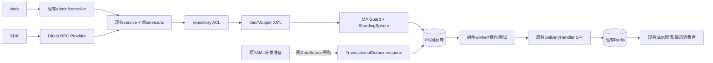
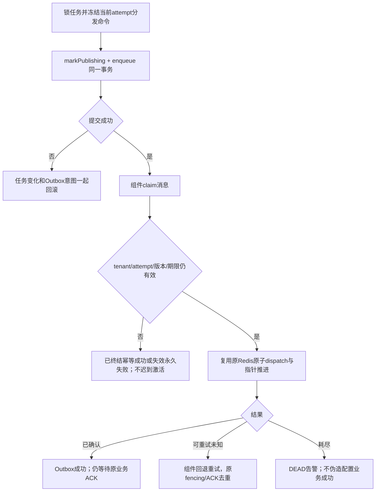
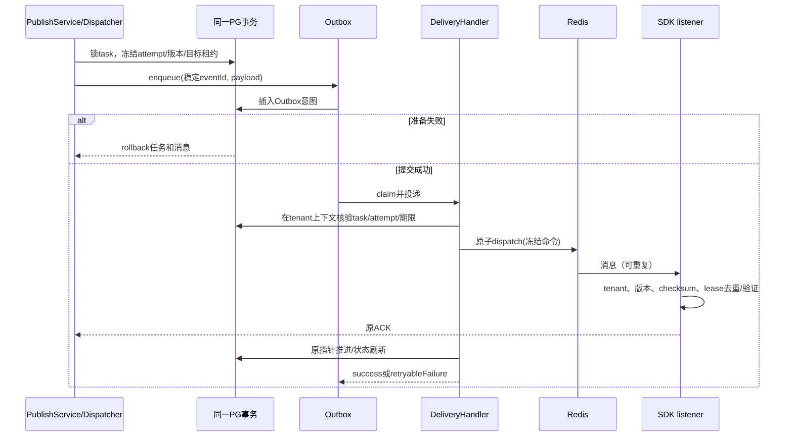
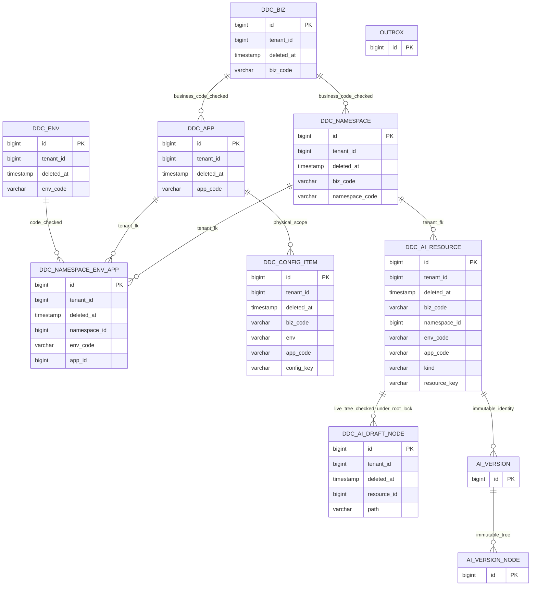

# 天枢 Java/CQE 最新规范适配修订

| Field | Value |
| --- | --- |
| Document | `2026-09-22-17-16-tianshu-java-cqe-standards-amendment.md` |
| Template Version | `7` |
| Status | `Review` |
| Type | `Architecture / Refactor` |
| Complexity | `Complex` |
| Complexity Drivers | 已接受规格的建模/包结构/删除契约修订，MP受控能力扩展，Outbox事务/Redis投递，多模块实施依赖 |
| Created | `2026-09-22 17:16 Asia/Shanghai` |
| Updated | `2026-09-23 06:23 Asia/Shanghai` |
| Owner | mario |
| Repository | Egon-COLA |
| Scope | 天枢既定多租户Prompt/Skill功能；最新Java/CQE标准与已批准组件扩展 |
| Change Surface | class/Builder/校验/转换、保留现有三层包、软删除唯一键和固定版本选择器、MP白名单、Outbox一张技术表及两类原通知 |
| Affected Chapters | §7, §8, §9, §10, §11, §12, §13, §14, §15, §16, §17, §18 |
| Source Requirement | 用户2026-09-22确认原Spec并要求适配最新技能后写Plan；明确本次不用code generator；随后批准Outbox依赖及受控MP历史读取/恢复扩展 |
| Baseline Revision | `main@b31357a0a`；原Spec SHA256 `ff8587c42b1d90a7bf841d8735f237d29949d66ffc09466e3fecea712220b753`；当前其他任务改动见§2 |
| Amends | [2026-09-21-17-18-tianshu-prompt-skill-management.md](2026-09-21-17-18-tianshu-prompt-skill-management.md) §3/6/7/8/9/10/11/12/13/14/15/16/17/19/20，严格按§5修订矩阵；其余需求/接口/字段继续有效 |
| Supersedes | None |
| Depends On | [2026-09-21-17-18-tianshu-prompt-skill-management.md](2026-09-21-17-18-tianshu-prompt-skill-management.md) §1–20，排除本稿明确替换的条款 |
| Related Specs | None |
| Related Plans | [天枢多租户AI实施计划](../plan/2026-09-23-06-16-tianshu-multitenant-ai-implementation.md) |

## 1. Summary

原Spec已由用户“确认”。本稿是后续修订，不回写原稿的规范正文。原14项功能需求继续有效：真正多租户、tenant内biz/namespace/env/app隔离、文本树、不可变发布快照、跨ns复制发布、两个starter开关默认false及Direct RPC按需读取。

适配后的实施合同：普通POJO/DTO/Command/Result使用class；EgonModel子类用SuperBuilder；不可逆投影用BaseForwardConverter；业务结构保持当前admin/controller、service、repository、model，不整体搬至biz.*。业务软删除键包含deleted_at并另有有效行唯一约束；Skill草稿节点不得物理DELETE。当前组件确有历史/恢复限制，本稿只设计用户已批准的默认关闭白名单扩展。

CQE复用已批准 `top.egon:egon-cola-component-transactional-outbox-starter:5.4.1`，通过现有Redis适配投递原YAML分发和Registry通知。实际组件只有**一张**消息表，不是提问时估计的两张；不引RabbitMQ/Kafka。AI管理的发布记录仍是本地审计，不为没有消费者的CRUD强造Event。

用户明确豁免正在开发的DDL/CRUD code generator：本任务手工实现经审核的文件与业务SQL，不安装生成器、不造替代生成器、不改其目录。现有protoc/MapStruct是协议/注解编译工具，继续使用既有构建流程，不属于被排除的后端模板生成器。本稿和配套Plan均为Review，不构成实施授权。

## 2. Background and Current State

| Evidence ID | Classification | Exact path/symbol/decision/command | Observed fact | Design significance | Verification limit/freshness |
| --- | --- | --- | --- | --- | --- |
| EVD-101 | User decision | 本轮“确认…适配…然后写plan…本次不使用” | 原功能设计接受；生成器豁免明确 | 可完成修订并写非Ready计划，不再重复审批原MP/MapStruct | 当前会话 |
| EVD-102 | Static | 两个技能references/egon-java-cqe-contract.md；backend-code-generation.md | class默认、Builder按继承、注解校验、deleted_at、CQE、依赖审批 | 覆盖旧规则 | 两技能资源preflight通过 |
| EVD-103 | Static | egon-cola-xingyuan/egon-cola-tianshu/egon-cola-tianshu-admin/src/main/java/top/egon/cola/component/tianshu/admin | 现有controller/service/repository/model，无biz根包 | 保留现有三层；新增dao和必要子包 | 未启动 |
| EVD-104 | Static | egon-cola-components/egon-cola-component-common/egon-cola-component-common-mybatis-plus-sharding-jdbc-ext-spring-boot-starter/src/main/java/top/egon/cola/component/common/mybatis/interceptor/EgonColaTenantIdGuardInnerInterceptor.java | PHYSICAL_DELETE_FORBIDDEN、ACTIVE_PREDICATE_REQUIRED，deleted_at只接受标准删除时间表达式 | 原稿物理删除/隐式读历史不可实施；不能关闭Guard | 当前源码 |
| EVD-105 | Static | 同模块model/EgonModel.java；extension/EgonColaRepository.java | SuperBuilder链、静态MDC租户、guarded写、仅mapper/properties getter | 改PO构造策略，沿用实际组件API | 新增enum治理未改变这些API |
| EVD-106 | Static | egon-cola-components/egon-cola-component-transactional-outbox-starter/api/TransactionalOutbox.java、delivery/DeliveryHandler.java、transaction/OutboxTransactionGuard.java（均src/main/java/top/egon/cola/component/outbox下） | enqueue要求已绑定同DataSource事务；handler SPI；跨Redis/DB不自动原子 | 必须真实事务验证，不能把RTopic调用称为Outbox | 未做PG/SS集成 |
| EVD-107 | Static | egon-cola-components/egon-cola-component-transactional-outbox-starter/src/main/resources/db/transactional-outbox/postgresql/V1__create_transactional_outbox_schema.sql | 单表egon_cola_outbox_message、技术dedup/claim索引 | 复制合同到本次唯一MP DDL，不执行组件旧Flyway建议 | 源文件不修改 |
| EVD-108 | Static | DdcConfigService.delete/rollback/pull；DdcPublishService.prepare；DdcPendingPublishDispatcher.dispatch | legacy deleted是配置业务状态，默认prepare排除它；原rollback改变该标记和草稿，当前发布指针另管 | 不能把legacy.deleted强行等同deleted_at改变线上行为 | 原Java/SQL链核对 |
| EVD-109 | Static | 当前工作区 | 其他任务修改玉衡Spec/Plan、archetype文件并制作code-generator目录；组件POM版本升级已单独提交 | 不写/暂存这些路径；依赖对齐当前5.4.1 | 编写前后按路径核查 |

路径缩写：T=`egon-cola-xingyuan/egon-cola-tianshu`；A=`egon-cola-xingyuan/egon-cola-tianshu/egon-cola-tianshu-admin`；S=`egon-cola-xingyuan/egon-cola-tianshu/egon-cola-tianshu-starter`；R=`egon-cola-components/egon-cola-component-rpc/egon-cola-component-rpc-tianshu-adapter`；W=T/egon-cola-tianshu-admin-web；AJ=A/src/main/java/top/egon/cola/component/tianshu/admin；SJ=S/src/main/java/top/egon/cola/component/tianshu；RJ=R/src/main/java/top/egon/cola/component/rpc/tianshu；MP=`egon-cola-components/egon-cola-component-common/egon-cola-component-common-mybatis-plus-sharding-jdbc-ext-spring-boot-starter`；MJ=MP/src/main/java/top/egon/cola/component/common/mybatis。这些是文档定位别名，不是拟新建目录。

### 2.4 Evidence and current-chain map

| Entry/trigger | Current call chain | Data read/written | External dependency | Consumers | Evidence |
| --- | --- | --- | --- | --- | --- |
| YAML发布 | DdcPublishService→DdcPendingPublishDispatcher→DdcRedisRepository.dispatch→推进publishedVersion→ACK | 任务/ACK/配置历史＋Redis | PG、Redis | 已有SDK listener | EVD-108 |
| Registry变化 | DdcServiceRegistryRedisRepository→RTopic.publish(DdcRegistryEvent) | Redis目录/修订 | Redis | 现有目录订阅＋周期reconcile | EVD-106/108；原Spec§2 |
| AI管理 | 当前尚未实现，原Spec完整定义 | 5张拟建AI业务表 | Direct RPC/PG | 新页面与只读SDK | 原Spec§9/11 |

## 3. Goals and Non-goals

本稿只修订规范和实施可行性，不新增AI运行、格式渲染、Git/ZIP、审核/灰度/标签。跨ns仍限同一tenant，现有目标草稿仍保留。Outbox不使AI SDK变成订阅客户端。

### 3.3 Change Surface and Design Depth

| Area/layer | Disposition | Exact repository evidence | Changed or preserved behavior/contract | Required Spec treatment | Chapter(s) |
| --- | --- | --- | --- | --- | --- |
| Java模型/校验/转换 | Affected | EVD-102/105 | class默认、SuperBuilder、Forward投影、约束注解 | 逐类型/注解/边界 | §7, §8, §10, §13, §14 |
| 包结构/MP受控能力 | Affected | EVD-103/104 | 不整体搬包；历史查询/恢复按明确statement允许 | 精确文件、策略与默认拒绝 | §7, §8, §9, §14, §15 |
| 删除/业务唯一/版本选择 | Affected | 原Spec§9/11，EVD-104 | lifecycle组合键＋live guard，删除重建新身份；固定版防误命中新根 | 逐表索引、契约、UI与测试 | §9, §11, §12, §14, §16 |
| Event/Outbox | Affected | EVD-106/107 | 新依赖获批准，原两类通知经真实Outbox | payload/事务/适配/重试/死信/表 | §7, §8, §9, §11, §14, §15, §16 |
| 生成器/依赖/计划治理 | Affected | 用户本轮指令 | 手工实现批准产物；不运行未来generator | 豁免、依赖证据、恢复点 | §8, §16, §17, §18 |
| 其余REST/AI正文/租户隔离 | Context-only | 原Spec§9/15 | 除明确selector/delete结果外，原完整wire、HMAC v2、Redis v4不变 | 继承原合同＋golden fixture | §9, §15 |
| 其他平台业务、generator本体 | Unchanged | 当前其他工作区文件 | 不修改 | 路径隔离验证 | §8, §16 |

## 4. Requirements and Acceptance Criteria

原Spec REQ-001～REQ-014原义全部继承；REQ-010的当前阶段由本轮明确请求推进至“只更新Spec和写Plan，不实施”。本稿新增：

| ID | Atomic requirement | Priority | Observable acceptance criteria | Source |
| --- | --- | --- | --- | --- |
| REQ-015 | 按2026-09-22 Java规范建模/校验/转换 | Must | 普通POJO class、PO SuperBuilder、注解约束、投影BaseForward，wire不漂移 | 本轮最新技能/显式批准 |
| REQ-016 | 本任务不使用正在开发的后端code generator | Must | 不调用/引入生成器及模板引擎；既有protoc和MapStruct编译保留 | 本轮最新技能/显式批准 |
| REQ-017 | CQE通知通过批准的Outbox实际投递 | Must | Admin复用5.4.1 Outbox＋现有Redis，冻结消息/重试/死信/去重明确 | 本轮最新技能/显式批准 |
| REQ-018 | 按批准范围增加受控MP历史读取和恢复 | Must | 默认空白名单，保留tenant/id/version/audit/routing守卫，不开放物理删除 | 本轮最新技能/显式批准 |
| REQ-019 | 业务唯一键遵循deleted_at生命周期 | Must | 组合键＋有效行唯一；删除重建/重复时间/恢复冲突/固定版本身份均有明确结果 | 本轮最新技能/显式批准 |

### 4.1 Scenario matrix

| Scenario | Actor/trigger | Preconditions | Main path | Alternative/failure path | Data/state change | Observable result | Requirements |
| --- | --- | --- | --- | --- | --- | --- | --- |
| 普通DTO序列化 | 编译/调用方 | class新模型 | 注解creator/约束验证 | 缺字段/非法值400 | wire不变 | 不因改class丢失required/null | REQ-015 |
| 删除重建再删 | 管理员 | 一个live业务键 | 删除、同键创建新ID、再删 | 同历史微秒冲突回滚并新事务最多重试3次 | 多个历史、唯一live | 不丢历史、不误恢复新根 | REQ-019 |
| 固定旧版读取 | SDK | 旧根已删除且同key有新根 | versionNo＋resourceId定位 | 原根删/不匹配404，不回退新根 | 无写 | 不读取新根的同号版本 | REQ-005/019 |
| restore冲突 | 受控组件调用 | 允许statement，旧行非live | 带tenant/id/version恢复 | live key占用则409/UK冲突全回滚 | 无跨租户恢复 | 普通CRUD无此权限 | REQ-018/019 |
| Outbox提交前失败 | 发布服务 | 同DataSource事务 | task准备＋enqueue | 任一失败一起回滚 | 无半个消息意图 | enqueue不是本地日志 | REQ-017 |
| 远端成功、本地未确认 | Outbox worker | 消息已提交 | Redis执行/消费后重试 | 业务去重、版本/租约fencing | 可重复投递、业务不重复套用 | 不宣称exactly-once | REQ-017 |
| Registry到Outbox窗口 | Registry writer | Redis已变更 | 新SQL事务enqueue通知 | enqueue失败不能回滚Redis；记录并由现有reconcile恢复客户端状态 | Redis权威状态保留 | 明示窗口、不承诺每个中间修订都有审计事件 | REQ-017 |

### 4.2 Use-case analysis

| Actor ID | Actor/role | Goal and responsibility | Entry/channel | Permission/tenant context | Evidence |
| --- | --- | --- | --- | --- | --- |
| ACTOR-101 | 原管理员/SDK | 保持原业务并使用新删除/版本边界 | 原API/SDK | 原tenant与namespace权限 | 原Spec ACTOR-001/002 |
| ACTOR-102 | 开发与受控运维 | 按新标准实施、核验消息与恢复保护 | Plan/CLI/测试 | 不增加普通用户管理后门 | 本轮指令、组件能力 |

| ID | Use case/goal | Primary actor | Supporting actors/systems | Trigger | Preconditions | Main success outcome | Alternatives/failures | Postconditions | Requirements | Interfaces/pages | Tests |
| --- | --- | --- | --- | --- | --- | --- | --- | --- | --- | --- | --- |
| UC-101 | 同键重建但不误读旧版 | ACTOR-101 | PG/SDK | 删除后创建/固定版读取 | 原权限保持 | 新根独立，旧固定版失败而非回退 | 同live key冲突、旧ID无权 | 一live/多历史 | REQ-019 | API-002/005、RPC-001/002 | TEST-101/102 |
| UC-102 | 跨进程可靠重试原通知 | ACTOR-101 | Outbox/Redis | 原发布/目录更新 | 当前有效tenant和冻结payload | 已入队消息按策略投递、业务去重 | 崩溃/超时/DEAD/源到队列窗口 | 不假称全局原子 | REQ-017 | EVENT-101/102 | TEST-103/104 |
| UC-103 | 受控读历史和恢复 | ACTOR-102 | MP Guard | 注册statement后调用 | 默认拒绝；精确白名单 | 仅合法tenant/id/version操作 | 越权、普通CRUD、SQL不符全部拒绝 | 无Guard旁路 | REQ-018 | INTERNAL-101/102 | TEST-105 |
| UC-104 | 按规范手工实施 | ACTOR-102 | 当前组件/编译工具 | 计划获后续批准 | 本轮无实现 | class/约束/投影/布局合规 | 不添加未批依赖/不使用generator | 本轮只形成文档 | REQ-015/016 | 文件清单、Plan | TEST-106 |

## 5. Constraints, Assumptions, and Decisions

### 5.1 Confirmed constraints

原Spec已接受；本稿新增规范/边界尚待整体Review。用户已明确批准Outbox进入Admin（批准时仓库版本5.4.0，当前同一组件随父POM升级为5.4.1），以及默认关闭的MP历史读取/版本化恢复扩展。批准上限不等于无理由扩大：Outbox实际只有一张技术表，普通配置deleted业务标记不改为deleted_at，天枢生产恢复白名单默认空，只启用确实需要的历史读取；组件恢复能力按用户单独批准完成合同测试。

### 5.2 Small-gap assumptions

| ID | Inference | Repository evidence | Why locally reversible | Impact if wrong |
| --- | --- | --- | --- | --- |
| ASM-101 | 手工豁免只针对在制后端DDL/CRUD生成器 | 用户指出该工具正在制作；protoc/MapStruct已存在 | 不改变协议/业务，只明确工具范围 | 若另有约束则调整构建门禁 |
| ASM-102 | 保留现有admin包而不套biz根 | 最新“三层结构保持现状”、当前源树 | 减少无业务价值搬包 | 只影响新文件定位 |

### 5.3 Resolved decisions and normative replacement matrix

| Replaces base section | Effective replacement | Authority / effect |
| --- | --- | --- |
| §6.2 Rule3、§10普通DTO record/PO businessBuilder/RequiredArgs | 普通class；EgonModel继承链SuperBuilder；无data-class RequiredArgs；只有明确不可变值对象可record | 用户最新规则 |
| §8整体biz.*迁包和旧Service机械接口化 | 现有controller/service/topic/repository/model保留；新增dao、model/po/bo/convertor、repository/impl、service/ai/impl | 保留现有三层，不发明DDD/第四层 |
| §10为了BaseConverter给不可逆投影造反向映射 | 双向BO↔PO用BaseConverter；BO/PO→外部投影用BaseForwardConverter | 当前common两种合同 |
| §10.3业务规则只放策略/ValidationUtils | Native＋可复用自定义约束和ConstraintValidator；状态权限/事务仍归Service；工具只手工触发 | 最新注解驱动校验 |
| §11仅partial业务索引、AI根永久占业务key | mutable业务K＋deleted_at lifecycle unique＋live partial unique；root删除后可同键新ID | 最新软删除要求 |
| §11草稿节点物理DELETE和parent_path物理FK | 节点软删除；有效树由根锁/同owner查询/dirname规则/校验保证，移除不可能引用partial unique的父path FK | 当前MP禁止物理删除 |
| §9 RPC版本仅versionNo | 固定版本必须同时传resourceId；新增optional proto字段7，当前动态读取可不传 | 防止同key重建后同号新版本误命中 |
| §9/15原RTopic直接充当全部Event交付 | 已有通知由Outbox真实入队和DeliveryHandler投递；AI CRUD不发无消费者Event | 用户已批准Outbox |
| §16 V10新Flyway风格路径/手工manifest名 | 唯一 `db/egon-mp/V20260922_001__tianshu_platform.sql`＋`repository-manifest.json`；新目标未实施，无旧应用checksum可改 | 最新MP-SDJ管理；V1～V9仅归档 |
| §20旧严格校验与构造探针 | 只证明旧版本规则；当前以本修订及Plan最新校验为准 | 不拿旧PASS替代新规则 |

### 5.4 Open major decisions

None。Plan按用户显式要求可在本修订Review状态下编写为Review；不能标Ready或开始实施。

## 6. Project Technology Context

原Spec版本和依赖边界保持：Java21/Boot3.5.16/Lombok1.18.46，MP/Outbox 5.4.1、MapStruct1.6.3/binding0.2.0。MapStruct与MP的精确引入已随原Spec被确认；新Outbox已单独批准；Rabbit/Kafka/模板引擎/新SQL解析器/测试依赖不新增。版本核对：批准引入Outbox时父POM为5.4.0，2026-09-23仓库独立提交将同一组件升级至5.4.1，当前Plan按最新父POM对齐，不新增第二种组件；实施前仍需编译与同DataSource验证。

### 6.1 Java architecture profile and capability baseline

Traditional layered。当前AJ/controller→service（原具体现有Service保留）→repository防腐→新dao/Mapper。旧JPA实体不再作为Repository对Service的返回；用已设计BO/投影隔离，不移动其他平台。新AI Service接口多入口复用，impl置于service/ai/impl；不强制改造所有旧Service为接口。

| Need | Spring/JDK candidate | Spring Boot Starter candidate | Egon-COLA/module candidate | Proven gap | Decision/dependency impact |
| --- | --- | --- | --- | --- | --- |
| 模型/投影 | Lombok/MapStruct | 既有processor | BaseConverter/BaseForwardConverter | 旧方案不必要反向映射 | 不新增converter框架 |
| 约束 | Jakarta ConstraintValidator | validation | ValidationUtils | 树/互斥/selector是可复用约束 | 新增少量明确注解类，不改common工具用途 |
| 生命周期 | PG唯一键/版本SQL | MP | Guard/ModelValidation | 默认拒绝历史/恢复/物理删 | 按批准增加精确白名单，不关Guard |
| Event交付 | 既有Redis客户端 | Outbox5.4.1 | TransactionalOutbox/DeliveryHandler | Admin当前无依赖 | 只在Admin引入，既有SPI两适配 |
| 后端模板 | N/A | N/A | 在制generator | 用户明确排除 | 无工具阻塞，无命令/依赖/生成标记 |

### 6.2 User-mandated Java rule compliance

最新原文保留如下，优先于旧稿：

```text
1 类名规范，必须以 java的pojo规范命名。以dao po bo vo dto query command event等结尾
2 每层之间必须被 springboot-validation 校验，复用对象使用分组校验；基于原生和自定义约束注解、@Valid、@Validated 及 ConstraintValidator 扩展实现。ValidationUtils 只承担通用手工校验，不承载全部业务校验；电话号码复用 libphonenumber。
3 Java POJO 默认使用 class，注解为 @Data @NoArgsConstructor @AllArgsConstructor @Accessors(chain = true)，按构造目标选择 @Builder 或 @SuperBuilder；父类状态参与相等性时使用 @EqualsAndHashCode(callSuper = true)。只有不可变 value object 可以使用 record，并豁免 class 的 Lombok 规范；普通实体不能因简单而使用 record。使用 MapStruct、MapStructPlus 和 egon-cola-component-common-core 的 BaseConverter（双向）或 BaseForwardConverter（不可逆投影）进行转换。
4业务类必须使用@Slf4j注解注入log对象。如果业务类被spring管理，必须指定名称，如果是单例的情况下，参考@Service("userService")。如果需要依赖注入，必须@RequiredArgsConstructor进行修饰，不要代码中写。且属性必须被@qualify修饰。
5 工具类只允许使用jdk原生、Apache Commons(commons-lang3、commons-collections4、commons-io、commons-text、commons-codec、commons-beanutils)、Guava。针对Tika按需引入。
6 JSON 使用 Spring Boot Jackson；持久化枚举值使用 @EnumValue，向前端输出的枚举值使用 @JsonValue，禁止 ordinal 作为业务编码。
7 springboot 多环境配置文件，必须保持配置一致，但值不一定一致。
9 复杂业务必须引入设计模式，不允许硬编码
10 日期相关的必须使用java.time下的实体类，不允许使用java.util下的
11 只允许现有三层结构或当前 egon-cola-archetypes 的 DDD 结构，三层结构保持现状。必须尽量复用 egon-cola-components；持久化模块必须使用 Egon COLA MP Starter，DDL 统一由 egon-mp-sdj-ext-starter 分布式管理。业务唯一键必须组合业务列与 deletedAt（数据库 deleted_at），并验证 NULL、租户及重复软删除语义。采用 CQE（Command Query Event）；Event 必须经 egon-cola-component-transactional-outbox-starter 或 MQ 中间件投递。
```

| Literal rule | Affected? | Repository evidence | Exact design decision | Files/types/interfaces | Validation/test evidence | Status/blocker |
| --- | --- | --- | --- | --- | --- | --- |
| Rule 1 | Yes | EVD-102～108、§8/10/11 | class/类型角色明确，不造Data/Info | 本稿精确清单＋原稿不变字段 | TEST-101～106与原TEST | PASS |
| Rule 2 | Yes | EVD-102～108、§8/10/11 | 注解、分组、级联、代理/手工边界 | 本稿精确清单＋原稿不变字段 | TEST-101～106与原TEST | PASS |
| Rule 3 | Yes | EVD-102～108、§8/10/11 | 普通class；PO SuperBuilder；Forward投影 | 本稿精确清单＋原稿不变字段 | TEST-101～106与原TEST | PASS |
| Rule 4 | Yes | EVD-102～108、§8/10/11 | 具名Bean、Slf4j、RequiredArgsConstructor仅DI、Qualifier | 本稿精确清单＋原稿不变字段 | TEST-101～106与原TEST | PASS |
| Rule 5 | Yes | EVD-102～108、§8/10/11 | JDK/允许工具；不引模板引擎 | 本稿精确清单＋原稿不变字段 | TEST-101～106与原TEST | PASS |
| Rule 6 | Yes | EVD-102～108、§8/10/11 | Jackson＋EnumValue/JsonValue显式code | 本稿精确清单＋原稿不变字段 | TEST-101～106与原TEST | PASS |
| Rule 7 | Yes | EVD-102～108、§8/10/11 | 全profile结构一致 | 本稿精确清单＋原稿不变字段 | TEST-101～106与原TEST | PASS |
| Rule 9 | Yes | EVD-102～108、§8/10/11 | Content Strategy＋已有Outbox DeliveryHandler策略 | 本稿精确清单＋原稿不变字段 | TEST-101～106与原TEST | PASS |
| Rule 10 | Yes | EVD-102～108、§8/10/11 | java.time UTC/原LocalDateTime语义 | 本稿精确清单＋原稿不变字段 | TEST-101～106与原TEST | PASS |
| Rule 11 | Yes | EVD-102～108、§8/10/11 | 现有三层、MP分布式DDL、lifecycle unique、真实CQE | 本稿精确清单＋原稿不变字段 | TEST-101～106与原TEST | PASS |

## 7. Architecture Design

### 7.0 Minimum-design baseline and element-necessity audit

| Proposed element | Change | Requirements | Existing/direct alternative | Concrete inadequacy of alternative | Added calls/state/coupling/failures/migration/operations | Verdict |
| --- | --- | --- | --- | --- | --- | --- |
| 保留当前三层包 | Keep | REQ-015 | 整体biz迁包 | 无业务收益且不符最新指令 | 减少变动 | Keep |
| 四类可复用约束 | Add | REQ-015 | 工具中散落if | 不能覆盖代理/非HTTP同一元数据 | 8个注解/validator文件 | Add |
| MP历史/恢复 | Add | REQ-018 | 关闭active/tenant Guard、JDBC业务旁路 | 违反安全/组件合同 | 精确statement配置与负例测试 | Add，已批准 |
| Outbox | Add | REQ-017 | 本地事件/日志或直接RTopic当可靠意图 | 无持久化待投递记录/重试租约 | 一技术表、worker、两handler | Add，已批准 |
| AI CRUD Event | Remove | REQ-017 | 同步查询＋发布审计 | 没有订阅消费者需要新事件 | 避免无效队列/接口 | Remove |
| generator调用或替代工具 | Remove | REQ-016 | 手工批准文件 | 用户明确排除在制工具 | 不改其目录/依赖 | Remove |

| Path | Network calls | Client states | Server contracts/state | Failure and TOCTOU points | Additional user/business value |
| --- | --- | --- | --- | --- | --- |
| AI管理基线 | 同原Spec | 同原Spec | 同步发布/回执 | 同原Spec | 不因CQE增加虚假事件 |
| YAML分发修订 | 业务事务本地enqueue＋异步Redis | 原ACK/超时状态 | Outbox意图/重试/DEAD | Redis成功到本地确认之间可重复 | 消息意图可恢复 |
| 版本固定 | 一次RPC | 多一个稳定root ID配置 | 同字段号追加selector | 当前key可能重建 | 拒绝误读新身份同号版本 |

### 7.1 System Architecture Design



### 7.2 High-Level Design



#### 7.2.2 High-level decision and quality matrix

| Concern/use case | Required behavior | Selected mechanism | Failure/degradation behavior | Trade-off | Verification | Requirements |
| --- | --- | --- | --- | --- | --- | --- |
| 数据/消息意图 | YAML准备与消息同提交 | 同一个logical DataSource/transactionManager＋enqueue | 事务不匹配立即失败 | PG/SS真实验证不能省 | TEST-103 | REQ-017 |
| 软删唯一 | 一个live、多条历史 | K+deleted_at＋live partial | 时间冲突新事务最多3次，仍冲突409 | 不伪造高精度绝不冲突 | TEST-101 | REQ-019 |
| Guard最小权 | 默认拒绝历史/恢复 | 精确Mapper statement白名单 | 不识别SQL/无租户/版本失败 | 组件少量新合同 | TEST-105 | REQ-018 |
| 不改变AI消费 | 按需读取 | AI无外部Event | 不加客户端订阅 | CQE不等于每次CRUD发事件 | TEST-102/原TEST-005 | REQ-007/017 |

### 7.3 Detailed Design



新增Outbox不能改变“Redis投递成功不等于业务ACK完成”。DdcPendingPublishDispatcher原命令冻结和markPublishing合并进一个TransactionTemplate，随后只enqueue；旧dispatch和advancePublishedVersion逻辑提取到DdcConfigDispatchDeliveryHandler调用的原Service方法，不能简化成仅RTopic.publish。重复消息必须复用原Redis幂等/fencing，并检查task attempt和deadline；已终结/已被新attempt取代的旧消息不再激活旧版本。SYNC仍按原超时等ACK，ASYNC仍返回原PUBLISHING语义；Outbox排队/失败不能返回伪成功。

Registry权威状态在Redis，不能声称与PG Outbox原子。原Redis更新成功后，在独立SQL事务enqueue冻结的`serviceKey/serviceRevision/catalogRevision`通知；该窗口内崩溃可能丢失一次通知意图。此通知用途只是失效/重载提示，已有SDK周期reconcile读取权威目录恢复状态，允许中间revision合并，不承诺逐变化审计。enqueue失败记录tenant/scope/revision、返回/异常按原registry操作已提交与否区分，不补写假事务，不回滚已提交Redis。已成功入Outbox的消息由组件至少一次尝试投递；Redis Pub/Sub无离线持久订阅，消费者断开仍依赖reconcile，不能宣传端到端至少一次或exactly-once。

#### 7.3.6 Conclusion evidence chain

| Conclusion | Repository/user evidence | Constraint or requirement | Design decision | Consequence and trade-off | Verification and acceptance evidence |
| --- | --- | --- | --- | --- | --- |
| 不能保留物理删草稿节点 | EVD-104 | REQ-015/019 | 改软删及live路径唯一，父path引用由根事务校验 | 不关闭Guard；调整父path FK | TEST-101/105 |
| Outbox用实际SPI | EVD-106/107、用户批准 | REQ-017 | 一个技术表＋两个DeliveryHandler | 不引新Broker，明示Redis源到SQL窗口 | TEST-103/104 |
| 只改规范有关结构 | 当前树＋用户生成器豁免 | REQ-016 | 保留包/手工文件，原功能合同继承 | 避免无意义迁包/工具依赖 | Plan清单及TEST-106 |

## 8. Package Structure and Code File Tree

原稿AJ/biz整体目标取消。下面是确定的角色定位，Plan把全部文件展开并附源hash；不是增加新层：

```text
AJ/controller/ai/DdcAiResourceController.java
AJ/service/ai/DdcAiResourceService.java
AJ/service/ai/impl/DdcAiResourceServiceImpl.java
AJ/service/ai/validation/       # 状态/权限；纯值约束在S共享
AJ/repository/                 # 原同名接口改成领域BO合同
AJ/repository/impl/            # MP实现
AJ/dao/                        # Mapper
AJ/model/{po,bo,dto,vo,query,command,convertor}/
AJ/service/publish/            # 原发布流程保留主题包
AJ/service/notification/       # Outbox两handler和通知publisher
SJ/model/ai/validation/        # 自定义注解/ConstraintValidator
SJ/model/event/                # 新CQE封装
MJ/{autoconfigure,interceptor,model,extension}/ # 受控生命周期扩展
A/src/main/resources/db/egon-mp/V20260922_001__tianshu_platform.sql
A/src/main/resources/db/egon-mp/repository-manifest.json
```

| Operation | Path/package | Symbols | Responsibility | Dependencies | Requirements |
| --- | --- | --- | --- | --- | --- |
| Create/Modify | 原Spec§8所有DTO/Command/Result，按上表定位 | 原名称保持，class/注解修订 | 不改JSON字段，creator保留NULL/缺失区别 | Lombok/Jackson | REQ-015 |
| Create | SJ/model/ai/validation/ValidAiNode.java + AiNodeValidator.java；ValidAiContent.java + AiContentValidator.java；PublishableAiContent.java + AiPublishableContentValidator.java；ConsistentAiVersionSelector.java + AiVersionSelectorValidator.java | Jakarta @Constraint/ConstraintValidator | 纯值/树/发布与selector规则 | Jakarta Validation | REQ-015/019 |
| Modify | MJ/autoconfigure/EgonColaMybatisPlusProperties.java、EgonColaMybatisPlusContractValidator.java；interceptor/EgonColaTenantIdGuardInnerInterceptor.java、EgonColaModelValidationInterceptor.java；model/EgonModel.java、EgonColaModelValidationGroups.java；extension/EgonColaIRepository.java、EgonColaRepository.java、EgonColaMapper.java | lifecycle白名单、Restore组/Operation | 默认拒绝，精确允许历史/恢复 | 原组件API | REQ-018 |
| Create | SJ/model/event/DdcConfigDispatchPreparedEvent.java、DdcRegistryRevisionEvent.java | class事件封装 | 稳定eventId/tenant/schema/payload | 原消息类型 | REQ-017 |
| Create | AJ/service/notification/DdcConfigDispatchDeliveryHandler.java、DdcRegistryEventDeliveryHandler.java、DdcNotificationPublisher.java；AJ/model/convertor/DdcConfigDispatchEventConverter.java；AJ/config/DdcOutboxConfiguration.java | 两个DeliveryHandler＋enqueue封装 | 冻结消息、校验tenant/目的地、分发/重试结果 | Outbox、现有ddcAdminRedissonClient | REQ-017 |
| Modify | A/pom.xml；A application.yml/local/test、共享持久化yml | 唯一新Outbox依赖；同DS/事务选择 | 开关/重试/payload/路由/生命周期列表 | 已批准引入Outbox（当前父POM为5.4.1） | REQ-017/018 |
| Modify | DdcPendingPublishDispatcher、DdcPublishService、DdcServiceRegistryRedisRepository、两类SDK listener | Event生产/消费 | 保留原业务ACK/目录reconcile | 既有函数 | REQ-017 |
| Modify | 原AI create/delete/UI/RPC selector 文件 | resourceId与deleted key生命周期 | 同key新根不得代替固定旧根 | 原接口 | REQ-019 |

依赖登记：MP5.4.1＋A/R MapStruct1.6.3/processor/binding0.2.0已随原Spec批准；Outbox只进入Admin（本轮批准时5.4.0，当前父POM5.4.1）；其common-id/core/Spring JDBC/AOP/validation传递依赖沿组件POM，optional Rabbit不引入。generator/FreeMarker/Velocity/新SQL parser不进入任何本任务应用POM。当前其他任务的工作区文件和generator目录不可修改；组件版本已由独立提交升到5.4.1。

## 9. Interface Definitions

### 9.0 API protocol and documentation governance

CQE：原AI的Query与Command分离和共享库保持；没有真实消费者的AI CRUD不发Event。原11个REST契约除本稿明确的create/delete生命周期与Java载体外不变，仍由原Spec完整jsonc/OAS治理。两项固定版RPC selector改变、两项事件和两项内部MP合同按下文展开。REST仍code-first/springdoc2.8.17/OAS3.1，默认关闭docs，401/403原wrapper不改。

| Concern | Decision/evidence |
| --- | --- |
| Protocol selection | 原人工REST、机器Direct RPC；新增两类原通知的Outbox Event，不引GraphQL |
| CQE application level | L1 C/Q共享存储；E只用于真实跨进程原通知，实际enqueue/DeliveryHandler |
| REST source of truth | 原Spec code-first映射/DTO/Jackson/Validation/OpenAPI，本稿仅明确delta |
| GraphQL source of truth | N/A，无GraphQL需求 |
| Springdoc/OpenAPI compatibility | 原Boot3.5.16＋springdoc2.8.17＋OAS3.1，无升级 |
| Legacy Swagger/Springfox status | 不新增Springfox/旧Swagger；沿原依赖 |
| Security and documentation exposure | 原tenant/HMACv2/namespace权限、默认docs关闭；Event目的地再验tenant |
| Contract publication and drift gate | 原TEST-012读取实际OAS；TEST-102/106核对selector和class golden wire |

### 9.1 Interface Inventory

| ID | Change/necessity verdict | Name/purpose | Kind | API style/CQE role | Consumer | Owner | Method + URL / GraphQL field / symbol / topic | Operation ID/schema source | Input | Output | Auth/tenant | Error model | Idempotency/version | Requirements |
| --- | --- | --- | --- | --- | --- | --- | --- | --- | --- | --- | --- | --- | --- | --- |
| API-002 | Modify/Keep | 创建草稿资源 | HTTP | REST Command | AI管理页面 | DdcAiResourceController.create→DdcAiResourceService.create | POST /api/v1/tianshu/ai/resources | createAiResource | DdcAiCreateCommand | ResultRecord | 可信tenant；WRITE | §9.0.1 | 条件修订、UK或只读 | REQ-001～008/012/013 |
| API-005 | Modify/Keep | 删除资源可见性 | HTTP | REST Command | AI管理页面 | DdcAiResourceController.delete→DdcAiResourceService.delete | DELETE /api/v1/tianshu/ai/resources/{id} | deleteAiResource | DdcAiDeleteCommand | 204 | 可信tenant；WRITE | §9.0.1 | 条件修订、UK或只读 | REQ-001～008/012/013 |
| RPC-001 | Modify/Add | 固定Prompt版 | RPC | Query | 已有SDK/Repository | 天枢或MP | DdcAiResourceService/GetPrompt | 本稿§9.2 | 下文精确输入 | 下文结果 | tenant严格绑定 | 下文 | 稳定身份/版本 | REQ-017/018/019 |
| RPC-002 | Modify/Add | 固定Skill版 | RPC | Query | 已有SDK/Repository | 天枢或MP | DdcAiResourceService/GetSkill | 本稿§9.2 | 下文精确输入 | 下文结果 | tenant严格绑定 | 下文 | 稳定身份/版本 | REQ-017/018/019 |
| EVENT-101 | Modify/Add | 原配置分发已准备 | Event | Event | 已有SDK/Repository | 天枢或MP | DdcConfigDispatchPreparedEvent | 本稿§9.2 | 下文精确输入 | 下文结果 | tenant严格绑定 | 下文 | 稳定身份/版本 | REQ-017/018/019 |
| EVENT-102 | Modify/Add | 原目录revision通知 | Event | Event | 已有SDK/Repository | 天枢或MP | DdcRegistryRevisionEvent | 本稿§9.2 | 下文精确输入 | 下文结果 | tenant严格绑定 | 下文 | 稳定身份/版本 | REQ-017/018/019 |
| INTERNAL-101 | Modify/Add | 白名单历史查询 | Internal | Query | 已有SDK/Repository | 天枢或MP | EgonColaTenantIdGuardInnerInterceptor.validateFinal | 本稿§9.2 | 下文精确输入 | 下文结果 | tenant严格绑定 | 下文 | 稳定身份/版本 | REQ-017/018/019 |
| INTERNAL-102 | Modify/Add | 受控版本化恢复 | Internal | Command | 已有SDK/Repository | 天枢或MP | EgonColaRepository.restoreById | 本稿§9.2 | 下文精确输入 | 下文结果 | tenant严格绑定 | 下文 | 稳定身份/版本 | REQ-017/018/019 |

### 9.2 Per-interface Detailed Contracts
#### 9.2.2 API-002 — 创建草稿资源

##### Necessity and interaction-cost decision

| Concern | Decision |
| --- | --- |
| Change classification | Modify |
| Independent consumer goal | 创建草稿资源；直接完成用户提交的业务操作 |
| Parameter ownership and derivation | §9.0.1：用户只选择业务值；tenant/actor/内容hash由服务端派生 |
| Direct/no-new-interface alternative | 原YAML端点受文件名/单配置/ACK限制，不能复用；不另加操作上下文preflight |
| Caller use of result | 显示操作结果，刷新资源和历史；不会复制正文再上传 |
| Round trips and failure points | 一次业务调用；命令复核可变状态，查询不作为后续授权证明 |
| Verdict | Add：用户可观察目标，覆盖REQ-001～008/012 |

##### API style and CQE semantics

| Concern | Decision/evidence |
| --- | --- |
| Protocol style | REST Command |
| CQE role | L1；状态变更由Service的LOCAL事务拥有 |
| Resource/task semantics | POST /api/v1/tianshu/ai/resources；创建草稿资源 |
| Read/write and side effects | 只写本操作涉及的当前租户资源；发布类另写回执，提交前不可见 |
| Consistency and idempotency | §7锁/修订/UK；不自动重试，未知结果先刷新；DELETE重复效果幂等 |
| Why this style | 当前React/REST消费者，新增GraphQL或异步总线无必要 |

##### Identity and purpose

| Concern | Definition |
| --- | --- |
| Purpose/owner/consumer | 创建草稿资源；Controller/create→Service/create，AI管理页 |
| Protocol and endpoint | HTTP POST /api/v1/tianshu/ai/resources；沿现有/api/v1/tianshu前缀，无新增context-path |
| Content type/version | application/json UTF-8；204无正文；v1资源API |
| Auth/permission/tenant | §9.0.1 WRITE；tenant只取已验证主体和已配置租户绑定 |
| Timeout/retry/rate limit | 10s客户端/8s事务语句/2s锁；§9.0.1；不新增速率计数状态 |
| Idempotency/concurrency | 读取安全；创建UK防重复；保存/删除必须预期revision；无无条件覆盖 |

##### Request parameters

| Name | Location | Type/format | Required/null | Default | Validation/range/enum | Meaning | Example | Source |
| --- | --- | --- | --- | --- | --- | --- | --- | --- |
| Authorization | Header | Bearer | Yes | 无 | 现有JWT验证＋RBAC主体绑定 | 当前用户及tenant | Bearer synthetic | 认证链，不接受operator |
| X-Egon-Tianshu-Tenant | Header | string / URI-encoded身份tenantId | Yes | 无 | 解码一次后必须等于可信主体tenant；不用于选择tenant | 防止浏览器旧tenant页面误操作 | 1001 | bootstrap.user.tenantId |

Cookie/Multipart: None。Body为 `DdcAiCreateCommand`；所有以下字段必须出现，允许NULL仅限规则明确标注者；完整字段约束见§9.0.1/§10。
```jsonc
{
  "scope": { // 业务范围；租户只来自认证上下文
    "bizCode": "retail", // 业务域编码，1..128
    "namespaceCode": "dev-space", // namespace编码，1..128
    "env": "dev", // 环境编码，1..32
    "appCode": "assistant-app" // 应用编码，1..128
  },
  "kind": "SKILL", // PROMPT或SKILL；创建后不可变
  "resourceKey": "review-order", // 稳定键，ASCII字母数字起始，后续字母数字点下划线横线，1..128
  "displayName": "订单审核", // 名称，trim后1..128字符
  "description": "文本技能", // 描述，0..2048字符，空串允许
  "draft": { // 可编辑完整内容，不表示已发布
    "promptText": null, // PROMPT为非NULL文本，SKILL必须NULL；不trim
    "nodes": [ // SKILL完整节点树含根；PROMPT必须[]
      {
        "path": "", // 规范相对路径；根为空串，UTF-8不超过1024字节
        "nodeType": "DIRECTORY", // DIRECTORY或FILE
        "content": null // FILE的原文可为空串；DIRECTORY必须NULL
      },
      {
        "path": "SKILL.md", // 规范相对路径；根为空串，UTF-8不超过1024字节
        "nodeType": "FILE", // DIRECTORY或FILE
        "content": "检查订单字段。\n" // FILE的原文可为空串；DIRECTORY必须NULL
      }
    ]
  }
}
```

##### Success response

HTTP 201；Cache-Control:no-store。 Location 为目标资源详情（创建）或本次版本详情（发布/推广），由已提交ID/版本生成，不拼接请求Host。重复幂等请求仍返回相同201/Location/发布回执；wrapper trace/timestamp可反映本次响应。
```jsonc
{
  "success": true, // 本次操作是否成功
  "code": 10000, // 稳定数值业务码；成功10000
  "status": "SUCCESS", // 稳定状态标识，供客户端分支
  "message": "success", // 安全说明文本，不作为分支依据
  "data": { // 业务结果；失败时NULL
    "resource": { // 资源头及当前状态
      "id": "810001", // 当前对象ID，正Long十进制字符串
      "scope": { // 业务范围；租户只来自认证上下文
        "bizCode": "retail", // 业务域编码，1..128
        "namespaceCode": "dev-space", // namespace编码，1..128
        "env": "dev", // 环境编码，1..32
        "appCode": "assistant-app" // 应用编码，1..128
      },
      "kind": "SKILL", // PROMPT或SKILL；创建后不可变
      "resourceKey": "review-order", // 稳定键，ASCII字母数字起始，后续字母数字点下划线横线，1..128
      "displayName": "订单审核", // 名称，trim后1..128字符
      "description": "文本技能", // 描述，0..2048字符，空串允许
      "revision": "0", // 资源技术并发令牌，非负Long十进制字符串
      "lastVersionNo": "0", // 已分配业务版本计数，0表示尚无版本
      "currentVersionId": null, // 当前发布版本ID；未发布NULL
      "currentVersionNo": null, // 当前业务版本号；未发布NULL
      "updatedAt": "2026-09-21T10:00:00Z" // UTC ISO8601 Instant，微秒精度
    },
    "draft": { // 可编辑完整内容，不表示已发布
      "promptText": null, // PROMPT为非NULL文本，SKILL必须NULL；不trim
      "nodes": [ // SKILL完整节点树含根；PROMPT必须[]
        {
          "path": "", // 规范相对路径；根为空串，UTF-8不超过1024字节
          "nodeType": "DIRECTORY", // DIRECTORY或FILE
          "content": null // FILE的原文可为空串；DIRECTORY必须NULL
        },
        {
          "path": "SKILL.md", // 规范相对路径；根为空串，UTF-8不超过1024字节
          "nodeType": "FILE", // DIRECTORY或FILE
          "content": "检查订单字段。\n" // FILE的原文可为空串；DIRECTORY必须NULL
        }
      ]
    }
  },
  "traceId": "trace-example", // 请求追踪标识，可为NULL
  "timestamp": 1790000000000 // 响应时刻Unix毫秒
}
```

##### Error responses

| Condition | HTTP/protocol status | Business code | Response shape | Retryable | Frontend handling |
| --- | --- | --- | --- | --- | --- |
| 参数/类型/树校验失败 | 400 | 56301或56308 | ResultRecord | 修正后 | 保留输入、显示字段路径，不返回正文 |
| 未登录/权限过滤失败 | 401/403 | 既有TIANSHU_ADMIN_*字符串 | 两字段安全错误 | 重新认证后 | 登录或权限页 |
| 跨租户ID/不存在 | 404 | 56302 | ResultRecord | No | 不暴露其他tenant存在性 |
| namespace/binding权限或停用 | 403 | 56307 | ResultRecord | No | 保留视图并禁用提交 |
| 修订/同名/幂等载荷冲突 | 409 | 56303/56304/56305 | ResultRecord | 刷新后显式决定 | 不覆盖草稿；幂等冲突禁止换key自动重发 |
| 正文超过上限 | 413 | 56312 | ResultRecord | 修正后 | 保留本地输入并提示上限 |
| 数据库/锁超时 | 503 | 56313 | ResultRecord | 受控 | 保留请求身份，未知结果先核验 |
| 内容完整性或意外异常 | 500 | 56309/56999 | ResultRecord | No自动重试 | traceId反馈，不泄露内部细节 |
```jsonc
{
  "success": false, // 本次操作是否成功
  "code": 56303, // 稳定数值业务码；成功10000
  "status": "TIANSHU_AI_REVISION_CONFLICT", // 稳定状态标识，供客户端分支
  "message": "Resource revision changed", // 安全说明文本，不作为分支依据
  "data": null, // 业务结果；失败时NULL
  "traceId": "trace-example", // 请求追踪标识，可为NULL
  "timestamp": 1790000000000 // 响应时刻Unix毫秒
}
```
401/过滤器403完整JSON见§9.0.1；该共享实际安全wrapper不由新业务Advice改写。

##### Interface logic for frontend and consumers

1. 取得§9.0.1可信身份/tenant和用户输入；拒绝租户覆盖字段。
2. 依序做HTTP字符串/类型校验、Bean Validation、权限与同租户scope验证；Service/Repository再次验证其输入。
3. 锁定同租户scope父行，验证binding；检查根业务唯一键；创建根和Skill根/节点，revision=0、lastVersionNo=0、currentVersionId=NULL。创建成功响应示例中的发布字段应为NULL/0，不会自动发布。若响应丢失，再次POST可能409；用户以范围/key检索现存资源确认，不自动生成新key。
4. 所有数据库变更处于一次LOCAL事务；任一异常整体回滚，影响行数必须精确；外部Redis不参与AI内容发布。
5. 仅记录ID/tenant/动作/结果/耗时/trace；不记录内容和令牌。
6. 并发/超时/重试遵守本接口及§7的明确规则；查询失败不得变成空文本。
7. 前端pending禁用提交，成功刷新本scope资源/版本/发布历史；冲突保留本地编辑和目标选择，刷新后由用户决定，不强制覆盖或无条件重试。

##### Documentation contract

| Concern | Decision/evidence |
| --- | --- |
| Documentation authority | DdcAiResourceController.create与输入类型DdcAiCreateCommand；code-first |
| REST OpenAPI operation / GraphQL SDL operation | createAiResource；POST /api/v1/tianshu/ai/resources |
| Annotation/mapping ownership | 同一Controller方法持有Spring mapping/@Operation/@ApiResponses/@SecurityRequirement(name="tianshuBearerAuth") |
| Generated schema elements | 本接口所有Path/Query/Header、body、201、400/401/403/404/503/500/409/413；long-string/date/null、实际wrapper、Location（201）/Cache-Control |
| Compatibility and drift proof | DdcAiOpenApiContractTest逐项assert该operationId/route/安全/响应/schema；DdcAiResourceControllerTest逐个wire fixture对照 |

| Target | Required annotation/configuration | Exact values/source | Generated OAS effect | Verification |
| --- | --- | --- | --- | --- |
| Controller#create | @Operation、@ApiResponses、@SecurityRequirement | summary=创建草稿资源；operationId=createAiResource；description含本操作并发/幂等规则 | 精确POST operation | TEST-006/012 |
| DdcAiCreateCommand/结果record | Bean Validation、Jackson、必要@Schema | §9/10字段类型、范围、required、nullable；没有假wrapper子类 | 正确生成泛型ResultRecord/PageResultRecord | TEST-006/012 |

##### Compatibility and verification

新路径不覆盖原configs/registry URL；旧代码不能调用新资源写逻辑。针对本操作的正例、边界、权限、同名跨tenant、错误状态和JSON fixture进入TEST-006；页面状态TEST-007，推广/幂等TEST-009，并发TEST-004；实际生成OAS进入TEST-012。命令不能绕过当前租户和乐观锁；公开ID不会暴露PO。


补充修订：Create查重只检查live行，已删除同key不阻止新建；仍生成新resourceId、versionNo从1独立计数。
#### 9.2.5 API-005 — 删除资源可见性

##### Necessity and interaction-cost decision

| Concern | Decision |
| --- | --- |
| Change classification | Modify |
| Independent consumer goal | 删除资源可见性；直接完成用户提交的业务操作 |
| Parameter ownership and derivation | §9.0.1：用户只选择业务值；tenant/actor/内容hash由服务端派生 |
| Direct/no-new-interface alternative | 原YAML端点受文件名/单配置/ACK限制，不能复用；不另加操作上下文preflight |
| Caller use of result | 显示操作结果，刷新资源和历史；不会复制正文再上传 |
| Round trips and failure points | 一次业务调用；命令复核可变状态，查询不作为后续授权证明 |
| Verdict | Add：用户可观察目标，覆盖REQ-001～008/012 |

##### API style and CQE semantics

| Concern | Decision/evidence |
| --- | --- |
| Protocol style | REST Command |
| CQE role | L1；状态变更由Service的LOCAL事务拥有 |
| Resource/task semantics | DELETE /api/v1/tianshu/ai/resources/{id}；删除资源可见性 |
| Read/write and side effects | 只写本操作涉及的当前租户资源；发布类另写回执，提交前不可见 |
| Consistency and idempotency | §7锁/修订/UK；不自动重试，未知结果先刷新；DELETE重复效果幂等 |
| Why this style | 当前React/REST消费者，新增GraphQL或异步总线无必要 |

##### Identity and purpose

| Concern | Definition |
| --- | --- |
| Purpose/owner/consumer | 删除资源可见性；Controller/delete→Service/delete，AI管理页 |
| Protocol and endpoint | HTTP DELETE /api/v1/tianshu/ai/resources/{id}；沿现有/api/v1/tianshu前缀，无新增context-path |
| Content type/version | application/json UTF-8；204无正文；v1资源API |
| Auth/permission/tenant | §9.0.1 WRITE；tenant只取已验证主体和已配置租户绑定 |
| Timeout/retry/rate limit | 10s客户端/8s事务语句/2s锁；§9.0.1；不新增速率计数状态 |
| Idempotency/concurrency | 读取安全；创建UK防重复；保存/删除必须预期revision；无无条件覆盖 |

##### Request parameters

| Name | Location | Type/format | Required/null | Default | Validation/range/enum | Meaning | Example | Source |
| --- | --- | --- | --- | --- | --- | --- | --- | --- |
| Authorization | Header | Bearer | Yes | 无 | 现有JWT验证＋RBAC主体绑定 | 当前用户及tenant | Bearer synthetic | 认证链，不接受operator |
| X-Egon-Tianshu-Tenant | Header | string / URI-encoded身份tenantId | Yes | 无 | 解码一次后必须等于可信主体tenant；不用于选择tenant | 防止浏览器旧tenant页面误操作 | 1001 | bootstrap.user.tenantId |
| id | Path | string/Long | Yes | 无 | 正Long十进制，资源必须同tenant | 根资源标识 | 810001 | 当前页面资源 |
| 本接口查询参数 | Query | 按§9.0.1的scalar | 见规则 | 无 | expectedRevision必填，非负Long十进制；重复删除同租户同对象直接204，不恢复资源 | 用户筛选/并发控制 | pageNo=1 | 页面/已读取资源 |

Cookie/Multipart: None。Request Body: None。

##### Success response

HTTP 204；Cache-Control:no-store。
No Content；没有JSON envelope；OpenAPI 204不得声明content。

##### Error responses

| Condition | HTTP/protocol status | Business code | Response shape | Retryable | Frontend handling |
| --- | --- | --- | --- | --- | --- |
| 参数/类型/树校验失败 | 400 | 56301或56308 | ResultRecord | 修正后 | 保留输入、显示字段路径，不返回正文 |
| 未登录/权限过滤失败 | 401/403 | 既有TIANSHU_ADMIN_*字符串 | 两字段安全错误 | 重新认证后 | 登录或权限页 |
| 跨租户ID/不存在 | 404 | 56302 | ResultRecord | No | 不暴露其他tenant存在性 |
| namespace/binding权限或停用 | 403 | 56307 | ResultRecord | No | 保留视图并禁用提交 |
| 修订/同名/幂等载荷冲突 | 409 | 56303/56304/56305 | ResultRecord | 刷新后显式决定 | 不覆盖草稿；幂等冲突禁止换key自动重发 |
| 数据库/锁超时 | 503 | 56313 | ResultRecord | 受控 | 保留请求身份，未知结果先核验 |
| 内容完整性或意外异常 | 500 | 56309/56999 | ResultRecord | No自动重试 | traceId反馈，不泄露内部细节 |
```jsonc
{
  "success": false, // 本次操作是否成功
  "code": 56303, // 稳定数值业务码；成功10000
  "status": "TIANSHU_AI_REVISION_CONFLICT", // 稳定状态标识，供客户端分支
  "message": "Resource revision changed", // 安全说明文本，不作为分支依据
  "data": null, // 业务结果；失败时NULL
  "traceId": "trace-example", // 请求追踪标识，可为NULL
  "timestamp": 1790000000000 // 响应时刻Unix毫秒
}
```
401/过滤器403完整JSON见§9.0.1；该共享实际安全wrapper不由新业务Advice改写。

##### Interface logic for frontend and consumers

1. 取得§9.0.1可信身份/tenant和用户输入；拒绝租户覆盖字段。
2. 依序做HTTP字符串/类型校验、Bean Validation、权限与同租户scope验证；Service/Repository再次验证其输入。
3. 验证WRITE；锁根并核验revision，逻辑删除根并递增修订；历史和已发布节点保留，机器立即以根删除状态拒绝；同业务key按deleted_at生命周期保留历史；允许同业务key新建新ID，固定版必须带原resourceId。重复DELETE同tenant且已删除返回204。
4. 所有数据库变更处于一次LOCAL事务；任一异常整体回滚，影响行数必须精确；外部Redis不参与AI内容发布。
5. 仅记录ID/tenant/动作/结果/耗时/trace；不记录内容和令牌。
6. 并发/超时/重试遵守本接口及§7的明确规则；查询失败不得变成空文本。
7. 前端pending禁用提交，成功刷新本scope资源/版本/发布历史；冲突保留本地编辑和目标选择，刷新后由用户决定，不强制覆盖或无条件重试。

##### Documentation contract

| Concern | Decision/evidence |
| --- | --- |
| Documentation authority | DdcAiResourceController.delete与输入类型DdcAiDeleteCommand；code-first |
| REST OpenAPI operation / GraphQL SDL operation | deleteAiResource；DELETE /api/v1/tianshu/ai/resources/{id} |
| Annotation/mapping ownership | 同一Controller方法持有Spring mapping/@Operation/@ApiResponses/@SecurityRequirement(name="tianshuBearerAuth") |
| Generated schema elements | 本接口所有Path/Query/Header、body、204、400/401/403/404/503/500/409；long-string/date/null、实际wrapper、Location（201）/Cache-Control |
| Compatibility and drift proof | DdcAiOpenApiContractTest逐项assert该operationId/route/安全/响应/schema；DdcAiResourceControllerTest逐个wire fixture对照 |

| Target | Required annotation/configuration | Exact values/source | Generated OAS effect | Verification |
| --- | --- | --- | --- | --- |
| Controller#delete | @Operation、@ApiResponses、@SecurityRequirement | summary=删除资源可见性；operationId=deleteAiResource；description含本操作并发/幂等规则 | 精确DELETE operation | TEST-006/012 |
| DdcAiDeleteCommand/结果record | Bean Validation、Jackson、必要@Schema | §9/10字段类型、范围、required、nullable；没有假wrapper子类 | 正确生成泛型ResultRecord/PageResultRecord | TEST-006/012 |

##### Compatibility and verification

新路径不覆盖原configs/registry URL；旧代码不能调用新资源写逻辑。针对本操作的正例、边界、权限、同名跨tenant、错误状态和JSON fixture进入TEST-006；页面状态TEST-007，推广/幂等TEST-009，并发TEST-004；实际生成OAS进入TEST-012。命令不能绕过当前租户和乐观锁；公开ID不会暴露PO。


补充修订：禁止物理DELETE；历史同时间唯一冲突最多在新事务重试3次，耗尽409/56316，保持当前行live。已删除同ID重复请求204，不能误删同key新根。

#### RPC-001 — 读取确定身份的Prompt版本

##### Necessity and interaction-cost decision

| Concern | Decision |
| --- | --- |
| Change classification | 本稿明确修改/新增 |
| Independent consumer goal | 读取确定身份的Prompt版本，不是机械取参数 |
| Parameter ownership and derivation | 身份/tenant由可信上下文；版本或事件来自已存在业务状态 |
| Direct/no-new-interface alternative | 默认Guard/旧selector或本地日志不能满足本稿明确合同 |
| Caller use of result | 正确读取/恢复/消息去重，不转发无意义参数 |
| Round trips and failure points | 使用原调用或现成Outbox；失败边界如下，不增加另一个管理服务 |
| Verdict | Add/Keep，对应REQ-017/018/019 |

##### Identity and purpose

`egon.tianshu.v1.DdcAiResourceService/GetPrompt`，Direct RPC Query，port DdcPromptClient.get；原超时/TLS/HMAC v2和完整成功结果字段见原Spec同ID。

##### Request parameters

保留proto字段1～6，追加`optional string resource_id = 7`，正Long十进制。Java DdcAiResourceQuery增加Long resourceId；versionNo出现必须同时resourceId出现，只有resourceId时限制该根的当前版，两者都无则按live scope/key读取当前版。@ConsistentAiVersionSelector在SDK、Provider及Service边界生效。tenant不在body，namespace/key格式保持。

##### Success response

gRPC OK，原DdcPromptResult/DdcSkillResult字段完全不变：resourceId/resourceKey/versionId/versionNo/contentSha256，加template或完整files。resourceId必须等于selector指定值；返回不是另一个同key根的版本。

##### Error responses

缺root的固定版请求INVALID_ARGUMENT/56317；root删除、scope不符、无版本NOT_FOUND/56302；权限PERMISSION_DENIED、超时/网络沿原合同，禁止退回当前或新根。

##### Interface logic for frontend and consumers

验证selector→认证tenant/namespace→按resourceId和scope共同查根（若提供）→验证live/权限→精确版本或当前指针→核对整包后返回；从不通过旧versionNo猜新身份。UI/发布回执已有root ID，用户固定配置同时复制ID与版号，不增加专门取参数端点。

##### Compatibility and verification

新字段为未实施AI协议的追加设计；原字段号不变。TEST-102必须覆盖删根后同key新根v1、跨tenant同ID和缺selector，原gRPC正例仍通过。

#### RPC-002 — 读取确定身份的Skill版本

##### Necessity and interaction-cost decision

| Concern | Decision |
| --- | --- |
| Change classification | 本稿明确修改/新增 |
| Independent consumer goal | 读取确定身份的Skill版本，不是机械取参数 |
| Parameter ownership and derivation | 身份/tenant由可信上下文；版本或事件来自已存在业务状态 |
| Direct/no-new-interface alternative | 默认Guard/旧selector或本地日志不能满足本稿明确合同 |
| Caller use of result | 正确读取/恢复/消息去重，不转发无意义参数 |
| Round trips and failure points | 使用原调用或现成Outbox；失败边界如下，不增加另一个管理服务 |
| Verdict | Add/Keep，对应REQ-017/018/019 |

##### Identity and purpose

`egon.tianshu.v1.DdcAiResourceService/GetSkill`，Direct RPC Query，port DdcSkillClient.get；原超时/TLS/HMAC v2和完整成功结果字段见原Spec同ID。

##### Request parameters

保留proto字段1～6，追加`optional string resource_id = 7`，正Long十进制。Java DdcAiResourceQuery增加Long resourceId；versionNo出现必须同时resourceId出现，只有resourceId时限制该根的当前版，两者都无则按live scope/key读取当前版。@ConsistentAiVersionSelector在SDK、Provider及Service边界生效。tenant不在body，namespace/key格式保持。

##### Success response

gRPC OK，原DdcPromptResult/DdcSkillResult字段完全不变：resourceId/resourceKey/versionId/versionNo/contentSha256，加template或完整files。resourceId必须等于selector指定值；返回不是另一个同key根的版本。

##### Error responses

缺root的固定版请求INVALID_ARGUMENT/56317；root删除、scope不符、无版本NOT_FOUND/56302；权限PERMISSION_DENIED、超时/网络沿原合同，禁止退回当前或新根。

##### Interface logic for frontend and consumers

验证selector→认证tenant/namespace→按resourceId和scope共同查根（若提供）→验证live/权限→精确版本或当前指针→核对整包后返回；从不通过旧versionNo猜新身份。UI/发布回执已有root ID，用户固定配置同时复制ID与版号，不增加专门取参数端点。

##### Compatibility and verification

新字段为未实施AI协议的追加设计；原字段号不变。TEST-102必须覆盖删根后同key新根v1、跨tenant同ID和缺selector，原gRPC正例仍通过。

#### EVENT-101 — 配置分发准备事实

##### Necessity and interaction-cost decision

| Concern | Decision |
| --- | --- |
| Change classification | 本稿明确修改/新增 |
| Independent consumer goal | 配置分发准备事实，不是机械取参数 |
| Parameter ownership and derivation | 身份/tenant由可信上下文；版本或事件来自已存在业务状态 |
| Direct/no-new-interface alternative | 默认Guard/旧selector或本地日志不能满足本稿明确合同 |
| Caller use of result | 正确读取/恢复/消息去重，不转发无意义参数 |
| Round trips and failure points | 使用原调用或现成Outbox；失败边界如下，不增加另一个管理服务 |
| Verdict | Add/Keep，对应REQ-017/018/019 |

##### Identity and purpose

DdcConfigDispatchPreparedEvent，producer DdcPendingPublishDispatcher；Outbox channel `TIANSHU_CONFIG_DISPATCH`，destination为原tenant v4 config topic，consumer DdcConfigDispatchDeliveryHandler→原SDK配置listener。

##### Request parameters

class字段eventId(String64 SHA256)、tenantId(Long>0)、schemaVersion("1")、attempt(int>=0)、configId(String)、expectedPublishedVersion(Long可空)、eventChecksum(String64)、@Valid DdcPublishMessage message。事件不引用Admin里的DdcAtomicPublishCommand，避免starter反向依赖Admin；其余scope/正文/版本从message唯一派生。全部字段见完整例；targets非空、instance/lease均非空且组合唯一，namespace旧@JsonIgnore不放入payload。冻结timestamp从当前task attempt准备时间读取；一个attempt仅首次冻结，已PUBLISHING或同eventId重入复用冻结命令，不重新markPublishing/Clock改变fingerprint；排序targets确保fingerprint稳定。eventId=SHA256(长度前缀域标记、tenant、changeId、attempt)；幂等key相同，headers含tenantId/eventType。
```jsonc
{
  "eventId": "cccccccccccccccccccccccccccccccccccccccccccccccccccccccccccccccc", // eventId：下述字段规则定义；示例ID/摘要为合成值
  "tenantId": "1001", // tenantId：下述字段规则定义；示例ID/摘要为合成值
  "schemaVersion": "1", // schemaVersion：下述字段规则定义；示例ID/摘要为合成值
  "attempt": 0, // attempt：下述字段规则定义；示例ID/摘要为合成值
  "configId": "810001", // configId：下述字段规则定义；示例ID/摘要为合成值
  "expectedPublishedVersion": 1, // expectedPublishedVersion：下述字段规则定义；示例ID/摘要为合成值
  "eventChecksum": "dddddddddddddddddddddddddddddddddddddddddddddddddddddddddddddddd", // eventChecksum：下述字段规则定义；示例ID/摘要为合成值
  "message": { // message：下述字段规则定义；示例ID/摘要为合成值
    "changeId": "change-1", // changeId：下述字段规则定义；示例ID/摘要为合成值
    "bizCode": "retail", // bizCode：下述字段规则定义；示例ID/摘要为合成值
    "appCode": "app", // appCode：下述字段规则定义；示例ID/摘要为合成值
    "env": "dev", // env：下述字段规则定义；示例ID/摘要为合成值
    "resourceName": "application.yml", // resourceName：下述字段规则定义；示例ID/摘要为合成值
    "content": "a: 1\n", // content：下述字段规则定义；示例ID/摘要为合成值
    "format": "YAML", // format：下述字段规则定义；示例ID/摘要为合成值
    "targetVersion": 2, // targetVersion：下述字段规则定义；示例ID/摘要为合成值
    "publishMode": "ASYNC", // publishMode：下述字段规则定义；示例ID/摘要为合成值
    "operator": "user:42", // operator：下述字段规则定义；示例ID/摘要为合成值
    "timestamp": 1790000000000, // timestamp：下述字段规则定义；示例ID/摘要为合成值
    "resourceChecksum": "eeeeeeeeeeeeeeeeeeeeeeeeeeeeeeeeeeeeeeeeeeeeeeeeeeeeeeeeeeeeeeee", // resourceChecksum：下述字段规则定义；示例ID/摘要为合成值
    "targets": [ // targets：下述字段规则定义；示例ID/摘要为合成值
      {
        "instanceId": "instance-1", // instanceId：下述字段规则定义；示例ID/摘要为合成值
        "leaseId": "lease-1" // leaseId：下述字段规则定义；示例ID/摘要为合成值
      }
    ],
    "checksum": "ffffffffffffffffffffffffffffffffffffffffffffffffffffffffffffffff" // checksum：下述字段规则定义；示例ID/摘要为合成值
  }
}
```

##### Success response

enqueue返回组件OutboxReceipt，只表示意图已加入当前事务；事务成功后worker实际调用DeliveryHandler。DeliveryResult.success仅表示这次分发/指针推进已知完成或幂等跳过，不表示SDK业务ACK完成。

##### Error responses

无相同DS事务立即OutboxTransactionMismatch；超出8MiB payload拒绝并回滚准备；Redis/SQL暂时错误retryable，tenant/目的地不符permanent，耗尽DEAD；原task状态仍按原UNKNOWN/FAILED/TIMEOUT/ACK判断。

##### Interface logic for frontend and consumers

在prepare/markPublishing同一个TransactionTemplate中冻结命令并enqueue→提交后worker验证tenant和目标topic→读取当前task核验attempt/版本/期限→复用DdcRedisRepository.dispatch的Lua幂等/fencing→按原advancePublishedVersion＋refreshAfterAck执行→返回DeliveryResult。旧attempt/已终结任务不再次推旧版本；重试允许消息重复，SDK仍按tenant/changeId/lease/version/checksum处理并重送ACK。

##### Compatibility and verification

TEST-103证明同事务回滚、错误DataSource、消费者断线、远端已成功本地崩溃、过期attempt不能迟到激活。新增依赖已批准；不更改旧客户端发布模式/ACK结果wire。


Outbox中冻结的事件JSON即最终Redis发布body。DdcConfigDispatchEventConverter（Admin、BaseForwardConverter）把内部AtomicPublishCommand映射为该事件，并提供显式反向重建命令方法；handler调用原dispatch的重载(command,eventJson)，Lua的fencing/cache/幂等保持，PUBLISH参数改用冻结事件JSON。SDK取event.message交给原验证/应用/ACK流程，不能遗漏eventId/schema/tenant边界。message.checksum仍按原消息合同计算，eventChecksum/包络身份另验证。

#### EVENT-102 — 目录修订可用通知

##### Necessity and interaction-cost decision

| Concern | Decision |
| --- | --- |
| Change classification | 本稿明确修改/新增 |
| Independent consumer goal | 目录修订可用通知，不是机械取参数 |
| Parameter ownership and derivation | 身份/tenant由可信上下文；版本或事件来自已存在业务状态 |
| Direct/no-new-interface alternative | 默认Guard/旧selector或本地日志不能满足本稿明确合同 |
| Caller use of result | 正确读取/恢复/消息去重，不转发无意义参数 |
| Round trips and failure points | 使用原调用或现成Outbox；失败边界如下，不增加另一个管理服务 |
| Verdict | Add/Keep，对应REQ-017/018/019 |

##### Identity and purpose

DdcRegistryRevisionEvent；producer DdcNotificationPublisher由现有Registry writer调用；channel `TIANSHU_REGISTRY_EVENT`；destination为对应tenant v4 registry topic，consumer原目录subscription。

##### Request parameters

class字段eventId、tenantId、schemaVersion、@Valid DdcRegistryEvent event；旧serviceKey完整字段与revision见例，代码值枚举保持原协议，tenant在外层且与topic/headers一致。eventId=SHA256(tenant、serviceKey canonical、serviceRevision、catalogRevision)；不添加重试时变化的occurredAt，技术enqueue时间由Outbox记录。
```jsonc
{
  "eventId": "aaaaaaaaaaaaaaaaaaaaaaaaaaaaaaaaaaaaaaaaaaaaaaaaaaaaaaaaaaaaaaaa", // eventId：下述字段规则定义；示例标识/摘要为合成值
  "tenantId": "1001", // tenantId：下述字段规则定义；示例标识/摘要为合成值
  "schemaVersion": "1", // schemaVersion：下述字段规则定义；示例标识/摘要为合成值
  "event": { // event：下述字段规则定义；示例标识/摘要为合成值
    "serviceKey": { // serviceKey：下述字段规则定义；示例标识/摘要为合成值
      "bizCode": "retail", // bizCode：下述字段规则定义；示例标识/摘要为合成值
      "env": "dev", // env：下述字段规则定义；示例标识/摘要为合成值
      "appCode": "app", // appCode：下述字段规则定义；示例标识/摘要为合成值
      "serviceKind": "RPC_PROVIDER", // serviceKind：下述字段规则定义；示例标识/摘要为合成值
      "serviceName": "OrderService", // serviceName：下述字段规则定义；示例标识/摘要为合成值
      "group": "default", // group：下述字段规则定义；示例标识/摘要为合成值
      "version": "1.0.0", // version：下述字段规则定义；示例标识/摘要为合成值
      "protocol": "grpc" // protocol：下述字段规则定义；示例标识/摘要为合成值
    },
    "serviceRevision": 3, // serviceRevision：下述字段规则定义；示例标识/摘要为合成值
    "catalogRevision": 8 // catalogRevision：下述字段规则定义；示例标识/摘要为合成值
  }
}
```

##### Success response

Redis权威变更与SQL Outbox不是一个原子事务；成功enqueue后按组件策略投递。Redis publish有返回只表示broker接受当前发布，离线订阅者不保证收到；周期reconcile仍必需。

##### Error responses

enqueue失败记录源revision和窗口，不伪造Redis回滚；handler失败可重试/DEAD；未知schema/tenant/目的地permanent。没有逐中间revision全量审计保证。

##### Interface logic for frontend and consumers

原Redis变更提交→冻结revision通知→独立SQL事务enqueue→worker校验topic/tenant并RTopic.publish→SDK仅在更高revision时重载权威snapshot，重复和乱序不会倒退。消息空窗由已存在的目录reconcile纠正，不以本地ApplicationEventPublisher代替Outbox。

##### Compatibility and verification

TEST-104覆盖Redis成功但enqueue失败、重复/乱序、离线再上线reconcile、多租户topic拒绝；不得用Mock声称PG与Redis原子。

#### INTERNAL-101 — 受控历史查询

##### Necessity and interaction-cost decision

| Concern | Decision |
| --- | --- |
| Change classification | 本稿明确修改/新增 |
| Independent consumer goal | 受控历史查询，不是机械取参数 |
| Parameter ownership and derivation | 身份/tenant由可信上下文；版本或事件来自已存在业务状态 |
| Direct/no-new-interface alternative | 默认Guard/旧selector或本地日志不能满足本稿明确合同 |
| Caller use of result | 正确读取/恢复/消息去重，不转发无意义参数 |
| Round trips and failure points | 使用原调用或现成Outbox；失败边界如下，不增加另一个管理服务 |
| Verdict | Add/Keep，对应REQ-017/018/019 |

##### Identity and purpose

EgonColaTenantIdGuardInnerInterceptor.validateFinal；只影响已登记Mapper SELECT。

##### Request parameters

新增 properties.lifecycle.history-read-statements:Set<String> 默认空；FQN statementId精确匹配，不接受通配符；仅XML资源SELECT可登记。原tenant/routing/原始SQL检查保留。天枢只登记 `...admin.dao.DdcAiResourceMapper.selectIncludingDeletedById` 供重复DELETE/身份确认；原config.deleted业务查询仍是技术active查询，不需要历史豁免。

##### Success response

命中白名单的SELECT可读取deleted_at非NULL的指定业务行，返回仍经LOADED组验证；默认所有语句仍要求active predicate。

##### Error responses

未知/通配符/非XML/INSERT/UPDATE登记启动失败；无tenant、跨tenant、原SQL危险/路由不符仍失败；不允许ignoredTables替代。

##### Interface logic for frontend and consumers

先原SQL类型与tenant检查→确认是否精确允许历史SELECT→仅跳过active行谓词要求→保留路由/数据边界→返回LOADED。用guard真实SQL测试而非仅单测字符串白名单。

##### Compatibility and verification

TEST-105须证明默认拒绝，允许语句能读历史但同shape不同statement拒绝，跨租户/无tenant仍拒绝，普通CRUD与源码archetype回归不改变。

#### INTERNAL-102 — 受控版本化恢复

##### Necessity and interaction-cost decision

| Concern | Decision |
| --- | --- |
| Change classification | 本稿明确修改/新增 |
| Independent consumer goal | 受控版本化恢复，不是机械取参数 |
| Parameter ownership and derivation | 身份/tenant由可信上下文；版本或事件来自已存在业务状态 |
| Direct/no-new-interface alternative | 默认Guard/旧selector或本地日志不能满足本稿明确合同 |
| Caller use of result | 正确读取/恢复/消息去重，不转发无意义参数 |
| Round trips and failure points | 使用原调用或现成Outbox；失败边界如下，不增加另一个管理服务 |
| Verdict | Add/Keep，对应REQ-017/018/019 |

##### Identity and purpose

EgonColaIRepository.restoreById(T persisted)、EgonColaRepository实现、EgonColaMapper.restoreVersionedById；默认关闭。

##### Request parameters

properties.lifecycle.restore-statements默认空。PO必须已有正id/tenant、非NULL deletedAt、非负version、原create审计。新增Restore extends Persisted组和Operation.RESTORE(5,"RESTORE",Restore.class)；保留原0～4代码。白名单同时通过启动期XML/UPDATE语句校验。

##### Success response

仅登记语句可执行`SET deleted_at=NULL,version=version+1,update_user_id=?,update_time=? WHERE tenant_id=? AND id=? AND version=? AND deleted_at IS NOT NULL AND deleted_at=:originalDeletedAt`；不在同语句更新业务列。影响1行后重新读live；返回true。

##### Error responses

无白名单/缺tenant/当前非deleted/参数或SQL保护字段不符拒绝；0行是并发冲突，不成功；恢复撞live业务键则唯一约束冲突、整事务回滚。物理DELETE仍禁止。

##### Interface logic for frontend and consumers

组件入口核验statement允许→Restore组验证原状态→MetaObjectHandler只更新审计→拦截器按明确statement识别RESTORE，允许且仅允许上述NULL赋值和历史目标谓词，继续强制tenant/id/原version/routing/create字段不可变→检查行数并重新读取。天枢当前恢复白名单不登记生产语句：原配置rollback操作的是legacy.deleted状态；本能力依据用户批准在组件合同测试启用，不强加新恢复API。

##### Compatibility and verification

TEST-105覆盖默认拒绝、合法恢复、wrong originalDeletedAt/version、live key占用、跨tenant、改id/tenant/create时间/业务字段、物理删仍拒绝；没有JDBC业务后门。

### 9.3 OpenAPI 3 and springdoc annotation plan

| Target | Required annotation/configuration | Exact values/source | Generated OAS effect | Verification |
| --- | --- | --- | --- | --- |
| 原AI Controller class模型 | 原@Operation/@ApiResponses/@SecurityRequirement | operationId和route保持，create/delete description更新 | 原字段required/null/Long字符串不漂移 | 原TEST-012＋TEST-106 |
| create/delete | @Operation(operationId="createAiResource")、@ApiResponse(responseCode="409")等原实际值 | 新建只检查live；删除时间冲突56316 | 新错误分支、删除重建说明 | TEST-101 |
| RPC/Event/MP内部 | 不伪造Swagger REST | 本稿字段号/事件payload/SQL合同 | 不在公共OAS暴露内部工具 | TEST-102～105 |

### 9.4 API contract generation and blocking gate

| Gate ID | Applicability | Status | Evidence | Finding | Required action/exception |
| --- | --- | --- | --- | --- | --- |
| API-GATE-001 | Applicable | PASS | 本稿§9.1～9.3及原Spec同ID完整wire；TEST-101～106 | 独立操作，无fetch-forward | None |
| API-GATE-002 | Applicable | PASS | 本稿§9.1～9.3及原Spec同ID完整wire；TEST-101～106 | CQE C/Q/E与真实Outbox明确 | None |
| API-GATE-003 | Applicable | PASS | 本稿§9.1～9.3及原Spec同ID完整wire；TEST-101～106 | REST状态/删除幂等/生命周期明确 | None |
| API-GATE-004 | Not applicable | N/A | 本稿§9.1～9.3及原Spec同ID完整wire；TEST-101～106 | 没有GraphQL需求或字段 | None |
| API-GATE-005 | Applicable | PASS | 本稿§9.1～9.3及原Spec同ID完整wire；TEST-101～106 | class与原wire字段保持、selector追加验证 | None |
| API-GATE-006 | Applicable | PASS | 本稿§9.1～9.3及原Spec同ID完整wire；TEST-101～106 | tenant/namespace/目的地/默认拒绝明确 | None |
| API-GATE-007 | Applicable | PASS | 本稿§9.1～9.3及原Spec同ID完整wire；TEST-101～106 | springdoc沿原版本，注解归Controller | None |
| API-GATE-008 | Applicable | PASS | 本稿§9.1～9.3及原Spec同ID完整wire；TEST-101～106 | 实际文档生成/golden fixtures在Plan有精确命令 | None |
| API-GATE-009 | Applicable | PASS | 本稿§9.1～9.3及原Spec同ID完整wire；TEST-101～106 | 与模型/删除/表/事件/迁移矩阵一致 | None |

## 10. POJO and Data Model Design

普通PO、BO、DTO、Command、Result、Event、ConfigurationProperties使用class：@Data、@NoArgsConstructor、@AllArgsConstructor、@Accessors(chain=true)；无继承状态用@Builder，有EgonModel父状态用@SuperBuilder＋@EqualsAndHashCode(callSuper=true)。不再给data class加RequiredArgsConstructor/伪造NonNull字段来避免构造冲突；business Bean的RequiredArgsConstructor＋final Qualifier不变。

仅保留明确不可变值语义的record：DdcAiScopeDTO（四维地址）、DdcAiIdQuery/DdcAiVersionQuery/DdcAiResourceQuery（不可变资源定位器，后者增加resourceId）、DdcTenantContextDTO（可信身份快照）、DdcPublishTarget/DdcServiceKey等现有不可变标识。它们只含不可变值，compact constructor归一化，不装可变DTO/List元素；其余普通传输/事件不因短小采用record。Common现有ResultRecord/PageResultRecord属于已批准组件边界，不为本任务改它们。

PO↔有生命周期BO继续使用BaseConverter；PO/BO→HTTP/只读结果用具名BaseForwardConverter，不生成反向公开结果写PO的假接口。数据字段原Spec逐表规则保持；Query/Command需要HTTP缺失与显式NULL区分的字段，class使用显式@JsonCreator静态工厂＋@JsonProperty(required=true)，NoArgs/AllArgs构造保留，严格mapper启用missing creator/unknown/duplicate检测。builder不调用Jackson工厂，程序化构造由同组BeanValidation验证。

新增内部 `DdcPageResult<T>` class（records,total,pageNo,pageSize）作为Repository→Service的分页值，避免泄露Spring Data Page/IPage；Controller用原PageResultRecord包装。原DdcAdminPageSupport新增该结果适配，待最后JPA调用者迁完删除旧Spring Data重载，不改外部page metadata。


共享SDK枚举与持久化枚举分离以保持S无MP依赖：S/model/ai的DdcAiKindEnum、DdcAiNodeTypeEnum只用@JsonValue和显式@JsonCreator；A/model/enums新增DdcAiKindPersistenceEnum、DdcAiNodePersistenceEnum持有@EnumValue固定字符串code，并实现当前EgonEnum的稳定整数getCode/getMessage。A的DdcAiEnumConverter用BaseConverter完成显式值映射；普通JSON不输出ordinal或偶然name。PublicationOperation仅在Admin使用，可以同一enum具备两种注解。S已有common-core带jakarta.validation-api，实际provider验证在已有R/Admin验证环境完成，不为S新引MP/额外验证依赖。

所有BO保留内部Long id及publicId，外部旧id仅投影publicId；外键公开标识由具名JOIN/批量查询在Repository内补齐，禁止每行N+1。新建旧类资源时复用已批准egonColaIdentifierGenerator预分配Long，MapStruct创建PO时同映射id和publicId=id十进制，不引第二个ID算法；更新保留原技术字段和version，导入保留旧public_id。原SourceService的String ID创建逻辑移到Repository这一边界，不能向前端泄漏新PO.id。

### 10.3 Annotation-driven validation

| Constraint | Location / target | Exact rules / groups | Manual/proxy activation | Tests |
| --- | --- | --- | --- | --- |
| @ValidAiNode / AiNodeValidator | SJ/model/ai/validation，DdcAiNodeDTO class | 原路径规范、目录/文件互斥、Unicode/NUL、单文件UTF8限制 | @Valid级联；仅纯值，不查DB | 原TEST-002＋TEST-106 |
| @ValidAiContent / AiContentValidator | ContentDTO class | promptText与nodes互斥、唯一root/path、父目录/深度/无环/总字节 | Save组（包含Default constraints） | TEST-106 |
| @PublishableAiContent / AiPublishableContentValidator | ContentDTO class | Publish继承Save；非空白Prompt或至少一个FILE | 发布/复制前同组校验 | 原TEST-002 |
| @ConsistentAiVersionSelector / AiVersionSelectorValidator | ResourceQuery value object | versionNo>0需resourceId>0；两者无=当前；只有id=该根当前 | SDK/Provider/Service Read组 | TEST-102 |
| 原生约束 | scalar/集合元素 | NotNull/NotBlank/Size/Pattern/Positive等；枚举未知拒绝 | Spring代理@Validated＋@Valid | 全负例 |

ValidationUtils仅在ConfigData、手工构造、非代理callback补触发同一注解元数据；不要求在每个已代理方法里重复手工调用，不把全部业务规则塞进去。状态权限、同tenant归属、binding有效、根锁和版本CAS仍在Service/Repository事务内。ConstraintValidator不查数据库/不持有请求tenant/不输出原文。

## 11. Database Design

### 11.0 Effective DDL and identity rules

原字段与初始1×1拓扑取原Spec明确规则：**16业务表＋ddl_history＋新增1张Outbox，共18张**；业务表STANDARD_TENANT_ID、物理public.<logical>_t0，技术Outbox及ddl_history为SINGLE同tianshu_0。全库在独立PG空public初始化，旧V1～V9不动。本稿只修改下列业务索引/父path约束及新增Outbox表，不复制所有未变字段。

每个mutable业务键K：`UNIQUE(tenant_id,K,deleted_at)`＋`UNIQUE(tenant_id,K) WHERE deleted_at IS NULL`。普通PG NULL允许多个active组合行，所以必须第二个guard；不把partial当替代。删除仍使用组件标准CURRENT_TIMESTAMP AT TIME ZONE UTC；若历史组合键同微秒冲突，整事务回滚，最多3个新事务重试（每次重新锁行/校验expectedVersion），仍冲突409/56316，不能在已失败事务里继续，也不替换Guard认可表达式或偷偷把id塞进业务键使其失去约束意义。

永久技术身份例外明确：PK id、tenant/public_id、已提交版本身份tenant/resource_id/version_no、不可变版本节点tenant/version_id/path、发布回执tenant/request_id、原publish changeId与ACK目标去重、实例instanceId、Outbox message/idempotency和ddl_history前缀。这些不是可软删业务名称，不开放重建同技术身份。版本节点不删除，父path FK可保留；草稿节点会软删，原父path FK必须移除，只保留owner FK，活跃树完整性由根锁下的整树校验/dirname CHECK保证。SQL查询草稿只取deleted_at NULL，历史节点不计入限额/hash。

原config.deleted是现有配置业务状态（EVD-108），继续保留；它不赋值MP deleted_at。其K仍按规范组合deleted_at＋live guard，但legacy标记的回滚/未发布语义不变；不把新组件restore API接到原config.rollback。只有真正技术soft-deleted行才适用“同K重建”规则。

### 11.1 Table Inventory

| Table | Existing/new | Purpose and owner | Read/write paths | Change | DDL script | Requirements |
| --- | --- | --- | --- | --- | --- | --- |
| ddc_biz | 已设计未实施 | 天枢业务生命周期 | 对应Repository/Mapper | 组合lifecycle/live索引 | DDL-101 | REQ-019 |
| ddc_env | 已设计未实施 | 天枢业务生命周期 | 对应Repository/Mapper | 组合lifecycle/live索引 | DDL-101 | REQ-019 |
| ddc_app | 已设计未实施 | 天枢业务生命周期 | 对应Repository/Mapper | 组合lifecycle/live索引 | DDL-101 | REQ-019 |
| ddc_namespace | 已设计未实施 | 天枢业务生命周期 | 对应Repository/Mapper | 组合lifecycle/live索引 | DDL-101 | REQ-019 |
| ddc_namespace_env_app | 已设计未实施 | 天枢业务生命周期 | 对应Repository/Mapper | 组合lifecycle/live索引 | DDL-101 | REQ-019 |
| ddc_config_item | 已设计未实施 | 天枢业务生命周期 | 对应Repository/Mapper | 组合lifecycle/live索引 | DDL-101 | REQ-019 |
| ddc_ai_resource | 已设计未实施 | 天枢业务生命周期 | 对应Repository/Mapper | 组合lifecycle/live索引 | DDL-101 | REQ-019 |
| ddc_ai_draft_node | 已设计未实施 | 天枢业务生命周期 | 对应Repository/Mapper | 组合lifecycle/live索引；移除父path FK | DDL-101 | REQ-019 |
| egon_cola_outbox_message | New | 组件拥有的投递意图 | Outbox JDBC store/worker | 按组件合同建表 | DDL-101 | REQ-017 |

### 11.2 Per-table Detailed Design

#### 11.2.1 ddc_biz

##### Purpose, ownership, and lifecycle

本稿只改变原Spec§11同表的唯一性/删除约束；完整原列、PO/业务意义保持，不是重新设计相邻数据。逻辑ddc_biz、物理public.ddc_biz_t0，STANDARD_TENANT_ID、tenant_id、1 PRIMARY×1表，Service根/父锁内写。一个live业务键可有多条不同deleted_at历史；删除不物理清理。

##### Complete column design

| Column | Native type | Length/precision | Null | Default | Generated | PK/FK/unique/check | Meaning | Source/mapping | Example |
| --- | --- | --- | --- | --- | --- | --- | --- | --- | --- |
| tenant_id | bigint | 64bit | No | 无 | 可信context | >0，参与所有键 | 业务租户 | 原EgonModel字段不变 | 1001 |
| deleted_at | timestamp(6) without time zone | 微秒UTC | Yes | NULL | 标准逻辑删除SQL | lifecycle键；NULL=live | 删除时间，不是删除布尔 | EgonModel.deletedAt不改名 | NULL |
| biz_code | varchar(128) | 原Spec同列长度 | No | 原规则 | 业务键/owner映射 | 与tenant/deleted_at联合；原FK/CHECK未改部分保留 | 原业务含义，不改变scope | 原Spec同表字段 | 原有效示例 |

##### Keys, relationships, and constraints

K=(biz_code)。原PK/tenant-id/public_id技术UK保留。删除原拟定只含K的全历史业务UK/仅partial方案，改为本节两项索引；不会修改旧库实际索引。原租户FK及scope同租户/同biz约束保持；新live唯一约束会拒绝复活冲突。

##### Index inventory and per-index justification

| Index | Type/unique | Ordered columns/expressions | Predicate/include | Query and operation | Cardinality/selectivity | Sort/coverage role | Write/storage cost | Decision |
| --- | --- | --- | --- | --- | --- | --- | --- | --- |
| uk_biz_lifecycle | unique btree | tenant_id, biz_code, deleted_at | 无 | 保存历史生命周期唯一 | 同租户K+时间唯一，NULL不够约束live | 精确K/历史检查 | 每删/建维护一个索引 | Add到唯一DDL |
| uk_biz_live | unique btree | tenant_id, biz_code | WHERE deleted_at IS NULL | 同K创建/恢复CAS | 一个live，跨tenant不冲突 | 精确K查询 | 每插入/软删维护，历史不占live键 | Add |

原Spec同表非业务索引保持其查询用途；不重复创建同名/同列索引。发布/实例永久技术去重另列§11.0，不能误删其保护。

##### Access patterns and SQL shape

| Operation | Caller | Predicate/join/order | Expected rows | Index/constraint | Lock/isolation | Failure/idempotency |
| --- | --- | --- | --- | --- | --- | --- |
| live读取 | 对应Mapper命名查询 | tenant_id + K + deleted_at IS NULL | 0/1 | live UK | 原Query事务 | 无live不存在 |
| 删除 | Service/guarded Repository | tenant/id/原version/active，标准时间 | 1 | lifecycle+live | 根/父行锁，LOCAL | 同历史时间23505回滚后最多3新事务；仍冲突409 |
| 恢复（仅已允许） | restoreById/registered XML | tenant/id/原version/原deleted_at | 1 | live UK | 受控Restore规则 | 占用不覆盖；0行冲突 |

##### Migration and historical-data handling

表尚未在目标实施：本逻辑任务只创建DDL-101和manifest。原V1～V9及已接受Spec正文不可变；执行前核验有无同名新SQL已被其他工作实现，已应用时只能新版本而非改checksum。导入保留原业务语义；重复历史timestamp若新组合键冲突，在preflight报告并停止，不能静默改用户历史时间。源库不写。

##### Transaction, consistency, and recovery

同K创建由live UK最终裁决。删除冲突必须在TransactionTemplate外捕获特定lifecycle约束，再新事务重新检查；恢复严格版本/原删除时间并由live UK拒绝冲突。业务事件意图若有，同业务事务enqueue；AI删除本身无新事件。严格测试NULL、重复删除时间、恢复冲突、跨tenant；未执行真实PG验收。

#### 11.2.2 ddc_env

##### Purpose, ownership, and lifecycle

本稿只改变原Spec§11同表的唯一性/删除约束；完整原列、PO/业务意义保持，不是重新设计相邻数据。逻辑ddc_env、物理public.ddc_env_t0，STANDARD_TENANT_ID、tenant_id、1 PRIMARY×1表，Service根/父锁内写。一个live业务键可有多条不同deleted_at历史；删除不物理清理。

##### Complete column design

| Column | Native type | Length/precision | Null | Default | Generated | PK/FK/unique/check | Meaning | Source/mapping | Example |
| --- | --- | --- | --- | --- | --- | --- | --- | --- | --- |
| tenant_id | bigint | 64bit | No | 无 | 可信context | >0，参与所有键 | 业务租户 | 原EgonModel字段不变 | 1001 |
| deleted_at | timestamp(6) without time zone | 微秒UTC | Yes | NULL | 标准逻辑删除SQL | lifecycle键；NULL=live | 删除时间，不是删除布尔 | EgonModel.deletedAt不改名 | NULL |
| env_code | varchar(32) | 原Spec同列长度 | No | 原规则 | 业务键/owner映射 | 与tenant/deleted_at联合；原FK/CHECK未改部分保留 | 原业务含义，不改变scope | 原Spec同表字段 | 原有效示例 |

##### Keys, relationships, and constraints

K=(env_code)。原PK/tenant-id/public_id技术UK保留。删除原拟定只含K的全历史业务UK/仅partial方案，改为本节两项索引；不会修改旧库实际索引。原租户FK及scope同租户/同biz约束保持；新live唯一约束会拒绝复活冲突。

##### Index inventory and per-index justification

| Index | Type/unique | Ordered columns/expressions | Predicate/include | Query and operation | Cardinality/selectivity | Sort/coverage role | Write/storage cost | Decision |
| --- | --- | --- | --- | --- | --- | --- | --- | --- |
| uk_env_lifecycle | unique btree | tenant_id, env_code, deleted_at | 无 | 保存历史生命周期唯一 | 同租户K+时间唯一，NULL不够约束live | 精确K/历史检查 | 每删/建维护一个索引 | Add到唯一DDL |
| uk_env_live | unique btree | tenant_id, env_code | WHERE deleted_at IS NULL | 同K创建/恢复CAS | 一个live，跨tenant不冲突 | 精确K查询 | 每插入/软删维护，历史不占live键 | Add |

原Spec同表非业务索引保持其查询用途；不重复创建同名/同列索引。发布/实例永久技术去重另列§11.0，不能误删其保护。

##### Access patterns and SQL shape

| Operation | Caller | Predicate/join/order | Expected rows | Index/constraint | Lock/isolation | Failure/idempotency |
| --- | --- | --- | --- | --- | --- | --- |
| live读取 | 对应Mapper命名查询 | tenant_id + K + deleted_at IS NULL | 0/1 | live UK | 原Query事务 | 无live不存在 |
| 删除 | Service/guarded Repository | tenant/id/原version/active，标准时间 | 1 | lifecycle+live | 根/父行锁，LOCAL | 同历史时间23505回滚后最多3新事务；仍冲突409 |
| 恢复（仅已允许） | restoreById/registered XML | tenant/id/原version/原deleted_at | 1 | live UK | 受控Restore规则 | 占用不覆盖；0行冲突 |

##### Migration and historical-data handling

表尚未在目标实施：本逻辑任务只创建DDL-101和manifest。原V1～V9及已接受Spec正文不可变；执行前核验有无同名新SQL已被其他工作实现，已应用时只能新版本而非改checksum。导入保留原业务语义；重复历史timestamp若新组合键冲突，在preflight报告并停止，不能静默改用户历史时间。源库不写。

##### Transaction, consistency, and recovery

同K创建由live UK最终裁决。删除冲突必须在TransactionTemplate外捕获特定lifecycle约束，再新事务重新检查；恢复严格版本/原删除时间并由live UK拒绝冲突。业务事件意图若有，同业务事务enqueue；AI删除本身无新事件。严格测试NULL、重复删除时间、恢复冲突、跨tenant；未执行真实PG验收。

#### 11.2.3 ddc_app

##### Purpose, ownership, and lifecycle

本稿只改变原Spec§11同表的唯一性/删除约束；完整原列、PO/业务意义保持，不是重新设计相邻数据。逻辑ddc_app、物理public.ddc_app_t0，STANDARD_TENANT_ID、tenant_id、1 PRIMARY×1表，Service根/父锁内写。一个live业务键可有多条不同deleted_at历史；删除不物理清理。

##### Complete column design

| Column | Native type | Length/precision | Null | Default | Generated | PK/FK/unique/check | Meaning | Source/mapping | Example |
| --- | --- | --- | --- | --- | --- | --- | --- | --- | --- |
| tenant_id | bigint | 64bit | No | 无 | 可信context | >0，参与所有键 | 业务租户 | 原EgonModel字段不变 | 1001 |
| deleted_at | timestamp(6) without time zone | 微秒UTC | Yes | NULL | 标准逻辑删除SQL | lifecycle键；NULL=live | 删除时间，不是删除布尔 | EgonModel.deletedAt不改名 | NULL |
| app_code | varchar(128) | 原Spec同列长度 | No | 原规则 | 业务键/owner映射 | 与tenant/deleted_at联合；原FK/CHECK未改部分保留 | 原业务含义，不改变scope | 原Spec同表字段 | 原有效示例 |

##### Keys, relationships, and constraints

K=(app_code)。原PK/tenant-id/public_id技术UK保留。删除原拟定只含K的全历史业务UK/仅partial方案，改为本节两项索引；不会修改旧库实际索引。原租户FK及scope同租户/同biz约束保持；新live唯一约束会拒绝复活冲突。

##### Index inventory and per-index justification

| Index | Type/unique | Ordered columns/expressions | Predicate/include | Query and operation | Cardinality/selectivity | Sort/coverage role | Write/storage cost | Decision |
| --- | --- | --- | --- | --- | --- | --- | --- | --- |
| uk_app_lifecycle | unique btree | tenant_id, app_code, deleted_at | 无 | 保存历史生命周期唯一 | 同租户K+时间唯一，NULL不够约束live | 精确K/历史检查 | 每删/建维护一个索引 | Add到唯一DDL |
| uk_app_live | unique btree | tenant_id, app_code | WHERE deleted_at IS NULL | 同K创建/恢复CAS | 一个live，跨tenant不冲突 | 精确K查询 | 每插入/软删维护，历史不占live键 | Add |

原Spec同表非业务索引保持其查询用途；不重复创建同名/同列索引。发布/实例永久技术去重另列§11.0，不能误删其保护。

##### Access patterns and SQL shape

| Operation | Caller | Predicate/join/order | Expected rows | Index/constraint | Lock/isolation | Failure/idempotency |
| --- | --- | --- | --- | --- | --- | --- |
| live读取 | 对应Mapper命名查询 | tenant_id + K + deleted_at IS NULL | 0/1 | live UK | 原Query事务 | 无live不存在 |
| 删除 | Service/guarded Repository | tenant/id/原version/active，标准时间 | 1 | lifecycle+live | 根/父行锁，LOCAL | 同历史时间23505回滚后最多3新事务；仍冲突409 |
| 恢复（仅已允许） | restoreById/registered XML | tenant/id/原version/原deleted_at | 1 | live UK | 受控Restore规则 | 占用不覆盖；0行冲突 |

##### Migration and historical-data handling

表尚未在目标实施：本逻辑任务只创建DDL-101和manifest。原V1～V9及已接受Spec正文不可变；执行前核验有无同名新SQL已被其他工作实现，已应用时只能新版本而非改checksum。导入保留原业务语义；重复历史timestamp若新组合键冲突，在preflight报告并停止，不能静默改用户历史时间。源库不写。

##### Transaction, consistency, and recovery

同K创建由live UK最终裁决。删除冲突必须在TransactionTemplate外捕获特定lifecycle约束，再新事务重新检查；恢复严格版本/原删除时间并由live UK拒绝冲突。业务事件意图若有，同业务事务enqueue；AI删除本身无新事件。严格测试NULL、重复删除时间、恢复冲突、跨tenant；未执行真实PG验收。

#### 11.2.4 ddc_namespace

##### Purpose, ownership, and lifecycle

本稿只改变原Spec§11同表的唯一性/删除约束；完整原列、PO/业务意义保持，不是重新设计相邻数据。逻辑ddc_namespace、物理public.ddc_namespace_t0，STANDARD_TENANT_ID、tenant_id、1 PRIMARY×1表，Service根/父锁内写。一个live业务键可有多条不同deleted_at历史；删除不物理清理。

##### Complete column design

| Column | Native type | Length/precision | Null | Default | Generated | PK/FK/unique/check | Meaning | Source/mapping | Example |
| --- | --- | --- | --- | --- | --- | --- | --- | --- | --- |
| tenant_id | bigint | 64bit | No | 无 | 可信context | >0，参与所有键 | 业务租户 | 原EgonModel字段不变 | 1001 |
| deleted_at | timestamp(6) without time zone | 微秒UTC | Yes | NULL | 标准逻辑删除SQL | lifecycle键；NULL=live | 删除时间，不是删除布尔 | EgonModel.deletedAt不改名 | NULL |
| biz_code | varchar(128) | 原Spec同列长度 | No | 原规则 | 业务键/owner映射 | 与tenant/deleted_at联合；原FK/CHECK未改部分保留 | 原业务含义，不改变scope | 原Spec同表字段 | 原有效示例 |
| namespace_code | varchar(128) | 原Spec同列长度 | No | 原规则 | 业务键/owner映射 | 与tenant/deleted_at联合；原FK/CHECK未改部分保留 | 原业务含义，不改变scope | 原Spec同表字段 | 原有效示例 |

##### Keys, relationships, and constraints

K=(biz_code, namespace_code)。原PK/tenant-id/public_id技术UK保留。删除原拟定只含K的全历史业务UK/仅partial方案，改为本节两项索引；不会修改旧库实际索引。原租户FK及scope同租户/同biz约束保持；新live唯一约束会拒绝复活冲突。

##### Index inventory and per-index justification

| Index | Type/unique | Ordered columns/expressions | Predicate/include | Query and operation | Cardinality/selectivity | Sort/coverage role | Write/storage cost | Decision |
| --- | --- | --- | --- | --- | --- | --- | --- | --- |
| uk_namespace_lifecycle | unique btree | tenant_id, biz_code, namespace_code, deleted_at | 无 | 保存历史生命周期唯一 | 同租户K+时间唯一，NULL不够约束live | 精确K/历史检查 | 每删/建维护一个索引 | Add到唯一DDL |
| uk_namespace_live | unique btree | tenant_id, biz_code, namespace_code | WHERE deleted_at IS NULL | 同K创建/恢复CAS | 一个live，跨tenant不冲突 | 精确K查询 | 每插入/软删维护，历史不占live键 | Add |

原Spec同表非业务索引保持其查询用途；不重复创建同名/同列索引。发布/实例永久技术去重另列§11.0，不能误删其保护。

##### Access patterns and SQL shape

| Operation | Caller | Predicate/join/order | Expected rows | Index/constraint | Lock/isolation | Failure/idempotency |
| --- | --- | --- | --- | --- | --- | --- |
| live读取 | 对应Mapper命名查询 | tenant_id + K + deleted_at IS NULL | 0/1 | live UK | 原Query事务 | 无live不存在 |
| 删除 | Service/guarded Repository | tenant/id/原version/active，标准时间 | 1 | lifecycle+live | 根/父行锁，LOCAL | 同历史时间23505回滚后最多3新事务；仍冲突409 |
| 恢复（仅已允许） | restoreById/registered XML | tenant/id/原version/原deleted_at | 1 | live UK | 受控Restore规则 | 占用不覆盖；0行冲突 |

##### Migration and historical-data handling

表尚未在目标实施：本逻辑任务只创建DDL-101和manifest。原V1～V9及已接受Spec正文不可变；执行前核验有无同名新SQL已被其他工作实现，已应用时只能新版本而非改checksum。导入保留原业务语义；重复历史timestamp若新组合键冲突，在preflight报告并停止，不能静默改用户历史时间。源库不写。

##### Transaction, consistency, and recovery

同K创建由live UK最终裁决。删除冲突必须在TransactionTemplate外捕获特定lifecycle约束，再新事务重新检查；恢复严格版本/原删除时间并由live UK拒绝冲突。业务事件意图若有，同业务事务enqueue；AI删除本身无新事件。严格测试NULL、重复删除时间、恢复冲突、跨tenant；未执行真实PG验收。

#### 11.2.5 ddc_namespace_env_app

##### Purpose, ownership, and lifecycle

本稿只改变原Spec§11同表的唯一性/删除约束；完整原列、PO/业务意义保持，不是重新设计相邻数据。逻辑ddc_namespace_env_app、物理public.ddc_namespace_env_app_t0，STANDARD_TENANT_ID、tenant_id、1 PRIMARY×1表，Service根/父锁内写。一个live业务键可有多条不同deleted_at历史；删除不物理清理。

##### Complete column design

| Column | Native type | Length/precision | Null | Default | Generated | PK/FK/unique/check | Meaning | Source/mapping | Example |
| --- | --- | --- | --- | --- | --- | --- | --- | --- | --- |
| tenant_id | bigint | 64bit | No | 无 | 可信context | >0，参与所有键 | 业务租户 | 原EgonModel字段不变 | 1001 |
| deleted_at | timestamp(6) without time zone | 微秒UTC | Yes | NULL | 标准逻辑删除SQL | lifecycle键；NULL=live | 删除时间，不是删除布尔 | EgonModel.deletedAt不改名 | NULL |
| namespace_id | bigint | 原Spec同列长度 | No | 原规则 | 业务键/owner映射 | 与tenant/deleted_at联合；原FK/CHECK未改部分保留 | 原业务含义，不改变scope | 原Spec同表字段 | 原有效示例 |
| env_code | varchar(32) | 原Spec同列长度 | No | 原规则 | 业务键/owner映射 | 与tenant/deleted_at联合；原FK/CHECK未改部分保留 | 原业务含义，不改变scope | 原Spec同表字段 | 原有效示例 |
| app_id | bigint | 原Spec同列长度 | No | 原规则 | 业务键/owner映射 | 与tenant/deleted_at联合；原FK/CHECK未改部分保留 | 原业务含义，不改变scope | 原Spec同表字段 | 原有效示例 |

##### Keys, relationships, and constraints

K=(namespace_id, env_code, app_id)。原PK/tenant-id/public_id技术UK保留。删除原拟定只含K的全历史业务UK/仅partial方案，改为本节两项索引；不会修改旧库实际索引。原租户FK及scope同租户/同biz约束保持；新live唯一约束会拒绝复活冲突。

##### Index inventory and per-index justification

| Index | Type/unique | Ordered columns/expressions | Predicate/include | Query and operation | Cardinality/selectivity | Sort/coverage role | Write/storage cost | Decision |
| --- | --- | --- | --- | --- | --- | --- | --- | --- |
| uk_namespace_env_app_lifecycle | unique btree | tenant_id, namespace_id, env_code, app_id, deleted_at | 无 | 保存历史生命周期唯一 | 同租户K+时间唯一，NULL不够约束live | 精确K/历史检查 | 每删/建维护一个索引 | Add到唯一DDL |
| uk_namespace_env_app_live | unique btree | tenant_id, namespace_id, env_code, app_id | WHERE deleted_at IS NULL | 同K创建/恢复CAS | 一个live，跨tenant不冲突 | 精确K查询 | 每插入/软删维护，历史不占live键 | Add |

原Spec同表非业务索引保持其查询用途；不重复创建同名/同列索引。发布/实例永久技术去重另列§11.0，不能误删其保护。

##### Access patterns and SQL shape

| Operation | Caller | Predicate/join/order | Expected rows | Index/constraint | Lock/isolation | Failure/idempotency |
| --- | --- | --- | --- | --- | --- | --- |
| live读取 | 对应Mapper命名查询 | tenant_id + K + deleted_at IS NULL | 0/1 | live UK | 原Query事务 | 无live不存在 |
| 删除 | Service/guarded Repository | tenant/id/原version/active，标准时间 | 1 | lifecycle+live | 根/父行锁，LOCAL | 同历史时间23505回滚后最多3新事务；仍冲突409 |
| 恢复（仅已允许） | restoreById/registered XML | tenant/id/原version/原deleted_at | 1 | live UK | 受控Restore规则 | 占用不覆盖；0行冲突 |

##### Migration and historical-data handling

表尚未在目标实施：本逻辑任务只创建DDL-101和manifest。原V1～V9及已接受Spec正文不可变；执行前核验有无同名新SQL已被其他工作实现，已应用时只能新版本而非改checksum。导入保留原业务语义；重复历史timestamp若新组合键冲突，在preflight报告并停止，不能静默改用户历史时间。源库不写。

##### Transaction, consistency, and recovery

同K创建由live UK最终裁决。删除冲突必须在TransactionTemplate外捕获特定lifecycle约束，再新事务重新检查；恢复严格版本/原删除时间并由live UK拒绝冲突。业务事件意图若有，同业务事务enqueue；AI删除本身无新事件。严格测试NULL、重复删除时间、恢复冲突、跨tenant；未执行真实PG验收。

#### 11.2.6 ddc_config_item

##### Purpose, ownership, and lifecycle

本稿只改变原Spec§11同表的唯一性/删除约束；完整原列、PO/业务意义保持，不是重新设计相邻数据。逻辑ddc_config_item、物理public.ddc_config_item_t0，STANDARD_TENANT_ID、tenant_id、1 PRIMARY×1表，Service根/父锁内写。legacy deleted布尔不等于技术soft-delete，见§11.0。

##### Complete column design

| Column | Native type | Length/precision | Null | Default | Generated | PK/FK/unique/check | Meaning | Source/mapping | Example |
| --- | --- | --- | --- | --- | --- | --- | --- | --- | --- |
| tenant_id | bigint | 64bit | No | 无 | 可信context | >0，参与所有键 | 业务租户 | 原EgonModel字段不变 | 1001 |
| deleted_at | timestamp(6) without time zone | 微秒UTC | Yes | NULL | 标准逻辑删除SQL | lifecycle键；NULL=live | 删除时间，不是删除布尔 | EgonModel.deletedAt不改名 | NULL |
| biz_code | varchar(128) | 原Spec同列长度 | No | 原规则 | 业务键/owner映射 | 与tenant/deleted_at联合；原FK/CHECK未改部分保留 | 原业务含义，不改变scope | 原Spec同表字段 | 原有效示例 |
| env | varchar(32) | 原Spec同列长度 | No | 原规则 | 业务键/owner映射 | 与tenant/deleted_at联合；原FK/CHECK未改部分保留 | 原业务含义，不改变scope | 原Spec同表字段 | 原有效示例 |
| app_code | varchar(128) | 原Spec同列长度 | No | 原规则 | 业务键/owner映射 | 与tenant/deleted_at联合；原FK/CHECK未改部分保留 | 原业务含义，不改变scope | 原Spec同表字段 | 原有效示例 |
| config_key | varchar(256) | 原Spec同列长度 | No | 原规则 | 业务键/owner映射 | 与tenant/deleted_at联合；原FK/CHECK未改部分保留 | 原业务含义，不改变scope | 原Spec同表字段 | 原有效示例 |

##### Keys, relationships, and constraints

K=(biz_code, env, app_code, config_key)。原PK/tenant-id/public_id技术UK保留。删除原拟定只含K的全历史业务UK/仅partial方案，改为本节两项索引；不会修改旧库实际索引。原租户FK及scope同租户/同biz约束保持；新live唯一约束会拒绝复活冲突。

##### Index inventory and per-index justification

| Index | Type/unique | Ordered columns/expressions | Predicate/include | Query and operation | Cardinality/selectivity | Sort/coverage role | Write/storage cost | Decision |
| --- | --- | --- | --- | --- | --- | --- | --- | --- |
| uk_config_item_lifecycle | unique btree | tenant_id, biz_code, env, app_code, config_key, deleted_at | 无 | 保存历史生命周期唯一 | 同租户K+时间唯一，NULL不够约束live | 精确K/历史检查 | 每删/建维护一个索引 | Add到唯一DDL |
| uk_config_item_live | unique btree | tenant_id, biz_code, env, app_code, config_key | WHERE deleted_at IS NULL | 同K创建/恢复CAS | 一个live，跨tenant不冲突 | 精确K查询 | 每插入/软删维护，历史不占live键 | Add |

原Spec同表非业务索引保持其查询用途；不重复创建同名/同列索引。发布/实例永久技术去重另列§11.0，不能误删其保护。

##### Access patterns and SQL shape

| Operation | Caller | Predicate/join/order | Expected rows | Index/constraint | Lock/isolation | Failure/idempotency |
| --- | --- | --- | --- | --- | --- | --- |
| live读取 | 对应Mapper命名查询 | tenant_id + K + deleted_at IS NULL | 0/1 | live UK | 原Query事务 | 无live不存在 |
| 删除 | Service/guarded Repository | tenant/id/原version/active，标准时间 | 1 | lifecycle+live | 根/父行锁，LOCAL | 同历史时间23505回滚后最多3新事务；仍冲突409 |
| 恢复（仅已允许） | restoreById/registered XML | tenant/id/原version/原deleted_at | 1 | live UK | 受控Restore规则 | 占用不覆盖；0行冲突 |

##### Migration and historical-data handling

表尚未在目标实施：本逻辑任务只创建DDL-101和manifest。原V1～V9及已接受Spec正文不可变；执行前核验有无同名新SQL已被其他工作实现，已应用时只能新版本而非改checksum。导入保留原业务语义；重复历史timestamp若新组合键冲突，在preflight报告并停止，不能静默改用户历史时间。源库不写。

##### Transaction, consistency, and recovery

同K创建由live UK最终裁决。删除冲突必须在TransactionTemplate外捕获特定lifecycle约束，再新事务重新检查；恢复严格版本/原删除时间并由live UK拒绝冲突。业务事件意图若有，同业务事务enqueue；AI删除本身无新事件。严格测试NULL、重复删除时间、恢复冲突、跨tenant；未执行真实PG验收。

#### 11.2.7 ddc_ai_resource

##### Purpose, ownership, and lifecycle

本稿只改变原Spec§11同表的唯一性/删除约束；完整原列、PO/业务意义保持，不是重新设计相邻数据。逻辑ddc_ai_resource、物理public.ddc_ai_resource_t0，STANDARD_TENANT_ID、tenant_id、1 PRIMARY×1表，Service根/父锁内写。一个live业务键可有多条不同deleted_at历史；删除不物理清理。

##### Complete column design

| Column | Native type | Length/precision | Null | Default | Generated | PK/FK/unique/check | Meaning | Source/mapping | Example |
| --- | --- | --- | --- | --- | --- | --- | --- | --- | --- |
| tenant_id | bigint | 64bit | No | 无 | 可信context | >0，参与所有键 | 业务租户 | 原EgonModel字段不变 | 1001 |
| deleted_at | timestamp(6) without time zone | 微秒UTC | Yes | NULL | 标准逻辑删除SQL | lifecycle键；NULL=live | 删除时间，不是删除布尔 | EgonModel.deletedAt不改名 | NULL |
| biz_code | varchar(128) | 原Spec同列长度 | No | 原规则 | 业务键/owner映射 | 与tenant/deleted_at联合；原FK/CHECK未改部分保留 | 原业务含义，不改变scope | 原Spec同表字段 | 原有效示例 |
| namespace_id | bigint | 原Spec同列长度 | No | 原规则 | 业务键/owner映射 | 与tenant/deleted_at联合；原FK/CHECK未改部分保留 | 原业务含义，不改变scope | 原Spec同表字段 | 原有效示例 |
| env_code | varchar(32) | 原Spec同列长度 | No | 原规则 | 业务键/owner映射 | 与tenant/deleted_at联合；原FK/CHECK未改部分保留 | 原业务含义，不改变scope | 原Spec同表字段 | 原有效示例 |
| app_code | varchar(128) | 原Spec同列长度 | No | 原规则 | 业务键/owner映射 | 与tenant/deleted_at联合；原FK/CHECK未改部分保留 | 原业务含义，不改变scope | 原Spec同表字段 | 原有效示例 |
| kind | varchar(16) | 原Spec同列长度 | No | 原规则 | 业务键/owner映射 | 与tenant/deleted_at联合；原FK/CHECK未改部分保留 | 原业务含义，不改变scope | 原Spec同表字段 | 原有效示例 |
| resource_key | varchar(128) | 原Spec同列长度 | No | 原规则 | 业务键/owner映射 | 与tenant/deleted_at联合；原FK/CHECK未改部分保留 | 原业务含义，不改变scope | 原Spec同表字段 | 原有效示例 |

##### Keys, relationships, and constraints

K=(biz_code, namespace_id, env_code, app_code, kind, resource_key)。原PK/tenant-id/public_id技术UK保留。删除原拟定只含K的全历史业务UK/仅partial方案，改为本节两项索引；不会修改旧库实际索引。原租户FK及scope同租户/同biz约束保持；新live唯一约束会拒绝复活冲突。

##### Index inventory and per-index justification

| Index | Type/unique | Ordered columns/expressions | Predicate/include | Query and operation | Cardinality/selectivity | Sort/coverage role | Write/storage cost | Decision |
| --- | --- | --- | --- | --- | --- | --- | --- | --- |
| uk_ai_resource_lifecycle | unique btree | tenant_id, biz_code, namespace_id, env_code, app_code, kind, resource_key, deleted_at | 无 | 保存历史生命周期唯一 | 同租户K+时间唯一，NULL不够约束live | 精确K/历史检查 | 每删/建维护一个索引 | Add到唯一DDL |
| uk_ai_resource_live | unique btree | tenant_id, biz_code, namespace_id, env_code, app_code, kind, resource_key | WHERE deleted_at IS NULL | 同K创建/恢复CAS | 一个live，跨tenant不冲突 | 精确K查询 | 每插入/软删维护，历史不占live键 | Add |

原Spec同表非业务索引保持其查询用途；不重复创建同名/同列索引。发布/实例永久技术去重另列§11.0，不能误删其保护。

##### Access patterns and SQL shape

| Operation | Caller | Predicate/join/order | Expected rows | Index/constraint | Lock/isolation | Failure/idempotency |
| --- | --- | --- | --- | --- | --- | --- |
| live读取 | 对应Mapper命名查询 | tenant_id + K + deleted_at IS NULL | 0/1 | live UK | 原Query事务 | 无live不存在 |
| 删除 | Service/guarded Repository | tenant/id/原version/active，标准时间 | 1 | lifecycle+live | 根/父行锁，LOCAL | 同历史时间23505回滚后最多3新事务；仍冲突409 |
| 恢复（仅已允许） | restoreById/registered XML | tenant/id/原version/原deleted_at | 1 | live UK | 受控Restore规则 | 占用不覆盖；0行冲突 |

##### Migration and historical-data handling

表尚未在目标实施：本逻辑任务只创建DDL-101和manifest。原V1～V9及已接受Spec正文不可变；执行前核验有无同名新SQL已被其他工作实现，已应用时只能新版本而非改checksum。导入保留原业务语义；重复历史timestamp若新组合键冲突，在preflight报告并停止，不能静默改用户历史时间。源库不写。

##### Transaction, consistency, and recovery

同K创建由live UK最终裁决。删除冲突必须在TransactionTemplate外捕获特定lifecycle约束，再新事务重新检查；恢复严格版本/原删除时间并由live UK拒绝冲突。业务事件意图若有，同业务事务enqueue；AI删除本身无新事件。严格测试NULL、重复删除时间、恢复冲突、跨tenant；未执行真实PG验收。

#### 11.2.8 ddc_ai_draft_node

##### Purpose, ownership, and lifecycle

本稿只改变原Spec§11同表的唯一性/删除约束；完整原列、PO/业务意义保持，不是重新设计相邻数据。逻辑ddc_ai_draft_node、物理public.ddc_ai_draft_node_t0，STANDARD_TENANT_ID、tenant_id、1 PRIMARY×1表，Service根/父锁内写。一个live业务键可有多条不同deleted_at历史；删除不物理清理。

##### Complete column design

| Column | Native type | Length/precision | Null | Default | Generated | PK/FK/unique/check | Meaning | Source/mapping | Example |
| --- | --- | --- | --- | --- | --- | --- | --- | --- | --- |
| tenant_id | bigint | 64bit | No | 无 | 可信context | >0，参与所有键 | 业务租户 | 原EgonModel字段不变 | 1001 |
| deleted_at | timestamp(6) without time zone | 微秒UTC | Yes | NULL | 标准逻辑删除SQL | lifecycle键；NULL=live | 删除时间，不是删除布尔 | EgonModel.deletedAt不改名 | NULL |
| resource_id | bigint | 原Spec同列长度 | No | 原规则 | 业务键/owner映射 | 与tenant/deleted_at联合；原FK/CHECK未改部分保留 | 原业务含义，不改变scope | 原Spec同表字段 | 原有效示例 |
| path | varchar(1024) | 原Spec同列长度 | No | 原规则 | 业务键/owner映射 | 与tenant/deleted_at联合；原FK/CHECK未改部分保留 | 原业务含义，不改变scope | 原Spec同表字段 | 原有效示例 |

##### Keys, relationships, and constraints

K=(resource_id, path)。原PK/tenant-id/public_id技术UK保留。删除原拟定只含K的全历史业务UK/仅partial方案，改为本节两项索引；不会修改旧库实际索引。草稿parent_path不再能引用partial UK；移除原父path FK，保存事务下验证所有live父节点与dirname，owner FK保留。

##### Index inventory and per-index justification

| Index | Type/unique | Ordered columns/expressions | Predicate/include | Query and operation | Cardinality/selectivity | Sort/coverage role | Write/storage cost | Decision |
| --- | --- | --- | --- | --- | --- | --- | --- | --- |
| uk_ai_draft_node_lifecycle | unique btree | tenant_id, resource_id, path, deleted_at | 无 | 保存历史生命周期唯一 | 同租户K+时间唯一，NULL不够约束live | 精确K/历史检查 | 每删/建维护一个索引 | Add到唯一DDL |
| uk_ai_draft_node_live | unique btree | tenant_id, resource_id, path | WHERE deleted_at IS NULL | 同K创建/恢复CAS | 一个live，跨tenant不冲突 | 精确K查询 | 每插入/软删维护，历史不占live键 | Add |

原Spec同表非业务索引保持其查询用途；不重复创建同名/同列索引。发布/实例永久技术去重另列§11.0，不能误删其保护。

##### Access patterns and SQL shape

| Operation | Caller | Predicate/join/order | Expected rows | Index/constraint | Lock/isolation | Failure/idempotency |
| --- | --- | --- | --- | --- | --- | --- |
| live读取 | 对应Mapper命名查询 | tenant_id + K + deleted_at IS NULL | 0/1 | live UK | 原Query事务 | 无live不存在 |
| 删除 | Service/guarded Repository | tenant/id/原version/active，标准时间 | 1 | lifecycle+live | 根/父行锁，LOCAL | 同历史时间23505回滚后最多3新事务；仍冲突409 |
| 恢复（仅已允许） | restoreById/registered XML | tenant/id/原version/原deleted_at | 1 | live UK | 受控Restore规则 | 占用不覆盖；0行冲突 |

##### Migration and historical-data handling

表尚未在目标实施：本逻辑任务只创建DDL-101和manifest。原V1～V9及已接受Spec正文不可变；执行前核验有无同名新SQL已被其他工作实现，已应用时只能新版本而非改checksum。导入保留原业务语义；重复历史timestamp若新组合键冲突，在preflight报告并停止，不能静默改用户历史时间。源库不写。

##### Transaction, consistency, and recovery

同K创建由live UK最终裁决。删除冲突必须在TransactionTemplate外捕获特定lifecycle约束，再新事务重新检查；恢复严格版本/原删除时间并由live UK拒绝冲突。业务事件意图若有，同业务事务enqueue；AI删除本身无新事件。严格测试NULL、重复删除时间、恢复冲突、跨tenant；未执行真实PG验收。

#### 11.2.9 egon_cola_outbox_message

##### Purpose, ownership, and lifecycle

组件技术表，SINGLE同tianshu_0/public，默认1×1内与业务写相同DataSource事务；不是EgonModel业务PO，不加tenant_id/deleted_at伪装表结构。tenantId在冻结payload/headers和消息key中，由受控handler校验，表无公开租户CRUD。schema由组件OutboxSchemaValidator校验，worker全局调度只在服务端。

##### Complete column design

| Column | Native type | Length/precision | Null | Default | Generated | PK/FK/unique/check | Meaning | Source/mapping | Example |
| --- | --- | --- | --- | --- | --- | --- | --- | --- | --- |
| id | bigint | 组件原定义 | No | as identity primary key | 组件store/DB | 组件原PK/UK/CHECK | 存储行ID | 原组件DDL同列 | 合成值或允许NULL |
| message_id | varchar(64) | 组件原定义 | No | 无 | 组件store/DB | 组件原PK/UK/CHECK | 稳定跨进程消息ID | 原组件DDL同列 | 合成值或允许NULL |
| idempotency_key | varchar(256) | 组件原定义 | Yes | 无 | 组件store/DB | 组件原PK/UK/CHECK | 生产去重键 | 原组件DDL同列 | 合成值或允许NULL |
| message_fingerprint | char(64) | 组件原定义 | No | 无 | 组件store/DB | 组件原PK/UK/CHECK | channel/destination/payload等规范指纹 | 原组件DDL同列 | 合成值或允许NULL |
| channel | varchar(64) | 组件原定义 | No | 无 | 组件store/DB | 组件原PK/UK/CHECK | DeliveryHandler选择 | 原组件DDL同列 | 合成值或允许NULL |
| destination | varchar(256) | 组件原定义 | No | 无 | 组件store/DB | 组件原PK/UK/CHECK | 受控Redis目的地 | 原组件DDL同列 | 合成值或允许NULL |
| payload | text | 组件原定义 | No | 无 | 组件store/DB | 组件原PK/UK/CHECK | 冻结JSON正文 | 原组件DDL同列 | 合成值或允许NULL |
| content_type | varchar(128) | 组件原定义 | No | 无 | 组件store/DB | 组件原PK/UK/CHECK | application/json | 原组件DDL同列 | 合成值或允许NULL |
| schema_version | varchar(32) | 组件原定义 | Yes | 无 | 组件store/DB | 组件原PK/UK/CHECK | 事件schema版本 | 原组件DDL同列 | 合成值或允许NULL |
| headers_json | text | 组件原定义 | No | '{}' | 组件store/DB | 组件原PK/UK/CHECK | tenant/type等冻结头 | 原组件DDL同列 | 合成值或允许NULL |
| trace_id | varchar(128) | 组件原定义 | Yes | 无 | 组件store/DB | 组件原PK/UK/CHECK | 追踪 | 原组件DDL同列 | 合成值或允许NULL |
| status | varchar(32) | 组件原定义 | No | 无 | 组件store/DB | 组件原PK/UK/CHECK | PENDING/PROCESSING/RETRY_WAIT/SUCCEEDED/DEAD | 原组件DDL同列 | 合成值或允许NULL |
| attempt_count | integer | 组件原定义 | No | 0 | 组件store/DB | 组件原PK/UK/CHECK | 投递次数 | 原组件DDL同列 | 合成值或允许NULL |
| max_attempts | integer | 组件原定义 | No | 无 | 组件store/DB | 组件原PK/UK/CHECK | 最大次数 | 原组件DDL同列 | 合成值或允许NULL |
| next_attempt_at | timestamp with time zone | 组件原定义 | No | 无 | 组件store/DB | 组件原PK/UK/CHECK | 下次投递 | 原组件DDL同列 | 合成值或允许NULL |
| locked_by | varchar(128) | 组件原定义 | Yes | 无 | 组件store/DB | 组件原PK/UK/CHECK | worker owner | 原组件DDL同列 | 合成值或允许NULL |
| locked_until | timestamp with time zone | 组件原定义 | Yes | 无 | 组件store/DB | 组件原PK/UK/CHECK | 处理租约 | 原组件DDL同列 | 合成值或允许NULL |
| last_error_code | varchar(64) | 组件原定义 | Yes | 无 | 组件store/DB | 组件原PK/UK/CHECK | 安全错误码 | 原组件DDL同列 | 合成值或允许NULL |
| last_error_message | text | 组件原定义 | Yes | 无 | 组件store/DB | 组件原PK/UK/CHECK | 安全摘要 | 原组件DDL同列 | 合成值或允许NULL |
| created_at | timestamp with time zone | 组件原定义 | No | 无 | 组件store/DB | 组件原PK/UK/CHECK | 创建UTC Instant | 原组件DDL同列 | 合成值或允许NULL |
| updated_at | timestamp with time zone | 组件原定义 | No | 无 | 组件store/DB | 组件原PK/UK/CHECK | 更新UTC Instant | 原组件DDL同列 | 合成值或允许NULL |
| completed_at | timestamp with time zone | 组件原定义 | Yes | 无 | 组件store/DB | 组件原PK/UK/CHECK | 终止UTC Instant | 原组件DDL同列 | 合成值或允许NULL |

##### Keys, relationships, and constraints

复用原message_id全局UK、非NULL idempotency_key全局UK；使用含tenant的SHA256 eventId/key避免跨租户碰撞。它们是永久技术去重（在组件保留期内），不是软删除业务名称。无FK，消息payload是事实快照，不会级联删除业务行。id为组件identity主键；显式messageId覆盖其默认UUID生成，不改组件默认ID实现。

##### Index inventory and per-index justification

| Index | Type/unique | Ordered columns/expressions | Predicate/include | Query and operation | Cardinality/selectivity | Sort/coverage role | Write/storage cost | Decision |
| --- | --- | --- | --- | --- | --- | --- | --- | --- |
| PK(id) | PK | id | 无 | claim/update owner | 单行 | row定位 | 原组件定义 | Keep |
| uk_outbox_message_id | unique | message_id | 无 | 精确消息/去重 | 单行 | equality | 原定义 | Keep |
| uk_outbox_idempotency_key | unique | idempotency_key | 非NULL | enqueue冲突比fingerprint | 单行 | equality | 原定义 | Keep |
| idx_outbox_claim | btree | next_attempt_at,id | PENDING/RETRY_WAIT | worker SKIP LOCKED | 到期子集 | 调度顺序 | 原定义 | Keep |
| idx_outbox_reclaim | btree | locked_until,id | PROCESSING | 过期租约恢复 | 子集 | 过期顺序 | 原定义 | Keep |
| idx_outbox_cleanup | btree | completed_at,id | SUCCEEDED | 组件保留期清理 | 子集 | 时间顺序 | 原定义 | Keep |

##### Access patterns and SQL shape

| Operation | Caller | Predicate/join/order | Expected rows | Index/constraint | Lock/isolation | Failure/idempotency |
| --- | --- | --- | --- | --- | --- | --- |
| enqueue | TransactionalOutbox/Store | 稳定key及fingerprint | 1或既有回执 | 两UK | 业务同DS Spring事务 | 不同fingerprint冲突，整体回滚 |
| claim/reclaim | 组件worker | 到期/租约过期，FOR UPDATE SKIP LOCKED | <=batch100 | claim/reclaim | 原组件事务 | owner lease恢复，可重复 |
| confirm/retry/dead | 组件Store | id及locked_by owner | 1 | PK | 组件事务 | 旧owner不能覆盖新owner |

##### Migration and historical-data handling

把原组件这张表的准确DDL定义纳入DDL-101（同版本，不再加第二个SQL）；不修改组件归档V1或运行Flyway。现有源天枢无此表，无业务回填。真实PG/SS验证Outbox CTE/UPDATE RETURNING、元数据检测及同DS原子性；不能更换成单独物理DataSource来绕过事务不匹配。

##### Transaction, consistency, and recovery

YAML准备与enqueue同事务；Delivery在事务外，所以远端成功/本地确认失败有重复窗口。Registry源Redis与SQL意图窗口见§7。DEFAULT worker重试10次、指数1s×2到5m、jitter0.2、lease60s；handler业务deadline优先阻止迟到激活。DEAD不是业务成功，告警含tenant/task/eventId而无正文，原retryTask产生新attempt的新消息；不造新的管理重放API。

### 11.3 Entity-relationship diagram

Relational model change: Yes。图列出本修订9张affected表，以及说明snapshot身份所需的两个原表邻居；完整未变列和全部17表关系仍按原Spec ER。

| ER entity | Physical table | Scope/change | Authoritative owner | Notes |
| --- | --- | --- | --- | --- |
| DDC_BIZ | public.ddc_biz_t0 | 索引/删除语义修订 | 天枢 | tenant＋K＋deleted_at |
| DDC_ENV | public.ddc_env_t0 | 索引/删除语义修订 | 天枢 | tenant＋K＋deleted_at |
| DDC_APP | public.ddc_app_t0 | 索引/删除语义修订 | 天枢 | tenant＋K＋deleted_at |
| DDC_NAMESPACE | public.ddc_namespace_t0 | 索引/删除语义修订 | 天枢 | tenant＋K＋deleted_at |
| DDC_NAMESPACE_ENV_APP | public.ddc_namespace_env_app_t0 | 索引/删除语义修订 | 天枢 | tenant＋K＋deleted_at |
| DDC_CONFIG_ITEM | public.ddc_config_item_t0 | 索引/删除语义修订 | 天枢 | tenant＋K＋deleted_at |
| DDC_AI_RESOURCE | public.ddc_ai_resource_t0 | 索引/删除语义修订 | 天枢 | tenant＋K＋deleted_at |
| DDC_AI_DRAFT_NODE | public.ddc_ai_draft_node_t0 | 索引/删除语义修订 | 天枢 | tenant＋K＋deleted_at |
| OUTBOX | public.egon_cola_outbox_message | 新建 | Outbox组件 | 技术表，无业务FK |
| AI_VERSION | public.ddc_ai_version_t0 | 未变邻居 | 天枢 | 不可变身份 |
| AI_VERSION_NODE | public.ddc_ai_version_node_t0 | 未变邻居 | 天枢 | 不可变snapshot path |



Outbox与业务无FK，不暗示Redis/PG全局事务；sourceVersion/当前指针仍同tenant同root校验。草稿父path FK删除而版本父path FK保留，不能因复制图遗漏实际约束差异。

## 12. Frontend Page Design

原页面结构/四维选择/权限/纯文本/未保存保护保持。修改原删除文案：旧记录和历史保留，但同key可创建新ID；新根不是旧根复活。版本复制配置应同时展示/复制resourceId+versionNo；旧ID固定读取失败不自动替换为当前新根。POST create遇live冲突409，遇仅deleted历史可创建；DELETE历史时间碰撞失败保持编辑上下文并提示重试，不伪成功。没有新增Outbox控制台、业务恢复按钮或AI订阅入口。

## 13. Design Patterns and Architecture Principles

保留Content Strategy负责类型差异/快照算法；纯输入可复用规则由ConstraintValidator承担，不把它变成事务业务引擎。MP复用现有Repository模板，历史/恢复是原Guard的显式受控模式，不是全局忽略。Outbox复用既有DeliveryHandlerRegistry，两个具名Handler各自负责原配置dispatch或目录notice，不再造一层generic消息框架。普通class和Forward投影避免为了注解/转换合同创建无用继承与反向写接口。

## 14. Test Design

| ID | Level | Target | Scenario/input | Expected assertion | Test double/data | Tool/path | Requirements |
| --- | --- | --- | --- | --- | --- | --- | --- |
| TEST-101 | PG/contract | lifecycle indexes/节点保存 | NULL、同key并发、删/建/再删、相同微秒、恢复冲突 | 一live、多历史；冲突回滚/最多3新事务；无物理删 | 真实PG/SS两连接；时间冲突夹具 | TianshuLifecycleUniqueIT | REQ-019 |
| TEST-102 | RPC/SDK/UI | 稳定selector | 原根删后新根v1；缺root；跨tenant | 不误读、INVALID_ARGUMENT/404 | 真实proto＋fakeRepo | DdcAiStableVersionSelectorTest | REQ-019 |
| TEST-103 | transaction/outbox | YAML prepare/deliver | 错DS、回滚、崩溃、重复、过期attempt | 同事务意图；不迟到激活；ACK不伪造 | PG/SS＋fakeRedis/受控Redis | DdcConfigOutboxIntegrationTest | REQ-017 |
| TEST-104 | delivery/reconcile | Registry事件 | enqueue窗口、重复乱序、离线 | 明示窗口；consumer最终重载；tenant拒绝 | 既有reconcile夹具 | DdcRegistryOutboxTest | REQ-017 |
| TEST-105 | Guard/SQL | 历史/Restore白名单 | 默认/通配符/错误SQL/tenant/version/create列/物理删 | 只有精确允许路径可过，旧行为仍拒绝 | 真Mapper拦截链＋PG恢复冲突 | EgonColaLifecycleContractTest | REQ-018 |
| TEST-106 | compile/validation/JSON | 新class/约束/Forward | 父Builder、普通class、value-record、缺字段/NULL/unknown、代理/非代理 | 字段和行为与原wire一致，不以utils替代注解 | golden fixtures来自原Spec | DdcAiJavaContractTest | REQ-015/016 |

原TEST-001～013全保留并按新路径/模型调整。所有行为计划RED→最小GREEN→回归；纯POM/布局声明可作为编译前置，不把环境缺依赖称为业务RED。精确cwd/selector在Plan逐Step列出。PG/Redis/浏览器仍是显式受控验收，不在本文执行。

## 15. Non-functional and Cross-cutting Design

原tenant/HMAC v2/Redis v4/ACL/日志脱敏不变。Outbox只在Admin启用，storage.data-source-bean-name=`dataSource`、transaction-manager-bean-name=`transactionManager`与业务同一对象；schema validator保持true，SINGLE表同物理组，禁止另开未绑定PG连接代替。node-id来自Admin实例唯一标识；payload.max-bytes=8MB、max-header-count=64、max-header-bytes=16KB；HTTP/Rabbitmq=false；polling1s/batch100/concurrency4、delivery timeout10s/lease60s、retry10/1s/2.0/5m/0.2沿组件已存在字段。

handler必须解析已知schema、验证header/payload/topic tenant一致、通过DdcTenantContextExecutor绑定system:outbox并finally恢复，拒绝任意目的地。已失效tenant/event永久拒绝，不能转成全局发消息。Outbox全局技术表无用户直接查询接口；消息ID/key含tenant域；普通业务不使用该表绕过MP。

MP `lifecycle.history-read-statements=[]`、`restore-statements=[]` 为默认；T在完整切换时只填实际AI历史读取statement，restore生产列表空。测试profile只能在fixture明确增加测试Mapper。所有base/local/test及共享配置保持相同键结构；不改其他任务的components/pom.xml。新增依赖已批准，后续任何额外库/processor/工具必须重新按技能审批。

## 16. Compatibility, Migration, Rollout, and Rollback

DDL-101是本业务尚未实施的唯一新MP版本：`A/src/main/resources/db/egon-mp/V20260922_001__tianshu_platform.sql`，manifest `A/src/main/resources/db/egon-mp/repository-manifest.json`（family=tianshu，version=20260922_001，path精确指向SQL，sha256实施时真实计算）。包含原16业务表＋ddl_history＋实际一张Outbox表、修订lifecycle/live索引。旧V1～V9和组件Outbox归档SQL不动；没有两个新版本，没有Flyway运行选项，也不宣称在制generator生成过文件。

当前表尚未在目标部署，所以是设计修订，不修改已应用SQL。若实施时发现目标已有该版本/history，立即校验前缀并停止覆盖，按另一个已批准逻辑变更加后续版本，不能重算旧hash。组件每PRIMARY/schema/version原子，后目标失败保留前目标已提交进度；原数据导入/租户映射/源库保留/停写切流/前向修复仍继承原Spec§16。

恢复能力默认空不会改变旧组件消费者；新AI selector字段7需客户端同批更新，缺root固定版请求明确拒绝。class改造保持JSON/proto字段，不把getter变化当外部协议变化。新软删除root重建用新ID，旧固定版不回退。Outbox引入后不能先发布新producer而未部署表/handler；先建验证目标、再完整切换Admin和新消费者。中间提交只保证其明确单测/切片行为，不具备部署资格；最终整链/数据验收前不得发布。

手工实现只是本任务生成器豁免，不授权编写通用替代生成器或下载生成器依赖。计划和本修订本轮均只文档，执行另需Plan审核。

## 17. Alternatives and Decisions

| Option | New elements and interactions | Advantages | Disadvantages/risks | Repository fit | Decision and rationale |
| --- | --- | --- | --- | --- | --- |
| 所有短DTO仍record | 少代码 | 简短 | 违背普通POJO规则/可变成员 | 不符最新规范 | Rejected |
| class＋真正value record | 明确类型/构造 | wire保留且标准一致 | 编译映射需调整 | 最新规范 | Selected |
| partial唯一代替lifecycle | 少一个索引 | 简单 | 未实现组合deleted_at要求 | 不符 | Rejected |
| lifecycle＋live guard | 两项索引 | NULL/历史明确 | 同时间要定义冲突/重试 | PG可表达 | Selected |
| 关闭Guard/业务JDBC删改 | 少改框架 | 快 | 租户/并发保护丢失 | 不允许 | Rejected |
| 精确白名单扩展 | 可测试默认拒绝 | 最小受控入口 | 需要组件负例回归 | 用户已批准 | Selected |
| 直接本地事件/日志当CQE | 无消息表 | 少资源 | 没有实际投递合同 | 不符 | Rejected |
| 批准Outbox＋Redis SPI | 一个技术表/两handler | 复用重试/租约/死信 | PubSub离线、Redis源窗口仍需明示 | 当前组件支持 | Selected |

## 18. Risks and Open Questions

| ID | Risk/question | Probability | Impact | Mitigation or decision owner | Status |
| --- | --- | --- | --- | --- | --- |
| RISK-101 | 误把多target提交当全局原子 | Medium | 迁移回退错误 | 原runner合同/逐target测试 | Designed |
| RISK-102 | Outbox CTE和同DS在真实SS不兼容 | Medium | 不能提交投递意图 | Plan前置PG/SS验收；失败不得换物理连接旁路 | Runtime proof required |
| RISK-103 | Registry Redis→Outbox窗口、离线PubSub | Known | 中间通知可能缺失 | 明示提示语义，保留原周期reconcile，不声称全审计 | Designed |
| RISK-104 | 软删同微秒/复活碰撞 | Known | 事务冲突 | lifecycle约束、特定冲突最多3新事务/明确409 | Designed |
| RISK-105 | code-generator和其他并行工作改POM/文档 | Known | 越界/基线漂移 | 当前工作区记录，路径限定，执行前重验 | Designed |

无未决依赖/组件授权：Outbox和MP受控扩展已批准。本修订和Plan仍须整体Review，不把授权等同于实现/运行通过。

## 19. Traceability Matrix

| Requirement | Use case | Affected area/chapter | Context-only or unchanged boundary | Interface/model/database/frontend | Tests | Acceptance evidence |
| --- | --- | --- | --- | --- | --- | --- |
| REQ-001、REQ-002、REQ-003、REQ-004、REQ-005、REQ-006、REQ-007、REQ-008、REQ-009、REQ-010、REQ-011、REQ-012、REQ-013、REQ-014 | 原UC及UC-101/102 | 原Spec＋本稿§5矩阵 | 未改功能继续有效 | 原完整wire/表＋明确delta | 原TEST-001～013 | 不是重新发明业务 |
| REQ-015 | UC-104 | §6/8/10/13 | 原API字段/现有三层包 | class、约束、Forward | TEST-106 | 最新规则逐项矩阵 |
| REQ-016 | UC-104 | §8/16 | generator目录/工具依赖不动 | 手工批准文件 | Plan路径门禁 | 显式豁免 |
| REQ-017 | UC-102 | §7/9/11/15 | AI SDK不订阅 | EVENT-101/102、Outbox一表 | TEST-103/104 | 真实入队/handler与明确窗口 |
| REQ-018 | UC-103 | §7/8/9/15 | 普通CRUD默认拒绝 | INTERNAL-101/102 | TEST-105 | 白名单负例＋版本恢复 |
| REQ-019 | UC-101/103 | §9/11/12/16 | 永久技术身份不重用 | lifecycle/live键、selector | TEST-101/102/105 | 删除重建/NULL/时间/恢复冲突 |

## 20. Review and Acceptance

### 20.1 Original-request fidelity

所有原功能保留；三层保持当前包、生成器不使用、新增批准依赖不扩大为新Broker。旧Spec正文不重写，本稿仅明确修订矩阵。

### 20.2 Repository and technical fidelity

资源preflight通过；当前MP确实禁止物理删除和默认历史/恢复，Outbox仅一表，DeliveryHandler/事务守卫/配置参数从源码取得。原legacy.deleted语义已单独核对，不与MP列混淆。代码generator目录存在也不意味着可用或本任务获准使用。

### 20.3 Cross-section consistency

class/JSON约束、selector、软删除与父path、Outboxpayload/ACK和独立数据库边界按同一设计；Plan必须按本稿覆写原稿相应路径/模型/DDL/CQRS说法，不把旧构造探针当新规则证明。

### 20.4 Relationship and effective-design review

原稿用户已确认，保留为Accepted规范基底；本稿Review。用户明确要求适配后写Plan，故可形成Review计划，但无Ready或执行授权。

### 20.5 Blocking Manual Check

| Check ID | Applicability | Status | Evidence | Finding | Required action/exception |
| --- | --- | --- | --- | --- | --- |
| MC-ARCH-001 | Applicable | PASS | 本稿§5～16，原Spec对应不变条款 | 保留现有三层/CQE真实链路 | None |
| MC-REUSE-001 | Applicable | PASS | 本稿§5～16，原Spec对应不变条款 | 当前MP/Core/Outbox SPI复用 | None |
| MC-DEP-001 | Applicable | PASS | 本稿§5～16，原Spec对应不变条款 | 两项新范围批准；原MP/MapStruct不重复审批 | None |
| MC-NAME-001 | Applicable | PASS | 本稿§5～16，原Spec对应不变条款 | 普通carrier与行为后缀按§8/10 | None |
| MC-VALID-001 | Applicable | PASS | 本稿§5～16，原Spec对应不变条款 | 注解/分组/代理与非代理覆盖 | None |
| MC-MODEL-001 | Applicable | PASS | 本稿§5～16，原Spec对应不变条款 | class/父builder和lifecycle/live/时间冲突明确 | None |
| MC-CONVERT-001 | Applicable | PASS | 本稿§5～16，原Spec对应不变条款 | 双向BaseConverter与不可逆BaseForward分开 | None |
| MC-LOG-001 | Applicable | PASS | 本稿§5～16，原Spec对应不变条款 | 原审计/安全日志保持，事件不记原文 | None |
| MC-BEAN-001 | Applicable | PASS | 本稿§5～16，原Spec对应不变条款 | 具名Bean/RequiredArgs仅DI/Qualifier传播 | None |
| MC-UTIL-001 | Applicable | PASS | 本稿§5～16，原Spec对应不变条款 | JDK/允许工具，无模板引擎 | None |
| MC-JSON-001 | Applicable | PASS | 本稿§5～16，原Spec对应不变条款 | Jackson及EnumValue/JsonValue；wire继承与明确delta | None |
| MC-TIME-001 | Applicable | PASS | 本稿§5～16，原Spec对应不变条款 | UTC java.time；原业务时间不猜测 | None |
| MC-CONFIG-001 | Applicable | PASS | 本稿§5～16，原Spec对应不变条款 | 全profile同结构，默认空白名单 | None |
| MC-PATTERN-001 | Applicable | PASS | 本稿§5～16，原Spec对应不变条款 | Content Strategy＋组件Handler SPI，无新框架 | None |
| MC-SCOPE-001 | Applicable | PASS | 本稿§5～16，原Spec对应不变条款 | 仅规范/必要组件/明确批准Outbox | None |
| MC-TEST-001 | Applicable | PASS | 本稿§5～16，原Spec对应不变条款 | TEST-101～106＋原测试；运行证据不伪造 | None |
| MC-BLOCKER-001 | Applicable | PASS | 本稿§5～16，原Spec对应不变条款 | 没有未批准依赖/工具或业务选择 | None |

### 20.6 Final verdict

**PASS — Ready for user review**

这是设计完成状态，不是实现、数据库、Redis/Outbox投递或浏览器通过。实际文档校验结果在交付中报告；Plan另行Review，本轮不写生产/测试代码、不执行迁移、不启动服务。
