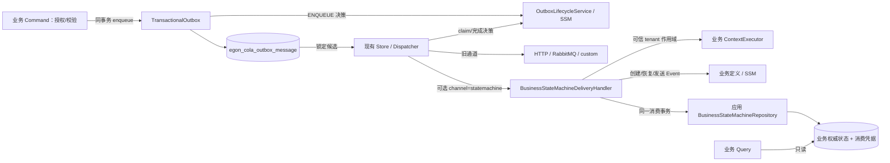
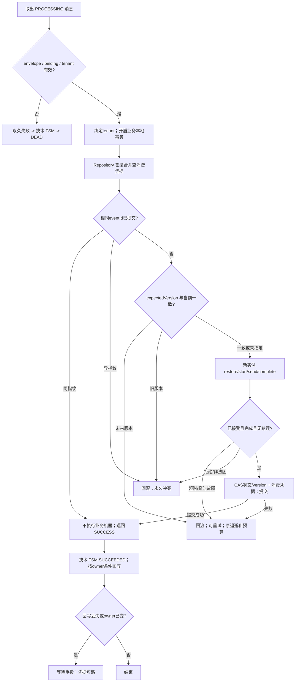
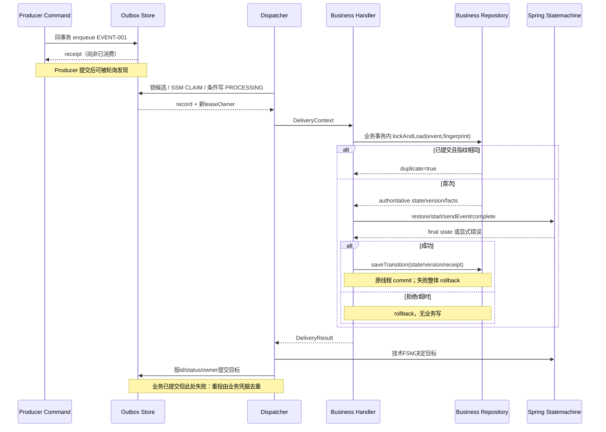
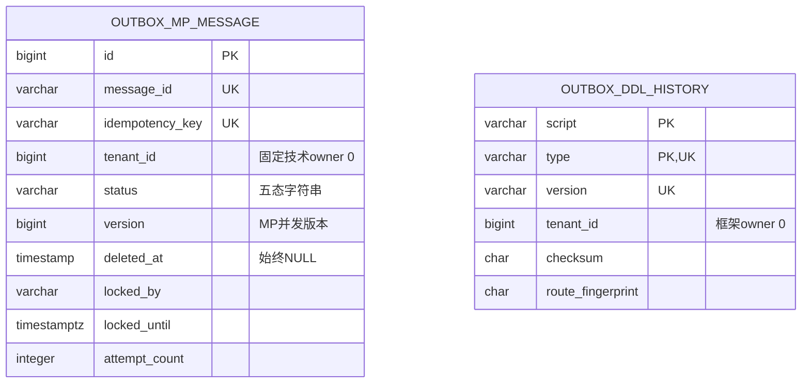

# Transactional Outbox 双层 Spring Statemachine 与 CQE 适配设计

| Field | Value |
| --- | --- |
| Document | `2026-09-24-12-00-outbox-statemachine-cqe-integration.md` |
| Template Version | `7` |
| Status | `Implemented` |
| Type | `Feature` |
| Complexity | `Complex` |
| Complexity Drivers | 双层状态机、JDBC/Reactor 边界、跨实例租约、消费幂等、版本与租户隔离、旧 SPI 兼容 |
| Created | `2026-09-24 12:00 CST` |
| Updated | `2026-09-27 08:52 CST` |
| Owner | mario |
| Repository | Egon-COLA |
| Scope | egon-cola-component-transactional-outbox-starter；组件 BOM 的 Spring Statemachine 版本管理；Common MP manifest family 的必要扩展；组件测试与接入文档 |
| Change Surface | outbox 生命周期状态决策、MP Store/PO/Repository/Mapper XML、受管 DDL 与旧表迁移、claim/update 事务内状态校验、可选业务 Event 状态机 DeliveryHandler；不迁移业务平台 |
| Affected Chapters | §7, §8, §9, §10, §11, §13, §14, §15, §16, §17, §18 |
| Source Requirement | 用户要求 Spring Statemachine 整合 transactional box、适配 CQE；进一步确认 outbox 自身状态机和业务 Event 处理两层均由 Spring Statemachine 管理，保留 Starter 结构并可选接入业务适配；用户随后选择“迁移”，明确把技术 outbox 存储同步迁移到 Egon MP |
| Baseline Revision | main @ b039589bedd9e23be7dd4c69920bfd38a191e694；2026-09-24 源码快照；其他 agent 的 Yuheng 改动及未跟踪文件不属于本稿 |
| Amends | [原 outbox 设计](../../superpowers/specs/2026-07-24-transactional-outbox-component-design.md) §4.15、§6、§12、§13、§14、§17：允许本文业务状态机适配；状态决策引擎改为 Spring Statemachine；租约和投递保证保留；JDBC Store改为MP，新增受管schema与存量切换 |
| Supersedes | None |
| Depends On | [公共契约收敛](2026-09-20-12-18-archetype-component-contract-convergence.md) §6.1 的基础组件结构、§11 的 Outbox Snowflake 与旧 DDL 不可变约束（新存储结构由本稿§11扩展）；批准记录见[对应 Plan](../plan/2026-09-20-12-59-archetype-component-contract-implementation.md) §2.1；本轮 Java/CQE skill 规范按 §6.2 执行 |
| Related Specs | [Tianshu CQE 修订](2026-09-22-17-16-tianshu-java-cqe-standards-amendment.md) §11.2.9：既有自定义 DeliveryHandler 消费背景，不授权迁移 Tianshu |
| Related Plans | [双层状态机与MP迁移逐文件实施计划](../plan/2026-09-24-13-16-outbox-statemachine-mp-implementation.md)（Completed；实现与最终验证记录见Plan §§7–12） |

## 1. Summary

本稿设计两套不同所有权的 Spring Statemachine：第一套管理 outbox 消息生命周期；第二套在业务系统显式启用后接收已发生的业务 Event，加载业务权威状态、运行业务状态机并原子保存业务状态与消费凭据。两者共享有界的状态机执行工具，但不共享状态、实例、持久化对象或成功含义。

`egon_cola_outbox_message.status` 仍是投递状态的权威记录；业务状态由消费应用自己的 Repository 保存。引擎负责“允许怎样迁移”，PostgreSQL 事务与条件更新负责“哪个实例有权提交”。新增的是替代旧表的MP技术消息表及框架ddl_history，不增加状态机上下文表、中央工作流服务、通用 CQE 总线或事件溯源存储。

用户已明确选择将 outbox 技术存储同时迁移到 Egon MP（DEC-004）。设计阶段将本稿置为 Review；用户随后授权按关联 Plan 实施。新存储继承 EgonModel/EgonColaRepository/EgonColaMapper，使用既有受管DDL运行器；旧表只作为停写迁移来源，运行路径不保留JDBC后备。实现、测试及未执行的生产切换边界记录于关联 Plan §§7–12。本稿状态为 Implemented。

## 2. Background and Current State

### 2.1 证据路径约定

下列别名只为缩短表格，均精确映射仓库相对路径；`J/...`、`T/...` 的后缀是完整文件路径，不表示省略未定义目录。

| 别名 | 路径 |
| --- | --- |
| O | `egon-cola-components/egon-cola-component-transactional-outbox-starter` |
| J | `O/src/main/java/top/egon/cola/component/outbox` |
| T | `O/src/test/java/top/egon/cola/component/outbox` |
| C | `egon-cola-components/egon-cola-component-common/egon-cola-component-common-core/src/main/java/top/egon/cola/component/common/core` |
| BOM | `egon-cola-components/egon-cola-components-bom/pom.xml` |
| M | `egon-cola-components/egon-cola-component-common/egon-cola-component-common-mybatis-plus-sharding-jdbc-ext-spring-boot-starter` |
| MJ | `M/src/main/java/top/egon/cola/component/common/mybatis` |
| SQL2 | `O/src/main/resources/db/egon-outbox-mp/V20260924_001__initialize_outbox_mp_schema.sql`（将来实施创建） |
| SQL1 | `O/src/main/resources/db/transactional-outbox/postgresql/V1__create_transactional_outbox_schema.sql` |

### 2.2 Repository evidence

| Evidence ID | Classification | Exact path/symbol/decision/command | Observed fact | Design significance | Verification limit/freshness |
| --- | --- | --- | --- | --- | --- |
| EVD-001 | Static repository | `pom.xml`、`egon-cola-components/pom.xml`、`O/pom.xml` | Java 21、Boot 3.5.16、组件 5.4.1；无 Spring Statemachine 依赖；已有 validation/Jackson/JDBC/transaction | 不升级 Boot；仅引入用户指定引擎 | 2026-09-24 静态检查，不是依赖解析成功 |
| EVD-002 | Static repository | `J/api/TransactionalOutbox.java`、`J/transaction/DefaultTransactionalOutbox.java#enqueue` | 校验事务→序列化与指纹→入库→提交后提示；返回 OutboxReceipt | 保留生产者入口和原子意图 | 未验证实时 PostgreSQL |
| EVD-003 | Static repository | `J/transaction/OutboxTransactionGuard.java#requireSelectedTransaction` | 检查活动事务、同步及 DataSource 资源绑定 | Reactor 内动作不能假设继承 JDBC 事务 | 资源绑定检查不是跨物理库原子证明 |
| EVD-004 | Static repository | `J/store/PostgresqlJdbcOutboxStore.java` | CTE SKIP LOCKED 抢占、worker REQUIRES_NEW、status/locked_by 条件更新、显式 Snowflake id | 改状态决策时必须保留多实例保护 | 源码未说明 live 拓扑 |
| EVD-005 | Static repository | `J/dispatch/OutboxDispatcher.java#applyResult`、`#applyRetryableFailure` | switch 分类；失败次数耗尽后 DEAD；成功不因次数高而拒绝 | 原重试判断迁入状态机 Guard | 不把 maxAttempts 偷改成绝对 claim 次数上限 |
| EVD-006 | Static repository | `J/delivery/DeliveryHandler.java`、`DeliveryContext.java`、`DeliveryResult.java` | 扩展通道接口已经存在；deliver 返回三类结果 | 业务适配复用 SPI，不增加另一调度器 | 旧 handler 本轮不迁移 |
| EVD-007 | Static repository | SQL1、`J/store/OutboxStatus.java` | 五种持久化状态；message_id、可空 idempotency_key 技术唯一；无 tenant_id/deleted_at | 技术消息表不伪装成业务 PO；本稿不改 schema | SQL1 identity 默认仍在，当前 INSERT 已显式写 Snowflake |
| EVD-008 | Static repository | `T/integration/TransactionalOutboxTransactionIntegrationTest.java`、`PostgresqlOutboxConcurrencyIntegrationTest.java`、`PostgresqlOutboxRecoveryIntegrationTest.java` | 已有事务、抢占、恢复测试源码；PG 测试需 EGON_OUTBOX_TEST_POSTGRES_ENABLED | 扩展原测试而非声称已获得运行证据 | 本轮未运行这些测试 |
| EVD-009 | Static repository | `C/converter/BaseForwardConverter.java`、`C/pojo/BasePojo.java`、`egon-cola-components/lombok.config` | 通用对象/转换合同与 Qualifier 传播存在 | 复用标准；不添加转换工具库 | 本组件无现成业务状态模型 |
| EVD-010 | User decision | 本轮用户两项回复 | 内部消息状态与业务 Event 均使用 SSM；保留 Starter 结构，可选适配 | 两层均在范围；可选的是业务接入，内部引擎不回退到旧 switch | 未包含具体平台迁移授权 |
| EVD-011 | External primary source | [官方 4.0.x 文档](https://docs.spring.io/spring-statemachine/docs/4.0.x/reference/) | 4.0.x 面向 Boot 3.5.x；存在 Reactor 调度 | 引擎运算与 JDBC 提交边界分开 | 文档匹配不等于本仓库兼容测试 |
| EVD-012 | External primary source | [官方发布记录](https://github.com/spring-attic/spring-statemachine/releases) | 4.0.2 列为最新；仓库 2026-07-05 归档；该版含 CVE-2026-41862 修复 | 版本候选固定 4.0.2；不用 Kryo 上下文持久化 | 查询日期 2026-09-24；不承诺后续 OSS 维护 |

| EVD-013 | Static repository | MJ/model/EgonModel.java、MJ/extension/EgonColaMapper.java、EgonColaRepository.java | PO必须继承八项技术字段；Repo/Mapper有泛型约束；显式XML是已有扩展点 | 迁移不只是POM换依赖 | 本轮静态复核 |
| EVD-014 | Static repository | MJ/interceptor/EgonColaOriginalSqlGuardInterceptor.java#shape、EgonColaTenantIdGuardInnerInterceptor.java | UPDATE FROM/CTE被shape拒绝；忽略技术表也先解析SQL | 改为平坦SELECT与逐行有界UPDATE；不关闭全局守卫 | 需真实MP/SS/PG验证 |
| EVD-015 | Static repository | MJ/ddl/EgonColaPostgreDdlRunner.java#installedPrefix；EgonColaDdlManifestBO.java | 非空无历史schema拒绝；family只允许六类业务archetype | 独立空schema＋最小component-outbox family扩展，不冒认历史 | 无live schema检查 |
| EVD-016 | Static repository | MJ/autoconfigure/EgonColaShardingAutoConfiguration.java；sharding/bootstrap/EgonColaShardingDataSourceBootstrapper.java | MP要求ShardingSphere；现有LogicalDataSourceFactory扩展点在physical pools创建后执行；未自动执行DDL | 复用此扩展点先调用既有runner再建logical DS | 不复制bootstrapper |
| EVD-017 | Static repository | MJ/model/EgonColaModelValidationUtils.java、business/EgonColaTenantIdProvider.java；既有archetype ddl_history定义 | 技术模型要求当前MDC tenant匹配；系统0由守卫策略决定，framework台账采用0 | outbox全局技术表采用系统owner 0；严格局部作用域恢复，业务tenant保留在Event | 0不是业务租户路由键 |
| EVD-018 | User decision | 用户本轮“迁移” | 选择MP方案，不保留旧JDBC Store | 关闭DEC-004，涵盖必要Schema/数据迁移设计 | 未授权实际执行 |
| EVD-019 | Isolated PostgreSQL/Testcontainers runtime | Outbox PostgreSQL Failsafe suite using Common MP 5.4.1 / Shardingsphere 5.5.3 | Configured parser rejects claim SQL containing `FOR UPDATE SKIP LOCKED` (`SKIP` token is treated as an identifier); plain `FOR UPDATE` on owner-checked completion is accepted | Claim and cleanup require parser-compatible cross-worker coordination | Isolated local container only; no production datasource |
| EVD-020 | Isolated PostgreSQL/Testcontainers runtime | `PostgresqlOutboxConcurrencyIntegrationTest`, `PostgresqlOutboxCleanupIntegrationTest` | After table-scoping `pg_try_advisory_xact_lock(id)` with id/tenant0/active predicates, both logical MP/SS claim contention and cleanup contention passed: 4 tests, 0 failures/errors/skips | Confirms Common MP SQL guard and Shardingsphere SINGLE route accept the lock query; lock lifetime and single claim/delete behavior are exercised | Local PostgreSQL 16.6 Testcontainers only; no production datasource |

### 2.3 问题与证据边界

当前没有 Spring Statemachine 集成，outbox 的状态转换分散在 Dispatcher 分支与 Store SQL。业务方可通过 HTTP/RabbitMQ/自定义 handler 投递，但组件没有业务状态机消费适配。`OutboxCommittedEvent` 只是进程内唤醒，不是对业务 Event 可靠投递的替代。

原 07-24 文档仍描述 starter/test 两个模块，当前源码已经收敛为单 Starter；本稿以当前 `O/pom.xml` 和 README 为模块事实，不恢复旧树。原文 §4.15 排除“业务事件建模框架”，本轮只在明确的状态机 Event envelope/消费适配范围增补，不引入通用事件平台。

### 2.4 Evidence and current-chain map

| Entry/trigger | Current call chain | Data read/written | External dependency | Consumers | Evidence |
| --- | --- | --- | --- | --- | --- |
| 业务命令 enqueue | TransactionalOutbox→DefaultTransactionalOutbox→OutboxStore.enqueue→afterCommitBuffer | 业务行与 outbox 行同事务 | 当前 DataSource | 已有直调和注解调用方 | EVD-002/003 |
| 轮询或提交提示 | OutboxPoller/OutboxCommittedEventListener→Dispatcher→claim→DeliveryHandler→markSucceeded/Retry/Dead | outbox 状态、attempt、owner、时间 | HTTP/Rabbit/custom | 下游消费者 | EVD-004/005/006 |
| worker 宕机 | 到期 PROCESSING 被 claimDue 再抢占→重复投递 | 新 leaseOwner、attempt +1 | 同一投递目标 | 依赖 messageId 幂等的下游 | EVD-004/008 |

## 3. Goals and Non-goals

### 3.1 Goals

统一内部生命周期图；让业务 Event 真正经过 Spring Statemachine；保持 CQE 含义、旧入口、至少一次投递和租约恢复。扩展点必须给出可检验的消费事务、幂等和租户义务。

### 3.2 Non-goals

不修改 Yuheng/Tianshu/Tianquan/archetype 业务代码；不增加 REST/GraphQL/UI；不新增 MQ、Redis、R2DBC、XA、Saga、Event Sourcing；不把 Query 送入状态机；不实现跨进程状态机上下文复制、定时/层级/正交 region 工作流；不把所有历史 handler 自动变成业务状态机；不修改任何现有 Flyway SQL。

### 3.3 Change Surface and Design Depth

| Area/layer | Disposition | Exact repository evidence | Changed or preserved behavior/contract | Required Spec treatment | Chapter(s) |
| --- | --- | --- | --- | --- | --- |
| 内部 FSM、Dispatcher、Store 状态提交 | Affected | J/dispatch/OutboxDispatcher.java、J/store/PostgresqlJdbcOutboxStore.java | 引擎决定边；锁和条件写继续保护数据库 | 详细迁移图、SQL shape、兼容与失败 | §7, §8, §9, §10, §11, §13, §14, §15, §16, §17, §18 |
| 业务 FSM 可选适配与对象/SPI | Affected | J/delivery/DeliveryHandler.java 扩展点 | 新通道 statemachine，按业务定义恢复并处理 Event | 完整 envelope、注册、消费和 Repository 合同 | §7, §8, §9, §10, §13, §14, §15, §16, §17, §18 |
| Maven/自动配置/README/测试 | Affected | O/pom.xml、BOM、J/autoconfigure、T | core 引擎依赖；业务适配默认关闭；文档和验证新增 | 坐标、版本、Bean、配置、验证 | §7, §8, §14, §15, §16, §18 |
| Producer API 与既有投递协议 | Context-only | TransactionalOutbox.enqueue、DeliveryHandler、HTTP/Rabbit handlers | 已有签名、Envelope、重试确认机制保留 | 仅新增通道受 §9 约束；旧路径回归 | §9, §16 |
| 技术消息新表/历史台账/迁移 | Affected | EVD-013～018；SQL1为只读来源 | 新schema、EgonModel字段、受管DDL、停写复制；原字段/五态保持 | 完整表/ER/迁移/回滚与MP保护 | §7, §8, §9, §10, §11, §14, §15, §16, §17, §18 |
| MP manifest校验扩展 | Affected | MJ/ddl/EgonColaDdlManifestBO.java仅接受业务family | 精确允许component-outbox；历史/锁/校验逻辑保持 | 必要直接依赖修改与原family回归 | §8, §11, §14, §16 |
| 原SQL1和旧物理表 | Context-only | EVD-007 | SQL1字节不改；旧表停写后只读复制和留存 | 不修历史、不自动删除；核对数据 | §11, §16 |
| 业务平台持久化及 Query | Context-only | 用户要求业务接入，但未指定某平台/聚合；现有组件没有其业务表 | 由消费方实现业务状态/消费凭据端口；本轮不假造平台表 | 规定接入合同与独立验证，不写业务迁移 | §9, §11 |
| HTTP API/前端 | Not applicable | O 为 jar Starter，无 Controller/页面 | 本轮无新增页面或 HTTP 服务 | N/A，不引 springdoc/GraphQL | §12 |

## 4. Requirements and Acceptance Criteria

| ID | Atomic requirement | Priority | Observable acceptance criteria | Source |
| --- | --- | --- | --- | --- |
| REQ-001 | outbox 自身状态机由 SSM 管理 | Must | enqueue/claim/成功/重试/死信所有状态写入均取得引擎允许的目标；移除 Dispatcher 的业务迁移分支 | 用户“eventbox本身的状态机” |
| REQ-002 | 业务 Event 经 SSM 处理 | Must | 启用适配并注册定义后，已入队 Event 恢复权威状态、发送 eventType 触发、完成校验、持久化目标 | 用户“发送到event也要基于…处理” |
| REQ-003 | CQE 职责清晰 | Must | Command 校验授权并在事务内 enqueue；Query 不写、不投递；Event 是已发生事实而非命令的更名 | 用户“结合CQE规范” |
| REQ-004 | 事务及租约正确 | Must | 回滚不留下意图；两个 worker 不提交同一 owner 的冲突写；旧 owner 更新返回 false | 现有合同及 AGENTS 保留行为 |
| REQ-005 | 业务重复投递不重复迁移 | Must | 业务提交后模拟 outbox 成功回写丢失，再投同一 Event 只返回成功，不再执行状态迁移 | 至少一次投递正确性 |
| REQ-006 | 租户、定义版本、状态版本受控 | Must | 错租户/未知定义拒绝；不能隐式升级模型；乱序规则可验证 | 多业务可选适配的必要约束 |
| REQ-007 | 单 Starter、业务适配可选及旧协议兼容 | Must | 默认不注册 statemachine handler；既有 API/HTTP/Rabbit/custom 合同通过回归；内部 FSM 始终生效 | 用户保留 Starter 回复 |
| REQ-009 | 技术outbox全量迁移Egon MP | Must | 所有运行期消息CRUD均经MP Repo/Mapper XML；PO继承EgonModel；无JDBC回退；原接口保持 | 用户“迁移” |
| REQ-010 | 受管DDL和无损存量切换 | Must | 一个新SQL版本＋manifest，原SQL不动；新旧逐行校验、可续跑、切换后回滚受控 | 迁移必要正确性及AGENTS |
| REQ-008 | 文档和独立验证完整 | Must | 给出依赖、配置、接入 SPI、失败矩阵与测试；Spec 静态门禁与未来运行证据明确分开 | 本次 skill/AGENTS |

### 4.1 Scenario matrix

| Scenario | Actor/trigger | Preconditions | Main path | Alternative/failure path | Data/state change | Observable result | Requirements |
| --- | --- | --- | --- | --- | --- | --- | --- |
| 正常入队投递 | 应用命令 | 正确本地事务 | 入队→抢占→投递→成功 | 数据库失败回滚 | PENDING→PROCESSING→SUCCEEDED | receipt 只表示入队；最终成功另查 | REQ-001/003/004 |
| 临时/永久失败 | worker | 有效 owner | RETRYABLE 由 Guard 决定等待/耗尽；PERMANENT 直接死信 | 重试预算耗尽 | RETRY_WAIT 或 DEAD | 既有 metrics/死信通知 | REQ-001/004 |
| 租约失效重投 | 两个 worker | 第一个慢或宕机 | 第二个抢到新 owner | 第一个迟到回写 false | 第二个 owner 保留 | 至少一次，不承诺恰好一次 | REQ-004/005 |
| 业务正常处理 | 接入应用 | 适配启用、定义存在、业务行存在 | 加锁读→去重→FSM→状态/凭据同事务提交 | Guard 拒绝则无业务写 | 业务状态与 version 更新 | DeliveryResult.success | REQ-002/005 |
| 消费已提交但回写丢失 | worker 重投 | 持久化凭据匹配 | 短路重复，不启动业务 FSM | 同 eventId 异内容为冲突 | 不重复修改业务行 | 再次 SUCCESS | REQ-005 |
| 乱序/并发 | 多条业务 Event | expectedVersion 可选 | 对同聚合行串行并校验版本 | 未来版本重试；旧版本非重复则永久失败 | 不覆盖新状态 | 明确错误码；不假称顺序投递 | REQ-006 |
| 无权/错租户/无资源 | 本地或远端入口 | 不可信 envelope | 校验绑定、租户和资源 | 返回永久失败，finally 恢复上下文 | 无业务改变 | 不泄漏其他租户状态 | REQ-006 |
| 执行超时/动作异常 | FSM runner | 纯计算引擎 | 全流程等待 complete 与错误检查 | 超时停止并丢弃实例；事务回滚 | 无部分状态提交 | 有限重试/终止按 §9 | REQ-002/004/008 |
| Query | 业务读方 | 合法查询 | 读取业务权威 Repository | 无对象返回原业务语义 | 零持久化/发消息副作用 | 不创建机器或改变事件投递状态 | REQ-003 |

| 旧表切换 | 运维维护者 | producer/worker已停，新schema空 | 受管建表→只读copy→逐行verify→切换 | 差异/源未停/目标已使用则拒绝；中断可续跑 | 旧表保留，新表初始version0 | 不丢payload/消息身份/五态/lease | REQ-009/010 |

### 4.2 Use-case analysis

| Actor ID | Actor/role | Goal and responsibility | Entry/channel | Permission/tenant context | Evidence |
| --- | --- | --- | --- | --- | --- |
| ACTOR-001 | 业务接入开发者/应用 | 可靠提交已发生事实，接入业务状态机 | enqueue 与注册 SPI | Command 所属应用确定可信身份 | EVD-002/010 |
| ACTOR-002 | 投递 worker | 故障后继续可靠投递 | poll/commit hint | 技术进程；不得复用请求线程身份 | EVD-004/006 |
| ACTOR-004 | 组件部署/迁移维护者 | 无损切换旧消息与受管DDL | 本地显式维护Service | 维护权限，非HTTP开放入口 | 用户迁移选择及EVD-015 |
| ACTOR-003 | 业务查询调用方 | 读取业务真实状态 | 应用既有 Query | 应用权限和 tenant | CQE 明确要求 |

| ID | Use case/goal | Primary actor | Supporting actors/systems | Trigger | Preconditions | Main success outcome | Alternatives/failures | Postconditions | Requirements | Interfaces/pages | Tests |
| --- | --- | --- | --- | --- | --- | --- | --- | --- | --- | --- | --- |
| UC-001 | 原子提交事实并完成投递 | ACTOR-001 | ACTOR-002、PG、DeliveryHandler | Command 完成 | 授权/校验且活动本地事务 | 意图落库；worker 根据 FSM 完成投递 | 入队失败回滚、失联重试、永久失败 DEAD | 不丢意图；远端可重复 | REQ-001/003/004/007 | INTERNAL-001；既有 enqueue | TEST-001/002/003 |
| UC-002 | 以事实推进业务状态 | ACTOR-001 | ACTOR-002、应用 Repository | EVENT-001 被投递 | 适配启用、可信 tenant、已注册定义 | 业务状态与消费凭据同事务提交 | 重复短路、冲突/拒绝、未来版本等待、超时回滚 | 一条事实最多一次已提交业务迁移 | REQ-002/005/006/007 | INTERNAL-002、INTERNAL-003、INTERNAL-004、INTERNAL-005、INTERNAL-006、INTERNAL-008、EVENT-001 | TEST-004/005/006/007 |
| UC-003 | 读取权威业务状态 | ACTOR-003 | 应用 Repository | 既有 Query | 既有授权/租户规则 | 返回已提交业务事实 | 未找到、权限拒绝保持原合同 | 不改变 outbox/业务状态 | REQ-003/008 | 既有业务 Query；无新增组件 API | TEST-008 |

| UC-004 | 无损迁移技术消息存储 | ACTOR-004 | PG/MP/受管DDL运行器 | 受控升级 | producer/worker停写、目标空schema与配置正确 | 新表与旧表全部技术消息一一一致并启用MP | 源变化/冲突/未知commit；停止切换并重跑验证 | 旧表不删；没有部分数据被当作完成 | REQ-009/010 | INTERNAL-009/010；无页面 | TEST-011/012/013 |

## 5. Constraints, Assumptions, and Decisions

### 5.1 Confirmed constraints

仅设计；不处理他人工作区；不启动任何长期进程、浏览器、Docker 或 live 集成。现有 Flyway 文件不可变。SSM 是用户指定技术选型，不擅自替换成 COLA 自带 FSM 或其他库。

### 5.2 Small-gap assumptions

| ID | Inference | Repository evidence | Why locally reversible | Impact if wrong |
| --- | --- | --- | --- | --- |
| ASM-001 | 用户 box/eventbox 指 O，不新建同义模块 | 源码只有该出站消息组件；skill CQE 合同有同名解释 | 目录别名，无功能变化 | 修订文档模块映射 |
| ASM-002 | 新包放 J/statemachine，业务投递器放 J/delivery/statemachine | 现有 delivery/http、rabbitmq 与按能力分包 | 不改变业务应用层次 | 只影响内部路径 |

### 5.3 Resolved decisions

| ID | Decision | Decision owner | Evidence and rationale | Requirements |
| --- | --- | --- | --- | --- |
| DEC-001 | 内部消息 FSM 与业务 Event FSM 都纳入 | User | 最新澄清，两层都不能删减 | REQ-001/002 |
| DEC-002 | 保留现有基础设施 Starter 结构，业务适配可选 | User | 最新选项回复；既有规范 §6.1 同样保留基础库结构 | REQ-007 |
| DEC-003 | Spring Statemachine core 4.0.2；不引完整 starter 或 data-* persistence | 本稿版本设计，框架选型由 User 指定 | EVD-001/011/012；避免重复自动配置/持久化框架；依赖仍未下载/修改 | REQ-001/002/008 |
| DEC-004 | 技术outbox存储全量迁移到Egon MP，不保留JDBC运行实现 | User | 本轮对两项存储方案明确答复“迁移”；必要MP依赖与标准模型/受管DDL属于该决定 | REQ-009/010 |
| DEC-007 | 全局技术消息owner固定0；实际业务tenant仍在Event并由业务context校验 | Design preserving current global technical table | EVD-007/017；不是把缺失业务tenant猜成某个真实租户；精确技术表ignore与单PRIMARY限制见§11 | REQ-006/009 |
| DEC-008 | 同库独立egon_outbox受管schema，旧表停写复制并保留 | Design from runner constraints | EVD-015；不变更旧DDL历史、不自动清库、不迁移其它业务表 | REQ-010 |
| DEC-009 | Claim/reclaim/cleanup replace `SKIP LOCKED` with bounded candidate reads, PostgreSQL transaction advisory locks, and version/state CAS | User, approved 2026-09-27 | EVD-019/020；the user approved the correction; table-scoped lock SQL satisfies the Common guard/parser and the unique `SINGLE`/PRIMARY route keeps workers in one advisory-lock domain | REQ-001/004 |
| DEC-005 | 数据库为权威；机器是每次调用的临时计算实例 | 本稿设计 | EVD-003/004；必须承受多进程和崩溃，不能以 JVM 内存提交代替 DB 提交 | REQ-004/005 |
| DEC-006 | 不创建通用 Inbox 表；业务接入端口必须提供持久化消费凭据 | 本稿范围设计 | 旧 outbox 无业务持久化所有权；用户未指定任何业务聚合/表 | REQ-005/007 |

### 5.4 Open major decisions

| ID | Question and options | Recommendation, not decision | Impact | Owner | Status |
| --- | --- | --- | --- | --- | --- |
无未决范围选择。原DEC-004已由用户“迁移”关闭；部署时的连接/schema存在性、消息排空与维护窗口属于明确执行前置条件，不冒称已验证。

## 6. Project Technology Context

| Concern | Current choice | Repository evidence | Constraint on design |
| --- | --- | --- | --- |
| Java/Spring | Java 21、Boot 3.5.16 | EVD-001 | 不升级；SSM 4.0.2 编译/链接/线程行为须测试 |
| 持久化 | 现状JDBC；目标Egon MP 3.5.16/SS 5.5.3/PostgreSQL，同一logical DS/SqlSessionFactory；worker REQUIRES_NEW | EVD-002/013～016 | 命令式Spring JDBC事务资源仍是底层；消息持久化代码改为Mapper，`.block()`不传播事务 |
| 注入/校验 | validation starter、common BaseValidator/ValidationUtils；Qualifier 复制已配置 | EVD-009、O/pom.xml | 新 Bean 显式命名、构造注入、级联校验 |
| 测试 | JUnit 5、Mockito/AssertJ、ContextRunner、Failsafe、Testcontainers 1.21.4 | O/pom.xml、T | 单测与需授权 PG/Docker 的集成测试分开 |
| 配置 | egon.cola.component.transactional-outbox；组件无 application*.yml 生产 profile | J/autoconfigure/TransactionalOutboxProperties.java、resources 清单 | 新独立 properties，README 双语同键；不改消费项目 profile |

### 6.1 Java architecture profile and capability baseline

业务应用保持自己已经选择的 Traditional Three-Layer 或精确 Archetype。本任务对象为其基础库，按 DEC-002 的明确许可保留 `api/store/dispatch/delivery/autoconfigure`；不是新造第三种业务应用架构。§8 不生成业务项目、Controller、Manage 或 DDD 模块，不调用业务 scaffolding。

| Need | Spring/JDK candidate | Spring Boot Starter candidate | Egon-COLA/module candidate | Proven gap | Decision/dependency impact |
| --- | --- | --- | --- | --- | --- |
| 状态转换执行 | SSM core | 完整 statemachine starter 不需要 | 现有 switch/SQL 不是用户指定引擎 | 无 SSM | Add core，版本由 BOM 管理 |
| 可靠投递/租约 | Spring TX/JDBC | 已有 starter 依赖 | TransactionalOutbox/OutboxStore/DeliveryHandler | 无需另一 outbox | Keep |
| 业务幂等 | 数据库行锁/唯一约束 | 不新增 inbox starter | 应用 Repository / Egon MP | 组件没有业务表 | 明确 SPI 义务，组件不占有业务数据 |
| tenant 绑定 | try/finally 同步作用域 | 不引 security starter | 消费方既有 tenant/MDC 集成 | worker 无请求 context | 必需的 context SPI，启用时未提供即启动失败 |
| 序列化/指纹 | Boot ObjectMapper、JDK digest | 已在 O 中 | OutboxMessageFingerprint.sha256 | 无 | Keep，不 JSON 映射 PO/DTO |
| 对象转换 | 既有 MapStruct | 不增 processor | BaseForwardConverter 已存在 | 业务适配Repository直接返回BO；技术MP存储新增PO→OutboxRecord映射 | 增加一个必要MapStruct Converter和JSON headers helper；应用端继续用公共转换合同 |

依赖的精确变更为 BOM 增加 `org.springframework.statemachine:spring-statemachine-core:4.0.2` 的 management 与同名版本 property，O/pom.xml 增加该 dependency（非 optional，因内部 FSM 为必需）。Reactor 等传递依赖由现有 Boot 管理优先，必须检查 effective-pom/dependency:tree；不额外引入 spring-statemachine-starter、data-jpa、data-redis、Kryo 或版本 BOM 来覆盖现有 Spring 栈。SSM引入实现用户明确指定框架。DEC-004另授权新增 `top.egon:egon-cola-component-common-mybatis-plus-sharding-jdbc-ext-spring-boot-starter:${project.version}`；为遵守已指定MapStruct标准，O使用仓库既有版本 `org.mapstruct:mapstruct` 与构建期 `mapstruct-processor:1.6.3`，保留原Lombok/Boot处理器而不是覆盖它们，不引新的映射技术。MP会传递引入ShardingSphere和Common Cache；新outbox不使用缓存，宿主无既有cache需求时显式设置Common cache.enabled=false，不能为了迁移暗启Redis。已有宿主cache照常配置，不由outbox自动关闭。所有POM仍未修改/下载，归档风险见§18。

### 6.2 User-mandated Java rule compliance

| Literal rule | Affected? | Repository evidence | Exact design decision | Files/types/interfaces | Validation/test evidence | Status/blocker |
| --- | --- | --- | --- | --- | --- | --- |
| Rule 1 | Yes | §8 清单、BasePojo | 载体 Event/BO；行为 Service/Repository/Strategy/Executor/Factory/Handler；enum 有 Enum 后缀 | §8/10 | TEST-009 命名检查 | PASS |
| Rule 2 | Yes | validation starter、BaseValidator | §9/10 给出每个入口的 @Valid/@Validated、原生/组校验；显式调用只复用注解元数据 | 新公开 SPI 和业务 Event | TEST-004/009 | PASS |
| Rule 3 | Yes | EgonModel、BasePojo、BaseForwardConverter | 普通载体Builder；PO SuperBuilder/callSuper且不重声明基类字段；MP投影使用MapStruct | §10业务载体/PO/迁移结果/Converter | TEST-009/011/012 | PASS |
| Rule 4 | Yes | components/lombok.config | §8 Bean 清单，@Slf4j、显式名字、@RequiredArgsConstructor、final @Qualifier；现有未改构造器只作旧 ABI 边界 | §8 行为类 | TEST-009 注入/日志约束 | PASS |
| Rule 5 | Yes | JDK/现有库足够 | 使用 JDK Collections、Duration、现有组件；无新 Utils | runner/handler | dependency/import gate | PASS |
| Rule 6 | Yes | ObjectMapper/Fingerprint | §9 EVENT-001 完整 JSON；不持久化任意类名；无 ordinal；原 OutboxStatus DB 字符串不变 | BusinessStateMachineEvent | TEST-004/009 | PASS |
| Rule 7 | Yes | O 无生产 application profiles | 新 typed properties；README 中英文同键；启用消费应用时其所有 profile 同结构 | §15 | TEST-007 | PASS |
| Rule 9 | Yes | 双层状态迁移/投递 SPI | State＋Strategy＋Adapter，详见 §13；条件选择进入 Guard | §7/13 | TEST-001/004 | PASS |
| Rule 10 | Yes | 原 deadline/retry 均 java.time | Instant UTC、Duration；PG 微秒；不引 Date/Calendar | Event.occurredAt、执行超时 | TEST-009 | PASS |
| Rule 11 | Yes | 用户DEC-002/004；EVD-013～017 | 基础库结构已批准；技术Store改MP；PO继承EgonModel，技术owner0与精确ignore保留全局基础设施语义；业务表仍用正常tenant保护 | §8/10/11 | TEST-011/012/013 | PASS |

## 7. Architecture Design

### 7.0 Minimum-design baseline and element-necessity audit

直接保持 switch/SQL 虽最少改动，但不能满足用户指定 SSM 的两个要求；只加业务 handler 也遗漏 REQ-001。采用一个受限 runner、一个内部固定模型、一个业务 handler 与三个业务接入端口，避免每条边一个 Java 类。

| Proposed element | Change | Requirements | Existing/direct alternative | Concrete inadequacy of alternative | Added calls/state/coupling/failures/migration/operations | Verdict |
| --- | --- | --- | --- | --- | --- | --- |
| SSM core 与共用执行 Service | New | REQ-001/002 | 原 switch 或只加监听器 | 不让 SSM 决策/不等待完成 | 1 dependency、实例构造与超时处理；无网络 | Add |
| OutboxLifecycleStateMachineFactory/Service/SignalEnum | New | REQ-001 | 状态判断留在 Dispatcher | 生命周期规则仍分散 | 固定技术模型；无持久化副本 | Add |
| 业务 Handler＋DefinitionStrategy/Repository/ContextExecutor | New | REQ-002/005/006 | 用户重复手写全部适配 | 引擎完成、事务及去重边界各异 | 注册表和 SPI 合同；业务方仍拥有表 | Add |
| Event 与 SnapshotBO | New | REQ-002/005 | 复用 OutboxRecord/任意 Map | 前者技术内部行，后者无稳定校验合同 | 两个语义边界对象；无等价 DTO/VO 链 | Add |
| 现有 Store/Dispatcher/自动配置 | Expand | REQ-001/004 | 换掉全部存储层 | 并非 SSM 整合的必要代价 | 锁内多一次计算；需测试死锁/超时 | Keep，DEC-004 限定存储实现 |
| MP PO/DAO/Repository/XML/Converter、技术Context | New | REQ-009 | 保留JDBC或普通BaseMapper | 用户明确迁移；EgonMapper泛型/审计校验要求EgonModel | 增加标准MP对象和映射；不新建业务层 | Add |
| 受管schema/两表/单SQL/manifest/逻辑工厂hook/family扩展/迁移Service及Result | New/Expand | REQ-010 | 原schema直接ALTER或只建新空表 | 公共runner拒绝无历史非空schema；仅空表会遗失旧消息 | 停写复制/核对/配置迁移；旧表保留 | Add |
| 新 properties/测试/README | New/Expand | REQ-007/008 | 隐式开启业务适配 | 会改变旧 handler 集合 | 明确开关/预算/启用校验 | Add |
| 状态机上下文表、通用 Inbox、业务 Query API | None | REQ-003/007 | 现有权威业务表与技术表 | 无当前需求缺口 | 会增加双真源/迁移/访问权限 | Remove |
| 新 HTTP/RPC/bus/job/cache/模块 | None | REQ-007 | DeliveryHandler 与原 worker | 已满足入口和恢复 | 不承担额外运维成本 | Remove |

| Path | Network calls | Client states | Server contracts/state | Failure and TOCTOU points | Additional user/business value |
| --- | --- | --- | --- | --- | --- |
| 旧生产者→HTTP/Rabbit/custom | 原有 1 次投递/尝试 | 不变 | 1 张技术表 | 远端成功与本地回写之间重复窗口 | 保持旧能力 |
| 本地 statemachine 通道 | 0 次外部网络；原 enqueue 不变 | 不增页面状态 | 新本地 SPI；业务原状态与凭据 | 锁内校验版本；业务提交与技术回写间可能重复 | 可复用的业务 FSM 可靠消费 |

### 7.1 System Architecture Design



架构图中技术表与业务数据可以由应用配置到同一 PG 本地事务资源；图分两个节点表达所有权，并不承诺跨数据库原子性。HTTP/Rabbit 外部消费者不因升级组件就自动执行 SSM；需显式接入本稿消费 Service 或自身应用适配。

| Module/component | Capability and data owned | Inputs/outputs | Allowed dependencies | Forbidden responsibility | Requirements |
| --- | --- | --- | --- | --- | --- |
| 内部 FSM | 五态生命周期规则、重试是否耗尽 | 当前状态＋技术信号→目标状态 | runner、工厂 | 保存数据库/发送网络/认证业务用户 | REQ-001 |
| Store | outbox 行、锁、租约、owner 条件提交 | 引擎目标→SQL结果 | MP Repo/Mapper/TX、内部 FSM | 另写一套状态图或业务聚合规则 | REQ-004 |
| 业务 Handler/Service | Event envelope、事务模板、完成/失败映射 | DeliveryContext/Event→DeliveryResult | 定义/Repository/context SPI | 代替应用授权、拥有业务表、直接跨网副作用 | REQ-002/006 |
| 应用定义/Repository | 业务图、Guard、业务状态、消费凭据 | 经校验 Event 与快照 | 应用已有 MP 事务与领域能力 | 以 JVM 缓存代替持久化去重 | REQ-005 |

### 7.2 High-Level Design

#### 7.2.1 Critical business/control flowchart



#### 7.2.2 High-level decision and quality matrix

| Concern/use case | Required behavior | Selected mechanism | Failure/degradation behavior | Trade-off | Verification | Requirements |
| --- | --- | --- | --- | --- | --- | --- |
| 事务正确 | 引擎错误不提交状态 | 机器只做纯运算，MP Mapper写留在原Spring事务线程 | 回滚并丢弃实例 | 有界同步等待 | TEST-002/005 | REQ-004 |
| 去重 | 已提交业务迁移不重做 | 聚合锁＋持久化 eventId/fingerprint 凭据 | 冲突永久失败 | 业务方必须提供凭据持久化 | TEST-005 | REQ-005 |
| 吞吐/锁占用 | 不在锁内等待网络 | 内部图纯计算；claim 共用总预算 | 超时整批回滚 | select＋batch update 替代单 CTE | TEST-003/010 | REQ-004/008 |
| 隔离 | 无共享机器/线程身份串扰 | 每次新实例、显式 tenant scope、finally 清理 | context/provider 缺失启用失败 | 多实例构造成本 | TEST-006/007 | REQ-006 |
| 兼容 | 旧通道不变 | 原 API/SPI 保留，业务开关 false | 原异常语义；新增错误只用于新增引擎路径 | 无静默退回旧规则 | TEST-007/009 | REQ-007 |

### 7.3 Detailed Design

#### 7.3.1 内部技术模型

图定义唯一放 `OutboxLifecycleStateMachineFactory`，工厂产出 `StateMachine<String, OutboxLifecycleSignalEnum>`；虚拟 `__NEW__` 仅计算初次入队，永不入库。不改 `OutboxStatus` 的既有五种值。

| Source | Signal | Guard | Target | 持久化效果/调用方 |
| --- | --- | --- | --- | --- |
| __NEW__ | ENQUEUE | 新建输入有效 | PENDING | enqueue 用目标作 INSERT 参数；幂等已有行不重置状态 |
| PENDING / RETRY_WAIT | CLAIM | 有界候选读取后取得同一DB的transaction advisory lock；CAS再次确认到期、状态与version | PROCESSING | attempt+1、新 owner/locked_until |
| PROCESSING | RECLAIM | 有界候选读取后取得同一DB的transaction advisory lock；CAS再次确认租约过期、状态与version | PROCESSING | 外部自转换；旧 owner 失效、attempt+1 |
| PROCESSING | DELIVERY_SUCCEEDED | 有效快照；实际 owner 由 DB 校验 | SUCCEEDED | 清租约/错误，completed_at=DB时钟 |
| PROCESSING | DELIVERY_RETRYABLE | attemptCount < maxAttempts | RETRY_WAIT | Dispatcher 选择 markRetry；Store 再执行 SCHEDULE_RETRY 边 |
| PROCESSING | DELIVERY_RETRYABLE | attemptCount >= maxAttempts | DEAD | Dispatcher 使用 OUTBOX_RETRY_EXHAUSTED；Store 执行 DELIVERY_PERMANENT 边 |
| PROCESSING | SCHEDULE_RETRY | 既有 markRetry 显式操作 | RETRY_WAIT | 保持旧 Store SPI；不把它变成业务重试决策入口 |
| PROCESSING | DELIVERY_PERMANENT | 固定技术操作 | DEAD | 原永久错误码/死信通知 |
| SUCCEEDED / DEAD | 任意 | 无边 | 拒绝 | 不新增 replay/reset；cleanup 为物理删除，非状态迁移 |

`DELIVERY_RETRYABLE` 的两个 Guard 互斥且穷尽；复杂重试判定不留在 Dispatcher 的 if/switch。Dispatcher 的 `DeliveryResult.Kind→signal`、`target→现有 Store 调用` 使用不可变 EnumMap/函数注册，只执行映射，不另作状态决策。每个映射的缺失在初始化时失败。`Store.mark*` 仍独立通过同一工厂的显式操作边校验，保护直接调用 SPI 的路径；不是把 Dispatcher 的预判当成数据库提交。

保留旧重试事实：maxAttempts 限制收到可重试失败后的继续重试，不给宕机 RECLAIM 增加未经批准的次数上限。高 attempt 的本次成功仍可 SUCCEEDED。`locked_until` 到期但尚未被新 owner 抢走时，旧 `mark*` 仍可成功；本轮不额外添加“到期必拒绝”的时间条件。

#### 7.3.2 运行器及线程纪律

`StateMachineExecutionService.execute` 只接受新建实例、已校验恢复状态、Spring Message 和剩余 Duration。顺序为 resetStateMachineReactively→startReactively→sendEvent→逐个结果 complete→检查 ACCEPTED、machine error 与最终单状态→stopReactively。全流程一个截止时间，不给每一步重置完整预算。只允许平坦单 region、显式 event、单步外部transition（允许external self-transition）；不接收internal-only transition。DENIED、DEFERRED、空结果、多 region、多次完成或未知状态均显式失败。

[StateMachineEventResult.complete](https://docs.spring.io/spring-statemachine/docs/4.0.x/api/org/springframework/statemachine/StateMachineEventResult.html) 的完成信号必须消费；不能仅检查 sendEvent 的 ACCEPTED。另以本次实例的临时 `StateMachineListenerAdapter#transitionEnded` 记录匹配本条trigger的实际完成边：reset/start完全完成后才开始计数，必须恰好一条、source匹配恢复状态、target匹配最终状态。没有实际迁移（例如Guard拒绝）即拒绝，不能将“ACCEPTED但仍在原状态”算成功；合法external自转换也以该完成边证明。finally移除listener。该通知API见[官方StateMachineListener](https://docs.spring.io/spring-statemachine/docs/4.0.x/api/org/springframework/statemachine/listener/StateMachineListener.html)，TEST-001/010须用真实4.0.2验证Guard拒绝与自转换，而不是模拟一个成功计数。机器生命周期接口使用官方 reactive API；不得 fire-and-forget subscribe。初始化、恢复和停止的错误均有界处理，原业务异常优先保留，停止错误作为附加诊断。

所有 Guard/Action 仅依赖事件与已复制的快照 facts，不能执行 JDBC、HTTP/MQ、sleep、注册异步写或修改全局 Bean 状态。业务写在 execute 返回后由原Spring事务线程经MP完成。禁止 timers、deferred events、state do-actions、层级/正交状态及自动链式 trigger；这些能力需要额外持久化/恢复语义，不在本次可靠适配合同。技术图没有Action；业务图的Action只允许纯计算/校验，本版持久化输出仅为最终state（不保存ExtendedState中任意变更）。定义启动验收检查图结构；副作用禁令以接入合同、隔离测试与代码审查保障，不宣称能运行时阻断任意 Java I/O。

#### 7.3.3 Critical-path Mermaid swimlane



#### 7.3.4 Transactions, consistency, concurrency, and idempotency

| Concern/state change | Owner and boundary | Mechanism/isolation/lock | Concurrent or duplicate behavior | Commit/visibility point | Failure result | Requirements/tests |
| --- | --- | --- | --- | --- | --- | --- |
| producer 意图 | 调用方已有 Spring TX | 同 DataSource/物理 PG 本地事务；错误向上传播 | 原 messageId/key 指纹合同 | 调用方外层 commit | enqueue 无独立提交 | REQ-004/TEST-002 |
| claim/reclaim | Store worker REQUIRES_NEW | 有界、非锁候选查询→逐行 `pg_try_advisory_xact_lock(id)`→SSM→含到期谓词的id/version/status CAS→commit；advisory lock与Mapper写使用同一PRIMARY连接事务 | 同一行同一时刻最多一个符合协议的claimer持有事务锁；旧/混合版本writer仍被CAS阻止；锁竞争可使本轮返回少于limit，后续poll重试 | worker commit后transaction lock释放，再deliver | 任一引擎/Mapper错误使整批回滚并释放锁 | REQ-001/004/TEST-003 |
| cleanup | Store worker REQUIRES_NEW | 有界、非锁过期成功候选查询→相同id advisory xact lock→含id/version/status/retention CAS的逐行DELETE→commit | 并发清理器最多一个删除同一候选；过期/状态/version变化时删除0行并跳过 | worker commit后删除可见 | 数据库异常整批回滚；0行CAS视作竞争后跳过 | REQ-004/TEST-003 |
| completion | Store worker REQUIRES_NEW | 先按 id/status/owner 锁行；FSM→条件 UPDATE | 缺行/已终态/owner变化返回 false | commit 后 metrics/dead notify | 不以迟到 owner 覆盖状态 | REQ-004/TEST-003 |
| 业务 Event | 新 BusinessStateMachineService 的 TransactionTemplate | 选定 outbox 本地 TX；context 在开事务前绑定；Repository 锁聚合 | 同聚合串行；receipt 唯一 identity | 状态与凭据同一次 commit | 异常回滚，无半成功 | REQ-002/005/TEST-005 |

适配器不保证 producer Command 的请求幂等：outbox 去重只保证技术意图记录，Command 必须以自己的请求 key 控制业务更新。业务消费凭据 identity 为 `(tenantId, machineKey, definitionVersion, businessId, eventId)`，不是只保存 lastEventId；否则 E1、E2 后重投 E1 会再次执行。相同 identity 的已提交凭据比较输入指纹；不同内容永久冲突。凭据不能早于可能重投/人工修复窗口过期，业务方未明确保留期时不得启用自动删除。

业务快照可提供可空 expectedVersion：事件未指定则按当前权威状态执行，仍使用快照 version CAS；指定值小于当前且非重复则 STALE_VERSION 永久失败；大于当前则 VERSION_GAP 可重试，沿用 outbox 次数/退避，耗尽 DEAD。既不跳过未知先行事实，也不承诺 outbox 对单聚合有序。

#### 7.3.5 Failure semantics, recovery, and observability

| Failure point | Detection | Immediate control flow | Data/transaction state | Retry and idempotency | Caller result | Recovery owner | Verification |
| --- | --- | --- | --- | --- | --- | --- | --- |
| 内部模型拒绝合法旧状态 | runner/model validation | 回滚技术操作并报警；不切回 switch | 未提交 | poll 后续重试；部署修复模型 | Store 异常 | 组件维护者 | TEST-001/003 |
| 业务图拒绝/错版本定义 | 结果 DENIED 或无注册 | 永久失败 | 业务事务零写 | 转 DEAD；无自动跳状态 | PERMANENT_FAILURE | 业务维护者 | TEST-004 |
| 引擎超时/临时数据库故障 | bounded deadline/异常分类 | 丢弃机器，业务回滚 | 未提交；commit异常视为未知 | 允许重投，先查凭据 | RETRYABLE_FAILURE | 原 worker/业务凭据 | TEST-005/010 |
| 业务提交后技术回写失败 | DB 异常/owner false | 不补偿已成功业务 | 业务已提交 | 新 owner 重投短路 | 技术消息可能仍 PROCESSING | 原租约恢复 | TEST-005 |
| 死信监听失败 | 原 Notifier | 不回滚 DEAD，不重新迁移 | DEAD 已提交 | 保留原通知边界 | 运维日志/指标 | 业务运维 | 原死信测试 |

日志由新行为类 `@Slf4j` 输出 phase、machineKey、definitionVersion、eventId/messageId、tenantId、businessId、from/to、reason、traceId；不输出 payload/facts、认证头或数据库凭据。高基数身份只写日志/trace，不作 metrics tag。继续复用 OutboxMetrics，不新增指标服务；leaseLost/retry/dead 只在对应条件提交成功时计数。新增执行失败日志必须区分 TECHNICAL/BUSINESS 与 denied/timeout/error；启动图校验失败阻止组件 ready。

#### 7.3.6 Conclusion evidence chain

| Conclusion | Repository/user evidence | Constraint or requirement | Design decision | Consequence and trade-off | Verification and acceptance evidence |
| --- | --- | --- | --- | --- | --- |
| FSM 不替代数据库锁 | EVD-004＋用户指定内部 FSM | REQ-001/004 | 用真实锁内源状态计算，再条件更新 | 增加锁内纯计算；保留跨实例正确性 | TEST-003 的双实例、迟到owner断言 |
| Event 消费有独立持久化幂等 | EVD-006 的至少一次投递 | REQ-005 | 业务状态和 receipt 同事务 | 业务端口有明确存储义务，非无条件开箱即用 | TEST-005 崩溃窗口与 E1/E2/E1 |
| 数据库写不能放 SSM Action | EVD-003/011 | REQ-004 | runner 仅运算，返回原线程写库 | 受限图能力，无任意异步 Action | TEST-005/010 线程及回滚证据 |

## 8. Package Structure and Code File Tree

### 8.1 Current relevant tree

当前是 `O/pom.xml`＋`J/api`、`transaction`、`store`、`dispatch`、`delivery/{http,rabbitmq}`、`autoconfigure` 和 `T`；不新增 Maven 模块。

### 8.2 Target tree

```text
J/
  statemachine/
    StateMachineExecutionService.java                  CREATE
    OutboxLifecycleStateMachineFactory.java            CREATE
    OutboxLifecycleService.java                        CREATE
    OutboxLifecycleSignalEnum.java                     CREATE
    BusinessStateMachineEvent.java                     CREATE
    BusinessStateMachineSnapshotBO.java                CREATE
    BusinessStateMachineDefinitionStrategy.java        CREATE (SPI)
    BusinessStateMachineRepository.java                CREATE (SPI)
    BusinessStateMachineContextExecutor.java           CREATE (SPI)
    BusinessStateMachineService.java                   CREATE
  delivery/statemachine/
    BusinessStateMachineDeliveryHandler.java           CREATE
  common/exception/
    OutboxStateMachineException.java                   CREATE
  autoconfigure/
    OutboxStateMachineProperties.java                  CREATE
    OutboxStateMachineAutoConfiguration.java           CREATE
    OutboxBusinessStateMachineAutoConfiguration.java   CREATE
    TransactionalOutboxAutoConfiguration.java          MODIFY wiring only
  store/PostgresqlJdbcOutboxStore.java                 DELETE (旧具体实现退出)
  store/MybatisPlusOutboxStore.java                    CREATE (仍实现OutboxStore)
  persistence/po/OutboxMessagePO.java                  CREATE
  persistence/dao/OutboxMessageDAO.java                CREATE
  persistence/repository/OutboxMessageRepository.java  CREATE
  persistence/converter/OutboxMessageConverter.java    CREATE
  persistence/converter/OutboxHeadersConverter.java    CREATE
  persistence/OutboxTechnicalContextExecutor.java      CREATE
  persistence/OutboxSchemaMetadataValidator.java       CREATE
  autoconfigure/OutboxMybatisPlusAutoConfiguration.java CREATE
  autoconfigure/OutboxMpStorageProperties.java          CREATE
  migration/OutboxManagedDdlInitializer.java            CREATE
  migration/OutboxLogicalDataSourceFactory.java          CREATE
  migration/OutboxLegacyMigrationService.java           CREATE
  migration/OutboxMigrationResult.java                 CREATE
O/src/main/resources/
  mapper/outbox/OutboxMessageMapper.xml                CREATE
  db/egon-outbox-mp/V20260924_001__initialize_outbox_mp_schema.sql CREATE
  db/egon-outbox-mp/manifest.json                      CREATE
MJ/ddl/EgonColaDdlManifestBO.java                       MODIFY (精确新增component-outbox family)
  dispatch/OutboxDispatcher.java                       MODIFY result state decision
```

### 8.3 Package and file responsibilities

| Operation | Path/package | Symbols | Responsibility | Dependencies | Requirements |
| --- | --- | --- | --- | --- | --- |
| Create | J/statemachine/StateMachineExecutionService.java | execute | 单实例完整生命周期/异常/截止时间 | SSM、Duration、ValidationUtils | REQ-001/002 |
| Create | J/statemachine/OutboxLifecycleStateMachineFactory.java | create | §7.3.1 固定图，Guard 纯函数 | SSM builder | REQ-001 |
| Create | J/statemachine/OutboxLifecycleService.java | evaluate | 技术状态/信号输入校验及引擎调用；不写库 | factory、runner、properties | REQ-001 |
| Create | J/statemachine/OutboxLifecycleSignalEnum.java | 7 个信号常量 | EgonEnum 稳定代码 0..6；非业务 Event、非 ordinal | Common EgonEnum | REQ-001/003 |
| Create | J/statemachine/BusinessStateMachineEvent.java | §10 事件字段 | 业务事实 envelope，不是 Command/PO | BasePojo/Jackson/Validation/Lombok | REQ-002/006 |
| Create | J/statemachine/BusinessStateMachineSnapshotBO.java | §10 快照字段 | 权威状态和去重结果、纯计算 facts | BasePojo/Validation/Lombok | REQ-005/006 |
| Create | J/statemachine/BusinessStateMachineDefinitionStrategy.java | destination, stateMachineFactory, repository, validateEvent | 按确定的 destination 注册业务图及端口；无反射分派 | SSM StateMachineFactory、Repository | REQ-002/007 |
| Create | J/statemachine/BusinessStateMachineRepository.java | lockAndLoad, saveTransition | 业务状态/receipt 原子访问端口；无默认假实现 | Event、SnapshotBO | REQ-005 |
| Create | J/statemachine/BusinessStateMachineContextExecutor.java | execute | 消费线程绑定可信 tenant 并 finally 恢复 | Supplier、Event | REQ-006 |
| Create | J/statemachine/BusinessStateMachineService.java | process | 去重/版本/纯FSM/提交与异常分类；返回旧 DeliveryResult | 定义map、context、TX template、runner | REQ-002/005/006 |
| Create | J/delivery/statemachine/BusinessStateMachineDeliveryHandler.java | channel,validateDestination,deliver | 旧 DeliveryHandler 适配到 process | ObjectMapper、service | REQ-002/007 |
| Create | J/common/exception/OutboxStateMachineException.java | reason,retryable | 继承 OutboxException；保留 common getCode/getStatus；新增reason与machineRetryable，显式覆盖isRetryable()返回machineRetryable（原父构造默认false），局部reason用于投递分类 | 既有异常体系 | REQ-008 |
| Create | J/autoconfigure/OutboxStateMachineProperties.java | execution/claim/business | §15 typed 配置 | Boot config/Validation | REQ-007 |
| Create | J/autoconfigure/OutboxStateMachineAutoConfiguration.java | engine beans | outbox enabled 时装配内部引擎与独立 worker TX template | outboxInfrastructure | REQ-001 |
| Create | J/autoconfigure/OutboxBusinessStateMachineAutoConfiguration.java | handler/registry beans | enabled 且定义/tenant SPI 校验齐全才注册 | core/definitions | REQ-007 |
| Modify | J/autoconfigure/TransactionalOutboxAutoConfiguration.java | outboxStore,outboxDispatcher | 注入新生命周期 service；保留其余装配合同 | 显式 @Qualifier | REQ-001/007 |
| Delete | J/store/PostgresqlJdbcOutboxStore.java | 原具体实现/构造器 | 全部运行期消息持久化迁到MP；不保留JDBCfallback | 所有仓内直接构造测试需更新 | REQ-009 |
| Modify | J/dispatch/OutboxDispatcher.java | applyResult,applyRetryableFailure | 以技术 FSM 输出驱动既有 Store 调用；保留并发、限流、指标/通知 | LifecycleService | REQ-001/004 |
| Modify | O/pom.xml、BOM | dependency/property | §6.1 的引擎与MP迁移依赖 | SSM core 4.0.2 | REQ-001/002 |
| Modify | O/src/main/resources/META-INF/spring/org.springframework.boot.autoconfigure.AutoConfiguration.imports | 核心FSM、业务FSM、MP装配三个新AutoConfiguration条目 | 顺序 core 先于业务 adapter；无无条件业务开启 | 原 imports | REQ-007 |
| Modify | O/README.md、O/README.zh-CN.md | 双层 FSM/CQE/接入契约/配置 | 同步更新，修正新接入示例的语义，不借机全篇治理 | §9/15 | REQ-008 |

| Create | J/store/MybatisPlusOutboxStore.java | OutboxStore全部原方法 | 事务/状态机编排，转调MP Repository；公开接口不变 | outboxMessageRepository、lifecycle、technicalContext、converter、schemaValidator、workerTx | REQ-001/009 |
| Create | J/persistence/po/OutboxMessagePO.java | EgonModel<OutboxMessagePO> | 只声明原消息专属字段，继承8项公共字段 | MP/Validation/Lombok | REQ-009 |
| Create | J/persistence/dao/OutboxMessageDAO.java、O/src/main/resources/mapper/outbox/OutboxMessageMapper.xml | EgonColaMapper<OutboxMessagePO>；§11具名方法 | 完整resultMap/显式SQL，不靠Wrapper/QueryChain | 同一sqlSessionFactory | REQ-009 |
| Create | J/persistence/repository/OutboxMessageRepository.java | EgonColaRepository<OutboxMessageDAO,OutboxMessagePO> | 对Store暴露具名消息操作；无缓存注解 | qualified outboxMessageDAO、MP properties | REQ-009 |
| Create | J/persistence/converter/OutboxMessageConverter.java、OutboxHeadersConverter.java | BaseForwardConverter<OutboxMessagePO,OutboxRecord>；insert/migration投影 | MapStruct字段映射；Headers helper只做JSON协议解析 | 现有BaseForwardConverter/Boot ObjectMapper | REQ-009 |
| Create | J/persistence/OutboxTechnicalContextExecutor.java | execute | 仅MP技术访问期间设置tenant=0和system:outbox审计，finally恢复 | MP属性中的MDC key | REQ-006/009 |
| Create | J/persistence/OutboxSchemaMetadataValidator.java | validate | JDBC DatabaseMetaData/只读pg_catalog检查新schema/约束/历史 | 既有物理DataSource；不做消息CRUD | REQ-009/010 |
| Create | J/autoconfigure/OutboxMybatisPlusAutoConfiguration.java、OutboxMpStorageProperties.java | Mapper/Repo/Store/技术上下文与模式 | 唯一MP默认实现；初始化时核对DS、factory、单PRIMARY和XML | MP组件、outboxInfrastructure | REQ-009 |
| Create | J/migration/OutboxManagedDdlInitializer.java、OutboxLogicalDataSourceFactory.java | initialize / LogicalDataSourceFactory.create | 在现有physical→logical扩展点调用公共DDL runner；不复制bootstrapper | 公共runner/topologyValidator、原Yaml逻辑工厂 | REQ-010 |
| Create | J/migration/OutboxLegacyMigrationService.java、OutboxMigrationResult.java | migrate | 维护模式内分批复制和逐字段核对旧表；绝不自动执行 | 源只读操作/SHARE锁Connection、目标MP Repository | REQ-010 |
| Create | SQL2、O/src/main/resources/db/egon-outbox-mp/manifest.json | version=20260924_001 | 同一逻辑schema变化仅一个新版本，创建消息表与框架历史 | SHA-256 manifest | REQ-010 |
| Modify | MJ/ddl/EgonColaDdlManifestBO.java | family validation | 当前六family之外精确允许component-outbox；仍拒绝任意其它值 | 不改prefix/checksum/历史逻辑 | REQ-010 |
| Modify | J/store/OutboxStatus.java | message字段@EnumValue | 保持五个VARCHAR状态编码；code数字和EgonEnum合同不变 | MP enum handler | REQ-009 |
| Modify | J/store/MybatisPlusOutboxStore.java、J/dispatch/OutboxDispatcher.java | maintenance门禁 | storage.migration-mode=true时拒绝enqueue及两类dispatch触发 | typed storage properties | REQ-010 |

新行为类统一 `@Slf4j`，需 DI 的类用 `@RequiredArgsConstructor`＋final qualified 字段；自动配置通过具名 @Bean 创建，不用 component scan。Bean 名固定为 `outboxStateMachineExecutionService`、`outboxLifecycleStateMachineFactory`、`outboxLifecycleService`、`outboxStateMachineProperties`（通过具名 @Bean＋配置绑定注册）、`outboxStateMachineWorkerTransaction`、`outboxBusinessStateMachineTransaction`、`outboxBusinessStateMachineDefinitions`、`outboxBusinessStateMachineService`、`outboxBusinessStateMachineDeliveryHandler`。消费方必需 Bean 为 `outboxBusinessStateMachineContextExecutor`；definitions map 由自动配置聚合 DefinitionStrategy，destination 重复即失败。注入 ObjectMapper 复用既有 requireObjectMapper 的唯一性判断，由真正的Bean别名 `outboxStateMachineObjectMapper` 指向按原unique/primary规则选定的mapper，不另外创建同类型@Bean，避免破坏原ObjectProvider.getIfUnique；别名冲突启动失败。别名注册属于自动配置静态BeanFactoryPostProcessor，不提前实例化mapper。

Dispatcher旧构造签名仍可保留兼容并委托新技术引擎；**PostgresqlJdbcOutboxStore具体类及其构造器不再保留**，这是用户选择MP迁移后的明确存储实现迁移边界。已搜索到的直接构造只在O的配置/测试内，全部更新为MP装配；外部自行new旧具体类的应用需要改成注入OutboxStore/TransactionalOutbox，不能保留一条未经过MP的假兼容路径。

注入约定补充（下列为字段的精确Qualifier，不靠单候选推断）：

| Type | final dependency field → Qualifier |
| --- | --- |
| StateMachineExecutionService | validationUtils → egonColaValidationUtils |
| OutboxLifecycleService | factory → outboxLifecycleStateMachineFactory；executionService → outboxStateMachineExecutionService；properties → outboxStateMachineProperties；validationUtils → egonColaValidationUtils |
| BusinessStateMachineService | definitions → outboxBusinessStateMachineDefinitions；contextExecutor → outboxBusinessStateMachineContextExecutor；transactionTemplate → outboxBusinessStateMachineTransaction；executionService → outboxStateMachineExecutionService；properties → outboxStateMachineProperties；objectMapper → outboxStateMachineObjectMapper；validationUtils → egonColaValidationUtils；clock → outboxStateMachineClock |
| BusinessStateMachineDeliveryHandler | service → outboxBusinessStateMachineService；definitions → outboxBusinessStateMachineDefinitions；objectMapper → outboxStateMachineObjectMapper；validationUtils → egonColaValidationUtils |
| MybatisPlusOutboxStore | repository → outboxMessageRepository；converter → outboxMessageConverterImpl；technicalContext → outboxTechnicalContextExecutor；schemaValidator → outboxSchemaMetadataValidator；workerTransaction → outboxStateMachineWorkerTransaction；lifecycleService → outboxLifecycleService |
| OutboxDispatcher | store → outboxStore；handlerRegistry → deliveryHandlerRegistry；failureClassifier → deliveryFailureClassifier；retryPolicy → outboxRetryPolicy；deadLetterNotifier → outboxDeadLetterNotifier；metrics → outboxMetrics；workerIdentity → outboxWorkerIdentity；taskExecutor → outboxDeliveryExecutor；properties → outboxStateMachineOutboxProperties；clock → outboxStateMachineClock；lifecycleService → outboxLifecycleService |

核心自动配置额外提供 `outboxStateMachineClock`（现有egonColaMybatisPlusClock的真实别名，避免新增Clock使MP的条件Bean失效）及 `outboxStateMachineOutboxProperties`（对唯一既有TransactionalOutboxProperties实例的具名引用，不重绑定、不复制配置）。workerTransaction保持原REQUIRES_NEW与当前选定事务管理器；业务TransactionTemplate独立命名、READ_COMMITTED、设置业务timeout；不在每次请求上修改共享模板的timeout配置。原Dispatcher信号量/队列属于实例状态，不是DI依赖；Lombok生成的主构造完成后通过初始化回调建立，旧直接构造路径同样调用同一初始化方法，需测试二者均有效且不重复初始化。原JDBC RowMapper退出，PO/resultMap/MapStruct成为唯一消息映射路径。新增MP Bean固定名为outboxMessageDAO、outboxMessageRepository、outboxTechnicalContextExecutor、outboxSchemaMetadataValidator、outboxMpStorageProperties、outboxManagedDdlInitializer、outboxLegacyMigrationService、outboxHeadersConverter；MapStruct生成Bean为outboxMessageConverterImpl。各字段均按此Qualifier构造注入；生成的MapStruct构造器属于processor产物，手写helper依然使用Lombok构造注入。

T 新建精确路径：`statemachine/OutboxLifecycleServiceTest.java`、`statemachine/StateMachineExecutionServiceTest.java`、`statemachine/BusinessStateMachineServiceTest.java`、`delivery/statemachine/BusinessStateMachineDeliveryHandlerTest.java`、`autoconfigure/OutboxStateMachineAutoConfigurationTest.java`、`autoconfigure/OutboxBusinessStateMachineAutoConfigurationTest.java`、`integration/BusinessStateMachineIntegrationTest.java`。修改 `T/dispatch/OutboxDispatcherTest.java`、`T/integration/PostgresqlOutboxConcurrencyIntegrationTest.java`、`T/integration/PostgresqlOutboxRecoveryIntegrationTest.java`、`T/integration/TransactionalOutboxTransactionIntegrationTest.java`、`T/store/OutboxLongPrimaryKeyTest.java`、`T/contract/ComponentContractGovernanceTest.java`。集成测试的业务表/receipt fixture 只写在新增测试类内，非生产 DDL，不生成业务项目。

新增T测试精确路径：`persistence/OutboxMessageConverterTest.java`、`autoconfigure/OutboxMybatisPlusAutoConfigurationTest.java`、`integration/OutboxMybatisPlusIntegrationTest.java`、`integration/OutboxMpMigrationIntegrationTest.java`、`integration/OutboxManagedDdlIntegrationTest.java`；修改所有旧JDBC Store直接构造测试及`T/integration/PostgresqlOutboxTestSupport.java`。公共MP增加`M/src/test/java/top/egon/cola/component/common/mybatis/ddl/EgonColaDdlManifestFamilyTest.java`，只覆盖新的精确family与旧family回归。

新增PO/DAO/XML是基础设施组件自有定制代码，不是native Light/Web/Service业务项目的catalog产物；用户已允许保留Starter结构，现有generator没有component profile，不为它伪造业务项目/模板或调用不支持的生成命令。实际应用接入时若变更其native业务SQL，仍按原generator规则处理；本轮没有generator调用或SQL日志条目。

## 9. Interface Definitions

本章不新增 HTTP/RPC 路由。旧 `TransactionalOutbox.enqueue(OutboxMessage)`、`DeliveryHandler` 三个方法、`OutboxStore` 全部方法的签名保持；新增通道和本地 SPI 如下。既有 OutboxReceipt.created 表示是否新建技术记录，不表示业务 FSM 已完成。技术 `OutboxCommittedEvent`/`OutboxDeadLetterEvent` 不自动升级为新的业务广播事件。

### 9.1 Interface Inventory

| ID | Change/necessity verdict | Name/purpose | Kind | API style/CQE role | Consumer | Owner | Symbol/topic | Schema source | Input | Output | Auth/tenant | Error model | Idempotency/version | Requirements |
| --- | --- | --- | --- | --- | --- | --- | --- | --- | --- | --- | --- | --- | --- | --- |
| INTERNAL-001 | New/Add | 技术状态决策 | Java | 技术控制，无业务CQE | Store/Dispatcher | O | OutboxLifecycleService.evaluate | §7.3.1 | source,signal,attempt,max | OutboxStatus | 不处理业务身份 | OutboxStateMachineException | 无持久化副作用 | REQ-001 |
| INTERNAL-002 | New/Add | 消费业务事实 | Java | Event consumer | 新handler/显式接入的消费者 | O | BusinessStateMachineService.process | EVENT-001 | event,context | DeliveryResult | 必需context SPI | 三态投递结果 | receipt＋version | REQ-002/005/006 |
| INTERNAL-003 | New/Add | 锁定权威状态并判重 | Java SPI | 处理Event的持久化操作 | process | 业务应用 | BusinessStateMachineRepository.lockAndLoad | §10 | event,fingerprint | SnapshotBO | 已绑定tenant＋显式条件 | 业务错误/数据库异常 | 聚合锁＋已消费identity | REQ-005/006 |
| INTERNAL-004 | New/Add | 原子保存迁移和凭据 | Java SPI | Command-side write | process | 业务应用 | BusinessStateMachineRepository.saveTransition | §10 | event,snapshot,targetState,fingerprint | void | 同上 | CAS/约束/数据库异常 | 同事务version+receipt | REQ-005 |
| INTERNAL-005 | New/Add | 注册业务状态定义 | Bean registration | 技术注册 | 新自动配置 | 业务应用 | BusinessStateMachineDefinitionStrategy | 编译期应用配置 | destination,factory,repository | 注册成功或启动失败 | 可信应用代码 | configuration exception | destination唯一/版本固定 | REQ-002/007 |
| INTERNAL-006 | New/Add | 绑定消费身份作用域 | Java SPI | 技术控制 | process | 业务应用 | BusinessStateMachineContextExecutor.execute | 应用tenant合同 | event,Supplier | callback结果 | 应用验证tenant/context | 拒绝/回调异常透传 | finally恢复 | REQ-006 |
| INTERNAL-007 | New/Add | 有界执行临时状态机 | Java internal | 技术计算 | 两层Service | O | StateMachineExecutionService.execute | SSM 4.0.2 API | machine,state,message,timeout | finalState | 不从ThreadLocal读业务数据 | typed reason exception | 每次新实例 | REQ-001/002 |
| INTERNAL-008 | New/Add | 校验业务payload语义 | Java SPI | Event validation | process | 业务应用 | BusinessStateMachineDefinitionStrategy.validateEvent | 业务注解元数据 | event | void | 已验证tenant作用域 | validation exception | 零持久化 | REQ-002/006 |
| INTERNAL-009 | New/Add | 旧消息停写迁移与核对 | 本地Java维护入口 | 技术维护Command | ACTOR-004 | O | OutboxLegacyMigrationService.migrate | §11迁移合同 | sourceSchema,batchSize,verifyOnly | OutboxMigrationResult | maintenance权限；技术owner0 | 配置/冲突/数据库异常 | 逐行一致才跳过；分批续跑 | REQ-010 |
| INTERNAL-010 | New/Add | 受管schema初始化 | Java bootstrap hook | 技术DDL | LogicalDataSourceFactory | O/Common MP | OutboxManagedDdlInitializer.initialize | component-outbox manifest | physicalSources,yaml | 就绪或异常 | PRIMARY/DDL权限 | 原runner异常 | prefix/checksum/route | REQ-010 |
| EVENT-001 | New/Add | 业务事实 envelope | Outbox/custom delivery | Event | statemachine通道 | 生产应用 | channel=statemachine；destination=machineKey:definitionVersion | schemaVersion=1 | BusinessStateMachineEvent | 最终DeliveryResult/业务凭据 | 可信producer＋tenant校验 | §9.2.8 | eventId语义identity | REQ-002/003/005/006 |

### 9.2 Per-interface Detailed Contracts

#### 9.2.1 INTERNAL-001 — 技术生命周期决策

##### Necessity and interaction-cost decision

Add：Store 和 Dispatcher 必须共享实际 SSM 状态图；原分支无法满足 REQ-001。纯本地计算零网络、零数据库写；没有“查询后原样转发”的对外接口。

| Concern | Decision |
| --- | --- |
| Change classification | New |
| Independent consumer goal | 技术状态可实现且由SSM唯一判断 |
| Parameter ownership and derivation | Store权威源状态；引擎拥有迁移图 |
| Direct/no-new-interface alternative | 复用旧switch不足以满足双层SSM要求 |
| Caller use of result | 返回目标用于受owner保护的SQL写，不能忽略结果 |
| Round trips and failure points | 0次网络；新增引擎拒绝/超时路径 |
| Verdict | Add；REQ-001 |

##### Identity and purpose

`OutboxStatus evaluate(String source, OutboxLifecycleSignalEnum signal, int attemptCount, int maxAttempts)`，同步调用，deadline 取 §15 执行预算。由组件拥有，不接受用户自定义替换五态图。未启用业务适配也必须存在。

##### Request parameters

source 非空，只能 `__NEW__` 或五种已存字符串；signal 非null，七个枚举值见§7；attemptCount≥0，maxAttempts≥1；非新建操作要求 source!=__NEW__；CLAIM 前 pending 可为0，PROCESSING 的 delivery信号要求 attemptCount≥1。原生 @NotBlank/@NotNull/@Min 方法约束；跨字段不变量由 Service 校验，状态边及预算 Guard 由图决定。不 trim/改大小写/把未知值变成初始态。

##### Success response

返回非null OutboxStatus，仅允许§7.3.1的目标。状态相同只允许 RECLAIM 自转换；无 receipt、无 commit 承诺。返回值是 SQL 的目标参数，不可丢弃后另写硬编码目标。

##### Error responses

非法输入为现有校验异常；非法边/未知源状态为 `OutboxStateMachineException(reason=OUTBOX_FSM_REJECTED,retryable=false)`；执行超时 reason=OUTBOX_FSM_TIMEOUT，临时执行错误 reason=OUTBOX_FSM_EXECUTION_FAILED。Store 向上传播并回滚；Dispatcher 不能据引擎故障把消息盲改为成功/死信。模型配置错误阻止启动，不自动降级到旧代码。

##### Interface logic for frontend and consumers

1. 校验原始参数；2. 建立独立机器并复制 attempt/max facts；3. runner 恢复 source、发送signal并等待完成；4. 校验目标在五态枚举集合；5. 返回目标，Store 自己验证 owner并提交；6. 失败丢弃机器。Dispatcher 的结果分派不拥有状态图，retry耗尽由引擎Guard输出DEAD。

##### Compatibility and verification

现有 Store SPI 不改变签名；现有 markRetry 是显式 SCHEDULE_RETRY 操作，保留其调用语义；Dispatcher 先经 DELIVERY_RETRYABLE 决策再选择 markRetry/markDead。TEST-001 穷举每个source/signal/次数边界；TEST-002/003证明所有状态写必须消费引擎输出。

#### 9.2.2 INTERNAL-002 — 业务 Event 消费

##### Necessity and interaction-cost decision

Add：把现有 DeliveryHandler 与业务 FSM 的执行、事务、判重连接起来，避免每个业务方重写线程与失败处理。本地调用没有新增网络，独立结果是“业务事实已可靠处理”。

| Concern | Decision |
| --- | --- |
| Change classification | New |
| Independent consumer goal | 把已发生事实可靠应用到业务状态 |
| Parameter ownership and derivation | 生产者拥有事实，Repository拥有当前业务状态 |
| Direct/no-new-interface alternative | 直接DeliveryHandler缺少统一完成/事务/幂等协议 |
| Caller use of result | 消费成功才确认技术投递；失败进入现有退避/死信 |
| Round trips and failure points | 0次网络；两次本地提交间重复由receipt保护 |
| Verdict | Add；REQ-002/005/006 |

##### Identity and purpose

`DeliveryResult process(@Valid BusinessStateMachineEvent event, @NotNull DeliveryContext context)`；具名 Bean `outboxBusinessStateMachineService`，@Validated。只在 business.enabled=true 时可用。context 的 deadline 与业务timeout取最小值；不内部重试；外层 worker掌握退避。既有 MQ 消费者可在另外获准的接入中调用，但本轮不新增 listener、不接管 broker ACK。

##### Request parameters

event 按 EVENT-001 全量校验；context.messageId 非空≤64，channel 必须 statemachine，destination 必须精确匹配 event.machineKey:event.definitionVersion，schemaVersion 必须1，contentType必须application/json，deadline 必须在未来。headers 中 egon-event-id、egon-tenant-id、egon-machine-key、egon-definition-version 必须与 payload 一致。transport messageId 与 business eventId 是两个身份，不要求相同，允许同一事实分别投递给多个目标。fingerprint按§9.2.8计算，调用方不能提供“已消费”结论。

##### Success response

返回既有 `DeliveryResult.success()`，即 Kind.SUCCESS、code=null、message=null；只在业务事务成功提交或确认已存在同指纹消费凭据后返回。既不是“sendEvent accepted”就成功，也不是业务DB失败而返回成功。

##### Error responses

| Condition | Protocol status | Business code | Response shape | Retryable | Consumer handling |
| --- | --- | --- | --- | --- | --- |
| envelope/版本/绑定/身份无效 | PERMANENT_FAILURE | OUTBOX_SM_EVENT_INVALID / OUTBOX_SM_DEFINITION_MISSING / OUTBOX_SM_TENANT_REJECTED | DeliveryResult.kind/code/message | No | 原 Dispatcher 经技术FSM转 DEAD |
| 资源不存在/Guard拒绝/无边 | PERMANENT_FAILURE | OUTBOX_SM_RESOURCE_NOT_FOUND / OUTBOX_SM_TRANSITION_REJECTED | 同上，message安全短句 | No | 不自动创建业务对象或跳过状态 |
| 已消费identity但指纹不同 | PERMANENT_FAILURE | OUTBOX_SM_EVENT_CONFLICT | 同上 | No | 审计冲突，不覆盖receipt |
| 旧版本非重复 | PERMANENT_FAILURE | OUTBOX_SM_STALE_VERSION | 同上 | No | 人工判断业务事实，不盲重放 |
| 未来版本/锁等待/死锁/可重试CAS | RETRYABLE_FAILURE | OUTBOX_SM_VERSION_GAP / OUTBOX_SM_CONCURRENT_CHANGE | 同上 | Yes | 原退避＋maxAttempts；耗尽DEAD |
| 截止时间/执行超时 | RETRYABLE_FAILURE | OUTBOX_SM_TIMEOUT | 同上 | Yes | 回滚；禁止残留后台写 |
| 数据库提交结果未知/临时连接失败 | RETRYABLE_FAILURE | OUTBOX_SM_STORAGE_RETRY | 同上 | Yes | 重投先查询持久化receipt |
| 定义错误/未知编程异常 | PERMANENT_FAILURE | OUTBOX_SM_EXECUTION_FAILED | 同上，不返回stacktrace | No | 告警、修复定义；不重复副作用 |

Spring `TransientDataAccessException`、明确的commit-unknown异常可重试；非临时约束错误永久失败。不得把全部 Exception 无条件标为 retryable。Error 不被业务 catch 吞掉，传播给现有 Dispatcher；租约恢复仍可重投。

##### Interface logic for frontend and consumers

1. 注解和 envelope/header/注册校验；用 Boot ObjectMapper 得到规范业务指纹。
2. ContextExecutor 验证并绑定可信tenant，先调用已注册定义的validateEvent校验payload，再在其同步作用域内启动选定本地 TransactionTemplate（REQUIRES_NEW，READ_COMMITTED）。
3. lockAndLoad 锁目标业务聚合；已消费则先比较指纹并成功短路，不能先做 expectedVersion 检查。
4. 非重复才检查定义版本、expectedVersion；将 Event与快照facts的防御性副本放入机器；Factory 必须提供全新实例。
5. runner 执行以 eventType 为 signal 的业务迁移；业务模型仅做规则判断，不负责网络/数据库副作用。
6. saveTransition 用 loaded version 做CAS并写消费凭据，要求受影响行=1；事务提交后返回SUCCESS。
7. 任意失败回滚；finally恢复tenant并停止/丢弃机器。日志不泄露payload/facts。

##### Compatibility and verification

旧handler完全不调用本Service；business.enabled=false时不创建该Bean。新通道会扩大对应用Repository的接入义务，但不改旧payload。TEST-004/005/006涵盖版本、错误、线程、重复窗口。业务接入文档明确仅支持已存在的聚合，初始创建仍由业务Command负责。

#### 9.2.3 INTERNAL-003 — 锁定状态与消费判重

##### Necessity and interaction-cost decision

Add：组件不能知道业务表，也不能用 outbox 的 PROCESSING 状态当作“业务已消费”。同一原子读取操作同时锁定业务对象并检查 durable receipt，避免把检查拆成不受保护的先读后写接口。

| Concern | Decision |
| --- | --- |
| Change classification | New |
| Independent consumer goal | 提供有锁的权威业务快照及历史消费判定 |
| Parameter ownership and derivation | Repository拥有表、tenant谓词及消费凭据 |
| Direct/no-new-interface alternative | 使用消息status或无锁查询无法证明业务已提交 |
| Caller use of result | 快照参与Guard/版本/去重分支，不原样转发 |
| Round trips and failure points | 1个本地事务内查询集合；聚合锁序固定 |
| Verdict | Add；REQ-005/006 |

##### Identity and purpose

`BusinessStateMachineSnapshotBO lockAndLoad(@Valid BusinessStateMachineEvent event, @NotBlank String fingerprint)`；业务方实现 @Validated 具名 Repository Bean。必须加入当前消费事务，不开新事务、不切线程、不访问另一个数据库连接池。使用应用已有 MP Repository/显式Mapper XML，不新增组件依赖到领域合同。

##### Request parameters

event使用Default组；fingerprint固定64位小写十六进制SHA-256，来自Service而非外部请求。tenant从已绑定context再次匹配event；businessId精确匹配资源键；machineKey/definitionVersion确定模型。查询必须包含tenant与active-row条件，不能按businessId单独查后泄露他租户状态。

##### Success response

非null SnapshotBO：currentState/version/facts为受锁保护的业务权威值；appliedFingerprint为空表示该事件尚未成功消费；非空为同identity持久化凭据的原始指纹。无资源不得返回伪造初始态。duplicate时也必须证明tenant/资源归属，不能查询无范围的eventId。

##### Error responses

找不到当前tenant资源→RESOURCE_NOT_FOUND；凭据业务域不匹配→EVENT_CONFLICT；锁等待/死锁按临时数据库错误；非法状态/version/facts→永久执行错误。异常保留内部cause但投递结果不得泄露SQL/敏感字段。

##### Interface logic for frontend and consumers

先校验tenant上下文→按稳定聚合键获取行锁（READ_COMMITTED）→查询同tenant/目标/定义/eventId凭据→返回最新状态快照。所有同聚合消息遵循“聚合行→凭据”的一致锁顺序。收到同一个事件的并发worker，后者取得锁后能看见已提交凭据；receipt的唯一约束作为第二道保护。

##### Compatibility and verification

新SPI无默认内存实现。业务方可复用已有幂等表/受管receipt结构，但必须完整保留所有需去重的eventId，不能只保存最近一个。TEST-005用两个连接与E1/E2/E1验证；不同tenant的相同businessId分别可执行。生产表名/迁移属于各业务接入任务，不在本组件Spec虚构。

#### 9.2.4 INTERNAL-004 — 保存迁移与消费凭据

##### Necessity and interaction-cost decision

Add：将状态/version与持久化receipt的原子性列入一个端口操作；若拆为独立提交，业务成功与凭据缺失会造成重复处理。

| Concern | Decision |
| --- | --- |
| Change classification | New |
| Independent consumer goal | 把业务迁移和成功消费凭据一起提交 |
| Parameter ownership and derivation | Repository拥有状态与receipt写；外层Service拥有事务 |
| Direct/no-new-interface alternative | 分离提交可能状态成功却没有receipt |
| Caller use of result | void结果只供外层commit；失败不得ACK |
| Round trips and failure points | 同一事务写两类事实；约束/CAS失败整体回滚 |
| Verdict | Add；REQ-005 |

##### Identity and purpose

`void saveTransition(@Valid BusinessStateMachineEvent event, @Valid BusinessStateMachineSnapshotBO snapshot, @NotBlank String targetState, @NotBlank String fingerprint)`；由process在持有同聚合锁的同一事务中调用，禁止自行提交/REQUIRES_NEW/异步提交。

##### Request parameters

snapshot为本次lockAndLoad返回值，version≥0、currentState是已注册图状态；appliedFingerprint必须为空；targetState必须属于同定义图且为runner实际输出；fingerprint同前次。允许模型显式自转换，仍将version+1并记录receipt；不允许业务实现偷偷把targetState替换成另一状态。

##### Success response

void成功表示命令写已加入当前事务，外层TransactionTemplate commit后才可确认。状态更新期望行数必须1；业务版本+1；写入identity/fingerprint消费凭据；二者任一失败抛错整体回滚。

##### Error responses

CAS affectedRows=0→OUTBOX_SM_CONCURRENT_CHANGE；receipt唯一冲突不在已失败事务中吞异常后继续，回滚并重试，由新事务的lockAndLoad做最终去重判断；永久约束错误→OUTBOX_SM_EXECUTION_FAILED。未知commit结果由Service返回可重试，不返回未确认成功。

##### Interface logic for frontend and consumers

显式tenant/active-row/businessId/expected version条件更新状态与version；写入消费凭据；返回。与该迁移必要相关的业务列也只能在同一业务Repository事务中更新，其领域规则必须由对应具体应用定义并验证，通用组件不猜字段。Repository不执行HTTP/MQ/外部动作，不生成新的领域事实；如果业务需求需要迁移后再发布新的Event，应由后续具体业务设计在同事务内经现有outbox发布，不能在本通用适配中自动循环重投当前Event。

##### Compatibility and verification

新业务端口，不修改组件技术表；业务PO/Mapper归属仍为消费方。TEST-005分别在状态写后、凭据写后、commit未知处注入失败；断言同事件最多一个已提交业务结果，且外部outbox可恢复。

#### 9.2.5 INTERNAL-005 — 业务定义注册协议

##### Necessity and interaction-cost decision

Add：真实变化轴是各业务的图与持久化端口，不是新建一层远程服务。复用Spring Bean注册＋按destination确定的策略表，避免字符串switch和反射扫描业务类。

| Concern | Decision |
| --- | --- |
| Change classification | New |
| Independent consumer goal | 选择确定版本的业务图与资源存储 |
| Parameter ownership and derivation | 应用配置拥有destination/factory/Repository |
| Direct/no-new-interface alternative | 反射/字符串switch不能安全表达多业务已批准定义 |
| Caller use of result | 注册结果用来路由Event并验证模型存在 |
| Round trips and failure points | 仅启动本地注册；缺失/重复定义阻止启用 |
| Verdict | Add；REQ-002/007 |

##### Identity and purpose

应用提供 `BusinessStateMachineDefinitionStrategy` Bean，其注册访问器是 `String destination()`、`StateMachineFactory<String,String> stateMachineFactory()`、`BusinessStateMachineRepository repository()`。另外的行为方法 `void validateEvent(@Valid BusinessStateMachineEvent event)` 独立定义于INTERNAL-008；这三个访问器共同构成一次启动注册，不是三项独立业务服务。destination精确为machineKey:definitionVersion；策略Bean显式名称。自动配置形成不可变的具名Map，消费期间不可热替换。

##### Request parameters

machineKey正则见§10，definitionVersion正整数；工厂/Repository非null；factory产物具有单平坦region、有限状态集合、eventType字符串信号、无timers/deferred/自动链；Guard/Action为线程安全纯逻辑；factory必须配置autoStartup=false，每次返回尚未启动的新机器，不能跨消息返回同一实例。Repository为Spring代理（或非代理路径显式调用相同Bean Validation）。

##### Success response

启动注册成功，Map有唯一key与经过结构验证的模型。不会创建业务行/receipt，不执行用户Command，不在启动阶段回放历史Event。

##### Error responses

重复destination、缺factory/repository、非法图、启用无definitions→OutboxConfigurationException，启动失败。未知destination在enqueue时由validateDestination拒绝，历史已入队但当前无定义则投递永久失败；不得选择“最新”模型替代。

##### Interface logic for frontend and consumers

收集用户定义→校验key唯一及应用payload校验器→创建用于验证的临时机器→检查图→停止释放→形成不可变Map。读取Repository/@Validated和context配置；发生异常阻止ready。模型升级增加新definitionVersion绑定，保留旧绑定直到旧事件清空；业务权威状态的版本迁移由业务团队显式设计，不能由组件自动reset。

##### Compatibility and verification

不以destination执行类名/SpEL/脚本，不加载事件携带的代码。TEST-007验证重复/缺失/关闭开关；TEST-006验证不同实例、不共享extendedState与未知版本拒绝。

#### 9.2.6 INTERNAL-006 — 业务消费上下文

##### Necessity and interaction-cost decision

Add：worker线程没有业务请求ThreadLocal；直接信任上一次任务的MDC会串租户。复用业务已有tenant机制，不在outbox引入另一个security框架。

| Concern | Decision |
| --- | --- |
| Change classification | New |
| Independent consumer goal | 隔离复用worker线程的tenant身份 |
| Parameter ownership and derivation | 应用拥有tenant认证/绑定；组件只传经校验Event |
| Direct/no-new-interface alternative | 无请求context或复用旧MDC均可能跨租户 |
| Caller use of result | callback在正确身份下执行，结果返回前恢复现场 |
| Round trips and failure points | 0次网络；回调异常也必须finally恢复 |
| Verdict | Add；REQ-006 |

##### Identity and purpose

`<T> T execute(@Valid BusinessStateMachineEvent event, @NotNull Supplier<T> action)`，应用提供名为 `outboxBusinessStateMachineContextExecutor` 的Bean。同步执行一次action，action涵盖消费事务及业务Repository。它是受控范围执行器，不是线程池。

##### Request parameters

event.tenantId来自生产Command可信上下文；应用必须验证tenant有效与业务允许消费的身份/来源，远端入口还必须在其Adapter验证producer身份。action只由组件创建；禁止通过HTTP传回调。返回前恢复进入时上下文，不是无条件清空已有上层合法context。

##### Success response

返回action原始结果，且上下文恢复。可使用应用当前MDC/tenant holder的作用域设施，具体实现由实际消费应用提供；组件没有可安全通用于全部平台的默认tenant适配。

##### Error responses

无效tenant/不允许的来源→OUTBOX_SM_TENANT_REJECTED永久拒绝；action异常透传并finally恢复；context实现如果不能恢复也必须报错告警，不静默污染线程。启用时缺Bean直接配置失败。

##### Interface logic for frontend and consumers

校验event与可信来源→保存旧context→绑定新tenant/trace→同步执行action（此时才开启业务事务）→finally恢复。SSM工作线程不得从这个ThreadLocal读取业务权限，所需facts已显式复制；因此Reactor调度不改变授权结果。

##### Compatibility and verification

仅新业务adapter调用，无侵入原HTTP/Rabbit发送器。TEST-006连续处理A/B租户与抛异常路径，断言来源验证、正确上下文、无泄漏、原context恢复。

#### 9.2.7 INTERNAL-007 — 共用有界运行器

##### Necessity and interaction-cost decision

Add：技术与业务两处都必须正确处理reactive生命周期、ACCEPTED/complete/error/cleanup；集中一个小Service避免不同线程等待策略，不增加抽象父类或持久化层。

| Concern | Decision |
| --- | --- |
| Change classification | New |
| Independent consumer goal | 等待真实状态迁移完整结束并约束执行时长 |
| Parameter ownership and derivation | Factory提供新实例；调用Service提供可信state和message |
| Direct/no-new-interface alternative | 分别调用subscribe易产生未完成即提交及重复等待逻辑 |
| Caller use of result | 最终state用于实际提交；异常禁止写库 |
| Round trips and failure points | 0次网络；生命周期每步均共享deadline |
| Verdict | Add；REQ-001/002 |

##### Identity and purpose

`<S,E> S execute(StateMachine<S,E> machine, S state, Message<E> message, Duration timeout)`，组件内部合同；同步调用，不适用于WebFlux非阻塞事件循环或R2DBC事务。新机器由相应Factory建立，runner结束后不可再次复用。

##### Request parameters

四参非null；timeout>0；message.payload非null；state必须存在于该模型；headers由Service构造，只含防御性复制的event/facts/技术次数，不放Connection、Repository、BeanFactory或可执行代码。非代理调用也用ValidationUtils触发既有参数/对象约束，图结构另做模型校验。

##### Success response

返回唯一最终状态S；本次sendEvent的结果为单region ACCEPTED、complete成功、恰好一条匹配事件的实际完成边且hasStateMachineError=false。STOP清理完成后返回，不把未完成/已deferred当作成功。

##### Error responses

DENIED/DEFERRED/空或多region结果→非重试的拒绝reason；timeout→可重试timeout；框架异常→保留cause的执行异常；STOP失败附加到原异常，如果已有计算结果但无法完成正常清理则不得提交业务状态。禁止仅日志后正常返回。

##### Interface logic for frontend and consumers

按§7.3.2依次reset/start/send/complete/check/stop；用单个单调截止时钟扣减预算，timeout取消订阅，finally有界stop，机器丢弃。Action不得有持久化副作用，因此取消后即使用户纯计算稍晚返回也不能写业务状态；无法约束的自建后台线程是不合规业务定义。

##### Compatibility and verification

不使用废弃 boolean sendEvent判断完成；不依赖JVM机器缓存。TEST-010覆盖accept后异步错误、start/reset/stop失败、timeout、deferred、非阻塞线程误用、多个region；测试纯内存，不宣称验证了PG事务。

#### 9.2.8 EVENT-001 — 业务事实消息

##### Necessity and interaction-cost decision

Add：SSM需要稳定的业务事实类型、目标定义、资源身份及版本；直接发送任意Object无法统一校验/去重。该envelope只用于可选statemachine通道；旧通道继续保留原payload，不重写已有事件协议。

| Concern | Decision |
| --- | --- |
| Change classification | New |
| Independent consumer goal | 传达可路由、可去重、可版本化的已发生事实 |
| Parameter ownership and derivation | producer拥有发生事实和目标businessId；consumer拥有迁移规则 |
| Direct/no-new-interface alternative | 任意Object缺少事件身份、版本与tenant约束 |
| Caller use of result | 事实触发状态机及业务状态写，不是准备性查询 |
| Round trips and failure points | 沿用一次outbox投递；重复/乱序遵循定义的处理规则 |
| Verdict | Add；REQ-002/003/005/006 |

##### Identity and purpose

`channel=statemachine`；`destination={machineKey}:{definitionVersion}`；`contentType=application/json`；`schemaVersion=1`。生产者通过已有enqueue发送，消息处理者为新增Handler。业务事件使用过去式事实名，例如PAYMENT_CONFIRMED；SSM的E泛型/trigger只是技术触发信号，不等同于把任意Command当成业务事实。所有事件先由生产应用完成授权和业务校验，再在本地事务内写意图。

##### Request parameters

完整 payload：

```jsonc
{
  "eventId": "204800100010001", // 已发生业务事实的稳定ID；可跨不同接收目标复用。
  "tenantId": 1001, // 正Long；由可信生产上下文取得，不是用户自由选择。
  "machineKey": "order-payment", // 已注册业务模型名；不是Java类名或脚本。
  "definitionVersion": 1, // 精确匹配已注册定义版本；不自动取最新。
  "businessId": "204800000000001", // 目标业务资源稳定键；生产者已知道，不增加预查询API。
  "eventType": "PAYMENT_CONFIRMED", // 已发生事实类型，也是该定义允许的SSM触发信号。
  "expectedVersion": 3, // 可null；指定时按业务权威version校验顺序，非技术attempt。
  "occurredAt": "2026-09-24T04:00:00Z", // 原业务事实发生时间；重试不能刷新。
  "payload": { // 业务事实JSON对象；具体schema由该业务定义校验。
    "paymentReference": "pay-10001" // 示例定义的支付凭据；示例字段不是组件强制字段。
  }
}
```

精确字段约束见§10。transport headers必需 `egon-event-id`、`egon-tenant-id`、`egon-machine-key`、`egon-definition-version`，全部字符串；与body相等，不包含Authorization/Cookie。traceId放原OutboxMessage.traceId，不进入业务指纹。transport messageId由现有机制生成，推荐新业务调用使用已提供Snowflake.nextId；重试保持同一transport messageId。eventId与messageId不得混作同一去重概念。

生产者idempotencyKey为稳定tuple `(tenantId,machineKey,definitionVersion,businessId,eventId)` 的带长度前缀SHA-256，可加固定`sm:`前缀，长度67≤256；不同接收目标不同key。新事实使用新eventId；重投旧事实保留eventId、occurredAt、payload。禁止重试时换随机eventId绕过去重。

业务fingerprint只覆盖规范化BusinessStateMachineEvent：Boot ObjectMapper转JSON树，递归按字段名字典序排列对象，数组保持原顺序，Instant用UTC ISO文本；不移除null、不忽略payload字段。再复用OutboxMessageFingerprint.sha256（channel/destination/schema固定、headers为空）计算。JSON字段顺序不影响业务指纹；字段值或数组顺序改变视为不同内容；该语义不同于原技术envelope的指纹，不能覆盖原工具行为。

##### Success response

enqueue立即返回原OutboxReceipt（created、messageId、idempotencyKey）。消费最终结果成功为DeliveryResult.SUCCESS，业务receipt才是“已处理”依据；不返回额外HTTP202、不给Query塞消息。无网络响应JSON；上述均为已定义的Java/投递SPI结果。

##### Error responses

入队阶段仍使用OutboxValidation/Serialization/TransactionRequired/Mismatch/IdempotencyConflictException；新增通道可在目的地校验中拒绝未知定义。消息内容由Handler完整反序列化和校验，错误按INTERNAL-002映射。未知schema或定义版本永久失败；已发生事实却不可应用当前状态时拒绝，不篡改为“成功跳过”。

##### Interface logic for frontend and consumers

Command授权/校验→持久化业务事实与enqueue同事务→提交后worker用技术FSM获取租约→Handler读取已存event→核对body/header/definition并校验业务payload→调用process→提交消费状态与receipt→返回DeliveryResult→技术FSM决定并提交消息状态。重试指数退避沿用原属性：默认maxAttempts10、initialDelay1s、multiplier2、maxDelay5m、jitter0.2；永久错误/耗尽DEAD，无自动人工重放API。原SQL领取顺序不构成业务顺序保证。

##### Compatibility and verification

schemaVersion1固定上述顶层字段；本合同通过reader.forType创建局部严格reader，未知顶层字段拒绝，不修改全局ObjectMapper配置。业务payload允许哪些字段由定义的Bean Validation/自定义约束决定；新增不兼容顶层字段必须新schema。定义版本和schema版本用途不同。只有stateful消费者要求本新envelope；旧HTTP/Rabbit负载及custom channel均不转换。TEST-004/005/009验证完整序列化、未知字段、null、数值界限、同ID异内容、多目标分发与重投。

#### 9.2.9 INTERNAL-008 — 校验业务事件内容

##### Necessity and interaction-cost decision

Add：组件只能校验通用envelope，具体业务payload的必填项/取值范围归应用；必须有实际校验入口，不能只说“由业务处理”却无调用点。不新增网络或数据库查询。

| Concern | Decision |
| --- | --- |
| Change classification | New |
| Independent consumer goal | 在触及业务数据库前拒绝非法业务事实内容 |
| Parameter ownership and derivation | 应用定义拥有payload schema；组件拥有通用envelope |
| Direct/no-new-interface alternative | 仅ObjectNode非空不能证明业务语义有效 |
| Caller use of result | 结果直接决定是否开启消费事务，不生成转发参数 |
| Round trips and failure points | 0次网络/DB；纯校验失败为永久拒绝 |
| Verdict | Add；REQ-002/006 |

##### Identity and purpose

`void BusinessStateMachineDefinitionStrategy.validateEvent(@Valid BusinessStateMachineEvent event)`；应用必须实现，不能默认空方法。Service在可信tenant作用域内、业务事务之前调用。DefinitionStrategy Bean使用@Validated；方法约束只在SPI声明，避免覆盖方法重新声明导致约束继承冲突。

##### Request parameters

event通用字段仍按Default校验；payload由当前destination的业务schema解释。实现通过已有Boot Jackson局部reader绑定应用的具体Event载体后，调用同一Jakarta Validator/ValidationUtils激活原生/自定义约束与适用group；这属于协议解码，不用JSON复制PO。不允许反射读取payload中的class名；不得在该方法查库，持久化不变量在锁定状态后的Guard/Repository中验证。

##### Success response

void表示payload结构/内容符合该定义已声明的schema；不表示状态允许迁移、不返回derived业务ID、不写任何业务/技术表。返回后才允许打开消费事务并锁定资源。

##### Error responses

缺字段、未知payload字段策略不匹配、数值范围、业务注解约束违反→OUTBOX_SM_EVENT_INVALID永久失败；配置缺失或空校验实现不满足接入验收。不得吞验证异常，也不得将无效payload转为空对象继续运行。

##### Interface logic for frontend and consumers

取当前定义已知的payload合同类型→严格解析→执行注解/校验组→异常向process传播；不得发送消息/调用外部接口。对示例order-payment:1，测试合同要求paymentReference为1..128非空白字符，payload仅含该字段；实际业务可定义自己的已批准schema，组件不硬编码支付字段。

##### Compatibility and verification

新SPI行为只用于可选业务通道。TEST-004/009验证合法、缺失、空白、未知字段及直接方法调用；通用envelope通过而业务payload无效时，Repository调用数必须0，技术投递结果必须永久失败。

#### 9.2.10 INTERNAL-009 — 停写迁移旧消息

##### Necessity and interaction-cost decision

| Concern | Decision |
| --- | --- |
| Change classification | New |
| Independent consumer goal | 维护者在MP切换前证明全部旧消息无损复制 |
| Parameter ownership and derivation | 源schema由维护者明确指定；目标固定egon_outbox，同库PRIMARY由已验证拓扑确定 |
| Direct/no-new-interface alternative | 公共DDL runner不负责任意存量消息复制；直接INSERT SELECT无法保留MP校验/分批恢复和完整差异证明 |
| Caller use of result | verified控制是否允许人工切换；不是转发到另一请求的机械参数 |
| Round trips and failure points | 本地维护操作，分批DB读/写；未知提交靠同identity内容比较恢复 |
| Verdict | Add，REQ-010；不注册HTTP/定时任务/启动自动copy |

##### Identity and purpose

`OutboxMigrationResult migrate(String sourceSchema, int batchSize, boolean verifyOnly)`，具名Service `outboxLegacyMigrationService`，@Validated。由维护者在受控本地维护上下文显式调用；它不是对普通用户开放的API。本轮不执行该方法。requires storage.migration-mode=true和DDL就绪；所有producer/旧worker已停为外部前置，组件不宣称仅凭一个本机开关能停止别的进程。

##### Request parameters

sourceSchema required，`[a-z_][a-z0-9_]{0,62}`，不得等于egon_outbox；表名固定egon_cola_outbox_message；不接受URL/账号/SQL片段。batchSize 1..1000，无方法默认，README推荐100。verifyOnly=true时不插入目标；false复制后必须完整验证。目标Datasource由initializer已验证的同一个物理PRIMARY与当前MP SqlSessionFactory共同确定，禁止跨库模式。

##### Success response

完整OutboxMigrationResult字段见§10.5。verified=true要求源/目标总数一致、每个原id的22个原列逐字段一致、无多余目标行、目标version均0、公共技术字段合法，且验证期间双方保持静止。copiedCount为本次新插入数，matchedCount为已有内容一致的行数；它们不替代完整最终扫描。firstDifferenceId为空仅表示没有已发现差异，不能单独作为成功依据。

##### Error responses

维护模式关闭/无就绪目标/目标曾开始处理（任一version>0）/sourceSchema非法/获取源SHARE锁超时→OutboxConfigurationException且零copy；重复id或messageId/key关联不一致、任一原列不同→OutboxIdempotencyConflictException并停止切换，不覆盖；临时DB异常→带cause OutboxStorageException，已提交批保留，可显式重跑。verifyOnly发现差异返回verified=false、differenceCount及首个安全id，绝不附payload。错误不能触发自动DDL repair或源清理。

##### Interface logic for frontend and consumers

1. 校验参数、维护门禁、目标schema/metadata/初始version，确认同PRIMARY。
2. 源连接开启READ_COMMITTED事务，使用有界lock_timeout先获取源表SHARE锁，然后按id稳定keyset读取；锁保持到完整验证结束，阻止并发源DML。连接为可执行LOCK的普通事务，但服务禁止向源表执行任何DML/DDL；“只读来源”不是JDBC readOnly=true的声明。运维仍须停旧producer/worker，避免让业务请求被长时间挡在表锁上。
3. 保存原payload/headers字符串和其它技术字段；校验五态/原check、headers_json可解析为字符串Map与正id；payload按原contentType原样保留，不强制所有旧通道负载都是JSON。
4. false模式每批通过MP Repository/技术tenant0作用域写目标；每行先查三种identity冲突，同内容才跳过，异内容回滚当前批；并发维护运行由数据库唯一键/相同内容检查收敛，建议运维单实例调用。
5. 批提交失败的未知结果不猜测，下一次调用从头重新查验并跳过已一致行，无单独checkpoint表。
6. 复制结束再执行完整双向流式逐字段比较与status汇总；任一额外/缺失/差异令verified=false。
7. 返回报告，维护者在停止全部旧写入的窗口内决定切换。方法不改migration-mode、不启动worker、不删除来源、不自动发送历史消息。

##### Compatibility and verification

源读取JDBC是一次性只读迁移边界，目标写一律MP；常规Store没有JDBC回退。TEST-012覆盖空源、含所有五态/NULL字段/大payload、复制中断、提交未知、相同identity异内容、源变化、目标已启用、逐字节headers/payload保留。应用开启新worker之后禁止再次migrate，也不能直接回到旧表。

#### 9.2.11 INTERNAL-010 — 公共受管DDL引导

##### Necessity and interaction-cost decision

| Concern | Decision |
| --- | --- |
| Change classification | New hook，复用公共runner |
| Independent consumer goal | 在逻辑DS读取元数据和Outbox worker启动前建立并验证受管schema |
| Parameter ownership and derivation | physicalSources/yaml来自现有MP bootstrap，非外部用户请求；manifest为组件classpath固定资源 |
| Direct/no-new-interface alternative | 当前bootstrap只建physical/logical DS，不调用DDL；启动后随便建表会错过SS元数据初始化 |
| Caller use of result | 建立逻辑DS前的就绪前置条件，失败阻止启动 |
| Round trips and failure points | 公共runner已有物理DDL/锁/历史/提交未知路径；不新增DDL引擎 |
| Verdict | Add，REQ-010；复用LogicalDataSourceFactory现有扩展点 |

##### Identity and purpose

`void OutboxManagedDdlInitializer.initialize(Map<String,DataSource> physicalSources, byte[] yaml)`由`OutboxLogicalDataSourceFactory.create`同步调用，成功后才委托原标准`YamlShardingSphereDataSourceFactory.createDataSource`。业务应用自定义logical factory必须显式接入此hook，缺受管就绪证据拒绝启用，不被starter静默覆盖。

##### Request parameters

physicalSources和yaml非null/非空且来自MP bootstrap；复用EgonColaShardingTopologyValidator验证NATIVE、唯一PRIMARY、两个精确SINGLE节点、无replica、LOCAL、真实fingerprint。DataSource连接需具备新schema权限，schema预先存在且空或有有效历史。固定SQL2/manifest资源不可由Event替换；schema固定egon_outbox。该方法无业务tenant输入。

##### Success response

void表示公共runner对唯一target的完整manifest执行/核对成功，内部保存只读就绪信息供元数据校验及迁移入口使用；不表示数据复制完成。wrapper每次借出物理连接记录原schema、设置egon_outbox，归还前恢复原schema；不创建连接池、不把该wrapper作为业务事务DataSource。

##### Error responses

非空无历史、checksum/prefix/route不符、无PRIMARY、schema缺失、SQL失败、提交未知未确认均使用公共runner现有异常并阻止logical DS/worker就绪。首次错误不清理已有数据；首次DDL失败由runner事务回滚，新schema是否为空仍由运维检查，不能靠DROP清掉问题。

##### Interface logic for frontend and consumers

校验拓扑→读取唯一classpath manifest与SQL真实hash→构造EgonColaDdlTargetBO(alias,schema,MASTER_DATA,wrapper,manifest,fingerprint)→调用同一公共runner.run→核对结果和当前schema结构→记录就绪→返回给原logical factory。每次重启仍校验历史，不以静态boolean绕过checksum。当前六个业务family继续支持，component-outbox为精确新增值，不能放开任意family。

##### Compatibility and verification

没有第二个ShardingDataSourceBootstrapper，没有新增Flyway/IDdl Spring Bean，也不在component自己的任务里生成应用七层结构。TEST-013验证并发初始化、失败回滚、repeat skip、非空拒绝、checksum/route drift与commit unknown，以及逻辑factory仅在DDL成功后被调用；真实PG/SS仍需执行阶段证明。

## 10. POJO and Data Model Design

### 10.1 角色与必要性

业务适配部分两个新普通载体，均实现Common `BasePojo`，使用class、`@Data @NoArgsConstructor @AllArgsConstructor @Accessors(chain=true) @Builder`。直接继承Object，不使用callSuper=true，不制造基类；无record或实体继承。Lombok构造器按该版本编译验证。`OutboxLifecycleSignalEnum`为技术信号，不是持久化枚举；明确代码0..6实现EgonEnum，不用ordinal。原OutboxStatus和OutboxRecord保持字段/数据库编码；OutboxStatus仅给存VARCHAR的message字段增加@EnumValue。新增持久化模型与迁移结果见§10.5。

### 10.2 字段与验证

| Model.field | Type | Required/null/default | Validation and semantics | Source/mapping | Requirements |
| --- | --- | --- | --- | --- | --- |
| BusinessStateMachineEvent.eventId | String | required，无默认 | @NotBlank @Size(max=64)，不trim，稳定事实身份 | producer已存在ID或Common Snowflake | REQ-005 |
| .tenantId | Long | required | @NotNull @Positive；JSON number，无前端JS合同 | Command可信context | REQ-006 |
| .machineKey | String | required | @Pattern `[a-z][a-z0-9.-]{0,63}`＋@NotBlank | 编译期业务定义 | REQ-002 |
| .definitionVersion | Integer | required | @NotNull @Min(1) | 确切定义版本 | REQ-006 |
| .businessId | String | required | @NotBlank @Size(max=128)；精确不trim；不得包含控制字符（业务边界约束） | 目标业务键，非组件PO主键 | REQ-002/006 |
| .eventType | String | required | @Pattern `[A-Z][A-Z0-9_]{0,63}`＋@NotBlank；必须在模型event集合 | 已发生事实类型 | REQ-003 |
| .expectedVersion | Long | 可null，默认null | @PositiveOrZero；null不保证业务消息顺序，仍使用loaded version CAS | producer已知业务版本，非额外预查询 | REQ-006 |
| .occurredAt | Instant | required | @NotNull；UTC ISO，@JsonFormat(shape=STRING)；不因网络延迟拒绝旧事件 | 原事实时间，重试不变 | REQ-003/005 |
| .payload | ObjectNode | required | @NotNull；object类型；序列化总字节仍受原1MiB限制；定义需校验其业务schema | Boot Jackson；非任意Object多态反序列化 | REQ-002/006 |
| BusinessStateMachineSnapshotBO.currentState | String | required | @NotBlank @Size(max=128)，必须在精确模型中 | 锁定业务行 | REQ-002 |
| .version | Long | required | @NotNull @PositiveOrZero | 业务乐观锁version | REQ-005/006 |
| .definitionVersion | Integer | required | @NotNull @Min(1)，必须等于event.definitionVersion | 业务状态持久化/定义归属 | REQ-006 |
| .appliedFingerprint | String | 可null | null=未成功消费；非null符合`[0-9a-f]{64}`；比较之前禁止版本拒绝 | 同identity凭据 | REQ-005 |
| .facts | ObjectNode | required，默认空对象需@Builder.Default与构造后保证 | @NotNull；防御性deepCopy、只读约定；业务自定义约束 | Repository已查明的Guard输入 | REQ-002 |

两类对象可变仅为项目POJO约定；Service进入机器前复制event与facts，禁止调用方并发修改同一实例。机器不得持有Repository或Connection。Snapshot不序列化为公共API，不把payload JSON转换成PO来规避MapStruct。

### 10.3 Validation 与对象流

| Handoff | 输入/约束 | 激活/组 | 错误处理 | 验证 |
| --- | --- | --- | --- | --- |
| producer→enqueue | 原OutboxMessage与业务Event | 生产Command @Valid；组件旧API校验保留；推荐在生产边界显式Default校验Event | 原校验失败回滚；不静默修正事件 | TEST-002/009 |
| handler→process | Event＋DeliveryContext | @Validated Service、@Valid event；反序列化后用具名ValidationUtils触发同一Default约束 | EVENT_INVALID永久失败 | TEST-004 |
| process→Repository | Event、fingerprint、snapshot、targetState | SPI方法约束在接口声明，应用实现@Validated；Default；直接测试实例用同一Validator | 临时与永久分类见§9 | TEST-005/009 |
| Repository→process | SnapshotBO | Service显式验证返回值（非代理保证也生效） | 非法持久化状态不可默认初始化 | TEST-004 |
| process→业务图 | Event.payload/facts | DefinitionStrategy.validateEvent按INTERNAL-008提供原生/自定义注解驱动的业务载体验证；本组件仅ObjectNode边界，不发明支付字段通用规则 | Guard处理状态性不变量，不重复通用null检查 | TEST-004/006 |
| process→ContextExecutor | Event | @Valid＋@Validated；Default；身份来自应用验证 | TENANT_REJECTED | TEST-006 |

两个载体没有create/update复用语义差别，Default组足够；消费与生产结构约束一致，不新建空marker组。若实际业务把payload复用到多种操作，业务定义必须明确自己的Validation Groups，不能削弱共同约束。电话号码不在组件envelope，libphonenumber不适用、不增加依赖。

JSON解析为协议反序列化；Snapshot由应用端口直接返回；runner计算出的targetState是算法结果。业务适配部分不增加虚构映射；新增MP存储有真实PO→OutboxRecord边界，按§10.5使用MapStruct/既有公共转换合同。实际业务Repository从EgonModel PO投影Snapshot时，必须复用该应用已存在的MapStruct/MapStructPlus与BaseForwardConverter<业务PO,BusinessStateMachineSnapshotBO>，应用代码不在本轮文件清单。

### 10.4 业务状态示例与边界

测试示例定义 `order-payment:1`：AWAITING_PAYMENT + PAYMENT_CONFIRMED → PAID，Guard检查facts中已核实的支付关联；重复同eventId由receipt短路，PAID上另一个非法确认事件拒绝。该订单词汇仅测试fixture，不注册到生产starter，不要求任何平台增加订单表。业务迁移后的Query读取PAID，不能根据技术状态SUCCEEDED推导“订单已支付”。

### 10.5 MP持久化模型与转换

`J/persistence/po/OutboxMessagePO`继承`EgonModel<OutboxMessagePO>`并实现BasePojo，使用@Data、@NoArgsConstructor、@AllArgsConstructor、@Accessors(chain=true)、@SuperBuilder、@EqualsAndHashCode(callSuper=true)。id/tenantId/createUserId/createTime/updateUserId/updateTime/deletedAt/version只继承、不重声明；无record。其余字段逐列对应§11消息表原字段，Instant用于timestamptz，String headersJson对应原headers_json，OutboxStatus.message标@EnumValue。原OutboxRecord不增加tenant/version，避免改变投递SPI；内部锁定PO保留version用于CAS。

`OutboxMessageConverter extends BaseForwardConverter<OutboxMessagePO,OutboxRecord>`，@Mapper(componentModel="spring",injectionStrategy=CONSTRUCTOR,unmappedTargetPolicy=ERROR,uses=OutboxHeadersConverter.class)，Bean名outboxMessageConverterImpl。`toTarget`显式忽略PO新增技术字段，headersJson经helper转Map<String,String>，其它原字段一一映射；null源返回null仅允许内部检查前路径，Store不能以null表示合法record。`toInsertPO(NewOutboxRecord)`用于新消息，只映射提供的专属字段，技术字段交MP填充，状态/attempt等由Store算法赋值；`toMigrationPO(OutboxRecord record, String rawPayload, String rawHeadersJson)`保留全部旧字段和id，新公共审计字段由MP在导入作用域填充，version=0/deletedAt=NULL。后两者是不同创建生命周期的具名映射，不声称能逆向恢复丢失的技术审计。

`OutboxHeadersConverter`具名Bean，@Slf4j/@RequiredArgsConstructor，final ObjectMapper字段@Qualifier("outboxStateMachineObjectMapper")；只使用Boot Jackson解析字符串映射，禁止在迁移中重新序列化原headers_json。迁移读取原字符串并直接保存在PO.headersJson；运行期toTarget才解析其Map。需另外使用`toMigrationPO`的原始字段补充参数headersJson/payload原字符串并通过MapStruct @Mapping覆盖，不手工JSON roundtrip。未知/非法headers JSON在迁移预检拒绝，不丢字段“修复”。

PO的消息字段约束使用Default，继承技术状态依照Insert/Update/Delete/Persisted组。Mapper结果校验需要MDC tenant0，故技术context覆盖Mapper调用直到结果校验完成；输入Mapper et的插入填充和标量更新audit/version必须通过真实MP测试，不能只mock DAO。时间及Enum映射与SQL一致。

`OutboxMigrationResult`为普通class＋通用Lombok四注解＋@Builder/BasePojo，字段：sourceSchema、targetSchema（String非空标识）、sourceCount、targetCount、copiedCount、matchedCount、differenceCount（Long非负）、firstDifferenceId（Long可null，只作安全定位）、verified（boolean）。无公共JSON接口，verified只有完整快照/逐行验证后才能true；不是copy循环返回即成功。业务payload不进入结果/日志。

## 11. Database Design

### 11.1 Table Inventory

采用**同一物理PostgreSQL PRIMARY的独立schema `egon_outbox`**。旧技术表保留在其原schema，只读迁移；不是把业务数据搬到另一数据库。来源schema必须由维护调用明确指定，本稿不猜测它为public。

| Table | Existing/new | Purpose and owner | Read/write paths | Change | DDL script | Requirements |
| --- | --- | --- | --- | --- | --- | --- |
| egon_outbox.egon_cola_outbox_message | New，替代旧技术表 | MP Outbox Store拥有消息/租约；全局技术owner | OutboxMessageDAO具名XML | 新schema/公共字段/MP持久化；复制旧消息不改内容 | SQL2，20260924_001 | REQ-009/010 |
| egon_outbox.ddl_history | New，framework-owned | 公共DDL runner维护脚本/拓扑历史 | EgonColaPostgreDdlRunner | 复用框架精确台账，不做业务PO/Mapper | 同一个SQL2 | REQ-010 |

生产业务状态/消费凭据仍由业务应用拥有，不加入本组件表清单。两张新表无FK；旧来源表是迁移来源，不是新业务关系。本轮只设计一个新SQL版本；不改SQL1，不为每次数据复制建新迁移版本。

### 11.2 Per-table Detailed Design

#### 11.2.1 egon_outbox.egon_cola_outbox_message

##### Purpose, ownership, and lifecycle

全局技术投递表，逻辑表名保持`egon_cola_outbox_message`，物理schema改为固定`egon_outbox`。映射为NATIVE配置中的显式`SINGLE`节点，单PRIMARY、无replica、LOCAL；不属于STANDARD_TENANT_ID业务分片，不设计tenant hash/2n迁移。选NATIVE的依据是当前STRATEGY SINGLE固定public，而NATIVE可声明精确schema（EVD-016）。宿主所有参与outbox原子事务的业务写必须落在同一PRIMARY；本版本在配置校验时拒绝多PRIMARY及read/write split，不因使用一个logical DataSource便声称跨物理组原子。

技术owner `tenant_id=0` 用于框架模型及审计一致性，不替代Event.tenantId；原表全局投递语义保持。EVD-017证明当前model校验没有对tenantId做Positive约束且框架已有系统0策略；本技术表不经过业务tenant分片。新建表、行读写和清理不暴露公共HTTP Query。生产业务表仍使用真实正tenantId与完整MP SQL保护。

`egon.cola.component.mybatis-plus.tenant-id.ignored-tables`只允许为此技术表增加精确名称`egon_cola_outbox_message`，保留宿主原有已批准名单，不加入业务表。该配置关闭的是此技术表的自动租户/业务路由规则；全局MP拦截器仍启用、先做SQL shape解析。组件自身对所有XML语句明确添加`tenant_id=0`与`deleted_at IS NULL`，所有变更加id/version及适用owner条件。启动必须证明单PRIMARY与DataSource/SqlSessionFactory一致，作为技术表不参与一般LOCAL写守卫后的补充原子性边界。

`OutboxTechnicalContextExecutor`只在消息Mapper调用/结果校验范围同步绑定配置中的MDC tenant key=0、audit key=system:outbox（导入用system:outbox:migration），finally恢复原值。生产者原业务事务不暂停、不换Connection；返回前恢复真实业务tenant，后续业务写仍受原守卫。业务Handler不在技术tenant0作用域内执行。

##### Complete column design

| Column | Native type | Length/precision | Null | Default | Generated | PK/FK/unique/check | Meaning | Source/mapping | Example |
| --- | --- | --- | --- | --- | --- | --- | --- | --- | --- |
| id | bigint | 64bit | No | none | 新消息Common ID ASSIGN_ID；迁移保留旧id | PK | 技术行身份 | EgonModel.id→OutboxRecord.id | 20480010001 |
| message_id | varchar | 64 | No | none | 原OutboxIdGenerator或显式调用方 | unique | 传输身份 | messageId | msg-1 |
| idempotency_key | varchar | 256 | Yes | none | 调用方 | 非NULL unique | 入队意图去重 | idempotencyKey | sm:hash |
| message_fingerprint | char | 64 | No | none | 原序列化工具 | none | 技术内容指纹 | fingerprint | 64位hex |
| channel | varchar | 64 | No | none | enqueue | none | 投递通道 | channel | statemachine |
| destination | varchar | 256 | No | none | enqueue | none | 逻辑目标，不存URL/类名 | destination | order-payment:1 |
| payload | text | 字节由组件限制 | No | none | Jackson | none | 已序列化业务事实 | payload | JSON |
| content_type | varchar | 128 | No | none | envelope | none | 内容格式 | contentType | application/json |
| schema_version | varchar | 32 | Yes | none | envelope | none | 消息协议版本 | schemaVersion | 1 |
| headers_json | text | 原配置限制 | No | '{}' | Jackson | none | 不含认证秘密的头 | headers | JSON |
| trace_id | varchar | 128 | Yes | none | envelope | none | 诊断身份 | traceId | trace-1 |
| status | varchar | 32 | No | none | SSM输出 | 既有五态check | 投递状态；编码不变 | OutboxStatus | PROCESSING |
| attempt_count | integer | 32bit | No | 0 | claim +1 | >=0 | 已领取次数 | attemptCount | 1 |
| max_attempts | integer | 32bit | No | none | 入队配置快照 | >=1 | 可重试失败预算 | maxAttempts | 10 |
| next_attempt_at | timestamptz | PG微秒 | No | none | 数据库时钟/availableAt | none | 下次可领取 | Instant | UTC instant |
| locked_by | varchar | 128 | Yes | none | WorkerIdentity | none | 当前租约owner token | lockedBy | node-attempt |
| locked_until | timestamptz | PG微秒 | Yes | none | DB时钟+lease | none | 到期可再领取 | Instant | UTC instant |
| last_error_code | varchar | 64 | Yes | none | 原错误分类 | none | 安全错误码 | lastErrorCode | OUTBOX_SM_TIMEOUT |
| last_error_message | text | 受原sanitize限制 | Yes | none | 原错误分类 | none | 安全错误摘要 | lastErrorMessage | timeout |
| created_at | timestamptz | PG微秒 | No | none | DB clock_timestamp | none | 入队时间 | Instant | UTC instant |
| updated_at | timestamptz | PG微秒 | No | none | DB clock_timestamp | none | 最近持久化变更 | Instant | UTC instant |
| completed_at | timestamptz | PG微秒 | Yes | none | 终态DB时钟 | none | 成功/死信时刻 | Instant | UTC instant |


| tenant_id | bigint | 64bit | No | 无；MP技术作用域填0 | MetaObjectHandler | CHECK tenant_id=0 | 全局技术owner；不是实际业务tenant | EgonModel.tenantId | 0 |
| create_user_id | varchar | 128 | No | none | MP填充 | none | 新表技术审计主体 | EgonModel.createUserId | system:outbox |
| create_time | timestamptz | 微秒 | No | none | MP Clock | none | 新表记录创建时间；迁移时为导入时间 | EgonModel.createTime | UTC instant |
| update_user_id | varchar | 128 | No | none | MP或显式命令审计 | none | 技术写入主体 | EgonModel.updateUserId | system:outbox |
| update_time | timestamptz | 微秒 | No | none | MP Clock | none | MP技术更新时间 | EgonModel.updateTime | UTC instant |
| deleted_at | timestamp without time zone | 微秒 | Yes | NULL | 不可修改 | CHECK deleted_at IS NULL | 基类字段；本技术表不支持软删 | EgonModel.deletedAt | NULL |
| version | bigint | 64bit | No | 0 | 每次claim/mark显式+1 | CHECK version>=0 | 技术并发版本，与attempt/业务version不同 | EgonModel.version | 0 |


`created_at/updated_at`保留旧消息生命周期时刻；`create_time/update_time`为新MP行技术审计，两者不是可互换别名。迁移保留旧created_at/updated_at/completed_at；新审计时间真实记录导入时刻，不伪造历史业务操作者。原幂等键、payload和headers原字符串保持，不重新序列化导致指纹漂移。

##### Keys, relationships, and constraints

新表PK名称固定`pk_outbox_message(id)`。五态CHECK、attempt>=0、max_attempts>=1与旧表相同；新增`ck_outbox_technical_tenant`、`ck_outbox_not_soft_deleted`、`ck_outbox_version`。技术message_id与可空idempotency_key保持**永久技术去重**，不添加deleted_at进它们的唯一键；这些不是可软删除的业务唯一键。业务软删唯一性规则继续用于业务应用表，本表不提供restore/软删功能，禁止调用继承的通用remove方法来替代成功清理。

不增加消息与业务表的FK；业务ID可以是其它已注册定义拥有的资源，数据库不能推断其实际表。物理DELETE只允许原有“成功且保留期外”的bounded维护操作，保留原技术清理语义；不能用宽泛忽略名单放开业务表删除。

##### Index inventory and per-index justification

| Index | Type/unique | Ordered columns/expressions | Predicate/include | Query and operation | Cardinality/selectivity | Sort/coverage role | Write/storage cost | Decision |
| --- | --- | --- | --- | --- | --- | --- | --- | --- |
| pk_outbox_message | btree unique | id | none | 单行claim/mark锁定与更新、导入游标 | 单行identity | equality/导入排序 | 新表必要PK | Add |
| uk_outbox_message_id | btree unique | message_id | none | enqueue冲突解析、commit hint | 全局唯一；不改变旧key范围 | equality | 新表重建，旧表索引保留 | Add |
| uk_outbox_idempotency_key | btree unique | idempotency_key | IS NOT NULL | 同key内容指纹判断 | 非NULL唯一；NULL不去重 | equality | 同旧语义 | Add |
| idx_outbox_claim | btree | next_attempt_at,id | status IN ('PENDING','RETRY_WAIT') | selectDueCandidates | 到期子集，未量测 | 原领取排序辅助 | claim/mark维护索引 | Add |
| idx_outbox_reclaim | btree | locked_until,id | status='PROCESSING' | selectDueCandidates过期分支 | 过期子集 | 时间谓词 | 同旧设计 | Add |
| idx_outbox_cleanup | btree | completed_at,id | status='SUCCEEDED' | selectExpiredSucceededCandidates | 超保留期子集 | 清理排序 | 同旧设计 | Add |

不要额外添加tenant索引：全部行tenant=0，无选择性收益；version参与id点查条件，不需要单列索引。OR的claim查询是否走Bitmap/Sort由实际PG计划验证，不能凭索引名称声称无排序。新表初始为空，索引在同一次受管事务建立；不使用CONCURRENTLY（公共runner明确禁止非事务脚本）。

##### Access patterns and SQL shape

`OutboxMessageDAO extends EgonColaMapper<OutboxMessagePO>`，XML namespace精确为`top.egon.cola.component.outbox.persistence.dao.OutboxMessageDAO`。持久化类型的`@TableName(value="egon_cola_outbox_message",schema="egon_outbox",autoResultMap=true)`与XML全限定表名一致。

| Operation | Caller | Predicate/join/order | Expected rows | Index/constraint | Lock/isolation | Failure/idempotency |
| --- | --- | --- | --- | --- | --- | --- |
| insertMessage(@Param("et") OutboxMessagePO) | Repo.enqueue→Store | 平坦INSERT全列、ON CONFLICT DO NOTHING；无RETURNING | affected 0/1 | 原两个去重键 | caller TX，MP填充id/审计 | 0后同事务resolve；冲突不得改写已存在行 |
| selectExistingByIdentity(messageId,key) | enqueue冲突 | tenant0＋active＋message_id=? OR非NULLkey=?，谓词括号固定 | 0..2 | 两个unique | READ_COMMITTED | 必须恰好1且指纹一致，否则原冲突异常 |
| selectDueCandidates(candidateLimit) | claimDue | tenant0＋active＋到期或租约过期；order next_attempt_at,id；candidateLimit=`min(10000, requestedLimit*4)` | 0..candidateLimit；最终成功领取数≤requestedLimit | claim/reclaim partial indexes | 非锁SELECT，worker REQUIRES_NEW | 空返回空；竞争时允许短批 |
| selectByMessageIdsCandidates(ids,candidateLimit) | claimByMessageIds | 同上＋message_id IN有界ids | bounded | message_id/claim | 非锁SELECT，worker REQUIRES_NEW | 空ids不执行SQL |
| Boolean tryAcquireTransactionLock(id) | 每个claim或cleanup候选 | `SELECT pg_try_advisory_xact_lock(id) FROM egon_outbox.egon_cola_outbox_message WHERE id=? AND tenant_id=0 AND deleted_at IS NULL`；表引用令MP SQL guard与ShardingSphere路由都识别唯一SINGLE PRIMARY；id为全局技术表Snowflake主键 | true后持锁至worker事务commit/rollback；false或候选已删除返回false并跳过 | PostgreSQL transaction advisory lock，数据库级 | 锁key与其它应用偶然冲突最多导致本轮短批，不会绕过CAS |
| updateClaim(id,version,source,target,newOwner,leaseMillis,updateTime,userId) | claim，FSM之后 | id＋version＋source＋tenant0＋active＋当前仍满足PENDING/RETRY_WAIT到期或PROCESSING租约过期 | 0/1 | PK | transaction advisory lock仍持有；version+1；affected=0视作竞争/陈旧候选并跳过 | 陈旧候选不提交为claim |
| selectProcessingForUpdate(id,owner) | mark* | id＋PROCESSING＋owner＋tenant0＋active | 0/1 | PK | 同worker TX内锁行 | 0返回false |
| updateSucceeded / updateRetry / updateDead | mark* | id＋version＋PROCESSING＋owner＋tenant0＋active | 0/1 | PK | 有锁，version+1，明确审计参数 | FSM输出target；无旧owner覆盖 |
| selectExpiredSucceededCandidates(retention,candidateLimit) | cleanup | tenant0＋active＋SUCCEEDED＋completed_at截止；order completed_at,id | bounded | cleanup partial index | 非锁SELECT，worker REQUIRES_NEW | 不选DEAD/待投递 |
| deleteSucceededByIdVersion(id,version,retention) | cleanup | id＋version＋tenant0＋active＋SUCCEEDED＋completed_at仍早于截止 | 0/1 | PK | transaction advisory lock仍持有；物理技术清理 | 空候选不执行SQL；0为竞争后跳过 |
| countBacklog | metrics | tenant0＋active＋三个非终态 | 1个count值 | 当前计划验证 | 原worker TX | 不暴露业务查询 |
| selectMigrationPage / insertMigrationMessage | 维护迁移 | keyset id>cursor，target id查验；插入与enqueue分开避免重置状态 | ≤batchSize | PK/两个unique | 单批TX；源码只读 | 冲突逐字段比较，不覆盖 |
| selectActiveById / selectActiveByIds / deleteVersionedById | MP Mapper必需合同 | 显式技术tenant/active；后者不得用于本表清理 | bounded | PK | 继承约束 | 只映射必要查询；deleteVersionedById明确抛unsupported，防误用软删 |

`OutboxMessageRepository extends EgonColaRepository<OutboxMessageDAO,OutboxMessagePO>`，参照源码UserRepository用qualified final baseMapper与properties覆盖访问器；具名方法代理到DAO，不使用getById/Wrapper绕过消息操作合同。不修改MP基类、不用ActiveRecord、不对outbox加缓存注解。

claim与cleanup均使用平坦候选查询、PostgreSQL transaction advisory lock和条件DML，不使用`FOR UPDATE SKIP LOCKED`，不使用旧UPDATE FROM或写CTE，亦不把DML伪装为`<select>`。同一Store worker `REQUIRES_NEW`事务覆盖候选读取、锁、状态机计算和所有CAS；候选窗口为`min(10000, requestedLimit*4)`，实际返回最多requestedLimit，锁竞争允许短批并由下一次poll补足。每个message id在整个数据库实例的advisory-lock命名空间中复用，目标outbox是唯一PRIMARY上的全局SINGLE表。SQL形状：

```sql
SELECT /* 显式列清单 */ id, status, attempt_count, max_attempts, version, next_attempt_at, locked_until
FROM egon_outbox.egon_cola_outbox_message
WHERE tenant_id=0 AND deleted_at IS NULL
  AND ((status IN ('PENDING','RETRY_WAIT') AND next_attempt_at<=clock_timestamp())
    OR (status='PROCESSING' AND locked_until<clock_timestamp()))
ORDER BY next_attempt_at,id LIMIT :candidateLimit;
-- 对每个候选以同一表及tenant/active条件执行SELECT pg_try_advisory_xact_lock(id)；false/缺行跳过。
SELECT pg_try_advisory_xact_lock(id)
FROM egon_outbox.egon_cola_outbox_message
WHERE id=:id AND tenant_id=0 AND deleted_at IS NULL;
-- true后由SSM产生target，并用包含当前due predicate的CAS执行同事务Mapper UPDATE。
UPDATE egon_outbox.egon_cola_outbox_message
SET status=:target, attempt_count=attempt_count+1, locked_by=:owner,
    locked_until=clock_timestamp()+(:leaseMillis*interval '1 millisecond'),
    updated_at=clock_timestamp(), update_user_id=:userId, update_time=:auditTime,
    version=version+1
WHERE id=:id AND version=:version AND status=:source
  AND tenant_id=0 AND deleted_at IS NULL;
-- updateClaim另含PENDING/RETRY_WAIT到期或PROCESSING租约过期predicate。
-- cleanup同样先按completed_at,id有界读取，再取得同一advisory lock；
DELETE FROM egon_outbox.egon_cola_outbox_message
WHERE id=:id AND version=:version AND tenant_id=0 AND deleted_at IS NULL
  AND status='SUCCEEDED' AND completed_at<clock_timestamp()-(:retentionMillis*interval '1 millisecond');
```

实现XML必须展开明确resultMap列清单，不允许生产XML `SELECT *`。claim逐条try-lock和CAS按候选次序执行，成功数达到requestedLimit即停止；每次affected=0跳过该候选，不因正常竞争整批失败。数据库异常/状态机拒绝仍回滚整批。全部成功claim完成后按已领取ids在同事务重查准确记录，以获得数据库clock_timestamp值；不得用Java猜locked_until。cleanup逐候选做锁和versioned DELETE，返回真实删除数。mark*继续使用当前单行`FOR UPDATE`和实际PO.version条件；该plain `FOR UPDATE`经当前ShardingSphere parser验证可解析。version自增与MP乐观锁插件不重复，具名XML使用独立标量参数而不是et Wrapper自动更新。

enqueue的自定义`<insert>`带et PO，使用既有MP ID与MetaObjectHandler，模型拦截器检查Persisted组；集成测试证明自定义insert确实填充。新消息status来自SSM，attempt0、maxAttempts快照保留。导入采用独立insertMigrationMessage，保留旧id和全部原列，MP新公共审计字段以导入身份/时刻填充；不触发ENQUEUE或任何消息发送。

##### Migration and historical-data handling

**DDL-001**：新增且仅新增`db/egon-outbox-mp/V20260924_001__initialize_outbox_mp_schema.sql`，创建本文消息表/索引和框架ddl_history。组件新namespace无旧受管版本，故初始版本20260924_001合法；原V1保持原名和字节。新增同目录manifest.json，`family=component-outbox`，scripts唯一entry version=20260924_001/path为SQL2资源路径/sha256为最终SQL字节真实计算结果。本轮未写SQL，不伪造checksum；实施时计算后冻结，已有history禁止重哈希。

最小必要公共组件变更仅为EgonColaDdlManifestBO允许精确family `component-outbox`；测试全部原family与未知值，**不修改runner对非空无历史、prefix、checksum、route fingerprint的拒绝规则**。

部署者先在同PG创建空`egon_outbox` schema并授予受控权限；这是基础设施前置，不自动删除同名非空schema。OutboxLogicalDataSourceFactory复用现有LogicalDataSourceFactory扩展点：physical pools已建立→复用topologyValidator得到准确fingerprint→OutboxManagedDdlInitializer以同PRIMARY的非拥有型DataSource包装连接并`setSchema("egon_outbox")`→既有runner.run→原YamlShardingSphereDataSourceFactory建立logical DS。wrapper不建连接池，不关闭宿主pool。已有自定义逻辑工厂必须显式调用同initializer；不静默覆盖，缺受管就绪证明启动失败。该方案没有应用本地ShardingDataSourceBootstrapper或第二个DDL引擎。

存量切换使用INTERNAL-009：暂停所有旧producer/worker并等待在途事务结束；新进程设migration-mode=true，同时拒绝enqueue、submitDue与submitMessageIds；受管建表后按旧id keyset分批只读复制。原22项技术字段（含payload/headers原字符串、身份、指纹、五态、owner/期限、attempt、时间）逐项保留；新增tenant0/deletedAt=NULL/version0及真实导入审计。source/target必须同PG，源schema显式指定且不能是egon_outbox。

每批目标写走MP事务，已存在id/messageId/key必须三者关联一致且所有原字段一致才可视为已复制；差异中止，不ON CONFLICT UPDATE。未知commit重跑当前批并校验；不新增checkpoint表，不依赖内存游标作为完成证明，重跑可从头扫描并跳过相同记录。最后在源READ_COMMITTED事务持有SHARE表锁、目标保持维护状态的条件下，流式逐行核对全部原字段、总数、分status计数、NULL/unique/check约束，返回verified=true才允许切换。源锁无法取得、target已被worker使用或存在多余行时均不得宣称完成。源锁的稳定视图规则见[PostgreSQL LOCK文档](https://www.postgresql.org/docs/current/sql-lock.html)；取得锁前不认定源快照，锁释放后的切换窗口仍依赖运维维持全局停写。

迁移不修改源表/旧Flyway历史，不尝试把旧history导入ddl_history，不自动reset PROCESSING或丢弃DEAD。旧lease可能在切换时过期，依旧走正常RECLAIM至少一次语义。新实例首次正常启动前必须再次验证一致性（或验证空新安装），之后才关闭maintenance并启用生产者。

##### Transaction, consistency, and recovery

业务enqueue继续使用已选logical DataSource及其Spring事务，SqlSessionFactory.environment.dataSource必须是同一实例且使用SpringManagedTransactionFactory；`storage.transaction-manager-bean-name`必须指向匹配的DataSourceTransactionManager。消息DML全部通过这一factory；不新建旁路SqlSessionFactory或物理JDBC连接写业务消息。

元数据检查可用既有物理连接的DatabaseMetaData/参数化pg_catalog只读查询，旧消息复制读取可用只读操作的维护Connection（需取得SHARE锁，故不设置数据库只读事务）；这两处不是运行期消息存储回退。DDL只由公共runner使用独立物理连接；每SQL/history同事务、advisory锁/提交未知恢复继续复用。数据导入每批原子，整个迁移不是一个大事务；maintenance保证不把部分拷贝当成就绪。新worker上线后，不能回退到旧表，否则丢失后续已提交消息/状态；需停写、审计反向增量后另行受控回退，默认继续修复新实现。

#### 11.2.2 egon_outbox.ddl_history

##### Purpose, ownership, and lifecycle

框架受管DDL历史，只有公共runner写；NATIVE SINGLE同PRIMARY同schema。系统tenant0、无业务软删和业务PO。复用现有archetype SQL台账格式及已批准框架历史身份例外，不加Snowflake id、不伪造业务实体。每脚本一行，保留至schema生命周期结束，不提供清理接口。

##### Complete column design

| Column | Native type | Length/precision | Null | Default | Generated | PK/FK/unique/check | Meaning | Source/mapping | Example |
| --- | --- | --- | --- | --- | --- | --- | --- | --- | --- |
| tenant_id | bigint | 64bit | No | 0 | runner | CHECK=0 | 框架身份 | 原runner | 0 |
| script | varchar | 500 | No | none | manifest | PK一部分 | classpath SQL路径 | ScriptBO.path | db/egon-outbox-mp/V20260924_001__initialize_outbox_mp_schema.sql |
| type | varchar | 30 | No | SQL | runner | PK一部分、CHECK='SQL' | 脚本种类 | 原runner | SQL |
| version | varchar | 30 | No | none | manifest | UNIQUE(type,version) | 严格递增版本 | ScriptBO.version | 20260924_001 |
| checksum | char | 64 | No | none | manifest | 小写hex check | SQL SHA-256 | 字节真实hash | 64位hex |
| installed_on | timestamptz | 6 | No | CURRENT_TIMESTAMP | DB | none | 执行时刻 | 原runner | UTC instant |
| execution_ms | bigint | 64bit | No | none | runner | CHECK>=0 | 单脚本耗时 | Duration | 25 |
| route_fingerprint | char | 64 | No | none | topologyValidator | 小写hex check | 拓扑身份 | 当前profiles/schema指纹 | 64位hex |

##### Keys, relationships, and constraints

`pk_ddl_history(script,type)`和`uk_ddl_history_type_version(type,version)`严格复用当前runner消费格式；无到消息表的FK。历史台账属于公共组件，禁止用消息清理逻辑删除、更改checksum或把旧Flyway记录冒认成安装前缀。

##### Index inventory and per-index justification

| Index | Type/unique | Ordered columns/expressions | Predicate/include | Query and operation | Cardinality/selectivity | Sort/coverage role | Write/storage cost | Decision |
| --- | --- | --- | --- | --- | --- | --- | --- | --- |
| pk_ddl_history | btree unique | script,type | none | runner脚本身份 | 每脚本唯一 | equality | 极少写入 | Add，框架原合同 |
| uk_ddl_history_type_version | btree unique | type,version | none | runner版本唯一与完整prefix校验 | 单family少量版本 | 完整历史扫描可接受 | 每新版本一行 | Add，框架原合同 |

不添加已安装时间/tenant索引，当前runner读取全部history并按version核对前缀，没有额外查询需求。

##### Access patterns and SQL shape

| Operation | Caller | Predicate/join/order | Expected rows | Index/constraint | Lock/isolation | Failure/idempotency |
| --- | --- | --- | --- | --- | --- | --- |
| 读取完整安装前缀 | EgonColaPostgreDdlRunner.installedPrefix | ORDER BY version，核对manifest逐条身份/hash/route | 0..版本数 | 框架两个唯一键 | schema advisory事务锁 | 不匹配则拒绝，不repair |
| 写入新脚本历史 | EgonColaPostgreDdlRunner.insertHistory | 当前脚本version/path/checksum/route固定 | 1 | PK及type/version unique | 与SQL同一物理事务 | 提交未知在新连接确认，禁止重放猜测 |

runner以`SELECT script,type,version,checksum,route_fingerprint,tenant_id ... ORDER BY version`读取完整台账；每个新版本执行其SQL后INSERT一行。不是消息DAO业务查询，不经过消息技术ignore或MapStruct，严格沿用公共组件已实现的锁/事务/提交确认逻辑。

##### Migration and historical-data handling

在SQL2同一个版本中创建，随后runner写入该版本history；组件manifest不伪装成light/service。若egon_outbox非空却无有效history，停止并保留数据；不得新增空history骗过校验。已有正确prefix则只验证/skip，checksum或route drift要求运维诊断，不自动repair。无旧历史数据要导入。

##### Transaction, consistency, and recovery

每个target/script和history同一个物理连接事务提交；当前只一PRIMARY target，多实例通过公共advisory锁串行。unknown commit在新连接确认；失败不把已应用history删除重试。该台账只证明DDL，不证明消息数据copy完成或业务状态机消费成功。

### 11.3 Entity-relationship diagram

Relational model change: Yes — 新建受管schema中的消息表与框架台账，原表只读留存。两实体没有FK，不画虚构关联。

| ER entity | Physical table | Scope/change | Authoritative owner | Notes |
| --- | --- | --- | --- | --- |
| OUTBOX_MP_MESSAGE | egon_outbox.egon_cola_outbox_message | New，旧表的迁移目标 | MybatisPlusOutboxStore/Repository | id/消息唯一key保持；tenant0为技术owner |
| OUTBOX_DDL_HISTORY | egon_outbox.ddl_history | New | EgonColaPostgreDdlRunner | framework复合PK；无业务关系 |



关系与应用模型保持分离：业务Event资源由消费方Repository验证，不用消息表技术tenant0冒充业务隔离；消息表不关联ddl_history的一条具体row。

## 12. Frontend Page Design

N/A — O/pom.xml 的产物是Java Starter，src/main没有Controller、GraphQL schema或前端目录。本次用户范围是组件与CQE接入，未请求修改业务页面。业务Query继续使用各应用既有接口，本稿不新增状态轮询页面或Swagger门面。

## 13. Design Patterns and Architecture Principles

### 13.1 Selected patterns

| Pattern/principle | Concrete variation point or problem | Placement | Why direct code is insufficient | Repository alignment |
| --- | --- | --- | --- | --- |
| State | 技术五态和各业务图的有效边/Guard | 两个Factory来源＋共用runner | 用户明确要求两层SSM；不能继续由switch决定状态 | MP Store权威持久化、图纯计算 |
| Strategy | machineKey/definitionVersion决定业务图与Repository | BusinessStateMachineDefinitionStrategy、不可变注册Map | 不同业务已是本任务要求的变化轴 | 延续DeliveryHandlerRegistry按通道选择方式，但不另建通用总线 |
| Adapter | 可靠投递协议接到业务FSM | BusinessStateMachineDeliveryHandler | 原deliver结果与SSM异步完成语义不同 | 实现现有DeliveryHandler，保持原Dispatcher |
| Transactional Outbox | 业务意图与可靠异步投递 | 原TransactionalOutbox/Store | 不能以本地Listener替代持久化意图 | 完全复用 |

### 13.2 Rejected patterns and simpler alternative

不为七个技术信号各建handler类；不写Saga/责任链/工作流DSL；不增加新的CommandBus/QueryBus/EventBus。Dispatcher从引擎目标到旧Store方法的映射只是固定动作表，无变化轴需要另一策略工厂。状态机实例不继承业务Service，不通过父类保存共享业务上下文。

### 13.3 Architecture principles

组件通过业务SPI依赖抽象，业务应用提供自己的Repository与定义；组件不反向依赖平台模块。业务租户/聚合规则不进入技术outbox Store。两个载体只表达实际边界，不机械生成Request/DTO/VO/PO套件。数据库权威与机器临时状态的分离是为了回滚/多实例正确性，而非增加读写数据库分离。

## 14. Test Design

### 14.1 Unit tests

SSM测试使用真实内存模型，Repository/TX边界在组件单测中按需要替身；不mock掉所有状态转移后宣称SSM集成成功。每条受保护边至少测试一个允许与一个拒绝输入，异常与超时必须验证没有写库调用。旧接口/Dispatcher构造测试保留；旧JDBC Store构造测试改为MP组件装配，不能据旧具体类编译失败回退到JDBC。

### 14.2 Integration, contract, persistence, component, and end-to-end tests

真实PG验证沿用既有隔离schema和显式开关。新的业务集成fixture创建独立业务状态和消费凭据表，包含tenant/business/version/definition与消费identity唯一约束；它仅验证SPI事务合同，不作为生产业务持久化实现或MP运行证明。消费应用的实际MP/ShardingSphere物理落点需要在其接入测试验证，本轮不虚构通用跨分片保证。

### 14.3 Test cases and data

| ID | Level | Target | Scenario/input | Expected assertion | Test double/data | Tool/path | Requirements |
| --- | --- | --- | --- | --- | --- | --- | --- |
| TEST-001 | Unit, real SSM | OutboxLifecycleService/Factory | 五态＋虚拟新建；所有信号；attempt=max-1/max/max+1 | 合法边精确目标；非法边拒绝；高attempt成功仍成功；终态无边 | 内存机器，无DB | T/statemachine/OutboxLifecycleServiceTest.java | REQ-001 |
| TEST-002 | PG integration | enqueue/事务 | 提交、回滚、错DS、序列化/引擎/SQL失败、相同key重复 | 业务意图与outbox同成败；重复不重置旧状态；INSERT status来自引擎 | 原PG fixture | T/integration/TransactionalOutboxTransactionIntegrationTest.java | REQ-001/003/004 |
| TEST-003 | PG concurrency | claim/reclaim/mark/cleanup | 两worker竞争同批候选、transaction advisory lock在事务结束释放、锁内竞争短批后恢复、version/status/due CAS拒绝陈旧候选、旧owner迟到、批内图失败、租约未被重新领取前的原语义、并发cleanup同一成功行 | 无重复claim/删除；attempt/version只增加一次；旧owner false；异常整批回滚；锁失败跳过；原到期语义保留 | 两个ShardingSphere连接/事务+latch，无sleep猜测正确性 | T/integration/PostgresqlOutboxConcurrencyIntegrationTest.java、PostgresqlOutboxCleanupIntegrationTest.java、PostgresqlOutboxRecoveryIntegrationTest.java | REQ-001/004 |
| TEST-004 | Unit/contract | BusinessStateMachineService/Handler | 已注册/未知图；非法payload/header；无边/Guard拒绝；missing aggregate；新旧版本 | 正确分类、零非法业务写、Query不触发、消息不能指定目标状态 | 真实图＋Repository stub | T/statemachine/BusinessStateMachineServiceTest.java、T/delivery/statemachine/BusinessStateMachineDeliveryHandlerTest.java | REQ-002/003/006 |
| TEST-005 | PG integration | 消费事务/receipt | 状态写/receipt写故障；commit未知；业务成功后technical mark失败；E1/E2/E1；相同event不同内容；两worker同event | 状态+凭据原子；重投只短路；不能只靠lastEventId；同ID异内容永久拒绝 | 新测试类内业务fixture，不改SQL1 | T/integration/BusinessStateMachineIntegrationTest.java | REQ-002/004/005 |
| TEST-006 | Unit + context | 定义/tenant/context | 相同businessId不同tenant、同线程连续A/B、callback抛错、不同机器并发、未来/旧版本 | context恢复；无共享extendedState；无跨租户访问；顺序错误有明确结果 | 应用context stub＋内存图 | T/statemachine/BusinessStateMachineServiceTest.java | REQ-005/006 |
| TEST-007 | ContextRunner | 自动配置/配置 | 默认、开关关/开、缺SPI、重复definition、无resource、非法图、超时配置冲突 | 默认只核心；启用缺依赖即失败；旧handler无变化；用户具名Bean注入正确 | ApplicationContextRunner，无服务启动 | T/autoconfigure/OutboxStateMachineAutoConfigurationTest.java、OutboxBusinessStateMachineAutoConfigurationTest.java | REQ-007 |
| TEST-008 | Static/consumer boundary | CQE示例/调用边 | README命令/查询/事件示例 | Command负责授权+enqueue；Query零入队/零状态机写；事实和信号不混名 | 文档/接入fixture | T/contract/ComponentContractGovernanceTest.java＋README检查 | REQ-003/008 |
| TEST-009 | Unit/static/ABI | 模型/异常/旧合同 | 注解、构造、Qualifier传播、JSON未知字段/数值边界、旧constructor、message与event身份区分 | 编译/序列化/反序列化与签名不漂移；原SQL字节不变 | 真实Boot ObjectMapper | T/contract/ComponentContractGovernanceTest.java、T/store/OutboxLongPrimaryKeyTest.java | REQ-006/007/008 |
| TEST-010 | Unit/performance probe | runner/claim预算 | accept但Guard拒绝、external自转换、accept后complete报错、超时、STOP失败、deferred/多region、100条claim纯计算开销 | 不提前成功、不残留后台写；总预算生效；记录实际耗时不假造SLO | 受控Mono/latch、真实SSM | T/statemachine/StateMachineExecutionServiceTest.java、PG claim回归 | REQ-001/002/008 |

| TEST-011 | Real MP/SS/PG integration | 新Store/DAO/PO/Converter/配置 | 完整原Store合同，真实自定义insert填充、technical MDC恢复、业务MP写+enqueue同事务、guard全开、单PRIMARY、Enum/status、JSON原值 | 所有消息DML走Mapper；无JDBC fallback；SQL shape不拒绝；错误factory/多PRIMARY启动拒绝；真实业务tenant调用前后不变 | 真实逻辑DS/SqlSessionFactory，不mock DAO；源fixture只读例外 | T/integration/OutboxMybatisPlusIntegrationTest.java、T/persistence/OutboxMessageConverterTest.java、T/autoconfigure/OutboxMybatisPlusAutoConfigurationTest.java | REQ-004/006/009 |
| TEST-012 | PG migration integration | INTERNAL-009 | 五态完整旧表、NULL/非ASCII/raw JSON、部分批提交、提交未知、重复/冲突、源改变、target version>0、多余行、空库首次安装 | 原22列逐字段一致；错误不覆盖/不清源；verified准确；维护模式阻止enqueue及commit hint；新表使用后拒绝重导 | 同库不同schema、两个独立连接与显式停写fixture | T/integration/OutboxMpMigrationIntegrationTest.java | REQ-010 |
| TEST-013 | DDL/boot integration＋unit | INTERNAL-010、manifest family | 首次空schema、同版本重启、双实例锁、SQL失败、checksum/route drift、非空无历史、commit unknown、已有logical factory | 只一个SQL版本；SQL/history同事务；无repair/自动DROP；DDL就绪后才建logical DS；原六family不退化 | 原公共runner真实PG＋工厂顺序记录 | T/integration/OutboxManagedDdlIntegrationTest.java；M/src/test/java/top/egon/cola/component/common/mybatis/ddl/EgonColaDdlManifestFamilyTest.java | REQ-009/010 |

未来实施后的最小命令（本轮不执行Maven、不下载依赖）：

```bash
mvn -pl egon-cola-components/egon-cola-component-transactional-outbox-starter -am -DskipTests compile
mvn -pl egon-cola-components/egon-cola-component-transactional-outbox-starter -am -DfailIfNoTests=false -Dsurefire.failIfNoSpecifiedTests=false -Dtest=OutboxLifecycleServiceTest,StateMachineExecutionServiceTest,BusinessStateMachineServiceTest,BusinessStateMachineDeliveryHandlerTest,OutboxDispatcherTest,OutboxStateMachineAutoConfigurationTest,OutboxBusinessStateMachineAutoConfigurationTest,ComponentContractGovernanceTest test
mvn -pl egon-cola-components/egon-cola-component-transactional-outbox-starter -am -DfailIfNoTests=false test
```

PG集成需要用户单独授权启动测试基础设施；现有 `PostgresqlOutboxTestSupport` 在 `EGON_OUTBOX_TEST_POSTGRES_ENABLED=true` 时会启动Testcontainers。未设置时的skip不是PG PASS。真正运行时必须检查JUnit报告执行数、失败数、跳过数，以及业务fixture和原并发/恢复用例都已执行；不只凭Maven exit0宣称通过。

## 15. Non-functional and Cross-cutting Design

### 15.1 配置与Bean边界

新增前缀 `egon.cola.component.transactional-outbox.state-machine`；核心FSM不能配置关闭并回退旧逻辑，可选开关只控制业务通道。

| Key | Type/default | Validation | 行为/owner | Profiles |
| --- | --- | --- | --- | --- |
| execution-timeout | Duration，100ms | >0且≤claim-evaluation-timeout | 单次技术FSM运算上限 | O无生产profile；README双语相同 |
| claim-evaluation-timeout | Duration，1s | >0；≤原delivery.lease-duration | 一批claim共享的技术引擎计算预算，不等于全部DB网络耗时上限 | 同上 |
| business.enabled | boolean，false | 开启必须definitions与contextExecutor齐全 | 注册业务DeliveryHandler与Service | 同上 |
| business.timeout | Duration，5s | >0且小于原delivery.timeout（默认10s），且delivery.timeout小于lease（原校验继续） | 业务消费截止预算，取context.deadline较早值 | 同上 |

`OutboxStateMachineProperties` 与其静态内部 `BusinessProperties` 采用typed绑定＋@Validated、@Valid级联、Duration正值及跨字段约束由具名配置validator/初始化校验实现，不能只在README写规则。保留原全量TransactionalOutboxProperties结构/默认值；业务超时转换到TransactionTemplate秒级timeout时向上取整，同时runner使用精确剩余Duration，记录这不是R2DBC端到端deadline。

新增YAML示例配置：

```yaml
egon:
  cola:
    component:
      transactional-outbox:
        state-machine:
          execution-timeout: 100ms
          claim-evaluation-timeout: 1s
          business:
            enabled: false
            timeout: 5s
```

核心自动配置在TransactionalOutboxAutoConfiguration的Bean定义可见范围中提供引擎，按outbox总enabled和DataSource条件装配；不得以`@ConditionalOnBean(outboxStore)`造成循环。main的outboxStore/dispatcher消费核心Bean，核心仅消费outboxInfrastructure/properties，无反向依赖store/dispatcher。业务自动配置在两者后装配，缺必要SPI使用明确配置异常，不用条件静默跳过“enabled=true但没有handler”。

consumer应用复制配置时所有环境应保持上述四键同结构（值可不同）；本轮不修改任何消费项目配置。无新密码/token配置。default core模型不接受用户覆盖为任意图；用户可注册的仅业务定义。

### 15.2 性能、可用性、安全与运维

不宣称固定TPS或毫秒SLO。每次机器实例独立，固定图definition可共享只读配置，但不能缓存运行中Machine/ExtendedState。claim按`min(10000, requestedLimit*4)`读取非锁候选，再逐条尝试transaction advisory lock和CAS；候选读取、函数解析、锁竞争、SSM计算与条件写均须由TEST-003/010验证，实际返回不超过requestedLimit；锁竞争可短批，后续poll补足。预算不足时调整既有batchSize或优化模型创建，不能绕过SSM取得性能。

只允许可信代码注册模型；事件不得携带SpEL、脚本、class名或序列化StateMachineContext。JSON严格局部reader，不启用Jackson default typing；不引Kryo/Java对象反序列化。业务receipt/facts归消费方权限范围，不对外暴露技术表查询。

保持已有polling补偿、leaseLost/retry/dead/backlog监控；告警owner是组件维护者（技术图/claim异常）和业务owner（定义/凭据/拒绝）。业务查询读业务表；SUCCEEDED不是授权凭据。框架归档影响补丁与维护责任，升级部署前必须评估依赖树，不能以本轮Spec静态通过代替运行或漏洞扫描。

### 15.3 MP装配、拓扑与维护配置

新增 `OutboxMpStorageProperties`绑定`egon.cola.component.transactional-outbox.storage.mp`，遵循普通class/Lombok/typed Validation规范；原storage.data-source-bean-name/transaction-manager-bean-name/validate-schema继续有效，不重定义它们。

| Key | Type/default | Validation | Owner/behavior | Profile parity |
| --- | --- | --- | --- | --- |
| storage.mp.sql-session-factory-bean-name | String，sqlSessionFactory | 非空；Bean存在；environment DS与outbox DS相同；SpringManagedTransactionFactory | 只选现有MP factory，不新建JDBC旁路 | 所有消费环境同键 |
| storage.mp.migration-mode | boolean，false | true禁止enqueue与Dispatcher两种入口；false禁止迁移写入 | 受控停写维护；不靠该标志停止其它进程 | 同键不同值 |
| storage.mp.migration-lock-timeout | Duration，30s | >0 | 仅获取源SHARE锁等待预算，不是整个copy期限 | 所有环境同键 |
| storage.mp.manifest-resource | String，db/egon-outbox-mp/manifest.json | 固定组件资源；不得改成业务Event输入/任意URL；唯一classpath匹配 | 公共runner输入；公开配置只允许该固定值，避免环境误配 | 同键同值 |

新表schema、logical table名、系统tenant0和技术actor是固定合同，不配置成用户随意选择的表/租户。O中无生产application profile；README中英文示例同结构。消费应用必须补齐MP sharding/dataSources与named transactionManager配置，它们是迁移的必要启动要求，不再声称“只加一个outbox依赖即可原样运行”。

示例只展示新增必要片段；数据库地址/密码沿用宿主机密配置，不在Spec填写：

```yaml
egon:
  cola:
    component:
      transactional-outbox:
        storage:
          data-source-bean-name: dataSource
          transaction-manager-bean-name: transactionManager
          validate-schema: true
          mp:
            sql-session-factory-bean-name: sqlSessionFactory
            migration-mode: false
            migration-lock-timeout: 30s
            manifest-resource: db/egon-outbox-mp/manifest.json
      mybatis-plus:
        enabled: true
        tenant-id:
          ignored-tables: [egon_cola_outbox_message]
        ddl:
          enabled: true
        sharding:
          enabled: true
          mode: SHARDING
          config-style: NATIVE
          transaction-default-type: LOCAL
          native-rules-resource: classpath:sharding/outbox-native.yml
      cache:
        enabled: false
mybatis-plus:
  mapper-locations: classpath*:/mapper/**/*.xml
```

示例ignored-tables需与宿主已批准的技术名单合并，不覆盖原列表；cache.enabled=false仅供无缓存需求的新接入示例，宿主已有缓存时保留原配置。physical dataSources仍由宿主提供唯一PRIMARY配置，NATIVE rules中必须包含两条精确SINGLE记录：`primary.egon_outbox.egon_cola_outbox_message`与`primary.egon_outbox.ddl_history`（primary是示例，实际取配置中唯一PRIMARY的name，非任意固定别名）；宿主业务表的原合法规则保持。禁止使用`*.*.*`自动接纳来源旧表。目标表在egon_outbox，旧来源schema不参与运行期消息Mapper。

Mapper注册使用精确`@MapperScan(basePackageClasses=OutboxMessageDAO.class, sqlSessionFactoryRef="${egon.cola.component.transactional-outbox.storage.mp.sql-session-factory-bean-name:sqlSessionFactory}")`，Bean默认名outboxMessageDAO；不扫描所有组件。XML资源放O/src/main/resources/mapper/outbox/OutboxMessageMapper.xml，启动检查所有具名MappedStatement与resultMap存在，宿主覆写mapper-locations遗漏该路径时明确失败，不静默创建JdbcTemplate替代。

自动配置顺序：提供LogicalDataSourceFactory hook的配置先于EgonColaShardingAutoConfiguration（消费其现有扩展点）；它只依赖公共runner/properties等定义，实际执行在physical pools创建后。MP基础配置先于原TransactionalOutboxAutoConfiguration/状态机配置，避免两处egonColaValidationUtils抢占注册；MybatisPlusAutoConfiguration建好唯一SqlSessionFactory后才创建默认MybatisPlusOutboxStore和schema validator。核心/业务状态机clock、ObjectMapper使用真实别名而非第二个同类型Bean。检查MP标准拦截器均已注册，不关闭tenant/local-write/optimistic等全局开关。

在已有自定义logical factory/多个ObjectMapper/多个factory的宿主，遵守原unique/primary或明确配置选择规则；无法证明数据源与事务唯一对应时失败，不能通过@Primary任意取一个。组件新默认Store不是@ConditionalOnMissingBean时悄悄接受旧JDBC实现：如果宿主覆盖OutboxStore，必须显式遵守本稿MP与SSM合同，标明外部实现不受默认实现保证；旧具体实现已移除。

## 16. Compatibility, Migration, Rollout, and Rollback

1. **接口兼容**：enqueue/注解入口、OutboxStore与DeliveryHandler方法签名、OutboxMessage/Receipt/Record/Context/Result形状保持；Dispatcher兼容入口保留。**具体存储类不兼容**：移除PostgresqlJdbcOutboxStore及构造器，所有仓内直接构造测试改为MP装配；外部调用者改成注入OutboxStore。这是用户选择迁移后明确的实现级变更，不提供JDBCfallback。
2. **依赖与启动**：SSM core和Egon MP均为非optional运行依赖，MapStruct只按现有版本启用；MP传递SS/Cache影响见§6/15。消费方需提供NATIVE单PRIMARY/LOCAL、mapper XML、受管DDL就绪及事务管理器；旧纯JdbcTemplate配置需按本文迁移，不自动启动Redis。
3. **存量与DDL**：一个新受管SQL版本在同库egon_outbox schema创建消息表/框架台账。SQL1和旧表不修改、不删除；旧消息所有原列、messageId/key/fingerprint、五态、attempt、owner、期限、时间逐项保留，新公共字段按技术owner/真实导入审计填充。不是改旧Flyway checksum。
4. **切换顺序**：停止所有旧producer/worker并等待在途事务结束→部署维护模式的MP配置并执行公共受管DDL→显式调用INTERNAL-009分批copy→完整verified报告→在停写窗口复核→所有新consumer/定义ready后解除maintenance→再启用producer。组件不自动控制外部进程，文档不得把本机flag当作跨进程停写锁。
5. **默认业务行为**：内部技术SSM必需，业务channel=statemachine仍默认关闭。旧HTTP/Rabbit/custom负载不转换为新envelope；启用新通道之前所有可能抢占消息的实例均应注册同版本definition，否则旧worker会把新通道判为handler missing/DEAD。
6. **迁移期间回滚**：新表尚未用于正式写入/投递时，保持新target只读/maintenance，停止新进程并恢复旧配置继续使用原表；旧表未删，复制中断可重来。不得同时启用新旧worker指向两份表，否则重复投递不可控。
7. **切换后回滚**：一旦新表接收新消息或worker改变状态，旧表已陈旧，不能直接回退。先停写，审计并迁移新增/变更记录后另行批准回切；默认策略是保持新schema、修复应用。回退Java包不能自动回退数据，也不删除ddl_history。关闭业务适配前须停止新通道生产并排空/隔离待处理消息，不能把它们留给无handler版本。
8. **模型版本**：schemaVersion与definitionVersion独立，旧绑定保留直到历史Event排空；业务真实状态迁移仍由具体应用设计。MP技术version不能当作业务expectedVersion或attemptCount。
9. **兼容验证**：TEST-011证明新Store保持旧五态、message/key冲突、retention及公开API；TEST-012证明源/目标和回滚窗口；TEST-013证明runner历史与拓扑，不据单测宣称PG/SS运行通过。

## 17. Alternatives and Decisions

| Option | New elements and interactions | Advantages | Disadvantages/risks | Repository fit | Decision and rationale |
| --- | --- | --- | --- | --- | --- |
| A 原分支＋仅业务handler | 少量adapter | 改动最小 | 内部状态不是SSM管理 | 复用强 | Rejected，不满足用户澄清 |
| B 两层SSM、DB权威、业务SPI | 一个runner、固定技术图、可选业务adapter | 两层都满足；业务数据不归技术组件 | 锁内计算；业务必须提供receipt | 保留单Starter/现有SPI | Selected；与已批准MP迁移组合实施 |
| C SSM持久化上下文＋通用状态/Inbox表 | 新库表/上下文序列化/恢复协议 | 可承载更复杂机器 | 双真源、迁移、Kryo/框架存储耦合；未要求的工作流能力 | 与现有业务MP所有权冲突 | Rejected，当前无此需求 |
| D 全部Action中直接JDBC和投递 | 较少编排 | 看似一步触发全部 | Reactor线程事务不透明；外部副作用不可回滚 | 与OutboxTransactionGuard不兼容 | Rejected |
| E 同时迁移技术Store到MP | 新持久化依赖/模型/Mapper与更多测试 | 完全消除Rule11存储方案 | 扩大本次状态机适配范围 | 需用户明确选择 | Selected；用户已明确“迁移” |

## 18. Risks and Open Questions

| ID | Risk/question | Probability | Impact | Mitigation or decision owner | Status |
| --- | --- | --- | --- | --- | --- |
| RISK-001 | SSM官方仓库已归档 | 已确认事实 | 后续补丁与维护责任由团队承担 | 用户已指定框架；4.0.2候选、无Kryo；不自动换库 | Open，记录维护边界 |
| RISK-002 | MP迁移增加schema、拦截器及SS配置要求 | 已确认 | 原直接JDBC构造/启动方式需迁移 | DEC-004已关闭；§11/15/16设计迁移及退路 | 范围已关闭，运行验收待执行 |
| RISK-003 | claim锁内FSM开销 | 未量测 | 高并发锁持有/吞吐回退 | TEST-003/010；bounded batch与预算；不虚构SLO | 设计已覆盖，运行待验证 |
| RISK-004 | 业务SPI伪实现为内存去重/新事务保存receipt | 接入相关 | 业务重复迁移或半提交 | 启用门禁、接入合同、真实PG消费测试；不提供虚假默认实现 | 设计已覆盖 |
| RISK-005 | Java用户Action偷偷有IO/异步写 | 接入相关 | 超时后仍有副作用 | 明确纯计算合同＋代码审查＋故障测试；不声称可沙箱任意Java | 设计已覆盖 |
| RISK-006 | 旧worker不识别新channel | 滚动发布时真实存在 | 新消息永久失败 | 先所有consumer-ready后producer启用；回滚先停止/排空 | 设计已覆盖 |
| RISK-007 | 同逻辑DataSource但多物理组 | 业务拓扑相关 | 失去LOCAL原子性 | 实际接入MP/SS验证同PRIMARY，跨组拒绝，不默认XA | 应用接入前必须验证 |

DEC-004已关闭，用户选择MP迁移。业务具体状态/表名/Guard属于各业务定义，不要求用户现在指定订单等虚构领域；本稿提供可实施的通用消费合同与测试样例，未把未来业务接入宣称已实现。

## 19. Traceability Matrix

| Requirement | Use case | Affected area/chapter | Context-only or unchanged boundary | Interface/model/database/frontend | Tests | Acceptance evidence |
| --- | --- | --- | --- | --- | --- | --- |
| REQ-001 | UC-001 | core FSM、claim/mark、Dispatcher §7/8/9/11/13 | 五态schema/旧SPI | INTERNAL-001/007、技术表 | TEST-001/002/003/010 | §7边矩阵＋§11条件写 |
| REQ-002 | UC-002 | business adapter §7/8/9/10/13 | 旧channel与真实业务应用 | INTERNAL-002/005/007、EVENT-001 | TEST-004/005/007/010 | 真实内存SSM＋持久化事务证据设计 |
| REQ-003 | UC-001、UC-003 | CQE约束 §7/9/10/14 | 业务Query与旧enqueue | EVENT-001，无新增Query API | TEST-008/009 | Command/Query/Event语义、事实/trigger区分 |
| REQ-004 | UC-001、UC-002 | TX/lease §7/11/14/15 | 同DataSource原保证 | INTERNAL-001/004/007、技术表 | TEST-002/003/005 | 原子/owner/rollback/commit未知测试 |
| REQ-005 | UC-002 | receipt契约 §7/9/10/14 | 业务权威表归属 | INTERNAL-003/004、SnapshotBO | TEST-005 | E1/E2/E1及回写丢失窗口 |
| REQ-006 | UC-002 | tenant/版本 §9/10/15 | 业务身份提供者 | INTERNAL-006、EVENT-001 | TEST-004/006/009 | 头体一致、作用域恢复、版本拒绝 |
| REQ-007 | UC-001、UC-002 | wiring/依赖/兼容 §8/15/16 | 旧API/handler与保留的源表 | 配置/注册Map，无新模块 | TEST-007/009 | 默认关闭业务adapter、旧签名回归 |
| REQ-008 | UC-001、UC-002、UC-003 | 测试/风险 §14/18/20 | 其他agent工作区 | 本Spec与README目标 | TEST-008/009/010 | strict与人工审查，运行证据单列 |

| REQ-009 | UC-001、UC-004 | MP Store/PO/Repo/DAO/Mapper/配置 §7/8/10/11/15 | 旧公开API与五态/业务应用 | 新PO及技术表；SYSTEM owner0、局部context | TEST-011/013 | 完整MP路径/真实guard/事务验证设计 |
| REQ-010 | UC-004 | 新SQL/manifest/runner hook/复制 §8/9/11/14/16 | 旧SQL/旧表只读保留 | INTERNAL-009/010、ddl_history、MigrationResult | TEST-012/013 | 一个版本、可续跑完整核对、切换后不盲回退 |

## 20. Review and Acceptance

### 20.1 Original-request fidelity

已将用户最初CQE整合要求和后续“两层均SSM”逐项纳入，没有缩成仅业务状态机；按用户批准保留Starter结构并提供可选业务适配，同时将技术存储迁移到MP。实现证据与验证边界见关联Plan §§7–12；没有迁移业务平台。

### 20.2 Repository and technical fidelity

实现沿用Outbox Starter、Egon MP、公共DDL runner和已有DeliveryHandler扩展点；未恢复旧双模块树。Step 9修正以隔离PostgreSQL/Testcontainers验证ShardingSphere解析、claim/cleanup竞争与CAS。Step及全量测试结果、静态检查和未执行生产切换的边界见关联Plan §8及§12。

最终实现门禁与完整命令记录于关联Plan §8；Spec strict validator用于文档结构、元数据、链接和追溯检查，不替代代码/集成验证。真实业务MQ和生产数据切换未在本轮运行；未启动应用。

### 20.3 Cross-section consistency

两层模型使用不同状态所有权；所有运行期消息状态写都经过图输出且仍受DB锁约束；停写导入保留既有事实，不重放状态图。业务去重identity和业务fingerprint与transport messageId/技术指纹分开；多个目标可复用eventId。所有新契约均在§9给出完整输入/结果/失败/消费逻辑，§10与其一致。无外部REST/GraphQL API，因此API-GATE清单不适用，不添加Swagger依赖。

### 20.4 Relationship and effective-design review

只修订07-24设计的§4.15、§6、§12、§13/14/17所列边界；保留原at-least-once、envelope/handler兼容、租约与敏感头保护。09-20组件结构/Snowflake合同继续有效。未修改前序规范正文或其他agent文件。旧历史文档的Flyway推荐不作为本次新增DDL方案；新增SQL2及manifest通过现有runner验证，旧SQL1未修改。SQL仅在隔离PostgreSQL测试环境执行，生产数据库和生产数据切换未运行。

### 20.5 Blocking Manual Check

本表PASS表示设计检查有证据，不表示生产代码或迁移已执行；DEC-004已由用户明确批准。

| Check ID | Applicability | Status | Evidence | Finding | Required action/exception |
| --- | --- | --- | --- | --- | --- |
| MC-ARCH-001 | Applicable | PASS | 用户DEC-002/004、§6.1/8/11 | 保留基础库结构；消息存储使用MP，无JDBC例外 | None |
| MC-REUSE-001 | Applicable | PASS | EVD-002/006/009、§6.1 | 复用enqueue/handler/ID/校验/JSON/转换能力 | None |
| MC-DEP-001 | Applicable | PASS | 用户指定Spring Statemachine与DEC-004迁移；§6.1精确依赖/O归属 | 新增用户选择的SSM＋Egon MP及既有MapStruct技术；传递缓存/SS影响已设计；没有下载/修改POM | 实施时验证依赖树，不额外引库 |
| MC-NAME-001 | Applicable | PASS | §8/10逐文件类型清单，含PO/DAO/Repository/迁移Result | Event/BO和行为后缀明确；无新Data/Info/Param/Bean载体 | None |
| MC-VALID-001 | Applicable | PASS | §9十个内部契约、EVENT-001；§10.3 | 每个跨界有注解校验与状态性规则；直接调用补充同元数据 | TEST-004/006/009 |
| MC-MODEL-001 | Applicable | PASS | §10普通class与OutboxMessagePO继承；§11全部列 | Lombok/Builder/BasePojo与非ordinal编码明确 | TEST-009 |
| MC-CONVERT-001 | Applicable | PASS | §10.5；PO→OutboxRecord与insert/migration投影均由MapStruct负责 | BaseForwardConverter负责不可逆投影；headers helper仅协议解析；禁止JSON复制PO | None |
| MC-LOG-001 | Applicable | PASS | §7.3.5/8 | 新行为类@Slf4j；消息与业务身份日志，敏感payload排除 | TEST-009静态检查 |
| MC-BEAN-001 | Applicable | PASS | §8具名Bean清单、components/lombok.config | 新构造注入限定Qualifier；Dispatcher签名兼容；旧JDBC Store具体类按迁移退出 | TEST-007/009 |
| MC-UTIL-001 | Applicable | PASS | §6.1/9.2.8 | JDK集合/digest＋现有组件，无新工具库 | import/dependency gate |
| MC-JSON-001 | Applicable | PASS | EVENT-001完整jsonc、§10 | Boot Jackson局部严格reader；无默认多态；顶层与payload校验责任分开 | TEST-004/009 |
| MC-TIME-001 | Applicable | PASS | §10occurredAt、§15Duration、§11PG | java.time、UTC、原DB时钟与精度；无Date新增 | TEST-009/010 |
| MC-CONFIG-001 | Applicable | PASS | §15四项FSM键及MP/DDL/维护配置、O无生产profile清单 | typed属性、双语键一致、业务默认关闭、非法组合启动失败 | TEST-007 |
| MC-PATTERN-001 | Applicable | PASS | §7.3.1、§13 | State/Strategy/Adapter实际参与决策，不是装饰性监听 | TEST-001/004 |
| MC-SCOPE-001 | Applicable | PASS | §3.3/8、用户“不用管其他agent” | 文件范围仅组件/BOM/文档测试；不改platform/旧SQL | 本轮仅更新Spec |
| MC-TEST-001 | Applicable | PASS | §14测试场景/命令、EVD-008及关联Plan §8执行记录 | 151个unit与50个隔离PostgreSQL测试通过；生产运行边界明确 | 生产切换不在本次实现范围 |
| MC-BLOCKER-001 | Applicable | PASS | 用户迁移/执行授权、DEC-004/009与Plan §12最终审计 | 设计选择和组件实现门禁已关闭；生产切换保留为未来运维前置 | None |

### 20.6 Final verdict

PASS — Ready for user review

本文状态为Implemented，关联Plan完成最终审计。实现交付可供用户审阅；该结论不代表已连接生产数据库、复制真实旧消息或发布业务消费者。
