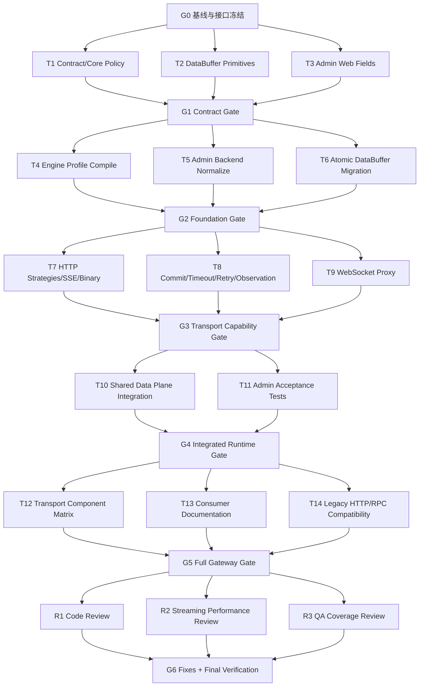

# Gateway OpenAI Streaming Transport Parallel Implementation Plan

> **For agentic workers:** REQUIRED SUB-SKILL: Use superpowers:subagent-driven-development (recommended) or superpowers:executing-plans to implement this plan task-by-task. Steps use checkbox (`- [ ]`) syntax for tracking.

**Goal:** 在不改变既有 HTTP、HTTP-to-RPC 与 gRPC/RPC 默认行为的前提下，为 Gateway 增加 OpenAI HTTP 规范兼容的透明 Streaming HTTP、SSE、Multipart、Binary Stream 与 Realtime WebSocket 转发能力。

**Architecture:** 保留现有 Gateway Filter Chain 作为唯一的 Route、Security、Governance 与 Provider Selection 入口；在 Invocation 阶段以窄 `GatewayTransportDispatcher` 分派 Aggregated/Streaming HTTP Strategy 或独立 WebSocket Proxy，并用 Policy Resolver、Reactor Netty Adapter、DataBuffer Decorator、单调 Commit Guard 和被动 Observer 约束流式生命周期。

**Tech Stack:** Java 21、Spring Core `DataBuffer`、Project Reactor、Reactor Netty HTTP/WebSocket、Jackson、JUnit Jupiter、Reactor Test、Maven、React 19、TypeScript 6、Ant Design、Vitest。

## Global Constraints

- 已确认设计以 `docs/superpowers/specs/2026-07-30-gateway-openai-streaming-transport-design.md` v2 为唯一功能基线；实施中如发现矛盾，先停在当前汇合门，由主代理记录证据并更新计划，不由子代理自行扩大范围。
- Gateway 只识别请求、匹配 Route、承载协议并透明转发；禁止实现 Token 统计、计费、Prompt、会话、RAG、Agent 编排、Function Calling 执行或模型业务选择。
- 不读取、验证或重新序列化 OpenAI JSON Body；不得按 `model`、`messages`、`input`、`tools` 或媒体内容选择 Provider。
- 旧 Route 缺少 `transportPolicy` 时必须保留 Aggregated HTTP、5 秒既有上游超时、4 MiB 既有响应限制、现有重试语义以及 HTTP-to-RPC 聚合语义。
- `OPENAI_HTTP` 只是 Route Transport Profile；不得增加 `OPENAI` 业务协议、OpenAI SDK、模型注册表、静态上游 URL 或新的 Provider 发现路径。
- Streaming 请求与响应使用 `Flux<DataBuffer>` 单订阅传输；禁止默认 `join`、`collectList`、`cache`、`replay` 或完整 Body 堆聚合。
- 只有显式 `AGGREGATED` HTTP 与既有 HTTP-to-RPC Bridge 可以在上限内聚合；Multipart、Streaming、SSE、Binary 与 WebSocket 不得完整加载到 JVM 堆。
- SSE 必须逐 DataBuffer Flush、禁止缓存与压缩变换；Binary payload 不得转成 String、JSON 或 Base64；WebSocket Frame payload 不进入 HTTP Body Strategy。
- `Authorization` 只在显式 `OPENAI_HTTP` Profile 的透明凭证路径保留；Cookie、内部身份 Header 与 Hop-by-Hop Header 继续清理。`traceparent` 保持同一 Trace，但允许现有 attempt span 生成新的子 Span ID。
- Connect、Response Header、Stream Idle、Total 与 WebSocket Idle Timeout 必须是不同计时器；正常背压不能被误判成网络空闲。
- `OPENAI_HTTP` 默认禁止重试；收到上游响应头、提交下游响应头、发送首个响应 DataBuffer、完成 WebSocket 101 或转发首个 Frame 后，重试门永久关闭。
- 客户端上传、等待响应头、SSE、Binary 或 WebSocket 任一阶段取消时，必须取消上游 Send/Receive、释放未转交 DataBuffer、结束 attempt/selection/observation，且不得重试。
- 不新增 Gateway 子模块，不引入 Spring Cloud Gateway，不修改已有 Flyway V1-V4，不创建 V5；Route 新字段继续存入现有 `route_content JSONB`。
- 当前 Admin 模块既有依赖为 `Admin -> Contract + Core`；本次保留该依赖，不为追求理想化依赖图重构发布编译器。
- 历史 Admin Web 草稿的 `listener/method/path` 可以双读为 `accessZones/httpMethod/pathPattern`，但旧 UI 从未保存 `host`。缺失 Host 时必须显示可操作的校验错误并要求操作者补录，禁止静默推断为 `*` 或任意域名。
- Wire 兼容承诺是“新 Engine 读取并校验旧 v1 Snapshot”；旧 Engine 不能读取含 `transportPolicy` 的新 Snapshot。部署顺序必须先升级全部 Engine，再允许 Admin 发布新字段；混部期不得发布 Transport Policy。
- 每个实现任务先写失败测试、确认 RED、做最小实现、确认 GREEN，并只留下一个任务提交；不得以任务间临时编译失败作为并行开发方式。
- 不自动启动业务项目或常驻服务，不打开浏览器，不使用 Computer 控制，不推送远端，不创建 PR；测试只使用进程内或自动关闭的临时 Reactor Netty Server。
- 保留用户工作区中的所有既有修改；执行时使用隔离 Worktree，任何代理不得 reset、checkout 或覆盖其他代理/用户文件。

---

### 实施前决策收口

| 审计发现 | 本计划固定决策 |
|---|---|
| WebSocket 上游握手与客户端 101 的时序 | 使用 `prepareWebSocket + bridgeWebSocket` 两阶段接口；上游握手失败保持普通 HTTP 错误，只有 `Accepted` 后 Listener 才提交客户端 101。 |
| “收到响应头后不重试”与旧 503 状态重试冲突 | `mayRetryTransportFailure` 在上游响应头后永久为 false；另保留窄 `mayRetryLegacyStatus`，仅限 `DEFAULT + AGGREGATED + STANDARD + 幂等且可重放 + 已有 RETRY Policy + 下游未提交`。`OPENAI_HTTP`、Streaming、Multipart、SSE、Binary、WebSocket 永远不能进入该兼容分支。 |
| OpenAI `Authorization` 透明转发 | 不增加新的凭证 Wire 字段；`OPENAI_HTTP` 解析出的内部有效策略允许保留，但 `TrustedIdentitySanitizer.fieldsToRemove` 仍拥有最终否决权。旧 Route 继续删除凭证。 |
| SSE Flush 缺少模型信号 | 在 Engine 响应模型中增加内部 `GatewayHttpFlushMode.STANDARD/PER_BUFFER`，不依赖上游 Content-Type 在 Listener 阶段再次猜测。 |
| `GatewayCallEventV1` 扩展风险 | 本次不改 Event v1 Wire，避免 Engine-first 混部时新 Engine 事件破坏旧 Admin 消费。Transport/commit/close 作为 Micrometer Observation 与安全日志元数据；持久事件 Schema 扩展另行评审。 |
| Body Log sink 不明确 | 仅复用现有日志/Observation 后端并使用独立安全 logger；不新增检索、数据库、消息 Topic、管理页面或保留期业务。 |
| 正常背压与 Stream Idle | Idle 由 Adapter 提供网络读写活动信号；本地没有 demand 或 outbound 被背压时暂停相应空闲钟，不能用下游消费间隔代替网络空闲。 |
| WSS 信任与压缩 | 生产默认使用 JVM/既有 TLS 信任配置，测试注入只信任临时测试证书的 scoped `SslContext`；禁止 trust-all，首版关闭两端 `permessage-deflate`。 |
| 历史 Draft Host | 旧 UI 无 Host 来源，只能提示人工补录；不得推断 `*`。 |
| Rule Wire 混部 | 兼容只承诺新 Engine 读旧 v1；全部 Engine READY 后才升级 Admin 并发布新 Policy。 |
| Traffic Policy 作用域 | 保持现有 Operation 级关联，同一 Operation 的 Routes 共享 Traffic Policy，再应用各自 Transport Override；不新增 Route `policyRefs`。 |
| Admin 固定上限与 Engine 本地上限 | Admin 按 Spec 固定最大值校验；Engine 激活时再按本地可更低安全值拒绝。所有 Engine 节点必须同构配置。 |
| 上游提前响应与后续上传超限 | 提前响应立即结束 Header Timeout；上传仍继续受增量限制。下游未提交时返回 413；已提交时取消双向传输并关连接，不改写已发送响应。 |
| Resolver 模块位置 | 纯 Resolver 放 Core，只接受中立的 defaults/overrides/safety value；Engine 负责把 Traffic Policy 和本地配置适配成这些输入。若实现迫使 Core 引用 Engine 类型，停止并把组装留在 Engine，不反转依赖。 |

---

## 1. 设计模式实施护栏

| 模式/构件 | 解决的问题 | 实施边界 |
|---|---|---|
| Remote Proxy | 明确 Gateway 只代理远端 OpenAI-compatible Contract | 不形成 OpenAI SDK/业务 Facade |
| 既有 Chain of Responsibility | Route、CORS、Security、Governance 只执行一次 | 不把每个 DataBuffer/Frame 做成 Filter |
| Strategy | 隔离 Aggregated 与 Streaming HTTP 算法 | WebSocket 不实现 HTTP Strategy |
| Dedicated WebSocket Proxy | 表达 101 后双向会话生命周期 | 返回 `Mono<Void>`，不伪造 HTTP Body |
| Adapter | 隔离 Reactor Netty、ByteBuf 与握手细节 | Contract/Core/Admin 不依赖 Reactor Netty/DataBuffer |
| Policy Object + Resolver | 合并 Profile、Route Override、Traffic Policy 与安全边界 | Resolver 是纯函数，不读 Body、不建连接 |
| Reactive Decorator | 组合大小限制、观测、日志采样、Idle 与释放 | 小型 Reactor Operator，不建立包装类继承树 |
| Facade/Dispatcher | 让 Listener 不认识全部 Strategy/Adapter/Guard | 不重复 Route/Security/Governance/Provider 逻辑 |
| Monotonic Commit Guard | 记录不可逆提交点并否决重试 | 不引入完整 State 类层次，不执行 I/O |
| Observer | 记录字节、模式、提交点、取消和 Close | Sink 失败不得控制传输或创建第二订阅 |

明确拒绝 Template Method、Factory Method/Abstract Factory、Builder、Command、完整 State、Specification 类树、Domain Service 和 OpenAI SDK/Facade。实施代理若认为需要其中任一模式，必须停止任务并把具体重复逻辑或变化点提交给主代理审核，不能自行引入。

---

## 2. Multi-Agent Parallel Workflow

### 2.1 调度模型

- 主代理是唯一 Integration Coordinator，拥有集成分支、波次汇合、冲突裁决、最终验证和交付结论。
- 并行上限为 3 个子代理；加上主代理总共不超过 4 个活跃代理。
- 每个任务使用一个新的 preset subagent；任务结束、结果复核和分支合入后清理该代理，后续任务不得复用。
- Java 实现任务优先选择 preset `backend-developer`，Admin Web 选择 `frontend-developer`，跨 Admin Java/React 的纯验收任务选择 `fullstack-developer`，文档选择 `documentation-engineer`；最终审查分别选择 `code-reviewer`、`performance-engineer` 与 `qa-expert`。
- 每个代理必须得到：目标、起始 Gate Commit、专属 Worktree、可写文件清单、禁止写入清单、预期测试命令、唯一提交信息，以及“你不是独自在代码库中工作，不得回退其他修改”的约束。
- 同一波次内写入范围不得重叠。共享热点只在后续串行集成任务中修改；主代理在子代理活跃期间不写其所有权范围。
- 子代理的“测试通过”不是合入证据。主代理必须检查 diff、提交内容、文件范围、测试输出，并在 Integration Worktree 重新执行 Gate 命令。

### 2.2 Worktree 与分支协议

执行本计划前，主代理必须先使用 `superpowers:using-git-worktrees` 建立隔离 Integration Worktree，再为每个任务从当前 Gate Commit 建立独立 Worktree：

```text
codex/gateway-openai-streaming              # 主集成分支，仅主代理写
codex/gateway-openai-w1-contract            # Task 1
codex/gateway-openai-w1-buffer              # Task 2
codex/gateway-openai-w1-admin-web           # Task 3
codex/gateway-openai-w2-engine-policy       # Task 4
codex/gateway-openai-w2-admin-backend       # Task 5
codex/gateway-openai-w2-body-model          # Task 6
codex/gateway-openai-w3-http-strategy       # Task 7
codex/gateway-openai-w3-lifecycle           # Task 8
codex/gateway-openai-w3-websocket           # Task 9
codex/gateway-openai-w4-data-plane          # Task 10
codex/gateway-openai-w4-admin-acceptance    # Task 11
codex/gateway-openai-w5-matrix              # Task 12
codex/gateway-openai-w5-docs                # Task 13
codex/gateway-openai-w5-compat              # Task 14
```

规则：

1. 每个 Wave 的所有任务从同一个 Gate Commit 分支；不得从另一个尚未审核的任务分支分叉。
2. 子代理只在自己的 Worktree 工作，只留下一个任务提交。
3. 主代理按本文规定顺序 cherry-pick 到 Integration Branch；冲突由主代理判定，不能让后到代理覆盖先到任务。
4. 若任务需要返工，在当前任务代理清理前完成并 amend 为单一任务提交；合入后发现的问题作为新的、窄范围修复任务分派给新代理。
5. Gate 未通过时不得创建下一 Wave 的 Worktree；同 Wave 中不依赖失败任务的代理可以继续，但不能提前合入下一 Gate。
6. 每次汇合后记录 `Gate ID -> commit SHA -> commands -> exit code`，作为最终交付证据。

### 2.3 依赖图



### 2.4 波次与文件所有权

| Wave | Task | Preset Agent | 并行写入所有权 | 汇合顺序 |
|---|---|---|---|---|
| 1 | T1 | backend-developer | Contract rule transport types；Core transport policy；`GatewayRuntimeRoute`、`RuntimeHttpRoute` | 1 |
| 1 | T2 | backend-developer | Engine POM；新 DataBuffer pipeline/ownership utilities 及其测试 | 2 |
| 1 | T3 | frontend-developer | Admin Web `DraftPage`、route transport mapper/validation/types 及独立测试 | 3 |
| 2 | T4 | backend-developer | Engine rule/profile compiler、runtime properties/configuration 及测试 | 1 |
| 2 | T5 | backend-developer | Admin route content normalizer、draft/release/compiler validation 及测试 | 2 |
| 2 | T6 | backend-developer | Engine HTTP Body records、listener、HTTP adapter、limiter、旧 handler 的原子 DataBuffer 迁移 | 3 |
| 3 | T7 | backend-developer | HTTP Strategy、Header Filter、Streaming/SSE/Binary operator 与 adapter 行为 | 1 |
| 3 | T8 | backend-developer | Commit Guard、retry gate、timeout/cancel、Body log、Observation metadata；Event v1 Wire 不变 | 2 |
| 3 | T9 | backend-developer | 全新 Engine WebSocket package、Reactor Netty WS adapters/proxy 及测试 | 3 |
| 4 | T10 | backend-developer | `DefaultGatewayHttpDataPlaneHandler`、Execution Pipeline、Listener/Server、Dispatcher、Engine wiring 独占集成 | 1 |
| 4 | T11 | fullstack-developer | 仅 Admin 后端/前端验收测试文件，不改 T5/T3 生产文件 | 2 |
| 5 | T12 | backend-developer | 仅 Engine transport component fixtures/tests | 1 |
| 5 | T13 | documentation-engineer | Gateway README 与 developer integration 文档 | 2 |
| 5 | T14 | backend-developer | 仅 Gateway test-suite 与既有 HTTP/RPC 兼容测试 | 3 |
| 6 | R1-R3 | code-reviewer/performance-engineer/qa-expert | 只读审查；不得直接修文件 | 不合入 |

任何任务若需要修改同 Wave 另一任务的文件，必须报告阻塞；主代理把该修改移到后续 Gate 后的独占集成任务，不能通过“先改再解决冲突”绕过所有权。

---

## 3. Gate 0：基线、接口冻结与代理派工

**Owner:** Integration Coordinator（主代理）

**Files:** 本 Gate 不修改运行代码。

- [ ] **Step 1: 记录实施基线并保护用户改动**

```bash
git status --short --branch
git rev-parse HEAD
git diff --check
```

Expected: 记录实际 HEAD；若原工作区有用户修改，留在原工作区，不复制、暂存或清理。

- [ ] **Step 2: 建立隔离 Integration Worktree**

按 `superpowers:using-git-worktrees` 选择已被 `.gitignore` 覆盖的位置，创建 `codex/gateway-openai-streaming`；不得在用户当前 `main` Worktree 直接实施。

- [ ] **Step 3: 运行后端与前端基线**

```bash
./mvnw -B -ntp \
  -f egon-cola-platforms/egon-cola-platform-gateway/pom.xml test

cd egon-cola-platforms/egon-cola-platform-gateway/egon-cola-platform-gateway-admin-web
npm test -- --run
npm run typecheck
```

Expected: 命令成功。若基线失败，先记录与本计划无关的失败证据；不得把既有失败归因于本功能，也不得进入 Wave 1 后再掩盖。

- [ ] **Step 4: 冻结跨代理接口**

冻结以下规范名和 Wire 值，子代理不得各自改名：

```text
GatewayRouteProfile: DEFAULT | OPENAI_HTTP
GatewayTransportProtocol: HTTP | WEBSOCKET
GatewayRequestBodyMode: AGGREGATED | STREAMING
GatewayTransportResponseMode: STANDARD | AUTO_STREAM | SSE | BINARY_STREAM
GatewayRouteTransportPolicy: nullable boxed Route override values
EffectiveGatewayTransportPolicy: non-null runtime Policy Object
GatewayHttpFlushMode: STANDARD | PER_BUFFER
```

`GatewayRouteTransportPolicy` 的 Wire 字段固定为：`profile`、`transportProtocol`、`requestBodyMode`、`responseMode`、`maxRequestBodyBytes`、`connectTimeoutMs`、`responseHeaderTimeoutMs`、`streamIdleTimeoutMs`、`totalTimeoutMs`、`websocketIdleTimeoutMs`、`websocketMaxFrameBytes`、`bodyLogEnabled`、`retryEnabled`。

- [ ] **Step 5: 创建 Wave 1 三个任务 Worktree 并派工**

每条 prompt 必须包含本文 Task 目标、Files、RED/GREEN 命令、唯一提交信息、禁止范围及共享工作区约束。派工后主代理只检查非重叠区域并等待三个最终结果。

---

## 4. Wave 1：并行建立稳定契约、Buffer 原语与管理表单

### Task 1: 增加 Route Transport Contract 与纯 Policy Resolver

**Agent:** 新建 preset `backend-developer`

**Files:**

- Create: `egon-cola-platforms/egon-cola-platform-gateway/egon-cola-platform-gateway-contract/src/main/java/top/egon/cola/component/gateway/contract/rule/GatewayRouteProfile.java`
- Create: `egon-cola-platforms/egon-cola-platform-gateway/egon-cola-platform-gateway-contract/src/main/java/top/egon/cola/component/gateway/contract/rule/GatewayTransportProtocol.java`
- Create: `egon-cola-platforms/egon-cola-platform-gateway/egon-cola-platform-gateway-contract/src/main/java/top/egon/cola/component/gateway/contract/rule/GatewayRequestBodyMode.java`
- Create: `egon-cola-platforms/egon-cola-platform-gateway/egon-cola-platform-gateway-contract/src/main/java/top/egon/cola/component/gateway/contract/rule/GatewayTransportResponseMode.java`
- Create: `egon-cola-platforms/egon-cola-platform-gateway/egon-cola-platform-gateway-contract/src/main/java/top/egon/cola/component/gateway/contract/rule/GatewayRouteTransportPolicy.java`
- Modify: `egon-cola-platforms/egon-cola-platform-gateway/egon-cola-platform-gateway-contract/src/main/java/top/egon/cola/component/gateway/contract/rule/GatewayRuntimeRoute.java`
- Create: `egon-cola-platforms/egon-cola-platform-gateway/egon-cola-platform-gateway-core/src/main/java/top/egon/cola/component/gateway/core/transport/EffectiveGatewayTransportPolicy.java`
- Create: `egon-cola-platforms/egon-cola-platform-gateway/egon-cola-platform-gateway-core/src/main/java/top/egon/cola/component/gateway/core/transport/GatewayTransportDefaults.java`
- Create: `egon-cola-platforms/egon-cola-platform-gateway/egon-cola-platform-gateway-core/src/main/java/top/egon/cola/component/gateway/core/transport/GatewayTransportSafetyLimits.java`
- Create: `egon-cola-platforms/egon-cola-platform-gateway/egon-cola-platform-gateway-core/src/main/java/top/egon/cola/component/gateway/core/transport/GatewayTransportPolicyOverrides.java`
- Create: `egon-cola-platforms/egon-cola-platform-gateway/egon-cola-platform-gateway-core/src/main/java/top/egon/cola/component/gateway/core/transport/GatewayRouteProfileResolver.java`
- Modify: `egon-cola-platforms/egon-cola-platform-gateway/egon-cola-platform-gateway-core/src/main/java/top/egon/cola/component/gateway/core/route/RuntimeHttpRoute.java`
- Test: `egon-cola-platforms/egon-cola-platform-gateway/egon-cola-platform-gateway-contract/src/test/java/top/egon/cola/component/gateway/contract/rule/GatewayRouteTransportPolicyTest.java`
- Test: `egon-cola-platforms/egon-cola-platform-gateway/egon-cola-platform-gateway-core/src/test/java/top/egon/cola/component/gateway/core/transport/GatewayRouteProfileResolverTest.java`
- Modify test: `egon-cola-platforms/egon-cola-platform-gateway/egon-cola-platform-gateway-core/src/test/java/top/egon/cola/component/gateway/core/route/HttpRouteCompilerTest.java`

**Interfaces:**

```java
public record GatewayRouteTransportPolicy(
        GatewayRouteProfile profile,
        GatewayTransportProtocol transportProtocol,
        GatewayRequestBodyMode requestBodyMode,
        GatewayTransportResponseMode responseMode,
        Long maxRequestBodyBytes,
        Long connectTimeoutMs,
        Long responseHeaderTimeoutMs,
        Long streamIdleTimeoutMs,
        Long totalTimeoutMs,
        Long websocketIdleTimeoutMs,
        Long websocketMaxFrameBytes,
        Boolean bodyLogEnabled,
        Boolean retryEnabled) {
}
```

`GatewayRuntimeRoute` 在末尾增加可空 `transportPolicy`，并保留原 8 参数构造器委托 `null`。`RuntimeHttpRoute` 在末尾增加 `EffectiveGatewayTransportPolicy transportPolicy`，并保留旧构造器以旧默认值委托。Wire record 不补默认；Runtime policy 使用 `Optional<Duration>` 表达关闭的 Total/WS Timeout、`OptionalLong` 表达 Streaming 响应无默认限制或非 WebSocket 不适用字段，并把有效重试字段命名为 `retryAllowed`，避免与 Wire `retryEnabled` 的“只允许现有 RETRY Policy 参与”语义混淆。

- [ ] **Step 1: 写失败的 Contract 与 Resolver 测试**

至少覆盖：

```java
assertNull(legacyRoute.transportPolicy());
assertEquals(GatewayRequestBodyMode.AGGREGATED,
        resolver.resolve(null, legacyDefaults, noOverrides, safety)
                .requestBodyMode());
assertEquals(GatewayRequestBodyMode.STREAMING,
        resolver.resolve(openAiProfileOnly, legacyDefaults, noOverrides, safety)
                .requestBodyMode());
assertEquals(GatewayTransportResponseMode.AUTO_STREAM, openAi.responseMode());
assertEquals(Duration.ofMinutes(30), openAi.totalTimeout().orElseThrow());
assertFalse(openAi.bodyLogEnabled());
assertFalse(openAi.retryAllowed());
```

用表驱动测试完整断言 Spec 的 DEFAULT/OPENAI 默认值、显式 Override、1 GiB/60s/10min/30min/2h/64 MiB 硬边界以及同一输入重复解析结果相等。断言 `OPENAI_HTTP` 允许透明保留 Authorization，但该内部有效值不能成为新的 Route Wire 字段。

- [ ] **Step 2: 运行聚焦测试并确认 RED**

```bash
./mvnw -B -ntp \
  -pl egon-cola-platforms/egon-cola-platform-gateway/egon-cola-platform-gateway-core \
  -am -Dtest=GatewayRouteTransportPolicyTest,GatewayRouteProfileResolverTest,HttpRouteCompilerTest \
  -Dsurefire.failIfNoSpecifiedTests=false test
```

Expected: 测试编译失败，因为 transport types 与 resolver 尚不存在。

- [ ] **Step 3: 实现最小 Policy Object 与 Resolver**

解析优先级固定为安全硬边界校验 > 显式 Route Override > Profile 默认 > 旧全局默认。`GatewayTransportPolicyOverrides` 只承载已编译的 REQUEST_SIZE、RESPONSE_SIZE 与 TIMEOUT 输入，不依赖 Engine 类型；Resolver 不读取 Body、不创建 Client、不引用 Reactor Netty。现有 Wire 只允许 Operation 引用 Traffic Policy，因此同一 Operation 的多个 Route 继承同一组 Traffic Policy，再分别应用自己的 Route Transport Override；本次不新增 Route `policyRefs`，不改变既有 Traffic 作用域模型。

- [ ] **Step 4: 验证模块边界与 GREEN**

```bash
./mvnw -B -ntp \
  -pl egon-cola-platforms/egon-cola-platform-gateway/egon-cola-platform-gateway-core \
  -am test

! rg -n 'org\.springframework\.core\.io\.buffer|reactor\.netty' \
  egon-cola-platforms/egon-cola-platform-gateway/egon-cola-platform-gateway-contract/src \
  egon-cola-platforms/egon-cola-platform-gateway/egon-cola-platform-gateway-core/src
```

Expected: Contract/Core 测试通过；依赖扫描无输出。

- [ ] **Step 5: 留下唯一任务提交**

```bash
git add egon-cola-platforms/egon-cola-platform-gateway/egon-cola-platform-gateway-contract \
        egon-cola-platforms/egon-cola-platform-gateway/egon-cola-platform-gateway-core
git diff --cached --check
git commit -m "feat(gateway): add route transport policy contracts"
```

### Task 2: 建立 DataBuffer Ownership 与 Reactive Decorator 原语

**Agent:** 新建 preset `backend-developer`

**Files:**

- Modify: `egon-cola-platforms/egon-cola-platform-gateway/egon-cola-platform-gateway-engine/pom.xml`
- Create: `egon-cola-platforms/egon-cola-platform-gateway/egon-cola-platform-gateway-engine/src/main/java/top/egon/cola/component/gateway/engine/http/buffer/GatewayDataBufferPipeline.java`
- Create: `egon-cola-platforms/egon-cola-platform-gateway/egon-cola-platform-gateway-engine/src/main/java/top/egon/cola/component/gateway/engine/http/buffer/GatewayDataBufferOwnership.java`
- Create: `egon-cola-platforms/egon-cola-platform-gateway/egon-cola-platform-gateway-engine/src/test/java/top/egon/cola/component/gateway/engine/http/buffer/GatewayDataBufferPipelineTest.java`
- Create: `egon-cola-platforms/egon-cola-platform-gateway/egon-cola-platform-gateway-engine/src/test/java/top/egon/cola/component/gateway/engine/http/buffer/GatewayDataBufferOwnershipTest.java`

**Interfaces:**

`GatewayDataBufferPipeline` 提供小型 operator：`limitBytes`、`observeBytes`、`sampleBodyWhenEnabled`、`enforceIdleTimeout(source, timeoutSignal, failure)` 与 `releaseOnDiscardOrCancel`。网络 Idle 的计时信号由 Adapter 提供，禁止在这里把下游消费速度误当成网络空闲。`GatewayDataBufferOwnership` 只封装 retain/release/只读采样规则，不做 Route 或日志决策。

所有权规则固定为：Reactor Netty `receive()` 发出的 pooled `ByteBuf` 在离开回调前恰好 `retain()` 一次再包装；`NettyDataBufferFactory.wrap(ByteBuf)` 本身不增加引用；成功交给 Netty outbound 后所有权已转移，调用方不得再 release；聚合分支逐块复制后立即释放输入，每次 retry 从不可变聚合字节重新创建 Buffer；流式超限/取消只释放尚未转交的当前项与 discard 队列；日志/观测只做只读有界复制，不 retain、不移动 reader index、不创建第二订阅；禁止用笼统 `doFinally` 释放已经向下游转交的 Buffer。

- [ ] **Step 1: 写 pooled DataBuffer 生命周期失败测试**

使用 `NettyDataBufferFactory(PooledByteBufAllocator.DEFAULT)` 与 `StepVerifier` 覆盖：单订阅、按 Buffer 增量计数、超限即取消、正常完成、上游错误、下游取消、响应对象已产生但 Body 从未订阅、`doOnDiscard`、Observer 抛错隔离以及最终 native `refCnt()==0`。测试禁止先构造与总流量等大的 `byte[]`。

- [ ] **Step 2: 运行测试并确认 RED**

```bash
./mvnw -B -ntp \
  -pl egon-cola-platforms/egon-cola-platform-gateway/egon-cola-platform-gateway-engine \
  -am -Dtest=GatewayDataBufferPipelineTest,GatewayDataBufferOwnershipTest \
  -Dsurefire.failIfNoSpecifiedTests=false test
```

Expected: 测试编译失败，因为 buffer utilities 不存在。

- [ ] **Step 3: 添加直接 `spring-core` 依赖并实现 operator**

只增加当前 Boot/Web 运行时已经存在的 `org.springframework:spring-core` 直接依赖，准确声明生产代码对 `DataBuffer` 的使用；不增加 WebFlux、Spring Cloud Gateway 或新框架。每个 operator 保持单订阅，不缓存 source，不双重 release。

- [ ] **Step 4: 验证 leak 路径与 GREEN**

```bash
./mvnw -B -ntp \
  -pl egon-cola-platforms/egon-cola-platform-gateway/egon-cola-platform-gateway-engine \
  -am -Dtest=GatewayDataBufferPipelineTest,GatewayDataBufferOwnershipTest \
  -Dsurefire.failIfNoSpecifiedTests=false test
```

Expected: 所有终止路径通过，测试断言每个自己拥有的 pooled buffer 最终只释放一次。

- [ ] **Step 5: 留下唯一任务提交**

```bash
git add egon-cola-platforms/egon-cola-platform-gateway/egon-cola-platform-gateway-engine/pom.xml \
        egon-cola-platforms/egon-cola-platform-gateway/egon-cola-platform-gateway-engine/src/main/java/top/egon/cola/component/gateway/engine/http/buffer \
        egon-cola-platforms/egon-cola-platform-gateway/egon-cola-platform-gateway-engine/src/test/java/top/egon/cola/component/gateway/engine/http/buffer
git diff --cached --check
git commit -m "feat(gateway): add DataBuffer streaming primitives"
```

### Task 3: 增加 Admin Web Transport Route Fields 与旧键读取

**Agent:** 新建 preset `frontend-developer`

**Files:**

- Modify: `egon-cola-platforms/egon-cola-platform-gateway/egon-cola-platform-gateway-admin-web/src/api/types.ts`
- Modify: `egon-cola-platforms/egon-cola-platform-gateway/egon-cola-platform-gateway-admin-web/src/features/draft/DraftPage.tsx`
- Modify: `egon-cola-platforms/egon-cola-platform-gateway/egon-cola-platform-gateway-admin-web/src/features/draft/routeValidation.ts`
- Modify test: `egon-cola-platforms/egon-cola-platform-gateway/egon-cola-platform-gateway-admin-web/src/features/draft/routeValidation.test.ts`
- Create: `egon-cola-platforms/egon-cola-platform-gateway/egon-cola-platform-gateway-admin-web/src/features/draft/routeTransport.ts`
- Create: `egon-cola-platforms/egon-cola-platform-gateway/egon-cola-platform-gateway-admin-web/src/features/draft/routeTransport.test.ts`

**Interfaces:**

`routeTransport.ts` 必须是纯 mapper，提供 `readRouteForm(content)`、`writeCanonicalRoute(values)` 与 `validateTransportRoute(values)`。新写入只使用 `host/httpMethod/pathPattern/accessZones/priority/transportPolicy`；读取兼容 `listener/method/path`。缺失 Host 返回明确 validation issue，不填 `*`。读取时把所有未识别高级键保存在表单的 `advancedContent`，保存时递归移除 `undefined` 但保留显式 `false`，禁止编辑旧 Route 时把既有 Transport Policy 或扩展字段静默丢失；Profile 默认只用于展示，不自动固化到 JSON。

- [ ] **Step 1: 写失败的纯 mapper 与校验测试**

覆盖：

- legacy `listener=PUBLIC, method=POST, path=/v1/**` 能映射到标准表单；
- legacy 缺少 Host 时产生“历史草稿缺少 Host，请补录”错误；
- 新保存对象不包含 `listener/method/path`；
- `OPENAI_HTTP` 展示 Profile 默认/Override 来源；
- `WEBSOCKET` 隐藏 Request/Response Body Mode 并要求 GET；
- `SSE/BINARY_STREAM` 显示透明、禁止聚合提示；
- Retry 开启显示幂等/可重放/提交点限制；
- 所有数值按 Spec 范围校验；
- 组件与 mapper 中不存在模型、Token、配额、计费、Prompt、RAG 或 Agent 字段。

- [ ] **Step 2: 运行 Vitest 并确认 RED**

```bash
cd egon-cola-platforms/egon-cola-platform-gateway/egon-cola-platform-gateway-admin-web
npm test -- --run src/features/draft/routeTransport.test.ts \
  src/features/draft/routeValidation.test.ts
```

Expected: 测试失败，因为 mapper 与 transport fields 不存在。

- [ ] **Step 3: 实现类型、纯 mapper 与条件表单**

新增 Host、多选 Access Zones、Route Profile、Transport Protocol、Request Body Mode、Response Mode、最大请求体、五类 Timeout、WebSocket Frame 大小、Body 日志开关与重试开关。Operation ID 变化后使用现有 `gatewayApi.operation(operationId)` 读取服务端 Operation Protocol，不能继续信任可编辑的本地 `protocol` 字段；RPC 只显示既有协议状态，不允许选择 WebSocket/Streaming Transport。表单不提供静态 Provider URL。

- [ ] **Step 4: 运行前端 GREEN 验证**

```bash
npm test -- --run
npm run typecheck
npm run lint
npm run build
```

Expected: Vitest、类型检查、Lint 与构建成功；不运行 Playwright/browser E2E。

- [ ] **Step 5: 留下唯一任务提交**

```bash
git add egon-cola-platforms/egon-cola-platform-gateway/egon-cola-platform-gateway-admin-web/src
git diff --cached --check
git commit -m "feat(gateway-admin-web): add transport route fields"
```

### Gate 1: 汇合 Wave 1

- [ ] 主代理分别检查 T1/T2/T3 只修改所有权文件，并阅读全部 diff。
- [ ] 按 T1 -> T2 -> T3 顺序 cherry-pick；任何冲突都说明边界失效，停止汇合并返工，不做内容猜测。
- [ ] 运行：

```bash
./mvnw -B -ntp \
  -pl egon-cola-platforms/egon-cola-platform-gateway/egon-cola-platform-gateway-engine \
  -am test

cd egon-cola-platforms/egon-cola-platform-gateway/egon-cola-platform-gateway-admin-web
npm test -- --run
npm run typecheck
```

- [ ] 记录 `G1` commit 与命令输出；清理 Wave 1 代理/Worktree，再从 G1 创建 Wave 2。

---

## 5. Wave 2：并行编译有效 Policy、规范化 Admin 与原子迁移 HTTP Body

### Task 4: 把 Profile、Route Override 与既有 Traffic Policy 编译为有效策略

**Agent:** 新建 preset `backend-developer`

**Files:**

- Modify: `egon-cola-platforms/egon-cola-platform-gateway/egon-cola-platform-gateway-engine/src/main/java/top/egon/cola/component/gateway/engine/GatewayEngineRuntimeProperties.java`
- Modify: `egon-cola-platforms/egon-cola-platform-gateway/egon-cola-platform-gateway-engine/src/main/java/top/egon/cola/component/gateway/engine/GatewayEngineConfiguration.java`
- Modify: `egon-cola-platforms/egon-cola-platform-gateway/egon-cola-platform-gateway-engine/src/main/java/top/egon/cola/component/gateway/engine/http/GatewayHttpEngineProperties.java`
- Modify: `egon-cola-platforms/egon-cola-platform-gateway/egon-cola-platform-gateway-engine/src/main/java/top/egon/cola/component/gateway/engine/rule/EngineGatewayRuleCompiler.java`
- Modify: `egon-cola-platforms/egon-cola-platform-gateway/egon-cola-platform-gateway-engine/src/main/java/top/egon/cola/component/gateway/engine/traffic/GatewayTrafficGovernance.java`
- Create: `egon-cola-platforms/egon-cola-platform-gateway/egon-cola-platform-gateway-engine/src/test/java/top/egon/cola/component/gateway/engine/rule/GatewayTransportProfileCompilationTest.java`
- Create: `egon-cola-platforms/egon-cola-platform-gateway/egon-cola-platform-gateway-engine/src/test/java/top/egon/cola/component/gateway/engine/rule/GatewayRuleTransportPolicyCompatibilityTest.java`
- Modify test: `egon-cola-platforms/egon-cola-platform-gateway/egon-cola-platform-gateway-engine/src/test/java/top/egon/cola/component/gateway/engine/rule/EngineGatewayRulePolicyPartitionTest.java`
- Modify test: `egon-cola-platforms/egon-cola-platform-gateway/egon-cola-platform-gateway-engine/src/test/java/top/egon/cola/component/gateway/engine/GatewayEngineConfigurationTest.java`

**Behavior:**

- 旧 `upstream-timeout` 配置键继续可绑定，并作为 DEFAULT Route 的 Response Header/Stream Idle 兼容值；不删除 setter/构造器。
- 新增独立 `absoluteMaxRequestBodyBytes`（默认 1 GiB），不把现有 `defaultMaxBodyBytes` 偷换成绝对上限；保留旧 properties 构造/绑定入口并验证 `default <= absolute`。同时增加 Body Log sample 默认 8 KiB/硬上限 64 KiB，以及 Connect/Header/Idle/Total/WS Idle/Frame 安全范围。Admin 按固定的 Spec 最大值校验；Engine 节点允许把本地安全值调低，并在激活时再次校验。混合不同安全值的 Engine 配置属于部署错误，不能由 Admin 猜测节点配置。
- `EngineGatewayRuleCompiler` 在激活时解析 Profile + Route Override；REQUEST_SIZE 继续在请求时取最小值。
- 显式 Route `totalTimeoutMs` 优先；若未显式配置，既有 TIMEOUT Policy 再覆盖 Profile/全局 fallback。修复当前 TIMEOUT 总是被 5 秒 fallback 截短的问题，但不改变旧 Route 结果。
- `retryEnabled=false` 只作为否决项；`true` 不创建 Retry Policy。

- [ ] **Step 1: 写失败的 Profile 编译与旧配置测试**

测试旧 Route 编译为 AGGREGATED/STANDARD、旧 `upstreamTimeout=5s` 不变；OPENAI 编译为 STREAMING/AUTO_STREAM/长连接默认；显式 Route Override；REQUEST_SIZE 最小值；STANDARD 默认 4 MiB response limit；Streaming 默认 `OptionalLong.empty()` 但显式 RESPONSE_SIZE 可生效；显式 Total 优先；无显式 Total 时 TIMEOUT 生效；安全上限越界在 compile 时失败。兼容测试必须证明旧 JSON 读取后 `transportPolicy==null`、重写仍省略字段、旧 content/artifact SHA-256 校验成功以及新 Policy canonical 顺序稳定。

- [ ] **Step 2: 运行聚焦测试并确认 RED**

```bash
./mvnw -B -ntp \
  -pl egon-cola-platforms/egon-cola-platform-gateway/egon-cola-platform-gateway-engine \
  -am -Dtest=GatewayTransportProfileCompilationTest,GatewayRuleTransportPolicyCompatibilityTest,EngineGatewayRulePolicyPartitionTest,GatewayEngineConfigurationTest \
  -Dsurefire.failIfNoSpecifiedTests=false test
```

- [ ] **Step 3: 实现最小编译与配置适配**

保留 `EngineGatewayRuleCompiler` 旧构造器，以 legacy defaults 委托新构造器。只调整 traffic policy 的组合点，不把 I/O、Strategy 或 Provider Client 放进 Resolver。

- [ ] **Step 4: 验证 GREEN**

```bash
./mvnw -B -ntp \
  -pl egon-cola-platforms/egon-cola-platform-gateway/egon-cola-platform-gateway-engine \
  -am -Dtest=GatewayTransportProfileCompilationTest,GatewayRuleTransportPolicyCompatibilityTest,EngineGatewayRulePolicyPartitionTest,GatewayEngineConfigurationTest \
  -Dsurefire.failIfNoSpecifiedTests=false test
```

- [ ] **Step 5: 留下唯一任务提交**

```bash
git add egon-cola-platforms/egon-cola-platform-gateway/egon-cola-platform-gateway-engine/src
git diff --cached --check
git commit -m "feat(gateway): resolve effective transport profiles"
```

### Task 5: 规范化 Admin Route Content、双读旧键并执行发布校验

**Agent:** 新建 preset `backend-developer`

**Files:**

- Create: `egon-cola-platforms/egon-cola-platform-gateway/egon-cola-platform-gateway-admin/src/main/java/top/egon/cola/component/gateway/admin/rule/GatewayRouteDraftMapper.java`
- Create: `egon-cola-platforms/egon-cola-platform-gateway/egon-cola-platform-gateway-admin/src/main/java/top/egon/cola/component/gateway/admin/rule/GatewayRouteTransportPolicyValidator.java`
- Modify: `egon-cola-platforms/egon-cola-platform-gateway/egon-cola-platform-gateway-admin/src/main/java/top/egon/cola/component/gateway/admin/application/routing/GatewayDraftService.java`
- Modify: `egon-cola-platforms/egon-cola-platform-gateway/egon-cola-platform-gateway-admin/src/main/java/top/egon/cola/component/gateway/admin/application/release/GatewayReleaseService.java`
- Modify: `egon-cola-platforms/egon-cola-platform-gateway/egon-cola-platform-gateway-admin/src/main/java/top/egon/cola/component/gateway/admin/rule/GatewayRuleCompiler.java`
- Create: `egon-cola-platforms/egon-cola-platform-gateway/egon-cola-platform-gateway-admin/src/test/java/top/egon/cola/component/gateway/admin/rule/GatewayRouteDraftMapperTest.java`
- Create: `egon-cola-platforms/egon-cola-platform-gateway/egon-cola-platform-gateway-admin/src/test/java/top/egon/cola/component/gateway/admin/rule/GatewayRouteTransportPolicyValidatorTest.java`
- Create: `egon-cola-platforms/egon-cola-platform-gateway/egon-cola-platform-gateway-admin/src/test/java/top/egon/cola/component/gateway/admin/application/routing/GatewayDraftServiceTest.java`
- Modify test: `egon-cola-platforms/egon-cola-platform-gateway/egon-cola-platform-gateway-admin/src/test/java/top/egon/cola/component/gateway/admin/application/release/GatewayReleaseServiceTest.java`
- Modify test: `egon-cola-platforms/egon-cola-platform-gateway/egon-cola-platform-gateway-admin/src/test/java/top/egon/cola/component/gateway/admin/rule/GatewayRuleCompilerTest.java`

**Behavior:**

`GatewayRouteDraftMapper` 保留未知的非冲突扩展键，移除 legacy aliases，并规范写入标准键。读取顺序是标准键优先，再读 `listener/method/path`；`listener` 的单值转换为 `accessZones` 单元素集合。Host 没有 legacy 来源，缺失时产生 `ROUTE_HOST_REQUIRED`，而不是补默认。`GatewayRouteTransportPolicyValidator` 是 Draft validate 与最终 release compile 共用的直接校验器，避免两套规则漂移；不创建 Specification 类树。

发布阶段拒绝 Spec 8.4 的全部无效组合与数值范围；只将 typed `GatewayRouteTransportPolicy` 放入新 `GatewayRuntimeRoute`。不修改 JSONB schema 或 Flyway。

- [ ] **Step 1: 写失败的双读、规范写入与发布校验测试**

至少覆盖旧键、标准键优先、未知键保留、alias 删除、Host 缺失错误、所有 WebSocket/Streaming/RPC/WRAPPED 组合、GET 约束、范围边界和新 policy 进入 canonical Snapshot。

- [ ] **Step 2: 运行测试并确认 RED**

```bash
./mvnw -B -ntp \
  -pl egon-cola-platforms/egon-cola-platform-gateway/egon-cola-platform-gateway-admin \
  -am -Dtest=GatewayRouteDraftMapperTest,GatewayRouteTransportPolicyValidatorTest,GatewayDraftServiceTest,GatewayReleaseServiceTest,GatewayRuleCompilerTest \
  -Dsurefire.failIfNoSpecifiedTests=false test
```

- [ ] **Step 3: 实现 normalizer 与校验**

`GatewayDraftService.putRoute` 在 digest 与存储前规范化；`GatewayReleaseService.route` 双读历史内容并转换 typed policy；`GatewayDraftService.validate` 返回字段级错误；`GatewayRuleCompiler` 做最终不可绕过的发布校验。不得把校验扩展成 Specification 类树。

- [ ] **Step 4: 验证 Admin GREEN 与无 Migration**

```bash
./mvnw -B -ntp \
  -pl egon-cola-platforms/egon-cola-platform-gateway/egon-cola-platform-gateway-admin \
  -am test

git diff --name-only G1...HEAD | rg 'db/migration' && exit 1 || true
```

Expected: Admin 测试通过；Migration 扫描无输出。

- [ ] **Step 5: 留下唯一任务提交**

```bash
git add egon-cola-platforms/egon-cola-platform-gateway/egon-cola-platform-gateway-admin/src
git diff --cached --check
git commit -m "feat(gateway-admin): normalize transport route drafts"
```

### Task 6: 原子迁移 HTTP Body Model 与 Reactor Netty 边界到 DataBuffer

**Agent:** 新建 preset `backend-developer`

**Files:**

- Modify: `egon-cola-platforms/egon-cola-platform-gateway/egon-cola-platform-gateway-engine/src/main/java/top/egon/cola/component/gateway/engine/http/GatewayInboundHttpRequest.java`
- Modify: `egon-cola-platforms/egon-cola-platform-gateway/egon-cola-platform-gateway-engine/src/main/java/top/egon/cola/component/gateway/engine/http/GatewayOutboundHttpResponse.java`
- Modify: `egon-cola-platforms/egon-cola-platform-gateway/egon-cola-platform-gateway-engine/src/main/java/top/egon/cola/component/gateway/engine/http/HttpUpstreamRequest.java`
- Modify: `egon-cola-platforms/egon-cola-platform-gateway/egon-cola-platform-gateway-engine/src/main/java/top/egon/cola/component/gateway/engine/http/GatewayBodySizeLimiter.java`
- Modify: `egon-cola-platforms/egon-cola-platform-gateway/egon-cola-platform-gateway-engine/src/main/java/top/egon/cola/component/gateway/engine/http/GatewayHttpListener.java`
- Modify: `egon-cola-platforms/egon-cola-platform-gateway/egon-cola-platform-gateway-engine/src/main/java/top/egon/cola/component/gateway/engine/http/ReactorNettyHttpUpstreamAdapter.java`
- Modify: `egon-cola-platforms/egon-cola-platform-gateway/egon-cola-platform-gateway-engine/src/main/java/top/egon/cola/component/gateway/engine/http/DefaultGatewayHttpDataPlaneHandler.java`
- Modify: `egon-cola-platforms/egon-cola-platform-gateway/egon-cola-platform-gateway-engine/src/main/java/top/egon/cola/component/gateway/engine/http/GatewayCorsProcessor.java`
- Modify: `egon-cola-platforms/egon-cola-platform-gateway/egon-cola-platform-gateway-engine/src/main/java/top/egon/cola/component/gateway/engine/rpc/HttpRpcUpstreamAdapter.java`
- Modify tests: all Engine HTTP tests constructing/consuming the three Body records, plus `HttpRpcUpstreamAdapterTest.java`
- Create test helper: `egon-cola-platforms/egon-cola-platform-gateway/egon-cola-platform-gateway-engine/src/test/java/top/egon/cola/component/gateway/engine/http/GatewayDataBufferTestSupport.java`

**Atomicity rule:** 该任务必须在一个分支中同时迁移 record、所有生产调用点和测试调用点，使任务提交自身可编译、可测试。它仍保留旧 handler 的 Aggregated 行为；Streaming Strategy 留给 T7。

- [ ] **Step 1: 先把模型契约测试改为 `Flux<DataBuffer>` 并确认 RED**

测试 listener 和 upstream adapter 的 raw chunk checksum、聚合上限、response limit、取消释放及 HTTP-to-RPC 聚合结果。测试 helper 只允许在断言边界有界 join，不得进入生产代码。

- [ ] **Step 2: 运行 Engine HTTP/RPC 聚焦测试并确认 RED**

```bash
./mvnw -B -ntp \
  -pl egon-cola-platforms/egon-cola-platform-gateway/egon-cola-platform-gateway-engine \
  -am -Dtest='*GatewayHttp*,GatewayBodySizeLimiterTest,ReactorNettyHttpUpstreamAdapterTest,HttpRpcUpstreamAdapterTest' \
  -Dsurefire.failIfNoSpecifiedTests=false test
```

- [ ] **Step 3: 实现唯一 retain/release 边界**

入站和上游响应的 Reactor Netty `ByteBuf` 在包装为 `NettyDataBuffer` 时只 retain 一次；交给 Netty outbound 后所有权转移，调用方不得再次释放 wrapper/native buffer。非 Netty DataBuffer 允许逐 chunk 的有界复制 fallback，并在复制完成后释放原输入，但禁止完整 Body 复制。删除 `ByteBufUtil::getBytes` 与 `sendByteArray`。

- [ ] **Step 4: 保留旧 Aggregated/RPC 行为并验证 GREEN**

```bash
./mvnw -B -ntp \
  -pl egon-cola-platforms/egon-cola-platform-gateway/egon-cola-platform-gateway-engine \
  -am test

! rg -n 'ByteBufUtil::getBytes|sendByteArray' \
  egon-cola-platforms/egon-cola-platform-gateway/egon-cola-platform-gateway-engine/src/main/java/top/egon/cola/component/gateway/engine/http
```

Expected: Engine suite 通过；旧 Route 仍聚合；HTTP-to-RPC 测试仍通过；禁用 API 扫描无输出。

- [ ] **Step 5: 留下唯一任务提交**

```bash
git add egon-cola-platforms/egon-cola-platform-gateway/egon-cola-platform-gateway-engine/src
git diff --cached --check
git commit -m "refactor(gateway): migrate HTTP bodies to DataBuffer"
```

### Gate 2: 汇合 Wave 2

- [ ] 主代理检查 T4 不触碰 Body/Listener，T5 不触碰 Flyway，T6 不提前引入 Strategy/WebSocket。
- [ ] 按 T4 -> T5 -> T6 顺序 cherry-pick，并检查 T6 对 T4 wiring 的构造器适配没有覆盖 Profile 配置。
- [ ] 运行：

```bash
./mvnw -B -ntp \
  -pl egon-cola-platforms/egon-cola-platform-gateway/egon-cola-platform-gateway-engine,egon-cola-platforms/egon-cola-platform-gateway/egon-cola-platform-gateway-admin \
  -am test
```

- [ ] 重新执行旧 Snapshot compatibility test，确认缺失 `transportPolicy` 仍通过 checksum；记录 G2 并清理 Wave 2。

---

## 6. Wave 3：并行实现 HTTP Strategy、生命周期安全与 WebSocket Proxy

### Task 7: 实现 Aggregated/Streaming HTTP Strategy、Header Filter 与 SSE/Binary 语义

**Agent:** 新建 preset `backend-developer`

**Files:**

- Create: `egon-cola-platforms/egon-cola-platform-gateway/egon-cola-platform-gateway-engine/src/main/java/top/egon/cola/component/gateway/engine/http/proxy/GatewayHttpProxyContext.java`
- Create: `egon-cola-platforms/egon-cola-platform-gateway/egon-cola-platform-gateway-engine/src/main/java/top/egon/cola/component/gateway/engine/http/proxy/GatewayHttpProxyStrategy.java`
- Create: `egon-cola-platforms/egon-cola-platform-gateway/egon-cola-platform-gateway-engine/src/main/java/top/egon/cola/component/gateway/engine/http/proxy/AggregatedHttpProxyStrategy.java`
- Create: `egon-cola-platforms/egon-cola-platform-gateway/egon-cola-platform-gateway-engine/src/main/java/top/egon/cola/component/gateway/engine/http/proxy/StreamingHttpProxyStrategy.java`
- Create: `egon-cola-platforms/egon-cola-platform-gateway/egon-cola-platform-gateway-engine/src/main/java/top/egon/cola/component/gateway/engine/http/proxy/GatewayHttpProxyStrategySelector.java`
- Create: `egon-cola-platforms/egon-cola-platform-gateway/egon-cola-platform-gateway-engine/src/main/java/top/egon/cola/component/gateway/engine/http/GatewayHeaderFilter.java`
- Create: `egon-cola-platforms/egon-cola-platform-gateway/egon-cola-platform-gateway-engine/src/main/java/top/egon/cola/component/gateway/engine/http/GatewayHttpFlushMode.java`
- Modify: `egon-cola-platforms/egon-cola-platform-gateway/egon-cola-platform-gateway-engine/src/main/java/top/egon/cola/component/gateway/engine/http/GatewayOutboundHttpResponse.java`
- Modify: `egon-cola-platforms/egon-cola-platform-gateway/egon-cola-platform-gateway-engine/src/main/java/top/egon/cola/component/gateway/engine/http/HttpUpstreamRequest.java`
- Modify: `egon-cola-platforms/egon-cola-platform-gateway/egon-cola-platform-gateway-engine/src/main/java/top/egon/cola/component/gateway/engine/http/ReactorNettyHttpUpstreamAdapter.java`
- Modify: `egon-cola-platforms/egon-cola-platform-gateway/egon-cola-platform-gateway-engine/src/main/java/top/egon/cola/component/gateway/engine/security/TrustedIdentitySanitizer.java`
- Create tests: corresponding `proxy/*Test.java`, `GatewayHeaderFilterTest.java`
- Modify test: `egon-cola-platforms/egon-cola-platform-gateway/egon-cola-platform-gateway-engine/src/test/java/top/egon/cola/component/gateway/engine/http/ReactorNettyHttpUpstreamAdapterTest.java`
- Modify test: `egon-cola-platforms/egon-cola-platform-gateway/egon-cola-platform-gateway-engine/src/test/java/top/egon/cola/component/gateway/engine/security/TrustedIdentitySanitizerTest.java`

**Interfaces:**

```java
public interface GatewayHttpProxyStrategy {
    Mono<GatewayOutboundHttpResponse> proxy(GatewayHttpProxyContext context);
}

public enum GatewayHttpFlushMode {
    STANDARD,
    PER_BUFFER
}
```

Selector 对 `GatewayRequestBodyMode` 使用穷尽 `switch`，实例在 Engine wiring 时创建并复用。HTTP Adapter 只执行 I/O，不决定 Profile/Strategy。`GatewayOutboundHttpResponse` 保留原构造器并默认 `STANDARD`；SSE 使用 `PER_BUFFER`。

- [ ] **Step 1: 写两个 Strategy 的共同失败契约**

共享 Contract Test 必须断言：只调用 Adapter 一次、请求 Body 只订阅一次、取消/错误传播、未知模式失败。Aggregated 测试保留有限聚合和 replayable 标记；Streaming 测试传输原始 JSON whitespace/unknown fields、Multipart boundary、大于 2 MiB 的生成式 chunks，并标记 non-replayable。

SSE/AUTO_STREAM 测试断言收到 `text/event-stream` 后：立即产生 response、删除 Content-Length、设置 `Cache-Control: no-cache, no-transform`、可设置 `X-Accel-Buffering: no`、`PER_BUFFER`、原始事件 bytes 不变。Binary 测试使用无效 UTF-8 与大于 4 MiB 的生成式响应，断言无 String/JSON/Base64 转换和无默认 response limit。

- [ ] **Step 2: 写 Header 失败测试并确认 RED**

请求和响应的固定 Hop-by-Hop 集合都包含 `connection/keep-alive/proxy-authenticate/proxy-authorization/te/trailer/transfer-encoding/upgrade/proxy-connection`；先从原始 Header 解析 `Connection: Foo, Bar`，再删除动态 `Foo/Bar` 与固定集合。断言 Content-Type、Authorization、OpenAI-Organization、OpenAI-Project、Idempotency-Key、Content-Disposition、Content-Encoding 保留；DEFAULT 仍清除 Authorization，OPENAI transparent credential path 才保留，且 sanitizer 的显式 remove 集合仍可否决。

```bash
./mvnw -B -ntp \
  -pl egon-cola-platforms/egon-cola-platform-gateway/egon-cola-platform-gateway-engine \
  -am -Dtest='*HttpProxyStrategy*,GatewayHeaderFilterTest,ReactorNettyHttpUpstreamAdapterTest,TrustedIdentitySanitizerTest' \
  -Dsurefire.failIfNoSpecifiedTests=false test
```

Expected: 新类型不存在或行为断言失败。

- [ ] **Step 3: 实现最小 Strategy/Adapter 行为**

Streaming 不使用 Multipart decoder，不改 boundary，不解析 SSE，不启用 `HttpClient.compress(true)`。有 Content-Length 时在调用 Adapter 前预检；Chunked 流由 T2 pipeline 增量限制。Adapter 从共享 base `HttpClient` 派生不可变的 per-request Connect/Header 配置但继续共享同一 `ConnectionProvider`，禁止为每个 Route/请求创建连接池；具体 timer 生命周期组合由 T8/T10 接入。

- [ ] **Step 4: 验证 GREEN 与禁止解析扫描**

```bash
./mvnw -B -ntp \
  -pl egon-cola-platforms/egon-cola-platform-gateway/egon-cola-platform-gateway-engine \
  -am -Dtest='*HttpProxyStrategy*,GatewayHeaderFilterTest,ReactorNettyHttpUpstreamAdapterTest,TrustedIdentitySanitizerTest' \
  -Dsurefire.failIfNoSpecifiedTests=false test

! rg -n 'ObjectMapper|readValue\(|JsonNode|MultipartDecoder|getMultipartData|collectList\(|cache\(|replay\(' \
  egon-cola-platforms/egon-cola-platform-gateway/egon-cola-platform-gateway-engine/src/main/java/top/egon/cola/component/gateway/engine/http/proxy
```

- [ ] **Step 5: 留下唯一任务提交**

```bash
git add egon-cola-platforms/egon-cola-platform-gateway/egon-cola-platform-gateway-engine/src
git diff --cached --check
git commit -m "feat(gateway): add streaming HTTP proxy strategies"
```

### Task 8: 实现 Commit Guard、Timeout/Retry Gate、取消与安全 Observation

**Agent:** 新建 preset `backend-developer`

**Files:**

- Create: `egon-cola-platforms/egon-cola-platform-gateway/egon-cola-platform-gateway-engine/src/main/java/top/egon/cola/component/gateway/engine/transport/GatewayCommitGuard.java`
- Create: `egon-cola-platforms/egon-cola-platform-gateway/egon-cola-platform-gateway-engine/src/main/java/top/egon/cola/component/gateway/engine/transport/GatewayCommitPoint.java`
- Create: `egon-cola-platforms/egon-cola-platform-gateway/egon-cola-platform-gateway-engine/src/main/java/top/egon/cola/component/gateway/engine/transport/GatewayRetryGate.java`
- Create: `egon-cola-platforms/egon-cola-platform-gateway/egon-cola-platform-gateway-engine/src/main/java/top/egon/cola/component/gateway/engine/transport/GatewayTransportTimeouts.java`
- Create: `egon-cola-platforms/egon-cola-platform-gateway/egon-cola-platform-gateway-engine/src/main/java/top/egon/cola/component/gateway/engine/transport/GatewayCancellation.java`
- Create: `egon-cola-platforms/egon-cola-platform-gateway/egon-cola-platform-gateway-engine/src/main/java/top/egon/cola/component/gateway/engine/http/logging/GatewayBodyLogTap.java`
- Create timeout exceptions under: `egon-cola-platforms/egon-cola-platform-gateway/egon-cola-platform-gateway-engine/src/main/java/top/egon/cola/component/gateway/engine/transport/`
- Modify: `egon-cola-platforms/egon-cola-platform-gateway/egon-cola-platform-gateway-engine/src/main/java/top/egon/cola/component/gateway/engine/observability/GatewayCallObservation.java`
- Modify: `egon-cola-platforms/egon-cola-platform-gateway/egon-cola-platform-gateway-engine/src/main/java/top/egon/cola/component/gateway/engine/observability/GatewayTelemetry.java`
- Modify: `egon-cola-platforms/egon-cola-platform-gateway/egon-cola-platform-gateway-engine/src/main/java/top/egon/cola/component/gateway/engine/observability/GatewayCallAccessLogger.java`
- Create: `egon-cola-platforms/egon-cola-platform-gateway/egon-cola-platform-gateway-engine/src/test/java/top/egon/cola/component/gateway/engine/observability/GatewayCallEventWireCompatibilityTest.java`
- Create/modify tests for each listed class in the same modules.

**Commit model:**

HTTP 单调点为 `NEW -> REQUEST_STREAMING -> UPSTREAM_HEADERS_RECEIVED -> DOWNSTREAM_HEADERS_COMMITTED -> FIRST_BODY_BUFFER_SENT -> TERMINATED`；WebSocket 为 `NEW -> UPSTREAM_HANDSHAKE_RECEIVED -> CLIENT_HANDSHAKE_COMMITTED -> FIRST_FRAME_FORWARDED -> TERMINATED`。Guard 只用原子状态/CAS，提供事实查询，不执行 retry/write/dispose。

- [ ] **Step 1: 写 Commit Guard 与 Retry Gate 并发失败测试**

并发推进不能回退。`mayRetryTransportFailure()` 在 upstream headers/handshake 到达后永久为 false。另一个显式命名的 `mayRetryLegacyStatus()` 只覆盖旧 `DEFAULT + AGGREGATED + STANDARD` Route 的既有状态码重试，并同时要求幂等、可重放、已有 RETRY Policy、预算充足且下游未提交；OPENAI/Streaming/Multipart/SSE/Binary/WS 任一条件出现都返回 false。测试还覆盖 route veto、非幂等 POST、headers/body/frame commit 和取消后禁止重试。

- [ ] **Step 2: 写 Timeout/Cancel 与 Body Log 失败测试**

用 VirtualTime 分别验证 Connect、Header、request/response Stream Idle、Total 与 WS Idle，不把一个 timer 复用为另一语义。`GatewayCancellation` 必须幂等地取消 inbound、upstream send/receive、selection/attempt 并 release owned buffers。

Body Log false 时不采样、不增加订阅；true 时每方向默认 8 KiB、硬上限 64 KiB。Multipart、image、audio、octet-stream 与 WebSocket 只记录类型/方向/字节数，不记录内容；Authorization/Cookie/OpenAI key 永不记录。Tap 只写独立安全 logger/现有 Observation，不新增持久化、Topic 或管理查询。Observer 回调抛错不得中断主 Flux。

- [ ] **Step 3: 写 Observation 元数据与 Event Wire 不变测试**

为 `GatewayTelemetry.Request`/`GatewayCallObservation` 增加被动的 transport mode、commit point、termination/close reason 记录入口，使用受控低/高基数属性并验证 Sink 异常隔离。`GatewayCallEventV1`、Engine serializer 与 Admin codec 本次保持不变；重跑既有事件序列化/消费测试，断言 JSON 字段集合和 v1 兼容基线未变化。

- [ ] **Step 4: 运行测试确认 RED，再做最小实现**

```bash
./mvnw -B -ntp \
  -pl egon-cola-platforms/egon-cola-platform-gateway/egon-cola-platform-gateway-engine \
  -am -Dtest=GatewayCommitGuardTest,GatewayRetryGateTest,GatewayTransportTimeoutsTest,GatewayCancellationTest,GatewayBodyLogTapTest,GatewayCallObservationTest,GatewayTelemetryTest,GatewayCallEventWireCompatibilityTest \
  -Dsurefire.failIfNoSpecifiedTests=false test

./mvnw -B -ntp \
  -pl egon-cola-platforms/egon-cola-platform-gateway/egon-cola-platform-gateway-admin \
  -am -Dtest=GatewayCallEventConsumerHandlerTest \
  -Dsurefire.failIfNoSpecifiedTests=false test
```

Expected RED before implementation，GREEN after implementation。

- [ ] **Step 5: 留下唯一任务提交**

```bash
git add egon-cola-platforms/egon-cola-platform-gateway/egon-cola-platform-gateway-engine/src
git diff --cached --check
git commit -m "feat(gateway): enforce streaming lifecycle safety"
```

### Task 9: 实现独立 WebSocket Proxy 与 Reactor Netty Adapter

**Agent:** 新建 preset `backend-developer`

**Files:**

- Create package: `egon-cola-platforms/egon-cola-platform-gateway/egon-cola-platform-gateway-engine/src/main/java/top/egon/cola/component/gateway/engine/websocket/`
- Create: `GatewayWebSocketFrameType.java`
- Create: `GatewayWebSocketFrame.java`
- Create: `GatewayWebSocketCloseStatus.java`
- Create: `GatewayWebSocketPeer.java`
- Create: `GatewayWebSocketProxyContext.java`
- Create: `GatewayPreparedWebSocketSession.java`
- Create: `GatewayWebSocketHandshakeResult.java`
- Create: `WebSocketUpstreamAdapter.java`
- Create: `ReactorNettyWebSocketUpstreamAdapter.java`
- Create: `GatewayWebSocketProxy.java`
- Create matching tests under: `egon-cola-platforms/egon-cola-platform-gateway/egon-cola-platform-gateway-engine/src/test/java/top/egon/cola/component/gateway/engine/websocket/`

**Interfaces:**

WebSocket 使用两阶段协议，而不是在 `sendWebsocket` callback 内才连接上游：

```java
Mono<GatewayWebSocketHandshakeResult> prepare(
        GatewayWebSocketProxyContext context);

Mono<Void> bridge(
        GatewayPreparedWebSocketSession upstream,
        GatewayWebSocketPeer downstream);
```

`prepare` 完成上游握手并返回 `Accepted/Rejected`；Listener 只有收到 `Accepted` 才调用下游 `sendWebsocket`，`Rejected` 仍写普通 HTTP 错误。这是满足“上游先握手、客户端尚未 101”的必要接口。Adapter port 不暴露 Netty `WebSocketFrame`；Engine frame model 保留 type、FIN、payload、Close code/reason。根据 `ProviderInstance.secure()` 选择 ws/wss。下游 Reactor Netty inbound/outbound 到 `GatewayWebSocketPeer` 的转换留给 T10 的 Listener 边界，不再增加一层 Server Upgrade Adapter。

- [ ] **Step 1: 写 Frame 与 Handshake 失败测试**

覆盖 ws、使用测试证书的 wss、原 Path/Query、Authorization/Origin、Subprotocol candidates 与上游最终选择、关闭 `permessage-deflate`/`Sec-WebSocket-Extensions`。生产默认使用系统 trust；测试向 Adapter 注入只信任该测试证书的 `SslContext`，禁止 insecure trust-all。上游未选 subprotocol 可以接受；上游若返回不在客户端候选中的值，则在下游 101 前返回 502。上游握手失败时下游尚未 101；上游 101 后不得换 Provider。

- [ ] **Step 2: 写双向 Frame/Close/Idle 失败测试**

覆盖 Text、Binary 无效 UTF-8、Continuation/fragmented、Ping、Pong、FIN/顺序、双向并发与背压；Reactor Netty spec 使用 `handlePing(true)`，避免自动 Pong 与透明转发重复。合法 Close code/reason 只镜像一次；异常断开记录 1006 语义但不发送 1006；单 Frame 超限发 1009；Idle 与 Engine drain 发 1001；任一方向结束立即取消另一方向。Close/error/frame-limit/idle/drain 使用一次性 CAS termination coordinator，以 EventLoop 实际先观察到的终止信号为准；只有胜出的合法可发送状态写一个 Close Frame，随后强制 dispose 两端。

- [ ] **Step 3: 运行测试并确认 RED**

```bash
./mvnw -B -ntp \
  -pl egon-cola-platforms/egon-cola-platform-gateway/egon-cola-platform-gateway-engine \
  -am -Dtest='*WebSocket*' -Dsurefire.failIfNoSpecifiedTests=false test
```

- [ ] **Step 4: 实现独立 Proxy/Adapter 并验证 GREEN**

Frame payload 使用 DataBuffer/受控 Netty bridge，不转 String/Base64。WebSocket 只依赖已选择的 Provider、Policy、Header 与 Observation port；不执行 Route/Security/Governance。使用进程内临时 Reactor Netty server，测试结束自动关闭。

```bash
./mvnw -B -ntp \
  -pl egon-cola-platforms/egon-cola-platform-gateway/egon-cola-platform-gateway-engine \
  -am -Dtest='*WebSocket*' -Dsurefire.failIfNoSpecifiedTests=false test
```

- [ ] **Step 5: 留下唯一任务提交**

```bash
git add egon-cola-platforms/egon-cola-platform-gateway/egon-cola-platform-gateway-engine/src/main/java/top/egon/cola/component/gateway/engine/websocket \
        egon-cola-platforms/egon-cola-platform-gateway/egon-cola-platform-gateway-engine/src/test/java/top/egon/cola/component/gateway/engine/websocket
git diff --cached --check
git commit -m "feat(gateway): add WebSocket proxy transport"
```

### Gate 3: 汇合 Wave 3

- [ ] 主代理确认 T7/T8/T9 没有同 Wave 文件重叠；若实际需要共同修改 `GatewayOutboundHttpResponse` 或 codec，先把后到改动移入 T10，不手工拼接两套生命周期。
- [ ] 按 T7 -> T8 -> T9 cherry-pick。
- [ ] 运行：

```bash
./mvnw -B -ntp \
  -pl egon-cola-platforms/egon-cola-platform-gateway/egon-cola-platform-gateway-engine,egon-cola-platforms/egon-cola-platform-gateway/egon-cola-platform-gateway-admin \
  -am test
```

- [ ] 检查 Strategy 不直接 new `HttpClient`、WebSocket 不实现 `GatewayHttpProxyStrategy`、Observer 不返回 retry/provider 决策；记录 G3 并清理 Wave 3。

---

## 7. Wave 4：独占集成共享数据面，同时并行补齐 Admin 验收

### Task 10: 集成 Dispatcher、同一 Filter Chain、两阶段 WebSocket 与完整流生命周期

**Agent:** 新建 preset `backend-developer`

**Exclusive files:**

- Create: `egon-cola-platforms/egon-cola-platform-gateway/egon-cola-platform-gateway-engine/src/main/java/top/egon/cola/component/gateway/engine/transport/GatewayTransportDispatcher.java`
- Create: `egon-cola-platforms/egon-cola-platform-gateway/egon-cola-platform-gateway-engine/src/main/java/top/egon/cola/component/gateway/engine/http/proxy/GatewayHttpAttemptCoordinator.java`
- Modify: `egon-cola-platforms/egon-cola-platform-gateway/egon-cola-platform-gateway-engine/src/main/java/top/egon/cola/component/gateway/engine/http/GatewayHttpDataPlaneHandler.java`
- Modify: `egon-cola-platforms/egon-cola-platform-gateway/egon-cola-platform-gateway-engine/src/main/java/top/egon/cola/component/gateway/engine/http/DefaultGatewayHttpDataPlaneHandler.java`
- Modify: `egon-cola-platforms/egon-cola-platform-gateway/egon-cola-platform-gateway-engine/src/main/java/top/egon/cola/component/gateway/engine/http/GatewayHttpExecutionPipeline.java`
- Modify: `egon-cola-platforms/egon-cola-platform-gateway/egon-cola-platform-gateway-engine/src/main/java/top/egon/cola/component/gateway/engine/http/AbstractGatewayHttpStageExchange.java`
- Modify: `egon-cola-platforms/egon-cola-platform-gateway/egon-cola-platform-gateway-engine/src/main/java/top/egon/cola/component/gateway/engine/http/GatewayHttpListener.java`
- Modify: `egon-cola-platforms/egon-cola-platform-gateway/egon-cola-platform-gateway-engine/src/main/java/top/egon/cola/component/gateway/engine/http/GatewayHttpServer.java`
- Modify: `egon-cola-platforms/egon-cola-platform-gateway/egon-cola-platform-gateway-engine/src/main/java/top/egon/cola/component/gateway/engine/GatewayEngineConfiguration.java`
- Modify existing Engine HTTP pipeline/server/retry/cors/trace tests.
- Create: `egon-cola-platforms/egon-cola-platform-gateway/egon-cola-platform-gateway-engine/src/test/java/top/egon/cola/component/gateway/engine/transport/GatewayTransportDispatcherTest.java`
- Create: `egon-cola-platforms/egon-cola-platform-gateway/egon-cola-platform-gateway-engine/src/test/java/top/egon/cola/component/gateway/engine/http/proxy/GatewayHttpAttemptCoordinatorTest.java`
- Create: `egon-cola-platforms/egon-cola-platform-gateway/egon-cola-platform-gateway-engine/src/test/java/top/egon/cola/component/gateway/engine/http/GatewayHttpListenerStreamingTest.java`
- Create: `egon-cola-platforms/egon-cola-platform-gateway/egon-cola-platform-gateway-engine/src/test/java/top/egon/cola/component/gateway/engine/http/GatewayHttpServerWebSocketTest.java`

**Dispatcher contract:**

```java
Mono<GatewayOutboundHttpResponse> dispatchHttp(
        GatewayHttpProxyContext context);

Mono<GatewayWebSocketHandshakeResult> prepareWebSocket(
        GatewayWebSocketProxyContext context);

Mono<Void> bridgeWebSocket(
        GatewayPreparedWebSocketSession upstream,
        GatewayWebSocketPeer downstream);
```

不返回 `Object` 或通用 Body result。HTTP 与 WS 都先完成 Normalize、Route、Exposure、CORS、Security、Governance、Provider Selection；Invocation 阶段才分派 transport。WebSocket prepared result 只表达 HTTP Upgrade 准备态，不把会话伪装成 `GatewayOutboundHttpResponse`。`GatewayHttpAttemptCoordinator` 只承接现有 `invokeAttempt/handoff/track/AttemptLifecycle` 的 attempt 编排与资源闭合，不引入 Template Method、Factory 或完整 State 层级，也不重新执行过滤链。

- [ ] **Step 1: 写“责任链恰好一次”与两阶段握手失败测试**

为 Route/CORS/Security/Governance/Provider 各加计数器，HTTP 与 WS 分别断言一次。严格识别 `GET + Connection token upgrade + Upgrade websocket`；普通 GET 不误判。WS 上游 handshake future 未完成时客户端不能收到 101；Rejected 写现有 HTTP Gateway Error；Accepted 后才调用 `sendWebsocket` 并 bridge。

- [ ] **Step 2: 写流式发送、提交点与取消失败测试**

`STANDARD` 使用连续 send；`PER_BUFFER` 使用 Reactor Netty `sendGroups`，每个 DataBuffer 单独 Flush。客户端在首块后取消时，1 秒测试上限内观察 upstream channel 关闭和所有 buffer release。未提交错误映射 JSON；headers/首块已提交后只关闭连接，不追加 JSON。

- [ ] **Step 3: 写 Timeout/Retry/Drain 失败测试**

- Connect timer 从获得连接许可/连接开始到 TCP/TLS 完成；
- Response Header timer 由 request send-complete signal 启动，但上游提前响应立即完成；
- request/response Stream Idle 使用 Netty channel read/write activity signal，而不是下游 demand；
- Total 从 HTTP Route 被接收到响应 Body complete，持续有数据也不能重置；
- WS 双方向共用 frame activity clock，Ping/Pong 重置；
- Server active count 覆盖完整 HTTP body/WS session，不能在 headers emitted 时提前减计数；
- Drain 拒绝新请求，deadline 内等待，超时后 WS 发 1001 并 dispose，HTTP stream cancel；
- OPENAI POST 的 connect/header/status/SSE/WS failure 上游调用次数都是 1；
- 旧 `DEFAULT + AGGREGATED + STANDARD` 幂等且可重放 Route 的连接失败重试保持在 upstream headers 前；既有状态码重试只通过 `mayRetryLegacyStatus` 且必须在 downstream commit 前完成。

- [ ] **Step 4: 运行聚焦测试确认 RED，再做独占集成**

```bash
./mvnw -B -ntp \
  -pl egon-cola-platforms/egon-cola-platform-gateway/egon-cola-platform-gateway-engine \
  -am -Dtest=GatewayTransportDispatcherTest,GatewayHttpAttemptCoordinatorTest,GatewayHttpListenerStreamingTest,GatewayHttpServerWebSocketTest,GatewayHttpServerTest,GatewayHttpExecutionPipelineTest,DefaultGatewayHttpDataPlaneHandlerRetryTest,DefaultGatewayHttpDataPlaneHandlerCorsTest,DefaultGatewayHttpDataPlaneHandlerTraceTest \
  -Dsurefire.failIfNoSpecifiedTests=false test
```

Expected RED before wiring，GREEN after wiring。

- [ ] **Step 5: 运行完整 Engine GREEN**

```bash
./mvnw -B -ntp \
  -pl egon-cola-platforms/egon-cola-platform-gateway/egon-cola-platform-gateway-engine \
  -am test
```

- [ ] **Step 6: 留下唯一任务提交**

```bash
git add egon-cola-platforms/egon-cola-platform-gateway/egon-cola-platform-gateway-engine/src
git diff --cached --check
git commit -m "feat(gateway): integrate transport dispatcher"
```

### Task 11: 补齐 Admin 后端到前端的 Route Transport 验收测试

**Agent:** 新建 preset `fullstack-developer`

**Test-only files:**

- Create: `egon-cola-platforms/egon-cola-platform-gateway/egon-cola-platform-gateway-admin/src/test/java/top/egon/cola/component/gateway/admin/interfaces/management/GatewayDraftTransportWorkflowTest.java`
- Create: `egon-cola-platforms/egon-cola-platform-gateway/egon-cola-platform-gateway-admin-web/src/features/draft/DraftPage.test.tsx`
- Modify: `egon-cola-platforms/egon-cola-platform-gateway/egon-cola-platform-gateway-admin-web/src/api/gatewayApi.test.ts`

- [ ] **Step 1: 写跨层验收测试**

后端 MockMvc 测试 canonical payload 保存/读取/validate、legacy aliases、缺 Host 字段错误、新 Transport Policy 发布 DTO、不允许模型/Token 字段产生专用处理。前端 jsdom 测试加载含 legacy aliases、未知高级字段和已有 Transport Policy 的 Draft，编辑后发送 canonical keys、保留未知字段与显式 false，并从 `/operations/{operationId}` 的真实 Protocol 决定是否显示 Transport controls。

- [ ] **Step 2: 运行测试并修正测试夹具，不修改生产代码**

```bash
./mvnw -B -ntp \
  -pl egon-cola-platforms/egon-cola-platform-gateway/egon-cola-platform-gateway-admin \
  -am -Dtest=GatewayDraftTransportWorkflowTest \
  -Dsurefire.failIfNoSpecifiedTests=false test

cd egon-cola-platforms/egon-cola-platform-gateway/egon-cola-platform-gateway-admin-web
npm test -- --run src/features/draft/DraftPage.test.tsx src/api/gatewayApi.test.ts
npm run typecheck
```

若生产行为失败，报告给主代理；不得越过所有权修改 T3/T5 生产文件。主代理应创建新的窄修复任务，完成后本测试任务再基于新 Gate 重放。

- [ ] **Step 3: 留下唯一测试提交**

```bash
git add egon-cola-platforms/egon-cola-platform-gateway/egon-cola-platform-gateway-admin/src/test \
        egon-cola-platforms/egon-cola-platform-gateway/egon-cola-platform-gateway-admin-web/src
git diff --cached --check
git commit -m "test(gateway-admin): cover transport route workflow"
```

### Gate 4: 汇合 Wave 4

- [ ] T10 与 T11 从同一 G3 开始且写域不重叠；先合 T10，再合 T11。
- [ ] 若 T11 暴露生产缺口，暂停 Gate，新建 fresh backend/frontend 修复代理；验证后仅合入窄修复提交。
- [ ] 运行：

```bash
./mvnw -B -ntp \
  -pl egon-cola-platforms/egon-cola-platform-gateway/egon-cola-platform-gateway-engine,egon-cola-platforms/egon-cola-platform-gateway/egon-cola-platform-gateway-admin \
  -am test

cd egon-cola-platforms/egon-cola-platform-gateway/egon-cola-platform-gateway-admin-web
npm test -- --run
npm run typecheck
```

- [ ] 记录 G4；清理 Wave 4 后再创建测试矩阵、文档和兼容回归代理。

---

## 8. Wave 5：并行补齐完整测试矩阵、文档和旧能力回归

### Task 12: 增加进程内 Transport Component Test Matrix

**Agent:** 新建 preset `backend-developer`

**Test-only files:**

- Create package: `egon-cola-platforms/egon-cola-platform-gateway/egon-cola-platform-gateway-engine/src/test/java/top/egon/cola/component/gateway/engine/transport/fixture/`
- Create: `StreamingHttpTestUpstream.java`
- Create: `WebSocketTestUpstream.java`
- Create: `GatewayOpenAiTransportComponentTest.java`
- Create: `GatewayCancellationPropagationTest.java`
- Create: `GatewayTransportTimeoutComponentTest.java`
- Create: `GatewayNoRetryAfterCommitTest.java`
- Create: `GatewayDataBufferLeakTest.java`

- [ ] **Step 1: 普通 JSON、Multipart 与 Binary 测试**

逐字节验证 JSON 属性顺序、空白、UTF-8、未知字段；校验 Content-Type、Authorization、OpenAI Organization/Project、Idempotency-Key 与 trace lineage。Multipart 使用生成式 DataBuffer Publisher 发送大于 2 MiB 数据，不预分配同尺寸数组，断言 boundary/field/file checksum、有限在途 buffer、Content-Length 预检、Chunked 中途 413、取消释放和上游调用一次。Binary 使用无效 UTF-8 和大于 4 MiB bytes，断言 checksum 与 Content-Type/Disposition/Encoding。

- [ ] **Step 2: SSE、取消与超时测试**

上游延迟发至少 3 块；客户端在 upstream complete 前收到首块，并通过首字节时延和显式 flush probe 观察实时发送，不假设 TCP chunk 与 DataBuffer 一一对应。断言 no-cache/no-transform/no Content-Length、事件 bytes 不变、首块后错误不追加 JSON。分别构造 connect、header、upload idle、response idle、持续流 total、WS idle，以及 Ping/Pong 重置 WS idle。

- [ ] **Step 3: WebSocket 与重试测试**

覆盖 ws/wss、Text/Binary/Continuation/Ping/Pong、subprotocol、extensions disabled、双向并发、Close code/reason、1006 不发送、1009、1001、客户端取消。AI POST 在 connect/header/502/503/SSE 中断只调用一次；Streaming 即使 `retryEnabled=true` 也一次；headers/SSE/101/frame 后绝不重试；旧安全窗口另由 T14 验证。

- [ ] **Step 4: DataBuffer ownership/leak 测试**

测试作用域内把 Netty leak detection 设为 PARANOID 并在 finally 恢复原值；所有自建 pooled buffer 同时用 `refCnt` 明确断言正常、错误、取消、超限、timeout、drain 后为 0。不能仅以“日志中未看到 leak”作为通过依据。

- [ ] **Step 5: 运行完整矩阵**

```bash
./mvnw -B -ntp \
  -pl egon-cola-platforms/egon-cola-platform-gateway/egon-cola-platform-gateway-engine \
  -am -Dtest=GatewayOpenAiTransportComponentTest,GatewayCancellationPropagationTest,GatewayTransportTimeoutComponentTest,GatewayNoRetryAfterCommitTest,GatewayDataBufferLeakTest \
  -Dsurefire.failIfNoSpecifiedTests=false test
```

Expected: 所有进程内 server 在测试结束自动关闭，无常驻进程。

- [ ] **Step 6: 留下唯一测试提交**

```bash
git add egon-cola-platforms/egon-cola-platform-gateway/egon-cola-platform-gateway-engine/src/test
git diff --cached --check
git commit -m "test(gateway): verify streaming transports"
```

### Task 13: 更新消费者文档与安全发布顺序

**Agent:** 新建 preset `documentation-engineer`

**Files:**

- Modify: `egon-cola-platforms/egon-cola-platform-gateway/README.md`
- Modify: `egon-cola-platforms/egon-cola-platform-gateway/README.zh-CN.md`
- Modify: `egon-cola-platforms/egon-cola-platform-gateway/docs/developer-integration.md`
- Modify: `egon-cola-platforms/egon-cola-platform-gateway/docs/developer-integration.zh-CN.md`

- [ ] **Step 1: 写准确的 Route 示例和职责边界**

文档给出 canonical `OPENAI_HTTP` Streaming/SSE/Multipart/Binary Route 与单独 WEBSOCKET Route 示例，解释每个 timeout/retry/body log 字段、必要 Header、HTTP-to-RPC 不支持 Streaming，以及 Gateway 不提供模型/Token/Prompt/RAG/Agent 能力。

- [ ] **Step 2: 写兼容与 Rollout Runbook**

明确新 Engine 读旧 v1、旧 Engine 不读新字段，发布顺序是“全部 Engine 升级并 READY -> Admin 升级 -> 才创建/发布 Transport Policy”。混部期间保持旧规则；激活失败依赖现有 LKG。历史 UI Draft 缺 Host 必须人工补录，禁止自动 `*`。Engine 节点安全上限必须同构。

- [ ] **Step 3: 写验证边界**

说明组件测试不等于真实 OpenAI、外网 TLS、私有 CA、多进程 DDC/Redis/PostgreSQL/Kafka 或外层 Nginx/Ingress flush 证明；不宣称网关能控制外层代理缓存。

- [ ] **Step 4: 验证并提交**

```bash
git diff --check
rg -n 'OPENAI_HTTP|transportPolicy|WEBSOCKET|Engine.*Admin|Host' \
  egon-cola-platforms/egon-cola-platform-gateway/README.md \
  egon-cola-platforms/egon-cola-platform-gateway/README.zh-CN.md \
  egon-cola-platforms/egon-cola-platform-gateway/docs/developer-integration.md \
  egon-cola-platforms/egon-cola-platform-gateway/docs/developer-integration.zh-CN.md

git add egon-cola-platforms/egon-cola-platform-gateway/README.md \
        egon-cola-platforms/egon-cola-platform-gateway/README.zh-CN.md \
        egon-cola-platforms/egon-cola-platform-gateway/docs
git commit -m "docs(gateway): document OpenAI transport profile"
```

### Task 14: 增加测试 Provider/Wire 契约并回归旧 HTTP 与 RPC

**Agent:** 新建 preset `backend-developer`

**Files:**

- Create: `egon-cola-platforms/egon-cola-platform-gateway/egon-cola-platform-gateway-test/egon-cola-platform-gateway-test-webflux-http-provider/src/main/java/top/egon/cola/component/gateway/test/webflux/StreamingTransportController.java`
- Create: `egon-cola-platforms/egon-cola-platform-gateway/egon-cola-platform-gateway-test/egon-cola-platform-gateway-test-webflux-http-provider/src/main/java/top/egon/cola/component/gateway/test/webflux/RealtimeWebSocketConfiguration.java`
- Create: `egon-cola-platforms/egon-cola-platform-gateway/egon-cola-platform-gateway-test/egon-cola-platform-gateway-test-webflux-http-provider/src/main/java/top/egon/cola/component/gateway/test/webflux/RealtimeWebSocketHandler.java`
- Create: `egon-cola-platforms/egon-cola-platform-gateway/egon-cola-platform-gateway-test/egon-cola-platform-gateway-test-webflux-http-provider/src/main/java/top/egon/cola/component/gateway/test/webflux/RealtimeWebSocketProbe.java`
- Modify: `egon-cola-platforms/egon-cola-platform-gateway/egon-cola-platform-gateway-test/egon-cola-platform-gateway-test-webflux-http-provider/src/test/java/top/egon/cola/component/gateway/test/webflux/WebFluxHttpProviderContractTest.java`
- Modify: `egon-cola-platforms/egon-cola-platform-gateway/egon-cola-platform-gateway-test/egon-cola-platform-gateway-test-suite/src/test/java/top/egon/cola/component/gateway/test/live/GatewayRuleWireCompatibilityTest.java`
- Create: `egon-cola-platforms/egon-cola-platform-gateway/egon-cola-platform-gateway-test/egon-cola-platform-gateway-test-suite/src/test/java/top/egon/cola/component/gateway/test/live/GatewayWebSocketTestClient.java`
- Create: `egon-cola-platforms/egon-cola-platform-gateway/egon-cola-platform-gateway-test/egon-cola-platform-gateway-test-suite/src/test/java/top/egon/cola/component/gateway/test/live/GatewayOpenAiTransportLiveIT.java`
- Modify: `egon-cola-platforms/egon-cola-platform-gateway/egon-cola-platform-gateway-test/egon-cola-platform-gateway-test-suite/src/test/java/top/egon/cola/component/gateway/test/scenario/GatewayScenarioCatalog.java`
- Modify: `egon-cola-platforms/egon-cola-platform-gateway/egon-cola-platform-gateway-test/egon-cola-platform-gateway-test-suite/src/test/java/top/egon/cola/component/gateway/test/scenario/GatewayScenarioCatalogTest.java`

- [ ] **Step 1: 扩展 test provider contract**

Provider fixture 支持分块 JSON/SSE、opaque upload checksum、Binary 下载和 WebSocket echo/control frames；upload probe 直接消费 `ServerHttpRequest.getBody()`/`Flux<DataBuffer>` 计算增量 checksum，不调用 multipart decoder 或聚合完整文件。WS Handler 不是现有 `RequestMappingHandlerMapping` 自动发现的 Operation；Live IT 必须通过 Admin 创建手工 HTTP Operation，再配置 `transportProtocol=WEBSOCKET`，不得伪造 REST controller 冒充 WS discovery。

- [ ] **Step 2: 扩展 Rule Wire 与 Scenario contract**

Admin canonicalizer 生成的新 Snapshot 必须由 Engine codec 校验；旧 Snapshot SHA 保持。Scenario catalog 增加 transport scenarios 并更新 exact-list test。Live IT 使用 JDK 21 `java.net.http.WebSocket`，不增加 client dependency。

- [ ] **Step 3: 运行 Provider、Wire 与旧 Engine 定向回归**

```bash
./mvnw -B -ntp \
  -pl egon-cola-platforms/egon-cola-platform-gateway/egon-cola-platform-gateway-test/egon-cola-platform-gateway-test-webflux-http-provider \
  -am -Dtest=WebFluxHttpProviderContractTest \
  -Dsurefire.failIfNoSpecifiedTests=false test

./mvnw -B -ntp \
  -pl egon-cola-platforms/egon-cola-platform-gateway/egon-cola-platform-gateway-engine \
  -am -Dtest=GatewayHttpServerTest,ReactorNettyHttpUpstreamAdapterTest,DefaultGatewayHttpDataPlaneHandlerCorsTest,DefaultGatewayHttpDataPlaneHandlerRetryTest,DefaultGatewayHttpDataPlaneHandlerTraceTest,GatewayHttpExecutionPipelineTest,HttpRpcDynamicMessageBridgeTest,HttpRpcUpstreamAdapterTest,RpcGatewayHandlerRegistryTest,RpcGatewayServerTest,RpcGatewaySlotRuntimeTest,RpcMethodIndexCompilerTest \
  -Dsurefire.failIfNoSpecifiedTests=false test

./mvnw -B -ntp \
  -pl egon-cola-platforms/egon-cola-platform-gateway/egon-cola-platform-gateway-test/egon-cola-platform-gateway-test-suite \
  -am -Dtest=GatewayRuleWireCompatibilityTest,GatewayScenarioCatalogTest \
  -Dsurefire.failIfNoSpecifiedTests=false test
```

不在自动实施中运行 `gateway-live` 或启动独立 JVM。`GatewayOpenAiTransportLiveIT` 只作为用户后续已启动本机拓扑时的可选证据入口；本次完成声明不得把未运行的 Live IT 算作通过。

- [ ] **Step 4: 留下唯一测试提交**

```bash
git add egon-cola-platforms/egon-cola-platform-gateway/egon-cola-platform-gateway-test
git diff --cached --check
git commit -m "test(gateway): preserve legacy HTTP and RPC behavior"
```

### Gate 5: 汇合 Wave 5

- [ ] 按 T12 -> T13 -> T14 cherry-pick，确认测试、文档与 fixture 写域没有覆盖运行代码。
- [ ] 运行 Gateway Parent Reactor：

```bash
./mvnw -B -ntp \
  -f egon-cola-platforms/egon-cola-platform-gateway/pom.xml clean verify
```

- [ ] 运行 Admin Web：

```bash
cd egon-cola-platforms/egon-cola-platform-gateway/egon-cola-platform-gateway-admin-web
npm test -- --run
npm run typecheck
npm run lint
npm run build
```

- [ ] 执行静态边界检查：

```bash
! rg -n 'org\.springframework\.core\.io\.buffer|reactor\.netty' \
  egon-cola-platforms/egon-cola-platform-gateway/egon-cola-platform-gateway-contract/src \
  egon-cola-platforms/egon-cola-platform-gateway/egon-cola-platform-gateway-core/src

! find \
  egon-cola-platforms/egon-cola-platform-gateway/egon-cola-platform-gateway-admin-web/src \
  egon-cola-platforms/egon-cola-platform-gateway/egon-cola-platform-gateway-engine/src/main \
  -type f | rg -i '/(model|billing|quota|prompt|rag|agent|function.?call)(/|[^/]*\.)'

test "$(find egon-cola-platforms/egon-cola-platform-gateway/egon-cola-platform-gateway-admin/src/main/resources/db/migration -type f | wc -l | tr -d ' ')" = "4"
```

- [ ] 记录 G5 与完整输出，清理 Wave 5 代理。

---

## 9. Wave 6：并行只读审查、窄修复与最终验证

### Review 1: 代码与设计模式边界

**Agent:** 新建 preset `code-reviewer`，只读。

检查 Spec 逐项覆盖、现有 Filter Chain 一次、Strategy 可替换边界、WS 两阶段握手、Adapter 依赖方向、Resolver 纯度、Decorator 单订阅、Dispatcher 宽度、Commit Guard 单调性、Observer 被动性，以及拒绝模式是否被绕过。输出按严重度排序的文件/行号证据。

### Review 2: Streaming 性能、背压与资源安全

**Agent:** 新建 preset `performance-engineer`，只读。

检查完整 Body 聚合、每 chunk 堆复制、无界队列、双订阅、连接池计时、网络 activity timer、SSE flush、WS 双向背压、ByteBuf/DataBuffer retain/release、取消/超时/drain 泄漏风险。不能只看单元测试结论。

### Review 3: 验收矩阵与回归风险

**Agent:** 新建 preset `qa-expert`，只读。

把原始用户请求和 Spec 19/22 每一项映射到测试方法与实际命令；特别检查普通 HTTP、SSE、Multipart、Binary、WS、取消、五类 Timeout、禁止重试、旧 Snapshot/Draft/config、HTTP-to-RPC 与 gRPC/RPC。

- [ ] **Step 1: 并行派发三个 Reviewer 并等待全部 final**

主代理不得在 Reviewer 活跃时给出完成结论。每个结果必须复核源码和测试证据；冲突由主代理按代码事实裁决。

- [ ] **Step 2: 对有效问题创建 fresh 窄修复任务**

每个互不相关的问题分配新 preset worker 与不重叠文件范围；先加失败测试，再修复，只留一个 fix commit。修复后重跑受影响 Gate 和 G5，不允许主代理用解释替代必要修复。

- [ ] **Step 3: 运行最终验证**

```bash
./mvnw -B -ntp \
  -f egon-cola-platforms/egon-cola-platform-gateway/pom.xml clean verify

cd egon-cola-platforms/egon-cola-platform-gateway/egon-cola-platform-gateway-admin-web
npm test -- --run
npm run typecheck
npm run lint
npm run build
```

- [ ] **Step 4: 检查 Git 范围与任务提交**

```bash
git status --short --branch
git diff --check
git log --oneline --decorate G0..HEAD
git diff --name-status G0..HEAD
```

Expected: 每个 T1-T14 各一个清晰提交；无已有 Migration 修改、无新 Gateway module、无用户文件丢失、无常驻进程。

- [ ] **Step 5: 用 `superpowers:verification-before-completion` 做证据门**

只有读取最终命令的 exit code、测试数量/失败数和 Git diff 后，才可以声明完成。未运行的真实 OpenAI、外网 TLS、生产代理和 `gateway-live` 必须列为未验证边界。

---

## 10. Spec 覆盖矩阵

| 用户/Spec 要求 | 主要实现任务 | 主要验证任务 |
|---|---|---|
| 普通 JSON 原字节转发 | T6、T7、T10 | T12 |
| SSE 实时 Flush/No Cache/不聚合 | T7、T10 | T12 |
| Multipart/大请求体不进完整堆 | T2、T6、T7 | T12 |
| 图片/音频/二进制不转 String/JSON | T7 | T12 |
| ws/wss 与全部 Frame/Close | T9、T10 | T12、T14 optional live |
| 必要 Header 与 Hop-by-Hop | T7 | T12 |
| 五类 Timeout | T4、T8、T10 | T12 |
| 客户端取消立即传播 | T2、T8、T10 | T12 |
| POST 默认/提交后禁止重试 | T4、T8、T10 | T12 |
| DataBuffer ownership/leak | T2、T6、T9 | T12 |
| OpenAI Profile 仅传输预设 | T1、T4 | T4 tests、R1 |
| Admin 仅传输字段 | T3、T5 | T11 |
| 旧 Draft 双读/标准单写 | T3、T5 | T11 |
| 旧 Snapshot/hash/config | T1、T4 | T14 |
| 旧 HTTP/HTTP-to-RPC/gRPC/RPC | T6、T10 | T14、G5 |
| 无 Migration/新模块/业务域 | 所有任务约束 | G5 静态检查、R1 |
| 设计模式职责边界 | T1、T2、T7-T10 | R1、R2 |

---

## 11. 完成定义与交付内容

完成必须同时满足：

1. T1-T14 的任务提交都已由主代理复核并合入 Integration Branch；
2. G1-G5 及最终 G6 有新鲜命令证据；
3. 三个 Reviewer 均返回 final，所有有效 P0/P1 问题已修复或有明确外部 blocker；
4. 原始请求与 Spec 覆盖矩阵没有空项；
5. 无运行中的项目、临时 server、浏览器、容器或未清理代理 Worktree；
6. 用户既有修改未被暂存、覆盖或删除；
7. 最终交付明确区分“源码/组件测试通过”与“真实 OpenAI/外部拓扑未验证”。

交付摘要必须列出每个子代理的 preset 类型、任务、最终提交/审查结果、返工、冲突裁决、验证命令与未验证边界。下一步由用户决定是否按 Engine-first 顺序部署或在其已准备的本机拓扑运行 optional live test；本计划本身不启动部署。

---
