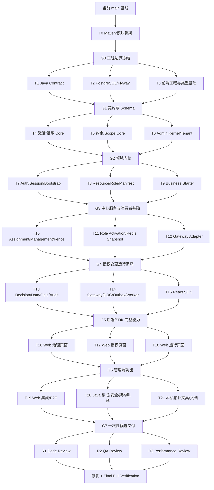

# RBAC3 权限平台一次性交付并行实施 Plan

> **For agentic workers:** REQUIRED SUB-SKILL: Use `superpowers:subagent-driven-development` to implement this plan task-by-task. Every implementation step uses checkbox (`- [ ]`) syntax for tracking. Parallel waves are internal dependency synchronization points, not phased releases.

**Status:** 待用户审核；尚未创建 RBAC3 模块、代码、数据库对象、分支或运行进程。

**Goal:** 在 `egon-cola-platforms` 下完整实现已批准的 RBAC3 权限平台，包括 Contract、Core、业务 Starter、Gateway Adapter、中心 Admin、React SDK、Admin Web、PostgreSQL/Redis 运行闭环以及 Gateway/DDC/Outbox 接入，并只形成一个最终可审核交付结果。

**Architecture:** 中心 Admin 是唯一授权事实写入端，PostgreSQL 保存权威事实，Redis 保存 Session 和版本化授权投影；Gateway Adapter 做入口认证及粗粒度 API 权限，业务 Starter 做最终功能、数据、字段和同对象职责校验。有效任职只产生激活资格；当前 Session 通过专用 API 原子激活一个或多个 Root，服务端执行唯一顶级根归一、APP 内 DSD 互斥、完整 Role Family 展开和权限合并。

**Tech Stack:** Java 21、Spring Boot 3.5.16、Spring Security、Spring Data JPA、PostgreSQL、Flyway 11.15.0、Redis/Redisson、Transactional Outbox、Egon Gateway Starter/Provider Runtime、DDC、React、TypeScript、Vite、React Router、TanStack Query、Ant Design、Vitest、Playwright、JUnit Jupiter、Maven 3.9.14。

## Global Constraints

- 唯一功能基线是 `docs/superpowers/specs/2026-07-30-rbac3-permission-platform-design.md` R3；本 Plan 只把 Spec 第 31 节的“分阶段交付”改为“并行波次、一次性完整交付”，其他产品、领域、安全、API、数据和验收要求全部保持不变。
- 所有 Wave/Gate 都是集成分支内部的依赖同步点，不是 MVP、灰度版本、部分上线或用户交付物；Task 0～21、三类只读审查及最终全量验证全部完成前，禁止宣称 RBAC3 已交付。
- 不创建 `egon-cola-platform-rbac3-test`、test-jar 或任何独立 RBAC3 Test Maven 模块；每个 Java/React 模块在自己的测试源集验证自身行为。
- Admin 在 production 和 test scope 都不依赖 Starter；Starter、Gateway Adapter 及其测试不依赖 Admin 生产类或测试类。
- 业务轮岗、排班、换岗、代岗、交接、定时执行和恢复完全属于业务系统；RBAC3 代码、表、API、Permission、Worker 和页面中不得出现轮岗状态机或同义实现。
- RBAC3 不实现审批；不得出现待审批、通过、驳回、审批人、审批策略或用 Confirmation Dialog 模拟审批。
- Login 不接收 Role；有效 Assignment 只形成候选。角色激活使用当前 Session 的 `PUT /api/rbac3/v1/auth/role-activations` 完整替换语义。
- 激活任意 Candidate Root 或本人直接任职子 Role 时，必须重新归一到该 APP 唯一顶级 Root，再展开 Root 与全部 ACTIVE 后代；不能只收集请求 Role 的父链或局部子树。
- 一个 Session 可以激活多个 Root；同 APP DSD/激活互斥集合必须锁内检查并原子拒绝，跨 APP 或同 APP 非互斥 Root 可以共同激活。
- Tenant 隔离、禁止自我分配/提权、APP 边界、三版本校验、Redis 故障 Fail Closed、Fence、Outbox、敏感字段默认拒绝均为不可配置关闭的安全边界。
- Role、Inheritance、Closure、Role Permission、DSD Member、Route、Data/Field Rule 均不能跨 APP；跨 Tenant 关联同时由服务层和数据库复合约束拒绝。
- PostgreSQL 是授权事实源；Redis 不得反向充当事实库。业务事务、Audit、Mutation 和 Outbox Enqueue 必须同事务完成。
- RBAC3 只新增一个初始 Flyway 文件 `classpath:db/migration/V1__create_rbac3_schema.sql`；不得修改仓库中任何已有 Flyway 文件，也不得在该文件复制 Transactional Outbox Component 的 Schema。
- Outbox 使用现有 `egon-cola-component-transactional-outbox-starter` 和组件拥有的 Migration Location；投递是 at-least-once，消费者按稳定 `messageId` 幂等。
- RBAC3 Admin Controller 必须同时标注现有扫描器实际识别的 `@GatewayInterfaceGroup`、语义元数据 `@EgonHttpService`，每个方法显式标注 `@GatewayOperation`，再由 Gateway Starter 上报 Definition；只写 `@EgonHttpService` 不算完成。Admin 实例必须由现有 Gateway Provider Runtime 以 `HTTP_PROVIDER` 注册 DDC；Definition、Lease、Release 三项分别验证。
- Gateway 只从 DDC 的完整 Service Key 中选择有效 RBAC3 实例，不配置静态 Provider URL、不跨版本/环境兜底。
- Definition ProviderService、DDC Lease 和 Gateway Release 的 Service Key 必须逐字段相等：`env + namespace + protocol=HTTP + serviceName/applicationCode=rbac3-admin + group=default + version=artifactVersion`；`buildId` 只标识 Definition 构建，不能替代 Service version。
- Gateway 入口始终先删除客户端 `Authorization`；只有 Security Policy 显式声明 `ORIGINAL_BEARER`、认证与授权均明确 ALLOW 且只提取到一个 Bearer Credential 时，才在最后一次上游组包中恢复原始 Bearer。匿名、可选认证无凭证、DENY/INDETERMINATE/ERROR、多凭证和非 HTTP 路径一律不得转发；Token 不进入 TrustedIdentity、Principal attributes、日志、Trace 或指标。
- Gateway Adapter 和业务 Starter 不经 Gateway 回调 RBAC3 Admin 做逐请求远程授权，避免递归和中心热路径耦合。
- Java 包根固定为 `top.egon.cola.platform.rbac3`，配置前缀固定为 `egon.cola.platform.rbac3`，HTTP 基础路径固定为 `/api/rbac3/v1`。
- Java/Boot/Flyway 基线固定为 `21 / 3.5.16 / 11.15.0`；除 Spec 明确需要的现有组件外，不引入新框架、规则引擎、脚本授权、Event Sourcing 或独立工作流引擎。
- 所有 JPA 环境固定 `spring.jpa.hibernate.ddl-auto=validate`，Schema 只能由两个显式 Flyway 实例建立；RBAC3 Long ID 使用现有 `LongIdGenerator`，生产必须显式提供 `egon.cola.component.id.machine-id=${RBAC3_MACHINE_ID}`（`0..1023`），并发 Admin 实例不得重复，不允许默认值、主机名/IP 推导或随机回退。
- 三类 Redis 客户端固定为独立命名 Bean：`ddcRegistryRedissonClient`、`gatewayRateLimitRedissonClient`、`rbac3RuntimeRedissonClient`；每个注入点必须使用 `@Qualifier`，配置、连接池、序列化和健康状态不得串用。
- 前端只使用 React + TypeScript + Vite + React Router + TanStack Query + Ant Design；不引入 Redux/Zustand，Token、完整 Snapshot 和敏感字段不得写 LocalStorage、URL、日志或 Analytics。
- 每个实现 Task 必须先写失败测试并确认 RED，再做最小实现并确认 GREEN，最后只留下一个 Task Commit；Task Commit 是内部审计边界，不是分批交付。
- 执行时使用隔离 Worktree，保留当前 `main` 上所有用户文件和未跟踪文件；任何代理不得 reset、checkout、覆盖或清理其他代理/用户修改。
- 不自动启动 RBAC3、Gateway、DDC 或其他长驻服务，不打开浏览器，不使用 Computer Control，不推送远端、不创建 PR、不自动合并 `main`。
- PostgreSQL/Redis 集成优先复用用户本机依赖，使用独立测试 Schema、数据库用户权限边界和唯一 Redis Key 前缀；禁止 `FLUSHALL/FLUSHDB`，不得打印 Secret。Testcontainers 结果不能冒充本机或多进程拓扑证据。
- 实施完成后只报告实际执行过的证据；模块测试、Mock、静态扫描不能宣称真实 DDC/Gateway 双 Admin 多进程拓扑已验证。

---

## 1. 一次性交付与 Multi-Agent Parallel Workflow

### 1.1 调度模型

- 主代理是唯一 Integration Coordinator，独占集成分支、Gate Commit、冲突裁决、最终修复、验证报告和交付结论。
- 当前并行上限是 3 个子代理；加主代理最多 4 个活跃代理。每个 Wave 最多派 3 个互不重叠的实现任务。
- 每个 Task 创建一个新的 preset subagent；任务完成、主代理审查并合入后清理该代理，后续任务不得复用。
- 构建/POM 使用 preset `dependency-manager`；Java 领域实现使用 `backend-developer`；Spring Boot/Admin 使用 `spring-boot-engineer`；PostgreSQL/Flyway 使用 `postgres-pro`；React 使用 `react-specialist` 或 `frontend-developer`；运行脚本使用 `devops-engineer`；最终只读审查使用 `code-reviewer`、`qa-expert`、`performance-engineer`。
- 每个派工 Prompt 必须包含：目标、起始 Gate Commit、专属 Worktree、允许写入的精确文件、禁止范围、输入/输出接口、RED/GREEN 命令、唯一提交信息，以及“你不是独自在代码库中工作，不得回退他人修改”。
- 同一 Wave 的写作用文件不得重叠；出现共享热点时，当前代理停止并报告，由主代理移到后续独占集成 Task，禁止依靠 cherry-pick 冲突临时决定语义。
- 子代理结果不能直接视为完成。主代理必须核对 Commit、文件范围、diff、测试输出和 Spec 条款，并在 Integration Worktree 重新执行 Gate 命令。
- 所有 Task 都在一个最终集成分支中汇合。Gate 成功只允许创建下一 Wave 的 Worktree，不允许形成部分交付包或通知用户“某阶段已完成”。

### 1.2 Worktree 与分支协议

执行时先调用 `superpowers:using-git-worktrees`，建立：

```text
codex/rbac3-permission-platform          # 唯一 Integration Branch，仅主代理写
codex/rbac3-t00-scaffold                 # Task 0
codex/rbac3-w1-contract                  # Task 1
codex/rbac3-w1-schema                    # Task 2
codex/rbac3-w1-frontend-foundation       # Task 3
codex/rbac3-w2-activation-core           # Task 4
codex/rbac3-w2-policy-core               # Task 5
codex/rbac3-w2-admin-kernel              # Task 6
codex/rbac3-w3-auth-session              # Task 7
codex/rbac3-w3-resource-role             # Task 8
codex/rbac3-w3-starter                   # Task 9
codex/rbac3-w4-assignment-policy         # Task 10
codex/rbac3-w4-activation-runtime        # Task 11
codex/rbac3-w4-gateway-adapter           # Task 12
codex/rbac3-w5-decision-audit            # Task 13
codex/rbac3-w5-platform-integration      # Task 14
codex/rbac3-w5-react-sdk                 # Task 15
codex/rbac3-w6-web-governance            # Task 16
codex/rbac3-w6-web-authorization         # Task 17
codex/rbac3-w6-web-runtime               # Task 18
codex/rbac3-w7-web-integration           # Task 19
codex/rbac3-w7-java-verification         # Task 20
codex/rbac3-w7-live-fixture-docs         # Task 21
```

规则：

1. 每个 Wave 的任务都从同一个 Gate Commit 创建分支，不从另一个未审查任务分支分叉。
2. 子代理只在自己的 Worktree 工作，只留下一个 Task Commit；不得合并 Integration Branch 或其他代理分支。
3. 主代理按 Plan 指定顺序 cherry-pick。发生冲突说明所有权设计失效，先退回任务修正，不能猜测合并。
4. 合入前发现问题，当前任务代理在清理前返工并 amend；合入后发现问题则由新的窄范围修复代理提交新 Commit。
5. 每个 Gate 记录 `Gate ID -> commit SHA -> commands -> exit code -> Reactor modules/test count`，最终报告统一汇总。
6. 全部 Gate、只读审查和最终验证通过后，Integration Branch 才成为唯一候选交付；不自动 merge `main`、push 或建 PR。

### 1.3 依赖图



### 1.4 Wave 文件所有权

| Wave | Task | Preset Agent | 独占写入范围 | 合入顺序 |
|---|---|---|---|---:|
| 0 | T0 | `dependency-manager` | Platforms POM、RBAC3 聚合 POM、5 个 Java Module POM | 1 |
| 1 | T1 | `backend-developer` | `contract/src/**` | 1 |
| 1 | T2 | `postgres-pro` | Admin Flyway、DB/Flyway 测试资源 | 2 |
| 1 | T3 | `frontend-developer` | Admin Web/React SDK 的 package/tsconfig/vite/eslint 基础与共享 TS Contract | 3 |
| 2 | T4 | `backend-developer` | Core `hierarchy/activation/decision/runtime-key` | 1 |
| 2 | T5 | `backend-developer` | Core `assignment/constraint/delegation/scope/field/participation` | 2 |
| 2 | T6 | `spring-boot-engineer` | Admin `bootstrap/common/tenant/security-base` 与公共错误/事务端口 | 3 |
| 3 | T7 | `spring-boot-engineer` | Admin `identity/directory/auth/session/key/bootstrap-cli` | 1 |
| 3 | T8 | `spring-boot-engineer` | Admin `application/resource/manifest/role/constraint` | 2 |
| 3 | T9 | `spring-boot-engineer` | Starter 全部生产/测试源 | 3 |
| 4 | T10 | `spring-boot-engineer` | Admin `assignment/management/mutation/fence/idempotency` | 1 |
| 4 | T11 | `spring-boot-engineer` | Admin `activation/snapshot/runtime-store` | 2 |
| 4 | T12 | `backend-developer` | Gateway Adapter 全部生产/测试源；Gateway Core/Engine 的受控原始 Bearer 转发与 Engine runtime 依赖 | 3 |
| 5 | T13 | `spring-boot-engineer` | Admin `authorization/data/field/participation/audit/simulation/runtime-api` | 1 |
| 5 | T14 | `spring-boot-engineer` | Admin `integration/gateway/ddc/outbox/worker/readiness` 与最终配置文件 | 2 |
| 5 | T15 | `react-specialist` | React SDK 除 T3 基础 Contract 外的全部源码和测试 | 3 |
| 6 | T16 | `frontend-developer` | Admin Web `overview/tenant/directory/application/resource/role/constraint` Feature | 1 |
| 6 | T17 | `frontend-developer` | Admin Web `assignment/management-policy/role-activation/session` Feature | 2 |
| 6 | T18 | `frontend-developer` | Admin Web `simulation/audit/runtime` Feature | 3 |
| 7 | T19 | `react-specialist` | Admin Web App Router/Nav/Auth Shell、前端契约/E2E 集成 | 1 |
| 7 | T20 | `qa-expert` | 各 Java 模块新增 `integration/security/architecture` 测试文件，不改生产代码 | 2 |
| 7 | T21 | `devops-engineer` | `scripts/verification`、各模块专用 Fixture 文件、README/运行手册 | 3 |
| Review | R1～R3 | `code-reviewer` / `qa-expert` / `performance-engineer` | 只读，不修改文件 | 不合入 |

任何任务发现必须修改同 Wave 另一任务文件时，必须停下报告；主代理把修改放到下一 Gate 后的独占任务或新修复任务，不允许扩大所有权。

---

## 2. 设计模式实施护栏

| 模式 | 固定落点 | 解决的问题 | 禁止扩张 |
|---|---|---|---|
| Application Facade | `RoleActivationFacade`、`AssignmentFacade`、`ManifestFacade`、`SessionFacade` | 明确事务、锁、Repository、Outbox、Token 签发顺序 | Controller 不直接访问 Repository；简单查询不强制 Command Bus |
| Domain Service | `RoleActivationResolver`、`RoleHierarchyService`、`ManagementPolicyDecisionService` | 横跨多个 Aggregate 的纯授权算法 | 不在 Domain Service 中查 Redis/JPA、发 HTTP 或写 Audit |
| Specification + Composite | Eligibility、Unique Root、APP Mutex、SSD、Prerequisite、Cardinality、Self Assignment、Management Policy、Operation SOD | 在执行、Refresh、影响分析和测试间复用同一结构化规则 | 不建立动态脚本/通用规则引擎；Specification 不做 I/O |
| Strategy | Authenticator、Directory Provider、Management/Data Scope Resolver、Field Masker、Runtime Store Adapter | 隔离真正存在的实现变体 | Root、Role Family、Permission Merge、APP Mutex 固定安全算法不得变为可配置 Strategy |
| Ports and Adapters | Core Port；JPA/SQL、Redis、Gateway、DDC、IdP、Outbox Adapter | 隔离协议和基础设施 | Adapter 不自行决定 Allow/Deny，不复制 Gateway/DDC 协议 |
| Immutable Value Object + bounded Builder | `ActiveRoleSet`、`AppAuthorizationContext`、`SessionAuthorizationSnapshot` | 稳定排序、上限校验、canonical checksum | Builder 不查 Repository、不隐藏规则判断、不暴露可变集合 |
| Transactional Outbox + Fence/Journal | 授权事实、Audit、Mutation、Outbox；Session/User/Tenant Fence | 关闭 DB 提交后 Redis/事件传播窗口 | 不用 `@Async`/after-commit Listener 作为唯一正确性机制 |

明确不采用：激活 State 类层次、轮岗 State Machine、通用规则引擎、每 Role 一个 Strategy/Command、Visitor 角色图遍历、深层 Chain of Responsibility、Abstract Factory DTO、Event Sourcing、动态 SpEL/脚本授权。代理认为必须突破时必须停止并提交具体重复逻辑和替代证据给主代理审核。

---

## 3. 冻结工程结构与公共接口

### 3.1 目录

```text
egon-cola-platforms/egon-cola-platform-rbac3/
├── pom.xml
├── README.md
├── README.zh-CN.md
├── docs/manifest.md
├── scripts/verification/
├── egon-cola-platform-rbac3-contract/
├── egon-cola-platform-rbac3-core/
├── egon-cola-platform-rbac3-starter/
├── egon-cola-platform-rbac3-gateway-adapter/
├── egon-cola-platform-rbac3-admin/
├── egon-cola-platform-rbac3-admin-web/
└── egon-cola-platform-rbac3-react-sdk/
```

Maven 聚合只包含五个 Java 子模块；两个前端目录是独立 npm 工程，不建 Maven Frontend Plugin。Platforms Parent 只在 `dependencyManagement` 管理消费者允许使用的 `contract`、`starter`、`gateway-adapter`，不导出 Admin、Core、前端或 Test Artifact。

### 3.2 Java 模块依赖

```text
contract              -> JDK/Jackson annotations only
core                  -> contract
starter               -> contract + core + Spring Boot/Security/Redis
gateway-adapter       -> contract + core + Gateway Core SPI + Redis
admin                 -> contract + core + Spring Boot Web/Security/JPA/Redis
                         + Gateway Starter + Gateway Provider Runtime
                         + Transactional Outbox Starter
```

`starter -> admin`、`gateway-adapter -> admin`、`admin -> starter`、任何生产源码 `-> test artifact` 均禁止。

### 3.3 冻结 Java 契约

以下类型名和核心签名在 Gate 1 后冻结，后续代理不得自行改名：

```java
public record AuthorizationDecision(
        Decision decision,
        String reasonCode,
        String tenantId,
        String subjectId,
        String permissionCode,
        long authVersion,
        long sessionVersion,
        long policyVersion,
        List<String> evidenceIds,
        Instant decidedAt) {
}

public interface AuthorizationService {
    AuthorizationDecision requirePermission(PermissionRequest request);
    DataScopeDecision decideDataScope(DataScopeRequest request);
    FieldPolicyDecision decideFields(FieldPolicyRequest request);
    OperationSodDecision checkParticipation(OperationSodRequest request);
    AuthorizationFenceDecision verifyFence(AuthorizationFenceRequest request);
}

public record ActiveRoleSet(List<ActivationRoot> roots) {
}

public interface RoleActivationResolver {
    RoleActivationResolution resolve(RoleActivationInput input);
}

public interface AuthorizationRuntimeStore {
    Optional<SessionRuntime> findSession(String tenantId, String sessionId);
    Optional<SessionAuthorizationSnapshot> findSnapshot(RuntimeSnapshotKey key);
    RuntimePublishResult publish(SessionRuntime session, SessionAuthorizationSnapshot snapshot);
    void fence(AuthorizationFence fence);
    void clearFence(AuthorizationFenceKey key, long committedVersion);
}
```

稳定结果枚举：

```text
Decision = ALLOW | DENY | INDETERMINATE
FieldAccessLevel = NONE | MASKED_READ | READ | WRITE
SessionStatus = ACTIVE | LOGGED_OUT | REVOKED | EXPIRED | COMPROMISED
RoleStatus = ACTIVE | DISABLED | ARCHIVED
AssignmentStatus = PENDING | ACTIVE | SUSPENDED | EXPIRED | REVOKED
MutationStatus = PREPARED | COMMITTED | PROJECTING | APPLIED | RETRY_WAIT | FAILED
```

### 3.4 冻结 Session 激活算法顺序

```text
锁 Session
-> 校验 expectedSessionVersion
-> 用数据库当前时间重算本人有效 Assignment/Candidate
-> 每个请求 Role 归一到同 APP 唯一 Activation Root
-> 对规范 Root Set 按 APP 执行全部 ACTIVE DSD Set
-> 展开每个 Root 的全部 ACTIVE 后代（含自身）
-> Permission/Data Scope/Field/Resource/Landing Route 固定代数合并
-> 原子替换 rbac3_session_active_role
-> sessionVersion + 1
-> Audit + Mutation + Outbox 同事务
-> Redis 同步发布新 Session/Snapshot 并清 Fence
-> 返回新 Access Token；Refresh Token 不轮换
```

同一规范 Root Set 的重复 PUT 幂等返回当前结果，不递增 `sessionVersion`。任何失败保持旧集合、旧版本和旧 Snapshot 完整不变。

### 3.5 HTTP API 与 Controller 所有权

以下路径均相对 `/api/rbac3/v1`。Task 不得在另一个 Controller 中复制同一路径；Task 14 只接平台 Adapter/状态 Port，不另造 Gateway/DDC 管理 API。

| Task / Controller | 必须实现的 Route |
|---|---|
| T7 `AuthController` | `POST /auth/login`、`POST /auth/refresh`、`POST /auth/logout`、`POST /auth/step-up`、`GET /auth/bootstrap`、`GET /auth/jwks` |
| T11 `RoleActivationController` | `GET /auth/role-activation-candidates`、`GET /auth/role-activations`、`PUT /auth/role-activations`；只操作 Token 当前 Session，无 `{userId}` 变体 |
| T7 `TenantUserDirectoryController` | `GET/POST /platform/tenants`、`GET /platform/tenants/{tenantId}`、`PUT /platform/tenants/{tenantId}/status`、`GET /users`、`GET /users/{userId}`、`PUT /users/{userId}/status`、`GET /org-units`、`GET /positions`、`POST /internal/directory-snapshots`、`GET /directory-snapshots/{snapshotId}` |
| T7 `SessionController` | `GET /sessions/me`、`POST /sessions/{sessionId}/revoke`、`POST /users/{userId}/sessions/revoke-all` |
| T8 `ApplicationResourceController` / `ManifestController` | `GET /applications`、`GET /applications/{applicationId}/resources`、`POST /internal/resource-manifests`、`GET /resource-manifests/{manifestId}`、`GET /resource-manifests/{manifestId}/validation`、`POST /resource-manifests/{manifestId}/impact-analysis`、`POST /resource-manifests/{manifestId}/activate`、`POST /resources/{resourceId}/archive` |
| T8 `RolePermissionController` / `ConstraintController` | Spec 26.4 的 Role CRUD、Permission bind/unbind、Inheritance、Impact、SOD、Prerequisite、Cardinality、Data Rule、Field Rule、Operation SOD 全部独立 Schema Route；禁止模糊通用写 `/constraints` |
| T10 `AssignmentController` | `GET/POST /users/{userId}/role-assignments`、`POST /users/{userId}/role-assignments/{assignmentId}/revoke|suspend|resume` |
| T10 `ManagementPolicyController` | `GET/POST /management-policies`、`GET/PUT /management-policies/{policyId}`、`POST /management-policies/{policyId}/disable`、`GET /management-capabilities/me`、`GET /manageable-users`、`GET /manageable-roles` |
| T13 `InternalAuthorizationController` / `ParticipationController` | `GET /internal/authorization/sessions/{sessionId}/snapshot`、`POST /internal/authorization/decisions`、`POST /internal/authorization/fences/verify`、`POST /internal/business-participations`、`GET /internal/business-participations/conflicts` |
| T13 `AuditSimulationController` | `GET /audit-logs`、`POST /simulations/authorization`、`POST /simulations/role-change-impact` |
| T13 `RuntimeController` + T14 status Port | `GET /runtime/status`、`GET /runtime/mutations`、`POST /runtime/mutations/{mutationId}/retry`、`GET /runtime/gateway-ddc-status` |

匿名 Policy 仅允许 Login、Refresh、JWKS 和受限 Health；Logout、Bootstrap、Candidate/Activation 及全部管理/内部 Route 都需要对应用户或服务认证。`/role-rotations/**`、`/handover-items/**`、`/scheduled-role-activations/**` 和 `/users/{userId}/role-activations` 必须保持不存在。

---

## 4. Task 0：建立 Integration Worktree 与 Maven 模块骨架

**Agent:** 新建 preset `dependency-manager`；主代理创建/拥有 Integration Worktree 并审核提交。

**Files:**

- Modify: `egon-cola-platforms/pom.xml`
- Create: `egon-cola-platforms/egon-cola-platform-rbac3/pom.xml`
- Create: `egon-cola-platforms/egon-cola-platform-rbac3/egon-cola-platform-rbac3-contract/pom.xml`
- Create: `egon-cola-platforms/egon-cola-platform-rbac3/egon-cola-platform-rbac3-core/pom.xml`
- Create: `egon-cola-platforms/egon-cola-platform-rbac3/egon-cola-platform-rbac3-starter/pom.xml`
- Create: `egon-cola-platforms/egon-cola-platform-rbac3/egon-cola-platform-rbac3-gateway-adapter/pom.xml`
- Create: `egon-cola-platforms/egon-cola-platform-rbac3/egon-cola-platform-rbac3-admin/pom.xml`

**Interfaces:**

- Produces: Maven coordinates `top.egon:egon-cola-platform-rbac3-{contract,core,starter,gateway-adapter,admin}:${project.version}`.
- Produces: Reactor and dependencyManagement boundaries consumed by every later Task.
- Does not produce: Test module, test-jar, independent RBAC3 BOM or Maven-managed frontend.

- [ ] **Step 1: 记录基线并建立隔离 Worktree**

```bash
git status --short --branch
git rev-parse HEAD
git diff --check
```

按 `superpowers:using-git-worktrees` 验证目标目录已被 ignore，再从实际 `main` HEAD 创建 `codex/rbac3-permission-platform` Integration Worktree。当前工作区的未跟踪/未提交文件留在原处，不复制、不暂存、不清理。

- [ ] **Step 2: 写失败的工程边界断言并确认 RED**

```bash
test -f egon-cola-platforms/egon-cola-platform-rbac3/pom.xml
test -f egon-cola-platforms/egon-cola-platform-rbac3/egon-cola-platform-rbac3-contract/pom.xml
test ! -e egon-cola-platforms/egon-cola-platform-rbac3/egon-cola-platform-rbac3-test
```

Expected: 前两个断言失败，证明模块尚未存在；第三个断言成功。

- [ ] **Step 3: 创建最小聚合与五个 Java POM**

聚合 POM 只列出：

```xml
<modules>
    <module>egon-cola-platform-rbac3-contract</module>
    <module>egon-cola-platform-rbac3-core</module>
    <module>egon-cola-platform-rbac3-starter</module>
    <module>egon-cola-platform-rbac3-gateway-adapter</module>
    <module>egon-cola-platform-rbac3-admin</module>
</modules>
```

Admin 的 Spring Boot `repackage` 必须使用 `exec` classifier，保留 thin 主 JAR 供 Reactor 编译；Platforms Parent 只管理 Contract/Starter/Gateway Adapter 的版本。Starter、Adapter、Admin 均使用显式依赖，不依靠未声明传递依赖。Admin 显式依赖现有 Common ID Starter、Gateway Starter、Gateway Provider Runtime、Transactional Outbox Starter；Gateway Engine 显式依赖 RBAC3 Gateway Adapter。不得把 Admin 或 Core 放入消费者 dependencyManagement。

- [ ] **Step 4: 验证 Reactor 与依赖边界**

```bash
./mvnw -B -ntp -f egon-cola-platforms/egon-cola-platform-rbac3/pom.xml clean test

! rg -n 'egon-cola-platform-rbac3-test|<classifier>tests</classifier>' \
  egon-cola-platforms/egon-cola-platform-rbac3 egon-cola-platforms/pom.xml

./mvnw -B -ntp \
  -f egon-cola-platforms/egon-cola-platform-rbac3/egon-cola-platform-rbac3-admin/pom.xml \
  dependency:tree -Dincludes=top.egon:egon-cola-platform-rbac3-starter
```

Expected: 聚合构建实际列出 Parent + 5 个 Java 子模块；负向搜索无输出；Admin 依赖树不含 Starter。

- [ ] **Step 5: 提交唯一骨架 Commit 并形成 G0**

```bash
git add egon-cola-platforms/pom.xml \
        egon-cola-platforms/egon-cola-platform-rbac3
git diff --cached --check
git commit -m "build(rbac3): add permission platform modules"
```

主代理审查后记录 G0 Commit；从 G0 并行创建 Task 1～3 Worktree。

---

## 5. Wave 1：并行建立 Java Contract、Schema 与前端类型基础

### Task 1：实现稳定 Java Contract

**Agent:** 新建 preset `backend-developer`。

**Files:**

- Create: `egon-cola-platforms/egon-cola-platform-rbac3/egon-cola-platform-rbac3-contract/src/main/java/top/egon/cola/platform/rbac3/contract/error/Rbac3ErrorCode.java`
- Create: `egon-cola-platforms/egon-cola-platform-rbac3/egon-cola-platform-rbac3-contract/src/main/java/top/egon/cola/platform/rbac3/contract/error/Rbac3ErrorResponse.java`
- Create: `egon-cola-platforms/egon-cola-platform-rbac3/egon-cola-platform-rbac3-contract/src/main/java/top/egon/cola/platform/rbac3/contract/auth/Rbac3TokenClaims.java`
- Create: `egon-cola-platforms/egon-cola-platform-rbac3/egon-cola-platform-rbac3-contract/src/main/java/top/egon/cola/platform/rbac3/contract/auth/SessionStatus.java`
- Create: `egon-cola-platforms/egon-cola-platform-rbac3/egon-cola-platform-rbac3-contract/src/main/java/top/egon/cola/platform/rbac3/contract/auth/LoginRequest.java`
- Create: `egon-cola-platforms/egon-cola-platform-rbac3/egon-cola-platform-rbac3-contract/src/main/java/top/egon/cola/platform/rbac3/contract/auth/LoginResult.java`
- Create: `egon-cola-platforms/egon-cola-platform-rbac3/egon-cola-platform-rbac3-contract/src/main/java/top/egon/cola/platform/rbac3/contract/auth/RefreshResult.java`
- Create: `egon-cola-platforms/egon-cola-platform-rbac3/egon-cola-platform-rbac3-contract/src/main/java/top/egon/cola/platform/rbac3/contract/auth/BootstrapView.java`
- Create: `egon-cola-platforms/egon-cola-platform-rbac3/egon-cola-platform-rbac3-contract/src/main/java/top/egon/cola/platform/rbac3/contract/activation/ActivationRoot.java`
- Create: `egon-cola-platforms/egon-cola-platform-rbac3/egon-cola-platform-rbac3-contract/src/main/java/top/egon/cola/platform/rbac3/contract/activation/RoleActivationCandidate.java`
- Create: `egon-cola-platforms/egon-cola-platform-rbac3/egon-cola-platform-rbac3-contract/src/main/java/top/egon/cola/platform/rbac3/contract/activation/RoleActivationCandidateView.java`
- Create: `egon-cola-platforms/egon-cola-platform-rbac3/egon-cola-platform-rbac3-contract/src/main/java/top/egon/cola/platform/rbac3/contract/activation/ReplaceActiveRolesRequest.java`
- Create: `egon-cola-platforms/egon-cola-platform-rbac3/egon-cola-platform-rbac3-contract/src/main/java/top/egon/cola/platform/rbac3/contract/activation/ActiveRoleSetView.java`
- Create: `egon-cola-platforms/egon-cola-platform-rbac3/egon-cola-platform-rbac3-contract/src/main/java/top/egon/cola/platform/rbac3/contract/authorization/Decision.java`
- Create: `egon-cola-platforms/egon-cola-platform-rbac3/egon-cola-platform-rbac3-contract/src/main/java/top/egon/cola/platform/rbac3/contract/authorization/AuthorizationDecision.java`
- Create: `egon-cola-platforms/egon-cola-platform-rbac3/egon-cola-platform-rbac3-contract/src/main/java/top/egon/cola/platform/rbac3/contract/authorization/PermissionRequest.java`
- Create: `egon-cola-platforms/egon-cola-platform-rbac3/egon-cola-platform-rbac3-contract/src/main/java/top/egon/cola/platform/rbac3/contract/authorization/DataScopeDecision.java`
- Create: `egon-cola-platforms/egon-cola-platform-rbac3/egon-cola-platform-rbac3-contract/src/main/java/top/egon/cola/platform/rbac3/contract/authorization/FieldAccessLevel.java`
- Create: `egon-cola-platforms/egon-cola-platform-rbac3/egon-cola-platform-rbac3-contract/src/main/java/top/egon/cola/platform/rbac3/contract/authorization/FieldPolicyDecision.java`
- Create: `egon-cola-platforms/egon-cola-platform-rbac3/egon-cola-platform-rbac3-contract/src/main/java/top/egon/cola/platform/rbac3/contract/authorization/OperationSodDecision.java`
- Create: `egon-cola-platforms/egon-cola-platform-rbac3/egon-cola-platform-rbac3-contract/src/main/java/top/egon/cola/platform/rbac3/contract/authorization/AuthorizationFenceDecision.java`
- Create: `egon-cola-platforms/egon-cola-platform-rbac3/egon-cola-platform-rbac3-contract/src/main/java/top/egon/cola/platform/rbac3/contract/authorization/AppAuthorizationContext.java`
- Create: `egon-cola-platforms/egon-cola-platform-rbac3/egon-cola-platform-rbac3-contract/src/main/java/top/egon/cola/platform/rbac3/contract/authorization/SessionAuthorizationSnapshot.java`
- Create: `egon-cola-platforms/egon-cola-platform-rbac3/egon-cola-platform-rbac3-contract/src/main/java/top/egon/cola/platform/rbac3/contract/manifest/ResourceManifest.java`
- Create: `egon-cola-platforms/egon-cola-platform-rbac3/egon-cola-platform-rbac3-contract/src/main/java/top/egon/cola/platform/rbac3/contract/manifest/ManifestResource.java`
- Create: `egon-cola-platforms/egon-cola-platform-rbac3/egon-cola-platform-rbac3-contract/src/main/java/top/egon/cola/platform/rbac3/contract/management/AssignmentCommand.java`
- Create: `egon-cola-platforms/egon-cola-platform-rbac3/egon-cola-platform-rbac3-contract/src/main/java/top/egon/cola/platform/rbac3/contract/management/ManagementPolicyView.java`
- Create: `egon-cola-platforms/egon-cola-platform-rbac3/egon-cola-platform-rbac3-contract/src/main/java/top/egon/cola/platform/rbac3/contract/participation/BusinessParticipationCommand.java`
- Test: `egon-cola-platforms/egon-cola-platform-rbac3/egon-cola-platform-rbac3-contract/src/test/java/top/egon/cola/platform/rbac3/contract/ContractSerializationTest.java`
- Test: `egon-cola-platforms/egon-cola-platform-rbac3/egon-cola-platform-rbac3-contract/src/test/java/top/egon/cola/platform/rbac3/contract/Rbac3ErrorCodeTest.java`
- Test: `egon-cola-platforms/egon-cola-platform-rbac3/egon-cola-platform-rbac3-contract/src/test/java/top/egon/cola/platform/rbac3/contract/ContractDependencyBoundaryTest.java`

**Interfaces:**

- Produces immutable Java records/enums for every cross-module request/result; all HTTP bigint IDs are decimal strings.
- `Rbac3TokenClaims` contains only `iss/aud/sub/tid/sid/av/sv/pv/jti/iat/nbf/exp/kid` and never contains Role、Permission、Scope 或 Field 集合。
- `ReplaceActiveRolesRequest` is exactly `List<String> roleIds, long expectedSessionVersion`.
- `SessionAuthorizationSnapshot` contains Session ID、three versions、APP contexts、checksum and generatedAt; collections are defensive immutable copies.

- [ ] **Step 1: 写失败的序列化与安全契约测试**

```java
@Test
void tokenClaimsNeverCarryAuthorizationCollections() {
    Set<String> names = Arrays.stream(Rbac3TokenClaims.class.getRecordComponents())
            .map(RecordComponent::getName)
            .collect(Collectors.toSet());
    assertThat(names).contains("tid", "sid", "av", "sv", "pv");
    assertThat(names).doesNotContain("roles", "permissions", "dataScopes", "fieldPolicies");
}

@Test
void longIdsSerializeAsDecimalStrings() throws Exception {
    String json = objectMapper.writeValueAsString(fixtureSnapshot());
    assertThatJson(json).node("sessionId").isString().isEqualTo("40001");
}

@Test
void replaceActiveRolesRequiresWholeSetAndExpectedVersion() {
    ReplaceActiveRolesRequest request = new ReplaceActiveRolesRequest(
            List.of("50001", "51001"), 2L);
    assertThat(request.roleIds()).containsExactly("50001", "51001");
    assertThat(request.expectedSessionVersion()).isEqualTo(2L);
}
```

错误码测试必须覆盖 Spec 第 27 节全部稳定 Code，特别是 `ROLE_ACTIVATION_REQUIRED`、`ROLE_ACTIVATION_ROOT_AMBIGUOUS`、`APP_ROLE_ACTIVATION_MUTEX_VIOLATION`、`ROLE_ACTIVATION_VERSION_CONFLICT`、`AUTH_PROPAGATION_PENDING` 和 `ROLE_APPLICATION_MISMATCH`。

- [ ] **Step 2: 运行 Contract 测试并确认 RED**

```bash
./mvnw -B -ntp \
  -f egon-cola-platforms/egon-cola-platform-rbac3/pom.xml \
  -pl egon-cola-platform-rbac3-contract -am test
```

Expected: 测试编译失败，因为 Contract 类型尚不存在。

- [ ] **Step 3: 实现不可变 Contract 与稳定错误码**

所有 record compact constructor 必须复制 List/Map/Set、拒绝空安全主键和负版本。错误响应使用固定 `error.code/message/retryable/details` 与 `meta.requestId/traceId/timestamp`；Details 只承载调用者可见的安全 Evidence。禁止为管理/激活 DTO 创建通用 `Map<String,Object>` escape hatch。

- [ ] **Step 4: 验证 GREEN、依赖和禁止语义**

```bash
./mvnw -B -ntp \
  -f egon-cola-platforms/egon-cola-platform-rbac3/pom.xml \
  -pl egon-cola-platform-rbac3-contract -am test

! rg -n 'org\.springframework|jakarta\.persistence|Redis|GatewayEngine' \
  egon-cola-platforms/egon-cola-platform-rbac3/egon-cola-platform-rbac3-contract/src/main

! rg -n 'Approval(Workflow|Request|Status)|approval_(policy|request|status)|required_approvals|approver_(user|role)_id|roleRotation|rotationId|scheduledRoleActivation' \
  egon-cola-platforms/egon-cola-platform-rbac3/egon-cola-platform-rbac3-contract/src/main
```

Expected: Contract 测试通过；依赖/禁止语义扫描无输出。

- [ ] **Step 5: 提交 Task 1**

```bash
git add egon-cola-platforms/egon-cola-platform-rbac3/egon-cola-platform-rbac3-contract
git diff --cached --check
git commit -m "feat(rbac3): add stable permission contracts"
```

### Task 2：建立完整 PostgreSQL Schema 与 Flyway 验证

**Agent:** 新建 preset `postgres-pro`。

**Files:**

- Create: `egon-cola-platforms/egon-cola-platform-rbac3/egon-cola-platform-rbac3-admin/src/main/resources/db/migration/V1__create_rbac3_schema.sql`
- Create: `egon-cola-platforms/egon-cola-platform-rbac3/egon-cola-platform-rbac3-admin/src/test/java/top/egon/cola/platform/rbac3/admin/infrastructure/persistence/Rbac3MigrationContractTest.java`
- Create: `egon-cola-platforms/egon-cola-platform-rbac3/egon-cola-platform-rbac3-admin/src/test/java/top/egon/cola/platform/rbac3/admin/infrastructure/persistence/Rbac3FlywayPostgresqlIT.java`
- Create: `egon-cola-platforms/egon-cola-platform-rbac3/egon-cola-platform-rbac3-admin/src/test/resources/application-local-it.yml`

**Interfaces:**

- Produces all tables and constraints from Spec 25.2 in one immutable initial Migration.
- Does not create or alter `egon_cola_outbox_message`; Task 14 configures the component-owned migration location.
- Local IT uses a generated Schema matching `rbac3_it_[a-z0-9]+`, validates that exact name before cleanup, and never drops a database or touches another Schema.

- [ ] **Step 1: 写失败的 Migration Contract 测试**

```java
@Test
void definesAllRequiredTablesAndNoRotationOrApprovalTables() {
    String sql = migrationSql();
    assertThat(sql).contains("create table rbac3_tenant");
    assertThat(sql).contains("create table rbac3_session_active_role");
    assertThat(sql).contains("create table rbac3_authorization_mutation");
    assertThat(sql).doesNotContain("rbac3_role_rotation");
    assertThat(sql).doesNotContain("approval_policy_id");
    assertThat(sql).doesNotContain("create table egon_cola_outbox_message");
}

@Test
void onlyOneRbac3MigrationExists() throws Exception {
    assertThat(listMigrationResources()).containsExactly(
            "db/migration/V1__create_rbac3_schema.sql");
}
```

Contract 测试还必须解析每个 `CREATE TABLE` 并核对 Tenant 复合唯一键、Role/Resource APP 键、Session Active Root 唯一键、Closure 深度、时间窗口、状态 Check Constraint、Audit 只追加约束和关键索引。

- [ ] **Step 2: 运行静态 Migration 测试并确认 RED**

```bash
./mvnw -B -ntp \
  -f egon-cola-platforms/egon-cola-platform-rbac3/pom.xml \
  -pl egon-cola-platform-rbac3-admin -am \
  -Dtest=Rbac3MigrationContractTest \
  -Dsurefire.failIfNoSpecifiedTests=false test
```

Expected: 测试失败，因为唯一 Migration 尚不存在。

- [ ] **Step 3: 实现一个完整 V1 Migration**

V1 必须按 FK 顺序创建以下表组：

```text
identity:
  rbac3_tenant, rbac3_user, rbac3_user_credential,
  rbac3_external_identity, rbac3_directory_snapshot,
  rbac3_org_unit, rbac3_position, rbac3_user_position_snapshot
service identity:
  rbac3_service_principal, rbac3_service_credential, rbac3_service_permission
application/authorization:
  rbac3_application, rbac3_resource_manifest, rbac3_resource,
  rbac3_permission, rbac3_permission_resource, rbac3_role,
  rbac3_role_inheritance, rbac3_role_closure, rbac3_role_permission,
  rbac3_data_rule, rbac3_data_rule_ref,
  rbac3_field_definition, rbac3_field_rule
assignment/constraint:
  rbac3_user_role_assignment, rbac3_auto_assignment_rule,
  rbac3_role_prerequisite, rbac3_role_cardinality,
  rbac3_sod_set, rbac3_sod_member,
  rbac3_operation_sod_rule, rbac3_business_participation
management:
  rbac3_management_policy, rbac3_management_subject,
  rbac3_management_scope, rbac3_management_role,
  rbac3_management_operation
session/runtime/audit:
  rbac3_session, rbac3_session_active_role, rbac3_refresh_token,
  rbac3_idempotency_record, rbac3_authorization_mutation, rbac3_audit_log
```

HTTP bigint 使用数据库 `bigint`；所有时间使用 `timestamptz`；可查询安全字段独立列；JSONB 只存快照/明细。PostgreSQL FK 默认 RESTRICT，不对历史授权事实使用 CASCADE。

- [ ] **Step 4: 运行静态与本机 PostgreSQL GREEN 验证**

```bash
./mvnw -B -ntp \
  -f egon-cola-platforms/egon-cola-platform-rbac3/pom.xml \
  -pl egon-cola-platform-rbac3-admin -am \
  -Dtest=Rbac3MigrationContractTest \
  -Dsurefire.failIfNoSpecifiedTests=false test

./mvnw -B -ntp \
  -f egon-cola-platforms/egon-cola-platform-rbac3/pom.xml \
  -pl egon-cola-platform-rbac3-admin -am \
  -Prbac3-local-it -Dit.test=Rbac3FlywayPostgresqlIT verify
```

第二条命令只在执行环境已提供受控的 `RBAC3_IT_POSTGRES_URL/USER/PASSWORD_FILE` 时运行；测试自己创建并只清理匹配安全前缀的 Schema，不启动容器。Expected: 空 Schema migrate 成功、第二次 migrate 无变化、validate 成功、关键跨 Tenant/APP 约束实际拒绝。

- [ ] **Step 5: 提交 Task 2**

```bash
git add egon-cola-platforms/egon-cola-platform-rbac3/egon-cola-platform-rbac3-admin/src/main/resources/db \
        egon-cola-platforms/egon-cola-platform-rbac3/egon-cola-platform-rbac3-admin/src/test
git diff --cached --check
git commit -m "feat(rbac3): add PostgreSQL authorization schema"
```

### Task 3：建立 private npm workspace、React SDK 类型和 Admin Web 基础

**Agent:** 新建 preset `frontend-developer`。

**Files:**

- Create: `egon-cola-platforms/egon-cola-platform-rbac3/package.json`
- Create: `egon-cola-platforms/egon-cola-platform-rbac3/package-lock.json`
- Create: `egon-cola-platforms/egon-cola-platform-rbac3/.node-version`
- Create: `egon-cola-platforms/egon-cola-platform-rbac3/.gitignore`
- Create: `egon-cola-platforms/egon-cola-platform-rbac3/egon-cola-platform-rbac3-react-sdk/package.json`
- Create: `egon-cola-platforms/egon-cola-platform-rbac3/egon-cola-platform-rbac3-react-sdk/tsconfig.json`
- Create: `egon-cola-platforms/egon-cola-platform-rbac3/egon-cola-platform-rbac3-react-sdk/vite.config.ts`
- Create: `egon-cola-platforms/egon-cola-platform-rbac3/egon-cola-platform-rbac3-react-sdk/src/index.ts`
- Create: `egon-cola-platforms/egon-cola-platform-rbac3/egon-cola-platform-rbac3-react-sdk/src/types.ts`
- Create: `egon-cola-platforms/egon-cola-platform-rbac3/egon-cola-platform-rbac3-react-sdk/src/errors.ts`
- Create: `egon-cola-platforms/egon-cola-platform-rbac3/egon-cola-platform-rbac3-react-sdk/src/types.test.ts`
- Create: `egon-cola-platforms/egon-cola-platform-rbac3/egon-cola-platform-rbac3-admin-web/package.json`
- Create: `egon-cola-platforms/egon-cola-platform-rbac3/egon-cola-platform-rbac3-admin-web/tsconfig.json`
- Create: `egon-cola-platforms/egon-cola-platform-rbac3/egon-cola-platform-rbac3-admin-web/vite.config.ts`
- Create: `egon-cola-platforms/egon-cola-platform-rbac3/egon-cola-platform-rbac3-admin-web/eslint.config.js`
- Create: `egon-cola-platforms/egon-cola-platform-rbac3/egon-cola-platform-rbac3-admin-web/index.html`
- Create: `egon-cola-platforms/egon-cola-platform-rbac3/egon-cola-platform-rbac3-admin-web/src/main.tsx`
- Create: `egon-cola-platforms/egon-cola-platform-rbac3/egon-cola-platform-rbac3-admin-web/src/app/App.tsx`
- Create: `egon-cola-platforms/egon-cola-platform-rbac3/egon-cola-platform-rbac3-admin-web/src/test/setup.ts`

**Interfaces:**

- Introduces one new minimal private npm workspace because Admin Web has a direct one-way dependency on the local React SDK and the repository has no existing SDK publication flow.
- Root workspace owns the only `package-lock.json`; neither child package creates a lockfile.
- Node version is fixed to 24 for this new workspace; CI and documentation must read `.node-version` instead of copying the existing Gateway Web Dockerfile's Node 22 drift.
- SDK package name is `@egon-cola/rbac3-react-sdk`，两个 private package 初始版本固定 `0.1.0`；Admin Web 使用 npm 原生标准版本依赖 `"@egon-cola/rbac3-react-sdk": "0.1.0"`，根 workspace 会自动链接本地包。不得使用 npm 11 不生成的 `workspace:` 依赖协议；SDK 永不导入 Admin Web。

- [ ] **Step 1: 写失败的 TypeScript Contract 测试**

先只创建根/两个 package manifest、tsconfig/vite/vitest 最小测试运行器和测试文件，不创建待测 `types/errors/App` 实现；此处允许生成工程脚手架，RED 必须来自缺少业务类型而不是 npm 命令不存在。

```ts
it('models role activation as whole-set replacement', () => {
  const request: ReplaceActiveRolesRequest = {
    roleIds: ['50001', '51001'],
    expectedSessionVersion: 2,
  }
  expect(request.roleIds).toHaveLength(2)
})

it('keeps bigint ids as strings', () => {
  const root: ActivationRoot = { roleId: '50001', applicationId: '71001', roleCode: 'ROLE_CASHIER_ROOT' }
  expect(typeof root.roleId).toBe('string')
})
```

Error union 必须覆盖 401/403/409/422/429/503、`retryable`、`traceId` 和稳定业务 Code；不得允许前端解析 message 决策。

- [ ] **Step 2: 运行 npm 测试并确认 RED**

```bash
cd egon-cola-platforms/egon-cola-platform-rbac3
npm install --package-lock-only
npm test -- --run
```

Expected: 依赖安装和测试发现成功，但 TypeScript/Vitest 因业务类型尚不存在而失败。生成 lockfile 后禁止其他并行代理修改。

- [ ] **Step 3: 实现 workspace、两包构建和冻结 TS 类型**

依赖版本与现有 Gateway Admin Web 对齐：React 19、TypeScript 6、Vite 8、React Router 7、TanStack Query 5、Ant Design 6、Vitest/jsdom/testing-library。`types.ts` 对齐 Task 1 JSON 字段；`errors.ts` 只提供稳定 Code 分类。基础 `App.tsx` 只提供 QueryClient、Router Error Boundary 和 404，不实现假授权或临时菜单。

- [ ] **Step 4: 验证 workspace GREEN 与依赖方向**

```bash
cd egon-cola-platforms/egon-cola-platform-rbac3
npm ci
npm run typecheck
npm test -- --run
npm run lint
npm run build

! rg -n 'admin-web' egon-cola-platform-rbac3-react-sdk/src
! rg -n 'localStorage|sessionStorage' \
  egon-cola-platform-rbac3-react-sdk/src \
  egon-cola-platform-rbac3-admin-web/src
```

Expected: 两个 Workspace Package 均 typecheck/test/lint/build；SDK 不反向引用页面；Token Storage 扫描无输出。

- [ ] **Step 5: 提交 Task 3**

```bash
git add egon-cola-platforms/egon-cola-platform-rbac3/package.json \
        egon-cola-platforms/egon-cola-platform-rbac3/package-lock.json \
        egon-cola-platforms/egon-cola-platform-rbac3/.node-version \
        egon-cola-platforms/egon-cola-platform-rbac3/.gitignore \
        egon-cola-platforms/egon-cola-platform-rbac3/egon-cola-platform-rbac3-admin-web \
        egon-cola-platforms/egon-cola-platform-rbac3/egon-cola-platform-rbac3-react-sdk
git diff --cached --check
git commit -m "build(rbac3): add frontend workspace contracts"
```

### Gate G1：汇合 Contract、Schema 与前端类型

- [ ] 主代理逐个检查 T1/T2/T3 Commit 只包含所有权文件，并对照 Java/TS 字段名。
- [ ] 按 T1 -> T2 -> T3 顺序 cherry-pick；锁定 Java/TS 枚举和 JSON 字段，不允许后续各自重命名。
- [ ] 运行：

```bash
./mvnw -B -ntp -f egon-cola-platforms/egon-cola-platform-rbac3/pom.xml test

cd egon-cola-platforms/egon-cola-platform-rbac3
npm ci
npm run typecheck
npm test -- --run
```

- [ ] 确认 `git diff G0..HEAD --check`、Reactor 子模块、单一 V1 Migration、单一 npm lockfile和无 Test Module；记录 G1 Commit 并清理 T1/T2/T3 代理及 Worktree。

---

## 6. Wave 2：并行实现纯领域内核与 Admin 安全内核

### Task 4：实现角色图、激活归一、APP 互斥与授权合并算法

**Agent:** 新建 preset `backend-developer`。

**Files:**

- Create: `egon-cola-platforms/egon-cola-platform-rbac3/egon-cola-platform-rbac3-core/src/main/java/top/egon/cola/platform/rbac3/core/hierarchy/RoleNode.java`
- Create: `egon-cola-platforms/egon-cola-platform-rbac3/egon-cola-platform-rbac3-core/src/main/java/top/egon/cola/platform/rbac3/core/hierarchy/RoleEdge.java`
- Create: `egon-cola-platforms/egon-cola-platform-rbac3/egon-cola-platform-rbac3-core/src/main/java/top/egon/cola/platform/rbac3/core/hierarchy/RoleHierarchy.java`
- Create: `egon-cola-platforms/egon-cola-platform-rbac3/egon-cola-platform-rbac3-core/src/main/java/top/egon/cola/platform/rbac3/core/hierarchy/RoleHierarchyValidator.java`
- Create: `egon-cola-platforms/egon-cola-platform-rbac3/egon-cola-platform-rbac3-core/src/main/java/top/egon/cola/platform/rbac3/core/activation/ActiveRoleSet.java`
- Create: `egon-cola-platforms/egon-cola-platform-rbac3/egon-cola-platform-rbac3-core/src/main/java/top/egon/cola/platform/rbac3/core/activation/RoleActivationInput.java`
- Create: `egon-cola-platforms/egon-cola-platform-rbac3/egon-cola-platform-rbac3-core/src/main/java/top/egon/cola/platform/rbac3/core/activation/RoleActivationResolution.java`
- Create: `egon-cola-platforms/egon-cola-platform-rbac3/egon-cola-platform-rbac3-core/src/main/java/top/egon/cola/platform/rbac3/core/activation/RoleActivationResolver.java`
- Create: `egon-cola-platforms/egon-cola-platform-rbac3/egon-cola-platform-rbac3-core/src/main/java/top/egon/cola/platform/rbac3/core/activation/DefaultRoleActivationResolver.java`
- Create: `egon-cola-platforms/egon-cola-platform-rbac3/egon-cola-platform-rbac3-core/src/main/java/top/egon/cola/platform/rbac3/core/activation/RoleActivationCandidateResolver.java`
- Create: `egon-cola-platforms/egon-cola-platform-rbac3/egon-cola-platform-rbac3-core/src/main/java/top/egon/cola/platform/rbac3/core/activation/UniqueActivationRootSpecification.java`
- Create: `egon-cola-platforms/egon-cola-platform-rbac3/egon-cola-platform-rbac3-core/src/main/java/top/egon/cola/platform/rbac3/core/activation/ApplicationRoleMutexSpecification.java`
- Create: `egon-cola-platforms/egon-cola-platform-rbac3/egon-cola-platform-rbac3-core/src/main/java/top/egon/cola/platform/rbac3/core/decision/PermissionSetMerger.java`
- Create: `egon-cola-platforms/egon-cola-platform-rbac3/egon-cola-platform-rbac3-core/src/main/java/top/egon/cola/platform/rbac3/core/decision/DataScopeMerger.java`
- Create: `egon-cola-platforms/egon-cola-platform-rbac3/egon-cola-platform-rbac3-core/src/main/java/top/egon/cola/platform/rbac3/core/decision/FieldPolicyMerger.java`
- Create: `egon-cola-platforms/egon-cola-platform-rbac3/egon-cola-platform-rbac3-core/src/main/java/top/egon/cola/platform/rbac3/core/decision/LandingRouteSelector.java`
- Create: `egon-cola-platforms/egon-cola-platform-rbac3/egon-cola-platform-rbac3-core/src/main/java/top/egon/cola/platform/rbac3/core/decision/SessionAuthorizationSnapshotBuilder.java`
- Create: `egon-cola-platforms/egon-cola-platform-rbac3/egon-cola-platform-rbac3-core/src/main/java/top/egon/cola/platform/rbac3/core/runtime/Rbac3RuntimeKeyFactory.java`
- Test: `egon-cola-platforms/egon-cola-platform-rbac3/egon-cola-platform-rbac3-core/src/test/java/top/egon/cola/platform/rbac3/core/hierarchy/RoleHierarchyValidatorTest.java`
- Test: `egon-cola-platforms/egon-cola-platform-rbac3/egon-cola-platform-rbac3-core/src/test/java/top/egon/cola/platform/rbac3/core/activation/DefaultRoleActivationResolverTest.java`
- Test: `egon-cola-platforms/egon-cola-platform-rbac3/egon-cola-platform-rbac3-core/src/test/java/top/egon/cola/platform/rbac3/core/decision/AuthorizationMergeAlgebraTest.java`
- Test: `egon-cola-platforms/egon-cola-platform-rbac3/egon-cola-platform-rbac3-core/src/test/java/top/egon/cola/platform/rbac3/core/runtime/Rbac3RuntimeKeyFactoryTest.java`

**Interfaces:**

```java
public interface RoleActivationResolver {
    RoleActivationResolution resolve(RoleActivationInput input);
}

public record RoleActivationInput(
        String tenantId,
        String sessionId,
        List<String> requestedRoleIds,
        List<EligibleAssignmentFact> assignments,
        RoleHierarchy hierarchy,
        List<DsdSetFact> dsdSets,
        AuthorizationRuleFacts authorizationFacts,
        long authVersion,
        long sessionVersion,
        long policyVersion,
        Instant databaseNow) {
}
```

Core 只接收批量加载完成的事实，不引用 Repository。`Rbac3RuntimeKeyFactory` 固定生成带 Tenant Hash Tag 的 `session/auth-version/policy-version/snapshot/fence/operation-mapping/key-ring` Key，禁止调用者手拼 Redis Key。

- [ ] **Step 1: 写表驱动失败测试**

至少覆盖：单 Root、多路径同 Root、零 Root、多 Root 歧义、跨 APP 继承、深度 10/11、直接激活 Root、提交直接任职子 Role、同 Root 多 Assignment 去重、完整后代含兄弟 Role、多 APP、同 APP 非互斥、同 APP DSD max=1、替换而非并集、Field 上限、NONE Scope、不稳定输入排序得到相同 checksum、所有安全上限。

```java
@Test
void childAssignmentActivatesTopRootAndEntireFamily() {
    RoleActivationResolution result = resolver.resolve(fixture()
            .assigned("CASHIER_L2")
            .request("CASHIER_L2")
            .hierarchy("CASHIER_ROOT", "CASHIER_L2", "CASHIER_REPORT")
            .build());
    assertThat(result.activeRoleSet().rootIds()).containsExactly("CASHIER_ROOT");
    assertThat(result.snapshot().effectiveRoleIds())
            .containsExactlyInAnyOrder("CASHIER_ROOT", "CASHIER_L2", "CASHIER_REPORT");
}

@Test
void rejectsMutuallyExclusiveRootsWithoutChangingOldSet() {
    assertThatThrownBy(() -> resolver.resolve(cashierAndApprover()))
            .isInstanceOf(Rbac3RuleViolation.class)
            .extracting("reasonCode")
            .isEqualTo("APP_ROLE_ACTIVATION_MUTEX_VIOLATION");
}
```

- [ ] **Step 2: 运行 Core 测试并确认 RED**

```bash
./mvnw -B -ntp \
  -f egon-cola-platforms/egon-cola-platform-rbac3/pom.xml \
  -pl egon-cola-platform-rbac3-core -am test
```

Expected: 测试编译失败，因为算法类型尚不存在。

- [ ] **Step 3: 实现固定算法与不可变 Builder**

算法顺序严格使用 3.4；Root 查询不能按 ID 猜测，DSD 只计规范 Root，Role Family 使用去重 Closure，Permission 使用稳定 Set Union，Data Scope 先按 APP/Permission/维度并集再 AND Tenant，Field 取 `NONE < MASKED_READ < READ < WRITE` 最大值后再受 Definition 硬上限，Landing Route 按 priority/Code 稳定选择。达到任一上限立即拒绝，不截断后放行。

- [ ] **Step 4: 验证 GREEN 与纯 Core 边界**

```bash
./mvnw -B -ntp \
  -f egon-cola-platforms/egon-cola-platform-rbac3/pom.xml \
  -pl egon-cola-platform-rbac3-core -am test

! rg -n 'jakarta\.persistence|org\.springframework\.web|RedisTemplate|Redisson|WebClient' \
  egon-cola-platforms/egon-cola-platform-rbac3/egon-cola-platform-rbac3-core/src
```

Expected: Core 全部规则测试通过；基础设施扫描无输出。

- [ ] **Step 5: 提交 Task 4**

```bash
git add egon-cola-platforms/egon-cola-platform-rbac3/egon-cola-platform-rbac3-core/src/main/java/top/egon/cola/platform/rbac3/core/hierarchy \
        egon-cola-platforms/egon-cola-platform-rbac3/egon-cola-platform-rbac3-core/src/main/java/top/egon/cola/platform/rbac3/core/activation \
        egon-cola-platforms/egon-cola-platform-rbac3/egon-cola-platform-rbac3-core/src/main/java/top/egon/cola/platform/rbac3/core/decision \
        egon-cola-platforms/egon-cola-platform-rbac3/egon-cola-platform-rbac3-core/src/main/java/top/egon/cola/platform/rbac3/core/runtime \
        egon-cola-platforms/egon-cola-platform-rbac3/egon-cola-platform-rbac3-core/src/test
git diff --cached --check
git commit -m "feat(rbac3): implement role activation algorithms"
```

### Task 5：实现任职、职责约束、委托范围和业务决策 Core

**Agent:** 新建 preset `backend-developer`。

**Files:**

- Create: `egon-cola-platforms/egon-cola-platform-rbac3/egon-cola-platform-rbac3-core/src/main/java/top/egon/cola/platform/rbac3/core/rule/RuleResult.java`
- Create: `egon-cola-platforms/egon-cola-platform-rbac3/egon-cola-platform-rbac3-core/src/main/java/top/egon/cola/platform/rbac3/core/assignment/AssignmentEligibilitySpecification.java`
- Create: `egon-cola-platforms/egon-cola-platform-rbac3/egon-cola-platform-rbac3-core/src/main/java/top/egon/cola/platform/rbac3/core/constraint/SsdSpecification.java`
- Create: `egon-cola-platforms/egon-cola-platform-rbac3/egon-cola-platform-rbac3-core/src/main/java/top/egon/cola/platform/rbac3/core/constraint/PrerequisiteRoleSpecification.java`
- Create: `egon-cola-platforms/egon-cola-platform-rbac3/egon-cola-platform-rbac3-core/src/main/java/top/egon/cola/platform/rbac3/core/constraint/RoleCardinalitySpecification.java`
- Create: `egon-cola-platforms/egon-cola-platform-rbac3/egon-cola-platform-rbac3-core/src/main/java/top/egon/cola/platform/rbac3/core/constraint/SelfAssignmentSpecification.java`
- Create: `egon-cola-platforms/egon-cola-platform-rbac3/egon-cola-platform-rbac3-core/src/main/java/top/egon/cola/platform/rbac3/core/delegation/ManagementPolicyDecisionService.java`
- Create: `egon-cola-platforms/egon-cola-platform-rbac3/egon-cola-platform-rbac3-core/src/main/java/top/egon/cola/platform/rbac3/core/delegation/ManagementPolicySpecification.java`
- Create: `egon-cola-platforms/egon-cola-platform-rbac3/egon-cola-platform-rbac3-core/src/main/java/top/egon/cola/platform/rbac3/core/scope/ManagementScopeResolverStrategy.java`
- Create: `egon-cola-platforms/egon-cola-platform-rbac3/egon-cola-platform-rbac3-core/src/main/java/top/egon/cola/platform/rbac3/core/scope/DataScopeNormalizerStrategy.java`
- Create: `egon-cola-platforms/egon-cola-platform-rbac3/egon-cola-platform-rbac3-core/src/main/java/top/egon/cola/platform/rbac3/core/field/FieldMaskingStrategy.java`
- Create: `egon-cola-platforms/egon-cola-platform-rbac3/egon-cola-platform-rbac3-core/src/main/java/top/egon/cola/platform/rbac3/core/participation/OperationSodSpecification.java`
- Create: `egon-cola-platforms/egon-cola-platform-rbac3/egon-cola-platform-rbac3-core/src/main/java/top/egon/cola/platform/rbac3/core/impact/RoleChangeImpactAnalyzer.java`
- Test: `egon-cola-platforms/egon-cola-platform-rbac3/egon-cola-platform-rbac3-core/src/test/java/top/egon/cola/platform/rbac3/core/assignment/AssignmentEligibilitySpecificationTest.java`
- Test: `egon-cola-platforms/egon-cola-platform-rbac3/egon-cola-platform-rbac3-core/src/test/java/top/egon/cola/platform/rbac3/core/constraint/Rbac3ConstraintSpecificationTest.java`
- Test: `egon-cola-platforms/egon-cola-platform-rbac3/egon-cola-platform-rbac3-core/src/test/java/top/egon/cola/platform/rbac3/core/delegation/ManagementPolicyDecisionServiceTest.java`
- Test: `egon-cola-platforms/egon-cola-platform-rbac3/egon-cola-platform-rbac3-core/src/test/java/top/egon/cola/platform/rbac3/core/participation/OperationSodSpecificationTest.java`

**Interfaces:**

```java
public record RuleResult(
        Decision decision,
        String reasonCode,
        List<String> evidenceIds,
        Map<String, String> safeArguments) {
}

public interface ManagementPolicyDecisionService {
    ManagementDecision decide(ManagementDecisionInput input);
}
```

同一个 Management Policy 必须同时满足 Subject、Target User Scope、Activation Root 白名单、Operation 和 Restrictions；禁止把多条 Policy 碎片拼成 Allow。Role 风险按整个 Family 聚合，不能用 LOW 子 Role 绕过 Root 风险。

- [ ] **Step 1: 写失败的规则矩阵测试**

覆盖时间 `[validFrom, validTo)`、PENDING/ACTIVE/SUSPENDED、SSD、Prerequisite ALL_OF/ANY_OF、容量边界和最后名额、禁止自分配但允许本人合法激活、同 Policy 完整授权、跨 Policy 拼接拒绝、多归属 Scope、目录节点失效、Operation SOD 跨会话/换 Role 仍拒绝、多个冲突的稳定主错误。

- [ ] **Step 2: 运行 Core 聚焦测试并确认 RED**

```bash
./mvnw -B -ntp \
  -f egon-cola-platforms/egon-cola-platform-rbac3/pom.xml \
  -pl egon-cola-platform-rbac3-core -am \
  -Dtest=AssignmentEligibilitySpecificationTest,Rbac3ConstraintSpecificationTest,ManagementPolicyDecisionServiceTest,OperationSodSpecificationTest \
  -Dsurefire.failIfNoSpecifiedTests=false test
```

- [ ] **Step 3: 实现 Specification/Composite 与有限 Strategy 注册表**

Specification 只计算已加载事实；影响分析收集全部 RuleResult，执行路径按 Spec 14.6 固定顺序选择主错误。Strategy 只按受控枚举查找；未知类型在配置激活时失败，不反射类名、不运行 SpEL。

- [ ] **Step 4: 运行全部 Core GREEN 与模式扫描**

```bash
./mvnw -B -ntp \
  -f egon-cola-platforms/egon-cola-platform-rbac3/pom.xml \
  -pl egon-cola-platform-rbac3-core -am test

! rg -n 'ScriptEngine|SpelExpression|EventSourcing|Approval(Workflow|Request|Status)|RoleRotation' \
  egon-cola-platforms/egon-cola-platform-rbac3/egon-cola-platform-rbac3-core/src
```

- [ ] **Step 5: 提交 Task 5**

```bash
git add egon-cola-platforms/egon-cola-platform-rbac3/egon-cola-platform-rbac3-core/src/main/java/top/egon/cola/platform/rbac3/core/rule \
        egon-cola-platforms/egon-cola-platform-rbac3/egon-cola-platform-rbac3-core/src/main/java/top/egon/cola/platform/rbac3/core/assignment \
        egon-cola-platforms/egon-cola-platform-rbac3/egon-cola-platform-rbac3-core/src/main/java/top/egon/cola/platform/rbac3/core/constraint \
        egon-cola-platforms/egon-cola-platform-rbac3/egon-cola-platform-rbac3-core/src/main/java/top/egon/cola/platform/rbac3/core/delegation \
        egon-cola-platforms/egon-cola-platform-rbac3/egon-cola-platform-rbac3-core/src/main/java/top/egon/cola/platform/rbac3/core/scope \
        egon-cola-platforms/egon-cola-platform-rbac3/egon-cola-platform-rbac3-core/src/main/java/top/egon/cola/platform/rbac3/core/field \
        egon-cola-platforms/egon-cola-platform-rbac3/egon-cola-platform-rbac3-core/src/main/java/top/egon/cola/platform/rbac3/core/participation \
        egon-cola-platforms/egon-cola-platform-rbac3/egon-cola-platform-rbac3-core/src/main/java/top/egon/cola/platform/rbac3/core/impact \
        egon-cola-platforms/egon-cola-platform-rbac3/egon-cola-platform-rbac3-core/src/test
git diff --cached --check
git commit -m "feat(rbac3): implement authorization constraint rules"
```

### Task 6：实现 Admin Kernel、Tenant 边界与公共 Web/Security 基础

**Agent:** 新建 preset `spring-boot-engineer`。

**Files:**

- Create: `egon-cola-platforms/egon-cola-platform-rbac3/egon-cola-platform-rbac3-admin/src/main/java/top/egon/cola/platform/rbac3/admin/Rbac3AdminApplication.java`
- Create: `egon-cola-platforms/egon-cola-platform-rbac3/egon-cola-platform-rbac3-admin/src/main/java/top/egon/cola/platform/rbac3/admin/config/Rbac3AdminProperties.java`
- Create: `egon-cola-platforms/egon-cola-platform-rbac3/egon-cola-platform-rbac3-admin/src/main/java/top/egon/cola/platform/rbac3/admin/tenant/TenantContext.java`
- Create: `egon-cola-platforms/egon-cola-platform-rbac3/egon-cola-platform-rbac3-admin/src/main/java/top/egon/cola/platform/rbac3/admin/tenant/TenantContextResolver.java`
- Create: `egon-cola-platforms/egon-cola-platform-rbac3/egon-cola-platform-rbac3-admin/src/main/java/top/egon/cola/platform/rbac3/admin/tenant/TenantContextFilter.java`
- Create: `egon-cola-platforms/egon-cola-platform-rbac3/egon-cola-platform-rbac3-admin/src/main/java/top/egon/cola/platform/rbac3/admin/security/CurrentRbac3Principal.java`
- Create: `egon-cola-platforms/egon-cola-platform-rbac3/egon-cola-platform-rbac3-admin/src/main/java/top/egon/cola/platform/rbac3/admin/security/Rbac3AdminSecurityConfiguration.java`
- Create: `egon-cola-platforms/egon-cola-platform-rbac3/egon-cola-platform-rbac3-admin/src/main/java/top/egon/cola/platform/rbac3/admin/security/RequiresRbac3Permission.java`
- Create: `egon-cola-platforms/egon-cola-platform-rbac3/egon-cola-platform-rbac3-admin/src/main/java/top/egon/cola/platform/rbac3/admin/interfaces/http/ApiEnvelope.java`
- Create: `egon-cola-platforms/egon-cola-platform-rbac3/egon-cola-platform-rbac3-admin/src/main/java/top/egon/cola/platform/rbac3/admin/interfaces/http/Rbac3ApiExceptionHandler.java`
- Create: `egon-cola-platforms/egon-cola-platform-rbac3/egon-cola-platform-rbac3-admin/src/main/java/top/egon/cola/platform/rbac3/admin/application/CommandContext.java`
- Create: `egon-cola-platforms/egon-cola-platform-rbac3/egon-cola-platform-rbac3-admin/src/main/java/top/egon/cola/platform/rbac3/admin/application/port/DatabaseClock.java`
- Create: `egon-cola-platforms/egon-cola-platform-rbac3/egon-cola-platform-rbac3-admin/src/main/java/top/egon/cola/platform/rbac3/admin/application/port/AuditPort.java`
- Create: `egon-cola-platforms/egon-cola-platform-rbac3/egon-cola-platform-rbac3-admin/src/main/java/top/egon/cola/platform/rbac3/admin/application/port/AuthorizationEventPort.java`
- Create: `egon-cola-platforms/egon-cola-platform-rbac3/egon-cola-platform-rbac3-admin/src/main/java/top/egon/cola/platform/rbac3/admin/application/port/RuntimeProjectionPort.java`
- Create: `egon-cola-platforms/egon-cola-platform-rbac3/egon-cola-platform-rbac3-admin/src/main/java/top/egon/cola/platform/rbac3/admin/infrastructure/persistence/TenantScopedEntity.java`
- Create: `egon-cola-platforms/egon-cola-platform-rbac3/egon-cola-platform-rbac3-admin/src/main/java/top/egon/cola/platform/rbac3/admin/infrastructure/persistence/JpaDatabaseClock.java`
- Test: `egon-cola-platforms/egon-cola-platform-rbac3/egon-cola-platform-rbac3-admin/src/test/java/top/egon/cola/platform/rbac3/admin/tenant/TenantContextFilterTest.java`
- Test: `egon-cola-platforms/egon-cola-platform-rbac3/egon-cola-platform-rbac3-admin/src/test/java/top/egon/cola/platform/rbac3/admin/interfaces/http/Rbac3ApiExceptionHandlerTest.java`
- Test: `egon-cola-platforms/egon-cola-platform-rbac3/egon-cola-platform-rbac3-admin/src/test/java/top/egon/cola/platform/rbac3/admin/architecture/AdminLayerBoundaryTest.java`

**Interfaces:**

```java
public record CommandContext(
        String tenantId,
        String operatorUserId,
        String sessionId,
        String requestId,
        String traceId,
        Instant databaseNow) {
}

public interface AuthorizationEventPort {
    String enqueue(AuthorizationEvent event);
}
```

普通请求 Tenant 只能来自已验证 Token `tid`；平台管理员目标 Tenant 使用专用 Route + `X-RBAC3-Target-Tenant` + Permission + Audit。客户端 Header、Path 和 Token Tenant 冲突必须在查业务对象前拒绝。

- [ ] **Step 1: 写失败的 Tenant/HTTP/Security 测试**

覆盖缺 Tenant、冲突 Tenant、普通请求伪造目标 Tenant、平台 Route 缺权限、未知 JSON 字段、统一 Error Envelope、安全 404、Request/Trace ID、Controller 不直注 Repository、Admin 不依赖 Starter。

- [ ] **Step 2: 运行 Admin Kernel 测试并确认 RED**

```bash
./mvnw -B -ntp \
  -f egon-cola-platforms/egon-cola-platform-rbac3/pom.xml \
  -pl egon-cola-platform-rbac3-admin -am \
  -Dtest=TenantContextFilterTest,Rbac3ApiExceptionHandlerTest,AdminLayerBoundaryTest \
  -Dsurefire.failIfNoSpecifiedTests=false test
```

- [ ] **Step 3: 实现最小 Admin Kernel**

Security Filter 只建立 Principal/Tenant/Trace Context，不做业务 Management Policy；Controller 只调用 Facade。`AuditPort/AuthorizationEventPort/RuntimeProjectionPort` 是强制端口，没有静默 No-op 生产实现；需要端口的完整 Application Context 在 Task 14 接入真实 Adapter 后才允许 Ready。

- [ ] **Step 4: 验证 GREEN 和 Admin 边界**

```bash
./mvnw -B -ntp \
  -f egon-cola-platforms/egon-cola-platform-rbac3/pom.xml \
  -pl egon-cola-platform-rbac3-admin -am test

./mvnw -B -ntp \
  -f egon-cola-platforms/egon-cola-platform-rbac3/egon-cola-platform-rbac3-admin/pom.xml \
  dependency:tree -Dincludes=top.egon:egon-cola-platform-rbac3-starter
```

Expected: Admin Kernel 测试通过；依赖树无 Starter。

- [ ] **Step 5: 提交 Task 6**

```bash
git add egon-cola-platforms/egon-cola-platform-rbac3/egon-cola-platform-rbac3-admin/src/main/java/top/egon/cola/platform/rbac3/admin \
        egon-cola-platforms/egon-cola-platform-rbac3/egon-cola-platform-rbac3-admin/src/test/java/top/egon/cola/platform/rbac3/admin/tenant \
        egon-cola-platforms/egon-cola-platform-rbac3/egon-cola-platform-rbac3-admin/src/test/java/top/egon/cola/platform/rbac3/admin/interfaces \
        egon-cola-platforms/egon-cola-platform-rbac3/egon-cola-platform-rbac3-admin/src/test/java/top/egon/cola/platform/rbac3/admin/architecture
git diff --cached --check
git commit -m "feat(rbac3): add tenant-safe admin kernel"
```

### Gate G2：汇合领域内核与 Admin Kernel

- [ ] 主代理按 T4 -> T5 -> T6 合入，核对 Core 两任务无文件重叠，Admin Port 使用 Contract/Core 冻结类型。
- [ ] 运行：

```bash
./mvnw -B -ntp -f egon-cola-platforms/egon-cola-platform-rbac3/pom.xml test
```

- [ ] 执行 Core/Admin 依赖负向扫描、所有算法上限测试和 `git diff G1..HEAD --check`；记录 G2 后清理三个代理/Worktree。

---

## 7. Wave 3：并行实现认证会话、资源角色控制面与业务 Starter

### Task 7：实现 Tenant/Identity、认证、Session、Token、Bootstrap 与初始化 CLI

**Agent:** 新建 preset `spring-boot-engineer`。

**Files:**

- Create: `egon-cola-platforms/egon-cola-platform-rbac3/egon-cola-platform-rbac3-admin/src/main/java/top/egon/cola/platform/rbac3/admin/identity/domain/TenantEntity.java`
- Create: `egon-cola-platforms/egon-cola-platform-rbac3/egon-cola-platform-rbac3-admin/src/main/java/top/egon/cola/platform/rbac3/admin/identity/domain/UserEntity.java`
- Create: `egon-cola-platforms/egon-cola-platform-rbac3/egon-cola-platform-rbac3-admin/src/main/java/top/egon/cola/platform/rbac3/admin/identity/domain/UserCredentialEntity.java`
- Create: `egon-cola-platforms/egon-cola-platform-rbac3/egon-cola-platform-rbac3-admin/src/main/java/top/egon/cola/platform/rbac3/admin/identity/domain/ExternalIdentityEntity.java`
- Create: `egon-cola-platforms/egon-cola-platform-rbac3/egon-cola-platform-rbac3-admin/src/main/java/top/egon/cola/platform/rbac3/admin/directory/domain/DirectorySnapshotEntity.java`
- Create: `egon-cola-platforms/egon-cola-platform-rbac3/egon-cola-platform-rbac3-admin/src/main/java/top/egon/cola/platform/rbac3/admin/directory/domain/OrgUnitEntity.java`
- Create: `egon-cola-platforms/egon-cola-platform-rbac3/egon-cola-platform-rbac3-admin/src/main/java/top/egon/cola/platform/rbac3/admin/directory/domain/PositionEntity.java`
- Create: `egon-cola-platforms/egon-cola-platform-rbac3/egon-cola-platform-rbac3-admin/src/main/java/top/egon/cola/platform/rbac3/admin/directory/domain/UserPositionSnapshotEntity.java`
- Create: `egon-cola-platforms/egon-cola-platform-rbac3/egon-cola-platform-rbac3-admin/src/main/java/top/egon/cola/platform/rbac3/admin/auth/domain/ServicePrincipalEntity.java`
- Create: `egon-cola-platforms/egon-cola-platform-rbac3/egon-cola-platform-rbac3-admin/src/main/java/top/egon/cola/platform/rbac3/admin/auth/domain/ServiceCredentialEntity.java`
- Create: `egon-cola-platforms/egon-cola-platform-rbac3/egon-cola-platform-rbac3-admin/src/main/java/top/egon/cola/platform/rbac3/admin/auth/domain/ServicePermissionEntity.java`
- Create: `egon-cola-platforms/egon-cola-platform-rbac3/egon-cola-platform-rbac3-admin/src/main/java/top/egon/cola/platform/rbac3/admin/session/domain/SessionEntity.java`
- Create: `egon-cola-platforms/egon-cola-platform-rbac3/egon-cola-platform-rbac3-admin/src/main/java/top/egon/cola/platform/rbac3/admin/session/domain/RefreshTokenEntity.java`
- Create: `egon-cola-platforms/egon-cola-platform-rbac3/egon-cola-platform-rbac3-admin/src/main/java/top/egon/cola/platform/rbac3/admin/identity/infrastructure/IdentityRepositories.java`
- Create: `egon-cola-platforms/egon-cola-platform-rbac3/egon-cola-platform-rbac3-admin/src/main/java/top/egon/cola/platform/rbac3/admin/directory/infrastructure/DirectorySnapshotStore.java`
- Create: `egon-cola-platforms/egon-cola-platform-rbac3/egon-cola-platform-rbac3-admin/src/main/java/top/egon/cola/platform/rbac3/admin/session/infrastructure/SessionRepository.java`
- Create: `egon-cola-platforms/egon-cola-platform-rbac3/egon-cola-platform-rbac3-admin/src/main/java/top/egon/cola/platform/rbac3/admin/session/infrastructure/RefreshTokenRepository.java`
- Create: `egon-cola-platforms/egon-cola-platform-rbac3/egon-cola-platform-rbac3-admin/src/main/java/top/egon/cola/platform/rbac3/admin/auth/application/IdentityAuthenticatorStrategy.java`
- Create: `egon-cola-platforms/egon-cola-platform-rbac3/egon-cola-platform-rbac3-admin/src/main/java/top/egon/cola/platform/rbac3/admin/auth/application/PasswordIdentityAuthenticator.java`
- Create: `egon-cola-platforms/egon-cola-platform-rbac3/egon-cola-platform-rbac3-admin/src/main/java/top/egon/cola/platform/rbac3/admin/auth/application/JwtTokenService.java`
- Create: `egon-cola-platforms/egon-cola-platform-rbac3/egon-cola-platform-rbac3-admin/src/main/java/top/egon/cola/platform/rbac3/admin/auth/application/JwtKeyRingService.java`
- Create: `egon-cola-platforms/egon-cola-platform-rbac3/egon-cola-platform-rbac3-admin/src/main/java/top/egon/cola/platform/rbac3/admin/auth/application/AuthenticationFacade.java`
- Create: `egon-cola-platforms/egon-cola-platform-rbac3/egon-cola-platform-rbac3-admin/src/main/java/top/egon/cola/platform/rbac3/admin/session/application/SessionFacade.java`
- Create: `egon-cola-platforms/egon-cola-platform-rbac3/egon-cola-platform-rbac3-admin/src/main/java/top/egon/cola/platform/rbac3/admin/session/application/RefreshTokenService.java`
- Create: `egon-cola-platforms/egon-cola-platform-rbac3/egon-cola-platform-rbac3-admin/src/main/java/top/egon/cola/platform/rbac3/admin/bootstrap/application/BootstrapQueryService.java`
- Create: `egon-cola-platforms/egon-cola-platform-rbac3/egon-cola-platform-rbac3-admin/src/main/java/top/egon/cola/platform/rbac3/admin/bootstrap/cli/Rbac3PlatformAdminBootstrapCli.java`
- Create: `egon-cola-platforms/egon-cola-platform-rbac3/egon-cola-platform-rbac3-admin/src/main/java/top/egon/cola/platform/rbac3/admin/interfaces/http/AuthController.java`
- Create: `egon-cola-platforms/egon-cola-platform-rbac3/egon-cola-platform-rbac3-admin/src/main/java/top/egon/cola/platform/rbac3/admin/interfaces/http/TenantUserDirectoryController.java`
- Create: `egon-cola-platforms/egon-cola-platform-rbac3/egon-cola-platform-rbac3-admin/src/main/java/top/egon/cola/platform/rbac3/admin/interfaces/http/SessionController.java`
- Test: `egon-cola-platforms/egon-cola-platform-rbac3/egon-cola-platform-rbac3-admin/src/test/java/top/egon/cola/platform/rbac3/admin/auth/AuthenticationFacadeTest.java`
- Test: `egon-cola-platforms/egon-cola-platform-rbac3/egon-cola-platform-rbac3-admin/src/test/java/top/egon/cola/platform/rbac3/admin/session/RefreshTokenConcurrencyIT.java`
- Test: `egon-cola-platforms/egon-cola-platform-rbac3/egon-cola-platform-rbac3-admin/src/test/java/top/egon/cola/platform/rbac3/admin/bootstrap/BootstrapQueryServiceTest.java`
- Test: `egon-cola-platforms/egon-cola-platform-rbac3/egon-cola-platform-rbac3-admin/src/test/java/top/egon/cola/platform/rbac3/admin/bootstrap/Rbac3PlatformAdminBootstrapCliIT.java`

**Interfaces:**

- Login creates ACTIVE Session + empty Active Role Set and only bootstrap capabilities; it returns activation candidates metadata but no business Bootstrap.
- Refresh rotates opaque token exactly once, increments SessionVersion, detects replay and compromises the whole family.
- `BootstrapQueryService` returns full Bootstrap only after a valid nonempty ActiveRoleSet exists; otherwise throws `ROLE_ACTIVATION_REQUIRED`.
- ID generation uses repo-native `LongIdGenerator` with mandatory explicit `machine-id 0..1023`; each concurrently deployed Admin instance must receive a different machine-id, with no host-derived/default fallback.

- [ ] **Step 1: 写失败的认证/状态机/CLI 测试**

覆盖统一登录失败、防枚举、5 次失败锁 15 分钟、密码/Secret 不落日志、Login 不接受 roleIds、空激活 Session、JWT Claim/alg/kid/iss/aud/time 三版本负向、Refresh 并发/重放、Logout 幂等、User 状态撤销所有 Session、Key PREPARED/SIGNING/VERIFY_ONLY/RETIRED、目录 Snapshot 幂等/版本冲突、CLI Advisory Lock/第二次拒绝/密码不来自 argv/env。

- [ ] **Step 2: 运行聚焦测试并确认 RED**

```bash
./mvnw -B -ntp \
  -f egon-cola-platforms/egon-cola-platform-rbac3/pom.xml \
  -pl egon-cola-platform-rbac3-admin -am \
  -Dtest=AuthenticationFacadeTest,RefreshTokenConcurrencyIT,BootstrapQueryServiceTest,Rbac3PlatformAdminBootstrapCliIT \
  -Dsurefire.failIfNoSpecifiedTests=false test
```

- [ ] **Step 3: 实现认证、Session 与 CLI**

每个 Controller 同时使用当前扫描器要求的 `@GatewayInterfaceGroup` 与语义元数据 `@EgonHttpService(serviceName="rbac3-admin", group="default", version="1.0.0", basePath="/api/rbac3/v1")`，每个方法使用稳定 `@GatewayOperation`；HTTP Method/Path 只来自 Spring MVC。`@GatewayInterfaceGroup` 必须填写真实字段 `businessDomainCode/businessDomainName/entityDomainCode/entityDomainName/code/name`，其中业务域固定 `platform/平台治理域`，实体域固定 `rbac3/RBAC3权限实体域`，`code/name` 按 auth、directory、role、assignment、runtime 等接口组唯一稳定，不能误填 `serviceName/group/version`。不得把 Maven `${project.version}` 字面量写进 Java 注解；当前 Definition Report 的真实 Provider service/version 来自 `GatewayReportingProperties.applicationCode/artifactVersion`，由 Task 14 配置并测试。测试必须直接调用 `MvcGatewayDefinitionContributor.discover()`，证明接口进入 Definition Report，不能只做注解反射测试。CLI 使用 non-web Spring Context，从交互 stdin 或受控 Secret FD 读取密码，事务内创建平台 Tenant、内置 Role/Permission、User、Credential、Assignment、Audit、Outbox 后退出。

- [ ] **Step 4: 运行 GREEN 与本机数据库并发验证**

```bash
./mvnw -B -ntp \
  -f egon-cola-platforms/egon-cola-platform-rbac3/pom.xml \
  -pl egon-cola-platform-rbac3-admin -am test

./mvnw -B -ntp \
  -f egon-cola-platforms/egon-cola-platform-rbac3/pom.xml \
  -pl egon-cola-platform-rbac3-admin -am \
  -Prbac3-local-it -Dit.test=RefreshTokenConcurrencyIT,Rbac3PlatformAdminBootstrapCliIT verify
```

Expected: 普通测试通过；本机 IT 在显式配置时证明锁和回滚，不以 Mock/SQLite 代替。

- [ ] **Step 5: 提交 Task 7**

```bash
git add egon-cola-platforms/egon-cola-platform-rbac3/egon-cola-platform-rbac3-admin/src/main/java/top/egon/cola/platform/rbac3/admin/identity \
        egon-cola-platforms/egon-cola-platform-rbac3/egon-cola-platform-rbac3-admin/src/main/java/top/egon/cola/platform/rbac3/admin/directory \
        egon-cola-platforms/egon-cola-platform-rbac3/egon-cola-platform-rbac3-admin/src/main/java/top/egon/cola/platform/rbac3/admin/auth \
        egon-cola-platforms/egon-cola-platform-rbac3/egon-cola-platform-rbac3-admin/src/main/java/top/egon/cola/platform/rbac3/admin/session \
        egon-cola-platforms/egon-cola-platform-rbac3/egon-cola-platform-rbac3-admin/src/main/java/top/egon/cola/platform/rbac3/admin/bootstrap \
        egon-cola-platforms/egon-cola-platform-rbac3/egon-cola-platform-rbac3-admin/src/main/java/top/egon/cola/platform/rbac3/admin/interfaces/http/AuthController.java \
        egon-cola-platforms/egon-cola-platform-rbac3/egon-cola-platform-rbac3-admin/src/main/java/top/egon/cola/platform/rbac3/admin/interfaces/http/TenantUserDirectoryController.java \
        egon-cola-platforms/egon-cola-platform-rbac3/egon-cola-platform-rbac3-admin/src/main/java/top/egon/cola/platform/rbac3/admin/interfaces/http/SessionController.java \
        egon-cola-platforms/egon-cola-platform-rbac3/egon-cola-platform-rbac3-admin/src/test
git diff --cached --check
git commit -m "feat(rbac3): add authentication and session lifecycle"
```

### Task 8：实现 Application/Manifest、Role/Permission、继承与约束控制面

**Agent:** 新建 preset `spring-boot-engineer`。

**Files:**

- Create: `egon-cola-platforms/egon-cola-platform-rbac3/egon-cola-platform-rbac3-admin/src/main/java/top/egon/cola/platform/rbac3/admin/resource/domain/ApplicationEntity.java`
- Create: `egon-cola-platforms/egon-cola-platform-rbac3/egon-cola-platform-rbac3-admin/src/main/java/top/egon/cola/platform/rbac3/admin/resource/domain/ResourceManifestEntity.java`
- Create: `egon-cola-platforms/egon-cola-platform-rbac3/egon-cola-platform-rbac3-admin/src/main/java/top/egon/cola/platform/rbac3/admin/resource/domain/ResourceEntity.java`
- Create: `egon-cola-platforms/egon-cola-platform-rbac3/egon-cola-platform-rbac3-admin/src/main/java/top/egon/cola/platform/rbac3/admin/resource/domain/PermissionEntity.java`
- Create: `egon-cola-platforms/egon-cola-platform-rbac3/egon-cola-platform-rbac3-admin/src/main/java/top/egon/cola/platform/rbac3/admin/resource/domain/PermissionResourceEntity.java`
- Create: `egon-cola-platforms/egon-cola-platform-rbac3/egon-cola-platform-rbac3-admin/src/main/java/top/egon/cola/platform/rbac3/admin/role/domain/RoleEntity.java`
- Create: `egon-cola-platforms/egon-cola-platform-rbac3/egon-cola-platform-rbac3-admin/src/main/java/top/egon/cola/platform/rbac3/admin/role/domain/RoleInheritanceEntity.java`
- Create: `egon-cola-platforms/egon-cola-platform-rbac3/egon-cola-platform-rbac3-admin/src/main/java/top/egon/cola/platform/rbac3/admin/role/domain/RoleClosureEntity.java`
- Create: `egon-cola-platforms/egon-cola-platform-rbac3/egon-cola-platform-rbac3-admin/src/main/java/top/egon/cola/platform/rbac3/admin/role/domain/RolePermissionEntity.java`
- Create: `egon-cola-platforms/egon-cola-platform-rbac3/egon-cola-platform-rbac3-admin/src/main/java/top/egon/cola/platform/rbac3/admin/constraint/domain/RolePrerequisiteEntity.java`
- Create: `egon-cola-platforms/egon-cola-platform-rbac3/egon-cola-platform-rbac3-admin/src/main/java/top/egon/cola/platform/rbac3/admin/constraint/domain/RoleCardinalityEntity.java`
- Create: `egon-cola-platforms/egon-cola-platform-rbac3/egon-cola-platform-rbac3-admin/src/main/java/top/egon/cola/platform/rbac3/admin/constraint/domain/SodSetEntity.java`
- Create: `egon-cola-platforms/egon-cola-platform-rbac3/egon-cola-platform-rbac3-admin/src/main/java/top/egon/cola/platform/rbac3/admin/constraint/domain/SodMemberEntity.java`
- Create: `egon-cola-platforms/egon-cola-platform-rbac3/egon-cola-platform-rbac3-admin/src/main/java/top/egon/cola/platform/rbac3/admin/resource/infrastructure/ResourceManifestRepository.java`
- Create: `egon-cola-platforms/egon-cola-platform-rbac3/egon-cola-platform-rbac3-admin/src/main/java/top/egon/cola/platform/rbac3/admin/role/infrastructure/RoleRepository.java`
- Create: `egon-cola-platforms/egon-cola-platform-rbac3/egon-cola-platform-rbac3-admin/src/main/java/top/egon/cola/platform/rbac3/admin/role/infrastructure/PostgresqlRoleClosureStore.java`
- Create: `egon-cola-platforms/egon-cola-platform-rbac3/egon-cola-platform-rbac3-admin/src/main/java/top/egon/cola/platform/rbac3/admin/resource/application/ManifestFacade.java`
- Create: `egon-cola-platforms/egon-cola-platform-rbac3/egon-cola-platform-rbac3-admin/src/main/java/top/egon/cola/platform/rbac3/admin/role/application/RoleFacade.java`
- Create: `egon-cola-platforms/egon-cola-platform-rbac3/egon-cola-platform-rbac3-admin/src/main/java/top/egon/cola/platform/rbac3/admin/constraint/application/ConstraintFacade.java`
- Create: `egon-cola-platforms/egon-cola-platform-rbac3/egon-cola-platform-rbac3-admin/src/main/java/top/egon/cola/platform/rbac3/admin/interfaces/http/ApplicationResourceController.java`
- Create: `egon-cola-platforms/egon-cola-platform-rbac3/egon-cola-platform-rbac3-admin/src/main/java/top/egon/cola/platform/rbac3/admin/interfaces/http/ManifestController.java`
- Create: `egon-cola-platforms/egon-cola-platform-rbac3/egon-cola-platform-rbac3-admin/src/main/java/top/egon/cola/platform/rbac3/admin/interfaces/http/RolePermissionController.java`
- Create: `egon-cola-platforms/egon-cola-platform-rbac3/egon-cola-platform-rbac3-admin/src/main/java/top/egon/cola/platform/rbac3/admin/interfaces/http/ConstraintController.java`
- Test: `egon-cola-platforms/egon-cola-platform-rbac3/egon-cola-platform-rbac3-admin/src/test/java/top/egon/cola/platform/rbac3/admin/resource/ManifestFacadeIT.java`
- Test: `egon-cola-platforms/egon-cola-platform-rbac3/egon-cola-platform-rbac3-admin/src/test/java/top/egon/cola/platform/rbac3/admin/role/RoleHierarchyConcurrencyIT.java`
- Test: `egon-cola-platforms/egon-cola-platform-rbac3/egon-cola-platform-rbac3-admin/src/test/java/top/egon/cola/platform/rbac3/admin/constraint/ConstraintFacadeTest.java`

**Interfaces:**

- Manifest is immutable per `tenant + application + artifactVersion + buildId`; same identity/different checksum is conflict.
- Role belongs to exactly one APP; inheritance/closure/permission/route/DSD members are same APP.
- Role Permission changes and Manifest activation increment Tenant PolicyVersion, create Audit/Mutation/Outbox and return propagation status.
- DSD accepts only Activation Roots of one APP; SSD qualification rule can span APP when `applicationId` is null.

- [ ] **Step 1: 写失败的控制面测试**

覆盖 Manifest schema/idempotency/unknown componentKey facts、Gateway Operation mapping one-to-one、资源 stale/archive、Role Code APP 唯一、Closure insert/delete alternative path、cycle/depth/cross APP、唯一 Root、Role Family aggregated risk、DSD Root membership、影响分析和 If-Match 冲突。

- [ ] **Step 2: 运行聚焦测试并确认 RED**

```bash
./mvnw -B -ntp \
  -f egon-cola-platforms/egon-cola-platform-rbac3/pom.xml \
  -pl egon-cola-platform-rbac3-admin -am \
  -Dtest=ManifestFacadeIT,RoleHierarchyConcurrencyIT,ConstraintFacadeTest \
  -Dsurefire.failIfNoSpecifiedTests=false test
```

- [ ] **Step 3: 实现控制面 Facade、JPA 与显式 SQL Closure**

Role/Manifest 命令使用 Aggregate JPA + `@Version`；Closure、影响批量查询和图锁使用 `JdbcTemplate` 明确 SQL。所有 Controller 同时声明 `@GatewayInterfaceGroup`、`@EgonHttpService` 和稳定 `@GatewayOperation`；Manifest 上报结果保存 `operationKey/operationId/definitionSetId`，不从 URL 猜 Operation。

- [ ] **Step 4: 运行 GREEN 与本机 PostgreSQL 验证**

```bash
./mvnw -B -ntp \
  -f egon-cola-platforms/egon-cola-platform-rbac3/pom.xml \
  -pl egon-cola-platform-rbac3-admin -am test

./mvnw -B -ntp \
  -f egon-cola-platforms/egon-cola-platform-rbac3/pom.xml \
  -pl egon-cola-platform-rbac3-admin -am \
  -Prbac3-local-it -Dit.test=ManifestFacadeIT,RoleHierarchyConcurrencyIT verify
```

- [ ] **Step 5: 提交 Task 8**

```bash
git add egon-cola-platforms/egon-cola-platform-rbac3/egon-cola-platform-rbac3-admin/src/main/java/top/egon/cola/platform/rbac3/admin/resource \
        egon-cola-platforms/egon-cola-platform-rbac3/egon-cola-platform-rbac3-admin/src/main/java/top/egon/cola/platform/rbac3/admin/role \
        egon-cola-platforms/egon-cola-platform-rbac3/egon-cola-platform-rbac3-admin/src/main/java/top/egon/cola/platform/rbac3/admin/constraint \
        egon-cola-platforms/egon-cola-platform-rbac3/egon-cola-platform-rbac3-admin/src/main/java/top/egon/cola/platform/rbac3/admin/interfaces/http/ApplicationResourceController.java \
        egon-cola-platforms/egon-cola-platform-rbac3/egon-cola-platform-rbac3-admin/src/main/java/top/egon/cola/platform/rbac3/admin/interfaces/http/ManifestController.java \
        egon-cola-platforms/egon-cola-platform-rbac3/egon-cola-platform-rbac3-admin/src/main/java/top/egon/cola/platform/rbac3/admin/interfaces/http/RolePermissionController.java \
        egon-cola-platforms/egon-cola-platform-rbac3/egon-cola-platform-rbac3-admin/src/main/java/top/egon/cola/platform/rbac3/admin/interfaces/http/ConstraintController.java \
        egon-cola-platforms/egon-cola-platform-rbac3/egon-cola-platform-rbac3-admin/src/test
git diff --cached --check
git commit -m "feat(rbac3): add role and resource control plane"
```

### Task 9：实现业务 Starter 最终授权执行面与自有 Provider Fixture

**Agent:** 新建 preset `spring-boot-engineer`。

**Files:**

- Create: `egon-cola-platforms/egon-cola-platform-rbac3/egon-cola-platform-rbac3-starter/src/main/java/top/egon/cola/platform/rbac3/starter/autoconfigure/Rbac3StarterAutoConfiguration.java`
- Create: `egon-cola-platforms/egon-cola-platform-rbac3/egon-cola-platform-rbac3-starter/src/main/java/top/egon/cola/platform/rbac3/starter/autoconfigure/Rbac3StarterProperties.java`
- Create: `egon-cola-platforms/egon-cola-platform-rbac3/egon-cola-platform-rbac3-starter/src/main/java/top/egon/cola/platform/rbac3/starter/security/Rbac3BearerAuthenticationFilter.java`
- Create: `egon-cola-platforms/egon-cola-platform-rbac3/egon-cola-platform-rbac3-starter/src/main/java/top/egon/cola/platform/rbac3/starter/security/Rbac3JwtVerifier.java`
- Create: `egon-cola-platforms/egon-cola-platform-rbac3/egon-cola-platform-rbac3-starter/src/main/java/top/egon/cola/platform/rbac3/starter/security/RequiresPermission.java`
- Create: `egon-cola-platforms/egon-cola-platform-rbac3/egon-cola-platform-rbac3-starter/src/main/java/top/egon/cola/platform/rbac3/starter/security/Rbac3MethodAuthorizationAspect.java`
- Create: `egon-cola-platforms/egon-cola-platform-rbac3/egon-cola-platform-rbac3-starter/src/main/java/top/egon/cola/platform/rbac3/starter/authorization/AuthorizationService.java`
- Create: `egon-cola-platforms/egon-cola-platform-rbac3/egon-cola-platform-rbac3-starter/src/main/java/top/egon/cola/platform/rbac3/starter/authorization/DefaultAuthorizationService.java`
- Create: `egon-cola-platforms/egon-cola-platform-rbac3/egon-cola-platform-rbac3-starter/src/main/java/top/egon/cola/platform/rbac3/starter/runtime/Rbac3RuntimeSnapshotReader.java`
- Create: `egon-cola-platforms/egon-cola-platform-rbac3/egon-cola-platform-rbac3-starter/src/main/java/top/egon/cola/platform/rbac3/starter/runtime/Rbac3RuntimeRedissonConfiguration.java`
- Create: `egon-cola-platforms/egon-cola-platform-rbac3/egon-cola-platform-rbac3-starter/src/main/java/top/egon/cola/platform/rbac3/starter/manifest/Rbac3ManifestContributor.java`
- Create: `egon-cola-platforms/egon-cola-platform-rbac3/egon-cola-platform-rbac3-starter/src/main/java/top/egon/cola/platform/rbac3/starter/manifest/Rbac3ManifestReporter.java`
- Create: `egon-cola-platforms/egon-cola-platform-rbac3/egon-cola-platform-rbac3-starter/src/main/java/top/egon/cola/platform/rbac3/starter/web/Rbac3AuthorizationExceptionHandler.java`
- Create: `egon-cola-platforms/egon-cola-platform-rbac3/egon-cola-platform-rbac3-starter/src/main/resources/META-INF/spring/org.springframework.boot.autoconfigure.AutoConfiguration.imports`
- Test: `egon-cola-platforms/egon-cola-platform-rbac3/egon-cola-platform-rbac3-starter/src/test/java/top/egon/cola/platform/rbac3/starter/autoconfigure/Rbac3StarterAutoConfigurationTest.java`
- Test: `egon-cola-platforms/egon-cola-platform-rbac3/egon-cola-platform-rbac3-starter/src/test/java/top/egon/cola/platform/rbac3/starter/authorization/DefaultAuthorizationServiceTest.java`
- Test: `egon-cola-platforms/egon-cola-platform-rbac3/egon-cola-platform-rbac3-starter/src/test/java/top/egon/cola/platform/rbac3/starter/fixture/provider/Rbac3FixtureProviderApplication.java`
- Test: `egon-cola-platforms/egon-cola-platform-rbac3/egon-cola-platform-rbac3-starter/src/test/java/top/egon/cola/platform/rbac3/starter/fixture/provider/PaymentFixtureController.java`
- Test: `egon-cola-platforms/egon-cola-platform-rbac3/egon-cola-platform-rbac3-starter/src/test/java/top/egon/cola/platform/rbac3/starter/fixture/provider/StarterProviderFlowIT.java`

**Interfaces:**

```java
public interface AuthorizationService {
    AuthorizationDecision requirePermission(PermissionRequest request);
    DataScopeDecision decideDataScope(DataScopeRequest request);
    FieldPolicyDecision decideFields(FieldPolicyRequest request);
    OperationSodDecision checkParticipation(OperationSodRequest request);
    AuthorizationFenceDecision verifyFence(AuthorizationFenceRequest request);
}
```

Starter 使用命名 Bean `rbac3RuntimeRedissonClient` 和 `@Qualifier`，避免与 DDC/Gateway RedissonClient 冲突。未知 kid、Session、版本、Snapshot、Permission、Fence 或 Redis 异常全部返回 DENY/INDETERMINATE 并 Fail Closed。

- [ ] **Step 1: 写失败的 AutoConfiguration/授权/Fixture 测试**

覆盖 opt-in、用户自定义 Bean 覆盖、JWT 所有负向、可信头不能替 Token、三版本完全一致、Permission/Data/Field/Fence、Redis 超时/空完成、Manifest 生成、业务 Controller 最终拒绝、无 Admin 依赖和 Starter 测试源集自有 Provider。

- [ ] **Step 2: 运行 Starter 测试并确认 RED**

```bash
./mvnw -B -ntp \
  -f egon-cola-platforms/egon-cola-platform-rbac3/pom.xml \
  -pl egon-cola-platform-rbac3-starter -am test
```

- [ ] **Step 3: 实现薄 AutoConfiguration 与类型化最终 PEP**

注解只封装 `AuthorizationService`；Data Scope 返回类型化条件，不拼 SQL；Field MASKED_READ 只接受服务端已脱敏值；Participation/Fence 必须在高风险业务状态变更前调用。Manifest 上报只在显式配置启用时执行，使用服务 Credential，不把用户 Token 当服务身份。

- [ ] **Step 4: 验证 GREEN、依赖边界和 Fixture**

```bash
./mvnw -B -ntp \
  -f egon-cola-platforms/egon-cola-platform-rbac3/pom.xml \
  -pl egon-cola-platform-rbac3-starter -am test

./mvnw -B -ntp \
  -f egon-cola-platforms/egon-cola-platform-rbac3/egon-cola-platform-rbac3-starter/pom.xml \
  dependency:tree -Dincludes=top.egon:egon-cola-platform-rbac3-admin
```

Expected: Starter tests/fixture flow pass；依赖树无 Admin。

- [ ] **Step 5: 提交 Task 9**

```bash
git add egon-cola-platforms/egon-cola-platform-rbac3/egon-cola-platform-rbac3-starter
git diff --cached --check
git commit -m "feat(rbac3): add business authorization starter"
```

### Gate G3：汇合认证、控制面和 Starter

- [ ] 主代理按 T7 -> T8 -> T9 合入；Controller Operation Metadata、Contract DTO 与 Core RuleResult 必须一致。
- [ ] 运行显式五模块选择，不能只选 aggregator：

```bash
./mvnw -B -ntp \
  -pl :egon-cola-platform-rbac3-contract,:egon-cola-platform-rbac3-core,:egon-cola-platform-rbac3-starter,:egon-cola-platform-rbac3-admin \
  -am test
```

- [ ] 检查 Reactor Summary、Admin->Starter/Starter->Admin 负向依赖、JWT/Session/Closure 测试和 `git diff G2..HEAD --check`；记录 G3 并清理代理/Worktree。

---

## 8. Wave 4：并行实现授权变更、Session 激活运行态与 Gateway Adapter

### Task 10：实现 Assignment、Management Policy、Idempotency、Mutation 与 Fence

**Agent:** 新建 preset `spring-boot-engineer`。

**Files:**

- Create: `egon-cola-platforms/egon-cola-platform-rbac3/egon-cola-platform-rbac3-admin/src/main/java/top/egon/cola/platform/rbac3/admin/assignment/domain/UserRoleAssignmentEntity.java`
- Create: `egon-cola-platforms/egon-cola-platform-rbac3/egon-cola-platform-rbac3-admin/src/main/java/top/egon/cola/platform/rbac3/admin/assignment/domain/AutoAssignmentRuleEntity.java`
- Create: `egon-cola-platforms/egon-cola-platform-rbac3/egon-cola-platform-rbac3-admin/src/main/java/top/egon/cola/platform/rbac3/admin/management/domain/ManagementPolicyEntity.java`
- Create: `egon-cola-platforms/egon-cola-platform-rbac3/egon-cola-platform-rbac3-admin/src/main/java/top/egon/cola/platform/rbac3/admin/management/domain/ManagementSubjectEntity.java`
- Create: `egon-cola-platforms/egon-cola-platform-rbac3/egon-cola-platform-rbac3-admin/src/main/java/top/egon/cola/platform/rbac3/admin/management/domain/ManagementScopeEntity.java`
- Create: `egon-cola-platforms/egon-cola-platform-rbac3/egon-cola-platform-rbac3-admin/src/main/java/top/egon/cola/platform/rbac3/admin/management/domain/ManagementRoleEntity.java`
- Create: `egon-cola-platforms/egon-cola-platform-rbac3/egon-cola-platform-rbac3-admin/src/main/java/top/egon/cola/platform/rbac3/admin/management/domain/ManagementOperationEntity.java`
- Create: `egon-cola-platforms/egon-cola-platform-rbac3/egon-cola-platform-rbac3-admin/src/main/java/top/egon/cola/platform/rbac3/admin/runtime/domain/IdempotencyRecordEntity.java`
- Create: `egon-cola-platforms/egon-cola-platform-rbac3/egon-cola-platform-rbac3-admin/src/main/java/top/egon/cola/platform/rbac3/admin/runtime/domain/AuthorizationMutationEntity.java`
- Create: `egon-cola-platforms/egon-cola-platform-rbac3/egon-cola-platform-rbac3-admin/src/main/java/top/egon/cola/platform/rbac3/admin/assignment/infrastructure/AssignmentRepository.java`
- Create: `egon-cola-platforms/egon-cola-platform-rbac3/egon-cola-platform-rbac3-admin/src/main/java/top/egon/cola/platform/rbac3/admin/assignment/infrastructure/PostgresqlAssignmentLockStore.java`
- Create: `egon-cola-platforms/egon-cola-platform-rbac3/egon-cola-platform-rbac3-admin/src/main/java/top/egon/cola/platform/rbac3/admin/management/infrastructure/ManagementPolicyRepository.java`
- Create: `egon-cola-platforms/egon-cola-platform-rbac3/egon-cola-platform-rbac3-admin/src/main/java/top/egon/cola/platform/rbac3/admin/runtime/infrastructure/IdempotencyRepository.java`
- Create: `egon-cola-platforms/egon-cola-platform-rbac3/egon-cola-platform-rbac3-admin/src/main/java/top/egon/cola/platform/rbac3/admin/runtime/infrastructure/AuthorizationMutationRepository.java`
- Create: `egon-cola-platforms/egon-cola-platform-rbac3/egon-cola-platform-rbac3-admin/src/main/java/top/egon/cola/platform/rbac3/admin/assignment/application/AssignmentFacade.java`
- Create: `egon-cola-platforms/egon-cola-platform-rbac3/egon-cola-platform-rbac3-admin/src/main/java/top/egon/cola/platform/rbac3/admin/management/application/ManagementPolicyFacade.java`
- Create: `egon-cola-platforms/egon-cola-platform-rbac3/egon-cola-platform-rbac3-admin/src/main/java/top/egon/cola/platform/rbac3/admin/runtime/application/IdempotencyService.java`
- Create: `egon-cola-platforms/egon-cola-platform-rbac3/egon-cola-platform-rbac3-admin/src/main/java/top/egon/cola/platform/rbac3/admin/runtime/application/AuthorizationMutationCoordinator.java`
- Create: `egon-cola-platforms/egon-cola-platform-rbac3/egon-cola-platform-rbac3-admin/src/main/java/top/egon/cola/platform/rbac3/admin/runtime/application/AuthorizationFenceService.java`
- Create: `egon-cola-platforms/egon-cola-platform-rbac3/egon-cola-platform-rbac3-admin/src/main/java/top/egon/cola/platform/rbac3/admin/interfaces/http/AssignmentController.java`
- Create: `egon-cola-platforms/egon-cola-platform-rbac3/egon-cola-platform-rbac3-admin/src/main/java/top/egon/cola/platform/rbac3/admin/interfaces/http/ManagementPolicyController.java`
- Test: `egon-cola-platforms/egon-cola-platform-rbac3/egon-cola-platform-rbac3-admin/src/test/java/top/egon/cola/platform/rbac3/admin/assignment/AssignmentFacadeIT.java`
- Test: `egon-cola-platforms/egon-cola-platform-rbac3/egon-cola-platform-rbac3-admin/src/test/java/top/egon/cola/platform/rbac3/admin/assignment/RoleCardinalityConcurrencyIT.java`
- Test: `egon-cola-platforms/egon-cola-platform-rbac3/egon-cola-platform-rbac3-admin/src/test/java/top/egon/cola/platform/rbac3/admin/management/ManagementPolicyFacadeTest.java`
- Test: `egon-cola-platforms/egon-cola-platform-rbac3/egon-cola-platform-rbac3-admin/src/test/java/top/egon/cola/platform/rbac3/admin/runtime/MutationFenceRollbackIT.java`

**Interfaces:**

```java
public interface AuthorizationMutationCoordinator {
    <T> MutationResult<T> execute(
            MutationScope scope,
            String subjectId,
            ExpectedVersions versions,
            Supplier<T> databaseMutation);
}
```

Assignment 命令按 `feature permission -> one complete management policy -> privileged hard boundary -> self denial -> SSD/prerequisite/capacity/time -> lock -> DB change -> version/fence/audit/outbox -> projection` 执行。激活本人既有资格不经过此 Management Policy，也不触发 SELF_PRIVILEGE_ESCALATION。

- [ ] **Step 1: 写失败的授权变更和并发测试**

覆盖跨 Policy 拼接、Target User Scope、Root whitelist/Family risk、每个 Operation 独立、self assign/revoke、高风险 Step-up/期限/reason/ticket、时间重叠、最后容量名额、Idempotency 相同 Key 同请求/不同请求、DB 回滚不残 Fence/Outbox、DB 成功 Redis 失败保持 Fence + PENDING。

- [ ] **Step 2: 运行聚焦测试并确认 RED**

```bash
./mvnw -B -ntp \
  -pl :egon-cola-platform-rbac3-admin -am \
  -Dtest=AssignmentFacadeIT,RoleCardinalityConcurrencyIT,ManagementPolicyFacadeTest,MutationFenceRollbackIT \
  -Dsurefire.failIfNoSpecifiedTests=false test
```

- [ ] **Step 3: 实现 Facade、锁和一致性顺序**

容量锁键固定 `tenant+rootRole+scopeType+scopeId`，由 `PostgresqlAssignmentLockStore` 使用该规范字符串 SHA-256 的固定 63-bit 值调用事务级 `pg_advisory_xact_lock`，随后在同一事务按数据库时间重算 ACTIVE 数量；零现有行时也能串行化。Hash 碰撞只会额外串行，不会放宽授权；不得使用 Redis 锁承担容量正确性，也不新增容量锁表。Mutation 使用 USER/TENANT scope；Idempotency 只存请求 Hash 和安全响应。任何 Redis/Outbox 投影未完成时不得返回业务成功，返回 `AUTH_PROPAGATION_PENDING` 和稳定 mutationId。

- [ ] **Step 4: 运行 GREEN 和本机并发/回滚验证**

```bash
./mvnw -B -ntp -pl :egon-cola-platform-rbac3-admin -am test
./mvnw -B -ntp -pl :egon-cola-platform-rbac3-admin -am \
  -Prbac3-local-it -Dit.test=AssignmentFacadeIT,RoleCardinalityConcurrencyIT,MutationFenceRollbackIT verify
```

- [ ] **Step 5: 提交 Task 10**

```bash
git add egon-cola-platforms/egon-cola-platform-rbac3/egon-cola-platform-rbac3-admin/src/main/java/top/egon/cola/platform/rbac3/admin/assignment \
        egon-cola-platforms/egon-cola-platform-rbac3/egon-cola-platform-rbac3-admin/src/main/java/top/egon/cola/platform/rbac3/admin/management \
        egon-cola-platforms/egon-cola-platform-rbac3/egon-cola-platform-rbac3-admin/src/main/java/top/egon/cola/platform/rbac3/admin/runtime \
        egon-cola-platforms/egon-cola-platform-rbac3/egon-cola-platform-rbac3-admin/src/main/java/top/egon/cola/platform/rbac3/admin/interfaces/http/AssignmentController.java \
        egon-cola-platforms/egon-cola-platform-rbac3/egon-cola-platform-rbac3-admin/src/main/java/top/egon/cola/platform/rbac3/admin/interfaces/http/ManagementPolicyController.java \
        egon-cola-platforms/egon-cola-platform-rbac3/egon-cola-platform-rbac3-admin/src/test
git diff --cached --check
git commit -m "feat(rbac3): add delegated assignment mutations"
```

### Task 11：实现当前 Session 多角色激活、Redis Snapshot 与原子恢复

**Agent:** 新建 preset `spring-boot-engineer`。

**Files:**

- Create: `egon-cola-platforms/egon-cola-platform-rbac3/egon-cola-platform-rbac3-admin/src/main/java/top/egon/cola/platform/rbac3/admin/activation/domain/SessionActiveRoleEntity.java`
- Create: `egon-cola-platforms/egon-cola-platform-rbac3/egon-cola-platform-rbac3-admin/src/main/java/top/egon/cola/platform/rbac3/admin/activation/infrastructure/RoleActivationFactStore.java`
- Create: `egon-cola-platforms/egon-cola-platform-rbac3/egon-cola-platform-rbac3-admin/src/main/java/top/egon/cola/platform/rbac3/admin/activation/infrastructure/SessionActiveRoleRepository.java`
- Create: `egon-cola-platforms/egon-cola-platform-rbac3/egon-cola-platform-rbac3-admin/src/main/java/top/egon/cola/platform/rbac3/admin/activation/application/RoleActivationCandidateService.java`
- Create: `egon-cola-platforms/egon-cola-platform-rbac3/egon-cola-platform-rbac3-admin/src/main/java/top/egon/cola/platform/rbac3/admin/activation/application/RoleActivationFacade.java`
- Create: `egon-cola-platforms/egon-cola-platform-rbac3/egon-cola-platform-rbac3-admin/src/main/java/top/egon/cola/platform/rbac3/admin/activation/application/ActiveRoleSetRevalidator.java`
- Create: `egon-cola-platforms/egon-cola-platform-rbac3/egon-cola-platform-rbac3-admin/src/main/java/top/egon/cola/platform/rbac3/admin/snapshot/application/SessionSnapshotProjector.java`
- Create: `egon-cola-platforms/egon-cola-platform-rbac3/egon-cola-platform-rbac3-admin/src/main/java/top/egon/cola/platform/rbac3/admin/snapshot/infrastructure/RedisAuthorizationRuntimeStore.java`
- Create: `egon-cola-platforms/egon-cola-platform-rbac3/egon-cola-platform-rbac3-admin/src/main/java/top/egon/cola/platform/rbac3/admin/snapshot/infrastructure/Rbac3RuntimeRedissonConfiguration.java`
- Create: `egon-cola-platforms/egon-cola-platform-rbac3/egon-cola-platform-rbac3-admin/src/main/resources/redis/publish-session-snapshot.lua`
- Create: `egon-cola-platforms/egon-cola-platform-rbac3/egon-cola-platform-rbac3-admin/src/main/resources/redis/verify-authorization-fence.lua`
- Create: `egon-cola-platforms/egon-cola-platform-rbac3/egon-cola-platform-rbac3-admin/src/main/java/top/egon/cola/platform/rbac3/admin/interfaces/http/RoleActivationController.java`
- Modify: `egon-cola-platforms/egon-cola-platform-rbac3/egon-cola-platform-rbac3-admin/src/main/java/top/egon/cola/platform/rbac3/admin/session/application/RefreshTokenService.java`
- Test: `egon-cola-platforms/egon-cola-platform-rbac3/egon-cola-platform-rbac3-admin/src/test/java/top/egon/cola/platform/rbac3/admin/activation/RoleActivationCandidateServiceTest.java`
- Test: `egon-cola-platforms/egon-cola-platform-rbac3/egon-cola-platform-rbac3-admin/src/test/java/top/egon/cola/platform/rbac3/admin/activation/RoleActivationFacadeIT.java`
- Test: `egon-cola-platforms/egon-cola-platform-rbac3/egon-cola-platform-rbac3-admin/src/test/java/top/egon/cola/platform/rbac3/admin/activation/RoleActivationConcurrencyIT.java`
- Test: `egon-cola-platforms/egon-cola-platform-rbac3/egon-cola-platform-rbac3-admin/src/test/java/top/egon/cola/platform/rbac3/admin/snapshot/RedisAuthorizationRuntimeStoreIT.java`

**Interfaces:**

```java
public record ReplaceActiveRolesResult(
        ActiveRoleSetView activeRoles,
        String accessToken,
        long sessionVersion,
        long authVersion,
        long policyVersion,
        String snapshotChecksum,
        PropagationStatus propagationStatus) {
}
```

GET Candidate uses `system:role-activation:read`; PUT uses `system:role-activation:use`。请求可以使用 Candidate Root 或 Candidate `sourceRoleIds`，响应永远返回规范 Root。Redis Bean 固定命名 `rbac3RuntimeRedissonClient` 并全部使用 `@Qualifier`。

- [ ] **Step 1: 写失败的激活事务/Redis/恢复测试**

覆盖 Candidate 去重、唯一 Root、完整 Family、跨 APP/同 APP 非互斥、DSD 原子拒绝、空/重复/超上限、相同集合幂等、同 Session expectedVersion 并发仅一胜、Activation 与 Refresh 串行、DB/Redis 任一点故障、旧 Token 失效、新 Token 生效、响应丢失后 Refresh + GET Current、Policy 变化清空非法集合并返回 reselection reason。

- [ ] **Step 2: 运行聚焦测试并确认 RED**

```bash
./mvnw -B -ntp -pl :egon-cola-platform-rbac3-admin -am \
  -Dtest=RoleActivationCandidateServiceTest,RoleActivationFacadeIT,RoleActivationConcurrencyIT,RedisAuthorizationRuntimeStoreIT \
  -Dsurefire.failIfNoSpecifiedTests=false test
```

- [ ] **Step 3: 实现 Session 锁内原子替换和 Lua 发布**

先按 `SELECT ... FOR UPDATE` 锁 Session，重算数据库事实并调用 Core Resolver；规范集合未变化直接返回现状。变化时同事务替换 ActiveRole rows、增加 SessionVersion、Audit/Mutation/Outbox；随后使用 `RScript + StringCodec` 条件发布匹配新三版本的 Session/Snapshot 并清 SESSION Fence。Lua 只操作 `Rbac3RuntimeKeyFactory` 生成的 Key。

- [ ] **Step 4: 运行 GREEN、本机 PostgreSQL/Redis 故障注入**

```bash
./mvnw -B -ntp -pl :egon-cola-platform-rbac3-admin -am test
./mvnw -B -ntp -pl :egon-cola-platform-rbac3-admin -am \
  -Prbac3-local-it -Dit.test=RoleActivationFacadeIT,RoleActivationConcurrencyIT,RedisAuthorizationRuntimeStoreIT verify
```

测试使用唯一 Redis Prefix，不 Flush，不停止用户 Redis。Expected: 所有终止路径保持 DB/Redis/Fence/版本不变量。

- [ ] **Step 5: 提交 Task 11**

```bash
git add egon-cola-platforms/egon-cola-platform-rbac3/egon-cola-platform-rbac3-admin/src/main/java/top/egon/cola/platform/rbac3/admin/activation \
        egon-cola-platforms/egon-cola-platform-rbac3/egon-cola-platform-rbac3-admin/src/main/java/top/egon/cola/platform/rbac3/admin/snapshot \
        egon-cola-platforms/egon-cola-platform-rbac3/egon-cola-platform-rbac3-admin/src/main/resources/redis \
        egon-cola-platforms/egon-cola-platform-rbac3/egon-cola-platform-rbac3-admin/src/main/java/top/egon/cola/platform/rbac3/admin/interfaces/http/RoleActivationController.java \
        egon-cola-platforms/egon-cola-platform-rbac3/egon-cola-platform-rbac3-admin/src/main/java/top/egon/cola/platform/rbac3/admin/session/application/RefreshTokenService.java \
        egon-cola-platforms/egon-cola-platform-rbac3/egon-cola-platform-rbac3-admin/src/test
git diff --cached --check
git commit -m "feat(rbac3): add atomic session role activation"
```

### Task 12：实现 Gateway RBAC3 安全 Adapter 并装入 Engine Runtime

**Agent:** 新建 preset `backend-developer`。

**Files:**

- Create: `egon-cola-platforms/egon-cola-platform-gateway/egon-cola-platform-gateway-core/src/main/java/top/egon/cola/component/gateway/core/security/CredentialForwardingMode.java`
- Modify: `egon-cola-platforms/egon-cola-platform-gateway/egon-cola-platform-gateway-core/src/main/java/top/egon/cola/component/gateway/core/security/GatewaySecurityPolicy.java`
- Modify: `egon-cola-platforms/egon-cola-platform-gateway/egon-cola-platform-gateway-engine/src/main/java/top/egon/cola/component/gateway/engine/security/GatewaySecurityPolicyCompiler.java`
- Modify: `egon-cola-platforms/egon-cola-platform-gateway/egon-cola-platform-gateway-engine/src/main/java/top/egon/cola/component/gateway/engine/security/GatewaySecurityChain.java`
- Modify: `egon-cola-platforms/egon-cola-platform-gateway/egon-cola-platform-gateway-engine/src/main/java/top/egon/cola/component/gateway/engine/security/GatewaySecurityResult.java`
- Modify: `egon-cola-platforms/egon-cola-platform-gateway/egon-cola-platform-gateway-engine/src/main/java/top/egon/cola/component/gateway/engine/http/GatewayHttpSecurityProcessor.java`
- Modify: `egon-cola-platforms/egon-cola-platform-gateway/egon-cola-platform-gateway-engine/src/main/java/top/egon/cola/component/gateway/engine/http/RuleBackedHttpGatewaySecurityProcessor.java`
- Modify: `egon-cola-platforms/egon-cola-platform-gateway/egon-cola-platform-gateway-engine/src/main/java/top/egon/cola/component/gateway/engine/http/DefaultGatewayHttpDataPlaneHandler.java`
- Modify: `egon-cola-platforms/egon-cola-platform-gateway/egon-cola-platform-gateway-engine/pom.xml`
- Create: `egon-cola-platforms/egon-cola-platform-rbac3/egon-cola-platform-rbac3-gateway-adapter/src/main/java/top/egon/cola/platform/rbac3/gateway/autoconfigure/Rbac3GatewayAdapterAutoConfiguration.java`
- Create: `egon-cola-platforms/egon-cola-platform-rbac3/egon-cola-platform-rbac3-gateway-adapter/src/main/java/top/egon/cola/platform/rbac3/gateway/autoconfigure/Rbac3GatewayAdapterProperties.java`
- Create: `egon-cola-platforms/egon-cola-platform-rbac3/egon-cola-platform-rbac3-gateway-adapter/src/main/java/top/egon/cola/platform/rbac3/gateway/security/Rbac3BearerCredentialExtractor.java`
- Create: `egon-cola-platforms/egon-cola-platform-rbac3/egon-cola-platform-rbac3-gateway-adapter/src/main/java/top/egon/cola/platform/rbac3/gateway/security/Rbac3JwtSessionAuthenticationProvider.java`
- Create: `egon-cola-platforms/egon-cola-platform-rbac3/egon-cola-platform-rbac3-gateway-adapter/src/main/java/top/egon/cola/platform/rbac3/gateway/security/Rbac3PermissionAuthorizationProvider.java`
- Create: `egon-cola-platforms/egon-cola-platform-rbac3/egon-cola-platform-rbac3-gateway-adapter/src/main/java/top/egon/cola/platform/rbac3/gateway/security/Rbac3TrustedIdentityMapper.java`
- Create: `egon-cola-platforms/egon-cola-platform-rbac3/egon-cola-platform-rbac3-gateway-adapter/src/main/java/top/egon/cola/platform/rbac3/gateway/security/Rbac3ReservedHeaderSanitizer.java`
- Create: `egon-cola-platforms/egon-cola-platform-rbac3/egon-cola-platform-rbac3-gateway-adapter/src/main/java/top/egon/cola/platform/rbac3/gateway/runtime/Rbac3GatewayRuntimeSnapshotReader.java`
- Create: `egon-cola-platforms/egon-cola-platform-rbac3/egon-cola-platform-rbac3-gateway-adapter/src/main/java/top/egon/cola/platform/rbac3/gateway/runtime/Rbac3GatewayRedissonConfiguration.java`
- Create: `egon-cola-platforms/egon-cola-platform-rbac3/egon-cola-platform-rbac3-gateway-adapter/src/main/resources/META-INF/spring/org.springframework.boot.autoconfigure.AutoConfiguration.imports`
- Test: `egon-cola-platforms/egon-cola-platform-rbac3/egon-cola-platform-rbac3-gateway-adapter/src/test/java/top/egon/cola/platform/rbac3/gateway/security/Rbac3GatewaySecurityProviderTest.java`
- Test: `egon-cola-platforms/egon-cola-platform-rbac3/egon-cola-platform-rbac3-gateway-adapter/src/test/java/top/egon/cola/platform/rbac3/gateway/autoconfigure/Rbac3GatewayAdapterAutoConfigurationTest.java`
- Test: `egon-cola-platforms/egon-cola-platform-rbac3/egon-cola-platform-rbac3-gateway-adapter/src/test/java/top/egon/cola/platform/rbac3/gateway/fixture/Rbac3GatewayFixtureApplication.java`
- Test: `egon-cola-platforms/egon-cola-platform-gateway/egon-cola-platform-gateway-core/src/test/java/top/egon/cola/component/gateway/core/security/GatewaySecurityPolicyTest.java`
- Test: `egon-cola-platforms/egon-cola-platform-gateway/egon-cola-platform-gateway-engine/src/test/java/top/egon/cola/component/gateway/engine/security/GatewayOriginalBearerForwardingTest.java`
- Test: `egon-cola-platforms/egon-cola-platform-gateway/egon-cola-platform-gateway-engine/src/test/java/top/egon/cola/component/gateway/engine/http/DefaultGatewayHttpDataPlaneHandlerCredentialForwardingTest.java`
- Test: `egon-cola-platforms/egon-cola-platform-gateway/egon-cola-platform-gateway-engine/src/test/java/top/egon/cola/component/gateway/engine/Rbac3AdapterRuntimeClasspathTest.java`

**Interfaces:**

稳定能力 ID：

```text
credential extractor = rbac3-bearer
authentication provider = rbac3-jwt-session
authorization provider = rbac3-permission
identity mapper = rbac3-trusted-identity
```

Adapter 实现现有 `GatewayCredentialExtractor.extract`、`GatewayAuthenticationProvider.authenticate`、`GatewayAuthorizationProvider.authorize`、`GatewayIdentityMapper.map`；前三个返回 `Publisher`。现有 Gateway Security Policy 只允许 FAIL_CLOSED，Adapter 不增加 fail-open。

`Rbac3TrustedIdentityMapper` 只生成现有 Sanitizer 允许的固定 Header：`x-egon-gateway-tenant-id`、`x-egon-gateway-user-id`、`x-egon-gateway-session-id`、`x-egon-gateway-auth-version`、`x-egon-gateway-session-version`、`x-egon-gateway-policy-version`、`x-egon-gateway-trace-id`。值来自已验证 Context/Claims，禁止 Role、Permission、Data Scope、Field Policy 或原 Token。客户端同名 Header 先由 Sanitizer 删除，再注入可信值。

Gateway Core 新增兼容默认值为 `NONE` 的 `CredentialForwardingMode = NONE | ORIGINAL_BEARER`。旧 Policy 构造方式和未声明该字段的规则保持 `NONE`；RBAC3 受保护 HTTP Policy 必须显式声明 `ORIGINAL_BEARER`。`GatewaySecurityChain` 只在单一 Bearer 已通过 Authentication 且全部 Authorization 决策完成后，把现有 `GatewayCredential` 作为敏感短生命周期结果交给 HTTP Processor；其 `toString()` 保持 `REDACTED`。`TrustedIdentitySanitizer` 继续无条件删除客户端 Authorization，`DefaultGatewayHttpDataPlaneHandler.forwardedHeaders(...)` 只在 sanitize 完成后恢复 `Authorization: Bearer <tokenReference>`。

- [ ] **Step 1: 写失败的 SPI/Engine classpath/故障矩阵测试**

覆盖 Bearer 提取、重复/Query Token 拒绝、JWT 负向、Session 三版本、Operation Mapping 键含 tenant+operation+definition/version、缺映射/一对多/Redis 超时/空 Publisher/未知 Policy 全拒绝、保留身份头先删后注入、TrustedIdentity 不含 Role/Permission、Engine Context 确实发现四类 RBAC3 Bean。

受控凭证转发矩阵必须逐项覆盖：Policy 缺字段默认 NONE；NONE 即使认证成功也不转发；ORIGINAL_BEARER + 明确 ALLOW 恢复且值字节一致；匿名、OPTIONAL 无凭证、重复 Authorization、非 Bearer、多 Credential、认证/授权 DENY、ABSTAIN、ERROR、超时和 RPC 均无 Authorization；客户端伪造的 Authorization 在错误路径和重试路径也不泄露；Token 不出现在 `toString`、异常、Telemetry Tag、Trace 或 TrustedIdentity。

- [ ] **Step 2: 运行 Adapter 与 Engine 测试并确认 RED**

```bash
./mvnw -B -ntp \
  -pl :egon-cola-platform-rbac3-gateway-adapter,:egon-cola-platform-gateway-engine \
  -am -Dtest=GatewaySecurityPolicyTest,GatewayOriginalBearerForwardingTest,DefaultGatewayHttpDataPlaneHandlerCredentialForwardingTest,Rbac3GatewaySecurityProviderTest,Rbac3GatewayAdapterAutoConfigurationTest,Rbac3AdapterRuntimeClasspathTest \
  -Dsurefire.failIfNoSpecifiedTests=false test
```

- [ ] **Step 3: 实现响应式 Adapter 和 Engine runtime dependency**

Gateway Engine POM 增加 RBAC3 Adapter 运行依赖，使 AutoConfiguration 实际进入可执行 Engine classpath；版本由 Platforms dependencyManagement 提供。Adapter 不阻塞 Reactor 线程、不访问 PostgreSQL、不调用 Admin HTTP；只读命名 `rbac3RuntimeRedissonClient` 和短期公钥 LKG。

`GatewaySecurityPolicyCompiler` 对缺省值保持 NONE，并拒绝未知 Mode；Gateway Security Chain 在决策成功前不生成任何可转发值。HTTP Handler 的恢复动作位于现有 Sanitizer 之后、上游请求创建之前，重试复用同一已授权 Outcome，不重新从原 Header 绕过安全链。不得把 Authorization 加入 `TrustedIdentity.httpHeaders()` 或 Mapper attributes，也不得削弱 `TrustedIdentitySanitizer.FIXED_SENSITIVE`。

- [ ] **Step 4: 验证 GREEN、依赖和递归调用禁令**

```bash
./mvnw -B -ntp \
  -pl :egon-cola-platform-rbac3-gateway-adapter,:egon-cola-platform-gateway-engine \
  -am test

! rg -n 'WebClient|RestClient|HttpClient|rbac3-admin' \
  egon-cola-platforms/egon-cola-platform-rbac3/egon-cola-platform-rbac3-gateway-adapter/src/main

! rg -n 'tokenReference\(\).*log|Authorization.*tag|TrustedIdentity.*Authorization' \
  egon-cola-platforms/egon-cola-platform-gateway/egon-cola-platform-gateway-engine/src/main \
  egon-cola-platforms/egon-cola-platform-rbac3/egon-cola-platform-rbac3-gateway-adapter/src/main
```

Expected: Adapter/Engine tests通过；Admin HTTP Client 扫描无输出。

- [ ] **Step 5: 提交 Task 12**

```bash
git add egon-cola-platforms/egon-cola-platform-gateway/egon-cola-platform-gateway-core/src/main/java/top/egon/cola/component/gateway/core/security/CredentialForwardingMode.java \
        egon-cola-platforms/egon-cola-platform-gateway/egon-cola-platform-gateway-core/src/main/java/top/egon/cola/component/gateway/core/security/GatewaySecurityPolicy.java \
        egon-cola-platforms/egon-cola-platform-gateway/egon-cola-platform-gateway-core/src/test/java/top/egon/cola/component/gateway/core/security/GatewaySecurityPolicyTest.java \
        egon-cola-platforms/egon-cola-platform-gateway/egon-cola-platform-gateway-engine/pom.xml \
        egon-cola-platforms/egon-cola-platform-gateway/egon-cola-platform-gateway-engine/src/main/java/top/egon/cola/component/gateway/engine/security/GatewaySecurityPolicyCompiler.java \
        egon-cola-platforms/egon-cola-platform-gateway/egon-cola-platform-gateway-engine/src/main/java/top/egon/cola/component/gateway/engine/security/GatewaySecurityChain.java \
        egon-cola-platforms/egon-cola-platform-gateway/egon-cola-platform-gateway-engine/src/main/java/top/egon/cola/component/gateway/engine/security/GatewaySecurityResult.java \
        egon-cola-platforms/egon-cola-platform-gateway/egon-cola-platform-gateway-engine/src/main/java/top/egon/cola/component/gateway/engine/http/GatewayHttpSecurityProcessor.java \
        egon-cola-platforms/egon-cola-platform-gateway/egon-cola-platform-gateway-engine/src/main/java/top/egon/cola/component/gateway/engine/http/RuleBackedHttpGatewaySecurityProcessor.java \
        egon-cola-platforms/egon-cola-platform-gateway/egon-cola-platform-gateway-engine/src/main/java/top/egon/cola/component/gateway/engine/http/DefaultGatewayHttpDataPlaneHandler.java \
        egon-cola-platforms/egon-cola-platform-gateway/egon-cola-platform-gateway-engine/src/test/java/top/egon/cola/component/gateway/engine/Rbac3AdapterRuntimeClasspathTest.java \
        egon-cola-platforms/egon-cola-platform-gateway/egon-cola-platform-gateway-engine/src/test/java/top/egon/cola/component/gateway/engine/security/GatewayOriginalBearerForwardingTest.java \
        egon-cola-platforms/egon-cola-platform-gateway/egon-cola-platform-gateway-engine/src/test/java/top/egon/cola/component/gateway/engine/http/DefaultGatewayHttpDataPlaneHandlerCredentialForwardingTest.java \
        egon-cola-platforms/egon-cola-platform-rbac3/egon-cola-platform-rbac3-gateway-adapter
git diff --cached --check
git commit -m "feat(rbac3): add gateway authorization adapter"
```

### Gate G4：汇合授权变更、激活运行态与 Gateway Adapter

- [ ] 主代理按 T10 -> T11 -> T12 合入；检查 T11 对 RefreshTokenService 的唯一交叉修改，确保重选成功响应保留新 Refresh Token。
- [ ] 运行：

```bash
./mvnw -B -ntp \
  -pl :egon-cola-platform-rbac3-contract,:egon-cola-platform-rbac3-core,:egon-cola-platform-rbac3-starter,:egon-cola-platform-rbac3-gateway-adapter,:egon-cola-platform-rbac3-admin,:egon-cola-platform-gateway-engine \
  -am test
```

- [ ] 重跑并发 Session/容量、Redis Fail Closed、Engine classpath、依赖边界和无轮岗/审批扫描；记录 G4 并清理代理/Worktree。

---

## 9. Wave 5：并行闭合业务决策、平台集成与 React SDK

### Task 13：实现 Data/Field/Participation、Audit、Simulation 与 Runtime API

**Agent:** 新建 preset `spring-boot-engineer`。

**Files:**

- Create: `egon-cola-platforms/egon-cola-platform-rbac3/egon-cola-platform-rbac3-admin/src/main/java/top/egon/cola/platform/rbac3/admin/authorization/domain/DataRuleEntity.java`
- Create: `egon-cola-platforms/egon-cola-platform-rbac3/egon-cola-platform-rbac3-admin/src/main/java/top/egon/cola/platform/rbac3/admin/authorization/domain/DataRuleRefEntity.java`
- Create: `egon-cola-platforms/egon-cola-platform-rbac3/egon-cola-platform-rbac3-admin/src/main/java/top/egon/cola/platform/rbac3/admin/authorization/domain/FieldDefinitionEntity.java`
- Create: `egon-cola-platforms/egon-cola-platform-rbac3/egon-cola-platform-rbac3-admin/src/main/java/top/egon/cola/platform/rbac3/admin/authorization/domain/FieldRuleEntity.java`
- Create: `egon-cola-platforms/egon-cola-platform-rbac3/egon-cola-platform-rbac3-admin/src/main/java/top/egon/cola/platform/rbac3/admin/participation/domain/OperationSodRuleEntity.java`
- Create: `egon-cola-platforms/egon-cola-platform-rbac3/egon-cola-platform-rbac3-admin/src/main/java/top/egon/cola/platform/rbac3/admin/participation/domain/BusinessParticipationEntity.java`
- Create: `egon-cola-platforms/egon-cola-platform-rbac3/egon-cola-platform-rbac3-admin/src/main/java/top/egon/cola/platform/rbac3/admin/audit/domain/AuditLogEntity.java`
- Create: `egon-cola-platforms/egon-cola-platform-rbac3/egon-cola-platform-rbac3-admin/src/main/java/top/egon/cola/platform/rbac3/admin/authorization/infrastructure/AuthorizationRuleRepository.java`
- Create: `egon-cola-platforms/egon-cola-platform-rbac3/egon-cola-platform-rbac3-admin/src/main/java/top/egon/cola/platform/rbac3/admin/participation/infrastructure/PostgresqlParticipationStore.java`
- Create: `egon-cola-platforms/egon-cola-platform-rbac3/egon-cola-platform-rbac3-admin/src/main/java/top/egon/cola/platform/rbac3/admin/audit/infrastructure/PostgresqlAuditStore.java`
- Create: `egon-cola-platforms/egon-cola-platform-rbac3/egon-cola-platform-rbac3-admin/src/main/java/top/egon/cola/platform/rbac3/admin/authorization/application/AuthorizationDecisionService.java`
- Create: `egon-cola-platforms/egon-cola-platform-rbac3/egon-cola-platform-rbac3-admin/src/main/java/top/egon/cola/platform/rbac3/admin/participation/application/ParticipationFacade.java`
- Create: `egon-cola-platforms/egon-cola-platform-rbac3/egon-cola-platform-rbac3-admin/src/main/java/top/egon/cola/platform/rbac3/admin/audit/application/AuditQueryService.java`
- Create: `egon-cola-platforms/egon-cola-platform-rbac3/egon-cola-platform-rbac3-admin/src/main/java/top/egon/cola/platform/rbac3/admin/simulation/application/AuthorizationSimulationService.java`
- Create: `egon-cola-platforms/egon-cola-platform-rbac3/egon-cola-platform-rbac3-admin/src/main/java/top/egon/cola/platform/rbac3/admin/runtime/application/ControlPlaneRuntimeStatusPort.java`
- Create: `egon-cola-platforms/egon-cola-platform-rbac3/egon-cola-platform-rbac3-admin/src/main/java/top/egon/cola/platform/rbac3/admin/runtime/application/RuntimeQueryService.java`
- Create: `egon-cola-platforms/egon-cola-platform-rbac3/egon-cola-platform-rbac3-admin/src/main/java/top/egon/cola/platform/rbac3/admin/interfaces/http/InternalAuthorizationController.java`
- Create: `egon-cola-platforms/egon-cola-platform-rbac3/egon-cola-platform-rbac3-admin/src/main/java/top/egon/cola/platform/rbac3/admin/interfaces/http/ParticipationController.java`
- Create: `egon-cola-platforms/egon-cola-platform-rbac3/egon-cola-platform-rbac3-admin/src/main/java/top/egon/cola/platform/rbac3/admin/interfaces/http/AuditSimulationController.java`
- Create: `egon-cola-platforms/egon-cola-platform-rbac3/egon-cola-platform-rbac3-admin/src/main/java/top/egon/cola/platform/rbac3/admin/interfaces/http/RuntimeController.java`
- Test: `egon-cola-platforms/egon-cola-platform-rbac3/egon-cola-platform-rbac3-admin/src/test/java/top/egon/cola/platform/rbac3/admin/authorization/AuthorizationDecisionServiceTest.java`
- Test: `egon-cola-platforms/egon-cola-platform-rbac3/egon-cola-platform-rbac3-admin/src/test/java/top/egon/cola/platform/rbac3/admin/participation/ParticipationConcurrencyIT.java`
- Test: `egon-cola-platforms/egon-cola-platform-rbac3/egon-cola-platform-rbac3-admin/src/test/java/top/egon/cola/platform/rbac3/admin/audit/AuditRedactionIT.java`
- Test: `egon-cola-platforms/egon-cola-platform-rbac3/egon-cola-platform-rbac3-admin/src/test/java/top/egon/cola/platform/rbac3/admin/simulation/AuthorizationSimulationServiceTest.java`

**Interfaces:**

- Internal Decision/Snapshot/Participation endpoints require Service Principal bound to the target Application; a user administrator token is not a service credential.
- Simulation uses a read-only consistent snapshot, returns RuleResult/Evidence, never writes Assignment/Session/Version/Audit business facts except the audit record of the simulation request itself.
- Audit is append-only, cursor-paged, Tenant-scoped, redacted and itself audited.
- `RuntimeQueryService` depends only on `ControlPlaneRuntimeStatusPort`; Task 14 supplies the Gateway/DDC/Outbox/Flyway implementation after parallel merge, so T13 does not import a T14 class.

- [ ] **Step 1: 写失败的决策、同对象职责、Audit 和 Simulation 测试**

覆盖 ALL/NONE/SELF/tree/custom Scope、目录版本失配、Field 四级合并/敏感默认/硬上限、Participation create->approve conflict 跨 Session/Role 仍存在、并发业务状态仅一胜、服务身份 APP 越权、Audit secret/redaction/cursor、Simulation 无副作用和版本一致性。

- [ ] **Step 2: 运行聚焦测试并确认 RED**

```bash
./mvnw -B -ntp -pl :egon-cola-platform-rbac3-admin -am \
  -Dtest=AuthorizationDecisionServiceTest,ParticipationConcurrencyIT,AuditRedactionIT,AuthorizationSimulationServiceTest \
  -Dsurefire.failIfNoSpecifiedTests=false test
```

- [ ] **Step 3: 实现类型化服务和受控内部 API**

Data/Field 决策只返回类型化结果，不返回任意 SQL/SpEL。Participation 写入使用稳定 `businessEventId` 幂等，冲突查询包含 Tenant/Application/Business Resource/Object/User/Action。Runtime Retry 只接受 mutationId 并调用受控 Recovery，不能传 Redis Key 或目标状态。

- [ ] **Step 4: 运行 GREEN 和本机 PostgreSQL 并发验证**

```bash
./mvnw -B -ntp -pl :egon-cola-platform-rbac3-admin -am test
./mvnw -B -ntp -pl :egon-cola-platform-rbac3-admin -am \
  -Prbac3-local-it -Dit.test=ParticipationConcurrencyIT,AuditRedactionIT verify
```

- [ ] **Step 5: 提交 Task 13**

```bash
git add egon-cola-platforms/egon-cola-platform-rbac3/egon-cola-platform-rbac3-admin/src/main/java/top/egon/cola/platform/rbac3/admin/authorization \
        egon-cola-platforms/egon-cola-platform-rbac3/egon-cola-platform-rbac3-admin/src/main/java/top/egon/cola/platform/rbac3/admin/participation \
        egon-cola-platforms/egon-cola-platform-rbac3/egon-cola-platform-rbac3-admin/src/main/java/top/egon/cola/platform/rbac3/admin/audit \
        egon-cola-platforms/egon-cola-platform-rbac3/egon-cola-platform-rbac3-admin/src/main/java/top/egon/cola/platform/rbac3/admin/simulation \
        egon-cola-platforms/egon-cola-platform-rbac3/egon-cola-platform-rbac3-admin/src/main/java/top/egon/cola/platform/rbac3/admin/runtime/application/RuntimeQueryService.java \
        egon-cola-platforms/egon-cola-platform-rbac3/egon-cola-platform-rbac3-admin/src/main/java/top/egon/cola/platform/rbac3/admin/interfaces/http/InternalAuthorizationController.java \
        egon-cola-platforms/egon-cola-platform-rbac3/egon-cola-platform-rbac3-admin/src/main/java/top/egon/cola/platform/rbac3/admin/interfaces/http/ParticipationController.java \
        egon-cola-platforms/egon-cola-platform-rbac3/egon-cola-platform-rbac3-admin/src/main/java/top/egon/cola/platform/rbac3/admin/interfaces/http/AuditSimulationController.java \
        egon-cola-platforms/egon-cola-platform-rbac3/egon-cola-platform-rbac3-admin/src/main/java/top/egon/cola/platform/rbac3/admin/interfaces/http/RuntimeController.java \
        egon-cola-platforms/egon-cola-platform-rbac3/egon-cola-platform-rbac3-admin/src/test
git diff --cached --check
git commit -m "feat(rbac3): add scoped authorization decisions"
```

### Task 14：闭合双 Flyway、Outbox、Gateway Definition、DDC Lease、Worker 与 Readiness

**Agent:** 新建 preset `spring-boot-engineer`。

**Files:**

- Create: `egon-cola-platforms/egon-cola-platform-rbac3/egon-cola-platform-rbac3-admin/src/main/java/top/egon/cola/platform/rbac3/admin/integration/flyway/Rbac3FlywayConfiguration.java`
- Create: `egon-cola-platforms/egon-cola-platform-rbac3/egon-cola-platform-rbac3-admin/src/main/java/top/egon/cola/platform/rbac3/admin/integration/outbox/TransactionalOutboxAuthorizationEventAdapter.java`
- Create: `egon-cola-platforms/egon-cola-platform-rbac3/egon-cola-platform-rbac3-admin/src/main/java/top/egon/cola/platform/rbac3/admin/integration/outbox/Rbac3RuntimeProjectionDeliveryHandler.java`
- Create: `egon-cola-platforms/egon-cola-platform-rbac3/egon-cola-platform-rbac3-admin/src/main/java/top/egon/cola/platform/rbac3/admin/integration/gateway/GatewayAdminControlPlaneStatusClient.java`
- Create: `egon-cola-platforms/egon-cola-platform-rbac3/egon-cola-platform-rbac3-admin/src/main/java/top/egon/cola/platform/rbac3/admin/integration/gateway/GatewayAdminStatusCredentialProvider.java`
- Create: `egon-cola-platforms/egon-cola-platform-rbac3/egon-cola-platform-rbac3-admin/src/main/java/top/egon/cola/platform/rbac3/admin/integration/gateway/GatewayDefinitionStatusService.java`
- Create: `egon-cola-platforms/egon-cola-platform-rbac3/egon-cola-platform-rbac3-admin/src/main/java/top/egon/cola/platform/rbac3/admin/integration/ddc/DdcProviderLeaseStatusService.java`
- Create: `egon-cola-platforms/egon-cola-platform-rbac3/egon-cola-platform-rbac3-admin/src/main/java/top/egon/cola/platform/rbac3/admin/integration/runtime/GatewayDdcRuntimeStatusService.java`
- Create: `egon-cola-platforms/egon-cola-platform-rbac3/egon-cola-platform-rbac3-admin/src/main/java/top/egon/cola/platform/rbac3/admin/integration/runtime/Rbac3ReadinessIndicator.java`
- Create: `egon-cola-platforms/egon-cola-platform-rbac3/egon-cola-platform-rbac3-admin/src/main/java/top/egon/cola/platform/rbac3/admin/worker/AssignmentLifecycleWorker.java`
- Create: `egon-cola-platforms/egon-cola-platform-rbac3/egon-cola-platform-rbac3-admin/src/main/java/top/egon/cola/platform/rbac3/admin/worker/AuthorizationMutationRecoveryWorker.java`
- Create: `egon-cola-platforms/egon-cola-platform-rbac3/egon-cola-platform-rbac3-admin/src/main/java/top/egon/cola/platform/rbac3/admin/worker/RuntimeSnapshotRebuildWorker.java`
- Create: `egon-cola-platforms/egon-cola-platform-rbac3/egon-cola-platform-rbac3-admin/src/main/resources/application.yml`
- Create: `egon-cola-platforms/egon-cola-platform-rbac3/egon-cola-platform-rbac3-admin/src/main/resources/application-local.yml`
- Test: `egon-cola-platforms/egon-cola-platform-rbac3/egon-cola-platform-rbac3-admin/src/test/java/top/egon/cola/platform/rbac3/admin/integration/Rbac3AdminApplicationContextTest.java`
- Test: `egon-cola-platforms/egon-cola-platform-rbac3/egon-cola-platform-rbac3-admin/src/test/java/top/egon/cola/platform/rbac3/admin/integration/OutboxTransactionRollbackIT.java`
- Test: `egon-cola-platforms/egon-cola-platform-rbac3/egon-cola-platform-rbac3-admin/src/test/java/top/egon/cola/platform/rbac3/admin/integration/GatewayDdcConfigurationTest.java`
- Test: `egon-cola-platforms/egon-cola-platform-rbac3/egon-cola-platform-rbac3-admin/src/test/java/top/egon/cola/platform/rbac3/admin/integration/GatewayAdminControlPlaneStatusClientTest.java`
- Test: `egon-cola-platforms/egon-cola-platform-rbac3/egon-cola-platform-rbac3-admin/src/test/java/top/egon/cola/platform/rbac3/admin/worker/AuthorizationWorkerRecoveryIT.java`

**Interfaces:**

- Two explicit Flyway instances use the same DataSource but distinct histories: `flyway_schema_history_rbac3` for `classpath:db/migration`, `flyway_schema_history_outbox` for `classpath:db/transactional-outbox/postgresql`.
- Both migrations must succeed before JPA validation, Outbox Store validation and readiness.
- `TransactionalOutboxAuthorizationEventAdapter` only depends on public `TransactionalOutbox`; it converts the RBAC3 envelope with `OutboxMessage.builder()` and returns the `OutboxReceipt.messageId()` through `AuthorizationEventPort`. RBAC3 code must not inject `OutboxStore` or copy polling/claim/retry code.
- `Rbac3RuntimeProjectionDeliveryHandler` implements public `DeliveryHandler`, owns channel `rbac3-runtime`, validates the fixed Spec 23.1.2 destination catalog, projects by stable `eventId + aggregateVersion`, and returns the component `DeliveryResult`; component polling remains the only Outbox dispatcher.
- Definition/Lease/Release remain separate status values; no combined boolean.
- Definition Report、DDC Lease、Release 对同一 Service Key 做字段级断言：`env/namespace/HTTP/rbac3-admin/default/artifactVersion`，任一不一致即 NOT_ROUTABLE，禁止只比 serviceName。
- Definition HMAC access-key/secret-key 只用于 Gateway OpenAPI Report，不能拿去调用 Management API。Release/Provider/Runtime Consistency 状态通过只读 `GatewayAdminControlPlaneStatusClient` 查询现有 `/api/v1/gateway/admin/releases/{releaseId}`、`/providers/instances` 和 `/gateway-groups/{gatewayGroupId}/runtime-consistency`；它使用部署注入、仅具 `CAP_gateway:read` 的短期 OAuth Bearer Credential Provider。Token 不写配置文件、数据库、日志或指标；未配置/过期/不可达返回结构化 UNKNOWN，不伪造 SUCCESS。
- `GatewayDdcRuntimeStatusService` implements Task 13's `ControlPlaneRuntimeStatusPort`; it does not change Runtime Controller or Query Service files owned by T13.
- Production Provider port is mandatory `${RBAC3_ADVERTISED_PORT}` in `1..65535`; `0` is only local/test and existing Provider Runtime validation must not be weakened.
- Admin Context 明确分离 `ddcRegistryRedissonClient` 与 `rbac3RuntimeRedissonClient`；Gateway Engine Context 明确分离既有 `gatewayRateLimitRedissonClient` 与 Adapter 使用的 `rbac3RuntimeRedissonClient`。三种职责在拓扑中均使用命名 Bean/Qualifier，但不要求在同一个进程创建不属于它的客户端。

- [ ] **Step 1: 写失败的启动/事务/配置/Worker 测试**

覆盖任一 Flyway 失败不 Ready、JPA+Outbox 同事务回滚、`OutboxReceipt.created` 幂等、DeliveryHandler 未知 Destination 拒绝/重复投影成功、Definition `ACCEPTED/ACCEPTED_WITH_WARNINGS/REJECTED`、DDC `REGISTERED/RECOVERING/STOPPED`、Gateway Release 完整状态机独立、Gateway 状态 Credential 缺失/过期/403/5xx/超时不泄露、显式生产端口、DDC Redis 不默认 localhost、Admin 两客户端和 Engine 两客户端的 Bean/Qualifier 不串线、Assignment 领取 SKIP LOCKED、Mutation Recovery 幂等、优雅下线先拒流量后 deregister。

- [ ] **Step 2: 运行聚焦测试并确认 RED**

```bash
./mvnw -B -ntp -pl :egon-cola-platform-rbac3-admin -am \
  -Dtest=Rbac3AdminApplicationContextTest,OutboxTransactionRollbackIT,GatewayDdcConfigurationTest,GatewayAdminControlPlaneStatusClientTest,AuthorizationWorkerRecoveryIT \
  -Dsurefire.failIfNoSpecifiedTests=false test
```

- [ ] **Step 3: 复用现有组件闭合平台集成**

Gateway 上报只由 `@GatewayInterfaceGroup` + `@EgonHttpService` + `@GatewayOperation` 和 Gateway Starter 的 `MvcGatewayDefinitionContributor -> GatewayDefinitionReportFactory -> GatewayReportHttpClient -> GatewayReportingCoordinator` 链完成；测试断言真实 discover/report 状态，不接受只反射注解。租约只由 Gateway Provider Runtime `HttpProviderLeaseRuntime.onHttpServerReady/heartbeatAndRecover/close` 完成；Outbox Adapter 使用 `TransactionalOutbox.enqueue(OutboxMessage.builder()...build()) -> OutboxReceipt` 和同一事务管理器。禁止注入 `OutboxStore`，禁止复制上报器、DDC Redis Key、租约状态机或 Outbox Poller。

两个显式 Flyway Bean 共用业务 DataSource，但使用 `flyway_schema_history_rbac3` 与 `flyway_schema_history_outbox`；Admin JPA EntityManagerFactory 和 Outbox Schema Validator 同时依赖两个 Migration Initializer，`spring.jpa.hibernate.ddl-auto=validate`。任何一个 migrate/validate 失败都阻止 ApplicationContext Ready，不调用 `repair`，也不修改/复制组件 V1。

生产配置必须显式包含：Gateway Reporting `env/namespace/applicationCode=rbac3-admin/artifactVersion/buildId/Admin URL/Report HMAC 签名凭证/fail-fast=true`、Gateway 只读状态 `gatewayGroupId/releaseId/OAuth Bearer Credential Provider`、DDC Admin endpoint/签名凭证/Registry Redis、Provider `env/namespace/serviceName=rbac3-admin/group=default/version=artifactVersion/instanceId/host/${RBAC3_ADVERTISED_PORT}/fail-fast=true`、RBAC3 Runtime Redis、Snowflake machine-id、JWT Key 来源、PostgreSQL；Secret 均由部署注入。Admin Bean 名固定 `ddcRegistryRedissonClient`、`rbac3RuntimeRedissonClient`；Gateway Engine 继续使用既有 `gatewayRateLimitRedissonClient` 并新增/复用 `rbac3RuntimeRedissonClient`，没有任何默认 `localhost` 或主 Redis 候补。

受保护 RBAC3 Gateway Security Policy 显式设置 `credentialForwardingMode=ORIGINAL_BEARER`；Login、JWKS、Health 等匿名模板固定 NONE。Definition ACCEPTED 和 DDC Lease REGISTERED 仍不足以表示可路由，Readiness/Runtime API 必须单独显示目标 Gateway Release 是否已包含相同 `definitionSetId/publishedVersion`。

健康语义分层：Liveness 只表示进程主循环存活；Application Readiness 要求两个 Flyway、JPA validate、Outbox schema/store、RBAC3 Runtime Redis、Definition receipt 为 `ACCEPTED` 或 `ACCEPTED_WITH_WARNINGS`，且生产 DDC Lease `REGISTERED`。Gateway Release/Engine consistency 另输出 `ROUTABLE/NOT_ROUTABLE/UNKNOWN`，默认不杀死进程，避免发布 Release 前形成启动死锁；部署流量门禁必须同时检查 Application Ready 与 ROUTABLE。

- [ ] **Step 4: 运行 GREEN、双 Flyway和同事务验证**

```bash
./mvnw -B -ntp -pl :egon-cola-platform-rbac3-admin -am test
./mvnw -B -ntp -pl :egon-cola-platform-rbac3-admin -am \
  -Prbac3-local-it -Dit.test=OutboxTransactionRollbackIT,AuthorizationWorkerRecoveryIT verify
```

Expected: 双 History 实际存在、业务回滚不留 Outbox、提交必留 Outbox、Worker/Recovery 可重入。

再执行源码边界扫描：

```bash
! rg -n 'OutboxStore|JdbcOutbox|claimBatch|egon_cola_outbox_message' \
  egon-cola-platforms/egon-cola-platform-rbac3/egon-cola-platform-rbac3-admin/src/main

! rg -n 'localhost|127\.0\.0\.1' \
  egon-cola-platforms/egon-cola-platform-rbac3/egon-cola-platform-rbac3-admin/src/main/resources/application.yml
```

Expected: RBAC3 生产代码不越过 Outbox Public API，production 配置无静默本机回退。

- [ ] **Step 5: 提交 Task 14**

```bash
git add egon-cola-platforms/egon-cola-platform-rbac3/egon-cola-platform-rbac3-admin/src/main/java/top/egon/cola/platform/rbac3/admin/integration \
        egon-cola-platforms/egon-cola-platform-rbac3/egon-cola-platform-rbac3-admin/src/main/java/top/egon/cola/platform/rbac3/admin/worker \
        egon-cola-platforms/egon-cola-platform-rbac3/egon-cola-platform-rbac3-admin/src/main/resources/application.yml \
        egon-cola-platforms/egon-cola-platform-rbac3/egon-cola-platform-rbac3-admin/src/main/resources/application-local.yml \
        egon-cola-platforms/egon-cola-platform-rbac3/egon-cola-platform-rbac3-admin/src/test
git diff --cached --check
git commit -m "feat(rbac3): integrate gateway ddc and outbox runtime"
```

### Task 15：实现 React SDK 状态机、Typed Client、Registry 与 Guards

**Agent:** 新建 preset `react-specialist`。

**Files:**

- Modify: `egon-cola-platforms/egon-cola-platform-rbac3/egon-cola-platform-rbac3-react-sdk/src/index.ts`
- Modify: `egon-cola-platforms/egon-cola-platform-rbac3/egon-cola-platform-rbac3-react-sdk/src/types.ts`
- Create: `egon-cola-platforms/egon-cola-platform-rbac3/egon-cola-platform-rbac3-react-sdk/src/client/Rbac3ApiClient.ts`
- Create: `egon-cola-platforms/egon-cola-platform-rbac3/egon-cola-platform-rbac3-react-sdk/src/auth/InMemoryAccessTokenStore.ts`
- Create: `egon-cola-platforms/egon-cola-platform-rbac3/egon-cola-platform-rbac3-react-sdk/src/provider/Rbac3Provider.tsx`
- Create: `egon-cola-platforms/egon-cola-platform-rbac3/egon-cola-platform-rbac3-react-sdk/src/provider/rbac3StateMachine.ts`
- Create: `egon-cola-platforms/egon-cola-platform-rbac3/egon-cola-platform-rbac3-react-sdk/src/hooks/useRbac3Session.ts`
- Create: `egon-cola-platforms/egon-cola-platform-rbac3/egon-cola-platform-rbac3-react-sdk/src/hooks/useRoleActivationCandidates.ts`
- Create: `egon-cola-platforms/egon-cola-platform-rbac3/egon-cola-platform-rbac3-react-sdk/src/hooks/useActiveRoles.ts`
- Create: `egon-cola-platforms/egon-cola-platform-rbac3/egon-cola-platform-rbac3-react-sdk/src/hooks/usePermission.ts`
- Create: `egon-cola-platforms/egon-cola-platform-rbac3/egon-cola-platform-rbac3-react-sdk/src/guards/PermissionGuard.tsx`
- Create: `egon-cola-platforms/egon-cola-platform-rbac3/egon-cola-platform-rbac3-react-sdk/src/guards/ActionGuard.tsx`
- Create: `egon-cola-platforms/egon-cola-platform-rbac3/egon-cola-platform-rbac3-react-sdk/src/guards/FieldGuard.tsx`
- Create: `egon-cola-platforms/egon-cola-platform-rbac3/egon-cola-platform-rbac3-react-sdk/src/registry/Rbac3ComponentRegistry.ts`
- Create: `egon-cola-platforms/egon-cola-platform-rbac3/egon-cola-platform-rbac3-react-sdk/src/routing/resolveDefaultRoute.ts`
- Test: `egon-cola-platforms/egon-cola-platform-rbac3/egon-cola-platform-rbac3-react-sdk/src/provider/Rbac3Provider.test.tsx`
- Test: `egon-cola-platforms/egon-cola-platform-rbac3/egon-cola-platform-rbac3-react-sdk/src/provider/rbac3StateMachine.test.ts`
- Test: `egon-cola-platforms/egon-cola-platform-rbac3/egon-cola-platform-rbac3-react-sdk/src/registry/Rbac3ComponentRegistry.test.ts`
- Test: `egon-cola-platforms/egon-cola-platform-rbac3/egon-cola-platform-rbac3-react-sdk/src/guards/Rbac3Guards.test.tsx`

**Interfaces:**

```ts
export type Rbac3State =
  | 'UNINITIALIZED' | 'LOADING_BOOTSTRAP' | 'ACTIVATION_REQUIRED'
  | 'REPLACING_ACTIVE_ROLES' | 'READY' | 'REFRESHING_VERSION'
  | 'AUTHENTICATION_REQUIRED' | 'FORBIDDEN_NO_ROUTE'
  | 'ERROR_RETRYABLE' | 'ERROR_FATAL'

export interface Rbac3Client {
  getActivationCandidates(): Promise<RoleActivationCandidateView>
  getActiveRoles(): Promise<ActiveRoleSetView>
  replaceActiveRoles(request: ReplaceActiveRolesRequest): Promise<ReplaceActiveRolesResult>
  getBootstrap(): Promise<BootstrapView>
  refresh(): Promise<RefreshResult>
  logout(): Promise<void>
}
```

Access Token 只在内存；浏览器 Refresh 使用 Secure/HttpOnly/SameSite Cookie 并由 `credentials: 'include'` 发送。Registry 只接受构建期本地 React Component，拒绝 URL、远程 JS 和重复 Key。

- [ ] **Step 1: 写失败的状态机/单飞/Registry/Guard 测试**

覆盖 READY 前默认隐藏、Login 后 ACTIVATION_REQUIRED、replace 成功先换 Token 后清 Store/Bootstrap、409 mutex 保留旧 READY、响应丢失 Refresh+GET、401 仅一次单飞 Refresh、版本仍冲突进入安全错误、403 不跳登录、未知/重复 componentKey、MASKED_READ 不接收明文后遮罩、无写 Permission Store escape hatch。

- [ ] **Step 2: 运行 SDK 测试并确认 RED**

```bash
cd egon-cola-platforms/egon-cola-platform-rbac3
npm test --workspace @egon-cola/rbac3-react-sdk -- --run
```

- [ ] **Step 3: 实现不可变 Store 和显式状态转换**

同一时间只有一个 Refresh/Bootstrap Promise；Activation PUT 采用 `expectedSessionVersion`，失败恢复旧 Store。Data Scope 只给业务 Adapter 元数据，FieldGuard 只根据服务端 Policy/值渲染，不在浏览器过滤服务端数据。

- [ ] **Step 4: 验证 SDK GREEN、类型和边界**

```bash
cd egon-cola-platforms/egon-cola-platform-rbac3
npm run typecheck --workspace @egon-cola/rbac3-react-sdk
npm test --workspace @egon-cola/rbac3-react-sdk -- --run
npm run lint --workspace @egon-cola/rbac3-react-sdk
npm run build --workspace @egon-cola/rbac3-react-sdk

! rg -n 'localStorage|sessionStorage|http://|https://' egon-cola-platform-rbac3-react-sdk/src
```

- [ ] **Step 5: 提交 Task 15**

```bash
git add egon-cola-platforms/egon-cola-platform-rbac3/egon-cola-platform-rbac3-react-sdk
git diff --cached --check
git commit -m "feat(rbac3): add react authorization sdk"
```

### Gate G5：汇合完整后端能力与 React SDK

- [ ] 主代理按 T13 -> T14 -> T15 合入；核对双 Flyway、Redisson Qualifier、Outbox 同事务、Gateway/DDC 三态和 Java/TS JSON Contract。
- [ ] 运行：

```bash
./mvnw -B -ntp \
  -pl :egon-cola-platform-rbac3-contract,:egon-cola-platform-rbac3-core,:egon-cola-platform-rbac3-starter,:egon-cola-platform-rbac3-gateway-adapter,:egon-cola-platform-rbac3-admin,:egon-cola-platform-gateway-engine \
  -am test

cd egon-cola-platforms/egon-cola-platform-rbac3
npm ci
npm run typecheck
npm test -- --run
```

- [ ] 确认所有 Admin API 已有 Gateway Operation 元数据、Application Context 具备真实强制 Adapter、无 No-op 安全端口、SDK 默认拒绝；记录 G5 并清理代理/Worktree。

---

## 10. Wave 6：并行实现完整 Admin Web 功能页面

### Task 16：实现治理、目录、应用、资源、角色与约束页面

**Agent:** 新建 preset `frontend-developer`。

**Files:**

- Create: `egon-cola-platforms/egon-cola-platform-rbac3/egon-cola-platform-rbac3-admin-web/src/features/overview/OverviewPage.tsx`
- Create: `egon-cola-platforms/egon-cola-platform-rbac3/egon-cola-platform-rbac3-admin-web/src/features/overview/overview.api.ts`
- Create: `egon-cola-platforms/egon-cola-platform-rbac3/egon-cola-platform-rbac3-admin-web/src/features/tenant/TenantListPage.tsx`
- Create: `egon-cola-platforms/egon-cola-platform-rbac3/egon-cola-platform-rbac3-admin-web/src/features/tenant/TenantDetailPage.tsx`
- Create: `egon-cola-platforms/egon-cola-platform-rbac3/egon-cola-platform-rbac3-admin-web/src/features/tenant/tenant.api.ts`
- Create: `egon-cola-platforms/egon-cola-platform-rbac3/egon-cola-platform-rbac3-admin-web/src/features/directory/UserDirectoryPage.tsx`
- Create: `egon-cola-platforms/egon-cola-platform-rbac3/egon-cola-platform-rbac3-admin-web/src/features/directory/OrgPositionSnapshotPage.tsx`
- Create: `egon-cola-platforms/egon-cola-platform-rbac3/egon-cola-platform-rbac3-admin-web/src/features/directory/directory.api.ts`
- Create: `egon-cola-platforms/egon-cola-platform-rbac3/egon-cola-platform-rbac3-admin-web/src/features/application/ApplicationListPage.tsx`
- Create: `egon-cola-platforms/egon-cola-platform-rbac3/egon-cola-platform-rbac3-admin-web/src/features/application/ManifestDetailPage.tsx`
- Create: `egon-cola-platforms/egon-cola-platform-rbac3/egon-cola-platform-rbac3-admin-web/src/features/application/ResourceCatalogPage.tsx`
- Create: `egon-cola-platforms/egon-cola-platform-rbac3/egon-cola-platform-rbac3-admin-web/src/features/application/application.api.ts`
- Create: `egon-cola-platforms/egon-cola-platform-rbac3/egon-cola-platform-rbac3-admin-web/src/features/role/RoleGraphPage.tsx`
- Create: `egon-cola-platforms/egon-cola-platform-rbac3/egon-cola-platform-rbac3-admin-web/src/features/role/RolePermissionPage.tsx`
- Create: `egon-cola-platforms/egon-cola-platform-rbac3/egon-cola-platform-rbac3-admin-web/src/features/role/role.api.ts`
- Create: `egon-cola-platforms/egon-cola-platform-rbac3/egon-cola-platform-rbac3-admin-web/src/features/constraint/ConstraintPage.tsx`
- Create: `egon-cola-platforms/egon-cola-platform-rbac3/egon-cola-platform-rbac3-admin-web/src/features/constraint/constraint.api.ts`
- Create: `egon-cola-platforms/egon-cola-platform-rbac3/egon-cola-platform-rbac3-admin-web/src/features/governance.routes.tsx`
- Test: `egon-cola-platforms/egon-cola-platform-rbac3/egon-cola-platform-rbac3-admin-web/src/features/tenant/TenantPages.test.tsx`
- Test: `egon-cola-platforms/egon-cola-platform-rbac3/egon-cola-platform-rbac3-admin-web/src/features/directory/DirectoryPages.test.tsx`
- Test: `egon-cola-platforms/egon-cola-platform-rbac3/egon-cola-platform-rbac3-admin-web/src/features/application/ApplicationPages.test.tsx`
- Test: `egon-cola-platforms/egon-cola-platform-rbac3/egon-cola-platform-rbac3-admin-web/src/features/role/RolePages.test.tsx`
- Test: `egon-cola-platforms/egon-cola-platform-rbac3/egon-cola-platform-rbac3-admin-web/src/features/constraint/ConstraintPage.test.tsx`

**Interfaces:**

- Exports one `governanceRouteDescriptors` array; Task 19 alone owns the root Router and Navigation composition.
- Every feature receives the frozen SDK `Rbac3Client` through Provider/hooks; no page creates its own token store or raw `fetch` wrapper.
- Query keys contain Tenant and normalized filters; bigint IDs remain strings. Commands carry `If-Match` or `Idempotency-Key` exactly as the API contract requires.
- Role Graph visually distinguishes Root/Child/Disabled/Ambiguous; DSD editor only accepts Activation Roots from one APP. UI validation improves feedback but never replaces server validation.

- [ ] **Step 1: 写失败的治理页面测试**

覆盖 Tenant Context 切换、目录 Snapshot 只读版本、Manifest checksum/idempotency 冲突、Resource stale/archive、Role APP 归属、闭包影响预览、DSD 仅 Root/同 APP、SSD/Prerequisite/Cardinality、PermissionGuard 隐藏写操作、403/409/422/503 QueryState，以及任意页面不出现 Approval/Rotation 操作。

- [ ] **Step 2: 运行 Feature 测试并确认 RED**

```bash
cd egon-cola-platforms/egon-cola-platform-rbac3
npm test --workspace @egon-cola/rbac3-admin-web -- --run \
  src/features/tenant \
  src/features/directory \
  src/features/application \
  src/features/role \
  src/features/constraint
```

Expected: Feature 组件尚不存在，测试失败。

- [ ] **Step 3: 实现治理页面与局部 API Adapter**

列表均使用服务端 cursor/filter/sort，不在浏览器做授权数据全量过滤。编辑使用 Drawer/Form + 明确 ETag，冲突保留用户输入并展示安全 diff；高风险变更显示 reason/ticket/期限字段，但不能出现“提交审批”。Role Graph 深度/节点超过服务端上限时显示摘要而不是继续递归渲染。

- [ ] **Step 4: 验证 GREEN、类型与禁止语义**

```bash
cd egon-cola-platforms/egon-cola-platform-rbac3
npm run typecheck --workspace @egon-cola/rbac3-admin-web
npm test --workspace @egon-cola/rbac3-admin-web -- --run src/features
npm run lint --workspace @egon-cola/rbac3-admin-web

! rg -ni 'approval(Status|Request|Policy)|requiredApprovals|approver(User|Role)Id|roleRotation|rotationId|轮岗流程|审批流程' \
  --glob '!*.test.*' \
  egon-cola-platform-rbac3-admin-web/src/features/overview \
  egon-cola-platform-rbac3-admin-web/src/features/tenant \
  egon-cola-platform-rbac3-admin-web/src/features/directory \
  egon-cola-platform-rbac3-admin-web/src/features/application \
  egon-cola-platform-rbac3-admin-web/src/features/role \
  egon-cola-platform-rbac3-admin-web/src/features/constraint
```

Expected: 测试、类型、Lint 通过；禁止语义无输出。

- [ ] **Step 5: 提交 Task 16**

```bash
git add egon-cola-platforms/egon-cola-platform-rbac3/egon-cola-platform-rbac3-admin-web/src/features/overview \
        egon-cola-platforms/egon-cola-platform-rbac3/egon-cola-platform-rbac3-admin-web/src/features/tenant \
        egon-cola-platforms/egon-cola-platform-rbac3/egon-cola-platform-rbac3-admin-web/src/features/directory \
        egon-cola-platforms/egon-cola-platform-rbac3/egon-cola-platform-rbac3-admin-web/src/features/application \
        egon-cola-platforms/egon-cola-platform-rbac3/egon-cola-platform-rbac3-admin-web/src/features/role \
        egon-cola-platforms/egon-cola-platform-rbac3/egon-cola-platform-rbac3-admin-web/src/features/constraint \
        egon-cola-platforms/egon-cola-platform-rbac3/egon-cola-platform-rbac3-admin-web/src/features/governance.routes.tsx
git diff --cached --check
git commit -m "feat(rbac3): add governance administration pages"
```

### Task 17：实现 Assignment、Management Policy、激活角色与 Session 页面

**Agent:** 新建 preset `frontend-developer`。

**Files:**

- Create: `egon-cola-platforms/egon-cola-platform-rbac3/egon-cola-platform-rbac3-admin-web/src/features/assignment/AssignmentListPage.tsx`
- Create: `egon-cola-platforms/egon-cola-platform-rbac3/egon-cola-platform-rbac3-admin-web/src/features/assignment/AssignmentEditor.tsx`
- Create: `egon-cola-platforms/egon-cola-platform-rbac3/egon-cola-platform-rbac3-admin-web/src/features/assignment/assignment.api.ts`
- Create: `egon-cola-platforms/egon-cola-platform-rbac3/egon-cola-platform-rbac3-admin-web/src/features/management-policy/ManagementPolicyPage.tsx`
- Create: `egon-cola-platforms/egon-cola-platform-rbac3/egon-cola-platform-rbac3-admin-web/src/features/management-policy/ManagementPolicyEditor.tsx`
- Create: `egon-cola-platforms/egon-cola-platform-rbac3/egon-cola-platform-rbac3-admin-web/src/features/management-policy/managementPolicy.api.ts`
- Create: `egon-cola-platforms/egon-cola-platform-rbac3/egon-cola-platform-rbac3-admin-web/src/features/role-activation/RoleActivationPage.tsx`
- Create: `egon-cola-platforms/egon-cola-platform-rbac3/egon-cola-platform-rbac3-admin-web/src/features/role-activation/RoleActivationSelector.tsx`
- Create: `egon-cola-platforms/egon-cola-platform-rbac3/egon-cola-platform-rbac3-admin-web/src/features/role-activation/roleActivation.api.ts`
- Create: `egon-cola-platforms/egon-cola-platform-rbac3/egon-cola-platform-rbac3-admin-web/src/features/session/SessionListPage.tsx`
- Create: `egon-cola-platforms/egon-cola-platform-rbac3/egon-cola-platform-rbac3-admin-web/src/features/session/session.api.ts`
- Create: `egon-cola-platforms/egon-cola-platform-rbac3/egon-cola-platform-rbac3-admin-web/src/features/authorization.routes.tsx`
- Test: `egon-cola-platforms/egon-cola-platform-rbac3/egon-cola-platform-rbac3-admin-web/src/features/assignment/AssignmentPages.test.tsx`
- Test: `egon-cola-platforms/egon-cola-platform-rbac3/egon-cola-platform-rbac3-admin-web/src/features/management-policy/ManagementPolicyPage.test.tsx`
- Test: `egon-cola-platforms/egon-cola-platform-rbac3/egon-cola-platform-rbac3-admin-web/src/features/role-activation/RoleActivationPage.test.tsx`
- Test: `egon-cola-platforms/egon-cola-platform-rbac3/egon-cola-platform-rbac3-admin-web/src/features/session/SessionListPage.test.tsx`

**Interfaces:**

- Exports `authorizationRouteDescriptors`; no changes to shared Router/Nav/App files.
- Role Activation uses only Candidate and Active Role APIs. It sends the complete selected Role set plus `expectedSessionVersion`; response Root Set is authoritative.
- Candidate children display their normalized Root. Multi-select groups by APP; same-APP DSD conflict can be explained early, but Submit still relies on atomic server rejection.
- Assignment UI expresses qualification/effective windows and status only. Business shift/rotation/schedule state, approval state and execution workflow do not exist.

- [ ] **Step 1: 写失败的授权管理页面测试**

覆盖 Assignment 创建/暂停/恢复/撤销、self-assignment 拒绝、安全 404、Cardinality/SSD/Prerequisite 错误、Management Policy 四集合完整性/交集而非拼接、同请求 Idempotency、Role Activation 初始候选/子 Role 归一、多 APP/同 APP 非互斥、多选 DSD 阻断、版本冲突重载、响应丢失后 Refresh+GET、无 Candidate 安全空态、Session revoke family 和权限 Guard。

- [ ] **Step 2: 运行 Feature 测试并确认 RED**

```bash
cd egon-cola-platforms/egon-cola-platform-rbac3
npm test --workspace @egon-cola/rbac3-admin-web -- --run \
  src/features/assignment \
  src/features/management-policy \
  src/features/role-activation \
  src/features/session
```

- [ ] **Step 3: 实现授权管理页面**

激活提交期间禁用重复提交，失败恢复旧选择；409 DSD/Root Ambiguous/Version Conflict 分别展示稳定 Code 对应操作，不解析 message。成功先由 SDK 原子替换 Access Token/Bootstrap，再导航默认 Route。Assignment 的高风险确认只确认影响与 reason，不产生审批记录；Session 页面不得显示 Token、Refresh Hash 或完整 Snapshot。

- [ ] **Step 4: 验证 GREEN 与边界**

```bash
cd egon-cola-platforms/egon-cola-platform-rbac3
npm run typecheck --workspace @egon-cola/rbac3-admin-web
npm test --workspace @egon-cola/rbac3-admin-web -- --run \
  src/features/assignment \
  src/features/management-policy \
  src/features/role-activation \
  src/features/session
npm run lint --workspace @egon-cola/rbac3-admin-web

! rg -ni 'approval(Status|Request|Policy)|requiredApprovals|approver(User|Role)Id|roleRotation|rotationId|shiftSchedule|轮岗流程|排班流程|审批流程' \
  --glob '!*.test.*' \
  egon-cola-platform-rbac3-admin-web/src/features/assignment \
  egon-cola-platform-rbac3-admin-web/src/features/management-policy \
  egon-cola-platform-rbac3-admin-web/src/features/role-activation \
  egon-cola-platform-rbac3-admin-web/src/features/session
```

- [ ] **Step 5: 提交 Task 17**

```bash
git add egon-cola-platforms/egon-cola-platform-rbac3/egon-cola-platform-rbac3-admin-web/src/features/assignment \
        egon-cola-platforms/egon-cola-platform-rbac3/egon-cola-platform-rbac3-admin-web/src/features/management-policy \
        egon-cola-platforms/egon-cola-platform-rbac3/egon-cola-platform-rbac3-admin-web/src/features/role-activation \
        egon-cola-platforms/egon-cola-platform-rbac3/egon-cola-platform-rbac3-admin-web/src/features/session \
        egon-cola-platforms/egon-cola-platform-rbac3/egon-cola-platform-rbac3-admin-web/src/features/authorization.routes.tsx
git diff --cached --check
git commit -m "feat(rbac3): add assignment and role activation pages"
```

### Task 18：实现 Simulation、Audit 与 Runtime 运维页面

**Agent:** 新建 preset `frontend-developer`。

**Files:**

- Create: `egon-cola-platforms/egon-cola-platform-rbac3/egon-cola-platform-rbac3-admin-web/src/features/simulation/AuthorizationSimulationPage.tsx`
- Create: `egon-cola-platforms/egon-cola-platform-rbac3/egon-cola-platform-rbac3-admin-web/src/features/simulation/simulation.api.ts`
- Create: `egon-cola-platforms/egon-cola-platform-rbac3/egon-cola-platform-rbac3-admin-web/src/features/audit/AuditLogPage.tsx`
- Create: `egon-cola-platforms/egon-cola-platform-rbac3/egon-cola-platform-rbac3-admin-web/src/features/audit/AuditDetailDrawer.tsx`
- Create: `egon-cola-platforms/egon-cola-platform-rbac3/egon-cola-platform-rbac3-admin-web/src/features/audit/audit.api.ts`
- Create: `egon-cola-platforms/egon-cola-platform-rbac3/egon-cola-platform-rbac3-admin-web/src/features/runtime/RuntimeStatusPage.tsx`
- Create: `egon-cola-platforms/egon-cola-platform-rbac3/egon-cola-platform-rbac3-admin-web/src/features/runtime/ControlPlaneStatusCards.tsx`
- Create: `egon-cola-platforms/egon-cola-platform-rbac3/egon-cola-platform-rbac3-admin-web/src/features/runtime/MutationRecoveryPanel.tsx`
- Create: `egon-cola-platforms/egon-cola-platform-rbac3/egon-cola-platform-rbac3-admin-web/src/features/runtime/runtime.api.ts`
- Create: `egon-cola-platforms/egon-cola-platform-rbac3/egon-cola-platform-rbac3-admin-web/src/features/runtime.routes.tsx`
- Test: `egon-cola-platforms/egon-cola-platform-rbac3/egon-cola-platform-rbac3-admin-web/src/features/simulation/AuthorizationSimulationPage.test.tsx`
- Test: `egon-cola-platforms/egon-cola-platform-rbac3/egon-cola-platform-rbac3-admin-web/src/features/audit/AuditLogPage.test.tsx`
- Test: `egon-cola-platforms/egon-cola-platform-rbac3/egon-cola-platform-rbac3-admin-web/src/features/runtime/RuntimeStatusPage.test.tsx`

**Interfaces:**

- Exports `runtimeRouteDescriptors`; shared Router/Nav remains Task 19 owned.
- Simulation renders decision, low-cardinality reasonCode, matched Rule/Evidence and three versions; it never offers “apply simulation”.
- Audit filters only server-allowed fields and renders redacted structured before/after values; no raw JSON download containing secrets.
- Runtime separately renders Gateway Definition, DDC Lease and Gateway Release, plus two Flyway histories, Redis projection, Fence/Mutation and Outbox lag. It never reduces them to one green boolean.
- Recovery accepts only a selected stable `mutationId` or `messageId`; no arbitrary Redis Key、SQL、Destination、target state or batch wildcard input.

- [ ] **Step 1: 写失败的 Runtime 页面测试**

覆盖 Simulation 无副作用、规则证据分页/上限、Audit cursor/time/actor/outcome/reason/trace 过滤、Secret redaction、Definition ACCEPTED 但 Release MISSING、Lease RECOVERING、Outbox Lag、old Fence 告警、Retry Permission/二次确认/稳定 ID、503 与 retryable 提示、Runtime 不暴露 endpoint Credential/Redis Key。

- [ ] **Step 2: 运行 Feature 测试并确认 RED**

```bash
cd egon-cola-platforms/egon-cola-platform-rbac3
npm test --workspace @egon-cola/rbac3-admin-web -- --run \
  src/features/simulation \
  src/features/audit \
  src/features/runtime
```

- [ ] **Step 3: 实现只读优先的诊断与受控恢复 UI**

状态颜色基于稳定 Enum，不根据 message 字符串推断。恢复动作先 GET 当前状态再携带版本提交，完成后只刷新相关 Query；FAILED 不允许 UI 强改 APPLIED。审计详情默认折叠高基数字段，Request/Trace ID 可复制但不送 Analytics。

- [ ] **Step 4: 验证 GREEN、类型和敏感边界**

```bash
cd egon-cola-platforms/egon-cola-platform-rbac3
npm run typecheck --workspace @egon-cola/rbac3-admin-web
npm test --workspace @egon-cola/rbac3-admin-web -- --run \
  src/features/simulation \
  src/features/audit \
  src/features/runtime
npm run lint --workspace @egon-cola/rbac3-admin-web

! rg -n 'localStorage|sessionStorage|console\.log|redisKey|rawSql' \
  egon-cola-platform-rbac3-admin-web/src/features/simulation \
  egon-cola-platform-rbac3-admin-web/src/features/audit \
  egon-cola-platform-rbac3-admin-web/src/features/runtime
```

- [ ] **Step 5: 提交 Task 18**

```bash
git add egon-cola-platforms/egon-cola-platform-rbac3/egon-cola-platform-rbac3-admin-web/src/features/simulation \
        egon-cola-platforms/egon-cola-platform-rbac3/egon-cola-platform-rbac3-admin-web/src/features/audit \
        egon-cola-platforms/egon-cola-platform-rbac3/egon-cola-platform-rbac3-admin-web/src/features/runtime \
        egon-cola-platforms/egon-cola-platform-rbac3/egon-cola-platform-rbac3-admin-web/src/features/runtime.routes.tsx
git diff --cached --check
git commit -m "feat(rbac3): add audit simulation and runtime pages"
```

### Gate G6：汇合完整 Admin Web Feature

- [ ] 主代理按 T16 -> T17 -> T18 合入，确认只有三个 route descriptor 文件是跨 Feature 出口，未修改 App/Router/Nav/SDK。
- [ ] 核对每个 Spec 29.2 页面都有 Loading/Empty/Error/Forbidden/Conflict/Pending 状态，所有写动作都有 Permission Guard 和服务端错误处理。
- [ ] 运行：

```bash
cd egon-cola-platforms/egon-cola-platform-rbac3
npm ci
npm run typecheck
npm test -- --run
npm run lint
npm run build
```

- [ ] 扫描 Local/Session Storage、动态远程组件、Approval/Rotation、raw fetch 和 bigint Number；记录 G6 Commit，清理 T16/T17/T18 代理与 Worktree。

---

## 11. Wave 7：并行完成 Web 集成、跨模块测试与本机拓扑交付物

### Task 19：集成 Admin Web Shell、认证路由、导航与无浏览器 E2E 契约

**Agent:** 新建 preset `react-specialist`。

**Files:**

- Modify: `egon-cola-platforms/egon-cola-platform-rbac3/egon-cola-platform-rbac3-admin-web/src/main.tsx`
- Modify: `egon-cola-platforms/egon-cola-platform-rbac3/egon-cola-platform-rbac3-admin-web/src/app/App.tsx`
- Create: `egon-cola-platforms/egon-cola-platform-rbac3/egon-cola-platform-rbac3-admin-web/src/app/router.tsx`
- Create: `egon-cola-platforms/egon-cola-platform-rbac3/egon-cola-platform-rbac3-admin-web/src/app/navigation.ts`
- Create: `egon-cola-platforms/egon-cola-platform-rbac3/egon-cola-platform-rbac3-admin-web/src/app/queryClient.ts`
- Create: `egon-cola-platforms/egon-cola-platform-rbac3/egon-cola-platform-rbac3-admin-web/src/app/AppErrorBoundary.tsx`
- Create: `egon-cola-platforms/egon-cola-platform-rbac3/egon-cola-platform-rbac3-admin-web/src/api/adminApiClient.ts`
- Create: `egon-cola-platforms/egon-cola-platform-rbac3/egon-cola-platform-rbac3-admin-web/src/features/auth/LoginPage.tsx`
- Create: `egon-cola-platforms/egon-cola-platform-rbac3/egon-cola-platform-rbac3-admin-web/src/features/auth/AuthenticationShell.tsx`
- Create: `egon-cola-platforms/egon-cola-platform-rbac3/egon-cola-platform-rbac3-admin-web/src/features/auth/auth.api.ts`
- Create: `egon-cola-platforms/egon-cola-platform-rbac3/egon-cola-platform-rbac3-admin-web/src/styles/global.css`
- Create: `egon-cola-platforms/egon-cola-platform-rbac3/egon-cola-platform-rbac3-admin-web/playwright.config.ts`
- Create: `egon-cola-platforms/egon-cola-platform-rbac3/egon-cola-platform-rbac3-admin-web/e2e/auth-role-activation.spec.ts`
- Create: `egon-cola-platforms/egon-cola-platform-rbac3/egon-cola-platform-rbac3-admin-web/e2e/authorization-version-recovery.spec.ts`
- Create: `egon-cola-platforms/egon-cola-platform-rbac3/egon-cola-platform-rbac3-admin-web/e2e/runtime-status.spec.ts`
- Test: `egon-cola-platforms/egon-cola-platform-rbac3/egon-cola-platform-rbac3-admin-web/src/app/App.integration.test.tsx`
- Test: `egon-cola-platforms/egon-cola-platform-rbac3/egon-cola-platform-rbac3-admin-web/src/features/auth/AuthenticationShell.test.tsx`

**Interfaces:**

- Router combines the three frozen route descriptor arrays and filters visibility with Bootstrap permissions; a manually entered hidden URL still hits Route Guard and server authorization.
- Auth state is `UNAUTHENTICATED -> AUTHENTICATING -> ACTIVATION_REQUIRED|READY`; Login never carries Role. ACTIVATION_REQUIRED can access only Candidate/Activation/Logout routes.
- Access Token lives only in `InMemoryAccessTokenStore`; Refresh uses Secure/HttpOnly/SameSite Cookie with `credentials: include`. Page reload rebuilds from Refresh + Bootstrap, never LocalStorage.
- Playwright specs are committed for user/runtime execution, but agents only run `playwright test --list`; they do not launch a browser or start the application.

- [ ] **Step 1: 写失败的 Shell/Router 集成测试**

覆盖登录无 Role、无 Candidate、安全激活页、READY 默认 Route 稳定排序、无可访问 Route、手输未授权 URL、401 单飞 Refresh、403 不跳登录、版本错清 Store 重建、Logout 清内存、页面刷新无 LocalStorage 恢复、三个 Feature Route 全部可达及全局 Error Boundary 不泄露响应体。

- [ ] **Step 2: 运行集成测试并确认 RED**

```bash
cd egon-cola-platforms/egon-cola-platform-rbac3
npm test --workspace @egon-cola/rbac3-admin-web -- --run \
  src/app/App.integration.test.tsx \
  src/features/auth/AuthenticationShell.test.tsx
```

- [ ] **Step 3: 实现 Shell、Router、API Client 与测试场景**

API Client 对 401/403/409/422/429/503 使用稳定错误类型；Mutation 的 Query invalidation 只作用受影响 Tenant/资源。Navigation 使用本地 Registry 中已知 componentKey，不远程执行 JS。E2E 使用进程外可替换 Base URL 和网络 Fixture，不把 Mock 结果当真实 Gateway/DDC 证据。

- [ ] **Step 4: 验证 GREEN、构建与 E2E 可发现性**

```bash
cd egon-cola-platforms/egon-cola-platform-rbac3
npm run typecheck --workspace @egon-cola/rbac3-admin-web
npm test --workspace @egon-cola/rbac3-admin-web -- --run
npm run lint --workspace @egon-cola/rbac3-admin-web
npm run build --workspace @egon-cola/rbac3-admin-web
npm run e2e --workspace @egon-cola/rbac3-admin-web -- --list

! rg -n 'localStorage|sessionStorage|document\.cookie|console\.log' \
  egon-cola-platform-rbac3-admin-web/src
```

Expected: 单测/类型/Lint/构建通过，Playwright 只列出场景而不启动浏览器；敏感存储扫描无输出。

- [ ] **Step 5: 提交 Task 19**

```bash
git add egon-cola-platforms/egon-cola-platform-rbac3/egon-cola-platform-rbac3-admin-web/src/main.tsx \
        egon-cola-platforms/egon-cola-platform-rbac3/egon-cola-platform-rbac3-admin-web/src/app \
        egon-cola-platforms/egon-cola-platform-rbac3/egon-cola-platform-rbac3-admin-web/src/api \
        egon-cola-platforms/egon-cola-platform-rbac3/egon-cola-platform-rbac3-admin-web/src/features/auth \
        egon-cola-platforms/egon-cola-platform-rbac3/egon-cola-platform-rbac3-admin-web/src/styles \
        egon-cola-platforms/egon-cola-platform-rbac3/egon-cola-platform-rbac3-admin-web/playwright.config.ts \
        egon-cola-platforms/egon-cola-platform-rbac3/egon-cola-platform-rbac3-admin-web/e2e
git diff --cached --check
git commit -m "feat(rbac3): integrate administration web application"
```

### Task 20：补齐各模块内的跨层、安全、并发与性能预算测试

**Agent:** 新建 preset `backend-developer`；只允许新增/修改测试源，不改生产代码。

**Files:**

- Create: `egon-cola-platforms/egon-cola-platform-rbac3/egon-cola-platform-rbac3-contract/src/test/java/top/egon/cola/platform/rbac3/contract/ContractCompatibilityMatrixTest.java`
- Create: `egon-cola-platforms/egon-cola-platform-rbac3/egon-cola-platform-rbac3-core/src/test/java/top/egon/cola/platform/rbac3/core/activation/RoleActivationMetamorphicTest.java`
- Create: `egon-cola-platforms/egon-cola-platform-rbac3/egon-cola-platform-rbac3-core/src/test/java/top/egon/cola/platform/rbac3/core/decision/AuthorizationAlgebraPropertyTest.java`
- Create: `egon-cola-platforms/egon-cola-platform-rbac3/egon-cola-platform-rbac3-core/src/test/java/top/egon/cola/platform/rbac3/core/performance/CoreAlgorithmBudgetTest.java`
- Create: `egon-cola-platforms/egon-cola-platform-rbac3/egon-cola-platform-rbac3-starter/src/test/java/top/egon/cola/platform/rbac3/starter/security/StarterFailClosedSecurityMatrixTest.java`
- Create: `egon-cola-platforms/egon-cola-platform-rbac3/egon-cola-platform-rbac3-starter/src/test/java/top/egon/cola/platform/rbac3/starter/architecture/StarterBoundaryTest.java`
- Create: `egon-cola-platforms/egon-cola-platform-rbac3/egon-cola-platform-rbac3-gateway-adapter/src/test/java/top/egon/cola/platform/rbac3/gateway/security/GatewayFailClosedSecurityMatrixTest.java`
- Create: `egon-cola-platforms/egon-cola-platform-rbac3/egon-cola-platform-rbac3-gateway-adapter/src/test/java/top/egon/cola/platform/rbac3/gateway/performance/GatewayHotPathBudgetTest.java`
- Create: `egon-cola-platforms/egon-cola-platform-rbac3/egon-cola-platform-rbac3-admin/src/test/java/top/egon/cola/platform/rbac3/admin/integration/Rbac3EndToEndUseCaseIT.java`
- Create: `egon-cola-platforms/egon-cola-platform-rbac3/egon-cola-platform-rbac3-admin/src/test/java/top/egon/cola/platform/rbac3/admin/integration/Rbac3TenantIsolationIT.java`
- Create: `egon-cola-platforms/egon-cola-platform-rbac3/egon-cola-platform-rbac3-admin/src/test/java/top/egon/cola/platform/rbac3/admin/integration/Rbac3ConcurrencyMatrixIT.java`
- Create: `egon-cola-platforms/egon-cola-platform-rbac3/egon-cola-platform-rbac3-admin/src/test/java/top/egon/cola/platform/rbac3/admin/integration/Rbac3GatewayDefinitionDiscoveryTest.java`
- Create: `egon-cola-platforms/egon-cola-platform-rbac3/egon-cola-platform-rbac3-admin/src/test/java/top/egon/cola/platform/rbac3/admin/architecture/Rbac3ModuleBoundaryTest.java`
- Create: `egon-cola-platforms/egon-cola-platform-rbac3/egon-cola-platform-rbac3-admin/src/test/java/top/egon/cola/platform/rbac3/admin/performance/AdminQueryBudgetIT.java`

**Interfaces:**

- Tests stay in each owning module's `src/test`; no test-jar, aggregate test module, Admin dependency from Starter/Adapter, or production-only test hook.
- Deterministic algorithm budget tests use fixed seeded data and operation-count/query-count assertions. Wall-clock thresholds use `Assumptions.assumeTrue(Boolean.getBoolean("rbac3.performance.enforce"))` and remain skipped/report-only unless a calibrated environment explicitly enables them；普通 CI 不加入易抖动时间断言。
- PostgreSQL/Redis tests use the explicit `rbac3-local-it` profile, unique Schema/Redis prefix and safe cleanup. Mock tests cannot satisfy AC-03、AC-27、AC-28、AC-33 or AC-40.

- [ ] **Step 1: 添加会先暴露覆盖缺口的测试矩阵**

矩阵必须包含：随机 Role DAG 的唯一 Root/全后代/循环与深度、Permission merge 交换/结合/幂等、APP DSD、多 Session 并发、Tenant/APP 跨界、Self Assignment、完整 Management Policy 交集、Refresh Replay、Outbox rollback、Fence recovery、Redis 全丢失、Gateway Credential 转发负向、Service Identity APP 绑定、Field 敏感默认拒绝、Participation 并发、Audit redaction、Definition discover。

- [ ] **Step 2: 运行全模块测试并记录真实 RED**

```bash
./mvnw -B -ntp \
  -pl :egon-cola-platform-rbac3-contract,:egon-cola-platform-rbac3-core,:egon-cola-platform-rbac3-starter,:egon-cola-platform-rbac3-gateway-adapter,:egon-cola-platform-rbac3-admin,:egon-cola-platform-gateway-engine \
  -am test
```

Expected: 新测试若发现生产缺口必须保持失败并报告主代理；本 Task 不越权修生产代码。主代理分派新的窄范围实现代理修复，随后本 Task 代理从最新 Gate 重新应用纯测试 Commit。

- [ ] **Step 3: 完成矩阵、架构和预算断言**

架构测试解析 Maven dependency tree/compiled classes，拒绝 Admin-Starter 反向依赖、独立 Test Module、Core I/O、Controller Repository、Adapter HTTP Admin 调用和 `@Async` 作为可靠投影。查询预算对候选/激活/Bootstrap/Audit 分页断言无 N+1；热路径不允许 PostgreSQL/HTTP。

- [ ] **Step 4: 运行 GREEN 与可用的本机依赖验证**

```bash
./mvnw -B -ntp \
  -pl :egon-cola-platform-rbac3-contract,:egon-cola-platform-rbac3-core,:egon-cola-platform-rbac3-starter,:egon-cola-platform-rbac3-gateway-adapter,:egon-cola-platform-rbac3-admin,:egon-cola-platform-gateway-engine \
  -am test

./mvnw -B -ntp \
  -pl :egon-cola-platform-rbac3-admin \
  -am -Prbac3-local-it verify
```

第二条只在执行者已提供明确本机 PostgreSQL/Redis 测试配置时运行；否则记录为未验证，不能改用 Testcontainers 冒充。

- [ ] **Step 5: 提交 Task 20**

```bash
git add egon-cola-platforms/egon-cola-platform-rbac3/egon-cola-platform-rbac3-contract/src/test \
        egon-cola-platforms/egon-cola-platform-rbac3/egon-cola-platform-rbac3-core/src/test \
        egon-cola-platforms/egon-cola-platform-rbac3/egon-cola-platform-rbac3-starter/src/test \
        egon-cola-platforms/egon-cola-platform-rbac3/egon-cola-platform-rbac3-gateway-adapter/src/test \
        egon-cola-platforms/egon-cola-platform-rbac3/egon-cola-platform-rbac3-admin/src/test
git diff --cached --check
git commit -m "test(rbac3): add cross-module authorization verification"
```

### Task 21：交付本机 Gateway/DDC 验证夹具、CI 与运行文档

**Agent:** 新建 preset `devops-engineer`。

**Files:**

- Create: `egon-cola-platforms/egon-cola-platform-rbac3/scripts/verification/common.sh`
- Create: `egon-cola-platforms/egon-cola-platform-rbac3/scripts/verification/verify-static.sh`
- Create: `egon-cola-platforms/egon-cola-platform-rbac3/scripts/verification/verify-local-dependencies.sh`
- Create: `egon-cola-platforms/egon-cola-platform-rbac3/scripts/verification/prepare-rbac3-fixture.sh`
- Create: `egon-cola-platforms/egon-cola-platform-rbac3/scripts/verification/verify-gateway-ddc-topology.sh`
- Create: `egon-cola-platforms/egon-cola-platform-rbac3/scripts/verification/cleanup-rbac3-fixture.sh`
- Create: `egon-cola-platforms/egon-cola-platform-rbac3/scripts/verification/fixtures/gateway-release.json`
- Create: `egon-cola-platforms/egon-cola-platform-rbac3/scripts/verification/fixtures/manifest.json`
- Create: `egon-cola-platforms/egon-cola-platform-rbac3/README.md`
- Create: `egon-cola-platforms/egon-cola-platform-rbac3/README.zh-CN.md`
- Create: `egon-cola-platforms/egon-cola-platform-rbac3/docs/architecture.md`
- Create: `egon-cola-platforms/egon-cola-platform-rbac3/docs/api-and-manifest.md`
- Create: `egon-cola-platforms/egon-cola-platform-rbac3/docs/operations-runbook.md`
- Create: `egon-cola-platforms/egon-cola-platform-rbac3/docs/security-boundaries.md`
- Create: `egon-cola-platforms/egon-cola-platform-rbac3/docs/verification-evidence-template.md`
- Create: `.github/workflows/rbac3.yml`
- Modify: `.github/dependabot.yml`

**Interfaces:**

- Scripts are opt-in and read explicit environment variables; they never start RBAC3、Gateway、DDC、PostgreSQL or Redis. `--help` and `--check-config` are read-only.
- Live topology verification requires two distinct Admin processes/ports/instance IDs/machine IDs, existing DDC/Gateway endpoints, explicit Gateway Release ID and a dedicated Tenant. It proves Definition -> DDC Lease -> Release -> Gateway Route separately.
- Cleanup only removes IDs/Schema/Redis keys recorded in a generated fixture-state file after validating strict `rbac3_it_[a-z0-9]+` and `rbac3:it:<runId>:` patterns; never `DROP DATABASE`、`FLUSHDB`、`FLUSHALL` or wildcard unrelated keys.
- CI uses Java 21, Maven Wrapper, Node 24 from `.node-version`, explicit Reactor modules and the npm workspace. It does not use containerized success as AC-40 evidence.

- [ ] **Step 1: 写失败的脚本/文档契约检查**

```bash
test -x egon-cola-platforms/egon-cola-platform-rbac3/scripts/verification/verify-static.sh
test -f egon-cola-platforms/egon-cola-platform-rbac3/docs/operations-runbook.md
test -f .github/workflows/rbac3.yml
```

Expected: 文件尚不存在，断言失败。

- [ ] **Step 2: 实现安全脚本、CI 和双语文档**

先为六个 Shell 文件设置 executable bit；脚本入口均支持 `--help`，在读取网络、数据库或 Redis 配置前即可退出。

`verify-gateway-ddc-topology.sh` 只查询/调用显式端点并验证：两个 RBAC3 Definition Report 的 artifact/build、DDC 两个有效 `HTTP_PROVIDER` Lease、Release 引用正确 Definition Set、Gateway 连续路由到可用实例、停掉一个由用户启动的实例后仍路由、两实例停掉后 Fail Closed。脚本不得自行停进程；需要故障切换时打印明确暂停点，由用户执行外部状态变化后继续。

Runbook 展开所有必填配置、三个 Redisson Bean、双 Flyway、Snowflake machine-id、JWT Key、Gateway Admin 签名、DDC 签名、Provider port、优雅关闭顺序、Outbox/Fence Recovery、备份恢复和证据边界。README 明确“无审批、无轮岗、Session 激活多个角色、同 APP 互斥拒绝、无独立 Test 模块”。

- [ ] **Step 3: 验证脚本语法、静态命令和 Workflow 结构**

```bash
bash -n egon-cola-platforms/egon-cola-platform-rbac3/scripts/verification/*.sh

egon-cola-platforms/egon-cola-platform-rbac3/scripts/verification/verify-static.sh --help
egon-cola-platforms/egon-cola-platform-rbac3/scripts/verification/verify-local-dependencies.sh --help
egon-cola-platforms/egon-cola-platform-rbac3/scripts/verification/verify-gateway-ddc-topology.sh --help

rg -n 'Java 21|Node 24|gateway-engine|rbac3-admin|npm ci' .github/workflows/rbac3.yml
rg -n 'package-ecosystem: npm' .github/dependabot.yml

! rg -ni 'docker (run|compose)|testcontainers|FLUSHALL|FLUSHDB|DROP DATABASE|kill -9|pkill' \
  egon-cola-platforms/egon-cola-platform-rbac3/scripts
```

这里只验证语法、帮助和静态边界，不启动服务、不访问用户依赖、不执行清理。

- [ ] **Step 4: 提交 Task 21**

```bash
git add egon-cola-platforms/egon-cola-platform-rbac3/scripts \
        egon-cola-platforms/egon-cola-platform-rbac3/README.md \
        egon-cola-platforms/egon-cola-platform-rbac3/README.zh-CN.md \
        egon-cola-platforms/egon-cola-platform-rbac3/docs \
        .github/workflows/rbac3.yml \
        .github/dependabot.yml
git diff --cached --check
git commit -m "docs(rbac3): add operations and verification workflow"
```

### Gate G7：形成唯一的一次性交付候选

- [ ] 主代理按 T19 -> T20 -> T21 合入；若 T20 暴露生产缺口，必须先由新代理完成窄修复并重跑，不能把失败测试跳过或降级。
- [ ] 核对 Integration Branch 含 T0～T21 全部唯一 Task Commit，所有代理已返回 final result 并清理，没有孤立 Worktree/未合入 Commit。
- [ ] 运行 Java、npm、静态脚本完整 Gate：

```bash
./mvnw -B -ntp \
  -pl :egon-cola-platform-rbac3-contract,:egon-cola-platform-rbac3-core,:egon-cola-platform-rbac3-starter,:egon-cola-platform-rbac3-gateway-adapter,:egon-cola-platform-rbac3-admin,:egon-cola-platform-gateway-engine \
  -am clean verify

cd egon-cola-platforms/egon-cola-platform-rbac3
npm ci
npm run typecheck
npm test -- --run
npm run lint
npm run build
npm run e2e --workspace @egon-cola/rbac3-admin-web -- --list
bash -n scripts/verification/*.sh
```

- [ ] 验证单一 V1、双 History 配置、Admin exec classifier、Gateway Engine Adapter runtime dependency、无独立 Test Module、无 Admin/Starter 反向依赖、无静默 Redis/port/machine-id 默认值。
- [ ] 不启动项目、不执行 Playwright 浏览器、不运行 Live Topology 脚本；记录 G7 SHA、命令、退出码和未验证边界。

---

## 12. 三路并行只读审查与修复闭环

### Review R1：代码正确性、架构和安全审查

**Agent:** 新建 preset `code-reviewer`，只读。

- [ ] 对 `main..G7` 完整 Diff、依赖树、Schema、配置和测试做证据审查。
- [ ] 重点检查 Tenant/APP 越界、Root/Family 算法、DSD/SSD、Management Policy 拼接、自我提权、事务边界、Outbox/Fence 窗口、Bearer 泄露、Controller 扫描、DDC/Gateway 复制实现、No-op 端口、前端安全存储和无关重构。
- [ ] 每个发现给出 `severity + file:line + violated AC/Spec + reproduction + smallest safe fix`；无证据不报。
- [ ] 输出 final blocker report 或明确“无阻断发现”，不修改文件、不提交。

### Review R2：验收覆盖与回归审查

**Agent:** 新建 preset `qa-expert`，只读。

- [ ] 逐项审查 AC-01～AC-42 的实现路径、正向/负向/并发/故障测试和证据类型。
- [ ] 区分单元、模块集成、本机 PostgreSQL/Redis、静态 Gateway/DDC、真实多进程五类证据；禁止用低等级证据替代 AC-40。
- [ ] 检查所有稳定错误码、HTTP 状态、幂等/ETag、角色激活响应丢失、Refresh replay、Redis/Outbox/Lease 故障矩阵、UI Loading/Empty/Error/Forbidden/Conflict 状态。
- [ ] 输出缺口清单和最小回归集，不修改文件、不提交。

### Review R3：性能、容量与恢复审查

**Agent:** 新建 preset `performance-engineer`，只读。

- [ ] 检查 Root/Closure/Permission Merge 的复杂度与硬上限、Candidate/Bootstrap/Audit 查询计划、N+1、Redis round trip、Gateway Reactor 阻塞、Outbox backlog、Worker SKIP LOCKED、公钥 LKG、前端包体和 Query cache key。
- [ ] 检查性能测试是固定数据/查询计数还是易抖动 wall-clock；任何强阈值必须有稳定环境依据。
- [ ] 检查故障恢复是否会造成 thundering herd、无限 retry、Fence 永久静默、跨实例 machine-id 冲突或 DDC Lease 假健康。
- [ ] 输出可复现发现和风险等级，不修改文件、不提交。

### Review 汇总和返工规则

- [ ] 主代理并行启动 R1/R2/R3（最多三个子代理），等待三者全部 final；不能用中间消息提前结论。
- [ ] 主代理逐条复核证据，去重并形成一份 Finding Ledger。冲突按 Spec、实际源码/API、失败测试优先级裁决；无法从证据裁决的才向用户报告。
- [ ] P0/P1、违反 AC、安全默认放宽、数据损坏、事务窗口、编译/测试失败全部必须修复；影响已承诺行为的 P2 也必须修复。不得用文档解释替代可修代码。
- [ ] 每组互不重叠的修复创建新的最专业 preset agent 和新 Worktree；不得复用已清理代理。修复代理收到精确文件、失败测试、禁止范围和唯一 Commit，仍遵循 RED/GREEN。
- [ ] 每个修复 Commit 由主代理审查并合入后，重新运行受影响 Gate 和 R1/R2/R3 指定回归；直到 Finding Ledger 无未解决必修项。
- [ ] 审查代理完成后全部清理。若某项只能由真实外部拓扑证明，标为“实现完成、证据待用户运行”，不能伪装为通过，也不能因此拆成第二期开发。

---

## 13. 最终完整验证

### 13.1 Git、范围与工程结构

- [ ] 记录并审核唯一 Integration Branch：

```bash
git status --short --branch
git log --oneline --decorate --reverse main..HEAD
git diff --stat main...HEAD
git diff --check main...HEAD
git diff --name-status main...HEAD
```

- [ ] 确认只修改 RBAC3 新目录、Platforms POM、Gateway Core/Engine 的受控凭证转发、RBAC3 Workflow/Dependabot 和已批准 Spec 状态；不包含用户原有未跟踪文件或其他功能。
- [ ] 确认 T0～T21、必要修复和 Gate 记录齐全；所有子代理 final/cleaned，无后台任务、无长驻进程、无自动 merge/push/PR。

### 13.2 Java 全量验证

```bash
./mvnw -B -ntp \
  -pl :egon-cola-platform-rbac3-contract,:egon-cola-platform-rbac3-core,:egon-cola-platform-rbac3-starter,:egon-cola-platform-rbac3-gateway-adapter,:egon-cola-platform-rbac3-admin,:egon-cola-platform-gateway-core,:egon-cola-platform-gateway-engine \
  -am clean verify

./mvnw -B -ntp \
  -f egon-cola-platforms/egon-cola-platform-rbac3/egon-cola-platform-rbac3-admin/pom.xml \
  dependency:tree -Dincludes=top.egon:egon-cola-platform-rbac3-starter

./mvnw -B -ntp \
  -f egon-cola-platforms/egon-cola-platform-rbac3/egon-cola-platform-rbac3-starter/pom.xml \
  dependency:tree -Dincludes=top.egon:egon-cola-platform-rbac3-admin

./mvnw -B -ntp \
  -f egon-cola-platforms/egon-cola-platform-rbac3/egon-cola-platform-rbac3-gateway-adapter/pom.xml \
  dependency:tree -Dincludes=top.egon:egon-cola-platform-rbac3-admin
```

Expected: Reactor Summary 中目标模块真实出现且全部 SUCCESS；三条反向依赖树均为空。不能只对 RBAC3 聚合 Artifact 使用 `-pl` 后误认为子模块已执行。

本机 PostgreSQL/Redis 只在显式安全配置存在时额外运行：

```bash
./mvnw -B -ntp \
  -pl :egon-cola-platform-rbac3-admin \
  -am -Prbac3-local-it verify
```

必须记录数据库 Schema、Redis 测试前缀、测试类、退出码和清理结果；没有凭证时标记未运行，不改用容器证据替代。

### 13.3 前端全量验证

```bash
cd egon-cola-platforms/egon-cola-platform-rbac3
npm ci
npm run typecheck
npm test -- --run
npm run lint
npm run build
npm run e2e --workspace @egon-cola/rbac3-admin-web -- --list
```

Expected: SDK/Admin Web 全部通过；E2E 场景可发现但不打开浏览器。真实浏览器交互由用户后续主动运行，当前交付不自动启动 Web/API。

### 13.4 数据、集成与安全静态断言

```bash
test "$(find egon-cola-platforms/egon-cola-platform-rbac3 \
  -path '*/src/main/resources/db/migration/V*__*.sql' -type f | wc -l | tr -d ' ')" = "1"

test ! -e egon-cola-platforms/egon-cola-platform-rbac3/egon-cola-platform-rbac3-test

rg -n 'flyway_schema_history_rbac3|flyway_schema_history_outbox|db/transactional-outbox/postgresql' \
  egon-cola-platforms/egon-cola-platform-rbac3/egon-cola-platform-rbac3-admin/src/main

rg -n 'GatewayInterfaceGroup|EgonHttpService|GatewayOperation' \
  egon-cola-platforms/egon-cola-platform-rbac3/egon-cola-platform-rbac3-admin/src/main/java

rg -n 'ddcRegistryRedissonClient|gatewayRateLimitRedissonClient|rbac3RuntimeRedissonClient' \
  egon-cola-platforms/egon-cola-platform-rbac3

! rg -ni 'approval(Status|Request|Policy)|requiredApprovals|approver(User|Role)Id|roleRotation|rotationId|shiftSchedule|轮岗流程|排班流程|审批流程' \
  --glob 'src/main/**' \
  egon-cola-platforms/egon-cola-platform-rbac3/egon-cola-platform-rbac3-contract \
  egon-cola-platforms/egon-cola-platform-rbac3/egon-cola-platform-rbac3-core \
  egon-cola-platforms/egon-cola-platform-rbac3/egon-cola-platform-rbac3-starter \
  egon-cola-platforms/egon-cola-platform-rbac3/egon-cola-platform-rbac3-gateway-adapter \
  egon-cola-platforms/egon-cola-platform-rbac3/egon-cola-platform-rbac3-admin

! rg -ni 'approval(Status|Request|Policy)|requiredApprovals|approver(User|Role)Id|roleRotation|rotationId|shiftSchedule|轮岗流程|排班流程|审批流程' \
  --glob 'src/**' --glob '!*.test.*' \
  egon-cola-platforms/egon-cola-platform-rbac3/egon-cola-platform-rbac3-react-sdk \
  egon-cola-platforms/egon-cola-platform-rbac3/egon-cola-platform-rbac3-admin-web

! rg -n 'localStorage|sessionStorage|document\.cookie|console\.log' \
  egon-cola-platforms/egon-cola-platform-rbac3/egon-cola-platform-rbac3-react-sdk/src \
  egon-cola-platforms/egon-cola-platform-rbac3/egon-cola-platform-rbac3-admin-web/src

! rg -n 'OutboxStore|FLUSHALL|FLUSHDB|DROP DATABASE|spring\.jpa\.hibernate\.ddl-auto=(create|update)' \
  egon-cola-platforms/egon-cola-platform-rbac3
```

源码扫描只是边界证据，不能代替运行测试。所有正向 `rg` 必须由主代理人工确认出现位置正确，不能只看退出码。

### 13.5 不自动执行的真实拓扑验收

交付时提供、语法验证但不主动执行：

```bash
egon-cola-platforms/egon-cola-platform-rbac3/scripts/verification/verify-gateway-ddc-topology.sh --check-config
egon-cola-platforms/egon-cola-platform-rbac3/scripts/verification/verify-gateway-ddc-topology.sh
```

第二条需要用户已经启动 PostgreSQL、Redis、DDC Admin、Gateway Admin、Gateway Engine 和两个不同端口/machine-id 的 RBAC3 Admin。只有用户主动运行且证据显示 Definition Accepted、两个 DDC Lease、正确 Release、Gateway 路由/单实例故障切换/全实例 Fail Closed，才可把 AC-40 标为“真实多进程已验证”。

---

## 14. AC-01～AC-42 实现与证据映射

| AC | 主实现 Task | 必须看到的最小证据 |
|---|---|---|
| AC-01 审核闸门与平台目录 | 本 Plan、T0 | Spec 已批准；用户再次批准 Plan 后才执行；目录只在 `egon-cola-platforms` |
| AC-02 模块依赖边界 | T0、T20 | 五个 Java 模块、两个前端包、无 Test Module；三条反向 dependency tree 为空 |
| AC-03 PostgreSQL 与 Flyway | T2、T14、T20 | 单一 RBAC3 V1、双 History、空 Schema migrate/restart checksum、JPA validate |
| AC-04 Tenant 隔离 | T2、T6、T20 | DB 复合约束、服务层 Context、跨 Tenant API/Repository 负向 IT |
| AC-05 目录快照 | T2、T7、T16 | 不可变 Snapshot、激活/版本冲突、只读版本 UI |
| AC-06 登录与激活资格分离 | T7、T11、T15、T17、T19 | Login 无 role；空 Session；Candidate 与激活 PUT 分离 |
| AC-07 Refresh Token 轮换与重放 | T7、T19、T20 | 并发只一胜、旧 Token 重放使 Family compromised、前端单飞 |
| AC-08 Session 撤销 | T7、T13、T14、T17 | Logout/User revoke/Family revoke、Runtime 清理、Session UI |
| AC-09 Role 继承闭包 | T2、T4、T8、T20 | Cycle/深度/替代路径/并发闭包测试；同 APP 约束 |
| AC-10 SSD、APP DSD、前置和容量 | T5、T8、T10、T11 | 执行点重校验、锁内容量、APP DSD 原子拒绝 |
| AC-11 普通 Assignment | T10、T17 | 时间窗/状态机/Idempotency/If-Match；无执行工单 |
| AC-12 同一 Policy 完整授权 | T5、T10、T20 | Subject/Scope/Role/Operation 来自同一 Policy 的正反例 |
| AC-13 禁止自我授权 | T5、T10、T20 | assign/revoke/self escalation 全拒绝并 Audit |
| AC-14 高风险角色 | T5、T10、T17 | Root whitelist/Family risk、Step-up、期限、reason/ticket |
| AC-15 完全无业务轮岗与审批 | 全 Task 扫描、T21 | 无表/API/Permission/Worker/Page/文档流程；负向语义扫描 |
| AC-16 Candidate 与唯一顶级根 | T4、T11、T17、T20 | 子 Role 归一 Root、歧义隔离、无安全 Candidate |
| AC-17 多角色、多 APP 与同 APP 非互斥激活 | T4、T11、T17 | 规范 Root Set 多选成功、版本/快照一致 |
| AC-18 APP 互斥与原子替换 | T4、T11、T17、T20 | 同 APP DSD 409；旧集合/版本/Snapshot 全不变 |
| AC-19 Role Family 权限聚合 | T4、T9、T11、T12 | Root + 全 ACTIVE 后代合并；Gateway/Starter 同 Snapshot |
| AC-20 业务轮岗边界 | T1、T2、T17、T21 | Assignment 只提供资格；业务系统调用激活 API；无轮岗实现 |
| AC-21 同对象职责历史 | T5、T9、T13、T20 | Participation 跨 Session/Role 仍冲突、并发业务动作一胜 |
| AC-22 Data Scope | T5、T9、T13 | 类型化 Scope，无 SQL/SpEL；目录版本失配 Fail Closed |
| AC-23 Field Policy | T5、T9、T13、T15 | NONE/MASKED/READ/WRITE、敏感默认拒绝、服务端脱敏 |
| AC-24 Manifest 幂等和生命周期 | T8、T16 | identity+checksum、stale/archive、unknown componentKey |
| AC-25 Manifest 与 Gateway Operation 对账 | T8、T12、T14 | tenant+operation+definition/version 一对一，缺失/冲突拒绝 |
| AC-26 Gateway Definition 上报 | T7、T8、T10、T11、T13、T14、T20 | 三注解、真实 discover/report、Definition 状态 |
| AC-27 DDC HTTP_PROVIDER 租约 | T14、T21 | Provider Runtime state/恢复测试；真实 Lease 由用户拓扑脚本证明 |
| AC-28 Gateway Release 与路由 | T14、T21 | Release 与 Definition/Lease 分离；真实 DDC 选实例由用户脚本证明 |
| AC-29 Gateway Adapter Fail Closed | T12、T20 | SPI Publisher、Redis/Mapping/Policy/timeout 全拒绝、受控 Bearer 矩阵 |
| AC-30 服务身份 | T7、T13、T20 | Service Principal/Credential/APP 绑定；用户管理员 Token 不替代 |
| AC-31 业务 Starter 最终校验 | T9、T20 | Token+三版本+Snapshot+功能/数据/字段/职责/Fence；Admin 不依赖 Starter |
| AC-32 授权实时失效 | T10、T11、T14 | 三版本、Fence、Mutation/Outbox；旧 Token/Snapshot 立即拒绝 |
| AC-33 Redis 投影故障 | T9、T11、T12、T14、T20 | Redis 异常/全丢失 Fail Closed，重建前不使用 LKG 放行 |
| AC-34 幂等、激活响应丢失与恢复 | T10、T11、T15、T17、T19 | 请求 Hash、规范集合幂等、Refresh+GET 恢复、不重复递增 |
| AC-35 React Bootstrap 重建 | T15、T19 | 内存 Token、单飞 Refresh/Bootstrap、刷新页面安全重建 |
| AC-36 Role Activation UI 与无轮岗/审批流程 | T17、T19 | 多选/分 APP/互斥错误/无 Candidate；禁止流程扫描 |
| AC-37 Audit 与敏感数据 | T7、T13、T18、T20 | append-only、拒绝也审计、Secret/Token/Hash/Key redaction |
| AC-38 Runtime 可观测与恢复 | T13、T14、T18、T21 | Definition/Lease/Release、双 Flyway、Fence/Mutation/Outbox 独立状态和受控 Retry |
| AC-39 性能预算 | T4、T5、T9、T12、T13、T20、R3 | 算法/查询计数、无 N+1/阻塞 I/O、固定数据预算与审查 |
| AC-40 真实多进程拓扑 | T21 | 夹具一次性交付；只有用户主动运行后的两个实例/故障切换证据可标通过 |
| AC-41 不自动启动与证据边界 | 全 Plan | 不启动服务/浏览器、不把 Mock/Testcontainers/静态证据冒充真实拓扑 |
| AC-42 首个管理员安全初始化 | T7、T20、T21 | non-web CLI、Advisory Lock、Secret FD/stdin、第二次拒绝、无默认密码 |

---

## 15. 一次性交付 Definition of Done

只有以下条件全部满足，主代理才可向用户报告“RBAC3 一次性交付实现完成”：

- [ ] T0～T21 全部实现、合入一个 Integration Branch；没有“后续阶段”、MVP Stub、TODO、空 Controller、内存生产 Adapter、静默 No-op 或禁用安全边界。
- [ ] 五个 Java 模块、React SDK、Admin Web、完整 V1、双 Flyway、Outbox、三个 Redis 客户端、Gateway Adapter/Engine、Definition/DDC/Release 状态、CI、Runbook 和 Live Fixture 全部存在。
- [ ] Session 可激活多个规范 Root；同 APP DSD 原子拒绝；每个 Root 展开自身及全部 ACTIVE 后代并合并权限；业务轮岗与审批完全不在平台。
- [ ] 所有 Admin Controller 被当前 Gateway Scanner 实际发现；Admin 使用 Provider Runtime 注册 `HTTP_PROVIDER`；Gateway Engine classpath 包含 RBAC3 Adapter，并仅受控转发已授权的原始 Bearer。
- [ ] PostgreSQL 事实、版本、Audit、Mutation、Outbox 同事务；Redis 失败保持 Fence 和 PENDING；Outbox 只用公共 API/组件 Migration/Dispatcher。
- [ ] Java/npm/静态验证全部实际通过；可用时本机 PostgreSQL/Redis IT 通过；三路 Review 无未解决必修项。
- [ ] AC-01～AC-42 每项有实现和正确证据等级。AC-40 若用户未启动真实拓扑，只能报告“夹具已完成、真实拓扑未运行”，不能虚报通过。
- [ ] 没有启动或停止任何用户服务，没有打开浏览器，没有 push/PR/merge main，没有清理用户文件。
- [ ] 最终把 Spec 状态从“已批准，待实现”更新为“已实现，待用户运行验收”并附 G7/final SHA 与验证摘要；该状态更新使用独立文档 Commit，不修改任何已有 Flyway。

用户审核通过本 Plan 后，执行入口固定为 `superpowers:subagent-driven-development` + `superpowers:using-git-worktrees`。实现过程中不再按 Wave 请求产品确认；只有出现与已批准 Spec 冲突、必须新增外部依赖/权限、或真实环境安全信息缺失且无法做安全默认时，才一次性汇总阻断问题。
