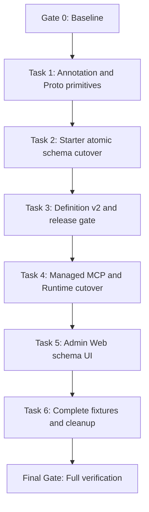

# Gateway Declarative Operation Schema Implementation Plan

状态：待用户审核

> Approved Spec:
> [Gateway 声明式 Operation Schema 与 MCP 参数装配设计](../specs/2026-08-07-gateway-declarative-operation-schema-design.md)

> **For agentic workers:** Execute this plan inline, task by task. Do not create
> subagents or worktrees unless the user explicitly changes that instruction.

**Goal:** 将 Gateway HTTP/Unary RPC 的接口 Schema、Managed MCP Tool Schema 和运行时参数装配统一切换到已确认的声明式注解模型，并彻底删除旧字段路径、Reporting Parameter 和 `inputLocations` 链路。

**Architecture:** Starter 使用 Java/Protobuf Adapter 生成同一套 JSON Schema Draft 2020-12；HTTP requestSchema 按位置分组，RPC requestSchema 保持完整 Message。Admin 只接收 Definition Report v2，并将当前 Operation Definition 投影成只读 Managed Tool。Runtime 直接把 HTTP `path/query/body` 或完整 RPC arguments 组装成 `GatewayOperationCall`。Admin Web 解析 `$defs/$ref` 并展示 Operation/Managed Tool 的完整只读 Schema。

**Tech Stack:** Java 21、Spring Boot 3.5.16、Jackson、Jakarta Validation、Protobuf 4.32、Maven、React 19、TypeScript 6、Ant Design 6、TanStack Query、Vitest。

## Global Constraints

- 本次是破坏性升级，不实现 v1/v2 双读、旧注解兼容、旧 Release 兼容或 `inputLocations` 兼容 Getter。
- 不修改任何既有 Flyway 文件；本次不改变数据库表结构，也不新增 Flyway Migration。
- 不恢复本地 MCP Tool 手工 CRUD、Schema、Operation、bindings 或幂等配置入口。
- Remote MCP Tool 的独立 Schema 配置不属于本次删除范围。
- `ResultRecord`、`PageResultRecord` 所在 Common Core 不得依赖 Gateway Starter；Wrapper 语义由 Starter Adapter 处理。
- Java Schema 递归只使用完整 Jackson `JavaType`，不得退化为 Raw Class。
- Protobuf 类型事实只来自 Descriptor；生成的 Java Class 只用于 Contract 根类型校验。
- HTTP Managed Tool 输入只能包含 `path/query/body`；RPC Managed Tool 输入是完整 Message。
- 模型不能提供 HEADER、COOKIE、Authorization 或 PART；Required HEADER/COOKIE 无可信注入来源时拒绝投影。
- 每个实现 Task 先写失败测试、运行 RED、做最小完整实现、运行 GREEN，并只创建一个 Task Commit。
- 中间提交不得部署；只有 Final Gate 全部通过后才允许进入维护窗口发布。
- 不自动启动业务项目或常驻服务，不打开浏览器，不运行需要用户手工启动拓扑的 Live Test。
- 保留工作树现有及后续出现的用户修改。若 Gate 0 发现 Admin Web 的 `package.json`/`package-lock.json` 依赖切换仍在工作树中，该改动不属于本计划，不暂存、不回退、不格式化。
- 每次提交只显式暂存该 Task 的文件；提交前运行 `git diff --cached --check` 和 `git diff --cached --name-status`。

## Design Pattern Guardrails

采用已有 Mapper/Adapter 风格：

- `GatewayJavaSchemaMapper`：`JavaType + Jackson + Validation` 到 JSON Schema；
- `ProtobufSchemaMapper`：`Descriptor + Gateway Field Option` 到 JSON Schema；
- `GatewayResponseSchemaMapper`：真实返回类型与 Result/PageResult/Proto Wrapper 的交叉校验；
- `McpManagedSchemaProjector`：Operation v2 Schema 到 Managed Tool Schema；
- `McpToolsCallHandler` 内保留一个 Request Assembler，把结构化 arguments 转成 `GatewayOperationCall`。

不创建 Strategy、Abstract Factory、Builder、Visitor 或继承型 Wrapper 体系。Java 与 Protobuf 的输入模型不同，Adapter 可以隔离差异；当前协议数量和构造流程不需要可插拔策略层级。

## Dependency Graph



Tasks 必须按顺序执行。Task 2 和 Task 4 都是跨模块原子切换，不拆成会留下双轨契约的中间提交。

---

## Gate 0: Baseline and Scope Freeze

**Files:** 本 Gate 不修改文件。

- [ ] **Step 1: 记录实际基线和用户修改**

```bash
git status --short --branch
git rev-parse HEAD
git diff --check
```

Expected: 将实际 HEAD 记为 `<GATE_0_HEAD>`；若存在 Admin Web `package.json`/`package-lock.json` 修改，继续保留且不进入任何 Gateway Schema 提交。

- [ ] **Step 2: 运行后端基线**

```bash
./mvnw -B -ntp \
  -f egon-cola-platforms/egon-cola-platform-gateway/pom.xml \
  -DskipITs test
```

Expected: Gateway Reactor 测试通过。若基线失败，先记录原始失败，不能用本功能修改掩盖。

- [ ] **Step 3: 运行 Admin Web 基线**

```bash
cd egon-cola-platforms/egon-cola-platform-gateway/egon-cola-platform-gateway-admin-web
npm test
npm run typecheck
npm run lint
npm run build
```

Expected: 全部通过。命令不得改写或暂存当前 `package.json`；若外部依赖切换导致失败，记录为用户工作树阻塞，不回退依赖。

- [ ] **Step 4: 冻结最终公共名字**

```text
GatewayRequestSchemaField
GatewayResponseSchema
GatewayRequestLocation
GatewaySchemaShape
GatewaySchemaType
GatewaySchemaRequired
egon/gateway/schema_options.proto
contractVersion = v2
x-egon-schema-model = gateway-operation-request/v2
x-egon-schema-model = gateway-operation-response/v2
```

Expected: 后续 Task 不自行重命名；确需变化时停止执行并回到 Spec 审核。

---

## Task 1: Add Annotation Primitives and Proto Field Options

**Files:**

- Create: `egon-cola-platforms/egon-cola-platform-gateway/egon-cola-platform-gateway-starter/src/main/java/top/egon/cola/component/gateway/starter/annotation/GatewayRequestSchemaField.java`
- Create: `egon-cola-platforms/egon-cola-platform-gateway/egon-cola-platform-gateway-starter/src/main/java/top/egon/cola/component/gateway/starter/annotation/GatewayResponseSchema.java`
- Create: `egon-cola-platforms/egon-cola-platform-gateway/egon-cola-platform-gateway-starter/src/main/java/top/egon/cola/component/gateway/starter/annotation/GatewayRequestLocation.java`
- Create: `egon-cola-platforms/egon-cola-platform-gateway/egon-cola-platform-gateway-starter/src/main/java/top/egon/cola/component/gateway/starter/annotation/GatewaySchemaShape.java`
- Create: `egon-cola-platforms/egon-cola-platform-gateway/egon-cola-platform-gateway-starter/src/main/java/top/egon/cola/component/gateway/starter/annotation/GatewaySchemaType.java`
- Create: `egon-cola-platforms/egon-cola-platform-gateway/egon-cola-platform-gateway-starter/src/main/java/top/egon/cola/component/gateway/starter/annotation/GatewaySchemaRequired.java`
- Modify: `egon-cola-platforms/egon-cola-platform-gateway/egon-cola-platform-gateway-contract/pom.xml`
- Create: `egon-cola-platforms/egon-cola-platform-gateway/egon-cola-platform-gateway-contract/src/main/proto/egon/gateway/schema_options.proto`
- Create: `egon-cola-platforms/egon-cola-platform-gateway/egon-cola-platform-gateway-contract/src/test/java/top/egon/cola/component/gateway/contract/schema/GatewaySchemaOptionsContractTest.java`
- Create: `egon-cola-platforms/egon-cola-platform-gateway/egon-cola-platform-gateway-starter/src/test/java/top/egon/cola/component/gateway/starter/annotation/GatewaySchemaAnnotationContractTest.java`

**Interfaces:**

- Produces the approved enum values and nested annotation defaults.
- Publishes `schema_options.proto` inside the Contract jar and generated Java Extension classes under `top.egon.cola.component.gateway.contract.schema.proto`.
- Does not change `GatewayOperation` or the old `GatewaySchemaField` yet; therefore no compatibility branch is added.

- [ ] **Step 1: Write failing annotation contract tests**

Assert exact Target/Retention, enum members, `Void.class` sentinels, `AUTO` defaults and `expanded=false`. Do not test approximate enum sets.

- [ ] **Step 2: Write failing Proto option contract test**

Assert the generated extension number is `51001`, its containing type is `google.protobuf.FieldOptions`, and the option message exposes `description/format/required/example`.

- [ ] **Step 3: Run RED**

```bash
./mvnw -B -ntp \
  -pl egon-cola-platforms/egon-cola-platform-gateway/egon-cola-platform-gateway-contract,egon-cola-platforms/egon-cola-platform-gateway/egon-cola-platform-gateway-starter \
  -am -DskipITs -Dsurefire.failIfNoSpecifiedTests=false \
  -Dtest=GatewaySchemaOptionsContractTest,GatewaySchemaAnnotationContractTest test
```

Expected: tests fail because the annotations, Proto asset and generated extension do not exist.

- [ ] **Step 4: Add the primitives and Contract Proto build**

Add `protobuf-java` and the existing managed `protobuf-maven-plugin`/`os-maven-plugin` configuration to Gateway Contract. Use the repository-managed Protobuf versions; do not introduce a second code generator or commit `target/generated-sources`.

Package the source `.proto` in the Contract jar so downstream RPC Contract modules can import it through their normal Protobuf dependency path.

- [ ] **Step 5: Run GREEN and inspect the jar**

```bash
./mvnw -B -ntp \
  -pl egon-cola-platforms/egon-cola-platform-gateway/egon-cola-platform-gateway-contract,egon-cola-platforms/egon-cola-platform-gateway/egon-cola-platform-gateway-starter \
  -am -DskipITs -Dsurefire.failIfNoSpecifiedTests=false \
  -Dtest=GatewaySchemaOptionsContractTest,GatewaySchemaAnnotationContractTest test

jar tf egon-cola-platforms/egon-cola-platform-gateway/egon-cola-platform-gateway-contract/target/egon-cola-platform-gateway-contract-*.jar \
  | rg 'egon/gateway/schema_options.proto|GatewaySchemaFieldOption|GatewaySchemaOptions'
```

Expected: tests pass and the jar contains both the Proto source and generated Java classes.

- [ ] **Step 6: Commit once**

```bash
git add \
  egon-cola-platforms/egon-cola-platform-gateway/egon-cola-platform-gateway-contract/pom.xml \
  egon-cola-platforms/egon-cola-platform-gateway/egon-cola-platform-gateway-contract/src/main/proto \
  egon-cola-platforms/egon-cola-platform-gateway/egon-cola-platform-gateway-contract/src/test/java/top/egon/cola/component/gateway/contract/schema \
  egon-cola-platforms/egon-cola-platform-gateway/egon-cola-platform-gateway-starter/src/main/java/top/egon/cola/component/gateway/starter/annotation \
  egon-cola-platforms/egon-cola-platform-gateway/egon-cola-platform-gateway-starter/src/test/java/top/egon/cola/component/gateway/starter/annotation
git diff --cached --check
git commit -m "feat(gateway): add declarative schema primitives"
```

---

## Task 2: Atomically Cut Starter Discovery to Declarative Schemas

This Task changes the public annotation API and all repository consumers in one commit. No deprecated member, old overload or dual Schema path may remain after the Task.

**Starter Files:**

- Modify: `egon-cola-platforms/egon-cola-platform-gateway/egon-cola-platform-gateway-starter/pom.xml`
- Modify: `egon-cola-platforms/egon-cola-platform-gateway/egon-cola-platform-gateway-starter/src/main/java/top/egon/cola/component/gateway/starter/annotation/GatewayOperation.java`
- Modify: `egon-cola-platforms/egon-cola-platform-gateway/egon-cola-platform-gateway-starter/src/main/java/top/egon/cola/component/gateway/starter/annotation/GatewayInterfaceGroup.java`
- Modify: `egon-cola-platforms/egon-cola-platform-gateway/egon-cola-platform-gateway-starter/src/main/java/top/egon/cola/component/gateway/starter/annotation/GatewaySchemaField.java`
- Create: `egon-cola-platforms/egon-cola-platform-gateway/egon-cola-platform-gateway-starter/src/main/java/top/egon/cola/component/gateway/starter/discovery/GatewayJavaSchemaMapper.java`
- Create: `egon-cola-platforms/egon-cola-platform-gateway/egon-cola-platform-gateway-starter/src/main/java/top/egon/cola/component/gateway/starter/discovery/GatewayResponseSchemaMapper.java`
- Create: `egon-cola-platforms/egon-cola-platform-gateway/egon-cola-platform-gateway-starter/src/main/java/top/egon/cola/component/gateway/starter/discovery/GatewayRequestSchemaValidator.java`
- Modify: `egon-cola-platforms/egon-cola-platform-gateway/egon-cola-platform-gateway-starter/src/main/java/top/egon/cola/component/gateway/starter/discovery/GatewayHttpOperationMapper.java`
- Modify: `egon-cola-platforms/egon-cola-platform-gateway/egon-cola-platform-gateway-starter/src/main/java/top/egon/cola/component/gateway/starter/discovery/ProtobufSchemaMapper.java`
- Modify: `egon-cola-platforms/egon-cola-platform-gateway/egon-cola-platform-gateway-starter/src/main/java/top/egon/cola/component/gateway/starter/discovery/RpcGatewayDefinitionContributor.java`
- Modify: `egon-cola-platforms/egon-cola-platform-gateway/egon-cola-platform-gateway-starter/src/main/java/top/egon/cola/component/gateway/starter/discovery/McpExposureMapper.java`
- Delete: `egon-cola-platforms/egon-cola-platform-gateway/egon-cola-platform-gateway-starter/src/main/java/top/egon/cola/component/gateway/starter/discovery/GatewaySchemaDescriptions.java`

**Starter Test Files:**

- Modify: `egon-cola-platforms/egon-cola-platform-gateway/egon-cola-platform-gateway-starter/src/test/java/top/egon/cola/component/gateway/starter/annotation/GatewaySchemaAnnotationContractTest.java`
- Create: `egon-cola-platforms/egon-cola-platform-gateway/egon-cola-platform-gateway-starter/src/test/java/top/egon/cola/component/gateway/starter/discovery/GatewayJavaSchemaMapperTest.java`
- Create: `egon-cola-platforms/egon-cola-platform-gateway/egon-cola-platform-gateway-starter/src/test/java/top/egon/cola/component/gateway/starter/discovery/GatewayHttpOperationMapperTest.java`
- Create: `egon-cola-platforms/egon-cola-platform-gateway/egon-cola-platform-gateway-starter/src/test/java/top/egon/cola/component/gateway/starter/discovery/RpcGatewayDefinitionContributorTest.java`
- Modify: `egon-cola-platforms/egon-cola-platform-gateway/egon-cola-platform-gateway-starter/src/test/java/top/egon/cola/component/gateway/starter/discovery/ProtobufSchemaMapperTest.java`
- Modify: `egon-cola-platforms/egon-cola-platform-gateway/egon-cola-platform-gateway-starter/src/test/java/top/egon/cola/component/gateway/starter/discovery/McpExposureMapperTest.java`
- Delete: `egon-cola-platforms/egon-cola-platform-gateway/egon-cola-platform-gateway-starter/src/test/java/top/egon/cola/component/gateway/starter/discovery/GatewaySchemaDescriptionsTest.java`

**Repository Consumer Files:**

- Modify: `egon-cola-platforms/egon-cola-platform-gateway/egon-cola-platform-gateway-test/egon-cola-platform-gateway-test-http-provider/src/main/java/top/egon/cola/component/gateway/test/http/OrderController.java`
- Modify: `egon-cola-platforms/egon-cola-platform-gateway/egon-cola-platform-gateway-test/egon-cola-platform-gateway-test-http-provider/src/test/java/top/egon/cola/component/gateway/test/http/HttpProviderContractTest.java`
- Modify: `egon-cola-platforms/egon-cola-platform-gateway/egon-cola-platform-gateway-test/egon-cola-platform-gateway-test-mcp-provider/src/main/java/top/egon/cola/component/gateway/test/mcp/provider/McpJobController.java`
- Create: `egon-cola-platforms/egon-cola-platform-gateway/egon-cola-platform-gateway-test/egon-cola-platform-gateway-test-mcp-provider/src/test/java/top/egon/cola/component/gateway/test/mcp/provider/McpOperationSchemaContractTest.java`
- Modify: `egon-cola-platforms/egon-cola-platform-gateway/egon-cola-platform-gateway-test/egon-cola-platform-gateway-test-rpc-contract/pom.xml`
- Modify: `egon-cola-platforms/egon-cola-platform-gateway/egon-cola-platform-gateway-test/egon-cola-platform-gateway-test-rpc-contract/src/main/proto/gateway_test_services.proto`
- Modify: `egon-cola-platforms/egon-cola-platform-gateway/egon-cola-platform-gateway-test/egon-cola-platform-gateway-test-rpc-contract/src/main/java/top/egon/cola/component/gateway/test/rpc/contract/OrderRpc.java`
- Modify: `egon-cola-platforms/egon-cola-platform-gateway/egon-cola-platform-gateway-test/egon-cola-platform-gateway-test-rpc-contract/src/test/java/top/egon/cola/component/gateway/test/rpc/contract/GatewayRpcContractTest.java`

**Interfaces:**

- `GatewayOperation.requestSchemaFields` becomes `GatewayRequestSchemaField[]`.
- `GatewayOperation.responseSchemaFields` is deleted and replaced by `GatewayResponseSchema responseSchema()`.
- `GatewaySchemaField.path` is deleted; metadata moves to actual DTO properties/parameters.
- All public Gateway Schema annotations match the approved `@Target`, runtime retention and `@Documented` contract.
- HTTP requestSchema becomes a location-grouped Draft 2020-12 Schema.
- RPC request/response remain Descriptor-root Schemas and read Proto Field Options.
- For this Task only, `GatewayInterfaceDefinitionReport.Operation.parameters` receives `List.of()` until Task 3 removes the field. No old behavior reads or writes it.

- [ ] **Step 1: Write failing Java Schema tests**

Extend the annotation contract test to cover the final `GatewayOperation`, `GatewayInterfaceGroup` and `GatewaySchemaField` signatures, targets and `@Documented` markers. Cover all of the following Schema behavior in one focused fixture graph:

```text
Record Component metadata propagation and deduplication
List<T>, Map<String,T>, nested generic DTOs
enum, integer, number, boolean, UUID, LocalDate, Instant
@JsonProperty, @JsonIgnore and naming strategy
@NotNull, @NotBlank, @NotEmpty, @Size, @Min, @Max, @Pattern
required=AUTO/REQUIRED/OPTIONAL conflict rejection
implementation compatibility and invalid example rejection
self-reference and mutual-reference through $defs/$ref
schema depth, node-count and serialized-byte safety limits
ResultRecord object/list/map/value nullability
PageResultRecord records/page non-null wrapper semantics
```

Expected RED: final `GatewaySchemaField` members and Java Schema mapper do not exist.

- [ ] **Step 2: Write failing HTTP composition tests**

Test PATH + scalar QUERY + Required Authorization HEADER + complex `@RequestBody` in one method. Separately test `@ModelAttribute` complex Query expansion and BODY OBJECT/LIST/MAP/VALUE.

Failure cases must cover missing declaration, duplicate declaration, wrong location/name/shape/type, two bodies, ModelAttribute declared as BODY, query expansion collision, Required business HEADER/COOKIE, PART and Streaming Managed MCP.

- [ ] **Step 3: Write failing Protobuf/RPC tests**

Use a real Descriptor with nested Message, repeated, Map, Enum, oneof, supported well-known types, recursion and Gateway Field Options. Assert JSON field name plus `protobufName/protobufType/fieldNumber`, option metadata and `$defs/$ref`.

RPC Contributor tests must reject zero/multiple `RPC_MESSAGE`, root class mismatch, response Wrapper/Payload mismatch, Streaming and idempotency disagreement.

- [ ] **Step 4: Run RED**

```bash
./mvnw -B -ntp \
  -pl egon-cola-platforms/egon-cola-platform-gateway/egon-cola-platform-gateway-starter \
  -am -DskipITs -Dsurefire.failIfNoSpecifiedTests=false \
  -Dtest=GatewaySchemaAnnotationContractTest,GatewayJavaSchemaMapperTest,GatewayHttpOperationMapperTest,ProtobufSchemaMapperTest,RpcGatewayDefinitionContributorTest,McpExposureMapperTest test
```

Expected: tests fail on the old annotation model and old flattened/body-only Schema logic.

- [ ] **Step 5: Implement the Java Adapter and Wrapper mapping**

Add the repository-managed `jakarta.validation-api` to the Starter; do not add a Validation implementation. Use a deterministic Definition registry keyed by canonical `JavaType`. Resolve Jackson properties using the configured `ObjectMapper`; never recurse with only `getRawClass()`.

Generate local `$defs/$ref`, apply validation constraints, validate examples, and fail rather than emit `truncated=true` when safety limits are exceeded. Wrapper adapters must not add a Gateway dependency to Common Core.

- [ ] **Step 6: Implement strict HTTP request composition**

Build a private Starter request-parameter model from Spring `MethodParameter`; do not reuse the Reporting v1 `Parameter` DTO. `BODY` requires `@RequestBody`; unannotated complex values follow Spring ModelAttribute/Query semantics.

Generate only present `path/query/header/cookie/body/part` groups with stable order and `additionalProperties=false`. Recalculate root Required groups from their child/body semantics.

- [ ] **Step 7: Implement Descriptor mapping and RPC validation**

Read the generated Gateway Field Option from the live Descriptor. Include the option Proto in Descriptor Snapshot dependencies. Type, shape, Enum and Map come only from Descriptor.

- [ ] **Step 8: Migrate every repository annotation consumer**

Move Java field descriptions onto records/DTO fields and scalar method parameters. Import the shared Proto option in the RPC test contract. For every `registerMcp=true` operation, add a complete request declaration and explicit response declaration.

Do not add empty declarations just to compile; each fixture must express its real signature.

- [ ] **Step 9: Run GREEN across Starter and Provider contracts**

```bash
./mvnw -B -ntp \
  -pl egon-cola-platforms/egon-cola-platform-gateway/egon-cola-platform-gateway-starter,egon-cola-platforms/egon-cola-platform-gateway/egon-cola-platform-gateway-test/egon-cola-platform-gateway-test-http-provider,egon-cola-platforms/egon-cola-platform-gateway/egon-cola-platform-gateway-test/egon-cola-platform-gateway-test-rpc-contract,egon-cola-platforms/egon-cola-platform-gateway/egon-cola-platform-gateway-test/egon-cola-platform-gateway-test-mcp-provider \
  -am -DskipITs -Dsurefire.failIfNoSpecifiedTests=false \
  -Dtest=GatewaySchemaAnnotationContractTest,GatewayJavaSchemaMapperTest,GatewayHttpOperationMapperTest,ProtobufSchemaMapperTest,RpcGatewayDefinitionContributorTest,McpExposureMapperTest,HttpProviderContractTest,GatewayRpcContractTest,McpOperationSchemaContractTest test
```

Expected: all targeted tests pass and all four modules compile with no old annotation member.

- [ ] **Step 10: Prove the old Starter path is gone**

```bash
rg -n 'responseSchemaFields|GatewaySchemaDescriptions' \
  egon-cola-platforms/egon-cola-platform-gateway \
  --glob '*.java' --glob '*.proto'

rg -n -U '@GatewaySchemaField\([\s\S]{0,240}?path\s*=' \
  egon-cola-platforms/egon-cola-platform-gateway \
  --glob '*.java'
```

Expected: no production or test matches.

- [ ] **Step 11: Commit once**

```bash
git add \
  egon-cola-platforms/egon-cola-platform-gateway/egon-cola-platform-gateway-starter \
  egon-cola-platforms/egon-cola-platform-gateway/egon-cola-platform-gateway-test/egon-cola-platform-gateway-test-http-provider \
  egon-cola-platforms/egon-cola-platform-gateway/egon-cola-platform-gateway-test/egon-cola-platform-gateway-test-mcp-provider \
  egon-cola-platforms/egon-cola-platform-gateway/egon-cola-platform-gateway-test/egon-cola-platform-gateway-test-rpc-contract
git diff --cached --check
git commit -m "feat(gateway): generate declarative operation schemas"
```

---

## Task 3: Cut Reporting, Catalog and Release Eligibility to Definition v2

**Files:**

- Modify: `egon-cola-platforms/egon-cola-platform-gateway/egon-cola-platform-gateway-contract/src/main/java/top/egon/cola/component/gateway/contract/reporting/GatewayInterfaceDefinitionReport.java`
- Modify: `egon-cola-platforms/egon-cola-platform-gateway/egon-cola-platform-gateway-starter/src/main/java/top/egon/cola/component/gateway/starter/reporting/GatewayDefinitionReportFactory.java`
- Modify: `egon-cola-platforms/egon-cola-platform-gateway/egon-cola-platform-gateway-starter/src/main/java/top/egon/cola/component/gateway/starter/reporting/GatewayReportHttpClient.java`
- Modify: `egon-cola-platforms/egon-cola-platform-gateway/egon-cola-platform-gateway-admin/src/main/java/top/egon/cola/component/gateway/admin/application/reporting/GatewayDefinitionReportService.java`
- Modify: `egon-cola-platforms/egon-cola-platform-gateway/egon-cola-platform-gateway-admin/src/main/java/top/egon/cola/component/gateway/admin/application/reporting/GatewayReportCanonicalizer.java`
- Modify: `egon-cola-platforms/egon-cola-platform-gateway/egon-cola-platform-gateway-admin/src/main/java/top/egon/cola/component/gateway/admin/infrastructure/persistence/JdbcGatewayDefinitionReportStore.java`
- Create: `egon-cola-platforms/egon-cola-platform-gateway/egon-cola-platform-gateway-admin/src/main/java/top/egon/cola/component/gateway/admin/application/reporting/GatewayOperationSchemaValidator.java`
- Modify: `egon-cola-platforms/egon-cola-platform-gateway/egon-cola-platform-gateway-admin/src/main/java/top/egon/cola/component/gateway/admin/application/release/GatewayReleaseService.java`
- Modify: `egon-cola-platforms/egon-cola-platform-gateway/egon-cola-platform-gateway-starter/src/test/java/top/egon/cola/component/gateway/starter/reporting/GatewayDefinitionReportFactoryTest.java`
- Modify: `egon-cola-platforms/egon-cola-platform-gateway/egon-cola-platform-gateway-starter/src/test/java/top/egon/cola/component/gateway/starter/reporting/GatewayReportHttpClientTest.java`
- Modify: `egon-cola-platforms/egon-cola-platform-gateway/egon-cola-platform-gateway-admin/src/test/java/top/egon/cola/component/gateway/admin/application/reporting/GatewayDefinitionReportServiceTest.java`
- Modify: `egon-cola-platforms/egon-cola-platform-gateway/egon-cola-platform-gateway-admin/src/test/java/top/egon/cola/component/gateway/admin/application/reporting/GatewayReportCanonicalizerTest.java`
- Create: `egon-cola-platforms/egon-cola-platform-gateway/egon-cola-platform-gateway-admin/src/test/java/top/egon/cola/component/gateway/admin/application/reporting/GatewayOperationSchemaValidatorTest.java`
- Modify: `egon-cola-platforms/egon-cola-platform-gateway/egon-cola-platform-gateway-admin/src/test/java/top/egon/cola/component/gateway/admin/application/release/GatewayReleaseServiceTest.java`

**Interfaces:**

- Report header and body `contractVersion` become exactly `v2`.
- `GatewayInterfaceDefinitionReport.Operation.parameters` and nested `Parameter` record are deleted.
- Admin validates `x-egon-schema-model`, legal HTTP location groups, local `$ref`, schema limits and MCP-incompatible locations directly from requestSchema.
- Persistence continues using existing JSONB columns and no longer writes `attributes.parameters`.
- Release creation validates every referenced current Operation with the same v2 Schema validator; v1 history remains readable but cannot be reactivated or included in a new Release.

- [ ] **Step 1: Write failing v2 contract and rejection tests**

Test Starter body/header both say v2. Test Admin rejects v1 header, v1 body, version mismatch, missing schema model, illegal location group, unresolved local `$ref`, external `$ref` and malformed Required arrays.

- [ ] **Step 2: Write failing persistence/canonical tests**

Assert Canonical Fingerprint includes the new grouped Schema deterministically, and persisted attributes contain MCP Exposure/metadata but never `parameters`. Assert release creation rejects a referenced current Definition without v2 request/response Schema model markers, including a stored v1 fixture.

- [ ] **Step 3: Run RED**

```bash
./mvnw -B -ntp \
  -pl egon-cola-platforms/egon-cola-platform-gateway/egon-cola-platform-gateway-starter,egon-cola-platforms/egon-cola-platform-gateway/egon-cola-platform-gateway-admin \
  -am -DskipITs -Dsurefire.failIfNoSpecifiedTests=false \
  -Dtest=GatewayDefinitionReportFactoryTest,GatewayReportHttpClientTest,GatewayDefinitionReportServiceTest,GatewayReportCanonicalizerTest,GatewayOperationSchemaValidatorTest,GatewayReleaseServiceTest test
```

Expected: old v1 assertions or removed Parameter API fail.

- [ ] **Step 4: Implement the atomic v2 cutover**

Delete the Parameter type and all constructor arguments. Use one Admin Schema validator for report acceptance and release preconditions; do not create separate permissive validators. Release creation must validate the current Definition selected for every Route/MCP reference before constructing Runtime Operations.

Only local `#/$defs/...` references are allowed. Unknown required fields, unsupported Schema model versions and schema size overflow reject the entire report.

- [ ] **Step 5: Run GREEN**

Run the Step 3 command again.

Expected: targeted Starter/Admin tests pass and v1 is rejected.

- [ ] **Step 6: Prove Parameter persistence is gone**

```bash
rg -n 'GatewayInterfaceDefinitionReport\.Parameter|operation\.parameters\(\)|attributes\.put\("parameters"' \
  egon-cola-platforms/egon-cola-platform-gateway \
  --glob '*.java'
```

Expected: no matches.

- [ ] **Step 7: Commit once**

```bash
git add \
  egon-cola-platforms/egon-cola-platform-gateway/egon-cola-platform-gateway-contract/src/main/java/top/egon/cola/component/gateway/contract/reporting \
  egon-cola-platforms/egon-cola-platform-gateway/egon-cola-platform-gateway-starter/src/main/java/top/egon/cola/component/gateway/starter \
  egon-cola-platforms/egon-cola-platform-gateway/egon-cola-platform-gateway-starter/src/test/java/top/egon/cola/component/gateway/starter \
  egon-cola-platforms/egon-cola-platform-gateway/egon-cola-platform-gateway-admin/src/main/java/top/egon/cola/component/gateway/admin/application/reporting \
  egon-cola-platforms/egon-cola-platform-gateway/egon-cola-platform-gateway-admin/src/main/java/top/egon/cola/component/gateway/admin/application/release/GatewayReleaseService.java \
  egon-cola-platforms/egon-cola-platform-gateway/egon-cola-platform-gateway-admin/src/main/java/top/egon/cola/component/gateway/admin/infrastructure/persistence/JdbcGatewayDefinitionReportStore.java \
  egon-cola-platforms/egon-cola-platform-gateway/egon-cola-platform-gateway-admin/src/test/java/top/egon/cola/component/gateway/admin/application/reporting \
  egon-cola-platforms/egon-cola-platform-gateway/egon-cola-platform-gateway-admin/src/test/java/top/egon/cola/component/gateway/admin/application/release/GatewayReleaseServiceTest.java
git diff --cached --check
git commit -m "feat(gateway): require operation definition v2"
```

---

## Task 4: Atomically Project and Invoke Structured Managed Tools

This Task removes `inputLocations` from Contract, Admin, Runtime, Rule fixtures and tests in one commit. The backend must not expose a transitional API.

**Contract and Admin Files:**

- Modify: `egon-cola-platforms/egon-cola-platform-gateway/egon-cola-platform-gateway-contract/src/main/java/top/egon/cola/component/gateway/contract/mcp/rule/McpRuntimeTool.java`
- Modify: `egon-cola-platforms/egon-cola-platform-gateway/egon-cola-platform-gateway-contract/src/test/java/top/egon/cola/component/gateway/contract/mcp/McpContractTest.java`
- Create: `egon-cola-platforms/egon-cola-platform-gateway/egon-cola-platform-gateway-admin/src/main/java/top/egon/cola/component/gateway/admin/mcp/application/McpManagedSchemaProjector.java`
- Modify: `egon-cola-platforms/egon-cola-platform-gateway/egon-cola-platform-gateway-admin/src/main/java/top/egon/cola/component/gateway/admin/mcp/application/McpReleaseContentFactory.java`
- Modify: `egon-cola-platforms/egon-cola-platform-gateway/egon-cola-platform-gateway-admin/src/main/java/top/egon/cola/component/gateway/admin/mcp/application/McpToolAdminService.java`
- Create: `egon-cola-platforms/egon-cola-platform-gateway/egon-cola-platform-gateway-admin/src/test/java/top/egon/cola/component/gateway/admin/mcp/application/McpManagedSchemaProjectorTest.java`
- Modify: `egon-cola-platforms/egon-cola-platform-gateway/egon-cola-platform-gateway-admin/src/test/java/top/egon/cola/component/gateway/admin/mcp/application/McpReleaseContentFactoryTest.java`
- Modify: `egon-cola-platforms/egon-cola-platform-gateway/egon-cola-platform-gateway-admin/src/test/java/top/egon/cola/component/gateway/admin/mcp/application/McpToolAdminServiceTest.java`
- Modify: `egon-cola-platforms/egon-cola-platform-gateway/egon-cola-platform-gateway-admin/src/test/java/top/egon/cola/component/gateway/admin/mcp/application/McpUnifiedReleaseTest.java`

**Runtime and Engine Files:**

- Modify: `egon-cola-platforms/egon-cola-platform-gateway/egon-cola-platform-gateway-mcp-runtime/src/main/java/top/egon/cola/component/gateway/mcp/tool/McpToolsCallHandler.java`
- Modify: `egon-cola-platforms/egon-cola-platform-gateway/egon-cola-platform-gateway-mcp-runtime/src/main/java/top/egon/cola/component/gateway/mcp/rule/McpRuleCompiler.java`
- Modify: `egon-cola-platforms/egon-cola-platform-gateway/egon-cola-platform-gateway-mcp-runtime/src/test/java/top/egon/cola/component/gateway/mcp/tool/McpLocalToolFlowTest.java`
- Modify: `egon-cola-platforms/egon-cola-platform-gateway/egon-cola-platform-gateway-engine/src/test/java/top/egon/cola/component/gateway/engine/operation/EngineGatewayOperationInvokerTest.java`
- Modify when compilation identifies affected fixtures: Gateway Admin/Engine/MCP Rule JSON tests that directly construct `McpRuntimeTool`.

**Interfaces:**

- HTTP Managed input is the pruned Operation requestSchema with only `path/query/body`.
- RPC Managed input is the complete Descriptor Message Schema.
- Managed output is the complete Operation responseSchema.
- `McpRuntimeTool` and Managed Tool Admin DTO no longer contain `inputLocations`.
- Runtime accepts HTTP root arguments only as `path/query/body`; RPC passes all arguments as body.

- [ ] **Step 1: Write failing projection tests**

Cover HTTP PATH + QUERY + BODY, optional empty groups, root Required recomputation, removal of HEADER/COOKIE/PART, reachable `$defs` retention, unreachable `$defs` pruning and unresolved `$ref` rejection.

Cover RPC Message pass-through and full Result Wrapper output. Assert Tool ID remains `SHA-256(serverCode + NUL + operationKey)` and strict Overrides are unchanged.

- [ ] **Step 2: Write failing Runtime assembly tests**

Assert:

```text
HTTP arguments.path  -> pathArguments
HTTP arguments.query -> queryArguments
HTTP arguments.body  -> body
RPC arguments        -> body
```

Reject HTTP unknown root fields, non-object path/query, model-supplied header/cookie/part and missing required roots through existing Schema validation.

For durable Tasks, assert the stored input contains only `operationId/pathArguments/queryArguments/body` and never Authorization, Cookie or transport credentials.

- [ ] **Step 3: Run RED**

```bash
./mvnw -B -ntp \
  -pl egon-cola-platforms/egon-cola-platform-gateway/egon-cola-platform-gateway-contract,egon-cola-platforms/egon-cola-platform-gateway/egon-cola-platform-gateway-admin,egon-cola-platforms/egon-cola-platform-gateway/egon-cola-platform-gateway-mcp-runtime,egon-cola-platforms/egon-cola-platform-gateway/egon-cola-platform-gateway-engine \
  -am -DskipITs -Dsurefire.failIfNoSpecifiedTests=false \
  -Dtest=McpContractTest,McpManagedSchemaProjectorTest,McpReleaseContentFactoryTest,McpToolAdminServiceTest,McpUnifiedReleaseTest,McpLocalToolFlowTest,EngineGatewayOperationInvokerTest test
```

Expected: tests fail because Managed projection is flattened and Runtime still reads `inputLocations`.

- [ ] **Step 4: Implement the one-way projection**

`McpManagedSchemaProjector` receives already validated Operation v2 Schema. It must not inspect old `attributes.parameters`, HTTP Method or Admin Draft Schema.

For HTTP, copy `path/query/body`, recompute Required, set `additionalProperties=false`, traverse local refs and retain only reachable `$defs`. For RPC, retain the full Message Schema unchanged except canonical Map ordering.

- [ ] **Step 5: Remove `inputLocations` everywhere in the backend**

Delete the record field, constructor arguments, normalization, Admin View field, `ToolInput.locations`, Rule compiler checks and flattened binder loop. Keep one direct Request Assembler in `McpToolsCallHandler`; do not introduce a public binder abstraction.

- [ ] **Step 6: Verify Engine invocation semantics**

Expand `EngineGatewayOperationInvokerTest` only where required to prove HTTP Path substitution, repeated Query encoding, JSON OBJECT/LIST/MAP/VALUE bodies and complete RPC body mapping. Do not change `GatewayOperationCall`.

- [ ] **Step 7: Run GREEN**

Run the Step 3 command again.

Expected: all targeted backend tests pass.

- [ ] **Step 8: Prove the backend legacy field is gone**

```bash
rg -n 'inputLocations|attributes\.get\("parameters"|ToolInput\([^)]*locations' \
  egon-cola-platforms/egon-cola-platform-gateway \
  --glob '*.java'
```

Expected: no production or backend test matches.

- [ ] **Step 9: Commit once**

```bash
git add \
  egon-cola-platforms/egon-cola-platform-gateway/egon-cola-platform-gateway-contract \
  egon-cola-platforms/egon-cola-platform-gateway/egon-cola-platform-gateway-admin \
  egon-cola-platforms/egon-cola-platform-gateway/egon-cola-platform-gateway-mcp-runtime \
  egon-cola-platforms/egon-cola-platform-gateway/egon-cola-platform-gateway-engine/src/test
git diff --cached --check
git commit -m "feat(gateway): invoke structured managed tools"
```

---

## Task 5: Render Operation v2 and Managed Tool Schemas in Admin Web

**Files:**

- Modify: `egon-cola-platforms/egon-cola-platform-gateway/egon-cola-platform-gateway-admin-web/src/api/types.ts`
- Modify when response assertions require it: `egon-cola-platforms/egon-cola-platform-gateway/egon-cola-platform-gateway-admin-web/src/api/gatewayApi.test.ts`
- Modify: `egon-cola-platforms/egon-cola-platform-gateway/egon-cola-platform-gateway-admin-web/src/features/interface-catalog/schemaRows.ts`
- Modify: `egon-cola-platforms/egon-cola-platform-gateway/egon-cola-platform-gateway-admin-web/src/features/interface-catalog/schemaRows.test.ts`
- Modify: `egon-cola-platforms/egon-cola-platform-gateway/egon-cola-platform-gateway-admin-web/src/features/interface-catalog/SchemaPanel.tsx`
- Modify: `egon-cola-platforms/egon-cola-platform-gateway/egon-cola-platform-gateway-admin-web/src/features/interface-catalog/SchemaPanel.test.tsx`
- Modify: `egon-cola-platforms/egon-cola-platform-gateway/egon-cola-platform-gateway-admin-web/src/features/interface-catalog/OperationPage.tsx`
- Modify: `egon-cola-platforms/egon-cola-platform-gateway/egon-cola-platform-gateway-admin-web/src/features/mcp/McpToolsPanel.tsx`
- Modify: `egon-cola-platforms/egon-cola-platform-gateway/egon-cola-platform-gateway-admin-web/src/features/mcp/McpToolsPanel.test.tsx`
- Modify: `egon-cola-platforms/egon-cola-platform-gateway/egon-cola-platform-gateway-admin-web/e2e/mcp-control-plane.spec.ts`

**Interfaces:**

- `McpManagedTool` deletes `inputLocations` and retains read-only input/output Schema.
- Operation Request view recognizes `path/query/header/cookie/body/part` root groups.
- Schema rows resolve only local `$defs/$ref`, display List/Map/Value/Object and protect recursive cycles.
- Managed Tool exposes a read-only Schema preview; Override Modal remains limited to Server/permission/risk/disable.

- [ ] **Step 1: Write failing pure Schema row tests**

Cover location groups, repeated `$ref`, nested `$ref`, recursive `$ref`, unresolved refs, array items, Map `{value}`, scalar root, nullable `anyOf`, `oneOf/allOf`, Required inheritance, example and Validation constraints.

Cycles must render a finite reference row with technical type, not silently disappear or recurse indefinitely.

- [ ] **Step 2: Write failing component tests**

Assert Operation Page labels each present location and keeps raw JSON collapsed. Assert Managed Tool expands read-only Input/Output Schema, while its Override Modal has no Schema, Payload, bindings, Operation or idempotent control.

- [ ] **Step 3: Run RED**

```bash
cd egon-cola-platforms/egon-cola-platform-gateway/egon-cola-platform-gateway-admin-web
npm test -- --run \
  src/features/interface-catalog/schemaRows.test.ts \
  src/features/interface-catalog/SchemaPanel.test.tsx \
  src/features/mcp/McpToolsPanel.test.tsx
```

Expected: `$ref`/combination/location and Managed preview assertions fail; fixture still requires `inputLocations`.

- [ ] **Step 4: Implement the recursive row projection**

Keep `schemaRows` a pure function. Pass root `$defs` through recursion, maintain an active ref stack for cycle protection, and generate stable row keys from display path plus ref identity.

Do not add a JSON Schema library unless the existing focused implementation cannot satisfy the approved local-ref subset; any dependency proposal requires a new review.

- [ ] **Step 5: Implement location and Managed preview UI**

Use existing `SchemaPanel` and Ant Design Collapse/Table patterns. Do not nest Cards inside Cards. Schema previews are read-only and must not add any mutation endpoint or form field.

- [ ] **Step 6: Run targeted GREEN**

Run the Step 3 command again.

Expected: targeted tests pass.

- [ ] **Step 7: Run full frontend gates**

```bash
npm test
npm run typecheck
npm run lint
npm run build
```

Expected: all pass. The existing package manifest and lockfile modifications remain unstaged and unchanged by this Task. The E2E fixture is contract-updated but not browser-executed under this plan.

- [ ] **Step 8: Commit once**

```bash
git add \
  src/api/types.ts \
  src/api/gatewayApi.test.ts \
  src/features/interface-catalog \
  src/features/mcp/McpToolsPanel.tsx \
  src/features/mcp/McpToolsPanel.test.tsx \
  e2e/mcp-control-plane.spec.ts
git diff --cached --check
git diff --cached --name-status
git commit -m "feat(gateway-web): render declarative schemas"
```

---

## Task 6: Add Complete HTTP/RPC Fixtures and Delete Remaining Legacy Code

**Files:**

- Modify: `egon-cola-platforms/egon-cola-platform-gateway/egon-cola-platform-gateway-test/egon-cola-platform-gateway-test-http-provider/src/main/java/top/egon/cola/component/gateway/test/http/OrderController.java`
- Create as needed under the same package: dedicated request/response DTO Records for complex Body, complex Query, Object/List/Map/Value and PageResult fixtures.
- Modify: `egon-cola-platforms/egon-cola-platform-gateway/egon-cola-platform-gateway-test/egon-cola-platform-gateway-test-http-provider/src/test/java/top/egon/cola/component/gateway/test/http/HttpProviderContractTest.java`
- Modify: `egon-cola-platforms/egon-cola-platform-gateway/egon-cola-platform-gateway-test/egon-cola-platform-gateway-test-rpc-contract/src/main/proto/gateway_test_services.proto`
- Modify: `egon-cola-platforms/egon-cola-platform-gateway/egon-cola-platform-gateway-test/egon-cola-platform-gateway-test-rpc-contract/src/main/java/top/egon/cola/component/gateway/test/rpc/contract/OrderRpc.java`
- Modify: `egon-cola-platforms/egon-cola-platform-gateway/egon-cola-platform-gateway-test/egon-cola-platform-gateway-test-rpc-contract/src/test/java/top/egon/cola/component/gateway/test/rpc/contract/GatewayRpcContractTest.java`
- Modify RPC Provider implementation/tests when new methods require behavior.
- Modify: `egon-cola-platforms/egon-cola-platform-gateway/egon-cola-platform-gateway-test/egon-cola-platform-gateway-test-suite/src/test/java/top/egon/cola/component/gateway/test/mcp/McpFixtureContractTest.java`
- Modify affected rule/report JSON fixtures found by the deletion scan.
- Modify relevant Gateway README/developer example documents that still teach the old annotation model.

**Required Fixture Matrix:**

| Protocol | Request | Response |
| --- | --- | --- |
| HTTP | PATH + QUERY + Authorization + complex `@RequestBody` | `ResultRecord<complex object>` with nested List/Map/scalars |
| HTTP | expanded complex Query | `ResultRecord<List<T>>` |
| HTTP | page Query | `PageResultRecord<T>` |
| HTTP | scalar/Map Body fixtures | `ResultRecord<Value>` and `ResultRecord<Map<String,T>>` |
| RPC | complete complex Message with repeated/Map/scalars | Proto Result with complex `data` |
| RPC | list request Message | Proto Result with repeated `data` |

- [ ] **Step 1: Write failing fixture contract assertions**

Assert exact request location groups, Wrapper fields, Payload Shape, `$defs/$ref`, Field Option descriptions and Managed Tool input/output projection. Do not only assert HTTP 200 or operation count.

- [ ] **Step 2: Run RED**

```bash
./mvnw -B -ntp \
  -pl egon-cola-platforms/egon-cola-platform-gateway/egon-cola-platform-gateway-test/egon-cola-platform-gateway-test-http-provider,egon-cola-platforms/egon-cola-platform-gateway/egon-cola-platform-gateway-test/egon-cola-platform-gateway-test-rpc-contract,egon-cola-platforms/egon-cola-platform-gateway/egon-cola-platform-gateway-test/egon-cola-platform-gateway-test-rpc-provider,egon-cola-platforms/egon-cola-platform-gateway/egon-cola-platform-gateway-test/egon-cola-platform-gateway-test-suite \
  -am -DskipITs -Dsurefire.failIfNoSpecifiedTests=false \
  -Dtest=HttpProviderContractTest,GatewayRpcContractTest,RpcProviderBehaviorTest,McpFixtureContractTest test
```

Expected: matrix assertions fail until all representative endpoints/messages exist.

- [ ] **Step 3: Implement deterministic fixtures**

Use fixed examples and deterministic return values. Never put real credentials, production IDs or current timestamps in Schema examples. Reuse Common Core `ResultRecord`/`PageResultRecord`; do not create a second HTTP Result wrapper.

- [ ] **Step 4: Delete or rewrite incompatible legacy tests**

Delete tests whose only purpose is v1 report, old field-path documentation, `inputLocations` or old MCP flattened arguments. Rewrite only tests that still express a valid v2 invariant.

Historical Specs may retain old names as history; production source, test source, runtime fixtures and current user documentation may not.

- [ ] **Step 5: Run GREEN**

Run the Step 2 command again.

Expected: all fixture tests pass without starting long-lived processes.

- [ ] **Step 6: Run the destructive deletion scan**

```bash
rg -n 'responseSchemaFields|inputLocations|GatewaySchemaDescriptions|GatewayInterfaceDefinitionReport\.Parameter' \
  egon-cola-platforms/egon-cola-platform-gateway \
  --glob '**/src/main/**' --glob '**/src/test/**' --glob '**/e2e/**' \
  --glob '*.java' --glob '*.ts' --glob '*.tsx' --glob '*.json' --glob '*.proto'

rg -n -U '@GatewaySchemaField\([\s\S]{0,240}?path\s*=' \
  egon-cola-platforms/egon-cola-platform-gateway \
  --glob '*.java'

rg -n 'attributes\.put\("parameters"|attributes\.get\("parameters"' \
  egon-cola-platforms/egon-cola-platform-gateway \
  --glob '*.java'
```

Expected: all three commands return no matches.

- [ ] **Step 7: Commit once**

Stage only files actually changed by the fixture/document cleanup, inspect the staged list, then:

```bash
git diff --cached --check
git diff --cached --name-status
git commit -m "test(gateway): cover declarative schema fixtures"
```

---

## Final Gate: Full Verification and Release Readiness

This Gate creates no commit unless a real defect is found. A defect fix becomes a separate narrowly scoped Task with its own RED/GREEN/Commit before rerunning the entire Gate.

- [ ] **Step 1: Verify repository scope and commit sequence**

```bash
git status --short
git log --oneline --decorate -8
git diff --check
```

Expected: only known user-owned files remain dirty. Implementation history contains exactly one commit for each completed Task.

- [ ] **Step 2: Run the full Gateway backend reactor**

```bash
./mvnw -B -ntp \
  -f egon-cola-platforms/egon-cola-platform-gateway/pom.xml \
  -DskipITs test
```

Expected: all Gateway modules and test applications compile; all non-Live tests pass.

- [ ] **Step 3: Run focused cross-module MCP/Schema tests once more**

```bash
./mvnw -B -ntp \
  -f egon-cola-platforms/egon-cola-platform-gateway/pom.xml \
  -DskipITs -Dsurefire.failIfNoSpecifiedTests=false \
  -Dtest=GatewaySchemaAnnotationContractTest,GatewayJavaSchemaMapperTest,GatewayHttpOperationMapperTest,ProtobufSchemaMapperTest,RpcGatewayDefinitionContributorTest,GatewayDefinitionReportServiceTest,GatewayOperationSchemaValidatorTest,McpManagedSchemaProjectorTest,McpReleaseContentFactoryTest,McpLocalToolFlowTest,EngineGatewayOperationInvokerTest,HttpProviderContractTest,GatewayRpcContractTest,McpFixtureContractTest test
```

Expected: all pass.

- [ ] **Step 4: Run full Admin Web gates**

```bash
cd egon-cola-platforms/egon-cola-platform-gateway/egon-cola-platform-gateway-admin-web
npm test
npm run typecheck
npm run lint
npm run build
```

Expected: all pass; no package metadata is staged accidentally.

- [ ] **Step 5: Re-run deletion and migration checks**

Run Task 6 Step 6 again, then verify:

```bash
git diff --name-status <GATE_0_HEAD>..HEAD -- \
  egon-cola-platforms/egon-cola-platform-gateway/egon-cola-platform-gateway-admin/src/main/resources/db/migration
```

Expected: no output; this feature neither adds nor modifies a Flyway file.

- [ ] **Step 6: Verify release properties without starting services**

Use unit/component evidence to confirm:

```text
Admin accepts only Report v2
Old Release cannot be reactivated
Managed Tool has no manual Schema mutation
HTTP Tool input has only path/query/body
RPC Tool input is the full Message
Tool output retains the complete Wrapper
No-Route Managed Tool still brings its Operation into Release
Override remains tighten-only
```

- [ ] **Step 7: Produce handoff evidence**

Report every command and exit status, the six Task commit SHAs, remaining user-owned dirty files, and the following intentionally unexecuted runtime checks:

```text
maintenance-window deployment order
real Provider v2 buildId reporting
new unified Gateway Release publication
live HTTP Managed Tool calls
live Unary RPC Managed Tool calls
multi-Engine activation
```

The user starts the project and authorizes the maintenance-window runtime acceptance separately.

## Completion Criteria

- All six Task commits and the Final Gate are complete.
- All explicit acceptance criteria in the approved Spec are covered by tests or identified as manual runtime acceptance.
- No production/test source contains the deleted annotation members, Reporting Parameter path or `inputLocations`.
- No manual Managed Tool Schema/configuration path exists.
- Backend and Admin Web ship in the same destructive release.
- No database migration was added or existing migration modified.
- No unrelated user file was staged, committed, reverted or reformatted.
- Services were not started automatically and no browser/computer control was used.
