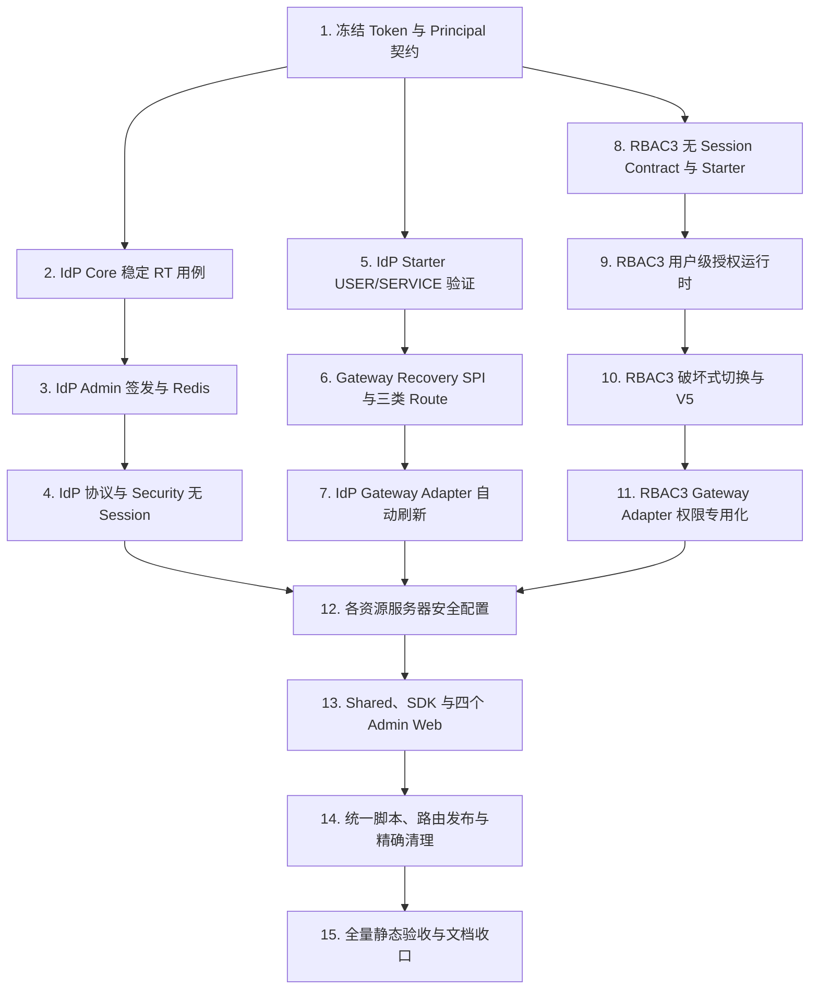

# Unified Identity Stateless JWT and Session Removal Implementation Plan

> **For agentic workers:** REQUIRED SUB-SKILL: Use superpowers:subagent-driven-development (recommended) or superpowers:executing-plans to implement this plan task-by-task. Steps use checkbox (`- [ ]`) syntax for tracking.

**Goal:** 将当前人员认证链破坏式切换为 IdP 唯一签发的 USER Access Token 与 Refresh Token，彻底删除人员 Session、Authorization Code、前端 Token Store 和 RBAC3 自签 Token；由 Gateway 统一接入并在 USER AT 缺失或过期时自动刷新，同时保留 RBAC3 用户级角色激活和细粒度授权。

**Architecture:** IdP Admin 是 USER AT、RT、SERVICE AT 和签名私钥的唯一权威；IdP Starter 提供 USER/SERVICE 两条明确的公钥验签策略，IdP Gateway Adapter 只把 Starter 的结果适配到 Gateway。Gateway 通过现有安全责任链在认证前增加受控 Credential Recovery，并用互斥 Route 类型区分公开协议、身份保护和业务保护。RBAC3 只保存 `(tenantId, identitySub)` 最小授权主体、用户级激活角色与权限投影，Starter 和 Gateway Adapter 都消费同一个 `systemCode + tenantId + identitySub` 授权快照。

**Tech Stack:** Java 21、Spring Boot 3.5.16、Spring Security JOSE、Reactor、PostgreSQL、Flyway 11.15、Redis/Redisson、Maven Wrapper、React 19、TypeScript 6、Vite 8、Vitest 4、Playwright、ShellCheck 兼容 POSIX/Zsh 脚本。

## Global Constraints

- 权威规格固定为 `docs/superpowers/specs/2026-08-13-unified-identity-stateless-jwt-session-removal-design.md`；本计划基线为 `main@b90f0c95`。
- 本计划整体取代 `docs/superpowers/plans/2026-08-02-unified-identity-platform.md` 中的 `sid`、`tokenVersion`、单 Resource USER Audience、Refresh Rotation、前端 Refresh、Gateway identity-only 和 Session Snapshot 步骤；禁止从旧计划继续执行这些冲突任务。
- 人员只有 USER Access Token 与 Refresh Token；机器只有 SERVICE Access Token且没有 RT。SERVICE AT 仍是 Access Token，不得增加第三种 Token。
- USER AT 固定 `exp = iat + 300s`，平台固定 Audience，只允许规格第 7.1 节 Claims；严禁 `sid/session_id/client_id/token_version/resource_version/roles/permissions` 等字段。
- RT 是稳定、不轮换、绝对过期的签名 JWT；Redis 只保存摘要、`sub/tid/exp/status` 和主体索引，任何存储、日志、DTO 或响应不得保存/返回明文 RT。
- 浏览器与外部 USER 请求全部经 Gateway，包括 IdP；PUBLIC_PROTOCOL IdP 上游可接收登录/Refresh/Revoke/Logout 所需的协议 Cookie，普通业务上游只能收到 USER AT，不能收到 RT Cookie、AT Cookie 或任何伪造的 `X-Egon-*` 身份头。
- Gateway 只在保护路由上对“AT 缺失或确认为过期”执行一次自动 Refresh；非法签名/Issuer/Audience/Type/格式、403、503、目标服务返回 401 均不触发 Refresh 或循环重试。
- IdP 登录、USER Refresh、Revoke、Logout、JWKS、Metadata 是精确公开协议 Route；Step-up/UserInfo 是身份保护 Route；Admin API 是业务保护 Route。
- IdP 与每个业务服务都使用 IdP Starter 本地二次验签；绕过 Gateway 时过期 AT直接 401，目标服务不读取 RT、不主动 Refresh。
- IdP 保留人员密码、账号状态和用户核心信息；RBAC3 不保存密码、用户名、展示名、锁定信息、外部身份映射或任何 USER/SERVICE Credential。
- RBAC3 保留 `ServicePrincipal + ServicePermission` 授权事实，但 SERVICE Credential、SERVICE AT签发和验证权威必须归 IdP。
- RBAC3 角色 Assignment 只形成候选；只有存入 `rbac3_user_active_role` 且仍有效的角色族进入权限上下文。登录、Refresh、AT过期、Gateway节点切换和跨客户端访问不能重置激活集合。
- USER 快照键固定为 `systemCode + tenantId + identitySub`；`authVersion/policyVersion` 可作为实体版本，但 Session、Token、Client 不得进入逻辑键。
- 高风险角色 Step-up 只使用 IdP 签名 USER AT 中的 `AuthenticationContext(acr, authTime)`；IdP 重签同一种 5分钟 AT，不创建 Session、不轮换 RT。
- `idp-rpc-contract` 不增加 JOSE/Spring Security/JWT实现；本期不创建 `component-jwt`。
- 不修改任何既有 Flyway migration。RBAC3 只新增一个下一版本 migration（当前应为 V5），IdP 只新增一个下一版本 migration（当前应为 V4）；若执行时版本序列已前进，必须使用当时的下一个版本，不能覆盖或重排旧文件。
- 数据切换允许破坏式丢弃本方案拥有的旧身份数据，但不得 `CASCADE`、不得清空共享数据库或 Redis DB。结构迁移遇到必须保留的 RBAC3 用户关联数据要 fail fast。
- 每个 Task 严格 RED -> GREEN -> REFACTOR -> 定向验证 -> 独立提交；不把无关工作树改动纳入提交。
- 本计划不启动任何后端、Gateway 或前端开发服务器；运行态联调由用户主动发起。计划内所有验证均为单元/集成测试、编译、静态扫描、构建或脚本语法检查。

## Design Pattern Decisions

- 保留并收敛现有 **Facade**：`TokenFacade` 编排登录后签发、刷新、撤销；`IdentityFacade` 负责当前用户密码校验。直接扩展现有门面比新增第二套 Issuer Service 更一致。
- 保留现有 **Adapter**：`idp-gateway-adapter` 适配 Starter 验证结果与 Gateway SPI；`rbac3-gateway-adapter` 只适配用户级权限快照。Adapter 中禁止复制 Nimbus/JWT Claim 规则。
- 扩展现有 **Chain of Responsibility**：Gateway 安全链在认证失败分类为 `MISSING/EXPIRED` 时调用单个 Recovery Provider，再重新认证一次。该变化是现有安全责任链的真实变体点，避免把 IdP HTTP调用硬编码进 Data Plane Handler。
- 使用互斥枚举表达 Route 状态，不引入 State Pattern；三类 Route 是稳定配置分类，直接枚举和编译期校验更清晰。
- 不新增通用 JWT Factory/Strategy/Component：当前只有 IdP 一个签发权威，算法、Issuer、Audience 和 Claim Policy 没有多个独立实现者，额外抽象会模糊安全边界。

## File Structure and Ownership

```text
egon-cola-platform-idp/
├── egon-cola-platform-idp-core/             # USER/SERVICE/RT 领域契约、TokenFacade、IdentityFacade
├── egon-cola-platform-idp-admin/            # 私钥签发、Redis RT、协议端点、IdP V4
├── egon-cola-platform-idp-starter/          # USER/SERVICE 公钥验签、Servlet 身份与请求级凭据载体
├── egon-cola-platform-idp-gateway-adapter/  # Cookie 提取、验证结果映射、内部 Refresh Client
└── egon-cola-platform-idp-rpc-contract/     # 保持纯 RPC/Proto，不放 JWT 实现

egon-cola-platform-gateway/
├── egon-cola-platform-gateway-core/         # Route 类型、认证失败分类、Credential Recovery SPI
└── egon-cola-platform-gateway-engine/       # 安全链恢复、同请求续跑、Set-Cookie 合并、规则编译

egon-cola-platform-rbac3/
├── egon-cola-platform-rbac3-contract/       # 无 Session 激活/快照契约
├── egon-cola-platform-rbac3-starter/        # USER 快照 Client/Cache/AuthorizationContext
├── egon-cola-platform-rbac3-gateway-adapter/# 仅 Gateway 权限授权，不再认证 USER Token
├── egon-cola-platform-rbac3-admin/          # 最小用户、用户激活角色、发布保护、V5、删除 auth/session
└── egon-cola-platform-rbac3-react-sdk/      # 无 Token/Session 的授权 SDK
```

## Task Dependency Order



---

### Task 1: Freeze Stateless USER Token, Refresh Token, and Principal Contracts

**Files:**

- Modify: `egon-cola-platforms/egon-cola-platform-idp/egon-cola-platform-idp-core/src/main/java/top/egon/cola/platform/idp/contract/IdpClaimNames.java`
- Modify: `egon-cola-platforms/egon-cola-platform-idp/egon-cola-platform-idp-core/src/main/java/top/egon/cola/platform/idp/contract/IdpPrincipal.java`
- Modify: `egon-cola-platforms/egon-cola-platform-idp/egon-cola-platform-idp-core/src/main/java/top/egon/cola/platform/idp/contract/IdentityPrincipal.java`
- Create: `egon-cola-platforms/egon-cola-platform-idp/egon-cola-platform-idp-core/src/main/java/top/egon/cola/platform/idp/contract/AuthenticationContext.java`
- Modify: `egon-cola-platforms/egon-cola-platform-idp/egon-cola-platform-idp-core/src/main/java/top/egon/cola/platform/idp/core/token/AccessTokenClaims.java`
- Modify: `egon-cola-platforms/egon-cola-platform-idp/egon-cola-platform-idp-core/src/main/java/top/egon/cola/platform/idp/core/token/RefreshTokenClaims.java`
- Modify: `egon-cola-platforms/egon-cola-platform-idp/egon-cola-platform-idp-core/src/main/java/top/egon/cola/platform/idp/core/port/TokenSigner.java`
- Modify: `egon-cola-platforms/egon-cola-platform-idp/egon-cola-platform-idp-core/src/test/java/top/egon/cola/platform/idp/contract/IdentityPrincipalTest.java`
- Create: `egon-cola-platforms/egon-cola-platform-idp/egon-cola-platform-idp-core/src/test/java/top/egon/cola/platform/idp/core/token/StatelessUserTokenContractTest.java`

**Target interfaces:**

```java
public record IdentityPrincipal(
        String subject,
        String tenantId,
        String tokenId,
        Set<String> audience,
        Instant issuedAt,
        Instant expiresAt,
        AuthenticationContext authenticationContext) implements IdpPrincipal {}

public record AuthenticationContext(String acr, Instant authTime) {
    public static AuthenticationContext password();
    public boolean satisfies(String requiredAcr, Duration maxAge, Instant now);
}

public record AccessTokenClaims(
        PrincipalType principalType,
        String subject,
        String tenantId,
        String tokenId,
        String audience,
        Instant issuedAt,
        Instant notBefore,
        Instant expiresAt,
        AuthenticationContext authenticationContext) {}

public record RefreshTokenClaims(
        String subject,
        String tenantId,
        String tokenId,
        Instant issuedAt,
        Instant notBefore,
        Instant expiresAt) {}
```

- [ ] **Step 1: Write failing allow-list tests**

Assert exact record component sets, `principal_type=USER`, fixed platform Audience, `exp-iat=300s`, `acr=PASSWORD` default, and optional STRONG `auth_time`. Assert the forbidden Claim/name list is absent from USER and RT types.

- [ ] **Step 2: Run the focused test and verify RED**

Run:

```bash
./mvnw -pl egon-cola-platforms/egon-cola-platform-idp/egon-cola-platform-idp-core -am \
  -Dtest=IdentityPrincipalTest,StatelessUserTokenContractTest \
  -Dsurefire.failIfNoSpecifiedTests=false test
```

Expected: failures show the current `sessionId/clientId/tokenVersion/resourceVersion/nonce/familyId/generation` components.

- [ ] **Step 3: Implement the smallest immutable contracts**

Remove forbidden USER/RT Claim constants only after all compile errors in this Task are fixed. Keep `ServiceAccessTokenClaims` resource-specific and unchanged except for shared constant references. Validate nonblank `sub/tid/jti`, exact instants, five-minute USER TTL and allowed authentication strength ordering `PASSWORD < MFA < STRONG`.

- [ ] **Step 4: Update `TokenSigner` method signatures without adding JWT implementation outside IdP**

Keep `signAccess(AccessTokenClaims)`, `signServiceAccess(ServiceAccessTokenClaims)`, `signRefresh(RefreshTokenClaims)` and `verifyRefresh(String)` as IdP core ports. Do not add signing methods to Starter, Gateway Adapter or RPC Contract.

- [ ] **Step 5: Run GREEN verification**

Run the focused command from Step 2, then:

```bash
./mvnw -pl egon-cola-platforms/egon-cola-platform-idp/egon-cola-platform-idp-core -am test
```

Expected: both commands succeed; SERVICE token tests remain green.

- [ ] **Step 6: Commit**

```bash
git add egon-cola-platforms/egon-cola-platform-idp/egon-cola-platform-idp-core
git commit -m "refactor(idp): freeze stateless user token contracts"
```

---

### Task 2: Replace Authorization-Code and Rotation Semantics in IdP Core

**Files:**

- Modify: `egon-cola-platforms/egon-cola-platform-idp/egon-cola-platform-idp-core/src/main/java/top/egon/cola/platform/idp/core/token/TokenFacade.java`
- Modify: `egon-cola-platforms/egon-cola-platform-idp/egon-cola-platform-idp-core/src/main/java/top/egon/cola/platform/idp/core/port/RefreshTokenStore.java`
- Delete: `egon-cola-platforms/egon-cola-platform-idp/egon-cola-platform-idp-core/src/main/java/top/egon/cola/platform/idp/core/token/RefreshFamily.java`
- Delete: `egon-cola-platforms/egon-cola-platform-idp/egon-cola-platform-idp-core/src/main/java/top/egon/cola/platform/idp/core/token/RefreshReplayException.java`
- Delete: `egon-cola-platforms/egon-cola-platform-idp/egon-cola-platform-idp-core/src/main/java/top/egon/cola/platform/idp/core/oauth/AuthorizationCode.java`
- Delete: `egon-cola-platforms/egon-cola-platform-idp/egon-cola-platform-idp-core/src/main/java/top/egon/cola/platform/idp/core/oauth/AuthorizationFacade.java`
- Delete: `egon-cola-platforms/egon-cola-platform-idp/egon-cola-platform-idp-core/src/main/java/top/egon/cola/platform/idp/core/oauth/AuthorizationRequest.java`
- Delete: `egon-cola-platforms/egon-cola-platform-idp/egon-cola-platform-idp-core/src/main/java/top/egon/cola/platform/idp/core/port/AuthorizationCodeStore.java`
- Modify: `egon-cola-platforms/egon-cola-platform-idp/egon-cola-platform-idp-core/src/main/java/top/egon/cola/platform/idp/core/identity/AuthenticatedIdentity.java`
- Modify: `egon-cola-platforms/egon-cola-platform-idp/egon-cola-platform-idp-core/src/main/java/top/egon/cola/platform/idp/core/identity/IdentityFacade.java`
- Modify: `egon-cola-platforms/egon-cola-platform-idp/egon-cola-platform-idp-core/src/main/java/top/egon/cola/platform/idp/core/identity/IdentityUser.java`
- Modify: `egon-cola-platforms/egon-cola-platform-idp/egon-cola-platform-idp-core/src/main/java/top/egon/cola/platform/idp/core/port/TenantMembershipPort.java`
- Modify: `egon-cola-platforms/egon-cola-platform-idp/egon-cola-platform-idp-core/src/test/java/top/egon/cola/platform/idp/core/token/TokenFacadeTest.java`
- Delete: `egon-cola-platforms/egon-cola-platform-idp/egon-cola-platform-idp-core/src/test/java/top/egon/cola/platform/idp/core/oauth/AuthorizationFacadeTest.java`
- Create: `egon-cola-platforms/egon-cola-platform-idp/egon-cola-platform-idp-core/src/test/java/top/egon/cola/platform/idp/core/token/StableRefreshTokenTest.java`
- Create: `egon-cola-platforms/egon-cola-platform-idp/egon-cola-platform-idp-core/src/test/java/top/egon/cola/platform/idp/core/identity/CurrentIdentityStepUpTest.java`

**Target interfaces:**

```java
public interface RefreshTokenStore {
    void create(RefreshTokenRecord record);
    Optional<RefreshTokenRecord> findValid(String tokenDigest, Instant now);
    void revokeToken(String tokenDigest, String reason, Instant now);
    void revokeSubject(String identitySub, String reason, Instant now);
    void expire(Instant now);
}

public record RefreshTokenRecord(
        String tokenDigest, String identitySub, String tenantId,
        Instant issuedAt, Instant expiresAt, Status status) {}

public record UserTokenPair(
        String accessToken, String refreshToken,
        Instant accessExpiresAt, Instant refreshExpiresAt) {}
```

- [ ] **Step 1: Replace old core tests with failing target behavior**

Cover direct issue from `AuthenticatedIdentity + tenantId`, stable refresh returning the same RT string and `exp`, concurrent refresh acceptance, refresh membership recheck, `revokeToken`, `revokeSubject`, five-minute AT, PASSWORD refresh context, and STRONG step-up using only current `sub/tid + password`. The raw token pair is an in-process issuer result used only to construct HttpOnly cookies; it must redact `toString()` and must never be serialized by a Controller.

- [ ] **Step 2: Run tests and verify RED**

```bash
./mvnw -pl egon-cola-platforms/egon-cola-platform-idp/egon-cola-platform-idp-core -am \
  -Dtest=TokenFacadeTest,StableRefreshTokenTest,CurrentIdentityStepUpTest \
  -Dsurefire.failIfNoSpecifiedTests=false test
```

Expected: old rotation, client/resource and authorization-code APIs cannot satisfy the tests.

- [ ] **Step 3: Rewrite `RefreshTokenStore` and `TokenFacade`**

Implement `issue(AuthenticatedIdentity, tenantId, refreshTtl)`, `refresh(rawRefreshToken)`, `revoke(rawRefreshToken)` and `revokeSubject(identitySub)`. A Refresh validates signature, digest record, exact `sub/tid/exp`, IdP user status and RBAC membership, then signs only a new AT. It must not create a successor RT, Family, generation or replay revocation branch.

- [ ] **Step 4: Move current-user password verification into `IdentityFacade`**

Add `authenticateCurrent(identitySub, rawPassword)` using the existing password hash, account status, failed-attempt, hash-upgrade and audit behavior. Do not accept username/tenant from the Step-up caller. Remove `tokenVersion` from `AuthenticatedIdentity` and `IdentityUser`; password changes and revoke-all call `RefreshTokenStore.revokeSubject` instead of incrementing a JWT version.

- [ ] **Step 5: Simplify membership contracts**

Change USER methods to `resolve(identitySub, tenantId)` and `list(identitySub)`. Do not change SERVICE Client/Resource contracts. Delete Authorization Code core types after their consumers are removed in the same commit.

- [ ] **Step 6: Run GREEN verification and scan**

```bash
./mvnw -pl egon-cola-platforms/egon-cola-platform-idp/egon-cola-platform-idp-core -am test
! rg -n "RefreshFamily|RotationCommand|generation\(|sessionId\(|tokenVersion\(|AuthorizationCode" \
  egon-cola-platforms/egon-cola-platform-idp/egon-cola-platform-idp-core/src/main/java
```

- [ ] **Step 7: Commit**

```bash
git add -A egon-cola-platforms/egon-cola-platform-idp/egon-cola-platform-idp-core
git commit -m "refactor(idp): replace session token lifecycle with stable refresh"
```

---

### Task 3: Implement IdP Admin Signing, Stable Refresh Redis State, and IdP V4

**Files:**

- Modify: `egon-cola-platforms/egon-cola-platform-idp/egon-cola-platform-idp-admin/src/main/java/top/egon/cola/platform/idp/admin/token/service/impl/Rs256TokenService.java`
- Modify: `egon-cola-platforms/egon-cola-platform-idp/egon-cola-platform-idp-admin/src/main/java/top/egon/cola/platform/idp/admin/token/repo/RedisRefreshTokenStore.java`
- Delete: `egon-cola-platforms/egon-cola-platform-idp/egon-cola-platform-idp-admin/src/main/resources/redis/rotate-refresh-token.lua`
- Create: `egon-cola-platforms/egon-cola-platform-idp/egon-cola-platform-idp-admin/src/main/resources/redis/manage-refresh-token.lua`
- Modify: `egon-cola-platforms/egon-cola-platform-idp/egon-cola-platform-idp-admin/src/main/java/top/egon/cola/platform/idp/admin/token/config/TokenConfig.java`
- Modify: `egon-cola-platforms/egon-cola-platform-idp/egon-cola-platform-idp-admin/src/main/java/top/egon/cola/platform/idp/admin/identity/domain/pojo/IdentityUserEntity.java`
- Modify: `egon-cola-platforms/egon-cola-platform-idp/egon-cola-platform-idp-admin/src/main/java/top/egon/cola/platform/idp/admin/identity/domain/vo/IdentityUserVO.java`
- Modify: `egon-cola-platforms/egon-cola-platform-idp/egon-cola-platform-idp-admin/src/main/java/top/egon/cola/platform/idp/admin/identity/domain/vo/ResetPasswordVO.java`
- Modify: `egon-cola-platforms/egon-cola-platform-idp/egon-cola-platform-idp-admin/src/main/java/top/egon/cola/platform/idp/admin/identity/service/impl/IdentityUserServiceImpl.java`
- Modify: `egon-cola-platforms/egon-cola-platform-idp/egon-cola-platform-idp-admin/src/main/java/top/egon/cola/platform/idp/admin/identity/service/impl/IdentityUserStateServiceImpl.java`
- Modify: `egon-cola-platforms/egon-cola-platform-idp/egon-cola-platform-idp-admin/src/main/java/top/egon/cola/platform/idp/admin/support/outbox/service/IdentityOutboxPublisher.java`
- Modify: `egon-cola-platforms/egon-cola-platform-idp/egon-cola-platform-idp-admin/src/main/java/top/egon/cola/platform/idp/admin/support/security/IdpJwtAuthenticationConverter.java`
- Create: `egon-cola-platforms/egon-cola-platform-idp/egon-cola-platform-idp-admin/src/main/resources/db/migration/V4__remove_user_token_version.sql`
- Modify: `egon-cola-platforms/egon-cola-platform-idp/egon-cola-platform-idp-admin/src/test/java/top/egon/cola/platform/idp/admin/token/service/impl/AccessTokenClaimsIT.java`
- Delete: `egon-cola-platforms/egon-cola-platform-idp/egon-cola-platform-idp-admin/src/test/java/top/egon/cola/platform/idp/admin/token/repo/RefreshRotationIT.java`
- Delete: `egon-cola-platforms/egon-cola-platform-idp/egon-cola-platform-idp-admin/src/test/java/top/egon/cola/platform/idp/admin/token/repo/RedisRefreshRotationLiveIT.java`
- Create: `egon-cola-platforms/egon-cola-platform-idp/egon-cola-platform-idp-admin/src/test/java/top/egon/cola/platform/idp/admin/token/repo/RedisStableRefreshTokenStoreTest.java`
- Modify: `egon-cola-platforms/egon-cola-platform-idp/egon-cola-platform-idp-admin/src/test/java/top/egon/cola/platform/idp/admin/support/migration/IdpMigrationIT.java`

- [ ] **Step 1: Write failing signer and Redis tests**

Decode signed USER AT and assert exact Header/Claims, fixed platform Audience and five-minute TTL. Decode RT and assert exact allow-list. Test Lua-backed `CREATE/FIND/REVOKE_TOKEN/REVOKE_SUBJECT/EXPIRE`, exact subject index cleanup and idempotent revoke; assert Redis values never contain raw RT.

- [ ] **Step 2: Verify RED**

```bash
./mvnw -pl egon-cola-platforms/egon-cola-platform-idp/egon-cola-platform-idp-admin -am \
  -Dtest=AccessTokenClaimsIT,RedisStableRefreshTokenStoreTest,IdpMigrationIT \
  -Dsurefire.failIfNoSpecifiedTests=false test
```

- [ ] **Step 3: Adapt the sole issuer**

Make `Rs256TokenService` the only USER AT/RT/SERVICE AT signer. Keep `alg=RS256`, AT `typ=at+jwt`, RT `typ=JWT` + `token_use=refresh`, and existing JWKS key lifecycle. Do not create a second signer in Starter/Gateway/RPC.

- [ ] **Step 4: Replace rotation Lua with stable-token operations**

Use exact keys `identity:<version>:refresh:<digest>` and `identity:<version>:refresh-index:user:<sub>` as configured by `TokenConfig`. Lua must operate only on passed keys, preserve absolute TTL and remove stale subject-set members. No `KEYS`, `SCAN`, DB flush, Family or generation fields.

- [ ] **Step 5: Add exactly one IdP migration**

`V4__remove_user_token_version.sql` must only drop the `identity_user.token_version` check/default/column and any index that directly depends on it. Keep password credential, Client, Resource Server, Signing Key, Audit and Outbox tables unchanged. Update JPA/domain mapping in the same commit.

- [ ] **Step 6: Run GREEN verification**

```bash
./mvnw -pl egon-cola-platforms/egon-cola-platform-idp/egon-cola-platform-idp-admin -am test
test "$(find egon-cola-platforms/egon-cola-platform-idp/egon-cola-platform-idp-admin/src/main/resources/db/migration -name 'V4__*.sql' | wc -l | tr -d ' ')" = "1"
! rg -n "rotate-refresh-token|RefreshFamily|generation|token_version" \
  egon-cola-platforms/egon-cola-platform-idp/egon-cola-platform-idp-admin/src/main \
  --glob '!db/migration/V1__create_idp_schema.sql'
```

- [ ] **Step 7: Commit**

```bash
git add -A egon-cola-platforms/egon-cola-platform-idp/egon-cola-platform-idp-admin
git commit -m "refactor(idp): persist stable refresh token state"
```

---

### Task 4: Replace IdP SSO and Authorization Code with Direct Cookie Protocol Endpoints

**Files:**

- Modify: `egon-cola-platforms/egon-cola-platform-idp/egon-cola-platform-idp-admin/src/main/java/top/egon/cola/platform/idp/admin/oauth/controller/OAuthLoginController.java`
- Modify: `egon-cola-platforms/egon-cola-platform-idp/egon-cola-platform-idp-admin/src/main/java/top/egon/cola/platform/idp/admin/oauth/controller/OAuthTokenController.java`
- Modify: `egon-cola-platforms/egon-cola-platform-idp/egon-cola-platform-idp-admin/src/main/java/top/egon/cola/platform/idp/admin/oauth/controller/OAuthUserInfoController.java`
- Modify: `egon-cola-platforms/egon-cola-platform-idp/egon-cola-platform-idp-admin/src/main/java/top/egon/cola/platform/idp/admin/oauth/controller/OAuthMetadataController.java`
- Create: `egon-cola-platforms/egon-cola-platform-idp/egon-cola-platform-idp-admin/src/main/java/top/egon/cola/platform/idp/admin/oauth/controller/OAuthStepUpController.java`
- Delete: `egon-cola-platforms/egon-cola-platform-idp/egon-cola-platform-idp-admin/src/main/java/top/egon/cola/platform/idp/admin/oauth/controller/OAuthAuthorizationController.java`
- Modify: `egon-cola-platforms/egon-cola-platform-idp/egon-cola-platform-idp-admin/src/main/java/top/egon/cola/platform/idp/admin/oauth/domain/dto/OAuthLoginDTO.java`
- Create: `egon-cola-platforms/egon-cola-platform-idp/egon-cola-platform-idp-admin/src/main/java/top/egon/cola/platform/idp/admin/oauth/domain/dto/OAuthStepUpDTO.java`
- Modify: `egon-cola-platforms/egon-cola-platform-idp/egon-cola-platform-idp-admin/src/main/java/top/egon/cola/platform/idp/admin/oauth/domain/vo/OAuthLoginVO.java`
- Modify: `egon-cola-platforms/egon-cola-platform-idp/egon-cola-platform-idp-admin/src/main/java/top/egon/cola/platform/idp/admin/oauth/domain/vo/OAuthUserInfoVO.java`
- Create: `egon-cola-platforms/egon-cola-platform-idp/egon-cola-platform-idp-admin/src/main/java/top/egon/cola/platform/idp/admin/oauth/domain/vo/OAuthUserTokenResultVO.java`
- Delete: `egon-cola-platforms/egon-cola-platform-idp/egon-cola-platform-idp-admin/src/main/java/top/egon/cola/platform/idp/admin/oauth/domain/pojo/OAuthSsoSession.java`
- Delete: `egon-cola-platforms/egon-cola-platform-idp/egon-cola-platform-idp-admin/src/main/java/top/egon/cola/platform/idp/admin/oauth/repo/IdpSsoSessionStore.java`
- Delete: `egon-cola-platforms/egon-cola-platform-idp/egon-cola-platform-idp-admin/src/main/java/top/egon/cola/platform/idp/admin/oauth/repo/RedisAuthorizationCodeStore.java`
- Modify: `egon-cola-platforms/egon-cola-platform-idp/egon-cola-platform-idp-admin/src/main/java/top/egon/cola/platform/idp/admin/oauth/config/OAuthConfig.java`
- Delete: `egon-cola-platforms/egon-cola-platform-idp/egon-cola-platform-idp-admin/src/main/java/top/egon/cola/platform/idp/admin/support/security/IdpSsoAuthenticationFilter.java`
- Delete: `egon-cola-platforms/egon-cola-platform-idp/egon-cola-platform-idp-admin/src/main/java/top/egon/cola/platform/idp/admin/support/security/IdpSsoPrincipal.java`
- Delete: `egon-cola-platforms/egon-cola-platform-idp/egon-cola-platform-idp-admin/src/main/java/top/egon/cola/platform/idp/admin/support/security/IdpAuthorizationAuthenticationEntryPoint.java`
- Modify: `egon-cola-platforms/egon-cola-platform-idp/egon-cola-platform-idp-admin/src/main/java/top/egon/cola/platform/idp/admin/support/security/IdpSecurityConfig.java`
- Modify: `egon-cola-platforms/egon-cola-platform-idp/egon-cola-platform-idp-admin/src/main/resources/application.yml`
- Modify: `egon-cola-platforms/egon-cola-platform-idp/egon-cola-platform-idp-admin/src/main/resources/application-local.yml`
- Delete: `egon-cola-platforms/egon-cola-platform-idp/egon-cola-platform-idp-admin/src/test/java/top/egon/cola/platform/idp/admin/oauth/controller/OAuthAuthorizationFlowIT.java`
- Delete: `egon-cola-platforms/egon-cola-platform-idp/egon-cola-platform-idp-admin/src/test/java/top/egon/cola/platform/idp/admin/oauth/repo/IdpSsoSessionStoreTest.java`
- Modify: `egon-cola-platforms/egon-cola-platform-idp/egon-cola-platform-idp-admin/src/test/java/top/egon/cola/platform/idp/admin/oauth/controller/OAuthLoginControllerIT.java`
- Modify: `egon-cola-platforms/egon-cola-platform-idp/egon-cola-platform-idp-admin/src/test/java/top/egon/cola/platform/idp/admin/oauth/controller/OAuthTokenTransportIT.java`
- Modify: `egon-cola-platforms/egon-cola-platform-idp/egon-cola-platform-idp-admin/src/test/java/top/egon/cola/platform/idp/admin/oauth/controller/OAuthResourceSecurityMatrixIT.java`
- Modify: `egon-cola-platforms/egon-cola-platform-idp/egon-cola-platform-idp-admin/src/test/java/top/egon/cola/platform/idp/admin/support/security/IdpAdminSecurityIT.java`
- Create: `egon-cola-platforms/egon-cola-platform-idp/egon-cola-platform-idp-admin/src/test/java/top/egon/cola/platform/idp/admin/oauth/controller/OAuthStepUpControllerIT.java`

**Protocol contract:**

| Endpoint | Input | Success output | Security |
|---|---|---|---|
| `GET /oauth2/login/csrf` | none | readable CSRF value + CSRF cookie | PUBLIC |
| `POST /oauth2/login` | `tenantId, username, password` + CSRF | `__Host-egon_user_at`, `__Host-egon_user_rt`; non-secret body | PUBLIC |
| `POST /oauth2/token` USER | only `grant_type=refresh_token` + RT cookie | replacement AT cookie; non-secret body | PUBLIC, no recovery |
| `POST /oauth2/token` SERVICE | existing Client Assertion fields | existing SERVICE Bearer JSON | PUBLIC, no recovery |
| `POST /oauth2/revoke` | current RT cookie | expire RT cookie, idempotent 204 | PUBLIC |
| `POST /oauth2/logout` | current RT cookie | expire both cookies, idempotent 204 | PUBLIC |
| `POST /oauth2/step-up` | current USER AT + password | replacement STRONG AT cookie | IDENTITY_PROTECTED |
| `GET /oauth2/userinfo` | current USER AT | non-secret verified claims | IDENTITY_PROTECTED |

- [ ] **Step 1: Write the failing transport/security matrix**

Cover wrong password 401/no cookies, missing membership 403, unavailable membership 503, successful two-cookie login, stable RT refresh, invalid USER form fields, logout with expired AT, Step-up subject binding, UserInfo no RBAC business permission, IdP Admin 401/403 split, and absence of SSO/auth-code Redis writes.

- [ ] **Step 2: Run RED verification**

```bash
./mvnw -pl egon-cola-platforms/egon-cola-platform-idp/egon-cola-platform-idp-admin -am \
  -Dtest=OAuthLoginControllerIT,OAuthTokenTransportIT,OAuthResourceSecurityMatrixIT,OAuthStepUpControllerIT,IdpAdminSecurityIT \
  -Dsurefire.failIfNoSpecifiedTests=false test
```

- [ ] **Step 3: Make login issue the pair directly**

Authenticate the IdP user, check RBAC tenant membership, then call `TokenFacade.issue`. Production/HTTPS uses `__Host-egon_user_at` and `__Host-egon_user_rt` with `HttpOnly; Secure; SameSite=Lax; Path=/` and no Domain; the local HTTP profile uses exactly `egon_user_at_local` and `egon_user_rt_local` with `Secure=false`, never an invalid `__Host-` cookie. The AT max age is 300 seconds; RT max age matches absolute RT expiry. Expire the existing CSRF cookie after use. No Controller method returns `UserTokenPair` or a raw token property in its body.

- [ ] **Step 4: Split USER refresh from existing SERVICE token response**

USER refresh rejects `client_id/resource/audience/refresh_token` form parameters, reads RT only from the unified cookie, and returns no raw token in body/header. SERVICE `client_credentials` retains Client Assertion, resource, tenant and scope validation and may continue returning the SERVICE AT JSON to the machine caller.

- [ ] **Step 5: Implement idempotent revoke/logout and bound Step-up**

Revoke removes only the current RT. Logout does the same and expires both cookies even if RT is unknown or AT is expired. Global administrative revoke remains an IdP Admin API that calls `revokeSubject`. Step-up derives `sub/tid` from `@AuthenticationPrincipal`, accepts only password, and sets a new STRONG AT cookie without touching RT.

- [ ] **Step 6: Delete SSO and Authorization Code runtime**

Remove the Controller, Store, Principal, Filter, EntryPoint, OAuthConfig beans and metadata fields for authorization-code/PKCE. Preserve OAuth Client/Redirect tables and Admin management only where still required by SERVICE/client management; do not delete SERVICE Client Credentials capability.

- [ ] **Step 7: Keep IdP Admin stateless and protected**

`IdpSecurityConfig` must keep `SessionCreationPolicy.STATELESS`, permit only exact public protocol endpoints, authenticate Step-up/UserInfo without RBAC business permission, and require both USER authentication plus RBAC3 `idp:*` checks for `/api/**`. Keep IdP filter before RBAC3 filter.

- [ ] **Step 8: Run GREEN and structural verification**

```bash
./mvnw -pl egon-cola-platforms/egon-cola-platform-idp/egon-cola-platform-idp-admin -am test
! rg -n "IdpSso|OAuthAuthorizationController|AuthorizationCode|authorization_code|code_verifier|REFRESH_COOKIE_PREFIX|EGON_IDP_REFRESH_" \
  egon-cola-platforms/egon-cola-platform-idp/egon-cola-platform-idp-admin/src/main
```

- [ ] **Step 9: Commit**

```bash
git add -A egon-cola-platforms/egon-cola-platform-idp/egon-cola-platform-idp-admin
git commit -m "refactor(idp): replace sso session with direct jwt cookies"
```

---

### Task 5: Split IdP Starter into Stateless USER and Stateful SERVICE Verification

**Files:**

- Modify: `egon-cola-platforms/egon-cola-platform-idp/egon-cola-platform-idp-starter/src/main/java/top/egon/cola/platform/idp/starter/security/IdpJwtVerifier.java`
- Create: `egon-cola-platforms/egon-cola-platform-idp/egon-cola-platform-idp-starter/src/main/java/top/egon/cola/platform/idp/starter/security/UserAccessTokenVerifier.java`
- Create: `egon-cola-platforms/egon-cola-platform-idp/egon-cola-platform-idp-starter/src/main/java/top/egon/cola/platform/idp/starter/security/ServiceAccessTokenVerifier.java`
- Create: `egon-cola-platforms/egon-cola-platform-idp/egon-cola-platform-idp-starter/src/main/java/top/egon/cola/platform/idp/starter/security/AccessTokenVerification.java`
- Create: `egon-cola-platforms/egon-cola-platform-idp/egon-cola-platform-idp-starter/src/main/java/top/egon/cola/platform/idp/starter/security/IdpEndpointAuthenticationPolicy.java`
- Modify: `egon-cola-platforms/egon-cola-platform-idp/egon-cola-platform-idp-starter/src/main/java/top/egon/cola/platform/idp/starter/security/IdpBearerAuthenticationFilter.java`
- Create: `egon-cola-platforms/egon-cola-platform-idp/egon-cola-platform-idp-starter/src/main/java/top/egon/cola/platform/idp/starter/security/VerifiedUserTokenCarrier.java`
- Modify: `egon-cola-platforms/egon-cola-platform-idp/egon-cola-platform-idp-starter/src/main/java/top/egon/cola/platform/idp/starter/security/IdpAuthenticationToken.java`
- Modify: `egon-cola-platforms/egon-cola-platform-idp/egon-cola-platform-idp-starter/src/main/java/top/egon/cola/platform/idp/starter/autoconfigure/IdpStarterProperties.java`
- Modify: `egon-cola-platforms/egon-cola-platform-idp/egon-cola-platform-idp-starter/src/main/java/top/egon/cola/platform/idp/starter/autoconfigure/IdpStarterAutoConfiguration.java`
- Delete: `egon-cola-platforms/egon-cola-platform-idp/egon-cola-platform-idp-starter/src/main/java/top/egon/cola/platform/idp/starter/state/IdentityUserStateReader.java`
- Delete: `egon-cola-platforms/egon-cola-platform-idp/egon-cola-platform-idp-starter/src/main/java/top/egon/cola/platform/idp/starter/state/RedisIdentityUserStateReader.java`
- Modify: `egon-cola-platforms/egon-cola-platform-idp/egon-cola-platform-idp-starter/src/test/java/top/egon/cola/platform/idp/starter/security/IdpJwtVerifierTest.java`
- Modify: `egon-cola-platforms/egon-cola-platform-idp/egon-cola-platform-idp-starter/src/test/java/top/egon/cola/platform/idp/starter/security/IdpBearerAuthenticationFilterTest.java`
- Modify: `egon-cola-platforms/egon-cola-platform-idp/egon-cola-platform-idp-starter/src/test/java/top/egon/cola/platform/idp/starter/autoconfigure/IdpStarterAutoConfigurationTest.java`
- Delete: `egon-cola-platforms/egon-cola-platform-idp/egon-cola-platform-idp-starter/src/test/java/top/egon/cola/platform/idp/starter/state/RedisIdentityUserStateReaderTest.java`
- Create: `egon-cola-platforms/egon-cola-platform-idp/egon-cola-platform-idp-starter/src/test/java/top/egon/cola/platform/idp/starter/security/UserAccessTokenVerifierTest.java`
- Create: `egon-cola-platforms/egon-cola-platform-idp/egon-cola-platform-idp-starter/src/test/java/top/egon/cola/platform/idp/starter/security/VerifiedUserTokenCarrierTest.java`

**Target verification API:**

```java
public interface IdpJwtVerifier {
    AccessTokenVerification<IdentityPrincipal> verifyUser(String token);
    AccessTokenVerification<ServiceIdentityPrincipal> verifyService(String token);
}

public sealed interface AccessTokenVerification<T extends IdpPrincipal> {
    record Valid<T extends IdpPrincipal>(T principal) implements AccessTokenVerification<T> {}
    record Expired<T extends IdpPrincipal>() implements AccessTokenVerification<T> {}
    record Invalid<T extends IdpPrincipal>(String reasonCode) implements AccessTokenVerification<T> {}
}
```

- [ ] **Step 1: Write failing USER/SERVICE separation tests**

USER tests must pass when all Redis state readers are unavailable and must reject SERVICE/RT/Admission types, wrong platform Audience, wrong issuer, missing required claims, forbidden claims, invalid `acr/auth_time` and expired token as `Expired`. SERVICE tests retain exact Resource Audience, Resource state, Client state and scope validation.

- [ ] **Step 2: Verify RED**

```bash
./mvnw -pl egon-cola-platforms/egon-cola-platform-idp/egon-cola-platform-idp-starter -am \
  -Dtest=IdpJwtVerifierTest,UserAccessTokenVerifierTest,IdpBearerAuthenticationFilterTest,VerifiedUserTokenCarrierTest \
  -Dsurefire.failIfNoSpecifiedTests=false test
```

- [ ] **Step 3: Extract two explicit verifier strategies**

Both strategies reuse `RetryingJwtDecoder` and common JWS header/time parsing. USER takes `issuer + platformAudience + Clock` only and performs no Redis lookup. SERVICE keeps `resourceServerId/resourceUri`, `IdentityResourceServerStateReader` and `IdentityOAuthClientStateReader`. Do not silently fall back from one principal type to the other.

- [ ] **Step 4: Make endpoint policy choose the verifier**

`IdpEndpointAuthenticationPolicy` must explicitly return USER or SERVICE for a protected path. Default application APIs are USER; internal service-only paths are configured explicitly by the owning service. Missing policy on a protected endpoint fails closed. The filter maps Valid to Spring Security, Expired/Invalid to stable 401 codes, and leaves absent credentials to the owning SecurityFilterChain.

- [ ] **Step 5: Add a request-scoped raw USER token carrier**

The filter puts the already-verified raw USER AT in one Servlet request attribute for the current call and clears it in `finally`. `IdentityPrincipal` and `IdpAuthenticationToken` never contain it. `VerifiedUserTokenCarrier.current(request)` is the only Starter API consumed later by RBAC3 Starter; its `toString` and errors must redact the value.

- [ ] **Step 6: Remove USER realtime state**

Delete user-state reader beans/properties and calls. Preserve Resource/Client state readers for SERVICE only. Keep `PrivateKeyJwtAssertionFactory` exclusively for client assertion/admission.

- [ ] **Step 7: Run GREEN and dependency boundary checks**

```bash
./mvnw -pl egon-cola-platforms/egon-cola-platform-idp/egon-cola-platform-idp-starter -am test
! rg -n "IdentityUserStateReader|tokenVersion|sessionId" \
  egon-cola-platforms/egon-cola-platform-idp/egon-cola-platform-idp-starter/src/main/java
! rg -n "nimbus|spring-security|oauth2-jose|JwtDecoder|TokenSigner" \
  egon-cola-platforms/egon-cola-platform-idp/egon-cola-platform-idp-rpc-contract/pom.xml \
  egon-cola-platforms/egon-cola-platform-idp/egon-cola-platform-idp-rpc-contract/src/main
```

- [ ] **Step 8: Commit**

```bash
git add -A egon-cola-platforms/egon-cola-platform-idp/egon-cola-platform-idp-starter
git commit -m "refactor(idp): split user and service token verification"
```

---

### Task 6: Add Gateway Route Classes and Credential Recovery to the Existing Security Chain

**Files:**

- Create: `egon-cola-platforms/egon-cola-platform-gateway/egon-cola-platform-gateway-core/src/main/java/top/egon/cola/component/gateway/core/security/GatewayRouteSecurityType.java`
- Create: `egon-cola-platforms/egon-cola-platform-gateway/egon-cola-platform-gateway-core/src/main/java/top/egon/cola/component/gateway/core/security/AuthenticationFailure.java`
- Modify: `egon-cola-platforms/egon-cola-platform-gateway/egon-cola-platform-gateway-core/src/main/java/top/egon/cola/component/gateway/core/security/AuthenticationDecision.java`
- Modify: `egon-cola-platforms/egon-cola-platform-gateway/egon-cola-platform-gateway-core/src/main/java/top/egon/cola/component/gateway/core/security/GatewayCredentialExtractor.java`
- Create: `egon-cola-platforms/egon-cola-platform-gateway/egon-cola-platform-gateway-core/src/main/java/top/egon/cola/component/gateway/core/security/GatewayCredentialRecoveryProvider.java`
- Create: `egon-cola-platforms/egon-cola-platform-gateway/egon-cola-platform-gateway-core/src/main/java/top/egon/cola/component/gateway/core/security/CredentialRecoveryResult.java`
- Modify: `egon-cola-platforms/egon-cola-platform-gateway/egon-cola-platform-gateway-core/src/main/java/top/egon/cola/component/gateway/core/security/GatewaySecurityPolicy.java`
- Modify: `egon-cola-platforms/egon-cola-platform-gateway/egon-cola-platform-gateway-core/src/test/java/top/egon/cola/component/gateway/core/security/GatewaySecurityContractsTest.java`
- Modify: `egon-cola-platforms/egon-cola-platform-gateway/egon-cola-platform-gateway-core/src/test/java/top/egon/cola/component/gateway/core/security/GatewaySecurityPolicyTest.java`
- Modify: `egon-cola-platforms/egon-cola-platform-gateway/egon-cola-platform-gateway-engine/src/main/java/top/egon/cola/component/gateway/engine/security/GatewaySecurityCapabilityRegistry.java`
- Modify: `egon-cola-platforms/egon-cola-platform-gateway/egon-cola-platform-gateway-engine/src/main/java/top/egon/cola/component/gateway/engine/security/GatewaySecurityChain.java`
- Modify: `egon-cola-platforms/egon-cola-platform-gateway/egon-cola-platform-gateway-engine/src/main/java/top/egon/cola/component/gateway/engine/security/GatewaySecurityResult.java`
- Modify: `egon-cola-platforms/egon-cola-platform-gateway/egon-cola-platform-gateway-engine/src/main/java/top/egon/cola/component/gateway/engine/security/GatewaySecurityPolicyCompiler.java`
- Modify: `egon-cola-platforms/egon-cola-platform-gateway/egon-cola-platform-gateway-engine/src/main/java/top/egon/cola/component/gateway/engine/mcp/McpGatewayIdentityAuthenticator.java`
- Modify: `egon-cola-platforms/egon-cola-platform-gateway/egon-cola-platform-gateway-engine/src/main/java/top/egon/cola/component/gateway/engine/http/GatewayHttpSecurityProcessor.java`
- Modify: `egon-cola-platforms/egon-cola-platform-gateway/egon-cola-platform-gateway-engine/src/main/java/top/egon/cola/component/gateway/engine/http/RuleBackedHttpGatewaySecurityProcessor.java`
- Modify: `egon-cola-platforms/egon-cola-platform-gateway/egon-cola-platform-gateway-engine/src/main/java/top/egon/cola/component/gateway/engine/http/DefaultGatewayHttpDataPlaneHandler.java`
- Modify: `egon-cola-platforms/egon-cola-platform-gateway/egon-cola-platform-gateway-engine/src/test/java/top/egon/cola/component/gateway/engine/security/GatewaySecurityChainTest.java`
- Modify: `egon-cola-platforms/egon-cola-platform-gateway/egon-cola-platform-gateway-engine/src/test/java/top/egon/cola/component/gateway/engine/security/GatewaySecurityCapabilityRegistryTest.java`
- Modify: `egon-cola-platforms/egon-cola-platform-gateway/egon-cola-platform-gateway-engine/src/test/java/top/egon/cola/component/gateway/engine/security/GatewaySecurityPolicyCompilerTest.java`
- Modify: `egon-cola-platforms/egon-cola-platform-gateway/egon-cola-platform-gateway-engine/src/test/java/top/egon/cola/component/gateway/engine/security/GatewayOriginalBearerForwardingTest.java`
- Modify: `egon-cola-platforms/egon-cola-platform-gateway/egon-cola-platform-gateway-engine/src/test/java/top/egon/cola/component/gateway/engine/security/GatewayIdentityOnlySecurityTest.java`
- Modify: `egon-cola-platforms/egon-cola-platform-gateway/egon-cola-platform-gateway-engine/src/test/java/top/egon/cola/component/gateway/engine/http/RuleBackedHttpGatewaySecurityProcessorTest.java`
- Create: `egon-cola-platforms/egon-cola-platform-gateway/egon-cola-platform-gateway-engine/src/test/java/top/egon/cola/component/gateway/engine/security/GatewayCredentialRecoveryTest.java`

**Target chain contract:**

```java
public enum GatewayRouteSecurityType {
    PUBLIC_PROTOCOL, IDENTITY_PROTECTED, BUSINESS_PROTECTED
}

public enum AuthenticationFailure {
    NONE, MISSING, EXPIRED, INVALID
}

public interface GatewayCredentialRecoveryProvider {
    String id();
    Publisher<CredentialRecoveryResult> recover(
            GatewayAuthContext context,
            GatewayExchange exchange,
            AuthenticationFailure failure);
}

public record CredentialRecoveryResult(
        Outcome outcome,
        GatewayCredential credential,
        Set<String> fieldsToRemove,
        Map<String, List<String>> responseHeaders) {}
```

`GatewayCredentialExtractor.extract` becomes `extract(GatewayExchange exchange, GatewayAuthContext context, GatewaySecurityPolicy policy)` so an HTTP Cookie extractor can enforce method and trusted Origin/Referer before authentication. Update the existing Gateway Engine test extractors and the temporarily retained IdP/RBAC3 extractor implementations to compile; Task 7 replaces the IdP implementation and Task 11 deletes the RBAC3 implementation.

- [ ] **Step 1: Write failing policy invariants**

Assert: PUBLIC has `AuthenticationMode.NONE`, no Recovery and no authorization providers; IDENTITY requires auth and may recover but has no RBAC provider; BUSINESS requires auth, may recover and has authorization providers; Recovery may be configured only once; response headers may contain only an allow-listed `Set-Cookie` result.

- [ ] **Step 2: Write failing security-chain scenarios**

Cover valid credential no recovery, missing/expired recovery exactly once, invalid no recovery, recovered credential re-authentication, recovery failure 401, provider error 503, authorization 403 no recovery, and recovered response headers reaching the outbound response.

- [ ] **Step 3: Verify RED**

```bash
./mvnw -pl egon-cola-platforms/egon-cola-platform-gateway/egon-cola-platform-gateway-engine -am \
  -Dtest=GatewaySecurityContractsTest,GatewaySecurityPolicyTest,GatewaySecurityChainTest,GatewayCredentialRecoveryTest,GatewaySecurityPolicyCompilerTest \
  -Dsurefire.failIfNoSpecifiedTests=false test
```

- [ ] **Step 4: Extend the existing chain, not the HTTP handler with IdP knowledge**

Authentication providers return an explicit failure category. `GatewaySecurityChain` may call the configured Recovery Provider only for MISSING/EXPIRED and only once, then authenticate the returned AT and continue normal authorization/mapping. It must never call recovery after an authorization decision.

- [ ] **Step 5: Propagate a recovered credential and response mutation safely**

Extend `GatewaySecurityResult` and `GatewayHttpSecurityProcessor.Outcome` with immutable response headers. `DefaultGatewayHttpDataPlaneHandler` uses the recovered AT as the forwarding Bearer for the same original request and merges the allow-listed new AT `Set-Cookie` into the final external response, including upstream errors. PUBLIC_PROTOCOL forwarding is a separate path: it relays only the IdP protocol Cookie names needed by login/Refresh/Revoke/Logout, while IDENTITY/BUSINESS forwarding removes both USER cookies and restores only the verified USER Bearer. Do not expose recovery response headers to the upstream request.

- [ ] **Step 6: Compile three route classes from rules**

`GatewaySecurityPolicyCompiler` requires an explicit `routeSecurityType` and rejects mixed policies. Remove the old compatibility constructor that can create an unclassified policy; this migration is intentionally breaking.

- [ ] **Step 7: Run GREEN verification**

```bash
./mvnw -pl egon-cola-platforms/egon-cola-platform-gateway/egon-cola-platform-gateway-engine -am test
```

- [ ] **Step 8: Commit**

```bash
git add egon-cola-platforms/egon-cola-platform-gateway/egon-cola-platform-gateway-core \
  egon-cola-platforms/egon-cola-platform-gateway/egon-cola-platform-gateway-engine
git commit -m "feat(gateway): add classified credential recovery chain"
```

---

### Task 7: Adapt IdP Starter Verification and Stable Refresh into Gateway

**Files:**

- Modify: `egon-cola-platforms/egon-cola-platform-idp/egon-cola-platform-idp-gateway-adapter/pom.xml`
- Delete: `egon-cola-platforms/egon-cola-platform-idp/egon-cola-platform-idp-gateway-adapter/src/main/java/top/egon/cola/platform/idp/gateway/security/IdpBearerCredentialExtractor.java`
- Create: `egon-cola-platforms/egon-cola-platform-idp/egon-cola-platform-idp-gateway-adapter/src/main/java/top/egon/cola/platform/idp/gateway/security/IdpUserCookieCredentialExtractor.java`
- Modify: `egon-cola-platforms/egon-cola-platform-idp/egon-cola-platform-idp-gateway-adapter/src/main/java/top/egon/cola/platform/idp/gateway/security/IdpGatewayJwtVerifier.java`
- Modify: `egon-cola-platforms/egon-cola-platform-idp/egon-cola-platform-idp-gateway-adapter/src/main/java/top/egon/cola/platform/idp/gateway/security/IdpIdentityAuthenticationProvider.java`
- Create: `egon-cola-platforms/egon-cola-platform-idp/egon-cola-platform-idp-gateway-adapter/src/main/java/top/egon/cola/platform/idp/gateway/security/IdpUserCredentialRecoveryProvider.java`
- Create: `egon-cola-platforms/egon-cola-platform-idp/egon-cola-platform-idp-gateway-adapter/src/main/java/top/egon/cola/platform/idp/gateway/security/IdpRefreshClient.java`
- Create: `egon-cola-platforms/egon-cola-platform-idp/egon-cola-platform-idp-gateway-adapter/src/main/java/top/egon/cola/platform/idp/gateway/security/ReactorNettyIdpRefreshClient.java`
- Modify: `egon-cola-platforms/egon-cola-platform-idp/egon-cola-platform-idp-gateway-adapter/src/main/java/top/egon/cola/platform/idp/gateway/security/IdpReservedHeaderSanitizer.java`
- Modify: `egon-cola-platforms/egon-cola-platform-idp/egon-cola-platform-idp-gateway-adapter/src/main/java/top/egon/cola/platform/idp/gateway/security/IdpTrustedIdentityMapper.java`
- Modify: `egon-cola-platforms/egon-cola-platform-idp/egon-cola-platform-idp-gateway-adapter/src/main/java/top/egon/cola/platform/idp/gateway/autoconfigure/IdpGatewayAdapterProperties.java`
- Modify: `egon-cola-platforms/egon-cola-platform-idp/egon-cola-platform-idp-gateway-adapter/src/main/java/top/egon/cola/platform/idp/gateway/autoconfigure/IdpGatewayAdapterAutoConfiguration.java`
- Modify: `egon-cola-platforms/egon-cola-platform-idp/egon-cola-platform-idp-gateway-adapter/src/test/java/top/egon/cola/platform/idp/gateway/security/IdpGatewaySecurityProviderTest.java`
- Delete: `egon-cola-platforms/egon-cola-platform-idp/egon-cola-platform-idp-gateway-adapter/src/test/java/top/egon/cola/platform/idp/gateway/security/IdpGatewayResourceBindingTest.java`
- Modify: `egon-cola-platforms/egon-cola-platform-idp/egon-cola-platform-idp-gateway-adapter/src/test/java/top/egon/cola/platform/idp/gateway/autoconfigure/IdpGatewayAdapterAutoConfigurationTest.java`
- Create: `egon-cola-platforms/egon-cola-platform-idp/egon-cola-platform-idp-gateway-adapter/src/test/java/top/egon/cola/platform/idp/gateway/security/IdpUserCookieCredentialExtractorTest.java`
- Create: `egon-cola-platforms/egon-cola-platform-idp/egon-cola-platform-idp-gateway-adapter/src/test/java/top/egon/cola/platform/idp/gateway/security/IdpUserCredentialRecoveryProviderTest.java`

Add the existing `io.projectreactor.netty:reactor-netty-http` dependency directly to the Gateway Adapter POM for the bounded internal Refresh client; do not introduce another HTTP stack.

- [ ] **Step 1: Write failing Cookie and verifier adapter tests**

Cover AT Cookie only, Bearer only, equal Cookie+Bearer, conflicting Cookie+Bearer 401, RT never emitted as a normal `GatewayCredential`, reserved Subject Token removal, unsafe-method Origin/Referer enforcement for Cookie auth, and Starter `Valid/Expired/Invalid` mapping without duplicate JWT parsing.

- [ ] **Step 2: Write failing recovery tests**

Cover missing/expired AT + RT success, no RT 401, invalid/revoked RT 401 + both cookie expirations, IdP unavailable 503, public Refresh route exclusion, one internal call only, new AT re-verification, new AT used by the same request and external `Set-Cookie` propagation.

- [ ] **Step 3: Verify RED**

```bash
./mvnw -pl egon-cola-platforms/egon-cola-platform-idp/egon-cola-platform-idp-gateway-adapter -am \
  -Dtest=IdpGatewaySecurityProviderTest,IdpUserCookieCredentialExtractorTest,IdpUserCredentialRecoveryProviderTest,IdpGatewayAdapterAutoConfigurationTest \
  -Dsurefire.failIfNoSpecifiedTests=false test
```

- [ ] **Step 4: Implement strict Cookie/Bearer extraction**

Use the production names `__Host-egon_user_at`/`__Host-egon_user_rt`, or the exact local-profile names `egon_user_at_local`/`egon_user_rt_local`; never accept both profiles simultaneously. The extractor marks both names for removal on protected upstream forwarding and emits only AT as the USER credential. If Cookie auth is used for POST/PUT/PATCH/DELETE, read method from `GatewayAuthContext` and require a configured trusted Origin/Referer. Do not apply browser Origin rules to explicit trusted machine Bearer calls. PUBLIC_PROTOCOL relay is handled by the Gateway HTTP forwarding layer, not by emitting RT as a `GatewayCredential`.

- [ ] **Step 5: Delegate all JWT classification to Starter**

`IdpGatewayJwtVerifier` calls `IdpJwtVerifier.verifyUser`; `IdpIdentityAuthenticationProvider` maps the result to Gateway `ALLOW/EXPIRED/INVALID` and creates `GatewayPrincipal(subject, tenantId, USER)` without Session/Client/TokenVersion attributes.

- [ ] **Step 6: Implement internal Refresh Client and Recovery Provider**

Use Reactor Netty HTTP client against a configured internal IdP upstream URI, not the external Gateway route. Send only `grant_type=refresh_token` and the RT cookie, enforce timeout/body/header limits, accept only expected IdP AT `Set-Cookie`, re-verify its JWT through Starter, and redact cookies/tokens from exceptions and `toString`.

- [ ] **Step 7: Remove USER trusted-header mapping**

`IdpTrustedIdentityMapper` must reject USER principals and never create USER `X-Egon-*` identity headers; retain its existing SERVICE mapping because explicit SERVICE HTTP/RPC policies still use verified machine attributes. `IdpReservedHeaderSanitizer` always removes external `X-Egon-Subject-Token` and legacy session headers.

- [ ] **Step 8: Run GREEN verification**

```bash
./mvnw -pl egon-cola-platforms/egon-cola-platform-idp/egon-cola-platform-idp-gateway-adapter -am test
! rg -n "session-id|token-version|resource-version|IdentityUserStateReader" \
  egon-cola-platforms/egon-cola-platform-idp/egon-cola-platform-idp-gateway-adapter/src/main/java
```

- [ ] **Step 9: Commit**

```bash
git add -A egon-cola-platforms/egon-cola-platform-idp/egon-cola-platform-idp-gateway-adapter
git commit -m "feat(idp): adapt gateway jwt cookie recovery"
```

---

### Task 8: Cut RBAC3 Contracts and Starter Cache over to USER Authorization Snapshots

**Files:**

- Delete: `egon-cola-platforms/egon-cola-platform-rbac3/egon-cola-platform-rbac3-contract/src/main/java/top/egon/cola/platform/rbac3/contract/auth/LoginRequest.java`
- Delete: `egon-cola-platforms/egon-cola-platform-rbac3/egon-cola-platform-rbac3-contract/src/main/java/top/egon/cola/platform/rbac3/contract/auth/LoginResult.java`
- Delete: `egon-cola-platforms/egon-cola-platform-rbac3/egon-cola-platform-rbac3-contract/src/main/java/top/egon/cola/platform/rbac3/contract/auth/Rbac3TokenClaims.java`
- Delete: `egon-cola-platforms/egon-cola-platform-rbac3/egon-cola-platform-rbac3-contract/src/main/java/top/egon/cola/platform/rbac3/contract/auth/RefreshResult.java`
- Delete: `egon-cola-platforms/egon-cola-platform-rbac3/egon-cola-platform-rbac3-contract/src/main/java/top/egon/cola/platform/rbac3/contract/auth/SessionStatus.java`
- Modify: `egon-cola-platforms/egon-cola-platform-rbac3/egon-cola-platform-rbac3-contract/src/main/java/top/egon/cola/platform/rbac3/contract/auth/BootstrapView.java`
- Modify: `egon-cola-platforms/egon-cola-platform-rbac3/egon-cola-platform-rbac3-contract/src/main/java/top/egon/cola/platform/rbac3/contract/activation/ActiveRoleSetView.java`
- Modify: `egon-cola-platforms/egon-cola-platform-rbac3/egon-cola-platform-rbac3-contract/src/main/java/top/egon/cola/platform/rbac3/contract/activation/ReplaceActiveRolesRequest.java`
- Modify: `egon-cola-platforms/egon-cola-platform-rbac3/egon-cola-platform-rbac3-contract/src/main/java/top/egon/cola/platform/rbac3/contract/activation/ReplaceActiveRolesResult.java`
- Delete: `egon-cola-platforms/egon-cola-platform-rbac3/egon-cola-platform-rbac3-contract/src/main/java/top/egon/cola/platform/rbac3/contract/authorization/SessionAuthorizationSnapshot.java`
- Create: `egon-cola-platforms/egon-cola-platform-rbac3/egon-cola-platform-rbac3-contract/src/main/java/top/egon/cola/platform/rbac3/contract/authorization/UserAuthorizationSnapshot.java`
- Modify: `egon-cola-platforms/egon-cola-platform-rbac3/egon-cola-platform-rbac3-contract/src/main/java/top/egon/cola/platform/rbac3/contract/authorization/SystemAuthorizationSnapshot.java`
- Modify: `egon-cola-platforms/egon-cola-platform-rbac3/egon-cola-platform-rbac3-contract/src/test/java/top/egon/cola/platform/rbac3/contract/ActivationContractTest.java`
- Modify: `egon-cola-platforms/egon-cola-platform-rbac3/egon-cola-platform-rbac3-contract/src/test/java/top/egon/cola/platform/rbac3/contract/AuthenticationContractSecurityTest.java`
- Modify: `egon-cola-platforms/egon-cola-platform-rbac3/egon-cola-platform-rbac3-contract/src/test/java/top/egon/cola/platform/rbac3/contract/AuthorizationContractTest.java`
- Modify: `egon-cola-platforms/egon-cola-platform-rbac3/egon-cola-platform-rbac3-contract/src/test/java/top/egon/cola/platform/rbac3/contract/ContractSerializationTest.java`
- Rename: `egon-cola-platforms/egon-cola-platform-rbac3/egon-cola-platform-rbac3-core/src/main/java/top/egon/cola/platform/rbac3/core/decision/SessionAuthorizationSnapshotBuilder.java` to `UserAuthorizationSnapshotBuilder.java`
- Modify: `egon-cola-platforms/egon-cola-platform-rbac3/egon-cola-platform-rbac3-starter/src/main/java/top/egon/cola/platform/rbac3/starter/client/Rbac3AuthorizationClient.java`
- Modify: `egon-cola-platforms/egon-cola-platform-rbac3/egon-cola-platform-rbac3-starter/src/main/java/top/egon/cola/platform/rbac3/starter/client/HttpRbac3AuthorizationClient.java`
- Modify: `egon-cola-platforms/egon-cola-platform-rbac3/egon-cola-platform-rbac3-starter/src/main/java/top/egon/cola/platform/rbac3/starter/client/HttpTenantServiceTokenSupplier.java`
- Modify: `egon-cola-platforms/egon-cola-platform-rbac3/egon-cola-platform-rbac3-starter/src/main/java/top/egon/cola/platform/rbac3/starter/cache/AuthorizationSnapshotCache.java`
- Modify: `egon-cola-platforms/egon-cola-platform-rbac3/egon-cola-platform-rbac3-starter/src/main/java/top/egon/cola/platform/rbac3/starter/cache/RedisAuthorizationSnapshotCache.java`
- Modify: `egon-cola-platforms/egon-cola-platform-rbac3/egon-cola-platform-rbac3-starter/src/main/java/top/egon/cola/platform/rbac3/starter/cache/SingleFlightSnapshotLoader.java`
- Modify: `egon-cola-platforms/egon-cola-platform-rbac3/egon-cola-platform-rbac3-starter/src/main/java/top/egon/cola/platform/rbac3/starter/authorization/AuthorizationBootstrapService.java`
- Modify: `egon-cola-platforms/egon-cola-platform-rbac3/egon-cola-platform-rbac3-starter/src/main/java/top/egon/cola/platform/rbac3/starter/authorization/AuthorizationService.java`
- Modify: `egon-cola-platforms/egon-cola-platform-rbac3/egon-cola-platform-rbac3-starter/src/main/java/top/egon/cola/platform/rbac3/starter/authorization/DefaultAuthorizationService.java`
- Modify: `egon-cola-platforms/egon-cola-platform-rbac3/egon-cola-platform-rbac3-starter/src/main/java/top/egon/cola/platform/rbac3/starter/security/Rbac3ContextAuthentication.java`
- Modify: `egon-cola-platforms/egon-cola-platform-rbac3/egon-cola-platform-rbac3-starter/src/main/java/top/egon/cola/platform/rbac3/starter/autoconfigure/Rbac3StarterProperties.java`
- Modify: `egon-cola-platforms/egon-cola-platform-rbac3/egon-cola-platform-rbac3-starter/src/main/java/top/egon/cola/platform/rbac3/starter/autoconfigure/Rbac3StarterAutoConfiguration.java`
- Modify: `egon-cola-platforms/egon-cola-platform-rbac3/egon-cola-platform-rbac3-starter/src/test/java/top/egon/cola/platform/rbac3/starter/authorization/AuthorizationBootstrapServiceTest.java`
- Modify: `egon-cola-platforms/egon-cola-platform-rbac3/egon-cola-platform-rbac3-starter/src/test/java/top/egon/cola/platform/rbac3/starter/authorization/DefaultAuthorizationServiceTest.java`
- Modify: `egon-cola-platforms/egon-cola-platform-rbac3/egon-cola-platform-rbac3-starter/src/test/java/top/egon/cola/platform/rbac3/starter/cache/AuthorizationSnapshotCacheTest.java`
- Modify: `egon-cola-platforms/egon-cola-platform-rbac3/egon-cola-platform-rbac3-starter/src/test/java/top/egon/cola/platform/rbac3/starter/cache/RedisAuthorizationSnapshotCacheTest.java`
- Modify: `egon-cola-platforms/egon-cola-platform-rbac3/egon-cola-platform-rbac3-starter/src/test/java/top/egon/cola/platform/rbac3/starter/cache/SingleFlightSnapshotLoaderTest.java`
- Modify: `egon-cola-platforms/egon-cola-platform-rbac3/egon-cola-platform-rbac3-starter/src/test/java/top/egon/cola/platform/rbac3/starter/client/HttpRbac3AuthorizationClientTest.java`
- Modify: `egon-cola-platforms/egon-cola-platform-rbac3/egon-cola-platform-rbac3-starter/src/test/java/top/egon/cola/platform/rbac3/starter/client/HttpTenantServiceTokenSupplierTest.java`
- Modify: `egon-cola-platforms/egon-cola-platform-rbac3/egon-cola-platform-rbac3-starter/src/test/java/top/egon/cola/platform/rbac3/starter/event/Rbac3AuthorizationInvalidationConsumerTest.java`
- Modify: `egon-cola-platforms/egon-cola-platform-rbac3/egon-cola-platform-rbac3-starter/src/test/java/top/egon/cola/platform/rbac3/starter/security/Rbac3BearerAuthenticationFilterTest.java`
- Modify: `egon-cola-platforms/egon-cola-platform-rbac3/egon-cola-platform-rbac3-starter/src/test/java/top/egon/cola/platform/rbac3/starter/security/StarterFailClosedSecurityMatrixTest.java`

**Target snapshot contract:**

```java
public record UserAuthorizationSnapshot(
        String systemCode,
        String tenantId,
        String identitySub,
        String rbacUserId,
        long authVersion,
        long policyVersion,
        List<AppAuthorizationContext> appContexts,
        String checksum,
        Instant generatedAt,
        Instant expiresAt) {}
```

- [ ] **Step 1: Write failing exact-shape tests**

Assert login/token/session contracts no longer exist, `BootstrapView.User` contains only `id/tenantId/identitySub/status`, activation uses `expectedAuthVersion`, results contain `activationRequired/authVersion` but no context/session/token fields, and snapshot identity is exactly `systemCode/tid/sub`.

- [ ] **Step 2: Verify contract RED**

```bash
./mvnw -pl egon-cola-platforms/egon-cola-platform-rbac3/egon-cola-platform-rbac3-contract -am \
  -Dtest=ActivationContractTest,AuthenticationContractSecurityTest,AuthorizationContractTest,ContractSerializationTest \
  -Dsurefire.failIfNoSpecifiedTests=false test
```

- [ ] **Step 3: Cut over contract and core builder**

Rename the snapshot builder and adapt consumers. The builder receives only validated tenant/user/system data plus active-role facts. It must not reconstruct identity from request DTOs and must not include unactivated Assignment permissions.

- [ ] **Step 4: Write failing Starter dual-credential tests**

`HttpRbac3AuthorizationClient` must call `GET /internal/v1/authorization/snapshots/current?systemCode=...` with caller SERVICE AT in `Authorization` and current verified USER AT in `X-Egon-Subject-Token`. Cover missing carrier, missing SERVICE token, mismatched response `systemCode/tid/sub`, raw token redaction and no static Bearer fallback.

- [ ] **Step 5: Implement USER-level cache and client**

Use `VerifiedUserTokenCarrier` from IdP Starter for the current raw USER AT; use `HttpTenantServiceTokenSupplier` for IdP Client Assertion -> SERVICE AT only. Cache/Single Flight key is `systemCode + tenantId + identitySub`; verify response identity before caching. Delete `serviceCredentialFile` and disabled service-token/static pre-signed token paths from properties.

- [ ] **Step 6: Run GREEN verification**

```bash
./mvnw -pl egon-cola-platforms/egon-cola-platform-rbac3/egon-cola-platform-rbac3-starter -am test
! rg -n "sessionId|sessionVersion|contextVersion|serviceCredentialFile|static.*Bearer" \
  egon-cola-platforms/egon-cola-platform-rbac3/egon-cola-platform-rbac3-contract/src/main \
  egon-cola-platforms/egon-cola-platform-rbac3/egon-cola-platform-rbac3-core/src/main \
  egon-cola-platforms/egon-cola-platform-rbac3/egon-cola-platform-rbac3-starter/src/main
```

- [ ] **Step 7: Commit**

```bash
git add -A egon-cola-platforms/egon-cola-platform-rbac3/egon-cola-platform-rbac3-contract \
  egon-cola-platforms/egon-cola-platform-rbac3/egon-cola-platform-rbac3-core \
  egon-cola-platforms/egon-cola-platform-rbac3/egon-cola-platform-rbac3-starter
git commit -m "refactor(rbac3): adopt user authorization snapshot contract"
```

---

### Task 9: Convert RBAC3 Role Activation and Runtime Projection to USER Authorization State

**Files:**

- Rename activation types under `egon-cola-platform-rbac3-admin/src/main/java/top/egon/cola/platform/rbac3/admin/activation/`:
  - `domain/SessionActiveRoleKey.java` -> `domain/UserActiveRoleKey.java`
  - `domain/po/SessionActiveRolePO.java` -> `domain/po/UserActiveRolePO.java`
  - `domain/vo/SessionStateVO.java` -> `domain/vo/UserAuthorizationStateVO.java`
  - `repository/jpa/JpaSessionActiveRoleRepository.java` -> `repository/jpa/JpaUserActiveRoleRepository.java`
- Modify these remaining activation production types to use `tenantId + userId + applicationId`, `expectedAuthVersion` and verified `AuthenticationContext` rather than Session:
  - `controller/RoleActivationController.java`
  - `domain/dto/ReplaceCommandDTO.java`, `domain/dto/RevalidationCommandDTO.java`
  - `domain/vo/ActivationFactsVO.java`, `ApplicationFactVO.java`, `CurrentActivationVO.java`, `CurrentStateVO.java`, `ResolvedActivationVO.java`, `RevalidationResultVO.java`, `RuntimePublicationVO.java`, `TransactionResultVO.java`
  - `repository/ActivationTransaction.java`, `CurrentActivationRepository.java`, `ReselectionRepository.java`, `RoleActivationFactRepository.java`, `RoleActivationRuntimeRepository.java`
  - `repository/internal/MutableDsd.java`, `repository/jpa/JpaRoleActivationFactRepository.java`
  - `service/ActiveRoleSetRevalidator.java`, `RoleActivationCandidateService.java`, `RoleActivationFacade.java`
- Rename runtime files:
  - `runtime/domain/vo/AuthorizationFenceVO.java` -> `runtime/domain/vo/AuthorizationPublicationGuardVO.java`
  - `runtime/domain/vo/RuntimeSessionVO.java` -> `runtime/domain/vo/RuntimeUserAuthorizationVO.java`
  - `runtime/domain/vo/SessionSnapshotProjectionVO.java` -> `runtime/domain/vo/UserSnapshotProjectionVO.java`
  - `runtime/repository/AuthorizationFenceRepository.java` -> `runtime/repository/AuthorizationPublicationGuardRepository.java`
  - `runtime/repository/jpa/JpaAuthorizationFenceRepository.java` -> `runtime/repository/jpa/JpaAuthorizationPublicationGuardRepository.java`
  - `runtime/service/AuthorizationFenceService.java` -> `runtime/service/AuthorizationPublicationGuardService.java`
  - `runtime/service/SessionSnapshotProjector.java` -> `runtime/service/UserAuthorizationSnapshotProjector.java`
- Delete: `runtime/service/LoginRuntimeProjectionFactory.java`
- Modify: `runtime/domain/po/AuthorizationMutationPO.java`
- Modify: `runtime/domain/enums/AuthorizationMutationScopeTypeEnum.java`
- Modify: `runtime/repository/redis/RedisAuthorizationRuntimeRepository.java`
- Modify: `runtime/service/AuthorizationMutationCoordinator.java`
- Modify: `runtime/service/AuthorizationContextInitializer.java`
- Modify: `runtime/service/SystemAuthorizationSnapshotService.java`
- Modify: `runtime/service/Rbac3RuntimeProjectionRecovery.java`
- Modify: `runtime/controller/scheduled/RuntimeSnapshotRebuildWorker.java`
- Rename resource: `egon-cola-platform-rbac3-admin/src/main/resources/redis/publish-session-snapshot.lua` -> `publish-user-authorization-snapshot.lua`
- Rename resource: `egon-cola-platform-rbac3-admin/src/main/resources/redis/verify-authorization-fence.lua` -> `verify-authorization-publication-guard.lua`
- Modify: focused activation/runtime tests, including `RoleActivationFacadeIT`, `RoleActivationConcurrencyIT`, `ActiveRoleSetRevalidatorTest`, `SessionActiveRoleRepositoryTest` (rename), `MutationFenceRollbackIT` (rename), `RedisAuthorizationRuntimeStoreIT` and `SystemAuthorizationSnapshotServiceTest`.

- [ ] **Step 1: Write failing activation-state tests**

Cover persistence key `(tenant,user,application,rootRole)`, Assignment-only candidate behavior, empty context for no activation, `expectedAuthVersion` CAS, unchanged activation no version bump, changed activation increments `rbac3_user.authVersion`, login/refresh irrelevance, and active-role revalidation deleting invalid rows in the same transaction.

- [ ] **Step 2: Write failing authentication-context tests**

PASSWORD cannot activate STRONG-required role; fresh IdP-signed STRONG context can; expired `auth_time` requires Step-up. Tests pass `AuthenticationContext` from the verified principal and provide no RBAC Session strength repository.

- [ ] **Step 3: Verify RED**

```bash
./mvnw -pl egon-cola-platforms/egon-cola-platform-rbac3/egon-cola-platform-rbac3-admin -am \
  -Dtest=RoleActivationFacadeIT,RoleActivationConcurrencyIT,ActiveRoleSetRevalidatorTest,UserActiveRoleRepositoryTest,SystemAuthorizationSnapshotServiceTest \
  -Dsurefire.failIfNoSpecifiedTests=false test
```

- [ ] **Step 4: Refactor role activation without changing its authorization algebra**

Reuse `RoleActivationCandidateService`, `DefaultRoleActivationResolver`, hierarchy, DSD, maximum-root and Assignment evidence rules. Change only identity/version/persistence inputs. `RoleActivationController` derives `tid/sub` and `AuthenticationContext` from `@AuthenticationPrincipal IdentityPrincipal`; request bodies never accept them.

- [ ] **Step 5: Convert Session Fence to authorization publication guard**

Mutation scope is only USER or TENANT. A USER mutation stores `userId/oldAuthVersion/newAuthVersion/guardCreatedAt`; Redis verification atomically checks current version, policy version and guard absence before returning a snapshot. The guard has short TTL, no AT/RT and no login semantics.

- [ ] **Step 6: Publish one user snapshot shape**

Gateway direct-read and HTTP snapshot service must serialize the same `UserAuthorizationSnapshot`. Snapshot projection reads only still-valid user active-role rows. Remove login projection and Session initializer paths; Bootstrap is a view over the user snapshot, not a session-opening operation.

- [ ] **Step 7: Run GREEN verification**

```bash
./mvnw -pl egon-cola-platforms/egon-cola-platform-rbac3/egon-cola-platform-rbac3-admin -am \
  -Dtest=RoleActivationFacadeIT,RoleActivationConcurrencyIT,ActiveRoleSetRevalidatorTest,UserActiveRoleRepositoryTest,SystemAuthorizationSnapshotServiceTest,RedisAuthorizationRuntimeStoreIT \
  -Dsurefire.failIfNoSpecifiedTests=false test
! rg -n "SessionActiveRole|SessionSnapshot|RuntimeSession|AuthorizationFence|sessionVersion|expectedSessionVersion" \
  egon-cola-platforms/egon-cola-platform-rbac3/egon-cola-platform-rbac3-admin/src/main/java/top/egon/cola/platform/rbac3/admin/activation \
  egon-cola-platforms/egon-cola-platform-rbac3/egon-cola-platform-rbac3-admin/src/main/java/top/egon/cola/platform/rbac3/admin/runtime \
  egon-cola-platforms/egon-cola-platform-rbac3/egon-cola-platform-rbac3-admin/src/main/resources/redis
```

- [ ] **Step 8: Commit**

```bash
git add -A egon-cola-platforms/egon-cola-platform-rbac3/egon-cola-platform-rbac3-admin/src/main/java/top/egon/cola/platform/rbac3/admin/activation \
  egon-cola-platforms/egon-cola-platform-rbac3/egon-cola-platform-rbac3-admin/src/main/java/top/egon/cola/platform/rbac3/admin/runtime \
  egon-cola-platforms/egon-cola-platform-rbac3/egon-cola-platform-rbac3-admin/src/main/resources/redis \
  egon-cola-platforms/egon-cola-platform-rbac3/egon-cola-platform-rbac3-admin/src/test
git commit -m "refactor(rbac3): persist user active role authorization state"
```

---

### Task 10: Remove RBAC3 Authentication/Session Authorities and Apply the Destructive V5 Schema

**Files:**

- Delete the complete personnel Session subtree (all Java sources and now-empty `package-info.java` files): `egon-cola-platforms/egon-cola-platform-rbac3/egon-cola-platform-rbac3-admin/src/main/java/top/egon/cola/platform/rbac3/admin/session/`
- Delete the complete `egon-cola-platform-rbac3-admin/src/main/java/top/egon/cola/platform/rbac3/admin/auth/` subtree after moving the three authorization facts listed below; no `admin.auth` package may remain.
- Move: `admin/auth/domain/po/ServicePrincipalPO.java` -> `admin/authorization/domain/po/ServicePrincipalPO.java`
- Move: `admin/auth/domain/po/ServicePermissionPO.java` -> `admin/authorization/domain/po/ServicePermissionPO.java`
- Move: `admin/auth/domain/enums/ServicePrincipalStatusEnum.java` -> `admin/authorization/domain/enums/ServicePrincipalStatusEnum.java`
- Delete: `admin/auth/domain/po/ServiceCredentialPO.java` and its credential enums/repositories/tests.
- Delete: `admin/config/security/Rbac3JwtAuthenticationConverter.java`
- Delete: `admin/config/security/Rbac3JwtConfiguration.java`
- Delete: `admin/config/security/Rbac3RsaKeyMaterial.java`
- Modify: `admin/config/security/CurrentRbac3Principal.java`
- Modify: `admin/config/security/Rbac3AdminAuthenticationToken.java`
- Modify: `admin/config/security/Rbac3AdminPrincipalFilter.java`
- Modify: `admin/config/security/Rbac3AdminSecurityConfiguration.java`
- Modify: `admin/identity/domain/po/UserPO.java`
- Delete: `admin/identity/domain/po/UserCredentialPO.java`
- Delete: `admin/identity/domain/po/ExternalIdentityPO.java`
- Modify: `admin/identity/domain/enums/UserStatusEnum.java`
- Delete: `admin/identity/domain/dto/IdentityBindRequestDTO.java`
- Delete: `admin/identity/domain/dto/IdentityResolveRequestDTO.java`
- Delete: `admin/identity/domain/enums/ExternalIdentityStatusEnum.java`
- Delete: `admin/identity/domain/enums/UserCredentialStatusEnum.java`
- Delete: `admin/identity/domain/enums/UserCredentialTypeEnum.java`
- Delete: `admin/identity/domain/exception/DuplicateIdentityMappingException.java`
- Delete: `admin/identity/domain/vo/MappingVO.java`
- Delete: `admin/identity/domain/vo/ResolvedMembershipResponseVO.java`
- Delete: `admin/identity/domain/vo/ResolvedMembershipVO.java`
- Delete: `admin/identity/service/internal/MappingIdGenerator.java`
- Rename: `admin/identity/service/IdentityMappingFacade.java` -> `admin/identity/service/IdentityMembershipFacade.java`
- Rename: `admin/identity/repository/IdentityMappingRepository.java` -> `admin/identity/repository/IdentityMembershipRepository.java`
- Delete: `admin/identity/repository/jpa/CredentialRow.java`
- Delete: `admin/identity/repository/jpa/JpaPasswordCredentialRepository.java`
- Delete: `admin/identity/repository/jpa/JpaIdentityMappingRepository.java`
- Modify: `admin/identity/repository/jpa/MembershipRow.java`
- Modify: `admin/identity/controller/InternalIdentityController.java`
- Modify: `admin/bootstrap/controller/cli/Rbac3PlatformAdminBootstrapCli.java`
- Modify: `admin/bootstrap/service/PlatformAdminBootstrapService.java`
- Modify: `admin/bootstrap/service/internal/DefaultPlatformAdminBootstrapService.java`
- Modify: `admin/bootstrap/repository/PlatformAdminBootstrapRepository.java`
- Modify: `admin/bootstrap/repository/jpa/JpaPlatformAdminBootstrapRepository.java`
- Modify: `admin/bootstrap/service/Rbac3DevelopmentBootstrap.java`
- Create: `egon-cola-platforms/egon-cola-platform-rbac3/egon-cola-platform-rbac3-admin/src/main/resources/db/migration/V5__remove_sessions_and_minimize_authorization_user.sql`
- Modify: `egon-cola-platforms/egon-cola-platform-rbac3/egon-cola-platform-rbac3-admin/src/main/resources/application.yml`
- Modify: `egon-cola-platforms/egon-cola-platform-rbac3/egon-cola-platform-rbac3-admin/src/main/resources/application-local.yml`
- Delete all tests under `egon-cola-platform-rbac3-admin/src/test/java/top/egon/cola/platform/rbac3/admin/{auth,session}`.
- Modify: identity/bootstrap/security/application-context tests and `Rbac3IdpMigrationIT` under the RBAC3 Admin test tree.

**Target `rbac3_user` columns:**

```text
id, tenant_id, identity_sub, status, auth_version, version,
created_at, created_by, updated_at, updated_by
```

- [ ] **Step 1: Write failing minimal-user and security tests**

Assert exact `UserPO` fields/status values, unique `(tenantId, identitySub)`, no password APIs, bootstrap input `tenantCode + identitySub`, IdP `IdentityPrincipal` authentication, RBAC authorization after authentication, and no RBAC token signer/key beans.

- [ ] **Step 2: Write failing migration tests before SQL**

`Rbac3IdpMigrationIT` must migrate V1-V5 and assert removed tables/columns/constraints, exact user columns, active-role constraints/indexes and mutation USER/TENANT guard columns. Assert V1-V4 checksums are untouched.

- [ ] **Step 3: Verify RED**

```bash
./mvnw -pl egon-cola-platforms/egon-cola-platform-rbac3/egon-cola-platform-rbac3-admin -am \
  -Dtest=Rbac3IdpMigrationIT,InternalIdentityControllerTest,Rbac3AdminPrincipalFilterTest,Rbac3AdminApplicationContextTest,Rbac3LegacyAuthenticationRemovedIT \
  -Dsurefire.failIfNoSpecifiedTests=false test
```

- [ ] **Step 4: Implement exact V5 dependency order without CASCADE**

In one migration: detach mutation Session FK/columns; drop RT; drop Session active role; drop Session; drop user credential; drop service credential; drop external identity; remove user primary org/position FKs and profile/security columns; add `identity_sub`; rebuild status/unique/index constraints; create `rbac3_user_active_role`; rename mutation fence column to `guard_created_at` and restrict scope to USER/TENANT. Use explicit constraint/table names from V1-V4.

- [ ] **Step 5: Add a fail-fast precondition for non-empty destructive data**

At the top of V5 use a PostgreSQL `DO $$` block that raises an exception if RBAC user/credential/session/external-identity rows requiring preservation exist. It may permit a completely clean RBAC schema only. Do not silently delete, migrate or `TRUNCATE` data inside Flyway.

- [ ] **Step 6: Remove RBAC authentication and session packages**

Delete password, login, refresh, logout, Step-up, JWT key ring, token issuer, Session management and their endpoints/config. Move only ServicePrincipal/ServicePermission authorization facts out of `admin.auth`; delete `ServiceCredential`. Configure RBAC3 Admin to accept IdP Starter authentication and then build its current RBAC authorization principal.

- [ ] **Step 7: Minimize user and identity lookup**

Use `rbac3_user.identity_sub` directly. Internal membership lookup accepts no `clientId`; it returns membership status only. Preserve org/position relationship tables and Role/Assignment foreign keys to `rbac3_user.id`, but do not put primary org/position/profile fields back on UserPO.

- [ ] **Step 8: Remove password from all RBAC bootstrap paths**

The first credential remains an IdP bootstrap concern. RBAC bootstrap creates the minimal user by `identitySub`, required Assignment and initial active-role rows; it does not import username/display name/password or depend on `PasswordEncoder`.

- [ ] **Step 9: Run GREEN verification**

```bash
./mvnw -pl egon-cola-platforms/egon-cola-platform-rbac3/egon-cola-platform-rbac3-admin -am test
test "$(find egon-cola-platforms/egon-cola-platform-rbac3/egon-cola-platform-rbac3-admin/src/main/resources/db/migration -name 'V5__*.sql' | wc -l | tr -d ' ')" = "1"
! rg -n "PasswordEncoder|passwordHash|UserCredentialPO|ExternalIdentityPO|ServiceCredentialPO|JwtTokenService|JwtKeyRingService|SessionFacade|RefreshFacade|StepUpFacade" \
  egon-cola-platforms/egon-cola-platform-rbac3/egon-cola-platform-rbac3-admin/src/main/java
```

- [ ] **Step 10: Commit**

```bash
git add -A egon-cola-platforms/egon-cola-platform-rbac3/egon-cola-platform-rbac3-admin
git commit -m "refactor(rbac3): remove authentication sessions and minimize users"
```

---

### Task 11: Make the RBAC3 Gateway Adapter Authorization-Only

**Files:**

- Delete: `egon-cola-platforms/egon-cola-platform-rbac3/egon-cola-platform-rbac3-gateway-adapter/src/main/java/top/egon/cola/platform/rbac3/gateway/security/Rbac3BearerCredentialExtractor.java`
- Delete: `egon-cola-platforms/egon-cola-platform-rbac3/egon-cola-platform-rbac3-gateway-adapter/src/main/java/top/egon/cola/platform/rbac3/gateway/security/Rbac3GatewayJwtVerifier.java`
- Delete: `egon-cola-platforms/egon-cola-platform-rbac3/egon-cola-platform-rbac3-gateway-adapter/src/main/java/top/egon/cola/platform/rbac3/gateway/security/Rbac3JwtSessionAuthenticationProvider.java`
- Delete: `egon-cola-platforms/egon-cola-platform-rbac3/egon-cola-platform-rbac3-gateway-adapter/src/main/java/top/egon/cola/platform/rbac3/gateway/security/Rbac3TrustedIdentityMapper.java`
- Modify: `egon-cola-platforms/egon-cola-platform-rbac3/egon-cola-platform-rbac3-gateway-adapter/src/main/java/top/egon/cola/platform/rbac3/gateway/security/Rbac3PermissionAuthorizationProvider.java`
- Modify: `egon-cola-platforms/egon-cola-platform-rbac3/egon-cola-platform-rbac3-gateway-adapter/src/main/java/top/egon/cola/platform/rbac3/gateway/security/Rbac3ReservedHeaderSanitizer.java`
- Modify: `egon-cola-platforms/egon-cola-platform-rbac3/egon-cola-platform-rbac3-gateway-adapter/src/main/java/top/egon/cola/platform/rbac3/gateway/runtime/Rbac3GatewayRuntimeSnapshotReader.java`
- Modify: `egon-cola-platforms/egon-cola-platform-rbac3/egon-cola-platform-rbac3-gateway-adapter/src/main/java/top/egon/cola/platform/rbac3/gateway/autoconfigure/Rbac3GatewayAdapterProperties.java`
- Modify: `egon-cola-platforms/egon-cola-platform-rbac3/egon-cola-platform-rbac3-gateway-adapter/src/main/java/top/egon/cola/platform/rbac3/gateway/autoconfigure/Rbac3GatewayAdapterAutoConfiguration.java`
- Delete: `egon-cola-platforms/egon-cola-platform-rbac3/egon-cola-platform-rbac3-gateway-adapter/src/test/java/top/egon/cola/platform/rbac3/gateway/security/Rbac3GatewayJwtVerifierTest.java`
- Delete: `egon-cola-platforms/egon-cola-platform-rbac3/egon-cola-platform-rbac3-gateway-adapter/src/test/java/top/egon/cola/platform/rbac3/gateway/security/Rbac3GatewaySecurityProviderTest.java`
- Modify: `egon-cola-platforms/egon-cola-platform-rbac3/egon-cola-platform-rbac3-gateway-adapter/src/test/java/top/egon/cola/platform/rbac3/gateway/security/GatewayFailClosedSecurityMatrixTest.java`
- Modify: `egon-cola-platforms/egon-cola-platform-rbac3/egon-cola-platform-rbac3-gateway-adapter/src/test/java/top/egon/cola/platform/rbac3/gateway/runtime/Rbac3GatewayRuntimeSnapshotReaderTest.java`
- Modify: `egon-cola-platforms/egon-cola-platform-rbac3/egon-cola-platform-rbac3-gateway-adapter/src/test/java/top/egon/cola/platform/rbac3/gateway/autoconfigure/Rbac3GatewayAdapterAutoConfigurationTest.java`
- Modify: `egon-cola-platforms/egon-cola-platform-rbac3/egon-cola-platform-rbac3-gateway-adapter/src/test/java/top/egon/cola/platform/rbac3/gateway/performance/GatewayHotPathBudgetTest.java`

- [ ] **Step 1: Write failing authorization-only auto-configuration tests**

Assert the module exports only `Rbac3PermissionAuthorizationProvider`, `Rbac3GatewayRuntimeSnapshotReader` and reserved-header sanitization; no credential extractor, authentication provider, JWT verifier or identity mapper beans exist.

- [ ] **Step 2: Write failing user-snapshot reader tests**

Read `tenantId/subject` only from an already authenticated IdP `GatewayPrincipal`, `systemCode/operation` from route context, and atomically verify user authVersion/policyVersion/publication guard. Cover missing principal, wrong principal type, absent/mismatched/stale/guarded snapshot and Redis unavailable as fail closed.

- [ ] **Step 3: Verify RED**

```bash
./mvnw -pl egon-cola-platforms/egon-cola-platform-rbac3/egon-cola-platform-rbac3-gateway-adapter -am \
  -Dtest=Rbac3GatewayAdapterAutoConfigurationTest,Rbac3GatewayRuntimeSnapshotReaderTest,GatewayFailClosedSecurityMatrixTest \
  -Dsurefire.failIfNoSpecifiedTests=false test
```

- [ ] **Step 4: Delete the second authentication authority**

Remove all RBAC3 JWT/Session authentication classes and properties. Keep permission matching and user-level snapshot lookup. `Rbac3PermissionAuthorizationProvider` may run only in `BUSINESS_PROTECTED`; PUBLIC and IDENTITY route policy compilation must reject it.

- [ ] **Step 5: Preserve denial semantics**

Permission denial returns Gateway 403; unavailable/stale/guarded authorization state returns 503; neither path asks IdP Recovery to refresh. Missing/invalid identity remains the IdP adapter's 401 responsibility.

- [ ] **Step 6: Run GREEN verification**

```bash
./mvnw -pl egon-cola-platforms/egon-cola-platform-rbac3/egon-cola-platform-rbac3-gateway-adapter -am test
! rg -n "Rbac3JwtSessionAuthenticationProvider|Rbac3GatewayJwtVerifier|Rbac3TokenClaims|SessionVerifier|session-id|session-version" \
  egon-cola-platforms/egon-cola-platform-rbac3/egon-cola-platform-rbac3-gateway-adapter/src/main
```

- [ ] **Step 7: Commit**

```bash
git add -A egon-cola-platforms/egon-cola-platform-rbac3/egon-cola-platform-rbac3-gateway-adapter
git commit -m "refactor(rbac3): make gateway adapter authorization only"
```

---

### Task 12: Wire IdP, RBAC3, Gateway Admin, and DDC Admin as Stateless Resource Servers

**Files:**

- Modify: `egon-cola-platforms/egon-cola-platform-idp/egon-cola-platform-idp-admin/src/main/java/top/egon/cola/platform/idp/admin/support/security/IdpSecurityConfig.java`
- Modify: `egon-cola-platforms/egon-cola-platform-idp/egon-cola-platform-idp-admin/src/main/java/top/egon/cola/platform/idp/admin/support/security/IdpAuthBootstrapController.java`
- Modify: `egon-cola-platforms/egon-cola-platform-rbac3/egon-cola-platform-rbac3-admin/src/main/java/top/egon/cola/platform/rbac3/admin/config/security/Rbac3AdminSecurityConfiguration.java`
- Modify: `egon-cola-platforms/egon-cola-platform-rbac3/egon-cola-platform-rbac3-admin/src/main/java/top/egon/cola/platform/rbac3/admin/config/security/Rbac3AdminPrincipalFilter.java`
- Modify: `egon-cola-platforms/egon-cola-platform-gateway/egon-cola-platform-gateway-admin/src/main/java/top/egon/cola/component/gateway/admin/config/GatewayAdminSecurityConfiguration.java`
- Modify: `egon-cola-platforms/egon-cola-platform-dynamic-config-center/egon-cola-platform-dynamic-config-center-admin/src/main/java/top/egon/cola/component/ddc/admin/security/management/DdcAdminSecurityConfiguration.java`
- Modify: `egon-cola-platforms/egon-cola-platform-idp/egon-cola-platform-idp-admin/pom.xml` (add direct IdP Starter; RBAC3 Starter already exists)
- Modify: `egon-cola-platforms/egon-cola-platform-rbac3/egon-cola-platform-rbac3-admin/pom.xml` (add direct IdP Starter; RBAC3 Starter already exists)
- Modify: `egon-cola-platforms/egon-cola-platform-gateway/egon-cola-platform-gateway-admin/pom.xml` (add direct IdP Starter; RBAC3 Starter already exists)
- Verify only, no dependency edit expected: `egon-cola-platforms/egon-cola-platform-dynamic-config-center/egon-cola-platform-dynamic-config-center-admin/pom.xml` (both direct Starters already exist)
- Modify the four backend resource pairs:
  - `egon-cola-platform-idp-admin/src/main/resources/application.yml`
  - `egon-cola-platform-idp-admin/src/main/resources/application-local.yml`
  - `egon-cola-platform-rbac3-admin/src/main/resources/application.yml`
  - `egon-cola-platform-rbac3-admin/src/main/resources/application-local.yml`
  - `egon-cola-platform-gateway-admin/src/main/resources/application.yml`
  - `egon-cola-platform-gateway-admin/src/main/resources/application-local.yml`
  - `egon-cola-platform-dynamic-config-center-admin/src/main/resources/application.yml`
  - `egon-cola-platform-dynamic-config-center-admin/src/main/resources/application-local.yml`
- Modify: `egon-cola-platforms/egon-cola-platform-idp/egon-cola-platform-idp-admin/src/test/java/top/egon/cola/platform/idp/admin/support/security/IdpAdminSecurityIT.java`
- Modify: `egon-cola-platforms/egon-cola-platform-idp/egon-cola-platform-idp-admin/src/test/java/top/egon/cola/platform/idp/admin/oauth/controller/OAuthResourceSecurityMatrixIT.java`
- Modify: `egon-cola-platforms/egon-cola-platform-rbac3/egon-cola-platform-rbac3-admin/src/test/java/top/egon/cola/platform/rbac3/admin/config/security/Rbac3AdminPrincipalFilterTest.java`
- Modify: `egon-cola-platforms/egon-cola-platform-rbac3/egon-cola-platform-rbac3-admin/src/test/java/top/egon/cola/platform/rbac3/admin/runtime/Rbac3AdminApplicationContextTest.java`
- Modify: `egon-cola-platforms/egon-cola-platform-rbac3/egon-cola-platform-rbac3-admin/src/test/java/top/egon/cola/platform/rbac3/admin/runtime/Rbac3EndToEndUseCaseIT.java`
- Modify: `egon-cola-platforms/egon-cola-platform-gateway/egon-cola-platform-gateway-admin/src/test/java/top/egon/cola/component/gateway/admin/interfaces/management/GatewayAdminSecurityIntegrationTest.java`
- Modify: `egon-cola-platforms/egon-cola-platform-dynamic-config-center/egon-cola-platform-dynamic-config-center-admin/src/test/java/top/egon/cola/component/ddc/admin/security/management/DdcAdminSecurityIntegrationTest.java`

- [ ] **Step 1: Add failing 401/403/200 matrices to all four Admin backends**

For each application: missing/expired/invalid USER AT -> 401; valid USER AT without current system permission -> 403; valid USER AT with permission -> controller result; direct backend request follows the same matrix. IdP Step-up/UserInfo remain the explicit identity-only exceptions.

- [ ] **Step 2: Verify RED with module-focused tests**

```bash
./mvnw -pl \
egon-cola-platforms/egon-cola-platform-idp/egon-cola-platform-idp-admin,\
egon-cola-platforms/egon-cola-platform-rbac3/egon-cola-platform-rbac3-admin,\
egon-cola-platforms/egon-cola-platform-gateway/egon-cola-platform-gateway-admin,\
egon-cola-platforms/egon-cola-platform-dynamic-config-center/egon-cola-platform-dynamic-config-center-admin \
  -am -DskipITs test
```

Expected: tests exposing remaining RBAC self-JWT/session assumptions fail first.

- [ ] **Step 3: Normalize the servlet security order**

Each backend stays `SessionCreationPolicy.STATELESS`, runs IdP USER verification before RBAC3 authorization context, uses `@AuthenticationPrincipal IdentityPrincipal`, and never reads Gateway identity headers. Internal SERVICE endpoints select SERVICE verification explicitly.

- [ ] **Step 4: Configure one platform Audience and per-system RBAC code**

All USER verifier configs share IdP Issuer/JWKS/platform Audience. RBAC system codes remain `idp-admin`, `rbac3-admin`, `gateway-admin`, and `ddc-admin`. Remove USER resource/audience/state key settings only; preserve SERVICE Resource/Admission configuration.

- [ ] **Step 5: Keep internal snapshot dual credentials**

Configure each resource server's RBAC3 Starter with IdP Client Assertion inputs and `service-token.enabled=true`; delete static pre-signed `.service.jwt` settings. The caller SERVICE AT and USER Subject Token are never logged.

- [ ] **Step 6: Run GREEN verification**

Run the command from Step 2, then:

```bash
! rg -n "Rbac3JwtConfiguration|RBAC3_JWT_PRIVATE_KEY_FILE|RBAC3_JWT_PUBLIC_KEY_FILE|service-credential-file|session-id|session-version" \
  egon-cola-platforms/egon-cola-platform-idp/egon-cola-platform-idp-admin/src/main \
  egon-cola-platforms/egon-cola-platform-rbac3/egon-cola-platform-rbac3-admin/src/main \
  egon-cola-platforms/egon-cola-platform-gateway/egon-cola-platform-gateway-admin/src/main \
  egon-cola-platforms/egon-cola-platform-dynamic-config-center/egon-cola-platform-dynamic-config-center-admin/src/main
```

- [ ] **Step 7: Commit**

```bash
git add egon-cola-platforms/egon-cola-platform-idp/egon-cola-platform-idp-admin \
  egon-cola-platforms/egon-cola-platform-rbac3/egon-cola-platform-rbac3-admin \
  egon-cola-platforms/egon-cola-platform-gateway/egon-cola-platform-gateway-admin \
  egon-cola-platforms/egon-cola-platform-dynamic-config-center/egon-cola-platform-dynamic-config-center-admin
git commit -m "refactor(platform): enforce stateless idp and rbac resource security"
```

---

### Task 13: Remove Frontend Token/Session State and Use Gateway Cookie Authentication

**Files:**

- Delete from Admin Web Shared:
  - `egon-cola-platforms/egon-cola-platform-admin-web-shared/src/api/jwt.ts`
  - `egon-cola-platforms/egon-cola-platform-admin-web-shared/src/api/jwt.test.ts`
  - `egon-cola-platforms/egon-cola-platform-admin-web-shared/src/auth/tokenStore.ts`
  - `egon-cola-platforms/egon-cola-platform-admin-web-shared/src/auth/tokenStore.test.ts`
  - `egon-cola-platforms/egon-cola-platform-admin-web-shared/src/auth/oauthClient.ts`
  - `egon-cola-platforms/egon-cola-platform-admin-web-shared/src/auth/oauthClient.test.ts`
- Modify: `egon-cola-platforms/egon-cola-platform-admin-web-shared/src/api/httpClient.ts`
- Create: `egon-cola-platforms/egon-cola-platform-admin-web-shared/src/auth/gatewayAuthClient.ts`
- Create: `egon-cola-platforms/egon-cola-platform-admin-web-shared/src/auth/gatewayAuthClient.test.ts`
- Modify: `egon-cola-platforms/egon-cola-platform-admin-web-shared/src/index.ts`
- Delete from RBAC3 React SDK:
  - `src/auth/InMemoryAccessTokenStore.ts`
  - `src/hooks/useRbac3Session.ts`
- Create: `egon-cola-platforms/egon-cola-platform-rbac3/egon-cola-platform-rbac3-react-sdk/src/hooks/useRbac3Authorization.ts`
- Modify: RBAC3 SDK `src/client/Rbac3ApiClient.ts`, `src/provider/Rbac3Provider.tsx`, `src/provider/rbac3StateMachine.ts`, `src/types.ts`, `src/index.ts` and corresponding tests.
- Delete callback/OAuth helper files from the four Admin Webs:
  - IdP: `src/auth/CallbackPage.tsx`, `src/auth/CallbackPage.test.tsx`
  - RBAC3: `src/features/auth/UnifiedOAuthGate.tsx`, `oauthClient.ts`, `oauthClient.test.ts`
  - Gateway: `src/auth/CallbackPage.tsx`, `CallbackPage.test.tsx`, `oauthOrigin.ts`, `oauthOrigin.test.ts`
- Modify auth contexts, login pages, route guards, API clients, app/router files and `vite-env.d.ts` under all four Admin Webs:
  - `egon-cola-platform-idp-admin-web/src/{auth,app,api}`
  - `egon-cola-platform-rbac3-admin-web/src/{features/auth,app,api}`
  - `egon-cola-platform-gateway-admin-web/src/{auth,app,api}`
  - `egon-cola-platform-dynamic-config-center-admin-web/src/{auth,api}` plus `src/App.tsx`
- Delete RBAC3 Admin Web session feature: `src/features/session/` and remove its routes/navigation.
- Modify role activation UI/API/tests under `egon-cola-platform-rbac3-admin-web/src/features/role-activation/`.
- Modify these six workspace-owned package lockfiles only through the repository's package manager if dependency references change:
  - `egon-cola-platforms/package-lock.json`
  - `egon-cola-platforms/egon-cola-platform-admin-web-shared/package-lock.json`
  - `egon-cola-platforms/egon-cola-platform-idp/egon-cola-platform-idp-admin-web/package-lock.json`
  - `egon-cola-platforms/egon-cola-platform-rbac3/package-lock.json`
  - `egon-cola-platforms/egon-cola-platform-gateway/egon-cola-platform-gateway-admin-web/package-lock.json`
  - `egon-cola-platforms/egon-cola-platform-dynamic-config-center/egon-cola-platform-dynamic-config-center-admin-web/package-lock.json`

- [ ] **Step 1: Write failing Shared HTTP/Auth tests**

Assert `credentials: "include"`, no Authorization injection, no local/session storage, login through `/oauth2/login/csrf` and `/oauth2/login`, bootstrap/userinfo after login, 401 -> signed-out UI only, 403 -> forbidden UI, and no frontend refresh call.

- [ ] **Step 2: Write failing RBAC SDK state tests**

Provider initializes by calling Bootstrap directly, exposes `useRbac3Authorization`, never parses JWT, and preserves activation-required behavior. `Rbac3ApiClient` has no refresh/logout/token setter methods. Step-up response causes one activation retry with the original `expectedAuthVersion` and no token handling.

- [ ] **Step 3: Verify RED for Shared and SDK**

```bash
npm --prefix egon-cola-platforms/egon-cola-platform-admin-web-shared test -- --run
npm --prefix egon-cola-platforms/egon-cola-platform-rbac3/egon-cola-platform-rbac3-react-sdk test -- --run
```

- [ ] **Step 4: Implement cookie-only Shared Auth**

`gatewayAuthClient` handles CSRF/login/logout/userinfo/bootstrap using relative Gateway paths and non-secret response types. HTTP client always includes cookies; it never retries/refreshes on 401. Remove JWT parsing and TokenStore exports.

- [ ] **Step 5: Cut the RBAC SDK to authorization-only state**

Retain Permission/Action/Field guards and active-role/candidate hooks. Rename public Session hooks/types to Authorization equivalents. A 401 clears authorization UI state; a 409 reloads activation state; a 403 is not converted to login failure.

- [ ] **Step 6: Update all four Admin Webs**

Use the same Gateway login entry. Delete OAuth callback/PKCE/client env usage. API bases are Gateway-relative or a single Gateway origin; do not point browsers at IdP/RBAC3/Gateway Admin/DDC backend ports. IdP Admin still displays its own management pages only after `idp-admin` Bootstrap allows them.

- [ ] **Step 7: Remove Session UI and adapt Step-up**

Delete RBAC Session page/navigation/API. Role Activation calls Gateway `/oauth2/step-up` when `STEP_UP_REQUIRED`, then retries activation exactly once. No frontend code reads the replacement AT cookie.

- [ ] **Step 8: Run all frontend verification without starting servers**

For each package below, run `test -- --run`, `typecheck`, `lint`, and `build`:

```text
egon-cola-platforms/egon-cola-platform-admin-web-shared
egon-cola-platforms/egon-cola-platform-idp/egon-cola-platform-idp-admin-web
egon-cola-platforms/egon-cola-platform-rbac3/egon-cola-platform-rbac3-react-sdk
egon-cola-platforms/egon-cola-platform-rbac3/egon-cola-platform-rbac3-admin-web
egon-cola-platforms/egon-cola-platform-gateway/egon-cola-platform-gateway-admin-web
egon-cola-platforms/egon-cola-platform-dynamic-config-center/egon-cola-platform-dynamic-config-center-admin-web
```

Use a shell loop only for these exact directories; set non-secret build placeholders for any still-required public Gateway origin variable.

- [ ] **Step 9: Run production-source scan**

```bash
! rg -n "accessToken|refreshToken|TokenStore|localStorage|sessionStorage|oauth/callback|code_verifier|Rbac3ApiClient\.refresh|useRbac3Session" \
  egon-cola-platforms/egon-cola-platform-admin-web-shared/src \
  egon-cola-platforms/egon-cola-platform-idp/egon-cola-platform-idp-admin-web/src \
  egon-cola-platforms/egon-cola-platform-rbac3/egon-cola-platform-rbac3-react-sdk/src \
  egon-cola-platforms/egon-cola-platform-rbac3/egon-cola-platform-rbac3-admin-web/src \
  egon-cola-platforms/egon-cola-platform-gateway/egon-cola-platform-gateway-admin-web/src \
  egon-cola-platforms/egon-cola-platform-dynamic-config-center/egon-cola-platform-dynamic-config-center-admin-web/src
```

- [ ] **Step 10: Commit**

```bash
git add -A egon-cola-platforms/egon-cola-platform-admin-web-shared \
  egon-cola-platforms/egon-cola-platform-idp/egon-cola-platform-idp-admin-web \
  egon-cola-platforms/egon-cola-platform-rbac3/egon-cola-platform-rbac3-react-sdk \
  egon-cola-platforms/egon-cola-platform-rbac3/egon-cola-platform-rbac3-admin-web \
  egon-cola-platforms/egon-cola-platform-gateway/egon-cola-platform-gateway-admin-web \
  egon-cola-platforms/egon-cola-platform-dynamic-config-center/egon-cola-platform-dynamic-config-center-admin-web
git commit -m "refactor(admin-web): use gateway jwt cookies without sessions"
```

---

### Task 14: Publish Gateway Route Classes and Rewrite Unified Platform Scripts

**Files:**

- Modify: `egon-cola-platforms/egon-cola-platform-gateway/egon-cola-platform-gateway-engine/pom.xml`
- Modify Gateway Engine rule/security wiring files that register IdP and RBAC3 adapters:
  - `src/main/java/top/egon/cola/component/gateway/engine/GatewayEngineConfiguration.java`
  - `src/main/java/top/egon/cola/component/gateway/engine/security/GatewaySecurityCapabilityRegistry.java`
  - `src/main/java/top/egon/cola/component/gateway/engine/security/GatewaySecurityPolicyCompiler.java`
- Modify: `scripts/unified-identity-local.sh`, specifically `publish_gateway_routes`, to publish each exact IdP PUBLIC/IDENTITY operation and one BUSINESS route per reported Admin Method + Path operation for IdP/RBAC3/Gateway/DDC. `scripts/unified-platform/fixtures/unified-platform-release.json` remains the MCP fixture and must not be treated as the HTTP Route source.
- Modify the Admin provider reporting POM/configuration needed for real Gateway catalog operations:
  - `egon-cola-platforms/egon-cola-platform-idp/egon-cola-platform-idp-admin/src/main/resources/application.yml`
  - `egon-cola-platforms/egon-cola-platform-idp/egon-cola-platform-idp-admin/src/main/resources/application-local.yml`
  - `egon-cola-platforms/egon-cola-platform-rbac3/egon-cola-platform-rbac3-admin/src/main/resources/application.yml`
  - `egon-cola-platforms/egon-cola-platform-rbac3/egon-cola-platform-rbac3-admin/src/main/resources/application-local.yml`
  - `egon-cola-platforms/egon-cola-platform-gateway/egon-cola-platform-gateway-admin/pom.xml`
  - `egon-cola-platforms/egon-cola-platform-gateway/egon-cola-platform-gateway-admin/src/main/resources/application.yml`
  - `egon-cola-platforms/egon-cola-platform-gateway/egon-cola-platform-gateway-admin/src/main/resources/application-local.yml`
  - `egon-cola-platforms/egon-cola-platform-dynamic-config-center/egon-cola-platform-dynamic-config-center-admin/pom.xml`
  - `egon-cola-platforms/egon-cola-platform-dynamic-config-center/egon-cola-platform-dynamic-config-center-admin/src/main/resources/application.yml`
  - `egon-cola-platforms/egon-cola-platform-dynamic-config-center/egon-cola-platform-dynamic-config-center-admin/src/main/resources/application-local.yml`
- Modify these exact unified-platform files:
  - `lib/common.sh`
  - `start-local-stack.sh`
  - `verify-local-stack.sh`
  - `test-direct-run-contract.sh`
  - `test-live-frontend-login.sh`
  - `fixtures/rbac3-bootstrap.json`
- Verify only; no identity change is expected in `prepare-local-stack.sh`, `status-local-stack.sh`, `stop-local-stack.sh` or the MCP-only `fixtures/unified-platform-release.json`.
- Create: `scripts/unified-platform/cleanup-legacy-identity-keys.sh`

- [ ] **Step 1: Extend failing route compiler/release tests**

Assert exact public protocol endpoints, IDENTITY Step-up/UserInfo, every reported IdP/RBAC3/Gateway/DDC Admin Method + Path as a BUSINESS route, no recovery on `/oauth2/token`, `IdpIdentityAuthenticationProvider` as sole USER authentication provider, and RBAC authorization provider only on BUSINESS routes. Reject prefix placeholders and routes that point several unrelated methods to one catalog operation.

- [ ] **Step 2: Rewrite shell contract assertions before scripts**

`test-direct-run-contract.sh` must require one public Gateway origin for browser/API calls; forbid per-client USER token files, direct backend Admin Web proxies, OAuth callback env, `refresh-tokens`, `.service.jwt` static snapshot calls and RBAC password bootstrap. It must preserve SERVICE/Admission token fixtures needed by machine/MCP flows. It must also assert that the MCP-only `unified-platform-release.json` is not used to publish HTTP routes.

- [ ] **Step 3: Verify RED without starting the stack**

```bash
bash scripts/unified-platform/test-direct-run-contract.sh
```

- [ ] **Step 4: Route all USER browser/API traffic through Gateway**

`common.sh` distinguishes private upstream endpoints from the one external Gateway origin. Vite proxies and Admin Web envs point to Gateway. IdP internal URL remains only for Gateway upstream/JWKS/trusted service use, never browser Issuer/API output.

Start DDC, IdP, RBAC3 and Gateway Admin in their existing bootstrap phases with provider reporting disabled. After Gateway Admin is ready, `initialize_gateway_control_plane` must use an IdP-issued, RBAC-authorized SERVICE AT for control-plane automation to ensure one Gateway Application and one reporting credential for each real upstream (`idp`, `rbac3`, `gateway-admin`, `ddc`); it must not recreate credentials on every run. Inject only that application's credential into its environment, then restart the four providers with reporting enabled and wait for every expected HTTP operation to become ACTIVE in the catalog. IdP/RBAC3 reuse their existing Gateway Starter reporting dependencies; Gateway Admin/DDC Admin add the same existing starter. `publish_gateway_routes` then resolves real operation IDs from those catalogs and creates one route per operation. It must not synthesize operation IDs, route Admin traffic to the mock backend, or keep a USER AT file for bootstrap automation.

- [ ] **Step 5: Replace token-file test flow with a Cookie jar**

`test-live-frontend-login.sh` performs CSRF/login once against Gateway, shares one cookie jar across four Admin routes, proves cross-client SSO by cookies, removes Authorization Code/PKCE/per-client token issuance, and tests manual Refresh only through the public token route without extracting raw USER tokens. This script is authored but not executed in this Task.

- [ ] **Step 6: Preserve machine identity scripts separately**

SERVICE `client_credentials`, Admission and MCP token files remain only where the machine boundary requires them. Rename variables/comments so no SERVICE token is called a user/admin session token. RBAC3 Starter service calls use IdP Client Assertion, not a pre-signed RBAC token file.

- [ ] **Step 7: Add exact, opt-in legacy key cleanup**

`cleanup-legacy-identity-keys.sh` requires a dry-run default, prints only key names/prefix counts, requires `--execute` plus an explicit expected Redis endpoint, and removes only documented old IdP SSO/refresh-family and RBAC Session/snapshot/fence prefixes. It must reject empty/broad prefixes and cannot call `FLUSHDB/FLUSHALL`.

- [ ] **Step 8: Run static script and route verification**

```bash
bash -n scripts/unified-identity-local.sh scripts/unified-platform/*.sh scripts/unified-platform/lib/*.sh
bash scripts/unified-platform/test-direct-run-contract.sh
./mvnw -pl egon-cola-platforms/egon-cola-platform-gateway/egon-cola-platform-gateway-engine -am \
  -Dtest=GatewaySecurityPolicyCompilerTest,EngineGatewayRulePolicyPartitionTest \
  -Dsurefire.failIfNoSpecifiedTests=false test
./mvnw -pl egon-cola-platforms/egon-cola-platform-gateway/egon-cola-platform-gateway-admin,egon-cola-platforms/egon-cola-platform-dynamic-config-center/egon-cola-platform-dynamic-config-center-admin -am \
  -DskipTests compile
! rg -n "oauth/callback|refresh-tokens|\.service\.jwt|RBAC3_SERVICE_CREDENTIAL_FILE|sessionVersion|idp-admin\.access\.jwt|rbac3-default\.access\.jwt" \
  scripts/unified-platform scripts/unified-identity-local.sh
```

Do not run `start-local-stack.sh`, `verify-local-stack.sh`, `test-live-frontend-login.sh` or the cleanup script with `--execute`.

- [ ] **Step 9: Commit**

```bash
git add egon-cola-platforms/egon-cola-platform-gateway/egon-cola-platform-gateway-engine \
  egon-cola-platforms/egon-cola-platform-gateway/egon-cola-platform-gateway-admin \
  egon-cola-platforms/egon-cola-platform-dynamic-config-center/egon-cola-platform-dynamic-config-center-admin \
  scripts/unified-identity-local.sh scripts/unified-platform
git commit -m "refactor(platform): route stateless identity through gateway"
```

---

### Task 15: Run Final Static Acceptance, Remove Stale Documentation, and Record the Cutover

**Files:**

- Modify: `egon-cola-platforms/egon-cola-platform-idp/README.md`
- Modify: `egon-cola-platforms/egon-cola-platform-rbac3/README.md`
- Modify: `egon-cola-platforms/egon-cola-platform-rbac3/README.zh-CN.md`
- Modify: `egon-cola-platforms/egon-cola-platform-gateway/README.md`
- Modify: `egon-cola-platforms/egon-cola-platform-gateway/README.zh-CN.md`
- Modify: `egon-cola-platforms/egon-cola-platform-admin-web-shared/README.md`
- Modify: `egon-cola-platforms/egon-cola-platform-gateway/egon-cola-platform-gateway-admin-web/README.md`
- Modify: `egon-cola-platforms/egon-cola-platform-gateway/egon-cola-platform-gateway-admin-web/README.zh-CN.md`
- Modify: `egon-cola-platforms/egon-cola-platform-dynamic-config-center/egon-cola-platform-dynamic-config-center-admin-web/README.md`
- Modify: `egon-cola-platforms/egon-cola-platform-dynamic-config-center/egon-cola-platform-dynamic-config-center-admin-web/README.zh-CN.md`
- Modify: `docs/superpowers/specs/2026-08-13-unified-identity-stateless-jwt-session-removal-design.md` only to mark implementation status and link final evidence; do not rewrite approved decisions.
- Create: `docs/superpowers/verification/2026-08-14-unified-identity-stateless-jwt-session-removal.md`

- [ ] **Step 1: Run the complete Maven verification without starting applications**

```bash
./mvnw -pl \
egon-cola-platforms/egon-cola-platform-idp,\
egon-cola-platforms/egon-cola-platform-rbac3,\
egon-cola-platforms/egon-cola-platform-gateway,\
egon-cola-platforms/egon-cola-platform-dynamic-config-center/egon-cola-platform-dynamic-config-center-admin \
  -am test
```

Record the exact exit code and any explicitly skipped live-container tests in the verification document. A killed/lost process is not a pass; rerun a focused command to get a real exit code.

- [ ] **Step 2: Run all six frontend pipelines**

For each exact package listed in Task 13, run `npm test -- --run`, `npm run typecheck`, `npm run lint`, and `npm run build`. Record each command and exit code.

- [ ] **Step 3: Run migration and dependency-boundary checks**

```bash
./mvnw -pl egon-cola-platforms/egon-cola-platform-idp/egon-cola-platform-idp-admin,\
egon-cola-platforms/egon-cola-platform-rbac3/egon-cola-platform-rbac3-admin -am \
  -Dtest=IdpMigrationIT,Rbac3IdpMigrationIT \
  -Dsurefire.failIfNoSpecifiedTests=false test
./mvnw -pl egon-cola-platforms/egon-cola-platform-idp/egon-cola-platform-idp-gateway-adapter dependency:tree \
  -Dincludes=top.egon:egon-cola-platform-idp-starter
```

Verify exactly one new IdP migration and one new RBAC3 migration; verify RPC Contract has no direct JOSE/Spring Security dependency and no `component-jwt` module was introduced.

- [ ] **Step 4: Run forbidden production-runtime scan**

Run the specification section 19.6 forbidden list against `src/main`, POMs and executable scripts while excluding historical migrations/specs/plans. At minimum, the following command must return no hits:

```bash
rg -n "IdpSsoSessionStore|IdpSsoAuthenticationFilter|OAuthAuthorizationController|AuthorizationCodeStore|Rbac3JwtSessionAuthenticationProvider|Rbac3GatewayJwtVerifier|Rbac3TokenClaims|Rbac3BearerCredentialExtractor|Rbac3TrustedIdentityMapper|SessionController|SessionFacade|RefreshFacade|StepUpFacade|JwtKeyRingService|Rbac3JwtConfiguration|InMemoryAccessTokenStore|useRbac3Session|principal\.sessionId|x-egon-gateway-session|identity_user\.token_version|Rbac3ApiClient\.refresh" \
  egon-cola-platforms scripts \
  --glob '*/src/main/**' --glob '*.xml' --glob '*.json' --glob '*.sh'
```

If any hit is an unrelated MCP/transport Session, classify it explicitly instead of deleting it. This plan removes personnel identity Session, not MCP protocol sessions.

- [ ] **Step 5: Run required-presence scan**

Prove production and tests contain: `rbac3_user_active_role`, `expectedAuthVersion`, user-level publication guard, `AuthenticationContext`, `GatewayRouteSecurityType`, `IdpIdentityAuthenticationProvider`, `IdpUserCredentialRecoveryProvider`, `Rbac3PermissionAuthorizationProvider`, `useRbac3Authorization`, IdP Password Credential and IdP Client Credentials.

- [ ] **Step 6: Update READMEs and verification evidence**

Document the two-token USER model, SERVICE AT distinction, Gateway-only browser entry, direct-service verification, RT revoke semantics, active-role persistence, destructive clean-schema requirement, exact non-live validation results, and the fact that user-run runtime verification remains outstanding.

- [ ] **Step 7: Final repository hygiene checks**

```bash
git diff --check
git status --short
git diff --stat
```

Confirm only intended files changed. Do not stage unrelated pre-existing worktree changes.

- [ ] **Step 8: Commit**

```bash
git add docs/superpowers/specs/2026-08-13-unified-identity-stateless-jwt-session-removal-design.md \
  docs/superpowers/verification/2026-08-14-unified-identity-stateless-jwt-session-removal.md \
  egon-cola-platforms/egon-cola-platform-idp/README.md \
  egon-cola-platforms/egon-cola-platform-rbac3/README.md \
  egon-cola-platforms/egon-cola-platform-rbac3/README.zh-CN.md \
  egon-cola-platforms/egon-cola-platform-gateway/README.md \
  egon-cola-platforms/egon-cola-platform-gateway/README.zh-CN.md \
  egon-cola-platforms/egon-cola-platform-admin-web-shared/README.md \
  egon-cola-platforms/egon-cola-platform-gateway/egon-cola-platform-gateway-admin-web/README.md \
  egon-cola-platforms/egon-cola-platform-gateway/egon-cola-platform-gateway-admin-web/README.zh-CN.md \
  egon-cola-platforms/egon-cola-platform-dynamic-config-center/egon-cola-platform-dynamic-config-center-admin-web/README.md \
  egon-cola-platforms/egon-cola-platform-dynamic-config-center/egon-cola-platform-dynamic-config-center-admin-web/README.zh-CN.md
git commit -m "docs(platform): record stateless identity jwt cutover"
```

## Completion Gate

Implementation is complete only when all of the following are true:

- [ ] IdP signs the only USER AT/RT pair; USER AT is exactly five minutes and RT does not rotate.
- [ ] Gateway is the sole external USER entry and transparently refreshes only missing/expired AT.
- [ ] IdP Admin, RBAC3 Admin, Gateway Admin and DDC Admin all perform local USER AT plus RBAC checks.
- [ ] RBAC3 stores no password, identity profile, USER/SERVICE Credential, JWT key or personnel Session.
- [ ] `rbac3_user` and `rbac3_user_active_role` match the approved schema; inactive roles do not enter snapshots.
- [ ] RBAC3 Starter internal snapshot calls require both caller SERVICE AT and verified USER Subject Token.
- [ ] RBAC3 Gateway Adapter authorizes only; IdP Gateway Adapter is the sole USER authenticator.
- [ ] Frontends store/parse no JWT and perform no direct Refresh; all use Gateway cookies.
- [ ] One new IdP migration and one new RBAC3 migration pass; old migrations remain byte-for-byte unchanged.
- [ ] All non-live validation commands pass and their exit codes are recorded.
- [ ] No project/application server was started by the implementation agent; runtime verification is clearly handed to the user.

## Runtime Verification Handoff to User

After implementation and static validation, provide the user these runtime scenarios to run in their environment; do not run them automatically:

1. One login through Gateway creates two HttpOnly cookies and no SSO/session Redis key.
2. The same cookie jar opens IdP/RBAC3/Gateway/DDC Admin without another login.
3. Missing or expired AT with valid RT refreshes once and the original request succeeds.
4. Invalid AT never refreshes; RBAC 403 never refreshes.
5. Revoke-all leaves the current AT usable until its original `exp`, then Refresh fails and login is required.
6. Active roles survive Refresh and cross-client access; unactivated Assignment permissions stay absent.
7. Direct backend calls accept valid AT + permission, reject expired AT and never inspect RT.
8. High-risk role activation requires IdP Step-up and produces only a replacement USER AT.
