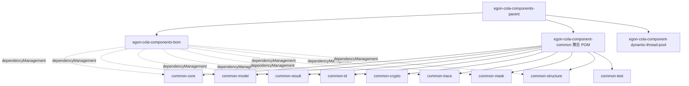

# egon-cola-component-common 企业级重构方案设计

> 本文档基于 `/Users/mario/Downloads/egon-cola-component-common-enterprise-restructure.md` 与当前 `Egon-COLA` 仓库现状整理，用于指导后续实施计划与分阶段改造。本文只定义目标架构、边界、迁移策略与验收标准，不直接包含逐步执行任务。

## 1. 目标

将当前单 Jar 形态的 `egon-cola-component-common` 改造为企业级基础语义组件族，使 common 从“通用工具集合”收敛为“稳定、低依赖、可按需引入的基础契约”。

改造完成后应达到以下目标：

1. `egon-cola-component-common` 本身变为 `pom` 聚合模块，不再作为业务依赖 Jar。
2. common 能力拆分为多个职责清晰的 Jar，业务方按需依赖。
3. 删除或迁移工具箱式 API，避免 common 继续膨胀为杂物包。
4. 结果、异常、分页、ID、Trace、脱敏、摘要签名、树结构等能力形成稳定边界。
5. Maven、BOM、测试、发布规则与现有 `egon-cola-components` 多组件工程保持一致。

## 2. 当前现状

当前仓库中 common 位于：

```text
egon-cola-components/egon-cola-component-common
```

当前形态：

```text
egon-cola-component-common
├── pom.xml                  # packaging=jar
└── src
    ├── main/java/top/egon/cola/component/common
    │   ├── exception
    │   ├── model
    │   ├── query
    │   ├── result
    │   ├── trace
    │   └── util
    └── test/java/top/egon/cola/component/common
```

当前问题：

1. 单 Jar 同时承载异常、模型、分页、结果、Trace、字符串、集合、日期、JSON、ID、加密、脱敏、枚举、树结构等能力。
2. `util` 包包含较多“工具箱式”入口，例如 `StringUtils`、`CollectionUtils`、`DateTimeUtils`、`JsonUtils`。
3. `Result` 同时承担外部接口返回与内部处理返回语义，边界不够清晰。
4. `BaseEntity`、`AuditableModel` 等实体基类容易向业务领域模型扩散。
5. common 的依赖包含 `slf4j-api`、`commons-lang3`、`commons-collections4`、`commons-codec`、`jackson-databind`、`jackson-datatype-jsr310`，不利于最小依赖治理。
6. 当前已有 `CommonComponentBoundaryTest` 检查 runtime framework 依赖与旧 COLA API 回流，说明项目已经开始关注边界测试，但还没有做到模块级隔离。

## 3. 设计原则

### 3.1 common 不是工具箱

common 不再沉淀“大家可能会用”的普通工具类，只保留具有企业基础语义和架构约束价值的能力。

保留方向：

```text
错误状态
异常体系
结果模型
分页模型
UUIDv7
Trace 上下文
脱敏规则
摘要 / HMAC / 编码
树结构构建
边界测试规则
```

不保留方向：

```text
StringUtils
CollectionUtils
DateTimeUtils
JsonUtils
BeanUtils
SpringUtils
RedisUtils
KafkaUtils
DubboUtils
```

### 3.2 优先直接使用成熟库

成熟通用能力不再通过 common 进行二次门面封装。

| 能力 | 推荐方式 |
|---|---|
| 字符串判断 | JDK / Apache Commons Lang |
| 集合判断 | JDK / Apache Commons Collections |
| JSON 序列化 | 业务方直接使用 Jackson |
| 日期时间 | JDK `java.time` |
| Base64 | JDK `Base64` |
| Hex | JDK `HexFormat` |

common 只有在需要统一企业语义、约束字段结构、隔离领域边界或稳定跨项目契约时才提供 API。

### 3.3 按需依赖，不提供 all-in-one

不设计 `common-all`，不设计 `common-starter`。

业务方根据能力选择 Jar：

```text
只需要结果模型 -> egon-cola-component-common-result
只需要基础查询模型 -> egon-cola-component-common-model
只需要 UUIDv7 -> egon-cola-component-common-id
只需要脱敏 -> egon-cola-component-common-mask
只需要摘要 / HMAC -> egon-cola-component-common-crypto
只需要 trace -> egon-cola-component-common-trace
```

### 3.4 外层 common 只聚合

`egon-cola-component-common` 改为聚合 POM：

```xml
<packaging>pom</packaging>
```

业务系统不再直接依赖：

```xml
<artifactId>egon-cola-component-common</artifactId>
```

业务系统只依赖具体能力 Jar。

## 4. 目标 Maven 结构

### 4.1 目录结构

```text
egon-cola-components
├── pom.xml
├── egon-cola-components-bom
│   └── pom.xml
├── egon-cola-component-common
│   ├── pom.xml
│   ├── README.md
│   ├── egon-cola-component-common-core
│   │   ├── pom.xml
│   │   └── src
│   ├── egon-cola-component-common-model
│   │   ├── pom.xml
│   │   └── src
│   ├── egon-cola-component-common-result
│   │   ├── pom.xml
│   │   └── src
│   ├── egon-cola-component-common-id
│   │   ├── pom.xml
│   │   └── src
│   ├── egon-cola-component-common-crypto
│   │   ├── pom.xml
│   │   └── src
│   ├── egon-cola-component-common-trace
│   │   ├── pom.xml
│   │   └── src
│   ├── egon-cola-component-common-mask
│   │   ├── pom.xml
│   │   └── src
│   ├── egon-cola-component-common-structure
│   │   ├── pom.xml
│   │   └── src
│   └── egon-cola-component-common-test
│       ├── pom.xml
│       └── src
└── egon-cola-component-dynamic-thread-pool
    └── ...
```

### 4.2 POM 职责

| POM | packaging | 职责 | 是否业务直接依赖 |
|---|---|---|---|
| `egon-cola-components/pom.xml` | `pom` | 组件父工程，统一 JDK、依赖版本、插件、发布配置 | 否 |
| `egon-cola-components-bom/pom.xml` | `pom` | 对业务方导出可依赖组件版本 | 作为 BOM import |
| `egon-cola-component-common/pom.xml` | `pom` | common 内部聚合，声明子模块 | 否 |
| `egon-cola-component-common-core/pom.xml` | `jar` | 错误状态、异常、枚举基础接口、marker | 是 |
| `egon-cola-component-common-model/pom.xml` | `jar` | 请求、查询、分页基础模型 | 是 |
| `egon-cola-component-common-result/pom.xml` | `jar` | 对外 DTO 与内部 ResultModel | 是 |
| `egon-cola-component-common-id/pom.xml` | `jar` | UUIDv7 与 ID 生成抽象 | 是 |
| `egon-cola-component-common-crypto/pom.xml` | `jar` | 摘要、HMAC、编码 | 是 |
| `egon-cola-component-common-trace/pom.xml` | `jar` | Trace 上下文 | 是 |
| `egon-cola-component-common-mask/pom.xml` | `jar` | 脱敏规则 | 是 |
| `egon-cola-component-common-structure/pom.xml` | `jar` | Tree 构建等数据结构能力 | 是 |
| `egon-cola-component-common-test/pom.xml` | `jar` | common 边界测试支撑 | 不默认推荐 |

### 4.3 Maven 聚合关系



根 `egon-cola-components/pom.xml` 只列一级模块：

```xml
<modules>
    <module>egon-cola-components-bom</module>
    <module>egon-cola-component-common</module>
    <module>egon-cola-component-dynamic-thread-pool</module>
    <module>egon-cola-component-dynamic-config-center</module>
</modules>
```

common 内部子模块由 `egon-cola-component-common/pom.xml` 聚合。

## 5. 模块职责设计

### 5.1 common-core

定位：最底层基础语义模块。

建议包名：

```text
top.egon.cola.component.common.core
```

职责：

```text
错误状态接口
通用错误状态枚举
异常基类
业务异常
系统异常
枚举基础接口
marker 接口
```

建议结构：

```text
top.egon.cola.component.common.core
├── code
│   ├── ErrorStatus
│   ├── CommonStatus
│   └── StatusCode
├── exception
│   ├── EgonException
│   ├── EgonBusinessException
│   ├── EgonSystemException
│   └── EgonIllegalStateException
├── enums
│   └── CodeEnum
└── marker
    └── EgonSerializable
```

依赖边界：

```text
允许：JDK
禁止：Spring、Jakarta、Servlet、JPA、MyBatis、Redis、MQ、Dubbo、Jackson、Hutool
```

迁移映射：

| 当前类 | 目标位置 | 处理方式 |
|---|---|---|
| `exception/ErrorCodes` | `core/code/CommonStatus` | 重命名并保留语义 |
| `exception/CommonException` | `core/exception/EgonException` | 重命名，作为异常基类 |
| `exception/BusinessException` | `core/exception/EgonBusinessException` | 重命名 |
| `exception/SystemException` | `core/exception/EgonSystemException` | 重命名 |
| `util/CodeEnum` | `core/enums/CodeEnum` | 移出 `util` |

### 5.2 common-model

定位：基础请求、查询、分页模型。

建议包名：

```text
top.egon.cola.component.common.model
```

职责：

```text
BaseRequest
OperatorContext
PageQuery
SortQuery
TimeRangeQuery
PageModel
PageSlice
PageMeta
```

建议结构：

```text
top.egon.cola.component.common.model
├── request
│   ├── BaseRequest
│   └── OperatorContext
├── query
│   ├── PageQuery
│   ├── SortQuery
│   └── TimeRangeQuery
└── page
    ├── PageModel
    ├── PageSlice
    └── PageMeta
```

不保留：

```text
BaseEntity
AuditableModel
ExtensibleModel
```

原因：实体基类会把 common 对象模型强加给领域模型、JPA Entity 或 MyBatis DO，属于边界污染。

迁移映射：

| 当前类 | 目标位置 | 处理方式 |
|---|---|---|
| `model/BaseRequest` | `model/request/BaseRequest` | 保留并收窄字段 |
| `model/BaseQuery` | `model/query/BaseQuery` 或删除 | 若仅服务分页则并入 `PageQuery` |
| `query/PageQuery` | `model/query/PageQuery` | 保留分页入参约束 |
| `model/BaseModel` | `model` 内审慎保留或删除 | 仅当不表达实体继承时保留 |
| `model/BaseEntity` | 删除 | 不迁移 |
| `model/AuditableModel` | 删除 | 不迁移 |

### 5.3 common-result

定位：统一结果模型模块。

建议包名：

```text
top.egon.cola.component.common.result
```

核心设计：区分 `ResultDto` 与 `ResultModel`。

| 类型 | 使用层 | 说明 |
|---|---|---|
| `ResultDto<T>` | facade / adapter | 对外接口返回结果 |
| `PageResultDto<T>` | facade / adapter | 对外分页返回结果 |
| `ErrorResultDto` | facade / adapter | 对外错误响应 |
| `ResultModel<T>` | application / domain service | 内部用例处理结果 |
| `PageResultModel<T>` | application | 内部分页处理结果 |
| `ErrorResultModel` | application / domain service | 内部错误描述 |

建议结构：

```text
top.egon.cola.component.common.result
├── dto
│   ├── ResultDto
│   ├── PageResultDto
│   └── ErrorResultDto
├── model
│   ├── ResultModel
│   ├── PageResultModel
│   └── ErrorResultModel
└── factory
    ├── ResultDtos
    └── ResultModels
```

`ResultDto<T>` 字段：

```text
boolean success
int code
String status
String message
T data
String traceId
Long timestamp
```

`ResultModel<T>` 字段：

```text
boolean success
int code
String status
String message
T data
```

关键约束：

1. `ResultDto` 是外部契约，可以携带 `traceId` 与 `timestamp`。
2. `ResultModel` 是内部处理结果，不携带 HTTP / Trace / 展示层语义。
3. Domain Entity、Value Object、Aggregate Root 不依赖 `ResultModel`。
4. `ResultDtos` 与 `ResultModels` 使用静态工厂，避免各层直接散落构造细节。

迁移映射：

| 当前类 | 目标位置 | 处理方式 |
|---|---|---|
| `result/Result` | `result/dto/ResultDto` + `result/model/ResultModel` | 拆分语义 |
| `result/PageResult` | `result/dto/PageResultDto` + `result/model/PageResultModel` | 拆分语义 |

### 5.4 common-id

定位：ID 生成基础模块。

建议包名：

```text
top.egon.cola.component.common.id
```

职责：

```text
UUIDv7 生成
UUID 字符串格式化
无横线 UUID 字符串
ID 生成接口抽象
```

建议底层依赖：

```xml
<dependency>
    <groupId>com.github.f4b6a3</groupId>
    <artifactId>uuid-creator</artifactId>
</dependency>
```

建议结构：

```text
top.egon.cola.component.common.id
├── generator
│   ├── IdGenerator
│   └── UuidV7Generator
└── uuid
    └── UuidV7
```

迁移映射：

| 当前类 | 目标位置 | 处理方式 |
|---|---|---|
| `util/IdUtils` | `id/uuid/UuidV7` 或 `id/generator/UuidV7Generator` | 从随机 UUID 升级为 UUIDv7 |

不做：

```text
雪花算法
数据库号段
Redis 号段
分布式 Worker 管理
```

### 5.5 common-crypto

定位：稳定摘要、签名、编码能力。

建议包名：

```text
top.egon.cola.component.common.crypto
```

职责：

```text
SHA-256 摘要
HMAC-SHA256 签名
Base64 编码 / 解码
Hex 编码 / 解码
```

建议结构：

```text
top.egon.cola.component.common.crypto
├── digest
│   └── Digests
├── hmac
│   └── Hmacs
└── codec
    ├── Base64s
    └── Hexes
```

迁移映射：

| 当前类 | 目标位置 | 处理方式 |
|---|---|---|
| `util/CryptoUtils` | `crypto/digest/Digests`、`crypto/hmac/Hmacs`、`crypto/codec/*` | 按能力拆分 |

不做：

```text
AES / RSA 密钥管理
证书管理
密码存储策略
国密算法
业务签名协议
```

### 5.6 common-trace

定位：Trace 上下文语义。

建议包名：

```text
top.egon.cola.component.common.trace
```

职责：

```text
TraceId 常量
TraceId 获取 / 设置 / 清理
Trace 上下文快照
```

建议结构：

```text
top.egon.cola.component.common.trace
├── TraceContext
└── TraceSnapshot
```

依赖边界：

1. 第一阶段可继续保留 `slf4j-api` 的 MDC 实现。
2. 不引入 Spring Web、Servlet Filter、WebFlux Filter 等运行时适配能力。
3. 如后续需要 Web 自动透传，应放到 starter-style 组件，不放在 common-trace。

迁移映射：

| 当前类 | 目标位置 | 处理方式 |
|---|---|---|
| `trace/TraceContext` | `trace/TraceContext` | 保留语义，独立成 Jar |

### 5.7 common-mask

定位：脱敏规则模块。

建议包名：

```text
top.egon.cola.component.common.mask
```

职责：

```text
手机号脱敏
邮箱脱敏
身份证脱敏
姓名脱敏
银行卡脱敏
通用保留首尾脱敏
```

建议结构：

```text
top.egon.cola.component.common.mask
├── Masking
└── MaskRule
```

迁移映射：

| 当前类 | 目标位置 | 处理方式 |
|---|---|---|
| `util/MaskingUtils` | `mask/Masking` | 移出 util，保留企业语义 |

不做：

```text
注解驱动脱敏
Jackson 序列化脱敏
日志拦截脱敏
数据库字段脱敏
```

这些运行时能力应放到后续 starter 或业务侧适配。

### 5.8 common-structure

定位：稳定数据结构辅助能力。

建议包名：

```text
top.egon.cola.component.common.structure
```

职责：

```text
树结构构建
父子层级组织
```

建议结构：

```text
top.egon.cola.component.common.structure
└── tree
    ├── TreeNode
    ├── TreeBuilder
    └── TreeOptions
```

迁移映射：

| 当前类 | 目标位置 | 处理方式 |
|---|---|---|
| `util/TreeUtils` | `structure/tree/TreeBuilder` | 从工具类改为明确结构能力 |

不做：

```text
图算法
复杂 DAG
表达式树
组织架构业务规则
```

### 5.9 common-test

定位：common 组件边界测试支撑模块。

建议包名：

```text
top.egon.cola.component.common.test
```

职责：

```text
模块依赖边界断言
禁止包名回流断言
禁止 runtime framework 依赖断言
测试 fixture
```

使用边界：

1. 不作为业务默认依赖。
2. 可由 common 内部子模块测试引入。
3. 可沉淀当前 `CommonComponentBoundaryTest` 中的可复用扫描规则。

## 6. 模块依赖方向

推荐依赖：

```text
common-result  -> common-core, common-trace
common-model   -> common-core
common-id      -> common-core
common-crypto  -> common-core
common-mask    -> common-core
common-structure -> common-core
common-test    -> common-core
```

禁止依赖：

```text
common-core -> 任何 common 子模块
common-model -> common-result
common-result -> common-model  # 除非明确需要 PageMeta 复用，优先避免
common-id -> common-result
common-crypto -> common-result
common-mask -> common-result
common-structure -> common-result
任意 common 子模块 -> Spring / Jakarta / Servlet / JPA / MyBatis / Redis / MQ / Dubbo
```

说明：

1. `common-core` 是最底层，不反向依赖任何模块。
2. `common-result` 可依赖 `common-trace`，因为外部 DTO 需要携带 `traceId`。
3. `common-model` 与 `common-result` 尽量隔离，避免分页入参与返回结果被强绑定。
4. 所有模块优先 JDK 实现；确需第三方库时必须由父 POM 或 BOM 统一治理版本。

## 7. BOM 导出策略

`egon-cola-components-bom` 应导出具体可依赖 Jar：

```xml
<dependency>
    <groupId>top.egon</groupId>
    <artifactId>egon-cola-component-common-core</artifactId>
    <version>${project.version}</version>
</dependency>
<dependency>
    <groupId>top.egon</groupId>
    <artifactId>egon-cola-component-common-model</artifactId>
    <version>${project.version}</version>
</dependency>
<dependency>
    <groupId>top.egon</groupId>
    <artifactId>egon-cola-component-common-result</artifactId>
    <version>${project.version}</version>
</dependency>
<dependency>
    <groupId>top.egon</groupId>
    <artifactId>egon-cola-component-common-id</artifactId>
    <version>${project.version}</version>
</dependency>
<dependency>
    <groupId>top.egon</groupId>
    <artifactId>egon-cola-component-common-crypto</artifactId>
    <version>${project.version}</version>
</dependency>
<dependency>
    <groupId>top.egon</groupId>
    <artifactId>egon-cola-component-common-trace</artifactId>
    <version>${project.version}</version>
</dependency>
<dependency>
    <groupId>top.egon</groupId>
    <artifactId>egon-cola-component-common-mask</artifactId>
    <version>${project.version}</version>
</dependency>
<dependency>
    <groupId>top.egon</groupId>
    <artifactId>egon-cola-component-common-structure</artifactId>
    <version>${project.version}</version>
</dependency>
```

不推荐导出 `egon-cola-component-common` 给业务直接依赖，因为它只是聚合 POM。

## 8. 兼容与迁移策略

### 8.1 推荐策略：主版本内直接破坏式清理

当前项目版本为 `5.2.0-SNAPSHOT`，common 仍处于组件建设期。推荐在本次重构中直接完成包结构和 API 语义清理，不保留旧 `util` 包的兼容门面。

优点：

1. 避免新的 common 一开始就背负旧工具箱入口。
2. 能通过编译错误促使业务方按能力模块显式迁移。
3. 更符合“common 不是工具箱”的目标。

风险：

1. 已依赖旧 `egon-cola-component-common` Jar 的下游需要同步改依赖和 import。
2. `Result`、`PageResult` 的类名变化会造成源代码不兼容。

缓解：

1. 在 `README.md` 中提供旧类到新类的迁移表。
2. 在 release notes 中说明 `egon-cola-component-common` 已从 Jar 改为聚合 POM。
3. 在实施前用 `rg "top.egon.cola.component.common"` 检查仓库内下游依赖。

### 8.2 不推荐策略：保留 deprecated 兼容 Jar

可以设计 `egon-cola-component-common-legacy` 或在旧包下保留 deprecated 类，但不推荐。

原因：

1. 会把旧工具箱语义继续暴露给业务方。
2. 迁移完成标准难以清晰判断。
3. BOM 容易同时导出新旧模块，增加依赖选择成本。

只有当已有外部用户强依赖旧 API 且必须平滑升级时，才考虑短期 legacy Jar，并且必须设定删除版本。

## 9. 设计模式考虑

本次重构主要是模块边界与基础语义拆分，不适合引入复杂设计模式。明确选择如下：

| 场景 | 选择 | 原因 |
|---|---|---|
| Result 创建 | Static Factory Method | `ResultDtos.success()`、`ResultModels.failure()` 能集中默认字段、错误状态与 trace 注入，避免调用方散落构造细节 |
| ID 生成 | Strategy | `IdGenerator` 抽象可以承载 UUIDv7 默认实现，并为后续业务自定义 ID 策略预留替换点 |
| Tree 构建 | Builder / Options | 树结构构建参数较多时使用 `TreeBuilder` + `TreeOptions` 能比工具方法更清晰 |
| 异常体系 | Template Method 不使用 | 当前异常只需要稳定字段与构造方式，不需要固定算法骨架 |
| 脱敏能力 | Strategy 暂不使用 | 初期规则有限，直接提供 `Masking` 静态方法更简单；如后续出现可配置规则链，再引入策略或责任链 |

原则：只在存在真实变化点时引入模式，不为了“看起来高级”增加接口、抽象类和深层调用链。

## 10. 分阶段落地方案

### 阶段一：Maven 聚合与目录重构

目标：先建立模块边界，不急于一次迁移所有行为。

动作：

1. 将 `egon-cola-component-common/pom.xml` 改为 `packaging=pom`。
2. 创建 common 子模块目录和 POM。
3. 在 `egon-cola-component-common/pom.xml` 中声明子模块。
4. 保持 `egon-cola-components/pom.xml` 只感知 `egon-cola-component-common` 一级模块。
5. 暂不改已有其他组件。

验收：

```bash
mvn -pl egon-cola-components/egon-cola-component-common -am test
```

### 阶段二：迁移 core、model、result

目标：先迁移最基础、影响最大的模型语义。

动作：

1. 将异常与错误状态迁移到 `common-core`。
2. 将请求、查询、分页入参迁移到 `common-model`。
3. 将 `Result` / `PageResult` 拆分为 DTO 与 Model。
4. 删除实体基类相关 API。
5. 建立 result 与 core / trace 的最小依赖关系。

验收：

```bash
mvn -pl egon-cola-components/egon-cola-component-common/egon-cola-component-common-core,egon-cola-components/egon-cola-component-common/egon-cola-component-common-model,egon-cola-components/egon-cola-component-common/egon-cola-component-common-result -am test
```

### 阶段三：迁移 id、crypto、trace、mask、structure

目标：将保留的企业基础能力从 `util` 包中移出。

动作：

1. `IdUtils` 迁移为 UUIDv7 能力。
2. `CryptoUtils` 按 digest / hmac / codec 拆分。
3. `TraceContext` 独立到 `common-trace`。
4. `MaskingUtils` 迁移为 `Masking`。
5. `TreeUtils` 迁移为 `TreeBuilder`。
6. 删除 `StringUtils`、`CollectionUtils`、`DateTimeUtils`、`JsonUtils`、`EnumUtils` 等工具箱入口。

验收：

```bash
mvn -pl egon-cola-components/egon-cola-component-common -am test
```

### 阶段四：更新 BOM 与文档

目标：让业务方按需引入新的 common 子模块。

动作：

1. 更新 `egon-cola-components-bom/pom.xml`，导出具体 common Jar。
2. 增加 `egon-cola-component-common/README.md`。
3. 在 README 中提供依赖示例、迁移映射、禁用清单。
4. 更新 `egon-cola-components-architecture.md` 中 common 的例外说明：common 不再是单 Jar 例外，而是纯基础组件聚合例外。

验收：

```bash
mvn -pl egon-cola-components/egon-cola-components-bom,egon-cola-components/egon-cola-component-common -am test
```

### 阶段五：全量验证

目标：验证整个组件工程与 archetype 合同没有被破坏。

建议命令：

```bash
mvn -pl egon-cola-components -am clean test
mvn clean integration-test
```

说明：Egon-COLA 的 archetype 合同以 `clean integration-test` 为准，最终合并前需要跑完整集成验证。

## 11. 企业级边界测试设计

每个 common 子模块都应有边界测试。

### 11.1 禁止 runtime framework 依赖

扫描 `src/main/java`，禁止出现：

```text
import org.springframework.
import jakarta.
import javax.servlet.
import org.redisson.
import redis.
import com.alibaba.cola.
```

### 11.2 禁止 util 包回流

禁止新增：

```text
top.egon.cola.component.common.util
```

禁止类名：

```text
StringUtils
CollectionUtils
DateTimeUtils
JsonUtils
BeanUtils
SpringUtils
RedisUtils
KafkaUtils
DubboUtils
```

### 11.3 禁止旧 COLA 风格 API 回流

继续禁止：

```text
Response
SingleResponse
MultiResponse
DTO
Command
Query
ClientObject
Assert
BizException
SysException
BaseException
```

### 11.4 模块依赖边界测试

建议用测试扫描 POM 或编译 classpath，至少覆盖：

1. `common-core` 不依赖任何 common 子模块。
2. `common-model` 不依赖 `common-result`。
3. `common-id`、`common-crypto`、`common-mask`、`common-structure` 不依赖 `common-result`。
4. 没有模块引入 Spring Boot Starter。

## 12. 不做清单

本次重构明确不做：

1. 不做 `common-all`。
2. 不做 `common-starter`。
3. 不做 Spring Boot 自动配置。
4. 不做 Web Trace Filter。
5. 不做 Redis / MQ / Dubbo / DB 相关工具。
6. 不做 JSON 全局封装。
7. 不做业务实体基类。
8. 不做注解驱动脱敏。
9. 不做复杂分布式 ID 服务。
10. 不保留工具箱式 `util` 包。

## 13. 风险与应对

| 风险 | 影响 | 应对 |
|---|---|---|
| 下游依赖旧 Jar | 编译失败 | 提供迁移映射，要求按需引入具体 Jar |
| `Result` 类名变化 | 接口层与测试需要调整 | 明确 `ResultDto` / `ResultModel` 使用层边界 |
| 删除实体基类 | 业务模型需要自持字段 | 在文档中说明 common 不定义实体形态 |
| UUIDv7 引入新依赖 | 依赖治理增加 | 在父 POM 统一版本，`common-id` 独占依赖 |
| Trace 依赖 MDC | 非 SLF4J 场景受限 | 第一阶段保留现状，后续如需抽象再单独设计 |
| Maven 模块路径变化 | 发布配置需要同步 | BOM 与 release 验证一起完成 |

## 14. 验收标准

改造完成后应满足：

1. `egon-cola-component-common/pom.xml` 为聚合 POM。
2. common 子模块均可独立 `mvn test`。
3. `egon-cola-components-bom` 导出具体 common Jar。
4. `top.egon.cola.component.common.util` 不再存在。
5. `StringUtils`、`CollectionUtils`、`DateTimeUtils`、`JsonUtils` 等普通工具入口不存在。
6. `BaseEntity`、`AuditableModel` 不存在。
7. `ResultDto` 与 `ResultModel` 分层清晰。
8. common 子模块不依赖 Spring、Jakarta、Servlet、JPA、MyBatis、Redis、MQ、Dubbo。
9. `mvn -pl egon-cola-components/egon-cola-component-common -am test` 通过。
10. 最终合并前 `mvn clean integration-test` 通过。

## 15. 后续实施建议

建议先基于本文档拆出一份执行计划，并按阶段提交：

1. 提交 Maven 聚合与空模块骨架。
2. 提交 core / model / result 迁移。
3. 提交 id / crypto / trace / mask / structure 迁移。
4. 提交 BOM 与 README 更新。
5. 提交边界测试与全量验证修复。

每个阶段都应保持可编译、可测试、可回滚，避免一次性大爆炸式提交。
